# Part 8 - Vulnerability, Exposure, Threat, Finding, Alert, Incident, and Risk

> **Audience:** Arti Thakur, moving from Microsoft 365 Support Escalation Engineering into a Zscaler Security Operations Technical Success Manager role.
>
> **Currency date:** 2026-08-24.
>
> **Scope and honesty:** Northstar Meridian Holdings, abbreviated NMH, and every NMH observation, event, finding, vulnerability, exposure, alert, detection, case, incident, score, metric, decision, and outcome are fictional. Arti's established production bridge is Microsoft support, OneDrive, SharePoint, networking, troubleshooting, analytics, mentoring, escalation, and approved AI work. Direct production operation of Zscaler, Security Operations, vulnerability, exposure, scanner, Endpoint Detection and Response, Security Information and Event Management, incident-response, or formal risk products is not established.
>
> **Currency caveat:** Standards, scoring specifications, catalogs, vendor schemas, and product terminology evolve. Source anchors were checked for this guide on 2026-08-24. Verify current definitions, versions, field semantics, product documentation, licenses, and customer policy before operational use.

## Section goal

Security teams make poor decisions when they use one word for several different things. A software weakness is not the same as exposure. An observation is not automatically an alert. An alert is not automatically an incident. A technical severity score is not business risk. A closed ticket is not proof that a control worked.

Think of a hospital. A thermometer reading is an observation. The timestamped reading is an event record. A rule may alert because the temperature exceeds a threshold. A clinician evaluates it in a case with symptoms and history. A diagnosis is a reasoned conclusion, not the raw reading. Severity describes how bad the condition could be; confidence describes how strongly evidence supports the conclusion; priority describes what should be handled first given urgency, impact, and capacity. Security operations needs the same discipline.

By the end, Arti should be able to:

| Learning outcome | What mastery looks like |
|---|---|
| Define core terms | Explain vulnerability, exposure, threat, risk, finding, observation, event, alert, detection, case, incident, problem, and defect |
| Describe adversary evidence | Distinguish Indicator of Compromise, Indicator of Attack, and tactics, techniques, and procedures |
| Use identifiers carefully | Explain Common Vulnerabilities and Exposures, Common Weakness Enumeration, Common Vulnerability Scoring System, Exploit Prediction Scoring System, and Known Exploited Vulnerabilities at overview level |
| Separate decision dimensions | Keep severity, confidence, and priority independent |
| Reason about errors | Explain false positives, false negatives, true positives, and true negatives relative to a defined test and ground truth |
| Govern gaps | Distinguish control gap, exception, accepted risk, compensating control, and defect |
| Transform evidence | Move one technical observation through triage to an executive risk statement without inventing facts |
| Handle ambiguity | Ask discriminating questions when labels conflict or evidence is missing |
| Preserve honesty | Use production, lab, conceptual, not-yet-used, and fictional labels consistently |

## JD Mapping

**JD** means job description. The target Technical Success Manager, abbreviated **TSM**, must translate across customer executives, security leaders, operators, Support, Product, and Engineering. Precise terms prevent escalation noise and make product value measurable.

| JD expectation | Part 8 capability | Honest Arti bridge |
|---|---|---|
| Identify security risk | Convert technical conditions into bounded risk scenarios | Lab: fictional NMH transformation; production: impact and evidence reasoning |
| Analyze complex environments | Reconcile records with different meanings and confidence | Production: cross-source Microsoft troubleshooting and analytics |
| Explain metrics simply | Separate severity, probability signals, business priority, confidence, and outcome | Production analytics bridge; conceptual security application |
| Deliver mitigation | Tie finding and control gap to owner, action, validation, and residual risk | Production fix-validation method; lab risk workflow |
| Resolve escalations | Distinguish event, alert, case, incident, problem, and defect ownership | Production support and engineering escalation experience |
| Partner with Product | Package reproducible defect evidence without calling every issue a defect | Established production bridge |
| Communicate with executives | State objective, scenario, consequence, evidence, uncertainty, action, and decision | Conceptual security framing practiced with NMH |

## Candidate honesty note

Arti can discuss production support cases, telemetry, errors, defects, incidents in the service-management sense, customer impact, root-cause work, and Engineering collaboration where supported by her record. She should clarify the context of the word "incident." A business-critical Microsoft support incident is not automatically a confirmed cybersecurity incident.

| Label | Meaning in Part 8 | Safe wording | Unsafe wording |
|---|---|---|---|
| Production | Established Microsoft support, networking, analytics, escalation, mentoring, training, and approved AI facts | "I turned logs and customer impact into a reproducible Engineering escalation." | "I ran a SOC incident queue" |
| Lab | Repeatable exercise with synthetic records | "I transformed a fictional NMH observation into a risk statement." | "I investigated a manufacturer breach" |
| Conceptual | Terminology and method learned from authoritative sources | "I understand the relationship among CVE, CWE, CVSS, EPSS, and KEV." | "I own vulnerability prioritization in production" |
| Not-yet-used | Product, workflow, or role not directly operated | "I have not operated Zscaler UVM or a SIEM in production." | "I tuned Zscaler detections" |
| Fictional | Every NMH record and outcome | "In the fictional exercise..." | "At my NMH customer..." |

## Acronyms and essential terms

| Acronym or term | Expanded form | Plain meaning | Memory hook |
|---|---|---|---|
| CVE | Common Vulnerabilities and Exposures | A program and identifier system for publicly disclosed cybersecurity vulnerabilities | Which public vulnerability record? |
| CWE | Common Weakness Enumeration | A community-developed list and classification of software and hardware weakness types | What kind of weakness caused it? |
| CVSS | Common Vulnerability Scoring System | Open specification for describing and scoring technical severity characteristics | How technically severe under stated metrics? |
| EPSS | Exploit Prediction Scoring System | Data-driven estimate of probability that a published vulnerability will be exploited in the wild in the next 30 days | How likely is observed exploitation soon, by the model? |
| KEV | Known Exploited Vulnerabilities | CISA catalog of vulnerabilities known to have been exploited in the wild and meeting catalog criteria | Known exploitation changes urgency |
| IOC | Indicator of Compromise | Observable artifact associated with possible compromise | Artifact clue |
| IOA | Indicator of Attack | Observable behavior associated with possible malicious action or progression | Behavior clue |
| TTP | Tactics, Techniques, and Procedures | Adversary goals, methods, and specific implementations | Why, how, exact use |
| SOC | Security Operations Center | People and processes that monitor, investigate, and respond to security activity | Security watch floor |
| SIEM | Security Information and Event Management | Platform category that centralizes and analyzes security-relevant events | Event control room |
| EDR | Endpoint Detection and Response | Endpoint telemetry, detection, investigation, and response capability | Endpoint recorder and response |
| SLA | Service Level Agreement | Defined service commitment and measurement rule | A promise with a clock and scope |
| SLO | Service Level Objective | Internal or customer-facing target for service performance | Target, not necessarily contract |
| NMH | Northstar Meridian Holdings | Fictional enterprise used for continuity | Practice only |
| UVM | Unified Vulnerability Management | Zscaler product positioning for contextual vulnerability prioritization and workflow | Product study, not production experience |

## The vocabulary pipeline

The same underlying reality can create several records for different purposes. A source emits an event. An analyst notes an observation. A rule creates an alert. An investigation may combine alerts into a case. Evidence may support an incident declaration. A vulnerability or control gap may become a finding. The business consequence becomes a risk scenario. A recurring root cause may become a problem record. A reproducible product flaw may become a defect.

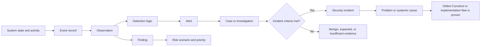

The diagram is a common workflow, not a universal mandatory sequence. A person can report an incident before an automated alert exists. A vulnerability scan can create a finding without an event indicating exploitation. A product defect can be discovered during testing without a security incident.

## Exact core-term comparison matrix

| Term | Precise working meaning | Typical object | Does it assert harm occurred? | Main owner or user | Required next question |
|---|---|---|---:|---|---|
| Vulnerability | Weakness that a threat source could exploit or trigger | Software, hardware, configuration, process, control | No | Engineering, vulnerability management, owner | Is it applicable, exposed, exploitable, and consequential here? |
| Exposure | Condition or path that makes an asset subject to potential harm | Reachability, identity, permission, trust, data placement | No | Asset, identity, network, cloud, exposure owner | Which threat source and path can interact with it? |
| Threat | Potential circumstance or event capable of adverse effect | Actor behavior, accident, failure, disaster | No | Risk, intelligence, security leadership | Which event is plausible for which asset and period? |
| Risk | Effect of uncertainty on objectives, often considered through likelihood and impact | Bounded scenario and decision | No; it concerns possible effect | Business or risk owner | What treatment and residual-risk decision are needed? |
| Finding | Evaluated condition that deviates from expectation, requirement, or desired state | Vulnerability, control gap, configuration, process | No | Assessor, owner, assurance, security | What evidence, scope, severity, owner, and remediation apply? |
| Observation | A fact or measurement noticed in evidence | "Process X connected to Y at time Z" | No | Analyst, engineer, operator | What does the source mean, and which hypotheses fit? |
| Event | A recorded occurrence or state change | Authentication, process start, file access, policy change | No | Source system, telemetry pipeline, analyst | Is it expected, complete, and correctly attributed? |
| Alert | Notification that defined criteria were met | Rule output, product signal, threshold breach | No | SOC, operations, monitoring | Is the logic valid and contextually relevant? |
| Detection | Process or result of identifying activity or condition of interest | Analytic, signature, behavioral model, human discovery | Not by itself | Detection engineer, analyst | What exactly was detected, with what coverage and accuracy? |
| Case | Container organizing related evidence, tasks, owners, and decisions | Alerts, entities, timeline, notes | No | Investigator, Support, SOC | What question is the case resolving? |
| Incident | Event or set of events judged to meet defined adverse security criteria | Confirmed or managed security occurrence | Usually asserts or strongly manages suspected adverse effect under policy | Incident commander and accountable owners | What is scope, impact, containment, evidence, and authority? |
| Problem | Underlying cause or pattern responsible for one or more incidents or failures | Recurring process, architecture, product, dependency issue | Not necessarily security harm | Problem management, Engineering, service owner | What systemic change prevents recurrence? |
| Defect | Reproducible flaw in a product, code, design, or documented behavior | Bug record with expected and actual behavior | No | Product or Engineering owner | Can it be reproduced, scoped, fixed, and validated? |

### Plain-English deep-dive 1 - Labels describe decisions, not just objects

A failed sign-in can be an event. "143 failed sign-ins for one supplier account" is an observation. A rule may create an alert. An analyst opens a case. Evidence may show the supplier forgot a password, in which case the case closes without a security incident. Different evidence may show automated guessing followed by unauthorized success, leading to an incident.

The raw sign-ins did not change. The labels changed because investigation answered different questions. That is why a dashboard cannot simply count alerts as incidents. It is also why the term "false positive" must name the test: the event was real, but the malicious interpretation may have been false.

Arti's production support background offers a strong bridge. A client error event may generate a monitoring alert and a Support case. Repeated cases may reveal a service problem. Reproducible unexpected product behavior may become an Engineering defect. Security workflows add adversary, authorization, evidence preservation, containment, and risk ownership, but the evidence discipline is familiar.

## Vulnerability versus exposure versus threat versus risk

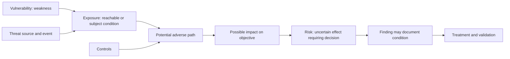

| Scenario statement | Correct primary term | Why | What it is not |
|---|---|---|---|
| A library contains an out-of-bounds write weakness | Vulnerability or weakness | Technical flaw exists | Not proof of reachability or compromise |
| The affected service is reachable from the internet | Exposure | Relevant interaction path exists | Not proof exploit succeeds |
| A criminal group is exploiting similar systems | Threat context | Actor behavior is relevant | Not proof this organization is compromised |
| The service supports critical supplier ordering and controls are untested | Risk context | Potential impact and uncertainty affect objectives | Not reducible to the vulnerability score |
| An assessor records that required authentication is absent | Finding | Evaluated deviation has evidence | Not necessarily an incident |

A finding is a record created by assessment or analysis. The underlying condition can be a vulnerability, exposure, control gap, process issue, or compliance deviation. Two tools can create two findings about one condition. Conversely, one finding can contain several affected assets. Counts require entity and scope logic.

## Observation, event, alert, detection, and case

An **event** usually originates from a system: a login, process start, network connection, configuration change, file operation, or error. An **observation** is an analyst's bounded statement about evidence. A **detection** is the act or result of identifying a condition or behavior of interest. An **alert** is a notification emitted when criteria are met. A **case** organizes the investigation.

```mermaid
sequenceDiagram
    participant Source as Identity source
    participant Pipeline as Event pipeline
    participant Analytic as Detection analytic
    participant Queue as Alert queue
    participant Analyst
    participant Case as Case record
    Source->>Pipeline: Emit timestamped sign-in events
    Pipeline->>Analytic: Normalize entity and fields
    Analytic->>Queue: Criteria met; create alert
    Queue->>Analyst: Prioritized notification
    Analyst->>Case: Add observations, entities, and hypotheses
    Analyst->>Source: Request corroborating evidence
    Source-->>Analyst: Sign-in, policy, and session context
    Analyst->>Case: Record conclusion and action
```

| Item | Example | Truth represented | Quality question |
|---|---|---|---|
| Event | `supplier-17` failed authentication at a timestamp | Source says occurrence was recorded | Is time, identity, outcome, and source semantics reliable? |
| Observation | 143 failures occurred across three networks in 12 minutes | Analyst aggregation of events | Was query scope correct and were duplicates handled? |
| Detection logic | More than defined failures plus unusual network diversity | Encoded hypothesis or condition | Is threshold appropriate for this population? |
| Alert | "Possible password guessing for supplier-17" | Rule criteria were satisfied | Does title overstate what logic proves? |
| Case | Alert plus identity, portal, device, owner, and timeline | Investigation container | Are related records actually the same entity and episode? |
| Conclusion | Authorized testing, user error, insufficient evidence, or malicious activity | Human or automated decision under policy | What evidence and authority support it? |

### Alert is not detection, and detection is not prevention

People sometimes say "the tool detected it" when the tool merely matched an indicator, emitted an event, or blocked a request. The exact behavior matters:

| Capability claim | What must be demonstrated | Common overclaim |
|---|---|---|
| Visibility | Relevant source produced usable data | "We detect everything on endpoints" |
| Detection | Analytic identified defined behavior with known logic | "A log field equals detection" |
| Alerting | Notification reached intended queue and owner | "The rule exists, so analysts know" |
| Prevention | Action stopped or changed the harmful behavior | "Alert means blocked" |
| Response | Authorized action contained or remediated the condition | "Automated ticket means response" |
| Validation | Test showed expected outcome under representative conditions | "Vendor says supported" |

## Incident, problem, and defect

An **incident** is defined by organizational policy. In cybersecurity, it generally refers to an occurrence that actually or imminently jeopardizes confidentiality, integrity, availability, or another security objective, or violates security policy. Some organizations open an incident while facts remain under investigation because response coordination cannot wait. State the local threshold.

A **problem** is an underlying cause or recurring pattern. A **defect** is a reproducible product or implementation flaw. One incident may expose several problems. One defect may contribute to many incidents. Some incidents involve no product defect, such as valid credentials abused within designed functionality.

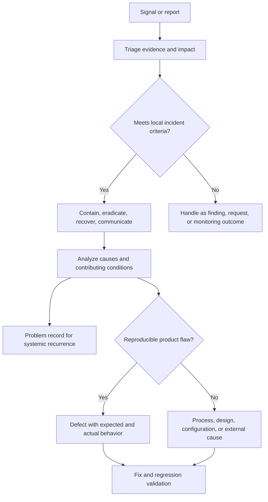

| Dimension | Incident | Problem | Defect |
|---|---|---|---|
| Primary focus | Restore safety and limit current harm | Remove systemic cause or recurrence | Correct flawed product behavior |
| Trigger | Confirmed or suspected adverse event under policy | Pattern, major incident, trend, or analysis | Reproducible expected-versus-actual mismatch |
| Time horizon | Immediate to short-term response, then recovery | Medium to long-term improvement | Product lifecycle and release |
| Owner | Incident commander and service/security owners | Problem manager and accountable system owners | Engineering or Product owner |
| Evidence | Timeline, entities, impact, containment, scope | Recurrence, causal model, contributing factors | Reproduction, logs, build, environment, expected behavior |
| Closure | Contained, recovered, accepted, and reviewed under criteria | Corrective actions validated or accepted | Fix validated, documented, released, or dispositioned |
| Common error | Calling every alert an incident | Calling symptoms root cause | Calling configuration or expectation gap a product bug |

## IOC, IOA, and TTP

An **Indicator of Compromise**, abbreviated **IOC**, is an observable artifact that may be associated with compromise, such as a file hash, domain, address, registry value, or account artifact. An **Indicator of Attack**, abbreviated **IOA**, emphasizes behavior suggesting malicious action or progression. **TTP** describes the adversary's goal, general method, and specific implementation.

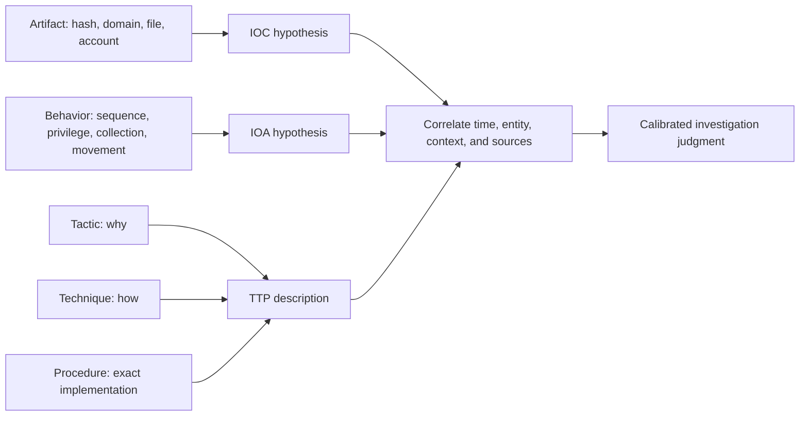

| Concept | Strength | Weakness | Example caution |
|---|---|---|---|
| IOC | Fast matching and retrospective search | Can be stale, shared, changed, or context-free | Shared cloud address does not identify an actor |
| IOA | Focuses on behavior and may generalize across tools | Legitimate administration can look similar | Process sequence needs identity and authorization context |
| TTP | Shared vocabulary for behavior and threat models | Broad mapping can overstate specificity | Technique match does not prove procedure or attribution |
| Correlation | Combines independent evidence | Bad entity resolution can create a false story | Two dashboards may use the same underlying source |

### Plain-English deep-dive 2 - An indicator is a clue, not a verdict

A vehicle seen near a crime scene is a clue. It may belong to the offender, a resident, a delivery driver, or an emergency responder. The license plate becomes useful with time, location, ownership, route, witnesses, and other evidence. An IOC works similarly.

Indicators have lifetimes. An internet address can be reassigned. A domain can be sinkholed. A file hash can be unique to one build while behavior remains. An adversary can use common cloud services that legitimate users also use. Defenders need context and should record source, confidence, first and last seen, scope, and expiration or review.

## CVE and CWE overview

The **CVE Program** assigns standardized identifiers and records for publicly disclosed cybersecurity vulnerabilities. A CVE identifier helps different tools and people refer to the same public vulnerability. It is not a score, proof of exploitation, patch instruction, or local risk decision.

The **CWE** list classifies weakness types, such as categories of improper input handling, authorization, memory safety, or resource management. A CWE can explain the underlying weakness pattern across many products. One CVE may relate to one or more CWEs, and a weakness can exist without a CVE.

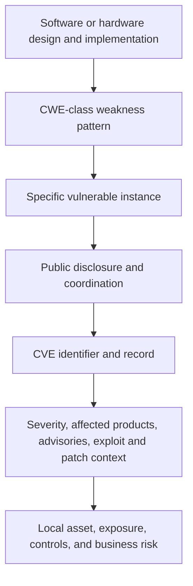

| Question | CVE | CWE |
|---|---|---|
| What is it? | Identifier and public vulnerability record | Weakness taxonomy and knowledge base |
| Primary question | Which publicly disclosed vulnerability? | What class of weakness contributed? |
| Scope | Specific vulnerability record across named affected products or conditions | General software or hardware weakness pattern |
| Does it score severity? | No; other sources may attach CVSS data | No |
| Does it prove local presence? | No | No |
| Does it prove exploitation? | No | No |
| Main use | Coordination, inventory, advisories, remediation reference | Prevention, design review, education, root-cause classification |
| Example relationship | A CVE record can cite a CWE | One CWE can relate to many CVEs |

## CVSS, EPSS, and KEV overview

These are different signals:

- **CVSS** describes technical severity characteristics under an open scoring specification. Current specifications and vector rules must be checked with FIRST, the Forum of Incident Response and Security Teams.
- **EPSS** estimates the probability that a published CVE will be exploited in the wild in the next 30 days, using a data-driven model. It is a probability estimate, not impact or local risk.
- **KEV** is CISA's catalog of vulnerabilities known to have been exploited in the wild and meeting catalog criteria. It is categorical evidence of known exploitation, not a complete list of all exploited vulnerabilities.

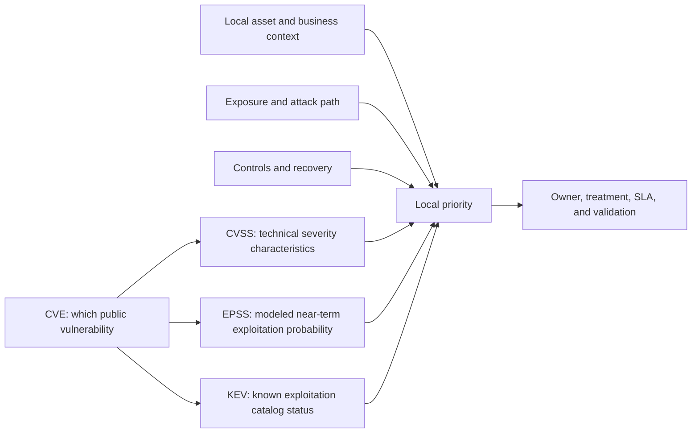

### Exact identifier-and-score comparison matrix

| Signal | Maintainer | Output | Main question | Does not answer | Currency behavior |
|---|---|---|---|---|---|
| CVE | CVE Program with numbering and program partners | Identifier and record | Which public vulnerability are we discussing? | Local presence, severity, exploitation, risk | Record can be updated; affected-product details often require advisories |
| CWE | MITRE community program | Weakness identifier and taxonomy | What weakness type contributed? | Whether a particular deployed asset is vulnerable | Taxonomy evolves |
| CVSS | FIRST | Vector and numeric/qualitative severity representation under a version | How severe are technical characteristics under stated metrics? | Threat probability, local business impact, asset exposure | Specification version and metric values matter |
| EPSS | FIRST | Probability from 0 to 1 plus percentile for a CVE | What is the model's estimated chance of exploitation in the next 30 days? | Local impact, certainty, individual actor intent | Scores can change daily with model data |
| KEV | CISA | Catalog inclusion plus operational fields | Is exploitation in the wild known under catalog criteria? | Complete global exploitation set or local compromise | Catalog is updated as evidence qualifies |
| Vendor advisory | Product vendor | Affected versions, conditions, fixes, mitigations | What does the vendor say about its product? | Independent proof or complete local risk | Advisory can change after investigation |
| Local finding | Customer tool or analyst | Asset-condition record | Where does evidence indicate the condition exists? | Public truth without validation | Changes with inventory, scan, configuration, and lifecycle |

### Plain-English deep-dive 3 - Severity, exploitation probability, and risk are different axes

Suppose a flaw can produce severe technical impact, so CVSS is high. If exploitation requires a rare configuration and no reachable asset uses that feature, local priority may be lower, though uncertainty remains. Another flaw may have moderate technical severity but be widely exploited, internet reachable, and present on a critical identity service. It may deserve faster action.

CVSS does not fail because it is not a risk score; it answers a narrower question. EPSS does not fail because it does not model business impact; it estimates a defined exploitation probability. KEV does not fail because it is not exhaustive; it catalogs vulnerabilities meeting its criteria. The analyst fails when these signals are used as interchangeable truth.

Part 78 will cover vulnerability scoring and prioritization in depth. Here the interview-ready rule is: identify with CVE, classify weakness with CWE, describe technical severity with CVSS, add probability signal from EPSS, add known exploitation evidence from KEV, then apply local asset, exposure, controls, business impact, evidence confidence, and operational feasibility.

## Severity, confidence, and priority

**Severity** describes magnitude if the condition or event produces its modeled consequence. **Confidence** describes how strongly evidence supports a finding, interpretation, or conclusion. **Priority** orders work using severity plus urgency, exposure, threat, business context, deadlines, dependencies, and capacity.

| Dimension | Core question | Example scale | Can be high while others are low? | Owner decision |
|---|---|---|---:|---|
| Severity | How bad could or did the consequence become? | Low, medium, high, critical | Yes | Technical and business assessment |
| Confidence | How strong, complete, and independent is the evidence? | Low, medium, high | Yes | Analyst or assessor, with review |
| Priority | What should be handled first? | P1 through P4 or ranked backlog | Yes | Authorized operational governance |
| Urgency | How quickly does the decision window close? | Immediate, hours, days, planned | Yes | Incident or service owner |
| Risk | What uncertain effect on objectives needs treatment? | Qualitative or defined model | Yes | Risk and business owner |

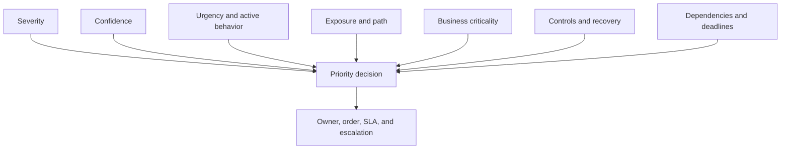

Examples:

| Situation | Severity | Confidence | Priority | Reason |
|---|---|---|---|---|
| Critical-impact flaw on decommissioned isolated lab image | High technical severity | High presence confidence | Low to planned after lifecycle validation | No current consequential path, but verify removal |
| Moderate-impact identity abuse actively affecting executives | Moderate technical severity | High activity confidence | Immediate | Active threat, valuable identities, closing decision window |
| Possible plant compromise from one ambiguous network event | Potentially very high | Low | High investigation priority, not confirmed-incident certainty | Consequence warrants rapid evidence collection |
| Confirmed low-impact test alert | Low | High | Close and tune according to process | Known authorized behavior |

## False positives, false negatives, and ground truth

A classification requires a test and an actual state:

| | Actual positive | Actual negative |
|---|---|---|
| Test says positive | True positive | False positive |
| Test says negative | False negative | True negative |

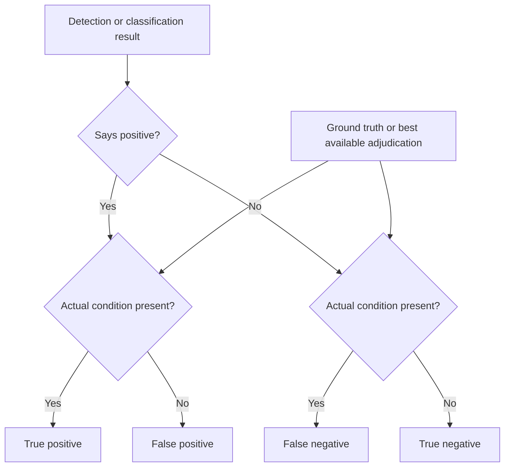

The phrase "false positive" is incomplete without naming the claim. The underlying event may be real while the alert's malicious label is false. A vulnerability scanner may correctly see a version but incorrectly infer vulnerable configuration. An analyst may correctly classify the alert as benign for one account while a broader campaign remains.

| Metric | Formula | What it helps assess | Caveat |
|---|---|---|---|
| Precision | True positives divided by all predicted positives | How often positive outputs are relevant under adjudication | Depends on sampled alerts and ground truth quality |
| Recall or sensitivity | True positives divided by actual positives | How much known positive activity is found | Actual positives are often incompletely known |
| False-positive rate | False positives divided by actual negatives | How often negatives are incorrectly flagged | Not the same as percent of alerts that are false |
| False-negative rate | False negatives divided by actual positives | How often positives are missed | Hard to measure without independent testing |
| Specificity | True negatives divided by actual negatives | How well negatives are recognized | Large benign populations can hide poor precision |

### Base-rate effect

When truly malicious events are rare, even a detector with good sensitivity and specificity can create many false alerts. This is the **base-rate effect**. Context, staged analytics, entity risk, and workflow design help, but tuning for fewer alerts can increase false negatives. Metrics must include both missed behavior and analyst workload.

## Control gaps, exceptions, and compensating controls

A **control gap** exists when required or intended risk reduction is absent, incomplete, incorrectly scoped, ineffective, or unsupported by evidence. An **exception** is an authorized, documented, time-bound deviation from a requirement. A **compensating control** is an alternate safeguard that reduces relevant risk when the primary control is infeasible.

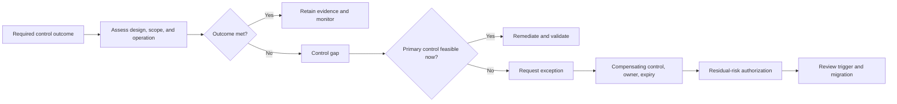

| Term | What it means | Minimum evidence | What it is not |
|---|---|---|---|
| Control gap | Required outcome is missing or ineffective | Requirement, scope, observed state, consequence | Automatically accepted risk |
| Exception | Authorized temporary or scoped deviation | Authority, reason, scope, residual risk, expiry | Silent noncompliance |
| Compensating control | Alternate measure addresses relevant path or impact | Design, mapping to risk, effectiveness test | Any unrelated control listed nearby |
| Risk acceptance | Authorized decision to retain residual risk | Owner authority, rationale, conditions, review | A closed ticket or unavailable budget |
| Remediation | Change intended to remove or reduce condition | Owner, implementation, validation criteria | Ticket status alone |
| Mitigation | Action that reduces likelihood or impact | Evidence of changed path or consequence | Necessarily complete elimination |

## Finding lifecycle


| Lifecycle stage | Required decision | Evidence artifact | Common failure |
|---|---|---|---|
| Discover | Is this record syntactically and semantically usable? | Source, timestamp, raw record | Treating tool output as verified fact |
| Validate | Does condition apply? | Version, configuration, behavior, advisory | Relying only on banner or stale inventory |
| Scope | Which unique assets and owners are affected? | Entity resolution and ownership | Double-counting duplicate tool records |
| Classify | What kind of condition is it? | Term and requirement mapping | Calling every finding a vulnerability |
| Rate | What are severity, confidence, priority, and risk context? | Rationale and model version | One score controls every decision |
| Route | Who can change and authorize? | Owner and action record | Assigning to security when application owner must act |
| Track | Are deadlines, blockers, and exceptions governed? | SLA, dependency, exception | Aging without escalation |
| Verify | Did the condition and path change? | Rescan, config, access, control test | Closing on deployment statement |
| Close | What residual risk remains? | Closure evidence and owner acceptance | Deleting history and recurrence trigger |

## From one technical observation to executive risk

This end-to-end transformation uses synthetic NMH data. It is not a real incident or Zscaler workflow.

### Stage 1 - Raw technical observation

> At 2026-08-19 02:14 UTC, the fictional identity source recorded 143 failed sign-ins for supplier account `nmh-supplier-17` from three network providers over 12 minutes, followed by one successful portal sign-in. The successful session then requested metadata for 2,840 purchase-order records. Source health was green for the period. Device identity was unavailable.

This statement reports what the sources say. It does not use the words attack, compromise, exfiltration, or incident.

### Stage 2 - Event and alert records

| Record | Content | Assertion strength |
|---|---|---|
| Events | Individual failed and successful sign-ins plus portal requests | Timestamped source-reported occurrences |
| Detection logic | Failure count, network diversity, subsequent success, and unusual enumeration | Encoded behavior hypothesis |
| Alert | "Possible supplier credential attack followed by data enumeration" | Criteria met; maliciousness not yet confirmed |
| Initial severity | High potential consequence | Potential magnitude, not incident conclusion |
| Initial confidence | Medium | Correlated sequence exists; device, user intent, and authorization unknown |

```mermaid
sequenceDiagram
    participant Identity
    participant Portal
    participant Analytic
    participant Analyst
    participant Owner as Supplier owner
    Identity->>Analytic: 143 failed sign-ins, then one success
    Portal->>Analytic: 2,840 metadata requests
    Analytic->>Analyst: Alert with medium confidence
    Analyst->>Identity: Validate policy, session, source, and source health
    Analyst->>Portal: Validate records accessed and baseline
    Analyst->>Owner: Confirm supplier activity and business purpose
    Owner-->>Analyst: No approved bulk activity; user unreachable
    Analyst->>Analyst: Raise confidence, preserve alternatives, declare per policy
```

### Stage 3 - Triage questions

| Question | Fictional evidence | Effect on hypothesis |
|---|---|---|
| Is the account active and correctly resolved? | Active supplier account, sponsor current | Supports relevant identity; does not prove actor |
| Was password-only authentication allowed? | Approved exception applies | Increases plausible credential-abuse path |
| Was the successful sign-in policy-evaluated as expected? | Policy record confirms exception | Removes a logging-error hypothesis |
| Is enumeration normal? | Median supplier session requests 28 records; approved migration absent | Increases anomaly significance |
| Did content leave the portal? | Metadata requests proven; document payload transfer not yet established | Limits consequence statement |
| Did owner authorize activity? | Sponsor reports no approved bulk work; supplier user unreachable | Raises concern but is not final identity proof |
| Are independent sources healthy? | Identity and portal sources complete for period | Raises confidence in sequence |
| Are other accounts affected? | Four related suppliers show failures but no success | Expands campaign hypothesis, not confirmed scope |

### Stage 4 - Case and incident decision

The fictional case contains the alert, events, identity and portal evidence, sponsor statement, timeline, hypotheses, actions, and decision record. Under NMH's fictional policy, unauthorized successful authentication to a production supplier account with access to restricted order data meets incident criteria even before payload transfer is fully determined.

The incident statement is bounded:

> NMH is investigating confirmed unauthorized use of one supplier portal account between 02:14 and 02:31 UTC. Available evidence shows successful authentication and purchase-order metadata enumeration. Access to document content, data removal, payment modification, and additional compromised accounts are not established. The account session is revoked, the identity is disabled pending supplier validation, relevant logs are preserved, and related supplier activity is being reviewed.

### Stage 5 - Finding and control gap

| Item | Classification | Evidence | Owner |
|---|---|---|---|
| Password-only supplier exception | Control gap and exposure | Effective policy and identity population | IAM and supplier-program owners |
| Unusual enumeration alert | Detection with validated case relevance | Logic, events, analyst adjudication | SOC detection owner |
| Missing device identity | Telemetry and assurance gap | Successful event has no trusted device context | Portal and identity architecture owners |
| Broad metadata access | Authorization design finding | Role permits all regional order metadata | Portal product owner |
| Incident | Unauthorized account use under fictional policy | Correlated sources and owner validation | Incident commander |

### Stage 6 - Executive risk statement

> **Decision statement:** A password-only exception for 180 supplier identities creates a credible path for stolen credentials to reach restricted purchase-order information. One fictional account has confirmed unauthorized use; current evidence proves metadata enumeration but not document download or payment change. The immediate incident is contained for that identity, but residual risk remains across the exception population. NMH should approve a 30-day phased stronger-authentication rollout, restrict supplier roles to required regions, and require a monitored, time-bound exception for incompatible suppliers. Identity and portal owners will validate representative sign-ins, effective authorization, session revocation, and alert coverage. The CISO is asked to approve the treatment priority and exception authority; exact financial loss is not estimated from current evidence.

This executive statement includes objective, cause, path, confirmed fact, unknowns, scope, control action, validation, residual risk, and decision. It removes raw event noise but preserves uncertainty.

```mermaid
flowchart LR
    OBS[Observation: failures, success, enumeration] --> HYP[Hypothesis: credential abuse]
    HYP --> CORR[Correlate identity, portal, owner, and baseline]
    CORR --> CASE[Case: timeline, entities, alternatives, actions]
    CASE --> INC[Incident: unauthorized account use confirmed]
    INC --> GAP[Control gap: password-only exception]
    GAP --> RISK[Risk: population and business consequence]
    RISK --> EXEC[Executive decision: treatment, authority, validation]
```

### Plain-English deep-dive 4 - Executive compression must not erase uncertainty

Executives do not need 143 raw sign-in rows, but they do need to know what is confirmed, what is possible, what is unknown, what action is underway, and which decision belongs to them. Compression is not simplification if it deletes the evidence boundary.

"Supplier data was exfiltrated" would be false in this exercise because only metadata enumeration is proven. "Nothing happened because no download was logged" would also be unsafe because telemetry may be incomplete and unauthorized access itself matters. The precise middle is more credible and more actionable.

## Ambiguity exercises

### Exercise 1 - "The scanner found a critical risk"

Rewrite the sentence. A better version might be: "The scanner created a high-severity finding that associates CVE-X with the detected software version on asset A. Local exposure, applicability, exploitability, controls, owner, and business impact are not yet validated."

| Ambiguous word | Clarifying question | Possible corrected term |
|---|---|---|
| Scanner | Which source, method, credentials, timestamp, and coverage? | Source or assessment tool |
| Found | Observed version, tested behavior, or inferred applicability? | Observation or finding |
| Critical | CVSS severity, vendor rating, internal severity, or priority? | Versioned severity label |
| Risk | Which threat event, asset objective, likelihood, impact, and controls? | Vulnerability finding pending risk context |

### Exercise 2 - "The alert was a false positive"

Ask which proposition was false. The login events may be true, the threshold may have fired correctly, but the malicious interpretation may be false because an authorized test generated the activity.

| Layer | Was it true? | Result |
|---|---:|---|
| Events occurred | Yes | Source events are true positives for occurrence |
| Rule criteria were met | Yes | Alert logic operated as designed |
| Activity was unauthorized | No | Malicious classification is false positive |
| Test was properly allowlisted | No | Process or tuning gap remains |

### Exercise 3 - "We closed the vulnerability"

Possible meanings include ticket closure, patch deployment, scanner non-detection, service removal, control compensation, accepted exception, or false-positive disposition. The correct close statement names method and proof.

> "The application owner deployed the vendor-fixed version to the 37 in-scope assets. Authenticated validation confirmed the affected version is absent, service smoke tests passed, and no exception remains. Two powered-off assets are separately tracked and are not included in closure."

### Exercise 4 - "This IOC proves group X attacked us"

An IOC match supports a lead. Attribution requires much more: source reliability, timing, infrastructure ownership and reuse, behavior, victimology, capability, competing hypotheses, and intelligence confidence. Replace "proves" with a calibrated statement.

### Exercise 5 - "There was no incident because no alert fired"

No alert can mean no activity, missing telemetry, incorrect parsing, weak logic, excluded scope, retention loss, or behavior outside detection assumptions. A user report or external notice can initiate an incident. Validate data and criteria before concluding.

## Decision trees

### What kind of record is this?

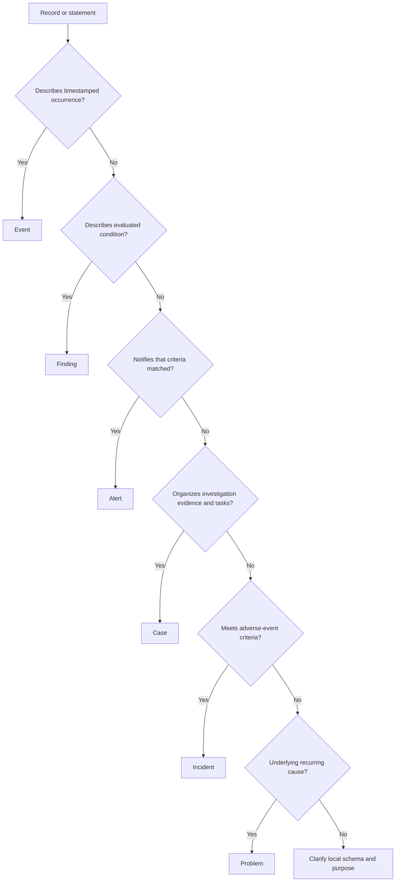

### How should a vulnerability signal affect priority?

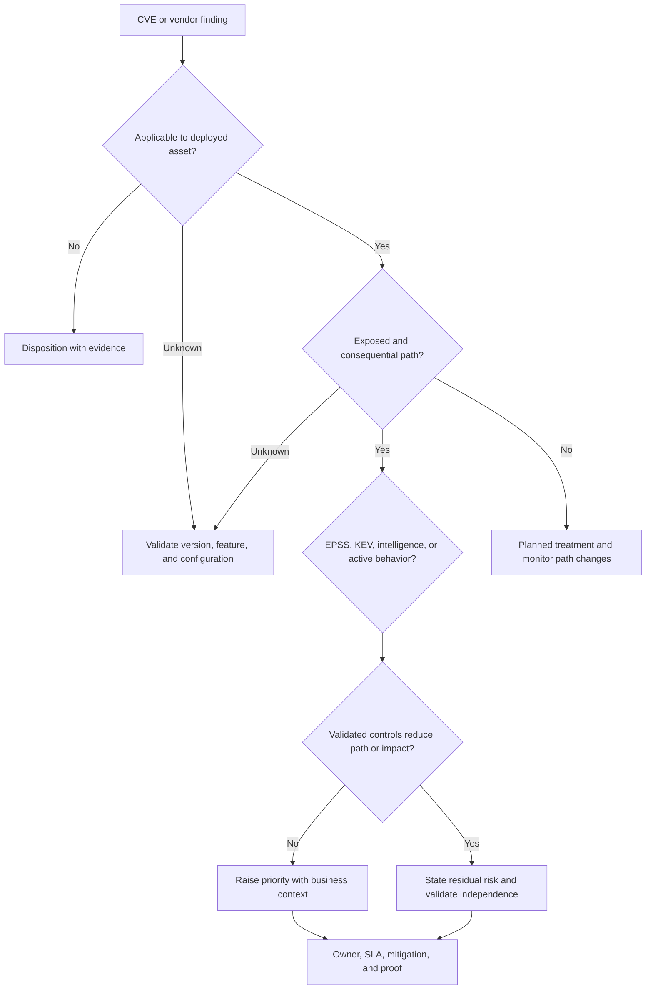

## Troubleshooting terminology failures

| Symptom | Root cause hypothesis | Check | Repair |
|---|---|---|---|
| Alert and incident counts are identical | Pipeline auto-promotes every alert | Review state transitions and policy | Separate detection output from adjudication |
| CVE count rises after new connector | Duplicates or asset coverage increased | Entity resolution, source, denominator | Deduplicate and restate trend |
| "Critical" means different things | Tool, CVSS, vendor, and internal scales mixed | Field lineage and version | Rename fields and publish definitions |
| Cases never close | No question, owner, or exit criteria | Sample case records | Define purpose, state, owner, evidence, closure |
| Defect queue rejects security ticket | No reproduction or expected behavior | Review package | Add build, environment, steps, logs, result, impact |
| Exception is permanent | No expiry or migration owner | Exception register | Add authority, compensating evidence, trigger, expiry |
| False positives fall but incidents rise | Over-tuning may increase false negatives | Independent test and missed-event review | Balance precision, recall, and workload |
| Executive statement changes daily | Facts, hypotheses, and estimates are mixed | Version evidence and confidence | Use confirmed, assessed, and unknown sections |

## Metrics that preserve meaning

| Metric | Numerator | Denominator | Decision | Caveat |
|---|---|---|---|---|
| Finding validation rate | Findings with applicability confirmed | Findings selected for validation | Quality and backlog planning | Selection bias matters |
| Alert-to-case rate | Alerts promoted to cases | Reviewed alerts | Queue and correlation design | Low rate can be good filtering or poor logic |
| Case-to-incident rate | Cases meeting incident criteria | Closed and decided cases | Triage calibration | Incident threshold and scope change trend |
| Time to acknowledge | Time from queue arrival to ownership | Eligible alerts or incidents | Staffing and routing | Does not measure investigation quality |
| Time to decision | Time from sufficient intake to documented disposition | Decided cases | Investigation flow | Define clock pauses and prerequisites |
| False-positive proportion | Alerts adjudicated benign for defined malicious claim | Adjudicated positive alerts | Analyst workload and tuning | Not the statistical false-positive rate |
| Validation escape rate | Closed findings later shown unresolved | Closed findings reviewed | Closure quality | Review sample and detection capability matter |
| Exception overdue rate | Expired open exceptions | Open exceptions | Governance urgency | Automatic renewal can hide overdue state |
| Confidence distribution | Findings by confidence band | In-scope findings | Evidence-improvement investment | Confidence is not severity |

## Customer conversation pattern

When a customer says, "Your platform says we have 5,000 critical risks," Arti can respond:

1. "Let us confirm what each record represents and which field is being called critical."
2. "We will separate unique assets, unique CVEs, duplicate findings, technical severity, exploit signals, and local priority."
3. "We will validate source freshness, applicability, exposure, business owners, controls, and evidence confidence."
4. "Then we can agree which decisions and workflows the metric should drive."
5. "I have not operated this Zscaler product in production; I would verify current documented behavior and work with the appropriate product and customer owners."

This response is transparent without being passive. It turns a disputed number into a shared data and decision problem.

## Official Source Anchors

**Checked on 2026-08-24.** Standards and programs define their own outputs. Government catalogs provide scoped operational evidence. Vendor pages describe positioning. NMH data and calculations remain fictional.

| Source | Official anchor | Used for | Currency caveat |
|---|---|---|---|
| CVE Program | https://www.cve.org/ | CVE purpose, records, and program context | Record and program details evolve |
| MITRE CWE | https://cwe.mitre.org/ | Weakness taxonomy and relationship to prevention | Check current CWE version and entry status |
| FIRST CVSS | https://www.first.org/cvss/ | Official CVSS specifications, versions, vectors, and guidance | Always state specification version; current scoring details belong in Part 78 |
| FIRST EPSS | https://www.first.org/epss/ | Official EPSS model purpose, probability, percentile, and data | Model and scores evolve; probability is not local risk |
| CISA KEV | https://www.cisa.gov/known-exploited-vulnerabilities-catalog | Known-exploitation catalog and operational fields | Catalog is authoritative for its criteria, not exhaustive of all exploitation |
| NIST National Vulnerability Database | https://nvd.nist.gov/ | United States government vulnerability enrichment and references | NVD data and processing status can change; consult primary advisories |
| NIST glossary | https://csrc.nist.gov/glossary | Source discovery for terminology | NIST warns that terms vary by source; cite the governing publication |
| NIST SP 800-61 Rev. 2 | https://csrc.nist.gov/pubs/sp/800/61/r2/final | Historical incident-handling terminology and process context | Check current NIST incident-response publications and transitions |
| NIST Cybersecurity Framework | https://www.nist.gov/cyberframework | Govern, Identify, Protect, Detect, Respond, and Recover outcomes | Framework outcome mapping does not define every product record |
| MITRE ATT&CK | https://attack.mitre.org/resources/ | Tactics, techniques, sub-techniques, procedures, and use cautions | Check live technique version and do not infer attribution |
| Zscaler UVM positioning | https://www.zscaler.com/products-and-solutions/vulnerability-management | Vendor description of contextual vulnerability prioritization | Verify current packaging, score behavior, fields, and tenant documentation |
| Zscaler SecOps positioning | https://www.zscaler.com/products-and-solutions/security-operations | Vendor description of security-operations data and workflows | Positioning is not a standard or proof of candidate experience |

## Likely Interview Questions

### Q1. Distinguish vulnerability, exposure, threat, finding, and risk.

**Model answer:** A vulnerability is a weakness that can be exploited or triggered. Exposure is the condition or path that makes an asset subject to potential harm. A threat is a potential adverse circumstance or event. A finding is an evaluated record of a condition that deviates from an expectation or requirement. Risk is the uncertain effect on objectives, considered through the scenario, likelihood, impact, controls, and context.

A scanner can create a finding associated with a vulnerability. I still need to validate the asset, applicability, exposure, threat relevance, controls, and business consequence before stating local risk.

### Q2. What is the difference among an event, observation, detection, alert, case, and incident?

**Model answer:** An event is a recorded occurrence. An observation is a bounded factual statement about evidence. Detection is the process or result of identifying a condition or behavior of interest. An alert is a notification that defined criteria were met. A case organizes related evidence, tasks, entities, and decisions. An incident is an occurrence judged to meet the organization's adverse-security criteria.

The same sign-in data can move through all these records, but each adds a different decision. Alert volume must not be reported as incident volume.

### Q3. Distinguish incident, problem, and defect.

**Model answer:** Incident work limits current harm and restores operation. Problem work identifies and removes an underlying recurring cause. A defect is a reproducible flaw in product or implementation behavior relative to expectation. One incident can reveal multiple problems, and one defect can contribute to many incidents. Some incidents involve valid functionality abused by a stolen identity and no product defect.

My production bridge is strong here: I have built evidence packages and worked with Engineering on Microsoft support issues. I would preserve the security-specific ownership and not call every unexpected configuration a defect.

### Q4. How do CVE, CWE, CVSS, EPSS, and KEV relate?

**Model answer:** CVE identifies a publicly disclosed vulnerability record. CWE classifies the underlying weakness type. CVSS describes technical severity characteristics under a stated specification and vector. EPSS estimates the probability that a CVE will be exploited in the wild in the next 30 days. CISA KEV records vulnerabilities known to have been exploited in the wild under catalog criteria.

None alone is local business risk. I combine them with asset presence, applicability, reachability, controls, business criticality, evidence confidence, and remediation feasibility. I also verify current versions and primary vendor advisories.

### Q5. Explain severity, confidence, and priority with one example.

**Model answer:** Severity asks how bad the modeled consequence could be, confidence asks how strongly evidence supports the condition or conclusion, and priority asks what should be handled first. A single ambiguous connection toward a plant system may have potentially severe consequence but low confidence. It can still receive high investigation priority because the decision window and possible impact justify rapid validation.

I would report all three fields separately so uncertainty is visible rather than reducing severity or overstating certainty.

### Q6. What does false positive mean, and why is the phrase often misused?

**Model answer:** A false positive occurs when a defined test says positive but the actual condition is negative. The test and ground truth must be named. In an authorized password-spray simulation, the sign-in events may be real and the analytic may correctly match its criteria, while the conclusion "unauthorized attack" is false. Calling the whole record false hides which layer worked.

I would track precision and recall or sensitivity under defined adjudication, consider base rates, and use independent validation because false negatives are usually harder to observe.

### Q7. Turn the fictional NMH observation into an executive statement.

**Model answer:** I would state that one supplier account had confirmed unauthorized portal use after repeated failures, and that available evidence proves purchase-order metadata enumeration but not document download or payment modification. The immediate session is contained, but a password-only exception affects 180 supplier identities and leaves residual population risk. I would request approval for phased stronger authentication, narrower authorization, governed exceptions, and explicit validation.

That statement preserves confirmed facts, unknowns, scope, treatment, ownership, and the decision. Every NMH detail is fictional and demonstrates method only.

### Q8. How would you respond when a customer calls every high-severity finding a critical risk?

**Model answer:** I would first align definitions and field lineage: is "critical" a CVSS category, vendor rating, internal severity, or operational priority? Then I would reconcile unique assets and findings, validate applicability and freshness, and add reachability, exploit signals, KEV status, controls, business importance, and evidence confidence. The goal is not to dismiss severity but to convert it into an actionable, explainable backlog.

I would be honest that I have not operated Zscaler UVM in production. I would verify current product behavior, work with product specialists and customer owners, and bring my proven analytics, troubleshooting, and customer-communication method.

## 30-Second Memory Hooks

| Concept | Memory hook |
|---|---|
| Vulnerability | Weakness |
| Exposure | Reachable or subject condition |
| Threat | Potential adverse event |
| Risk | Uncertain effect on an objective |
| Finding | Evaluated condition record |
| Event | Timestamped occurrence |
| Observation | Bounded fact from evidence |
| Detection | Identify behavior or condition |
| Alert | Criteria met; investigate |
| Case | Evidence and decision container |
| Incident | Adverse criteria met under policy |
| Problem | Systemic cause or recurrence |
| Defect | Reproducible product flaw |
| IOC | Artifact clue |
| IOA | Behavior clue |
| TTP | Why, how, exact implementation |
| CVE | Which public vulnerability? |
| CWE | Which weakness type? |
| CVSS | Technical severity characteristics |
| EPSS | Modeled 30-day exploitation probability |
| KEV | Known exploitation under CISA criteria |
| Severity | How bad? |
| Confidence | How sure? |
| Priority | What first? |
| False positive | Positive test, actual negative |
| Control gap | Required outcome missing or ineffective |
| Exception | Authorized, scoped, time-bound deviation |
| Executive translation | Confirmed, possible, unknown, action, decision |
| Arti bridge | Production evidence discipline; lab security vocabulary |

## Completion Checklist

- [ ] I can define vulnerability, exposure, threat, risk, and finding without using them as synonyms.
- [ ] I can distinguish an observation from an event.
- [ ] I can distinguish detection from alerting, prevention, and response.
- [ ] I can explain what a case contains and which question it resolves.
- [ ] I can state the local criteria required before calling activity a security incident.
- [ ] I can distinguish incident, problem, and defect ownership and closure.
- [ ] I can explain IOC, IOA, and TTP with evidence cautions.
- [ ] I can explain CVE and CWE without claiming that either is a severity score.
- [ ] I can explain CVSS, EPSS, and KEV as separate signals.
- [ ] I can state that Part 78 will cover vulnerability scoring in depth.
- [ ] I can separate severity, confidence, priority, urgency, and risk.
- [ ] I can use a confusion matrix and define the tested proposition.
- [ ] I can explain precision, recall, false-positive rate, false-negative rate, specificity, and base-rate effects.
- [ ] I can distinguish a control gap, exception, compensating control, acceptance, remediation, and mitigation.
- [ ] I can walk the finding lifecycle from discovery through validation and recurrence monitoring.
- [ ] I can transform the fictional NMH observation through event, alert, case, incident, finding, and executive risk statement.
- [ ] I can preserve confirmed facts, hypotheses, unknowns, and confidence during executive compression.
- [ ] I can resolve ambiguous phrases such as critical risk, false positive, closed vulnerability, and proven actor.
- [ ] I can troubleshoot duplicate counts, mixed severity fields, weak cases, permanent exceptions, and over-tuning.
- [ ] I can distinguish authoritative programs, standards, government catalogs, vendor positioning, and fictional records.
- [ ] I can recheck specifications and product currency after 2026-08-24.
- [ ] I can label production, lab, conceptual, not-yet-used, and fictional content honestly.
- [ ] I can answer all eight questions aloud without claiming production Zscaler, SOC, vulnerability, detection-engineering, or incident-response ownership.

[Part 9 - Defense in Depth, Least Privilege, Segmentation, and Compensating Controls](Part-09-defense-in-depth-least-privilege.md)