# Part 9 - Defense in Depth, Least Privilege, Segmentation, and Compensating Controls

> **Audience:** Candidates moving from Microsoft 365 Support Escalation Engineering into a Zscaler Security Operations Technical Success Manager role.
>
> **Currency date:** 2026-08-24.
>
> **Scope and honesty:** Northstar Meridian Holdings, abbreviated NMH, and every NMH control, architecture, identity, test, finding, incident, metric, calculation, decision, and outcome are fictional. Your established production bridge is enterprise support, OneDrive, SharePoint, networking, troubleshooting, analytics, mentoring, escalation, and approved AI work. Direct production operation of Zscaler, Security Operations, vulnerability, exposure, scanner, Endpoint Detection and Response, Security Information and Event Management, Operational Technology security, microsegmentation, privileged-access, or formal Zero Trust programs is not established.
>
> **Safety:** Control testing must be authorized, bounded, monitored, reversible, and designed with application, identity, network, safety, privacy, and business owners. Do not test production access, segmentation, exploitation, or response actions outside written authority and change controls.
>
> **Currency caveat:** NIST and CISA guidance, identity technologies, cloud services, and vendor product behavior evolve. Verify current standards, implementation guides, platform documentation, licensing, tenant behavior, and customer policy before operational use.

## Section goal

Part 9 explains how organizations reduce the chance that one weakness becomes a major consequence. **Defense in depth** combines controls across different stages, domains, owners, and failure modes. **Least privilege** limits what an identity or process can do. **Segmentation** limits which resources can communicate or share trust. **Compensating controls** provide alternate risk reduction when a preferred control is temporarily or structurally infeasible.

Imagine protecting a museum. Strong display glass helps prevent theft. Staff monitor rooms. Access badges separate public and employee areas. Valuable items have individual alarms. Inventory detects loss. Emergency procedures recover after disruption. If every layer depends on one power circuit with no backup, the museum has several devices but one common failure. Real defense in depth is not the number of products; it is the quality, coverage, independence, and tested interaction of controls.

By the end, you should be able to:

| Learning outcome | What mastery looks like |
|---|---|
| Explain defense in depth | Connect prevention, detection, response, and recovery across people, process, and technology |
| Identify trust boundaries | Locate changes in identity, authority, network, application, data, ownership, and safety context |
| Apply least privilege | Compare role-based, attribute-based, just-in-time, and just-enough access approaches |
| Explain deny by default | Start from no access and explicitly permit required actions, including failure behavior |
| Segment resources | Distinguish network, application, identity, data, workload, and operational segmentation |
| Explain microsegmentation | Use fine-grained policy between workloads or resources while recognizing dependencies and operational cost |
| Protect decision integrity | Apply separation of duties and independent approval to high-consequence actions |
| Avoid decorative layering | Test control independence, common-mode failure, bypass, and alternate paths |
| Govern compensation | Design alternate controls with risk mapping, evidence, owner, expiry, and migration |
| Relate Zero Trust | Explain how least privilege, explicit verification, and segmentation support but do not alone complete Zero Trust |
| Practice realistically | Analyze fictional NMH vulnerable OT and SaaS scenarios with safe evidence and honest labels |

## JD Mapping

**JD** means job description. A Technical Success Manager, abbreviated **TSM**, does not own every customer control, but must understand architecture, dependencies, evidence, tradeoffs, and stakeholder authority well enough to guide adoption and risk reduction.

| JD expectation | Part 9 capability | Honest experience bridge |
|---|---|---|
| Analyze complex environments | Map boundaries across identity, device, network, application, data, cloud, SaaS, and OT | Production: cross-layer Microsoft 365 and networking troubleshooting |
| Identify risks | Find broad privilege, flat trust, shared authority, missing layers, and common-mode failures | Lab: fictional NMH assessments |
| Deliver tailored mitigation | Choose preventive, detective, response, recovery, or compensating options around constraints | Production fix-validation method; conceptual security design |
| Explain metrics | Report policy coverage, effective access, denied-path tests, exception age, and control validation | Production analytics bridge; no claimed security-platform deployment |
| Lead strategic engagement | Sequence discovery, pilot, enforcement, validation, and maturity improvement | Conceptual customer roadmap practiced in NMH |
| Resolve critical escalations | Protect availability while narrowing access and preserving evidence | Production escalation discipline; fictional security scenario |
| Partner across functions | Clarify identity, network, app, data, OT, safety, Support, and Product decisions | Established cross-functional experience plus domain ramp |

## Candidate honesty note

You have factual production experience with Microsoft 365 identities, permissions, sharing, sync, client and service behavior, network dependencies, escalations, analytics, and validation. Those experiences support least-privilege and boundary reasoning. They do not establish production design of enterprise microsegmentation, privileged-access management, Zero Trust architecture, or Zscaler policy.

| Label | Meaning in this chapter | Safe wording | Boundary |
|---|---|---|---|
| Production | Supported Microsoft workloads, permissions, networking, customers, and escalations | "I validated effective access and service dependencies in enterprise support scenarios." | Do not claim ownership of customer security architecture |
| Lab | Synthetic design or test completed for study | "I designed a fictional OT compensating-control package and test plan." | Do not present NMH as a customer deployment |
| Conceptual | Architecture and governance understood from authoritative guidance | "I can compare RBAC, ABAC, JIT, and JEA and state validation questions." | Architecture knowledge is not implementation experience |
| Not-yet-used | Product or program not directly operated | "I have not deployed Zscaler segmentation or a PAM platform in production." | Do not imply tenant access or policy tuning |
| Fictional | Every NMH design, metric, person, and result | "In my fictional NMH scenario..." | Never say "my manufacturing customer" |

## Acronyms and essential terms

| Acronym or term | Expanded form | Plain meaning | Memory hook |
|---|---|---|---|
| RBAC | Role-Based Access Control | Permissions are assigned through job or function roles | Role answers what the job normally needs |
| ABAC | Attribute-Based Access Control | Policy evaluates attributes of subject, resource, action, and environment | Attributes add context to the decision |
| JIT | Just-In-Time | Privilege is activated only for a required time window | Privilege arrives when needed and expires |
| JEA | Just Enough Administration | Administration is limited to approved tasks or commands | Enough action, not a whole admin world |
| PAM | Privileged Access Management | Processes and technology governing high-power accounts and sessions | Protect the master keys |
| MFA | Multi-Factor Authentication | Authentication uses more than one factor category | More than one kind of proof |
| IAM | Identity and Access Management | Identity lifecycle, authentication, authorization, and governance | Who are you, and what may you do? |
| DLP | Data Loss Prevention | Controls intended to identify and restrict inappropriate data use or movement | Keep sensitive data within policy |
| OT | Operational Technology | Systems that monitor or control physical processes | Cyber action can affect machinery |
| IT | Information Technology | Systems supporting information processing and business services | Digital business operations |
| SaaS | Software as a Service | Online software operated by a provider | Hosted operation, shared responsibility |
| API | Application Programming Interface | Defined mechanism for software interaction | A software service counter |
| ACL | Access Control List | List of identities and permitted or denied actions for a resource | The guest list on a door |
| PDP | Policy Decision Point | Component or function that evaluates policy and decides | The decision desk |
| PEP | Policy Enforcement Point | Component that carries out allow, deny, or other access action | The gate that enforces the answer |
| RTO | Recovery Time Objective | Target time to restore service | How long can recovery take? |
| RPO | Recovery Point Objective | Target maximum data-loss interval | How much recent data can be lost? |
| NMH | Northstar Meridian Holdings | Fictional enterprise used for continuity | Practice only |

## Defense in depth from first principles

**Defense in depth** is a coordinated set of safeguards so that one control's failure does not automatically produce unacceptable harm. Layers can prevent, deter, detect, contain, respond, and recover. They should cover different points in the path and, where practical, avoid identical dependencies.

A seat belt, airbag, anti-lock brake, road design, driver training, crash detection, emergency response, and hospital are not duplicates. They act at different times and on different failure paths. Adding five dashboard widgets reading the same failed sensor would not create five layers.

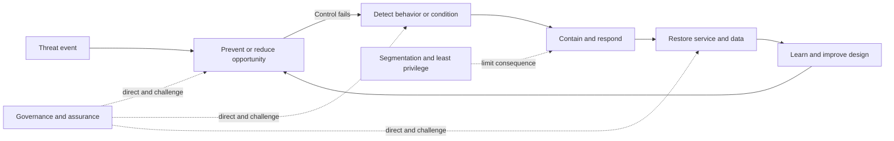

| Layer objective | Example control | What it changes | Evidence of effectiveness | Typical owner |
|---|---|---|---|---|
| Reduce exposure | Remove public service or obsolete account | Opportunity and reachable surface | External and effective-access validation | App, IAM, network |
| Prevent unauthorized access | Strong authentication and resource authorization | Probability of successful access | Representative policy and sign-in test | IAM and resource owner |
| Limit privilege | Task-specific role and time-bound elevation | Actions possible after access | Effective action test and expiry | IAM, platform, app |
| Limit movement | Resource segmentation and constrained trust | Reachable next steps and blast radius | Source-to-destination path matrix | Network, cloud, app |
| Protect data | Classification, access, encryption, DLP | Use and movement of sensitive data | Access and policy-action evidence | Data owner and security |
| Detect behavior | Identity, endpoint, application, network analytics | Visibility and investigation speed | Authorized behavior simulation | SOC and source owners |
| Respond | Session revoke, account disable, endpoint isolate | Duration and scope of ongoing harm | Response test, audit, rollback | Incident and platform owners |
| Recover | Separated backup and tested restore | Duration and impact after harm | Representative restore meeting RTO/RPO | Service and continuity owners |
| Govern | Policy, owner, exception, review, assurance | Consistency and accountability | Decision records and independent tests | Leadership and assurance |

## Defense versus duplication

Multiple controls are useful only when they add distinct value. **Duplication** can be intentional redundancy, which improves availability, or wasteful overlap, which adds cost without meaningful risk reduction. The distinction depends on purpose and failure modes.

| Arrangement | Example | Value | Hidden risk |
|---|---|---|---|
| Complementary layers | MFA, resource authorization, session monitoring, backup | Different path stages and consequences | Policy or identity source may still be shared |
| Redundant controls | Two independent power sources for critical enforcement | Availability if one fails | Both may share building, firmware, or operator |
| Corroborating detection | Endpoint plus identity plus application evidence | Higher confidence and broader visibility | Feeds may all derive from one upstream event |
| Decorative duplication | Three tools report the same stale asset record | More alerts, no new control effect | False confidence and operational load |
| Conflicting duplication | Two gateways apply inconsistent policy | One may catch what another misses | Unexpected bypass, troubleshooting complexity |
| Stacked fragility | Every control calls one identity provider synchronously | Central policy consistency | Identity compromise or outage defeats all layers |

### Plain-English deep-dive 1 - Five locks can share one weak wall

Imagine five strong locks installed on a lightweight interior door. The count is impressive, but an intruder can remove the hinges or break the wall. Security architectures sometimes do this with several tools that all trust the same identity claim, asset inventory, network route, administrator, or update channel.

Control analysis should ask what each layer assumes. Does an email control, endpoint tool, cloud policy, and access gateway all trust one device-compliance feed? Can one tenant administrator disable all of them? Are production and backup governed by the same identity? Does one data pipeline populate every dashboard? A common assumption is not automatically wrong, but it must be protected, monitored independently, and included in failure planning.

Your production troubleshooting method transfers well. Several application errors can share one proxy, certificate, DNS, or identity dependency. Counting symptoms does not identify independent causes. Security design uses the same dependency discipline before crediting multiple controls.

## Trust boundaries

A **trust boundary** is a place where identity, authority, ownership, data sensitivity, execution context, technology, or policy changes. Data or actions crossing the boundary require explicit assumptions and controls. A boundary is not necessarily a firewall or physical network edge.

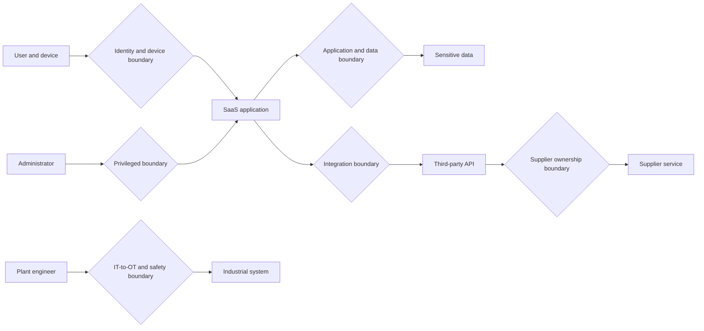

| Boundary type | What changes | Example | Required questions |
|---|---|---|---|
| Identity | Authenticator, directory, tenant, assurance, or lifecycle | Employee becomes external guest | Who proves identity, sponsors it, and revokes it? |
| Privilege | Authority increases or changes class | User activates administrator role | Who approves, for how long, for which tasks, with what record? |
| Network | Reachability or policy domain changes | User network to server segment | Which source, destination, protocol, direction, and exception? |
| Application | Code or service becomes the decision maker | Browser calls SaaS API | Which session, scope, input, action, and error behavior? |
| Data | Classification, owner, jurisdiction, or permitted purpose changes | Restricted file shared externally | Is use authorized, minimized, logged, retained, and revocable? |
| Workload | Execution identity or management domain changes | Cloud workload calls database | Is identity unique, secretless where feasible, and resource-specific? |
| Ownership | Another legal or operational party controls a component | Managed service provider administration | Which responsibilities, evidence, access, notice, and exit rights apply? |
| IT-to-OT | Information system action enters physical-control context | Remote maintenance reaches packaging line | What safety, availability, vendor, and emergency constraints govern? |
| Recovery | Authority shifts from production to restore capability | Administrator accesses backup vault | Is recovery independently protected from production compromise? |

Trust is not binary. A source may be trusted to assert an employee identifier but not to authorize a payment. A device may meet corporate posture requirements but still run a compromised browser session. A supplier may be trusted for one application but not an entire network.

## Least privilege

**Least privilege** means granting only the minimum authorization needed for an approved purpose, for the minimum necessary scope and time, under appropriate context. It applies to people, applications, workloads, automation, data, and administrators.

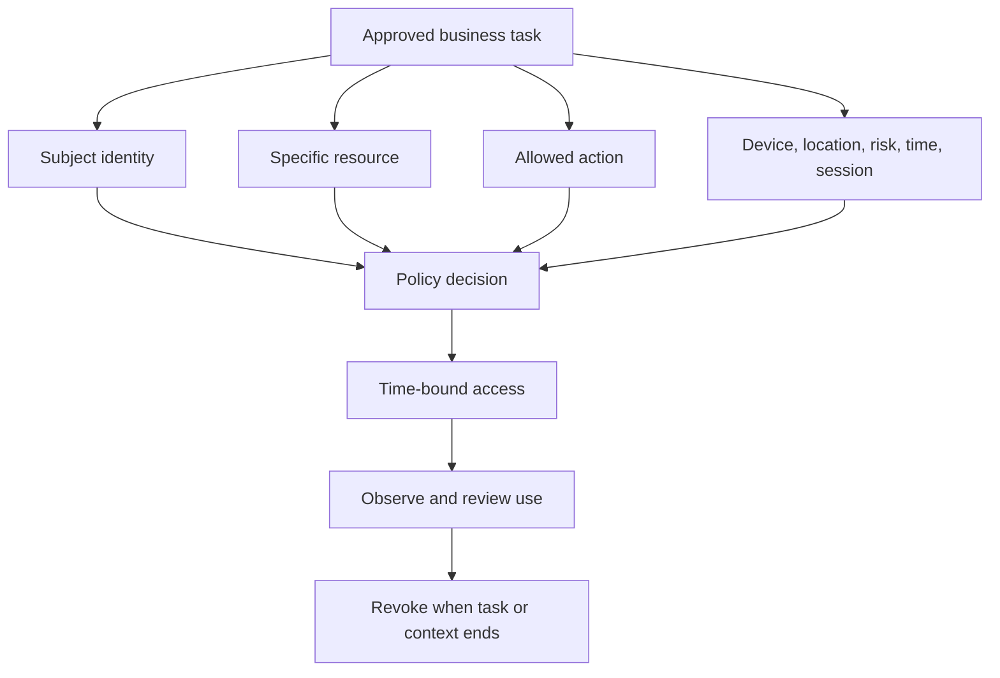

Least privilege answers at least six questions:

| Dimension | Question | Weak design | Stronger design |
|---|---|---|---|
| Subject | Who or what receives access? | Shared administrator account | Unique human or workload identity |
| Resource | Which exact asset or data? | Whole network or tenant | Named application, dataset, or service |
| Action | What may the subject do? | Full administrator | Read, restart one service, approve one workflow |
| Context | Under which conditions? | Any device and location | Managed device, approved session, acceptable risk |
| Time | For how long? | Permanent role | Activated for task and automatically expires |
| Review | How is use observed and challenged? | Log retained but never reviewed | Session evidence, owner review, anomaly detection |
| Revocation | What ends access? | Manual cleanup after departure | Job, sponsor, risk, task, or time trigger |

Least privilege is not "zero privilege." Access too narrow to complete legitimate work causes workarounds, shared credentials, shadow systems, emergency exceptions, and operational harm. Design begins with the business task and tests both authorized success and unauthorized denial.

## Deny by default

**Deny by default** means access is not granted unless policy explicitly permits it. It reverses the unsafe assumption that anything not prohibited is allowed. The model still needs carefully governed emergency paths and failure behavior.

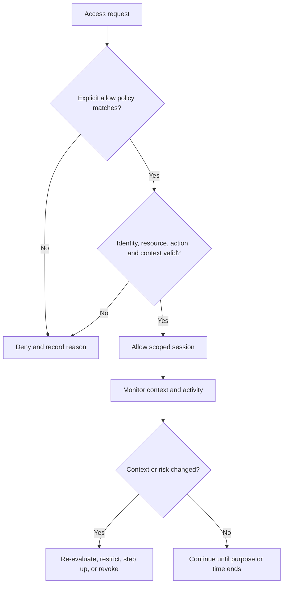

| Failure question | Fail closed | Fail open | Decision consideration |
|---|---|---|---|
| Policy engine unavailable | Deny new access | Permit based on cache or fallback | Security, safety, availability, session age, resource criticality |
| Device posture unavailable | Block or require stronger proof | Allow limited resource set | Confidence, alternative signals, business urgency |
| Logging unavailable | Stop high-risk action | Continue and create local evidence | Audit requirement, safety, transaction reversibility |
| Identity provider unavailable | Deny new authentication | Use emergency or cached access | Break-glass governance, duration, monitoring, recovery |
| OT safety operation | Security gateway may block command | Local safety control must remain available | Physical safety authority can override normal cyber preference |

"Fail closed" is not universally safer. Blocking a medical or industrial safety function may cause greater harm. The decision belongs to authorized business and safety owners and should be designed before failure, not improvised during it.

## RBAC and ABAC

**Role-Based Access Control**, abbreviated **RBAC**, grants permissions through defined roles such as payroll analyst or SharePoint site owner. **Attribute-Based Access Control**, abbreviated **ABAC**, evaluates attributes of the subject, resource, requested action, and environment.

Think of RBAC as a theater ticket category: audience, performer, technician. ABAC also checks the show, venue, time, age restriction, and whether the door is currently open.

| Dimension | RBAC | ABAC |
|---|---|---|
| Primary input | Role membership | Subject, resource, action, and environment attributes |
| Strength | Understandable baseline aligned to job functions | Fine-grained and contextual decisions |
| Weakness | Role explosion and accumulated access | Attribute quality and policy complexity |
| Example | Finance-reader role can read finance site | Finance employee on managed device can read confidential finance data during approved context |
| Evidence | Role definition, membership, permission, review | Attribute source, policy evaluation, values, outcome |
| Failure mode | Broad role or stale membership | Missing or incorrect attribute creates wrong decision |
| Best use | Stable common permission sets | Dynamic context and resource-specific decisions |
| Combined use | Role provides baseline | Attributes refine when and where role applies |

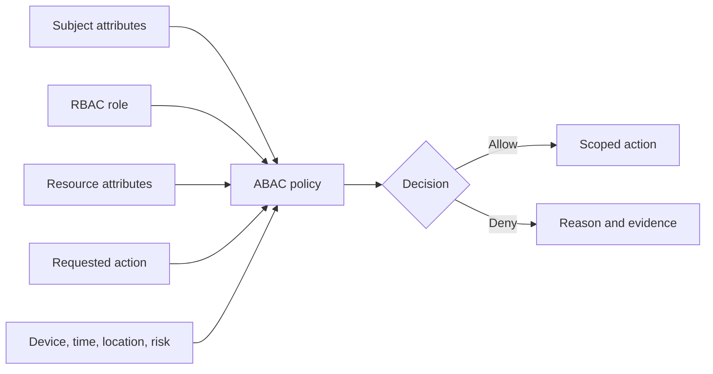

RBAC and ABAC are complementary. A role can establish normal responsibility while attributes narrow access. Neither helps if role definitions, identity lifecycle, classifications, device state, or policy evaluation are wrong.

## JIT and JEA

**Just-In-Time**, abbreviated **JIT**, access activates privilege only when needed and expires it automatically. **Just Enough Administration**, abbreviated **JEA**, limits the available administrative actions to those required for a task. JIT controls time; JEA controls capability.

| Control | Core restriction | Example | Evidence | Failure mode |
|---|---|---|---|---|
| Standing privilege | None beyond baseline role | Permanent tenant administrator | Role assignment and activity | Large theft and misuse window |
| JIT | Time and approval | Activate admin role for 45 minutes | Request, approval, activation, expiry | Rubber-stamp approval or overly long duration |
| JEA | Commands and targets | Restart named sync service but cannot change identity policy | Endpoint definition and command transcript | Escape path or hidden powerful command |
| JIT plus JEA | Time, action, and resource | Approved engineer restarts one service during incident | Full decision and session record | Break-glass bypass becomes normal path |
| Break glass | Emergency access under exceptional governance | Two protected emergency identities | Test, alert, use review, secure storage | Never tested, widely known, or exempt from monitoring |

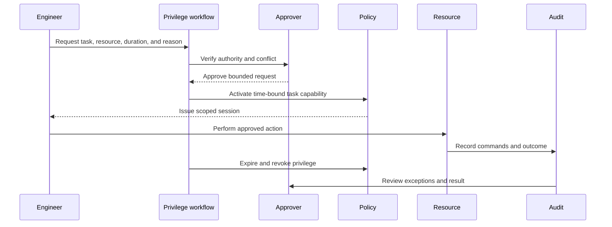

### Plain-English deep-dive 2 - Privilege is a hazardous tool, not a prize

A factory issues a specialized cutting tool for a specific job, records who used it, and returns it afterward. It does not permanently give every experienced worker every tool. Privilege should work the same way.

Organizations sometimes equate seniority with broad permanent access. That increases the value of stolen accounts and the consequence of mistakes. JIT and JEA reduce the window and capability, but only if activation, approval, session binding, logging, revocation, and emergency paths work. If the normal workflow takes hours during an outage, engineers will seek bypasses. Usability is a security property because an unusable control creates shadow access.

You can connect this to escalation practice: urgent work still needs clear ownership, approved scope, evidence, and validation. The security extension makes privilege activation and expiry explicit.

## Separation of duties

**Separation of duties** means distributing high-consequence steps so one person or identity cannot initiate, approve, execute, and conceal an action alone. It reduces fraud, error, coercion, and single-account compromise.

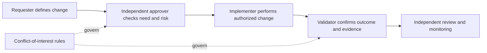

| Process | Risk without separation | Example separation | Emergency design |
|---|---|---|---|
| Payment-master change | One identity redirects funds | Supplier request, finance approval, separate implementation, notification | Two-person emergency approval and post-review |
| Privileged role grant | Administrator grants self permanent access | Requester, role owner, time-bound workflow, audit | Break-glass with alert and next-day independent review |
| Security-policy change | Operator weakens control and hides event | Change approval, implementation, protected audit | Bounded emergency change and immutable record |
| Code release | Developer inserts and releases harmful code | Review, build identity, signed artifact, deployment approval | Emergency patch with retrospective review and rollback |
| Backup deletion | Compromised production admin destroys recovery | Separate backup authority and quorum | Protected recovery identities and offline process |
| Incident closure | Responder closes without proving recovery | Service owner and incident lead validate criteria | Time-bound closure with required follow-up evidence |

Separation can create delay and diffusion of accountability. Good design has one accountable owner, explicit roles, service-level targets, delegation, and emergency handling. Independence should prevent unilateral harm without making legitimate work impossible.

## Segmentation foundations

**Segmentation** divides resources, identities, workloads, data, or functions into bounded groups and controls interaction between them. Traditional network segmentation often uses subnets, virtual networks, routing, and firewalls. Modern segmentation can enforce identity- and resource-aware policy beyond network location.

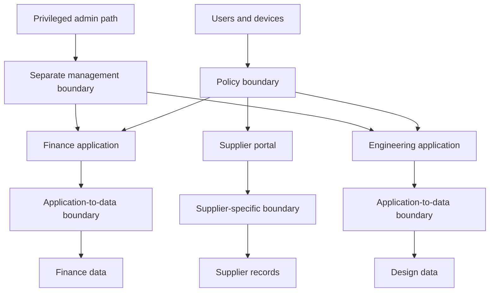

| Segmentation domain | Unit separated | Policy basis | Example | Failure mode |
|---|---|---|---|---|
| Network | Addresses, subnets, zones, ports, protocols | Source, destination, protocol, direction | User segment cannot initiate plant-controller sessions | Address does not prove identity or application |
| Application | Functions, services, tenants, interfaces | Application identity, route, operation | Supplier can use order API but not admin API | Hidden shared backend bypasses front-end policy |
| Identity | User, group, role, tenant, workload identity | Authentication and authorization context | Contractor role cannot access employee HR service | Stale groups or broad federation claim |
| Data | Dataset, classification, row, field, operation | Owner, purpose, sensitivity, subject | Regional supplier sees only its orders | Incorrect labels or export path bypass |
| Workload | Virtual machine, container, service, process | Workload identity, label, service relationship | Web tier calls one API, not database admin | Mutable labels or shared service account |
| Device | Managed, compliant, type, health | Device identity and posture | Unmanaged device gets browser-only access | Spoofed or stale posture |
| Administrative | Management versus business access | Privileged identity, workstation, JIT/JEA | Admin portal reachable only through protected workflow | Same identity and device used for email |
| OT or safety | Physical process and control zone | Function, protocol, vendor, safety authority | Historian receives data; office user cannot control line | Legacy protocol and emergency need complicate policy |

Segmentation has two directions. **North-south** commonly describes traffic entering or leaving an environment or zone. **East-west** commonly describes communication among internal workloads, systems, or zones. These terms depend on architecture and are not universal compass directions.

## Microsegmentation

**Microsegmentation** applies fine-grained controls among workloads, applications, services, or resources, often based on identity, labels, process context, or intended communication rather than broad network zones alone.

Think of a hotel. Network segmentation may place guests, staff, and building systems on different floors. Microsegmentation gives each guest key access only to their room and approved common areas, not every room on the guest floor.

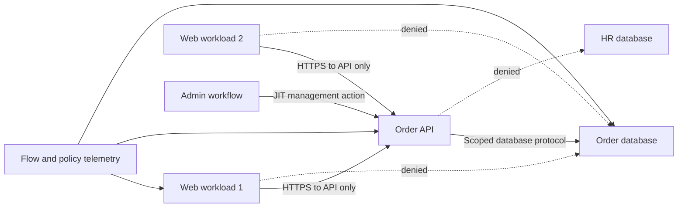

| Design question | Why it matters | Evidence |
|---|---|---|
| What are the protected units? | Policy cannot be finer than reliable identity or labeling | Inventory and identity source |
| What communication is required? | Unknown dependencies create outages or broad exceptions | Flow observation plus app-owner confirmation |
| Which direction and action? | Return traffic, initiation, and operations differ | Connection and policy semantics |
| What happens during scaling or failover? | New instances and alternate regions must receive correct policy | Deployment and failover tests |
| How are policy and labels changed? | Compromised management can bypass enforcement | Change authority and protected audit |
| What is the default? | Unmatched traffic can silently permit broad paths | Effective deny test |
| How is break glass handled? | Incident response may need temporary access | Time-bound approval and monitoring |
| How is observability preserved? | Denials without reason create operational pain | Decision logs and correlation |

### Segmentation tradeoffs

| Benefit | Cost or risk | Mitigation |
|---|---|---|
| Reduces lateral movement and blast radius | Dependency discovery and policy complexity | Observe first, owner attest, stage enforcement |
| Resource-specific access | Identity and label quality become critical | Govern sources, protect policy, test stale and missing attributes |
| Better visibility at boundaries | Telemetry volume and privacy concerns | Purpose limitation, retention, sampling, access governance |
| Limits one compromised workload | Shared management plane may remain broad | Separate and harden administration |
| Supports phased Zero Trust | Legacy protocols and fixed identities may not fit | Gateways, isolation, compensation, migration roadmap |
| Clear ownership | Cross-team boundaries can create handoff delays | RACI, service targets, common change and escalation process |

## Control independence and common-mode failure

**Control independence** means one control can still provide useful protection or evidence when another fails. **Common-mode failure** means one cause defeats several controls together.

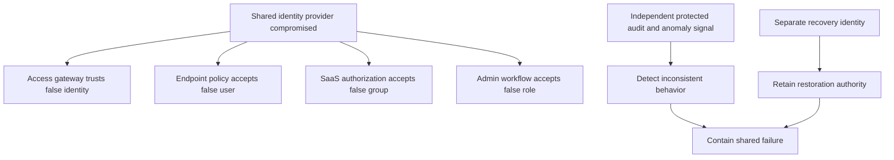

| Shared dependency | Controls apparently affected | Common failure | Independence opportunity |
|---|---|---|---|
| Identity provider | Gateway, SaaS, admin, cloud, endpoint | False identity or outage affects all decisions | Separate recovery identity, behavioral context, protected audit |
| Asset inventory | Scanner, exposure graph, patch workflow, dashboard | Missing asset disappears everywhere | Independent discovery, source reconciliation, ownership attest |
| Administrator | Firewall, endpoint, logs, backups | One account changes controls and evidence | Separation, JIT/JEA, protected audit, separate backup authority |
| Network path | Inline prevention, telemetry export, management | Route failure bypasses or blinds controls | Out-of-band health, fail behavior, alternate monitored path |
| Time service | Authentication, certificates, event correlation | Clock error breaks access and investigation | Protected time sources and drift monitoring |
| Update mechanism | Endpoint, gateway, agents, applications | Malicious update affects many layers | Signing, staged rollout, provenance, rollback, diversity where justified |
| Cloud region | Policy, app, logging, key management | Regional outage disables service and evidence | Multi-region design and tested continuity |

Control independence is not absolute. Perfectly independent systems are expensive and can be difficult to operate. The goal is to identify correlated failure, decide which consequences require separation, and test the failure modes that matter.

### Plain-English deep-dive 3 - Independence must be tested under failure

Two fire alarms made by different vendors are not independent if they share one cut cable. Two backup copies are not independent if one production administrator can delete both. Two detection dashboards are not independent if both read the same broken event stream.

Normal-operation tests often miss this. A control-validation plan should intentionally test loss or corruption of dependencies where safe: identity unavailable, policy source stale, telemetry delayed, management credential revoked, region failed, or label missing. The desired outcome may be denial, limited access, an alert, a safe local mode, or recovery. The expected behavior must be agreed before the test.

For customer communication, avoid "fully independent." State the tested boundary: "The recovery identity is held in a separate authority and a tabletop plus vault-access test confirmed restoration remains possible when the corporate identity provider is unavailable. The underlying cloud provider remains a shared dependency."

## Prevention, detection, response, and recovery layers

Defense in depth spans time. Prevention reduces opportunity before success. Detection identifies behavior or conditions. Response contains and removes harm. Recovery restores objectives. Learning changes the system so recurrence is less likely or less damaging.

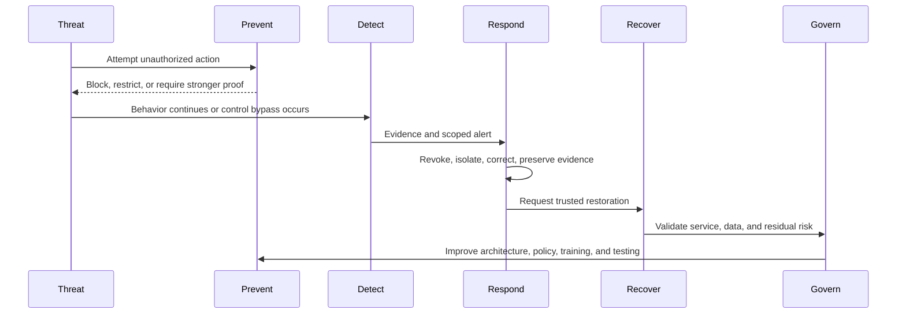

| Stage | Design question | Evidence question | Failure question |
|---|---|---|---|
| Prevention | Which action is blocked or narrowed? | Did representative unauthorized behavior fail? | Can alternate identity, path, protocol, or exception bypass it? |
| Detection | Which observable behavior should create a signal? | Did source, analytic, queue, and owner work end to end? | What activity is invisible or ambiguous? |
| Response | Which authority can take which bounded action? | Did revoke, isolate, or correct produce expected state? | Could action create wider outage or destroy evidence? |
| Recovery | Which business outcome returns, from which trusted state? | Did restore meet RTO, RPO, integrity, and acceptance? | Does compromise extend into backup or recovery identity? |
| Learning | Which system condition changes? | Did corrective action reduce recurrence in stable scope? | Was a person blamed while design remained? |

## Control validation

Control validation checks design, implementation, operation, outcome, and side effects. It should be proportionate to risk and performed under authority.

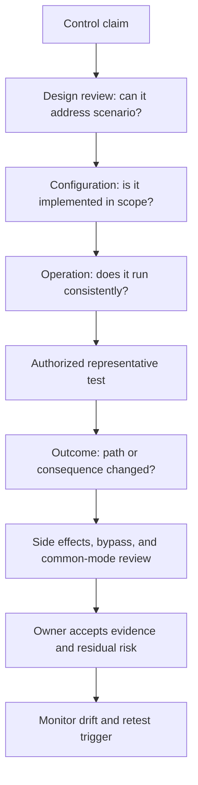

| Validation level | Question | Example evidence | Weak substitute |
|---|---|---|---|
| Design | Could this control address the defined event or path? | Threat-control mapping and architecture review | Product name on a slide |
| Implementation | Is it configured for the correct population and resources? | Effective policy and inventory reconciliation | Admin screenshot of one setting |
| Operation | Does it run consistently and produce evidence? | Health, logs, sample, exception, failure alerts | License count |
| Effectiveness | Does representative behavior get blocked, detected, contained, or recovered? | Authorized scenario test | Vendor marketing claim |
| Independence | Does it still help when another layer fails? | Dependency-loss test or tabletop | Different vendor logos |
| Side effect | Does it harm availability, privacy, safety, or usability? | Service tests, user workflow, safety review | Security-only acceptance |
| Durability | Does it resist drift and organizational change? | Monitoring, review, regression test | One-time project closure |

## Compensating controls

A compensating control is not a reason to avoid the primary control indefinitely. It is an alternate means of reducing the same relevant risk when the preferred requirement is infeasible, often temporarily. Its design should explain which path, likelihood, or impact it changes.

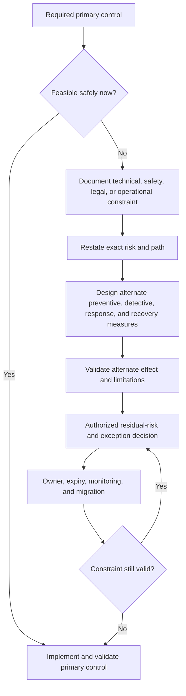

### Compensating-control decision matrix

| Criterion | Required question | Acceptable evidence | Rejection signal |
|---|---|---|---|
| Constraint | Why is primary control infeasible now? | Vendor, safety, architecture, legal, or operational evidence | Convenience or vague cost statement |
| Risk mapping | Which threat path and consequence need reduction? | Bounded scenario and control mapping | List of unrelated controls |
| Coverage | Which assets, identities, times, and actions are covered? | Reconciled population and effective policy | Unknown scope |
| Strength | How much does alternate control reduce likelihood or impact? | Representative test and rationale | Assumption based on presence |
| Independence | What primary failure could also defeat compensation? | Dependency analysis | Same vulnerable component enforces both |
| Detection | How is attempted abuse observed? | End-to-end telemetry and queue test | Logs exist but nobody reviews them |
| Response | What happens when the signal fires? | Owner, authority, SLA, tested action | Generic incident plan |
| Recovery | Can the objective be restored? | Restore or continuity evidence | Untested backup claim |
| Residual risk | What remains and who accepts it? | Decision record with authority | Ticket closure |
| Expiry | When and why must arrangement be reviewed? | Date, trigger, migration milestone | Permanent exception by default |

### Plain-English deep-dive 4 - Compensation is not equivalence

An alternate control may not be equivalent to patching. Isolating a vulnerable OT device can reduce reachable paths but does not remove the software weakness. Monitoring can shorten detection time but may not prevent a fast safety consequence. A backup can reduce recovery impact but does not prevent confidentiality loss. The residual-risk statement must retain those differences.

## Relationship to Zero Trust

Zero Trust is developed fully in Part 10. At a foundation level, least privilege, deny by default, explicit verification, resource-centric policy, segmentation, and continuous evaluation are strongly aligned with Zero Trust. Defense in depth remains necessary because policy decisions, identities, endpoints, applications, telemetry, and recovery can fail.

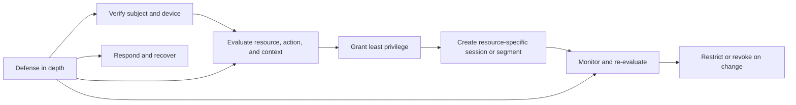

| Concept | Relationship to Zero Trust | Not sufficient because |
|---|---|---|
| MFA | Strengthens subject authentication | Identity can still be overprivileged or session can be abused |
| Least privilege | Limits authorized capability | Decision can rely on bad context or unprotected resource |
| Segmentation | Limits reachability and movement | Policy may be broad, stale, bypassed, or unavailable |
| Device posture | Adds device context | Posture is a signal, not a guarantee of no compromise |
| Continuous monitoring | Detects context and behavior changes | Visibility without response does not reduce harm |
| Deny by default | Requires explicit permission | Exceptions and emergency paths can recreate broad trust |
| Defense in depth | Adds resilience when one component fails | Uncoordinated layers can still share common failure |

## OneDrive and SharePoint examples

These examples bridge from your production domain without claiming formal security architecture ownership.

### Least-privilege collaboration design

| Need | Overbroad pattern | Least-privilege pattern | Validation |
|---|---|---|---|
| Project team reads working documents | Organization-wide group | Project role with owner and lifecycle | Effective access sample and joiner/leaver test |
| External supplier uploads deliverables | Guest gets site-member access | Dedicated library and upload-required permissions | Test allowed upload and denied unrelated read |
| Site owner manages content | Owner also receives tenant-wide admin | Site-specific administration | Test site action and denied tenant action |
| Automation processes files | Shared user password | Dedicated workload identity with scoped API permission | Token scope, action, secret or certificate lifecycle |
| Emergency recovery | Permanent broad admin role | Protected time-bound emergency workflow | Activation, alert, action, expiry, review |

### Layered oversharing defense


No one layer is perfect. Correct permissions can be defeated by an authorized user sharing content. DLP can miss transformed data. Audit can be delayed. Retention can recover deletion but not undo disclosure. The combined design reduces likelihood, improves visibility, and limits consequence while requiring governance.

## Fictional NMH OT scenario

### Scenario

NMH's fictional Plant 7 uses a Windows workstation to configure a packaging controller. Vendor certification prohibits changing the workstation software until a scheduled maintenance window 45 days away. An applicable high-severity vulnerability is reported. Immediate patching could interrupt production and affect safety validation.

| Element | Fictional detail | Evidence state |
|---|---|---|
| Asset | Engineering workstation and packaging controller | Synthetic inventory |
| Business objective | Safe and available packaging line | Fictional service map |
| Weakness | Vendor application includes affected component | Fictional advisory match; applicability requires confirmation |
| Threat path | Office user network to workstation management service | Firewall statement says blocked; not yet tested |
| Privilege | Shared vendor support credential | Fictional control gap |
| Primary control | Vendor-approved fixed version | Not feasible until maintenance window |
| Safety constraint | Unplanned change requires safety authority | Fictional governance requirement |
| Existing controls | Network zone, endpoint agent, daily configuration backup | Presence documented; effectiveness incomplete |

### OT trust-boundary map

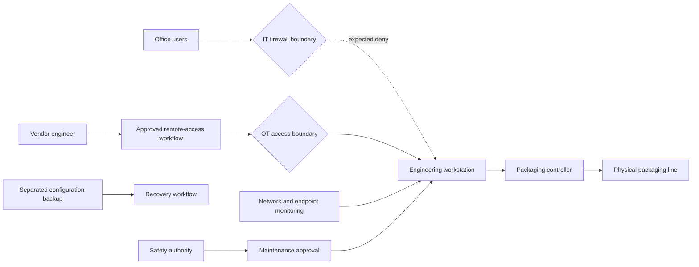

### Time-bound compensating package

| Control | Function | Exact scope | Validation | Limitation |
|---|---|---|---|---|
| Block office-to-workstation initiation | Preventive segmentation | Defined source zones to workstation management ports | Authorized expected-denial tests from representative sources | Does not cover vendor route or local physical access |
| Dedicated vendor identity with MFA | Preventive identity | Named vendor users and maintenance application | Test authentication, sponsor, expiry, and denied shared credential | MFA does not constrain post-login action alone |
| JIT maintenance window | Least privilege | Approved 90-minute session to named workstation | Activation, session binding, expiry, revoke | Emergency may need faster process |
| Command and session recording | Detective and accountability | Vendor administrative session | Generate benign action and confirm protected record | Recording may expose sensitive operations and needs governance |
| Application allowlisting | Preventive | Approved binaries on workstation | Run approved and blocked harmless test | Legacy dependencies can break production |
| Network anomaly alert | Detective | Workstation destinations and protocols | Simulate approved benign unexpected connection | Encrypted content and baseline limits remain |
| Rapid isolation runbook | Response | Workstation network, with safe controller behavior | Tabletop plus approved nonproduction test | Isolation could affect safety or line control |
| Separated configuration backup | Recovery | Workstation and controller configuration | Restore to representative spare or lab | Does not restore lost confidentiality |
| Patch milestone and expiry | Governance | 45-day window | Vendor and safety sign-off, change and rollback plan | Delay requires new explicit acceptance |

### OT decision

The compensating package can reduce the credential and remote-path risk while preserving safety authority. It does not remove the vulnerability. Residual risk remains for local access, undiscovered dependencies, control bypass, and any behavior the endpoint or network sources cannot observe. The exception expires at the maintenance window and cannot renew automatically.

### OT troubleshooting drill

During an authorized expected-denial test, an office test host reaches the workstation on a management port. The team must not continue deeper. Stop, preserve the flow and policy evidence, verify source and destination identity, identify the effective rule and change history, assess whether other hosts share the path, and involve OT and safety owners before containment. An unexpected allowed path is itself the discriminating result.

## Fictional NMH SaaS scenario

### Scenario

NMH's fictional acquisition team uses a SharePoint site for sensitive transaction documents. A broad employee group is nested into the site's visitor role, and two external advisers retain access after their work ended. The site also uses an automation identity with tenant-wide file-read permission although it processes only one library.

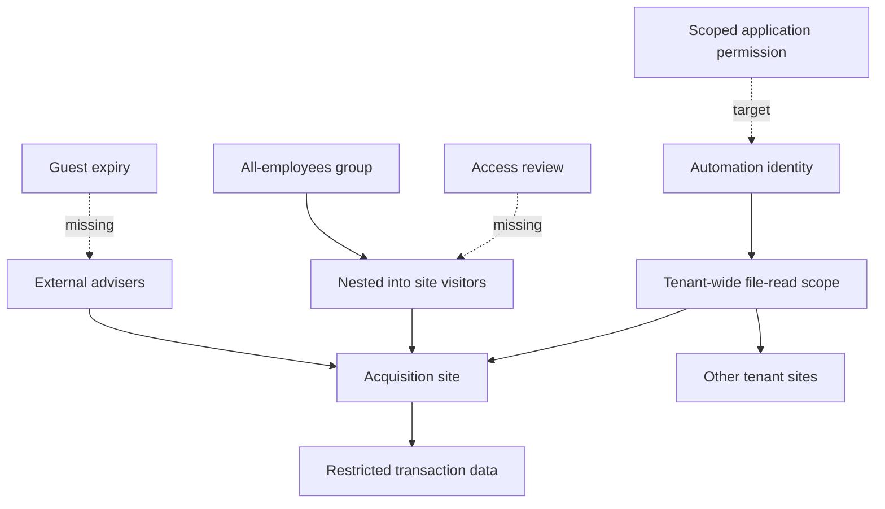

### SaaS control design

| Layer | Current fictional gap | Target control | Test |
|---|---|---|---|
| Data | Site content classification inconsistent | Owner-approved site and library classification | Sample metadata and policy behavior |
| Identity | Guests lack current sponsor and expiry | Sponsor, purpose, expiry, review, revocation | Expired test guest loses access and session |
| Authorization | Broad employee group inherits read | Acquisition-specific roles and effective-access review | Approved users succeed; broad sample denied |
| Workload | Automation has tenant-wide read | Resource-specific application permission | Job succeeds on library and fails elsewhere |
| Session | Sensitive access allowed from unmanaged context | Defined device or browser restrictions based on need | Representative allowed, restricted, and fallback paths |
| Data use | Downloads and sharing lack appropriate controls | Proportionate DLP, sharing, and session action | Benign synthetic test data produces expected decision |
| Detection | No alert for unusual bulk activity | Baseline-aware data-access analytic | Authorized simulation reaches analyst queue |
| Response | Revocation process not tested | Identity, session, link, and app-permission revoke runbook | Time and effectiveness test |
| Recovery | Deletion recovery assumed | Version and retention recovery exercise | Restore representative synthetic document |

### SaaS tradeoffs

Restricting every download could block legal advisers working across organizations. Requiring a managed NMH device may be infeasible for an external law firm. Alternatives could include browser-limited access, watermarking, narrower data rooms, contractual handling, time-bound identity, strong authentication, and heightened monitoring. None should be called equivalent without risk mapping and test evidence.

## Architecture review method

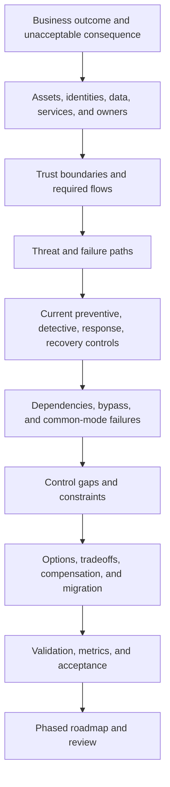

| Review question | Evidence | Decision produced |
|---|---|---|
| What must continue and what harm is unacceptable? | Business service, data, safety, RTO/RPO | Security outcome and constraints |
| Who and what need access? | User, workload, task, owner, lifecycle | Least-privilege subjects and actions |
| Where does context or authority change? | Architecture, data flows, identity domains | Trust boundaries |
| Which flows are required? | Observed traffic and owner validation | Allow policy and segmentation baseline |
| Which threat and failure paths matter? | Risk scenarios, incidents, intelligence | Control coverage priorities |
| Which controls already apply? | Effective config and tests | Current residual-risk view |
| What shares a dependency? | Identity, management, source, network, provider | Common-mode risk and independence plan |
| What cannot change now? | Vendor, safety, legal, operational evidence | Compensating-control candidate |
| How will outcomes be proven? | Test plan, metrics, acceptance criteria | Exit gate and monitoring |

## Implementation lifecycle

1. Define the business service and protected resources.
2. Inventory subjects, workflows, effective access, required communication, and owners.
3. Observe current behavior for a representative period without treating observation as authorization.
4. Design roles, attributes, resources, actions, boundaries, deny defaults, emergency paths, and failure behavior.
5. Model abuse, error, outage, common-mode failure, privacy, safety, and user experience.
6. Pilot with synthetic data and representative low-risk populations.
7. Validate allowed work, denied work, telemetry, response, rollback, and recovery.
8. Stage enforcement with owners and support readiness.
9. Monitor denials, exceptions, bypass, drift, health, and business outcomes.
10. Remove temporary rules and privileges; review residual risk and mature iteratively.


## Metrics

| Metric | Definition | Decision supported | Caveat |
|---|---|---|---|
| Effective-access review coverage | In-scope critical resources with sampled effective access validated | Where least privilege lacks evidence | Review can miss unsampled paths |
| Standing privileged identities | Count and rate of permanent high-power assignments | JIT/JEA migration | Count needs scope and emergency exclusions |
| Privilege activation quality | Percent with valid owner, reason, scope, duration, and review | Workflow health | More activations can mean adoption, not more risk |
| Denied-path validation | Critical prohibited paths tested and denied | Segmentation confidence | One source and protocol do not cover all paths |
| Required-flow success | Approved workflows passing after enforcement | Availability and usability | Synthetic tests may miss real variants |
| Segmentation exception age | Open exceptions by age, risk, and expiry | Migration and escalation | Automatic renewal hides debt |
| Common-mode findings | Priority control sets sharing unmitigated critical dependency | Resilience investment | Dependency inventory can be incomplete |
| Detection-chain success | Approved test observed from source through analyst action | End-to-end detective control | Test procedure covers only selected behavior |
| Recovery validation | Representative restores meeting RTO, RPO, integrity, and acceptance | Resilience confidence | Easy samples inflate success |
| Unauthorized-access reduction | Stable-scope denied or removed inappropriate pathways | Outcome trend | Increased discovery can raise count before improvement |

## Failure modes and troubleshooting

| Failure mode | Symptom | Likely cause | Troubleshooting action |
|---|---|---|---|
| Role explosion | Hundreds of near-identical roles | RBAC used for every contextual difference | Consolidate job roles and apply governed attributes |
| Attribute failure | Access unexpectedly denied or allowed | Stale, missing, conflicting, or untrusted attribute | Trace source, timestamp, transformation, policy evaluation |
| Permanent JIT | Activations last days or renew automatically | Workflow optimized for convenience | Set task-based duration, approval, expiry, review |
| Microsegmentation outage | Application calls fail after enforcement | Hidden dependency, dynamic endpoint, policy order | Compare allowed-flow baseline, denials, service identity, failover |
| Shadow path | Test succeeds despite deny rule | Alternate route, protocol, identity, proxy, or management path | Trace effective source-to-resource route and policy point |
| No denial evidence | User reports block but logs absent | Wrong enforcement point, logging failure, or client issue | Reproduce safely and correlate network, identity, app, endpoint |
| Control cascade | Identity outage breaks access, logging, and recovery | Common-mode dependency | Invoke designed fallback and separate recovery authority |
| Compensation drift | Temporary allowlist expands | No owner, expiry, or population reconciliation | Freeze additions, review scope, validate and migrate |
| Break-glass failure | Emergency identity cannot sign in | Never tested, expired secret, wrong exclusion | Controlled periodic test and protected alerting |
| Detection-only comfort | Alerts fire but harm completes rapidly | No prevention, response authority, or safe automation | Add path-breaking control and tested response |

## Decision trees

### Is this defense in depth or duplication?

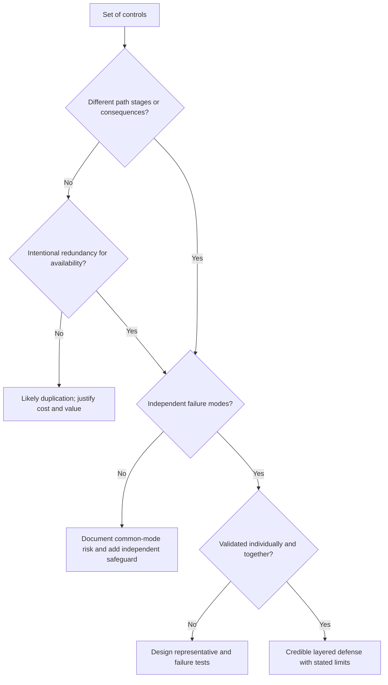

### Should a compensating control be approved?

```mermaid
flowchart TD
    PRIMARY[Primary requirement not met] --> WHY{Constraint evidenced?}
    WHY -->|No| FIX[Implement primary control]
    WHY -->|Yes| MAP{Alternate controls address same risk path?}
    MAP -->|No| REJECT[Reject or escalate residual risk]
    MAP -->|Yes| TEST{Coverage and effectiveness validated?}
    TEST -->|No| PILOT[Pilot and test safely]
    TEST -->|Yes| RESID{Residual risk within owner's authority?}
    RESID -->|No| ESC[Escalate, avoid, or stop activity]
    RESID -->|Yes| TEMP[Approve scope, owner, expiry, monitoring, migration]
    TEMP --> REVIEW[Review on date or trigger]
```

## Realistic drills

### Drill 1 - Overprivileged automation

A SaaS automation has tenant-wide read permission but processes one library. Build a safer plan:

1. Confirm the job, owner, schedule, data, actions, failure handling, and dependent systems.
2. Identify whether a resource-specific application permission exists and how it is enforced.
3. Create a dedicated lab identity and synthetic library.
4. Test successful required processing, denied access elsewhere, credential rotation, revocation, and audit.
5. Stage migration with rollback and monitor job success and denied attempts.
6. Remove broad permission only after representative validation.

### Drill 2 - Segmentation rule blocks OneDrive

A new network policy is followed by OneDrive sign-in and sync failures for one region. Do not immediately remove all restrictions.

| Hypothesis | Evidence | Discriminating check |
|---|---|---|
| Required endpoint omitted | Denied destination or service dependency | Compare current official endpoints and policy decision |
| TLS interception incompatibility | Certificate, handshake, or application error | Correlate client, TLS, proxy, and bypass-approved test |
| Identity path blocked | Authentication or token endpoint failure | Trace name, TCP, TLS, HTTP, and identity result |
| User or device attribute mismatch | Policy denies one population | Compare effective identity and posture fields |
| Unrelated client regression | Same failure outside changed path | Controlled alternate network and version comparison |
| Service incident | Health and independent regions affected | Service evidence and timing |

The target is the smallest correction that restores the authorized flow while preserving denied paths. Your production troubleshooting skills are directly relevant here; the security policy ownership remains with the customer.

### Drill 3 - Shared administrator compromises backup independence

The same fictional identity can disable endpoint protection, change network policy, and delete backups. Redesign around separate duties, JIT/JEA, protected workstations, independent logging, separate recovery authority, and tested break glass. Then identify what remains shared, such as cloud provider or physical facility.

### Drill 4 - Compensating-control review

An exception says, "Legacy server cannot support MFA; firewall and monitoring compensate." Challenge it:

| Challenge | Why it matters |
|---|---|
| Which identities and protocols bypass MFA? | Scope must be precise |
| Is the firewall resource-specific or network-wide? | Broad reach preserves lateral movement |
| Which paths, including management and local access, remain? | Alternate routes may defeat compensation |
| What behavior is monitored and who responds? | Logs alone are not a detective outcome |
| Can response occur before severe consequence? | Detection may be too slow |
| What recovery exists? | Some events cannot be prevented |
| Who accepted residual risk and when does it expire? | Governance prevents permanent workaround |

## Contrarian review

| Claim | Contrarian question | Required evidence |
|---|---|---|
| "We have defense in depth" | Which layer still helps when identity, management, or telemetry fails? | Dependency map and failure test |
| "Users have least privilege" | Effective access to which resources, actions, and time? | Effective-access sample and role lineage |
| "Default deny is enabled" | What happens for unmatched, stale, missing, and emergency context? | Policy and failure-mode test |
| "The network is segmented" | Can valid identities, proxies, management paths, or alternate protocols cross? | Multi-path test matrix |
| "Microsegmentation prevents lateral movement" | Which workload identities and flows are covered, and who can change labels? | Effective policy and management-control evidence |
| "JIT removes standing privilege" | Are sessions truly expired and tokens revoked? | Activation, expiry, token, and action evidence |
| "Two-person approval protects us" | Can one identity occupy both roles or control evidence? | Conflict and separation test |
| "Monitoring compensates" | Can detection and response occur before the modeled consequence? | End-to-end timed exercise |
| "The exception is temporary" | Which milestone, owner, expiry, and escalation prevents renewal? | Exception and roadmap record |

## Official Source Anchors

**Checked on 2026-08-24.** NIST publications and CISA guidance provide standards and government guidance within their scopes. Microsoft documentation provides official technology references for JEA and identity examples. Zscaler pages describe vendor positioning. NMH designs and results are fictional.

| Source | Official anchor | Used for | Caveat |
|---|---|---|---|
| NIST SP 800-53 Rev. 5 | https://csrc.nist.gov/pubs/sp/800/53/r5/upd1/final | Access control, separation of duties, least privilege, boundary, monitoring, contingency, and assurance concepts | Catalog requires organizational tailoring and implementation evidence |
| NIST SP 800-53A Rev. 5 | https://csrc.nist.gov/pubs/sp/800/53/a/r5/final | Control assessment procedures and evidence mindset | Assessment depth must match risk and system context |
| NIST SP 800-207 | https://csrc.nist.gov/pubs/sp/800/207/final | Zero Trust, resource focus, policy decision and enforcement concepts | Part 10 covers architecture in depth; publication is technology-neutral |
| NIST Cybersecurity Framework 2.0 | https://www.nist.gov/cyberframework | Govern, Identify, Protect, Detect, Respond, and Recover outcomes | Framework alignment is not effectiveness proof |
| CISA Zero Trust Maturity Model | https://www.cisa.gov/resources-tools/resources/zero-trust-maturity-model | Identity, devices, networks, applications/workloads, data, visibility, analytics, automation, and governance maturity | Federal model requires contextual adaptation and current-version check |
| CISA Cybersecurity Performance Goals | https://www.cisa.gov/cybersecurity-performance-goals-cpgs | Prioritized cross-sector protective practices | Check current page location and sector applicability |
| Microsoft JEA overview | https://learn.microsoft.com/powershell/scripting/security/remoting/jea/overview | Official Just Enough Administration mechanics in PowerShell | Technology-specific implementation, not universal JEA definition |
| Microsoft privileged access | https://learn.microsoft.com/security/privileged-access-workstations/privileged-access-access-model | Privileged-access isolation and tiering concepts | Verify current Microsoft guidance and product scope |
| Zscaler zero trust positioning | https://www.zscaler.com/resources/security-terms-glossary/what-is-zero-trust | Vendor description of least privilege, direct-to-app access, context, and segmentation | Vendor positioning is not NIST and not production evidence |
| Zscaler microsegmentation positioning | https://www.zscaler.com/products-and-solutions/microsegmentation | Public product claims and terminology | Verify current packaging, architecture, enforcement, and tenant behavior |
| Zscaler OT segmentation positioning | https://www.zscaler.com/products-and-solutions/zero-trust-device-segmentation | Public vendor description relevant to device and OT segmentation | NMH implementation is entirely fictional |

## Likely Interview Questions

### Q1. What is defense in depth, and how is it different from buying multiple security tools?

**Model answer:** Defense in depth coordinates preventive, detective, response, recovery, and governance controls across different points and failure modes so one failure does not automatically create unacceptable harm. Multiple tools can be complementary, intentionally redundant, conflicting, or merely duplicative. I examine the exact outcome, coverage, dependencies, bypass, and evidence for each layer.

Five products using the same identity, asset inventory, administrator, and event stream may share one common-mode failure. I would credit them only according to demonstrated independent value and state what remains shared.

### Q2. Explain least privilege, deny by default, RBAC, and ABAC.

**Model answer:** Least privilege grants the minimum subject, resource, action, context, and time needed for an approved purpose. Deny by default means unmatched requests are denied rather than implicitly allowed. RBAC assigns baseline permissions through job or function roles. ABAC refines decisions with subject, resource, action, and environment attributes.

They often work together: a finance role provides normal responsibility, while device state, data classification, time, and risk attributes narrow a specific session. I would test authorized success, unauthorized denial, missing attributes, emergency paths, and revocation.

### Q3. What is the difference between JIT and JEA?

**Model answer:** Just-In-Time limits when privilege exists and automatically expires it. Just Enough Administration limits what administrative actions and resources are available. Combining them can grant one engineer a 45-minute session to restart one approved service rather than permanent broad administration.

The workflow also needs identity proof, owner approval, task binding, protected audit, revocation, break glass, usability, and review. A long automatically renewed activation is standing privilege with a different label.

### Q4. Compare segmentation and microsegmentation.

**Model answer:** Segmentation broadly separates resources or trust domains and controls interaction among them. It can apply to networks, identities, applications, workloads, data, administration, and OT. Microsegmentation applies finer policy among individual or small groups of workloads or resources, often using workload identity, labels, or intended application relationships.

Microsegmentation can reduce lateral movement and blast radius, but it depends on accurate inventory, identity, labels, required-flow discovery, policy protection, observability, failover, and owner acceptance. It is not simply creating more subnets.

### Q5. How do you determine whether controls are independent?

**Model answer:** I build a dependency map for identity, management authority, asset data, telemetry, network path, time, update channel, provider, and recovery. Then I ask which control still prevents, detects, contains, or restores when another control or shared dependency fails. Where safe, I test representative dependency-loss scenarios.

Different vendor names do not prove independence. I state the tested boundary and remaining common dependencies rather than claiming full independence.

### Q6. When is a compensating control acceptable?

**Model answer:** A compensating control is appropriate when the primary requirement is genuinely infeasible for a documented technical, safety, legal, or operational reason, and an alternate set of controls materially reduces the same relevant path or consequence. It needs exact scope, evidence, testing, owner, residual-risk authority, monitoring, expiry, and a migration plan.

Monitoring alone may not compensate for a fast severe event, and segmentation does not remove an underlying vulnerability. Compensation is not automatic equivalence, so the residual-risk statement must retain its limitations.

### Q7. Walk through the fictional NMH OT scenario.

**Model answer:** The fictional workstation supports a packaging controller and cannot receive a vendor-approved fix until a 45-day maintenance window. I would first confirm applicability and safely test the asserted network boundary. A temporary package could restrict office paths, replace a shared vendor credential with named MFA identities, use JIT maintenance, record sessions, monitor communication, define safety-approved isolation, and validate separated configuration recovery.

The package does not remove the vulnerability and cannot override plant safety authority. The exception expires at the maintenance window, and any delay requires new explicit residual-risk acceptance. This is a lab design, not production OT experience.

### Q8. How does your prior background transfer, and what remains a gap?

**Model answer:** My production strength is effective-access and dependency reasoning across OneDrive, SharePoint, identity, clients, DNS, TCP, TLS, HTTP, proxies, and services, plus critical escalation, Engineering coordination, analytics, and fix validation. Those skills help discover required flows, distinguish policy from effective behavior, and test the smallest safe change.

I have not deployed Zscaler segmentation, microsegmentation, PAM, or a formal Zero Trust program in production. I can explain the architecture and validation method, practice with synthetic labs, and would ramp through official training, shadowing, reviewed designs, and customer-authorized evidence.

## 30-Second Memory Hooks

| Concept | Memory hook |
|---|---|
| Defense in depth | Different stages, different failures, tested together |
| Duplication | More controls without more independent protection |
| Trust boundary | Context or authority changes here |
| Least privilege | Minimum subject, resource, action, context, and time |
| Deny by default | No explicit allow means deny |
| RBAC | Role gives the baseline |
| ABAC | Attributes refine the decision |
| JIT | Privilege only when needed |
| JEA | Only the needed administrative action |
| Separation of duties | No one identity controls every critical step |
| Segmentation | Bound communication and trust |
| Microsegmentation | Room key, not whole hotel floor |
| Blast radius | Limit what one foothold can reach |
| Common-mode failure | One dependency defeats many layers |
| Prevent | Stop or narrow |
| Detect | See and understand |
| Respond | Contain and correct |
| Recover | Restore trusted outcomes |
| Validate | Design, implementation, operation, effect, independence |
| Compensating control | Alternate risk reduction with an expiry |
| Zero Trust relation | Explicit verification plus resource-specific least privilege |
| NMH | Fictional OT and SaaS practice only |
| Experience bridge | Production access and dependency evidence; conceptual control architecture |

## Completion Checklist

- [ ] I can explain defense in depth as coordinated prevention, detection, response, recovery, and governance.
- [ ] I can distinguish complementary layers, redundancy, corroboration, duplication, conflict, and stacked fragility.
- [ ] I can identify identity, privilege, network, application, data, workload, ownership, IT-to-OT, and recovery trust boundaries.
- [ ] I can define least privilege across subject, resource, action, context, time, review, and revocation.
- [ ] I can explain deny by default and reason about fail-open, fail-closed, safety, and availability tradeoffs.
- [ ] I can compare RBAC and ABAC and explain how they work together.
- [ ] I can distinguish JIT and JEA and govern break-glass access.
- [ ] I can explain separation of duties without diffusing accountability.
- [ ] I can compare network, application, identity, data, workload, device, administrative, and OT segmentation.
- [ ] I can explain microsegmentation mechanics, benefits, dependencies, and operational risks.
- [ ] I can analyze control independence and common-mode failures.
- [ ] I can map preventive, detective, response, recovery, and learning layers across a scenario.
- [ ] I can validate design, implementation, operation, effectiveness, independence, side effects, and durability.
- [ ] I can decide whether a compensating control addresses the same risk and has sufficient evidence.
- [ ] I can require an owner, residual-risk authority, expiry, monitoring, and migration for every exception.
- [ ] I can explain the relationship between these controls and Zero Trust without calling one control a complete architecture.
- [ ] I can design least-privilege OneDrive and SharePoint access while preserving legitimate collaboration.
- [ ] I can walk the fictional NMH OT scenario and preserve safety authority.
- [ ] I can walk the fictional NMH SaaS scenario across identity, authorization, workload, session, data, detection, response, and recovery.
- [ ] I can troubleshoot hidden application dependencies, policy order, shadow paths, attribute errors, and control cascades.
- [ ] I can define useful metrics with stable scope and evidence caveats.
- [ ] I can distinguish standards, government guidance, official technology documentation, vendor positioning, and fictional design.
- [ ] I can recheck source and product currency after 2026-08-24.
- [ ] I can label production, lab, conceptual, not-yet-used, and fictional content honestly.
- [ ] I can answer all eight questions aloud without claiming production Zscaler, SecOps, microsegmentation, PAM, OT-security, or Zero Trust deployment.

[Part 10 - Zero Trust from First Principles and NIST SP 800-207](Part-10-zero-trust-nist-800-207.md)