# Part 10 - Zero Trust from First Principles and NIST SP 800-207

> **Audience:** Arti Thakur, moving from Microsoft 365 Support Escalation Engineering into a Zscaler Security Operations Technical Success Manager role.
>
> **Currency date:** 2026-08-24.
>
> **Scope and honesty:** Northstar Meridian Holdings, abbreviated NMH, and every NMH architecture, identity, session, policy, test, incident, metric, calculation, decision, and outcome are fictional. Arti's established production bridge is Microsoft support, OneDrive, SharePoint, networking, troubleshooting, analytics, mentoring, escalation, and approved AI work. Direct production design or operation of Zscaler, Security Operations, vulnerability, exposure, scanner, Endpoint Detection and Response, Security Information and Event Management, Zero Trust Network Access, or an enterprise Zero Trust program is not established.
>
> **Standards and product caveat:** National Institute of Standards and Technology Special Publication 800-207, abbreviated NIST SP 800-207, is technology-neutral United States government guidance. Zscaler pages describe Zscaler's product and architectural positioning. NIST does not certify that a named vendor implementation is automatically a complete Zero Trust Architecture. Verify current standards, product documentation, packaging, license, tenant behavior, privacy duties, and customer policy before operational use.
>
> **Currency caveat:** Sources were checked for this guide on 2026-08-24. Zero Trust guidance and products evolve. Recheck publication status, related NIST documents, Cybersecurity and Infrastructure Security Agency guidance, and official Zscaler documentation after this date.

## Section goal

Zero Trust is a security strategy and architectural approach that removes automatic trust based only on network location, device ownership, or a prior successful login. It protects resources through explicit, policy-driven, least-privileged access decisions using available context before and during a session.

Imagine a research campus. A traditional perimeter model may check a badge at the front gate and then allow broad movement. Zero Trust checks which person and device are requesting which laboratory, for which action, at which time, under which risk conditions. Entry to one laboratory does not grant entry to another. A change in badge status, device health, or behavior can cause another check or session termination. The campus still needs fences, cameras, fire safety, backups, and emergency procedures. Zero Trust changes the trust model; it does not eliminate defense in depth.

By the end, Arti should be able to:

| Learning outcome | What mastery looks like |
|---|---|
| Explain the problem and history | Describe why perimeter-based implicit trust became insufficient for cloud, mobility, contractors, and distributed resources |
| State Zero Trust principles | Explain resource focus, secure communication, per-session access, dynamic policy, posture monitoring, and continuous improvement |
| Model subjects and resources | Distinguish human and non-human subjects, requesting assets, resources, actions, and sessions |
| Draw NIST architecture | Explain Policy Engine, Policy Administrator, and Policy Enforcement Point mechanics |
| Explain context and trust | Combine identity, device, workload, resource, data, behavior, threat, and environment signals without calling a score truth |
| Separate planes | Distinguish control-plane decisions from data-plane communication and management-plane administration |
| Compare deployment models | Explain device agent/gateway, enclave gateway, resource portal, and application-sandbox variations |
| Plan deployment | Compare enhanced identity governance, microsegmentation, and network or software-defined perimeter approaches |
| Operate sessions | Trace request, authentication, authorization, enforcement, monitoring, re-evaluation, termination, and evidence |
| Handle legacy coexistence | Use phased scope, gateways, compensation, and migration without claiming overnight replacement |
| Measure maturity | Evaluate identity, device, network, application/workload, data, visibility, automation, governance, and outcomes |
| Compare NIST and Zscaler | Separate neutral standard concepts from documented vendor positioning and implementation claims |
| Troubleshoot | Isolate identity, posture, policy, path, application, inspection, telemetry, and product dependencies |
| Practice honestly | Design a fictional NMH target architecture and Microsoft 365 access example without claiming production deployment |

## JD Mapping

**JD** means job description. The target Technical Success Manager, abbreviated **TSM**, needs to connect Zero Trust architecture to customer outcomes, adoption, risk reduction, troubleshooting, and executive communication while preserving product and ownership boundaries.

| JD expectation | Part 10 capability | Honest Arti bridge |
|---|---|---|
| Analyze complex environments | Map subjects, devices, identities, applications, workloads, data, policy, enforcement, and telemetry | Production Microsoft 365 and networking dependency analysis |
| Identify security risk | Find implicit trust, broad network access, stale identity, weak context, and large blast radius | Lab NMH assessment; no claimed Zero Trust production design |
| Deliver mitigation | Sequence resource-specific access, policy, posture, telemetry, legacy compensation, and validation | Production fix-validation method; conceptual architecture |
| Develop Zscaler expertise | Explain documented Zero Trust Exchange positioning and ask product-specific validation questions | Not-yet-used product area, studied from official sources |
| Resolve critical escalations | Trace access from client through identity, policy, enforcement, path, and application | Strong production support and networking bridge |
| Explain complex metrics | Separate deployment, policy coverage, decision quality, session outcomes, control evidence, and business value | Production analytics bridge |
| Lead strategic engagement | Define current state, target state, phased roadmap, owners, tests, adoption, and governance | Lab success plan and established customer leadership skills |
| Communicate to executives | Explain reduced implicit trust and blast radius without absolute breach-prevention claims | Conceptual executive narrative grounded in evidence |

## Candidate honesty note

Arti can truthfully say that she has investigated production access and availability across OneDrive, SharePoint, Microsoft identity, client, browser, Domain Name System, Transmission Control Protocol, Transport Layer Security, Hypertext Transfer Protocol, proxy, policy, and service layers. She has led escalations, coordinated with Engineering, analyzed trends, and validated fixes. These are valuable Zero Trust troubleshooting foundations.

She should not say that Microsoft support work constitutes designing a customer Zero Trust Architecture, deploying Zscaler Private Access, operating the Zero Trust Exchange, or owning a Security Operations program.

| Label | Meaning in this chapter | Safe wording | Unsafe wording |
|---|---|---|---|
| Production | Established Microsoft support, networking, analytics, escalation, mentoring, training, and approved AI facts | "I traced Microsoft 365 access through identity, policy, network, client, and service evidence." | "I deployed enterprise Zero Trust for customers" |
| Lab | Synthetic architecture, policy, test, or exercise | "I designed and challenged an NMH target architecture in a lab case." | "I transformed a global manufacturer" |
| Conceptual | NIST architecture or general method understood from sources | "I can map PE, PA, PEP, signals, and session lifecycle." | "I am a Zero Trust architect" without evidence |
| Not-yet-used | Product or operational responsibility without direct experience | "I have not deployed Zscaler products in production." | "I configured ZPA policy" |
| Fictional | Every NMH system, policy, metric, and result | "In the fictional NMH scenario..." | "At my manufacturing customer..." |

## Acronyms and essential terms

| Acronym or term | Expanded form | Plain meaning | Memory hook |
|---|---|---|---|
| ZT | Zero Trust | Security model that does not grant implicit trust from location or ownership | No automatic trust |
| ZTA | Zero Trust Architecture | Enterprise design that applies Zero Trust principles | The system of decisions and enforcement |
| ZTNA | Zero Trust Network Access | Technology category that provides policy-based access to applications or resources | One implementation capability, not all Zero Trust |
| NIST | National Institute of Standards and Technology | United States standards and guidance organization | Technology-neutral source |
| CISA | Cybersecurity and Infrastructure Security Agency | United States operational cybersecurity agency | Maturity and implementation guidance |
| PE | Policy Engine | Makes the ultimate access decision and can revoke it | The decision brain |
| PA | Policy Administrator | Establishes or terminates the communication path and conveys the decision | The session coordinator |
| PEP | Policy Enforcement Point | Enables, monitors, and terminates the connection | The gate |
| PDP | Policy Decision Point | Logical decision function often represented by PE and PA together | Decide and administer |
| CDM | Continuous Diagnostics and Mitigation | Asset and posture information used to support decisions | Continuous health evidence |
| IAM | Identity and Access Management | Identity lifecycle, authentication, authorization, and governance | Who are you, and what may you do? |
| PKI | Public Key Infrastructure | Certificates, keys, trust anchors, and processes supporting digital identity | Digital passports and issuing authority |
| SIEM | Security Information and Event Management | Platform category centralizing and analyzing security-relevant events | Security event control room |
| MFA | Multi-Factor Authentication | Authentication with more than one factor category | More than one kind of proof |
| RBAC | Role-Based Access Control | Permission through job or function roles | Role provides baseline access |
| ABAC | Attribute-Based Access Control | Policy based on subject, resource, action, and environmental attributes | Context refines the decision |
| API | Application Programming Interface | Defined mechanism for software interaction | Software service counter |
| SaaS | Software as a Service | Software operated as an online service | Hosted operation, shared responsibility |
| TLS | Transport Layer Security | Cryptographic protection for many network sessions | Sealed and authenticated transport |
| ZIA | Zscaler Internet Access | Zscaler product for secure internet and SaaS access | Official product positioning; not candidate experience |
| ZPA | Zscaler Private Access | Zscaler product for policy-based private-application access | Direct-to-app positioning; not candidate experience |
| ZCC | Zscaler Client Connector | Zscaler endpoint client used in documented traffic and access scenarios | Device-side product component |
| NMH | Northstar Meridian Holdings | Fictional continuity enterprise | Practice only |

## Why Zero Trust emerged

Traditional enterprise security often assumed a trusted internal network surrounded by a hostile internet. Firewalls and remote-access Virtual Private Networks, abbreviated **VPNs**, controlled entry. Once connected, users and devices sometimes received broad network reachability. That model was always an approximation, but cloud services, remote work, personal devices, contractors, software supply chains, and distributed applications made location an even weaker trust signal.

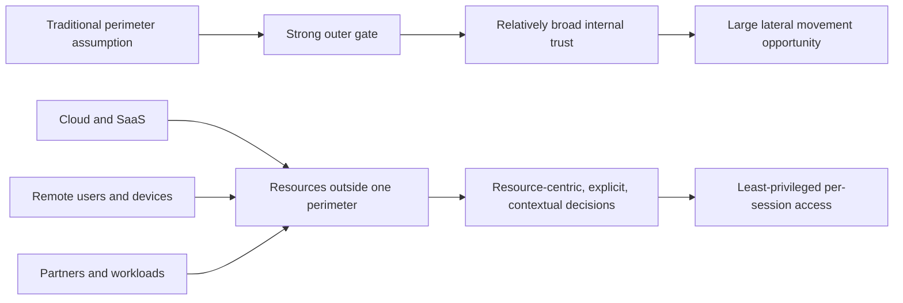

| Enterprise change | Why perimeter trust weakens | Zero Trust response |
|---|---|---|
| SaaS and cloud | Resources no longer sit behind one enterprise firewall | Protect each resource and decision independent of location |
| Remote and hybrid work | User location varies and home networks are not enterprise zones | Use identity, device, resource, action, and context |
| Bring your own device | Ownership does not guarantee or forbid acceptable posture | Evaluate device confidence and choose proportionate access |
| Contractors and suppliers | External identities need narrow business access | Resource-specific, sponsored, time-bound authorization |
| Workload-to-workload traffic | Non-human identities operate at machine speed | Unique workload identity and service-specific policy |
| Acquisitions | Networks and directories merge faster than trust is understood | Avoid broad network trust; phase resource onboarding |
| Credential theft | Valid credentials can cross a perimeter | Add device, behavior, session, risk, and least privilege |
| Encrypted traffic | Content and behavior may be hidden from legacy controls | Apply authorized inspection, metadata, endpoint, and application context |
| Insider and compromised device | "Inside" actor may be malicious or controlled | Re-evaluate every resource session and limit blast radius |

Zero Trust is not new cryptography or one appliance. It combines mature ideas such as least privilege, strong identity, segmentation, device posture, secure communications, monitoring, and governance into an architectural trust model centered on resources.

## NIST SP 800-207 scope

NIST SP 800-207, published in August 2020, describes an abstract Zero Trust Architecture and general deployment models and use cases. It focuses on protecting resources rather than granting broad trust to network segments. It is not a procurement checklist, certification, maturity score, or vendor implementation guide.

### NIST Zero Trust tenets in plain language

| Tenet paraphrase | Beginner meaning | Design implication | Evidence question |
|---|---|---|---|
| All data sources and computing services are resources | Protect data, applications, devices, services, and workflows | Inventory and assign owners beyond servers | Which resources matter and how are they identified? |
| Secure all communication regardless of network location | Internal traffic is not trusted merely for being internal | Authenticate and protect communication where appropriate | Is transport and peer identity protected on every relevant path? |
| Grant access to individual resources per session | One approval does not provide an all-day network passport | Scope each session to resource and purpose | What exact resource and action did the decision allow? |
| Use dynamic policy based on client, resource, and context | Identity alone is insufficient | Combine identity, device, resource, behavior, and environment | Which signals, rules, freshness, and fallbacks drove the decision? |
| Monitor integrity and posture of assets | Owned device is not automatically healthy | Measure posture, inventory, software, and configuration | How current and trustworthy is posture evidence? |
| Authenticate and authorize dynamically before access | Check subject and device; re-evaluate as conditions change | Separate authentication from resource authorization | Was access revoked when role, risk, or posture changed? |
| Collect and improve from current state and activity | Decisions should learn from telemetry | Feed logs, incidents, inventory, and control health back into policy | Did evidence change policy or reveal blind spots? |

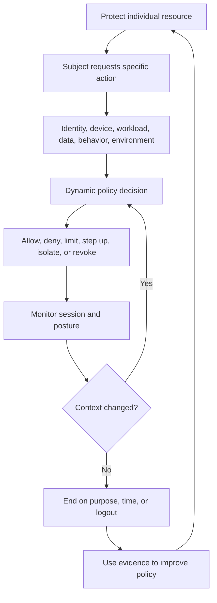

### Plain-English deep-dive 1 - Zero Trust does not mean trust nobody

No useful system can operate without accepting some evidence. A policy engine trusts an identity provider to assert an identity, a device service to report posture, a resource catalog to describe sensitivity, and an enforcement point to apply the decision. Zero Trust means that trust is explicit, limited, evidence-based, and continuously challenged rather than inherited from being "inside."

The phrase "never trust, always verify" is memorable but incomplete. Verification itself can fail. An identity provider can be compromised. A device signal can be stale. A user can pass MFA and then misuse legitimate access. A policy can contain an error. Zero Trust therefore depends on defense in depth, protected control and management planes, monitoring, response, recovery, and governance.

The practical question is not "Do we trust this user?" It is "Do current signals justify this subject performing this action on this resource now, and what limits and evidence should accompany that session?"

## Subjects, requesting assets, and resources

A **subject** is a human or non-human entity requesting access. A **requesting asset** is the device or workload used for the request. A **resource** is the data, service, application, component, or system being accessed. NIST separates subject identity from device state because a valid person on a compromised device presents a different decision.

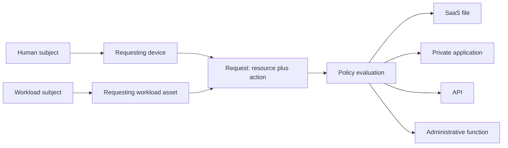

| Element | Examples | Required identity | Important context |
|---|---|---|---|
| Human subject | Employee, contractor, supplier, administrator | Unique, current, appropriately assured identity | Role, sponsor, behavior, risk, employment state |
| Non-human subject | Service account, workload, automation, AI agent | Unique workload identity or credential | Owner, purpose, code, scope, secret lifecycle, behavior |
| Requesting asset | Laptop, phone, browser, server, container | Device or workload identity where feasible | Management, integrity, software, posture, location |
| Resource | SharePoint site, OneDrive file, application, API, database, plant service | Stable resource identity and owner | Sensitivity, criticality, exposure, allowed actions |
| Action | Read, write, share, approve, administer, execute | Bound to subject and resource | Business purpose, consequence, reversibility |
| Session | Time-bounded interaction under a decision | Token, connection, or policy state | Start, expiry, re-evaluation, termination, evidence |

Identity proof is not authorization. Authentication answers whether evidence supports the claimed identity. Authorization answers whether that identity, device, context, and action should access a particular resource. A highly assured administrator should still be denied access to an unrelated resource unless policy permits it.

## Logical architecture: PE, PA, and PEP

NIST SP 800-207 defines three central logical components:

- The **Policy Engine**, abbreviated **PE**, makes the ultimate decision to grant, deny, or revoke access based on policy and inputs.
- The **Policy Administrator**, abbreviated **PA**, establishes or shuts down the communication path and communicates the decision to enforcement. It may generate or deliver session-specific credentials or tokens depending on implementation.
- The **Policy Enforcement Point**, abbreviated **PEP**, enables, monitors, and terminates the connection between subject and resource.

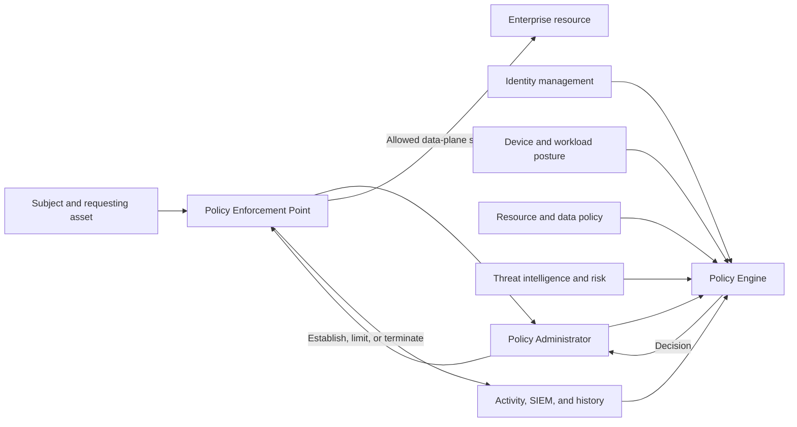

| Component | Core responsibility | Inputs or outputs | Security requirement | Failure question |
|---|---|---|---|---|
| PE | Evaluate policy and decide access | Identity, posture, resource, threat, history, enterprise policy | Integrity, availability, explainable decision evidence | What happens if a signal is missing, stale, or contradictory? |
| PA | Execute decision administration | Decision, tokens, credentials, session commands | Secure communication with PE and PEP, protected session material | Can stale authorization persist after revocation? |
| PEP | Enforce and observe resource connection | Request, decision, data-plane state, telemetry | Correct placement, fail behavior, tamper resistance | Can traffic bypass the PEP or use another protocol? |
| Identity source | Authenticate and provide subject attributes | User, workload, groups, assurance, lifecycle | Strong lifecycle, protected administration, current signals | Does disabled identity retain token or alternate login? |
| Posture source | Report asset condition | Management, patch, integrity, configuration | Freshness, source trust, coverage | Does missing posture allow, deny, or limit access? |
| Resource catalog | Describe resource and policy attributes | Owner, sensitivity, criticality, allowed actions | Accurate classification and lifecycle | Can unknown resources receive broad default access? |
| Telemetry and analytics | Observe requests, decisions, sessions, and behavior | Events, alerts, trends, incidents | Completeness, integrity, time, privacy, retention | Can the system detect a bad decision or PEP bypass? |

The components are logical. One product may implement several components, and several products may collaborate to implement one function. A diagram must identify actual ownership and interfaces rather than assuming every architecture has three separate boxes.

## Control, data, and management planes

The **control plane** carries decisions and coordination. The **data plane** carries the subject-to-resource communication allowed by policy. The **management plane** configures identities, policy, software, keys, connectors, logs, and administrators. NIST emphasizes separation between control policy communication and application data communication; management security is also essential even when diagrams omit it.

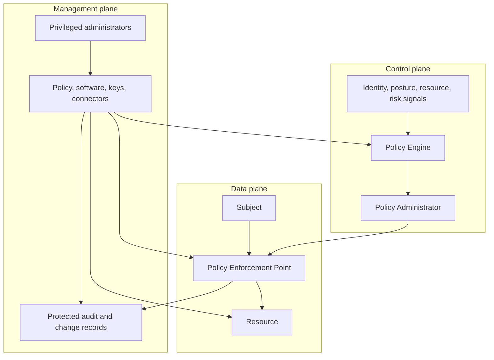

| Plane | Primary content | Example | Main risk | Needed controls |
|---|---|---|---|---|
| Control | Access decision, policy context, session administration | PE tells PA to permit a scoped session | False, unavailable, replayed, or stale decision | Authentication, integrity, availability, freshness, audit |
| Data | Application traffic and resource interaction | User reads permitted SharePoint file | Bypass, overbroad access, data loss, unsafe inspection | PEP placement, secure transport, authorization, data controls |
| Management | Configuration and privileged operation | Administrator changes access policy | One account disables or weakens entire architecture | JIT/JEA, separation, protected workstation, review, recovery |

Protecting only the data plane leaves a critical gap. An attacker who controls policy administration can grant apparently legitimate sessions. Management-plane events need independent monitoring and recovery authority.

## Policy inputs and continuous diagnostics

NIST describes several information sources that can inform the PE. Exact implementations vary.

| Signal family | Example inputs | Decision use | Failure or ambiguity |
|---|---|---|---|
| Enterprise policy | Legal duties, risk appetite, role rules, business hours | Define mandatory outcomes and exceptions | Conflicting or outdated policy |
| Identity management | Account, group, role, authentication, sponsor | Establish subject and authorization baseline | Stale group, compromised admin, weak federation |
| PKI | Device, workload, or service certificate | Authenticate managed entities and secure channels | Expired, stolen, misissued, or unrevoked certificate |
| CDM or device posture | Inventory, patch, health, encryption, management | Decide confidence and access mode | Missing sensor, stale posture, unsupported device |
| Resource and data policy | Sensitivity, owner, criticality, action | Match protection to resource | Incorrect label or unknown owner |
| Threat intelligence | Malicious infrastructure, exploited vulnerabilities, campaigns | Raise caution or deny known threat context | Stale, shared, false, or irrelevant indicator |
| Activity and behavior | Sign-in, session, process, data use, anomalies | Re-evaluate or investigate behavior | Base-rate error, missing baseline, privacy concern |
| SIEM and incident state | Correlated alerts, compromised identity, active response | Revoke or restrict affected entities | Delayed ingestion or circular dependency |
| Compliance and industry requirements | Sector and contractual obligations | Apply required access, retention, or evidence | Checklist substituted for risk or local law review |
| Environment | Time, network, geolocation, service health | Add context and failure behavior | Location can be spoofed and should not be sole trust basis |

**Continuous diagnostics** does not mean every signal is sampled every millisecond or every packet causes complete reauthentication. It means posture and context are measured often enough for the risk, changes can trigger re-evaluation, and stale evidence is treated according to policy.

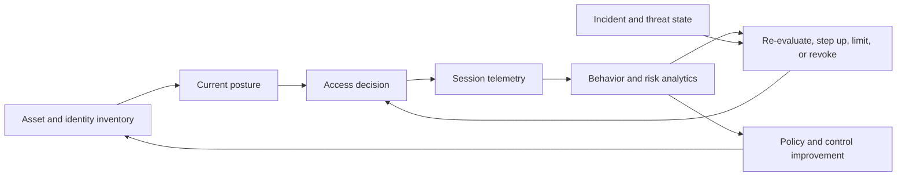

## The trust algorithm

NIST uses **trust algorithm** for the process the PE uses to evaluate a request. An implementation may be criteria-based, score-based, or a combination. "Trust score" is not required, and a numeric result should not be treated as objective truth.

Inputs can include subject identity, requesting asset state, resource requirements, threat intelligence, behavior history, environment, and enterprise policy. Output may be allow, deny, limited access, step-up authentication, isolation, or another policy action.

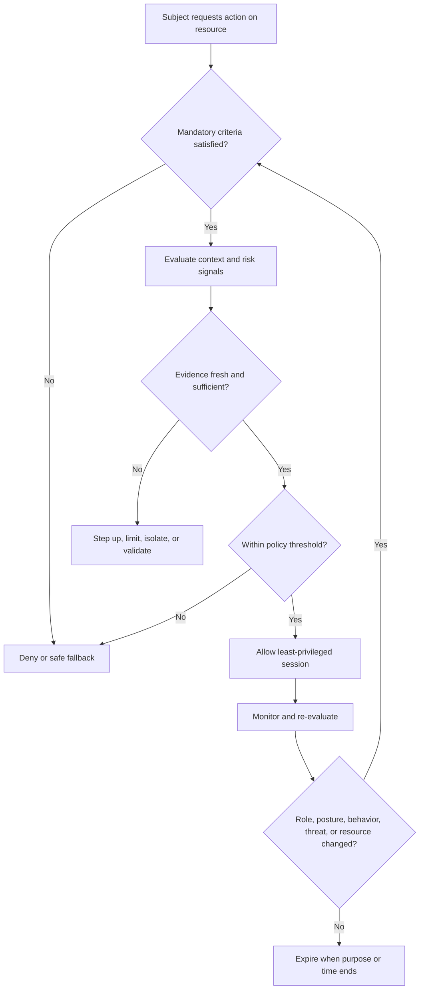

### Criteria-based versus score-based decisions

| Model | Mechanics | Strength | Failure mode | Guardrail |
|---|---|---|---|---|
| Criteria-based | Mandatory Boolean or rule conditions | Explainable hard requirements | Rule complexity and brittle exceptions | Version, test order, conflict handling, deny default |
| Score-based | Weighted signals produce value compared with threshold | Combines gradients and uncertainty | False precision, unstable weights, hidden correlation | Publish drivers, ranges, calibration, confidence |
| Hybrid | Hard gates plus contextual score | Preserves mandatory controls and adapts context | Interactions become difficult to explain | Decision trace and representative tests |
| Risk-adaptive action | Different result by risk band | Allows proportionate step-up or limited mode | Users learn inconsistent behavior; unsafe fallback | Clear user reason, support path, policy owner |

A fictional teaching formula might be:

$$
Context\ Index = Identity\ Confidence + Device\ Confidence + Resource\ Fit - Threat\ Concern - Behavior\ Concern
$$

This is not a NIST formula, not a Zscaler formula, and not a recommended production scoring equation. Signals are not naturally additive; they can be correlated, categorical, stale, or mandatory. Its only purpose is to show why the decision needs multiple drivers and visible caveats.

### Plain-English deep-dive 2 - A trust score is a decision aid, not trust in a person

A weather forecast combines observations into a probability, but it does not morally judge the sky. A contextual access score should not label a person "untrustworthy." It estimates whether current evidence supports a specific action on a specific resource.

Scores can inherit bias and data-quality problems. Travel, disability accommodations, shared workplaces, privacy-preserving technologies, new devices, or role changes can appear unusual without being malicious. High-impact denial and employment decisions need governance, explanation, appeal, privacy review, and human authority.

The safest design often uses explicit mandatory criteria for non-negotiable requirements, contextual signals for proportionate action, and a clear path for legitimate exceptions. Missing data should not silently become a low-risk zero.

## Identity, device, workload, data, and environmental context

| Context | Core question | Examples | Overtrust mistake | Better practice |
|---|---|---|---|---|
| Human identity | Who is requesting, and is lifecycle current? | Employee, supplier, role, sponsor, authentication | Valid password equals authorized user | Strong authentication plus resource authorization and behavior |
| Device | What asset carries the request, and what is its current state? | Managed, encrypted, patched, healthy, known | Corporate-owned equals safe | Treat posture as fresh evidence with limits |
| Workload | Which service or automation is acting? | Application identity, code, certificate, runtime | Shared secret or network address equals identity | Unique identity, attestation where appropriate, scoped action |
| Resource | What exactly is requested? | Application, file, API, database, admin action | One network zone equals one sensitivity | Stable identity, owner, classification, action model |
| Data | What information will be used or moved? | Public, internal, restricted, regulated | Application access implies all data access | Data-specific authorization and use controls |
| Behavior | Is current use consistent with purpose and history? | Volume, sequence, destination, privilege, time | Unusual equals malicious | Correlate context and preserve alternatives |
| Threat | What active conditions change concern? | Compromised account, exploited flaw, malicious destination | Indicator match equals attribution | Time-bound, source-aware correlation |
| Environment | Which operational conditions matter? | Location, network, time, service health, emergency | Office location equals trust | Use as one signal and define failure behavior |

Non-human identities deserve the same attention as people. A workload can move data at high speed and may hold broad privileges for years. Owners, purpose, resource scope, credential lifecycle, software provenance, and behavior need governance.

## Session lifecycle

A Zero Trust decision is not finished when the login succeeds. The session has a lifecycle.

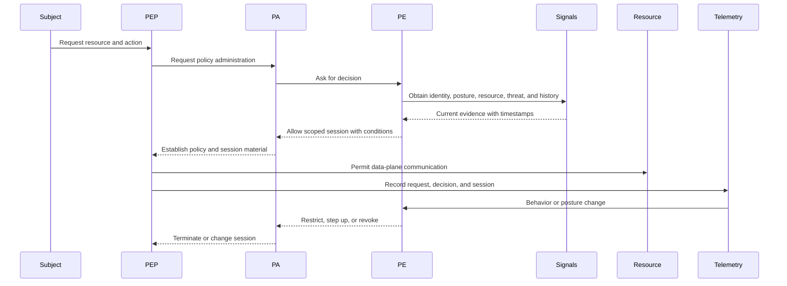

| Lifecycle stage | Decision | Evidence | Failure mode |
|---|---|---|---|
| Discover | Resource, subject, owner, workflow, and policy are known | Inventory, service map, data classification | Unknown resource inherits broad access |
| Request | Subject names resource and action | Request identity, destination, purpose | Ambiguous network destination gives broad reach |
| Authenticate | Subject and requesting asset present evidence | Factors, certificate, device identity | Authentication reused outside intended session |
| Authorize | PE evaluates current policy and context | Decision trace and signal timestamps | Stale groups, wrong resource, conflicting rules |
| Establish | PA and PEP create permitted path | Session identifier, token, route, policy | Token or route is broader than decision |
| Operate | Subject performs allowed actions | Application, data, PEP, endpoint telemetry | Enforcement only at connection start |
| Re-evaluate | Changed state triggers policy | Posture, risk, behavior, identity lifecycle | Delay leaves compromised session active |
| Terminate | Purpose, time, revocation, or risk ends session | Revoke and connection evidence | Token remains valid or alternate session persists |
| Learn | Outcome improves policy and coverage | Incidents, denials, support, tests, metrics | Bad policy repeats without feedback |

Session scope and duration should fit the resource and action. Reauthentication every second is unusable; a month-long administrator token is dangerous. Design balances risk, user experience, resource behavior, and revocation capability.

## Deployment model 1: device agent and gateway

In a **device agent/gateway** model, an agent or local component on the requesting asset works with a gateway or PEP protecting the resource. The agent can provide device context and steer relevant traffic. The gateway enforces the resource side.

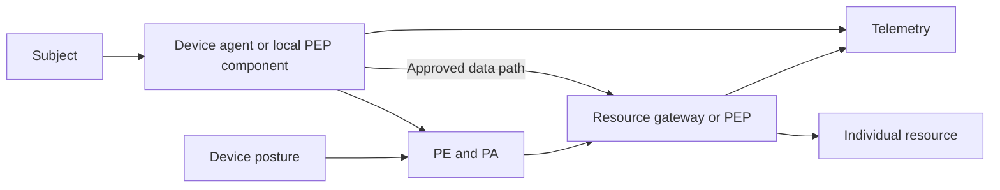

| Strength | Limitation | Good fit | Validation |
|---|---|---|---|
| Rich device posture and traffic steering | Agent deployment, health, compatibility, and bypass concerns | Managed employee devices and supported protocols | Enrollment, posture freshness, route, policy, uninstall protection |
| Per-device identity and local context | Personal or unmanaged devices may reject agent | Enterprise-managed endpoints | Test managed, unhealthy, offline, and removed-agent states |
| Can support direct resource access | Agent outage can affect availability | Distributed private applications | Fail behavior, upgrade, rollback, support workflow |
| Both sides can contribute enforcement | Split components increase troubleshooting paths | High-value app access | Correlate client and gateway session IDs |

## Deployment model 2: enclave gateway

An **enclave gateway** protects a group of resources behind one PEP. The policy decision permits access to the enclave or selected services through the gateway. It can help legacy systems that cannot enforce modern identity directly, but the enclave may retain internal trust and a wider blast radius.

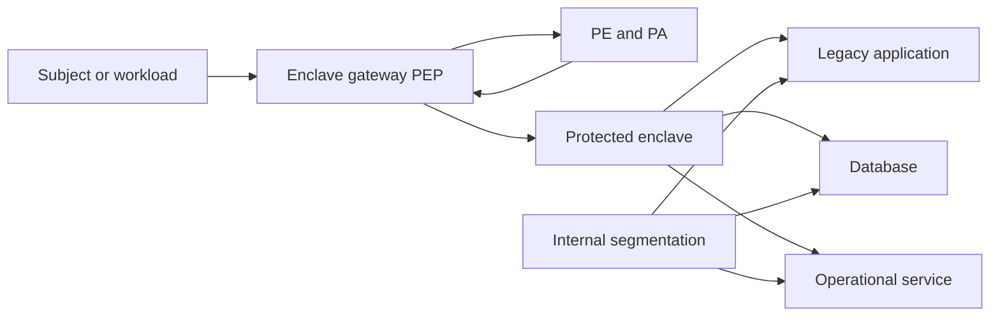

| Strength | Limitation | Good fit | Validation |
|---|---|---|---|
| Protects systems that cannot host modern agent or policy | Access may be broader than one resource | Legacy application group or OT enclave | Test exact destinations and post-gateway reachability |
| Central enforcement simplifies first phase | Gateway becomes concentration and availability point | Phased migration | Capacity, resilience, fail behavior, bypass path |
| Can hide internal resources from direct access | Internal lateral movement may remain | Stable bounded service set | Enclave identity, internal flows, admin paths |
| Supports compensation while modernizing | Temporary enclave can become permanent broad trust | Time-bound legacy roadmap | Exception, owner, expiry, migration milestones |

## Deployment model 3: resource portal

A **resource portal** model presents resources through a portal that acts as the PEP. The client may use a standard browser and need no dedicated agent. The portal can authenticate, authorize, transform, or proxy application access depending on design.

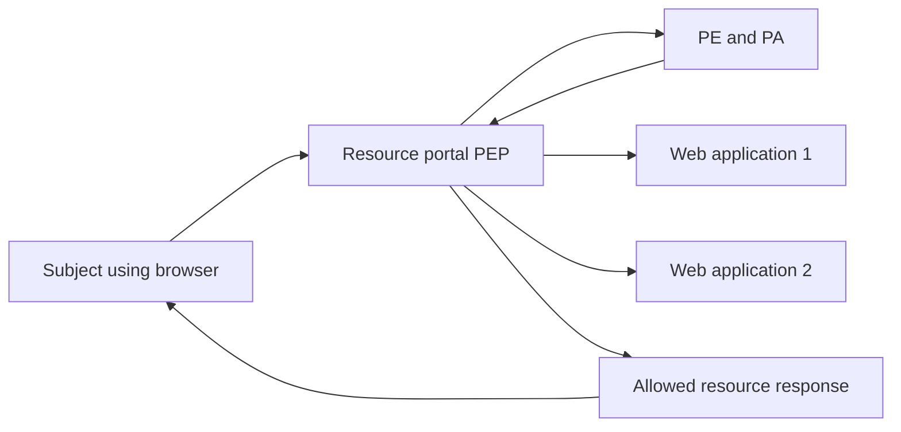

| Strength | Limitation | Good fit | Validation |
|---|---|---|---|
| No managed client agent required | Device posture and non-web protocol support may be limited | Contractors, partners, unmanaged browsers | Browser, identity, device confidence, upload/download policy |
| Central resource discovery and access | Portal can expose metadata or become high-value target | Web resources and temporary access | Enumeration, session, caching, headers, authorization |
| Can isolate or transform content | Compatibility and user experience can vary | Sensitive browser workflows | Functional, security, performance, accessibility tests |
| Simplifies user entry | Portal session can become broad if not resource-specific | Curated resource catalog | Per-resource authorization and logout/revoke behavior |

NIST also discusses device application sandboxing as another variation, where an application or managed environment on a device constrains enterprise interaction. The general lesson is that PEP placement changes available signals, supported protocols, bypass paths, user experience, and troubleshooting.

### Deployment model comparison

| Dimension | Device agent/gateway | Enclave gateway | Resource portal |
|---|---|---|---|
| Client requirement | Managed component typically present | May be agentless or vary | Standard browser often sufficient |
| Resource granularity | Can be highly resource-specific | May protect group of resources | Usually portal-published resources |
| Device context | Potentially rich | Depends on upstream identity and integration | Often more limited for unmanaged browser |
| Protocol support | Can support broader traffic with implementation constraints | Can support enclave protocols | Commonly strongest for web-style access |
| Legacy fit | Good if gateway fronts app and client supported | Strong for unchanged resource groups | Strong for compatible web apps |
| Bypass concern | Unsteered traffic or agent tampering | Alternate route around gateway | Direct resource URL or session reuse |
| Operational concern | Client health, upgrade, routing | Gateway capacity and internal blast radius | Portal availability, compatibility, session security |
| Best question | Is both endpoint and resource side enforced? | What becomes reachable after the gateway? | What resource and action does the portal truly constrain? |

## Deployment approaches

NIST discusses several broad ways an enterprise may move toward ZTA. They can coexist.

| Approach | Starting emphasis | Example | Strength | Risk |
|---|---|---|---|---|
| Enhanced identity governance | Strong identity, lifecycle, authentication, authorization, and context | Resource policy based on user, group, device, and risk | Builds common decision foundation | Can remain broad network access with stronger login |
| Microsegmentation | Fine-grained isolation around resources or workloads | Web service can call only named API and database | Reduces lateral movement and blast radius | Inventory, dependency, label, and policy complexity |
| Network infrastructure or software-defined perimeter | Dynamic policy-controlled paths rather than broad network joining | Brokered access establishes path only after decision | Hides or limits direct reachability | Path policy may not control application or data action |
| Resource modernization | Application-native authorization and data controls | API evaluates workload identity and object action | Strong resource and action semantics | Requires code and architecture change |
| Hybrid program | Combine identity, segmentation, brokered paths, app, and data controls | Phase by business service | Matches real enterprise constraints | Governance and interoperability complexity |

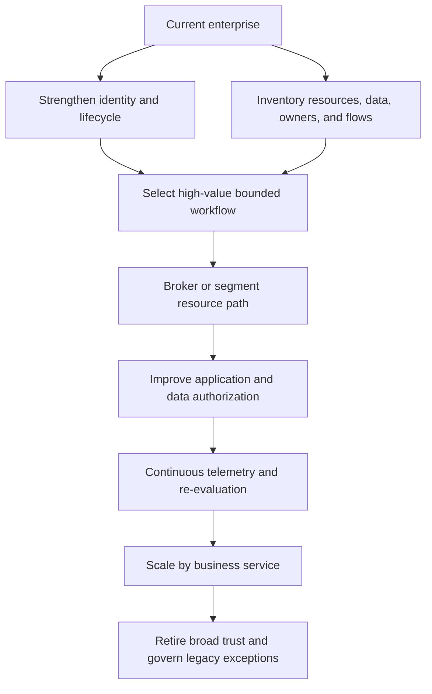

There is no universal order. A company with poor identity lifecycle may need to start there. A flat data center may need urgent segmentation. A contractor-access program may use a portal first. A TSM should connect architecture sequencing to business outcomes and readiness, not sell a diagram as a transformation plan.

## Telemetry and evidence

Zero Trust depends on evidence before, during, and after access. Telemetry must preserve event meaning, entity, time, source, coverage, privacy, and retention.

| Telemetry domain | Key records | Decision supported | Blind spot |
|---|---|---|---|
| Identity | Authentication, factor, token, role, lifecycle, risk | Subject confidence and revocation | Valid token used outside source visibility |
| Device | Enrollment, posture, software, integrity, health | Access mode and confidence | Unmanaged, stale, spoofed, or disabled sensor |
| Workload | Service identity, certificate, code, runtime, calls | Machine-to-machine authorization | Shared identity and ephemeral inventory |
| Policy | Rule, inputs, order, version, decision, reason | Explainability and troubleshooting | Product logs only final allow or deny |
| PEP | Session start, route, resource, action, bytes, termination | Enforcement and bypass investigation | Direct path outside PEP |
| Application | User action, object, result, error | Resource-level authorization and behavior | Network access not equal application action |
| Data | Classification, read, write, share, download, destination | Data-use governance | Encryption, transformation, or unsupported app |
| Threat and incident | Compromised entity, active campaign, malicious destination | Dynamic restriction and response | Stale indicator or delayed case state |
| Management | Policy changes, administrators, connector and key actions | Protect architecture integrity | Same admins control and audit themselves |
| Experience and health | Latency, errors, path, service health | Availability and user adoption | Security and performance teams see separate data |

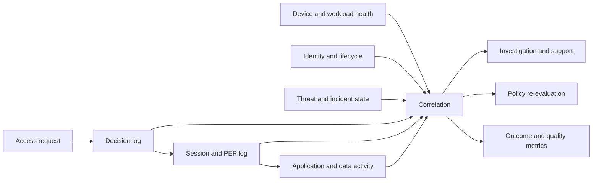

Telemetry also creates privacy and security obligations. Collect only what serves a legitimate purpose, restrict access, protect integrity, retain appropriately, explain high-impact uses, and govern automated decisions.

## OneDrive and SharePoint access example

This example is conceptual and uses Arti's familiar production domain. It does not claim a particular customer's architecture or a Zscaler deployment.

### Business need

An employee on a managed laptop needs to read and edit a restricted SharePoint project document through OneDrive sync. An external adviser on an unmanaged device needs browser read access to a smaller data room but must not sync the library.

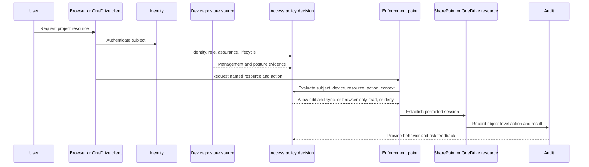

### Policy matrix

| Subject and context | Resource | Action | Conceptual result | Rationale |
|---|---|---|---|---|
| Employee, current role, managed healthy device | Project library | Browser read and edit | Allow | Business task and posture fit |
| Employee, same context | Project library | OneDrive sync | Allow with resource policy | Managed device supports controlled local use |
| Employee, unmanaged device | Project library | Browser read | Limited or step-up according to policy | Preserve work while reducing local data risk |
| Employee, unmanaged device | Project library | Sync | Deny | Persistent broad local copy exceeds policy |
| Sponsored adviser, current contract, strong authentication | Adviser data room | Browser read | Allow, time-bound | Resource and role are narrow |
| Sponsored adviser | Full project library | Read or sync | Deny | No approved business need |
| Any subject with confirmed compromised session | Any restricted project resource | Any | Revoke and investigate | Incident state changes decision |

### Troubleshooting the example

If an employee reports a sync block, "Zero Trust denied it" is not a root cause. Trace:

1. Subject: correct identity, tenant, role, lifecycle, and authentication result.
2. Requesting asset: enrollment, certificate, posture fields, timestamps, and source health.
3. Resource: correct site, library, classification, owner, and action.
4. Policy: version, rule order, required attributes, decision reason, and exception.
5. PEP and path: traffic steering, name resolution, TCP, TLS, HTTP, proxy, session, and bypass.
6. Application: SharePoint and OneDrive authorization, client behavior, service health, and error.
7. Telemetry: correlation identifiers, clock, missing events, and privacy-safe evidence.

This is where Arti's established production skills are strongest. She can lead evidence isolation while working with customer identity, network, security, application, and vendor owners.

## Legacy coexistence

Most enterprises cannot replace broad network access, old protocols, static service accounts, and legacy applications at once. Zero Trust adoption is a transition, not a flag.

| Legacy constraint | Near-term pattern | Residual risk | Migration direction |
|---|---|---|---|
| Application cannot understand modern identity | Place behind resource or enclave gateway | Post-gateway access may remain broad | Modernize app authorization or isolate functions |
| Device cannot run agent | Resource portal or controlled gateway | Reduced posture and protocol visibility | Browser-limited access, replace or manage device |
| Static service account | Restrict source, destination, action, and rotate secret | Credential remains reusable | Unique workload identity and automated credential lifecycle |
| Flat protocol dependency | Segment around verified required flows | Hidden dependency can force broad exception | Discover, refactor, and shrink communication |
| OT system cannot tolerate change | Safety-approved gateway, isolation, monitoring, JIT vendor access | Vulnerability and local paths remain | Vendor-approved modernization window |
| VPN required for one workflow | Limit routes, identities, device, duration, and monitor | Network-level reachability remains | Migrate resource to brokered or app-specific access |
| Unknown data classification | Start with service and owner scope plus conservative policy | Overblocking or underprotection | Inventory, classify, and add data-specific control |

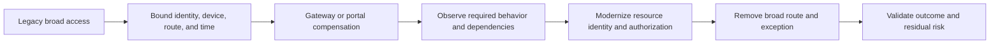

### Plain-English deep-dive 3 - Coexistence is architecture, not failure

A city does not close every old bridge while building a new transport system. It inspects bridges, limits heavy traffic, adds monitoring, creates alternate routes, and retires them in sequence. Legacy coexistence can be responsible when constraints, compensating controls, residual risk, owners, and exit milestones are explicit.

The failure is not having legacy technology. The failure is allowing temporary broad trust to become invisible and permanent. Each exception needs a business service, exact population, current risk, alternate controls, test evidence, owner, expiry, and migration dependency.

Zero Trust can therefore deliver incremental value: replace one contractor VPN route with resource-specific access, narrow one administrator role, add posture to one sensitive application, or separate one backup authority. Each step should reduce an evidenced path or consequence.

## Maturity

Maturity is the repeatability, integration, coverage, evidence, and outcome of Zero Trust practices. It is not the number of purchased products. CISA's Zero Trust Maturity Model provides a federal model across pillars and cross-cutting capabilities; organizations should use its current version and adapt it to their context.

### Practical maturity matrix

| Domain | Initial | Developing | Advanced | Evidence |
|---|---|---|---|---|
| Identity | Password and broad standing roles | MFA, lifecycle, role review | Phishing-resistant methods, JIT/JEA, dynamic resource policy | Effective authentication, roles, expiry, revoke tests |
| Devices | Ownership assumed | Managed posture for selected apps | Continuous posture and proportionate access across populations | Coverage, freshness, unhealthy-device tests |
| Networks | Perimeter and broad VPN | Segments and brokered pilot | Resource-specific paths with limited lateral reach | Path matrix and bypass tests |
| Applications/workloads | Network location authorizes | App inventory and selected federation | Unique workload identity and object/action authorization | Identity, API scope, runtime and action evidence |
| Data | Application-level access only | Classification and sharing controls | Data-aware policy and monitored use | Classification quality and policy-action tests |
| Visibility/analytics | Siloed logs and manual correlation | Common entities and selected decisions | Near-real-time cross-domain feedback with quality controls | Source health, correlation, decision trace |
| Automation | Manual tickets | Approved low-risk orchestration | Bounded, reversible, monitored response with human authority | Action logs, rollback, error and outcome review |
| Governance | Project-specific decisions | Owners, standards, exceptions, metrics | Portfolio outcomes, assurance, privacy, resilience, continuous improvement | Decisions, tests, residual risk, roadmap |

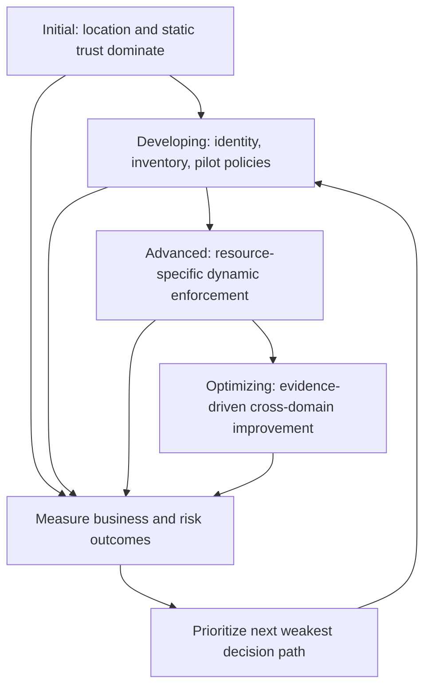

An organization can be advanced in workforce identity and initial in workload identity. Maturity should be assessed per business service and domain, not averaged into one impressive score that hides critical weakness.

## NIST versus Zscaler documented positioning

NIST and Zscaler do not occupy the same category. NIST provides a technology-neutral architecture. Zscaler is a vendor that describes cloud-delivered products and its Zero Trust Exchange. A customer can map product capabilities to NIST functions, but the mapping must be validated in the actual architecture.

### Exact comparison matrix

| Dimension | NIST SP 800-207 | Zscaler documented positioning | Careful interpretation |
|---|---|---|---|
| Category | Technology-neutral government architecture guidance | Vendor architecture and product platform positioning | NIST does not prescribe Zscaler or any vendor |
| Protected focus | Enterprise resources, subjects, assets, and workflows | Users, devices, workloads, branches, applications, data, and AI-related use cases in current messaging | Product scope and license must be verified |
| Core logic | PE, PA, PEP plus enterprise information sources | Cloud-based policy, proxy/broker, service edges, client/connectors, and product controls as documented | Product component-to-NIST mapping is architectural analysis, not official equivalence |
| Trust basis | No implicit trust from location or ownership; dynamic resource policy | Verify identity and context, determine destination, assess risk, enforce policy per session | Marketing summary needs tenant-specific policy evidence |
| Connectivity | Per-session resource access through PEP | Direct-to-app and inside-out private-app connector positioning | Exact traffic path differs by product, forwarding, resource, and deployment |
| Attack surface | Protect and limit resource exposure | Claims to hide private applications and minimize attack surface | Validate public records, routes, direct paths, and management exposure |
| Lateral movement | Resource-specific access and segmentation reduce broad reach | Positions one-to-one app access and segmentation as limiting lateral movement | Verify post-access resource scope and alternate paths |
| Inspection | Secure communication and policy enforcement; implementation-neutral | Positions inline inspection of internet/SaaS traffic and encrypted traffic subject to configuration | TLS inspection has privacy, legal, certificate, protocol, and bypass considerations |
| Data protection | Data is a resource; policy can include data context | Positions DLP and data-security capabilities across channels | Confirm exact product, data, action, and coverage |
| Device context | Asset posture is a policy input | Positions Client Connector and integrations for device and traffic context | Agent health, supported platform, steering, and bypass must be tested |
| Maturity | No single vendor maturity product required | Vendor may offer transformation guidance, assessments, and product roadmaps | Customer outcomes and governance remain customer responsibilities |
| Assurance | Architecture requires monitoring and evidence | Product telemetry and controls can contribute evidence | Product presence is not proof of correct policy or complete coverage |

### Zscaler's documented high-level flow

Official Zscaler material commonly presents a flow that verifies identity, identifies destination, assesses context or risk, enforces policy, and establishes direct access to the application or destination. For private applications, Zscaler describes inside-out application connectors that avoid exposing inbound application access. Treat this as vendor positioning until current product documentation and the actual tenant demonstrate mechanics.

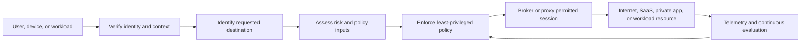

### Questions before claiming alignment

| Claim | Validation question |
|---|---|
| "This is Zero Trust" | Which implicit trust was removed, which resource is protected, and which decision is now explicit? |
| "Users connect directly to apps" | What is the actual client, service-edge, connector, and application data path? |
| "Applications are invisible" | Which DNS, address, certificate, connector, alternate route, and management surfaces remain discoverable? |
| "Lateral movement is prevented" | What can a permitted session reach after the PEP, and which alternate identities and routes exist? |
| "Every transaction is verified" | What event constitutes a transaction, which signals are checked, and when is re-evaluation triggered? |
| "Encrypted traffic is inspected" | Which traffic, protocols, exclusions, certificates, privacy duties, and failure modes apply? |
| "Risk is continuously calculated" | Which signals, freshness, model, confidence, and policy actions are visible? |
| "One platform reduces complexity" | Which products, connectors, administrators, workflows, dependencies, and support boundaries remain? |

### Plain-English deep-dive 4 - A standard is a map; a product is a vehicle

A road map describes destinations, routes, and constraints. A vehicle provides capabilities for traveling some routes. Buying the vehicle does not guarantee the journey, and the map does not endorse one vehicle.

NIST SP 800-207 gives architecture concepts and questions. Zscaler provides products that can implement relevant policy, connectivity, inspection, segmentation, and telemetry functions. The customer still owns resource inventory, identity lifecycle, data classification, policy intent, change, exception, application behavior, governance, response, recovery, and proof of outcomes.

In an interview, Arti can say: "NIST gives me the neutral reference model. I would map the customer's actual Zscaler components and integrations to PE, PA, PEP, signal, and resource functions, then validate the flow and controls. I have studied that mapping but have not deployed it in production."

## Fictional NMH current state

NMH is a fictional global manufacturer and logistics company. Its current state includes broad VPN access for employees and vendors, several identity directories from acquisitions, Microsoft 365, private applications, cloud workloads, plant systems, shared service accounts, and uneven data classification.

| Current-state issue | Fictional evidence | Risk hypothesis | Zero Trust direction |
|---|---|---|---|
| Broad employee VPN routes | 68 internal subnets reachable after connection | Stolen session can discover and reach unrelated services | Publish priority applications individually and reduce routes |
| Supplier access shares employee VPN | Supplier group receives regional network route | Third-party compromise has unnecessary lateral reach | Resource-specific supplier portal and named private apps |
| Identity lifecycle fragmented | Two acquired directories and stale contractor sponsors | Inactive or mis-scoped identity may retain access | Reconcile identity, owner, sponsor, role, and revocation |
| Device posture used only at login | Posture not re-evaluated during long session | Device becomes unhealthy while access persists | Session-aware posture and policy re-evaluation |
| Private apps identified by subnet | Access grants network reach rather than named resource | Application boundary and blast radius are unclear | Stable application segments and app-specific policy |
| Shared workload secrets | Integration accounts reused across applications | One credential compromise expands workload reach | Unique workload identities and scoped API access |
| Plant vendor pathway | Static shared credential and enclave route | Vendor or credential can reach excessive OT resources | Named identity, JIT, enclave gateway, internal segmentation |
| Microsoft 365 guest drift | Sponsors and expiration inconsistent | Former adviser retains restricted data access | Sponsored, resource-specific, time-bound guest policy |
| Siloed telemetry | Identity, VPN, endpoint, app, and data reviewed separately | Bad decisions and bypass are difficult to reconstruct | Correlated entity and session evidence |

## Fictional NMH target architecture

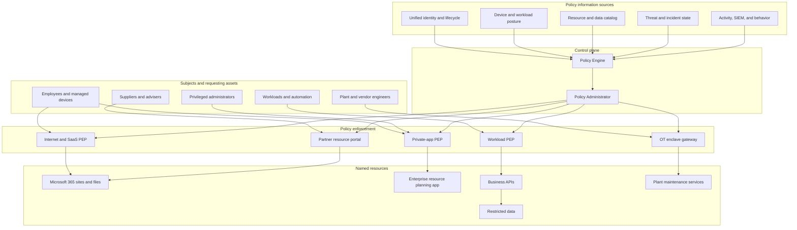

This is a logical target, not a claim that one product provides every box. Product mapping, connector placement, enforcement ownership, supported protocols, data paths, and tenant design require current documentation and specialist review.

### Target policy examples

| Subject | Requesting asset | Resource and action | Context | Conceptual decision |
|---|---|---|---|---|
| Employee engineer | Managed healthy laptop | Engineering app, normal edit | Current role, normal behavior | Allow resource-specific session |
| Same employee | Unmanaged browser | Restricted design library, download | Strong identity but weak device confidence | Browser-limited read or deny download |
| Supplier | Unmanaged device | Supplier order portal, own-region records | Active sponsor, strong authentication | Allow portal session, no network access |
| Workload | Attested integration identity | Order API, create approved message | Correct source workload and schema | Allow scoped API action |
| Workload | Same identity | HR API, read employee data | No approved relationship | Deny and alert on attempted scope misuse |
| Administrator | Protected workstation | Activate ERP admin task | Approved JIT/JEA request | Allow time-bound task and record session |
| Plant vendor | Approved vendor device | One maintenance service | Window open, named engineer, plant owner approval | Allow through OT gateway with recording |
| Any identity | Any device | Restricted resource | Confirmed incident or revoked lifecycle | Deny or terminate current sessions |

## NMH implementation roadmap

### Phase plan

| Phase | Scope | Outcomes | Exit evidence | Main risk |
|---|---|---|---|---|
| 0 - Govern | Executive objective, owners, architecture, privacy, safety, product boundaries | Shared language and decision rights | Charter, RACI, standards, source inventory | Tool project without business purpose |
| 1 - Discover | Tier 1 services, identities, devices, resources, data, flows, current controls | Reliable current-state graph | Owner attest, flow and effective-access samples | Unknown assets or hidden dependencies |
| 2 - Strengthen identity | Lifecycle, MFA, privileged access, supplier sponsorship | Reduced identity ambiguity and standing privilege | Joiner/mover/leaver, JIT, break-glass tests | Strong login with broad authorization |
| 3 - Pilot access | One employee app and one supplier workflow | Resource-specific policy and support model | Allowed, denied, revoke, performance, rollback tests | Pilot population not representative |
| 4 - Add context | Device, resource, data, threat, and behavior signals | Proportionate dynamic policy | Signal freshness and failure tests | Missing signal causes unsafe default |
| 5 - Migrate legacy | Enclave gateways, narrowed VPN, workload identity, OT compensation | Reduced broad network trust | Route removal and alternate-path validation | Permanent exceptions |
| 6 - Operationalize | Telemetry, incident feedback, service health, training, metrics | Repeatable support and risk outcomes | End-to-end exercises and trend governance | Security control harms experience |
| 7 - Scale | Additional business services and regions | Consistent policy with local adaptation | Reusable patterns plus owner acceptance | Central design ignores local constraints |

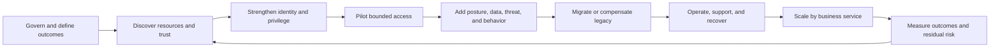

### Implementation artifacts

| Artifact | Purpose | Minimum content |
|---|---|---|
| Resource catalog | Define protected objects | Resource identity, owner, criticality, data, actions, dependencies |
| Subject and device inventory | Define requesters and lifecycle | Identity type, owner, sponsor, role, device state, expiry |
| Access policy matrix | Make decisions inspectable | Subject, device, resource, action, context, result, reason |
| Flow map | Preserve required communication | Source, destination, protocol, direction, purpose, owner |
| Signal contract | Govern context inputs | Source, fields, semantics, freshness, failure, privacy, owner |
| PEP map | Identify enforcement and bypass | Placement, protocols, direct routes, fail mode, health |
| Legacy exception | Govern coexistence | Constraint, path, compensation, residual risk, owner, expiry |
| Test plan | Prove allowed and denied outcomes | Cases, identities, resources, evidence, stop, rollback |
| Support runbook | Restore legitimate access safely | Error taxonomy, data collection, ownership, escalation, workaround |
| Metrics dictionary | Prevent dashboard ambiguity | Definition, source, denominator, cadence, owner, caveat |
| Decision record | Preserve tradeoff and authority | Context, options, evidence, choice, residual risk, revisit trigger |

## Troubleshooting Zero Trust access

A user saying "Zero Trust is broken" may be experiencing identity, posture, policy, forwarding, name resolution, transport, TLS, proxy, application, data, endpoint, connector, service-health, or telemetry failure. Troubleshoot from request to resource and back.

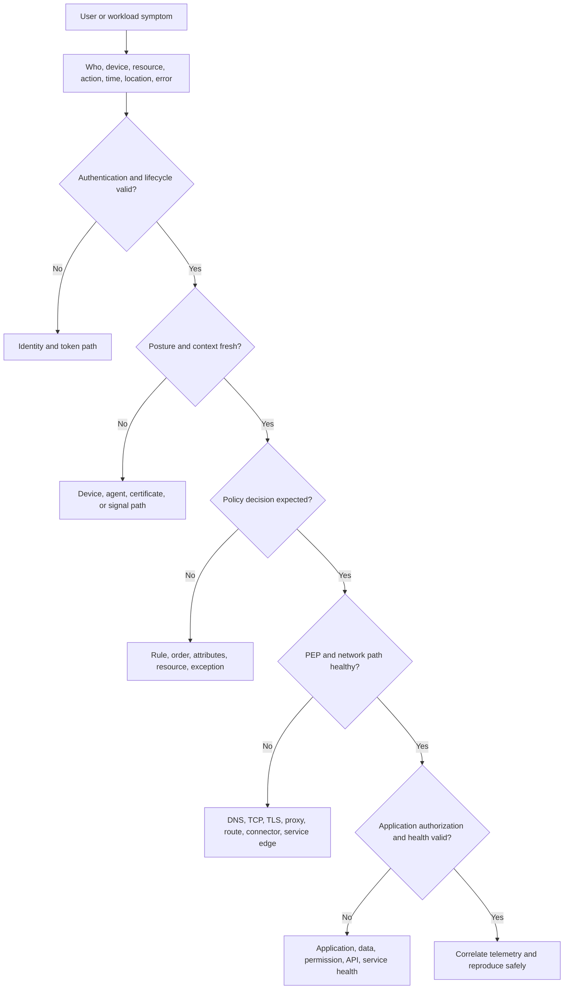

### Evidence ladder

| Layer | Questions | Evidence | Common mistake |
|---|---|---|---|
| Scope | Which subject, device, resource, action, time, and error? | Reproduction and user impact | "All users" based on one report |
| Identity | Was authentication successful and token intended for resource? | Sign-in, factor, token, lifecycle, clock | Treating successful MFA as full authorization |
| Device/workload | Is identity and posture known, current, and correctly parsed? | Agent, certificate, inventory, posture timestamps | Assuming installed agent is healthy |
| Resource | Is destination mapped to correct resource and owner? | App segment, URL, domain, connector, catalog | Wrong destination selects wrong policy |
| Policy | Which version and rule decided, with which inputs? | Decision trace and effective attributes | Reading intended policy instead of effective decision |
| PEP | Did request traverse correct enforcement point? | Session, forwarding, route, connector, bypass | Blaming policy when traffic never reached PEP |
| Network | Did DNS, TCP, TLS, HTTP, proxy, and return path work? | Packet, browser, client, proxy, path evidence | Calling every TLS failure a block |
| Application | Did app accept session and authorize object/action? | App log, permission, API response, service health | Confusing network success with app access |
| Data | Did classification or use policy change result? | DLP, sharing, download, object audit | Ignoring resource-level control after connection |
| Telemetry | Are clocks, IDs, source health, and retention adequate? | Correlation and pipeline health | Absence of log equals absence of request |

### Common failure modes

| Failure mode | Symptom | Likely cause | Discriminating check |
|---|---|---|---|
| Stale group membership | New role denied or old role retained | Directory sync or token cache | Compare source lifecycle, token issue, policy input, revoke |
| Device appears unknown | Managed user gets limited access | Agent health, certificate, enrollment, unsupported platform | Validate local agent, certificate, posture event, source freshness |
| Wrong policy matches | One app denied after new rule | Destination mapping, rule order, overlapping group | Decision trace with exact resource and input set |
| Private app unavailable | Authentication succeeds but connection fails | Connector health, route, application, DNS, TLS | Correlate PEP session, connector, app listener, path |
| SaaS breaks under inspection | Login loop, certificate or feature failure | TLS inspection, certificate trust, protocol, app pinning, exception | Controlled policy comparison with legal and security approval |
| Agent steering bypass | Direct route reaches resource or no policy event exists | Split tunnel, alternate protocol, proxy, local route | Compare route, DNS, session and direct exposure |
| Revocation delayed | Disabled account retains access | Long token, app session, disconnected PEP | Test identity, token, application, and PEP termination separately |
| Policy engine outage | New sessions fail or unsafe fallback appears | Availability or dependency failure | Confirm designed fail behavior and cached decision limits |
| Telemetry gap | Access works but no decision record | Connector/export, schema, clock, retention | Generate benign event and trace source to destination |
| User-experience regression | Security success but severe latency | Service-edge selection, backhaul, inspection, DNS, app path | Compare path timing and policy stages, not only ping |

### Troubleshooting principles

1. Reproduce one precise request before changing broad policy.
2. Preserve exact error, timestamp, subject, device, resource, action, and session identifiers.
3. Compare affected and unaffected cases that differ in one meaningful dimension.
4. Read the effective decision and signal values, not only intended configuration.
5. Trace both control-plane and data-plane paths.
6. Check application authorization after network connectivity.
7. Use time-bound, narrow workaround with owner and residual-risk record.
8. Validate allowed use, denied use, revocation, side effects, and telemetry after repair.

## Decision trees

### Should this request be allowed?

```mermaid
flowchart TD
    REQ[Request for resource action] --> KNOWN{Subject and resource known?}
    KNOWN -->|No| DENY[Deny or discovery workflow]
    KNOWN -->|Yes| PURPOSE{Approved business purpose and action?}
    PURPOSE -->|No| DENY
    PURPOSE -->|Yes| HARD{Mandatory identity and context criteria met?}
    HARD -->|No| STEP[Step up, limited mode, or deny]
    HARD -->|Yes| RISK{Threat, behavior, or posture concern?}
    RISK -->|High| STEP
    RISK -->|Acceptable| LEAST[Create least-privileged session]
    LEAST --> MON[Monitor and re-evaluate]
    MON --> END[Expire or revoke]
```

### Is a Zero Trust claim substantiated?

```mermaid
flowchart TD
    CLAIM[Zero Trust claim] --> RES{Named resource and action?}
    RES -->|No| VAGUE[Marketing or aspiration; clarify]
    RES -->|Yes| IMPLICIT{Which implicit trust is removed?}
    IMPLICIT -->|Unknown| VAGUE
    IMPLICIT -->|Known| DEC{Decision inputs and policy visible?}
    DEC -->|No| TEST[Request architecture and evidence]
    DEC -->|Yes| PEP{Enforcement and bypass validated?}
    PEP -->|No| TEST
    PEP -->|Yes| LIFE{Session monitoring, revoke, and recovery tested?}
    LIFE -->|No| TEST
    LIFE -->|Yes| BOUND[Bounded substantiated capability with stated limits]
```

## Common misconceptions

| Misconception | Why it is wrong | Better statement |
|---|---|---|
| Zero Trust means trusting nobody | Systems must use identity and policy evidence | Do not grant implicit broad trust; make bounded decisions |
| Zero Trust is one product | It is an enterprise architecture and operating model | Products implement selected functions within customer governance |
| MFA equals Zero Trust | MFA authenticates; it does not define resource scope or session behavior | Combine authentication with device, resource, action, context, monitoring |
| A VPN is always anti-Zero Trust | A VPN can be constrained, but often grants broad network access | Evaluate actual reach, policy, session, and migration need |
| Zero Trust removes the network | Communication still uses networks, DNS, TCP, TLS, routing, and proxies | Network location loses automatic trust status |
| Internal traffic is malicious | Internal location is simply insufficient evidence | Secure and authorize communication based on resource and context |
| Continuous verification means constant user prompts | Re-evaluation can use posture and behavior without interrupting every action | Match frequency and action to risk and user experience |
| A compliant device is trusted forever | Posture is one time-sensitive signal | Re-evaluate and limit scope; assume signals can fail |
| Segmentation alone is Zero Trust | Segmentation limits reach but may use static location and broad identity | Add explicit resource, subject, action, context, and lifecycle policy |
| Zero Trust prevents every breach | No architecture removes all vulnerability, misuse, or failure | Reduce likelihood and blast radius; detect, respond, and recover |
| Vendor alignment means NIST certification | NIST does not certify automatic product completeness | Map and validate actual components and outcomes |
| Green dashboard proves success | Deployment and alerts do not prove policy effectiveness or value | Test allowed, denied, revoked, bypass, recovery, and business outcomes |

## Metrics and outcomes

| Metric | Definition | Decision supported | Caveat |
|---|---|---|---|
| Resource ownership coverage | In-scope resources with current owner and criticality | Where policy can be governed | Unknown resources may be excluded |
| Resource-specific policy coverage | Priority resources with subject-action-context policy | Migration progress | Policy presence does not prove correctness |
| Broad route reduction | Legacy network routes removed under stable scope | Reduced implicit network trust | Application shadow paths may remain |
| Standing privilege reduction | Permanent high-power roles removed or narrowed | Privileged-access outcome | JIT can still be rubber-stamped |
| Signal freshness compliance | Decisions using required inputs within freshness target | Trust-algorithm confidence | Fresh signal can still be inaccurate |
| Decision explainability | Sample decisions with retrievable inputs, rule, result, reason | Support and governance quality | Logs can expose sensitive data and need controls |
| Allowed-work success | Approved representative workflows completed | User and business outcome | Easy synthetic tests may miss variation |
| Denied-path success | Prohibited representative actions denied | Enforcement confidence | One protocol or identity is not all paths |
| Revocation effectiveness | Sessions terminated within defined target after trigger | Containment confidence | Application and token state may differ |
| PEP bypass rate | Identified direct or ungoverned paths in scope | Architecture closure | Discovery coverage changes trend |
| Exception aging | Legacy exceptions by risk, owner, and expiry | Migration governance | Renewals can normalize debt |
| Experience impact | Latency, error, and user-workflow changes after policy | Adoption and service quality | Faster is not automatically safer |
| Incident blast radius | Resources and actions reachable from compromised entity | Outcome and segmentation | Incident mix and graph scope affect comparison |
| Recovery validation | Critical resources restored under identity or control-plane failure | Resilience | Tabletop alone does not prove technical restore |

Outcome language should be bounded: "The pilot removed broad network routes for 120 fictional supplier identities and validated access to two named applications, denied access to three out-of-scope resources, and revoked test sessions within the agreed target." It should not say, "The company is now Zero Trust" or "breaches are impossible."

## Scenario drills

### Drill 1 - Contractor cannot reach private application

The contractor authenticates successfully but receives a generic access error.

| Hypothesis | Evidence | Discriminating check |
|---|---|---|
| Contractor sponsor expired | Identity lifecycle and policy input | Compare active sponsor and account state |
| Device posture required | Policy and posture field | Use approved browser-only path or managed test device |
| Wrong application segment | Requested hostname maps incorrectly | Resolve destination and policy resource identifier |
| PEP or connector unhealthy | Session or connector evidence missing | Correlate request, PEP, connector, and application listener |
| Application denies user | PEP succeeds but app returns authorization error | Compare app identity, role, and object permission |
| DNS or TLS failure | Request never reaches policy or app | Trace name, TCP, TLS, certificate, proxy, and error |

The smallest useful workaround might be a time-bound resource portal for one app, not restoring broad VPN access.

### Drill 2 - Device posture becomes stale during session

Define expected behavior before testing: after posture exceeds freshness threshold, does policy continue, restrict download, request step-up, or terminate? The answer depends on resource criticality and business need. Validate signal time, PE decision, PA command, PEP action, application state, user explanation, support path, and recovery.

### Drill 3 - Policy engine unavailable

Tabletop four resources: public intranet content, restricted finance data, plant safety display, and privileged administration. A single fail-closed rule may be inappropriate. Define cached-decision lifetime, local safe mode, emergency authority, monitoring, and later reconciliation for each resource.

### Drill 4 - Direct-path bypass

A private application is published through a broker, but an old public Domain Name System record still resolves to an inbound address. Do not perform unauthorized probing. Use approved inventory, DNS, certificate, route, firewall, cloud, and owner evidence. Remove or restrict the direct path under change control, then validate brokered success and direct denial.

### Drill 5 - NMH supplier migration

Move one fictional supplier group from VPN to two named resources. Build current effective access, owner, application dependency, device populations, identity assurance, support, legal, privacy, testing, rollback, and success measures. Pilot representative suppliers, not only the easiest. Remove legacy routes after acceptance and monitor for shadow access.

## Contrarian review

| Claim | Contrarian question | Required evidence |
|---|---|---|
| "Every request is verified" | Which request boundary, signals, and re-evaluation trigger? | Decision trace and session test |
| "No implicit trust remains" | What do network, ownership, cached token, shared account, and emergency paths still imply? | Path and identity inventory |
| "Access is least privileged" | Which exact resource, action, time, and post-access reach? | Effective authorization and path test |
| "The app is hidden" | Are DNS, public address, connector, origin, and management paths constrained? | External and architecture evidence |
| "Lateral movement is impossible" | What can valid sessions, workloads, administrators, and legacy enclaves reach? | Multi-identity path graph |
| "Continuous monitoring works" | What happens when source is stale, missing, delayed, or compromised? | Source-health and failure test |
| "Risk score fell" | Did model, threshold, source, population, or exceptions change? | Versioned drivers and stable comparison |
| "The product is NIST compliant" | Which NIST concepts are mapped and who validated implementation? | Architecture mapping with limits; avoid unsupported certification claim |
| "Pilot succeeded" | Were difficult devices, suppliers, protocols, failover, and support represented? | Representative sample and exception analysis |
| "VPN removal delivered Zero Trust" | Did broad trust move into portal, gateway, identity, or application roles? | End-to-end resource and privilege validation |

## Official Source Anchors

**Checked on 2026-08-24.** NIST and CISA sources provide government guidance. Zscaler sources provide official vendor positioning. Microsoft sources support the familiar application example. Product pages and guidance can change; do not copy marketing claims into architecture without validation.

| Source | Official anchor | Used for | Currency and scope caveat |
|---|---|---|---|
| NIST SP 800-207 | https://csrc.nist.gov/pubs/sp/800/207/final | Tenets, PE, PA, PEP, trust algorithm, information sources, deployment models, migration | Published August 2020; technology-neutral and not a certification |
| NIST SP 800-207A | https://csrc.nist.gov/pubs/sp/800/207/a/final | Cloud-native application identity and access-control considerations | Related scope; verify publication status and applicability |
| NIST CSWP 20 | https://csrc.nist.gov/pubs/cswp/20/planning-for-a-zero-trust-architecture/final | Enterprise planning toward ZTA | Planning guidance does not replace system-specific engineering |
| NIST NCCoE ZTA project | https://www.nccoe.nist.gov/projects/building-blocks/zero-trust-architecture | Example implementations and practice guidance | Examples are not endorsements or universal blueprints |
| NIST Cybersecurity Framework 2.0 | https://www.nist.gov/cyberframework | Governance and outcome context | Framework alignment is not Zero Trust completion |
| CISA Zero Trust Maturity Model | https://www.cisa.gov/resources-tools/resources/zero-trust-maturity-model | Pillars, cross-cutting capabilities, and maturity framing | Check current version and adapt federal model to organization |
| CISA Zero Trust resources | https://www.cisa.gov/topics/cybersecurity-best-practices/zero-trust | Current federal resources and implementation context | Page organization and guidance evolve |
| Zscaler Zero Trust definition | https://www.zscaler.com/resources/security-terms-glossary/what-is-zero-trust | Current vendor explanation, pillars, flow, direct-to-app, and continuous policy positioning | Vendor positioning is not NIST endorsement |
| Zscaler Zero Trust Exchange | https://www.zscaler.com/products-and-solutions/zero-trust-exchange-zte | Platform positioning and connection model | Verify product mapping, packaging, data path, and tenant configuration |
| Zscaler Internet Access | https://www.zscaler.com/products-and-solutions/zscaler-internet-access | Official ZIA internet and SaaS access positioning | Product behavior depends on forwarding, policy, license, and exclusions |
| Zscaler Private Access | https://www.zscaler.com/products-and-solutions/zscaler-private-access | Official ZPA private-application access positioning | Verify client, connector, app segment, policy, and actual path |
| Zscaler Client Connector help | https://help.zscaler.com/client-connector | Official client documentation starting point | Current platform and tenant documentation controls implementation |
| Microsoft Zero Trust guidance | https://learn.microsoft.com/security/zero-trust/ | Official Microsoft implementation and architecture context | Vendor guidance, not a replacement for NIST or customer policy |
| Microsoft SharePoint and OneDrive security | https://learn.microsoft.com/sharepoint/secure-access-to-data | Official Microsoft access and data-protection documentation starting point | Verify current feature, license, tenant, and policy behavior |

## Likely Interview Questions

### Q1. Explain Zero Trust from first principles.

**Model answer:** Zero Trust removes implicit trust based only on network location, device ownership, or a previous login. For each request, the architecture identifies the subject and requesting asset, the exact resource and action, and relevant context such as identity lifecycle, device or workload posture, data sensitivity, behavior, threat state, and environment. Policy grants the least privilege for a session, enforcement applies it, and monitoring can trigger step-up, restriction, or revocation.

It does not mean no trust, no network, or one product. It makes trust assumptions explicit and bounded, while defense in depth handles failures in identity, policy, enforcement, applications, telemetry, and recovery.

### Q2. What are the PE, PA, and PEP in NIST SP 800-207?

**Model answer:** The Policy Engine makes the ultimate access or revocation decision using policy and current inputs. The Policy Administrator establishes or terminates the communication path and conveys the decision, sometimes managing session credentials. The Policy Enforcement Point enables, monitors, and terminates the subject-to-resource connection.

They are logical functions, not necessarily three products. I would map the actual architecture, protect control and management communication, test bypass and failure behavior, and correlate the decision with the data-plane session.

### Q3. What goes into a Zero Trust trust algorithm?

**Model answer:** Inputs can include enterprise policy, subject identity and lifecycle, requesting device or workload posture, resource and data attributes, requested action, threat intelligence, prior behavior, active incident state, time and environment, and compliance constraints. The implementation may use hard criteria, a contextual score, or a hybrid to allow, deny, limit, step up, isolate, or revoke.

A score is not objective truth or a judgment of a person. I would preserve driver values, freshness, confidence, privacy, failure behavior, calibration, and an appeal or support path. The formula in my NMH exercise is fictional and not NIST or Zscaler logic.

### Q4. Compare device agent/gateway, enclave gateway, and resource portal deployment models.

**Model answer:** A device agent/gateway model uses a managed client component plus resource-side enforcement, offering rich posture and traffic context but adding endpoint deployment and compatibility concerns. An enclave gateway protects a group of resources, which helps legacy systems but can preserve broad access and lateral movement behind the gateway. A resource portal provides browser-oriented access without a dedicated agent, useful for partners and web resources but often with less device context and protocol breadth.

I would select by resource, subject population, protocol, posture need, legacy constraint, user experience, bypass path, and operational evidence rather than calling one universally best.

### Q5. How do NIST Zero Trust and Zscaler positioning relate?

**Model answer:** NIST SP 800-207 is technology-neutral architecture guidance. Zscaler is a vendor whose official material positions the Zero Trust Exchange around identity and context verification, destination identification, risk assessment, policy enforcement, brokered direct-to-app connections, inline controls, and continuous evaluation. ZIA and ZPA address different internet, SaaS, and private-application use cases within that positioning.

I would map actual Zscaler components and integrations to PE, PA, PEP, signals, and resources, then validate traffic flow, policy, post-access scope, bypass, telemetry, failure, and user experience. NIST does not automatically certify a vendor implementation. I have studied this mapping but have not deployed Zscaler in production.

### Q6. How would you troubleshoot a denied OneDrive or SharePoint session in a Zero Trust design?

**Model answer:** I would scope the subject, device, resource, action, time, and error, then trace identity and token, device posture and freshness, resource classification, effective policy and rule order, PEP and forwarding path, DNS, TCP, TLS, HTTP and proxy evidence, application authorization, service health, and telemetry correlation. I would compare one affected and one unaffected case that differ in a meaningful dimension.

My production Microsoft support and networking experience is directly useful here. I would work within customer authority and avoid broad bypass. Any workaround would be narrow, time-bound, monitored, and validated for both legitimate success and prohibited denial.

### Q7. Walk through the fictional NMH Zero Trust roadmap.

**Model answer:** I would begin with governance and a current-state inventory of business services, resources, identities, devices, data, required flows, controls, and owners. Then I would strengthen lifecycle and privilege, pilot one employee application and one supplier workflow, add device and resource context, migrate legacy access through bounded gateways and modernization, operationalize telemetry and support, and scale by business service.

Each exit gate includes allowed-work success, denied-path tests, revocation, performance, rollback, source health, owner acceptance, and residual risk. The roadmap is fictional and demonstrates sequencing, not a delivered transformation.

### Q8. What are the most common Zero Trust misconceptions?

**Model answer:** Zero Trust does not mean trusting nobody, removing networks, continuously prompting users, buying one product, or preventing every breach. MFA, segmentation, device compliance, or VPN replacement alone are not a complete architecture. Vendor alignment is not NIST certification, and a green dashboard is not outcome proof.

The strongest explanation is resource-specific: which implicit trust was removed, which subject and action are permitted, which context drives the decision, where enforcement occurs, how the session is monitored and revoked, what legacy path remains, and how risk and business outcomes were validated.

## 30-Second Memory Hooks

| Concept | Memory hook |
|---|---|
| Zero Trust | No automatic trust from location or ownership |
| ZTA | Architecture of explicit resource decisions |
| ZTNA | Access capability, not the whole strategy |
| Subject | Human or workload asking |
| Requesting asset | Device or workload carrying the request |
| Resource | Exact data, app, service, or action protected |
| PE | Decide |
| PA | Establish or terminate |
| PEP | Enforce and observe |
| Control plane | Decision and coordination |
| Data plane | Permitted resource communication |
| Management plane | Configure the architecture; protect it strongly |
| Trust algorithm | Policy plus current signals, not moral trust |
| Continuous diagnostics | Keep posture and context fresh enough for risk |
| Per-session | One approval is not a network passport |
| Agent/gateway | Rich endpoint context, more client operations |
| Enclave gateway | Legacy bridge, watch post-gateway blast radius |
| Resource portal | Browser access, test device and protocol limits |
| Legacy coexistence | Bound, monitor, expire, migrate |
| Maturity | Coverage, evidence, outcomes, not product count |
| NIST | Neutral architecture map |
| Zscaler | Vendor vehicle and documented positioning |
| Troubleshooting | Subject, device, resource, policy, PEP, path, app, data |
| Arti bridge | Production Microsoft access evidence; not-yet-used Zscaler deployment |

## Completion Checklist

- [ ] I can explain why cloud, mobility, contractors, workloads, and distributed resources weaken perimeter-based implicit trust.
- [ ] I can state the NIST Zero Trust tenets in plain language and with design implications.
- [ ] I can distinguish Zero Trust, Zero Trust Architecture, and Zero Trust Network Access.
- [ ] I can distinguish subject identity, requesting asset, resource, action, and session.
- [ ] I can draw and explain the PE, PA, and PEP logical architecture.
- [ ] I can explain identity, PKI, CDM/posture, resource, threat, activity, SIEM, policy, and environment inputs.
- [ ] I can distinguish control, data, and management planes and explain their failure modes.
- [ ] I can explain criteria-based, score-based, hybrid, and risk-adaptive policy decisions.
- [ ] I can state why the fictional trust formula is not a NIST or Zscaler formula.
- [ ] I can explain human, device, workload, resource, data, behavior, threat, and environmental context.
- [ ] I can trace the session lifecycle from request through re-evaluation, termination, and learning.
- [ ] I can compare device agent/gateway, enclave gateway, resource portal, and sandbox variations.
- [ ] I can compare identity-governance, microsegmentation, software-defined perimeter, resource-modernization, and hybrid deployment approaches.
- [ ] I can define telemetry needed across identity, device, workload, policy, PEP, application, data, threat, management, and experience.
- [ ] I can walk the conceptual OneDrive and SharePoint policy example.
- [ ] I can troubleshoot Microsoft 365 access across subject, posture, resource, policy, PEP, DNS, TCP, TLS, HTTP, proxy, application, and data.
- [ ] I can design phased legacy coexistence with gateways, compensation, residual risk, owner, expiry, and migration.
- [ ] I can assess maturity by domain and business service without averaging away critical gaps.
- [ ] I can compare NIST SP 800-207 and Zscaler documented positioning without implying endorsement or automatic compliance.
- [ ] I can explain documented ZIA, ZPA, Client Connector, broker, connector, and Zero Trust Exchange roles only at a verified current level.
- [ ] I can walk the fictional NMH current state, target architecture, policy examples, and phased roadmap.
- [ ] I can use decision trees to test an access request and challenge a Zero Trust claim.
- [ ] I can refute common misconceptions without making absolute security claims.
- [ ] I can define metrics for policy coverage, broad-route reduction, decision quality, allowed work, denied paths, revocation, bypass, experience, and recovery.
- [ ] I can distinguish standards, government maturity guidance, vendor positioning, product behavior, and fictional calculations.
- [ ] I can recheck source and product currency after 2026-08-24.
- [ ] I can label production, lab, conceptual, not-yet-used, and fictional content honestly.
- [ ] I can answer all eight questions aloud without claiming production Zscaler, Zero Trust architecture, ZTNA, SecOps, or vulnerability-program ownership.

[Part 11 - Security Architecture, Cloud Shared Responsibility, and Control Planes](Part-11-security-architecture-shared-responsibility.md)