# Part 100 - Enterprise Discovery, Qualification, and Current-State Assessment

> **Audience:** Arti Thakur, preparing for a Zscaler Security Operations Technical Success Manager role after Microsoft enterprise Support Escalation Engineering.

> **Purpose:** Explain enterprise discovery, qualification, and current-state assessment from zero, then turn business goals, risk priorities, architecture, tools, data, stakeholders, workflows, constraints, pain, maturity, assumptions, and success criteria into reusable customer artifacts and defensible next decisions.

> **Scope and honesty:** Northstar Meridian Holdings, abbreviated NMH, is an explicitly fictional and synthetic customer used only for study. Every NMH person, organization, system, source, architecture, workflow, risk, date, metric, statement, decision, artifact, and result is invented. Arti's factual background is Microsoft 365, OneDrive, and SharePoint support; networking and trace analysis; SQL and Power BI; enterprise escalations; mentoring; and responsible AI exploration. Production Zscaler, SecOps TSM, security-program discovery, customer architecture ownership, and risk-decision authority remain learning boundaries.

> **Currency caveat:** Organizations, regulations, risks, products, architectures, integrations, interfaces, fields, packaging, and entitlements change. The controlled official-source snapshot and source review date for this Part is exactly **2026-08-24**. Current official technical and ordering documentation, licensed-tenant evidence, customer-authoritative records, contracts, policy, security/privacy/legal review, product specialists, vendor Support, and validated environment evidence govern production decisions.

> **Section goal:** Build a beginner-to-interview-ready discovery method that starts with business outcomes, maps current evidence from executive intent through technical workflow, qualifies fit and readiness without pressure, exposes assumptions and unknowns, protects sensitive information, defines measurable success, and produces an agreed current-state baseline and next-step decision rather than a theatrical questionnaire.

This Part is primarily **general technical-success and security-consulting practice**. Reviewed Zscaler public pages support bounded positioning around zero trust, context-driven security operations, security-data harmonization, vulnerability prioritization, and risk visibility. They do not establish a customer's architecture, pain, maturity, entitlement, product fit, deployment method, workflow, outcome, or success threshold.

Every statement belongs to one of five evidence classes. **Official product fact** is a dated public statement supported by an anchor reviewed on 2026-08-24. **General practice** is a reusable vendor-neutral discovery or assessment method. **Scenario assumption** exists only inside explicitly fictional and synthetic NMH. **Customer fact** requires current customer-authoritative evidence. **Unknown** means available evidence does not establish the answer. Discovery exists partly to keep these classes separate.

```mermaid
flowchart LR
    GOAL[Business goals and obligations] --> RISK[Priority risks and decisions]
    RISK --> PEOPLE[Stakeholders and authority]
    PEOPLE --> ARCH[Architecture and trust boundaries]
    ARCH --> DATA[Tools data and integrations]
    DATA --> FLOW[Operational workflows]
    FLOW --> PAIN[Pain constraints and failure modes]
    PAIN --> MAT[Maturity and readiness]
    MAT --> SUCCESS[Success criteria and evidence plan]
    SUCCESS --> DECIDE[Proceed reshape defer or stop]
```

| Operating principle | Plain meaning | Practical consequence | Failure prevented |
|---|---|---|---|
| Discover decisions, not nouns | A tool inventory matters only in relation to an outcome or decision | Ask what people must decide and which evidence supports them | Long questionnaire with no direction |
| Start outside the technology | Business service, risk, obligation, and operating reality set context | Tie architecture and data questions to consequence | Product-first discovery |
| Separate fact, assumption, and unknown | Confidence must be visible | Maintain a claim and question ledger | Guess becoming scope |
| Follow the work | Diagrams alone miss handoffs, queues, exceptions, and approvals | Walk a real or safely reconstructed case | Architecture theater |
| Qualify both fit and readiness | A valuable idea may still be blocked by data, ownership, time, or authority | Recommend proceed, reshape, sequence, defer, or stop | Forced implementation |
| Use progressive disclosure | Ask only what is needed at the current decision stage | Begin broad, then deepen high-value uncertainties | Interview fatigue and oversharing |
| Protect customer information | Discovery can expose identities, vulnerabilities, contracts, and diagrams | Minimize, classify, authorize, redact, retain, and delete deliberately | Discovery-created privacy risk |
| Define success before solution detail | Outcomes need baseline, target, evidence, owner, and horizon | Record success contracts before planning | Adoption without value evidence |
| Close every loop | Questions become findings, owners, decisions, or accepted unknowns | Publish read-back and action register | Notes that disappear |
| Attribute product statements | Public positioning is not customer proof | Verify current technical and commercial truth | Invented Zscaler fit |

## JD Mapping

| JD signal | Capability developed | Reusable customer or TSM artifact | Honest boundary |
|---|---|---|---|
| Become a trusted technical advisor | Listen, synthesize, challenge assumptions, and state uncertainty | Discovery charter and executive read-back | Customer owns goals and risk appetite |
| Understand customer environments | Map business services, people, architecture, data, tools, and workflows | Current-state map and inventory | No claim of complete visibility |
| Drive technical success | Convert goals into baselines, milestones, measures, and decisions | Success hypothesis register | Outcome is not guaranteed |
| Develop SecOps expertise | Ask informed questions across SecOps, VM, identity, network, data, and governance | Domain discovery questionnaire | No production SOC-operation claim |
| Troubleshoot complex problems | Trace a real workflow and identify first bad or unknown boundary | Workflow and evidence map | No unsupported root cause |
| Coordinate stakeholders | Surface authority, ownership, dependence, champion, and detractor dynamics | Stakeholder map and preliminary RACI | TSM facilitates; customer decides |
| Use analytics | Define populations, grains, baselines, quality, and denominators | Data-readiness profile | No inferred metric quality |
| Communicate with executives | Lead with context, exposure, decision, option, owner, and residual | One-page current-state summary | No fear-based certainty |
| Partner across account teams | Package technical evidence without crossing commercial or roadmap boundaries | Qualification record and handoff brief | No entitlement or roadmap promise |

## Candidate honesty note

Arti can say: "My production background is Microsoft enterprise Support Escalation Engineering rather than serving as a Zscaler SecOps TSM. I have discovered complex customer environments during incidents by clarifying impact, topology, identities, permissions, network paths, changes, evidence, owners, and success conditions. I have also used SQL and Power BI to examine data quality and trends, and I have coordinated technical and executive stakeholders. I have studied strategic discovery and practiced the artifacts here with an explicitly fictional scenario. In a customer engagement I would verify the current Zscaler products, entitlements, architecture, data, policy, responsibilities, and measured outcomes."

This wording is factual and neutral. It does not convert adjacent experience into a claim of production Zscaler or TSM ownership. Arti may present a synthetic questionnaire, map, or assessment as evidence of method. She should not call NMH a customer, claim she assessed a production SecOps program, say that she selected or deployed a Zscaler product, or imply a measured risk reduction.

| Factual background | Transferable strength | Neutral wording | Unsupported wording to avoid |
|---|---|---|---|
| Microsoft enterprise escalation support | Clarify impact, environment, recent change, evidence, ownership, and recovery | "I use structured discovery under uncertainty." | "I led SecOps transformations." |
| M365, OneDrive, and SharePoint | Understand identity, endpoint, network, service, admin, and user dependencies | "I map connected enterprise service paths." | "I designed customer zero-trust architecture." |
| Network and trace analysis | Follow requests across DNS, TCP, TLS, HTTP, proxy, client, and cloud boundaries | "I test architectural assumptions with evidence." | "I operated Zscaler traffic infrastructure." |
| SQL and Power BI | Profile source quality, grains, joins, populations, and trends | "I assess whether data can support a decision." | "I validated a customer's security data fabric." |
| Critical incident coordination | Align technical workstreams and executive updates | "I reconcile different stakeholder views." | "I was the customer's CISO advisor." |
| Mentoring | Ask teach-back questions and make methods repeatable | "I adapt explanations to audience maturity." | "I managed security teams." |
| Synthetic NMH artifacts | Demonstrate structured preparation | "This is a fictional practice deliverable." | "This is a customer engagement result." |

## Beginner vocabulary and memory hooks

**Discovery** is a structured effort to understand enough of the customer's reality to make a responsible next decision. **Qualification** tests whether a proposed problem and path are valuable, feasible, timely, owned, and appropriate. A **current-state assessment** records how relevant work operates now, including evidence quality and uncertainty. Think of a physician before treatment: understand the patient's goal, history, symptoms, current medicines, constraints, tests, and authority to consent. Ordering a treatment before that work can be ineffective or harmful.

| Term | Meaning from zero | Why it matters | Analogy or memory hook |
|---|---|---|---|
| Business goal | Desired organizational outcome | Gives technical work a reason | Destination |
| Business service | Capability delivered to users or customers | Connects systems to consequence | Train service, not one carriage |
| Risk | Effect of uncertainty on an objective | Frames what may prevent a goal | Weather on the route |
| Threat | Potential cause of unwanted harm | Helps explain adverse scenarios | Hazard near the road |
| Vulnerability | Weakness that could be exploited or fail | One ingredient of risk | Cracked bridge component |
| Control | Measure intended to modify risk | Defines prevention, detection, response, or recovery | Guardrail |
| Architecture | Components, relationships, boundaries, and principles | Shows how the environment is arranged | City map |
| Trust boundary | Place where identity, authority, data, or policy assumptions change | Often concentrates security risk | Passport checkpoint |
| Workflow | Ordered human and technical steps producing an outcome | Reveals queues, handoffs, and exceptions | Parcel route |
| Stakeholder | Person or group affected by or able to affect the work | Determines evidence and adoption | Anyone owning part of the route |
| Sponsor | Senior person supporting purpose and resources | Resolves priority and organizational barriers | Route funder |
| Champion | Person actively helping adoption | Converts intent into repeated practice | Local guide |
| Detractor | Person likely to resist, sometimes for valid reasons | Reveals risk, history, and incentives | Skeptical safety inspector |
| Pain | Material undesirable condition | Helps prioritize, but needs evidence | Repeated missed train |
| Constraint | Limit that shapes feasible options | Prevents unrealistic plans | Bridge height limit |
| Dependency | Condition or deliverable needed from elsewhere | Affects sequence and dates | Connecting train |
| Assumption | Belief treated as true for planning but not yet proven | Must have owner and validation | Unchecked map note |
| Unknown | Information not established | Honest state requiring a decision | Unmapped road |
| Baseline | Current measured reference | Enables later comparison | Starting odometer |
| Success criterion | Observable condition proving desired progress or outcome | Converts hope into test | Arrival check |
| KPI | Key Performance Indicator | Tracks important performance | Dashboard gauge |
| KRI | Key Risk Indicator | Signals changing exposure | Warning light |
| Maturity | Repeatability and governance of a capability | Guides right-sized next steps | From improvised to routinely maintained |
| Readiness | Ability to begin and sustain a particular change now | Maturity alone does not prove readiness | Packed, authorized, and able to travel |
| Fit | Degree to which an option addresses need under constraints | Prevents product by popularity | Correct tool for the job |
| Evidence | Information supporting or challenging a claim | Makes assessment defensible | Receipt and photograph |
| Artifact | Reusable written or visual work product | Preserves shared understanding | Map, manifest, or checklist |
| Read-back | Summary returned for correction and agreement | Prevents silent misunderstanding | Repeat an address before dispatch |
| Scope | Explicit included and excluded work | Controls ambiguity and effort | Fence around the worksite |
| Acceptance criterion | Testable condition for a deliverable or milestone | Makes completion observable | Inspection rule |
| Residual risk | Risk remaining after current or planned treatment | Prevents false completion | Rain remains after carrying an umbrella |

### Plain-English deep-dive 1 - Discovery is not a product interrogation

A weak discovery call sounds like a form read aloud: employee count, number of tools, number of endpoints, renewal date, and whether a named feature is enabled. Those facts can matter, but the conversation has no causal spine. It does not explain why the customer cares, what decision is blocked, how work happens, or what would prove improvement.

A stronger sequence begins with a consequential outcome: "Which business service or security decision must improve?" It then asks what risk or friction exists, who experiences it, how the current workflow handles it, which evidence is trusted, where delay or uncertainty occurs, what constraints shape options, and what would count as success. Product questions are introduced only when the outcome and current mechanism make them relevant.

Discovery should feel like collaborative model building. The TSM proposes a draft picture and invites correction: "I heard that critical internet-facing assets are reviewed weekly, ownership comes from the CMDB, and exceptions need application-owner approval. I do not yet know how ephemeral cloud assets enter that population. Is that accurate?" That read-back exposes both fact and unknown without pretending completeness.

## Discovery architecture: seven connected lenses

The discovery model uses seven lenses. Each lens answers a different class of question, but the lenses must connect. Business intent without operational reality becomes aspiration. Technical inventory without business context becomes cataloging. Pain without evidence becomes anecdote. Success without baseline becomes marketing.

| Lens | Core question | Typical evidence | Output |
|---|---|---|---|
| Outcomes | What must become safer, faster, more reliable, or more governable? | Strategy, obligation, initiative, incident history | Outcome statement |
| Risks | Which adverse scenarios threaten those outcomes? | Risk register, findings, threat model, exceptions | Prioritized risk hypotheses |
| People | Who owns, performs, approves, influences, funds, blocks, and receives impact? | Org knowledge, interviews, RACI, governance | Stakeholder and authority map |
| Architecture | Which components, boundaries, identities, paths, and control points matter? | Approved diagrams, configurations, inventories | Current-state architecture map |
| Data and tools | Which sources, schemas, identifiers, qualities, licenses, and integrations support work? | Catalogs, samples, contracts, health evidence | Tool and data inventory |
| Workflow | How does a real item move from signal to decision to validated outcome? | Walkthrough, tickets, runbooks, observations | Swimlane and exception map |
| Readiness and success | Can change begin, and how will progress and value be proven? | Baseline, capacity, dependencies, policy, metrics | Qualification and success record |

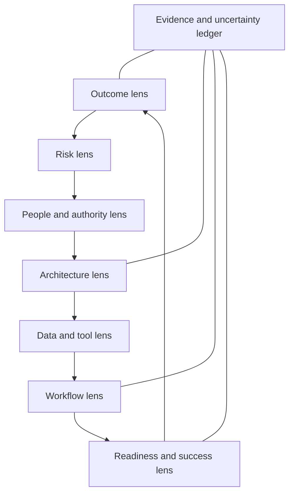

### Outcome and risk framing

Start with the customer's language. "Reduce critical exposure" is still broad. Ask which service, population, decision, and adverse scenario matter. A useful outcome statement names the actor, behavior, scope, evidence, and desired effect without presupposing a product.

| Weak statement | Why weak | Stronger discovery formulation |
|---|---|---|
| Improve security | No scope or decision | Reduce unresolved high-priority exposure on defined critical services while preserving approved exceptions |
| Deploy automation | Solution before problem | Reduce manual reassignment and evidence gathering in the agreed remediation workflow |
| Create one dashboard | Output, not outcome | Give risk owners a trusted weekly view of prioritized exposure, ownership, age, and decision status |
| Integrate all tools | No purpose or limit | Supply the minimum authoritative data needed for the selected prioritization and validation decisions |
| Reduce alerts | Could create blindness | Reduce duplicate and unactionable work while preserving tested detection coverage |

### Qualification as mutual risk reduction

Qualification is not a gate used only by a seller. It protects the customer and provider from committing to a path that lacks value, data, owners, resources, authority, or timing. The result may be **proceed**, **proceed with conditions**, **reshape**, **sequence prerequisites first**, **defer**, or **stop**. A stop can be responsible success when the evidence shows poor fit.

| Qualification dimension | Questions | Healthy evidence | Warning signal |
|---|---|---|---|
| Consequence | What happens if nothing changes? | Specific operational, risk, audit, cost, or business effect | Generic urgency |
| Priority | Why now relative to other work? | Named initiative, incident, obligation, or executive decision | No sponsor or competing freeze |
| Scope | Which populations and workflows are included? | Bounded services, sources, owners, exclusions | "Everything" |
| Evidence | Is the problem observable? | Samples, trends, walkthroughs, reconciled counts | Anecdote treated as baseline |
| Ownership | Who owns outcome and prerequisites? | Named accountable and responsible roles | Vendor expected to own customer decisions |
| Readiness | Are data, access, policy, people, and capacity available? | Verified prerequisites and dates | Unknown access or no implementation capacity |
| Fit | Does a verified capability address the mechanism of pain? | Documented requirement-to-capability map | Product name selected before requirements |
| Value | What decision or behavior changes? | Baseline and evidence plan | Login or deployment treated as value |
| Timing | Which dependency controls the critical path? | Customer-owned plan with realistic constraints | Deadline detached from prerequisites |
| Commercial boundary | Are products, services, and obligations established? | Accountable account-team confirmation | TSM improvises entitlement |

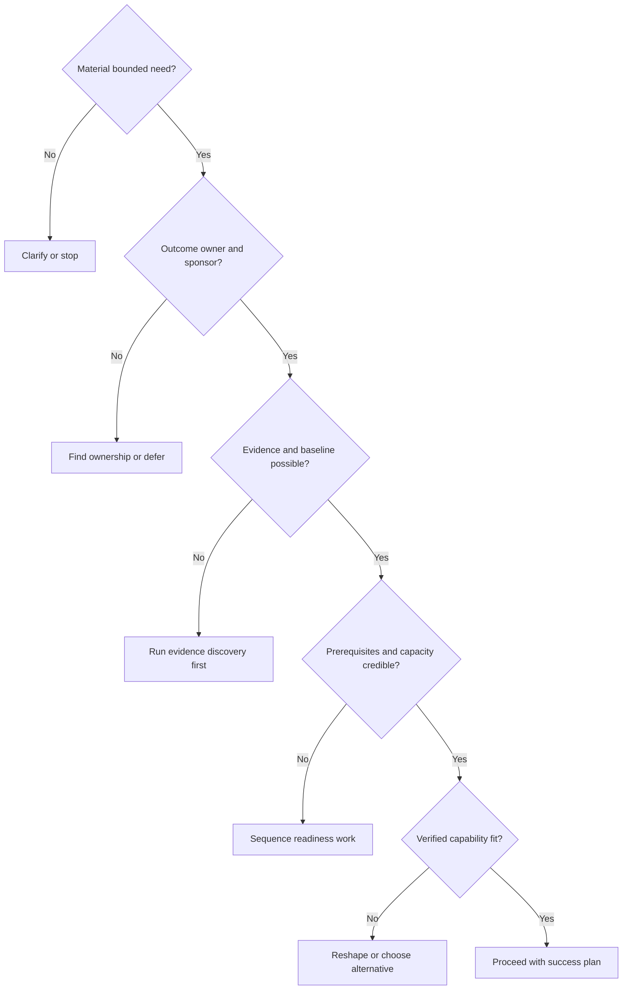

## Discovery lifecycle and meeting mechanics

Discovery is a sequence, not one meeting. A practical lifecycle has prepare, orient, explore, test, synthesize, read back, decide, and maintain stages. Every stage has an output and exit condition.

| Stage | Main activity | Output | Exit condition |
|---|---|---|---|
| Prepare | Review authorized context and form hypotheses | Discovery charter and question map | Purpose and participants agreed |
| Orient | Align goals, scope, language, confidentiality, and decision | Opening contract | Attendees understand why and what follows |
| Explore | Ask broad-to-specific questions across seven lenses | Notes labeled by evidence class | Priority areas and unknowns visible |
| Test | Walk examples, inspect safe evidence, reconcile claims | Evidence and contradiction ledger | Critical assumptions have tests or owners |
| Synthesize | Connect goal, risk, architecture, data, workflow, and readiness | Draft current-state assessment | Causal narrative is internally coherent |
| Read back | Return the model for corrections | Agreed facts, disputed claims, unknowns | Corrections and owners captured |
| Decide | Recommend proceed, reshape, sequence, defer, or stop | Qualification decision record | Decision authority accepts next step |
| Maintain | Version changes and retire stale assumptions | Living discovery baseline | Success plan receives current inputs |

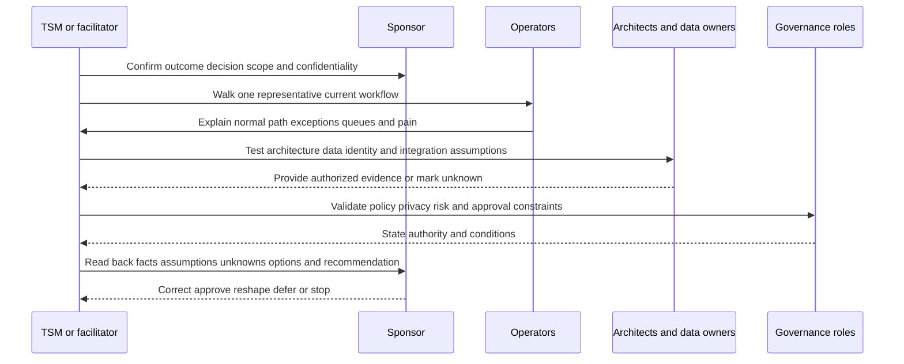

### Preparing without pre-deciding

Preparation should produce hypotheses, not conclusions. Review only authorized material: previous meeting notes, public strategy, account context, known support history, approved diagrams, or customer-provided documentation. Mark every proposition as confirmed, assumed, contradicted, or unknown. Prepare a small number of decision-linked questions, not an exhaustive audit disguised as an introduction.

| Preparation item | Useful question | Anti-pattern |
|---|---|---|
| Purpose | Which decision should this discovery enable? | "Learn everything" |
| Scope | Which service, region, entity, source, workflow, or time horizon? | Unbounded enterprise assessment |
| Participants | Who knows goals, operations, architecture, data, and authority? | Invite only executives or only engineers |
| Existing evidence | What can be reviewed safely before asking again? | Make customer repeat known context |
| Hypotheses | Which beliefs are useful to test? | Treat account notes as facts |
| Confidentiality | What should not be recorded or transferred? | Request secrets and raw sensitive data |
| Output | What artifact and decision will follow? | Meeting without read-back |
| Time | Which questions are essential now and which can wait? | Rush every domain into sixty minutes |

### Opening contract and question funnel

A good opening takes two minutes: state the desired decision, scope, available time, note-handling rule, and planned read-back. Ask permission to redirect details into a parking lot. Explain that "unknown" is useful and that the customer can decline sensitive questions.

Questions should move from open to focused to evidence-testing:

1. **Open:** "What outcome makes this worth doing?"
2. **Clarify:** "Which services and teams experience the issue?"
3. **Mechanism:** "How does a finding move from discovery to validated closure today?"
4. **Evidence:** "Which record or sample demonstrates that step?"
5. **Boundary:** "What is outside scope or prohibited?"
6. **Consequence:** "What happens when that handoff fails?"
7. **Success:** "What observable change would the owner accept?"
8. **Read-back:** "I heard X, Y is assumed, and Z remains unknown. Correct?"

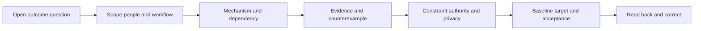

### Listening and note taxonomy

Use a structured note taxonomy so a strong personality does not turn opinion into fact. Capture exact customer phrasing when it affects meaning, but do not retain unnecessary personal or sensitive data.

| Label | Meaning | Example | Required follow-up |
|---|---|---|---|
| CF | Customer fact supported by customer-authoritative evidence | Approved architecture shows defined data path | Record source, scope, date, owner |
| CS | Customer statement not yet tested | "Ownership is always present" | Test population or sample |
| A | Assumption used for planning | CMDB likely supplies owner | Assign validation and date |
| U | Unknown | Ephemeral asset feed not established | Decide whether answer is required |
| C | Contradiction | Diagram and operator walkthrough differ | Preserve both and resolve |
| GP | General practice | Use least privilege | Tailor to customer policy |
| OPF | Official product fact | Dated public positioning | Link source and boundary |
| D | Decision | Start with one business service | Record authority and rationale |
| X | Exclusion | OT environment outside this phase | Record risk and revisit trigger |

### Plain-English deep-dive 2 - Ask for a story, then ask for a sample

People describe designed process, remembered process, and actual process differently. None is necessarily deceptive. A manager may explain the approved workflow. An analyst remembers painful exceptions. A ticket sample shows recorded states but not hallway decisions. The goal is triangulation.

Ask the operator to walk the last representative item using safe metadata: where it started, who noticed it, which identity or asset it concerned, what evidence arrived, where ownership came from, which queue waited, how priority changed, who approved action, how closure was validated, and what was not recorded. Then compare that story with a runbook, data sample, and metric definition. Differences are findings about process observability, not opportunities to embarrass anyone.

Never demand sensitive raw data merely to make discovery feel technical. A redacted field list, aggregate profile, screenshot under customer control, or guided observation may establish the needed fact. If more detail is required, use approved transfer, least privilege, retention, and deletion controls.

## Business goals, risks, and success criteria

Business discovery connects security work to what the organization protects or enables. Goals can include service availability, patient or customer trust, regulatory commitments, safe transformation, operational efficiency, acquisition integration, or reduced decision uncertainty. Security is not automatically the only priority; a recommendation must account for operational and human consequences.

### Outcome chain

An outcome chain tests whether proposed work has a plausible path to value.

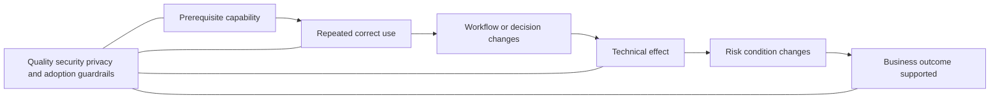

| Layer | Discovery question | Example neutral evidence |
|---|---|---|
| Prerequisite | Is authoritative scoped data available and healthy? | Reconciliation and freshness profile |
| Use | Do assigned roles repeatedly use the workflow? | Eligible versus completed use with denominator |
| Behavior | Does prioritization, ownership, or validation change? | Sampled workflow comparison |
| Technical effect | Is the selected path or control condition altered? | Current-state read-back and retest |
| Risk effect | Is exposure likelihood or impact credibly modified? | Risk-owner review with uncertainty |
| Business support | Does the change support service, obligation, cost, or trust? | Customer-approved outcome evidence |
| Guardrail | Was privacy, safety, coverage, or workload harmed? | Balanced checks and exception review |

### Success contract

Success needs six elements: **outcome**, **population**, **baseline**, **target or acceptance**, **evidence**, and **owner/time horizon**. Add exclusions, unknowns, guardrails, and attribution limits.

| Field | Question | Example structure, not a customer claim |
|---|---|---|
| Outcome | What behavior or risk decision should improve? | Assigned owners act on prioritized findings |
| Population | Which eligible items count? | Findings on agreed critical services |
| Baseline | What happens now under a stable definition? | Current owner-known and aging distribution |
| Acceptance | What observable condition is enough for this phase? | Agreed completeness and workflow test pass |
| Evidence | Which source and validation prove it? | Source-native records, tickets, owner read-back |
| Owner | Who is accountable for accepting the result? | Named customer role |
| Horizon | When is evidence mature enough? | After agreed operating cycles |
| Guardrails | What must not degrade? | Coverage, privacy, business continuity |
| Unknowns | Which gaps remain and how are they shown? | Unresolved owner population remains visible |
| Attribution | What can and cannot be credited to this work? | Contribution, not sole causality |

### Pain versus root cause

Pain is an experienced symptom. It may be real and important without identifying the mechanism. "Too many vulnerabilities" may reflect broad scope, duplicate findings, weak context, fragmented ownership, scanner gaps, stale assets, or an actual remediation-capacity deficit. Discovery must preserve the pain while testing competing explanations.

| Reported pain | Plausible mechanisms to test | Evidence that discriminates |
|---|---|---|
| Too many findings | Duplication, broad eligibility, low context, unresolved ownership, real backlog | Grain, source counts, duplicate analysis, owner and age distributions |
| Slow remediation | Approval, maintenance windows, application testing, owner gaps, false positives, capacity | Workflow timestamps and representative cases |
| No single view | Semantic mismatch, source quality, identity disagreement, access, governance | Source authority and reconciliation map |
| Executives distrust score | Opaque weighting, stale data, changing denominator, weak narrative | Metric contract, lineage, trend version, challenge examples |
| Automation is not used | Wrong workflow, permissions, fear, poor fit, training, missing approvals | Eligible use, failure reasons, interviews, audit trail |
| Integrations are unreliable | Source, export, transport, parse, time, entity, or downstream defect | End-to-end traces and quality funnel |

## Stakeholders, authority, and incentives

Discovery needs perspectives from executives, operators, architects, governance roles, and affected business owners. One interview cannot establish enterprise truth. People may use the same word differently, optimize different outcomes, or bear different costs.

| Stakeholder | Discovery interest | Evidence or authority | Common tension to surface |
|---|---|---|---|
| CISO | Enterprise risk, strategy, accountability, board narrative | Risk priorities and sponsorship | Broad ambition versus implementation capacity |
| CIO | Service strategy, technology portfolio, reliability, cost | IT priorities and platform dependencies | Security change versus service continuity |
| SecOps | Detection, triage, investigation, response, workload | Operational workflow and evidence | More context versus more complexity |
| Vulnerability management | Scope, findings, prioritization, remediation, validation | Finding lifecycle | Central targets versus distributed owners |
| IT operations | Endpoint, server, patch, change, support | Execution and maintenance constraints | Security urgency versus stability |
| Network | Connectivity, traffic paths, DNS, proxy, TLS, controls | Path and change authority | Visibility versus privacy/performance |
| Identity | Lifecycle, authentication, groups, privilege | Identity authority by attribute | Fast action versus access safety |
| Data/platform | Sources, schemas, pipelines, quality, cost | Data contract and operations | More data versus governance and cost |
| Application owner | Service criticality, testing, releases, downtime | Business and technical ownership | Generic SLA versus application reality |
| Compliance/privacy/legal | Obligations, evidence, purpose, retention, rights | Policy and approval | Useful telemetry versus minimization |
| Procurement/finance | Contracts, services, cost, value | Commercial authority | Technical desire versus purchased scope |
| Support/Product/Engineering | Product evidence and defect/feedback paths | Product-specific expertise | Customer symptom versus product conclusion |

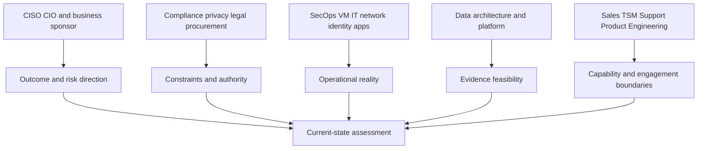

### Interview triangulation

Triangulation compares at least three evidence forms: stated policy or design, operator account, and observed record or sample. When they disagree, do not vote. Determine whether the difference reflects scope, time, exception, stale documentation, terminology, or defect.

| Perspective pair | Useful question | Possible learning |
|---|---|---|
| Executive and operator | What does "high priority" mean in each workflow? | Strategy is not encoded in queue logic |
| VM and application | When is a finding actionable? | Application testing and ownership are hidden dependencies |
| Architecture and data | Which source is authoritative for identity or asset attributes? | Diagram does not define semantic authority |
| Security and privacy | Which telemetry is necessary for the decision? | Collection can be minimized while retaining utility |
| Procurement and technical owner | Which capabilities and services are actually available? | Desired scope exceeds verified purchase |
| Sales and TSM | Which commitments, assumptions, and success expectations were set? | Handoff requires correction or qualification |

## Current-state architecture assessment

An architecture assessment is a purpose-bound map, not a complete enterprise blueprint. Include only components and boundaries relevant to the chosen decision. Record source, owner, version, and confidence for each element.

### Four views

| View | Shows | Core questions | Common omission |
|---|---|---|---|
| Business/service | Services, users, criticality, obligations | What consequence follows failure? | Systems shown without business dependency |
| Logical/security | Identities, zones, policies, trust boundaries, control points | Where do assumptions and authority change? | Shared responsibility |
| Data/integration | Producers, transport, transformations, consumers, identifiers | Which evidence arrives with what quality? | Effective time and provenance |
| Operational/workflow | Human queues, approvals, actions, validation, escalation | How does work reach an outcome? | Exceptions and degraded mode |

```mermaid
flowchart LR
    USERS[Users identities and devices] --> ACCESS[Identity and access decision]
    ACCESS --> SERVICES[Business applications and services]
    SERVICES --> LOGS[Source-native telemetry]
    OTHER[Endpoint cloud scanner CMDB and third parties] --> PIPE[Authorized data paths]
    LOGS --> PIPE
    PIPE --> CONTEXT[Normalization correlation and context as designed]
    CONTEXT --> DECIDE[Analyst risk and workflow decision]
    DECIDE --> ITSM[Case change or remediation workflow]
    ITSM --> OWNERS[IT app identity network or security owners]
    OWNERS --> VALIDATE[Technical and business validation]
    VALIDATE --> REPORT[Operational and executive evidence]
```

The diagram is general practice, not a claim about Zscaler internals or an NMH production deployment. Current customer diagrams and product documentation govern actual architecture.

### Architecture question sequence

1. Which business service and population are in scope?
2. Which identities, assets, applications, data, and third parties participate?
3. Where are trust, network, tenancy, administrative, and data boundaries?
4. Which control or observation point supports each decision?
5. Which systems are authoritative for which attributes and times?
6. How does data move, transform, retry, reconcile, and expire?
7. Which human role approves, performs, validates, and communicates work?
8. What happens during outage, bypass, exception, acquisition, or emergency change?

### Architecture confidence

Every element should have a confidence status: verified current, customer-stated, inferred, stale, disputed, or unknown. A beautiful diagram with no provenance can be more dangerous than a rough diagram with honest uncertainty.

| Element | Claimed state | Evidence | Confidence | Owner | Validation action |
|---|---|---|---|---|---|
| Identity source | To be discovered | Customer-authoritative configuration or owner statement | Unknown | Identity owner | Confirm attribute authority and lifecycle |
| Asset criticality | To be discovered | Approved service inventory and mapping | Unknown | Service owner | Reconcile sample and exceptions |
| Finding source | To be discovered | Native source scope and sample | Unknown | VM owner | Confirm eligible population and grain |
| Ticket handoff | To be discovered | Workflow definition and representative case | Unknown | ITSM owner | Walk normal and exception path |
| Validation | To be discovered | Retest and business acceptance method | Unknown | Control and service owners | Define postconditions |

## Tool and data inventory

Avoid inventory by logo. Record why a source exists, what one record means, which population it covers, who owns semantics, how fresh and complete it is, and which decision depends on it.

| Inventory field | Why needed | Discovery prompt |
|---|---|---|
| System and owner | Finds authority and support path | Who owns service, configuration, and data meaning? |
| Purpose | Prevents collecting unused data | Which decision or workflow uses it? |
| Product/version/edition/contract | Bounds available behavior | What is currently deployed and verified? |
| Population and exclusions | Defines denominator | Which accounts, regions, assets, or events are eligible? |
| Grain and identifiers | Prevents invalid joins | What does one record represent and how is it scoped? |
| Source authority | Resolves conflicts | Which attributes are authoritative here? |
| Time semantics | Preserves sequence and freshness | Event, receipt, process, and effective time? |
| Delivery and transformation | Exposes failure boundaries | Push, pull, batch, stream, normalize, enrich? |
| Quality and health | Tests usability | Completeness, validity, uniqueness, freshness, resolution? |
| Sensitivity and retention | Protects data | Classification, purpose, access, region, retention, deletion? |
| Dependency and continuity | Supports planning | What fails, queues, degrades, or replays during outage? |
| Cost/capacity | Tests feasibility | Volume, rate, engineering, operations, egress, people? |

```mermaid
flowchart LR
    SRC[Authoritative or observational source] --> SELECT[Scope and eligibility]
    SELECT --> MOVE[Export transport or query]
    MOVE --> VALID[Parse validate and quarantine]
    VALID --> MAP[Normalize identity and effective time]
    MAP --> USE[Decision workflow or reporting]
    USE --> ACT[Owned action]
    ACT --> CHECK[Read-back and validation]
    CHECK --> LEARN[Reconcile improve and govern]
```

### Data readiness profile

Readiness is not "we have an API." A source can be accessible but unsuitable because its scope is partial, identifiers are unstable, fields have ambiguous meaning, data arrives too late, privacy purpose is not approved, or no owner can resolve defects.

| Dimension | Ready evidence | Not-ready symptom | Possible next step |
|---|---|---|---|
| Authority | Attribute ownership agreed | Two systems both called source of truth | Attribute-level authority matrix |
| Scope | Eligible population and exclusions known | Unknown blind spots | Inventory reconciliation |
| Grain | One record meaning documented | Counts multiply after joins | Grain and relationship workshop |
| Identity | Scoped stable keys and lifecycle known | Names/emails used as universal keys | Resolution design and samples |
| Time | Event/receipt/effective semantics defined | Sequence changes by dashboard | Timestamp contract |
| Quality | Denominator-based profile exists | "Looks fine" | Completeness/validity/freshness sample |
| Security/privacy | Purpose, access, region, retention approved | Raw sensitive data copied casually | Governance review and minimization |
| Operations | Owner, monitoring, replay, change process exist | One engineer knows the connector | Operating model and runbook |
| Capacity | Volume, rate, cost, staffing understood | Pilot ignores production scale | Bounded load/cost plan |

### Plain-English deep-dive 3 - An inventory is a set of contracts

Imagine a kitchen listing "vegetables, meat, spices" without quantities, suppliers, use-by dates, allergens, storage rules, or recipes. The list does not prove the restaurant can serve a safe meal. A technical inventory that lists SIEM, EDR, scanner, CMDB, IAM, ticketing, and Zscaler has the same weakness.

For each source, ask what decision it supports, what population it observes, what one record means, who owns the meaning, which identifier connects it to other records, when the fact was true, and how quality is checked. The result is not merely an inventory; it is a set of data and operational contracts.

This approach also limits scope. If a data source does not support the selected outcome, it may not belong in the first phase. "Bring all data" increases cost, privacy exposure, semantic ambiguity, and troubleshooting load. Minimum sufficient evidence is often the mature starting point.

## Workflow discovery and current-state mapping

Workflows expose how architecture becomes human outcome. Choose representative cases: normal, high risk, exception, missing owner, false result, emergency, and failed integration. Ask what triggers each step, which evidence is required, who owns it, how long it waits, what decision occurs, and how completion is validated.

| Workflow element | Discovery question | Failure signal |
|---|---|---|
| Trigger | What creates eligible work? | Important cases never enter |
| Intake | Where is work recorded and deduplicated? | Parallel queues and duplicates |
| Triage | How are validity, scope, urgency, and context assessed? | Severity accepted without context |
| Prioritization | Which factors and authority change order? | Opaque or unstable ranking |
| Assignment | How does a responsible owner receive and acknowledge work? | Queue has group but no person |
| Decision | Who chooses mitigate, accept, transfer, avoid, or investigate? | Technical role makes unauthorized risk decision |
| Action | Which change occurs under which control? | Requested work not applied |
| Validation | Which postconditions prove technical and business effect? | Ticket closes on request |
| Exception | How are deferral, compensating control, expiry, and review handled? | Permanent silent exception |
| Escalation | What evidence and threshold change ownership or priority? | Repeated broadcast escalation |
| Reporting | Which audience receives which decision narrative? | Volume without consequence |
| Improvement | How do recurring causes change process or control? | Same friction returns |

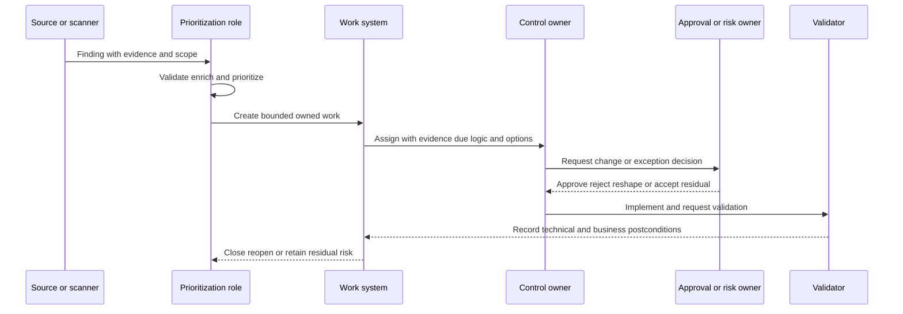

### Workflow measurement

Use distributions and denominators. A median handoff time can hide unowned critical items. Measure eligible items, entered items, valid items, assigned items, acknowledged items, completed actions, validated outcomes, reopened cases, exceptions, and unknowns.

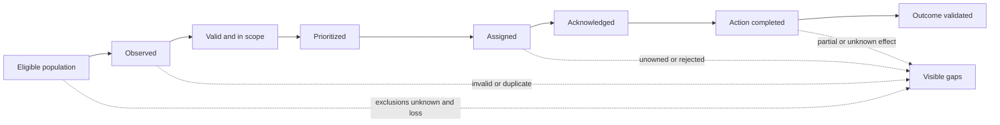

## Constraints, dependencies, and operating reality

Constraints are not objections to defeat. They are design inputs. A maintenance freeze, regulated data boundary, works council, limited staff, acquisition, legacy application, unavailable owner, budget cycle, or business peak may make a technically attractive path unsafe now.

| Constraint class | Examples | Discovery action | Planning effect |
|---|---|---|---|
| Business | Peak season, clinical operation, merger, service commitment | Identify no-change windows and critical services | Sequence and rollback requirements |
| Technical | Legacy protocol, unsupported platform, network segmentation | Verify path and alternatives | Pilot scope or compensating control |
| Data | Missing IDs, poor CMDB, delayed source, retention gap | Profile and assign quality work | Readiness milestone |
| People | Capacity, skills, turnover, time zones | Map responsible roles and realistic effort | Cadence and enablement |
| Governance | Change board, privacy review, risk acceptance | Identify lead time and evidence | Decision gates |
| Commercial | Entitlement, services scope, procurement | Route to accountable commercial roles | No technical promise before confirmation |
| Security | Least privilege, segregation of duties, evidence handling | Design access and approval | Control prerequisites |
| Timing | Fixed audit or project deadline | Work backward from dependencies | Critical-path transparency |

### Dependency graph

Dependencies should name owner, evidence, need-by date, consequence, alternative, and escalation trigger. A date with no dependency model is optimism.

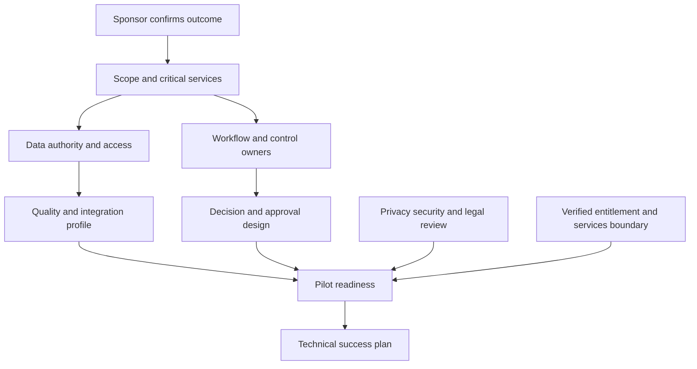

## Maturity assessment without judgment

Maturity describes repeatability, evidence, ownership, integration, and learning. It is not a score of people's competence. A low-maturity process may be rational for a low-risk or rapidly changing area. A mature process can still optimize the wrong outcome.

| Level | Process | Data/evidence | Ownership/governance | Improvement |
|---|---|---|---|---|
| 1 - Ad hoc | Hero-led and case-specific | Fragmented, manual, uncertain | Informal and person-dependent | Reactive |
| 2 - Repeatable | Common steps for frequent cases | Some consistent records | Team ownership, partial escalation | Lessons applied locally |
| 3 - Defined | Documented workflow and exceptions | Versioned definitions and basic quality | RACI and cadence established | Backlog and reviews |
| 4 - Measured | Performance and quality with denominators | Lineage, tests, reconciliation | Decision rights and targets | Experiments and trend review |
| 5 - Adaptive | Risk-based orchestration and controlled variation | Current contextual evidence | Federated accountability | Continuous validated learning |

Assess dimensions separately. Tooling may be advanced while ownership is ad hoc. Reporting may be polished while data quality is unknown. Avoid averaging away the bottleneck.

| Dimension | Evidence question | Potential first improvement |
|---|---|---|
| Strategy | Are scopes tied to business risks and services? | One outcome and service map |
| Inventory | Are eligible entities and sources known? | Reconcile bounded population |
| Data | Are authority, grain, time, and quality defined? | Source contract and profile |
| Workflow | Are normal, exception, and escalation paths repeatable? | One swimlane with owners |
| Decision rights | Who approves action, exception, and residual risk? | Decision-rights table |
| Measurement | Are baselines, denominators, and guardrails stable? | Success contract |
| Operations | Are health, change, continuity, and support owned? | Runbook and cadence |
| Learning | Do findings lead to verified change? | Improvement record |

### Plain-English deep-dive 4 - Maturity is a staircase with several stairwells

Organizations are not simply "mature" or "immature." Picture a building with separate stairwells for data, process, governance, technology, people, and measurement. The data team may be on floor four while workflow ownership remains on floor one. An average score of 2.5 tells nobody which staircase blocks the journey.

The assessment should describe observable behavior: "The owner field is populated for 72 percent of the agreed sample" would be a synthetic scenario fact if measured; "ownership is immature" is a broad judgment. In real work, use customer evidence and avoid fabricated numbers. Recommend the smallest capability that unlocks the next decision, not an abstract march to level five.

Maturity and readiness differ. A mature organization may not be ready during a merger freeze. A less mature team may be ready for a small, well-owned pilot. Qualification should evaluate the specific change under current constraints.

## Assumption, unknown, and evidence management

Discovery produces uncertainty. A disciplined team manages it explicitly instead of hiding it in prose.

| Field | Purpose |
|---|---|
| ID | Stable reference |
| Claim | Precise statement being considered |
| Class | Fact, statement, assumption, unknown, contradiction, decision |
| Scope/time | Where and when it applies |
| Consequence | What decision changes if wrong |
| Current evidence | Source, owner, date, and quality |
| Confidence | High, medium, low with reason |
| Test | Cheapest discriminating check |
| Owner/date | Who will resolve and by when |
| Disposition | Confirmed, rejected, bounded, accepted unknown, deferred |

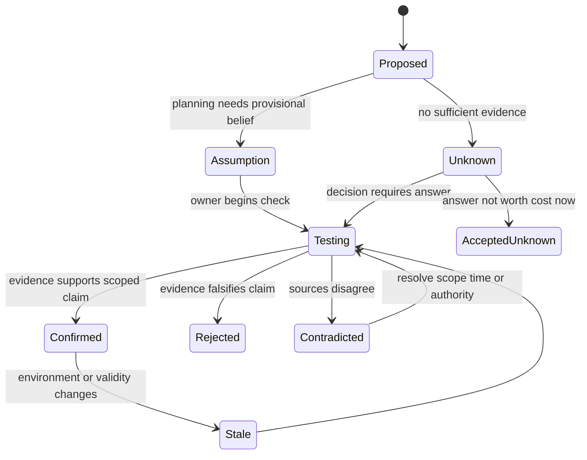

### Contradictions

Contradictions are valuable. Do not smooth them into consensus. A diagram may be correct for headquarters and wrong for acquired subsidiaries. A CISO may define critical assets through business services while a scanner uses a tag. A workflow may have changed last month. Record both claims, scopes, dates, authorities, and a discriminating check.

### Discovery stop rules

More questions are not always better. Stop when the next decision is supported within agreed confidence, remaining unknowns are visible, high-consequence assumptions have owners, privacy cost is justified, and further detail would not change the decision. Reopen discovery when scope, architecture, risk, product, entitlement, stakeholder, or evidence materially changes.

## Security, privacy, and ethical discovery

Discovery can itself create risk. Architecture diagrams reveal attack paths; vulnerability samples reveal weaknesses; identity data reveals people; contracts reveal commercial terms; incident narratives may contain regulated or privileged information.

| Control | Discovery implementation | Failure prevented |
|---|---|---|
| Purpose limitation | Ask only what supports the named decision | Data collected "just in case" |
| Data minimization | Prefer aggregates, metadata, redaction, and guided viewing | Unnecessary sensitive copies |
| Authorization | Verify requester and recipient access | Cross-team or cross-tenant disclosure |
| Approved transfer | Use customer-approved channels and storage | Evidence in personal chat or email |
| Retention/deletion | Set disposition for notes and samples | Permanent discovery archive |
| Secret hygiene | Never request passwords, tokens, keys, or private keys | Credential compromise |
| Role boundaries | Separate technical input from risk, legal, and commercial authority | TSM makes unauthorized decision |
| Safe testing | Avoid intrusive scans or changes without explicit approval | Discovery disrupts production |
| Redaction | Preserve IDs needed for correlation while minimizing content | Oversharing in escalation |
| Read-back | Let customer correct sensitive or misleading interpretation | False narrative persists |

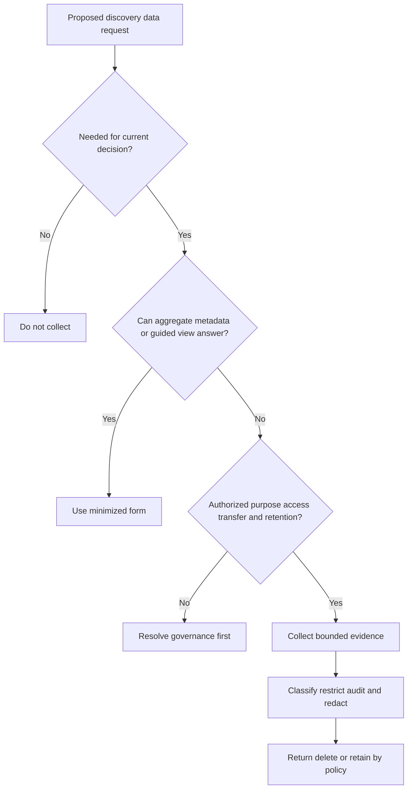

## Synthesis and current-state assessment

The assessment should answer: what matters, how it works now, what evidence supports that view, where pain and risk arise, which constraints and dependencies matter, what remains unknown, which options exist, and what decision is recommended. It should not be a transcript.

### Assessment structure

| Section | Required content | Quality test |
|---|---|---|
| Executive context | Goal, service, risk, consequence, decision | Understandable without technical appendix |
| Scope | Included/excluded populations and time | Denominator and boundaries explicit |
| Current state | People, architecture, tools/data, workflow | Causal, not inventory-only |
| Evidence quality | Sources, confidence, contradictions, unknowns | Claims reproducible |
| Pain/mechanisms | Observed symptoms and competing causes | Pain not mislabeled root cause |
| Readiness/maturity | Specific dimensions and bottlenecks | No judgmental average score |
| Options | Alternatives, tradeoffs, prerequisites, residual | More than one credible path |
| Recommendation | Customer-specific rationale and conditions | Does not presuppose entitlement or outcome |
| Success | Baseline, acceptance, evidence, owner, horizon | Observable and balanced |
| Actions | Owner, date, dependency, decision, checkpoint | Operationally usable |

```mermaid
flowchart LR
    NOTES[Classified notes] --> CLAIMS[Claims assumptions unknowns]
    CLAIMS --> MAPS[Architecture data and workflow maps]
    MAPS --> FIND[Findings and mechanisms]
    FIND --> OPTIONS[Options and tradeoffs]
    OPTIONS --> RECO[Conditional recommendation]
    RECO --> READBACK[Customer read-back]
    READBACK --> CORRECT[Corrections and decisions]
    CORRECT --> BASE[Versioned baseline]
```

### Executive summary examples

The examples below are writing patterns, not factual customer statements or product promises.

| Quality | Example |
|---|---|
| Weak | "The customer has too many tools and should implement an integrated platform." |
| Better | "The current prioritization workflow combines scanner severity with manually gathered ownership and criticality. The agreed sample suggests that missing ownership and inconsistent service mapping delay assignment, but source coverage and denominator integrity remain unknown. Before selecting automation, validate asset authority and workflow scope, then pilot one critical service with explicit success and privacy guardrails." |
| Weak | "Zscaler will solve visibility and reduce risk." |
| Better | "Zscaler publicly positions relevant security-data, vulnerability, and risk capabilities. Product fit, entitlement, source support, integration behavior, and customer outcome are not established by public positioning. The account team should map verified requirements to current documentation and licensed-tenant evidence after the customer confirms the priority workflow." |
| Weak | "The program is low maturity." |
| Better | "Workflow steps are repeatable within the VM team, while owner authority, source reconciliation, and closure validation are not yet consistently evidenced. A bounded owner and validation design is the likely prerequisite for measurable automation." |
| Weak | "The customer needs an AI agent." |
| Better | "Evidence gathering is repetitive, but the decision consequence and source quality vary. First measure the manual baseline and establish authoritative context; then evaluate assistive summarization or recommendation under human review if current capabilities and governance permit." |

## Qualification decision logic

A recommendation should be conditional and reversible where uncertainty remains.

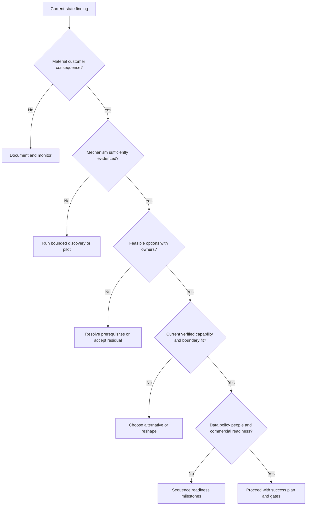

| Decision | When appropriate | Required record |
|---|---|---|
| Proceed | Need, fit, readiness, ownership, and evidence plan credible | Success hypothesis and next milestones |
| Proceed with conditions | Value plausible but named dependencies remain | Conditions, owners, dates, stop rules |
| Reshape | Original scope or solution does not match mechanism | Revised outcome and scope |
| Sequence prerequisites | Foundation must improve before implementation | Readiness plan and re-entry criteria |
| Defer | Timing or capacity makes action unsafe or wasteful | Trigger and review date |
| Stop | No material need, fit, authority, or acceptable risk | Transparent rationale and alternatives |

## Failure modes and misconceptions

| Failure or misconception | Why it fails | Better practice |
|---|---|---|
| "Discovery means asking every question" | Exhausts stakeholders and collects unused sensitive data | Ask decision-linked questions progressively |
| "Executives know strategy; engineers know truth" | Each sees a scoped reality | Triangulate without ranking people |
| "A diagram is the current state" | Diagrams can be stale or omit operations | Add provenance, workflow, and samples |
| "Pain equals root cause" | Symptom may have several mechanisms | Preserve hypotheses and discriminating checks |
| "Unknown is bad preparation" | Unknown may be the honest result | Make consequence and owner visible |
| "Product fit is obvious from category" | Capability, entitlement, architecture, and workflow differ | Verify requirement-to-capability evidence |
| "More data is always better" | Adds cost, privacy, ambiguity, and failure modes | Minimum sufficient evidence |
| "Maturity is one score" | Averages hide bottlenecks | Assess separate dimensions |
| "Stakeholder agreement proves fact" | Consensus can share an incorrect assumption | Test consequential claims |
| "Success is go-live" | Availability does not prove repeated use or outcome | Build outcome chain and guardrails |
| "TSM should remove all objections" | Objections may reveal valid constraints | Diagnose, acknowledge, and reshape |
| "Commercial details are technical details" | Creates unauthorized commitments | Route entitlement and contract questions |
| "Confidential means put it in meeting notes" | Notes can increase exposure | Minimize and govern evidence |
| "Current state never changes" | Environment, people, and risks evolve | Version and reopen on triggers |

## Troubleshooting discovery itself

Discovery can stall, produce contradictions, or lose trust. Diagnose the engagement rather than blaming customer participation.

| Symptom | Plausible cause | Discriminating check | Recovery |
|---|---|---|---|
| No executive attendance | Wrong sponsor, unclear decision, timing | Ask who owns outcome and what decision is pending | Rescope and secure sponsor |
| Operators are quiet | Psychological safety, hierarchy, unclear purpose | Offer smaller role-specific session and safe sample | Separate exploration from judgment |
| Endless detail | Scope too broad or no decision | Restate decision and parking lot | Narrow to critical path |
| Contradictory answers | Different scopes/times/definitions | Put claims side by side | Resolve with authority and evidence |
| Customer wants immediate demo | Need for concreteness or preselected solution | Ask which hypothesis the demo should test | Run bounded demonstration with caveats |
| Sensitive evidence refused | Legitimate policy or trust concern | Ask what minimized form can answer | Use aggregate/guided review or stop |
| Product question cannot be answered | Documentation or entitlement uncertainty | Record exact requirement | Route to accountable specialist |
| Assessment rejected | Misquote, surprise, weak evidence, political impact | Review exact disputed claim and source | Correct publicly and preserve uncertainty |
| No next action | Output not tied to decision | Ask which decision changed | Publish owner/date or close discovery |

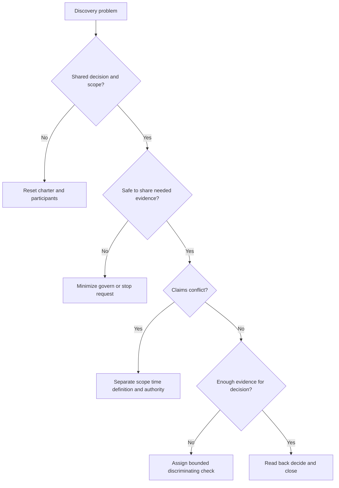

## Objections and constructive responses

Objection handling is diagnosis, not persuasion. Acknowledge the concern, test its mechanism, state evidence and boundary, offer options, and preserve customer authority.

| Objection | What may sit behind it | Neutral response pattern |
|---|---|---|
| "We already have a SIEM/dashboard." | Fear of duplication or unclear incremental value | "Let us identify the unresolved decision and test whether any additional capability is needed." |
| "We cannot share architecture." | Security policy or low trust | "We can begin with boundary-level metadata or a customer-controlled walkthrough and collect only what the decision requires." |
| "We need every integration first." | Desire for completeness | "Which first decision needs which minimum authoritative sources, and what risk does broader scope add?" |
| "Our CMDB is unreliable." | Known foundational gap | "We should quantify which attributes and populations are unreliable, identify alternative authorities, and decide whether readiness work comes first." |
| "Just tell us best practice." | Time pressure or desire for certainty | "I can offer general patterns, but the recommendation depends on your service, authority, constraints, and evidence. Let us establish the smallest set." |
| "The renewal depends on this outcome." | Commercial pressure and urgency | "We should separate commercial ownership from technical evidence and define what can be verified in the available period." |
| "AI should automate this." | Manual burden or innovation mandate | "Let us define the task, consequence, authoritative evidence, baseline, and approval boundary before selecting an automation level." |
| "We tried this before." | Historical failure and trust debt | "What failed, under which scope and dependencies, and what would need to be different for a bounded retest?" |

## Explicitly fictional and synthetic NMH scenarios

All content in this section is fictional and synthetic. It is practice material, not a customer account, production result, or claim about Zscaler behavior. Dates in this section, including **2026-09-03**, **2026-09-08**, and **2026-09-15**, are synthetic scenario dates later than the source snapshot and do not imply later research.

### Scenario 1 - The dashboard request

On synthetic 2026-09-03, NMH's fictional sponsor asks for "one risk dashboard." Discovery separates three decisions: the CISO wants an enterprise trend, VM wants an owner-ready remediation queue, and application owners want service-specific evidence and maintenance constraints. The fictional data architect states that criticality comes from the CMDB, while an application owner says the CMDB omits recently migrated services. The TSM records a contradiction rather than promising a dashboard.

The recommended synthetic next step is a bounded current-state map for two fictional business services, with attribute-level source authority, population reconciliation, and a separate executive-versus-operator information design. No product is selected, and no result is claimed.

### Scenario 2 - The green connector and invisible workflow

On synthetic 2026-09-08, NMH's fictional integration owner reports that all feeds are green. A workflow walk-through shows that analysts export findings to a spreadsheet because the ticket assignment field often lacks an application owner. Discovery distinguishes transport health from workflow usability. The current-state finding is not "the connector is broken"; it is that owner enrichment and assignment acceptance lack agreed evidence.

The synthetic qualification decision is "sequence prerequisites": define owner authority and reconcile a sample before evaluating automation. A later date here remains fictional and synthetic within this section.

### Scenario 3 - The deadline without authority

On synthetic 2026-09-15, a fictional audit deadline drives urgency, but compliance, privacy, and the application change board have not approved the proposed data use or remediation workflow. The TSM does not label governance as resistance. The dependency record shows lead times, required evidence, owner, and alternative: begin a read-only, minimized assessment while approvals proceed.

### Scenario 4 - The product-first request

NMH's fictional stakeholder asks whether a named Zscaler capability can "solve prioritization." The TSM states the bounded public positioning, then asks which sources, risk factors, owners, workflow, and acceptance criteria matter. The account team must verify current documentation, licensed scope, integrations, and technical fit. The discovery output is a requirement map, not an affirmative capability or outcome claim.

## Reusable artifact kit

The templates below are intentionally concrete. In real work, tailor them to customer policy, systems, terminology, and approved evidence. Blank fields are not facts.

### Artifact 1 - Discovery charter

| Field | Entry template |
|---|---|
| Engagement purpose | Decision this discovery must enable |
| Business context | Service, initiative, obligation, or risk prompting work |
| In scope | Populations, regions, workflows, systems, and time horizon |
| Out of scope | Explicit exclusions and revisit triggers |
| Participants | Sponsor, outcome owner, operators, architects, governance, account team |
| Evidence handling | Classification, approved channels, redaction, retention, deletion |
| Working language | Key terms and definitions to align |
| Planned sessions | Executive, workflow, architecture/data, governance, read-back |
| Deliverables | Maps, inventory, findings, qualification, success hypotheses |
| Decision date | When and by whom proceed/reshape/defer/stop is decided |
| Ground rules | Unknown accepted; no secrets; no production change without authority |

### Artifact 2 - Enterprise discovery questionnaire

Use these as a menu. Do not force every question into one meeting.

| Domain | Core questions | Evidence/artifact requested |
|---|---|---|
| Business outcomes | Which service and objective matter? Why now? What happens if unchanged? | Strategy or sponsor read-back |
| Risk | Which adverse scenarios and obligations drive priority? Who owns acceptance? | Risk register excerpt or owner statement |
| Scope | Which entities, regions, applications, sources, and exclusions count? | Scoped population definition |
| Stakeholders | Who sponsors, operates, approves, blocks, funds, and receives impact? | Stakeholder map |
| Architecture | Which components, paths, trust boundaries, tenants, and control points matter? | Current approved diagram or guided walkthrough |
| Identity | Which identities and attributes are authoritative over time? | Attribute authority map |
| Assets/services | How are assets related to business services, owners, and criticality? | Inventory and relationship sample |
| Security tools | Which tools serve which decisions? Which products/editions are verified? | Tool-purpose inventory |
| Data | What are grain, schema, IDs, clocks, quality, retention, and lineage? | Data contract/profile |
| Integrations | How do data and actions move, retry, reconcile, and fail? | Flow and health evidence |
| Workflow | Walk normal, urgent, exception, unowned, and failed cases | Swimlane and representative records |
| Pain | Where is delay, rework, uncertainty, overload, or distrust? | Samples and distributions |
| Constraints | Which business, technical, people, governance, security, commercial, and timing limits apply? | Constraint/dependency register |
| Maturity | Which processes are repeatable, measured, governed, and improved? | Dimension evidence |
| Success | What baseline, acceptance, owner, horizon, and guardrails apply? | Success contract |
| Continuity | What happens during source, integration, staff, or vendor outage? | Degraded-mode runbook |
| Change | Which initiatives, freezes, acquisitions, or releases alter assumptions? | Change calendar |
| Decision | Proceed, reshape, sequence, defer, or stop? | Qualification record |

### Artifact 3 - Current-state map canvas

| Layer | Current-state questions | Facts | Assumptions/unknowns | Owner/evidence |
|---|---|---|---|---|
| Business service | Users, criticality, obligation, impact | | | |
| Risk scenario | Threat, weakness, path, consequence | | | |
| Stakeholders | Sponsor, operators, authority, affected roles | | | |
| Identity and assets | Lifecycle, criticality, ownership, relationships | | | |
| Architecture | Components, tenants, zones, trust/control points | | | |
| Data sources | Purpose, grain, scope, IDs, time, quality | | | |
| Integrations | Selection, transport, transform, health, replay | | | |
| Workflow | Trigger through validation, exceptions, escalation | | | |
| Governance | Policy, privacy, legal, change, risk acceptance | | | |
| Operations | Monitoring, support, continuity, change ownership | | | |
| Measures | Baselines, denominators, targets, guardrails | | | |

### Artifact 4 - Tool and data inventory

| ID | System/source | Purpose/decision | Owner | Verified product/version/edition | Population/exclusions | Grain/IDs/time | Delivery/transforms | Quality/health | Sensitivity/retention | Dependency/continuity | Confidence |
|---|---|---|---|---|---|---|---|---|---|---|---|
| T-001 | | | | | | | | | | | |

### Artifact 5 - Assumption and question ledger

| ID | Claim/question | Class | Scope/time | Consequence if wrong | Evidence/confidence | Cheapest check | Owner | Due | Disposition |
|---|---|---|---|---|---|---|---|---|---|
| AQ-001 | | Assumption or unknown | | | | | | | |

### Artifact 6 - Qualification scorecard

Do not turn the table into an automatic numeric verdict. Narrative and hard stop conditions govern.

| Dimension | Evidence | Status: ready/conditional/not ready/unknown | Risk | Required condition | Owner |
|---|---|---|---|---|---|
| Material need and consequence | | | | | |
| Executive priority and sponsor | | | | | |
| Bounded scope | | | | | |
| Evidence and baseline | | | | | |
| Outcome/workflow ownership | | | | | |
| Data and integration readiness | | | | | |
| Security/privacy/governance | | | | | |
| Technical capability fit | | | | | |
| Commercial/services boundary | | | | | |
| Capacity and timing | | | | | |
| Success and guardrails | | | | | |
| Decision | Proceed / conditional / reshape / sequence / defer / stop | | | | |

### Artifact 7 - Current-state executive summary

> **Context:** [Business service, initiative, or obligation].
>
> **Decision:** [What must be decided, by whom, and by when].
>
> **Current state:** [Three to five sentences connecting people, architecture, data, and workflow].
>
> **Evidence:** [Authoritative sources, representative samples, and confidence].
>
> **Material gaps:** [Pain mechanisms, contradictions, assumptions, and unknowns].
>
> **Options:** [At least two options with tradeoffs and dependencies].
>
> **Recommendation:** [Customer-specific conditional path; no unsupported product or result claim].
>
> **Success:** [Baseline, acceptance, evidence, owner, horizon, guardrails].
>
> **Next decisions/actions:** [Owner, date, dependency, checkpoint].

### Artifact 8 - Objection and failure scenario record

| Field | Prompt |
|---|---|
| Trigger | What was said or observed? |
| Underlying concern hypotheses | Security, trust, workload, fit, history, authority, commercial, timing? |
| Evidence | What supports or challenges each hypothesis? |
| Boundary | What can the TSM answer, and what needs another owner? |
| Options | Minimize, sequence, pilot, alternate, defer, stop? |
| Decision | Who decided what? |
| Follow-up | Owner, evidence, date, checkpoint |
| Residual | What remains unresolved? |

### Artifact 9 - Discovery read-back email

**Subject:** Current-state discovery read-back - [scope] - correction requested

**Purpose and decision:** [One sentence].

**What we heard as customer facts:** [Scoped bullets with evidence references].

**Assumptions and unknowns:** [Do not blend with facts].

**Current workflow and architecture:** [Links to customer-approved artifacts].

**Material constraints/dependencies:** [Owner and consequence].

**Proposed qualification:** [Proceed, reshape, sequence, defer, or stop, with rationale].

**Success hypothesis:** [Baseline, acceptance, evidence, owner, guardrails].

**Corrections requested by:** [Date]. **Next checkpoint:** [Date/owner].

## Exercises

### Exercise 1 - Turn a product request into discovery

Prompt: "We want AI to prioritize all vulnerabilities." Write ten questions that establish business outcome, risk, population, current workflow, source authority, evidence quality, consequence of error, approval, success, and product-verification boundary. Then write a two-sentence read-back with at least one assumption and one unknown.

### Exercise 2 - Draw the current state

Using only fictional data, choose one critical service and draw four views: business/service, logical/security, data/integration, and workflow. Label every element fact, scenario assumption, or unknown. Add owner, source date, and confidence. Remove every component that does not influence the selected decision.

### Exercise 3 - Walk one case

Create a synthetic finding. Trace trigger, intake, validation, prioritization, assignment, approval, action, validation, closure, and recurrence. Add one missing owner, one stale identity, one privacy constraint, and one commercial unknown. Identify the first decision that cannot responsibly proceed.

### Exercise 4 - Qualify against pressure

Role-play a sponsor demanding a four-week outcome while data access requires six weeks. Provide three options: narrow scope, sequence a read-only foundation, or defer. For each, state value, dependency, risk, stop rule, and evidence. Do not promise a product outcome.

### Exercise 5 - Executive synthesis

Write a 150-word current-state summary from a fictional ten-page note set. Include context, current mechanism, two evidenced gaps, one contradiction, one accepted unknown, two options, recommendation, owner, and success test. Delete implementation detail that does not change the executive decision.

### Exercise 6 - Candidate answer practice

Say aloud: "I have not conducted production Zscaler TSM discovery. Here is how my escalation background transfers, here is the synthetic artifact I built, and here is what I would verify with the customer and account team." Keep it factual, specific, and under sixty seconds.

## Customer discovery questions

1. Which business service, objective, obligation, or executive decision makes this work important now?
2. Which adverse scenarios, risk priorities, and operational pains are in scope, and what evidence supports them?
3. Which populations, regions, entities, applications, sources, workflows, and dates are included or excluded?
4. Who sponsors, owns, performs, approves, influences, funds, resists, validates, and accepts residual risk?
5. Which architecture components, trust boundaries, identity paths, data flows, control points, and shared responsibilities matter?
6. Which tools/products/editions are actually deployed and entitled, and what decision does each support?
7. What does one source record represent, which identifiers and clocks apply, and who owns semantics?
8. What are completeness, validity, uniqueness, freshness, reconciliation, and entity-resolution conditions with denominators?
9. How does a representative item move from trigger through triage, priority, assignment, approval, action, validation, exception, and closure?
10. Where do delay, rework, overload, distrust, manual effort, gaps, duplicates, or conflicting decisions occur?
11. Which business, technical, data, people, governance, security/privacy, commercial, and timing constraints apply?
12. Which dependencies control readiness, who owns them, and what happens if they slip?
13. Which claims are customer facts, statements, assumptions, contradictions, accepted unknowns, or stale evidence?
14. What outcome, population, baseline, acceptance, evidence, owner, horizon, exclusion, and guardrail define success?
15. Based on current evidence, should the customer proceed, proceed conditionally, reshape, sequence prerequisites, defer, or stop?

## Official Source Anchors

Research/source snapshot and source review date: **2026-08-24**.

The Zscaler sources support dated public positioning only. NIST and CISA sources support general governance, risk, zero-trust, and security-practice framing. They do not establish a customer's architecture, maturity, product entitlement, data source, workflow, control, result, or recommended purchase. Current official technical/order documentation, licensed-tenant evidence, customer policy and contracts, source-native records, and accountable specialist guidance govern production.

| Source | URL | Used for | Boundary |
|---|---|---|---|
| Zscaler Zero Trust Exchange | https://www.zscaler.com/products-and-solutions/zero-trust-exchange-zte | Public zero-trust, identity/context, policy, and platform positioning | No customer architecture, deployment, policy, entitlement, or result inferred |
| Zscaler Agentic Security Operations | https://www.zscaler.com/products-and-solutions/security-operations | Public first/third-party context, security workflow, and SecOps positioning | No implementation, workflow, agent, UI, field, action, or outcome inferred |
| Zscaler Data Fabric for Security | https://www.zscaler.com/products-and-solutions/data-fabric | Public ingestion, harmonization, correlation, enrichment, workflow, and reporting positioning | No hidden schema, connector, source quality, or customer state inferred |
| Zscaler Unified Vulnerability Management | https://www.zscaler.com/products-and-solutions/unified-vulnerability-management | Public vulnerability aggregation, context, prioritization, and workflow positioning | No scoring formula, source support, entitlement, SLA, or result inferred |
| Zscaler Risk360 | https://www.zscaler.com/products-and-solutions/risk360 | Public cyber-risk visibility and contextual risk positioning | No customer risk score, quantification, recommendation, or outcome inferred |
| NIST Cybersecurity Framework 2.0 | https://www.nist.gov/cyberframework | Govern, Identify, Protect, Detect, Respond, and Recover outcome framing | Voluntary and implementation-neutral |
| NIST SP 800-207 | https://csrc.nist.gov/pubs/sp/800/207/final | General zero-trust architecture and policy concepts | Does not prescribe a vendor product or customer design |
| NIST Privacy Framework | https://www.nist.gov/privacy-framework | General privacy-risk management concepts | Organizations tailor implementation |
| CISA Zero Trust Maturity Model | https://www.cisa.gov/resources-tools/resources/zero-trust-maturity-model | General maturity dimensions and incremental improvement framing | Federal guidance; not a customer score or product requirement |

## Likely Interview Questions

### Q1. What is enterprise discovery, and what should it produce?

**Model answer:** Enterprise discovery is collaborative evidence gathering to support a defined customer decision. I connect business outcomes and risks to stakeholders, architecture, tools/data, workflows, constraints, maturity, readiness, and success evidence. It should produce an agreed current-state map, evidence and assumption ledger, qualification decision, conditional recommendation, and owned next actions. A completed questionnaire is not the outcome.

### Q2. How do you avoid product-first discovery?

**Model answer:** I begin with the business service, consequential risk or workflow decision, affected population, current mechanism, pain evidence, authority, and success criteria. Only then do I map requirements to currently verified capabilities and commercial boundaries. Public positioning can form a hypothesis, but current documentation, entitlement, tenant evidence, specialists, and customer tests establish fit. I remain willing to reshape, sequence, defer, or stop.

### Q3. How would you assess a customer's current state?

**Model answer:** I use purpose-bound business/service, logical/security, data/integration, and operational/workflow views. I triangulate approved design, stakeholder accounts, and representative evidence; label facts, statements, assumptions, contradictions, stale items, and unknowns; map normal and exception paths; assess maturity by dimension; and read the model back for correction. The result is versioned and scoped, never presented as complete enterprise truth.

### Q4. What makes a discovery question effective?

**Model answer:** It is tied to the next decision, uses plain language, asks one thing, invites evidence or counterexample, and respects privacy and role boundaries. I funnel from outcome to scope, mechanism, evidence, constraints, consequence, and success. I ask operators to walk a representative case and then test high-consequence assumptions with the cheapest safe discriminating check.

### Q5. How do you qualify readiness and value?

**Model answer:** I test material consequence, executive priority, bounded scope, evidence and baseline, ownership, data/integration readiness, governance, verified technical fit, commercial boundary, capacity, timing, and success guardrails. Qualification is mutual risk reduction, not pressure. The decision can be proceed, conditional, reshape, sequence prerequisites, defer, or stop, with conditions and re-entry criteria recorded.

### Q6. How do you handle contradictory stakeholder statements?

**Model answer:** I preserve both statements and compare scope, time, definition, and authority. Then I seek a safe discriminating source such as an approved configuration, representative workflow, population reconciliation, or accountable owner decision. I do not average opinions or embarrass participants. The contradiction remains visible until resolved, bounded, or accepted as an unknown.

### Q7. What belongs in a strong discovery executive summary?

**Model answer:** It states business context, the decision, scope, current people-architecture-data-workflow mechanism, evidence quality, material gaps, assumptions and unknowns, options and tradeoffs, conditional recommendation, prerequisites, success contract, residual risk, and owned next actions. It separates customer facts from general practice and public product positioning and avoids unsupported entitlement or outcome claims.

### Q8. How does Arti's background transfer honestly to discovery?

**Model answer:** Microsoft escalation work required rapid discovery of impact, topology, identity, permissions, network paths, changes, evidence, owners, and recovery conditions across technical and executive stakeholders. SQL and Power BI support source-quality and baseline reasoning; mentoring supports accessible workshops and read-back. She has practiced TSM discovery with synthetic artifacts, while production Zscaler, SecOps program assessment, product selection, and customer risk authority remain explicit ramp areas.

## 30-Second Memory Hooks

| Concept | Memory hook |
|---|---|
| Discovery | Build enough shared truth for the next decision |
| Qualification | Protect both sides from a bad commitment |
| Current state | People plus architecture plus data plus workflow |
| Business goal | Destination before vehicle |
| Risk | Uncertainty affecting an objective |
| Pain | Respect the symptom; test the mechanism |
| Architecture | Purpose-bound map with provenance |
| Tool inventory | Purpose, population, grain, owner, quality |
| Workflow | Follow one item through exceptions and validation |
| Stakeholder | Evidence, incentive, influence, authority |
| Constraint | Design input, not resistance |
| Dependency | Owner, evidence, need-by, consequence, alternative |
| Maturity | Separate stairwells, not one score |
| Readiness | Can this change start and persist now? |
| Assumption | Belief with consequence, test, owner, and date |
| Unknown | Honest state, not blank to conceal |
| Success | Outcome, population, baseline, acceptance, evidence, owner |
| Read-back | Correct the map before acting |
| Privacy | Minimum sufficient evidence |
| Arti bridge | Escalation discovery transfers; production claims do not |

## Completion Checklist

- [ ] I can explain discovery, qualification, current-state assessment, maturity, readiness, and success from zero.
- [ ] I can start with business service, risk, and decision instead of a product.
- [ ] I can map stakeholders, authority, incentives, architecture, tools/data, and workflows.
- [ ] I can use a question funnel and walk representative normal and exception cases.
- [ ] I can separate customer facts, statements, assumptions, unknowns, contradictions, general practice, and official product facts.
- [ ] I can assess data readiness through authority, scope, grain, identity, time, quality, governance, operations, and capacity.
- [ ] I can treat constraints and objections as design evidence rather than resistance to defeat.
- [ ] I can define success with population, baseline, acceptance, evidence, owner, horizon, and guardrails.
- [ ] I can recommend proceed, conditional, reshape, sequence, defer, or stop.
- [ ] I can protect sensitive discovery information through minimization, authorization, approved transfer, retention, and deletion.
- [ ] I can create the charter, questionnaire, current-state canvas, inventory, assumption ledger, scorecard, summary, and read-back.
- [ ] I can state Arti's transferable strengths without claiming production Zscaler or SecOps TSM experience.
- [ ] I can answer Q1-Q8 aloud using evidence-first and customer-specific language.

[Next: Part 101 - Onboarding, Technical Success Plans, Milestones, and Time to Value](Part-101-onboarding-success-plans.md)