# Part 101 - Onboarding, Technical Success Plans, Milestones, and Time to Value

> **Audience:** Arti Thakur, preparing for a Zscaler Security Operations Technical Success Manager role after Microsoft enterprise Support Escalation Engineering.

> **Purpose:** Explain customer onboarding and technical success planning from zero, including kickoff, prerequisites, roles, phased delivery, dependencies, adoption outcomes, milestones, evidence, risks, documentation, remote/on-site cadence, early wins, time to value, and recovery when a plan slips.

> **Scope and honesty:** Northstar Meridian Holdings, abbreviated NMH, is an explicitly fictional and synthetic customer used only for study. Every NMH person, tenant, product, source, integration, task, date, duration, target, metric, milestone, risk, decision, artifact, and result is invented. Arti's factual background is Microsoft 365, OneDrive, and SharePoint support; networking and trace analysis; SQL and Power BI; enterprise escalations; mentoring; and responsible AI exploration. Production Zscaler, SecOps TSM, customer onboarding, implementation ownership, adoption, and value realization remain learning boundaries.

> **Currency caveat:** Product capabilities, interfaces, prerequisites, delivery methods, documentation, services, support boundaries, packaging, and entitlements change. The controlled official-source snapshot and source review date for this Part is exactly **2026-08-24**. Current official technical and ordering documentation, licensed-tenant evidence, contracts and statements of work, customer policy, product specialists, implementation/service owners, vendor Support, and measured environment evidence govern production plans.

> **Section goal:** Build a beginner-to-interview-ready onboarding system that converts qualified discovery into an owned technical success plan, verifies prerequisites before dates, sequences value in safe phases, measures adoption as repeated correct workflow behavior, protects security and privacy, communicates risk early, and reaches the first customer-accepted outcome without inventing product behavior or production results.

This Part is primarily **general technical-success and program-delivery practice**. Reviewed Zscaler public sources support bounded positioning around zero trust, security operations, security data, vulnerability prioritization, risk visibility, and customer support/service resources. They do not establish a specific customer's implementation steps, entitlement, service scope, milestone duration, adoption target, support level, time to value, or result.

Every statement belongs to one of five evidence classes. **Official product fact** is a dated public statement supported by an anchor reviewed on 2026-08-24. **General practice** is a vendor-neutral onboarding or success-management method. **Scenario assumption** exists only inside explicitly fictional and synthetic NMH. **Customer fact** requires current customer-authoritative evidence. **Unknown** means available evidence does not establish the answer. A plan may schedule validation of an unknown; it may not silently convert it into a fact.

```mermaid
flowchart LR
    DISC[Qualified discovery and current state] --> HAND[Account and delivery handoff]
    HAND --> KICK[Kickoff and operating agreement]
    KICK --> PRE[Prerequisites and readiness gates]
    PRE --> FOUND[Foundation and safe configuration]
    FOUND --> PILOT[Pilot one bounded workflow]
    PILOT --> ADOPT[Enable repeated correct use]
    ADOPT --> VALUE[Validate technical and customer outcome]
    VALUE --> SCALE[Scale govern and improve]
```

| Operating principle | Plain meaning | Practical consequence | Failure prevented |
|---|---|---|---|
| Start from qualified outcomes | Onboarding implements a reason, not merely a product | Carry discovery goals, risks, scope, and success into the plan | Kickoff resets context |
| Verify before scheduling | Dates depend on evidence, owners, access, policy, and capacity | Use readiness gates and critical path | Calendar-driven fiction |
| One accountable owner per outcome | Many contributors do not replace authority | Name customer and provider decision rights | Tasks with no decision maker |
| Milestones prove capability | A meeting or configuration action is not an outcome | Require acceptance evidence and guardrails | Activity reported as value |
| Deliver in safe slices | A bounded workflow teaches faster than enterprise-wide scope | Pilot one population with rollback and stop rules | Big-bang failure |
| Adoption is behavior | Login and enablement are prerequisites, not value | Measure eligible repeated correct workflow use | Vanity adoption |
| Time to value has clocks | Start and value events must be explicit | Report prerequisite, technical, adoption, and outcome intervals | Misleading speed claim |
| Early wins must be real | Small progress should reduce uncertainty or improve a decision | Select low-risk, evidence-rich outcomes | Cosmetic quick win |
| Risks are managed openly | Bad news improves decisions when early and specific | Maintain RAID, forecast, options, and checkpoints | Surprise escalation |
| Product claims remain bounded | Public pages do not define this plan | Verify current technical and commercial truth | Invented Zscaler delivery |

## JD Mapping

| JD signal | Capability developed | Reusable customer or TSM artifact | Honest boundary |
|---|---|---|---|
| Drive customer onboarding and adoption | Convert discovery into phased, owned technical outcomes | Technical success plan | No production onboarding claim |
| Act as trusted advisor | Explain options, dependencies, risk, and decisions transparently | Executive plan summary | Customer owns priority and risk |
| Accelerate time to value | Define clocks, critical path, early wins, and acceptance evidence | Time-to-value map | No guaranteed duration or result |
| Coordinate complex environments | Align customer, account team, services, Support, and technical owners | Role and dependency matrix | TSM does not absorb every role |
| Build SecOps expertise | Sequence data, workflow, governance, enablement, and validation | Phased SecOps onboarding blueprint | Actual products and steps require verification |
| Communicate proactively | Forecast milestone health, blockers, options, and decision needs | Weekly status and steering brief | No unsupported ETA |
| Troubleshoot barriers | Isolate readiness, access, data, integration, workflow, and adoption blockers | Blocker runbook | No predeclared product defect |
| Use analytics | Measure prerequisite quality, cohort use, milestone evidence, and outcomes | Success evidence scorecard | No inferred causality |
| Partner cross-functionally | Keep technical, support, services, product, and commercial lanes clear | Account-team operating agreement | No entitlement or roadmap promise |

## Candidate honesty note

Arti can say: "My production background is Microsoft Support Escalation Engineering rather than owning Zscaler SecOps onboarding. I have run complex technical workstreams with prerequisites, customer and engineering owners, evidence checkpoints, mitigations, status cadences, recovery validation, and knowledge transfer. I have also used SQL and Power BI to make operational progress and data quality visible. I have studied technical success planning and practiced the templates here with a fictional customer. In a real engagement I would verify product documentation, purchased scope, services ownership, tenant state, customer change controls, dependencies, and success evidence before committing dates or outcomes."

This statement is credible because it identifies both transfer and boundary. Arti can describe incident work as experience coordinating uncertain technical delivery; she should not rename it as product implementation. Synthetic NMH dates and metrics must remain labeled. Do not say "I onboarded Zscaler customers," "I delivered time to value in thirty days," "I drove SecOps adoption," or "I implemented this architecture" without factual production evidence.

| Factual background | Transferable strength | Neutral wording | Unsupported statement to avoid |
|---|---|---|---|
| Enterprise support escalations | Workstreams, dependencies, checkpoints, mitigations, and closure | "I coordinate complex technical outcomes under uncertainty." | "I led Zscaler implementations." |
| M365 service troubleshooting | Prerequisite, identity, endpoint, network, service, and policy reasoning | "I verify the path before committing a fix date." | "I know every SecOps prerequisite." |
| Network and trace analysis | Evidence at each technical boundary | "I turn blockers into discriminating checks." | "I operated customer Zscaler tenants." |
| SQL and Power BI | Cohorts, baselines, quality, status, and trends | "I make success evidence transparent." | "I proved security ROI." |
| Customer communication | Impact, options, owner, risk, and next checkpoint | "I communicate slippage without hiding uncertainty." | "I owned executive security governance." |
| Mentoring | Enablement, teach-back, documentation, and handoff | "I help teams adopt repeatable methods." | "I trained production SOC teams on Zscaler." |
| Synthetic NMH plan | Demonstrates preparation and structure | "This is a fictional practice artifact." | "This is a delivered customer plan." |

## Beginner vocabulary and memory hooks

**Onboarding** is the controlled transition from a qualified customer goal to an operable, adopted, and supportable capability. A **technical success plan** is a shared record of outcomes, milestones, owners, evidence, dependencies, risks, and decisions. Think of opening a hospital wing. Signing for equipment is not success. The building, power, network, safety approval, trained staff, operating procedure, patient flow, support, and outcome checks must all work together.

| Term | Meaning from zero | Why it matters | Analogy or memory hook |
|---|---|---|---|
| Kickoff | Meeting that aligns purpose, scope, roles, method, and next actions | Establishes operating contract | Crew briefing before departure |
| Prerequisite | Condition required before work can safely begin or pass a gate | Controls feasibility and sequence | Runway required before takeoff |
| Deliverable | Work product to be produced | Makes expected output visible | Completed map or runbook |
| Milestone | Meaningful checkpoint proving a state or decision | Shows progress toward outcome | Passed inspection gate |
| Task | Bounded action contributing to a milestone | Organizes work | Install one component |
| Dependency | Condition or output needed from another task or owner | Determines sequence | Connecting flight |
| Critical path | Longest dependent chain controlling earliest finish | Identifies date drivers | Slowest required route |
| Gate | Explicit decision based on acceptance conditions | Prevents unsafe progression | Safety checkpoint |
| Acceptance criterion | Observable test required to accept a deliverable or milestone | Separates done from nearly done | Inspection checklist |
| Exit criterion | Condition required to leave a phase | Controls transition | Door opens only after checks |
| Outcome | Observable change in behavior, technical state, risk, or business support | Connects work to value | Patients safely served |
| Output | Thing produced by work | Necessary but not sufficient | Training deck created |
| Adoption | Repeated correct use by eligible roles in intended workflows | Shows capability is operating | Staff consistently follow procedure |
| Enablement | Knowledge, practice, access, and support helping people perform | Supports adoption | Training and rehearsal |
| Time to value | Interval from a defined start to customer-accepted value event | Helps manage urgency and expectations | Time from project start to first safe service |
| Early win | Small validated outcome reducing risk or uncertainty | Builds learning and confidence | Open one safe room before whole wing |
| Baseline | Current measured reference under a stable definition | Enables comparison | Starting measurement |
| Leading indicator | Early signal that future outcome may occur | Enables intervention | Prerequisites passing |
| Lagging indicator | Evidence observed after an outcome | Confirms effect | Validated service result |
| RAID | Risks, Assumptions, Issues, and Dependencies | Shared uncertainty register | Flight risk board |
| Risk | Possible event affecting objective | Needs probability/impact response | Storm forecast |
| Issue | Problem already occurring | Requires action now | Storm has closed runway |
| Assumption | Unverified belief used in plan | Needs validation | Expected runway availability |
| Change control | Authorized process for modifying production or plan baseline | Protects stability and accountability | Approved engineering change |
| Rollback | Return to a known acceptable state after change | Limits harm | Reverse installation |
| Stop rule | Condition requiring pause or termination | Prevents momentum overriding safety | Abort threshold |
| RACI | Responsible, Accountable, Consulted, Informed | Clarifies participation | Doer, owner, adviser, audience |
| Cadence | Repeating schedule of coordination and review | Maintains decisions and flow | Regular control-tower calls |
| Health | Evidence-based view of outcome, schedule, risk, adoption, and relationship | Directs attention | Instrument panel |
| Value hypothesis | Testable belief linking capability to customer outcome | Avoids guaranteed claims | "If this changes, that may improve" |
| Residual risk | Risk remaining after action | Keeps limitations visible | Weather risk after rerouting |

### Plain-English deep-dive 1 - Onboarding is a capability transfer, not an account activation

An account can exist while nobody can safely use it. Access can work while source data is incomplete. A workflow can run while operators do not trust it. Training can finish while decision rights remain unclear. Onboarding is complete only to the extent defined by its accepted outcomes.

Separate four readiness layers. **Technical readiness** means verified configuration, connectivity, data, identity, and controls. **Operational readiness** means owners, monitoring, support, change, continuity, and runbooks exist. **User readiness** means eligible roles have access, knowledge, practice, and confidence. **Governance readiness** means purpose, authority, privacy, security, legal, commercial, and risk conditions are satisfied.

A kickoff should therefore avoid "We will get you live by Friday" unless the exact live state, prerequisites, authority, and evidence support that forecast. Better wording is: "Our first decision gate is readiness for a bounded pilot. The forecast depends on identity access, source scope, privacy approval, and customer test capacity. We will confirm or revise the date when those conditions have evidence."

## From discovery to onboarding

Part 100 produced outcomes, current state, scope, stakeholders, evidence, unknowns, qualification, and success hypotheses. Onboarding should not repeat discovery from zero. It should verify what remains current, resolve handoff gaps, and convert accepted hypotheses into delivery contracts.

| Discovery input | Onboarding use | Validation question |
|---|---|---|
| Business goal and risk | Defines priority and value narrative | Is this still the sponsor's decision? |
| Scope and exclusions | Defines population and boundary | Has environment or contract changed? |
| Stakeholder map | Seeds roles and cadence | Are accountable roles participating? |
| Current-state architecture | Identifies technical dependencies | Which elements are verified and current? |
| Tool/data inventory | Defines source prerequisites and quality | Are products, editions, sources, and owners confirmed? |
| Workflow map | Defines pilot and adoption behavior | Which real workflow is first? |
| Assumption ledger | Creates readiness tests | Which assumptions control the critical path? |
| Qualification decision | Sets proceed conditions | Are hard conditions satisfied? |
| Success hypothesis | Becomes milestone acceptance model | Can baseline and evidence be collected? |
| Constraints | Shapes sequence and change approach | Which dates or approvals are fixed? |

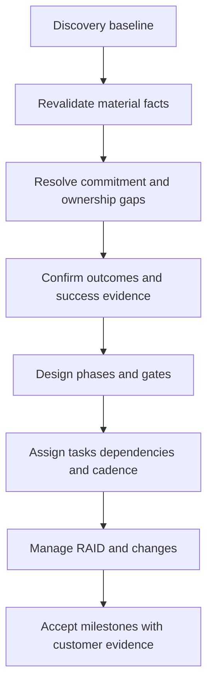

## Handoff before kickoff

A strong handoff connects commercial context, technical discovery, implementation/services scope, Support history, stakeholder expectations, and unresolved uncertainty. It does not transfer private notes indiscriminately or imply that a TSM owns every promise.

| Handoff field | Question | Risk if missing |
|---|---|---|
| Customer outcome | What decision or behavior should improve? | Product activity without purpose |
| Scope | Which products, services, sources, entities, regions, and workflows? | Scope surprise |
| Commitments | What was explicitly committed, by whom, in which document? | Assumption becomes promise |
| Commercial boundary | Which entitlements and professional services are verified? | Unfunded or unavailable work |
| Technical state | What is deployed, configured, integrated, or unknown? | False starting point |
| Success expectations | Which baseline, target, timeline, and proof were discussed? | Unmeasurable value claim |
| Stakeholders | Who sponsors, owns, implements, approves, and may resist? | Missing authority |
| Risks/dependencies | What could block the outcome? | Surprise delay |
| Support/open cases | Which active technical issues affect readiness? | Onboarding built on unstable state |
| Sensitive context | What may be shared and retained? | Privacy or trust breach |
| Next decision | What must kickoff settle? | Meeting without outcome |

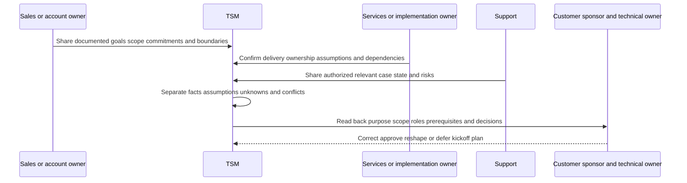

### Commitment reconciliation

If sales notes, a contract, technical documentation, and customer expectations disagree, do not hide the conflict to preserve momentum. Record the exact statement, source, scope, and owner. Technical feasibility belongs with the appropriate specialist; entitlement and services scope belong with commercial or services authority; customer priority and acceptance belong with customer roles.

| Conflict | TSM response | Owner path |
|---|---|---|
| Customer expects unsupported integration | State requirement and unknown, do not improvise | Product specialist and current documentation |
| Timeline precedes prerequisites | Show dependency and options | Customer sponsor and delivery owner |
| Service ownership unclear | Stop task assignment from masking gap | Services/account leadership |
| Success claim lacks baseline | Convert to hypothesis and measurement task | Customer outcome/data owner |
| Roadmap expectation treated as commitment | Use approved roadmap language only | Product/account authority |

## Kickoff design

Kickoff is a decision meeting, not a slide ceremony. It aligns purpose, scope, roles, phases, prerequisites, evidence, risk, cadence, and immediate next actions. Participants should receive the charter early enough to correct it.

### Kickoff agenda

| Segment | Outcome | Typical owner |
|---|---|---|
| Purpose and business context | Shared reason and decision | Customer sponsor |
| Success definition | Agreed outcomes, baseline plan, guardrails | Outcome owner and TSM facilitator |
| Scope and exclusions | Bounded delivery and revisit triggers | Customer and account/delivery owners |
| Current state | Known architecture, workflow, and unknowns | Technical owners |
| Roles and decision rights | Named accountability and escalation | Sponsor/project owner |
| Phases and gates | Shared delivery sequence | TSM/delivery lead |
| Prerequisites/dependencies | Evidence, owners, due logic | Workstream owners |
| Security/privacy/change | Approved operating constraints | Governance owners |
| Risks and assumptions | Early transparency and options | All owners |
| Cadence and documentation | Source of truth and communication rules | Program owner |
| First actions | Owner, date, evidence, checkpoint | Assigned owners |

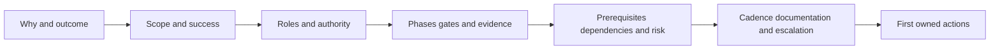

### Kickoff opening example

"Today we are aligning the path to a bounded customer outcome, not asserting that every prerequisite or product behavior is already known. We will confirm the goal, scope, decision rights, evidence, phase gates, dependencies, security and privacy conditions, and next actions. Unknowns will be recorded with owners. Dates are forecasts tied to readiness evidence. Technical, commercial, support, and customer-risk decisions remain with their accountable roles."

### Kickoff outputs

Within the agreed follow-up period, issue a concise read-back: decisions, corrections, scope, outcomes, roles, prerequisites, RAID entries, milestones, owners, dates/forecast logic, and next checkpoint. Do not send a transcript as the operating plan.

## Roles, responsibilities, and decision rights

Onboarding frequently fails because every task is assigned but no one can make the decision that unblocks it. Separate execution from authority.

| Role | Typical accountability | Must not be silently assigned |
|---|---|---|
| Customer executive sponsor | Outcome priority, organizational support, major conflict | Technical configuration detail |
| Customer outcome owner | Accept success evidence and residual | Vendor product commitment |
| Customer program/project owner | Plan, scheduling, cross-team coordination | Risk acceptance unless authorized |
| Security/SecOps/VM owner | Workflow and security requirement | Network/application change authority |
| Identity/network/data/app owners | Domain prerequisites and change | Enterprise outcome ownership by default |
| Privacy/legal/compliance | Purpose, obligation, data-use conditions | Technical implementation |
| Change/risk owner | Approve change, exception, or residual under policy | Vendor roadmap |
| TSM | Success orchestration, technical guidance, adoption, risk visibility | Customer decision or unverified implementation work |
| Services/implementation | Contracted design/configuration/deployment work | Customer governance authority |
| Support | Diagnose supported technical incidents | Project ownership or roadmap promise |
| Sales/account owner | Commercial relationship and contract path | Unsupported technical assurance |
| Product/Engineering | Product truth, feedback, defects, approved roadmap process | Customer change approval |

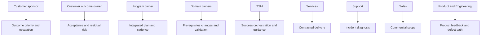

### RACI mechanics

Use one **Accountable** role per decision or deliverable whenever possible. Multiple Responsible roles may contribute. Consulted roles provide input before decision. Informed roles receive outcome after decision. RACI does not replace a description of what authority means.

| Work item or decision | Customer sponsor | Technical owner | Governance owner | TSM | Services | Support | Sales |
|---|---|---|---|---|---|---|---|
| Confirm business outcome | A | C | C | R/facilitate | I | I | C |
| Verify prerequisites | I | A/R | C | R/coordinate | R by scope | C for issue | I |
| Approve production change | I | R | A by policy | C | R by scope | C | I |
| Diagnose product incident | I | R/customer evidence | I | C/coordinate | C | A/R by support process | I |
| Accept milestone outcome | A or outcome owner | R | C | R/evidence | C | I | I |
| Confirm entitlement/services | C | C | I | I | C | I | A/R commercial path |
| Accept residual risk | I | C | A customer role | C | I | I | I |

Actual RACI must be customer- and contract-specific. The table is a general template.

## Prerequisites and readiness gates

Prerequisites should be testable conditions, not vague tasks. "Provide data" is weak. "Customer data owner confirms the eligible source population, approved purpose, scoped read access, sample reconciliation, event and receipt timestamps, and defect owner" is testable.

### Readiness domains

| Domain | Example prerequisite | Evidence | Gate owner |
|---|---|---|---|
| Outcome | Outcome, population, acceptance, and owner confirmed | Approved success statement | Customer outcome owner |
| Commercial | Product/service/region/scope verified | Contract/order and accountable confirmation | Account/commercial owner |
| Product/tenant | Current capability and required state verified | Official docs and tenant evidence | Technical/product owner |
| Identity/access | Named users/service identities and least privilege approved | Access test and role review | Identity/security owner |
| Network | Required paths, DNS, TLS, proxy, firewall, inspection verified | Bounded connectivity evidence | Network owner |
| Data | Sources, scope, grain, IDs, clocks, quality, retention approved | Data contract/profile | Data owner |
| Integration | Supported method, credentials, endpoint, schema, monitoring understood | Test and runbook | Integration owner |
| Workflow | Trigger, triage, owner, approval, validation, exceptions defined | Swimlane and acceptance cases | Process owner |
| Governance | Privacy, security, legal, compliance, change conditions satisfied | Approval record | Governance owner |
| Operations | Monitoring, support, continuity, change, escalation assigned | Operational readiness checklist | Service owner |
| People | Roles have time, access, training, and practice plan | Capacity and enablement plan | Program owner |
| Measurement | Baseline and evidence collection feasible | Metric contract and sample | Data/outcome owner |

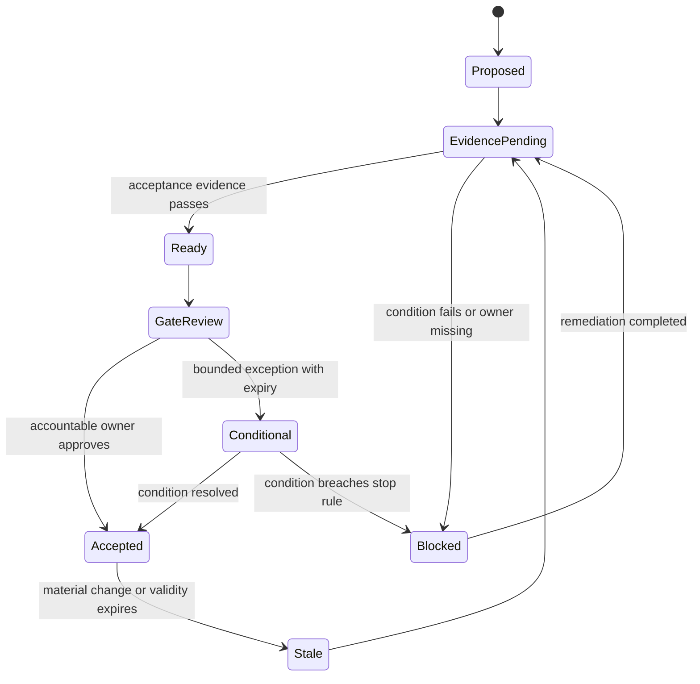

### Readiness is not binary for the whole program

A customer may be ready for read-only source validation but not production action. It may be ready for one region but not acquired subsidiaries. State readiness by scope and action tier.

| Readiness tier | Allowed work | Typical guardrail |
|---|---|---|
| Discovery only | Architecture and requirement validation | No production access/change |
| Read-only technical validation | Bounded query or test under approval | Minimized data and no side effects |
| Non-production/pilot | Controlled configuration and workflow test | Synthetic or approved test data, rollback |
| Limited production | Bounded population and change window | Monitoring, approval, stop rule, support |
| Scaled production | Agreed populations and operating model | Health, change, continuity, governance |

### Plain-English deep-dive 2 - A prerequisite is a promise only when evidence and ownership exist

Project plans often say "customer to provide API access by Tuesday." That line hides several decisions: which identity, which permission, which tenant, which source population, which security review, which credential storage, which connectivity path, which audit requirement, and who accepts the risk. The task may be marked late even though nobody defined done.

Rewrite it as a condition: "The customer identity owner provisions a dedicated scoped identity using the current supported method; the security owner approves least privilege and credential handling; the integration owner verifies authentication and one authorized read against the intended tenant; evidence is stored in the approved project record." Now the plan has owners, acceptance, and a failure boundary.

Readiness gates should not become bureaucracy. Apply the smallest control proportionate to consequence. A read-only synthetic demonstration needs fewer controls than an automated production action. The principle is evidence before progression, not paperwork for its own sake.

## Technical success plan architecture

The plan must be useful to executives and operators. Use one shared source of truth with linked detail rather than independent spreadsheets that disagree.

| Plan layer | Audience | Content |
|---|---|---|
| Executive outcome | Sponsor and outcome owner | Why, value hypothesis, current health, decisions, residual risk |
| Roadmap | Steering group | Phases, milestones, dependencies, dates, owners, gates |
| Workstream plan | Technical and program owners | Tasks, acceptance, evidence, issue state, next actions |
| RAID/decision log | All accountable roles | Risks, assumptions, issues, dependencies, decisions |
| Evidence register | Technical, governance, outcome owners | Baselines, test results, approvals, validation, provenance |
| Adoption plan | Managers, champions, users | Eligible roles, workflows, enablement, use, feedback, support |
| Operations plan | Service and Support owners | Monitoring, change, continuity, escalation, ownership |

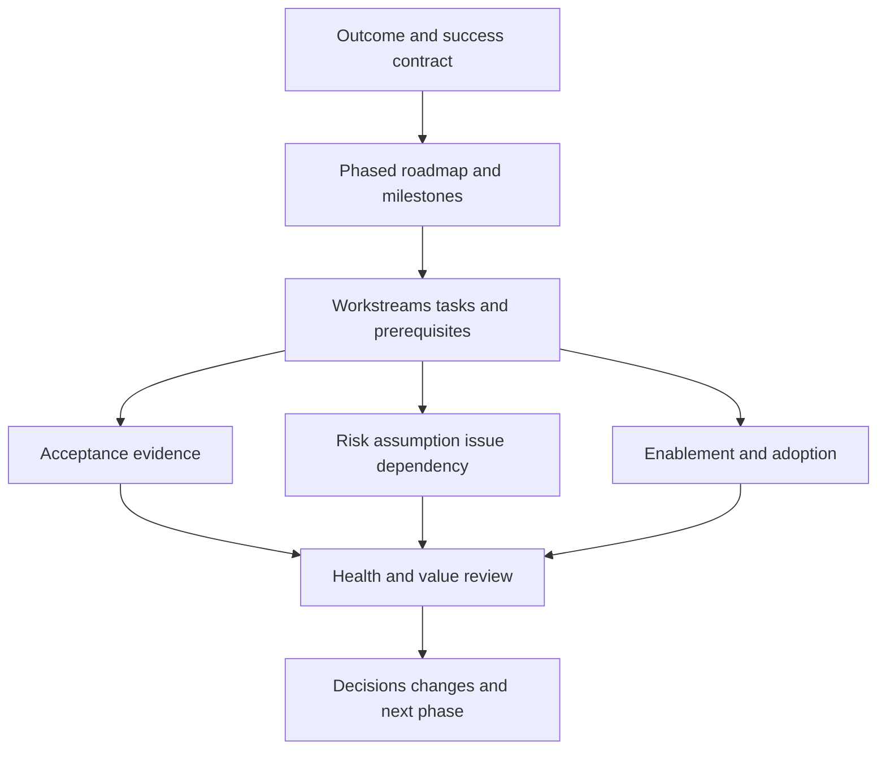

### Outcome statement

Use a testable conditional statement: "For [eligible population], if [verified prerequisite/capability] supports [role] to perform [workflow behavior], then [technical effect] may improve [customer outcome], measured by [evidence] over [horizon], while [guardrails] remain acceptable." This is a hypothesis, not a guarantee.

### Workstream decomposition

| Workstream | Typical content | Exit evidence |
|---|---|---|
| Governance | Purpose, privacy, security, legal, risk, change | Approvals and operating conditions |
| Architecture | Scope, paths, identity, boundaries, shared responsibility | Approved design and tests |
| Data/integration | Sources, contracts, connectivity, mapping, health | Reconciliation and health acceptance |
| Workflow | Trigger, context, priority, ownership, action, validation | End-to-end cases pass |
| Operations | Monitoring, support, continuity, change, escalation | Runbook and ownership test |
| Enablement/adoption | Roles, training, practice, feedback, office hours | Competency and repeated use evidence |
| Measurement/value | Baseline, milestones, outcomes, guardrails, attribution | Customer-approved scorecard |

## Phased onboarding plan

A reusable phase model is align, prepare, validate foundation, pilot, operationalize, prove value, and scale. Names and duration are customer-specific.

| Phase | Purpose | Example outputs | Exit gate |
|---|---|---|---|
| 0 - Align | Confirm outcome, scope, roles, boundaries | Charter, handoff, success hypothesis | Sponsor and owners agree |
| 1 - Prepare | Satisfy governance and technical prerequisites | Readiness matrix, design, access plan | Critical prerequisites accepted |
| 2 - Validate foundation | Prove identity, paths, data, quality, and operations | Test evidence and health baseline | Foundation acceptance passes |
| 3 - Pilot | Run one bounded end-to-end workflow | Pilot cases, feedback, defect log | Safety, quality, usability pass |
| 4 - Operationalize | Establish repeated use, support, monitoring, and change | Runbooks, training, cadence | Operational readiness accepted |
| 5 - Validate value | Compare outcome evidence and guardrails | Outcome review and residual | Customer accepts or revises hypothesis |
| 6 - Scale/improve | Expand only with learned controls | Sequenced roadmap | New scope has its own readiness gate |

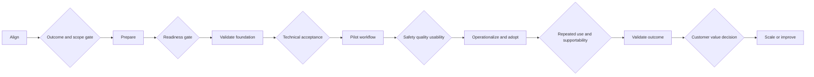

### Phase exit criteria

Exit criteria should cover function, quality, security/privacy, operations, user behavior, and customer decision. A phase can be technically complete but not operationally accepted.

| Criterion class | Question | Example evidence |
|---|---|---|
| Functional | Does the intended bounded path work? | Positive and negative test |
| Data quality | Is scope, time, identity, completeness, and validity acceptable? | Reconciliation and samples |
| Security/privacy | Are access, purpose, retention, and approval conditions met? | Review record and audit |
| Reliability | Can failure be detected, retried, reconciled, and recovered? | Failure and recovery test |
| Operations | Are monitor, owner, Support, change, and continuity ready? | Runbook exercise |
| Usability | Can intended role perform the task correctly? | Observed practice and teach-back |
| Outcome | Has the customer-defined acceptance event occurred? | Outcome owner approval |
| Residual | Are open gaps and exceptions understood? | Residual risk register |

## Milestones, tasks, and acceptance

A milestone should represent a capability or decision, not merely elapsed time. "Workshop complete" is an activity. "Current-state source authority and pilot scope accepted by accountable owners" is a milestone.

| Weak milestone | Better milestone | Acceptance evidence |
|---|---|---|
| Kickoff done | Outcome, scope, roles, cadence, and first gates accepted | Read-back and decision log |
| Connector configured | Bounded source-to-consumer path meets quality and security acceptance | Trace, reconciliation, access review |
| Training delivered | Eligible pilot users demonstrate required workflow and know support path | Teach-back and scenario exercise |
| Dashboard live | Named audiences use versioned evidence for agreed decisions | Usage plus decision sample |
| Automation enabled | Approved workflow produces exact-target, reversible, validated outcomes | Audit, read-back, rollback test |
| Project complete | Customer accepts outcome evidence, operations, residual, and next plan | Closure review |

### Milestone definition of done

1. Scope and acceptance version are explicit.
2. Required prerequisites passed or have approved bounded exceptions.
3. Deliverables exist in the approved source of truth.
4. Positive, negative, boundary, failure, recovery, and security tests are proportionate.
5. Evidence identifies source, time, owner, and result.
6. Operational and user readiness are tested.
7. Open defects, limitations, unknowns, and residual risk are visible.
8. Accountable customer role accepts, rejects, or conditionally accepts.

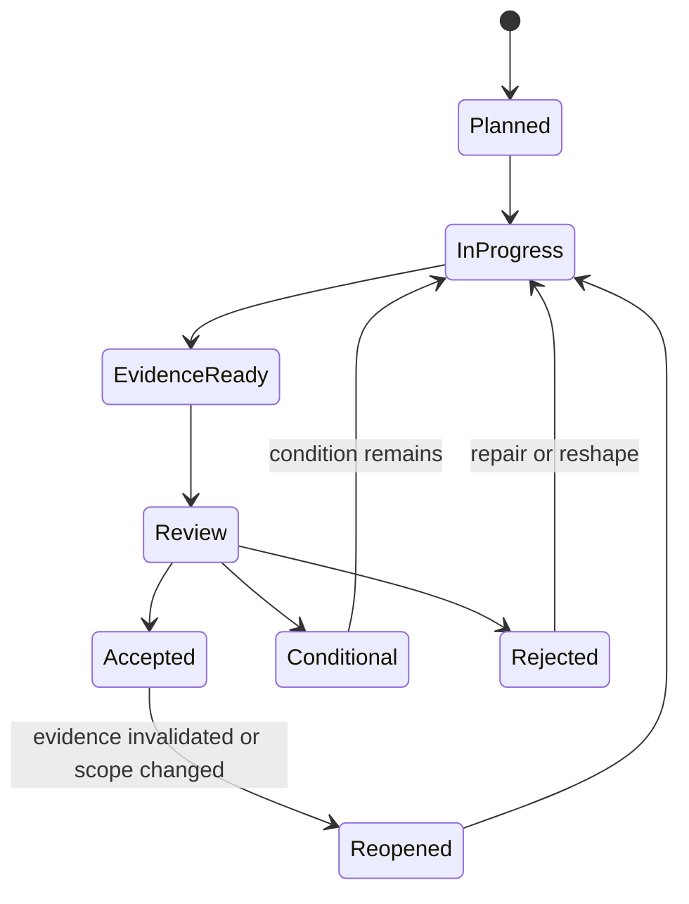

## Dependencies and critical path

The critical path is the longest chain of dependent work controlling the earliest feasible completion. It is not always the most technically difficult work. A privacy approval or application-owner test window can govern the date.

| Dependency field | Meaning |
|---|---|
| Deliverable/condition | Exact prerequisite required |
| Provider/owner | Role responsible to produce it |
| Consumer | Work that cannot proceed without it |
| Need-by logic | Why and when it is required |
| Evidence | How completion is accepted |
| Lead time | Preparation plus review duration estimate |
| Confidence | Basis and uncertainty of estimate |
| Alternative | Partial, parallel, mock, narrowed, or deferred path |
| Consequence | Schedule, scope, quality, security, or value impact |
| Escalation trigger | When decision authority must intervene |

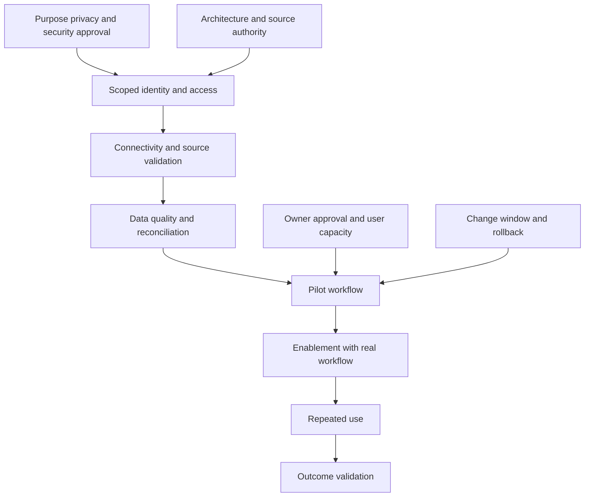

### Forecasting

Use ranges and confidence when evidence is incomplete. State which dependency drives the forecast. Avoid precision such as "42 days" unless the method justifies it. A forecast changes when prerequisite evidence, scope, capacity, product truth, or customer decision changes; update the baseline transparently.

| Forecast state | Meaning | Communication |
|---|---|---|
| On track | Current evidence supports target range | Name next risk and checkpoint |
| At risk | One or more dependencies threaten target | State driver, impact range, options, decision date |
| Blocked | Work cannot progress within current authority/path | State first blocked gate, owner, mitigation |
| Replan required | Baseline no longer credible | Propose scope/date/sequence options |
| Unknown | Evidence insufficient for forecast | Name missing evidence and when forecast resumes |

### Plain-English deep-dive 3 - Dates are outputs of dependencies

Suppose a pilot needs source access, and access needs privacy approval, and privacy review needs a data-flow diagram. The pilot date is not independently chosen; it is calculated from those dependencies, their lead times, available people, and uncertainty. Putting a desired date in a slide does not shorten the chain.

Good program leadership makes this visible without sounding fatalistic: "The desired pilot window is possible only if the data-flow review closes by the gate date. We have three options: narrow fields to reduce review scope, use synthetic data for workflow rehearsal while approval continues, or move the production pilot. The privacy owner and sponsor should decide by Thursday." This gives a decision, not an excuse.

Parallel work can shorten time only when it does not create rework or risk. Training users on a workflow that is still changing may waste time. Building a synthetic test harness while access is pending may be useful. The plan should distinguish productive parallelism from activity theater.

## Time to value

Time to value is not one universal number. Define the clock, eligible scope, value event, exclusions, pauses, evidence maturity, and customer acceptance.

### Four clocks

| Clock | Start | Stop | What it reveals |
|---|---|---|---|
| Commercial-to-kickoff | Verified agreement/assignment event | Kickoff operating agreement accepted | Mobilization friction |
| Kickoff-to-ready | Kickoff acceptance | Pilot prerequisites accepted | Readiness effort |
| Ready-to-technical | Readiness gate | Bounded technical acceptance | Implementation/validation path |
| Technical-to-adoption | Technical acceptance | Repeated correct use threshold | Enablement/workflow change |
| Adoption-to-outcome | Adoption threshold | Customer outcome acceptance | Value evidence maturity |
| End-to-end | Explicit chosen start | Explicit customer-accepted value event | Overall experience, with components visible |

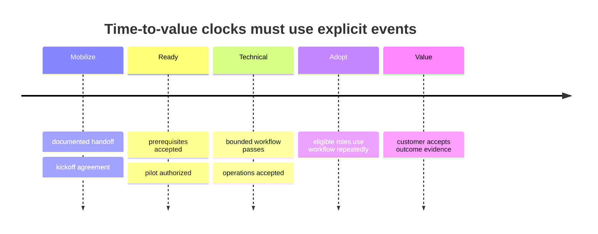

### Value ladder

| Value stage | Example | Caveat |
|---|---|---|
| Uncertainty reduced | Source authority and critical gaps established | Knowledge, not yet control improvement |
| Technical capability | Bounded data/workflow path passes | Availability, not adoption |
| Operational capability | Monitoring, owners, support, and change work | Supportability, not outcome |
| User behavior | Intended roles repeatedly use workflow correctly | Use, not automatic risk reduction |
| Technical effect | Priority/assignment/validation/control state improves | Must be measured and bounded |
| Risk/business support | Customer accepts contribution to risk/service objective | Attribution and residual remain |

### TTV integrity

Do not start the clock after delays merely to improve the number. Do not stop at login, go-live, or first output when the customer defines value later. Show pause reasons separately; pauses remain part of customer experience even if excluded from provider process metrics. Segment by scope and maturity.

## Early wins

An early win should be low-risk, customer-relevant, evidence-rich, and reusable. It should remove uncertainty, prove a prerequisite, improve a repeated decision, or reduce real friction without creating a dead-end design.

| Candidate early win | Why useful | Guardrail |
|---|---|---|
| Reconcile one critical service population | Establishes denominator and source authority | Do not generalize enterprise-wide |
| Validate one source-to-workflow path | Tests integration and ownership | Include negative/failure cases |
| Publish one owner-ready prioritized queue | Improves actionable decision | Preserve exclusions and uncertainty |
| Train a small champion cohort on one workflow | Builds feedback and support model | Measure competency, not attendance |
| Close one recurring data-quality defect | Improves trust and operations | Verify no hidden coverage loss |
| Establish a weekly evidence review | Creates ownership and improvement loop | Avoid meeting without decisions |
| Document support/escalation evidence | Reduces future diagnostic time | Minimize sensitive data |

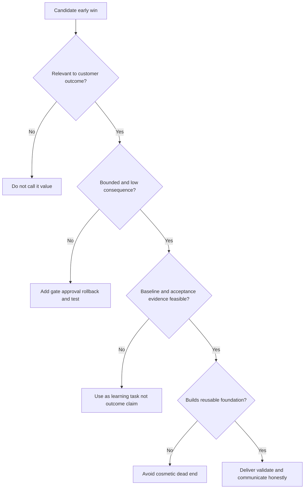

## Adoption outcomes and enablement

Adoption occurs when eligible people repeatedly perform the intended workflow correctly and receive enough value to continue. It has five layers.

| Layer | Question | Evidence |
|---|---|---|
| Access | Can intended roles securely reach required capability? | Eligible versus provisioned and successful access |
| Knowledge | Do users understand purpose, boundaries, and steps? | Teach-back and scenario responses |
| Ability | Can users complete normal and exception workflows? | Observed task with quality rubric |
| Behavior | Do they use it when eligible work occurs? | Eligible opportunities versus correct use |
| Outcome/trust | Does use support the intended decision and confidence? | Decision sample, feedback, quality, residual |

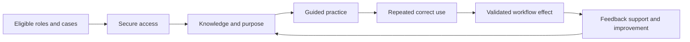

### Enablement plan

Train by role and decision, not by feature tour. Operators need workflow mechanics and failure handling. Managers need quality, capacity, and adoption evidence. Executives need outcome, tradeoff, decision, and residual. Administrators need configuration, access, change, monitoring, and support.

| Audience | Learning objective | Practice | Proof |
|---|---|---|---|
| Operator | Complete normal and exception cases safely | Scenario and teach-back | Quality rubric |
| Champion | Coach peers and gather useful feedback | Reverse shadow | Independent facilitation |
| Administrator | Manage approved operation and evidence | Failure/recovery exercise | Runbook execution |
| Manager | Interpret adoption and workflow health | Review segmented scorecard | Correct decision from evidence |
| Executive | Understand outcome, uncertainty, and decisions | One-page review | Decision and sponsorship |

### Adoption barriers

| Barrier | Signal | Response |
|---|---|---|
| No relevant use case | Users bypass capability | Revisit workflow fit |
| Low trust | Manual revalidation of every output | Expose evidence, quality, and limitations |
| Access friction | Eligible users fail or share access | Repair identity/role design |
| Workflow duplication | Data copied into old system | Align source of work and closure |
| Manager incentive conflict | New behavior is not rewarded or staffed | Engage outcome owner |
| Weak competence | Errors after training | More practice, simpler workflow, coaching |
| Product/data defects | Frequent failures | Isolate, support, mitigate, communicate |
| Change fatigue | Attendance but no behavior | Narrow scope and pace, remove low-value work |

## Remote and on-site cadence

Choose location and cadence based on decision, interaction, security, cost, and customer preference. On-site is not automatically higher value; remote is not automatically lower quality.

| Interaction | Best-fit considerations | Typical output |
|---|---|---|
| Weekly delivery sync | Remote often efficient for owners/actions | Milestone, RAID, decision update |
| Technical working session | Remote with shared evidence or on-site for complex whiteboard | Design/test decision |
| Executive steering | Remote or on-site based on stakes and sponsor | Decisions, risks, priorities |
| Workflow observation | On-site may reveal handoffs; remote screen share may protect access | Current-state corrections |
| Training | Remote for distributed scale; on-site for intensive practice | Competency evidence |
| Critical escalation | Remote bridge usually fastest; on-site only when useful | Recovery coordination |
| Quarterly planning | On-site may help relationship and cross-team design | Roadmap and outcome reset |

### Cadence stack

| Cadence | Audience | Focus | Anti-pattern |
|---|---|---|---|
| Working session, as needed | Technical owners | One design/test/blocker | Status reading |
| Weekly delivery | Workstream leads | Milestones, dependencies, RAID, next evidence | Every task detail |
| Biweekly adoption | Champions/managers | Use, quality, feedback, barriers | Attendance count only |
| Monthly steering | Sponsor/outcome/program owners | Outcome health, decisions, scope, risk | Technical log dump |
| Quarterly/phase review | Executives/account team | Value evidence, residual, roadmap | Marketing deck |
| Event-driven | Required decision owners | Critical blocker/change/security issue | Wait for next scheduled call |

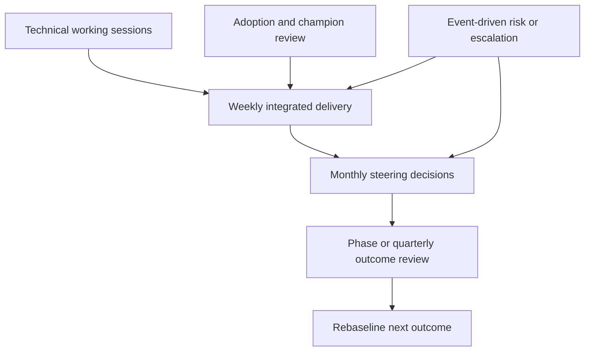

### Meeting hygiene

Every recurring meeting needs a decision purpose, pre-read, current source of truth, named facilitator, time-boxed discussion, decision log, owners, and next checkpoint. Cancel meetings with no required decision or coordination. Asynchronous status should replace recital, not human collaboration.

## Documentation and source of truth

Documentation should be current, owned, access-controlled, searchable, and tied to work. Avoid parallel copies sent by email.

| Artifact | Owner | Update trigger | Audience/access |
|---|---|---|---|
| Success plan | TSM/program owner jointly | Outcome, phase, scope, forecast change | Steering and workstream roles |
| Architecture/design | Customer architecture/technical owner | Material design or environment change | Authorized technical roles |
| Prerequisite matrix | Workstream owners | Evidence/status change | Delivery roles |
| RAID | Each entry owner; program facilitation | New/changed/closed item | Appropriate project roles |
| Decision log | Decision owner | Decision or reversal | Impacted roles |
| Test/evidence register | Technical and acceptance owners | Test or validation | Authorized reviewers |
| Runbook | Operational owner | Process/product/change/incident learning | Operators and Support path |
| Adoption record | Adoption/manager owner | Cohort, training, feedback, use change | Managers and TSM |
| Executive summary | TSM/outcome owner | Steering/phase review | Executives/account team as authorized |

Version material definitions and baselines. Link evidence rather than duplicating sensitive content. Record date, scope, owner, and validity. Retire stale plans deliberately.

## RAID and change management

Risks, assumptions, issues, and dependencies require different handling.

| Type | Time state | Required action | Example |
|---|---|---|---|
| Risk | May happen | Reduce probability/impact; contingency; trigger | Source owner may miss review window |
| Assumption | Believed but unverified | Test by date; plan consequence | Identifier is stable across sources |
| Issue | Happening now | Diagnose, own, mitigate, resolve | Access test fails |
| Dependency | Needed from another item/owner | Track evidence and need-by logic | Privacy approval before production data |

### Risk statement

Use cause-event-effect: "Because [cause], there is a possibility that [event], resulting in [impact on milestone/outcome]." Add probability, impact, proximity, owner, prevention, contingency, trigger, status, and residual.

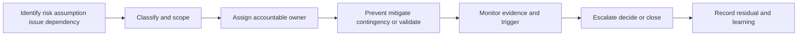

### Change control

Not every plan update needs a board, but material changes need visible rationale and authority. Assess outcome, scope, architecture, data, security/privacy, operations, schedule, cost, adoption, support, and residual. Update affected acceptance criteria and baselines.

| Change class | Example | Decision path |
|---|---|---|
| Editorial | Correct wording, no meaning change | Artifact owner |
| Task sequencing | Reorder without outcome/scope impact | Program/workstream owner |
| Milestone forecast | Dependency shifts range | Program and milestone owners |
| Scope/outcome | Add region/source/workflow or change target | Sponsor/outcome/commercial owners |
| Production/security | Modify access, data, policy, integration, action | Customer change/security authority |
| Commercial | Entitlement/services/contract change | Account/procurement authority |

## Security, privacy, and resilience in onboarding

Delivery urgency does not override controls. Test security and privacy as acceptance dimensions, not paperwork after implementation.

| Area | Planning question | Evidence |
|---|---|---|
| Identity | Which human/service identity, tenant, role, and lifecycle? | Least-privilege review and access test |
| Secrets | How are credentials issued, stored, rotated, revoked, and audited? | Approved secret-management record |
| Data purpose | Which data is necessary for which decision? | Purpose and minimization decision |
| Data location | Where does data flow, process, store, and back up? | Approved data-flow map |
| Retention | How long are project/test/support artifacts retained? | Retention and deletion plan |
| Segregation | Which environments, tenants, duties, and customers remain separate? | Architecture and role test |
| Change | Who approves production modification and rollback? | Change record and evidence |
| Testing | Are synthetic/non-production options used where possible? | Test plan |
| Monitoring | Which failures, access events, drift, and abuse are observed? | Health and audit checks |
| Continuity | What happens during source, product, network, staff, or support outage? | Degraded-mode exercise |

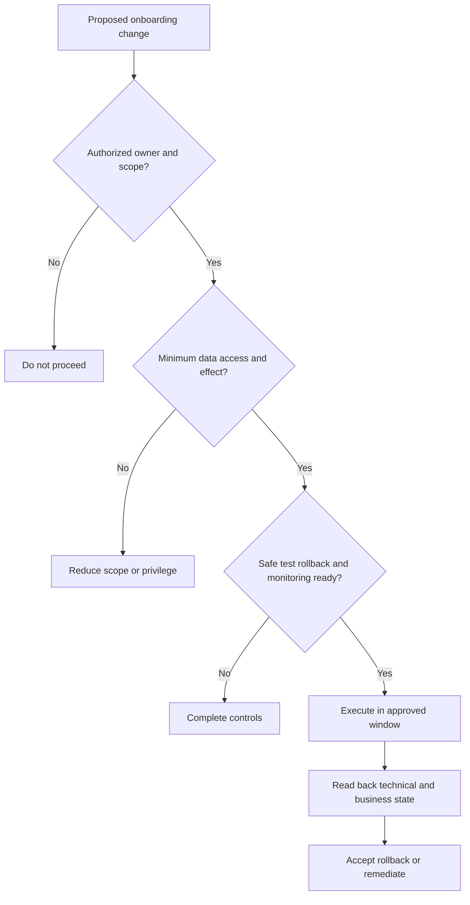

### Plain-English deep-dive 4 - Adoption cannot be forced by a deadline

People adopt a workflow when it helps them perform a meaningful job, fits their authority and incentives, produces trustworthy evidence, and has manageable cost. A launch email can create awareness. Mandatory training can create attendance. Neither guarantees correct repeated use.

Treat adoption as an engineering and organizational problem. Define eligible opportunities, observe where users exit, ask whether the new workflow duplicates old work, inspect quality and access failures, and give managers evidence to remove barriers. Champions should surface problems, not merely advocate. Detractors may identify unsafe automation, unmeasured workload, or a past broken promise.

If adoption remains low, do not automatically schedule more training. Diagnose fit, trust, access, competence, workflow, incentives, product/data health, capacity, and governance. Sometimes the correct action is to simplify or stop a use case.

## Health model and executive communication

Use balanced health. A green schedule with no adoption is not healthy. A technically red milestone may coexist with strong trust if the problem is transparent and managed.

| Dimension | Leading evidence | Outcome evidence | Warning |
|---|---|---|---|
| Outcome | Success contract and baseline ready | Customer accepts effect | No accountable acceptor |
| Technical | Prerequisites and tests pass | Bounded workflow works reliably | Unknown source/data quality |
| Schedule | Critical path evidence current | Milestones accepted in forecast | Dates detached from dependencies |
| Adoption | Access, practice, champion readiness | Repeated correct use | Attendance-only reporting |
| Operations | Owners, runbooks, monitoring, support | Failure/recovery handled | Hero dependence |
| Security/privacy | Reviews and controls ready | Audits and tests pass | Exceptions without expiry |
| Relationship/governance | Decisions and candor | Conflicts resolved predictably | Surprise and hidden bad news |

### Executive update formula

1. **Outcome:** What customer objective and phase matter?
2. **Status:** What evidence changed since last review?
3. **Integrity:** Which scope, denominator, and confidence apply?
4. **Driver:** Which dependency or behavior explains current health?
5. **Impact:** What does it mean for value, risk, and forecast?
6. **Options:** What credible paths and tradeoffs exist?
7. **Decision:** Who must choose what by when?
8. **Residual:** What remains after the recommended path?

| Weak update | Stronger update |
|---|---|
| "Integration is 80 percent complete." | "Source authentication and bounded receipt tests pass; population reconciliation and owner mapping remain open, so workflow acceptance is not yet forecast. The data owner must confirm the eligible population by Thursday or the pilot scope must narrow." |
| "Training went well." | "Eight fictional pilot users completed the synthetic exercise; six followed the normal path and four handled the exception correctly. These are synthetic scenario observations, not production adoption. The practice design needs repair before any real rollout." |
| "Customer is blocked." | "The production-data gate is blocked on privacy purpose approval. Synthetic workflow rehearsal can continue, but outcome evidence cannot begin. The sponsor has three sequence options." |
| "Value delivered." | "The customer accepted the bounded technical capability; repeated use and risk/business effect remain unproven and are the next milestones." |

## Troubleshooting onboarding and plan slippage

Treat slippage as a symptom. Find the first failed or unknown condition in the dependency chain.

| Symptom | Plausible causes | First discriminating check |
|---|---|---|
| Kickoff repeatedly moves | Sponsor, contract, owner, or objective unresolved | Who can authorize scope and outcome? |
| Access task is late | Undefined identity/role, governance, network, or owner | Is acceptance condition and authority explicit? |
| Technical test fails | Product state, network, identity, source, schema, scope | One bounded request/record across layers |
| Data looks wrong | Grain, time, duplicate, missing population, entity mapping | Source-to-consumer reconciliation |
| Pilot stalls | Users unavailable, workflow poor fit, defects, no decision owner | Observe one eligible case and handoff |
| Training attendance low | Timing, manager support, relevance, fatigue | Ask eligible managers and users about cost/value |
| Usage falls after launch | Trust, duplication, access, quality, incentive, support | Funnel eligible opportunity to validated outcome |
| Milestone called green without evidence | Activity-based status or political pressure | Review acceptance and customer owner |
| Repeated scope growth | Outcome unclear or requests bypass change control | Map each request to outcome and decision owner |
| Executive surprise | Risk hidden in technical meetings | Audit trigger and escalation cadence |

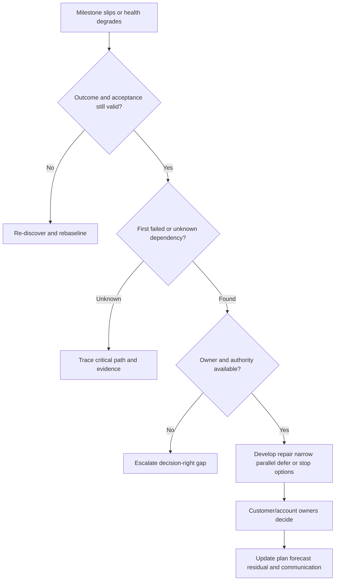

### Recovery options

| Option | Use when | Risk |
|---|---|---|
| Repair in place | Local defect, path remains valid | Hidden downstream rework |
| Narrow scope | Smaller population can prove outcome safely | Overgeneralizing pilot |
| Sequence prerequisite | Foundation is true bottleneck | Perceived loss of momentum |
| Parallel rehearsal | Synthetic/non-production work remains useful | Training against changing design |
| Substitute method | Alternative meets requirement and policy | New tradeoffs/support burden |
| Defer | Timing/capacity makes progression unsafe | Lost urgency; define trigger |
| Stop | Fit, authority, or value is not credible | Sunk-cost pressure |

## Failure modes and misconceptions

| Failure or misconception | Why it fails | Better practice |
|---|---|---|
| "Kickoff starts the clock, so start immediately" | Mobilizes before authority/readiness | Define clock and pre-kickoff conditions |
| "Onboarding ends at go-live" | Ignores adoption, operations, and outcome | Accept layered value stages |
| "All prerequisites are customer blockers" | Provider/account/product dependencies also exist | Name owner and shared responsibility |
| "A date motivates completion" | Cannot replace dependency evidence | Forecast from critical path |
| "Green means tasks are active" | Activity is not acceptance | Status by milestone evidence |
| "Training equals adoption" | Attendance does not prove use | Measure eligible repeated correct behavior |
| "Early win means easiest feature" | Can be irrelevant and disposable | Choose relevant reusable evidence-rich slice |
| "TSM owns all delivery" | Blurs services, Support, product, commercial, and customer roles | Explicit operating agreement |
| "Risk register is administrative" | Hides decisions and contingencies | Use RAID to drive owner action |
| "Customer delay pauses all value clocks" | Exclusions can hide experience | Show component clocks and pause reasons |
| "On-site is always strategic" | Location does not guarantee purpose | Match medium to interaction |
| "Low adoption needs more demos" | May be fit, trust, access, or incentives | Diagnose funnel and workflow |
| "Roadmap request can unblock plan" | Future possibility is not current capability | Use approved language and alternatives |
| "Completion means no residual risk" | Every plan has limits | Record residual and next trigger |

## Decision trees

### Decision tree 1 - Is the program ready for a pilot?

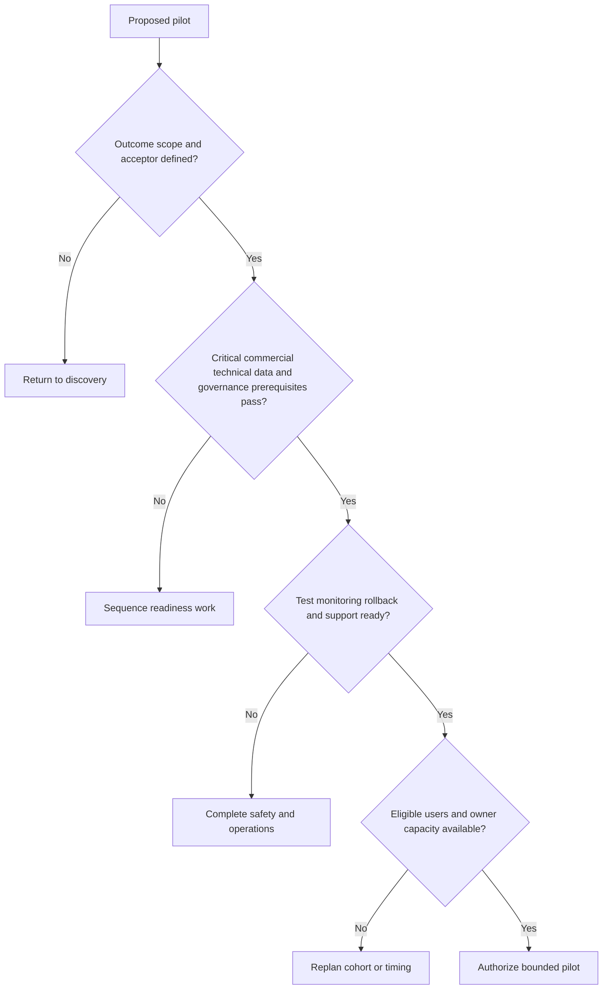

### Decision tree 2 - Is this an early win?

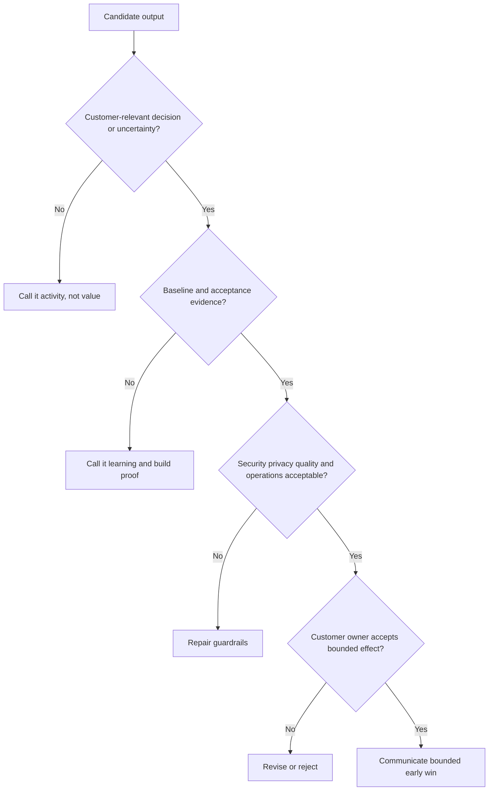

### Decision tree 3 - What should happen when a milestone slips?

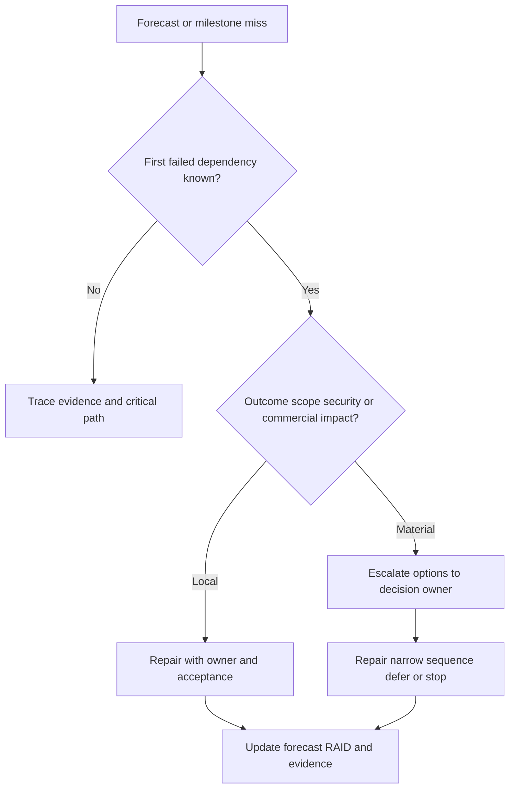

## Explicitly fictional and synthetic NMH scenarios

All content in this section is fictional and synthetic. It is practice material, not a customer engagement, deployment, entitlement, result, or statement about Zscaler behavior. Dates in this section, including **2026-09-22**, **2026-10-02**, **2026-10-16**, and **2026-11-06**, are synthetic scenario dates later than the source snapshot and do not imply later research.

### Scenario 1 - Kickoff with a hidden dependency

On synthetic 2026-09-22, NMH's fictional kickoff targets a bounded vulnerability-prioritization workflow. The handoff says source access is "available." During readiness review, access exists for a human analyst but not for the proposed dedicated integration identity; privacy purpose and retention are also undecided. The TSM marks the production-data gate blocked rather than reporting implementation delay.

Synthetic options are to complete the governance and identity conditions, rehearse the workflow with approved synthetic data, or narrow the first technical validation. No product capability, duration, or result is asserted.

### Scenario 2 - The quick win that was only a screenshot

On synthetic 2026-10-02, a fictional dashboard shows a list of high-priority items. The team wants to announce value. The outcome owner asks whether the eligible population is complete, ownership is authoritative, users act differently, and closure is validated. Those conditions are unknown. The TSM calls the dashboard a technical output and makes reconciliation plus one workflow case the early-win acceptance test.

### Scenario 3 - Adoption after training

On synthetic 2026-10-16, fictional training attendance is high, but operators continue exporting to spreadsheets. Observation shows that the new workflow lacks an exception state required by application owners. More training would not solve the fit problem. The team reshapes the pilot workflow and keeps the old process as a controlled fallback until acceptance.

### Scenario 4 - A forecast under commercial uncertainty

On synthetic 2026-11-06, a desired source or service is not yet verified within purchased scope. The TSM does not promise inclusion or make a procurement statement. The account owner confirms the commercial path, a product specialist validates current technical support, and the customer decides whether to continue with available scope or replan. Every later date in this section remains fictional and synthetic.

## Reusable artifact kit

These templates are general practice. Tailor them to current product documentation, contract, customer governance, and actual evidence.

### Artifact 1 - Onboarding kickoff charter

| Field | Entry template |
|---|---|
| Business context | Service, risk, initiative, or obligation |
| Customer outcome | Behavior/technical/risk/business support sought |
| Decision owner | Customer role accepting outcome |
| Scope | Products, services, populations, regions, workflows |
| Exclusions | Explicitly out of scope and revisit triggers |
| Value hypothesis | If-then statement with evidence and guardrails |
| Roles | Sponsor, program, domain, governance, TSM, services, Support, sales |
| Phases | Align, prepare, foundation, pilot, operationalize, validate, scale |
| First gate | Acceptance conditions and owner |
| Evidence handling | Classification, access, transfer, retention, deletion |
| Cadence | Working, weekly, adoption, steering, phase review |
| Source of truth | Approved location and artifact owners |
| Escalation | Triggers, path, communication cadence |

### Artifact 2 - Technical success plan

| Outcome ID | Outcome/value hypothesis | Population and baseline | Acceptance and guardrails | Phase/milestone | Owner/acceptor | Dependencies | Evidence | Forecast/confidence | Status/residual |
|---|---|---|---|---|---|---|---|---|---|
| O-001 | | | | | | | | | |

**Plan narrative template**

> **Why now:** [Customer context and consequence].
>
> **Current state:** [Evidence, not assumptions].
>
> **Outcome hypothesis:** [If capability/use, then effect, measured how].
>
> **Phased path:** [Foundation, pilot, adoption, validation, scale].
>
> **Critical path:** [Dependencies and decision dates].
>
> **Current risk:** [Cause-event-effect, mitigation, contingency].
>
> **Decision needed:** [Owner, options, deadline].
>
> **Honesty boundary:** [Unknown product, entitlement, customer, or outcome facts].

### Artifact 3 - Prerequisite and readiness matrix

| ID | Domain | Testable condition | Scope | Evidence/acceptance | Owner | Need-by logic | State | Blocker/alternative | Validity/recheck |
|---|---|---|---|---|---|---|---|---|---|
| P-001 | | | | | | | Proposed | | |

### Artifact 4 - Milestone definition card

| Field | Prompt |
|---|---|
| Milestone | Capability or decision, not activity |
| Outcome link | Which value hypothesis does it advance? |
| Scope/version | Which population and definition? |
| Entry criteria | Which prerequisites must pass? |
| Deliverables | Which outputs exist? |
| Acceptance tests | Positive, negative, boundary, failure, recovery, security |
| Operational/user readiness | Which roles, runbooks, support, and practice? |
| Evidence | Source, owner, date, result, location |
| Acceptor | One accountable customer role |
| Conditional acceptance | Conditions, expiry, stop rule |
| Residual | Open gaps and next trigger |

### Artifact 5 - RAID and decision register

| ID | Type | Cause/event/effect or statement | Probability/impact/confidence | Owner | Prevention/validation | Contingency/alternative | Trigger/due | Status | Decision/residual |
|---|---|---|---|---|---|---|---|---|---|
| R-001 | Risk | | | | | | | Open | |

### Artifact 6 - Adoption outcome plan

| Role/cohort | Eligible workflow/opportunities | Access | Knowledge/ability proof | Repeated-use measure | Quality/outcome | Barrier hypotheses | Intervention | Owner/review |
|---|---|---|---|---|---|---|---|---|
| | | | | | | | | |

### Artifact 7 - Governance and cadence calendar

| Forum | Purpose/decision | Participants | Frequency/trigger | Pre-read | Output | Escalation relationship |
|---|---|---|---|---|---|---|
| Technical working | One design/test/blocker | | | | | |
| Weekly delivery | Integrated milestones and RAID | | | | | |
| Adoption review | Behavior, quality, feedback | | | | | |
| Steering | Outcomes, risks, decisions | | | | | |
| Phase review | Accept/reject/reshape/scale | | | | | |

### Artifact 8 - Executive milestone update

> **Outcome and phase:** [One sentence].
>
> **Evidence since last review:** [Accepted changes with scope/denominator].
>
> **Overall health:** [Outcome, technical, schedule, adoption, operations, governance].
>
> **Critical path:** [First controlling dependency and forecast confidence].
>
> **Risk/issue:** [Cause-event-effect, owner, mitigation, residual].
>
> **Options:** [Tradeoffs].
>
> **Decision needed:** [Role and date].
>
> **Next accepted evidence:** [Milestone/gate and checkpoint].

### Artifact 9 - Account-team operating agreement

| Topic | Agreement |
|---|---|
| Customer outcome source | Where approved outcomes and acceptance live |
| Technical plan owner | Who integrates milestones/dependencies |
| Commercial boundary | Who confirms entitlement/services and how |
| Support boundary | When and how incidents enter Support |
| Product feedback | Evidence, routing, status language |
| Roadmap language | Approved, conditional, no promises |
| Escalation | Severity, trigger, owner, cadence |
| Customer communication | One coordinated fact pattern |
| Decision log | Location and accountable role |
| Conflict resolution | Evidence first, then decision-right owner |

### Artifact 10 - Objection and failure response card

| Prompt | Response content |
|---|---|
| Customer statement | Exact concern without rebuttal |
| Underlying hypotheses | Fit, trust, quality, access, authority, capacity, history, commercial |
| Evidence | What is fact, assumption, unknown? |
| Impact | Outcome, milestone, security/privacy, relationship |
| Options | Repair, narrow, sequence, alternate, defer, stop |
| Decision right | Who chooses? |
| Communication | What can be stated now? |
| Follow-up | Owner, evidence, date, residual |

## Exercises

### Exercise 1 - Build a kickoff

Using a fictional customer goal, create a 45-minute kickoff agenda that ends with three decisions, five owned prerequisites, one security/privacy condition, one commercial unknown, and a read-back deadline. Remove all agenda content that does not influence a decision.

### Exercise 2 - Rewrite weak milestones

Rewrite "kickoff complete," "connector installed," "training delivered," "dashboard live," and "automation enabled" as capability milestones. Add entry, acceptance, evidence, owner, residual, and reopen criteria.

### Exercise 3 - Find the critical path

Create ten synthetic tasks with dependencies across privacy, identity, network, data, integration, workflow, change, training, and validation. Identify the controlling chain. Then model three options: narrow data, use synthetic rehearsal, or move the pilot. Explain which work can truly run in parallel.

### Exercise 4 - Design adoption evidence

For a fictional analyst workflow, define eligible opportunities, access, knowledge, ability, repeated use, quality, outcome, guardrails, and feedback. Add users who attend training but reject the workflow for a valid reason. Decide whether to train, repair, reshape, or stop.

### Exercise 5 - Communicate a slip

Deliver a ninety-second executive update: outcome, current evidence, first blocked gate, critical-path impact, three options, owner decision, next checkpoint, and residual. Avoid blame, unsupported ETA, or product promise.

### Exercise 6 - Candidate honesty rehearsal

Explain how support escalation coordination transfers to success planning. Explicitly state that the plan is synthetic and that product, entitlement, implementation, adoption, and outcome claims require current customer evidence.

## Customer discovery questions

1. Which qualified customer outcome, population, baseline, acceptance evidence, and guardrails should onboarding carry forward?
2. Which commitments, products, services, regions, integrations, and responsibilities are documented and verified?
3. Who sponsors, owns the outcome, runs the plan, performs work, approves change, accepts residual, and validates success?
4. Which technical, identity, network, data, integration, governance, people, operational, and commercial prerequisites control readiness?
5. What evidence and accountable role accept each prerequisite and milestone?
6. Which phase and bounded workflow can safely produce the first relevant learning or value?
7. Which dependencies form the critical path, what are their lead-time assumptions, and what alternatives exist?
8. What start and stop events define each time-to-value clock, including pauses, exclusions, and evidence maturity?
9. Which early win is relevant, measurable, low-risk, and reusable rather than cosmetic?
10. Which eligible roles and opportunities define adoption, and how will access, competence, repeated correct use, quality, and outcome be measured?
11. Which remote, on-site, synchronous, asynchronous, and event-driven interactions best support each decision?
12. Where will plans, evidence, RAID, decisions, runbooks, and adoption records live with what access and retention?
13. What support, monitoring, change, continuity, rollback, and escalation model must exist before production use?
14. Which risks, assumptions, issues, dependencies, and scope changes need sponsor decisions now?
15. Which product facts, implementation steps, entitlements, dates, adoption claims, and outcomes remain unknown pending current evidence?

## Official Source Anchors

Research/source snapshot and source review date: **2026-08-24**.

The Zscaler sources support dated public positioning and public support/service context only. NIST sources support general cybersecurity governance, zero-trust, and incident-response practices. They do not establish customer onboarding steps, service scope, implementation ownership, product entitlement, milestone duration, adoption target, support SLA, time to value, or outcome. Current technical/order documentation, contracts, licensed-tenant evidence, customer policy, and accountable delivery/support guidance govern production.

| Source | URL | Used for | Boundary |
|---|---|---|---|
| Zscaler Zero Trust Exchange | https://www.zscaler.com/products-and-solutions/zero-trust-exchange-zte | Public platform, identity/context, policy, and zero-trust positioning | No deployment plan, tenant state, entitlement, or result inferred |
| Zscaler Agentic Security Operations | https://www.zscaler.com/products-and-solutions/security-operations | Public SecOps context and workflow positioning | No onboarding method, agent implementation, milestone, or outcome inferred |
| Zscaler Data Fabric for Security | https://www.zscaler.com/products-and-solutions/data-fabric | Public data and workflow positioning | No source support, connector steps, quality, or timing inferred |
| Zscaler Unified Vulnerability Management | https://www.zscaler.com/products-and-solutions/unified-vulnerability-management | Public vulnerability context, prioritization, and workflow positioning | No implementation sequence, source, scoring, adoption, or result inferred |
| Zscaler Risk360 | https://www.zscaler.com/products-and-solutions/risk360 | Public risk visibility and contextualization positioning | No customer risk baseline, value, or milestone inferred |
| Zscaler Support | https://help.zscaler.com/submit-ticket | Public route to support resources/ticket entry context | Contractual support level, severity, response, and customer process require verification |
| NIST Cybersecurity Framework 2.0 | https://www.nist.gov/cyberframework | Govern, Identify, Protect, Detect, Respond, Recover outcome framing | Voluntary and implementation-neutral |
| NIST SP 800-207 | https://csrc.nist.gov/pubs/sp/800/207/final | General zero-trust concepts | Does not prescribe a vendor implementation plan |
| NIST SP 800-61 Rev. 3 | https://csrc.nist.gov/pubs/sp/800/61/r3/final | Preparation, response, recovery, and improvement context | Customer tailors roles and procedures |

## Likely Interview Questions

### Q1. What should a technical success plan contain?

**Model answer:** It connects a qualified customer outcome to population, baseline, value hypothesis, acceptance, guardrails, phases, capability milestones, owners and decision rights, prerequisites, dependencies, critical path, evidence, adoption, operations, RAID, cadence, forecast confidence, and residual risk. It has executive, roadmap, workstream, and evidence layers in one governed source of truth. It is a living decision record, not a task spreadsheet.

### Q2. How would you run an effective onboarding kickoff?

**Model answer:** I reconcile the account and delivery handoff first. At kickoff the customer sponsor anchors why and desired outcome; we confirm scope/exclusions, success evidence, roles, phases, readiness gates, dependencies, security/privacy/change conditions, documentation, cadence, escalation, and first actions. Unknowns get owners. Dates remain forecasts tied to evidence. I send a concise decision read-back for correction rather than a transcript.

### Q3. How do you accelerate time to value without cutting controls?

**Model answer:** I define explicit clocks, find the critical path, minimize unnecessary scope and data, verify prerequisites early, parallelize only independent useful work, choose a bounded relevant early win, use synthetic or non-production rehearsal where appropriate, and set evidence-based gates. I never call login, configuration, or training value unless the customer defined that event. Security, privacy, quality, operations, and rollback remain acceptance dimensions.

### Q4. What makes a milestone meaningful?

**Model answer:** A milestone proves a capability or customer decision under stated scope, not that activity occurred. It has entry criteria, deliverables, positive/negative/boundary/failure/recovery tests proportionate to risk, security and privacy checks, operational and user readiness, authoritative evidence, one accountable acceptor, conditional rules, residual risk, and reopen triggers. "Connector configured" becomes "bounded source-to-workflow path accepted."

### Q5. How do you measure adoption?

**Model answer:** I define eligible roles and workflow opportunities, then measure secure access, knowledge, demonstrated ability, repeated correct use, quality, outcome, and trust with denominators. I segment barriers such as fit, duplication, access, competence, incentives, data/product health, and capacity. Attendance and login are prerequisites. Low use may require workflow repair or stopping a use case, not more demonstrations.

### Q6. How do you handle a slipping plan?

**Model answer:** I confirm the outcome and acceptance are still valid, trace the critical path to the first failed or unknown dependency, establish owner and authority, and quantify impact on scope, quality, security, outcome, and forecast. I present repair, narrow, sequence, parallel rehearsal, alternative, defer, or stop options with tradeoffs. The decision owner chooses; I update the plan, RAID, evidence, residual, and communication immediately.

### Q7. How do remote and on-site engagement fit the success plan?

**Model answer:** I select the medium by interaction. Remote is efficient for recurring delivery, evidence review, distributed training, and rapid escalation. On-site can help complex cross-team whiteboarding, workflow observation, intensive practice, or strategic planning. Every forum needs a decision purpose, pre-read, output, and owner. Travel or meeting frequency is not a value metric.

### Q8. How does Arti's background transfer honestly to onboarding?

**Model answer:** Her Microsoft escalation work involved prerequisites, multi-team workstreams, evidence checkpoints, customer communication, mitigations, recovery validation, and knowledge transfer. Network traces help isolate technical gates; SQL and Power BI help make quality and progress visible; mentoring supports enablement. She has practiced synthetic TSM plans, while production Zscaler onboarding, implementation, adoption, time-to-value, and outcome ownership remain explicit learning areas requiring current evidence.

## 30-Second Memory Hooks

| Concept | Memory hook |
|---|---|
| Onboarding | Transfer an operable adopted capability |
| Handoff | Reconcile goals commitments boundaries and unknowns |
| Kickoff | Align decisions, not slides |
| Prerequisite | Testable condition with evidence and owner |
| Gate | Evidence before progression |
| Success plan | Outcome to evidence to owner to action |
| Phase | Safe slice with exit criteria |
| Milestone | Capability accepted, not activity completed |
| Dependency | Provider, consumer, evidence, need-by, alternative |
| Critical path | Dates are outputs of the required chain |
| Forecast | Range plus confidence plus driver |
| TTV | Name start, stop, population, pauses, acceptance |
| Early win | Relevant, bounded, evidenced, reusable |
| Adoption | Eligible repeated correct behavior |
| Enablement | Access plus knowledge plus practice plus support |
| RAID | Risk, assumption, issue, dependency are different |
| Cadence | Forum earns its place through decisions |
| Health | Outcome, technical, schedule, adoption, operations, governance |
| Residual | Completion does not mean zero risk |
| Arti bridge | Delivery coordination transfers; production claims do not |

## Completion Checklist

- [ ] I can explain onboarding, technical success plans, milestones, gates, adoption, and time to value from zero.
- [ ] I can reconcile discovery and account handoff before kickoff.
- [ ] I can run kickoff around outcomes, roles, readiness, evidence, and decisions.
- [ ] I can define testable prerequisites across technical, data, governance, people, operations, and commercial domains.
- [ ] I can create phased delivery with meaningful entry and exit criteria.
- [ ] I can define milestones as accepted capabilities rather than activity.
- [ ] I can identify dependencies, critical path, forecast confidence, and alternatives.
- [ ] I can distinguish technical output, operational capability, adoption, technical effect, and customer value.
- [ ] I can measure adoption with eligible-opportunity denominators and diagnose barriers.
- [ ] I can design a useful remote/on-site, synchronous/asynchronous, and event-driven cadence.
- [ ] I can manage RAID, changes, slippage, executive updates, and residual risk transparently.
- [ ] I can use the kickoff, success plan, readiness, milestone, RAID, adoption, cadence, executive, operating-agreement, and objection templates.
- [ ] I can state public Zscaler positioning without inventing implementation, entitlement, timing, adoption, or outcome.
- [ ] I can describe Arti's transferable experience without claiming production Zscaler onboarding.
- [ ] I can answer Q1-Q8 aloud with evidence-first language.

[Next: Part 102 - Stakeholder Mapping, Executive Management, and Governance Cadence](Part-102-stakeholder-executive-governance.md)