# Part 102 - Stakeholder Mapping, Executive Management, and Governance Cadence

> **Audience:** Arti Thakur, preparing for a Zscaler Security Operations Technical Success Manager role after Microsoft enterprise Support Escalation Engineering.

> **Purpose:** Explain stakeholder mapping, executive management, and governance from zero across CISO, CIO, SecOps, vulnerability management, IT, network, identity, data, application, compliance, privacy, legal, procurement, finance, champions, detractors, account-team roles, and affected business owners.

> **Scope and honesty:** Northstar Meridian Holdings, abbreviated NMH, is an explicitly fictional and synthetic customer used only for study. Every NMH person, title, organization, relationship, meeting, date, metric, concern, decision, conflict, artifact, and result is invented. Arti's factual background is Microsoft 365, OneDrive, and SharePoint support; networking and trace analysis; SQL and Power BI; enterprise escalations; mentoring; and responsible AI exploration. Production Zscaler, SecOps TSM, executive account ownership, security governance, procurement, risk acceptance, and customer stakeholder management remain learning boundaries.

> **Currency caveat:** Organizations, titles, decision rights, products, regulations, contracts, account teams, and governance models change. The controlled official-source snapshot and source review date for this Part is exactly **2026-08-24**. Current customer organization and policy, contracts, licensed-tenant evidence, official technical/order documentation, accountable executives, product specialists, Support, security/privacy/legal roles, and observed working relationships govern production engagement.

> **Section goal:** Build a beginner-to-interview-ready stakeholder system that identifies outcome owners, technical operators, governance authorities, influencers, champions, and detractors; separates interest from decision right; adapts evidence and cadence by audience; creates predictable governance; surfaces conflict early; and earns executive trust without inventing authority, product truth, commitments, or customer results.

This Part is primarily **general technical-success, stakeholder, and governance practice**. Reviewed Zscaler public sources support bounded positioning around zero trust, security operations, vulnerability and risk context, customer support, and leadership-level cybersecurity concerns. They do not establish any customer's organization, executive priority, stakeholder position, governance body, RACI, contract, meeting frequency, adoption, or outcome.

Every statement belongs to one of five evidence classes. **Official product fact** is a dated public statement supported by an anchor reviewed on 2026-08-24. **General practice** is a reusable vendor-neutral stakeholder or governance method. **Scenario assumption** exists only inside explicitly fictional and synthetic NMH. **Customer fact** requires current customer-authoritative evidence. **Unknown** means available evidence does not establish the answer. A title is not evidence of a person's actual position or authority.

```mermaid
flowchart LR
    OUT[Customer outcome and risk] --> MAP[Map affected and influential roles]
    MAP --> AUTH[Clarify authority and decision rights]
    AUTH --> NEED[Understand evidence incentives and concerns]
    NEED --> ENG[Choose engagement and communication]
    ENG --> GOV[Set working steering and executive cadence]
    GOV --> DEC[Make record and communicate decisions]
    DEC --> ACT[Execute validate and manage residual]
    ACT --> REMAP[Review changes in influence trust and roles]
    REMAP --> MAP
```

| Operating principle | Plain meaning | Practical consequence | Failure prevented |
|---|---|---|---|
| Map around outcomes | Stakeholders matter because of consequence, work, evidence, or authority | Begin with a customer decision, not an org chart | Huge contact list with no purpose |
| Titles are clues, not truth | Authority varies by organization and issue | Verify who decides, approves, performs, advises, and accepts | Emailing the most senior title |
| Interest differs from influence | A highly affected role may lack formal power; an unseen role may block change | Map both and design fair participation | Late veto or ignored operator |
| Incentives are system facts | Resistance often reflects workload, risk, history, or accountability | Ask what each role gains, loses, and must defend | Labeling people difficult |
| One accountable role per decision | Committees contribute but accountability must be visible | Use decision-rights records with RACI | Consensus without decision |
| Governance earns its cost | Every forum must make decisions, resolve dependencies, or maintain trust | Define purpose, inputs, outputs, and escalation | Meeting inflation |
| Executives need decision integrity | Concise does not mean hiding denominator, confidence, or residual | Lead with outcome, evidence, options, ask | Green status theater |
| Operators need safe voice | Frontline evidence often reveals workflow truth | Use role-appropriate forums and no-blame inquiry | Designed process mistaken for actual process |
| Detractors may protect the system | Skepticism can expose unsafe scope or trust debt | Diagnose concern and invite tests | Forced advocacy |
| Product claims remain attributed | Relationship confidence cannot substitute for evidence | Verify technical, support, commercial, and roadmap truth | Trust damaged by promise |

## JD Mapping

| JD signal | Capability developed | Reusable customer or TSM artifact | Honest boundary |
|---|---|---|---|
| Manage strategic relationships | Map roles, authority, interests, influence, and trust | Stakeholder register and influence map | No production account-ownership claim |
| Engage CISO/CIO and executives | Translate technical evidence into outcome, options, and decisions | Executive one-page brief | Executive owns strategy and risk |
| Coordinate SecOps stakeholders | Align SOC, VM, IT, network, identity, data, apps, and governance | Cross-functional RACI | TSM does not command customer teams |
| Drive adoption | Build champions, involve managers, diagnose resistance, and reinforce workflow | Champion/adoption network | Adoption is not guaranteed |
| Establish governance | Create decision forums, cadence, escalation, and records | Governance charter/calendar | Customer approves governance |
| Communicate proactively | Tailor content without changing facts | Communication matrix | No selective concealment |
| Manage risk and escalations | Surface conflicts, missing authority, and material residual early | Decision and escalation log | No customer risk acceptance |
| Partner with procurement/account team | Keep technical, commercial, support, and roadmap lanes explicit | Stakeholder/account-team interface | No entitlement or contract promise |
| Demonstrate technical depth | Preserve architecture, data, workflow, and validation evidence under executive summary | Decision appendix | No invented Zscaler behavior |

## Candidate honesty note

Arti can say: "My production background is Microsoft enterprise Support Escalation Engineering rather than owning a Zscaler strategic account. I have coordinated customer executives, service owners, administrators, network and identity specialists, engineering teams, support leadership, and frontline users during complex incidents. That work required audience-specific communication, clear workstream ownership, evidence-led challenge, escalation, and recovery validation. I have studied TSM stakeholder governance and practiced these artifacts with an explicitly fictional account. In a real engagement I would verify the customer's actual organization, decision rights, incentives, contracts, product scope, and governance preferences."

That is a transfer statement, not a role substitution. Arti can describe factual escalation coordination and mentoring. She should not claim she advised a production CISO on SecOps strategy, managed procurement, owned a Zscaler executive relationship, created a customer's security RACI, or changed governance outcomes unless she has direct evidence for those claims.

| Factual background | Transferable strength | Neutral wording | Unsupported statement to avoid |
|---|---|---|---|
| Enterprise support escalation | Multi-role coordination, impact, evidence, workstreams, and updates | "I align stakeholders around evidence and next decisions." | "I managed strategic Zscaler accounts." |
| Microsoft service experience | Understand user, admin, identity, network, application, and cloud perspectives | "I translate across technical domains." | "I advised CISOs on zero-trust strategy." |
| Critical incident communication | Concise executive and detailed technical updates | "I tailor depth while preserving the same facts." | "I owned board communication." |
| SQL and Power BI | Decision-focused evidence and transparent denominators | "I make operational status inspectable." | "I proved executive cyber-risk reduction." |
| Mentoring | Build champions, teach method, create psychological safety | "I help peers become independent." | "I managed customer security teams." |
| Responsible AI exploration | Explain uncertainty, review, privacy, and authority | "I keep human decision rights explicit." | "I governed customer AI programs." |
| Synthetic NMH governance | Demonstrates a prepared method | "This is a fictional practice artifact." | "This is a delivered account governance model." |

## Beginner vocabulary and memory hooks

A **stakeholder** is a person or group affected by, able to affect, or accountable for an outcome. **Governance** is the system by which direction, decisions, accountability, evidence, escalation, and oversight are organized. Think of an airport: pilots, air-traffic controllers, ground crews, security, maintenance, passengers, regulators, and executives all care about safe departure, but they have different information and authority. Sending every decision to the chief executive would be slow; letting any participant decide everything would be unsafe.

| Term | Meaning from zero | Why it matters | Analogy or memory hook |
|---|---|---|---|
| Stakeholder | Role affected by or able to affect work | Defines engagement universe | Anyone shaping the flight |
| Sponsor | Senior role providing priority and organizational support | Resolves barriers and maintains purpose | Executive backing the route |
| Outcome owner | Role accountable for accepting desired result | Defines success authority | Owner of safe arrival |
| Decision owner | Role authorized to make a specific choice | Prevents endless consensus | Controller clearing takeoff |
| Responsible | Role performing work | Identifies execution | Ground crew doing task |
| Accountable | Single role answerable for result/decision | Creates ownership | Duty manager signing off |
| Consulted | Role whose input is sought before decision | Brings expertise and impact | Maintenance adviser |
| Informed | Role told after or during decision as appropriate | Maintains awareness | Arrival board audience |
| RACI | Responsible, Accountable, Consulted, Informed | Clarifies participation | Doer, owner, adviser, audience |
| Decision right | Explicit authority over a defined choice | Titles alone are ambiguous | Who may clear the runway |
| Influence | Ability to shape choices or behavior | Formal power is not the only power | Trusted senior technician |
| Interest | Degree of impact or concern | Guides engagement effort | Passenger affected by delay |
| Champion | Person actively helping a change succeed | Supports local trust and practice | Skilled route guide |
| Detractor | Person skeptical or opposed | May reveal valid risk and history | Inspector challenging assumptions |
| Neutral | Person not yet committed or affected | Can become ally or blocker | Observer awaiting evidence |
| Persona | Useful role-based model of needs and behavior | Helps tailor communication | Typical controller's needs |
| Incentive | Reward, pressure, or cost shaping behavior | Explains adoption and conflict | What each team is measured on |
| Governance | Direction, authority, evidence, oversight, and accountability | Makes complex work predictable | Rules of air operations |
| Cadence | Repeating rhythm of forums and updates | Keeps decisions flowing | Scheduled control checks |
| Steering committee | Cross-functional decision forum | Resolves outcome, priority, scope, and major risks | Route steering group |
| Working group | Forum for detailed execution and issue resolution | Avoids technical overload in steering | Maintenance huddle |
| Quorum | Minimum decision roles required | Prevents false decisions | Required controllers present |
| Charter | Purpose, scope, roles, rules, inputs, and outputs of a forum | Prevents meeting drift | Operating instructions |
| Escalation | Deliberate transfer to authority able to address impact | Resolves blocked or material issues | Call higher control authority |
| Executive sponsor | Senior sponsor for outcome and cross-team priority | Not automatically every decision owner | Airline executive sponsor |
| Executive summary | Concise evidence-based decision narrative | Supports timely leadership action | Control-tower brief |
| Pre-read | Information reviewed before meeting | Preserves meeting for decisions | Flight plan before briefing |
| Decision log | Record of choice, authority, rationale, and consequence | Prevents repeated debate and memory drift | Clearance record |
| Psychological safety | Ability to raise concerns and mistakes without interpersonal punishment | Surfaces real risk earlier | Crew can call unsafe condition |
| Trust | Willingness to rely under understood competence, intent, and evidence | Enables efficient collaboration | Confidence earned through reliable checks |
| Stakeholder debt | Accumulated unaddressed expectation, exclusion, or trust problem | Reappears during pressure | Unpaid relationship obligation |

### Plain-English deep-dive 1 - An org chart is not a stakeholder map

An org chart shows reporting lines. It rarely shows who knows the workflow, who controls data access, who approves production change, who can accept risk, who influences operators, who remembers a failed prior project, or who will absorb extra work. A stakeholder map is built around a specific outcome and decision.

For example, a CISO may sponsor improved exposure prioritization, a vulnerability-management leader may own the workflow, application owners may control remediation windows, data owners may define source quality, procurement may control services scope, and a senior analyst may determine whether colleagues trust the new queue. None can be replaced by another merely because one title is more senior.

Map roles, not personalities. Describe evidence, authority, impact, concern, and engagement. "Detractor because resistant" is a judgment. "Application owner; high impact; questions source accuracy after a previous false assignment; can delay production change; needs sampled evidence and rollback" is actionable and respectful.

## Stakeholder mapping architecture

Begin with the outcome, then identify five stakeholder relationships: **owns**, **performs**, **provides evidence or dependency**, **governs**, and **is affected**. Add account-team and vendor roles without mixing their authority with customer authority.

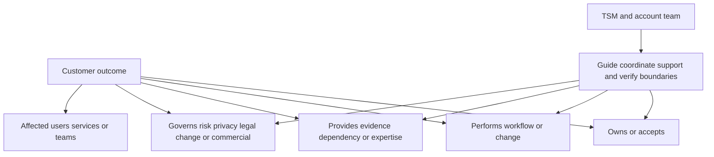

### Stakeholder discovery sequence

1. What customer outcome or decision is in scope?
2. Who experiences the current pain or consequence?
3. Who owns the business service and risk?
4. Who performs each workflow step?
5. Who controls architecture, identity, data, network, applications, and change?
6. Who supplies authoritative evidence?
7. Who governs privacy, compliance, legal, finance, procurement, and risk acceptance?
8. Who funds or confirms commercial scope?
9. Who has informal influence or trusted expertise?
10. Who may lose time, control, budget, reputation, or safety?
11. Who must be consulted before a decision and informed afterward?
12. Which account-team role owns technical, support, product, services, or commercial pathways?

### Stakeholder register dimensions

| Dimension | Question | Why needed |
|---|---|---|
| Role/outcome link | How is the role connected to the outcome? | Excludes irrelevant contact collection |
| Impact/interest | How strongly will success or failure affect them? | Guides participation |
| Influence | Can they shape priority, resources, trust, or behavior? | Identifies formal and informal power |
| Authority | Which exact decisions can they make? | Prevents title assumptions |
| Evidence | What knowledge, record, or dependency do they own? | Supports discovery and validation |
| Incentive | What are they measured on or protecting? | Explains alignment/conflict |
| Position | Supportive, neutral, skeptical, opposed, unknown | Guides engagement, not labeling |
| Trust/relationship | What history and expectations exist? | Surfaces stakeholder debt |
| Communication need | Which detail, format, channel, and timing? | Reduces noise and misunderstanding |
| Engagement action | Interview, workshop, review, decision, training, inform | Makes map operational |
| Risk if absent | Which decision or evidence fails? | Prioritizes engagement |
| Privacy | What information may be shared with this role? | Prevents overexposure |

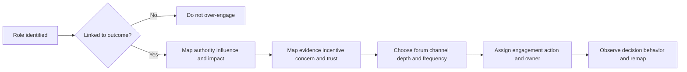

## Stakeholder roles and perspectives

The descriptions below are general personas. Actual titles, scope, authority, and priorities must be discovered.

### CISO and security leadership

The Chief Information Security Officer typically leads or influences enterprise security strategy and risk accountability, but exact authority varies. Relevant questions include which business risks matter, which outcomes are board-visible, how residual risk is accepted, how investment is prioritized, and which evidence is trusted.

| Likely need | Useful TSM contribution | Avoid |
|---|---|---|
| Risk and outcome clarity | Concise trend, driver, decision, options, owner, residual | Product feature catalog |
| Confidence in execution | Milestone, adoption, control, and escalation integrity | Green status without denominator |
| Cross-team alignment | Visible authority and dependency map | Acting as customer manager |
| Bad-news candor | Early material risk with options | Surprise or false reassurance |
| Strategic relevance | Connect technical work to approved security priorities | Claiming causality or board outcome |

### CIO and IT leadership

The Chief Information Officer often focuses on service reliability, architecture, transformation, cost, workforce, data, and technology portfolio. Security work may compete with availability, modernization, and operational capacity. Show how recommendations affect business services, change windows, technical debt, and total operating burden.

### SecOps, SOC, and incident response

These roles need trustworthy evidence, manageable workload, clear triage/investigation/response mechanics, authority, and degraded modes. They may resist new data or automation when it adds noise, hides source context, or creates unsafe actions. Observe real workflows and handoffs.

### Vulnerability and exposure management

VM roles care about scope, finding quality, prioritization, ownership, remediation, exception, retest, and reporting. They depend on IT, application, cloud, identity, network, asset, and governance roles. A TSM should not treat the VM team as able to remediate every finding.

### IT operations, endpoint, cloud, and platform

These teams implement many changes and absorb operational risk. They need exact targets, reproducible evidence, maintenance windows, test/rollback, support boundaries, and realistic capacity. A central security SLA can conflict with application release and safety constraints.

### Network and identity

Network roles own or influence DNS, routing, proxy, firewall, TLS, segmentation, connectivity, and observation points. Identity roles own lifecycle, authentication, groups, privilege, and attributes by design. Both are cross-cutting and frequently become hidden dependencies. Engage them before a late connectivity or authority failure.

### Data and architecture

Data owners and architects care about source authority, schema, identifiers, time, quality, lineage, privacy, retention, cost, and operability. They can distinguish "available data" from decision-grade data. Include them when success depends on aggregation, correlation, dashboards, or AI grounding.

### Application and business-service owners

Application owners understand service criticality, releases, dependencies, testing, downtime, user impact, and technical debt. They may appear to resist security deadlines because they are accountable for business continuity. Give them contextual evidence, options, and validation requirements rather than generic severity.

### Compliance, privacy, legal, audit, and risk

These roles interpret obligations, data use, evidence, retention, legal exposure, audit, exception, and risk acceptance under customer policy. Involve them at design time. Do not ask them to approve a vague architecture after work is complete.

### Procurement, finance, and vendor management

These roles govern purchase, contract, cost, supplier risk, services, and sometimes value evidence. A TSM can provide accurate technical scope and outcome evidence but should not improvise pricing, terms, entitlement, or contractual obligations.

### Champions, detractors, and the neutral majority

Champions translate change locally, test workflows, coach peers, and provide feedback. Protect them from becoming unpaid project managers. Detractors may carry trust debt, workload concerns, safety knowledge, or competing goals. The neutral majority often adopts based on manager support, peer evidence, and workflow fit.

| Role/persona | Typical decision or evidence | Common concern | Engagement method |
|---|---|---|---|
| CISO/security executive | Risk priority, sponsorship, residual authority | Strategic outcome and credibility | Concise steering and exception decisions |
| CIO/IT executive | Service portfolio, resources, reliability | Change burden and operational fit | Business-service and dependency narrative |
| SecOps leader | Workflow, staffing, quality, response authority | Noise, speed, safety, handoffs | Workflow and outcome review |
| Analyst/operator | Actual cases and usability | Extra steps, weak evidence, tool switching | Observation, pilot, feedback |
| VM leader | Finding lifecycle and program target | Prioritization trust and owner action | Backlog/workflow review |
| IT/platform owner | Production change and operations | Stability, capacity, rollback | Technical design and change gate |
| Network owner | Path, connectivity, inspection, policy | Performance, availability, scope | Architecture and evidence session |
| Identity owner | Identity source, roles, privilege | Wrong target and excess access | Attribute/authorization review |
| Data owner | Source semantics and quality | Cost, lineage, sensitive data | Data contract and quality review |
| Application owner | Service risk and maintenance | Downtime, false priority, testing | Service-specific mitigation options |
| Compliance/privacy/legal | Obligation, purpose, retention, acceptance | Unauthorized use or unsupported assertion | Early governance design |
| Procurement/finance | Contract, supplier, cost, value | Scope creep and unproved value | Commercially governed review |
| Champion | Peer trust and local adoption | Burnout and credibility | Enable, recognize, gather evidence |
| Detractor | Risk/history and informal influence | Prior failure, loss, burden | Listen, test concern, offer control |

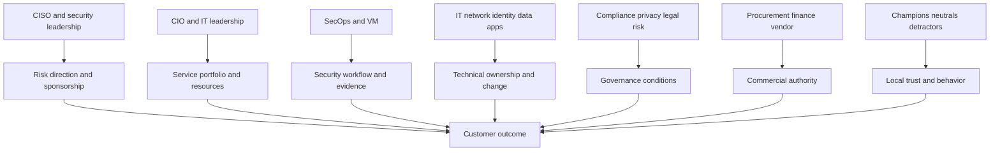

### Plain-English deep-dive 2 - Resistance is often a risk signal

Imagine an application owner refuses an aggressive remediation date. The easiest story is "security is not a priority." A better inquiry asks what the owner is accountable for. Perhaps the application supports patient care, the patch changes a database driver, the test environment is incomplete, a maintenance window is fixed, and the security evidence does not establish reachability. The owner may be protecting availability, not dismissing security.

The TSM should validate both sides: evidence for the exposure, evidence for operational consequence, feasible mitigation options, approval authority, target dates, validation, and residual risk. Maybe an emergency change is justified. Maybe a compensating control and scheduled repair are safer. Maybe the finding is incorrect. The stakeholder map reveals who can decide; evidence determines what they should consider.

Do not romanticize every objection. Some resistance is political, territorial, or avoidant. Even then, labeling the person rarely helps. Describe observable behavior, impact, decision right, incentive, and next evidence. Escalate material blocked outcomes through agreed governance.

## Influence, interest, impact, and position

A two-by-two power-interest grid is useful but incomplete. Add impact, authority, trust, position, and network influence.

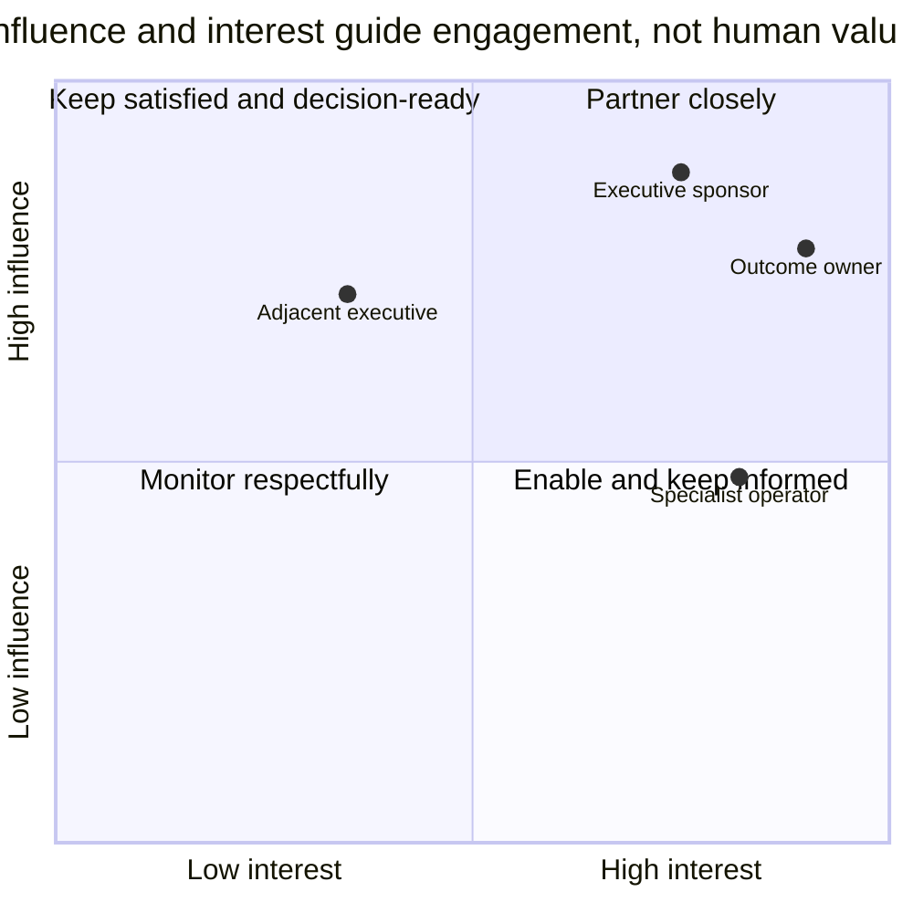

The coordinates are illustrative general practice, not facts about any person. Do not reduce people to a chart. Use it to check engagement gaps.

### Influence sources

| Influence source | Meaning | Discovery evidence |
|---|---|---|
| Formal authority | Can approve, reject, fund, assign, or accept | Policy, charter, accountable confirmation |
| Expertise | Trusted knowledge shapes decisions | Who is consulted during difficult cases? |
| Workflow control | Owns a required queue, change, source, or approval | Dependency map |
| Resource control | Controls capacity, budget, or schedule | Planning process |
| Information control | Owns decisive data or reporting | Source authority |
| Relationship trust | Others rely on their judgment | Observed consultation, not gossip |
| Network centrality | Connects otherwise separate groups | Cross-team workflow |
| Escalation access | Can reach senior decision roles | Governance path |
| Adoption influence | Peers copy or reject behavior based on them | Pilot observation |

### Position is issue-specific

A person can champion one outcome and oppose one method. Record position by decision, not as a permanent label.

| Position | Observable description | Engagement goal |
|---|---|---|
| Champion | Actively supports outcome/method and contributes evidence | Equip without overloading |
| Supportive | Favors path but has limited active role | Keep informed and invite key input |
| Neutral/unknown | Needs relevance or evidence | Understand impact and test assumptions |
| Skeptical | Questions evidence, fit, cost, or safety | Make concerns testable |
| Opposed | Prefers another outcome/method or rejects cost/risk | Surface decision and alternatives |
| Blocked | May support but lacks authority/capacity/dependency | Remove structural blocker |

## Authority and decision-rights mapping

RACI is useful for deliverables, but decisions need explicit rights. Use RAPID-like thinking where helpful: who recommends, supplies input, agrees/approves, decides, and performs. Names and frameworks matter less than clarity.

| Decision | Recommender | Required input | Approver/agreement | Final decision | Performer | Evidence/record |
|---|---|---|---|---|---|---|
| Prioritize customer outcome | TSM/customer leaders may recommend | Security, IT, business, data | Sponsor group as designed | Customer sponsor/outcome owner | Program roles | Outcome charter |
| Approve architecture | Architect/technical owner | Security, network, identity, data, operations | Governance/change roles | Customer design authority | Services/technical owners | Design record |
| Approve production change | Change owner | Technical, security, service impact | Required policy roles | Customer change authority | Customer/services role by scope | Change record |
| Open product Support case | Technical owner/TSM may recommend | Reproduction and impact | Customer/vendor process | Authorized case owner | Support and customer | Case record |
| Accept residual risk | Control owner may recommend | Security, service, legal/compliance | Policy-defined roles | Customer risk authority | Business/control owner | Risk record |
| Confirm entitlement | Technical need may be stated | Product and account context | Procurement/account process | Authorized commercial roles | Commercial operations | Contract/order evidence |
| Communicate roadmap | Product/account role under policy | Current approved information | Product governance | Authorized spokesperson | Account role | Approved communication |

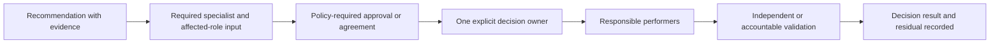

### RACI construction rules

1. Define the outcome or deliverable precisely.
2. Assign one accountable role where possible.
3. Confirm Responsible roles have capacity and authority to perform.
4. Keep Consulted roles limited to necessary expertise and impact.
5. Define what and when Informed roles receive.
6. Separate customer, TSM, services, Support, sales, product, and engineering responsibilities.
7. Test normal, urgent, exception, and absence scenarios.
8. Review RACI when scope, people, contract, or risk changes.

| RACI smell | Risk | Repair |
|---|---|---|
| Multiple A roles | No final decision | Split decision or name one owner |
| No A role | Orphan work | Escalate ownership before execution |
| Everyone C | Slow consensus theater | Require only decision-relevant input |
| TSM R/A for customer change | Authority confusion | Assign customer owner; TSM guides or coordinates |
| Support R for project plan | Incident and project lanes blurred | Keep Support case-specific |
| Sales A for technical acceptance | Commercial and technical truth blurred | Customer/technical acceptor owns evidence |
| Operator I only | Workflow reality excluded | Consult or make responsible where appropriate |
| Governance I after design | Late veto | Consult before consequential design |

## Communication design by audience

Tailoring communication means changing depth, order, vocabulary, and decision framing while preserving the same facts. Never show executives green status and engineers red facts.

| Audience | Starts with | Needs | Usually omit from main body | Output |
|---|---|---|---|---|
| Executive sponsor | Outcome, consequence, decision | Trend, confidence, options, owner, residual | Raw logs and task list | One-page decision brief |
| Outcome owner | Success evidence and blockers | Scope, denominator, adoption, acceptance | Unrelated product detail | Outcome review |
| Program owner | Milestones and dependencies | Critical path, RAID, owners, dates | Deep packet traces | Integrated plan |
| Technical owner | Symptom, architecture, evidence | Reproduction, tests, design, tradeoffs | Marketing narrative | Technical decision record |
| Operator | Workflow and exact next action | Context, procedure, exceptions, support | Executive portfolio context | Runbook/task |
| Governance | Purpose, data, authority, risk | Flow, controls, retention, approvals | Feature tour | Review package |
| Procurement/finance | Scope, obligation, cost/value evidence | Verified product/service/terms owner | Unsupported technical forecast | Commercially governed brief |
| Champion | Purpose, practice, feedback route | Examples, limitations, coaching | Confidential executive concern | Enablement kit |

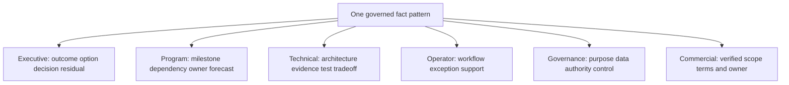

### Executive narrative mechanics

An executive update should answer in order:

1. Which business/security outcome is affected?
2. What changed, under which scope and confidence?
3. Why does it matter now?
4. Which driver or dependency explains it?
5. What has been done and by whom?
6. Which options and tradeoffs exist?
7. What decision is needed, from whom, by when?
8. What residual remains after the recommendation?

| Weak executive wording | Stronger neutral wording |
|---|---|
| "The deployment is green." | "Foundation tests pass for the pilot scope; owner mapping remains below the agreed acceptance, so workflow value is at risk." |
| "The customer is not engaged." | "The outcome owner has not attended the last two decision forums, leaving acceptance and priority unresolved. The sponsor should confirm delegation or rebaseline." |
| "The app team is blocking remediation." | "The application owner cannot approve the proposed window without regression evidence; exposure and availability options need a risk-owner decision by Friday." |
| "Zscaler will fix the visibility gap." | "Public Zscaler positioning is relevant; current capability, entitlement, source support, and customer fit require verification." |
| "We delivered value." | "The customer accepted the bounded workflow capability; repeated adoption and risk effect remain under measurement." |

### Plain-English deep-dive 3 - Executive brevity still needs an evidence spine

Executives rarely need every technical detail, but they need confidence that detail exists and that the summary has not changed its meaning. Think of a medical consultant's summary: diagnosis confidence, material evidence, options, risks, recommendation, and consent decision appear on the first page; test results remain in the appendix.

Use a layered document. Page one carries outcome, status, evidence integrity, impact, options, decision, owner, and residual. The technical appendix carries population, definitions, architecture, tests, traces, limitations, and references. A skeptical executive or delegate can inspect the spine without forcing everyone through it.

Never use brevity to erase unknowns. "No material issue observed in the tested pilot population" is concise and bounded. "No issue" is shorter but may be false. Executive trust grows when caveats are proportionate, not when every sentence sounds certain.

## Governance architecture

Governance should put each decision at the lowest appropriate level with the right authority and evidence, while preserving escalation for cross-team or material risk.

### Governance layers

| Layer | Typical decisions | Participants | Output |
|---|---|---|---|
| Technical working | Design, test, defect isolation, evidence | Engineers, architects, operators, TSM/services | Technical action/decision |
| Delivery/adoption | Milestones, dependencies, workflow, enablement | Workstream leads, program owner, champions | Integrated plan update |
| Steering | Outcome, priority, scope, major risk, cross-team conflict | Sponsor, outcome/program owners, key domain leaders | Decisions and escalations |
| Executive/business review | Value evidence, strategic fit, residual, next roadmap | Executives, account leadership, outcome owner | Continue, reshape, invest, defer |
| Event-driven escalation | Critical impact, security/privacy issue, blocked authority | Required decision and response roles | Time-bound mitigation/decision |
| Product/support lane | Incident, defect evidence, feedback, product truth | Customer technical owner, TSM, Support/Product as appropriate | Case/feedback/status |
| Commercial lane | Entitlement, services, contract, renewal | Sales/account, procurement, finance | Commercial decision |

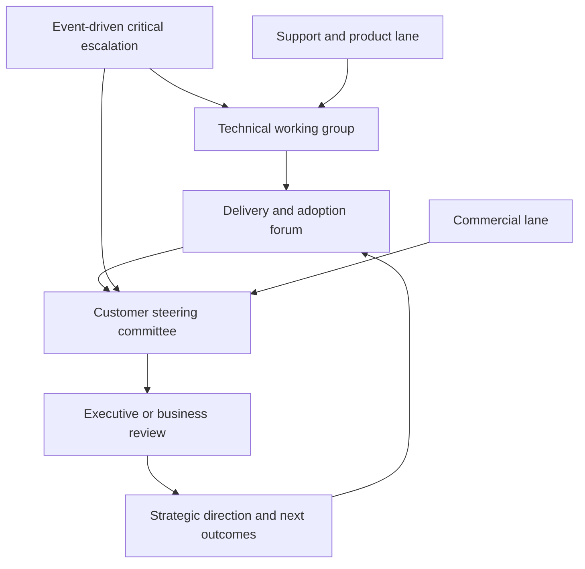

### Governance charter

Each forum should define:

| Charter field | Required question |
|---|---|
| Purpose | Which decisions or coordination justify the forum? |
| Scope | Which outcomes, products, workstreams, or risks? |
| Membership | Which roles are standing, optional, or invited by topic? |
| Chair/facilitator | Who owns agenda and decision flow? |
| Decision rights | Which decisions can this forum make? |
| Quorum | Which roles must be present for valid decision? |
| Inputs | Which pre-read, data, and evidence are required? |
| Agenda | What fixed sequence preserves outcome focus? |
| Outputs | Decision, action, escalation, acceptance, or information? |
| Records | Where are minutes, decisions, actions, and evidence stored? |
| Escalation | Which triggers and next authority apply? |
| Review | When is forum value/cadence reassessed? |

### Cadence design

Frequency depends on phase, risk, rate of change, decision latency, and participant cost. Avoid copying a universal weekly/monthly/quarterly template without purpose.

| Forum | Default starting hypothesis | Increase frequency when | Reduce/cancel when |
|---|---|---|---|
| Technical working | As required, often one or more per week during active phase | Complex tests, incident, design decisions | No active technical decision |
| Delivery/adoption | Weekly during onboarding or change | Critical path volatile or adoption blocked | Stable operations and asynchronous flow works |
| Steering | Monthly or at phase gates | Material scope/risk/dependency decision | No decision and pre-read sufficient |
| Executive review | Quarterly or material transition | Strategic risk, renewal, investment, critical issue | Pure status with no executive action |
| Champion forum | Biweekly/monthly during adoption | Rapid feedback and peer support needed | Workflow established and other channels work |
| Event-driven | Triggered | Severity/impact/authority threshold reached | Close when outcome and residual transferred |

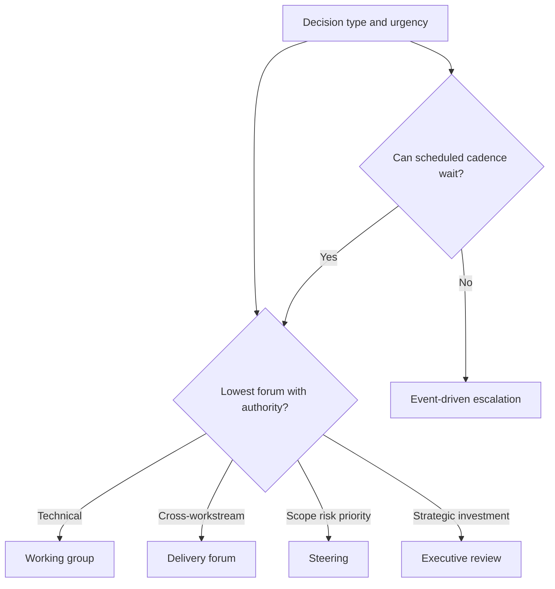

### Meeting flow

Use pre-reads for status and reserve synchronous time for exceptions and decisions.

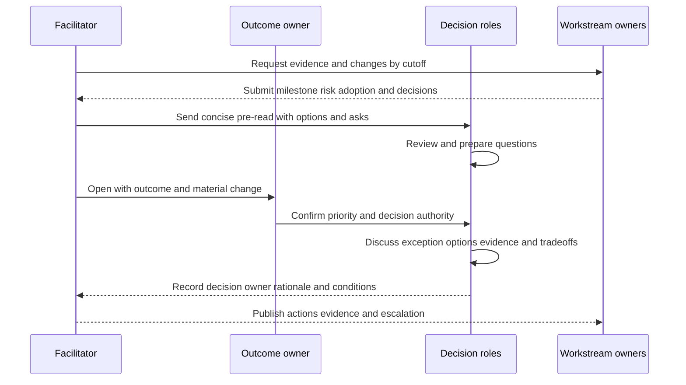

## Champions and detractors

Champions need role clarity, access, time, recognition, honest limitations, and a feedback path. Avoid relying on one person; build a network across functions and regions.

| Champion contribution | Enablement | Protection |
|---|---|---|
| Translate outcome locally | Role-specific narrative and examples | Do not require marketing language |
| Test workflow | Safe scenarios and evidence rubric | Do not use uncontrolled production testing |
| Coach peers | Teach-back kit and office hours | Manager allocates time |
| Surface defects/resistance | Structured feedback and triage path | No retaliation for bad news |
| Demonstrate value | Bounded evidence and attribution | No fabricated success story |
| Support continuity | Backup champions and documentation | Avoid single-person dependency |

### Detractor engagement loop

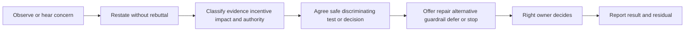

| Concern | Possible valid mechanism | Useful response |
|---|---|---|
| "This score is wrong." | Source, scope, weighting, time, context | Inspect examples and metric contract |
| "Automation is unsafe." | Wrong target, missing approval, weak rollback | Threat model and bounded human-approved test |
| "This adds work." | Duplicate queue, manual enrichment, poor integration | Workflow/time observation and redesign |
| "We tried this before." | Prior defect, turnover, unsupported promise | Review failure conditions and differences |
| "Security ignores availability." | Generic priority, no service impact evidence | Joint option/risk decision |
| "Vendor owns the outcome." | Responsibility expectation from sales/history | Clarify shared responsibility and authority |
| "We cannot share data." | Purpose, residency, privilege, contract concern | Minimize, customer-controlled review, governance |

### Champion and detractor ethics

Do not manipulate stakeholders, create secret coalitions, or frame skeptics as obstacles in executive reports. Ask consent before naming someone a champion. Keep confidential concerns within appropriate channels. Disclose conflicts and correct misquotes. Stakeholder strategy is not office politics as a game; it is responsible coordination of people affected by technical change.

## Conflict prevention and resolution

Many conflicts are structural: ambiguous outcome, competing measures, missing authority, hidden workload, shared-resource constraint, conflicting source truth, or different time horizons.

| Conflict pattern | Example | Prevention |
|---|---|---|
| Goal conflict | Security speed versus service stability | Shared outcome and guardrails |
| Authority conflict | Two teams believe they approve change | Decision-rights map |
| Evidence conflict | Scanner and app owner disagree | Source/provenance and validation method |
| Resource conflict | Same engineer assigned to two priorities | Sponsor portfolio decision |
| Incentive conflict | Team measured on closure, owner on uptime | Balanced measures |
| Scope conflict | Pilot assumed enterprise-wide | Explicit population/exclusions |
| Commercial conflict | Expected service not verified | Handoff and accountable commercial confirmation |
| Historical conflict | Previous promise or incident created distrust | Acknowledge, document, deliver bounded proof |

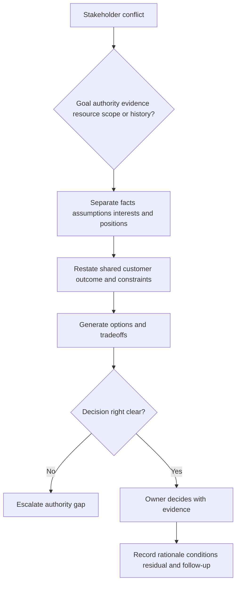

### Constructive disagreement language

| Situation | Neutral wording |
|---|---|
| Evidence disagreement | "We have two scoped claims. Let us compare source, time, population, and authority before deciding." |
| Authority ambiguity | "This decision affects production risk. Which customer role is authorized to accept it?" |
| Executive pressure | "The date is important. The current critical path is controlled by this approval; here are the safe options and tradeoffs." |
| Product uncertainty | "I do not have evidence for that capability or entitlement. I will route the exact requirement to the accountable source." |
| Workload objection | "Let us quantify new work and remove duplicate steps before asking for adoption." |
| Missed commitment | "The prior forecast is no longer supported because this dependency changed. Here is the correction, impact, and recovery choice." |

## Escalation design

Escalation is not punishment. It brings a material issue to a role with the authority, expertise, resources, or visibility needed. Define triggers before crisis.

| Trigger class | Example | Destination |
|---|---|---|
| Customer/business impact | Critical service or regulated process affected | Customer incident/executive path |
| Security/privacy | Suspected unauthorized access or sensitive exposure | Customer security/privacy incident path |
| Technical severity | Reproducible product/service fault within support scope | Support escalation path |
| Cross-team dependency | Critical path blocked beyond owner authority | Program/steering sponsor |
| Scope/commercial | Entitlement/services/contract ambiguity | Account/procurement authority |
| Product gap/feedback | Valid requirement not met by current verified capability | Product feedback path |
| Roadmap | Future capability question | Approved product/account communication path |
| Relationship/trust | Repeated surprise, misquote, unresolved commitment | Account/executive sponsor |

### Escalation packet

Include outcome and impact, scope, facts and evidence, timeline, current owner, attempted actions, first blocked boundary, options, requested decision, deadline, communication owner, and residual. Minimize sensitive data. Do not declare a defect or contractual breach without the proper authority and evidence.

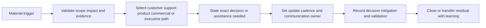

## Executive relationship management

Executive management is not frequent access to senior leaders. It is reliable preparation, relevance, candor, follow-through, and respect for decision cost.

### Executive engagement lifecycle

| Stage | TSM behavior | Evidence of health |
|---|---|---|
| Establish | Confirm strategic outcome, preferred communication, decision rights | Sponsor corrects and accepts charter |
| Deliver | Bring concise evidence, risks, decisions, and follow-through | Decisions occur without repeated context reset |
| Challenge | Raise material concerns early with options | Bad news can be discussed constructively |
| Demonstrate | Connect accepted technical/adoption evidence to outcome | Customer validates bounded contribution |
| Evolve | Reassess priorities, stakeholders, and next outcomes | Roadmap changes with business context |
| Recover | Own communication error or missed commitment and repair | Corrected record and restored operating rhythm |

### Executive sponsor plan

| Question | Example planning prompt |
|---|---|
| Why do they sponsor? | Which strategic risk or service outcome matters? |
| What can they decide? | Priority, resources, scope, escalation, residual? |
| What do they delegate? | Who is outcome and program owner? |
| What evidence earns attention? | Trend, exception, customer story, financial/operational impact? |
| How do they prefer engagement? | Format, frequency, channel, pre-read, level of detail? |
| What should trigger contact? | Critical impact, decision delay, major scope/risk change? |
| What must remain in technical forums? | Detailed design, routine status, logs? |
| How is absence handled? | Named delegate and quorum? |

### Plain-English deep-dive 4 - Trust is reduced uncertainty about how someone will act

Trust is not created by always agreeing or always showing green status. Stakeholders learn whether the TSM distinguishes fact from assumption, protects confidential information, keeps commitments, corrects errors, routes questions honestly, and communicates bad news before it becomes a surprise.

Think of a reliable navigator. The navigator does not control the weather and should not promise smooth travel. They earn trust by using current instruments, stating uncertainty, identifying alternatives, warning at the right time, and updating the route when facts change.

When the TSM makes an error, repair has five steps: state the incorrect claim, provide the corrected fact and source, describe impact, take corrective action, and change the process that allowed the error. Defensive wording protects ego at the expense of stakeholder confidence.

## Governance operations and measurement

Measure governance by decisions and follow-through, not meeting count.

| Measure | Definition question | Guardrail |
|---|---|---|
| Decision latency | From decision-ready evidence to authorized decision | Do not pressure unsafe speed |
| Action closure | Accepted actions completed and validated | Closure is not outcome by default |
| Reopen rate | Decisions/actions reopened due to missing evidence/change | Distinguish healthy correction from poor quality |
| Quorum effectiveness | Required roles present for actual decisions | Attendance alone is not engagement |
| Escalation timeliness | Material trigger to correct authority | Avoid over-escalation noise |
| Pre-read quality | Decision questions, options, evidence available on time | Page count is not quality |
| Stakeholder coverage | Necessary roles engaged at appropriate stage | Avoid engagement spam |
| Adoption feedback closure | Material feedback resolved or decided | Do not suppress negative feedback |
| Decision integrity | Rationale, authority, conditions, residual recorded | Documentation must not become bureaucracy |
| Forum value | Participants confirm decisions justify time | Popularity is not the only measure |

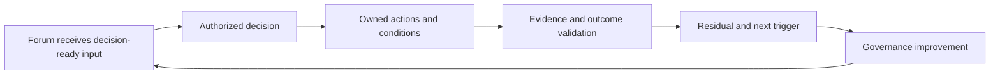

### Governance review

Quarterly or after material change, ask: Which forums produced decisions? Which roles were missing or over-invited? Where did decisions wait? Which escalations arrived too late or at the wrong level? Which pre-reads were trusted? Which actions closed without outcome? Which stakeholder positions changed? Which confidential information was over-shared? What should merge, split, change frequency, or stop?

## Security, privacy, and information boundaries

Stakeholder engagement does not grant universal information access. Tailor not only detail but authorization.

| Information | Sharing control |
|---|---|
| Vulnerability or attack-path detail | Need-to-know, customer-approved recipients, secure channel |
| Identity/user data | Purpose, minimization, role access, retention |
| Incident evidence | Incident communication policy and legal/privacy handling |
| Architecture diagrams | Classification and approved distribution |
| Commercial terms | Procurement/account-authorized audience |
| Product defect evidence | Redacted Support/Product route with customer consent |
| Roadmap information | Approved disclosure terms and spokesperson |
| Executive sentiment | Avoid gossip; record decisions and explicit concerns only |
| Stakeholder map | Protect sensitive influence/trust notes; use professional language |

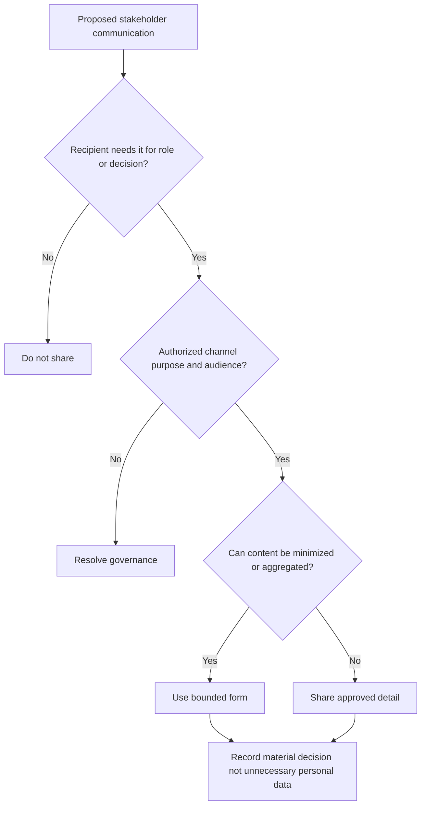

## Failure modes and misconceptions

| Failure or misconception | Why it fails | Better practice |
|---|---|---|
| "Stakeholder map equals org chart" | Misses workflow, authority, evidence, and informal influence | Map around outcome and decision |
| "CISO is accountable for every security decision" | Authority is delegated and issue-specific | Verify exact decision right |
| "Executive engagement means frequent meetings" | Wastes attention without decisions | Purposeful cadence and event triggers |
| "Detractors should be won over" | May ignore valid risk or autonomy | Listen, test, offer choices, respect decision |
| "Champion will handle adoption" | Creates burnout and single-person dependency | Network, manager support, clear role |
| "RACI solves governance" | Does not define decision mechanics or evidence | Add decision-rights record and charter |
| "Everyone should be consulted" | Slows work and diffuses accountability | Consult necessary expertise/impact |
| "Executive summary should remove caveats" | Creates false certainty | Preserve material scope, confidence, residual |
| "Escalation is failure" | Delays authority and impact response | Predefine neutral triggers |
| "Procurement blocks technical success" | Commercial controls are legitimate governance | Route accurate requirements early |
| "Technical truth wins automatically" | Decisions include business, policy, and operational factors | Present evidence, options, authority |
| "One cadence fits every phase" | Decision rate and risk change | Adapt and cancel low-value forums |
| "Relationship permits roadmap promises" | Trust cannot authorize unsupported commitment | Use approved product language |
| "Stakeholder notes can include personal judgments" | Creates privacy, bias, and trust risk | Record professional observable facts |

## Troubleshooting stakeholder and governance failures

| Symptom | Plausible cause | Discriminating check | Recovery |
|---|---|---|---|
| Decisions repeatedly reopen | Wrong owner, weak evidence, missing affected role | Review authority, acceptance, and conditions | Repair decision record and inputs |
| Executive skips meetings | Low relevance, wrong cadence, delegated authority | Ask which decisions require their role | Redesign forum/delegate |
| Operators remain silent | Hierarchy, blame, no safe channel | Smaller role forum and anonymous themes | Build psychological safety |
| Champion disengages | Overload, low recognition, unresolved defects | Review allocated time and feedback closure | Reduce burden and add backups |
| Detractor escalates externally | Concern ignored or no trusted path | Compare prior concerns and responses | Acknowledge and test issue |
| Steering becomes status call | No decisions/pre-read/authority | Count decisions and unresolved asks | Move status async and charter asks |
| Technical team bypasses governance | Process too slow or unclear | Observe urgent case and decision latency | Simplify proportionately |
| Commercial surprise appears late | Account-team handoff gap | Audit requirement-to-entitlement record | Route and correct plan |
| Conflicting customer messages | No shared fact pattern or communication owner | Compare versions and recipients | Publish one corrected source |
| Trust falls after bad news | News was late, vague, or defensive | Review first-known versus first-shared timeline | Correct, own impact, change trigger |

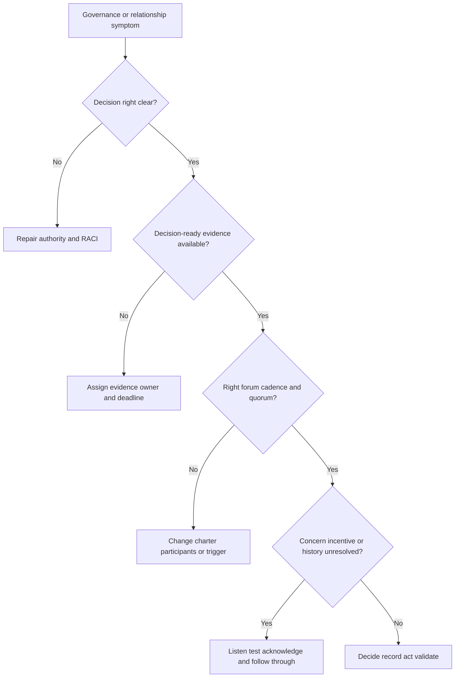

## Decision trees

### Decision tree 1 - Who should make this decision?

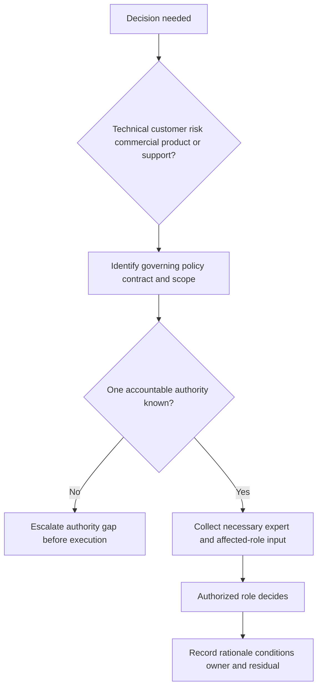

### Decision tree 2 - How should a stakeholder be engaged?

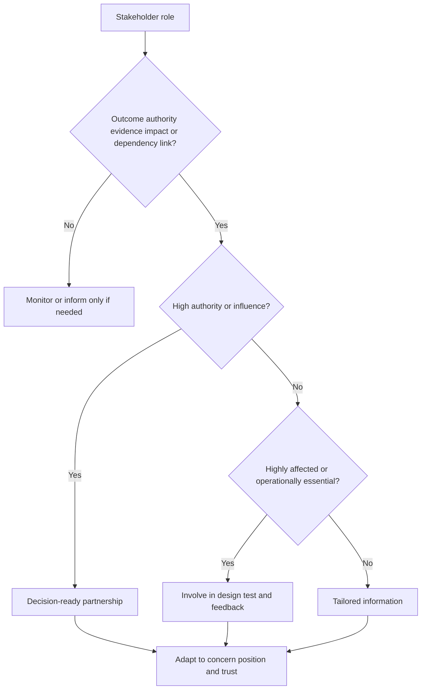

### Decision tree 3 - Does this need escalation?

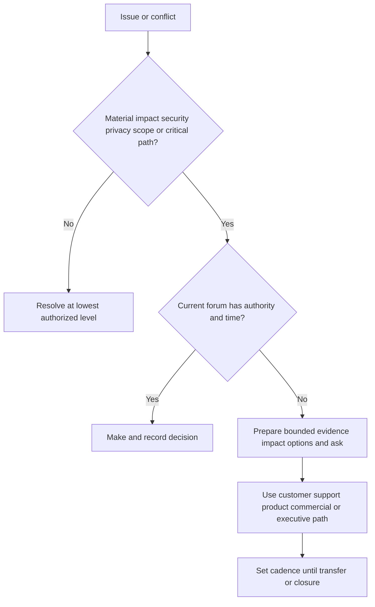

## Explicitly fictional and synthetic NMH scenarios

All content in this section is fictional and synthetic. It is practice material, not a customer organization, stakeholder relationship, governance result, or statement about Zscaler. Dates in this section, including **2026-09-29**, **2026-10-13**, **2026-10-27**, and **2026-11-10**, are synthetic scenario dates later than the source snapshot and do not imply later research.

### Scenario 1 - CISO sponsorship without an outcome owner

On synthetic 2026-09-29, NMH's fictional CISO sponsors better vulnerability prioritization, but no role is authorized to accept the operational workflow. The VM lead expects application owners to validate closure; application owners expect security to define success. The TSM records an accountability gap and asks the sponsor to designate an outcome owner before the pilot gate.

The synthetic decision is to assign a fictional security-program owner for workflow acceptance while application owners retain service-change and validation authority. This is a governance exercise, not a real RACI.

### Scenario 2 - The network detractor

On synthetic 2026-10-13, a fictional network architect challenges the proposed data path, citing inspection, residency, and operational ownership. Instead of labeling resistance, the TSM adds the architect's concerns to the design test: approved flow, minimum data, documented destinations, failure behavior, and owner. One concern is supported, one is bounded, and two remain unknown pending current product documentation. No product behavior is invented.

### Scenario 3 - Steering without decisions

On synthetic 2026-10-27, NMH's fictional monthly steering call has twenty attendees and reads task status. Three cross-team dependencies remain open because the required data and application decision owners are absent. The redesigned synthetic forum uses an asynchronous status pre-read, six standing decision roles, topic-specific guests, a quorum rule, and an action/decision log. The scenario does not claim improved metrics.

### Scenario 4 - Procurement enters late

On synthetic 2026-11-10, a fictional technical plan assumes services and a source integration whose purchased scope is not established. The TSM does not tell procurement what the contract includes. The requirement, product question, schedule impact, and alternatives are routed to the account and procurement authorities. The customer may continue a smaller verified scope or replan. Every later date in this section remains fictional and synthetic.

## Reusable artifact kit

These templates are general practice. Use professional, observable language and protect sensitive relationship information.

### Artifact 1 - Stakeholder register

| ID | Role | Outcome link | Impact/interest | Influence source | Exact authority | Evidence/dependency | Incentive/concern | Position/confidence | Trust/history | Engagement | Owner/review |
|---|---|---|---|---|---|---|---|---|---|---|---|
| S-001 | | | | | | | | Unknown | | | |

### Artifact 2 - Influence and engagement map

| Stakeholder role | Influence | Interest/impact | Position by issue | What they protect/value | Evidence needed | Engagement objective | Channel/cadence | Risk if absent |
|---|---|---|---|---|---|---|---|---|
| | High/medium/low | | | | | | | |

### Artifact 3 - Decision-rights register

| Decision ID | Decision and scope | Recommender | Required input | Agreement/approval | Final decision owner | Performer | Validation/acceptor | Evidence | Deadline | Residual |
|---|---|---|---|---|---|---|---|---|---|---|
| D-001 | | | | | | | | | | |

### Artifact 4 - Stakeholder and delivery RACI

| Outcome/deliverable/decision | CISO/sponsor | CIO/IT | SecOps/VM | Network/identity/data/app | Compliance/privacy/legal | Procurement/finance | TSM | Services | Support | Sales/Product |
|---|---|---|---|---|---|---|---|---|---|---|
| Confirm outcome and acceptance | A | C | R | C | C | I | R/facilitate | I | I | C |
| Verify architecture/data prerequisites | I | A/C | R | R | C | I | R/coordinate | R by scope | C | I |
| Approve production change | I | A by policy | R/C | R | C/A by policy | I | C | R by scope | C | I |
| Accept residual risk | I | C | R/C | C | A customer role | I | C | I | I | I |
| Confirm entitlement/services | I | C | C | C | I | A/C | I | C | I | A/R account path |

Actual RACI must be agreed by the customer and applicable account/delivery authorities.

### Artifact 5 - Governance charter

| Field | Entry |
|---|---|
| Forum name | |
| Purpose/decisions | |
| Scope/exclusions | |
| Standing roles | |
| Topic-specific roles | |
| Chair/facilitator | |
| Decision rights | |
| Quorum | |
| Frequency/triggers | |
| Pre-read/cutoff | |
| Standard agenda | |
| Outputs | |
| Source of truth | |
| Escalation path | |
| Review/retirement | |

### Artifact 6 - Governance cadence calendar

| Forum | Decision purpose | Participants/quorum | Frequency/trigger | Pre-read | Output | Owner | Escalates to |
|---|---|---|---|---|---|---|---|
| Technical working | | | | | | | |
| Delivery/adoption | | | | | | | |
| Steering | | | | | | | |
| Executive review | | | | | | | |
| Support/product lane | | | | | | | |
| Commercial lane | | | | | | | |

### Artifact 7 - Executive one-page brief

> **Outcome and context:** [Customer goal, service, risk, why now].
>
> **Evidence since last review:** [Scope, denominator, confidence, material change].
>
> **Current health:** [Outcome, technical, adoption, operations, governance].
>
> **Driver and impact:** [Causal mechanism and consequence].
>
> **Options:** [At least two credible paths and tradeoffs].
>
> **Recommendation:** [Customer-specific and conditional].
>
> **Decision needed:** [Exact owner and date].
>
> **Residual:** [What remains and next trigger].
>
> **Technical appendix:** [Evidence links; no sensitive duplication].

### Artifact 8 - Champion network plan

| Champion role | Outcome/workflow | Why trusted | Time/manager support | Enablement | Feedback route | Recognition | Backup | Burnout signal |
|---|---|---|---|---|---|---|---|---|
| | | | | | | | | |

### Artifact 9 - Detractor/objection response record

| Field | Prompt |
|---|---|
| Concern in stakeholder's words | Avoid judgment or paraphrased motive |
| Outcome and impact | What decision or work is affected? |
| Evidence class | Fact, statement, assumption, unknown, contradiction |
| Mechanism hypotheses | Workload, fit, safety, authority, history, incentive, product, commercial |
| Safe test | Cheapest check that can distinguish hypotheses |
| Options | Repair, guardrail, alternate, narrow, defer, stop |
| Decision owner | Who has authority? |
| Follow-up | Evidence, date, communication, residual |

### Artifact 10 - Executive correction note

**Subject:** Correction to [topic] shared on [date]

**Incorrect statement:** [Exact bounded claim].

**Corrected fact and source:** [Evidence, scope, date, confidence].

**Impact:** [Decision, plan, risk, or communication affected].

**Action:** [Correction, revalidation, owner, checkpoint].

**Process prevention:** [What changes in review or source handling].

**Remaining unknown/residual:** [Visible limitation].

### Artifact 11 - Governance failure and recovery record

| Trigger | Expected forum/owner | What failed | Impact | Immediate containment | Root mechanism | Corrective option | Decision | Validation | Residual |
|---|---|---|---|---|---|---|---|---|---|
| | | | | | | | | | |

## Exercises

### Exercise 1 - Map one outcome

Choose a fictional exposure-remediation outcome. Identify sponsor, outcome owner, decision owners, operators, evidence owners, application/service owners, network, identity, data, compliance/privacy/legal, procurement, finance, champions, detractors, TSM, services, Support, sales, and product roles. For each, state exact outcome link and risk if absent.

### Exercise 2 - Repair a RACI

Create a deliberately broken RACI with three Accountable roles, no application owner, Support owning the project, and TSM accepting customer risk. Explain each failure and repair it. Test urgent change, owner absence, and entitlement ambiguity.

### Exercise 3 - Redesign a meeting stack

Start with weekly technical, weekly program, monthly steering, and quarterly executive meetings. Give each a decision purpose, quorum, pre-read, output, escalation, and retirement rule. Cancel at least one meeting and explain why.

### Exercise 4 - Engage a detractor

Role-play an application owner who rejects a central remediation SLA after a previous outage. Listen, restate, identify authority and incentive, define evidence, present three options, and route the decision. Do not try to "win" the conversation.

### Exercise 5 - Executive update

Write a one-page update where technical foundation is healthy but adoption is low and a commercial question is unresolved. Preserve one fact pattern across executive, program, and technical versions. Include one decision and residual.

### Exercise 6 - Honesty rehearsal

Answer: "Tell me about managing CISO and CIO relationships." Use Arti's factual escalation stakeholder experience, state the adjacent transfer, present the synthetic governance method, and identify what she has not done. Do not convert interview preparation into experience.

## Customer discovery questions

1. Which customer outcome and decisions define the stakeholder boundary?
2. Who sponsors, owns, performs, provides evidence, governs, funds, approves, validates, and receives impact?
3. Which exact decisions can each role make, and which policy, charter, or contract establishes that authority?
4. Which CISO, CIO, SecOps, VM, IT, network, identity, data, application, compliance, privacy, legal, procurement, finance, and business-service perspectives are necessary?
5. Who has informal expertise, relationship, resource, workflow, information, or adoption influence?
6. What is each role accountable for, measured on, protecting, concerned about, or likely to lose?
7. Who are potential champions, skeptical roles, detractors, neutrals, and blocked supporters for each specific decision?
8. Which evidence, detail, format, channel, frequency, and confidentiality boundary does each audience require?
9. Which deliverables and decisions need RACI, and which need a more explicit decision-rights record?
10. Which technical, delivery/adoption, steering, executive, event-driven, support/product, and commercial forums are justified?
11. What purpose, scope, membership, quorum, inputs, outputs, records, and escalation define each forum?
12. Which material triggers require communication outside normal cadence?
13. Where do goals, authority, evidence, resources, incentives, scope, history, or product/commercial expectations conflict?
14. How will champion contribution, detractor concerns, psychological safety, information minimization, and correction be governed?
15. Which current customer and Zscaler facts remain unknown, and who is authorized to establish them?

## Official Source Anchors

Research/source snapshot and source review date: **2026-08-24**.

The Zscaler sources support dated public positioning only. NIST sources support general cybersecurity governance, risk, and zero-trust concepts. They do not establish customer stakeholders, titles, authority, governance, procurement, RACI, support terms, executive priority, meeting cadence, product entitlement, adoption, or outcome. Current customer policy, organization, contracts, technical/order documentation, licensed-tenant evidence, and accountable roles govern production.

| Source | URL | Used for | Boundary |
|---|---|---|---|
| Zscaler Zero Trust Exchange | https://www.zscaler.com/products-and-solutions/zero-trust-exchange-zte | Public identity/context, policy, platform, and zero-trust positioning | No customer architecture, stakeholder, governance, entitlement, or result inferred |
| Zscaler Agentic Security Operations | https://www.zscaler.com/products-and-solutions/security-operations | Public SecOps, third-party context, workflow, and response positioning | No customer operating model, role, action, or outcome inferred |
| Zscaler Unified Vulnerability Management | https://www.zscaler.com/products-and-solutions/unified-vulnerability-management | Public vulnerability context, prioritization, and workflow positioning | No customer RACI, source, scoring, SLA, or remediation result inferred |
| Zscaler Risk360 | https://www.zscaler.com/products-and-solutions/risk360 | Public contextual cyber-risk visibility positioning | No customer risk decision, score, executive report, or result inferred |
| Zscaler Data Fabric for Security | https://www.zscaler.com/products-and-solutions/data-fabric | Public data and workflow positioning | No customer data owner, integration, governance, or quality inferred |
| Zscaler Support | https://help.zscaler.com/submit-ticket | Public support route context | Contractual support level, role, severity, response, and escalation require verification |
| NIST Cybersecurity Framework 2.0 | https://www.nist.gov/cyberframework | Govern and outcome-oriented cybersecurity framing | Voluntary; customer tailors roles and governance |
| NIST SP 800-207 | https://csrc.nist.gov/pubs/sp/800/207/final | General zero-trust architecture and policy concepts | Does not prescribe vendor or customer governance |
| NIST Privacy Framework | https://www.nist.gov/privacy-framework | General privacy-risk management framing | Customer tailors authority and implementation |

## Likely Interview Questions

### Q1. How do you build a stakeholder map for a strategic customer?

**Model answer:** I start with a specific customer outcome and identify who owns and accepts it, performs the workflow, provides evidence or dependencies, governs risk/privacy/change/commercial matters, and experiences impact. For each role I verify authority, influence source, interest, incentive, concern, position by issue, trust history, communication need, and risk if absent. Titles are hypotheses. I turn the map into owned engagement actions and review it after material change.

### Q2. How would you engage CISO and CIO stakeholders differently from operators?

**Model answer:** I preserve one fact pattern but change order and depth. CISO and CIO stakeholders receive outcome, business/service consequence, evidence integrity, trend, options, decision, owner, and residual, with a technical appendix. Operators receive workflow, exact evidence, procedures, exceptions, and support path. I verify each executive's actual priorities and authority; I do not assume the CISO owns every security decision or the CIO has the same concerns.

### Q3. What is the difference between RACI and decision rights?

**Model answer:** RACI clarifies who performs, is accountable, contributes input, and receives information for a deliverable. It can still hide how a choice is made. A decision-rights record names the recommendation, required input, approvals, one final decision owner, performer, validator, evidence, and residual. I use both where complexity warrants and never assign a TSM customer risk, production-change, commercial, or roadmap authority they do not hold.

### Q4. How do you work with champions and detractors?

**Model answer:** I ask consent and give champions time, role-specific enablement, safe practice, a feedback route, recognition, and backups; I do not make them unpaid project managers. With detractors I restate the concern without rebuttal, examine evidence, incentive, impact, authority, and history, agree a safe discriminating test, offer repair/guardrail/alternative/defer/stop options, and let the right owner decide. Skepticism often exposes real risk.

### Q5. What governance cadence would you establish?

**Model answer:** I do not copy a universal calendar. I establish technical working, integrated delivery/adoption, customer steering, executive review, event-driven escalation, support/product, and commercial lanes only where they have distinct decisions. Each has purpose, scope, membership, quorum, decision rights, pre-read, outputs, record, escalation, and review rule. Status moves asynchronously; synchronous time handles exceptions and choices. Cadence changes with phase, risk, and decision rate.

### Q6. How do you communicate bad news to an executive?

**Model answer:** Early, directly, and with decision value. I state the affected outcome, bounded evidence and confidence, driver, impact on risk/scope/forecast, actions already taken, credible options and tradeoffs, exact decision owner and deadline, next checkpoint, and residual. I do not blame a team, hide behind technical detail, or invent an ETA. If I previously stated something wrong, I correct the claim, source, impact, action, and prevention.

### Q7. How do you resolve cross-functional stakeholder conflict?

**Model answer:** I classify whether conflict concerns goals, authority, evidence, resources, incentives, scope, commercial boundaries, or history. I separate facts, assumptions, interests, and positions; restate the shared customer outcome and guardrails; gather the minimum decisive evidence; present options and tradeoffs; and route the decision to the authorized role. I record rationale, conditions, actions, validation, and residual. Escalation is neutral authority routing, not punishment.

### Q8. How does Arti's background transfer honestly to executive and stakeholder management?

**Model answer:** Her Microsoft escalation work required coordinating executives, service owners, administrators, identity/network specialists, engineering, support leadership, and users around impact, evidence, workstreams, mitigations, and recovery. She tailored technical and executive communication and mentored peers. Those skills transfer to TSM governance, while production CISO/CIO advisory, Zscaler account ownership, procurement, customer security governance, and risk acceptance remain explicit ramp areas demonstrated only through synthetic preparation here.

## 30-Second Memory Hooks

| Concept | Memory hook |
|---|---|
| Stakeholder | Linked by outcome, authority, evidence, dependency, or impact |
| Org chart | Reporting line, not decision map |
| Title | Clue, never proof of authority |
| Influence | Formal power plus expertise, workflow, information, and trust |
| Interest | How much the outcome affects the role |
| Incentive | What the role is measured on or protects |
| Champion | Enable, recognize, back up, do not overload |
| Detractor | Concern to test, not person to defeat |
| RACI | Doer, owner, adviser, audience |
| Decision right | One role authorized for one scoped choice |
| Governance | Right decision, level, evidence, owner, record |
| Cadence | Earn meeting time through decisions |
| Quorum | Required authority in the room |
| Executive brief | Outcome, evidence, impact, options, ask, residual |
| Tailoring | Change depth, never facts |
| Escalation | Route impact to capable authority |
| Trust | Predictable honesty, competence, protection, follow-through |
| Correction | Wrong claim, right fact, impact, action, prevention |
| Privacy | Need-to-know applies to stakeholder work |
| Arti bridge | Escalation coordination transfers; account claims do not |

## Completion Checklist

- [ ] I can explain stakeholder, sponsor, outcome owner, influence, interest, authority, RACI, governance, and cadence from zero.
- [ ] I can build a stakeholder map around one customer outcome rather than an org chart.
- [ ] I can discuss likely CISO, CIO, SecOps, VM, IT, network, identity, data, application, governance, and procurement perspectives without assuming authority.
- [ ] I can map formal and informal influence, incentives, concerns, position, trust, and engagement.
- [ ] I can distinguish champions, neutrals, skeptical roles, detractors, and blocked supporters by issue.
- [ ] I can create a RACI and a decision-rights register without assigning the TSM customer authority.
- [ ] I can preserve one fact pattern across executive, program, technical, operator, governance, and commercial communication.
- [ ] I can charter technical, delivery, steering, executive, event-driven, support/product, and commercial forums.
- [ ] I can design cadence based on phase, risk, decision latency, and participant cost.
- [ ] I can resolve conflict and escalate through evidence, options, authority, and residual.
- [ ] I can protect stakeholder and technical information through professional language, purpose, minimization, and access.
- [ ] I can use the stakeholder, influence, decision-rights, RACI, charter, calendar, executive, champion, detractor, correction, and recovery templates.
- [ ] I can state public Zscaler positioning without inventing stakeholder, governance, product, contract, or outcome facts.
- [ ] I can describe Arti's transfer honestly without claiming production strategic-account leadership.
- [ ] I can answer Q1-Q8 aloud with customer-specific, neutral language.

[Next: Part 103 - Cross-Functional Partnership with Sales, Support, Product, and Engineering](Part-103-cross-functional-account-team.md)