# Part 103 - Cross-Functional Partnership with Sales, Support, Product, and Engineering

> **Audience:** Candidates preparing for a Zscaler Security Operations Technical Success Manager role after enterprise Support Escalation Engineering.

> **Purpose:** Explain cross-functional account-team partnership from zero across customer roles, Sales, account leadership, Technical Success Management, solution/technical specialists, professional services, Support, Product Management, Engineering, operations, security/privacy/legal, and commercial teams.

> **Scope and honesty:** Northstar Meridian Holdings, abbreviated NMH, is an explicitly fictional and synthetic customer used only for study. Every NMH person, vendor role, product, capability, entitlement, support case, defect, request, date, target, roadmap discussion, commitment, conflict, artifact, and result is invented. Your factual background is Microsoft 365, OneDrive, and SharePoint support; networking and trace analysis; SQL and Power BI; enterprise escalations; mentoring; and responsible AI exploration. Production Zscaler, SecOps TSM, sales/account ownership, Support process, product feedback, engineering investigation, roadmap communication, commercial negotiation, and customer outcome ownership remain learning boundaries.

> **Currency caveat:** Team structures, role names, processes, products, documentation, Support terms, services, packaging, entitlements, roadmap policy, and communication authority change. The controlled official-source snapshot and source review date for this Part is exactly **2026-08-24**. Current official technical and ordering documentation, contracts, licensed-tenant evidence, customer policy, account leadership, product specialists, Support guidance, Product/Engineering processes, legal/commercial policy, and measured environment evidence govern production.

> **Section goal:** Build a beginner-to-interview-ready account-team operating model that keeps one customer outcome and fact pattern, assigns the right owner for technical, adoption, support, product, engineering, services, and commercial work, creates evidence-rich handoffs, communicates roadmap uncertainty responsibly, prevents internal conflict from reaching the customer, and preserves customer decision authority without turning the TSM into the owner of every problem.

This Part is primarily **general technical-success and cross-functional operating practice**. Reviewed Zscaler public sources support bounded portfolio, technical, security-operations, support-route, and investor/public roadmap context. They do not establish internal organization, case process, support level, defect state, product priority, engineering plan, release date, entitlement, account commitment, or customer result.

Every statement belongs to one of five evidence classes. **Official product fact** is a dated public statement supported by an anchor reviewed on 2026-08-24. **General practice** is a reusable vendor-neutral account-team method. **Scenario assumption** exists only inside explicitly fictional and synthetic NMH. **Customer fact** requires current customer-authoritative evidence. **Unknown** means available evidence does not establish the answer. Internal confidence, a sales note, a case hypothesis, and a public product statement are not interchangeable facts.

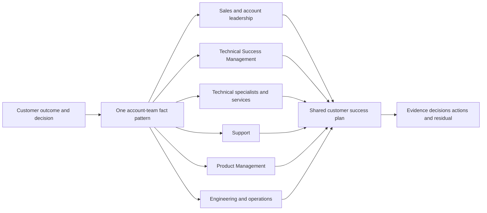

| Operating principle | Plain meaning | Practical consequence | Failure prevented |
|---|---|---|---|
| One customer outcome | Internal teams organize around what the customer needs to decide or achieve | Shared plan begins with outcome and evidence | Department-specific activity |
| One fact pattern | Different audiences get different depth, not different truth | Govern claims, timestamps, scope, and uncertainty | Contradictory customer messages |
| Role clarity before pressure | Urgency does not create authority | Route work to the accountable lane | TSM as universal owner |
| Handoffs transfer context and acceptance | Sending a link or adding a person is not a handoff | Define purpose, facts, ask, owner, receipt, next checkpoint | Ticket or email abandonment |
| Technical and commercial truth differ | Capability evidence does not establish entitlement; purchase does not prove technical fit | Keep both lanes coordinated and explicit | Accidental promise |
| Support handles incidents through evidence | Support case is a diagnostic workstream, not the whole account plan | Provide reproducible evidence and integrate impact/mitigation | Escalation without diagnosis |
| Product feedback is not a commitment | A valid need can remain unplanned or unknown | Preserve requirement, impact, alternatives, and approved status | Roadmap fiction |
| Engineering needs discriminating evidence | Executive pressure cannot replace reproduction and traces | Reduce issue to failing boundary and expected behavior | Priority by noise |
| Conflict is resolved internally with evidence | Customer should see accountable options and decisions | Use operating agreement and decision rights | Internal disagreement outsourced to customer |
| Product claims remain attributed | Public positioning is not tenant behavior | Verify current documentation, entitlement, and tests | Invented Zscaler capability |

## JD Mapping

| JD signal | Capability developed | Reusable customer or TSM artifact | Honest boundary |
|---|---|---|---|
| Partner with Sales and account teams | Align outcomes, technical truth, value evidence, and commercial boundaries | Account-team operating agreement | No sales/renewal ownership claim |
| Coordinate Support and escalations | Build reproducible evidence, impact, owner, cadence, and closure | Support escalation packet | Support determines its process and findings |
| Partner with Product/Engineering | Translate needs and defects into evidence-rich records | Product feedback/defect brief | No prioritization or release authority |
| Drive technical success | Integrate onboarding, adoption, issues, risks, and outcomes | Shared success plan | No guaranteed adoption or result |
| Trusted technical advisor | Explain capability, limitation, options, and unknowns honestly | Requirement-to-capability decision record | Customer makes architecture/risk decisions |
| Communicate roadmap responsibly | Use approved status and conditional language | Roadmap response template | No unapproved dates or commitments |
| Prevent customer confusion | Maintain one fact pattern and communication owner | Message matrix and decision log | No concealment of material disagreement |
| Lead cross-functional decisions | Clarify recommend/input/decide/perform/validate roles | Decision-rights matrix | TSM facilitates rather than commands |
| Use analytical evidence | Quantify scope, reproduction, quality, adoption, and impact | Account evidence dashboard | No unsupported causal value claim |

## Candidate honesty note

You can say: "My production background is support escalation engineering rather than a Zscaler TSM role. I have partnered with customer-facing support teams, service engineers, product engineering, incident managers, account stakeholders, and technical specialists to isolate issues, package evidence, manage workstreams, communicate impact, validate recovery, and share learning. I have studied account-team operating patterns and practiced these artifacts with a fictional scenario. In a Zscaler engagement I would learn the actual role model, Support and product processes, commercial boundaries, approved roadmap language, products, entitlements, and decision rights before making commitments."

This does not claim Sales, Product Management, Engineering, or commercial authority. You can discuss factual collaboration from enterprise support and the reasoning transfer. You should not say you ran Zscaler account teams, influenced a Zscaler roadmap, escalated Zscaler defects, negotiated renewals, committed Engineering dates, or delivered a production SecOps outcome unless independently factual.

| Factual background | Transferable strength | Neutral wording | Unsupported statement to avoid |
|---|---|---|---|
| support escalation engineering | Reproduction, evidence, engineering collaboration, recovery | "I translate customer impact into actionable technical evidence." | "I escalated Zscaler product defects." |
| Multi-team incident work | Workstreams, status, ownership, mitigation, validation | "I coordinate technical lanes around one fact pattern." | "I led a Zscaler account team." |
| M365, OneDrive, SharePoint | Product/service dependency and customer workflow understanding | "I connect service behavior to customer consequence." | "I own SecOps architecture outcomes." |
| Networking and traces | Discriminate customer, path, service, and product boundaries | "I improve escalation quality before adding pressure." | "I know Zscaler Engineering internals." |
| SQL and Power BI | Scope, cohort, quality, incident/adoption evidence | "I build transparent evidence for decisions." | "I proved renewal value." |
| Mentoring and documentation | Scale runbooks, case quality, and handoffs | "I reduce repeated context loss." | "I managed Product or Support teams." |
| Synthetic NMH artifacts | Demonstrate prepared account-team method | "This is fictional practice." | "This is a customer success result." |

## Beginner vocabulary and memory hooks

A cross-functional team combines people with different expertise and authority around one outcome. Think of an airline disruption. The account desk communicates with passengers, operations manages the service, maintenance diagnoses the aircraft, engineering assesses design questions, commercial teams handle ticket terms, and leadership decides broader priorities. Asking the account desk to repair the aircraft or asking maintenance to promise compensation confuses roles.

| Term | Meaning from zero | Why it matters | Analogy or memory hook |
|---|---|---|---|
| Account team | Provider roles coordinated around a customer relationship | Integrates technical and commercial context | Airline customer team |
| Sales/account owner | Role accountable for commercial relationship and opportunity | Owns contract and commercial path as designed | Ticket/commercial desk |
| TSM | Technical Success Manager focused on technical outcomes, adoption, risk, and orchestration | Bridges strategy and operation | Flight coordinator, not every specialist |
| Solution/technical specialist | Deep pre/post-sales product or architecture expertise, depending organization | Validates technical fit and design | Aircraft systems specialist |
| Professional services | Contracted implementation or consulting delivery | Performs scoped work | Installation crew |
| Support | Diagnoses and resolves supported technical incidents through defined process | Handles break/fix and product cases | Maintenance desk |
| Product Management | Owns product problem/market framing and prioritization as organized | Evaluates needs and direction | Fleet/product planner |
| Engineering | Designs, builds, tests, operates, or fixes product components as organized | Investigates technical behavior | Aircraft engineer |
| Operations/SRE | Runs service reliability and operational response as organized | Handles live service health | Operations control |
| Commercial boundary | Line between technical discussion and purchase/contract authority | Prevents unauthorized promises | Fare rules versus aircraft capability |
| Entitlement | Product/service capability a customer is authorized to use under current terms | Purchase scope must be verified | Ticket includes specific service |
| Capability | What product/service can technically do under defined conditions | Not the same as entitlement or fit | Aircraft can fly a route |
| Requirement | Customer need or condition to satisfy | Starts product/solution reasoning | Need nonstop travel |
| Use case | Bounded actor-goal-workflow-context | Connects requirement to behavior | Passenger route scenario |
| Handoff | Accepted transfer of context, work, authority, and next action | Preserves continuity | Signed baggage transfer |
| Escalation | Deliberate elevation to role with needed authority/expertise | Resolves material block | Control-center escalation |
| Support case | Formal record for a technical issue in support process | Provides traceability | Maintenance work order |
| Defect | Product behavior determined to deviate from intended/expected behavior by authorized process | Requires evidence and proper classification | Confirmed faulty component |
| Bug hypothesis | Suspected product defect not yet established | Prevents premature blame | Possible faulty component |
| Feature request | Need for behavior not currently established as available | Captures unmet requirement | Request new route capability |
| Product feedback | Evidence about customer problem, need, impact, and alternatives | Informs product decisions | Passenger demand evidence |
| Roadmap | Approved view of possible/planned product direction under policy | Future-oriented and changeable | Future route plan |
| Commitment | Authorized promise with defined scope and accountability | Must not be improvised | Contracted flight |
| ETA | Estimated Time of Arrival/completion | Estimate is not guarantee | Forecast arrival |
| Workaround | Temporary alternate path reducing impact | Does not prove root cause/fix | Reroute passengers |
| Mitigation | Action reducing impact or likelihood | Can precede full resolution | Ground affected plane |
| Resolution | Accepted end state for issue under defined criteria | Must be validated | Aircraft restored and accepted |
| RCA | Root Cause Analysis | Explains causal mechanism and prevention when evidence supports | Why component failed |
| PIR | Post-Incident Review | Reviews response, causes, learning, actions | After-action flight review |
| Decision right | Authority for a scoped choice | Avoids committee ambiguity | Who may dispatch aircraft |
| Single source of truth | Governed current record for status and decisions | Prevents version drift | Official operations board |
| One voice | Coordinated factual customer communication | Does not mean hiding uncertainty | One accurate departure announcement |

### Plain-English deep-dive 1 - One team does not mean one role

"One team" can become an excuse for role confusion. A TSM may feel accountable for customer success and therefore answer an entitlement question, diagnose a product defect, promise an engineering timeline, or negotiate scope. That feels helpful in the moment but creates risk because the person lacks the evidence or authority.

Healthy one-team behavior means shared outcome, fast context transfer, transparent boundaries, and mutual support. The TSM can say: "The requirement and customer impact are clear. I do not yet have evidence that the capability is supported or entitled. I have routed the technical question to the specialist and the commercial question to the account owner. We will keep one shared record and return with the verified answer at the agreed checkpoint."

Boundaries are not walls. Sales should understand technical risk; Support should understand business impact; Product should understand the recurring customer problem; Engineering should receive reproducible evidence; the TSM should understand all lanes well enough to orchestrate. But understanding a lane does not grant authority to make its decisions.

## Account-team role architecture

Actual role names and responsibilities vary. The table is a general starting hypothesis to verify.

| Role | Primary accountability | Inputs needed | Output | Boundary |
|---|---|---|---|---|
| Customer sponsor/outcome owner | Customer priority, resources, acceptance, residual | Technical and business evidence | Decision and sponsorship | Provider cannot replace customer authority |
| Sales/account executive | Commercial relationship, account strategy, contract path | Customer goals, technical scope, value evidence | Commercial coordination | Does not establish unsupported technical behavior |
| Account/renewal/customer success role | Relationship or commercial lifecycle as organized | Adoption, health, risk, customer priorities | Account action/forecast | Exact ownership must be verified |
| TSM | Technical success, adoption, orchestration, proactive risk | Customer outcomes, product truth, technical evidence | Success plan, guidance, coordination | Not universal implementer/support/product/sales owner |
| Solution architect/engineer | Technical discovery, architecture, fit, validation as organized | Requirements and current docs | Design/technical recommendation | No unverified entitlement or roadmap promise |
| Professional services | Contracted implementation/consulting deliverables | Design, access, scope, customer readiness | Delivered and accepted scoped work | Contract and customer roles govern |
| Support | Supported incident diagnosis/resolution | Reproduction, evidence, environment, impact | Case findings, actions, resolution | Not project/adoption owner |
| Product Management | Problem evaluation, product direction/prioritization | Aggregated evidence, impact, strategy | Approved status/direction where shareable | No guarantee that valid request ships |
| Engineering | Product investigation, design, code, test, service work | Reproduction, logs, traces, expected behavior | Technical finding/fix as process permits | Customer communication usually coordinated |
| Operations/SRE | Service operation and incident response as organized | Telemetry, impact, changes | Mitigation/recovery/operational evidence | Internal structure may not be customer-facing |
| Security/privacy/legal | Provider risk, disclosure, data, legal conditions | Bounded issue and data flow | Approved guidance/decision | Must use formal pathways |
| Finance/procurement/legal commercial | Terms, order, vendor, pricing, contract | Requirement and account context | Commercial decision | TSM should not improvise |

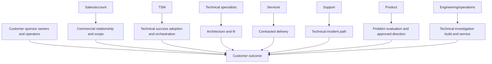

### Role-boundary test

Before accepting a task, ask:

1. What exact outcome or decision is needed?
2. Is this technical guidance, implementation, incident Support, product feedback, engineering investigation, commercial scope, customer governance, or risk acceptance?
3. Which role has authority and current evidence?
4. What can the TSM own: clarification, orchestration, evidence, adoption, communication, or follow-through?
5. What must be handed off with acceptance?
6. Which customer-facing statement is safe now?

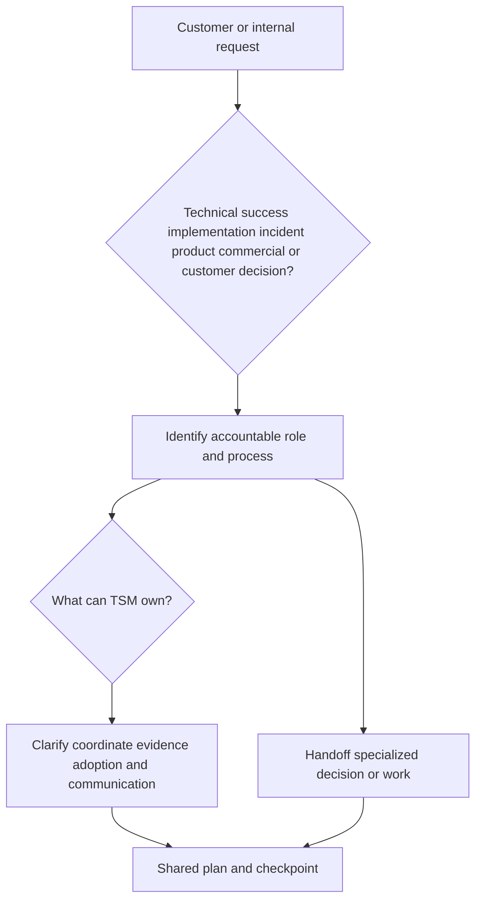

## One shared customer plan

Cross-functional work needs one account-level plan connecting outcomes, technical success, commercial milestones, support risks, product feedback, services delivery, adoption, and decisions. This does not mean every internal confidential detail is customer-visible. It means customer-facing facts and dependencies reconcile.

| Plan view | Content | Owner collaboration |
|---|---|---|
| Customer outcome | Goal, population, acceptance, evidence, residual | Customer owner and TSM/account team |
| Technical success | Prerequisites, milestones, adoption, health, risks | TSM, customer technical roles, specialists/services |
| Commercial | Verified products/services, terms path, lifecycle dates | Sales/account/procurement |
| Support | Open issues, impact, mitigation, case status, dependencies | Customer case owner, Support, TSM |
| Product feedback | Requirement, impact, evidence, alternatives, status | TSM/specialist, Product path |
| Delivery/services | Scoped deliverables, acceptance, dependencies | Services and customer |
| Executive governance | Decisions, options, owners, cadence | Sponsor/outcome owner/account team |

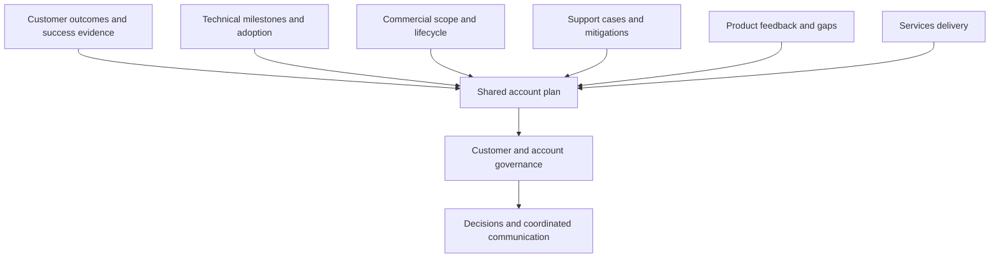

### Single source versus systems of record

One shared plan does not erase specialized systems. The contract/order system remains authoritative for commercial terms. Support case system remains authoritative for case activity. Product system remains authoritative for internal feedback status. Customer change system remains authoritative for production approval. The shared plan links summarized states and owners without copying sensitive data or redefining authority.

| Information | Authoritative system/role hypothesis | Shared-plan representation |
|---|---|---|
| Contract/entitlement | Commercial records and authorized owner | Verified scope reference and owner |
| Technical configuration | Customer/product-native evidence | Bounded current state and link |
| Support investigation | Support case | Impact, status, mitigation, next checkpoint |
| Product feedback | Product feedback process | Requirement, status wording approved for account |
| Customer change | Customer change record | Dependency and decision result |
| Success evidence | Customer-approved metric/evidence sources | Outcome status and confidence |
| Roadmap communication | Authorized product/account source | Exact approved statement/date/audience |

## Handoffs that preserve context

A handoff is complete when the receiving role understands and accepts the purpose, facts, scope, expected output, priority basis, owner, and next checkpoint. Adding someone to a thread is notification, not transfer.

### Handoff contract

| Field | Question |
|---|---|
| Purpose | Why is this being transferred? |
| Customer outcome/impact | Which service, workflow, risk, or decision is affected? |
| Scope | Which tenant, product, version, population, time, and exclusions? |
| Facts/evidence | What is directly observed and reproducible? |
| Assumptions/unknowns | What is not established? |
| Work completed | Which tests, mitigations, and decisions already occurred? |
| Requested output | Diagnose, validate, design, decide, price, prioritize, communicate? |
| Authority | Which role owns the requested output? |
| Sensitivity | What may be shared, where, and for how long? |
| Acceptance | Who acknowledges ownership and by when? |
| Customer message | What can be said now, by whom? |
| Checkpoint | When will status or decision return? |

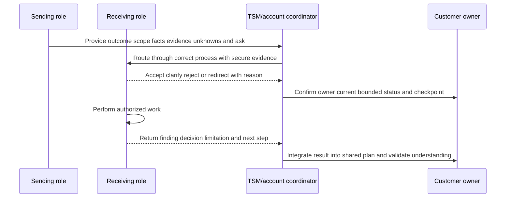

### Handoff quality

| Weak handoff | Failure | Better handoff |
|---|---|---|
| "Please help this important customer" | No technical ask or evidence | Impact, scope, reproduction, evidence, requested discriminating check |
| Forward a long email thread | Context and current truth ambiguous | Structured summary with linked source records |
| "Engineering is looking" | Owner, issue, status, and checkpoint unknown | Authorized lane, exact current state, next evidence/checkpoint |
| "Sales promised it" | Unverified and adversarial | Quote source, scope, authority, requirement, and reconciliation owner |
| "Support said product bug" | May be hypothesis or paraphrase | Case-recorded classification and exact wording |
| Add Product to customer call | Exposes unprepared internal process | Align purpose, authority, message, and questions first |

### Plain-English deep-dive 2 - A handoff has two acknowledgements

When a relay runner extends the baton, the next runner must actually receive it. In account work, two acknowledgements matter. The receiving internal owner accepts the work and its requested output. The customer or account coordinator understands who now owns what and when the next update arrives.

Without internal acceptance, work can disappear into a queue. Without customer-facing acknowledgment, the customer experiences silence and repeats context to multiple teams. The TSM should track both without pretending to control the specialist's decision.

Good handoffs also preserve uncertainty. If evidence supports "issue reproduces after schema version change" but not "product defect," the handoff must say exactly that. Pressure to simplify should not harden a hypothesis into a diagnosis.

## Sales and commercial partnership

Sales and TSM should share customer goals and risks while respecting different accountabilities. Sales brings commercial context, account strategy, purchase process, and executive relationships. The TSM brings technical success, adoption, evidence, and proactive technical risk. Neither should surprise the other.

### Technical-commercial boundary

| Question | Technical lane | Commercial lane | Shared responsibility |
|---|---|---|---|
| Can capability address requirement? | Current docs, specialist, tests | Informed | Requirement and customer context |
| Is capability purchased/available? | Technical prerequisite input | Contract/order/entitlement authority | Reconcile exact scope |
| Who implements? | Delivery model and technical need | Services/contract scope | Explicit RACI |
| What is customer value? | Outcome evidence and attribution | Commercial/account context | Customer acceptance |
| What is timeline? | Dependency-based technical forecast | Commercial milestones/commitments | One reconciled message |
| What is future product direction? | Current capability and technical need | Approved account communication | Product-authorized roadmap language |
| What belongs in renewal/QBR? | Adoption, health, outcome, risks | Relationship and commercial lifecycle | Evidence-first narrative |

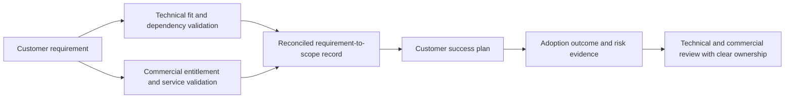

### Pre-meeting alignment

Before a strategic customer meeting, align on objective, participants, known facts, unknowns, likely questions, role by topic, commercial and technical boundaries, sensitive information, desired decisions, and follow-up owner. Do not script false certainty.

| Topic | Sales/account role | TSM/technical role |
|---|---|---|
| Relationship context | Lead as organized | Contribute technical history |
| Customer outcome | Co-own understanding | Translate into technical success |
| Contract/entitlement | Accountable commercial path | State technical requirement, do not infer |
| Architecture/capability | Listen and support | Lead or route to specialist |
| Adoption/value evidence | Use in account narrative | Define integrity and limitations |
| Support issue | Understand impact | Coordinate evidence and case lane |
| Product request | Understand strategic importance | Capture requirement and product path |
| Roadmap | Use approved messaging | Avoid independent commitments |
| Next decisions | Confirm relationship/commercial actions | Confirm technical/customer actions |

### Renewal and expansion integrity

Technical success evidence can inform commercial conversations, but it should not be manipulated. Distinguish availability, use, quality, workflow effect, risk/business contribution, satisfaction, and future opportunity. Report weak adoption or unresolved issues even when timing is commercially sensitive. Coordinate timing and remediation; do not change facts.

## Support partnership and escalation

Support cases work best when they contain a bounded symptom, environment, expected versus observed behavior, impact, timeline, reproduction, changes, evidence, and requested help. The TSM integrates the case into the customer's success/risk plan but should not replace Support investigation.

### Issue classification before routing

| Condition | Likely lane | Verification |
|---|---|---|
| Product/service behavior differs from current supported expectation | Support | Reproduction and current documentation |
| Customer configuration/design question | TSM/specialist/services, sometimes Support | Scope and delivery/support model |
| Implementation task | Services/customer technical owner | Contract and RACI |
| Data/source outside product | Customer/third-party owner, coordinated | First bad boundary evidence |
| Adoption/workflow issue | TSM/customer process owner | Eligible-use and barrier evidence |
| Entitlement/services question | Sales/account/commercial | Authorized record |
| Unmet capability requirement | Product feedback path | Current capability verification |
| Security/privacy incident | Formal security/privacy incident path | Policy and authorized routing |

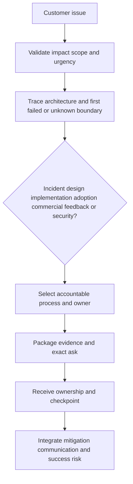

### Support evidence packet

| Field | Content |
|---|---|
| Case objective | Exact behavior or diagnostic question |
| Customer impact | Affected service/users/workflow and severity basis |
| Scope | Tenant, product, version, policy, region, time, population |
| Expected | Current documented or agreed behavior with source |
| Observed | Direct evidence, error, output, frequency, boundaries |
| Reproduction | Minimum steps, positive/negative/control cases |
| Timeline | UTC events, changes, last known good, first known bad |
| Architecture | Relevant path and third parties |
| Evidence | Correlation IDs, logs/traces/screens under approved handling |
| Troubleshooting | Tests and results, not just actions attempted |
| Mitigation | Current workaround, effect, risk, reversibility |
| Ask | Specific check, clarification, diagnosis, or escalation |
| Contacts/cadence | Technical owner, communicator, next update |

### Severity and business impact

Use current support terms and customer contract; do not invent severity definitions or response times. The TSM can explain impact accurately and request appropriate review. Artificially inflating severity harms trust and queue integrity. If impact changes, update evidence.

### Case communication

Separate four states:

1. **Customer impact state:** What users/services/workflows experience.
2. **Technical investigation state:** Facts, hypotheses, tests, and owner.
3. **Mitigation state:** Available, applied, effective, risky, reversible.
4. **Resolution state:** Fix or correction, validation, closure, residual.

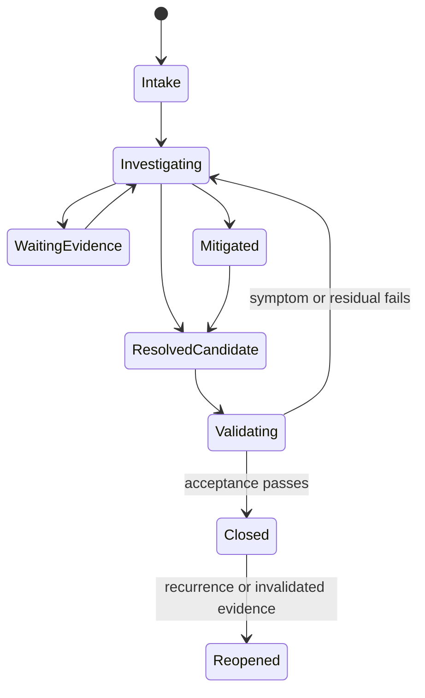

### Escalation without bypass

Escalation should add impact, evidence, required expertise, or decision authority. It should not merely add executives. State what normal process cannot currently resolve, what is requested, and what evidence supports urgency. Preserve a single technical case owner where the process requires.

## Product Management and Engineering partnership

Two paths often get confused: a **suspected defect** concerns behavior that may differ from intended/supportable behavior; a **product gap/request** concerns a desired behavior not established as available. Support or product processes determine classification.

### Defect versus request versus misunderstanding

| Observation | Possible class | Required evidence |
|---|---|---|
| Documented behavior fails reproducibly | Suspected defect | Version, scope, reproduction, controls, logs |
| Behavior works but does not meet customer need | Requirement/product gap | Actor, workflow, impact, alternatives, frequency |
| Feature exists but is configured incorrectly | Configuration/design issue | Current docs, configuration, test |
| Capability exists but is not purchased/enabled | Commercial/entitlement issue | Authorized product and contract evidence |
| Documentation is ambiguous | Documentation feedback | Exact passage, interpretations, test result |
| Outcome fails despite component working | Workflow/adoption/integration issue | End-to-end evidence |

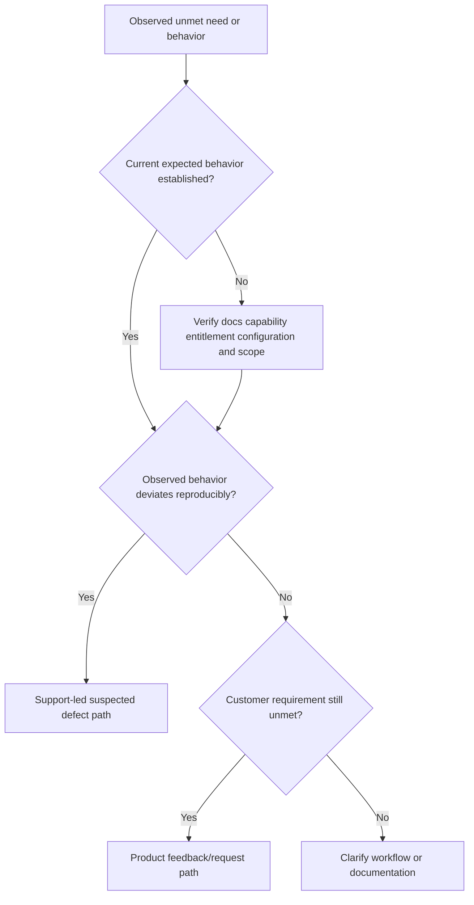

### Product feedback quality

Product feedback should describe the customer problem before proposing a button or feature.

| Field | Question |
|---|---|
| Actor | Which role performs or decides? |
| Outcome | What must they accomplish? |
| Current workflow | How is it done now? |
| Friction/risk | What fails, costs time, or creates exposure? |
| Scope/frequency | How often and for which populations? |
| Evidence | Samples, trends, cases, customer statements, confidence? |
| Existing capability | What has been verified and why insufficient? |
| Workarounds/alternatives | What can be done now and at what cost/risk? |
| Security/privacy | Which abuse, access, data, or compliance concerns apply? |
| Business/account context | Why material, without inflating? |
| Acceptance | What observable behavior would satisfy the need? |
| Generality | Is problem reusable beyond one implementation? |

### Engineering investigation quality

Engineering needs a minimal reproducible case and discriminating evidence, not a customer history dump. Preserve exact version/build, configuration, topology, input, expected/observed, frequency, first/last occurrence, changes, controls, correlation IDs, dumps/logs/traces, and privacy handling. If reproduction is impossible, provide occurrence pattern and strongest boundary evidence.

### Plain-English deep-dive 3 - A valid feature request can still have no promised date

Product teams balance customer need, strategy, security, architecture, reliability, regulatory concerns, implementation cost, support burden, dependencies, and opportunity cost. Strong evidence improves understanding; it does not create release authority.

The TSM should not weaken a request to avoid disappointment, and should not imply commitment to preserve enthusiasm. Good language is: "The requirement and impact have been recorded through the product process. Current generally available capability does not yet establish the requested behavior in the verified scope. I do not have an approved commitment or date to share. The current options are A and B, with these tradeoffs. We will update the account plan if authorized product information changes."

That answer respects the customer and Product. It also keeps pressure on present options rather than making the success plan depend on an uncertain future feature.

## Roadmap language and future capability

Roadmap communication must follow current company policy, authorization, audience restrictions, and approved source. Public statements, confidential roadmap briefings, directional exploration, planned work, committed contractual deliverables, and released capability are different states.

### Safe status taxonomy

| Status | Meaning | Customer language boundary |
|---|---|---|
| Current documented capability | Available under current verified conditions | State exact scope and entitlement verification |
| Current limitation/gap | Requirement not established in current verified capability | State evidence and alternatives |
| Feedback submitted | Need entered into approved process | No prioritization or date implied |
| Under consideration | Product evaluates need, if authorized to share | No plan or commitment implied |
| Directional/roadmap item | Approved future direction under policy | Subject to change; scope/date conditions explicit |
| Planned target | Internal/approved planning state if shareable | Estimate, not guarantee; use exact approved wording |
| Committed deliverable | Authorized commitment under defined agreement | Only designated role/source may communicate |
| Released | Current production release documented | Verify edition, region, tenant, prerequisites, support |

Never invent internal statuses. Use the actual approved taxonomy and statement.

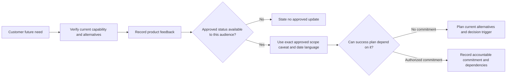

### Roadmap response patterns

| Customer question | Responsible response |
|---|---|
| "Will this ship next quarter?" | "I do not have an approved commitment to state. I will verify whether any authorized update exists; meanwhile we should plan against current capability." |
| "Sales said it was coming." | "Let us identify the exact statement, audience, source, and conditions and reconcile it with the authorized product/account owner." |
| "Can you guarantee this for renewal?" | "Only authorized contractual roles can make commitments. I can document the technical requirement, current gap, alternatives, and dependency." |
| "Competitor has it." | "Let us validate the workflow requirement, security and operational conditions, and evidence rather than compare labels alone." |
| "Product told us it is planned." | "We should preserve the exact approved wording and date; planned does not necessarily mean committed or generally available." |

## Decision rights across account-team work

| Decision | Recommend/input | Decide/authorize | Perform | Validate/accept |
|---|---|---|---|---|
| Customer technical architecture | TSM/specialists/services/customer experts | Customer design/change authority | Customer/services by scope | Customer technical owner |
| Success outcome and residual | TSM/account team advises | Customer outcome/risk authority | Customer/provider shared actions | Customer acceptor |
| Commercial entitlement/terms | Technical requirement informs | Authorized account/procurement/legal roles | Commercial operations | Contract/order evidence |
| Support diagnosis/severity/process | Customer/TSM provide evidence | Support process and authorized owners | Support/customer technical roles | Case resolution acceptance |
| Product defect classification | Support/Engineering evidence | Authorized Support/Product/Engineering process | Engineering as assigned | Tests and release/support evidence |
| Product prioritization | Customer/account feedback informs | Product authority | Product/Engineering | Product process |
| Roadmap communication | Product/account input | Authorized spokesperson/process | Account role | Approved statement |
| Production change | Provider technical advice | Customer change/risk authority | Customer/services | Customer validation |

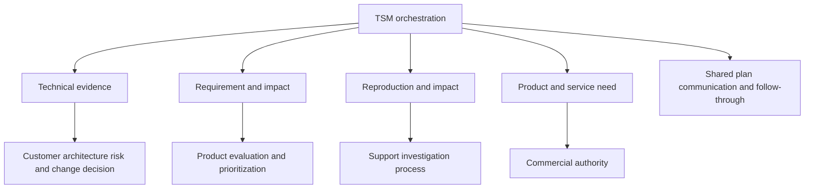

## Conflict prevention inside the account team

Conflict is expected because functions optimize different responsibilities. Prevent harmful conflict through an operating agreement, source-of-truth map, pre-meeting alignment, decision rights, and correction protocol.

| Function | Legitimate optimization | Common collision |
|---|---|---|
| Sales | Relationship, growth, commercial timing | Technical uncertainty or adoption risk |
| TSM | Technical outcomes, adoption, proactive risk | Asked to own implementation/support/commercial work |
| Services | Scoped delivery and acceptance | Unfunded expansion or customer readiness |
| Support | Case diagnosis, severity process, resolution | Account pressure for ETA/defect declaration |
| Product | Strategic prioritization and reusable value | One account's urgency |
| Engineering | Correctness, reliability, security, maintainability | Customer timeline and sparse evidence |
| Customer | Business outcome, safety, budget, authority | Provider internal boundaries |

### Operating agreement topics

1. Customer outcome and success source.
2. Role definitions and decision rights.
3. Technical-versus-commercial boundary.
4. Handoff acceptance and response expectations.
5. Support entry and escalation criteria.
6. Product feedback and roadmap language.
7. Shared plan and systems of record.
8. Customer communication owner by topic.
9. Pre-meeting alignment for material discussions.
10. Conflict resolution and executive escalation.
11. Security/privacy and sensitive-information handling.
12. Correction and learning after mistakes.

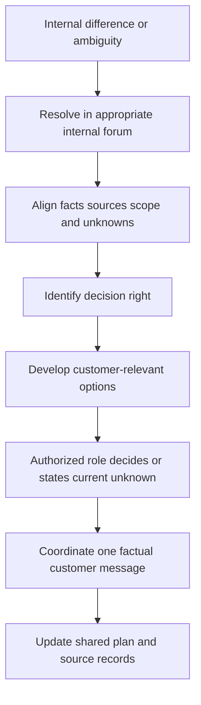

### Conflict-resolution rules

| Rule | Behavior |
|---|---|
| Customer outcome first | Describe how disagreement affects customer's decision, not team status |
| Evidence before hierarchy | Compare source, scope, time, and authority |
| Private internal debate | Do not ask customer to mediate provider ambiguity |
| No hidden material risk | Internal alignment cannot erase a customer-relevant limitation |
| Right owner decides | TSM facilitates and records; authority remains explicit |
| Disagree and commit carefully | Execute authorized decision while recording safety/ethical concerns through proper path |
| Correct quickly | State wrong claim, correction, impact, action, prevention |
| Learn systemically | Improve handoff, review, source, or trigger instead of blaming person |

## Customer communication and executive summaries

The customer should understand who owns the next action without seeing a confusing provider org chart. Use role labels and outcomes: "Support owns product-incident diagnosis under case X; the customer network owner is validating path Y; the TSM owns coordination, mitigation/adoption impact, and the next account update."

### Account-level executive summary

| Element | Content |
|---|---|
| Outcome | Customer goal and acceptance evidence |
| Current state | Technical, adoption, support, product gap, commercial dependencies |
| Integrity | Facts, sources, scope, confidence, unknowns |
| Impact | Service, workflow, risk, timeline, or value consequence |
| Owners | Customer and provider lanes |
| Options | Current feasible choices and tradeoffs |
| Decision | Exact authorized role and due point |
| Roadmap | Approved wording only; do not plan on uncommitted work |
| Residual | Remaining limitation and next trigger |

| Weak wording | Stronger wording |
|---|---|
| "Engineering is fixing it." | "Support has accepted the reproducible issue and is coordinating the appropriate technical investigation. No fix or date is established; mitigation X remains under customer validation." |
| "Product will add the feature." | "The requirement is recorded through the product process. No approved commitment is available; current options are A and B." |
| "Customer needs to buy more." | "The desired scope is not yet verified within current entitlement. The commercial owner is confirming options; the technical plan remains bounded to verified scope." |
| "Support is slow." | "The case is waiting on a discriminating trace from the affected window; customer and TSM owners are coordinating collection by the next checkpoint." |
| "Sales overpromised." | "A prior statement and current evidence are inconsistent. The account and product authorities are reconciling exact scope and will issue a corrected response." |

## Product feedback, incident, and account loops

A mature account team converts individual issues into learning without misusing customer data.

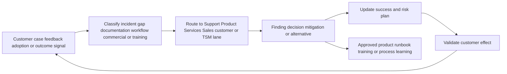

| Signal | Local action | Scalable learning | Boundary |
|---|---|---|---|
| Repeated case pattern | Improve evidence/runbook and route diagnosis | Support knowledge/process review | Do not infer defect count without data |
| Repeated feature need | Product feedback with common job/problem | Product discovery input | No roadmap promise |
| Adoption barrier | Repair workflow/training/fit | Reusable enablement pattern | No blame or forced use |
| Commercial confusion | Correct scope/handoff | Account process improvement | Protect contract confidentiality |
| Data-quality issue | Fix source/contract and monitor | Integration test/runbook | No customer data reuse without approval |
| Successful mitigation | Validate bounded effect | Pattern with caveats | One case is not universal proof |

### Knowledge transfer

Document symptom, environment, discriminating evidence, root cause only if established, mitigation, validation, limitations, privacy handling, and applicability. Separate customer-specific confidential details from generalized learning. Review knowledge when product behavior changes.

## Security, privacy, and legal boundaries

Cross-functional collaboration increases information movement. Share only what each process needs.

| Risk | Control |
|---|---|
| Sensitive logs copied into account chat | Use approved Support transfer and redact/minimize |
| Customer identity shared with Product unnecessarily | Provide aggregated problem first; obtain approved details if needed |
| Secrets embedded in traces | Scan, redact, revoke if exposed, follow incident policy |
| Cross-customer examples reveal confidential data | Generalize and obtain authorization |
| Roadmap information shared beyond audience | Follow classification, NDA, and authorized channel |
| Contract terms discussed by unauthorized role | Route to commercial/legal authority |
| Security issue treated as normal feature request | Use formal security disclosure/incident path |
| Internal blame notes become discoverable customer record | Use factual professional language |

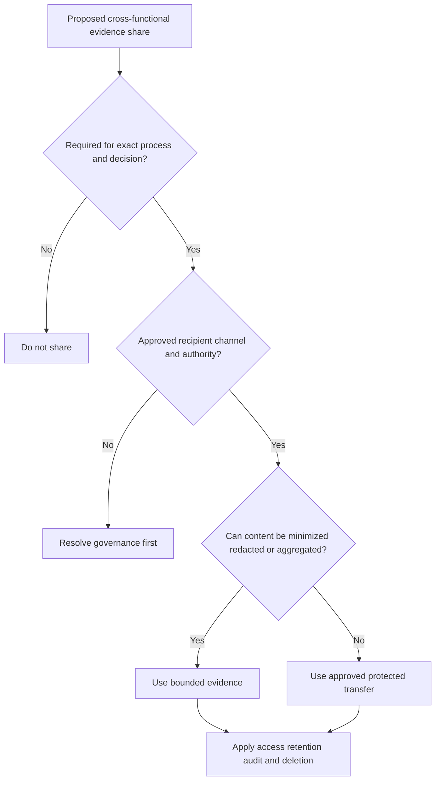

### Plain-English deep-dive 4 - Escalation quality beats escalation volume

Adding more senior people can make an issue appear important, but it does not tell Engineering which code path failed, Support which test to run, Product which user problem matters, or the customer which mitigation is safe. Escalation without evidence consumes attention and can create defensive behavior.

High-quality escalation combines business impact and technical discrimination. It states what is affected, what is expected, what is observed, how often, under which scope, what changed, what has been tested, which mitigation exists, what remains unknown, and the exact help or decision needed. It also sets a communication checkpoint without fabricating a fix ETA.

Executive sponsorship is valuable when a resource, priority, or authority decision is needed. It should not be used to skip security, quality, or product processes. Strong account teams know when to elevate and what elevation is supposed to change.

## Failure modes and misconceptions

| Failure or misconception | Why it fails | Better practice |
|---|---|---|
| "One team means anyone can answer" | Authority and evidence differ | Shared outcome with explicit owners |
| "TSM owns every customer issue" | Creates overload and unsafe commitments | TSM orchestrates and owns defined success work |
| "Sales owns customer truth" | Commercial context does not establish technical behavior | Reconcile role-specific sources |
| "Support owns adoption" | Case process is not workflow change | TSM/customer process owner handles adoption |
| "Engineering escalation guarantees fix" | Investigation may reject hypothesis or need more evidence | State process, evidence, and unknown |
| "Feature request means roadmap item" | Feedback is input, not prioritization | Use approved status only |
| "Planned means committed" | Plans change and may be restricted | Exact taxonomy and authority |
| "Purchased means technically suitable" | Entitlement does not prove fit | Verify requirements and tenant behavior |
| "Technically possible means entitled" | Capability does not prove contract scope | Commercial verification |
| "Forwarding email is handoff" | No acceptance or current summary | Handoff contract and checkpoint |
| "Customer should hear internal debate" | Outsources provider coordination | Resolve internally, share material facts/options |
| "One voice means hide disagreement" | Can conceal risk | One honest fact pattern with uncertainty |
| "Severity should reflect account size" | Distorts support process | Use impact and current terms |
| "Roadmap closes an onboarding gap" | Uncommitted future cannot be foundation | Plan current alternatives |
| "Executive escalation replaces evidence" | Authority cannot diagnose mechanism | Impact plus discriminating evidence |

## Troubleshooting cross-functional failures

| Symptom | Plausible cause | Discriminating check | Recovery |
|---|---|---|---|
| Customer hears two answers | No source owner, pre-alignment, or correction protocol | Compare exact claims, sources, scope, dates | Issue one corrected response |
| TSM becomes bottleneck | Role ambiguity, trust, missing specialist access | Classify open work by lane and authority | Reassign with accepted handoffs |
| Support case stalls | Weak evidence, waiting customer, wrong lane, unclear ask | Review latest case state and first unknown boundary | Repair packet/checkpoint |
| Product request disappears | No formal process, poor problem statement, no owner | Confirm record, status authority, and feedback owner | Resubmit/close transparently |
| Sales/technical conflict | Different outcome, evidence, or timing | Align customer goal, commitment source, current facts | Decision owner reconciles |
| Services scope expands silently | Handoff or contract ambiguity | Compare deliverable and change request | Rebaseline/route commercial path |
| Engineering asks for more logs repeatedly | Reproduction scope unclear or wrong collection | Clarify hypothesis and discriminating event | Target evidence safely |
| Roadmap dominates plan | Current alternatives not developed | Mark dependencies by commitment status | Remove uncommitted critical path |
| Executive update surprises specialist | Communication owner skipped review | Audit pre-read and source | Correct and repair process |
| Customer repeats context | Handoff lacks accepted summary | Ask receiving owner to read back | Publish reusable case/account brief |

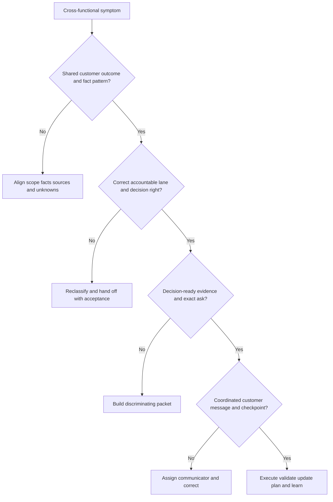

## Decision trees

### Decision tree 1 - Which internal lane owns the next step?

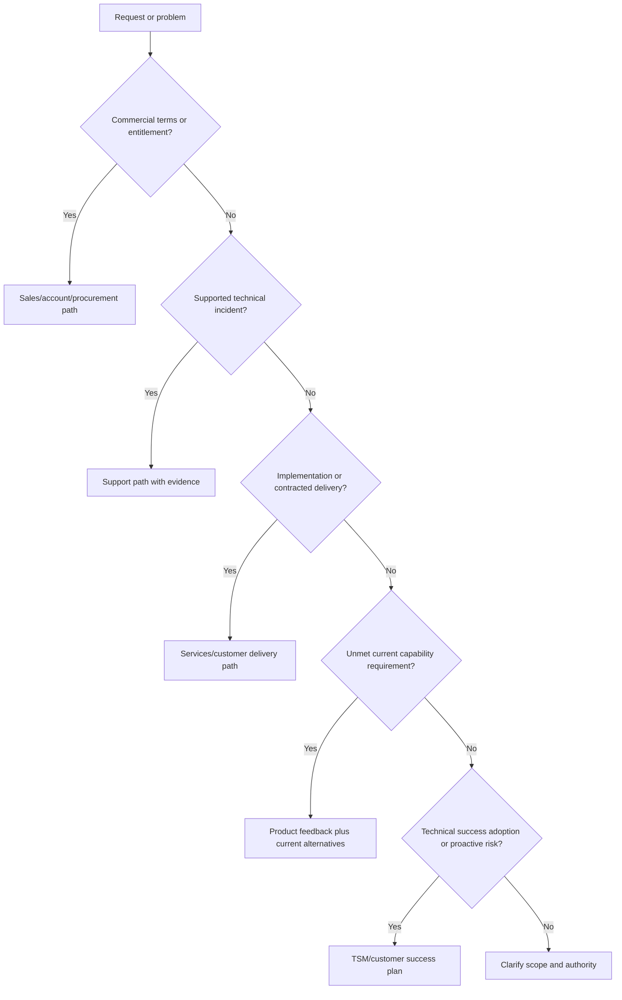

### Decision tree 2 - What may be said about roadmap?

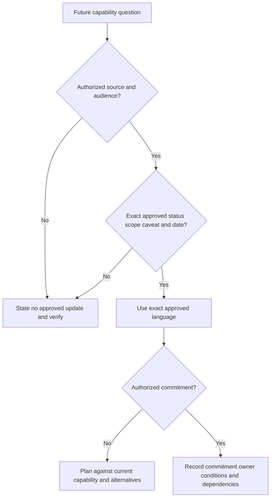

### Decision tree 3 - Should an issue be escalated?

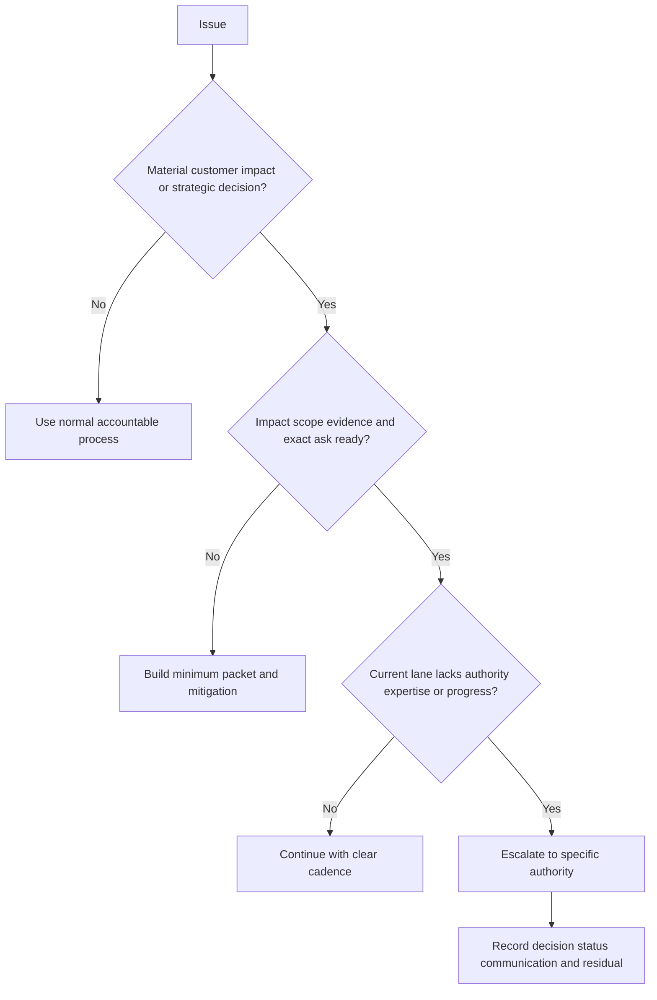

## Explicitly fictional and synthetic NMH scenarios

All content in this section is fictional and synthetic. It is practice material, not a customer account, Support case, defect, roadmap, contract, entitlement, product result, or Zscaler internal process. Dates in this section, including **2026-10-06**, **2026-10-20**, **2026-11-03**, and **2026-11-17**, are synthetic scenario dates later than the source snapshot and do not imply later research.

### Scenario 1 - The commercial and technical mismatch

On synthetic 2026-10-06, NMH's fictional sponsor expects a source integration in the first phase. The technical team has not established current support, and the account record has not established entitlement. The TSM separates the questions: a specialist verifies current technical requirements; the account owner verifies commercial scope; the customer chooses whether to narrow, wait, or use an alternative. No affirmative product or entitlement claim is made.

### Scenario 2 - The suspected defect

On synthetic 2026-10-20, a fictional workflow produces duplicate records after a configuration change. The TSM does not announce a product defect. The team captures source IDs, time, expected/observed behavior, controls, architecture, changes, and reconciliation. Support owns the incident path; the customer integration owner validates source behavior; the TSM owns impact coordination and plan risk. Classification remains unknown until the authorized process establishes it.

### Scenario 3 - The roadmap request

On synthetic 2026-11-03, NMH's fictional executive asks for a release date for a desired workflow. The TSM has no approved update. The response records the user problem, current limitation, alternatives, and product feedback; it does not promise a date. The success plan uses a current feasible workaround and a future decision trigger rather than depending on uncommitted work.

### Scenario 4 - Internal disagreement reaches the customer

On synthetic 2026-11-17, fictional Sales describes a milestone as ready while Services reports unmet prerequisites and Support tracks a related issue. The account team pauses the milestone claim, aligns exact evidence and authority, offers two customer options, and issues a correction. Every later date here remains fictional and synthetic; no real customer recovery is claimed.

## Reusable artifact kit

These templates must be adapted to current organizational processes, contracts, policy, and product evidence.

### Artifact 1 - Account-team operating agreement

| Topic | Agreement template |
|---|---|
| Customer outcome | Approved source, owner, acceptance, evidence |
| Shared plan | Location, editor, systems-of-record links, review cadence |
| Sales/account role | Commercial relationship, scope, lifecycle, customer alignment |
| TSM role | Technical success, adoption, risk, orchestration, communication |
| Specialist/services role | Technical fit/design and contracted delivery boundaries |
| Support role | Case entry, evidence, severity process, escalation, closure |
| Product/Engineering role | Feedback, defect, investigation, approved status |
| Customer roles | Architecture, change, risk, evidence, acceptance |
| Technical/commercial boundary | Verification paths and no-assumption rule |
| Handoff | Required fields, acceptance, checkpoint |
| Roadmap language | Authorized source, audience, exact wording, no promises |
| Customer communication | Owner by topic, review triggers, correction protocol |
| Conflict | Internal forum, evidence, decision right, escalation |
| Security/privacy | Approved data routes, minimization, retention |

### Artifact 2 - Account-team role and decision matrix

| Work/decision | Customer | Sales/account | TSM | Specialist/services | Support | Product | Engineering/ops | Source of authority |
|---|---|---|---|---|---|---|---|---|
| Define/accept outcome | A/R | C | R/facilitate | C | I | I | I | Customer governance |
| Verify technical fit | C/A architecture | I | R/coordinate | A/R as organized | C | C | C | Current docs/tests |
| Confirm entitlement | C | A/R | I | C | I | I | I | Contract/order record |
| Implement scoped work | A/C | I | C | R by scope | C | I | I | Contract/RACI/change |
| Diagnose incident | R evidence | I | C/coordinate | C | A/R process | C | R as assigned | Support process |
| Prioritize product | C input | C | R feedback | C | C | A | R as organized | Product governance |
| Approve customer change/risk | A/R | I | C | C/R | C | I | I | Customer policy |
| Communicate roadmap | I | A/R approved path | C | C | I | A source | C | Company policy |

### Artifact 3 - Cross-functional handoff brief

| Field | Entry |
|---|---|
| Handoff from/to | |
| Customer outcome and impact | |
| Request/classification | Incident, design, services, product, commercial, security |
| Scope and exclusions | |
| Facts and sources | |
| Assumptions/unknowns | |
| Timeline and changes | |
| Work/tests completed | |
| Mitigation and residual | |
| Exact requested output | |
| Secure evidence links | |
| Receiver acceptance | Owner/date |
| Customer message/owner | |
| Next checkpoint | |

### Artifact 4 - Support escalation packet

| Section | Required content |
|---|---|
| Impact | Service/users/workflow/severity basis |
| Environment | Product/version/tenant/region/config/path as authorized |
| Expected/observed | Sources and exact behavior |
| Reproduction | Minimum steps and controls |
| Timeline | UTC, last good, first bad, changes |
| Evidence | IDs, logs, traces, errors, samples, handling |
| Troubleshooting | Hypothesis, check, result |
| Mitigation | Applied/effect/risk/rollback |
| Ask | Exact diagnostic or escalation need |
| Owners/cadence | Case, customer, TSM communication, checkpoint |

### Artifact 5 - Product feedback record

| Field | Entry |
|---|---|
| Actor and job | |
| Desired outcome | |
| Current workflow | |
| Problem/friction/risk | |
| Scope/frequency | |
| Evidence/confidence | |
| Current capability verified | |
| Gap/limitation | |
| Workarounds and tradeoffs | |
| Security/privacy/operations | |
| Acceptance behavior | |
| Account context | |
| Product record/owner | |
| Customer-safe status | |

### Artifact 6 - Roadmap communication record

| Field | Entry |
|---|---|
| Customer question/requirement | |
| Current capability and source | |
| Approved future status | Exact wording or no approved update |
| Source/date/audience | |
| Scope/caveats/dependencies | |
| Commitment status | None, directional, planned, authorized commitment |
| Current alternatives | |
| Success-plan treatment | Do not depend unless authorized commitment |
| Communicator | |
| Next trigger/checkpoint | |

### Artifact 7 - Shared account plan

| Outcome/workstream | Customer owner | Provider owner/lane | Current facts/evidence | Milestone/acceptance | Dependencies | Risk/issue | Decision | Forecast/confidence | Next checkpoint |
|---|---|---|---|---|---|---|---|---|---|
| | | | | | | | | | |

### Artifact 8 - Executive account summary

> **Customer outcome:** [Goal, population, acceptance].
>
> **What changed:** [Evidence, scope, confidence].
>
> **Cross-functional state:** [Technical success, adoption, Support, Product, services, commercial].
>
> **Impact:** [Customer consequence].
>
> **Current owners:** [Customer/provider lanes].
>
> **Options and tradeoffs:** [Current feasible paths].
>
> **Decision needed:** [Authorized role/date].
>
> **Roadmap boundary:** [Exact approved statement or no approved update].
>
> **Residual and checkpoint:** [Remaining risk and next evidence].

### Artifact 9 - Internal pre-meeting alignment

| Item | Alignment |
|---|---|
| Customer meeting outcome | |
| Participants and roles | |
| Fact pattern/source date | |
| Unknowns and likely questions | |
| Technical lead/topics | |
| Commercial lead/topics | |
| Support/Product status exact wording | |
| Roadmap boundary | |
| Sensitive information | |
| Desired decisions | |
| Follow-up owner | |
| Correction/escalation plan | |

### Artifact 10 - Conflict and correction record

| Field | Prompt |
|---|---|
| Conflicting statements/positions | Quote exact bounded claim |
| Sources/scope/date/authority | Why do they differ? |
| Customer impact | Which decision or trust is affected? |
| Shared outcome | What must remain central? |
| Options | Reconcile, test, correct, defer, escalate |
| Decision right | Who resolves? |
| Corrected customer message | Facts, unknowns, action, checkpoint |
| Process prevention | Handoff, review, source, role, training |
| Residual | What remains unresolved? |

### Artifact 11 - Objection and failure scenario card

| Scenario | Evidence | Account-team lane | Boundary statement | Options | Decision owner | Customer message | Validation/residual |
|---|---|---|---|---|---|---|---|
| "You promised this feature" | | Product/account | | | | | |
| "Support is not fixing it" | | Support/TSM | | | | | |
| "Why is this not included?" | | Commercial | | | | | |
| "Engineering must join now" | | Support/Engineering | | | | | |
| "The project is green" conflict | | Shared plan/governance | | | | | |

## Exercises

### Exercise 1 - Classify fifty tasks

Create fifty synthetic account tasks and classify each as customer, Sales/account, TSM, specialist, services, Support, Product, Engineering/operations, security/privacy/legal, or shared. For ten ambiguous tasks, write the exact decision question and authority needed. Check whether TSM became the default owner.

### Exercise 2 - Build a handoff

Turn a fictional three-page email thread into a one-page handoff: outcome, impact, scope, facts, unknowns, timeline, tests, mitigation, exact ask, evidence links, receiver acceptance, customer message, and checkpoint. Remove gossip and unnecessary sensitive content.

### Exercise 3 - Defect or feature request

Create three synthetic cases: reproducible documented behavior failure, desired unsupported workflow, and configuration misunderstanding. Build the discriminating evidence and route each correctly. Keep classification provisional until the authorized process decides.

### Exercise 4 - Roadmap pressure

Role-play a customer asking for a guaranteed quarter. Give a response with current capability, no-approved-update language, requirement/impact record, alternatives, account/product routing, and next trigger. Then role-play an authorized commitment and explain what additional evidence and owner are required.

### Exercise 5 - Resolve internal conflict

Sales says value is delivered, TSM says adoption is low, Support has an open case, and Services says scope is complete. Build one fact pattern, identify distinct truths, produce two options, route decisions, and write a customer-safe executive summary without blaming a team.

### Exercise 6 - Candidate honesty answer

Answer: "Tell me about partnering with Sales, Support, Product, and Engineering." Use factual enterprise escalation collaboration, state that Sales/TSM/product roadmap work is adjacent rather than identical, show the synthetic operating agreement, and identify what you would verify at Zscaler.

## Customer discovery questions

1. Which customer outcomes and decisions should unite the account team?
2. Which customer, Sales/account, TSM, specialist, services, Support, Product, Engineering/operations, and governance roles actually exist and what are their decision rights?
3. Which systems are authoritative for contract/entitlement, technical state, support cases, product feedback, customer change, and outcome evidence?
4. What technical-versus-commercial boundary applies to capability, fit, entitlement, services, timeline, value, and roadmap?
5. Which handoff fields, acceptance behavior, communication owner, and checkpoint prevent context loss?
6. Which issue types belong to technical success, implementation, Support, customer/third party, Product feedback, commercial, or security/privacy pathways?
7. What current Support severity, evidence, escalation, communication, and closure process applies under the customer's terms?
8. How are suspected defects distinguished from configuration, documentation, integration, workflow, entitlement, and feature-gap issues?
9. Which product-feedback fields make the customer problem and acceptance reusable without overclaiming priority?
10. Which exact roadmap statuses and statements are approved for which audience, and who may communicate them?
11. Which uncommitted future dependencies must be removed from the critical success path?
12. How will one shared account plan link systems of record without copying sensitive or conflicting data?
13. What pre-meeting alignment, decision-rights, conflict-resolution, and correction protocols apply?
14. How are product, support, commercial, adoption, and technical risks summarized for executives with one fact pattern?
15. Which current Zscaler organizational, technical, entitlement, Support, product, roadmap, and customer facts remain unknown?

## Official Source Anchors

Research/source snapshot and source review date: **2026-08-24**.

The Zscaler sources support dated public portfolio positioning, public support routes, and publicly available corporate context only. NIST sources support general cybersecurity governance, incident response, and zero-trust concepts. They do not establish internal roles, case severity, support level, defect status, product priority, engineering assignment, services scope, entitlement, roadmap commitment, release date, commercial terms, or customer outcome. Current official documentation, contracts, licensed-tenant evidence, approved internal processes, and authorized spokespeople govern production.

| Source | URL | Used for | Boundary |
|---|---|---|---|
| Zscaler Zero Trust Exchange | https://www.zscaler.com/products-and-solutions/zero-trust-exchange-zte | Public platform, identity/context, policy, and zero-trust positioning | No account role, implementation, entitlement, roadmap, or result inferred |
| Zscaler Agentic Security Operations | https://www.zscaler.com/products-and-solutions/security-operations | Public SecOps and workflow positioning | No product internals, support path, agent implementation, or outcome inferred |
| Zscaler Data Fabric for Security | https://www.zscaler.com/products-and-solutions/data-fabric | Public data and workflow positioning | No connector, schema, source, entitlement, or customer state inferred |
| Zscaler Unified Vulnerability Management | https://www.zscaler.com/products-and-solutions/unified-vulnerability-management | Public vulnerability context and prioritization positioning | No source support, product gap, workflow result, or roadmap inferred |
| Zscaler Risk360 | https://www.zscaler.com/products-and-solutions/risk360 | Public contextual cyber-risk positioning | No customer risk result or commercial scope inferred |
| Zscaler Support ticket route | https://help.zscaler.com/submit-ticket | Public support-route context | Current access, severity, SLA, escalation, case handling, and terms require verification |
| Zscaler Investor Relations | https://ir.zscaler.com/ | Public corporate releases and investor information as dated | Public statements are not customer commitment or confidential roadmap |
| NIST Cybersecurity Framework 2.0 | https://www.nist.gov/cyberframework | General Govern and outcome framing | Voluntary and implementation-neutral |
| NIST SP 800-61 Rev. 3 | https://csrc.nist.gov/pubs/sp/800/61/r3/final | General incident response, communication, recovery, and improvement | Does not define vendor Support process |
| NIST SP 800-207 | https://csrc.nist.gov/pubs/sp/800/207/final | General zero-trust concepts | Does not prescribe a vendor product or account model |

## Likely Interview Questions

### Q1. What does strong cross-functional account-team partnership look like?

**Model answer:** It has one customer outcome and fact pattern, explicit customer and provider decision rights, a shared success plan linked to authoritative systems, accepted handoffs, and coordinated communication. Sales owns the commercial path, TSM technical success/adoption/orchestration, specialists and services their scoped technical work, Support incidents, Product product decisions, Engineering assigned technical work, and the customer architecture/change/risk acceptance. Boundaries enable speed because work reaches the right authority.

### Q2. How do you partner with Sales while preserving technical integrity?

**Model answer:** We align before customer meetings on goal, facts, unknowns, roles, likely questions, scope, and follow-up. I provide verified technical fit, dependencies, adoption, issue, and outcome evidence; Sales owns commercial relationship, entitlement, terms, and account process. We reconcile technical capability with purchased scope and never turn opportunity pressure into product, date, value, or roadmap certainty. Material risk is shared early, not hidden for renewal timing.

### Q3. When should a TSM involve Support, and what should the handoff contain?

**Model answer:** When evidence indicates a supported technical incident or a current product-behavior question appropriate for Support. The packet includes impact, scope/environment, current documented expectation, direct observation, minimum reproduction and controls, UTC timeline and changes, architecture, correlation evidence, tests/results, mitigation/risk, exact ask, secure links, owners, and checkpoint. TSM coordinates account impact and success risk; Support owns its diagnostic process and findings.

### Q4. How do you distinguish a defect from a feature request?

**Model answer:** First establish current expected behavior, product/version/scope, entitlement, configuration, and documentation. A reproducible deviation may enter the suspected-defect path through Support; authorized processes determine final classification. If current behavior works as established but does not meet a customer job, document a product need: actor, outcome, workflow, friction, scope, evidence, alternatives, security/operations, and acceptance. Neither path justifies premature Product or Engineering claims.

### Q5. How do you communicate roadmap responsibly?

**Model answer:** I use only the exact status, scope, caveat, source date, audience, and wording authorized by current policy. Feedback submitted, under consideration, directional, planned, committed, and released are different states, and I do not invent taxonomy. Without an approved update, I say so, document the requirement, present current alternatives, and keep uncommitted future work off the critical path. Only authorized roles make contractual commitments.

### Q6. How do you prevent internal conflict from confusing the customer?

**Model answer:** Establish an operating agreement covering roles, systems of record, handoffs, technical/commercial boundaries, support/product paths, roadmap language, communication, security, and correction. Resolve differences internally by comparing exact claims, source, scope, time, and authority; identify the decision owner; then communicate one honest fact pattern with options and unknowns. One voice never means hiding a material limitation. If an error reached the customer, correct it directly and repair the process.

### Q7. What should happen when a critical issue appears near a commercial milestone?

**Model answer:** Preserve technical and commercial integrity. I validate impact, scope, mitigation, evidence, owner, and next checkpoint; route the incident through Support and any required customer path; update success/adoption risk; and give Sales an accurate bounded fact pattern. Commercial timing may change communication urgency but not defect classification, severity, test quality, or facts. Decision owners receive options and residual; nobody promises a fix or suppresses the issue.

### Q8. How does your background transfer honestly to cross-functional partnership?

**Model answer:** As a Microsoft Support Escalation Engineer you worked across customers, support teams, service/product engineers, incident roles, and technical specialists to isolate faults, package traces, coordinate workstreams, communicate impact, validate recovery, and document learning. Those skills transfer strongly to TSM orchestration. Sales partnership, Zscaler Support processes, Product feedback, roadmap communication, commercial scope, and SecOps outcomes remain explicit ramp areas practiced only through synthetic artifacts here.

## 30-Second Memory Hooks

| Concept | Memory hook |
|---|---|
| One team | Shared outcome, distinct authority |
| One voice | Same facts, tailored depth |
| TSM | Own success orchestration, not every lane |
| Sales | Commercial relationship and scope path |
| Services | Contracted delivery, not unlimited implementation |
| Support | Incident evidence and diagnosis path |
| Product | Problem evaluation and prioritization authority |
| Engineering | Discriminating evidence, not executive noise |
| Capability | Technical behavior under conditions |
| Entitlement | Authorized purchased scope |
| Handoff | Context plus ask plus acceptance plus checkpoint |
| Defect | Authorized conclusion, not first hypothesis |
| Feature request | Valid need, not roadmap commitment |
| Roadmap | Exact approved status, audience, caveat, source |
| Planned | Not automatically committed |
| Shared plan | Links authoritative systems; does not replace them |
| Escalation | Add evidence, expertise, resources, or authority |
| Conflict | Resolve source, scope, authority, then message |
| Correction | Wrong claim, right fact, impact, action, prevention |
| Experience bridge | Engineering collaboration transfers; Zscaler claims do not |

## Completion Checklist

- [ ] I can explain the general roles of Sales/account, TSM, specialists, services, Support, Product, Engineering/operations, customer, and governance teams.
- [ ] I can keep one customer outcome and fact pattern while preserving distinct authority.
- [ ] I can distinguish technical capability, customer fit, entitlement, services scope, and commercial terms.
- [ ] I can build a shared account plan linked to authoritative systems of record.
- [ ] I can create and accept a context-rich handoff instead of forwarding a thread.
- [ ] I can route incidents, implementation, adoption, product gaps, commercial questions, and security/privacy issues correctly.
- [ ] I can prepare a support escalation packet with impact and discriminating evidence.
- [ ] I can distinguish suspected defect, configuration issue, documentation issue, workflow problem, entitlement issue, and feature request.
- [ ] I can capture product feedback as a customer problem and acceptance condition without implying priority.
- [ ] I can use approved roadmap language and keep uncommitted work off the critical path.
- [ ] I can define account-team decision rights and prevent TSM overreach.
- [ ] I can resolve internal disagreement before coordinated, honest customer communication.
- [ ] I can protect customer and company information across account, Support, Product, and Engineering lanes.
- [ ] I can use the operating agreement, role matrix, handoff, Support, product, roadmap, shared-plan, executive, pre-meeting, conflict, and objection templates.
- [ ] I can state public Zscaler facts without inventing internal process, entitlement, defect, roadmap, release, or outcome.
- [ ] I can describe your factual collaboration without claiming production Zscaler account-team experience.
- [ ] I can answer Q1-Q8 aloud using neutral, boundary-aware language.

[Next: Part 104 - Risk Findings to Tailored Mitigation Strategy](Part-104-risk-findings-to-mitigation.md)