# Part 104 - Risk Findings to Tailored Mitigation Strategy

> **Audience:** Candidates preparing for a Zscaler Security Operations Technical Success Manager role after enterprise Support Escalation Engineering.

> **Purpose:** Explain how to turn a security or operational risk finding into a customer-specific mitigation strategy using evidence, scope, context, business impact, threat and control paths, options, tradeoffs, dependencies, owners, priority, effort, service-level expectations, validation, exceptions, residual risk, and executive communication.

> **Scope and honesty:** Northstar Meridian Holdings, abbreviated NMH, is an explicitly fictional and synthetic customer used only for study. Every NMH asset, identity, application, vulnerability, finding, source, score, date, metric, SLA, option, owner, decision, action, validation, risk, and result is invented. Your factual background is Microsoft 365, OneDrive, and SharePoint support; networking and trace analysis; SQL and Power BI; enterprise escalations; mentoring; and responsible AI exploration. Production Zscaler, SecOps TSM, vulnerability/exposure management, risk quantification, mitigation ownership, security-control operation, customer risk acceptance, and executive cyber-risk advisory remain learning boundaries.

> **Currency caveat:** Threats, vulnerabilities, exploit evidence, products, architectures, controls, regulations, business priorities, contracts, interfaces, scores, packaging, and entitlements change. The controlled official-source snapshot and source review date for this Part is exactly **2026-08-24**. Current official technical and ordering documentation, licensed-tenant evidence, customer-authoritative asset/identity/application/risk records, source-native findings, threat intelligence, customer policy, control owners, product specialists, Support, and validated tests govern production decisions.

> **Section goal:** Build a beginner-to-interview-ready mitigation method that validates the finding, enriches it with customer-specific exposure and business context, compares credible treatment options, assigns the right owner and service level, sequences dependencies, validates technical and business postconditions, records residual risk, and communicates a recommendation without converting a score, public product claim, or synthetic exercise into customer truth.

This Part is primarily **general security-risk, technical-success, and decision practice**. Reviewed Zscaler public sources support bounded positioning around zero trust, vulnerability aggregation/prioritization, contextual risk visibility, security data, and security operations. They do not establish a customer's finding, exposure, score, business impact, control state, mitigation, SLA, entitlement, recommendation, financial loss, or result.

Every statement belongs to one of five evidence classes. **Official product fact** is a dated public statement supported by an anchor reviewed on 2026-08-24. **General security practice** is a reusable vendor-neutral assessment or treatment method. **Scenario assumption** exists only inside explicitly fictional and synthetic NMH. **Customer fact** requires current customer-authoritative evidence. **Unknown** means available evidence does not establish the answer. A risk score is an analytical output with assumptions, not a self-proving fact.

```mermaid
flowchart LR
    FIND[Raw finding or risk signal] --> VALID[Validate source scope grain time and condition]
    VALID --> CONTEXT[Add asset identity app data threat and control context]
    CONTEXT --> SCEN[Describe plausible adverse scenario and business impact]
    SCEN --> OPTIONS[Develop avoid reduce transfer accept and monitor options]
    OPTIONS --> TRADE[Compare effectiveness effort disruption dependency and uncertainty]
    TRADE --> OWNER[Assign decision action validation and risk owners]
    OWNER --> PLAN[Prioritize sequence set service expectations and implement]
    PLAN --> VERIFY[Read back retest and validate business postconditions]
    VERIFY --> RESID[Record residual exceptions monitoring and next trigger]
```

| Operating principle | Plain meaning | Practical consequence | Failure prevented |
|---|---|---|---|
| Validate before recommending | A finding can be stale, duplicated, mis-scoped, or misinterpreted | Preserve source-native evidence and reproduce condition | Remediation of a false target |
| Context changes priority, not truth | Criticality, exposure, identity, and controls alter consequence | Enrich while keeping original finding and provenance | Score replaces evidence |
| Describe the risk path | A weakness matters through a plausible actor/path/impact | State preconditions, uncertainty, and alternatives | Fear-based assertion |
| Offer more than one treatment | Patching or buying a tool is not the only response | Compare avoid, reduce, transfer, accept, monitor, and investigate | One-size recommendation |
| Tailor to operations | Safe mitigation must fit service, architecture, change, and people | Include application owner, maintenance, rollback, and continuity | Security action causes outage |
| Assign four ownerships | Finding, treatment, validation, and residual-risk decisions can differ | Make authority explicit | Ticket owner accepts risk by accident |
| SLA follows policy and context | Severity alone does not create a universal due date | Use current customer policy, contracts, exceptions, and evidence | Invented service level |
| Validation tests effect | Completion and API success are not risk reduction | Verify control path, alternate routes, service health, and recurrence | Closed ticket with live exposure |
| Residual risk remains visible | Every option leaves uncertainty or exposure | Record owner, monitoring, expiry, and trigger | False completion |
| Product facts remain bounded | Public positioning is not a customer control | Verify capability, entitlement, configuration, and outcome | Invented Zscaler mitigation |

## JD Mapping

| JD signal | Capability developed | Reusable customer or TSM artifact | Honest boundary |
|---|---|---|---|
| Translate findings into mitigation | Connect evidence, context, options, owners, and validation | Mitigation decision record | No customer risk-decision authority |
| Trusted technical advisor | Present customer-specific tradeoffs and uncertainty | Tailored recommendation memo | Customer chooses and accepts residual |
| Develop SecOps/exposure expertise | Reason across vulnerabilities, identities, assets, controls, threats, and workflows | Risk-path map | No production VM/SOC ownership claim |
| Drive technical outcomes | Sequence dependencies, owners, milestones, and postconditions | Mitigation action plan | No guaranteed reduction |
| Prioritize work | Combine consequence, likelihood evidence, urgency, control, effort, and policy | Priority rationale | No invented score or formula |
| Coordinate cross-functionally | Align security, IT, network, identity, data, apps, governance, Support, and account team | Mitigation RACI | TSM facilitates rather than commands |
| Communicate to executives | Lead with scenario, business impact, options, decision, and residual | Executive risk brief | No unsupported financial quantification |
| Troubleshoot and validate | Test source, path, mitigation, alternate route, and recurrence | Validation plan | No unsupported root cause |
| Use Zscaler knowledge responsibly | Map verified current capability to a bounded option | Requirement-to-capability check | No UI, entitlement, action, or result inference |

## Candidate honesty note

You can say: "My production background is enterprise Support Escalation Engineering rather than owning a vulnerability or cyber-risk program. I have validated technical symptoms, traced identity, permission, endpoint, network, proxy, application, and cloud-service paths, assessed customer impact, developed mitigations and workarounds, coordinated owners, communicated options, and validated recovery. SQL and Power BI support evidence quality and prioritization analysis. I have studied security-risk treatment and practiced these artifacts with fictional data. In a real customer environment I would verify the finding, asset/service context, threat evidence, controls, product behavior, policy, SLA, decision authority, and measured result."

This makes the bridge without changing the job history. A service-incident mitigation is adjacent to security-risk mitigation but not identical. You should not claim you prioritized production CVEs, set remediation SLAs, accepted cyber risk, operated Zscaler controls, reduced customer risk, or advised boards on quantified loss unless you have direct evidence.

| Factual background | Transferable strength | Neutral wording | Unsupported statement to avoid |
|---|---|---|---|
| enterprise escalation engineering | Validate evidence, isolate mechanism, assess impact, mitigate, and confirm recovery | "I move from evidence to safe owned action." | "I ran enterprise vulnerability management." |
| Identity/permission/service diagnosis | Understand attack and control preconditions | "I test whether identity and access context changes the scenario." | "I owned zero-trust policy." |
| Network and trace analysis | Establish reachability, timing, path, control point, and read-back | "I validate technical paths and alternate routes." | "I implemented Zscaler mitigations." |
| SQL and Power BI | Reconcile populations, score transparently, and track aging/validation | "I make prioritization evidence inspectable." | "I proved customer risk reduction." |
| Critical escalations | Coordinate owners, options, cadence, and residual risk | "I communicate consequences and decisions under uncertainty." | "I accepted cyber risk for customers." |
| Mentoring | Teach decision method and improve repeatability | "I can help teams use mitigation records consistently." | "I managed remediation teams." |
| Synthetic NMH exercise | Demonstrates reasoning and writing | "This is fictional practice." | "This is a real customer mitigation." |

## Beginner vocabulary and memory hooks

A **finding** is an observed condition that may require attention. A **risk scenario** explains how uncertainty around a threat, weakness, asset, identity, control, or process could affect an objective. A **mitigation** reduces likelihood or impact but may not eliminate risk. Think of a building inspection: a cracked fire door is a finding. Risk depends on occupancy, location, ignition possibilities, other barriers, evacuation, and consequences. Options include repair, replace, isolate the area, add temporary controls, or accept limited use under authority.

| Term | Meaning from zero | Why it matters | Analogy or memory hook |
|---|---|---|---|
| Finding | Observed condition from a source or assessment | Starting evidence, not complete risk | Inspector notes cracked door |
| Observation | Directly recorded state or event | Separates evidence from interpretation | Photograph of crack |
| Vulnerability | Weakness that could be exploited or fail | One possible risk ingredient | Weak hinge |
| Misconfiguration | Setting inconsistent with intended policy or secure design | May create exposure without software flaw | Door propped open |
| Exposure | Condition making an asset/identity/data reachable or susceptible | Connects weakness to path | Door faces public hallway |
| Threat | Potential cause of unwanted impact | Shapes likelihood and controls | Fire or malicious entry |
| Threat actor | Person/group/system capable of harmful action | Helps state capability and intent carefully | Intruder, not automatically present |
| Threat intelligence | Assessed information about threats, activity, indicators, or techniques | Adds context with confidence/validity limits | Weather and incident bulletin |
| Exploit | Method/code using a vulnerability | Changes practical concern but not universal success | Tool that defeats hinge |
| Exploitability | How feasible exploitation is under conditions | More than severity label | Can tool reach and operate? |
| Reachability | Whether a path can reach vulnerable condition | Key precondition | Can anyone get to door? |
| Attack path | Connected steps an actor could use toward impact | Reveals choke points and dependencies | Route through building |
| Asset criticality | Importance of system to business/service | Changes consequence | Door protects intensive care |
| Identity privilege | Authority available to a user/service identity | Can amplify impact | Master key access |
| Data sensitivity | Consequence of unauthorized access/use | Shapes privacy and business impact | Protected records behind door |
| Control | Measure intended to modify risk | Prevents, detects, responds, or recovers | Alarm, guard, sprinkler |
| Compensating control | Alternative control meeting enough objective when primary fix is unavailable | Enables safe sequencing | Guard posted until door repaired |
| Control effectiveness | Degree control works for defined scenario | Presence is not proof | Alarm tested against route |
| Severity | Technical seriousness under a defined model | Useful input, not customer risk | Door damage rating |
| Likelihood | Chance/frequency estimate under assumptions | Supports risk comparison | Probability of fire/path use |
| Impact | Consequence to objectives | Connects technical condition to customer | Harm if area burns |
| Inherent risk | Risk before selected controls | Shows raw scenario | Building without barriers |
| Residual risk | Risk after existing/planned controls | Supports acceptance and monitoring | Risk after repair and alarm |
| Risk appetite | Amount/type of risk organization is willing to pursue/retain | Customer governance context | Tolerance set by owner |
| Risk tolerance | Acceptable variation around objective | Guides thresholds | Maximum allowed outage |
| Treatment | Avoid, reduce/mitigate, transfer/share, accept, monitor/investigate | Creates choices | Close room, repair, insure, accept |
| Remediation | Action removing or correcting a cause/condition | Often stronger than temporary mitigation | Replace door |
| Workaround | Alternate path reducing immediate impact | Temporary and may add risk | Use another corridor |
| Exception | Approved deviation from policy with conditions | Must have owner, rationale, expiry, review | Temporary occupancy permit |
| SLA | Service Level Agreement | Contractual/policy commitment under defined terms | Required repair window |
| SLO | Service Level Objective | Target rather than necessarily contractual obligation | Internal repair goal |
| Due date | Date assigned under policy, plan, and dependencies | Not automatically an SLA | Scheduled repair date |
| Effort | People, time, complexity, change, cost, and opportunity needed | Shapes feasibility and sequence | Repair crew and closure time |
| Priority | Ordered attention based on multiple factors and authority | Allocates scarce capacity | Which door first |
| Validation | Evidence that action produced intended effect safely | Proves outcome, not activity | Reinspect and test alarm |
| Read-back | Query/observe actual target state after action | Detects accepted-but-not-effective changes | Check door is closed |
| Rollback | Restore prior safe state if change harms service | Controls implementation risk | Reinstall known working part |
| Risk acceptance | Authorized decision to retain residual under conditions | Not a technical default | Building owner accepts bounded use |

### Plain-English deep-dive 1 - A finding is not a recommendation

A scanner can report a severe vulnerability. That does not establish whether the record is current, the software is present in the observed location, the vulnerable function is reachable, the asset supports a critical service, an exposed identity can reach it, exploitation is active, controls interrupt the path, patching is feasible, or a safer mitigation exists.

The finding remains important source evidence. Enrichment should not overwrite it. Preserve source, identifier, version, first/last observed time, detection method, proof, and confidence. Then build customer context separately. If the record is false or stale, correct it. If context lowers urgency, document why and retain monitoring. If context raises urgency, state the plausible path and consequence.

The recommendation is a decision package: validated condition, customer-specific scenario, evidence and uncertainty, options and tradeoffs, owner, timing, validation, and residual. A score may help order investigation, but it cannot make the decision alone.

## Evidence architecture for a finding

Evidence should support four questions: **Is the condition real? Where and when does it apply? How could it matter? Did the mitigation work?**

| Evidence layer | Examples | Key quality questions |
|---|---|---|
| Source-native finding | Scanner/plugin record, configuration check, alert, audit result | Source, grain, scope, method, version, timestamps, confidence? |
| Asset/identity/app context | Inventory, owner, criticality, relationships, privileges | Authoritative by attribute and effective time? |
| Exposure/path context | Internet access, route, policy, trust boundary, reachability | Which observation point and alternate paths? |
| Threat context | Exploitation evidence, KEV, EPSS, campaigns, techniques | Current, relevant, confidence, geography/technology scope? |
| Control context | Preventive, detective, response, recovery controls | Configured, enforced, covered, tested, monitored? |
| Business context | Service, data, users, safety, revenue, obligation, recovery | Customer owner and evidence? |
| Workflow context | Ticket, owner, exception, maintenance, approval, backlog | Can action be performed and validated? |
| Mitigation evidence | Change, read-back, retest, path validation | Exact target, side effects, alternate route, duration? |

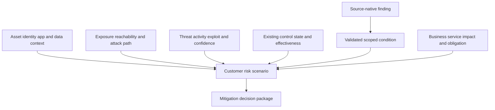

### Finding validation checklist

1. What does one finding record represent?
2. Which source, method, plugin/rule/version, and observation point produced it?
3. Which exact asset, identity, application, component, or policy does it reference?
4. Are identifiers stable and correctly resolved?
5. When was the condition observed and when was it true?
6. Is the affected version/configuration/function actually present?
7. Which scope, exclusions, credentials, and blind spots apply?
8. Can the condition be reproduced or corroborated safely?
9. Is it duplicate, superseded, stale, false positive, or accepted exception?
10. What evidence would falsify the current interpretation?

### Evidence classes and confidence

| Class | Example | Use |
|---|---|---|
| Direct customer evidence | Current configuration/read-back, source-native record | Supports scoped customer fact |
| Corroborating customer evidence | Independent source, trace, asset/app owner | Increases confidence or exposes conflict |
| External authoritative evidence | Vendor advisory, CISA KEV, NVD record, current documentation | Establishes general vulnerability/threat/product facts |
| Analytical inference | Reachability model, relationship graph, score | Supports hypothesis with assumptions |
| Stakeholder statement | Owner reports use/impact | Valuable but should be scoped/tested if consequential |
| Scenario assumption | Fictional NMH fact | Practice only |
| Unknown | No sufficient evidence | Must remain visible |

### False positive, false negative, and stale state

| Condition | Meaning | Response |
|---|---|---|
| False positive | Finding asserts target condition but reviewed truth is negative | Preserve evidence, correct source/rule, close with rationale |
| False negative | Condition exists but finding absent | Investigate coverage/method and expand safely |
| Duplicate | Multiple records represent same logical condition | Group without losing source provenance |
| Stale | Finding was true but no longer current | Validate current state and close/version |
| Partial | Applies to only part of recorded scope | Split population and tailor action |
| Unknown | Evidence cannot establish true/false | Do not close as false; assign test or accepted uncertainty |

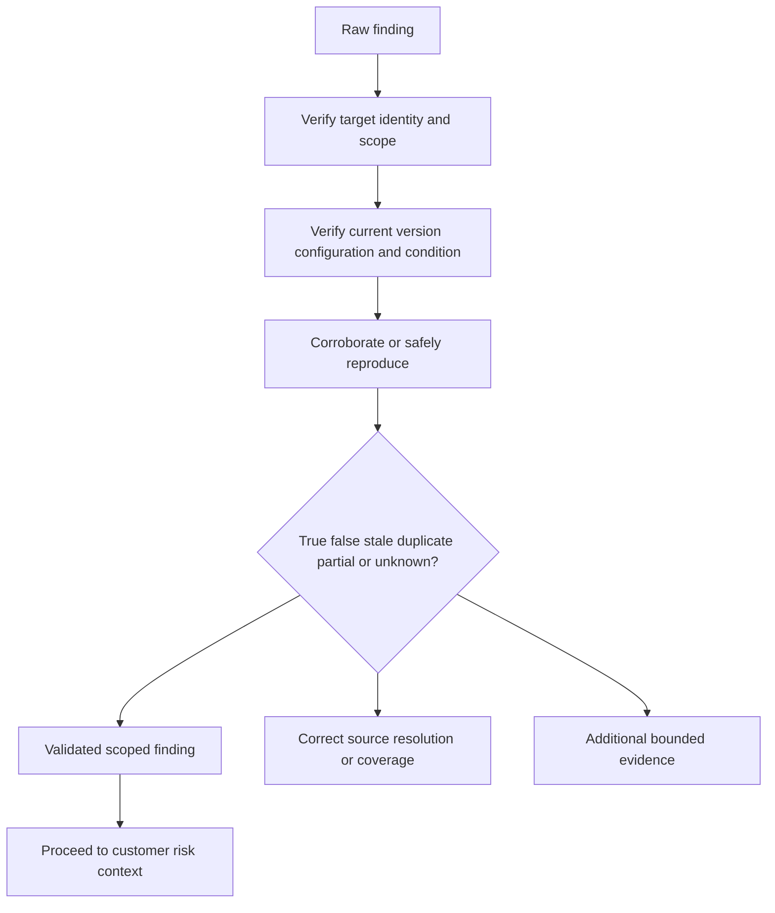

## Customer-specific context

Context should be attribute-specific, time-aware, and sourced. An asset can be technically critical but not business critical; a device can be internet-reachable from one observation point but not another; an identity can have privilege only during a session or role activation.

### Context dimensions

| Dimension | Questions | Priority effect |
|---|---|---|
| Business service | Which service, users, and objective depend on target? | Raises impact if critical, but evidence required |
| Data | Which sensitive/regulated/mission data is accessible? | Changes confidentiality/integrity consequence |
| Asset lifecycle | Active, ephemeral, test, retired, duplicate? | Prevents work on wrong/stale target |
| Ownership | Who operates and who accepts risk? | Enables action and escalation |
| Exposure | Internet, partner, internal, segmented, isolated? | Changes plausible path |
| Reachability | Can actor/path reach vulnerable function? | Distinguishes theoretical from practical precondition |
| Identity | Which users/services/privilege/trust relationships? | Reveals blast radius and alternate paths |
| Threat | Known exploitation, exploit maturity, activity, relevance? | Changes urgency with confidence |
| Controls | Prevent, detect, respond, recover; tested or assumed? | May reduce likelihood/impact, not erase finding |
| Operational constraint | Uptime, safety, legacy, maintenance, dependencies? | Shapes treatment and sequencing |
| Compliance | Which obligation or policy applies? | Adds decision/notification requirements |
| Concentration | One issue affects many shared services or identities? | Raises systemic consequence |

```mermaid
flowchart LR
    FIND[Validated finding] --> TARGET[Correct target and lifecycle]
    TARGET --> SERVICE[Business service and data]
    SERVICE --> PATH[Exposure reachability identity and relationships]
    PATH --> THREAT[Threat relevance and exploit conditions]
    THREAT --> CTRL[Existing control effectiveness]
    CTRL --> OPS[Operational constraints and ownership]
    OPS --> RISK[Customer-specific risk scenario]
```

### Context collision

Context sources can disagree. The CMDB may call a server non-production, application telemetry may show customer transactions, and the cloud owner may report a migration. Preserve effective time and source authority. Do not average criticality labels.

| Conflict | Discriminating check | Temporary treatment |
|---|---|---|
| Asset owner differs | Current service/account/management authority | Assign investigation owner; do not close unowned |
| Criticality differs | Business-service owner and current dependency evidence | Use conservative bounded assumption if policy permits |
| Internet exposure differs | Observation-point tests, route/policy evidence | Treat unknown path visibly |
| Version differs | Target-native package/runtime evidence | Avoid patching wrong instance |
| Control state differs | Configuration plus functional test/read-back | Do not credit untested control |
| Exception status differs | Approved risk record, scope, expiry, owner | Treat missing evidence as no verified exception |

### Plain-English deep-dive 2 - A control is not effective because it exists

A building can own sprinklers while valves are closed, water pressure is inadequate, or the affected room is outside coverage. Security controls have similar gaps. An endpoint agent can be installed but unhealthy; a network policy can exist but be bypassed; multifactor authentication can apply to interactive users but not a service identity; a detection can be mapped but not receive required telemetry.

For mitigation decisions, describe **control objective**, **scope**, **configuration**, **enforcement point**, **health**, **test**, **monitoring**, **owner**, and **failure mode**. Credit only the effect supported by evidence. A control may reduce one attack step while alternate paths remain.

Compensating controls require the same discipline. "Firewall protects it" is weak. "The customer network owner confirms and tests that the specified untrusted source population cannot reach the vulnerable service port through documented paths; exceptions and alternate routes remain monitored until patch validation" is bounded and testable.

## Risk scenario and business impact

A risk scenario connects actor or initiating event, preconditions, target, weakness, path, control behavior, technical effect, and business consequence. It should not claim an attack is happening unless evidence supports that statement.

### Scenario template

> If **[actor/event]**, under **[preconditions and scope]**, uses or triggers **[finding/weakness]** through **[path]**, and **[controls fail or are insufficient]**, then **[technical effect]** could affect **[business service/data/users/obligation]**, causing **[impact categories]**. Current evidence supports **[facts]**; **[assumptions/unknowns]** limit confidence.

| Scenario component | Example category | Evidence question |
|---|---|---|
| Actor/event | External attacker, malicious insider, compromised identity, software failure | Is presence or capability established? |
| Preconditions | Access, network path, privilege, user action, version | Which are observed versus assumed? |
| Weakness | CVE, configuration, identity, process, control gap | Is condition validated? |
| Path | Internet, partner, internal lateral, identity chain, application workflow | Is reachability tested? |
| Control behavior | Prevent, detect, contain, recover | Is effectiveness tested for path? |
| Technical effect | Code execution, access, disruption, data change, credential theft | What does authoritative evidence support? |
| Business consequence | Availability, safety, privacy, financial, legal, trust, operations | Which customer owner validates? |
| Uncertainty | Unknown exploitability, scope, control, impact | How does it affect decision? |

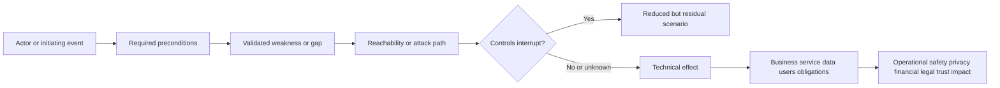

### Impact categories

| Category | Questions | Evidence caution |
|---|---|---|
| Safety | Could people or physical operations be harmed? | Use qualified customer authority |
| Availability | Which service, users, dependency, recovery objective? | Do not invent outage duration |
| Confidentiality/privacy | Which data and people, which access scope? | Follow privacy/legal process |
| Integrity | Could records, decisions, code, or transactions change? | Establish write path and validation |
| Financial | Which cost/loss mechanism and model? | Avoid unsupported dollar precision |
| Legal/regulatory | Which obligation and threshold? | Legal/compliance interprets |
| Reputation/trust | Which stakeholder and plausible mechanism? | Avoid vague catastrophic language |
| Operational workload | Which teams, manual burden, or backlog? | Measure with denominator/time |
| Strategic | Which transformation, acquisition, or customer commitment? | Executive owner validates |

### Quantification discipline

Use qualitative, ordinal, or quantitative methods appropriate to evidence. A dollar estimate needs scenario frequency, loss magnitude, model assumptions, data, and owner acceptance. Report ranges and sensitivity. A vendor-provided score or public calculator does not establish customer loss.

| Method | Strength | Limitation |
|---|---|---|
| Narrative scenario | Clear causal reasoning | Harder to compare at scale |
| Ordinal matrix | Simple prioritization | Categories can hide differences |
| Weighted score | Consistent multi-factor ordering | Weights and data can create false precision |
| Expected-loss/range model | Connects frequency and magnitude | Data-intensive and uncertain |
| Control/path model | Finds choke points and dependencies | May omit unknown routes |
| Decision analysis | Compares options under uncertainty | Requires explicit values/assumptions |

## Mitigation options

Risk treatment commonly includes avoid, reduce/mitigate, transfer/share, accept, and monitor/investigate. Technical actions can prevent, reduce exposure, reduce privilege, detect, contain, recover, or improve evidence.

### Option families

| Option family | Example general action | Benefit | Tradeoff/residual |
|---|---|---|---|
| Remove cause | Patch, upgrade, correct configuration, retire component | Eliminates or reduces weakness | Change/testing/outage, dependency |
| Remove exposure | Block path, isolate, disable service, reduce publication | Fast likelihood reduction | Business access/performance, alternate path |
| Reduce privilege | Revoke access, rotate secret, least privilege, segmentation | Limits blast radius | Workflow disruption and identity dependencies |
| Strengthen authentication | MFA/step-up/device/context controls where applicable | Reduces identity abuse | Coverage, recovery, service identities |
| Detect | Add/test telemetry, analytics, alerting, hunting | Improves discovery/response | Does not prevent; noise/coverage |
| Contain/respond | Isolate, suspend, restrict, kill session, block indicator under authority | Interrupts active path | Wrong target, availability, reversibility |
| Recover | Backup, restore, failover, rebuild, continuity | Reduces impact/duration | Recovery point/time and test quality |
| Compensate | Alternative control until primary repair | Supports safe delay | Effectiveness and expiry required |
| Avoid | Stop activity, decommission, redesign | Removes scenario | Lost business capability/cost |
| Transfer/share | Insurance, contract, managed responsibility | Redistributes financial/operational consequence | Risk not eliminated; contract limits |
| Accept | Authorized retain under conditions | Rational for low/unavoidable risk | Monitoring, expiry, accountability |
| Investigate | Gather decisive evidence before action | Reduces uncertainty | Delay can leave exposure |

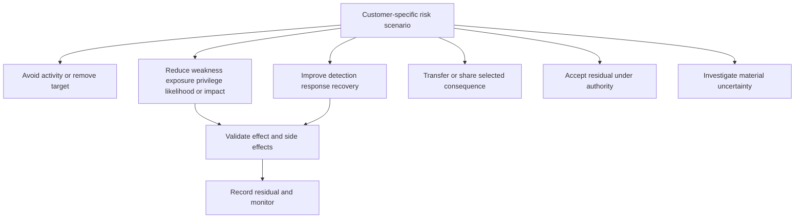

### Option design card

For each option define exact target, mechanism, expected risk effect, preconditions, owner, implementation, test, business impact, security/privacy effects, rollback, operational support, duration, dependencies, cost/effort, evidence confidence, residual, and failure mode.

| Dimension | Option A | Option B | Option C |
|---|---|---|---|
| Mechanism | | | |
| Scope/target | | | |
| Expected risk effect | | | |
| Evidence/confidence | | | |
| Time to protective effect | | | |
| Effort/cost | | | |
| Business disruption | | | |
| Security/privacy | | | |
| Dependencies | | | |
| Reversibility/rollback | | | |
| Validation | | | |
| Residual/alternate path | | | |
| Owner/authority | | | |

### Defense in depth without control stacking theater

More controls do not automatically mean lower risk. Controls can overlap, conflict, create bypass, add complexity, or fail together. Map each control to a scenario step and test its independence.

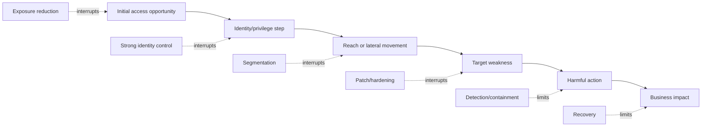

## Tailoring mitigation to customer reality

A generic recommendation says "patch immediately." A tailored strategy states which target, why now, what business service, which path, which controls, what maintenance and testing, who owns action, what interim protection, which deadline authority, how to validate, and what residual remains.

### Tailoring dimensions

| Dimension | Tailoring question | Example consequence |
|---|---|---|
| Business criticality | What service and recovery/safety need? | Requires phased change and failover |
| Architecture | Which dependencies, clusters, routes, tenants? | Patch order and blast radius differ |
| Asset lifecycle | Active, ephemeral, immutable, end-of-life? | Rebuild/replace may beat patch |
| Identity | Which privilege and service identities depend on target? | Credential/control changes needed |
| Data | Which sensitive data and residency? | Privacy/legal involvement |
| Operations | Maintenance, staffing, monitoring, support? | Due date must account for safe execution |
| Change risk | Regression, rollback, test environment? | Compensating control before primary fix |
| Existing controls | Which scenario steps are tested? | Interim risk may be bounded |
| Threat activity | Relevant active exploitation and exploitability? | Urgency and containment increase |
| Compliance/policy | Mandatory treatment or documentation? | Exception process required |
| Cost/effort | Engineering, license, outage, opportunity? | Sequence by risk reduction per constrained effort |
| Maturity | Can organization operate the control reliably? | Simpler repeatable option may be safer |

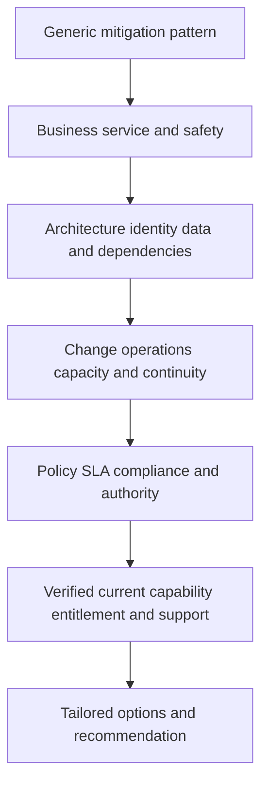

### Customer-specific recommendation formula

> **Recommend [option] for [exact scope] because [validated scenario and customer consequence].** This option is preferred over **[alternatives]** because **[effectiveness, time, disruption, effort, dependencies, and evidence]**. Before implementation, **[prerequisites/approvals]** must pass. **[Action owner]** implements under **[change/security authority]** by **[customer-approved policy target or plan date]**. Validate through **[technical, control-path, business, and recurrence tests]**. Until validation, use **[interim control]**. Remaining residual includes **[uncertainty/alternate path/limitation]**, owned and reviewed by **[customer risk authority]** on **[trigger/date]**.

This structure is general practice. It does not itself establish any Zscaler product as the recommended option.

### Plain-English deep-dive 3 - Best mitigation means best fit under constraints, not strongest control in isolation

Closing a service immediately may eliminate one exposure but cause a larger safety or availability impact. Waiting for a perfect patch may leave an exploitable path open. A compensating network control may reduce reachability quickly while application testing proceeds. The right strategy can be a sequence, not one action.

Compare risk reduction, speed to protective effect, confidence, operational disruption, reversibility, effort, dependencies, durability, and residual. A fast reversible containment can create time for durable remediation. A durable architectural redesign can address recurrence but may not protect today. Both may belong in the roadmap.

The TSM helps make tradeoffs visible and connects the right owners. The customer decides within policy. "Best practice" should never erase business context or decision authority.

## Priority and decision logic

Priority is an ordered decision under scarce resources. It can include severity, exploitation, reachability, exposure, privilege, criticality, data, control weakness, concentration, age, obligation, owner capacity, and change risk. Define and version the model.

### Priority factors

| Factor | Raises urgency when | Caveat |
|---|---|---|
| Technical severity | Potential technical effect is high | Severity is not customer impact |
| Known exploitation | Relevant exploitation is credibly established | Confirm applicability and date |
| Exploit maturity | Reliable exploit under customer conditions | Public code alone does not prove path |
| Internet/external exposure | Untrusted path reaches target | Observation point and bypass matter |
| Identity privilege | Compromise grants broad authority | Effective privilege and controls vary |
| Business criticality | Critical service/data/safety affected | Customer owner validates |
| Reachability/attack path | Preconditions connect to impact | Model may miss alternate routes |
| Control weakness | Prevent/detect/respond controls absent or ineffective | Test, do not infer from inventory |
| Concentration | Shared component affects many services | Avoid double counting |
| Time/age | Exposure persists beyond policy or threat window | Old finding may also be stale |
| Compliance | Obligation creates deadline/approval | Authorized interpretation required |
| Remediation opportunity | High reduction at manageable effort | Quick win must still be safe |

### Transparent scoring

If a score is used, publish inputs, weights, missing-data rules, ranges, version, and explanation. Do not let an unknown become zero. Prevent double counting correlated factors such as internet exposure and reachability. Compare ranked output with expert review and exceptions.

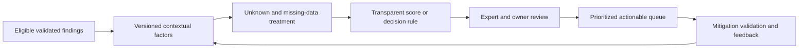

### Priority tiers without invented SLAs

The following is a design template, not a real policy or SLA.

| Tier | Decision intent | Example treatment posture | SLA requirement |
|---|---|---|---|
| Emergency | Credible imminent/active severe scenario | Contain now under incident authority, then remediate | Use current customer incident policy/contract |
| Urgent | High consequence and credible path | Near-term mitigation with executive visibility | Use customer-approved risk/remediation policy |
| High | Material scenario requiring scheduled treatment | Owned plan and interim control as needed | Do not invent duration |
| Standard | Valid risk within normal program process | Remediate by policy and capacity | Current policy governs |
| Monitor/investigate | Material uncertainty or low current consequence | Gather evidence, monitor triggers | Set explicit review, not silent backlog |
| Accepted exception | Authorized residual under conditions | Monitor, expire, retest | Risk record governs |

## Effort, dependencies, and sequencing

Effort is more than engineer-hours. Include discovery, design, approvals, testing, outage/change, training, monitoring, support, rollback, and opportunity cost.

| Effort dimension | Question |
|---|---|
| Technical complexity | How many components and failure modes? |
| People | Which specialist, operator, approver, and validator time? |
| Change | Production window, testing, rollback, freeze? |
| Business interruption | User/service impact and contingency? |
| Financial | License, services, infrastructure, labor, egress? |
| Governance | Privacy, legal, compliance, risk, procurement lead time? |
| Operations | Ongoing monitoring, tuning, incidents, upgrades? |
| Adoption | Workflow, training, behavior, support burden? |
| Opportunity | Which other priority is delayed? |

### Dependency record

| Dependency | Owner | Evidence/acceptance | Need-by logic | Failure consequence | Alternative |
|---|---|---|---|---|---|
| Source/asset validation | | | Before target change | Wrong target or scope | Bounded investigation |
| Business-service approval | | | Before disruptive treatment | Unsafe outage | Interim control |
| Technical design | | | Before implementation | Ineffective/conflicting control | Specialist review |
| Entitlement/services | | | Before product-specific plan | Unavailable work | Current alternative |
| Security/privacy/legal | | | Before data/control change | Unauthorized action | Minimized design |
| Change window/test | | | Before production | Regression | Containment then later repair |
| Validation capability | | | Before declaring completion | Unproved effect | Build test first |

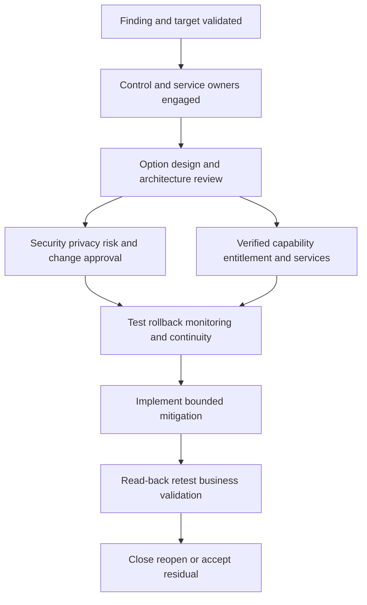

### Sequenced mitigation roadmap

| Horizon | Purpose | Example general actions |
|---|---|---|
| Immediate | Reduce imminent impact and uncertainty | Contain path, preserve evidence, validate scope, monitor |
| Near term | Correct primary condition safely | Patch/configure/revoke/change with test and rollback |
| Medium term | Remove systemic cause and improve workflow | Architecture, ownership, automation, data quality, exception cleanup |
| Long term | Build resilience and prevent recurrence | Modernize, retire legacy, redesign trust, exercise recovery, improve governance |

Avoid fixed durations in the template. Customer policy, threat, impact, dependencies, and authority determine timing.

## Owners, RACI, and authority

Separate at least four owners:

1. **Finding owner:** Maintains source record and evidence quality.
2. **Treatment/control owner:** Implements or operates mitigation.
3. **Service/business owner:** Owns operational consequence and acceptance.
4. **Risk owner/acceptor:** Decides whether residual is acceptable under policy.

Add validation, project, data, identity, network, application, Support, and account-team roles as needed.

| Decision/work | Security/VM | IT/network/identity/app | Service owner | Risk/governance | TSM | Support/Product/account |
|---|---|---|---|---|---|---|
| Validate finding | A/R source role | R/C target evidence | C | I | C/coordinate | C for product evidence |
| Define scenario/priority | R | C | C | A by policy | R/facilitate | C |
| Select mitigation | R/recommend | R/recommend | C/A operational | A risk/change as defined | C | C technical/commercial |
| Implement change | C | A/R | C | Approve by policy | C | Services/Support by scope |
| Validate technical effect | R/C | R | C | I | C | C |
| Validate business effect | C | C | A/R | C | R/evidence | I |
| Accept residual | C | C | C | A customer authority | C | I |

Actual RACI is customer- and contract-specific. The TSM does not accept customer risk.

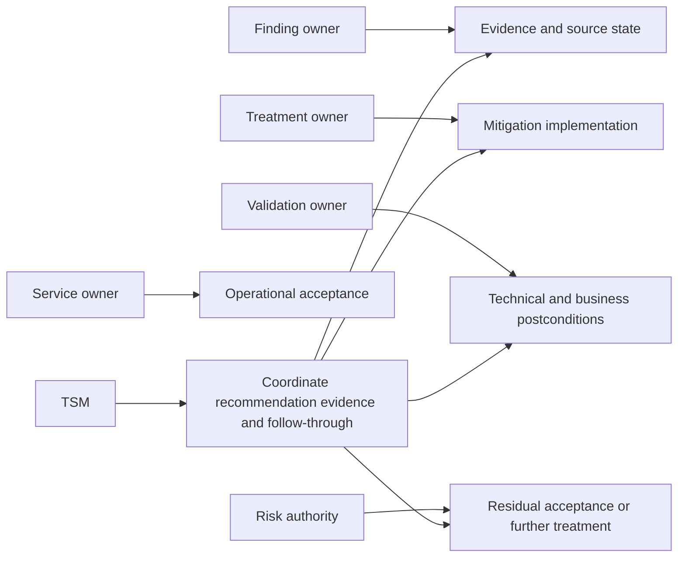

## SLA, due date, and exception mechanics

An SLA can be contractual or policy-based depending context. Never invent a remediation duration from a severity label. Determine applicable policy, scope, clock start, pause rules, evidence, ownership, exception, breach, escalation, and validation stop event.

### Service-level contract fields

| Field | Question |
|---|---|
| Object/grain | Finding, asset, campaign, incident, exception, or action? |
| Eligibility | Which validated population enters? |
| Tier | Which rule assigns priority? |
| Start | Discovery, validation, assignment, known exploitation, exposure? |
| Stop | Change complete, retest passes, business validation, accepted exception? |
| Pauses | Which approved states pause, and are they visible? |
| Reopen | What restarts or continues the clock? |
| Unknown | How are missing owners/data/control states handled? |
| Exception | Who approves, for what duration and compensating control? |
| Escalation | What trigger reaches which authority? |
| Evidence | Which source proves each state? |
| Version | Which policy version applied when? |

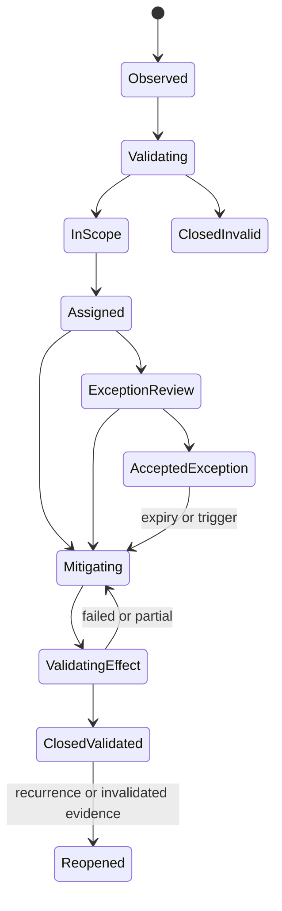

### Exception record

An exception requires exact scope, rationale, evidence, rejected/considered options, compensating controls, owner, approval authority, start/expiry, monitoring, review triggers, residual, and revocation. Permanent "temporary" exceptions are a governance failure.

| Exception smell | Risk | Repair |
|---|---|---|
| No expiry | Indefinite invisible risk | Time-bound and trigger-bound review |
| Group approval without risk owner | Diffuse accountability | Named authorized acceptor |
| Compensating control merely listed | Effectiveness unknown | Functional test and health monitoring |
| Scope says "legacy systems" | Denominator unknown | Enumerated population and reconciliation |
| Ticket closure equals acceptance | Wrong authority | Link approved risk record |
| Exception not revisited after change | Context stale | Reopen triggers and effective time |

## Implementation and validation

Validation should distinguish request, completion, technical state, control effect, risk-path effect, business health, and durability.

### Validation layers

| Layer | Question | Evidence |
|---|---|---|
| Request | Was exact authorized change requested? | Change/action record |
| Completion | Did target system report completion? | Native operation result |
| State | Does target now show intended configuration/version/access? | Read-back |
| Function | Does positive/negative/boundary test behave correctly? | Test results |
| Path | Is the relevant attack/exposure route interrupted? | Reachability/control test |
| Alternate path | Did another route remain or appear? | Path review/hunt |
| Detection/response | Can residual behavior be detected/contained? | Controlled exercise |
| Business | Is service healthy and workflow accepted? | Service owner validation |
| Durability | Does state persist across restart/change/time? | Monitoring/retest |
| Recurrence | Did root mechanism or similar condition return? | Trend and event review |

```mermaid
flowchart LR
    REQ[Authorized request] --> DONE[Reported completion]
    DONE --> STATE[Target read-back]
    STATE --> FUNC[Functional positive negative boundary tests]
    FUNC --> PATH[Risk-path and alternate-route validation]
    PATH --> BIZ[Business service and workflow validation]
    BIZ --> DUR[Durability monitoring and recurrence]
    DUR --> ACCEPT[Close partial reopen or residual acceptance]
```

### Validation plan design

Define pre-change baseline, exact target, expected postconditions, negative tests, side effects, monitoring, stop/rollback, tester independence where needed, evidence handling, acceptance owner, maturity period, and reopen triggers.

| Test class | Example purpose | Failure interpretation |
|---|---|---|
| Positive | Authorized use still works | Mitigation may be too broad or service broken |
| Negative | Disallowed path fails | Control ineffective if path succeeds |
| Boundary | Adjacent tenant/region/identity behaves correctly | Scope leakage or gap |
| Failure | Dependency outage is detected and safe | Silent degradation |
| Rollback | Prior acceptable state can be restored | Change risk higher than assumed |
| Read-back | Target state matches requested change | Accepted request may not be effective |
| Security | No new privilege, exposure, or data leak | Mitigation creates risk |
| Business | Critical service and workflow remain acceptable | Technical success may be business failure |

### Plain-English deep-dive 4 - Closure is a chain of claims

"Patched" can mean a package was approved, downloaded, installed, reported, restarted, detected by scanner, and accepted by the service owner. These are different states. If a vulnerable process still loads an old library, the installation record alone is insufficient. If the patch fixes the weakness but breaks a critical service, technical remediation is not an accepted business outcome.

Closure should state the claim being accepted: "For the enumerated targets, the authoritative package state and source retest no longer show the validated condition; the relevant reachability test fails as intended; approved user paths and service health pass; monitoring is active; two excluded systems remain under exception X." That sentence exposes scope and residual.

Unknown action state requires reconciliation, not blind retry. Query the target, compare current state, preserve operation IDs, and assess whether a duplicate action could harm service. This is where your escalation habit of validating recovery rather than trusting a success message transfers directly.

## Residual risk and monitoring

Residual risk includes remaining likelihood/impact, uncertainty, out-of-scope populations, alternate paths, temporary controls, accepted exceptions, detection/recovery limitations, and operational side effects.

| Residual field | Required content |
|---|---|
| Scenario | What still could happen? |
| Scope | Which targets/populations remain? |
| Evidence/confidence | What supports estimate and what is unknown? |
| Existing controls | Which tested effects remain? |
| Limitations | Alternate path, coverage, duration, dependency? |
| Owner/acceptor | Which customer role is authorized? |
| Monitoring | Which signal, threshold, and owner? |
| Expiry/review | Date and event triggers |
| Contingency | What happens if risk materializes or control fails? |
| Next treatment | Planned durable improvement if any |

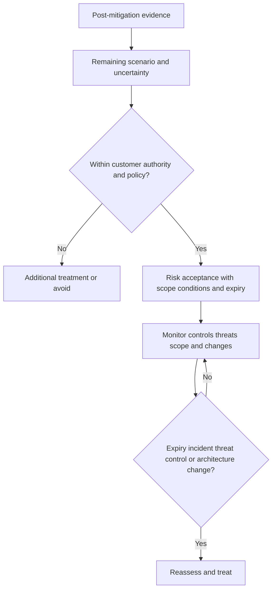

### Reopen triggers

New exploitation evidence, control failure, scope expansion, asset/service criticality change, identity privilege change, architecture migration, acquisition, product end-of-support, exception expiry, recurrence, failed audit, or business-risk appetite change can invalidate the earlier decision.

## Zscaler capability mapping without overclaiming

Product-specific recommendations require current documentation, entitlement, architecture, customer policy, configuration, and testing. Public positioning can identify questions and option families, not prescribe a control.

| Public positioning area | General mitigation question | Verification required |
|---|---|---|
| Zero Trust Exchange | Can identity/context/policy reduce a relevant access path? | Current product, traffic/app path, policy semantics, entitlement, test |
| Unified Vulnerability Management | Can available sources/context support prioritization and workflow? | Sources, integration, scoring transparency, workflow, entitlement |
| Risk360 | Can contextual risk views inform a defined executive decision? | Inputs, method, customer data, interpretation, entitlement |
| Data Fabric for Security | Can available data be harmonized/correlated for the selected decision? | Supported sources, schema, quality, operations, privacy |
| Agentic Security Operations | Can verified workflows support triage/investigation/recommendation or response? | Current capabilities, data, tools, authority, human approval, entitlement |

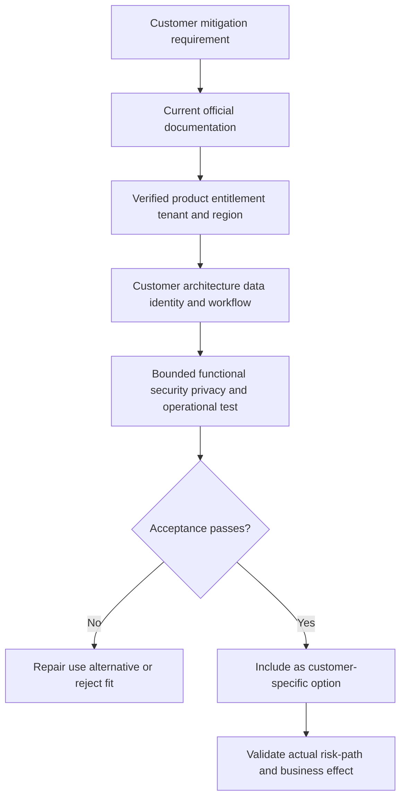

Never infer a product UI, field, connector, action, control, policy behavior, license, deployment step, service level, or outcome from a public marketing page. A recommendation can say "evaluate whether the currently licensed capability supports X under these tests" when facts remain unknown.

## Executive recommendation writing

Executives need the adverse scenario, material evidence, consequence, options, recommendation, decision, owner, timing, and residual. Technical detail should remain available.

### One-page structure

| Section | Content |
|---|---|
| Decision | Exact decision and authorized owner |
| Finding | Validated scoped condition and evidence date |
| Risk scenario | Plausible path, controls, uncertainty, consequence |
| Current exposure | Affected service/population and time sensitivity |
| Options | Effectiveness, time, effort, disruption, dependency, residual |
| Recommendation | Customer-specific preferred sequence and why |
| Implementation | Owner, prerequisites, change, interim control |
| Validation | Technical, path, business, durability, recurrence |
| Residual | Remaining risk, unknowns, exception, monitoring |
| Product boundary | Current verified capability/entitlement or explicit unknown |

### Executive summary examples

These examples are writing patterns, not customer facts, recommendations, or product claims.

| Weak | Stronger neutral example |
|---|---|
| "Critical vulnerability must be patched immediately." | "The validated condition affects the enumerated service nodes. Current evidence supports internal reachability from a privileged management segment; internet reachability and active exploitation remain unestablished. Recommend restricting the management path now, then applying the vendor-supported update in the customer-approved window with rollback and source retest. The service and risk owners must decide the interim residual." |
| "Zscaler can block this attack." | "A policy-based access control may be one option if current licensed capability, traffic path, identity context, enforcement semantics, and tests support the requirement. Public positioning alone does not establish that fit. Compare it with source remediation and existing network controls." |
| "The risk score dropped by 40 percent." | "The analytical score changed after the tested control and asset-context update. Before interpreting risk reduction, verify input completeness, weight/version stability, path effect, customer outcome, and excluded populations." |
| "The exception is safe." | "The customer risk authority accepted the enumerated residual until the stated expiry, based on the tested compensating control and monitoring. Alternate-path uncertainty and two excluded targets remain." |
| "Remediation is complete." | "The change completed and target read-back passes; source retest, business validation, and durability monitoring remain open. Completion is not yet accepted." |

### Recommendation quality rubric

| Criterion | Pass question |
|---|---|
| Evidence | Can each material claim be traced to source and date? |
| Scope | Are population, exclusions, time, and confidence explicit? |
| Context | Does the scenario include customer service, identity, path, data, and controls? |
| Alternatives | Are credible options and no-action consequences compared? |
| Tailoring | Does recommendation fit architecture, operations, policy, and capacity? |
| Authority | Are decision, action, validation, and residual owners correct? |
| Timing | Does priority/SLA come from current policy and evidence? |
| Safety | Are change, privacy, rollback, continuity, and abuse considered? |
| Validation | Are target, path, business, alternate, and durability tests defined? |
| Residual | Are limitations, unknowns, monitoring, expiry, and triggers visible? |
| Product honesty | Are current capability and entitlement verified or labeled unknown? |

## Objections and difficult mitigation conversations

| Objection | Possible mechanism | Evidence-led response |
|---|---|---|
| "We cannot patch." | Availability, compatibility, legacy, vendor, capacity | Understand constraint; compare isolation, privilege, detection, compensating controls, upgrade/retire, acceptance |
| "The score is not credible." | Opaque weights, bad data, changing denominator | Show factor lineage, examples, missing-data rules, and alternative narrative |
| "This asset is not critical." | CMDB conflict or scoped business use | Validate service relationship and effective time |
| "Firewall already protects us." | Control may not cover path or be tested | Define path, policy, alternate routes, test, monitoring |
| "Security owns remediation." | Action authority sits in IT/app/business teams | Separate finding, treatment, service, and risk owners |
| "The SLA is impossible." | Policy misfit, capacity, change safety, broad scope | Validate policy; triage, compensate, exception, invest, or accept through authority |
| "We bought a tool for this." | Entitlement or expectation mistaken for outcome | Verify workflow, configuration, data, adoption, and effect |
| "Accept the risk and close it." | Deadline pressure or low perceived consequence | Require authorized record, scope, rationale, controls, expiry, monitoring |
| "Exploit exists, so isolate everything." | Urgency without impact balancing | Validate applicability and use proportionate containment with business authority |
| "No attacks observed means low risk." | Detection/coverage may be weak | Distinguish absence of evidence from evidence of absence |

## Failure modes and misconceptions

| Failure or misconception | Why it fails | Better practice |
|---|---|---|
| "High CVSS equals highest customer risk" | Ignores path, asset, identity, threat, controls, impact | Multifactor contextual decision |
| "Low score means no action" | Missing data or concentration can hide risk | Inspect uncertainty and scenarios |
| "Patch is always the answer" | May be unavailable/unsafe and ignores path | Compare sequenced treatments |
| "Compensating control closes finding" | Weakness remains and control may fail | Track residual, test, expire |
| "Control configured means effective" | Enforcement/coverage/health unknown | Functional and path validation |
| "Ticket owner owns risk" | Workflow assignment is not acceptance authority | Separate owner roles |
| "SLA comes from vendor severity" | Customer policy/contract determines clock | Publish service-level contract |
| "Exception means ignore" | Risk remains and context changes | Scope, authority, expiry, monitor, reopen |
| "Action completed means mitigated" | Target/path/business effect may fail | Layered validation |
| "No alert means no threat" | Coverage and detection unknown | Test observation and controls |
| "More controls always improve security" | Complexity and common-mode failure | Map and test scenario steps |
| "Risk can be reduced to one dollar" | Model assumptions create false precision | Ranges, sensitivity, owner acceptance |
| "Public product page proves mitigation" | No tenant, path, entitlement, test | Requirement-to-capability validation |
| "TSM should tell customer what risk to accept" | Customer authority and context govern | Advise with options; customer decides |
| "Residual risk is an appendix" | It controls acceptance and monitoring | Put residual in decision summary |

## Troubleshooting failed mitigations

| Symptom | Plausible cause | Discriminating check | Response |
|---|---|---|---|
| Finding remains after patch | Wrong target/version, scan stale, restart, vulnerable component remains | Native state plus source retest | Repair target or source interpretation |
| Finding closes but path remains | Scanner condition removed, alternate weakness/path | Reachability and attack-path test | Additional treatment/reopen |
| Control blocks legitimate service | Scope/policy/identity mapping too broad | Exact denied transaction and policy evaluation | Rollback/narrow/test |
| Mitigation not applied everywhere | Inventory/ephemeral/region/owner gap | Eligible-to-changed reconciliation | Expand population and monitoring |
| Exception expires silently | Governance/workflow failure | Risk record and alert ownership | Escalate, renew properly, or treat |
| Priority changes unexpectedly | Source/context/weight/version changed | Compare metric lineage and population | Explain/recalculate/review |
| Owner rejects ticket | Wrong ownership, weak evidence, no capacity/authority | Service map and assignment contract | Reassign or escalate decision |
| Automated action times out | Unknown target state | Native operation/read-back and idempotency | Reconcile before retry |
| Risk score falls but exposure unchanged | Model/input artifact | Independent path/control validation | Reject outcome claim |
| New threat evidence appears | Earlier assumptions invalid | Applicability and scope review | Reprioritize and reopen |

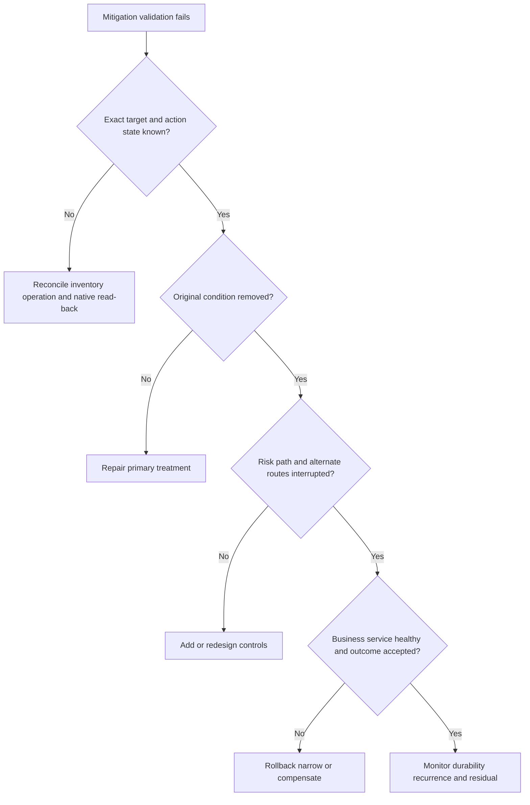

## Decision trees

### Decision tree 1 - Is the finding ready for mitigation planning?

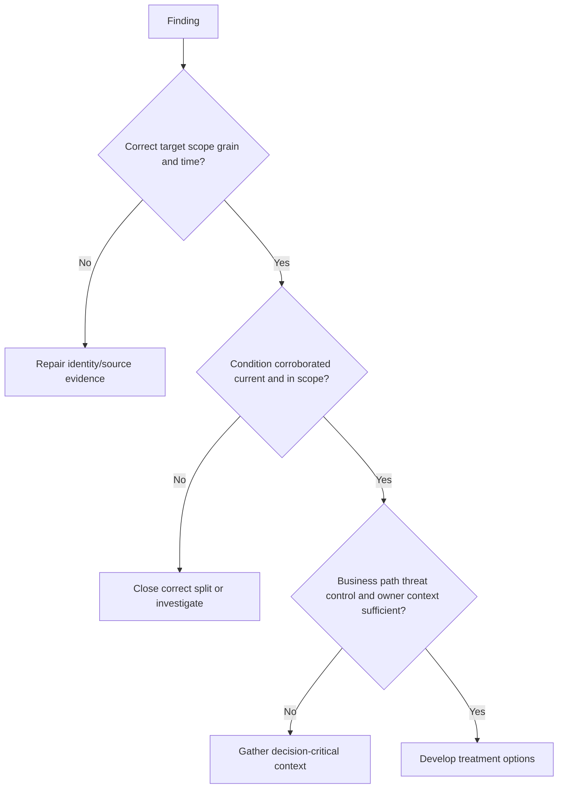

### Decision tree 2 - Which treatment posture fits?

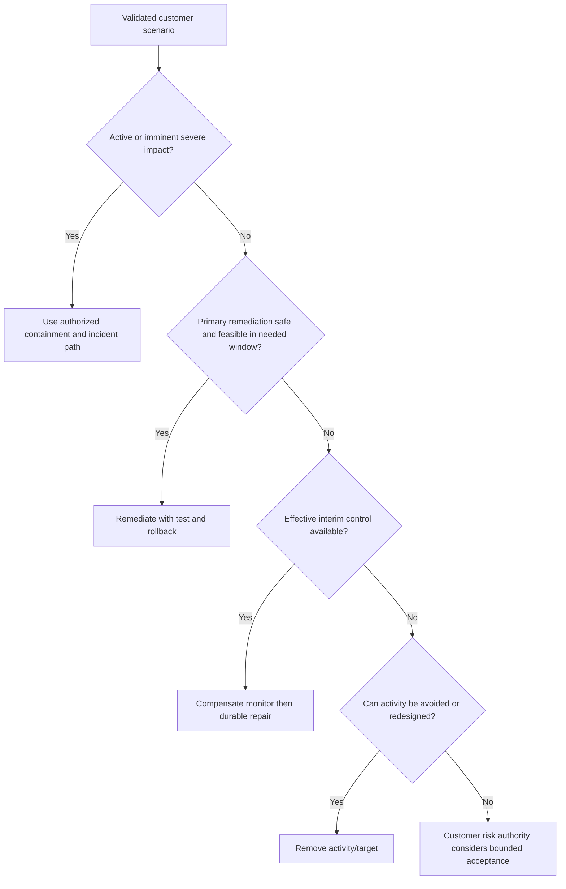

### Decision tree 3 - Can the finding close?

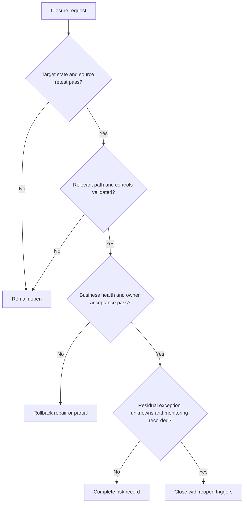

## Explicitly fictional and synthetic NMH scenarios

All content in this section is fictional and synthetic. It is practice material, not a customer finding, SLA, mitigation, product capability, entitlement, risk score, financial estimate, or result. Dates in this section, including **2026-10-09**, **2026-10-23**, **2026-11-13**, and **2026-12-04**, are synthetic scenario dates later than the source snapshot and do not imply later research.

### Scenario 1 - The critical finding on an unclear asset

On synthetic 2026-10-09, an NMH fictional scanner reports a critical software finding. The CMDB labels the asset retired, while network evidence shows recent traffic and an application owner recognizes a migration host. The TSM does not recommend immediate patching of an uncertain target. The team reconciles identity, confirms the running component, maps service impact, and preserves source evidence.

The synthetic plan uses a temporary network restriction while ownership and a safe update window are established. No Zscaler product is asserted to provide that control.

### Scenario 2 - The compensating control claim

On synthetic 2026-10-23, a fictional owner says a firewall mitigates the finding. The policy exists, but one partner route and a privileged management path are not in the tested scope. The decision record credits only the verified blocked path, retains residual for alternate routes, adds monitoring, and sequences the durable update. The customer risk authority, not the TSM, decides whether the interim residual is acceptable.

### Scenario 3 - The impossible SLA

On synthetic 2026-11-13, an NMH fictional policy target conflicts with a safety-critical application's test cycle. The team validates relevant threat activity, service consequence, current controls, and change risk. Options include immediate isolation with degraded functionality, tested compensating controls plus accelerated patching, service failover, or formal exception. The TSM presents options; authorized customer roles decide. The SLA values are not invented in this chapter.

### Scenario 4 - The product-specific recommendation request

On synthetic 2026-12-04, a fictional executive asks whether Zscaler can mitigate the path. The TSM maps the exact requirement: identity, source/destination path, traffic or application behavior, policy effect, logging, rollback, validation, and entitlement. Public positioning is relevant but insufficient. A current specialist/documentation/tenant test must establish fit. Every later date in this section remains fictional and synthetic.

## Reusable artifact kit

These templates are general practice. Customer policy, evidence, systems, and authorized roles govern actual use.

### Artifact 1 - Finding validation record

| Field | Entry |
|---|---|
| Finding ID/source/method/version | |
| Grain and exact target | |
| Scope/exclusions/coverage | |
| First/last observed and effective time | |
| Native evidence | |
| Current version/configuration/function | |
| Identity/entity resolution | |
| Corroboration/reproduction | |
| True/false/stale/duplicate/partial/unknown | |
| Confidence and falsifying evidence | |
| Source correction needed | |
| Validation owner/date | |

### Artifact 2 - Risk context and path map

| Context | Evidence/source/date | Confidence | Effect on scenario | Unknown/test | Owner |
|---|---|---|---|---|---|
| Business service/criticality | | | | | |
| Asset lifecycle/owner | | | | | |
| Identity/privilege | | | | | |
| Data sensitivity | | | | | |
| Exposure/reachability | | | | | |
| Threat/exploit relevance | | | | | |
| Existing controls/effectiveness | | | | | |
| Operational constraints | | | | | |
| Compliance/policy | | | | | |

### Artifact 3 - Mitigation option comparison

| Criterion | Option A | Option B | Option C | No-action baseline |
|---|---|---|---|---|
| Mechanism and scope | | | | |
| Expected likelihood/impact effect | | | | |
| Evidence/confidence | | | | |
| Time to protective effect | | | | |
| Durability | | | | |
| Technical/people/cost effort | | | | |
| Service/change impact | | | | |
| Security/privacy/legal | | | | |
| Dependencies/entitlement | | | | |
| Reversibility/rollback | | | | |
| Validation | | | | |
| Residual/alternate paths | | | | |
| Owner/authority | | | | |

### Artifact 4 - Mitigation decision record

| Field | Entry |
|---|---|
| Decision ID/date/version | |
| Validated finding and scope | |
| Customer risk scenario | |
| Business impact and evidence | |
| Current controls and tested effect | |
| Assumptions/unknowns | |
| Options considered | |
| Selected treatment and rationale | |
| Rejected options and tradeoffs | |
| Prerequisites/dependencies | |
| Finding/treatment/service/validation/risk owners | |
| Priority and policy/SLA basis | |
| Implementation/change/rollback | |
| Interim controls | |
| Validation and acceptance | |
| Residual/exception/monitoring | |
| Reopen triggers | |
| Product/entitlement boundary | |

### Artifact 5 - Mitigation action plan

| Action | Scope | Owner | Authority/change | Dependency | Need-by basis | Acceptance evidence | Rollback | Status | Residual |
|---|---|---|---|---|---|---|---|---|---|
| | | | | | | | | | |

### Artifact 6 - SLA and exception record

| Field | Entry |
|---|---|
| Governing policy/contract/version | |
| Eligible finding/population/tier | |
| Start/stop/pause/reopen rules | |
| Due date and calculation owner | |
| Exception scope/rationale | |
| Options considered | |
| Compensating controls/tests | |
| Authorized acceptor | |
| Start/expiry/review | |
| Monitoring/threshold/contingency | |
| Residual and revocation triggers | |

### Artifact 7 - Validation plan

| Test | Baseline | Expected postcondition | Method/source | Owner | Window | Stop/rollback | Result | Evidence | Reopen trigger |
|---|---|---|---|---|---|---|---|---|---|
| Target read-back | | | | | | | | | |
| Source retest | | | | | | | | | |
| Positive business path | | | | | | | | | |
| Negative blocked path | | | | | | | | | |
| Boundary/alternate path | | | | | | | | | |
| Detection/response | | | | | | | | | |
| Failure/recovery | | | | | | | | | |
| Durability/recurrence | | | | | | | | | |

### Artifact 8 - Residual risk register

| Scenario/scope | Remaining likelihood/impact basis | Unknowns | Tested controls | Limitations | Risk owner/acceptor | Monitoring | Expiry/review | Contingency | Next treatment |
|---|---|---|---|---|---|---|---|---|---|
| | | | | | | | | | |

### Artifact 9 - Executive recommendation

> **Decision requested:** [Exact owner and date].
>
> **Validated finding:** [Condition, scope, source, date, confidence].
>
> **Customer scenario and impact:** [Path, controls, service/data/users, uncertainty].
>
> **Options:** [Effectiveness, time, effort, disruption, dependencies, residual].
>
> **Recommendation:** [Preferred customer-specific sequence and rationale].
>
> **Immediate protection:** [Interim action, owner, authority, validation].
>
> **Durable treatment:** [Action, dependencies, policy/SLA basis].
>
> **Validation:** [Target, path, business, alternate, durability].
>
> **Residual:** [Remaining exposure/unknowns, acceptor, monitoring, expiry].
>
> **Product boundary:** [Verified capability/entitlement or explicit unknown].

### Artifact 10 - Objection and failure scenario record

| Concern/failure | Facts | Assumptions/unknowns | Impact | Options | Decision owner | Immediate mitigation | Validation | Residual/communication |
|---|---|---|---|---|---|---|---|---|
| Cannot patch | | | | | | | | |
| Control already exists | | | | | | | | |
| SLA disputed | | | | | | | | |
| Mitigation failed | | | | | | | | |
| Score changed unexpectedly | | | | | | | | |
| Product fit unknown | | | | | | | | |

### Artifact 11 - Account-team mitigation agreement

| Topic | Agreement |
|---|---|
| Customer finding/risk source | |
| TSM role | Coordinate evidence, options, adoption, follow-through |
| Technical specialist/services | Verify current capability/design/delivery scope |
| Support | Product-incident path and evidence |
| Sales/account | Entitlement/services/commercial boundary |
| Product/Engineering | Feedback/defect path and approved status |
| Customer roles | Change, service, control, validation, risk acceptance |
| Communication | One fact pattern and executive summary owner |
| Roadmap | No unapproved dependency or promise |
| Validation/residual | Customer acceptance and monitoring |

## Exercises

### Exercise 1 - Validate before prioritizing

Create a synthetic critical finding with a stale CMDB record, duplicate scanner entry, conflicting software version, and unknown owner. Build the validation record. Identify the cheapest tests and decide whether the finding is ready for context or must remain unknown.

### Exercise 2 - Build two risk paths

For one fictional vulnerability, create an internet path and a privileged internal path with different preconditions and controls. Show how one mitigation affects only one path. Write separate residual scenarios and monitoring.

### Exercise 3 - Compare four options

Compare immediate isolation, rapid patch, compensating control plus scheduled patch, and formal acceptance. Score no numbers unless you define inputs. Include effectiveness, speed, disruption, effort, dependency, rollback, validation, and residual. Select conditionally and name customer authority.

### Exercise 4 - Write a tailored recommendation

Use the formula to produce a 250-word recommendation for a critical service with a limited test window. Include immediate, near-term, and durable actions; exact owners; policy/SLA verification; business validation; product boundary; and residual.

### Exercise 5 - Failed mitigation drill

A synthetic automated action reports success, but native read-back is unavailable and users report access problems. Treat state as unknown. Reconcile exact targets, avoid blind retry, decide rollback/containment, validate service and path, and issue an executive update.

### Exercise 6 - Candidate honesty rehearsal

Answer: "Tell me about tailoring risk mitigation." Start with your factual incident diagnosis/mitigation experience, explain the transfer, present this synthetic decision method, and state that production vulnerability prioritization, Zscaler control operation, SLA ownership, and risk acceptance are learning boundaries.

## Customer discovery questions

1. What exact source, grain, method, version, scope, target, and time produced the finding?
2. Is the condition current, corroborated, in scope, correctly resolved, and classified as true, false, stale, duplicate, partial, or unknown?
3. Which business service, data, users, safety, obligation, asset lifecycle, and owner context apply?
4. Which exposure, reachability, identity privilege, threat, exploit, and attack-path preconditions are observed versus assumed?
5. Which preventive, detective, response, and recovery controls apply, and what functional evidence proves their effect?
6. What plausible adverse scenario and business impact can be stated without claiming unsupported attack activity or financial loss?
7. Which avoid, reduce, transfer/share, accept, monitor/investigate, interim, and durable treatment options are credible?
8. What effectiveness, time, effort, disruption, security/privacy, dependency, reversibility, and residual tradeoffs distinguish the options?
9. Who owns finding quality, treatment, service impact, implementation, validation, exception, and residual-risk acceptance?
10. Which current customer policy, contract, risk tier, clock, pause, exception, and evidence define SLA or due date?
11. Which technical, governance, commercial, product, capacity, test, and change dependencies control sequence?
12. What exact target state, source retest, path interruption, alternate-route, detection/response, business-health, durability, and recurrence tests define validation?
13. Which residual risks, unknowns, exclusions, temporary controls, monitoring thresholds, expiry dates, and reopen triggers remain?
14. Which product-specific capability, entitlement, traffic/data path, configuration, support, and tenant behavior require current verification?
15. How should the recommendation be written for operator, service owner, risk authority, executive, Support, Product, and account-team audiences without changing facts?

## Official Source Anchors

Research/source snapshot and source review date: **2026-08-24**.

The Zscaler sources support dated public positioning only. NIST, CISA, FIRST, NVD, and MITRE sources support general risk, vulnerability, threat, and behavior context. They do not establish a customer finding, risk score, exploit path, control effectiveness, policy, SLA, product entitlement, mitigation, recommendation, financial exposure, or outcome. Current source-native customer evidence, official technical/order documentation, contracts, licensed-tenant state, customer policy, and authorized owners govern production.

| Source | URL | Used for | Boundary |
|---|---|---|---|
| Zscaler Zero Trust Exchange | https://www.zscaler.com/products-and-solutions/zero-trust-exchange-zte | Public identity/context, policy, and zero-trust platform positioning | No customer control, path, policy, entitlement, or effect inferred |
| Zscaler Unified Vulnerability Management | https://www.zscaler.com/products-and-solutions/unified-vulnerability-management | Public vulnerability aggregation, contextual prioritization, and workflow positioning | No source, score formula, priority, SLA, action, or result inferred |
| Zscaler Risk360 | https://www.zscaler.com/products-and-solutions/risk360 | Public contextual cyber-risk visibility and mitigation-positioning context | No customer risk score, financial exposure, recommendation, or result inferred |
| Zscaler Data Fabric for Security | https://www.zscaler.com/products-and-solutions/data-fabric | Public data harmonization/correlation/workflow positioning | No connector, schema, source quality, or customer context inferred |
| Zscaler Agentic Security Operations | https://www.zscaler.com/products-and-solutions/security-operations | Public SecOps prioritization, investigation, recommendation, and response positioning | No agent, action, approval, entitlement, or outcome inferred |
| NIST Cybersecurity Framework 2.0 | https://www.nist.gov/cyberframework | Govern, Identify, Protect, Detect, Respond, Recover outcome framing | Voluntary and implementation-neutral |
| NIST SP 800-30 Rev. 1 | https://csrc.nist.gov/pubs/sp/800/30/r1/final | General risk assessment concepts | Organizations tailor methods and decisions |
| NIST SP 800-40 Rev. 4 | https://csrc.nist.gov/pubs/sp/800/40/r4/final | Enterprise patch-management planning and risk-response context | Does not create customer SLA or product method |
| CISA Known Exploited Vulnerabilities Catalog | https://www.cisa.gov/known-exploited-vulnerabilities-catalog | Evidence of vulnerabilities known to be exploited and federal remediation context | Applicability, customer policy, path, and priority still require validation |
| FIRST CVSS | https://www.first.org/cvss/ | General vulnerability severity scoring concepts | Severity is not customer-specific risk |
| FIRST EPSS | https://www.first.org/epss/ | General probabilistic exploitation-prioritization context | Probability model is not proof of attack or customer risk |
| NIST National Vulnerability Database | https://nvd.nist.gov/ | Public vulnerability records and references | Records can change; target applicability must be validated |
| MITRE ATT&CK | https://attack.mitre.org/ | General adversary behavior taxonomy | Mapping is not proof of occurrence, control, or detection |

## Likely Interview Questions

### Q1. How do you turn a finding into a tailored mitigation recommendation?

**Model answer:** I first validate source, grain, target, scope, time, method, and current condition. Then I add customer-specific service, asset, identity, data, exposure, reachability, threat, control, workflow, and operational context; state a plausible risk scenario with uncertainty; compare multiple treatment options; assign finding, treatment, service, validation, and risk owners; use customer policy for priority/SLA; define dependencies, implementation, rollback, validation, and residual. The recommendation is conditional and customer-authorized.

### Q2. Why is severity not the same as risk or priority?

**Model answer:** Severity describes potential technical seriousness under a scoring model. Customer risk also depends on correct target, vulnerable function, exposure, reachability, identity privilege, threat activity, business criticality, sensitive data, existing control effectiveness, concentration, operational consequence, and uncertainty. Priority then considers policy, urgency, treatment effectiveness, effort, dependencies, and capacity. I preserve severity as an input and explain why context raises or lowers action without erasing the finding.

### Q3. What options do you consider when patching is not immediately possible?

**Model answer:** I examine reducing exposure or reachability, isolating or disabling the vulnerable function, reducing privilege, strengthening relevant authentication, segmentation, tested compensating controls, increased detection/hunting/response, recovery readiness, failover, redesign/retirement, transfer, and authorized time-bound acceptance. Usually I sequence immediate reversible protection with durable repair. Every option needs exact scope, owner, test, business impact, rollback, monitoring, expiry, and residual.

### Q4. How do you set remediation SLA and priority?

**Model answer:** I do not invent a universal duration. I identify current customer policy and contracts, eligible grain/population, priority rule, clock start/stop/pause/reopen, evidence, exception and breach paths. Priority uses validated scenario factors such as threat, path, privilege, criticality, controls, concentration, obligation, and uncertainty, plus safe treatment feasibility. The customer authority approves policy, dates, exceptions, and residual; the TSM makes the evidence and dependency logic transparent.

### Q5. How do you validate that a mitigation worked?

**Model answer:** I distinguish request, reported completion, target read-back, source retest, functional positive/negative/boundary tests, risk-path interruption, alternate paths, detection/response, business-service health, durability, and recurrence. I define baseline, expected postconditions, owners, safe window, stop/rollback, evidence, acceptance, and reopen triggers before change. A closed ticket, successful API response, lower score, or installed patch alone is not sufficient.

### Q6. How do you handle residual risk and exceptions?

**Model answer:** I state the remaining scenario, exact scope, evidence and uncertainty, tested controls, limitations, customer risk owner/acceptor, monitoring, contingency, expiry/review, and reopen triggers. An exception records rationale, options considered, compensating-control tests, approval authority, duration, and revocation. It does not delete the finding or transfer acceptance to the ticket owner, TSM, or vendor.

### Q7. How would you make a product-specific mitigation recommendation involving Zscaler?

**Model answer:** I begin with the customer requirement and risk-path step, not a product name. I use dated public positioning only to identify a hypothesis, then verify current official documentation, product and entitlement, tenant/region, traffic or data path, identity/context, policy/action semantics, integrations, security/privacy, operations, Support boundary, and bounded tests. I compare current alternatives and include the capability only if acceptance passes. I never infer a UI, control, SLA, or outcome from marketing.

### Q8. How does your background transfer honestly to risk mitigation?

**Model answer:** Your prior escalation work required validating symptoms, tracing identity/network/application/service paths, assessing impact, developing mitigations and workarounds, coordinating owners, communicating options, and validating recovery. SQL and Power BI support evidence quality and transparent prioritization. Those methods transfer, while production vulnerability prioritization, Zscaler control operation, remediation SLA ownership, customer cyber-risk acceptance, and measured risk reduction remain explicit ramp areas practiced synthetically here.

## 30-Second Memory Hooks

| Concept | Memory hook |
|---|---|
| Finding | Source evidence, not complete risk |
| Validate | Right target, state, scope, time, method |
| Context | Service, identity, path, threat, controls, operations |
| Severity | Technical seriousness, not customer priority |
| Risk scenario | Actor, preconditions, weakness, path, controls, impact |
| Control | Credit tested effect, not inventory presence |
| Option | Mechanism, target, tradeoff, owner, test, residual |
| Tailoring | Best fit under customer constraints |
| Priority | Consequence plus likelihood evidence plus policy and feasibility |
| Effort | People, change, outage, governance, operations, opportunity |
| Dependency | Owner, evidence, need-by, consequence, alternative |
| Owner | Finding, treatment, service, validation, risk are distinct |
| SLA | Publish grain, clock, rules, policy, exception |
| Exception | Scope, authority, controls, expiry, monitoring |
| Validation | Request to state to path to business to durability |
| Read-back | Check target, never trust request alone |
| Residual | Remaining scenario, uncertainty, owner, trigger |
| Product fit | Requirement, documentation, entitlement, path, test |
| Executive recommendation | Scenario, options, decision, owner, residual |
| Experience bridge | Mitigation discipline transfers; cyber claims do not |

## Completion Checklist

- [ ] I can explain finding, vulnerability, exposure, threat, path, control, impact, treatment, SLA, validation, and residual from zero.
- [ ] I can validate source, target, scope, time, current condition, duplicate/stale/false/unknown state before recommending.
- [ ] I can enrich a finding with business service, asset, identity, data, reachability, threat, control, ownership, and operational context.
- [ ] I can write a plausible risk scenario while separating facts, assumptions, and unknowns.
- [ ] I can compare avoid, reduce, detect/respond/recover, transfer/share, accept, and investigate options.
- [ ] I can tailor a sequence by effectiveness, speed, disruption, effort, dependencies, reversibility, and residual.
- [ ] I can define transparent priority logic without treating severity or a score as truth.
- [ ] I can distinguish finding, treatment, service, validation, and risk owners.
- [ ] I can use current customer policy rather than inventing SLA duration.
- [ ] I can create a time-bound, tested, monitored exception record.
- [ ] I can validate request, completion, state, function, path, alternate route, business health, durability, and recurrence.
- [ ] I can record residual risk, monitoring, contingency, expiry, and reopen triggers.
- [ ] I can evaluate current Zscaler capability through documentation, entitlement, architecture, and tests without invented UI or outcomes.
- [ ] I can use the finding, context, option, decision, action, SLA, validation, residual, executive, objection, and account-team templates.
- [ ] I can describe your transferable skills without claiming production Zscaler, VM, SLA, risk-acceptance, or mitigation outcomes.
- [ ] I can answer Q1-Q8 aloud with evidence-led, customer-specific language.

[Next: Part 105 - Technical Consulting, Workshops, Whiteboarding, and Training](Part-105-consulting-workshops-training.md)