# Part 105 - Technical Consulting, Workshops, Whiteboarding, and Training

> **Audience:** Candidates preparing for a Zscaler Security Operations Technical Success Manager role after enterprise Support Escalation Engineering.

> **Purpose:** Explain technical consulting, workshops, architecture whiteboarding, demonstrations, exercises, teach-back, facilitation, training evaluation, and follow-up from zero, then turn them into repeatable customer engagements that produce evidence, decisions, capability, and owned action.

> **Scope and honesty:** Northstar Meridian Holdings, abbreviated NMH, is an explicitly fictional and synthetic customer used only for study. Every NMH person, system, product, architecture, workshop, date, metric, objective, decision, exercise, evaluation, artifact, and result is invented. Your factual background is Microsoft 365, OneDrive, and SharePoint support; networking and trace analysis; SQL and Power BI; enterprise escalations; mentoring; and responsible AI exploration. Production Zscaler, SecOps TSM, customer-consulting ownership, Zscaler workshop delivery, product demonstration, security architecture approval, and customer training outcomes remain learning boundaries.

> **Currency caveat:** Products, interfaces, architectures, recommended practices, services, course catalogs, certifications, delivery methods, accessibility requirements, packaging, and entitlements change. The controlled official-source snapshot and source review date for this Part is exactly **2026-08-24**. Current official technical and ordering documentation, licensed-tenant evidence, customer architecture and policy, contracts and statements of work, product specialists, Support, security/privacy/legal review, accessibility needs, and validated environment tests govern production delivery.

> **Section goal:** Build a beginner-to-interview-ready consulting method that analyzes the audience, contracts measurable objectives, distinguishes discovery from design, makes whiteboards and demos evidence-led, turns passive attendance into safe practice and teach-back, facilitates virtual or on-site sessions inclusively, evaluates capability rather than applause, and follows through without inventing product behavior, entitlement, customer facts, or results.

This Part is primarily **general technical-consulting, facilitation, and adult-learning practice**. Reviewed Zscaler public sources support bounded positioning around zero trust, security operations, security data, vulnerability prioritization, risk visibility, and education resources. They do not establish a customer's architecture, learning need, workshop scope, licensed capability, interface, configuration, design, attendance, competence, adoption, or outcome.

Every statement belongs to one of five evidence classes. **Official product fact** is a dated public statement supported by an anchor reviewed on 2026-08-24. **General practice** is a reusable vendor-neutral consulting, facilitation, or learning method. **Scenario assumption** exists only inside explicitly fictional and synthetic NMH. **Customer fact** requires current customer-authoritative evidence. **Unknown** means available evidence does not establish the answer. A polished slide, confident facilitator, successful demo, or positive survey cannot move a statement between classes.

```mermaid
flowchart LR
    NEED[Customer need or decision] --> AUD[Analyze audience authority and context]
    AUD --> OBJ[Contract observable objectives]
    OBJ --> MODE[Choose discovery design demo practice or training]
    MODE --> PREP[Prepare evidence environment roles and safeguards]
    PREP --> DELIVER[Facilitate participation and decisions]
    DELIVER --> CHECK[Observe exercise teach-back and decision evidence]
    CHECK --> FOLLOW[Publish read-back actions resources and gaps]
    FOLLOW --> APPLY[Measure later application and improve]
```

| Operating principle | Plain meaning | Practical consequence | Failure prevented |
|---|---|---|---|
| Start with a customer decision | A session exists to change understanding, capability, or an owned choice | State the use after the session before building slides | Presentation without purpose |
| Analyze the audience | Different roles bring different authority, knowledge, risk, and language | Design routes for executives, architects, operators, and governance roles | One level fits nobody |
| Use observable objectives | "Understand" is invisible; explain, diagnose, design, decide, or perform can be checked | Pair each objective with evidence and conditions | Attendance mistaken for learning |
| Separate discovery and design | Discovery learns current truth; design selects a future approach | Do not validate a preselected answer through leading questions | Consultation theater |
| Whiteboard relationships | Boxes matter only when flows, boundaries, owners, assumptions, and failure states are visible | Draw from user or event through controls and evidence | Decorative architecture |
| Demo one claim at a time | A demonstration is a bounded observation, not proof of universal fit | State setup, expected behavior, observed result, and limitation | Demo magic becomes promise |
| Practice safely | Learners need decisions and consequences, but production risk is unnecessary | Use synthetic or approved environments and reversible steps | Training disrupts service |
| Use teach-back | The learner explains or performs the method in their own words | Reveal fragile understanding before handoff | Instructor fluency mistaken for learner capability |
| Facilitate the room | Protect participation, time, disagreement, evidence, and decision rights | Use explicit roles, parking lot, checks, and summaries | Loudest voice controls result |
| Evaluate in layers | Reaction, learning, application, and outcome are different claims | Use evidence appropriate to each layer | Happy survey becomes value claim |
| Follow through | The useful output is the corrected artifact, decision, action, and support path | Publish read-back with owners and due-date basis | Workshop ends at applause |
| Bound product truth | Public positioning and a test environment do not establish tenant behavior | Verify current docs, entitlement, configuration, and production acceptance | Invented Zscaler capability |

## JD Mapping

| JD signal | Capability developed | Reusable customer or TSM artifact | Honest boundary |
|---|---|---|---|
| Serve as trusted technical advisor | Frame the right problem, expose assumptions, and guide a defensible decision | Workshop charter and decision canvas | Customer retains architecture and risk authority |
| Lead workshops and technical sessions | Design audience-specific discovery, design, demonstration, and enablement sessions | Run-of-show and facilitator guide | No production Zscaler workshop claim |
| Explain complex SecOps concepts | Translate data, exposure, controls, workflows, and product hypotheses into plain language | Layered whiteboard and glossary | No unsupported product internals |
| Drive adoption | Convert training into safe practice, teach-back, operating aids, and follow-up | Capability transfer plan | Attendance does not prove adoption |
| Coordinate stakeholders | Give executives, architects, operators, and governance roles useful participation paths | Audience and participation map | Titles do not prove authority |
| Demonstrate technical depth | Trace architecture, data, decisions, and failure mechanics | Evidence-led demo script | Demo is bounded to tested conditions |
| Measure success | Define learning and application evidence before delivery | Training evaluation plan | No invented customer outcome |
| Work remotely and on site | Adapt room mechanics, tools, accessibility, security, and energy | Delivery readiness checklist | Location does not determine quality |
| Develop product expertise | Verify current capability and teach only supported, tested material | Fact and version ledger | Public pages do not establish entitlement or UI |

## Candidate honesty note

You can say: "My production background is enterprise Support Escalation Engineering rather than delivering Zscaler customer workshops as a TSM. I have explained complex Microsoft 365, identity, permission, network, client, and cloud-service behavior to mixed audiences; coordinated troubleshooting sessions; used traces and diagrams to test hypotheses; mentored engineers; and created evidence-led guidance. I have studied consulting and adult-learning methods and practiced the artifacts here with fictional data. For a real Zscaler session I would verify audience, objective, current documentation, entitlement, tenant behavior, architecture, safe environment, accessibility, decision rights, and evidence of learning or application."

That statement uses adjacent experience without renaming it. You should not claim you trained production SOC teams on Zscaler, designed a customer security architecture, delivered a Zscaler product demo, changed customer adoption, or achieved a measured security outcome unless you have direct evidence.

| Factual background | Transferable strength | Neutral wording | Unsupported statement to avoid |
|---|---|---|---|
| enterprise escalations | Frame impact, align workstreams, explain evidence, and secure next decisions | "I facilitate technical progress under uncertainty." | "I led strategic Zscaler workshops." |
| Microsoft 365, OneDrive, SharePoint | Explain user, identity, permission, client, network, and service boundaries | "I translate layered service behavior for mixed audiences." | "I am a Zscaler architecture authority." |
| Networking and traces | Draw request paths and discriminate failing boundaries | "I use whiteboards to make testable hypotheses visible." | "I demonstrated Zscaler traffic enforcement." |
| SQL and Power BI | Teach data grain, quality, denominators, trends, and evidence | "I make analytical mechanics inspectable." | "I proved risk reduction through a workshop." |
| Mentoring | Scaffold practice, observe teach-back, and coach from evidence | "I have supported engineer capability growth." | "I certified customer operators." |
| Responsible AI exploration | Discuss assistive use with validation and privacy controls | "I separate generated suggestions from verified facts." | "I deployed customer security agents." |
| Synthetic NMH artifacts | Demonstrate preparation and method | "This is fictional consulting practice." | "This is a delivered customer engagement." |

## Beginner vocabulary and memory hooks

A **workshop** is a structured working session in which participants create, test, or decide something together. A **training session** primarily builds the participant's ability to explain or perform something later. A **demo** shows bounded behavior. Think of a driving school. A briefing explains road rules, a demonstration shows mirror checks, an exercise lets the learner practice, teach-back asks the learner to explain and perform the sequence, and a road test evaluates application. Watching the instructor drive is not evidence that the learner can drive.

| Term | Meaning from zero | Why it matters | Analogy or memory hook |
|---|---|---|---|
| Consulting | Helping a customer understand a problem and make an informed choice | Focuses on customer context rather than reciting a product | Doctor asks before prescribing |
| Facilitation | Designing and guiding group participation without taking every decision | Protects process, evidence, and voices | Traffic controller, not destination owner |
| Workshop | Interactive session that produces an artifact, decision, or practiced capability | Requires contribution, not passive listening | Working kitchen, not cooking show |
| Training | Planned capability development | Success belongs to the learner's later performance | Driving lesson |
| Audience analysis | Study of participants' roles, knowledge, needs, authority, constraints, and accessibility | Determines depth, language, examples, and activity | Fit the map to the traveler |
| Stakeholder | Person or group affected by or able to affect the outcome | Shapes participation and follow-up | Passenger, pilot, controller, mechanic |
| Persona | Useful role-based design profile, not a stereotype | Helps anticipate jobs and questions | A route template, not a person label |
| Learning objective | Observable capability expected after instruction | Makes evaluation possible | Learner can parallel park |
| Session objective | Decision, artifact, alignment, or capability the session should produce | Broader than learning | Agree route and prove driver skill |
| Prerequisite | Evidence or capability needed before the session | Prevents using live time for avoidable blockers | Fuel before road test |
| Discovery workshop | Session for learning current state, goals, evidence, constraints, and unknowns | Prevents premature design | Survey the site |
| Design workshop | Session for comparing future-state options and decisions | Requires sufficient discovery | Draw the building plan |
| Whiteboard | Shared visual model created or corrected with participants | Makes relationships and assumptions discussable | Map on the wall |
| Architecture | Components, relationships, flows, boundaries, decisions, and constraints of a system | More than a product inventory | Roads, junctions, rules, ownership |
| Demo | Controlled illustration of behavior under stated conditions | Useful evidence but limited in scope | Test drive on one route |
| Exercise | Learner activity requiring action, decision, or explanation | Produces evidence of learning | Learner takes the wheel |
| Scenario | Plausible context used to apply a method | Builds transfer beyond memorization | Different weather on the route |
| Teach-back | Learner explains or demonstrates the method to another person | Exposes gaps and builds ownership | Learner becomes instructor briefly |
| Run-of-show | Minute-by-minute delivery plan with purpose, owner, method, and contingency | Coordinates facilitation | Stage manager's cue sheet |
| Parking lot | Visible list of valid topics deferred from current objective | Protects focus without dismissing concern | Side-road list for later |
| Ground rule | Agreed behavior for participation and decision quality | Makes intervention fair | Rules of the road |
| Psychological safety | Ability to ask, disagree, or admit uncertainty without humiliation | Essential for correction and learning | Safe practice area |
| Accessibility | Design that lets people with different needs perceive, participate, and respond | Ethical and practical requirement | More than one entrance |
| Cognitive load | Mental effort required at one time | Too many concepts reduce learning | Dashboard with every warning light |
| Scaffolding | Temporary support removed as capability grows | Enables beginner success without permanent dependence | Training wheels |
| Formative check | Low-stakes check during learning | Allows correction while time remains | Mirror check during lesson |
| Summative check | End-point evaluation against criteria | Supports readiness decision | Road test |
| Rubric | Explicit criteria and quality levels | Makes feedback consistent | Test scorecard |
| Reaction | Participant perception of usefulness or experience | Useful signal, weak evidence of capability | Enjoyed the lesson |
| Learning | Change in knowledge or skill demonstrated in session | Stronger than attendance | Passed controlled exercise |
| Application | Use of skill in real work under proper authority | Requires later observation | Drives safely next month |
| Outcome | Customer or business effect linked cautiously to application | Needs baseline, denominator, context, and attribution | Fewer avoidable incidents |
| Read-back | Written or spoken confirmation of shared understanding | Finds disagreement early | Repeat the destination |

### Plain-English deep-dive 1 - A workshop is a temporary decision system

A meeting can survive with a loose agenda because its goal may be information exchange. A workshop needs a stronger operating system. It must define the question, participants, evidence, decision rights, methods, time boxes, outputs, unresolved issues, and follow-up. Otherwise people arrive with different meanings of success.

Imagine an architecture session where one executive expects product selection, an operator expects troubleshooting, a security architect expects design approval, and the facilitator expects discovery. All participants can behave intelligently and still leave frustrated. The failure occurred before the call: the session contract was ambiguous.

The charter is therefore not administrative decoration. It says what will and will not be decided, which evidence is needed, who can decide, and what artifact will be published. During the session, the facilitator maintains that temporary decision system. Afterward, the corrected artifacts and decision record return authority to the customer's normal governance.

## Audience analysis

Audience analysis asks six connected questions: **Who are they? What jobs must they perform? What do they already know? What do they care about or fear? What authority and constraints apply? What participation design lets them contribute?** Do this for named roles while avoiding stereotypes.

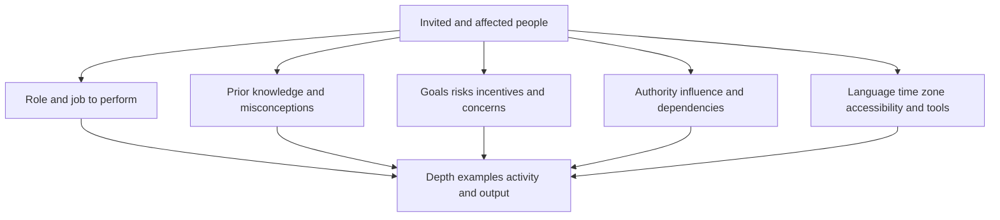

| Audience dimension | Questions | Design response | Evidence |
|---|---|---|---|
| Role/job | What must this person decide, design, operate, approve, or explain? | Use role-relevant examples and artifact | Job statement confirmed |
| Prior knowledge | Which terms, tools, and processes are familiar? | Pre-work, glossary, optional depth | Self-assessment plus sample question |
| Experience | Have they performed adjacent workflows? | Build from existing mental models | Concrete story or artifact |
| Goal | What useful result do they need? | Tie objective to work after session | Sponsor and participant confirmation |
| Concern | What could make this unsafe, costly, or unhelpful? | Address risk, scope, rollback, evidence | Concern ledger |
| Authority | What may they decide or change? | Invite accountable role or separate recommendation from approval | Decision-rights record |
| Influence | Who can enable or resist implementation without formal approval? | Include or consult affected operators | Stakeholder map |
| Language | Which acronyms, technical depth, and business framing fit? | Layer explanation; define terms first | Terminology check |
| Accessibility | Captions, contrast, keyboard access, breaks, pace, screen reader, hearing, mobility? | Make reasonable accommodations and accessible materials | Confirmed needs and test |
| Location | Virtual, on-site, hybrid, distributed? | Choose room, tools, camera, audio, boards, backup | Readiness check |
| Time | Time zones, shift coverage, incident load, attention span? | Short modules, breaks, asynchronous alternatives | Availability confirmed |
| Trust | Is data, vendor intent, or prior delivery disputed? | Lead with evidence and allow challenge | Assumption and objection log |
| Privacy/security | What data or architecture can be shown to whom? | Minimize, sanitize, restrict, and record | Approved material and access |
| Group dynamics | Dominant voices, hierarchy, conflict, silence? | Structured turns, anonymous input, smaller groups | Participation plan |

Do not call executives "nontechnical." Some executives are deeply technical, and some operators need business context. Ask what decision they face and how much mechanism they need. A useful layered pattern is:

1. State the outcome or risk in one sentence.
2. Show the mechanism in one diagram.
3. Offer the evidence and tradeoffs.
4. Put detailed configuration, queries, and traces in an appendix or operator segment.
5. Confirm what each audience must do next.

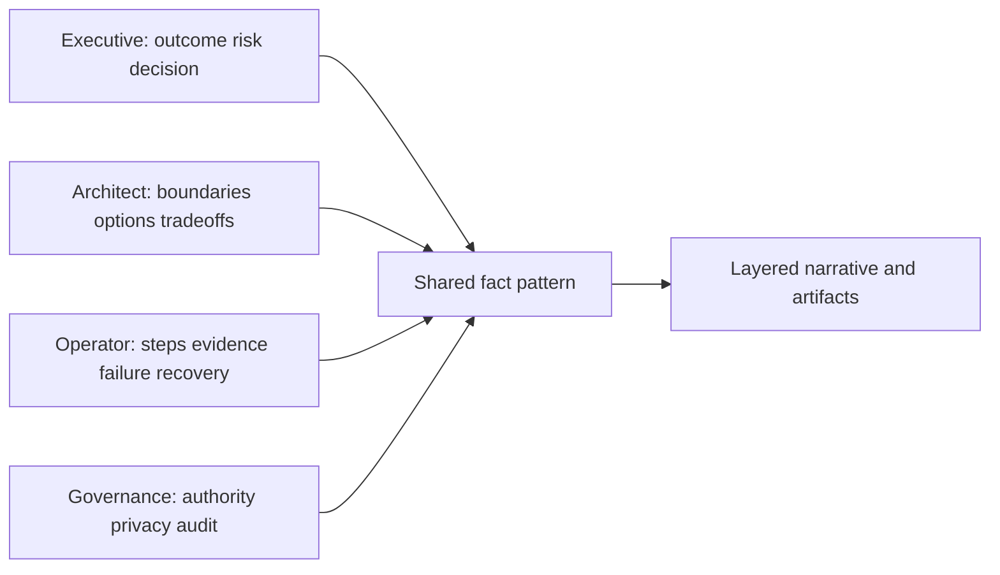

## Objectives, outcomes, and evidence

An objective should name the **actor**, **observable behavior**, **conditions**, and **quality criterion**. "Understand connector health" is weak. "Given a synthetic connector status and source count report, the operator will classify freshness, completeness, authentication, mapping, or downstream workflow failure and select the next discriminating check using the troubleshooting rubric" is observable.

| Weak objective | Stronger objective | Evidence | Boundary |
|---|---|---|---|
| Understand the platform | Explain the verified high-level purpose, inputs, outputs, and limits in two minutes | Teach-back rubric | No architecture internals invented |
| Learn the dashboard | Given a current approved view, identify grain, time range, filters, denominator, source freshness, and one decision | Scenario response | UI and fields verified first |
| Know troubleshooting | Given a synthetic failure, form two hypotheses and choose the cheapest discriminating check | Case exercise | No uncontrolled production action |
| Align on design | Compare three options against agreed requirements and record selected option or unresolved decision | Decision record | Customer authority decides |
| Improve adoption | Perform the approved workflow correctly twice and identify the support/escalation route | Observation checklist | Later production application measured separately |
| Understand risk | Explain finding, path, controls, impact, uncertainty, and owner without treating score as truth | Risk-story teach-back | Scenario facts clearly labeled |

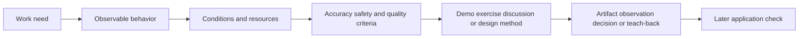

Use no more objectives than can be practiced and checked. A ninety-minute session cannot credibly create mastery across architecture, operation, troubleshooting, governance, and executive communication. Split orientation, working design, operator practice, and governance approval if needed.

### Objective hierarchy

| Level | Participant can | Suitable method | Evidence |
|---|---|---|---|
| Recognize | Identify a term, signal, or component | Brief explanation and labeled example | Correct classification |
| Explain | Describe purpose, flow, and limitation | Analogy, diagram, teach-back | Accurate explanation |
| Apply | Perform a defined method in a bounded case | Guided exercise | Completed artifact or operation |
| Analyze | Separate evidence, hypotheses, boundaries, and causes | Scenario, trace, dataset, comparison | Reasoning record |
| Decide/design | Compare options and justify a selection under constraints | Design workshop | Decision and tradeoff record |
| Adapt | Transfer method to a new situation and handle failure | Complex scenario and reverse-shadow | Rubric-based observation |

## Discovery sessions versus design sessions

A discovery session asks, "What is true, important, constrained, and unknown?" A design session asks, "Given sufficient current-state evidence and requirements, which future-state option should we choose and how will it operate?" Mixing them can cause a proposed design to silence discovery.

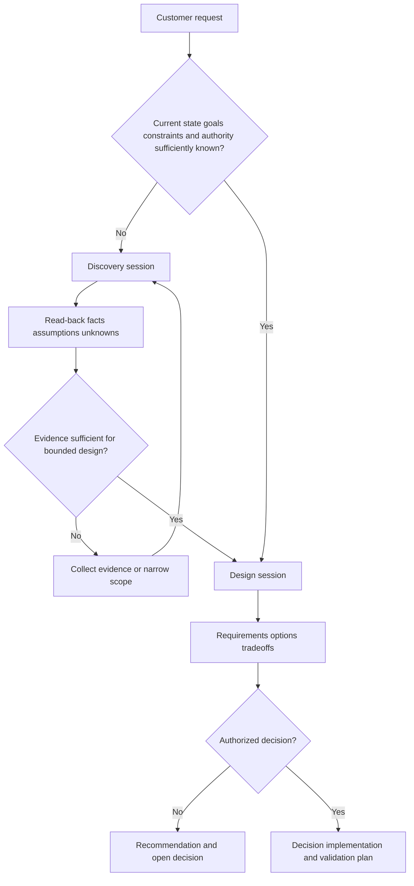

| Dimension | Discovery workshop | Design workshop |
|---|---|---|
| Primary question | What is the current problem and context? | What future approach best fits verified requirements? |
| Inputs | Hypotheses, existing artifacts, stakeholder stories, samples | Validated discovery, requirements, constraints, options |
| Participants | Outcome owner, operators, architects, data/control owners, governance | Architects, operators, change/security/privacy owners, decision authority |
| Facilitator posture | Curious, neutral, tests understanding | Comparative, explicit tradeoffs, prevents premature closure |
| Activities | Story walkthrough, current-state map, evidence inventory, pain/root-cause separation | Requirement weighting, option modeling, failure analysis, decision record |
| Outputs | Facts, assumptions, unknowns, current map, criteria, next tests | Selected option or open decision, rationale, owners, validation, residual |
| Common failure | Leading customer toward product | Designing without enough evidence |
| Stop rule | Critical unknown prevents truthful synthesis | Decision authority or required evidence absent |

### Discovery mechanics

Open with the purpose and use of information. Ask for a recent real example: "Walk us through the last time this workflow succeeded and the last time it failed." Draw the steps, systems, evidence, wait states, owners, exceptions, and decisions. Confirm each statement as observed, reported, inferred, or unknown. End with a read-back and targeted evidence requests.

### Design mechanics

Start with agreed requirements and non-goals. Separate must-have constraints from preferences. Generate at least two credible options plus the current-state baseline. Compare technical fit, security, privacy, operations, cost, dependency, reversibility, supportability, and validation. Name the customer decision owner. If a product capability is relevant, verify it rather than filling the gap with confidence.

### Plain-English deep-dive 2 - Facilitation neutrality does not mean technical passivity

A facilitator should not manipulate the room toward a hidden answer. That does not require silence when evidence is wrong or risk is hidden. Technical neutrality means the comparison criteria and reasoning are inspectable. The facilitator can say, "Option A currently fails the stated data-residency requirement," or, "We have not verified that this entitlement includes the needed capability."

Think of a referee who also understands the rules. The referee does not choose which team should win, but does stop an invalid play. In a technical workshop, the facilitator protects definitions, evidence classes, architecture boundaries, decision rights, security, and honest product claims. The customer still owns the decision.

## Engagement lifecycle

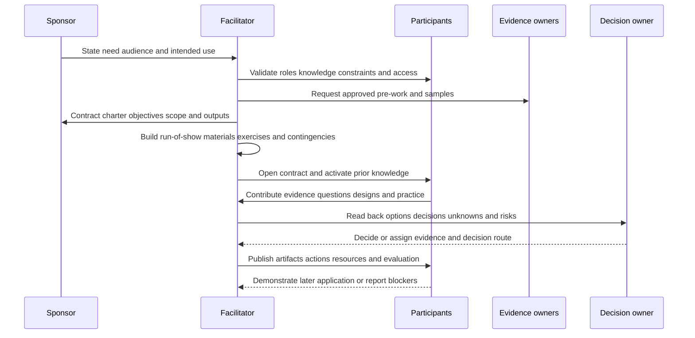

### Phase 1 - Intake and qualification

Determine the business or operational trigger, audience, desired use, urgency, constraints, existing evidence, and whether a workshop is the correct intervention. A product defect needs Support; a contractual disagreement needs account/commercial roles; an architecture decision may need a specialist or services scope; a basic knowledge gap may need self-paced content before a working session.

| Intake question | Why it matters | Warning sign |
|---|---|---|
| What should be different afterward? | Defines outcome | "We need a workshop" is the entire goal |
| Who will use the result? | Identifies real audience | Sponsor cannot name users |
| What decision or task is blocked? | Connects to work | General interest only |
| What evidence exists? | Enables productive preparation | No approved artifacts but design expected |
| What is in and out of scope? | Controls depth and expectations | Entire platform in one hour |
| Who owns the decision? | Prevents false closure | Only observers attend |
| Is there an incident or support case? | Routes urgent diagnosis | Training used to replace Support |
| Is production access/change expected? | Triggers authorization and safety | Live modification assumed |
| Which product facts require verification? | Prevents invented behavior | Demo request based on marketing phrase |

### Phase 2 - Contract and prepare

Create the charter and run-of-show. Confirm attendance, decision rights, prerequisites, materials, room/tool readiness, accessibility, privacy, recording policy, environment, backup path, and facilitator roles. Test every demonstration from the participant viewpoint. Prebuild only enough whiteboard structure to save time; leave the customer-specific model open for correction.

### Phase 3 - Facilitate

Open with objective, scope, method, evidence labels, participation rules, decision rights, breaks, and outputs. Activate prior knowledge with a question or small case. Alternate short explanation with contribution or practice. Summarize at transitions. Keep facts, assumptions, questions, decisions, and actions visually distinct.

### Phase 4 - Verify and close

Use a teach-back, artifact review, scenario, or decision recap. Ask what remains unclear and what could make the planned action unsafe. Read back decisions with owners and authority. State unresolved product, architecture, privacy, or support questions as unknowns. Explain follow-up and support route.

### Phase 5 - Follow through

Publish corrected artifacts promptly under the agreed information classification. Include decisions, rationale, actions, owners, due-date basis, unanswered questions, evidence requests, resources, evaluation, and next checkpoint. Later, distinguish resource use, workflow application, operational effect, and business outcome.

## Workshop charter

The charter is the smallest shared contract that makes preparation and attendance rational. It should fit one or two pages.

| Charter field | Content | Quality test |
|---|---|---|
| Title/version/date | Stable identifier and revision | Participants know which session |
| Sponsor/facilitator | Request owner and process owner | Authority and contact clear |
| Trigger | Business, technical, risk, or capability need | Not merely "customer asked" |
| Intended outcome | Decision, artifact, alignment, or capability | Observable and useful afterward |
| Objectives | Actor, behavior, condition, criterion | Evidence method named |
| Audience | Roles, jobs, prior knowledge, authority, accessibility | Each attendee has a reason |
| Scope/non-goals | Included and excluded questions | Prevents platform-wide drift |
| Evidence classes | Product fact, general practice, scenario, customer fact, unknown | Claims remain bounded |
| Inputs/pre-work | Approved diagrams, samples, baselines, questions | Owners and due dates clear |
| Method | Discovery, design, demo, exercise, teach-back | Matches objective |
| Decisions | What may be decided and by whom | Customer authority named |
| Outputs | Whiteboard, decision record, plan, job aid, evaluation | Owner and format named |
| Security/privacy | Classification, data minimization, access, recording, retention | Approved before sharing |
| Logistics | Virtual/on-site/hybrid, room, tools, time, breaks | Tested from participant view |
| Risks/contingencies | Missing role, demo failure, time loss, disagreement | Recovery path prepared |
| Follow-up | Publication, actions, later application check | Session connects to operations |

## Run-of-show and facilitation roles

A run-of-show converts objectives into timed participation. Do not allocate every minute; preserve contingency. A practical design might reserve 10 to 15 percent for late start, accessibility needs, technical failure, debate, and recap.

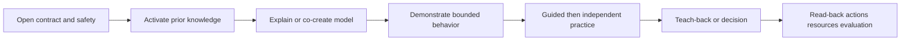

| Segment | Purpose | Lead | Participant action | Evidence | Contingency |
|---|---|---|---|---|---|
| Welcome and contract | Align objective, scope, roles, safety | Lead facilitator | Confirm or correct | Verbal/check-in | Shorten background, not objective |
| Context story | Connect to customer work | Sponsor | State need and consequence | Agreed problem statement | Facilitator supplies draft for correction |
| Prior-knowledge check | Find starting point | Learning facilitator | Poll, classify, explain | Responses | Branch to glossary or advanced prompt |
| Current-state map | Surface truth and unknowns | Technical facilitator | Add/correct flow | Labeled whiteboard | Use approved pre-read if key owner absent |
| Concept model | Provide common language | Technical facilitator | Ask and relate | Concept check | Defer deep edge case |
| Demonstration | Show one bounded mechanism | Demo driver | Predict and observe | Observation record | Screenshots/video only if current and approved; otherwise explain cancellation |
| Exercise | Build performance | Table leads | Perform or decide | Rubric/artifact | Simplify dataset, not criteria |
| Debrief | Extract reasoning and variation | Lead facilitator | Compare methods | Lessons and misconceptions | Structured round |
| Design/decision | Compare options and choose route | Decision facilitator | Evaluate and decide | Decision record | Assign evidence and decision date |
| Teach-back | Test learner ownership | Observer | Explain/perform | Rubric | Coach then retry |
| Close | Confirm decisions, actions, gaps, route | Lead facilitator | Read back commitment | Action register | Send unresolved items as unknown |
| Evaluation | Improve session and later transfer | Learning facilitator | Complete checks | Layered evaluation | Async accessible form |

### Facilitation roles

| Role | Responsibility | Must not assume |
|---|---|---|
| Lead facilitator | Contract, pace, participation, transitions, close | Customer decision authority |
| Technical facilitator | Explain mechanism, test evidence, answer within verified scope | Unknown product behavior |
| Whiteboarder | Capture model, labels, decisions, questions, actions | Silent interpretation without read-back |
| Demo driver | Operate tested environment and narrate observations | Production equivalence |
| Exercise observer | Apply rubric and collect learning evidence | Personal preference as criterion |
| Timekeeper | Signal segment and contingency use | Authority to cut safety discussion |
| Producer | Manage virtual room, audio, captions, polls, breakout, backup | Content decision ownership |
| Sponsor | State need, importance, and intended use | Technical answer to every question |
| Decision owner | Accept, reject, defer, or route decisions | Ability to override policy |

## Architecture whiteboarding

A useful architecture whiteboard is a shared hypothesis. It normally includes actors, identities, devices/assets, applications, data, trust boundaries, network or logical paths, control points, integrations, evidence points, operations, owners, and failure states. Start with a user, event, or decision and follow it end to end.

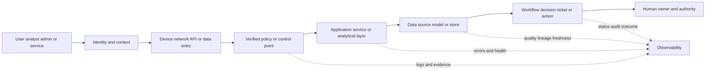

| Whiteboard layer | Questions | Visual convention | Common omission |
|---|---|---|---|
| Actor/job | Who initiates and what are they trying to do? | Person/role box | Starting from product |
| Identity/context | How is identity established and which attributes matter? | Identity box plus attributes | Assuming username equals person |
| Asset/device | Which endpoint, workload, or source participates? | Asset box with scope | Ignoring unmanaged or ephemeral assets |
| Path | What logical/network/data route is used? | Directed arrows | Drawing connection without direction |
| Boundary | Where do trust, tenant, network, admin, region, or ownership boundaries change? | Dashed boundary | Treating cloud as one box |
| Control | What decision is intended, by whom, and where enforced? | Gate/diamond | Naming product without behavior |
| Data | What records, grain, time, quality, and lineage exist? | Data store/stream | "Data" without semantics |
| Integration | Which API, connector, file, event, or manual handoff? | Labeled interface | Missing authentication/rate/error path |
| Evidence | Which logs, traces, counts, IDs, and read-backs prove state? | Observation marker | No way to validate flow |
| Operation | Who monitors, changes, supports, and recovers it? | Owner lane | Architecture without people |
| Failure | What if identity, data, network, policy, service, or workflow fails? | Red branch or note | Happy path only |
| Assumption | What is not yet customer fact? | Tagged note | Draft treated as truth |

Whiteboard in layers. First draw the business or analyst workflow. Then add architecture. Then add evidence and failure states. Finally add ownership and decisions. If the group debates labels before agreeing on the path, return to one real scenario.

### Whiteboard read-back

At each boundary say: "I have drawn this as a customer-reported fact, this arrow as an inference, and this capability as unverified. What should change?" The resulting diagram should carry a legend, version, date, scope, sources, open questions, and owner. A screenshot without those elements is fragile.

### Whiteboarding tradeoffs

| Choice | Strength | Limitation | Use when |
|---|---|---|---|
| Blank board | Maximum co-creation | Slow and intimidating | Discovery with high uncertainty |
| Seeded draft | Efficient and exposes hypotheses | Can anchor participants to wrong model | Prior evidence exists and labels are explicit |
| Physical board | Natural participation and room energy | Harder remote access, capture, and accessibility | On-site with good capture process |
| Digital board | Distributed editing, layers, export | Tool access and cognitive overhead | Virtual/hybrid and persistent artifact |
| Formal architecture notation | Precision and reuse | Learning curve and false completeness | Detailed design after shared understanding |
| Simple boxes/arrows | Fast and inclusive | Ambiguity if labels are weak | Early discovery and executive explanation |

## Demonstrations without theater

A demo should answer a bounded question. Write a **demo claim**: "Under [verified setup], when [input/action] occurs, we expect [observable behavior] at [evidence point], subject to [known limits]." Then show baseline, action, observation, and read-back. Do not improvise production configuration to rescue a failing demo.

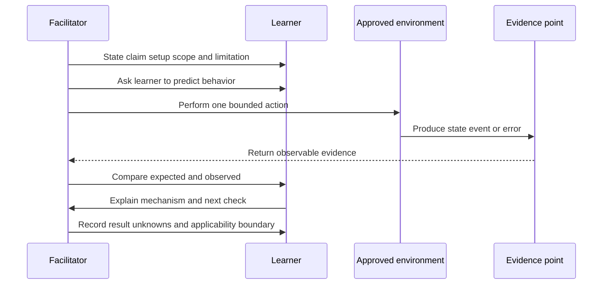

| Demo element | Required content | Failure if omitted |
|---|---|---|
| Claim | Exact behavior being illustrated | Audience invents its own promise |
| Setup | Version, tenant/lab, data, configuration, identity, entitlement | Result cannot be interpreted |
| Baseline | State before action | Change has no comparison |
| Prediction | What should happen and why | Passive watching |
| Action | One controlled step | Too many variables |
| Observation | UI, API, log, trace, count, or output with grain/time | Narration replaces evidence |
| Negative/control case | Condition where behavior differs | Happy-path overgeneralization |
| Failure plan | Stop, explain, capture evidence, switch objective | Live random troubleshooting |
| Applicability | What the demo does and does not establish | Lab behavior becomes customer fact |
| Follow-up | Documentation, specialist, tenant test, or support path | Unknown is silently closed |

### Demo failure protocol

1. Stop repeated clicking or configuration changes.
2. Restate the expected behavior and exact observed state.
3. Protect secrets, tokens, logs, and participant data.
4. Decide whether the objective is learning troubleshooting or observing the capability.
5. If troubleshooting is not the objective, use the prepared conceptual path or cancel that claim.
6. Capture time, version, correlation identifiers, changes, evidence, and environment.
7. Route suspected supported-product behavior through the correct Support or specialist process.
8. Follow up with verified findings; never invent a cause to preserve presenter authority.

### Plain-English deep-dive 3 - A failed demo can model excellent consulting

A facilitator may fear that failure destroys credibility. Concealing it destroys more. A disciplined response shows how technical professionals behave when evidence differs from expectation. Name what is known, protect the environment, avoid random changes, choose a discriminating check, and separate the session objective from the incident path.

The analogy is a pilot aborting a takeoff after an abnormal instrument reading. The safe abort is not evidence of poor judgment. Continuing because passengers are watching would be. In a customer session, honest handling of failure teaches evidence discipline and preserves trust.

## Exercises and teach-back

Exercises should resemble the decisions and actions learners need, while reducing unnecessary production consequence. Use synthetic data for practice unless approved customer data is essential and properly handled. Start guided, reduce support, then vary the scenario.

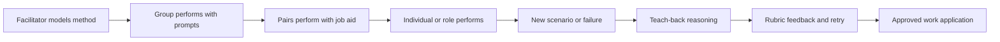

| Exercise type | Best for | Example | Evidence |
|---|---|---|---|
| Classification | Vocabulary and routing | Fact, assumption, unknown, defect, request, incident, adoption gap | Correct label and rationale |
| Worked example | New multi-step method | Facilitator traces one synthetic data-quality failure | Completed model with narration |
| Guided lab | Bounded operational skill | Inspect approved sample metrics and identify grain/filter/freshness | Observation checklist |
| Tabletop | Decisions under uncertainty | Handle a synthetic critical escalation | Timeline, roles, updates, decisions |
| Whiteboard challenge | Architecture and design | Map current path and compare options | Diagram and tradeoff record |
| Troubleshooting case | Hypothesis and evidence | Select cheapest discriminating check | Hypothesis table |
| Role-play | Communication and objection handling | Explain bad news to executive and operator | Communication rubric |
| Teach-back | Ownership and transfer | Learner explains workflow to a new teammate | Accuracy and limitation rubric |
| Job-aid build | Operationalization | Create checklist or decision tree | Reusable artifact |
| Capstone | Integrated capability | Discover, design, demonstrate, recover, and brief | Multi-criteria rubric |

### Exercise design card

| Field | Entry question |
|---|---|
| Objective | Which observable behavior is practiced? |
| Scenario | What context is required, and is it explicitly synthetic or customer-approved? |
| Starting evidence | What artifacts, data, and facts are supplied? |
| Unknowns | Which gaps require questions or tests? |
| Task | What must participants produce or decide? |
| Constraints | Time, policy, privacy, authority, technical limits? |
| Success criteria | What accuracy, reasoning, safety, and communication are required? |
| Common traps | Which misconceptions should the design expose? |
| Hints/scaffolds | What support is available and when is it removed? |
| Debrief | Which reasoning and alternative paths should surface? |
| Transfer | Where would this method be used later? |

### Teach-back rubric

| Criterion | Needs coaching | Ready with aid | Ready independently |
|---|---|---|---|
| Purpose | Recites steps without purpose | Connects most steps to outcome | Frames outcome, limits, and decision clearly |
| Vocabulary | Confuses core terms | Uses terms correctly with prompts | Defines terms plainly for another audience |
| Sequence | Omits dependencies or validation | Follows standard path | Adapts sequence while protecting controls |
| Evidence | Treats report or success message as proof | Checks main evidence | Separates facts/assumptions and tests boundaries |
| Safety | Misses authorization or privacy | Uses checklist | Anticipates scope, minimization, rollback, and escalation |
| Failure | Guesses or repeats action | Uses provided troubleshooting tree | Forms hypotheses and selects discriminating checks |
| Communication | Overloads or overstates | Gives accurate operational explanation | Layers narrative and states uncertainty neutrally |
| Handoff | No owner or follow-up | Names standard owner | Produces complete read-back, support route, and residual |

Feedback should be behavioral: "You identified the freshness issue and source owner. Before recommending replay, add the idempotency and downstream duplicate check." Avoid identity judgments such as "You are not technical enough."

## Virtual, on-site, and hybrid facilitation

Delivery mode changes mechanics, not the objective. Virtual delivery reduces travel and can improve distributed participation, but increases tool, attention, and audio risk. On-site delivery supports relationship and physical co-creation, but can exclude remote voices and adds room, travel, security, and accessibility constraints. Hybrid is often the hardest because room participants receive richer cues.

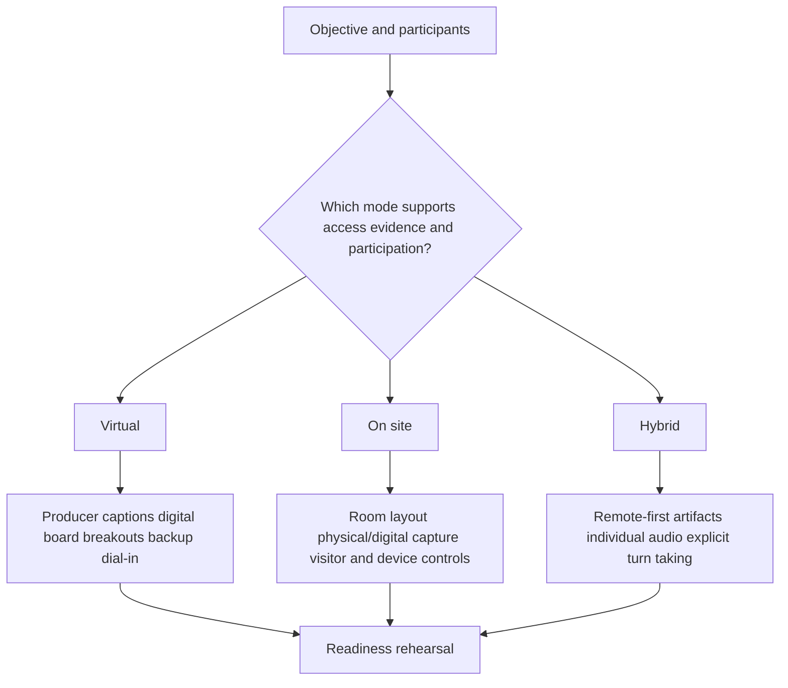

| Dimension | Virtual | On site | Hybrid |
|---|---|---|---|
| Participation | Polls, chat, round-robin, breakout | Table groups, physical board, movement | Use digital board and invite remote first |
| Audio | Headset, mute norms, producer | Room acoustics and microphones | Individual or well-designed room audio critical |
| Visual | Screen size, zoom, accessible materials | Sightlines, contrast, physical labels | Never rely only on room board |
| Access | Link, identity, tool permissions, backup | Building/visitor access and room | Both sets of access controls |
| Privacy | Recording, chat export, screenshare, home environment | Whiteboard photos, printed material, visitor view | Explicit capture and retention rules |
| Energy | Shorter blocks, frequent response | Movement and table work | Equal breaks and structured turns |
| Support | Producer and backup channel | Room host and equipment | Producer plus room host |
| Failure | Connection, tool outage, screen-share | Projector, room, travel | Audio inequity and dual-tool failure |
| Artifact | Digital native | Capture and transcribe accurately | One shared digital source |

### Inclusive participation mechanics

1. Send objectives, glossary, accessible materials, and contribution options in advance.
2. Invite corrections in voice, chat, board, poll, or follow-up rather than requiring one mode.
3. Use individual thinking time before open discussion so speed and status do not dominate.
4. Ask specific role-based questions without putting one person on display as representative of a group.
5. Interrupt respectfully: "I want to preserve that point and hear the data-owner view before we decide."
6. Distinguish silence from agreement. Use explicit checks.
7. Provide breaks and honor time zones and shift responsibilities.
8. Read visual content aloud and use meaningful labels rather than color alone.
9. Explain recording purpose, access, retention, and opt-out path.
10. Offer an asynchronous correction window for complex or sensitive topics.

## Facilitation under disagreement

Constructive disagreement is a source of design information. The facilitator should slow the claim down: define the proposition, label evidence, identify scope and effective time, ask what would falsify each explanation, and decide whether the room can resolve it.

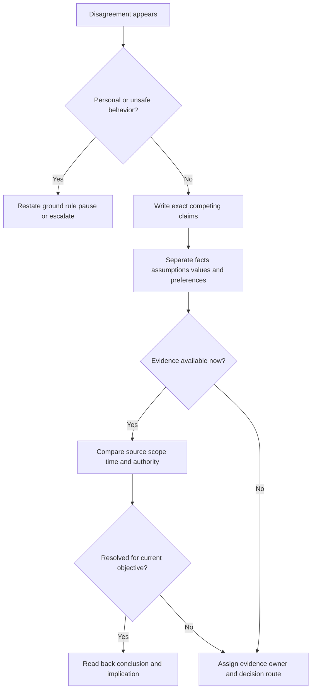

| Facilitation phrase | Purpose |
|---|---|
| "Let me write the two claims separately." | Prevents argument from changing shape |
| "Which part is observed, and which part is our explanation?" | Separates evidence from hypothesis |
| "Are we describing different scopes or dates?" | Finds noncontradictory truths |
| "What evidence would change your view?" | Tests falsifiability |
| "Who has authority for this tradeoff?" | Restores decision rights |
| "This is valid but outside today's objective; I will record an owner and route." | Protects scope without dismissal |
| "We cannot establish that product behavior from current evidence." | Preserves technical honesty |
| "Before continuing, we need to address the impact of that comment on participation." | Protects safety and respect |

## Training evaluation and value

Evaluation should be designed before delivery. Use four distinct layers: **reaction**, **learning**, **application**, and **outcome**. These resemble a chain, but later layers have more confounding factors. Do not claim that training caused a business outcome merely because participants attended.

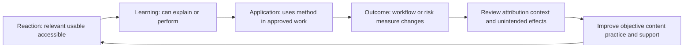

| Layer | Question | Evidence | Honest claim | Misclaim |
|---|---|---|---|---|
| Reach | Did intended people receive and access it? | Invite, attendance, completion, accessibility issues | Defined audience reached | Attendance equals adoption |
| Reaction | Was it relevant, usable, paced, and inclusive? | Survey plus comments | Participants reported perception | Participants became competent |
| Learning | Can they explain or perform objective now? | Pre/post scenario, exercise, teach-back, rubric | Demonstrated bounded capability | Will perform in production |
| Confidence | Do they know when and how to act or ask for help? | Calibrated self-rating plus rationale | Perceived readiness changed | Confidence equals accuracy |
| Application | Is method used correctly later? | Sampled artifact, workflow observation, case review | Observed application in defined sample | Universal behavior change |
| Supportability | Can users recover, use job aids, and route issues? | Error/recovery drill, support-route use | Operational handoff evidenced | No future support required |
| Outcome | Did workflow quality, time, risk, or rework change? | Baseline/trend with denominator and context | Associated change under stated limits | Training caused all improvement |
| Equity | Did different roles/locations gain comparable access and performance? | Segmented but privacy-safe evidence | Identified participation or result gaps | Individual surveillance |

### Training evaluation design

| Field | Example-neutral definition |
|---|---|
| Objective | Observable learner behavior |
| Population | Intended roles and scope, not just attendees |
| Baseline | Prior knowledge, behavior, or performance under same definition |
| Formative checks | Questions and practice during session |
| Summative evidence | End exercise or teach-back rubric |
| Application evidence | Approved later artifact, observation, or case sample |
| Outcome hypothesis | Why correct application might influence a customer measure |
| Confounders | Product change, staffing, data quality, process, seasonality, incident mix |
| Privacy | Minimum learner data, access, retention, aggregation |
| Threshold | Customer-approved readiness or improvement criterion |
| Remediation | Coaching, job aid, retry, specialist or support route |
| Review point | Date or trigger for later application check |

### Plain-English deep-dive 4 - Positive feedback is not the same as learning

A participant can enjoy a charismatic presentation and remember little. Another can find a difficult exercise uncomfortable and learn a great deal. Reaction matters because relevance, pace, accessibility, and trust affect learning, but it is a separate measure.

Think of a fire drill. Asking whether people liked it does not prove they can evacuate. A route exercise shows immediate learning. Observing a later drill shows application. Reduced evacuation time may be an outcome, but route changes, staffing, alarms, and building conditions also matter. Evaluate each claim at the correct layer.

## Follow-up and operational transfer

The follow-up should make work easier, not become a transcript dump. Publish only approved information, with a short decision/action summary and links or references to versioned artifacts.

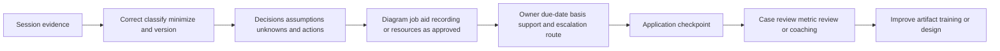

| Follow-up element | Required detail |
|---|---|
| Outcome recap | What objective was met, partially met, or not met |
| Decisions | Exact decision, authority, rationale, effective scope/date |
| Artifact | Corrected diagram, design, checklist, or rubric with version |
| Facts/assumptions/unknowns | Separate labels and evidence source |
| Actions | Owner, action, dependency, due-date basis, acceptance evidence |
| Product questions | Current documentation/specialist/Support route; no guessed answer |
| Learning gaps | Objective and remediation path, not individual embarrassment |
| Resources | Current official material and approved job aids |
| Security/privacy | Classification, access, recording, retention, deletion |
| Application check | Later task, observation, case review, or measure |
| Feedback | What will change in the next delivery |

## Security, privacy, safety, and product boundaries

Workshops often expose architecture, vulnerabilities, identities, screenshots, logs, tickets, support data, business priorities, and participant performance. Treat the session as an information flow with purpose, minimum necessary data, access, retention, and deletion.

| Risk | Control question | Safer practice |
|---|---|---|
| Sensitive architecture | Who needs which layer? | Use abstracted view for broad audience and restricted appendix |
| Credentials/tokens | Could screens, logs, or commands reveal secrets? | Use test identities, redact, rotate if exposed, stop capture |
| Personal data | Is learner or customer data necessary? | Synthetic/minimized examples and aggregation |
| Vulnerability detail | Could material enable misuse or expose unmitigated paths? | Need-to-know access and approved handling |
| Recording | What purpose, consent, access, retention, and deletion apply? | Default to no recording unless justified and approved |
| Chat/board export | Does collaboration tool retain sensitive content? | Confirm tenancy, access, export, and cleanup |
| Live production | Is change explicitly authorized with rollback? | Prefer read-only, synthetic, or nonproduction practice |
| Demo entitlement | Does environment legally and technically include capability? | Verify before claim or use |
| Accessibility data | Is accommodation information handled respectfully? | Collect minimum and limit access |
| Evaluation data | Could scores become inappropriate performance surveillance? | Purpose limitation, aggregation, fair rubric, retention |
| AI assistance | Could prompts expose customer content or produce false instructions? | Approved tools, minimization, grounding, human validation |
| Travel/site | Visitor, device, photography, network, and physical safety rules? | Confirm site policy before arrival |

Never invent screens, buttons, settings, fields, workflows, limits, licensing, or supported outcomes. A conceptual diagram should say conceptual. A synthetic screenshot should say synthetic. A current tenant demonstration should identify its bounded setup without exposing secrets. Where current Zscaler behavior matters, use current official documentation, licensed-tenant evidence, specialists, Support, and safe tests.

## Operations and scaling

Repeatable consulting does not mean identical delivery. Standardize the contract, evidence labels, artifact patterns, safety checks, evaluation layers, and review; tailor the scenario, depth, examples, timing, and decisions.

| Operational asset | Owner | Review trigger | Quality control |
|---|---|---|---|
| Workshop catalog | Enablement/technical-success owner | Product, role, or customer-need change | Objective and audience review |
| Charter template | Facilitation practice owner | Repeated scope confusion | Sample audit |
| Run-of-show | Session lead | Timing or engagement failure | Rehearsal and after-action note |
| Whiteboard pattern | Architecture owner | Model or notation change | Technical peer review |
| Demo script | Product specialist | Release, entitlement, environment, evidence change | Re-test before use |
| Exercise | Learning owner | Objective or misconception change | Pilot and rubric calibration |
| Job aid | Workflow owner | Process/support route change | Operator usability test |
| Evaluation | Learning plus privacy owner | Use or retention change | Validity/privacy review |
| Source ledger | Technical content owner | Source update or review date | Link and claim check |
| Improvement backlog | Practice owner | Every delivery | Prioritized from evidence |

### Capacity and sequencing

Do not solve every gap with another live session. Use a short orientation for common vocabulary, office hours for variable questions, a design workshop for decisions, a guided practice for new workflows, job aids for recall, and case reviews for advanced judgment. Live expert time is best used for interaction, ambiguity, feedback, and decisions.

## Failure modes and misconceptions

| Failure or misconception | Why it fails | Repair |
|---|---|---|
| "The customer asked for training" is sufficient scope | Need and application remain unknown | Ask what task or decision is blocked |
| More slides mean more value | Content volume increases cognitive load | Keep only material supporting objectives |
| Executives need no mechanics | Brevity without evidence becomes assertion | Show one mechanism and offer appendix |
| Operators need no business context | Steps lose priority and judgment | Connect workflow to customer outcome |
| Discovery is a product questionnaire | Leads answers and misses root need | Walk real current-state stories and evidence |
| Design starts with preferred product | Alternatives and constraints disappear | Agree requirements and baseline first |
| Whiteboard is a polished diagram | Participants cannot correct assumptions | Co-create and label evidence classes |
| Demo proves production fit | Setup, scale, integration, entitlement, and operations differ | State bounded claim and validate customer environment |
| Live production is more authentic | Consequence can exceed learning benefit | Use synthetic or controlled environment |
| Attendance proves adoption | Presence says nothing about correct use | Observe practice and later application |
| Survey score proves learning | Reaction and capability differ | Use objective-aligned exercise |
| Teach-back embarrasses learners | Poorly framed public testing can harm safety | Normalize coaching, use pairs, retry, and rubric |
| Silence means agreement | Hierarchy, uncertainty, or tool limits can suppress response | Explicit check in multiple modes |
| Parking lot means ignore | Deferred items disappear without owner | Publish route and owner |
| Facilitator must answer everything | Guessing damages product and technical truth | Record unknown and verify through correct source |
| Failed demo must be rescued live | Random changes create risk and confusion | Use failure protocol and follow-up |
| Recording is always helpful | It increases privacy, retention, and participation concerns | Record only with purpose and approval |
| On-site is automatically better | Travel and room do not guarantee participation | Select mode against objective and constraints |
| Hybrid is virtual plus room | Remote people become observers | Design remote-first artifacts and turns |
| Follow-up is a transcript | Decisions and actions are buried | Publish concise read-back and versioned artifacts |

## Troubleshooting workshop and training failures

Troubleshoot the engagement like a system: symptom, scope, timeline, recent change, evidence, hypotheses, discriminating check, mitigation, and validation.

| Symptom | Plausible causes | Cheapest discriminating check | Response |
|---|---|---|---|
| Wrong people attend | Sponsor delegated, role map stale, invitation vague | Ask each attendee's job and authority | Narrow objective or reschedule decision segment |
| Low participation | Unsafe hierarchy, unclear prompt, cognitive overload, audio/tool issue | Anonymous poll plus direct accessibility check | Think-pair-share, alternate channel, smaller group |
| Debate consumes time | Undefined claim, scope/date mismatch, missing authority | Write competing claims and evidence | Resolve, assign test, or defer with owner |
| Content too basic | Prior knowledge underestimated | Scenario-based diagnostic question | Branch to advanced exercise |
| Content too advanced | Terms/prerequisites missing | One-minute concept map | Pause for glossary or split cohort |
| Whiteboard stalls | Starting abstraction too broad | Walk one recent case | Build path from actor/event |
| Demo fails | Environment, identity, network, data, configuration, service, script | Compare baseline and exact first deviation | Stop, preserve evidence, use contingency |
| Exercise finishes too fast | Task lacks ambiguity or transfer | Add changed constraint/failure | Ask adaptation and teach-back |
| Exercise cannot start | Access, data, prerequisite, instruction defect | Check readiness matrix | Use prepared offline/synthetic path |
| Learners pass but cannot explain | Pattern copying | Change scenario and ask why | Coach mechanism, then retry |
| Survey positive but usage low | Workflow, access, incentive, quality, ownership, support barriers | Observe one real task and ask last-use story | Treat as adoption problem, not retraining default |
| Follow-up actions stall | No accountable owner, authority, dependency, or due-date basis | Review action record | Escalate decision/dependency, not person |
| Product question unresolved | Documentation ambiguous or tenant differs | Form exact requirement and evidence packet | Specialist or Support route |
| Remote users cannot engage | Tool/accessibility/time-zone/audio failure | Test from participant account/device | Alternate channel or reschedule affected activity |

## Decision trees

### Decision tree 1 - What kind of session is needed?

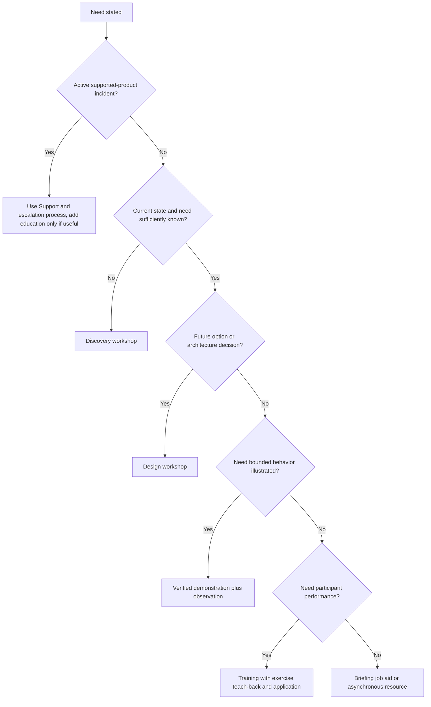

### Decision tree 2 - Is a demonstration safe and useful?

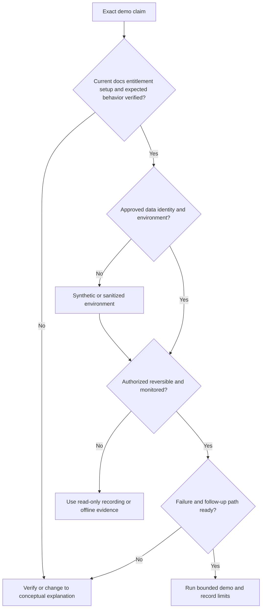

### Decision tree 3 - Does the session prove readiness?

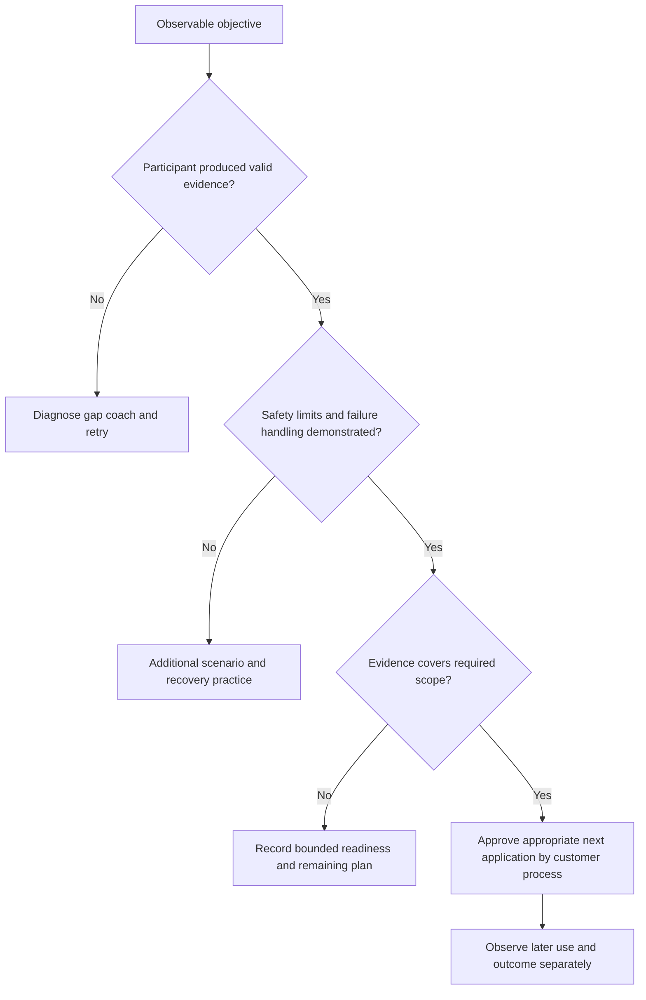

## Explicitly fictional and synthetic NMH scenarios

All content in this section is fictional and synthetic. It is practice material, not a customer engagement, architecture, workshop, product capability, entitlement, training record, adoption result, or statement about Zscaler. Dates in this section, including **2026-10-14**, **2026-10-28**, **2026-11-18**, and **2026-12-09**, are synthetic scenario dates later than the source snapshot and do not imply later research. Every later date in this section is fictional and synthetic.

### Scenario 1 - Discovery disguised as design

On synthetic 2026-10-14, NMH asks for a two-hour design workshop around a named capability. The facilitator discovers that source ownership, workflow, data grain, current controls, and success criteria are unknown. The charter changes the first session to bounded discovery. Participants map one synthetic finding-to-ticket story, label five unknowns, and define evidence owners. No product is selected, and no Zscaler capability is inferred.

### Scenario 2 - The impressive demo that does not answer the question

On synthetic 2026-10-28, a fictional demo environment shows a dashboard. The customer question is whether a specific source and workflow are supported under its entitlement and architecture. The facilitator states that the generic demo does not establish those facts. The group records the exact source, direction, authentication, fields, schedule, error path, entitlement, and acceptance test for verification. The demo remains illustrative only.

### Scenario 3 - Teach-back reveals an unsafe shortcut

On synthetic 2026-11-18, an NMH learner correctly follows a synthetic workflow but explains that a failed action should be retried until it succeeds. Teach-back exposes the misconception. The facilitator coaches reconciliation of target state, operation identifier, idempotency, approval, and downstream side effects before retry. The learner repeats with a changed case and meets the fictional rubric.

### Scenario 4 - Hybrid room excludes remote operators

On synthetic 2026-12-09, on-site leaders dominate a fictional hybrid design session while remote operators cannot read the physical board. The facilitator pauses, moves the shared model to an approved digital board, restates each claim, invites remote input first, and assigns a producer. The output records the process correction; it does not claim a customer outcome or product result.

## Reusable artifact kit

These templates are general practice. Current customer policy, contracts, accessibility needs, information classification, official product truth, and authorized roles govern actual use.

### Artifact 1 - Workshop charter

| Field | Entry |
|---|---|
| Title/version/date | |
| Sponsor and facilitator | |
| Trigger and intended use | |
| Session type: discovery/design/demo/training | |
| Outcome and observable objectives | |
| Audience roles/jobs/prior knowledge | |
| Decision rights and required participants | |
| Scope and non-goals | |
| Inputs/pre-work and evidence owners | |
| Facts/assumptions/unknowns | |
| Method and participant activities | |
| Outputs and artifact owners | |
| Product/source verification boundary | |
| Security/privacy/recording/retention | |
| Accessibility/language/time-zone needs | |
| Logistics/tools/environment | |
| Risks and contingencies | |
| Follow-up and application check | |

### Artifact 2 - Run-of-show

| Time | Segment | Objective | Lead/roles | Participant action | Artifact/evidence | Materials | Contingency |
|---|---|---|---|---|---|---|---|
| | Opening contract | | | | | | |
| | Prior-knowledge check | | | | | | |
| | Current-state/need | | | | | | |
| | Concept/whiteboard | | | | | | |
| | Demo | | | | | | |
| | Exercise | | | | | | |
| | Debrief/decision | | | | | | |
| | Teach-back | | | | | | |
| | Close/evaluation | | | | | | |

### Artifact 3 - Facilitation guide

| Topic | Prepared guidance |
|---|---|
| Opening words | Objective, scope, evidence classes, roles, participation, output |
| Ground rules | Curiosity, concise turns, challenge claims not people, confidentiality |
| Key questions | |
| Expected misconceptions | |
| Plain-English analogies | |
| Whiteboard seed and legend | |
| Decision criteria | |
| Parking-lot route | |
| Inclusion mechanics | Individual think, chat/voice/board, remote-first, breaks |
| Time signals | |
| Product unknown wording | |
| Demo failure wording | |
| Conflict intervention | |
| Security/privacy stop rule | |
| Closing read-back | Decisions, actions, unknowns, support route, evaluation |

### Artifact 4 - Audience and participation map

| Role/persona | Job after session | Prior knowledge | Goal/concern | Authority/influence | Needed depth | Participation method | Accessibility/logistics | Follow-up |
|---|---|---|---|---|---|---|---|---|
| | | | | | | | | |

### Artifact 5 - Objective and evidence matrix

| Actor | Observable behavior | Conditions | Quality/safety criterion | Activity | In-session evidence | Later application evidence | Remediation |
|---|---|---|---|---|---|---|---|
| | | | | | | | |

### Artifact 6 - Architecture whiteboard legend and checklist

| Element | Label/convention | Evidence/source | Owner | Open question |
|---|---|---|---|---|
| Actor and job | | | | |
| Identity/context | | | | |
| Asset/device | | | | |
| Application/service | | | | |
| Data and grain | | | | |
| Path/interface | | | | |
| Trust/ownership boundary | | | | |
| Control/decision | | | | |
| Logs/traces/metrics | | | | |
| Failure/recovery | | | | |
| Human workflow/authority | | | | |
| Fact/assumption/unknown | | | | |

### Artifact 7 - Demo script and observation record

| Field | Entry |
|---|---|
| Exact claim | |
| Audience question | |
| Environment/version/tenant | |
| Entitlement/source verification | |
| Data/identity/configuration | |
| Baseline | |
| Expected behavior and evidence point | |
| Participant prediction | |
| Steps and stop conditions | |
| Positive/negative/control cases | |
| Observed result | |
| Difference/hypotheses | |
| Security/privacy controls | |
| Failure contingency | |
| Applicability limits | |
| Follow-up owner/source | |

### Artifact 8 - Exercise and teach-back card

| Field | Entry |
|---|---|
| Objective | |
| Synthetic/customer-approved scenario label | |
| Starting facts/evidence | |
| Assumptions/unknowns | |
| Task/output | |
| Constraints/authority | |
| Rubric | |
| Hints and release points | |
| Failure variation | |
| Debrief questions | |
| Teach-back prompt | |
| Coaching and retry | |
| Transfer/application | |

### Artifact 9 - Training evaluation plan

| Layer | Measure | Population/grain | Baseline | Method | Timing | Threshold | Owner | Privacy/retention | Interpretation limit |
|---|---|---|---|---|---|---|---|---|---|
| Reach/access | | | | | | | | | |
| Reaction | | | | | | | | | |
| Learning | | | | | | | | | |
| Confidence calibration | | | | | | | | | |
| Application | | | | | | | | | |
| Supportability | | | | | | | | | |
| Outcome hypothesis | | | | | | | | | |
| Unintended effect/equity | | | | | | | | | |

### Artifact 10 - Follow-up read-back

> **Session and intended outcome:** [Title, date, objective, use].
>
> **Outcome status:** [Met, partially met, not met, with evidence].
>
> **Decisions:** [Decision, authority, rationale, scope, effective time].
>
> **Facts, assumptions, and unknowns:** [Separately labeled].
>
> **Artifacts:** [Versioned diagram, design, job aid, rubric, recording only if approved].
>
> **Actions:** [Owner, dependency, due-date basis, acceptance evidence].
>
> **Product questions:** [Exact requirement and official/specialist/Support verification route].
>
> **Capability gaps and support:** [Coaching, retry, job aid, office hours, escalation].
>
> **Security/privacy:** [Classification, access, retention, deletion].
>
> **Application checkpoint:** [Work sample, case review, observation, or metric and date/trigger].

### Artifact 11 - Session troubleshooting record

| Symptom | Scope/time | Evidence | Hypotheses | Discriminating check | Immediate facilitation response | Follow-up owner | Validation |
|---|---|---|---|---|---|---|---|
| | | | | | | | |

### Artifact 12 - Product fact and source ledger

| Claim | Evidence class | Official source/version/review date | Tenant/entitlement relevance | Demo/test evidence | Limitation | Owner/recheck trigger |
|---|---|---|---|---|---|---|
| | | | | | | |

## Exercises

### Exercise 1 - Convert a vague request into a charter

A fictional sponsor asks for "a Zscaler workshop for everyone." Ask intake questions, identify at least four audience jobs, separate discovery/design/demo/training needs, write three observable objectives, define non-goals, name decision rights, and draft the charter without assuming product entitlement or customer architecture.

### Exercise 2 - Build a ninety-minute run-of-show

Design a session on interpreting a synthetic security-data health dashboard. Include prior-knowledge check, analogy, whiteboard, bounded demonstration, pair exercise, teach-back, break/contingency, evaluation, and close. Show which segment you would remove if twenty minutes disappear and why the objective remains protected.

### Exercise 3 - Whiteboard a workflow

Map a fictional finding from source observation through entity matching, context, prioritization, ticket, owner, action, validation, and residual. Add trust boundaries, evidence points, failure paths, and facts/assumptions/unknowns. Perform a three-minute executive read-back and a seven-minute operator read-back from the same model.

### Exercise 4 - Recover from a demo failure

The expected synthetic result does not appear. Write the exact claim, baseline, first deviation, data/privacy controls, three hypotheses, cheapest check, stop rule, alternative learning path, Support/specialist packet, and follow-up wording. Do not invent root cause or continue random changes.

### Exercise 5 - Design teach-back and evaluation

Create a troubleshooting objective, guided case, changed failure case, rubric, coaching language, retry, later application sample, outcome hypothesis, confounders, and privacy controls. Explain why reaction, learning, application, and outcome measures cannot be combined into one score without losing meaning.

### Exercise 6 - Facilitate constructive disagreement

Role-play an architect claiming the source is complete and an operator reporting missing assets. Write the competing claims, source/grain/time questions, evidence request, decision authority, parking-lot threshold, read-back, and follow-up. Avoid choosing a side before evidence.

### Exercise 7 - Virtual and on-site redesign

Take one design workshop and produce virtual, on-site, and hybrid delivery plans. Include audio, visual, board, accessibility, privacy, recording, breakout, room, visitor, device, backup, participation, and artifact-capture mechanics. Explain which objective or activity changes by mode and which does not.

### Exercise 8 - Candidate honesty rehearsal

Answer: "Tell me about a technical workshop you led." Use a factual enterprise support or mentoring example only if personally true, explain the mechanics and evidence, then describe the synthetic NMH artifact as preparation. State that production Zscaler workshop delivery, tenant demos, and customer adoption results are learning boundaries.

## Customer discovery questions

1. What work, decision, or capability should be different after the engagement?
2. Who will use the output, and which roles are affected but not invited?
3. What does each audience already know, do, fear, decide, and need to practice?
4. Which accessibility, language, location, time-zone, shift, or tool constraints apply?
5. Is the need discovery, design, demonstration, training, support, services, governance, or a combination that should be sequenced?
6. Which observable objectives and evidence would make the session useful?
7. What current-state artifacts, samples, baselines, and prior decisions may be reviewed safely?
8. Which facts, assumptions, unknowns, product claims, customer claims, and scenario labels must remain separate?
9. What is in scope, out of scope, and explicitly not being decided?
10. Who can approve architecture, production change, security/privacy, commercial scope, and residual risk?
11. Which official documentation, entitlement, tenant behavior, specialist, Support, or test must verify product claims?
12. What environment, identity, data, configuration, evidence point, rollback, and contingency make a demo safe?
13. Which exercise best resembles the learner's real job while avoiding unnecessary production consequence?
14. What teach-back or rubric will reveal whether the learner can explain, perform, troubleshoot, and hand off?
15. How will virtual, on-site, or hybrid mechanics preserve equal participation and artifact quality?
16. What information classification, minimization, recording, access, retention, and deletion rules apply?
17. How will disagreement, scope drift, dominant voices, silence, and unresolved questions be handled?
18. Which reaction, learning, application, supportability, and outcome evidence is appropriate, and what cannot be attributed?
19. What decisions, artifacts, actions, resources, support routes, and application checkpoints belong in follow-up?
20. What would cause the session to stop, narrow, reschedule, or route to Support, specialists, services, legal, or customer authority?

## Official Source Anchors

Research/source snapshot and source review date: **2026-08-24**.

The Zscaler sources support dated public positioning and education context only. NIST and CISA sources support general workforce, zero-trust, incident, and training context. They do not establish a customer's audience, architecture, workshop need, entitlement, configuration, learning result, adoption, control, or outcome. Current official documentation, contractual scope, licensed-tenant evidence, customer facts, approved environments, accessibility needs, and authorized owners govern production delivery.

| Source | URL | Used for | Boundary |
|---|---|---|---|
| Zscaler Zero Trust Exchange | https://www.zscaler.com/products-and-solutions/zero-trust-exchange-zte | Public zero-trust platform positioning and conceptual context | No customer architecture, policy, control, entitlement, or result inferred |
| Zscaler Agentic Security Operations | https://www.zscaler.com/products-and-solutions/security-operations | Public SecOps portfolio and workflow positioning | No interface, agent behavior, action, approval, or outcome inferred |
| Zscaler Data Fabric for Security | https://www.zscaler.com/products-and-solutions/data-fabric | Public security-data harmonization and workflow positioning | No connector, schema, source support, or tenant behavior inferred |
| Zscaler Unified Vulnerability Management | https://www.zscaler.com/products-and-solutions/unified-vulnerability-management | Public vulnerability aggregation and prioritization positioning | No score, workflow, field, SLA, or result inferred |
| Zscaler Risk360 | https://www.zscaler.com/products-and-solutions/risk360 | Public contextual risk visibility and communication positioning | No customer score, financial exposure, board statement, or outcome inferred |
| Zscaler Academy | https://www.zscaler.com/zscaler-academy | Public education and certification-resource context | Catalog, access, prerequisites, delivery, and entitlement require current verification |
| NIST NICE Workforce Framework for Cybersecurity | https://www.nist.gov/itl/applied-cybersecurity/nice/nice-framework-resource-center | General cybersecurity work-role, task, knowledge, and skill framing | Does not define this role's employer-specific competency or customer curriculum |
| NIST SP 800-207 Zero Trust Architecture | https://csrc.nist.gov/pubs/sp/800/207/final | Vendor-neutral zero-trust concepts and architecture language | Not a customer design or product implementation guide |
| NIST Cybersecurity Framework 2.0 | https://www.nist.gov/cyberframework | General Govern, Identify, Protect, Detect, Respond, Recover outcome framing | Voluntary and implementation-neutral |
| CISA Cybersecurity Workforce Training Guide | https://www.cisa.gov/resources-tools/resources/cybersecurity-workforce-training-guide | General workforce-training resource context | Does not validate a specific provider, course, learner, or outcome |

## Likely Interview Questions

### Q1. How do you design an effective technical workshop?

**Model answer:** I start with the customer decision, work task, or capability that should change. I analyze audience jobs, prior knowledge, authority, concerns, accessibility, and constraints; select discovery, design, demo, or training intentionally; write observable objectives; and align each objective to participation and evidence. I create a charter, run-of-show, roles, approved materials, safety controls, contingencies, and follow-up. During delivery I label facts, assumptions, and unknowns, facilitate broad participation, use teach-back or decision read-back, and measure later application separately from attendance or satisfaction.

### Q2. What is the difference between a discovery workshop and a design workshop?

**Model answer:** Discovery establishes current goals, workflows, architecture, evidence, constraints, pain, authority, and unknowns. Design starts from sufficiently validated discovery and compares future options against requirements and tradeoffs. If source ownership or success criteria are unknown, I do not use a named design to lead the customer. I run bounded discovery, read back evidence classes, and move to design only when the missing information no longer blocks a responsible comparison.

### Q3. How do you make architecture whiteboarding useful for mixed audiences?

**Model answer:** I start with one user, event, or decision and trace identity, asset, path, boundary, control, application, data, workflow, evidence, owner, and failure. I label facts, assumptions, and unknowns and ask participants to correct the draft. Executives receive outcome, risk, mechanism, and decision; architects receive boundaries and tradeoffs; operators receive steps, evidence, failure, and recovery. The same fact pattern is layered rather than replaced. I version the corrected artifact and capture open questions and owners.

### Q4. How do you run a product demo without overpromising?

**Model answer:** I define one bounded claim and verify current documentation, environment, version, data, identity, configuration, entitlement, and expected evidence. I show baseline, ask for a prediction, perform one controlled action, compare expected and observed, include a negative or control case, and state applicability limits. A lab demo does not establish customer production fit. If it fails, I stop random changes, preserve evidence, protect data, use the prepared learning contingency, and route the exact question through the appropriate specialist or Support path.

### Q5. Why do you use exercises and teach-back?

**Model answer:** Listening demonstrates instructor performance, not learner capability. Exercises require the learner to classify, perform, troubleshoot, design, or decide. Teach-back exposes whether they understand purpose, mechanism, evidence, safety, failure handling, and handoff rather than copying steps. I scaffold from modeled to guided to independent practice, use a behavioral rubric, coach specific gaps, vary the case, and retry. Later production application remains a separate evidence layer under customer authority.

### Q6. How do you facilitate difficult virtual, on-site, or hybrid sessions?

**Model answer:** I keep the objective constant but adapt mechanics. Virtual delivery needs a producer, tested access/audio, captions, short participation cycles, a shared board, and backup. On-site needs room, visitor, device, sightline, capture, and accessibility controls. Hybrid is remote-first: one digital artifact, explicit turns, individual audio where possible, and remote voices invited deliberately. For disagreement I write exact claims, separate fact from assumption, test scope and time, assign evidence or authority, and never treat silence as agreement.

### Q7. How do you evaluate training and connect it to customer value?

**Model answer:** I separate reach and reaction from learning, application, supportability, and outcome. Learning uses an objective-aligned exercise or teach-back. Application uses a later approved work sample, observation, or case review. Outcome uses a stable baseline, denominator, time range, and context, with confounders and unintended effects visible. I may state a value hypothesis, but I do not claim training caused adoption or risk reduction without appropriate evidence. Evaluation data is minimized, access-controlled, and not repurposed for unfair surveillance.

### Q8. How does your background transfer honestly to technical consulting and training?

**Model answer:** Your prior escalation work required explaining layered identity, permission, client, network, and cloud behavior; facilitating technical diagnosis; using traces and diagrams to test hypotheses; communicating to mixed audiences; and validating recovery. Mentoring adds coaching and teach-back experience, while SQL and Power BI support data explanation. Those methods transfer. Production Zscaler workshops, customer architecture approval, tenant demonstrations, SecOps training ownership, and measured adoption remain explicit ramp areas practiced synthetically here.

## 30-Second Memory Hooks

| Concept | Memory hook |
|---|---|
| Consulting | Ask before prescribing |
| Workshop | A temporary decision system |
| Training | Learner performance, not presenter coverage |
| Audience | Job, knowledge, stakes, authority, access |
| Objective | Actor, behavior, condition, criterion |
| Discovery | Learn current truth and unknowns |
| Design | Compare future options after discovery |
| Whiteboard | Actor to path to control to evidence to owner |
| Demo | One claim, one setup, one observation, clear limit |
| Exercise | Make the learner do the real thinking |
| Teach-back | Explain, perform, fail safely, hand off |
| Facilitation | Protect purpose, evidence, voices, and decisions |
| Disagreement | Write claims, label evidence, test or route |
| Virtual | Producer, access, short cycles, shared artifact |
| Hybrid | Remote-first or remote-last |
| Evaluation | Reaction is not learning; learning is not application |
| Follow-up | Decision, artifact, action, owner, application |
| Product truth | Documentation, entitlement, setup, test, boundary |
| Experience bridge | Escalation explanation and mentoring transfer; Zscaler claims do not |

## Completion Checklist

- [ ] I can explain consulting, facilitation, workshop, training, demo, exercise, teach-back, objective, rubric, and evaluation from zero.
- [ ] I can analyze audience jobs, knowledge, concerns, authority, influence, accessibility, location, time, trust, and privacy.
- [ ] I can convert a vague request into a customer decision, observable objectives, scope, non-goals, and evidence.
- [ ] I can distinguish discovery, design, demo, training, Support, services, and briefing needs.
- [ ] I can create a workshop charter with decision rights, inputs, methods, outputs, safeguards, contingencies, and follow-up.
- [ ] I can create a run-of-show that alternates explanation, participation, practice, teach-back, and read-back.
- [ ] I can facilitate facts, assumptions, unknowns, disagreement, dominant voices, silence, parking-lot items, and time.
- [ ] I can draw architecture from actor/event through identity, path, boundary, control, data, evidence, workflow, owner, and failure.
- [ ] I can layer one fact pattern for executive, architect, operator, and governance audiences.
- [ ] I can define a bounded demo claim and verify documentation, entitlement, setup, data, identity, evidence, and limitation.
- [ ] I can stop and recover honestly from demo failure without random production changes or invented root cause.
- [ ] I can design guided, independent, varied, and failure-oriented exercises with a behavioral rubric.
- [ ] I can use teach-back, coaching, retry, job aids, and later application checks without humiliating learners.
- [ ] I can adapt virtual, on-site, and hybrid mechanics while preserving accessibility and equal participation.
- [ ] I can separate reach, reaction, learning, application, supportability, outcome, attribution, and privacy.
- [ ] I can publish concise follow-up with decisions, artifacts, actions, owners, unknowns, support routes, and application checks.
- [ ] I can apply security, privacy, recording, retention, credential, live-production, AI, and product-truth controls.
- [ ] I can use the charter, audience map, objective matrix, run-of-show, facilitation guide, whiteboard, demo, exercise, evaluation, and follow-up templates.
- [ ] I can describe your transferable experience without claiming production Zscaler consulting, architecture, demo, training, adoption, or outcomes.

[Next: Part 106 - Customer Health, Adoption, Value Realization, and Success Metrics](Part-106-customer-health-adoption-value.md)