# Part 106 - Customer Health, Adoption, Value Realization, and Success Metrics

> **Audience:** Arti Thakur, preparing for a Zscaler Security Operations Technical Success Manager role after Microsoft enterprise Support Escalation Engineering.

> **Purpose:** Explain customer health, adoption, value realization, success metrics, risk reduction, stakeholder sentiment, support trends, maturity, health scoring, and evidence from zero, then turn them into a transparent operating model for technical-success decisions.

> **Scope and honesty:** Northstar Meridian Holdings, abbreviated NMH, is an explicitly fictional and synthetic customer used only for study. Every NMH stakeholder, product, source, connector, workflow, date, metric, baseline, target, score, weight, threshold, sentiment, incident, adoption level, outcome, and result is invented. Arti's factual background is Microsoft 365, OneDrive, and SharePoint support; networking and trace analysis; SQL and Power BI; enterprise escalations; mentoring; and responsible AI exploration. Production Zscaler, SecOps TSM, customer-health ownership, product telemetry interpretation, security-program adoption, risk-reduction attribution, commercial forecasting, and realized customer value remain learning boundaries.

> **Currency caveat:** Products, telemetry, APIs, fields, dashboards, support processes, success methods, threats, controls, business priorities, contracts, packaging, and entitlements change. The controlled official-source snapshot and source review date for this Part is exactly **2026-08-24**. Current official technical and ordering documentation, licensed-tenant evidence, customer-authoritative business and operational records, contracts, policy, privacy/legal review, product specialists, Support, and validated measurement definitions govern production health and value decisions.

> **Section goal:** Build a beginner-to-interview-ready health system that distinguishes availability, configuration, data quality, workflow use, capability, outcomes, risk, sentiment, support demand, and maturity; creates an evidence-led adoption ladder and value hypothesis; uses leading and lagging indicators with stable definitions; makes scoring transparent and overrideable; and turns health signals into owned interventions without inventing product behavior, customer facts, causation, or results.

This Part is primarily **general technical-success, adoption, measurement, and value-realization practice**. Reviewed Zscaler public sources support bounded positioning around zero trust, security operations, security data, vulnerability prioritization, contextual risk visibility, and customer services. They do not establish a customer's license, deployment, telemetry, source health, workflow, adoption, maturity, score, sentiment, support trend, risk reduction, savings, value, renewal state, or outcome.

Every statement belongs to one of five evidence classes. **Official product fact** is a dated public statement supported by an anchor reviewed on 2026-08-24. **General practice** is a reusable vendor-neutral health, adoption, or measurement method. **Scenario assumption** exists only inside explicitly fictional and synthetic NMH. **Customer fact** requires current customer-authoritative evidence. **Unknown** means available evidence does not establish the answer. Health is a reasoned assessment with provenance and uncertainty, not a fact created by a color.

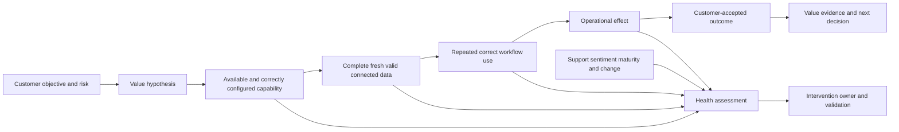

| Operating principle | Plain meaning | Practical consequence | Failure prevented |
|---|---|---|---|
| Health is multidimensional | A customer can be green in one area and red in another | Preserve domain signals before aggregation | One color hides mechanism |
| Adoption is a chain | License, access, use, correct workflow, and outcome are different | Measure each stage with its own denominator | Login count becomes value |
| Data health precedes analytical trust | Incomplete, stale, duplicated, or mis-mapped data can distort action | Pair every usage/outcome metric with source quality | Adoption of a misleading view |
| Workflow evidence matters | Product activity is useful only when it supports an intended job | Observe repeated decisions and handoffs | Feature clicks mistaken for adoption |
| Value starts as a hypothesis | A capability may influence an outcome through assumptions | Write causal chain and alternatives before claiming value | Correlation becomes causation |
| Risk reduction requires validation | A falling score can reflect model or input change | Test exposure, control, process, and residual | Cosmetic risk reduction |
| Sentiment is evidence, not truth | Perception reveals trust and friction but may be incomplete | Triangulate with behavior, support, and outcomes | Loudest voice sets health |
| Support trends need context | More cases can mean failure, growth, better reporting, or learning | Normalize by population, phase, severity, and category | Case count misread |
| Maturity is capability by domain | A team can be advanced in detection and weak in governance | Assess observed practices, not prestige | Judgmental maturity label |
| Scores must be inspectable | Weight, threshold, time, missing-data, and override rules matter | Publish components and confidence | Opaque green score |
| Intervention follows mechanism | The response to stale data differs from low skill or weak ownership | Diagnose before prescribing training | Generic success motion |
| Product facts remain bounded | Public positioning does not establish tenant health or value | Verify current telemetry, entitlement, definitions, and customer evidence | Invented Zscaler results |

## JD Mapping

| JD signal | Capability developed | Reusable customer or TSM artifact | Honest boundary |
|---|---|---|---|
| Drive customer adoption | Measure progression from availability through repeated correct workflow | Adoption ladder and cohort plan | No production Zscaler adoption claim |
| Realize customer value | Connect capability, behavior, operational effect, and business outcome | Value hypothesis register | No unsupported causation or savings |
| Manage customer health | Synthesize technical, data, workflow, relationship, support, and maturity signals | Transparent health model | Score does not replace judgment |
| Provide proactive guidance | Detect leading risks and assign interventions before outcomes degrade | Health action plan | No guaranteed prevention |
| Demonstrate SecOps expertise | Interpret security-data, exposure, prioritization, response, and control evidence | Domain health scorecard | No production SOC/VM ownership claim |
| Build executive relationships | Translate signals into decisions, tradeoffs, and confidence | Executive health narrative | Sentiment is not executive truth |
| Partner with Support/Product | Classify trends, produce evidence, and close feedback loops | Support trend and product-friction record | No internal status or roadmap inference |
| Use analytics | Define grain, population, denominator, baseline, trend, and confidence | Metric dictionary and dashboard specification | No misleading composite KPI |
| Improve maturity | Sequence capability, ownership, governance, and evidence | Maturity roadmap | No universal maturity target |

## Candidate honesty note

Arti can say: "My production background is Microsoft enterprise Support Escalation Engineering rather than owning Zscaler customer health or SecOps adoption. I have analyzed incident patterns, service impact, evidence quality, recurring failure, stakeholder communication, and recovery; used SQL and Power BI to make populations and trends inspectable; and mentored engineers toward repeatable practice. I have studied customer-success measurement and practiced this model with fictional data. In a real account I would verify product telemetry, entitlement, data grain and quality, workflow definitions, stakeholder perspectives, support classifications, baselines, customer-approved targets, risk evidence, and attribution before reporting health or value."

This is a transfer statement, not a claim of prior TSM ownership. Arti should not say she drove production Zscaler adoption, improved a customer's risk score, proved cost savings, forecast renewal, operated a SecOps program, or delivered a health outcome without direct evidence.

| Factual background | Transferable strength | Neutral wording | Unsupported statement to avoid |
|---|---|---|---|
| Microsoft escalation engineering | Assess impact, technical state, recurrence, risk, ownership, and recovery | "I synthesize multiple evidence streams into next action." | "I owned strategic account health." |
| Microsoft 365 service support | Understand active use, workflow friction, identity, permissions, clients, networks, and service dependencies | "I distinguish service availability from successful user workflow." | "I drove Zscaler platform adoption." |
| Networking and traces | Validate path, timing, failure boundary, and recovery | "I test whether a technical signal reflects real behavior." | "I measured customer control effectiveness." |
| SQL and Power BI | Define grain, denominator, cohort, baseline, trend, quality, and drill-down | "I make metrics reproducible and challengeable." | "My dashboard proved business value." |
| Critical escalations | Connect support demand, severity, recurrence, sentiment, and executive risk | "I communicate health changes with evidence and uncertainty." | "I forecasted renewal risk." |
| Mentoring | Improve repeatability and capability through review and coaching | "I can support adoption as capability transfer." | "I transformed a customer SOC." |
| Synthetic NMH model | Demonstrates preparation | "This score is fictional practice." | "This is a real customer health score." |

## Beginner vocabulary and memory hooks

**Customer health** is a structured assessment of whether a customer is positioned to obtain and sustain intended value, including current risks and confidence. **Adoption** is the repeated, correct, supported use of a capability in an intended workflow. Think of a city installing a new rail line. Buying trains is entitlement. Tracks and signals working are technical readiness. Accurate timetables are data health. Riders completing useful journeys are workflow adoption. Safer, faster, or more reliable transport is an outcome. Satisfaction and support calls add context, but no single signal tells the whole story.

| Term | Meaning from zero | Why it matters | Analogy or memory hook |
|---|---|---|---|
| Customer health | Evidence-led view of value readiness, current performance, risk, and relationship | Directs attention and decisions | Rail system health, not one light |
| Adoption | Repeated correct use in intended work | Connects capability to behavior | Riders complete useful journeys |
| Availability | Capability can be accessed under defined conditions | Necessary but insufficient | Train exists and station is open |
| Activation | First successful use or setup milestone | Early signal, not sustained use | First passenger boards |
| Utilization | Amount or frequency of use | Needs eligible population and quality | Seats used per route |
| Breadth | How much intended population or scope uses capability | Prevents pilot success from becoming enterprise claim | Routes with riders |
| Depth | How fully intended features or workflow steps are used | Shows completeness of behavior | Full trip versus one stop |
| Frequency | How often behavior occurs relative to need | Distinguishes repeat use | Daily riders, not one event |
| Correctness | Whether use follows intended safe method | Activity can be harmful or misleading | Passenger takes correct train |
| Workflow adoption | Capability embedded in an end-to-end job and handoff | Closer to operational value | Journey reaches destination |
| Product adoption | Verified use of available product capability | One adoption layer | Boarding and using train features |
| Data adoption | Trusted data used in decisions and operations | Bad inputs undermine use | Timetable believed because accurate |
| Outcome | Change in customer objective under defined scope | What value should support | Faster reliable arrival |
| Value | Customer-accepted benefit relative to cost, risk, and alternatives | Customer defines what matters | Useful journey worth resources |
| Value hypothesis | Testable explanation of how capability and behavior may influence outcome | Prevents retrospective storytelling | Better signals may reduce delays |
| Leading indicator | Signal expected before an outcome | Enables proactive action | Signal maintenance warnings |
| Lagging indicator | Result observed after behavior and events | Confirms or challenges hypothesis | Arrival reliability last quarter |
| Metric | Defined quantitative measure | Supports comparison | On-time percentage |
| KPI | Key Performance Indicator tied to an objective | Focuses decision attention | Primary reliability measure |
| KRI | Key Risk Indicator signaling exposure or threat to objective | Warns of potential harm | Signal failures per route |
| Denominator | Population against which a count/rate is interpreted | Makes metrics honest | Late trains out of scheduled trains |
| Grain | What one row or observation represents | Prevents double counting | One trip, one train, or one passenger |
| Baseline | Starting measurement under stable definition | Enables change comparison | Last quarter's reliability |
| Target | Customer-approved desired level and date | Gives direction | Agreed service objective |
| Threshold | Point that changes status or action | Drives intervention | Warning when failures exceed limit |
| Cohort | Group sharing a meaningful characteristic or start period | Reveals uneven adoption | Riders by route or launch month |
| Segmentation | Splitting measures by role, region, workflow, source, or criticality | Aggregate can hide risk | One line delayed while average looks fine |
| Sentiment | Reported perception, confidence, or concern | Reveals trust and friction | Rider feedback |
| Support trend | Pattern in support demand, severity, cause, and recurrence | Signals reliability, change, or capability gaps | Maintenance requests by route |
| Maturity | Observed repeatability and capability in a domain | Guides next feasible step | Manual dispatch to resilient operations |
| Health score | Composite summary built from defined signals | Useful for triage, dangerous without components | Dashboard warning, not diagnosis |
| Confidence | Strength and coverage of evidence behind a conclusion | Separates known from estimated | Sensor reliability |
| Override | Documented judgment changing computed status for a material reason | Handles rare conditions transparently | Dispatcher closes line despite average green |
| Risk reduction | Validated decrease in likelihood or impact for a defined scenario | Stronger than activity or score movement | Hazard actually removed or controlled |
| Residual risk | Remaining uncertainty or exposure after action | Prevents false completion | Risk remaining after repair |

### Plain-English deep-dive 1 - Health is not a mood or a color

People often ask whether an account is red, yellow, or green. The color is useful only as a routing summary. It cannot explain whether the mechanism is stale data, low workflow use, an unresolved critical case, missing executive sponsorship, weak operational ownership, a recent positive change, or simply absent evidence.

Imagine a hospital dashboard showing "yellow." A clinician cannot act until the dashboard reveals whether the concern is staffing, medication supply, infection, equipment, or reporting delay. A customer-health score has the same obligation. Keep domain status, evidence, trend, confidence, owner, and intervention visible beneath the summary.

A neutral phrase is: "Overall health is watch because workflow adoption and support recurrence are below the agreed plan, while technical availability and sponsor alignment are stable. Data completeness is unknown for one source, so confidence is medium. The next actions are source reconciliation and an operator workflow review." This is more useful than "the customer is unhappy" or "the account is yellow."

## Customer-health architecture

Use domains that correspond to mechanisms and owners. The exact model should be tailored, but the following structure is a strong starting hypothesis.

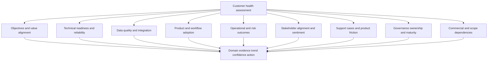

| Health domain | Core question | Example evidence | Typical owner | Common trap |
|---|---|---|---|---|
| Objective alignment | Are intended outcomes still important and agreed? | Success plan, sponsor confirmation, decisions | Customer sponsor and TSM | Old objective persists after strategy change |
| Technical readiness | Is capability available, correctly configured, reliable, and supportable? | Read-back, health, tests, failures, recovery | Technical owner | Green service status equals customer success |
| Integration/data | Are required sources complete, fresh, valid, linked, and governed? | Reconciliation, freshness, errors, lineage | Data/source owners | Connector success equals usable data |
| Product use | Are eligible users/scopes using intended capability? | Qualified telemetry, cohorts, licensed scope | Workflow/product owner | Raw events without denominator |
| Workflow adoption | Is use correct, repeated, and embedded in decisions/handoffs? | Case sample, tickets, approvals, validation | Operational owner | Click activity equals process change |
| Capability/skills | Can roles perform, recover, and teach the workflow? | Exercise, case review, quality rubric | Team lead/enablement | Training completion equals competence |
| Outcome/risk | Are customer-approved operational or risk measures changing? | Stable KPI/KRI, path/control validation | Outcome/risk owner | Score change equals risk reduction |
| Relationship/sentiment | Do key roles trust evidence, see relevance, and engage? | Structured pulse, interviews, attendance, decisions | Sponsor/TSM | One executive voice equals everyone |
| Support/product friction | Are incidents, defects, requests, and misunderstandings controlled? | Normalized cases, severity, age, recurrence, root categories | Support/technical owner | More cases always means worse health |
| Governance/maturity | Are ownership, cadence, policy, decisions, and improvement repeatable? | RACI, decision latency, audits, review | Governance owner | Maturity used as judgment |
| Commercial/scope | Do contract, entitlement, services, capacity, or renewal dependencies affect outcomes? | Current authorized records | Account/commercial owner | TSM infers commercial truth |

### Health record mechanics

Each domain record should contain:

1. Definition and scope.
2. Current status and trend.
3. Evidence source, grain, effective time, and owner.
4. Confidence and missing data.
5. Customer objective or risk affected.
6. Mechanism or hypothesis.
7. Leading and lagging indicators.
8. Threshold or judgment rule.
9. Intervention, owner, dependency, and date basis.
10. Validation and next review trigger.

## Product, data, and workflow adoption

These layers are related but not interchangeable. A source can be connected while its records are stale. Users can open a dashboard while ignoring its recommendations. Tickets can be created while owners close them without validation.

```mermaid
flowchart LR
    ENT[Entitled and in scope] --> AVAIL[Available and accessible]
    AVAIL --> CONF[Configured for intended use]
    CONF --> DATA[Required data healthy]
    DATA --> ACT[Eligible roles activate]
    ACT --> REPEAT[Repeated use at needed frequency]
    REPEAT --> CORRECT[Correct workflow and decisions]
    CORRECT --> HAND[Owned handoff action and validation]
    HAND --> OUT[Operational or risk outcome]
```

| Layer | Question | Numerator | Denominator | Quality check |
|---|---|---|---|---|
| Entitlement/scope | Which populations and capabilities are expected? | In-scope units with verified entitlement | Intended units | Current contract/order authority |
| Availability | Can intended roles access capability? | Eligible units with successful bounded access | In-scope eligible units | Identity, region, role, time |
| Configuration | Is it set for the intended requirement? | Scopes passing approved read-back | Configured in-scope scopes | Current docs and acceptance |
| Data source coverage | Are required sources represented? | Required sources meeting contract | Required approved sources | Source grain and ownership |
| Data quality | Is data complete, fresh, valid, unique, consistent, linked? | Records/entities meeting threshold | Expected relevant population | Reconciliation and lineage |
| Activation | Has intended role completed first meaningful action? | Eligible roles/scopes activated | Eligible roles/scopes | Meaningful action, not login |
| Frequency | Is workflow used when needed? | Expected occasions with qualified use | Eligible workflow occasions | Event definition and seasonality |
| Breadth | Is use distributed across intended cohort? | Intended teams/assets/workflows using | Intended teams/assets/workflows | Pilot versus scale |
| Depth | Are critical workflow steps used? | Qualified workflows completing required steps | Started qualified workflows | Step order and exceptions |
| Correctness | Are decisions/actions safe and evidence-led? | Sampled cases meeting rubric | Reviewed eligible cases | Sampling and reviewer calibration |
| Handoff | Do outputs reach accountable owners and systems? | Accepted assignments/actions | Qualified outputs requiring action | Duplicate, rejection, latency |
| Validation | Is action effect confirmed? | Completed actions with accepted validation | Completed actions requiring validation | Independent read-back/path check |
| Outcome | Is customer objective changing? | Defined successful outcomes | Eligible population/time | Baseline, context, attribution |

### Adoption measurement traps

| Signal | What it may show | What it does not show alone |
|---|---|---|
| Login | Access or curiosity | Meaningful or correct workflow use |
| Page view | Exposure to information | Understanding, decision, or action |
| Query count | Analytical activity | Query quality or useful result |
| Alert reviewed | Interaction | Correct triage or response |
| Recommendation opened | Awareness | Acceptance, implementation, or fit |
| Ticket created | Workflow initiation | Correct assignment, action, closure, or effect |
| Ticket closed | Administrative completion | Remediation or risk reduction |
| Automation success | Request accepted/reported | Target state, side effects, or business acceptance |
| Training completion | Content reached participant | Capability or later application |
| High usage | Frequent activity | Low friction or value; rework can create activity |
| Low support volume | Fewer cases | Reliability; users may have disengaged |

## Adoption ladder

The ladder describes increasing evidence of sustained value-enabling behavior. It is not a universal maturity judgment. A customer may intentionally stop at a lower level for a bounded use case.

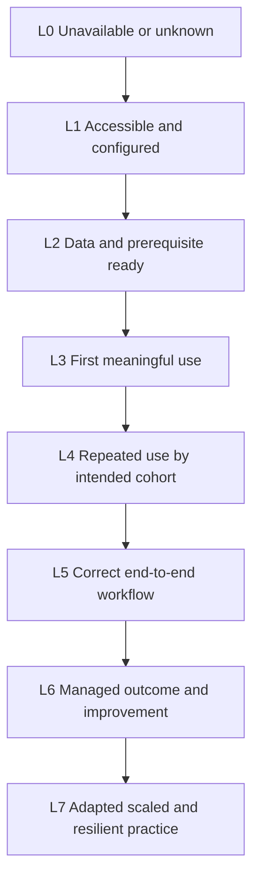

| Level | State | Evidence | Exit criteria | Typical intervention |
|---|---|---|---|---|
| 0 - Unknown/unavailable | Entitlement, access, or intended use not established | Missing/conflicting records | Scope and authority verified | Discovery and commercial/technical verification |
| 1 - Accessible/configured | Intended roles can access and bounded setup exists | Access test and configuration read-back | Required prerequisites identified | Readiness and role mapping |
| 2 - Data/prerequisite ready | Required approved data and dependencies meet thresholds | Reconciliation, freshness, lineage, approvals | Safe meaningful workflow can run | Data repair and acceptance |
| 3 - Activated | First meaningful task completed | Qualified event plus artifact | Learner/user can repeat with support | Guided practice and job aid |
| 4 - Repeated/cohort use | Intended cohort uses at expected opportunities | Cohort frequency/breadth trend | Use is stable enough for quality review | Barrier removal and office hours |
| 5 - Correct workflow | Decisions, handoffs, actions, validation meet rubric | Sampled cases and process evidence | Customer accepts operational quality | Case review and exception handling |
| 6 - Managed outcome | Workflow is governed against customer outcome/KRI | Baseline, trend, decision cadence | Outcome and residual reviewed | Optimization and value review |
| 7 - Scaled/resilient | Practice adapts across scope, recovers from failure, and improves | Segmented scale, recovery, community, updates | Customer-defined sustainment | Decentralized ownership and continuous improvement |

### Adoption blockers by mechanism

| Mechanism | Signs | Discriminating check | Response |
|---|---|---|---|
| No relevant outcome | Users cannot explain why workflow matters | Ask last useful decision and sponsor objective | Recontract value hypothesis |
| Access/entitlement | Users cannot reach required capability | Verify current role, license, region, identity | Correct through authorized owner |
| Configuration mismatch | Capability works but not for requirement | Compare requirement to read-back | Design correction and validation |
| Data distrust | Users keep parallel spreadsheet or ignore view | Reconcile sample and lineage | Repair data and publish quality |
| Workflow friction | Too many handoffs or duplicate entry | Walk recent case with timing | Simplify or integrate process |
| Skill gap | Users cannot explain or recover | Changed-scenario teach-back | Practice, coaching, job aid |
| Ownership gap | Output has no accountable actor | Trace assignment and authority | RACI and queue design |
| Incentive conflict | Correct use adds work without local benefit | Interview role and observe tradeoff | Redesign workload/governance |
| Incident/product friction | Repeated failure blocks trust | Support trend and reproducibility | Support/Product path and workaround |
| Change fatigue | Too many simultaneous motions | Portfolio and capacity review | Sequence and narrow cohort |
| Measurement defect | Telemetry misses valid use or counts noise | Compare event to sampled workflow | Repair metric before intervention |

### Plain-English deep-dive 2 - Adoption is a behavior change, not a deployment state

A deployed capability can remain unused. A frequently used capability can be used incorrectly. A correct workflow can fail to produce value because data, ownership, policy, or downstream capacity is weak. Adoption therefore needs a chain of evidence.

The rail analogy helps. A train can be installed and technically available, yet riders avoid it because the timetable is wrong, the station is inaccessible, or the route does not reach their destination. More advertising or training will not fix those mechanisms. Observe one real journey before selecting the intervention.

## Value hypotheses and realization

A value hypothesis is a conditional explanation:

> If **[defined capability and prerequisites]** enable **[specific roles]** to perform **[repeated correct workflow]**, then **[operational effect]** may improve **[customer objective or reduce defined risk]**, because **[mechanism]**. We will test this with **[leading and lagging evidence]**, compare against **[baseline/alternative]**, monitor **[unintended effects and confounders]**, and let **[customer authority]** accept the interpretation.

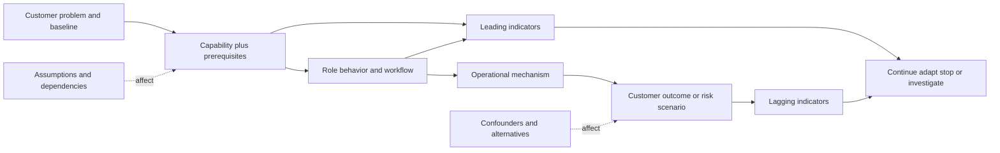

| Value-hypothesis element | Question | Evidence |
|---|---|---|
| Customer objective | What does the customer want to improve, protect, or decide? | Sponsor and operational owner confirmation |
| Problem/baseline | What current condition creates cost, risk, delay, rework, or uncertainty? | Stable metric and qualitative story |
| Capability | What exact current capability is relevant? | Official fact, entitlement, configuration, test |
| Prerequisites | Which data, identity, integration, process, skill, and authority are needed? | Readiness evidence |
| Actor/workflow | Who changes which repeated behavior? | Process map and adoption evidence |
| Mechanism | Why could behavior affect outcome? | Causal reasoning and boundary tests |
| Leading indicator | What should move first? | Data/workflow/capability measure |
| Lagging outcome | What customer result may move later? | Accepted KPI/KRI |
| Alternative explanation | What else could cause the result? | Change/event/context register |
| Unintended effect | What could get worse? | Guardrail metric |
| Decision rule | What evidence leads to continue, adapt, expand, or stop? | Customer-approved threshold and authority |
| Attribution boundary | What can be said honestly? | Evidence strength and limitations |

### Value categories

| Category | Examples of general value | Evidence caution |
|---|---|---|
| Risk | Reduced reachability, privilege, exposed paths, vulnerable duration, or residual | Validate scenario/control; do not use score alone |
| Efficiency | Less manual reconciliation, triage time, rework, duplicate work | Track quality and shifted work, not only speed |
| Effectiveness | Better prioritization, detection, assignment, remediation, validation | Define correct result and false outcomes |
| Resilience | Faster recovery, fewer recurrences, stronger fallback | Normalize incident mix and test recovery |
| Visibility | More complete, fresh, connected, explainable evidence | Visibility is an enabler, not risk reduction itself |
| Governance | Clearer ownership, auditability, decision latency, exception control | More records can still be bureaucracy |
| Experience | Lower friction, greater trust, clearer decisions | Segment stakeholders; perception is not outcome |
| Cost | Avoided spend, tool consolidation, analyst capacity | Finance-approved method and total cost required |

## Metric design and analytical honesty

Every metric needs a contract. At minimum define name, purpose, decision, formula, numerator, denominator, grain, population, inclusions/exclusions, source authority, effective time, refresh, baseline, target/threshold, segmentation, owner, quality checks, privacy, and interpretation limits.

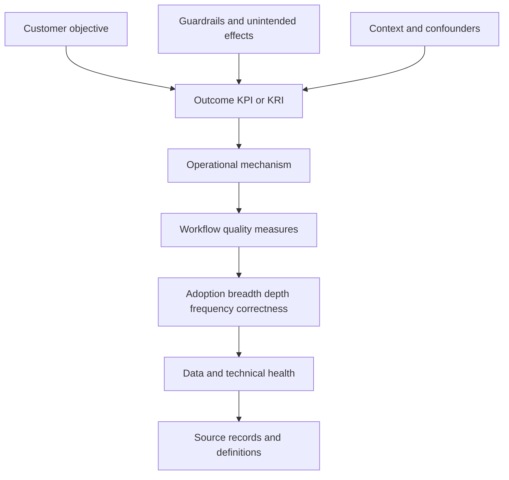

| Metric property | Required question | Example failure |
|---|---|---|
| Purpose | Which decision changes when this moves? | Vanity metric no one uses |
| Grain | What does one record represent? | Events counted as users |
| Population | Which eligible entities/opportunities are included? | Pilot compared to enterprise |
| Numerator | What qualifies as success/event? | Raw clicks include retries |
| Denominator | Success out of what opportunity set? | Counts rise with customer growth |
| Time | Event, observation, ingestion, effective, or closure time? | Late data moves prior month |
| Baseline | Is definition and scope comparable? | Before/after uses different source coverage |
| Target | Who approved what desired level and why? | Vendor invents threshold |
| Direction | Is more always better? | More tickets may mean worse reliability or better reporting |
| Segmentation | Which cohorts can hide in average? | Critical business unit lags |
| Quality | Complete, fresh, valid, unique, consistent? | Missing source looks like improvement |
| Confidence | Direct, sampled, inferred, or missing? | Estimate presented as precise |
| Privacy | Is personal-level data necessary and fair? | Adoption becomes surveillance |
| Interpretation | What does it not prove? | Correlation claimed as value |

### Leading and lagging indicators

| Objective | Leading indicators | Lagging indicators | Guardrails |
|---|---|---|---|
| Improve asset context | Source coverage, match confidence, owner completeness, freshness | Fewer unowned or misrouted high-priority items | False merge/split and privacy issues |
| Improve prioritization | Context completeness, review quality, rationale acceptance | Faster customer-approved treatment of defined risk population | Important items incorrectly deprioritized |
| Improve remediation workflow | Assignment acceptance, owner coverage, action aging, validation rate | Reduced validated exposure duration or recurrence | Service disruption and exception debt |
| Improve investigation | Data availability, correlation quality, analyst workflow use | Customer-defined investigation quality/time | False positive/negative and analyst burden |
| Improve governance | Decision attendance, owner coverage, decision latency | Fewer stale exceptions or unresolved dependencies | Meeting load and superficial closure |

## Risk-reduction evidence

Risk reduction is a claim about a defined scenario. It may come from reduced exposure/reachability, reduced exploitable weakness, reduced privilege, improved prevention/detection/response/recovery, reduced impact, shorter duration, or removal of a dependency. The evidence must test the mechanism and residual.

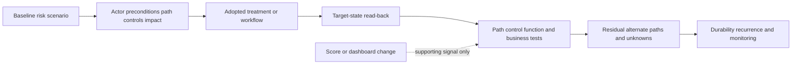

| Evidence level | What is established | Example-neutral claim |
|---|---|---|
| Activity | Work occurred | "The team reviewed the defined backlog." |
| Completion | Action was reported complete | "The change record closed." |
| State | Target reflects intended configuration/condition | "Read-back showed the approved state for sampled scope." |
| Functional control | Expected allow/block/detect/respond/recover behavior occurred | "The bounded test met the control postcondition." |
| Path/scenario | Defined risk path or impact changed | "The tested path was interrupted; alternate paths remain listed." |
| Population | Effect covers intended relevant population | "Coverage reconciliation met customer-approved threshold." |
| Durability | Effect persists and recurrence is controlled | "The condition remained within threshold over the review period." |
| Outcome | Customer risk/objective indicator changed with limits | "The indicator improved alongside the intervention; attribution remains bounded." |

Never equate lower vulnerability count, risk score, alert volume, or incident count automatically with reduced risk. Source loss, scope reduction, model change, suppression, seasonality, attacker behavior, underreporting, or business change can produce similar movement.

### Plain-English deep-dive 3 - A score can move while reality stays still

Suppose a weather app changes its formula and the storm-risk number falls from 80 to 50. The sky did not change because the formula changed. Likewise, a customer risk score can fall because a source stopped sending data, assets merged incorrectly, weights changed, exceptions hid items, or the measured population shrank.

Scores are useful navigational aids when definitions, inputs, weights, time, and confidence are transparent. Validate the real mechanism: target state, coverage, path, control behavior, service effect, alternate routes, residual, and recurrence. If only the score changed, say exactly that.

## Stakeholder sentiment and relationship evidence

Sentiment should be role-specific, question-specific, and time-bounded. Ask about relevance, trust, effort, confidence, responsiveness, and blockers. A single numerical satisfaction score can hide why the view changed.

| Sentiment dimension | Better question | Corroborating evidence | Misinterpretation |
|---|---|---|---|
| Relevance | Does the workflow help your current priorities? | Actual use and decisions | Positive executive statement means operator relevance |
| Trust | Which data or recommendations do you trust, and where not? | Reconciliation and override patterns | Skepticism is resistance |
| Effort | What work became easier or harder? | Timing, duplicate steps, backlog | More usage means less effort |
| Capability | Where can your team proceed without help? | Teach-back and case quality | Confidence equals competence |
| Responsiveness | Are issues and decisions moving at the needed cadence? | Case/decision aging | Fast replies equal resolution |
| Partnership | Can concerns and bad news be raised safely? | Contradictions surfaced and corrected | No complaints means trust |
| Future fit | Which upcoming changes alter requirements? | Roadmap and architecture plan | Interest becomes commitment |

Triangulate sentiment across sponsor, technical owner, operators, data/source owners, governance, and account team. Preserve disagreement rather than averaging it away. "Executive relevance high; operator trust low due to unresolved source reconciliation" is actionable.

## Support trends and product friction

Support analysis should classify demand by type, severity/impact under current definitions, age, recurrence, component, lifecycle phase, root or contributing category, workaround, resolution, and adoption consequence. Use the support system as authority for case state; do not infer defect or Engineering status.

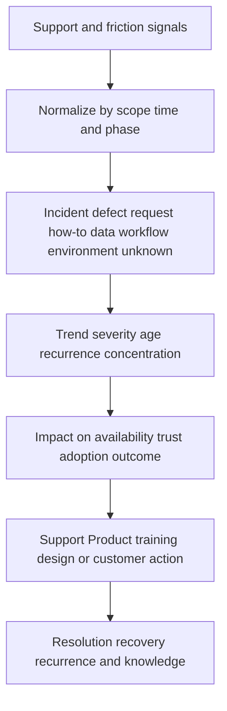

| Trend | Possible interpretations | Discriminating evidence |
|---|---|---|
| Case count rises | Reliability issue, scale growth, new rollout, improved reporting, skill gap | Eligible population, category, phase, unique issues |
| Case count falls | Better reliability, disengagement, workaround, underreporting | Usage, sentiment, unresolved friction, alternative channels |
| Severity rises | Greater impact, classification change, concentration, escalation behavior | Current definitions and business impact |
| Aging rises | Hard defects, poor evidence, ownership, customer dependency, queue issue | Blocker and next-decision analysis |
| Recurrence rises | Root cause incomplete, workaround only, documentation or process gap | Similarity criteria and recovery validation |
| How-to cases rise | New cohort, discoverability issue, complexity, training gap | Adoption phase and teach-back evidence |
| Data issues rise | Source growth, mapping change, quality decline, better controls | Source volume/schema/quality timeline |
| Requests rise | Expanding use, unmet need, misunderstanding, market change | Requirement and current capability validation |

Useful normalized measures include cases per active cohort, critical-impact cases per in-scope workflow, recurring issues per resolved issue, age by blocker category, and case-driven unavailable workflow time. Do not invent support SLA or severity definitions; use current terms.

## Maturity assessment

Maturity describes observed capability, repeatability, governance, measurement, and adaptation within a domain. It should guide the next feasible step, not rank the customer's worth.

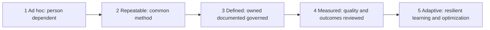

| Level | Process | Ownership/governance | Evidence | Failure/recovery | Next step |
|---|---|---|---|---|---|
| 1 - Ad hoc | Depends on individual memory | Ambiguous | Anecdotes and manual snapshots | Reactive | Name owner and minimum record |
| 2 - Repeatable | Common steps for frequent cases | Team-level ownership | Basic operational measures | Known workaround | Standardize and document |
| 3 - Defined | Approved workflow and decision rights | Cross-functional governance | Quality, scope, and audit evidence | Escalation and exception paths | Calibrate and integrate |
| 4 - Measured | Performance and outcomes reviewed | Decisions tied to thresholds | Stable KPI/KRI and segmentation | Root cause and recurrence | Improve based on evidence |
| 5 - Adaptive | Practice changes safely with context | Distributed ownership and oversight | Predictive/leading signals plus outcomes | Resilience tested and lessons scaled | Sustain, simplify, and challenge assumptions |

Assess domains separately: data may be measured while workflow ownership is repeatable. Record evidence and desired business need. The right target may be level 3 for a low-frequency workflow; higher is not automatically better if cost exceeds value.

## Health-score mechanics

Use a score only after domain definitions and actions work independently. A transparent model may normalize each component to a common scale and combine weighted values, but mathematics cannot repair weak evidence.

For component $i$, one illustrative model is:

$$
H = \frac{\sum_{i=1}^{n} w_i c_i q_i}{\sum_{i=1}^{n} w_i q_i}
$$

where $c_i$ is the component value, $w_i$ is the approved importance weight, and $q_i$ is evidence confidence or coverage. This is **general practice**, not a Zscaler formula and not an NMH production score. Missing critical evidence should not be converted silently to zero or green. Some conditions require an explicit override regardless of average.

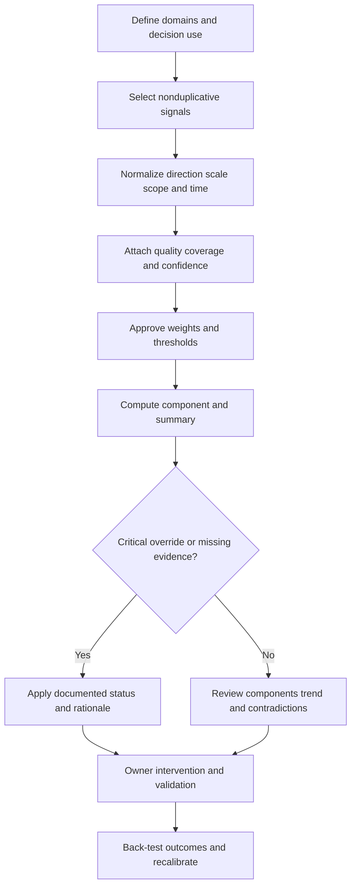

| Design choice | Questions | Risk |
|---|---|---|
| Domains | Do components represent distinct mechanisms? | Double-counting same symptom |
| Direction | Does higher always mean healthier? | Case volume and usage ambiguity |
| Normalization | How do units become comparable? | Arbitrary scale hides meaning |
| Weight | Who approved importance and for which phase? | Vendor preference becomes customer priority |
| Threshold | What action changes at boundary? | False precision at 69 versus 70 |
| Missing data | Unknown, excluded, imputed, or penalized? | Missing source looks healthy |
| Confidence | How are quality, coverage, and recency represented? | Precise score from weak evidence |
| Trend | Is direction stable across comparable periods? | One-day spike drives status |
| Override | Which conditions supersede average? | Critical incident hidden by strong adoption |
| Correlation | Are components measuring same cause? | Artificially amplified weight |
| Calibration | Did status predict useful intervention/outcome? | Score persists without validation |
| Explainability | Can owner trace score to records and action? | Debate over math instead of customer |

### Example status language

| Status | Neutral meaning | Required content |
|---|---|---|
| Stable | Evidence supports plan within agreed tolerance | Components, trend, confidence, watch items |
| Watch | Leading concern or uncertainty needs intervention | Mechanism, owner, threshold, next check |
| At risk | Material current barrier threatens outcome | Impact, options, decision, cadence |
| Critical | Severe active condition requires escalation | Severity basis, workstreams, updates, recovery |
| Unknown | Evidence is insufficient or contradictory | Missing source, owner, check, deadline basis |

Avoid moral labels such as "bad customer" or "unhealthy because resistant." State mechanisms: "Workflow adoption is at risk because three intended teams lack an accepted ownership path; technical access is stable; operator sentiment is low after two recurring data-quality defects."

### Plain-English deep-dive 4 - Weighting is governance disguised as arithmetic

Giving technical reliability 30 percent and executive alignment 10 percent is not a mathematical truth. It is a policy choice about what matters. The weights may need to differ during onboarding, steady operation, critical incident, or expansion.

Think of a school grade combining exams, projects, attendance, and participation. The formula embeds values. If the student cannot access the exam, averaging in a zero may be unfair; if a safety-critical skill is missing, a high average may not justify passing. Publish the rules, allow documented overrides, and review components before the composite.

## Health operating cadence

Health should drive action at the pace of change. Technical/data signals may be monitored daily or weekly; workflow and support patterns weekly or monthly; strategic outcomes and maturity monthly or quarterly. Do not force every signal into one meeting.

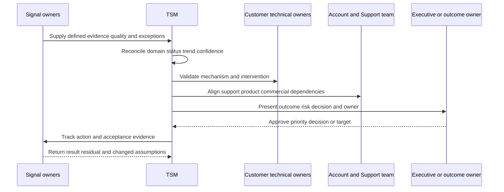

| Cadence | Purpose | Inputs | Output |
|---|---|---|---|
| Signal monitoring | Detect availability/data/workflow exceptions | Automated and manual quality checks | Alert with owner and scope |
| Weekly technical review | Resolve blockers and validate action | Technical, data, support, adoption evidence | Updated actions and risk |
| Monthly health review | Reconcile domains, trends, confidence, interventions | Domain scorecards and stakeholder pulse | Health narrative and decisions |
| Quarterly/strategic review | Evaluate outcomes, value hypothesis, maturity, roadmap | Stable KPIs/KRIs, business changes, risks | Continue/adapt/expand/stop decisions |
| Triggered escalation | Handle critical active condition | Impact, timeline, evidence, workstreams | Incident cadence and recovery |

### Health intervention catalog

| Mechanism | Intervention | Validation |
|---|---|---|
| Objective drift | Sponsor reconfirmation and success-plan revision | Approved objective and metric chain |
| Entitlement/scope mismatch | Account/commercial and technical verification | Current authoritative scope |
| Technical reliability | Support case, architecture correction, workaround, recovery plan | Bounded availability and recurrence evidence |
| Data quality | Source reconciliation, mapping fix, acceptance threshold | Completeness/freshness/validity and downstream test |
| Low activation | Role/access/prerequisite removal and guided first use | First meaningful action by intended cohort |
| Low repeated use | Workflow observation, barrier removal, job aid, cadence | Qualified cohort frequency and case quality |
| Incorrect use | Case review, coaching, approval/control redesign | Rubric and changed-scenario performance |
| Weak handoff | RACI, queue, integration, acceptance contract | Accepted assignments and closed-loop status |
| Sentiment/trust | Evidence review, listening session, transparent correction | Role-specific concerns and observed behavior |
| Support recurrence | Root-cause, workaround review, knowledge, product feedback | Recovery, recurrence, case quality |
| Low maturity | One feasible capability and governance step | Observed repeatability, not document count |
| Weak value evidence | Rebuild hypothesis, baseline, denominator, confounder log | Customer-accepted interpretation |

## Security, privacy, ethics, and commercial boundaries

Adoption and health telemetry can become surveillance if collected at individual level without purpose. Prefer the minimum grain needed for the customer decision. Aggregate where possible, restrict access, document purpose, retain only as needed, and avoid using training or support-seeking behavior as a punitive score.

| Risk | Question | Control |
|---|---|---|
| Personal monitoring | Is individual identity necessary for workflow support? | Aggregate or pseudonymize; purpose-limit access |
| Sensitive security posture | Could score reveal exploitable weakness or business priorities? | Classification, least privilege, controlled sharing |
| Missing data bias | Are less instrumented groups scored worse or invisible? | Confidence/coverage and unknown status |
| Sentiment retaliation | Can people raise concern safely? | Aggregate, protect comments, avoid identity judgment |
| Support disincentive | Does case count punish appropriate reporting? | Interpret category and phase; do not reward silence |
| Metric gaming | Can teams improve number without outcome? | Guardrails, sampling, alternate evidence |
| Commercial pressure | Is health altered to support a deal narrative? | Separate facts, technical assessment, and commercial authority |
| Entitlement inference | Is usage absence caused by unavailable scope? | Verify current contract/order record through owner |
| Cross-customer benchmarking | Is comparison authorized and comparable? | Legal/privacy review and definition equivalence |
| AI summary | Could generated narrative leak data or overstate cause? | Approved tools, minimization, grounding, human validation |

Health may inform account planning, but Arti should not infer renewal probability, contract value, commercial risk, or expansion intent. Account/commercial owners and authoritative records govern those statements. Technical health should remain truthful even when timing is sensitive.

## Failure modes and misconceptions

| Failure or misconception | Why it fails | Repair |
|---|---|---|
| Health is a color | It removes mechanism, confidence, and owner | Publish domain evidence and action |
| Usage equals adoption | Activity may be accidental, incorrect, or rework | Define meaningful workflow and quality |
| Adoption equals value | Behavior may not influence customer outcome | Test value hypothesis |
| More features used is better | Extra complexity may add no value | Measure minimum sufficient capability |
| Data source connected means healthy | Scope, freshness, mapping, identity, and lineage may fail | Reconcile source-to-decision chain |
| Dashboard view proves data trust | Users may cross-check or ignore it | Observe decisions and objections |
| Closed ticket proves remediation | Administrative state may lack validation | Verify target, path, business effect, residual |
| Lower risk score proves reduction | Input/model/scope may change | Validate scenario mechanism |
| Fewer alerts means safer | Detection or data can be broken | Check coverage and expected signal |
| More support cases means unhealthy | Growth, learning, or better reporting can raise count | Normalize and classify |
| Fewer support cases means healthy | Disengagement or shadow support may lower count | Triangulate usage and sentiment |
| Executive sentiment represents all | Operators and owners experience different friction | Segment role perspectives |
| Average hides distribution | Critical cohort can fail under green mean | Segment by risk and workflow |
| Missing data is zero | Unknown becomes false bad or false good | Publish missingness/confidence |
| Target should be industry benchmark | Context and definitions may not match | Use customer objective and comparable evidence |
| Maturity must always increase | Cost can exceed need | Set fit-for-purpose target |
| Opaque score saves time | Debate shifts to trust and politics | Make formula and overrides inspectable |
| Training fixes adoption | Barrier may be data, access, ownership, incentive, or reliability | Diagnose mechanism first |
| TSM owns customer outcome | Customer roles control many dependencies and decisions | Clarify shared hypothesis and ownership |
| Public product claim proves value | Capability, entitlement, setup, use, and result differ | Verify each link |

## Troubleshooting health and metric failures

| Symptom | Plausible causes | Cheapest discriminating check | Response |
|---|---|---|---|
| Usage drops suddenly | Telemetry defect, source outage, definition change, seasonality, real disengagement | Compare independent workflow sample and release/change timeline | Repair measurement before adoption claim |
| Usage rises sharply | New cohort, retry loop, automation, duplicate events, campaign | Inspect unique actors/scopes and event grain | Recalculate qualified use |
| Health green during incident | Weighting dilution, stale refresh, missing override | Trace component effective time and rules | Override with rationale and fix model |
| Health red after data loss | Missing values treated as zero | Inspect missing-data policy | Mark unknown and restore evidence |
| Risk score improves, backlog does not | Weight/model/source change or different population | Freeze definitions and reconcile populations | Restate result and validate risk path |
| Survey positive, workflow weak | Courtesy bias, wrong respondents, low-stakes reaction | Observe changed-scenario task | Target capability/barrier |
| Operator sentiment low, executive high | Different workloads and information | Role-specific interviews and workflow walk | Preserve split and resolve mechanism |
| Cases recur after closure | Workaround, incomplete root cause, version/environment variation | Compare signature and validation | Reopen pattern and preventive action |
| Adoption stalls after training | Access, data, workflow, authority, incentive, product friction | Walk last attempted case | Select mechanism-specific intervention |
| Maturity rating disputed | Criteria vague or evidence selective | Review observable practice examples | Rewrite rubric and allow domain split |
| Score changes without domain change | Formula, weight, threshold, scaling bug | Recompute from frozen input | Correct and publish impact |
| Value review challenged | Baseline or attribution weak | Reconstruct metric contract and confounders | Downgrade claim to hypothesis/association |

## Decision trees

### Decision tree 1 - Is this adoption?

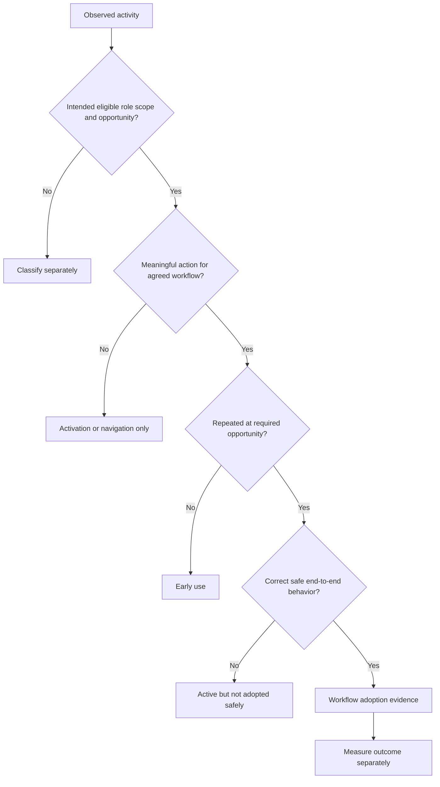

### Decision tree 2 - What does a health signal require?

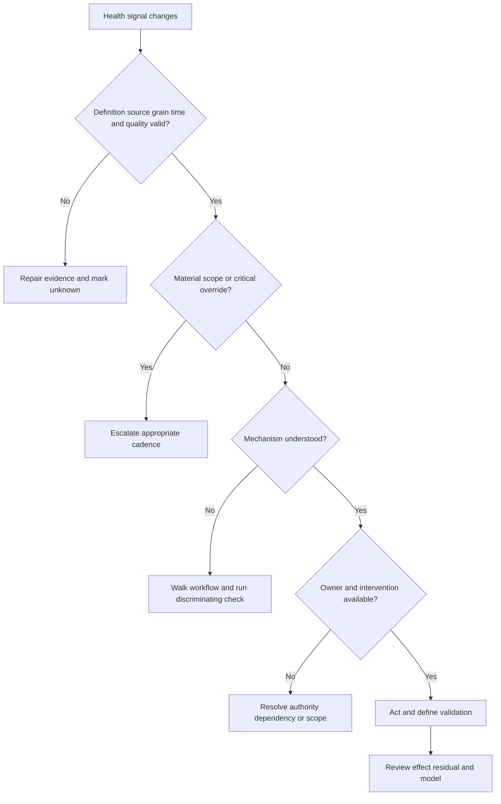

### Decision tree 3 - Can value be claimed?

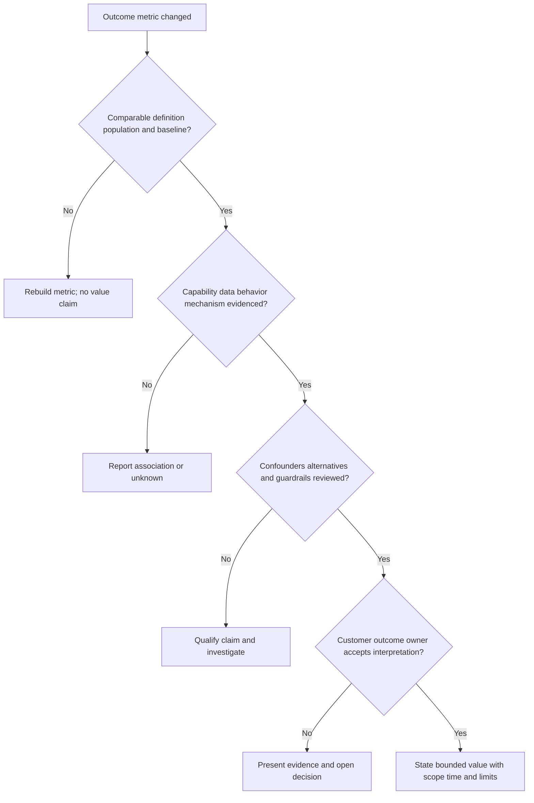

## Explicitly fictional and synthetic NMH scenarios

All content in this section is fictional and synthetic. It is practice material, not a customer deployment, health score, adoption record, support trend, maturity assessment, product entitlement, risk reduction, financial value, or Zscaler result. Dates in this section, including **2026-10-16**, **2026-10-30**, **2026-11-20**, and **2026-12-11**, are synthetic scenario dates later than the source snapshot and do not imply later research. Every later date in this section is fictional and synthetic.

### Scenario 1 - Green usage, weak workflow

On synthetic 2026-10-16, NMH's fictional dashboard shows rising views. A sampled workflow reveals that analysts export records to a spreadsheet because ownership context is incomplete. The health record marks product activity stable, data trust at risk, and end-to-end workflow adoption early. The intervention is source-owner reconciliation and workflow redesign, not additional generic training. No production Zscaler telemetry or interface is asserted.

### Scenario 2 - Falling score after a source outage

On synthetic 2026-10-30, a fictional risk indicator improves sharply while one asset source stops arriving. The team freezes the claim, compares source coverage, marks risk evidence unknown, and investigates ingestion. The executive note says only that the displayed score fell while comparable exposure could not be established. It does not claim risk reduction.

### Scenario 3 - Support volume rises during expansion

On synthetic 2026-11-20, NMH's fictional case count doubles after a new operator cohort begins. Normalized data shows most cases are distinct how-to questions, critical impact is unchanged, workflow use is increasing, and one recurring data defect remains. The response combines cohort coaching with a bounded support escalation for the recurring defect. Higher count is not labeled universally unhealthy.

### Scenario 4 - Executive and operator sentiment diverge

On synthetic 2026-12-11, a fictional executive reports strong value while operators report duplicate ticket work. The TSM preserves both facts, observes a case, quantifies duplicate handoffs under a synthetic metric definition, and presents options. The health assessment stays mixed until the customer accepts a workflow change and later evidence. Every metric and result remains fictional and synthetic.

## Reusable artifact kit

These templates are general practice. Customer objectives, definitions, policy, privacy, contracts, product telemetry, authorized systems, and accountable owners govern production use.

### Artifact 1 - Customer-health model

| Domain | Definition/scope | Status | Trend | Evidence/source/time | Quality/confidence | Objective/risk | Mechanism | Threshold/override | Intervention/owner | Validation/review |
|---|---|---|---|---|---|---|---|---|---|---|
| Objective alignment | | | | | | | | | | |
| Technical readiness | | | | | | | | | | |
| Integration/data | | | | | | | | | | |
| Product use | | | | | | | | | | |
| Workflow adoption | | | | | | | | | | |
| Capability/skills | | | | | | | | | | |
| Outcome/risk | | | | | | | | | | |
| Stakeholder sentiment | | | | | | | | | | |
| Support/product friction | | | | | | | | | | |
| Governance/maturity | | | | | | | | | | |
| Commercial/scope dependency | | | | | | | | | | |

### Artifact 2 - Adoption ladder and cohort tracker

| Cohort/workflow | Intended job/opportunity | L0 scope | L1 access/config | L2 data ready | L3 activation | L4 repeated use | L5 correct workflow | L6 outcome | L7 scale/resilience | Blocker | Owner/next evidence |
|---|---|---|---|---|---|---|---|---|---|---|---|
| | | | | | | | | | | | |

### Artifact 3 - Value hypothesis

| Field | Entry |
|---|---|
| Customer objective and owner | |
| Problem and comparable baseline | |
| Exact capability and product-fact source | |
| Entitlement/configuration boundary | |
| Data/identity/integration prerequisites | |
| Intended roles and repeated workflow | |
| Mechanism from behavior to effect | |
| Leading indicators | |
| Lagging KPI/KRI | |
| Denominator/cohort/time | |
| Alternatives/confounders | |
| Guardrails/unintended effects | |
| Customer-approved target/decision rule | |
| Attribution wording | |
| Evidence owner/review trigger | |

### Artifact 4 - Metric contract and dictionary

| Field | Entry |
|---|---|
| Metric name/version | |
| Purpose and decision | |
| Evidence class | |
| Formula | |
| Numerator/denominator | |
| Grain/population | |
| Inclusion/exclusion | |
| Source/authority/lineage | |
| Event/observation/effective/refresh time | |
| Baseline/target/threshold | |
| Direction and guardrails | |
| Segmentation/cohort | |
| Quality/confidence/missing data | |
| Privacy/access/retention | |
| Owner/approval | |
| Interpretation limit | |

### Artifact 5 - Health-score specification

| Component | Domain/mechanism | Metric/version | Scale/direction | Weight basis | Quality/confidence | Missing-data rule | Threshold | Critical override | Drill-down | Owner |
|---|---|---|---|---|---|---|---|---|---|---|
| | | | | | | | | | | |

| Score governance field | Entry |
|---|---|
| Intended decision/use | |
| Formula/version | |
| Approval roles | |
| Refresh/effective time | |
| Contradiction review | |
| Manual override/rationale/expiry | |
| Back-test/calibration | |
| Change communication | |
| Prohibited uses | |

### Artifact 6 - Support and friction trend record

| Period/cohort | Eligible scope | Cases | Impact/severity definition | Category | Age/blocker | Recurrence | Workaround/resolution | Adoption/health effect | Evidence limit | Owner/action |
|---|---|---|---|---|---|---|---|---|---|---|
| | | | | | | | | | | |

### Artifact 7 - Stakeholder sentiment pulse

| Role | Topic | Reported fact/concern | Sentiment and reason | Corroborating/contradicting evidence | Scope/time | Confidence | Action/owner | Privacy |
|---|---|---|---|---|---|---|---|---|
| | | | | | | | | |

### Artifact 8 - Maturity assessment

| Domain | Current observed practice | Evidence | Level | Business need/target | Gap | Smallest next capability | Owner | Validation | Review |
|---|---|---|---|---|---|---|---|---|---|
| Data quality | | | | | | | | | |
| Workflow | | | | | | | | | |
| Skills | | | | | | | | | |
| Governance | | | | | | | | | |
| Measurement | | | | | | | | | |
| Failure/recovery | | | | | | | | | |
| Improvement | | | | | | | | | |

### Artifact 9 - Risk-reduction evidence record

| Field | Entry |
|---|---|
| Defined risk scenario/scope | |
| Baseline evidence | |
| Treatment/workflow and owner | |
| Target-state read-back | |
| Functional/path/business tests | |
| Population/coverage reconciliation | |
| Alternate paths and residual | |
| Score/model/source changes | |
| Durability/recurrence | |
| Customer risk-owner interpretation | |
| Honest claim and limitations | |

### Artifact 10 - Health intervention plan

| Health signal | Validated mechanism | Objective/risk affected | Options | Selected action | Owner/authority | Dependency | Due-date basis | Acceptance evidence | Residual/review |
|---|---|---|---|---|---|---|---|---|---|
| | | | | | | | | | |

### Artifact 11 - Executive health narrative

> **Outcome and overall posture:** [Customer objective, summary status, trend, confidence].
>
> **What is working:** [Domain evidence, not praise].
>
> **What is at risk or unknown:** [Mechanism, scope, evidence, uncertainty].
>
> **Adoption and value chain:** [Availability, data, workflow, effect, outcome].
>
> **Support and sentiment:** [Normalized trends and role-specific perspective].
>
> **Decision requested:** [Owner, options, tradeoffs, need-by basis].
>
> **Actions and validation:** [Owner, dependency, evidence, next review].
>
> **Product/commercial boundary:** [Current verified fact or explicit unknown].

### Artifact 12 - Evidence and change ledger

| Claim/metric | Evidence class | Source/version | Grain/scope/time | Quality/confidence | Definition/model change | Customer authority | Next verification |
|---|---|---|---|---|---|---|---|
| | | | | | | | |

## Exercises

### Exercise 1 - Decompose a green health score

Create a fictional green composite with stable technical availability, stale data, rising page views, weak workflow correctness, positive executive sentiment, low operator trust, and one recurring support issue. Write domain statuses, confidence, override decision, intervention, and executive narrative. Explain why the average is not the conclusion.

### Exercise 2 - Build an adoption ladder

Choose a synthetic finding-to-remediation workflow. Define eligible population, meaningful activation, needed frequency, breadth, depth, correctness, handoff, validation, outcome, and resilience. Place four fictional cohorts at different levels and select mechanism-specific actions.

### Exercise 3 - Write and challenge a value hypothesis

Write a hypothesis connecting improved asset/entity context to more accurate owner assignment and customer-approved risk treatment. Add prerequisites, leading/lagging indicators, baseline, denominator, confounders, guardrails, decision rules, and bounded wording. Then design evidence that could falsify it.

### Exercise 4 - Repair misleading metrics

Take raw login count, ticket closure count, alert volume, and risk score. For each, define grain, denominator, population, time, quality, segmentation, interpretation limit, and a better companion metric. Include one source-loss scenario and one metric-gaming scenario.

### Exercise 5 - Analyze support and sentiment

Create a synthetic support dataset with growth, recurrence, how-to demand, and one severe case. Add sponsor, operator, and data-owner sentiment that conflicts. Produce a normalized trend, mechanism hypotheses, discriminating checks, actions, and privacy-safe executive summary.

### Exercise 6 - Calibrate maturity

Assess fictional data quality, workflow, governance, skills, measurement, and recovery separately. Use observed practices rather than adjectives. Set fit-for-purpose targets and one smallest next step for each. Explain why level 5 is not automatically the goal.

### Exercise 7 - Validate risk reduction

A synthetic score falls after an action. Build the baseline scenario, source/model change check, target read-back, path/control tests, coverage reconciliation, business validation, alternate paths, residual, and durability review. Write one permitted claim and three claims the evidence does not support.

### Exercise 8 - Candidate honesty rehearsal

Answer: "How have you driven customer value?" Use only factual Microsoft examples if personally supportable, focusing on diagnosis, safe recovery, repeatability, communication, or analysis. Then present the synthetic value method as preparation and state the boundary around production Zscaler adoption, health, commercial outcomes, and risk-reduction attribution.

## Customer discovery questions

1. Which customer objectives, risks, workflows, and populations define success now?
2. Who owns each objective, metric, workflow, source, technical state, support action, and risk decision?
3. Which product capabilities and entitlements are currently verified, and what remains unknown?
4. What are the intended roles, opportunities, and meaningful actions rather than raw activity?
5. Which sources, entities, fields, mappings, freshness, completeness, lineage, and quality thresholds enable trusted use?
6. What product, data, workflow, skill, outcome, sentiment, support, maturity, and commercial/scope domains should health preserve?
7. What does adoption mean at activation, repeated use, breadth, depth, correctness, handoff, validation, outcome, and resilience levels?
8. Which cohorts, critical populations, regions, roles, or workflows could an aggregate hide?
9. What value hypothesis connects capability and behavior to the customer objective, and which assumptions can fail?
10. What leading indicators, lagging KPIs/KRIs, guardrails, baseline, denominator, target, and decision rule apply?
11. What evidence would establish actual risk-path/control change rather than score or activity movement?
12. How are sentiment questions scoped by role, topic, time, and privacy, and what evidence corroborates them?
13. How are support cases normalized by eligible population, phase, category, severity definition, age, and recurrence?
14. Which observed practices define maturity by domain, and what fit-for-purpose target is useful?
15. Does a composite score have published components, formula, weights, missing-data rules, thresholds, confidence, and override?
16. Which critical conditions supersede an average score?
17. What recent source, product, process, organizational, metric, or model changes affect comparability?
18. Which intervention matches the validated mechanism, and how will effect and residual be checked?
19. What personal, security, commercial, or cross-customer data should not be collected or repurposed?
20. What can be stated as fact, association, hypothesis, unknown, or customer-accepted value without overclaiming?

## Official Source Anchors

Research/source snapshot and source review date: **2026-08-24**.

The Zscaler sources support dated public positioning only. NIST sources support general cybersecurity outcomes, measurement, risk, and zero-trust concepts. They do not establish a customer's telemetry, health score, adoption, maturity, control effectiveness, sentiment, support state, risk reduction, savings, entitlement, commercial status, or value. Current customer-authoritative records, metric contracts, licensed-tenant evidence, contracts, official technical documentation, product specialists, Support, and customer outcome/risk owners govern production conclusions.

| Source | URL | Used for | Boundary |
|---|---|---|---|
| Zscaler Zero Trust Exchange | https://www.zscaler.com/products-and-solutions/zero-trust-exchange-zte | Public zero-trust platform positioning | No customer deployment, policy, usage, health, or effect inferred |
| Zscaler Agentic Security Operations | https://www.zscaler.com/products-and-solutions/security-operations | Public SecOps prioritization, investigation, and workflow positioning | No agent action, workflow adoption, quality, or outcome inferred |
| Zscaler Data Fabric for Security | https://www.zscaler.com/products-and-solutions/data-fabric | Public data harmonization, context, and workflow positioning | No source coverage, connector health, schema, or customer trust inferred |
| Zscaler Unified Vulnerability Management | https://www.zscaler.com/products-and-solutions/unified-vulnerability-management | Public vulnerability aggregation and contextual prioritization positioning | No customer score, backlog, SLA, adoption, or risk reduction inferred |
| Zscaler Risk360 | https://www.zscaler.com/products-and-solutions/risk360 | Public contextual risk visibility and mitigation positioning | No customer risk score, financial exposure, recommendation, or result inferred |
| NIST Cybersecurity Framework 2.0 | https://www.nist.gov/cyberframework | Govern, Identify, Protect, Detect, Respond, Recover outcome framing and profiles/tiers context | Voluntary, implementation-neutral, and not a health formula |
| NIST SP 800-55 Vol. 1 | https://csrc.nist.gov/pubs/sp/800/55/v1/final | General information-security measurement program concepts | Does not define customer metrics, targets, or attribution |
| NIST SP 800-30 Rev. 1 | https://csrc.nist.gov/pubs/sp/800/30/r1/final | General risk assessment concepts | Organizations tailor methods and decisions |
| NIST SP 800-207 Zero Trust Architecture | https://csrc.nist.gov/pubs/sp/800/207/final | Vendor-neutral zero-trust architecture concepts | Not a customer implementation or outcome claim |

## Likely Interview Questions

### Q1. How do you assess customer health?

**Model answer:** I keep health multidimensional: objectives, technical readiness, data/integration quality, product and workflow adoption, skills, outcomes/risk, stakeholder sentiment, support friction, governance/maturity, and commercial or scope dependencies. For each I record definition, status, trend, source, effective time, quality, confidence, mechanism, threshold, action, owner, and validation. A composite color is only a routing summary. I expose contradictions and unknowns, use critical overrides, and explain which evidence would change the assessment.

### Q2. How do you define and measure adoption?

**Model answer:** Adoption is repeated, correct, supported use by the intended cohort in an intended end-to-end workflow. I distinguish entitlement, availability, configuration, data readiness, first meaningful activation, frequency, breadth, depth, correctness, handoff, validation, outcome, and resilience. Each metric has an eligible population and opportunity denominator. Logins, page views, ticket creation, or training completion are supporting signals, not sufficient proof. I sample workflow quality and diagnose barriers before prescribing an intervention.

### Q3. What is a value hypothesis?

**Model answer:** It is a testable chain explaining how a verified capability plus prerequisites may enable specific roles to change repeated behavior, which may produce an operational effect and influence a customer objective or risk. I define baseline, leading and lagging indicators, denominator, alternatives, confounders, guardrails, target, decision rule, owner, and attribution limit. The customer outcome owner accepts the interpretation. I report association or uncertainty when the evidence cannot support causation.

### Q4. How do you demonstrate risk reduction responsibly?

**Model answer:** I start with a defined baseline risk scenario and validate the action, target-state read-back, control behavior, risk-path interruption, relevant population, alternate paths, business postconditions, residual, durability, and recurrence. I also check for source, model, scope, or scoring changes. A lower count or risk score may be supporting evidence but does not prove reduction. My wording states exact scope, tests, time, confidence, and what remains.

### Q5. How do sentiment and support trends affect health?

**Model answer:** Sentiment reveals role-specific relevance, trust, effort, confidence, and partnership, so I triangulate sponsor, operator, data-owner, and governance perspectives with behavior and outcomes. Support trends are normalized by eligible scope, phase, category, severity definition, age, and recurrence. Rising cases may mean growth or learning; falling cases may mean disengagement. I preserve the mechanism and route incidents, defects, requests, training gaps, data issues, and workflow issues through the right owner.

### Q6. How would you design a customer-health score?

**Model answer:** I first make domain scorecards useful without aggregation. Then I select nonduplicative signals, normalize direction and scale, attach data quality and confidence, and obtain governance approval for weights, thresholds, missing-data rules, and critical overrides. I version the formula, show drill-down and trend, reconcile contradictions, and back-test whether statuses led to useful interventions. I never let an average hide a critical incident or convert missing evidence into green.

### Q7. How do you handle low adoption?

**Model answer:** I walk one recent intended workflow and locate the first failed link: relevance, entitlement, access, configuration, data trust, skill, process friction, ownership, incentive, capacity, reliability, or measurement. The response follows the mechanism: source repair is not training, a missing owner is not a demo, and a defect is not a maturity lecture. I define a bounded intervention, owner, dependency, acceptance evidence, later application check, and residual.

### Q8. How does Arti's background transfer honestly to health and value realization?

**Model answer:** Her Microsoft escalation experience involved customer impact, technical state, incident patterns, recurrence, stakeholder communication, mitigations, and recovery. SQL and Power BI support rigorous grain, denominator, cohort, trend, quality, and drill-down; mentoring supports capability transfer. Those methods transfer to evidence-led health. Production Zscaler telemetry, SecOps adoption ownership, customer risk-reduction attribution, commercial forecasting, and realized value remain explicit ramp areas practiced synthetically here.

## 30-Second Memory Hooks

| Concept | Memory hook |
|---|---|
| Health | Domains, evidence, trend, confidence, action |
| Color | Route attention; never replace diagnosis |
| Adoption | Available, data-ready, repeated, correct, owned, validated |
| Product adoption | Qualified capability use |
| Data adoption | Trusted evidence used in decisions |
| Workflow adoption | End-to-end job and handoff |
| Value hypothesis | Capability to behavior to mechanism to outcome |
| Leading indicator | Moves before hoped-for outcome |
| Lagging indicator | Result after behavior and context |
| Metric | Grain, population, denominator, time, quality |
| Risk reduction | State, control, path, population, residual, durability |
| Sentiment | Role-specific evidence, not universal truth |
| Support trend | Normalize, classify, explain mechanism |
| Maturity | Observed capability by domain, not prestige |
| Score | Formula plus governance plus override |
| Missing data | Unknown, never silently green |
| Intervention | Diagnose mechanism before motion |
| Product truth | Verify entitlement, telemetry, definition, and tenant evidence |
| Arti bridge | Escalation analysis and analytics transfer; value claims do not |

## Completion Checklist

- [ ] I can explain customer health, adoption, value, leading/lagging indicators, maturity, health score, and confidence from zero.
- [ ] I can preserve objective, technical, data, product-use, workflow, skill, outcome, sentiment, support, governance, and scope domains.
- [ ] I can define availability, activation, breadth, depth, frequency, correctness, handoff, validation, and outcome separately.
- [ ] I can build an adoption ladder and place cohorts using evidence rather than opinion.
- [ ] I can diagnose relevance, entitlement, access, configuration, data, skill, workflow, ownership, incentive, capacity, incident, and measurement blockers.
- [ ] I can write a value hypothesis with capability, prerequisites, actors, behavior, mechanism, indicators, confounders, guardrails, and decision rules.
- [ ] I can write a metric contract with grain, population, numerator, denominator, time, baseline, target, segmentation, quality, privacy, and limits.
- [ ] I can distinguish activity, completion, state, control, path, population, durability, and outcome evidence.
- [ ] I can explain why a score or count can move without customer reality changing.
- [ ] I can triangulate role-specific sentiment without averaging disagreement away.
- [ ] I can normalize support trends by scope, phase, category, impact, age, and recurrence.
- [ ] I can assess maturity by domain and recommend a fit-for-purpose next capability.
- [ ] I can design a transparent health score with weights, confidence, missing-data rules, thresholds, critical overrides, and calibration.
- [ ] I can turn a health signal into a mechanism-specific action, owner, validation, and review.
- [ ] I can protect personal, security, sentiment, support, commercial, and cross-customer data from misuse.
- [ ] I can separate product positioning from entitlement, telemetry, configuration, adoption, value, and results.
- [ ] I can use the health, adoption, value, metric, score, support, sentiment, maturity, risk, intervention, narrative, and evidence templates.
- [ ] I can describe Arti's transferable skills without claiming production Zscaler health, adoption, risk reduction, commercial forecasting, or realized value.

[Next: Part 107 - Business Reviews, Executive Narratives, and Board-Ready Communication](Part-107-business-reviews-executive-narratives.md)