# Part 107 - Business Reviews, Executive Narratives, and Board-Ready Communication

> **Audience:** Candidates preparing for a Zscaler Security Operations Technical Success Manager role after enterprise Support Escalation Engineering.

> **Purpose:** Explain quarterly and executive business reviews, outcome-first narratives, dashboard interpretation, risk translation, decision requests, roadmap communication, bad-news delivery, concise slides, board-ready writing, technical appendices, and follow-through from zero.

> **Scope and honesty:** Northstar Meridian Holdings, abbreviated NMH, is an explicitly fictional and synthetic customer used only for study. Every NMH executive, board, product, source, dashboard, date, metric, target, decision, incident, roadmap item, slide, statement, outcome, and result is invented. Your factual background is Microsoft 365, OneDrive, and SharePoint support; networking and trace analysis; SQL and Power BI; enterprise escalations; mentoring; and responsible AI exploration. Production Zscaler, SecOps TSM, QBR/EBR ownership, customer executive advisory, board presentation, product-roadmap authority, risk quantification, commercial forecasting, and customer outcome claims remain learning boundaries.

> **Currency caveat:** Products, telemetry, dashboards, threats, regulations, reporting expectations, support processes, customer priorities, roadmap policy, contracts, packaging, and entitlements change. The controlled official-source snapshot and source review date for this Part is exactly **2026-08-24**. Current official technical and ordering documentation, licensed-tenant evidence, customer-authoritative metrics and governance, contracts, approved public or account communications, product specialists, Support, legal/commercial/security/privacy review, and accountable customer executives govern production reviews.

> **Section goal:** Build a beginner-to-interview-ready business-review method that starts from customer objectives, interprets dashboards without losing definitions, converts technical evidence into outcome/risk/decision narratives, communicates good and bad news early, handles roadmap requests without promises, separates executive slides from a technical appendix, and closes with named decisions and follow-through without inventing product behavior, customer facts, causation, board positions, or results.

This Part is primarily **general technical-success, executive-communication, and governance practice**. Reviewed Zscaler public sources support bounded positioning around zero trust, security operations, security data, vulnerability prioritization, contextual risk visibility, and public investor or governance context. They do not establish a customer's dashboard, score, financial exposure, QBR result, executive decision, board conclusion, roadmap commitment, entitlement, control effectiveness, renewal state, or value.

Every statement belongs to one of five evidence classes. **Official product fact** is a dated public statement supported by an anchor reviewed on 2026-08-24. **General practice** is a reusable vendor-neutral review, writing, or decision method. **Scenario assumption** exists only inside explicitly fictional and synthetic NMH. **Customer fact** requires current customer-authoritative evidence. **Unknown** means available evidence does not establish the answer. Executive compression changes length, not evidence class.

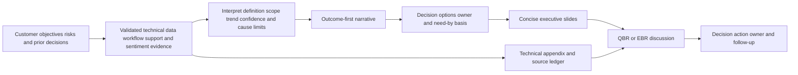

| Operating principle | Plain meaning | Practical consequence | Failure prevented |
|---|---|---|---|
| A review is a decision forum | Historical status matters only when it changes understanding or action | Design backward from decisions and risks | Slide recital |
| Start from customer objectives | Product activity is supporting evidence, not the headline | Lead with outcome, risk, or decision | Vendor-centered meeting |
| Interpret before presenting | A chart needs definition, scope, time, quality, and cause limits | Reconcile dashboard and source evidence | Green arrow becomes false claim |
| Use one evidence spine | Executive and technical views must reconcile | Layer detail without changing facts | Two conflicting stories |
| Distinguish QBR and EBR purpose | Quarterly cadence does not automatically make a meeting executive | Tailor participants, decisions, and depth | Wrong audience and content |
| Make decisions explicit | Executives should know what must be chosen, by whom, and by when | Present options, tradeoffs, recommendation, consequence | "Any questions?" close |
| Communicate bad news early | Delay increases decision loss and trust damage | State impact, facts, unknowns, action, cadence | Surprise at review |
| Roadmap is not a promise | Public direction, feedback, and committed release are different states | Use approved status and alternatives | Future date becomes dependency |
| Keep slides concise | A slide should carry one message and necessary evidence | Move methods and detail to appendix | Tiny-font data dump |
| Keep appendix decision-ready | Detail should answer challenge, not bury weakness | Include definitions, sources, methods, reconciliation, and limits | Appendix as evidence graveyard |
| Board-ready is governance-ready | Board material focuses enterprise consequence and oversight, through approved channels | Respect management, legal, and customer boundaries | TSM presents beyond authority |
| Product facts remain bounded | Public positioning cannot establish customer behavior or outcome | Verify current docs, entitlement, configuration, and tests | Invented Zscaler result |

## JD Mapping

| JD signal | Capability developed | Reusable customer or TSM artifact | Honest boundary |
|---|---|---|---|
| Lead strategic business reviews | Build outcome-, risk-, and decision-led QBR/EBR structure | Review charter and deck storyboard | No production QBR/EBR claim |
| Manage executive relationships | Communicate concise evidence, options, and accountability | Executive one-page narrative | Customer executives own decisions |
| Demonstrate customer value | Link adoption and workflow evidence to accepted outcomes cautiously | Value evidence slide and appendix | No unsupported causation or savings |
| Translate risk | Convert technical condition into scenario, business consequence, options, and residual | Executive risk statement | No board-risk or financial authority |
| Use data and analytics | Interpret dashboards, trends, denominators, cohorts, quality, and uncertainty | Dashboard interpretation card | No metric accepted without contract |
| Drive next outcomes | Turn review into roadmap, decisions, owners, and validation | Decision and action register | No guaranteed delivery |
| Communicate product direction | Attribute approved current facts and route requests | Roadmap communication record | No product commitment authority |
| Handle escalations | Deliver bad news with impact, evidence, cadence, and recovery | Bad-news update template | No unsupported ETA/root cause |
| Collaborate cross-functionally | Reconcile Sales, Support, Product, specialist, and customer facts | Review RACI and pre-brief | No internal status inference |

## Candidate honesty note

You can say: "My production background is enterprise Support Escalation Engineering rather than owning Zscaler QBRs, EBRs, or board presentations. I have translated complex service incidents into impact, evidence, options, decisions, and executive updates; used SQL and Power BI to examine trends and definitions; coordinated stakeholders; and communicated uncertainty and recovery. I have studied business-review and board-ready narrative methods and practiced these artifacts with fictional data. In a real account I would verify the audience, decision rights, customer objectives, metric contracts, product and support facts, commercial and roadmap boundaries, legal/privacy sensitivity, and approved communication path."

This bridge is factual and neutral. You should not claim you advised a board, quantified cyber loss, proved Zscaler value, committed a roadmap, forecast a renewal, presented a production SecOps QBR, or made a customer governance decision unless direct evidence supports it.

| Factual background | Transferable strength | Neutral wording | Unsupported statement to avoid |
|---|---|---|---|
| enterprise critical escalations | Condense impact, timeline, evidence, workstreams, decision, and recovery | "I make technical uncertainty decision-ready." | "I led board cyber-risk reviews." |
| Microsoft 365 service knowledge | Trace user, identity, network, application, and cloud-service mechanics | "I preserve a technical evidence spine beneath executive summaries." | "I advised on Zscaler architecture outcomes." |
| SQL and Power BI | Validate definitions, populations, trends, filters, and drill-downs | "I challenge dashboard interpretation before telling the story." | "I proved risk reduction from a dashboard." |
| Cross-team escalation | Align Support, engineering, operations, and customer roles | "I reconcile one fact pattern across audiences." | "I owned Zscaler Product roadmap communication." |
| Mentoring | Coach concise writing and evidence discipline | "I help others explain mechanism and limits." | "I set executive reporting policy." |
| Synthetic NMH deck | Demonstrates preparation and method | "This is a fictional storyboard." | "This is a delivered customer QBR." |

## Beginner vocabulary and memory hooks

A **business review** is a structured governance conversation about progress, evidence, risk, decisions, and next outcomes. A **QBR** is commonly a quarterly business review; an **EBR** is commonly an executive business review. Names vary by organization. Think of a ship's navigation review. The crew does not merely list engine activity. Leaders need destination, current position, hazards, confidence in instruments, decisions, owners, and route. Engineers keep detailed readings available if a claim is challenged.

| Term | Meaning from zero | Why it matters | Analogy or memory hook |
|---|---|---|---|
| QBR | Recurring quarterly review of outcomes, health, risks, and plan | Creates periodic governance | Navigation review every quarter |
| EBR | Review designed for executive outcomes, risks, and decisions | Audience and decision level matter more than frequency | Captain and route owners |
| Board-ready | Concise, governance-relevant, evidence-backed material suitable for approved board chain | Focuses oversight and enterprise consequence | Chart prepared for governing body |
| Narrative | Connected explanation of situation, meaning, choice, and action | Turns data into decision context | Position, hazard, route, command |
| Headline | One sentence stating the slide's conclusion | Prevents title from being a topic label | "Route delayed by storm" |
| Evidence spine | Traceable technical and analytical support beneath summary | Allows challenge without changing story | Instrument readings behind map |
| Dashboard | Organized visual view of measures and status | Supports monitoring, not automatic interpretation | Ship instrument panel |
| Metric contract | Definition of formula, population, denominator, time, source, quality, and limits | Makes trend comparable | Instrument calibration sheet |
| Variance | Difference from baseline, target, plan, or prior period | Directs explanation | Off course by distance |
| Trend | Direction across comparable observations | More reliable than one point | Course over time |
| Material | Important enough to affect decision or oversight under relevant standard | Controls attention | Hazard that changes route |
| Decision request | Exact choice needed from an authorized role | Makes review actionable | Permission to alter course |
| Option | Credible course with tradeoffs | Avoids false single-answer framing | Alternate routes |
| Recommendation | Preferred option with evidence and conditions | Supports informed decision | Navigator's advised route |
| Roadmap | Direction or planned sequence under an approved status | Future information requires authority and caveats | Intended ports, not arrival promise |
| Commitment | Authorized promise under defined terms | Must not be invented | Signed sailing order |
| Risk scenario | Plausible path from condition to consequence | Translates technical detail responsibly | Storm plus route plus vulnerable cargo |
| Residual risk | Risk remaining after current or planned action | Prevents false closure | Hazard left after reroute |
| Confidence | Strength and completeness of evidence | Makes uncertainty visible | Reliability of instruments |
| Appendix | Supporting definitions, methods, details, and evidence | Keeps main story concise and challengeable | Engineering logbook |
| Pre-read | Material reviewed before meeting | Saves live time for decisions | Chart sent before bridge meeting |
| Pre-brief | Alignment with presenters and owners before customer review | Prevents conflicting facts | Crew confirms readings |
| Read-back | Confirmation of decisions and actions | Prevents different interpretations | Repeat the command |
| PIR | Post-Incident Review of what happened and how to improve | Separates learning from blame | Voyage incident review |

### Plain-English deep-dive 1 - A business review is not a status museum

A status meeting displays what happened. A strong business review uses history to make a forward decision. If every slide can be read without changing priority, ownership, risk, investment, scope, or validation, the material may belong in an asynchronous report.

Imagine a navigation review containing engine hours, meals served, radio messages, and miles traveled but no destination, weather, deviation, or decision. The numbers may all be accurate yet strategically useless. Start the QBR or EBR with: What customer objective matters now? What changed? What is working? What threatens the objective? What decision or help is needed? What happens next?

## QBR and EBR architecture

QBR and EBR are not universal product names. Confirm the customer's governance model. A technical QBR may include operators and detailed adoption decisions. An EBR generally emphasizes strategic outcomes, material risks, cross-functional decisions, and future priorities.

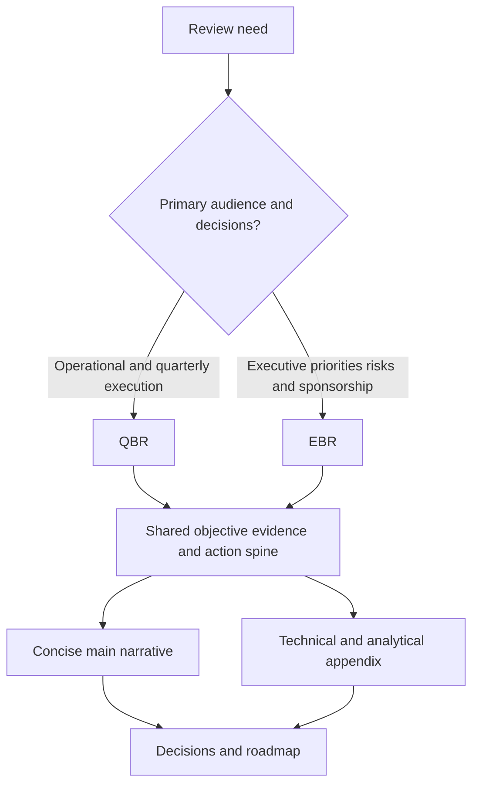

| Dimension | QBR starting hypothesis | EBR starting hypothesis | Verify |
|---|---|---|---|
| Purpose | Operational progress, adoption, health, blockers, plan | Strategic outcomes, material risk, decisions, sponsorship, future direction | Customer charter |
| Audience | Technical owner, operators, program, account team, selected leaders | Executive sponsor, outcome/risk owners, account leadership | Actual authority and interest |
| Time horizon | Prior quarter plus next-quarter execution | Multi-quarter strategy and material change | Planning cycle |
| Detail | More workflow, data, support, and technical evidence | More consequence, trend, tradeoff, and decision | Audience questions |
| Decisions | Dependencies, priorities, adoption interventions, technical plan | Investment, policy, ownership, risk, strategic scope | Decision rights |
| Main deck | Often 8 to 12 concise slides as a hypothesis | Often 5 to 10 concise slides as a hypothesis | Time and complexity |
| Appendix | Metrics, architecture, support, actions, definitions | Same evidence with board/executive-relevant detail | Sensitivity and need |
| Frequency | Commonly quarterly, but not mandatory | Customer-defined, perhaps quarterly/semiannual/triggered | Governance value |

### Review charter

| Field | Question |
|---|---|
| Purpose | Which decisions or strategic alignment justify live time? |
| Audience | Who needs to decide, advise, execute, or understand? |
| Objectives | What should participants know, decide, or own afterward? |
| Scope | Which objectives, products, workflows, periods, and risks are included? |
| Non-goals | Which incident, contract, design, or detailed training topics use another forum? |
| Evidence cut | What is the effective time and data-refresh cutoff? |
| Decisions | Exact requests, owners, options, and need-by basis? |
| Pre-read | What must be reviewed beforehand? |
| Presenters | Who speaks to customer facts, product facts, support, commercial items, and decisions? |
| Security/privacy | What classification, access, legal, and board-chain controls apply? |
| Outputs | Decision log, roadmap, actions, appendix, next review? |

## Build backward from decisions

Start with a decision inventory before building slides. A decision request should include the owner, issue, why now, options, tradeoffs, recommendation, evidence, uncertainty, consequence of delay, and requested date or trigger.

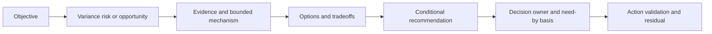

| Weak request | Stronger request |
|---|---|
| "We need executive support." | "The application-owner role remains unassigned for the defined remediation workflow. The executive sponsor should assign an accountable role or approve a narrowed scope by the change-planning cutoff; otherwise the next-quarter validation target moves." |
| "Approve training." | "Choose whether operators receive two role-specific practice sessions before workflow expansion or whether expansion remains limited to the current cohort. Option A uses more near-term capacity; Option B delays breadth but protects quality." |
| "Fix data quality." | "The customer data owner should select source A as authority for asset lifecycle or approve an exception rule for the disputed population. Until then, owner coverage and risk trend remain medium confidence." |
| "We need roadmap clarity." | "Decide whether the program can meet its objective with current verified capability and workaround, or whether the uncommitted future request is a gating dependency that requires rescoping." |

### Decision quality test

1. Is the owner authorized?
2. Is the proposition one decision rather than a bundle?
3. Are options credible, including current-state baseline?
4. Are consequences and tradeoffs stated neutrally?
5. Are facts, assumptions, product status, and unknowns separated?
6. Is the need-by date based on a real dependency?
7. Can the decision be recorded and validated?
8. Does deferral have an explicit consequence and route?

## Evidence preparation and source reconciliation

Prepare the review like an audit of claims. Freeze the reporting cut, validate sources, reconcile counts, identify definition changes, and assign claim owners. Do not discover during the executive meeting that two slides use different populations.

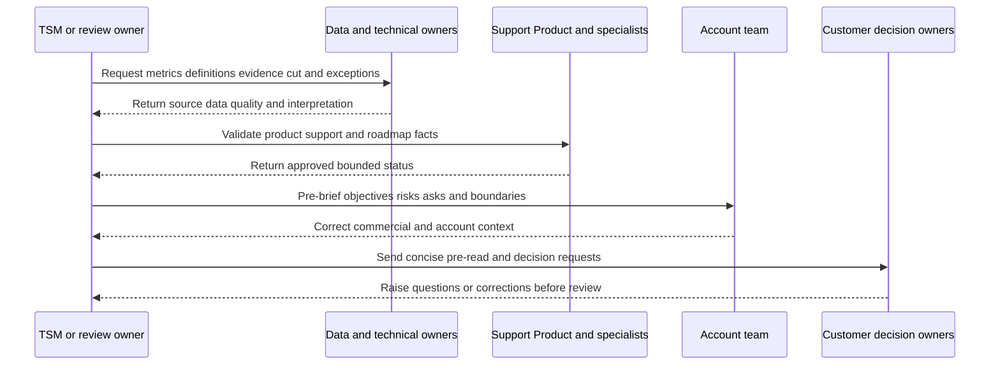

| Evidence check | Required question | Failure prevented |
|---|---|---|
| Effective cut | Through what date/time is evidence complete? | Live versus stale mismatch |
| Definition version | Did formula, inclusion, source, threshold, or time change? | False trend |
| Population | Which entities, users, sources, workflows, regions are eligible? | Pilot-to-enterprise extrapolation |
| Denominator | Count out of what opportunity set? | Growth appears as deterioration |
| Data quality | Completeness, freshness, validity, uniqueness, mapping, lineage? | Missing data looks like improvement |
| Support status | Which system/role owns current case state? | Case hypothesis becomes defect fact |
| Product fact | Current official source, entitlement, region, tenant, version, approval? | Marketing becomes capability promise |
| Customer claim | Which customer-authoritative evidence and owner? | Vendor writes customer truth |
| Cause | What mechanism is established versus inferred? | Correlation becomes causation |
| Sensitivity | Who may receive architecture, vulnerability, incident, personal, or commercial detail? | Overexposure |

## Dashboard interpretation

A dashboard answers questions only when its contract is known. Before narrating a chart, identify title claim, metric definition, grain, population, denominator, filters, time, baseline, target, source, quality, segmentation, trend, anomalies, and interpretation limits.

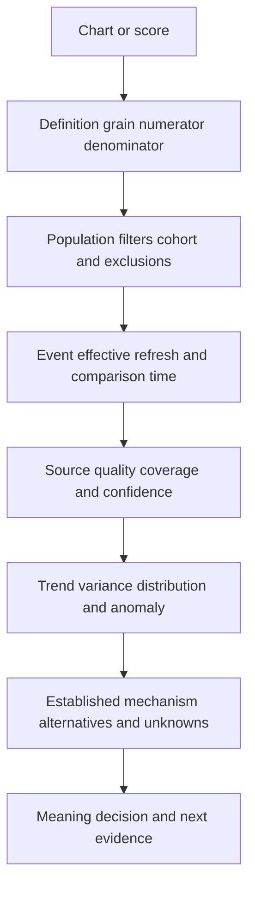

| Interpretation step | Question | Executive wording |
|---|---|---|
| Observe | What changed numerically under comparable definition? | "Validated workflow completion increased for the defined cohort." |
| Scope | Where, for whom, and over what period? | "The change applies to two pilot teams through the reporting cut." |
| Quality | Is evidence complete and trustworthy? | "One source remains incomplete, so confidence is medium." |
| Explain | Which mechanism is evidenced? | "Improvement coincided with owner mapping and fewer rejected assignments." |
| Limit | What is not established? | "This does not yet establish enterprise adoption or risk reduction." |
| Decide | What should happen? | "Approve expansion only after source reconciliation meets the agreed gate." |

### Dashboard questions executives may ask

| Question | Evidence-ready response pattern |
|---|---|
| Why did this move? | Observed change, established factors, plausible alternatives, next test |
| Is this good? | Objective, target, trend, distribution, guardrails, customer interpretation |
| Are we at risk? | Scenario, affected scope, controls, confidence, options, owner |
| What are we getting for the investment? | Capability, adoption, operational effect, outcome hypothesis, limits |
| What needs my decision? | Proposition, options, recommendation, consequence, need-by basis |
| Can we compare with peers? | Definition comparability, authorization, privacy, selection limits; decline if unsupported |
| Is Zscaler causing this result? | Verified capability and contribution evidence; no unsupported attribution |
| When will it be fixed? | Current state, owner, next milestone/check, ETA only if authorized and evidence-based |

### Plain-English deep-dive 2 - Executive brevity still needs an evidence spine

Concise communication is not vague communication. "Risk improved" is short but weak. "The tested external path was blocked for the defined critical-asset cohort; one privileged internal path remains under validation" is also short and much more truthful.

Think of a medical summary. The physician may tell a leader, "The treatment reduced fever, but the infection marker remains elevated and the next test is tomorrow." The full laboratory values stay in the chart. Summary and detail use one evidence spine. If the appendix contradicts the headline, the headline is wrong.

## Outcome-first executive narratives

A practical narrative pattern is **Outcome - Evidence - Meaning - Decision - Next**.

1. **Outcome:** Which customer objective or risk is in focus?
2. **Evidence:** What changed, under which definition, scope, time, and confidence?
3. **Meaning:** Why it matters and what mechanism or uncertainty exists.
4. **Decision:** What authorized role must choose, with options and tradeoffs.
5. **Next:** Action, owner, validation, residual, and review.

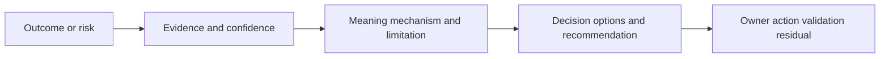

### Executive writing examples

| Weak writing | Better writing | Why better |
|---|---|---|
| "Adoption is up 25%." | "Qualified weekly workflow use increased in the two pilot teams under the current event definition; correctness review is incomplete, so expansion remains gated." | Names scope, definition, quality, and decision |
| "Risk went down." | "The displayed risk indicator declined, but one source changed coverage. We are not claiming risk reduction until population and path validation finish." | Separates chart from reality |
| "The connector is healthy." | "Authentication and scheduled ingestion succeeded through the reporting cut; record completeness and downstream entity matching remain below the customer-approved gate." | Decomposes health |
| "The customer is unhappy." | "Operators report low trust after two recurring ownership mismatches; the executive sponsor still rates strategic relevance high. Source reconciliation and workflow review are underway." | Preserves role-specific evidence |
| "Engineering will deliver next quarter." | "The request is recorded through the approved channel; no release commitment is established. The current plan uses a verified workaround and will be revisited on an approved status change." | Avoids roadmap promise |
| "We need more executive engagement." | "The privacy decision has no authorized owner and blocks the next data scope. Assign an accountable role by the review gate or approve a narrower field set." | Makes exact decision |
| "Everything is on track." | "Two milestones met acceptance; source B is seven days behind its dependency plan and now threatens the validation window. The options are narrow scope or move the date." | Communicates variance early |
| "Zscaler delivered value." | "The customer adopted the defined workflow and observed a lower reassignment rate during the pilot. Product contribution and other process changes are documented; broader value remains a hypothesis." | Bounded attribution |

### Message hierarchy

| Layer | Length | Content |
|---|---:|---|
| Headline | One sentence | Conclusion and consequence |
| Support | Two to four bullets | Evidence, meaning, decision, next |
| Speaker note | Short paragraph | Context, caveat, transition, likely question |
| Appendix | As needed | Definitions, methods, source detail, architecture, cases, calculations |
| Source record | Complete enough to reproduce | Provenance, owner, effective time, access |

## QBR/EBR deck storyboard

The storyboard below is a starting hypothesis, not a mandatory slide count. Remove slides that do not serve the audience or decision.

```mermaid
flowchart LR
    S1[1 Purpose objectives and decisions] --> S2[2 Executive outcome summary]
    S2 --> S3[3 Progress and value evidence]
    S3 --> S4[4 Health adoption and support]
    S4 --> S5[5 Material risks and bad news]
    S5 --> S6[6 Decisions and options]
    S6 --> S7[7 Next-period roadmap]
    S7 --> S8[8 Commitments and close]
    S8 --> APP[Technical appendix]
```

| Slide | Headline question | Minimal content | Visual | Decision/use |
|---:|---|---|---|---|
| 1 | Why are we here? | Objectives, reporting cut, requested decisions, agenda | Three decision cards | Set contract |
| 2 | Are intended outcomes progressing? | Outcome posture, what changed, confidence, top risk | Outcome scorecard with no opaque average | Align executive view |
| 3 | What value evidence exists? | Capability-to-adoption-to-effect chain, limits | Value hypothesis path and two trends | Continue/adapt interpretation |
| 4 | Is the program healthy and adopted? | Domain health, adoption ladder, data/support/sentiment exceptions | Small multiples or domain table | Target interventions |
| 5 | What threatens success? | Material risk scenarios, bad news, unknowns, mitigation, residual | Risk/decision table | Escalate/accept/sequence |
| 6 | What decisions are needed? | Proposition, options, recommendation, tradeoffs, owner, need-by basis | Option comparison | Decide or assign route |
| 7 | What happens next? | Outcome-led roadmap, dependencies, gates, current/future status | Now/next/later or dependency roadmap | Approve priorities |
| 8 | What did we agree? | Decisions, actions, owners, validation, next review | Commitment register | Read-back |
| Appendix A | How are metrics defined? | Dictionary, source, cut, quality, changes | Tables/calculations | Defend interpretation |
| Appendix B | What is the technical mechanism? | Architecture, flow, control, failure, evidence | Layered diagram | Technical challenge |
| Appendix C | What is support/product status? | Cases, approved status, reproduction, workaround | Case table/timeline | Preserve boundaries |
| Appendix D | What detailed plan exists? | Milestones, RAID, RACI, adoption cohorts | Plan tables | Execution follow-up |

### Slide construction rules

| Element | Rule | Example-neutral test |
|---|---|---|
| Title | Write conclusion, not topic | Could a reader know the point without narration? |
| Body | Three to five evidence/decision elements | Is every element needed for the conclusion? |
| Chart | One comparison with legible labels and source note | Can denominator, period, and direction be understood? |
| Color | Use sparingly with labels; never color alone | Accessible and semantically consistent? |
| Number | Round only without changing decision meaning | Is precision justified? |
| Caveat | Put material limits near claim | Would omission mislead? |
| Source | Name source, definition version, and reporting cut | Can appendix reproduce it? |
| Ask | State owner, proposition, and need-by basis | Can decision be recorded verbatim? |
| Appendix pointer | Identify where challenge can be answered | Does appendix reconcile exactly? |

## Risk translation and board-ready communication

Technical detail becomes executive risk through a chain: condition, affected objective or asset, plausible path, existing controls, business consequence, likelihood/impact evidence, uncertainty, options, decision, and residual. Do not use fear, unsupported financial estimates, or attack certainty.

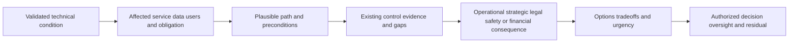

| Audience | Needs | Usually omit from main narrative | Keep available |
|---|---|---|---|
| Operator | Exact scope, evidence, steps, failure, recovery | Abstract business language without action | Logs, queries, configuration, runbook |
| Technical leader | Architecture, mechanism, dependencies, validation | Every raw record | Diagram, tests, support status |
| CISO/CIO | Enterprise objective, risk path, options, accountability | Low-level implementation sequence | Evidence summary and appendix |
| Business executive | Service/customer/operational consequence and decision | Tool taxonomy | Quantification method and dependencies |
| Board/committee | Material enterprise risk, governance, resilience, oversight decision through approved management chain | Product operation and case detail | Management-approved evidence and legal context |

### Plain-English deep-dive 3 - Board-ready does not mean bypass the organization

Board-ready writing means the narrative could support governance: material objective, risk, evidence, management action, residual, and oversight decision are clear. It does not mean a TSM should contact or present to a board without the customer's approved chain.

Think of an engineer preparing a safety note that the chief operating officer may use. The engineer contributes accurate mechanics and uncertainty. Management, legal, finance, risk, and communications roles determine materiality, disclosure, financial interpretation, and board communication. Technical credibility includes respecting those boundaries.

### Board-ready sentence pattern

> **Management objective:** [Enterprise objective]. **Current evidence:** [Validated condition, scope, time, confidence]. **Risk:** [Plausible consequence and controls, without certainty]. **Management action:** [Completed/in progress with owner]. **Decision/oversight:** [Choice, authority, timing]. **Residual:** [Remaining exposure, unknown, monitoring, trigger].

## Roadmap communication

A customer roadmap should connect outcomes, dependencies, gates, and current approved capability. A product roadmap has separate authority. Never convert a request, concept, public direction, preview, target, or internal discussion into a release commitment.

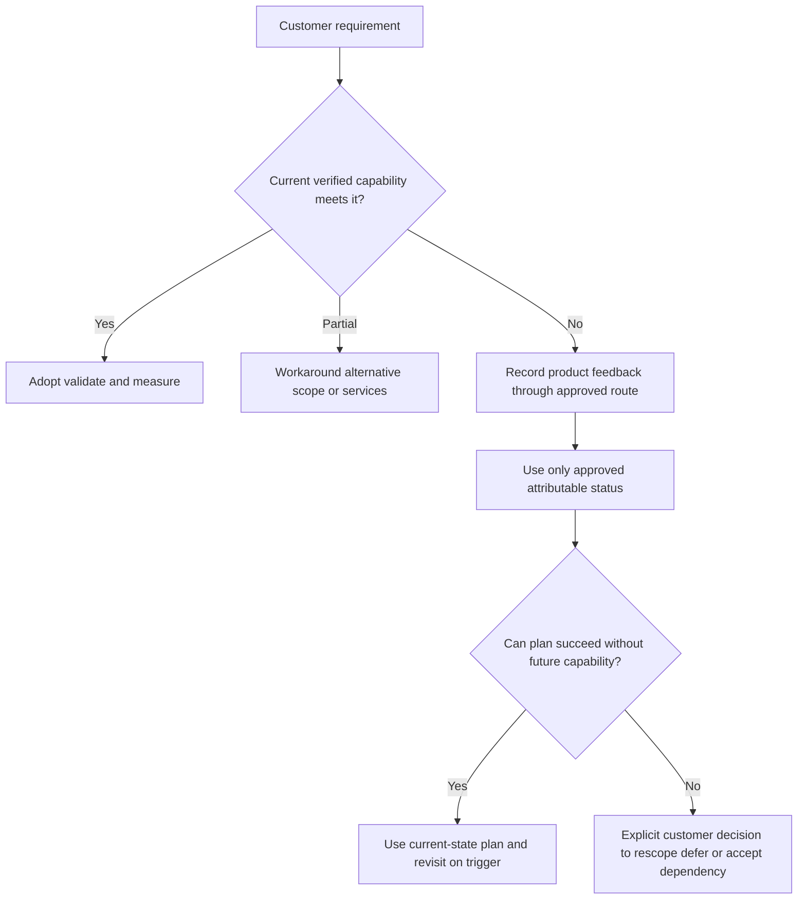

| Status category | Safe meaning | Communication rule |
|---|---|---|
| Current documented | Generally available behavior described in current official source | Verify entitlement, tenant, region, prerequisites, and tests |
| Customer validated | Behavior accepted in defined customer scope | State exact scope and time |
| Preview/beta | Limited status under current terms | Use approved wording; not production commitment |
| Publicly announced direction | Attributable public statement | Quote source/date; do not infer customer availability |
| Recorded feedback/request | Requirement submitted through approved process | No priority or release inference |
| Under investigation | Support/Product process is evaluating evidence | No defect/fix conclusion without authority |
| Planned/targeted/committed | Only if approved owner and terms permit communication | Preserve exact qualifiers and update triggers |
| Unknown | No approved current status | Say unknown and plan around current capability |

### Roadmap writing examples

| Unsafe | Safer |
|---|---|
| "This will ship next quarter." | "No approved release commitment is established in the evidence available to this review." |
| "Engineering accepted it." | "The requirement was submitted through the approved route; priority and delivery are not inferred." |
| "Zscaler is building this for you." | "The account team will communicate only an approved attributable status. The current success plan does not depend on an uncommitted capability." |
| "The roadmap solves the gap." | "If a future verified capability meets the acceptance criteria, the design can be revisited. Current options remain A, B, and scope change." |

## Communicating bad news

Bad news should move at the speed of decision need, not wait for the next QBR. The business review should reconcile the event, impact, recovery, learning, and residual after appropriate incident communication.

```mermaid
flowchart LR
    BAD[Material unfavorable evidence] --> VALID[Validate scope impact and confidence]
    VALID --> EARLY[Notify correct owner early]
    EARLY --> FACT[State facts unknowns and what changed]
    FACT --> ACT[Containment workstreams support and decisions]
    ACT --> CAD[Cadence and next evidence milestone]
    CAD --> REC[Recovery validation]
    REC --> LEARN[Closure PIR and roadmap impact]
```

Use this order:

1. **Headline:** What happened or what is at risk.
2. **Impact:** Who/what is affected and since when, under current evidence.
3. **Facts:** What is observed and verified.
4. **Unknowns:** What is not yet established.
5. **Action:** Containment, investigation, support, and owners.
6. **Decision:** What help or tradeoff is needed.
7. **Cadence:** Next update time or evidence milestone.
8. **ETA discipline:** Give an ETA only when an authorized owner has evidence; otherwise give next checkpoint.

### Bad-news writing examples

| Weak | Better |
|---|---|
| "There is a small delay." | "Source B did not meet the agreed readiness gate, so the production validation window is at risk. Authentication succeeds; completeness reconciliation is still failing. The options are narrow scope or move the window." |
| "Engineering is working on it." | "Support owns the active investigation with the supplied reproduction and logs. Root cause and fix timing are not established. The next evidence checkpoint is 16:00 UTC." |
| "No customer impact." | "No impact has been observed in the tested scope; monitoring does not cover two excluded workflows, so broader impact remains unknown." |
| "The metric was wrong." | "A denominator defect overstated the prior adoption rate. The corrected values are in the appendix, affected decisions are listed, and the metric owner has added a reconciliation control." |

### Plain-English deep-dive 4 - Trust comes from predictable truth, not permanent good news

Executives do not expect complex programs to produce only good news. They do expect important facts to arrive early, with a stable definition of impact, a clear owner, and a credible next checkpoint. Concealing uncertainty creates surprise; inventing certainty creates later contradiction.

Think of a flight crew announcing a delay. "We are waiting" creates frustration. "A maintenance check found a sensor inconsistency; the aircraft remains at the gate; engineers are running the specified test; the next update is at 14:30; rebooking options are available" gives facts and agency without guessing departure time.

## Technical appendix design

The appendix is part of the evidence system. It should be navigable, versioned, source-aware, and consistent with the main deck.

| Appendix section | Content | Quality test |
|---|---|---|
| Metric dictionary | Formula, grain, population, denominator, time, source, quality, limits | Main chart reproducible |
| Data-quality report | Coverage, freshness, validity, mapping, missingness, reconciliation | Unknowns visible |
| Cohort/adoption detail | Eligible scope, ladder, frequency, correctness, workflow sample | Activity not overclaimed |
| Architecture | Actors, identity, path, boundaries, controls, data, evidence, owners, failure | Conceptual versus customer fact labeled |
| Risk evidence | Scenario, controls, tests, residual, confidence | Score not sole evidence |
| Support | Case IDs/status through authorized system, impact, recurrence, workaround | No defect/ETA invention |
| Decisions | Options, rationale, authority, rejected alternatives | Main ask reconciles |
| Roadmap | Customer outcome roadmap and approved product status | No hidden promise |
| RAID/RACI | Risks, assumptions, issues, dependencies, roles | Ownership current |
| Source ledger | Claim, evidence class, source, review/effective time, owner | Traceability complete |

Do not put sensitive raw logs, personal information, secrets, detailed exploitable paths, internal-only product discussions, or commercial terms into a broad appendix. Link or reference controlled evidence with appropriate access.

## Review facilitation and follow-through

The presenter should pause for decisions, not ask participants to wait until the final slide. Use a decision log visible during the meeting. When debate becomes technical, decide whether the appendix can resolve it quickly or whether a separate working session is safer.

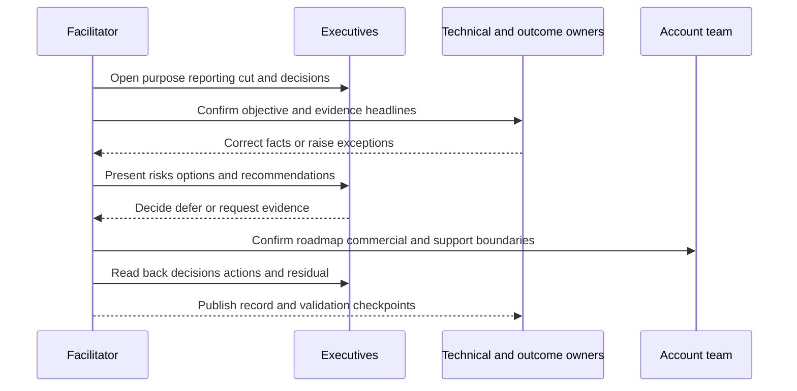

| Facilitation moment | Action |
|---|---|
| Opening | Confirm purpose, reporting cut, decisions, confidentiality, and time |
| Contradiction | Pause, write competing claims, identify source/scope/time, do not average |
| Deep dive | Use appendix if decision-relevant; otherwise assign working session |
| New incident | Route to incident process; do not diagnose through QBR deck |
| Roadmap pressure | Use approved status, current alternatives, and no-promises language |
| Missing decision owner | Record open decision and governance route; do not pretend alignment |
| Time pressure | Protect risks, decisions, and read-back; move status detail async |
| Close | Repeat decisions verbatim, owners, due-date basis, validation, next review |

### Follow-up package

1. Final deck with reporting cut and corrected facts.
2. Decision record with authority, rationale, scope, and effective time.
3. Action register with owner, dependency, due-date basis, acceptance evidence, and status.
4. Technical appendix and controlled evidence references.
5. Roadmap with current-state capability and approved future-status wording.
6. Open questions and verification routes.
7. Updated success plan, health assessment, and risk register.
8. Feedback on review usefulness and next governance need.

## Security, privacy, legal, and commercial controls

| Content | Risk | Control |
|---|---|---|
| Vulnerability/attack path | Enables misuse or exposes posture | Need-to-know summary; controlled detail |
| Incident evidence | Personal, secret, legal, or forensic sensitivity | Approved source and investigation channel |
| User/adoption data | Surveillance or employment misuse | Aggregate/minimize, purpose-limit, restrict |
| Board material | Governance, privilege, disclosure, retention sensitivity | Customer-approved management/legal chain |
| Financial estimate | Unsupported loss, savings, or exposure | Finance/risk-approved method and caveat |
| Product roadmap | Confidentiality and unauthorized commitment | Approved attributable wording only |
| Support/Engineering status | Internal/confidential or changing | Authorized system and communicator |
| Commercial terms | Contract and negotiation sensitivity | Account/commercial owner and access |
| Cross-customer benchmark | Privacy, comparability, selection bias | Authorization and methodology; otherwise omit |
| AI-generated summary | Leakage, hallucination, tone, attribution error | Approved tool, minimization, source grounding, human review |
| Recording/transcript | Broad retention and discovery risk | Purpose, consent, access, retention, deletion |

The TSM can contribute technical facts and general practice. Customer management and relevant legal, finance, risk, privacy, communications, and board-governance roles control formal board statements, materiality, disclosure, and financial interpretation.

## Operating quality and rehearsal

Use two rehearsals. The first is a **content review**: are claims correct, metrics comparable, product statuses approved, asks real, and appendix aligned? The second is a **delivery review**: can presenters explain each headline, answer likely questions, handle bad news, and hand off by role within time?

| Quality gate | Questions | Owner |
|---|---|---|
| Objective | Does every slide serve a customer decision or outcome? | Review owner |
| Evidence | Are sources, definitions, cut, quality, and confidence current? | Metric/technical owners |
| Narrative | Does headline state conclusion and material limit? | Executive writer |
| Product truth | Are capability, entitlement, support, and roadmap statements approved? | Product/specialist/account roles |
| Customer truth | Did customer owners confirm objective, facts, and decisions? | Customer counterparts |
| Commercial | Are scope and terms handled by authority? | Account/commercial owner |
| Security/privacy/legal | Is audience and content handling appropriate? | Relevant customer/vendor roles |
| Accessibility | Are text, charts, contrast, labels, and materials usable? | Deck owner |
| Delivery | Are roles, timing, transitions, objections, and contingencies rehearsed? | Facilitator |
| Follow-up | Are decision/action templates ready? | Program owner |

## Failure modes and misconceptions

| Failure or misconception | Why it fails | Repair |
|---|---|---|
| QBR means quarterly slide deck | Cadence does not create governance value | Charter decisions and audience |
| EBR is QBR with more executives | Content and authority need redesign | Lead with strategic outcomes/risks/asks |
| Product usage is the opening story | Centers vendor activity over customer objective | Start with outcome and adoption chain |
| Every metric belongs in main deck | Attention and message collapse | One message per slide; appendix detail |
| A dashboard explains itself | Definitions, filters, quality, and cause are hidden | Use interpretation card |
| Green means no discussion | Unknown or material exceptions may hide | Show components, confidence, overrides |
| Red means failure | Status may be an early warning needing decision | State mechanism and intervention neutrally |
| Correlation proves value | Other changes may drive result | State hypothesis, confounders, limits |
| Board-ready means dramatic | Fear and false precision damage trust | Use scenario, evidence, action, residual |
| Board-ready means TSM addresses board | Governance route is customer-controlled | Prepare through approved chain |
| Bad news waits for QBR | Decision time and trust are lost | Communicate through appropriate cadence early |
| Root cause required before update | Impact and actions can be shared while cause unknown | Separate facts, hypotheses, checkpoints |
| ETA shows confidence | Unsupported date creates commitment risk | Give next evidence milestone |
| Roadmap closes current gap | Future status may be uncommitted | Plan with current verified capability |
| Appendix can contradict summary | Two stories destroy credibility | Reconcile one evidence spine |
| More precision means rigor | Decimal detail can exceed evidence | Match precision to data and decision |
| Peer benchmark is always useful | Definitions and populations may differ | Compare only when authorized/comparable |
| Slides are the deliverable | Decisions and actions are the operational output | Publish records and update plans |
| Executive language removes technical limits | Compression cannot change truth | Put material caveat near headline |
| Sales and TSM should tell different stories | Customer-facing facts must reconcile | Pre-brief boundaries and roles |

## Troubleshooting review failures

| Symptom | Plausible causes | Cheapest discriminating check | Repair |
|---|---|---|---|
| Executives do not attend | No real decision, wrong cadence, low relevance, scheduling | Ask sponsor which decision requires them | Redesign or use async report |
| Review becomes technical deep dive | Main claim unclear, appendix absent, technical decision unresolved | Ask whether detail changes executive decision | Park working session or use exact appendix |
| Metrics disputed live | Definition/source/population not pre-aligned | Open metric contract and reconciliation | Correct claim; do not debate memory |
| Two slides conflict | Different cuts, filters, sources, owners | Compare source ledger | Remove until reconciled |
| No decisions occur | Ask vague, owner absent, options weak | Read request verbatim | Assign route/date or reschedule |
| Deck is too long | Status inventory, duplicate charts, no hierarchy | Map each slide to one decision/outcome | Remove or move to appendix |
| Bad news surprises sponsor | Pre-brief/cadence failure | Review event timeline and notification rule | Acknowledge, correct process, address impact |
| Product claim challenged | Public phrase used beyond evidence | Check source, entitlement, tenant, status | Downgrade to verified fact or unknown |
| Roadmap expectation differs | Qualifiers lost or salesperson/TSM mismatch | Locate approved wording and decision record | Correct immediately and plan current alternative |
| Board wording overstates risk | Technical condition converted to certainty/financial claim | Trace risk scenario and authority | Rewrite with scope, uncertainty, management chain |
| Action repeats every quarter | No authority, dependency, acceptance, or escalation | Inspect action record | Convert to decision or close honestly |
| Outcome improves but value challenged | Attribution/baseline weak | Rebuild value hypothesis and confounder log | State association and next evidence |

## Decision trees

### Decision tree 1 - Does this belong in the main deck?

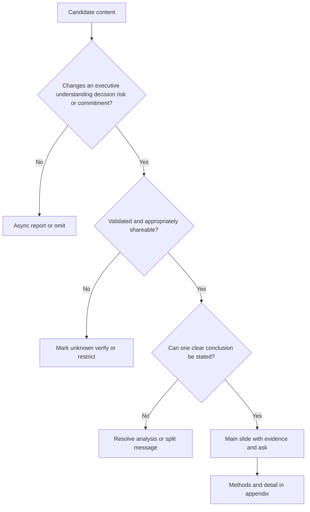

### Decision tree 2 - Can a roadmap statement be made?

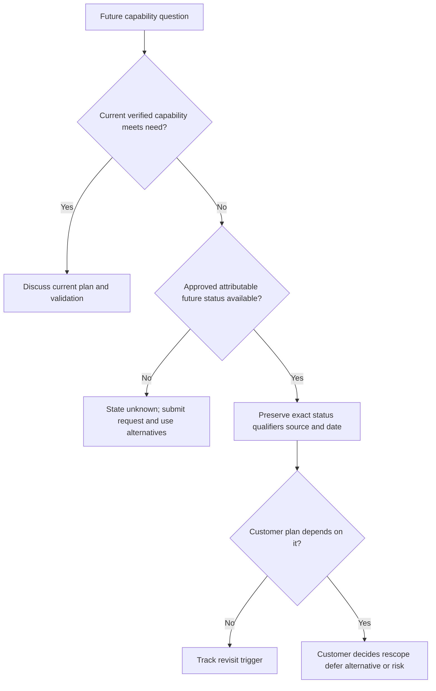

### Decision tree 3 - How should bad news be communicated?

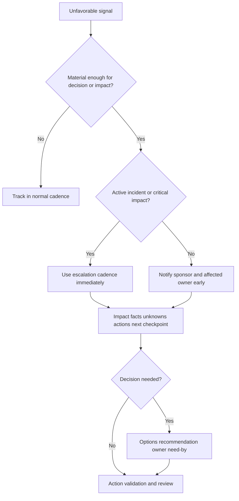

## Explicitly fictional and synthetic NMH scenarios

All content in this section is fictional and synthetic. It is practice material, not a customer QBR, EBR, board report, product roadmap, dashboard, score, risk, decision, commercial state, entitlement, value, or result. Dates in this section, including **2026-10-21**, **2026-11-04**, **2026-11-25**, and **2026-12-16**, are synthetic scenario dates later than the source snapshot and do not imply later research. Every later date in this section is fictional and synthetic.

### Scenario 1 - The usage victory that is not adoption

On synthetic 2026-10-21, a fictional NMH chart shows more dashboard views. The review owner finds that a new cohort and repeat refreshes explain most growth, while end-to-end validation remains low. The headline becomes: "Awareness expanded; workflow adoption remains gated by validation and owner acceptance." The main deck asks for a workflow-owner decision; detailed telemetry stays in the appendix.

### Scenario 2 - Bad news before the EBR

On synthetic 2026-11-04, a fictional source-quality defect invalidates an outcome chart five days before the EBR. The TSM notifies the sponsor immediately, withdraws the value claim, identifies affected decisions, assigns reconciliation, and supplies a next checkpoint. The EBR includes the corrected metric if accepted or an explicit unknown if not. No root cause or product defect is invented.

### Scenario 3 - Roadmap pressure

On synthetic 2026-11-25, an NMH executive asks for a delivery date for a fictional request. The approved evidence establishes only that the requirement was recorded. The response says no release commitment is established, compares current alternatives, and asks whether NMH will accept a bounded workaround, change scope, or defer the dependent milestone. No Zscaler roadmap is asserted.

### Scenario 4 - Board-ready risk summary

On synthetic 2026-12-16, NMH management requests a concise fictional risk summary. The technical team supplies validated scope, path, controls, uncertainty, mitigation, and residual. Customer management and legal/risk roles decide materiality, financial language, and board use. The TSM does not present directly to the fictional board or claim a quantified loss.

## Reusable artifact kit

These templates are general practice. Customer governance, product and support authority, legal/privacy/commercial controls, and verified evidence govern production use.

### Artifact 1 - QBR/EBR charter

| Field | Entry |
|---|---|
| Review name/version/date | |
| Purpose and customer objectives | |
| Audience, roles, authority | |
| Reporting/evidence cut | |
| Scope and non-goals | |
| Decisions requested | |
| Pre-read and corrections deadline | |
| Presenters by claim type | |
| Product/support/commercial boundaries | |
| Security/privacy/legal/recording | |
| Outputs and follow-up | |

### Artifact 2 - QBR/EBR deck storyboard

| Slide | Exact headline | Objective/risk | Evidence and confidence | Visual | Decision/owner | Caveat | Appendix link |
|---:|---|---|---|---|---|---|---|
| 1 - Purpose/asks | | | | | | | |
| 2 - Outcome summary | | | | | | | |
| 3 - Value evidence | | | | | | | |
| 4 - Health/adoption/support | | | | | | | |
| 5 - Material risks/bad news | | | | | | | |
| 6 - Decisions/options | | | | | | | |
| 7 - Roadmap | | | | | | | |
| 8 - Commitments/read-back | | | | | | | |

### Artifact 3 - Executive writing card

| Element | Draft |
|---|---|
| One-sentence headline | |
| Customer outcome/risk | |
| Observed evidence/scope/time | |
| Definition and confidence | |
| Meaning/mechanism | |
| Material limitation/unknown | |
| Options and tradeoffs | |
| Recommendation/conditions | |
| Decision owner/need-by basis | |
| Next action/validation/residual | |

### Artifact 4 - Dashboard interpretation card

| Field | Entry |
|---|---|
| Chart/metric/version | |
| Decision purpose | |
| Grain/numerator/denominator | |
| Population/filter/exclusion/cohort | |
| Event/effective/refresh/reporting time | |
| Source/lineage/quality/confidence | |
| Baseline/target/threshold | |
| Observed trend/distribution/anomaly | |
| Established factors | |
| Alternatives/confounders | |
| What it does not prove | |
| Executive meaning/decision | |

### Artifact 5 - Decision request and record

| Field | Entry |
|---|---|
| Decision ID/proposition | |
| Authorized owner | |
| Why now/need-by basis | |
| Facts/assumptions/unknowns | |
| Options including baseline | |
| Technical/security/privacy/operational/commercial tradeoffs | |
| Recommendation and conditions | |
| Consequence of delay | |
| Decision/rationale/scope/effective time | |
| Action/owner/validation/residual | |

### Artifact 6 - Bad-news executive update

> **Headline:** [What happened or is at risk].
>
> **Impact:** [Affected scope, business workflow, start time, confidence].
>
> **Verified facts:** [Observed state and evidence].
>
> **Unknowns/hypotheses:** [Clearly separated].
>
> **Actions/workstreams:** [Containment, investigation, Support/Product/customer owner].
>
> **Decision/options:** [Exact ask and tradeoffs].
>
> **ETA discipline:** [Authorized ETA or explicit absence].
>
> **Next update:** [Time or evidence milestone].
>
> **Recovery/validation/residual:** [When available].

### Artifact 7 - Roadmap communication record

| Requirement | Customer outcome | Current verified capability | Gap | Current options/workaround | Approved future status/source/date | Commitment boundary | Dependency decision | Owner/revisit trigger |
|---|---|---|---|---|---|---|---|---|
| | | | | | | | | |

### Artifact 8 - Board-ready narrative

| Element | Approved draft |
|---|---|
| Management objective | |
| Validated condition/scope/time/confidence | |
| Enterprise risk scenario and controls | |
| Operational/strategic/legal/safety/financial consequence source | |
| Management action and owner | |
| Decision/oversight request | |
| Residual/unknown/monitoring/trigger | |
| Legal/risk/finance/communications approval | |
| Technical appendix reference | |

### Artifact 9 - Technical appendix inventory

| Appendix | Question answered | Owner | Source/effective cut | Sensitivity/access | Main-deck claim reconciled | Review status |
|---|---|---|---|---|---|---|
| Metrics/dictionary | | | | | | |
| Data quality | | | | | | |
| Adoption cohorts/workflow | | | | | | |
| Architecture/control path | | | | | | |
| Risk evidence/residual | | | | | | |
| Support/product status | | | | | | |
| Decisions/RAID/RACI | | | | | | |
| Sources/change log | | | | | | |

### Artifact 10 - Review pre-brief RACI

| Claim/topic | Responsible evidence owner | Accountable communicator | Consulted | Informed | Approved wording/source | Escalation if unresolved |
|---|---|---|---|---|---|---|
| Customer objectives | | | | | | |
| Metrics/value | | | | | | |
| Technical architecture | | | | | | |
| Support case/defect | | | | | | |
| Product capability/roadmap | | | | | | |
| Commercial/entitlement | | | | | | |
| Risk/board language | | | | | | |

### Artifact 11 - Review action and read-back register

| Decision/action | Owner/authority | Dependency | Due-date basis | Acceptance evidence | Status | Residual/escalation | Next review |
|---|---|---|---|---|---|---|---|
| | | | | | | | |

### Artifact 12 - Slide quality rubric

| Criterion | Needs revision | Decision-ready |
|---|---|---|
| Customer-centered | Product/activity headline | Customer outcome/risk/decision headline |
| Evidence | Number without contract | Scope, time, source, quality, confidence |
| Meaning | Description only | Mechanism, implication, limitation |
| Decision | Vague request | Owner, options, recommendation, need-by |
| Brevity | Multiple messages and tiny detail | One conclusion with necessary support |
| Visual | Decorative or misleading | Legible comparison tied to claim |
| Boundary | Product/customer/roadmap overclaim | Evidence class and authority preserved |
| Appendix | Missing or conflicting | Reproducible and reconciled |
| Accessibility | Color-only, small, dense | Labels, contrast, readable structure |

## Exercises

### Exercise 1 - Turn status into decisions

Take ten synthetic status bullets about connectors, adoption, support, training, risk, and roadmap. Remove items that need no live decision. Rewrite the rest as customer outcome, evidence, meaning, decision, and next. Name the authorized owner and due-date basis.

### Exercise 2 - Interpret a misleading dashboard

Create a fictional chart showing improved risk and usage. Add one denominator change, one missing source, one new cohort, and one support recurrence. Build the interpretation card, rewrite the headline, decide what belongs in the main deck, and put methods in the appendix.

### Exercise 3 - Build a QBR/EBR storyboard

Draft eight slides from the provided storyboard for a fictional SecOps technical-success program. Give every slide a conclusion title, evidence, decision use, caveat, and appendix reference. Then remove two slides without losing any required decision.

### Exercise 4 - Deliver bad news

A synthetic metric error invalidates a prior value statement while a milestone is already at risk. Write the early sponsor update, meeting headline, affected-decision analysis, corrective control, and next checkpoint. Do not blame an individual, hide the error, or invent a final root cause.

### Exercise 5 - Handle roadmap pressure

A fictional customer says an unverified future feature is essential. Create the exact requirement, current capability check, alternatives, approved-status request, no-promises wording, dependency decision, and roadmap trigger. Role-play pressure for a date without becoming evasive.

### Exercise 6 - Write board-ready risk language

Convert a technical condition into management objective, validated scope, path, controls, consequence, action, oversight decision, residual, and appendix reference. Identify what customer legal, finance, risk, and management roles must own. Remove unsupported attack certainty and financial numbers.

### Exercise 7 - Rehearse challenge questions

Answer: Why did the chart move? What value has been realized? Are we at risk? When will the issue be fixed? Is this committed on the roadmap? Can we compare to peers? Keep each answer under sixty seconds while preserving scope, evidence, uncertainty, and authority.

### Exercise 8 - Candidate honesty rehearsal

Answer: "Tell me about an executive business review you led." Use a factual Microsoft executive-escalation update or analytical review only if personally true, label the adjacent mechanics, and present the NMH storyboard as fictional preparation. State the boundaries around production Zscaler QBR/EBR, board advice, roadmap authority, and value attribution.

## Customer discovery questions

1. What customer objectives, material risks, and decisions justify the review?
2. Is this a QBR, EBR, board-supporting input, technical review, incident update, or another forum under the customer's governance?
3. Who will attend, what do they decide, and which technical, operational, risk, legal, finance, privacy, commercial, or product roles must contribute?
4. What is the reporting cut, and which source, definition, population, denominator, filter, time, and quality govern each metric?
5. Which claims are official product facts, general practice, customer facts, scenario assumptions, or unknowns?
6. Which customer outcomes are progressing, stalled, at risk, or no longer relevant?
7. What adoption, data, workflow, support, sentiment, maturity, and risk evidence supports the outcome narrative?
8. Which trends are comparable, and which source/model/scope/process changes break comparison?
9. What mechanisms are established, what alternatives remain, and what cannot be attributed?
10. Which bad news must be communicated before the review through another cadence?
11. What exact decisions are needed, from whom, with which options, tradeoffs, recommendation, and need-by basis?
12. Which product capability, entitlement, tenant behavior, Support status, or roadmap wording requires current authorized verification?
13. Can the customer plan succeed with current verified capability, or is an uncommitted future item a gating dependency requiring decision?
14. What belongs in the concise main deck, technical appendix, asynchronous report, controlled repository, or separate working session?
15. What architecture, metric, support, risk, roadmap, RAID, RACI, and source detail must be available for challenge?
16. What security, privacy, privilege, disclosure, recording, retention, and audience restrictions apply?
17. Who owns formal board, financial, legal, disclosure, and commercial interpretations?
18. How will decisions be read back, recorded, validated, and reflected in the success plan and roadmap?
19. Which recurring action needs conversion into an executive decision or honest closure?
20. What feedback will determine whether the next review should change audience, cadence, evidence, or format?

## Official Source Anchors

Research/source snapshot and source review date: **2026-08-24**.

The Zscaler sources support dated public portfolio, risk-visibility, investor, and governance context only. NIST sources support general cybersecurity outcomes, governance, risk, measurement, and zero-trust concepts. They do not establish a customer's dashboard, QBR/EBR, board statement, score, financial exposure, risk reduction, roadmap, entitlement, support state, commercial position, or outcome. Current customer evidence and governance, official technical/order documentation, licensed-tenant state, approved roadmap/support communications, contracts, and authorized legal/risk/finance/management roles govern production reviews.

| Source | URL | Used for | Boundary |
|---|---|---|---|
| Zscaler Zero Trust Exchange | https://www.zscaler.com/products-and-solutions/zero-trust-exchange-zte | Public zero-trust platform positioning | No customer architecture, control, entitlement, or outcome inferred |
| Zscaler Agentic Security Operations | https://www.zscaler.com/products-and-solutions/security-operations | Public SecOps portfolio and workflow positioning | No agent action, investigation result, or customer value inferred |
| Zscaler Data Fabric for Security | https://www.zscaler.com/products-and-solutions/data-fabric | Public security-data harmonization and reporting positioning | No source quality, connector, schema, metric, or result inferred |
| Zscaler Unified Vulnerability Management | https://www.zscaler.com/products-and-solutions/unified-vulnerability-management | Public contextual vulnerability prioritization positioning | No customer score, priority, workflow, SLA, or risk reduction inferred |
| Zscaler Risk360 | https://www.zscaler.com/products-and-solutions/risk360 | Public contextual risk visibility, quantification, and reporting positioning | No customer financial exposure, board statement, recommendation, or result inferred |
| Zscaler Investor Relations | https://ir.zscaler.com/ | Public company-approved investor information context | Does not authorize account-specific roadmap, forecast, or customer claim |
| NIST Cybersecurity Framework 2.0 | https://www.nist.gov/cyberframework | Govern and cybersecurity-outcome framing | Voluntary and implementation-neutral |
| NIST SP 800-55 Vol. 1 | https://csrc.nist.gov/pubs/sp/800/55/v1/final | General information-security measurement-program concepts | Does not define customer metrics or attribution |
| NIST SP 800-30 Rev. 1 | https://csrc.nist.gov/pubs/sp/800/30/r1/final | General risk-assessment concepts | Organizations tailor methods and decisions |
| NIST SP 800-207 Zero Trust Architecture | https://csrc.nist.gov/pubs/sp/800/207/final | Vendor-neutral zero-trust architecture concepts | Not a customer design or product outcome |

## Likely Interview Questions

### Q1. How would you structure a QBR or EBR?

**Model answer:** I charter it around customer objectives, material risks, and decisions, not a product status inventory. A concise flow is purpose and asks, outcome summary, value evidence, multidomain health/adoption/support, material risks and bad news, decision options, next-period roadmap, and commitment read-back, with metric, architecture, support, and plan detail in a reconciled appendix. I validate the reporting cut, metric contracts, product/support/roadmap authority, and audience before the review, then publish decisions, owners, validation, and residual.

### Q2. How do you turn dashboard data into an executive narrative?

**Model answer:** I first validate metric grain, population, numerator, denominator, filters, time, source, quality, definition changes, baseline, target, and segmentation. Then I state the observed change, scope, confidence, established mechanism, alternatives, and what it does not prove. I connect it to a customer objective or risk and finish with a decision or next evidence. The headline is the conclusion; methods and drill-down stay in an appendix using the same evidence spine.

### Q3. What makes communication board-ready?

**Model answer:** It is concise and governance-relevant: management objective, validated condition and scope, plausible enterprise-risk consequence, current controls, management action, oversight decision, residual, and confidence. It avoids unsupported attack certainty, financial estimates, and product attribution. Board-ready does not mean I bypass customer management. Technical teams support evidence; authorized management, legal, finance, risk, privacy, and communications roles control materiality, disclosure, financial language, and board delivery.

### Q4. How do you communicate bad news to executives?

**Model answer:** I communicate material bad news before the next scheduled review. I lead with headline and impact, separate verified facts from hypotheses and unknowns, describe containment and workstreams, state the exact decision or help needed, and give a next update time or evidence milestone. I provide an ETA only when an authorized owner has evidence. If a prior metric or statement was wrong, I correct it explicitly, identify affected decisions, add a control, and preserve an audit trail.

### Q5. How do you handle product-roadmap questions?

**Model answer:** I clarify the customer requirement and first test current verified capability, entitlement, architecture, and alternatives. For future status I use only approved attributable wording with its source, date, and qualifiers. A submitted request is not priority; direction is not commitment; a target is not guaranteed availability. I keep the success plan based on current capability where possible. If an uncommitted item is truly gating, the customer decides whether to rescope, defer, use an alternative, or accept the dependency.

### Q6. How do you prove customer value in an executive review?

**Model answer:** I show the chain from verified capability and healthy data to repeated correct workflow, operational effect, and customer-accepted outcome. I include baseline, denominator, comparable period, segmentation, confounders, guardrails, and attribution limits. Product activity and score movement are supporting evidence, not value by themselves. If evidence supports only association or a value hypothesis, I say so. The customer outcome owner accepts the interpretation and next decision.

### Q7. What belongs in the main deck versus the appendix?

**Model answer:** The main deck contains only information that changes executive understanding, risk, decision, or commitment: one conclusion per slide, necessary evidence, material caveat, and explicit ask. The appendix contains metric contracts, data quality, cohorts, architecture, control tests, support details, decision records, RAID/RACI, roadmap sources, and reproducible methods. Sensitive raw evidence remains in controlled systems. Main and appendix must reconcile exactly.

### Q8. How does your background transfer honestly to executive business reviews?

**Model answer:** Your prior escalation work required translating technical failures into customer impact, evidence, workstreams, decisions, executive updates, recovery, and follow-up. SQL and Power BI support careful dashboard interpretation, while cross-team work supports fact reconciliation and role handoffs. Those mechanics transfer. Production Zscaler QBR/EBR ownership, board advising, product-roadmap authority, commercial forecasting, cyber-loss quantification, and customer value attribution remain explicit ramp areas practiced synthetically here.

## 30-Second Memory Hooks

| Concept | Memory hook |
|---|---|
| Business review | History only to improve the next decision |
| QBR | Quarterly execution and outcome governance |
| EBR | Executive outcomes, material risks, decisions |
| Board-ready | Governance-ready through approved chain |
| Evidence spine | One truth, several levels of detail |
| Dashboard | Define, scope, time, quality, trend, cause limit |
| Headline | Conclusion, not topic |
| Narrative | Outcome, evidence, meaning, decision, next |
| Decision request | Owner, proposition, options, need-by basis |
| Value | Capability to behavior to effect to accepted outcome |
| Risk translation | Condition, path, controls, consequence, options, residual |
| Bad news | Early impact, facts, unknowns, action, checkpoint |
| ETA | Evidence-based commitment or no ETA |
| Roadmap | Approved status, exact qualifiers, current alternative |
| Main deck | One message and one decision use |
| Appendix | Reproduce and challenge without contradiction |
| Read-back | Decision, owner, validation, residual |
| Product truth | Source, entitlement, tenant, status, authority |
| Experience bridge | Executive escalation mechanics transfer; board and roadmap authority do not |

## Completion Checklist

- [ ] I can explain QBR, EBR, board-ready, narrative, evidence spine, decision request, roadmap, and appendix from zero.
- [ ] I can charter a review around customer objectives, audience, decisions, reporting cut, scope, roles, controls, and outputs.
- [ ] I can distinguish operational QBR, strategic EBR, incident update, technical review, and board-supporting input.
- [ ] I can build backward from exact decisions, options, owners, tradeoffs, and need-by basis.
- [ ] I can validate dashboard grain, population, denominator, filters, time, source, quality, trend, changes, and limits.
- [ ] I can write outcome-evidence-meaning-decision-next narratives with material caveats near the claim.
- [ ] I can create a concise QBR/EBR storyboard and move reproducible detail to a reconciled appendix.
- [ ] I can write one-message slide headlines and accessible visuals without tiny data dumps.
- [ ] I can translate technical conditions into bounded enterprise risk without fear or unsupported financial estimates.
- [ ] I can prepare board-ready input while respecting customer management, legal, finance, risk, and communication authority.
- [ ] I can communicate bad news early with impact, facts, unknowns, workstreams, decision, and next checkpoint.
- [ ] I can refuse unsupported ETAs while remaining concrete about next evidence.
- [ ] I can use approved roadmap status, preserve qualifiers, and keep plans from depending silently on uncommitted capability.
- [ ] I can pre-brief Sales, Support, Product, specialists, customer owners, and commercial roles around one fact pattern.
- [ ] I can protect vulnerability, incident, personal, commercial, roadmap, board, and financial information.
- [ ] I can facilitate the review toward decisions and publish read-back, actions, validation, and residual.
- [ ] I can use the charter, storyboard, writing, dashboard, decision, bad-news, roadmap, board, appendix, RACI, action, and quality artifacts.
- [ ] I can describe your transferable experience without claiming production Zscaler reviews, board advice, roadmap authority, financial risk, or value outcomes.

[Next: Part 108 - Critical Escalation Leadership and Executive Communication](Part-108-critical-escalation-leadership.md)