# Part 108 - Critical Escalation Leadership and Executive Communication

> **Audience:** Candidates preparing for a Zscaler Security Operations Technical Success Manager role after enterprise Support Escalation Engineering.

> **Purpose:** Explain critical escalation leadership from zero, including severity, the first fifteen minutes, impact framing, workstreams, bridge roles, evidence and hypothesis control, update cadence, ETA discipline, Support and Product escalation, mitigation, recovery, closure, executive communication, and post-incident review.

> **Scope and honesty:** Northstar Meridian Holdings, abbreviated NMH, is an explicitly fictional and synthetic customer used only for study. Every NMH incident, person, product, tenant, source, architecture, event, timestamp, impact, severity, hypothesis, log, decision, ETA, support case, mitigation, recovery, root cause, action, metric, and result is invented. Your factual background is Microsoft 365, OneDrive, and SharePoint support; networking and trace analysis; SQL and Power BI; enterprise escalations; mentoring; and responsible AI exploration. Production Zscaler, SecOps TSM, Zscaler incident command, Zscaler Support/Product processes, customer security-incident ownership, breach determination, product-defect authority, and executive outcome claims remain learning boundaries.

> **Currency caveat:** Products, architectures, threats, incident processes, severity definitions, support terms, legal obligations, telemetry, interfaces, packaging, and entitlements change. The controlled official-source snapshot and source review date for this Part is exactly **2026-08-24**. Current contracts and support terms, official technical documentation, licensed-tenant evidence, customer incident and crisis policy, product specialists, Support, Product/Engineering, security/privacy/legal/communications roles, and validated environment evidence govern production escalations.

> **Section goal:** Build a beginner-to-interview-ready escalation system that rapidly establishes impact and command, separates stabilization from diagnosis, runs parallel workstreams around one evidence timeline, communicates facts and unknowns at a useful cadence, escalates through correct Support/Product routes with actionable evidence, disciplines ETA language, validates recovery before closure, and converts learning into owned prevention without inventing product behavior, breach status, root cause, commitments, or results.

This Part is primarily **general incident, escalation, technical-troubleshooting, and executive-communication practice**. Reviewed Zscaler public sources support bounded positioning around zero trust, security operations, security data, vulnerability prioritization, support resources, and public trust/service information. They do not establish a customer's incident, severity, product defect, support entitlement, support response, internal workstream, breach, root cause, ETA, recovery, control effect, or outcome.

Every statement belongs to one of five evidence classes. **Official product fact** is a dated public statement supported by an anchor reviewed on 2026-08-24. **General practice** is a reusable vendor-neutral incident or escalation method. **Scenario assumption** exists only inside explicitly fictional and synthetic NMH. **Customer fact** requires current customer-authoritative evidence. **Unknown** means available evidence does not establish the answer. Urgency changes cadence, not evidence class.

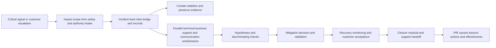

| Operating principle | Plain meaning | Practical consequence | Failure prevented |
|---|---|---|---|
| Impact drives initial severity | A scary error is not automatically a critical business event | Establish who/what is affected and customer definition | Severity inflation or delay |
| Command before completeness | The team needs roles and records while facts are incomplete | Name incident lead, scribe, workstreams, and cadence early | Many helpers, no control |
| Stabilization and diagnosis differ | Safe service restoration may precede final root cause | Run mitigation and investigation as coordinated lanes | Users wait for perfect theory |
| One timeline, many workstreams | Parallel action needs a shared fact pattern | Timestamp observations, decisions, changes, and results | Contradictory updates |
| Hypotheses are disposable | Confidence does not make explanation true | State evidence for/against and next discriminating check | Fixation and blame |
| Preserve negative evidence | What did not happen narrows scope | Record unaffected cohorts and control cases | Overbroad incident story |
| Updates serve decisions | Cadence should match impact and change, not fill air | Communicate material delta, current action, and next checkpoint | Repetitive bridge noise |
| ETA requires authority and evidence | Desire for certainty cannot create a date | Give next evidence milestone when recovery time is unknown | Broken promise |
| Escalation quality beats volume | Support/Product need bounded reproduction, impact, and evidence | Send an actionable packet through current process | Executive pressure replaces diagnosis |
| Recovery must be validated | A successful change or quiet alert is not enough | Test user/business path, controls, alternate scope, and recurrence | Premature closure |
| PIR improves systems | The goal is mechanism and prevention, not a blame ceremony | Analyze technical and organizational contributors | Same failure repeats |
| Product facts remain bounded | Public information does not establish incident cause or fix | Verify through current docs, tenant evidence, Support, and authorized status | Invented Zscaler defect |

## JD Mapping

| JD signal | Capability developed | Reusable customer or TSM artifact | Honest boundary |
|---|---|---|---|
| Lead critical escalations | Establish command, impact, workstreams, cadence, decisions, and recovery | First-15-minute checklist and bridge plan | Customer/vendor process controls authority |
| Communicate with executives | Translate incident facts into impact, action, risk, and next checkpoint | Executive update template | No unsupported root cause or ETA |
| Troubleshoot complex environments | Use timelines, hypotheses, controls, traces, and discriminating checks | Evidence and hypothesis ledger | No production Zscaler diagnosis claim |
| Partner with Support | Build high-quality case evidence and align supported incident path | Support escalation packet | Current terms and case owner govern |
| Work with Product/Engineering | Distinguish defect, request, environment, integration, and unknown | Product escalation record | No internal status or priority authority |
| Protect customer outcomes | Balance mitigation speed, business continuity, security, privacy, and rollback | Mitigation decision record | Customer approves production and risk decisions |
| Drive closure and learning | Validate recovery, residual, recurrence, PIR, and action effectiveness | Closure/PIR package | No blame or guaranteed prevention |
| Use executive judgment | Escalate material decisions and keep technical noise out of executive lane | Escalation RACI | TSM is not automatically incident commander |

## Candidate honesty note

You can say: "My production background includes enterprise Support Escalation Engineering, where I handled high-impact Microsoft 365, OneDrive, and SharePoint issues, correlated client, identity, permission, network, proxy, and service evidence, coordinated workstreams, communicated impact and uncertainty, developed mitigations, and validated recovery. That is directly relevant escalation experience, but it is not Zscaler incident command or customer security-incident ownership. I have studied the SecOps TSM context and practiced these Zscaler-neutral artifacts synthetically. In a real Zscaler escalation I would use current customer policy, support terms, official documentation, licensed-tenant evidence, product specialists, Support, and authorized incident/legal roles."

You may lead with your factual escalation depth. You should not claim you declared customer breaches, operated a SOC incident, commanded Zscaler Engineering, established a Zscaler defect, committed restoration time, or produced a customer PIR outcome unless directly factual.

| Factual background | Transferable strength | Neutral wording | Unsupported statement to avoid |
|---|---|---|---|
| support escalation engineering | High-impact intake, evidence, hypotheses, workstreams, updates, mitigation, recovery | "I have led complex enterprise technical escalations." | "I led Zscaler security incidents." |
| Microsoft 365, OneDrive, SharePoint | Understand layered cloud-service dependencies and customer workflows | "I trace user-to-service paths and business impact." | "I know Zscaler incident internals." |
| Network and trace analysis | Correlate DNS, TCP, TLS, HTTP, proxy, client, and cloud evidence | "I use boundary evidence to narrow fault domains." | "I proved a Zscaler defect from one trace." |
| Critical customer communication | State impact, facts, unknowns, actions, decisions, and cadence | "I communicate under pressure without inventing certainty." | "I guaranteed restoration ETAs." |
| SQL and Power BI | Analyze scope, cohorts, timelines, recurrence, and quality | "I make blast radius and trend evidence inspectable." | "I proved breach scope." |
| Mentoring | Coach escalation quality and review cases | "I help teams improve repeatable incident practice." | "I managed a customer SOC." |
| Synthetic NMH exercise | Demonstrates role preparation | "This is a fictional incident simulation." | "This was a Zscaler customer incident." |

## Beginner vocabulary and memory hooks

An **incident** is an event that disrupts or threatens an objective and requires coordinated response. An **escalation** increases attention, authority, expertise, or urgency because the normal path may not be enough. Think of an airport responding to a runway obstruction. The first job is not to determine who dropped the object. It is to protect aircraft, establish command, confirm impact, coordinate removal and alternate routes, communicate, validate safe operation, and later investigate causes.

| Term | Meaning from zero | Why it matters | Analogy or memory hook |
|---|---|---|---|
| Incident | Event requiring coordinated response to impact or threat | Defines managed response | Runway obstruction |
| Escalation | Deliberate increase in attention, expertise, authority, or priority | Breaks a blocked normal path | Call airport operations |
| Severity | Classification based on current impact/urgency under an approved definition | Controls response and cadence | Aircraft stopped versus minor delay |
| Priority | Order in which work is addressed | Can include severity, policy, capacity, and dependencies | Which runway task first |
| Impact | Actual effect on users, services, data, safety, operations, obligations | Anchors decisions | Flights affected |
| Blast radius | Scope of potentially affected entities/workflows | Guides containment and communication | Which runways and flights |
| Incident commander/lead | Role coordinating objectives, decisions, and response system | Maintains command | Operations lead |
| Technical lead | Coordinates diagnosis and technical workstreams | Keeps checks discriminating | Engineering lead |
| Scribe | Maintains timeline, decisions, actions, and evidence references | Preserves shared truth | Control-tower log |
| Communications lead | Produces audience-specific updates from approved facts | Prevents conflicting messages | Airport announcement lead |
| Bridge | Shared response channel or meeting | Coordinates, but should not become noise | Control room |
| Workstream | Bounded parallel lane with owner and objective | Enables concurrency | Removal, reroute, inspection lanes |
| Timeline | Ordered events with source and time basis | Supports causality and handoff | Flight and sensor log |
| Hypothesis | Testable explanation, not conclusion | Directs evidence gathering | Possible source of obstruction |
| Discriminating check | Cheap safe test that separates plausible explanations | Speeds learning | Camera angle proving location |
| Containment | Limit spread or impact | Buys safety and time | Close affected runway |
| Mitigation | Reduce immediate impact or risk | May not remove root cause | Reroute flights |
| Workaround | Alternate method to restore function temporarily | Needs limits and expiry | Use another runway |
| Remediation | Correct cause or condition more durably | Supports prevention | Repair barrier |
| Recovery | Restore acceptable service and confirm stability | More than change completion | Reopen after inspection |
| Root cause | Fundamental causal mechanism whose removal prevents recurrence under scope | Requires evidence | Why obstruction entered runway |
| Contributing factor | Condition that increased likelihood, impact, or recovery time | Avoids one-cause oversimplification | Poor lighting or unclear ownership |
| ETA | Estimated Time of Arrival/completion | Can become a commitment | Expected runway reopening |
| Checkpoint | Time or evidence milestone for next update | Honest when ETA unknown | Inspection result at 14:00 |
| RACI | Responsible, Accountable, Consulted, Informed | Clarifies roles | Doer, owner, adviser, audience |
| Support case | Formal vendor support record under current process | Authoritative route for supported behavior | Maintenance ticket |
| Product escalation | Structured feedback or investigation route to Product/Engineering | Needs evidence and authority | Manufacturer engineering review |
| PIR | Post-Incident Review | Captures causes, decisions, lessons, actions | Safety review after reopening |
| Residual risk | Remaining exposure or uncertainty after recovery | Prevents false normal | Ongoing monitoring requirement |

### Plain-English deep-dive 1 - The first fifteen minutes buy decision quality

The first fifteen minutes rarely reveal complete root cause. They should create a response system: verify the signal, establish impact and immediate safety, name an incident lead and scribe, stop harmful changes, preserve evidence, open necessary channels, form workstreams, and set the next update.

Imagine firefighters arriving at a building. They establish command, assess occupancy and hazards, contain spread, and assign search, suppression, water, medical, and communication. They do not allow every responder to choose an independent plan. Fast structure is not bureaucracy; it makes parallel expertise useful.

## Severity and intake

Use the customer's and vendor's current severity definitions. Do not invent universal response times. Initial severity is provisional and should change when impact evidence changes.

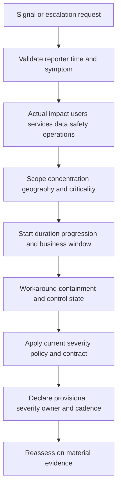

| Intake field | Questions | Evidence caution |
|---|---|---|
| Reporter/contact | Who observed and who can test? | Executive report is important but not complete scope |
| Symptom | Expected versus observed behavior? | Avoid cause language |
| Start/last-known-good | When first observed and last confirmed healthy? | Observation time may differ from event time |
| Impact | Which business/user/security workflows fail or degrade? | "Critical" needs definition |
| Scope | Users, identities, devices, assets, apps, sources, regions, tenants? | Preserve unaffected controls |
| Progression | Stable, intermittent, worsening, spreading, recovered? | Snapshot can mislead |
| Security/safety/privacy | Suspected unauthorized access, exposure, loss, or safety effect? | Route authorized incident/legal roles; no breach declaration |
| Recent changes | Customer, vendor, network, identity, data, configuration, release? | Temporal proximity is not cause |
| Workaround | Exists, safe, scalable, and acceptable? | Workaround may add risk |
| Evidence | Errors, correlation IDs, traces, logs, screenshots, counts, timestamps? | Minimize and protect sensitive data |
| Current action | What has changed since observation? | Avoid simultaneous uncontrolled changes |
| Policy/contract | Which severity and notification rules govern? | Never invent SLA |

### Severity dimensions

| Dimension | Lower-impact pattern | Higher-impact pattern |
|---|---|---|
| Availability | Intermittent or bounded degradation | Broad critical workflow unavailable |
| Security | No observed control bypass; monitoring intact | Suspected active exposure/control failure requiring authorized response |
| Data | Delayed noncritical data | Loss/corruption/exposure of sensitive or decision-critical data |
| Population | Small noncritical cohort | Broad or concentrated critical cohort |
| Business | Workaround with low cost | Time-sensitive operation blocked or material consequence |
| Duration/progression | Short, stable, recovering | Sustained, worsening, spreading, unknown |
| Workaround | Safe and accepted | None, unsafe, or unsustainable |
| Obligation | Normal operations | Potential regulatory/contractual/safety notification through authorized roles |

Severity is not a negotiation tactic. Artificial inflation harms queue integrity; understatement delays response. State evidence and let current policy map it.

## The first fifteen minutes

The exact minute boundaries are a practice aid, not a universal SLA.

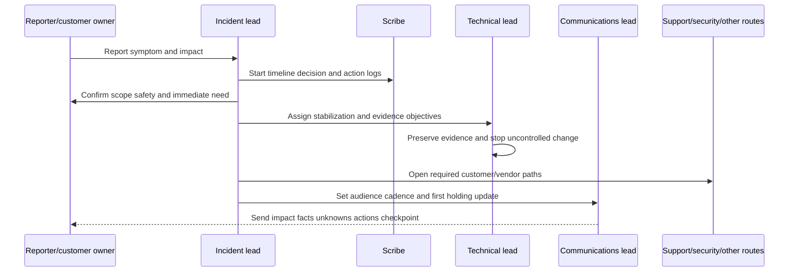

| Time window | Incident lead | Technical lead | Scribe | Communications/support |
|---|---|---|---|---|
| Minute 0-3 | Acknowledge, identify reporter, verify immediate safety/impact | Preserve volatile evidence; avoid changes | Open timeline with time zone/source | Prepare holding line; identify required channels |
| Minute 3-7 | Set provisional severity; name roles and objective | Confirm expected/observed, scope/control cases, recent changes | Record facts/unknowns/actions | Open Support/security/legal/customer paths as policy requires |
| Minute 7-12 | Split stabilization and diagnosis workstreams | Choose first safe discriminating checks and mitigation options | Track owner/ETA/checkpoint and evidence links | Draft impact/facts/actions/next update |
| Minute 12-15 | Confirm cadence, decision authority, bridge rules | Report first result, risk, rollback, next check | Read back timeline and decisions | Issue first update and route executive needs |

### First-15-minute checklist

1. Verify signal and contact; do not debate blame.
2. State expected versus observed behavior.
3. Establish actual and potentially affected business/security scope.
4. Ask about safety, privacy, data, unauthorized access, and legal-routing triggers.
5. Record last-known-good, first observed, time zone, and progression.
6. Identify current severity definition and declare provisional level.
7. Name incident lead, technical lead, scribe, communications lead, and decision owners.
8. Stop or coordinate uncontrolled changes; preserve volatile evidence.
9. Open one timeline, one decision log, and one action register.
10. Split stabilization, technical diagnosis, customer validation, Support/Product, and communications workstreams as needed.
11. Define bridge rules and cadence.
12. Send first holding update with next checkpoint.

### Holding update example

> **Impact:** We are investigating [observed customer workflow impact] affecting [known scope] since [first observed time and time zone].
>
> **Current facts:** [Two or three verified observations].
>
> **Unknowns:** Cause, full scope, and restoration time are [unknown/partially known].
>
> **Actions:** [Stabilization], [diagnosis], and [Support/customer route] are active with named owners.
>
> **Decision/mitigation:** [Immediate option or request, if any].
>
> **Next update:** [Time or evidence milestone].

## Bridge design and workstreams

A bridge is a coordination mechanism, not a place where every person troubleshoots aloud. Use a core bridge for command and decision; workstreams perform detailed work and return concise findings.

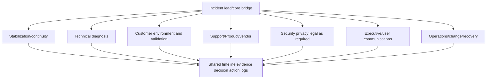

| Bridge role | Accountable contribution | Should avoid |
|---|---|---|
| Incident lead | Objectives, severity, priorities, decisions, cadence, conflict resolution | Deep diagnosis while command is unattended |
| Technical lead | Hypothesis tree, tests, evidence, technical workstreams | Unapproved production decisions |
| Scribe | Timestamped facts, hypotheses, actions, decisions, updates | Interpreting silently or rewriting history |
| Communications lead | Audience-specific approved updates | Inventing technical cause or ETA |
| Customer technical owner | Environment facts, tests, change authority route | Assuming vendor status |
| Business/service owner | Impact, acceptable service, priority, recovery acceptance | Technical diagnosis by status |
| Security incident role | Security classification, containment, evidence, notification route | Premature breach declaration outside authority |
| Support case owner | Supported-product route, case evidence, status | Promise Engineering outcome |
| Product/Engineering liaison | Approved investigation/status and evidence request | Customer promise outside authority |
| Change owner | Production approval, execution, rollback | Unrecorded emergency change |
| Executive sponsor | Cross-functional authority and tradeoff decisions | Running technical checks on bridge |

### Bridge rules

1. The incident lead controls speaking order and decisions.
2. Every update begins with impact change, then evidence, action, and ask.
3. Detailed diagnosis moves to workstream unless the core bridge needs a decision.
4. The scribe records source and timestamp; chat is not the sole incident record.
5. Hypotheses are labeled; root cause language requires evidence and authority.
6. Changes require owner, expected effect, risk, rollback, and validation.
7. No credentials, secrets, unnecessary personal data, or sensitive evidence are pasted into broad channels.
8. Cadence may tighten or relax with impact and rate of change.
9. If no delta exists, say no material change and name the active check.
10. The bridge closes or narrows after recovery; it should not become permanent governance.

### RACI for a general critical escalation

| Activity | Incident lead | Technical lead | Customer service/change owner | Support/Product route | Security/privacy/legal | Communications/executive |
|---|---|---|---|---|---|---|
| Declare provisional severity | A/R by governing process | C | C | C | C if relevant | I |
| Assess business impact | A | C | R | I | C | C |
| Build hypothesis/test plan | C | A/R | C | C/R by scope | C | I |
| Approve production mitigation | C | C | A/R under customer policy | C | C | I |
| Open vendor support case | C | R/C | R by authorization | A/R for case process | I | I |
| Determine security incident/breach route | I | C | C | C | A/R customer-authorized | C |
| Issue customer executive update | A for fact pattern | C | C | C | C | R/A by account/customer policy |
| Validate recovery | A | R | A/R for service acceptance | C | C | I |
| Close incident | A under process | C | A/R for customer acceptance | C | C | I |
| Approve PIR actions | A for process | R for technical | A/R by action ownership | C | C | I/C |

Actual roles vary. Verify the customer's and vendor's incident model; do not assume the TSM is incident commander.

### Plain-English deep-dive 2 - More people can make an incident slower

Adding expertise helps only when the response system can absorb it. Ten engineers making independent changes destroy the ability to know which action mattered. Twenty executives asking for updates can pull technical owners away from diagnosis.

The analogy is an operating room. Specialists are valuable, but roles, sterile boundaries, instrumentation, and a lead are essential. The incident lead creates channels for expertise: bounded workstreams, one timeline, explicit requests, change control, and return checkpoints.

## Evidence, timelines, and hypothesis control

Build an evidence timeline with at least four times when relevant: event time, observation time, ingestion/log time, and report time. Normalize time zones but preserve original timestamps. Clock drift, delayed telemetry, and time-window filters can create false sequence.

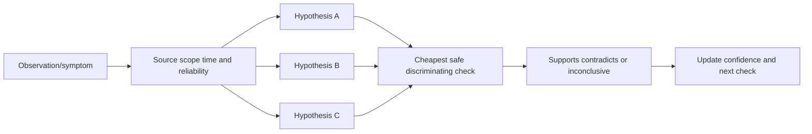

| Record type | Required fields |
|---|---|
| Observation | Who/what observed, exact symptom, scope, time, source, reliability |
| Timeline event | Original timestamp/time zone, normalized time, event type, source, correlation ID |
| Hypothesis | Exact mechanism, supporting evidence, contradictory evidence, confidence, owner |
| Test | Question, method, expected outcomes by hypothesis, risk, authorization, result |
| Change | Target, owner, approval, expected effect, start/end, rollback, evidence |
| Decision | Proposition, authority, options, rationale, effective time, consequence |
| Update | Audience, impact, facts, unknowns, actions, decision, checkpoint |

### Evidence sources and limitations

| Evidence | Useful for | Limitation |
|---|---|---|
| User report | Experience, timing, workflow consequence | Scope and cause may be uncertain |
| Client log/trace | Local sequence and error | One device may not represent cohort |
| DNS/TCP/TLS/HTTP trace | Boundary timing, negotiation, status, path | Encryption, proxying, sampling, clock issues |
| Service telemetry | Population and service behavior | Access, lag, aggregation, and coverage limits |
| Product/tenant log | Configuration/action/effect within defined scope | Entitlement, retention, semantics, missing alternate paths |
| Network/proxy/firewall evidence | Route, policy, connection behavior | Observation point and asymmetric paths |
| Identity/audit record | Authentication, token, privilege, policy events | Identity resolution and time semantics |
| Data pipeline metrics | Freshness, volume, error, checkpoint | Success may not prove content quality |
| Change record | Intended modification and authority | Completion may not prove actual state |
| Support case | Formal evidence and vendor status | Case existence does not prove defect |

### Hypothesis language

Use: "Current evidence supports a hypothesis that [mechanism] because [facts]. It is contradicted or limited by [facts/unknowns]. The next discriminating check is [test], owned by [role], expected by [checkpoint]."

Avoid: "It must be the network," "This is definitely the product," "The customer misconfigured it," or "Engineering caused the outage" before sufficient evidence and authority.

## Stabilization, containment, and mitigation

Stabilization protects the customer objective while diagnosis continues. Options can include stop harmful automation, disable a bounded workflow, fail over, reduce scope, revert a recent approved change, use a manual path, increase monitoring, or isolate a suspected component. Every action needs business/security tradeoffs.

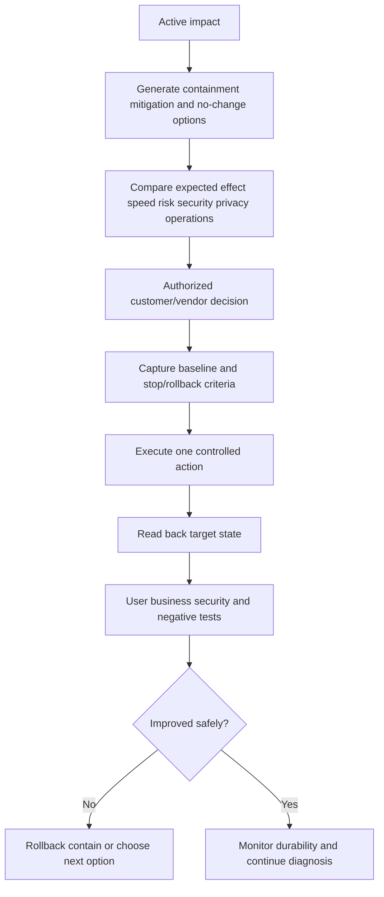

| Mitigation question | Why it matters |
|---|---|
| What exact impact or risk should reduce? | Prevents action without objective |
| Which scope and component change? | Limits blast radius |
| What evidence supports mechanism? | Avoids random change |
| Who authorizes production and residual risk? | Preserves governance |
| What could worsen: access, detection, data, privacy, resilience? | Exposes tradeoffs |
| What is expected observation and when? | Enables validation |
| What is the stop/rollback condition? | Controls harm |
| Can action be duplicated safely? | Prevents retry side effects |
| Does workaround create support debt or expiry? | Prevents permanent temporary state |
| What diagnosis evidence may the change destroy? | Preserves root-cause ability |

Unknown action state requires reconciliation before retry. Query the target state and operation identifier, check idempotency, downstream side effects, and whether another workstream already acted.

## Executive communication and cadence

Executives need impact, confidence, decisions, and next checkpoint. Technical teams need evidence, tests, and changes. Use the same facts at different resolution.

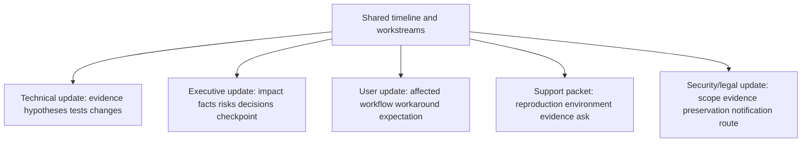

| Update field | Content | Anti-pattern |
|---|---|---|
| Headline | Current incident posture and material delta | "Teams are working hard" |
| Impact | Affected/unaffected scope, start, progression, business/security effect | Cause in impact sentence |
| Facts | New verified observations since last update | Dump of all history |
| Unknowns | Cause, scope, ETA, or control questions not established | Hiding uncertainty |
| Actions | Workstreams, owners, checks, mitigation | Generic "investigating" |
| Decision/ask | Exact choice, authority, need-by basis | Vague request for help |
| ETA | Authorized evidence-based estimate or explicit unknown | Aspirational time |
| Next checkpoint | Time or evidence milestone | "Will update soon" |
| Risk/residual | What could worsen and current controls | No consequence awareness |

### Cadence design

| Incident state | Cadence principle | Useful trigger |
|---|---|---|
| High active impact, rapid change | Frequent short updates | Fixed interval plus material change |
| Stable impact, active tests | Match test cycle | Result or scheduled checkpoint |
| Mitigated, monitoring | Reduce frequency while watching recurrence | Stability window and validation |
| External dependency | Do not repeat no-change too often; state owner and milestone | Vendor/customer evidence checkpoint |
| Recovery confirmed | Closure update and PIR schedule | Customer acceptance |

Never invent a universal fifteen-, thirty-, or sixty-minute cadence. Use current policy, impact, executive need, and rate of change. A useful no-change update is: "No material impact change. The team completed test A, which contradicted hypothesis 1. Test B is running against the affected cohort; next update at 15:30 UTC or sooner on impact change. Restoration ETA remains unknown."

### ETA discipline

An ETA is justified when scope, work remaining, owner, dependencies, risk, and validation duration are sufficiently understood and the communicator is authorized. Otherwise provide:

- Next technical test result.
- Next mitigation decision point.
- Vendor/customer dependency checkpoint.
- Earliest safe change window.
- Minimum validation period.
- Range with assumptions only if approved and useful.

### Plain-English deep-dive 3 - A checkpoint is not evasive

"No ETA" can sound unhelpful if it ends the sentence. "Root cause and restoration time are not established; the rollback compatibility test completes at 16:00 UTC, and that result will determine whether the rollback option is safe" gives a concrete information horizon.

Weather forecasters cannot promise when a storm cell will dissolve, but they can say when the next radar update arrives and which airport decisions depend on it. Good escalation communication gives agency without manufacturing certainty.

## Support and Product escalation

Use the current support contract and process. The TSM can improve evidence and coordination but should not bypass case ownership, inflate severity, or promise Product/Engineering action.

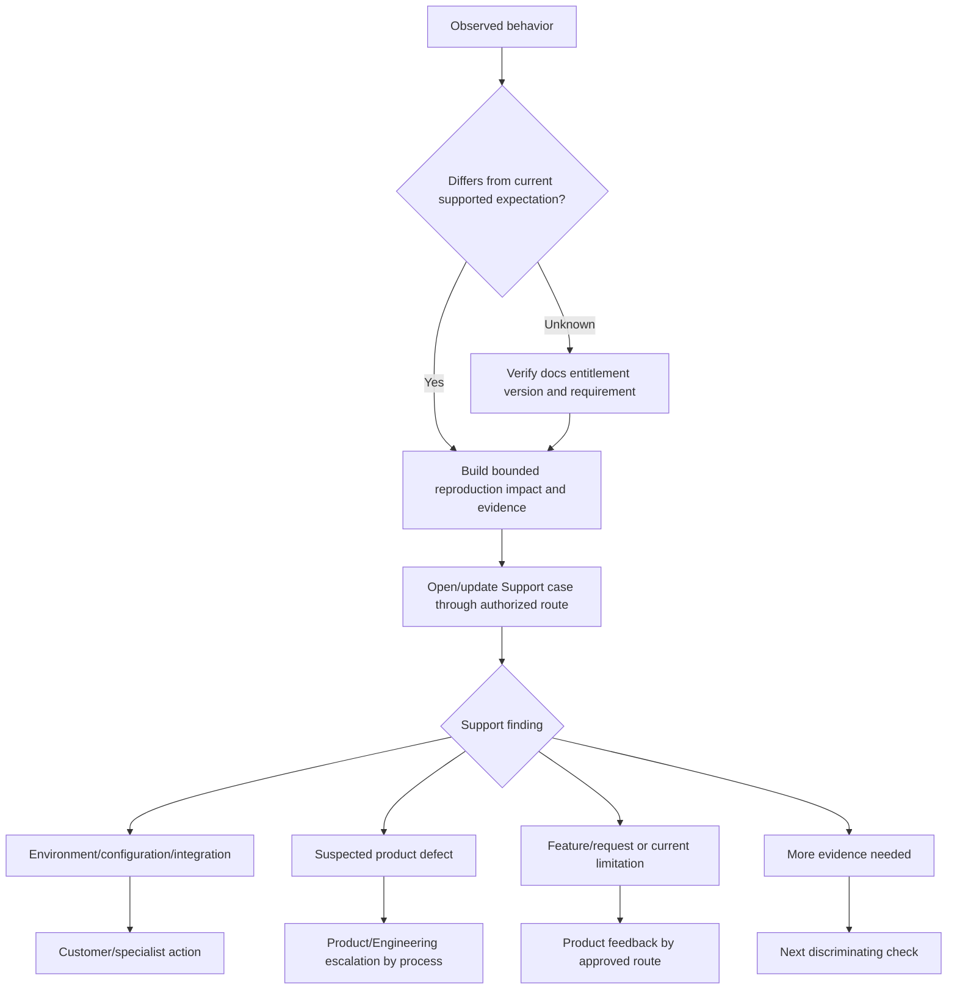

### Support escalation packet

| Field | Required content |
|---|---|
| Customer/account/authorized contacts | Correct support identity and communication path |
| Case/reference | Current system-of-record ID |
| Business impact/severity basis | Actual scope, critical workflow, duration, workaround |
| Expected versus observed | Current documented expectation and exact symptom |
| Environment | Product/version/tenant/region/topology/integrations, with secrets removed |
| Timeline | Last-known-good, first observed, changes, occurrences, normalized time |
| Reproduction | Minimum steps, frequency, positive/negative/control cases |
| Evidence | Errors, correlation IDs, logs, traces, screenshots, counts, privacy handling |
| Hypotheses/tests | What is supported, contradicted, and already ruled out |
| Mitigations | Tried, result, side effects, rollback, current state |
| Requested help | Exact discriminating question or investigation need |
| Communication | Incident lead, cadence, next customer decision |

### Product/Engineering boundary

| Statement | Safe interpretation |
|---|---|
| Case opened | Supported route exists; no defect conclusion |
| Reproduced | Behavior observed under defined conditions; cause may remain unknown |
| Suspected defect | Evidence differs from expectation and needs authorized investigation |
| Defect confirmed | Use only approved status from authorized process |
| Fix under investigation | No completion date implied |
| Target/ETA | Communicate only authorized wording and assumptions |
| Feature request recorded | No priority, acceptance, or roadmap inferred |
| Public status update | Attributable general information; customer applicability still checked |

Escalating to executives does not replace technical evidence. Use executive attention to resolve authority, capacity, communication, or cross-functional blockage, not to force a false diagnosis.

## Recovery, closure, and residual risk

Recovery has layers: request accepted, change complete, target read-back, technical function, user/business workflow, security/control state, broad scope, stability, and customer acceptance.

```mermaid
flowchart LR
    CHANGE[Mitigation/remediation reports complete] --> STATE[Target-state read-back]
    STATE --> TECH[Technical positive negative and boundary tests]
    TECH --> USER[User and business workflow validation]
    USER --> SEC[Security privacy and control validation]
    SEC --> SCOPE[Population and alternate-path reconciliation]
    SCOPE --> STABLE[Monitoring and recurrence window]
    STABLE --> ACCEPT[Customer/service owner acceptance]
    ACCEPT --> CLOSE[Closure residual support debt and PIR]
```

| Recovery dimension | Question | Evidence |
|---|---|---|
| Target state | Did intended configuration/condition actually change? | Read-back from authoritative point |
| Technical function | Does expected protocol/application/data behavior work? | Positive, negative, control tests |
| User workflow | Can affected role complete intended task? | Representative user validation |
| Business service | Is acceptable service restored for defined scope? | Service-owner acceptance and metrics |
| Security/privacy | Did workaround weaken control or expose data? | Control tests and authorized review |
| Scope | Are all affected cohorts/regions/paths covered? | Population reconciliation |
| Stability | Does recovery persist across expected cycles/load? | Monitoring period under current policy |
| Recurrence | Are same signatures/events absent or controlled? | Trend and trigger monitoring |
| Residual | What risk, workaround, unknown, or debt remains? | Owned residual register |

### Closure criteria

Close the critical response when current process criteria are met: impact is resolved or accepted, recovery is validated, active workstreams are handed off, residual and workaround are owned, communication is complete, evidence is preserved, and PIR timing/owner are established. Root cause may still be pending, but that must be explicit with an investigation owner and route.

Do not keep severity artificially high to obtain attention after impact is mitigated. Transition to the correct problem, Support, project, risk, or PIR process.

## Post-Incident Review

A PIR reconstructs what happened, why impact occurred, why it lasted, what worked, what did not, and which changes reduce recurrence or improve response. Use evidence, not hindsight blame.

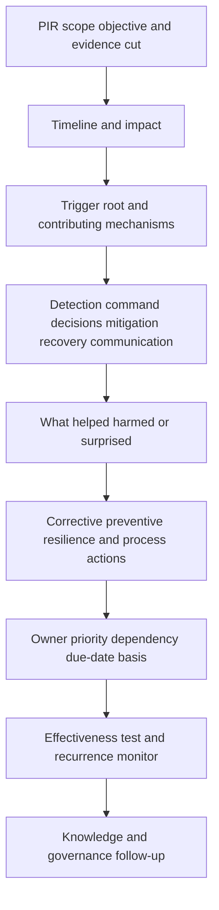

| PIR section | Questions |
|---|---|
| Executive summary | What impact, duration, scope, recovery, residual, and confidence? |
| Timeline | What happened, was observed, decided, changed, and communicated when? |
| Detection | How was incident discovered; what delayed or falsely signaled? |
| Technical cause | Which evidence establishes trigger/root/contributors and boundaries? |
| Impact path | Why did technical condition affect customer objective? |
| Response | What command, evidence, workstream, mitigation, and communication helped/hurt? |
| Recovery | What restored service and how was it validated? |
| Controls | Which prevention, detection, response, recovery controls worked or failed? |
| Organizational factors | Ownership, handoff, change, documentation, capacity, incentives, training? |
| Actions | Corrective, preventive, resilience, observability, process, knowledge actions? |
| Effectiveness | How will each action be tested and recurrence detected? |
| Residual | What remains accepted, monitored, or pending? |

### Root-cause discipline

Root cause is not "human error," "network issue," "configuration," or "process failure" without mechanism. Ask:

1. What exact condition triggered the incident?
2. Which system behavior converted trigger into impact?
3. Which controls were expected to prevent, detect, contain, or recover?
4. Why did those controls succeed, fail, or not apply?
5. Which organizational conditions affected design, change, ownership, evidence, or response?
6. What evidence would falsify the proposed cause?
7. Which action addresses the mechanism rather than only the symptom?

### Plain-English deep-dive 4 - PIR action count is not learning

A PIR with twenty actions may produce less improvement than one tested control. "Update documentation" is weak unless the documentation was truly causal, the audience can find and use it, and a review verifies behavior. "Train the team" is weak unless the missing capability is defined and demonstrated.

Think of aviation safety. An action such as "be more careful" cannot be tested. A change to an interlock, checklist, alert, staffing rule, or training assessment can be owned and validated. Every PIR action should name the failure mechanism, expected effect, owner, dependency, acceptance evidence, and recurrence monitor.

## Security, privacy, legal, and evidence handling

Critical escalations can involve credentials, tokens, personal data, sensitive security posture, forensic records, privileged legal material, and regulatory obligations. The fastest unsafe path can make impact worse.

| Risk | Control |
|---|---|
| Secrets in logs/screenshots/chat | Redact/minimize; use approved secure transfer; rotate exposed secrets |
| Overbroad bridge access | Need-to-know membership and channel classification |
| Evidence modification | Preserve originals, hashes/metadata where policy requires, chain/handling record |
| Personal data | Collect minimum; restrict, retain, and delete under policy |
| Suspected breach | Route customer security/legal/privacy roles; TSM does not declare |
| Cross-border/residency | Use approved storage and transfer locations |
| Live production testing | Explicit authorization, scope, monitoring, stop, rollback |
| Vulnerability/attack detail | Controlled access and responsible handling |
| Recording/transcription | Purpose, approval, access, retention, and privilege review |
| AI assistance | Approved tools only; minimize data; ground; validate; no autonomous production action |
| Public communication | Authorized communications/legal roles only |
| Support evidence | Follow current vendor/customer secure-upload and retention process |

## Failure modes and misconceptions

| Failure or misconception | Why it fails | Repair |
|---|---|---|
| Executive escalation equals critical severity | Senior attention does not define impact | Apply current impact policy |
| Severity should be inflated for speed | Damages trust and queue fairness | Document actual impact and changed evidence |
| Root cause comes first | Customers may need safe restoration now | Run stabilization and diagnosis in parallel |
| Everyone joins one bridge | Noise and conflicting changes increase | Core bridge plus workstreams |
| Most senior person commands | Title may not provide incident skill or availability | Assign role by governing process |
| More changes mean faster progress | Simultaneous variables destroy causality | One controlled change or coordinated plan |
| First plausible cause is root cause | Early evidence is incomplete | Maintain competing hypotheses |
| No logs means no evidence | User controls, timing, changes, path tests still help | Build evidence from available boundaries |
| Silence means recovery | Telemetry or users may be missing | Active validation and scope reconciliation |
| Successful API call means action worked | Request acceptance differs from target state | Read back and test effect |
| ETA is required to be helpful | Unsupported time becomes broken promise | Give evidence milestone and assumptions |
| Frequent updates require new root cause | Updates can report impact, tests, and decisions | Use delta-based format |
| Support case proves product defect | It starts investigation | Preserve classification and authorized status |
| Executive pressure substitutes for reproduction | Engineering still needs evidence | Improve packet and resolve capacity separately |
| Workaround is closure | Temporary path can create risk/debt | Owner, expiry, durable plan, validation |
| Service restored means incident over | Security, scope, stability, residual may remain | Layered recovery criteria |
| PIR identifies who failed | Blame hides system contributors | Analyze mechanisms and decision context |
| More PIR actions mean maturity | Unowned actions create debt | Prioritize testable mechanism changes |
| TSM declares a breach | Legal/security authority is customer-specific | Route authorized roles immediately |
| Public product page proves incident behavior | Customer/tenant state is separate | Use current docs, evidence, Support |

## Troubleshooting the escalation process

| Symptom | Plausible causes | Discriminating check | Repair |
|---|---|---|---|
| Bridge has no progress | No objective, roles, workstreams, or evidence checks | Ask each lane's question and next result | Re-charter and split work |
| Conflicting impact numbers | Different populations, times, sources, definitions | Reconcile grain and reporting cut | Publish bounded range/unknown |
| Repeated changes with unclear effect | No change log or baseline; multiple actors | Compare timeline and target read-back | Stop, reconcile, restore control |
| Executives receive technical noise | No communications lead or hierarchy | Ask what decision detail changes | Rewrite impact/facts/action/checkpoint |
| Technical team interrupted constantly | Cadence too tight or no liaison | Measure work-to-update ratio and impact change | Delegate update and adjust cadence |
| Hypothesis never changes | Confirmation bias or test not discriminating | Ask what evidence would falsify it | Add competing hypothesis/control case |
| Support escalation stalls | Weak reproduction, wrong entitlement/process, customer dependency | Review packet and latest Support request | Supply exact evidence or resolve route |
| ETA changes repeatedly | Estimate lacked dependencies/validation | Rebuild remaining-work model | Withdraw unsupported ETA; use milestones |
| Recovery disputed | Different acceptance criteria or cohorts | Compare pre-agreed validation plan | Run user/business/scope checks |
| Incident reopens | Monitoring window too short, workaround, alternate path | Match recurrence signature and residual | Reopen correct process and PIR action |
| PIR delayed indefinitely | No owner, legal hold, cause still pending, priority loss | Separate known review from pending investigation | Schedule phased PIR and action gates |
| PIR actions age | Vague action, no authority/dependency/acceptance | Review action card | Rewrite, escalate, or close honestly |

## Decision trees

### Decision tree 1 - Is this a critical escalation?

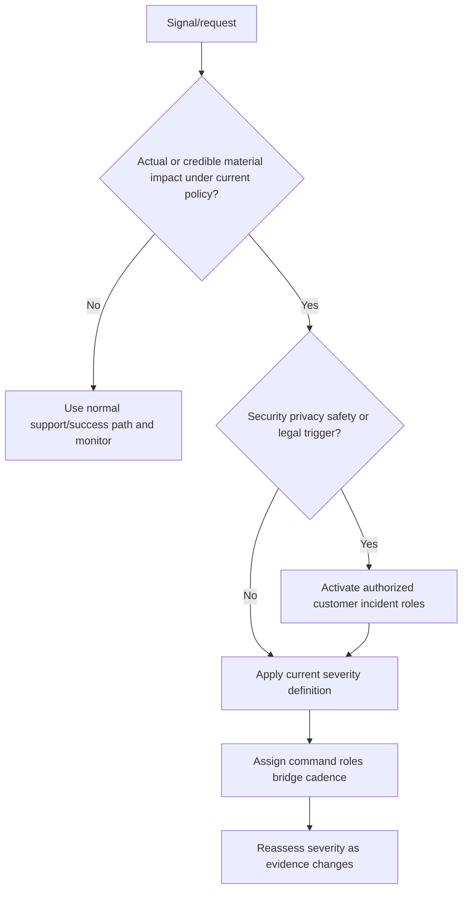

### Decision tree 2 - Can a mitigation be applied?

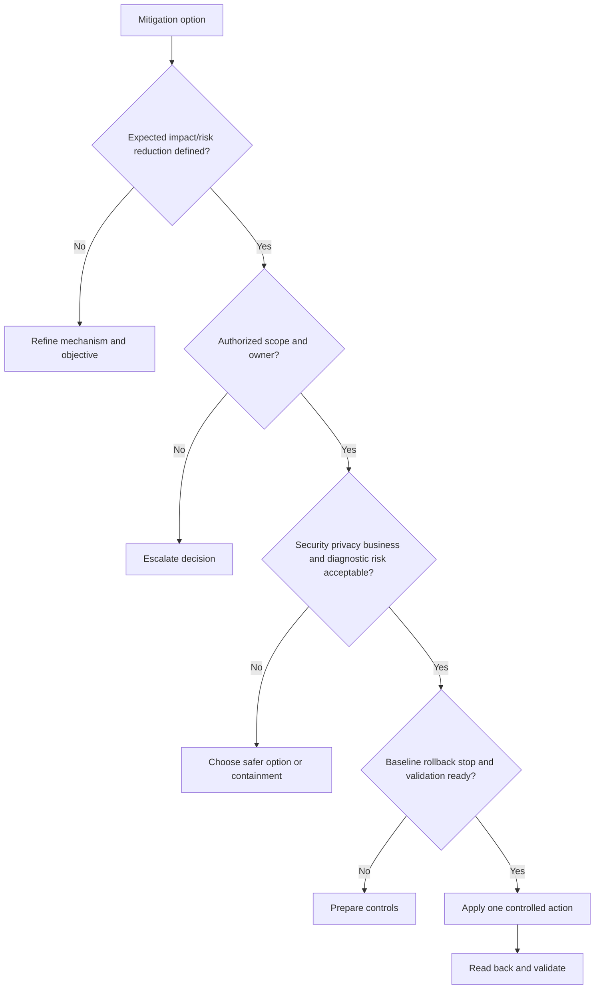

### Decision tree 3 - Can the incident close?

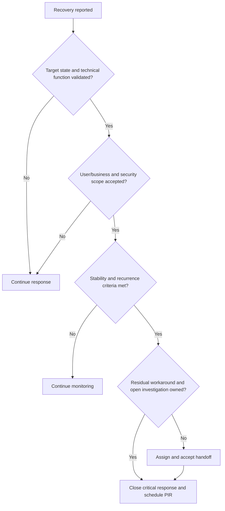

## Explicitly fictional and synthetic NMH scenarios

All content in this section is fictional and synthetic. It is practice material, not a customer incident, breach, product defect, support response, tenant behavior, severity, SLA, ETA, root cause, recovery, PIR, or Zscaler result. Dates in this section, including **2026-10-22**, **2026-11-05**, **2026-11-26**, and **2026-12-17**, are synthetic scenario dates later than the source snapshot and do not imply later research. Every later date in this section is fictional and synthetic.

### Scenario 1 - The first fifteen minutes

On synthetic 2026-10-22, NMH reports a fictional critical analyst workflow failure. The incident lead confirms affected roles and unaffected control cohort, opens timeline and decision logs, assigns stabilization, network/data, customer-validation, Support, and communications lanes, and sends a holding update. Cause and restoration time remain unknown. No Zscaler component is named as causal.

### Scenario 2 - The tempting retry

On synthetic 2026-11-05, a fictional automated action times out. One participant proposes repeated execution. The technical lead treats target state as unknown, checks operation identifiers and downstream state, and discovers that the first request may have applied partially. The team contains further action, reconciles targets, and chooses an authorized rollback/repair path. Every event is synthetic.

### Scenario 3 - Executive pressure for ETA

On synthetic 2026-11-26, an NMH executive asks when a fictional issue will be fixed. Support has the reproduction but has not established cause or fix. The update states no authorized restoration ETA, names current mitigation, provides the next diagnostic checkpoint, and gives options for business continuity. It does not imply Zscaler Engineering status.

### Scenario 4 - Recovery without closure

On synthetic 2026-12-17, the main fictional workflow recovers, but one remote cohort and an alternate path remain untested. Severity is reduced under the fictional policy after impact mitigation, while the incident remains open for scope validation. Closure occurs only after customer acceptance, residual ownership, monitoring, and PIR scheduling. Every later date and result remains fictional and synthetic.

## Reusable artifact kit

These templates are general practice. Current customer incident policy, support contracts, product processes, authorized roles, security/privacy/legal controls, and evidence govern production use.

### Artifact 1 - Severity intake template

| Field | Entry |
|---|---|
| Incident ID/title | |
| Reporter/contacts | |
| Expected versus observed | |
| First observed/last-known-good/time zone | |
| Actual business/user/security impact | |
| Affected/unaffected scope | |
| Progression/duration | |
| Safety/privacy/data/legal trigger | |
| Recent changes | |
| Workaround/containment | |
| Evidence/correlation IDs | |
| Current actions | |
| Governing severity policy/contract | |
| Provisional severity/rationale/owner | |
| Reassessment trigger | |

### Artifact 2 - First-15-minute checklist

| Minute | Action | Owner | Evidence/output | Done/gap |
|---|---|---|---|---|
| 0-3 | Acknowledge, contact, immediate impact/safety | | | |
| 0-3 | Start timeline/decision/action logs | | | |
| 0-3 | Preserve volatile evidence/stop harmful change | | | |
| 3-7 | Expected/observed, scope, controls, changes | | | |
| 3-7 | Provisional severity and roles | | | |
| 3-7 | Open required customer/vendor/security routes | | | |
| 7-12 | Split stabilization/diagnosis/validation/comms | | | |
| 7-12 | Select discriminating checks and mitigation options | | | |
| 12-15 | Set bridge rules/cadence/decision authority | | | |
| 12-15 | Issue holding update/next checkpoint | | | |

### Artifact 3 - Bridge plan

| Field | Entry |
|---|---|
| Core bridge/channel/classification | |
| Incident lead/back-up | |
| Technical lead | |
| Scribe/system of record | |
| Communications lead/audiences | |
| Customer service/change owner | |
| Security/privacy/legal route | |
| Support/Product case owner | |
| Workstreams/objectives/return times | |
| Cadence and change triggers | |
| Bridge rules | |
| Decision/production authority | |
| Recording/retention/evidence handling | |
| Exit/narrowing criteria | |

### Artifact 4 - Escalation RACI

| Activity/decision | Responsible | Accountable | Consulted | Informed | Governing policy/system | Escalation route |
|---|---|---|---|---|---|---|
| Severity | | | | | | |
| Business impact | | | | | | |
| Technical diagnosis | | | | | | |
| Containment/mitigation | | | | | | |
| Production change/rollback | | | | | | |
| Support/Product escalation | | | | | | |
| Security/breach/legal decision | | | | | | |
| Executive/user communication | | | | | | |
| Recovery acceptance | | | | | | |
| Closure/PIR | | | | | | |

### Artifact 5 - Timeline, evidence, and hypothesis ledger

| Normalized time | Original time/time zone | Type | Observation/action/decision | Source | Scope | Fact/hypothesis | Confidence | Owner | Evidence link/result |
|---|---|---|---|---|---|---|---|---|---|---|
| | | | | | | | | | |

| Hypothesis | Supporting evidence | Contradictory evidence | Unknowns | Discriminating check | Risk/authorization | Owner/checkpoint | Result/status |
|---|---|---|---|---|---|---|---|
| | | | | | | | |

### Artifact 6 - Workstream register

| Workstream | Objective/question | Owner | Inputs/evidence | Current action | Dependency | Return checkpoint | Decision needed | Status |
|---|---|---|---|---|---|---|---|---|
| Stabilization | | | | | | | | |
| Technical diagnosis | | | | | | | | |
| Customer validation | | | | | | | | |
| Support/Product | | | | | | | | |
| Security/privacy/legal | | | | | | | | |
| Communications | | | | | | | | |
| Recovery/operations | | | | | | | | |

### Artifact 7 - Executive update template

> **Incident/severity/time:** [ID, current severity under named policy, update time/time zone].
>
> **Headline and impact:** [Observed effect, known scope, start, progression].
>
> **Material change since last update:** [Delta or no material change].
>
> **Verified facts:** [Evidence-backed observations].
>
> **Unknowns/hypotheses:** [Separated clearly].
>
> **Actions/workstreams:** [Owner, current check or mitigation].
>
> **Decision/ask:** [Authorized owner, options, need-by basis].
>
> **ETA:** [Authorized estimate with assumptions, or explicitly unknown].
>
> **Next update:** [Time or evidence milestone].
>
> **Risk/residual:** [What may worsen and current controls].

### Artifact 8 - Support/Product escalation packet

| Field | Entry |
|---|---|
| Case/account/authorized contacts | |
| Current support terms/severity basis | |
| Business impact/scope/workaround | |
| Expected/documented versus observed | |
| Product/version/tenant/region/topology | |
| Entitlement/prerequisites | |
| Timeline/recent changes | |
| Reproduction/frequency/control cases | |
| Errors/correlation IDs/logs/traces | |
| Hypotheses/tests/ruled-out paths | |
| Mitigations/results/current state | |
| Security/privacy evidence handling | |
| Exact requested help | |
| Incident lead/cadence/checkpoint | |

### Artifact 9 - Mitigation decision and change record

| Field | Entry |
|---|---|
| Impact/risk objective | |
| Option and mechanism | |
| Scope/target | |
| Evidence/confidence | |
| Expected effect/timing | |
| Security/privacy/business tradeoffs | |
| Authority/approval | |
| Baseline/monitoring | |
| Stop/rollback | |
| Idempotency/duplicate-action risk | |
| Execution owner/time | |
| Target read-back | |
| Technical/user/business/control validation | |
| Result/residual/next action | |

### Artifact 10 - Recovery and closure checklist

| Layer | Acceptance criterion | Evidence | Owner | Status/gap |
|---|---|---|---|---|
| Target state | | | | |
| Technical function | | | | |
| User workflow | | | | |
| Business service | | | | |
| Security/privacy/control | | | | |
| Population/alternate paths | | | | |
| Stability/recurrence | | | | |
| Workaround/residual | | | | |
| Customer acceptance | | | | |
| Support/project handoff | | | | |
| Communication | | | | |
| Evidence retention | | | | |
| PIR owner/date | | | | |

### Artifact 11 - PIR template

| Section | Content |
|---|---|
| Scope/evidence cut/confidence | |
| Executive impact and duration | |
| Detailed timeline | |
| Detection and response trigger | |
| Technical trigger/root/contributors | |
| Customer impact path | |
| Prevention/detection/response/recovery controls | |
| Command/workstream/change/communication review | |
| Recovery and validation | |
| What helped/harmed/surprised | |
| Residual/open investigation | |
| Lessons and knowledge | |

| PIR action | Failure mechanism | Expected effect | Owner/authority | Dependency | Due-date basis | Acceptance/effectiveness test | Recurrence monitor | Status |
|---|---|---|---|---|---|---|---|---|---|
| | | | | | | | | |

### Artifact 12 - Escalation quality rubric

| Criterion | Weak | Strong |
|---|---|---|
| Impact | Adjective only | Scope, workflow, time, progression, controls |
| Command | Everyone helps | Named roles, workstreams, records, cadence |
| Evidence | Log dump or opinions | Source/time/scope, controls, quality |
| Hypotheses | One favored cause | Competing, falsifiable, updated by checks |
| Changes | Untracked retries | Objective, authority, baseline, rollback, validation |
| Updates | Activity and optimism | Delta, impact, facts, unknowns, ask, checkpoint |
| Support | Pressure-only escalation | Reproduction, evidence, exact request |
| Recovery | "Looks good" | Layered technical/business/security acceptance |
| PIR | Blame and action list | Mechanism, contributors, testable actions, effectiveness |

## Exercises

### Exercise 1 - Run the first fifteen minutes

Use a synthetic high-impact workflow failure. In fifteen simulated minutes, complete severity intake, name roles, open records, create workstreams, choose two safe checks, identify mitigation authority, and issue a holding update. Include unaffected control scope and security/privacy questions.

### Exercise 2 - Build a hypothesis tree

Create a fictional user-to-cloud path across identity, DNS, TCP, TLS, proxy, application, data, and workflow. Give each boundary a plausible failure, supporting and contradictory evidence, and cheapest discriminating check. Update confidence after three synthetic results without declaring root cause too early.

### Exercise 3 - Control the bridge

Role-play an executive, three engineers, Support, customer operations, security, and a scribe. The bridge becomes noisy and two changes conflict. Re-charter roles, separate workstreams, reconcile target state, set change authority, and issue a concise update.

### Exercise 4 - Resist an unsupported ETA

An executive asks for restoration time while two dependencies and validation duration remain unknown. Provide an honest response with current mitigation, remaining work, assumptions, decision options, and next evidence checkpoint. Then show conditions under which a bounded ETA could become supportable.

### Exercise 5 - Create a Support escalation packet

Turn scattered fictional emails, logs, screenshots, and user reports into expected/observed behavior, impact, environment, timeline, reproduction, controls, evidence, mitigations, and exact requested help. Remove secrets and unsupported defect language.

### Exercise 6 - Validate recovery

A synthetic configuration change reports success and alerts stop. Design target read-back, positive, negative, boundary, user, business, security, population, stability, and recurrence checks. Decide when severity can reduce and when the incident can close.

### Exercise 7 - Facilitate a blameless PIR

Build a timeline where a technical fault, stale runbook, unclear owner, alert gap, and rushed change all contributed. Write three actions tied to mechanisms, with owners and effectiveness tests. Reject "be careful," "train everyone," and "update documentation" unless made specific and causal.

### Exercise 8 - Candidate honesty rehearsal

Answer: "Tell me about a critical escalation you led." Use a factual Microsoft example with impact, evidence, workstreams, communication, mitigation, and recovery. Then distinguish that experience from Zscaler and customer security-incident authority. Use the NMH artifacts only as explicitly fictional preparation.

## Customer discovery questions

1. Which customer and vendor incident, severity, crisis, support, security, privacy, legal, and communication policies govern?
2. What is expected versus observed, first observed, last-known-good, progression, and time basis?
3. What actual business, user, security, data, safety, operational, or obligation impact exists?
4. Which users, identities, devices, assets, applications, sources, regions, tenants, workflows, and control cohorts are affected or unaffected?
5. Which current severity definition applies, who declares it, and what evidence changes it?
6. Who is incident lead, technical lead, scribe, communications lead, service/change owner, security role, and Support case owner?
7. Which workstreams can operate in parallel, with what bounded question and return checkpoint?
8. What volatile evidence must be preserved before changes, and which handling restrictions apply?
9. Which event, observation, ingestion, report times, clock drift, and correlation identifiers matter?
10. What competing hypotheses exist, what supports or contradicts each, and what cheap safe check discriminates them?
11. Which containment, workaround, rollback, failover, scope reduction, monitoring, or no-change options exist?
12. Who authorizes production change, security tradeoff, customer communication, and residual risk?
13. What target read-back, user/business path, security/control, alternate-scope, and recurrence tests validate mitigation?
14. What bridge, workstream, update, and executive cadence fits impact and rate of change?
15. Is an ETA supported by known work, dependencies, authority, and validation, or should the team provide a checkpoint?
16. Does the Support packet include current terms, expected/observed, environment, reproduction, evidence, impact, mitigations, and exact ask?
17. Which Product/Engineering status is authorized and attributable, and which request/defect/ETA remains unknown?
18. What recovery layers and customer acceptance criteria must pass before severity reduction and closure?
19. Which workaround, residual, monitoring, investigation, or support debt remains after recovery?
20. How will the PIR connect evidence, trigger, causes, contributors, response, actions, effectiveness, recurrence, and knowledge?

## Official Source Anchors

Research/source snapshot and source review date: **2026-08-24**.

The Zscaler sources support dated public product, support, trust, and security-operations positioning only. NIST and CISA sources support general incident-response, cybersecurity-outcome, and known-exploitation context. They do not establish a customer's incident, breach, severity, support entitlement, defect, root cause, ETA, mitigation, recovery, or outcome. Current contracts, official technical documentation, licensed-tenant evidence, customer incident policy, authorized Support/Product status, and customer security/privacy/legal/communications roles govern production.

| Source | URL | Used for | Boundary |
|---|---|---|---|
| Zscaler Agentic Security Operations | https://www.zscaler.com/products-and-solutions/security-operations | Public SecOps investigation and response positioning | No customer incident, agent action, approval, or result inferred |
| Zscaler Zero Trust Exchange | https://www.zscaler.com/products-and-solutions/zero-trust-exchange-zte | Public zero-trust and policy-platform positioning | No customer control, path, outage, or recovery inferred |
| Zscaler Data Fabric for Security | https://www.zscaler.com/products-and-solutions/data-fabric | Public security-data harmonization and workflow positioning | No connector, source quality, event, or incident cause inferred |
| Zscaler Support | https://help.zscaler.com/submit-ticket | Public support-route context | Current entitlement, process, severity, response, and case status require verification |
| Zscaler Trust | https://trust.zscaler.com/ | Public trust/service information context | Applicability to a customer symptom or root cause must be established |
| NIST SP 800-61 Rev. 3 | https://csrc.nist.gov/pubs/sp/800/61/r3/final | General cybersecurity incident-response, recovery, and improvement guidance | Organizations tailor current incident process; not a support SLA |
| NIST Cybersecurity Framework 2.0 | https://www.nist.gov/cyberframework | Govern, Identify, Protect, Detect, Respond, Recover outcome framing | Voluntary and implementation-neutral |
| NIST SP 800-30 Rev. 1 | https://csrc.nist.gov/pubs/sp/800/30/r1/final | General risk-assessment concepts | Does not determine incident severity or breach status |
| CISA Known Exploited Vulnerabilities Catalog | https://www.cisa.gov/known-exploited-vulnerabilities-catalog | Public known-exploitation context | Does not prove customer exploitation, scope, or incident |

## Likely Interview Questions

### Q1. What do you do in the first fifteen minutes of a critical escalation?

**Model answer:** I verify the signal, expected/observed behavior, actual impact, affected and unaffected scope, last-known-good, progression, safety/security/privacy triggers, and current policy. I declare provisional severity through the right authority; name incident, technical, scribe, communications, service/change, and Support roles; preserve volatile evidence; stop uncontrolled changes; open timeline, decision, and action logs; split stabilization and diagnosis workstreams; select safe discriminating checks; set bridge rules and cadence; and send a holding update with facts, unknowns, actions, decision needs, and next checkpoint.

### Q2. How do you run an effective escalation bridge?

**Model answer:** I use a small core bridge for command and decisions and bounded workstreams for detailed action. Every lane has an objective, owner, evidence, dependency, return checkpoint, and decision need. One scribe maintains the timeline, hypotheses, changes, and decisions. Updates begin with impact delta and end with the next check. Changes require authority, expected effect, rollback, and validation. I protect sensitive evidence and adjust cadence as impact and rate of change change.

### Q3. How do you troubleshoot under pressure without fixating?

**Model answer:** I separate observations from explanations, preserve source/scope/time, maintain competing hypotheses, record supporting and contradictory evidence, and choose the cheapest safe test that produces different expected results. I use affected and unaffected control cohorts and trace boundaries such as identity, DNS, TCP, TLS, proxy, application, data, and workflow. I update confidence after each result and keep stabilization parallel. Root-cause language waits for evidence and authorized review.

### Q4. How do you communicate with executives during a critical incident?

**Model answer:** I lead with current impact and material delta, then verified facts, unknowns, workstreams or mitigation, the exact decision or help needed, risk, and next update. I use the same evidence spine as the technical bridge at lower resolution. I never replace an unknown with optimism. If restoration time is unsupported, I say so and provide the next evidence milestone, dependency checkpoint, or safe change window.

### Q5. How do you escalate effectively to Support, Product, or Engineering?

**Model answer:** I verify current documented expectation, entitlement, environment, and support route, then provide business impact, scope, timeline, minimum reproduction, positive/negative controls, exact errors and correlation IDs, privacy-safe logs/traces, hypotheses, tests, mitigations, current state, and a specific requested check. A case is not proof of defect; a request is not roadmap commitment. I use only authorized status and keep executive escalation focused on resolving blockage, not substituting pressure for evidence.

### Q6. How do you know an incident is recovered and ready to close?

**Model answer:** I validate target-state read-back, technical function, representative user workflow, business-service acceptance, security/privacy/control behavior, affected population and alternate paths, stability, and recurrence. I record workaround, residual, monitoring, and open investigation. Severity can reduce when current policy and impact support it; closure requires accepted recovery, workstream handoff, communications, evidence preservation, and PIR ownership. A successful request or quiet alert alone is insufficient.

### Q7. What makes a useful PIR?

**Model answer:** It reconstructs impact and timeline from evidence, identifies trigger, root and contributing mechanisms, explains why controls and response succeeded or failed, evaluates detection, command, changes, communication, and recovery, and produces prioritized actions tied to failure mechanisms. Each action has authority, dependency, due-date basis, acceptance/effectiveness test, and recurrence monitor. It avoids hindsight blame and vague actions such as "be careful" or "train everyone."

### Q8. How does your background transfer honestly to critical escalation leadership?

**Model answer:** Critical escalation is one of your strongest direct transfers. In support escalation engineering you handled high-impact Microsoft 365 issues, traced identity/network/client/service evidence, coordinated teams, communicated with customers, developed mitigations, and validated recovery. The honest boundary is context and authority: you should not claim Zscaler incident command, SOC/security-incident ownership, breach determination, Zscaler defect confirmation, or Product/Engineering commitments. You would apply your proven method through current Zscaler and customer processes.

## 30-Second Memory Hooks

| Concept | Memory hook |
|---|---|
| Severity | Current impact under current policy |
| First fifteen | Impact, command, evidence, lanes, cadence |
| Incident lead | Own response system, not every technical check |
| Bridge | Core decisions; workstreams do work |
| Scribe | One timeline, decisions, actions, evidence |
| Hypothesis | Disposable explanation with a falsifying check |
| Control cohort | Unaffected evidence narrows scope |
| Stabilization | Protect objective while diagnosis continues |
| Change | Objective, authority, baseline, rollback, validation |
| Update | Impact delta, facts, unknowns, action, ask, checkpoint |
| ETA | Evidence plus owner plus dependencies plus validation |
| Checkpoint | Concrete information horizon |
| Support packet | Impact, expectation, environment, reproduction, evidence, ask |
| Product status | Case is not defect; request is not commitment |
| Recovery | State, function, user, business, security, scope, stability |
| Closure | Accepted recovery, residual owner, handoff, PIR |
| PIR | Mechanism, controls, response, testable action |
| Evidence safety | Minimum, controlled, preserved, authorized |
| Experience bridge | Direct escalation experience transfers; Zscaler/security authority does not |

## Completion Checklist

- [ ] I can explain incident, escalation, severity, impact, blast radius, containment, mitigation, recovery, root cause, ETA, and PIR from zero.
- [ ] I can use current customer/vendor policy instead of inventing severity or SLA.
- [ ] I can complete severity intake with expected/observed, time, impact, scope, progression, safety, workaround, evidence, and policy.
- [ ] I can establish command, roles, records, workstreams, bridge rules, and holding update in the first fifteen minutes.
- [ ] I can separate stabilization, diagnosis, customer validation, Support/Product, security/legal, communications, and recovery lanes.
- [ ] I can create an escalation RACI while recognizing that the TSM is not automatically incident commander.
- [ ] I can build a normalized timeline that preserves original event, observation, ingestion, and report times.
- [ ] I can maintain competing hypotheses, negative evidence, confidence, and discriminating checks.
- [ ] I can control production changes with authority, baseline, stop, rollback, idempotency, target read-back, and validation.
- [ ] I can issue executive updates with impact delta, facts, unknowns, actions, decision, ETA discipline, and checkpoint.
- [ ] I can provide a concrete checkpoint when a restoration ETA is unsupported.
- [ ] I can build an actionable Support/Product escalation packet without asserting defect, priority, or commitment.
- [ ] I can validate technical, user, business, security, population, stability, and recurrence recovery layers.
- [ ] I can reduce severity and close through current criteria without using severity to retain attention.
- [ ] I can facilitate a blameless PIR with causal mechanisms, contributing factors, testable actions, and effectiveness review.
- [ ] I can protect credentials, personal data, forensic evidence, privilege, vulnerability detail, and public communication.
- [ ] I can use the severity, first-15, bridge, RACI, timeline, workstream, update, Support, mitigation, closure, PIR, and quality artifacts.
- [ ] I can present your direct escalation strengths without claiming production Zscaler incident command, breach authority, product defect, ETA, or SecOps outcome.

[Next: Part 109 - Difficult Conversations, Objections, Constructive Debate, and Trust](Part-109-difficult-conversations-trust.md)