# Part 109 - Difficult Conversations, Objections, Constructive Debate, and Trust

> **Audience:** Candidates preparing for a Zscaler Security Operations Technical Success Manager role after enterprise Support Escalation Engineering.

> **Purpose:** Explain difficult technical and business conversations from zero, including listening, validation, reframing, evidence versus assumption, disagreement, accountability, scope limits, roadmap pressure, low adoption, data distrust, missed commitments, escalation, apology, transparent recovery, decision records, and trust repair.

> **Scope and honesty:** Northstar Meridian Holdings, abbreviated NMH, is an explicitly fictional and synthetic customer used only for study. Every NMH person, product, tenant, conversation, concern, date, metric, commitment, scope, roadmap request, data defect, adoption gap, decision, plan, and result is invented. Your factual background is Microsoft 365, OneDrive, and SharePoint support; networking and trace analysis; SQL and Power BI; enterprise escalations; mentoring; and responsible AI exploration. Production Zscaler, SecOps TSM, commercial negotiation, account ownership, product-roadmap authority, contractual interpretation, customer adoption, executive trust, and customer recovery outcomes remain learning boundaries.

> **Currency caveat:** Products, architectures, documentation, support processes, customer priorities, contracts, statements of work, roadmap policy, legal obligations, organizational roles, packaging, and entitlements change. The controlled official-source snapshot and source review date for this Part is exactly **2026-08-24**. Current official technical and ordering documentation, licensed-tenant evidence, customer-authoritative records, contracts, approved product/support/roadmap communication, account leadership, and customer legal/privacy/security/commercial authorities govern production conversations.

> **Section goal:** Build a beginner-to-interview-ready conversation method that hears the concern beneath the position, validates impact without endorsing unsupported conclusions, separates evidence from assumption, debates the decision rather than the person, owns verified misses, protects technical/commercial/security boundaries, gives practical alternatives, records decisions, and repairs trust through observable follow-through without inventing product behavior, scope, commitments, motives, blame, or results.

This Part is primarily **general technical-success, conflict, negotiation, accountability, and trust practice**. Reviewed Zscaler public sources support bounded positioning around zero trust, security operations, security data, vulnerability prioritization, contextual risk visibility, support resources, and public company information. They do not establish a customer's concern, contract, entitlement, roadmap status, product defect, commitment, adoption, data quality, fault, trust, commercial remedy, or outcome.

Every statement belongs to one of five evidence classes. **Official product fact** is a dated public statement supported by an anchor reviewed on 2026-08-24. **General practice** is a reusable vendor-neutral conversation or decision method. **Scenario assumption** exists only inside explicitly fictional and synthetic NMH. **Customer fact** requires current customer-authoritative evidence. **Unknown** means available evidence does not establish the answer. Emotional intensity is real context, but it does not convert an interpretation into fact.

```mermaid
flowchart LR
    CONCERN[Concern objection or broken expectation] --> LISTEN[Listen for impact need and history]
    LISTEN --> VALIDATE[Validate experience and consequence]
    VALIDATE --> FRAME[State exact issue and desired decision]
    FRAME --> CLASS[Separate facts assumptions unknowns values and authority]
    CLASS --> OPTIONS[Develop options boundaries and tradeoffs]
    OPTIONS --> DECIDE[Authorized decision or evidence route]
    DECIDE --> RECORD[Read-back commitment owner and validation]
    RECORD --> FOLLOW[Observable follow-through and trust review]
```

| Operating principle | Plain meaning | Practical consequence | Failure prevented |
|---|---|---|---|
| Listen for the job beneath the position | "We need feature X" may mean a risk, deadline, or workflow need | Ask what outcome is blocked and why now | Argument over proposed solution |
| Validate impact, not unsupported cause | Respect does not require agreeing with every interpretation | Say what experience and consequence you accept | False agreement or defensiveness |
| Slow down claims | Separate observation, explanation, assumption, preference, and decision | Write exact propositions and evidence | Two people debate different questions |
| Challenge ideas, not competence | Technical rigor and respect are compatible | Use falsifiable tests and neutral language | Trust becomes personal contest |
| Own verified misses precisely | Accountability is strongest when scope and repair are clear | Name what was promised, missed, affected, and changing | Vague apology without correction |
| Protect boundaries transparently | A clear no with reason and alternatives is better than a false yes | State technical, commercial, legal, security, or authority limit | Promise debt |
| Roadmap is not a commitment | A request or direction cannot satisfy a current dependency | Plan around verified capability and approved status | Future hope becomes delivery plan |
| Low adoption is a diagnosis | Resistance may signal relevance, data, workflow, ownership, or trust problems | Observe a real case before prescribing training | Blaming the customer |
| Data distrust deserves a test | Skepticism can protect the business | Reconcile source, grain, time, lineage, and samples | "Trust the dashboard" response |
| Escalation is a route, not a threat | Use it to bring authority or expertise to a blocked decision | Define purpose, evidence, and requested role | Relationship punishment |
| Trust repair is behavioral | Words matter, but predictable follow-through proves change | Use a small visible plan with checkpoints | Grand promise, repeated miss |
| Product facts remain bounded | Confidence cannot establish tenant or roadmap truth | Verify documentation, entitlement, behavior, and authority | Invented Zscaler answer |

## JD Mapping

| JD signal | Capability developed | Reusable customer or TSM artifact | Honest boundary |
|---|---|---|---|
| Act as trusted advisor | Surface needs, evidence, tradeoffs, and decision authority | Difficult-conversation plan | Trust is earned, not claimed |
| Manage objections | Classify technical, value, data, process, commercial, and relationship concerns | Objection matrix | No manipulation or scripted dismissal |
| Build executive relationships | Communicate bad news, ownership, limits, and recovery concisely | Executive repair update | Customer executives decide remedies |
| Drive adoption | Diagnose relevance, access, data, workflow, skill, ownership, and trust barriers | Adoption-objection record | No customer-blame framing |
| Partner cross-functionally | Route Support, Product, Sales, services, security, and customer decisions | Escalation/decision map | No authority outside role |
| Demonstrate technical depth | Turn disagreements into tests at architecture/data/workflow boundaries | Evidence-versus-assumption ledger | No unsupported root cause |
| Communicate roadmap responsibly | Use approved status and current alternatives | Roadmap response script | No release/date promise |
| Recover from misses | Acknowledge, correct, repair, prevent, validate, and report | Trust-repair plan | No invented outcome or compensation |

## Candidate honesty note

You can say: "My production background is enterprise Support Escalation Engineering rather than owning Zscaler commercial accounts or product roadmaps. I have handled frustrated enterprise customers, challenged and tested technical assumptions, communicated service boundaries and uncertainty, coordinated engineering and customer actions, corrected misunderstandings, delivered bad news, and worked through recovery. I have also mentored engineers on evidence-led communication. I have studied TSM objection and trust-repair methods and practiced these artifacts with fictional data. In a real Zscaler conversation I would verify current product, entitlement, contract, support, roadmap, customer evidence, and communication authority before making a statement or commitment."

You should not claim you negotiated contracts, offered service credits, committed Zscaler roadmap dates, managed renewals, repaired a production Zscaler executive relationship, or drove customer adoption unless direct evidence supports it. You can speak confidently about factual difficult escalations while preserving those boundaries.

| Factual background | Transferable strength | Neutral wording | Unsupported statement to avoid |
|---|---|---|---|
| enterprise escalation engineering | Hear impact, manage conflict, test claims, coordinate recovery | "I stay evidence-led and accountable in high-pressure conversations." | "I repaired strategic Zscaler accounts." |
| Microsoft product/service support | Explain documented behavior, limits, workarounds, and escalation paths | "I can give a bounded answer and useful next step." | "I know every Zscaler entitlement and limitation." |
| Network and trace analysis | Turn competing explanations into discriminating checks | "I move disagreement toward falsifiable evidence." | "I proved customer or Zscaler fault." |
| SQL and Power BI | Reconcile data definitions, populations, filters, and trends | "I treat dashboard distrust as a testable quality question." | "I proved customer value or adoption." |
| Customer escalations | Communicate missed expectations, unknowns, cadence, and recovery | "I do not trade accuracy for reassurance." | "I authorized commercial remedy." |
| Mentoring | Coach respectful challenge, writing, and case review | "I help teams improve conversation quality." | "I managed a TSM organization." |
| Synthetic NMH scripts | Demonstrate preparation | "These are fictional practice scripts." | "These are real customer quotes or outcomes." |

## Beginner vocabulary and memory hooks

An **objection** is an expressed concern or reason not to proceed, accept, or believe. A **difficult conversation** is one where stakes, disagreement, emotion, identity, authority, or uncertainty make ordinary exchange harder. Think of a construction project where an owner says, "This design is unsafe." The team must understand the observed risk, inspect evidence, distinguish code requirements from preferences, identify authority, compare options, and decide. Responding "you are wrong" or "we will do anything" both fail.

| Term | Meaning from zero | Why it matters | Analogy or memory hook |
|---|---|---|---|
| Position | Stated demand or preferred answer | May hide the underlying need | "Use this material" |
| Interest | Need, risk, value, or concern beneath a position | Creates more options | Safety, deadline, maintainability |
| Objection | Reason to question, delay, reject, or change course | Valuable design and trust signal | Inspector raises concern |
| Validation | Acknowledging experience, impact, or logic without necessarily agreeing with conclusion | Reduces defensiveness honestly | "That delay affected occupancy" |
| Agreement | Accepting a proposition as true or chosen | Must follow evidence/authority | Design accepted |
| Reframe | Restating issue around shared outcome or decision | Moves from blame to solvable question | "Which safety requirement is unmet?" |
| Fact | Claim supported by appropriate current evidence | Foundation for decision | Measured beam dimension |
| Assumption | Belief used temporarily without sufficient proof | Must stay visible and testable | Material expected to arrive |
| Inference | Conclusion drawn from evidence | Can be reasonable yet uncertain | Delay likely affects schedule |
| Unknown | Evidence does not establish answer | Honest state requiring route | Hidden wall condition |
| Preference | Desired option that is not itself a requirement | Useful but negotiable | Preferred finish color |
| Constraint | Real limit on options | Shapes design | Building code or budget |
| Boundary | Limit of authority, scope, capability, evidence, or responsibility | Prevents false commitment | Architect cannot waive code |
| Constructive debate | Rigorous challenge focused on evidence and decision quality | Improves options without attacking people | Review the drawing, not the drafter |
| Accountability | Ownership of decision, action, consequence, correction, and follow-through | Turns words into repair | Contractor owns missed work |
| Apology | Acknowledgment of harm or miss and responsibility where established | Can begin trust repair | Name delay and impact |
| Commitment | Authorized promise with scope, owner, and conditions | Must be recorded precisely | Signed completion obligation |
| Expectation | Belief about future behavior, sometimes not a valid commitment | Needs source reconciliation | Assumed move-in date |
| Escalation | Bringing additional authority, expertise, or attention to a blocked issue | Not punishment | Structural engineer review |
| Tradeoff | Gain in one dimension with cost/risk in another | Makes decisions real | Faster build versus testing time |
| Trust | Confidence that another party will act competently, honestly, predictably, and with appropriate care | Enables work under uncertainty | Rely on inspection process |
| Trust repair | Observable sequence addressing harm, cause, controls, and follow-through | More than reassurance | Correct, inspect, report, prevent |
| Face-saving | Allowing correction without unnecessary humiliation | Supports durable cooperation | Revise design without public attack |
| BATNA | Best Alternative To a Negotiated Agreement | Clarifies options if agreement fails | Alternate design or supplier |
| Decision record | Written proposition, evidence, options, authority, choice, rationale, and next action | Prevents memory conflict | Signed design decision |

### Plain-English deep-dive 1 - Validation is not surrender

Suppose a customer says, "Your product caused our outage." It may be appropriate to say, "I hear that the outage blocked your critical workflow and that the recent change makes this path a serious concern." That validates impact and reason for investigation. It does not confirm cause.

Then add: "Current evidence confirms the timing and affected path but not yet the causal component. We are preserving the change timeline, testing an unaffected cohort, and engaging Support with the reproduction." This combination shows respect and technical integrity. Arguing immediately about blame dismisses impact; agreeing to an unproven cause creates a false record.

## Conversation architecture

Use the **L-V-F-O-D-F** sequence: Listen, Validate, Frame, Observe, Decide, Follow through.

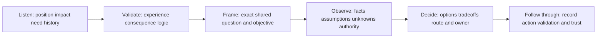

### 1. Listen

Listen for content, impact, emotion, history, identity, and request. Do not plan a rebuttal while the customer speaks. Ask: "What happened from your perspective?" "Which workflow or commitment was affected?" "What would a useful resolution look like?"

### 2. Validate

Name what you can honestly validate: "The repeated mismatch created rework," "The update arrived after your decision window," or "Given the prior incident, asking for stronger evidence is reasonable." Do not validate motive or cause without evidence.

### 3. Frame

Read back the exact issue: "The immediate question is whether the current data can support production prioritization. The broader concern is whether our validation process is trustworthy. Is that accurate?"

### 4. Observe

Separate facts, assumptions, unknowns, preferences, constraints, and decision authority. Review source, scope, time, definition, entitlement, contract, or approved status.

### 5. Decide

Offer options, tradeoffs, recommendation, and authority. A valid result can be an evidence plan or escalation route rather than immediate agreement.

### 6. Follow through

Write the read-back. Keep the next checkpoint. Correct errors visibly. Validate outcome. Trust changes through repeated behavior.

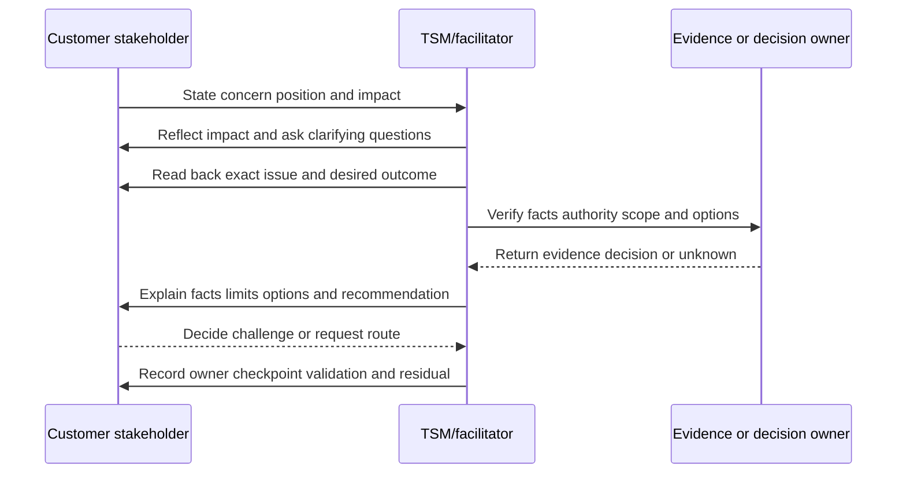

## Evidence versus assumption

Many difficult conversations are classification problems. Put claims into a visible ledger before debating them.

| Class | Example-neutral statement | Response |
|---|---|---|
| Observation | "The job reported success at 10:04 UTC." | Preserve source, scope, and time |
| Customer fact | "The service owner reports 500 affected users under its approved count." | Attribute and corroborate if consequential |
| Official product fact | "Current documentation states behavior X under conditions Y." | Preserve source/date and verify applicability |
| Inference | "The recent change may explain the timing." | List alternatives and test |
| Assumption | "The missing records belong to retired assets." | Keep visible; assign evidence |
| Preference | "The team wants weekly executive reporting." | Compare value and cost |
| Constraint | "Policy requires approval before production change." | Respect; verify authority/version |
| Commitment | "Authorized owner agreed to deliver artifact by date under conditions." | Record exact scope and dependencies |
| Expectation | "A participant thought the feature would be available." | Trace source; do not rewrite as commitment |
| Unknown | "Current evidence does not establish entitlement." | Route to authorized source |

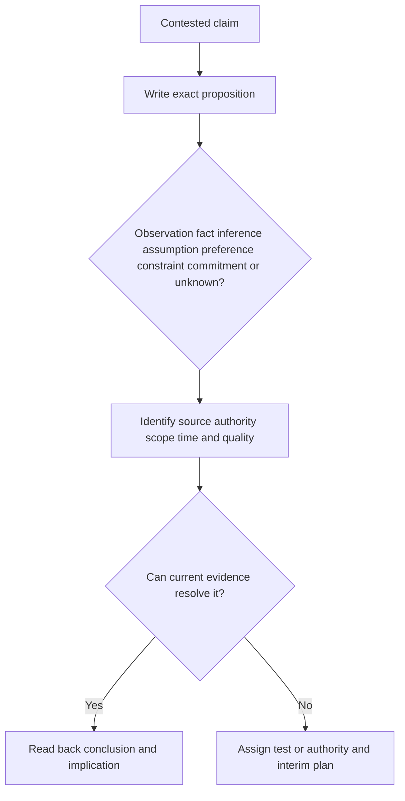

### Language for classification

| Situation | Useful wording |
|---|---|
| Observation versus cause | "We agree on the observed failure. The causal explanation remains a hypothesis." |
| Conflicting sources | "These sources describe different populations and effective times; let us reconcile before choosing authority." |
| Unsupported certainty | "The evidence supports concern, but not that conclusion yet." |
| Missing entitlement fact | "I do not have an authoritative answer from current evidence. The account owner will verify the order record." |
| Changed definition | "The number moved partly because the metric changed. We should not compare it as one trend." |
| Assumption accepted temporarily | "We can proceed under that assumption for the workshop, but production design remains gated on validation." |

## Constructive debate

Debate should improve the decision. Agree on the proposition, criteria, evidence, and authority. Use steelmanning: state the other view in a form they accept before challenging it.

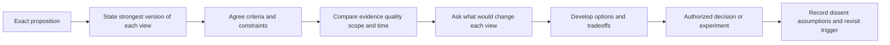

| Debate rule | Purpose | Intervention phrase |
|---|---|---|
| One proposition at a time | Prevents moving argument | "Which exact claim are we deciding first?" |
| Strongest fair restatement | Reduces strawman | "Let me restate your concern; please correct me." |
| Shared criteria | Makes reasoning comparable | "What requirements should any option satisfy?" |
| Source and effective time | Prevents stale authority | "Which record was authoritative for that period?" |
| Falsifiability | Distinguishes belief from testable claim | "What evidence would change our view?" |
| Dissent preserved | Avoids false consensus | "We agree on action but not cause; I will record both." |
| Authority explicit | Ends endless advisory debate | "Who is accountable for this tradeoff?" |
| Respectful stop | Protects psychological safety | "We can challenge the model without judging the person." |

### Plain-English deep-dive 2 - Agreement is not always the goal

Two technical experts can examine the same incomplete evidence and reasonably disagree. Forcing consensus may hide uncertainty. A better result can be agreement on the next test, a reversible decision, or a record of dissent and revisit trigger.

Think of doctors with different diagnoses. They do not vote on the disease. They compare evidence, order a discriminating test, protect the patient in the meantime, and update the plan. Constructive debate turns disagreement into information.

## Objection types and response mechanics

Objections often mix several types. Classify before responding.

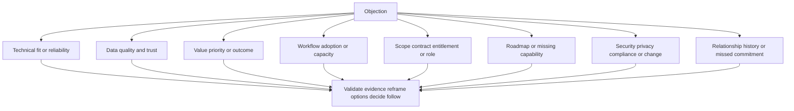

### Objection matrix

| Objection | Likely interest/concern | Validate | Evidence/questions | Boundary | Options/next step |
|---|---|---|---|---|---|
| "The product does not work" | Reliability, impact, prior failures | Affected workflow and frustration | Expected/observed, scope, controls, version, case | Do not accept cause/defect without evidence | Stabilize, reproduce, Support route, workaround |
| "The data is wrong" | Decision risk and credibility | Rework or unsafe prioritization concern | Source, grain, time, completeness, mapping, lineage, sample | Dashboard is not authority by assertion | Reconcile sample, publish quality, gate use |
| "We are not seeing value" | Outcome, cost, attention, expectation | Relevance of the concern | Objective, baseline, adoption chain, effects, alternatives | No invented savings or causation | Rebuild hypothesis, narrow use case, stop/adapt |
| "Our team will not use this" | Capacity, incentives, workflow fit, trust | Operational burden | Last attempted case, duplicate work, ownership, skill | Avoid blaming users | Observe workflow, remove barrier, cohort pilot |
| "This was included" | Entitlement/scope expectation | Need for clarity and planning impact | Order/SOW/current authorized record | Technical role does not decide contract | Account/commercial verification and interim plan |
| "You promised this date" | Dependency and trust | Consequence of expectation | Exact words, author, authority, conditions, record | Do not rewrite expectation as valid commitment | Reconcile, own authorized miss, correct plan |
| "Put it on the roadmap" | Missing capability and future need | Requirement importance | Outcome, acceptance, current alternatives, approved status | Request is not commitment | Submit feedback, plan current option, revisit trigger |
| "Escalate to Engineering now" | Urgency, confidence, blocked support | Impact and need for expertise | Case, reproduction, evidence, requested check | Executive escalation cannot establish defect | Improve packet, Support route, capacity escalation |
| "Your recommendation is too risky" | Service, security, privacy, change concern | Consequence and accountability | Threat/control path, rollback, alternatives, residual | Customer owns production/risk decision | Compare options and bounded test |
| "We do not trust your team" | Prior miss, inconsistency, surprise | Specific harm and uncertainty | Event/commitment timeline, facts, affected decisions | Do not demand trust | Correct, repair plan, checkpoints, independent validation |

## Scope and boundary conversations

Boundaries can be technical, contractual, commercial, security, privacy, legal, support, services, roadmap, or authority-related. State four elements: what is known, what the boundary is, why it exists, and what useful route remains.

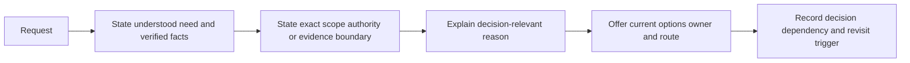

### Boundary scripts

| Situation | Script |
|---|---|
| Unknown entitlement | "The requirement is clear, but I cannot confirm entitlement from technical telemetry or a public page. The account owner will verify the current order record. Meanwhile, we can assess the architecture and acceptance criteria without assuming availability." |
| Out-of-scope implementation | "I can help define requirements, risks, evidence, and handoff. The production implementation owner depends on the current service and customer scope; I do not want to imply delivery authority I do not have." |
| Security-unsafe request | "I understand the urgency. This action would bypass the customer's approval and rollback controls, so I cannot recommend it. The safer options are a read-only check, a bounded nonproduction test, or an authorized emergency change." |
| Contract interpretation | "I can explain the technical dependency, but the contract question belongs to the authorized commercial/legal roles. I will provide them the exact requirement and planning impact." |
| Root-cause pressure | "We have verified the failure and impact. Cause remains under investigation. I can share the leading hypotheses, evidence, and next check without labeling one as root cause prematurely." |
| No roadmap commitment | "The requirement is recorded, but no approved release commitment is established. Let us decide how the current plan succeeds with verified capability or whether you want to rescope, defer, or accept the dependency." |

A boundary should not become a handoff into silence. Name the receiving owner, packet, checkpoint, interim path, and what the TSM will continue to coordinate.

## Roadmap requests and future capability

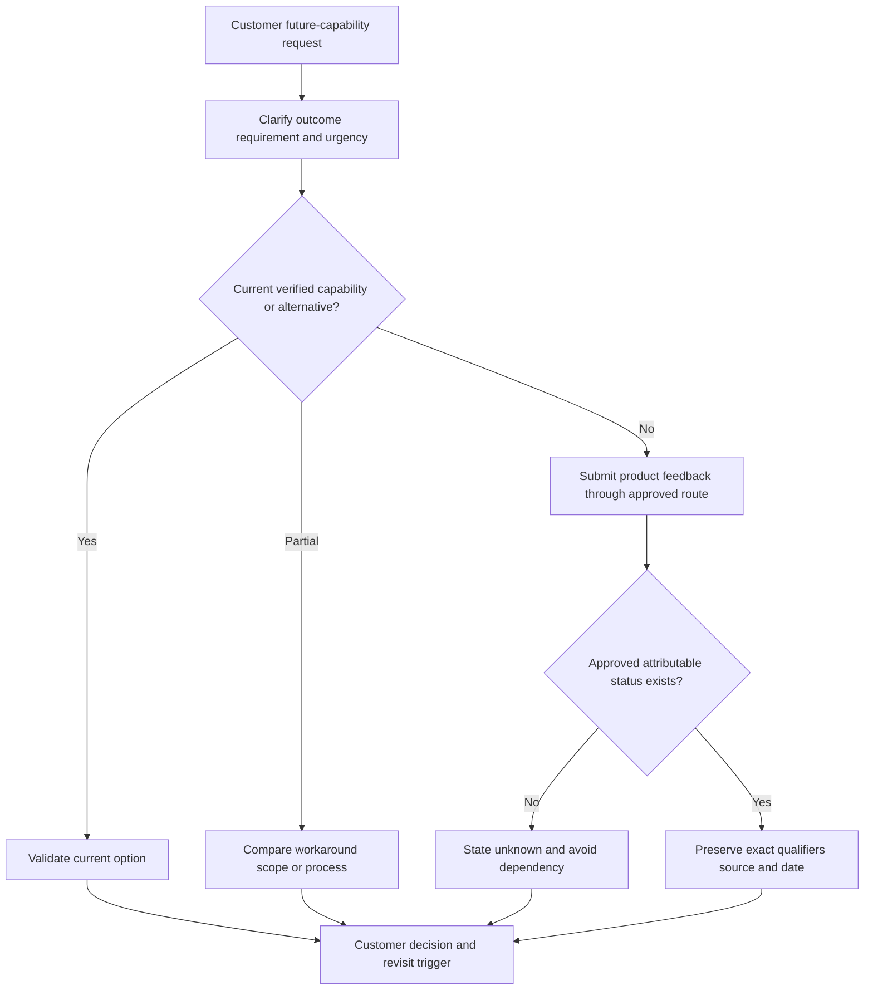

### Roadmap conversation script

> "I hear that **[outcome]** is blocked because you need **[requirement]** by **[business dependency]**. Current evidence establishes **[current capability and limit]**. The request is **[recorded/unknown/approved public status]**, but I do not have an authorized release commitment. Today the credible options are **[current workaround]**, **[scope/process alternative]**, or **[defer/change dependency]**. My recommendation is **[conditional option]** because **[tradeoff]**. I will route the requirement with **[evidence]** and revisit when **[approved trigger]** changes; the success plan will not silently assume delivery."

## Low adoption conversations

Do not tell a customer it "failed to adopt." Describe the observed workflow and ask what makes correct use irrational or difficult.

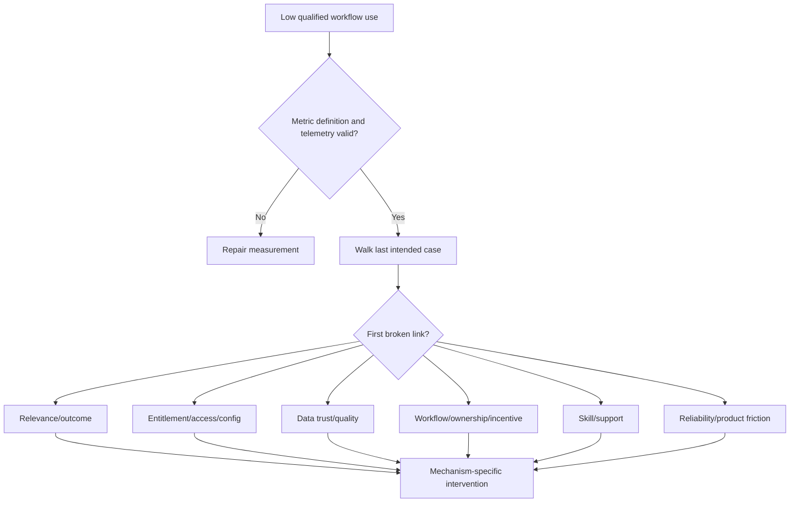

### Low-adoption script

> "The qualified workflow measure is below the agreed plan for **[cohort]**, but the number does not explain why. I do not want to assume resistance or a training gap. Could we walk the last case where the team chose another path? We will look at relevance, access, data trust, duplicate work, ownership, capacity, skill, and reliability. Then we can choose the smallest intervention and a fair application check."

| Barrier | Evidence | Conversation direction |
|---|---|---|
| Relevance | Users cannot connect workflow to priority | Reconfirm outcome or stop low-value motion |
| Access/scope | Roles lack authorized capability | Resolve owner/entitlement/configuration |
| Data distrust | Parallel reconciliation and overrides | Repair source/lineage and publish quality |
| Workflow friction | Duplicate entry, delays, handoff rejection | Redesign process or integration |
| Ownership | Output has no accepted owner | Clarify authority and queue |
| Capacity/incentive | Correct use adds work or conflicts with goals | Sequence scope and address governance |
| Skill | Changed scenario fails teach-back | Coach and retry |
| Reliability | Recurrent incident blocks trust | Support escalation and recovery |
| Measurement | Telemetry misses valid behavior | Correct metric before judgment |

## Data-distrust conversations

Saying "the dashboard is accurate" is not a method. Data trust comes from inspectable contracts, reconciliation, lineage, quality, and correction.

```mermaid
flowchart LR
    DISTRUST[Data concern] --> CLAIM[Exact disputed field metric or population]
    CLAIM --> CONTRACT[Definition grain time source authority]
    CONTRACT --> SAMPLE[Trace representative and edge-case samples]
    SAMPLE --> RECON[Reconcile counts mappings lineage and exclusions]
    RECON --> CLASS[True defect interpretation difference scope difference or unknown]
    CLASS --> CORR[Correct source/model/workflow and affected decisions]
    CORR --> PROVE[Publish quality validation and monitoring]
```

### Data-distrust script

> "Given the assignment errors you found, skepticism is reasonable. Let us avoid debating the whole platform and define the exact claim: **[field/metric/population]** for **[scope/time]**. We will trace source authority, grain, transformation, matching, effective time, and sample records, including an edge case. Until reconciliation meets **[customer-approved gate]**, we will label the view limited and avoid using it for **[decision]**."

| Data challenge | Test | Repair |
|---|---|---|
| Count mismatch | Align grain, filters, effective time, exclusions | Reconcile and version definition |
| Wrong owner | Trace source authority, identity matching, survivorship | Correct mapping and affected assignments |
| Stale state | Compare source event, extraction, ingestion, processing, display times | Restore pipeline and freshness monitoring |
| Duplicate entity | Inspect match keys and merge history | Split/reprocess and add quality control |
| Missing population | Validate source scope, permissions, pagination, filtering | Correct coverage and publish limitation |
| Score dispute | Expose inputs, weights, missing data, version | Recalculate and preserve customer decision authority |
| Dashboard versus source | Trace lineage and aggregation | Correct model or explain intentional semantic difference |

### Plain-English deep-dive 3 - Distrust can be a quality control

A user who challenges a dashboard may be protecting the business from a bad decision. Labeling that person resistant wastes valuable evidence. Ask for the smallest disputed example, then trace it end to end.

The analogy is a bank customer questioning a balance. The bank should not respond with a training video about reading statements. It should reconcile transactions, effective dates, pending items, fees, and account ownership. Once the record is corrected and controls are visible, training may help with interpretation, but it is not the first repair.

## Missed commitments and accountability

First determine whether there was an authorized commitment, an expectation, a target, or an estimate. This classification should not become a way to evade impact. If your team created a reasonable expectation through ambiguous communication, own that communication failure even if the statement was not contractually binding.

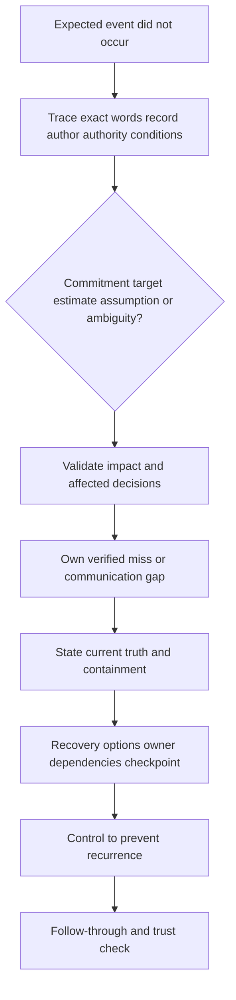

### Accountability sequence

1. **Acknowledge:** Name the miss and impact.
2. **Own:** State the verified responsibility without overclaiming others' fault.
3. **Correct:** Replace the old statement with current truth.
4. **Contain:** Protect immediate customer decisions.
5. **Recover:** Offer options, owners, dependencies, and checkpoints.
6. **Prevent:** Change the mechanism that allowed the miss.
7. **Validate:** Confirm affected decisions and promised follow-through.

### Apology and recovery scripts

| Situation | Script |
|---|---|
| Missed authorized commitment | "We committed to **[scope]** by **[date/condition]** and did not meet it. That affected **[customer impact]**. I am sorry. Current truth is **[state]**. The immediate options are **[A/B]**; **[owner]** will provide **[evidence]** at **[checkpoint]**. We are changing **[causal control]**, and we will validate it through **[test]." |
| Ambiguous expectation | "Our wording reasonably created the expectation that **[belief]**, although no authorized commitment was established. That ambiguity affected your planning, and we own correcting it. The current approved status is **[fact/unknown]**; the plan will use **[current option]** and future statements will include **[source/qualifier/owner]." |
| Incorrect metric | "We reported **[claim]** using a defective **[denominator/source/filter]**. The corrected result is **[bounded fact or unknown]**. We have identified affected decisions, withdrawn the unsupported conclusion, and added **[reconciliation/version control]** before future publication." |
| Late escalation | "We had evidence by **[time]** that should have triggered escalation under **[rule]**, but the update occurred later. That reduced your decision time. We have corrected the active communication path and will review the trigger and ownership in the PIR." |

Do not add "if you felt" to a verified impact apology. Do not promise that it will never happen again. State the control and evidence that reduce recurrence.

## Trust repair

Trust has dimensions: competence, honesty, reliability, care, and alignment. Repair the damaged dimension rather than asking generally for trust.

```mermaid
flowchart LR
    HARM[Trust-relevant event] --> NAME[Name event impact and trust dimension]
    NAME --> FACT[Establish facts responsibility and affected decisions]
    FACT --> REPAIR[Immediate correction and customer options]
    REPAIR --> CTRL[Change process technical or communication control]
    CTRL --> PROOF[Visible checkpoints independent evidence and kept commitments]
    PROOF --> REVIEW[Ask whether concern changed and what remains]
    REVIEW --> SUSTAIN[Continue predictable behavior]
```

| Trust dimension | Damage pattern | Repair behavior | Evidence |
|---|---|---|---|
| Competence | Repeated technical error or weak diagnosis | Bring right expertise, improve evidence, peer review | Better case quality and validated decisions |
| Honesty | Hidden bad news or overstated claim | Correct record early, state unknowns, preserve audit | Fewer contradictions and timely corrections |
| Reliability | Missed commitments or follow-up | Smaller commitments, owners, checkpoints, escalation | Commitments met or renegotiated early |
| Care | Impact dismissed or stakeholder excluded | Listen, validate consequence, include affected roles | Concerns represented and acted on |
| Alignment | Vendor-centered agenda or conflicting incentives | Recenter customer objective and tradeoffs | Decisions trace to customer goals |

### Trust-repair plan

Start small. A fragile relationship is not repaired by a large new promise. Choose a visible, bounded commitment such as reconciling a disputed dataset, publishing an approved status by a checkpoint, or completing one workflow validation. Keep it. Then expand.

### Plain-English deep-dive 4 - Trust is reduced uncertainty about future behavior

Trust is not the absence of challenge. A customer may trust a TSM precisely because the TSM says "I do not know yet," corrects errors, keeps checkpoints, and refuses unsafe shortcuts.

Think of a clock. A beautiful clock that sometimes loses hours is less useful than a plain clock that is accurate and signals when its battery is low. Trust repair makes behavior more predictable: what will be said, checked, owned, escalated, and corrected when things go wrong.

## Escalation without threat or blame

Escalate when authority, expertise, capacity, risk, conflict, or a decision is blocked beyond the normal path. State purpose and requested action.

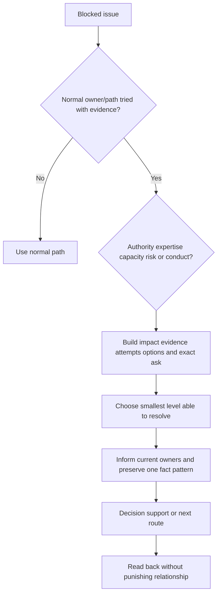

| Escalation trigger | Exact ask |
|---|---|
| Decision authority absent | Assign/obtain authorized decision owner |
| Support investigation blocked | Review case evidence, priority, or next technical action under current terms |
| Cross-team ownership conflict | Decide accountable owner and handoff contract |
| Product requirement unresolved | Record/clarify approved status or product feedback route |
| Security/privacy/legal concern | Activate authorized specialist and governance process |
| Repeated missed commitment | Review mechanism, capacity, and recovery decision |
| Harmful conduct | Protect participants and use management/HR/customer policy |
| Commercial/scope dispute | Engage authorized account/commercial/legal owner |

Avoid "If you do not do this, we will escalate." Prefer: "This decision is outside the current group's authority and blocks the approved window. I recommend bringing the accountable privacy owner into a thirty-minute decision review with options A and B."

## Security, privacy, ethics, and sensitive conversations

| Concern | Risk | Practice |
|---|---|---|
| Customer blame | Damages relationship and may be factually wrong | Describe system condition, decisions, and evidence |
| Individual performance | Unfair exposure or employment consequence | Use proper management channel and minimum data |
| Recorded calls/chats | Consent, retention, privilege, discovery | Follow policy; do not record covertly |
| Contract/commercial | Unauthorized concession or interpretation | Route account/legal authority |
| Security incident | Premature attribution or breach statement | Route customer security/legal roles |
| Vulnerability detail | Exposure of exploitable path | Need-to-know handling |
| Roadmap/internal status | Confidentiality and commitment risk | Approved attributable wording |
| Sentiment notes | Personal or retaliatory use | Record role-relevant concern, not personality label |
| AI-generated script | Leakage, hallucinated commitment, impersonal tone | Approved tool, minimal data, source review, human delivery |
| Cultural/language difference | Misread directness, silence, hierarchy | Ask preferences, use plain language, verify understanding |

Never document "difficult customer," "resistant user," or speculative motive as fact. Write: "Application owner disputed source completeness after three sampled records were missing; production prioritization remains gated on reconciliation."

## Failure modes and misconceptions

| Failure or misconception | Why it fails | Repair |
|---|---|---|
| Objection means resistance | It may reveal real risk or mismatch | Identify interest and evidence |
| Validation means agreement | Creates false technical record | Validate impact; classify conclusion |
| Empathy replaces action | Warm words without correction feel manipulative | Pair acknowledgment with owner/checkpoint |
| Facts alone solve conflict | History, identity, authority, and impact also matter | Address both evidence and relationship |
| Customer is always right | Unsupported claims can create unsafe decisions | Respectfully test and bound |
| Vendor expert should win debate | Authority and context remain customer-specific | Compare evidence and decision rights |
| More explanation resolves objection | Cognitive overload can sound defensive | Ask, summarize, answer exact concern |
| Scope boundary is a dead end | Handoff without coordination loses trust | Offer route, owner, packet, interim option |
| Roadmap request deserves a date | Desire cannot create authority | Use approved status and alternatives |
| Low adoption means more training | Mechanism may be relevance/data/workflow/ownership | Walk a real case |
| Data distrust is attitude | Sample errors may reveal systemic defect | Reconcile lineage and quality |
| Missed expectation is not our issue if not contractual | Ambiguous communication can still harm planning | Own communication gap precisely |
| Apology admits every alleged cause | Fear produces evasive language | Apologize for verified miss/impact; keep cause bounded |
| Promise bigger to restore trust | Fragile relationship cannot absorb more promise risk | Make small observable commitments |
| Escalation is punishment | Threat framing hardens positions | State blocked decision and needed authority |
| No disagreement means trust | People may be silent or disengaged | Invite challenge and corrections |
| Trust is measured by friendliness | Predictability and evidence matter more | Track follow-through and correction |
| Transparent means share everything | Sensitive details still require boundaries | Share sufficient approved evidence |
| A scripted response should be recited | Mechanical language can ignore context | Use structure and speak naturally |
| Product confidence can fill unknown | Creates future contradiction | Verify through authoritative source |

## Troubleshooting difficult conversations

| Symptom | Plausible causes | Discriminating check | Repair |
|---|---|---|---|
| Conversation loops | Proposition or authority unclear | Ask each person to state desired decision | Write issue and owner |
| Customer repeats concern | Response did not address impact or exact question | Ask them to summarize what they heard | Validate/reframe again |
| Technical debate becomes personal | Identity/status threat or judgmental language | Restate claim without names | Pause and return to criteria/evidence |
| Agreement disappears after meeting | No read-back, ambiguous commitment, absent owner | Compare notes and recording policy | Publish decision record |
| Roadmap expectations grow | Qualifiers lost across handoffs | Trace original wording/source | Correct one fact pattern immediately |
| Data-trust meeting becomes broad attack | Claim not bounded or prior defects unresolved | Select one disputed record/metric | Trace end to end, then sample |
| Low-adoption discussion triggers blame | Metric lacks workflow context | Walk last attempted case | Diagnose barrier neutrally |
| Apology rejected | Harm not named, action vague, or repeated misses | Ask what remains unaddressed | Strengthen ownership/control/proof |
| Stakeholder demands unsafe action | Urgency, misunderstanding, incentive conflict | State consequence and authority | Offer safe alternatives/escalate |
| Internal teams disagree in front of customer | Pre-alignment/evidence failure | Pause and identify authoritative owner | Correct, take working session, follow up |
| Executive escalation surprises owner | Normal path not visible or owner excluded | Review attempts and communication | Align before/while escalating unless unsafe |
| Trust plan has no effect | Wrong trust dimension or weak evidence | Ask role-specific concern and observe behavior | Redesign bounded repair |

## Decision trees

### Decision tree 1 - How should an objection be handled?

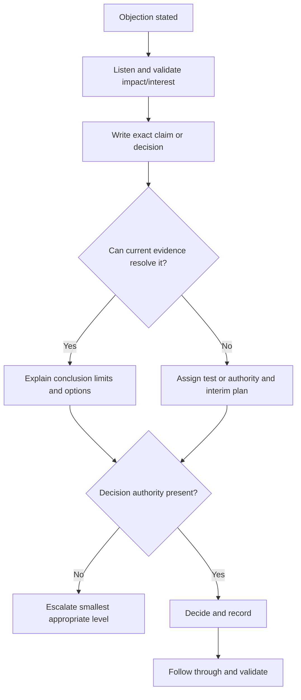

### Decision tree 2 - What should happen after a missed commitment?

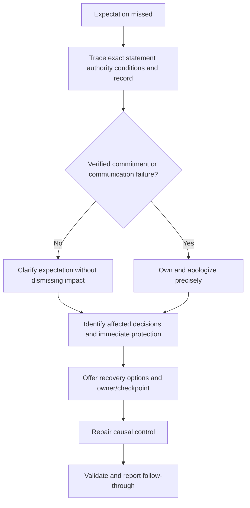

### Decision tree 3 - Is trust repair working?

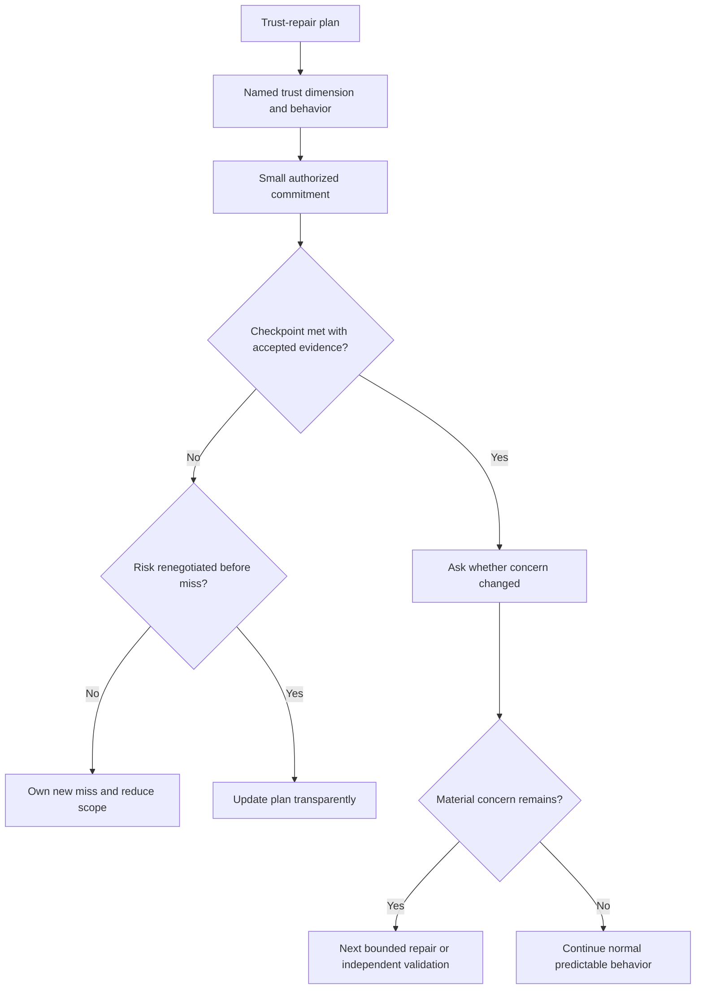

## Explicitly fictional and synthetic NMH scenarios

All content in this section is fictional and synthetic. It is practice material, not a customer quote, objection, product behavior, contract, entitlement, roadmap, commitment, adoption result, data defect, trust state, commercial remedy, or Zscaler outcome. Dates in this section, including **2026-10-23**, **2026-11-06**, **2026-11-27**, and **2026-12-18**, are synthetic scenario dates later than the source snapshot and do not imply later research. Every later date in this section is fictional and synthetic.

### Scenario 1 - "Your data is wrong"

On synthetic 2026-10-23, an NMH operator finds three fictional assets assigned to the wrong owner. The TSM validates the decision risk, avoids defending the dashboard, defines the disputed population, traces synthetic source and matching rules, and gates production prioritization. The team corrects the fictional mapping and adds reconciliation; no real product or customer defect is asserted.

### Scenario 2 - The roadmap date

On synthetic 2026-11-06, an NMH executive says a fictional capability was promised for the next quarter. The account team traces the record and finds an ambiguous discussion, not an authorized commitment. It owns the ambiguity and planning impact, states current approved status as unknown, compares current alternatives, and changes future communication controls. No Zscaler roadmap fact is implied.

### Scenario 3 - Low adoption without blame

On synthetic 2026-11-27, qualified workflow use is low in a fictional cohort. A case walk shows that operators duplicate data into another system and do not trust owner mapping. The response prioritizes data reconciliation and workflow handoff, then role-specific practice. The team does not label users resistant or claim an adoption outcome.

### Scenario 4 - Trust after a missed update

On synthetic 2026-12-18, a fictional critical update arrives after the sponsor's decision window. The TSM names the miss and impact, corrects current status, creates a bounded communication checkpoint with a backup owner, and schedules review of the trigger. Trust is not declared restored; later evidence would determine whether predictability improved. Every later date remains fictional and synthetic.

## Reusable artifact kit

These templates are general practice. Current customer facts, contract, product/support/roadmap authority, legal/privacy/security controls, and accountable roles govern production use.

### Artifact 1 - Objection matrix

| Objection/exact words | Position | Underlying interest/impact | What can be validated | Facts/evidence | Assumptions/unknowns | Boundary/authority | Options/tradeoffs | Owner/checkpoint | Trust effect |
|---|---|---|---|---|---|---|---|---|---|
| | | | | | | | | | |

### Artifact 2 - Difficult-conversation preparation

| Field | Entry |
|---|---|
| Conversation trigger and stakes | |
| Participants, authority, history | |
| Customer position and likely interest | |
| Our position and interest | |
| Shared objective | |
| Verified facts/sources/time | |
| Assumptions/inferences/unknowns | |
| Commitments/expectations/boundaries | |
| Options and BATNAs | |
| Questions to ask | |
| What to validate | |
| What we own/cannot own yet | |
| Decision and escalation route | |
| Security/privacy/commercial constraints | |
| Read-back and follow-up | |

### Artifact 3 - Difficult-conversation script builder

> **Listen/question:** "Help me understand [event, impact, desired resolution]."
>
> **Validate:** "I hear that [verified experience/consequence], and [why concern is reasonable]."
>
> **Frame:** "The immediate question is [exact proposition]; the broader concern is [interest/trust dimension]."
>
> **Evidence:** "We know [facts]. We infer/assume [labeled items]. We do not yet know [unknowns]."
>
> **Boundary:** "I can [scope/authority], but I cannot establish/commit [boundary] from current evidence."
>
> **Options:** "The credible paths are [A/B/baseline], with [tradeoffs]."
>
> **Recommendation/decision:** "I recommend [conditional option]. [Authorized role] should decide [proposition]."
>
> **Follow-through:** "[Owner] will provide [evidence/action] by [checkpoint basis], and we will validate [postcondition]."

### Artifact 4 - Fact, assumption, and commitment ledger

| Statement | Type | Source/authority | Scope/effective time | Evidence/confidence | Decision implication | Verification owner | Status/change |
|---|---|---|---|---|---|---|---|
| | Observation/fact/inference/assumption/preference/constraint/commitment/expectation/unknown | | | | | | |

### Artifact 5 - Decision record

| Field | Entry |
|---|---|
| Decision ID/proposition | |
| Shared objective | |
| Authorized owner | |
| Facts/assumptions/unknowns | |
| Positions/interests/dissent | |
| Requirements/constraints | |
| Options including baseline/BATNA | |
| Tradeoffs/security/privacy/commercial | |
| Decision/rationale | |
| Scope/effective time/conditions | |
| Commitment versus target/estimate | |
| Actions/owners/dependencies | |
| Validation/residual/revisit trigger | |

### Artifact 6 - Roadmap request record

| Requirement/outcome | Urgency/dependency | Current verified capability | Exact gap | Current alternatives | Request/evidence route | Approved status/source/date | No-commitment wording | Customer decision | Revisit trigger |
|---|---|---|---|---|---|---|---|---|---|
| | | | | | | | | | |

### Artifact 7 - Low-adoption conversation record

| Cohort/workflow | Valid metric/evidence | Last attempted case | Relevance | Access/config | Data trust | Workflow/owner/incentive | Skill/support | Reliability | Intervention | Application check |
|---|---|---|---|---|---|---|---|---|---|---|
| | | | | | | | | | | |

### Artifact 8 - Data-trust reconciliation plan

| Disputed claim/field/metric | Grain/population/time | Source authority | Lineage/transformation | Sample/edge case | Quality test | Affected decisions | Interim gate | Correction/owner | Monitoring/acceptance |
|---|---|---|---|---|---|---|---|---|---|
| | | | | | | | | | |

### Artifact 9 - Missed-commitment recovery record

| Field | Entry |
|---|---|
| Exact statement/record/author/date | |
| Authority and conditions | |
| Commitment/target/estimate/expectation/ambiguity | |
| What did not occur | |
| Customer impact/affected decisions | |
| Responsibility established | |
| Apology/correction wording | |
| Current truth | |
| Immediate containment | |
| Recovery options and decision | |
| Owner/dependencies/checkpoints | |
| Preventive control | |
| Validation/trust review | |

### Artifact 10 - Trust-repair plan

| Trust dimension | Harm/evidence | Responsibility | Immediate correction | Small commitment | Owner/checkpoint | Control change | Independent/accepted proof | Stakeholder review | Remaining concern |
|---|---|---|---|---|---|---|---|---|---|
| Competence | | | | | | | | | |
| Honesty | | | | | | | | | |
| Reliability | | | | | | | | | |
| Care | | | | | | | | | |
| Alignment | | | | | | | | | |

### Artifact 11 - Escalation request

> **Blocked issue and customer impact:** [Exact scope/time/consequence].
>
> **Normal path attempted:** [Owner, action, result, evidence].
>
> **Facts/assumptions/unknowns:** [Separated].
>
> **Why escalation is needed:** [Authority, expertise, capacity, risk, conduct].
>
> **Options/tradeoffs:** [Including baseline].
>
> **Exact request:** [Decision, review, resource, or communication].
>
> **Needed role/checkpoint:** [Smallest level able to resolve].
>
> **Customer communication:** [One aligned fact pattern].

### Artifact 12 - Conversation quality rubric

| Criterion | Weak | Strong |
|---|---|---|
| Listening | Rebuttal prepared | Position, interest, impact, history heard |
| Validation | Agree or dismiss | Acknowledge experience without false cause |
| Evidence | Opinions collide | Claims classified by source/scope/time |
| Debate | Person/status focus | Proposition, criteria, falsifying evidence |
| Boundary | Abrupt no or false yes | Clear limit, reason, alternative, owner |
| Accountability | Vague regret | Miss, impact, ownership, correction, control |
| Decision | Ambiguous consensus | Authority, choice, rationale, dissent, trigger |
| Trust | Asked for verbally | Demonstrated through small kept commitments |
| Product truth | Confidence/marketing | Current source, entitlement, status, unknown |

## Exercises

### Exercise 1 - Validate without falsely agreeing

Write responses to: "Your product caused the outage," "Your data is wrong," and "You promised this feature." For each, validate the experience and impact, classify the conclusion, state current evidence, ask one clarifying question, and propose a route without sounding defensive.

### Exercise 2 - Build the objection matrix

Use ten synthetic objections spanning technical fit, data, value, adoption, scope, roadmap, risk, support, commitment, and trust. Identify position, interest, evidence, assumptions, boundary, options, owner, checkpoint, and likely trust dimension.

### Exercise 3 - Facilitate constructive debate

Role-play two architects disagreeing about a fictional source of truth. Steelman both views, agree criteria, compare effective times and populations, identify falsifying evidence, and either decide or record dissent and a test. Stop personal language immediately.

### Exercise 4 - Handle low adoption

Start with a fictional low-use metric. Validate its definition, walk a real-looking synthetic case, identify the first broken link, and create a mechanism-specific intervention. Do not prescribe training until skill is shown to be the barrier.

### Exercise 5 - Repair data trust

Trace a synthetic wrong-owner record through source authority, extraction, mapping, identity match, survivorship, effective time, dashboard, and downstream ticket. Write the interim decision gate, correction, affected-decision review, quality monitor, and customer read-back.

### Exercise 6 - Own a missed commitment

Create an authorized commitment miss and an ambiguous expectation miss. Write separate apologies, current truth, containment, recovery options, owner/checkpoint, preventive control, and validation. Explain why the wording differs without evading either impact.

### Exercise 7 - Build a trust-repair plan

Choose a fictional event that damaged honesty and reliability. Design two small commitments, a backup owner, visible evidence, independent validation, stakeholder check, and a rule for early renegotiation. Avoid declaring trust restored.

### Exercise 8 - Candidate honesty rehearsal

Answer: "Tell me about a difficult customer conversation." Use a factual enterprise escalation example if personally supportable. Describe listening, evidence, disagreement, boundary, accountability, and recovery. Do not rename it as Zscaler TSM, commercial negotiation, roadmap ownership, or customer adoption. Label NMH scripts as fictional practice.

## Customer discovery questions

1. What exactly was said or observed, by whom, when, and under what authority?
2. What position is being stated, and what outcome, risk, impact, history, or identity concern sits beneath it?
3. Which part of the experience or consequence can be validated immediately?
4. What is the exact proposition, decision, or repair the conversation must address?
5. Which statements are observations, facts, inferences, assumptions, preferences, constraints, commitments, expectations, or unknowns?
6. What source, scope, effective time, definition, entitlement, contract, or approved status governs each claim?
7. What evidence would falsify each technical explanation or change each stakeholder's view?
8. Which shared criteria should every option satisfy?
9. Who is authorized to decide technical design, production change, risk, privacy, security, contract, commercial remedy, roadmap communication, and customer acceptance?
10. What technical, contractual, commercial, legal, security, privacy, support, services, or authority boundary applies?
11. What useful alternative, owner, packet, checkpoint, and interim path remains after stating a boundary?
12. Does low adoption reflect relevance, scope, access, data, workflow, ownership, incentive, capacity, skill, reliability, or measurement?
13. Can one disputed data record or metric be traced through authority, grain, lineage, time, mapping, and decision?
14. Was the missed item an authorized commitment, target, estimate, expectation, or ambiguity, and which decisions were affected?
15. What responsibility is established, and what apology can be made without inventing cause or others' fault?
16. Which immediate correction, recovery options, preventive control, and validation address the mechanism?
17. Which trust dimension was damaged: competence, honesty, reliability, care, or alignment?
18. What small observable commitment is safe enough to keep and meaningful enough to matter?
19. When is escalation needed for authority, expertise, capacity, risk, conduct, or commercial scope, and what exact action is requested?
20. How will the decision, dissent, commitments, follow-up, product boundaries, and trust check be recorded?

## Official Source Anchors

Research/source snapshot and source review date: **2026-08-24**.

The Zscaler sources support dated public product, support, investor, and security-operations positioning only. NIST sources support general cybersecurity, risk, zero-trust, and incident concepts. They do not establish a customer's contract, entitlement, roadmap, commitment, product defect, data quality, adoption, trust, commercial remedy, or outcome. Current customer evidence, contracts, official technical/order documentation, licensed-tenant state, approved support/product/roadmap status, and authorized customer/vendor roles govern production conversations.

| Source | URL | Used for | Boundary |
|---|---|---|---|
| Zscaler Zero Trust Exchange | https://www.zscaler.com/products-and-solutions/zero-trust-exchange-zte | Public zero-trust platform positioning | No customer architecture, entitlement, policy, or outcome inferred |
| Zscaler Agentic Security Operations | https://www.zscaler.com/products-and-solutions/security-operations | Public SecOps portfolio and workflow positioning | No customer adoption, agent action, or result inferred |
| Zscaler Data Fabric for Security | https://www.zscaler.com/products-and-solutions/data-fabric | Public data harmonization and workflow positioning | No source quality, lineage, mapping, or customer trust inferred |
| Zscaler Unified Vulnerability Management | https://www.zscaler.com/products-and-solutions/unified-vulnerability-management | Public vulnerability aggregation and prioritization positioning | No customer score, workflow, remediation, or value inferred |
| Zscaler Risk360 | https://www.zscaler.com/products-and-solutions/risk360 | Public contextual risk visibility and mitigation positioning | No customer risk, financial exposure, or board conclusion inferred |
| Zscaler Support | https://help.zscaler.com/submit-ticket | Public support-route context | Current entitlement, process, severity, case, defect, and response require verification |
| Zscaler Investor Relations | https://ir.zscaler.com/ | Public approved-company-information context | Does not authorize account roadmap, contract, forecast, or commitment claims |
| NIST Cybersecurity Framework 2.0 | https://www.nist.gov/cyberframework | General cybersecurity governance and outcome framing | Voluntary and implementation-neutral |
| NIST SP 800-30 Rev. 1 | https://csrc.nist.gov/pubs/sp/800/30/r1/final | General risk and uncertainty concepts | Does not assign customer decision authority |
| NIST SP 800-207 Zero Trust Architecture | https://csrc.nist.gov/pubs/sp/800/207/final | Vendor-neutral zero-trust concepts | Not a customer product, architecture, or result claim |

## Likely Interview Questions

### Q1. How do you handle a difficult customer objection?

**Model answer:** I listen for the position, impact, underlying interest, and history; validate the experience or consequence without endorsing an unsupported conclusion; and read back the exact question. I classify observations, facts, inferences, assumptions, preferences, commitments, and unknowns by source, scope, and time. Then I state boundaries, compare credible options, identify authority, and record the action and checkpoint. The goal is a better decision and observable follow-through, not winning an argument.

### Q2. How do you disagree constructively with a customer or executive?

**Model answer:** I steelman their view, isolate one proposition, agree on criteria, and explain the evidence and limitation in plain language. I ask what evidence would change each view and propose a safe discriminating test or reversible option. I challenge the claim, never competence or motive. If evidence remains incomplete, I preserve dissent and a revisit trigger. If the customer has decision authority, I make the tradeoff and residual explicit rather than claiming consensus.

### Q3. What do you say when a customer claims the data is wrong?

**Model answer:** I treat the concern as a quality signal. I ask for the smallest disputed field, record, metric, population, and time; validate the decision risk; and trace source authority, grain, extraction, transformation, matching, lineage, freshness, and exclusions. I use representative and edge-case samples, gate decisions if needed, correct affected outputs and decisions, and publish quality monitoring. I do not respond with "trust the dashboard" or assume training is the answer.

### Q4. How do you address low adoption without blaming the customer?

**Model answer:** I first validate the adoption metric and eligible cohort, then walk the last intended case. I locate the first broken link among relevance, entitlement, access, configuration, data trust, workflow friction, ownership, incentives, capacity, skill, reliability, and measurement. The intervention follows the mechanism. I define a small action, owner, later application evidence, and customer-accepted outcome. "Users are resistant" is not a useful diagnosis.

### Q5. How do you respond to roadmap pressure?

**Model answer:** I clarify the outcome, exact requirement, urgency, and acceptance criteria, then verify current capability and alternatives. I communicate only approved attributable future status with exact qualifiers. A request is not priority and a direction is not commitment. I keep the success plan based on current verified capability where possible. If future capability is gating, the customer explicitly decides to use an alternative, rescope, defer, or accept the dependency, with a revisit trigger.

### Q6. What do you do after a missed commitment?

**Model answer:** I trace the exact statement, authority, conditions, and record; distinguish commitment, target, estimate, expectation, and ambiguity; and validate affected decisions. I own the verified miss or communication failure, apologize precisely, replace the old statement with current truth, protect immediate decisions, offer recovery options, assign owners and checkpoints, repair the causal control, and validate follow-through. I do not promise that it will never recur.

### Q7. How do you repair trust?

**Model answer:** I identify whether competence, honesty, reliability, care, or alignment was damaged. I name the event, impact, responsibility, and affected decisions; correct the immediate issue; change the relevant technical, process, or communication control; and make a small authorized commitment with visible evidence and a backup path. I keep or renegotiate it early, ask whether the concern changed, and continue predictable behavior. I never declare trust restored on the customer's behalf.

### Q8. How does your background transfer honestly to difficult conversations?

**Model answer:** enterprise escalation engineering required you to work with frustrated enterprise customers, validate impact, test competing explanations, explain boundaries and unknowns, coordinate engineering/customer actions, communicate bad news, and recover service. Networking and data skills help make disagreements testable; mentoring supports respectful coaching. The boundary is that you should not claim Zscaler account ownership, commercial negotiation, roadmap authority, production SecOps adoption, or customer trust outcomes. These artifacts demonstrate preparation, not invented history.

## 30-Second Memory Hooks

| Concept | Memory hook |
|---|---|
| Objection | Design signal, not enemy action |
| Position | What they ask for |
| Interest | Why it matters underneath |
| Validation | Respect impact without inventing cause |
| Frame | One exact question and shared objective |
| Evidence | Source, scope, time, authority, confidence |
| Assumption | Visible, temporary, testable |
| Debate | Strongest view, shared criteria, falsifying evidence |
| Boundary | Known, limit, reason, useful route |
| Roadmap | Requirement and alternatives; no invented commitment |
| Low adoption | Walk one real case before prescribing |
| Data distrust | Trace one disputed record end to end |
| Commitment | Exact promise, authority, scope, conditions |
| Apology | Miss, impact, ownership, correction, control |
| Escalation | Smallest level that can resolve the block |
| Trust | Predictable competent honest behavior |
| Trust repair | Small commitment, visible proof, repeated follow-through |
| Decision record | Facts, options, authority, rationale, revisit |
| Experience bridge | Difficult escalation experience transfers; account/roadmap authority does not |

## Completion Checklist

- [ ] I can explain position, interest, objection, validation, assumption, boundary, accountability, escalation, commitment, and trust from zero.
- [ ] I can listen for impact, need, history, identity, and desired resolution before responding.
- [ ] I can validate customer experience and consequence without accepting an unsupported causal conclusion.
- [ ] I can frame one exact proposition, shared objective, and authorized decision.
- [ ] I can classify observations, facts, inferences, assumptions, preferences, constraints, commitments, expectations, and unknowns.
- [ ] I can run constructive debate with steelmanning, shared criteria, source/time checks, falsifying evidence, and preserved dissent.
- [ ] I can use the objection matrix across technical, data, value, adoption, scope, roadmap, risk, support, commitment, and trust concerns.
- [ ] I can state technical, contractual, commercial, security, privacy, support, services, roadmap, and authority boundaries with useful alternatives.
- [ ] I can respond to roadmap requests without inferring priority, release, or commitment.
- [ ] I can diagnose low adoption through a real workflow rather than customer-blame language.
- [ ] I can turn data distrust into a bounded source, grain, lineage, time, sample, and quality test.
- [ ] I can distinguish an authorized commitment from a target, estimate, expectation, or ambiguous statement.
- [ ] I can apologize for a verified miss, protect affected decisions, repair the mechanism, and validate follow-through.
- [ ] I can identify competence, honesty, reliability, care, and alignment dimensions of trust.
- [ ] I can create a small observable trust-repair plan without declaring the relationship repaired.
- [ ] I can escalate for authority, expertise, capacity, risk, conduct, or scope without threat or surprise.
- [ ] I can protect personal, contractual, commercial, roadmap, incident, security, and sentiment information.
- [ ] I can use the objection, preparation, script, claim, decision, roadmap, adoption, data, commitment, trust, escalation, and quality artifacts.
- [ ] I can describe your transferable experience without claiming production Zscaler account, commercial, roadmap, adoption, or trust outcomes.

[Next: Part 110 - Mentoring, Service Quality, Knowledge Scaling, and 30/60/90-Day Ramp](Part-110-mentoring-service-quality-ramp.md)