# Part 11 - Security Architecture, Cloud Shared Responsibility, and Control Planes

> **Audience:** Candidates moving from Microsoft 365 Support Escalation Engineering into a Zscaler Security Operations Technical Success Manager role.
>
> **Currency date:** 2026-08-24.
>
> **Scope and honesty:** Northstar Meridian Holdings, abbreviated NMH, and every NMH system, architecture, requirement, control, incident, metric, calculation, decision, and outcome in this chapter are fictional. Your established production bridge is enterprise support, OneDrive, SharePoint, networking, troubleshooting, analytics, mentoring, escalation, and approved AI work. Direct production ownership of enterprise security architecture, cloud security architecture, Zscaler, Security Operations, vulnerability management, exposure management, or formal threat modeling is not established.
>
> **Architecture caveat:** Reference architectures are reusable reasoning aids, not deployment instructions. Actual designs depend on business requirements, data classification, identity, traffic, contracts, service documentation, tenant configuration, regulation, geography, capacity, and tested failure behavior.
>
> **Product and source caveat:** Cloud-provider and Zscaler pages describe their own responsibility models and product positioning. They do not transfer the customer's accountability for data, identities, access, configuration, legal obligations, or business continuity. Verify current contracts, service-specific documentation, packaging, licenses, tenant behavior, support scope, and release notes before making an operational claim.

## Section goal

Security architecture is the organized design of people, process, technology, trust, information, and recovery controls that protect business outcomes. It answers more than "Which product should we buy?" It asks what the system must do, what it must never do, who trusts whom, where decisions and data travel, how each boundary is protected, and how the service behaves when a dependency fails or is compromised.

Imagine designing a modern airport. A useful plan includes public roads, ticketing, security screening, staff-only corridors, baggage systems, aircraft gates, control towers, emergency power, and accountable operators. Drawing one large fence around the airport is not enough. Security architecture similarly places boundaries and controls around identities, devices, applications, data, administration, telemetry, and recovery while preserving the business journey.

By the end, you should be able to:

| Learning outcome | What mastery looks like |
|---|---|
| Start with requirements | Separate business outcomes, security requirements, assumptions, and constraints before selecting controls |
| Read reference architectures | Use patterns as questions and adapt them to the actual environment |
| Map trust boundaries | Identify where authority, identity, ownership, protocol, or data sensitivity changes |
| Explain zones and flows | Distinguish zones from trust and north-south from east-west communication |
| Compare hosting models | Explain on-premises, Infrastructure as a Service, Platform as a Service, and Software as a Service responsibilities |
| Assign accountability | Distinguish provider, customer, tenant administrator, user, integrator, and support responsibilities |
| Separate planes | Explain control, data, and management-plane mechanics and correlated evidence |
| Analyze compromise | Describe what each plane compromise can change, expose, or interrupt |
| Design resilience | Compare redundancy, high availability, disaster recovery, backup, and graceful degradation |
| Map dependencies | Identify technical, organizational, contractual, and support boundaries |
| Review architecture | Use structured review and threat modeling without claiming auditor authority |
| Troubleshoot | Trace a symptom across identity, policy, data path, administration, application, and provider boundaries |
| Communicate risk | Convert technical architecture findings into impact, evidence, owner, recommendation, and residual uncertainty |
| Practice honestly | Build a fictional NMH design and Microsoft 365 example while labeling assumptions and experience accurately |

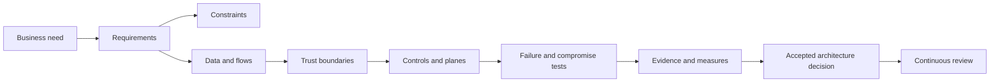

The sequence matters. A product-first diagram can look polished while leaving ownership, recovery, and forbidden paths undefined. Architecture becomes defensible when every important box and arrow has a purpose, owner, security condition, evidence source, and failure question.

## JD Mapping

**JD** means job description. A Technical Success Manager, abbreviated **TSM**, does not normally own the customer's enterprise architecture or certify compliance. The TSM helps customers connect documented product capabilities to requirements, dependencies, adoption, supportability, and measurable outcomes. The TSM also identifies assumptions that require customer, product, support, legal, privacy, or specialist validation.

| JD expectation | Architecture capability | Honest experience bridge | Boundary to preserve |
|---|---|---|---|
| Analyze complex environments | Build a service map with identities, devices, networks, applications, data, controls, owners, and dependencies | Production Microsoft 365 dependency and symptom isolation | Do not claim enterprise security architecture ownership |
| Identify security risks | Find implicit trust, broad zones, single points of failure, unmanaged paths, and unclear responsibilities | Evidence-driven troubleshooting and escalation | Formal risk acceptance belongs to authorized customer leaders |
| Deliver mitigation strategies | Compare prevention, detection, recovery, process, and contractual options | Production recommendation and fix-validation method | Product behavior must be validated in current documentation and tenant |
| Develop Zscaler expertise | Place documented Zscaler capabilities in a broader architecture | Official-source study and future lab work | No production Zscaler deployment claim |
| Resolve escalations | Correlate control, data, management, and provider evidence | critical situation and business-critical support experience | Incident command and forensic authority are not assumed |
| Lead strategic engagement | Maintain current state, target state, dependencies, decisions, and roadmap | Customer leadership and technical advisor experience | Customer architects remain accountable for their design |
| Explain metrics | Measure coverage, latency, bypass, change, resilience, and outcomes | SQL, Power BI, statistics, and service analytics | A dashboard is not proof without source and denominator quality |
| Collaborate across teams | Clarify provider, customer, partner, and internal ownership | Cross-functional work with customers and Engineering | A RACI does not change contracts or statutory accountability |

## Candidate honesty note

You can truthfully say that you have traced real Microsoft 365 failures across client, identity, permissions, policy, Domain Name System, Transmission Control Protocol, Transport Layer Security, Hypertext Transfer Protocol, proxies, Microsoft service behavior, and ownership boundaries. You have coordinated high-pressure escalations, validated fixes, analyzed support trends, and communicated with technical and nontechnical stakeholders. That is a strong architecture-analysis bridge because it demonstrates system thinking and evidence discipline.

You should not say that you have been the security architect for a global enterprise, designed a regulated cloud landing zone, operated Zscaler planes, performed a formal threat-model engagement, or approved a shared-responsibility matrix unless new factual evidence supports those statements.

| Label | Meaning here | Safe wording | Unsafe wording |
|---|---|---|---|
| Production | Established enterprise support, networking, analytics, escalation, training, and customer work | "I mapped the end-to-end Microsoft 365 dependency path and isolated the owning boundary." | "I owned the customer's security architecture" |
| Lab | Synthetic diagram, test, or tabletop exercise retained as evidence | "I designed and challenged the fictional NMH architecture in a case exercise." | "I implemented NMH globally" |
| Conceptual | Architecture method understood from standards and official sources | "I can distinguish planes, trust boundaries, and shared responsibilities." | "I am a certified cloud security architect" |
| Not-yet-used | Product or duty without direct production practice | "I have not operated Zscaler products in production." | "I configured Zscaler high availability" |
| Fictional | Every NMH fact and number | "In the fictional NMH scenario..." | "At my manufacturing customer..." |

## Essential terms before architecture depth

| Term | Plain meaning | Why it matters | Memory hook |
|---|---|---|---|
| Architecture | Organized structure of components, relationships, decisions, and constraints | Makes security and business behavior explainable | Boxes, arrows, reasons, owners |
| Requirement | A condition the solution must satisfy | Provides a testable reason for design | Must be true |
| Constraint | A limit on possible designs | Prevents unrealistic recommendations | The walls of the design room |
| Assumption | A belief treated as true until validated | Hidden assumptions become failure sources | Mark it, test it, retire it |
| Reference architecture | Reusable pattern showing common components and relationships | Speeds reasoning without replacing local design | A map template, not the journey |
| Trust boundary | Point where authority, identity, ownership, protocol, or sensitivity changes | Requires explicit validation and control | Passport checkpoint |
| Zone | Group of resources with similar policy or exposure | Helps organize control placement | Neighborhood with rules |
| North-south traffic | Communication entering or leaving a defined environment | Often crosses internet, branch, tenant, or datacenter boundary | In and out |
| East-west traffic | Communication among systems inside or across internal environments | Can enable lateral movement and hidden dependencies | Side to side |
| On-premises | Customer-operated facilities and technology stack | Customer owns nearly all operational layers | Your building, your stack |
| IaaS | Infrastructure as a Service | Provider runs physical and virtualization layers; customer runs more above | Rent the building shell |
| PaaS | Platform as a Service | Provider also runs operating platform or runtime | Rent an equipped kitchen |
| SaaS | Software as a Service | Provider operates the application; customer still governs use, identity, data, and configuration | Use the restaurant, choose diners and data |
| Tenant | Logically separated customer environment in a shared service | Tenant configuration and identity remain critical | Your secured apartment in a shared building |
| Control plane | Decisions and coordination that govern communication | Bad decisions can affect many sessions | Air-traffic decisions |
| Data plane | Actual business communication and content | Carries user and workload activity | Aircraft and passengers |
| Management plane | Privileged configuration and administration | Compromise can rewrite controls themselves | Control-room keys |
| High availability | Design that keeps service operating through expected component failure | Reduces interruption within a failure scope | Keep serving through a fault |
| Disaster recovery | Restore service after a major disruption | Handles loss beyond normal redundancy | Rebuild elsewhere |
| Recovery point objective | Maximum targeted data loss measured in time | Guides replication and backup frequency | How much history can be lost? |
| Recovery time objective | Maximum targeted restoration time | Guides recovery design and exercises | How long can service be down? |
| Threat model | Structured analysis of assets, actors, entry points, trust boundaries, threats, and mitigations | Tests design before and after change | How could this fail or be abused? |
| RACI | Responsible, Accountable, Consulted, Informed | Clarifies work ownership | Do, own, advise, know |
| SLA | Service Level Agreement | Contracted service target and remedy context | Promised service terms |
| SLO | Service Level Objective | Internal or external reliability target | Operational target |
| SLI | Service Level Indicator | Measurement used to evaluate an objective | The measured signal |

The analogies are intentionally simple. They help a beginner form the first mental model, but they are not exact descriptions. For example, a SaaS tenant is not physically isolated like an apartment, and a control plane may be distributed across several services. Architecture work replaces the analogy with verified components, interfaces, failure behavior, and evidence.

## Requirements, constraints, assumptions, and decisions

A **business outcome** states why the architecture exists. A **requirement** makes a necessary condition testable. A **constraint** limits design choices. An **assumption** is uncertain context that needs validation. A **decision** records the selected option and tradeoff. Mixing them creates avoidable confusion.

For example, "move to cloud" is not a complete requirement. NMH might need regional engineering staff to collaborate on controlled design files while meeting residency obligations, revoking leavers quickly, preserving audit evidence, and recovering from provider or identity failure. Those statements lead to different control and recovery choices.

| Statement type | NMH example | Validation question | Owner example |
|---|---|---|---|
| Business outcome | Engineers collaborate without uncontrolled design-file exposure | Which business process improves and which loss scenario matters? | Engineering executive |
| Functional requirement | Approved external suppliers can upload to named project sites | Which identities, resources, actions, and time windows are allowed? | Product owner |
| Security requirement | Administrative changes require strong identity and independent audit | What technical control and evidence prove this? | Security architecture |
| Availability requirement | Regional users continue approved work during one access-path failure | What exact failure is in scope and what degraded mode is acceptable? | Service owner |
| Privacy requirement | Personal data is processed only in approved locations and purposes | Which legal interpretation, data flow, and contract support this? | Privacy and legal |
| Constraint | A legacy plant protocol cannot use a modern endpoint agent | Can a gateway, segmentation, monitoring, or redesign reduce risk? | Plant owner |
| Assumption | The identity provider remains reachable during regional network failure | Has the failure been tested from each location? | Identity owner |
| Decision | Use a controlled browser path for unmanaged suppliers | What alternatives were rejected, and when will the choice be reviewed? | Architecture board |

Good requirements describe observable outcomes without prematurely naming a product. "All privileged changes must be attributable to a unique administrator and independently reviewable" is stronger than "install tool X." Product selection can then be tested against identity, authorization, logging, separation, retention, availability, privacy, and support requirements.

### Requirement quality checklist

| Quality | Weak version | Stronger version |
|---|---|---|
| Specific | "Secure the data" | "Only approved project members may read restricted design files" |
| Measurable | "Highly available" | "Meet the approved SLO for the named business flow under one-zone failure" |
| Scoped | "Log everything" | "Retain named administrative and access events for approved periods" |
| Owned | "IT will decide" | "The collaboration service owner is accountable; Security is consulted" |
| Testable | "Block bad behavior" | "Denied external-sharing attempts produce an alert and correlated audit event" |
| Risk based | "No downtime ever" | "Recovery targets reflect safety, revenue, legal, and operational impact" |
| Current | "Use the standard design" | "Review after material identity, provider, regulation, or workflow change" |

### Plain-English deep-dive 1 - Architecture is a chain of justified decisions

An architecture diagram is not valuable because it contains many boxes. It is valuable because a reviewer can ask why each box exists, what it trusts, what crosses each arrow, what requirement it satisfies, who operates it, what evidence it emits, and what happens when it fails.

Think about a bridge. A drawing that shows only the roadway is incomplete. Engineers need load assumptions, material limits, foundations, weather conditions, inspections, alternate routes, and maintenance responsibility. Security architecture needs the equivalent: user and workload populations, data value, threat assumptions, trust boundaries, protocols, keys, administrators, dependencies, telemetry, capacity, support, and recovery.

The TSM contribution is disciplined questioning. If a customer says "we need secure SaaS," the TSM can help turn that into identity, device, data, policy, forwarding, inspection, privacy, performance, logging, support, and recovery questions. The customer and authorized specialists still decide policy, legal interpretation, risk acceptance, and final architecture.

## How to use reference architectures

A reference architecture is a reusable arrangement of capabilities and interfaces for a common problem. It can show a secure-access pattern, cloud landing zone, logging pipeline, privileged administration model, or resilient service. It accelerates discovery by presenting known questions and common dependencies.

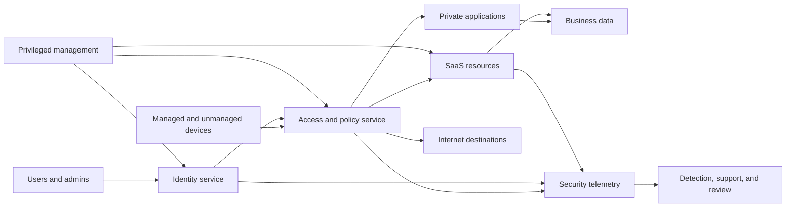

The diagram is a pattern, not an NMH implementation. It does not prove where enforcement occurs, whether all protocols are supported, who decrypts traffic, how private resources connect, what happens during provider failure, or how logs are retained. Those details require current documentation and customer design evidence.

| Reference-architecture use | Helpful behavior | Dangerous shortcut |
|---|---|---|
| Discovery | Ask whether each capability and flow exists | Assume the customer's environment matches the pattern |
| Gap analysis | Find missing identity, policy, telemetry, ownership, or recovery | Treat an absent box as automatically unacceptable |
| Option comparison | Compare placement, trust, operations, and failure behavior | Compare only feature names |
| Communication | Give stakeholders a shared vocabulary | Hide uncertainty behind polished graphics |
| Review | Test boundaries, bypass, compromise, capacity, and support | Declare compliance from visual similarity |
| Roadmap | Sequence prerequisites and migrations | Treat target state as an overnight replacement |

Use the pattern as a hypothesis. Replace generic boxes with actual services, tenant boundaries, interfaces, protocols, identity sources, data classes, owners, regions, and support contracts. Mark unknowns visibly. A trustworthy diagram distinguishes current state, planned state, optional path, prohibited path, and unverified assumption.

## Trust boundaries

A trust boundary exists where one side cannot safely inherit the claims or authority of the other without validation. The boundary may reflect a different organization, identity authority, administrative team, tenant, network, cloud account, data classification, execution environment, protocol, or lifecycle.

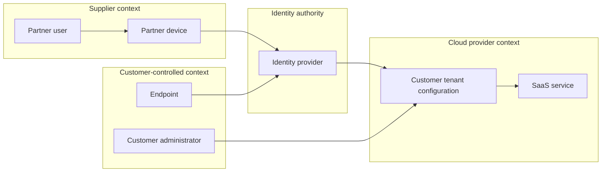

Every arrow crosses at least one question. Does the endpoint identity bind to the user? How fresh is device posture? Which identity tenant authenticates a supplier? Can a customer administrator weaken a provider-enforced setting? Which provider employees could access service data under documented processes? What logs exist on each side?

| Boundary type | Example | Validation needed | Typical failure |
|---|---|---|---|
| Organizational | NMH to supplier | Contract, sponsor, identity lifecycle, permitted data | Supplier leaver retains access |
| Identity | Device to identity provider | Authentication, token audience, assurance, lifecycle | Stolen or replayed token |
| Administrative | Help desk to privileged operations | Role, approval, just-in-time access, audit | Broad standing privilege |
| Tenant | One SaaS tenant to provider platform | Isolation claims, configuration, provider process | Misconfiguration or isolation defect |
| Network | Branch to internet service | Route, protocol, inspection, source identity | Bypass or asymmetric path |
| Application | Front end to application programming interface | Service identity, authorization, input validation | Front end trusted too broadly |
| Data | Internal to restricted classification | Label, policy, encryption, purpose | Sensitive data enters an unapproved flow |
| Cloud account | Development to production subscription | Federation, policy, pipeline, secrets | Development identity reaches production |
| Protocol | Modern authenticated protocol to legacy protocol | Gateway validation, segmentation, monitoring | Identity context is lost at translation |
| Lifecycle | Active project to archive | Retention, access review, legal hold, deletion | Old access remains after purpose ends |

Trust boundaries are not automatically bad. They are locations where assumptions must become explicit controls. A federated identity relationship is useful precisely because two organizations need controlled trust. Architecture should describe the accepted claims, assurance, scope, revocation, monitoring, and fallback instead of saying "the partner is trusted."

## Zones are not the same as trust

A **zone** groups resources for policy, administration, exposure, or operational convenience. Examples include user, server, production, development, management, partner, payment, operational technology, and public zones. A zone can reduce complexity, but its label does not prove every member has equal sensitivity or that movement inside is safe.

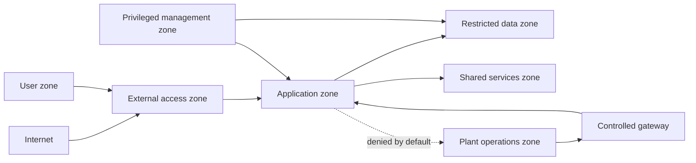

| Zone question | Why it matters | Evidence |
|---|---|---|
| Membership | Wrongly grouped assets inherit inappropriate policy | Inventory, tags, account hierarchy, routing, app catalog |
| Allowed flows | A zone boundary matters only if flows are controlled | Policy, route, firewall, broker, identity, application logs |
| Internal movement | Broad east-west access can preserve lateral movement | Flow records, segmentation tests, host controls |
| Administration | The management route may bypass ordinary controls | Privileged access path, role logs, workstation posture |
| Shared services | Identity, Domain Name System, time, secrets, and logging can bridge zones | Dependency map and failure tests |
| Exceptions | Temporary rules often become permanent | Exception register, owner, expiry, review |
| Unknown assets | Unclassified systems can fall into permissive defaults | Discovery coverage and default-deny tests |

Avoid language such as "trusted zone" unless the exact trust is defined. Prefer "production application zone with authenticated service-to-service flows and no general user route." That description is longer but testable.

## North-south and east-west traffic

North-south and east-west are directional metaphors. They depend on the boundary being discussed. A request from an employee laptop to SharePoint Online is north-south relative to the corporate endpoint environment, but internal service calls within Microsoft's SaaS platform are east-west from the provider's perspective. Architecture must name the viewpoint.

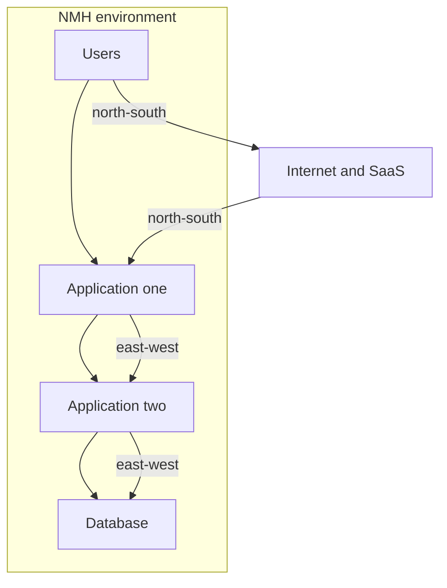

| Flow | Security questions | Operational questions | Common blind spot |
|---|---|---|---|
| User to internet | Identity, destination, data, inspection, malware, policy | Latency, forwarding, fail behavior, support | Alternate browser or direct path |
| User to SaaS | Tenant, token, device, sharing, data action | Provider health, application authorization | Network allow is mistaken for app authorization |
| User to private app | App identity, least privilege, connector path | Name resolution, reachability, app health | Broad network access behind gateway |
| Workload to workload | Service identity, authorization, secrets, encryption | Discovery, retries, capacity, versioning | East-west flow unmonitored |
| App to database | Query identity, data rights, encryption | Pooling, timeout, replication | Shared database account |
| SaaS to SaaS | OAuth scope, connector, webhook, data purpose | Rate limits, schema changes, delivery retries | Long-lived third-party token |
| Management to service | Administrator identity, approval, audit | Emergency access, tool availability | Management bypass not logged |

An architecture review inventories **required**, **observed**, **prohibited**, and **unknown** flows. Required but unobserved traffic may indicate incomplete telemetry. Observed but undocumented traffic may indicate drift. Prohibited traffic needs a denial test. Unknown traffic needs an owner and classification, not immediate deletion without impact analysis.

### Plain-English deep-dive 2 - The arrow is often more important than the box

Teams tend to inventory products because boxes are easy to name. Attackers, users, and failures travel along connections. The arrow reveals the protocol, identity, token, certificate, route, data, encryption, timeout, retry, owner, and evidence that join two components.

Suppose a diagram shows "OneDrive" and "identity provider." The important mechanics include how the client discovers endpoints, establishes Transport Layer Security, obtains and presents tokens, resolves tenant and user identity, checks authorization, synchronizes metadata and content, handles policy, and records activity. A green box cannot tell you whether a stale token, proxy path, unsupported inspection, sharing policy, application permission, or service condition caused a failure.

During review, pick one business transaction and narrate every arrow. Ask what authenticates both sides, what data crosses, what can modify it, how long authorization remains valid, what happens on retry, where logs are produced, and which team can change the interface. This technique turns a high-level picture into testable architecture.

## Hosting and service models

Cloud changes who operates layers; it does not make security someone else's problem. The exact split varies by provider, service, feature, contract, and configuration. The broad on-premises, IaaS, PaaS, and SaaS model is a starting point.

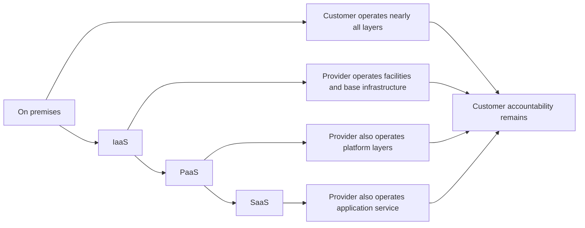

| Layer or duty | On-premises | IaaS | PaaS | SaaS |
|---|---|---|---|---|
| Physical facility | Customer | Provider | Provider | Provider |
| Physical network and hosts | Customer | Provider | Provider | Provider |
| Virtualization | Customer | Provider | Provider | Provider |
| Guest operating system | Customer | Customer | Usually provider | Provider |
| Runtime and middleware | Customer | Customer | Provider with customer configuration | Provider |
| Application code | Customer | Customer | Customer for customer-built app | Provider, with customer extensions possible |
| Application configuration | Customer | Customer | Shared by service design | Customer configures available tenant controls |
| Identities and access | Customer | Customer | Customer | Customer, with provider mechanisms |
| Customer data | Customer | Customer | Customer | Customer accountability remains |
| Client endpoints | Customer | Customer | Customer | Customer or shared capability |
| Logging configuration and use | Customer | Customer | Shared | Shared; availability varies by service and license |
| Compliance accountability | Customer | Customer | Customer | Customer; provider evidence may support it |
| Service availability | Customer | Shared | Shared | Shared, bounded by provider service and customer dependencies |

The word **shared** does not mean both parties perform the same task. AWS distinguishes security **of** the cloud from security **in** the cloud. Microsoft documents a matrix by service model and states that customers retain responsibilities such as data, accounts, endpoints, and access management. Google describes shared responsibility and extends the idea through "shared fate," emphasizing guidance and partnership. These are provider formulations, not interchangeable contractual promises.

### Responsibility verbs

Responsibility becomes clearer when expressed as verbs rather than colored columns.

| Verb | Question | Example evidence |
|---|---|---|
| Design | Who selects the control pattern? | Architecture decision record |
| Provide | Who makes the capability available? | Service documentation and contract |
| Configure | Who chooses tenant or workload settings? | Configuration export and change log |
| Operate | Who runs the component day to day? | Runbook, monitoring, on-call rota |
| Monitor | Who detects degradation or misuse? | Alerts, dashboards, response ownership |
| Patch | Who remediates which software layer? | Provider notice or customer patch record |
| Back up | Who creates which recoverable copy? | Backup policy and job evidence |
| Restore | Who executes and approves recovery? | Exercise result and recovery runbook |
| Test | Who proves the control works? | Test case, sample, result, reviewer |
| Attest | Who provides independent or provider assurance? | Current report and scope |
| Accept risk | Which authorized business role approves residual risk? | Time-bound acceptance record |
| Support | Who investigates and communicates at each boundary? | Support plan, escalation route, case record |

### Shared responsibility by incident type

| Incident | Provider role example | Customer role example | Joint evidence need |
|---|---|---|---|
| Customer account takeover | Protect service mechanisms and investigate provider-side indicators within scope | Disable identity, revoke sessions, investigate source, assess data actions | Identity, tenant, application, and provider timeline |
| Misconfigured public data | Offer documented configuration and logs | Configure correctly, classify data, monitor exposure | Change history and access evidence |
| Provider infrastructure outage | Restore provider service and communicate status | Execute continuity plan and manage business impact | Provider status plus customer dependency timeline |
| Customer workload compromise in IaaS | Protect underlying infrastructure | Investigate guest operating system, application, identity, keys, and data | Cloud control-plane and workload evidence |
| SaaS application defect | Triage and repair service code | Reproduce, scope tenant impact, preserve evidence, apply safe workaround | Request identifiers, timestamps, tenant and provider logs |
| Legal request or privacy event | Follow provider process and contract | Determine customer obligations, notification, and data-subject impact | Legal, privacy, audit, and provider records |

### Plain-English deep-dive 3 - Shared responsibility has no empty middle

Imagine two teams carrying a fragile table through a doorway. One team owns the front and the other owns the back, but both need to agree on direction, timing, and what happens if the route is blocked. Saying "shared" without specifying hands, signals, and contingency creates an empty middle where each party thinks the other acts.

Cloud incidents often expose that middle. The provider may operate the service, but the customer controls identity and tenant configuration. The customer may own recovery objectives, but the provider controls restoration of a regional service. A third-party integrator may configure the tenant, while an internal business owner approves data sharing. A useful responsibility matrix names each action, trigger, evidence, response time, escalation route, and decision owner.

Contracts and service documentation matter, but they are not enough. Teams must operationalize the boundary. They need contacts, support entitlements, tenant identifiers, timestamp conventions, evidence-retention knowledge, emergency approval, workaround limits, and exercises. A TSM can help expose and coordinate these questions without pretending to rewrite the customer's contract or legal accountability.

## OneDrive and SharePoint shared-responsibility example

OneDrive for Business and SharePoint Online are Software as a Service examples familiar to you. Microsoft operates the cloud service and underlying platform. The customer still manages identities, account lifecycle, permissions, site and sharing configuration, data classification, endpoints, business purpose, many retention choices, and response decisions. Exact responsibility and feature behavior must be checked in current Microsoft documentation, licensing, contracts, and tenant configuration.

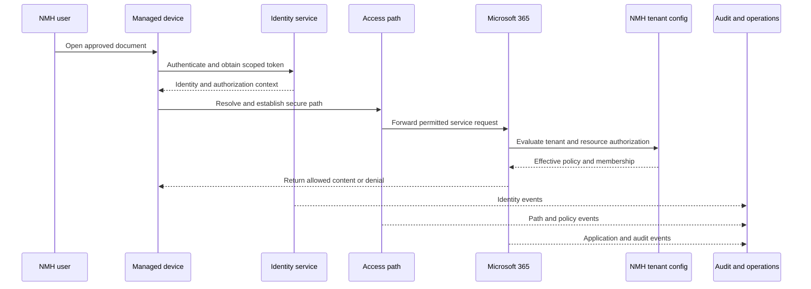

| Area | Microsoft service responsibility example | NMH responsibility example | Troubleshooting evidence |
|---|---|---|---|
| Facilities and service platform | Operate underlying service infrastructure | Review service commitments and dependencies | Service health and provider communications |
| Identity integration | Provide supported authentication interfaces | Configure identity, lifecycle, authentication, and access policy | Sign-in and token evidence |
| Tenant settings | Expose supported controls | Choose and govern settings | Configuration export and change history |
| Site permissions | Enforce configured model | Assign owners, groups, guests, and reviews | Effective permission and membership evidence |
| Data | Process and store under service terms | Classify, authorize, retain, share, and respond | Labels, audit, sharing, content ownership |
| Endpoint | Provide supported clients and service endpoints | Manage device, software, malware defense, and local data | Client logs, posture, process, version |
| Network path | Operate Microsoft-side service network | Provide local Domain Name System, route, proxy, Transport Layer Security compatibility | Packet, proxy, browser, name-resolution evidence |
| Incident | Investigate provider service within support scope | Scope users and data, preserve evidence, coordinate response | Correlated tenant and provider timeline |

### Worked symptom: synchronization fails after a proxy change

The user sees a synchronization error. That symptom does not identify the owner. A disciplined investigation distinguishes at least these hypotheses:

| Hypothesis | Plane or boundary | Discriminating check | Likely owner if confirmed |
|---|---|---|---|
| Identity token is invalid | Control plane and identity boundary | Compare sign-in and token timing for affected and unaffected user | Identity team or provider support |
| Required endpoint is unresolved | Data path dependency | Compare Domain Name System response and destination | Network or resolver owner |
| Proxy route differs | Data plane | Compare route, proxy decision, connection, and policy | Network or secure-access owner |
| Transport inspection breaks a supported flow | Data plane and policy | Compare certificate path and documented requirement | Security path owner with app guidance |
| Tenant permission changed | Management-to-control effect | Review change and effective resource access | Tenant administrator or site owner |
| Microsoft service is degraded | Provider boundary | Correlate service health, request identifiers, region, and time | Microsoft with customer coordination |
| Client state is corrupt | Endpoint and application | Compare clean profile or supported reset evidence | Endpoint or application support |

Your production advantage is not that you have operated every security control. It is that you know the visible symptom may sit several layers away from the cause. You can bring precise timestamps, affected scope, comparison cases, request identifiers, client and network evidence, configuration changes, and tested outcomes to the correct owner.

## Control, data, and management planes

Part 10 introduced the planes in a Zero Trust context. Here they are generalized across an enterprise service.

- The **control plane** decides or coordinates what should happen. Examples include routing decisions, identity assertions, policy evaluation, service discovery, orchestration, and session authorization.
- The **data plane** carries the business transaction. Examples include a file synchronization stream, web request, database query, application message, or workload packet.
- The **management plane** changes the systems and rules. Examples include administrator portals, application programming interfaces, infrastructure pipelines, policy editors, keys, tenant settings, and privileged recovery tools.

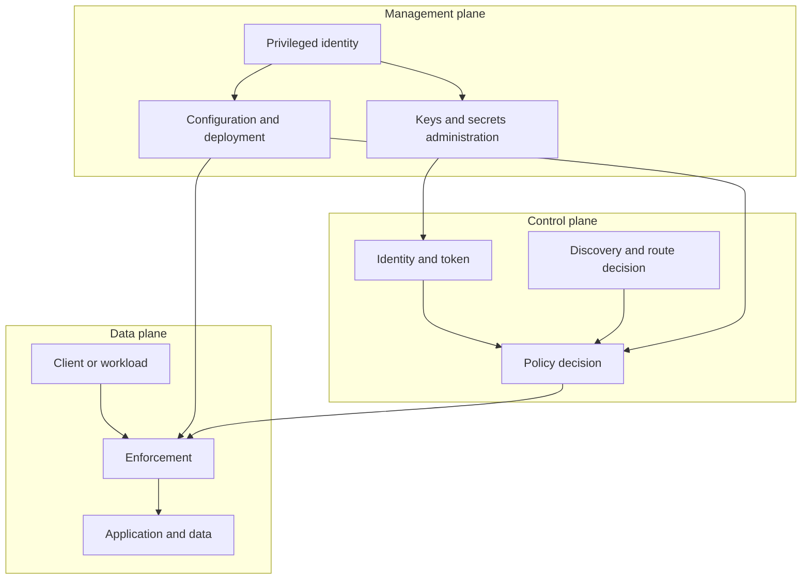

| Plane | Primary asset | Example action | Compromise consequence | Evidence |
|---|---|---|---|---|
| Control | Decision integrity and availability | Issue token or choose allowed path | False authorization, denial, stale state, route manipulation | Decision, token, route, source-health logs |
| Data | Business content and transaction | Read document or call service | Theft, alteration, injection, replay, interruption | Flow, request, application, data-access logs |
| Management | Configuration authority | Change policy or rotate key | Persistent broad change across control and data planes | Admin identity, approval, change, audit trail |

The planes are logical. One process can participate in more than one. A SaaS administration request travels as network data, but its **purpose** is management. A routing protocol message travels in packets, but it belongs to the control plane. Classify by function and consequence, not only by transport.

### Plane interactions

| Interaction | Normal behavior | Security question | Failure question |
|---|---|---|---|
| Management to control | Administrator publishes policy | Who approved, authenticated, reviewed, and can roll back? | Can a bad policy be contained? |
| Control to data | Decision permits a session | Is the decision fresh, scoped, and bound to enforcement? | Does stale access survive control loss? |
| Data to control | Session telemetry informs re-evaluation | Is telemetry complete, timely, and resistant to spoofing? | Does missing data fail open, closed, or limited? |
| Data to management | Operational evidence triggers change | Is emergency change authorized and reviewed later? | Can attacker-generated noise force unsafe change? |
| Management to data | Deployment changes application or enforcement | Is rollout staged and reversible? | Can one change interrupt all regions? |

## Plane compromise and abuse

A plane compromise differs from an ordinary component outage. The compromised component may continue returning plausible results while acting against policy. Architecture must consider integrity, confidentiality, and availability, not only uptime.

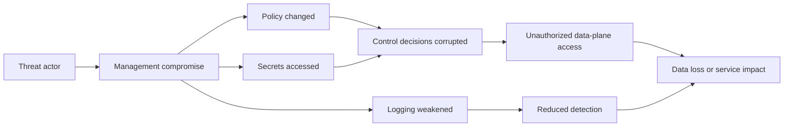

| Compromise scenario | Immediate risk | Blast-radius limiter | Detection and recovery |
|---|---|---|---|
| Identity control compromise | False identities or tokens | Independent signals, narrow audience, short life, resource authorization | Token anomaly, key rotation, session revocation, identity recovery |
| Policy engine compromise | Incorrect allow or deny decisions | Distributed enforcement constraints, signed policy, staged scope | Decision drift, source comparison, known-deny probes |
| Management account compromise | Configuration, key, logging, and recovery manipulation | Separate privilege, just-in-time access, approval, protected workstation | Admin behavior, immutable audit, emergency tenant recovery |
| Data-path enforcement compromise | Bypass, interception, alteration, or outage | End-to-end application security, multiple controls, narrow route | Path comparison, application integrity, replacement and revocation |
| Logging-plane compromise | Evidence deletion or falsification | Independent copies, restricted write, retention lock, source reconciliation | Missing-event detection and cross-source timeline |
| Backup-management compromise | Backup deletion or poisoned recovery | Separate identity, immutability, offline copy, restore validation | Backup inventory, recovery exercise, clean-room restore |

### Plain-English deep-dive 4 - Availability without integrity can be dangerous

A traffic light that stays powered but shows green in every direction is available in the electrical sense and unsafe in the operational sense. Security services can likewise remain reachable while making bad decisions. An identity service might issue unauthorized tokens, a policy service might return permissive results, or a management account might disable logging.

This is why an uptime dashboard cannot prove security. Architecture needs integrity indicators: signed artifacts, peer authentication, independent audit, separation of duties, known-good probes, configuration baselines, change review, source reconciliation, and recovery from a trusted state. It also needs a decision for uncertain states. Should the service deny, allow a narrow emergency path, use cached policy, or switch to manual approval?

The correct answer depends on consequence. Denying access to payroll may be disruptive; denying access to an emergency safety system may be dangerous. Allowing broad access to restricted data may be unacceptable. Architecture expresses these tradeoffs per business service rather than applying one slogan globally.

## Resilience, high availability, and disaster recovery

**Resilience** is the ability to anticipate, withstand, recover from, and adapt to disruption. **High availability**, abbreviated HA, keeps service operating through expected failures, often using redundant components and automatic failover. **Disaster recovery**, abbreviated DR, restores service after a major loss. Backup preserves recoverable state; redundancy keeps another live component available. Neither replaces the other.

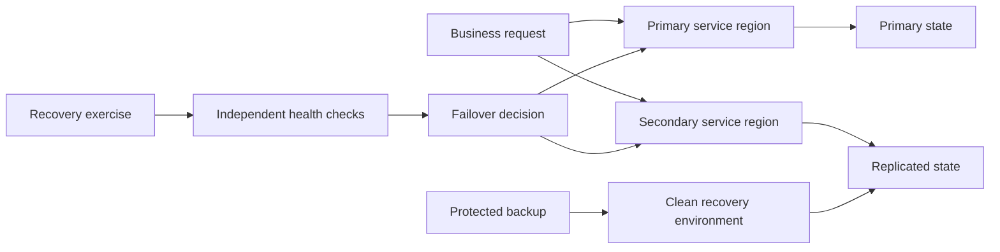

| Concept | Purpose | Does not prove | Required test |
|---|---|---|---|
| Redundancy | Remove a single component dependency | Independent failure domains | Fail one component and observe service |
| Load balancing | Distribute traffic and detect endpoints | Correct application state or security | Unhealthy and overloaded target behavior |
| Multi-zone design | Survive a zone-level failure | Regional independence | Simulated or controlled zone loss |
| Multi-region design | Survive regional disruption | Data consistency or identity independence | Regional failover and failback |
| Backup | Preserve historical recoverable state | Rapid or clean restoration | Restore into isolated environment |
| Immutable backup | Resist ordinary modification or deletion | Absence of stolen credentials or poisoned data | Privileged attack and restore exercise |
| RPO | Targeted maximum data loss window | Guaranteed loss | Compare replication and backup evidence |
| RTO | Targeted restoration duration | Guaranteed completion | Time a realistic recovery exercise |
| Graceful degradation | Preserve critical subset safely | Full feature equivalence | Test reduced mode and user communication |

### Failure domains and correlated dependency

Two components are not truly redundant if they share the same identity tenant, Domain Name System, management account, certificate authority, software defect, network route, power source, deployment pipeline, or operator error.

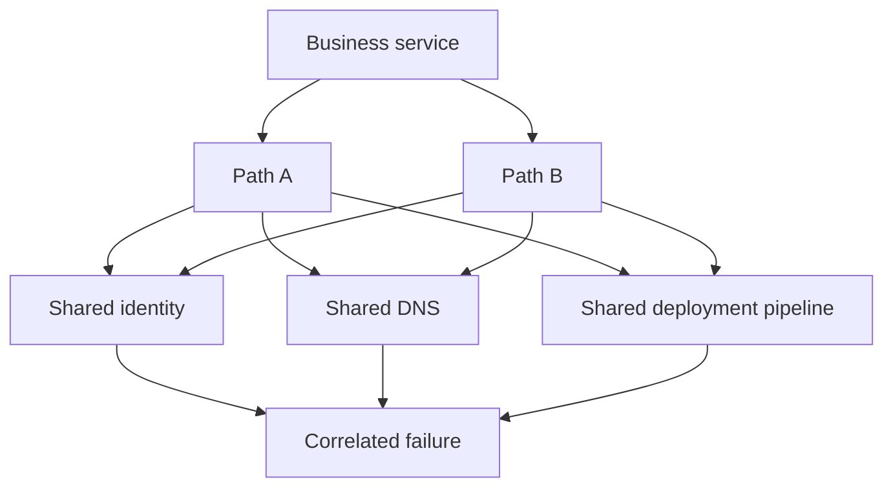

| Shared dependency | False confidence | Better review |
|---|---|---|
| Same identity provider | Two applications look independent | Test identity outage, emergency access, token behavior |
| Same Domain Name System | Two network paths exist | Verify resolver and authoritative diversity |
| Same cloud region | Several instances run | Map zone and regional failure boundaries |
| Same administrator | Separate products exist | Separate privilege and emergency recovery roles |
| Same deployment | Active and standby use identical bad release | Stage, canary, preserve prior artifact, test rollback |
| Same data corruption | Replication copies damage quickly | Add point-in-time backup and clean restore |
| Same provider | Multiple services are purchased | Understand provider-wide identity, control, and status dependencies |

### RTO, RPO, and security tradeoffs

NMH should derive targets from business impact, not copy a universal number. A fictional example may use these questions without asserting real values.

| Business service | Impact dimension | RTO question | RPO question | Security caveat |
|---|---|---|---|---|
| Plant safety documentation | Safety and operation | How long can approved operators lack current procedures? | How much approved revision history can be lost? | Emergency access must not expose broad design data |
| SharePoint project workspace | Collaboration and delivery | How long can work pause or switch process? | Which edits could be recreated? | Offline copies create endpoint and reconciliation risk |
| Identity administration | Access and recovery | How long before onboarding, revocation, or emergency access fails? | Which identity changes must be reconstructable? | Recovery account must be protected and audited |
| Security telemetry | Detection and evidence | How long can monitoring be blind? | Which events can be lost before investigation fails? | Buffering must preserve integrity and time |

## Disaster recovery sequence and clean recovery

Recovery is not merely "turn on the secondary." A major compromise may affect identity, management, policy, data, and backup trust. The recovery team needs criteria for a known-good state.

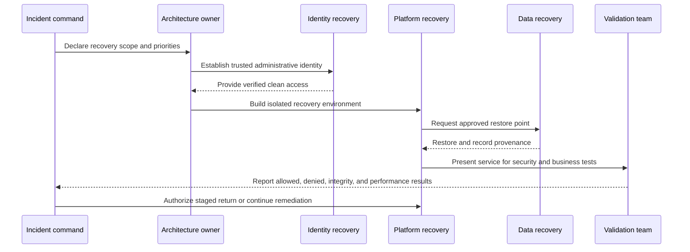

| Recovery gate | Question | Evidence |
|---|---|---|
| Authority | Who can declare disaster and approve return? | Incident and continuity plan |
| Clean identity | Are recovery administrators and credentials trustworthy? | Identity reset and independent verification |
| Clean environment | Is recovery isolated from compromised management paths? | Network, account, and tooling evidence |
| Restore provenance | Which backup, time, integrity check, and chain were used? | Backup catalog and hash where appropriate |
| Configuration | Are secure baselines and emergency exceptions understood? | Versioned configuration and decision record |
| Application integrity | Does the service perform only intended functions? | Functional and security tests |
| Data integrity | Is restored data complete enough and free from known corruption? | Reconciliation and owner acceptance |
| Return | Is traffic staged, monitored, and reversible? | Cutover plan, health measures, rollback trigger |

## Dependency and support boundaries

Technical diagrams often omit support, contract, licensing, rate limits, maintenance, data-retention, and escalation boundaries. These can determine whether a theoretically sound design is operable.

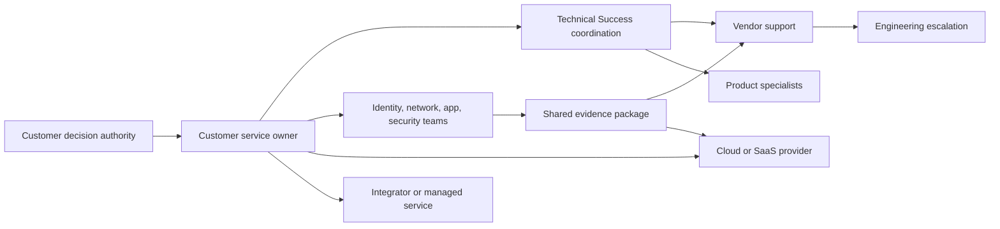

| Boundary | Discovery questions | Failure symptom | Preparation |
|---|---|---|---|
| Product support | Which severity, entitlement, hours, and evidence are required? | Case delay or wrong routing | Support matrix and escalation package |
| Cloud provider | Which tenant, subscription, region, resource, and request ID matter? | Provider cannot scope issue | Identifier and timestamp checklist |
| Integrator | Who owns design, configuration, run, and knowledge transfer? | Ownership dispute | Statement of work and RACI |
| Identity team | Who controls federation, lifecycle, emergency access, and keys? | Access or recovery blocked | Named on-call and tested procedure |
| Network team | Who owns Domain Name System, routes, proxies, firewalls, and carriers? | Path mismatch or latency | Flow diagram and capture authority |
| Application owner | Who validates intended user and data behavior? | Technical recovery but business failure | Acceptance tests and owner |
| Legal and privacy | Who decides notification, evidence handling, and processing constraints? | Unsafe communication or evidence transfer | Predefined consultation route |
| License and capacity | Which feature, quota, connector, or retention is entitled? | Design works in concept but not tenant | Current subscription and limit inventory |

A support boundary is not a blame boundary. The goal is to give the next owner sufficient evidence and remain accountable for customer coordination. "It is a provider problem" is weaker than "At 14:03 UTC, requests from two regions failed after successful identity and network establishment; request identifiers and unaffected comparison are attached; no NMH change occurred in the interval; provider service evaluation is now the discriminating next step."

## Architecture review method

An architecture review is a structured examination of a current or proposed design against requirements, risk, operational readiness, and evidence. It is not automatically a compliance audit, penetration test, code review, or formal certification.

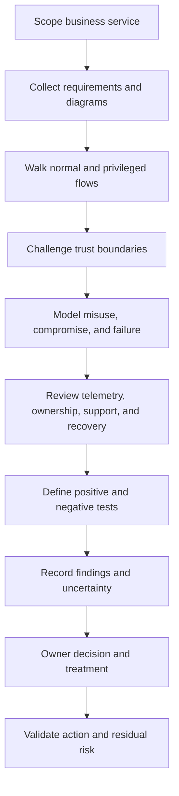

| Review stage | Key questions | Output |
|---|---|---|
| Scope | Which business service, users, data, environments, and decisions are included? | Scope and exclusions |
| Requirements | What must work, must not happen, and must recover? | Testable requirements |
| Current state | What actually exists and communicates? | Evidence-backed diagram |
| Trust | Where do identity, ownership, protocol, tenant, and sensitivity change? | Boundary inventory |
| Threat | Who could abuse what path or authority? | Threat scenarios |
| Control | Which preventive, detective, responsive, and recovery controls apply? | Control map |
| Operations | Who monitors, changes, supports, and exercises the service? | Operating and RACI model |
| Evidence | Which logs and tests prove expected behavior? | Evidence plan |
| Finding | What condition, consequence, evidence, and uncertainty exist? | Prioritized finding |
| Decision | Mitigate, avoid, transfer, accept, or gather evidence? | Owned decision record |
| Validation | Did the action work without breaking required behavior? | Closure and residual-risk evidence |

### Architecture finding format

| Field | Fictional NMH example |
|---|---|
| Condition | Supplier identities retain project-group membership after sponsor expiry |
| Requirement | Supplier access must end when approved project purpose expires |
| Evidence | Synthetic group export and expired sponsorship records disagree |
| Threat or failure | A former supplier identity could retain document access |
| Business consequence | Restricted design information could be accessed outside approved purpose |
| Existing controls | Multifactor authentication, site audit, manual quarterly review |
| Recommendation | Automate sponsor expiry, remove membership, revoke sessions, and alert on mismatch |
| Owner and due date | Fictional identity owner and approved target date |
| Validation | Expired synthetic identity denied; event recorded; legitimate supplier unaffected |
| Residual uncertainty | Other manually managed groups require separate sampling |

## Threat modeling from zero

Threat modeling is a structured way to ask how a system could be misused, compromised, or fail. It begins with assets, actors, entry points, data flows, trust boundaries, assumptions, and consequences. A threat model is not a prediction that every scenario will occur.

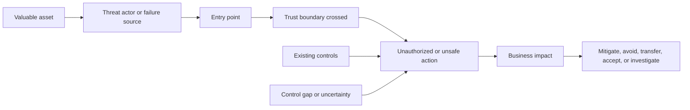

| Threat-model element | Beginner question | NMH example |
|---|---|---|
| Asset | What matters? | Restricted engineering design file |
| Actor | Who or what could cause harm? | Stolen supplier identity, malicious insider, bad automation, service defect |
| Entry point | Where can interaction begin? | Sign-in, sharing link, application programming interface, sync client |
| Trust boundary | Which claim or authority changes? | Supplier tenant to NMH tenant |
| Threat action | What could go wrong? | Read, alter, delete, overshare, disable audit |
| Existing control | What prevents, detects, limits, or recovers? | Sponsor approval, authentication, group, label, audit, backup |
| Assumption | What must be true? | Supplier identity lifecycle is timely |
| Consequence | Why does it matter? | Intellectual property loss and project delay |
| Test | How can the hypothesis be challenged safely? | Expired synthetic supplier access test |

### Lightweight threat prompts

| Prompt | Architecture focus |
|---|---|
| Can someone pretend to be another identity? | Authentication, token, service identity, federation |
| Can data or configuration be altered without detection? | Integrity, signing, approval, audit |
| Can an actor deny performing an action? | Attribution, time, audit integrity, shared accounts |
| Can information reach an unauthorized party? | Authorization, sharing, path, encryption, logging |
| Can service be interrupted or exhausted? | Capacity, dependency, failover, rate limit |
| Can a user gain more authority than intended? | Role design, management plane, application authorization |
| Can one compromise cross a boundary? | Segmentation, service identity, blast radius, credential reuse |
| Can recovery recreate the compromise? | Backup trust, clean identity, configuration provenance |

Frameworks such as STRIDE can provide prompts, but the method is less important than complete system understanding and business consequence. Do not mechanically label every box. Walk realistic transactions, include non-malicious failure and operator error, and update the model when architecture changes or incidents reveal assumptions.

## NMH fictional current-state architecture

NMH is a fictional global manufacturer used throughout the guide. It has regional offices, plants, remote engineers, suppliers, Microsoft 365 collaboration, private engineering applications, IaaS workloads, PaaS analytics, and several SaaS services. No statement describes a real customer or Zscaler deployment.

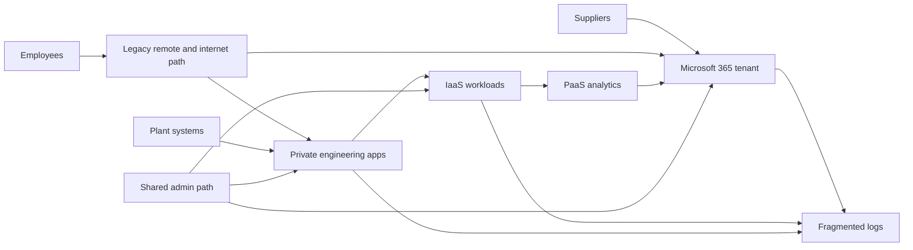

### Fictional current-state observations

| Observation | Why it matters | Evidence still needed |
|---|---|---|
| Remote access provides broad network reach | Compromise may reach more than the intended app | Route, policy, flow, application authorization |
| Supplier groups are manually reviewed | Leaver and project-expiry delay is possible | Identity source, sponsor records, effective access |
| Shared administrator route reaches several platforms | One identity or device may have large blast radius | Role assignment, device, approval, audit, recovery |
| SaaS, IaaS, and application logs use different time and identity fields | Cross-boundary investigation can be slow | Schema, clock, identifier, retention, completeness |
| Plant application depends on central identity and Domain Name System | Connectivity alternatives may not preserve security or safety | Offline and degraded-mode design |
| Backups use production administration | Management compromise could affect recovery | Separate identity and restore exercise |
| Provider responsibilities are recorded only at contract level | Operational incident actions may be unclear | Per-service action matrix and contacts |

## NMH fictional target reasoning

The target is not a claim that one vendor or pattern solves every problem. It illustrates clearer service boundaries, narrow access, separated administration, correlated evidence, and tested recovery.

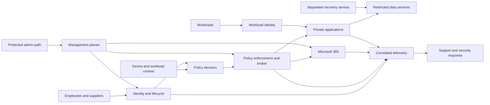

| Target principle | Fictional design move | Validation |
|---|---|---|
| Resource-specific access | Replace broad route with named application and action where feasible | Allowed app succeeds; adjacent route denied |
| Strong lifecycle | Link supplier access to sponsor and project expiry | Expired synthetic identity denied promptly |
| Protected management | Separate administrator identity, device, approval, and path | Ordinary user route cannot administer |
| Plane visibility | Correlate identity decision, policy, path, app, and data events | One transaction can be reconstructed |
| Shared-responsibility operation | Create action-level matrix for each provider and service | Tabletop reaches correct owner with evidence |
| Resilience by business service | Define degraded mode, RTO, RPO, and recovery authority | Exercise meets approved targets or records gap |
| Data-centered design | Apply classification and purpose to SharePoint, OneDrive, private, and analytics flows | Prohibited sharing and transfer tests fail safely |
| Limited blast radius | Segment plants, workloads, projects, and administration | Compromise simulation cannot cross prohibited boundary |

### NMH architecture decision record example

| Field | Fictional content |
|---|---|
| Decision | Use a browser-mediated supplier path for restricted project sites during the pilot |
| Requirement | Suppliers need upload and review without broad private-network access |
| Options | Managed device agent, browser path, virtual desktop, legacy remote access |
| Chosen tradeoff | Browser path reduces endpoint deployment dependency but may limit workflows and device context |
| Preconditions | Federated identity, sponsor lifecycle, site isolation, download policy, audit, support |
| Rejected assumption | Browser access alone does not prove data cannot be copied or shared |
| Failure behavior | If identity or policy is unavailable, deny restricted access and invoke approved business process |
| Validation | Allowed upload, prohibited site denial, expiry, audit, performance, support test |
| Review trigger | New file workflow, provider feature change, incident, or six-month review |

## Zscaler placement without unsupported claims

Zscaler's official Zero Trust Exchange page positions a cloud-delivered proxy architecture that uses identity, context, destination, risk, policy, and one-to-one connections for users, workloads, Internet of Things or Operational Technology, and business partners. Official portfolio pages describe capabilities for internet and SaaS access, private access, cloud workload communication, data security, Digital Experience, Security Operations, Data Fabric, exposure management, and risk.

This chapter does not assert a particular NMH Zscaler topology, tenant configuration, plane implementation, availability design, inspection path, connector, license, or outcome. A TSM would validate current product documentation and work with customer and Zscaler specialists.

| Architecture question | Documented Zscaler area to investigate | Required validation before claim |
|---|---|---|
| Secure internet and SaaS access | Zscaler Internet Access and Zero Trust Exchange positioning | Forwarding, identity, policy, inspection, bypass, privacy, performance, logs |
| Private application access | Zscaler Private Access positioning | Application segments, connectors, name resolution, policy, post-access scope, HA |
| Endpoint context and forwarding | Client Connector documentation | Platform support, posture, update, forwarding, conflict, logs, recovery |
| Workload communication | Zero Trust Cloud and workload offerings | Direction, protocol, identity, enforcement, route, cloud support |
| Experience evidence | Zscaler Digital Experience positioning | Probe placement, metric meaning, coverage, license, correlation |
| Security data and risk | Data Fabric, exposure, Risk360, and Security Operations positioning | Connectors, fields, freshness, model, workflow, authority, tenant behavior |

Safe interview wording is: "I would map documented product components to the customer's identity, resource, flow, control, management, telemetry, and recovery requirements, then validate current behavior with official documentation and a representative pilot. I have studied the architecture but have not deployed it in production."

## Architecture evidence and metrics

Architecture evidence connects design intent to observed behavior. Evidence can include configuration exports, identity records, policy decisions, route and flow data, application audit, administrative changes, provider notices, capacity, synthetic tests, recovery exercises, and user outcomes.

| Metric | Numerator and denominator discipline | Useful interpretation | Misleading interpretation |
|---|---|---|---|
| Managed identity coverage | Active identities governed by lifecycle / active identities in scope | Shows lifecycle reach | Does not prove correct authorization |
| Resource-specific access coverage | Named resources behind scoped policy / resources in scope | Tracks broad-route reduction | Does not prove no alternate path |
| Known-flow coverage | Observed and owned flows / observed flows | Shows architecture understanding | Unknown telemetry can hide the denominator |
| Privileged-account protection | Protected privileged identities / privileged identities in scope | Tracks admin control adoption | Does not prove every action is legitimate |
| Policy-denial test pass rate | Successful expected denials / planned denial tests | Tests negative behavior | Synthetic tests may miss real variations |
| Recovery exercise success | Passed recovery gates / scheduled gates | Tracks readiness | A tabletop is not a technical restore |
| Evidence correlation | Transactions reconstructed across required sources / sampled transactions | Shows investigation readiness | Sample and time-window quality matter |
| Exception aging | Open exception days by risk and owner | Reveals architecture debt | Count alone ignores severity and scope |
| Change failure rate | Changes causing rollback or incident / production changes | Informs management-plane quality | Teams may underreport or classify differently |
| Customer outcome | Approved business transactions meeting security and experience targets / sampled transactions | Connects architecture to business | Uptime alone ignores unsafe access |

### Evidence confidence ladder

| Confidence | Evidence example | Appropriate statement |
|---|---|---|
| Assumption | Diagram says all SaaS uses controlled path | "The design intends this; path evidence is pending." |
| Configuration | Policy export shows forwarding rule | "The rule is configured for the sampled scope." |
| Observation | Correlated logs show the path | "The sampled transactions used the path at this time." |
| Negative test | Alternate route was denied | "The tested bypass failed under these conditions." |
| Failure exercise | Region or dependency was deliberately failed | "The service met or missed the approved exercise gate." |
| Sustained outcome | Representative measures remain within target | "Evidence supports the outcome for the measured population and period." |

## Failure modes and troubleshooting

Architecture troubleshooting starts with a business transaction and follows the actual path. It does not jump from symptom to product blame.

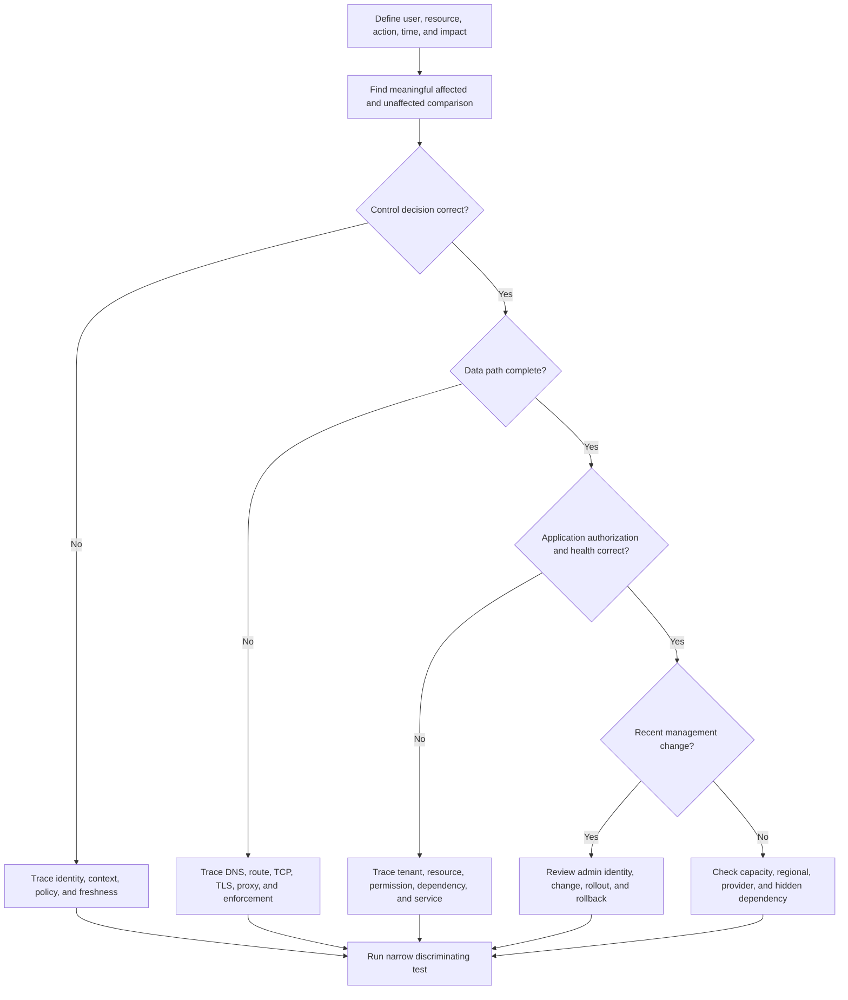

| Failure mode | Visible symptom | Discriminating evidence | Safe response |
|---|---|---|---|
| Stale identity group | User unexpectedly denied or allowed | Directory change, token issue, application evaluation time | Refresh or revoke through approved process; fix lifecycle |
| Policy order conflict | Similar users receive different decision | Matched rule and context comparison | Correct narrowly; preserve before and after evidence |
| Route bypass | Activity lacks expected security event | Endpoint route, proxy decision, destination connection | Close or approve path after impact review |
| Name-resolution mismatch | One region reaches wrong or no endpoint | Resolver path, answer, time-to-live, split-horizon config | Correct authoritative or client path with rollback |
| Transport inspection incompatibility | Handshake or application fails | Certificate, protocol, client, documented app requirement | Use documented compatible policy; avoid broad permanent bypass |
| Management-plane bad change | Wide simultaneous failure | Admin event, deployment version, affected scope | Stop rollout, roll back safely, preserve evidence |
| Provider degradation | Multi-tenant or regional symptom | Service health, request IDs, comparison, provider response | Activate continuity and provider escalation |
| Capacity exhaustion | Latency, timeout, dropped session | Queue, connection, processor, quota, rate limit | Shed load or scale within approved design |
| Telemetry loss | Service works but visibility disappears | Source heartbeat, count reconciliation, pipeline errors | Treat as security degradation and restore evidence path |
| Recovery dependency failure | Failover begins but identity or Domain Name System fails | Exercise timeline and dependency health | Invoke tested alternate or revise recovery design |

### Troubleshooting evidence package

| Field | Content |
|---|---|
| Business symptom | User or workload, resource, intended action, error, consequence |
| Scope | Count, locations, tenants, platforms, versions, start and end |
| Timeline | Coordinated timestamps with timezone and confidence |
| Change | Identity, policy, route, application, provider, certificate, release |
| Comparison | One affected and one unaffected case differing meaningfully |
| Plane evidence | Control decision, data path, management change |
| Boundary evidence | Customer, provider, partner, application identifiers |
| Tests | Hypothesis, discriminating action, result, interpretation |
| Workaround | Scope, approval, monitoring, expiry, security effect |
| Ask | Specific action needed from the next owner |

## Decision trees

### Is the architecture claim defensible?

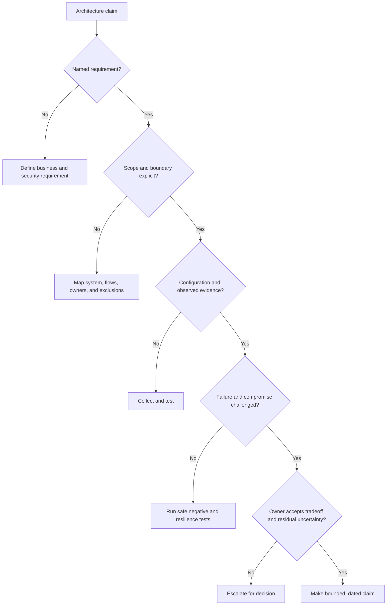

### Who owns this cloud-security action?

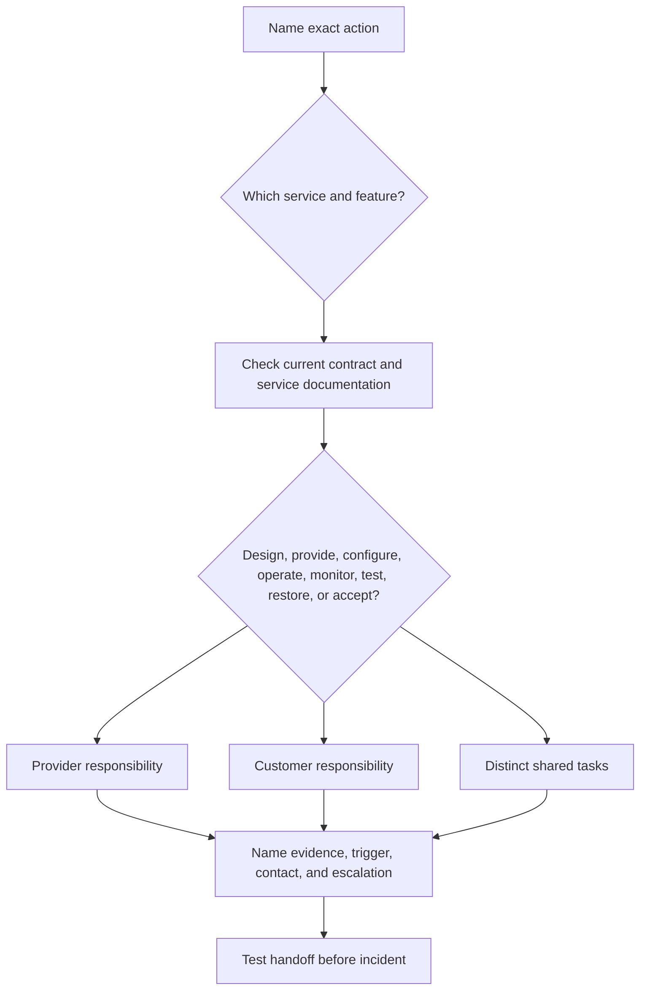

## Scenario drills

### Drill 1 - Supplier access to a SharePoint project

NMH wants an external design partner to upload files for ninety days. Build the subject, device, identity tenant, site, file classification, actions, sponsor, expiry, management roles, path, audit, support, and recovery map. Test approved upload, prohibited site access, expired sponsorship, token revocation, sharing attempt, and missing telemetry. Explain which responsibilities belong to Microsoft as SaaS provider and which remain with NMH.

### Drill 2 - Control plane unavailable

The fictional access-policy decision service cannot be reached from one region. Decide per business flow whether to deny, use bounded cached policy, allow an emergency path, or pause work. Name the safety, confidentiality, availability, freshness, and audit tradeoffs. Do not use one global fail-open or fail-closed answer.

### Drill 3 - Management account compromise

A privileged identity changes policy and disables one log source. Determine affected planes, potential blast radius, independent evidence, containment authority, credential and key recovery, configuration provenance, allowed-business validation, and conditions for return. Include legal and privacy consultation triggers without making legal conclusions.

### Drill 4 - IaaS workload patch dispute

An application owner assumes the provider patches the guest operating system. Use current provider documentation and the specific service to identify duties. Convert the finding into an action-level RACI covering inventory, maintenance window, testing, deployment, exception, monitoring, and evidence.

### Drill 5 - Plant continuity

The plant application depends on central identity and Domain Name System. A wide-area outage occurs. Design a bounded degraded mode that preserves safety and prevents broad standing access. Define activation authority, identity, permitted action, duration, local logging, reconciliation, and revocation after restoration.

### Drill 6 - your interview bridge

Use a factual OneDrive or SharePoint support example. Explain how you mapped the client-to-service transaction, formed hypotheses, compared affected and unaffected cases, found the owning boundary, coordinated escalation, and validated the fix. Then state that applying this method to cloud security architecture is a transferable skill, while product configuration and architecture ownership are ramp areas.

## Contrarian review

Architecture claims should survive challenge. A contrarian review does not attack the designer; it tests whether evidence supports the decision.

| Claim | Contrarian question | Stronger proof |
|---|---|---|
| "We are in SaaS, so security is the provider's job" | Who owns data, identity, tenant configuration, endpoints, and lawful use? | Action-level responsibility matrix |
| "We have two paths" | Which identity, Domain Name System, management, software, and data dependencies are shared? | Failure-domain map and exercise |
| "The zone is trusted" | Which subjects, actions, resources, and internal flows are allowed? | Explicit policy and negative test |
| "All traffic is inspected" | What population, protocols, bypasses, privacy exclusions, and observation period? | Route and policy reconciliation with denominator |
| "Management is protected by multifactor authentication" | What about device, phishing resistance, role, session, approval, recovery, and audit? | End-to-end privileged-access evidence |
| "The provider is compliant" | Is the service, region, feature, period, and customer control in report scope? | Current assurance evidence plus customer implementation |
| "Backups make us resilient" | Can they be deleted, are they clean, and has restoration met RTO and RPO? | Independent restore exercise |
| "No outage occurred" | Could integrity, visibility, or policy have failed while service stayed reachable? | Security and business integrity probes |
| "The reference architecture is best practice" | Which requirement and constraint make it appropriate here? | Local decision record and tests |
| "Zscaler eliminates lateral movement" | Which documented architecture, resource scope, remaining paths, workloads, and exceptions were validated? | Bounded product mapping and observed denial evidence |

## Official Source Anchors

**Checked on 2026-08-24.** The summaries below do not reproduce standards text. NIST and CISA provide public guidance; cloud providers describe their own models; Microsoft documents its services; Zscaler describes vendor positioning. Verify current versions, contracts, tenant documentation, and applicability after the check date.

| Source | Official anchor | Used for | Currency and scope caveat |
|---|---|---|---|
| NIST Cybersecurity Framework 2.0 | https://www.nist.gov/cyberframework | Governance and architecture outcome context | Outcome framework, not a product architecture or certification |
| NIST SP 800-207 | https://csrc.nist.gov/pubs/sp/800/207/final | Zero Trust logical architecture and plane context | Published August 2020; technology-neutral |
| NIST Secure Software Development Framework | https://csrc.nist.gov/projects/ssdf | Architecture and development-lifecycle context | Apply the current publication and organization scope |
| CISA Zero Trust Maturity Model | https://www.cisa.gov/resources-tools/resources/zero-trust-maturity-model | Identity, device, network, application/workload, data, visibility, and automation framing | Federal maturity guidance; adapt to customer context |
| AWS Shared Responsibility Model | https://aws.amazon.com/compliance/shared-responsibility-model/ | Security of cloud versus security in cloud and service-specific responsibility | AWS formulation; inspect each selected service |
| Microsoft Azure shared responsibility | https://learn.microsoft.com/azure/security/fundamentals/shared-responsibility | On-premises, IaaS, PaaS, SaaS matrix and retained customer duties | Page reviewed in 2026; service details still vary |
| Google Cloud shared responsibility and shared fate | https://docs.cloud.google.com/architecture/framework/security/shared-responsibility-shared-fate | Workload-specific responsibilities and partnership framing | Page states last reviewed 2023-08-21; verify current service docs |
| Microsoft SharePoint and OneDrive security | https://learn.microsoft.com/sharepoint/secure-access-to-data | SaaS access and data-security starting point | Features and licenses change; tenant behavior controls |
| Microsoft 365 service health | https://learn.microsoft.com/microsoft-365/enterprise/view-service-health | Provider-health evidence and administration context | Access and available details depend on role and tenant |
| Zscaler Zero Trust Exchange | https://www.zscaler.com/products-and-solutions/zero-trust-exchange-zte | Official platform, proxy, identity, context, policy, and connection positioning | Marketing page is not a customer architecture or guaranteed outcome |
| Zscaler Internet Access | https://www.zscaler.com/products-and-solutions/zscaler-internet-access | Internet and SaaS access positioning | Verify forwarding, inspection, policy, license, and exclusions |
| Zscaler Private Access | https://www.zscaler.com/products-and-solutions/zscaler-private-access | Private application access positioning | Verify connectors, app segments, policy, name resolution, and HA |
| Zscaler Client Connector | https://help.zscaler.com/client-connector | Official client documentation starting point | Use current platform and tenant-specific documentation |
| Zscaler Security Operations | https://www.zscaler.com/products-and-solutions/security-operations | Current Agentic Security Operations positioning | Capability, autonomy, workflow, and packaging require validation |
| MITRE ATT&CK | https://attack.mitre.org/ | Threat-informed architecture and cross-domain behavior vocabulary | Knowledge base, not a control checklist or proof of coverage |

## Likely Interview Questions

### Q1. How do you approach a security architecture from a blank page?

**Model answer:** I start with the business service, users and workloads, data, required actions, unacceptable outcomes, availability and recovery needs, legal or privacy constraints, and accountable owners. I then map actual components and flows, identify trust and administrative boundaries, separate control, data, and management planes, and record assumptions.

I compare options against testable requirements, model compromise and failure, define telemetry and support boundaries, and require positive, negative, and recovery tests. The result is a dated decision with tradeoffs and residual uncertainty, not just a product diagram.

### Q2. What is a trust boundary, and how is it different from a network zone?

**Model answer:** A trust boundary is where authority, identity, ownership, tenant, protocol, or data sensitivity changes, so claims from one side require validation on the other. A zone groups resources for policy or operations. A zone may contain several trust relationships, and being in the same zone does not justify implicit trust.

I name the exact subject, resource, action, accepted claims, enforcement, evidence, and failure behavior at a boundary. I avoid vague labels such as trusted network.

### Q3. Explain north-south and east-west traffic with a cloud example.

**Model answer:** North-south means communication crossing the environment boundary being discussed, while east-west means communication among internal systems or environments. An employee request to SharePoint Online is north-south from the customer's endpoint perspective. Service-to-service calls inside a cloud application are east-west for that application environment.

The viewpoint must be explicit. Both directions need identity, authorization, data, path, telemetry, and failure analysis; a strong internet edge does not control every workload-to-workload path.

### Q4. How does shared responsibility change from on-premises to IaaS, PaaS, and SaaS?

**Model answer:** On premises, the customer operates nearly the whole stack. In IaaS, the provider operates facilities and base infrastructure while the customer commonly retains guest operating systems, applications, configuration, identities, and data. In PaaS, more platform layers move to the provider. In SaaS, the provider also operates the application service, but the customer still governs identities, access, tenant configuration, endpoints, data, purpose, and compliance obligations.

The exact split is service specific. I use verbs such as provide, configure, operate, monitor, test, restore, and accept risk, then verify contracts and current service documentation.

### Q5. Why separate control, data, and management planes?

**Model answer:** The data plane carries the business transaction, the control plane decides or coordinates what is allowed, and the management plane changes the systems and rules. Separating them exposes different assets, privileges, failure modes, and evidence.

A management compromise can rewrite policy and logging across many sessions. A control compromise can issue incorrect decisions while appearing available. A data-plane compromise can intercept or bypass transactions. I correlate all three and protect recovery administration separately.

### Q6. How would you design for high availability and disaster recovery without creating false confidence?

**Model answer:** I derive recovery time and recovery point objectives from business impact, then map failure domains across region, identity, Domain Name System, management, software, data, operator, and provider dependencies. Redundancy handles expected component failure; backup and disaster recovery handle loss of state or larger environments.

I test failover, failback, degraded modes, clean identity, restore provenance, application and data integrity, prohibited access, performance, and communication. Two instances are not resilient if they share the same failure source.

### Q7. How does your OneDrive and SharePoint experience help with security architecture?

**Model answer:** In production support, I learned to trace a user-visible symptom across client state, identity, permissions, policy, Domain Name System, Transmission Control Protocol, Transport Layer Security, Hypertext Transfer Protocol, proxies, service health, and ownership boundaries. I used timestamps, comparison cases, logs, captures, request identifiers, and change history to isolate the controlling layer and validate the fix.

That method transfers directly to architecture review and critical escalation. I am careful not to present enterprise support as security-architecture ownership or claim production Zscaler design experience.

### Q8. How would you review a proposed Zscaler architecture when you have not deployed it in production?

**Model answer:** I would be explicit about that gap and use a structured method. I would map the customer's users, workloads, resources, data, required flows, identity, control, data and management planes, forwarding, enforcement, telemetry, support, resilience, and recovery to current official Zscaler documentation. I would involve the appropriate customer and Zscaler specialists for product-specific design.

Then I would validate representative allowed and denied paths, posture and identity changes, bypass, inspection compatibility, failure behavior, user experience, logging, and support escalation. My value is disciplined discovery, evidence, troubleshooting, and customer coordination, while I build direct product depth honestly.

## 30-Second Memory Hooks

| Concept | Memory hook |
|---|---|
| Architecture | Boxes, arrows, reasons, owners, tests |
| Requirement | Must be true and testable |
| Constraint | Limits the design space |
| Assumption | Mark, test, retire |
| Reference architecture | Pattern, not prescription |
| Trust boundary | Claims need a checkpoint |
| Zone | Policy neighborhood, not automatic trust |
| North-south | Crosses the named environment |
| East-west | Moves among internal systems |
| On premises | Customer operates the stack |
| IaaS | Provider base, customer guest and app |
| PaaS | Provider also runs platform |
| SaaS | Provider runs app; customer governs use and data |
| Shared responsibility | Name the action and verb |
| Control plane | Decide and coordinate |
| Data plane | Carry the transaction |
| Management plane | Change the rules; protect it most |
| Plane compromise | Green light can lie |
| HA | Continue through expected failure |
| DR | Restore after major loss |
| RPO | How much state can be lost? |
| RTO | How long until restored? |
| Redundancy | Separate failure domains, not just copies |
| Threat model | Asset, actor, path, boundary, consequence |
| Support boundary | Evidence and ownership, not blame |
| OneDrive bridge | Trace identity, path, policy, app, provider |
| Zscaler honesty | Documented positioning plus validation, not claimed operation |

## Completion Checklist

- [ ] I can distinguish business outcomes, requirements, constraints, assumptions, and architecture decisions.
- [ ] I can explain why a reference architecture is a hypothesis and question set rather than a deployment answer.
- [ ] I can identify organizational, identity, administrative, tenant, network, application, data, cloud-account, protocol, and lifecycle trust boundaries.
- [ ] I can explain why a zone is not automatically trusted.
- [ ] I can define north-south and east-west traffic from an explicit viewpoint.
- [ ] I can compare on-premises, IaaS, PaaS, and SaaS responsibilities without treating the generic matrix as a contract.
- [ ] I can use responsibility verbs: design, provide, configure, operate, monitor, patch, back up, restore, test, attest, accept, and support.
- [ ] I can explain provider, customer, tenant administrator, integrator, user, legal, privacy, and support boundaries.
- [ ] I can map OneDrive and SharePoint identity, path, tenant, application, data, audit, and provider responsibilities.
- [ ] I can distinguish control, data, and management planes by function and consequence.
- [ ] I can explain how identity, policy, enforcement, logging, backup, and management compromise differ.
- [ ] I can explain why uptime does not prove control integrity.
- [ ] I can distinguish resilience, redundancy, high availability, backup, and disaster recovery.
- [ ] I can derive RTO and RPO questions from business impact rather than inventing universal targets.
- [ ] I can identify correlated failure through shared identity, Domain Name System, region, management, deployment, data, or provider dependencies.
- [ ] I can describe clean recovery gates from authority through staged return.
- [ ] I can build a dependency and support matrix with contacts, identifiers, evidence, and escalation paths.
- [ ] I can conduct a scoped architecture review without claiming auditor or approval authority.
- [ ] I can perform a lightweight threat model using assets, actors, entry points, boundaries, actions, controls, and consequences.
- [ ] I can explain the fictional NMH current-state observations and target-state tradeoffs.
- [ ] I can state that every NMH architecture and measure is fictional.
- [ ] I can place Zscaler's documented portfolio in an architecture only after checking current product sources and tenant behavior.
- [ ] I can troubleshoot a business transaction across control, data, management, application, and provider layers.
- [ ] I can create an escalation package with scope, timeline, change, comparison, plane evidence, tests, workaround, and specific ask.
- [ ] I can challenge broad architecture claims with denominators, negative tests, failure exercises, and bounded language.
- [ ] I can distinguish configuration, observation, negative-test, failure-exercise, and sustained-outcome evidence.
- [ ] I can explain your production Microsoft 365 bridge without claiming production security architecture or Zscaler operation.
- [ ] I can recheck all provider, standards, and product sources after 2026-08-24.
- [ ] I can answer all eight questions aloud and describe at least one explicit tradeoff in each answer.

[Part 12 - Security Governance: NIST CSF, CIS Controls, ISO 27001, and Policies](Part-12-security-frameworks-governance.md)