# Part 110 - Mentoring, Service Quality, Knowledge Scaling, and 30/60/90-Day Ramp

> **Audience:** Arti Thakur, preparing for a Zscaler Security Operations Technical Success Manager role after Microsoft enterprise Support Escalation Engineering.

> **Purpose:** Explain mentoring, coaching, competency, shadowing, reverse-shadowing, case review, service quality, rubrics, documentation, knowledge management, communities of practice, measurable contribution, and a 30/60/90-day role ramp from zero.

> **Scope and honesty:** Northstar Meridian Holdings, abbreviated NMH, is an explicitly fictional and synthetic customer used only for study. Every NMH person, account, product, source, case, date, competency, score, quality result, knowledge article, mentoring session, target, milestone, and contribution is invented. Arti's factual background is Microsoft 365, OneDrive, and SharePoint support; networking and trace analysis; SQL and Power BI; enterprise escalations; mentoring; and responsible AI exploration. Production Zscaler, SecOps TSM, Zscaler account ownership, product administration, customer architecture, customer outcome delivery, formal people management, and Zscaler service-quality authority remain learning boundaries.

> **Currency caveat:** Products, documentation, training catalogs, team structures, role expectations, customer portfolios, support processes, quality programs, AI tools, packaging, and entitlements change. The controlled official-source snapshot and source review date for this Part is exactly **2026-08-24**. Current manager expectations, role charter, official technical and ordering documentation, licensed-tenant evidence, customer assignments, product specialists, Support, security/privacy/legal policy, approved knowledge systems, and observed performance govern a real ramp.

> **Section goal:** Build a beginner-to-interview-ready capability system that defines observable competencies, combines study with shadow and supervised practice, coaches from evidence, reviews service quality consistently, turns cases into maintained knowledge, scales learning through communities without leaking customer data, and creates an explicit 30/60/90 ramp whose contribution grows only as product truth, judgment, authority, and customer acceptance are demonstrated.

This Part is primarily **general mentoring, capability-development, service-quality, knowledge-management, and role-ramp practice**. Reviewed Zscaler public sources support bounded positioning around zero trust, security operations, security data, vulnerability prioritization, risk visibility, education resources, support resources, and public company context. They do not establish an employee's competency, access, assigned account, training completion, certification, performance, authority, customer result, or contribution.

Every statement belongs to one of five evidence classes. **Official product fact** is a dated public statement supported by an anchor reviewed on 2026-08-24. **General practice** is a reusable vendor-neutral mentoring, quality, knowledge, or ramp method. **Scenario assumption** exists only inside explicitly fictional and synthetic NMH. **Customer fact** requires current customer-authoritative evidence. **Unknown** means available evidence does not establish the answer. Reading, attendance, confidence, certification, shadowing, and manager approval are distinct forms of evidence.

```mermaid
flowchart LR
    ROLE[Role outcomes and boundaries] --> COMP[Observable competency model]
    COMP --> BASE[Baseline evidence and gap plan]
    BASE --> LEARN[Study demo and guided practice]
    LEARN --> SHADOW[Observe expert with questions]
    SHADOW --> REVERSE[Perform while expert observes]
    REVERSE --> REVIEW[Rubric feedback and case review]
    REVIEW --> INDEP[Bounded independent contribution]
    INDEP --> SCALE[Knowledge coaching and community contribution]
    SCALE --> IMPROVE[Quality outcome and ramp review]
    IMPROVE --> COMP
```

| Operating principle | Plain meaning | Practical consequence | Failure prevented |
|---|---|---|---|
| Competency is observable | Knowing words differs from performing safely | Define behavior, conditions, criteria, and evidence | Training completion becomes readiness |
| Ramp from low consequence | Access and autonomy should grow with demonstrated judgment | Start synthetic/read-only, then supervised, then bounded ownership | New hire learns in production by accident |
| Shadowing is active | Watching without questions or artifact produces weak transfer | Use observation goals, prediction, debrief, and notes | Meeting tourism |
| Reverse-shadow before independence | The learner performs while an expert can intervene | Observe real reasoning and failure handling | Confidence without calibration |
| Coach behavior, not identity | Specific evidence can be changed | Cite action, consequence, standard, and next practice | Personal judgment and defensiveness |
| Quality is multidimensional | Speed alone can hide weak evidence, safety, or follow-through | Review technical, communication, governance, and outcome quality | Fast but unsafe service |
| Calibrate reviewers | A rubric does not remove interpretation | Use anchor examples and discuss rating differences | Inconsistent quality scores |
| Knowledge is a maintained product | Documents need audience, owner, source, version, review, and retirement | Build lifecycle and feedback | Stale article causes incidents |
| Cases generate learning | Repeated work should improve methods and knowledge | Extract patterns without exposing customer data | Same discovery repeated |
| Communities scale judgment | Peer discussion connects explicit and tacit knowledge | Use case clinics, office hours, and review | Central expert bottleneck |
| Contribution is measured cautiously | Activity is not impact | Track accepted artifacts, quality, reuse, and customer/team evidence | Vanity output count |
| Product facts remain bounded | Study material and public pages do not establish production capability | Verify current docs, entitlement, access, and supervision | Invented Zscaler expertise |

## JD Mapping

| JD signal | Capability developed | Reusable customer or TSM artifact | Honest boundary |
|---|---|---|---|
| Develop SecOps and product expertise | Build a competency matrix across product, data, security, delivery, and communication | Competency/evidence matrix | No production expertise claimed from study |
| Mentor and scale the team | Use shadow, reverse-shadow, coaching, review, and communities | Mentoring plan | Mentoring is not formal management |
| Deliver high-quality service | Evaluate discovery, plans, troubleshooting, reviews, and follow-through | Service-quality rubric | Team/customer standards govern |
| Drive repeatable outcomes | Convert case learning into maintained artifacts and controls | Knowledge lifecycle | Documentation alone does not change behavior |
| Collaborate cross-functionally | Learn decision rights and handoffs across Sales, Support, Product, specialists, and customers | Role/interaction map | No authority inferred from participation |
| Ramp quickly | Sequence access, learning, observation, practice, contribution, and validation | 30/60/90 plan | Dates adapt to role and risk |
| Use analytical rigor | Define evidence, baselines, samples, quality, trends, and contribution | Ramp scorecard | No opaque productivity score |
| Communicate honestly | Make known/unknown, supervision, product, and customer boundaries explicit | Evidence portfolio | No invented customer result |

## Candidate honesty note

Arti can say: "My production background includes mentoring engineers in Microsoft enterprise support, reviewing technical evidence, sharing troubleshooting methods, and helping others communicate complex issues. I also bring deep Microsoft 365 escalation, networking/trace, SQL, and Power BI experience. I am not claiming production Zscaler TSM or SecOps account ownership. My ramp would begin with official learning, current documentation, product and process shadowing, synthetic practice, supervised customer work, and rubric-based feedback. I would earn broader autonomy through demonstrated product truth, safe judgment, useful artifacts, and accepted contribution."

Arti should not claim that reading this guide makes her production-ready, that prior Microsoft mentoring equals Zscaler people management, that a synthetic case is customer delivery, or that a 90-day plan guarantees account outcomes. She can claim factual mentoring and escalation experience where personally supported.

| Factual background | Transferable strength | Neutral wording | Unsupported statement to avoid |
|---|---|---|---|
| Microsoft mentoring | Explain methods, review cases, coach evidence and communication | "I have practical mentoring experience in enterprise support." | "I managed a Zscaler TSM team." |
| Support Escalation Engineering | Deep case reasoning, ownership, quality, recovery, knowledge extraction | "I can transfer disciplined escalation patterns." | "I already know Zscaler support operations." |
| Microsoft 365 domain depth | Demonstrates ability to build layered product expertise | "I know how to learn complex cloud-service ecosystems." | "Microsoft expertise proves Zscaler expertise." |
| Network and trace analysis | Teaches falsifiable boundary reasoning | "I can coach evidence-led troubleshooting." | "I can diagnose every Zscaler architecture now." |
| SQL and Power BI | Quality sampling, trend analysis, dashboards, measurable ramp | "I can make quality and contribution evidence inspectable." | "My metrics prove customer value." |
| Responsible AI exploration | Knowledge assistance with validation/governance | "I can evaluate assistive workflows cautiously." | "AI can replace expert review." |
| Synthetic NMH artifacts | Practice portfolio | "These artifacts show preparation, not delivery history." | "I delivered these to a customer." |

## Beginner vocabulary and memory hooks

A **competency** is the demonstrated ability to apply knowledge and skill with appropriate judgment under defined conditions. **Mentoring** provides longer-term guidance from experience; **coaching** helps improve a specific behavior through questions, observation, and practice. Think of learning to become an airline pilot. Reading manuals matters, but readiness also requires simulator work, observing experienced crews, flying with an instructor, handling abnormal cases, passing checks, and earning bounded authority.

| Term | Meaning from zero | Why it matters | Analogy or memory hook |
|---|---|---|---|
| Knowledge | Information and concepts a person can recall/explain | Foundation, not complete performance | Knows flight rules |
| Skill | Ability to perform a task | Requires practice | Can execute checklist |
| Judgment | Choosing and adapting safely under uncertainty | Distinguishes expert performance | Decides whether to abort |
| Competency | Knowledge, skill, judgment, and behavior demonstrated under conditions | Basis for readiness | Performs safe flight task |
| Proficiency | Quality/consistency level within a competency | Supports graduated autonomy | Student, supervised, independent, coach |
| Mentoring | Broader developmental guidance and perspective | Supports career and judgment | Senior pilot guidance |
| Coaching | Targeted improvement through observation, questions, feedback, and practice | Changes specific behavior | Instructor corrects landing approach |
| Teaching | Structured explanation and learning activities | Transfers concepts and methods | Ground school |
| Sponsorship | Influential person creates opportunity and advocates based on evidence | Different from coaching | Recommends learner for supervised route |
| Shadowing | Learner observes an expert performing real work | Reveals workflow and tacit decisions | Sit in cockpit observer seat |
| Reverse-shadowing | Learner performs while expert observes and can intervene | Tests readiness safely | Training flight with instructor |
| Scaffolding | Temporary support removed as capability grows | Enables safe progression | Training wheels/checklist prompts |
| Deliberate practice | Focused practice on a defined weakness with feedback and repetition | Improves faster than repetition alone | Rehearse crosswind landing |
| Rubric | Criteria describing levels of quality | Aligns feedback and evaluation | Flight check standards |
| Calibration | Reviewers align interpretation using examples | Makes ratings fairer | Examiners compare sample flights |
| Case review | Structured analysis of a completed or active case | Builds reasoning and systemic learning | Flight debrief |
| Service quality | Degree service is accurate, safe, timely, useful, respectful, and complete | Broader than speed | Safe arrival plus communication |
| Quality assurance | Planned checks that prevent or detect quality problems | Creates feedback loop | Maintenance inspection |
| Knowledge article | Maintained content helping a defined audience perform or decide | Scales repeatable knowledge | Approved operations manual |
| Tacit knowledge | Experience-based know-how difficult to write fully | Needs observation and community | Hearing engine change |
| Explicit knowledge | Written, visual, or recorded knowledge | Searchable and scalable | Published checklist |
| Knowledge base | Organized repository of maintained knowledge | Supports retrieval and governance | Operations library |
| Community of practice | People improving a shared discipline through recurring exchange | Scales judgment and identity | Pilot safety forum |
| Taxonomy | Controlled categories/names for organizing content | Improves discovery | Manual chapter system |
| Metadata | Data about content: owner, version, audience, source, review date | Enables governance | Revision and aircraft model label |
| Staleness | Content no longer reflects current truth | Can cause wrong action | Old runway chart |
| Retirement | Deliberate removal/archival of obsolete content | Prevents search confusion | Withdraw superseded manual |
| Ramp | Planned progression toward role capability and contribution | Makes learning and risk visible | Training path to route qualification |
| 30/60/90 plan | Approximate first-, second-, and third-month goals | Provides staged evidence, not universal dates | Ground school, supervised flight, bounded route |
| Contribution | Useful accepted work improving customer/team objective | More than activity | Safe flight or improved checklist |

### Plain-English deep-dive 1 - Exposure is not proficiency

Attending a call, reading documentation, or watching a demo provides exposure. It does not prove that a learner can recognize when the normal method does not apply, protect sensitive data, recover from failure, or explain tradeoffs to a customer.

The pilot analogy is direct: a passenger has seen takeoff many times but is not ready to fly. A learner progresses by explaining the mechanism, practicing in simulation, predicting expert choices during shadowing, performing under observation, handling changed scenarios, and receiving authorization for bounded independent work. A strong ramp records these evidence types separately.

## Competency architecture

Start from role outcomes and failure consequences. Define a manageable set of domains, observable behaviors, conditions, proficiency levels, and evidence.

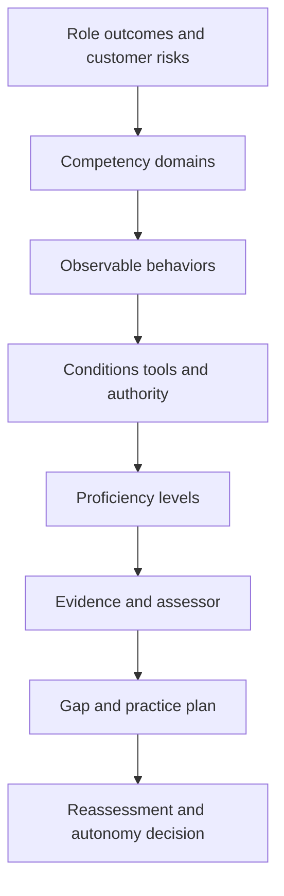

### Competency domains for a SecOps TSM ramp

| Domain | Observable competency | Failure consequence | Evidence |
|---|---|---|---|
| Product/portfolio truth | Explain current verified purpose, boundaries, dependencies, entitlement questions, and support route | Overpromise or wrong design | Teach-back with source ledger |
| Zero trust/security | Explain identity, context, policy, path, controls, threats, residual, and governance | Unsafe recommendation | Scenario and architecture review |
| Security data | Analyze source, grain, mapping, entity, lineage, quality, privacy, and workflow | Misleading analytics | Synthetic data case and query review |
| Exposure/vulnerability | Separate finding, severity, exploitability, exposure, context, priority, treatment, and validation | Wrong risk decision | Risk scenario and mitigation record |
| SecOps/incident | Triage, investigate, coordinate, communicate, mitigate, recover, and review | Delayed or unsafe response | Tabletop and supervised escalation |
| Discovery/design | Elicit objectives, map current state, compare options, record decisions | Product-first or unfit plan | Observed workshop artifact |
| Onboarding/adoption | Build prerequisites, milestones, workflow practice, health, and value hypothesis | Activation without value | Success plan and cohort review |
| Troubleshooting | Form hypotheses, collect evidence, isolate boundaries, escalate well | Random changes and weak Support case | Case review and reverse-shadow |
| Executive communication | Translate evidence into outcome, risk, decision, and next | Surprise or unsupported claim | Written and oral simulation |
| Cross-functional work | Route Sales, Support, Product, services, customer, and governance decisions | Conflicting commitments | Handoff and RACI exercise |
| Security/privacy/ethics | Minimize data, respect authority, control access, use AI responsibly | Customer harm/compliance risk | Scenario stop/route decisions |
| Knowledge/mentoring | Produce maintainable artifacts and coach specific behavior | Expertise remains siloed | Article review and coaching observation |

### Proficiency scale

| Level | Meaning | Allowed work hypothesis | Evidence requirement |
|---|---|---|---|
| 0 - Unexposed | Has not studied or observed | No reliance | Baseline only |
| 1 - Aware | Defines terms and recognizes standard flow | Observe and ask questions | Knowledge check and source use |
| 2 - Guided | Performs standard task with prompts in synthetic/low-risk scope | Assist under direct guidance | Completed exercise with rubric |
| 3 - Supervised | Performs bounded real task; reviewer can intervene | Reverse-shadow/customer support by assignment | Accepted artifact and debrief |
| 4 - Independent | Performs defined scope consistently and escalates limits | Bounded account responsibility | Multiple accepted samples including failure |
| 5 - Coach | Adapts, reviews others, improves system and knowledge | Mentoring/quality role by authority | Calibrated reviews and measured reuse |

Do not require level 5 in every domain. A new TSM may reach independent communication faster than product design. High-consequence areas can require supervised evidence longer.

### Competency statement formula

> Given **[conditions and approved resources]**, the learner will **[observable behavior]** for **[scope]**, meeting **[accuracy, safety, quality, and communication criteria]**, including **[failure/exception behavior]**, as demonstrated by **[evidence]** and accepted by **[authorized assessor]**.

## Baseline and individual development plan

Self-assessment is useful for confidence and prior experience, but it must be paired with observed evidence. A person can be overconfident, underconfident, or unfamiliar with local terminology despite strong adjacent skill.

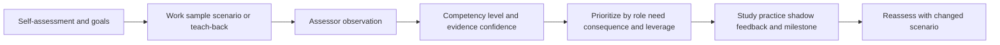

| Baseline source | Strength | Limitation |
|---|---|---|
| Resume/history | Shows prior scope and accomplishments | Titles do not prove current local competency |
| Self-rating | Reveals confidence and perceived gaps | Subjective and culturally influenced |
| Knowledge check | Tests concepts and vocabulary | Recall is not performance |
| Scenario | Tests reasoning and choices | Synthetic context differs from production |
| Work sample | Shows artifact quality | One sample may not show consistency |
| Interview/debrief | Reveals thinking | Explanation can exceed execution |
| Peer/manager evidence | Adds observation | Can reflect bias or limited sample |
| Customer feedback | Shows usefulness and experience | Must be scoped, privacy-safe, and not sole quality truth |

Prioritize gaps using four factors: frequency in role, consequence if wrong, dependency for other skills, and current evidence. Product truth, security/privacy, escalation routing, and honesty boundaries often precede independent account work.

## Mentoring plan

Mentoring needs a contract: purpose, mentee goals, mentor role, confidentiality, cadence, preparation, feedback preference, boundaries, progress evidence, and ending/transition.

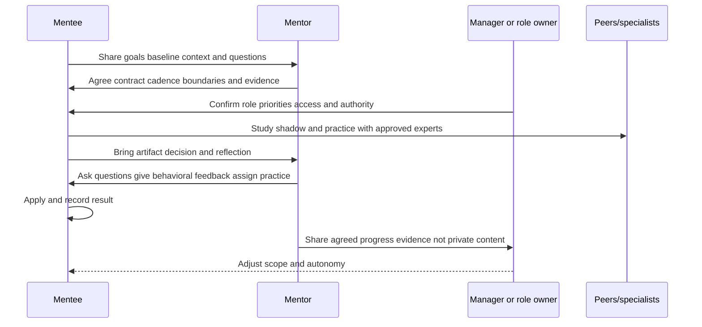

| Mentoring-plan field | Questions |
|---|---|
| Purpose | Which role outcomes and capabilities matter? |
| Goals | What does the mentee want to perform, not merely know? |
| Roles | Mentor, manager, specialist, buddy, peer reviewer, sponsor? |
| Boundaries | What is confidential; what must be escalated or shared? |
| Cadence | What rhythm fits work and avoids dependency? |
| Preparation | What artifact, question, case, or reflection arrives before session? |
| Method | Teaching, coaching, shadowing, review, introduction, challenge? |
| Feedback | Directness, written/oral preference, accessibility, cultural context? |
| Evidence | What demonstrates progress and who accepts it? |
| Opportunity | Which low-risk real work or simulation provides practice? |
| Escalation | What safety, conduct, performance, or policy issue goes to manager/HR/security? |
| Exit | When does cadence reduce, change mentor, or close? |

### Mentoring session structure

1. Review objective and last commitment.
2. Ask the mentee to explain current reasoning before giving an answer.
3. Inspect one artifact, decision, conversation, or case.
4. Identify one or two highest-leverage behaviors.
5. Practice through a changed scenario or rewrite.
6. Agree on next application, evidence, support, and checkpoint.
7. Record only appropriate development notes.

Mentoring should not become shadow management. Managers own performance expectations, assignments, compensation, formal evaluation, and policy. Mentors provide development and perspective within agreed confidentiality boundaries.

## Shadowing and reverse-shadowing

Shadowing should progress from observation to prediction to partial contribution to full bounded performance.

```mermaid
flowchart LR
    PRE[Pre-brief objective context roles and confidentiality] --> OBS[Observe decisions evidence and language]
    OBS --> PRED[Predict next step and reason]
    PRED --> PART[Contribute bounded artifact or segment]
    PART --> REV[Reverse-shadow full bounded task]
    REV --> DEB[Debrief rubric evidence and alternatives]
    DEB --> RETRY[Changed scenario or next live opportunity]
    RETRY --> AUTH[Autonomy decision]
```

| Stage | Learner action | Expert action | Artifact/evidence | Stop/intervene trigger |
|---|---|---|---|---|
| Pre-brief | State learning objective and known context | Explain purpose, audience, sensitivity, role | Observation plan | Access or confidentiality unclear |
| Observe | Note decisions, evidence, alternatives, language | Make reasoning visible where appropriate | Decision notes | Customer/private content mishandled |
| Predict | State expected next step privately | Compare reasoning after event | Prediction/reflection | Prediction would disrupt live meeting |
| Partial | Own agenda segment, note, diagram, or follow-up | Review before customer use | Accepted bounded artifact | Technical/product claim unverified |
| Reverse-shadow | Lead bounded session/task | Observe and intervene if safety/accuracy risk | Rubric and customer/team acceptance | Security, commitment, authority, or impact risk |
| Debrief | Self-assess facts, choices, uncertainty, effect | Give behavioral feedback and alternatives | Improvement plan | Blame/identity judgment |
| Retry | Apply to changed case | Reduce prompts | New evidence | Same critical miss repeats |

### Shadowing observation prompts

- What outcome and decision is this work serving?
- What evidence is treated as fact, inference, or unknown?
- Why did the expert ask that question at that time?
- Which alternative was rejected and why?
- Where did the expert state a boundary or escalate?
- What security/privacy/commercial information was withheld or routed?
- What would cause the plan to change?
- How was customer understanding or acceptance checked?
- What artifact preserves the work after the interaction?

### Plain-English deep-dive 2 - Shadowing without prediction becomes theater

A learner can watch an expert handle ten customer meetings and still miss the reasoning because expert decisions look effortless. Prediction forces a mental model: "I think the next step is to ask for source grain because the counts cannot be compared." The debrief reveals whether the model was accurate.

Sports teams use film this way. Players do not only watch what happened; they pause before the play and identify cues, options, and consequences. Active shadowing converts an expert performance into reusable judgment.

## Coaching mechanics

Use a behavioral coaching loop: **Ask - Observe - Impact - Standard - Practice - Commit - Review**.

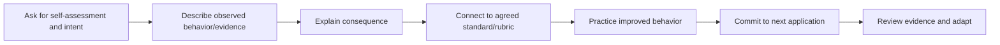

### Feedback examples

| Weak feedback | Stronger behavioral feedback |
|---|---|
| "Be more strategic." | "Your update led with six technical activities. Start with customer impact, decision, and next checkpoint; keep evidence in three supporting bullets." |
| "You need more executive presence." | "When asked for an ETA, you gave a date without dependency evidence. Pause, state what is known, and offer the next diagnostic milestone." |
| "Know the product better." | "Your recommendation relied on a public capability phrase without entitlement or tenant verification. Add the source, applicability checks, and specialist route." |
| "You are too detailed." | "The discovery answer mixed current state, hypothesis, and design. Label each and close with the decision needed." |
| "Great job." | "You preserved two competing hypotheses, used an unaffected cohort, and changed the plan after contradictory evidence. Repeat that structure in the next case." |

### Coaching questions

1. What outcome were you trying to produce?
2. What did you observe, and what did you infer?
3. Which decision was yours, and which required another authority?
4. What alternative did you consider?
5. What evidence would change your view?
6. What customer or team consequence followed?
7. Which part would you repeat, stop, or change?
8. What will you practice next, under which conditions?

Psychological safety does not remove standards. It lets people reveal uncertainty and mistakes early enough to improve. For repeated safety, ethics, harassment, policy, or performance concerns, use the proper management/HR/security route rather than keeping them inside a private mentoring conversation.

## Case reviews

Case review should teach reasoning and improve the system, not simply score the person. Sample routine success, difficult failure, escalation, and near miss.

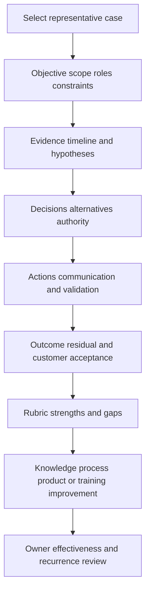

| Case-review section | Questions |
|---|---|
| Selection | Why is this case representative, risky, novel, or reusable? |
| Context | Customer objective, scope, architecture, roles, constraints? |
| Evidence | Sources, timeline, quality, facts, assumptions, unknowns? |
| Reasoning | Hypotheses, discriminating checks, alternatives, tradeoffs? |
| Authority | Who decided configuration, risk, support, roadmap, or customer action? |
| Communication | Was impact, uncertainty, boundary, and next step clear? |
| Action | Was change safe, owned, reversible, and validated? |
| Outcome | What was accepted, residual, and not attributable? |
| Quality | Which rubric criteria were strong or weak? |
| System learning | Article, template, control, product feedback, training, process change? |

Use privacy-safe abstraction for team learning. Remove customer identity, secrets, personal data, exploitable detail, confidential roadmap, commercial terms, and unnecessary timestamps or identifiers. Some cases should not be shared beyond the original team.

## Service-quality model

Quality means producing the right outcome through a safe, accurate, timely, respectful, supportable, and well-documented process. Weighting depends on context; speed never overrides safety and truth.

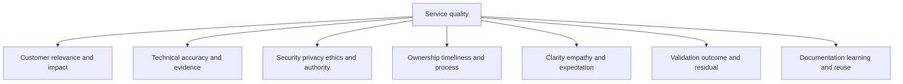

### Service-quality rubric

| Dimension | Needs improvement | Meets standard | Strong/teachable |
|---|---|---|---|
| Customer objective | Activity without outcome | Clear objective, scope, success | Reframes changing context and tradeoffs |
| Discovery/context | Assumes architecture or need | Validates current state, roles, constraints | Finds hidden dependency with efficient questions |
| Technical accuracy | Unsupported claim or random action | Evidence-led, current sources, bounded conclusion | Uses controls/falsification and teaches mechanism |
| Product truth | Marketing or memory treated as fact | Current docs, entitlement, tenant/specialist check | Maintains source ledger and corrects drift |
| Security/privacy | Excess data or unclear authority | Minimizes, controls access, obtains approval | Anticipates threat/ethics and redesigns safely |
| Reasoning | One fixed hypothesis | Competing hypotheses and discriminating checks | Adapts quickly to contradictions |
| Ownership/process | Ambiguous action or handoff | Owner, dependency, date basis, acceptance | Prevents gaps across teams |
| Communication | Jargon, surprise, false certainty | Audience-layered facts, unknowns, next | Delivers bad news and debate with trust |
| Timeliness | Slow or rushed without prioritization | Meets appropriate cadence and escalates blockers | Optimizes decision latency without losing quality |
| Change/mitigation | No baseline, rollback, or authority | Controlled change and read-back | Compares options and residual elegantly |
| Validation | Completion mistaken for outcome | Technical/user/business/control checks | Tests alternate path, durability, recurrence |
| Documentation | Missing, stale, or sensitive sprawl | Concise record, source, access, version | Produces reusable maintained artifact |
| Learning | Same issue repeats | Lesson/action captured | Improves template, control, or community practice |
| Honesty | Overstates experience/result | Facts, assumptions, boundaries explicit | Models correction and calibrated confidence |

### Quality scoring cautions

A rubric can use levels, but avoid a single productivity score that combines case complexity, speed, customer feedback, output count, and quality without context. Use sampled evidence and narrative. A critical escalation may take longer and demonstrate excellent quality; a high article count may include duplicates.

### Plain-English deep-dive 3 - Faster is not always better service

If an engineer closes a case quickly without validating recovery, the speed metric improves while customer risk may increase. If a TSM delays a dangerous recommendation to verify entitlement and rollback, elapsed time increases while decision quality improves.

Emergency medicine uses triage, not a rule that every patient leaves fastest. Measure appropriate decision latency, avoidable wait, evidence quality, safe action, communication, and outcome together. Optimize bottlenecks without rewarding shortcuts.

## Quality assurance and calibration

Use a small representative sample and calibrate reviewers. The purpose is improvement, risk detection, and recognition of strong patterns, not surveillance.

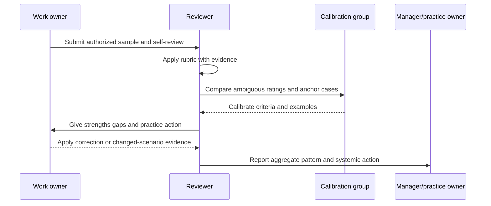

| QA design choice | Questions |
|---|---|
| Purpose | Coaching, readiness, risk control, process improvement, formal performance? |
| Population | Which work types and risk levels are eligible? |
| Sampling | Random, stratified, triggered, new-hire, critical-case, near miss? |
| Rubric | Observable and role-relevant, with anchor examples? |
| Reviewers | Trained, independent enough, conflicts handled? |
| Calibration | How are disagreements and drift reviewed? |
| Feedback | Timely, behavioral, appeal/correction path? |
| Privacy | Minimum customer/employee data, access, retention? |
| Action | Coaching, process, knowledge, tooling, product, staffing? |
| Effectiveness | Does re-sampling show changed behavior or outcome? |

Never infer individual performance from customer satisfaction alone. Feedback can reflect product limitations, incident impact, bias, timing, contract issues, or expectations outside one person's control. Use it as one scoped signal.

## Knowledge as a system

Knowledge must move from case to reusable artifact and back into work. A document without discovery, ownership, review, and usage feedback is storage, not a knowledge system.

```mermaid
flowchart LR
    NEED[Repeated question case or change] --> CAP[Capture candidate learning]
    CAP --> VALID[Validate technical product security and scope]
    VALID --> DESIGN[Define audience task format metadata]
    DESIGN --> REVIEW[Peer/product/privacy review]
    REVIEW --> PUB[Publish in approved repository]
    PUB --> FIND[Search discover and use]
    FIND --> FEED[Feedback outcome and gap]
    FEED --> UPDATE[Update merge or retire]
    UPDATE --> PUB
```

### Knowledge artifact types

| Artifact | Best use | Minimum content |
|---|---|---|
| Concept note | Explain what/why and boundaries | Definitions, analogy, sources, limitations |
| How-to | Repeat a stable authorized task | Preconditions, steps, verification, rollback, escalation |
| Troubleshooting guide | Diagnose variable failures | Symptoms, scope, hypotheses, evidence, decision tree, stop rules |
| Decision record | Preserve why a choice was made | Context, options, authority, rationale, residual, revisit |
| FAQ | Answer repeated bounded questions | Concise answer, source, applicability, escalation |
| Case pattern | Share mechanism without customer leakage | Sanitized context, evidence, reasoning, lesson, non-applicability |
| Checklist | Prevent omission in known process | Ordered controls, owners, acceptance |
| Template | Standardize artifact structure | Required fields, guidance, example labels |
| Video/demo | Show dynamic behavior | Version, transcript/captions, source, limitations, retirement |
| Office-hours note | Capture emerging questions | Validated answer, open items, owners, links |

### Knowledge article contract

| Metadata/section | Purpose |
|---|---|
| Title and one-sentence job | Search and selection |
| Audience and prerequisites | Prevent misuse |
| Scope/non-scope | Bound applicability |
| Product/version/entitlement | Protect current truth |
| Source/review date | Trace and refresh |
| Security/privacy classification | Control access |
| Steps or reasoning | Enable task/decision |
| Evidence/validation | Prove correct result |
| Failure/rollback/escalation | Handle abnormal path |
| Owner/reviewer | Maintain accountability |
| Expiry/review trigger | Prevent staleness |
| Related/superseded content | Reduce duplication |
| Feedback/use evidence | Improve relevance |

### Search and taxonomy

Organize around user jobs and symptoms, not only internal product hierarchy. A user may search "risk score dropped after source outage" rather than the component name. Include controlled tags for domain, task, audience, product/version, symptom, workflow, risk, and content type. Synonyms and redirects reduce dead ends.

### Knowledge validation

Test an article with someone from the intended audience. Can they find it, identify applicability, perform the task or decision safely, validate the result, and recover from a common failure? A technically correct article can still fail discoverability and usability.

## Communities of practice

A community of practice complements formal training and documentation. It scales questions, judgment, patterns, and relationships across account boundaries.

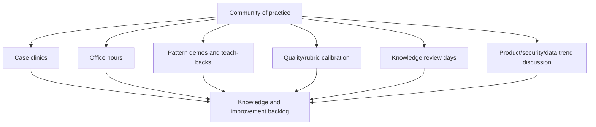

| Community mechanism | Purpose | Control |
|---|---|---|
| Case clinic | Practice reasoning on difficult patterns | Sanitize customer data and avoid blame |
| Office hours | Lower barrier to ask questions | Validate answer before publishing |
| Lightning teach-back | Build concise explanation and peer feedback | Product source and boundary check |
| Calibration session | Align quality standards | Use diverse anchor cases |
| Knowledge review day | Update/merge/retire content | Owners and source dates |
| Expert interview | Capture tacit judgment | Convert to bounded, reviewed artifacts |
| New-hire cohort | Shared ramp and peer support | Do not let cohort rumor replace authority |
| Incident learning forum | Scale systemic lessons | Legal/privacy/security approval |
| Metrics review | Observe adoption/reuse/quality | Avoid individual surveillance/vanity counts |

A healthy community is optional enough for honest questions but integrated enough that learning influences official practice. It should not become a shadow source of product commitments.

## Measuring mentoring, quality, and knowledge contribution

Separate activity, reach, learning, application, quality, reuse, and outcome.

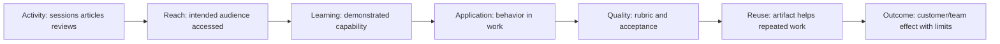

| Layer | Example measure | Interpretation limit |
|---|---|---|
| Activity | Mentoring sessions, reviews, articles created | Volume is not quality |
| Reach | Intended people attended/found content | Access is not learning |
| Learning | Teach-back or changed-scenario rubric | Synthetic performance is not production consistency |
| Application | Observed use of method in bounded work | One sample is not universal |
| Quality | Accepted artifacts, rubric dimensions, correction rate | Reviewer consistency matters |
| Reuse | Distinct qualified uses, search success, linked cases | Clicks do not prove usefulness |
| Efficiency | Reduced avoidable search/rework/decision latency | Work may shift elsewhere |
| Risk | Fewer repeated quality defects or stronger controls | Incident mix and reporting can change |
| Outcome | Customer/team accepted effect | Attribution requires baseline and alternatives |

### Contribution statement formula

> I contributed **[artifact, decision, coaching, or work]** for **[defined audience/scope]**. It was accepted through **[review/customer/team evidence]**, used in **[qualified context]**, and associated with **[observed effect]**. The evidence does not establish **[causal or broader claim]**. Next validation is **[trigger].**

This wording prevents "created ten articles" from becoming "transformed team productivity" without evidence.

### Plain-English deep-dive 4 - Knowledge output is inventory; useful knowledge changes a decision

A library can contain thousands of pages and still fail if users cannot find the right article, determine whether it applies, trust its current source, or recover when the steps fail. Article count measures inventory.

Think of emergency equipment. Owning fifty unlabeled tools does not create readiness. A small, maintained kit with known purpose, inspection date, operating instructions, and practiced use can be more valuable. Measure successful discovery, safe application, accepted result, reuse, and retirement of stale content.

## Explicit 30/60/90-day ramp

The day numbers are planning checkpoints, not universal guarantees. A real manager should adjust them for hiring date, access, product area, customer risk, prior experience, travel, training availability, and business need. The ramp below emphasizes evidence and boundaries over calendar entitlement.

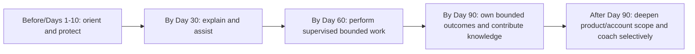

### Before start and Days 1-10 - Orient, secure, and map

**Goal:** Understand role, company/customer boundaries, portfolio vocabulary, people, systems, information handling, and learning plan before acting independently.

| Workstream | Actions | Evidence by checkpoint | Boundary |
|---|---|---|---|
| Role/customer | Confirm role charter, success expectations, account model, decision rights | Manager-approved role map | No customer commitment |
| Security/privacy | Complete required policy and access controls; learn data handling | Required completion plus scenario check | No customer data in unapproved tools |
| Product | Build portfolio map from current official sources | Source ledger and teach-back | Public fact only; no tenant inference |
| Process | Map Sales, Support, Product, services, commercial, legal, and escalation routes | RACI/handoff map | Processes verified locally |
| Tools/access | Obtain least-privilege approved access and understand systems of record | Access inventory and acceptable-use confirmation | No access expansion by curiosity |
| Relationships | Meet manager, buddy, product specialist, Support liaison, account roles | Stakeholder map | Introductions do not create authority |
| Baseline | Complete competency self-assessment and observed scenarios | Evidence-based gap matrix | Self-rating not readiness |
| Plan | Select first product/workflow and shadow sequence | Approved learning backlog | Avoid trying to master entire portfolio |

### By Day 30 - Explain accurately and assist safely

**Goal:** Explain core customer and product context from current sources, navigate processes, produce supervised artifacts, and contribute to low-risk work.

| Competency | Target behavior | Evidence | Measurable contribution hypothesis |
|---|---|---|---|
| Portfolio | Explain bounded purpose, data/traffic/workflow role, prerequisites, and unknowns | Two teach-backs with source review | Correct internal/customer-meeting prep sections |
| Customer lifecycle | Explain discovery, onboarding, adoption, health, review, escalation | Synthetic account map | Reusable checklist accepted by buddy |
| Product truth | Distinguish public fact, customer fact, assumption, unknown | Claim review with no unsupported statements | Source ledger used in one preparation task |
| Technical | Map one user/data/security workflow and failure boundaries | Reviewed whiteboard | Improve one evidence request or case summary |
| Communication | Draft executive and technical updates | Rubric-reviewed simulations | Produce supervised meeting notes/read-back |
| Shadowing | Observe discovery, account review, Support case, product session | Observation/prediction/debrief records | Ask targeted questions and capture approved actions |
| Knowledge | Correct or create one low-risk internal artifact | Owner-reviewed draft | Accepted update, not article count alone |
| Honesty | State Microsoft transfer and Zscaler learning boundary | Manager/buddy feedback | No inflated customer/product claims |

**Day-30 gate:** The learner can explain common concepts and processes accurately with sources, protect data and boundaries, assist with preparation and documentation, and identify when to ask for help. The gate does not imply independent account ownership.

### Days 31-60 - Perform supervised bounded work

**Goal:** Move from explanation to supervised performance in selected workflows, including abnormal cases and customer-facing contribution where assigned.

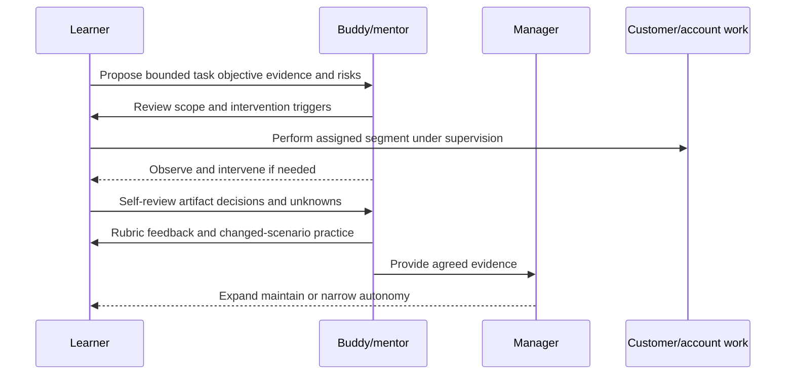

| Competency | Target behavior | Evidence | Measurable contribution hypothesis |
|---|---|---|---|
| Discovery | Lead a bounded agenda segment and produce read-back | Reverse-shadow rubric and accepted notes | Reduce missing prerequisites in assigned slice |
| Health/adoption | Analyze one defined metric chain with denominator/quality | Reviewed interpretation card | Identify one validated blocker or unknown |
| Troubleshooting | Build hypothesis/evidence plan and Support packet | Case simulation plus supervised case | Improve case-actionability quality |
| Workshop | Deliver a bounded concept/demo/exercise with current facts | Rehearsal and supervised delivery | Learner/customer can teach back objective |
| Executive writing | Draft outcome-risk-decision update | Account lead approval before use | Concise accurate customer communication |
| Cross-functional | Complete one handoff with roles and boundaries | Handoff acceptance | Reduce context loss in sampled handoff |
| Knowledge | Publish one reviewed, maintained artifact or retire stale content | Owner, source date, usability test | Qualified reuse or search correction |
| Quality | Self-review two artifacts using rubric | Calibration discussion | Fewer repeated high-risk omissions |

**Day-60 gate:** The learner can perform selected standard tasks under supervision, handle a changed scenario, produce accepted artifacts, and escalate limits. Any customer-facing independence remains manager- and account-specific.

### Days 61-90 - Own bounded outcomes and scale learning

**Goal:** Demonstrate consistent independent performance in explicitly assigned scope, contribute to a customer/team outcome without overclaiming, and improve one reusable system.

| Competency | Target behavior | Evidence | Measurable contribution hypothesis |
|---|---|---|---|
| Account slice | Own an assigned technical-success workstream with manager/account oversight | Current plan, decisions, actions, accepted updates | Milestones/risks are visible and owned |
| Technical judgment | Diagnose or coordinate one complex bounded issue | Case review including contradiction/failure | Correct routing, mitigation, or evidence improvement |
| Adoption/value | Form a value hypothesis and measure workflow evidence | Customer/account-owner accepted method | Better decision, not guaranteed value |
| Business review | Prepare and present an assigned QBR/EBR segment | Approved storyboard and feedback | Decision or alignment achieved in bounded topic |
| Escalation | Participate in or lead assigned escalation role | RACI, timeline, update, recovery review | Accurate cadence and handoff in assigned role |
| Mentoring | Help a peer/newer learner on one established skill | Observed coaching and feedback | Learner improves on changed scenario |
| Knowledge | Improve template/article/community based on recurring evidence | Review, adoption, feedback, retirement | Qualified reuse and fewer known omissions |
| Quality | Review a calibrated sample and implement one system action | QA record and effectiveness checkpoint | Improvement observed in resample |

**Day-90 gate:** The learner demonstrates bounded independent contribution, product and customer honesty, safe escalation, accepted artifacts, and a habit of turning work into reusable learning. It does not guarantee full portfolio mastery, strategic-account ownership, certification, quota/commercial result, or customer outcome.

### 30/60/90 evidence scorecard

| Evidence class | By 30 days | By 60 days | By 90 days |
|---|---|---|---|
| Knowledge | Explain with current sources | Apply in changed scenario | Adapt within assigned scope |
| Observation | Active shadow records | Reverse-shadow selected tasks | Peer/mentor observation of consistency |
| Artifact | Supervised drafts | Customer/account-ready artifacts approved before use | Accepted independent bounded artifacts |
| Judgment | Identifies boundaries/unknowns | Selects checks/options with supervision | Escalates and decides within assigned authority |
| Communication | Simulated executive/operator messages | Supervised customer segment | Bounded independent segment with accepted read-back |
| Product truth | Source ledger and qualifiers | Entitlement/tenant checks through owner | Correct current guidance in assigned scope |
| Quality | Understands rubric | Self-review and calibration | Sustained sample quality and correction |
| Knowledge scale | One correction/draft | One maintained published artifact | Qualified reuse/community contribution |
| Customer/team effect | No required outcome claim | Contribution hypothesis and baseline | Accepted bounded effect with limits |

### Ramp risks and interventions

| Risk | Early signal | Intervention |
|---|---|---|
| Breadth overload | Many topics, shallow source use | Narrow to one customer workflow/product path |
| Passive shadowing | Notes are agenda summaries | Add predictions and decision debrief |
| Access before readiness | Tool exploration without purpose | Least privilege and supervised task |
| Confidence exceeds evidence | Product claims lack sources | Source ledger and teach-back correction |
| Underconfidence hides strength | Strong adjacent reasoning, hesitant terminology | Map transfer explicitly and practice local language |
| Mentor dependency | Learner seeks answer before forming view | Require proposed hypothesis/options first |
| No customer opportunity | Simulations accumulate without real feedback | Assign safe internal/account artifact or reverse-shadow |
| Quality feedback arrives late | Same omission repeats | Short review cycle and one focus behavior |
| Output vanity | Article/session counts rise without use | Measure accepted reuse and retire weak content |
| Urgency skips boundaries | New hire asked to promise or change production | Escalate scope; pair with authorized owner |

## Security, privacy, ethics, and fairness

| Risk | Control |
|---|---|
| Customer data in training | Use synthetic/minimized data; approved access and retention |
| Shadowing consent/access | Confirm attendee purpose and customer/internal policy |
| Evaluation surveillance | Collect minimum evidence; purpose-limit; provide fair review path |
| Bias in opportunity | Track access to meaningful shadow/reverse-shadow opportunities | Rotate and document criteria |
| Bias in rubric | Use observable criteria, diverse anchor cases, calibration, appeal |
| Mentoring confidentiality | Contract what stays private and what safety/performance issues must route |
| Knowledge leakage | Sanitize customer, security, roadmap, commercial, and personal information |
| AI knowledge tools | Approved data, prompt-injection awareness, grounding, citations, human review |
| Production practice | Explicit authority, least privilege, supervision, stop/rollback |
| Certification claims | State exact current credential and scope only | Do not imply production competence automatically |
| Attribution | Credit contributors and source owners | Avoid claiming team/customer results personally |

Fair ramps account for accessibility, time zone, prior experience, language, caregiving constraints, and opportunity availability without lowering essential safety or honesty standards. Adjust the route and support, then assess the same observable outcome where appropriate.

## Failure modes and misconceptions

| Failure or misconception | Why it fails | Repair |
|---|---|---|
| Training completion means competency | Recall and attendance are weak performance evidence | Scenario, reverse-shadow, failure handling |
| Certification means full readiness | Scope may be bounded and operational judgment untested | Pair with applied evidence |
| Prior expertise transfers automatically | Domain semantics/processes differ | Map transfer and local gaps explicitly |
| New hire should learn everything first | Breadth delays useful practice | Choose one end-to-end workflow |
| Day 90 guarantees full independence | Calendar does not create proficiency | Use evidence gates and assigned scope |
| Shadowing means join calls | Passive attendance hides reasoning | Pre-brief, prediction, debrief, artifact |
| Reverse-shadow is a test to catch failure | Fear reduces questions and safety | Define intervention triggers and coaching |
| Mentor should give answers | Mentee becomes dependent | Ask for reasoning and options first |
| Mentoring is performance management | Roles/confidentiality become unsafe | Clarify manager versus mentor |
| Feedback should be general to be kind | Learner cannot act on it | Behavior, impact, standard, practice |
| Quality equals speed | Shortcuts can increase risk/rework | Multidimensional rubric |
| Customer rating equals employee quality | Many external factors and biases apply | Use one scoped signal among evidence |
| Rubric makes ratings objective | Criteria still require interpretation | Calibration and anchor examples |
| More reviews mean more quality | Review can add delay without learning | Risk-based sample and effectiveness |
| Write an article after every case | Duplicates and stale sprawl grow | Search, update, merge, or retire first |
| Publishing completes knowledge work | Discovery/use/feedback remain untested | Lifecycle and usability test |
| Community answers are authoritative | Peer memory can be stale | Validate through official owner/source |
| Article count measures contribution | Inventory can rise while usefulness falls | Qualified reuse and effect |
| AI can draft final guidance autonomously | It may leak, hallucinate, or miss changed context | Approved, grounded, reviewed assistance |
| Synthetic success is customer evidence | Conditions and authority differ | Label practice and seek supervised real evidence |

## Troubleshooting mentoring, quality, and knowledge systems

| Symptom | Plausible causes | Discriminating check | Repair |
|---|---|---|---|
| Mentee makes little progress | Goal vague, no practice, wrong mentor, no opportunity | Inspect competency and weekly evidence | Narrow behavior and assign deliberate practice |
| Mentee waits for answers | Mentor overfunctions or safety unclear | Ask learner for first hypothesis/options | Scaffold then reduce prompts |
| Shadowing feels repetitive | No observation objective or increasing responsibility | Compare notes to competency gaps | Add prediction/partial ownership |
| Reverse-shadow creates anxiety | Stakes too high, rubric hidden, intervention unclear | Ask learner to explain risk perception | Lower consequence and publish criteria |
| Feedback is disputed | Evidence vague, standard unclear, bias, context missing | Review exact artifact and anchor example | Reassess/calibrate and correct |
| Reviewers score differently | Rubric ambiguity or drift | Double-score sample | Calibrate and refine descriptors |
| Quality score rises, failures recur | Gaming, weak sample, wrong dimensions | Compare recurrence and near misses | Change sampling/guardrails |
| Articles duplicate | Search/taxonomy weak, publish incentive | Search by user job and synonyms | Merge and redirect |
| Articles are stale | No owner/review trigger/source link | Sample version-sensitive content | Update or retire |
| Knowledge is not used | Hard to find, too long, wrong audience, low trust | Observe one retrieval task | Rewrite metadata/format and test |
| Community repeats rumors | Answers not source-grounded | Trace claim to owner/source | Add validation and correction process |
| Ramp has activities but no capability | Checklist optimized for completion | Map each item to observed behavior | Replace with evidence gates |
| New hire overclaims contribution | Attribution and evidence not coached | Review statement against sources | Use bounded contribution formula |

## Decision trees

### Decision tree 1 - Is someone ready for more autonomy?

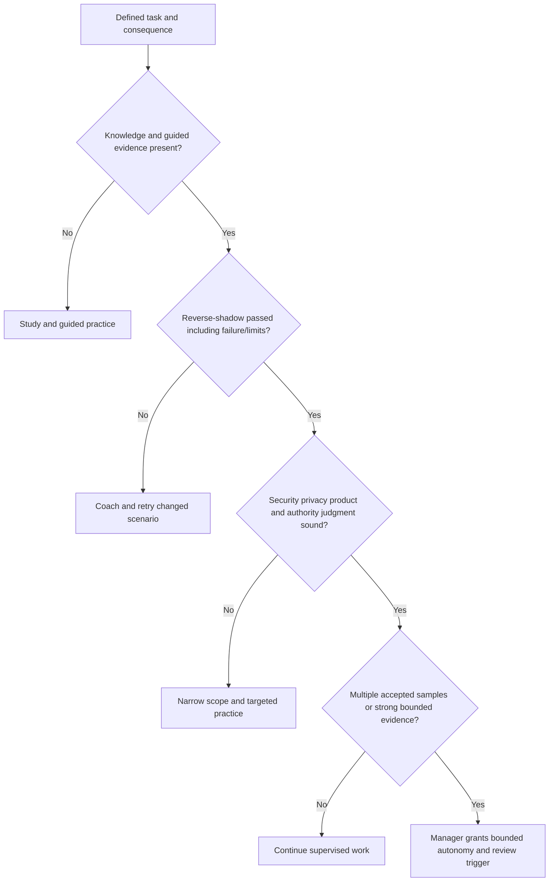

### Decision tree 2 - Should this become a knowledge artifact?

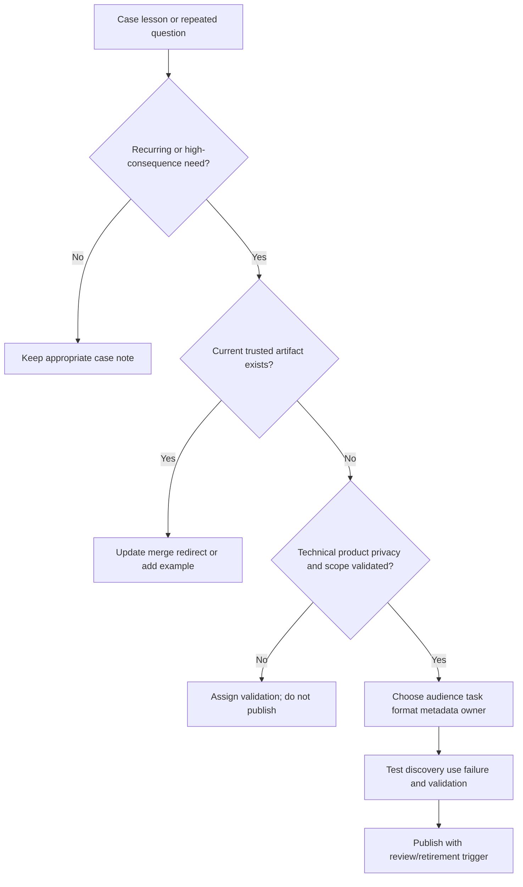

### Decision tree 3 - Does a contribution claim hold?

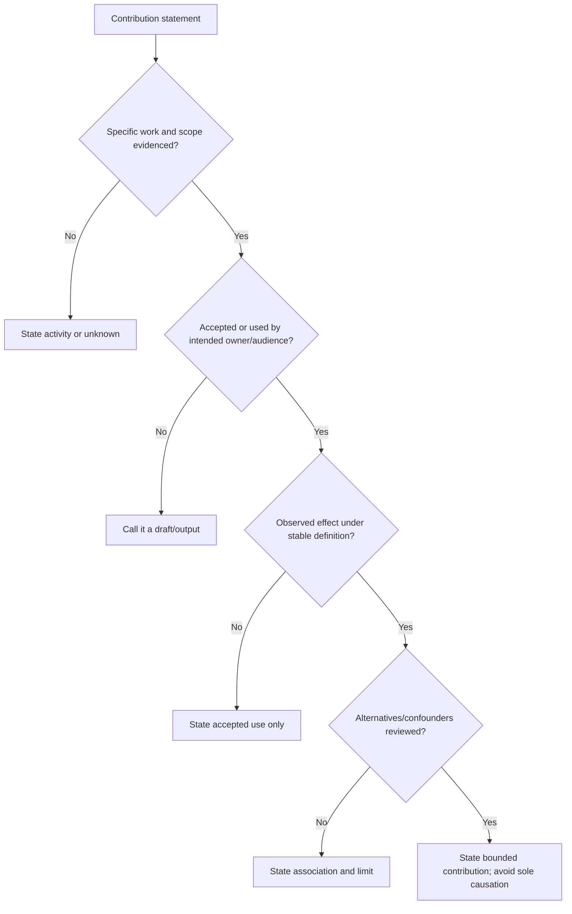

## Explicitly fictional and synthetic NMH scenarios

All content in this section is fictional and synthetic. It is practice material, not a customer account, employee performance record, mentoring outcome, product capability, case, service-quality result, knowledge reuse, 30/60/90 achievement, or Zscaler result. Dates in this section, including **2026-10-29**, **2026-11-19**, **2026-12-10**, and **2027-01-14**, are synthetic scenario dates later than the source snapshot and do not imply later research. Every later date in this section, including the 2027 date, is explicitly fictional and synthetic.

### Scenario 1 - Passive shadowing

On synthetic 2026-10-29, a fictional learner attends three NMH calls but cannot explain why the expert changed the discovery sequence. The mentor adds pre-call predictions, a decision log, and debrief. The learner later owns one bounded read-back under observation. The scenario does not establish real competency or customer delivery.

### Scenario 2 - Speed versus quality

On synthetic 2026-11-19, a fictional case closes quickly after a reported configuration success. Review finds no target read-back or business validation. The rubric rates timeliness acceptable but validation weak. Coaching focuses on postconditions, and a changed-scenario retry is required before autonomy expands. No real Zscaler behavior is asserted.

### Scenario 3 - Stale knowledge article

On synthetic 2026-12-10, an NMH exercise uses a fictional article whose product assumption is outdated. The learner stops rather than following it into an unsafe action, verifies current sources through the designated owner, and marks the article for retirement. The quality system treats the safe stop as evidence of judgment, not failure to follow instructions.

### Scenario 4 - Day-90 contribution

On synthetic 2027-01-14, a fictional learner completes a bounded workflow review, identifies a data-quality gate, drafts an accepted decision record, and improves a checklist. The statement is: "The artifacts were accepted in the synthetic exercise and associated with a clearer decision." It does not claim customer value, production adoption, or Zscaler expertise. Every date and result remains fictional and synthetic.

## Reusable artifact kit

These templates are general practice. Current role expectations, manager decisions, customer policy, official product sources, security/privacy rules, and accepted performance evidence govern real use.

### Artifact 1 - Mentoring plan

| Field | Entry |
|---|---|
| Mentee goals and role outcomes | |
| Baseline strengths/evidence/gaps | |
| Mentor role and fit | |
| Manager/specialist/buddy roles | |
| Confidentiality and escalation boundaries | |
| Cadence/duration/exit | |
| Session preparation | |
| Teaching/coaching/shadowing methods | |
| Feedback/accessibility preferences | |
| Practice opportunities | |
| Evidence and assessor | |
| Progress review and autonomy route | |

### Artifact 2 - Competency matrix

| Domain | Competency statement | Consequence if weak | Current level/evidence | Target level | Learning/practice | Shadow/reverse-shadow | Assessor | Gate/review |
|---|---|---|---|---|---|---|---|---|---|
| Product truth | | | | | | | | |
| Security/zero trust | | | | | | | | |
| Security data | | | | | | | | |
| Exposure/vulnerability | | | | | | | | |
| SecOps/escalation | | | | | | | | |
| Discovery/design | | | | | | | | |
| Adoption/value | | | | | | | | |
| Troubleshooting | | | | | | | | |
| Executive communication | | | | | | | | |
| Cross-functional/governance | | | | | | | | |
| Security/privacy/ethics | | | | | | | | |
| Knowledge/mentoring | | | | | | | | |

### Artifact 3 - Shadow and reverse-shadow plan

| Task/session | Learning objective | Sensitivity/access | Learner stage/action | Expert role/intervention trigger | Pre-brief questions | Artifact/evidence | Debrief | Autonomy decision |
|---|---|---|---|---|---|---|---|---|
| | | | | | | | | |

### Artifact 4 - Coaching record

| Field | Entry |
|---|---|
| Objective/context | |
| Learner self-assessment/intent | |
| Observed behavior/evidence | |
| Consequence/impact | |
| Rubric/standard | |
| Strength to repeat | |
| One or two improvement behaviors | |
| Practice/rewrite/changed scenario | |
| Next application and support | |
| Evidence/checkpoint | |
| Appropriate confidentiality | |

### Artifact 5 - Case-review template

| Section | Evidence/questions |
|---|---|
| Selection and learning value | |
| Customer objective/scope/constraints | |
| Architecture/data/workflow context | |
| Timeline and evidence quality | |
| Facts/assumptions/unknowns | |
| Hypotheses/checks/alternatives | |
| Decisions/authority/tradeoffs | |
| Actions/communication/hand-offs | |
| Validation/outcome/residual | |
| Rubric strengths/gaps | |
| System/knowledge/product/process learning | |
| Action/effectiveness/recurrence | |

### Artifact 6 - Service-quality rubric

| Dimension | Weight/critical gate | Evidence | Needs improvement | Meets | Strong/teachable | Reviewer/rating | Coaching/system action |
|---|---|---|---|---|---|---|---|
| Customer objective/context | | | | | | | |
| Technical accuracy/evidence | | | | | | | |
| Product truth | | | | | | | |
| Security/privacy/authority | | | | | | | |
| Reasoning/troubleshooting | | | | | | | |
| Ownership/process/timeliness | | | | | | | |
| Communication/trust | | | | | | | |
| Change/mitigation | | | | | | | |
| Validation/residual | | | | | | | |
| Documentation/learning | | | | | | | |
| Honesty/attribution | | | | | | | |

### Artifact 7 - Quality calibration record

| Sample | Reviewers | Rating differences | Evidence/criterion ambiguity | Agreed anchor | Rubric change | Feedback correction | Recheck date |
|---|---|---|---|---|---|---|---|
| | | | | | | | |

### Artifact 8 - Knowledge-system design

| Component | Decision/design |
|---|---|
| Audiences and user jobs | |
| Repositories/systems of record | |
| Content types/templates | |
| Taxonomy/tags/synonyms | |
| Search/discovery | |
| Source/product/version policy | |
| Security/privacy/access | |
| Review/publish authority | |
| Owner/review/expiry triggers | |
| Feedback/use evidence | |
| Update/merge/redirect/retire | |
| AI assistance controls | |
| Quality and contribution metrics | |

### Artifact 9 - Knowledge article template

| Field | Entry |
|---|---|
| Title and one-sentence job | |
| Audience/prerequisites | |
| Scope/non-scope | |
| Product/version/entitlement applicability | |
| Official sources/review date | |
| Security/privacy classification | |
| Concept/analogy | |
| Steps or reasoning | |
| Expected evidence/validation | |
| Common failures/misconceptions | |
| Stop/rollback/escalation | |
| Owner/reviewer | |
| Review/expiry trigger | |
| Related/superseded/redirect | |
| Feedback/use evidence | |

### Artifact 10 - Community-of-practice charter

| Field | Entry |
|---|---|
| Domain/purpose | |
| Members/roles | |
| Cadence/formats | |
| Case/privacy/sanitization rules | |
| Product/source validation | |
| Psychological safety/conduct | |
| Decision/authority boundary | |
| Knowledge/improvement outputs | |
| Owner/facilitator | |
| Participation/accessibility | |
| Measures and review | |
| Retirement/redesign trigger | |

### Artifact 11 - Explicit 30/60/90 ramp plan

| Period | Outcome | Competencies | Learning/shadow/practice | Bounded contribution | Evidence/acceptor | Access/authority | Risks/support | Gate/next scope |
|---|---|---|---|---|---|---|---|---|
| Days 1-10 | Orient, secure, map | | | | | | | |
| By Day 30 | Explain and assist safely | | | | | | | |
| By Day 60 | Perform supervised bounded work | | | | | | | |
| By Day 90 | Own bounded work and scale learning | | | | | | | |
| After Day 90 | Deepen and broaden by evidence | | | | | | | |

### Artifact 12 - Measurable contribution scorecard

| Contribution | Audience/scope | Baseline/problem | Activity/output | Acceptance evidence | Qualified use/reuse | Quality evidence | Observed effect | Alternatives/limits | Next validation |
|---|---|---|---|---|---|---|---|---|---|
| | | | | | | | | | |

### Artifact 13 - Personal evidence portfolio

| Competency | Artifact/example | Real/synthetic label | Personal contribution | Reviewer/acceptance | Evidence date/source | What it proves | What it does not prove | Next gap |
|---|---|---|---|---|---|---|---|---|
| | | | | | | | | |

## Exercises

### Exercise 1 - Build the competency matrix

Choose six high-consequence TSM competencies and write actor, behavior, conditions, criteria, failure handling, evidence, and assessor. Baseline Arti honestly using factual Microsoft transfer, synthetic practice, and explicit Zscaler gaps. Set target levels by day 30, 60, and 90 without making calendar equal readiness.

### Exercise 2 - Design active shadowing

Create a shadow plan for discovery, Support escalation, and executive review. Add pre-brief, predictions, observation prompts, partial contribution, confidentiality, intervention triggers, artifact, debrief, changed scenario, and autonomy decision.

### Exercise 3 - Practice behavioral coaching

Rewrite ten vague feedback statements into observed behavior, consequence, agreed standard, practice, and checkpoint. Include one strength to repeat. Role-play a learner who disagrees and use evidence plus calibration rather than status.

### Exercise 4 - Review a case for service quality

Create a synthetic case that is fast and technically plausible but weak on data privacy, entitlement verification, rollback, executive expectation, and recovery validation. Score it by dimension, identify critical gates, coach two behaviors, and propose two systemic improvements.

### Exercise 5 - Build a knowledge lifecycle

Take five fictional case lessons. Decide whether to create, update, merge, redirect, retire, or keep as a case note. For one article, write audience, job, scope, sources, validation, failure, owner, review trigger, taxonomy, and usability test.

### Exercise 6 - Facilitate a community clinic

Design a sixty-minute privacy-safe case clinic with one synthetic escalation. Include objective, roles, evidence classes, participant prediction, decision points, rubric calibration, knowledge output, source verification, and follow-up. Avoid turning peer opinion into product authority.

### Exercise 7 - Write the 30/60/90 plan

Use Artifact 11 to create concrete outcomes, evidence gates, access progression, supervised work, bounded contribution, risks, and support. Add at least one product-truth, security/privacy, technical, customer, communication, and knowledge goal per stage. State what day 90 does not prove.

### Exercise 8 - Candidate honesty rehearsal

Answer: "How would you ramp and contribute in your first ninety days?" Lead with Microsoft escalation and mentoring strengths, name Zscaler/SecOps gaps, describe evidence-led progression, and offer bounded contribution. Do not promise full mastery, strategic-account results, or customer value by a calendar date.

## Customer and manager discovery questions

1. Which role outcomes, customer risks, product areas, and account responsibilities matter most in the first ninety days?
2. What official role charter, competency model, quality standard, security/privacy policy, and manager expectation govern?
3. Which Microsoft skills transfer directly, which transfer with adaptation, and which Zscaler/SecOps capabilities require new evidence?
4. What observable behavior, conditions, criteria, failure handling, evidence, and assessor define each competency?
5. Which competencies are high-frequency, high-consequence, prerequisite, or high-leverage?
6. What least-privilege access is needed at each stage, and what work remains synthetic/read-only/supervised?
7. Which mentor, buddy, specialist, Support liaison, account role, and manager own different development needs?
8. What mentoring confidentiality and escalation boundaries apply?
9. Which shadow opportunities reveal decisions, and what prediction/artifact/debrief will make them active?
10. What reverse-shadow task is low enough consequence and rich enough to test judgment?
11. Which intervention triggers require an expert to stop or take over?
12. What service-quality dimensions and critical gates apply to discovery, troubleshooting, escalation, review, and follow-up?
13. How will reviewers calibrate and how can evidence or ratings be corrected?
14. Which customer/employee data must be removed or restricted in mentoring, review, and community learning?
15. Which repeated cases or questions justify knowledge, and what existing artifact should be updated or retired first?
16. How will users discover, trust, validate, fail safely, and provide feedback on knowledge?
17. Which community mechanisms scale tacit judgment while preserving product/source authority?
18. What activity, reach, learning, application, quality, reuse, and outcome evidence is appropriate?
19. What bounded contribution is useful by days 30, 60, and 90, and who accepts it?
20. What evidence expands autonomy, what evidence narrows it, and what does the 90-day checkpoint explicitly not prove?

## Official Source Anchors

Research/source snapshot and source review date: **2026-08-24**.

The Zscaler sources support dated public product, education, support, and security-operations positioning only. NIST sources support general cybersecurity work-role, knowledge/skill, workforce, risk, incident, and zero-trust concepts. They do not establish an employee's competency, completion, certification, access, account assignment, performance, authority, customer contribution, or outcome. Current employer role standards, manager judgment, official training/documentation, product specialists, supervised work, customer acceptance, and security/privacy policy govern a real ramp.

| Source | URL | Used for | Boundary |
|---|---|---|---|
| Zscaler Academy | https://www.zscaler.com/zscaler-academy | Public education and certification-resource context | Current catalog, access, completion, credential, and proficiency require verification |
| Zscaler Zero Trust Exchange | https://www.zscaler.com/products-and-solutions/zero-trust-exchange-zte | Public platform and zero-trust positioning | No employee competency, customer design, entitlement, or outcome inferred |
| Zscaler Agentic Security Operations | https://www.zscaler.com/products-and-solutions/security-operations | Public SecOps portfolio and workflow positioning | No employee access, agent use, customer workflow, or result inferred |
| Zscaler Data Fabric for Security | https://www.zscaler.com/products-and-solutions/data-fabric | Public security-data and workflow positioning | No connector, schema, tenant skill, or implementation inferred |
| Zscaler Unified Vulnerability Management | https://www.zscaler.com/products-and-solutions/unified-vulnerability-management | Public vulnerability aggregation and prioritization positioning | No scoring, workflow, or production competency inferred |
| Zscaler Support | https://help.zscaler.com/submit-ticket | Public support-route context | Current process, access, entitlement, role, and response require verification |
| NIST NICE Workforce Framework for Cybersecurity | https://www.nist.gov/itl/applied-cybersecurity/nice/nice-framework-resource-center | General work-role, task, knowledge, and skill framing | Does not define employer-specific competency or readiness |
| NIST Cybersecurity Framework 2.0 | https://www.nist.gov/cyberframework | General cybersecurity outcomes and improvement context | Voluntary and implementation-neutral |
| NIST SP 800-61 Rev. 3 | https://csrc.nist.gov/pubs/sp/800/61/r3/final | General cybersecurity incident-response, recovery, and improvement context | Does not establish employee incident authority |
| NIST SP 800-207 Zero Trust Architecture | https://csrc.nist.gov/pubs/sp/800/207/final | Vendor-neutral zero-trust concepts | Not product training or customer implementation proof |

## Likely Interview Questions

### Q1. How do you define and develop competency?

**Model answer:** I define competency as observable knowledge, skill, judgment, and behavior under specified conditions. Each statement includes the task, scope, resources, accuracy, safety, communication, failure handling, evidence, and assessor. I baseline with self-assessment plus scenarios or work samples, prioritize by role frequency and consequence, and progress through study, guided practice, active shadowing, reverse-shadowing, changed scenarios, and bounded independent work. Calendar time, attendance, and confidence do not substitute for evidence.

### Q2. What makes mentoring effective?

**Model answer:** I contract goals, roles, confidentiality, cadence, preparation, feedback preferences, evidence, and exit. The mentee brings a real artifact or decision and explains their reasoning before I answer. I ask questions, identify one or two behavioral improvements, practice them, and agree on the next application and checkpoint. I keep mentoring distinct from formal management and route safety, conduct, policy, or performance issues appropriately. The goal is increasing judgment and independence, not dependence on the mentor.

### Q3. How do shadowing and reverse-shadowing work?

**Model answer:** Before shadowing, I define the learning objective, context, sensitivity, and observation prompts. The learner predicts decisions and captures evidence, alternatives, and boundaries rather than only agenda notes. They then own a bounded segment or artifact. In reverse-shadowing, the learner performs while an expert observes with explicit intervention triggers. Debrief uses a rubric, self-assessment, alternatives, and a changed scenario. Multiple accepted samples support a manager's bounded autonomy decision.

### Q4. How would you assess service quality?

**Model answer:** I use a multidimensional rubric covering customer objective/context, technical evidence, product truth, security/privacy/authority, reasoning, ownership/timeliness, communication, change safety, validation/residual, documentation/learning, and honesty. I use risk-based representative samples and reviewer calibration with anchor cases. Speed and customer sentiment are scoped signals, not the whole score. Feedback is behavioral, and systemic patterns produce process, knowledge, tooling, or staffing actions with effectiveness checks.

### Q5. How do you turn cases into scalable knowledge?

**Model answer:** I first ask whether the need is recurring or high consequence and whether a trusted artifact already exists. I validate technical/product/privacy scope, define audience and job, choose the format, add sources, applicability, validation, failure, escalation, metadata, owner, and review trigger, then test discovery and use with the intended audience. Feedback drives update, merge, redirect, or retirement. I measure qualified reuse and effect, not article count, and sanitize all customer-sensitive content.

### Q6. What role do communities of practice play?

**Model answer:** They scale tacit judgment through case clinics, office hours, teach-backs, calibration, expert interviews, and knowledge review. They complement formal training and repositories. I set privacy/sanitization rules, psychological-safety norms, accessibility, source validation, and authority boundaries so peer discussion does not become unofficial product commitment. Every useful session should feed a maintained artifact or improvement backlog, and the community itself should be reviewed for value.

### Q7. What is your 30/60/90-day plan?

**Model answer:** By day 30 I would orient securely, map role/process/product context, explain core concepts with current sources, shadow actively, and produce supervised low-risk artifacts. By day 60 I would reverse-shadow selected discovery, troubleshooting, workshop, health, and communication tasks and contribute customer-facing work only with assigned supervision. By day 90 I would own an explicitly bounded workstream, demonstrate judgment in normal and abnormal cases, contribute one maintained knowledge or quality improvement, and present accepted evidence. Manager gates, account risk, access, and evidence override the calendar.

### Q8. How does Arti's background support mentoring and a fast but honest ramp?

**Model answer:** She brings direct Microsoft mentoring and enterprise escalation experience, deep practice in evidence-led troubleshooting, customer communication, networking/traces, and analytical reporting. That supports coaching, case review, service quality, and learning complex systems. She should not convert those strengths into claims of production Zscaler expertise, TSM account ownership, or customer outcomes. Her ramp should explicitly map transfer, use official sources and specialists, practice synthetically, reverse-shadow real work, and earn bounded autonomy through accepted evidence.

## 30-Second Memory Hooks

| Concept | Memory hook |
|---|---|
| Competency | Knowledge plus skill plus judgment under conditions |
| Proficiency | Level of consistent safe performance |
| Baseline | Self-view plus observed evidence |
| Mentoring | Broader guidance toward independence |
| Coaching | One behavior, evidence, practice, checkpoint |
| Shadowing | Observe decisions, predict, debrief |
| Reverse-shadow | Learner performs; expert can intervene |
| Feedback | Behavior, consequence, standard, practice |
| Case review | Context, evidence, decisions, outcome, system lesson |
| Service quality | Relevant, accurate, safe, timely, clear, validated |
| Calibration | Review the reviewers |
| Knowledge | Audience, job, source, owner, review, retirement |
| Community | Scale tacit judgment without shadow authority |
| Contribution | Accepted use and bounded effect, not output count |
| Day 30 | Explain and assist safely |
| Day 60 | Perform supervised bounded work |
| Day 90 | Own bounded work and scale one lesson |
| Autonomy | Earned by evidence and manager authority, not calendar |
| Arti bridge | Mentoring/escalation strengths transfer; Zscaler expertise must be earned |

## Completion Checklist

- [ ] I can explain knowledge, skill, judgment, competency, proficiency, mentoring, coaching, shadowing, rubric, and knowledge system from zero.
- [ ] I can define competency with behavior, conditions, criteria, failure handling, evidence, and assessor.
- [ ] I can baseline prior strength, confidence, work samples, scenarios, observation, and evidence without title-based assumptions.
- [ ] I can create a mentoring contract with goals, roles, confidentiality, cadence, preparation, evidence, escalation, and exit.
- [ ] I can make shadowing active through pre-brief, prediction, bounded contribution, artifact, and debrief.
- [ ] I can use reverse-shadowing with clear intervention triggers before recommending autonomy.
- [ ] I can coach using self-assessment, observed behavior, consequence, standard, practice, commitment, and review.
- [ ] I can review cases for evidence, reasoning, authority, communication, validation, residual, and system learning.
- [ ] I can apply a multidimensional service-quality rubric without treating speed or sentiment as the whole score.
- [ ] I can calibrate reviewers, use anchor cases, correct ratings, and convert patterns into systemic action.
- [ ] I can decide whether to create, update, merge, redirect, retire, or retain a case note.
- [ ] I can design knowledge for audience, task, search, applicability, source, validation, failure, owner, review, and retirement.
- [ ] I can run privacy-safe communities that scale tacit judgment without creating unofficial product truth.
- [ ] I can separate activity, reach, learning, application, quality, reuse, efficiency, risk, and outcome evidence.
- [ ] I can state a bounded contribution without claiming sole causation or customer value.
- [ ] I can execute explicit day-30, day-60, and day-90 outcomes, evidence gates, access progression, and contribution hypotheses.
- [ ] I can explain why day 90 does not guarantee product mastery, account ownership, or customer outcome.
- [ ] I can protect customer data, employee fairness, mentoring confidentiality, knowledge access, and AI use.
- [ ] I can use the mentoring, competency, shadowing, coaching, case, rubric, calibration, knowledge, community, ramp, contribution, and portfolio artifacts.
- [ ] I can present Arti's mentoring and escalation strengths without claiming production Zscaler TSM, SecOps, people-management, or customer results.

[Next: Part 111 - Safe Lab Setup, Evidence Portfolio, and Honesty Rules](Part-111-safe-lab-evidence-honesty.md)