# Part 111 - Safe Lab Setup, Evidence Portfolio, and Honesty Rules

> **Audience:** Candidates preparing for a Zscaler Security Operations Technical Success Manager role after enterprise Support Escalation Engineering.

> **Purpose:** Build a safe, local, synthetic, reproducible lab environment and an evidence portfolio that demonstrates method without implying production Zscaler access, customer delivery, unauthorized testing, or outcomes that did not occur.

> **Scope and honesty:** Northstar Meridian Holdings, abbreviated NMH, is explicitly fictional and synthetic. Every NMH person, hostname, domain, address, asset, finding, connector, ticket, metric, date, workshop, dashboard, incident, decision, and result in Parts 111-117 is invented for study. Your factual background includes Microsoft 365, OneDrive, and SharePoint support; networking and trace analysis; SQL and Power BI; enterprise escalations; mentoring; and responsible AI exploration. Production Zscaler administration, SecOps TSM account ownership, customer security testing, production security-data modeling, UVM operation, and customer outcomes remain learning boundaries.

> **Currency caveat:** Laws, employer policies, product behavior, documentation, licensing, data-protection rules, capture formats, and tool interfaces change. The controlled official-source snapshot and source review date for this Part is exactly **2026-08-24**. Current law, written authorization, organizational policy, customer contracts, official documentation, licensed-tenant evidence, and qualified legal, privacy, and security guidance govern real work.

> **Section goal:** Create one shared portfolio contract for Parts 112-117 that keeps every action local, synthetic, non-destructive, least-privileged, reproducible, privacy-aware, inspectable, and honestly described; provides portable data and SQL conventions; defines safe packet and browser-evidence boundaries; and makes every portfolio claim traceable to an artifact, observation, limitation, and next validation.

This Part is primarily **vendor-neutral lab-safety, evidence, data, reproducibility, and portfolio practice**. Reviewed Zscaler public sources support bounded positioning about zero trust, Data Fabric for Security, Unified Vulnerability Management, Risk360, and security operations. They do not grant authorization, provide paid access, establish a local simulation as product behavior, or prove a customer result.

Every portfolio statement uses one of five evidence classes. **Official product fact** is a dated public statement supported by an official source anchor. **General practice** is a vendor-neutral method. **Synthetic observation** is a result produced only by the fictional NMH lab. **Factual candidate experience** is supported by your own records and CV. **Unknown** is anything the available evidence does not establish. A polished dashboard never changes a synthetic observation into production experience.

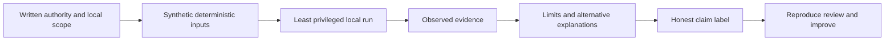

| Shared portfolio principle | Plain meaning | Required behavior | Failure prevented |
|---|---|---|---|
| Authorization comes first | Technical ability is not permission | Use only files and systems created for this lab | Unauthorized testing |
| Synthetic by default | Real-looking data does not need real people | Generate fictional records with reserved names and ranges | Privacy leakage |
| Local by default | A learning objective rarely requires internet targets | Bind services to loopback or analyze static files | Accidental scanning |
| Least privilege | Admin rights are not a learning shortcut | Use a standard user and read-only analysis where possible | Host damage and hidden assumptions |
| Non-destructive | Practice should be reversible | Write to a dedicated folder and never alter production settings | Service interruption |
| Deterministic | The same inputs should produce the same outputs | Pin seed, schema, query, and reporting cut | Unrepeatable claims |
| Evidence before narrative | Conclusions must point to inspectable facts | Preserve inputs, commands, queries, outputs, and caveats | Confident storytelling without proof |
| Privacy by design | Collection creates responsibility | Minimize, redact, restrict, retain briefly, and delete | Portfolio becomes a data leak |
| Claim labels stay attached | Context must survive screenshots and interviews | Put a visible label in every artifact | Lab work presented as production work |
| Product truth stays bounded | A simulation is not a Zscaler tenant | Describe analogous concepts, not emulated internals | Unsupported product claims |
| Cleanup is part of completion | A lab is unfinished while unnecessary evidence remains | Run the cleanup checklist and record disposition | Secrets and captures linger |
| Reuse the contract | Later labs should not invent weaker rules | Apply this Part to Parts 112-117 without exception | Safety drift across capstones |

## JD Mapping

| JD signal | Capability developed in this Part | Portfolio evidence | Honest boundary |
|---|---|---|---|
| Be a trusted technical advisor | Define legal, ethical, evidence, and claim boundaries before action | Scope charter and claim ledger | No legal advice or customer authority claimed |
| Demonstrate technical depth | Build reproducible local SQL, evidence, and troubleshooting workflows | Run manifest, queries, validation output | No production Zscaler environment implied |
| Work with security data | Model safe synthetic records and provenance | Data dictionary and generated CSV files | Synthetic fields are not product schemas |
| Communicate with executives | Translate evidence into bounded claims and limitations | One-page portfolio summary | A presentation does not prove business impact |
| Lead critical issues | Preserve evidence, timestamps, hypotheses, and privacy | Evidence index and timeline pattern | No real incident response claimed |
| Drive adoption and value | Define observable practice outcomes and acceptance criteria | Rubric and reflection | Lab completion is not customer adoption |
| Collaborate across teams | Identify authorization, privacy, technical, and decision roles | Lab RACI | Candidate does not assume organizational authority |
| Learn products quickly | Separate official facts from analogous local exercises | Source ledger and fact labels | No entitlement, UI, or feature behavior inferred |

## Candidate honesty note

You can say: "I built a local, synthetic portfolio to practice security-data modeling, vulnerability prioritization, escalation analysis, discovery, and training. I used deterministic inputs, documented queries, evidence indexes, validation rubrics, privacy controls, and explicit limitations. The work demonstrates my method and builds on factual enterprise escalation, network-trace, SQL, Power BI, mentoring, and customer communication experience. It does not represent production Zscaler access, a real customer engagement, live security testing, or measured customer risk reduction."

You should not say that you implemented Zscaler Data Fabric, operated UVM for an enterprise, scanned a customer, captured a customer's traffic, resolved a Zscaler incident, or delivered an NMH onboarding. NMH does not exist. The lab may support "I practiced" and "I can explain my method," not "I delivered this in production."

| Documented background | Transferable capability | Portfolio-safe wording | Unsupported wording to avoid |
|---|---|---|---|
| enterprise escalation engineering | Evidence collection, hypothesis control, ownership, and RCA discipline | "My production escalation method informed this synthetic lab." | "This lab is a Zscaler customer escalation." |
| Microsoft 365, OneDrive, and SharePoint | Familiarity with identity, permissions, client, network, and cloud-service boundaries | "I used an M365-style fictional dependency chain." | "I tested a customer's Microsoft 365 tenant." |
| Wireshark, Netsh, Network Monitor, Procmon, HAR, Fiddler, and browser tools | Multi-layer evidence interpretation | "I analyzed supplied synthetic artifacts locally." | "I intercepted production traffic." |
| SQL, PostgreSQL, Excel, Power BI, Python, R, statistics, and MBA analytics | Data modeling, quality, queries, dashboards, and calibrated metrics | "I built a vendor-neutral synthetic security-data model." | "I reproduced Zscaler's internal schema or algorithm." |
| Critical situation, RCA, Engineering collaboration, and fix validation | Escalation coordination and recovery validation | "I applied familiar incident disciplines to a fictional scenario." | "I led this Zscaler incident." |
| Mentoring, onboarding, partner training, and knowledge articles | Beginner-first explanation, workshops, teach-back, and artifacts | "I designed and rehearsed a synthetic workshop." | "I trained an NMH SOC team." |
| Responsible AI exploration | Cautious assisted drafting with human validation | "Any assistance remained secondary to inspectable evidence." | "An AI conclusion proves the finding." |

## Beginner vocabulary and memory hooks

A **lab** is a controlled learning environment. A **portfolio** is an organized collection of work evidence. Neither is production. Think of a flight simulator: it can reveal whether a learner follows instruments and checklists, but it does not create commercial flight hours or prove performance in every weather condition.

| Term | Meaning from zero | Why it matters | Memory hook |
|---|---|---|---|
| Authorization | Explicit permission from the person or organization with authority | Without it, even harmless-looking testing can be improper | Permission before packets |
| Scope | Exact systems, data, actions, times, and outputs allowed | Prevents accidental expansion | Fence around the exercise |
| Synthetic data | Invented data designed to resemble useful structure without representing real subjects | Preserves learning while reducing privacy risk | Real shape, fictional lives |
| Reserved domain | A name intentionally set aside for examples, such as example.com | Avoids targeting a real organization | Use addresses made for examples |
| Reserved IP range | Address block intended for documentation, not a real endpoint | Keeps network examples clearly fictional | Documentation roads only |
| Loopback | The local computer talking to itself, commonly 127.0.0.1 | Supports local tests without network reach | A letter to your own desk |
| Least privilege | Use only permissions necessary for the task | Limits consequences and reveals true requirements | Smallest key that opens the lab |
| Non-destructive | Does not delete, damage, disable, or irreversibly change systems | Makes practice recoverable | Leave the room as found |
| Reproducibility | Another person can follow the record and obtain materially similar results | Separates method from memory | Recipe plus ingredients plus oven setting |
| Provenance | Where data came from and how it changed | Makes trust and correction possible | Passport for a record |
| Evidence | Inspectable input or observation relevant to a claim | Grounds analysis | Receipt behind the statement |
| Artifact | A file or output produced by the exercise | Gives discussion something concrete | The lab's work product |
| Manifest | Inventory of files, versions, hashes, labels, and relationships | Makes the portfolio navigable | Packing list |
| Reporting cut | Fixed time boundary for a calculation | Prevents moving data during comparison | Freeze-frame date |
| Seed | Fixed number controlling repeatable pseudo-random generation | Produces the same synthetic records | Same shuffle instruction |
| Data dictionary | Field names, types, meanings, allowed values, and sensitivity | Prevents silent semantic disagreement | Legend for the dataset |
| Redaction | Removing or masking sensitive content | Allows safer sharing | Black out what is not needed |
| HAR | HTTP Archive, a browser-exported record of web requests and responses | Helpful but may contain URLs, headers, cookies, and content | Browser request diary |
| Packet capture | Recorded network packets and metadata | Powerful evidence with significant privacy risk | Sealed copies of envelopes and sometimes contents |
| Claim label | Visible statement describing evidence class and boundary | Keeps context attached | Nutrition label for credibility |
| Limitation | What the evidence does not establish | Prevents overreach | Edge of the map |
| Validation rubric | Explicit criteria and score levels for reviewing work | Makes readiness discussion inspectable | Driving-test sheet |

### Plain-English deep-dive 1 - Safe is a property of the whole workflow

A local command is not automatically safe. It may read browser cookies, write secrets to a log, listen on every network interface, overwrite an existing file, or upload telemetry. Safety depends on the target, data, privilege, side effects, destination, retention, and authority together.

Imagine a laboratory beaker. The beaker itself is harmless, but safety also depends on what is inside it, who handles it, where it is poured, and how it is disposed. In this portfolio, every action receives the same questions: Is the target owned for this exercise? Is the input synthetic? Is the action read-only or reversible? Is standard-user access enough? Can it contact anything outside the local machine? What will be recorded? How will the output be protected and removed?

The correct default is not "run and see." The correct default is "define the observation, select the smallest local action, predict the output, run only inside scope, inspect the result, and stop if reality differs." That sequence is slower for one minute and faster for the whole investigation.

## Legal and ethical scope

This guide is educational and is not legal advice. Laws and contracts differ by jurisdiction and organization. The practical control is conservative: do not test a system, account, tenant, network, application, or dataset unless the authorized owner has explicitly approved the exact activity. Public accessibility is not permission. Employment, a customer relationship, or possession of credentials is not unlimited authority.

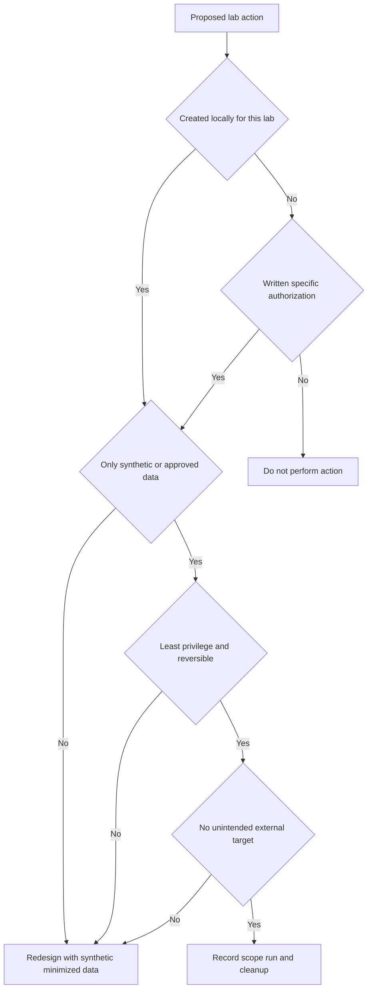

| Scope dimension | Safe rule for Parts 111-117 | Prohibited example | Safer replacement |
|---|---|---|---|
| Target | Files generated inside the dedicated local lab folder | Testing a public website because it responds | Analyze a supplied static response or loopback service |
| Identity | Fictional users and non-secret local identifiers | Using a work account or copied token | Synthetic IDs such as usr-001 |
| Domain | Reserved example names only | Inventing a plausible company domain that may exist | nmh.example.com or example.com |
| IP address | Documentation ranges or loopback in written artifacts | Probing an internet-routable address | 192.0.2.0/24, 198.51.100.0/24, 203.0.113.0/24, or 127.0.0.1 |
| Network action | Offline parsing; optional loopback-only observation | Port scanning, service enumeration, or interception | Read a synthetic connection log |
| Authentication | No secrets required | Copying cookies, API keys, passwords, or client certificates | Placeholder values clearly marked nonfunctional |
| TLS | Analyze synthetic metadata; retain verification | Disabling certificate validation or installing untrusted roots | Model certificate facts in a CSV or inspect a supplied local fixture |
| Browser | Use generated HAR-like JSON without secrets | Exporting a signed-in production HAR | Create a synthetic request timeline |
| Packet evidence | Use generated text or a capture created only from an isolated local fixture | Capturing shared Wi-Fi, VPN, work, or customer traffic | Analyze packet-summary CSV supplied by the lab |
| Vulnerability work | Analyze synthetic findings | Scanning, exploitation, proof-of-concept execution | Use fictional CVE-style records and safe reasoning |
| Configuration | No production or security-control changes | Disabling proxy, firewall, EDR, TLS, or policy | Compare prewritten synthetic configurations |
| Cleanup | Delete generated copies according to manifest | Deleting shared data or changing system settings | Remove only files whose paths and hashes are recorded |

### Stop conditions

Stop immediately if a command reaches a non-loopback target, requests administrator rights unexpectedly, displays a real token or personal identifier, writes outside the dedicated folder, proposes disabling TLS or security controls, changes a production setting, discovers that a supposedly synthetic name belongs to a real organization, or produces output whose sensitivity cannot be assessed. Record the stop as good judgment, not as a failed lab.

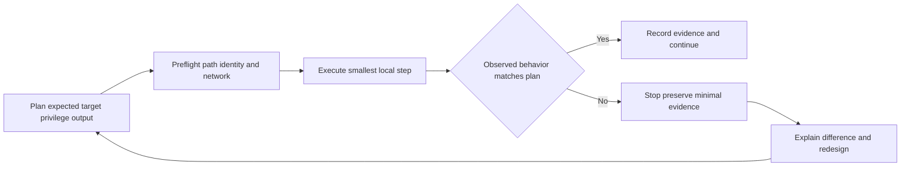

## Shared portfolio contract for Parts 112-117

Parts 112-117 reuse the following contract. A later Part may add stricter controls but may not weaken these controls.

1. Use the fictional customer name **Northstar Meridian Holdings (NMH)** and label it synthetic on every artifact.
2. Use only deterministic generated files or inline data supplied by the guide.
3. Use reserved domains and documentation IP ranges. Never resolve, connect to, scan, or test those narrative addresses.
4. Keep analysis offline. If an optional local service is ever used, bind only to loopback and document it; the core exercises never require one.
5. Use a standard user. Do not require administrator, root, packet-driver installation, firewall changes, TLS bypass, or security-control disablement.
6. Store work under one dedicated portfolio root selected by the learner. Never hard-code a customer, employer, browser-profile, or system folder.
7. Preserve immutable raw inputs. Write transformed data to a separate stage.
8. Record tool and version, seed, reporting cut, schema version, commands or clicks, query text, assumptions, observations, and cleanup.
9. Give every artifact an evidence class, sensitivity, shareability, source, owner, date, limitation, and hash when practical.
10. Keep secrets out. Placeholder secrets must be visibly nonfunctional, such as `REDACTED_SYNTHETIC_NOT_A_SECRET`.
11. Never claim that a local model is a Zscaler internal schema, score, connector, dashboard, workflow, or algorithm.
12. Describe results as synthetic observations, not customer outcomes or product validation.
13. Include negative and boundary cases. A useful model shows how it fails, not only how it succeeds.
14. Validate with explicit criteria and preserve failed attempts that explain improved reasoning.
15. Clean temporary copies and retain only the intentional portfolio set.
16. Use the exact claim pattern: **context, personal action, synthetic observation, limitation, production next validation**.

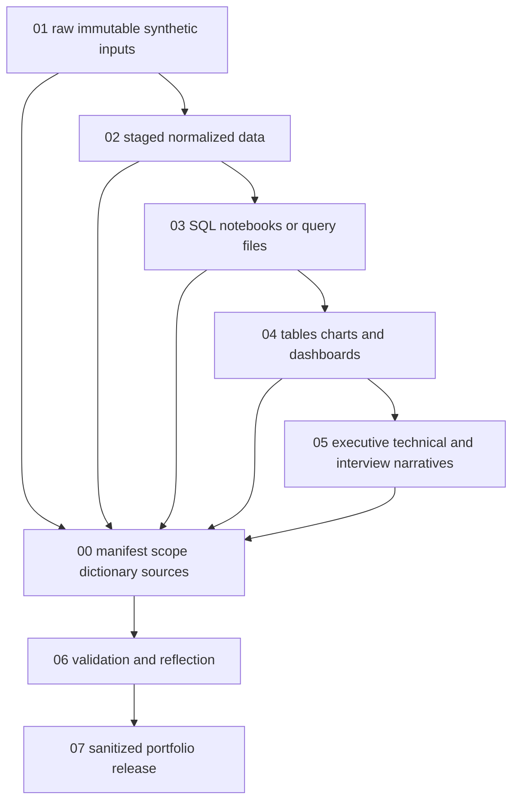

### Required portfolio organization

The following tree is conceptual. The learner may create it manually using a file explorer. No command shell is required. Do not place real customer files anywhere inside it.

```text
nmh-secops-portfolio/
  00-governance/
    scope-charter.md
    safety-checklist.md
    claim-ledger.csv
    source-ledger.csv
    manifest.csv
  01-raw-synthetic/
    README.md
    generated-inputs/
  02-staged/
    normalized-and-derived/
  03-analysis/
    queries/
    calculations/
  04-evidence/
    tables/
    charts/
    screenshots/
  05-deliverables/
    technical/
    executive/
    workshop/
  06-validation/
    rubric.md
    test-results.csv
    reflection.md
  07-release/
    sanitized-selected-artifacts/
  99-temporary/
    disposable-working-files/
```

| Folder | Allowed content | Required control | Never place here |
|---|---|---|---|
| 00-governance | Scope, labels, manifest, sources, decisions | Review before every lab | Secrets or customer contracts |
| 01-raw-synthetic | Generated original inputs | Read-only after generation | Real exports |
| 02-staged | Normalized and derived datasets | Record transformation and row checks | Untracked manual edits |
| 03-analysis | Portable SQL and calculation notes | Save query text and assumptions | Credentials in connection strings |
| 04-evidence | Selected outputs and screenshots | Caption with date, filter, source, and limitation | Browser chrome showing accounts or notifications |
| 05-deliverables | Technical, executive, and workshop artifacts | Put synthetic label on every page | Claims beyond evidence |
| 06-validation | Tests, rubric, failure log, reflection | Preserve failed and corrected checks | Fabricated reviewer approval |
| 07-release | Sanitized subset safe to discuss | Perform release review separately | Raw captures or hidden metadata |
| 99-temporary | Disposable intermediate work | Delete at completion | Only copy of required evidence |

### Artifact naming and identity

Use `NMH-SYN-P###-A##-short-name-v##` as the logical artifact ID, where `P###` is the Part and `A##` is the artifact number. A filename can add a portable extension. Example: `NMH-SYN-P112-A03-entity-map-v01.csv`. Avoid dates as the only version because a corrected artifact may be created on the same day.

| Manifest field | Example | Purpose | Validation rule |
|---|---|---|---|
| artifact_id | NMH-SYN-P112-A03 | Stable identity | Unique and never recycled |
| filename | entity-map-v01.csv | Physical file | Relative path only |
| title | Canonical entity mapping | Human meaning | Plain language |
| evidence_class | synthetic_observation | Claim boundary | Controlled value |
| sensitivity | public_synthetic | Handling | Never assume from extension |
| shareability | portfolio_after_review | Release decision | Explicit, not implied |
| source_artifacts | A01;A02 | Provenance | IDs must exist |
| created_utc | 2026-08-24T12:00:00Z | Ordering | ISO 8601 UTC |
| schema_version | 1.0 | Interpretation | Present for structured data |
| generator_seed | 111024 | Reproduction | Fixed or `not_applicable` |
| tool_version | SQLite 3.x | Environment | Record actual version used |
| reporting_cut | 2026-08-24T00:00:00Z | Calculation boundary | Same across comparable outputs |
| hash | SHA-256 value | Integrity check | Recalculate after intentional change |
| limitation | Not a product schema | Prevent overclaim | Non-empty |
| owner | You | Accountability | One named maintainer |
| disposition | retain_release | Cleanup | Controlled value |

### Claim labels

Every screenshot, dashboard page, executive note, architecture drawing, and interview handout begins with a visible claim label. Hidden file metadata is insufficient.

| Label | Use when | Example sentence | What it never proves |
|---|---|---|---|
| SYNTHETIC LAB | Entire artifact comes from NMH generated data | "Synthetic NMH lab; no real tenant or customer data." | Production experience |
| FACTUAL CANDIDATE EXPERIENCE | Statement is supported by your own records | "I used trace-led troubleshooting in enterprise support." | Zscaler product experience |
| OFFICIAL PUBLIC FACT | Dated official source supports bounded statement | "The linked public page positions Data Fabric for Security as..." | Tenant behavior or entitlement |
| GENERAL PRACTICE | Vendor-neutral method | "Preserve immutable raw input and record transformations." | Employer-required process |
| ANALOGOUS EXERCISE | Local construct resembles a concept but not implementation | "This canonical model is an analogy for harmonization." | Internal Zscaler schema |
| HYPOTHESIS | Proposed explanation awaits discriminating evidence | "TLS negotiation policy is a synthetic hypothesis." | Root cause |
| UNKNOWN | Evidence does not establish an answer | "Production connector behavior is unknown without current licensed evidence." | Permission to guess |

Use this claim formula in a portfolio discussion:

> **Context:** This was an explicitly synthetic NMH lab. **My action:** I designed the schema, generated deterministic records, ran the documented queries, interpreted the supplied evidence, and validated the artifacts against a rubric. **Observation:** Within that dataset, the method produced [bounded result]. **Limitation:** It did not use a Zscaler tenant, real customer data, or production workflow. **Production next validation:** I would verify [current documentation, entitlement, field definitions, customer authority, controlled test, and acceptance evidence].

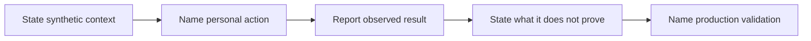

### Evidence ladder

| Evidence level | Example | Appropriate claim | Inappropriate claim |
|---|---|---|---|
| L0 reading | Official public page reviewed | "I can explain public positioning with a date." | "I administered the product." |
| L1 design | Schema, plan, or runbook authored | "I can design a plausible method." | "The method works in production." |
| L2 synthetic execution | Queries run against generated data | "I exercised and debugged the method locally." | "I processed customer telemetry." |
| L3 peer review | Another person reproduced or challenged the lab | "The artifact received review under stated conditions." | "Zscaler approved it." |
| L4 supervised authorized environment | Real task under authorized supervision | Claim only exact observed contribution | Broad ownership or independent expertise |
| L5 repeated production ownership | Multiple accepted real outcomes with records | Claim bounded role and results accurately | Universal expertise or sole causation |

### Source and transformation ledger

For every derived field, record the origin, rule, expected failure, and validation. A dashboard is the end of a chain, not a new source.

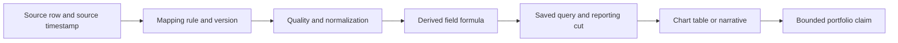

| Ledger field | Question answered | Example |
|---|---|---|
| source_name | Which generated source supplied the fact? | synthetic_cmdb |
| source_record_id | Which row can be inspected? | cmdb-0042 |
| source_timestamp | When did the fictional source observe it? | 2026-08-23T10:00:00Z |
| extraction_version | Which generated export? | 1.0 |
| field_name | Which input field? | business_owner |
| mapping_rule | How was it renamed or converted? | trim then lowercase email |
| null_policy | What happens if absent? | retain null and open quality issue |
| derived_rule | How was new information calculated? | age_days = reporting_cut - first_seen |
| quality_check | What could disconfirm correctness? | no negative age; source count reconciles |
| output_artifact | Where did it appear? | NMH-SYN-P113-A07 |

## Prerequisites

The lab requires only a normal local computer and standard concepts. Paid Zscaler access is neither required nor used. Choose one data path: a spreadsheet application, SQLite, DuckDB, PostgreSQL already installed locally, or another local relational tool you are authorized to use. SQLite is the simplest conceptual default because it is a single local file; DuckDB is convenient for CSV analytics; PostgreSQL matches your prior experience but requires a local service and more setup. Power BI Desktop may be used if already available and permitted, but a spreadsheet pivot or saved SQL result fully satisfies the lab.

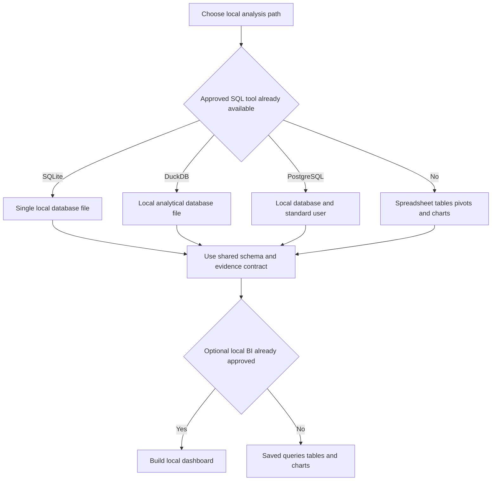

| Prerequisite | Minimum | Safe verification | If unavailable |
|---|---|---|---|
| Dedicated folder | User-writable location created for NMH only | Confirm path contains no real project files | Use a new folder under personal learning storage |
| Standard user | No elevation | Confirm chosen tool opens without admin prompt | Select a portable or already approved tool |
| Text editor | Plain UTF-8 files | Create and reopen a synthetic note | Use VS Code or another approved editor |
| Structured-data tool | Spreadsheet or local SQL engine | Import three test rows | Use spreadsheet-only path |
| Diagram renderer | Markdown Mermaid preview is optional | Preview one sample | Keep Mermaid source as evidence |
| Hash tool | Optional but recommended | Record SHA-256 with approved local facility | Record size, timestamp, and version instead |
| Screenshot method | Optional | Capture only selected application region | Export table or Markdown instead |
| Time standard | UTC and ISO 8601 | Write one test timestamp ending in Z | Document another explicit zone consistently |
| Source access | Public official pages | Record URL and review date | Mark current product fact unknown |
| Review time | At least one separate review pass | Schedule before release | Do not release unfinished artifacts |

### Preflight checklist

1. Confirm the portfolio root is dedicated and user-writable.
2. Confirm all source names, people, dates, domains, and addresses are synthetic.
3. Confirm no command, query, workbook, or dashboard contains a real connection string.
4. Confirm no administrator access is needed.
5. Confirm analysis can complete offline after source references are recorded.
6. Confirm the reporting cut, seed, and schema version.
7. Confirm temporary and release folders are separate.
8. Confirm the expected outputs and stop conditions.
9. Confirm every screenshot method excludes desktop notifications, user profile details, and unrelated windows.
10. Confirm cleanup can identify exactly which generated files may be removed.

## Synthetic data design

Synthetic data should preserve relationships and edge cases without copying real records. A poor generator creates random noise. A useful generator creates controlled truth: known duplicates, nulls, stale records, conflicting ownership, delayed connectors, and defined business context. Because the truth is known, the learner can test whether the model detects it.

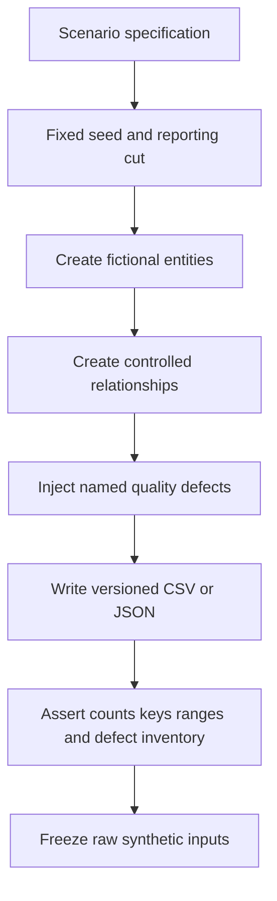

| Synthetic design rule | Implementation | Validation |
|---|---|---|
| No real people | Use role names such as `nmh-owner-01` | Search for personal names and email domains |
| No real organization | Use Northstar Meridian Holdings and `nmh.example.com` | Search for employer/customer names |
| Reserved network values | Use documentation ranges only as text | Confirm no network command uses them |
| Deterministic generation | Fixed seed per Part | Regenerate and compare counts/hashes |
| Known ground truth | Maintain an injected-defect register | Detection results reconcile to register |
| Useful variation | Include different owners, criticalities, ages, controls, and states | Distribution table has expected categories |
| Controlled missingness | Nulls are intentional and documented | Null count equals specification |
| Controlled duplicates | Duplicate pairs have declared matching clues | Resolution output identifies expected pairs |
| Time consistency | All timestamps precede reporting cut unless testing future-time rejection | Timestamp assertion passes |
| Referential consistency | Most foreign keys resolve; intentional orphan IDs are listed | Orphan query matches defect register |

### Minimal portable synthetic schema

The Part 111 starter dataset is a small governance rehearsal, not the richer Part 112 model.

```sql
-- Portable conceptual SQL. Types work in SQLite and are easily adapted.
CREATE TABLE lab_artifact (
    artifact_id TEXT PRIMARY KEY,
    part_number INTEGER NOT NULL,
    title TEXT NOT NULL,
    evidence_class TEXT NOT NULL,
    sensitivity TEXT NOT NULL,
    created_utc TEXT NOT NULL,
    source_label TEXT NOT NULL,
    limitation TEXT NOT NULL,
    disposition TEXT NOT NULL
);

CREATE TABLE lab_claim (
    claim_id TEXT PRIMARY KEY,
    artifact_id TEXT NOT NULL,
    claim_text TEXT NOT NULL,
    observation_text TEXT NOT NULL,
    limitation_text TEXT NOT NULL,
    production_validation TEXT NOT NULL,
    FOREIGN KEY (artifact_id) REFERENCES lab_artifact(artifact_id)
);
```

Portable assumption: timestamps are stored as ISO 8601 UTC text for the exercises. Date arithmetic varies across SQLite, DuckDB, PostgreSQL, spreadsheets, and BI tools, so later Parts show a portable conceptual expression and label engine-specific alternatives.

### Deterministic starter records

| artifact_id | part_number | title | evidence_class | sensitivity | created_utc | source_label | limitation | disposition |
|---|---:|---|---|---|---|---|---|---|
| NMH-SYN-P111-A01 | 111 | Scope charter | general_practice | public_synthetic | 2026-08-24T09:00:00Z | candidate_authored | Not legal approval | retain_release |
| NMH-SYN-P111-A02 | 111 | Starter dataset | synthetic_observation | public_synthetic | 2026-08-24T09:05:00Z | deterministic_seed_111024 | Not customer data | retain_release |
| NMH-SYN-P111-A03 | 111 | Validation result | synthetic_observation | public_synthetic | 2026-08-24T09:10:00Z | local_validation | Not external review | retain_release |
| NMH-SYN-P111-A04 | 111 | Temporary screenshot | synthetic_observation | restricted_working | 2026-08-24T09:15:00Z | local_capture | May expose desktop metadata | delete_after_review |

## Local SQL and BI options

The portfolio evaluates reasoning, not a brand of software. The same normalized tables and calculations should be understandable in any relational engine.

| Option | Strength | Caution | Evidence to retain |
|---|---|---|---|
| SQLite | Single local file, simple SQL, no server required | Date functions and strict typing differ | Version, schema, query text, result export |
| DuckDB | Strong local CSV and analytical workflow | Syntax and functions differ from transactional engines | Version, file paths, query text, result export |
| PostgreSQL | Familiar to you and strong relational behavior | Local service, roles, and cleanup need care | Version, non-admin role, schema, query text |
| Spreadsheet | Lowest setup and accessible inspection | Manual edits and formula drift are easy | Original import, formula cells, checks, export |
| Power BI Desktop | Useful model, transformations, visuals, and interaction | Local file can hide steps and may contain cached data | Source path, Power Query steps, measures, filters, screenshots |
| Static Markdown report | Highly portable and reviewable | Less interactive | Query, table, chart source, narrative |

### Portable query conventions

1. Use lower_snake_case identifiers.
2. Avoid engine-specific quoting unless documented.
3. Use explicit column lists instead of `SELECT *` in evidence queries.
4. Qualify joins and state expected cardinality.
5. Guard denominators with `NULLIF` where supported; otherwise use `CASE`.
6. Store a fixed reporting cut rather than relying on the current clock.
7. State null policy and whether null means unknown, not applicable, not collected, or invalid.
8. Save the query that produced every reported number.
9. Sort evidence exports explicitly.
10. Reconcile input, accepted, rejected, duplicate, and output counts.

```sql
-- Portable validation query for the starter schema.
SELECT
    evidence_class,
    COUNT(*) AS artifact_count
FROM lab_artifact
GROUP BY evidence_class
ORDER BY evidence_class;

-- Portable conditional rate pattern.
SELECT
    SUM(CASE WHEN disposition = 'retain_release' THEN 1 ELSE 0 END) AS retained_count,
    COUNT(*) AS total_count,
    CASE
        WHEN COUNT(*) = 0 THEN NULL
        ELSE 1.0 * SUM(CASE WHEN disposition = 'retain_release' THEN 1 ELSE 0 END) / COUNT(*)
    END AS retained_fraction
FROM lab_artifact;
```

Expected observation for the four inline records: two evidence classes are present; three artifacts are marked `retain_release`; one is marked `delete_after_review`; the retained fraction is 0.75. This is a synthetic observation, not a portfolio quality score.

### Dashboard minimum contract

| Dashboard element | Required content | Evidence discipline |
|---|---|---|
| Visible title | Part, topic, and `SYNTHETIC NMH LAB` | Label survives screenshot |
| Reporting cut | Exact UTC timestamp | Same cut used in query |
| Scope | Included sources and exclusions | No universal statement |
| KPI | Definition, numerator, denominator, null policy | Query is saved |
| Trend | Stable time grain and comparable population | Definition changes marked |
| Breakdown | Owner, source, category, or status | Small groups handled carefully |
| Quality indicator | Freshness, completeness, reject, or confidence | Quality sits near outcome metric |
| Filter state | Visible selections | Screenshot is interpretable |
| Limitation | What view does not prove | Kept near headline |
| Drill-through | Row-level synthetic evidence where practical | No hidden real data |

### Plain-English deep-dive 2 - A dashboard is a view, not a source

A dashboard can make a number look authoritative through color, alignment, and precision. But the number still depends on source records, mappings, filters, joins, calculations, and time boundaries. Think of a restaurant menu photograph. It presents the dish, but it is not the ingredients, recipe, kitchen record, or food-safety inspection.

For every dashboard number, a reviewer should be able to walk backward: Which visual? Which measure? Which query? Which transformed field? Which raw synthetic rows? Which generator rule? Which reporting cut? Which known defects? If that chain breaks, the correct response is "not established," not a prettier chart.

The dashboard should therefore display quality and limitation near performance. A count of unresolved synthetic vulnerabilities without connector freshness or asset ownership completeness can produce a false sense of priority. The visual contract makes uncertainty visible enough to influence the decision.

## Packet, HAR, process, and privacy precautions

Parts 111-117 do not require live packet capture. Part 114 supplies synthetic DNS, TCP, TLS, HTTP, HAR-like, proxy, and process evidence as static text or tables. Analyze those artifacts offline. This avoids capturing unrelated users, credentials, cookies, browsing content, VPN traffic, or corporate data.

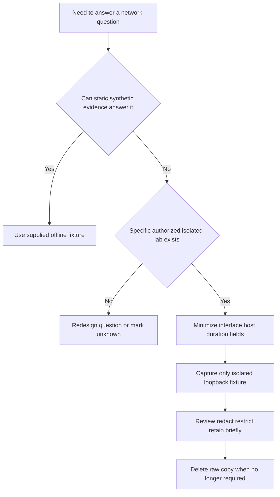

| Evidence type | Potential sensitive content | Safe lab rule | Portfolio representation |
|---|---|---|---|
| DNS log | Queried domains, device, user, resolver | Use synthetic names and timestamps | Redacted query/response table |
| TCP summary | Endpoints, ports, timing, process correlation | Use documentation IP text only | Connection-state CSV |
| TLS metadata | Server name, certificate names, versions, fingerprints | Use invented certificate metadata | Handshake-event table |
| Decrypted payload | Credentials, content, tokens, personal data | Never collect for these labs | Not included |
| HAR | URLs, query strings, cookies, authorization headers, response bodies | Generate HAR-like JSON with placeholders | Selected request timeline |
| Proxy log | User, destination, policy, action, reason | Use fictional user and policy names | Synthetic decision table |
| Process trace | Paths, usernames, registry, command lines, document names | Use fictional paths and minimal fields | Process-event table |
| Screenshot | Accounts, tabs, notifications, paths, hidden metadata | Capture selected app region and review | Sanitized image with label |
| Error text | Tenant IDs, correlation IDs, hostnames | Generate fictional identifiers | Exact synthetic error plus caveat |

### Packet and browser evidence decision record

| Question | Required answer before collection |
|---|---|
| Purpose | What exact hypothesis will this evidence distinguish? |
| Authority | Who owns the isolated fixture and approved collection? |
| Source | Is every packet or request created by the learner's fixture? |
| Interface | Is collection constrained to loopback or a dedicated isolated lab interface? |
| Duration | What shortest window captures the event? |
| Filter | What minimal host, port, process, or event filter applies? |
| Content | Can headers or payload be omitted? |
| Storage | Where will raw and sanitized copies live? |
| Access | Who may view them? |
| Retention | When will each copy be deleted? |
| Release | Which selected fields can enter the portfolio? |

Never disable TLS validation, lower browser security, install a root certificate, remove proxy policy, turn off endpoint protection, or bypass a control for these exercises. A lab that requires a weaker security posture is badly designed for this objective.

## Reproducibility contract

Reproducibility means a reviewer can reconstruct the intended environment and distinguish expected variation from a defect. It does not mean every rendering pixel must match.

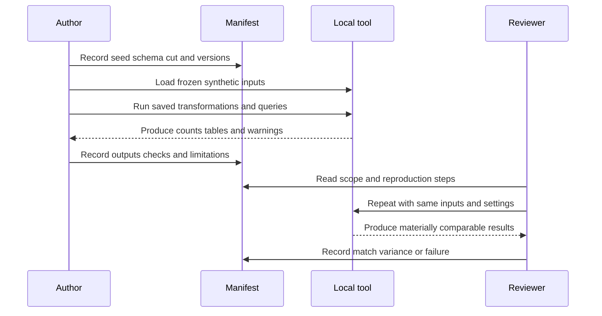

| Reproduction field | Required detail | Example |
|---|---|---|
| Lab ID | Part and version | P111 v1.0 |
| Purpose | One decision or capability | Validate claim-label workflow |
| Safety scope | Targets, data, prohibited actions | Local files only; no network |
| Input inventory | Relative paths and hashes | 01-raw-synthetic/artifacts.csv |
| Generator | Seed and schema version | seed 111024; schema 1.0 |
| Toolchain | Product, edition, version | Actual local choice |
| Environment | OS and relevant locale/time settings | Windows; timestamps UTC |
| Steps | Ordered actions or saved query names | load, validate, summarize, export |
| Expected checks | Counts, keys, defects, ranges | four rows; one temporary artifact |
| Tolerances | Acceptable display or numeric variance | fractions exact; chart pixels not compared |
| Outputs | Relative paths and labels | 04-evidence/tables/disposition.csv |
| Cleanup | Exact generated paths and disposition | remove 99-temporary contents |
| Limitations | Missing product/customer validation | local synthetic only |

### Reproduction levels

| Level | Requirement | Use |
|---|---|---|
| R0 described | Method and inputs described | Interview explanation only |
| R1 rerunnable | Author can rerun from frozen inputs | Minimum portfolio level |
| R2 independently followed | Reviewer follows steps and compares results | Strong portfolio evidence |
| R3 varied safely | Reviewer changes a documented parameter and behavior remains explainable | Demonstrates understanding |
| R4 production validated | Authorized real environment confirms bounded behavior | Outside these labs |

### Plain-English deep-dive 3 - Reproducibility is an honesty control

Memory naturally compresses work. After several weeks, "I loaded four files, corrected a join, checked duplicate pairs, and rebuilt a chart" can become "I built a security data platform." A reproducible record resists that inflation. It shows exactly what existed, what the candidate did, what failed, what changed, and what remained simulated.

Reproducibility also improves technical quality. If a second run changes a metric, the learner must inspect time functions, unordered outputs, changing files, manual spreadsheet edits, locale parsing, or an unrecorded filter. Those are the same classes of defects that undermine real customer trust. The portfolio therefore practices both analysis and accountable communication.

## Lab

This lab creates the governance layer used by Parts 112-117. All actions are local file creation, local data entry, and offline analysis. Do not run network commands, capture traffic, scan hosts, change security settings, or use real exports.

### Exercise 1 - Write the scope charter

Create `scope-charter.md` conceptually under `00-governance`. Include purpose, fictional customer label, allowed folders, allowed tools, allowed data, prohibited actions, stop conditions, retention, and claim boundary. Use this scope statement:

> This portfolio contains only local, deterministic, synthetic NMH data and candidate-authored analysis. It does not authorize testing of any external system. It prohibits live scanning, exploitation, interception, production traffic capture, real tenant data, secrets, administrator-required actions, security-control changes, TLS bypass, and destructive commands. Outputs demonstrate learning method only.

Expected observation: the charter makes the negative scope as explicit as the allowed scope. If the learner cannot tell whether an action is allowed from the charter, the action is not ready.

### Exercise 2 - Choose the local tool path

Record the approved existing tools and actual versions. Choose spreadsheet-only, SQLite, DuckDB, PostgreSQL local, or another authorized local relational engine. Record an alternative path so the portfolio remains explainable without the chosen UI. Do not download unapproved software solely to complete the lab. Do not expose a database listener beyond loopback. Do not use a production database instance.

Expected observation: the analytical contract survives tool choice. A query may require documented date-function adaptation, but entity keys, counts, null policy, and expected results remain stable.

### Exercise 3 - Create the folder contract

Create the portfolio tree manually in a dedicated location. Add a one-line `README.md` in `01-raw-synthetic` stating that files are generated, fictional, immutable inputs. Add another in `99-temporary` stating that every file is disposable and must be reviewed at cleanup.

Safety check: inspect the parent folder before creating anything. If it contains unrelated or shared content, choose a new directory. Never use a cleanup action that targets the parent recursively.

Expected observation: raw, staged, analysis, evidence, deliverable, validation, release, and temporary content have separate homes.

### Exercise 4 - Enter the starter records

Create a CSV from the four `lab_artifact` records shown earlier, using exactly the header names. Use plain UTF-8 and comma delimiters. If a field contains a comma, quote it according to CSV rules. Do not use spreadsheet formulas in the raw file.

Validation checks:

1. There are four data rows and one header row.
2. Every `artifact_id` is unique and starts with `NMH-SYN-P111-`.
3. Every timestamp ends in `Z`.
4. There are three `retain_release` and one `delete_after_review` dispositions.
5. Every limitation is non-empty.
6. No field contains a real email address, tenant ID, token, or routable target.

### Exercise 5 - Load and query locally

Create the two tables using the conceptual SQL or equivalent spreadsheet tables. Import or enter the four artifact rows. Run the evidence-class count and retained-fraction queries. Save query text before exporting results. If the tool changes a timestamp or identifier type automatically, correct the import configuration rather than editing the raw CSV.

Expected observations:

| Check | Expected synthetic result | Meaning |
|---|---:|---|
| Total artifacts | 4 | All starter rows loaded |
| General-practice artifacts | 1 | Scope charter classification |
| Synthetic-observation artifacts | 3 | Dataset, validation, and screenshot classifications |
| Retain-release artifacts | 3 | Intentional portfolio set |
| Delete-after-review artifacts | 1 | Temporary evidence identified |
| Retained fraction | 0.75 | Arithmetic and denominator verified |

If the result is 75 rather than 0.75, inspect percentage formatting. If it is zero, inspect integer division. If a count is five, inspect whether the header was imported as data. These are ordinary analytical defects, not reasons to change expected truth.

### Exercise 6 - Build the claim ledger

Add one claim for each retained artifact. Each row must include `claim_id`, `artifact_id`, `context`, `personal_action`, `synthetic_observation`, `limitation`, `production_validation`, and `release_status`. At least one limitation must state "No Zscaler tenant or product behavior was tested." At least one production-validation field must mention current official documentation and licensed-tenant evidence.

Bad claim: "I implemented a secure evidence platform."

Improved claim: "In a local synthetic NMH exercise, I designed an artifact manifest and claim ledger, loaded four deterministic records, and validated disposition counts. This demonstrates a reproducible evidence method; it does not establish production platform implementation or customer outcomes. In production I would align to approved repositories, data classifications, retention policy, access control, and reviewer acceptance."

### Exercise 7 - Create the source ledger

Record the official anchors at the end of this Part with source title, URL, review date, bounded fact used, and non-inference. Record general-practice statements separately. Do not cite a marketing page as proof of an interface, field, connector, entitlement, algorithm, SLA, or customer result.

Expected observation: every product-related sentence can be traced to a date and boundary, or is labeled unknown.

### Exercise 8 - Build one local visual

Create a small table or bar chart showing artifact count by evidence class and disposition. Include `SYNTHETIC NMH LAB`, reporting cut, total count, and limitation on the same page. A spreadsheet chart, Power BI page, or Markdown table is acceptable. Avoid decorative precision. With four rows, labels are more useful than a complex chart.

Expected observation: visual totals reconcile to the saved query and raw records. The chart does not imply quality, impact, or maturity.

### Exercise 9 - Perform the packet/privacy tabletop

Do not capture packets. Instead, review this fictional request: "Please collect a HAR from your signed-in work browser and upload it to the portfolio so the proxy issue looks realistic." Reject the request. Write a safe alternative: use the supplied synthetic HAR-like fixture in Part 114, preserve only fields needed for the hypothesis, include no cookies or authorization headers, and keep the artifact local.

Then classify these fields: URL path, query string, cookie, authorization header, response body, server name, status code, duration, fictional correlation ID. Mark which are needed for a response-timing hypothesis. Usually status, duration, phase timing, fictional endpoint label, and correlation sequence suffice; content and credentials do not.

### Exercise 10 - Run a reproducibility review

Close the analytical tool. Starting from the scope and manifest, repeat the load and two queries. Compare counts. Record any manual step that was missing. If a second person is available, ask them to follow the written steps using a copy of synthetic inputs. Their role is reviewer, not an implied employer or product approver.

Expected observation: results match materially. Differences become a troubleshooting record and an improvement, not something to hide.

### Exercise 11 - Create the release subset

Copy only the selected sanitized artifacts into `07-release`: scope summary, source ledger, synthetic data dictionary, saved query, result table or dashboard export, validation rubric, and reflection. Exclude raw screenshots, database files with caches, temporary exports, and tool metadata unless reviewed.

Add this banner to every release item:

> SYNTHETIC NMH LAB. Candidate-authored learning artifact. No real customer, tenant, secret, production test, Zscaler access, or customer outcome.

### Exercise 12 - Rehearse the interview explanation

Use a two-minute structure: objective, safety boundary, method, one defect found, one artifact, one limitation, and production next validation. Ask a reviewer to interrupt with "Was this production?", "Was this Zscaler?", "Did it reduce risk?", and "Did a customer use it?" Answer directly: no, it was synthetic; it was vendor-neutral and informed by dated public positioning; risk reduction was not measured; no customer used it.

## Expected evidence

The evidence set should be small enough to review and complete enough to reproduce. More files are not automatically better.

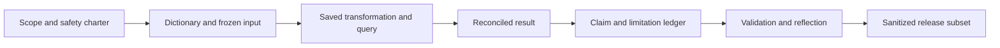

| Artifact | Minimum content | Expected evidence | Acceptance test |
|---|---|---|---|
| Scope charter | Allowed/prohibited actions, data, target, privilege, stop, cleanup | Signed or self-attested learning scope | No ambiguity about external testing |
| Safety checklist | Preflight and stop decisions | Completed checkboxes with date | No prohibited action required |
| Folder map | Relative locations and purpose | Tree or manifest rows | Raw and release are separate |
| Data dictionary | Field, type, meaning, values, sensitivity | Versioned table | Every starter field defined |
| Raw starter CSV | Four deterministic records | Frozen file | Count and values match specification |
| Database or workbook | Local structured representation | Rebuildable from raw | No secret connection data |
| Saved queries | Exact count and fraction logic | Plain SQL or formula inventory | Results reconcile to expected values |
| Result export | Counts and 0.75 retained fraction | Table or chart | Filters and reporting cut visible |
| Claim ledger | Context, action, observation, limit, next validation | Three retained claims | No production wording |
| Source ledger | URL, review date, use, boundary | Official and general sources separated | Product statements bounded |
| Reproduction record | Tool version, seed, steps, outputs, variance | Author or peer rerun | Material results repeat |
| Privacy tabletop | Rejected unsafe request and safe alternative | Written decision | No real HAR or capture |
| Validation rubric | Scores and blocking gates | Completed review | Any safety gate failure blocks release |
| Reflection | What worked, failed, changed, remains unknown | One page | Includes specific limitation |
| Release inventory | Selected sanitized artifact IDs | Manifest disposition | Temporary evidence absent |

### Evidence-capture checklist

- [ ] Capture the purpose before the result.
- [ ] Capture the synthetic label in the artifact itself.
- [ ] Capture tool/version, reporting cut, seed, and schema version.
- [ ] Capture the raw row count before transformation.
- [ ] Capture accepted, rejected, duplicate, orphan, and output counts where relevant.
- [ ] Save SQL or formula logic, not only a screenshot.
- [ ] Record the filter state and sort order.
- [ ] Record unexpected output before correcting it.
- [ ] Record the correction and rerun evidence.
- [ ] Put limitations beside conclusions.
- [ ] Review screenshots for account, path, notification, and metadata leakage.
- [ ] Add manifest and disposition entries.
- [ ] Confirm the release copy can be understood without hidden context.
- [ ] Confirm no artifact implies real NMH or Zscaler production work.

## Troubleshooting

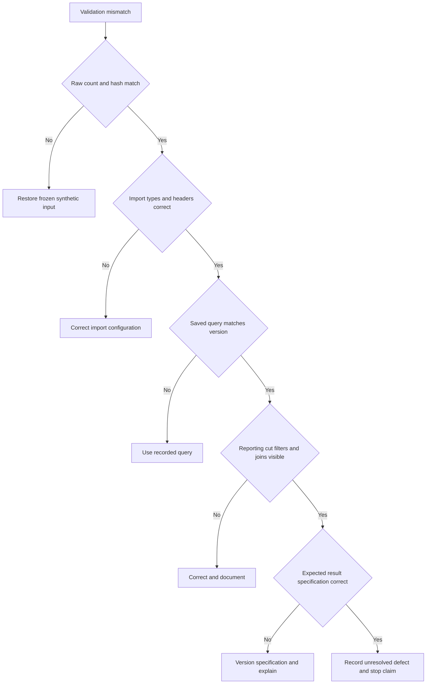

| Symptom | Likely cause | Safe discriminating check | Repair |
|---|---|---|---|
| Row count is one too high | Header imported as data | Inspect first row | Re-import with header option |
| Fraction is zero | Integer division | Inspect operand types | Cast or multiply numerator by 1.0 |
| Fraction is 75 | Percentage formatting or extra multiplication | Inspect raw value | Separate fraction from display format |
| IDs become scientific notation | Spreadsheet type inference | Inspect raw CSV | Import identifier as text |
| Timestamp changes | Locale or time-zone conversion | Compare raw text and loaded value | Store ISO text or explicit UTC type |
| Query output order changes | Missing `ORDER BY` | Review query | Add explicit stable sort |
| Dashboard count differs | Hidden filter or relationship | Display filter state and query component | Reset and document model relationship |
| Rerun changes data | Generator seed or current clock changed | Compare manifest | Fix seed and reporting cut |
| Screenshot reveals profile | Full-screen capture | Review at high zoom | Recapture selected region and delete unsafe copy |
| Product wording becomes too strong | Analogy lost its label | Trace claim to source | Restore label and limitation |
| Cleanup target is ambiguous | Temporary files not manifested | List exact relative paths | Review manually; do not bulk delete |
| Reviewer cannot reproduce | Missing version, step, or file | Follow record literally | Add the missing dependency and rerun |

## Cleanup and privacy

Cleanup is a controlled disposition process, not a broad deletion command. Never run recursive deletion against a path assembled from variables or a folder that contains unrelated data. Use the file explorer or an approved tool to remove only reviewed generated files by exact relative path.

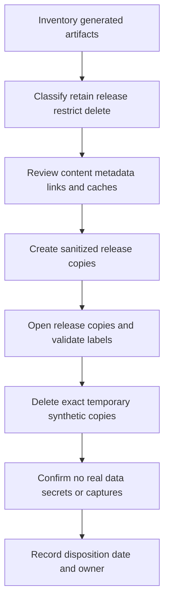

| Data class | Example | Retention | Release rule | Cleanup action |
|---|---|---|---|---|
| Public synthetic | CSV with fictional assets | Retain while portfolio is useful | Allowed after label review | Keep manifest current |
| Restricted working | Screenshot with local path or user profile | Only until sanitized | Never release raw | Delete exact file after review |
| Temporary synthetic | Intermediate exports and caches | End of lab | Do not release | Remove from 99-temporary |
| Secret | None should exist | Zero | Never | Stop, secure, report through policy; do not continue |
| Real personal/customer data | None should exist | Zero for this lab | Never | Stop and follow organizational privacy process |
| Database file | Local cache of synthetic rows | Retain only if needed for reproduction | Prefer rebuilt-from-raw release | Delete if raw plus scripts suffice |
| Tool log | May contain paths and environment data | Minimum necessary | Sanitize or omit | Delete unneeded copies |
| Source snapshot | Public-page note and URL | Retain citation, not copied copyrighted content | Quote minimally | Keep URL/date/bounded notes |

### Cleanup checklist

1. Close tools so files are no longer locked.
2. Inventory `99-temporary`, screenshots, exports, database caches, logs, and autosave locations.
3. Compare each item with the manifest and disposition.
4. Open each intended release file and inspect visible content and metadata.
5. Confirm synthetic banner, source date, limitation, and reporting cut.
6. Remove only exact temporary files created by the lab.
7. Emptying an operating-system recycle location is optional and should follow personal policy; never remove unrelated files.
8. Reopen the release subset and confirm it does not depend on a deleted temporary file.
9. Confirm raw inputs are synthetic and required for reproduction.
10. Record cleanup date, owner, retained artifacts, deleted artifacts, and unresolved privacy concerns.

### Plain-English deep-dive 4 - Redaction is not the same as de-identification

Covering a username in a screenshot may leave the same identity in a path, tooltip, browser profile, file metadata, correlation ID, or linked raw file. Redaction removes selected visible content. De-identification is a broader claim that re-identification risk has been reduced across the dataset and context. These labs avoid that difficult promise by using synthetic data from the beginning.

Think of removing a name from a parcel while leaving the full address and tracking link. The label looks cleaner, but the person can still be identified. Synthetic-first design is stronger because no real parcel was used. Screenshot review still matters because the surrounding desktop may contain real information unrelated to the lab.

## Portfolio review and interview use

| Interview question | Strong evidence-led response | Boundary sentence |
|---|---|---|
| "What did you build?" | Name exact synthetic dataset, query, dashboard, runbook, or workshop artifact | "It was a local NMH simulation, not a tenant implementation." |
| "What was difficult?" | Explain a join, null, quality, scoring, evidence, or facilitation defect | "The defect and correction were inside generated data." |
| "What result did you achieve?" | State a reconciled synthetic observation and rubric score | "No customer risk or business outcome was measured." |
| "Was this Zscaler?" | Explain public concept tie-in and vendor-neutral analogy | "I did not have or claim paid Zscaler access." |
| "How would production differ?" | Current docs, entitlement, customer source contracts, access, testing, change control, acceptance | "Those remain required validation, not assumed details." |
| "Why is this relevant?" | Connect method to TSM discovery, data quality, prioritization, escalation, and communication | "Relevance is transferable method, not renamed experience." |
| "Can we see the raw data?" | Show manifest and generated synthetic inputs | "No real tenant or customer data was used." |
| "Who reviewed it?" | Name actual reviewer and criteria, or say self-reviewed | "A self-score is not employer or vendor approval." |

### Reflection template

| Prompt | Required response type |
|---|---|
| Objective | One capability or decision |
| Safety design | How scope, data, privilege, network, and cleanup were controlled |
| Personal contribution | Exact artifacts and reasoning created by the candidate |
| Expected result | Predicted counts or behavior |
| Unexpected result | One real lab mismatch or challenge |
| Root of mismatch | Established cause or bounded hypothesis |
| Correction | Versioned change and rerun |
| What evidence proves | Narrow observed capability |
| What evidence does not prove | Production, product, customer, outcome, or scale limits |
| Production next validation | Current facts, authority, controlled test, and acceptance needed |
| Next learning step | Specific changed scenario or review |

## Validation rubric

The rubric totals 100 points, but five blocking gates override the number. A lab cannot pass if it uses unauthorized targets, real tenant/customer data, secrets, security-control bypass, or unsupported production claims.

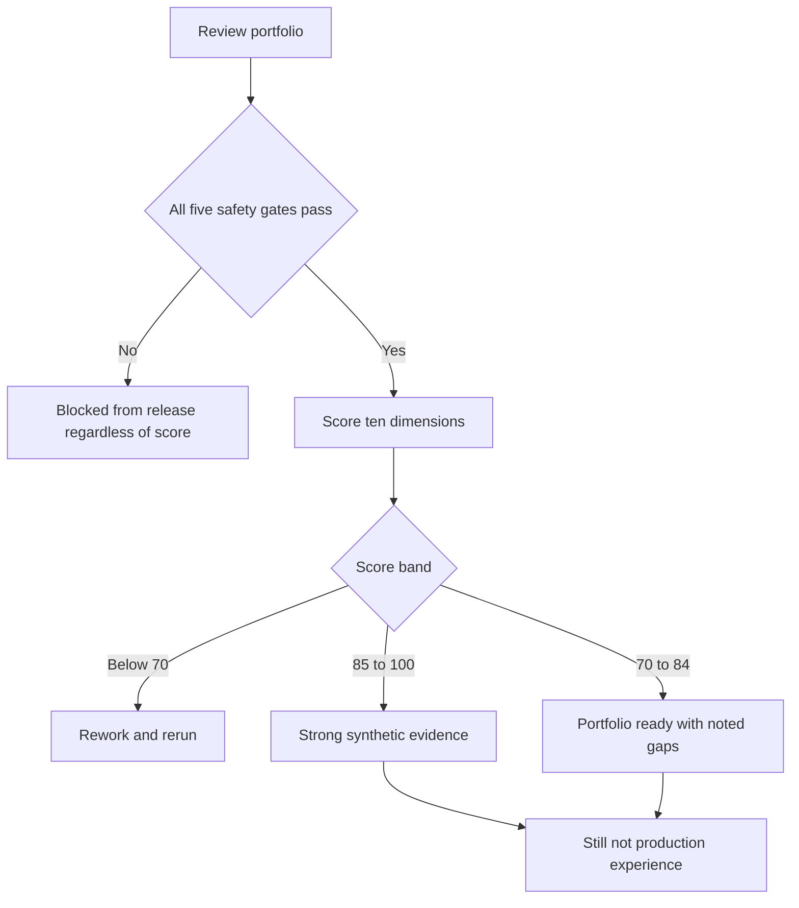

| Dimension | Points | Full-credit evidence | Common deduction |
|---|---:|---|---|
| Authorization and scope | 10 | Explicit local-only allowed/prohibited scope and stop conditions | Scope implies public testing |
| Synthetic data integrity | 10 | Reserved names, deterministic seed, dictionary, ground truth | Realistic data copied from real source |
| Least privilege and non-destruction | 10 | Standard user, offline/read-only/reversible steps | Elevation or broad deletion required |
| Privacy and secret handling | 10 | No secrets, minimized evidence, reviewed screenshots, retention | Raw HAR/capture or desktop leakage |
| Reproducibility | 10 | Versions, seed, cut, steps, inputs, expected checks, rerun | Result cannot be rebuilt |
| Provenance and data quality | 10 | Source/transformation ledger and count reconciliation | Dashboard detached from inputs |
| Technical correctness | 10 | Queries, joins, arithmetic, nulls, and observations validated | Silent denominator or type error |
| Evidence communication | 10 | Claim, observation, limitation, and next validation stay together | Screenshot used as unexplained proof |
| Candidate honesty | 10 | Factual experience and synthetic practice clearly separated | Lab renamed as production work |
| Cleanup and release | 10 | Manifest disposition, sanitized subset, temporary removal | Release contains unreviewed metadata |

### Blocking gates

| Gate | Pass condition | Failure response |
|---|---|---|
| G1 authority | Every target and file was created for the local lab | Stop, do not release, redesign |
| G2 data | No real tenant, customer, employee, patient, or personal data | Stop and follow applicable privacy process |
| G3 secrets | No credentials, tokens, cookies, keys, or private certificates | Stop, secure, and follow policy |
| G4 controls | No TLS validation, proxy, firewall, EDR, identity, or security control was disabled or bypassed | Stop and restore only through authorized policy |
| G5 claims | No artifact implies production Zscaler/customer experience or outcomes | Correct every artifact and rehearse wording |

### Scoring interpretation

| Score | Interpretation | Portfolio action |
|---:|---|---|
| 0-69 | Important evidence or control is incomplete | Rework before discussion |
| 70-84 | Reproducible synthetic practice with visible gaps | Discuss only with caveats and improvement plan |
| 85-94 | Strong, safe, inspectable synthetic portfolio | Use as evidence of method and preparation |
| 95-100 | Exceptionally complete synthetic portfolio | Still label as synthetic; seek changed-case review |

A perfect score does not convert simulation into production experience. It means the simulation was prepared, executed, evidenced, and bounded well.

## Explicitly fictional and synthetic NMH scenarios

### Scenario 1 - The tempting real HAR

An interviewer asks for more realistic browser evidence. The candidate refuses to export a signed-in work HAR and instead uses the Part 114 synthetic fixture. The portfolio records the rejected action as evidence of privacy judgment. No customer, Microsoft, or Zscaler traffic is collected.

### Scenario 2 - The accidental product claim

A dashboard title says "Zscaler connector health." The local model contains only generated source batches. The candidate corrects the title to "Synthetic NMH source-ingestion health, analogous learning model," versions the artifact, and records the claim correction. No Zscaler connector was used.

### Scenario 3 - The unexplained 0 percent

The retained fraction displays as zero because a local engine performed integer division. The candidate preserves the failed result, inspects operand types, updates the query to force decimal arithmetic, reruns, and records 0.75. The learning is analytical, not a customer outcome.

### Scenario 4 - The overbroad cleanup

A draft note suggests deleting the entire portfolio parent folder. The candidate stops because the parent may contain unrelated files, inventories exact temporary paths, deletes only reviewed generated copies, and records disposition. No destructive command is used.

## Reusable artifact kit

| Artifact | Core fields | Reused in |
|---|---|---|
| Scope charter | Purpose, targets, data, actions, prohibition, stop, retention | Parts 112-117 |
| Safety preflight | Path, identity, privilege, network, secret, control, output | Parts 112-117 |
| Manifest | Identity, path, provenance, label, version, hash, disposition | Parts 112-117 |
| Claim ledger | Context, action, observation, limitation, next validation | Parts 112-117 |
| Source ledger | Title, URL, date, bounded use, non-inference | Parts 112-117 |
| Data dictionary | Field, type, meaning, values, null, sensitivity, source | Parts 112-114 and 116-117 |
| Transformation ledger | Input, rule, output, reject, validation, version | Parts 112-113 and 116-117 |
| Evidence index | Question, artifact, timestamp, observation, confidence, limitation | Parts 112-117 |
| Reproduction record | Environment, seed, steps, queries, expected, variance | Parts 112-117 |
| Privacy review | Collection, minimization, redaction, access, retention, release | Parts 112-117 |
| Validation rubric | Gates, dimensions, evidence, score, rework | Parts 112-117 |
| Reflection | objective, failure, correction, proof, non-proof, next | Parts 112-117 |

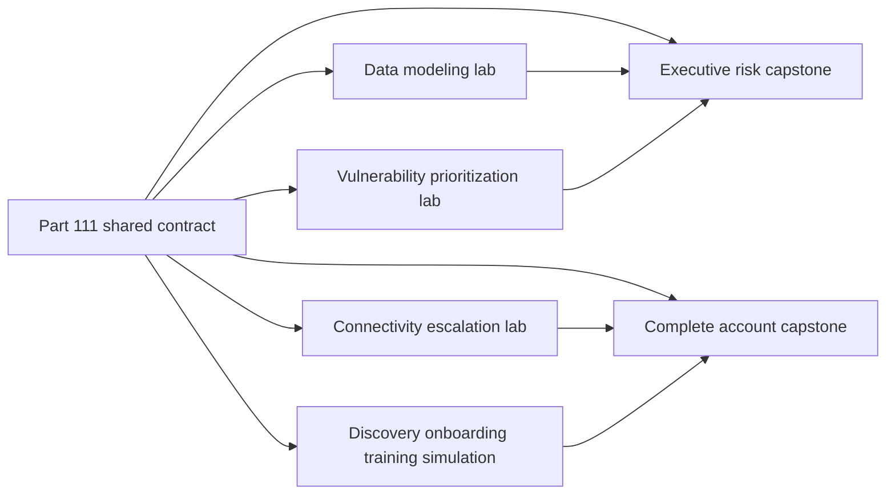

## Official Source Anchors

Research/source snapshot and source review date: **2026-08-24**.

The Zscaler sources support bounded public product positioning only. NIST, CISA, IETF, and Microsoft sources support general cybersecurity, privacy, documentation-address, HTTP, HAR, and local analytical context. None grants testing authorization, validates an NMH artifact, proves product behavior, or establishes production experience.

| Source | URL | Used for | Boundary |
|---|---|---|---|
| Zscaler Data Fabric for Security | https://www.zscaler.com/products-and-solutions/data-fabric | Public security-data harmonization and workflow positioning | No internal schema, connector, tenant, or result inferred |
| Zscaler Unified Vulnerability Management | https://www.zscaler.com/products-and-solutions/unified-vulnerability-management | Public vulnerability aggregation and contextual prioritization positioning | No algorithm, score, workflow, or production operation inferred |
| Zscaler Risk360 | https://www.zscaler.com/products-and-solutions/risk360 | Public risk visibility and communication positioning | No synthetic score is a Risk360 score |
| Zscaler Agentic Security Operations | https://www.zscaler.com/products-and-solutions/security-operations | Public SecOps portfolio positioning | No agent, action, tenant, or outcome inferred |
| NIST Cybersecurity Framework 2.0 | https://www.nist.gov/cyberframework | General Govern, Identify, Protect, Detect, Respond, Recover framing | Voluntary and implementation-neutral |
| NIST Privacy Framework | https://www.nist.gov/privacy-framework | General privacy-risk management context | Not legal advice or a certification |
| NIST SP 800-207 Zero Trust Architecture | https://csrc.nist.gov/pubs/sp/800/207/final | Vendor-neutral zero-trust concepts | Not a product or customer design |
| CISA Secure by Design | https://www.cisa.gov/securebydesign | General secure-by-design responsibility context | Does not authorize testing |
| IETF RFC 2606 | https://www.rfc-editor.org/rfc/rfc2606 | Reserved top-level DNS names for documentation and testing | Does not make network probing acceptable |
| IETF RFC 5737 | https://www.rfc-editor.org/rfc/rfc5737 | IPv4 documentation address blocks | Addresses are narrative fixtures only |
| W3C Web Performance Working Group HAR | https://w3c.github.io/web-performance/specs/HAR/Overview.html | HAR format context | HAR files can contain sensitive data and require review |
| Microsoft Power BI Desktop documentation | https://learn.microsoft.com/power-bi/fundamentals/desktop-what-is-desktop | General local BI authoring context | Availability, licensing, and approved use require current verification |
| SQLite documentation | https://www.sqlite.org/docs.html | General local relational engine reference | SQL behavior and installed version require local verification |
| DuckDB documentation | https://duckdb.org/docs/ | General local analytical engine reference | SQL behavior and installed version require local verification |
| PostgreSQL documentation | https://www.postgresql.org/docs/ | General relational database reference | Local configuration and version require verification |

## Likely Interview Questions

### Q1. How would you build a safe security lab without paid product access?

**Model answer:** I would define written local-only scope, use a standard user, generate deterministic synthetic data, keep analysis offline, preserve immutable raw inputs, and use an approved spreadsheet or local relational engine. I would prohibit live scanning, interception, real tenant data, secrets, security-control changes, TLS bypass, and destructive commands. I would save queries, versions, expected checks, evidence, limitations, and cleanup. The resulting artifacts demonstrate method, not product administration or customer outcomes.

### Q2. What makes synthetic data useful rather than random?

**Model answer:** Useful synthetic data has controlled truth. I define canonical entities, relationships, distributions, timestamps, nulls, duplicates, stale records, conflicts, and expected defects before generation. I fix the seed and reporting cut, version the schema, and assert counts and integrity. That lets me test whether quality, mapping, scoring, and dashboards detect known conditions. I keep reserved names and addresses and never imply the generated schema is a vendor's internal model.

### Q3. How do you make a portfolio reproducible?

**Model answer:** I record scope, input inventory, schema and generator versions, fixed seed, reporting cut, tool versions, environment assumptions, ordered steps, exact queries or formulas, expected checks, tolerances, outputs, and cleanup. I freeze raw inputs and separate transformations. I rerun from the record and, where possible, have another person follow it. Variance is investigated and recorded. Reproducibility supports the bounded lab claim; it does not establish production readiness.

### Q4. What privacy precautions apply to HAR and packet evidence?

**Model answer:** I begin with the exact question and prefer static synthetic evidence. Real HAR and packet captures may expose URLs, identities, cookies, tokens, content, processes, and unrelated traffic. These labs require no live capture. In authorized work I would minimize interface, host, duration, fields, and payload; protect access; redact carefully; retain briefly; and follow policy. I would never disable TLS or security controls just to obtain clearer evidence.

### Q5. How do you prevent a dashboard from overstating evidence?

**Model answer:** I keep a trace from visual to measure, query, transformation, raw row, generator rule, and reporting cut. The dashboard shows scope, filters, definitions, quality, and limitations near the headline. I reconcile source, accepted, rejected, duplicate, and output counts. I use stable denominators and preserve query text. A visual is a view, not a source, and a synthetic trend is not customer value or risk reduction.

### Q6. What claim language would you use for these labs?

**Model answer:** I would say: "This was an explicitly synthetic NMH lab. I personally designed and executed the documented model, query, analysis, or simulation and observed this bounded result. It did not use a Zscaler tenant, real customer data, or production workflow and did not measure customer outcomes. In production I would verify current documentation, entitlement, customer source contracts, authorization, controlled tests, and acceptance evidence." I would attach that boundary to every artifact.

### Q7. When should a lab action stop?

**Model answer:** I stop when the target is not clearly owned for the lab, authorization is missing, real data or a secret appears, administrator access is unexpectedly required, output leaves the dedicated folder, a command could reach an external system, a security control would be weakened, or observed behavior differs materially from the preflight. I preserve only minimal safe evidence, record the stop, and redesign. Stopping is evidence of judgment.

### Q8. How does your background strengthen this portfolio without becoming an unsupported claim?

**Model answer:** Your prior enterprise escalation work supports evidence discipline, timelines, hypothesis testing, RCA, customer communication, and cross-team coordination. Your network-trace tools support careful interpretation, while SQL, PostgreSQL, Power BI, statistics, and MBA analytics support data models and dashboards. Mentoring supports beginner-first workshops. Those are factual transfer points. Production Zscaler access, SecOps account ownership, security testing, UVM operation, and NMH outcomes remain explicitly unclaimed.

## 30-Second Memory Hooks

| Concept | Memory hook |
|---|---|
| Authorization | Permission before packets |
| Scope | Target, data, action, time, output |
| Synthetic | Real shape, fictional lives |
| Least privilege | Smallest key for the local room |
| Non-destructive | Reversible or do not do it |
| Raw data | Freeze before transforming |
| Provenance | Passport for every field |
| Reporting cut | Freeze the analytical clock |
| Reproducibility | Recipe, ingredients, settings, expected result |
| HAR | Browser diary that may contain secrets |
| Capture | Prefer supplied synthetic evidence |
| Dashboard | View, not source |
| Claim | Context, action, observation, limit, next validation |
| Cleanup | Exact inventory, exact disposition |
| Portfolio | Evidence of method, not invented history |
| NMH | Always fictional and synthetic |

## Completion Checklist

- [ ] I can explain authorization, scope, synthetic data, least privilege, non-destruction, provenance, reproducibility, redaction, and claim labels from zero.
- [ ] I can state that NMH and every NMH record, result, and stakeholder are fictional and synthetic.
- [ ] I can apply the shared portfolio contract to Parts 112-117.
- [ ] I can define allowed and prohibited actions before opening a tool.
- [ ] I can identify stop conditions and treat stopping as sound judgment.
- [ ] I can use reserved domains and documentation addresses only as offline narrative data.
- [ ] I can choose an approved spreadsheet or local SQL path without paid Zscaler access.
- [ ] I can preserve raw inputs and separate staged, analysis, evidence, deliverable, validation, release, and temporary content.
- [ ] I can record tool versions, seed, schema, reporting cut, steps, expected checks, outputs, and cleanup.
- [ ] I can explain why a dashboard is a view rather than a source.
- [ ] I can save portable SQL and label engine-specific assumptions.
- [ ] I can reject real HAR, packet, tenant, secret, and production-data use in this portfolio.
- [ ] I can review screenshots and exports for visible and hidden privacy leakage.
- [ ] I can use the manifest, claim ledger, source ledger, evidence index, reproduction record, and reflection.
- [ ] I can distinguish official public facts, general practice, synthetic observations, factual candidate experience, hypotheses, and unknowns.
- [ ] I can state exactly what each artifact proves and does not prove.
- [ ] I can perform exact-path cleanup without destructive commands.
- [ ] I can apply all five blocking gates before release.
- [ ] I can discuss your factual strengths without claiming Zscaler production experience or customer outcomes.
- [ ] I can explain why even a 100-point synthetic lab remains a synthetic lab.

[Next: Part 112 - Data Fabric and Security Data Modeling Lab](Part-112-data-fabric-modeling-lab.md)