# Part 112 - Data Fabric and Security Data Modeling Lab

> **Audience:** Candidates preparing for a Zscaler Security Operations Technical Success Manager role after enterprise Support Escalation Engineering.

> **Purpose:** Build and explain a complete local security-data modeling lab from synthetic multi-tool sources through canonical entities, mappings, quality controls, deduplication, relationships, enrichment, connector health, portable SQL, and a decision-oriented dashboard.

> **Scope and honesty:** Northstar Meridian Holdings, abbreviated NMH, is explicitly fictional and synthetic. Every source, connector, batch, asset, identity, finding, owner, ticket, metric, dashboard, timestamp, defect, and result in this Part is invented for study. The lab is a vendor-neutral analogy for security-data-fabric concepts; it is not a Zscaler Data Fabric schema, connector, algorithm, dashboard, tenant, or implementation. Your factual background includes SQL, PostgreSQL, Excel, Power BI, statistics, Microsoft 365 escalation engineering, networking and trace analysis, and customer communication. Production Zscaler Data Fabric operation and customer security-data outcomes remain unclaimed.

> **Currency caveat:** Product capabilities, source support, connector behavior, schemas, interfaces, packaging, entitlements, and recommended practices change. The controlled official-source snapshot and source review date for this Part is exactly **2026-08-24**. Current official documentation, licensed-tenant evidence, customer source contracts, data-owner approval, privacy/security review, product specialists, and controlled validation govern production work.

> **Section goal:** Produce a reproducible, safe, local portfolio artifact that ingests deterministic fictional records from CMDB-, EDR-, scanner-, identity-, ticketing-, and business-registry-style sources; creates canonical security entities without hiding provenance; measures and quarantines quality defects; resolves duplicates with explainable rules; links assets, identities, findings, controls, owners, and tickets; enriches them with business context; monitors source health; answers useful SQL questions; and presents a dashboard with visible quality and claim limitations.

This Part applies the shared contract from Part 111. All work is local, synthetic, non-destructive, least-privileged, and reproducible. No paid Zscaler access, live connector, real tenant, network scan, external API, credential, secret, packet capture, TLS change, security-control bypass, or destructive command is required or allowed.

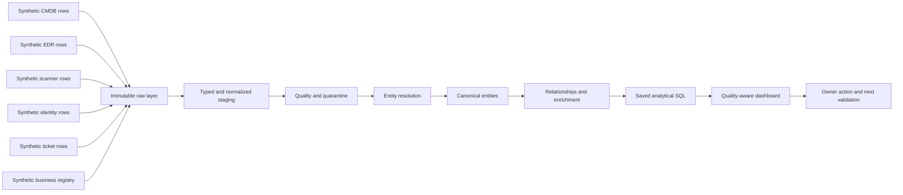

| Operating principle | Plain meaning | Lab behavior | Failure prevented |
|---|---|---|---|
| Preserve source truth | Normalization must not erase origin | Raw rows remain immutable with source IDs | Golden record cannot be audited |
| Define grain first | One row must have one declared meaning | Every table states its row grain | Counts multiply after joins |
| Canonical does not mean perfect | A common entity is a governed interpretation | Keep confidence, alternatives, and source lineage | Dedup becomes invisible guesswork |
| Quality is multidimensional | A fresh feed can still be incomplete or invalid | Measure freshness, completeness, validity, uniqueness, consistency, integrity | Green connector hides bad data |
| Resolve conservatively | False merges can be worse than duplicates | Auto-match only strong keys; queue ambiguity | Two assets become one incorrectly |
| Relationships carry meaning | Security decisions depend on ownership, exposure, control, and business role | Use typed, time-bounded edges | Flat inventory cannot answer risk questions |
| Enrichment is evidence | Criticality and ownership need source and date | Store provenance and effective time | Context becomes undocumented opinion |
| Connector health is a chain | Authentication success does not prove usable data | Track fetch, parse, map, load, reconcile, and freshness | "Connected" mistaken for healthy |
| Dashboards expose uncertainty | Quality and limitations belong near metrics | Show source health and unresolved entities | Executives act on false precision |
| Product claims stay bounded | The lab teaches concepts, not internals | Use "analogous" and source-date labels | Local SQL presented as Zscaler implementation |

## JD Mapping

| JD signal | Capability developed | Concrete artifact | Honest boundary |
|---|---|---|---|
| Understand complex customer environments | Inventory fictional sources, grains, owners, and dependencies | Source contract catalog | No real customer architecture inferred |
| Drive Data Fabric value | Connect source quality to entity and workflow usability | Data-quality dashboard | Not a Zscaler connector or tenant |
| Apply technical and analytical depth | Design relational schemas, mappings, checks, joins, and metrics | Portable SQL package | Local results only |
| Troubleshoot integrations | Isolate fetch, parse, map, load, reconcile, and downstream defects | Connector-health runbook | No production API behavior claimed |
| Translate security data | Link assets, identities, findings, controls, owners, and tickets | Canonical relationship model | Synthetic relationships only |
| Advise executives | Explain coverage, uncertainty, and decisions | One-page dashboard narrative | No customer outcome or risk reduction claimed |
| Collaborate across teams | Separate source owner, data steward, security owner, and workflow owner | Data RACI | Fictional roles have no real authority |
| Build trust | Preserve provenance, reject bad rows, explain matches, and expose limitations | Evidence and exception ledger | Confidence is not certainty |

## Candidate honesty note

You can say: "I created a local synthetic security-data modeling lab using deterministic CMDB-, EDR-, vulnerability-scanner-, identity-, ticketing-, and business-registry-style inputs. I defined source contracts and canonical entities, implemented quality and reconciliation checks, resolved selected duplicates with explainable rules, modeled relationships and enrichment, wrote portable SQL, and built a quality-aware dashboard. This uses my factual SQL, PostgreSQL, Power BI, statistics, enterprise escalation, and evidence-analysis strengths. It is an analogous learning model, not a Zscaler Data Fabric implementation, real connector deployment, customer dataset, or production outcome."

| Documented background | Transferable strength | Safe wording | Unsupported wording to avoid |
|---|---|---|---|
| SQL and PostgreSQL | Schema design, joins, quality checks, aggregations | "I exercised a normalized synthetic security model locally." | "I know Zscaler's production schema." |
| Power BI, Excel, statistics, MBA analytics | Measures, segmentation, visual interpretation, executive framing | "I built a quality-aware synthetic dashboard." | "I deployed a Zscaler dashboard for a customer." |
| Microsoft 365 escalation engineering | Provenance, timestamps, evidence reconciliation, ownership | "I transferred disciplined evidence handling into the lab." | "I operated a security data fabric in production." |
| Networking and traces | Understand identifiers, observations, paths, and source limits | "I distinguish observed source records from canonical interpretation." | "Network evidence guarantees asset identity." |
| Customer and Engineering collaboration | Source contract and defect communication | "I can explain the evidence an owner needs to act." | "I onboarded these enterprise connectors." |
| Synthetic NMH work | Portfolio evidence of preparation | "This artifact demonstrates method under controlled conditions." | "NMH was my customer." |

## Beginner vocabulary and memory hooks

A **data fabric** is an architectural approach that helps connect, govern, and make data usable across sources and workflows. It is not simply one database. Think of a multilingual transit hub: trains arrive from different companies with different timetables and ticket formats. The hub needs arrival contracts, signs, identity rules, transfer maps, quality monitoring, and routes to destinations.

| Term | Meaning from zero | Why it matters | Memory hook |
|---|---|---|---|
| Source system | Tool or repository that emits records | Each source sees a different slice of reality | Different witness |
| Source contract | Agreed grain, fields, types, keys, cadence, semantics, and owner | Makes ingestion testable | Shipping manifest |
| Connector | Mechanism that moves data between systems | A connection can fail at several stages | Pipe plus translator |
| Batch | Group of source records processed together | Enables reconciliation and freshness | One delivery truck |
| Raw layer | Immutable copy of source-shaped data | Preserves audit and replay | Sealed delivery |
| Staging layer | Typed and normalized intermediate tables | Isolates source cleanup | Sorting table |
| Canonical model | Common representation across sources | Supports consistent queries | Shared language |
| Entity | Distinct thing such as an asset, identity, finding, control, or ticket | Core unit of correlation | Person or object in the story |
| Grain | Exact meaning of one row | Prevents invalid counting | One row equals what? |
| Natural key | Business field that may identify a record | Useful but can change or collide | Name on a package |
| Surrogate key | Locally generated stable identifier | Separates model identity from source IDs | Internal claim ticket |
| Mapping | Rule from source field/value to canonical field/value | Makes translation inspectable | Bilingual dictionary |
| Normalization | Converting equivalent values to a common form | Helps comparison | Same phone-number format |
| Data quality | Fitness of data for a defined use | Quality is decision-specific | Can this map guide this trip? |
| Quarantine | Holding invalid or uncertain rows outside accepted output | Prevents silent corruption | Inspection lane |
| Deduplication | Detecting and handling multiple records for one entity | Reduces fragmented views | Combine duplicate address cards |
| Entity resolution | Deciding which records refer to the same real-world thing | Broader and more cautious than deleting duplicates | Match witnesses to one subject |
| Survivorship | Rule choosing canonical values among sources | Makes conflict handling explicit | Which witness supplies which field? |
| Provenance | Source and transformation history | Supports trust and correction | Record passport |
| Relationship | Typed connection between entities | Enables context and paths | Edge on a map |
| Enrichment | Adding relevant context from another source or rule | Changes prioritization and ownership | Add department and criticality |
| Freshness | Delay between source observation and usable data | Old data may mislead | Age of the map |
| Completeness | Required data present for the intended job | Missing owner blocks remediation | Blank destination field |
| Validity | Value conforms to allowed format or range | Prevents impossible data | Date is a date |
| Uniqueness | Key is not duplicated unexpectedly | Protects entity identity | One ticket number per ticket |
| Referential integrity | Referenced entity exists | Prevents orphan relationships | Road leads to a real place |
| Reconciliation | Counts and totals balance across stages | Finds dropped or duplicated records | Delivery count matches receipt |
| Golden record | Best governed representation assembled from sources | It remains evidence-based and revisable | Best current dossier |
| Confidence | Strength of evidence behind a match or field | Supports review thresholds | How sure and why? |

### Plain-English deep-dive 1 - Canonical is a translation, not a declaration of truth

Suppose the CMDB calls a machine `NMH-LT-042`, the EDR source calls it `nmh-lt-042.nmh.example.com`, and the scanner reports IP `192.0.2.42`. A canonical model may link them using normalized hostname, serial number, and observed address. That does not mean every field is equally current or authoritative.

Think of three witnesses describing a vehicle. One knows the registration, one saw its current location, and one inspected a defect. The case file can connect their accounts while preserving who said what and when. If two witnesses disagree about ownership, the model should retain the conflict and route it for review rather than silently selecting a convenient answer.

The golden record is therefore "best governed representation for this use at this time," not absolute reality. It needs source lineage, survivorship rules, match confidence, unresolved conflicts, and effective timestamps.

## Architecture and source contracts

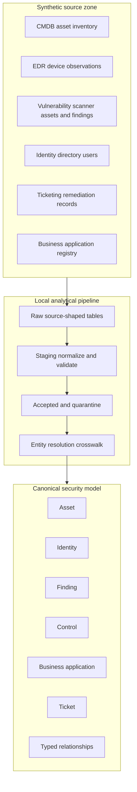

| Source | Row grain | Source key | Cadence | Source authority | Known synthetic defect |
|---|---|---|---|---|---|
| cmdb_asset | One configuration item snapshot | cmdb_ci_id | Daily | Business service, declared owner, criticality | One stale owner and one duplicate hostname |
| edr_device | One endpoint-agent observation | edr_device_id | Hourly | Agent state, last seen, OS observation | One missing serial and one stale device |
| scanner_asset | One scanner asset observation | scanner_asset_id | Daily | Scan reachability and observed identifiers | One IP-only ambiguous asset |
| scanner_finding | One vulnerability instance on one scanner asset | scanner_finding_id | Daily | Finding status and scanner evidence | One orphan asset reference |
| directory_user | One fictional directory identity | user_id | Daily | Identity status, department, manager | One disabled owner still referenced |
| remediation_ticket | One remediation work item | ticket_id | Event/daily | Workflow status, assignee, due date | One closed ticket with open finding |
| business_app | One business application | app_id | Weekly | Business owner, tier, data class | One asset points to unknown app |
| source_batch | One ingestion attempt per source | batch_id | Per run | Operational transport and reconciliation | One delayed scanner batch |

### Canonical entity model

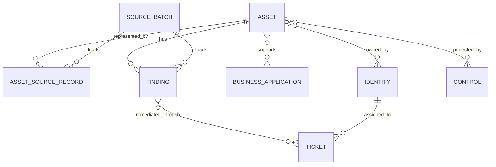

| Canonical entity | Grain | Surrogate key | Important attributes | Provenance requirement |
|---|---|---|---|---|
| asset | One resolved computing asset | asset_key | name, serial, class, OS, lifecycle, last_seen | Field-level source and observed time |
| identity | One fictional workforce or service identity | identity_key | user ID, status, department, role | Directory source and snapshot time |
| business_application | One fictional business service/application | app_key | tier, data class, owner, recovery need | Registry source and effective date |
| finding | One vulnerability instance on one resolved asset and vulnerability key | finding_key | vuln ID, severity, first/last seen, status | Scanner row and batch |
| control | One declared control instance relevant to an asset | control_key | type, state, evidence time, confidence | Control observation source |
| ticket | One remediation work item | ticket_key | status, owner, dates, resolution | Ticketing source and update time |
| relationship | One typed edge valid for a time range | relationship_key | from, to, type, confidence, effective dates | Source/rule that created edge |
| source_record | One raw or staged source record linked to candidate entity | source_record_key | source, source ID, batch, match status | Immutable raw locator |

## Prerequisites

Complete Part 111's shared contract first. The lab requires an approved local spreadsheet or SQL engine. SQLite, DuckDB, or PostgreSQL are suitable; examples use broadly portable SQL and label assumptions. Power BI Desktop is optional. A static Markdown dashboard or spreadsheet pivot is fully acceptable.

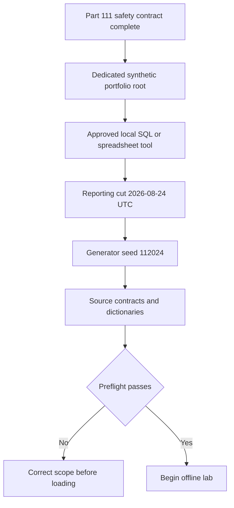

| Prerequisite | Required value | Verification | Safety boundary |
|---|---|---|---|
| Part 111 gates | All five pass | Review scope and claim ledger | No inherited exception |
| Portfolio path | Dedicated NMH directory | Parent contains no unrelated lab cleanup target | No broad deletion |
| Reporting cut | 2026-08-24T00:00:00Z | Record in manifest and dashboard | Do not use current clock |
| Generator seed | 112024 | Record in every generated file manifest | No changing seed mid-run |
| Schema version | 1.0 | Record in data dictionary | Migrations require new version |
| Tool identity | Actual product and version | Save in reproduction record | No paid Zscaler tool needed |
| User privilege | Standard user | No elevation prompt | Do not install drivers/services for lab |
| Network | Offline analysis | No connection string to external service | No API or connector call |
| Data | Inline fictional records or deterministic equivalent | Search for real identifiers | Never import work/customer exports |
| Release label | SYNTHETIC NMH LAB | Visible on output | Not hidden in metadata |

## Synthetic dataset specification

The compact inline dataset is sufficient to complete the lab. A learner may expand it deterministically, but the original expected records and defects must remain as a fixed regression set.

### Source batch data

| batch_id | source_name | started_utc | completed_utc | extract_rows | parsed_rows | accepted_rows | rejected_rows | status |
|---|---|---|---|---:|---:|---:|---:|---|
| b-cmdb-01 | cmdb_asset | 2026-08-23T23:00:00Z | 2026-08-23T23:01:00Z | 6 | 6 | 6 | 0 | success |
| b-edr-01 | edr_device | 2026-08-23T23:10:00Z | 2026-08-23T23:11:00Z | 6 | 6 | 6 | 0 | success |
| b-scan-01 | scanner_asset | 2026-08-21T02:00:00Z | 2026-08-21T02:05:00Z | 5 | 5 | 5 | 0 | success_delayed |
| b-find-01 | scanner_finding | 2026-08-21T02:05:00Z | 2026-08-21T02:07:00Z | 8 | 8 | 7 | 1 | partial |
| b-iam-01 | directory_user | 2026-08-23T22:00:00Z | 2026-08-23T22:01:00Z | 5 | 5 | 5 | 0 | success |
| b-ticket-01 | remediation_ticket | 2026-08-23T21:00:00Z | 2026-08-23T21:01:00Z | 4 | 4 | 4 | 0 | success |
| b-app-01 | business_app | 2026-08-20T08:00:00Z | 2026-08-20T08:01:00Z | 3 | 3 | 3 | 0 | success |

### CMDB asset data

| cmdb_ci_id | hostname | serial_number | asset_class | lifecycle | owner_user_id | app_id | criticality | updated_utc |
|---|---|---|---|---|---|---|---|---|
| ci-001 | NMH-LT-042 | SN-0042 | laptop | active | usr-001 | app-clinical | high | 2026-08-23T18:00:00Z |
| ci-002 | nmh-srv-web-01 | SN-WEB01 | server | active | usr-002 | app-portal | critical | 2026-08-23T18:05:00Z |
| ci-003 | NMH-SRV-DB-01 | SN-DB01 | server | active | usr-003 | app-clinical | critical | 2026-08-23T18:06:00Z |
| ci-004 | nmh-kiosk-07 | SN-K007 | kiosk | active | usr-004 | app-checkin | medium | 2026-08-23T18:07:00Z |
| ci-005 | NMH-OLD-09 | SN-OLD09 | laptop | retired | usr-005 | app-portal | low | 2026-01-05T09:00:00Z |
| ci-006 | nmh-lt-042.nmh.example.com | SN-0042 | endpoint | active | usr-001 | app-clinical | high | 2026-08-23T18:08:00Z |

`ci-001` and `ci-006` intentionally describe the same physical asset. This duplicate tests normalization and survivorship. `usr-005` is disabled in the identity source, which tests ownership quality.

### EDR device data

| edr_device_id | device_name | serial_number | primary_ip | os_family | agent_state | last_seen_utc |
|---|---|---|---|---|---|---|
| edr-101 | nmh-lt-042.nmh.example.com | SN-0042 | 192.0.2.42 | windows | healthy | 2026-08-23T23:40:00Z |
| edr-102 | NMH-SRV-WEB-01 | SN-WEB01 | 192.0.2.10 | windows_server | healthy | 2026-08-23T23:42:00Z |
| edr-103 | nmh-srv-db-01 | SN-DB01 | 192.0.2.11 | windows_server | degraded | 2026-08-23T23:35:00Z |
| edr-104 | nmh-kiosk-07 | SN-K007 | 192.0.2.70 | windows | healthy | 2026-08-23T23:31:00Z |
| edr-105 | nmh-lab-88 |  | 192.0.2.88 | linux | healthy | 2026-08-23T23:20:00Z |
| edr-106 | nmh-old-09 | SN-OLD09 | 192.0.2.99 | windows | offline | 2026-02-01T12:00:00Z |

### Scanner asset and finding data

| scanner_asset_id | observed_hostname | observed_ip | serial_hint | last_scanned_utc |
|---|---|---|---|---|
| sca-201 | nmh-lt-042 | 192.0.2.42 | SN-0042 | 2026-08-21T01:20:00Z |
| sca-202 | nmh-srv-web-01 | 192.0.2.10 | SN-WEB01 | 2026-08-21T01:25:00Z |
| sca-203 | nmh-srv-db-01 | 192.0.2.11 | SN-DB01 | 2026-08-21T01:30:00Z |
| sca-204 | nmh-kiosk-07 | 192.0.2.70 | SN-K007 | 2026-08-21T01:35:00Z |
| sca-205 |  | 192.0.2.88 |  | 2026-08-21T01:40:00Z |

| scanner_finding_id | scanner_asset_id | vuln_id | severity | status | first_seen_utc | last_seen_utc |
|---|---|---|---|---|---|---|
| sf-301 | sca-201 | SYN-CVE-0001 | high | open | 2026-08-01T02:00:00Z | 2026-08-21T01:20:00Z |
| sf-302 | sca-202 | SYN-CVE-0002 | critical | open | 2026-07-15T02:00:00Z | 2026-08-21T01:25:00Z |
| sf-303 | sca-203 | SYN-CVE-0003 | high | open | 2026-06-10T02:00:00Z | 2026-08-21T01:30:00Z |
| sf-304 | sca-204 | SYN-CVE-0002 | critical | closed | 2026-07-20T02:00:00Z | 2026-08-21T01:35:00Z |
| sf-305 | sca-205 | SYN-CVE-0004 | medium | open | 2026-08-20T02:00:00Z | 2026-08-21T01:40:00Z |
| sf-306 | sca-202 | SYN-CVE-0005 | medium | open | 2026-08-05T02:00:00Z | 2026-08-21T01:25:00Z |
| sf-307 | sca-999 | SYN-CVE-0006 | high | open | 2026-08-10T02:00:00Z | 2026-08-21T01:45:00Z |
| sf-308 | sca-203 | SYN-CVE-0007 | high | open | 2026-09-01T02:00:00Z | 2026-08-21T01:30:00Z |

`sf-307` is an orphan. `sf-308` has a future `first_seen_utc` relative to the reporting cut and must be rejected. The source batch therefore accepts seven and rejects one only if the orphan is accepted into quarantine-aware processing; the lab records both the validity rejection and the referential orphan separately.

### Identity, application, and ticket data

| user_id | display_label | department | identity_status | manager_user_id | snapshot_utc |
|---|---|---|---|---|---|
| usr-001 | NMH Endpoint Owner 01 | endpoint | active | usr-004 | 2026-08-23T22:00:00Z |
| usr-002 | NMH Web Owner 01 | digital | active | usr-004 | 2026-08-23T22:00:00Z |
| usr-003 | NMH Database Owner 01 | data | active | usr-004 | 2026-08-23T22:00:00Z |
| usr-004 | NMH Security Manager 01 | security | active |  | 2026-08-23T22:00:00Z |
| usr-005 | NMH Former Owner 01 | endpoint | disabled | usr-004 | 2026-08-23T22:00:00Z |

| app_id | app_name | business_tier | data_class | business_owner_user_id | effective_utc |
|---|---|---|---|---|---|
| app-clinical | NMH Clinical Workspace | tier_0 | synthetic_restricted | usr-003 | 2026-08-20T08:00:00Z |
| app-portal | NMH Member Portal | tier_1 | synthetic_confidential | usr-002 | 2026-08-20T08:00:00Z |
| app-checkin | NMH Check-In | tier_2 | synthetic_internal | usr-004 | 2026-08-20T08:00:00Z |

| ticket_id | scanner_finding_id | status | assigned_user_id | opened_utc | due_utc | closed_utc |
|---|---|---|---|---|---|---|
| tkt-401 | sf-302 | in_progress | usr-002 | 2026-08-10T10:00:00Z | 2026-08-25T18:00:00Z |  |
| tkt-402 | sf-303 | open | usr-003 | 2026-08-11T10:00:00Z | 2026-08-30T18:00:00Z |  |
| tkt-403 | sf-304 | closed | usr-004 | 2026-08-01T10:00:00Z | 2026-08-15T18:00:00Z | 2026-08-14T15:00:00Z |
| tkt-404 | sf-306 | closed | usr-002 | 2026-08-12T10:00:00Z | 2026-08-20T18:00:00Z | 2026-08-19T15:00:00Z |

`tkt-404` conflicts with the open status of `sf-306`. The model must surface workflow inconsistency instead of silently closing the finding.

## Canonical schema and mappings

The following SQL is conceptual and portable across common relational engines with minor type and date-function adjustments. It intentionally avoids vendor-specific extensions. Use text timestamps for the compact lab and document the consequence.

```sql
CREATE TABLE canonical_asset (
    asset_key TEXT PRIMARY KEY,
    canonical_name TEXT NOT NULL,
    serial_number TEXT,
    asset_class TEXT,
    lifecycle TEXT,
    os_family TEXT,
    last_seen_utc TEXT,
    match_confidence REAL NOT NULL,
    resolution_status TEXT NOT NULL
);

CREATE TABLE asset_source_xref (
    source_name TEXT NOT NULL,
    source_record_id TEXT NOT NULL,
    asset_key TEXT,
    match_rule TEXT NOT NULL,
    match_confidence REAL NOT NULL,
    review_status TEXT NOT NULL,
    PRIMARY KEY (source_name, source_record_id)
);

CREATE TABLE canonical_identity (
    identity_key TEXT PRIMARY KEY,
    user_id TEXT NOT NULL UNIQUE,
    display_label TEXT NOT NULL,
    department TEXT,
    identity_status TEXT NOT NULL,
    snapshot_utc TEXT NOT NULL
);

CREATE TABLE canonical_application (
    app_key TEXT PRIMARY KEY,
    app_id TEXT NOT NULL UNIQUE,
    app_name TEXT NOT NULL,
    business_tier TEXT NOT NULL,
    data_class TEXT NOT NULL,
    business_owner_identity_key TEXT,
    effective_utc TEXT NOT NULL
);

CREATE TABLE canonical_finding (
    finding_key TEXT PRIMARY KEY,
    source_finding_id TEXT NOT NULL UNIQUE,
    asset_key TEXT,
    vuln_id TEXT NOT NULL,
    severity TEXT NOT NULL,
    finding_status TEXT NOT NULL,
    first_seen_utc TEXT NOT NULL,
    last_seen_utc TEXT NOT NULL,
    data_quality_status TEXT NOT NULL
);

CREATE TABLE canonical_ticket (
    ticket_key TEXT PRIMARY KEY,
    source_ticket_id TEXT NOT NULL UNIQUE,
    finding_key TEXT,
    ticket_status TEXT NOT NULL,
    assigned_identity_key TEXT,
    opened_utc TEXT NOT NULL,
    due_utc TEXT,
    closed_utc TEXT
);

CREATE TABLE entity_relationship (
    relationship_key TEXT PRIMARY KEY,
    from_entity_type TEXT NOT NULL,
    from_entity_key TEXT NOT NULL,
    relationship_type TEXT NOT NULL,
    to_entity_type TEXT NOT NULL,
    to_entity_key TEXT NOT NULL,
    confidence REAL NOT NULL,
    source_rule TEXT NOT NULL,
    effective_from_utc TEXT NOT NULL,
    effective_to_utc TEXT
);

CREATE TABLE data_quality_issue (
    issue_key TEXT PRIMARY KEY,
    source_name TEXT NOT NULL,
    source_record_id TEXT NOT NULL,
    dimension TEXT NOT NULL,
    severity TEXT NOT NULL,
    rule_id TEXT NOT NULL,
    observed_value TEXT,
    disposition TEXT NOT NULL,
    owner_role TEXT NOT NULL
);
```

### Field mapping matrix

| Canonical field | CMDB | EDR | Scanner | Normalization | Survivorship |
|---|---|---|---|---|---|
| canonical_name | hostname | device_name | observed_hostname | lowercase; remove `.nmh.example.com`; trim | Most recent nonblank CMDB preferred, then EDR, then scanner |
| serial_number | serial_number | serial_number | serial_hint | uppercase and trim | Matching nonblank value; conflict requires review |
| asset_class | asset_class | derived from OS only if allowed | none | map endpoint/laptop to endpoint; server retained | CMDB authoritative for declared class |
| lifecycle | lifecycle | agent state is not lifecycle | none | controlled values active/retired/unknown | CMDB, but stale update lowers confidence |
| os_family | none | os_family | none | controlled lowercase family | EDR most recent observation |
| last_seen_utc | updated_utc is not observation | last_seen_utc | last_scanned_utc | ISO UTC | Maximum observation timestamp by defined source semantics |
| primary_ip | none | primary_ip | observed_ip | validate documentation range in lab | Latest EDR observation; scanner as secondary |
| owner | owner_user_id | none | none | resolve to identity key | CMDB declaration plus active-identity check |
| application | app_id | none | none | resolve to application key | CMDB declaration plus registry integrity check |
| finding status | none | none | status | open/closed mapping | Scanner current status; ticket cannot overwrite silently |

### Quality rules

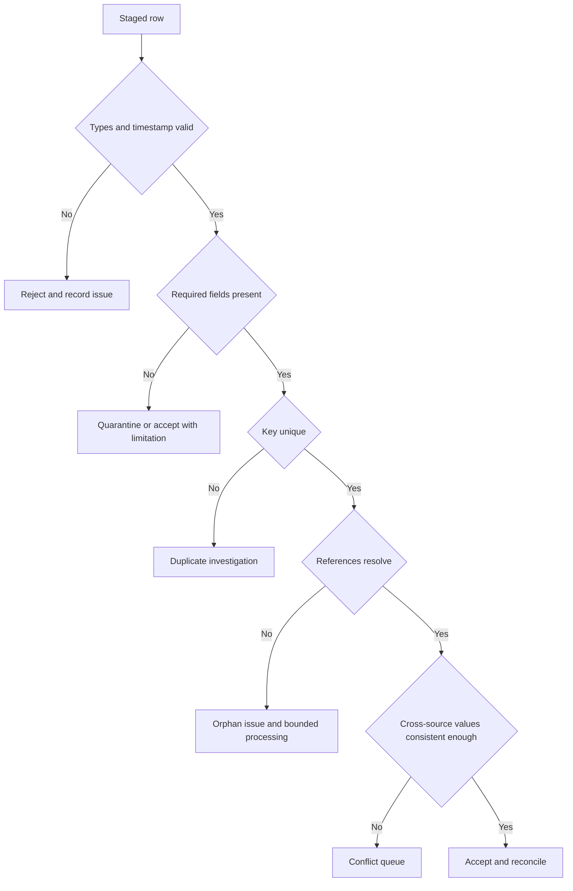

| Rule ID | Dimension | Test | Expected defect | Disposition |
|---|---|---|---|---|
| Q-TIME-01 | validity | first_seen <= last_seen <= reporting_cut | sf-308 future first_seen | Reject sf-308 |
| Q-REF-01 | integrity | scanner finding asset exists | sf-307 references sca-999 | Quarantine relationship; retain issue |
| Q-UNI-01 | uniqueness | source keys unique | None in compact input | Reject duplicate source key |
| Q-ASSET-01 | completeness | asset has one strong identifier or two moderate identifiers | sca-205 has IP only | Manual-review asset candidate |
| Q-OWNER-01 | consistency | active asset owner identity is active | ci-005 owner is disabled | Ownership issue; do not invent replacement |
| Q-DUP-01 | duplication | normalized host and serial indicate same asset | ci-001 and ci-006 | Resolve to one asset with lineage |
| Q-WF-01 | consistency | closed ticket aligns with finding state or has reconciliation reason | tkt-404 closed while sf-306 open | Workflow exception |
| Q-FRESH-01 | freshness | source age within source-specific threshold | scanner and finding batches delayed | Health warning |
| Q-APP-01 | integrity | declared app exists | Compact input resolves all apps | Reject or queue unknown app |
| Q-COUNT-01 | reconciliation | extract = parsed; parsed = accepted + rejected | finding batch 8 = 7 + 1 | Pass with partial status |

### Entity resolution rules

Entity resolution must prioritize false-merge prevention. IP alone is not a durable identity because addresses can be reassigned.

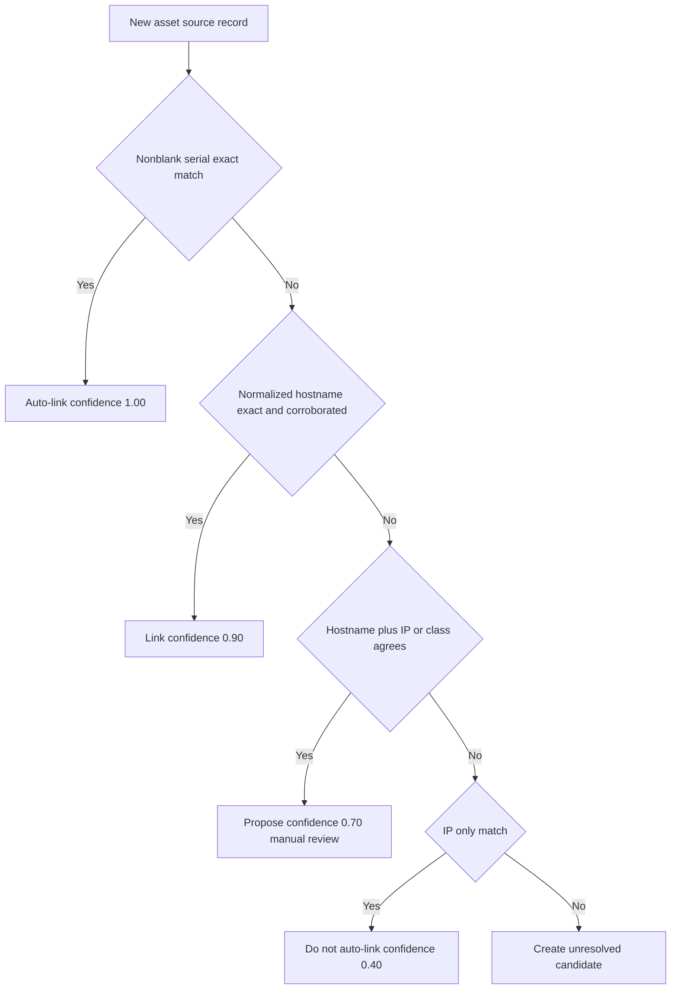

| Match rule | Evidence | Confidence in this lab | Action | Rationale |
|---|---|---:|---|---|
| ER-01 | Exact nonblank normalized serial | 1.00 | Auto-link | Strong stable identifier in synthetic contract |
| ER-02 | Exact normalized hostname plus matching serial hint | 0.98 | Auto-link | Two agreeing identifiers |
| ER-03 | Exact normalized hostname plus IP agreement | 0.90 | Auto-link if no conflict | Strong pair but time matters |
| ER-04 | Exact normalized hostname only | 0.75 | Review | Hostnames may be reused |
| ER-05 | IP only | 0.40 | Do not auto-link | Address can change owners |
| ER-06 | Conflicting serial for same host | 0.10 | Block and investigate | High false-merge risk |

Expected resolved assets are `asset-001` for `ci-001`, `ci-006`, `edr-101`, and `sca-201`; `asset-002` for web; `asset-003` for database; `asset-004` for kiosk; `asset-005` for retired laptop; and `asset-006` as unresolved lab device represented by `edr-105` with `sca-205` held for review rather than automatically merged by IP alone. A reviewer may approve that final pair inside the synthetic scenario, but the decision and evidence must be explicit.

### Plain-English deep-dive 2 - Deduplication is a risk decision

Leaving two records separate can inflate counts and fragment context. Merging two different assets can attach the wrong vulnerabilities, owner, business criticality, and remediation ticket to one entity. The second error can be more dangerous because the resulting record looks complete.

Think of a hospital matching two patient charts. Similar names are not enough. A conservative process uses strong identifiers, records confidence, holds ambiguous cases, and preserves every source record. In this fictional security model, serial plus normalized hostname supports a strong match. An IP address alone does not.

The metric "duplicate rate reduced" is therefore incomplete. A better review includes auto-match precision on known test pairs, ambiguous queue size, false-merge test cases, time to resolve, and downstream impact.

## Relationships and enrichment

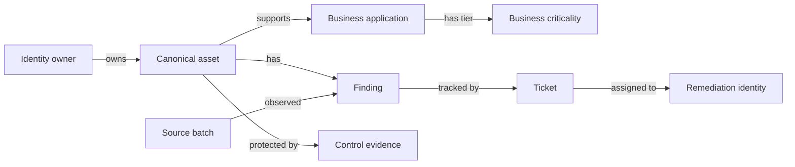

For the compact lab, create one synthetic control table manually from declared scenario facts. It does not represent EDR effectiveness or a Zscaler control.

| control_id | asset_key | control_type | control_state | evidence_utc | confidence | source_label |
|---|---|---|---|---|---:|---|
| ctl-501 | asset-001 | endpoint_agent | healthy | 2026-08-23T23:40:00Z | 0.90 | synthetic_edr_state |
| ctl-502 | asset-002 | endpoint_agent | healthy | 2026-08-23T23:42:00Z | 0.90 | synthetic_edr_state |
| ctl-503 | asset-003 | endpoint_agent | degraded | 2026-08-23T23:35:00Z | 0.80 | synthetic_edr_state |
| ctl-504 | asset-004 | endpoint_agent | healthy | 2026-08-23T23:31:00Z | 0.90 | synthetic_edr_state |
| ctl-505 | asset-005 | endpoint_agent | offline | 2026-02-01T12:00:00Z | 0.60 | synthetic_edr_state |
| ctl-506 | asset-006 | endpoint_agent | healthy | 2026-08-23T23:20:00Z | 0.70 | unresolved_asset_context |

Do not interpret `healthy` as proof that a vulnerability is mitigated. Agent state is only one observation. Control effectiveness, policy coverage, tamper state, prevention mode, and specific protection against a vulnerability are unknown.

### Enrichment rules

| Enriched field | Source/rule | Null behavior | Quality caution |
|---|---|---|---|
| business_tier | Asset supports application; application registry supplies tier | Unknown if app edge absent | One asset may support several apps |
| data_class | Application registry | Preserve unknown | Synthetic label is not real regulatory classification |
| owner_status | CMDB owner resolved to directory identity | Unknown owner remains issue | Disabled identity is not automatically replaced |
| asset_activity | Recent EDR or scanner observation plus lifecycle | Keep conflict if retired but recently active | Lifecycle and telemetry describe different facts |
| scanner_age_hours | Reporting cut minus finding batch completion | Null if completion absent | Engine-specific date calculation |
| workflow_state | Finding plus ticket state | `untracked` if no ticket | Ticket closure cannot overwrite finding evidence |
| quality_confidence | Explicit rule from source health and entity resolution | Never default to 100 | Not business-risk confidence |

## Connector health model

A connector-style pipeline is healthy only if data arrives and remains usable for the intended workflow.

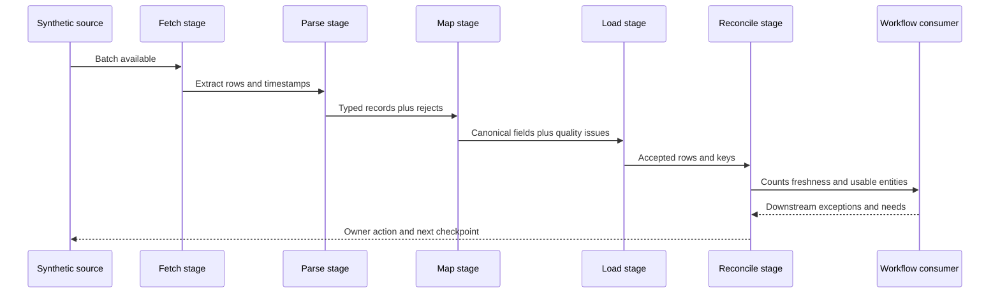

| Health dimension | Metric | Green synthetic threshold | Warning | Critical | Limitation |
|---|---|---:|---:|---:|---|
| Transport | Batch completed | yes | delayed | failed | Local table simulates transport |
| Parse | parsed/extracted | 1.00 | 0.98-0.999 | below 0.98 | Small batches make rates volatile |
| Acceptance | accepted/parsed | at least 0.99 | 0.95-0.989 | below 0.95 | Valid rejection may be correct behavior |
| Freshness | age at reporting cut | within contract | up to 2x contract | over 2x | Threshold depends on source use |
| Reconciliation | extract = accept + reject | exact | explainable temporary gap | unexplained gap | Counts do not prove semantic quality |
| Entity resolution | strong or reviewed match share | at least 0.95 | 0.85-0.949 | below 0.85 | False merges must also be tested |
| Required completeness | owner/app/asset link present | at least 0.98 | 0.90-0.979 | below 0.90 | Requirement is workflow-specific |
| Downstream usability | priority rows have owner and evidence | at least 0.95 | 0.80-0.949 | below 0.80 | Synthetic target, not product SLA |

The scanner batch is intentionally delayed. At the reporting cut, its age is roughly 69 hours from completion. If the fictional contract is daily with a 36-hour warning and 60-hour critical boundary, it is critical. The dashboard must show that finding counts may be stale.

### Connector-health SQL

Date arithmetic differs by engine. The portable core calculates row reconciliation; age may be calculated in a staged numeric field or adapted explicitly.

```sql
SELECT
    source_name,
    status,
    extract_rows,
    parsed_rows,
    accepted_rows,
    rejected_rows,
    extract_rows - parsed_rows AS fetch_parse_gap,
    parsed_rows - accepted_rows - rejected_rows AS disposition_gap,
    CASE
        WHEN parsed_rows = 0 THEN NULL
        ELSE 1.0 * accepted_rows / parsed_rows
    END AS acceptance_fraction
FROM source_batch
ORDER BY source_name;
```

SQLite age example, clearly dialect-specific:

```sql
-- SQLite-only date arithmetic example.
SELECT
    source_name,
    24.0 * (julianday('2026-08-24T00:00:00Z') - julianday(completed_utc)) AS age_hours
FROM source_batch
ORDER BY source_name;
```

PostgreSQL adaptation uses timestamp subtraction and `EXTRACT(EPOCH FROM interval) / 3600.0`. DuckDB supports timestamp arithmetic with its own interval functions. Record the exact expression used; do not present one dialect as portable.

## Lab

All actions use the inline dataset or a deterministic equivalent generated with seed 112024. Work under the Part 111 folder and claim contract.

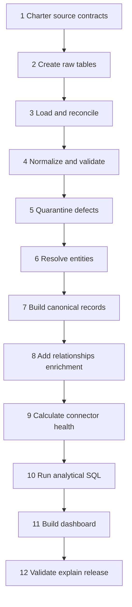

### Exercise 1 - Charter sources and grains

Create a source catalog from the contract table. For each source, add owner role, intended use, required fields, null semantics, expected cadence, late threshold, batch key, record key, deletion/retention rule, and downstream consumers. Explicitly state that the source names describe tool categories, not licensed products.

Expected observation: the same field name can have different semantics. CMDB `updated_utc` is a record update, EDR `last_seen_utc` is an observation, and scanner `last_scanned_utc` is scan timing. Do not collapse them into one timestamp without labeling the rule.

### Exercise 2 - Create raw source-shaped tables

Create one local table or spreadsheet tab per source. Add `batch_id`, `ingested_utc`, `schema_version`, and `raw_row_number` as lineage columns. Use all identifiers as text. Load the inline records exactly. Freeze an exported copy under `01-raw-synthetic`.

Safe action: import local CSV or enter rows manually. Do not configure APIs, agents, browser sessions, cloud connectors, or credentials.

Expected observation: 6 CMDB rows, 6 EDR rows, 5 scanner assets, 8 scanner findings, 5 identities, 3 applications, 4 tickets, and 7 source batches.

### Exercise 3 - Reconcile batch counts

Run source counts and compare with `source_batch`. Create a reconciliation table with extract, parsed, accepted, rejected, staged, quarantined, canonical-linked, and unexplained gap. The finding batch expects one validity rejection. The orphan may remain staged/quarantined and therefore must not be counted as an unexplained disappearance.

```sql
SELECT 'cmdb_asset' AS source_name, COUNT(*) AS raw_rows FROM raw_cmdb_asset
UNION ALL
SELECT 'edr_device', COUNT(*) FROM raw_edr_device
UNION ALL
SELECT 'scanner_asset', COUNT(*) FROM raw_scanner_asset
UNION ALL
SELECT 'scanner_finding', COUNT(*) FROM raw_scanner_finding
UNION ALL
SELECT 'directory_user', COUNT(*) FROM raw_directory_user
UNION ALL
SELECT 'remediation_ticket', COUNT(*) FROM raw_remediation_ticket
UNION ALL
SELECT 'business_app', COUNT(*) FROM raw_business_app;
```

Expected observation: raw counts match the inline specification. Any mismatch is an import defect and should be fixed before modeling.

### Exercise 4 - Normalize identifiers

Create staged fields `normalized_hostname`, `normalized_serial`, and controlled status values. A portable hostname normalization expression is conceptually:

```sql
CASE
    WHEN TRIM(hostname) = '' THEN NULL
    WHEN LOWER(TRIM(hostname)) LIKE '%.nmh.example.com'
        THEN REPLACE(LOWER(TRIM(hostname)), '.nmh.example.com', '')
    ELSE LOWER(TRIM(hostname))
END
```

This `REPLACE` is acceptable for the controlled suffix in the synthetic data but should not be used as a universal domain parser. Validate resulting names against expected values. Normalize serial numbers with `UPPER(TRIM(...))`, preserving null rather than converting it to an empty identifier.

Expected observation: `NMH-LT-042` and `nmh-lt-042.nmh.example.com` normalize to `nmh-lt-042`; both serials normalize to `SN-0042`.

### Exercise 5 - Apply quality rules and quarantine

Create `data_quality_issue` rows for future timestamp, orphan reference, missing strong identifier, disabled owner, duplicate CMDB representation, workflow inconsistency, and delayed scanner batches. Keep rule ID, source row, observed value, severity, owner role, disposition, and explanation.

Do not "repair" source data by changing `sf-308`'s date or inventing `sca-999`. Rejection and quarantine preserve evidence. A fictional data steward could later publish a corrected source version.

Expected issue inventory:

| Issue | Expected count | Key row | Expected disposition |
|---|---:|---|---|
| Future timestamp | 1 | sf-308 | reject |
| Orphan scanner asset reference | 1 | sf-307 | quarantine relationship |
| Weak asset identity | 1 | sca-205 | manual review |
| Disabled owner | 1 | ci-005/usr-005 | ownership review |
| Duplicate CMDB representation | 1 pair | ci-001/ci-006 | resolve with lineage |
| Ticket/finding state conflict | 1 | tkt-404/sf-306 | workflow reconciliation |
| Delayed source batches | 2 | b-scan-01/b-find-01 | connector action |

### Exercise 6 - Resolve asset entities

Apply ER-01 through ER-06 in order. Build `asset_source_xref`; never delete source records. Use serial exact match before hostname. Do not auto-link `sca-205` to `edr-105` solely because both show `192.0.2.88`. Either keep it unresolved or add a documented manual synthetic approval after comparing the scenario's known truth.

Entity-resolution evidence should include candidate pair, compared fields, rule, confidence, decision, reviewer, date, and downstream effect. Include one negative pair such as `nmh-srv-web-01` versus `nmh-srv-db-01` to show the rule does not merge merely because both are servers.

Expected observation: duplicate CMDB rows for the laptop map to one canonical asset. Source-row count does not equal canonical-asset count, and that difference is explainable.

### Exercise 7 - Create canonical assets and survivorship

Generate stable asset keys. Apply the mapping matrix field by field. For `asset-001`, preserve both CMDB source records and the EDR/scanner observations. Select `endpoint` as the normalized class from the agreed map, `windows` from EDR, active lifecycle from CMDB, and latest observation from EDR.

Create a field-provenance table:

| asset_key | field_name | canonical_value | source_name | source_record_id | rule_id | observed_utc | confidence |
|---|---|---|---|---|---|---|---:|
| asset-001 | canonical_name | nmh-lt-042 | cmdb_asset | ci-001 | SV-NAME-01 | 2026-08-23T18:00:00Z | 0.95 |
| asset-001 | serial_number | SN-0042 | cmdb_asset | ci-001 | SV-SERIAL-01 | 2026-08-23T18:00:00Z | 1.00 |
| asset-001 | os_family | windows | edr_device | edr-101 | SV-OS-01 | 2026-08-23T23:40:00Z | 0.90 |
| asset-001 | last_seen_utc | 2026-08-23T23:40:00Z | edr_device | edr-101 | SV-SEEN-01 | 2026-08-23T23:40:00Z | 0.90 |

Expected observation: one canonical record can contain fields from different sources without pretending one source owns all truth.

### Exercise 8 - Build relationships and enrich context

Resolve owner and application IDs to canonical keys. Link accepted findings to assets through scanner xref. Link tickets to findings and assigned identities. Add the synthetic controls. Preserve effective timestamps and confidence.

Run orphan checks before analytical joins:

```sql
SELECT
    f.source_finding_id,
    f.asset_key
FROM canonical_finding AS f
LEFT JOIN canonical_asset AS a
    ON a.asset_key = f.asset_key
WHERE f.asset_key IS NULL
   OR a.asset_key IS NULL
ORDER BY f.source_finding_id;
```

Expected observation: `sf-307` remains visible as an orphan/quarantined finding rather than disappearing. `sf-308` is rejected for invalid time and does not enter accepted findings.

### Exercise 9 - Calculate source and connector health

Run reconciliation SQL and calculate freshness with the documented dialect. Build a health table with transport, parse, acceptance, freshness, reconciliation, entity-resolution, required-completeness, and downstream-usability status.

Expected observation: CMDB and EDR transport and row reconciliation are healthy. Scanner and finding data are critically stale under the fictional threshold. Finding acceptance is 7/8 or 0.875 because one invalid row is rejected, which breaches the illustrative threshold but may indicate correct validation rather than pipeline failure. The narrative must explain both.

### Exercise 10 - Run decision-oriented SQL

Query A: canonical assets and source coverage.

```sql
SELECT
    a.asset_key,
    a.canonical_name,
    COUNT(DISTINCT x.source_name) AS represented_source_count,
    MIN(x.match_confidence) AS minimum_match_confidence
FROM canonical_asset AS a
LEFT JOIN asset_source_xref AS x
    ON x.asset_key = a.asset_key
GROUP BY a.asset_key, a.canonical_name
ORDER BY represented_source_count DESC, a.asset_key;
```

Query B: open accepted findings with business and owner context.

```sql
SELECT
    f.finding_key,
    f.vuln_id,
    f.severity,
    a.canonical_name,
    app.app_name,
    app.business_tier,
    id.display_label AS declared_owner,
    id.identity_status AS owner_status,
    f.last_seen_utc
FROM canonical_finding AS f
JOIN canonical_asset AS a
    ON a.asset_key = f.asset_key
LEFT JOIN entity_relationship AS ra
    ON ra.from_entity_type = 'asset'
   AND ra.from_entity_key = a.asset_key
   AND ra.relationship_type = 'supports'
   AND ra.to_entity_type = 'application'
LEFT JOIN canonical_application AS app
    ON app.app_key = ra.to_entity_key
LEFT JOIN entity_relationship AS ro
    ON ro.from_entity_type = 'identity'
   AND ro.relationship_type = 'owns'
   AND ro.to_entity_type = 'asset'
   AND ro.to_entity_key = a.asset_key
LEFT JOIN canonical_identity AS id
    ON id.identity_key = ro.from_entity_key
WHERE f.finding_status = 'open'
  AND f.data_quality_status = 'accepted'
ORDER BY app.business_tier, f.severity DESC, f.finding_key;
```

Query C: workflow inconsistencies.

```sql
SELECT
    f.source_finding_id,
    f.finding_status,
    t.source_ticket_id,
    t.ticket_status,
    CASE
        WHEN f.finding_status = 'open' AND t.ticket_status = 'closed'
            THEN 'open_finding_closed_ticket'
        WHEN f.finding_status = 'closed' AND t.ticket_status <> 'closed'
            THEN 'closed_finding_active_ticket'
        ELSE 'aligned_or_not_applicable'
    END AS workflow_check
FROM canonical_finding AS f
LEFT JOIN canonical_ticket AS t
    ON t.finding_key = f.finding_key
ORDER BY f.source_finding_id, t.source_ticket_id;
```

Query D: quality issue backlog.

```sql
SELECT
    dimension,
    severity,
    owner_role,
    disposition,
    COUNT(*) AS issue_count
FROM data_quality_issue
GROUP BY dimension, severity, owner_role, disposition
ORDER BY severity DESC, dimension, owner_role;
```

For each query, write the decision it supports, grain, inclusion criteria, exclusions, and limitation. Query B is not a risk ranking. It is a contextual inventory whose scanner data is stale.

### Exercise 11 - Build the dashboard

Create three pages or sections: `Pipeline Health`, `Canonical Coverage`, and `Security Workflow`. Keep a visible synthetic banner and reporting cut on every page.

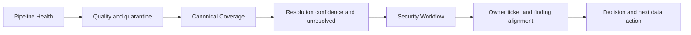

| Page | Visual | Required measure | Decision supported | Required caveat |
|---|---|---|---|---|
| Pipeline Health | Source status table | batch age, acceptance, reconciliation gap | Which source owner acts first? | Local simulated connectors |
| Pipeline Health | Quality issue matrix | count by dimension/severity/disposition | Which defect blocks use? | Counts depend on explicit rules |
| Canonical Coverage | Source-overlap table | assets by source combination | Where is inventory fragmented? | Entity resolution confidence visible |
| Canonical Coverage | Resolution queue | unresolved/ambiguous records | Which pairs need review? | IP-only is not auto-match |
| Security Workflow | Open finding context table | finding, asset, app, owner, age | Which records are actionable? | Scanner batch is stale |
| Security Workflow | Ticket alignment matrix | open/closed combinations | Which workflow state needs reconciliation? | Ticket and finding are different systems |
| Security Workflow | Owner completeness | active/disabled/missing owner | Which governance issue blocks action? | Declared owner is not acceptance |

Expected dashboard headline:

> Synthetic NMH source transport is mostly successful, but scanner and finding feeds are beyond the fictional freshness boundary. Canonical resolution consolidates the known laptop duplicate while retaining one IP-only asset for review. One finding is orphaned, one invalid-time finding is rejected, one active asset references a disabled owner, and one closed ticket conflicts with an open finding. Prioritize source freshness and workflow reconciliation before using finding totals for executive risk claims.

That headline is a synthetic observation and does not describe Zscaler or a customer.

### Exercise 12 - Inject, detect, repair, and explain a changed case

Create version 1.1 of a working copy, not the frozen raw input. Change `edr-103` serial from `SN-DB01` to `SN-WEB01`. Predict the impact: hostname indicates database, serial indicates web, so ER-06 should block an automatic match. Run quality and resolution checks, capture the conflict, then restore from frozen raw data or create a corrected 1.2 source version with explanation.

Expected observation: a good pipeline becomes less confident and queues review. It does not force a golden record to keep a dashboard green.

## Expected evidence

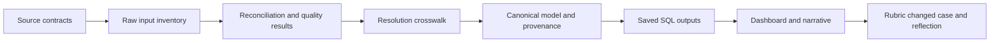

| Artifact ID | Artifact | Minimum evidence | Acceptance condition |
|---|---|---|---|
| NMH-SYN-P112-A01 | Scope and source catalog | Grain, keys, cadence, owner, use, defects | All sources explicitly synthetic |
| NMH-SYN-P112-A02 | Data dictionary | Fields, types, nulls, sensitivity, semantics | Every loaded field defined |
| NMH-SYN-P112-A03 | Raw data inventory | Counts, versions, hashes or equivalent | Matches compact specification |
| NMH-SYN-P112-A04 | Mapping matrix | Source-to-canonical fields and values | Ambiguity is visible |
| NMH-SYN-P112-A05 | Quality rule catalog | Rule, dimension, threshold, disposition, owner | Expected defects named before execution |
| NMH-SYN-P112-A06 | Quality issue output | Row-level issues and summaries | Future, orphan, owner, duplicate, workflow, freshness found |
| NMH-SYN-P112-A07 | Entity-resolution crosswalk | Source record, asset key, rule, confidence, review | No IP-only silent merge |
| NMH-SYN-P112-A08 | Canonical model | Assets, identities, apps, findings, controls, tickets, edges | Source lineage retained |
| NMH-SYN-P112-A09 | Field provenance | Canonical value to source/rule/time | Key asset fields traceable |
| NMH-SYN-P112-A10 | Connector-health table | Transport through downstream usability | Stale scanner visible |
| NMH-SYN-P112-A11 | SQL package | Queries, dialect notes, expected outputs | Rerunnable locally |
| NMH-SYN-P112-A12 | Dashboard | Three sections, filters, cut, quality, limitations | Reconciles to SQL |
| NMH-SYN-P112-A13 | Changed-case test | Conflict injection, detection, correction | Auto-match is blocked |
| NMH-SYN-P112-A14 | Executive narrative | Outcome, evidence, meaning, decision, next | No product/customer claim |
| NMH-SYN-P112-A15 | Validation and reflection | Rubric, failures, limits, production next checks | Shared Part 111 gates pass |

### Evidence-capture checklist

- [ ] Record seed 112024, schema 1.0, and reporting cut.
- [ ] Preserve source-shaped raw data before normalization.
- [ ] Capture row counts for every source and stage.
- [ ] Capture acceptance, rejection, quarantine, and unexplained gaps separately.
- [ ] Save normalized identifier examples.
- [ ] Record every quality issue at row level.
- [ ] Preserve source-to-canonical xref and match confidence.
- [ ] Record one negative match and one ambiguous match.
- [ ] Trace selected canonical fields to source row and rule.
- [ ] Save relationship orphan checks.
- [ ] Capture connector freshness and reconciliation together.
- [ ] Save all SQL and dialect assumptions.
- [ ] Display dashboard filters, reporting cut, quality, and limitation.
- [ ] Capture the changed-case conflict before repair.
- [ ] Use the Part 111 claim formula in the release summary.

### Plain-English deep-dive 3 - Connector success is not data success

A delivery truck can arrive on time with the wrong boxes, broken labels, or half the order. In the same way, a connector can authenticate and complete while fields fail parsing, mappings drop values, duplicates multiply entities, references orphan findings, or stale data reaches a dashboard.

Operational health therefore has layers: transport, parse, mapping, validation, load, reconciliation, freshness, entity resolution, required completeness, and downstream workflow usability. The layer matters to ownership. Authentication failure may belong to credential or source administration; invalid values may belong to a source contract; a wrong join may belong to the local model; a ticket conflict may belong to workflow reconciliation.

The TSM-quality response is not "the connector is red." It is "The latest scanner batch completed transport but is 69 hours old against a 60-hour critical threshold. Eight findings parsed, seven passed validity, one was rejected for a future timestamp, and one accepted row lacks a resolvable asset. Finding totals are therefore stale and one row is not actionable. Source owner and data steward have separate next checks."

## Troubleshooting

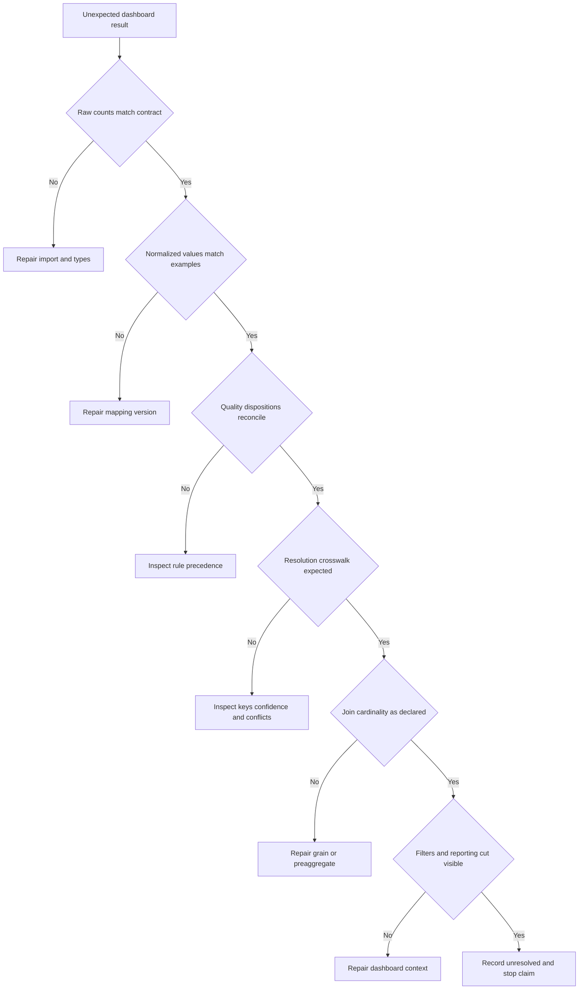

| Symptom | Likely cause | Discriminating check | Safe repair |
|---|---|---|---|
| Asset counts inflated | Many-to-many join or unresolved duplicates | Count distinct keys before/after each join | Preaggregate at declared grain; fix xref |
| Laptop appears twice | Suffix or case normalization failed | Compare normalized host and serial | Correct mapping; version and rerun |
| Two servers merge | Rule relied on class or similar hostname | Inspect candidate evidence | Block merge; restore source rows |
| sca-205 disappears | Inner join removed unresolved record | Run orphan/left-join query | Preserve quarantine and unresolved queue |
| sf-308 accepted | Timestamp parsed as text incorrectly or rule omitted | Compare ISO values and reporting cut | Parse/validate explicitly; reject with issue |
| Finding count is eight | Rejected row still included | Filter by quality disposition | Separate raw, accepted, quarantine counts |
| Ticket closes finding | Ticket state overwrote scanner state | Trace field provenance | Keep both states and create reconciliation status |
| Owner metric looks complete | Disabled identities counted as valid owners | Join identity status | Report active, disabled, missing separately |
| Source green despite stale data | Health checks transport only | Calculate age and downstream usability | Add layered health dimensions |
| Acceptance rate shown as 87.5 percent failure only | Valid rejection context omitted | Inspect rule and rejected row | Explain correct control plus source defect |
| Dashboard differs from SQL | Hidden filter, relationship, or refresh state | Export filter state and base table | Reset, refresh locally, document model |
| Date age differs by tool | UTC parsing or dialect difference | Compare raw timestamps and expression | Normalize UTC and label dialect |

## Cleanup and privacy

All data is synthetic, but local paths, screenshots, database metadata, and tool caches may reveal real workstation information. Apply the Part 111 exact-path cleanup process.

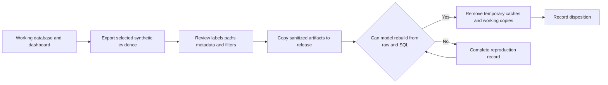

| Item | Retain | Remove | Privacy check |
|---|---|---|---|
| Frozen synthetic CSV | Yes | Superseded duplicate copies | No real names, domains, addresses |
| Data dictionary and source contracts | Yes | Draft duplicates | Synthetic label and source boundaries |
| Saved SQL | Yes | Queries with accidental absolute paths | No credentials or external connections |
| Local database | Optional | If raw plus SQL rebuilds it | Inspect metadata and connection history |
| BI workbook | Optional | Cached working versions | Remove hidden real sources and local profile paths |
| Screenshots | Selected sanitized only | Full-screen or unreviewed captures | No account, notification, recent-file list |
| Logs | Minimal validation output | Verbose tool logs | No username/path leakage |
| Changed-case files | Keep selected conflict evidence | Disposable intermediate copies | Clearly versioned and synthetic |
| Release set | Yes | Anything failing claim review | Visible limitation on every item |

Cleanup must not drop a real database, remove an installed tool, alter service configuration, delete a shared folder, or clear unrelated logs. Remove only exact files created for the lab.

## Validation rubric

Five Part 111 blocking gates apply first. Score the lab out of 100 only after all gates pass.

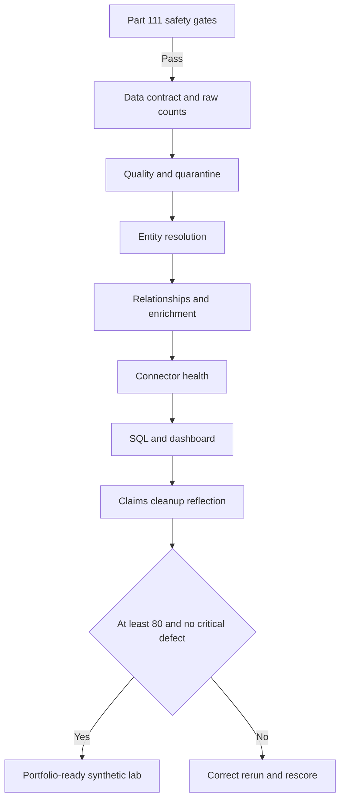

| Dimension | Points | Full-credit evidence | Critical defect |
|---|---:|---|---|
| Safety and honesty | 10 | Local synthetic scope, visible labels, no prohibited action | Real data, external test, product claim |
| Source contracts and grain | 10 | All sources define key, grain, cadence, semantics, owner | Grain absent or inconsistent |
| Raw preservation and reconciliation | 10 | Counts and dispositions balance | Unexplained row loss or duplication |
| Mapping and normalization | 10 | Versioned rules with expected examples | Source overwritten without lineage |
| Quality controls | 10 | All named defects detected and governed | Invalid future row silently accepted |
| Entity resolution | 15 | Strong matches, ambiguity queue, negative test, confidence | IP-only auto-merge or source deletion |
| Canonical relationships and provenance | 10 | Assets, identities, apps, findings, controls, tickets traceable | Orphans hidden by inner join |
| Connector health | 10 | Transport through usability and freshness | "Success" based only on authentication |
| SQL and dashboard correctness | 10 | Saved queries, dialect notes, reconciled visuals | Hidden filter or wrong denominator |
| Evidence, cleanup, and explanation | 5 | Release inventory, rubric, reflection, bounded narrative | Unsupported production outcome |

| Score | Interpretation | Required next step |
|---:|---|---|
| 0-69 | Model or evidence is not reliable enough to discuss | Repair critical dimensions and rerun |
| 70-79 | Core mechanics exist with material gaps | Complete missing controls |
| 80-89 | Solid reproducible synthetic lab | Rehearse changed cases and explanation |
| 90-100 | Strong inspectable synthetic portfolio | Seek independent reproduction; retain honesty boundary |

### Plain-English deep-dive 4 - Data quality is fitness for a decision

A field can be technically valid yet useless for a particular workflow. `usr-005` is a valid identity record and its status is accurately `disabled`. But that identity is not a useful active owner for remediation. Likewise, a scanner batch may contain syntactically valid findings but be too old for a current exposure decision.

Think of a map printed clearly from accurate historical roads. It is high quality for studying last year's city and poor quality for routing an ambulance today. Quality must name the job, threshold, consequence, and owner. This is why the dashboard places freshness and ownership status next to finding counts.

## Explicitly fictional and synthetic NMH scenarios

### Scenario 1 - Duplicate laptop

Two CMDB rows, one EDR row, and one scanner row describe the fictional laptop. Exact serial and normalized hostname support one canonical asset. The model retains all four source records and field-level provenance. No production entity was resolved.

### Scenario 2 - IP-only ambiguity

The scanner sees `192.0.2.88` and EDR sees a lab device at the same documentation address. The model refuses an automatic merge because IP alone is weak and time-bounded. A review queue preserves uncertainty.

### Scenario 3 - Healthy transport, stale findings

The scanner batch status says success, but its age exceeds the fictional critical threshold. The dashboard warns that current finding totals are not established. This illustrates layered health; it says nothing about Zscaler connectors.

### Scenario 4 - Closed ticket, open finding

The ticketing source says `tkt-404` is closed while scanner evidence says `sf-306` is open. Neither overwrites the other. A workflow exception asks whether the scanner has not refreshed, remediation failed, the ticket closed incorrectly, or source mapping is wrong.

## Official Source Anchors

Research/source snapshot and source review date: **2026-08-24**.

The Zscaler sources support bounded public positioning about Data Fabric for Security, Unified Vulnerability Management, Risk360, and security operations. NIST sources support general data, security, and zero-trust context. They do not establish this lab as a product implementation or validate any schema, connector, score, dashboard, or result.

| Source | URL | Used for | Boundary |
|---|---|---|---|
| Zscaler Data Fabric for Security | https://www.zscaler.com/products-and-solutions/data-fabric | Public positioning around connecting, harmonizing, and operationalizing security data | No internal schema, source list, connector behavior, or tenant result inferred |
| Zscaler Unified Vulnerability Management | https://www.zscaler.com/products-and-solutions/unified-vulnerability-management | Public positioning around aggregated data and contextual vulnerability prioritization | No score, field, workflow, or algorithm copied |
| Zscaler Risk360 | https://www.zscaler.com/products-and-solutions/risk360 | Public risk-context and communication positioning | No lab metric is a Risk360 metric |
| Zscaler Agentic Security Operations | https://www.zscaler.com/products-and-solutions/security-operations | Public security-operations portfolio context | No agent or automated action used |
| NIST Cybersecurity Framework 2.0 | https://www.nist.gov/cyberframework | General cybersecurity outcome and governance language | Voluntary and implementation-neutral |
| NIST SP 800-207 Zero Trust Architecture | https://csrc.nist.gov/pubs/sp/800/207/final | Vendor-neutral identity, resource, policy, and telemetry context | Not a data-fabric implementation guide |
| NIST Privacy Framework | https://www.nist.gov/privacy-framework | General privacy-risk management context | Not legal advice or certification |
| SQLite documentation | https://www.sqlite.org/docs.html | Local SQL reference | Installed behavior/version must be verified |
| DuckDB documentation | https://duckdb.org/docs/ | Local analytical SQL reference | Dialect-specific behavior must be labeled |
| PostgreSQL documentation | https://www.postgresql.org/docs/ | Relational modeling and SQL reference | Local version and configuration govern |
| Microsoft Power BI documentation | https://learn.microsoft.com/power-bi/ | Optional local dashboard context familiar to you | No product availability or approved use assumed |

## Likely Interview Questions

### Q1. How would you model security data from multiple tools?

**Model answer:** I start with source contracts: grain, keys, fields, semantics, cadence, owners, quality thresholds, and intended decisions. I preserve source-shaped raw records, normalize in staging, quarantine defects, reconcile counts, and create canonical assets, identities, applications, findings, controls, and tickets with provenance. I resolve entities conservatively, use typed time-bounded relationships, and expose quality and confidence in downstream views. I would validate current Zscaler schemas and connectors separately in an authorized tenant.

### Q2. What is a canonical entity, and why is provenance still needed?

**Model answer:** A canonical entity is a common governed representation assembled across sources so workflows can query one consistent concept. It is not absolute truth. Provenance shows which source row supplied each field, when it was observed, which mapping or survivorship rule applied, and how confident the match is. That lets owners correct conflicts and prevents a golden record from hiding uncertainty.

### Q3. How do you approach deduplication and entity resolution?

**Model answer:** I define strong and weak identifiers, normalize them, use ordered explainable rules, test known positive and negative pairs, and treat false merges as a serious risk. Exact nonblank serial plus corroborating hostname can support an automatic match in this synthetic contract; IP alone cannot. I retain every source record in a crosswalk, record confidence and review status, preserve ambiguous candidates, and test downstream impact.

### Q4. How do you assess connector health?

**Model answer:** I assess transport, authentication where applicable, extraction, parse, mapping, validation, load, reconciliation, freshness, entity resolution, required completeness, and downstream workflow usability. A completed connection is not enough. In this synthetic lab, scanner transport succeeded but the batch was stale, one row failed time validity, and one finding lacked a resolvable asset, so current actionable coverage was limited.

### Q5. Which data-quality dimensions matter most?

**Model answer:** Freshness, completeness, validity, uniqueness, consistency, referential integrity, accuracy where ground truth exists, and reconciliation all matter, but fitness depends on the decision. An accurate disabled identity is not a usable active owner. A syntactically valid old finding may be poor evidence of current exposure. I define rules, thresholds, consequence, owner, disposition, and quality context before showing business metrics.

### Q6. What SQL practices keep analytical outputs trustworthy?

**Model answer:** I define row grain, use explicit columns and join keys, inspect cardinality, preserve null meaning, protect denominators, set a fixed reporting cut, save exact query text, sort evidence outputs, and reconcile counts across stages. I label dialect-specific date functions and test negative cases. Every dashboard number should trace back through query, transformation, source row, and generator rule.

### Q7. How would you explain this lab to an executive?

**Model answer:** I would say the synthetic pipeline consolidated a known duplicate and linked security records to business and ownership context, but stale scanner data, an orphan finding, a disabled owner, and a ticket-state conflict limit current decision confidence. The immediate priorities are restore source freshness, resolve the orphan and owner, and reconcile workflow state before using totals for risk claims. I would add that this is a local simulation, not a customer or Zscaler environment.

### Q8. How does your background transfer to Data Fabric work?

**Model answer:** Your SQL, PostgreSQL, Power BI, statistics, and business analytics support schema design, transformations, quality checks, dashboards, and careful metrics. enterprise escalation work adds evidence provenance, timeline reconciliation, technical ownership, and communication, while network traces reinforce that each source observes only part of a system. These strengths support a fast ramp, but they do not establish production Zscaler Data Fabric experience or customer outcomes.

## 30-Second Memory Hooks

| Concept | Memory hook |
|---|---|
| Source contract | Grain, key, meaning, cadence, owner |
| Raw layer | Preserve the witness statement |
| Staging | Type, normalize, validate |
| Canonical | Shared language, revisable truth |
| Provenance | Who said what, when, through which rule |
| Quality | Fit for a named decision |
| Quarantine | Keep defects visible without poisoning output |
| Entity resolution | Match evidence, confidence, review |
| False merge | Complete-looking wrong record |
| Survivorship | Choose field by rule, not convenience |
| Relationship | Typed edge with time and source |
| Enrichment | Context with provenance |
| Connector health | Fetch to workflow, not green plug |
| Dashboard | Quality beside quantity |
| Product boundary | Analogous lab, not Zscaler internals |
| Experience bridge | Analytics plus escalation discipline |

## Completion Checklist

- [ ] I can explain source contract, grain, canonical model, mapping, quality, quarantine, entity resolution, survivorship, provenance, enrichment, and connector health from zero.
- [ ] I applied the Part 111 shared contract and all five blocking gates.
- [ ] I used only local synthetic NMH data and no paid Zscaler access.
- [ ] I defined each source's key, grain, cadence, authority, defect, and intended use.
- [ ] I preserved raw source records and reconciled counts.
- [ ] I normalized hostnames and serials without overwriting raw values.
- [ ] I detected the future timestamp, orphan, weak identity, disabled owner, duplicate, workflow conflict, and stale batches.
- [ ] I retained quality issues with rule, severity, owner, and disposition.
- [ ] I resolved strong duplicate evidence and refused an IP-only automatic merge.
- [ ] I retained source-to-canonical crosswalk and match confidence.
- [ ] I traced canonical fields to source row, rule, time, and confidence.
- [ ] I modeled assets, identities, applications, findings, controls, tickets, and typed relationships.
- [ ] I explained why agent health does not prove vulnerability mitigation.
- [ ] I assessed connector transport, parse, acceptance, freshness, reconciliation, resolution, completeness, and usability.
- [ ] I saved portable SQL and labeled date-dialect assumptions.
- [ ] I built dashboard sections for pipeline health, canonical coverage, and workflow.
- [ ] I displayed reporting cut, filters, quality, and limitations.
- [ ] I ran the serial-conflict changed case and preserved evidence.
- [ ] I created a sanitized release set and exact-path cleanup record.
- [ ] I can describe the work as synthetic preparation without claiming a Zscaler implementation or customer result.

[Next: Part 113 - UVM and Vulnerability Prioritization Lab](Part-113-uvm-prioritization-lab.md)