# Part 113 - UVM and Vulnerability Prioritization Lab

> **Audience:** Candidates preparing for a Zscaler Security Operations Technical Success Manager role after enterprise Support Escalation Engineering.

> **Purpose:** Build and explain a complete local vulnerability-prioritization simulation that joins synthetic vulnerability, asset, control, identity, business, and workflow data; calculates an explainable contextual score; calibrates priority; creates an owned backlog with illustrative SLAs; governs exceptions; measures execution; and communicates the result to technical and executive audiences.

> **Scope and honesty:** Northstar Meridian Holdings, abbreviated NMH, is explicitly fictional and synthetic. Every asset, vulnerability identifier, threat signal, exposure state, control, identity, owner, score, priority, SLA, ticket, exception, metric, date, and result in this Part is invented for study. The scoring formula is candidate-designed and vendor-neutral. It is not Zscaler UVM's algorithm, field model, score, workflow, recommendation, interface, or output. Your factual background includes SQL, Power BI, statistics, business analytics, enterprise escalations, customer communication, and evidence validation. Production vulnerability-management ownership, Zscaler UVM operation, and customer risk reduction remain unclaimed.

> **Currency caveat:** Vulnerability standards, threat intelligence, exploitability evidence, product capabilities, scoring methods, workflow fields, recommended practices, regulations, and customer policies change. The controlled official-source snapshot and source review date for this Part is exactly **2026-08-24**. Current official documentation, licensed-tenant evidence, customer risk policy, source contracts, security and application owners, change processes, exception authority, and controlled validation govern production decisions.

> **Section goal:** Produce a safe and reproducible portfolio lab that proves why severity alone is insufficient; builds a transparent 0-100 synthetic contextual score from technical severity, exploitability, active-exploitation signal, business criticality, reachability, privilege, control gap, and data sensitivity; calibrates thresholds against defined scenarios; turns scores into an owner/SLA backlog; models remediation, compensation, acceptance, exception, validation, reopening, and closure; and reports metrics and executive decisions without claiming a production UVM implementation or actual risk reduction.

This Part applies the shared Part 111 portfolio contract and the canonical-model discipline from Part 112. All actions are local, synthetic, offline, non-destructive, least-privileged, and reproducible. There is no live scan, exploit, proof-of-concept execution, external API, real vulnerability export, customer data, secret, production ticket, control change, TLS/security disablement, or destructive command.

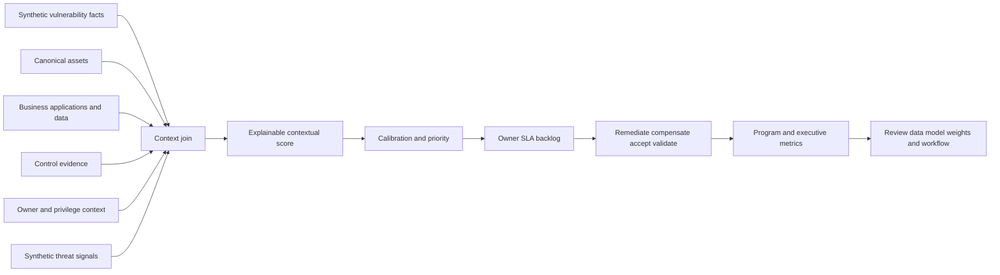

| Operating principle | Plain meaning | Lab behavior | Failure prevented |
|---|---|---|---|
| Severity is one input | Technical impact does not equal organizational priority | Join technical, threat, exposure, control, and business context | CVSS-only queue |
| Context must be traceable | A score should explain itself | Store every component, source, rule, and timestamp | Opaque ranking |
| Scoring supports judgment | A number orders attention; it does not decide risk acceptance | Allow governed override with rationale and authority | Algorithm becomes policy owner |
| Calibration precedes trust | Weights and thresholds need expected-case testing | Use anchor scenarios and confusion analysis | Attractive but wrong ranking |
| Missing data is visible | Unknown must not silently become safe | Add confidence and data-quality flags | Incomplete asset looks low risk |
| Backlogs need ownership | Priority without an accountable role does not reduce exposure | Assign owner, due basis, dependency, and validation | Ranked report with no action |
| SLA is a policy contract | Due dates depend on priority, scope, exceptions, and authority | Use explicitly illustrative lab tiers | Fictional SLA presented as standard |
| Closure requires evidence | Ticket completion is not vulnerability resolution | Reconcile finding status and validate effect | Administrative closure |
| Exceptions have debt | Accepted exposure still requires authority, expiry, and review | Track residual, compensating control, expiration, and reopen trigger | Permanent hidden waiver |
| Metrics need denominators | Counts can improve while important exposure worsens | Segment by priority, age, owner, source health, and business tier | Vanity reporting |
| Product claims remain bounded | Public positioning is not an internal algorithm | Call formula `NMH-LAB-SCORE-v1` | Synthetic model presented as UVM |

## JD Mapping

| JD signal | Capability developed | Concrete artifact | Honest boundary |
|---|---|---|---|
| Help customers prioritize vulnerabilities | Explain context, score components, confidence, and override | Prioritized synthetic backlog | No production recommendation issued |
| Translate data into risk mitigation | Connect asset, threat, control, business, owner, and action | Finding decision record | Score is not risk quantification |
| Drive workflows and adoption | Model assignment, SLA, exception, validation, and reopen | Workflow state machine | No customer ticketing integration |
| Advise technical stakeholders | Show why records rank differently and what evidence is missing | Score explanation card | Synthetic facts only |
| Communicate to executives | Report material exposure, trend quality, decisions, and residual | Executive one-page narrative | No actual enterprise risk result |
| Troubleshoot data and scoring | Isolate source, mapping, join, weight, threshold, and workflow defects | Calibration and exception log | Not a Zscaler support case |
| Measure customer outcomes | Define leading and lagging metrics with stable denominators | Metric dictionary | Lab closure is not risk reduction |
| Collaborate cross-functionally | Route work to security, IT, app, data, business, and risk authorities | RACI and backlog | Fictional roles have no real authority |

## Candidate honesty note

You can say: "I built a local synthetic vulnerability-prioritization lab that joined vulnerability, asset, control, business, identity, and workflow data. I designed an explainable score, tested it against anchor cases, calibrated thresholds, produced an owner/SLA backlog, modeled exceptions and validation, wrote SQL, and created technical and executive views. This draws on my factual SQL, Power BI, statistics, MBA analytics, escalation, and customer communication experience. The formula is my learning model, not Zscaler UVM's scoring logic, and the work did not use a real scanner, tenant, customer workflow, or production outcome."

| Documented background | Transferable capability | Safe wording | Unsupported wording to avoid |
|---|---|---|---|
| SQL, PostgreSQL, statistics | Join context, calculate components, test distributions | "I implemented and validated an explainable synthetic model." | "I reverse-engineered UVM scoring." |
| Power BI and business analytics | Build drillable metrics and executive narratives | "I visualized a fictional backlog with data-quality context." | "I proved customer risk reduction." |
| enterprise escalations | Prioritize by impact, evidence, dependencies, and ownership | "I transferred evidence-led prioritization discipline." | "I ran an enterprise vulnerability program." |
| RCA and fix validation | Distinguish ticket closure, remediation, control, and effective validation | "I modeled closure and reopen evidence." | "I remediated these vulnerabilities." |
| Customer and Engineering collaboration | Explain options, unknowns, owners, and checkpoints | "I can facilitate an evidence-based prioritization discussion." | "I set customer SLAs or accepted risk." |
| Synthetic NMH portfolio | Demonstrate preparation | "This is reproducible practice with known ground truth." | "NMH adopted my backlog." |

## Beginner vocabulary and memory hooks

A **vulnerability** is a weakness that could be used to cause harm under certain conditions. A **finding** is a specific observation of a vulnerability on an asset. Think of a building code issue: "a weak lock design exists" is the vulnerability; "Door 7 on Building A has that lock" is the finding. Priority depends on what the door protects, who can reach it, whether another control exists, and whether attackers are using that weakness.

| Term | Meaning from zero | Why it matters | Memory hook |
|---|---|---|---|
| Vulnerability | Weakness that may be exploited | Describes potential mechanism | Weak lock design |
| Finding | Vulnerability instance observed on an asset | Unit of remediation and validation | Weak lock on Door 7 |
| CVE | Public identifier for a disclosed vulnerability | Common reference, not a risk score | Catalog number |
| CWE | Category of software weakness | Explains weakness type | Family of design mistakes |
| CVSS | Standard framework for technical vulnerability severity | Useful technical baseline, not full business priority | How damaging the lock flaw can be |
| EPSS | Estimate of probability that a published CVE will be exploited in the wild in a time window | Adds exploit-likelihood evidence | Chance thieves use this lock flaw soon |
| KEV | Known Exploited Vulnerabilities catalog maintained by CISA | Signals evidence of exploitation for listed real CVEs | Known active burglary method |
| Threat intelligence | Evidence about adversaries, campaigns, techniques, and exploitation | Changes urgency and hypotheses | News about active burglars |
| Asset criticality | Importance of an asset to business or safety outcomes | Same flaw can have different consequence | Supply closet versus operating room |
| Reachability | Whether an attacker path can contact the vulnerable service | Exposure affects likelihood | Can someone reach the door? |
| Privilege | Authority available through or on an asset | High privilege can expand blast radius | Master-key cabinet |
| Control | Safeguard reducing likelihood or impact | May change action but needs evidence | Guard, alarm, inner door |
| Compensating control | Alternative safeguard used when direct remediation is delayed | Must be specific and validated | Temporary guard until lock replacement |
| Contextual score | Transparent combination of relevant factors | Helps order work consistently | Triage score, not verdict |
| Calibration | Comparing model output with expected cases and outcomes | Reveals bad weights or thresholds | Tune scale against known examples |
| Priority | Agreed order or urgency for action | Includes policy and judgment | Which door first? |
| SLA | Service-level objective or agreement for timing | Creates due basis and escalation | Replacement deadline |
| Exception | Approved departure from normal requirement | Needs owner, rationale, residual, expiry | Temporary waiver |
| Risk acceptance | Authorized decision to retain known residual risk | Business/risk authority, not analyst choice | Owner accepts guarded door temporarily |
| Residual risk | Risk remaining after treatment | No control removes all uncertainty | Risk after guard arrives |
| Remediation | Remove or correct the weakness | Preferred direct treatment where feasible | Replace lock |
| Mitigation | Reduce likelihood or impact | Broader than remediation | Add monitored barrier |
| Validation | Evidence that intended action worked and did not create unacceptable harm | Ticket closure alone is insufficient | Test new lock and access |
| Reopen | Return a closed item to action when evidence fails | Protects outcome integrity | Lock still fails inspection |
| Backlog | Ordered set of unresolved work | Must include owner and workflow | Repair queue |
| Aging | Time unresolved under defined clock | Reveals accumulated exposure and blockage | Days door remains weak |
| Exception debt | Accumulated accepted or deferred exposure needing review | Prevents waivers becoming invisible | Temporary guards that never leave |

### Plain-English deep-dive 1 - Severity is not priority

Technical severity answers a bounded question about potential vulnerability impact under standardized assumptions. Priority asks what the organization should address first. That second question needs more context: exploitation evidence, asset role, reachability, privilege, controls, data, users, business timing, dependencies, and available treatment.

Imagine two identical critical lock defects. One is on an isolated training shed protected by a second locked fence. The other is on an internet-facing medication-order service with no compensating control. The lock defect has the same technical severity; the priority is different.

The reverse also matters. A medium-severity weakness on a highly privileged identity path may deserve urgent treatment. A model that starts and ends with severity creates a large undifferentiated queue and teaches teams to chase labels rather than reduce meaningful exposure.

## Prerequisites

Complete Parts 111 and 112 or reproduce their governance and canonical data contracts. Use only the inline deterministic records. Any vulnerability identifiers beginning `SYN-CVE` are fictional and must never be looked up, scanned, exploited, or treated as real advisories.

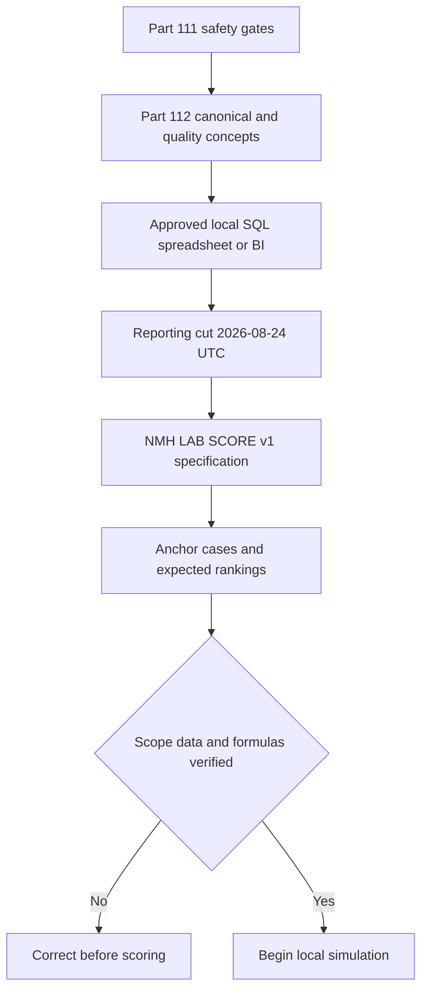

| Prerequisite | Required value | Validation | Boundary |
|---|---|---|---|
| Part 111 contract | Five gates pass | Review claim and cleanup rules | No exception for security topic |
| Data source | Inline NMH synthetic records | Counts and IDs match | No real scanner export |
| Reporting cut | 2026-08-24T00:00:00Z | Fixed in calculations | No current-clock drift |
| Model ID | NMH-LAB-SCORE-v1 | Visible in every score output | Never call it UVM score |
| Tool | Approved local SQL/spreadsheet/BI | Version recorded | No paid Zscaler access |
| Privilege | Standard user | No elevated prompt | No agent or scanner installation |
| Network | Offline | No API or target | No live scan or lookup needed |
| Expected anchors | Defined before calculation | Reviewer approves synthetic expectations | Avoid tuning only for pretty result |
| SLA policy | Explicitly illustrative | Table labeled fictional | Not legal, regulatory, or customer requirement |
| Exception authority | Fictional role only | Scenario matrix | Candidate never accepts real risk |

## Synthetic data model

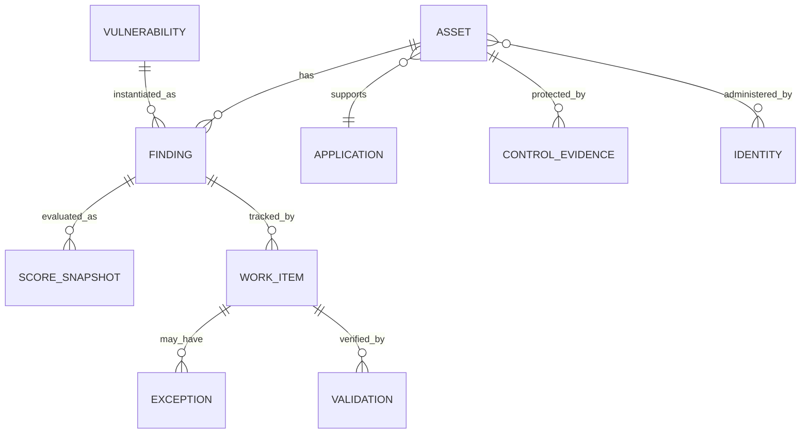

### Asset and business context

| asset_key | asset_name | app_id | business_tier | data_sensitivity | reachability | privilege_context | owner_user_id | asset_state |
|---|---|---|---|---|---|---|---|---|
| asset-001 | nmh-lt-042 | app-clinical | tier_0 | high | indirect | standard_user | usr-001 | active |
| asset-002 | nmh-srv-web-01 | app-portal | tier_1 | high | direct | service | usr-002 | active |
| asset-003 | nmh-srv-db-01 | app-clinical | tier_0 | high | indirect | privileged | usr-003 | active |
| asset-004 | nmh-kiosk-07 | app-checkin | tier_2 | medium | none | standard_user | usr-004 | active |
| asset-005 | nmh-old-09 | app-portal | tier_3 | low | none | none | usr-005 | retired |
| asset-006 | nmh-lab-88 | app-unknown | unknown | unknown | indirect | unknown |  | unresolved |
| asset-007 | nmh-id-admin-01 | app-identity | tier_0 | high | indirect | privileged | usr-004 | active |
| asset-008 | nmh-api-claims-01 | app-portal | tier_1 | high | direct | service | usr-002 | active |

`direct`, `indirect`, and `none` are synthetic reachability classifications. They are not verified network paths or Zscaler observations. `asset-006` deliberately lacks business and owner context.

### Synthetic control evidence

| control_id | asset_key | control_type | state | observed_utc | applicability | confidence |
|---|---|---|---|---|---|---:|
| ctl-001 | asset-001 | endpoint_agent | healthy | 2026-08-23T23:40:00Z | general endpoint telemetry | 0.90 |
| ctl-002 | asset-002 | endpoint_agent | healthy | 2026-08-23T23:42:00Z | general endpoint telemetry | 0.90 |
| ctl-003 | asset-003 | endpoint_agent | degraded | 2026-08-23T23:35:00Z | general endpoint telemetry | 0.80 |
| ctl-004 | asset-004 | endpoint_agent | healthy | 2026-08-23T23:31:00Z | general endpoint telemetry | 0.90 |
| ctl-005 | asset-005 | endpoint_agent | offline | 2026-02-01T12:00:00Z | stale evidence | 0.60 |
| ctl-006 | asset-006 | endpoint_agent | healthy | 2026-08-23T23:20:00Z | unresolved identity | 0.70 |
| ctl-007 | asset-007 | privileged_access_review | missing | 2026-08-20T12:00:00Z | privileged identity path | 0.90 |
| ctl-008 | asset-008 | application_gateway_rule | verified | 2026-08-22T12:00:00Z | synthetic request constraint | 0.80 |

Control state does not prove vulnerability-specific prevention. The lab component represents a **control gap** based on scenario evidence, not a universal control-effectiveness judgment.

### Vulnerability catalog

| vuln_id | title | technical_band | exploit_likelihood | active_exploitation_signal | remediation_family |
|---|---|---|---|---|---|
| SYN-CVE-0001 | Fictional client parser flaw | high | high | yes | update client package |
| SYN-CVE-0002 | Fictional web execution flaw | critical | high | yes | update web runtime |
| SYN-CVE-0003 | Fictional database privilege flaw | high | medium | no | update database component |
| SYN-CVE-0004 | Fictional lab service disclosure | medium | medium | no | update or remove service |
| SYN-CVE-0005 | Fictional web information flaw | medium | low | no | configuration and update |
| SYN-CVE-0006 | Fictional orphan high flaw | high | medium | no | resolve asset before action |
| SYN-CVE-0007 | Fictional identity privilege flaw | high | high | yes | update and restrict privilege |
| SYN-CVE-0008 | Fictional API authentication flaw | critical | medium | no | update API component |
| SYN-CVE-0009 | Fictional retired-host critical flaw | critical | high | yes | verify retirement and remove exposure |
| SYN-CVE-0010 | Fictional kiosk local flaw | low | low | no | scheduled update |

The catalog uses qualitative fictional threat signals. It does not claim CVSS, EPSS, CISA KEV, exploit availability, or real-world activity for any identifier.

### Finding instances

| finding_id | asset_key | vuln_id | status | first_seen_utc | last_seen_utc | source_freshness | existing_ticket |
|---|---|---|---|---|---|---|---|
| f-001 | asset-001 | SYN-CVE-0001 | open | 2026-08-01T02:00:00Z | 2026-08-21T01:20:00Z | stale |  |
| f-002 | asset-002 | SYN-CVE-0002 | open | 2026-07-15T02:00:00Z | 2026-08-21T01:25:00Z | stale | tkt-401 |
| f-003 | asset-003 | SYN-CVE-0003 | open | 2026-06-10T02:00:00Z | 2026-08-21T01:30:00Z | stale | tkt-402 |
| f-004 | asset-004 | SYN-CVE-0002 | closed | 2026-07-20T02:00:00Z | 2026-08-21T01:35:00Z | stale | tkt-403 |
| f-005 | asset-006 | SYN-CVE-0004 | open | 2026-08-20T02:00:00Z | 2026-08-21T01:40:00Z | stale |  |
| f-006 | asset-002 | SYN-CVE-0005 | open | 2026-08-05T02:00:00Z | 2026-08-21T01:25:00Z | stale | tkt-404 |
| f-007 | asset-007 | SYN-CVE-0007 | open | 2026-08-18T02:00:00Z | 2026-08-23T20:00:00Z | current |  |
| f-008 | asset-008 | SYN-CVE-0008 | open | 2026-08-12T02:00:00Z | 2026-08-23T20:05:00Z | current |  |
| f-009 | asset-005 | SYN-CVE-0009 | open | 2026-01-15T02:00:00Z | 2026-02-01T12:00:00Z | very_stale |  |
| f-010 | asset-004 | SYN-CVE-0010 | open | 2026-08-22T02:00:00Z | 2026-08-23T20:10:00Z | current |  |
| f-011 | asset-003 | SYN-CVE-0002 | open | 2026-08-19T02:00:00Z | 2026-08-23T20:15:00Z | current |  |
| f-012 | asset-001 | SYN-CVE-0005 | open | 2026-08-21T02:00:00Z | 2026-08-23T20:20:00Z | current |  |

`f-004` is a closed-control case. `f-009` tests stale evidence and retirement conflict. `f-005` tests missing context. The model must not give unknown context the same interpretation as low context.

## Contextual scoring model

The candidate-designed model is called `NMH-LAB-SCORE-v1`. It adds eight components to a maximum of 100. Additive models are easy to explain but assume tradeoffs that require calibration. This is a prioritization aid, not a probability, financial loss estimate, or formal risk assessment.

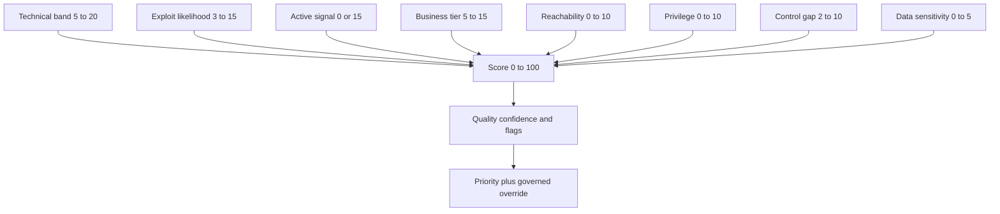

| Component | Values | Points | Source | Important limitation |
|---|---|---:|---|---|
| Technical band | low/medium/high/critical | 5/10/15/20 | Synthetic vulnerability catalog | Not CVSS and not exact severity math |
| Exploit likelihood | low/medium/high | 3/8/15 | Synthetic threat signal | Not EPSS |
| Active exploitation signal | no/yes | 0/15 | Synthetic scenario | Not CISA KEV or live intelligence |
| Business tier | tier_3 or unknown/tier_2/tier_1/tier_0 | 5/5/10/15 | Synthetic application registry | Unknown gets neutral 5 plus confidence penalty |
| Reachability | none/indirect/direct | 0/5/10 | Synthetic architecture context | Not a verified attack path |
| Privilege context | none or standard/service/privileged | 0/5/10 | Synthetic identity context | Service privilege requires case-specific review |
| Control gap | verified/healthy/degraded/missing or stale | 2/3/7/10 | Synthetic control evidence | State is not vulnerability-specific prevention |
| Data sensitivity | low or unknown/medium/high | 0/2/5 | Synthetic business registry | Not real classification |

The total is:

$$
S = T + E + A + B + R + P + C + D
$$

where $S$ is the synthetic contextual score and each component is the point value in the table. The score range is $10$ to $100$ under listed values, but it is displayed as 0-100 for communication. Missing context creates a confidence flag; it does not automatically create zero exposure.

### Score implementation

```sql
-- Portable conceptual SQL for NMH-LAB-SCORE-v1.
SELECT
    f.finding_id,
    CASE v.technical_band
        WHEN 'critical' THEN 20 WHEN 'high' THEN 15
        WHEN 'medium' THEN 10 WHEN 'low' THEN 5 ELSE 0 END
    + CASE v.exploit_likelihood
        WHEN 'high' THEN 15 WHEN 'medium' THEN 8
        WHEN 'low' THEN 3 ELSE 0 END
    + CASE v.active_exploitation_signal
        WHEN 'yes' THEN 15 ELSE 0 END
    + CASE a.business_tier
        WHEN 'tier_0' THEN 15 WHEN 'tier_1' THEN 10
        WHEN 'tier_2' THEN 5 WHEN 'tier_3' THEN 5 ELSE 5 END
    + CASE a.reachability
        WHEN 'direct' THEN 10 WHEN 'indirect' THEN 5 ELSE 0 END
    + CASE a.privilege_context
        WHEN 'privileged' THEN 10
        WHEN 'service' THEN 5 WHEN 'standard_user' THEN 5 ELSE 0 END
    + CASE c.control_gap_band
        WHEN 'missing' THEN 10 WHEN 'stale' THEN 10
        WHEN 'degraded' THEN 7 WHEN 'healthy' THEN 3
        WHEN 'verified' THEN 2 ELSE 10 END
    + CASE a.data_sensitivity
        WHEN 'high' THEN 5 WHEN 'medium' THEN 2 ELSE 0 END
        AS contextual_score
FROM finding AS f
JOIN vulnerability AS v ON v.vuln_id = f.vuln_id
JOIN asset_context AS a ON a.asset_key = f.asset_key
LEFT JOIN finding_control_context AS c ON c.finding_id = f.finding_id;
```

Do not use a simple `MAX` or latest control state without defining applicability. Build `finding_control_context` explicitly. For the compact lab, map asset states to `healthy`, `degraded`, `missing`, `verified`, or `stale` as scenario inputs.

### Expected component scores

| Finding | T | E | A | B | R | P | C | D | Expected total | Confidence flag |
|---|---:|---:|---:|---:|---:|---:|---:|---:|---:|---|
| f-001 | 15 | 15 | 15 | 15 | 5 | 5 | 3 | 5 | 78 | scanner_stale |
| f-002 | 20 | 15 | 15 | 10 | 10 | 5 | 3 | 5 | 83 | scanner_stale |
| f-003 | 15 | 8 | 0 | 15 | 5 | 10 | 7 | 5 | 65 | scanner_stale |
| f-004 | 20 | 15 | 15 | 5 | 0 | 5 | 3 | 2 | 65 | closed_needs_validation |
| f-005 | 10 | 8 | 0 | 5 | 5 | 0 | 3 | 0 | 31 | missing_business_owner_identity |
| f-006 | 10 | 3 | 0 | 10 | 10 | 5 | 3 | 5 | 46 | ticket_state_conflict_and_stale |
| f-007 | 15 | 15 | 15 | 15 | 5 | 10 | 10 | 5 | 90 | control_missing |
| f-008 | 20 | 8 | 0 | 10 | 10 | 5 | 2 | 5 | 60 | current |
| f-009 | 20 | 15 | 15 | 5 | 0 | 0 | 10 | 0 | 65 | retired_conflict_and_very_stale |
| f-010 | 5 | 3 | 0 | 5 | 0 | 5 | 3 | 2 | 23 | current |
| f-011 | 20 | 15 | 15 | 15 | 5 | 10 | 7 | 5 | 92 | current_control_degraded |
| f-012 | 10 | 3 | 0 | 15 | 5 | 5 | 3 | 5 | 46 | current |

If the implementation does not reproduce these totals, inspect mappings before changing the expected table. The table is test truth for version 1.

### Confidence model

Keep score and confidence separate. A high score with weak data may justify urgent verification, not automatic remediation. A low score with missing business context may be falsely reassuring.

| Confidence condition | Effect | Workflow action |
|---|---|---|
| Current finding, resolved asset, complete business/owner, applicable control evidence | high | Use score with normal review |
| One stale source or minor mapping uncertainty | medium | Prioritize verification alongside action |
| Missing owner, unresolved asset, unknown app, stale finding, or unknown control applicability | low | Create data-resolution task; do not call low risk |
| Conflicting retirement/exposure or closed/open states | contested | Hold final disposition and reconcile systems |

### Plain-English deep-dive 2 - A score and confidence answer different questions

The score answers, "Given these inputs and this model, how strongly should this item compete for attention?" Confidence answers, "How trustworthy and complete are the inputs and interpretation?" They should not be multiplied blindly because low confidence can mean danger is unknown, not absent.

Think of an emergency-call triage. A caller reports smoke at a hospital but the address connection is poor. The event can be high priority and low confidence at the same time. The response is to verify urgently while preparing action, not to downgrade because the call quality is weak.

In this lab, `f-005` scores 31 because business and privilege context are unknown. The correct narrative is not "low risk." It is "low model score with low confidence; resolve asset, ownership, application, and control applicability before disposition."

## Calibration and priority policy

Initial thresholds are hypotheses:

| Priority | Score threshold | Illustrative target | Required workflow | Explicit caveat |
|---|---:|---|---|---|
| P1 | 75-100 | 7 calendar days | Immediate owner confirmation, treatment plan, frequent checkpoint | Fictional lab target only |
| P2 | 60-74 | 14 calendar days | Owner confirmation and scheduled treatment | Fictional lab target only |
| P3 | 40-59 | 30 calendar days | Planned remediation or documented alternative | Fictional lab target only |
| P4 | below 40 | 90 calendar days | Review, batch, data resolution, or monitor | Low confidence can override normal queue |

Policy overrides for the synthetic lab:

1. Low-confidence missing-context findings cannot be described as low risk; create a data-resolution work item.
2. Active-exploitation signal plus direct reachability cannot be below P2, even if other context is low.
3. Privileged tier-0 findings cannot be below P2 while open.
4. Retired assets with recent evidence are contested, not automatically excluded.
5. Closed findings remain outside active backlog only after validation criteria pass.
6. A human reviewer may raise or lower one level with recorded evidence and authorized fictional role; lowering P1 requires risk-owner review.

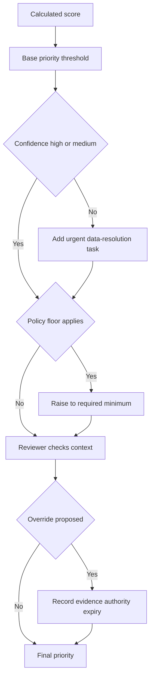

### Anchor-case calibration

| Anchor | Expected relationship | Why | Failure if reversed |
|---|---|---|---|
| f-011 versus f-004 | f-011 higher | Tier-0 privileged database, current, degraded control versus closed kiosk finding | Model ignores business/privilege/current state |
| f-002 versus f-006 | f-002 higher | Critical active signal versus medium low exploit | Model underweights exploitation and severity |
| f-007 versus f-001 | f-007 higher | Privileged tier-0 identity path and missing control | Model underweights privilege/control gap |
| f-005 versus f-010 | f-005 numerically higher but lower confidence | Unknown asset plus medium flaw versus known low kiosk case | Model hides uncertainty |
| f-009 versus normal active item | contested despite 65 | Retired status conflicts with stale last evidence | Model treats retirement as proof |
| f-004 | Excluded from active queue only after validation | Closed status alone is insufficient | Administrative closure mistaken for resolution |

Calibration asks whether ranking supports intended decisions across known cases. With synthetic truth, calculate pairwise order, priority-floor violations, missing-data behavior, and workload size. Do not tune weights merely to produce a desired count of P1 items.

### Calibration metrics

| Metric | Definition | Purpose | Caution |
|---|---|---|---|
| Anchor ordering accuracy | Correct expected pair orders / total anchor pairs | Basic ranking sanity | Small test set |
| Priority-floor violations | Items below required policy floor | Detect policy conflict | Floors are fictional |
| High-priority volume | Open P1 and P2 count | Capacity planning | Do not tune only for capacity |
| Low-confidence distribution | Count by priority and missing context | Detect false reassurance | Confidence dimensions may correlate |
| Override rate | Overrides / reviewed findings | Detect model mistrust or unusual population | Need reason categories |
| Override agreement | Reviewers choosing same bounded disposition | Assess rubric clarity | Agreement does not guarantee truth |
| Stability | Priority changes under small plausible input changes | Detect brittle thresholds | Real changes should change priority |

## Backlog, ownership, and workflow

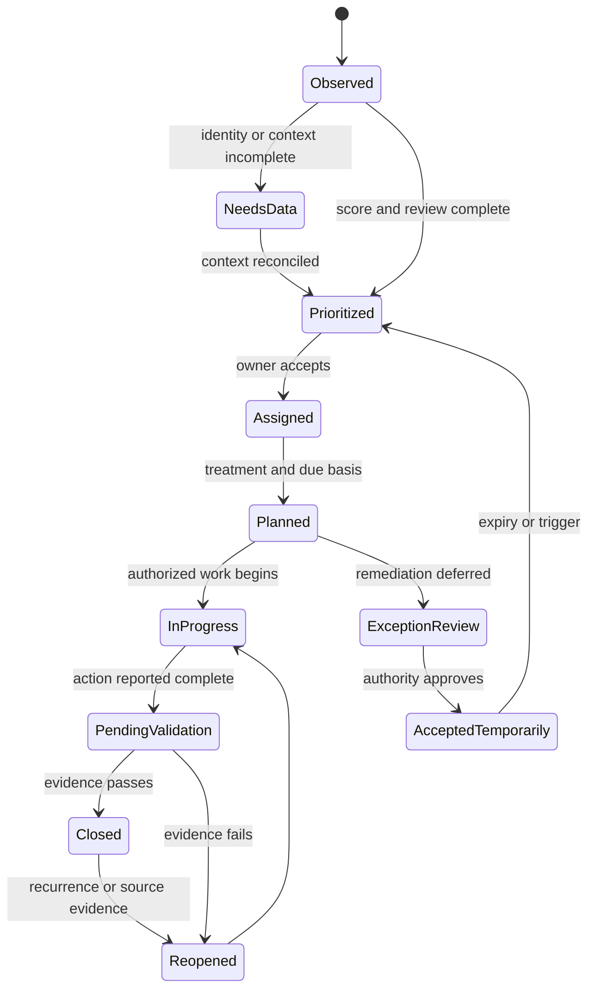

### Backlog contract

| Field | Meaning | Required control |
|---|---|---|
| finding_id | Stable vulnerability instance | Never group away source identity |
| score_version | Formula/version | Recalculate history only through governed migration |
| component_explanation | Every component and source | Must sum to score |
| confidence | high/medium/low/contested | Not hidden in notes |
| final_priority | P1-P4 after floors/override | Override reason visible |
| action_type | remediate/mitigate/verify/accept/transfer/monitor | Avoid vague "fix" |
| accountable_owner | Role/person accepting work | Assignment is not acceptance until confirmed |
| due_utc | Due based on fictional policy | Explain pause/extension rules |
| dependency | Change window, vendor update, app test, data resolution | Drives checkpoint |
| validation | Evidence that closes item | Defined before work |
| residual | Remaining exposure after action | Reviewed by authority |
| exception_id | Approved temporary departure | Must have expiry and trigger |
| workflow_state | Current controlled state | State transitions logged |

### Expected active backlog

Apply score thresholds, floors, confidence, and closed validation. The exact ordering below is expected for the compact lab before overrides.

| Rank | Finding | Score | Base/final priority | Confidence | Primary owner | Initial action | Illustrative due basis |
|---:|---|---:|---|---|---|---|---|
| 1 | f-011 | 92 | P1/P1 | high | Database Owner | Update, restrict privilege, validate | 7 days |
| 2 | f-007 | 90 | P1/P1 | high | Security Manager | Update and restore privileged-access control | 7 days |
| 3 | f-002 | 83 | P1/P1 | medium | Web Owner | Validate current finding, update runtime, test portal | 7 days |
| 4 | f-001 | 78 | P1/P1 | medium | Endpoint Owner | Validate current finding and update clients | 7 days |
| 5 | f-009 | 65 | P2/contested P2 | contested | Asset Governance | Verify retirement, presence, reachability, disposal | 14 days for decision |
| 6 | f-003 | 65 | P2/P2 | medium | Database Owner | Plan database update and control restoration | 14 days |
| 7 | f-008 | 60 | P2/P2 | high | Web Owner | Update API component and regression test | 14 days |
| 8 | f-006 | 46 | P3/P3 | contested | Web Owner | Reconcile closed ticket/open finding first | 30 days, earlier reconciliation |
| 9 | f-012 | 46 | P3/P3 | high | Endpoint Owner | Batch configuration/update work | 30 days |
| 10 | f-005 | 31 | P4/P4 plus urgent data task | low | Data Steward | Resolve asset, app, owner, control context | 5-day data checkpoint |
| 11 | f-010 | 23 | P4/P4 | high | Security Manager | Scheduled kiosk update | 90 days |

`f-004` is not in the active remediation backlog because its source status is closed, but it remains in the validation queue until evidence confirms the vulnerability is absent and the kiosk workflow still operates.

## Exceptions and residual risk

An exception is not a score edit. It is a governed temporary decision about treatment.

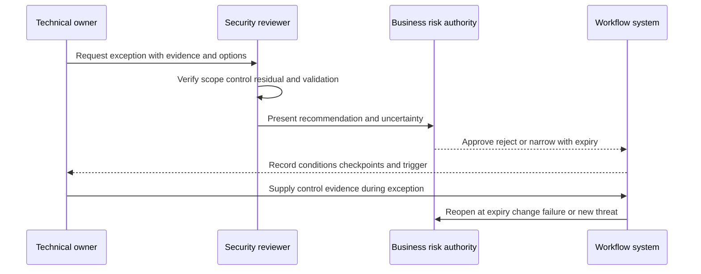

| Exception field | Required content | Why |
|---|---|---|
| Scope | Exact finding, asset, version, environment | Prevent broad waiver |
| Reason | Technical/business dependency with evidence | Distinguish constraint from convenience |
| Alternatives | Remediation, mitigation, isolation, schedule, retirement | Show choice quality |
| Compensating control | Specific control, configuration, coverage, owner | Avoid "monitoring" as empty phrase |
| Validation | How control and residual will be tested | Evidence before approval |
| Residual statement | Mechanism, likelihood/context, impact, uncertainty | Authority knows what remains |
| Authority | Fictional role authorized by policy | Analyst cannot self-accept |
| Start and expiry | Bounded time | Prevent permanent exception |
| Reopen triggers | New exploitation, control failure, scope change, missed checkpoint | Makes exception adaptive |
| Audit evidence | Decision, rationale, dates, approvals, changes | Supports review |

Synthetic exception example: database maintenance for `f-003` cannot occur before a fictional clinical release freeze ends. The Database Owner proposes a 10-day extension within the P2 window, restricts administrative path access under approved policy, increases monitoring, validates backup and rollback, and sets expiry. The Business Risk Owner decides. The candidate records the scenario; you do not accept risk.

### Plain-English deep-dive 3 - A closed ticket is not a closed exposure

A ticket records workflow. A scanner records an observation under its own timing and coverage. A change system records implementation. A control test records effect. These records can disagree legitimately for a time.

Think of a repair invoice. It proves someone recorded work and perhaps installed a part. It does not alone prove the machine now passes inspection. Closure should require the evidence defined before work: package/version state, rescan or authoritative verification, service regression test, control health, and absence of unacceptable impact. If evidence fails, reopen without blaming the owner.

In this lab, `tkt-404` is closed while `f-006` remains open. The correct action is reconciliation, not choosing whichever system is more convenient.

## Metrics and executive explanation

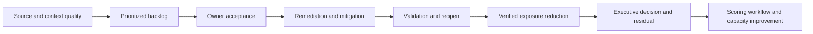

| Metric | Definition | Decision | Guardrail |
|---|---|---|---|
| Open P1/P2 count | Open accepted findings at final priority P1/P2 | Immediate capacity and owner focus | Show freshness/confidence |
| Weighted backlog | Sum of scores for open accepted findings | Directional burden | Not probability or money |
| P1/P2 aging | Days since first seen by priority | Escalation and dependency review | Scanner gaps can distort |
| Owner acceptance rate | Accepted assigned items / assigned items | Workflow handoff quality | Assignment alone is not acceptance |
| SLA compliance | Validated closures by due / due closed cohort | Process reliability | Exclude/segment approved pause transparently |
| Validation pass rate | First validation passes / validations attempted | Remediation quality | Define test coverage |
| Reopen rate | Reopened / previously closed validated items | Closure quality/recurrence | Small denominators visible |
| Exception inventory | Active exceptions by priority and expiry | Residual governance | Count plus weighted/aged view |
| Exception debt | Expired or unreviewed exceptions | Governance risk | Do not hide in total backlog |
| Context completeness | Findings with resolved asset/app/owner/control / open findings | Score confidence | Completeness is not correctness |
| Source freshness | Findings whose source meets contract / findings | Decision reliability | Show source-specific threshold |
| Verified reduction | Score or count removed only after validation | Outcome evidence | Score reduction is model-specific |

### Executive narrative pattern

Use **Outcome - Evidence - Meaning - Decision - Next**:

> **Outcome sought:** Reduce the most consequential synthetic NMH exposure while preserving critical service operation. **Evidence:** The version-1 model places four open findings in P1, three in P2 including one contested retired-asset record, two in P3, and two in P4; one P4 item has low confidence and an urgent data-resolution task. Scanner evidence for four inherited records is stale. **Meaning:** Privileged tier-0 and directly reachable active-signal scenarios drive the top queue, but source freshness and one retirement conflict limit confidence. **Decision:** Confirm owners and treatment windows for f-011, f-007, f-002, and f-001; reconcile scanner freshness and f-009 retirement evidence; approve or reject any bounded exception through fictional risk authority. **Next:** Recalculate only after source refresh, preserve score version, and count reduction only after validation.

No sentence states that a real enterprise's exposure changed.

## Lab

All exercises use the inline data. Implement in an approved local SQL engine, spreadsheet, or BI model. Save formulas and queries. Do not install or run a vulnerability scanner.

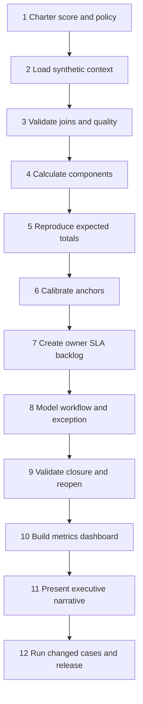

### Exercise 1 - Charter the scoring question

Write: "Which synthetic NMH open findings should receive attention first, which context or evidence is missing, and which owner decision is next?" Record non-goals: predict exploitation, quantify financial loss, reproduce UVM, prescribe production change, or accept risk.

Define version, components, source fields, null policy, threshold hypothesis, policy floors, override authority, and review cadence before calculating results. This prevents changing weights to favor a preferred narrative.

### Exercise 2 - Load and validate synthetic records

Create tables for assets, controls, vulnerabilities, findings, users, applications, tickets, score snapshots, work items, exceptions, and validations. Keep original strings. Confirm counts: 8 assets, 8 controls, 10 vulnerability definitions, 12 findings, 5 fictional users inherited from Part 112 plus any role records needed, and the ticket records.

Run referential checks. `app-identity` is intentionally not present in Part 112's compact registry, so add a versioned synthetic application row or create a quality issue before scoring `asset-007`. Do not silently allow a broken join. Add:

| app_id | app_name | business_tier | data_class | business_owner_user_id |
|---|---|---|---|---|
| app-identity | NMH Identity Service | tier_0 | synthetic_restricted | usr-004 |

Expected observation: all 12 findings resolve to a canonical asset; business context for `asset-006` remains unknown by design.

### Exercise 3 - Build control-gap context

Map each finding to an applicable synthetic control-gap band. Use healthy for assets 1, 2, and 4; degraded for asset 3; stale for asset 5; healthy but low-confidence for asset 6; missing for asset 7; verified for asset 8. Record that applicability is scenario-defined, not inferred from agent state alone.

Run a left join and count missing control-context rows. Expected missing join count is zero after mapping; unknown applicability should be a named band rather than a null that disappears.

### Exercise 4 - Calculate all score components

Create a `score_snapshot` row per finding with score version, reporting cut, eight component values, total, confidence, quality flags, and source timestamps. Do not store only the total.

```sql
SELECT
    finding_id,
    technical_points + exploit_points + active_points
      + business_points + reachability_points + privilege_points
      + control_gap_points + data_points AS recomputed_score,
    contextual_score,
    CASE
        WHEN technical_points + exploit_points + active_points
           + business_points + reachability_points + privilege_points
           + control_gap_points + data_points = contextual_score
        THEN 'pass' ELSE 'fail'
    END AS component_sum_check
FROM score_snapshot
ORDER BY finding_id;
```

Expected observation: every component sum passes and matches the expected-score table.

### Exercise 5 - Apply priorities, floors, and confidence

Assign base priority by threshold. Apply policy floors. Record final priority separately. Create a data-resolution task for `f-005`; contested review for `f-009`; validation queue status for `f-004`; and ticket-state reconciliation for `f-006`.

Expected active counts before changed cases: P1 = 4, P2 = 3, P3 = 2, P4 = 2. One closed finding is in validation, not active backlog. Preserve this denominator.

### Exercise 6 - Calibrate with anchor cases

Evaluate all six anchor statements. Calculate ordering accuracy. Change one weight at a time in a separate `v1-experiment` copy and explain impact. Example: reducing active-exploitation points from 15 to 5 may pull `f-001` below P1 and narrow separation from low-threat findings. Do not adopt the change merely because workload shrinks.

Ask three calibration questions:

1. Did the model rank expected high-consequence cases above lower cases?
2. Did missing context create verification rather than false safety?
3. Did a small reasonable input change create an unreasonable priority jump?

Record rejected model versions and why.

### Exercise 7 - Build the owner/SLA backlog

Create one row per active finding using the expected backlog table. Add owner acceptance status, treatment choice, dependency, due date based on reporting cut and illustrative target, checkpoint, validation, residual, and escalation path.

Due-date arithmetic is dialect-specific. A spreadsheet may add days to a UTC date; PostgreSQL and SQLite use different functions. Save the exact rule and result. The policy target is a lab assumption, not a regulatory deadline.

Expected observation: every item has either an accountable owner or an explicit data/governance owner resolving the gap. No finding is "owned by security" without a role and acceptance.

### Exercise 8 - Model remediation and exception choices

For `f-003`, compare direct remediation in the next authorized database window, temporary access restriction plus monitoring, service isolation, or bounded exception. Write tradeoffs, dependencies, rollback, validation, and residual. Do not execute any change.

Create one exception request with a fictional authority, 10-day expiry, exact scope, compensating control, evidence, checkpoints, and reopen triggers. Then create a rejected version lacking control validation to show governance discriminates.

### Exercise 9 - Validate closure and reopening

Use `f-004` as the closure test. Define synthetic evidence: current scanner observation no longer reports the finding, installed component state matches the approved fixed baseline, kiosk check-in workflow passes a local fictional test, and no unacceptable control regression appears. Mark validation pass only if all criteria are present.

Use `f-006` as reopen/reconciliation: closed ticket plus open finding remains contested. Create a workflow event asking source owner and remediation owner for current evidence. Do not automatically reopen or close until defined evidence arrives.

### Exercise 10 - Build technical and executive dashboard views


| Page | Visual | Required measure | Decision |
|---|---|---|---|
| Priority | Backlog by priority/confidence | P1-P4 active counts | Where should attention start? |
| Priority | Score decomposition | Eight components | Why did this rank here? |
| Workflow | Owner acceptance and due table | accepted/unaccepted, due, checkpoint | Which handoff is blocked? |
| Workflow | Validation state | pending/pass/fail/reopen | Is closure credible? |
| Exceptions | Expiry timeline | active, expiring, expired | Which residual needs authority? |
| Quality | Source freshness and context completeness | current/stale, complete/missing | Which conclusions are limited? |
| Executive | Top exposure themes and asks | owner, action, decision, next | What must leaders decide? |

Every page shows `SYNTHETIC NMH LAB`, `NMH-LAB-SCORE-v1`, reporting cut, filter state, and the statement "Not Zscaler UVM scoring."

### Exercise 11 - Deliver two explanations

Technical explanation: select `f-011`, show all components sum to 92, explain tier-0 privilege, active synthetic signal, degraded control, sources, confidence, priority, owner, dependency, validation, and residual. Then select `f-005` and explain why score 31 plus low confidence creates a data task rather than a low-risk conclusion.

Executive explanation: use the five-part narrative above in under two minutes. Lead with action and uncertainty, not model mechanics. Keep component detail available in an appendix.

### Exercise 12 - Run changed cases

Changed case A: set `f-011` active signal from yes to no. Expected score becomes 77 and remains P1. Explain stability.

Changed case B: mark `asset-002` reachability from direct to none with approved synthetic evidence. `f-002` becomes 73, base P2, but stale source still requires verification. Record versioned input and decision.

Changed case C: refresh scanner evidence and mark `f-001` absent after a fictional update. Do not subtract it from verified exposure until validation criteria pass. Record pending-validation then closed.

Changed case D: expire the `f-003` exception without replacement evidence. The workflow automatically returns it to prioritized/action state in the simulation; no real automation is claimed.

## Expected evidence


| Artifact ID | Artifact | Minimum content | Acceptance condition |
|---|---|---|---|
| NMH-SYN-P113-A01 | Scope and non-goals | No scan/exploit/product algorithm claim | Part 111 gates pass |
| NMH-SYN-P113-A02 | Synthetic data dictionary | Assets, controls, vulnerabilities, findings, workflow | All fields and nulls defined |
| NMH-SYN-P113-A03 | Score specification | Version, components, points, sources, limits | Sums to maximum 100 |
| NMH-SYN-P113-A04 | Score snapshots | Eight components, total, confidence, flags | Matches 12 expected totals |
| NMH-SYN-P113-A05 | Calibration pack | Anchors, ordering, experiments, rejected changes | No workload-only tuning |
| NMH-SYN-P113-A06 | Priority policy | Thresholds, floors, overrides, illustrative SLAs | Clearly fictional |
| NMH-SYN-P113-A07 | Prioritized backlog | Rank, owner, action, due, dependency, validation | Active counts reconcile |
| NMH-SYN-P113-A08 | Workflow state model | Assignment through closure/reopen | Ticket closure not sufficient |
| NMH-SYN-P113-A09 | Exception record | Scope, control, residual, authority, expiry, triggers | One accepted and one rejected example |
| NMH-SYN-P113-A10 | Validation package | f-004 closure and f-006 conflict | Evidence criteria explicit |
| NMH-SYN-P113-A11 | Metric dictionary | Definition, numerator, denominator, source, limit | Quality near outcome |
| NMH-SYN-P113-A12 | Dashboard | Priority, workflow, exceptions, quality, executive | Shows model/version/cut/boundary |
| NMH-SYN-P113-A13 | Changed-case results | Four cases with predicted/observed differences | Versioned and reproducible |
| NMH-SYN-P113-A14 | Executive narrative | Outcome, evidence, meaning, decision, next | No real risk-reduction claim |
| NMH-SYN-P113-A15 | Reflection and rubric | Failure, correction, proof/non-proof, next validation | Honest portfolio language |

### Evidence-capture checklist

- [ ] Record `NMH-LAB-SCORE-v1` and the reporting cut on every score output.
- [ ] Preserve original synthetic records and source quality flags.
- [ ] Save every component mapping and point value.
- [ ] Recompute totals from components and capture pass/fail.
- [ ] Match all 12 expected scores before prioritization.
- [ ] Keep confidence separate from score.
- [ ] Capture base priority, policy floor, override, and final priority separately.
- [ ] Record expected active P1-P4 counts and closed-validation count.
- [ ] Capture anchor ordering and experimental model changes.
- [ ] Save owner acceptance, action, due basis, dependency, validation, and residual.
- [ ] Preserve exception authority, expiry, and reopen triggers.
- [ ] Reconcile finding, ticket, change, and validation states.
- [ ] Show source freshness and context completeness beside backlog metrics.
- [ ] Save changed-case prediction and actual result.
- [ ] Use Part 111 claim labels in release artifacts.

## Troubleshooting

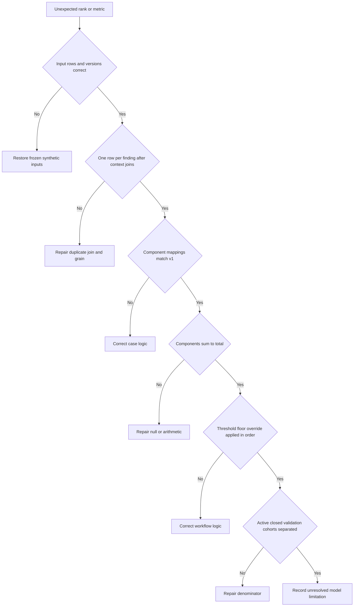

| Symptom | Likely cause | Discriminating check | Safe repair |
|---|---|---|---|
| Score exceeds 100 | Duplicate context join or component duplicated | Count rows per finding; sum max | Preaggregate and enforce one component row |
| Score is null | Left-joined component or null arithmetic | Inspect each component | Explicit unknown band plus confidence flag |
| f-011 not 92 | Mapping mismatch | Compare eight components to expected table | Correct versioned rule, not expected truth |
| Active count is 12 | Closed f-004 included | Inspect cohort filter | Separate open backlog and validation queue |
| P2 count is wrong | f-009 excluded as retired or floor logic wrong | Inspect contested-state policy | Keep contested P2 until evidence resolves |
| f-005 appears safely low | Confidence omitted | Inspect unknown app/owner/privilege | Add low-confidence data task |
| Backlog duplicates findings | Many tickets or controls joined directly | Declare target grain | Aggregate relationships before join |
| SLA compliance is 100 percent | Only closed-on-time items in denominator | Inspect due cohort | Include all due eligible items |
| Weighted backlog drops on stale feed | Missing observations treated as remediation | Compare source freshness and prior snapshot | Mark unknown; do not claim reduction |
| Exception never expires | Missing UTC trigger or state job in simulation | Inspect expiry query | Add explicit review query and manual checkpoint |
| Dashboard rank differs from SQL | Independent BI measure or hidden filter | Export score table and filter state | Use one governed score table |
| Executive says "risk fell 30 percent" | Score change misrepresented | Trace metric definition and validation | Say model-weighted backlog changed under stated conditions |

## Cleanup and privacy

The dataset is synthetic, but vulnerability-style data and screenshots can still be misread as a real healthcare environment. Keep the fictional label prominent. Review local paths, author metadata, recent-source lists, and workbook caches.

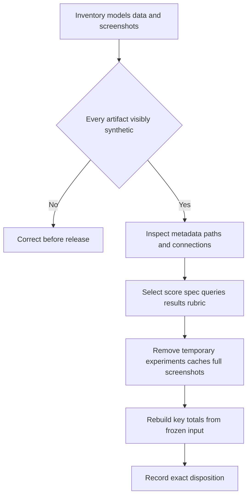

| Item | Retain | Remove | Release condition |
|---|---|---|---|
| Frozen synthetic inputs | Yes | Duplicate working copies | Identifiers remain `SYN-CVE` and NMH |
| Score specification | Yes | Unlabeled experimental drafts | Model name and non-UVM boundary visible |
| SQL/formulas | Yes | Queries with absolute personal paths | No external connections or credentials |
| Score snapshots | Yes | Superseded non-audited outputs | Version and reporting cut present |
| BI workbook | Optional | Cached source copies not needed | Inspect hidden queries and author metadata |
| Screenshots | Selected regions | Full desktop captures | Synthetic banner and filter state visible |
| Exception simulation | Yes | Draft with realistic signatures | Fictional authority clearly marked |
| Tool logs | Minimal | Verbose environment logs | No local usernames or unrelated paths |
| Release summary | Yes | Any production-sounding wording | Part 111 claim formula used |

No cleanup step may uninstall security software, delete a real scanner database, close a real ticket, remove a real exception, change a production control, or delete a shared folder. Remove only exact local synthetic files recorded in the manifest.

## Validation rubric

Part 111 blocking gates apply before scoring. A technically accurate score implementation fails if it is presented as UVM or production work.

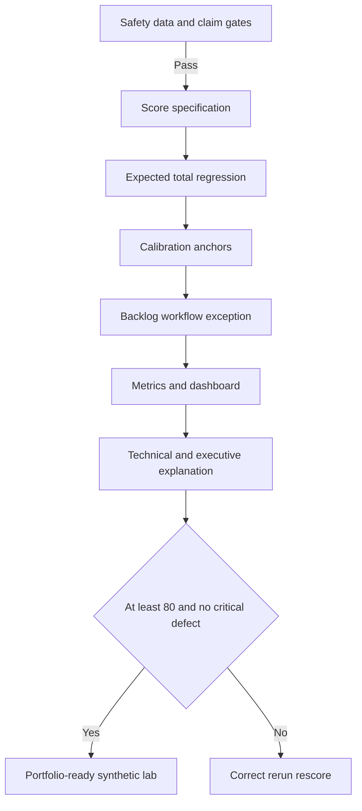

| Dimension | Points | Full-credit evidence | Critical defect |
|---|---:|---|---|
| Safety and honesty | 10 | Offline synthetic, no scan/exploit, non-UVM label | Real target/data or product algorithm claim |
| Data model and quality | 10 | Context joins, provenance, freshness, unknowns | Missing rows silently treated safe |
| Score transparency | 15 | Eight components, sources, limits, exact sum | Total without explanation |
| Regression correctness | 10 | All 12 expected totals match | Component or join error |
| Calibration | 10 | Anchor tests, stability, rejected experiments | Tuned only to workload |
| Priority policy | 10 | Thresholds, floors, confidence, overrides | Score alone accepts risk |
| Backlog and ownership | 10 | Owner acceptance, action, SLA basis, dependency, validation | Unowned high priority work |
| Exceptions and closure | 10 | Authority, control, residual, expiry, validation, reopen | Ticket close equals remediation |
| Metrics and dashboard | 10 | Stable cohorts, denominators, quality, decision views | Stale-feed drop called reduction |
| Communication and cleanup | 5 | Technical/executive narrative, release review | Customer outcome invented |

| Score | Interpretation | Action |
|---:|---|---|
| 0-69 | Important modeling or workflow controls are missing | Rebuild before portfolio use |
| 70-79 | Mechanics work but decision quality is incomplete | Repair weakest dimensions |
| 80-89 | Strong reproducible synthetic prioritization lab | Practice challenge questions |
| 90-100 | Excellent inspectable preparation | Seek independent review; retain boundaries |

### Plain-English deep-dive 4 - Metrics can improve without exposure improving

Suppose a stale scanner stops reporting 50 findings. The open count and weighted backlog fall. Nothing may have been fixed. Or teams could close low-effort low-priority tickets, improving closure count while high-priority aging worsens.

Think of a hospital waiting-room dashboard. Removing patients from the screen because the registration feed failed does not improve care. A trustworthy report shows source freshness, cohort definitions, priority, age, validation, reopened work, and exceptions alongside totals.

For this lab, call an item reduced only after accepted validation under the synthetic criteria. Even then, describe a **synthetic verified reduction in the model**, not real risk reduction.

## Explicitly fictional and synthetic NMH scenarios

### Scenario 1 - Critical does not automatically win

The closed kiosk finding has critical technical band but remains in validation, while a high technical-band privileged identity finding with active synthetic exploitation and missing control ranks first. This is an exercise in context, not a real threat statement.

### Scenario 2 - Low score, low confidence

The unresolved lab asset scores 31 because context is missing. The workflow creates an urgent data-resolution task and prohibits the phrase "low risk." No real asset is affected.

### Scenario 3 - Exception under release freeze

A fictional database owner requests a bounded delay with a compensating access restriction, evidence, expiry, and reopen triggers. A fictional risk authority decides. You demonstrate governance but does not accept customer risk.

### Scenario 4 - Metric falls after feed delay

The scanner feed becomes stale and the dashboard appears to lose findings. Quality controls block a risk-reduction claim and require source reconciliation. No production connector is implicated.

## Official Source Anchors

Research/source snapshot and source review date: **2026-08-24**.

The Zscaler sources support bounded public positioning around UVM, Data Fabric, Risk360, and security operations. FIRST, NIST, CISA, and MITRE sources support general vulnerability identifiers, severity, exploit prediction, known exploitation, weakness categories, and risk-management context. The synthetic model neither copies nor claims any vendor or standards body's algorithm.

| Source | URL | Used for | Boundary |
|---|---|---|---|
| Zscaler Unified Vulnerability Management | https://www.zscaler.com/products-and-solutions/unified-vulnerability-management | Public positioning around aggregated context, prioritization, and remediation workflow | No UVM score, schema, algorithm, UI, or outcome inferred |
| Zscaler Data Fabric for Security | https://www.zscaler.com/products-and-solutions/data-fabric | Public security-data harmonization context | No connector or tenant behavior inferred |
| Zscaler Risk360 | https://www.zscaler.com/products-and-solutions/risk360 | Public risk visibility and communication context | NMH score is not a Risk360 score |
| Zscaler Agentic Security Operations | https://www.zscaler.com/products-and-solutions/security-operations | Public SecOps workflow context | No automated agent/action used |
| FIRST CVSS | https://www.first.org/cvss/ | General vulnerability severity framework | Lab technical bands are not calculated CVSS scores |
| FIRST EPSS | https://www.first.org/epss/ | General exploit-probability concept | Lab likelihood labels are not EPSS values |
| CISA Known Exploited Vulnerabilities Catalog | https://www.cisa.gov/known-exploited-vulnerabilities-catalog | General known-exploitation and remediation-priority context | No SYN-CVE is in the real catalog |
| MITRE CVE | https://www.cve.org/ | General public vulnerability identifier context | SYN-CVE identifiers are intentionally fictional |
| MITRE CWE | https://cwe.mitre.org/ | General weakness-category context | No software weakness was tested |
| NIST Cybersecurity Framework 2.0 | https://www.nist.gov/cyberframework | General governance and cybersecurity outcome framing | Voluntary and implementation-neutral |
| NIST SP 800-40 Rev. 4 | https://csrc.nist.gov/pubs/sp/800/40/r4/final | General enterprise patch-management planning context | Customer policy and current guidance govern production |

## Likely Interview Questions

### Q1. Why is vulnerability severity not the same as priority?

**Model answer:** Severity describes potential technical impact under standardized assumptions. Priority adds exploitability and active threat evidence, asset criticality, reachability, privilege, control effectiveness, data sensitivity, business timing, dependencies, and confidence. Two instances of the same vulnerability can require different action. I use severity as one transparent component and retain human policy and risk authority rather than letting a score make the decision.

### Q2. How did you design the contextual score in this lab?

**Model answer:** I defined `NMH-LAB-SCORE-v1`, an additive 0-100 learning model with eight visible components: technical band, exploit likelihood, synthetic active-exploitation signal, business tier, reachability, privilege, control gap, and data sensitivity. Every component has a source, mapping, timestamp, and limitation. I kept confidence separate, tested 12 expected totals, and labeled the formula as candidate-designed rather than Zscaler UVM logic.

### Q3. How would you calibrate a prioritization model?

**Model answer:** I define expected anchor relationships before tuning, test known positive, negative, missing-data, closed, retired, and contested cases, and measure ordering, floor violations, workload, overrides, stability, and reviewer agreement. I vary one component at a time and record rejected versions. I do not tune simply to fit team capacity. In production I would use governed historical outcomes, expert review, current threat evidence, and customer risk policy.

### Q4. How do you handle missing context?

**Model answer:** I do not convert unknown to zero or safe. I preserve the missing dimension, lower confidence, create an owned data-resolution task, and apply policy floors when consequence warrants. A low numerical score with unresolved asset, business, owner, or control context is described as low model score and low confidence, not low risk. I also measure context completeness as a program metric.

### Q5. What makes a vulnerability backlog actionable?

**Model answer:** Each finding needs score explanation, confidence, final priority, accountable owner acceptance, treatment choice, due-date basis, dependency, checkpoint, validation criteria, residual risk, exception reference, and escalation path. Grouping may help campaigns, but source finding identity remains traceable. Priority without ownership and validation is only a sorted report.

### Q6. How should exceptions be governed?

**Model answer:** An exception has exact scope, evidence-based reason, considered alternatives, a specific compensating control, control validation, residual-risk statement, authorized decision maker, start and expiry, checkpoints, and reopen triggers. It does not change the underlying score or erase the finding. Expired, unreviewed, or failed-control exceptions return to action. The analyst recommends; authorized business/risk roles accept.

### Q7. How do you prove remediation and report progress honestly?

**Model answer:** I define validation before work: current source evidence, fixed version or configuration, control state, service regression test, and no unacceptable side effect. Ticket closure is workflow evidence, not proof. I report open high-priority aging, owner acceptance, SLA cohorts, validation pass, reopen, exceptions, context completeness, and source freshness. A model-weighted backlog change is not automatically real risk reduction.

### Q8. How does your background transfer to UVM-oriented work?

**Model answer:** SQL, PostgreSQL, statistics, Power BI, and MBA analytics support contextual modeling, calibration, transparent measures, and dashboards. enterprise escalation work adds impact-based prioritization, hypothesis discipline, ownership, cross-team coordination, and fix validation. Customer communication supports technical and executive explanations. These are strong transfer points, but they do not establish production vulnerability-program ownership, Zscaler UVM operation, or customer risk outcomes.

## 30-Second Memory Hooks

| Concept | Memory hook |
|---|---|
| Vulnerability | Weakness type |
| Finding | Weakness on one asset |
| Severity | Technical potential, not queue order |
| Context | Threat, asset, path, privilege, control, business |
| Score | Explainable aid, not verdict |
| Confidence | Trust in inputs, separate from urgency |
| Calibration | Anchor, vary, challenge, govern |
| Missing data | Unknown is not zero |
| Priority | Score plus policy plus judgment |
| Backlog | Owner, action, due, dependency, validation |
| SLA | Fictional here; policy in production |
| Exception | Scope, control, authority, expiry, trigger |
| Closure | Evidence, not ticket status |
| Metrics | Cohort, denominator, freshness, validation |
| Product boundary | NMH model is not UVM scoring |
| Experience bridge | Analytics plus escalation and validation |

## Completion Checklist

- [ ] I can explain vulnerability, finding, CVE, CWE, CVSS, EPSS, KEV, control, contextual score, calibration, SLA, exception, residual, and validation from zero.
- [ ] I applied Part 111 safety, evidence, claim, and cleanup rules.
- [ ] I used only synthetic NMH records and did not scan, exploit, or query a real target.
- [ ] I visibly labeled `NMH-LAB-SCORE-v1` as candidate-designed and not UVM.
- [ ] I modeled vulnerability, asset, business, reachability, privilege, control, owner, and workflow context.
- [ ] I kept source freshness and data-quality flags.
- [ ] I implemented all eight score components and exact mappings.
- [ ] I reproduced all 12 expected totals.
- [ ] I kept confidence separate from score and treated unknown as unknown.
- [ ] I calibrated against anchor order, policy floors, stability, and changed cases.
- [ ] I did not tune the model only to reduce high-priority volume.
- [ ] I produced the expected active P1-P4 counts and separate validation queue.
- [ ] I built an owner-accepted backlog with action, due basis, dependency, checkpoint, validation, and residual.
- [ ] I modeled remediation, mitigation, verification, acceptance, and reopening distinctly.
- [ ] I created an exception with exact scope, control, authority, expiry, and triggers.
- [ ] I reconciled ticket status with finding and validation evidence.
- [ ] I defined metrics with stable cohorts, denominators, freshness, and limitations.
- [ ] I built technical and executive dashboard views with visible boundaries.
- [ ] I ran four changed cases and recorded predictions and observations.
- [ ] I can discuss the lab without claiming production UVM experience or actual risk reduction.

[Next: Part 114 - Connectivity and Critical Escalation Lab](Part-114-connectivity-escalation-lab.md)