# Part 114 - Connectivity and Critical Escalation Lab

> **Audience:** Arti Thakur, preparing for a Zscaler Security Operations Technical Success Manager role after Microsoft enterprise Support Escalation Engineering.

> **Purpose:** Analyze a complete synthetic Microsoft 365-style connectivity failure behind a proxy by correlating DNS, TCP, TLS, HTTP, HAR-like, proxy, process, configuration, and timeline evidence; isolate the responsible boundary; run a disciplined escalation bridge; produce an actionable escalation package; validate recovery; and write a bounded root-cause analysis.

> **Scope and honesty:** Northstar Meridian Holdings, abbreviated NMH, is explicitly fictional and synthetic. Every user, process, service, domain, IP address, packet summary, certificate, proxy policy, HTTP response, HAR-like record, correlation ID, timestamp, impact count, bridge participant, mitigation, root cause, and result in this Part is invented. The scenario uses reserved example domains and documentation IP ranges and does not depict a real Microsoft 365, Zscaler, or customer incident. Arti's factual background includes Microsoft 365, OneDrive, SharePoint, enterprise escalation engineering, CRITSITs, DNS/TCP/TLS/HTTP troubleshooting, Wireshark, Netsh, Network Monitor, Procmon, HAR, Fiddler, browser tools, RCA, and Engineering collaboration. Those factual strengths transfer; the lab itself remains simulation.

> **Currency caveat:** Cloud endpoints, proxy architecture, authentication, TLS, client behavior, logging, product interfaces, support routes, incident processes, and recommended collection methods change. The controlled official-source snapshot and source review date for this Part is exactly **2026-08-24**. Current official documentation, customer architecture, approved capture procedures, privacy/security policy, licensed-tenant evidence, change authority, Support, and product specialists govern real investigation.

> **Section goal:** Produce a safe, reproducible escalation lab that starts with user impact rather than a favored layer; aligns all evidence to UTC; proves that DNS and TCP-to-proxy succeed for affected and unaffected cohorts; shows that the failing background sync process receives an HTTP 407 before target TLS while the authenticated browser receives CONNECT 200, completes TLS, and gets HTTP 200; correlates onset to an approved synthetic proxy policy object error; separates stabilization from diagnosis; manages hypotheses and bridge roles; assembles a privacy-minimized escalation package; validates a synthetic policy correction; and writes an RCA without claiming live testing, a real product defect, or customer impact.

This Part applies Part 111's shared portfolio contract. Analyze only the inline static fixtures. Do not run DNS queries, ping, trace routes, connect to example addresses, start a proxy, collect a real HAR, capture packets, inspect work traffic, install a certificate, disable TLS verification, bypass proxy/security controls, change firewall/endpoint settings, use real tenant data, or execute a destructive command.

```mermaid
flowchart LR
    IMPACT[User and business impact] --> TIME[One UTC evidence timeline]
    TIME --> DNS[DNS evidence]
    DNS --> TCP[TCP path evidence]
    TCP --> PROXY[Proxy CONNECT and authentication]
    PROXY --> TLS[TLS only after tunnel succeeds]
    TLS --> HTTP[Application HTTP]
    HTTP --> PROC[Process identity and proxy context]
    PROC --> CFG[Policy and change evidence]
    CFG --> ISO[Boundary isolation]
    ISO --> REC[Safe recovery validation]
    REC --> RCA[Root cause residual and prevention]
```

| Operating principle | Plain meaning | Lab behavior | Failure prevented |
|---|---|---|---|
| Start with impact | Technical symptoms matter because a user workflow is harmed | Define affected action, scope, onset, workaround, and criticality | Log-first tunnel vision |
| Time is a join key | Evidence from different tools must align | Normalize all timestamps to UTC and note clock quality | False sequence |
| Follow the stack | Prove each dependency before moving upward | DNS, route, TCP, proxy, TLS, HTTP, application | Jumping to TLS before tunnel exists |
| Compare cohorts | Affected versus unaffected differences discriminate hypotheses | Compare browser/background and policy revision cohorts | Single trace overgeneralization |
| Process matters | Same host and destination can behave differently by process and identity | Correlate PID, account context, proxy method, and response | "Network works" ends investigation |
| Negative evidence counts | Absence at the expected boundary can be decisive | No ClientHello after 407 means target TLS never began | Certificate blamed without handshake |
| Preserve hypotheses | Early confidence is not root cause | Track support, contradiction, confidence, and next test | Fixation and blame |
| Stabilize safely | Continuity actions need authority, risk, rollback, and validation | Use synthetic approved policy correction, not bypass | Security weakened for availability |
| Bridge roles are explicit | Coordination and diagnosis are separate jobs | Incident lead, technical lead, scribe, comms, owners | Everyone talks; nobody decides |
| Escalation packets answer questions | Logs without scope and reproduction create delay | Include impact, timeline, evidence, expected/observed, tests, privacy | Data dump called escalation |
| RCA follows proof | Root cause needs mechanism and counterfactual evidence | Correlate policy object error, 407, and validated correction | Temporal correlation called cause |
| Product truth remains bounded | This is a vendor-neutral simulation | Describe proxy boundary, not Zscaler behavior | Fictional defect attributed to product |

## JD Mapping

| JD signal | Capability developed | Concrete artifact | Honest boundary |
|---|---|---|---|
| Lead critical escalations | Establish impact, severity, roles, workstreams, cadence, and checkpoints | Bridge charter and timeline | No real customer incident led here |
| Troubleshoot complex environments | Correlate DNS, TCP, proxy, TLS, HTTP, process, and policy evidence | Layer-isolation matrix | Static synthetic artifacts only |
| Partner with Support and Product | Build a minimal complete escalation package | Escalation packet | No Zscaler case or engineering response |
| Communicate with executives | Translate mechanism into impact, action, decision, and next | Executive updates | Synthetic impact only |
| Provide technical guidance | Choose discriminating checks and avoid unsafe bypasses | Hypothesis ledger and test plan | No production change advice issued |
| Drive trust | State facts, unknowns, ETA limits, and corrections | Evidence-classified update log | No unsupported root cause/ETA |
| Validate outcomes | Separate apparent recovery from durable validation | Recovery matrix | Synthetic observation, not customer recovery |
| Improve recurring service | Produce blameless RCA and prevention actions | RCA and action register | Fictional organization and policy |

## Candidate honesty note

Arti can say: "My production Microsoft enterprise escalation background includes Microsoft 365, OneDrive, and SharePoint issues and evidence from DNS, TCP, TLS, HTTP, proxies, HAR, process traces, and client logs. In this separate synthetic NMH lab, I correlated supplied static fixtures, isolated an HTTP 407 at the proxy boundary before target TLS for a background process, linked onset to a fictional policy-object error, ran a simulated bridge, created an escalation package, and wrote an RCA. The lab demonstrates my method; it was not a real Microsoft, Zscaler, or customer incident and involved no live capture or configuration change."

| Factual Arti background | Transferable capability | Safe wording | Unsupported wording to avoid |
|---|---|---|---|
| Microsoft 365, OneDrive, SharePoint support | Recognize layered SaaS/client/identity/network dependencies | "The scenario uses an M365-style sync workflow familiar in shape." | "This is an actual Microsoft 365 outage." |
| Support Escalation Engineering and CRITSITs | Impact framing, workstreams, evidence, updates, RCA | "I applied production-proven escalation disciplines to a simulation." | "I led this customer escalation." |
| Wireshark, Netsh, Network Monitor | Packet-state and timing interpretation | "I analyzed a supplied packet-summary fixture." | "I captured customer traffic." |
| Procmon and client logs | Process, identity, file/config, and error correlation | "I correlated synthetic process events with proxy evidence." | "I inspected a real endpoint." |
| HAR, Fiddler, browser tools | HTTP timing/header/status interpretation and privacy caution | "I compared a generated HAR-like browser path." | "I uploaded a customer's HAR." |
| Engineering collaboration and fix validation | Reproduction, regression, recovery, and escalation quality | "I built an actionable fictional escalation package." | "Zscaler Engineering confirmed this cause." |

## Beginner vocabulary and memory hooks

The scenario follows a request from an application process to a fictional cloud service. Think of sending a secure parcel through a corporate mailroom. DNS finds an address. TCP opens a reliable conversation. The proxy is the mailroom deciding whether and how the parcel may leave. TLS seals the conversation to the destination after the proxy tunnel is approved. HTTP carries the application request. The process and identity determine which rules and credentials apply.

| Term | Meaning from zero | Why it matters | Memory hook |
|---|---|---|---|
| DNS | System that maps names to addresses and other records | Name resolution must succeed before address-based connection | Directory lookup |
| Resolver | Component/server answering DNS questions | Different resolvers/caches may give different evidence | Information desk |
| TCP | Reliable ordered transport connection | Handshake proves reachability to one endpoint/port | Phone call setup |
| SYN/SYN-ACK/ACK | Three steps opening a TCP connection | Distinguishes timeout/refusal/success | Ring, answer, acknowledge |
| Proxy | Intermediary receiving client traffic and applying policy | Client may connect to proxy, not destination | Corporate mailroom |
| Explicit proxy | Client is configured to send requests through a named proxy | Process proxy settings matter | Address mailroom first |
| PAC | Proxy Auto-Configuration logic selecting proxy or direct route | Different contexts may retrieve/evaluate differently | Routing rulebook |
| CONNECT | HTTP method asking a proxy to open a tunnel to a host/port | Happens before tunneled target TLS | Request sealed corridor |
| 407 | HTTP Proxy Authentication Required status | Proxy needs acceptable authentication | Mailroom asks for employee badge |
| 200 Connection Established | Proxy accepted CONNECT and opened tunnel | Target TLS can begin afterward | Corridor approved |
| TLS | Protocol providing authenticated encrypted transport | Requires successful underlying path/tunnel | Secure sealed conversation |
| ClientHello | First common TLS handshake message from client | Its absence can show TLS never began | First sealed greeting |
| Certificate | Signed identity statement presented during TLS | Relevant only if handshake reaches certificate stage | Destination identity card |
| HTTP | Application request/response protocol | Status and timing identify application/proxy behavior | Parcel instructions and receipt |
| HAR | Browser HTTP Archive | Useful for browser path, may contain secrets | Browser request diary |
| Process | Running program instance with PID and security context | Processes can use different proxy stacks/settings | Different employee at same desk |
| User context | Identity and credentials available to interactive program | Browser may authenticate where service process cannot | Employee badge available |
| Machine/background context | Non-interactive process identity/environment | May lack interactive proxy credential path | Night robot without badge |
| Correlation ID | Identifier linking records across components | Helps reconstruct one transaction | Parcel tracking number |
| Cohort | Group sharing defined condition | Comparison reveals discriminating differences | Same route, different badge |
| Hypothesis | Testable proposed mechanism | Must predict evidence | Candidate explanation |
| Discriminating check | Observation expected to differ between hypotheses | Reduces uncertainty efficiently | Test that separates suspects |
| Containment | Limit harm or scope | Not necessarily service restoration | Close affected loading bay |
| Mitigation | Reduce impact or restore function without final cause correction | Must preserve security and be reversible | Approved alternate clerk |
| Recovery | Service meets defined functional and guardrail criteria | More than one successful retry | Mail flow normal over time |
| RCA | Root-cause analysis linking trigger, mechanism, impact, and prevention | Avoids blame and unsupported certainty | Why system allowed failure |

### Plain-English deep-dive 1 - The proxy is the destination of the first TCP connection

In an explicit-proxy design, the application usually opens TCP to the proxy. The requested cloud hostname appears inside the CONNECT request. If the proxy returns 407, the tunnel does not exist and target TLS has not begun. A packet summary showing successful TCP to `192.0.2.20:8080` does not prove TCP to the cloud service.

Think of a traveler reaching an airport security desk. Reaching the desk proves the road and airport entrance worked. If the desk rejects the travel document, the traveler never reaches the aircraft gate. Investigating the aircraft door certificate would be premature.

This ordering is the key to the scenario. The affected process receives 407 and closes. There is no target ClientHello, ServerHello, or certificate. The browser obtains CONNECT 200, then completes TLS and application HTTP. The difference is at proxy authentication/process context, not DNS, TCP-to-proxy, target certificate, or generic service availability.

## Prerequisites

Complete Part 111's safe evidence contract. No network tool execution is required. Use a text editor, spreadsheet, or local SQL engine to sort and correlate the inline evidence. Mermaid preview is optional.

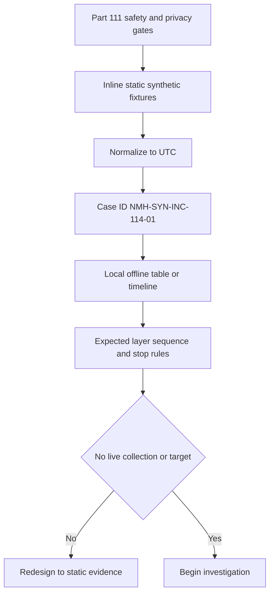

| Prerequisite | Required value | Verification | Safety boundary |
|---|---|---|---|
| Case ID | NMH-SYN-INC-114-01 | Present on artifacts | Fictional only |
| Data | Inline tables in this Part | No imported traces | Never use work/customer captures |
| Network | Offline | No command requires destination | Do not resolve example names |
| Privilege | Standard user | No capture driver/admin prompt | No elevated collection |
| Time standard | UTC | All fixtures end in Z | Record any source offset if added |
| Clock quality | Synthetic sources within 50 ms except noted | Keep source offset field | Do not force exact sequence beyond precision |
| Severity policy | Fictional SEV-1 criteria | Explicitly labeled | Not employer/customer policy |
| Evidence storage | Dedicated Part 111 folder | Manifest and restricted working area | No cloud upload required |
| Privacy | No cookies, tokens, bodies, real IDs | Review fixture fields | Do not add realistic secrets |
| Change authority | Fictional change manager in simulation | No actual configuration | Never bypass controls |

## Scenario and impact

At 2026-08-24 09:02 UTC, fictional NMH users begin reporting that the background file-sync action in `NMH Workspace Sync` cannot upload or download. Interactive access through `NMH Workspace Browser` remains available. The application is Microsoft 365-style in workflow shape, but all names and endpoints are fictional. The affected background process is `nmhsync.exe`; the browser is `nmhbrowser.exe`.

The cloud-style endpoints are `files.office.example`, `login.office.example`, and `notify.office.example`. The explicit proxy is `proxy.nmh.example.com` at documentation address `192.0.2.20:8080`. Destination addresses appear only as static documentation data and must never be contacted.

| Impact field | Synthetic value | Evidence class | Unknown/limit |
|---|---|---|---|
| First confirmed failure | 2026-08-24T09:02:14Z | Synthetic support/event record | Earlier unreported failures unknown |
| Affected workflow | Background file synchronization | Synthetic reproduction | Browser editing unaffected in sampled cohort |
| Affected users | 187 reporting/telemetry-correlated fictional users | Synthetic aggregate | Total eligible population 240; silent failures possible |
| Geography | NMH East and Central fictional sites | Synthetic cohort | West remains unaffected on prior policy revision |
| Business impact | Delayed document synchronization for clinical-admin workflow | Scenario assumption | No patient safety or breach claimed |
| Data loss | Not established | Unknown | Retries queued locally in scenario |
| Security impact | No evidence of compromise | Bounded synthetic evidence | Absence of evidence is not universal proof |
| Workaround | Interactive browser workflow available for approved tasks | Synthetic process note | Capacity/accessibility limits remain |
| Severity | Fictional SEV-1 due scale and time-sensitive workflow | Scenario policy | Not a universal severity standard |
| Restoration ETA | Unknown during diagnosis | Honest communication | Next evidence checkpoint supplied |

### Synthetic cohort matrix

| Cohort | Process | Policy revision | Identity context | Result | Sample size |
|---|---|---|---|---|---:|
| A | nmhsync.exe | 42 | background service token, no interactive proxy credential | fails with proxy 407 | 12/12 |
| B | nmhbrowser.exe | 42 | interactive user proxy authentication | succeeds | 12/12 |
| C | nmhsync.exe | 41 | background service bypass object valid | succeeds | 6/6 |
| D | nmhsync.exe | 43 after approved synthetic correction | background service bypass object valid | succeeds | 12/12 plus 30-minute observation |

The word `bypass` here means a fictional proxy-authentication exception within approved policy, not bypassing the proxy, TLS, inspection, or security enforcement. Traffic still uses the proxy and all other synthetic policy remains applied.

## Evidence architecture

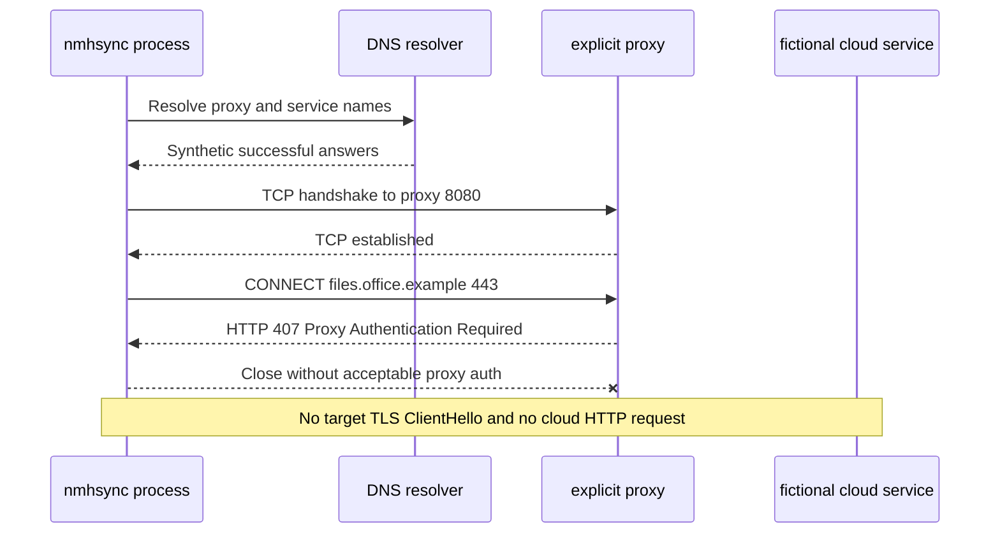

Successful browser comparator:

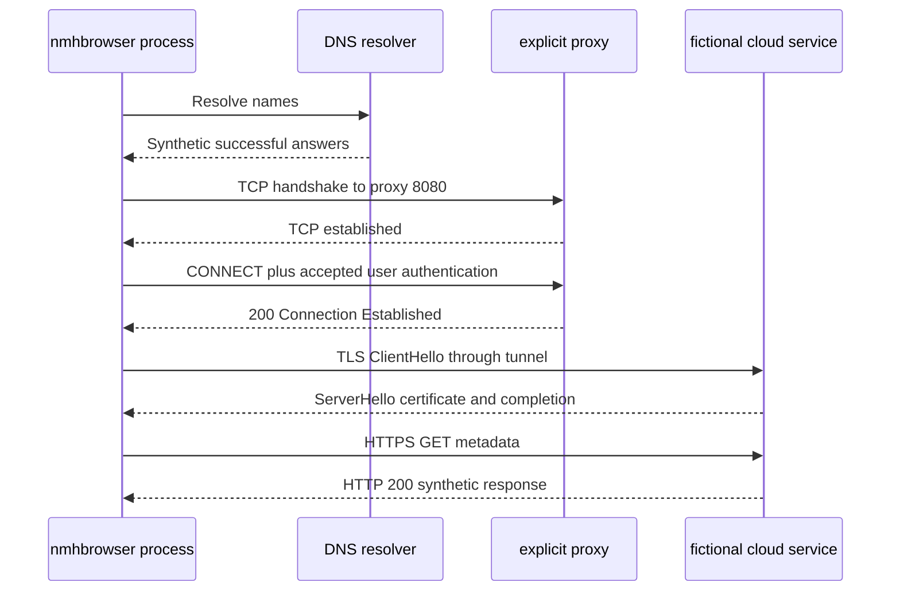

### Evidence-source limitations

| Evidence source | What it can establish | What it cannot establish alone |
|---|---|---|
| User report | Perceived workflow and time | Protocol layer or root cause |
| DNS client log | Name, resolver, response, timing | TCP, proxy, TLS, or HTTP success |
| Packet summary | Observed packet sequence on one path | Process identity unless correlated; payload semantics if absent |
| Proxy log | Policy decision, status, reason, rule/object | Endpoint process internals or target application result |
| TLS event | Handshake stage, version, alert, certificate metadata | Why earlier proxy authentication failed |
| HAR-like browser record | Browser request timing/status | Background process path |
| Process trace | PID, identity context, proxy query, error, timing | Network device decision unless correlated |
| Policy audit | Configuration change, actor role, revision, object | Causation without outcome evidence |
| Support timeline | Cross-source event sequence | Truth if source timestamps are wrong |
| Recovery test | Function after approved change | Long-term prevention or universal population |

## Synthetic evidence fixtures

### DNS evidence

| event_utc | process | query_name | query_type | response | result | duration_ms | correlation_id |
|---|---|---|---|---|---|---:|---|
| 2026-08-24T09:10:00.010Z | nmhsync.exe/4412 | proxy.nmh.example.com | A | 192.0.2.20 | success | 8 | corr-sync-001 |
| 2026-08-24T09:10:00.025Z | nmhsync.exe/4412 | files.office.example | A | 198.51.100.44 | success | 9 | corr-sync-001 |
| 2026-08-24T09:10:05.010Z | nmhbrowser.exe/5520 | proxy.nmh.example.com | A | 192.0.2.20 | success | 7 | corr-browser-001 |
| 2026-08-24T09:10:05.024Z | nmhbrowser.exe/5520 | files.office.example | A | 198.51.100.44 | success | 8 | corr-browser-001 |

Observation: both processes obtain successful synthetic DNS responses quickly. DNS failure is not supported for these transactions. This does not prove every user or endpoint had identical DNS behavior.

### TCP packet-summary evidence

This is generated text, not a packet capture. Sequence numbers are omitted because they add no learning value.

| event_utc | flow_id | process_corr | src | dst | flags/event | result |
|---|---|---|---|---|---|---|
| 2026-08-24T09:10:00.100Z | flow-sync-01 | corr-sync-001 | 192.0.2.101:51000 | 192.0.2.20:8080 | SYN | sent |
| 2026-08-24T09:10:00.118Z | flow-sync-01 | corr-sync-001 | 192.0.2.20:8080 | 192.0.2.101:51000 | SYN-ACK | received |
| 2026-08-24T09:10:00.119Z | flow-sync-01 | corr-sync-001 | 192.0.2.101:51000 | 192.0.2.20:8080 | ACK | established |
| 2026-08-24T09:10:00.180Z | flow-sync-01 | corr-sync-001 | proxy exchange | proxy exchange | HTTP 407 summary | received |
| 2026-08-24T09:10:00.185Z | flow-sync-01 | corr-sync-001 | 192.0.2.101:51000 | 192.0.2.20:8080 | FIN | client closed |
| 2026-08-24T09:10:05.100Z | flow-browser-01 | corr-browser-001 | 192.0.2.101:51020 | 192.0.2.20:8080 | SYN | sent |
| 2026-08-24T09:10:05.117Z | flow-browser-01 | corr-browser-001 | 192.0.2.20:8080 | 192.0.2.101:51020 | SYN-ACK | received |
| 2026-08-24T09:10:05.118Z | flow-browser-01 | corr-browser-001 | 192.0.2.101:51020 | 192.0.2.20:8080 | ACK | established |
| 2026-08-24T09:10:05.170Z | flow-browser-01 | corr-browser-001 | proxy exchange | proxy exchange | CONNECT 200 summary | received |
| 2026-08-24T09:10:05.190Z | flow-browser-01 | corr-browser-001 | tunneled | tunneled | TLS ClientHello summary | sent |

Observation: TCP to the explicit proxy succeeds in both flows. The affected flow closes after 407. There is no evidence of a direct TCP attempt to `198.51.100.44:443` in the fixture.

### Proxy HTTP evidence

| event_utc | proxy_request_id | process_corr | method | target | user_context | policy_revision | rule_id | status | reason |
|---|---|---|---|---|---|---:|---|---:|---|
| 2026-08-24T09:10:00.165Z | px-9001 | corr-sync-001 | CONNECT | files.office.example:443 | machine/nmhsync | 42 | default-auth | 407 | authentication_required_no_eligible_exception |
| 2026-08-24T09:10:05.150Z | px-9002 | corr-browser-001 | CONNECT | files.office.example:443 | user/usr-001 | 42 | interactive-auth | 200 | authentication_accepted |
| 2026-08-24T09:12:00.165Z | px-9003 | corr-sync-002 | CONNECT | login.office.example:443 | machine/nmhsync | 42 | default-auth | 407 | authentication_required_no_eligible_exception |
| 2026-08-24T08:50:00.165Z | px-8990 | corr-sync-pre | CONNECT | files.office.example:443 | machine/nmhsync | 41 | sync-agent-exception | 200 | approved_noninteractive_exception |
| 2026-08-24T10:18:00.165Z | px-9101 | corr-sync-post | CONNECT | files.office.example:443 | machine/nmhsync | 43 | sync-agent-exception | 200 | approved_noninteractive_exception |

The proxy fixture contains no real authentication header or credential. `machine/nmhsync` is a synthetic context label.

### TLS evidence

| event_utc | correlation_id | process | stage | observed event | result |
|---|---|---|---|---|---|
| 2026-08-24T09:10:00.180Z | corr-sync-001 | nmhsync.exe | before target TLS | Proxy 407 returned | target TLS not started |
| 2026-08-24T09:10:05.190Z | corr-browser-001 | nmhbrowser.exe | client hello | TLS 1.3 offered | continue |
| 2026-08-24T09:10:05.212Z | corr-browser-001 | nmhbrowser.exe | server hello | TLS 1.3 selected | continue |
| 2026-08-24T09:10:05.230Z | corr-browser-001 | nmhbrowser.exe | certificate | subject files.office.example; issuer NMH Synthetic Inspection CA | synthetic validation pass |
| 2026-08-24T09:10:05.260Z | corr-browser-001 | nmhbrowser.exe | finished | handshake complete | success |
| 2026-08-24T10:18:00.190Z | corr-sync-post | nmhsync.exe | client hello through approved tunnel | TLS 1.3 offered | continue |
| 2026-08-24T10:18:00.260Z | corr-sync-post | nmhsync.exe | finished | handshake complete | success |

Observation: certificate and TLS-version hypotheses are contradicted for the affected transaction because no target handshake starts. The browser and post-correction background flow show the synthetic target TLS path can succeed.

### HAR-like browser evidence

This table models selected HAR concepts but contains no cookies, authorization headers, request bodies, response bodies, real tenant IDs, or real URLs.

| started_utc | page_ref | method | url | status | proxy_connect_ms | ssl_ms | wait_ms | total_ms | synthetic_corr |
|---|---|---|---|---:|---:|---:|---:|---:|---|
| 2026-08-24T09:10:05.140Z | page-01 | GET | https://files.office.example/metadata | 200 | 30 | 70 | 45 | 155 | corr-browser-001 |
| 2026-08-24T09:10:06.000Z | page-01 | POST | https://login.office.example/token-placeholder | 200 | 28 | 68 | 50 | 160 | corr-browser-002 |
| 2026-08-24T09:10:07.000Z | page-01 | GET | https://notify.office.example/events | 200 | 29 | 69 | 40 | 148 | corr-browser-003 |

The path segment `token-placeholder` is fictional and contains no token. Browser success is a comparator, not proof that the background process shares its proxy stack or identity.

### Process evidence

| event_utc | process | pid | identity_context | operation | detail | result | correlation_id |
|---|---|---:|---|---|---|---|---|
| 2026-08-24T09:09:59.980Z | nmhsync.exe | 4412 | NMH-SYN-MACHINE | ReadProxyConfiguration | explicit proxy proxy.nmh.example.com:8080; policy revision 42 | success | corr-sync-001 |
| 2026-08-24T09:10:00.040Z | nmhsync.exe | 4412 | NMH-SYN-MACHINE | AcquireInteractiveProxyCredential | background context does not request interactive prompt | not_attempted_by_design | corr-sync-001 |
| 2026-08-24T09:10:00.181Z | nmhsync.exe | 4412 | NMH-SYN-MACHINE | ConnectTunnel | proxy returned status 407 | SYN_PROXY_AUTH_REQUIRED | corr-sync-001 |
| 2026-08-24T09:10:00.186Z | nmhsync.exe | 4412 | NMH-SYN-MACHINE | QueueRetry | retry in 60 seconds | queued | corr-sync-001 |
| 2026-08-24T09:10:05.050Z | nmhbrowser.exe | 5520 | NMH-SYN-USER-001 | ReadProxyConfiguration | explicit proxy proxy.nmh.example.com:8080; policy revision 42 | success | corr-browser-001 |
| 2026-08-24T09:10:05.145Z | nmhbrowser.exe | 5520 | NMH-SYN-USER-001 | ProxyAuthentication | cached fictional user context accepted | success | corr-browser-001 |
| 2026-08-24T10:18:00.181Z | nmhsync.exe | 4412 | NMH-SYN-MACHINE | ConnectTunnel | policy revision 43 exception matched | success | corr-sync-post |

No behavior is attributed to a real Microsoft client. `not_attempted_by_design` is a fact only inside this synthetic program specification.

### Policy and change evidence

| event_utc | record_type | revision | object/rule | before | after | evidence |
|---|---|---:|---|---|---|---|
| 2026-08-24T08:55:10Z | approved_change | 42 | sync-agent-exception.group_ref | grp-sync-active | grp-sync-retired | synthetic audit record |
| 2026-08-24T08:55:15Z | object_snapshot | 42 | grp-sync-retired.member_count | 0 | 0 | empty retired object |
| 2026-08-24T08:56:00Z | deployment | 42 | proxy policy | staged | active east/central | synthetic deployment record |
| 2026-08-24T09:02:14Z | first_failure | 42 | nmhsync cohort | CONNECT 200 baseline | CONNECT 407 | support/proxy correlation |
| 2026-08-24T10:10:00Z | approved_correction | 43 | sync-agent-exception.group_ref | grp-sync-retired | grp-sync-active | synthetic emergency change |
| 2026-08-24T10:12:00Z | deployment | 43 | proxy policy | staged | active east/central | synthetic deployment record |
| 2026-08-24T10:18:00Z | validation | 43 | nmhsync cohort | CONNECT 407 | CONNECT 200 plus TLS/HTTP success | synthetic recovery evidence |

The fictional trigger is a wrong object reference selected during an otherwise approved policy edit. The systemic cause includes ambiguous object naming and missing pre-deployment membership validation, not an individual being careless.

## Evidence correlation and hypothesis control

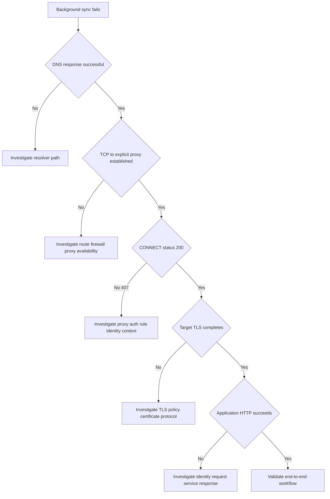

### Hypothesis ledger

| Hypothesis | Supporting evidence | Contradicting evidence | Confidence after review | Next discriminating check |
|---|---|---|---|---|
| DNS failure | User reports connection failure | Both process queries succeed; same answers; low latency | rejected for sampled flows | Check broader cohort only if scope differs |
| TCP path/firewall to proxy | Background process fails | SYN/SYN-ACK/ACK succeeds in affected flow | rejected | None for sampled flow |
| Proxy unavailable | Impact is broad | Browser CONNECT succeeds; proxy logs requests | rejected | Compare proxy node only if node cohort differs |
| Target certificate failure | Cloud-style app uses TLS | Affected flow never sends target ClientHello; browser TLS succeeds | rejected for affected transaction | None until CONNECT succeeds |
| TLS-version mismatch | Background process could differ | No affected target TLS handshake; post-correction process TLS succeeds | rejected | Preserve post-correction comparison |
| Cloud service outage | Sync cannot reach service | Browser HTTP 200; proxy rejects before service; no target request | rejected for sampled period | Service status only if tunnel succeeds and HTTP fails |
| Background proxy authentication boundary | 407, machine context, no interactive auth, browser succeeds | Prior revision and corrected rule show success | strongly supported | Compare rule match and object membership |
| Wrong policy object reference | Revision 42 points to empty retired group; onset follows deployment; revision 43 restores and recovers | No contradicting fixture evidence | established synthetic root cause | Regression and deployment-control review |

### Plain-English deep-dive 2 - Negative evidence must have an expected location

"I did not see a TLS ClientHello" is useful only when the observation point and preceding protocol state make a ClientHello expected. If the packet view begins late or monitors the wrong interface, absence is weak evidence. Here the synthetic flow summary covers the connection from SYN through FIN and the proxy explicitly returns 407 before tunneling, so target TLS is not expected.

Think of a security camera covering a locked lobby from opening to closing. If access is denied at reception and the person exits, absence at the elevator is meaningful. A camera that starts recording after lunch cannot support the same conclusion.

Always pair negative evidence with scope, vantage point, time range, filter, expected event, and preceding state.

## Isolation and ownership

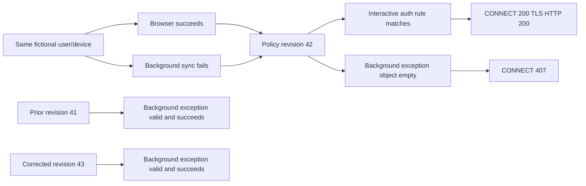

| Boundary | Status | Evidence | Owning fictional role | Next action |
|---|---|---|---|---|
| User workflow | Failed background sync, browser available | Reports and cohort table | Incident lead/product owner | Maintain impact and workaround |
| Endpoint process | Reads proxy; no interactive prompt by synthetic design | Process events | Client engineering owner | Confirm expected auth capability/current design |
| DNS | Healthy for sampled transactions | DNS table | Network/DNS owner | Monitor broader cohort only |
| TCP to proxy | Established | Packet summary | Network/proxy operations | No path change |
| Proxy service | Available | Both requests processed | Proxy operations | Focus rule/auth decision |
| Proxy authentication/policy | 407 only for background revision 42 | Proxy and audit logs | Proxy policy owner | Correct object through approved change |
| Target TLS | Not reached in failure; succeeds in controls | TLS events | TLS/service owner | No TLS weakening |
| Cloud-style service | Browser and post-correction HTTP succeed | HAR-like/recovery evidence | Application/service owner | Validate workflow, not investigate outage first |
| Change governance | Wrong empty object passed deployment | Audit and missing membership gate | Change/process owner | Add preflight and canary controls |

## Critical escalation operating model

### Severity and first fifteen minutes

The synthetic incident is classified as fictional SEV-1 because 187 of 240 eligible users have a time-sensitive workflow disrupted across two sites, while a constrained browser workaround exists. This is a scenario policy decision, not a universal standard.

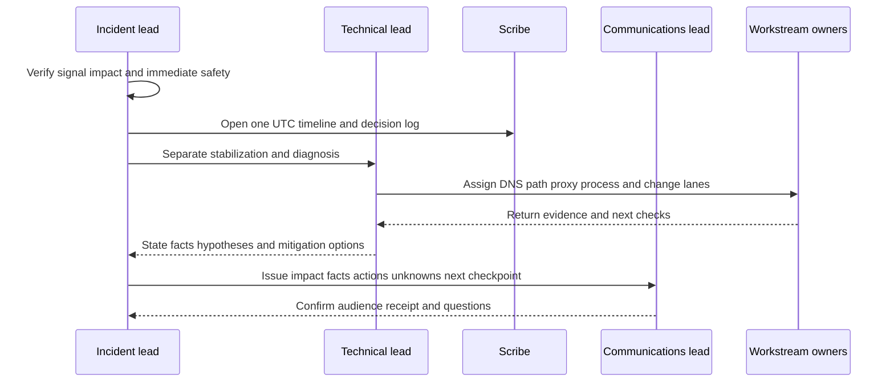

| Minute | Incident lead | Technical lead | Scribe | Communications |
|---:|---|---|---|---|
| 0-3 | Verify reports, safety, impact, severity trigger | Confirm exact failing action and one reproduction | Open case, timeline, evidence IDs | Draft holding statement |
| 3-7 | Name roles, channels, decision authority | Build layer hypotheses and comparator plan | Record facts/unknowns/hypotheses | Identify technical/executive audiences |
| 7-12 | Split stabilization and diagnosis | Compare browser/background, revision, site cohorts | Record tests, results, owners | State workaround and limitations |
| 12-15 | Confirm cadence, change path, privacy | Recommend next discriminating check, not random change | Read back decisions and checkpoints | Send first update with no unsupported ETA |

### Bridge charter

| Field | Synthetic value |
|---|---|
| Objective | Restore approved background sync safely and establish bounded cause |
| Scope | NMH East/Central, nmhsync.exe, policy revisions 41-43, fictional endpoints |
| Out of scope | Live testing, TLS bypass, proxy removal, real Microsoft/Zscaler investigation |
| Incident lead | NMH Incident Lead 01 |
| Technical lead | NMH Escalation Engineer 01 |
| Scribe | NMH Operations Scribe 01 |
| Communications lead | NMH Customer Communications 01 |
| Workstreams | Impact, process, DNS/TCP, proxy/auth, policy/change, recovery validation |
| Decision authority | Fictional Proxy Change Manager and Business Service Owner |
| Update cadence | Every 30 minutes or sooner on impact/material evidence change |
| Evidence repository | Local synthetic case folder, restricted working set |
| Exit | Recovery criteria met, residual/monitoring owned, RCA scheduled |

### Bridge rules

1. State impact delta first.
2. Use UTC and case/evidence IDs.
3. Separate fact, observation, hypothesis, decision, and unknown.
4. Each workstream returns one result, implication, and next check.
5. No one changes proxy, TLS, identity, firewall, endpoint, or application controls outside fictional approved change records.
6. Do not request real captures, secrets, or signed-in HAR files.
7. Give restoration ETA only when dependencies and validation duration support one; otherwise give next evidence checkpoint.
8. Read back decisions, owners, rollback, validation, and residual.

## Escalation package

A useful escalation package lets a receiving specialist understand the question, reproduce the logic from supplied evidence, and identify the next owner without exposing unnecessary data.

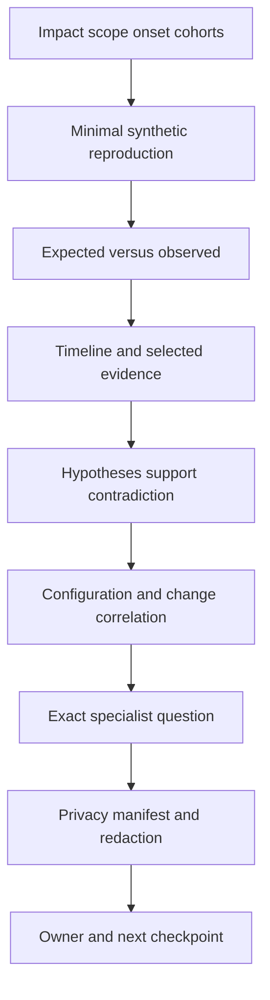

| Packet section | Required content | This case |
|---|---|---|
| Executive summary | Impact, onset, current state, workaround, next checkpoint | 187 fictional users; background sync; browser available |
| Environment | Process, proxy mode, policy revision, site/cohort | nmhsync vs browser; explicit proxy; revisions 41-43 |
| Reproduction | Minimal steps using static evidence | Start fictional sync under revision 42; observe 407 |
| Expected | CONNECT accepted under approved noninteractive rule, then TLS/HTTP | Based on revision 41 and 43 controls |
| Observed | TCP established; CONNECT 407; no target TLS | corr-sync-001 |
| Comparator | Same host/browser success; prior/post background success | corr-browser-001, corr-sync-pre/post |
| Timeline | UTC source-normalized event sequence | Policy change through recovery |
| Evidence index | File/table, fields, time, correlation, limitation | DNS/TCP/proxy/TLS/HAR/process/audit |
| Hypotheses | Support, contradiction, confidence, next test | Proxy policy object established synthetically |
| Change details | Revision, object, deployment, correction | grp-sync-retired vs grp-sync-active |
| Exact ask | Validate policy rule evaluation and deployment guard recommendations | Not "please investigate" |
| Privacy | No credentials, bodies, real identities, customer data | All static synthetic fields |
| Contact/cadence | Incident lead and next update | Fictional only |

### Evidence index

| Evidence ID | Artifact | Time range | Correlation | Key observation | Limitation |
|---|---|---|---|---|---|
| E114-01 | Impact/cohort matrix | 09:02-10:48Z | case | Background-only, revision/site cohorts | Synthetic sample |
| E114-02 | DNS table | 09:10:00-09:10:05Z | sync/browser | Both resolve successfully | Four transactions only |
| E114-03 | TCP summary | 09:10:00-09:10:05Z | flow IDs | Both establish to proxy | Not raw packet capture |
| E114-04 | Proxy log | 08:50-10:18Z | proxy request IDs | Revision 42 background gets 407 | Synthetic decision log |
| E114-05 | TLS events | 09:10-10:18Z | correlations | No failed-flow TLS; controls succeed | Generated metadata |
| E114-06 | HAR-like browser | 09:10:05-09:10:07Z | browser correlations | Browser HTTPS 200 | Browser only; no headers/bodies |
| E114-07 | Process events | 09:09:59-10:18Z | process correlations | Background context and synthetic error | Program behavior defined by scenario |
| E114-08 | Policy audit | 08:55-10:18Z | revisions 42/43 | Wrong empty object, correction, recovery | Fictional audit |

## Root-cause analysis

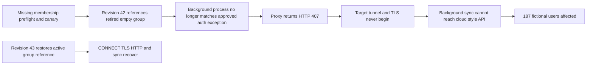

### RCA statement

At 08:56 UTC, fictional proxy policy revision 42 was deployed to NMH East and Central. The approved background-sync authentication-exception rule referenced `grp-sync-retired`, an empty retired object, instead of `grp-sync-active`. As a result, `nmhsync.exe` running in the defined non-interactive machine context did not match the intended rule and received HTTP 407 from the explicit proxy after successful DNS and TCP-to-proxy setup. The proxy tunnel was not established, so target TLS and application HTTP did not begin. Interactive browser traffic continued because it used a separate accepted user-authentication path. An approved synthetic revision 43 restored the active object reference, after which the background cohort received CONNECT 200, completed target TLS and HTTP, drained queued work, and met the 30-minute validation criteria.

The trigger was the incorrect object reference. The systemic contributors were ambiguous active/retired object naming, absence of a deployment check for empty referenced groups, and absence of a background-process canary in the change validation plan. The RCA does not identify a Zscaler or Microsoft defect.

### Five-whys view

| Why level | Question | Synthetic answer | Control implication |
|---:|---|---|---|
| 1 | Why did sync fail? | The process received proxy 407 | Monitor process-specific proxy status |
| 2 | Why 407? | Intended noninteractive exception did not match | Validate rule match by cohort |
| 3 | Why did it not match? | Rule referenced empty retired group | Check referenced object state/membership |
| 4 | Why was wrong object deployed? | Similar names and selection lacked semantic guard | Unique naming, retirement controls, peer review |
| 5 | Why was impact not caught before broad deployment? | No background-process canary and no empty-group gate | Staged canary and automated preflight |

### Corrective and preventive actions

| Action | Type | Owner | Acceptance evidence | Due basis | Residual |
|---|---|---|---|---|---|
| Restore active group reference in approved revision 43 | Correction | Proxy Policy Owner | Policy diff, rule match, recovery cohort | Completed synthetic timeline | Other rules not exhaustively tested |
| Validate queued sync drain and file consistency | Recovery | Application Owner | Queue reaches baseline; sampled checksum/operation | 30-minute observation | Long-tail offline clients |
| Add empty-group/reference preflight | Prevention | Policy Tooling Owner | Test blocks synthetic empty object deployment | Next change cycle | Semantic misconfiguration beyond emptiness |
| Rename and retire objects unambiguously | Prevention | Identity/Policy Governance | Naming standard and archived object lock | Governance sprint | Legacy aliases |
| Add background-process canary | Detection | Service Reliability Owner | Canary verifies CONNECT/TLS/HTTP before rollout | Before next revision | Canary coverage limits |
| Require cohort-aware change plan | Process | Change Manager | Template includes browser/background/site/revision | Next review | Human review quality |
| Add 407-by-process alert with privacy minimization | Detection | Proxy Operations | Synthetic alert test with no credentials | Monitoring sprint | Alert fatigue/threshold tuning |

### Plain-English deep-dive 3 - Root cause needs a mechanism and a counterfactual

The policy change happened shortly before the incident, but timing alone is correlation. The stronger chain is mechanistic: the new revision points to an empty group; the background context no longer matches; the proxy returns 407; no tunnel/TLS/application request occurs; the browser uses a different rule and succeeds; the prior revision succeeds; restoring the intended reference makes the same background cohort succeed.

The counterfactual asks, "If the wrong object reference were not present, would the failure still occur under otherwise comparable conditions?" Revision 41 and corrected revision 43 provide synthetic controls. They do not prove every possible contributing factor absent, but they strongly establish this scenario's cause.

A blameless RCA also asks why the system allowed one selection to reach broad deployment. Prevention belongs in naming, object lifecycle, validation gates, and canary coverage, not merely "be more careful."

## Lab

Use a local spreadsheet, SQL table, or Markdown evidence ledger. All exercises are read-only analysis of inline fixtures and candidate-authored simulation artifacts.

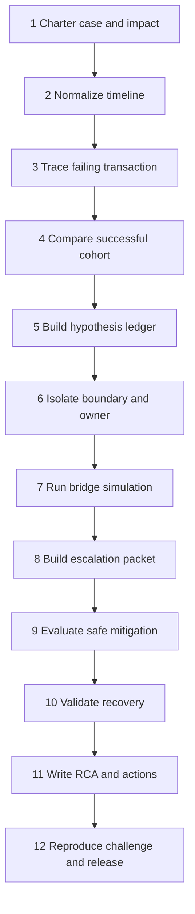

### Exercise 1 - Charter impact and safety

Create the case charter with case ID, exact failing workflow, synthetic users/sites, onset, severity basis, workaround, unknowns, roles, privacy, prohibited actions, and next checkpoint. Include: "No real endpoint, capture, tenant, proxy, Microsoft service, or Zscaler system will be queried or changed."

Expected observation: the objective is restore and explain background sync while preserving security, not "prove the proxy is broken."

### Exercise 2 - Build one UTC timeline

Load all evidence rows into a timeline with `event_utc`, `source`, `source_event_id`, `correlation_id`, `process`, `cohort`, `observation`, `evidence_class`, and `clock_quality`. Sort by time and correlation. Do not force unrelated events into one transaction merely because timestamps are close.

Expected key sequence:

1. 08:55 wrong object reference recorded.
2. 08:56 revision 42 deployed.
3. 09:02 first confirmed background failure.
4. 09:10 affected DNS and TCP succeed; CONNECT returns 407; process closes; no target TLS.
5. 09:10 browser comparator gets CONNECT 200, TLS, and HTTP 200.
6. 10:12 revision 43 deployed after approval.
7. 10:18 background flow gets CONNECT 200 and completes TLS.
8. 10:48 30-minute synthetic recovery criteria pass.

### Exercise 3 - Trace the affected transaction

Use `corr-sync-001`. Write one line per layer: expected observation, actual observation, status, evidence ID, and implication. Explicitly distinguish TCP destination proxy from target cloud address.

Expected conclusion: DNS succeeds; TCP to proxy succeeds; explicit-proxy CONNECT receives 407; target TLS and application HTTP are not reached; process records proxy-auth-required and queues retry.

### Exercise 4 - Compare the successful browser transaction

Use `corr-browser-001` on the same fictional host and policy revision. Compare DNS, proxy address, TCP, process identity, proxy rule, CONNECT result, TLS, and HTTP. Browser success narrows the issue but does not prove every service endpoint or background behavior.

Expected discriminating difference: identity/process context selects interactive-auth versus default-auth after the background exception fails to match.

### Exercise 5 - Rank hypotheses

Populate the hypothesis ledger before reading the policy audit conclusion. For each hypothesis, write a predicted observation. Example: if target certificate failure caused the affected flow, CONNECT should first succeed and target TLS should begin. The fixture contradicts that prediction.

Expected outcome: proxy authentication/rule context becomes strongly supported; wrong object reference becomes established only after policy and recovery evidence.

### Exercise 6 - Assign boundary ownership

Create the isolation/ownership table. Do not assign the entire incident to "networking." Route DNS, TCP path, proxy service, policy/authentication, process design, application, and change controls separately while keeping one incident lead.

Expected observation: the immediate corrective owner is proxy policy; client owner confirms expected noninteractive behavior; application owner validates recovery; change owner addresses systemic prevention.

### Exercise 7 - Run the bridge simulation

Use five roles or read each role aloud. Run three 10-minute rounds:

1. Intake and first update before cause is known.
2. Evidence review after 407/process comparison.
3. Change decision and recovery after policy audit.

Each workstream reports impact delta, result, implication, next check, owner, and checkpoint. Interrupt any unsupported ETA. Keep technical debate out of the executive update unless it changes a decision.

First holding update example:

> At 09:15 UTC, synthetic NMH background file sync is failing for 187 of 240 eligible users across East and Central; browser access remains available for approved workflows. DNS and TCP-to-proxy succeed in the sampled affected flow. The background CONNECT request receives proxy 407 before target TLS, while the browser comparator succeeds. Teams are comparing process identity and policy-rule evaluation. No data loss or security compromise is established. Do not bypass proxy or TLS controls. Next update is 09:45 UTC or sooner on material impact or recovery change. Restoration ETA is not yet established.

### Exercise 8 - Build the escalation package

Assemble the sections and evidence index above. The exact question to a fictional proxy-policy specialist is:

> Under policy revision 42, why does machine/nmhsync select `default-auth` instead of `sync-agent-exception`, given revision 41 success, and does the audit evidence confirm that `grp-sync-retired` has zero eligible members? Please validate the rule-evaluation trace and the proposed correction to `grp-sync-active`; no credential or decrypted payload is included.

Expected observation: the receiver can answer a bounded question without searching a raw data dump.

### Exercise 9 - Evaluate mitigation options

| Option | Expected effect | Security/change risk | Authority | Decision |
|---|---|---|---|---|
| Disable proxy | May restore direct connectivity | Unacceptable bypass; changes architecture | Not authorized | Reject |
| Disable TLS validation/inspection | Does not address pre-TLS 407; weakens security | High and irrelevant | Not authorized | Reject |
| Add universal unauthenticated rule | Could restore but broadens access | Excessive scope | Not authorized | Reject |
| Use browser workaround | Preserves approved access for subset | Capacity/accessibility/process limits | Business owner | Temporary continuity option |
| Restore exact active group reference | Addresses observed rule mismatch | Bounded change with rollback/validation | Proxy Change Manager | Preferred synthetic correction |
| Roll back entire policy revision | May restore prior behavior but reverses unrelated intended changes | Broader blast radius | Change authority | Backup option after impact review |

The selected synthetic correction is precise, approved, reversible, and validated. No real change is performed.

### Exercise 10 - Validate recovery

Define recovery before reading post-correction data:

| Criterion | Threshold | Evidence | Result |
|---|---|---|---|
| CONNECT result | 200 for 12/12 background test cohort | Proxy logs revision 43 | pass |
| Target TLS | Complete for sampled endpoints | TLS events | pass |
| Application operation | Upload/download synthetic test objects succeeds | Application test log | pass |
| Queue drain | Pending retry queue trends to baseline | Synthetic process aggregate | pass |
| Error rate | No new 407 for scoped background cohort over 30 minutes | Proxy aggregate | pass |
| Browser guardrail | Browser cohort remains successful | HAR-like/control result | pass |
| Security guardrail | No universal bypass; intended rules remain | Policy diff/review | pass |
| Broader sites | West unchanged | Cohort comparison | pass |

Recovery does not mean RCA and prevention are complete. Keep monitoring and residual ownership.

### Exercise 11 - Write the RCA

Use trigger, mechanism, impact, detection, response, recovery, counterfactual, contributors, corrective actions, preventive actions, residual, and evidence limitations. Avoid individual blame and product attribution. Label every NMH fact synthetic.

Executive closure update:

> Synthetic NMH background sync recovered at 10:18 UTC after approved proxy policy revision 43 restored the intended active group reference. Twelve of twelve scoped background tests completed CONNECT, target TLS, and application operations; no new scoped 407 occurred during the 30-minute observation, and browser access remained healthy. The established fictional cause is a revision-42 reference to an empty retired object, which prevented the noninteractive exception from matching. No Microsoft or Zscaler defect is claimed. Remaining actions add empty-object deployment checks, background-process canaries, clearer object lifecycle controls, and a cohort-aware change template.

### Exercise 12 - Run changed cases and release review

Changed case A: make browser fail with 407 too. Reassess whether issue is process-specific; proxy authentication or broader policy remains likely.

Changed case B: make CONNECT 200 but TLS show certificate rejection only for background process. The controlling boundary moves to TLS trust/process certificate context; revision-42 RCA no longer fits.

Changed case C: make DNS return failure only for the service name. Proxy and TLS evidence may not exist; start at DNS scope and resolver ownership.

Changed case D: remove recovery after revision 43. The object reference remains a correlated defect but no longer establishes full root cause; continue hypotheses.

Record how each case falsifies or changes the original conclusion. Then perform Part 111 release and privacy review.

## Expected evidence

```mermaid
flowchart LR
    CHART[Case charter impact safety] --> TL[UTC evidence timeline]
    TL --> TRACE[Layer traces and cohorts]
    TRACE --> HYP[Hypothesis ledger]
    HYP --> OWN[Isolation ownership]
    OWN --> BRIDGE[Bridge updates decisions]
    BRIDGE --> PACK[Escalation package]
    PACK --> REC[Recovery validation]
    REC --> RCA[RCA actions residual]
    RCA --> RUB[Rubric reflection release]
```

| Artifact ID | Artifact | Minimum evidence | Acceptance condition |
|---|---|---|---|
| NMH-SYN-P114-A01 | Case charter | Impact, scope, severity, safety, roles | Explicitly fictional/local |
| NMH-SYN-P114-A02 | UTC timeline | Cross-source events, IDs, clock quality | Key sequence reconstructs |
| NMH-SYN-P114-A03 | Layer analysis | DNS/TCP/proxy/TLS/HTTP/process per flow | TCP destination correctly identified |
| NMH-SYN-P114-A04 | Cohort comparison | Process/revision/identity/result | Difference discriminates hypothesis |
| NMH-SYN-P114-A05 | Hypothesis ledger | Prediction, support, contradiction, confidence, next | Premature TLS/service hypotheses rejected |
| NMH-SYN-P114-A06 | Ownership matrix | Boundary, evidence, role, next action | No generic "network issue" |
| NMH-SYN-P114-A07 | Bridge package | Charter, RACI, workstreams, updates, decisions | No unsupported ETA/root cause |
| NMH-SYN-P114-A08 | Escalation packet | Impact through exact ask and privacy manifest | Minimal and actionable |
| NMH-SYN-P114-A09 | Mitigation decision | Options, risk, authority, rollback, validation | Security bypass rejected |
| NMH-SYN-P114-A10 | Recovery matrix | Function and security guardrails | All criteria pass synthetically |
| NMH-SYN-P114-A11 | RCA | Trigger, mechanism, counterfactual, system contributors | No individual/product blame |
| NMH-SYN-P114-A12 | Action register | Owner, evidence, due basis, residual | Prevention is testable |
| NMH-SYN-P114-A13 | Changed-case analysis | Four falsification cases | Conclusion changes appropriately |
| NMH-SYN-P114-A14 | Executive updates | Holding, progress, recovery/closure | Impact/facts/unknowns/next |
| NMH-SYN-P114-A15 | Validation and reflection | Rubric, proof/non-proof, production checks | Part 111 gates pass |

### Evidence-capture checklist

- [ ] Put case ID and synthetic label on every artifact.
- [ ] Record impact, onset, scope, workaround, severity basis, and unknowns.
- [ ] Normalize all source times to UTC and record clock quality.
- [ ] Correlate by process, flow, proxy request, policy revision, and transaction ID.
- [ ] Distinguish TCP to proxy from TCP to target.
- [ ] Capture CONNECT 407 and 200 comparator behavior.
- [ ] Record that target TLS is absent after failed CONNECT.
- [ ] Use the generated HAR-like table only; no real HAR.
- [ ] Preserve process identity and proxy-context difference without secrets.
- [ ] Record policy revision/object evidence and change authority.
- [ ] Maintain hypotheses with predicted, supporting, and contradicting evidence.
- [ ] Capture bridge roles, decisions, workstreams, and update cadence.
- [ ] Include exact escalation question and privacy manifest.
- [ ] Validate function and security guardrails after synthetic correction.
- [ ] Run changed cases and show when the conclusion no longer holds.

## Troubleshooting

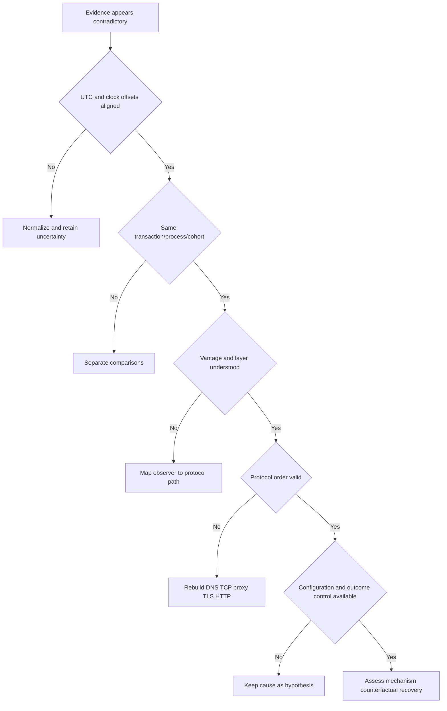

| Symptom | Likely analytical error | Discriminating check | Repair |
|---|---|---|---|
| DNS blamed despite success | User message interpreted literally | Inspect transaction DNS result | Mark DNS healthy for sampled scope |
| Firewall blamed despite handshake | TCP destination misunderstood | Confirm proxy address/port and flags | State TCP-to-proxy only |
| Certificate blamed after 407 | Protocol order ignored | Look for CONNECT 200 and ClientHello | Stop TLS analysis until tunnel exists |
| Browser HAR treated as sync trace | Cohorts/processes conflated | Compare PID and identity context | Use browser only as comparator |
| Proxy called down | One process denied while another succeeds | Review status/reason and proxy node | Separate availability from policy decision |
| 407 called root cause | Response is mechanism symptom, not systemic cause | Inspect rule evaluation and configuration | Continue to object/change evidence |
| Policy change called cause by timing | Correlation without mechanism/control | Compare revisions 41/43 and rule match | Require counterfactual/recovery evidence |
| Recovery declared after one retry | Criteria undefined | Review cohort, duration, queue, guardrails | Use recovery matrix |
| ETA promised during unknown dependency | Pressure replaced evidence | List remaining checks and durations | Give next checkpoint |
| Escalation packet too large | No exact question/evidence index | Ask what receiver must decide | Minimize and index artifacts |
| RCA blames editor | System controls omitted | Review naming, preflight, canary, peer check | Add systemic actions |
| Changed case still yields same RCA | Hypothesis not falsifiable | Compare expected layer sequence | Revise conclusion and owner |

## Cleanup and privacy

All network evidence is synthetic, but screenshots and workbooks may reveal local usernames, paths, notifications, or recent files. Do not create a real capture merely to make the portfolio look authentic.

```mermaid
flowchart LR
    FIX[Inline fixture copies] --> WORK[Timeline workbook or database]
    WORK --> SEL[Select minimal tables and narratives]
    SEL --> RED[Review IDs headers paths metadata]
    RED --> REL[Release synthetic package]
    REL --> DEL[Delete exact temporary screenshots caches]
    DEL --> VERIFY[Open release and confirm no dependency]
    VERIFY --> LOG[Record disposition]
```

| Item | Retain | Remove | Privacy/safety rule |
|---|---|---|---|
| Inline fixture copy | Optional | Duplicate copies | Keep reserved names/addresses |
| Timeline and hypothesis ledger | Yes | Drafts with unrelated notes | Synthetic case label |
| Packet-summary table | Yes | Any accidental real capture | Never release pcap because none is needed |
| HAR-like table | Yes | Real browser HAR | No cookies, tokens, headers, bodies |
| Process table | Yes | Real Procmon/client trace | No local profile or document paths |
| Proxy/policy tables | Yes | Real config export | Fictional objects only |
| Screenshots | Selected region | Full-screen captures | Remove account/notifications |
| Bridge recording | Do not create | Any accidental recording | Written simulation artifacts suffice |
| Escalation package | Yes | Unindexed raw dumps | Minimum evidence and exact ask |
| Release summary | Yes | Product/customer attribution | Honest claim formula |

No cleanup action may clear real event logs, delete captures owned by another investigation, alter proxy/browser settings, uninstall certificates, change network policy, or remove customer evidence. Delete only exact local synthetic files listed in the manifest.

### Plain-English deep-dive 4 - Privacy minimization improves diagnosis

Collecting every header, body, packet, and process event can feel thorough, but it increases privacy risk and analytical noise. The question here is whether the failure occurs before target TLS and why the proxy returns 407 to one process cohort. Status, timing, process context, rule ID, and policy revision answer that question without credentials or content.

Think of a physician ordering a targeted blood test rather than copying a patient's entire life history into every referral. Minimal sufficient evidence protects people and helps the receiving specialist find the signal. If more data becomes necessary in authorized production work, collect it through policy with a new purpose, scope, access, and retention decision.

## Validation rubric

Part 111 blocking gates apply before scoring. Any real capture, secret, external target, security bypass, or unsupported production claim blocks release.

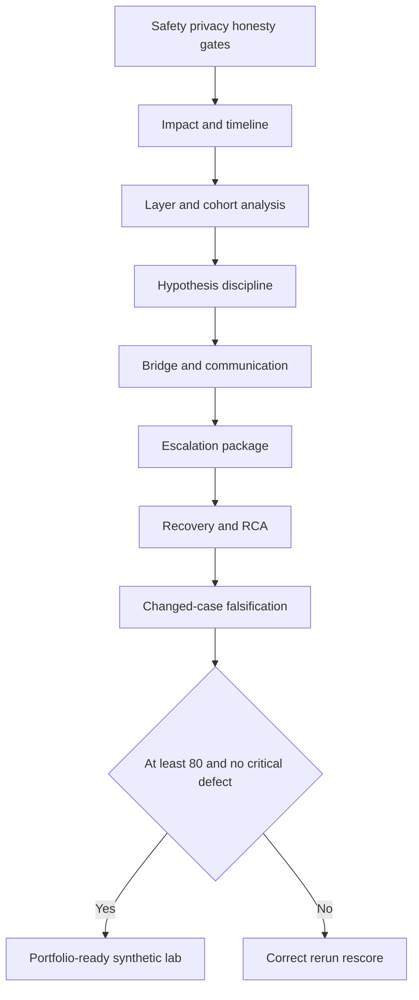

| Dimension | Points | Full-credit evidence | Critical defect |
|---|---:|---|---|
| Safety, privacy, honesty | 10 | Static synthetic only; no bypass/capture/product claim | Real traffic/data or weakened control |
| Impact and severity | 10 | Scope, workflow, onset, workaround, unknowns, basis | Technical symptom without impact |
| Timeline and correlation | 10 | UTC, IDs, processes, revisions, clock quality | Different transactions conflated |
| Protocol reasoning | 15 | DNS to TCP proxy to CONNECT to TLS to HTTP | Certificate blamed before tunnel |
| Cohort and hypothesis control | 10 | Browser/background and revisions; falsifiable ledger | Favored cause without contradiction |
| Isolation and ownership | 10 | Precise boundary and role-specific next action | Generic network blame |
| Bridge and communication | 10 | Roles, workstreams, updates, decisions, ETA discipline | Unsupported ETA/root cause |
| Escalation package | 10 | Minimal reproduction, evidence index, exact ask, privacy | Raw dump with no question |
| Recovery and RCA | 10 | Guardrails, mechanism, counterfactual, systemic actions | One retry or timing-only cause |
| Changed cases and release | 5 | Conclusion changes when evidence changes | Original RCA forced onto all cases |

| Score | Interpretation | Required action |
|---:|---|---|
| 0-69 | Investigation cannot support a reliable conclusion | Rebuild evidence path |
| 70-79 | Core isolation works but escalation/RCA is incomplete | Repair weak dimensions |
| 80-89 | Strong reproducible synthetic escalation | Rehearse under time pressure |
| 90-100 | Excellent bounded evidence and leadership simulation | Seek independent challenge; retain boundaries |

## Explicitly fictional and synthetic NMH scenarios

### Scenario 1 - Browser works, sync fails

The same fictional device resolves names and reaches the proxy for both processes. Browser proxy authentication succeeds; background CONNECT receives 407. The process comparator isolates authentication context. No real client behavior is implied.

### Scenario 2 - Executive asks for ETA

Before policy evidence arrives, the incident lead says restoration time is unknown and provides the 09:45 evidence checkpoint. This is concrete without inventing a commitment.

### Scenario 3 - Unsafe bypass proposal

A fictional participant suggests disabling proxy or TLS controls. The bridge rejects it because it is broader than the evidence, weakens security, lacks authority, and does not address the pre-TLS mechanism. A bounded approved policy correction is evaluated instead.

### Scenario 4 - Recovery without prevention

Revision 43 restores function, but the incident remains open for monitoring, RCA, object-lifecycle controls, deployment preflight, and canary evidence. Recovery is not learning completion.

## Official Source Anchors

Research/source snapshot and source review date: **2026-08-24**.

The Zscaler sources support bounded public positioning about zero-trust exchange, internet access/security, digital experience, and support context. Microsoft, IETF, W3C, and NIST sources support general cloud endpoint, HTTP, TLS, DNS, HAR, and incident-response context. They do not establish this synthetic evidence as actual product behavior or a real incident.

| Source | URL | Used for | Boundary |
|---|---|---|---|
| Zscaler Zero Trust Exchange | https://www.zscaler.com/products-and-solutions/zero-trust-exchange-zte | Public proxy-brokered zero-trust platform context | No customer traffic flow, rule, or outcome inferred |
| Zscaler Internet Access | https://www.zscaler.com/products-and-solutions/zscaler-internet-access | Public internet-access/security positioning | No policy, authentication, inspection, or UI behavior inferred |
| Zscaler Digital Experience | https://www.zscaler.com/products-and-solutions/zscaler-digital-experience-zdx | Public digital-experience monitoring context | No synthetic metric is a ZDX observation |
| Zscaler Support | https://help.zscaler.com/submit-ticket | Public support-route context | Current entitlement, process, fields, and response require verification |
| Microsoft 365 URLs and IP address ranges | https://learn.microsoft.com/microsoft-365/enterprise/urls-and-ip-address-ranges | Official endpoint-management context for real Microsoft 365 planning | This lab uses reserved fictional endpoints and makes no current endpoint claim |
| Microsoft 365 network connectivity principles | https://learn.microsoft.com/microsoft-365/enterprise/microsoft-365-network-connectivity-principles | General official cloud-connectivity planning context | Customer architecture and current guidance govern |
| IETF RFC 9110 HTTP Semantics | https://www.rfc-editor.org/rfc/rfc9110 | HTTP methods/status semantics including proxy authentication context | Does not diagnose this case automatically |
| IETF RFC 8446 TLS 1.3 | https://www.rfc-editor.org/rfc/rfc8446 | TLS handshake ordering and terminology | Fixture is generated metadata |
| IETF RFC 1034 Domain Names Concepts and Facilities | https://www.rfc-editor.org/rfc/rfc1034 | General DNS concepts | Current resolver implementation may vary |
| IETF RFC 2606 | https://www.rfc-editor.org/rfc/rfc2606 | Reserved example domains | Reserved names are not authorization to test |
| IETF RFC 5737 | https://www.rfc-editor.org/rfc/rfc5737 | Documentation IPv4 ranges | Addresses are static narrative values only |
| W3C HAR overview | https://w3c.github.io/web-performance/specs/HAR/Overview.html | HAR structure context | Real HAR may contain sensitive information |
| NIST SP 800-61 Rev. 3 | https://csrc.nist.gov/pubs/sp/800/61/r3/final | General incident response, recovery, and improvement context | Customer/employer process governs real incidents |

## Likely Interview Questions

### Q1. How would you troubleshoot an M365-style sync failure behind a proxy?

**Model answer:** I start with impact, exact failing action, scope, onset, cohorts, and recent changes. I align evidence to UTC and follow the path: name resolution, route, TCP destination, explicit proxy CONNECT and authentication, target TLS, HTTP, application identity, and process state. I compare affected and unaffected processes/sites/revisions, maintain hypotheses, and choose discriminating checks. I do not bypass proxy or TLS controls, and I minimize HAR/packet/process data.

### Q2. What does an HTTP 407 before TLS tell you?

**Model answer:** In an explicit-proxy flow, 407 means the TCP connection reached the proxy but acceptable proxy authentication was not established for that request. Without CONNECT 200, the tunnel to the target does not exist, so target TLS has not begun. I would investigate proxy rule evaluation, identity/process context, authentication method, and recent policy changes before blaming the target certificate or cloud service.

### Q3. Why can a browser work while a background process fails?

**Model answer:** Processes on the same host may use different network stacks, proxy discovery, user versus machine identity, credential availability, PAC context, certificate stores, and retry behavior. Browser success is a valuable comparator but not proof that the background path is healthy. In the synthetic case, both reached the proxy, but only the interactive browser matched accepted authentication under revision 42.

### Q4. How do you avoid hypothesis fixation during a critical incident?

**Model answer:** I write each hypothesis with predicted evidence, current support, contradiction, confidence, and the next discriminating check. I use affected/unaffected cohorts and protocol ordering. I update confidence after every result and preserve rejected hypotheses in the timeline. A change near onset is not root cause until mechanism and counterfactual evidence support it.

### Q5. How do you run an effective escalation bridge?

**Model answer:** I establish impact, safety, incident lead, technical lead, scribe, communications lead, decision authority, workstreams, cadence, and one evidence timeline. Each lane returns a result, implication, next check, owner, and checkpoint. Updates lead with impact delta and separate facts, unknowns, hypotheses, mitigation, decisions, and next time. I give no unsupported ETA and prevent unapproved or security-weakening changes.

### Q6. What belongs in a strong escalation package?

**Model answer:** Impact and onset, scoped environment/cohorts, minimal reproduction, expected versus observed, UTC timeline, selected indexed evidence, correlations, hypotheses and contradictions, recent changes, tests already run, mitigation status, privacy manifest, and one exact receiving-team question. It should let a specialist act without searching a raw log dump or receiving credentials/content that are not needed.

### Q7. What makes the RCA credible?

**Model answer:** It links trigger, mechanism, observable failure, impact, recovery, and counterfactual evidence. Here the wrong empty object prevented rule match, produced 407, and stopped the tunnel before TLS; prior and corrected revisions succeeded for the same process cohort. The RCA also explains why controls allowed deployment and assigns testable prevention, while avoiding individual blame and any Microsoft or Zscaler defect claim.

### Q8. How does Arti's background transfer to this lab and role?

**Model answer:** Her production Microsoft 365, OneDrive, SharePoint, CRITSIT, and escalation work directly supports impact framing, cross-layer troubleshooting, evidence correlation, customer updates, RCA, Engineering partnership, and recovery validation. Her familiarity with DNS, TCP, TLS, HTTP, proxies, Wireshark, Netsh, Procmon, HAR, Fiddler, and browser tools strengthens the method. The NMH case remains synthetic and does not become Zscaler production experience.

## 30-Second Memory Hooks

| Concept | Memory hook |
|---|---|
| Impact | Workflow, scope, onset, workaround, stakes |
| Time | UTC is the cross-tool join key |
| Explicit proxy | First TCP destination is the proxy |
| CONNECT | Tunnel request before target TLS |
| 407 | Proxy authentication boundary |
| TLS absence | Ask where it should have appeared |
| Browser comparator | Same host does not mean same process path |
| Process | Identity, stack, proxy, credential, retry |
| Hypothesis | Prediction, evidence, contradiction, next check |
| Bridge | Lead, technical, scribe, comms, lanes |
| ETA | Evidence-backed time or next checkpoint |
| Escalation packet | Exact ask, minimal indexed evidence |
| Recovery | Function plus guardrails plus observation |
| RCA | Trigger, mechanism, counterfactual, system control |
| Safety | Never weaken proxy or TLS to make a lab work |
| Arti bridge | Real escalation method, synthetic case |

## Completion Checklist

- [ ] I can explain DNS, TCP handshake, explicit proxy, PAC, CONNECT, 407, TLS, ClientHello, HTTP, HAR, process context, cohort, and RCA from zero.
- [ ] I applied Part 111 safety, privacy, evidence, claim, and cleanup gates.
- [ ] I used only inline synthetic fixtures and did not query, connect, capture, or change a real system.
- [ ] I stated NMH and all M365-style endpoints, impacts, logs, policies, and results are fictional.
- [ ] I defined impact, onset, scope, workaround, severity basis, unknowns, and next checkpoint.
- [ ] I normalized evidence to UTC and correlated by transaction/process/revision.
- [ ] I distinguished TCP to the proxy from TCP to the target.
- [ ] I placed proxy CONNECT before target TLS in protocol order.
- [ ] I explained why 407 plus no ClientHello contradicts a target-certificate cause.
- [ ] I compared browser/background and revision 41/42/43 cohorts.
- [ ] I maintained a falsifiable hypothesis ledger.
- [ ] I isolated ownership to proxy policy/authentication while preserving client/application/change roles.
- [ ] I ran the first-fifteen-minute bridge simulation with explicit roles and workstreams.
- [ ] I communicated facts, unknowns, workaround, actions, decision, and next checkpoint without unsupported ETA.
- [ ] I built a privacy-minimized escalation package with one exact question.
- [ ] I rejected proxy/TLS/security bypass options.
- [ ] I validated recovery through CONNECT, TLS, application, queue, browser, security, and time criteria.
- [ ] I wrote an RCA with trigger, mechanism, counterfactual, systemic contributors, and testable actions.
- [ ] I ran four changed cases and changed the conclusion when evidence changed.
- [ ] I can present Arti's factual escalation strength without claiming a real Microsoft, Zscaler, or customer incident.

[Next: Part 115 - Strategic Customer Discovery, Onboarding, and Training Simulation](Part-115-customer-discovery-onboarding-training-simulation.md)