# Part 115 - Strategic Customer Discovery, Onboarding, and Training Simulation

> **Audience:** Arti Thakur, preparing for a Zscaler Security Operations Technical Success Manager role after Microsoft enterprise Support Escalation Engineering.

> **Purpose:** Simulate a complete strategic-customer engagement from preparation and discovery through stakeholder and architecture mapping, outcome definition, success planning, onboarding governance, technical workshop delivery, objection handling, teach-back, and written follow-up using only local synthetic evidence.

> **Scope and honesty:** Northstar Meridian Holdings, abbreviated NMH, is explicitly fictional and synthetic. Every stakeholder, title, organization fact, architecture, source, product interest, license assumption, goal, baseline, metric, objection, decision, workshop, date, plan, risk, action, and result in this Part is invented for study. The simulation does not represent a Zscaler customer, sales opportunity, entitlement, implementation, onboarding, workshop, or outcome. Arti's factual background includes Microsoft enterprise escalation engineering, Microsoft 365/OneDrive/SharePoint, networking and traces, SQL/Power BI/statistics, customer and Engineering collaboration, mentoring, onboarding, partner training, knowledge articles, and responsible AI exploration. Those strengths are mapped honestly.

> **Currency caveat:** Product capabilities, interfaces, packaging, entitlements, support models, account-team roles, onboarding methods, training catalogs, privacy obligations, and customer priorities change. The controlled official-source snapshot and source review date for this Part is exactly **2026-08-24**. Current official documentation, licensed-tenant evidence, contracts, assigned account roles, customer-authoritative facts, security/privacy/legal review, product specialists, Support, and customer decision makers govern a real engagement.

> **Section goal:** Produce a safe, reproducible portfolio simulation in which a candidate prepares a hypothesis-based account brief; runs role-appropriate discovery without leading the customer; maps business outcomes, stakeholders, current architecture, data, workflows, constraints, and unknowns; defines measurable success without promising causation; builds a phased onboarding and technical success plan; facilitates a local synthetic data-to-action workshop with teach-back; handles strategic and technical objections with evidence and boundaries; and issues a decision-quality follow-up package with owners, due-date bases, acceptance evidence, risks, and next checkpoints.

This Part applies the shared Part 111 portfolio contract and may reuse only synthetic artifacts from Parts 112-114. No paid Zscaler access, real tenant, real customer data, live connector, API, scanner, packet capture, product configuration, production change, secret, TLS/security bypass, or destructive command is required or allowed. The candidate practices the engagement method, not a Zscaler implementation.

| Operating principle | Plain meaning | Simulation behavior | Failure prevented |
|---|---|---|---|
| Discover before prescribing | A product-shaped answer is not a customer problem statement | Ask for objective, workflow, evidence, constraints, and decision | Premature solutioning |
| Hypotheses are not facts | Preparation improves questions but must remain revisable | Label every pre-call belief and confidence | Research becomes invented customer truth |
| Stakeholders are a system | Sponsor, operators, owners, governance, and users see different risks | Map jobs, authority, influence, evidence, and cadence | Executive-only alignment |
| Architecture includes ownership | Boxes and arrows need data, controls, boundaries, failure, and decision rights | Draw actor-to-outcome flows with owners | Decorative diagram |
| Outcomes require baselines | "Improve security" cannot guide delivery | Define behavior, measure, baseline, target hypothesis, guardrail, acceptor | Activity mistaken for value |
| Onboarding is a dependency plan | Calendar dates alone do not create readiness | Gate phases by evidence, access, data, decisions, and acceptance | Launch-by-date theater |
| Training requires performance | Attendance does not prove capability | Use exercise, teach-back, rubric, retry, and later application | Slide completion called adoption |
| Objections contain information | Resistance may reveal risk, missing evidence, or conflicting interests | Listen, validate, classify, answer boundedly, offer test | Defensive selling |
| Follow-up closes the loop | Meetings create value only through corrected truth and action | Publish decisions, unknowns, owners, due basis, validation, next | Memory-based commitments |
| Product truth is dated and bounded | Public positioning is not tenant behavior | Verify current docs, entitlement, configuration, and specialist guidance | Unsupported demo/promise |
| Candidate truth stays visible | Transferable experience must not be renamed | Use factual/synthetic/unknown claim labels | Simulation presented as customer delivery |

## JD Mapping

| JD signal | Capability developed | Concrete artifact | Honest boundary |
|---|---|---|---|
| Serve as strategic technical advisor | Connect business objectives to technical evidence and decisions | Discovery brief and outcome map | Candidate does not own customer risk decisions |
| Lead onboarding and adoption | Phase dependencies, roles, milestones, quality, workflow, and capability | Technical success plan | No real deployment or adoption claimed |
| Engage executives and technical teams | Layer one evidence spine for CISO, managers, architects, and operators | Stakeholder/cadence map | Fictional participants only |
| Run workshops and training | Charter, facilitate, exercise, teach-back, evaluate, and follow up | Workshop package | No production Zscaler training delivered |
| Drive SecOps outcomes | Link data quality, prioritization, ownership, remediation, validation, and review | Data-to-action operating model | Synthetic outcomes only |
| Handle objections and debate | Validate concerns, clarify evidence, protect boundaries, and propose tests | Objection and decision ledger | No roadmap or commercial promise |
| Coordinate cross-functionally | Define Sales, Support, Product, specialist, TSM, and customer handoffs conceptually | RACI and escalation map | Actual account roles/contracts govern |
| Demonstrate business value | Define value hypotheses and customer-accepted evidence | Success measures and review plan | No causal value claim from simulation |

## Candidate honesty note

Arti can say: "I designed and rehearsed a complete synthetic strategic-customer simulation for fictional NMH. I prepared discovery hypotheses, mapped stakeholders and architecture, defined measurable outcome and data-quality contracts, built a phased onboarding/success plan, facilitated a local data-to-action workshop design with teach-back, handled objections, and produced decision-oriented follow-up. The work draws on my factual Microsoft customer escalations, technical advisory, mentoring, onboarding, partner training, SQL, Power BI, and communication experience. It does not represent a Zscaler account, product deployment, customer workshop, production outcome, or entitlement."

| Factual Arti background | Transferable strength | Safe wording | Unsupported wording to avoid |
|---|---|---|---|
| Microsoft enterprise support/escalation | Discovery under ambiguity, impact, evidence, ownership, executive updates | "I have led evidence-based customer conversations in enterprise support." | "I owned a strategic Zscaler account." |
| Microsoft 365, OneDrive, SharePoint | SaaS, identity, permissions, client, network, data, and service dependencies | "I can map layered cloud-service workflows." | "I designed NMH's security architecture." |
| SQL, Power BI, statistics, MBA analytics | Baselines, quality, dashboards, metrics, outcome hypotheses | "I can make success measures inspectable." | "My simulation proves ROI." |
| Mentoring, onboarding, partner training | Audience-aware explanation, practice, teach-back, follow-up | "I have factual enablement experience and designed this synthetic workshop." | "I trained an NMH SOC." |
| CRITSIT/RCA/Engineering collaboration | Escalation boundaries, hypotheses, actions, validation | "I can coordinate technical uncertainty and handoffs." | "I escalated this to Zscaler Product." |
| Responsible AI exploration | Discuss assistive workflows with privacy/human review | "I can frame safe AI-assisted use as a hypothesis." | "I deployed Zscaler agents." |
| 100+ recognitions and high CSAT cited in CV | Customer focus and communication evidence | Use exact factual records when personally supportable | Claim simulation satisfaction or adoption |

## Beginner vocabulary and memory hooks

**Discovery** is a structured process for learning what matters, how work currently happens, what evidence exists, what constrains change, and which decisions are needed. It is not an interrogation and not a disguised demo. Think of an architect surveying land, regulations, users, utilities, and budget before drawing a building.

| Term | Meaning from zero | Why it matters | Memory hook |
|---|---|---|---|
| Strategic customer | Customer whose scope, complexity, impact, or partnership requires coordinated long-term attention | Needs governance beyond individual tickets | Long journey, many travelers |
| Discovery | Evidence-led learning about goals, current state, constraints, and decisions | Prevents premature plans | Survey before design |
| Qualification | Deciding whether a problem/use case is real, important, feasible, and aligned | Protects focus and expectations | Is this the right journey now? |
| Stakeholder | Person/group affected by or able to affect outcome | Shapes evidence, authority, adoption, and risk | Traveler, driver, dispatcher, owner |
| Sponsor | Senior stakeholder supporting outcome and removing barriers | Provides authority and alignment | Opens the road |
| Champion | Person actively helping change succeed | Important but may not hold final authority | Local guide |
| Detractor | Person with concerns or incentives against the plan | May reveal valid risk or mismatch | Warning sign, not enemy |
| Decision maker | Role authorized to choose within a defined domain | Avoids assumed approval | Holds the key |
| RACI | Responsible, Accountable, Consulted, Informed role map | Clarifies participation | Who does, owns, advises, knows |
| Current state | Evidence-backed description of today's workflow/architecture | Baseline for change | You are here |
| Future state | Desired capability and operating model | Must be feasible and governed | Chosen destination |
| Use case | Specific job or decision supported by capability | Makes value concrete | Trip purpose |
| Outcome | Observable effect important to customer | More meaningful than activity | Arrive safely and on time |
| Success criterion | Evidence and threshold indicating acceptable progress/result | Enables review | Finish line definition |
| Baseline | Starting measure under defined scope/time | Needed for comparison | Starting odometer |
| Target hypothesis | Proposed improvement to validate, not guaranteed result | Preserves honesty | Expected destination time |
| Guardrail | Metric/condition that must not degrade | Prevents harmful optimization | Do not damage the vehicle |
| Milestone | Evidence-backed state enabling next phase | More than a calendar event | Passed checkpoint |
| Dependency | Required input, decision, access, or work outside one task | Drives sequence and risk | Bridge must open first |
| Onboarding | Coordinated process establishing people, access, data, process, capability, and governance | Starts usable adoption | Join the road safely |
| Technical success plan | Living plan connecting outcomes, workstreams, owners, evidence, risks, and cadence | Keeps work strategic and executable | Shared route plan |
| Adoption | Repeated correct use in an intended workflow | Activation is not enough | Drivers use the route correctly |
| Workshop | Interactive session producing artifact, decision, or practiced capability | Requires participant action | Working garage, not lecture hall |
| Teach-back | Participant explains/performs method | Reveals real understanding | Learner becomes guide |
| Objection | Concern, disagreement, constraint, or request blocking acceptance/action | Contains information | Roadblock to understand |
| Read-back | Restatement of facts, decisions, owners, and unknowns | Finds misalignment early | Repeat destination and turns |
| Value hypothesis | Testable chain from capability to behavior to effect to business outcome | Avoids unsupported causation | If route works and is used, travel may improve |
| Time to value | Time until accepted useful outcome, not merely setup | Guides early evidence | First useful arrival |

### Plain-English deep-dive 1 - Discovery is a joint model-building process

Weak discovery asks a long questionnaire and stores answers. Strong discovery lets participants correct a shared model of outcomes, workflows, architecture, data, ownership, constraints, and unknowns. The model becomes useful because disagreement is visible.

Imagine a map drawn by several residents. One knows road closures, another school hours, another delivery limits, and another emergency routes. The facilitator does not pretend to know the town better. They provide a structure, ask evidence-based questions, mark uncertainty, and read back the map.

The TSM still contributes technical judgment. Neutral facilitation does not mean passivity. If a customer says "all scanners have complete coverage," ask for population, credentials, last-success time, exclusions, and reconciliation. The aim is not to challenge status; it is to make the next decision defensible.

## Prerequisites

Complete Part 111's portfolio contract. Parts 112-114 provide optional synthetic artifacts: a security-data model, vulnerability backlog, and escalation case. This Part can be completed from the inline summaries if those files are unavailable.

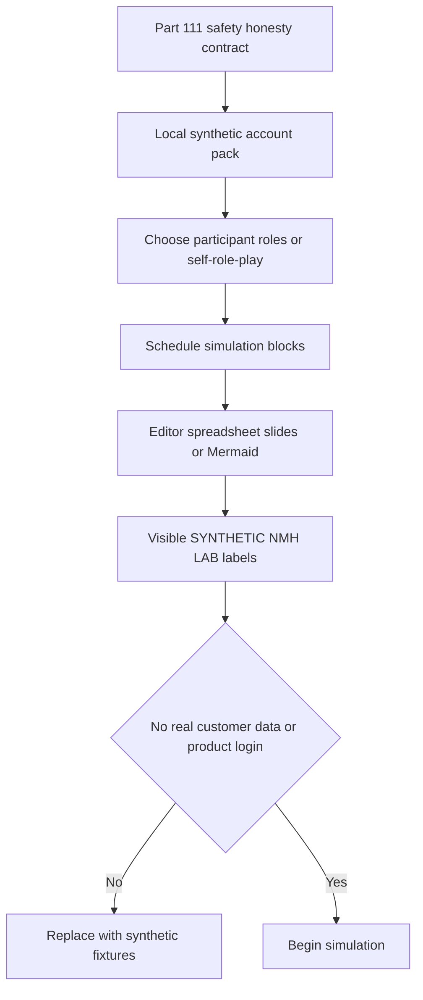

| Prerequisite | Minimum | Verification | Safe alternative |
|---|---|---|---|
| Scope | Fictional NMH only | Charter names non-goals/prohibitions | Use inline account pack |
| Participant method | Solo role-play or consenting peer reviewers | Roles labeled fictional/reviewer | Read prompts aloud and self-score |
| Data | Parts 112-114 synthetic summaries | Manifest IDs present | Use inline baseline tables |
| Product access | None | No login/tenant/connector required | Discuss public concepts only |
| Tools | Local text, spreadsheet, diagram, optional slides | Standard user/no external connection | Markdown artifacts only |
| Recording | Not required | Written notes capture evidence | Do not record people by default |
| Time | Four blocks of 45-90 minutes | Run-of-show created | Split across sessions |
| Review | Rubric and role cards | Reviewer understands simulation boundary | Self-review plus changed case |
| Source date | 2026-08-24 | Present in source ledger | Mark unknown if current fact not established |
| Release | Sanitized subset only | Part 111 review | Keep working artifacts local |

## Synthetic NMH account brief

The account brief contains **pre-discovery hypotheses**, not customer facts. During simulation, role cards provide evidence. The candidate must promote a hypothesis to fictional fact only after it is stated by the authorized role and read back.

| Brief field | Pre-call hypothesis | Confidence | Discovery question |
|---|---|---:|---|
| Strategic objective | Reduce time spent triaging large vulnerability queues and improve remediation ownership | medium | Which business/security outcome matters most this planning period? |
| Current tools | CMDB, endpoint, scanner, identity, ticketing, application registry | high from synthetic pack | Which sources are authoritative for which fields and decisions? |
| Main pain | Duplicate assets, stale findings, disconnected tickets, weak business context | high from Parts 112-113 | Which defect currently changes a decision or consumes effort? |
| Executive concern | Material exposure and accountability, not raw finding count | medium | What decision does the CISO need to make with the output? |
| Operator concern | New platform may create another queue and opaque score | medium | What current workflow must be simplified, not duplicated? |
| Privacy concern | Health-sector context increases sensitivity expectations | medium | Which fields are necessary, restricted, prohibited, and retained how long? |
| Timeline pressure | Fictional quarterly risk review in 90 days | low | Which deadline is real, who owns it, and what useful milestone is feasible? |
| Product fit | Public Data Fabric/UVM concepts may be relevant | low | Which capabilities are required independent of product choice? |

### Role cards

| Role | Primary job | What they know | Concern | Decision authority |
|---|---|---|---|---|
| CISO / executive sponsor | Set risk priorities and remove barriers | Board asks about material exposure and remediation | Another technical dashboard without decisions | Sponsor outcomes and governance |
| Vulnerability Management Lead | Operate finding lifecycle | Severity queue has 18,000 fictional records and duplication | Opaque score and loss of analyst control | VM process/rules within policy |
| SOC Manager | Investigate active threats | Threat context is separated from exposure backlog | New alerts and ownership overlap | SOC workflow within charter |
| Security Data Architect | Integrate and govern sources | Source grains, APIs, ownership, quality constraints | Canonical model may overwrite source truth | Data design recommendation |
| CMDB Owner | Maintain declared inventory/business links | Owner and lifecycle quality varies | External system may blame CMDB | CMDB change/process |
| Endpoint Security Lead | Operate endpoint telemetry | Agent coverage good but asset identity differs | Control state may be overinterpreted | Endpoint evidence and workflow |
| Application Owner | Protect service availability | Change windows and regression tests are constrained | Security priority ignores business timing | Application change acceptance |
| Privacy Counsel/Officer | Govern data purpose and handling | Identity and application context can be sensitive | Overcollection, indefinite retention, AI reuse | Privacy approval/advice per policy |
| ITSM Owner | Maintain ticket workflow | Duplicate tickets and stale states frustrate teams | Automated ticket storm | Ticket schema/automation governance |
| Executive Assistant/Program Manager | Coordinate decisions and dates | Dependencies cross teams | Plans without accepted owners | Governance logistics |

### Synthetic baseline

| Baseline dimension | Fictional starting evidence | Quality/limit | Desired decision |
|---|---|---|---|
| Raw findings | 18,000 open across tools | Duplicate rate not established | Define reconciled denominator |
| Assets | 7,600 apparent records | Estimated 12 percent duplicates; source conflict | Establish canonical coverage test |
| Ownership | 61 percent findings linked to active owner | CMDB owner may not equal remediator | Define owner-acceptance workflow |
| Freshness | Scanner target daily; 7 percent over 48 hours old | Source-specific thresholds unresolved | Agree health contract |
| Prioritization | Technical severity plus analyst judgment | Inconsistent rationale | Pilot transparent contextual model |
| Tickets | 3,200 open remediation tickets | Closed/open reconciliation gap | Reduce duplicate/unactionable creation |
| Validation | Closure often based on ticket status | Rescan/change evidence inconsistent | Define validation by treatment type |
| Exceptions | Spreadsheet with 146 active rows | 19 past review date | Establish authority/expiry/reopen control |
| Training | VM team knows current tools | New model/workflow not designed | Define role-based capability evidence |
| Executive reporting | Monthly critical/high counts | Source health and business context absent | Build decision-oriented view |

All numbers are synthetic. A strong candidate repeats that when using the baseline.

## Discovery design

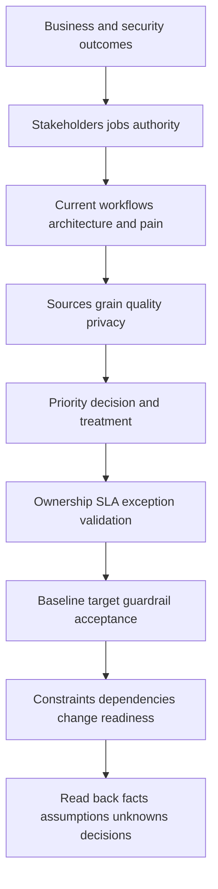

### Discovery agenda

| Segment | Minutes | Purpose | Method | Output |
|---|---:|---|---|---|
| Contract | 5 | Purpose, scope, roles, decisions, safety | Verbal charter/read-back | Agreed session contract |
| Outcomes | 10 | Learn business/security priority and deadline | Sponsor questions | Outcome hypothesis |
| Current workflow | 15 | Trace one finding from source to closure | Whiteboard story | Current-state flow |
| Architecture/data | 20 | Sources, grain, owners, quality, privacy, dependencies | Layered map | Source/architecture map |
| Decision model | 15 | Understand prioritization and exception authority | Scenario comparison | Decision requirements |
| Operating model | 10 | Ownership, tickets, validation, cadence, escalation | RACI prompts | Governance gaps |
| Success evidence | 10 | Baselines, target hypotheses, guardrails, acceptors | Metric contract | Draft success criteria |
| Read-back | 5 | Confirm facts, assumptions, unknowns, decisions, actions | Participant correction | Approved discovery record |

### Discovery questions by audience

| Audience | High-value questions | Evidence requested | Avoid |
|---|---|---|---|
| CISO | Which decision is hardest today? Which exposure would materially change priorities? What tradeoff needs executive authority? | Risk committee/board question, accepted objective | Starting with product modules |
| VM Lead | Walk one critical and one disputed finding from discovery to validated closure. Where does judgment enter? | Queue sample, priority rationale, exception/validation flow | Calling current program immature |
| SOC Manager | Which threat signals should change exposure priority? How do active incidents feed back into posture? | Handoff examples and ownership | Promising merged queues |
| Data Architect | What is each source's grain, key, cadence, authority, and permissible use? | Schemas/contracts, lineage, failure modes | Assuming all sources can be copied |
| CMDB Owner | Which fields are declared versus observed? How are conflicts corrected? | Owner/lifecycle/app mapping quality | Treating CMDB as bad by default |
| App Owner | Which windows, tests, dependencies, and service guardrails constrain remediation? | Change/validation standards | Security score overrides availability |
| Privacy | What purpose and minimum fields are approved? What retention, access, region, and AI constraints apply? | Data classification and review process | Asking for broad identity data first |
| ITSM Owner | When should a ticket be created, grouped, updated, closed, reopened, or suppressed? | Workflow schema and automation limits | Ticket per finding assumption |

### Discovery evidence classes

| Class | Example | Treatment |
|---|---|---|
| Fictional customer fact | VM Lead states current queue grain | Record speaker, date, scope, evidence |
| Candidate observation | Two baseline counts use different reporting cuts | State observation and ask for reconciliation |
| Hypothesis | Duplicate assets may inflate findings | Keep testable and unconfirmed |
| Constraint | Privacy approval required before identity fields | Add dependency and owner |
| Decision | Pilot uses five approved fields and two source cohorts | Record authority, rationale, conditions |
| Unknown | Active-owner denominator not reconciled | Assign evidence request and checkpoint |
| Public product fact | Dated official page describes public positioning | Keep source and non-inference |

### Plain-English deep-dive 2 - A good discovery question changes the plan

Questions are not valuable because they sound consultative. They are valuable when different answers change scope, sequence, design, risk, or success evidence. "Do you have a SIEM?" is shallow. "Which detections or threat signals should change vulnerability priority, who owns that mapping, how fresh must they be, and what happens when the signal is unavailable?" changes the data contract and workflow.

Think of a doctor asking whether pain exists versus asking location, onset, triggers, severity, associated symptoms, prior treatment, and functional impact. The second set distinguishes possible mechanisms and next tests.

During simulation, challenge every planned question: if yes/no answers would not change anything, rewrite it. Discovery is not a performance of curiosity; it is decision preparation.

## Stakeholder and governance map

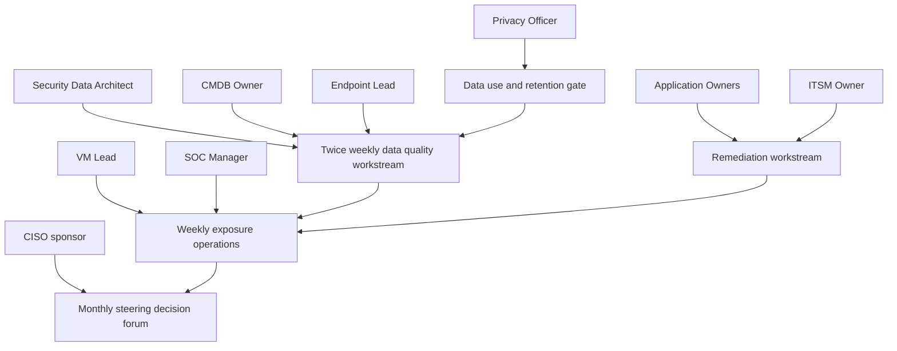

| Work/decision | Responsible | Accountable | Consulted | Informed |
|---|---|---|---|---|
| Outcome and scope | VM Lead/program manager | CISO sponsor | SOC, app, data, privacy | Steering group |
| Source contract | Security Data Architect | Data Governance Owner | Source owners, privacy, security | TSM/account team |
| Entity-resolution rules | Data Steward | Security Data Architect | CMDB/endpoint/scanner owners | VM Lead |
| Prioritization policy | VM analysts | VM Lead | SOC, app owners, risk, data | CISO sponsor |
| Risk exception | Technical owner prepares | Authorized Business Risk Owner | VM, security, app, privacy as needed | Steering group |
| Ticket workflow | ITSM administrator | ITSM Owner | VM/remediation owners | Program manager |
| Validation criteria | Remediation owner | Control/Application Owner | VM/security/test | Sponsor through metrics |
| Product facts and configuration | Assigned product specialist/authorized admin | Customer-design authority | TSM, Support | Relevant stakeholders |
| Success-plan governance | TSM/program manager coordinate | Customer sponsor for outcomes | Account team and workstream owners | Stakeholder groups |

The TSM coordinates, clarifies, advises, and escalates but does not become customer data owner, security approver, risk acceptor, change authority, or product-roadmap committer.

## Architecture and current-state workflow

```mermaid
flowchart LR
    subgraph CUSTOMER[Fictional NMH environment]
        CMDB[CMDB inventory and ownership]
        EDR[Endpoint and control evidence]
        SCAN[Vulnerability scanner findings]
        IAM[Identity and privilege context]
        APP[Application and business registry]
        ITSM[Ticketing and changes]
        SOC[Threat and incident context]
    end
    subgraph LEARNING[Vendor-neutral target learning model]
        ING[Ingest and source contracts]
        Q[Quality freshness reconciliation]
        ENT[Canonical entities and provenance]
        CTX[Relationships and business context]
        PRI[Transparent prioritization]
        FLOW[Owner exception validation workflow]
        VIEW[Technical and executive views]
    end
    CUSTOMER --> ING --> Q --> ENT --> CTX --> PRI --> FLOW --> VIEW
```

This is an analogous learning architecture, not a Zscaler design. A real future-state architecture requires current official product documentation, entitlement, connector support, source schemas, customer controls, performance requirements, regional/privacy decisions, and authorized design review.

### Current-state finding journey

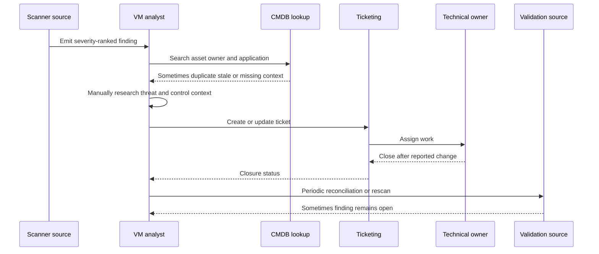

| Current-state gap | Evidence | Consequence hypothesis | Discovery needed |
|---|---|---|---|
| Duplicate asset identities | Synthetic baseline estimate | Inflated/fragmented finding context | Ground-truth sample and match policy |
| Missing active owner | 61 percent linked baseline | Tickets route slowly or incorrectly | Define remediator versus CMDB owner |
| Stale source data | 7 percent over 48 hours | Current status uncertain | Source-specific freshness contract |
| Manual prioritization | VM role card | Inconsistent rationale and analyst effort | Preserve expert override and calibration |
| Ticket mismatch | Part 112/113 example | Closed work may remain exposed | Define reconciliation and reopen |
| Exception spreadsheet | 19 past review date | Hidden residual/expired decisions | Authority, expiry, trigger, review workflow |
| Executive count report | No source quality/context | Decision-makers see volume without action | Define decision-oriented narrative |

## Outcomes and success criteria

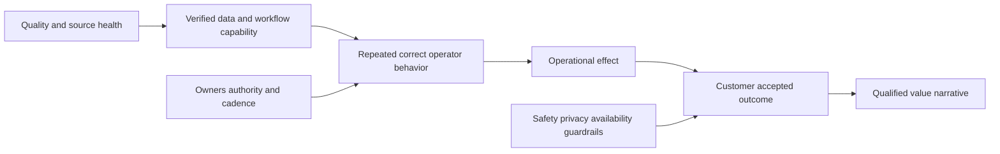

### Outcome hierarchy

| Level | Synthetic NMH outcome | Measure | Acceptor | What it does not prove |
|---|---|---|---|---|
| Capability | Approved sources map to canonical entities with provenance | Source and entity test pass | Data Architect | Operator use |
| Workflow | P1/P2 pilot findings have accepted owner, action, due basis, validation | Workflow completeness rate | VM Lead/ITSM Owner | Risk reduction |
| Behavior | Analysts use contextual explanation and confidence in sampled reviews | Rubric pass and repeat use | VM Lead | Enterprise-wide adoption |
| Operational effect | Median triage touch time falls in comparable pilot cohort | Time study with quality guardrails | VM Lead | Causation without confounder review |
| Governance | Exceptions have authority, expiry, control, and trigger | Complete/expired exception rate | Risk Owner | Exposure eliminated |
| Executive | Review identifies material themes, decisions, owners, and next evidence | Sponsor acceptance survey/decision record | CISO sponsor | Board outcome or financial value |

### Success measure contracts

| Measure | Definition | Baseline | Target hypothesis | Guardrail | Review |
|---|---|---|---|---|---|
| Canonical match quality | Correct reviewed matches / reviewed candidate pairs | Establish in pilot sample | At least 95 percent on approved sample | False merges separately tracked | Data quality workstream |
| Priority explainability | Sampled findings with complete component/source explanation | Establish during design | At least 90 percent | No unknown converted to zero | VM calibration |
| Owner acceptance | Accepted work items / assigned eligible items | 61 percent linked, acceptance unknown | At least 85 percent pilot acceptance | No mass assignment without role agreement | Weekly operations |
| Validation completeness | Closed eligible items with required validation / closed eligible items | Establish | At least 90 percent pilot | Service regression and reopen visible | VM/app review |
| Exception hygiene | Active exceptions complete and within review date / active exceptions | 127/146 in-date, completeness unknown | 100 percent pilot scope | Authority and residual not waived | Monthly governance |
| Triage touch time | Median active analyst minutes per comparable finding | Time study needed | Directional reduction after stable model | Accuracy/override/quality do not worsen | Pilot retrospective |
| Executive decision quality | Material review items ending in explicit decision/owner/next | Baseline from prior two reviews | Improvement hypothesis | No hidden quality limitations | Sponsor review |

Targets are synthetic hypotheses. They are not commitments and may change after a trustworthy baseline. A TSM should avoid promising percentage improvements before population, workflow, tool behavior, and confounders are known.

### Plain-English deep-dive 3 - A success plan is a chain of evidence, not a calendar

A milestone titled "connector complete by week 2" is weak because it does not say whether data is fresh, complete, mapped, reconciled, or usable. A stronger milestone is "For the approved pilot sources, extract/parse/load counts reconcile, freshness meets source contract, required fields pass threshold, and sampled canonical matches meet the reviewed precision gate; Data Architect accepts evidence for prioritization use."

Think of building inspection. "Plumbing installed Tuesday" is activity. "Pressure test passed, leaks resolved, inspector accepted, and fixtures operate" is evidence-backed readiness. The date matters, but the gate controls what happens next.

The success plan should therefore use estimated windows plus entry/exit evidence. If privacy approval or source ownership is late, do not pretend the next phase started safely.

## Onboarding and technical success plan

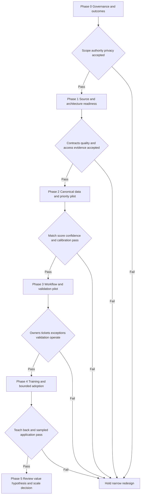

### Phased plan

| Phase | Outcome | Key activities | Exit evidence | Owner/acceptor | Major risk |
|---|---|---|---|---|---|
| 0 Governance/outcomes | Agreed purpose, scope, roles, privacy, measures | Kickoff, discovery, RACI, data-purpose review | Signed fictional charter and decision log | CISO/Data/Privacy | Vague goal or overbroad data |
| 1 Source readiness | Approved source contracts and health baselines | Inventory, schemas, keys, cadence, sample, quality | Reconciled sample and source-owner acceptance | Data Architect | Access/schema/freshness gaps |
| 2 Data/priority pilot | Explainable canonical entities and contextual backlog | Mapping, quality, resolution, score calibration | Reviewed match/score anchor results | Data/VM Leads | False merges or opaque score |
| 3 Workflow pilot | Owner, ticket, exception, validation loop works | Assignment, grouping, SLA basis, closure/reopen | End-to-end synthetic pilot cases | VM/ITSM/App | Ticket storm or false closure |
| 4 Capability/adoption | Roles can operate and troubleshoot workflow | Training, exercises, teach-back, job aids | Rubric and later sample application | VM Lead | Attendance mistaken for readiness |
| 5 Review/scale | Sponsor decides scale, change, or stop | Health, value hypothesis, risks, roadmap options | Decision record with next scope | CISO sponsor | Pilot result overgeneralized |

### Detailed success plan register

| Workstream | Milestone | Dependency | Owner | Evidence | Target window | Status rule |
|---|---|---|---|---|---|---|
| Governance | Outcome and non-goals approved | Sponsor and privacy participation | Program Manager | Charter/read-back | Week 1 hypothesis | Done only on explicit acceptance |
| Architecture | Current-state map corrected | Source/owner interviews | Data Architect | Versioned diagram and unknown list | Week 1-2 | Facts separated from assumptions |
| Privacy | Pilot fields/purpose/retention approved | Data dictionary | Privacy Officer | Fictional approval decision | Week 2 | No data use before gate |
| Data | Source contracts accepted | Owner/schema samples | Source Owners | Contract and reconciliation | Week 2-3 | Health thresholds defined |
| Entity | Match policy calibrated | Ground-truth sample | Data Steward | Positive/negative/ambiguous results | Week 3-4 | False-merge gate passes |
| Priority | Score/policy pilot accepted | Business/control/threat context | VM Lead | Anchor calibration and override log | Week 4-5 | Not vendor algorithm claim |
| Workflow | Ticket/exception/validation cases pass | ITSM design/change window | ITSM Owner | End-to-end scenario results | Week 5-7 | No ticket storm/control bypass |
| Enablement | Operators pass teach-back | Stable workflow/job aids | Training Owner | Rubric and retry results | Week 7-8 | Attendance not sufficient |
| Review | Pilot evidence and scale options presented | Stable reporting cut | Sponsor/TSM | Decision-oriented review | Week 9-10 | Scale requires explicit decision |

### Onboarding risk register

| Risk | Early signal | Impact | Mitigation | Trigger/escalation |
|---|---|---|---|---|
| Product/source capability assumed | No current connector/schema evidence | Design rework | Verify docs, entitlement, specialist, sample | Hold source plan |
| Privacy approval delayed | Required fields/purpose unresolved | Data phase blocked | Minimize pilot fields and separate decisions | Sponsor/privacy checkpoint |
| Poor entity resolution | False merges in sample | Wrong context/actions | Conservative thresholds and review queue | Stop automated linking |
| Score distrust | Overrides lack patterns/explanations | Adoption failure | Calibration workshops and explanation cards | Revisit model/policy |
| Ticket storm | One-ticket-per-finding proposal | Owner overload | Group by root cause/owner and pilot limits | ITSM gate |
| Application availability conflict | No test/change window | Remediation delay/risk | App owner plan, guardrails, rollback | Steering decision |
| Training too early | Workflow changes after materials | Rework/confusion | Train after stable pilot, version aids | Reschedule gate |
| Executive overclaim | Pilot count described as enterprise result | Trust loss | Scope, denominator, quality, caveat | Correct immediately |

## Customer operating cadence

| Forum | Audience | Cadence | Purpose | Inputs | Outputs |
|---|---|---|---|---|---|
| Data quality workstream | Data architect/stewards/source owners | Twice weekly during pilot | Resolve contracts, freshness, mapping, entities | Health and issue ledger | Corrections and acceptance |
| Exposure operations | VM/SOC/ITSM/app representatives | Weekly | Prioritize, assign, manage exceptions/validation | Backlog and blockers | Decisions/actions/escalations |
| Technical success sync | TSM/customer program/account roles | Weekly | Review milestones, risks, product questions, support | Success plan and evidence | Updated plan/owners |
| Steering review | CISO and accountable leads | Monthly | Decide scope, resources, residual, scale | Outcome/health/risks/options | Decisions and sponsorship |
| Training clinic | Operators and owners | After workflow stability then office hours | Practice and troubleshoot | Synthetic cases/job aids | Capability evidence and FAQ |
| Critical escalation | Small incident core plus workstreams | Triggered | Manage severe impact | Impact/evidence/roles | Recovery, RCA, actions |

## Training workshop design

The workshop is called **From Synthetic Finding to Defensible Action**. It uses the Part 112 and 113 local datasets. It does not demonstrate a Zscaler interface.

```mermaid
flowchart LR
    FIND[Raw synthetic finding] --> CHECK[Check source health and grain]
    CHECK --> ENTITY[Resolve asset and provenance]
    ENTITY --> CONTEXT[Add business threat control context]
    CONTEXT --> PRIOR[Explain score confidence and priority]
    PRIOR --> OWNER[Choose owner treatment and due basis]
    OWNER --> VALID[Define validation residual exception]
    VALID --> TELL[Explain technical and executive narrative]
```

### Workshop charter

| Field | Synthetic workshop contract |
|---|---|
| Audience | VM analysts, security data staff, ITSM owner, selected app/endpoint representatives |
| Objective 1 | Given a synthetic finding, trace source, grain, quality, and canonical asset with provenance |
| Objective 2 | Explain all score components, confidence, and policy override without claiming algorithmic truth |
| Objective 3 | Create an owner/action/due/validation record and identify exception authority |
| Objective 4 | Deliver a one-minute executive explanation with limitation and next decision |
| Non-goals | Product configuration, live connector, scanner operation, real threat lookup, production change |
| Environment | Local static CSV/SQL/spreadsheet and printed role cards |
| Safety | No real data, secrets, live traffic, security changes, or external targets |
| Evidence | Completed exercise card, teach-back rubric, action record, reflection |
| Decision | Whether participant is ready for supervised pilot work in the simulation |

### Ninety-minute run-of-show

| Time | Activity | Facilitator action | Participant evidence | Contingency |
|---:|---|---|---|---|
| 0-5 | Contract and safety | Confirm objectives/non-goals/labels | Verbal read-back | Stop if real data appears |
| 5-15 | Story and architecture | Trace one finding end to end | Correct diagram/ask questions | Use static poster if preview fails |
| 15-25 | Data-quality mini-lab | Show stale/orphan/duplicate cases | Classify defect and owner | Use paper table |
| 25-40 | Entity/context exercise | Facilitate pair analysis | Match decision/provenance | Provide hint ladder |
| 40-55 | Score/calibration exercise | Ask for component rationale and challenge | Score explanation/confidence | Use expected table |
| 55-68 | Workflow exercise | Introduce owner/exception/validation roles | Complete action record | Reduce to one finding |
| 68-78 | Objection role-play | Deliver two role-card objections | Listen/validate/respond/test | Facilitator models first |
| 78-86 | Teach-back | Observe participant explanation | One-minute technical/executive versions | Retry after feedback |
| 86-90 | Read-back/follow-up | Confirm gaps/actions/application | Commitment and next check | Schedule separate clinic |

### Exercise case

Use `f-005` from Part 113: score 31, unresolved business/owner context, stale source. Ask participants to resist "P4 means low risk." They must create a data-resolution task, name evidence needed, preserve finding, and state what cannot be concluded.

Then use `f-011`: score 92, privileged tier-0 context, current finding, degraded control. Participants must explain components, owner, treatment options, change dependency, validation, and residual without asserting exploitation or guaranteed harm.

### Teach-back rubric

| Criterion | Needs support | Ready for supervised simulation | Strong |
|---|---|---|---|
| Source/quality | Recites finding only | Checks freshness, grain, provenance | Explains decision impact and owner |
| Entity/context | Accepts match without evidence | Uses keys/confidence and preserves ambiguity | Tests negative pair/downstream consequence |
| Score | Repeats total as risk | Explains components, confidence, policy | Challenges calibration and missing data |
| Workflow | Says "send ticket" | Names owner, action, due, dependency, validation | Groups work and handles exception/reopen |
| Safety/privacy | Requests real data/live test | Uses synthetic/minimized approved evidence | Proactively identifies leakage/stop condition |
| Communication | Uses jargon or certainty | Gives technical and executive explanation | Adapts while preserving evidence spine |
| Honesty | Implies product/customer result | Labels simulation and limitations | Names exact production validation |

### Plain-English deep-dive 4 - Training success belongs to the learner

A polished facilitator can make participants feel that a concept is clear. That feeling may disappear when the participant faces an unfamiliar record. Teach-back transfers the cognitive work: the learner must explain purpose, evidence, decision, safety, failure, and handoff.

Think of watching a cooking show. The chef's smooth performance does not prove the viewer can identify spoiled ingredients, adapt the recipe, or recover from a failed sauce. A useful workshop gives the learner controlled ingredients, observes decisions, provides feedback, changes the case, and retries.

In this simulation, attendance, satisfaction, and correct answers after hints are different evidence levels. Supervised readiness requires an independent changed case and an honest boundary.

## Objection handling

Use **Listen - Validate - Clarify - Classify - Evidence - Boundary - Options - Confirm**.

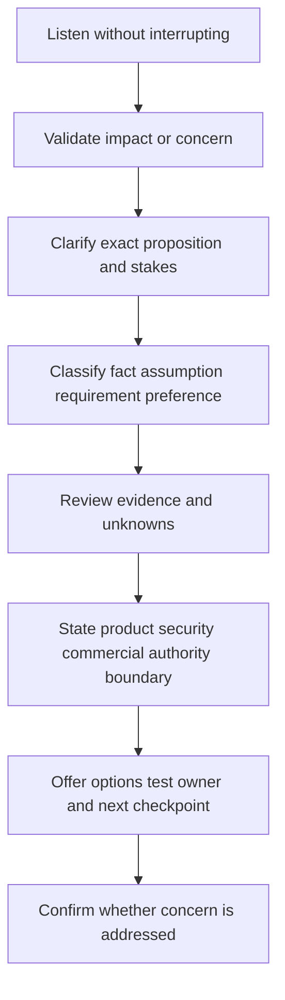

| Objection | Concern beneath position | Bounded response | Next evidence/action |
|---|---|---|---|
| "We already have a SIEM." | Duplication, cost, architecture sprawl | "The discovery question is not replacement by default. We should map which event, entity, exposure, correlation, workflow, and retention jobs each system performs and identify only missing or duplicated decisions." | Capability/workflow matrix with owners |
| "We already have scanners." | Existing investment and expertise | "The synthetic use case assumes scanners remain sources. The question is whether cross-source entity, business, threat, control, ownership, and workflow context improves prioritization. Current product support must be verified." | Pilot source/decision contract |
| "We do not trust another score." | Opaque logic and lost analyst authority | "That concern is valid. The pilot should expose components, sources, confidence, thresholds, overrides, anchor cases, and failure behavior. A score supports governed judgment; it does not accept risk." | Calibration workshop and override review |
| "Do not send us 18,000 tickets." | Operational overload | "Agreed. Ticket creation should follow grouping, owner capacity, actionability, priority, dependencies, and workflow design. We should pilot capped cohorts and define suppression/update/closure rules." | ITSM design session and volume simulation |
| "We cannot share identity data." | Privacy, legal, trust, regional controls | "We should not assume broad identity fields are necessary. Define purpose and minimum attributes, use pseudonymous/role context where sufficient, and obtain privacy approval before any data use." | Field-level privacy decision |
| "Can you guarantee 30 percent less risk?" | Need for value and commitment | "No responsible guarantee follows from current evidence. We can define a value hypothesis, baseline and comparable cohort, guardrails, confounders, and customer acceptance, then report what the pilot establishes." | Metric contract and baseline study |
| "Show us the product now." | Need for confidence or urgency | "I can discuss dated public positioning, but a meaningful demonstration needs a bounded question, current entitlement, approved environment, configuration, and product specialist. Today we can validate workflow requirements with synthetic data." | Demo charter or requirements workshop |
| "Will feature X ship next quarter?" | Planning dependency | "I cannot create a roadmap commitment. I will record the use case and impact, verify current approved status through the authorized channel, and plan against available capability or alternatives until an authorized update exists." | Roadmap request record |
| "This is the CMDB team's fault." | Frustration and accountability pressure | "The ownership gaps are material, but the system also needs source contracts, correction paths, confidence, and workflow checks. Let us isolate which fields are declared, stale, missing, or used beyond their contract and assign system improvements." | Data-quality issue matrix |
| "We need to go live in two weeks." | Deadline pressure | "We can identify the smallest useful bounded milestone in two weeks, but production scope depends on privacy, source, quality, access, workflow, testing, and change evidence. I will show options and what each date does and does not achieve." | Dependency-based plan options |

### Objection response quality checks

1. Did the response name the concern accurately?
2. Did it avoid false agreement or defensiveness?
3. Did it distinguish fact, requirement, preference, assumption, and unknown?
4. Did it protect product, security, legal, commercial, roadmap, and customer-authority boundaries?
5. Did it offer a useful option, test, owner, and checkpoint?
6. Did it confirm whether the objection changed scope or decision?

## Follow-up package

```mermaid
flowchart LR
    NOTES[Raw simulation notes] --> CLASS[Classify facts assumptions unknowns]
    CLASS --> CORR[Correct architecture and outcome map]
    CORR --> DEC[Decision and rationale register]
    DEC --> ACT[Actions owners due bases validation]
    ACT --> PLAN[Updated success plan and risks]
    PLAN --> RES[Resources and support routes]
    RES --> READ[Customer read-back and correction window]
```

### Follow-up email structure

Subject: `Synthetic NMH discovery read-back - decisions, evidence requests, and pilot plan`

1. Purpose and explicit synthetic label.
2. Outcome and scope read-back.
3. Confirmed fictional facts.
4. Assumptions requiring validation.
5. Unknowns and evidence owners.
6. Decisions made, authority, rationale, and conditions.
7. Actions, owners, due-date bases, acceptance evidence, and dependencies.
8. Updated architecture/success-plan links.
9. Risks, escalations, and product questions routed through authorized channels.
10. Next checkpoint and correction request.

### Decision and action register

| ID | Type | Statement | Owner/authority | Due basis | Acceptance evidence | Dependency | Status |
|---|---|---|---|---|---|---|---|
| D-001 | Decision | Pilot uses CMDB, endpoint, scanner, app, and ticket synthetic equivalents; identity scope minimized pending privacy review | Fictional Data/Privacy authorities | Before Phase 1 exit | Approved field/purpose matrix | Data dictionary | proposed |
| D-002 | Decision | Prioritization remains explainable and overrideable | Fictional VM Lead | Design gate | Component/anchor/override evidence | Source context | proposed |
| A-001 | Action | Reconcile active-owner denominator | CMDB/ITSM Owners | Before baseline accepted | Query and sampled owner acceptance | Identity status | open |
| A-002 | Action | Define scanner freshness and stale-data behavior | Scanner Source Owner | Source contract gate | Threshold and alert test | Cadence evidence | open |
| A-003 | Action | Simulate ticket volume under grouping options | ITSM Owner | Before workflow design | Volume table and owner review | Priority pilot | open |
| A-004 | Action | Review 19 past-due synthetic exceptions | Risk Governance | Before pilot review | Renew/close/reject decisions | Authority availability | open |
| A-005 | Action | Approve workshop audience and teach-back criteria | VM Lead | After workflow stable | Charter acceptance | Materials version | open |

## Lab

Run the simulation in four blocks. A peer may play role cards, but solo rehearsal is acceptable. Do not record another person without explicit consent and policy; written artifacts are sufficient.

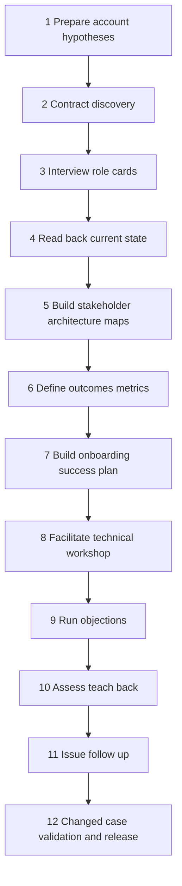

### Exercise 1 - Prepare without inventing

Create the account brief table. Add source, confidence, question, and consequence for every hypothesis. Review public source anchors only for bounded product positioning. Do not infer customer license, architecture, feature use, data, or goals from a role description or company sector.

Expected evidence: at least eight hypotheses, each with a question that could change the plan. Include an explicit gap: production Zscaler entitlement and connector support are unknown.

### Exercise 2 - Open and contract discovery

Deliver a two-minute opening:

> This is a synthetic NMH working session. The purpose is to understand the business and security decisions the exposure program must improve, trace one current finding workflow, map source and ownership constraints, and agree on evidence for a bounded pilot plan. We are not approving architecture, product entitlement, production data use, or a go-live date today. I will distinguish facts, hypotheses, assumptions, decisions, and unknowns and ask you to correct the read-back.

Ask each role to confirm job, authority, concern, and desired output. If solo, read each role card response aloud and capture it as fictional role evidence.

### Exercise 3 - Conduct outcome and workflow discovery

Start with CISO and VM Lead. Trace one high-priority finding from source through asset identity, context, priority, owner, ticket, change, validation, exception, and executive report. Ask where evidence is trusted, manually reconciled, or disputed.

Expected observation: the main desired outcome shifts from "centralize data" to "make the highest-consequence findings explainable, owned, and validated without creating another untrusted queue." Data centralization is a capability, not the final outcome.

### Exercise 4 - Conduct architecture, data, and privacy discovery

Use the source and architecture map. For each source ask grain, key, timestamp meaning, cadence, authority, required fields, null meaning, retention, access, region, correction, and failure. Ask Privacy which fields are necessary for the pilot. Do not assume user email or personal attributes are needed; role/owner IDs may suffice.

Expected output: a source contract backlog and privacy gate. The pilot cannot enter source readiness until purpose and fields are accepted.

### Exercise 5 - Read back stakeholder and architecture truth

Present facts, hypotheses, assumptions, unknowns, constraints, and decisions separately. Ask every role to correct what affects their domain. Version the diagram after correction.

Read-back sentence:

> "I heard that the executive need is decision-ready exposure and accountability; current finding volume is not reconciled; the VM workflow uses manual context and tickets; identity-field scope is not approved; and a pilot must preserve source truth, analyst override, application change authority, and exception governance. Product/source capability and exact baseline remain unknown. Is that accurate, and what is missing?"

### Exercise 6 - Define success and non-success

Build the outcome hierarchy and metric contracts. For every target, name baseline method, population, numerator, denominator, reporting cut, owner, acceptor, guardrail, confounder, and what the measure does not prove.

Reject these statements:

- "Deployment complete" as value.
- "18,000 findings ingested" as adoption.
- "Score dropped" as risk reduction without source/validation.
- "Everyone attended" as operator capability.

Expected output: at least one capability, behavior, operational, governance, and executive criterion.

### Exercise 7 - Build the dependency-gated success plan

Use phases 0-5. For each milestone add entry evidence, activities, exit evidence, owner, acceptor, dependency, estimated window, risk, support/escalation route, and product fact requiring verification. Create now/next/later views but do not turn estimates into commitments.

Expected observation: privacy and source-contract gates precede data use; entity and scoring calibration precede workflow automation; workflow stability precedes training; accepted pilot evidence precedes scale.

### Exercise 8 - Facilitate the technical workshop

Run the 90-minute agenda or a 30-minute compressed rehearsal retaining contract, one data case, one scoring case, one workflow case, and teach-back. Use only synthetic records. Ask participants to predict before showing expected results.

Inject a failure: the learner treats `f-005` as low risk because score is 31. Coach them to say "low model score, low confidence, urgent data-resolution need." Vary the case by supplying a fictional tier-0 application relationship; ask them to recalculate priority and workflow.

Expected evidence: completed exercise card, correction, changed-case result, teach-back score, and next practice.

### Exercise 9 - Handle objections

Select at least six objections from the matrix. A peer or timer presents them without warning. Respond in 90 seconds using the eight-step method. Include at least one product-roadmap, privacy, existing-tool, score-trust, ticket-volume, and ROI objection.

Score whether the response changed the decision. A perfect script that does not answer the concern fails. Record product or commercial questions for authorized follow-up rather than inventing an answer.

### Exercise 10 - Run teach-back and capability decision

Ask the fictional VM Analyst role to explain `f-011` technically and then to an executive. Ask how they would respond if the source becomes stale or the application owner disputes the change. Use the rubric, give behavior-specific feedback, and retry a changed case.

Capability decision options are: needs guided practice, ready for supervised synthetic work, or ready to coach this synthetic method. None authorizes production access.

### Exercise 11 - Issue follow-up within the simulation

Publish corrected architecture, outcome map, decision/action register, success plan, risk register, product-question ledger, workshop evidence, and next checkpoint. Put the synthetic banner on each artifact. Ask role-card participants for correction within a fictional two-business-day window.

Expected quality: every action has owner, due-date basis, dependency, acceptance evidence, and escalation trigger. Every unknown has an evidence request rather than an invented answer.

### Exercise 12 - Run changed cases

Changed case A: Privacy rejects identity data beyond pseudonymous owner role. Redesign source and workflow fields; do not treat privacy as a blocker to bypass.

Changed case B: The CISO changes the priority from triage efficiency to protection of two critical clinical services. Narrow pilot population and success criteria.

Changed case C: ITSM cannot support automated update for six weeks. Create a bounded manual pilot with volume cap and reconciliation rather than silently slipping workflow outcomes.

Changed case D: Current official verification shows a desired source/capability is unavailable or unentitled. Present alternatives, adjust plan, and preserve outcome; do not promise roadmap delivery.

Changed case E: Workshop satisfaction is high but independent teach-back fails. Report positive reaction and incomplete capability separately; schedule practice and retry.

## Expected evidence

```mermaid
flowchart LR
    BRIEF[Hypothesis account brief] --> DISC[Discovery charter notes read back]
    DISC --> MAP[Stakeholder architecture workflow maps]
    MAP --> OUT[Outcome and metric contracts]
    OUT --> PLAN[Onboarding success and risk plans]
    PLAN --> WORK[Workshop exercises teach back]
    WORK --> OBJ[Objection and decision ledger]
    OBJ --> FOLLOW[Follow up package]
    FOLLOW --> RUB[Changed cases rubric reflection]
```

| Artifact ID | Artifact | Minimum evidence | Acceptance condition |
|---|---|---|---|
| NMH-SYN-P115-A01 | Account brief | Hypothesis, source, confidence, question, consequence | No invented customer fact |
| NMH-SYN-P115-A02 | Discovery charter | Purpose, scope, roles, decisions, non-goals, safety | Product demo/deployment excluded |
| NMH-SYN-P115-A03 | Discovery notes/read-back | Facts, assumptions, unknowns, constraints, decisions | Role corrections recorded |
| NMH-SYN-P115-A04 | Stakeholder map/RACI | Jobs, authority, influence, cadence | TSM does not absorb customer authority |
| NMH-SYN-P115-A05 | Architecture/workflow map | Sources, grains, owners, flow, failures | Explicitly analogous, not Zscaler design |
| NMH-SYN-P115-A06 | Outcome hierarchy | Capability through accepted outcome | Activity separated from value |
| NMH-SYN-P115-A07 | Metric contracts | Baseline, numerator, denominator, target hypothesis, guardrail | No guaranteed percentage |
| NMH-SYN-P115-A08 | Technical success plan | Phases, gates, owners, evidence, risks, support | Dependency-gated, not calendar-only |
| NMH-SYN-P115-A09 | Operating cadence | Forum, audience, purpose, input, output | Decision rights clear |
| NMH-SYN-P115-A10 | Workshop package | Charter, run-of-show, exercises, aids, contingency | Local synthetic only |
| NMH-SYN-P115-A11 | Teach-back evidence | Rubric, feedback, retry, changed case | Attendance not readiness |
| NMH-SYN-P115-A12 | Objection ledger | Concern, classification, response, boundary, next | Roadmap/commercial facts routed |
| NMH-SYN-P115-A13 | Follow-up package | Decisions, actions, owners, due bases, acceptance, next | Read-back correctable |
| NMH-SYN-P115-A14 | Changed-case pack | Five plan adaptations | Outcome preserved where feasible |
| NMH-SYN-P115-A15 | Validation/reflection | Score, failures, limits, production next validation | Part 111 gates pass |

### Evidence-capture checklist

- [ ] Put `SYNTHETIC NMH LAB` on every account artifact.
- [ ] Label pre-call beliefs as hypotheses with source/confidence.
- [ ] Capture purpose, scope, non-goals, decisions, and participants.
- [ ] Separate fictional customer facts, candidate observations, assumptions, unknowns, decisions, and public facts.
- [ ] Record stakeholder job, authority, concern, evidence, and cadence.
- [ ] Version architecture after participant correction.
- [ ] Record source grain, key, cadence, owner, privacy, quality, and failure.
- [ ] Build outcome, behavior, measure, baseline, target hypothesis, guardrail, acceptor.
- [ ] Gate onboarding phases by evidence, not date alone.
- [ ] Capture workshop exercise output and teach-back, not attendance only.
- [ ] Record objections, concern, boundary, options, and whether decision changed.
- [ ] Route unknown product/roadmap/commercial questions through authorized channels.
- [ ] Publish actions with owner, due basis, dependency, acceptance, and escalation.
- [ ] Record changed cases and plan revisions.
- [ ] Use Part 111 claim formula and cleanup disposition.

## Troubleshooting

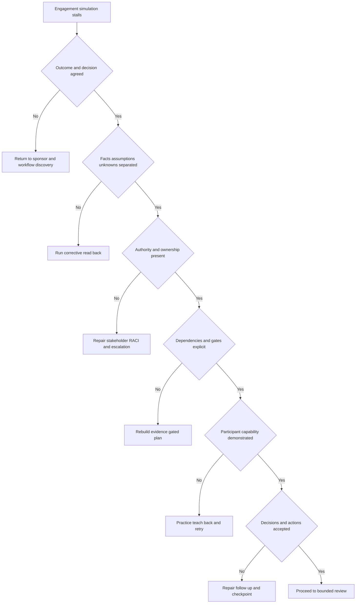

| Symptom | Likely cause | Discriminating check | Repair |
|---|---|---|---|
| Discovery feels like product pitch | Questions do not change plan | Remove product names and retest agenda | Start with decision/workflow/evidence |
| Sponsor agrees but operators resist | Stakeholder jobs/constraints absent | Compare role concerns and adoption evidence | Add operator discovery/co-design |
| Architecture is a product inventory | Flows, grain, boundaries, owners missing | Trace one finding end to end | Add actor/data/control/failure/owner |
| Plan has many dates, few gates | Calendar substitutes for readiness | Ask what proves each phase can start/finish | Add entry/exit evidence and acceptor |
| Target cannot be measured | Baseline/population/denominator absent | Attempt metric contract | Run baseline study; keep target hypothesis |
| Privacy arrives late | Data purpose/fields assumed | Review phase-0 gate | Move privacy into discovery and minimize |
| Score objection persists | Components/override/failure hidden | Ask objector to challenge anchor case | Run calibration and preserve authority |
| Ticket-volume fear persists | Workflow volume not simulated | Calculate grouped/ungrouped pilot volume | Cap pilot and define grouping |
| Workshop is quiet | Participants watching, not acting | Count participant decisions | Add prediction, exercise, teach-back |
| Satisfaction high, capability low | Reaction treated as learning | Run independent changed case | Report layers separately and retry |
| Follow-up disputed | Read-back missed exact decision/authority | Compare notes and participant correction | Correct visibly and version |
| Product question unanswered | Candidate feels pressure to guess | Classify authority/source needed | Record and route with checkpoint |

## Cleanup and privacy

The simulation must not use real meeting notes, customer names, screenshots, CRM exports, architecture diagrams, emails, calendars, licenses, or contracts. Peer reviewers should use fictional role cards and need not disclose employer data.

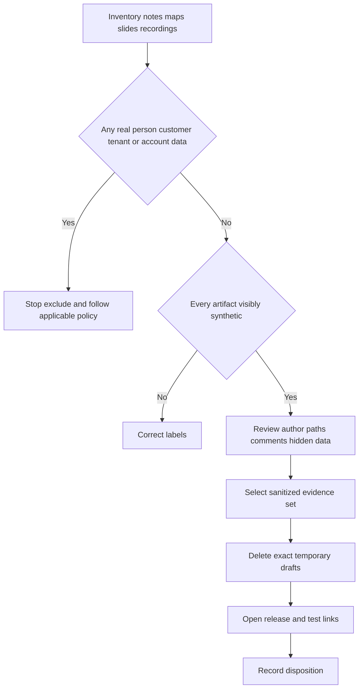

| Item | Retain | Remove | Privacy/control check |
|---|---|---|---|
| Synthetic role cards | Yes | Duplicate drafts | No real names/companies |
| Discovery notes | Corrected read-back | Scratch notes with unrelated content | Facts/assumptions separated |
| Architecture | Sanitized fictional version | Imported real diagrams/templates with data | Metadata and labels reviewed |
| Success plan | Yes | Hidden workbook tabs with test personal data | All owners fictional |
| Workshop materials | Yes | Product screenshots or real exports | Local synthetic exercises only |
| Peer feedback | With consent and minimal identifier | Audio/video recording | Reviewer not portrayed as customer |
| Objection scripts | Yes | Actual confidential sales/customer statements | Fictional wording |
| Follow-up email | Template/synthetic message | Real email headers/signatures | No claim of delivery |
| Release deck | Selected pages | Speaker notes with personal paths | Source date/boundaries visible |

No cleanup action may delete real meeting records, CRM data, customer evidence, email, calendar entries, or shared team files. Remove only exact synthetic files created for this simulation. Do not record or retain a peer's voice/video unless explicit consent and policy justify it; this lab does not need recording.

## Validation rubric

Part 111 blocking gates apply before scoring. A polished presentation fails if it invents customer/product facts or replaces discovery with a predetermined answer.

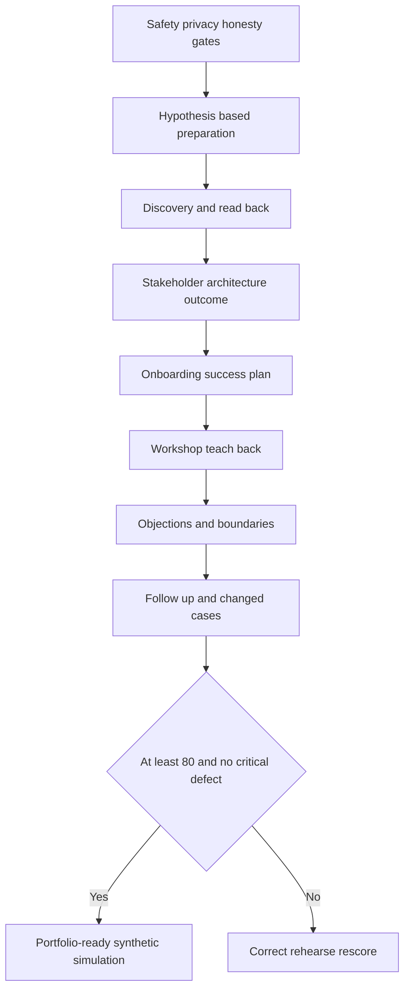

| Dimension | Points | Full-credit evidence | Critical defect |
|---|---:|---|---|
| Safety and honesty | 10 | Fictional/local, no tenant/real data, visible boundaries | Real customer material or delivery claim |
| Preparation | 10 | Hypotheses, sources, confidence, decision-changing questions | Hypotheses presented as facts |
| Discovery | 15 | Outcome, workflow, data, constraints, authority, read-back | Product pitch/questionnaire only |
| Stakeholder/governance | 10 | Jobs, RACI, cadence, decision rights | TSM assumes customer authority |
| Architecture/data | 10 | Sources, grain, flows, controls, owners, failure, privacy | Decorative product diagram |
| Outcomes/measures | 10 | Baseline, target hypothesis, denominator, guardrail, acceptor | Guaranteed ROI/risk reduction |
| Onboarding/success plan | 10 | Dependency gates, evidence, owners, risks, support | Calendar-only plan |
| Workshop/training | 10 | Objectives, exercises, teach-back, retry, application | Attendance called adoption |
| Objections/boundaries | 10 | Concern, evidence, options, route, decision | Roadmap/product/commercial invention |
| Follow-up/adaptation | 5 | Corrected artifacts, actions, changed cases, release | Unowned actions or hidden unknowns |

| Score | Interpretation | Required action |
|---:|---|---|
| 0-69 | Engagement method is not decision-ready | Rebuild discovery and boundaries |
| 70-79 | Useful artifacts with material gaps | Repair weak stages and rehearse |
| 80-89 | Strong strategic-customer simulation | Practice live role changes |
| 90-100 | Excellent synthetic portfolio evidence | Seek independent challenge; retain honesty |

## Explicitly fictional and synthetic NMH scenarios

### Scenario 1 - Sponsor wants a dashboard

The fictional CISO initially asks for one dashboard. Discovery reveals the actual decision gap is explainable ownership and validated treatment of material exposures. Dashboard design moves after data, workflow, and decision contracts.

### Scenario 2 - Privacy narrows the pilot

The fictional Privacy Officer rejects broad identity attributes. The team uses pseudonymous owner identifiers and role/status fields for the bounded use, subject to fictional approval. The constraint improves minimization rather than being bypassed.

### Scenario 3 - Existing-tool objection

The fictional SOC Manager asks why another platform is needed when SIEM exists. The candidate maps event, entity, exposure, prioritization, workflow, and retention jobs and proposes a requirement pilot rather than replacement claim.

### Scenario 4 - Training applause, weak teach-back

Participants rate the workshop highly but cannot handle the low-score/low-confidence case independently. The report says reaction positive, capability incomplete; guided practice and retry are scheduled. No adoption outcome is claimed.

## Official Source Anchors

Research/source snapshot and source review date: **2026-08-24**.

The Zscaler sources support bounded public positioning around the Zero Trust Exchange, Data Fabric for Security, Unified Vulnerability Management, Risk360, Agentic Security Operations, and education. NIST sources support general cybersecurity, zero-trust, and workforce context. These sources do not establish NMH facts, entitlement, architecture, feature availability, workflow, onboarding, training results, or customer outcomes.

| Source | URL | Used for | Boundary |
|---|---|---|---|
| Zscaler Zero Trust Exchange | https://www.zscaler.com/products-and-solutions/zero-trust-exchange-zte | Public zero-trust platform positioning | No customer design, policy, entitlement, or result inferred |
| Zscaler Data Fabric for Security | https://www.zscaler.com/products-and-solutions/data-fabric | Public security-data harmonization/workflow positioning | No connector, schema, source, or tenant behavior inferred |
| Zscaler Unified Vulnerability Management | https://www.zscaler.com/products-and-solutions/unified-vulnerability-management | Public contextual vulnerability-prioritization positioning | No score, field, algorithm, or workflow inferred |
| Zscaler Risk360 | https://www.zscaler.com/products-and-solutions/risk360 | Public risk visibility/communication positioning | No NMH metric is a Risk360 metric |
| Zscaler Agentic Security Operations | https://www.zscaler.com/products-and-solutions/security-operations | Public SecOps portfolio context | No agent, action, or customer outcome inferred |
| Zscaler Academy | https://www.zscaler.com/zscaler-academy | Public education-resource context | Current catalog, access, completion, and proficiency require verification |
| Zscaler Support | https://help.zscaler.com/submit-ticket | Public support-route context | Current process, entitlement, and response require verification |
| NIST Cybersecurity Framework 2.0 | https://www.nist.gov/cyberframework | General Govern, Identify, Protect, Detect, Respond, Recover outcome context | Voluntary and implementation-neutral |
| NIST SP 800-207 Zero Trust Architecture | https://csrc.nist.gov/pubs/sp/800/207/final | Vendor-neutral zero-trust concepts | Not a customer or product implementation guide |
| NIST NICE Workforce Framework | https://www.nist.gov/itl/applied-cybersecurity/nice/nice-framework-resource-center | General tasks, knowledge, skills, and capability context | Does not define Zscaler role readiness |

## Likely Interview Questions

### Q1. How would you prepare for strategic customer discovery?

**Model answer:** I review available customer-authoritative and dated public context, but record pre-call beliefs as hypotheses with source, confidence, a decision-changing question, and consequence. I define purpose, stakeholders, likely workflows, product/commercial boundaries, privacy, and desired outputs. I prepare a current-state skeleton and source contract prompts, not a completed answer. I explicitly identify unknown entitlement, architecture, data, authority, and success baseline.

### Q2. What do you try to learn in discovery?

**Model answer:** I learn the business/security decision, current workflow, architecture, sources and grains, quality, ownership, controls, privacy, constraints, dependencies, change/validation process, stakeholder authority, prior attempts, success evidence, and unknowns. I trace one real workflow end to end and read back facts, assumptions, decisions, and gaps for correction. Discovery is successful when it changes or confirms a defensible plan.

### Q3. How do you build an onboarding and technical success plan?

**Model answer:** I connect customer outcomes to workstreams, entry/exit evidence, owners, acceptors, dependencies, risks, support routes, and estimated windows. Governance/privacy precede data; source contracts and quality precede canonical use; calibration precedes automation; workflow stability precedes training; accepted pilot evidence precedes scale. I keep the plan living and use evidence gates rather than declaring readiness from dates or activity completion.

### Q4. How would you define and measure success?

**Model answer:** I separate capability, repeated behavior, operational effect, governance, and customer-accepted outcome. Each measure has population, grain, numerator, denominator, baseline method, reporting cut, target hypothesis, guardrail, owner, acceptor, confounders, and limitation. I do not call ingestion adoption, attendance capability, ticket closure remediation, or score change risk reduction without supporting evidence.

### Q5. How do you run a technical workshop for mixed roles?

**Model answer:** I contract one decision or capability, analyze role jobs/authority, use observable objectives, and build a safe synthetic exercise. I layer one architecture for executive, architect, operator, and governance needs; alternate explanation with prediction and action; use teach-back and changed cases; provide contingencies; and publish corrected artifacts and follow-up. Product demonstrations require current entitlement, approved setup, and bounded claims.

### Q6. How do you handle objections such as "we already have a SIEM" or "we do not trust the score"?

**Model answer:** I listen, validate the concern, clarify the exact proposition and stakes, classify fact versus assumption or requirement, review evidence, state boundaries, and offer options and a test. For SIEM, I map event/entity/exposure/workflow jobs rather than assume replacement. For score distrust, I expose components, sources, confidence, overrides, anchors, and failure behavior while preserving human authority.

### Q7. What belongs in follow-up after discovery or training?

**Model answer:** Purpose and scope, corrected facts, assumptions, unknowns/evidence requests, decisions and rationale, architecture/artifact versions, actions with owner/due basis/dependency/acceptance, risks and escalation triggers, product questions routed to authority, learning/application evidence, resources, and next checkpoint. I ask recipients to correct the read-back and visibly version changes.

### Q8. How does Arti's background support strategic technical success?

**Model answer:** Microsoft enterprise escalation work supports discovery under ambiguity, impact framing, evidence, ownership, cross-team coordination, and executive communication. Microsoft 365 depth supports layered SaaS architecture. SQL, Power BI, statistics, and MBA analytics support source quality and success metrics. Mentoring, onboarding, partner training, and knowledge work support enablement. These are factual strengths; Zscaler account ownership, product implementation, and NMH outcomes remain synthetic ramp areas.

## 30-Second Memory Hooks

| Concept | Memory hook |
|---|---|
| Preparation | Hypothesis, source, confidence, question |
| Discovery | Outcome, workflow, evidence, constraint, decision |
| Stakeholder | Job, authority, concern, evidence, cadence |
| Architecture | Actor, flow, data, control, owner, failure |
| Outcome | Capability to behavior to effect to acceptance |
| Metric | Population, denominator, cut, guardrail, acceptor |
| Onboarding | Dependency and evidence gates |
| Milestone | Accepted state, not calendar square |
| Adoption | Repeated correct workflow |
| Workshop | Participant work, not presenter coverage |
| Teach-back | Explain, decide, fail safely, hand off |
| Objection | Concern plus evidence plus option |
| Boundary | Verify product, entitlement, authority, roadmap |
| Follow-up | Facts, decisions, actions, validation, next |
| NMH | Always fictional and synthetic |
| Arti bridge | Escalation, analytics, enablement transfer honestly |

## Completion Checklist

- [ ] I can explain discovery, qualification, stakeholder, sponsor, champion, RACI, outcome, baseline, target hypothesis, onboarding, adoption, workshop, teach-back, objection, and value hypothesis from zero.
- [ ] I applied Part 111 safety, evidence, honesty, privacy, and cleanup gates.
- [ ] I used only fictional NMH role cards and synthetic Parts 112-114 evidence.
- [ ] I stated no paid Zscaler access, real tenant, customer data, deployment, workshop, or outcome was involved.
- [ ] I prepared hypotheses with source, confidence, question, and plan consequence.
- [ ] I contracted discovery purpose, scope, participants, decisions, non-goals, and read-back.
- [ ] I asked outcome, workflow, architecture, data, privacy, governance, constraint, and success questions.
- [ ] I separated fictional facts, candidate observations, assumptions, unknowns, decisions, and public facts.
- [ ] I mapped stakeholder jobs, concerns, authority, RACI, and cadence.
- [ ] I drew architecture with sources, grains, flows, controls, owners, failure, and workflow.
- [ ] I defined capability, behavior, operational, governance, and executive outcomes.
- [ ] I wrote metric contracts with baseline, denominator, target hypothesis, guardrail, acceptor, and limitation.
- [ ] I built phases 0-5 with entry/exit evidence, dependencies, owners, risks, and support routes.
- [ ] I placed privacy/source/entity/calibration/workflow/training/scale gates in defensible order.
- [ ] I designed and rehearsed the synthetic 90-minute workshop.
- [ ] I captured exercise, teach-back, feedback, retry, and changed-case evidence.
- [ ] I handled at least six objections without product, roadmap, commercial, or outcome invention.
- [ ] I issued follow-up with corrected artifacts, decisions, unknowns, actions, validation, and next checkpoint.
- [ ] I adapted the plan across all five changed cases.
- [ ] I can discuss Arti's factual strengths without claiming a real Zscaler customer engagement.

[Next: Part 116 - Executive Risk Review, Dashboard, and Mitigation Roadmap Capstone](Part-116-executive-risk-review-capstone.md)