# Part 116 - Executive Risk Review, Dashboard, and Mitigation Roadmap Capstone

> **Purpose:** Convert the fictional Northstar Meridian Holdings security-data, vulnerability, exposure, escalation, and customer-discovery evidence from Parts 112-115 into one defensible technical review, executive deck, dashboard specification, risk register, mitigation roadmap, decision package, and next-quarter outcome plan.

> **Scope and honesty:** Northstar Meridian Holdings, abbreviated NMH, is explicitly fictional and synthetic. Every person, asset, source, finding, score, chart, risk, decision, date, target, and result in this Part is invented for local learning. The words Data Fabric-style, UVM-style, and Risk360-style describe analogous learning outputs informed by public positioning; they do not mean a Zscaler tenant, product algorithm, licensed workflow, or customer result was used or reproduced.

> **Section goal:** Build and rehearse an evidence-traceable executive risk review in which technical facts remain inspectable, uncertainty remains visible, recommendations have owners and validation tests, executives receive clear choices rather than unexplained scores, and every claimed next-quarter outcome has a baseline, denominator, guardrail, acceptance authority, and honest synthetic boundary.

This capstone applies the shared portfolio contract in [Part 111](Part-111-safe-lab-evidence-honesty.md). It consumes only the synthetic canonical-data output from [Part 112](Part-112-data-fabric-modeling-lab.md), synthetic vulnerability-prioritization output from [Part 113](Part-113-uvm-prioritization-lab.md), synthetic escalation evidence from [Part 114](Part-114-connectivity-escalation-lab.md), and fictional discovery outcomes from [Part 115](Part-115-customer-discovery-onboarding-training-simulation.md). No real tenant, customer, scan, connector, credential, production dashboard, packet capture, financial model, product configuration, or security-control change is required or allowed.

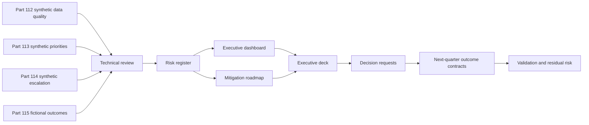

| Capstone layer | Question answered | Primary artifact | Evidence boundary |
|---|---|---|---|
| Technical evidence | What was observed, how, and with what limitations? | Technical review pack | Synthetic observations only |
| Risk interpretation | Why could the condition matter to a business objective? | Risk register | Scenario reasoning, not measured loss |
| Executive communication | What must leaders understand now? | Seven-slide deck and dashboard | No hidden precision or product claim |
| Mitigation design | Which options reduce likelihood, impact, uncertainty, or response time? | Ninety-day roadmap | Candidate recommendation in a simulation |
| Decision governance | What requires accountable authority? | Decision register | Fictional roles and approvals |
| Outcome validation | What evidence would show progress or disprove the plan? | Metric contracts and review cadence | Targets are hypotheses until accepted |

## JD Mapping

| Job-description signal | Capability practiced | Portfolio evidence | Honest boundary |
|---|---|---|---|
| Analyze complex environments and identify security risks | Reconcile source quality, entity context, vulnerabilities, controls, workflows, and business importance | Technical review and evidence spine | No production environment analyzed |
| Deliver tailored mitigation strategies | Convert findings into options, owners, dependencies, validation, and residual risk | Risk register and mitigation cards | Fictional recommendations only |
| Explain cybersecurity and vulnerability metrics simply | Translate technical measures into decisions without erasing definitions or uncertainty | Executive dashboard dictionary and deck | No proprietary metric reproduced |
| Manage executive stakeholders | Lead an outcome-first review with explicit decisions, tradeoffs, and follow-up | Seven-slide storyboard and meeting runbook | Rehearsed simulation, not a delivered QBR |
| Align solutions with business needs | Connect exposure work to fictional clinical-service continuity, regulated-data handling, and operating capacity | Business-service risk statements | NMH has no real operations or obligations |
| Drive long-term customer success | Contract next-quarter outcomes, adoption behaviors, health signals, and governance | Ninety-day roadmap and metric contracts | No renewal or risk-reduction result claimed |
| Partner with Sales, Support, Product, and Engineering | Assign routes for data defect, escalation learning, product question, and account risk | Cross-functional decision and action register | No actual Zscaler commitment or roadmap |
| Demonstrate impact over activity | Separate ingestion, attendance, and ticket motion from accepted operational outcomes | Outcome hierarchy and guardrails | Synthetic trends are not customer value |

## Candidate honesty note

You can say: "I built a local synthetic executive-risk capstone for fictional NMH. I reconciled supplied security-data and vulnerability fixtures, created an evidence-linked risk register, designed a quality-aware dashboard, wrote a seven-slide executive narrative, proposed a ninety-day mitigation roadmap, and defined decision and outcome contracts. The work demonstrates my analytical and communication method. It did not use a Zscaler tenant, reproduce Data Fabric, UVM, or Risk360, deliver a customer QBR, quantify real financial exposure, or prove production risk reduction."

Your factual enterprise escalation experience supports evidence discipline, impact framing, executive updates, cross-team ownership, root-cause analysis, and validation. Your SQL, PostgreSQL, Excel, Power BI, statistics, and a postgraduate business-analytics qualification background supports model review, denominator control, dashboard design, and analytical challenge. Your mentoring and partner-training work supports audience-aware explanation. Those transfer points remain factual. Production exposure-management program ownership, Zscaler administration, and NMH outcomes remain explicitly unclaimed.

| Supported candidate fact | Transfer to this capstone | Safe interview wording | Unsupported wording to avoid |
|---|---|---|---|
| enterprise support and escalation engineering | Evidence timelines, hypotheses, ownership, high-pressure communication | "I applied my factual escalation discipline to a separate synthetic risk review." | "I led NMH's security program." |
| Microsoft 365, OneDrive, and SharePoint expertise | Understand layered SaaS, identity, endpoint, network, permissions, and service dependencies | "I used familiar dependency thinking to interpret the fictional scenario." | "I assessed NMH's Microsoft tenant." |
| SQL, PostgreSQL, Excel, Power BI, Python, R, statistics | Reconciliation, metric contracts, segmentation, visual review | "I designed an inspectable synthetic dashboard and checked its denominators." | "I implemented Risk360 analytics." |
| Critical situation, RCA, Engineering collaboration, fix validation | Escalation-to-risk feedback and durable validation | "I translated a supplied fictional incident into prevention actions." | "I resolved a Zscaler product defect." |
| Mentoring, onboarding, partner training, knowledge articles | Executive and operator explanation, rehearsal, teach-back | "I built and rehearsed audience-specific material." | "I delivered this deck to a CISO." |
| CSAT and service-quality analysis | Customer concern, service health, action quality | "My factual customer-focus record informs the review design." | "The capstone improved renewal probability." |
| Copilot Studio and AI learning/training | Responsible assistance, validation, governance questions | "I can discuss AI-assisted preparation with human verification." | "An agent autonomously approved mitigations." |

## Beginner vocabulary and memory hooks

An **executive risk review** is a structured meeting that helps accountable leaders understand material uncertainty, select treatments, fund or sequence work, and accept what remains. It is not a slideshow recital. Think of an aircraft cockpit briefing: the crew needs the route, weather, fuel, important faults, decision points, and alternates, not every sensor sample.

| Term | Plain meaning | Why it matters | Memory hook |
|---|---|---|---|
| Finding | Evidence-backed observed condition | Starts technical reasoning | What the evidence shows |
| Exposure | A condition that may make harm more reachable | Adds path and context | A door that might be reachable |
| Risk | Effect of uncertainty on an objective | Connects security to business decisions | Uncertainty meeting an objective |
| Inherent risk | Risk before considered safeguards | Shows untreated scenario | Before the seat belt |
| Residual risk | Risk remaining after current or planned treatment | Prevents "fixed" overstatement | What still travels with us |
| Risk owner | Person accountable for deciding treatment | Technical teams cannot accept business risk by default | The person who signs for the choice |
| Control owner | Person accountable for operating a safeguard | Separates implementation from acceptance | Maintains the brake |
| Indicator | A measure that suggests a condition | Supports monitoring, not certainty | Dashboard light |
| Leading indicator | Measure expected to move before an outcome | Enables earlier correction | Look through the windshield |
| Lagging indicator | Measure observed after an outcome or result | Confirms what happened | Look in the mirror |
| Baseline | Defined starting measurement | Makes change interpretable | Starting line with rules |
| Denominator | Population against which a rate is calculated | Prevents misleading percentages | The whole pie |
| Reporting cut | Fixed analytical time boundary | Makes results reproducible | Freeze the clock |
| Confidence | Strength of support for an interpretation | Separates known from plausible | Brightness of the evidence |
| Guardrail | Measure that must not worsen while another improves | Prevents metric gaming | Keep both wheels on the road |
| Decision request | Specific choice asked of an authorized leader | Turns review into governance | Name the fork in the road |
| Roadmap | Sequenced outcomes, dependencies, and evidence | Coordinates change under constraints | Route, not wish list |

### Plain-English deep-dive 1 - A finding is not automatically a risk

A scanner-like row might say a fictional server has a critical-severity weakness. That is a finding: a claim about a condition supported by a source. To express risk, the reviewer asks what objective could be affected, through what plausible scenario, given which exposure and controls, with what uncertainty. The same weakness on a retired, isolated test asset and on a reachable identity service should not be communicated identically.

Imagine finding a cracked tile. In an unopened warehouse box, it is a quality defect. On a busy hospital stair, it creates a plausible fall scenario. The crack did not change, but context changed the decision. Context includes use, reachability, traffic, ownership, compensating controls, evidence freshness, and consequence. A risk statement therefore uses a disciplined pattern:

> Because **condition and context**, there is a possibility that **threat or failure scenario** could affect **business objective**, causing **consequence**, while **current controls and evidence limitations** shape likelihood, impact, and confidence.

This pattern avoids two errors. The first is technical inflation: "critical vulnerability equals critical enterprise risk." The second is executive dilution: "cyber risk is high" without a scenario or choice. The review keeps the finding, scenario, objective, treatment, and uncertainty connected but distinct.

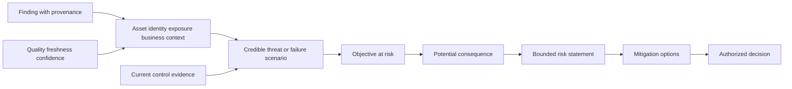

## Capstone evidence model

The capstone uses a single evidence spine. An **evidence spine** is the traceable chain from source row to executive statement. Every headline must have a technical appendix entry. Every risk must identify its contributing observations. Every roadmap item must identify the risk or uncertainty it addresses. Every outcome must identify its baseline, formula, and acceptance evidence.

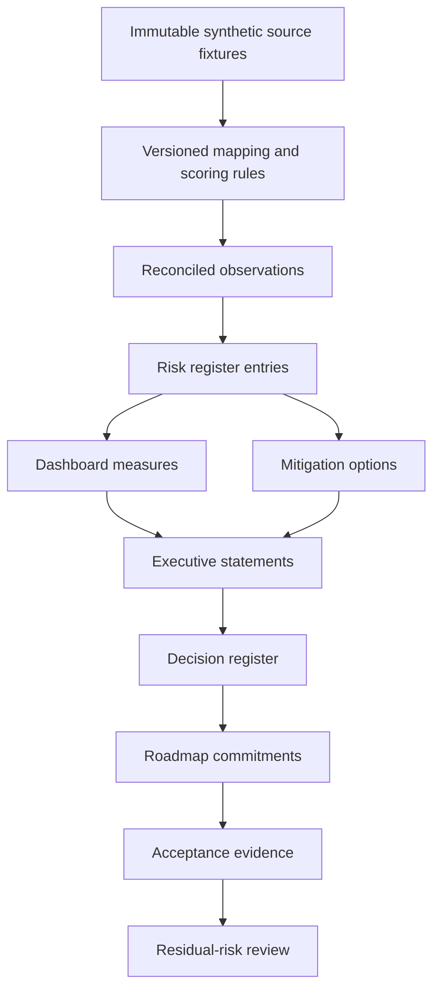

| Evidence layer | Required fields | Key validation | Prohibited inference |
|---|---|---|---|
| Source | Source ID, grain, timestamp, reporting cut, provenance, quality | Count and freshness reconciliation | Source is complete because it loaded |
| Transformation | Rule version, input/output, rejects, duplicates, assumptions | Repeatable calculation and exception review | Canonical record is absolute truth |
| Observation | Statement, population, measure, confidence, limitation | Row-level drill-through | Correlation proves causation |
| Risk | Scenario, objective, consequence, controls, owner, uncertainty | Challenge by technical and business roles | Score equals loss probability |
| Recommendation | Option, expected mechanism, dependency, side effect, validation | Owner and acceptor review | Recommendation guarantees reduction |
| Executive statement | Decision relevance, trend, confidence, requested action | Appendix link and read-back | Concision permits omitted caveats |
| Outcome | Baseline, target hypothesis, denominator, guardrail, due basis, acceptor | Independent recalculation | Activity equals value |

### Input contract from Parts 112-115

The following baseline is deliberately small enough to inspect. It summarizes earlier synthetic work; it is not a new production dataset.

| Input ID | Synthetic input | Reporting-cut observation | Quality or interpretation limit | Capstone use |
|---|---|---|---|---|
| NMH-SYN-P112-A12 | Canonical asset and relationship view | Eight modeled assets; one unresolved owner/context case; one duplicate identity pair previously reconciled | Tiny scenario population; model is vendor-neutral | Data confidence and ownership risk |
| NMH-SYN-P112-A15 | Source health dashboard | CMDB and EDR-style batches current; scanner-style batch delayed in one exercise | Fixture cadence, not connector performance | Freshness indicator and dependency |
| NMH-SYN-P113-A07 | Prioritized finding backlog | Two high-priority anchor cases; one low-confidence orphan case quarantined | NMH-LAB-SCORE-v1 is not UVM | Priority and calibration evidence |
| NMH-SYN-P113-A10 | Exception and workflow register | One synthetic compensating-control review; owner and due basis recorded | No real SLA or acceptance | Governance and workflow health |
| NMH-SYN-P114-A09 | Escalation timeline and RCA | Proxy policy object error affected fictional sync process; approved correction restored supplied test cohorts | Static fixture; no product attribution | Operational resilience learning |
| NMH-SYN-P115-A08 | Discovery and success plan | Fictional leaders prioritize explainability, ownership, bounded automation, and quarterly evidence | Role-card statements only | Business alignment and roadmap |
| NMH-SYN-P115-A12 | Training and teach-back review | Participants handled normal case; low-confidence changed case required retry | Simulated learning evidence | Adoption outcome and enablement need |

### Fact, interpretation, recommendation, and decision separation

| Statement class | Example in this capstone | Who validates or decides | Label |
|---|---|---|---|
| Synthetic observation | One modeled asset lacks accepted business owner and application context | Data steward and asset authority in role-play | SYNTHETIC OBSERVATION |
| General practice | Unknown ownership can slow remediation and distort accountability | Technical and governance review | GENERAL PRACTICE |
| Risk interpretation | If the orphan represents a material active asset, treatment could be delayed | Fictional risk owner challenges scenario | SYNTHETIC RISK HYPOTHESIS |
| Candidate recommendation | Quarantine from automated low-priority closure; resolve identity and owner first | Fictional operational owners assess feasibility | CANDIDATE-AUTHORED OPTION |
| Decision | Sponsor funds a 30-day ownership-quality workstream | Fictional authorized sponsor | FICTIONAL DECISION |
| Product fact | Public Zscaler materials position named capabilities in specified ways | Current official source verification | OFFICIAL PUBLIC FACT |
| Unknown | Current licensed feature, field, workflow, or entitlement | Authorized Zscaler/customer source | UNKNOWN - VERIFY |

### Plain-English deep-dive 2 - An executive dashboard is a governed compression

Executives need compression because they cannot inspect every row. Compression is useful only when the route back to detail remains intact. A map can omit every tree and still guide a traveler, but it must not move a bridge or hide that the road is closed. In the same way, a dashboard may summarize thousands of records, but it must preserve scope, definitions, data quality, reporting cut, trends, owners, and exceptions that could change a decision.

The capstone therefore puts **decision usefulness** ahead of decoration. A red tile is not useful by itself. It must say what population is included, why it is red, whether the change reflects risk, data, or scope, and which action is needed. A green tile can be dangerous when it comes from missing sources. Quality indicators sit beside outcome indicators because absence of data can look like improvement.

For you, this is a direct bridge from Power BI and service-quality analysis. The design skill is factual; the security scenario is synthetic. You can explain how you would protect denominators, define measures, reconcile data, and challenge a trend without claiming you operated a Zscaler dashboard.

## Technical review pack

The technical review is the foundation beneath the executive material. It must be understandable to a security architect, vulnerability lead, data engineer, service owner, and support engineer. It is not a raw dump. It explains architecture, source contracts, transformations, observed conditions, hypotheses, rejected alternatives, current controls, limitations, and validation needs.

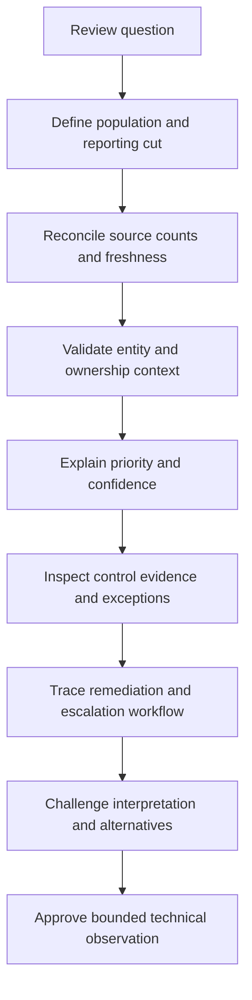

| Technical-review section | Required content | Reviewer question | Evidence output |
|---|---|---|---|
| Scope and reporting cut | Included sources, entities, time, exclusions | What is not represented? | Scope card |
| Architecture | Source-to-canonical-to-workflow flow | Where can data be lost or distorted? | Architecture diagram |
| Data quality | Completeness, freshness, uniqueness, validity, reconciliation | Could a quality change mimic improvement? | Quality scorecard |
| Entity context | Asset, identity, application, owner, criticality, exposure, controls | Which joins are uncertain? | Golden-record sample |
| Prioritization | Transparent factors, weights, overrides, confidence | Why is case A above case B? | Anchor-case explanation |
| Workflow | Assignment, grouping, ticket, exception, validation, closure | Is closure supported by evidence? | Lifecycle trace |
| Escalation learning | Detection, impact, cause, recovery, prevention | What should change in controls or monitoring? | RCA-to-roadmap map |
| Limitations | Missing data, scenario assumptions, non-product status | Which conclusion would change with new evidence? | Limitation register |

### Synthetic technical findings

| Finding ID | Bounded synthetic observation | Evidence | Confidence | Decision relevance |
|---|---|---|---|---|
| F-116-01 | One of eight modeled asset records lacks accepted owner and application context | P112 canonical view and reject queue | High within fixture | Do not automate treatment; assign context repair |
| F-116-02 | Scanner-style source freshness is outside the fictional daily objective at the reporting cut | P112 source-health fixture | High within fixture | Trend and priority may be stale |
| F-116-03 | Two anchor vulnerabilities remain high priority after transparent multifactor review | P113 score cards | Medium; factors are synthetic | Preserve expedited owner review |
| F-116-04 | One orphan finding is high severity but low confidence and quarantined | P113 quarantine | High within fixture | Resolve identity before remediation claim |
| F-116-05 | Ticket closure is not sufficient evidence of technical remediation | P113 workflow contract | General-practice confidence | Require rescan/control validation evidence |
| F-116-06 | Proxy-authentication policy object error caused the supplied sync failure scenario | P114 static timeline and comparison cohorts | High within fixture only | Add configuration validation and regression checks |
| F-116-07 | Training reaction is positive but changed-case capability is incomplete | P115 teach-back result | Medium; role-play only | Fund guided practice and retry |
| F-116-08 | Executive priority is explainable ownership and decision evidence, not maximum automation | P115 fictional discovery read-back | High as role-card fact | Sequence governance before scale |

### Quality-aware review

| Quality dimension | Synthetic measure | Interpretation | Required response |
|---|---:|---|---|
| Source freshness | 5 of 6 modeled sources within objective | One source can alter vulnerability recency | Show amber quality badge; repair before trend claim |
| Ownership completeness | 7 of 8 modeled active records have accepted owner | One material unknown can block treatment | Resolve or explicitly quarantine |
| Entity uniqueness | Known duplicate pair reconciled; no unresolved accepted duplicates | Rule worked for fixture only | Keep split/merge review and confidence |
| Finding-to-asset linkage | 7 of 8 modeled cases linked; one quarantined | Aggregate excludes uncertain row | Display included/excluded counts |
| Control-evidence freshness | 6 of 8 within synthetic objective | Two controls need revalidation | Avoid treating stale evidence as effective |
| Workflow reconciliation | 6 synthetic tickets reconcile; one exception under review | Closure and remediation differ | Require acceptance-state mapping |
| Metric dictionary coverage | 12 of 12 executive measures defined | Definitions exist but need fictional approval | Attach dictionary and owner |

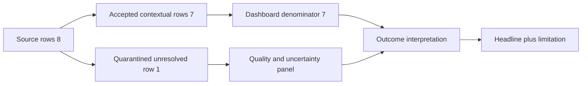

## Risk register

A risk register is a governed list of risk scenarios, owners, treatments, evidence, and residual uncertainty. It is not a sorted vulnerability export. The fictional scores below are ordinal discussion aids on a 1-5 likelihood and 1-5 impact scale. Multiplication produces a relative band for this exercise, not a probability, currency value, or Zscaler score.

| Risk ID | Synthetic risk statement | Inherent discussion band | Current controls/evidence | Confidence | Proposed treatment | Fictional risk owner | Residual hypothesis |
|---|---|---:|---|---|---|---|---:|
| R-116-01 | Because asset ownership and business context are incomplete for one modeled record, a material exposure could be misrouted or delayed, affecting timely treatment | 4 x 4 = 16 | Quarantine, manual review, reject queue | Medium | Mitigate: resolve source authority, owner, app, lifecycle; add quality gate | CISO delegate | 2 x 4 = 8 after accepted context and routing test |
| R-116-02 | Because one scanner-style source is stale, leaders could act on outdated vulnerability state or misread trend, affecting prioritization | 3 x 4 = 12 | Freshness badge and last-success timestamp | High | Mitigate: source-health alert, owner/runbook, reconciliation before publication | VM Lead | 1 x 4 = 4 after two accepted fresh cycles |
| R-116-03 | Because two contextual high-priority cases combine material assets, exposure, and weak control evidence, a threat scenario could affect a critical fictional service | 4 x 5 = 20 | Existing synthetic segmentation and review | Medium | Mitigate: owner validation, patch/config option, compensating control, validation test | Service Risk Owner | 2 x 5 = 10 pending evidence |
| R-116-04 | Because ticket closure can occur without remediation evidence, backlog metrics could overstate control improvement | 3 x 4 = 12 | Manual sample and reopen rule | High as process risk | Mitigate: reconcile closure to rescan/control evidence; measure unsupported closures | VM Lead | 1 x 4 = 4 after stable workflow test |
| R-116-05 | Because a proxy policy object defect escaped validation, a similar configuration change could disrupt a critical SaaS-style workflow | 3 x 4 = 12 | Change approval and browser workaround in fixture | High within static case | Mitigate: process-specific test, staged rollout, rollback evidence, monitoring | Network Service Owner | 1 x 4 = 4 after regression suite evidence |
| R-116-06 | Because operators cannot yet handle a low-confidence changed case independently, premature automation could amplify a wrong decision | 3 x 4 = 12 | Human approval and quarantine | Medium | Mitigate: guided practice, teach-back retry, bounded pilot, override audit | SecOps Manager | 1 x 4 = 4 after capability demonstration |
| R-116-07 | Because public product positioning does not establish licensed NMH features or workflow, an assumed capability could create plan delay or expectation risk | 3 x 3 = 9 | Unknown log and source-date labels | High | Avoid assumption: verify entitlement, current docs, owner, and test plan | Account Sponsor | 1 x 3 = 3 after authoritative confirmation |

### Risk scoring and confidence rules

| Component | 1 | 3 | 5 | Guardrail |
|---|---|---|---|---|
| Likelihood discussion | Remote in defined scenario | Plausible with meaningful conditions | Expected/frequent in defined scenario | Never translate directly to probability |
| Impact discussion | Limited and recoverable | Material service/operational effect | Severe objective-level effect | State objective and scope |
| Confidence | Sparse/stale/conflicting | Multiple partial sources | Corroborated, current, accepted | Confidence is separate from severity |
| Control strength | Designed only | Operating with partial evidence | Operating and independently validated | Stale evidence lowers confidence |
| Treatment status | Idea | Owner and plan | Implemented and validated | "Done" requires acceptance evidence |

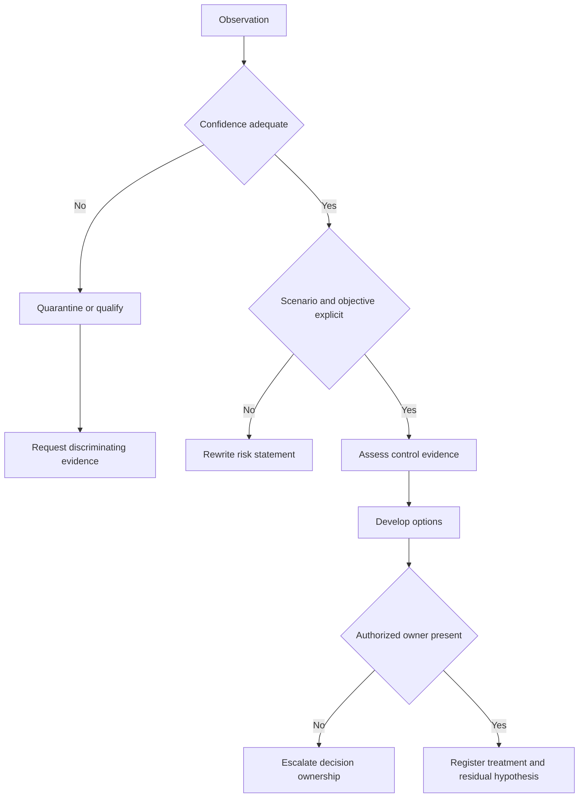

### Plain-English deep-dive 3 - A risk score is an index, not a fact of nature

An ordinal score compresses judgments. Multiplying 4 by 5 does not prove an event has an 80 percent chance or a particular monetary loss. It simply places a scenario in a relative review band under stated rules. Changing definitions, evidence, weights, population, or risk appetite can change the band. That is why the register retains the narrative, components, confidence, controls, and owner rather than presenting only the number.

Think of a restaurant's spice scale. A "4" helps compare dishes under that restaurant's definitions, but it is not four grams of chili and may not match another restaurant's scale. The label remains useful when ingredients and diner needs are visible. In security, executives should be able to challenge why a scenario is plausible, which objective matters, what controls exist, and what choice the score is helping them make.

The capstone never labels its index as UVM or Risk360 output. Public Zscaler materials support the broad idea that context and enterprise risk visibility matter. They do not disclose or validate this lab's formula, factors, data, thresholds, or results.

## Executive dashboard design

The dashboard has three linked pages: **Executive Decisions**, **Risk and Mitigation**, and **Data and Workflow Confidence**. Each page uses the same reporting cut and filters. A user can move from a headline to a risk, then to technical evidence, without exposing secrets or real data.

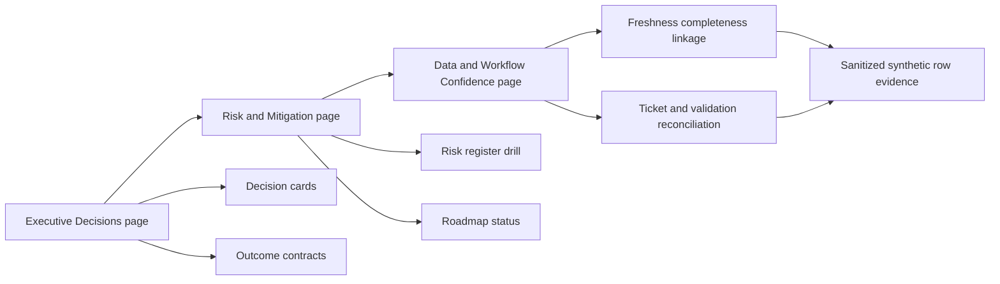

| Dashboard element | Definition | Synthetic current state | Decision/action | Misuse warning |
|---|---|---:|---|---|
| Material risk scenarios | Count of register entries in fictional band 15-25 | 2 of 7 | Confirm owners/options for R-01 and R-03 | Count is scenario-specific, not enterprise posture |
| Context-complete assets | Accepted active modeled assets with owner, app, lifecycle, criticality | 7 of 8, 87.5% | Resolve or quarantine one record | Tiny fixture; do not generalize |
| Fresh sources | Sources within defined freshness objective | 5 of 6, 83.3% | Repair scanner-style freshness | Missing data can look like fewer findings |
| High-priority anchor cases | Cases above synthetic threshold after review | 2 | Approve treatment/validation plans | Not UVM output or threat probability |
| Unsupported ticket closures | Closed workflow items without accepted technical validation | 1 of 6 closed, 16.7% | Add reconcile/reopen gate | Sample is too small for performance judgment |
| Changed-case capability | Participants independently resolving altered scenario | 3 of 5 role-play attempts, 60% | Guided practice and retry | Not production adoption |
| Mitigation milestones accepted | Roadmap exit states accepted by fictional authority | 0 at baseline | Start 30/60/90 evidence plan | Planned work is not achieved outcome |
| Open executive decisions | Decision requests without fictional disposition | 4 | Resolve during review | More decisions does not mean more risk |

### Measure dictionary

| Measure ID | Formula | Population and exclusions | Reporting cut | Guardrail | Owner/acceptor |
|---|---|---|---|---|---|
| M-116-01 | context-complete accepted active assets / accepted active assets | Excludes quarantined unresolved identities from outcome denominator but shows them in quality panel | Fixed synthetic cut 2026-08-24T12:00:00Z | Quarantine count must not rise silently | Data Steward / VM Lead |
| M-116-02 | sources meeting cadence / sources expected by cut | Includes six fictional source contracts | Same fixed cut | Accepted-row volume reconciliation | Data Engineering Lead / Architect |
| M-116-03 | closed tickets with accepted validation / all closed tickets | Excludes canceled/duplicate tickets by explicit state map | Same fixed cut | Reopen rate and overdue validation | VM Lead / Risk Owner |
| M-116-04 | independent changed-case passes / attempted changed cases | Fictional workshop attempts only | End of role-play | Unsafe approvals remain zero | SecOps Manager / Sponsor |
| M-116-05 | roadmap milestones with accepted exit evidence / milestones due | Due basis, not arbitrary calendar completion | Quarter-relative review | No safety/privacy gate failure | TSM role / Sponsor |

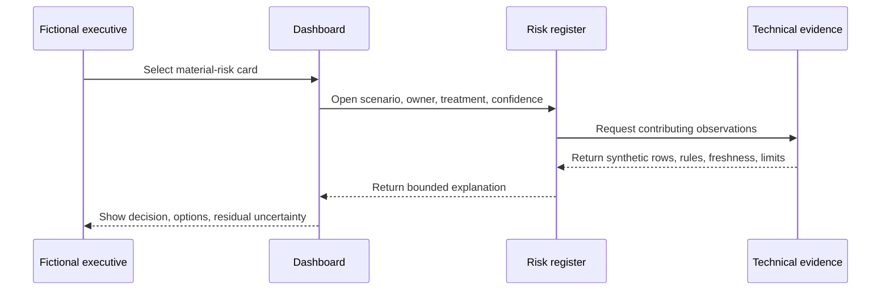

### Dashboard acceptance checklist

| Check | Pass condition | Failure example | Repair |
|---|---|---|---|
| Scope | NMH synthetic label and reporting cut visible on every page | Screenshot loses context | Put label in page body/footer |
| Denominator | Included/excluded populations displayed | Percentage without whole | Add numerator, denominator, exclusions |
| Quality | Freshness/completeness shown beside outcome | Falling count called improvement | Add quality companion and reconciliation |
| Trend | Definition and population stable or change annotated | Rule version changed silently | Version marker and restated baseline |
| Drill-through | Headline reaches risk and row evidence | Color tile has no trace | Add stable IDs and appendix links |
| Accessibility | Text labels do not rely only on color | Red/green only | Add words, icons, contrast, reading order |
| Decisions | Every material card names requested action and owner | "High risk" with no ask | Add decision card |
| Limits | Synthetic and non-product boundary is near headline | Caveat hidden in notes | Put visible boundary on page |

## Executive deck

The deck is seven slides plus a technical appendix. The executive narrative follows **context, change, consequence, choice, commitment**. It begins with business/security objectives and decisions, not architecture. It does not hide bad data, but it does not force executives through every transformation.

| Slide | Headline | Required visual | Spoken purpose | Decision or outcome |
|---:|---|---|---|---|
| 1 | NMH synthetic risk review: two material scenarios require decisions; evidence quality is improving but incomplete | One-page executive summary | Set scope, reporting cut, confidence, and asks | Confirm review objectives and authorities |
| 2 | The program is moving from disconnected source activity to evidence-linked decisions | Source-to-outcome chain | Explain why quality, context, workflow, and validation belong together | Endorse operating model |
| 3 | Ownership and source freshness are the immediate trust constraints | Quality scorecard | Prevent false confidence in trends | Fund owners and cadence repair |
| 4 | Two contextual cases lead the fictional treatment queue | Risk matrix plus narrative cards | Explain scenario, controls, confidence, options | Select treatment paths |
| 5 | The escalation exposed a reusable configuration-validation gap | Timeline and prevention map | Turn incident learning into resilience work | Approve regression and staged-change gate |
| 6 | A 30/60/90 roadmap sequences trust, treatment, adoption, and scale | Roadmap bands | Show dependencies, not a feature list | Approve owners/capacity/checkpoints |
| 7 | Four decisions unlock the next quarter; outcomes will be accepted through evidence | Decision and outcome register | Close with choices, owners, dates, validation | Record dispositions and next review |

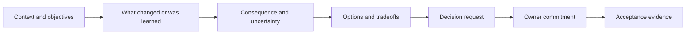

### Audience translation

| Technical statement | CISO/VP translation | Board-level-safe translation | What must remain visible |
|---|---|---|---|
| One asset lacks accepted owner/context | Accountability gap can delay treatment | Material assets need named accountability | Population is eight synthetic records |
| Scanner-style source is stale | Priority view may not reflect current state | Decision confidence depends on current evidence | Last success and affected measures |
| Two cases remain high after context review | Limited capacity should focus on these scenarios first | Resources are directed by business context, not volume alone | Formula is synthetic and inspectable |
| Ticket closure lacks validation | Workflow metrics may overstate actual remediation | Management evidence should confirm treatment, not just administration | State mapping and sample size |
| Changed case fails teach-back | Operators need practice before automation scales | Control change remains human-governed until capability is shown | Role-play only, not workforce assessment |

### Executive meeting runbook

| Time | Activity | Facilitator behavior | Output |
|---:|---|---|---|
| 0-5 min | Scope, source date, objectives, boundaries | State fictional/synthetic and product unknowns | Accepted agenda and authority |
| 5-12 min | Outcome and dashboard summary | Lead with decisions; pause for corrections | Shared current-state read-back |
| 12-25 min | Material risk scenarios | Explain evidence, controls, confidence, options | Risk-owner questions and preference |
| 25-35 min | Data/workflow trust constraints | Show why quality changes decision confidence | Capacity/owner decision |
| 35-45 min | Escalation learning and prevention | Separate root cause, stabilization, and prevention | Change-validation action |
| 45-55 min | Roadmap and tradeoffs | Surface dependencies, guardrails, alternatives | Sequencing/capacity decision |
| 55-60 min | Read back decisions and next evidence | Name owner, due basis, acceptor, checkpoint | Decision record and follow-up |

## Decision package

An executive review is successful when it improves decisions, not when every slide is presented. Each request offers a recommended option, credible alternatives, consequence of delay, dependency, and evidence needed later. The TSM facilitates and advises; authorized customer roles own customer risk, architecture, budget, and change.

| Decision ID | Decision requested | Recommended fictional option | Alternatives/tradeoffs | Delay consequence | Authority | Evidence after decision |
|---|---|---|---|---|---|---|
| D-116-01 | How should the orphan record be handled? | Quarantine from automated treatment and resolve owner/context in first 30 days | Include with low confidence risks wrong owner; exclude silently hides uncertainty | Delayed or misdirected treatment | VM Lead and asset authority | Accepted identity, owner, app, lifecycle, routing test |
| D-116-02 | How should stale source data affect publication? | Block affected trend headline after threshold; show last known with amber state | Publish unqualified risks trust; block whole dashboard reduces visibility | Decision on old evidence | Data/VM governance | Two fresh reconciled cycles and alert test |
| D-116-03 | Which treatment path applies to two leading cases? | Owner validates patch/config plus compensating control and rollback | Immediate broad change increases service risk; deferral carries exposure | Material scenario persists | Fictional service risk owners | Change evidence, technical validation, residual review |
| D-116-04 | When may automation expand? | After changed-case capability, override audit, and bounded pilot pass | Expand now increases wrong-action risk; defer indefinitely loses efficiency | Adoption or quality stagnates | SecOps Manager | Teach-back, pilot precision, zero unsafe auto-actions |
| D-116-05 | Which product capabilities are assumed? | None until current official docs, entitlement, and licensed test confirm | Promise based on public page creates expectation risk | Plan rework and trust loss | Account team and customer sponsor | Written authoritative confirmation and pilot result |

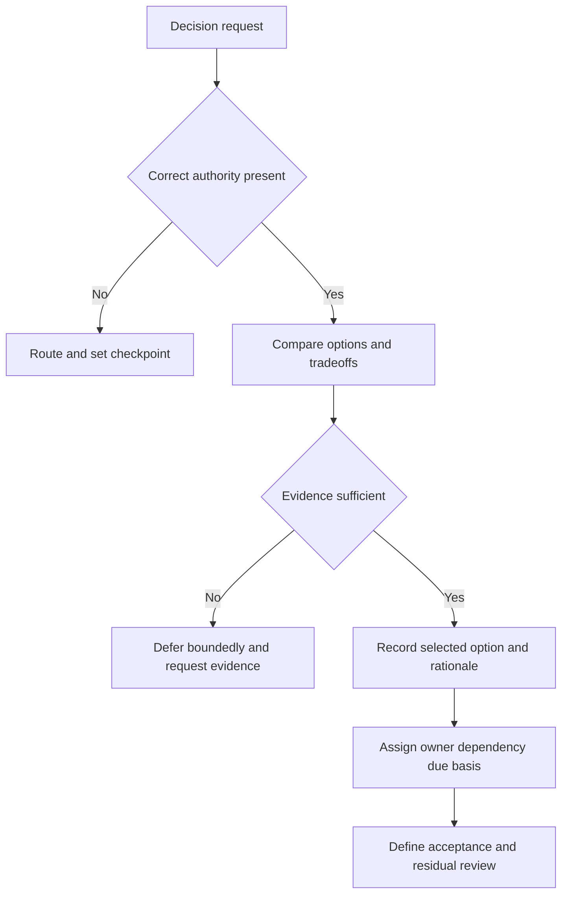

## Mitigation roadmap

The roadmap is organized by accepted states, not feature activity. Day ranges are relative to the fictional kickoff. They are planning hypotheses, not promises. A phase starts only when its entry evidence exists and finishes only when its acceptor reviews the exit evidence.

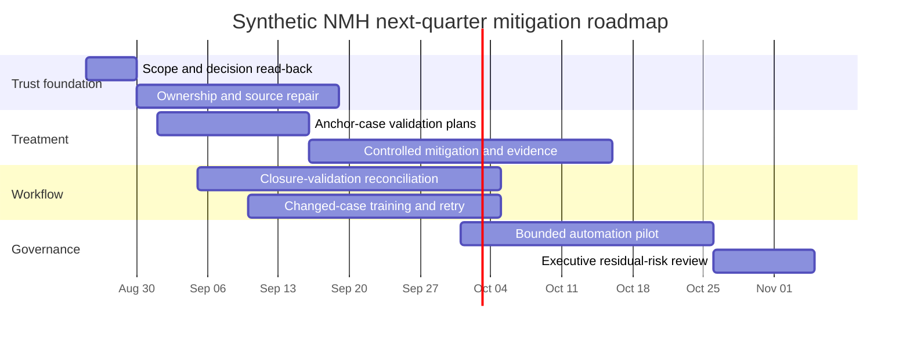

All dates in the diagram are synthetic scenario dates. They are not actual customer milestones, Zscaler commitments, or forecasts.

| Horizon | Outcome state | Work and dependency | Owner | Exit evidence | Guardrail/rollback |
|---|---|---|---|---|---|
| Days 0-10 | Review scope, risks, owners, and decisions accepted | Correct read-back; authoritative role participation | Fictional sponsor and TSM role | Signed fictional decision register | Reopen any misrepresented fact |
| Days 0-30 | Asset context and source freshness meet pilot trust gate | Source authority, owner resolution, alert/runbook | Data Steward and Data Lead | Eight identities dispositioned; two fresh cycles | Quarantine remains visible |
| Days 10-40 | Two leading cases have accepted treatment/validation plans | Risk-owner choice, change authority, rollback design | VM Lead and service owners | Plan, test, acceptance, residual hypothesis | No emergency change without authority |
| Days 20-55 | Ticket closure reconciles to technical validation | State map, evidence link, reopen path | VM and ITSM owners | Sample shows every closure supported or reopened | Do not game by leaving tickets open |
| Days 20-50 | Operators pass normal and changed-case teach-back | Training, practice, low-confidence decision | SecOps Manager | Independent pass and safe escalation | Unsafe automation remains disabled |
| Days 45-75 | Bounded automation pilot operates within constraints | Trust gates, capability, audit, human approval | SecOps/Workflow owners | Defined precision, override, failure, audit evidence | Pause on unsafe/wrong-route action |
| Days 75-90 | Executives accept outcome evidence and residual risks | Recalculate metrics, challenge confounders, update register | Risk owners and sponsor | QBR decisions and next roadmap | No target relabeling after result |

### Mitigation cards

| Card | Risk mechanism addressed | Action sequence | Validation | Residual uncertainty |
|---|---|---|---|---|
| Ownership quality | Wrong/missing context delays treatment | Identify authority; compare source claims; resolve or quarantine; test routing | Owner accepts record and receives changed-case item | Ephemeral assets and organizational change |
| Source reliability | Stale evidence distorts priority/trend | Define cadence; observe last success; alert; runbook; replay; reconcile | Two cycles meet freshness and count checks | API limits, schema drift, upstream outage |
| Contextual treatment | High-priority scenario persists | Verify identity/exposure/control; choose treatment; stage; validate; review residual | Technical and risk-owner acceptance | Threat/context can change after cut |
| Closure integrity | Administrative closure overstates remediation | Map states; require evidence; reconcile; reopen exceptions; sample | Every sampled closure has accepted evidence | Sampling misses rare errors |
| Change resilience | Policy defects disrupt workflow | Process-specific regression; staged ring; monitoring; rollback; PIR feedback | Changed and control cohorts pass | Untested workflows or regions |
| Human-governed automation | Wrong low-confidence action scales | Train; changed-case test; narrow scope; approval; audit; kill switch | No unsafe action; overrides reviewed | New scenarios outside training |

### Plain-English deep-dive 4 - Roadmaps manage dependencies, not just dates

A weak roadmap is a calendar with colored bars. A strong roadmap explains why one state must precede another. Automating assignment before entity ownership is trustworthy can accelerate wrong routing. Reporting risk reduction before source freshness and validation are stable can accelerate false confidence. Training before the workflow is defined can teach yesterday's process.

Think of constructing a building. Painting the walls on schedule does not compensate for an untested foundation. The exit test for the foundation allows the next activity to begin. In this roadmap, ownership and source trust are foundation gates; treatment and workflow evidence are structural gates; training and bounded automation are operational gates; executive acceptance closes the learning loop.

Dates still matter for coordination, but they are estimates with assumptions. A TSM should expose dependencies, owners, capacity, risks, and alternative sequences. When evidence fails a gate, the plan changes visibly. Hiding the failed gate to preserve a green schedule creates more risk than a transparent delay.

## Next-quarter outcome contracts

The word **outcome** means an accepted change in capability, repeated behavior, operational effect, governance, or objective-level result. It does not mean an activity occurred. Each outcome below is a fictional hypothesis to be accepted by the named role.

| Outcome ID | Baseline | Target hypothesis | Formula/evidence | Guardrail | Fictional acceptor | What it does not prove |
|---|---|---|---|---|---|---|
| O-116-01 Context trust | 7/8 accepted active modeled assets context-complete | 8/8 dispositioned; unresolved items explicitly quarantined within one review cycle | Record-level owner/app/lifecycle acceptance | No silent denominator exclusion | VM Lead | Enterprise-wide asset completeness |
| O-116-02 Source trust | 5/6 sources fresh at cut | 6/6 within objective for two consecutive cycles | Last-success, expected batch, count reconciliation | No unexplained accepted-row collapse | Data Lead | Product connector reliability |
| O-116-03 Treatment integrity | Two contextual high-priority cases lack completed validation | Both have authorized treatment and accepted technical evidence or documented risk disposition | Change/test/acceptance record | Service availability and control guardrails | Risk Owners | Elimination of all threat |
| O-116-04 Closure integrity | 1/6 sampled closures lacks accepted validation | 100% of bounded pilot closures supported or reopened | Ticket-to-evidence reconciliation | Aging not hidden through state changes | VM Lead | General program performance |
| O-116-05 Operator capability | 3/5 changed-case attempts pass | 5/5 bounded role-play attempts pass with safe escalation | Teach-back rubric and retry | Zero unsafe approval | SecOps Manager | Production analyst proficiency |
| O-116-06 Decision velocity | Four open executive decisions | Four dispositioned with owners and evidence checkpoints | Decision register | No decision forced without authority/evidence | Sponsor | Realized value or renewal |
| O-116-07 Review quality | No independent capstone challenge yet | One changed-case review with defects corrected | Rubric, issue log, version history | Synthetic/product boundary remains visible | Peer reviewer | Employer or vendor certification |

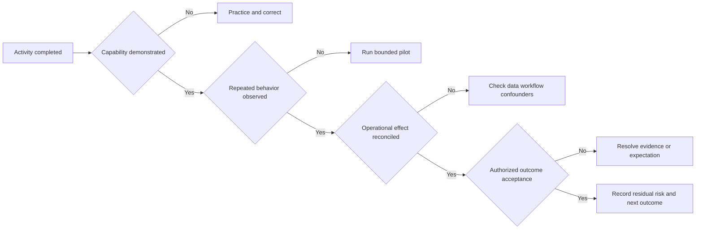

### Value evidence without invention

| Claim under pressure | Safe capstone response | Production evidence that would be required |
|---|---|---|
| "Risk fell by 40 percent" | "The synthetic index changed under fixed rules; no real risk reduction was measured." | Stable model, scope, controls, threat context, accepted validation, residual analysis |
| "We saved money" | "The lab did not collect cost or realized-benefit evidence." | Finance-approved baseline, counterfactual, cost allocation, time window, confounders |
| "UVM found the top risks" | "A candidate-authored model prioritized supplied fictional cases; it was not UVM." | Licensed product evidence, current documentation, customer data validation, accepted workflow |
| "The customer adopted the platform" | "Role-play participants completed some exercises; that is not customer adoption." | Repeated production use, correct workflow, breadth/depth, guardrails, customer acceptance |
| "The issue is permanently fixed" | "The static changed case passed defined tests; broader durability remains unknown." | Monitoring window, regression scope, recurrence evidence, owner acceptance |

## Prerequisites

1. Complete or review [Part 111](Part-111-safe-lab-evidence-honesty.md), including scope, artifact IDs, manifest, source ledger, evidence index, claim formula, privacy review, release process, and five blocking gates.
2. Use only the inline synthetic summaries or sanitized fictional artifacts from Parts 112-115. Do not import real CV attachments, employer dashboards, customer exports, incident records, meeting notes, emails, or licensed-product screenshots.
3. Select an existing approved local authoring path: Markdown and tables are sufficient. A locally approved spreadsheet or BI authoring tool may be used, but no download, paid tenant, external publication, or sign-in is required.
4. Fix the reporting cut at `2026-08-24T12:00:00Z` for the synthetic exercise. Later dates in the roadmap are fictional planning dates only.
5. Create artifact IDs `NMH-SYN-P116-A01` onward and show `SYNTHETIC NMH LAB` in the body of every release artifact.
6. Record current source verification separately from synthetic scenario facts. Public product material supports only bounded positioning.
7. Use a consenting peer as reviewer if available. The reviewer is not an NMH employee, customer, Zscaler representative, or executive.

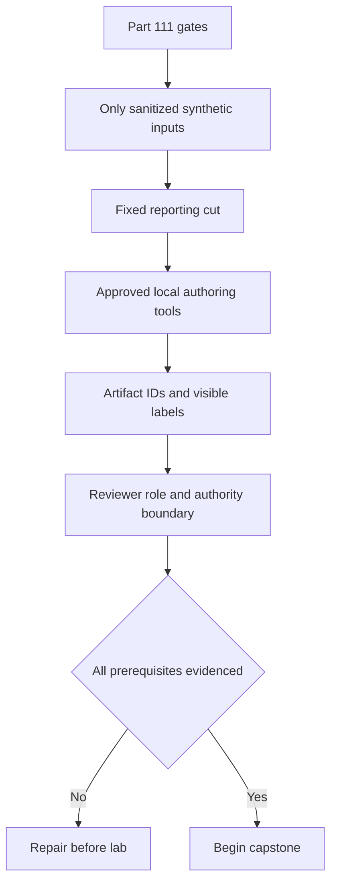

| Preflight item | Evidence | Stop condition | Safe fallback |
|---|---|---|---|
| Dedicated portfolio path | Part 111 manifest root | Folder contains unrelated or real work | Use conceptual artifacts in this file |
| Input provenance | P112-P115 artifact IDs or inline tables | Real export or unclear origin appears | Exclude and use inline fixture |
| Product boundary | No tenant/feature claim | Screenshot or licensed workflow assumed | Replace with vendor-neutral model |
| Reporting cut | Timestamp visible | Measures use changing current time | Freeze synthetic cut |
| Metric definitions | Dictionary drafted | Percentage lacks denominator | Pause visual build and define |
| Reviewer boundary | Fictional/peer role stated | Reviewer portrayed as executive customer | Correct role and claim |
| Privacy | No real names, IDs, paths, metadata | Personal/employer data appears | Stop, exclude, follow applicable policy |

## Lab

The lab produces a coherent portfolio package rather than isolated documents. Complete the exercises in order because later artifacts depend on reviewed earlier evidence.

### Exercise 1 - Open the capstone charter and manifest

Create a conceptual charter `NMH-SYN-P116-A01-capstone-charter-v01.md`. State the objective, fictional NMH scope, input artifact IDs, reporting cut, permitted tools, prohibited actions, intended audience, reviewers, release label, retention, and claim boundary. Add planned artifacts A01-A14 to the Part 111 manifest before authoring them. This prevents polished but untracked outputs from appearing later.

Expected self-check: every item has a stable ID, version, evidence class, author, input relationship, sensitivity `public_synthetic`, limitation, and disposition. The charter explicitly says no real dashboard, Zscaler tenant, production result, financial estimate, or customer decision is represented.

### Exercise 2 - Build the technical evidence spine

Create `NMH-SYN-P116-A02-technical-review-v01.md`. For each F-116 finding, link the source artifact, row or section, transformation/rule version, reporting cut, observation, confidence, limitation, alternative explanation, and discriminating next validation. Reconcile source counts, accepted rows, quarantined rows, and output measures.

Do not copy only the most dramatic numbers. Preserve the stale source, orphan record, unsupported closure, and failed changed-case attempt. Those are material to trust. Record why each is included or excluded from a denominator.

### Exercise 3 - Run a technical challenge review

Use role prompts for a data engineer, VM lead, security architect, service owner, and privacy/risk reviewer. Challenge one item each: source freshness, entity merge, score component, control evidence, workflow closure, and business consequence. Record accepted correction, rejected challenge with evidence, or open unknown. Version any changed statement.

An acceptable challenge result includes at least one correction. A review that finds no weakness is unlikely to have been discriminating. The correction does not invalidate the portfolio; transparent correction strengthens it.

### Exercise 4 - Create the risk register

Create `NMH-SYN-P116-A03-risk-register-v01.csv` or an equivalent Markdown table. Include risk ID, source finding IDs, scenario, objective, consequence, existing controls, inherent discussion band, confidence, owner, treatment option, dependency, due basis, acceptance evidence, residual hypothesis, status, and next review.

Read each entry aloud without its numeric band. If the narrative does not support a decision, rewrite it. Then hide the narrative and inspect the number: if it invites an unsupported probability or financial inference, strengthen the legend and presentation boundary.

### Exercise 5 - Design the three-page dashboard

Create `NMH-SYN-P116-A04-dashboard-spec-v01.md` and, optionally, a local synthetic implementation. Use the eight dashboard elements and five measure contracts above. Put title, synthetic label, reporting cut, filter state, numerator/denominator, quality companion, owner, and requested action on the page. Build stable drill-through links using finding and risk IDs.

Test three changed cases: the stale source becomes fresh, the orphan asset is resolved, and a closed ticket loses its validation record. Verify that the right measure changes, quality does not disappear, and prior baselines are not silently rewritten.

### Exercise 6 - Write the seven-slide executive deck

Create `NMH-SYN-P116-A05-executive-deck-v01.md`. For each slide, write a one-sentence headline, visual specification, three or fewer evidence bullets, one limitation, speaker note, decision/action, and appendix link. Keep technical detail in A02 rather than shrinking it until unreadable.

Rehearse a ten-minute version and a two-minute compressed version. Both must state synthetic scope, two material scenarios, data-quality constraint, recommendation sequence, four decisions, and what evidence will be reviewed next. Neither may say Zscaler produced the output.

### Exercise 7 - Build decision and action registers

Create `NMH-SYN-P116-A06-decision-register-v01.md` and `NMH-SYN-P116-A07-action-register-v01.csv`. For each request, name the authority, options, recommendation, rationale, unknowns, decision, owner, dependency, due basis, evidence checkpoint, acceptor, and escalation trigger. An undecided item remains open; do not invent approval to make the deck look complete.

Run a changed case in which the fictional sponsor refuses funding for the ownership workstream. Re-plan by narrowing the pilot, preserving quarantine, reporting uncertainty, and documenting residual risk. Do not relabel the risk as solved.

### Exercise 8 - Build the mitigation roadmap

Create `NMH-SYN-P116-A08-roadmap-v01.md`. Translate each mitigation card into entry evidence, actions, owner, support roles, dependencies, estimated window, exit evidence, guardrail, rollback/pause condition, and residual review. Confirm that data/ownership trust precedes broad automation and that treatment validation precedes risk-reduction claims.

Run a dependency failure: the scanner-style source remains stale at day 30. Show which milestones proceed, which pause, what limited evidence can still be used, who is informed, and what alternative validation exists. Preserve the target; annotate the delay and changed assumption.

### Exercise 9 - Contract next-quarter outcomes

Create `NMH-SYN-P116-A09-outcome-contracts-v01.md`. For each O-116 outcome, record business/security purpose, population, grain, formula, baseline, target hypothesis, reporting cut, owner, acceptor, data source, quality threshold, guardrail, confounder, review cadence, and what the measure cannot prove.

Attempt to calculate each measure manually from the inline fixture. If the result cannot be reproduced, the contract fails. If an outcome relies on future evidence, label it planned rather than achieved.

### Exercise 10 - Rehearse the executive review

Use a consenting peer or self-role-play. The fictional roles are CISO sponsor, VM Lead, Data Lead, SecOps Manager, service owner, and account-team observer. Ask the reviewer to interrupt with: "Is this Zscaler data?", "Did risk really fall?", "Why should I trust the score?", "What happens if we do nothing?", "Who can accept this risk?", and "What exactly do you need from me?"

Record concise answers, corrections, decisions left open, and timing. The candidate should be able to move from executive headline to technical evidence and back without drowning the audience in implementation detail.

### Exercise 11 - Perform a contrarian and ethics review

Create `NMH-SYN-P116-A10-contrarian-review-v01.md`. Argue the strongest alternative: the tiny synthetic dataset cannot support enterprise inference; a product capability may not exist in the assumed form; the score may encode arbitrary preferences; the apparent backlog improvement may be missing data; training evidence may not transfer; a mitigation may shift risk or impair service.

For each challenge, mark upheld, mitigated, open, or outside scope. State what evidence could change the conclusion. Confirm that no risk acceptance is assigned to the candidate and no product roadmap, legal conclusion, or financial benefit is invented.

### Exercise 12 - Build follow-up and release artifacts

Create `NMH-SYN-P116-A11-follow-up-v01.md`, A12 evidence index, A13 validation rubric, and A14 reflection. The follow-up records corrected facts, synthetic decisions, open unknowns, actions, evidence checkpoints, changed roadmap, and next review. The reflection uses the Part 111 claim formula: context, personal action, synthetic observation, limitation, and production next validation.

Copy only sanitized intentional artifacts into the conceptual release set. Verify every link, heading, label, source date, metric definition, and limitation after the copy.

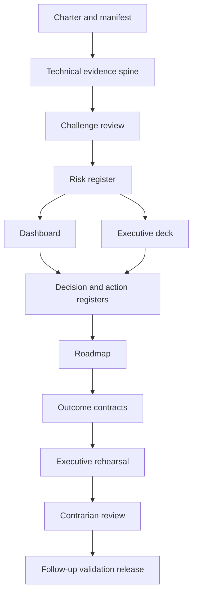

## Expected evidence

| Artifact ID | Artifact | Minimum evidence | Acceptance test |
|---|---|---|---|
| NMH-SYN-P116-A01 | Capstone charter and manifest | Scope, cut, inputs, prohibitions, labels, planned artifacts | No real data/product/customer implication |
| NMH-SYN-P116-A02 | Technical review | Architecture, reconciliation, findings, alternatives, limits, appendix trace | Every executive headline traces to source |
| NMH-SYN-P116-A03 | Risk register | Seven bounded scenarios, controls, confidence, owner, treatment, residual | Narratives remain useful without scores |
| NMH-SYN-P116-A04 | Dashboard specification | Three pages, dictionary, quality companions, decisions, drill paths | Changed cases update correct measures |
| NMH-SYN-P116-A05 | Executive deck | Seven slides, decisions, limitations, technical appendix | Ten- and two-minute rehearsals pass |
| NMH-SYN-P116-A06 | Decision register | Authority, options, rationale, disposition, evidence | Open decisions remain visibly open |
| NMH-SYN-P116-A07 | Action register | Owner, dependency, due basis, acceptance, escalation | No unowned or activity-only action |
| NMH-SYN-P116-A08 | Roadmap | 30/60/90 states, dependencies, gates, guardrails | Stale-source changed case handled honestly |
| NMH-SYN-P116-A09 | Outcome contracts | Baselines, formulas, denominators, targets, acceptors | Every current measure manually reproducible |
| NMH-SYN-P116-A10 | Contrarian review | Strong alternatives, verdicts, disconfirming evidence | At least one correction or open limitation |
| NMH-SYN-P116-A11 | Follow-up | Read-back, corrections, decisions, actions, next evidence | Reviewer can correct the record |
| NMH-SYN-P116-A12 | Evidence index | Question-to-artifact-to-observation trace | Stable IDs and working relative links |
| NMH-SYN-P116-A13 | Validation rubric | Scores, blockers, rework | All Part 111 gates pass |
| NMH-SYN-P116-A14 | Reflection and claim ledger | Action, observation, limitation, next validation | No production/result inflation |

### Evidence-capture checklist

- [ ] Preserve the fixed synthetic reporting cut and rule versions.
- [ ] Show source, accepted, rejected, duplicate, quarantined, and output counts.
- [ ] Keep stale/missing evidence visible even when it weakens the story.
- [ ] Link dashboard measures to dictionary, query/rule, and synthetic rows.
- [ ] Link every risk to observations and every mitigation to risks.
- [ ] Distinguish treatment planned, implemented, technically validated, and risk-owner accepted.
- [ ] Record decisions as fictional and leave unavailable authority open.
- [ ] Label future roadmap states as hypotheses, not outcomes.
- [ ] Capture corrections and changed-case results, including failures.
- [ ] State that no Data Fabric, UVM, or Risk360 product output was generated.

## Troubleshooting

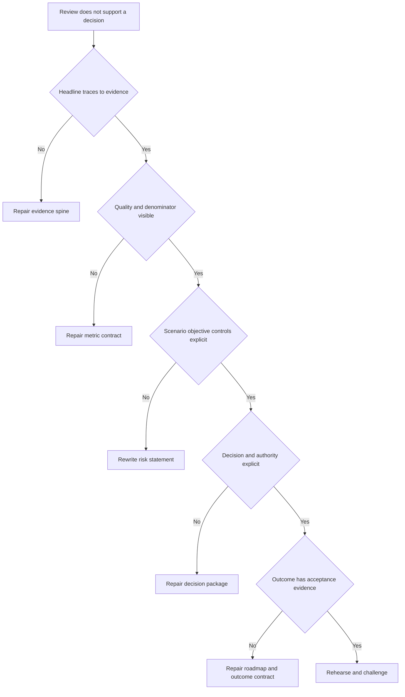

| Symptom | Likely cause | Discriminating check | Repair |
|---|---|---|---|
| Dashboard improves when source fails | Missing data reduces numerator/denominator silently | Compare source volume and freshness | Add stable expected population and quality companion |
| Executive asks "so what?" | Metric lacks objective, consequence, or decision | Remove chart and state requested choice | Rewrite headline around decision |
| Technical reviewer distrusts score | Components, rules, confidence, overrides hidden | Explain two anchor cases without total | Expose model and keep narrative primary |
| Roadmap is a feature list | No risk mechanism or exit evidence | Map each item to risk and acceptance | Rebuild outcome states |
| Every item is red | Thresholds replace prioritization | Ask which two decisions need action now | Segment by materiality, confidence, urgency |
| Risk drops after rule change | Baseline was restated silently | Recalculate under both versions | Annotate break; do not claim comparable trend |
| Ticket closures look perfect | State mapping or validation absent | Sample row-level evidence | Reconcile, reopen, report unsupported closure |
| Executive asks for financial loss | Scenario lacks defensible model/data | Inventory finance inputs and authority | State unknown; do not invent |
| Product capability is challenged | Public positioning treated as entitlement | Check current official/licensed source | Mark unknown and route |
| Review overruns | Technical appendix presented as main deck | Time each slide and decisions | Use seven-slide narrative and drill only as needed |

## Cleanup and privacy

This lab must not contain real customer, employer, tenant, incident, vulnerability, asset, architecture, financial, contract, renewal, or executive information. Do not paste CV attachments into artifacts. Candidate facts may be summarized only as supported and necessary for interview positioning. Do not publish the fictional dashboard through an external service merely to make it look real.

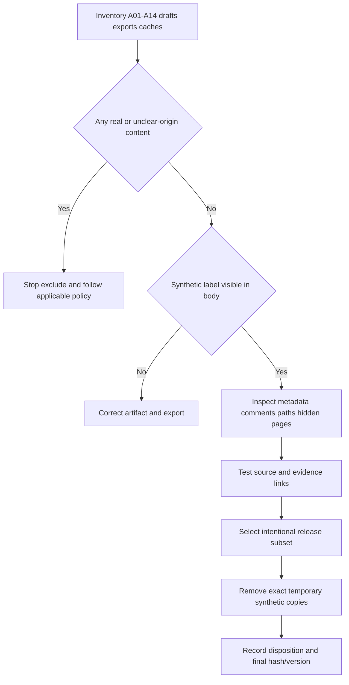

| Item | Retain | Remove | Privacy/honesty check |
|---|---|---|---|
| Synthetic source summaries | Minimum needed for reproduction | Duplicate scratch extracts | No real identifier or copied schema |
| Technical review | Sanitized release version | Comments with local/personal context | Sources, limits, synthetic banner visible |
| Dashboard | Specification or reviewed local export | External/public workspace copy, caches | No sign-in/tenant metadata or hidden pages |
| Executive deck | Reviewed candidate-authored version | Speaker notes with unsupported claims | No portrayal as delivered customer QBR |
| Risk register | Fictional scenario records | Real risk examples pasted for realism | Owners and values remain fictional |
| Peer review | Minimal consented feedback | Recording, employer identity, personal details | Reviewer not represented as customer/executive |
| Temporary files | Nothing required | Exact named drafts and exports after review | Never delete parent or unrelated folders |
| Source ledger | URLs, review date, bounded use | Tracking data or copied gated content | Public facts separate from scenario |

Cleanup is exact-path and inventory-driven. Never use a broad or destructive deletion command. If an artifact unexpectedly contains a real path, username, organization, or hidden connection string, stop release, exclude it, and follow the applicable local policy. This guide does not provide a substitute for employer privacy, records, legal, or security requirements.

## Validation rubric

Part 111's safety, privacy, authorization, evidence, and honesty gates are blocking. A score cannot compensate for a real-data leak, product misrepresentation, invented customer result, unsafe action, or missing synthetic label.

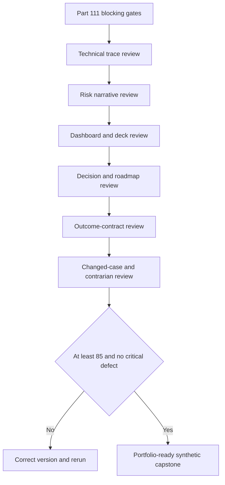

| Dimension | Points | Full-credit evidence | Critical defect |
|---|---:|---|---|
| Safety, privacy, and honesty | 10 | Local synthetic inputs, visible labels, exact cleanup, bounded claim | Real data, unsafe action, or production claim |
| Evidence spine | 10 | Headline-to-row trace, reconciliation, provenance, versions | Executive claim cannot be traced |
| Technical review | 10 | Architecture, quality, entity, priority, workflow, alternatives | Score/export substituted for analysis |
| Risk register | 10 | Scenario, objective, controls, confidence, owner, treatment, residual | Finding equated automatically to risk |
| Dashboard | 10 | Definitions, denominators, quality, drill, accessibility, actions | Missing data appears as improvement |
| Executive deck | 10 | Outcome-first, seven slides, caveats, decisions, appendix | Product/customer result invented |
| Decision package | 10 | Authority, options, tradeoffs, rationale, evidence | Candidate accepts risk or invents approval |
| Mitigation roadmap | 10 | Dependencies, gates, owners, validation, rollback | Feature/calendar list without outcomes |
| Outcome contracts | 10 | Baseline, target, formula, guardrail, acceptor, non-proof | Planned activity called achieved value |
| Challenge and communication | 10 | Rehearsal, contrarian review, correction, concise answers | No challenge or correction path |

| Score | Interpretation | Required action |
|---:|---|---|
| 0-69 | Not decision-ready | Rebuild evidence, risk narratives, and boundaries |
| 70-84 | Useful draft with material gaps | Correct weak dimensions and rerun changed cases |
| 85-94 | Strong synthetic executive-risk capstone | Rehearse with independent challenge |
| 95-100 | Exceptionally complete synthetic evidence | Retain limitations; never relabel as production |

### Blocking validation questions

1. Does every release artifact visibly say `SYNTHETIC NMH LAB`?
2. Can every headline be traced to a source, reporting cut, rule, observation, and limitation?
3. Are Data Fabric-style, UVM-style, and Risk360-style outputs explicitly non-product analogies?
4. Are findings, risks, recommendations, decisions, treatments, validations, and outcomes distinct?
5. Can a source outage or denominator change create a false green trend?
6. Does every risk identify business objective, controls, confidence, owner, and residual uncertainty?
7. Does every decision belong to an authorized fictional role rather than the candidate?
8. Does every roadmap milestone have entry/exit evidence, dependency, guardrail, and acceptor?
9. Are targets labeled hypotheses and later dates explicitly synthetic?
10. Does the release exclude real data, secrets, tenant screenshots, personal metadata, and unsupported CV claims?

## Explicitly fictional and synthetic NMH scenarios

### Scenario 1 - The vanishing backlog

The dashboard shows a sharp fall in high-priority findings. The candidate checks freshness and learns the scanner-style source did not load. You change the executive headline from "risk improved" to "priority view incomplete because a source is stale," blocks comparison, and assigns source recovery. No risk reduction is claimed.

### Scenario 2 - The demanded ROI number

The fictional sponsor asks for a savings estimate. No approved cost baseline, counterfactual, finance model, or realized-benefit evidence exists. The candidate declines to invent a number, proposes what data and authority would be needed, and keeps value as a hypothesis around decision quality, remediation focus, and workflow integrity.

### Scenario 3 - The attractive automation shortcut

An account-team role wants to announce automated remediation in the next review. Operator changed-case capability is incomplete and product entitlement is unknown. The roadmap keeps human approval, narrows the pilot to synthetic routing, and requires capability, audit, and licensed-workflow validation before any broader claim.

### Scenario 4 - The risk owner disagrees

The fictional service owner believes R-116-03 impact is overstated because a compensating control exists. The candidate requests current operating evidence, lowers confidence rather than arguing from the score, offers validation options, and records the owner's decision. Constructive challenge improves the register.

### Scenario 5 - The polished but untraceable slide

A peer likes a slide stating "87.5% exposure visibility." The measure actually represents context completeness for eight modeled assets, not exposure visibility. The candidate renames it, adds numerator and denominator, and records the correction. Precision in a small synthetic fixture is not enterprise coverage.

## Official Source Anchors

Research/source snapshot and source review date: **2026-08-24**.

These sources support bounded public product positioning and vendor-neutral governance concepts. They do not establish NMH facts, licensed capabilities, internal schemas, algorithms, scores, workflows, financial exposure, customer value, or production outcomes. Product terminology, packaging, URLs, and availability can change and require current authoritative verification.

| Source | URL | Used for | Boundary |
|---|---|---|---|
| Zscaler Data Fabric for Security | https://www.zscaler.com/products-and-solutions/data-fabric | Public positioning around harmonized security data and operational use | No internal model, connector, tenant, or result inferred |
| Zscaler Unified Vulnerability Management | https://www.zscaler.com/products-and-solutions/unified-vulnerability-management | Public contextual vulnerability-prioritization positioning | NMH-LAB-SCORE-v1 is not UVM |
| Zscaler Risk360 | https://www.zscaler.com/products-and-solutions/risk360 | Public enterprise cyber-risk visibility and communication positioning | No NMH score, loss, factor, or dashboard is Risk360 |
| Zscaler Agentic Security Operations | https://www.zscaler.com/products-and-solutions/security-operations | Public SecOps portfolio positioning | No agent, autonomous action, workflow, or outcome inferred |
| Zscaler Zero Trust Exchange | https://www.zscaler.com/products-and-solutions/zero-trust-exchange-zte | Public zero-trust platform context | No customer policy, architecture, or entitlement inferred |
| NIST Cybersecurity Framework 2.0 | https://www.nist.gov/cyberframework | Govern, Identify, Protect, Detect, Respond, Recover outcome framing | Voluntary, implementation-neutral, not certification |
| NIST SP 800-30 Rev. 1 | https://csrc.nist.gov/pubs/sp/800/30/r1/final | General risk-assessment concepts | Not a prescribed NMH scoring method |
| NIST SP 800-207 | https://csrc.nist.gov/pubs/sp/800/207/final | Vendor-neutral zero-trust architecture concepts | Not product or customer implementation evidence |
| CISA Known Exploited Vulnerabilities Catalog | https://www.cisa.gov/known-exploited-vulnerabilities-catalog | General authoritative exploitation-prioritization input concept | No fictional SYN-CVE is a catalog entry |

## Likely Interview Questions

### Q1. How would you turn technical findings into an executive risk review?

**Model answer:** I build an evidence spine from source and reporting cut through transformation, observation, risk scenario, controls, confidence, treatment options, decision, and validation. I lead with objectives and decisions, keep quality near outcome measures, and provide technical drill-through. I distinguish finding from risk, planned treatment from validated outcome, and product fact from assumption. In this portfolio I practiced that method with synthetic NMH data; I did not deliver a customer or Zscaler review.

### Q2. What belongs on an executive security dashboard?

**Model answer:** Only decision-relevant measures with definitions, population, numerator, denominator, reporting cut, target or threshold basis, trend integrity, quality companion, owner, requested action, and drill-through. I combine material scenarios, mitigation status, decisions, and next outcomes with source freshness, context completeness, and workflow validation. A dashboard should compress evidence without breaking traceability or allowing missing data to appear as improvement.

### Q3. How do you explain a risk score without overstating it?

**Model answer:** I call it an index under stated rules, not a probability or currency estimate. I explain the scenario, objective, likelihood/impact definitions, control evidence, confidence, components, overrides, and relative use. I test anchor cases and show what would change the result. The candidate-authored NMH score is explicitly not UVM or Risk360, and a changed index alone is not proof of reduced enterprise risk.

### Q4. How do you create a mitigation roadmap?

**Model answer:** I map each risk mechanism to options, owner, dependencies, expected side effects, entry evidence, work, exit evidence, guardrails, rollback, and residual review. I sequence trust foundations before automation and technical validation before outcome claims. Dates are estimates; gates control progression. If a dependency fails, I make the change visible, preserve uncertainty, and re-plan rather than turning the milestone green.

### Q5. How do you demonstrate value without inventing ROI?

**Model answer:** I contract evidence at several levels: capability, repeated behavior, operational effect, governance, and accepted objective outcome. I establish baseline, denominator, reporting cut, target hypothesis, guardrail, owner, acceptor, and confounders. If finance-approved cost and counterfactual evidence do not exist, I do not invent savings. I report what improved, what remains uncertain, and what next evidence would support a stronger claim.

### Q6. What do you do when an executive challenges your recommendation?

**Model answer:** I clarify the contested proposition and stakes, separate fact from interpretation, inspect source quality and controls, state uncertainty, and invite the authorized owner's context. I compare options and tradeoffs and identify a discriminating validation. I correct the record visibly when evidence changes. The goal is a better decision and trust, not defending a slide or score.

### Q7. How would you use your background in this work?

**Model answer:** Your factual enterprise escalation experience supports impact framing, evidence timelines, executive updates, ownership, Engineering partnership, RCA, and validation. SQL, PostgreSQL, Power BI, statistics, and MBA analytics support reconciliation, metrics, and dashboards. Mentoring supports audience-specific enablement. I would state those strengths directly while saying Zscaler product operation, exposure-program ownership, and this NMH capstone are learning or synthetic evidence.

### Q8. What decisions should a TSM own versus facilitate?

**Model answer:** A TSM can own preparation, evidence quality, recommendations, action follow-through, communication, and escalation within role boundaries. Customer risk acceptance, business priority, architecture, production change, budget, legal interpretation, and control ownership belong to authorized customer roles. Product commitments belong to authoritative company functions. I make the RACI explicit and never invent approval to close an action.

## 30-Second Memory Hooks

| Concept | Memory hook |
|---|---|
| Executive review | Choices, not chart recital |
| Evidence spine | Row to risk to decision to test |
| Finding | What was observed |
| Risk | Uncertainty affecting an objective |
| Score | Index with rules, not probability |
| Confidence | Strength of support, separate from severity |
| Dashboard | Governed compression with a route back |
| Data quality | Put trust beside the headline |
| Risk register | Scenario, control, owner, treatment, residual |
| Roadmap | Dependencies and accepted states, not colored dates |
| Outcome | Capability to behavior to effect to acceptance |
| Decision | Choice, authority, rationale, evidence checkpoint |
| Value | Baseline, denominator, guardrail, accepted evidence |
| Product fact | Current official source, bounded claim |
| NMH | Always fictional and synthetic |
| Experience bridge | Escalation plus analytics plus enablement, honestly |

## Completion Checklist

- [ ] I can explain finding, exposure, risk, inherent risk, residual risk, owner, control, confidence, baseline, denominator, guardrail, and outcome from zero.
- [ ] I applied the Part 111 shared portfolio contract and blocking gates.
- [ ] I used only fictional, synthetic, local Parts 112-115 inputs.
- [ ] I visibly labeled every artifact `SYNTHETIC NMH LAB`.
- [ ] I stated that Data Fabric-style, UVM-style, and Risk360-style outputs are analogies, not product outputs.
- [ ] I fixed and displayed the reporting cut and rule versions.
- [ ] I built a trace from source row to executive statement and decision.
- [ ] I reconciled source, accepted, rejected, quarantined, and output counts.
- [ ] I kept source freshness, context completeness, and workflow quality beside outcomes.
- [ ] I wrote seven risk scenarios with objective, controls, confidence, owner, treatment, and residual hypothesis.
- [ ] I tested numeric bands as discussion indexes, not probabilities or financial estimates.
- [ ] I designed three dashboard pages with definitions, denominators, quality, actions, and drill-through.
- [ ] I wrote and rehearsed a seven-slide executive deck plus technical appendix.
- [ ] I created explicit decision requests with correct fictional authority.
- [ ] I built a dependency- and evidence-gated 30/60/90 mitigation roadmap.
- [ ] I defined next-quarter outcomes with baselines, formulas, target hypotheses, guardrails, and acceptors.
- [ ] I ran stale-source, orphan-resolution, validation-loss, funding-refusal, and dependency-failure changed cases.
- [ ] I completed a contrarian review and recorded at least one correction or open limitation.
- [ ] I performed exact-path cleanup and reviewed metadata, exports, and links.
- [ ] I can discuss factual your strengths without claiming Zscaler production experience, real executive delivery, or customer outcomes.

[Next: Part 117 - Complete SecOps TSM Account Capstone](Part-117-complete-secops-tsm-capstone.md)