# Part 117 - Complete SecOps TSM Account Capstone

> **Purpose:** Rehearse one complete Technical Success Manager engagement for fictional Northstar Meridian Holdings, from discovery and success planning through integration, a security-data defect, contextual-priority tuning, a critical connectivity escalation, operator training, a cross-functional decision, a quarterly business review, value evidence, renewal risk, and the next roadmap.

> **Scope and honesty:** Northstar Meridian Holdings, abbreviated NMH, is explicitly fictional and synthetic. Every stakeholder, meeting, architecture, source, record, score, incident, product question, action, timeline, metric, commercial concern, renewal signal, decision, and outcome in this Part is invented for local learning. No Zscaler tenant, customer, production integration, support case, scanner, security operation, commercial record, renewal forecast, or product commitment was used or reproduced.

> **Section goal:** Demonstrate a coherent SecOps TSM operating method that discovers decision needs, contracts outcomes, sequences technical dependencies, detects and owns defects, calibrates prioritization with customer authority, coordinates critical escalation, enables operators, facilitates cross-functional choices, reports value honestly, surfaces renewal risk early, and converts accepted evidence into a defensible next-quarter roadmap.

This capstone inherits the complete shared portfolio contract from [Part 111](Part-111-safe-lab-evidence-honesty.md): local and synthetic inputs, visible labels, stable artifact IDs, frozen reporting cuts, provenance, reproducibility, privacy review, exact cleanup, evidence classes, and the claim pattern **context, personal action, synthetic observation, limitation, production next validation**. It reuses only the synthetic methods and bounded outputs from [Parts 112-116](Part-112-data-fabric-modeling-lab.md). It is a role simulation, not a claim that you have held a Zscaler TSM account.


| Engagement stage | Customer job | TSM job | Primary evidence | Failure to avoid |
|---|---|---|---|---|
| Discovery | Clarify objectives, constraints, authority, and current workflow | Ask decision-changing questions and read back | Discovery brief and fact/unknown log | Product pitch before problem definition |
| Planning | Agree sequence, owners, gates, and measures | Turn goals into a living technical success plan | Outcome and milestone contracts | Calendar mistaken for readiness |
| Integration | Establish trustworthy source-to-workflow data | Coordinate contracts, validation, and ownership | Source catalog and reconciliation | Loaded rows called usable data |
| Defect response | Restore trust without hiding impact | Triage, isolate, communicate, route, and prevent | Defect timeline and corrective plan | Quietly correcting history |
| Prioritization | Direct constrained capacity to defensible work | Facilitate transparent calibration and exceptions | Anchor cases and model decision | Vendor/candidate overrides customer authority |
| Escalation | Stabilize service and preserve evidence | Lead cadence, workstreams, and expectation boundaries | Escalation package and PIR | ETA or root cause invented under pressure |
| Enablement | Build independent customer capability | Design practice, changed cases, and teach-back | Training rubric and retry evidence | Attendance called adoption |
| Governance | Resolve choices across customer and account teams | Clarify RACI, options, tradeoffs, and decisions | Decision register | Commercial/product authority blurred |
| Business review | Interpret outcomes, quality, risk, and next choices | Compress evidence without losing trace | QBR deck and technical appendix | Activity volume presented as value |
| Renewal planning | Expose technical and relationship risk early | Connect evidence gaps to recovery actions | Renewal-risk register | Predicting renewal or applying pressure |

## JD Mapping

| Job-description signal | Capability demonstrated in the capstone | Artifact | Honest boundary |
|---|---|---|---|
| Lead strategic engagements for enterprise accounts | Run one outcome-to-roadmap lifecycle with governance | Account brief, success plan, QBR | Fictional account only |
| Understand customer environments and identify risks | Map sources, entities, workflows, controls, stakeholders, and dependencies | Architecture and risk register | Synthetic environment only |
| Data Fabric for Security expertise | Apply source-contract, harmonization, quality, and workflow reasoning | Integration and defect pack | Analogous model, not product operation |
| Unified Vulnerability Management expertise | Calibrate contextual factors, confidence, ownership, and exceptions | Tuning workshop and anchor cases | NMH-LAB-SCORE-v2 is not UVM |
| Resolve critical escalations | Coordinate supplied DNS/TCP/TLS/HTTP/proxy/process evidence and communications | Incident bridge, evidence package, PIR | No real incident or Zscaler defect |
| Deliver technical consulting and training | Facilitate architecture, data, priority, and changed-case exercises | Workshop, teach-back, retry | Role-play, not customer delivery |
| Partner with Sales, Support, Product, Engineering | Establish boundaries, routes, decisions, and feedback | Cross-functional RACI and decision log | No actual roadmap or commercial authority |
| Executive stakeholder management | Lead decision-oriented QBR and bad-news communication | Seven-slide QBR and follow-up | Rehearsed, not presented to a CISO |
| Drive long-term success and value | Define accepted outcome evidence and a next roadmap | Value ledger and 30/60/90 plan | No realized customer value or renewal result |
| Customer obsession, ownership, urgency, quality | Surface defects and risks early; coordinate recovery without hiding uncertainty | Timeline, updates, action register | Culture fit shown through method, not invented history |

## Candidate honesty note

You can say: "I designed and rehearsed a complete local synthetic SecOps TSM account capstone for fictional NMH. I created discovery and success-plan artifacts, modeled source integration, diagnosed a supplied data defect, facilitated transparent vulnerability-priority tuning, applied my escalation discipline to a static connectivity case, designed operator training and teach-back, built a cross-functional decision record, presented a fictional QBR, and assessed value and renewal risk with explicit limitations. It demonstrates how I would operate; it was not a real customer engagement or Zscaler product delivery."

Your factual background includes enterprise escalation engineering, Microsoft 365/OneDrive/SharePoint expertise, network and browser evidence tools, critical situation and RCA work, Engineering collaboration, fix validation, customer communication, service-quality analysis, SQL/PostgreSQL/Power BI/statistics, mentoring, onboarding, partner training, knowledge work, and AI learning/training. These facts support the method. They do not establish Zscaler administration, SecOps program ownership, vulnerability operations, CISO advisory delivery, commercial renewal responsibility, or the fictional NMH results.

| Factual candidate strength | Directly transferable behavior | Capstone practice | Claim boundary |
|---|---|---|---|
| Enterprise escalation ownership | Clarify impact, evidence, workstreams, cadence, dependencies | Synthetic critical escalation | Practice is not a Zscaler case |
| M365 layered troubleshooting | Trace client, identity, network, proxy, TLS, HTTP, service boundaries | Fictional sync failure | No NMH or production tenant analyzed |
| SQL and analytics | Reconcile counts, test joins, define measures, challenge trends | Synthetic integration/value evidence | No internal Data Fabric schema known |
| Power BI and MBA analytics | Audience-specific dashboards and outcome interpretation | Fictional QBR dashboard | No customer dashboard deployed |
| Mentoring and training | Explain from zero, observe practice, give feedback | Role-play workshop | No NMH team trained |
| Cross-functional Engineering/Product work | Route issues with evidence and preserve ownership | Fictional account-team decision | No Zscaler roadmap commitment made |
| Customer-focus and quality evidence | Listen, set expectations, follow through, improve service | Account health and recovery plan | No renewal influence measured |
| AI tool exploration | Evaluate assistance, validation, privacy, and human control | Responsible SecOps discussion | No autonomous production agent operated |

## Beginner vocabulary and memory hooks

A **Technical Success Manager (TSM)** helps a customer turn technical capability into durable outcomes. The TSM is neither a substitute administrator nor a salesperson with deeper slides. Think of a building's chief engineer working with the owner: understand the intended use, coordinate specialists, watch system health, help resolve failures, teach operators, and make future investment decisions evidence-based.

| Term | Plain meaning | Why it matters | Memory hook |
|---|---|---|---|
| Account | Customer relationship and its technical/business context | Provides one coordinated view | One customer, many systems and people |
| Strategic engagement | Sustained work around material outcomes and decisions | Goes beyond isolated tickets | Route, not one repair |
| Success plan | Living agreement connecting outcomes, work, evidence, owners, and risks | Prevents activity drift | Contract for useful change |
| Milestone | Accepted state proven by exit evidence | Dates alone do not prove readiness | Gate, not calendar square |
| Adoption | Repeated correct use that supports an intended job | Login or attendance is insufficient | Behavior with purpose |
| Health | Multi-signal view of technical, adoption, relationship, and outcome risk | Guides intervention | Vital signs, not one score |
| Value hypothesis | Testable belief that a capability will improve an accepted outcome | Honest before/after separation | Promise to test, not promise to deliver |
| Renewal risk | Evidence that continuation confidence may be weakening | Enables early recovery | Smoke alarm, not prediction |
| Sponsor | Leader who provides priority and removes barriers | Enables decisions | Opens organizational doors |
| Champion | Practitioner who supports the change and helps peers | Sustains adoption | Local guide |
| Detractor | Stakeholder with meaningful concern or resistance | May reveal real design flaws | Objection is data |
| Escalation | Elevated coordination for material impact, risk, or blocked progress | Increases focus and cadence | More coordination, not more drama |
| QBR | Quarterly Business Review connecting evidence, outcomes, risks, decisions, and roadmap | Aligns executive and technical views | Look back, decide, look forward |
| Renewal | Commercial continuation decision | Technical teams inform but do not own all factors | Evidence contributes, never predicts alone |
| RACI | Responsible, Accountable, Consulted, Informed | Clarifies work and decision rights | Do, own, advise, know |

### Plain-English deep-dive 1 - TSM ownership is not doing everyone's work

Ownership means making sure the right problem is visible, the right evidence exists, the right authority is engaged, and commitments reach accepted closure. It does not mean the TSM personally configures every source, accepts customer risk, promises product changes, sets commercial terms, or bypasses support and engineering processes.

Imagine an orchestra conductor. The conductor does not play every instrument. The conductor knows the score, listens for gaps, sets tempo, cues specialists, resolves coordination problems, and keeps the performance aligned with the intended piece. If the conductor grabs every instrument, the music stops. In a strategic account, clear RACI and handoffs are part of technical quality.

You can anchor this in factual escalation experience: you have coordinated evidence and Engineering work without claiming to own every underlying service. The bridge is to apply that discipline proactively across outcomes, adoption, data health, governance, and executive reviews.

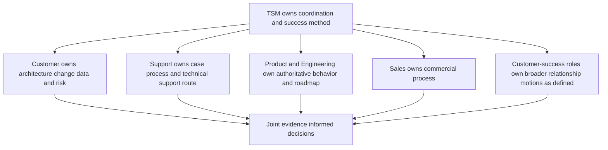

## Fictional NMH account charter

NMH is a fictional regional health-services organization used only to create coherent role-play. It has no real patients, employees, systems, regulations, contracts, or financial values. The scenario says leadership wants a more trustworthy way to connect security data, asset context, vulnerability work, service resilience, and executive decisions while preserving human authority.

| Account dimension | Synthetic fact for role-play | Confidence/source | Open discovery question |
|---|---|---|---|
| Executive objective | Improve explainability and ownership of material exposure decisions | Fictional sponsor statement | Which decisions are currently delayed or distrusted? |
| Operating objective | Reduce time spent reconciling duplicate/stale records and unsupported closures | Fictional VM lead statement | What baseline effort and error evidence exists? |
| Data landscape | CMDB-, EDR-, scanner-, IAM-, ticketing-, and app-registry-style sources | Synthetic Part 112 fixture | Which source is authoritative by field and time? |
| Priority workflow | Contextual queue with human review, tickets, exceptions, and validation | Synthetic Part 113 fixture | Which factor/override decisions require governance? |
| Resilience concern | SaaS-style sync workflow experienced a proxy-policy incident | Synthetic Part 114 fixture | Which change tests and monitoring should become standard? |
| Enablement concern | Operators handle normal case but struggle with low-confidence changed case | Fictional Part 115 role-play | What independent behavior counts as ready? |
| Product context | Public Zscaler Data Fabric/UVM/Risk360/SecOps positioning is relevant | Official public sources dated 2026-08-24 | What is actually licensed, available, configured, and supported? |
| Commercial context | Fictional renewal review occurs after the next roadmap checkpoint | Scenario assumption only | Which technical/value/relationship facts inform readiness? |

### Account outcome hierarchy

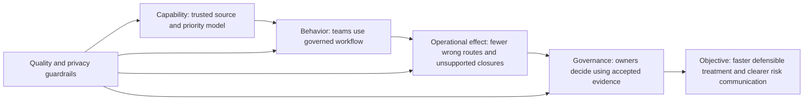

| Outcome level | Synthetic baseline | Target hypothesis | Evidence | Non-proof |
|---|---|---|---|---|
| Data capability | 7/8 accepted active records have complete context; 5/6 sources fresh | All eight dispositioned; all six fresh for two cycles | Reconciliation and acceptance | Enterprise inventory completeness |
| Priority capability | Version 1 model tested on anchor cases | Version 2 accepted on normal, edge, and low-confidence cases | Calibration record and overrides | Production UVM performance |
| Workflow behavior | One of six sampled closures lacks validation | All bounded pilot closures validated or reopened | Ticket/evidence join | Organization-wide remediation quality |
| Operator behavior | 3/5 changed-case attempts pass | 5/5 role-play attempts pass safely | Teach-back rubric | Real SOC proficiency |
| Governance | Four decisions open | Decisions dispositioned with owners/checkpoints | Decision register | Business value realized |
| Executive outcome | Quality/risk/value story fragmented | One traceable QBR accepted in role-play | Deck, appendix, read-back | Actual CISO acceptance or renewal |

## Stage 1 - Discovery and success planning

The fictional kickoff does not begin with a product demo. The candidate asks what decisions fail today, who experiences the friction, which evidence is trusted, who can authorize change, how success will be accepted, and what constraints could invalidate a plan.

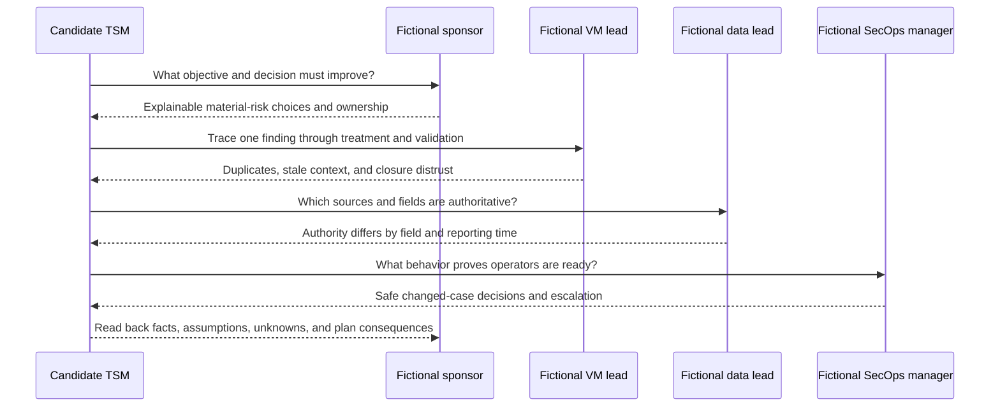

| Discovery thread | Key question | Fictional answer | Plan consequence |
|---|---|---|---|
| Business/security decision | Which choice should become faster or more defensible? | Treatment and exception decisions for material services | Prioritize evidence/ownership over record volume |
| Current workflow | Where does one finding wait, loop, or lose context? | Entity mismatch and ticket validation | Create quality and reconciliation gates |
| Stakeholder authority | Who decides source authority, model, change, risk, and budget? | Different named role cards | Build RACI and decision routes |
| Data contract | What is each source grain, cadence, authority, and failure behavior? | Six distinct fictional contracts | Sequence ingestion before modeling |
| Privacy | Which identity/business fields are necessary? | Pseudonymous role/status enough for pilot | Minimize and record purpose |
| Priority trust | What makes a model explainable and overrideable? | Anchor cases, visible factors, human decision | Run calibration before workflow scale |
| Service risk | Which workflow cannot be disrupted? | Fictional sync service has time-sensitive use | Add staged tests and rollback |
| Success | What evidence will leaders accept? | Reconciled outcomes plus limits and decisions | Define metric contracts before dashboard |

### Success-plan contract

| Workstream | Outcome | Entry gate | Exit gate | Owner | TSM contribution | Risk |
|---|---|---|---|---|---|---|
| Governance | Authorities and decisions visible | Sponsor/roles identified | RACI and cadence accepted | Sponsor | Facilitate/read back | Hidden decision owner |
| Integration | Trustworthy bounded source model | Source contracts/privacy approved | Counts, quality, entity sample accepted | Data Lead | Coordinate validation | Stale/schema-defect data |
| Prioritization | Explainable bounded queue | Entity/control context adequate | Anchor and edge cases accepted | VM Lead | Facilitate calibration | Score distrust or gaming |
| Workflow | Treatment state maps to evidence | Model and owners stable | Closure/reopen reconciliation passes | VM/ITSM | Track dependencies | Administrative success only |
| Resilience | Change process catches process-specific regressions | Critical workflow/test owner known | Staged test and rollback evidence | Network owner | Escalation/PIR follow-through | Service disruption |
| Enablement | Operators act safely without presenter | Workflow stable enough to teach | Changed-case teach-back passes | SecOps Manager | Design/rehearse/follow up | Attendance mistaken for adoption |
| Executive review | Decisions and outcomes use one evidence spine | Metrics/risk register accepted | QBR read-back and actions accepted | Sponsor | Build/facilitate | Activity/value inflation |

### Plain-English deep-dive 2 - Success plans are testable agreements

A task plan says what people intend to do. A success plan says what useful state they intend to reach, who accepts it, what evidence proves it, what must happen first, and what could make the conclusion unsafe. "Connect scanner" is a task. "The agreed scanner population arrives within cadence, reconciles to source counts, maps to accepted entities, exposes rejects, and is accepted for bounded prioritization" is a success state.

Think of moving into a house. Receiving boxes is activity. Knowing each box belongs to this house, is intact, reaches the correct room, and contains what the manifest says is an accepted state. Integration work is similar: a green connection icon cannot prove meaning, completeness, or fitness for a decision.

## Stage 2 - Synthetic integration and the data defect

The fictional integration uses six generated source styles. The TSM does not own customer credentials or invent connector behavior. The candidate coordinates source contracts, prerequisites, validation, owner checkpoints, and escalation paths.

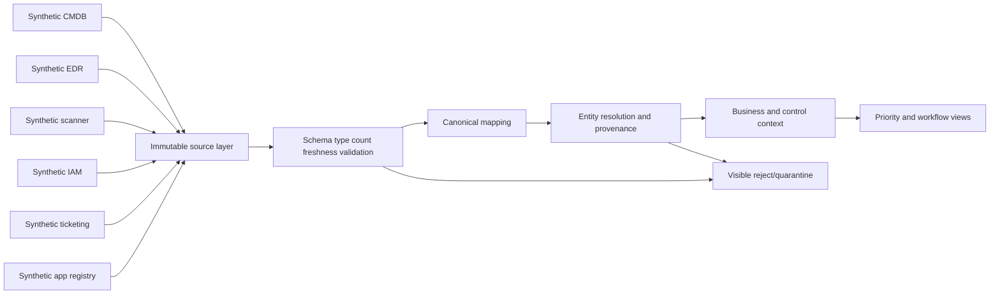

| Source style | Grain | Authority | Synthetic defect/failure mode | Acceptance evidence |
|---|---|---|---|---|
| CMDB | One configuration-item version | Lifecycle and designated owner when current | Mixed date format in owner-effective field | Parse rejects zero or explicitly quarantined |
| EDR | One observed endpoint per snapshot | Recent endpoint presence and posture signal | Hostname aliases create potential duplicate | Match explanation and split/merge sample |
| Scanner | One finding instance per asset/plugin observation | Vulnerability observation at scan time | Batch delay makes prior state stale | Last success, expected batch, count reconciliation |
| IAM | One identity state per snapshot | Identity status/department | Disabled identity still referenced as owner | Owner validity rule and exception |
| Ticketing | One ticket plus state history | Administrative workflow status | Closed state lacks technical validation link | State-to-evidence reconciliation |
| App registry | One business-service relationship | Tier and service owner | Application key uses changed prefix | Mapping-version and referential-integrity check |

### Defect event

At fictional reporting cut `2026-08-24T12:00:00Z`, a mapping release converts `app-clinical` to `clinical` before joining the app registry, but the registry still uses `app-clinical`. Three assets lose business-service and criticality context. Their computed synthetic contextual priorities fall. The dashboard initially appears greener even though no exposure was remediated.

```mermaid
sequenceDiagram
    participant S as Synthetic source batch
    participant P as Mapping pipeline
    participant Q as Quality monitor
    participant T as Candidate TSM
    participant D as Fictional data lead
    S->>P: Deliver app key app-clinical
    P->>P: Version 1.3 strips app prefix
    P->>Q: Emit accepted rows with null app join
    Q-->>T: Critical-context completeness falls 100 to 62.5 percent
    T->>D: Open defect with before/after sample and impact
    D->>P: Restore compatible key mapping in controlled rerun
    P->>Q: Replay affected synthetic batch
    Q-->>T: Counts and context reconcile; prior dashboard annotated
```

| Defect field | Synthetic record |
|---|---|
| Defect ID | NMH-SYN-DEF-117-01 |
| Detection | Context-completeness guardrail and anchor-case priority changed after mapping release |
| Impact | Three of eight modeled assets lost application tier/context; dashboard priority distribution invalid for affected cut |
| User/business impact | Decision confidence affected; no real service or patient impact exists |
| Stabilization | Freeze affected executive trend and preserve prior accepted model |
| Technical hypothesis | Prefix transformation broke referential join |
| Discriminating evidence | Same raw keys; mapping version changed; null joins align to changed prefix; controlled replay restores links |
| Root cause in scenario | Incomplete compatibility test and missing referential-integrity release gate |
| Correction | Versioned mapping fix, replay affected batch, reconcile counts/joins, annotate history |
| Prevention | Contract test for key compatibility, anchor entities, null-rate threshold, rollback path |
| Limitation | Local deterministic fixture; no Zscaler product behavior tested |

### TSM response to the defect

| TSM action | Why it matters | Evidence | Boundary |
|---|---|---|---|
| Acknowledge quickly | Protects trust before perfect diagnosis | Time-stamped fictional update | No unsupported ETA |
| Freeze affected headline | Prevents stale/wrong decision | Dashboard annotation | Does not hide raw data |
| Quantify scope | Separates three impacted rows from whole model | Before/after counts and keys | Tiny fixture only |
| Open technical workstream | Gives owner, hypothesis, tests, and checkpoint | Defect brief | Data lead owns mapping change |
| Inform business/workflow owners | Explains decision consequence | Plain-language impact | No alarmist breach claim |
| Validate replay | Proves correction under known cases | Reconciliation and changed case | Does not prove all future schemas |
| Run PIR | Converts defect into prevention | Contract-test action | Blameless and evidence-based |

## Stage 3 - UVM-style prioritization tuning

After the data defect is corrected, the fictional VM Lead challenges the original NMH-LAB-SCORE-v1 because privileged identity and direct exposure together deserve stronger review, while stale control evidence should reduce confidence rather than mechanically raise risk. The candidate facilitates model governance; you do not declare the correct business weighting.

| Factor | Version 1 synthetic treatment | Stakeholder concern | Version 2 fictional decision | Guardrail |
|---|---:|---|---:|---|
| Vulnerability severity | 20% | Useful but overfamiliar | 15% | Never remove source severity |
| Threat/exploitation signal | 20% | Current signal important | 20% | Record source/date/confidence |
| Business criticality | 20% | Depends on repaired app context | 20% | Unknown context quarantined |
| External/direct exposure | 15% | Direct reachability material | 15% | Must be evidenced, not assumed |
| Privileged identity | 10% | Interaction with exposure matters | 15% including governed interaction review | Human review for interaction |
| Control effectiveness | 10% reduction | Stale evidence falsely reassures | 10% reduction only when current/validated | Stale means unknown, not failed |
| Ownership/workflow readiness | 5% | Should affect execution, not inherent technical risk | Separate routing/confidence dimension | Do not lower risk because owner missing |

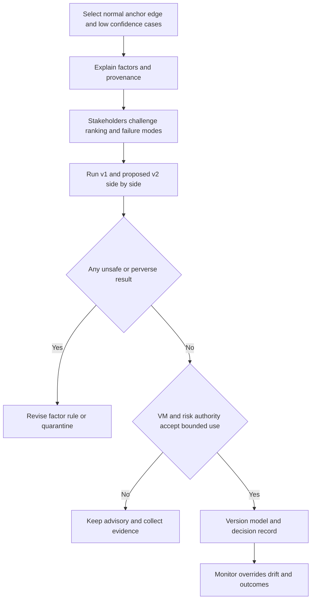

| Calibration case | Context | Expected reasoning | Version 2 disposition |
|---|---|---|---|
| Anchor A | Critical fictional app, direct exposure, active threat signal, service identity, weak current control | Expedite owner validation and treatment | High priority, human review |
| Anchor B | Critical database, indirect exposure, privileged identity, medium threat, validated segmentation | High but below A; controls reduce scenario, not erase it | High priority with control revalidation |
| Edge C | Medium kiosk, no direct exposure, standard identity, stable control | Standard queue unless changed evidence | Medium priority |
| Low-confidence D | High severity on unresolved orphan asset, stale scan | Resolve identity/freshness before confident treatment | Quarantine with urgent context action |
| Changed E | Moderate weakness on direct-facing high-tier service with privileged path | Context may outrank raw severity | Elevated review |
| Negative F | Retired asset with duplicate finding and accepted decommission evidence | Avoid remediation theater; verify retirement and close duplicate | Exclude after validation |

### Plain-English deep-dive 3 - Tuning is governance, not score shopping

Tuning should make a model more faithful to agreed decisions, not force it to produce a preferred chart. If weights are adjusted merely to put an executive's favorite issue at the top, the score becomes theater. A defensible process starts with cases and decision principles, tests expected and unexpected outcomes, exposes interactions, preserves overrides, and versions the change.

Think of calibrating a scale with known weights. You do not place an unknown parcel on it, decide what number you want, and turn the dial until it agrees. Anchor cases are the known weights. Edge and changed cases test whether the scale behaves outside the easiest examples. Human authority remains because no compact formula captures every business, threat, and operational condition.

## Stage 4 - Critical escalation

During the fictional onboarding quarter, the supplied Part 114 scenario occurs: `nmhsync.exe` receives an HTTP 407 from a fictional explicit proxy before target TLS, while `nmhbrowser.exe` succeeds. A changed proxy policy object removed the background-process authentication exception. All evidence is static and synthetic.

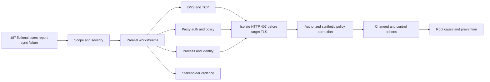

| Escalation phase | Candidate action | Evidence | Communication |
|---|---|---|---|
| First 15 minutes | Confirm synthetic impact, workflow, start time, cohorts, workaround, roles, cadence | Intake and timeline | "Investigating proxy/process boundary; root cause not established" |
| Isolation | Compare working browser and failing sync process across DNS/TCP/proxy/TLS/HTTP | Correlated static fixtures | "DNS/TCP succeed; failing process receives proxy 407 before target TLS" |
| Stabilization | Support authorized fictional correction while preserving other controls | Change record and rollback | "Approved correction in validation; no security bypass" |
| Recovery validation | Test affected, control, region, process, and duration cohorts | Matrix and observation | "Defined cohorts pass; broader durability monitored" |
| RCA/PIR | Establish policy-object defect and missing regression coverage | Timeline, version, differential | "Scenario cause supported within fixture; no Zscaler attribution" |
| Prevention | Add process-specific tests, staged rollout, monitoring, rollback evidence | Roadmap actions | "Prevention owners and checkpoints recorded" |

### Executive updates

| Time/cadence | Synthetic update |
|---|---|
| Initial | "At 09:02 UTC, the fictional NMH background sync workflow began failing for reported East/Central cohorts. Browser workflow remains available. Teams are testing process, proxy, identity, and policy boundaries. No root cause or ETA is confirmed. Next update in 30 minutes." |
| Isolation | "Evidence shows successful DNS and TCP to the proxy. The background process receives HTTP 407 before target TLS; the browser receives CONNECT 200 and succeeds. Focus is the proxy authentication-policy path. A controlled option is under review." |
| Stabilization | "The authorized synthetic policy correction has passed the first affected cohort while unchanged controls remain applied. Validation is expanding across control cohorts and observation time. We are not yet declaring durable resolution." |
| Recovery | "All defined synthetic changed and control cohorts pass the 30-minute observation. The bridge is moving to monitoring and PIR. The supported scenario cause is a policy-object error plus incomplete process-specific validation." |

## Stage 5 - Operator training and adoption

The candidate turns the corrected data model, tuned priority workflow, and escalation lesson into a 90-minute fictional workshop. The learning objective is not "understand the platform." It is observable: participants can trace a case to evidence, explain priority and confidence, choose an allowed workflow action, identify authority, and escalate safely when evidence is insufficient.

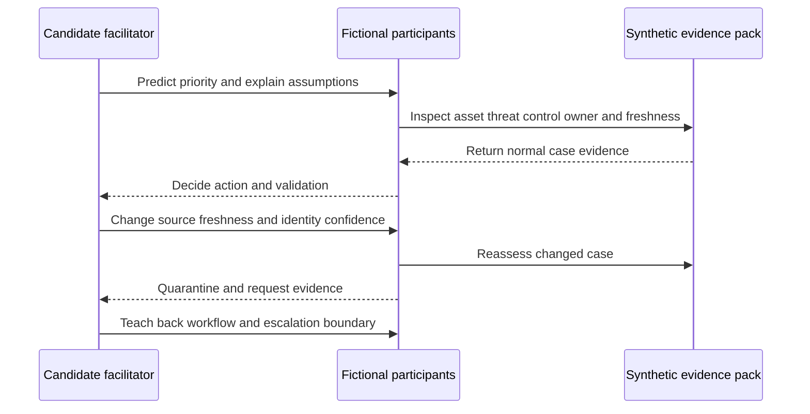

| Workshop segment | Participant work | Evidence captured | Pass condition |
|---|---|---|---|
| Vocabulary and architecture | Explain source-to-decision flow in plain English | Whiteboard annotation | Distinguishes event, entity, finding, exposure, risk |
| Data quality | Find stale source and broken app join | Quality worksheet | Explains decision consequence, not just defect |
| Priority | Compare anchor A, B, D, and E | Factor/provenance card | Explains rank, confidence, override |
| Workflow | Assign, validate, except, or quarantine | Ticket-state exercise | Does not close without evidence |
| Escalation | Interpret proxy 407 boundary | Timeline ordering | Avoids DNS/TLS blame unsupported by evidence |
| Changed case | Handle missing owner plus stale control | Independent response | Stops unsafe automation and routes evidence |
| Teach-back | Explain to executive and operator | Rubric | Correct, concise, boundary-aware |

| Adoption layer | Evidence | Fictional result | Next action |
|---|---|---|---|
| Reaction | Relevance/clarity feedback | Positive role-play feedback | Do not call adoption |
| Knowledge | Concept checks | 5/5 explain vocabulary after correction | Reinforce weak control-confidence distinction |
| Skill | Changed-case performance | Initially 3/5, then 5/5 after guided retry | Run delayed retention test |
| Behavior | Repeated workflow in bounded pilot | Not yet established | Observe three synthetic cycles |
| Operational effect | Correct routing/validation trend | Planned, not achieved | Reconcile after pilot |
| Outcome acceptance | Sponsor/manager approval | Not yet established | Review at QBR |

## Stage 6 - Cross-functional decision

The fictional account team must decide whether to expand automated ticket routing before source reliability and operator changed-case behavior have demonstrated stability. Sales wants a visible milestone before renewal review; the customer sponsor wants momentum; the VM Lead fears wrong assignments; Product capability details remain unverified; Support is closing the separate escalation.

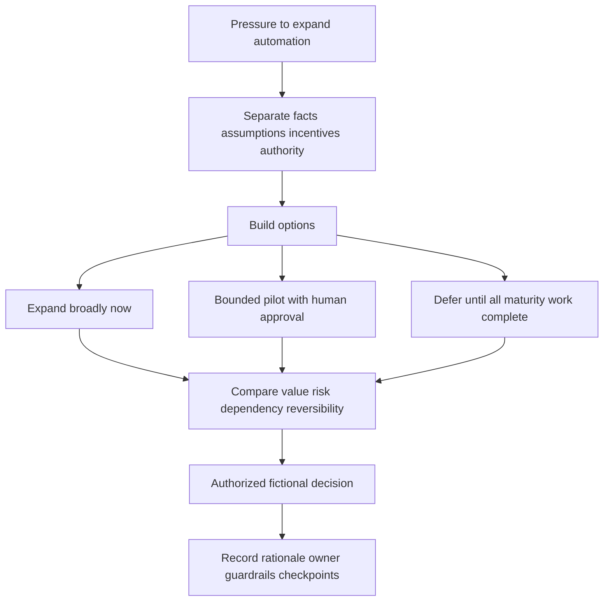

| Option | Benefit | Risk | Dependency | Reversibility | Fictional decision |
|---|---|---|---|---|---|
| Broad expansion now | Fast visible activity | Wrong routing, trust loss, unsupported feature assumption | Source/model/operator stability absent | Operational rollback possible but relationship cost | Rejected |
| Bounded pilot with human approval | Tests behavior and value while limiting blast radius | Requires review capacity; slower headline | Six-source freshness, accepted model v2, five changed-case passes | High; pause/kill switch defined | Selected |
| Full deferment | Lowest immediate automation risk | Learning and momentum delayed; manual burden continues | None beyond current workflow | High | Retained fallback |

| Role | Owns | Does not own |
|---|---|---|
| Customer sponsor | Priority, capacity, outcome acceptance | Product roadmap facts |
| VM Lead | Queue policy, owner workflow, exception design | Commercial renewal decision alone |
| SecOps Manager | Operator readiness and bounded automation operations | Business risk acceptance alone |
| Data Lead | Source contracts, mapping release, quality evidence | Vulnerability treatment priority alone |
| TSM candidate | Evidence, facilitation, plan, follow-through, escalation | Customer risk, production change, pricing, roadmap |
| Sales/account executive | Commercial process and account coordination | Technical truth or customer risk acceptance |
| Support | Case handling and technical support route | Product roadmap or customer success plan |
| Product/Engineering | Authoritative behavior, defect/roadmap process | Customer business decision |

### Plain-English deep-dive 4 - Constructive disagreement protects trust

High-trust collaboration does not require everyone to agree quickly. It requires disagreement to be specific, evidence-based, role-aware, and directed toward a better decision. The VM Lead's resistance is not an adoption obstacle to be overcome; it may be the strongest signal that a broad rollout is premature.

Think of a pre-flight challenge. A co-pilot who notices an unexplained warning should speak, even when passengers are waiting. The team examines evidence, authority, options, and reversibility. In this capstone, a bounded pilot creates learning without pretending the concern disappeared. The decision record protects all parties from later rewriting what was known.

## Stage 7 - QBR and value evidence

The fictional QBR occurs after the bounded pilot preparation, not after invented success. It reports accepted evidence, open limitations, customer decisions, service learning, adoption layers, account risks, and the next roadmap. It separates delivered artifacts from realized outcomes.

| QBR slide | Headline | Evidence | Decision/next |
|---:|---|---|---|
| 1 | NMH synthetic program established an evidence-linked operating model; outcome proof remains bounded | Success-plan and evidence spine | Confirm review scope |
| 2 | Source and context trust recovered after a visible mapping defect | Defect timeline and two-cycle reconciliation | Accept release gates |
| 3 | Priority model v2 is explainable across anchor and changed cases | Calibration and overrides | Approve bounded use |
| 4 | Critical escalation restored the fictional workflow and added prevention actions | Static incident timeline and PIR | Fund regression ownership |
| 5 | Operators passed role-play changed cases after retry; repeated behavior is not yet proven | Teach-back rubric | Continue pilot observation |
| 6 | Technical value evidence is promising but does not establish ROI or risk reduction | Value ledger and limitations | Accept evidence level |
| 7 | Renewal confidence is at risk unless pilot behavior, sponsor cadence, and product facts close | Renewal-risk register | Approve recovery and roadmap |
| 8 | Next quarter prioritizes reliable operations, accepted outcomes, and current product validation | 30/60/90 roadmap | Confirm owners and checkpoints |

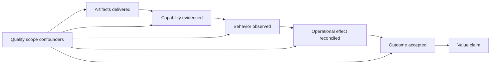

### Value evidence ledger

| Value hypothesis | Baseline | Synthetic evidence at QBR | Evidence level | Honest conclusion |
|---|---|---|---|---|
| Better data trust improves priority decisions | Broken join once distorted three records | Defect detected, replayed, and prevented in changed case | Capability | Controls improved in fixture; production durability unknown |
| Context reduces severity-only noise | Version 1 anchor cases lacked agreed interaction treatment | Version 2 ranks six cases with accepted rationale | Capability | Decision logic is clearer; remediation outcome not measured |
| Validation-linked workflow reduces false closure | 1/6 sampled closure lacked evidence | State map and reopen control designed | Capability/planned behavior | No repeated operational result yet |
| Training improves independent decisions | 3/5 changed cases passed initially | 5/5 pass after guided retry | Skill | Retention and production behavior unknown |
| Escalation learning improves resilience | No process-specific regression in scenario baseline | Test/rollback/PIR actions defined | Capability | Recurrence prevention not yet proven |
| Bounded automation may reduce manual routing effort | No time/cost baseline | Pilot approved but not run | Hypothesis only | No efficiency or savings claim |
| Executive evidence may improve trust | Fragmented role-card baseline | Traceable QBR rehearsed | Simulation | No real stakeholder outcome or renewal effect |

### Account health view

| Health dimension | Synthetic status | Evidence | Risk | Recovery action |
|---|---|---|---|---|
| Technical/data | Amber improving | Mapping defect corrected; source cycles reconciled | Schema/freshness recurrence | Contract tests and owner cadence |
| Priority/workflow | Amber | Model accepted for bounded use; behavior pilot pending | Wrong route/unsupported closure | Human approval and reconciliation |
| Adoption | Amber | Skill retry passed; repeated behavior not established | Training decay | Delayed changed-case and observation |
| Relationship/governance | Amber | Transparent defect handling; sponsor cadence weakening | Decision delay | Executive read-back and sponsor checkpoint |
| Support/escalation | Green within scenario | Recovery/PIR completed | Prevention actions may age | Action review and escalation trigger |
| Product fit/currency | Gray/unknown | Public sources only | Entitlement/feature expectation | Current authoritative validation |
| Value | Amber/early | Capability evidence; outcomes limited | Activity inflation | Outcome contracts and accepted evidence |
| Commercial/renewal | Amber risk | Fictional confidence signals only | Unresolved proof and sponsorship | Joint recovery plan; no prediction |

## Renewal risk and recovery

Renewal risk is not a secret health score or a prediction that the customer will leave. It is a structured set of evidence suggesting continuation confidence may be weakened. The TSM surfaces technical and relationship contributors early, coordinates recovery, and respects commercial ownership.

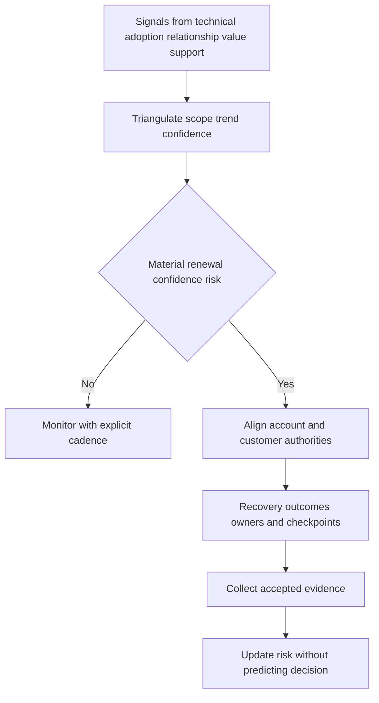

| Renewal-risk ID | Fictional signal | Alternative explanation | Confidence | Recovery action | Owner/checkpoint |
|---|---|---|---|---|---|
| RR-117-01 | Executive sponsor misses two fictional governance checkpoints | Competing business priority, not dissatisfaction | Medium | Reconfirm objective, delegate, decision cadence | Account team/sponsor within 10 scenario days |
| RR-117-02 | Operators request continued manual workflow | Appropriate caution during maturity phase | Medium | Run bounded pilot with human approval and evidence | SecOps Manager at pilot review |
| RR-117-03 | Value story contains capability but limited operational outcomes | Quarter is early and baseline immature | High | Agree outcome evidence and avoid forced ROI | TSM/sponsor at QBR |
| RR-117-04 | Product capability questions remain unverified | Licensing or packaging may simply need clarification | High | Route to authoritative current source and document | Account/Product route before roadmap lock |
| RR-117-05 | Mapping defect reduced trust | Transparent correction may strengthen trust if prevention works | Medium | Demonstrate release gates over two cycles | Data Lead at quality review |
| RR-117-06 | Fictional commercial timeline approaches | Time alone is not dissatisfaction evidence | Low | Coordinate without pressure or technical distortion | Sales owns commercial cadence |

| Unsafe renewal behavior | Why unsafe | Better behavior |
|---|---|---|
| Hide defect to protect deal | Damages trust and decision quality | Disclose impact, correction, prevention, limitation |
| Promise roadmap feature | Exceeds authority and may be false | Route, record, and plan alternatives |
| Manufacture ROI | Creates unsupported executive claim | State evidence level and required data |
| Pressure operators into automation | Confuses activity with adoption | Bounded pilot with authority and guardrails |
| Treat missed meeting as churn proof | Single ambiguous signal | Triangulate sentiment, behavior, outcomes, context |
| Let commercial urgency change technical truth | Corrupts evidence | Preserve independent technical assessment |

## Next roadmap

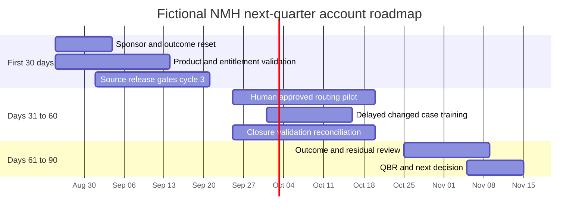

All dates in this diagram are synthetic scenario dates, not customer commitments or forecasts.

| Horizon | Outcome state | Entry evidence | Exit evidence | TSM role | Guardrail |
|---|---|---|---|---|---|
| Days 0-15 | Sponsor, objectives, decisions, and cadence reconfirmed | Fictional account-team alignment | Corrected read-back and delegated authorities | Facilitate and follow through | Do not imply commercial decision |
| Days 0-30 | Product assumptions converted to verified facts or explicit unknowns | Question inventory | Current authoritative answers and alternatives | Route and document | No roadmap/feature invention |
| Days 0-30 | Data release gates operate for another cycle | Defect prevention implemented | Compatibility, null, count, freshness tests pass | Monitor evidence | Pause affected trends on failure |
| Days 31-60 | Human-approved routing pilot produces bounded behavior evidence | Data/model/operator gates pass | Correct route, override, failure, audit results | Coordinate pilot review | Kill switch and no unsafe auto-action |
| Days 31-60 | Skills persist on delayed changed case | Prior teach-back pass | Independent delayed pass or retry plan | Enable/review | No attendance/adoption substitution |
| Days 31-60 | Closure reconciliation becomes routine | State map accepted | All bounded closures supported/reopened | Track action | No state gaming |
| Days 61-90 | Operational effects and residual risks accepted | Stable pilot evidence | Outcome ledger and owner decisions | Build QBR | No unsupported ROI/risk reduction |
| Days 75-90 | Renewal technical-risk recovery evidence reviewed | Sponsor and account team present | Risk register updated; next options agreed | Surface facts | Sales owns commercial process |

## Prerequisites

1. Review and apply [Part 111](Part-111-safe-lab-evidence-honesty.md), including the shared portfolio organization, manifest, source ledger, claim ledger, evidence index, reproduction record, privacy review, release labels, exact cleanup, and blocking gates.
2. Complete Parts 112-116 or use only the inline synthetic summaries in this Part. Do not import real customer, employer, CRM, support, product, tenant, incident, vulnerability, contract, renewal, meeting, or CV-attachment data.
3. Use an approved local text, spreadsheet, diagram, or presentation path. A Markdown-only portfolio is sufficient. No product trial, tenant, network action, API call, scan, packet capture, sign-in, external publication, or purchase is needed.
4. Use `NMH-SYN-P117-A01` onward for artifact IDs and show `SYNTHETIC NMH LAB` inside every artifact.
5. Treat the source snapshot date as `2026-08-24`. All later dates in the scenario are explicitly fictional.
6. If a peer participates, obtain consent and use role cards. Do not represent the peer as a customer, executive, Zscaler employee, or hiring panel.

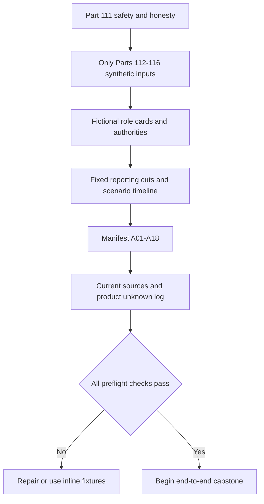

| Preflight item | Pass evidence | Stop condition | Safe fallback |
|---|---|---|---|
| Scope | Charter says local synthetic NMH only | Real account/customer reference appears | Replace with inline role card |
| Data | Stable artifact IDs and provenance | Real export or copied screenshot | Exclude and recreate synthetic table |
| Product | Public fact/unknown distinction | Assumed feature/entitlement | Add question and alternative path |
| Timeline | Every future date labeled synthetic | Date could be read as real commitment | Use relative day range |
| Commercial | Renewal is fictional risk exercise | Actual pricing/contract data appears | Remove and use qualitative role-play |
| Privacy | No real people, identifiers, paths, metadata | Peer/employer data captured | Stop, exclude, follow applicable policy |
| Authority | RACI names fictional roles | Candidate assigned risk/change acceptance | Correct ownership before proceeding |

## Lab

The lab is a portfolio simulation. Complete it as one continuous case, preserving version history and defects instead of replacing early artifacts with an unrealistically perfect final story.

### Exercise 1 - Open the account charter and artifact manifest

Create `NMH-SYN-P117-A01-account-charter-v01.md`. Include fictional customer, objective, non-goals, outcome hierarchy, role cards, product unknowns, commercial boundary, source date, engagement cadence, evidence classes, prohibited actions, and release statement. Plan A01-A18 in the Part 111 manifest.

### Exercise 2 - Run discovery and issue a corrected read-back

Create A02 discovery brief and A03 fact/assumption/unknown/decision log. Role-play sponsor, VM, data, SecOps, network, privacy, service-owner, and account-team questions. Record at least two hypotheses that discovery changes. Publish a read-back that recipients can correct.

Expected evidence: decision need, current workflow, source authority, stakeholder authority, constraints, baseline method, target hypotheses, product unknowns, risks, and plan consequences. A product list is not discovery evidence.

### Exercise 3 - Build the technical success plan

Create A04 success plan with seven workstreams, entry/exit gates, RACI, dependencies, estimated windows, health signals, support/escalation routes, and outcome contracts. Test a changed case in which the sponsor cannot attend weekly; define delegation and escalation rather than silently weakening governance.

### Exercise 4 - Simulate integration acceptance

Create A05 source/field contract catalog and A06 integration validation pack. Reconcile source, staged, accepted, rejected, duplicate, quarantined, and output counts. Validate schema, type, timestamp, freshness, referential integrity, entity match, purpose, and privacy. Do not call ingestion success an outcome.

### Exercise 5 - Inject and manage the mapping defect

Use `NMH-SYN-DEF-117-01`. Preserve pre-defect, defective, and corrected versions. Create A07 defect brief with detection, impact, hypothesis, tests, workstreams, updates, correction, replay, historical annotation, prevention, and limitation. Freeze affected dashboard claims until reconciliation passes.

### Exercise 6 - Facilitate the prioritization calibration

Create A08 model decision record. Compare v1 and v2 on six cases. Record factors, provenance, weights, interactions, confidence, overrides, expected ordering, unexpected behavior, authority, version, and rollback. Keep low-confidence D quarantined. Never call v2 UVM.

### Exercise 7 - Lead the synthetic critical escalation

Create A09 escalation package using only the static Part 114 fixtures: intake, severity rationale, roles, hypotheses, evidence timeline, cohort comparison, executive updates, change authority, recovery validation, RCA, PIR, and actions. Rehearse first-15-minute, isolation, stabilization, and recovery updates without inventing ETA.

### Exercise 8 - Design and deliver the role-play workshop

Create A10 workshop pack and A11 teach-back rubric. Run normal, edge, low-confidence, and proxy-boundary exercises. Record initial 3/5 changed-case result and guided 5/5 retry as scenario evidence. Schedule a delayed test; do not invent its result.

### Exercise 9 - Facilitate the cross-functional automation decision

Create A12 decision record with facts, assumptions, incentives, authorities, options, tradeoffs, dependencies, recommendation, fictional disposition, guardrails, kill switch, checkpoints, and alternatives. Practice disagreeing respectfully with broad expansion while preserving momentum through the bounded pilot.

### Exercise 10 - Build and rehearse the QBR

Create A13 eight-slide QBR and technical appendix. Lead with objective, evidence level, quality, risks, decisions, value limitations, renewal signals, and next roadmap. Rehearse 15-minute and three-minute versions. Answer "Did risk fall?", "What did the product do?", and "Will they renew?" without inventing facts.

### Exercise 11 - Create value and account-health ledgers

Create A14 value ledger and A15 account-health model. Each measure needs baseline, formula, population, reporting cut, quality threshold, target hypothesis, guardrail, owner, acceptor, confounder, and non-proof. Keep unknown product fit gray rather than forcing red/green.

### Exercise 12 - Assess renewal risk and recovery

Create A16 renewal-risk register. Triangulate six fictional signals; include alternatives and confidence. Coordinate technical, adoption, sponsor, value, support, product, and commercial roles without predicting renewal. Draft recovery outcomes and checkpoints.

### Exercise 13 - Publish the next 30/60/90 roadmap

Create A17 next-roadmap artifact. Sequence sponsor reset, product verification, source gates, bounded routing pilot, delayed teach-back, closure reconciliation, outcome review, and next QBR. Include entry/exit evidence, guardrails, stop conditions, and fallback options.

### Exercise 14 - Complete reflection, claim ledger, and release

Create A18 reflection and final claim ledger. Use the exact Part 111 pattern. State one failure, one correction, one decision, one bounded observation, one limitation, and one production next validation. Run all safety/privacy/claim gates, select the sanitized release set, and remove only exact temporary synthetic copies.

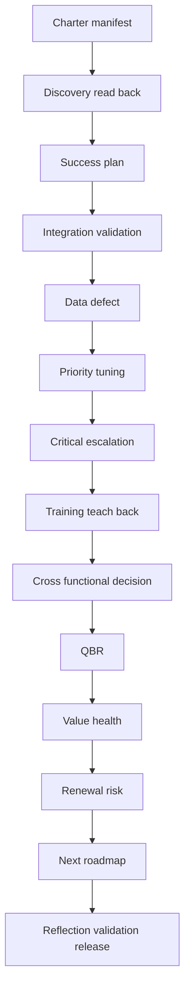

## Expected evidence

| Artifact ID | Artifact | Minimum evidence | Acceptance test |
|---|---|---|---|
| NMH-SYN-P117-A01 | Account charter/manifest | Scope, roles, boundaries, source date, A01-A18 | No real/product/commercial implication |
| A02 | Discovery brief | Outcome, workflow, architecture, data, authority, constraints | Questions change plan |
| A03 | Fact/assumption/unknown/decision log | Sources, confidence, read-back, corrections | Facts never inferred from hypotheses |
| A04 | Technical success plan | Workstreams, gates, RACI, outcomes, health, risks | Accepted states replace activity list |
| A05 | Source/field contracts | Grain, authority, cadence, privacy, failure | Every field use has source purpose |
| A06 | Integration validation | Counts, quality, entities, rejects, reconciliation | Output traces to synthetic source |
| A07 | Data-defect package | Detection through prevention and history annotation | Defective trend not called improvement |
| A08 | Model decision record | v1/v2 cases, factors, authority, guardrails | Not labeled UVM or objective truth |
| A09 | Escalation package/PIR | Timeline, hypotheses, updates, validation, prevention | No real capture, bypass, or ETA invention |
| A10-A11 | Workshop and teach-back | Objectives, exercises, changed cases, retry | Skill distinct from adoption |
| A12 | Cross-functional decision | Options, authority, tradeoffs, decision, kill switch | Commercial pressure does not alter truth |
| A13 | QBR and appendix | Outcomes, quality, risks, value, renewal, roadmap | Every headline traceable |
| A14-A15 | Value and health ledgers | Metric contracts, evidence levels, gray unknowns | No ROI/risk-reduction invention |
| A16 | Renewal-risk register | Signals, alternatives, confidence, recovery | No renewal prediction |
| A17 | Next roadmap | 30/60/90 gates, owners, evidence, fallback | Future states remain hypotheses |
| A18 | Reflection/claim/release | Personal action, synthetic result, limitation, next validation | All Part 111 gates pass |

### Evidence-capture checklist

- [ ] Keep early, defective, corrected, and accepted versions rather than rewriting history.
- [ ] Show which discovery answers changed the plan.
- [ ] Record exact fictional authority for source, model, workflow, risk, change, product, and commercial decisions.
- [ ] Reconcile integration counts and keep rejected/quarantined rows visible.
- [ ] Freeze affected claims during the data defect and annotate historical views.
- [ ] Preserve model v1/v2 rules, anchor cases, overrides, and decision rationale.
- [ ] Use only static synthetic connectivity fixtures.
- [ ] Capture training attempt, correction, retry, and still-unknown retention.
- [ ] Separate artifacts, capability, behavior, operational effect, accepted outcome, and value.
- [ ] Treat renewal signals as uncertain evidence, not a forecast.
- [ ] State no Zscaler tenant, UVM score, Data Fabric connector, Risk360 output, or customer delivery occurred.

## Troubleshooting

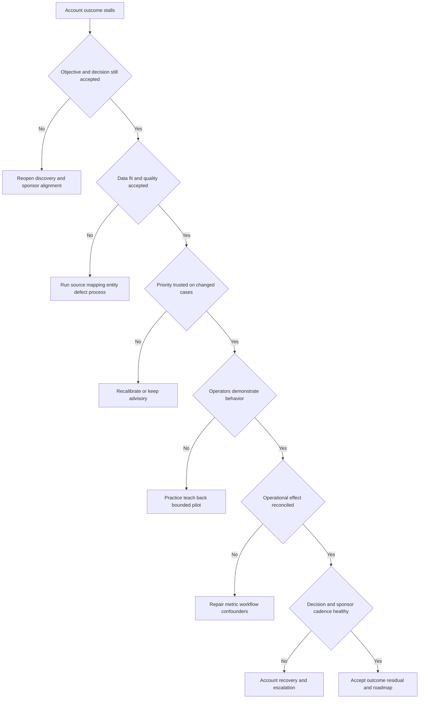

| Symptom | Likely cause | Discriminating check | Repair |
|---|---|---|---|
| Many meetings, little progress | No decision/outcome contract | Ask what state and evidence meeting unlocks | Reset success plan |
| Integration green, users distrust data | Connectivity mistaken for fitness | Reconcile field authority, quality, entity samples | Add source/field acceptance |
| Dashboard suddenly improves | Defect or scope/denominator changed | Compare source volume, rules, null joins | Freeze, annotate, replay |
| Score debate becomes political | Cases/authority/failure behavior hidden | Test anchor and edge cases side by side | Facilitate governance, version decision |
| TSM becomes administrator | RACI and handoff unclear | List who owns credentials/change/risk | Restore ownership and checkpoints |
| Escalation has noisy updates | Impact/hypothesis/evidence/next mixed | Read one update aloud | Use bounded update template |
| Training rates high, workflow fails | Reaction mistaken for skill/behavior | Run independent changed case | Practice, retry, delayed test |
| Sales pressure changes recommendation | Incentive blurred technical evidence | Record facts, authorities, options | Preserve truth; bounded reversible path |
| QBR feels like ticket report | Activity not connected to outcomes/decisions | Remove counts and ask what leaders choose | Rebuild evidence/value spine |
| Renewal labeled red from one signal | No triangulation or alternative | Compare sponsor, adoption, value, support, context | Qualify confidence and recover |
| Product answer is guessed | Public positioning treated as entitlement | Identify authoritative source and owner | Mark unknown, route, plan alternative |

## Cleanup and privacy

Do not use real customer account plans, CRM records, contracts, renewal dates, pricing, product entitlements, support cases, incident records, dashboards, vulnerability exports, meeting notes, architecture, emails, names, or screenshots. Do not paste CV files into the portfolio. Candidate facts should remain minimal, supported, and separated from NMH role-play.

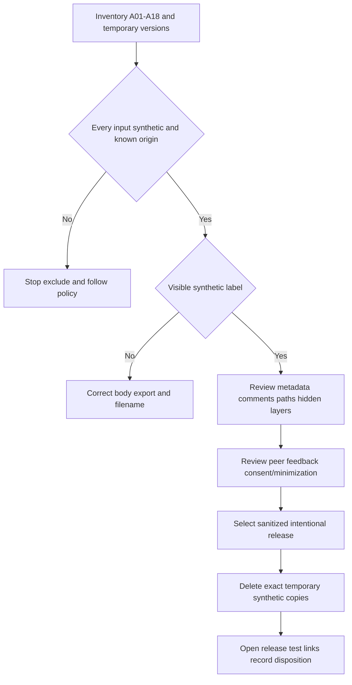

| Artifact type | Retain | Remove | Review |
|---|---|---|---|
| Account charter/success plan | Sanitized synthetic versions | Drafts with unrelated notes | Fictional roles and outcomes visible |
| Data/defect evidence | Minimal reproducible fixture and versions | Tool caches, accidental real imports | No source credentials or product schema claim |
| Escalation | Static fictional timeline/package | Real traces, HAR, packet, ticket content | No external address contacted |
| Workshop | Candidate-authored synthetic exercises | Recordings and peer personal details | Consent and role boundary |
| QBR/value | Reviewed deck, dictionary, appendix | Public links/uploads, real company templates with data | No customer delivery or ROI claim |
| Renewal risk | Fictional qualitative register | Actual employer/customer commercial data | No forecast represented as fact |
| Temporary exports | None unless required/reviewed | Exact named temporary files | Never delete broad parent paths |
| Source ledger | Public URL/date/bounded use | Gated/copied content | Current facts separate from scenario |

The final release should be safe to explain without showing any real environment. If realism appears to depend on confidential data, redesign the exercise. Exact cleanup means inventorying and deleting only known temporary synthetic files; it never means deleting a parent, shared folder, or unrelated record.

## Validation rubric

Part 111 blocking gates apply. Any real-data use, unsafe action, customer/product/commercial misrepresentation, invented result, missing synthetic label, or candidate-history inflation is an automatic failure regardless of score.

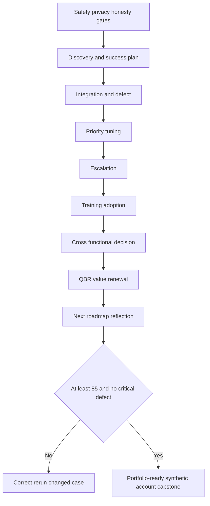

| Dimension | Points | Full-credit evidence | Critical defect |
|---|---:|---|---|
| Safety, privacy, honesty | 10 | Shared contract, visible labels, exact cleanup, bounded claims | Real data or engagement/product claim |
| Discovery and account strategy | 10 | Decision-changing questions, read-back, facts/unknowns | Product pitch or invented customer fact |
| Success plan/governance | 10 | Outcomes, gates, RACI, dependencies, health, authority | Activity calendar or TSM assumes authority |
| Integration and data defect | 10 | Contracts, reconciliation, detection, impact, correction, prevention | Defect hidden or trend misrepresented |
| Priority tuning | 10 | Cases, factors, confidence, overrides, version, authority | Model called UVM or objective truth |
| Critical escalation | 10 | Impact, evidence, workstreams, updates, validation, PIR | Unsafe action, real capture, invented ETA/cause |
| Training and adoption | 10 | Observable skill, changed cases, retry, behavior boundary | Attendance called adoption |
| Cross-functional decision | 10 | Options, incentives, authority, tradeoffs, guardrails | Commercial pressure changes technical truth |
| QBR, value, renewal risk | 10 | Evidence levels, limitations, triangulation, recovery | ROI/risk reduction/renewal invented |
| Next roadmap and reflection | 10 | 30/60/90 outcomes, gates, residuals, claim ledger | Future plan presented as achieved result |

| Score | Interpretation | Required action |
|---:|---|---|
| 0-69 | Account method is not credible | Rebuild ownership, evidence, and stage contracts |
| 70-84 | Strong fragments but lifecycle gaps remain | Repair weak stages and rerun transitions |
| 85-94 | Strong synthetic SecOps TSM account capstone | Rehearse with role changes and interruptions |
| 95-100 | Exceptionally coherent synthetic portfolio | Retain limitations; seek independent challenge |

### Validation scenarios

1. The sponsor misses checkpoints: does the plan re-establish authority rather than proceed silently?
2. A mapping release makes the dashboard greener: does the candidate freeze and correct the claim?
3. The VM Lead rejects model v2: does it remain advisory while evidence and authority are resolved?
4. A critical incident lacks ETA: does communication remain useful without guessing?
5. Training satisfaction is high but changed-case skill fails: is adoption withheld?
6. Sales wants broad automation before renewal: does technical truth and customer authority remain independent?
7. The QBR asks for ROI: does the candidate state evidence limits and required inputs?
8. A public product page is ambiguous: is capability marked unknown and routed?
9. A renewal-risk signal has a benign alternative: is confidence calibrated?
10. A future milestone misses its date: is the gate and residual risk updated instead of relabeled complete?

## Explicitly fictional and synthetic NMH scenarios

### Scenario 1 - The perfect-looking dashboard

The mapping defect removes criticality from three assets and lowers their priority. The candidate notices a quality guardrail, freezes the executive trend, publishes impact, coordinates correction, replays the batch, and annotates history. You do not celebrate the lower queue.

### Scenario 2 - The account-team shortcut

Commercial urgency creates pressure to call the model a deployed UVM workflow. The candidate says it is a local NMH-LAB-SCORE-v2 simulation, lists current product/entitlement unknowns, and routes verification. The bounded pilot remains vendor-neutral until authoritative evidence exists.

### Scenario 3 - The resistant VM leader

The fictional VM Lead challenges the privileged-identity interaction. The candidate does not defend a favorite weight. You compare anchor/edge cases, examines provenance and failure behavior, and records the authorized model decision. The disagreement strengthens adoption.

### Scenario 4 - The missing executive ETA

During the synthetic escalation, the sponsor asks when service will be restored. Evidence supports a proxy-policy hypothesis but no tested completion time. The candidate states what is known, what is being tested, who owns the change, and the next update time without fabricating an ETA.

### Scenario 5 - The renewal prediction request

An interviewer asks, "Will NMH renew?" The candidate says NMH is fictional and the evidence cannot support a renewal outcome. You can identify amber signals, alternative explanations, recovery actions, owners, and checkpoints, while Sales owns the commercial process.

## Official Source Anchors

Research/source snapshot and source review date: **2026-08-24**.

These sources support bounded public positioning and general cybersecurity/customer-success reasoning only. They do not establish NMH facts, product entitlement, connector behavior, internal schemas, algorithms, support findings, service levels, roadmap, commercial terms, renewal, or customer outcomes. Current authoritative validation is required before production use.

| Source | URL | Used for | Boundary |
|---|---|---|---|
| Zscaler Data Fabric for Security | https://www.zscaler.com/products-and-solutions/data-fabric | Public security-data harmonization/workflow positioning | No NMH connector, schema, or result inferred |
| Zscaler Unified Vulnerability Management | https://www.zscaler.com/products-and-solutions/unified-vulnerability-management | Public contextual vulnerability-prioritization positioning | NMH-LAB-SCORE-v2 is not UVM |
| Zscaler Risk360 | https://www.zscaler.com/products-and-solutions/risk360 | Public enterprise-risk visibility/communication positioning | No NMH risk or value output is Risk360 |
| Zscaler Agentic Security Operations | https://www.zscaler.com/products-and-solutions/security-operations | Public SecOps portfolio context | No agent, automation, or outcome inferred |
| Zscaler Zero Trust Exchange | https://www.zscaler.com/products-and-solutions/zero-trust-exchange-zte | Public zero-trust platform positioning | No customer design or entitlement inferred |
| Zscaler Support | https://help.zscaler.com/submit-ticket | Public support route context | Process, entitlement, severity, and response require verification |
| Zscaler Academy | https://www.zscaler.com/zscaler-academy | Public learning-resource context | Completion/access/proficiency not implied |
| NIST Cybersecurity Framework 2.0 | https://www.nist.gov/cyberframework | Govern, Identify, Protect, Detect, Respond, Recover outcome context | Voluntary and implementation-neutral |
| NIST SP 800-207 | https://csrc.nist.gov/pubs/sp/800/207/final | Vendor-neutral zero-trust concepts | Not product/customer implementation evidence |

## Likely Interview Questions

### Q1. Walk me through how you would manage a strategic SecOps account.

**Model answer:** I begin with decision-focused discovery, map stakeholders and technical workflows, separate facts from assumptions, and contract outcomes with baselines, gates, owners, and acceptance evidence. I sequence data trust before prioritization, workflow, enablement, and scale. I monitor health, own cross-team follow-through, lead escalations, report bad news transparently, facilitate QBR decisions, and update value and renewal risks without inventing outcomes. I practiced that lifecycle in fictional NMH; I have not owned a Zscaler account.

### Q2. How would you handle a data defect that makes the dashboard look better?

**Model answer:** I freeze the affected interpretation, preserve versions, quantify the population, state impact and uncertainty, and open a workstream with owner, hypothesis, discriminating tests, and updates. After controlled correction I replay, reconcile, run changed cases, annotate history, and add release gates. I do not call missing context risk reduction. In the NMH fixture, a key-prefix mapping broke three application joins; that was synthetic, not product behavior.

### Q3. How would you tune vulnerability prioritization with a customer?

**Model answer:** I start from decision principles and anchor, edge, negative, and low-confidence cases. I expose factors, provenance, weights, interactions, control freshness, confidence, overrides, and failure behavior. I compare versions side by side, preserve human authority, version the accepted decision, and monitor drift and outcomes. The customer owns policy and risk; the TSM facilitates evidence and best-practice reasoning.

### Q4. How do you lead a critical escalation while maintaining trust?

**Model answer:** I clarify impact, severity, roles, cadence, workaround, and evidence in the first minutes; separate stabilization from diagnosis; run parallel workstreams; maintain a hypothesis/evidence timeline; and communicate known, unknown, action, owner, and next update without guessing ETA. I validate changed and control cohorts, then drive PIR and prevention. My factual enterprise escalation experience supports this; the NMH connectivity case is static and synthetic.

### Q5. How do you measure adoption and value?

**Model answer:** I separate artifact delivery, capability, repeated behavior, operational effect, governance acceptance, and objective outcome. Every measure needs population, denominator, baseline, reporting cut, target hypothesis, quality threshold, guardrail, owner, acceptor, and confounders. Attendance and logins are activity. In the capstone, teach-back improved after retry, but retention, production behavior, ROI, and risk reduction remained unknown.

### Q6. How do you handle disagreement between Sales momentum and technical readiness?

**Model answer:** I make facts, assumptions, incentives, authorities, options, tradeoffs, dependencies, and reversibility explicit. I protect independent technical truth and customer authority while seeking a path that creates learning. In the simulation, a bounded human-approved pilot balanced momentum with source, model, and operator guardrails. Sales retains commercial ownership; technical evidence is not changed to support a deal.

### Q7. How would you identify and address renewal risk?

**Model answer:** I triangulate technical health, adoption behavior, stakeholder engagement, support trends, value evidence, product fit, and commercial context. I record scope, trend, confidence, and alternative explanations, then align recovery outcomes, owners, and checkpoints. I do not predict renewal from one signal or manufacture ROI. I surface risk early and coordinate with Sales while preserving customer trust and role boundaries.

### Q8. Why does your background fit this operating model?

**Model answer:** Your factual enterprise escalation work supports ambiguity management, evidence, impact, cadence, Engineering partnership, RCA, and validation. M365 expertise supports layered SaaS troubleshooting. SQL, Power BI, statistics, and MBA analytics support data quality, measures, and QBRs. Mentoring and partner training support enablement. The honest gap is direct Zscaler/SecOps TSM production experience, which you address with structured learning, synthetic practice, clear boundaries, and a concrete ramp plan.

## 30-Second Memory Hooks

| Concept | Memory hook |
|---|---|
| TSM | Coordinate capability into accepted outcomes |
| Ownership | Right problem, evidence, authority, closure |
| Discovery | Decision, workflow, evidence, constraint, authority |
| Success plan | Outcome plus gate plus owner plus proof |
| Integration | Connected is not trusted |
| Data defect | Freeze, scope, test, correct, replay, prevent |
| Tuning | Calibrate with cases, not desired charts |
| Escalation | Impact, workstreams, evidence, cadence, validation |
| Training | Changed-case behavior, not attendance |
| Decision | Facts, incentives, authority, options, guardrails |
| QBR | Evidence, outcomes, risks, decisions, next |
| Value | Capability to behavior to effect to acceptance |
| Renewal risk | Triangulated smoke alarm, not forecast |
| Roadmap | Dependency gates and fallback paths |
| NMH | Always fictional and synthetic |
| Experience bridge | Escalation, analytics, enablement, honest ramp |

## Completion Checklist

- [ ] I can explain TSM, strategic engagement, success plan, milestone, adoption, health, value hypothesis, QBR, sponsor, champion, renewal risk, and RACI from zero.
- [ ] I applied the Part 111 shared portfolio contract to A01-A18.
- [ ] I kept NMH, every stakeholder, timeline, source, metric, result, decision, and renewal signal explicitly fictional and synthetic.
- [ ] I separated your supported facts from lab practice and learned product concepts.
- [ ] I ran decision-focused discovery and recorded facts, assumptions, unknowns, and changed plans.
- [ ] I built a technical success plan with outcomes, entry/exit evidence, owners, dependencies, health, and risks.
- [ ] I modeled six source contracts and reconciled source-to-output counts.
- [ ] I detected, scoped, communicated, corrected, replayed, annotated, and prevented the mapping defect.
- [ ] I facilitated versioned priority tuning with anchor, edge, negative, and low-confidence cases.
- [ ] I stated that NMH-LAB-SCORE-v2 is not UVM.
- [ ] I led the static synthetic critical escalation without live capture, bypass, product attribution, or ETA invention.
- [ ] I designed training with observable objectives, changed cases, teach-back, correction, retry, and delayed validation.
- [ ] I facilitated the automation decision while preserving customer, product, support, and commercial boundaries.
- [ ] I built an eight-slide QBR with traceable headlines and technical appendix.
- [ ] I separated artifacts, capability, behavior, operational effect, accepted outcome, value, and ROI.
- [ ] I assessed renewal risk using multiple signals, alternatives, confidence, recovery, and no prediction.
- [ ] I built a next-quarter 30/60/90 roadmap with gates, owners, guardrails, stop conditions, and fallback.
- [ ] I ran the validation scenarios and corrected failures.
- [ ] I performed privacy review, exact cleanup, link testing, claim review, and release selection.
- [ ] I can explain what this capstone proves, what it does not prove, and what production evidence I would seek next.

[Next: Part 118 - Miscellaneous and Deeper Topics: Competitive Landscape, Standards, Trends, and Edge Cases](Part-118-miscellaneous-deeper-topics.md)