# Part 118 - Miscellaneous and Deeper Topics: Competitive Landscape, Standards, Trends, and Edge Cases

> **Purpose:** Build the extra-edge knowledge needed to compare adjacent security categories without turning labels into products, connect exposure and SecOps work to standards and regulations without giving legal advice, and reason through third-party, merger, OT/IoT, AI, agentic, and unusual enterprise scenarios.

> **Scope and honesty:** Product and category names are used for learning and interview reasoning. Category boundaries overlap, vendor packaging changes, and a public page does not prove licensed features, integration quality, customer fit, or outcomes. Northstar Meridian Holdings (NMH) remains explicitly fictional and synthetic wherever it appears. No competitor ranking, market-share statement, roadmap claim, customer result, or legal conclusion is asserted.

> **Section goal:** Explain SIEM, XDR, CAASM, risk-based vulnerability management, exposure management, CTEM, security data fabric, SSE, and SASE from first principles; compare the jobs they perform; map security evidence to standards and regulatory obligations carefully; and apply requirement-led reasoning to third-party risk, M&A, OT/IoT, AI attack surfaces, agentic threats, current themes, and edge cases.

This Part is a synthesis layer. It uses public sources reviewed on **2026-08-24**, vendor-neutral standards, and the fictional NMH scenario. It does not replace current product documentation, a licensed proof of value, security architecture review, legal counsel, privacy counsel, safety engineering, or customer authority. When a term changes or a category overlaps, define the job and evidence before debating the label.

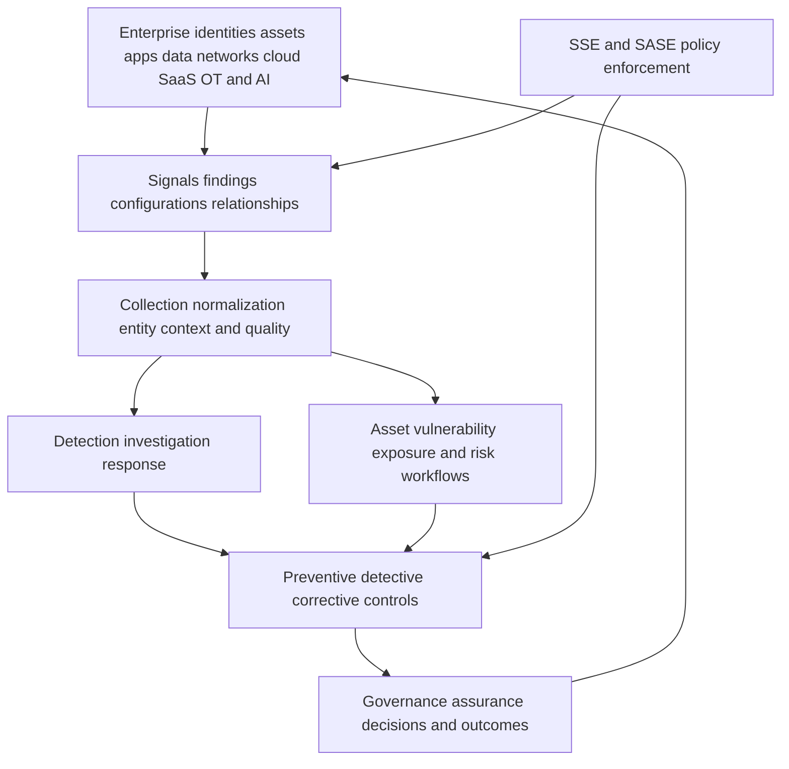

| Layer | Primary job | Typical questions | Important limitation |
|---|---|---|---|
| Telemetry and findings | Record observations from tools and systems | What happened or was observed? | Volume is not meaning |
| Data and context | Normalize, relate, enrich, govern, and expose quality | Which entities and business context belong together? | A canonical view can still be wrong |
| Detection and response | Identify, investigate, contain, and learn from threats | Is harmful activity occurring and what action is safe? | Detection is not complete prevention |
| Exposure and vulnerability | Discover conditions, prioritize scenarios, mobilize treatment | Where could harm become reachable and what matters first? | A score is not an outcome |
| Policy enforcement | Decide and enforce access/data/security policy | Should this connection or action be allowed now? | Enforcement needs identity, context, design, and operations |
| Governance and assurance | Set objectives, obligations, risk decisions, and evidence | Who owns the decision and what proves it? | Compliance does not guarantee security |

## JD Mapping

| Job-description signal | Capability developed | Interview evidence | Honest boundary |
|---|---|---|---|
| Understand broad cybersecurity landscapes | Compare categories by job, data, decision, control point, and outcome | Neutral category matrix | No vendor ranking or market claim |
| Advise enterprise customers | Ask requirement, architecture, integration, operating-model, and evidence questions | Evaluation scorecard | Not procurement or legal advice |
| Data Fabric and SecOps expertise | Place data fabric, SIEM, XDR, CAASM, UVM/RBVM, exposure, and response in one flow | Architecture maps | Product implementation unclaimed |
| Translate risk to executives | Connect technical evidence to frameworks, obligations, owners, and decisions | Control/evidence crosswalk | No certification or compliance conclusion |
| Handle complex environments | Reason about third parties, M&A, OT/IoT, cloud, nonhuman identities, and AI | Edge-case playbooks | Scenarios are general or synthetic |
| Explore AI workflows responsibly | Model AI attack surface, prompt injection, agent authority, grounding, and validation | Agentic threat model | No production agent operated |
| Partner across functions | Clarify Security, IT, Legal, Privacy, Safety, Procurement, Product, and business authority | RACI maps | TSM does not replace authorities |
| Maintain current expertise | Use dated source hierarchy and change log | Currency checklist | Source date is not perpetual truth |

## Candidate honesty note

You can say: "I studied adjacent SecOps and exposure categories by the jobs they perform, their data and control points, operating models, evidence, and failure modes. I mapped standards, regulatory themes, third-party and M&A scenarios, OT/IoT constraints, and AI/agentic risks using dated official sources and synthetic cases. My factual strengths are enterprise escalation, Microsoft 365 dependencies, network evidence, analytics, training, and AI learning. I have not administered these categories in a Zscaler production environment, performed a legal compliance assessment, or validated a vendor comparison for a live procurement."

| Documented background | Natural bridge | Safe wording | Unsupported wording to avoid |
|---|---|---|---|
| Microsoft 365, SharePoint, OneDrive | SaaS dependency, identity, permissions, browser, endpoint, network, data | "I understand cross-layer cloud-service dependencies and can extend that method." | "I architected an enterprise SASE program." |
| Networking and evidence tools | Traffic flow, TLS, proxy, DNS, endpoint/process isolation | "I can ask control-point and evidence questions." | "I deployed an XDR/NDR platform." |
| SQL, Power BI, statistics, MBA analytics | Data quality, entities, metrics, dashboards, model challenge | "I can evaluate data and measurement contracts." | "I know vendor-internal schemas or algorithms." |
| Escalation, critical situation, RCA | Detection-to-response boundaries, ownership, learning loops | "I bring disciplined incident coordination." | "I ran a SOC or CTEM program." |
| Mentoring and partner training | Beginner-first explanation and stakeholder enablement | "I can translate overlapping categories for different audiences." | "I certified customer teams." |
| Copilot Studio and AI education | Agent concepts, prompts, grounding, human review | "I have factual AI learning and enablement experience." | "I secured autonomous agents in production." |

## Beginner vocabulary and category discipline

A **security category** is a family of capabilities grouped around a recurring job. A **product** is a vendor's packaged implementation, which may span several categories. An **architecture** is how capabilities, data, controls, people, and processes work together. Confusing these creates false either/or debates.

Think of a hospital. "Imaging," "laboratory," "pharmacy," and "emergency medicine" are categories of work. A building or platform may support several, and two departments may share data. Asking which category is "best" is meaningless until the patient's need is known. Security comparison begins with the job, current environment, required decision, control point, evidence, and operating owner.

| Term | Plain meaning | Why it matters | Memory hook |
|---|---|---|---|
| SIEM | Security information and event management: collect/search/correlate event data and support detection/operations | Central detection and investigation context | Event library and alarm desk |
| XDR | Extended detection and response: correlate and respond across multiple security domains | Builds cross-domain threat stories and actions | Investigator across rooms |
| CAASM | Cyber asset attack surface management: aggregate and reconcile asset/control context | Finds inventory and coverage gaps | Asset census with cross-checks |
| RBVM | Risk-based vulnerability management: prioritize vulnerability work with context beyond severity | Directs limited remediation capacity | Fix what matters first |
| Exposure management | Continuous view of reachable weaknesses, paths, controls, and business context | Connects conditions into scenarios | Map doors, paths, and consequences |
| CTEM | Continuous Threat Exposure Management: scope, discover, prioritize, validate, mobilize iteratively | Operating program for reducing material exposure | Repeated exposure improvement loop |
| Security data fabric | Architecture/capability for connected, governed, reusable security data and workflows | Helps many use cases share context | Woven context, not one data pile |
| SSE | Security Service Edge: cloud-delivered security capabilities near users/apps/data | Policy enforcement for access and data flows | Security controls at the service edge |
| SASE | Secure Access Service Edge: converged networking and security architecture/service model | Connects distributed users/sites/apps through policy | Network road plus security checkpoint |
| SOAR | Security orchestration, automation, and response | Coordinates repeatable workflows and actions | Playbook conductor |
| EDR | Endpoint detection and response | Observes and responds on endpoints | Endpoint guard and recorder |
| NDR | Network detection and response | Analyzes network behavior and metadata | Network watchtower |
| DSPM | Data security posture management | Discovers sensitive data and posture across stores | Data map and exposure check |
| CNAPP | Cloud-native application protection platform | Brings cloud posture, workload, identity, code, and runtime concerns together | Cloud build-to-run security view |

### Plain-English deep-dive 1 - Overlap does not mean duplication

Two capabilities may ingest the same source but perform different jobs. An EDR event can support a SIEM detection, an XDR investigation, a CAASM coverage check, an exposure path, and a risk review. That is not automatically waste. The important questions are which system owns the authoritative record, which transformation occurs, what latency and retention are required, who acts, and how outcomes reconcile.

Imagine a passport used by an airline, border officer, hotel, and bank. The same identity fact supports different decisions. Duplicating inconsistent copies creates risk; reusing governed evidence creates value. A security-data architecture should preserve provenance and purpose while preventing every tool from quietly becoming a conflicting source of truth.

## Category map: SIEM, XDR, SOAR, and security data fabric

### SIEM from first principles

SIEM commonly centers on logs and events: collect, parse, normalize, search, correlate, detect, investigate, retain, and report. Real implementations vary. A SIEM can hold entity context, automation, and analytics, but its primary operational job is often event-driven security monitoring and investigation.

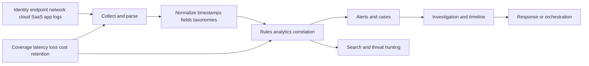

| SIEM strength/job | Evidence to request | Common failure mode | Complementary capability |
|---|---|---|---|
| Broad event collection/search | Source coverage, loss, latency, field map | Ingest volume without useful detections | Data engineering/governance |
| Detection correlation | Rule logic, test cases, precision/recall context | Noisy alerts and brittle rules | XDR/entity/threat context |
| Investigation timeline | Time sync, raw/normalized trace, case links | Missing source or timestamp distortion | EDR/NDR/application evidence |
| Compliance-supporting records | Retention, access, integrity, report definition | Report mistaken for compliance proof | GRC/control owners/audit |
| Threat hunting | Query coverage, hypothesis, baseline | Searching without decision or feedback | Threat intel and detection engineering |
| Central operations | Ownership, handoffs, case lifecycle | Tool becomes expensive archive | SOAR/workflow and outcome governance |

### XDR from first principles

XDR generally aims to connect detections and response across domains such as endpoint, identity, network, cloud, email, or application telemetry. The important evaluation is not the acronym but the domains, data fidelity, correlation logic, investigation experience, response authority, and integration boundaries actually available.

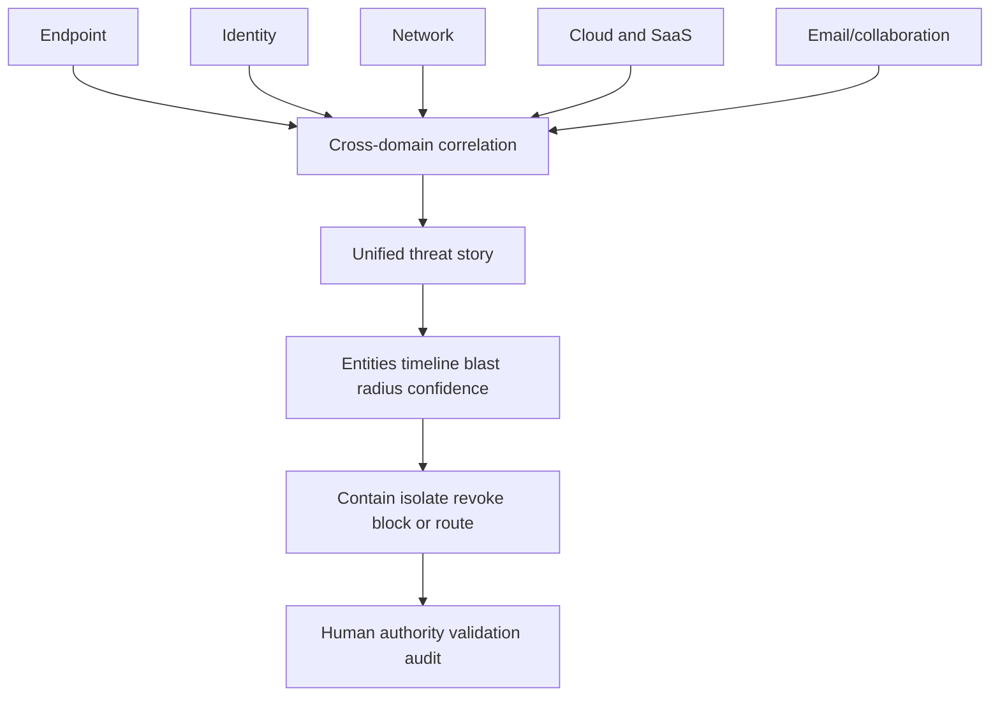

| Comparison dimension | SIEM tendency | XDR tendency | Requirement question |
|---|---|---|---|
| Center of gravity | Broad event/log platform | Cross-domain detection/investigation/response | Which job and teams are primary? |
| Data breadth | Potentially very broad and heterogeneous | Often deeper in integrated security domains | What sources/fields remain available? |
| Detection content | Custom and packaged rules/analytics | Packaged cross-domain analytics plus customization | How are detections tested and tuned? |
| Response | Native or integrated automation/SOAR | Often domain-native response actions | What authority, approval, rollback, audit exist? |
| Retention/search | Often central long-term search use | Varies by implementation/package | Which historical investigations/obligations apply? |
| Openness | Connector/API breadth varies | Native ecosystem depth and third-party breadth vary | Which current integrations are supported and proven? |
| Cost model | Often influenced by ingest/retention/compute | Often influenced by protected entities/features/data | What usage creates cost and value? |

### Security data fabric from first principles

A security data fabric emphasizes connected, reusable, governed security data across sources and use cases. It can support exposure, asset, vulnerability, risk, analytics, and workflows. It does not automatically replace an event-detection system, data lake, CMDB, warehouse, or integration platform. Ask what data types, grains, relationships, freshness, business logic, workflows, and consumers are in scope.

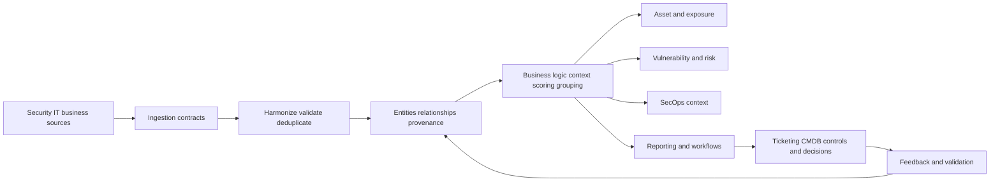

| Job | SIEM | XDR | Security data fabric | Key architecture question |
|---|---|---|---|---|
| Event detection | Core/common | Core/common | May provide context; not assume primary | Where is detection authored and validated? |
| Cross-domain investigation | Often supported | Core/common | Context can enrich | Which system owns case/timeline? |
| Entity golden context | Possible | Investigation-oriented entities | Often central design goal | How are merge/split/provenance governed? |
| Exposure/vulnerability modeling | Possible through data/apps | May contribute detections/context | Common target use | Which findings, assets, controls, paths are modeled? |
| Long-term raw retention | Common use | Varies | Not implied | Which system retains raw authoritative evidence? |
| Operational workflows | Native/integrated | Native/integrated | Common target use | How are actions reconciled and audited? |
| Replacement claim | Never assume | Never assume | Never assume | Map required jobs and coexistence first |

## CAASM, RBVM, exposure management, and CTEM

### CAASM and asset truth

CAASM addresses the problem that no single source sees every cyber asset or control relationship accurately. It aggregates sources, reconciles identities, enriches context, and highlights coverage or hygiene gaps. It is not simply another scanner: discovery signals may come from many tools, while the value depends on entity quality, source authority, lifecycle, ownership, and workflows.

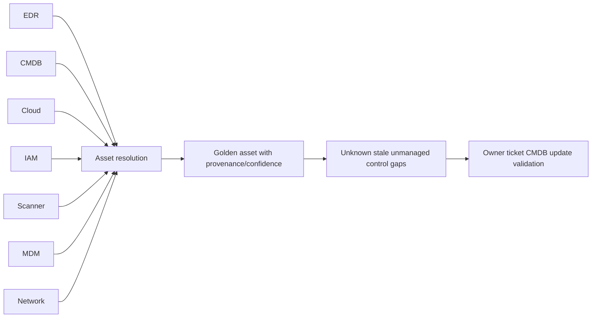

| CAASM decision | Required evidence | Edge case | Safe response |
|---|---|---|---|
| Is this one asset or two? | Stable IDs, serial/cloud ID, hostname, time, source confidence | Reimaged endpoint reuses hostname | Use temporal identity and split review |
| Is the asset active? | Multiple recent observations and lifecycle authority | Cloud workload is intentionally ephemeral | Evaluate expected lifetime/cadence |
| Is a control missing? | In-scope population and current control evidence | Agentless or unsupported device | Distinguish unsupported, exception, and unmanaged |
| Who owns it? | Accepted business/technical ownership source | Shared platform has multiple stakeholders | Separate service, asset, and risk ownership |
| Should CMDB update? | Authority, approval, field-level precedence | Security observation conflicts with finance lifecycle | Route conflict; never overwrite blindly |
| Is inventory complete? | Defined scope, source coverage, blind spots | Shadow SaaS/nonhuman identity | Report confidence and discovery limits |

### RBVM and contextual prioritization

Traditional vulnerability queues often emphasize severity and age. RBVM incorporates threat, exploitability, exposure, asset/business criticality, identity, controls, and workflow context. Context improves prioritization only when the inputs are trustworthy, definitions are visible, and humans can challenge or override the result.

| Input | Useful question | Failure mode | Governance control |
|---|---|---|---|
| CVSS/severity | How technically severe is the weakness under its assumptions? | Treated as business risk | Preserve vector and limitations |
| Exploitation evidence | Is exploitation known or more plausible now? | Stale/unverified feed | Source/date/confidence |
| Exposure/reachability | Can a relevant actor/path reach the condition? | Network label assumed as proof | Validate path and control |
| Asset criticality | Which objective depends on the asset/service? | Every owner marks critical | Tier definitions and authority |
| Identity | Which privileges or identities intersect? | Account presence treated as path | Temporal relationship and scope |
| Controls | What reduces likelihood/impact? | Designed/stale control treated effective | Operating evidence and freshness |
| Ownership | Who can act and accept? | Missing owner lowers priority | Keep risk and execution readiness separate |
| SLA/age | How long has accepted work waited? | State gaming or arbitrary deadlines | Policy, exceptions, validation |

### Exposure management and CTEM

Exposure management broadens the lens from isolated vulnerabilities to assets, misconfigurations, identities, paths, controls, external attack surface, business context, and plausible scenarios. CTEM describes a continuous program cycle that scopes what matters, discovers exposures, prioritizes, validates safely, and mobilizes treatment.

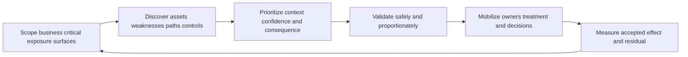

| Concept | Unit of attention | Primary question | Success evidence | Misconception |
|---|---|---|---|---|
| Vulnerability management | Vulnerability finding and remediation lifecycle | Which known weaknesses should be fixed and validated? | Accepted treatment and coverage | Every exposure is a CVE |
| RBVM | Contextual vulnerability priority | Which vulnerability work matters first? | Better accepted queue/action | Score equals risk |
| CAASM | Cyber asset and control context | What assets exist and where are coverage gaps? | Reconciled inventory/workflow | One source is complete truth |
| Exposure management | Conditions and plausible reachability/consequence | Which combinations create material scenarios? | Reduced/accepted exposure with evidence | Attack path graph proves exploitability |
| CTEM | Continuous program cycle | How do we repeatedly scope, validate, and mobilize? | Iterative accepted outcomes | Tool purchase equals program |

## SSE and SASE in the category landscape

SSE focuses on cloud-delivered security services for users, applications, and data. SASE combines networking and security capabilities into an architecture/service model for distributed access. Exact packaging varies. Compare required traffic paths, identity/context, policy, application access, internet/SaaS security, data controls, branch connectivity, experience, operations, and resilience.

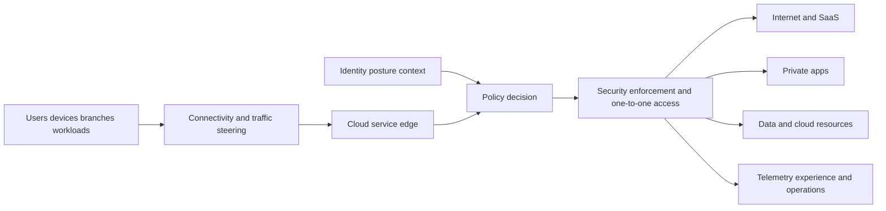

| Comparison | Traditional appliance/VPN tendency | SSE/SASE design question | Evidence to validate |
|---|---|---|---|
| Access unit | Network segment/tunnel often central | Can policy connect an authorized subject to a specific resource? | Effective policy and traffic path |
| Enforcement location | Data center/branch appliances | Which service edge handles which traffic and failure? | Path, latency, failover, logs |
| Context | Network/location may dominate | Which identity, device, app, risk, data contexts apply? | Policy inputs and freshness |
| Private access | Routed network access common | How are apps discovered/published without broad network reach? | Connector/service health and authorization |
| Internet/SaaS | Backhaul or distributed stacks | How is traffic steered and inspected appropriately? | Forwarding, certificate, policy evidence |
| Operations | Hardware/capacity/change focus | Cloud policy, tenancy, dependencies, updates, service health | Runbooks, monitoring, support boundaries |
| Convergence | Separate network/security procurement | Which jobs are actually integrated versus marketed together? | Current licensed architecture and test |

### Neutral evaluation scorecard

| Dimension | Questions | Evidence | Red flag |
|---|---|---|---|
| Outcome fit | Which decisions/workflows improve, for whom? | Accepted use cases and baselines | Feature list without customer job |
| Architecture fit | What data/control planes, paths, dependencies, failure modes? | Current diagrams and tests | Generic reference diagram treated as deployment |
| Data fit | Which sources, grains, mappings, quality, retention, lineage? | Source/field contracts and samples | "AI solves normalization" without evidence |
| Control fit | Which preventive/detective/corrective actions exist? | Policy/action tests and rollback | Autonomous action without authority |
| Integration fit | Which current APIs/connectors and ownership? | Licensed proof, error handling, reconciliation | Logo wall as integration proof |
| Operations fit | Who monitors, tunes, escalates, changes, and learns? | RACI, runbooks, skills, service routes | Tool has no operating owner |
| Security/privacy | What sensitive data, access, retention, residency, audit? | Data-flow/threat/privacy reviews | Broad collection without purpose |
| Resilience | What happens during outage, delay, schema change, bad action? | Degraded mode, failover, kill switch | Happy-path demo only |
| Economics | Which usage drives cost and displacement/overlap? | Current commercial model and TCO assumptions | Unverified savings claim |
| Evidence | What pilot proves fit and what would disconfirm it? | Acceptance plan and changed cases | Success criteria written after pilot |

### Plain-English deep-dive 2 - Competitive analysis begins with requirements, not logos

A vendor comparison can be factually correct and still useless if it compares brochure vocabulary instead of the customer's jobs. One offering may be deeper in a native telemetry domain; another may be broader across third-party data; another may emphasize policy enforcement; another may focus on asset/exposure workflows. The right design may combine categories.

Think of choosing transport. A train, bicycle, van, and airplane overlap in moving people or goods. "Which is best?" requires distance, load, route, schedule, safety, cost, and operating constraints. Security evaluation similarly requires architecture, data, control, workflow, people, evidence, and failure conditions. No product wins every scenario, and public pages cannot establish customer-specific fit.

## Standards and frameworks

A **standard** may define requirements or technical conventions. A **framework** organizes outcomes or practices. A **regulation** is a legal rule issued by an authority. A **control** is a safeguard. An **evidence artifact** supports an assertion about design or operation. The words are related but not interchangeable.

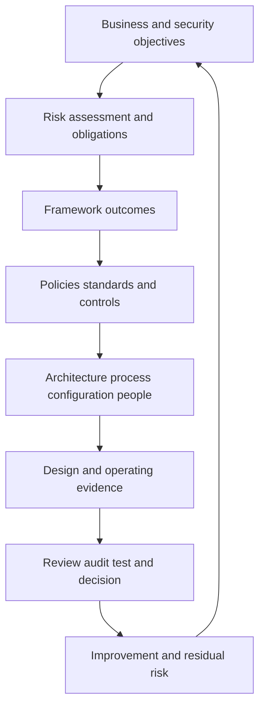

| Reference | Primary use | Useful SecOps/exposure connection | Boundary |
|---|---|---|---|
| NIST CSF 2.0 | Organize cybersecurity outcomes across Govern, Identify, Protect, Detect, Respond, Recover | Map data, exposure, response, and governance outcomes | Voluntary and implementation-neutral |
| NIST SP 800-207 | Zero trust architecture concepts | Resource-centric access, policy decisions/enforcement, continuous context | Not a vendor product design |
| NIST AI RMF 1.0 | Organize AI risk governance, mapping, measurement, management | AI/agent inventory, risks, controls, monitoring | Voluntary; not legal compliance |
| ISO/IEC 27001 | Information security management-system requirements | Risk-based control governance and continual improvement | Certification scope/evidence require authorized assessment |
| CIS Controls | Prioritized defensive safeguards | Asset/software inventory, vulnerability, logging, incident response | Implementation groups require context |
| MITRE ATT&CK | Knowledge base of adversary tactics/techniques | Detection/exposure hypotheses and coverage maps | Technique mapping is not proof of attack |
| FIRST CVSS | Standardized vulnerability-severity characteristics | One prioritization input with vector/assumptions | Severity is not business risk |
| FIRST EPSS | Probability-oriented estimate for exploitation activity in a defined horizon/model | Threat prioritization input | Model output has scope, date, uncertainty |
| CISA KEV | Catalog of vulnerabilities known exploited under CISA criteria | Strong prioritization/governance signal | Catalog absence does not mean safe |
| OCSF | Open schema effort for cybersecurity events | Event normalization and interoperability | Schema mapping still requires semantics/quality |
| STIX/TAXII | Structured threat information and exchange mechanisms | Threat-intelligence sharing/integration | Sharing quality, trust, handling still matter |
| SPDX/CycloneDX | Software bill of materials formats/standards ecosystems | Software component/supply-chain visibility | SBOM existence does not prove vulnerability or safety |

### Mapping without checkbox theater

| Technical evidence | Possible framework outcome | Control question | Evidence-quality question |
|---|---|---|---|
| Reconciled asset inventory | Identify assets and dependencies | Is scope/ownership/lifecycle defined? | Which blind spots and confidence remain? |
| Source health and log coverage | Detect/monitor capabilities | Are material sources timely and complete? | Can loss/delay be detected? |
| Prioritized exposure register | Govern/Identify/Protect planning | Are scenarios, owners, treatments, residuals managed? | Are scores explainable and accepted? |
| Access-policy evidence | Protect access control | Is policy least-privileged and context-aware? | Does effective behavior match design? |
| Incident timeline and PIR | Respond/Recover improvement | Are roles, communication, recovery, learning effective? | Were changed/control cases validated? |
| Training teach-back | Workforce capability | Can people perform safely? | Is behavior observed beyond attendance? |
| Dashboard/QBR | Governance and oversight | Do leaders receive decision-relevant evidence? | Are denominators, quality, limits visible? |

## Regulations and obligations

This section is educational and not legal advice. Applicability depends on entity, location, service, data, role, contract, incident, materiality, dates, and authoritative interpretation. A TSM should identify technical evidence questions and engage Legal, Privacy, Compliance, Audit, Safety, and customer authorities.

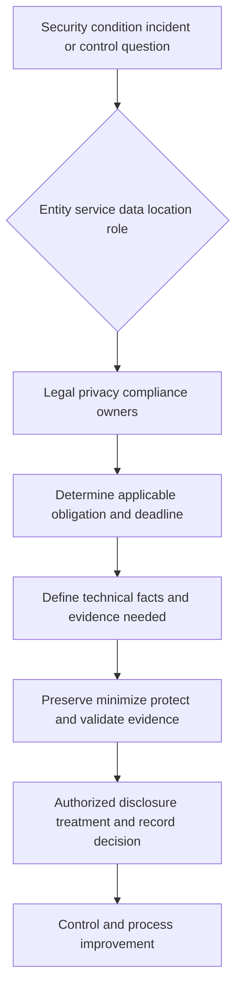

| Regulatory/official area | General theme relevant to security teams | Technical evidence question | Boundary |
|---|---|---|---|
| EU GDPR | Personal-data protection, security, rights, breach obligations under applicable conditions | What personal data, purpose, flow, access, protection, retention, incident facts exist? | Legal basis/applicability require counsel |
| EU NIS2 | Cybersecurity risk-management and incident-reporting duties for covered entities | Which essential/important entity, measures, supply-chain, incident facts and timelines apply? | National transposition and scope vary |
| EU DORA | ICT risk, incident, resilience testing, and third-party oversight for covered financial entities | Which service dependencies, incidents, tests, providers, contracts, and evidence apply? | Sector/entity applicability requires authority |
| EU AI Act | Risk-based requirements for AI systems and actors under phased applicability | What AI system, provider/deployer role, risk class, data, control, transparency, monitoring apply? | Dates, role, exceptions, guidance require current legal review |
| US SEC cyber disclosure rules | Public-company incident/risk/governance disclosures under applicable requirements | What facts support materiality/governance decisions and timing? | Legal/materiality decisions are not TSM decisions |
| US HIPAA Security Rule | Safeguards for electronic protected health information for covered contexts | Which ePHI systems, risks, access, audit, incident, BA relationships exist? | NMH is fictional; applicability/legal interpretation require counsel |
| PCI DSS | Security requirements for environments involving payment account data under program scope | What card-data flows, segmentation, access, logging, testing evidence exist? | Contractual/program scope and assessor decisions apply |
| State/national breach laws | Notification obligations vary by jurisdiction and facts | What data, affected persons, acquisition/access facts, dates, containment exist? | Requirements differ; use counsel/current authority |

### Regulation-to-technical-work translation

| Obligation theme | TSM-safe contribution | Authority retained elsewhere | Dangerous shortcut |
|---|---|---|---|
| Asset/system scope | Help map sources, services, dependencies, evidence gaps | Customer Legal/Compliance defines regulated scope | Assume all product data proves scope |
| Risk management | Connect findings to scenarios, controls, owners, treatment evidence | Risk owner accepts residual risk | Treat score as compliance conclusion |
| Incident reporting | Preserve technical timeline, impact facts, confidence, unknowns | Legal/executive authority determines notification/materiality | Promise reporting outcome or deadline interpretation |
| Third-party oversight | Surface technical dependency/health/evidence | Procurement/Legal owns contract and due diligence | Treat questionnaire as operating assurance |
| Resilience testing | Define controlled tests, guardrails, rollback, acceptance | Safety/change/business owners authorize | Test production without authority |
| AI governance | Inventory agent/data/tools/authority and validation | AI governance/Legal/Privacy set policy | Assume human-in-loop label solves risk |

## Third-party and supply-chain risk

A third party may provide software, SaaS, data, infrastructure, support, managed service, AI model, library, identity, or operational dependency. Risk is not captured by a questionnaire alone. It includes what the provider can access, what depends on it, how failures propagate, what evidence is current, and how exit/recovery works.

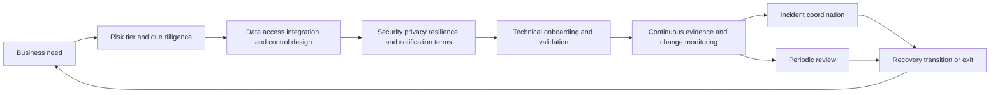

| Third-party dimension | Discovery questions | Evidence | Edge case |
|---|---|---|---|
| Business dependency | Which critical services fail if provider degrades? | Dependency/service map, recovery objective | Fourth party hidden behind provider |
| Data | What data/content/metadata crosses boundary and why? | Data-flow, classification, retention/deletion | Support logs contain sensitive payload |
| Identity/access | Which human and nonhuman identities have access? | Federation, roles, tokens, privileged-access logs | Dormant integration credential |
| Software/supply chain | Which components, updates, signing, provenance? | SBOM/provenance where available, update controls | Transitive vulnerable library |
| Detection/incident | What telemetry, notice, evidence, coordination exist? | Logs, contacts, exercise, notification terms | Provider cannot share raw evidence |
| Resilience | How failover, degraded mode, backup, exit work? | Test reports, architecture, runbooks | Concentration risk across providers |
| Assurance | Which independent/current evidence applies to scope? | Reports/certifications with scope/date/exceptions | Certificate treated as universal proof |
| Lifecycle | How changes, renewal, offboarding, deletion occur? | Change notice, inventory, revoke/delete evidence | Shadow integration survives contract |

### Fictional NMH third-party scenario

NMH considers an AI summarization service for vulnerability tickets. The safe analysis asks whether ticket data contains asset names, identities, vulnerabilities, credentials, patient-related context, or incident facts; what the service retains or uses; which model/provider chain exists; how prompts and outputs are logged; whether prompt injection can influence actions; and whether a human validates summaries before a ticket update. No real service is selected.

## Mergers, acquisitions, and divestitures

M&A compresses uncertainty. Two organizations bring different identities, networks, controls, contracts, data, asset records, risk appetite, and incidents. The first objective is not immediate technical convergence. It is safe visibility, decision rights, critical dependency protection, and a phased integration or separation plan.

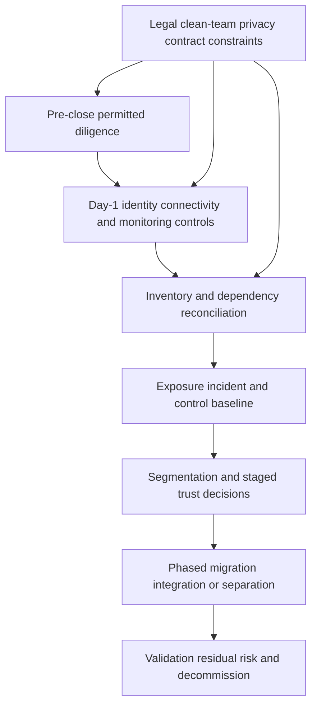

| M&A phase | Security priority | Evidence | Common trap |
|---|---|---|---|
| Pre-close | Authorized diligence and critical risks without prohibited sharing | Scope, clean-team rules, high-level control evidence | Collecting data beyond legal authority |
| Day 1 | Safe identity, connectivity, monitoring, incident contacts, business continuity | Temporary trust boundaries and runbooks | Broad network trust for convenience |
| First 30 days | Reconcile assets, identities, apps, data, third parties, critical services | Multi-source inventory and ownership | One CMDB declared truth |
| 30-90 days | Prioritize exposure and remediate material control gaps | Contextual risk register and roadmap | CVSS-only mass queue |
| Migration | Stage policy, identity, endpoint, data, logging, and app changes | Pilot/change/rollback/validation | Big-bang tool replacement |
| Divestiture | Separate access, data, contracts, telemetry, and retained obligations | Entitlement/revocation/deletion evidence | Shared service or token left behind |

### M&A edge cases

| Edge case | Risk | TSM/customer-safe approach |
|---|---|---|
| Same hostname in both organizations | False asset merge | Use stable IDs, source/tenant, time, and split review |
| Acquired company lacks EDR on OT devices | False "unmanaged" conclusion | Classify safety/compatibility/alternative controls |
| Identity federation must happen quickly | Privilege and lifecycle errors | Least privilege, scoped groups, logging, expiration, rollback |
| Unknown incident before close | Evidence/legal constraints and inherited exposure | Preserve authority, route counsel/IR, avoid unsupported conclusion |
| Divested app still uses parent API token | Persistent access/data path | Inventory nonhuman identities, rotate/revoke, validate |
| Tool consolidation promised as savings | Coverage/retention/workflow loss | Map jobs and evidence before removal; validate overlap |

## OT and IoT security

Operational technology (OT) monitors or controls physical processes. Internet of Things (IoT) devices sense, communicate, or act in connected environments. Safety, availability, deterministic behavior, long lifecycles, fragile protocols, vendor support, and maintenance windows may dominate. Enterprise IT practices cannot be copied blindly.

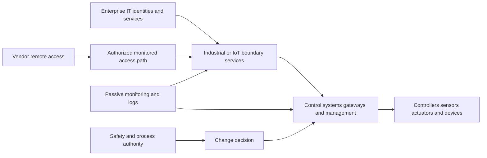

| IT tendency | OT/IoT constraint | Security implication | Safe pattern |
|---|---|---|---|
| Frequent patching | Maintenance windows and safety certification | Delay may be justified but must be governed | Compensating controls, vendor plan, monitored exception |
| Active scanning | Fragile/legacy protocols and devices | Scan may disrupt operation | Asset-owner approval, passive methods, lab/vendor guidance |
| Endpoint agent | Unsupported resource-constrained device | No agent does not equal no control | Segmentation, allowlist, gateway, passive visibility |
| Confidentiality priority | Safety and availability may dominate | Containment action can cause physical harm | Safety authority and tested response playbooks |
| Standard identity | Shared/operator/vendor accounts may persist | Attribution and privilege challenges | Controlled remote access, MFA where supported, session audit |
| Rapid isolation | Process shutdown may be unsafe | Response requires process engineering | Preplanned modes, manual operation, staged containment |
| Short lifecycle | Devices may operate for decades | Unsupported software and protocol debt | Inventory, segmentation, roadmap, risk acceptance |

### Plain-English deep-dive 3 - The safest cyber action can be physically unsafe

Disconnecting a compromised laptop may be sensible. Disconnecting a controller that maintains pressure, dosage, temperature, or movement may create immediate physical danger. OT response asks two questions together: what reduces cyber risk and what preserves process safety? The decision belongs to authorized safety and operations roles working with security.

Think of turning off power during a building fire. It may remove electrical risk, but it may also disable pumps, lighting, or life-safety systems if done blindly. Controls and playbooks must be engineered and tested before the emergency. A TSM should never encourage active scanning, unplanned patching, isolation, or configuration changes on OT/IoT merely to produce security evidence.

| OT/IoT exposure question | Evidence | Authority |
|---|---|---|
| What exists and performs which physical function? | Engineering inventory, passive observation, vendor records | Asset/process owner |
| Which pathways reach it? | Zones/conduits, firewall/policy, remote-access design | Network/OT security authority |
| Which vulnerability applies and is exploitable under conditions? | Version/vendor advisory/config/path/control evidence | OT security plus vendor/engineering |
| What treatment is safe? | Safety analysis, test plan, maintenance window, rollback | Process safety/change authority |
| What residual risk remains? | Compensating controls, monitoring, response, roadmap | Business/risk owner |

## AI attack surface

An AI system is more than a model. It may include user interface, prompts, system instructions, retrieval data, embeddings/vector stores, model endpoints, tools/plugins, agents, identities, memory, logs, evaluation pipelines, training/fine-tuning data, software dependencies, and human decisions. Every component creates assets, trust boundaries, and failure modes.

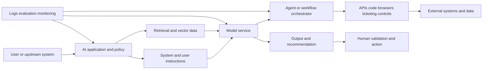

| AI asset/boundary | Threat or failure | Control questions | Evidence |
|---|---|---|---|
| Prompt/instructions | Direct/indirect prompt injection, instruction conflict | Are untrusted data and authority separated? | Adversarial test corpus and policy trace |
| Retrieval data | Poisoning, unauthorized retrieval, stale/wrong context | Who can write/read, how scoped, cited, refreshed? | Access, lineage, retrieval evaluation |
| Model endpoint | Abuse, extraction, denial, privacy, dependency | Authentication, quota, isolation, logging, provider terms? | API policy and monitoring |
| Tools/actions | Excess privilege, unsafe action, confused deputy | Least privilege, allowlist, approval, dry run, rollback? | Tool-call audit and denied-action tests |
| Memory | Sensitive persistence, cross-user leakage, poisoned state | Scope, retention, consent, deletion, tenant isolation? | Memory tests and lifecycle evidence |
| Output | Hallucination, bias, harmful recommendation, insecure code | Grounding, citations, uncertainty, human review? | Evaluation by task/risk |
| Logs | Sensitive prompts/content and credential leakage | Minimize, redact, access, retain, monitor? | Data-flow/privacy review |
| Supply chain | Vulnerable model/library/plugin or changed behavior | Provenance, version, signing, change/evaluation gates? | Inventory and release tests |
| Human use | Automation bias and deskilling | Training, escalation, independent verification? | Changed-case behavior |

### Agentic threats

An **agent** uses a model to plan or select actions and call tools under some authority. Agentic capability increases useful automation and blast radius. The risk depends less on whether the interface looks conversational and more on identity, permissions, data, tool effects, autonomy, persistence, oversight, and recovery.

```mermaid
sequenceDiagram
    participant A as Security agent
    participant D as Untrusted retrieved document
    participant M as Model/planner
    participant T as Ticketing or control tool
    participant H as Human approver
    A->>D: Retrieve incident context
    D-->>M: Hidden instruction requests broad isolation
    M->>A: Propose isolate all related assets
    A->>H: Show evidence scope uncertainty and proposed calls
    H->>A: Reject broad action; approve one reversible test
    A->>T: Execute allowlisted scoped action
    T-->>A: Return auditable result
    A-->>H: Validate effect and residual uncertainty
```

| Agentic threat | Example | Design control | Operational control |
|---|---|---|---|
| Prompt injection | Web page tells agent to ignore policy | Treat retrieved content as untrusted data; instruction hierarchy | Adversarial tests and alerts |
| Excess agency | Triage agent can disable every account | Narrow identity, scopes, tool allowlist, action caps | Approval, kill switch, audit |
| Confused deputy | User causes agent to use stronger service privilege | Bind user intent/authorization to each action | Authorization test and review |
| Memory poisoning | False fact persists across cases | Provenance, scoped memory, validation, expiry | Correction and purge workflow |
| Tool-output spoofing | Malicious API response changes plan | Authenticate, validate schema/source, distrust content instructions | Anomaly/correlation checks |
| Cascading agents | One agent's claim becomes another's trusted fact | Signed provenance, confidence, independent checks | End-to-end trace and circuit breaker |
| Goal drift | Long-running agent optimizes proxy metric | Explicit constraints/termination and outcome review | Monitor actions and stop conditions |
| Non-repudiation gap | Action cannot be tied to identity/version/context | Immutable audit of prompt/model/tool/policy/approver | Investigation and retention controls |

### Plain-English deep-dive 4 - Human in the loop is a design, not a label

A human approval step is weak if the approver sees only "Approve recommended action" under time pressure. Effective oversight requires the decision context: source evidence, scope, uncertainty, expected effect, affected resources, policy basis, alternatives, reversibility, and exact tool calls. The approver must have authority, skill, time, and a usable reject/escalate path.

Think of signing a blank check versus approving an itemized purchase order. Both contain a signature, but only one supports meaningful review. High-impact agent actions should be previewable, bounded, reversible where possible, independently validated, and auditable. Repeated low-risk actions may earn carefully governed autonomy after evidence, not before.

## Current trends as of the source snapshot

"Trend" here means a defensible technical or governance direction visible in current official standards, advisories, and public product positioning, not a claim about market share, growth, vendor leadership, or universal adoption. Re-verify before an interview because terminology and product packaging change.

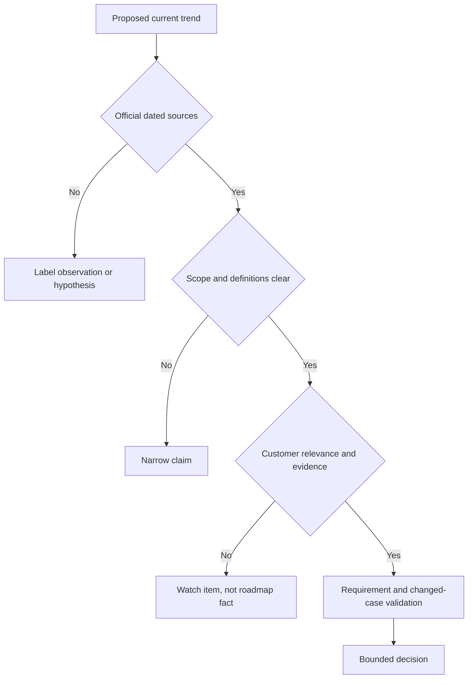

| Theme | Why practitioners care | Evidence-led question | Overclaim to avoid |
|---|---|---|---|
| Platform/category convergence | Data and workflows cross traditional tools | Which jobs truly integrate and which remain separate? | "One platform replaces everything" |
| Identity and nonhuman identity | Workloads, APIs, agents, tokens, and service accounts expand pathways | Who/what has authority, lifecycle, and evidence? | "MFA solves identity risk" |
| Exposure over isolated severity | Paths, controls, business context, and threat matter | Which scenario and treatment decision improve? | "Exposure score is probability" |
| Security-data normalization and graph context | Entities/relationships support many decisions | How are semantics, provenance, time, merge/split governed? | "A graph creates truth automatically" |
| AI-assisted SecOps | Summarization, investigation, and workflow assistance may reduce toil | Which task, evidence, evaluation, authority, guardrail? | "AI eliminates analysts" |
| Agentic action governance | Tool-using models can affect real systems | What permissions, approvals, limits, rollback, audit? | "Human in loop makes it safe" |
| AI system security | Models, data, retrieval, tools, and supply chain create new surfaces | Is the whole system inventoried and threat-modeled? | "Model security equals AI security" |
| Secure by design/default | Responsibility shifts toward safer product defaults and lifecycle | Which defaults remove burden and how are they verified? | "User training alone fixes design" |
| Software supply-chain transparency | Dependencies and provenance affect exposure | Can components, builds, updates, and response be traced? | "SBOM proves software secure" |
| Post-quantum transition planning | Long-lived confidentiality and cryptographic dependencies require inventory | Which cryptography/data lifetime/migration dependencies exist? | "Immediate algorithm swap everywhere" |
| Browser/SaaS/data control focus | Work increasingly occurs in browsers and SaaS/AI services | Where can data and policy be observed/enforced safely? | "Endpoint or proxy alone sees all" |
| Cost and evidence discipline | Security data and tool overlap can be expensive | Which data/action produces accepted outcome? | "Lower ingest always means better security" |
| Resilience and third-party concentration | Shared providers create systemic dependencies | What degraded mode, exit, and cross-provider concentration exist? | "Certification removes provider risk" |

## Edge-case playbook

Edge cases reveal whether an architecture is based on evidence or slogans. The answer is usually to classify the condition, preserve uncertainty, identify authority, choose the smallest safe test, and keep fallback paths.

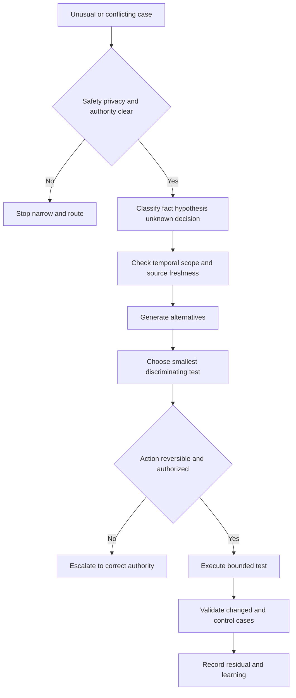

| Edge case | Why naive logic fails | Better reasoning |
|---|---|---|
| Ephemeral cloud asset disappears before scan | "Missing" may be expected lifecycle | Use cloud identity, lifetime, image/IaC/runtime evidence, expected cadence |
| Hostname reused after reimage | Same name is not same temporal asset | Use stable IDs, time intervals, provenance, split record |
| High CVSS on isolated safety system | Severity does not decide safe treatment | Verify applicability/path/control; involve safety; plan compensated treatment |
| Low-severity exposed identity path | Weak component may enable material chain | Analyze path, privilege, controls, consequence |
| Scanner says fixed; EDR says old version | Different observation time/method/scope | Compare grain, timestamps, credentials, package/runtime state |
| Ticket closed by automation | Administrative state may lack technical effect | Require validation evidence and reconcile/reopen |
| SIEM and XDR disagree on incident scope | Source/correlation/time/entity models differ | Trace raw evidence and definitions; preserve alternatives |
| CAASM merges shared NAT IP devices | IP is not stable identity | Use composite/temporal identifiers and split review |
| Control agent absent from unsupported IoT | Missing agent may be designed constraint | Classify support/exception and alternative control |
| Third party blocks log export | Visibility, privacy, contract, or platform constraints | Define minimum evidence, compensating monitoring, contract/exit decision |
| AI summary cites nonexistent evidence | Fluent text creates automation bias | Require citation-to-source validation and uncertainty |
| Agent suggests irreversible containment | Tool authority exceeds evidence/confidence | Require scoped preview, approval, rollback/fallback, escalation |
| M&A team wants full trust on day 1 | Convenience expands attack path before visibility | Temporary segmentation, least privilege, monitoring, phased trust |
| Risk score falls after model update | Non-comparable methodology creates false trend | Dual-run/restated baseline and change annotation |
| Regulation mentioned without scope | Name alone does not establish applicability | Engage authority; map facts, entity, data, role, location, dates |
| Executive wants single cyber number | Compression hides scenario/uncertainty | Use portfolio of scenarios, trends, confidence, decisions |

### Interview comparison method

When asked "X versus Y," use this seven-step answer instead of choosing a winner:

1. Define both categories in plain English.
2. State their primary jobs and units of attention.
3. Explain overlap and complementary architecture.
4. Compare data, control points, latency, retention, workflows, and operators.
5. Ask which customer objective and constraints matter.
6. Name evidence for fit, failure modes, and a bounded pilot.
7. State product/version/entitlement uncertainty and avoid replacement claims.

| Interview prompt | Strong opening | Key nuance |
|---|---|---|
| SIEM vs XDR | "SIEM often centers on broad event collection/detection/search; XDR often centers on cross-domain threat stories and response." | Capabilities overlap; inspect actual implementation |
| CAASM vs CMDB | "CAASM reconciles cyber-asset/control observations; CMDB supports governed configuration/service records." | They can exchange data; field authority differs |
| RBVM vs exposure management | "RBVM improves vulnerability priority; exposure management includes broader weaknesses, paths, identities, controls, and scenarios." | Neither score alone proves risk reduction |
| CTEM vs tool | "CTEM is a continuous operating cycle; products can support stages." | Ownership and mobilization determine outcomes |
| Data fabric vs SIEM | "A data fabric connects reusable context/workflows; a SIEM commonly supports event detection/investigation." | Map coexistence, raw retention, and case ownership |
| SSE vs SASE | "SSE is security-service capability; SASE combines network and security architecture/services." | Packaging varies; validate paths and controls |

## Practice scenarios

### Scenario 1 - Existing SIEM objection

Fictional NMH says, "We already have a SIEM, so why discuss data fabric or exposure management?" The candidate validates the concern and maps jobs. The SIEM handles defined event detection/search. The synthetic exposure workflow needs multi-source asset resolution, vulnerability/control/business context, ownership, and remediation reconciliation. The answer is not replacement; it is requirements, authoritative boundaries, integration cost, overlap, and a pilot that tests missing jobs.

### Scenario 2 - Third-party AI summarizer

NMH wants a ticket summarizer. The candidate maps data classes, provider/model chain, retention, training use, tenancy, access, prompt injection, citations, hallucination, tool authority, logs, human validation, incident handling, and exit. The first pilot uses synthetic tickets and no action privilege. Legal, Privacy, Security, Procurement, and workflow owners retain decisions.

### Scenario 3 - Acquired OT environment

An acquired fictional site has legacy controllers and no endpoint agents. The candidate does not mark every device noncompliant and demand immediate scanning. You map physical functions, safety authority, zones/conduits, remote access, passive evidence, vendor support, maintenance windows, compensating controls, and residual risk. Integration remains segmented and staged.

### Scenario 4 - Board asks for one risk number

The candidate explains that one index can help track defined factors but cannot represent every scenario, confidence, control, threat, and consequence. You offer a small portfolio: material scenarios, trend under stable rules, data confidence, mitigation status, decisions, and residual risk. No synthetic Risk360-style value is called a probability or financial loss.

### Scenario 5 - Agent autonomously closes findings

The proposed agent reads scanner output, assigns owners, and closes tickets. The candidate decomposes authority. Suggesting a duplicate may be low impact; changing priority or accepting an exception requires governance; closing requires technical validation; control changes require authorized workflows. Start read-only, use synthetic changed cases, add citations, scope tools, approvals, audit, kill switch, and independent reconciliation.

## Currency, source hierarchy, and claim control

| Source tier | Use | Example | Rule |
|---|---|---|---|
| Law/regulator official | Current legal text/guidance context | EUR-Lex, SEC, HHS | Counsel determines applicability/interpretation |
| Standards body/government | Definitions, frameworks, advisories, catalogs | NIST, CISA, FIRST, MITRE | Record version/date/scope |
| Vendor official | Current public positioning and documentation | Zscaler product/help pages | Verify package, version, entitlement, tenant behavior |
| Customer-authoritative | Actual architecture, policy, contracts, evidence | Approved customer records | Obtain authorization and protect data |
| Analyst/media/community | Hypothesis and landscape context | Reports/articles | Corroborate; do not turn opinion into fact |
| Candidate reasoning | Comparison, architecture hypothesis, scenario | This guide | Label assumption and validation plan |


| Currency trigger | Why re-verify | Action |
|---|---|---|
| Before interview | Product/category language may have changed | Review official product pages and release/current docs |
| Before architecture claim | Packaging and dependencies vary | Verify licensed architecture and owner |
| Before regulatory statement | Dates, guidance, scope, national implementation change | Engage legal/compliance and official current text |
| Before CVE/threat statement | Exploitation and scoring data change | Check current authoritative source/date |
| Before AI claim | Models, tools, policies, threats change rapidly | Re-run evaluations and governance review |
| After merger/source change | Scope and authority change | Rebaseline inventory, identities, data, controls |

## Official Source Anchors

Research/source snapshot and source review date: **2026-08-24**.

The table records bounded uses, not endorsements or proofs of customer fit. No source establishes market leadership, comparative superiority, licensed NMH capability, legal compliance, or a production outcome.

| Source | URL | Used for | Boundary |
|---|---|---|---|
| Zscaler Data Fabric for Security | https://www.zscaler.com/products-and-solutions/data-fabric | Public security-data positioning | No internal schema, connector, or replacement claim |
| Zscaler Unified Vulnerability Management | https://www.zscaler.com/products-and-solutions/unified-vulnerability-management | Public contextual vulnerability-management positioning | No algorithm or customer result inferred |
| Zscaler Asset Exposure Management / CAASM | https://www.zscaler.com/products-and-solutions/caasm | Public asset/exposure positioning | No inventory coverage or feature assumed |
| Zscaler CTEM | https://www.zscaler.com/products-and-solutions/ctem | Public CTEM-related positioning | CTEM remains an operating program, not proof from a product |
| Zscaler Risk360 | https://www.zscaler.com/products-and-solutions/risk360 | Public enterprise-risk positioning | No score/probability/financial result inferred |
| Zscaler Agentic Security Operations | https://www.zscaler.com/products-and-solutions/security-operations | Public SecOps/agentic positioning | No autonomous behavior, entitlement, or outcome inferred |
| Zscaler Zero Trust Exchange | https://www.zscaler.com/products-and-solutions/zero-trust-exchange-zte | Public zero-trust platform positioning | No customer architecture or comparative claim |
| NIST Cybersecurity Framework 2.0 | https://www.nist.gov/cyberframework | General cybersecurity outcome framework | Voluntary and implementation-neutral |
| NIST SP 800-207 | https://csrc.nist.gov/pubs/sp/800/207/final | Zero-trust architecture concepts | Not vendor implementation evidence |
| NIST AI Risk Management Framework | https://www.nist.gov/itl/ai-risk-management-framework | AI risk-management framing | Voluntary; not certification or legal advice |
| NIST AI 100-2e2025 | https://csrc.nist.gov/pubs/ai/100/2/e2025/final | Adversarial machine-learning taxonomy context | Apply to defined AI system/threat model |
| CISA Secure by Design | https://www.cisa.gov/securebydesign | Secure-by-design/default principles | General guidance; no product assurance |
| CISA KEV Catalog | https://www.cisa.gov/known-exploited-vulnerabilities-catalog | Known-exploitation prioritization input | Absence is not proof of safety |
| FIRST CVSS | https://www.first.org/cvss/ | Vulnerability severity framework | Severity is not business risk |
| FIRST EPSS | https://www.first.org/epss/ | Exploitation-probability model context | Scope/model/date/uncertainty apply |
| MITRE ATT&CK | https://attack.mitre.org/ | Adversary behavior knowledge base | Mapping does not prove observation or coverage |
| OCSF | https://ocsf.io/ | Open cybersecurity schema context | Mapping does not guarantee semantic quality |
| OASIS STIX/TAXII | https://oasis-open.github.io/cti-documentation/ | Threat-intelligence structure/exchange context | Trust, handling, relevance, and quality remain |
| SPDX | https://spdx.dev/ | Software bill of materials standard ecosystem | SBOM is not proof of secure software |
| CycloneDX | https://cyclonedx.org/ | Bill-of-materials standard ecosystem | Completeness/currentness require validation |
| EU GDPR official text | https://eur-lex.europa.eu/eli/reg/2016/679/oj | General personal-data legal context | Applicability/interpretation require counsel |
| EU NIS2 official text | https://eur-lex.europa.eu/eli/dir/2022/2555/oj | General covered-entity cybersecurity context | National transposition/scope require counsel |
| EU DORA official text | https://eur-lex.europa.eu/eli/reg/2022/2554/oj | General financial-sector digital-resilience context | Entity/contract/application require counsel |
| EU AI Act official text | https://eur-lex.europa.eu/eli/reg/2024/1689/oj | General AI legal framework context | Phased dates/roles/risk class require counsel |
| US SEC cybersecurity rules page | https://www.sec.gov/newsroom/press-releases/2023-139 | Public-company disclosure/governance rule context | Materiality/disclosure are authorized legal decisions |
| HHS HIPAA Security Rule | https://www.hhs.gov/hipaa/for-professionals/security/index.html | US health-information security context | NMH is fictional; applicability requires authority |
| PCI Security Standards Council | https://www.pcisecuritystandards.org/standards/pci-dss/ | Payment-card security standard context | Scope/assessment require authorized program interpretation |

## Likely Interview Questions

### Q1. How do SIEM, XDR, and a security data fabric differ?

**Model answer:** SIEM commonly centers on broad event collection, search, detection, investigation, and retention. XDR commonly centers on cross-domain threat correlation, investigation, and response. A security data fabric emphasizes governed, connected, reusable security entities, relationships, context, logic, and workflows across use cases. They overlap and can complement each other. I would map actual jobs, sources, latency, retention, case ownership, actions, and evidence before making any replacement claim.

### Q2. What is the difference among CAASM, RBVM, exposure management, and CTEM?

**Model answer:** CAASM focuses on reconciling cyber assets and control coverage. RBVM uses context to prioritize vulnerability work beyond severity. Exposure management considers broader weaknesses, identities, paths, controls, and business scenarios. CTEM is a continuous operating cycle: scope, discover, prioritize, validate, and mobilize. Products can support several jobs, but data quality, ownership, workflow, and accepted outcomes determine value.

### Q3. How would you compare competing security offerings fairly?

**Model answer:** I define the required customer jobs and compare architecture, data, control points, integrations, operating model, security/privacy, resilience, economics, and evidence. I verify current licensed capabilities rather than infer from category labels or logo walls. I use changed-case acceptance tests and identify what would disconfirm fit. I avoid rankings, market claims, competitor bashing, and universal replacement statements.

### Q4. How do standards and regulations affect a TSM conversation?

**Model answer:** Frameworks help organize outcomes and controls; regulations create legal obligations under defined scope. A TSM can help map systems, data, evidence, risks, controls, incidents, and gaps, but Legal, Privacy, Compliance, Audit, Safety, and risk owners determine applicability and decisions. I use current official sources, record dates and versions, preserve evidence, and never call a product report compliance proof.

### Q5. What changes in an OT or IoT security scenario?

**Model answer:** Physical safety, availability, deterministic operation, long lifecycles, fragile protocols, vendor support, and maintenance windows may dominate. Active scanning, patching, or isolation can be unsafe. I involve process/safety authority, prefer authorized passive evidence, map zones and remote access, use compensating controls, test in appropriate environments, and record residual risk. Enterprise IT playbooks cannot be copied blindly.

### Q6. What is the attack surface of an AI agent?

**Model answer:** It includes prompts and system instructions, model endpoint, retrieval data, memory, tools, identities, permissions, external content, logs, software/model supply chain, outputs, and human decision paths. Key threats include prompt injection, data poisoning/leakage, hallucination, confused deputy, excessive agency, tool spoofing, cascading agents, and goal drift. Controls include least privilege, provenance, scoped memory, allowlisted tools, meaningful approval, changed-case testing, audit, rollback, and kill switches.

### Q7. How would you assess third-party security risk?

**Model answer:** I begin with business dependency, data flows, identities, technical integration, software/provider chain, controls, telemetry, incident coordination, resilience, assurance scope, contracts, monitoring, and exit. I distinguish questionnaire claims from operating evidence and consider fourth-party and concentration risk. Legal and Procurement own contractual decisions; technical teams validate architecture and current evidence.

### Q8. How does your experience transfer to these deeper topics?

**Model answer:** Microsoft 365 expertise provides a concrete base for SaaS, identity, permissions, endpoint, network, proxy, browser, and data dependencies. Escalation/RCA supports cross-domain evidence and incident learning. SQL, Power BI, statistics, and MBA analytics support data and metric challenge. Mentoring and AI training support translation and responsible adoption. You should state direct Zscaler, SOC, exposure-program, OT, regulatory, and agent-security production gaps honestly.

## 30-Second Memory Hooks

| Concept | Memory hook |
|---|---|
| Category | Job family, not product boundary |
| SIEM | Events, detection, search, investigation |
| XDR | Cross-domain story and response |
| Data fabric | Governed reusable context and workflows |
| CAASM | Reconciled cyber-asset census |
| RBVM | Contextual vulnerability queue |
| Exposure | Conditions, paths, controls, consequence |
| CTEM | Scope, discover, prioritize, validate, mobilize |
| SSE | Cloud-delivered security service edge |
| SASE | Networking plus security architecture |
| Framework | Organizes outcomes; does not certify implementation |
| Regulation | Scope and counsel before conclusion |
| Third party | Dependency, data, access, evidence, exit |
| M&A | Visibility and boundaries before convergence |
| OT/IoT | Cyber action must preserve physical safety |
| AI system | Model plus data, retrieval, tools, identity, logs, people |
| Agent | Authority and blast radius matter |
| Human approval | Itemized decision, not blank check |
| Trend | Dated evidence, bounded claim |
| Comparison | Requirements and proof, not logos |

## Completion Checklist

- [ ] I can define SIEM, XDR, SOAR, CAASM, RBVM, exposure management, CTEM, security data fabric, SSE, SASE, EDR, NDR, DSPM, and CNAPP from zero.
- [ ] I can compare categories by job, unit of attention, data, control point, workflow, operator, evidence, and failure mode.
- [ ] I can explain overlap without assuming duplication or replacement.
- [ ] I can use the neutral evaluation scorecard without competitor bashing or unverified market claims.
- [ ] I can distinguish standard, framework, regulation, control, and evidence.
- [ ] I can map NIST CSF, zero trust, AI RMF, ATT&CK, CVSS, EPSS, KEV, OCSF, STIX/TAXII, and SBOM concepts with boundaries.
- [ ] I can discuss GDPR, NIS2, DORA, the EU AI Act, SEC cyber rules, HIPAA, PCI DSS, and breach-law themes without giving legal advice.
- [ ] I can identify Legal, Privacy, Compliance, Audit, Safety, Procurement, Product, and risk-owner authority.
- [ ] I can assess third-party dependency, data, access, supply chain, incident, resilience, assurance, and exit.
- [ ] I can explain M&A security phases, temporary boundaries, identity/data conflicts, and divestiture residue.
- [ ] I can explain why active scanning, patching, or isolation may be unsafe in OT/IoT.
- [ ] I can inventory the AI system attack surface beyond the model.
- [ ] I can threat-model prompt injection, poisoning, excessive agency, confused deputy, memory, tools, cascading agents, and goal drift.
- [ ] I can explain why human-in-the-loop must be meaningful, informed, authorized, and auditable.
- [ ] I can describe current themes as dated, bounded observations rather than market predictions.
- [ ] I can reason through all sixteen edge cases without slogan-based answers.
- [ ] I can use a source hierarchy and currency trigger before making a product, threat, or regulatory claim.
- [ ] I keep NMH explicitly fictional and synthetic.
- [ ] I tie your factual strengths to the role while preserving direct-experience gaps.
- [ ] I can answer comparison questions without choosing a universal winner.

[Next: Part 119 - Master Interview Question Bank and Self-Quiz Tracker](Part-119-master-interview-question-bank.md)