# Part 119 - Master Interview Question Bank and Self-Quiz Tracker

> **Purpose:** Turn the complete curriculum into a repeatable interview-practice system with 240 unique questions: 48 basic, 48 intermediate, and 144 advanced. Every question includes a concise model answer or answer framework and at least one link to the Part that contains the full concept.

> **Scope and honesty:** Model answers are study scaffolds, not scripts to recite or evidence that Arti has performed every task in production. Product facts are bounded to official public material reviewed on 2026-08-24. Northstar Meridian Holdings (NMH) is always fictional and synthetic. Personal answers must distinguish supported experience, completed lab practice, learned architecture, and not-yet-used products.

> **Section goal:** Make it difficult to go blank by training definition, architecture, evidence, decision, customer, and honesty muscles separately; identify weak topics through stable question IDs; rehearse concise and deep versions; and require cross-referenced correction rather than memorizing unsupported claims.

The intended distribution is exactly **240 questions**: **48 basic (20%)**, **48 intermediate (20%)**, and **144 advanced (60%)**. Question text is unique. IDs remain stable even if an answer is improved later. A self-quiz result records the ID, not a copied question, so progress remains comparable.

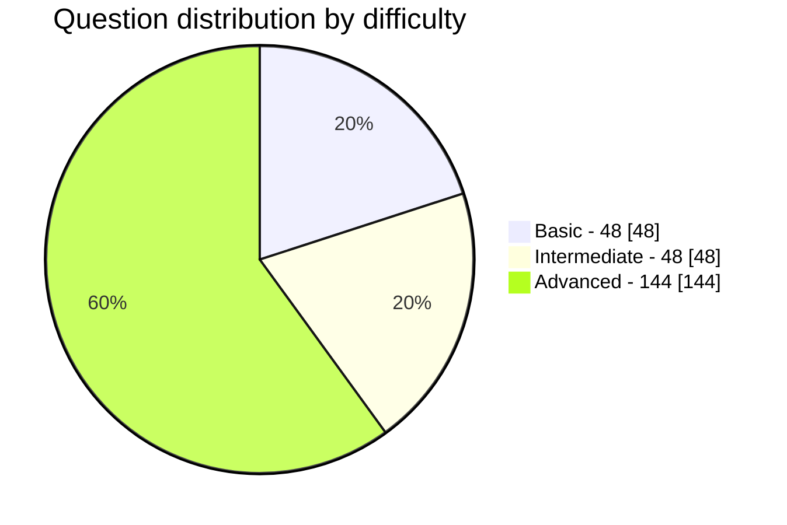

| Level | IDs | Count | Interview behavior trained | Suggested answer time |
|---|---|---:|---|---:|
| Basic | B001-B048 | 48 | Define accurately, give one analogy, explain why it matters | 30-60 seconds |
| Intermediate | I001-I048 | 48 | Connect components, compare options, identify evidence and failure modes | 60-120 seconds |
| Advanced | A001-A144 | 144 | Analyze ambiguity, lead decisions, preserve boundaries, adapt to changed cases | 2-4 minutes |
| Total | B001-A144 | 240 | Technical, customer, scenario, behavioral, culture, and closing readiness | Mixed |

## JD Mapping

| Interview domain | Main ID ranges | JD capability exercised | Evidence standard |
|---|---|---|---|
| Role, company, culture, closing | B001-B004, A129-A144 | Motivation, ownership, collaboration, impact, transparency | Supported facts and explicit gaps |
| Cybersecurity and networking | B005-B020, I009-I016, A017-A032 | Complex-environment analysis and troubleshooting | Protocol/evidence chain, no unsafe action |
| Zscaler product and architecture | B021-B028, I001-I008, A001-A016 | Product/zero-trust technical consultancy | Current public fact plus tenant verification |
| SQL, data, and Data Fabric | B029-B036, I017-I024, A033-A052 | Data modeling, integration, quality, analytics | Traceable logic, provenance, limitations |
| AEM, UVM, CTEM, and Risk360 | B037-B042, I025-I034, A053-A076 | Exposure, vulnerability, and risk outcomes | Context, confidence, owner, validation |
| SecOps and AI | I035-I040, A077-A096 | Triage, response, integrations, responsible AI | Human authority, audit, changed cases |
| TSM and customer leadership | B043-B048, I041-I048, A097-A116 | Strategic engagement, QBR, escalation, adoption, value | Outcome contracts and honest role boundaries |
| Integrated scenarios | A117-A128 | End-to-end technical/customer judgment | Structured response under ambiguity |

## Candidate honesty note

Arti should use four explicit evidence labels while practicing:

| Label | When to use | Example opening |
|---|---|---|
| Factual production experience | Microsoft 365 support, escalation, customer communication, networking evidence, analytics, mentoring, and AI facts supported by the guide/CV | "In my Microsoft escalation work, I..." |
| Completed synthetic practice | Parts 111-117 only after personally completing and retaining the lab evidence | "In a local synthetic NMH exercise, I practiced..." |
| Learned architecture | Concepts studied but not operated in a licensed production environment | "I understand the architecture as follows, and I would validate..." |
| Direct gap | Product/program not yet used directly | "I have not administered that product yet; my transferable method is..., and my ramp plan is..." |

Never turn a model answer into a personal claim merely because it sounds polished. Replace bracketed personal prompts with supported details. If the evidence is unavailable, say so and explain the validation plan.

## Self-quiz rating method

Score each attempt from 0 to 4. A question is **interview-ready** only after two separate attempts score at least 3, including one changed or interrupted version.

| Rating | Name | Observable behavior | Required next action |
|---:|---|---|---|
| 0 | Blank | Cannot define the core term or starts with an unsafe/invented claim | Read linked Part; write a one-sentence definition |
| 1 | Recognition | Recognizes terms but answer is fragmented, jargon-heavy, or inaccurate | Rebuild definition, analogy, and why-it-matters |
| 2 | Functional | Core answer is mostly correct but misses evidence, tradeoff, or boundary | Add architecture/evidence/failure/validation |
| 3 | Interview-ready | Clear, correct, structured, bounded, and relevant within target time | Rehearse changed case and interruption |
| 4 | Adaptive | Handles follow-ups, ambiguity, alternatives, and honesty naturally | Space review; teach it to another person |

| Confidence tag | Meaning | Use |
|---|---|---|
| R | Red | Score 0-1 or unsafe/invented statement |
| A | Amber | Score 2 or timing/structure inconsistent |
| G | Green | Score 3 twice on separate days |
| B | Blue | Score 4 including changed case and teach-back |

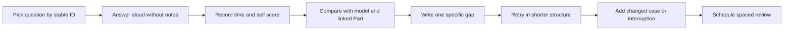

### Tracker template

| ID | Date | Score 0-4 | Time | Evidence label used | Strongest point | One gap | Changed case | Next review | Status |
|---|---|---:|---:|---|---|---|---|---|---|
| B001 | YYYY-MM-DD | 0 | 0:00 | learned/factual/lab/gap |  |  |  | YYYY-MM-DD | R/A/G/B |
| I001 | YYYY-MM-DD | 0 | 0:00 | learned/factual/lab/gap |  |  |  | YYYY-MM-DD | R/A/G/B |
| A001 | YYYY-MM-DD | 0 | 0:00 | learned/factual/lab/gap |  |  |  | YYYY-MM-DD | R/A/G/B |

### Answer structures

| Question type | Structure | Memory line |
|---|---|---|
| Definition | Plain meaning -> analogy -> why it matters -> one limitation | Define, picture, purpose, boundary |
| Architecture | Actors -> flow -> control points -> evidence -> failures | Who, path, policy, proof, break |
| Troubleshooting | Scope -> baseline -> hypotheses -> discriminating evidence -> action -> validation | Scope before solution |
| Comparison | Jobs -> overlap -> differences -> customer requirement -> evidence | Requirements before winner |
| Risk | Observation -> scenario -> objective -> controls -> confidence -> treatment -> residual | Finding is not risk |
| Customer | Outcome -> stakeholders -> plan -> evidence -> cadence -> adaptation | Decision and accepted state |
| Behavioral | Situation -> task -> actions -> result -> reflection -> relevance | STAR plus learning and transfer |

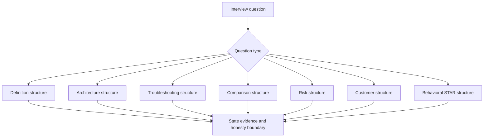

## Basic Questions - 48

### Role, cybersecurity, and risk fundamentals

#### B001. What does a Technical Success Manager do?

**Model answer:** A TSM helps customers convert technical capabilities into durable, accepted outcomes. The role learns objectives and architecture, builds success plans, monitors health and adoption, coordinates specialists, leads technical reviews and escalations, enables teams, and keeps decisions evidence-based. A TSM owns coordination and follow-through, not every customer configuration, risk acceptance, product roadmap, or commercial decision.

**Cross-reference:** [Part 3 - Technical Success Management from Zero](Part-03-technical-success-management-from-zero.md)

#### B002. How is Technical Success different from reactive Support?

**Model answer:** Support commonly responds to incidents, defects, and "how-to" issues through a case process. Technical Success is broader and proactive: it aligns architecture, adoption, health, governance, value evidence, and future outcomes while still coordinating Support when a break/fix issue occurs. The roles complement each other; a TSM should not bypass support ownership or relabel support activity as customer value.

**Cross-reference:** [Part 3 - Technical Success Management from Zero](Part-03-technical-success-management-from-zero.md)

#### B003. What is zero trust in plain English?

**Model answer:** Zero trust is an architecture principle that does not grant broad trust merely because a user or device is on a familiar network. It evaluates identity, device, resource, context, policy, and risk for specific access, applies least privilege, and continues to reassess. Think of checking each visitor and destination rather than handing everyone inside the campus a master key.

**Cross-reference:** [Part 10 - Zero Trust from First Principles and NIST SP 800-207](Part-10-zero-trust-nist-800-207.md)

#### B004. What Zscaler culture signals should a candidate be ready to evidence?

**Model answer:** The guide emphasizes customer obsession, impact over activity, ownership, accountability, urgency with quality, transparency, collaboration, and constructive debate, alongside an AI-forward direction. A strong answer uses supported examples and explains decisions and learning. It should not simply repeat value words or invent Zscaler experience; current official company material should be rechecked before the interview.

**Cross-reference:** [Part 2 - Zscaler Mission, AI-Forward Strategy, Culture, and Interview Signals](Part-02-zscaler-mission-ai-culture.md)

#### B005. What is a cybersecurity asset?

**Model answer:** An asset is anything valuable or necessary that must be understood and protected, such as an identity, endpoint, server, application, cloud resource, dataset, business service, device, certificate, or process. Asset importance depends on the objective it supports, not only its technical type. Inventory also needs lifecycle, owner, relationships, exposure, controls, and confidence.

**Cross-reference:** [Part 6 - Cybersecurity Fundamentals](Part-06-cybersecurity-fundamentals.md)

#### B006. How do threat, vulnerability, risk, and control differ?

**Model answer:** A threat is a possible cause of harm; a vulnerability is a weakness; risk is the effect of uncertainty on an objective through a plausible scenario; and a control is a safeguard that changes likelihood, impact, detection, response, or recovery. A vulnerability alone is not a complete risk statement because context, exposure, consequence, controls, and uncertainty still matter.

**Cross-reference:** [Part 6 - Cybersecurity Fundamentals](Part-06-cybersecurity-fundamentals.md)

#### B007. What does the CIA triad mean?

**Model answer:** CIA means confidentiality, integrity, and availability. Confidentiality limits information to authorized access. Integrity preserves accuracy, completeness, and authorized change. Availability keeps systems and data usable when needed. A decision may trade among them, and safety, privacy, authenticity, and resilience can add important context. The triad is a thinking aid, not a complete security program.

**Cross-reference:** [Part 6 - Cybersecurity Fundamentals](Part-06-cybersecurity-fundamentals.md)

#### B008. What is an attack surface?

**Model answer:** The attack surface is the set of reachable or potentially usable entry points and pathways through identities, applications, services, endpoints, cloud, networks, data, suppliers, and people. It changes over time. A useful view includes what exists, who can reach it, which controls apply, what business objective depends on it, and how confident the evidence is.

**Cross-reference:** [Part 7 - Attack Surface, Attack Paths, Kill Chains, and MITRE ATT&CK](Part-07-attack-surface-paths-kill-chain-mitre.md)

#### B009. What is least privilege?

**Model answer:** Least privilege gives a subject only the access required for an approved job, for the needed resource and time, under suitable conditions. It limits blast radius and misuse. It also requires lifecycle management: provision, review, expire, revoke, and monitor. "No administrator rights" is not enough if a broad service token remains permanent and unobserved.

**Cross-reference:** [Part 9 - Defense in Depth, Least Privilege, Segmentation, and Compensating Controls](Part-09-defense-in-depth-least-privilege.md)

#### B010. What is defense in depth?

**Model answer:** Defense in depth uses multiple safeguards so one failure does not automatically produce unacceptable harm. Layers may include identity, endpoint, network, application, data, monitoring, response, and recovery controls. More tools are not automatically more depth; layers need distinct mechanisms, evidence, ownership, and tested failure behavior. Correlated common dependencies can still create one point of failure.

**Cross-reference:** [Part 9 - Defense in Depth, Least Privilege, Segmentation, and Compensating Controls](Part-09-defense-in-depth-least-privilege.md)

#### B011. What are the basic incident-response phases?

**Model answer:** A common lifecycle is preparation; detection and analysis; containment; eradication; recovery; and lessons learned. Real work overlaps: teams preserve evidence, communicate impact, run hypotheses, authorize actions, validate recovery, and improve controls. Containment should be proportionate and safe. Closing an incident requires more than service restoration; residual risk and prevention actions remain.

**Cross-reference:** [Part 15 - Incident Response, Evidence, RCA, and Post-Incident Improvement](Part-15-incident-response-evidence-rca.md)

#### B012. What are the main risk-treatment options?

**Model answer:** The common options are avoid the activity, mitigate the risk with controls, transfer or share portions through arrangements such as insurance or contracts, and accept the residual risk through authorized governance. Treatment needs an owner, rationale, dependencies, due basis, validation, and residual review. Technical staff should not accept business risk simply because they found it.

**Cross-reference:** [Part 13 - Risk Assessment, Treatment, Appetite, Tolerance, and Residual Risk](Part-13-risk-assessment-treatment.md)

### Networking and identity fundamentals

#### B013. Why are the OSI and TCP/IP models useful in troubleshooting?

**Model answer:** They divide communication into conceptual layers so evidence can localize failure: physical/link, IP/routing, transport, and application/security protocols. The models are maps, not literal software stacks. A troubleshooter asks where the first divergence occurs and avoids blaming TLS when TCP never connected or blaming DNS when a valid answer already exists.

**Cross-reference:** [Part 16 - OSI and TCP/IP Models from Zero](Part-16-osi-tcp-ip-models.md)

#### B014. What does TCP provide?

**Model answer:** TCP provides a connection-oriented byte stream with sequence numbers, acknowledgments, retransmission, ordering, flow control, and congestion behavior. A socket conversation is identified by protocol plus source/destination addresses and ports. TCP can prove transport behavior, not application success: a completed handshake does not mean TLS, authentication, HTTP, or the business transaction succeeded.

**Cross-reference:** [Part 18 - TCP, UDP, Ports, Sockets, State, and Reliability](Part-18-tcp-udp-ports-sockets.md)

#### B015. What does DNS do?

**Model answer:** DNS maps names to records such as addresses and service information through resolver, cache, recursive, and authoritative steps. Troubleshooting checks the exact name, record type, server, answer, TTL, scope, split-horizon behavior, timing, and client use. A successful lookup does not prove the returned endpoint is reachable or the application uses that answer.

**Cross-reference:** [Part 19 - DNS and DHCP End to End](Part-19-dns-dhcp.md)

#### B016. What does DHCP do?

**Model answer:** DHCP supplies network configuration such as an IP address, subnet prefix, gateway, DNS servers, and lease timing. A common IPv4 flow is Discover, Offer, Request, Acknowledge. Troubleshooting checks interface state, scope availability, relay path, options, conflicts, lease timing, and actual client configuration. Having an address still does not prove routing or application access.

**Cross-reference:** [Part 19 - DNS and DHCP End to End](Part-19-dns-dhcp.md)

#### B017. What does TLS provide?

**Model answer:** TLS protects application traffic with negotiated cryptography, confidentiality, integrity, and peer authentication, usually through certificates. The handshake agrees parameters and establishes keys after underlying transport exists. Validation checks hostname, chain, trust, time, usage, and policy. Encryption does not prove the endpoint or application is safe, and disabling validation is not a sound fix.

**Cross-reference:** [Part 21 - TLS, PKI, Certificates, Handshakes, and Inspection](Part-21-tls-pki-certificates-inspection.md)

#### B018. What is a forward proxy?

**Model answer:** A forward proxy acts on behalf of clients to reach external destinations. It can authenticate users or processes, apply policy, inspect allowed traffic, log decisions, and create outbound connections. With HTTPS tunneling, the client first connects to the proxy and requests a CONNECT tunnel. The proxy is therefore the immediate TCP peer before target TLS begins.

**Cross-reference:** [Part 22 - Proxies, Firewalls, VPNs, Load Balancers, CDN, SSE, and SASE](Part-22-proxies-firewalls-vpn-sse-sase.md)

#### B019. What does HTTP status 407 mean?

**Model answer:** HTTP 407 means proxy authentication is required or was not accepted. It differs from 401, which concerns authentication to the origin service. In an HTTPS proxy flow, 407 may occur before a tunnel is established and before target TLS. Evidence should identify the responding peer, process/identity, headers, policy, and comparison cohort before assigning cause.

**Cross-reference:** [Part 20 - HTTP, HTTPS, URLs, Methods, Headers, Cookies, Sessions, and Status Codes](Part-20-http-https-web-protocol.md)

#### B020. How do SAML, OAuth 2.0, and OpenID Connect differ?

**Model answer:** SAML commonly supports browser-based federation using signed assertions. OAuth 2.0 is an authorization framework for delegated access using tokens and scopes. OpenID Connect adds an identity layer to OAuth 2.0, commonly using ID tokens. Exact flows, clients, grants, redirect URIs, issuers, audiences, signatures, clocks, and policies must be inspected rather than treating all tokens alike.

**Cross-reference:** [Part 23 - Identity Protocols](Part-23-identity-protocols.md)

### Zscaler product fundamentals

#### B021. What is the Zscaler Zero Trust Exchange?

**Model answer:** Based on current public positioning, the Zero Trust Exchange is Zscaler's cloud-delivered platform for applying zero-trust security and policy between users/workloads and applications or resources. The interview-safe explanation focuses on identity/context, proxy-brokered connections, least privilege, and reduced attack surface. Exact licensed services, paths, policy, and behavior require current documentation and tenant evidence.

**Cross-reference:** [Part 30 - Zscaler Company, Platform, Portfolio, and Market Vocabulary](Part-30-zscaler-company-platform-portfolio.md)

#### B022. What is Zscaler Internet Access (ZIA)?

**Model answer:** ZIA is publicly positioned as a cloud-delivered secure internet and SaaS access service. Concepts include traffic forwarding, proxying, identity/context policy, URL and threat controls, firewall-related capabilities, TLS inspection choices, and data protection. A candidate should explain the flow and dependencies while avoiding assumptions about a customer's subscription, policy, or enabled feature.

**Cross-reference:** [Part 34 - Zscaler Internet Access Fundamentals](Part-34-zia-fundamentals.md)

#### B023. What is Zscaler Private Access (ZPA)?

**Model answer:** ZPA is publicly positioned for zero-trust access to private applications without placing users broadly on the private network. Policy connects an authorized identity/device context to a specific application through service components rather than inbound exposure. Exact connector groups, health, app definitions, policy, DNS, routing, and licensed behavior must be validated in the current environment.

**Cross-reference:** [Part 35 - Zscaler Private Access Fundamentals](Part-35-zpa-fundamentals.md)

#### B024. What is Zscaler Client Connector?

**Model answer:** Client Connector is endpoint software associated with identity, posture, traffic forwarding, and access to relevant Zscaler services. Troubleshooting considers installation/version, enrollment, authentication, forwarding profile, tunnel/service state, posture, certificates, policy, network path, bypass rules, and logs. A client icon alone does not establish the effective path or policy result.

**Cross-reference:** [Part 36 - Zscaler Client Connector, Forwarding, Posture, and User Experience](Part-36-client-connector-forwarding-posture.md)

#### B025. What is Zscaler Digital Experience (ZDX)?

**Model answer:** ZDX is publicly positioned for digital-experience visibility across user, device, network/path, and application/service dimensions. It can help isolate where experience degrades by comparing signals and baselines. A score is a starting indicator, not root cause. Current telemetry, licensing, collection, privacy, and product behavior require validation before a customer claim.

**Cross-reference:** [Part 38 - Zscaler Digital Experience and End-to-End Experience Analysis](Part-38-zdx-digital-experience.md)

#### B026. What does Zscaler data-security positioning cover at a high level?

**Model answer:** Public positioning spans discovery/classification and controls for data moving through web, SaaS, cloud, endpoint/browser, and API-related contexts, with concepts such as DLP and CASB. The important customer questions are data flows, classification, policy, false results, privacy, enforcement point, workflow, and validation. Packaging and exact capability must be checked currently.

**Cross-reference:** [Part 39 - Zscaler Data Security, DLP, CASB, SaaS, and AI Data Protection](Part-39-zscaler-data-security.md)

#### B027. Why do Zscaler logs and integrations matter?

**Model answer:** Logs and integrations connect policy and service observations to customer monitoring, investigation, reporting, and workflow systems. Quality depends on coverage, schema, time, latency, loss, identity/entity mapping, privacy, retention, delivery health, and reconciliation. A configured export does not prove complete or useful data, and current NSS/API/integration details require authoritative verification.

**Cross-reference:** [Part 41 - Zscaler Logging, Nanolog Concepts, NSS, SIEM, APIs, and Integrations](Part-41-zscaler-logging-nss-siem-integrations.md)

#### B028. How should you answer a Zscaler product question you cannot verify?

**Model answer:** State the boundary directly: "I have not verified that capability in the current product, package, or tenant." Then explain the relevant architecture, identify the authoritative source or owner, list the evidence needed, and offer an alternative plan. Do not guess, promise roadmap, infer entitlement from a public page, or turn a lab analogy into product behavior.

**Cross-reference:** [Part 42 - Zscaler Deployment, Operations, Health, Change, and Troubleshooting](Part-42-zscaler-deployment-operations-troubleshooting.md)

### SQL, data, exposure, and customer fundamentals

#### B029. What are a table, row, and column in a relational database?

**Model answer:** A table represents a defined kind of entity or fact. A row is one occurrence at the table's declared grain, and a column is a typed attribute. Good modeling states the grain before querying. For example, one row per vulnerability finding instance differs from one row per vulnerability definition; confusing them creates duplicate counts and incorrect joins.

**Cross-reference:** [Part 44 - Relational Data Modeling from Zero](Part-44-relational-data-modeling.md)

#### B030. What are primary and foreign keys?

**Model answer:** A primary key uniquely identifies a row under the table's grain. A foreign key references a row in another table and helps preserve relationships. Real security data may need composite and temporal keys because names and IPs change. Keys support integrity, but entity resolution still needs provenance, confidence, and merge/split governance.

**Cross-reference:** [Part 44 - Relational Data Modeling from Zero](Part-44-relational-data-modeling.md)

#### B031. What is the difference between INNER JOIN and LEFT JOIN?

**Model answer:** INNER JOIN returns rows with matches on both sides. LEFT JOIN keeps every left-side row and adds matching right-side values, using NULL when no match exists. A LEFT JOIN is useful for finding missing context, but a later WHERE condition on the right table can accidentally turn it into inner-join behavior. Always check grain and fan-out.

**Cross-reference:** [Part 47 - SQL Joins, CTEs, Subqueries, Window Functions, and Set Operations](Part-47-sql-joins-ctes-window-functions.md)

#### B032. What does GROUP BY do in SQL?

**Model answer:** GROUP BY forms sets of rows with the same selected dimensions so aggregates such as COUNT, SUM, MIN, MAX, or AVG can be calculated. The result's grain becomes one row per grouping combination. A safe analyst verifies the starting grain, distinctness, NULL handling, filters, and denominator before treating an aggregate as a KPI.

**Cross-reference:** [Part 46 - SQL Fundamentals for Security and Customer Analytics](Part-46-sql-fundamentals.md)

#### B033. What does NULL mean in SQL?

**Model answer:** NULL means a value is missing, unknown, or not applicable under the data model; it is not zero or an empty string. Comparisons use `IS NULL` rather than `= NULL`, and aggregates often treat NULL differently. Analysts should preserve why a value is missing because "unknown owner" and "owner not applicable" imply different actions.

**Cross-reference:** [Part 46 - SQL Fundamentals for Security and Customer Analytics](Part-46-sql-fundamentals.md)

#### B034. What is the difference between ETL and ELT?

**Model answer:** ETL extracts, transforms, then loads data into a target model. ELT extracts, loads raw or staged data, then transforms within the target platform. The choice depends on scale, tools, governance, latency, replay, privacy, and workload. Both require source contracts, validation, lineage, idempotency, error handling, and recovery; changing letter order does not guarantee quality.

**Cross-reference:** [Part 50 - ETL, ELT, Pipelines, Batch, Streaming, and Change Data](Part-50-etl-elt-security-pipelines.md)

#### B035. What are common data-quality dimensions?

**Model answer:** Common dimensions include completeness, validity, accuracy, consistency, uniqueness, timeliness/freshness, referential integrity, and fitness for use. No single percentage proves quality. A field can be complete but wrong, current but semantically mismapped, or unique because duplicates were dropped. Quality measures need scope, expected behavior, owner, threshold, and decision consequence.

**Cross-reference:** [Part 52 - Data Quality, Profiling, Completeness, Freshness, and Reconciliation](Part-52-data-quality-profiling-reconciliation.md)

#### B036. Why is the denominator important on a security dashboard?

**Model answer:** A rate is interpretable only when the whole population is defined. "90% remediated" could exclude missing assets, stale sources, exceptions, or reopened findings. Show numerator, denominator, exclusions, reporting cut, and quality. A falling finding count may reflect a failed source, not improvement. Stable definitions and reconciliation prevent false green trends.

**Cross-reference:** [Part 57 - Dashboards, KPIs, SLAs, Power BI, Excel, and Executive Data Stories](Part-57-dashboards-kpis-power-bi-excel.md)

#### B037. How do a vulnerability and an exposure differ?

**Model answer:** A vulnerability is a weakness, often in software, configuration, process, or design. An exposure is a broader condition that may make harm reachable, including vulnerabilities, identities, misconfigurations, paths, excessive access, missing controls, or external presence. Exposure analysis adds relationships and scenario context. Neither automatically proves exploitation or business risk.

**Cross-reference:** [Part 8 - Vulnerability, Exposure, Threat, Finding, Alert, Incident, and Risk](Part-08-security-term-distinctions.md)

#### B038. How do CVE, CWE, and CVSS differ?

**Model answer:** CVE identifies a publicly known vulnerability record. CWE classifies weakness types, such as design or coding patterns. CVSS describes standardized technical severity characteristics through a vector and score. They answer different questions. A CVSS score does not include all customer exposure, threat, controls, business criticality, ownership, or remediation constraints.

**Cross-reference:** [Part 78 - CVE, CWE, CVSS, EPSS, KEV, Exploits, and Threat Intelligence](Part-78-cve-cwe-cvss-epss-kev.md)

#### B039. What are EPSS and CISA KEV used for?

**Model answer:** EPSS is a model estimating exploitation probability within its defined scope and horizon; CISA's KEV catalog records vulnerabilities known to be exploited under its criteria. Both can inform prioritization but do not replace customer context. Record source, date, version, confidence, applicability, asset exposure, controls, and business impact. Catalog absence never proves safety.

**Cross-reference:** [Part 78 - CVE, CWE, CVSS, EPSS, KEV, Exploits, and Threat Intelligence](Part-78-cve-cwe-cvss-epss-kev.md)

#### B040. What is CAASM?

**Model answer:** Cyber Asset Attack Surface Management aggregates asset observations from multiple security and IT sources, resolves identities, enriches context, and highlights unknown, stale, unmanaged, or control-gap conditions. It is like reconciling several imperfect censuses. Value depends on source authority, time, merge/split accuracy, ownership, workflows, and validation, not simply collecting more records.

**Cross-reference:** [Part 69 - Cyber Assets, Inventory, CAASM, and Asset Exposure Fundamentals](Part-69-cyber-assets-caasm-fundamentals.md)

#### B041. What is Unified Vulnerability Management in this curriculum?

**Model answer:** Public Zscaler positioning describes UVM as bringing vulnerability data and context together to improve prioritization and remediation. The curriculum studies aggregation, entity/business/control context, explainable scoring, grouping, workflow, dashboards, and program operations. A candidate must not imply knowledge of an internal algorithm or claim that the synthetic NMH score is UVM.

**Cross-reference:** [Part 81 - Zscaler Unified Vulnerability Management Architecture](Part-81-zscaler-uvm-architecture.md)

#### B042. What is CTEM?

**Model answer:** Continuous Threat Exposure Management is an iterative program for scoping material areas, discovering exposures, prioritizing them, validating safely, and mobilizing treatment. It broadens work beyond vulnerability volume and emphasizes business context and action. Products can support stages, but ownership, evidence, safety, governance, and repeated accepted outcomes make CTEM an operating program.

**Cross-reference:** [Part 87 - Continuous Threat Exposure Management from Zero](Part-87-ctem-from-zero.md)

#### B043. What is the purpose of customer discovery?

**Model answer:** Discovery builds a shared, corrected model of objectives, decisions, workflows, architecture, data, stakeholders, authority, constraints, prior attempts, risks, and success evidence. It should change or confirm the plan. A feature questionnaire is insufficient. The TSM separates facts, assumptions, unknowns, and decisions and issues a read-back that customer roles can correct.

**Cross-reference:** [Part 100 - Enterprise Discovery, Qualification, and Current-State Assessment](Part-100-enterprise-discovery-assessment.md)

#### B044. What belongs in a technical success plan?

**Model answer:** It connects customer outcomes to workstreams, milestones, entry/exit evidence, owners, acceptors, dependencies, estimated windows, risks, health signals, support routes, guardrails, and review cadence. It is living and evidence-gated. "Configure connector by Friday" is a task; "source data is reconciled and accepted for bounded use" is a success state.

**Cross-reference:** [Part 101 - Onboarding, Technical Success Plans, Milestones, and Time to Value](Part-101-onboarding-success-plans.md)

#### B045. What is a QBR or EBR for?

**Model answer:** A Quarterly or Executive Business Review aligns leaders on objectives, accepted outcomes, quality, risks, decisions, value evidence, health, and the next roadmap. It is not a ticket-count presentation. The review should lead with decisions, preserve limitations, link headlines to technical evidence, and record owners and checkpoints. Cadence and naming vary by account.

**Cross-reference:** [Part 107 - Business Reviews, Executive Narratives, and Board-Ready Communication](Part-107-business-reviews-executive-narratives.md)

#### B046. What is the first priority in a critical escalation?

**Model answer:** Establish shared control: confirm impact, scope, severity basis, safety, workaround, roles, evidence, workstreams, communication cadence, decision authority, and next update. Stabilization and diagnosis can proceed in parallel but remain distinct. Avoid guessing root cause or ETA. Protect evidence and validate recovery across changed and control cohorts before declaring durable resolution.

**Cross-reference:** [Part 108 - Critical Escalation Leadership and Executive Communication](Part-108-critical-escalation-leadership.md)

#### B047. What is customer adoption?

**Model answer:** Adoption is repeated, correct use of a capability or workflow that supports an intended customer job. Provisioning, login, ingestion, attendance, and satisfaction are leading activities, not sufficient proof. Measure capability, behavior, operational effect, guardrails, and accepted outcome with stable populations and quality. Low usage may reflect poor fit, process constraints, or deliberate scope.

**Cross-reference:** [Part 106 - Customer Health, Adoption, Value Realization, and Success Metrics](Part-106-customer-health-adoption-value.md)

#### B048. How should Arti describe her direct Zscaler experience gap?

**Model answer:** "I have not administered Zscaler products in production yet. My factual strengths are Microsoft enterprise escalation, Microsoft 365 dependencies, network evidence, analytics, customer communication, mentoring, and AI learning. I have built structured conceptual and synthetic practice, I label it honestly, and I would ramp through current official learning, shadowing, licensed labs, changed cases, and reviewed customer workflows."

**Cross-reference:** [Part 1 - Role Map, JD Deconstruction, and the SecOps TSM Story](Part-01-role-map-jd-secops-tsm-story.md)

## Intermediate Questions - 48

### Product architecture and troubleshooting

#### I001. Why does proxy-brokered one-to-one access reduce attack surface compared with broad routed access?

**Model answer:** Broad routed access can make many network destinations reachable once a user joins a trusted segment. Proxy-brokered access can evaluate identity, device/context, policy, and a specific application before creating separate connections, avoiding a general network path. The security result still depends on correct app discovery, identity, policy, service health, and enforcement evidence; the phrase alone proves nothing.

**Cross-reference:** [Part 31 - Zero Trust Exchange Architecture and One-to-One Proxy Connections](Part-31-zero-trust-exchange-architecture.md)

#### I002. Why distinguish control plane from data plane?

**Model answer:** The control plane manages configuration, identity, policy, orchestration, and decisions; the data plane carries or enforces live traffic. A control-plane console can look healthy while a forwarding path fails, or traffic can continue temporarily with stale policy during a control issue. Troubleshooting maps both planes, dependencies, last-known state, fail behavior, telemetry, and customer impact.

**Cross-reference:** [Part 32 - Zscaler Cloud, Service Edges, Control/Data Planes, and Traffic Flow](Part-32-zscaler-cloud-service-edges-traffic.md)

#### I003. How does TLS inspection work conceptually, and what can break?

**Model answer:** An authorized enterprise proxy terminates the client TLS session, validates and inspects permitted content, then creates a separate TLS session to the destination, presenting a certificate chained to an enterprise-trusted authority. Failures include missing trust, pinning, unsupported protocols, privacy categories, certificate errors, policy, authentication, and application behavior. Bypass is a governed risk decision, not a default fix.

**Cross-reference:** [Part 37 - TLS Inspection, Certificates, Privacy, Bypass, and Troubleshooting in Zscaler](Part-37-zscaler-tls-inspection.md)

#### I004. How would you explain ZIA versus ZPA without saying one is "internet" and the other only "VPN replacement"?

**Model answer:** ZIA publicly addresses secure access to internet and SaaS destinations through relevant forwarding, policy, threat, and data controls. ZPA publicly addresses identity/context-based access to specific private applications without broad network placement. Both depend on identity, endpoint, service, policy, and operations, but their destination/control flows differ. Current licensing and architecture must be verified.

**Cross-reference:** [Part 35 - Zscaler Private Access Fundamentals](Part-35-zpa-fundamentals.md)

#### I005. How would ZDX-style evidence help isolate a slow SaaS experience?

**Model answer:** Compare affected versus healthy users across device health, local Wi-Fi/LAN, DNS, TCP/TLS timing, path/hops, service edge, application response, region, ISP, and time. Find the first consistent divergence and preserve measurement limits. A low experience score is not root cause. Correlate with packet/browser/process/application and service evidence before assigning ownership.

**Cross-reference:** [Part 38 - Zscaler Digital Experience and End-to-End Experience Analysis](Part-38-zdx-digital-experience.md)

#### I006. What problem is a security data fabric intended to address?

**Model answer:** Security decisions often rely on fragmented tools with inconsistent entities, semantics, timing, and business context. A data fabric aims to ingest governed sources, harmonize and relate data, preserve provenance, apply reusable logic, and support analytical and operational workflows. It does not automatically make data correct or replace every SIEM, lake, CMDB, warehouse, or integration platform.

**Cross-reference:** [Part 58 - Data Fabric for Security Architecture and Value Proposition](Part-58-data-fabric-architecture-value.md)

#### I007. How would you compare Data Fabric for Security with a SIEM?

**Model answer:** A SIEM commonly centers on event/log collection, detection, search, investigation, and retention. A security data fabric emphasizes governed, connected entities, relationships, business context, logic, and reusable workflows across exposure and SecOps use cases. They can coexist. Compare required grains, latency, raw retention, case ownership, actions, integration, and outcomes rather than claim universal replacement.

**Cross-reference:** [Part 67 - Data Fabric versus SIEM, Data Lake, Warehouse, CMDB, and iPaaS](Part-67-data-fabric-comparisons.md)

#### I008. What evidence would you require before recommending a Zscaler design for production?

**Model answer:** Confirm customer objectives, licensed capabilities, current documentation, traffic/application/data flows, identity and device sources, dependencies, policy, privacy, capacity, failure/degraded modes, operations, support boundaries, pilot scope, success criteria, security guardrails, rollback, and acceptance authority. Public reference architecture guides discovery but does not establish customer fit. Use staged, authorized, reversible validation.

**Cross-reference:** [Part 42 - Zscaler Deployment, Operations, Health, Change, and Troubleshooting](Part-42-zscaler-deployment-operations-troubleshooting.md)

#### I009. How do you distinguish DNS, TCP, TLS, and HTTP failures efficiently?

**Model answer:** Build a transaction timeline. Verify exact name and DNS answer; then transport handshake, retransmission/reset/timeout and peer; then TLS ClientHello, server response, certificate/alert; then HTTP request, responder, status, and timing. Identify the first divergence against a known-good cohort. Later-layer absence can be a consequence of earlier failure, not separate proof.

**Cross-reference:** [Part 27 - Structured Connectivity Troubleshooting and Fault Isolation](Part-27-connectivity-troubleshooting-fault-isolation.md)

#### I010. How do retransmission, reset, and timeout differ diagnostically?

**Model answer:** Retransmission means expected acknowledgment was not observed and may indicate loss, delay, reordering, or capture limitations. A reset is an explicit transport termination from a peer or intermediary. A timeout is an application or system waiting threshold and may occur without a visible reset. Correlate sequence, direction, timing, owner, and higher-layer context before naming cause.

**Cross-reference:** [Part 18 - TCP, UDP, Ports, Sockets, State, and Reliability](Part-18-tcp-udp-ports-sockets.md)

#### I011. What does an HTTP 407 before target TLS tell you in the Part 114 scenario?

**Model answer:** It localizes the observed failure to the client-to-proxy authentication/policy path before a target TLS tunnel exists. Successful DNS and TCP plus a working browser cohort narrow the issue further to process/identity/policy differences. It does not prove every user is affected or identify a vendor defect. Validate exact responder, policy version, changed/control cohorts, and recovery.

**Cross-reference:** [Part 114 - Connectivity and Critical Escalation Lab](Part-114-connectivity-escalation-lab.md)

#### I012. Why can HAR files be sensitive?

**Model answer:** HAR can contain URLs, query strings, headers, cookies, tokens, identities, request/response bodies, timings, server names, and application behavior. Minimize collection to an authorized question, protect access, redact carefully, retain briefly, and consider synthetic fixtures. Redaction of one field does not remove hidden context. Never upload a signed-in production HAR to a personal portfolio.

**Cross-reference:** [Part 26 - Procmon, Browser Developer Tools, HAR Logs, and Fiddler](Part-26-procmon-har-fiddler.md)

#### I013. How would you troubleshoot a SAML sign-in failure?

**Model answer:** Define user/app/time and compare a known-good flow. Inspect redirect sequence, IdP/SP identifiers, ACS URL, issuer, audience, signature/certificate, NameID/claims, clock, relay state, session/cookie, conditional policy, and exact error source. Preserve sensitive assertions carefully. Separate authentication, token validation, authorization, provisioning, and application-session failures.

**Cross-reference:** [Part 23 - Identity Protocols](Part-23-identity-protocols.md)

#### I014. How can MTU or asymmetric routing create intermittent symptoms?

**Model answer:** An MTU/PMTUD problem may allow small exchanges but drop larger packets when fragmentation or necessary ICMP information fails. Asymmetric routing can send return traffic through a stateful device lacking session context. Compare packet sizes, directions, paths, retransmissions, ICMP, stateful boundaries, and cohorts. Do not change MTU or routing broadly without authorized evidence and rollback.

**Cross-reference:** [Part 17 - Ethernet, ARP, IP Addressing, Subnetting, Routing, and NAT](Part-17-ethernet-ip-subnet-routing-nat.md)

#### I015. How should a client handle HTTP 429 or API rate limits?

**Model answer:** Respect `Retry-After` or documented limits, use bounded exponential backoff with jitter, cap concurrency, paginate correctly, cache where appropriate, make operations idempotent, and monitor quota and retry outcomes. Distinguish rate limiting from authentication or server failure. A retry storm can amplify an outage, and hidden dropped pages can create silent data incompleteness.

**Cross-reference:** [Part 24 - REST APIs, JSON, Webhooks, Authentication, Pagination, and Rate Limits](Part-24-rest-api-json-webhooks.md)

#### I016. What makes packet evidence trustworthy?

**Model answer:** Trustworthiness comes from authorization, precise scope, correct interface/location, synchronized time, minimal capture, preserved raw evidence, documented filters, endpoint ownership, sequence/direction interpretation, known capture loss, and correlation with process/application logs. A capture shows what was observed at one point, not every device's intent. Prefer synthetic/static evidence when real capture is unnecessary.

**Cross-reference:** [Part 25 - Evidence Collection with Wireshark, Netsh, Network Monitor, and Packet Traces](Part-25-wireshark-netsh-network-monitor.md)

### Data, exposure, SecOps, and customer application

#### I017. What belongs in a security-data source contract?

**Model answer:** Record owner, purpose, row/event grain, keys, schema/types/units, semantics, authority by field, cadence/freshness, expected volume, history/change behavior, authentication, privacy/classification, retention, failure/retry, quality thresholds, sample, consumer, and acceptance. A connector name is not a contract. Field-level authority can differ within one source.

**Cross-reference:** [Part 51 - Security Data Ingestion: APIs, Connectors, Files, and Formats](Part-51-security-data-ingestion-connectors-formats.md)

#### I018. What is a canonical security schema?

**Model answer:** It is a common model that maps different source terms into agreed entities, attributes, relationships, and semantics so use cases can reason consistently. Canonical does not mean infallible or vendor-internal truth. Preserve source values, provenance, time, confidence, mapping version, rejects, and extensibility. Avoid false equivalence when two fields only look similar.

**Cross-reference:** [Part 54 - Taxonomy, Ontology, Canonical Schemas, and Data Mapping](Part-54-taxonomy-ontology-canonical-schema.md)

#### I019. How does entity resolution work?

**Model answer:** Entity resolution decides whether records represent the same real-world entity using deterministic or probabilistic evidence such as stable IDs, serials, cloud IDs, names, addresses, source, and time. It applies normalization, candidate matching, confidence, survivorship, and human review. False merges combine distinct entities; false splits fragment one entity. Both distort risk and workflow.

**Cross-reference:** [Part 53 - Entity Resolution, Deduplication, Identity Matching, and Golden Records](Part-53-entity-resolution-golden-records.md)

#### I020. How would you validate data freshness and reconciliation?

**Model answer:** Define expected cadence and event time versus ingestion time. Compare source extraction, received, staged, accepted, rejected, duplicate, quarantined, and output counts; check last success, lag, gaps, late arrivals, and replay. Tie thresholds to decision impact. A fresh empty batch is not healthy, and an older authoritative snapshot may be valid under its contract.

**Cross-reference:** [Part 52 - Data Quality, Profiling, Completeness, Freshness, and Reconciliation](Part-52-data-quality-profiling-reconciliation.md)

#### I021. How do you select the latest row per entity in SQL?

**Model answer:** Use a window function such as `ROW_NUMBER() OVER (PARTITION BY entity_key ORDER BY effective_time DESC, ingest_time DESC, stable_tiebreaker DESC)` and keep row number one. Define which time represents truth, handle ties deterministically, preserve history, and filter invalid records intentionally. `MAX(time)` alone does not return the corresponding complete row safely.

**Cross-reference:** [Part 47 - SQL Joins, CTEs, Subqueries, Window Functions, and Set Operations](Part-47-sql-joins-ctes-window-functions.md)

#### I022. What is an anti-join useful for in security analytics?

**Model answer:** An anti-join finds left-side records with no qualifying right-side match, using `NOT EXISTS` or a carefully written LEFT JOIN/NULL test. Examples include assets without EDR, findings without owners, tickets without validation, or identities without lifecycle records. Define scope and time: "no match" may mean delayed, unsupported, excluded, or mismapped rather than unprotected.

**Cross-reference:** [Part 47 - SQL Joins, CTEs, Subqueries, Window Functions, and Set Operations](Part-47-sql-joins-ctes-window-functions.md)

#### I023. How do you prevent a stale source from making a dashboard look better?

**Model answer:** Define expected populations and source-health companions, display freshness and last success, reconcile volume, preserve missing/quarantined counts, block or qualify affected trends, and annotate source/rule changes. Use fixed reporting cuts and stable denominators. Test source-outage changed cases before release. Never interpret a lower finding count without proving source continuity.

**Cross-reference:** [Part 66 - Data Fabric Dynamic Reporting and Dashboards](Part-66-data-fabric-reporting-dashboards.md)

#### I024. How would you troubleshoot a Data Fabric-style connector that is "green" but produces wrong entities?

**Model answer:** Separate transport health from semantic fitness. Check source contract, scope, auth/permissions, pagination, timestamps, schema/version, types, field mappings, normalization, key precedence, entity merge/split, rejects, freshness, and source-to-output reconciliation. Compare anchor records and a prior accepted batch. Freeze affected decisions and route product-specific behavior to authoritative support/documentation.

**Cross-reference:** [Part 68 - Data Fabric Implementation, Health, Troubleshooting, and Customer Adoption](Part-68-data-fabric-implementation-troubleshooting.md)

#### I025. Why are unknown assets a risk and a measurement problem?

**Model answer:** Unknown assets may lack ownership, controls, lifecycle, business context, monitoring, and treatment. They also distort denominators: a program can report high coverage over only known inventory. Classify why the asset is unknown, reconcile sources and time, quarantine uncertain merges, assign investigation, and report inventory confidence. Do not assume every unknown is active or malicious.

**Cross-reference:** [Part 70 - Multi-Source Asset Discovery and Inventory Reconciliation](Part-70-asset-discovery-reconciliation.md)

#### I026. How do you analyze a control-coverage gap?

**Model answer:** Define the in-scope population and expected control, then compare current evidence by asset type, lifecycle, location, owner, and time. Classify missing, stale, unsupported, exception, intentionally excluded, or mapping defect. Assess exposure and business context, route ownership, select treatment or compensating control, validate, and preserve denominator. "Agent absent" alone is not root cause.

**Cross-reference:** [Part 72 - Control-Coverage Gaps, Hygiene, and Misconfiguration Analysis](Part-72-asset-control-coverage-gaps.md)

#### I027. What factors can inform contextual vulnerability priority?

**Model answer:** Technical severity, exploitability/threat activity, exposure/reachability, asset and business criticality, identity/privilege, behavior, mitigating controls, data confidence, ownership, age, and remediation feasibility may matter. The model needs definitions, provenance, time, weights/interactions, anchor cases, overrides, governance, and monitoring. Missing owner should not make inherent risk disappear.

**Cross-reference:** [Part 82 - Contextual Multifactor Risk Scoring in UVM](Part-82-uvm-contextual-risk-scoring.md)

#### I028. Why does severity-only vulnerability prioritization fail?

**Model answer:** Severity describes technical characteristics under assumptions, not whether a weakness is reachable, exploited, on a critical service, protected by effective controls, or owned and actionable. Severity-only queues create volume and equal treatment of unequal scenarios. Context should improve decisions, but poor context can create false precision, so confidence and explainability remain essential.

**Cross-reference:** [Part 80 - Why Traditional Vulnerability Prioritization Fails](Part-80-traditional-vm-prioritization-gaps.md)

#### I029. What makes a vulnerability exception defensible?

**Model answer:** It identifies scope, reason, evidence, business need, risk owner, control owner, compensating controls, start/expiry, review cadence, approval authority, monitoring, validation, and reopen conditions. An exception is a governed treatment state, not silent removal from the denominator. Expired or unsupported exceptions return to review, and technical teams do not self-accept business risk.

**Cross-reference:** [Part 84 - UVM Workflows, Ticketing, SLAs, Exceptions, and Reconciliation](Part-84-uvm-workflows-ticketing-slas.md)

#### I030. Which UVM-style dashboard measures are decision-useful?

**Model answer:** Use contextual material backlog, aging and SLA by owner/service, validated remediation, recurrence, exception debt, ownership completeness, source/asset/control coverage, workflow reconciliation, and stable trends. Show definitions, populations, denominators, freshness, model version, confidence, and actions. Avoid raw vulnerability count or average score without business and quality context.

**Cross-reference:** [Part 85 - UVM Dashboards, KPIs, Trends, and Executive Reporting](Part-85-uvm-dashboards-kpis.md)

#### I031. What is an attack path?

**Model answer:** An attack path is a plausible sequence of relationships and conditions through which an actor could progress toward an objective, such as external exposure to application weakness to privileged identity to sensitive data. Graph connectivity suggests hypotheses, not guaranteed exploitability. Validate current entities, reachability, permissions, controls, temporal order, and safe evidence before treatment.

**Cross-reference:** [Part 88 - Exposure Validation, Attack Paths, Controls, and Mobilization](Part-88-exposure-validation-mobilization.md)

#### I032. What are Risk360's four attack-stage concepts in this guide?

**Model answer:** The curriculum uses public Risk360 positioning around external attack surface, compromise, lateral propagation, and data loss as a communication structure for enterprise risk factors. It helps ask where exposure and controls sit across a scenario. Exact factor definitions, scores, weighting, financial views, and tenant behavior must be verified; synthetic NMH values are never Risk360 outputs.

**Cross-reference:** [Part 89 - Risk360 Architecture, Telemetry, Factors, and Four Attack Stages](Part-89-risk360-architecture-four-stages.md)

#### I033. Why must cyber-risk financial estimates be handled cautiously?

**Model answer:** Estimates depend on scenario frequency, consequence distributions, data quality, assumptions, dependencies, time, controls, and model design. A single precise currency number can hide wide uncertainty. Use ranges/scenarios where authorized, document inputs and sensitivity, involve risk/finance/legal authorities, and distinguish potential exposure from expected or realized loss. A product view is decision support, not audited fact.

**Cross-reference:** [Part 90 - Risk360 Quantification, Financial Exposure, Guided Mitigation, and Board Reporting](Part-90-risk360-quantification-reporting.md)

#### I034. How do you communicate residual risk after mitigation?

**Model answer:** State the original scenario and objective, treatment implemented, validation evidence, controls that remain, assumptions, confidence, limitations, changed likelihood/impact rationale, monitoring, owner, review trigger, and further options. Avoid "fixed" unless the defined condition and acceptance support it. Residual risk belongs to an authorized risk owner, not the analyst who calculated a score.

**Cross-reference:** [Part 104 - Risk Findings to Tailored Mitigation Strategy](Part-104-risk-findings-to-mitigation.md)

#### I035. How do SIEM, SOAR, and XDR complement one another?

**Model answer:** SIEM commonly collects/searches/correlates events and supports detections; SOAR orchestrates repeatable workflows and actions; XDR correlates threat evidence and response across security domains. Product boundaries overlap. Define case ownership, data authority, response permissions, latency, retention, integrations, and reconciliation. Multiple consoles without operating design can increase, not reduce, complexity.

**Cross-reference:** [Part 92 - SIEM, SOAR, XDR, EDR, NDR, UEBA, and Security Data Fabric](Part-92-siem-soar-xdr-edr-ndr.md)

#### I036. What turns several alerts into a unified threat story?

**Model answer:** Normalize time and entities, deduplicate related observations, correlate behavior and relationships, establish a timeline, map hypotheses, assess scope/blast radius, include business context and controls, and preserve confidence and alternatives. A story should link every claim to evidence and support a decision. Correlation by shared IP or user alone can create false narratives.

**Cross-reference:** [Part 93 - From Atomic Alerts to Unified Threat Stories](Part-93-alerts-to-threat-stories.md)

#### I037. How do you choose a right-sized containment action?

**Model answer:** Consider evidence confidence, impact, asset/service criticality, identity privilege, spread, reversibility, safety, business continuity, authority, and alternative controls. Prefer the smallest action that meaningfully limits harm, with monitoring and rollback. Isolating every related entity may cause unnecessary outage; doing nothing may allow propagation. Validate effect and residual risk.

**Cross-reference:** [Part 94 - Threat Triage, Investigation, Containment, and Right-Sized Response](Part-94-threat-triage-investigation-response.md)

#### I038. What does grounding mean for an AI security assistant?

**Model answer:** Grounding ties an answer to authorized, relevant evidence such as current case data, product documentation, or approved knowledge, ideally with traceable citations. It reduces but does not eliminate hallucination. Validate retrieval scope, freshness, provenance, access, prompt injection, missing evidence, output uncertainty, and task-specific accuracy. The model should say when support is insufficient.

**Cross-reference:** [Part 98 - AI Agents for Security: Prompting, Grounding, Validation, and Governance](Part-98-ai-agents-security-governance.md)

#### I039. What is prompt injection in a security workflow?

**Model answer:** Prompt injection is untrusted content attempting to alter model or agent instructions, reveal data, or trigger unauthorized behavior. Indirect injection may arrive through logs, tickets, web pages, or retrieved documents. Treat content as data, separate instruction authority, apply least-privileged tools, validate outputs, require meaningful approvals, test adversarial cases, and keep audit/kill-switch controls.

**Cross-reference:** [Part 98 - AI Agents for Security: Prompting, Grounding, Validation, and Governance](Part-98-ai-agents-security-governance.md)

#### I040. Why can MTTR be misleading?

**Model answer:** Mean Time to Resolve depends on start/end definitions, severity mix, reopened cases, missing incidents, parallel work, and outliers. Faster closure can mean shallow investigation or state gaming. Pair it with median/percentiles, containment/recovery definitions, recurrence, validation, impact, quality, and customer outcome. Use cohorts and stable methods before claiming improvement.

**Cross-reference:** [Part 99 - SecOps Metrics, Quality, Cost, and Continuous Improvement](Part-99-secops-metrics-continuous-improvement.md)

#### I041. How do you map stakeholders for a strategic security engagement?

**Model answer:** Identify each role's job, objective, concern, evidence, influence, decision authority, responsibility, dependency, communication style, and cadence. Include executives, SecOps, VM, data, IT, network, identity, app owners, risk, privacy, procurement, Sales, Support, Product, and Engineering as relevant. Avoid labeling resistance before understanding constraints and incentives.

**Cross-reference:** [Part 102 - Stakeholder Mapping, Executive Management, and Governance Cadence](Part-102-stakeholder-executive-governance.md)

#### I042. What makes a cross-functional RACI useful rather than bureaucratic?

**Model answer:** It is useful when attached to concrete work and decisions, with one accountable authority where appropriate, clear responsible executors, consulted expertise, informed audiences, handoff evidence, and escalation. It exposes gaps and conflicts before incidents. It fails when every role is consulted, accountability is shared vaguely, or titles replace actual authority.

**Cross-reference:** [Part 103 - Cross-Functional Partnership with Sales, Support, Product, and Engineering](Part-103-cross-functional-account-team.md)

#### I043. How do you handle "We already have a SIEM"?

**Model answer:** Validate the concern, clarify whether a replacement claim was implied, and map actual jobs: event detection/search, entity context, asset reconciliation, exposure priority, workflow, retention, and response. Identify gaps, overlap, ownership, data movement, cost, and outcomes. Propose a requirement-led pilot rather than criticize the existing investment or promise consolidation.

**Cross-reference:** [Part 109 - Difficult Conversations, Objections, Constructive Debate, and Trust](Part-109-difficult-conversations-trust.md)

#### I044. How do you design technical training for mixed executive and operator audiences?

**Model answer:** Contract observable objectives, identify role jobs and authority, layer one architecture at different depths, alternate explanation with participant decisions, and use safe exercises, teach-back, changed cases, feedback, retry, and follow-up. Executives need consequences and choices; operators need evidence and workflow. Attendance and satisfaction do not prove capability or adoption.

**Cross-reference:** [Part 105 - Technical Consulting, Workshops, Whiteboarding, and Training](Part-105-consulting-workshops-training.md)

#### I045. What should a customer-health model include?

**Model answer:** Combine technical/service health, data quality, product/workflow adoption, outcome evidence, stakeholder engagement, support trends, risk, product fit, and commercial context with definitions, owners, trends, confidence, and explanations. Keep unknown gray rather than forcing red/green. A composite score should allow drill-through and never predict renewal from one ambiguous signal.

**Cross-reference:** [Part 106 - Customer Health, Adoption, Value Realization, and Success Metrics](Part-106-customer-health-adoption-value.md)

#### I046. How should a QBR present bad data quality?

**Model answer:** State the affected source/population, decision consequence, detection, confidence, temporary interpretation, owner, correction, validation, prevention, and next checkpoint. Freeze or qualify affected trends. Do not bury the defect or present missing data as improvement. Transparent handling can strengthen trust when the evidence and prevention are clear.

**Cross-reference:** [Part 107 - Business Reviews, Executive Narratives, and Board-Ready Communication](Part-107-business-reviews-executive-narratives.md)

#### I047. How do you discuss renewal risk without predicting renewal?

**Model answer:** Triangulate technical health, adoption behavior, value evidence, stakeholder engagement, support experience, product fit, and commercial timing. Record scope, trend, confidence, alternative explanations, recovery actions, owners, and checkpoints. Coordinate with Sales, which owns the commercial process. Never hide defects, manufacture ROI, or treat one missed meeting as churn proof.

**Cross-reference:** [Part 117 - Complete SecOps TSM Account Capstone](Part-117-complete-secops-tsm-capstone.md)

#### I048. What should a strong 30/60/90-day ramp plan contain?

**Model answer:** The first 30 days build role, product, customer, process, and evidence foundations through learning and shadowing. Days 31-60 add supervised execution, reviewed artifacts, and bounded ownership. Days 61-90 demonstrate repeatable customer contribution, feedback, and improvement. Each phase needs outcomes, evidence, relationships, risks, and adaptation, not a guaranteed list of achievements.

**Cross-reference:** [Part 110 - Mentoring, Service Quality, Knowledge Scaling, and 30/60/90-Day Ramp](Part-110-mentoring-service-quality-ramp.md)

## Advanced Questions - 144

### Zscaler product and zero-trust architecture - A001-A016

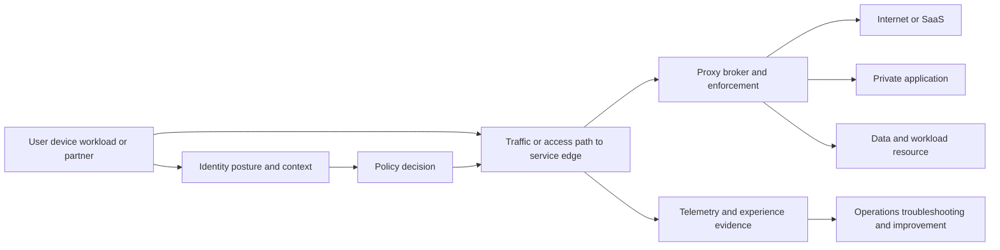

#### A001. Whiteboard a zero-trust access flow from user intent to a specific application.

**Model answer:** Start with the subject, managed device, requested resource, and identity provider. Show traffic/application discovery, authentication, posture and contextual signals, policy decision, service-edge selection, proxy-brokered client and server connections, enforcement, application response, telemetry, and continuous reassessment. Then mark failure points and evidence. State that exact Zscaler components, policy, and packet path depend on the currently licensed customer design.

**Cross-reference:** [Part 31 - Zero Trust Exchange Architecture and One-to-One Proxy Connections](Part-31-zero-trust-exchange-architecture.md)

#### A002. How would you analyze a ZIA-style internet access flow that works in a browser but fails in a background process?

**Model answer:** Compare process identity, forwarding method, proxy authentication capability, certificate trust, TLS behavior, policy, destination categorization, headers, and effective path. Correlate DNS, TCP peer, CONNECT/HTTP status, TLS, and application logs by time. The browser may have interactive credentials or different proxy discovery. Avoid broad bypass; test the smallest authorized process/policy hypothesis and validate control cohorts.

**Cross-reference:** [Part 34 - Zscaler Internet Access Fundamentals](Part-34-zia-fundamentals.md)

#### A003. How would you troubleshoot a ZPA-style private application that one user can reach and another cannot?

**Model answer:** Compare identity/group claims, device posture, app segment and server-group definitions, connector health/reachability, DNS/app discovery, policy order, client forwarding state, time, location, and application authorization. Determine the first divergence using current logs and effective policy. Separate platform access from the application's own authentication. Do not broaden policy until the exact missing condition and intended entitlement are confirmed.

**Cross-reference:** [Part 35 - Zscaler Private Access Fundamentals](Part-35-zpa-fundamentals.md)

#### A004. What would you examine if a service-edge issue is suspected but the administrative console appears healthy?

**Model answer:** Separate control-plane display from data-plane experience. Define affected users, paths, destinations, time, edge, forwarding method, and healthy cohorts. Inspect edge selection, reachability, latency/loss, tunnel/proxy sessions, DNS, policy version, telemetry delay, failover, status/support evidence, and customer underlay. A green console is one observation; validate actual transactions and degraded-mode behavior before attribution.

**Cross-reference:** [Part 32 - Zscaler Cloud, Service Edges, Control/Data Planes, and Traffic Flow](Part-32-zscaler-cloud-service-edges-traffic.md)

#### A005. How would you separate Client Connector failure from browser, operating-system, network, and destination failure?

**Model answer:** Establish whether the process is forwarded and compare client state/version/authentication/profile/tunnel/posture with OS proxy, DNS, TCP/TLS, browser policy/extensions, and direct destination behavior under authorized controls. Use known-good users/devices/networks and exact timestamps. A client error may be consequence, and a successful icon may hide path failure. Preserve logs and avoid disabling protection as a diagnostic shortcut.

**Cross-reference:** [Part 36 - Zscaler Client Connector, Forwarding, Posture, and User Experience](Part-36-client-connector-forwarding-posture.md)

#### A006. An application uses certificate pinning and fails under TLS inspection. What options and tradeoffs would you present?

**Model answer:** Confirm pinning and exact failure with authorized evidence. Options can include vendor-supported inspection compatibility, application update, narrowly scoped bypass/exception, isolation or alternative controls, or not using the application. Evaluate data sensitivity, destination trust, user scope, threat visibility, privacy, change/expiry, monitoring, owner, and validation. Never disable certificate validation or create a broad permanent bypass to make the symptom disappear.

**Cross-reference:** [Part 37 - TLS Inspection, Certificates, Privacy, Bypass, and Troubleshooting in Zscaler](Part-37-zscaler-tls-inspection.md)

#### A007. How could stale identity or posture context create inconsistent zero-trust policy outcomes?

**Model answer:** Policy may evaluate cached group membership, device state, risk, certificate, or session context at different times. Define source authority, refresh cadence, token/session lifetime, connector sync, rule order, and reevaluation triggers. Compare effective claims and timestamps across cohorts. Correct the stale source or lifecycle and test new and existing sessions; do not simply duplicate an allow rule around uncertain context.

**Cross-reference:** [Part 33 - Zscaler Identity, Device Posture, Context, Policy, and Adaptive Access](Part-33-zscaler-identity-context-policy.md)

#### A008. How would you keep digital-experience telemetry from being confused with security-policy evidence?

**Model answer:** Define each signal's purpose, grain, collection point, latency, and limits. Experience evidence can show device, path, or application performance; policy logs can show evaluated identity, rule, action, and reason. Correlate them by transaction/time but do not infer allow/deny from latency or root cause from an experience score. Use packet/process/application evidence when the boundary remains ambiguous.

**Cross-reference:** [Part 38 - Zscaler Digital Experience and End-to-End Experience Analysis](Part-38-zdx-digital-experience.md)

#### A009. How would you design a data-protection policy discovery workshop without starting from DLP rules?

**Model answer:** Start with business processes, sensitive data definitions and owners, users/apps/channels, legitimate collaboration, regulatory/privacy constraints, current incidents, false-positive tolerance, response workflow, and success evidence. Map inline and API observation/enforcement points and blind spots. Pilot with detection/notification before blocking where appropriate, use test data, and govern exceptions. Current product capabilities and data residency require authoritative validation.

**Cross-reference:** [Part 39 - Zscaler Data Security, DLP, CASB, SaaS, and AI Data Protection](Part-39-zscaler-data-security.md)

#### A010. How would zero-trust principles apply differently to workloads, branches, partners, and IoT/OT devices?

**Model answer:** Keep the principle of explicit, least-privileged resource access, but adapt identity, traffic path, posture, protocol, safety, availability, and lifecycle. Workloads may use service identities; branches need connectivity/resilience; partners need scoped application access and expiry; IoT/OT may lack agents and require segmentation, gateways, passive visibility, and safety authority. Validate current supported architectures rather than force one endpoint pattern everywhere.

**Cross-reference:** [Part 40 - Zscaler Cloud, Workload, Branch, IoT/OT, and B2B Security Overview](Part-40-zscaler-cloud-branch-iot-b2b.md)

#### A011. A SIEM reports missing Zscaler logs. How would you determine where loss occurred?

**Model answer:** Define expected log type, population, time, and delivery path. Reconcile source generation, export/streaming component, queues, network/TLS, receiver, parser, normalized index, and query. Compare sequence/count/time, retries, throttling, schema changes, filtering, and retention. Preserve raw samples and ownership boundaries. A healthy receiver does not prove source delivery, and a source count does not prove indexing.

**Cross-reference:** [Part 41 - Zscaler Logging, Nanolog Concepts, NSS, SIEM, APIs, and Integrations](Part-41-zscaler-logging-nss-siem-integrations.md)

#### A012. How would you design a safe rollout and rollback for a major security-policy change?

**Model answer:** Define objective, scope, dependencies, risk, baseline, test cases, exclusions, authority, and success/abort criteria. Validate in lab where possible, then use representative pilot rings, changed and control cohorts, telemetry, user/support readiness, communication, and staged expansion. Predefine exact rollback and state preservation. Confirm both security intent and service behavior; "no tickets" is not sufficient validation.

**Cross-reference:** [Part 42 - Zscaler Deployment, Operations, Health, Change, and Troubleshooting](Part-42-zscaler-deployment-operations-troubleshooting.md)

#### A013. How should a TSM respond when a customer requests a product capability that may not exist?

**Model answer:** Clarify the underlying job and urgency, state that capability/roadmap is not yet verified, and avoid implying commitment. Gather current product/version/entitlement evidence, route to authoritative Product/account channels, record question and checkpoint, and offer supported alternatives or process controls. Communicate updates transparently. Never use competitor claims, a public headline, or a synthetic design as proof.

**Cross-reference:** [Part 30 - Zscaler Company, Platform, Portfolio, and Market Vocabulary](Part-30-zscaler-company-platform-portfolio.md)

#### A014. How would you design coexistence among a security data fabric, SIEM, CMDB, data lake, and ticketing system?

**Model answer:** Assign jobs and field-level authority: raw/event retention and detection, configuration/service records, governed entity/context model, analytical history, and work state. Define source contracts, IDs, time semantics, lineage, transformations, APIs, latency, privacy, bidirectional update authority, idempotency, and reconciliation. Avoid circular truth where systems overwrite each other. Validate one end-to-end use case and failure/replay path.

**Cross-reference:** [Part 67 - Data Fabric versus SIEM, Data Lake, Warehouse, CMDB, and iPaaS](Part-67-data-fabric-comparisons.md)

#### A015. Is zero trust a replacement for network segmentation?

**Model answer:** No. Zero-trust principles can make access resource- and identity-specific, while network segmentation limits reachability and blast radius across devices, workloads, and zones. They can reinforce each other. Some devices or protocols cannot support rich identity, and control/data-plane dependencies still need network design. Evaluate application flows, lateral paths, failure modes, operations, and evidence rather than choose a slogan.

**Cross-reference:** [Part 10 - Zero Trust from First Principles and NIST SP 800-207](Part-10-zero-trust-nist-800-207.md)

#### A016. How would you translate deep Microsoft 365 support experience into a credible Zscaler architecture discussion?

**Model answer:** Use factual knowledge of user, client, identity, permissions, DNS, proxy, TLS, HTTP, CDN/service, sync state, logs, and escalation boundaries to draw a layered transaction. Then add zero-trust traffic steering, service edge, identity/posture policy, inspection, telemetry, and private/internet app distinctions as learned architecture. Explicitly state which Zscaler components need current validation and avoid renaming Microsoft experience as deployment experience.

**Cross-reference:** [Part 29 - Bridging Microsoft 365 Support Skills to Zero Trust and SecOps](Part-29-m365-to-zero-trust-secops-bridge.md)

### Cybersecurity, networking, and troubleshooting - A017-A032

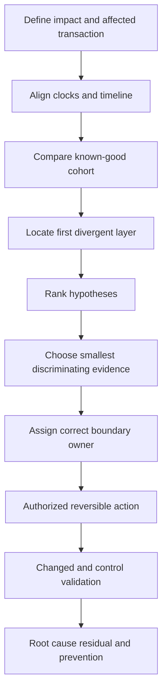

#### A017. A TCP three-way handshake completes, but the application times out. What does that prove and what comes next?

**Model answer:** It proves a transport connection was established between observed endpoints at that time; it does not prove proxy tunnel, TLS, authentication, HTTP, application processing, or complete response. Inspect post-handshake bytes, retransmissions/window behavior, TLS messages, HTTP request/response, responder timing, proxy/application logs, and process ownership. Compare a known-good transaction and locate the first divergence.

**Cross-reference:** [Part 18 - TCP, UDP, Ports, Sockets, State, and Reliability](Part-18-tcp-udp-ports-sockets.md)

#### A018. How would you troubleshoot split-DNS behavior where internal and external users receive different answers?

**Model answer:** Confirm the exact name/type, client network/context, resolver configuration, NRPT or policy, recursive server, cache/TTL, authoritative view, VPN/proxy behavior, and application use. Different answers may be intentional. Compare query path and timestamps, flush only within approved scope, and validate reachability/application behavior for each intended view. Avoid changing public records to solve an internal policy issue.

**Cross-reference:** [Part 19 - DNS and DHCP End to End](Part-19-dns-dhcp.md)

#### A019. How would you isolate a TLS certificate-chain error seen only on some devices?

**Model answer:** Compare certificate presented, chain, issuer, hostname, validity time, EKU, revocation behavior, trust store, enterprise root deployment, TLS inspection path, application trust implementation, and device clock. Identify whether devices reach the same peer and policy. Do not import random certificates or disable validation. Correct the authoritative certificate/trust deployment and test fresh and existing processes.

**Cross-reference:** [Part 21 - TLS, PKI, Certificates, Handshakes, and Inspection](Part-21-tls-pki-certificates-inspection.md)

#### A020. A proxy returns intermittent 502 errors. How would you avoid blaming the proxy prematurely?

**Model answer:** Define which proxy generated 502 and inspect its reason/timing, upstream DNS/TCP/TLS/application behavior, connection reuse, load balancer/CDN, policy, destination region, and affected cohorts. A proxy may be the messenger for upstream failure. Correlate request IDs and compare direct upstream evidence where authorized. Separate client-to-proxy, proxy policy, and proxy-to-origin workstreams.

**Cross-reference:** [Part 22 - Proxies, Firewalls, VPNs, Load Balancers, CDN, SSE, and SASE](Part-22-proxies-firewalls-vpn-sse-sase.md)

#### A021. How would you analyze an HTTP redirect loop after authentication?

**Model answer:** Trace every status and Location header, scheme/host/path, cookies, SameSite/Secure/domain attributes, state/nonce/relay state, reverse-proxy headers, session store, clock, and effective external URL. Compare working browser/profile. The loop may cross application, identity, or proxy boundaries. Preserve tokens safely, identify the first repeated state, and validate correction without weakening authentication.

**Cross-reference:** [Part 20 - HTTP, HTTPS, URLs, Methods, Headers, Cookies, Sessions, and Status Codes](Part-20-http-https-web-protocol.md)

#### A022. An OAuth access token is issued but the API returns 403. How do you reason about it?

**Model answer:** Authentication/token issuance succeeded, but authorization at the resource may fail. Inspect issuer, audience, scopes/roles, delegated versus application permission, subject, tenant, consent, resource policy, object permissions, conditional controls, token age, and API route. A 403 can also come from an intermediary. Identify responder and correlation ID; do not request broad permissions before the missing authorization is known.

**Cross-reference:** [Part 23 - Identity Protocols](Part-23-identity-protocols.md)

#### A023. A desktop sync client fails while browser access works. Build a layered hypothesis set.

**Model answer:** Consider process-specific proxy auth/forwarding, client token/cache, device posture, TLS trust/pinning, endpoint security, file paths/locks, sync database, throttling/API patterns, permissions, network protocol differences, and service endpoints. Browser success narrows but does not clear identity or service. Correlate client/process/network/service evidence and test one discriminating difference at a time.

**Cross-reference:** [Part 28 - OneDrive Sync and SharePoint Online Connectivity Architecture](Part-28-onedrive-sharepoint-connectivity.md)

#### A024. How do you correlate packet, HAR, Procmon, and application logs when their clocks differ?

**Model answer:** Record each source clock, precision, timezone, offset, and collection point. Use shared events such as request ID, process start, DNS query, TCP handshake, URL, or controlled marker to estimate alignment. Preserve uncertainty windows rather than force exact order. Normalize copies, never mutate raw evidence, and distinguish event time from logging/ingestion time.

**Cross-reference:** [Part 27 - Structured Connectivity Troubleshooting and Fault Isolation](Part-27-connectivity-troubleshooting-fault-isolation.md)

#### A025. What evidence would support asymmetric routing through a stateful firewall?

**Model answer:** Show forward and return paths differ around a stateful boundary, with session creation on one device/path and return packets arriving elsewhere or being dropped. Use routing tables, flow logs, packet captures at authorized points, NAT/session tables, traceroute cautiously, and topology/change history. Account for ECMP and capture gaps. Correct routing/state design through change authority and validate both directions.

**Cross-reference:** [Part 17 - Ethernet, ARP, IP Addressing, Subnetting, Routing, and NAT](Part-17-ethernet-ip-subnet-routing-nat.md)

#### A026. How do you troubleshoot an intermittent issue without collecting unlimited data?

**Model answer:** Define a precise failure signature and minimal fields, then stratify by user/device/process/network/region/version/time. Capture event-triggered bounded evidence, known-good controls, correlation IDs, and clock quality. Rank hypotheses and instrument discriminating boundaries. Respect privacy and retention. Statistical frequency guides sampling, but one observed correlation does not prove cause; preserve failed and successful cases.

**Cross-reference:** [Part 27 - Structured Connectivity Troubleshooting and Fault Isolation](Part-27-connectivity-troubleshooting-fault-isolation.md)

#### A027. What would you do when an issue disappears during live troubleshooting?

**Model answer:** Do not declare resolution. Preserve timeline and what changed, compare current with failure-state evidence, identify spontaneous recovery versus cache/session/failover/configuration effects, and set lightweight monitoring for recurrence. Define trigger-based collection and user guidance. Record hypotheses and unknowns, validate durable behavior over an appropriate window, and avoid disruptive reproduction in production without authority.

**Cross-reference:** [Part 27 - Structured Connectivity Troubleshooting and Fault Isolation](Part-27-connectivity-troubleshooting-fault-isolation.md)

#### A028. How would you reason when firewall and proxy teams each say the other layer is blocking traffic?

**Model answer:** Draw the exact connection sequence and identify each TCP peer. Correlate firewall session/action logs, proxy request/policy logs, packet evidence, process identity, destination, and time. Find the first device that observes and changes the transaction. A firewall may allow TCP while a proxy denies HTTP, or a proxy may never receive traffic. Use shared evidence, not organizational ownership claims.

**Cross-reference:** [Part 27 - Structured Connectivity Troubleshooting and Fault Isolation](Part-27-connectivity-troubleshooting-fault-isolation.md)

#### A029. How would you run the first 15 minutes of the synthetic Part 114 critical escalation?

**Model answer:** Confirm fictional impact, onset, affected/unaffected cohorts, workaround, severity basis, safety, bridge roles, decision authority, evidence owner, and update cadence. Start process/proxy, network, service, and communication workstreams. State that root cause and ETA are unknown. Preserve static evidence, compare browser and sync process, and avoid real capture, policy change, or security bypass.

**Cross-reference:** [Part 114 - Connectivity and Critical Escalation Lab](Part-114-connectivity-escalation-lab.md)

#### A030. What separates root cause from contributing factors and detection gaps?

**Model answer:** Root cause is the underlying condition whose correction prevents the defined failure under the scenario; contributing factors increase likelihood/impact or complicate recovery; detection gaps delay awareness or localization. Use counterfactual tests and evidence. Avoid a single "human error" label. An RCA should include scope, causal chain, controls, validation, residual uncertainty, and prevention owners.

**Cross-reference:** [Part 15 - Incident Response, Evidence, RCA, and Post-Incident Improvement](Part-15-incident-response-evidence-rca.md)

#### A031. What if useful troubleshooting evidence would require capturing sensitive production traffic?

**Model answer:** Revisit the exact question and seek lower-risk evidence first: existing logs, metadata, synthetic reproduction, controlled test account, narrowed fields, or vendor support telemetry. If capture remains necessary, require explicit authority, minimal scope/duration/interface/payload, secure handling, access, retention, and deletion. Never collect signed-in traffic for a portfolio or disable TLS/security controls for visibility.

**Cross-reference:** [Part 111 - Safe Lab Setup, Evidence Portfolio, and Honesty Rules](Part-111-safe-lab-evidence-honesty.md)

#### A032. How do changed and control cohorts improve technical validation?

**Model answer:** A changed cohort receives the targeted correction; a control cohort remains unchanged or represents known-good behavior. Comparing both helps distinguish treatment effect from time, failover, cache, unrelated recovery, or broad change. Define populations and expected results before action, monitor guardrails, and include negative cases. Small cohorts reduce blast radius but do not prove universal durability.

**Cross-reference:** [Part 114 - Connectivity and Critical Escalation Lab](Part-114-connectivity-escalation-lab.md)

### SQL, security data, and Data Fabric - A033-A052

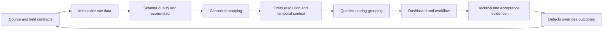

#### A033. How should a pipeline respond to schema drift?

**Model answer:** Detect added, removed, renamed, retyped, or semantically changed fields against a versioned contract. Classify backward compatibility, quarantine unsafe records, preserve raw input, notify owners, and prevent silent coercion. Test mappings and downstream metrics with anchor records, version the transformation, replay safely, reconcile, and annotate trends. An added field may be harmless; a changed meaning with same name is not.

**Cross-reference:** [Part 50 - ETL, ELT, Pipelines, Batch, Streaming, and Change Data](Part-50-etl-elt-security-pipelines.md)

#### A034. How do late-arriving events affect a security dashboard?

**Model answer:** Late data can revise prior counts, timelines, SLA ages, and incident correlations. Separate event time from ingestion and processing time; define watermark, grace period, backfill, and restatement policy. Mark preliminary versus final cuts, preserve model versions, and test idempotent replay. Do not silently rewrite an executive trend or double-count a replayed event.

**Cross-reference:** [Part 50 - ETL, ELT, Pipelines, Batch, Streaming, and Change Data](Part-50-etl-elt-security-pipelines.md)

#### A035. How would you deduplicate vulnerability findings without hiding recurrence?

**Model answer:** Define the identity and lifecycle grain: vulnerability, asset, port/package/path, scanner, first/last seen, remediation, and reappearance. Keep source observations and link them to a canonical episode rather than delete copies. Distinguish duplicate reporting from repeated detection and true recurrence after accepted remediation. Version rules and sample false merges/splits with owners.

**Cross-reference:** [Part 53 - Entity Resolution, Deduplication, Identity Matching, and Golden Records](Part-53-entity-resolution-golden-records.md)

#### A036. How would you model an asset that changes owner, application, and criticality over time?

**Model answer:** Use a stable asset identity plus time-bounded relationship/history records with effective start/end, source, authority, observation time, and confidence. Decide whether reports need as-observed, as-known, or current context. A slowly changing dimension or event/relationship model can preserve history. Never overwrite prior context and then claim historical risk used today's owner or tier.

**Cross-reference:** [Part 45 - Dimensional, Star, Snowflake, Event, Document, and Graph Models](Part-45-analytical-security-data-models.md)

#### A037. What is the difference between event time, effective time, ingestion time, and processing time?

**Model answer:** Event time is when an observation occurred; effective time is when a state or relationship is valid; ingestion time is when the platform received it; processing time is when transformation ran. They answer different questions. Use explicit UTC fields and precision, handle late corrections, and avoid ordering a causal timeline solely by ingestion time.

**Cross-reference:** [Part 43 - Security Data Literacy and the Data Lifecycle](Part-43-security-data-literacy-lifecycle.md)

#### A038. When would you use a star schema versus a graph for security analytics?

**Model answer:** A star schema is strong for stable measures sliced by dimensions, such as backlog by owner, tier, and age. A graph is strong for traversing variable relationships, such as identity-to-asset-to-app-to-control paths. They can coexist: graph-derived features can feed facts. Choose by questions, scale, update patterns, lineage, skills, and explainability, not fashion.

**Cross-reference:** [Part 45 - Dimensional, Star, Snowflake, Event, Document, and Graph Models](Part-45-analytical-security-data-models.md)

#### A039. How do join fan-out errors inflate security metrics?

**Model answer:** Joining one asset to many findings and many owners/tags in one query can multiply rows, inflating counts and sums. State each table's grain, inspect cardinality, pre-aggregate or bridge relationships, use stable distinct keys carefully, and reconcile before/after row counts. `COUNT(DISTINCT asset)` may mask another wrong measure, so validate several anchor entities end to end.

**Cross-reference:** [Part 47 - SQL Joins, CTEs, Subqueries, Window Functions, and Set Operations](Part-47-sql-joins-ctes-window-functions.md)

#### A040. How would you preserve the difference between unknown, not applicable, false, and zero?

**Model answer:** Model them explicitly through nullable fields plus reason/status codes or separate state dimensions. Zero is a measured quantity; false is a known boolean; not applicable means the concept does not apply; unknown means evidence is missing. Dashboards and scoring must not coerce all to zero. Route unknowns to quality/workflow and keep denominator rules visible.

**Cross-reference:** [Part 44 - Relational Data Modeling from Zero](Part-44-relational-data-modeling.md)

#### A041. Write the reasoning for ranking top vulnerabilities per owner with SQL window functions.

**Model answer:** First define one current canonical finding row and accepted owner. Compute or select the governed priority and confidence. Use `ROW_NUMBER` or `DENSE_RANK` partitioned by owner and ordered by priority, confidence, due basis, and stable ID. Keep unknown owners separate, avoid fan-out, and expose ties/overrides. Validate output against hand-calculated anchor cases.

**Cross-reference:** [Part 48 - Security Analytics Query Patterns](Part-48-security-analytics-query-patterns.md)

#### A042. What makes a data pipeline idempotent, and why does it matter?

**Model answer:** Reprocessing the same input under the same version produces the same intended state without duplicate side effects. Use stable source/batch/event keys, checkpoints, upsert/merge semantics, deduplication, transactional boundaries, and idempotency keys for outbound actions. It matters for retries, replay, backfill, and recovery. Test partial failure between data commit and ticket creation.

**Cross-reference:** [Part 50 - ETL, ELT, Pipelines, Batch, Streaming, and Change Data](Part-50-etl-elt-security-pipelines.md)

#### A043. What reconciliation controls would you place across a multi-source security pipeline?

**Model answer:** Track source expected/received, staged, parsed, accepted, rejected, duplicate, quarantined, updated, output, and outbound action counts with reason codes and checksums where useful. Add freshness, null/validity, key uniqueness, referential integrity, schema, distribution, anchor-record, and downstream metric checks. Reconciliation thresholds should block or qualify decisions according to impact, not merely alert.

**Cross-reference:** [Part 52 - Data Quality, Profiling, Completeness, Freshness, and Reconciliation](Part-52-data-quality-profiling-reconciliation.md)

#### A044. How do provenance and lineage differ, and why do executives indirectly depend on both?

**Model answer:** Provenance identifies origin and custody of a fact; lineage traces transformations and movement from source to output. Executives depend on them because a headline must be explainable and correctable when a source or rule fails. Preserve source ID/time, mapping and model versions, rejects, query/measure definitions, and artifact links. A polished chart without trace is not accountable evidence.

**Cross-reference:** [Part 43 - Security Data Literacy and the Data Lifecycle](Part-43-security-data-literacy-lifecycle.md)

#### A045. Why can a single data-quality score be dangerous?

**Model answer:** It compresses dimensions with different decision consequences and can hide one critical failure behind many easy passes. Completeness, accuracy, freshness, uniqueness, and linkage are not interchangeable. Show component measures, affected populations, thresholds, weights, confidence, trends, and blocking gates. A source can score 95% while the missing 5% contains every critical service.

**Cross-reference:** [Part 52 - Data Quality, Profiling, Completeness, Freshness, and Reconciliation](Part-52-data-quality-profiling-reconciliation.md)

#### A046. How should field-level source precedence be governed in a canonical model?

**Model answer:** Choose authority by attribute, purpose, effective time, and conditions rather than declare one system universally authoritative. Document precedence, freshness, confidence, conflict handling, manual override, expiry, and audit. Preserve conflicting source values and route material disputes. For example, EDR may be current for presence while an application registry owns business tier; neither owns every field.

**Cross-reference:** [Part 54 - Taxonomy, Ontology, Canonical Schemas, and Data Mapping](Part-54-taxonomy-ontology-canonical-schema.md)

#### A047. How would you secure and troubleshoot source authentication for a Data Fabric-style integration?

**Model answer:** Use least-privileged nonhuman identity, approved secret/certificate storage, rotation, network restrictions, audit, and scoped APIs. Troubleshoot identity, endpoint, DNS/TLS, credential validity, audience/scope, permissions, quota, pagination, and provider response separately. Never log secrets or broaden privilege first. Validate successful access returns the intended population and fields, not merely HTTP 200.

**Cross-reference:** [Part 60 - Data Fabric Ingestion, Authentication, Scheduling, and Reliability](Part-60-data-fabric-ingestion-reliability.md)

#### A048. How do custom grouping and scoring rules become an operational risk?

**Model answer:** Rules can encode stale assumptions, bias, hidden interactions, arbitrary thresholds, or owner incentives and may change queues dramatically. Govern purpose, source, formula, version, authority, anchor/edge cases, overrides, approval, rollout, monitoring, rollback, and trend comparability. Keep raw components visible. A customer-specific rule is useful only when explainable and tied to accepted decisions.

**Cross-reference:** [Part 64 - Data Fabric Business Logic, Grouping, Scoring, and Customization](Part-64-data-fabric-business-logic-scoring.md)

#### A049. How would you make an automated ticket workflow reliable and auditable?

**Model answer:** Define trigger, scope, grouping, owner, payload, state map, idempotency key, approval, retries/backoff, error queue, reconciliation, update/close/reopen rules, rate limits, and audit. Test duplicate, out-of-order, missing-owner, API outage, partial success, and manual-edit cases. Technical validation, not ticket state alone, should determine remediation acceptance.

**Cross-reference:** [Part 65 - Data Fabric Automated Workflows and Outbound Actions](Part-65-data-fabric-automated-workflows.md)

#### A050. How would you design role-specific dashboard views without creating different truths?

**Model answer:** Use one governed semantic/metric layer and evidence spine, then vary detail and decisions: executives see material scenarios and choices; managers see owners/trends/capacity; operators see records/actions; data teams see quality/lineage. Keep definitions, reporting cut, filters, quality, and IDs consistent. Test that the same risk drills to the same underlying evidence across views.

**Cross-reference:** [Part 66 - Data Fabric Dynamic Reporting and Dashboards](Part-66-data-fabric-reporting-dashboards.md)

#### A051. What privacy controls matter when security data links identities, devices, applications, and behavior?

**Model answer:** Define purpose and necessity, minimize attributes and retention, classify sensitive fields, restrict role-based access, segregate tenants, encrypt, audit, control exports, manage residency/deletion, and govern secondary use. Pseudonymization is not anonymity when relationships reidentify people. Involve Privacy/Legal and customer authorities; more context is not automatically justified because the use is security.

**Cross-reference:** [Part 56 - Data Governance, Privacy, Security, RBAC, and Retention](Part-56-data-governance-privacy-rbac-retention.md)

#### A052. The dashboard turns green after a mapping release. Walk through your response.

**Model answer:** Freeze affected interpretation and compare source volume, schema, mapping/model version, nulls, rejects, join rates, entity counts, and anchor records against the prior accepted cut. Quantify scope, inform owners, correct/replay under change control, reconcile, and annotate history. Add contract and changed-case tests. Do not call lower priority or fewer findings improvement until source continuity and treatment evidence support it.

**Cross-reference:** [Part 116 - Executive Risk Review, Dashboard, and Mitigation Roadmap Capstone](Part-116-executive-risk-review-capstone.md)

### AEM, UVM, CTEM, and enterprise risk - A053-A076

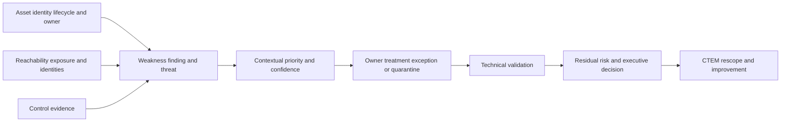

#### A053. How would you investigate an asset seen by cloud inventory but absent from EDR and CMDB?

**Model answer:** Confirm cloud identity, account/subscription, resource type, lifecycle, observation time, tags, network exposure, owner, expected EDR applicability, and CMDB scope. It may be ephemeral, unsupported, newly created, shadow, or mismapped. Preserve it as an unknown/control-gap case, route ownership, and validate lifecycle. Do not automatically install an agent or delete the resource.

**Cross-reference:** [Part 70 - Multi-Source Asset Discovery and Inventory Reconciliation](Part-70-asset-discovery-reconciliation.md)

#### A054. What is the business impact of false asset merges and false splits?

**Model answer:** A false merge combines distinct assets, mixing owners, findings, controls, and criticality; it can hide one asset or assign wrong treatment. A false split fragments one asset, inflating counts and duplicating work while losing consolidated context. Measure both, preserve source records, use confidence and temporal identifiers, provide human review, and test downstream risk/workflow consequences.

**Cross-reference:** [Part 71 - Asset Golden Records, Relationships, Ownership, and Criticality](Part-71-asset-golden-records-relationships.md)

#### A055. How should ephemeral cloud assets be represented in exposure metrics?

**Model answer:** Use cloud-stable identities, image/template and workload lineage, creation/termination times, expected lifespan, owner/service, exposure while active, and control coverage appropriate to the lifecycle. Avoid calling terminated expected instances stale inventory or excluding short-lived vulnerable workloads entirely. Report asset-time or deployment/image risk where useful and keep definitions and denominators explicit.

**Cross-reference:** [Part 69 - Cyber Assets, Inventory, CAASM, and Asset Exposure Fundamentals](Part-69-cyber-assets-caasm-fundamentals.md)

#### A056. How would you prioritize a missing-control gap across thousands of assets?

**Model answer:** First validate scope and classify unsupported, exception, stale, mapping defect, and genuinely missing. Then add asset/service criticality, exposure/reachability, identity privilege, threat, data, compensating controls, age, owner, and feasible grouping/root cause. Address systemic onboarding or policy failures rather than create thousands of independent tickets. Preserve the full denominator and validate control restoration.

**Cross-reference:** [Part 72 - Control-Coverage Gaps, Hygiene, and Misconfiguration Analysis](Part-72-asset-control-coverage-gaps.md)

#### A057. When should a security platform update a CMDB automatically?

**Model answer:** Only for fields and states with agreed source authority, data quality, identity confidence, approval, audit, idempotency, conflict handling, rollback, and lifecycle rules. Start with recommendation or bounded fields, test false merge/split and stale observations, and reconcile outcomes. Security observations may be excellent evidence without being authoritative for finance, service ownership, or retirement.

**Cross-reference:** [Part 73 - CMDB Health, Automated Updates, and Asset Lifecycle Workflows](Part-73-cmdb-health-asset-lifecycle.md)

#### A058. How would you convince a team to move beyond CVSS-only prioritization without dismissing CVSS?

**Model answer:** Acknowledge CVSS as a useful standardized severity input, then compare two customer-relevant anchor cases with the same severity but different threat, exposure, business criticality, identity, controls, and ownership. Show how context changes the decision and keep the vector visible. Propose a transparent pilot with overrides and outcomes, not an opaque score that replaces expert judgment.

**Cross-reference:** [Part 80 - Why Traditional Vulnerability Prioritization Fails](Part-80-traditional-vm-prioritization-gaps.md)

#### A059. What governance prevents a contextual vulnerability score from becoming false precision?

**Model answer:** Define purpose and non-purpose, inputs/provenance/time, normalization, weights/interactions, missing-data behavior, confidence, anchor/edge cases, overrides, authority, versioning, monitoring, drift, and rollback. Show components and narratives, not only totals. Calibrate against accepted decisions and measure workflow/outcome quality. Never translate an ordinal score directly into probability or financial loss.

**Cross-reference:** [Part 82 - Contextual Multifactor Risk Scoring in UVM](Part-82-uvm-contextual-risk-scoring.md)

#### A060. An important finding has no owner. Should its priority decrease because it is not actionable?

**Model answer:** No. Separate risk/materiality from execution readiness. Missing ownership may increase governance risk and delay treatment; it should trigger ownership resolution or escalation, not reduce inherent scenario importance. Keep the finding visible, identify asset/service authority, quarantine unsafe automation, and measure owner completeness separately. An unowned critical condition is not a low-priority condition.

**Cross-reference:** [Part 83 - UVM Prioritization, Grouping, and Remediation Backlogs](Part-83-uvm-prioritization-backlogs.md)

#### A061. How should stale compensating-control evidence affect priority?

**Model answer:** Treat current control effectiveness as unknown or lower-confidence, not automatically failed and not safely effective. Record designed versus implemented versus operating/validated states and evidence date. Request revalidation and test priority sensitivity with and without the control. Avoid mechanically increasing or decreasing risk beyond what evidence supports; communicate uncertainty to the risk owner.

**Cross-reference:** [Part 82 - Contextual Multifactor Risk Scoring in UVM](Part-82-uvm-contextual-risk-scoring.md)

#### A062. How would you group remediation work without hiding asset-specific risk?

**Model answer:** Group by common root cause, owner, service, package/image, change window, or treatment while preserving every underlying finding, context, exceptions, and validation state. Define group priority from material members and prevent one low-risk majority from diluting a critical minority. Use one campaign/ticket only when ownership and change align; reconcile closure back to each asset/finding.

**Cross-reference:** [Part 83 - UVM Prioritization, Grouping, and Remediation Backlogs](Part-83-uvm-prioritization-backlogs.md)

#### A063. Why is a closed remediation ticket insufficient proof that a vulnerability is fixed?

**Model answer:** Ticket state is administrative workflow evidence. Technical remediation may require a new scan, version/configuration evidence, control test, deployment coverage, or accepted exception. Map states to evidence, preserve scope, account for delayed scanners and asset lifecycle, reopen unsupported closures, and measure reconciliation. Otherwise dashboards reward state changes rather than actual risk treatment.

**Cross-reference:** [Part 84 - UVM Workflows, Ticketing, SLAs, Exceptions, and Reconciliation](Part-84-uvm-workflows-ticketing-slas.md)

#### A064. How would you challenge a permanent vulnerability exception?

**Model answer:** Ask what scenario and business need justify it, who accepted residual risk, which controls operate, what evidence remains current, and why no expiry/review is needed. Permanent conditions still change as threats, assets, owners, and controls change. Propose time-bounded review triggers, monitoring, alternative treatments, and escalation. Preserve respectful authority; do not unilaterally revoke risk acceptance.

**Cross-reference:** [Part 84 - UVM Workflows, Ticketing, SLAs, Exceptions, and Reconciliation](Part-84-uvm-workflows-ticketing-slas.md)

#### A065. A tuned priority model surprises stakeholders. How do you decide whether to recalibrate or educate?

**Model answer:** Inspect whether surprise comes from a bug/data defect, hidden factor, changed business assumption, legitimate non-obvious context, or stakeholder preference. Trace anchor case components and provenance, test edge cases and sensitivity, and compare to decision principles. Correct defects; explain valid behavior; adjust only through authorized governance. Preserve version and do not tune merely to match a desired ranking.

**Cross-reference:** [Part 86 - UVM Program Operations, Tuning, Troubleshooting, and Adoption](Part-86-uvm-program-operations.md)

#### A066. How do you measure vulnerability-program improvement when the discovery scope expands?

**Model answer:** Separate comparable cohorts and restate scope. Show newly discovered population, existing cohort trends, contextual material backlog, coverage, aging, validated treatment, recurrence, exceptions, and data quality. An increased count can indicate better visibility. Use rates with stable denominators and annotate methodology changes; do not punish discovery or claim deterioration solely from volume.

**Cross-reference:** [Part 85 - UVM Dashboards, KPIs, Trends, and Executive Reporting](Part-85-uvm-dashboards-kpis.md)

#### A067. How would you choose a CTEM scope for the first cycle?

**Model answer:** Select a business-critical service, external surface, identity path, or high-consequence process with an accountable sponsor, available evidence, feasible validation, and mobilizable owners. Define boundaries, objectives, exclusions, safety, success, and dependencies. Avoid "all enterprise assets" as a first scope. A focused cycle should produce learning and accepted treatment that can improve the next scope.

**Cross-reference:** [Part 87 - Continuous Threat Exposure Management from Zero](Part-87-ctem-from-zero.md)

#### A068. What does safe exposure validation mean?

**Model answer:** Validate only with written authority, defined targets, non-destructive methods, safety/privacy controls, approved tools, windows, stop conditions, monitoring, rollback, and evidence handling. Prefer configuration, path, control, or benign simulation evidence before exploitation. OT, production, third-party, and sensitive systems need additional authority. A TSM should coordinate; never improvise exploit tests for interview proof.

**Cross-reference:** [Part 88 - Exposure Validation, Attack Paths, Controls, and Mobilization](Part-88-exposure-validation-mobilization.md)

#### A069. How would you validate an attack path inferred from a security graph?

**Model answer:** Verify every node and edge: current asset identity, exposure, network/application reachability, credential/permission relationship, vulnerability applicability, control operation, time overlap, and attacker preconditions. Remove impossible transitions and test controls safely. Graph connectivity is a hypothesis. Prioritize choke points that reduce multiple paths, and preserve confidence and untested assumptions in executive communication.

**Cross-reference:** [Part 88 - Exposure Validation, Attack Paths, Controls, and Mobilization](Part-88-exposure-validation-mobilization.md)

#### A070. Why does CTEM include mobilization rather than stop at prioritization?

**Model answer:** A ranked exposure list does not reduce exposure. Mobilization establishes owners, treatment options, dependencies, business/change authority, resources, due basis, workflow, validation, and residual-risk decisions. It also resolves objections and measures accepted effects. CTEM closes the loop from insight to coordinated action and uses results to rescope; otherwise it becomes another static risk dashboard.

**Cross-reference:** [Part 87 - Continuous Threat Exposure Management from Zero](Part-87-ctem-from-zero.md)

#### A071. How would you use the four Risk360-style attack stages without oversimplifying an attack?

**Model answer:** Use external attack surface, compromise, lateral propagation, and data loss as an executive organizing lens, then preserve scenario-specific identities, assets, controls, dependencies, confidence, and alternative paths. Not every incident follows a linear sequence, and prevention/detection can span stages. Verify current product definitions and never present a synthetic stage score as probability or proof.

**Cross-reference:** [Part 89 - Risk360 Architecture, Telemetry, Factors, and Four Attack Stages](Part-89-risk360-architecture-four-stages.md)

#### A072. An executive asks for expected financial loss from a synthetic risk score. How do you respond?

**Model answer:** State that the score is an ordinal prioritization aid and cannot be converted to currency. Financial estimation needs defined scenarios, frequency and consequence distributions, data, assumptions, control effects, dependencies, sensitivity, and risk/finance authority. Offer a qualitative decision or a governed modeling exercise with ranges. Do not fabricate ROI, loss, or Risk360 behavior from the NMH lab.

**Cross-reference:** [Part 90 - Risk360 Quantification, Financial Exposure, Guided Mitigation, and Board Reporting](Part-90-risk360-quantification-reporting.md)

#### A073. How does an enterprise cyber-risk view differ from a vulnerability-priority view?

**Model answer:** Vulnerability priority helps order weakness-treatment work using severity and context. Enterprise risk views connect broader scenarios across external exposure, compromise, propagation, data loss, controls, business objectives, consequence, and governance. They may use vulnerability evidence but also identities, incidents, data, suppliers, and resilience. Neither score should be treated as probability, financial fact, or a substitute for risk-owner judgment.

**Cross-reference:** [Part 90 - Risk360 Quantification, Financial Exposure, Guided Mitigation, and Board Reporting](Part-90-risk360-quantification-reporting.md)

#### A074. What belongs in an executive risk dashboard when data confidence is uneven?

**Model answer:** Show material scenarios, trend under stable rules, mitigation/decision status, owners, residuals, and next outcomes alongside freshness, coverage, context completeness, excluded/quarantined populations, confidence, and methodology changes. Use numerator/denominator and drill-through. Gray unknown is better than forced green. Every headline needs a decision or implication and a route to technical evidence.

**Cross-reference:** [Part 116 - Executive Risk Review, Dashboard, and Mitigation Roadmap Capstone](Part-116-executive-risk-review-capstone.md)

#### A075. How do you convert a risk finding into a mitigation roadmap rather than a recommendation list?

**Model answer:** Connect the risk mechanism to options and tradeoffs, select through authorized decision, then sequence owners, dependencies, capacity, entry/exit evidence, estimated windows, guardrails, rollback, and residual review. Trust foundations may precede automation; validation precedes outcome claims. Test dependency failure and fallback. A roadmap manages accepted states and choices, not colored feature dates.

**Cross-reference:** [Part 104 - Risk Findings to Tailored Mitigation Strategy](Part-104-risk-findings-to-mitigation.md)

#### A076. What do you do when a risk owner disagrees with your scenario rating?

**Model answer:** Clarify whether the disagreement concerns facts, scenario, objective, likelihood, impact, controls, confidence, appetite, or treatment. Trace evidence and assumptions, invite missing business context, test sensitivity, and offer discriminating validation. Correct the analysis when warranted and record the authorized decision and residual. Do not defend the score as personal authority or quietly change it to obtain agreement.

**Cross-reference:** [Part 13 - Risk Assessment, Treatment, Appetite, Tolerance, and Residual Risk](Part-13-risk-assessment-treatment.md)

### SecOps and AI - A077-A096

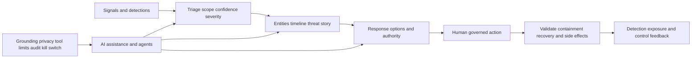

| ID range | Focus | Core interview signal |
|---|---|---|
| A077-A084 | SOC, triage, investigation, hunting, deception, MDR | Evidence-led operations and role boundaries |
| A085-A087 | Integration and action reliability | Data/clock/workflow fault isolation |
| A088-A096 | Agentic SecOps and AI governance | Grounding, authority, validation, privacy, audit |

#### A077. How would you explain the value of different SOC operating models without assuming one is best?

**Model answer:** Compare mission, risk, coverage hours, skills, scale, telemetry, process maturity, geography, regulation, cost, and escalation needs. Centralized, distributed, follow-the-sun, co-managed, and MDR-supported models trade local context, consistency, staffing, and control. Define detection, investigation, response, hunting, engineering, and business handoffs. Success is accepted outcomes and resilience, not tier labels.

**Cross-reference:** [Part 91 - SOC Fundamentals, Roles, Tiers, Processes, and Operating Models](Part-91-soc-fundamentals-operating-model.md)

#### A078. How would you reduce alert fatigue without hiding true incidents?

**Model answer:** Measure source/detection quality, duplicate relationships, precision, severity calibration, missing context, routing, closure reasons, and analyst effort. Improve data, suppression with scope/expiry, correlation, entity/business enrichment, threshold logic, and feedback from investigations. Test known positives, negatives, and changed cases; monitor missed detections and coverage. Simply raising thresholds or closing faster can create dangerous silence.

**Cross-reference:** [Part 93 - From Atomic Alerts to Unified Threat Stories](Part-93-alerts-to-threat-stories.md)

#### A079. What evidence makes a unified threat story defensible to an incident commander?

**Model answer:** Include source observations, synchronized timeline, entities and relationships, behavior, affected scope, confidence, alternatives, controls, business criticality, attacker preconditions, and evidence gaps. Link every narrative claim to raw/normalized facts and distinguish observed from inferred. Explain what decision the story supports and what new evidence would change it. Fluent correlation is not proof.

**Cross-reference:** [Part 93 - From Atomic Alerts to Unified Threat Stories](Part-93-alerts-to-threat-stories.md)

#### A080. A high-severity alert has low identity confidence. How should triage proceed?

**Model answer:** Preserve urgency while avoiding unsafe attribution. Validate identity mapping, time, device/session, source, token, network address, and competing users; inspect behavior and asset impact independently. Use bounded containment that does not rely on uncertain identity where possible, or seek authority for broader action. Mark confidence and quarantine automation. Severity and attribution confidence are separate dimensions.

**Cross-reference:** [Part 94 - Threat Triage, Investigation, Containment, and Right-Sized Response](Part-94-threat-triage-investigation-response.md)

#### A081. How do you balance rapid containment with business continuity?

**Model answer:** Assess evidence confidence, active harm, blast radius, critical service/safety, identity privilege, action scope, reversibility, alternatives, authority, and monitoring. Compare isolate account/device/app/path options and select the smallest effective action. Predefine rollback and stakeholder communication. Validate threat effect and service side effects. Urgency should shorten coordination loops, not erase decision quality.

**Cross-reference:** [Part 94 - Threat Triage, Investigation, Containment, and Right-Sized Response](Part-94-threat-triage-investigation-response.md)

#### A082. What makes a threat hunt hypothesis useful?

**Model answer:** It states a plausible adversary behavior, target population, expected evidence, data coverage, time window, alternative explanations, query/test, and decision if found or absent. Start from intelligence, control gap, incident learning, or anomaly. Record blind spots and feed results into detections/exposure controls. Searching large data without a falsifiable question is exploration, not a complete hunt.

**Cross-reference:** [Part 95 - Threat Hunting, Deception, MDR, and Proactive Detection](Part-95-threat-hunting-deception-mdr.md)

#### A083. How can deception technology improve signal quality, and what are its limits?

**Model answer:** Decoys, canary identities, tokens, or services can create high-fidelity evidence because legitimate interaction should be rare. Design must avoid production disruption, privacy issues, unsafe lures, and easy fingerprinting; monitor placement and lifecycle. A deception alert still requires validation and scope. Absence of interaction does not prove no attacker, and deployment does not replace baseline controls.

**Cross-reference:** [Part 95 - Threat Hunting, Deception, MDR, and Proactive Detection](Part-95-threat-hunting-deception-mdr.md)

#### A084. What should a customer clarify when using an MDR provider?

**Model answer:** Define coverage, sources, monitoring hours, detection ownership, investigation depth, response authority, customer approvals, evidence access, severity/cadence, escalation, containment, data handling, retention, threat hunting, service levels, reporting, improvement feedback, and exit. Run tabletop and changed cases. "24x7" does not by itself define what is watched or what actions occur.

**Cross-reference:** [Part 95 - Threat Hunting, Deception, MDR, and Proactive Detection](Part-95-threat-hunting-deception-mdr.md)

#### A085. How would you detect silent data loss between a security source and a SecOps workflow?

**Model answer:** Use expected-versus-observed counts, sequence/checkpoint gaps, freshness, heartbeats, queue depth, retry/dead-letter state, schema validity, sample checksums, and end-to-end synthetic canaries where authorized. Reconcile source, transport, parser, index, detection, case, and action layers. A green connection is insufficient. Alert on quality and block/qualify decisions when loss exceeds defined impact thresholds.

**Cross-reference:** [Part 97 - SecOps Integrations, Data Flow, Health, and Troubleshooting](Part-97-secops-integrations-troubleshooting.md)

#### A086. How can time-sync problems corrupt a SecOps investigation?

**Model answer:** Clock skew can reverse apparent causality, break correlation windows, misapply token/certificate validity, and distort SLA or dwell-time metrics. Record source clock, timezone, precision, NTP state, event versus ingestion time, and offsets. Align using shared markers and preserve uncertainty. Correct time services through authority, but do not rewrite raw timestamps without traceable normalization.

**Cross-reference:** [Part 97 - SecOps Integrations, Data Flow, Health, and Troubleshooting](Part-97-secops-integrations-troubleshooting.md)

#### A087. An automated containment call returns success, but the asset remains reachable. What next?

**Model answer:** Separate accepted API request from effective control state. Verify target identity, action scope, asynchronous job, policy propagation, agent/connector health, errors, conflicting policy, network/application path, and observation method. Reconcile requested, acknowledged, applied, and validated states. Escalate safely, preserve audit, and use alternate authorized containment if needed. Never close the incident on HTTP 200 alone.

**Cross-reference:** [Part 97 - SecOps Integrations, Data Flow, Health, and Troubleshooting](Part-97-secops-integrations-troubleshooting.md)

#### A088. Whiteboard an agentic SecOps workflow with its safety controls.

**Model answer:** Show authorized signals entering governed data/entity context, retrieval/grounding, model/planner, policy engine, tool registry, scoped agent identity, proposed action, human approval based on risk, execution, audit, validation, and feedback. Mark prompt-injection boundaries, data access, memory, model/version, rate/action limits, dry run, rollback, and kill switch. State which steps remain learned architecture versus current product fact.

**Cross-reference:** [Part 96 - Zscaler Agentic SecOps Architecture and Workflows](Part-96-zscaler-agentic-secops.md)

#### A089. What does good grounding evidence look like in an AI-generated incident summary?

**Model answer:** Each material statement links to authorized source records with stable IDs, timestamps, provenance, and scope. The summary distinguishes observation, inference, and unknown; includes conflicting evidence; and reports retrieval gaps and source freshness. A reviewer can reproduce the timeline. Citations must actually support the claim, not merely mention the entity. Sensitive content is minimized and access-controlled.

**Cross-reference:** [Part 98 - AI Agents for Security: Prompting, Grounding, Validation, and Governance](Part-98-ai-agents-security-governance.md)

#### A090. How would you handle an AI summary that sounds correct but cites evidence that does not exist?

**Model answer:** Treat it as a validation failure, not a minor wording issue. Block downstream action, preserve prompt/model/retrieval/output logs safely, quantify scope, compare claims to sources, notify workflow owner, and correct the record. Add citation-existence and entailment tests, refusal behavior, monitoring, and changed cases. Do not manually patch one answer and call the system reliable.

**Cross-reference:** [Part 98 - AI Agents for Security: Prompting, Grounding, Validation, and Governance](Part-98-ai-agents-security-governance.md)

#### A091. How would you test indirect prompt injection in a security agent?

**Model answer:** In a synthetic environment, place adversarial instructions inside logs, tickets, web content, or retrieved documents and test whether the agent treats them as data rather than higher-priority instructions. Include exfiltration, tool abuse, memory poisoning, and denial cases. Verify authorization, output filtering, approval context, audit, and kill switch. Never test against real external content or production tools without authority.

**Cross-reference:** [Part 118 - Miscellaneous and Deeper Topics](Part-118-miscellaneous-deeper-topics.md)

#### A092. What least-privilege controls apply to a tool-using security agent?

**Model answer:** Give a dedicated identity with narrowly scoped resources/actions, short-lived credentials, environment separation, tool allowlist, parameter constraints, action/rate caps, contextual authorization, approval for higher impact, no arbitrary code by default, and complete audit. Add dry-run, reversible actions, circuit breaker, kill switch, and periodic access review. User intent must not inherit hidden service privilege.

**Cross-reference:** [Part 98 - AI Agents for Security: Prompting, Grounding, Validation, and Governance](Part-98-ai-agents-security-governance.md)

#### A093. Why is a generic "human approval" step not enough for agent safety?

**Model answer:** The approver needs authority, skill, time, and itemized context: source evidence, scope, uncertainty, policy, exact tool calls, affected resources, expected effect, alternatives, reversibility, and validation. Approval must support reject/escalate and resist automation bias. Measure approval quality and override outcomes. A blank "approve recommendation" button is a signature without informed decision.

**Cross-reference:** [Part 118 - Miscellaneous and Deeper Topics](Part-118-miscellaneous-deeper-topics.md)

#### A094. How would you evaluate an AI assistant before SecOps adoption?

**Model answer:** Define tasks and risk tiers, representative and adversarial datasets, ground truth or expert rubric, accuracy/coverage, citation quality, calibration/refusal, privacy, bias, latency/cost, prompt injection, access, tool safety, human workload, audit, drift, and failure recovery. Test changed cases and compare a baseline process. Pilot read-only first; accepted outcomes, not demo fluency, determine expansion.

**Cross-reference:** [Part 98 - AI Agents for Security: Prompting, Grounding, Validation, and Governance](Part-98-ai-agents-security-governance.md)

#### A095. Which metrics would show whether AI assistance improves SecOps rather than merely increasing activity?

**Model answer:** Measure task-level correctness, citation support, calibrated refusal, unsafe recommendation rate, analyst correction, time by comparable case, investigation completeness, containment quality, recurrence, user trust, and cost, with severity/complexity cohorts and guardrails. More summaries or closed alerts are activity. Track drift and missed cases. Do not claim causal improvement without a defensible baseline and comparison.

**Cross-reference:** [Part 99 - SecOps Metrics, Quality, Cost, and Continuous Improvement](Part-99-secops-metrics-continuous-improvement.md)

#### A096. How should you discuss fast-changing Agentic SecOps product claims in an interview?

**Model answer:** Use a source date, quote only bounded official public positioning, distinguish general agent architecture from verified product behavior, and state unknown packaging, entitlement, tools, autonomy, and safeguards. Explain how you would validate current documentation and a licensed workflow. Focus on durable principles: grounding, least privilege, meaningful approval, audit, evaluation, rollback, and customer outcomes.

**Cross-reference:** [Part 96 - Zscaler Agentic SecOps Architecture and Workflows](Part-96-zscaler-agentic-secops.md)

### TSM and customer leadership - A097-A116

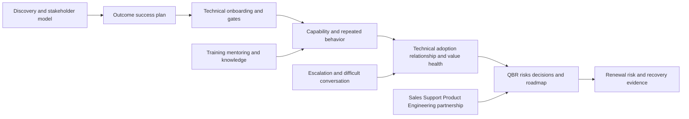

| ID range | Focus | Evidence of strong judgment |
|---|---|---|
| A097-A104 | Discovery, onboarding, stakeholders, account team | Authority, gates, handoffs, corrected read-backs |
| A105-A111 | Mitigation, workshops, QBR, escalation, objections, mentoring | Tailoring, communication, changed cases |
| A112-A116 | Health, value, renewal, roadmap, hybrid delivery | Measurable outcomes and honest boundaries |

#### A097. Discovery reveals that the executive objective and operator pain point do not align. What do you do?

**Model answer:** Read back both without forcing agreement. Trace the operator workflow to the executive objective, identify missing assumptions, constraints, incentives, and decision authority, and quantify consequences. Build options that address material pain while preserving objective, or escalate a real tradeoff to the sponsor. Update the success plan and measures. Do not treat operator resistance as a communication defect automatically.

**Cross-reference:** [Part 100 - Enterprise Discovery, Qualification, and Current-State Assessment](Part-100-enterprise-discovery-assessment.md)

#### A098. How would you recover when an executive sponsor disengages during onboarding?

**Model answer:** Triangulate whether priority, trust, timing, role change, or delegation explains it. Reconnect work to the agreed decision/outcome, summarize evidence and blocked choices, ask for a delegate with authority, adjust cadence, and align the account team. Preserve operator progress but do not make executive decisions by default. Record sponsor risk, recovery owner, checkpoint, and escalation.

**Cross-reference:** [Part 102 - Stakeholder Mapping, Executive Management, and Governance Cadence](Part-102-stakeholder-executive-governance.md)

#### A099. A customer wants to scale integrations before source contracts and quality gates are complete. How do you respond?

**Model answer:** Validate urgency, show the decision risks of scaling ambiguous data, and propose a bounded source/use-case pilot with explicit grain, authority, freshness, quality, and reconciliation. Sequence high-value foundations and parallelize safe prerequisites. Define exit evidence and fallback. Avoid a blanket delay, but do not call connected data decision-ready merely to preserve schedule.

**Cross-reference:** [Part 101 - Onboarding, Technical Success Plans, Milestones, and Time to Value](Part-101-onboarding-success-plans.md)

#### A100. How do you set success metrics when no trustworthy baseline exists?

**Model answer:** Make baseline establishment the first outcome. Define population, grain, source, reporting cut, quality threshold, formula, owner, acceptor, and observation window. Use a target hypothesis or directional objective, not invented precision. Record confounders and guardrails. After accepted baseline, set/revise target transparently rather than backfilling a number that makes the project look successful.

**Cross-reference:** [Part 106 - Customer Health, Adoption, Value Realization, and Success Metrics](Part-106-customer-health-adoption-value.md)

#### A101. Two powerful customer stakeholders disagree about source authority. How do you facilitate?

**Model answer:** Move from system-level ownership to field, purpose, and time. Document each claim, evidence, consequence, and authority; compare anchor records and failure cases. Options may include field-level precedence, conditional rules, preserved conflicts, or governance escalation. Do not let title or tool preference decide semantic truth. Record the decision, version, review trigger, and downstream impact.

**Cross-reference:** [Part 102 - Stakeholder Mapping, Executive Management, and Governance Cadence](Part-102-stakeholder-executive-governance.md)

#### A102. When does a RACI need escalation rather than another meeting?

**Model answer:** Escalate when accountability is absent or duplicated for a material decision, authorities conflict, a dependency repeatedly misses evidence, safety/compliance is at risk, or role resolution exceeds the team's mandate. Present the decision, impact, options, evidence, and requested authority. Do not escalate personalities. After resolution, update the RACI, handoff, cadence, and acceptance criteria.

**Cross-reference:** [Part 103 - Cross-Functional Partnership with Sales, Support, Product, and Engineering](Part-103-cross-functional-account-team.md)

#### A103. How should a TSM package product feedback so Product and Engineering can act?

**Model answer:** Include customer job and impact, environment/version/entitlement, expected versus observed behavior, scope and frequency, reproduction or evidence, known-good comparisons, workarounds and risk, logs with privacy controls, prior cases, requested decision, and customer communication checkpoint. Separate defect, usability, enhancement, documentation, and roadmap request. Never promise acceptance or date; close the loop visibly.

**Cross-reference:** [Part 103 - Cross-Functional Partnership with Sales, Support, Product, and Engineering](Part-103-cross-functional-account-team.md)

#### A104. How do TSM and Support collaborate during a critical product issue?

**Model answer:** Support owns the case and technical escalation route; the TSM brings account context, impact, stakeholders, success-plan dependencies, communication coordination, and follow-through. Agree one evidence package, severity, roles, cadence, and customer update. Avoid parallel conflicting investigations or bypassing support. Product/Engineering own authoritative defect assessment; customer change/risk authority stays with the customer.

**Cross-reference:** [Part 108 - Critical Escalation Leadership and Executive Communication](Part-108-critical-escalation-leadership.md)

#### A105. How do you tailor a mitigation strategy when the technically strongest option is operationally infeasible?

**Model answer:** Preserve the risk scenario, then compare options across reduction mechanism, feasibility, dependency, service/safety, cost, time, reversibility, control side effects, and validation. Consider compensating controls, phased treatment, exposure reduction, monitoring, or authorized time-bound acceptance. The risk owner decides. Document residual risk and triggers; do not present an infeasible ideal as the only responsible choice.

**Cross-reference:** [Part 104 - Risk Findings to Tailored Mitigation Strategy](Part-104-risk-findings-to-mitigation.md)

#### A106. How would you rescue a workshop when participants challenge the architecture and the agenda falls behind?

**Model answer:** Treat the challenge as data. Clarify the disputed fact, capture it as fact/assumption/unknown, inspect available evidence, and decide whether it changes the learning objective. Timebox or create an owner/checkpoint, correct the diagram visibly, and prioritize participant decisions over slide coverage. End with read-back, unresolved items, and follow-up. Never bluff to protect the agenda.

**Cross-reference:** [Part 105 - Technical Consulting, Workshops, Whiteboarding, and Training](Part-105-consulting-workshops-training.md)

#### A107. What makes a QBR executive-ready and technically defensible at the same time?

**Model answer:** Lead with objectives, accepted outcomes, material risks, decisions, and next roadmap; show definitions, quality, confidence, and limitations near headlines; and provide drill-through to a technical appendix and stable evidence IDs. Separate activity, capability, behavior, operational effect, and value. Rehearse concise and deep paths. Record decisions, owners, dependencies, acceptance, and next evidence.

**Cross-reference:** [Part 107 - Business Reviews, Executive Narratives, and Board-Ready Communication](Part-107-business-reviews-executive-narratives.md)

#### A108. How would you tell an executive that a previously reported improvement was invalid?

**Model answer:** State the correction early: which metric/period/population is affected, how the issue was found, what decisions may be impacted, what remains valid, immediate containment, owner, correction/validation, prevention, and next update. Apologize for the evidence failure without speculation. Preserve history and do not minimize. Transparent correction protects long-term trust better than defending the original slide.

**Cross-reference:** [Part 107 - Business Reviews, Executive Narratives, and Board-Ready Communication](Part-107-business-reviews-executive-narratives.md)

#### A109. During an escalation, stakeholders demand an ETA that Engineering cannot support. What do you say?

**Model answer:** "We do not have an evidence-supported restoration time yet. We have isolated [bounded facts], the current workstreams and owners are [briefly], the safe workaround/status is [state], and the next decision/evidence checkpoint is [time]. I will update then even if the answer remains unknown." Avoid false precision while keeping cadence, impact, and progress visible.

**Cross-reference:** [Part 108 - Critical Escalation Leadership and Executive Communication](Part-108-critical-escalation-leadership.md)

#### A110. How do you handle a customer who says contextual scoring is a vendor black box?

**Model answer:** Validate the governance concern. Separate any verified product behavior from the customer-specific decision model, then expose available factors, provenance, time, confidence, overrides, cases, and failure handling. Ask which decisions require explainability and authority. Run anchor/edge cases and keep human review. If internals are unavailable, state that boundary and avoid claiming transparency that does not exist.

**Cross-reference:** [Part 109 - Difficult Conversations, Objections, Constructive Debate, and Trust](Part-109-difficult-conversations-trust.md)

#### A111. How would you mentor an engineer to become customer-facing without reducing technical depth?

**Model answer:** Build a competency model spanning discovery, architecture, evidence, hypothesis, communication, ownership, and boundaries. Use shadow, reverse-shadow, scoped delivery, case review, recorded artifacts where approved, changed-case practice, and specific feedback. Teach layered explanations for executive and engineer audiences. Measure independent behavior and judgment, not charisma, and retain escalation paths for unknowns.

**Cross-reference:** [Part 110 - Mentoring, Service Quality, Knowledge Scaling, and 30/60/90-Day Ramp](Part-110-mentoring-service-quality-ramp.md)

#### A112. A composite customer-health score is green, but the champion has left. What do you do?

**Model answer:** Treat the score as a summary, not truth. Reassess relationship coverage, sponsor, operator behavior, technical/data health, product fit, outcomes, support, and decision cadence. The champion departure creates continuity and adoption risk even if usage remains high. Build replacement relationships, document knowledge, update confidence, and set checkpoints. Do not force the score green because lagging signals have not moved.

**Cross-reference:** [Part 106 - Customer Health, Adoption, Value Realization, and Success Metrics](Part-106-customer-health-adoption-value.md)

#### A113. How do you demonstrate value when only capability evidence exists so far?

**Model answer:** State the evidence level honestly: what capability was established, accepted quality, and which customer job it enables. Do not call it operational effect, risk reduction, savings, or adoption. Define the next behavior and outcome measures, baseline, guardrails, owner, acceptor, and time window. Early capability can be valuable progress when its dependency role and limitations are clear.

**Cross-reference:** [Part 106 - Customer Health, Adoption, Value Realization, and Success Metrics](Part-106-customer-health-adoption-value.md)

#### A114. What is your recovery plan when renewal risk reflects weak outcomes and declining sponsor engagement?

**Model answer:** Align the account team on evidence and commercial boundary, reconnect with sponsor or authorized delegate around the original objective, acknowledge outcome gaps, narrow to a credible recovery use case, assign owners, remove blockers, and contract near-term accepted evidence and cadence. Preserve defects and unknowns. Sales owns commercial negotiation; the TSM owns truthful technical/value recovery coordination.

**Cross-reference:** [Part 117 - Complete SecOps TSM Account Capstone](Part-117-complete-secops-tsm-capstone.md)

#### A115. How would you build a 30/60/90 roadmap for an account after a difficult first quarter?

**Model answer:** First 30 days: reset objective, sponsor, facts, product unknowns, data/technical health, and decision rights. Days 31-60: run bounded corrective pilots, enable operators, reconcile workflows, and validate behavior. Days 61-90: accept operational effects/residual risks, hold QBR, and choose scale or alternative. Every state has dependencies, guardrails, fallback, owner, and evidence.

**Cross-reference:** [Part 117 - Complete SecOps TSM Account Capstone](Part-117-complete-secops-tsm-capstone.md)

#### A116. How do you prepare differently for an on-site executive workshop versus a remote technical session?

**Model answer:** Keep outcomes and evidence consistent, but adapt room/technology, travel/security, participant dynamics, accessibility, time zones, whiteboarding, breaks, backup materials, data display, and follow-up. On-site may improve relationship and observation but creates device/privacy/logistics risks; remote needs stronger interaction design and contingencies. Neither format substitutes for role-aware exercises, read-back, and accepted next actions.

**Cross-reference:** [Part 105 - Technical Consulting, Workshops, Whiteboarding, and Training](Part-105-consulting-workshops-training.md)

### Integrated scenarios - A117-A128

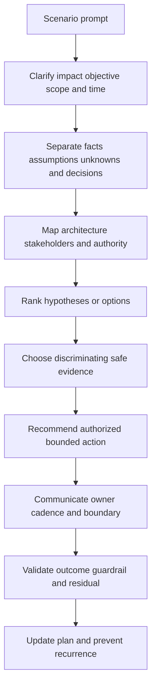

| Scenario dimension | What a strong answer includes | Common failure |
|---|---|---|
| Scope | Who/what/where/when/business effect | Jumping to solution |
| Evidence | Source, time, confidence, limits, known-good | Tool-name shopping |
| Authority | Customer, Support, Product, Legal, Safety, Sales boundaries | Candidate accepts risk/promises product |
| Action | Smallest safe discriminating or mitigating step | Broad bypass/change |
| Communication | Known, unknown, action, owner, next update | Unsupported ETA/root cause |
| Validation | Changed/control cases, guardrails, residual | "It works now" closure |

#### A117. Give a two-minute account plan for fictional NMH from discovery through QBR.

**Model answer:** Discover the decision, workflows, sources, stakeholders, authority, constraints, and accepted outcomes; read back facts and unknowns. Sequence governance/privacy, source contracts/quality, entity context, priority calibration, workflow validation, changed-case training, and bounded automation. Monitor technical/adoption/value health, coordinate escalation, and deliver a QBR with evidence levels, risks, decisions, renewal signals, and a gated next roadmap. NMH remains synthetic.

**Cross-reference:** [Part 117 - Complete SecOps TSM Account Capstone](Part-117-complete-secops-tsm-capstone.md)

#### A118. A stale vulnerability source causes the material backlog to fall before the QBR. What do you do?

**Model answer:** Freeze the affected trend, display freshness and expected population, quantify missing scope, notify technical and executive owners, restore/replay and reconcile, then annotate history. Review decisions made from the invalid view. Add source-health blocking gates and changed-case tests. Report "view incomplete," not improvement. No risk-reduction or product-reliability claim is supported until evidence returns.

**Cross-reference:** [Part 116 - Executive Risk Review, Dashboard, and Mitigation Roadmap Capstone](Part-116-executive-risk-review-capstone.md)

#### A119. A customer rejects your top vulnerability because a compensating control exists. How do you proceed?

**Model answer:** Ask for control design, scope, operating evidence, freshness, exceptions, and failure conditions; validate whether it affects the specific path and consequence. Recalculate or narratively revise confidence and residual rather than defend the score. Offer treatment/validation options and record the risk owner's decision. If evidence is stale, classify unknown and request revalidation instead of assuming effective or failed.

**Cross-reference:** [Part 113 - UVM and Vulnerability Prioritization Lab](Part-113-uvm-prioritization-lab.md)

#### A120. A critical sync workflow fails for hundreds of users, but browser access works. Lead the response.

**Model answer:** Confirm impact, cohorts, workaround, onset, severity, roles, and cadence. Compare process identity and path across DNS, TCP, proxy, TLS, HTTP, and application evidence. In the synthetic pattern, 407 before target TLS localizes proxy authentication/policy for the background process. Coordinate authorized correction, changed/control validation, executive updates without ETA invention, then RCA and process-specific prevention.

**Cross-reference:** [Part 114 - Connectivity and Critical Escalation Lab](Part-114-connectivity-escalation-lab.md)

#### A121. A customer asks when an unverified product feature will ship and says renewal depends on it. Respond.

**Model answer:** Clarify the job and consequence, acknowledge urgency, and state that I cannot confirm roadmap or date. Capture environment, requirement, alternatives, and decision deadline; route through the authorized account/Product process; set a communication checkpoint; and build a plan using currently supported capabilities or operational controls. Coordinate with Sales but never manufacture a commitment to reduce renewal pressure.

**Cross-reference:** [Part 109 - Difficult Conversations, Objections, Constructive Debate, and Trust](Part-109-difficult-conversations-trust.md)

#### A122. A security leader says exposure management is redundant because the company already owns SIEM and XDR. How do you answer?

**Model answer:** Start from jobs rather than labels. Map event detection/search, cross-domain investigation/response, asset reconciliation, vulnerability/control/business context, exposure paths, remediation workflow, and executive risk decisions. Identify actual overlap and missing outcomes, data authority, integration cost, and operating owners. Propose a requirement-led pilot if a gap exists; accept that no new capability may be needed if current evidence meets the job.

**Cross-reference:** [Part 118 - Miscellaneous and Deeper Topics](Part-118-miscellaneous-deeper-topics.md)

#### A123. An OT plant has unsupported devices with critical vulnerabilities. What is your recommendation process?

**Model answer:** Do not scan, patch, or isolate by default. Engage process safety, OT engineering, vendor, operations, risk, and security owners. Validate inventory, applicability, exposure paths, function, maintenance windows, backups, and compensating controls using authorized passive or lab evidence. Compare safe treatment, segmentation, remote-access controls, monitoring, and time-bound acceptance. Physical safety and recovery evidence govern sequencing.

**Cross-reference:** [Part 118 - Miscellaneous and Deeper Topics](Part-118-miscellaneous-deeper-topics.md)

#### A124. A newly acquired company needs connectivity on day one but has unknown security posture. How do you balance speed and risk?

**Model answer:** Establish legal/clean-team scope, critical services, incident contacts, temporary identities, least-privileged application access, segmentation, monitoring, expiry, and rollback. Avoid broad network trust. Reconcile assets, identities, data, apps, suppliers, and controls in phased discovery, then prioritize material gaps and migrate gradually. Record inherited unknowns and authorized residual risk; convenience does not erase attack paths.

**Cross-reference:** [Part 118 - Miscellaneous and Deeper Topics](Part-118-miscellaneous-deeper-topics.md)

#### A125. A customer wants a third-party AI service to summarize vulnerability tickets. What must be assessed?

**Model answer:** Map ticket data and sensitivity, business purpose, provider/model/fourth-party chain, training/retention, tenant isolation, identity/access, prompts, retrieval, output citations, prompt injection, logs, location, incident terms, human validation, and exit/deletion. Begin with synthetic data and no tool authority. Legal, Privacy, Procurement, Security, and workflow owners decide; public AI capability does not prove fit.

**Cross-reference:** [Part 118 - Miscellaneous and Deeper Topics](Part-118-miscellaneous-deeper-topics.md)

#### A126. An AI agent recommends isolating every asset related to an alert. What should happen before action?

**Model answer:** Verify source evidence, entity confidence, scope, active harm, business/safety impact, exact proposed tool calls, authority, alternatives, and reversibility. Challenge prompt injection and correlation errors. Prefer a scoped, human-approved, monitored action with rollback and control cohort. Audit prompt/model/tool/policy/approver and validate effect. High fluency or "critical" severity cannot authorize broad containment.

**Cross-reference:** [Part 98 - AI Agents for Security: Prompting, Grounding, Validation, and Governance](Part-98-ai-agents-security-governance.md)

#### A127. A customer asks whether a dashboard proves compliance with NIS2, DORA, or another regulation. How do you respond?

**Model answer:** Say the dashboard may support selected technical evidence but cannot by itself prove applicability or compliance. Engage Legal/Compliance to define entity, jurisdiction, service, data, role, dates, and obligations. Map each relevant requirement to controls, scope, design and operating evidence, exceptions, and owners. Verify current official text and preserve limitations; the TSM does not issue legal conclusions.

**Cross-reference:** [Part 118 - Miscellaneous and Deeper Topics](Part-118-miscellaneous-deeper-topics.md)

#### A128. A board member asks for one number that says whether the company is secure. What do you provide?

**Model answer:** Explain that one number can track a defined index but cannot prove security. Offer a concise portfolio: material risk scenarios, stable trend, control/exposure changes, data confidence, mitigation status, incidents/resilience, decisions, and residual risk. State definitions and uncertainty. If an index is required, show components and sensitivity and never call it probability, guarantee, or complete enterprise truth.

**Cross-reference:** [Part 90 - Risk360 Quantification, Financial Exposure, Guided Mitigation, and Board Reporting](Part-90-risk360-quantification-reporting.md)

### Behavioral, culture, and closing - A129-A144

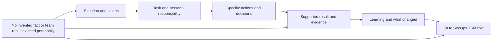

| Behavioral answer check | Strong evidence | Weak pattern |
|---|---|---|
| Personal role | "I" actions within team context | Only "we" or inflated ownership |
| Stakes | Customer/business/technical consequence | Generic task description |
| Judgment | Alternatives, evidence, tradeoff, authority | Activity chronology only |
| Result | Supported metric, acceptance, or bounded outcome | Vague success or invented number |
| Reflection | What changed and how it transfers | "I would do nothing differently" |
| Honesty | Factual/lab/learned/gap label | Synthetic work presented as production |

#### A129. How should Arti answer "Tell me about yourself" for this role?

**Model answer:** Use a 90-second present-past-future structure. Present: Microsoft enterprise escalation engineer with deep M365 customer and evidence work. Past strengths: networking, critical incidents, Engineering partnership, analytics, mentoring, and AI enablement, using only supported details. Future: move proactively into SecOps Technical Success, applying those strengths while ramping honestly on Zscaler, exposure, vulnerability, and SecOps operations. End with why this role's customer/technical mix fits.

**Cross-reference:** [Part 1 - Role Map, JD Deconstruction, and the SecOps TSM Story](Part-01-role-map-jd-secops-tsm-story.md)

#### A130. How should Arti answer "Why Zscaler?"

**Model answer:** Connect supported motivation to Zscaler's current public zero-trust and SecOps direction, the role's combination of complex customer environments, security data, exposure/vulnerability priorities, troubleshooting, executive communication, and AI-forward work. Explain why her M365 escalation, networking, analytics, and enablement strengths transfer. Avoid flattery, competitor bashing, unverified leadership claims, or saying she has used products she has not.

**Cross-reference:** [Part 2 - Zscaler Mission, AI-Forward Strategy, Culture, and Interview Signals](Part-02-zscaler-mission-ai-culture.md)

#### A131. How should Arti answer "Why SecOps Technical Success rather than another support role?"

**Model answer:** She can say she values deep incident ownership but wants to apply it earlier and more strategically: discovery, architecture, data quality, prioritization, adoption, governance, QBRs, and risk outcomes across an account. Her support background is a foundation, not something to escape. The gap is direct SecOps TSM production work, addressed through structured learning, synthetic practice, shadowing, and evidence-based ramp.

**Cross-reference:** [Part 3 - Technical Success Management from Zero](Part-03-technical-success-management-from-zero.md)

#### A132. How should Arti answer "Why should we hire you?"

**Model answer:** Offer a three-part evidence case: proven enterprise customer/escalation judgment; technical breadth across M365 dependencies, networking tools, RCA, SQL/Power BI/statistics; and multiplier behavior through mentoring, onboarding, training, knowledge, and AI exploration. Then state the direct product/SecOps gap and a concrete ramp. Avoid claiming readiness from study alone; emphasize learning velocity, honesty, ownership, and transferable execution.

**Cross-reference:** [Part 1 - Role Map, JD Deconstruction, and the SecOps TSM Story](Part-01-role-map-jd-secops-tsm-story.md)

#### A133. How do you answer a question about a requirement you have not done directly?

**Model answer:** Say so in the first sentence. Then separate what you understand, the closest factual transferable example, how you practiced or studied it, the production evidence/authority you would seek, and a time-bound ramp approach. Invite a scenario follow-up. Do not bury the gap, use "we" to borrow another team's experience, or present the NMH simulation as a customer.

**Cross-reference:** [Part 111 - Safe Lab Setup, Evidence Portfolio, and Honesty Rules](Part-111-safe-lab-evidence-honesty.md)

#### A134. Give a framework for a customer-obsession story.

**Model answer:** Fill in: **Situation:** [supported customer impact and stakes]. **Task:** [your specific responsibility]. **Actions:** [how you listened, clarified outcome, gathered evidence, coordinated, communicated, and followed through]. **Result:** [supported CSAT, recovery, acceptance, or quality evidence]. **Learning:** [what changed]. Tie to TSM: proactive trust and outcomes. Use actual numbers only if supported by the candidate facts.

**Cross-reference:** [Part 4 - Enterprise Customer Environment and Stakeholder Thinking](Part-04-enterprise-environment-stakeholders.md)

#### A135. Give a framework for an ownership-under-pressure story.

**Model answer:** Choose a factual CRITSIT or business-critical support case. Fill in impact, ambiguity, your role, first actions, workstreams, evidence, update cadence, decision boundaries, Engineering/customer coordination, validation, result, and PIR. Emphasize what you personally owned without claiming the underlying service. Explain how that discipline transfers to SecOps escalation and strategic account follow-through.

**Cross-reference:** [Part 108 - Critical Escalation Leadership and Executive Communication](Part-108-critical-escalation-leadership.md)

#### A136. Give a framework for a constructive-disagreement story.

**Model answer:** Use a supported example where customer, partner, peer, or Engineering views differed. State the shared objective, contested fact/assumption, stakes, how you listened, evidence gathered, options and tradeoffs, decision authority, and outcome. Include whether you changed your view. Avoid portraying the other person as difficult; show transparency, respectful challenge, and a stronger decision.

**Cross-reference:** [Part 109 - Difficult Conversations, Objections, Constructive Debate, and Trust](Part-109-difficult-conversations-trust.md)

#### A137. How should Arti answer "Tell me about a failure" without inventing one?

**Model answer:** Select a genuine supported case and fill in: what she expected, what actually happened, her contribution or missed signal, impact, immediate correction, communication, root learning, and durable process change. Do not choose a disguised strength or disclose confidential details. If exact metrics are unavailable, state the bounded result. Link the learning to transparency and quality under urgency.

**Cross-reference:** [Part 15 - Incident Response, Evidence, RCA, and Post-Incident Improvement](Part-15-incident-response-evidence-rca.md)

#### A138. Give a framework for showing urgency without sacrificing quality.

**Model answer:** Describe a supported time-critical case. Explain how you quickly defined impact, stabilized coordination, prioritized discriminating evidence, parallelized workstreams, set communication cadence, preserved safety/privacy, and used validation gates. State what you deliberately did not guess or bypass. Result and reflection should show that urgency shortened feedback loops while quality protected the customer.

**Cross-reference:** [Part 108 - Critical Escalation Leadership and Executive Communication](Part-108-critical-escalation-leadership.md)

#### A139. Give a framework for a mentoring or knowledge-scaling story.

**Model answer:** Use factual mentoring, onboarding, partner training, interviewing, or knowledge-article experience. Fill in learner/service gap, baseline, your design, examples/practice, feedback, teach-back or quality review, supported result, and adaptation. Distinguish material delivered from behavior improved. Tie to enabling customer operators and scaling TSM/service quality rather than making yourself the permanent bottleneck.

**Cross-reference:** [Part 110 - Mentoring, Service Quality, Knowledge Scaling, and 30/60/90-Day Ramp](Part-110-mentoring-service-quality-ramp.md)

#### A140. How should Arti discuss AI experience and responsible adoption?

**Model answer:** Use supported Copilot Studio, AI tool evaluation, certification, and organization-wide training facts at their documented level. Explain the task, audience, validation, privacy, human oversight, and learning, without claiming production SecOps agents. Then connect to agentic security principles: grounding, least privilege, prompt injection, evaluation, audit, and safe workflow integration. Fill in exact personal details only from records.

**Cross-reference:** [Part 98 - AI Agents for Security: Prompting, Grounding, Validation, and Governance](Part-98-ai-agents-security-governance.md)

#### A141. How should you answer "Tell me about communicating bad news to an executive"?

**Model answer:** Use a real supported escalation example. Fill in what changed, impact, evidence/confidence, what remained unknown, action/owner, workaround, and next update. Explain how you avoided jargon, unsupported ETA, blame, or hidden defects, and how the executive decision was supported. State the result and trust lesson. Do not convert the fictional NMH QBR into personal history.

**Cross-reference:** [Part 107 - Business Reviews, Executive Narratives, and Board-Ready Communication](Part-107-business-reviews-executive-narratives.md)

#### A142. What smart questions should Arti ask the interview panel?

**Model answer:** Ask how success is measured at 6 and 12 months; account/technical scope; customer maturity; TSM versus Support/Sales/Product boundaries; escalation and product-feedback paths; Data Fabric/UVM/SecOps priorities; enablement and labs; executive cadence; travel/hybrid expectations; AI workflow governance; team strengths/gaps; and what distinguishes excellent performers. Adapt to interviewer role and avoid questions answered clearly in current public material.

**Cross-reference:** [Part 102 - Stakeholder Mapping, Executive Management, and Governance Cadence](Part-102-stakeholder-executive-governance.md)

#### A143. How should compensation and negotiation be handled professionally?

**Model answer:** First understand role scope, level, location, total compensation components, benefits, travel, timing, and decision process. Express interest without immediate acceptance pressure, ask for the offer in writing, evaluate the whole package, and make a concise evidence-based request aligned to role value and market information. Do not bluff competing offers or negotiate before understanding constraints. Fill in personal priorities privately.

**Cross-reference:** [Part 109 - Difficult Conversations, Objections, Constructive Debate, and Trust](Part-109-difficult-conversations-trust.md)

#### A144. What should the final closing answer communicate?

**Model answer:** Reaffirm interest using three matched strengths, name the direct gap honestly with a ramp plan, reflect one important need learned from the panel, and ask whether any concern remains that you can address. Example framework: "My [supported strengths] match [role needs]. I have not yet [gap], and my plan is [specific ramp]. Based on today's discussion, I am especially motivated by [actual detail]. What concern should I clarify?"

**Cross-reference:** [Part 1 - Role Map, JD Deconstruction, and the SecOps TSM Story](Part-01-role-map-jd-secops-tsm-story.md)

## Plain-English deep-dives for using the bank

### Plain-English deep-dive 1 - Recognition is not recall

Reading a model answer can create familiarity without retrieval. In an interview, the question arrives without the answer underneath it. Practice must therefore begin aloud with the model hidden. Think of recognizing a route on a map versus driving it during rain. The second requires retrieval, decisions, and correction. Score the first attempt, not the comfortable feeling after reading.

### Plain-English deep-dive 2 - Adaptive answers are built from structure, not scripts

A memorized paragraph can fail when an interviewer changes one condition. A structure survives. For troubleshooting, scope and locate the first divergence; for risk, connect evidence to objective, controls, treatment, and residual; for customer work, connect outcome to accepted evidence. Practice shorter and longer versions and invite interruption. The goal is accurate thinking aloud, not perfect recitation.

### Plain-English deep-dive 3 - Honesty makes an answer stronger

Stating a direct gap early prevents the rest of the answer from sounding evasive. Then transferable evidence and a production validation plan become credible. Think of labeling ingredients: the label does not make the meal weaker; it lets someone make a safe decision. Synthetic NMH practice shows method and preparation, while factual Microsoft examples show production behavior. They should never be blended.

### Plain-English deep-dive 4 - A score is a routing signal

The self-quiz score is not intelligence or interview destiny. It routes practice. A zero tells you to rebuild a definition; a two tells you to add evidence or boundary; a four tells you to space review and teach it. Do not inflate scores to finish the tracker. The useful outcome is finding weakness before the interview and correcting it with the linked Part.

## Self-quiz operating plan

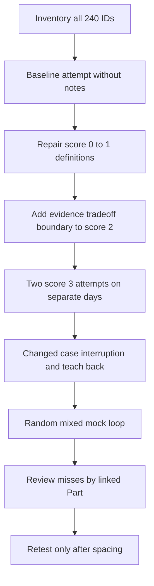

| Practice loop | Selection | Time | Pass gate | Output |
|---|---|---:|---|---|
| Baseline | 24 random IDs across all domains | 60 minutes | Honest score and one gap each | Red/amber inventory |
| Fundamentals | B001-B048 | 2 sessions | Every ID at least 3 twice | Concise definition fluency |
| Connections | I001-I048 | 3 sessions | Evidence and failure mode included | Architecture/troubleshooting fluency |
| Advanced domain | A001-A116 by category | 8-12 sessions | Structured 2-4 minute answer | Depth and boundary control |
| Scenario | A117-A128 | 2 sessions | Scope/evidence/authority/action/validation | Adaptive judgment |
| Behavioral | A129-A144 | 2 sessions | Supported STAR plus fill-in completion | Factual personal narrative |
| Mixed panel | 12 random questions with interruptions | 45 minutes | No unsafe/invented answer; timing met | Mock scorecard |
| Night-before | Only amber IDs and memory hooks | 30-45 minutes | Calm recall, no cramming | Final cue sheet |

### Domain tracker

| Domain | IDs | Total | Baseline complete | Green count | Blue count | Next weakest Part |
|---|---|---:|---:|---:|---:|---|
| Role/culture/basic cyber | B001-B012 | 12 |  |  |  |  |
| Networking/identity | B013-B020, I009-I016, A017-A032 | 32 |  |  |  |  |
| Zscaler product/architecture | B021-B028, I001-I008, A001-A016 | 32 |  |  |  |  |
| SQL/data/Data Fabric | B029-B036, I017-I024, A033-A052 | 36 |  |  |  |  |
| Exposure/UVM/CTEM/Risk | B037-B042, I025-I034, A053-A076 | 40 |  |  |  |  |
| SecOps/AI | I035-I040, A077-A096 | 26 |  |  |  |  |
| TSM/customer | B043-B048, I041-I048, A097-A116 | 34 |  |  |  |  |
| Integrated scenarios | A117-A128 | 12 |  |  |  |  |
| Behavioral/culture/closing | A129-A144 | 16 |  |  |  |  |
| Total | All IDs | 240 |  |  |  |  |

### Question-bank integrity checklist

| Check | Expected value | Validation method |
|---|---:|---|
| Basic IDs | 48 | B001 through B048, no gap |
| Intermediate IDs | 48 | I001 through I048, no gap |
| Advanced IDs | 144 | A001 through A144, no gap |
| Total questions | 240 | 48 + 48 + 144 |
| Distribution | 20% / 20% / 60% | Counts divided by 240 |
| Model answer/hint | 240 | One under every question heading |
| Cross-reference link | 240+ | At least one under every question |
| Duplicate question text | 0 | Compare every heading text, excluding ID |
| Unsafe real-environment instruction | 0 | Review labs/scenarios for authorization and boundaries |
| Invented candidate/customer result | 0 | Apply factual/lab/learned/gap labels |

## Official Source Anchors

Research/source snapshot and source review date: **2026-08-24**.

The bank primarily cross-references the curriculum, whose Parts contain more detailed source tables. These anchors support bounded public positioning and general frameworks. They do not establish product entitlement, customer fit, internal algorithms, candidate production experience, NMH outcomes, legal compliance, or market superiority.

| Source | URL | Used for | Boundary |
|---|---|---|---|
| Zscaler Zero Trust Exchange | https://www.zscaler.com/products-and-solutions/zero-trust-exchange-zte | Public platform/zero-trust positioning | No customer architecture or result inferred |
| Zscaler Data Fabric for Security | https://www.zscaler.com/products-and-solutions/data-fabric | Public security-data positioning | No internal schema/connector inferred |
| Zscaler Unified Vulnerability Management | https://www.zscaler.com/products-and-solutions/unified-vulnerability-management | Public contextual vulnerability positioning | No algorithm, score, or workflow inferred |
| Zscaler Risk360 | https://www.zscaler.com/products-and-solutions/risk360 | Public enterprise-risk positioning | No probability, financial fact, or NMH output inferred |
| Zscaler Agentic Security Operations | https://www.zscaler.com/products-and-solutions/security-operations | Public SecOps/agentic positioning | No autonomous behavior or entitlement inferred |
| NIST Cybersecurity Framework 2.0 | https://www.nist.gov/cyberframework | General outcome/governance structure | Voluntary and implementation-neutral |
| NIST SP 800-207 | https://csrc.nist.gov/pubs/sp/800/207/final | Vendor-neutral zero-trust concepts | Not a product implementation guide |
| NIST AI Risk Management Framework | https://www.nist.gov/itl/ai-risk-management-framework | AI-risk governance context | Voluntary; not legal compliance |
| CISA KEV Catalog | https://www.cisa.gov/known-exploited-vulnerabilities-catalog | Known-exploitation prioritization context | Absence does not prove safety |
| FIRST CVSS and EPSS | https://www.first.org/ | Severity and exploitation-model context | Scope, version, date, and limitations apply |

## 30-Second Memory Hooks

| Domain | Memory hook |
|---|---|
| TSM | Outcomes, evidence, owners, cadence, adaptation |
| Honesty | Factual, synthetic, learned, gap |
| Zero trust | Specific subject to specific resource under context |
| Troubleshooting | First divergence, smallest discriminating evidence |
| Network | DNS, TCP, proxy, TLS, HTTP, application |
| Data | Grain, keys, time, quality, provenance, reconciliation |
| Dashboard | Denominator and quality beside the headline |
| Data Fabric | Governed context and workflows, not automatic truth |
| CAASM | Reconcile assets and control coverage |
| UVM/RBVM | Contextual priority with explainability and authority |
| CTEM | Scope, discover, prioritize, validate, mobilize |
| Risk | Scenario, objective, controls, confidence, treatment, residual |
| SecOps | Signal to story to right-sized response to learning |
| AI agent | Grounding, least privilege, approval, audit, kill switch |
| QBR | Outcomes, quality, risks, decisions, next |
| Renewal risk | Triangulate and recover; never predict from one signal |
| Behavioral | STAR plus evidence, learning, and role relevance |
| Closing | Strengths, gap/ramp, learned detail, remaining concern |

## Completion Checklist

- [ ] I have attempted all 240 questions aloud without reading the model answer first.
- [ ] I confirmed all 48 basic IDs, 48 intermediate IDs, and 144 advanced IDs are present.
- [ ] I can explain the 20/20/60 distribution and why advanced scenario practice dominates.
- [ ] I recorded score, time, evidence label, one gap, and next review for every attempt.
- [ ] I read the linked Part after every score of 0 or 1.
- [ ] Every basic question has two score-3 attempts on separate days.
- [ ] Every intermediate question includes an evidence source and failure mode.
- [ ] Every advanced technical question includes scope, authority, validation, or a limitation.
- [ ] I practiced all 12 integrated scenarios with changed conditions and interruptions.
- [ ] I replaced every behavioral fill-in prompt with supported personal details or left it explicitly incomplete.
- [ ] I never presented NMH, a synthetic score, a lab, or learned architecture as production experience.
- [ ] I never invented Zscaler product behavior, entitlement, roadmap, customer outcome, ROI, or market claim.
- [ ] I can state the source review date and current-verification plan for product questions.
- [ ] I can answer unknown product and regulatory questions without bluffing.
- [ ] I can give 30-second, 90-second, and deeper versions of core topics.
- [ ] I can whiteboard product, network, data, risk, SecOps, AI, and customer-lifecycle flows.
- [ ] I completed at least two mixed mock panels and reviewed misses by stable ID.
- [ ] I have a red/amber list small enough for focused night-before review.
- [ ] I can explain what reading and practice have not yet proven about production readiness.
- [ ] I am ready to build the factual story bank and personal preparation sheets in Part 120.

[Next: Part 120 - Behavioral, Culture, Closing, and Night-Before Preparation](Part-120-behavioral-culture-closing.md)