# Part 12 - Security Governance: NIST CSF, CIS Controls, ISO 27001, and Policies

> **Audience:** Candidates moving from Microsoft 365 Support Escalation Engineering into a Zscaler Security Operations Technical Success Manager role.
>
> **Currency date:** 2026-08-24.
>
> **Scope and honesty:** Northstar Meridian Holdings, abbreviated NMH, and every NMH policy, framework mapping, control, audit, exception, maturity rating, metric, decision, and result are fictional. Your established production bridge is enterprise support, OneDrive, SharePoint, networking, troubleshooting, analytics, mentoring, escalation, and approved AI work. Direct production ownership of an enterprise cybersecurity governance, risk, compliance, audit, ISO/IEC 27001 certification, Zscaler, Security Operations, vulnerability, or exposure-management program is not established.
>
> **Standards caveat:** This chapter summarizes public overviews and concepts. It does not reproduce copyrighted standards, provide legal advice, certify conformity, or replace licensed standards, qualified auditors, regulators, contracts, customer policy, or current implementation guidance. NIST Cybersecurity Framework 2.0, abbreviated CSF 2.0, is voluntary outcome guidance. CIS currently publishes the version 8 family and advertises CIS Controls v8.1. ISO/IEC 27001:2022 is the published third edition, with Amendment 1:2024 listed by ISO. Verify current editions and applicability.
>
> **Product caveat:** Zscaler product material can help a customer understand candidate technical capabilities and evidence. Buying or enabling a product does not by itself satisfy a framework outcome, pass an audit, eliminate risk, or transfer the customer's governance accountability.

## Section goal

Security governance is the system by which an organization directs, oversees, and holds people accountable for cybersecurity decisions. It connects business purpose, risk, policy, ownership, resources, controls, evidence, exceptions, assurance, and improvement.

Imagine a city transport system. The city council sets outcomes and acceptable tradeoffs. Transportation leaders define policy and budgets. Engineers establish construction standards. Operators follow procedures. Inspectors test whether roads and trains meet requirements. Incident reports reveal weaknesses. Exceptions such as a temporary bridge restriction have an owner, expiry, and compensating safeguards. Security governance works similarly: it turns broad intent into accountable, testable practice.

By the end, you should be able to:

| Learning outcome | What mastery looks like |
|---|---|
| Explain governance | Connect direction, accountability, resources, oversight, and improvement |
| Distinguish GRC | Separate governance, risk management, and compliance while showing their interaction |
| Use NIST CSF 2.0 | Explain Govern, Identify, Protect, Detect, Respond, and Recover as concurrent outcomes |
| Use Profiles and Tiers | Compare current and target outcomes and discuss rigor without turning Tiers into grades |
| Use CIS Controls | Explain prioritized Safeguards and Implementation Groups without treating them as universal law |
| Explain ISO/IEC 27001 | Describe an information security management system and certification boundary at public-overview level |
| Build document hierarchy | Distinguish policy, standard, baseline, procedure, and guideline |
| Trace controls | Connect objective, implementation, evidence, test, issue, treatment, and residual risk |
| Measure maturity | Assess capability dimensions and business services without averaging away critical gaps |
| Govern exceptions | Require rationale, risk, compensation, owner, approver, expiry, and validation |
| Clarify ownership | Use accountable roles, separation of duties, and escalation paths |
| Understand audit | Distinguish monitoring, assessment, internal audit, external audit, and certification |
| Crosswalk frameworks | Map outcomes by intent and scope while preserving differences and uncertainty |
| Act as a TSM | Support evidence, adoption, remediation, and product understanding without claiming auditor authority |
| Practice honestly | Design fictional NMH governance and use your factual support-quality bridge |

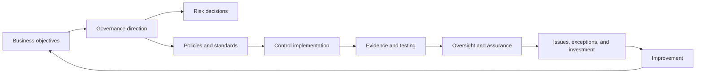

Governance is not a binder on a shelf. The loop must influence actual identity lifecycle, endpoint configuration, cloud settings, data handling, incident response, supplier decisions, recovery, product adoption, and budget. A policy that no system can implement or test is an aspiration, not an effective control.

## JD Mapping

The target Technical Success Manager, abbreviated **TSM**, needs governance fluency because strategic customers ask how a solution supports policy, risk, evidence, ownership, maturity, and executive outcomes. A TSM can translate documented capabilities into customer questions and success measures. The TSM does not decide legal obligations, certify conformity, act as independent auditor, or accept customer risk.

| JD expectation | Governance capability | Honest experience bridge | Boundary to preserve |
|---|---|---|---|
| Lead strategic engagements | Align technical roadmap to approved outcomes, owners, and governance cadence | Technical advisor and customer leadership experience | Customer governance bodies retain accountability |
| Identify security risks | Connect observed conditions to control objectives and risk owners | Production evidence gathering and escalation | Do not invent formal risk conclusions |
| Deliver mitigation strategies | Define action, owner, due date, evidence, test, and residual uncertainty | Fix recommendation and validation discipline | Authorized customer approver selects treatment |
| Advocate best practices | Explain framework intent and current product documentation | Training and knowledge-authoring strength | Best practice is not a universal mandate |
| Resolve critical escalations | Use severity, decision rights, communication, evidence, and post-incident actions | critical-situation coordination | Formal incident command or legal authority is not claimed |
| Explain metrics | Use denominators, trends, evidence quality, and outcome measures | SQL, Power BI, Business Analytics | A green metric does not prove control effectiveness |
| Partner with Sales, Support, and Product | Clarify customer requirement, product behavior, gap, owner, and escalation | Cross-functional Engineering and customer work | Commercial or roadmap statement requires authorized source |
| Develop Zscaler expertise | Map documented capabilities to customer control objectives | Official-source learning | Product use and audit assurance are not established |

## Candidate honesty note

You have strong factual examples of operational governance behaviors even though formal cybersecurity-governance ownership is not established. You have worked within support policies and escalation paths, reviewed case quality and backlog trends, authored knowledge, trained peers, mentored engineers, coordinated product defects, validated fixes, and maintained customer communication during high-pressure incidents. Those activities demonstrate evidence, accountability, process improvement, and stakeholder discipline.

You should describe the bridge precisely: "I have operated and improved support-quality processes in production. I am learning cybersecurity frameworks and have built a fictional governance design to practice mapping outcomes, controls, evidence, exceptions, and owners. I have not served as an ISO/IEC 27001 auditor, CISO, enterprise risk owner, or Zscaler administrator."

| Claim class | Established or allowed | Example wording | Guardrail |
|---|---|---|---|
| Production | enterprise support operations, escalation, analytics, mentoring, training, and approved AI work | "I used case-quality and backlog evidence to identify service improvements." | Do not rename support governance as a formal security program |
| Lab | Synthetic NMH policy, crosswalk, metric, and review exercise | "I created a fictional NMH Current and Target Profile." | Keep all outcomes fictional |
| Conceptual | NIST, CIS, ISO public concepts understood from sources | "I can explain how these approaches differ and interact." | Do not claim certification expertise |
| Not-yet-used | Zscaler product operation, audit, vulnerability, SecOps, exposure programs | "These are ramp areas I would validate with specialists." | Never imply production ownership |
| Auditor boundary | No independent-assurance authority established | "I can organize evidence for review." | Do not say "I certified compliance" |

## Governance, risk, and compliance from zero

**Governance** sets direction, assigns accountability, allocates resources, and oversees results. **Risk management** identifies uncertainty that could affect objectives and supports informed treatment. **Compliance** addresses obligations and commitments such as laws, regulations, contracts, standards, and internal policy.

The three overlap but are not synonyms. An organization can comply with a narrow rule while carrying serious risk elsewhere. It can reduce a material risk through a control that is not mandated by a regulation. Governance decides how both are integrated with business priorities.

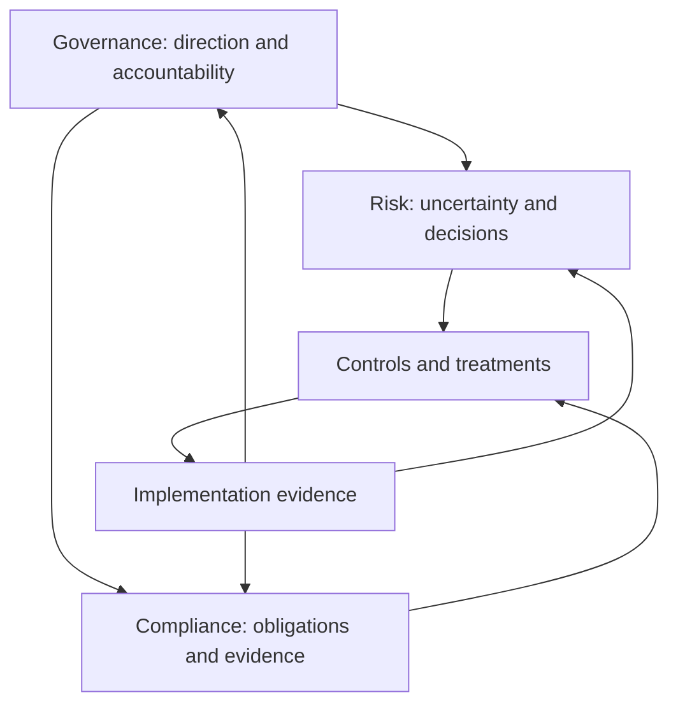

| Discipline | Central question | Typical output | Failure mode |
|---|---|---|---|
| Governance | Who decides, owns, funds, and oversees cybersecurity outcomes? | Charter, policy, roles, decision records, review cadence | Security activity disconnected from business authority |
| Risk management | What uncertainty could affect objectives, and what will we do? | Risk assessment, register, treatment, acceptance | Scores without decisions or accountable owners |
| Compliance | Which obligations apply, and how is conformity evidenced? | Obligation register, control mapping, evidence, findings | Checkbox activity without effective protection |
| Assurance | How independently and reliably do we know controls work? | Assessment, audit, attestation, test report | Self-report treated as independent proof |
| Operations | How are controls performed every day? | Configuration, procedure, ticket, monitoring, response | Policy exists but practice drifts |

### Governance layers

| Layer | Responsibility | Questions | Example artifact |
|---|---|---|---|
| Board or governing body | Oversight of material enterprise risk | Is cyber risk integrated with strategy and resilience? | Risk report and decisions |
| Executive management | Direction, appetite, resources, accountability | Are priorities funded and owners empowered? | Strategy, policy approval, budget |
| CISO or security leadership | Security program design and coordination | Are outcomes, controls, metrics, and issues managed? | Program roadmap and control framework |
| Business and service owners | Own business process, data, service, and accepted risk | Does the control preserve required business behavior? | Service risk and acceptance record |
| Control owners | Design and maintain control capability | Is the control appropriate and operable? | Control description and standard |
| Control operators | Perform activities | Was the control executed correctly and on time? | Configuration, ticket, log, procedure |
| Risk and compliance functions | Facilitate methods and monitor obligations | Is treatment and evidence consistent? | Register, mapping, assessment |
| Internal audit | Independent assurance within organizational mandate | Is governance and control effectiveness supported? | Audit plan and report |
| External assessor or auditor | Independent assessment under defined criteria | Does scoped evidence meet applicable criteria? | Assessment or certification report |

### Plain-English deep-dive 1 - Governance is who may decide what

Many security disagreements sound technical but are actually governance gaps. Engineering may want reliability, Security may want narrower access, Privacy may limit inspection, Legal may interpret notification duties, Finance may constrain investment, and a business owner may need a deadline met. No technical product can decide whose objective has authority.

Think of a hospital operating room. Surgeons, anesthetists, nurses, administrators, and safety teams have different expertise and decision rights. A software vendor can provide a monitor, explain its documented behavior, and help troubleshoot it. The vendor does not decide whether to proceed with surgery or accept the patient's medical risk. Similarly, a TSM supports technical outcomes and evidence, while the customer retains business, security, legal, and risk decisions.

A strong governance design names decision rights before a crisis. It defines who approves policy, who owns a control, who may grant an exception, who can declare an incident, who communicates externally, who accepts residual risk, and who independently reviews effectiveness. This reduces delay and prevents a technical team from silently making a business decision.

## NIST Cybersecurity Framework 2.0

The National Institute of Standards and Technology published CSF 2.0 in February 2024. It helps organizations understand, assess, prioritize, and communicate cybersecurity outcomes. It is designed for organizations of any size, sector, or maturity. It does not prescribe one technology stack or certify an organization.

The CSF Core organizes outcomes into six concurrent Functions: **Govern, Identify, Protect, Detect, Respond, and Recover**. Govern was added as a distinct Function in CSF 2.0 and informs the other five. The Core continues into Categories and Subcategories. This chapter paraphrases public concepts rather than reproducing the framework.

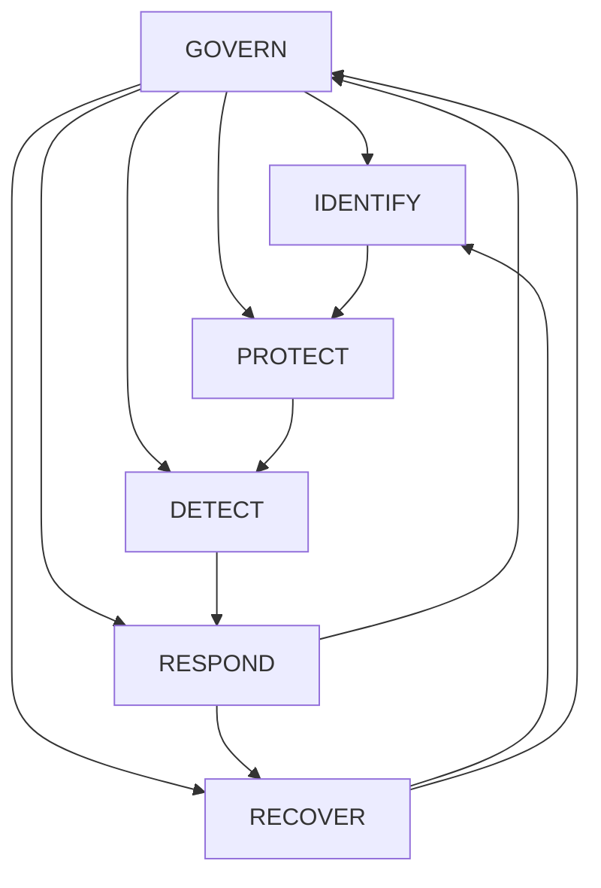

The diagram is a loop, not a project waterfall. Governance influences every Function. Identification changes protection priorities. Detection triggers response. Response and recovery reveal new assets, dependencies, control gaps, and policy needs.

| CSF 2.0 Function | Plain meaning | Governance question | NMH example |
|---|---|---|---|
| Govern | Establish and monitor strategy, expectations, policy, roles, supply-chain risk, and oversight | Who owns decisions and how does cyber risk support enterprise objectives? | Approve supplier-access policy and risk reporting |
| Identify | Understand assets, services, data, dependencies, threats, vulnerabilities, and risk | What must be known and prioritized? | Map engineering collaboration and identity dependencies |
| Protect | Use safeguards to manage cybersecurity risk | Which access, awareness, data, platform, and resilience controls are required? | Apply resource-specific access and lifecycle controls |
| Detect | Find and analyze anomalies, indicators, and adverse events | What must be visible, correlated, and escalated? | Monitor unusual sharing and policy changes |
| Respond | Manage and contain cybersecurity incidents | Who coordinates analysis, communication, mitigation, and reporting? | Invoke supplier-account incident process |
| Recover | Restore assets and operations and communicate recovery | Which services and data return first, and how is integrity validated? | Restore collaboration and validate authorized access |

### Core, Profiles, Tiers, and Informative References

| CSF element | Plain meaning | Useful application | Misuse to avoid |
|---|---|---|---|
| Core | Taxonomy of cybersecurity outcomes | Common language across teams | Treating every outcome as equal priority |
| Organizational Profile | Selected and prioritized outcomes for an organization or scope | Current and Target comparison | Claiming profile completion proves security |
| Current Profile | Outcomes currently achieved or partially achieved | Evidence-backed baseline | Self-rating from aspiration |
| Target Profile | Outcomes selected for desired future state | Prioritized roadmap | Unrealistic target without resources |
| Community Profile | Shared outcomes for a sector, technology, or community | Starting point and alignment | Copying without local applicability review |
| Tier | Characterization of rigor in cybersecurity risk governance and management | Discuss context and improvement | Treating Tier as universal maturity score or certification |
| Informative Reference | Relationship to other standards, controls, or guidance | Navigate implementation resources | Assuming a mapping means equivalence |

### Current and Target Profile workflow

| Profile field | Fictional NMH content |
|---|---|
| Scope | Supplier access to restricted engineering collaboration sites |
| Business objective | Enable time-bound collaboration without broad tenant or network access |
| Current evidence | Manual sponsor review, quarterly group export, application audit |
| Current condition | Expiry is inconsistent and evidence correlation is slow |
| Target outcome | Supplier access follows approved identity lifecycle and resource scope |
| Priority rationale | Intellectual property consequence and recurring supplier turnover |
| Action | Automate sponsorship expiry, revoke sessions, alert on mismatches |
| Owner | Fictional Identity and Collaboration service owners |
| Measure | Expired synthetic identities denied within approved objective |
| Validation | Positive, negative, expiry, audit, recovery, and support tests |

### CSF Tiers without score theater

CSF 2.0 describes four Tiers: Partial, Risk Informed, Repeatable, and Adaptive. They characterize aspects of cybersecurity risk governance and management. They are not maturity levels that every organization must climb uniformly, nor do they replace a profile or risk assessment.

| Tier term | Beginner interpretation | Evidence question | Caveat |
|---|---|---|---|
| Partial | Practices may be informal, inconsistent, or reactive | Are roles, priorities, and practices defined and repeatable? | A scoped capability may differ from enterprise posture |
| Risk Informed | Risk influences decisions but consistency may vary | Are priorities approved and communicated across relevant teams? | Awareness is not repeatable execution |
| Repeatable | Policies, processes, and practices are established and consistently applied | Can evidence show operation across time and scope? | Repeatability can preserve a poor design if outcomes are not tested |
| Adaptive | The organization adjusts using lessons, indicators, and changing risk | Do feedback and predictive signals change decisions effectively? | Automation and speed do not guarantee quality |

### Plain-English deep-dive 2 - CSF Functions are outcomes, not departments

It is tempting to assign Identify to asset management, Protect to engineering, Detect to the Security Operations Center, Respond to incident response, Recover to continuity, and Govern to executives. That creates handoff gaps. Every business service needs all six perspectives.

For a SharePoint project site, the collaboration owner helps identify data and users, protect permissions, detect unusual sharing, respond to misuse, recover content, and participate in governance. Identity, endpoint, network, security, privacy, and provider teams contribute too. The Function describes an outcome, not an organizational box.

This matters to a TSM. If a customer says a product supports Detect, the useful follow-up is not "Which Function box is green?" It is "Which scoped outcome, data, owner, workflow, evidence, response decision, and business measure does the capability support?" Product telemetry without ownership and response may create visibility without risk reduction.

## CIS Controls version 8 family

The Center for Internet Security describes the CIS Critical Security Controls as a prioritized set of Safeguards intended to defend against prevalent attacks. The version 8 family was designed for modern cloud, mobility, outsourcing, and hybrid environments. As of the chapter date, the official site advertises CIS Controls v8.1 as the latest version. The master title uses "CIS Controls" broadly; always verify the exact version used by a customer.

The Controls provide actionable implementation guidance. **Implementation Groups**, abbreviated IGs, help organizations prioritize Safeguards using factors such as resources, expertise, and risk. IG1 is often described by CIS as essential cyber hygiene; IG2 and IG3 add Safeguards for organizations with greater resources, data sensitivity, exposure, or threat complexity. Use the official definitions and licensing terms.

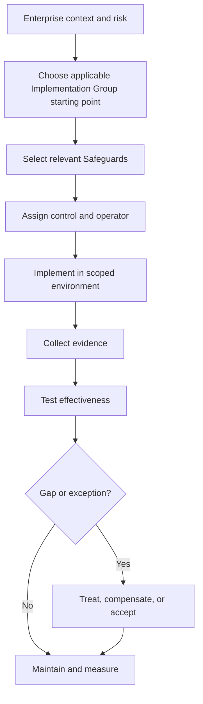

### CIS Controls overview in plain language

The following table summarizes themes without reproducing the copyrighted publication. Consult CIS for official wording and Safeguards.

| Control theme | Plain purpose | Example evidence | NMH application question |
|---|---|---|---|
| Enterprise assets | Know authorized devices and systems | Inventories, discovery, ownership | Which endpoint, plant, cloud, and unmanaged assets exist? |
| Software assets | Know authorized software | Software inventory and approval | Which sync clients, browsers, agents, and server packages run? |
| Data protection | Identify and protect data through its lifecycle | Classification, access, transfer, retention | Where do restricted design files flow? |
| Secure configuration | Establish and maintain safe settings | Baselines, drift, exceptions | Which tenant and endpoint settings are required? |
| Account management | Govern account lifecycle | Joiner, mover, leaver records | How do supplier identities expire? |
| Access control management | Grant and review needed access | Role, group, entitlement, review | Who can read, share, or administer project sites? |
| Vulnerability management | Find and remediate weaknesses | Scan, finding, treatment, validation | Which assets and findings are covered? |
| Audit log management | Generate, protect, review, and retain useful events | Source status, retention, queries | Can one access or change be reconstructed? |
| Email and browser protection | Reduce common delivery and web risks | Configuration, filtering, tests | How are links, attachments, browser sessions, and data handled? |
| Malware defenses | Prevent and detect malicious code | Coverage, detections, updates | Which endpoints and workloads are protected? |
| Data recovery | Maintain and test recoverable data | Backup, restore, RTO and RPO exercise | Can approved content and configuration be restored cleanly? |
| Network infrastructure | Secure network devices and services | Inventory, config, authentication | Who manages branch, plant, resolver, and cloud network control? |
| Network monitoring and defense | Observe and control network behavior | Flows, alerts, policy | Are north-south and east-west paths visible? |
| Security awareness | Prepare people for their responsibilities | Training, exercises, role coverage | Do site owners and sponsors know sharing duties? |
| Service provider management | Govern third-party services | Inventory, due diligence, contract, review | Which SaaS and integrator responsibilities are explicit? |
| Application security | Manage secure development and operation | Requirements, tests, defects | How are custom integrations and APIs governed? |
| Incident response | Prepare and coordinate incident handling | Plan, roles, exercise, lessons | Can NMH handle supplier compromise? |
| Penetration testing | Test defenses and attack paths under authority | Scope, method, result, remediation | Which critical paths need authorized testing? |

### Implementation Groups as prioritization, not status

| Consideration | IG1-oriented question | Added IG2 or IG3 reasoning |
|---|---|---|
| Resources | What essential hygiene can be consistently operated? | Which specialized people and tooling are justified? |
| Data | What ordinary business data must be protected? | Is sensitive, regulated, mission-critical, or high-value data present? |
| Threat | What common attacks are relevant? | Are targeted, sophisticated, or sector-specific actors relevant? |
| Complexity | Can controls work across a simple environment? | Do hybrid, cloud, OT, custom apps, and suppliers increase complexity? |
| Assurance | Can basic execution be evidenced? | Is deeper testing, separation, and monitoring required? |
| Scope | Which business service is included? | Are high-consequence enclaves or enterprise dependencies included? |

Do not say an organization "is IG2" without clarifying version, scope, selected Safeguards, evidence, and method. A small safety-critical system may need advanced safeguards. A large organization may still have basic hygiene gaps. Risk and obligation drive the final control set.

## ISO/IEC 27001 overview

ISO describes ISO/IEC 27001:2022 as a standard defining requirements for an **Information Security Management System**, abbreviated **ISMS**. An ISMS is the organized system for establishing, implementing, maintaining, and continually improving information-security management. It integrates context, leadership, planning, support, operation, performance evaluation, and improvement around information-security risk.

This public overview does not reproduce clauses or Annex A content. Organizations seeking implementation or certification need the licensed standard, applicable guidance, qualified professionals, and an accredited certification process where desired.

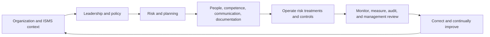

| ISMS concept | Plain meaning | Evidence example | Caveat |
|---|---|---|---|
| Context | Understand organization, interested parties, needs, and boundaries | Scope and stakeholder requirements | Scope can exclude systems; read it carefully |
| Leadership | Management sets policy, roles, and commitment | Approved policy and review records | Signature alone does not prove operation |
| Planning | Address risks, opportunities, objectives, and change | Risk method, treatment plan, objectives | Method must fit context and be consistently applied |
| Support | Provide resources, competence, awareness, communication, and documented information | Training, role competence, controlled documents | Document volume is not effectiveness |
| Operation | Perform planned risk assessment and treatment processes | Control operation and change evidence | Outsourcing does not remove accountability |
| Performance evaluation | Monitor, measure, audit, and review | Measures, internal audit, management review | Self-monitoring differs from independent audit |
| Improvement | Correct nonconformities and improve the system | Root cause, corrective action, validation | Closing ticket is not proof of sustained correction |
| Statement of Applicability | Records applicable control choices and justification in ISMS context | Controlled statement and rationale | It is not a generic product checklist |
| Certification | Independent certification against defined scope and criteria | Current certificate and scope | Certification is scoped and time-bounded, not proof of zero risk |

### Certification scope matters

| Question | Why it matters |
|---|---|
| Which legal entity and locations are included? | A group certificate may not cover every subsidiary or site |
| Which products, services, processes, and systems are included? | The service being evaluated may sit outside scope |
| Which edition and amendment apply? | Requirements and transition expectations change |
| Which certification body issued it? | Accreditation and validity need verification |
| What are issue, expiry, and surveillance dates? | Certification is maintained over a cycle |
| What exclusions or boundaries are described? | Marketing shorthand may hide limited scope |
| Does the customer's use satisfy its duties? | Provider certification does not configure the customer tenant |

### Plain-English deep-dive 3 - Certification is a scoped management-system statement

Imagine a restaurant group with one certified kitchen. The certificate can be meaningful for that kitchen, process, period, and standard. It does not prove every restaurant, supplier, menu item, or customer behavior is safe forever. The scope and evidence matter.

ISO/IEC 27001 certification similarly concerns a defined ISMS scope and assessment. It does not mean every system is invulnerable, every control is identical, or every customer using a certified provider automatically complies. A customer still needs to examine service scope, shared responsibilities, configuration, data use, contracts, and its own obligations.

A TSM can help locate current provider assurance material, explain documented product behavior, organize customer evidence, and track remediation. The TSM should defer certification interpretation to the customer's compliance function and qualified auditors. Independence matters: the person helping implement a control may not be the person authorized to provide independent assurance over it.

## Policy, standard, baseline, procedure, and guideline

Governance documents translate intent into action. Organizations use terminology differently, so confirm the customer's hierarchy. The following is a common model.

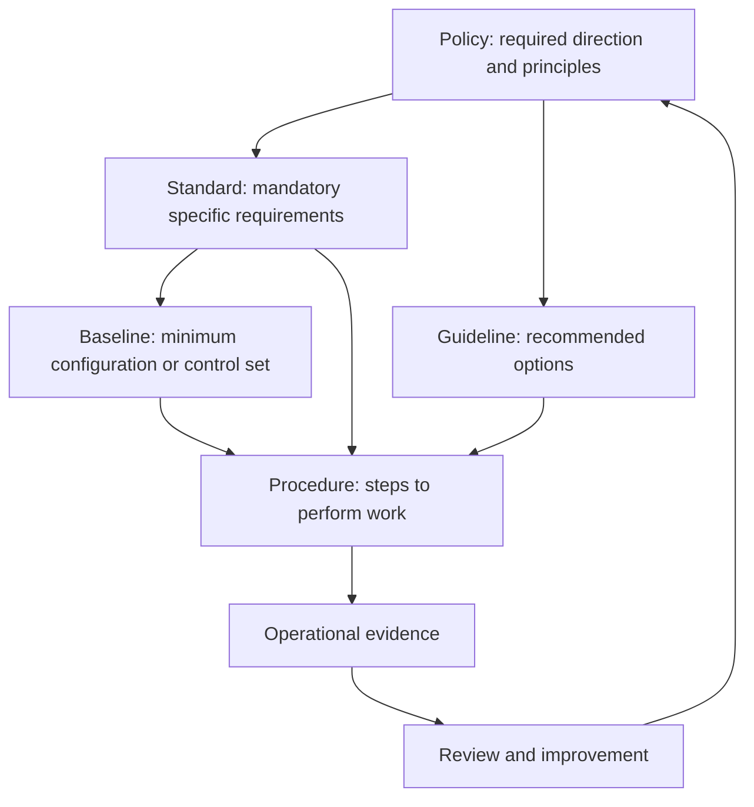

| Document | Plain meaning | Typical authority | NMH example | Common failure |
|---|---|---|---|---|
| Policy | High-level mandatory direction and principles | Executive or delegated policy authority | External access must be authorized, least privileged, monitored, and reviewed | Too vague to assign or test |
| Standard | Specific mandatory requirement | Security or technology authority under policy | Supplier access uses named identity, sponsor, approved resource, expiry, and audit | Names obsolete technology without review |
| Baseline | Minimum configuration for a defined class | Platform or control owner | SharePoint project sites use approved default sharing and audit settings | One baseline applied to incompatible systems |
| Procedure | Ordered steps for an activity | Process owner | Create, approve, test, review, and revoke supplier access | Steps drift from current tools |
| Guideline | Recommended method allowing judgment | Subject-matter owner | Choose shorter expiry for high-sensitivity projects | Recommendation is treated as optional where policy required |
| Playbook | Coordinated response for a scenario | Operations or incident owner | Handle suspected supplier-account compromise | Scenario assumptions are never exercised |

### Document control

| Metadata | Purpose |
|---|---|
| Owner | Accountable for content and lifecycle |
| Approver | Authorized to make requirement effective |
| Version | Identifies exact state |
| Effective date | States when it applies |
| Review date | Triggers reconsideration |
| Scope | Identifies people, systems, data, and locations included |
| Definitions | Reduces inconsistent interpretation |
| Requirements | States mandatory outcomes or conditions |
| Exceptions | Defines authorized deviation process |
| References | Links obligations, standards, and procedures |
| Evidence | Defines how operation can be demonstrated |
| Change history | Explains material revisions |

### Policy quality test

| Test | Question | Weak sign |
|---|---|---|
| Business alignment | Which objective or risk does the policy address? | Generic language without consequence |
| Authority | Who approved and can enforce it? | Unknown owner or stale approver |
| Applicability | Which population and systems are included? | "All systems" with no inventory |
| Clarity | Can affected people understand required behavior? | Undefined jargon and conflicting documents |
| Feasibility | Can systems and teams implement it? | Impossible absolute such as zero incidents |
| Evidence | How will operation be demonstrated? | Self-attestation only |
| Exception | How is justified deviation governed? | Informal permanent waiver |
| Lifecycle | What triggers update or retirement? | No review after major change |

## From control objective to tested control

A **control objective** states the intended security result. A **control design** describes how the organization intends to achieve it. **Implementation** is the actual people, process, and technology. **Evidence** records what occurred. **Testing** evaluates design or operation against criteria. A **finding** identifies a condition requiring attention. Treatment changes implementation or risk.

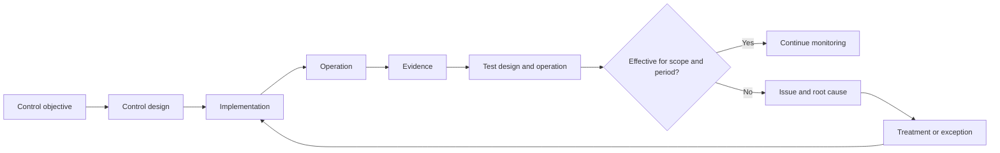

### Worked control trace

| Layer | Fictional NMH supplier-access example |
|---|---|
| Business objective | Enable approved supplier collaboration while protecting restricted engineering data |
| Risk statement | Stale or excessive supplier access could permit unauthorized design-file access |
| Control objective | External access is authorized, scoped, time-bound, reviewed, and revocable |
| Design | Sponsor workflow creates a named identity, approved group, project expiry, and audit event |
| Operator | Identity operations administers lifecycle; site owner approves resource access |
| Frequency | Event-driven creation and expiry plus periodic reconciliation |
| Evidence | Sponsor record, identity event, group membership, site audit, expiry result |
| Design test | Does the workflow cover join, change, expiry, emergency revoke, and exception? |
| Operating test | Did a representative sample execute accurately and on time? |
| Effectiveness test | Was expired access denied while legitimate collaboration continued? |
| Issue | Some manually created groups are outside automated expiry |
| Treatment | Discover groups, migrate workflow, alert on mismatch, govern temporary exceptions |
| Residual risk | Unknown manually managed sites remain pending inventory validation |

### Control types and layers

| Dimension | Options | Why distinguish them |
|---|---|---|
| Purpose | Preventive, detective, responsive, corrective, recovery | One control rarely covers the full lifecycle |
| Form | Administrative, technical, physical | Policy alone and technology alone have different failure modes |
| Operation | Manual, automated, hybrid | Automation changes scale and correlated-error risk |
| Timing | Continuous, event-driven, daily, periodic | Evidence and detection delay depend on frequency |
| Scope | Entity, transaction, population, environment | A tested sample may not cover every asset |
| Ownership | Business, service, control, operator, assessor | Accountability and independence differ |

## Evidence and testing

Evidence should be relevant, reliable, complete enough for the conclusion, time-bounded, attributable, and protected. Screenshots can help but are weak when they omit query, time, population, source, or change history. Better evidence often combines configuration, event, population, and test records.

| Evidence type | Strength | Limitation | Example |
|---|---|---|---|
| Policy document | Shows approved intent | Does not prove implementation | External-access policy |
| Configuration export | Shows configured state at a time | May not show effective path or prior state | Tenant sharing setting |
| System event | Shows recorded activity | Logging may be incomplete or mutable | Group removal event |
| Ticket or approval | Shows workflow and decision | May differ from actual configuration | Supplier access approval |
| Population report | Defines denominator | Inventory may be incomplete | Active external identities |
| Sample test | Evaluates selected operation | Sampling risk remains | Twenty expiries reviewed |
| Negative test | Demonstrates prohibited behavior is denied | Test conditions may not cover alternate paths | Expired identity access denied |
| Recovery exercise | Demonstrates restoration behavior | Exercise scope may be narrow | Restore configuration and validate access |
| Independent audit | Adds assurance under defined scope | Point-in-time or period and criteria limitations | Internal or external report |

### Test design

| Test element | Question |
|---|---|
| Objective | What exact claim is being evaluated? |
| Criteria | Which policy, standard, requirement, or approved design applies? |
| Population | What complete set should the control cover? |
| Sample | Why is the selection representative or risk based? |
| Period | Which dates are included? |
| Method | Inquiry, observation, inspection, re-performance, or technical test? |
| Expected result | What must succeed and what must fail? |
| Evidence | Which source and identifiers support the result? |
| Deviation | How will exception and severity be classified? |
| Reviewer | Who performs and who independently reviews? |
| Limitation | What conclusion cannot be drawn? |

### Plain-English deep-dive 4 - Evidence is not the same as proof of effectiveness

A photograph of a locked door shows that the door appeared locked at one moment. It does not show who has keys, whether another entrance exists, whether the lock worked all month, or whether emergency exit remains safe. Security evidence has the same limits.

A configuration screenshot may show multifactor authentication enabled for one policy. Effectiveness also depends on population coverage, exclusions, authentication strength, token lifecycle, alternate protocols, emergency accounts, application authorization, monitoring, and response. Strong assessment combines design review, complete population, representative samples, negative tests, and outcome evidence.

For a TSM, the practical lesson is to qualify statements. Say "The exported policy shows the setting enabled for this scoped group on this date" instead of "The customer is compliant." Help the customer gather better product evidence, but allow authorized assessors to decide whether it satisfies audit criteria.

## Maturity without vanity scoring

Maturity describes how reliably a capability is governed, designed, operated, measured, and improved. A single enterprise average can hide a severe gap in a critical service. NMH should assess dimensions and scope explicitly.

This fictional scale is not a NIST CSF Tier model, CIS score, ISO requirement, or Zscaler maturity model. It is a study exercise.

| Dimension | Ad hoc | Defined | Operated | Measured | Adaptive |
|---|---|---|---|---|---|
| Governance | Decisions depend on individuals | Roles and policy documented | Reviews occur on schedule | Decision quality and issues analyzed | Governance changes with risk and lessons |
| Coverage | Unknown population | Scope and inventory defined | Most scoped entities covered | Coverage reconciled with denominator | Discovery drives rapid correction |
| Control design | Inconsistent safeguards | Approved design and criteria | Design deployed consistently | Positive and negative tests | Design changes from threat and outcome evidence |
| Evidence | Screenshots on demand | Evidence sources named | Evidence retained routinely | Quality and completeness measured | Gaps trigger automated or governed improvement |
| Exceptions | Informal workarounds | Process and fields defined | Owners and expiry maintained | Aging and recurrence analyzed | Root causes reduce exception demand |
| Response | Hero-driven | Roles and playbooks defined | Exercises and incidents follow process | Time, quality, and outcomes reviewed | Lessons reshape prevention and detection |
| Recovery | Untested assumption | Targets and plans documented | Exercises performed | RTO, RPO, integrity measured | Architecture adapts to exercise findings |

### Maturity assessment rules

| Rule | Reason |
|---|---|
| Define scope first | Identity may be mature while supplier or plant lifecycle is not |
| Require evidence | Aspiration should not receive an operating rating |
| Separate design from operation | A good design may be inconsistently performed |
| Include outcome and failure tests | Activity volume does not prove risk reduction |
| Preserve critical gaps | An average must not hide one dangerous boundary |
| Record uncertainty | Missing data is not automatically low maturity or high maturity |
| Link to roadmap | A score without owner and action creates no value |
| Review after change | Acquisition, cloud migration, incident, or product update can invalidate ratings |

## Exceptions and compensating controls

An exception is an authorized, documented, time-bounded deviation from a requirement. It is not a way to make an inconvenient control disappear. A compensating control is an alternate safeguard used when the primary requirement cannot be met; it should address the same objective sufficiently for the approved period and context.

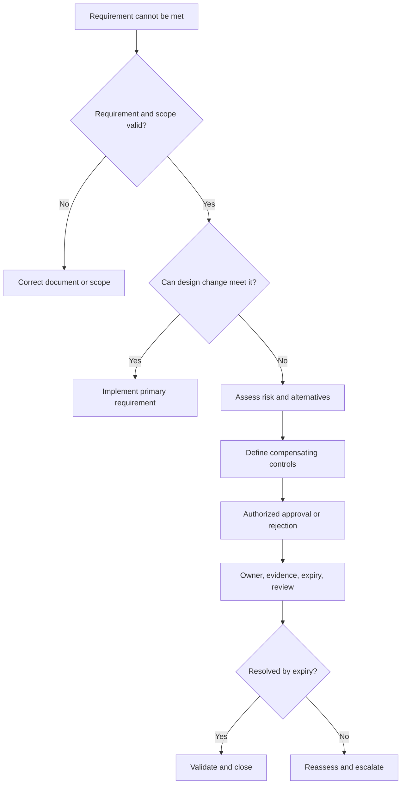

| Exception field | Required content |
|---|---|
| Requirement | Exact policy, standard, or baseline requirement |
| Scope | Systems, identities, data, locations, and actions affected |
| Business rationale | Why the required outcome cannot currently be achieved |
| Risk | Threat, vulnerability or condition, business impact, uncertainty |
| Existing controls | Safeguards already reducing the exposure |
| Compensation | Alternate safeguards, operation, and evidence |
| Owner | Person accountable for remediation and monitoring |
| Approver | Role authorized to approve this residual risk |
| Start and expiry | Bounded period, not indefinite language |
| Validation | Test that compensation works and required behavior remains |
| Monitoring | Trigger, metric, alert, and review cadence |
| Exit plan | Milestones to meet requirement or retire the affected service |
| Reassessment trigger | Incident, scope change, threat, failed control, or expiry |

### Fictional NMH exception

| Field | Example |
|---|---|
| Requirement | Supplier project access must expire automatically |
| Gap | One legacy partner directory cannot send the required lifecycle event |
| Scope | Twelve synthetic supplier identities for one project site |
| Compensation | Thirty-day maximum account life, weekly sponsor review, download restriction, alerting, manual revocation test |
| Risk | Delayed leaver removal remains possible between reviews |
| Owner | Fictional supplier identity service owner |
| Approver | Fictional business risk owner under NMH policy |
| Expiry | End of migration pilot, with no automatic renewal |
| Exit | Migrate identities or end supplier access |
| Validation | Expired test identity denied; audit and sponsor records reconcile |

Exception metrics should encourage resolution, not concealment. If teams are punished merely for recording exceptions, they may hide them. Measure aging, repeated root cause, unowned items, overdue remediation, control failures, and business impact while rewarding transparent closure.

## Ownership, RACI, and separation of duties

One control can have several roles. The business owner is accountable for the service and consequences. A control owner designs the control. An operator performs it. A system owner maintains a platform. An assessor tests it. A risk owner decides treatment. These roles may be combined in small organizations, but conflicts must be understood.

| Role | Supplier-access responsibility | Cannot be assumed from title alone |
|---|---|---|
| Business owner | Confirms business purpose and impact | Technical configuration expertise |
| Data owner | Approves appropriate use of restricted design data | Identity-system operation |
| Service owner | Maintains collaboration outcome and service roadmap | Independent audit authority |
| Control owner | Designs external-access lifecycle control | Business risk acceptance |
| Operator | Performs lifecycle and reviews | Authority to waive policy |
| Site owner | Approves resource membership | Enterprise policy ownership |
| Security | Advises control and monitors relevant risk | Legal interpretation |
| Privacy or Legal | Advises obligations and communications | Product troubleshooting |
| Internal audit | Provides independent assurance under mandate | Day-to-day control operation |
| TSM | Helps map product, evidence, adoption, issues, and escalation | Customer control ownership or audit opinion |

### RACI example

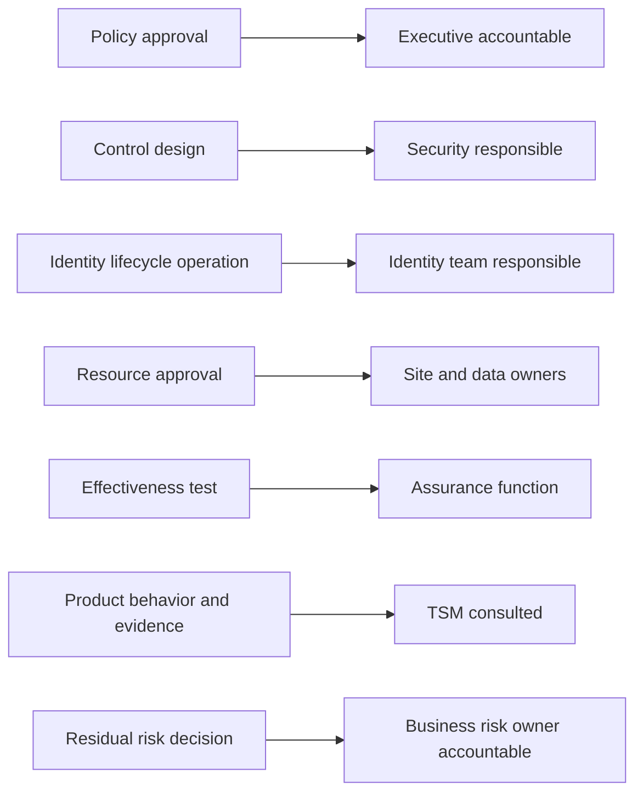

| Activity | Business owner | Security | Identity team | Site owner | Internal audit | TSM |
|---|---|---|---|---|---|---|
| Approve business purpose | A/R | C | I | C | I | I |
| Define security requirement | C | A/R | C | C | I | C |
| Operate identity lifecycle | I | C | A/R | C | I | C |
| Approve site membership | C | C | C | A/R | I | I |
| Provide product guidance | I | C | C | I | I | R/C within role |
| Test control independently | I | C | C | C | A/R | I |
| Accept residual risk | A under NMH model | C | I | C | I | I |

RACI has limitations. It can oversimplify legal accountability, create too many consulted roles, or mark several accountable owners. Use it with decision rules, escalation thresholds, and named individuals or functions.

## Audits, assessments, monitoring, and certification

These activities provide different levels and types of confidence.

| Activity | Purpose | Independence | Typical conclusion |
|---|---|---|---|
| Continuous monitoring | Observe control and risk indicators | Usually operational | Condition, trend, or alert |
| Control self-assessment | Owner evaluates design and operation | Low independence | Management assertion and gaps |
| Technical assessment | Specialist evaluates scoped technical criteria | Varies | Findings and recommendations |
| Internal audit | Independent assurance within organizational mandate | Organizational independence | Audit opinion or findings for scope |
| External audit | Independent third party evaluates defined criteria | External | Report under agreed standard or obligation |
| Certification audit | Accredited process assesses management system against standard | External and formal | Scoped certification decision |
| Penetration test | Authorized simulation identifies exploitable paths | Varies; technical | Findings under exact scope and time |
| Regulatory examination | Regulator or delegated examiner evaluates obligations | External authority | Regulatory findings or direction |

### Audit lifecycle

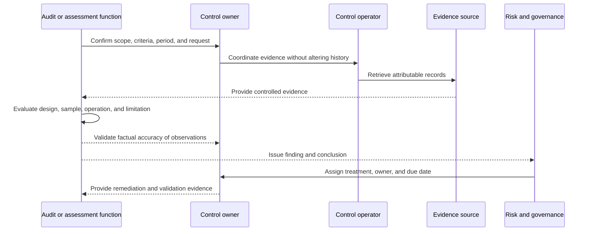

| Audit behavior | Good practice | Anti-pattern |
|---|---|---|
| Scope | Confirm entity, system, period, criteria, and exclusions | Assume certificate covers everything |
| Evidence | Preserve source, time, query, population, and chain | Manufacture a screenshot after request |
| Inquiry | Use interviews to understand process | Treat verbal statement as sole proof |
| Sampling | Document population and rationale | Select only known good examples |
| Finding | Validate factual accuracy without negotiating away evidence | Pressure assessor to remove bad news |
| Remediation | Fix root cause and validate operation | Close with future promise only |
| Independence | Preserve assessor objectivity | Have operator certify own effectiveness |

## Metrics and executive reporting

Governance metrics should connect capability, risk, control, and business outcomes. Use leading and lagging indicators, absolute counts and rates, trend and threshold, and confidence or limitation.

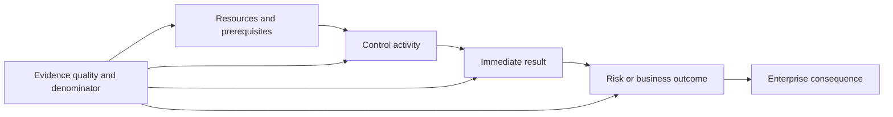

| Metric level | Fictional example | Decision supported | Caveat |
|---|---|---|---|
| Input | Percentage of scoped controls with named owner | Assign accountability | Named owner may lack capacity |
| Activity | Supplier reviews completed this month | Track operation | Completion may be superficial |
| Output | Expired identities removed within objective | Evaluate lifecycle result | Inventory completeness matters |
| Outcome | Rate of unauthorized post-expiry access attempts succeeding | Test risk reduction | Synthetic and observed populations differ |
| Impact | Avoided project interruption from controlled supplier access | Executive value hypothesis | Causality and counterfactual are uncertain |
| Quality | Sources reconciled and evidence complete for sampled transactions | Judge metric confidence | A high quality score still needs method transparency |

### Metric dictionary

| Field | Requirement |
|---|---|
| Name | Unambiguous label |
| Purpose | Decision the metric informs |
| Formula | Numerator, denominator, filters, units |
| Source | Systems and fields |
| Owner | Accountable interpreter and data steward |
| Frequency | Collection and review timing |
| Threshold | Approved trigger and rationale |
| Segmentation | Business service, region, asset class, owner, sensitivity |
| Limitations | Missing data, lag, model, sample, or bias |
| Response | Action when threshold is crossed |
| Version | Formula and source changes over time |

### Fictional NMH governance dashboard

| Measure | Fictional status | Interpretation | Action |
|---|---|---|---|
| Critical services with approved owner | 18 of 20 synthetic services | Two services lack accountable owner | Executive assigns owners |
| Supplier identities with sponsor and expiry | 920 of 1,000 synthetic identities | Eight percent require investigation | Reconcile legacy directory |
| High-priority exceptions past expiry | 4 synthetic exceptions | Governance failure, not automatic breach | Escalate to approvers and service owners |
| Recovery exercises meeting all gates | 7 of 9 fictional exercises | Two failed identity or data-integrity gates | Fund remediation and retest |
| Evidence sources within freshness objective | 26 of 30 fictional sources | Four metrics may be unreliable | Restore sources and qualify reports |
| Repeat control failures | 3 fictional root-cause families | Ticket closure did not remove systemic cause | Launch problem-management action |

All numbers are intentionally fictional and are not Zscaler, NIST, CIS, ISO, Microsoft, or customer outcomes.

## Framework crosswalks

A crosswalk relates concepts from different frameworks. It reduces duplicate interpretation but does not make sources equivalent. Frameworks differ in purpose, abstraction, scope, ownership, language, and assessment method. Map intent first, then examine exact source requirements under applicable terms.

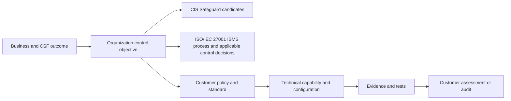

### Illustrative, non-authoritative crosswalk

| NMH outcome | NIST CSF 2.0 perspective | CIS Controls theme | ISO/IEC 27001 public-overview perspective | Local implementation |
|---|---|---|---|---|
| Govern supplier access | Govern and Identify outcomes | Service provider, account, and access management themes | Context, risk planning, control selection, review | Supplier policy, sponsor workflow, contract, register |
| Protect project data | Protect outcomes | Data protection and access-control themes | Risk treatment and operated controls | Classification, resource access, endpoint and sharing rules |
| Detect stale access | Detect outcomes | Audit log and account-management themes | Monitoring, measurement, and evaluation | Expiry mismatch alert and audit correlation |
| Respond to compromise | Respond outcomes | Incident-response theme | Operational response and improvement | Playbook, severity, roles, evidence, communication |
| Recover collaboration | Recover outcomes | Data-recovery theme | Continuity-related risk treatment and evaluation | Restore, identity validation, business acceptance |
| Improve governance | Govern plus feedback from all Functions | Measurement and applicable Safeguards | Internal audit, management review, corrective improvement | Review cadence, issue tracking, policy revision |

### Crosswalk confidence labels

| Label | Meaning | Allowed use |
|---|---|---|
| Direct | Source owners publish or clearly support the relationship | Navigate with source version and scope |
| Partial | Concepts overlap but granularity or intent differs | Use as a discussion aid |
| Organization-defined | Customer created mapping for its control framework | Use under documented method and review |
| Unverified | Similar wording without authoritative analysis | Mark for validation; do not claim equivalence |
| Not applicable | Outcome or requirement does not apply to defined scope | Preserve rationale and approval |

Never infer "CIS implemented, therefore ISO certified" or "Zscaler enabled, therefore CSF complete." The mapping chain needs local requirements, configured behavior, ownership, evidence, testing, and authorized assurance.

## TSM use of frameworks without auditor overreach

A TSM can use frameworks to structure discovery, prioritize adoption, identify evidence gaps, and communicate outcomes. The TSM should not issue audit opinions, guarantee compliance, interpret law, approve exceptions, or accept risk.

| TSM activity | Appropriate contribution | Boundary statement |
|---|---|---|
| Discovery | Ask which outcomes, policies, obligations, owners, and metrics matter | "Your governance and legal teams determine applicability." |
| Product mapping | Explain documented capabilities related to a customer objective | "Capability does not establish control effectiveness." |
| Evidence planning | Identify available product events, configuration, health, and reports | "Your assessor determines evidence sufficiency." |
| Adoption roadmap | Sequence prerequisites, configuration, training, tests, and reviews | "The customer approves priority and risk treatment." |
| Gap escalation | Record expected behavior, observed behavior, impact, evidence, and ask | "Product and support owners validate defect or limitation." |
| Audit support | Help retrieve accurate, scoped, dated technical evidence | "I am supporting evidence, not providing an audit opinion." |
| Exception support | Explain product constraint and possible alternatives | "Authorized customer roles approve residual risk and expiry." |
| Executive review | Report adoption, evidence quality, risk-relevant outcomes, and uncertainty | "Metrics are bounded by source and method." |

### TSM discovery questions

| Area | Questions |
|---|---|
| Scope | Which business services, data, identities, locations, and obligations are in scope? |
| Framework | Which version, profile, control framework, and internal policy are authoritative? |
| Ownership | Who owns service, data, control, operation, risk, assurance, and product? |
| Objective | Which outcome should the product support? |
| Current state | What is configured and what evidence supports operation? |
| Target | What measurable behavior and business result are approved? |
| Exception | Which deviations exist, who approved them, and when do they expire? |
| Evidence | Which sources, fields, retention, and tests are required? |
| Audit | Which assessor, criteria, scope, period, and request are involved? |
| Roadmap | Which dependency, resource, product gap, or change blocks progress? |

## NMH fictional governance design

NMH's fictional design connects enterprise oversight with service-level control ownership. It avoids placing all decisions in Security and avoids making product teams responsible for business-risk acceptance.

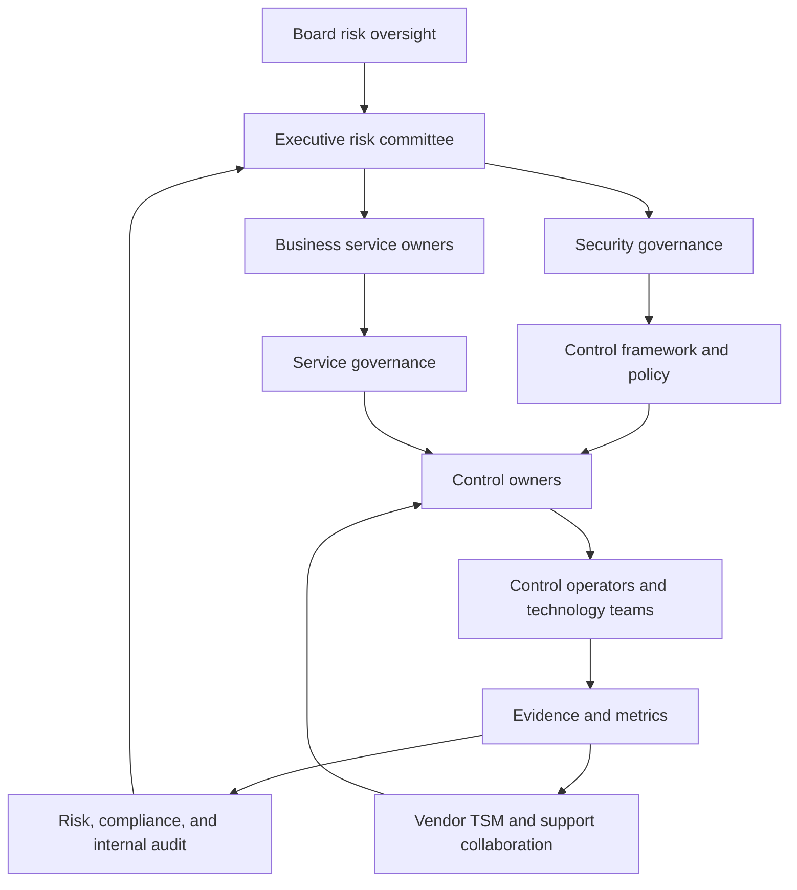

### NMH governance bodies

| Fictional body | Purpose | Inputs | Decisions |
|---|---|---|---|
| Board risk oversight | Review material cyber risk and resilience | Enterprise risk trend, major incidents, assurance | Oversight and challenge |
| Executive cyber risk committee | Align strategy, appetite, investment, and owners | Risk register, roadmap, exceptions, performance | Priority, funding, accountability |
| Security architecture review | Examine material designs and trust boundaries | Requirements, diagrams, threat model, tests | Approve, condition, or escalate under charter |
| Data governance council | Govern classification, purpose, sharing, retention | Data inventory, access, privacy, lifecycle | Data standards and owner actions |
| Service review | Manage one business service's outcomes | Health, risk, adoption, incidents, changes | Service roadmap and corrective work |
| Exception review | Review time-bounded deviations | Rationale, risk, compensation, expiry | Approve, reject, shorten, or escalate |
| Incident and problem review | Learn from events and recurrence | Timeline, cause, impact, actions | Systemic improvement and ownership |

### NMH document hierarchy

| Level | Fictional artifact | Owner | Review trigger |
|---|---|---|---|
| Enterprise policy | Information Security Policy | Executive security leadership | Strategy, law, major incident, annual cycle |
| Domain policy | Identity and Access Policy | Identity governance with Security | Identity-model or threat change |
| Standard | External Collaboration Standard | Collaboration and Security owners | Service feature or business change |
| Baseline | SharePoint Project Site Security Baseline | Collaboration platform owner | Microsoft feature, license, or threat change |
| Procedure | Supplier Access Lifecycle Procedure | Identity operations | Workflow or tooling change |
| Guideline | Secure Supplier Collaboration Guide | Security awareness and service owner | User feedback and incident lessons |
| Playbook | Suspected External Account Compromise | Incident response owner | Exercise or incident finding |

### NMH ninety-day roadmap

| Period | Fictional action | Deliverable | Exit evidence |
|---|---|---|---|
| Days 1-15 | Confirm scope, owners, authoritative documents, and obligations | Governance charter and scope | Approved owner map |
| Days 16-30 | Build Current Profile and control inventory | Evidence-backed baseline | Gaps and uncertainty reviewed |
| Days 31-45 | Define Target Profile and prioritized outcomes | Target and roadmap | Business and risk owner approval |
| Days 46-60 | Implement supplier lifecycle pilot | Workflow, configuration, training | Positive, negative, expiry tests |
| Days 61-75 | Establish dashboard and exception process | Metric dictionary and register | Source reconciliation and owner review |
| Days 76-90 | Run incident and recovery tabletop | Exercise report and actions | Assigned actions and retest dates |

## OneDrive and SharePoint governance bridge

You can use familiar Microsoft 365 examples to explain governance without claiming audit authority.

| Governance question | OneDrive or SharePoint example | Your factual bridge |
|---|---|---|
| Policy | Who may share which content externally? | Understand permissions and sharing behavior |
| Standard | Which identity, site, link, expiry, and review requirements apply? | Troubleshoot effective configuration and access |
| Procedure | How is a guest approved, added, changed, and removed? | Trace account and permission lifecycle |
| Evidence | Which identity, audit, client, and service records exist? | Collect logs, timestamps, request IDs, and comparisons |
| Exception | Which legacy workflow cannot meet automatic expiry? | Define narrow workaround and validation |
| Metric | What percentage of active guests have owner and expiry? | Use analytics with explicit denominator |
| Incident | How is suspected sharing misuse scoped and escalated? | Coordinate high-pressure technical investigation |
| Improvement | Which recurring cause changes policy, training, or tooling? | Apply RCA and knowledge-quality experience |

An interview answer should say that these production support skills demonstrate governance-adjacent discipline. Formal control ownership, risk acceptance, audit, and certification remain separate responsibilities.

## Failure modes and troubleshooting governance

Governance can fail even when documents and dashboards exist.

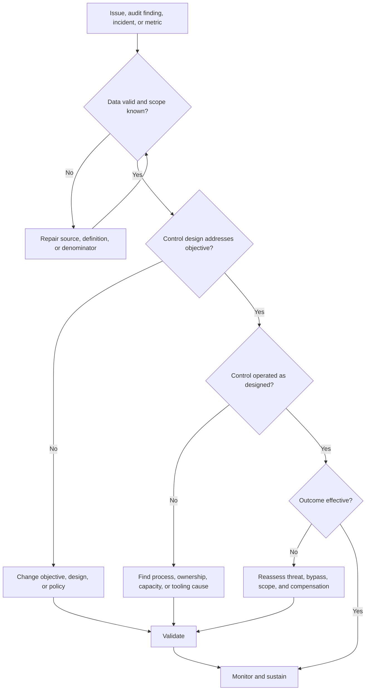

| Governance failure | Symptom | Root-cause questions | Repair |
|---|---|---|---|
| Orphaned policy | Stale owner and obsolete technology | Did role or platform change? | Assign authority, review, retire conflicts |
| Paper control | Procedure exists but no operational evidence | Is it feasible, funded, trained, and monitored? | Redesign and test execution |
| Metric gaming | Green score rises while incidents or gaps persist | Did denominator, threshold, or classification change? | Version metric and use outcome checks |
| Exception debt | Waivers repeatedly renewed | Is primary design infeasible or underfunded? | Root-cause program and escalation |
| Framework overload | Teams map the same control repeatedly | Is there one local control framework? | Normalize objectives and preserve source mappings |
| Ownership gap | Everyone is consulted; nobody decides | Who has authority and consequence? | Assign one accountable owner and escalation |
| Audit scramble | Evidence built manually at deadline | Are sources, retention, and controls operationalized? | Evidence-by-design and periodic readiness review |
| Product checkbox | License is treated as implemented outcome | Is it configured, covered, operated, and tested? | Map feature to control behavior and evidence |
| Maturity averaging | Critical service gap hidden by enterprise score | Which scope and dimension failed? | Report distribution and critical exceptions |
| TSM overreach | Vendor statement is presented as compliance opinion | Who owns criteria and independent assurance? | Correct language and engage customer assessor |

## Decision trees

### Which governance artifact is needed?

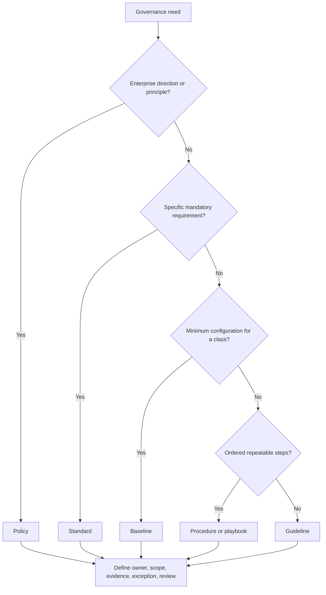

### Can a framework or compliance claim be made?

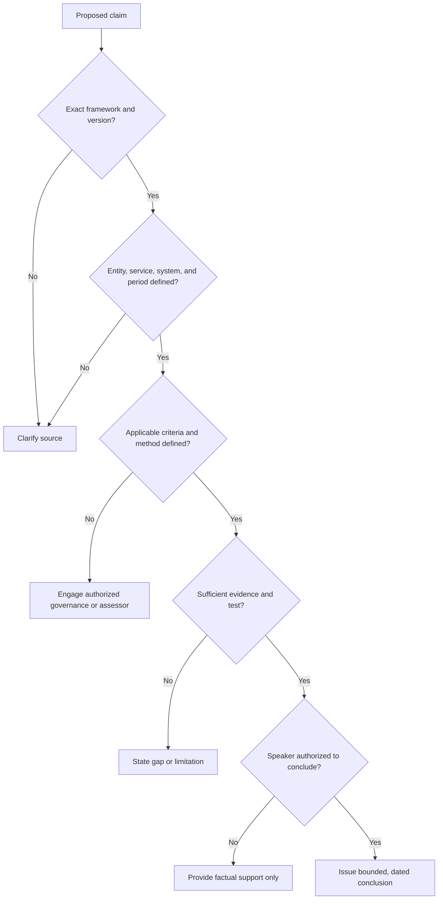

## Scenario drills

### Drill 1 - Framework selection

NMH asks whether it should "use NIST, CIS, or ISO." Explain that the choices can complement one another: CSF 2.0 can organize outcomes and Profiles; CIS Controls can offer prioritized implementation Safeguards; ISO/IEC 27001 can define requirements for an ISMS and support scoped certification. Ask about business objectives, obligations, existing governance, desired assurance, resources, and current framework. Do not declare one universally best.

### Drill 2 - Audit evidence request

An auditor asks for evidence that external access is reviewed. Clarify scope, criteria, population, period, sample, and source. Provide accurate product or tenant records without altering history. State limitations. The control owner validates factual process details; the auditor determines sufficiency and conclusion.

### Drill 3 - Expired exception

The legacy partner-directory exception expired yesterday. Do not silently renew it. Confirm affected identities and business impact, activate the approved escalation, assess compensation health, present options, obtain authorized decision, and set a new short boundary only if policy permits. Record why the migration missed its date.

### Drill 4 - Green dashboard, bad outcome

NMH reports 99 percent access-review completion, yet a former supplier retains access. Examine denominator completeness, scope, timeliness, review quality, group nesting, alternate sites, token revocation, and exception populations. Redesign the metric to include effectiveness and reconciliation rather than completion alone.

### Drill 5 - Product-to-control mapping

A team says enabling a Zscaler feature satisfies NIST and ISO. Ask which exact customer outcome and control objective are intended, how the feature is configured, which traffic and identities are covered, who operates it, what evidence and negative tests exist, which responsibilities remain with the customer, and which assessor will evaluate the claim.

### Drill 6 - experience bridge

Use a factual case-quality or backlog-analysis example. Explain the objective, data source, quality criteria, observed trend, stakeholder decision, action, validation, and result. Then connect the method to security-governance metrics while stating that formal security control ownership and audit remain new areas.

## Contrarian review

| Claim | Contrarian question | Better evidence |
|---|---|---|
| "We follow NIST" | Which CSF version, Profile, scoped outcomes, priorities, and evidence? | Current and Target Profiles with roadmap |
| "We implemented CIS" | Which version, Safeguards, IG rationale, scope, and tests? | Safeguard-level implementation and evidence |
| "The provider is ISO certified" | Which entity, service, location, period, scope, and customer responsibility? | Current certificate scope plus shared-responsibility controls |
| "Policy requires it" | Is policy current, approved, feasible, scoped, and linked to evidence? | Controlled document and operational trace |
| "The control passed" | Was design, operation, outcome, population, and period tested? | Method, sample, negative test, and limitations |
| "Maturity improved" | Did scale, scope, evidence, or scoring method change? | Versioned dimension-level evidence |
| "All exceptions are approved" | Are owners, approvers, compensation, expiry, and exit plans valid? | Exception register and test results |
| "Audit found no issues" | What scope, criteria, sampling, and period were covered? | Full report context and residual risk |
| "The TSM confirmed compliance" | Does the TSM have customer or auditor authority? | Corrected factual product statement and assessor conclusion |
| "The dashboard is green" | Are sources fresh, denominators complete, and business outcomes safe? | Data-quality and effectiveness evidence |

## Official Source Anchors

**Checked on 2026-08-24.** This chapter summarizes public information and links to official sources. It does not reproduce licensed standards text. Verify current versions, amendments, mappings, licenses, and customer applicability.

| Source | Official anchor | Used for | Currency and scope caveat |
|---|---|---|---|
| NIST Cybersecurity Framework 2.0 | https://www.nist.gov/cyberframework | Six Functions, Profiles, Tiers, Informative References, outcome framing | Published February 2024; voluntary and not certification |
| NIST CSF 2.0 document | https://doi.org/10.6028/NIST.CSWP.29 | Authoritative CSF 2.0 publication | Read official document for exact language |
| NIST CSF Profiles | https://www.nist.gov/cyberframework/profiles | Profile templates and resources | Community Profiles need local tailoring |
| NIST CSF Informative References | https://www.nist.gov/cyberframework/informative-references | Official mapping resources | Mapping does not make sources equivalent |
| NIST CSF 2.0 Quick Start Guides | https://www.nist.gov/cyberframework/quick-start-guides | Implementation audiences and use cases | Select current guide for organization context |
| CIS Controls | https://www.cisecurity.org/controls | Official Controls and resources | Site advertised v8.1 as latest on check date |
| CIS Controls v8 page | https://www.cisecurity.org/controls/v8 | Version 8 design principles and Implementation Groups | Use exact customer version and official downloads |
| ISO/IEC 27001:2022 overview | https://www.iso.org/standard/27001 | ISMS purpose, published edition, public overview | Standard text is licensed; Amendment 1:2024 listed separately |
| ISO/IEC 27001 Amendment 1:2024 | https://www.iso.org/standard/88435.html | Current listed amendment status | Confirm transition and applicability with qualified parties |
| ISO conformity assessment | https://www.iso.org/conformity-assessment.html | Public context for assessment and certification | Certification arrangements vary; verify accreditation |
| NIST SP 800-53 Rev. 5 | https://csrc.nist.gov/pubs/sp/800/53/r5/upd1/final | Control catalog and assessment ecosystem context | Detailed federal-oriented source; tailor and check updates |
| CISA Cybersecurity Performance Goals | https://www.cisa.gov/cybersecurity-performance-goals | Prioritized voluntary practices and outcome context | Not a replacement for complete risk management |
| Zscaler Zero Trust Exchange | https://www.zscaler.com/products-and-solutions/zero-trust-exchange-zte | Vendor platform positioning relevant to control mapping | Product page is not framework certification |
| Zscaler Security Operations | https://www.zscaler.com/products-and-solutions/security-operations | Current public Security Operations positioning | Workflow, autonomy, evidence, and packaging require validation |
| Zscaler Data Fabric | https://www.zscaler.com/products-and-solutions/data-fabric | Vendor data-integration and reporting positioning | Connector, schema, freshness, and tenant behavior vary |
| Zscaler compliance resources | https://compliance.zscaler.com/ | Official starting point for available assurance material | Access, scope, period, and service coverage must be verified |

## Likely Interview Questions

### Q1. What is security governance, and how is it different from risk and compliance?

**Model answer:** Governance sets direction, assigns decision rights and accountability, allocates resources, and oversees cybersecurity outcomes. Risk management analyzes uncertainty that could affect objectives and supports avoid, mitigate, transfer, or accept decisions. Compliance addresses applicable laws, regulations, contracts, standards, and internal requirements.

They interact through controls and evidence, but they are not interchangeable. Compliance with one requirement does not prove acceptable enterprise risk, and a useful risk treatment may go beyond compliance. Governance makes those priorities and owners explicit.

### Q2. Explain NIST CSF 2.0 to an executive.

**Model answer:** NIST CSF 2.0 is a voluntary, technology-neutral way to organize and communicate cybersecurity outcomes. Its six Functions are Govern, Identify, Protect, Detect, Respond, and Recover. Govern sets strategy, roles, policy, oversight, and supply-chain expectations across the other Functions.

An organization can build a Current Profile of evidenced outcomes and a Target Profile of prioritized future outcomes, then create a risk-based roadmap. The Tiers discuss rigor in governance and risk-management practices; they are not certifications or simple maturity grades.

### Q3. How do CIS Controls complement NIST CSF 2.0?

**Model answer:** CSF 2.0 is outcome oriented and useful for enterprise communication and Profiles. CIS Controls provide a prioritized, actionable set of Safeguards informed by common attacks, with Implementation Groups that help sequence work based on context and resources.

I would use an authoritative mapping where available, then preserve version and scope. A mapping is navigation, not equivalence. The organization still needs local control objectives, implementation, evidence, testing, exceptions, and risk decisions.

### Q4. What does ISO/IEC 27001 certification mean and not mean?

**Model answer:** ISO/IEC 27001:2022 defines requirements for an information security management system. Certification indicates that an independent certification process assessed a defined ISMS scope against applicable criteria for a period. Scope, entity, locations, services, edition, dates, and certification body matter.

It does not prove that every system is breach-proof, every service is in scope, or every customer using a certified provider is compliant. The customer still owns its configuration, identities, data use, shared responsibilities, and obligations.

### Q5. Distinguish policy, standard, baseline, procedure, and guideline.

**Model answer:** Policy states high-level mandatory direction. A standard turns it into specific mandatory requirements. A baseline defines minimum configuration or controls for a system class. A procedure gives ordered steps for performing work. A guideline recommends methods where judgment is allowed.

Terminology varies by organization, so I confirm the hierarchy. Every mandatory artifact needs an owner, approver, scope, evidence, exception process, and lifecycle.

### Q6. How do you know whether a control is effective?

**Model answer:** I trace from business objective and risk to control objective, design, actual implementation, operator, frequency, population, evidence, and test criteria. I test design and operating effectiveness, including positive behavior, prohibited behavior, alternate paths, and relevant outcomes.

A screenshot proves limited configured state, not effectiveness. I qualify the period, scope, sample, source quality, and residual uncertainty, and I preserve independent-assurance boundaries.

### Q7. How should a TSM use security frameworks without overstepping?

**Model answer:** A TSM can use frameworks to structure discovery, map documented product capabilities to customer outcomes, identify adoption and evidence gaps, build roadmaps, and communicate measures. The TSM can help retrieve accurate product evidence and coordinate remediation.

The customer determines obligations, policy, applicability, treatment, and risk acceptance. Qualified auditors or assessors determine assurance conclusions. I would say what the product is documented and observed to do, not declare the customer compliant.

### Q8. How does your background prepare you for governance conversations?

**Model answer:** My production background includes Microsoft 365 support governance behaviors: evidence-based case handling, escalation paths, defect coordination, fix validation, case-quality and backlog analysis, knowledge authoring, mentoring, and stakeholder communication. I understand how policy, ownership, evidence, and continuous improvement affect service quality.

I am extending that method into cybersecurity through NIST, CIS, ISO public concepts and fictional NMH exercises. I have not served as a CISO, auditor, risk approver, or production Zscaler administrator, and I would involve those authorities appropriately.

## 30-Second Memory Hooks

| Concept | Memory hook |
|---|---|
| Governance | Direction, decision rights, resources, oversight |
| Risk | Uncertainty affecting objectives |
| Compliance | Obligations and commitments |
| Assurance | How independently do we know? |
| CSF 2.0 | Govern, Identify, Protect, Detect, Respond, Recover |
| Govern | Sets context for every Function |
| Profile | Current evidence versus Target priority |
| Tier | Rigor context, not a certification grade |
| CIS Controls | Prioritized actionable Safeguards |
| Implementation Groups | Starting priorities shaped by context |
| ISO/IEC 27001 | Requirements for an ISMS |
| ISMS | Manage information-security risk systematically |
| Certification | Scoped, dated, independently assessed |
| Policy | Mandatory direction |
| Standard | Mandatory specifics |
| Baseline | Minimum system-class configuration |
| Procedure | Ordered steps |
| Guideline | Recommended judgment |
| Objective | Intended result |
| Implementation | What actually exists |
| Evidence | Bounded record, not automatic proof |
| Testing | Criteria, population, sample, period, result |
| Maturity | Scope plus repeatability, evidence, and improvement |
| Exception | Authorized, compensated, owned, expiring deviation |
| Control owner | Designs and maintains |
| Risk owner | Authorized treatment decision |
| Auditor | Independent assurance under scope |
| TSM | Map, enable, evidence, coordinate; do not certify |
| Experience bridge | Support-quality governance, honestly extended |

## Completion Checklist

- [ ] I can explain governance, risk management, compliance, assurance, and operations as related but distinct disciplines.
- [ ] I can identify board, executive, CISO, business, service, control, operator, risk, compliance, audit, provider, and TSM roles.
- [ ] I can explain all six NIST CSF 2.0 Functions and why they operate concurrently.
- [ ] I can distinguish the CSF Core, Current Profile, Target Profile, Community Profile, Tiers, and Informative References.
- [ ] I can explain why CSF Tiers are not universal maturity scores or certifications.
- [ ] I can build an evidence-backed Current and Target Profile for a scoped NMH business service.
- [ ] I can explain the CIS Controls version 8 family, Safeguards, and Implementation Groups.
- [ ] I can state that the official CIS site advertised v8.1 as current on 2026-08-24 and verify the customer's exact version.
- [ ] I can summarize ISO/IEC 27001:2022 as ISMS requirements without reproducing licensed text.
- [ ] I can explain certification scope, dates, entity, locations, services, and customer responsibility.
- [ ] I can distinguish policy, standard, baseline, procedure, guideline, and playbook.
- [ ] I can define document owner, approver, scope, version, effective date, review, exception, evidence, and change history.
- [ ] I can trace business objective to risk, control objective, design, implementation, operation, evidence, test, issue, and treatment.
- [ ] I can distinguish preventive, detective, responsive, corrective, and recovery controls.
- [ ] I can evaluate evidence relevance, reliability, population, period, attribution, and limitation.
- [ ] I can explain why a configuration screenshot does not prove control effectiveness.
- [ ] I can design a test with criteria, population, sample, method, expected result, deviation, and reviewer.
- [ ] I can assess maturity by scope and dimension without hiding critical gaps in an average.
- [ ] I can govern an exception with rationale, risk, compensation, owner, approver, expiry, monitoring, validation, and exit plan.
- [ ] I can distinguish control owner, operator, service owner, data owner, risk owner, and assessor.
- [ ] I can use RACI while recognizing its limits.
- [ ] I can distinguish monitoring, self-assessment, technical assessment, internal audit, external audit, certification, and penetration test.
- [ ] I can define a metric with numerator, denominator, source, owner, frequency, threshold, limitations, and response.
- [ ] I can crosswalk frameworks by intent while preserving version, scope, granularity, and uncertainty.
- [ ] I can reject unsupported equivalence such as product enabled equals compliant.
- [ ] I can describe appropriate TSM framework use and state the auditor, legal, risk-owner, and customer boundaries.
- [ ] I can walk through the fictional NMH governance bodies, hierarchy, dashboard, exception, and ninety-day roadmap.
- [ ] I can connect OneDrive and SharePoint support experience to evidence, lifecycle, policy, metrics, and improvement.
- [ ] I can state that all NMH values and results are fictional and no Zscaler production operation is claimed.
- [ ] I can recheck official framework, standards, product, and assurance sources after 2026-08-24.
- [ ] I can answer all eight questions aloud using bounded, factual language.

[Part 13 - Risk Assessment, Treatment, Appetite, Tolerance, and Residual Risk](Part-13-risk-assessment-treatment.md)