# Part 120 - Behavioral, Culture, Closing, and Night-Before Preparation

> **Purpose:** Convert your supported background into honest, adaptable interview evidence; prepare role- and company-specific motivation; handle direct gaps; rehearse culture and executive scenarios; ask strong questions; negotiate professionally; and provide explicit 30/60/90-day, night-before, and day-of preparation sheets.

> **Scope and honesty:** This Part uses only candidate facts already supported in the master guide: 5+ years of enterprise support and escalation engineering; Microsoft 365, SharePoint Online, OneDrive for Business, and sync expertise; networking study and evidence tools; critical situation/RCA/Engineering collaboration/fix validation; supported CSAT ranges and recognition; SQL/PostgreSQL/Excel/Power BI/Python/R/statistics/a postgraduate business-analytics qualification; technical advisor, mentoring, onboarding, interviews, partner training, and knowledge work; and Copilot Studio/AI learning, evaluation, certification, and training facts at the level recorded. Bracketed prompts must be completed from your records. No personal event, metric, title, product use, customer result, salary fact, or preference is invented.

> **Section goal:** Build a truthful interview narrative in which every answer has a relevant situation, personal responsibility, specific decisions/actions, supported result, reflection, and role transfer; demonstrate customer obsession, impact, ownership, accountability, collaboration, urgency with quality, transparency, constructive debate, and AI responsibility; and enter the interview with practiced content rather than memorized fiction.

Northstar Meridian Holdings (NMH) remains explicitly fictional and synthetic. Parts 111-117 can be discussed only as candidate-authored practice after you personally complete and retains the work. They can never become production stories. Product facts use the public source snapshot reviewed on **2026-08-24** and require current pre-interview verification.

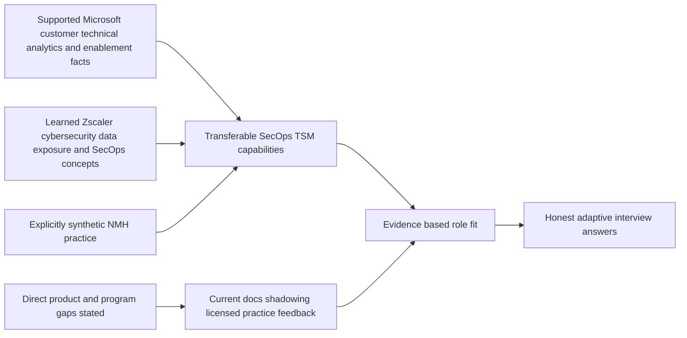

| Evidence class | Interview use | Required wording | Prohibited conversion |
|---|---|---|---|
| Supported production fact | Personal STAR and competency evidence | "In my prior escalation/support/analytics/mentoring work..." | Expanding beyond documented role/result |
| Synthetic practice | Method and preparation evidence | "In a local fictional NMH exercise, I practiced..." | "I delivered this to a customer" |
| Learned concept | Architecture and approach | "I understand the concept and would validate..." | Claiming hands-on product operation |
| Direct unknown/gap | Product, program, or personal detail not established | "I have not done/verified that yet..." | Filling silence with a plausible invention |

## JD Mapping

| JD or culture signal | Factual evidence family | Interview emphasis | Gap/boundary |
|---|---|---|---|
| Strategic enterprise engagement | Enterprise support, technical advisor, partner/customer coordination | Stakeholders, outcomes, evidence, ownership | Formal SecOps TSM account ownership not established |
| Complex troubleshooting | M365/OneDrive/SharePoint, network/browser/process evidence | Layered hypotheses, first divergence, validation | Zscaler production telemetry not used |
| Critical escalation | Business-critical incidents, critical situation, Engineering, RCA, fix validation | Impact, cadence, cross-team work, recovery proof | Use exact personal case only after fact check |
| Data modeling and analytics | SQL, PostgreSQL, Excel, Power BI, Python, R, statistics, MBA | Quality, denominators, trends, decisions | Security Data Fabric implementation not established |
| Executive/customer communication | Customer support, advisory work, CSAT evidence | Plain language, expectation, bad news, trust | CISO/QBR delivery requires factual example or lab label |
| Training and mentoring | Mentoring, onboarding, interviews, partner training, knowledge articles | Observable learning and service scaling | Do not invent participant counts/outcomes |
| Product/Engineering partnership | Engineering/Product Group/vendor collaboration | Actionable evidence, handoffs, closure | No Zscaler roadmap or defect ownership |
| AI-forward work | Copilot Studio agents, tool evaluation, certifications, training | Responsible evaluation and enablement | No production Agentic SecOps operation |
| Customer obsession | a strong customer-satisfaction record and supported recognition record | Listen, own, follow through, improve | Use exact metric context from records |
| Impact over activity | Case quality/backlog analysis and fix validation | Accepted outcomes and durable change | Avoid equating volume with impact |
| Ownership/accountability | Escalation coordination and follow-through | Personal decisions, boundaries, correction | Do not claim team authority personally |
| Transparency/constructive debate | Evidence-led customer/Engineering collaboration | Facts, assumptions, disagreement, correction | Select a real supported example |
| Urgency with quality | Critical support situations and validation | Fast feedback loops with safety/evidence gates | Do not invent an outage or result |

## Candidate honesty note

The strongest answer is not the answer with the most impressive nouns. It is the answer whose details survive follow-up. Before using a story, you should be able to identify the actual employer context, approximate period, your title, your personal responsibility, collaborators, customer/business stakes, tools/evidence, exact result source, confidentiality-safe wording, and what you learned. If any material detail is uncertain, replace it with a bracketed prompt until verified.

You should not say you administered ZIA, ZPA, ZDX, Client Connector, Data Fabric for Security, Asset Exposure Management, UVM, Risk360, CTEM, SIEM/SOAR/XDR, vulnerability scanners, enterprise exposure programs, SOC operations, or a Zscaler strategic account unless later factual evidence supports it. The interview-ready alternative is direct: name the gap, explain adjacent factual capability, demonstrate learned architecture or synthetic method, and give a concrete ramp and validation plan.

| Claim test | Question to ask | Pass condition |
|---|---|---|
| Personal ownership | What did I personally decide, write, analyze, communicate, or validate? | Uses "I" accurately inside team context |
| Result support | Where is the metric/outcome recorded? | CV, review, award, case, artifact, or safe recollection supports it |
| Confidentiality | Can I explain the lesson without customer names, secrets, or internal detail? | Scenario is generalized without changing substance |
| Role fit | Which SecOps TSM competency does this evidence? | Connection is explicit and non-inflated |
| Follow-up resilience | Can I answer alternatives, failure, and learning? | Story remains coherent under challenge |
| Boundary | What did this not prove? | Product/customer/program gap is stated |

## STAR method from zero

STAR means **Situation, Task, Action, Result**. This guide adds **Learning** and **Transfer**, producing STAR-LT. The Situation provides only enough context and stakes. The Task names your responsibility. The Action is the largest section and names your decisions. The Result uses supported evidence. Learning shows reflection. Transfer explains relevance to the target role without claiming identical experience.

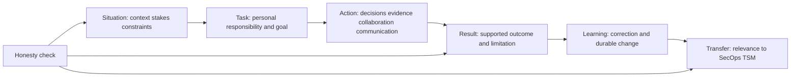

| STAR-LT element | Target share of answer | Include | Avoid |
|---|---:|---|---|
| Situation | 10-15% | Customer/business context, stakes, constraint | Long product history or confidential detail |
| Task | 10% | Your responsibility and success condition | Team goal without personal role |
| Action | 45-55% | Evidence, options, decisions, communication, collaboration, validation | Generic "worked hard" chronology |
| Result | 15-20% | Supported metric, acceptance, recovery, quality, limitation | Invented precision or team result claimed personally |
| Learning | 5-10% | What changed, feedback, future behavior | Claiming perfection |
| Transfer | 5-10% | Why it matters to SecOps TSM | Pretending the domains are identical |

### Plain-English deep-dive 1 - STAR is an evidence container, not a storytelling trick

STAR does not make a weak or invented example strong. It helps an interviewer inspect context, ownership, choices, and result. Think of an incident report: a clean template cannot compensate for missing timestamps or unsupported cause. The candidate must populate the structure with verifiable facts and visible judgment.

A useful answer spends most time on Action because that is where capability appears. "We fixed it" hides whether you formed hypotheses, correlated evidence, coordinated Engineering, set expectations, made a tradeoff, or validated recovery. Team context matters, but the interviewer needs accurate personal contribution. Result should include what was accepted and what remained outside your control.

### STAR-LT drafting worksheet

| Field | Fill-in prompt |
|---|---|
| Story ID/title | `[Create a short factual title]` |
| Evidence source | `[CV line, review, case memory, award, artifact, or manager feedback]` |
| Situation | `[Customer/workload/context, approximate period, stakes, constraint]` |
| Task | `[My exact role, responsibility, and success condition]` |
| Action 1 | `[First decision and evidence gathered]` |
| Action 2 | `[Collaboration or tradeoff I managed]` |
| Action 3 | `[Communication, escalation, or adaptation]` |
| Validation | `[How I knew the change/result was real]` |
| Result | `[Supported metric/outcome and limitation]` |
| Learning | `[What I changed or would improve]` |
| Transfer | `[Specific SecOps TSM competency, not an identity claim]` |
| Confidentiality edit | `[Details generalized or removed without changing truth]` |

## Factual background-to-competency map

| Supported background fact | Competency evidenced | Strong interview angle | Needed fill-in |
|---|---|---|---|
| 5+ years enterprise support/escalation | Customer ownership, ambiguity, technical depth, endurance | Complex case from impact through validation | `[exact case, date range, role, result]` |
| SharePoint Online, OneDrive for Business, sync client, M365 | SaaS architecture and dependency reasoning | Client/browser/identity/network/service comparison | `[specific safe scenario]` |
| TCP/IP, OSI, HTTP/S, TLS/SSL, DNS/DHCP, proxy/firewall/routing learning | Network reasoning and learning agility | How deliberate upskilling changed investigations | `[course/lab/use example]` |
| Wireshark, Netsh, Network Monitor, Procmon, HAR, Fiddler, browser tools | Evidence collection and layer isolation | First divergence and tool limitations | `[tool/evidence/result]` |
| Critical situation, RCA, Engineering collaboration, fix validation | Escalation leadership and durable improvement | Cadence, workstreams, no unsupported ETA, proof | `[actual incident facts]` |
| a strong customer-satisfaction record and repeated peer and customer recognition | Customer obsession and consistent trust | Behavior behind the supported evidence | `[period/source and one example]` |
| Backlog/case-quality analysis | Impact over activity and service improvement | Data identified a pattern and changed practice | `[baseline/action/result]` |
| SQL/PostgreSQL/Excel/Power BI/Python/R/statistics/MBA | Analytical rigor and executive translation | Query/visual/decision with denominator care | `[project, personal action, supported outcome]` |
| Technical advisor | Technical leadership and consultation | Coaching quality and raising decisions | `[scope and example]` |
| Mentoring/onboarding/interviews | Talent/service scaling | Competency, feedback, changed behavior | `[learner group and evidence]` |
| Partner training/knowledge articles | Enablement and reusable knowledge | Beginner-first explanation and support deflection/quality | `[artifact and measured/observed result]` |
| Customers/partners/Engineering/Product Groups/vendors | Cross-functional collaboration | Conflicting priorities resolved with evidence | `[stakeholders, decision, result]` |
| Copilot Studio agents/AI evaluation/certifications/training | AI curiosity, enablement, governance awareness | Task, validation, privacy, human control | `[exact artifact/audience/result]` |
| Computer Science engineering degree and MBA learning | Technical foundation and business framing | Bridge architecture, analytics, and customer outcomes | `[official degree/program wording]` |

## Story portfolio: 16 ready-to-adapt blueprints

These are **blueprints**, not completed claims. Each is grounded in a supported fact family, but every bracketed detail must be filled from your records. One real story can answer several questions when the angle changes; do not invent sixteen separate events just to fill a grid.

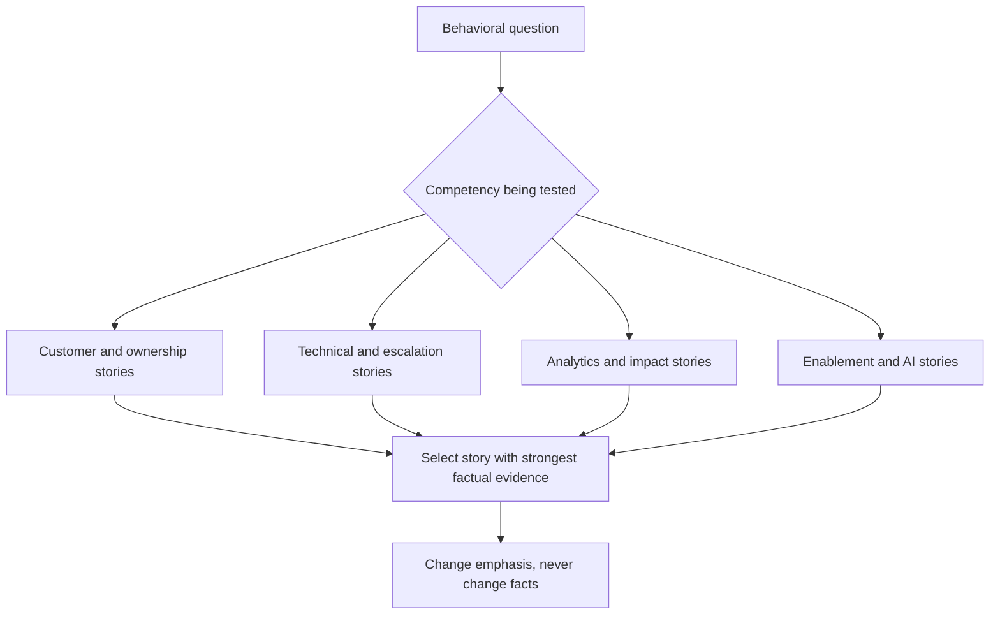

### Blueprint group 1 - Customer ownership and communication

| Story | Supported anchor | STAR-LT blueprint | Best questions | Fact-check prompts |
|---|---|---|---|---|
| S01 Business-critical customer escalation | critical situation/business-critical incidents | S: `[service/customer impact]`; T: own technical/customer coordination; A: scope, workstreams, cadence, evidence, expectations; R: `[supported recovery/acceptance]`; L: `[change]`; TSM transfer: escalation trust | Ownership, pressure, executive communication, customer obsession | `[severity, users, duration, your role, exact result]` |
| S02 Difficult expectation conversation | Enterprise customer support/advisory | S: customer wanted `[ETA/cause/action]`; T: maintain trust without guessing; A: listen, facts/unknowns, options, cadence, route; R: `[supported outcome]`; L: transparency | Conflict, bad news, empathy, accountability | `[what was asked, exact words, evidence, feedback]` |
| S03 High-CSAT behavior example | a strong customer-satisfaction record | S: `[representative complex case]`; T: resolve while preserving confidence; A: understand job, simplify, own follow-up, validate; R: `[Documented CSAT/context]`; L: repeatable behavior | Customer obsession, why you, strength | `[which metric applies to which period and story]` |
| S04 Cross-functional customer/partner coordination | Customers, partners, vendors, Engineering/Product Groups | S: multiple owners and blocked outcome; T: create shared path; A: RACI, evidence, handoffs, updates, decision; R: `[supported closure]`; L: role clarity | Collaboration, influence, stakeholder management | `[roles, disagreement, your artifact/action, result]` |

### Blueprint group 2 - Technical analysis and escalation

| Story | Supported anchor | STAR-LT blueprint | Best questions | Fact-check prompts |
|---|---|---|---|---|
| S05 Layered M365/OneDrive troubleshooting | SharePoint/OneDrive/sync expertise | S: browser/client or cohort difference; T: isolate boundary; A: hypotheses across identity, permissions, network, client, service; R: `[validated cause/recovery]`; L: compare known-good | Technical depth, ambiguity, whiteboard | `[real symptom, tools, first divergence, result]` |
| S06 Network evidence changed the hypothesis | Wireshark/Netsh/Network Monitor/HAR/Fiddler/Procmon | S: initial layer assumption; T: gather minimal evidence; A: correlate timestamps/process/packets; R: evidence redirected owner/action; L: tool limits | Data/evidence, disagreement, troubleshooting | `[authorized tool, filter, finding, corrected hypothesis]` |
| S07 Engineering defect escalation | Engineering/Product collaboration and fix validation | S: reproducible behavior after support isolation; T: create actionable package; A: reproduction, traces, comparison, impact, route, updates; R: `[fix/workaround/decision]`; L: package quality | Product partnership, persistence, escalation | `[defect status, no confidential identifiers, validation]` |
| S08 Root-cause and prevention improvement | RCA and fix validation | S: service restored but recurrence risk remained; T: close learning loop; A: timeline, cause/contributors, tests, prevention owners; R: `[supported prevention/result]`; L: blameless RCA | Failure, quality, durable impact | `[actual corrective action and measured/observed effect]` |

### Blueprint group 3 - Analytics, quality, and impact

| Story | Supported anchor | STAR-LT blueprint | Best questions | Fact-check prompts |
|---|---|---|---|---|
| S09 Backlog or case-quality analysis | Backlog/case-quality analysis | S: volume or quality pattern obscured; T: identify actionable drivers; A: define population, analyze categories/trends, validate sample, recommend; R: `[supported service change]`; L: denominator/behavior | Impact over activity, analytics, initiative | `[dataset, tools, metric, decision, result]` |
| S10 SQL/Power BI decision support | SQL/PostgreSQL/Excel/Power BI/statistics | S: stakeholders lacked clear view; T: produce trustworthy analysis; A: model/query/quality/visual/interpret; R: `[supported decision]`; L: quality near KPI | Data modeling, dashboard, executive translation | `[project, grain, query, visual, result]` |
| S11 Urgency with a quality gate | Critical cases and validation | S: pressure to declare fixed or act broadly; T: move fast safely; A: changed/control cohorts, staged validation, communication; R: `[supported acceptance]`; L: urgency shortens loops | Urgency, judgment, risk | `[what pressure, what gate, what happened]` |
| S12 Recognition as pattern, not story | repeated peer and customer recognition | Use one verified event behind recognition: S/T/A/R-LT; mention aggregate only as supporting consistency, not substitute for behavior | Why hire, strength, customer obsession | `[recognition type, period, exact event, source]` |

### Blueprint group 4 - Enablement, leadership, and AI

| Story | Supported anchor | STAR-LT blueprint | Best questions | Fact-check prompts |
|---|---|---|---|---|
| S13 Mentoring or onboarding | Mentoring/onboarding/technical advisor | S: learner/service gap; T: build independent capability; A: baseline, shadow, practice, feedback, teach-back; R: `[supported behavior/quality]`; L: adapt coaching | Leadership, mentoring, scale | `[audience, duration, artifact, evidence]` |
| S14 Partner training or knowledge article | Partner training/knowledge articles | S: recurring confusion or support need; T: create reusable learning; A: audience analysis, examples, review, delivery, update; R: `[usage/feedback/quality]`; L: measure application | Training, communication, leverage | `[topic, format, reach/result if supported]` |
| S15 Interview or talent-quality contribution | Interview participation | S: hiring/onboarding quality need; T: assess or improve process; A: criteria, evidence, bias control, feedback; R: `[supported contribution]`; L: consistent competency | Judgment, culture, people leadership | `[role in process, not hiring authority unless true]` |
| S16 Responsible AI exploration and enablement | Copilot Studio, AI tools, certifications, training | S: task/learning need; T: evaluate or enable responsibly; A: use case, prompt/grounding, validation, privacy, human review, training; R: `[supported artifact/outcome]`; L: boundaries | AI-forward, innovation, change | `[exact tool, audience, data boundary, result]` |

### Plain-English deep-dive 2 - One story can answer many questions without changing facts

Interviewers may ask about ownership, conflict, urgency, failure, or customer obsession. One real critical-situation could support several answers. The facts stay fixed; the camera angle changes. For ownership, emphasize the responsibility and follow-through. For conflict, emphasize evidence and authority. For urgency, emphasize parallel work and quality gates. For failure, emphasize a missed signal and correction only if that was truly part of the event.

Think of one packet capture viewed through protocol, timing, or ownership filters. It remains the same evidence. Inventing a different result for each question creates contradictions under follow-up. A compact, verified portfolio of six to eight rich stories is stronger than sixteen shallow, uncertain stories.

## Motivation: why Zscaler, why SecOps TSM, why you

### Why Zscaler framework

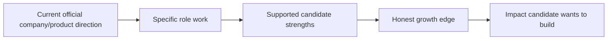

| Component | Answer content | Boundary |
|---|---|---|
| Company connection | Current public zero-trust, SecOps/data/exposure, AI-forward context that genuinely interests you | Recheck official facts; no market ranking |
| Role connection | Strategic technical customer work across data, vulnerability/exposure, escalation, enablement, executives | Use supplied JD, not assumed daily details |
| Strength connection | Enterprise escalation, M365 dependencies, networking evidence, analytics, mentoring, AI learning | Supported facts only |
| Growth connection | Direct Zscaler/SecOps program experience is the deliberate next bridge | Do not hide gap |
| Impact connection | Help customers turn complex evidence into trustworthy decisions and durable outcomes | Aspiration, not past result |

**Ready-to-adapt answer:**

"I am interested in Zscaler because the role sits where my strongest factual experience and my deliberate next step meet. I have spent several years in enterprise support and escalation, working through complex SaaS, identity, client, network, and customer-impact problems. I have also built strong analytics and enablement skills through SQL, Power BI, statistics, mentoring, and AI learning. Zscaler's current public direction around zero trust, security data, exposure management, and Agentic SecOps makes the technical problem space compelling. I have not administered Zscaler products in production, so I would bring proven evidence and customer discipline while ramping through current official learning, shadowing, licensed practice, and reviewed account work. [Add one current verified company/role detail learned from the panel.]"

### Why SecOps TSM framework

| Past | Desired move | Why this role | Honest gap |
|---|---|---|---|
| Reactive and escalated customer problems, technical advisory, validation | Apply evidence earlier and proactively | Discovery, success plans, data health, prioritization, adoption, QBR, risk, escalation | Formal SecOps technical-success ownership not yet established |

**Ready-to-adapt answer:**

"I value deep support work, especially when evidence and communication restore a critical customer outcome. The move I want is not away from that discipline; it is to apply it earlier and across a longer customer lifecycle. A SecOps TSM connects discovery, architecture, data quality, vulnerability and exposure decisions, enablement, health, executive reviews, and escalations. That combination fits my technical troubleshooting, analytics, customer ownership, and mentoring background. My direct gap is operating these Zscaler SecOps workflows in production, and I address it openly with structured study, synthetic practice, and a concrete supervised ramp. [Insert one supported moment that motivated proactive work.]"

### Why your framework

| Differentiator | Evidence | Role value |
|---|---|---|
| Customer and escalation depth | 5+ years, supported CSAT/recognition, critical cases | Trust under ambiguity and pressure |
| Layered technical reasoning | M365/OneDrive/SharePoint plus network/process/browser evidence | Complex environment analysis |
| Analytical translation | SQL/Power BI/statistics/MBA | Security-data quality, metrics, dashboards |
| Multiplier behavior | Advisor, mentoring, onboarding, partner training, knowledge | Customer enablement and service scale |
| AI curiosity with boundaries | Copilot Studio/evaluation/certifications/training | Responsible AI-forward workflow learning |
| Honest growth posture | Explicit Zscaler/SecOps gaps and ramp | Credibility and learning velocity |

**Ready-to-adapt answer:**

"I would bring a combination of enterprise customer ownership, technical evidence discipline, analytics, and enablement. In enterprise escalation work I have learned to isolate layered service issues, coordinate Engineering and customer stakeholders, communicate under pressure, and validate recovery. SQL, Power BI, statistics, and MBA learning help me challenge data and translate it into decisions. Mentoring and training experience help me make teams more independent. I am also direct about what I have not done: I have not run a Zscaler SecOps account or administered these products in production. My value is proven adjacent execution plus a specific, feedback-driven ramp. [Add two supported examples and one exact result.]"

## Gap handling

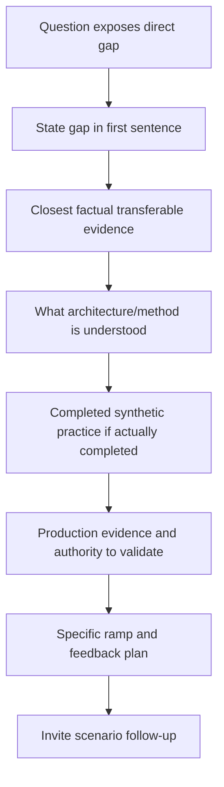

| Gap type | Safe answer pattern | Example boundary |
|---|---|---|
| Product not used | "I have not administered X. I understand [architecture], my closest evidence is [fact], and I would validate [current docs/tenant/logs]." | No console/lab claim |
| Program not owned | "I have not owned an enterprise VM/SOC/CTEM program. I have led [adjacent fact] and practiced [synthetic method]." | No program outcome |
| Metric unavailable | "I do not want to invent the number. The supported result is [qualitative/recorded fact]. I would verify [source]." | No guessed precision |
| Confidential detail | "I can describe the architecture and my decisions while omitting customer identifiers and sensitive specifics." | Substance stays truthful |
| Regulatory question | "I can map technical evidence, but applicability and interpretation belong to Legal/Compliance using current authority." | No legal advice |
| Roadmap question | "I cannot confirm roadmap. I would capture the job, route it, set a checkpoint, and plan with supported options." | No product commitment |

### Plain-English deep-dive 3 - A direct gap answer is a trust demonstration

Interview pressure tempts candidates to begin with adjacent experience and reveal the gap later. That can sound evasive. Starting with "I have not used that product directly" gives the listener a clean evidence boundary. The rest of the answer can then demonstrate method and learning without suspicion.

The answer should not stop at "no." It should show the nearest factual capability, what has been learned, what has been practiced, which production evidence matters, and how feedback will close the gap. This is exactly the transparency expected when a TSM faces an unverified product question with a customer.

## Culture signals and evidence

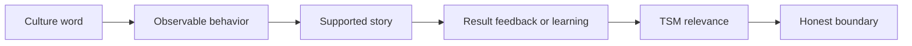

| Signal | Observable behavior | Candidate evidence family | Follow-up to prepare |
|---|---|---|---|
| Customer obsession | Understand job, reduce uncertainty, own follow-through | CSAT, escalations, advisory work | What tradeoff protected the customer? |
| Impact over activity | Measure accepted change, not volume | Backlog/case-quality analytics, fix validation | What would have happened without the work? |
| Ownership | Make problem/evidence/owner/checkpoint visible | critical situation and Engineering coordination | What did you personally own versus route? |
| Accountability | Correct mistakes and close commitments | RCA, quality review | What did you change after feedback? |
| Urgency | Shorten feedback loops around material impact | Critical support cases | Which steps ran in parallel? |
| High quality | Use evidence, review, validation, prevention | Trace analysis and fix validation | Which gate prevented false closure? |
| Transparency | State unknowns, bad news, and limitations | Executive/customer updates | When did you say "I do not know"? |
| Constructive debate | Challenge facts respectfully and change view if needed | Engineering/customer/vendor collaboration | What evidence settled or reframed it? |
| Collaboration | Clarify roles and enable specialists | Cross-functional account work | How did you prevent duplicate/conflicting work? |
| AI-forward curiosity | Explore useful workflows with governance | Copilot Studio/tools/certification/training | How did you validate output and protect data? |

## Questions to ask interviewers

Questions should respond to the conversation. Select four to six, not the entire list. Avoid asking for confidential customer details or product roadmap commitments.

| Interviewer | Question | What it reveals |
|---|---|---|
| Hiring manager | "What outcomes distinguish a strong TSM at six and twelve months?" | Performance definition and ramp |
| Hiring manager | "Where do new TSMs most often underestimate the role?" | Real difficulty and coaching |
| Technical panel | "Which customer architecture or data-quality problems consume the most TSM judgment today?" | Technical center of gravity |
| Technical panel | "How do TSMs validate current product behavior and avoid overcommitting across rapidly evolving SecOps capabilities?" | Knowledge/product boundaries |
| Support/Engineering | "How do TSM, Support, Product, and Engineering divide ownership during a critical escalation?" | Operating model and trust |
| Sales/account team | "How are technical truth, value evidence, and commercial urgency kept aligned?" | Cross-functional culture |
| Executive | "Which customer decisions do the best QBRs improve?" | Outcome orientation |
| Peer TSM | "What does an excellent week look like, and what tradeoffs are hardest?" | Day-to-day reality |
| Peer TSM | "How do you balance account depth, travel, urgent escalation, and proactive planning?" | Workload and support |
| Team | "How are shadowing, labs, certifications, case reviews, and feedback used during ramp?" | Enablement quality |
| AI/SecOps panel | "Which AI-assisted workflows are proving useful, and what validation or human-control gates are non-negotiable?" | Responsible innovation |
| Closing | "Based on today's discussion, what concern about my fit should I address directly?" | Opportunity to clarify |

## Mock interview loops

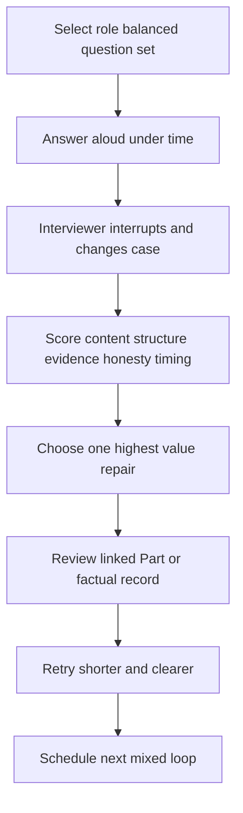

| Loop | Questions | Format | Pass condition |
|---|---|---|---|
| Recruiter screen | Tell me about yourself, why move, why Zscaler, logistics, compensation expectations | 20-30 minutes | Concise, factual, motivated, no deep jargon |
| Hiring-manager loop | Account ownership, customer conflict, outcomes, gap, 30/60/90 | 45 minutes | Strategic and honest with supported examples |
| Technical architecture | Zero trust, ZIA/ZPA, Data Fabric, UVM, Risk360, SecOps | Whiteboard plus follow-ups | Defines, flows, failures, evidence, product boundary |
| Troubleshooting | DNS/TCP/proxy/TLS/HTTP plus integration/data defect | Changed-case scenario | First divergence, safe evidence, owner, validation |
| Customer simulation | Discovery, success plan, objection, QBR, renewal risk | Role-play | Questions change plan; decisions/authority visible |
| Behavioral/culture | Six STAR-LT stories with interruptions | 60-90 seconds each | Personal action/result/learning supported |
| Executive communication | Bad news, risk dashboard, decision request | 2-minute briefing | Outcome first, plain English, unknowns and ask |
| Final mixed panel | 12 random Part 119 IDs | 60 minutes | No blank/unsafe claim; average >=3; gaps logged |

### Mock scorecard

| Dimension | 0 | 1 | 2 | 3 | 4 |
|---|---|---|---|---|---|
| Accuracy | Materially wrong | Fragments | Mostly correct | Correct and bounded | Correct under challenge |
| Structure | No answer | Wanders | Understandable | Clear and timed | Adaptive at multiple depths |
| Evidence | Invented/none | Generic | One factual element | Specific supported evidence | Evidence plus limitation/alternative |
| Customer judgment | Unsafe/role blur | Tool first | Basic stakeholder awareness | Outcome/authority/tradeoff | Changed-case leadership |
| Honesty | Misrepresents | Gap obscured | Gap eventually stated | Factual/lab/learned/gap clear | Boundary builds trust naturally |
| Communication | Incomprehensible | Jargon/long | Adequate | Audience-ready | Concise with strong follow-up |

## Readiness gates

Reading all Parts builds knowledge, but it does not by itself establish interview readiness. Readiness requires recall, adaptation, verified personal evidence, whiteboarding, live practice, and feedback.

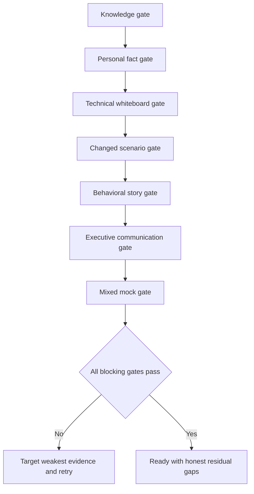

| Gate | Pass evidence | Blocking failure | Repair |
|---|---|---|---|
| Knowledge | Core Part 119 questions score >=3 twice | Goes blank on fundamentals | Explain from zero and teach-back |
| Candidate facts | Every personal claim has source and confidentiality-safe detail | Invented/uncertain metric or event | Fact-check and bracket/remove |
| Product honesty | Current facts dated; direct gaps stated | Lab/learned concept called production | Rehearse four evidence labels |
| Technical | Draw seven core flows and answer failures/evidence | Feature list without architecture | Whiteboard and changed cases |
| Scenario | Scope, facts, authority, action, validation | Unsafe command/bypass or guessed cause | Use scenario framework |
| Behavioral | At least eight verified STAR-LT stories | Generic "we" or unsupported result | Story worksheet and probing |
| Executive | Two-minute risk/bad-news briefs | Jargon or no decision request | Rewrite outcome/choice/next update |
| Mock | Two mixed panels average >=3, no honesty/safety zero | Repeated same gap | Targeted practice and external feedback |
| Logistics | Time, location/link, equipment, contacts, materials verified | Preventable day-of uncertainty | Complete day-of sheet |

## Explicit 30/60/90-day role ramp

This is a proposed learning and contribution plan, not a promise that product access, customer assignment, travel, certification, or outcomes will occur on these dates. It should be adapted with the hiring manager.

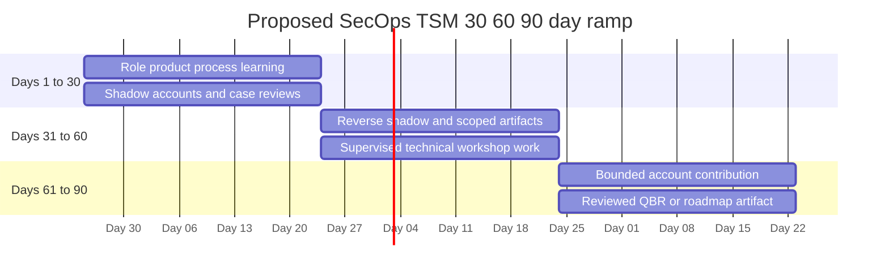

All dates in the diagram are illustrative relative planning dates, not employment or delivery commitments.

| Horizon | Learning outcomes | Relationship outcomes | Contribution evidence | Feedback/guardrail |
|---|---|---|---|---|
| Days 1-30 | Current Zero Trust Exchange, ZIA/ZPA/ZDX, Data Fabric, AEM/UVM/Risk360/CTEM/SecOps vocabulary; support/product/process; lab boundaries | Manager, mentor, TSM peers, Sales, Support, Product/Engineering routes | Product whiteboards, source/current-fact notes, shadow summaries, question log | No unsupervised product/customer claim; weekly review |
| Days 31-60 | Customer architecture, source/data health, priority, workflow, QBR, escalation patterns through reviewed cases | Join account cadence; understand sponsor/champion/operator roles | Reverse-shadow discovery segment, data-quality analysis, escalation brief, training module | Reviewed artifacts; correct errors visibly |
| Days 61-90 | Apply integrated method to bounded work and identify deeper specialization | Build trust with assigned internal/account stakeholders | Co-lead scoped workshop/review, own action follow-through, draft success/QBR/roadmap artifact | Manager/customer authority accepts scope; measure quality, not volume |

### 30/60/90 detail

| Workstream | Day 30 evidence | Day 60 evidence | Day 90 evidence |
|---|---|---|---|
| Product/current facts | Explain core architecture and locate authoritative sources | Compare customer flow to current licensed evidence under review | Apply product knowledge to bounded account decision with review |
| Data/exposure | Trace source-to-entity-to-priority and quality failures | Analyze a reviewed sample or case | Contribute a quality/prioritization recommendation |
| Troubleshooting | Learn logs/tools/support routes and reproduce approved labs | Reverse-shadow evidence triage | Own bounded evidence package and validation follow-up |
| Customer lifecycle | Shadow discovery, plan, governance, QBR | Facilitate a scoped agenda/read-back | Own actions and a reviewed success artifact |
| Enablement | Complete required learning and observe workshops | Deliver a reviewed section/teach-back | Adapt material from participant feedback |
| Cross-functional | Map Sales/Support/Product/Engineering RACI | Route one supervised question/case correctly | Coordinate one bounded cross-team outcome |
| Culture | Seek feedback; document corrections | Demonstrate constructive debate and accountability | Show one accepted improvement from feedback |

## Negotiation basics

Negotiation is a professional alignment conversation, not a contest. Personal salary, location, benefits, risk tolerance, competing processes, and priorities are unknown and must be filled privately. Do not disclose confidential current compensation unless you choo and local requirements make it appropriate.

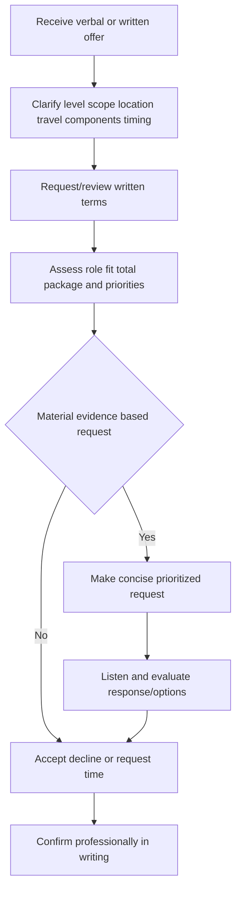

| Step | Safe language | Fill-in |
|---|---|---|
| Express interest | "I am excited about the role and appreciate the offer." | `[genuine role detail]` |
| Clarify | "Could we review level, base, variable/equity, benefits, travel, location, and decision timing?" | `[applicable components]` |
| Request time | "I would like to review the written package carefully. Could I respond by [reasonable date]?" | `[date]` |
| Make request | "Based on the role scope and my evidence in [strengths], I would like to discuss [specific prioritized request]." | `[request and support]` |
| Explore options | "If that component is fixed, which other elements have flexibility?" | `[priorities]` |
| Avoid bluff | State real constraints/processes only | `[actual competing process if any]` |
| Close | Confirm understanding, decision, and next step | `[decision after review]` |

### Plain-English deep-dive 4 - Negotiation is another evidence-and-boundary conversation

The same TSM skills apply: understand interests, clarify scope, use facts, prioritize, present options, listen, and record the decision. A request does not need aggression, and interest does not require immediate acceptance. Bluffing creates the same trust problem as inventing a technical result.

The strongest preparation is private: know which elements matter, which are flexible, what information is missing, and what outcome would be acceptable. The guide cannot decide those personal values for you.

## Night-before one-page sheet

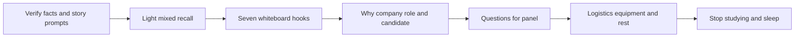

| Time block | Action | Output | Do not do |
|---|---|---|---|
| 45 minutes | Review red/amber Part 119 IDs only | One-page weak-topic cue list | Reread all 120 Parts |
| 30 minutes | Say tell-me-about-yourself, three whys, gap answer, closing aloud | Natural 60-90 second versions | Memorize every word |
| 45 minutes | Rehearse eight strongest verified STAR-LT stories | Story ID -> competency -> result cue | Add new unverified stories |
| 30 minutes | Draw zero trust, network, data fabric, vulnerability, risk, SecOps/AI, customer lifecycle | Seven clean flows | Perfect visual decoration |
| 20 minutes | Review official current product/company pages and source date | Current-fact notes and unknowns | Browse unverified market claims |
| 15 minutes | Select panel questions | Four to six prioritized questions | Ask every prepared question |
| 15 minutes | Verify time zone, link/address, names, role, CV version, notebook, charger, audio/video, travel | Logistics checklist complete | Change core equipment late |
| Remaining | Eat, hydrate, set alarms, stop, rest | Calm start | Late-night cramming |

### Night-before cheat sheet content

| Cue | Content to fill |
|---|---|
| One-line identity | `[enterprise escalation + technical analytics + enablement -> SecOps TSM]` |
| Three strengths | `[supported strength 1]`, `[strength 2]`, `[strength 3]` |
| Direct gap | `[Zscaler/SecOps direct gap in one sentence]` |
| Ramp | `[official learning, shadow, licensed practice, reviewed work]` |
| Best customer story | `[S## and supported result]` |
| Best technical story | `[S## and first divergence/evidence]` |
| Best conflict story | `[S## and decision/learning]` |
| Best mentoring/AI story | `[S## and supported evidence]` |
| Why Zscaler | `[current verified direction + role + personal fit]` |
| Why role | `[proactive lifecycle + technical depth + customer outcomes]` |
| Why you | `[three evidence-backed differentiators]` |
| Questions | `[four role-specific questions]` |
| Closing | `[fit + gap/ramp + panel detail + concern question]` |

## Day-of sheet

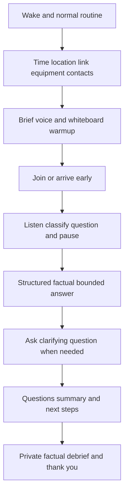

| Moment | Behavior | Short cue |
|---|---|---|
| Before | Normal meal/water; brief warmup; no heavy cram | Calm beats novelty |
| 15 minutes before remote | Close unrelated windows, silence notifications, test audio/video, open CV/JD/cue page | Clean environment |
| Arrival | Join/arrive early according to instructions; be courteous to everyone | Culture begins before panel |
| Question | Listen fully, pause, clarify scope if needed | Answer the asked question |
| Unknown | State gap, adjacent evidence, method, validation, ramp | No bluffing |
| Technical | Define, draw flow, mark failures/evidence/boundary | Architecture before features |
| Behavioral | STAR-LT, personal action, supported result | Facts stay fixed |
| Scenario | Scope, facts, authority, options, action, validation | Safety and customer judgment |
| End | Ask selected questions, summarize interest, address concern | Close intentionally |
| After | Record questions, misses, commitments, names, next step; send concise factual follow-up if appropriate | Learn while fresh |

## Likely Interview Questions - 24

Every answer below includes a model framework and fill-in prompts. Brackets are intentionally incomplete. They must not be replaced with plausible details from the fictional NMH capstone.

### Q1. Tell me about yourself.

**Model framework:** Present role identity -> two or three supported evidence themes -> desired move -> why this role. Keep it to 60-90 seconds. "I am a enterprise support and escalation engineer with several years of experience in complex Microsoft 365 customer environments. My strengths combine layered troubleshooting, customer ownership, analytics, and enablement. [Insert two supported examples/results.] I am now moving toward SecOps Technical Success so I can apply that discipline proactively across data, risk, adoption, and executive outcomes."

**Fill-in prompts:** `[current exact title]`, `[years as stated in current CV]`, `[two supported examples]`, `[one role detail learned from panel]`.

### Q2. Why Zscaler?

**Model framework:** Current verified company/product direction -> role work -> candidate evidence -> growth edge. Mention zero trust, security data/exposure/SecOps, or AI only at the level verified immediately before interview. Connect to factual escalation, networking, analytics, and enablement. State direct product gap and ramp rather than hiding it.

**Fill-in prompts:** `[current official fact checked on interview date]`, `[specific JD responsibility]`, `[supported candidate example]`.

### Q3. Why this SecOps Technical Success Manager role?

**Model framework:** "I want to extend reactive escalation strengths into proactive customer lifecycle work: discovery, architecture, data quality, priority, adoption, QBR, and risk decisions. [Supported example] showed me the value of [proactive behavior]. The role combines technical depth, customer leadership, analytics, and enablement. I have not yet owned this exact SecOps role, so my ramp is [specific plan]."

**Fill-in prompts:** `[real motivating example]`, `[three JD tasks]`, `[ramp evidence]`.

### Q4. Why should we hire you?

**Model framework:** Give three differentiators with evidence: enterprise customer/escalation judgment; technical/analytical breadth; multiplier behavior. Add AI curiosity if supported and relevant. Then name the direct gap and explain why the ramp is credible. Do not answer with personality adjectives alone.

**Fill-in prompts:** `[story S##]`, `[analytics project/result]`, `[mentoring/training evidence]`, `[gap/ramp]`.

### Q5. What is your biggest gap for this role?

**Model framework:** "I have not administered Zscaler SecOps products or owned a formal vulnerability/exposure program in production. I do have adjacent evidence in [supported skills]. I have built learned and synthetic foundations in [areas], with explicit boundaries. My ramp would use current official learning, shadowing, licensed labs, supervised account artifacts, feedback, and changed cases."

**Fill-in prompts:** `[exact products/programs not used]`, `[closest factual example]`, `[first 30-day plan]`.

### Q6. Tell me about a time you owned a critical customer issue.

**Model framework:** Use S01 or another verified critical situation. Situation/impact -> your responsibility -> scope/workstreams/evidence/cadence -> collaboration and no unsupported ETA -> validation -> supported result -> PIR/learning -> SecOps transfer.

**Fill-in prompts:** `[safe workload/context]`, `[impact]`, `[your actions]`, `[supported result]`, `[learning]`.

### Q7. Tell me about a technically complex problem you solved.

**Model framework:** Use S05-S07. Define the transaction and first divergence. Explain competing hypotheses, tools/evidence, known-good comparison, boundary ownership, correction, and validation. Avoid a long tool list; show why each piece changed the decision.

**Fill-in prompts:** `[symptom]`, `[hypotheses]`, `[evidence/tool]`, `[cause at safe level]`, `[validation/result]`.

### Q8. Tell me about a time data changed your decision.

**Model framework:** Use S09 or S10. State the initial assumption, data grain/source/quality, analysis, finding, stakeholder decision, supported result, and limitation. Mention denominator or sampling where relevant. Connect to Data Fabric/security analytics without claiming production security data work.

**Fill-in prompts:** `[dataset/project]`, `[query/analysis]`, `[quality check]`, `[decision]`, `[result]`.

### Q9. Tell me about a disagreement with Engineering, a customer, or a partner.

**Model framework:** Use S04/S07 and focus on shared objective, contested fact, listening, evidence, options, authority, decision, and learning. State if you changed your view. Never characterize the other party as unreasonable.

**Fill-in prompts:** `[stakeholders]`, `[disputed point]`, `[evidence]`, `[decision]`, `[relationship/result]`.

### Q10. Tell me about a failure or mistake.

**Model framework:** Choose a verified event. Explain what you expected, your contribution or missed signal, impact, immediate correction, transparent communication, root learning, and durable change. The example must be real and confidentiality-safe; do not use a synthetic lab unless explicitly asked about learning artifacts.

**Fill-in prompts:** `[actual event]`, `[your contribution]`, `[correction]`, `[process change]`, `[supported outcome]`.

### Q11. How do you balance urgency with quality?

**Model framework:** Use S11. Explain severity/impact, parallel workstreams, smallest discriminating evidence, communication cadence, authorization, and validation gates. Name what you refused to guess, bypass, or declare prematurely. Urgency shortens feedback loops; quality prevents false closure and harm.

**Fill-in prompts:** `[time-critical case]`, `[parallel actions]`, `[quality gate]`, `[result]`.

### Q12. How do you communicate bad news to executives?

**Model framework:** Lead with impact and correction, then evidence/confidence, what remains unknown, action/owner, workaround/decision, and next update. Use plain language and do not bury the issue. Provide a technical appendix if needed. Use S01/S02/S08 only with supported details.

**Fill-in prompts:** `[executive/stakeholder level]`, `[bad news]`, `[decision needed]`, `[next update/result]`.

### Q13. How do you approach customer discovery?

**Model framework:** Start with objective and decision, then current workflow, architecture, sources, quality, stakeholders/authority, constraints, prior attempts, success evidence, and unknowns. Trace one workflow end to end and issue a corrective read-back. Explain that discovery should change the plan.

**Fill-in prompts:** `[factual advisory example or label as learned method]`, `[questions that changed plan]`.

### Q14. How would you build a technical success plan?

**Model framework:** Connect outcomes to workstreams, entry/exit evidence, RACI, dependencies, estimated windows, risks, health signals, support routes, guardrails, acceptors, and cadence. Separate tasks from accepted states. If using NMH, say clearly that it is synthetic practice.

**Fill-in prompts:** `[closest factual planning example]`, `[synthetic artifact only if completed]`, `[production validation]`.

### Q15. How would you handle a critical escalation with no ETA?

**Model framework:** Confirm impact/safety/workaround, establish roles/workstreams/evidence/cadence, communicate known/unknown/action/owner/next update, and avoid invented ETA. Separate stabilization from diagnosis, validate changed/control cohorts, then run PIR. Bridge to factual enterprise escalation experience.

**Fill-in prompts:** `[supported escalation example]`, `[cadence]`, `[result]`.

### Q16. How would you explain vulnerability priority to an executive?

**Model framework:** Start with a scenario and objective, not CVSS. Explain threat, exposure, criticality, identities, controls, confidence, owner, treatment, and residual in plain language. State that scores are indexes under rules. Use a synthetic example only with label; no UVM algorithm claim.

**Fill-in prompts:** `[plain-English analogy]`, `[decision request]`, `[boundary]`.

### Q17. How do you measure customer adoption and value?

**Model framework:** Separate provisioned capability, repeated correct behavior, operational effect, governance acceptance, and objective outcome. Define baseline, population, denominator, reporting cut, quality, target hypothesis, guardrail, owner, and acceptor. Do not call attendance, login, ingestion, or ticket closure value.

**Fill-in prompts:** `[factual training/adoption analog]`, `[metric and result if supported]`.

### Q18. How would you handle "We already have a SIEM"?

**Model framework:** Validate investment, clarify no automatic replacement claim, map event/detection, investigation, entity, asset/exposure, workflow, retention, and response jobs, then identify evidence of overlap or gap. Recommend a requirement-led test only if needed. Avoid competitor bashing.

**Fill-in prompts:** `[customer objective]`, `[jobs to map]`, `[pilot acceptance evidence]`.

### Q19. How do you mentor or train technical people?

**Model framework:** Use S13/S14. Assess baseline and role job, set observable objectives, explain from zero, demonstrate, let learners practice, use teach-back/changed case, give specific feedback, retry, and measure behavior rather than attendance. Tie to factual mentoring/onboarding/partner training.

**Fill-in prompts:** `[audience]`, `[topic]`, `[artifact]`, `[supported result]`.

### Q20. How have you used AI responsibly?

**Model framework:** Use S16 with exact facts. Explain the task, data boundary, prompt/grounding, validation, privacy, human review, failure checks, audience enablement, and supported result. State that it was not Agentic SecOps unless it truly was. Connect the learned controls to security agents.

**Fill-in prompts:** `[tool/use case]`, `[data type]`, `[validation]`, `[audience/result]`.

### Q21. What would your first 30/60/90 days look like?

**Model framework:** Days 1-30 learn current product/process/customer context, shadow, and produce reviewed whiteboards/notes. Days 31-60 reverse-shadow discovery/evidence/training and create supervised artifacts. Days 61-90 own bounded follow-through and a reviewed customer outcome artifact. Ask the manager to adapt it. Do not promise account outcomes by arbitrary date.

**Fill-in prompts:** `[required company onboarding]`, `[manager priorities learned during interview]`, `[preferred evidence]`.

### Q22. What questions do you have for us?

**Model framework:** Select four role-specific questions from the table: success at 6/12 months, hardest account problems, TSM/Support/Sales/Product boundaries, current SecOps priorities, ramp/feedback, executive cadence, responsible AI, or concern about fit. Reference something actually said during the panel.

**Fill-in prompts:** `[interviewer role]`, `[discussion detail]`, `[four selected questions]`.

### Q23. What are your compensation expectations?

**Model framework:** Use applicable recruiter guidance and location information. Express interest, ask for the budgeted range and total-package structure when appropriate, and avoid inventing market data. If providing a range, base it on actual research and personal requirements completed privately. Keep the answer concise and collaborative.

**Fill-in prompts:** `[actual researched range]`, `[location/currency]`, `[base/variable/equity priorities]`, `[minimum only for private use]`.

### Q24. Is there anything else you want us to know?

**Model framework:** Close with three supported fits, direct gap/ramp, one panel-specific motivation, and a concern question. "My customer escalation, layered troubleshooting, analytics, and enablement experience align strongly. I have not yet run these Zscaler products in production, and my ramp is explicit. Today's discussion about [detail] increased my interest. Is there a concern I can address?"

**Fill-in prompts:** `[three fits]`, `[gap/ramp]`, `[actual panel detail]`, `[availability/next step only if asked]`.

## Official Source Anchors

Research/source snapshot and source review date: **2026-08-24**.

The sources support bounded public company/product and general framework context. They do not prove candidate fit, culture behavior, product entitlement, job conditions, compensation, NMH outcomes, or interview results. Recheck official company, careers, product, and role material immediately before the interview.

| Source | URL | Used for | Boundary |
|---|---|---|---|
| Zscaler company/about | https://www.zscaler.com/company/about-zscaler | Public company context | Current wording and claims require recheck |
| Zscaler careers | https://www.zscaler.com/careers | Public careers/culture context | Team/role experience cannot be inferred |
| Zscaler Zero Trust Exchange | https://www.zscaler.com/products-and-solutions/zero-trust-exchange-zte | Public platform positioning | No candidate/customer implementation inferred |
| Zscaler Data Fabric for Security | https://www.zscaler.com/products-and-solutions/data-fabric | Public security-data positioning | No internal schema or experience inferred |
| Zscaler Unified Vulnerability Management | https://www.zscaler.com/products-and-solutions/unified-vulnerability-management | Public vulnerability positioning | No algorithm or program experience inferred |
| Zscaler Risk360 | https://www.zscaler.com/products-and-solutions/risk360 | Public risk positioning | No score, value, or financial fact inferred |
| Zscaler Agentic Security Operations | https://www.zscaler.com/products-and-solutions/security-operations | Public SecOps/AI positioning | No production agent experience inferred |
| NIST Cybersecurity Framework 2.0 | https://www.nist.gov/cyberframework | General outcome/governance vocabulary | Voluntary and implementation-neutral |
| NIST SP 800-207 | https://csrc.nist.gov/pubs/sp/800/207/final | Vendor-neutral zero-trust concepts | Not product/customer proof |
| NIST AI Risk Management Framework | https://www.nist.gov/itl/ai-risk-management-framework | General responsible-AI risk framing | Voluntary; not certification/legal conclusion |

## 30-Second Memory Hooks

| Concept | Memory hook |
|---|---|
| STAR-LT | Context, responsibility, decisions, proof, learning, transfer |
| Personal evidence | Facts fixed; camera angle changes |
| Result | Supported outcome plus limitation |
| Gap | State it, bridge it, validate it, ramp it |
| Why Zscaler | Current direction, role work, strengths, growth edge |
| Why TSM | Apply escalation discipline proactively across lifecycle |
| Why you | Customer ownership, layered evidence, analytics, enablement |
| Customer obsession | Listen, clarify job, own follow-through |
| Impact | Accepted change, not activity volume |
| Ownership | Problem, evidence, authority, checkpoint, closure |
| Transparency | Unknown is safer than invented certainty |
| Constructive debate | Shared objective plus evidence plus authority |
| Urgency | Shorter loops, same safety and quality gates |
| AI | Useful task, grounded evidence, human control |
| Mock practice | Answer, interrupt, score, repair, space |
| 30/60/90 | Learn, supervised practice, bounded contribution |
| Negotiation | Clarify, prioritize, ask with evidence, never bluff |
| Night before | Verify, lightly recall, prepare logistics, stop |
| Day of | Listen, structure, be factual, close intentionally |

## Completion Checklist

- [ ] I can explain STAR-LT and keep Action as the largest part of a behavioral answer.
- [ ] Every personal story has an evidence source, confidentiality-safe wording, personal role, supported result, learning, and role transfer.
- [ ] I completed or explicitly left brackets in all 16 story blueprints; I did not invent details to fill them.
- [ ] I selected at least eight rich verified stories that cover all major competencies.
- [ ] I can state the difference among factual production experience, synthetic practice, learned architecture, and direct gaps.
- [ ] I can deliver tell-me-about-yourself in 60 and 90 seconds.
- [ ] I can answer why Zscaler, why SecOps TSM, and why you without flattery, competitor bashing, or unsupported claims.
- [ ] I can state the direct Zscaler/SecOps experience gap in the first sentence and give a concrete ramp.
- [ ] I mapped culture words to observable behaviors and supported stories.
- [ ] I prepared four to six questions for each likely interviewer type.
- [ ] I completed recruiter, manager, technical, troubleshooting, customer, behavioral, executive, and mixed mock loops.
- [ ] I passed the knowledge, fact, product-honesty, technical, scenario, behavioral, executive, mock, and logistics gates.
- [ ] I can present the 30/60/90 plan as an adaptable proposal, not a promise.
- [ ] I prepared negotiation priorities privately and will not bluff or invent market facts.
- [ ] I completed the night-before one-page cues and stopped heavy study on time.
- [ ] I completed the day-of logistics and environment check.
- [ ] I practiced all 24 likely questions with model framework and factual fill-ins.
- [ ] I rechecked current official product/company facts near the interview date.
- [ ] I can link learned terms to the planned [Appendix A - Glossary and Acronym Dictionary](Appendix-A-glossary-acronyms.md), while recognizing that the appendix has not been created yet.
- [ ] I am honest that reading builds knowledge, while readiness also requires aloud answers, personal fact-checking, whiteboarding, mock interviews, and feedback.

[Return to: Zscaler SecOps Technical Success Manager - Complete Study Guide](../Zscaler%20SecOps%20Technical%20Success%20Manager%20-%20Complete%20Study%20Guide.md)