# Part 13 - Risk Assessment, Treatment, Appetite, Tolerance, and Residual Risk

> **Audience:** Arti Thakur, moving from Microsoft 365 Support Escalation Engineering into a Zscaler Security Operations Technical Success Manager role.
>
> **Currency date:** 2026-08-24.
>
> **Scope and honesty:** Northstar Meridian Holdings, abbreviated NMH, and every NMH asset, threat, vulnerability, control, likelihood, impact, score, probability, loss estimate, appetite, tolerance, treatment, acceptance, metric, decision, and outcome are fictional. Every formula is an instructional model created for this chapter. No formula is a NIST, Zscaler, Security Operations, Unified Vulnerability Management, Risk360, insurer, customer, or production formula. Arti's established production bridge is Microsoft support, OneDrive, SharePoint, networking, troubleshooting, analytics, mentoring, escalation, and approved AI work.
>
> **Risk caveat:** Risk assessment supports decisions under uncertainty; it does not predict the future with certainty. Qualitative labels, scores, probabilities, currency estimates, and vendor outputs depend on scope, data, model, assumptions, time horizon, and judgment. Authorized customer leaders own risk appetite, tolerance, treatment, acceptance, and escalation. A Technical Success Manager can clarify evidence and options but does not accept customer risk.
>
> **Source caveat:** NIST Special Publication 800-30 Revision 1 remains an official guide for conducting risk assessments and was published in September 2012. Use it with current NIST Cybersecurity Framework 2.0, enterprise risk guidance, organizational methods, applicable obligations, and qualified specialists. Official Zscaler pages describe vendor positioning; validate current model documentation and never treat a product score as objective truth or guaranteed loss.

## Section goal

Cybersecurity risk is the effect of uncertainty on business objectives arising from threats, vulnerabilities or exposure conditions, controls, and consequences. Risk assessment organizes evidence and judgment so an authorized person can decide what to avoid, mitigate, transfer, accept, monitor, or investigate.

Imagine planning an outdoor event. Rain is a threat event. An uncovered electrical system is a vulnerability. A roof and protected wiring are controls. Likelihood depends on forecast, location, and time horizon. Impact depends on safety, attendance, cost, and recovery. The organizer can change venue, install protection, buy insurance, accept a bounded chance of cancellation, or postpone. A weather number alone does not make the decision. Cyber risk uses the same logic with more complex assets, adversaries, dependencies, controls, and uncertainty.

By the end, Arti should be able to:

| Learning outcome | What mastery looks like |
|---|---|
| Define risk components | Distinguish assets, objectives, threats, vulnerabilities, exposure, controls, likelihood, and impact |
| Frame an assessment | Set purpose, scope, time horizon, method, stakeholders, assumptions, and decision |
| Compare methods | Explain qualitative, semiquantitative, and quantitative approaches and tradeoffs |
| Assess likelihood | Separate threat-event probability, susceptibility, control condition, and confidence |
| Assess impact | Connect confidentiality, integrity, availability, safety, legal, financial, operational, and strategic consequences |
| Separate risk states | Explain inherent, current, residual, and target risk without double-counting controls |
| Choose treatment | Compare avoid, mitigate, transfer, and accept options plus evidence gathering |
| Assign authority | Distinguish risk owner, action owner, control owner, assessor, and approver |
| Explain appetite | Separate risk capacity, appetite, tolerance, limit, and threshold |
| Use indicators | Distinguish Key Risk Indicators, Key Performance Indicators, and Key Control Indicators |
| Maintain a register | Create decision-ready records with owner, action, due date, validation, and review |
| Handle uncertainty | Use ranges, confidence, sensitivity, scenarios, and model limitations |
| Govern acceptance | Require rationale, approval, expiry, monitoring, and reassessment triggers |
| Escalate clearly | Translate technical conditions into business consequence and decision requests |
| Practice honestly | Build fictional NMH examples and use Arti's factual analytics and escalation bridge |

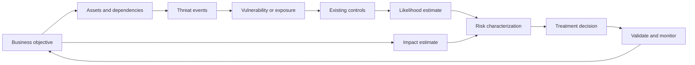

Risk is not a property of a vulnerability alone. A software weakness on an isolated test system and the same weakness on an internet-accessible safety service can have different risk because assets, exposure, threat activity, controls, consequence, and time horizon differ.

## JD Mapping

The target Technical Success Manager, abbreviated **TSM**, must translate technical findings into customer decisions and measurable mitigations. That requires risk fluency without overclaiming formal authority or model certainty.

| JD expectation | Risk capability | Honest Arti bridge | Boundary to preserve |
|---|---|---|---|
| Analyze complex environments | Connect asset, business process, identity, path, weakness, control, and owner | Production Microsoft 365 dependency analysis | Do not claim formal enterprise risk assessment ownership |
| Identify security risks | Build evidence-backed scenarios and uncertainty | Troubleshooting hypotheses and scope analysis | Findings require customer context and risk-owner judgment |
| Deliver mitigation strategies | Compare avoidance, mitigation, transfer, acceptance, and evidence options | Production recommendation and fix-validation method | Customer decides treatment and acceptance |
| Explain complex metrics | Define formulas, denominators, assumptions, sensitivity, and limitations | SQL, statistics, Power BI, and MBA Business Analytics | Fictional models are not vendor formulas |
| Lead strategic engagement | Maintain risk register, action plan, dependencies, and review cadence | Customer ownership and Technical Advisor work | CISO and business owners set appetite and priority |
| Resolve critical escalations | Express current impact, plausible consequence, urgency, and decision needed | CRITSIT communication | Do not label an event a security incident without authorized criteria |
| Develop Zscaler expertise | Interpret documented product outputs as decision inputs | Official-source learning and future labs | No production Risk360, UVM, exposure, or SecOps use |
| Report to executives | Translate cyber condition into revenue, safety, operations, legal, customer, and strategic language | Executive-ready customer communication | Avoid false precision and guaranteed outcomes |

## Candidate honesty note

Arti has factual experience with uncertainty and prioritization in production support: defining affected scope, comparing cases, assessing business impact, identifying dependencies, analyzing backlog and case-quality data, coordinating critical incidents, recommending actions, and validating fixes. Her analytics background supports careful formulas, distributions, sensitivity, and dashboard communication.

She should not claim that she has set enterprise cyber-risk appetite, approved risk acceptance, quantified annualized cyber loss, operated Zscaler Risk360 or Unified Vulnerability Management, owned vulnerability remediation, or performed a regulated risk assessment. Safe wording is: "I understand the mechanics and have practiced them in a clearly fictional NMH case. My production bridge is evidence-driven technical impact analysis, analytics, and escalation."

| Label | Meaning | Safe wording | Unsafe wording |
|---|---|---|---|
| Production | Microsoft support, escalation, analytics, mentoring, training, approved AI | "I prioritized technical cases using impact, scope, evidence, and urgency." | "I owned enterprise cyber risk" |
| Lab | Synthetic risk register, formulas, sensitivity, and treatment plan | "I built a fictional NMH risk model to practice decisions." | "I reduced NMH annual loss" |
| Conceptual | Risk guidance and methods learned from official sources | "I can distinguish inherent, current, residual, and target risk." | "I am a quantitative risk expert" |
| Not-yet-used | Zscaler Risk360, UVM, SecOps, production exposure program | "I would validate product drivers and model documentation." | "I tuned Risk360" |
| Authority boundary | Customer leaders decide appetite and acceptance | "I can prepare evidence and options for the risk owner." | "I accepted the customer's risk" |

## Essential terms before risk depth

| Term | Plain meaning | Why it matters | Memory hook |
|---|---|---|---|
| Objective | Result the organization wants to achieve | Risk exists relative to objectives | What success needs |
| Asset | Something valuable or necessary | Gives the scenario business meaning | What matters |
| Threat source | Actor or condition capable of causing harm | Distinguishes adversary, accident, failure, and nature | Who or what can act |
| Threat event | Harmful action or occurrence | Makes analysis scenario specific | What happens |
| Vulnerability | Weakness that can be exploited or triggered | Creates susceptibility | Weak point |
| Exposure | Condition that makes contact or harm more possible | Adds reachability and context | Open path |
| Control | Safeguard that changes likelihood or impact | Determines current and residual risk | Reduce, detect, respond, recover |
| Likelihood | Estimated chance that a scenario produces harm in a time horizon | One dimension of risk | How plausible, by when |
| Impact | Consequence if the scenario occurs | Connects technology to business | So what? |
| Risk scenario | Structured cause-to-consequence story | Prevents vague scores | Because X, Y may cause Z |
| Inherent risk | Risk before considering selected controls under the method | Shows untreated exposure for comparison | Before controls |
| Current risk | Risk under controls currently operating | Describes present decision state | Today with controls |
| Residual risk | Risk remaining after treatment or controls | Must be owned and monitored | What remains |
| Target risk | Desired risk state after planned treatment | Guides the roadmap | Where we aim |
| Risk capacity | Maximum risk the organization could absorb before objectives become untenable | Outer boundary | Cannot survive beyond |
| Risk appetite | Amount and type of risk leaders are willing to pursue or retain | Guides choices | Willing to take |
| Risk tolerance | Permitted variation around an objective or appetite | Operationalizes appetite | Allowed range |
| Risk limit | Specific boundary used to constrain activity | Triggers action | Do not cross |
| KRI | Key Risk Indicator | Signals changing exposure or consequence | Risk is moving |
| KPI | Key Performance Indicator | Measures performance toward an objective | Work is progressing |
| KCI | Key Control Indicator | Measures control operation or health | Safeguard is working |
| Risk owner | Person accountable for understanding and deciding treatment | Provides business authority | Owns the uncertainty |
| Action owner | Person accountable for a treatment task | Drives execution | Owns the work |
| Risk acceptance | Authorized decision to retain defined residual risk | Not passive neglect | Know, approve, monitor, expire |
| Sensitivity analysis | Tests how outputs change when inputs change | Exposes influential assumptions | Move inputs, watch result |
| Confidence | Degree of support for an estimate | Prevents false certainty | How much evidence? |

## Frame the assessment before scoring

An assessment begins by defining the decision it must support. Without scope and purpose, teams collect data indefinitely or compare incompatible scores.

| Framing element | Question | Fictional NMH example |
|---|---|---|
| Decision | What decision will this assessment inform? | Prioritize supplier-access treatment for restricted project sites |
| Objective | Which business outcome could be affected? | Complete engineering collaboration without intellectual-property loss |
| Scope | Which entities, systems, data, locations, and periods? | External identities and selected SharePoint project sites for twelve months |
| Time horizon | By when could the scenario occur? | Next twelve months, with quarterly review |
| Perspective | Enterprise, business process, service, system, or component? | Business-service and tenant perspective |
| Method | Qualitative, semiquantitative, quantitative, or hybrid? | Semiquantitative triage plus scenario ranges |
| Criteria | How are likelihood, impact, and priority defined? | NMH fictional scales approved for the exercise |
| Evidence | Which sources and observations support estimates? | Identity, access, sharing, audit, sponsor, and incident records |
| Stakeholders | Who supplies context and who decides? | Business, data, identity, collaboration, security, privacy, risk owners |
| Assumptions | What is believed but not yet verified? | All active guest groups appear in the inventory |
| Exclusions | What conclusion is not supported? | No claim about all Microsoft 365 or all suppliers |
| Review trigger | What invalidates the result? | Incident, acquisition, policy, threat, data, or architecture change |

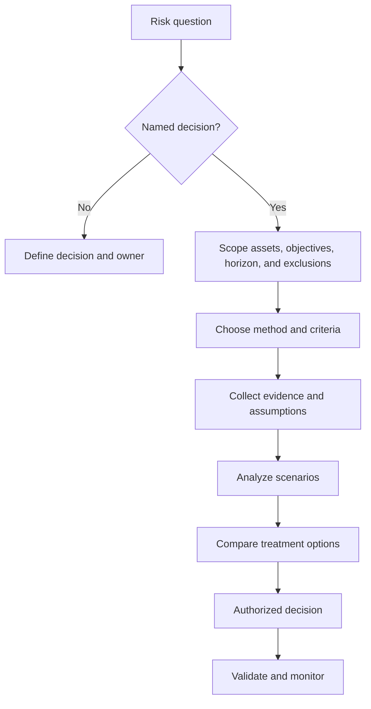

### Risk scenario statement

A useful scenario can be written as:

> Because **[threat source or event]** can interact with **[vulnerability or exposure]** affecting **[asset or business process]**, **[business consequence]** may occur within **[time horizon]**, considering **[current controls and uncertainty]**.

| Quality | Weak statement | Stronger fictional statement |
|---|---|---|
| Specific cause | "Guest risk is high" | "A stolen or stale supplier identity may retain project-site access" |
| Asset | "Data could leak" | "Restricted engineering design files could be read or downloaded" |
| Path | "Hackers may attack" | "Manual group expiry and long-lived sessions create a post-project path" |
| Consequence | "This is critical" | "Loss could affect design confidentiality, contract trust, and schedule" |
| Time | "Eventually" | "Within the next twelve months" |
| Controls | "MFA exists" | "MFA, site membership, audit, and quarterly review reduce but do not remove risk" |
| Uncertainty | "Score is 16" | "Inventory completeness and attacker frequency remain uncertain" |

### Plain-English deep-dive 1 - A risk score is the end of a story, not the beginning

Imagine a doctor writes "7" on a page without naming the patient, symptom, test, unit, time, or scale. The number cannot guide treatment. A cyber-risk score has the same problem when it lacks scenario, scope, method, data, controls, owner, and consequence.

A vulnerability scanner may report technical severity. An exposure tool may add reachability, asset, threat, and control context. A risk platform may aggregate drivers. These are useful inputs, but the organization must still understand what business objective is affected and what decision is required. The number may change because the model changed, not because the environment became safer.

The disciplined order is narrative first, evidence second, estimate third, decision fourth. Preserve the driver values and assumptions so a reviewer can reproduce the reasoning. If the result changes, explain whether threat, exposure, control, business impact, data quality, scope, or formula changed.

## Assets, threats, vulnerabilities, exposure, and controls

These terms create the causal chain. Avoid double-counting the same factor. For example, internet exposure can influence likelihood, while public-service outage consequence influences impact. Do not add "internet-facing" to both sides without a documented rationale.

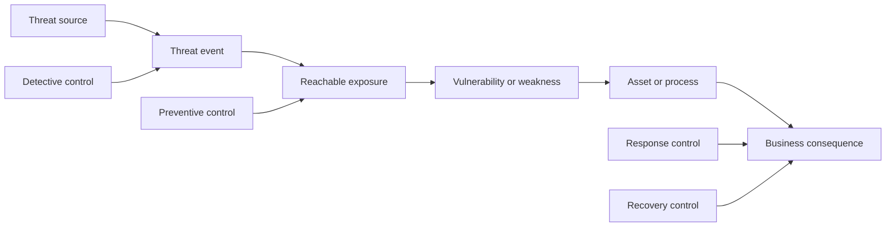

| Component | Questions | Evidence | Common error |
|---|---|---|---|
| Objective | What must the business achieve? | Strategy, service outcome, owner | Starting with a tool finding |
| Asset | What is valuable or required? | Inventory, data map, process map | Treating every asset as equal |
| Threat source | Who or what could cause the event? | Threat intelligence, history, environment | Assuming only malicious actors |
| Threat event | What action or failure occurs? | Scenario, ATT&CK context, incident data | Using a broad category as a scenario |
| Vulnerability | Which weakness permits harm? | Test, configuration, defect, process evidence | Equating vulnerability with risk |
| Exposure | How can the threat reach or affect the asset? | Route, identity, sharing, public service, dependency | Ignoring internal or supplier paths |
| Control | What changes likelihood or impact? | Configuration, operation, test, monitoring | Counting purchased but unused capability |
| Consequence | How are objectives affected? | Business impact analysis, owner input | Only using technical severity |

### Threat sources beyond external attackers

| Threat source | Example event | Risk implication |
|---|---|---|
| External adversary | Credential theft and unauthorized access | Motivation, capability, targeting, and opportunity matter |
| Malicious insider | Authorized user deliberately exports data | Existing access can bypass perimeter controls |
| Accidental insider | Site owner shares with wrong group | Usability, training, approval, and detection matter |
| Third party | Supplier account or integration is compromised | Contract, identity, token, data, and support boundaries matter |
| Software defect | Authorization logic fails | Change, testing, rollback, and vendor response matter |
| Operator error | Administrator publishes broad policy | Management-plane safeguards matter |
| Infrastructure failure | Identity, Domain Name System, network, or region fails | Availability and degraded-mode choices matter |
| Natural event | Facility or regional disruption | Continuity and recovery matter |
| Supply-chain compromise | Trusted update or dependency is altered | Provenance, isolation, monitoring, and recovery matter |

## Qualitative assessment

Qualitative assessment uses ordered labels such as Low, Moderate, High, and Very High. It is accessible and efficient, but labels must have defined criteria. "High" cannot mean "I am worried."

### Fictional likelihood scale

| Rating | Fictional definition for twelve-month horizon | Evidence cues | Confidence note |
|---|---|---|---|
| Rare | Scenario is plausible but would require unusual conditions | No relevant history, narrow path, strong tested controls | Missing visibility can falsely lower estimate |
| Unlikely | Scenario could occur but supporting conditions are limited | Some exposure, low observed activity, controls generally effective | Threat change could invalidate |
| Possible | Scenario has credible path and could occur | Relevant attempts or common event, mixed controls | Estimate depends on coverage and population |
| Likely | Scenario is expected in some portion of scope | Recurring attempts, broad exposure, control weaknesses | Separate attempts from successful harm |
| Almost certain | Scenario is expected repeatedly unless conditions change | Frequent events and weak or absent barriers | Still not a guarantee for one asset |

### Fictional impact scale

| Rating | Fictional consequence | Business dimensions | Validation owner |
|---|---|---|---|
| Insignificant | Minimal reversible disruption within routine operation | Small effort, no material data or customer effect | Service owner |
| Minor | Limited team disruption or low-sensitivity exposure | Local delay, manageable rework | Business owner |
| Moderate | Material service, data, customer, or contractual effect | Multi-team response, missed milestone, limited notification | Business and risk owners |
| Major | Serious operational, legal, safety, financial, or trust consequence | Extended outage, sensitive loss, executive response | Executive risk owner |
| Severe | Threatens strategic objective, safety, solvency, or sustained operation | Crisis, major regulatory or market consequence | Senior governing authority |

### Fictional qualitative matrix

| Likelihood / Impact | Insignificant | Minor | Moderate | Major | Severe |
|---|---:|---:|---:|---:|---:|
| Rare | Low | Low | Low | Moderate | Moderate |
| Unlikely | Low | Low | Moderate | Moderate | High |
| Possible | Low | Moderate | Moderate | High | High |
| Likely | Moderate | Moderate | High | High | Very High |
| Almost certain | Moderate | High | High | Very High | Very High |

This matrix is fictional. The labels are ordinal, not arithmetic. Very High is not mathematically twice High. The matrix should trigger defined governance actions, such as escalation, treatment timing, approval level, or deeper analysis.

## Semiquantitative assessment

Semiquantitative methods assign numbers to ordered scales or weighted factors. They improve consistency and sorting but can create false precision. Adding two ordinal ratings does not turn them into measured probability or currency loss.

A fictional triage formula for teaching is:

`Triage score = 0.30T + 0.25E + 0.20B + 0.15W - 0.10C`

Where each input is scaled from 0 to 100:

| Variable | Fictional meaning | Example evidence | Caution |
|---|---|---|---|
| T | Threat relevance and activity | Relevant attempts, intelligence, observed techniques | Observation coverage and recency vary |
| E | Exposure and reachability | Internet, identity, route, sharing, attack path | Reachability can be conditional |
| B | Business consequence proxy | Criticality, data, safety, revenue, dependency | Proxy is not actual loss |
| W | Weakness severity and exploit conditions | Defect, configuration, process, exploitability | Technical severity is one input |
| C | Tested mitigating-control strength | Prevention, detection, response, recovery evidence | Control interaction is not necessarily linear |

For fictional values `T=70`, `E=80`, `B=90`, `W=60`, and `C=50`:

`Triage score = 0.30(70) + 0.25(80) + 0.20(90) + 0.15(60) - 0.10(50) = 63`

The result 63 is a queue-ordering aid under this fictional model. It is not 63 percent probability, 63 percent risk, or a Zscaler score. Changing a weight can reorder the backlog without any environmental change.

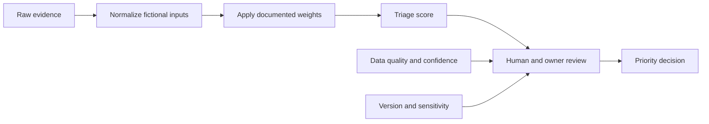

### Semiquantitative quality checks

| Check | Question |
|---|---|
| Construct validity | Does each factor represent what its name claims? |
| Independence | Are the same exposure or impact facts counted multiple times? |
| Scale | Are values ordinal, interval, probability, or currency? |
| Weight | Who approved weights and what decision do they support? |
| Calibration | Do outputs align with known scenarios and expert review? |
| Stability | Does a small input change cause unreasonable ranking change? |
| Missing data | Is unknown treated separately from zero? |
| Versioning | Can a score change be explained by model versus environment? |
| Override | Is human adjustment documented with rationale and approval? |
| Outcome | Does prioritization improve verified risk treatment? |

## Quantitative assessment

Quantitative assessment estimates risk using probabilities, frequencies, ranges, and financial or other numeric consequences. It can compare investments and aggregate scenarios, but it requires disciplined data, calibrated judgment, and uncertainty representation.

A simple fictional expected-loss teaching model is:

`Expected annual loss = Annual event frequency x Loss per event`

Suppose NMH estimates a scenario frequency range of 0.1 to 0.5 harmful events per year and a loss range of USD 200,000 to USD 2,000,000 per event. Multiplying one midpoint by another would hide uncertainty. A better analysis models distributions or at least presents low, central, and high scenarios with assumptions.

| Fictional scenario | Annual frequency | Loss per event | Simple expected value | Important limitation |
|---|---:|---:|---:|---|
| Low case | 0.10 | USD 200,000 | USD 20,000 | Optimistic control and impact assumptions |
| Central case | 0.25 | USD 800,000 | USD 200,000 | Not a forecast or guaranteed average |
| High case | 0.50 | USD 2,000,000 | USD 1,000,000 | Tail events and dependencies may exceed it |

All values are fictional. Expected value is useful for repeated decisions but can understate rare catastrophic outcomes. Risk appetite and capacity may require controls even when the average expected loss seems affordable.

### Loss components

| Component | Fictional NMH question | Estimation source | Double-counting risk |
|---|---|---|---|
| Response | Staff, specialist, provider, and investigation effort? | Incident and vendor cost history | Staff time may also appear in productivity loss |
| Restoration | Rebuild, validate, recover, and reconcile? | Recovery exercises and service estimates | Replacement and downtime can overlap |
| Productivity | How many people cannot perform required work for how long? | Business process and workforce data | Revenue impact may already include productivity |
| Revenue or margin | Which sales or production are delayed or lost? | Finance and business owner | Gross revenue is not net economic loss |
| Contract | Service credit, rework, or partner consequence? | Contract and legal review | Do not assume every clause is triggered |
| Legal and regulatory | Investigation, counsel, notification, or penalty exposure? | Qualified legal and privacy input | Do not invent fines or certainty |
| Customer trust | Churn, delay, or acquisition cost? | Customer and finance analytics | Attribution is difficult |
| Safety | Injury or unsafe operation consequence? | Safety specialists | Do not reduce all safety impact to currency |
| Strategic | Intellectual property, market, acquisition, or mission effect? | Executive scenario analysis | Wide ranges and long horizon |

### Plain-English deep-dive 2 - Quantitative does not mean objective

A recipe measured in grams is more precise than "add some flour," but a wrong ingredient still produces a bad cake. Quantitative cyber risk can be mathematically consistent and conceptually wrong if the scenario, frequency, control, or loss assumptions are weak.

Numbers often come from sparse incidents, expert estimates, vendor studies, insurance data, or broad industry reports. These populations may not match the organization. A result such as USD 200,000 expected annual loss should be presented with range, percentile or scenario, assumptions, confidence, and sensitivity. It is not a bill that will arrive next year.

Quantification is most valuable for comparing choices under the same transparent method. If one control costs USD 100,000 and appears to reduce a well-supported loss range materially, the organization has useful decision input. The final decision may still include safety, legal duty, customer trust, and capacity that cannot be reduced to expected dollars.

## Likelihood mechanics

Likelihood can be decomposed into the chance that a threat event occurs and the chance that it produces harm given current conditions. Different methods use different terms. Keep the local model explicit.

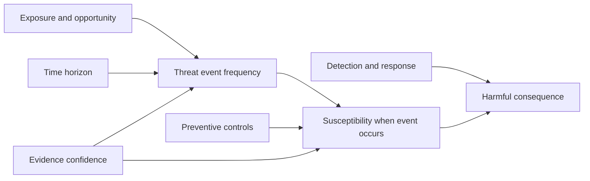

| Likelihood factor | Evidence | Bias risk | Improvement |
|---|---|---|---|
| Threat frequency | Attempts, intelligence, incidents, sector observations | Absence of detection treated as absence of activity | Improve visibility and external context |
| Targeting | Asset value, public presence, supplier role | Generic threat data overapplied | Use scenario-specific evidence |
| Exposure | Reachability, identity path, sharing, service interface | Configured policy assumed effective | Observe and negative-test paths |
| Exploitability | Preconditions, available capability, complexity | Technical severity treated as certainty | Include environment and control conditions |
| Susceptibility | Control design and operating effectiveness | Purchased control counted as strong | Test coverage, bypass, and failure |
| Dwell and detection | Detection probability and response speed | Alert count treated as detection quality | Exercise known scenarios and measure outcomes |
| Time horizon | Month, year, project life, asset life | Mixing horizons across risks | Normalize or disclose periods |
| Dependence | Shared identity, provider, admin, or software | Independent probabilities assumed | Model correlated scenarios |

Likelihood is conditional. "MFA reduces account takeover likelihood" depends on the authentication method, coverage, recovery, token, session, adversary technique, and application authorization. Avoid universal percentage reductions unless supported by a valid local model.

## Impact mechanics

Impact begins with business-process consequence, not only asset price. A small component can be a critical dependency. A high-value database may have tested recovery and limited operational impact. Consider immediate and cascading effects.

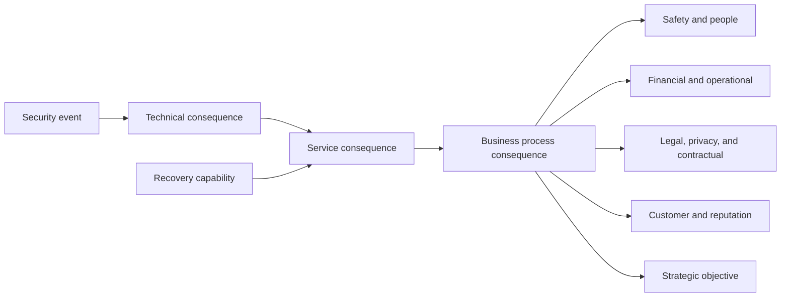

| Impact dimension | Questions | Evidence and owner |
|---|---|---|
| Confidentiality | Which data could be accessed, by whom, and for what duration? | Data owner, classification, access logs |
| Integrity | Could decisions or designs be altered without detection? | Process owner, version, signatures, validation |
| Availability | Which business process stops, degrades, or becomes unsafe? | Service owner, dependency map, continuity plan |
| Safety | Could people, equipment, or environment be harmed? | Safety specialists and plant leadership |
| Financial | Which response, restoration, margin, or cash effects are plausible? | Finance with assumptions and ranges |
| Legal and privacy | Which duties may be triggered? | Qualified Legal and Privacy, not TSM judgment |
| Contractual | Which commitments, notifications, or service levels matter? | Contract owner and Legal |
| Customer | Could delivery, trust, or retention change? | Customer leadership and analytics |
| Strategic | Could intellectual property, market position, acquisition, or mission suffer? | Executive owner |
| Cascading | Which suppliers, plants, identities, or services depend on this asset? | Architecture and business continuity maps |

### Impact timeline

| Time | Fictional supplier-access consequence |
|---|---|
| Minutes to hours | Unauthorized access and download may occur; containment begins |
| Days | Investigation, access review, partner coordination, design validation |
| Weeks | Rework, contract review, customer communication, control redesign |
| Months | Supplier change, project delay, audit, trust, strategic response |

## Inherent, current, residual, and target risk

Organizations use these terms differently, so document the method. This chapter uses:

- **Inherent risk:** the scenario before considering selected controls.
- **Current risk:** the scenario considering controls operating now.
- **Residual risk:** risk remaining after existing or completed treatment.
- **Target risk:** the desired state after planned treatment and validation.

Current risk and residual risk may be used interchangeably in some organizations. If so, follow the customer's definition.

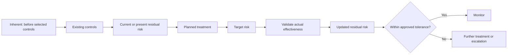

| State | Fictional likelihood | Fictional impact | Characterization | Evidence status |
|---|---|---|---|---|
| Inherent | Likely | Major | High | Assumes no selected lifecycle or access controls |
| Current | Possible | Major | High | MFA, membership, audit, manual review operate with gaps |
| Target | Unlikely | Major | Moderate | Automated expiry and faster revocation are planned |
| Validated residual | To be determined | Major | Pending | Requires pilot, negative tests, population and sustained evidence |

Impact may remain Major even after likelihood falls. A control that speeds recovery might reduce impact instead. Do not force both values lower. Do not calculate residual risk by subtracting control percentages unless the model supports the interaction.

### Control-effect reasoning

| Control | Likelihood effect | Impact effect | Evidence needed |
|---|---|---|---|
| Strong identity lifecycle | Reduces stale-account opportunity | Limited direct effect after valid compromise | Coverage, timing, expiry and revoke tests |
| Resource-specific access | Reduces reachable assets and blast radius | Can reduce affected data scope | Allowed and adjacent denied paths |
| Detection and response | May not prevent initial event | Reduces dwell, spread, and consequence | Known-scenario detection and response exercise |
| Backup and recovery | Does not prevent confidentiality loss | Reduces availability and integrity recovery impact | Clean restore and business validation |
| Contractual transfer | Does not remove technical event | May shift defined financial consequence | Current terms, exclusions, limits, claims process |
| Training | May reduce some human errors | Effect varies and decays | Behavior-oriented tests, not attendance only |

## Risk treatment options

The common treatment options are avoid, mitigate, transfer, and accept. A fifth practical action is gather evidence when uncertainty is too high for a responsible decision. Treatment can combine options.

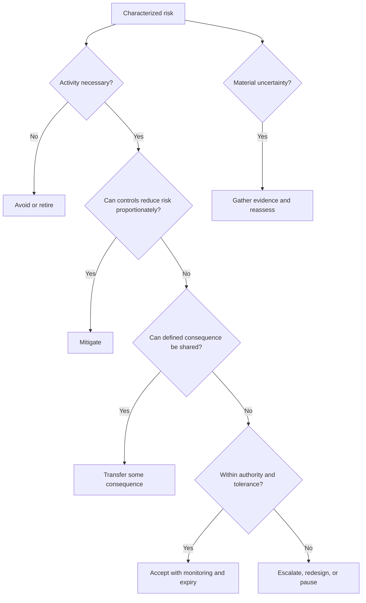

| Option | Plain meaning | Fictional NMH example | Limitation |
|---|---|---|---|
| Avoid | Stop the activity creating the scenario | End unmanaged supplier access to restricted site | May sacrifice business value |
| Mitigate | Add or improve controls | Automate expiry, scope access, monitor, revoke | Residual risk remains |
| Transfer | Shift specified financial or operational consequence | Contract, indemnity, managed service, insurance | Threat and accountability are not erased |
| Accept | Knowingly retain bounded residual risk | Continue temporary access under approved exception | Requires authority, monitoring, and review |
| Investigate | Reduce decision-relevant uncertainty | Inventory unknown groups and test alternate paths | Delay itself may carry risk |

### Treatment selection criteria

| Criterion | Question |
|---|---|
| Risk reduction | Which likelihood or impact driver changes, by how much, and with what confidence? |
| Business effect | Does treatment break required workflow, safety, user experience, or delivery? |
| Cost | What are implementation, operation, opportunity, and switching costs? |
| Time | How quickly does exposure change and when is risk reduced? |
| Feasibility | Are skills, product capability, access, and dependencies available? |
| New risk | Does treatment create privacy, availability, concentration, or operational risk? |
| Evidence | Can design and outcome be tested and monitored? |
| Reversibility | Can rollout be staged, rolled back, or retired? |
| Obligation | Is treatment constrained by law, contract, policy, or safety? |
| Residual risk | Who can approve what remains and until when? |

### Treatment plan

| Field | Fictional NMH content |
|---|---|
| Risk ID | NMH-R-013 |
| Scenario | Stale supplier identity accesses restricted project site |
| Selected treatment | Mitigate with automated sponsor expiry and session revocation |
| Control changes | Identity workflow, group reconciliation, alert, site-owner process |
| Dependencies | Partner identity attributes, application programming interface, audit retention |
| Action owner | Fictional Identity Engineering manager |
| Risk owner | Fictional Engineering business executive |
| Due date | Fictional pilot date |
| Resources | Engineering, collaboration, security, supplier-management effort |
| Interim controls | Weekly review, short account lifetime, download restriction |
| Validation | Allowed access, prohibited site, expiry, session revoke, audit correlation |
| Target risk | Fictional Moderate under NMH scale |
| Review trigger | Failed test, incident, missed milestone, architecture or threat change |

## Risk appetite, tolerance, capacity, limits, and thresholds

These terms are frequently blurred. Exact definitions vary by enterprise-risk method. Confirm the customer's approved language.

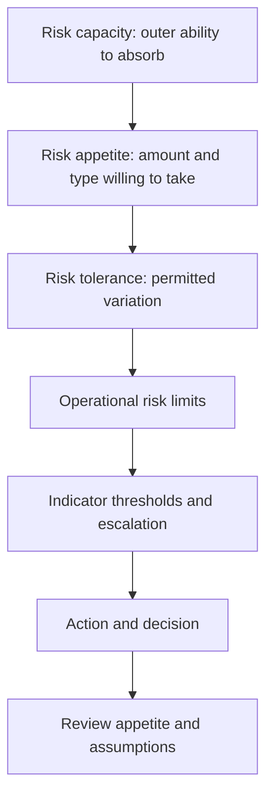

| Concept | Plain meaning | Fictional NMH statement | Who approves |
|---|---|---|---|
| Capacity | Maximum sustainable consequence | A safety event beyond defined severity threatens operation | Highest enterprise authority |
| Appetite | Risk accepted in pursuing value | Low appetite for unauthorized restricted-design access | Board or delegated executive process |
| Tolerance | Permitted variation around objective | Supplier access may remain active only within approved expiry window | Business and risk governance under appetite |
| Limit | Specific operational boundary | No supplier identity without named sponsor and expiry | Policy or control authority |
| Threshold | Indicator level that triggers action | Any expired identity with successful access triggers immediate escalation | Operational owner under standard |

Appetite is not "we accept five breaches." It expresses types and levels of uncertainty leaders are willing to retain while pursuing objectives. Some risks are non-negotiable because of safety or law; qualified authorities decide those constraints.

### Appetite statement quality

| Weak statement | Why weak | Stronger fictional form |
|---|---|---|
| "We have zero risk appetite" | No organization can operate without uncertainty | "NMH has very low appetite for unauthorized access to restricted designs" |
| "High risks are not allowed" | Circular and method dependent | "Scenarios exceeding approved Major-impact tolerance require executive decision" |
| "Security comes first" | Does not resolve safety, service, privacy, and business tradeoffs | "Safety and legal duties constrain treatment; other objectives use approved decision hierarchy" |
| "We tolerate 2 percent" | Numerator, denominator, and consequence are missing | "At least 99.5 percent of scoped supplier expiries complete within approved period; any successful post-expiry access escalates" |

## KRIs, KPIs, and KCIs

A **Key Risk Indicator**, or KRI, signals exposure or consequence may be changing. A **Key Performance Indicator**, or KPI, tracks performance toward an objective. A **Key Control Indicator**, or KCI, measures control operation or health. One metric can support more than one category, but its use must be clear.

| Type | Fictional metric | Formula | Decision |
|---|---|---|---|
| KRI | Supplier identities past approved expiry | Count and rate by sensitivity and days overdue | Escalate exposure trend |
| KRI | Restricted sites with unmanaged external groups | Sites with unmanaged groups / restricted sites in scope | Prioritize discovery and treatment |
| KPI | Treatment actions completed on time | Completed by due date / actions due | Manage program execution |
| KPI | Median days from risk decision to validated control | Median elapsed days for closed treatments | Improve delivery |
| KCI | Automated expiry success | Successful expiries / scheduled expiries | Assess lifecycle control operation |
| KCI | Audit-source freshness | Sources within objective / sources required | Qualify evidence and detection |
| Outcome | Successful prohibited post-expiry tests | Successful unauthorized tests / tests run | Validate risk reduction; target is zero for tested paths |

### Indicator design

| Field | Question |
|---|---|
| Risk linkage | Which scenario driver or control does this indicate? |
| Formula | What are numerator, denominator, unit, filters, and version? |
| Source | Which systems and fields, with what freshness and completeness? |
| Threshold | What level triggers watch, action, or escalation, and why? |
| Owner | Who interprets and acts? |
| Segmentation | Which service, data class, location, owner, or age bucket? |
| Leading or lagging | Does it signal changing conditions or record realized outcome? |
| Gaming | How could behavior improve the number without reducing risk? |
| Confidence | Which uncertainty or missing population remains? |
| Response | What exact action follows a threshold breach? |

### Plain-English deep-dive 3 - A metric must have a decision attached

A smoke detector that rings but nobody knows who should leave, call emergency services, or investigate is noise. A KRI without an owner, threshold, and response has the same problem.

Suppose overdue vulnerability count rises. The number may reflect worse exposure, broader scanner coverage, new severity logic, slower remediation, duplicate assets, or a newly onboarded business. The response depends on which driver changed. A decision-ready dashboard includes source freshness, denominator, age, criticality, exposure, owner, treatment status, and model version.

Metrics also shape behavior. If teams are rewarded only for closing findings, they may close duplicates or accept risk without reducing exposure. Balance activity with outcome: validated remediation, recurrence, exception aging, control health, business interruption, and prohibited-path tests. Keep uncertainty visible instead of forcing every unknown into green or red.

## Risk register

A risk register is a decision and accountability record, not merely a list of technical findings. One risk may aggregate several findings; one finding may contribute to several business scenarios.

| Register field | Purpose |
|---|---|
| Risk ID and title | Stable reference and concise scenario |
| Objective and asset | Business context |
| Scenario | Threat, condition, path, consequence, horizon |
| Scope and exclusions | Boundary of conclusion |
| Evidence and sources | Basis for assessment |
| Assumptions and confidence | Uncertainty disclosure |
| Existing controls | Current likelihood and impact modifiers |
| Inherent risk | Before selected controls under method |
| Current or residual risk | Present decision state |
| Appetite or tolerance relation | Whether escalation is required |
| Treatment | Avoid, mitigate, transfer, accept, investigate |
| Risk owner | Accountable decision authority |
| Action owners | Accountable treatment execution |
| Due dates and milestones | Time-bound plan |
| Target risk | Intended state |
| Validation | Closure and effectiveness tests |
| Monitoring | KRIs, KCIs, cadence, thresholds |
| Acceptance | Approver, rationale, start, expiry |
| Review trigger | Incident, failure, change, threat, missed action |
| Status and history | Transparent decision trail |

### Fictional NMH register sample

| ID | Scenario | Current risk | Treatment | Owner | Validation | Status |
|---|---|---|---|---|---|---|
| NMH-R-013 | Stale supplier identity reaches restricted project site | High | Automate expiry and revoke sessions | Engineering business owner | Expiry and prohibited-access tests | In progress |
| NMH-R-014 | Shared administrator path changes several cloud services | High | Separate admin identity, device, approval, and logs | Technology executive | Ordinary path denied; admin action reconstructed | Planned |
| NMH-R-015 | Security telemetry connector is stale during investigation | Moderate | Source health, buffering, reconciliation, escalation | Security operations owner | Known events arrive within objective after failover | In progress |
| NMH-R-016 | Plant recovery depends on unavailable central identity | High | Bounded local continuity and clean reconciliation | Plant operations owner | Outage exercise and revocation test | Exception |
| NMH-R-017 | Incomplete cloud inventory hides external exposure | High uncertainty | Discover and reconcile sources before final score | Cloud service owner | Source count and sample validation | Assessing |

All entries and ratings are fictional.

### Risk aggregation warning

Adding scores across unrelated ordinal scales is not valid enterprise aggregation. Ten Moderate risks do not necessarily equal one Severe risk. Dependencies can produce nonlinear concentration: several services relying on one identity provider may fail together.

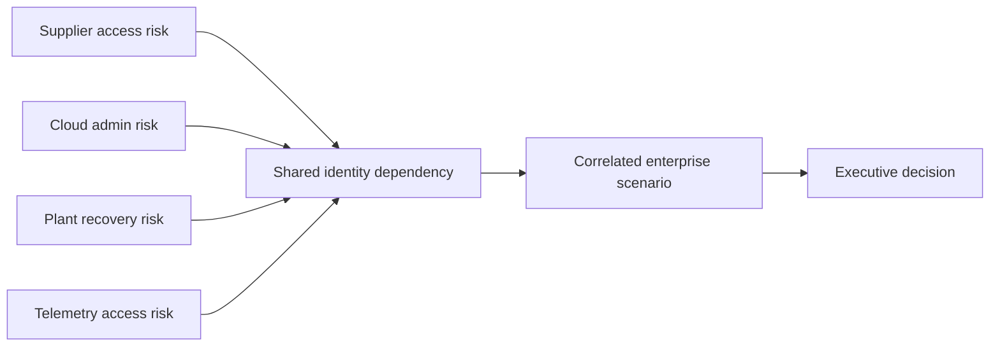

Aggregate by scenario, dependency, business service, threat, geography, and consequence as well as rating. Preserve the underlying distribution and avoid summing ordinal colors.

## Uncertainty, confidence, and sensitivity

Uncertainty comes from missing data, measurement error, model choice, future behavior, threat change, control variability, and expert disagreement. Good assessment exposes it.

| Uncertainty type | Fictional example | Treatment |
|---|---|---|
| Inventory | Unknown external groups exist outside managed workflow | Discover and reconcile sources |
| Measurement | Audit source misses some client actions | Validate coverage and use alternate evidence |
| Model | Weight of business criticality changes ranking | Sensitivity and version comparison |
| Parameter | Harmful event frequency is poorly known | Use range and calibrated estimates |
| Control | Expiry works in pilot but sustained operation is unknown | Monitor and sample over time |
| Threat | New token theft technique changes susceptibility | Threat review and reassessment trigger |
| Dependency | Provider or identity correlation is incomplete | Architecture and failure analysis |
| Human | Experts disagree on impact | Record rationale, ranges, and decision authority |

### Confidence scale

| Confidence | Evidence condition | Allowed statement |
|---|---|---|
| Low | Sparse, stale, indirect, or contradictory evidence | "Preliminary estimate; decision may require more evidence" |
| Moderate | Several relevant sources with known gaps | "Supports prioritization with stated uncertainty" |
| High | Current, relevant, reconciled evidence and tested controls | "Strong support for scoped period; future uncertainty remains" |

### Sensitivity example

Using the fictional triage formula, test one factor at a time.

| Case | T | E | B | W | C | Fictional score | Interpretation |
|---|---:|---:|---:|---:|---:|---:|---|
| Base | 70 | 80 | 90 | 60 | 50 | 63.0 | Initial queue aid |
| Lower threat | 40 | 80 | 90 | 60 | 50 | 54.0 | Threat assumption changes score by 9 |
| Lower exposure | 70 | 40 | 90 | 60 | 50 | 53.0 | Exposure is influential |
| Stronger control | 70 | 80 | 90 | 60 | 90 | 59.0 | Model gives controls limited weight |
| Lower business proxy | 70 | 80 | 40 | 60 | 50 | 53.0 | Business input is influential |

The table reveals a design concern: increasing control strength from 50 to 90 reduces the score only four points. That may or may not fit the triage purpose. Sensitivity prompts model review rather than automatic acceptance.

### Scenario and stress testing

| Test | Question |
|---|---|
| Best plausible case | What if threat is low and controls work as designed? |
| Central case | What assumptions are most supportable? |
| Severe plausible case | What if correlated dependencies and delayed detection occur? |
| Control failure | What if the key preventive control is unavailable or compromised? |
| Data gap | What if the unknown population is materially larger? |
| Model change | Does ranking survive reasonable weight changes? |
| Business change | What if acquisition, supplier, region, or data sensitivity changes? |

## Risk acceptance and expiry

Risk acceptance is an affirmative governance decision to retain a defined residual risk. It should not be confused with missing a remediation date, failing to assign an owner, or ignoring a finding.

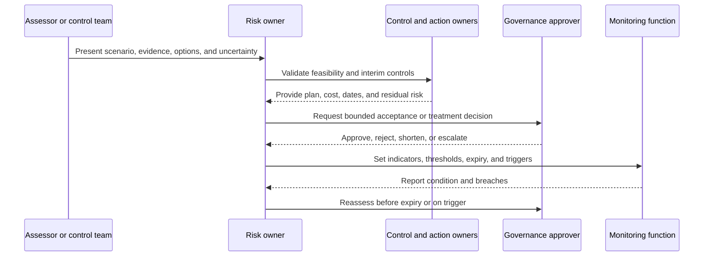

| Acceptance field | Requirement |
|---|---|
| Scenario | Cause, path, asset, consequence, horizon |
| Scope | Exact systems, identities, data, and environments |
| Evidence | Sources and observed condition |
| Current controls | Design, operation, gaps, and confidence |
| Residual risk | Rating or range under approved method |
| Rationale | Why retaining risk supports objectives now |
| Alternatives | Avoidance, mitigation, transfer, and pause considered |
| Interim controls | Safeguards during acceptance period |
| Owner | Business role accountable for risk |
| Approver | Authority required by policy and rating |
| Start and expiry | Fixed period and no silent renewal |
| Indicators | KRIs, KCIs, thresholds, and evidence sources |
| Reassessment triggers | Incident, control failure, scope, threat, obligation, missed milestone |
| Exit plan | Remediation, redesign, transfer, retirement, or approved renewal process |

### Acceptance anti-patterns

| Anti-pattern | Why unsafe | Better practice |
|---|---|---|
| "Accepted forever" | Context and threat change | Expiry and reassessment trigger |
| Technical owner approves business consequence | Lacks business authority | Authorized risk owner and governance route |
| Score only | Scenario and impact are hidden | Narrative, evidence, method, range |
| Insurance means transfer complete | Exclusions and operational harm remain | Analyze retained technical and business risk |
| Compensating control untested | Assumed reduction may be false | Design and effectiveness test |
| Auto-renew at expiry | Avoids decision | Escalate before expiry with updated evidence |
| Acceptance closes finding | Monitoring and exit work disappear | Link acceptance, finding, and treatment history |

### Plain-English deep-dive 4 - Acceptance is not permission to forget

Accepting risk is like deciding to continue driving a vehicle with a known minor defect until a scheduled repair. A responsible decision names the defect, driving conditions, interim limits, owner, warning signs, repair date, and authority. It does not erase the defect from the maintenance record.

In cybersecurity, acceptance should remain visible in the risk register and operational dashboards. If the threat rises, a control fails, scope expands, an incident occurs, or the remediation date slips, the prior decision may no longer be valid. Monitoring must reach the risk owner, not only the technical team.

A TSM can help explain product limitations, evidence, alternative configurations, support cases, adoption dependencies, and validation plans. The TSM should never say "Zscaler accepts this risk" on behalf of the customer or approve a customer exception unless explicitly holding an authorized customer role, which is not assumed here.

## Escalation and business language

An effective escalation says what is happening, why it matters, how certain the team is, what controls exist, what decisions are needed, and by when.

### Technical-to-business translation pattern

> Because **[technical condition]** affects **[business service or data]**, **[credible consequence]** may occur within **[time horizon]**. Current controls **[reduce or fail to reduce specific drivers]**. Evidence confidence is **[level]** because **[reason]**. We recommend **[action]** by **[date]**. The authorized owner must decide **[specific choice]**; delaying leaves **[residual risk and trigger]**.

| Technical condition | Weak message | Decision-ready fictional message |
|---|---|---|
| Stale supplier group | "Critical access vulnerability" | "Twelve synthetic identities may remain on one restricted project site after sponsor expiry; current weekly review leaves up to seven days of exposure" |
| Stale telemetry | "Connector is red" | "Identity events are delayed beyond the investigation objective, reducing confidence in current account-takeover detection and timeline reconstruction" |
| Broad admin route | "Zero Trust gap" | "One administrator path can modify identity, collaboration, and cloud policy, creating correlated management-plane impact" |
| Old software finding | "CVSS 9.8 means emergency" | "The weakness has high technical severity; priority depends on affected assets, reachable path, exploit conditions, controls, and business impact" |
| Missed treatment | "Team is late" | "The approved interim control expires Friday; without decision, the residual risk will be retained outside the authorized period" |

### Escalation levels

| Trigger | Escalation | Decision needed |
|---|---|---|
| Indicator approaches tolerance | Control and service owner review | Correct before limit breach |
| Risk limit exceeded | Business risk owner and security governance | Treat, pause, or authorize exception |
| Severe impact plausible with low confidence | Executive plus evidence sprint | Precautionary action versus investigation |
| Active harm or incident criteria | Incident command and required authorities | Containment, communication, recovery |
| Treatment dependency blocked | Sponsor and resource authority | Fund, reprioritize, redesign, or accept |
| Acceptance near expiry | Approver and risk owner | Close, renew under policy, or escalate |
| Model or data defect | Risk method and data owners | Qualify reports and recalculate |

## NMH worked example 1 - Supplier access

### Scenario

Because a stale or compromised supplier identity can remain in a manually governed group, restricted engineering files may be accessed after approved project purpose ends within the next twelve months. MFA, site permissions, quarterly review, and audit reduce some risk, but group inventory and expiry evidence are incomplete.

### Fictional assessment

| Element | Evidence or assumption | Rating or range | Confidence |
|---|---|---|---|
| Asset | Restricted project designs and delivery process | Major consequence if material set lost | Moderate |
| Threat | Credential theft, stale leaver, accidental sharing | Relevant and plausible | Moderate |
| Exposure | External identity and manual group lifecycle | Possible path; population uncertain | Low to Moderate |
| Preventive controls | MFA, site membership, sharing settings | Mixed and not all negative-tested | Moderate |
| Detective controls | Audit and periodic review | Delay and correlation gaps | Moderate |
| Likelihood | Scenario within twelve months | Possible | Low to Moderate |
| Impact | Confidentiality, contract trust, rework, schedule | Major | Moderate |
| Current risk | Fictional matrix | High | Moderate |

### Treatment comparison

| Option | Risk effect | Cost and constraint | Recommendation status |
|---|---|---|---|
| End all supplier access | Avoids scenario | Stops required collaboration | Rejected unless risk exceeds capacity |
| Automate sponsor expiry | Reduces stale identity opportunity | Requires partner attributes and workflow | Preferred |
| Restrict download and sharing | Reduces some data consequence | May affect engineering workflow | Pilot by project type |
| Weekly manual review | Interim likelihood reduction | Human effort and seven-day window | Temporary compensation |
| Insurance or contract | Transfers defined financial consequence | Does not stop data loss or project impact | Supporting option only |
| Accept current state | Retains High fictional risk | Requires authorized exception | Not preferred |

### Validation plan

| Test | Expected result |
|---|---|
| Approved supplier joins named project | Allowed with attributable evidence |
| Supplier requests adjacent project | Denied and logged |
| Sponsor expiry occurs | Membership removed within objective |
| Existing session remains | Revoked under approved design |
| Connector is unavailable | Alert, bounded fallback, and manual escalation occur |
| Site owner changes group manually | Drift is detected and assigned |
| Legitimate workflow after controls | Meets approved experience and performance criteria |

## NMH worked example 2 - Plant recovery identity dependency

### Scenario and fictional quantitative range

Because a plant procedure service relies on central identity and Domain Name System, a correlated regional outage may prevent operators from accessing current safety documentation. A bounded local continuity mode is planned but not fully exercised.

| Fictional parameter | Low | Central | High | Basis limitation |
|---|---:|---:|---:|---|
| Harmful outage frequency per year | 0.05 | 0.15 | 0.40 | Sparse internal exercise data |
| Disruption duration hours | 1 | 4 | 16 | Recovery dependency uncertainty |
| Operational cost per hour | USD 20,000 | USD 50,000 | USD 150,000 | Excludes safety valuation |
| Simple annual operational loss | USD 1,000 | USD 30,000 | USD 960,000 | Frequency x duration x cost; fictional only |

The High case shows sensitivity to correlated failure. Safety consequence is handled separately by qualified plant and safety leaders and is not reduced to the fictional dollar estimate.

### Treatment decision

| Treatment | Likelihood effect | Impact effect | New risk |
|---|---|---|---|
| Independent local procedure cache | Little effect on outage occurrence | Reduces availability consequence | Stale or exposed copy |
| Bounded emergency identity | Little effect on outage | Reduces access interruption | Standing privilege if poorly governed |
| Diverse name-resolution path | Reduces one dependency likelihood | Limited if identity also fails | Configuration complexity |
| Exercise and reconciliation | Improves confidence and recovery | Reduces prolonged impact | Exercise disruption |
| Stop central service use | Avoids dependency | Creates local consistency and governance risk | Fragmentation |

The fictional recommendation combines protected local cache, short-lived emergency authority, independent audit, freshness checks, and exercises. The plant business and safety owners decide acceptable degraded behavior.

## NMH worked example 3 - Security telemetry connector

### Scenario

Because an identity telemetry connector is stale, security analysts may miss or delay correlation of suspicious sign-in and sharing activity, increasing dwell and weakening investigation evidence.

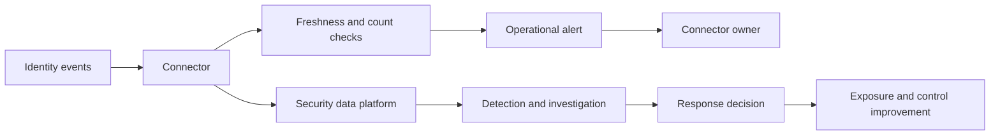

This diagram is generic and fictional. It does not assert a Zscaler Data Fabric connector, field, service level, architecture, or behavior.

| Driver | Current condition | Risk implication | Action |
|---|---|---|---|
| Freshness | Events delayed beyond fictional objective | Detection and investigation confidence falls | Repair authentication or pipeline |
| Completeness | Source and destination counts do not reconcile | Unknown blind spot | Compare population and failed records |
| Identity mapping | Some suppliers lack stable identifier | Correlation may split or merge entities | Improve mapping and exception queue |
| Alert ownership | Connector health alert routes only to platform team | Security impact may be missed | Joint operational severity and escalation |
| Buffer and replay | Behavior during outage is untested | Permanent loss versus delayed arrival unknown | Failure exercise and documented recovery |
| Acceptance | No owner approved blind period | Governance gap | Escalate bounded decision |

### Risk statement for an executive

"The issue is not simply a red connector. The delayed identity source reduces our confidence that suspicious supplier sign-in and file access will be correlated within the approved response window. We have not confirmed permanent event loss, so impact remains uncertain. The immediate decisions are whether to use alternate evidence, increase monitoring, limit high-risk external changes, and escalate the connector repair. The risk owner should review if freshness remains outside tolerance."

## Zscaler risk outputs as inputs, not truth

Zscaler's public Risk360 page describes risk drivers, trends, guided mitigation, financial exposure framing, and views across four attack stages. Public Unified Vulnerability Management material describes aggregated context, multifactor scoring, custom factors and weights, mitigating controls, reporting, and remediation workflow. Asset Exposure Management and Data Fabric pages describe unified data and exposure context.

This chapter does not claim access to model internals, tenant behavior, current factor counts, formulas, or customer outcomes. It does not reproduce a Risk360 or UVM score.

| Product-output question | Why ask | Safe TSM behavior |
|---|---|---|
| What exact decision should the output support? | A score without action becomes theater | Tie to owner and workflow |
| Which sources and entities are included? | Missing assets and stale connectors bias output | Reconcile coverage and freshness |
| Which factors and weights apply? | Model choices drive ranking | Use current documentation and tenant settings |
| What changed: environment or model? | Trend can move without risk change | Version and annotate |
| Which controls are recognized? | Unmodeled controls can overstate; assumed controls can understate | Validate observed effectiveness |
| How is business context represented? | Criticality and ownership may be incomplete | Confirm with owners |
| What uncertainty is shown? | False precision weakens decisions | Add confidence and caveats |
| Who may override or accept? | Governance authority matters | Preserve customer decision rights |
| How is mitigation validated? | Ticket closure is not risk reduction | Test control and residual risk |

Safe wording is: "I would use the documented product output as one decision input, inspect its drivers, source quality, scope, and trend, reconcile it with customer context and controls, and validate the treatment outcome. I have not operated these products in production."

## Troubleshooting risk analysis

Risk analysis itself can fail. Diagnose the model and process just as carefully as a technical system.

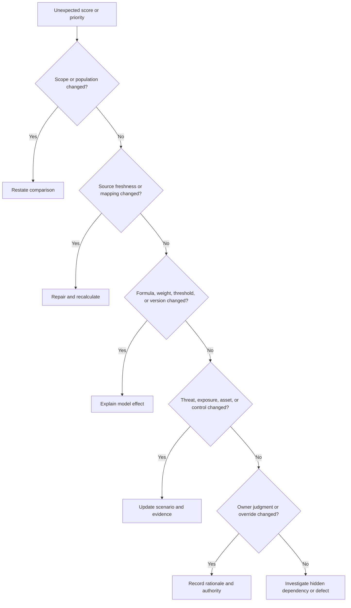

| Failure mode | Symptom | Discriminating check | Repair |
|---|---|---|---|
| Unknown equals zero | New asset receives low risk | Compare missingness and default handling | Separate unknown and require evidence |
| Duplicate entities | Risk count or exposure is inflated | Resolve asset and identity records | Correct entity logic and history |
| Stale source | Score remains unchanged after remediation | Check source and processing timestamps | Restore connector and reprocess |
| Weight drift | Priorities reorder overnight | Compare model version and weights | Rebaseline and communicate |
| Control double-count | Score drops excessively | Trace each factor to unique evidence | Remove duplicated reduction |
| Impact inflation | Every critical asset becomes Severe | Review actual business scenarios and recovery | Calibrate with owners |
| Vulnerability equals risk | High technical severity always tops queue | Add asset, exposure, threat, control, consequence | Use scenario context |
| Acceptance hides backlog | Risk appears closed while condition remains | Compare findings, acceptance, expiry, and monitoring | Keep accepted risk visible |
| Metric gaming | Closure improves but recurrence rises | Examine outcomes and reopened items | Balance performance and effectiveness |
| False aggregation | Enterprise total is sum of ordinal scores | Inspect method and dependencies | Aggregate scenarios and ranges appropriately |

## Decision trees

### Does this finding require immediate escalation?

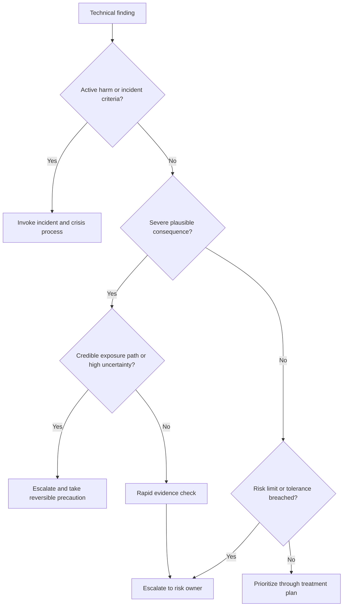

### Can this risk be accepted?

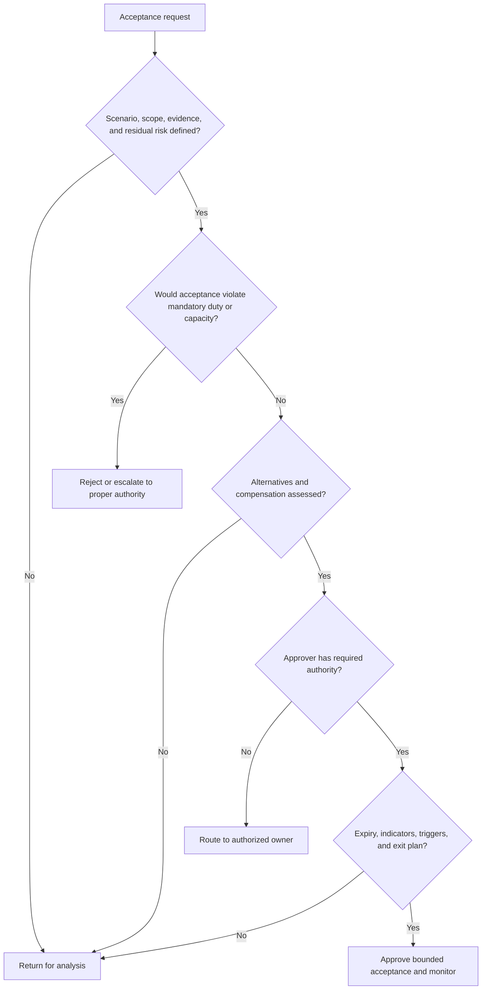

## Scenario drills

### Drill 1 - High technical severity, low exposure

A severe software weakness is found on an isolated test server with no production data, restricted access, and a planned retirement. Explain why technical severity remains important but does not alone establish business risk. Verify isolation, identity paths, secrets, shared management, data, and retirement. Choose treatment and owner without dismissing the finding.

### Drill 2 - Moderate weakness, severe consequence

A simple configuration error can interrupt plant safety documentation. Show how dependency and consequence can make a technically ordinary condition a high-priority risk. Involve plant and safety owners; do not invent financial or safety values.

### Drill 3 - Score rises after adding a scanner

NMH's reported risk rises after onboarding a new source. Determine whether exposure increased or visibility improved. Compare population, duplicates, freshness, model version, and prior blind spots. Explain the rise as better knowledge if evidence supports it rather than treating it as control failure.

### Drill 4 - Treatment misses due date

The action owner misses a mitigation date, and acceptance expires in five days. Confirm current risk and interim-control health, identify cause and dependency, present options, and route the decision to the authorized owner. Do not silently extend the record.

### Drill 5 - Insurance proposal

A leader says cyber insurance transfers the risk. Separate covered financial loss from technical compromise, safety, service interruption, reputation, exclusions, deductibles, limits, and claims conditions. Use Legal, Finance, insurance, and risk specialists.

### Drill 6 - Arti analytics bridge

Describe a factual backlog or case-quality analysis using population, source, categories, trends, outliers, limitations, recommendation, and validation. Then explain that the same discipline applies to KRIs and risk models. State that production cyber-risk quantification remains a learning area.

## Contrarian review

| Claim | Contrarian question | Stronger evidence |
|---|---|---|
| "Risk is 63" | What unit, method, factors, version, scope, and decision? | Scenario plus driver and sensitivity record |
| "Likelihood is low because no incidents occurred" | Was detection complete and is history representative? | Coverage, external context, and control tests |
| "The vulnerability is critical" | Which asset, path, threat, control, and business consequence? | Scenario-specific evidence |
| "MFA reduces risk by 90 percent" | Which method, population, attack, and source support that percentage? | Bounded local data or no unsupported percentage |
| "Residual risk is Low" | Which treatment is implemented and validated? | Operating and negative-test evidence |
| "Insurance transferred the risk" | Which consequences, exclusions, limits, and retained duties remain? | Contract and scenario analysis |
| "The risk is accepted" | By whom, under what authority, until when, and with which triggers? | Acceptance record and monitoring |
| "Risk fell this quarter" | Did sources, scope, weights, thresholds, or missing values change? | Versioned like-for-like driver comparison |
| "Ten Moderate risks equal one Severe risk" | Are ordinal scales additive and scenarios independent? | Dependency and aggregation method |
| "Risk360 proves the loss" | What does current product documentation actually claim and what assumptions apply? | Bounded product output plus customer analysis |

## Official Source Anchors

**Checked on 2026-08-24.** These sources support concepts and current positioning. This chapter paraphrases rather than reproduces protected text. Recheck publication status, product pages, model documentation, and organizational applicability.

| Source | Official anchor | Used for | Currency and scope caveat |
|---|---|---|---|
| NIST SP 800-30 Rev. 1 | https://csrc.nist.gov/pubs/sp/800/30/r1/final | Risk-assessment process, threats, vulnerabilities, likelihood, impact, and risk concepts | Published September 2012; use with current NIST and organizational method |
| NIST SP 800-39 | https://csrc.nist.gov/pubs/sp/800/39/final | Enterprise-wide information-security risk management and tiers | Published March 2011; check related current resources |
| NIST Cybersecurity Framework 2.0 | https://www.nist.gov/cyberframework | Govern, Profiles, assessment and communication context | Published February 2024; voluntary outcome framework |
| NIST Risk Management Framework | https://csrc.nist.gov/projects/risk-management/about-rmf | System lifecycle and risk-management context | Federal-oriented; tailor to organization |
| NIST Cybersecurity, Enterprise Risk Management, and Workforce Management Quick Start Guide | https://csrc.nist.gov/pubs/sp/1308/final | Current linkage among CSF, enterprise risk, and workforce | Verify final publication and applicability |
| CISA Cybersecurity Performance Goals | https://www.cisa.gov/cybersecurity-performance-goals | Prioritized risk-reduction practice context | Voluntary baseline, not complete risk assessment |
| MITRE ATT&CK | https://attack.mitre.org/ | Threat behavior vocabulary for scenarios | Not a probability source or risk score |
| FIRST CVSS | https://www.first.org/cvss/ | Technical vulnerability-severity specification context | Severity is not business risk; verify version and vector |
| AWS Shared Responsibility Model | https://aws.amazon.com/compliance/shared-responsibility-model/ | Provider and customer risk-control boundaries | Service-specific duties vary |
| Microsoft Azure shared responsibility | https://learn.microsoft.com/azure/security/fundamentals/shared-responsibility | Customer-retained data, identity, endpoint, and access responsibilities | Check exact service and current docs |
| Zscaler Risk360 | https://www.zscaler.com/products-and-solutions/zscaler-risk-360 | Vendor risk drivers, stages, trend, mitigation, financial and executive positioning | Model details and factor counts can change; no formula inferred |
| Zscaler Unified Vulnerability Management | https://www.zscaler.com/products-and-solutions/vulnerability-management | Contextual prioritization, factors, controls, reporting, workflow positioning | Product score is not this chapter's formula |
| Zscaler Asset Exposure Management | https://www.zscaler.com/products-and-solutions/caasm | Asset, relationship, coverage-gap, and exposure context | Connector and entity behavior require current validation |
| Zscaler Data Fabric | https://www.zscaler.com/products-and-solutions/data-fabric | Data integration, harmonization, context, workflow positioning | Source coverage and quality determine usable evidence |
| Zscaler Security Operations | https://www.zscaler.com/products-and-solutions/security-operations | Proactive/reactive security-operations positioning | Capability and workflow require current tenant validation |

## Likely Interview Questions

### Q1. Explain cybersecurity risk from first principles.

**Model answer:** Cybersecurity risk is uncertainty about whether a threat event interacting with a vulnerability or exposure will affect a business objective, considering controls and consequences over a defined time horizon. I frame a scenario with the asset or process, threat, path, current controls, likelihood, impact, evidence, and uncertainty.

A vulnerability or score is an input, not the complete risk. The output must support an owner deciding treatment, timing, resources, monitoring, and residual risk.

### Q2. Compare qualitative, semiquantitative, and quantitative risk assessment.

**Model answer:** Qualitative assessment uses defined ordered labels and is fast and accessible, but labels can be subjective. Semiquantitative methods use scores and weights to improve consistency and ranking, but numbers often remain ordinal and can create false precision. Quantitative methods use frequencies, probabilities, ranges, and consequence values for investment and aggregation decisions, but require stronger data and explicit uncertainty.

I choose the simplest method that supports the decision, preserve assumptions and version, test sensitivity, and never present a fictional or vendor score as objective truth.

### Q3. Distinguish inherent, current, residual, and target risk.

**Model answer:** In this method, inherent risk is assessed before selected controls. Current risk reflects controls operating now. Residual risk is what remains after controls or treatment; some organizations use current and residual interchangeably. Target risk is the desired state after planned treatment.

I document local definitions and avoid simply subtracting control percentages. Planned target risk is not achieved until implementation and effectiveness are validated.

### Q4. What are the main risk-treatment options?

**Model answer:** Avoid stops the risk-producing activity. Mitigate changes likelihood or impact through controls. Transfer shifts defined financial or operational consequences through mechanisms such as contracts or insurance but does not erase the event. Accept knowingly retains bounded residual risk under authorized governance. When uncertainty is material, gather evidence before deciding.

I compare risk reduction, business effect, cost, time, feasibility, new risk, obligation, evidence, reversibility, and residual-risk authority.

### Q5. How do risk appetite, tolerance, capacity, limits, and thresholds differ?

**Model answer:** Capacity is the outer amount of risk the organization can absorb before objectives become untenable. Appetite is the amount and type leaders are willing to pursue or retain. Tolerance describes permitted variation around objectives or appetite. Limits translate that into specific operational boundaries, and thresholds trigger review or action.

Definitions vary, so I use the customer's approved method. The board and delegated leaders set appetite; a TSM does not.

### Q6. What makes a good risk register entry?

**Model answer:** It contains a clear scenario and objective, scope, horizon, evidence, assumptions, existing controls, inherent and current risk under a named method, confidence, appetite relation, treatment, risk owner, action owners, due dates, target risk, validation, indicators, acceptance details, review triggers, and decision history.

It remains open and visible until treatment is validated or residual risk is knowingly accepted. It is not just a list of scanner findings.

### Q7. How would you explain a risk score from Zscaler or another platform to a customer?

**Model answer:** I would first use current official documentation to explain what the output is intended to represent. Then I would inspect included sources, entities, freshness, factors, weights or configuration, recognized controls, business context, model version, and uncertainty. I would show which drivers changed and connect the output to an owner and treatment workflow.

I would not call it objective truth, a probability, or guaranteed financial loss unless the documented method supports that exact claim. I have not operated Zscaler risk products in production.

### Q8. How does your background transfer to cybersecurity risk work?

**Model answer:** In Microsoft support and critical escalations, I have defined scope, compared affected and unaffected cases, evaluated technical and business impact, prioritized under uncertainty, coordinated owners, analyzed quality and backlog data, and validated fixes. My SQL, statistics, Power BI, and Business Analytics background helps me challenge formulas, denominators, trends, and sensitivity.

I am applying that method to fictional NMH cyber-risk exercises. I do not claim enterprise risk authority, production vulnerability-program ownership, or direct Zscaler Risk360 experience.

## 30-Second Memory Hooks

| Concept | Memory hook |
|---|---|
| Risk | Uncertainty affecting an objective |
| Asset | What matters |
| Threat source | Who or what can act |
| Threat event | What happens |
| Vulnerability | Weak point |
| Exposure | Open path or condition |
| Control | Change likelihood or impact |
| Likelihood | How plausible, by when |
| Impact | So what to the business? |
| Scenario | Because X through Y, Z may happen |
| Qualitative | Defined labels |
| Semiquantitative | Weighted ranking, not probability |
| Quantitative | Ranges and uncertainty, not certainty |
| Inherent | Before selected controls |
| Current | Today with controls |
| Residual | What remains |
| Target | Intended future state |
| Avoid | Stop the activity |
| Mitigate | Reduce likelihood or impact |
| Transfer | Shift specified consequence, not the event |
| Accept | Know, approve, monitor, expire |
| Investigate | Reduce decision-relevant uncertainty |
| Capacity | Cannot sustainably exceed |
| Appetite | Willing to take |
| Tolerance | Allowed variation |
| Limit | Operational boundary |
| KRI | Risk is moving |
| KPI | Work is progressing |
| KCI | Control is operating |
| Sensitivity | Move input, watch output |
| Risk owner | Owns the decision |
| Action owner | Owns the work |
| TSM | Clarify evidence and options; never accept for customer |
| Arti bridge | Impact, analytics, escalation, validation |

## Completion Checklist

- [ ] I can define objective, asset, threat source, threat event, vulnerability, exposure, control, likelihood, impact, and risk scenario.
- [ ] I can frame an assessment with decision, scope, horizon, perspective, method, criteria, evidence, stakeholders, assumptions, exclusions, and triggers.
- [ ] I can write a cause-to-consequence risk scenario rather than a vague score statement.
- [ ] I can distinguish qualitative, semiquantitative, quantitative, and hybrid approaches.
- [ ] I can state why ordinal labels and scores are not automatically arithmetic probabilities.
- [ ] I can explain that every chapter formula and NMH value is fictional and not a Zscaler or NIST formula.
- [ ] I can define likelihood criteria for a named time horizon and state confidence.
- [ ] I can assess confidentiality, integrity, availability, safety, financial, legal, privacy, contractual, customer, and strategic impact with appropriate owners.
- [ ] I can distinguish immediate, cascading, and long-term consequence.
- [ ] I can distinguish inherent, current, residual, and target risk using documented local definitions.
- [ ] I can explain why planned target risk is not achieved until treatment is validated.
- [ ] I can avoid double-counting exposure, weakness, business value, and controls.
- [ ] I can compare avoid, mitigate, transfer, accept, and investigate options.
- [ ] I can build a treatment plan with owner, due date, dependencies, interim controls, target, validation, and review trigger.
- [ ] I can distinguish risk capacity, appetite, tolerance, limit, and threshold.
- [ ] I can state that authorized customer leaders, not the TSM, set appetite and accept risk.
- [ ] I can distinguish KRI, KPI, KCI, outcome, leading, and lagging indicators.
- [ ] I can define every metric with numerator, denominator, source, threshold, owner, limitation, and response.
- [ ] I can build a decision-ready risk register entry rather than a scanner-finding list.
- [ ] I can explain why ordinal risk scores should not be blindly summed.
- [ ] I can identify correlated risk through identity, management, provider, software, and data dependencies.
- [ ] I can document inventory, measurement, model, parameter, control, threat, dependency, and human uncertainty.
- [ ] I can use confidence labels, ranges, scenarios, and sensitivity analysis.
- [ ] I can explain why quantitative analysis is not automatically objective.
- [ ] I can govern risk acceptance with authority, rationale, scope, controls, expiry, indicators, triggers, and exit plan.
- [ ] I can escalate a technical condition in business language with impact, confidence, options, and decision request.
- [ ] I can walk the fictional supplier, plant recovery, and telemetry-connector examples.
- [ ] I can interpret documented vendor risk outputs as inputs requiring source, model, context, and control validation.
- [ ] I can troubleshoot score changes across scope, data, model, environment, and owner judgment.
- [ ] I can use Arti's production support and analytics experience as a factual bridge without claiming enterprise cyber-risk ownership.
- [ ] I can recheck NIST, CISA, FIRST, provider, and Zscaler sources after 2026-08-24.
- [ ] I can answer all eight questions aloud with one explicit uncertainty and authority boundary in each.

[Part 14 - Identity, Endpoint, Network, Application, Cloud, SaaS, and Data Security Domains](Part-14-security-domains-and-controls.md)