# Part 14 - Identity, Endpoint, Network, Application, Cloud, SaaS, and Data Security Domains

> **Audience:** Arti Thakur, moving from Microsoft 365 Support Escalation Engineering into a Zscaler Security Operations Technical Success Manager role.
>
> **Currency date:** 2026-08-24.
>
> **Scope and honesty:** Northstar Meridian Holdings, abbreviated NMH, and every NMH asset, architecture, control, event, incident, metric, gap, decision, and outcome are fictional. Arti's established production bridge is Microsoft support, OneDrive, SharePoint, networking, troubleshooting, analytics, mentoring, escalation, and approved AI work. Direct production ownership of Zscaler, Security Operations, vulnerability management, exposure management, Endpoint Detection and Response, Security Information and Event Management, Security Orchestration Automation and Response, Operational Technology security, cloud security, or an enterprise security program is not established.
>
> **Domain caveat:** Security domains overlap. A product category, team name, or telemetry source does not define a complete control boundary. Exact architecture, ownership, capabilities, retention, coverage, privacy, licensing, and response authority vary by organization and provider. Verify current source documentation and tested behavior.
>
> **Zscaler caveat:** Zscaler portfolio references in this chapter are high-level summaries of current official public positioning. They do not claim an NMH deployment, product configuration, connector, license, control effectiveness, or guaranteed outcome. Current tenant documentation and qualified customer and Zscaler specialists control implementation decisions.

## Section goal

A security domain is a practical grouping of related assets, threats, controls, tools, evidence, and owners. Identity security focuses on who or what may act. Endpoint security focuses on devices. Network security focuses on communication paths. Application, cloud, Software as a Service, email, data, vulnerability, detection, supplier, physical, and Operational Technology domains focus on other parts of the system.

Imagine a large theater. Tickets identify guests, ushers control entrances, stage crews manage equipment, electricians protect power, directors govern the performance, accountants protect payments, and emergency teams prepare for disruption. Each function has specialist controls, yet one incident can cross them all. A stolen staff badge, unlocked side door, altered lighting controller, and missing camera record form one path. Cybersecurity domains are similar: specialization is necessary, but the organization must reconnect the evidence and ownership.

By the end, Arti should be able to:

| Learning outcome | What mastery looks like |
|---|---|
| Explain domains | Use domain boundaries as working views, not isolated truths |
| Map identity | Explain lifecycle, authentication, authorization, privilege, workload identity, and evidence |
| Map endpoints | Explain inventory, posture, hardening, prevention, detection, response, and recovery |
| Map networks | Explain paths, segmentation, name resolution, secure access, inspection, telemetry, and resilience |
| Map applications and APIs | Explain secure design, identity, input, secrets, supply chain, testing, runtime, and logs |
| Map cloud and workloads | Explain shared responsibility, accounts, identity, configuration, workload, data, and control planes |
| Map SaaS | Explain tenant, identities, OAuth, configuration, sharing, data, provider, and application audit |
| Map email and collaboration | Explain messaging threats, identity, links, attachments, sharing, and business-process abuse |
| Map data | Explain classification, ownership, lifecycle, access, encryption, loss prevention, retention, and recovery |
| Map exposure programs | Explain asset visibility, vulnerabilities, misconfiguration, attack paths, treatment, and validation |
| Map detection and response | Explain telemetry, detection logic, triage, investigation, containment, recovery, and feedback |
| Map third parties | Explain due diligence, contract, identity, integration, monitoring, incident, and exit |
| Map physical and OT | Explain safety, availability, zones, remote access, legacy constraints, monitoring, and recovery |
| Find overlap and gaps | Identify duplicate controls, correlated dependencies, orphaned paths, and missing owners |
| Trace attacks and evidence | Build one cross-domain timeline from initial access to consequence and improvement |
| Use Zscaler sources honestly | Place documented portfolio areas in the map without claiming production operation |

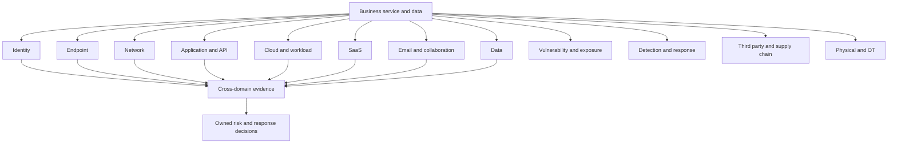

The business service belongs at the center. Domain tools exist to protect people, operations, data, customers, and strategy. A control map that cannot explain the protected business transaction is incomplete.

## JD Mapping

The target Technical Success Manager, abbreviated **TSM**, must navigate domain specialists and connect product evidence to customer outcomes. The TSM coordinates and advises; the TSM does not replace each domain owner, Security Operations Center, incident commander, architect, auditor, or risk owner.

| JD expectation | Domain capability | Honest Arti bridge | Boundary to preserve |
|---|---|---|---|
| Analyze complex environments | Build a cross-domain business-service map | Production Microsoft 365 and network dependency analysis | Do not claim ownership of every domain |
| Identify security risks | Find control gaps, overlaps, blind spots, and attack paths | Evidence-driven troubleshooting | Customer owners validate risk and priority |
| Deliver mitigation strategies | Combine preventive, detective, responsive, and recovery controls | Production recommendation and fix validation | Specialist and business approval remains required |
| Develop SecOps expertise | Explain how sources become detections, investigations, actions, and lessons | Incident and escalation bridge | No production SOC or Agentic SecOps operation claimed |
| Develop exposure expertise | Connect assets, weaknesses, paths, controls, owners, and remediation | Analytics and prioritization bridge | No vulnerability-program ownership claimed |
| Lead strategic engagement | Align domain roadmaps to business outcome and governance | Technical Advisor and customer leadership | Customer architecture and risk authorities decide |
| Resolve critical escalations | Correlate identity, endpoint, network, application, provider, and data evidence | CRITSIT and Microsoft troubleshooting | Preserve legal, privacy, and forensic boundaries |
| Explain value | Use coverage, control, response, recovery, and risk metrics | SQL, Power BI, statistics | Product activity is not automatically business outcome |

## Candidate honesty note

Arti's strongest production bridge crosses several domains naturally. A OneDrive synchronization or SharePoint access problem can involve user and device identity, endpoint process and cache, Domain Name System, Transmission Control Protocol, Transport Layer Security, Hypertext Transfer Protocol, proxy policy, Microsoft 365 tenant authorization, file permissions, service health, and audit evidence. She has investigated these dependencies, coordinated owners, and validated fixes.

That experience supports domain reasoning. It does not establish production operation of EDR, SIEM, SOAR, XDR, cloud security posture tools, vulnerability scanners, Zscaler products, Security Operations, or OT controls.

| Claim class | Safe statement | Guardrail |
|---|---|---|
| Production | "I traced Microsoft 365 incidents across identity, client, browser, network, proxy, application, permissions, and provider evidence." | Do not relabel support work as SOC ownership |
| Lab | "I mapped a fictional NMH cross-domain attack and evidence plan." | Keep every NMH result fictional |
| Conceptual | "I understand the tools, signals, controls, and failure modes in each domain." | Understanding is not tool-operation history |
| Not-yet-used | "I have not administered Zscaler, SIEM, EDR, vulnerability, or OT products in production." | Do not imply dashboard or policy experience |
| Transferable method | "I use scope, hypotheses, comparison, evidence, ownership, and validation." | State which underlying technology needs specialist help |

## Domain vocabulary before depth

| Term | Plain meaning | Why it matters | Memory hook |
|---|---|---|---|
| Security domain | Practical grouping of related risk and controls | Organizes expertise and ownership | A lens, not a wall |
| Control objective | Intended security result | Connects tools to purpose | What must be true |
| Control | People, process, or technology safeguard | Changes likelihood or impact | Prevent, detect, respond, recover |
| Signal | Observation that may describe state or behavior | Raw material for decisions | A clue, not a conclusion |
| Telemetry | Repeated technical observations from systems | Supports monitoring and investigation | Machine evidence stream |
| Event | Recorded occurrence | May be normal or suspicious | Something happened |
| Finding | Observed condition needing evaluation | Can represent weakness or gap | Condition to assess |
| Alert | Notification from logic or threshold | Needs triage | A question raised |
| Incident | Event or set of events meeting organizational incident criteria | Activates governed response | Harm or credible threat requiring response |
| IOC | Indicator of Compromise | Artifact associated with known or suspected compromise | Evidence of possible presence |
| IOA | Indicator of Attack | Behavior suggesting attack activity | Evidence of what is happening |
| TTP | Tactic, Technique, and Procedure | Adversary goal, method, and implementation | Why, how, exactly how |
| SIEM | Security Information and Event Management | Collects and analyzes security-relevant events | Security event analysis platform |
| SOAR | Security Orchestration, Automation, and Response | Coordinates workflows and approved automation | Response assembly line |
| XDR | Extended Detection and Response | Correlates detection and response across domains | Cross-domain detection category |
| EDR | Endpoint Detection and Response | Observes and responds on endpoints | Endpoint flight recorder and controls |
| IAM | Identity and Access Management | Manages identities, authentication, and authorization | Who and what may act |
| PAM | Privileged Access Management | Governs high-impact administrative access | Protect powerful keys |
| API | Application Programming Interface | Defined software-to-software interface | Software service counter |
| CSPM | Cloud Security Posture Management | Assesses cloud configuration and posture | Cloud configuration watch |
| CWPP | Cloud Workload Protection Platform | Protects cloud workloads at runtime or lifecycle | Workload defense category |
| CASB | Cloud Access Security Broker | Applies visibility or controls to cloud-service use | Cloud-use policy intermediary |
| DLP | Data Loss Prevention | Detects or restricts sensitive-data handling | Keep data in approved flow |
| DSPM | Data Security Posture Management | Discovers and assesses data security posture | Know sensitive data and its exposure |
| CAASM | Cyber Asset Attack Surface Management | Aggregates asset and control data for visibility | Reconcile asset truth |
| CNAPP | Cloud-Native Application Protection Platform | Integrated category across cloud application lifecycle and runtime | Cloud app security umbrella |
| OT | Operational Technology | Systems that monitor or control physical processes | Cyber meets physical process |
| IT | Information Technology | Systems primarily handling information and business computing | Digital business systems |

### Plain-English deep-dive 1 - Domain boundaries are viewpoints, not isolation

Consider a user opening a restricted file. Identity decides who the user is. The endpoint stores tokens and displays content. The network carries the request. The SaaS tenant applies resource authorization. Data controls consider sensitivity. Detection watches behavior. A supplier contract governs an external user. Physical access affects whether someone can use an unlocked device.

No team can protect that transaction alone. A stolen identity can appear normal to the network. A clean endpoint can still use an overprivileged SaaS token. A data-loss rule can fail if the application or endpoint uses an unobserved path. A SIEM cannot analyze a source that is missing, stale, or mapped to the wrong entity.

Domains help specialists build depth. Architecture and operations must reconnect them with stable identifiers, synchronized time, shared severity, business context, decision rights, and feedback. The question is not "Which team owns security?" It is "Who owns each control and decision along this business path, and can evidence be joined when something changes?"

## Identity security

Identity security protects human and non-human identities, credentials, authentication, authorization, privilege, sessions, and lifecycle. Authentication asks whether evidence supports a claimed identity. Authorization asks what that identity may do to a resource. Identity governance manages join, change, review, and removal.

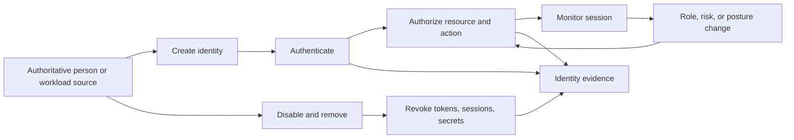

| Identity area | Controls | Tools or capabilities | Signals | Common owner | Failure modes |
|---|---|---|---|---|---|
| Lifecycle | Authoritative source, approval, joiner-mover-leaver, expiry | Identity governance and directory | Create, role change, disable, sponsor, reconciliation | Human Resources, IAM, business owner | Orphaned, stale, duplicate, unsponsored identity |
| Authentication | Phishing-resistant methods, risk-based step-up, recovery control | Identity provider, authenticator, certificate | Success, failure, factor, device, location, token | IAM | Credential theft, fatigue, weak recovery, legacy protocol |
| Authorization | Least privilege, resource and action scope, review | Directory groups, application roles, policy engine | Grant, deny, matched policy, effective permission | Resource and IAM owners | Role explosion, group nesting, stale entitlement |
| Privilege | Separate admin identity, just-in-time access, approval, session audit | PAM and privileged workstation | Elevation, command, policy change, emergency use | Security and platform owners | Standing access, shared account, bypass, recovery abuse |
| Workload identity | Unique service identity, short-lived credential, rotation | Workload identity, secrets and key service | Token issue, secret access, service call | Application and cloud owners | Hard-coded secret, shared account, overbroad scope |
| Federation | Trusted claims, assurance, audience, sponsor, revocation | Federation and business-to-business identity | Issuer, claim, token audience, external tenant | IAM and third-party owner | Wrong issuer, excessive claims, delayed external leaver |
| Session | Bound token, timeout, re-evaluation, revocation | Identity and application session controls | Token age, refresh, risk change, revoke | IAM and app owner | Long-lived token, incomplete logout, stolen cookie |

### Identity evidence questions

| Question | Evidence |
|---|---|
| Which authoritative record created the identity? | Human Resources, supplier, service catalog, workflow |
| Which factor and assurance were used? | Authentication method and sign-in event |
| Which policy allowed the action? | Decision, rule, group, role, context |
| Was device or workload identity bound? | Device ID, certificate, managed state, service identity |
| Which resource and action were authorized? | Application and resource audit |
| Was privilege elevated? | Approval, elevation, session and command records |
| Was the session revoked after risk or lifecycle change? | Revocation event and denied reuse test |
| Are emergency identities separately monitored? | Inventory, access test, alert, review |

Identity controls fail when one strong factor is treated as complete trust. A user can pass MFA and still access an overbroad role. A workload certificate can be valid while the application is compromised. Resource authorization and behavior remain necessary.

## Endpoint security

An endpoint is a user or server device at which software executes and data may be processed. Endpoint security includes inventory, configuration, patching, malware defense, detection and response, application control, local privilege, encryption, data handling, isolation, and recovery.

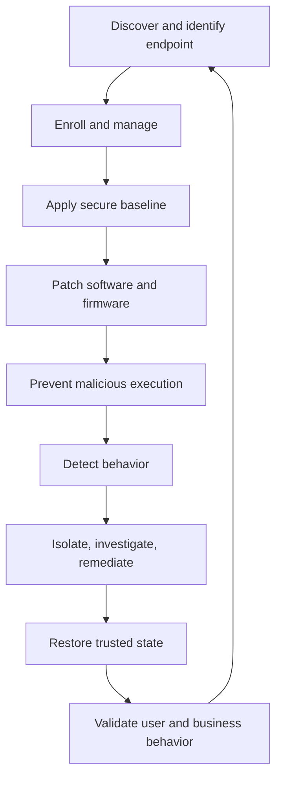

| Endpoint area | Controls | Tools or capabilities | Signals | Owner | Failure modes |
|---|---|---|---|---|---|
| Inventory | Unique identity, discovery, ownership, status | Device management, asset inventory, EDR | Device ID, owner, version, last seen | Endpoint and asset teams | Unknown, duplicate, unmanaged, stale record |
| Configuration | Secure baseline, drift management, exceptions | Device management and configuration tools | Setting, compliance, drift, policy result | Endpoint engineering | Conflicting policy, partial scope, false compliance |
| Patch | Prioritize, test, deploy, validate, except | Patch and software management | Version, install result, restart, vulnerability | Endpoint and app owners | Reboot pending, incompatible app, missing device |
| Prevention | Anti-malware, application control, exploit protection | Endpoint protection | Block, quarantine, reputation, behavior | Security and endpoint | Disabled agent, exclusion abuse, unsupported platform |
| Detection | Process, file, registry, memory, network behavior | EDR | Process tree, hash, command, connection | SOC and endpoint | Sensor blind spot, high noise, retention gap |
| Response | Isolate, collect, kill process, remove persistence | EDR and incident tools | Action result and device state | Incident and endpoint | Business disruption, incomplete isolation, lost evidence |
| Data | Encryption, local-storage policy, DLP, removable media | Disk encryption and endpoint DLP | File, label, copy, print, upload | Data and endpoint | Offline copy, wrong label, unsupported application |
| Recovery | Reimage, restore, credential reset, validation | Deployment and backup tools | Build provenance, health, user test | Endpoint and service owners | Reinfected image, lost data, repeated root cause |

### Endpoint decision questions

| Condition | Decision |
|---|---|
| Unmanaged device requests restricted SaaS data | Deny, browser isolate, limit action, use managed virtual environment, or approved exception |
| EDR is unhealthy | Treat posture as unknown, repair, restrict high-risk actions, and notify owner |
| Critical patch conflicts with business app | Compare exposure, compensating controls, test window, rollback, and exception authority |
| Endpoint isolation may stop plant or executive work | Use incident command and business owner to balance containment and consequence |
| Device is clean but identity remains compromised | Revoke identity and sessions; endpoint remediation alone is insufficient |

## Network security

Network security governs communication paths, addressing, name resolution, routing, segmentation, access, inspection, encryption, availability, and telemetry. A network can provide reachability without application authorization; both must be understood.

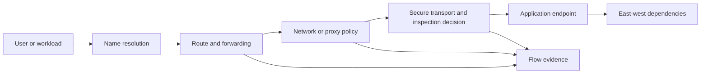

| Network area | Controls | Tools or capabilities | Signals | Owner | Failure modes |
|---|---|---|---|---|---|
| Naming | Protected resolver, authoritative governance, filtering | Domain Name System services and security | Query, answer, resolver, time-to-live | Network and service owner | Poisoning, split mismatch, stale cache, outage |
| Address and route | Approved addressing, route control, anti-spoofing | Routers, cloud route, software-defined network | Route, next hop, flow, source | Network and cloud | Asymmetry, leak, bypass, overlap |
| Segmentation | Resource and service-specific policy, zone control | Firewall, microsegmentation, broker | Allow, deny, rule, source, destination | Network, cloud, app | Broad rule, shadow rule, unobserved alternate path |
| Internet and SaaS access | Identity and destination policy, threat and data controls | Secure web gateway, proxy, Security Service Edge | User, URL, category, action, policy | Security and network | Forwarding gap, unsupported protocol, privacy conflict |
| Private access | App-specific access, connector or gateway, least privilege | Zero Trust Network Access, application proxy | App, identity, policy, connector, session | Security, network, app | Broad post-gateway reach, name-resolution mismatch |
| Transport | Encryption, certificate validation, protocol policy | TLS libraries, proxy, certificate services | Version, cipher, certificate, handshake | App, security, network | Inspection breakage, obsolete protocol, trust-store issue |
| Availability | Diverse path, capacity, denial-of-service protection | Carrier, load balancing, cloud network | Latency, loss, queue, health, failover | Network and service | Correlated provider, route flap, saturation |
| Monitoring | Flow, packet, resolver, proxy, intrusion telemetry | Network detection and monitoring | Connection, bytes, flags, protocol, signature | Network and SOC | Encryption blind spot, sampling, missing identity |

Network tools may report a permitted connection while the application denies the user. Conversely, application logs may show a successful request while traffic bypassed an intended inspection path. Correlate both.

## Application and API security

Application security protects software design, code, dependencies, build, deployment, runtime, authorization, input, secrets, logging, and recovery. API security applies these principles to machine interfaces, where automated scale and token scope can increase consequence.

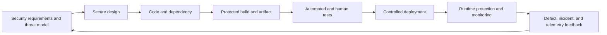

| Application area | Controls | Tools or capabilities | Signals | Owner | Failure modes |
|---|---|---|---|---|---|
| Requirements | Abuse cases, data, identity, logging, recovery | Threat modeling and architecture review | Decision and requirement trace | Product and security | Security added after design |
| Code | Review, secure patterns, input and output handling | Static analysis and code review | Finding, commit, reviewer | Development | False positive, unreviewed generated code |
| Dependency | Inventory, provenance, version, vulnerability response | Software composition and bill of materials | Package, version, advisory | Development and supply chain | Typosquat, stale library, transitive unknown |
| Build | Protected pipeline, signed artifact, separation | Continuous integration and deployment controls | Build identity, artifact hash, approval | Platform engineering | Secret leak, poisoned runner, unsigned release |
| Test | Unit, integration, security, negative, penetration tests | Dynamic testing and authorized assessment | Test case, result, coverage | Quality and security | Test environment differs, narrow scope |
| Identity | User and workload authentication and authorization | IAM, OAuth, application roles | Token, claim, scope, decision | App and IAM | Broken object authorization, overbroad scope |
| API | Schema validation, rate limit, object and function authorization | API gateway and runtime controls | Endpoint, method, status, client, object | App and platform | Mass assignment, enumeration, token replay |
| Secrets | Managed storage, rotation, least privilege | Secrets and key management | Access, rotate, failure | App and cloud | Hard-coded secret, broad role, stale key |
| Runtime | Harden, segment, observe, patch, recover | Web application firewall, runtime protection, EDR | Request, process, error, integrity | App and operations | Logic abuse, zero-day, hidden admin path |
| Logging | Security events, time, identity, object, result | Application logging and SIEM | Auth, access, admin, error, data action | App and SOC | Sensitive log, missing object, mutable audit |

### API transaction evidence

| Stage | Evidence question |
|---|---|
| Client identity | Which user, workload, application, device, and tenant initiated? |
| Token | Which issuer, audience, scope, age, and authentication method? |
| Gateway | Which route, rate, schema, policy, and threat decision? |
| Application | Which function and object authorization applied? |
| Data | Which record or classification was read or changed? |
| Response | Which status, bytes, error, and latency occurred? |
| Audit | Can the transaction be reconstructed without exposing secrets? |

## Cloud and workload security

Cloud security applies identity, configuration, network, data, workload, logging, and resilience controls under shared responsibility. Workloads include virtual machines, containers, serverless functions, managed services, and application components. The exact provider/customer split varies by service.

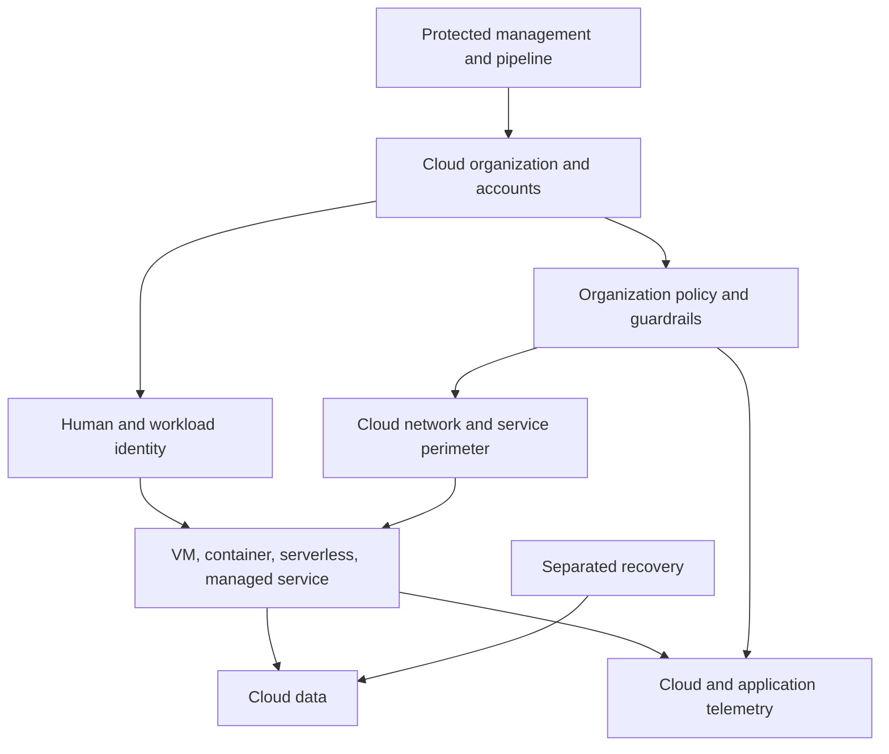

| Cloud area | Controls | Tools or capabilities | Signals | Owner | Failure modes |
|---|---|---|---|---|---|
| Organization | Account hierarchy, policy, approved regions, ownership | Cloud organization and policy service | Account create, policy, tag | Cloud platform and governance | Shadow account, inherited gap, wrong region |
| IAM | Federation, least privilege, workload identity, break glass | Cloud IAM and PAM | Role grant, assume role, token, key | Cloud and IAM | Wildcard role, long-lived key, cross-account trust |
| Configuration | Secure baseline, policy as code, drift | CSPM and configuration tools | Resource state, violation, change | Cloud security and platform | Alert without owner, exception drift |
| Network | Private service access, segmentation, ingress and egress | Cloud firewall, route, load balancer | Flow, route, endpoint, policy | Cloud and network | Public exposure, broad peer, metadata access |
| Workload | Hardened image, patch, runtime and orchestration security | CWPP, EDR, container and serverless controls | Image, process, workload, orchestrator | Platform and application | Ephemeral blind spot, privileged container |
| Data | Classification, access, encryption, key separation, backup | Storage, database, KMS, DSPM | Object access, policy, key use | Data and cloud | Public bucket, cross-region copy, broad key role |
| Pipeline | Protected source, build, deploy, artifact, infrastructure as code | DevOps and code security | Commit, build, deployment, approval | Platform engineering | Compromised pipeline changes production |
| Logging | Control-plane, data access, network, workload events | Native cloud logging and SIEM | Admin, resource, flow, data, threat | Cloud and SOC | Disabled log, cost-driven gap, short retention |
| Resilience | Multi-zone or region, backup, recovery, quotas | Cloud resilience services | Health, replication, restore | Service and continuity | Shared identity, region, quota, corrupted replication |

### Cloud shared responsibility check

| Question | Why it matters |
|---|---|
| Which exact cloud service and feature? | IaaS, PaaS, SaaS, and serverless duties differ |
| Who configures customer identity and data access? | Provider mechanisms do not select safe customer policy |
| Who patches each layer? | Guest, runtime, managed service, and dependency boundaries differ |
| Which logs are available by default, configuration, and license? | Evidence cannot be assumed |
| Who backs up and restores customer data and configuration? | Provider durability is not always customer recovery |
| Which incident evidence and support route exist? | Provider and customer timelines must meet |
| Which inherited control is in assurance scope? | Provider report does not prove customer implementation |

## SaaS security

Software as a Service security governs the customer's use of a provider-operated application. The customer typically controls tenant identity, roles, configuration, sharing, connected applications, data use, endpoints, monitoring, and response, while the provider operates the application and underlying platform under service terms.

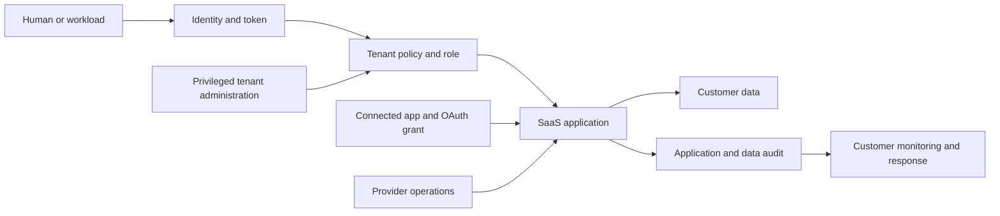

| SaaS area | Controls | Signals | Owner | Failure modes |
|---|---|---|---|---|
| Tenant inventory | Approved service, owner, data, contract, risk review | Tenant, license, owner, last review | SaaS governance | Shadow tenant and duplicate service |
| Identity | Federation, lifecycle, conditional access, guest governance | Sign-in, token, guest, group | IAM and app owner | Local account, stale guest, token persistence |
| Roles | Least privilege, separation, admin review | Role grant, admin action | App and security | Global admin sprawl, shared account |
| Configuration | Secure baseline, change control, drift | Setting, change, policy | App owner | Provider adds feature or default changes |
| OAuth and integrations | App approval, minimum scope, secret lifecycle | Consent, scope, token, application activity | App, IAM, integration owner | Overprivileged app, abandoned integration |
| Sharing | Resource-specific rules, external controls, review | Link, guest, permission, download | Data and site owner | Anonymous link, nested group, stale access |
| Data | Classification, retention, DLP, encryption decisions | Label, access, share, delete, export | Data owner | Unlabeled content, export, wrong retention |
| Audit | Enable, retain, protect, correlate | User, object, action, result | App and SOC | License gap, delayed event, missing object |
| Provider | Assurance, status, support, breach process, exit | Service health, provider notice | Vendor and service owner | Contract gap, regional outage, weak exit |
| Recovery | Versioning, backup, restore, identity and config recovery | Restore event, test result | Service and continuity | Provider retention mistaken for backup |

## Email and collaboration security

Email and collaboration platforms combine messaging, files, meetings, links, identities, applications, and business workflows. Attackers exploit human trust and legitimate features, not only malicious attachments.

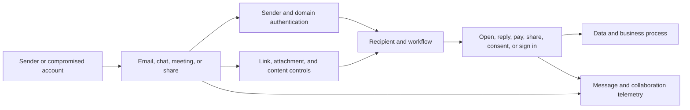

| Threat | Controls | Signals | Failure mode |
|---|---|---|---|
| Phishing | Sender controls, link and attachment analysis, user reporting, identity protection | Sender, URL, attachment, click, sign-in | Trusted service hosts malicious content |
| Business email compromise | Strong identity, payment verification, behavior analytics | Mailbox rule, login, conversation, payment change | Legitimate account and no malware |
| Malicious OAuth consent | App governance, user-consent restriction, scope review | Consent, app, scope, token use | User grants durable data access |
| Oversharing | Site and link policy, label, owner review, DLP | Share, link, guest, download | Correct user shares wrong resource |
| Account takeover | Phishing-resistant auth, token and session response | Sign-in, token, mailbox and file actions | Attacker uses valid session |
| Malicious file | Content inspection, sandboxing, endpoint defense | Hash, verdict, process, download | Delayed verdict or encrypted archive |
| Workflow fraud | Out-of-band verification and approval | Request, change, approver, payment | Technical controls cannot infer all business intent |
| Data exfiltration | DLP, behavior, sharing and download controls | Volume, label, destination, action | Slow or sanctioned-channel exfiltration |

Collaboration security requires identity, data, endpoint, application, and human-process evidence. A message-control verdict cannot prove the recipient did not enter credentials into a later page or use a separate device.

## Data security

Data security protects information throughout creation, collection, use, sharing, storage, transformation, backup, archival, and deletion. It requires ownership and purpose, not only encryption.

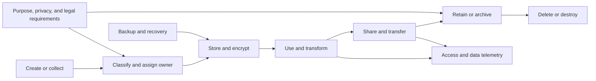

| Data area | Controls | Tools or capabilities | Signals | Owner | Failure modes |
|---|---|---|---|---|---|
| Inventory | Discover data stores, flows, copies, and owners | Data catalog and DSPM | Location, type, owner, sensitivity | Data governance | Unknown copy, stale catalog, unsupported format |
| Classification | Labels, business context, handling rules | Classification and labeling | Label, confidence, source, override | Data owner | Overlabeling, underlabeling, inherited mismatch |
| Access | Least privilege, purpose, review, separation | IAM, app authorization, database controls | Query, file access, grant, denial | Data and app owners | Shared account, broad group, service bypass |
| Encryption | Protect in transit and at rest; manage keys | TLS, storage encryption, KMS | Key use, certificate, algorithm | Platform and security | Broad key admin, plaintext export, lost recovery key |
| DLP | Inspect or govern sensitive actions | Endpoint, network, email, SaaS DLP | Content match, label, destination, action | Data security | False positive, uninspected path, user workaround |
| Privacy | Purpose, minimization, subject rights, approved processing | Privacy governance and technical controls | Collection, consent, access, delete | Privacy and data owners | Overcollection, secondary use, jurisdiction mismatch |
| Retention | Keep and dispose under policy and legal holds | Records and lifecycle management | Retain, hold, delete, failure | Records, Legal, app owner | Conflicting retention, incomplete deletion |
| Backup | Protected copies and tested recovery | Backup and recovery tools | Job, restore, integrity, age | Service and continuity | Backup includes excessive data or compromised state |
| Monitoring | Observe sensitive-data access and movement | Audit, DSPM, DLP, SIEM | Actor, object, action, volume | Data and SOC | Missing stable object ID, delayed event |

### Data control tradeoffs

| Choice | Benefit | Risk or cost | Validation |
|---|---|---|---|
| Broad inspection | Better content visibility | Privacy, latency, key trust, unsupported apps | Authorized scope and performance test |
| Block all external sharing | Strong reduction in one path | Business workaround and shadow service | Required collaboration and alternate-path review |
| Customer-managed keys | More key control in some designs | Availability, rotation, recovery, role complexity | Key loss and recovery exercise |
| Long retention | Investigation and legal value | Privacy, cost, breach scope | Approved purpose and deletion test |
| Short retention | Data minimization | Reduced investigation and recovery evidence | Incident and obligation needs |
| Automated classification | Scale and consistency | Misclassification and model drift | Sampling and appeal process |

### Plain-English deep-dive 2 - Encryption does not decide who should have data

A sealed courier envelope protects a letter while it travels. If it is addressed to the wrong person, sealing it does not correct authorization. Encryption similarly protects against certain observers or storage access, but an authorized application or identity may decrypt and misuse the data.

Data security therefore includes identity, purpose, classification, application authorization, endpoint handling, sharing, monitoring, retention, and response. Key management is also a management-plane risk. An administrator who can change access policy and decrypt data creates a larger concentration than either privilege alone.

For OneDrive and SharePoint, Transport Layer Security protects transport, while Microsoft and tenant controls govern service access. Site membership, sharing links, guest lifecycle, labels, retention, endpoint synchronization, local copies, and application permissions still matter. Arti can explain those mechanics from production support while deferring legal and privacy decisions to authorized customer functions.

## Vulnerability and exposure management

Vulnerability management finds, evaluates, treats, and validates weaknesses. Exposure management broadens the view to assets, identities, misconfigurations, reachability, controls, attack paths, business context, and threat evidence. A vulnerability can exist without a currently observed exposure path; an exposure can exist without a software CVE.

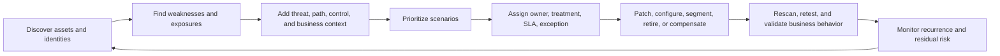

| Exposure area | Controls or process | Tools or signals | Owner | Failure modes |
|---|---|---|---|---|
| Asset discovery | Multi-source inventory and ownership | Scanner, EDR, cloud, CMDB, identity, network | Asset and service owners | Unknown, duplicate, stale, conflicting record |
| Vulnerability | Authenticated assessment and advisory intake | CVE, CVSS, package, patch, exploit evidence | Vulnerability and platform | Scan blind spot, false positive, version mismatch |
| Misconfiguration | Baseline and posture assessment | Cloud, SaaS, endpoint, network config | Domain owner | Generic rule ignores business design |
| Identity exposure | Privilege and path analysis | Role, group, session, credential | IAM and security | Nested access and workload identities missed |
| External exposure | Discover public and partner-facing paths | Domain, certificate, IP, application, cloud | Attack-surface and service owner | Ownership unknown, ephemeral asset |
| Attack path | Graph assets, identities, flaws, controls, and reachability | Relationship and path data | Exposure and architecture | Stale edge, assumed reachability, false merge |
| Prioritization | Threat, exploitability, path, asset, control, consequence | Score and driver evidence | Vulnerability, risk, business | Severity-only queue or opaque formula |
| Remediation | Patch, configure, segment, remove, compensate | Ticket, deployment, exception | Action and control owners | Ticket closed without actual change |
| Validation | Rescan, negative test, control and business test | Finding state and test evidence | Assessor and owner | Scanner no longer sees asset; risk remains |

### Finding-to-risk translation

| Finding question | Why it matters |
|---|---|
| Which exact asset, owner, environment, and business service? | Establishes consequence and authority |
| Is the identity and asset record trustworthy? | Prevents duplicate or wrong assignment |
| Which weakness or condition exists? | Defines treatment mechanics |
| What can reach it and under which identity? | Establishes exposure path |
| Is exploitation observed or feasible? | Informs urgency without predicting certainty |
| Which controls prevent, detect, contain, or recover? | Establishes current risk |
| What breaks if remediation is applied? | Avoids unsafe patching or configuration |
| How will closure be validated? | Proves actual risk reduction |
| What residual risk remains? | Enables owner decision and monitoring |

## Detection and response

Detection and response turns telemetry into governed action. A Security Operations Center, abbreviated SOC, may monitor, triage, investigate, coordinate, hunt, engineer detections, and support response. Organizational models vary. SIEM, SOAR, XDR, EDR, network, cloud, identity, SaaS, and application tools provide parts of the workflow.

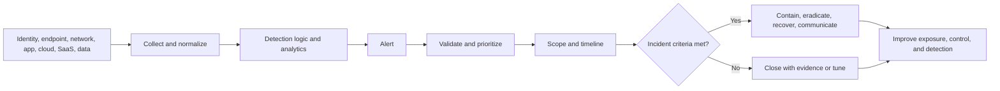

| Stage | Inputs | Decision | Evidence | Failure modes |
|---|---|---|---|---|
| Collection | Events, logs, alerts, context | Is source usable and authorized? | Health, freshness, schema, time | Missing source, parser drift, duplicate event |
| Detection | Rule, behavior, analytics, threat context | Does activity warrant alert? | Logic version, matched facts | High noise, blind spot, stale intelligence |
| Triage | Alert, asset, identity, business context | Benign, suspicious, or urgent? | Source events and comparison | Score bias, missing owner, premature close |
| Investigation | Cross-domain timeline and scope | What happened and what may be affected? | Identity, endpoint, network, app, data evidence | Time mismatch, entity merge, retention gap |
| Incident declaration | Criteria and consequence | Activate response governance? | Decision and rationale | Delay, overclassification, authority confusion |
| Containment | Access, endpoint, network, app, data actions | Which reversible action limits harm? | Action result and business impact | Destroy evidence, stop safety process, partial scope |
| Eradication | Remove cause and persistence | Is threat or defect removed? | Rebuild, revoke, patch, validation | Visible artifact removed, path remains |
| Recovery | Restore trusted service | Is business and security behavior safe? | Tests, monitoring, owner acceptance | Reintroduce compromise, incomplete authorization |
| Learning | Timeline, causes, control gaps, outcomes | Which systemic actions matter? | Post-incident record and owner | Blame, vague lessons, overdue action |

### IOC, IOA, and TTP

| Concept | Example | Strength | Limitation |
|---|---|---|---|
| IOC | Known malicious hash, domain, address, account artifact | Fast matching and scoping | Changes easily and can create false matches |
| IOA | Unusual token use followed by mass file access | Detects behavior independent of one artifact | Requires context and baseline |
| Tactic | Credential Access or Exfiltration objective | Organizes adversary goal | Does not prove a specific incident |
| Technique | Phishing, valid accounts, cloud storage exfiltration | Common behavior vocabulary | Implementation varies |
| Procedure | Exact message, token, command, app, and path used | Highly actionable for case | Narrow and time-bound |

MITRE ATT&CK is a knowledge base of observed adversary tactics and techniques. It can structure hypotheses and coverage analysis. It is not an incident verdict, risk probability, or complete control checklist.

## Third-party and supply-chain security

Third parties include suppliers, service providers, contractors, partners, software dependencies, managed services, and cloud providers. Security depends on selecting, contracting, onboarding, monitoring, responding, and exiting relationships.

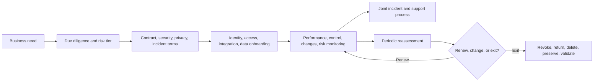

| Third-party area | Controls | Evidence | Owner | Failure modes |
|---|---|---|---|---|
| Inventory and tier | Service, data, access, criticality, concentration | Vendor register and dependency map | Procurement, risk, service owner | Shadow supplier and unknown subcontractor |
| Due diligence | Capability, assurance, architecture, history | Questionnaire, report, evidence, interview | Third-party risk and specialists | Checkbox review, stale certificate |
| Contract | Roles, security, privacy, notification, audit, exit | Executed terms and schedules | Legal, procurement, business | Terms do not match technical service |
| Access | Sponsored identity, least privilege, expiry, remote controls | Identity, group, session, review | IAM and business sponsor | Stale contractor and shared account |
| Integration | Minimum API scope, secret, data, monitoring | App consent, token, flow, logs | App and integration owner | Abandoned OAuth token and broad scope |
| Monitoring | Service, incidents, changes, assurance, exposure | Reviews, alerts, notices, metrics | Service and risk owner | Annual snapshot misses material change |
| Incident | Contact, severity, evidence, decision, notification | Exercise, case, timeline | Incident, Legal, service owner | Provider and customer wait on each other |
| Exit | Revoke, return or delete data, migrate, preserve evidence | Offboarding and deletion evidence | Business and service owner | Data or account remains after contract |
| Concentration | Common provider, software, region, identity | Portfolio dependency analysis | Enterprise risk | Many services fail together |

Software supply chain includes source, dependencies, build systems, artifacts, repositories, update channels, signing, and deployment. A trusted vendor name does not replace provenance and runtime monitoring.

## Physical and OT security

Physical security protects facilities, people, equipment, media, power, environmental systems, and access. OT security protects systems that monitor or control physical processes. Safety and availability can dominate decisions. Many OT environments have long asset lives, vendor dependencies, fragile protocols, maintenance windows, and limited endpoint-agent support.

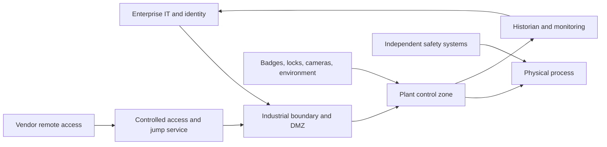

| Physical or OT area | Controls | Signals | Owner | Failure modes |
|---|---|---|---|---|
| Facility access | Badge, visitor, escort, restricted zone | Entry, exit, denied access | Facilities and security | Tailgating, stale badge, camera gap |
| Equipment | Locked cabinet, port control, tamper evidence | Cabinet, device, port event | Plant and facilities | Accessible console or removable media |
| Environment | Power, fire, temperature, flood, backup | Sensor, alarm, generator test | Facilities and continuity | Shared power or untested generator |
| Asset inventory | Engineering-aware discovery and ownership | Device, firmware, protocol, last seen | OT engineering | Active scan disrupts fragile device |
| Segmentation | Industrial zones, conduits, allowlisted flows | Flow, policy, protocol | OT network and security | Flat plant network, undocumented vendor path |
| Remote access | Named identity, approval, time-bound session, recording | User, vendor, session, command | Plant, vendor, IAM | Shared vendor account, always-on tunnel |
| Change | Tested logic, firmware, configuration, rollback | Change, version, approval | Control engineering | Unsafe process change or unsupported patch |
| Monitoring | Passive network, controller, engineering, safety context | Protocol, command, state change | OT SOC and plant | IT alert lacks process context |
| Response | Safety-led containment and manual alternatives | Incident, process, communication | Plant incident command | Isolating device causes unsafe state |
| Recovery | Known-good logic, spares, backups, manual operation | Restore and process validation | Plant and continuity | Backup is stale or hardware unavailable |

### IT versus OT decision context

| Question | IT tendency | OT consideration |
|---|---|---|
| Patch quickly? | Reduce known software exposure | Safety validation, vendor support, outage window, compensation |
| Isolate endpoint? | Limit spread | Could interrupt physical control; plant authority required |
| Scan actively? | Discover services and weaknesses | Fragile device or protocol may be disrupted |
| Rebuild? | Standard image and restore | Specialized hardware, logic, calibration, and safety acceptance |
| Prioritize confidentiality? | Often important | Safety, integrity, and availability may dominate |
| Use cloud identity? | Central lifecycle and policy | Offline and degraded plant operation may be necessary |

### Plain-English deep-dive 3 - The safest cyber action can be physically unsafe

On an office laptop, immediate network isolation may be a reasonable containment action. On an industrial controller, removing communication could stop cooling, hide process state, or trigger an unsafe transition. The same button has different consequences.

OT response must include control engineers, plant operations, safety leaders, incident response, and vendors under tested authority. Compensating controls may include segmentation, allowlisting, monitored jump access, passive detection, short maintenance windows, physical control, and manual procedures. Delaying a patch is not automatically negligence if the residual risk is explicitly governed and safer treatment is scheduled.

A TSM should ask about business and safety impact before recommending a network or access change. Public Zscaler pages describe IoT/OT discovery, segmentation, and privileged remote-access positioning, but actual protocols, architecture, safety, licensing, and device support require specialist validation. Arti must not claim production OT deployment.

## Control overlap, defense in depth, and correlated gaps

Controls often overlap intentionally. Identity, endpoint, network, application, and data controls may all constrain one file request. Overlap is valuable when controls fail independently and preserve usable evidence. It is weak when all controls trust the same compromised signal or administrator.

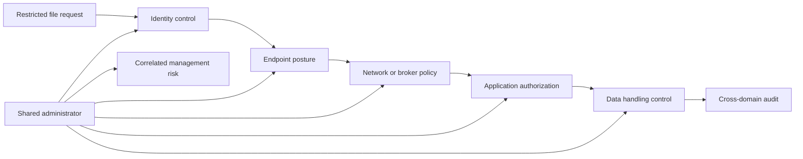

| Overlap pattern | Strong design | Weak design |
|---|---|---|
| Identity plus application | Identity proves subject; app checks object and action | App trusts any valid tenant token |
| Endpoint plus network | Device posture informs access; endpoint still protects local execution | Both depend on one stale compliance flag |
| Network plus data | Path policy and content control cover distinct risks | Both can be bypassed by same direct route |
| Prevention plus detection | Prevention blocks known path; detection observes bypass behavior | Detection receives only prevention alerts |
| Detection plus response | Alert has approved containment and business owner | Alert closes without action authority |
| Backup plus recovery | Separated backup and clean restore test | Online replica copies corruption |
| Multi-vendor | Independent signals and failure domains | Several tools use same identity, cloud, or administrator |

### Gap taxonomy

| Gap | Description | Example | Detection method |
|---|---|---|---|
| Coverage | Asset, user, protocol, location, or data is outside control | Unmanaged supplier device | Population reconciliation |
| Placement | Control is not on actual path | Direct SaaS route bypasses proxy | Route and event comparison |
| Configuration | Capability exists but setting is wrong | Sharing default is broad | Baseline and change review |
| Integration | Sources or actions do not connect | Identity event lacks stable user map | End-to-end transaction test |
| Ownership | Nobody maintains or acts | Stale OAuth app has no owner | Register and escalation |
| Time | Detection, review, expiry, or response is late | Quarterly guest review | Measure delay and consequence |
| Evidence | Control may work but cannot be demonstrated | Missing admin audit | Source and retention test |
| Resilience | Control fails with shared dependency | Identity outage disables both paths | Failure-domain exercise |
| Authority | Team sees risk but cannot decide | SOC cannot isolate plant device | RACI and playbook exercise |
| Outcome | Activity occurs but risk is not reduced | Patch ticket closes; vulnerable version remains | Technical validation |

## Cross-domain attack and evidence story

The following NMH scenario is fictional. It demonstrates mechanics, not a claim about a real attacker, customer, Microsoft, or Zscaler product.

### Scenario

A supplier receives a convincing collaboration message and enters credentials into a phishing site. The attacker reuses a stolen session or token, discovers an overprivileged OAuth application, accesses a SharePoint project site, downloads restricted design files to an unmanaged endpoint, and uses a cloud storage service for exfiltration. An identity telemetry connector is delayed, slowing correlation.

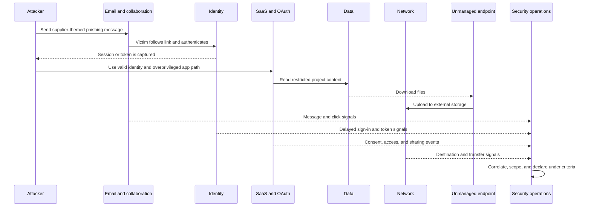

### Domain-by-domain chain

| Stage | Domain | Control expected | Evidence | Gap or uncertainty |
|---|---|---|---|---|
| Delivery | Email | Sender, link, content, reporting | Message ID, sender, URL, verdict | Trusted hosting evades initial verdict |
| Credential capture | Identity | Phishing-resistant authentication and risky-session response | Sign-in, method, token, source | Token mechanism and session theft uncertain |
| Application access | SaaS and application | Resource and object authorization | Tenant, app, role, site, object, action | Supplier group may be overbroad |
| OAuth use | Identity and SaaS | App governance and minimum scope | Consent, app ID, scope, token use | App owner and necessity unknown |
| Data read | Data | Classification, access, unusual-volume detection | Label, file IDs, count, download | Classification and threshold coverage unknown |
| Endpoint | Endpoint | Managed-device restriction or browser control | Device ID, posture, client | Device is unmanaged and telemetry limited |
| Exfiltration | Network and data | Destination and DLP policy | Domain, connection, bytes, content decision | Alternate path or encrypted upload |
| Detection | SOC and data pipeline | Fresh source and correlation | Source health, event times, alert | Identity connector delayed |
| Response | Multi-domain | Revoke, disable app, contain access, preserve evidence | Action and result | Authority and supplier coordination time |
| Improvement | Governance and exposure | Fix identity, app, group, data, source, playbook gaps | Actions, tests, residual risk | Treatment ownership needed |

### Cross-domain evidence timeline

| Fictional UTC time | Event | Source | Confidence | Investigation use |
|---|---|---|---|---|
| 08:11 | Supplier receives collaboration message | Email event | High for delivery | Identify recipient and URL |
| 08:14 | Link is opened | Safe-link or proxy event | Moderate | Establish device and destination |
| 08:16 | New sign-in and token issue | Identity event arriving late | High after arrival | Attribute session and method |
| 08:19 | OAuth application accesses site | SaaS audit | Moderate | Determine app, scope, and actor chain |
| 08:21 | Forty-seven synthetic files downloaded | SharePoint audit | High for recorded objects | Scope data and project |
| 08:25 | Large upload to external storage | Network event | Moderate | Correlate device and destination |
| 08:33 | Data-volume alert fires | Detection platform | Moderate | Alert is delayed by source availability |
| 08:38 | Account and app sessions revoked | Identity and SaaS admin | High | Containment result |
| 08:44 | Project site external access restricted | SaaS admin | High | Bound further access |

No timestamp or file count is real.

### Evidence join keys

| Domain | Useful keys | Quality problem |
|---|---|---|
| Email | Message ID, recipient, sender, URL, attachment hash | Forwarding changes identity context |
| Identity | User object ID, tenant, session, token, device, source address | Display name and email can change |
| SaaS | Application ID, user ID, site ID, file ID, operation, request ID | Audit delay and license scope |
| Endpoint | Device ID, user session, process, browser profile, address | Unmanaged device has limited telemetry |
| Network | Source identity, device, destination, connection, bytes | Network address is shared or changes |
| Data | Stable object ID, label, owner, version | Path or filename is not stable identity |
| Detection | Alert ID, rule version, entities, source event IDs | Entity merge can join wrong records |

### Containment options and tradeoffs

| Action | Benefit | Risk | Authority and validation |
|---|---|---|---|
| Revoke supplier sessions | Stops known token reuse | May interrupt legitimate supplier work | IAM authority; test token reuse denial |
| Disable OAuth application | Stops app path | Other business workflows may depend on it | App owner and incident command; dependency test |
| Restrict project site | Limits data access | Delays project collaboration | Data and service owner; allowed internal access test |
| Isolate device | Limits endpoint traffic | Device is supplier-owned and may be unreachable | Supplier coordination and contract |
| Block external storage destination | Limits one exfiltration path | Broad block may affect approved business use | Network and data owner; alternate-path review |
| Reset identity credential | Changes credential | Does not always revoke every token or app grant | Identity workflow and session validation |

### ATT&CK-informed interpretation

The scenario may prompt hypotheses related to Phishing, Valid Accounts, Account Discovery, Cloud Service Dashboard, Permission Groups Discovery, Data from Information Repositories, and Exfiltration Over Web Service. Use the current MITRE ATT&CK entries and actual evidence. Do not mechanically label a technique as proven because the story sounds similar.

## OneDrive and SharePoint evidence bridge

Arti's production support method is directly useful for cross-domain analysis.

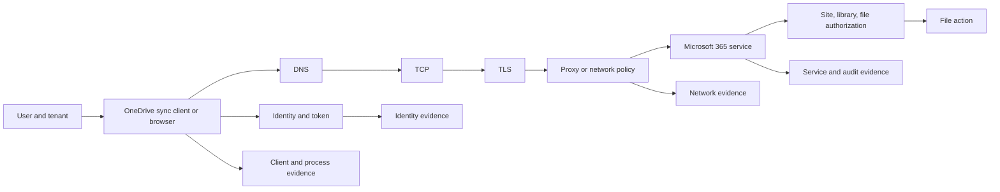

| Symptom | Domain hypotheses | Evidence | Security relevance |
|---|---|---|---|
| Sync fails for one user | Identity, token, permission, client state | Sign-in, effective access, client log | Denial can be valid control or defect |
| Sync fails after proxy change | Network route, TLS, policy, endpoint version | Resolver, connection, certificate, proxy decision | Broad bypass may create data or threat gap |
| File appears on wrong device | Identity, device registration, sync scope, user action | Device ID, account, client config, file audit | Data exposure needs scope and response |
| External user retains access | Identity lifecycle, group, site, session | Sponsor, group, permission, token, audit | Risk treatment spans IAM and SaaS |
| Mass download occurs | User intent, app, token, data, network | File IDs, volume, app ID, destination | Alert requires business and device context |
| Audit event is missing | License, source, delay, operation type, retention | Source health, expected event, provider docs | Evidence gap changes confidence |
| Service degraded | Provider, region, network, tenant, client | Service health, request ID, comparisons | Availability incident is not automatically attack |

Arti can truthfully describe the diagnostic mechanics: define scope and time, compare affected and unaffected cases, identify the first divergent layer, gather attributable evidence, avoid unsafe broad bypass, route to the owning team, and validate both allowed and denied behavior. She should not claim that this makes her a SOC analyst or Zscaler administrator.

## Zscaler portfolio overview mapped to domains

The table summarizes current public Zscaler positioning at a high level. Product names, packaging, integrations, and capabilities evolve. It is not a control certification or NMH design.

| Documented Zscaler area | Domain relationship | Public positioning summarized | Validation before customer claim |
|---|---|---|---|
| Zero Trust Exchange | Identity, network, app, workload, data | Proxy-brokered, identity and context-based one-to-one connections and policy | Actual components, paths, identity, policy, license, bypass, logs |
| Zscaler Internet Access | Network, SaaS, web, data | Secure internet and SaaS access | Forwarding, inspection, exclusions, privacy, performance, failure |
| Zscaler Private Access | Identity, private application, network | Policy-based private-application access without broad network access positioning | App segments, connectors, name resolution, policy, post-access scope |
| Client Connector | Endpoint, identity, network | Endpoint client supporting documented forwarding and access use cases | Platform, version, posture, conflict, update, logs, recovery |
| Zscaler Digital Experience | Endpoint, network, SaaS, application experience | Digital-experience monitoring and troubleshooting positioning | Probe type, coverage, metric, correlation, privacy, license |
| Zero Trust Cloud and workload offerings | Cloud, workload, network | Workload communication and cloud security positioning | Cloud, direction, identity, enforcement, protocol, architecture |
| Data Security and DLP | Data, endpoint, network, SaaS | Sensitive-data discovery and protection positioning across channels | Content coverage, policy, privacy, action, false positive, workflow |
| CASB and SaaS Security | SaaS, data, identity | Visibility and control for SaaS use and posture positioning | API and inline modes, apps, fields, permissions, remediation |
| Asset Exposure Management | Asset, exposure, third party | Unified asset visibility, relationships, coverage gaps, and CMDB health positioning | Connectors, entity resolution, source authority, action behavior |
| Unified Vulnerability Management | Vulnerability, risk, workflow | Contextual multifactor prioritization and remediation positioning | Inputs, weights, controls, score behavior, ownership, validation |
| Risk360 | Enterprise risk and executive reporting | Risk drivers, attack stages, trends, guided mitigation, financial framing | Model version, factor definitions, source quality, uncertainty, authority |
| Data Fabric for Security | Cross-domain data | Ingest, harmonize, map, deduplicate, correlate, enrich, apply logic, workflow, report positioning | Connector catalog, schema, freshness, mapping, privacy, tenant behavior |
| Agentic Security Operations | Detection, investigation, response | First- and third-party signals, context, investigation, and adaptive-response positioning | Agent behavior, autonomy, approval, evidence, accuracy, packaging |
| Deception, hunting, MDR | Detection and response | Deception, threat-hunting, and managed detection-response positioning | Service scope, telemetry, workflow, response authority, service level |
| IoT/OT segmentation and privileged remote access | OT, network, identity | Device discovery, segmentation, and remote-access positioning | Protocols, devices, safety, architecture, support, operational authority |

### Product-to-control validation sequence

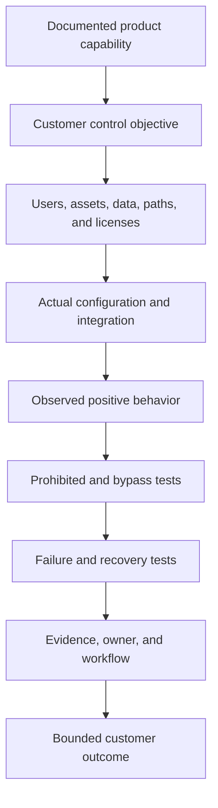

Safe TSM wording: "Official material positions the capability this way. I would verify the customer's current license, architecture, configuration, traffic and data scope, telemetry, failure behavior, workflow, and outcome. I have not operated the product in production."

### Plain-English deep-dive 4 - Product coverage is a tested path, not a logo

Buying a fire alarm does not prove every room can detect smoke. The alarm must be installed, powered, connected, tested, monitored, and tied to an evacuation process. Security products work the same way. A license creates available capability; configuration, placement, integration, operation, and response create a control.

Suppose a secure-access product protects browser traffic from managed laptops. The control claim must still identify remote and office users, mobile devices, unmanaged suppliers, command-line tools, service accounts, workloads, alternate gateways, encrypted protocols, privacy exclusions, and failure paths. A green product dashboard may accurately describe enrolled traffic while saying nothing about traffic outside its denominator.

The strongest validation follows a representative transaction from identity through device, route, policy, application, and data. It observes the expected allowed action, confirms prohibited adjacent actions are denied, tests bypass and control failure, and checks that attributable evidence reaches the right workflow. The conclusion remains bounded to the sampled population, period, configuration, and product version.

This is especially important in a TSM conversation. The TSM can explain documented capability, help find coverage and adoption gaps, coordinate specialist validation, and report tested outcomes. The TSM should not infer that a portfolio name means every customer path is controlled or that a deployed feature automatically meets a framework, audit, or risk objective.

## Cross-domain metrics

Metrics need a complete denominator and explicit decision. Domain activity counts can rise because coverage improved, not because risk worsened.

| Metric | Formula discipline | Decision | Caveat |
|---|---|---|---|
| Identity lifecycle coverage | Identities governed by authoritative lifecycle / active identities in scope | Find orphan populations | Inventory completeness |
| Healthy endpoint coverage | Healthy reporting endpoints / endpoints in scope | Restrict or repair gaps | Unmanaged devices may be missing from denominator |
| Required-flow policy coverage | Required flows with explicit owner and policy / required flows | Prioritize unknown paths | Documentation may omit observed traffic |
| Application security gate coverage | Releases passing defined gates / releases in scope | Improve pipeline | Passing gates does not prove no defect |
| Cloud posture aging | Open configuration findings by severity, owner, and age | Escalate systemic gaps | Rule applicability and duplicates |
| SaaS admin protection | Protected admin identities / SaaS admins in scope | Reduce management-plane risk | Role inventory and local accounts |
| Sensitive-data path coverage | Approved observed paths under data controls / approved paths | Find bypass | Classification and encrypted content limitations |
| Vulnerability validation rate | Remediations technically validated / remediations marked complete | Prevent ticket-only closure | Rescan may miss retired or unreachable asset |
| Detection source health | Required sources within freshness and completeness objectives / required sources | Qualify investigation readiness | Source list must reflect business service |
| Mean time to contain | Time from approved incident start to validated containment | Improve response | Start definition and severity mix vary |
| Third-party expiry compliance | External identities removed within objective / expiries due | Govern supplier access | Token and downstream app revocation also matter |
| OT recovery exercise success | Passed safety, security, and business gates / planned gates | Improve resilience | Tabletop differs from technical exercise |

### Domain health versus business outcome

| Domain says green | Cross-domain challenge |
|---|---|
| Identity authentication succeeded | Was resource authorization appropriate? |
| Endpoint is compliant | Is the user session or application trustworthy? |
| Network allowed connection | Was destination, action, and data use approved? |
| Application returned 200 | Did object-level authorization and business logic hold? |
| Cloud baseline passed | Are all accounts, regions, and managed services included? |
| SaaS setting is secure | Do OAuth apps, guests, local accounts, and sharing preserve it? |
| DLP blocked events | Which alternate channels or false negatives exist? |
| Scanner count fell | Were assets remediated, removed, hidden, or deduplicated? |
| SIEM alert closed | Was the hypothesis disproved or merely unsupported by missing data? |

## Troubleshooting cross-domain gaps

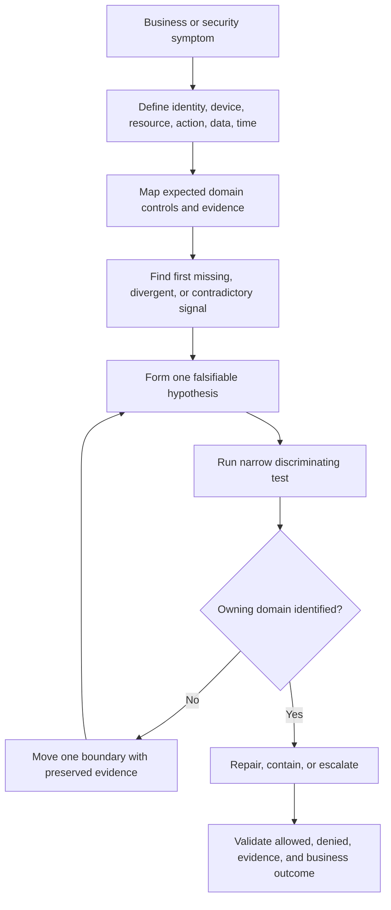

| Symptom | First domain to check | Do not stop there | Cross-domain proof |
|---|---|---|---|
| User cannot reach private app | Identity or access policy | DNS, route, connector, application authorization, health | Decision plus path plus app result |
| Suspicious mass download | SaaS and data | Identity, OAuth, endpoint, network destination, business role | Object timeline and actor chain |
| Vulnerability stays open | Vulnerability source | Asset identity, patch state, scanner credential, exception, owner | Version plus rescan plus path test |
| Alert has no user | Telemetry mapping | Identity lifecycle, device, network translation, SaaS actor | Stable IDs and time correlation |
| DLP misses file upload | Data policy | Classification, protocol, encryption, forwarding, endpoint path | Known test across actual route |
| OT remote session unknown | Vendor access | Identity, jump host, network, plant logs, physical work order | Session-to-maintenance record |
| Cloud resource is public | Cloud config | DNS, route, app authentication, data, ownership, threat activity | External test and business decision |
| Incident recurs | Detection and response | Exposure, identity, application root cause, treatment validation | Cause-to-control feedback evidence |

## Decision trees

### Which domain owns the next action?

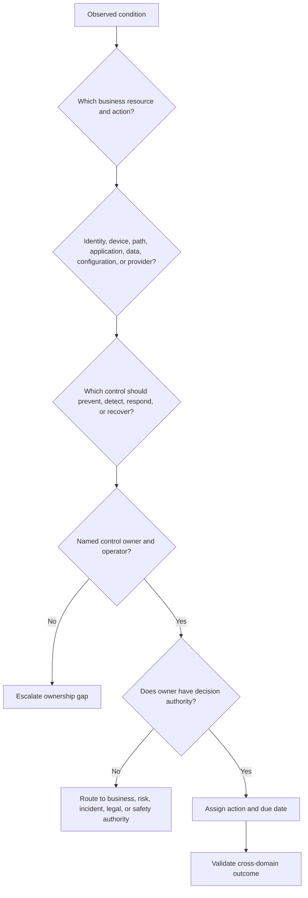

### Is this a control overlap or a gap?

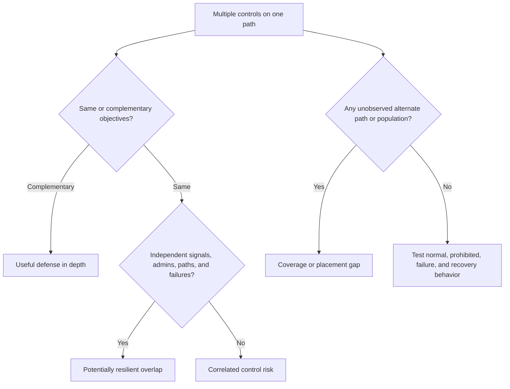

## Scenario drills

### Drill 1 - Stolen identity, clean endpoint

An attacker uses a stolen cloud session from a device with no malware. Explain why EDR may remain green. Trace identity token, SaaS object authorization, data access, network destination, OAuth, detection, and response. Select containment that revokes sessions and scopes data without claiming endpoint remediation solved the case.

### Drill 2 - Patched server, reachable admin path

A server has no known high-severity vulnerabilities, but a broad cloud role and exposed management interface remain. Identify identity and exposure risk beyond patching. Add least privilege, path restriction, management-plane logging, negative tests, and owner review.

### Drill 3 - DLP blocks legitimate design transfer

Do not disable DLP broadly. Confirm data classification, intended recipient, business purpose, channel, exact rule, false-positive mechanism, privacy, and alternate safe workflow. Use a bounded exception or policy correction and test prohibited transfer remains blocked.

### Drill 4 - OT device cannot be patched

Involve plant engineering and safety. Verify vulnerability, actual protocol and path, exploit conditions, vendor support, segmentation, remote access, allowlisting, monitoring, physical control, maintenance window, backup, and recovery. Record residual risk and expiry.

### Drill 5 - Connector health is green, data is stale

A source connector reports connected but events are six hours old. Distinguish transport heartbeat from data freshness and completeness. Reconcile source and destination counts, timestamps, schema rejects, rate limits, identity mapping, buffering, and replay. Qualify detections and risk outputs until repaired.

### Drill 6 - Arti bridge

Choose a factual OneDrive or SharePoint case. Draw the user, client, identity, Domain Name System, Transport Layer Security, proxy, Microsoft service, permission, and data path. Explain the first divergent evidence and validated fix. Then state which EDR, SIEM, Zscaler, vulnerability, or OT tasks remain not-yet-used.

## Contrarian review

| Claim | Contrarian question | Stronger proof |
|---|---|---|
| "Identity is secure because MFA is on" | Which users, factors, recovery, tokens, sessions, and resource authorization? | Coverage, method, revoke, and app tests |
| "Endpoint is compliant" | Is sensor healthy, policy effective, user session safe, and data path controlled? | Independent posture and behavior evidence |
| "Firewall blocks lateral movement" | Which east-west routes, identities, protocols, cloud peers, and app paths? | Observed and negative-tested path map |
| "The app passed scanning" | What about business logic, authorization, dependency, build, runtime, and secrets? | Lifecycle and runtime evidence |
| "Cloud provider secures it" | Which exact service duties remain with customer? | Service-specific responsibility matrix |
| "SaaS is safe by default" | Which tenant settings, guests, OAuth apps, data, endpoints, and admin paths? | Config, population, and negative tests |
| "Data is encrypted" | Who can decrypt, for what purpose, and where can authorized users copy it? | Identity, key, action, DLP, and audit evidence |
| "No critical vulnerabilities" | Are assets known, scanner authenticated, paths and misconfigurations assessed? | Multi-source exposure validation |
| "SIEM has all logs" | Which required sources, fields, freshness, retention, and failures? | Source contract and reconciliation |
| "Vendor is certified" | Which scope, service, period, and customer controls? | Current assurance plus local implementation |
| "Zscaler eliminates the attack path" | Which documented product, configured scope, alternate path, and observed denial? | Bounded product and customer evidence |

## Official Source Anchors

**Checked on 2026-08-24.** Government and nonprofit sources provide general guidance and knowledge bases. Cloud and product providers describe their services and positioning. Summaries are not copied standards or implementation guarantees. Recheck current versions and tenant documentation.

| Source | Official anchor | Used for | Currency and scope caveat |
|---|---|---|---|
| NIST Cybersecurity Framework 2.0 | https://www.nist.gov/cyberframework | Govern, Identify, Protect, Detect, Respond, Recover outcomes | Outcome framework, not domain-product certification |
| NIST SP 800-207 | https://csrc.nist.gov/pubs/sp/800/207/final | Identity, resource, policy, enforcement, and Zero Trust concepts | Published August 2020; technology-neutral |
| NIST SP 800-53 Rev. 5 | https://csrc.nist.gov/pubs/sp/800/53/r5/upd1/final | Broad security and privacy control catalog context | Federal-oriented and detailed; tailor and check updates |
| NIST SP 800-61 Rev. 3 | https://csrc.nist.gov/pubs/sp/800/61/r3/final | Current incident-response and CSF 2.0 integration context | Published April 2025; supersedes Rev. 2 |
| NIST SSDF | https://csrc.nist.gov/projects/ssdf | Secure software-development framework context | Use current publication for exact practices |
| CISA Cybersecurity Performance Goals | https://www.cisa.gov/cybersecurity-performance-goals | Prioritized cross-domain safeguards | Voluntary baseline, not complete program |
| CISA Zero Trust Maturity Model | https://www.cisa.gov/resources-tools/resources/zero-trust-maturity-model | Identity, devices, networks, applications/workloads, data, visibility, automation | Federal model; adapt to context |
| MITRE ATT&CK Enterprise | https://attack.mitre.org/ | Observed adversary tactics and techniques | Not risk probability, incident proof, or control checklist |
| FIRST CVSS | https://www.first.org/cvss/ | Vulnerability technical-severity context | Severity is not business risk |
| Microsoft shared responsibility | https://learn.microsoft.com/azure/security/fundamentals/shared-responsibility | Cloud service-model responsibility | Verify each service and customer configuration |
| Microsoft SharePoint and OneDrive security | https://learn.microsoft.com/sharepoint/secure-access-to-data | Microsoft 365 access and data-security starting point | Feature, license, tenant, and policy behavior change |
| Zscaler Zero Trust Exchange | https://www.zscaler.com/products-and-solutions/zero-trust-exchange-zte | Platform, identity, context, proxy, policy positioning | Marketing is not observed customer outcome |
| Zscaler Internet Access | https://www.zscaler.com/products-and-solutions/zscaler-internet-access | Internet and SaaS access positioning | Validate forwarding, inspection, policy, and exceptions |
| Zscaler Private Access | https://www.zscaler.com/products-and-solutions/zscaler-private-access | Private application access positioning | Validate connectors, segments, policy, name resolution, HA |
| Zscaler Data Security | https://www.zscaler.com/products-and-solutions/data-security | Public data-security portfolio positioning | Channel, feature, license, privacy, and action vary |
| Zscaler SaaS Security | https://www.zscaler.com/products-and-solutions/saas-security | SaaS and CASB positioning | API and inline modes require current validation |
| Zscaler Asset Exposure Management | https://www.zscaler.com/products-and-solutions/caasm | Asset and exposure visibility positioning | Connector and entity behavior require validation |
| Zscaler Unified Vulnerability Management | https://www.zscaler.com/products-and-solutions/vulnerability-management | Contextual vulnerability prioritization positioning | Scores, fields, factors, and outcomes require validation |
| Zscaler Data Fabric | https://www.zscaler.com/products-and-solutions/data-fabric | Cross-domain security-data positioning | Connector catalog, mapping, freshness, and privacy vary |
| Zscaler Security Operations | https://www.zscaler.com/products-and-solutions/security-operations | Agentic Security Operations positioning | Agent behavior, authority, evidence, and packaging vary |
| Zscaler IoT/OT | https://www.zscaler.com/products-and-solutions/secure-your-ot-and-iot | Public OT and IoT solution positioning | Safety, protocol, architecture, and support need specialists |

## Likely Interview Questions

### Q1. Why do security domains exist if attacks cross them?

**Model answer:** Domains organize specialist knowledge, controls, tools, and ownership. Identity teams need depth different from application, endpoint, cloud, data, or OT teams. The risk is treating the boundary as isolation.

I start with a business service and transaction, map which domains protect each step, identify shared dependencies and decision rights, and require evidence that can be correlated across domains. A domain is a useful lens, not the complete security truth.

### Q2. What controls and evidence matter most in identity security?

**Model answer:** I cover authoritative lifecycle, strong authentication and recovery, resource authorization, privilege, federation, workload identities, session limits, revocation, and audit. Evidence should connect identity creation and sponsor, authentication method, token and session, matched authorization, resource action, privilege elevation, lifecycle change, and revocation result.

MFA is important but not sufficient. A valid identity can still have excessive authorization, a stolen session, weak recovery, or malicious intent.

### Q3. How do endpoint and network security complement each other?

**Model answer:** Endpoint controls observe device identity, configuration, processes, files, local data, and response actions. Network controls govern name resolution, route, segmentation, destinations, protocols, inspection, and availability. Endpoint context can inform network access, while network evidence can reveal activity outside endpoint visibility.

I test independence. If both trust one stale posture flag or share one bypass path, the apparent defense in depth is correlated. Application and identity authorization still remain necessary.

### Q4. What is different about cloud and SaaS security?

**Model answer:** Both use shared responsibility, but the customer-operated layer changes. In cloud IaaS and PaaS, customers may own workload code, configuration, cloud identities, networks, and data while providers operate lower layers. In SaaS, the provider operates the application, while the customer still governs tenant identity, roles, configuration, sharing, integrations, endpoints, data, monitoring, and response.

I verify the exact service, feature, contract, logs, backup, support, and customer configuration rather than relying on a generic matrix.

### Q5. How do vulnerability and exposure management differ?

**Model answer:** Vulnerability management focuses on finding, prioritizing, treating, and validating weaknesses such as software flaws and configuration defects. Exposure management broadens the context to assets, identities, reachability, attack paths, controls, threat evidence, business consequence, and ownership.

A high-severity CVE is not automatically the highest business risk, and an important exposure may have no CVE. I connect finding to asset, path, control, owner, treatment, and validated residual risk.

### Q6. Walk through a cross-domain investigation.

**Model answer:** I define the subject or workload, device, resource, action, data, time, and business impact. I build hypotheses across delivery, identity, session, endpoint, network path, application and object authorization, cloud or SaaS configuration, data movement, and provider health. I correlate stable IDs and timestamps, find the first divergent signal, and run a narrow discriminating test.

Containment is selected with business, evidence, privacy, safety, and recovery tradeoffs. Afterward, findings feed identity, exposure, detection, architecture, and governance improvements.

### Q7. How would you map the Zscaler portfolio without overclaiming?

**Model answer:** I would summarize only current official positioning: the Zero Trust Exchange, ZIA, ZPA, Client Connector, Digital Experience, cloud workload, data security, SaaS security, exposure, vulnerability, Risk360, Data Fabric, Security Operations, and OT-related areas. Then I would map a documented capability to the customer's exact control objective.

Before a customer claim, I would validate license, architecture, configuration, users and assets, traffic and data scope, source quality, workflow, bypass, failure, recovery, and observed outcome. I have not operated these products in production.

### Q8. How does your OneDrive and SharePoint background transfer across security domains?

**Model answer:** A production OneDrive or SharePoint case can cross user and device identity, client process, browser, Domain Name System, Transmission Control Protocol, Transport Layer Security, proxy policy, Microsoft service health, tenant authorization, site permissions, file actions, and audit. I have used scoped reproduction, affected and unaffected comparison, logs, traces, request identifiers, change history, and fix validation across those boundaries.

That is a strong cross-domain troubleshooting method. I remain explicit that EDR, SIEM, SOAR, XDR, vulnerability programs, Zscaler products, and OT security are learning or lab areas rather than established production operation.

## 30-Second Memory Hooks

| Domain | Memory hook |
|---|---|
| Domain | Specialist lens, not isolated truth |
| Identity | Who or what may do which action |
| Endpoint | Device state, process, local data, response |
| Network | Name, path, protocol, policy, evidence |
| Application | Design, code, identity, logic, runtime |
| API | Machine identity plus object and function authorization |
| Cloud | Shared responsibility plus customer configuration |
| SaaS | Provider runs app; customer governs tenant use |
| Email | Human trust and legitimate workflow are attack surfaces |
| Collaboration | Message, identity, file, sharing, app, data |
| Data | Purpose, owner, lifecycle, access, handling |
| Vulnerability | Weakness to find, treat, and validate |
| Exposure | Asset plus path plus context plus controls |
| Detection | Signal becomes a question |
| Response | Governed action under consequence |
| Third party | Select, contract, onboard, monitor, incident, exit |
| Physical | Digital control still lives in a physical world |
| OT | Safety and process change containment decisions |
| Overlap | Strong only with independent failure modes |
| Gap | Coverage, placement, configuration, integration, owner, time |
| IOC | Artifact associated with compromise |
| IOA | Behavior associated with attack |
| TTP | Goal, method, implementation |
| Cross-domain evidence | Stable IDs, time, source quality, business context |
| Zscaler | Documented overview plus tenant validation |
| Arti bridge | Trace Microsoft 365 from client to data and provider |

## Completion Checklist

- [ ] I can explain why a security domain is a specialist lens rather than a complete trust boundary.
- [ ] I can place the business service and data at the center of a domain map.
- [ ] I can map identity lifecycle, authentication, authorization, privilege, workload identity, federation, session, revocation, and evidence.
- [ ] I can map endpoint inventory, management, baseline, patch, prevention, EDR, data, response, and recovery.
- [ ] I can map Domain Name System, route, segmentation, internet access, private access, Transport Layer Security, resilience, and network monitoring.
- [ ] I can map application requirements, code, dependency, build, test, identity, API, secrets, runtime, and logging.
- [ ] I can map cloud organization, IAM, configuration, network, workload, data, pipeline, logs, and resilience.
- [ ] I can apply service-specific shared responsibility rather than a generic assumption.
- [ ] I can map SaaS tenant inventory, identity, roles, configuration, OAuth, sharing, data, audit, provider, and recovery.
- [ ] I can explain phishing, business email compromise, malicious OAuth, oversharing, account takeover, malicious files, workflow fraud, and exfiltration.
- [ ] I can map data inventory, classification, access, encryption, DLP, privacy, retention, backup, and monitoring.
- [ ] I can explain why encryption does not decide authorized use.
- [ ] I can distinguish vulnerability management from broader exposure management.
- [ ] I can trace a finding through asset, identity, path, threat, control, owner, treatment, and validation.
- [ ] I can explain SIEM, SOAR, XDR, EDR, alert, incident, IOC, IOA, and TTP without treating categories as one product.
- [ ] I can map collection, detection, triage, investigation, declaration, containment, eradication, recovery, and learning.
- [ ] I can map third-party inventory, due diligence, contract, access, integration, monitoring, incident, exit, and concentration.
- [ ] I can explain physical and OT controls and why cyber containment requires safety authority.
- [ ] I can identify strong defense in depth versus controls sharing one failure source.
- [ ] I can classify coverage, placement, configuration, integration, ownership, time, evidence, resilience, authority, and outcome gaps.
- [ ] I can walk the fictional NMH phishing, token, OAuth, SharePoint, download, and exfiltration chain.
- [ ] I can join email, identity, SaaS, endpoint, network, data, and detection evidence using stable identifiers and time.
- [ ] I can compare containment benefit, business impact, evidence preservation, authority, and validation.
- [ ] I can map OneDrive and SharePoint symptoms across identity, client, network, proxy, tenant, permission, data, and provider domains.
- [ ] I can describe the official Zscaler portfolio only at a documented overview level.
- [ ] I can state that no NMH or Arti production Zscaler, SecOps, vulnerability, EDR, SIEM, SOAR, XDR, cloud, or OT operation is claimed.
- [ ] I can define cross-domain metrics with complete denominators, owners, source health, and decisions.
- [ ] I can troubleshoot by finding the first divergent signal and running a narrow discriminating test.
- [ ] I can challenge a green domain status with a cross-domain outcome question.
- [ ] I can recheck NIST, CISA, MITRE, FIRST, Microsoft, and Zscaler sources after 2026-08-24.
- [ ] I can answer all eight questions aloud with an honest production-versus-learning boundary.

[Part 15 - Incident Response, Evidence, RCA, and Post-Incident Improvement](Part-15-incident-response-evidence-rca.md)