# Part 15 - Incident Response, Evidence, RCA, and Post-Incident Improvement

> **Audience:** Candidates moving from Microsoft 365 Support Escalation Engineering into a Zscaler Security Operations Technical Success Manager role.
>
> **Currency date:** 2026-08-24.
>
> **Scope and honesty:** Northstar Meridian Holdings, abbreviated NMH, and every NMH event, incident, architecture, identity, connector, control, timeline, indicator, severity, metric, cause, action, decision, and outcome are fictional. Your established production bridge is enterprise support, OneDrive, SharePoint, networking, troubleshooting, analytics, mentoring, escalation, and approved AI work. Direct production command of cybersecurity incidents, digital forensics, Zscaler, Security Operations, vulnerability management, exposure management, SIEM, SOAR, XDR, EDR, or regulated breach notification is not established.
>
> **Current-guidance caveat:** NIST Special Publication 800-61 Revision 3, published April 2025, is the current NIST incident-response publication and supersedes Revision 2. It integrates incident-response recommendations across NIST Cybersecurity Framework 2.0 cybersecurity-risk-management activities. The familiar Preparation, Detection and Analysis, Containment, Eradication, Recovery, and Post-Incident Activity sequence remains a useful operational teaching model, but it should not be misrepresented as the exact current Rev. 3 document structure.
>
> **Authority caveat:** Incident declaration, evidence acquisition, employee monitoring, legal privilege, regulator or customer notification, law-enforcement contact, destructive actions, safety decisions, and public communication require authorized organizational roles. This chapter is educational, not legal, privacy, forensic, or regulatory advice.
>
> **Product caveat:** Zscaler pages describe vendor positioning. Exact event fields, retention, connectors, workflows, Agentic Security Operations behavior, autonomy, licensing, response actions, and tenant results require current documentation and validation. No NMH or documented production Zscaler use is claimed.

## Section goal

Incident response is the coordinated process of preparing for, detecting, analyzing, containing, eradicating, recovering from, and learning from cybersecurity incidents. An incident is not merely an alert or technical error. It is an event or group of events that meets the organization's approved criteria for adverse cybersecurity impact or credible threat requiring governed response.

Imagine smoke in a hospital. A sensor raises an alert. Staff confirm location and severity, protect patients, preserve information about the source, contain the hazard without blocking emergency exits, remove the cause, restore safe operation, communicate accurately, and improve building and response controls. Acting fast matters, but acting blindly can harm patients or destroy evidence. Cyber incident response has the same balance among urgency, safety, business continuity, evidence, authority, and learning.

By the end, you should be able to:

| Learning outcome | What mastery looks like |
|---|---|
| Explain current NIST framing | Relate SP 800-61 Rev. 3 to CSF 2.0 and the familiar operational sequence |
| Prepare | Define governance, roles, assets, logs, playbooks, tools, suppliers, exercises, and recovery |
| Detect and analyze | Distinguish event, alert, incident, IOC, IOA, TTP, hypothesis, scope, severity, and confidence |
| Lead coordinated response | Explain incident command, technical workstreams, decision rights, handoffs, and cadence |
| Preserve evidence | Maintain integrity, provenance, chain of custody, time, access, and legal/privacy boundaries |
| Build a timeline | Join cross-domain evidence while distinguishing source time, collection time, and uncertainty |
| Contain proportionately | Compare account, endpoint, network, application, data, provider, and business tradeoffs |
| Eradicate | Remove root access, persistence, weakness, malicious artifacts, and unsafe configuration |
| Recover safely | Restore clean systems, identity, data, configuration, business function, and monitoring |
| Communicate | Tailor technical, executive, user, provider, legal, privacy, and public updates |
| Distinguish reviews | Separate Root Cause Analysis, Post-Incident Review, and problem management |
| Use causal tools | Apply Five Whys, fishbone, and fault tree with limitations and evidence |
| Improve without blame | Write systemic, owned, measurable, validated, time-bound actions |
| Close the loop | Feed incident lessons into exposure, architecture, detection, governance, training, and product work |
| Practice honestly | Run a fictional NMH connector incident and use your factual critical-situation bridge |

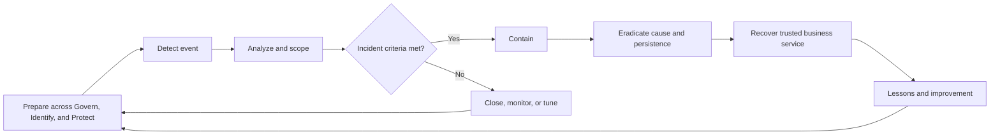

The flow is iterative. Containment may reveal new scope. Eradication may fail and require renewed analysis. Recovery can surface persistence. Communication, evidence, legal/privacy consultation, business decisions, and documentation run throughout.

## JD Mapping

The target Technical Success Manager, abbreviated **TSM**, may coordinate critical customer escalations, provide product and architecture context, organize evidence, manage communication, and connect Support, Product, Sales, Engineering, and customer teams. The TSM is not automatically the customer's incident commander, forensic examiner, legal adviser, breach-notification authority, or risk acceptor.

| JD expectation | Incident-response capability | Honest experience bridge | Boundary to preserve |
|---|---|---|---|
| Resolve critical escalations | Structure command, workstreams, evidence, cadence, blockers, and decisions | Production critical situation and business-critical incident coordination | Cyber incident command is not claimed |
| Analyze complex environments | Correlate identity, endpoint, network, application, SaaS, data, and provider evidence | Microsoft 365 cross-layer troubleshooting | Forensic conclusions require authorized specialists |
| Deliver mitigation strategies | Compare containment, recovery, workaround, and long-term control actions | Production mitigation and fix validation | Customer incident and business owners approve action |
| Develop SecOps expertise | Explain alert-to-incident, triage, investigation, response, and feedback | Structured learning and fictional exercise | No production SOC, SIEM, SOAR, XDR, or EDR operation |
| Partner cross-functionally | Coordinate customer, Support, Engineering, Product, Sales, Legal, and executive stakeholders | Established cross-team collaboration | Confidentiality and need-to-know remain governed |
| Communicate to executives | State impact, confidence, action, decision, risk, and next update | High-pressure customer communication | Avoid unsupported attribution and certainty |
| Drive long-term success | Convert incident findings into roadmap, adoption, resilience, and health actions | RCA and knowledge-improvement bridge | Customer owns final program and risk decisions |
| Use data | Build timelines, measure response quality, trend causes, and track actions | SQL, Power BI, analytics | Metrics require stable definitions and denominators |

## Candidate honesty note

You can truthfully discuss leading or coordinating enterprise support escalations and critical-situation-style engagements: defining customer impact, opening workstreams, gathering logs and traces, comparing affected and unaffected cases, coordinating Engineering and stakeholders, documenting timelines, communicating status, validating workarounds and fixes, and contributing to root-cause and prevention learning.

You should say explicitly that a service critical situation is not automatically a cybersecurity incident. You have not established production authority to seize devices, acquire forensic images, declare a breach, notify regulators, attribute an attacker, operate a SOC, or execute Zscaler response controls.

| Claim class | Safe wording | Unsafe wording |
|---|---|---|
| Production | "I coordinated high-severity enterprise support incidents with evidence, workstreams, cadence, and fix validation." | "I commanded cyber breach response" |
| Lab | "I ran a fictional NMH connector and account-compromise tabletop." | "I contained the NMH attack" |
| Conceptual | "I understand current NIST framing and the incident lifecycle." | "I am a digital forensics expert" |
| Not-yet-used | "I have not operated Zscaler SecOps, SIEM, SOAR, XDR, or EDR in production." | "I automated threat containment" |
| Authority boundary | "I would engage incident, Legal, Privacy, Human Resources, safety, and communications owners." | "I decided breach notification" |

## Essential terms before response depth

| Term | Plain meaning | Why it matters | Memory hook |
|---|---|---|---|
| Event | Observable occurrence in a system or process | Most events are not incidents | Something happened |
| Alert | Notification created by logic, threshold, or person | Starts triage, not certainty | A question raised |
| Incident | Event or events meeting approved adverse-impact criteria | Activates governed response | Criteria plus consequence |
| Triage | Rapid validation and prioritization | Routes effort proportionately | Is it real, how urgent, who next? |
| Investigation | Evidence-based reconstruction and scoping | Supports decisions | What happened, how, and what else? |
| Severity | Organizational level based on impact and urgency | Drives authority and cadence | Consequence plus time |
| Priority | Order in which work is performed | Can differ from severity | What gets attention now |
| Scope | Identities, assets, data, locations, time, and actions potentially affected | Prevents narrow containment | What may be involved |
| IOC | Indicator of Compromise | Artifact associated with known or suspected compromise | Evidence of possible presence |
| IOA | Indicator of Attack | Behavior suggesting active or attempted attack | Evidence of behavior |
| TTP | Tactic, Technique, and Procedure | Adversary goal, method, and specific implementation | Why, how, exactly how |
| Containment | Limit spread, access, or consequence | Buys time and protects assets | Stop it growing |
| Eradication | Remove cause, access, persistence, and malicious artifacts | Prevents immediate recurrence | Remove it |
| Recovery | Restore trusted business operation | Returns service safely | Bring back and verify |
| Evidence | Information used to support a conclusion | Decisions need traceability | What supports the claim |
| Artifact | Object collected or observed | May include file, log, image, token, message, or configuration | A thing examined |
| Provenance | Origin and history of evidence | Supports trust and interpretation | Where did it come from? |
| Chain of custody | Documented possession, transfer, access, and handling | Protects integrity and accountability | Who had it, when, and why? |
| Hash | Fixed-length value used to detect content change | Can support integrity checks | Digital tamper indicator |
| RCA | Root Cause Analysis | Investigates contributing causal conditions | Why did the system permit this? |
| PIR | Post-Incident Review | Reviews response, impact, decisions, and learning | How did the whole incident go? |
| Problem management | Ongoing work to reduce recurrence across incidents | Extends beyond one review | Remove recurring causes |
| Corrective action | Fixes an observed nonconformity or cause | Closes a known gap | Correct what failed |
| Preventive improvement | Reduces future exposure beyond the exact failure | Builds resilience | Improve the system |
| Blameless | Focuses on system and choices without personal shaming | Encourages honest evidence | Accountability without humiliation |

## Current NIST incident-response framing

NIST SP 800-61 Rev. 3 is titled *Incident Response Recommendations and Considerations for Cybersecurity Risk Management: A CSF 2.0 Community Profile*. It integrates incident-response recommendations across CSF 2.0. Preparation is supported through Govern, Identify, and Protect. Incident-response activity centers strongly on Detect, Respond, and Recover. Lessons feed all Functions.

This differs from memorizing the older four-phase diagram from Revision 2. The operational activities remain useful, but current interview answers should acknowledge Rev. 3 and its risk-management integration.

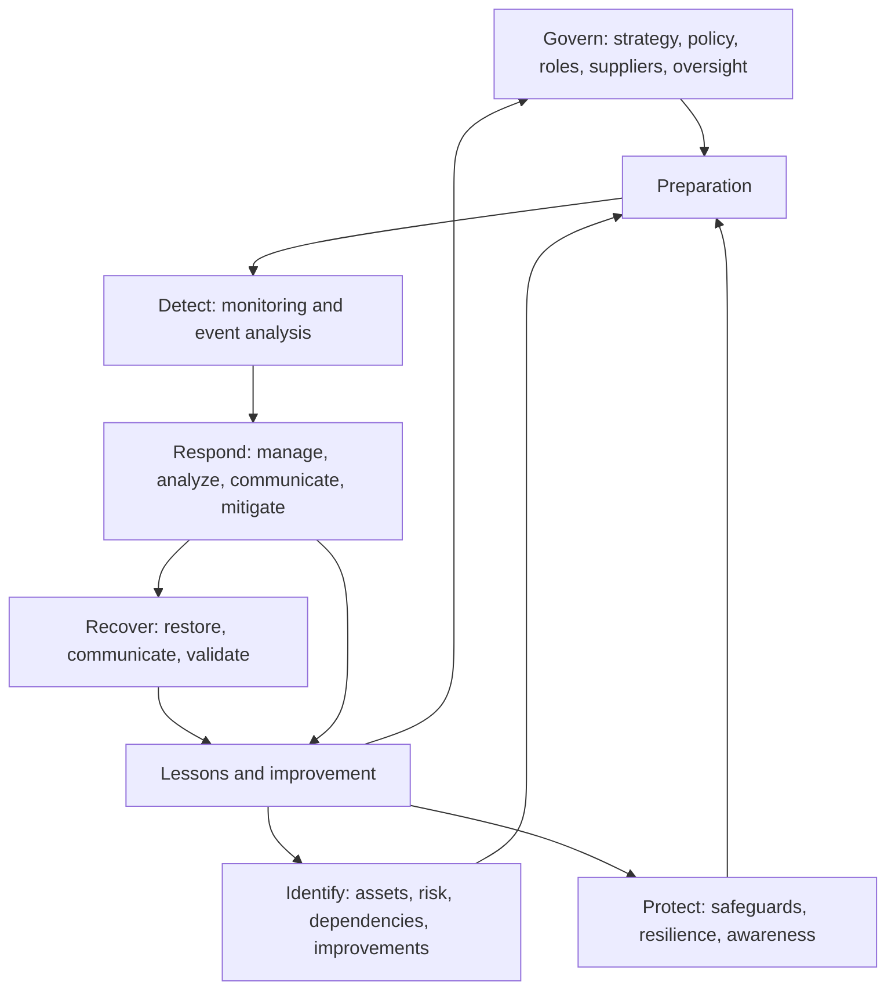

| View | Purpose | Use in this chapter | Caveat |
|---|---|---|---|
| NIST CSF 2.0 integration | Treat incident response as part of enterprise risk management | Governance, preparation, Detect, Respond, Recover, improvement | Use Rev. 3 for current exact recommendations |
| Familiar operational sequence | Give responders a practical chronological model | Preparation, detection/analysis, containment, eradication, recovery, lessons | Not presented as exact Rev. 3 table of contents |
| Playbook | Define scenario-specific triggers, actions, decisions, and evidence | Account takeover, malware, data loss, provider outage | Must be tested and adapted |
| Incident timeline | Reconstruct what happened and when | Analysis, communication, RCA | Observed time is not always event time |
| Risk register | Govern residual risk and improvement | Post-incident treatment | Incident closure does not close all risk |

### Plain-English deep-dive 1 - Incident response starts before the incident

A fire brigade does not wait for a fire to decide who answers the phone, where equipment is stored, which hospital receives patients, or who speaks to the public. Cyber incident response also depends on preparation: known assets and owners, protected logs, current contacts, authority, playbooks, exercises, secure communications, forensic access, supplier obligations, backups, and recovery tests.

The current NIST framing reinforces that preparation is distributed across governance, risk identification, and protection. Weak identity lifecycle, unknown cloud assets, missing telemetry, untested backup, and unclear vendor contacts are incident-response failures even before an alert appears.

For a TSM, preparation includes knowing tenant and subscription identifiers, product support entitlements, severity routes, evidence requirements, log retention, customer owners, and escalation contacts. It also includes setting expectations about what the TSM, Support, Engineering, Product, and customer incident teams can decide. That preparation shortens confusion without granting the TSM authority the role does not possess.

## Preparation

Preparation establishes people, process, technology, information, relationships, and exercises before harm occurs.

| Preparation area | Questions | Artifact or evidence | Failure mode |
|---|---|---|---|
| Governance | Who declares, leads, contains, communicates, accepts risk, and closes? | Policy, charter, severity, RACI | Everyone waits for someone else |
| Asset and service context | Which identities, systems, data, owners, and dependencies matter? | Inventory and business-service map | Alert lacks business impact |
| Logging | Which sources, fields, time, retention, integrity, and health are required? | Source contract and test | Missing evidence discovered during incident |
| Tool access | Can responders access systems under degraded conditions? | Role, emergency account, access exercise | Identity outage blocks response |
| Playbooks | Which scenarios, triggers, decisions, and actions are rehearsed? | Versioned playbook | Checklist ignores actual architecture |
| Communication | Which secure channels, templates, cadence, and audiences? | Contact tree and templates | Compromised email used for response |
| Evidence | Who can collect, store, transfer, examine, and dispose? | Evidence procedure and repository | Artifact altered or privacy mishandled |
| Suppliers | Which provider contacts, terms, evidence, and notification duties? | Contract, support matrix, exercise | Customer and provider wait on each other |
| Recovery | Which clean identity, backups, configurations, and business tests? | Recovery plan and exercise | Restoration recreates compromise |
| Training | Do technical and executive roles know decisions? | Tabletop and technical exercise | One expert becomes a bottleneck |
| Legal and privacy | Which consultation triggers and jurisdictions apply? | Approved decision route | Evidence or communication creates new harm |
| Metrics | How is readiness and response quality measured? | Metric dictionary | Speed optimized at expense of correctness |

### Readiness checklist by incident type

| Incident type | Preparation essentials |
|---|---|
| Account compromise | Session and token revocation, identity recovery, app grants, sign-in and resource audit |
| Endpoint malware | EDR access, isolation authority, forensic image decision, rebuild and credential reset |
| SaaS data exposure | Tenant roles, object and sharing audit, data owners, provider evidence, notification route |
| Cloud compromise | Organization logs, workload identity, account isolation, clean pipeline, key rotation |
| Ransomware | Segmentation, immutable backup, clean-room recovery, executive and continuity coordination |
| Insider concern | Human Resources, Legal, privacy, need-to-know, evidence and safety procedures |
| Third-party incident | Contract contacts, identity and integration inventory, joint timeline, exit and workaround |
| OT incident | Plant safety authority, passive evidence, vendor, manual operation, recovery logic |
| Product or connector failure | Source health, alternate evidence, support escalation, buffer and replay behavior |

## Detection and analysis

Detection finds observations that may indicate adverse activity. Analysis tests hypotheses, validates the alert, assesses severity, scopes affected entities and data, and decides whether incident criteria are met.

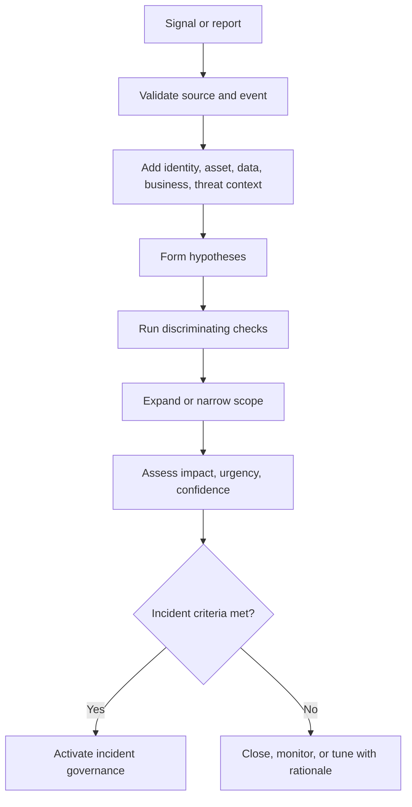

### Event, alert, finding, and incident

| Object | Example | Decision | Common error |
|---|---|---|---|
| Event | User downloads a file | Is it expected and attributable? | Treat every event as suspicious |
| Alert | Rule reports unusual download volume | Does evidence support suspicious activity? | Treat alert title as conclusion |
| Finding | OAuth application has excessive scope | What risk, owner, and treatment apply? | Call a static condition an active incident |
| Incident | Compromised token accesses restricted data under criteria | Activate response authority and workstreams | Delay declaration until perfect certainty |
| Problem | Repeated connector failures delay identity telemetry | Which systemic cause and owner require ongoing work? | Close when one connector restart succeeds |

### Analysis questions

| Question | Evidence |
|---|---|
| What triggered attention? | Reporter, alert ID, rule version, source event |
| Is the source healthy? | Freshness, completeness, parser, clock, retention |
| Which identity and session? | Stable ID, tenant, auth method, token, device |
| Which asset or service? | Asset ID, owner, criticality, environment |
| Which action and object? | Process, API, file, site, configuration, command |
| Which path? | Domain Name System, connection, proxy, application, provider |
| Which data? | Classification, file or record IDs, owner, volume |
| What is normal? | Peer, user, service, time, and historical baseline |
| What changed? | Identity, policy, release, route, provider, threat, behavior |
| What else may be affected? | Shared identity, token, device, app, group, dependency |
| How confident are we? | Source quality, corroboration, gaps, alternate explanation |
| What decision is time sensitive? | Containment, notification, service continuity, evidence capture |

## IOC, IOA, TTP, and hypotheses

An IOC can be a file hash, domain, address, account artifact, or other observation associated with compromise. An IOA describes behavior suggesting an attack, such as a new token followed by unusual app consent and mass download. TTPs describe an adversary's goals and methods using a shared vocabulary such as MITRE ATT&CK.

| Evidence concept | Best use | Limitation | Example response |
|---|---|---|---|
| IOC | Search for known artifact and scope presence | Changes, shared infrastructure, false positives | Block or hunt with context |
| IOA | Detect meaningful behavior and sequences | Requires baseline and interpretation | Investigate actor and action chain |
| Tactic | Understand adversary objective | Broad and not proof | Organize hypotheses |
| Technique | Describe common method | May have benign uses | Map evidence and controls |
| Procedure | Capture exact implementation in case | Narrow and time-sensitive | Create case-specific hunt |
| Hypothesis | State falsifiable explanation | Can bias if alternatives ignored | List support, conflict, and next test |

### Hypothesis matrix

| Hypothesis | Supporting evidence | Conflicting evidence | Discriminating check | Status |
|---|---|---|---|---|
| Supplier token was stolen | New source and unusual resource actions | Strong authentication was completed | Inspect session, token, device, and sign-in sequence | Open |
| Activity was legitimate automation | OAuth app and bulk files | No approved owner or schedule | Contact owner and compare app behavior | Open |
| Audit delay created false sequence | Connector freshness gap | Some SaaS events are direct | Compare source event time and ingestion time | Open |
| Provider service defect caused duplicate events | Repeated request IDs | Object audit shows distinct actions | Escalate request identifiers and compare objects | Low confidence |

The matrix prevents early narrative lock-in. A hypothesis is not an accusation. Preserve benign, malicious, defect, and operator-error alternatives until evidence discriminates them.

## Severity, priority, and escalation

Severity reflects organizational impact and urgency under approved criteria. Priority determines work order based on severity, time sensitivity, dependency, and available action. A lower-severity event may receive high priority because volatile evidence will disappear.

| Severity input | Questions |
|---|---|
| Safety | Could people, equipment, or environment be harmed? |
| Data | What sensitivity, volume, subjects, ownership, and jurisdictions? |
| Identity and privilege | Is administrative, service, executive, or broad identity affected? |
| Scope | One user, tenant, region, service, supplier, or enterprise? |
| Business | Which revenue, production, customer, contract, or mission objective? |
| Persistence | Can actor or defect continue or return? |
| Spread | Can the condition reach other identities, assets, or data? |
| Recovery | Are clean restoration and business alternatives available? |
| Evidence | Is confidence high or uncertainty itself material? |
| Time | Which containment, legal, notification, or evidence deadlines exist? |

### Fictional NMH severity model

| Severity | Fictional trigger | Governance | Cadence |
|---|---|---|---|
| SEV-1 | Severe safety, strategic, widespread, or sensitive-data consequence is active or imminent | Executive incident command and required authorities | Continuous bridge and frequent executive updates |
| SEV-2 | Major scoped impact or credible spread requiring urgent multi-team response | Incident commander and executive sponsor | Scheduled bridge and decision updates |
| SEV-3 | Moderate contained impact with known workaround | Domain lead and service owner | Regular case cadence |
| SEV-4 | Low impact event, inquiry, or finding without incident criteria | Operational owner | Normal workflow |

This model is fictional and not a Zscaler, Microsoft, NIST, or customer severity scheme.

### Severity reassessment

Severity changes as evidence changes. Record time, decision maker, inputs, and rationale. Do not quietly rewrite history. A connector data gap can increase uncertainty and justify escalation even before confirmed impact; later evidence can lower severity.

## Roles, command, and workstreams

Incident command creates one coordinated decision system. It does not mean one person performs every technical task.

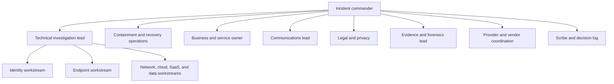

| Role | Responsibility | Key output | Boundary |
|---|---|---|---|
| Incident commander | Overall objectives, priorities, decisions, cadence, safety | Incident action plan and decisions | Does not replace specialist judgment |
| Technical lead | Coordinates hypotheses, scope, evidence, and technical work | Technical assessment and next tests | Does not decide public communication alone |
| Workstream lead | Owns one domain investigation or action | Evidence, result, blocker, recommendation | Reports assumptions and limits |
| Business owner | States business impact, alternatives, and acceptance | Business priority and validation | Does not alter forensic evidence |
| Evidence lead | Governs collection, storage, access, and provenance | Evidence register and handling record | Legal authority must be established |
| Legal and Privacy | Advise privilege, obligations, evidence, notification | Authorized advice and decision support | TSM does not substitute |
| Communications | Delivers approved audience-specific updates | Internal, customer, regulator, public messaging | Avoid speculation and inconsistent claims |
| Scribe | Maintains timeline, actions, decisions, owners | Single incident record | Records confidence and source |
| TSM | Coordinates product context, evidence, support, escalation, customer continuity | Product workstream updates and escalation package | Not automatic incident commander or forensic lead |

### Incident bridge operating rhythm

| Cadence item | Content |
|---|---|
| Current impact | What is affected now, for whom, and how? |
| Known facts | Source-backed observations only |
| Unknowns | Material gaps and why they matter |
| Hypotheses | Ranked explanations and next discriminating test |
| Actions | Owner, due time, expected result, risk |
| Decisions | Choice, authority, rationale, timestamp |
| Containment | Completed, proposed, effectiveness, business effect |
| Evidence | New artifacts, integrity, access, retention risk |
| Communications | Audience, approved message, next update time |
| Blockers | Access, owner, provider, tool, legal, safety, or resource |

### Plain-English deep-dive 2 - Command is a decision structure, not the loudest expert

During a severe incident, several experts can be correct about their local concern. Identity wants to revoke sessions. Operations wants to preserve service. Forensics wants volatile evidence. Privacy wants limited data access. Legal considers notification and privilege. A plant leader protects safety. The incident commander integrates those objectives under approved authority.

Think of an orchestra. The conductor does not play every instrument or overrule the physics of a violin. The conductor sets tempo, synchronizes entrances, and keeps the performance coherent. Incident command synchronizes technical work, business impact, evidence, communication, and decisions.

A TSM can be a valuable workstream coordinator because product escalations require clear scope, current behavior, request identifiers, timestamps, reproduction, support routing, and customer updates. The honest boundary is essential: unless the customer assigns authority, the TSM does not declare the incident, direct employee investigation, approve destructive containment, or decide external notification.

## Evidence preservation

Evidence preservation aims to maintain integrity, provenance, authenticity, relevance, and controlled access. The appropriate method depends on the incident, law, privacy, employment context, system, volatility, and intended use. Engage authorized forensic and legal professionals.

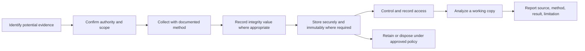

| Evidence field | Purpose |
|---|---|
| Evidence ID | Stable unique reference |
| Description | What the artifact is and why relevant |
| Source | System, tenant, user, device, location, interface |
| Authority | Who approved collection and under which procedure |
| Collector | Person or automated process |
| Collection time | When acquisition occurred, with timezone |
| Event time range | Period represented in the artifact |
| Method and tool | Commands, API, export, image, version, settings |
| Original location | Where the evidence came from |
| Hash or integrity check | Detects content change where meaningful |
| Storage | Protected repository and access controls |
| Transfers | Who gave or received it, when, why, and condition |
| Analysis copy | Distinguishes working copy from preserved original |
| Limitations | Missing period, sampling, source delay, parser, clock |
| Retention and disposal | Approved lifecycle and legal hold status |

### Evidence types and volatility

| Evidence | Volatility or loss risk | Collection consideration |
|---|---|---|
| Memory and live process | Changes rapidly on running system | Authorized forensic capture before shutdown when appropriate |
| Token and session state | Expires or is revoked | Record metadata without exposing secrets unnecessarily |
| Network connection | Short-lived | Flow or capture authority and privacy scope |
| Cloud and SaaS audit | Provider delay, retention, license, API limits | Export source time and collection time |
| Identity logs | Token, sign-in, policy, risk event retention | Preserve stable IDs and tenant context |
| Endpoint disk | Changes during use and response | Forensic image or targeted collection under method |
| Email and collaboration | Message, headers, links, attachments, audit | Preserve original format and IDs |
| Configuration | Can change during containment | Export before and after with version and actor |
| Chat and bridge notes | Informal but decision relevant | Use approved channel and preserve under policy |
| Provider support data | May remain provider controlled | Request preservation and document scope |

### Chain of custody example

| UTC time | Evidence ID | Action | From | To | Purpose | Integrity or condition |
|---|---|---|---|---|---|---|
| 09:10 | NMH-E-021 | Exported fictional SaaS audit | Tenant API | Evidence lead | Preserve event window | Export hash recorded |
| 09:25 | NMH-E-021 | Stored original | Evidence lead | Restricted repository | Protect original | Access limited |
| 09:40 | NMH-E-021-W1 | Created working copy | Repository | Analyst | Timeline analysis | Working-copy hash recorded |
| 12:15 | NMH-E-021-W1 | Shared excerpt | Analyst | Legal-approved team | Review scoped events | Redacted and transfer logged |

All entries are fictional.

### Evidence handling failure modes

| Failure | Consequence | Prevention |
|---|---|---|
| Responder changes system before capturing config | Loses pre-containment state | Export and record before change when safe |
| Screenshot omits time and query | Weak reproducibility | Preserve export, method, source, and metadata |
| Original artifact analyzed directly | Accidental modification | Preserve original and analyze verified copy |
| Shared drive permits broad access | Privacy and integrity risk | Restricted repository and access logging |
| Local time assumed UTC | Timeline order is wrong | Record source timezone and clock offset |
| Provider event arrives late | Ingestion order mistaken for event order | Preserve event and collection timestamps |
| Hash treated as authenticity proof | Same content does not prove truthful source | Combine integrity, provenance, authority, and source validation |
| Excessive collection | Privacy, legal, cost, and breach-scope risk | Purpose, minimization, authority, retention |

## Timeline building

A timeline aligns events from different sources. It must distinguish when an event occurred, when a source recorded it, when it was ingested, when it was collected, and when an analyst learned about it.

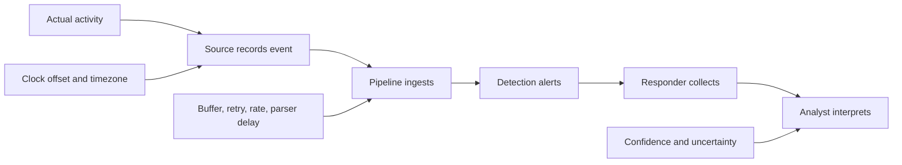

| Time field | Meaning | Error risk |
|---|---|---|
| Event time | When source says activity occurred | Source clock or attacker manipulation |
| Record time | When system wrote the event | Buffering within source |
| Ingest time | When downstream platform received it | Connector and queue delay |
| Alert time | When detection created notification | Batch and rule schedule |
| Collection time | When responder exported evidence | Investigation lag |
| Analysis time | When conclusion was reached | Should not be confused with event chronology |

### Timeline record format

| Field | Example question |
|---|---|
| Normalized UTC time | What is the best common time? |
| Original time and timezone | What did the source record? |
| Clock confidence | Is offset known or estimated? |
| Source and evidence ID | Which preserved artifact supports it? |
| Actor and entity | Which stable user, device, app, object, and tenant IDs? |
| Action and result | What exactly occurred and whether it succeeded? |
| Interpretation | Why is this relevant? |
| Confidence | Fact, strong inference, tentative inference, or unknown? |
| Contradiction | Which evidence conflicts? |
| Next question | What would discriminate alternatives? |

### Fictional NMH timeline excerpt

| UTC | Observation | Source | Confidence | Interpretation |
|---|---|---|---|---|
| 07:55 | Identity connector last successful batch | Connector health | High | Subsequent identity data may be delayed |
| 08:11 | Supplier received collaboration message | Email audit | High | Possible delivery event |
| 08:16 | New session issued | Identity source, ingested at 09:02 | High for event, delayed arrival | Sequence cannot use ingest time |
| 08:19 | OAuth app accessed project site | SaaS audit | Moderate | Could be automation or token abuse |
| 08:21 | Forty-seven synthetic files downloaded | SharePoint audit | High | Data scope requires owner review |
| 08:33 | Download-volume alert fired | Detection | Moderate | Alert lacked fresh identity context |
| 08:38 | Sessions and app grant revoked | Identity and SaaS admin | High | Containment action |
| 09:02 | Delayed identity batch arrived | Connector | High | Changed analysis and scope |

### Plain-English deep-dive 3 - A timeline is an argument with timestamps

A timeline is not a pile of log lines. It is a structured argument about sequence, causality, and uncertainty. If a sign-in appears in the SIEM at 09:02 and a download appears at 08:21, it may look as if files were accessed before authentication. The identity event may actually have occurred at 08:16 and arrived late.

Think of letters delivered after a storm. The delivery order is not the writing order. Investigators preserve the postmark, written date, delivery date, and source. In cyber evidence, source event time, ingest time, collection time, and analyst discovery time serve similar roles.

Use stable identifiers and note clock quality. Human statements belong in the timeline but should be labeled as statements, not machine facts. Inferences should state confidence and alternatives. A defensible timeline allows another reviewer to trace every important row to preserved evidence and understand what remains unknown.

## Containment

Containment limits spread, access, persistence, or consequence while preserving safety, business needs, and evidence. It can be short term or strategic. The right action depends on identity, asset, data, threat, business criticality, and authority.

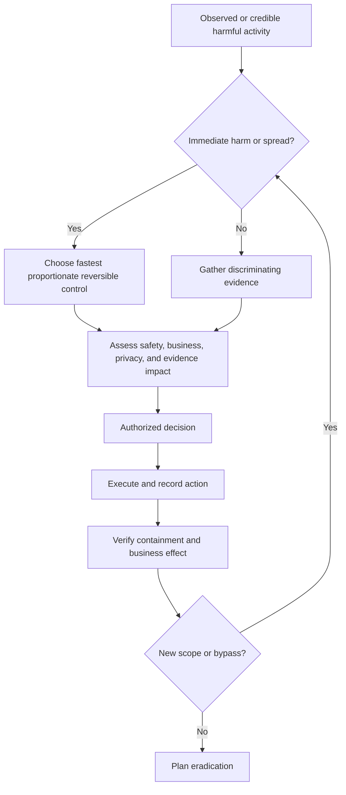

### Containment options

| Domain | Action | Benefit | Risk or tradeoff | Validation |
|---|---|---|---|---|
| Identity | Disable account, revoke sessions, reset credential, remove app consent | Stops known access paths | Business interruption; incomplete token revocation | Reuse denied across apps |
| Privilege | Remove role or break-glass restriction | Limits management-plane change | Recovery access may be lost | Approved admin still works |
| Endpoint | Isolate device or kill process | Limits communication and execution | Volatile evidence or critical operation lost | Network blocked; evidence preserved |
| Network | Block indicator, segment, sinkhole, restrict route | Limits destination or spread | Shared infrastructure and alternate path | Known path denied; approved service works |
| SaaS | Restrict site, sharing, OAuth app, or tenant action | Limits data and application access | Customer collaboration stops | Unauthorized action denied; owner validates |
| Cloud | Quarantine workload, detach role, block key, isolate account | Limits resource access | Automation and recovery dependencies fail | Cloud path and service behavior tested |
| Data | Block export, suspend sharing, rotate key | Limits data movement | Availability and business use affected | Protected data path and audit confirmed |
| Provider | Request provider restriction or preservation | Uses provider control boundary | Support delay and incomplete customer visibility | Provider confirmation plus customer observation |
| OT | Restrict vendor path or segment under plant command | Limits remote access | Unsafe process state | Safety and process validation |

### Containment decision record

| Field | Content |
|---|---|
| Trigger | Evidence and confidence supporting action |
| Objective | Which spread, access, or consequence is limited? |
| Scope | Identities, devices, systems, data, and period |
| Authority | Who approved under incident governance? |
| Alternatives | Options considered and rejected |
| Business and safety effect | Expected interruption and workaround |
| Evidence effect | What may be lost or altered? |
| Rollback | How and when can action be reversed? |
| Monitoring | Which signals prove success or reveal bypass? |
| Result | Actual technical and business outcome |

### Containment anti-patterns

| Anti-pattern | Why dangerous | Better approach |
|---|---|---|
| Block one IP and declare success | Shared, changing, or alternate infrastructure | Contain identity, session, behavior, path, and persistence |
| Reset password only | Tokens, app grants, keys, sessions may remain | Revoke relevant access and validate |
| Power off device immediately | Volatile evidence may be lost; unsafe operation possible | Use authorized forensic and business decision |
| Disable logging to reduce load | Destroys visibility during incident | Scale, prioritize, or preserve sources |
| Broad bypass to restore service | Creates ungoverned exposure | Narrow, approved, monitored, expiring workaround |
| Public attribution early | Evidence may be incomplete and legal risk high | Use approved communications and confidence |
| Contain without recording changes | Timeline and recovery become unreliable | Decision and change log |

## Eradication

Eradication removes the mechanisms that permitted or sustained the incident. It is broader than deleting a file.

| Eradication area | Questions | Evidence of completion |
|---|---|---|
| Identity | Were credentials, tokens, sessions, factors, recovery methods, app grants, and roles addressed? | Revoke records and denied reuse tests |
| Persistence | Are scheduled tasks, apps, keys, forwarding rules, accounts, and cloud resources removed? | Hunt and configuration comparison |
| Vulnerability | Is the exploited weakness patched, configured, segmented, or retired? | Version, configuration, rescan, negative test |
| Application | Is authorization, code, dependency, or secret flaw corrected? | Release provenance and security tests |
| Endpoint or workload | Is trusted rebuild or cleaning sufficient under policy? | Known-good image, scan, behavior validation |
| Network | Are malicious routes, rules, certificates, and tunnels removed? | Config diff and path tests |
| Data | Are malicious modifications, unauthorized copies, or exposed keys handled? | Integrity reconciliation and owner decision |
| Supplier | Is third-party access, integration, or service condition corrected? | Joint confirmation and tests |
| Detection | Are known TTPs and variants covered during eradication? | Hunt results and rule validation |

Eradication may reveal that the original "root cause" was actually a chain: phishing-resistant authentication was absent, an OAuth app had broad scope, supplier groups were stale, a connector was delayed, and response authority was unclear. Each contributing condition needs an owner and treatment.

## Recovery and validation

Recovery restores systems and business operations to a trusted state. It includes technical, security, data, user, provider, and business validation. Returning a server to green health is not enough if unauthorized access remains or business transactions fail.

```mermaid
flowchart LR
    CLEAN[Establish clean identity and administration] --> RESTORE[Restore system, config, and data]
    RESTORE --> SECURITY[Validate security controls and prohibited paths]
    SECURITY --> FUNCTION[Validate business function and data integrity]
    FUNCTION --> STAGE[Stage users, workloads, and traffic]
    STAGE --> MONITOR[Enhanced monitoring]
    MONITOR --> ACCEPT[Business and incident owner acceptance]
    ACCEPT --> NORMAL[Return to normal with residual-risk tracking]
```

### Recovery gates

| Gate | Questions | Evidence |
|---|---|---|
| Clean authority | Are recovery admins, devices, keys, and channels trustworthy? | Identity and device reset evidence |
| Known-good source | Which image, artifact, configuration, and backup are used? | Provenance, version, integrity |
| Vulnerability removed | Is exploited or enabling condition corrected? | Patch, config, negative test |
| Persistence absent | Did targeted and broader hunts find remaining access? | Hunt scope, results, limitations |
| Data integrity | Is restored data complete, current enough, and unaltered? | Reconciliation and owner review |
| Access | Do legitimate users succeed and prohibited actors fail? | Positive and negative authorization tests |
| Telemetry | Are required sources healthy, timely, and retained? | Source health and known-event test |
| Performance | Does service meet approved degraded or normal objectives? | Experience and load measures |
| Business | Can the required process operate safely? | Business-owner acceptance |
| Rollback | Can return be reversed if threat or defect recurs? | Staged cutover plan |

### Recovery monitoring window

| Signal | Why monitor |
|---|---|
| Repeated identity or token behavior | Persistence or credential reuse |
| Recreated app grant, rule, key, or account | Automated or hidden persistence |
| Similar endpoint process or network destination | Incomplete eradication |
| Data access and export volume | Continued exfiltration or business catch-up |
| Connector freshness and completeness | Investigation and detection confidence |
| Error and performance trend | Recovery introduced operational defect |
| User and owner feedback | Technical green may hide business failure |

### Plain-English deep-dive 4 - Recovery means trusted operation, not power on

After a burglary, reopening a building requires more than turning on the lights. Locks may need replacement, inventory must be reconciled, damaged areas need inspection, cameras must work, and authorized staff must confirm the building is usable. Cyber recovery needs the same layered validation.

A restored virtual machine can still contain a stolen secret. A reset password can leave an OAuth grant. A recovered SharePoint site can have incorrect guest membership. A healthy connector can be connected but six hours stale. A backup can faithfully restore malicious configuration.

Recovery therefore starts from trusted administration and known-good artifacts. It tests legitimate business actions, prohibited actions, logging, performance, and monitoring. It stages return so recurrence can be contained. The incident and business owners accept return under organizational authority, while remaining risks and longer-term actions stay visible.

## Communication

Incident communication should be accurate, timely, audience-specific, need-to-know, and approved. State facts, assessments, confidence, actions, decisions, and next update. Avoid speculation, blame, unnecessary sensitive detail, and inconsistent channels.

| Audience | Needs | Avoid |
|---|---|---|
| Incident team | Detailed evidence, hypotheses, actions, blockers | Unsupported conclusions and untracked side channels |
| Executives | Business impact, confidence, decisions, options, time, residual risk | Raw log dumps and false precision |
| Employees or users | Required action, service effect, safe alternative, support route | Sensitive indicators that aid attacker or violate privacy |
| Customers and partners | Confirmed impact, service, action, expectation, next update | Premature attribution or legal conclusions |
| Provider or vendor | Tenant, product, region, time, request IDs, reproduction, evidence, ask | Vague "system is broken" report |
| Legal and Privacy | Data, people, locations, evidence, scope, time, communications | Technical assumptions presented as legal facts |
| Regulators or law enforcement | Information authorized under applicable process | Unapproved contact or incomplete preservation |
| Public and media | Approved factual statement and spokesperson | Multiple spokespeople and speculation |

### Update template

| Field | Example content |
|---|---|
| Status time | Current UTC timestamp |
| Incident and severity | Stable identifier and current classification |
| Business impact | Who and what are affected now |
| Confirmed facts | Source-backed observations |
| Assessment | Current interpretation and confidence |
| Actions completed | Containment, evidence, restoration, result |
| Work in progress | Owner and expected next result |
| Decisions needed | Choice, authority, deadline, tradeoff |
| Risks and unknowns | Material gaps and implications |
| Next update | Exact time or trigger |

### Bad-news communication

A strong update can say: "At 10:30 UTC we confirmed unauthorized access to the fictional supplier project site using a valid session. Forty-seven synthetic files are in scope for review; exfiltration is suspected but not yet confirmed. Sessions and the associated app grant were revoked at 10:42 UTC, and reuse tests are denied. Identity telemetry was delayed by a connector failure, so earlier scope remains uncertain. The customer incident commander is deciding whether to suspend all supplier access while Legal, Privacy, and the data owner assess the affected records. Next update is 11:15 UTC."

The statement separates fact, suspicion, uncertainty, completed action, authority, and next decision.

## Legal, privacy, Human Resources, safety, and regulatory interfaces

Responders must recognize triggers and engage authorized professionals. They should not improvise legal interpretation.

| Interface | Trigger examples | Response discipline |
|---|---|---|
| Legal | Potential litigation, contract, law-enforcement, privilege, notification | Engage approved counsel; preserve decision record |
| Privacy | Personal data, employee monitoring, cross-border evidence, data-subject impact | Minimize access and use approved process |
| Human Resources | Employee or contractor conduct, insider concern, disciplinary possibility | Need-to-know and fair authorized procedure |
| Safety | OT, plant, medical, transportation, physical consequence | Safety authority constrains containment |
| Regulatory | Sector or jurisdiction reporting possibility | Qualified teams determine obligation and deadline |
| Insurance | Policy notice, approved providers, evidence, cost | Follow policy terms without delaying urgent safety action |
| Law enforcement | Criminal concern or mandated coordination | Authorized contact and evidence procedure |
| Communications | Customer, market, press, social media | One approved source and consistent facts |

Potential personal or sensitive data should not be pasted into broad incident chats or vendor cases without purpose, authority, minimization, and approved protection. Technical urgency does not erase privacy obligations.

## RCA, PIR, and problem management

These related practices answer different questions.

| Practice | Primary question | Scope | Output | Timing |
|---|---|---|---|---|
| RCA | Which causal and contributing conditions permitted the outcome? | Technical and systemic cause chain | Causal analysis and corrective actions | During stabilization and after evidence matures |
| PIR | What happened, what impact occurred, how did response perform, and what should improve? | Full incident and response | Timeline, decisions, strengths, gaps, actions | After recovery with psychological safety |
| Problem management | How do recurring or systemic causes get removed across incidents? | Multi-incident or enduring problem | Problem record, workaround, known error, long-term change | Ongoing beyond incident closure |
| Lessons learned | What knowledge should change behavior or design? | Incident, exercise, near miss | Practical improvements | Continuous |
| Audit or compliance review | Did scoped activity meet defined criteria? | Obligation and control scope | Findings or assurance | Under independent plan |

An RCA can be part of a PIR. A PIR should also examine detection, command, communication, containment tradeoffs, recovery, and what worked. Problem management tracks causes that cannot be fixed during the incident.

### Causal hierarchy

| Level | Fictional NMH example | Why it matters |
|---|---|---|
| Trigger | Supplier session used to access project site | Starts observed incident sequence |
| Direct cause | Valid session and app scope permitted access | Explains immediate mechanism |
| Contributing condition | Supplier group lifecycle and OAuth governance were weak | Increased opportunity and scope |
| Detection condition | Identity connector delay removed context | Increased time to confident scope |
| Response condition | App-owner contact was stale | Delayed grant revocation decision |
| Systemic condition | Ownership and source-health controls were fragmented | Explains why several barriers failed together |
| Root cause candidate | Governance and design condition whose correction prevents recurrence class | Requires evidence and counterfactual test |

Avoid declaring one "root cause" when several necessary or sufficient conditions interacted. Human error is usually a starting point: why was the action possible, reasonable in context, undetected, and unrecoverable?

## Five Whys

Five Whys repeatedly asks why an outcome occurred. The number five is not mandatory. Stop when evidence no longer supports the chain or when actionable system conditions are found.

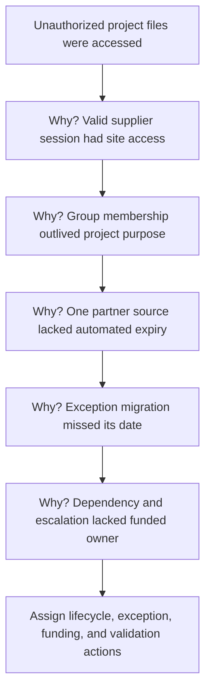

| Strength | Limitation | Guardrail |
|---|---|---|
| Simple and accessible | Encourages one linear chain | Build multiple branches for identity, app, data, detection, response |
| Moves beyond immediate symptom | Can follow facilitator bias | Require evidence at each step |
| Finds actionable process gaps | Can end at "human error" | Ask why system permitted and failed to detect |
| Supports discussion | "Why" can sound accusatory | Use neutral wording such as "What conditions made this possible?" |

## Fishbone analysis

A fishbone, or Ishikawa, diagram groups possible contributing causes. Categories should fit the incident rather than use a rigid template.

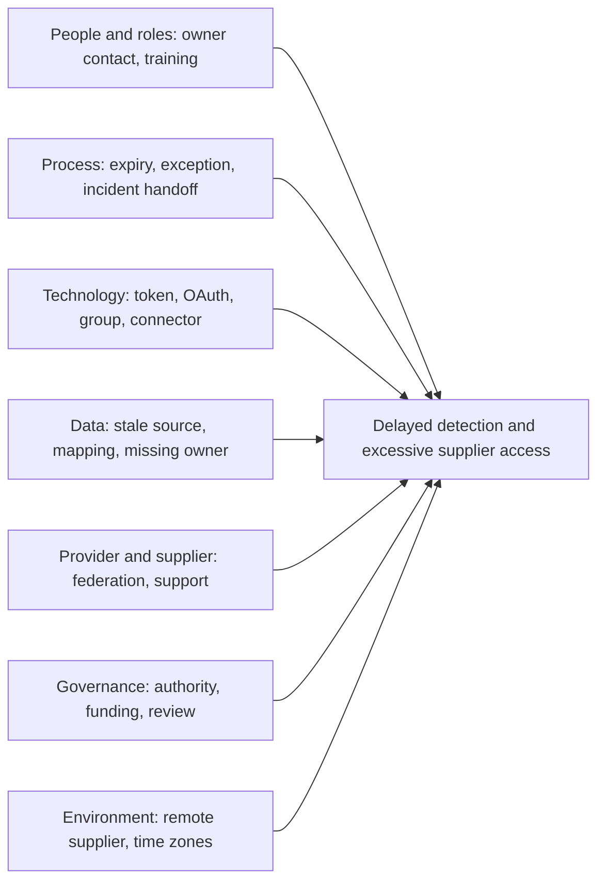

| Category | Evidence questions |
|---|---|
| People and roles | Were responsibilities, competence, contacts, workload, and authority adequate? |
| Process | Did lifecycle, exception, escalation, and review operate as designed? |
| Technology | Did identity, application, connector, logging, and response controls work? |
| Data | Were sources fresh, complete, mapped, retained, and interpreted correctly? |
| Provider and supplier | Did shared responsibility, support, and external lifecycle work? |
| Governance | Were risk, funding, policy, ownership, and expiry decisions effective? |
| Environment | Did time, geography, architecture, workload, or change contribute? |

Fishbone analysis generates hypotheses. It does not prove causes. Each branch needs supporting or conflicting evidence and an owner for validation.

## Fault tree analysis

Fault tree analysis starts with an undesired top event and works backward through combinations of conditions. **AND** means several conditions must combine. **OR** means any listed condition can produce that branch. It helps reveal alternate paths and shared dependencies.

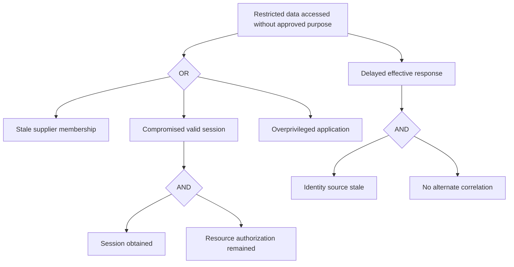

| Strength | Limitation | Guardrail |
|---|---|---|
| Shows alternate and combined paths | Can become visually complex | Scope one top event |
| Reveals shared dependencies | Probabilities may be unavailable or dependent | Do not invent independent numeric probabilities |
| Supports control placement | Tree reflects analyst assumptions | Review with domain and business owners |
| Helps test completeness | Unknown paths may be omitted | Update from evidence and near misses |

## Blameless but accountable analysis

Blameless does not mean consequence-free or owner-free. It means examining choices in their context, avoiding humiliation, and designing systems that make safe action easier and unsafe action harder. Deliberate misconduct still follows authorized Human Resources, Legal, and disciplinary processes.

| Blaming statement | System-focused question | Better action |
|---|---|---|
| "The admin made a bad change" | What information, review, tooling, pressure, and rollback shaped the action? | Safer default, peer review, canary, rollback, training |
| "The user clicked" | Why was the message credible and what controls followed the click? | Strong auth, reporting, browser, token, app, detection controls |
| "SOC missed it" | Which sources, logic, workload, context, and authority were missing? | Source health, tuning, staffing, automation, playbook |
| "Vendor failed" | Which contract, dependency, monitoring, and fallback were designed? | Joint action matrix, alternate path, support exercise |
| "Owner ignored risk" | Was the scenario clear, authority valid, resource funded, and escalation triggered? | Decision-ready risk and governance improvement |

### Action quality

| Weak action | Why weak | Stronger action |
|---|---|---|
| "Be more careful" | Not testable or systemic | Add approval, safer default, validation, and owner |
| "Train users" | May not address token, app, or detection path | Role-specific training plus technical controls and exercise |
| "Improve monitoring" | No source, logic, or threshold | Add named source-health and behavior test with owner |
| "Patch system" | No asset, date, validation, or recurrence | Deploy named fix, verify version and exposure, monitor return |
| "Review policy" | No decision or due date | Update named requirement, approve, train, and test by date |
| "Vendor to investigate" | Externalizes ownership | Send evidence package, track case, define customer workaround and decision |

## Post-Incident Review

A PIR creates a shared factual record and improvement plan. Conduct it after enough stabilization and evidence, but while context remains available. Use a facilitator and psychological safety for severe incidents.

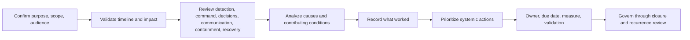

### PIR structure

| Section | Content |
|---|---|
| Executive summary | What happened, impact, current state, major actions |
| Scope and limitations | Systems, data, period, evidence gaps, excluded conclusions |
| Timeline | Source-backed events, decisions, and confidence |
| Detection | Trigger, source health, alert quality, missed opportunities |
| Analysis | Hypotheses, scoping, evidence, uncertainty |
| Command | Roles, cadence, decisions, handoffs, blockers |
| Containment | Actions, tradeoffs, result, bypass, business effect |
| Eradication | Removed access, persistence, weakness, and artifacts |
| Recovery | Clean-state, business, security, data, telemetry validation |
| Communication | Audiences, accuracy, timeliness, approvals |
| Causes | Direct, contributing, systemic, and uncertainty |
| What worked | Controls, people, preparation, provider collaboration |
| Actions | Prioritized improvements with owners and validation |
| Residual risk | Accepted, open, monitored, and escalated risks |

### Action record

| Field | Requirement |
|---|---|
| Action ID | Stable reference |
| Problem or cause | Exact condition addressed |
| Expected outcome | Behavior or risk driver to change |
| Owner | One accountable role |
| Due date and milestones | Time-bound delivery |
| Dependencies | Product, budget, provider, architecture, policy |
| Priority | Based on risk and recurrence |
| Evidence | Proof of implementation |
| Validation | Positive, negative, failure, recovery, or outcome test |
| Metric | Sustained operation and recurrence indicator |
| Residual risk | What remains after completion |
| Closure authority | Who verifies and closes? |

## Problem management and recurrence

Problem management handles systemic issues that span incidents or cannot be permanently fixed during response. It may maintain a known error and workaround while engineering a long-term solution.

| Problem-management element | Fictional connector example |
|---|---|
| Problem statement | Identity connector can report connected while event freshness exceeds objective |
| Incident links | NMH-I-015 and synthetic prior near misses |
| Business effect | Delayed account-compromise correlation and lower timeline confidence |
| Known error | Heartbeat tests transport, not event progress |
| Workaround | Source-to-destination count and freshness query; alternate identity portal evidence |
| Root-cause work | Connector checkpoint, rate, parser, and health-semantic analysis |
| Long-term change | Progress-aware health, replay validation, joint severity routing |
| Owner | Fictional security data platform owner |
| Validation | Inject known events, fail connector, replay, reconcile, alert |
| Recurrence metric | Freshness breaches and investigations affected |

Problem closure requires evidence that the systemic condition changed and remained effective. Closing every linked incident does not close the problem.

## Exposure-management feedback loop

Incidents reveal real attack paths, control failures, asset blind spots, identity relationships, business consequences, and response friction. Feed those observations into exposure management rather than storing them only in a PIR.

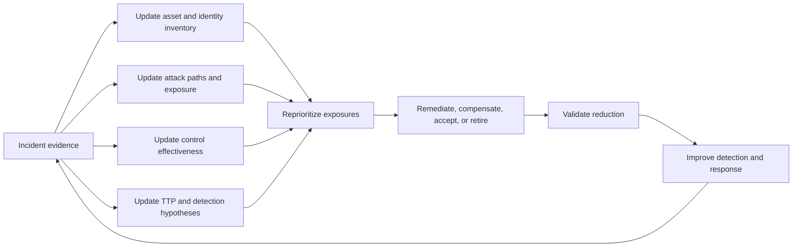

| Incident lesson | Exposure-program update |
|---|---|
| Supplier identity outlived project | Add lifecycle exposure and owner to identity graph |
| OAuth app expanded access | Inventory applications, scopes, owners, and paths |
| SharePoint site held restricted data | Correct asset, data, and business criticality |
| Unmanaged device downloaded files | Add device and access-path context |
| Connector delayed identity events | Reduce control-confidence input and track source health |
| Session revocation missed one app | Add validation of token and application paths |
| Provider evidence required long lead time | Add support and preservation dependency |
| Recovery test exposed stale permission | Add recovery authorization validation |

Do not automatically increase a score without understanding the model. Update facts, relationships, control evidence, and owner context, then recalculate under a versioned method.

## NMH fictional connector and security incident

### Scenario overview

NMH uses a fictional security-data integration to bring identity and SaaS events into a detection workflow. The identity connector reports a healthy transport heartbeat but stops advancing its event checkpoint. During the blind period, a supplier account uses an existing session and overprivileged application grant to access restricted SharePoint project files. SaaS data-volume logic raises an alert, but identity context arrives late.

This scenario is not a Zscaler product behavior, connector, service level, or customer event. It combines generic concepts for practice.

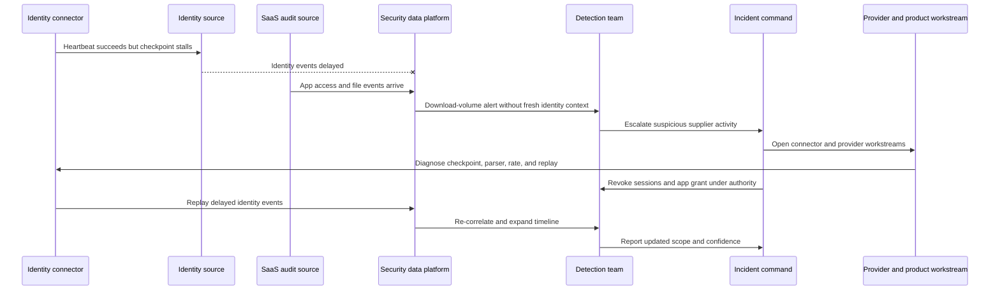

### Detection and declaration

| Step | Fictional evidence | Decision |
|---|---|---|
| Alert | Forty-seven synthetic restricted-file downloads by external identity | Triage immediately |
| Source check | SaaS source current; identity source six hours stale | Qualify identity conclusions and escalate source gap |
| Context | App grant has broader scope than documented business purpose | Suspicious access hypothesis rises |
| Owner check | Supplier sponsor cannot confirm activity | Activate business and supplier workstream |
| Incident criteria | Restricted data, external identity, valid-session abuse plausible | Fictional SEV-2 declared by authorized NMH role |
| Initial scope | One identity, one app, one project site, uncertain earlier period | Preserve evidence and search related entities |

### Command workstreams

| Workstream | Objective | Evidence or action | Owner |
|---|---|---|---|
| Identity | Determine session, auth, token, and related accounts | Sign-in and token export; revoke | Fictional IAM lead |
| SaaS and data | Scope app, files, sites, permissions, and sharing | Audit and object inventory | Collaboration and data owner |
| Connector | Restore fresh evidence and determine loss versus delay | Checkpoint, queue, parser, replay | Security data platform owner |
| Endpoint and network | Identify device and external destination | Available supplier and path evidence | Supplier and network leads |
| Provider | Preserve and explain provider-side evidence | Support request IDs and scope | TSM/vendor workstream |
| Legal and Privacy | Assess data and communication obligations | Authorized review | Customer Legal and Privacy |
| Communications | Maintain factual stakeholder updates | Approved status | Incident communications lead |
| Recovery | Restore controlled supplier workflow | Identity, app, site, telemetry tests | Service owner |

### Evidence plan

| Evidence ID | Artifact | Key purpose | Limitation |
|---|---|---|---|
| NMH-E-101 | Identity source export | Session issue, auth method, source, token context | Arrived late downstream |
| NMH-E-102 | Connector logs and checkpoint | Explain data delay and replay | Generic fictional connector |
| NMH-E-103 | SaaS audit export | App, site, file, actor, action | Provider event latency must be checked |
| NMH-E-104 | OAuth application configuration | Scope, owner, consent, secret | Current config may differ from event time |
| NMH-E-105 | Site permissions and group history | Effective access and lifecycle | Historical group state may be incomplete |
| NMH-E-106 | Network destination events | External upload hypothesis | Identity-device mapping is moderate confidence |
| NMH-E-107 | Incident decision log | Severity, actions, authority, rationale | Human record needs review |

### Containment decisions

| Proposed action | Decision | Rationale | Validation |
|---|---|---|---|
| Revoke supplier sessions | Approved | Limits valid-session path | Reuse denied in SaaS and connected apps |
| Disable app grant | Approved after owner check | Scope exceeds known purpose | App requests denied; required alternatives identified |
| Disable all suppliers | Not initially approved | Broad business disruption and scope is one project | Monitor and retain escalation trigger |
| Restrict project external access | Approved temporarily | Protects restricted data during scoping | Internal owner access works; external denied |
| Block external storage | Narrow block approved | Destination appears in path | Approved storage unaffected; alternate path reviewed |
| Restart connector immediately | Delayed until state captured | Preserve checkpoint evidence | Logs captured, then controlled restart and replay |

### Eradication and recovery

| Area | Action | Recovery validation |
|---|---|---|
| Identity | Reset credential and recovery factors; revoke sessions | Old session and token denied |
| OAuth | Remove app grant and rotate relevant secret | App cannot access; approved apps still work |
| Lifecycle | Remove stale group and repair sponsor expiry | Expired test identity denied |
| Site | Review membership, links, labels, and audit | Legitimate project users succeed; adjacent users denied |
| Connector | Repair checkpoint, replay buffered events, add progress-aware health | Known events arrive within objective and counts reconcile |
| Detection | Add stale-source context and token-app-file sequence | Synthetic sequence alerts with evidence |
| Business | Restore supplier through corrected workflow | Sponsor and project owner accept function |
| Monitoring | Enhanced identity, app, file, and connector review | No recurrence in approved observation window |

### Fictional PIR findings

| Finding | Cause type | Action |
|---|---|---|
| Connector health did not reflect event progress | Control-design cause | Add checkpoint age, source-destination count, and replay test |
| OAuth app had no current owner | Governance and lifecycle cause | Inventory app, scope, owner, purpose, expiry |
| Supplier group outlived project | Identity-process cause | Automate sponsor expiry and reconciliation |
| Alert lacked source-health context | Detection-design cause | Include dependency health and confidence |
| Provider evidence path was not rehearsed | Preparation cause | Update support matrix and exercise evidence preservation |
| Revocation validation covered one app only | Response-test cause | Test session and grant revocation across scoped apps |

## You critical-situation bridge

**Critical situation** is commonly used in enterprise support contexts for a critical situation requiring heightened coordination. Exact internal definitions and processes depend on the organization. A critical-situation may involve availability, data, business impact, or customer confidence without malicious activity. It should not automatically be called a security incident.

### Transferable mechanics

| Critical-situation skill | Security-incident application | Honest boundary |
|---|---|---|
| Define customer impact | Establish business service, users, data, and urgency | Security severity uses customer criteria |
| Establish bridge and cadence | Coordinate incident workstreams and decisions | Incident commander authority may sit elsewhere |
| Gather traces and logs | Build evidence and timeline | Forensic acquisition needs authorized method |
| Compare affected and unaffected | Discriminate identity, path, app, provider hypotheses | Malicious attribution requires more evidence |
| Escalate to Engineering | Route product defect with identifiers and reproduction | Product defect and compromise can coexist |
| Manage workaround | Balance restoration, scope, monitoring, and expiry | Security and business owners approve risk |
| Validate fix | Test original failure, regression, and customer outcome | Also test prohibited security paths |
| Communicate status | Separate facts, assessment, action, unknowns, next update | Legal and external messages need approval |
| Contribute RCA | Explain technical and process conditions | Formal cyber RCA may require specialists |
| Create knowledge | Scale lessons and prevention | Sensitive incident detail needs controlled handling |

### Interview bridge answer skeleton

"In production enterprise support, I have coordinated critical customer incidents by establishing scope and business impact, separating workstreams, gathering client, network, tenant, and service evidence, maintaining a timeline and cadence, escalating with reproducible evidence, validating workarounds and fixes, and communicating what was known and unknown. Those mechanics transfer strongly to cybersecurity incident coordination.

I am careful about the boundary: a critical situation is not automatically a cyber incident, and I have not claimed forensic, breach-notification, SOC, or Zscaler response authority. In a security case I would work under the customer incident commander, preserve evidence through approved procedures, and involve Legal, Privacy, safety, and specialist teams."

## Metrics

Incident metrics should improve decisions and systems, not reward premature closure. Definitions, severity, scope, source, and denominator must be stable.

| Metric | Definition question | Useful decision | Gaming or bias risk |
|---|---|---|---|
| Mean time to detect | From which event time to which detection time? | Improve source and logic | Unknown incident start and source delay |
| Mean time to acknowledge | From alert to owned triage? | Staff and routing | Auto-ack without analysis |
| Mean time to contain | From declaration or first harm to validated containment? | Authority and playbook | Narrow containment declared complete |
| Mean time to recover | To technical service or business acceptance? | Recovery investment | Service green but business broken |
| Time to scope | When were affected identities, assets, and data sufficiently known? | Evidence and inventory | Scope can expand later |
| Source-health compliance | Required sources meeting freshness and completeness / required sources | Detection readiness | Missing sources excluded from denominator |
| Reopened incidents | Incidents reopened due to recurrence or incomplete closure | Closure quality | Classification inconsistency |
| Action aging | PIR actions overdue by risk and owner | Governance | Easy actions close while systemic ones age |
| Recurrence rate | Similar incidents under defined cause taxonomy / relevant incidents | Problem management | Taxonomy and observation changes |
| Containment side effects | Business or safety impacts caused by response actions | Better decision tradeoffs | Underreporting embarrassment |
| Evidence completeness | Required evidence fields available / required fields | Forensic readiness | A complete form can hold weak evidence |
| Exercise findings closed | Validated actions / actions due | Readiness improvement | Tabletop closure not technical validation |

### Balanced scorecard

| Dimension | Example measure |
|---|---|
| Speed | Time to owned triage, containment, and recovery |
| Quality | Reopen, recurrence, false closure, evidence completeness |
| Impact | Business interruption, data, safety, customer effect |
| Coverage | Required source, asset, identity, provider, and playbook scope |
| Learning | Actions validated, systemic causes removed, detection improved |
| Human | Workload, handoff quality, psychological safety, training gaps |

## Troubleshooting the response process

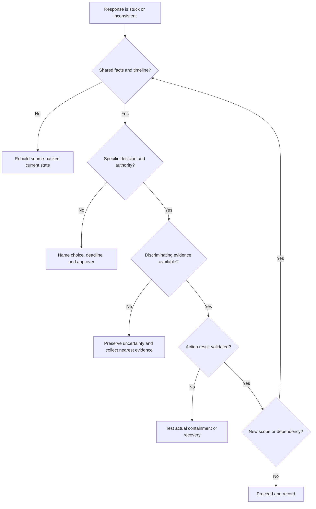

| Response failure | Symptom | Repair |
|---|---|---|
| No incident owner | Multiple chats and conflicting actions | Activate command and one decision log |
| Alert title becomes fact | Team assumes malware or breach | Restate observation, hypothesis, and confidence |
| Timeline confusion | Events appear impossible | Separate event, ingest, collect, and analysis time |
| Tool tunnel vision | One console drives whole narrative | Seek identity, endpoint, network, app, data, and provider evidence |
| Containment theater | Block recorded but activity continues | Validate action and hunt bypass |
| Evidence destruction | System changed before preservation | Stop, engage evidence lead, document alteration |
| Communication drift | Executives and engineers hear different scope | Approved source and next-update cadence |
| Endless bridge | Actions lack owners and discriminating tests | Incident action plan and decision-focused cadence |
| Premature recovery | Service returns before identity or persistence fixed | Enforce recovery gates |
| PIR without follow-through | Excellent document, recurring incident | Govern actions through validation and problem management |

## Decision trees

### Should this alert become an incident?

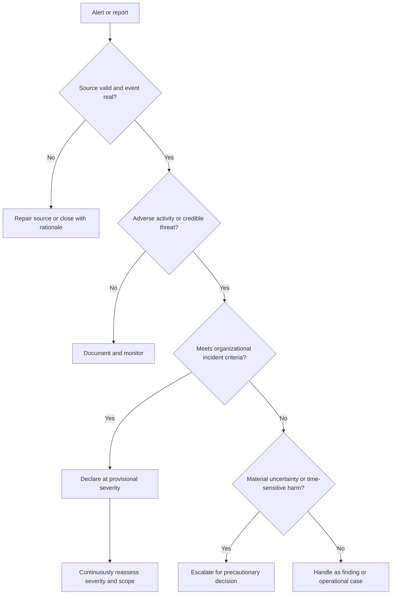

### Is recovery ready?

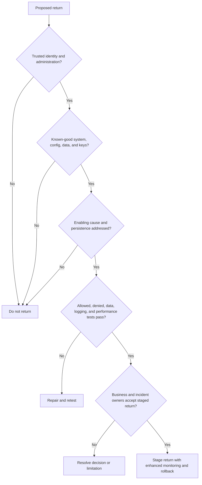

## Scenario drills

### Drill 1 - Compromised executive account

An executive account shows a new session and unusual mailbox and SharePoint actions. Build hypotheses for legitimate travel, token theft, delegated application, and administrator activity. Preserve identity and SaaS evidence, consult executive support and incident authority, compare containment options, and avoid sending sensitive details through possibly compromised email.

### Drill 2 - Ransomware on a critical server

Balance volatile evidence, endpoint isolation, service dependency, identity and privilege scope, network spread, backup trust, Legal and insurance routes, continuity, clean-room recovery, and executive communication. Do not promise restoration until integrity and business tests pass.

### Drill 3 - OT detection

A passive monitor reports suspicious commands to a plant controller. The SOC must not isolate it unilaterally. Engage plant operations and safety, validate protocol and process context, preserve evidence, control remote access, define manual alternatives, and select containment under plant incident command.

### Drill 4 - Provider outage or attack?

Multiple users cannot access SaaS. Test identity, Domain Name System, route, Transport Layer Security, tenant, application, and provider health. Absence of a known provider alert is not proof of attack; a provider status notice is not proof that every customer symptom shares that cause. Maintain both hypotheses until evidence discriminates.

### Drill 5 - Evidence request conflicts with privacy

An investigator asks for broad employee mailbox exports. Stop and clarify purpose, scope, authority, minimization, Legal, Privacy, Human Resources, storage, access, and retention. Collect only under approved procedure. Technical convenience is not authority.

### Drill 6 - you critical-situation bridge

Choose a factual critical enterprise support case. Describe impact, command rhythm, evidence, hypotheses, Engineering escalation, workaround, customer updates, fix validation, and lessons. Then identify which cyber-specific activities you would hand to incident, forensic, Legal, Privacy, SOC, or Zscaler specialists.

## Contrarian review

| Claim | Contrarian question | Stronger proof |
|---|---|---|
| "The alert is a breach" | Which incident criteria, evidence, data, and authority support that term? | Declared incident record and bounded facts |
| "We contained it" | Which identities, tokens, apps, devices, paths, persistence, and bypass tests? | Validated multi-domain containment |
| "Password reset fixed it" | Were sessions, grants, keys, recovery methods, and app access revoked? | Reuse and authorization tests |
| "The endpoint is clean" | Was trusted rebuild used and identity, network, app, and data scope handled? | Recovery gates and monitoring |
| "Logs show the order" | Are event, ingest, collection, clock, and delay distinguished? | Source-backed normalized timeline |
| "The hash proves authenticity" | Does integrity also have provenance, authority, and handling? | Full evidence record |
| "Human error was root cause" | What system conditions made the action possible and undetected? | Multi-branch causal analysis |
| "RCA is complete" | Were conflicting evidence, alternate causes, response, and recurrence considered? | Reviewed RCA plus PIR and problem plan |
| "Incident closed" | Are recovery, residual risk, PIR actions, and problem work governed? | Closure criteria and action tracking |
| "AI handled response" | Which documented agent, evidence, approval, action, failure, and human authority? | Current product validation and audit trail |
| "The TSM led the breach" | Was formal authority assigned, or did the TSM coordinate a product workstream? | Honest role and decision record |

## Official Source Anchors

**Checked on 2026-08-24.** NIST SP 800-61 Rev. 3 is the current central NIST incident-response publication. Government, MITRE, Microsoft, and Zscaler sources have different purposes. This chapter summarizes and links; it does not reproduce standards text, provide legal advice, or assert product behavior.

| Source | Official anchor | Used for | Currency and scope caveat |
|---|---|---|---|
| NIST SP 800-61 Rev. 3 | https://csrc.nist.gov/pubs/sp/800/61/r3/final | Current incident-response recommendations integrated with CSF 2.0 | Published April 2025; supersedes Rev. 2 |
| NIST Cybersecurity Framework 2.0 | https://www.nist.gov/cyberframework | Govern, Identify, Protect, Detect, Respond, Recover integration | Published February 2024; outcome framework |
| NIST SP 800-86 | https://csrc.nist.gov/pubs/sp/800/86/final | Forensic-technique integration guidance context | Published 2006; use qualified current forensic procedures |
| NIST SP 800-92 | https://csrc.nist.gov/pubs/sp/800/92/final | Log-management guidance context | Published 2006; supplement with current architecture and tools |
| NIST Computer Security Incident Handling Guide project | https://csrc.nist.gov/projects/incident-response | Current NIST incident-response resources | Check project updates and supplemental material |
| CISA Cybersecurity Incident and Vulnerability Response Playbooks | https://www.cisa.gov/resources-tools/resources/cybersecurity-incident-vulnerability-response-playbooks | Federal playbook and operational-response context | Verify current location and version; adapt to organization |
| CISA StopRansomware Guide | https://www.cisa.gov/stopransomware/ransomware-guide | Ransomware preparation and response context | Scenario guidance; not legal advice |
| MITRE ATT&CK | https://attack.mitre.org/ | Tactic and technique vocabulary for hypotheses and detection | Not incident proof, attribution, or risk probability |
| Microsoft Incident Response reference | https://learn.microsoft.com/security/operations/incident-response-overview | Microsoft security-operations response context | Product and service guidance evolves |
| Microsoft 365 service health | https://learn.microsoft.com/microsoft-365/enterprise/view-service-health | Provider-health and incident evidence context | Tenant role and available information vary |
| Zscaler Security Operations | https://www.zscaler.com/products-and-solutions/security-operations | Current Agentic Security Operations positioning | Agent behavior, authority, workflow, evidence, and packaging vary |
| Zscaler Data Fabric | https://www.zscaler.com/products-and-solutions/data-fabric | Cross-source data integration and workflow positioning | Connector, schema, freshness, and replay behavior require validation |
| Zscaler Managed Detection and Response | https://www.zscaler.com/products-and-solutions/managed-detection-and-response | Public managed detection and response positioning | Service scope, response authority, and service levels require contract review |
| Zscaler Threat Hunting | https://www.zscaler.com/products-and-solutions/managed-threat-hunting | Public threat-hunting positioning | Telemetry, scope, hypothesis, and output require validation |
| Zscaler Zero Trust Exchange | https://www.zscaler.com/products-and-solutions/zero-trust-exchange-zte | Identity, context, policy, inline-control positioning | Platform page is not NMH containment evidence |
| FIRST Traffic Light Protocol | https://www.first.org/tlp/ | Information-sharing marking context | Use current TLP definitions and organizational policy |

## Likely Interview Questions

### Q1. Explain the incident-response lifecycle using current NIST guidance.

**Model answer:** NIST SP 800-61 Rev. 3, published in April 2025, integrates incident-response recommendations across CSF 2.0. Govern, Identify, and Protect support preparation; Detect finds and analyzes events; Respond manages, analyzes, communicates, and mitigates; Recover restores and communicates. Lessons improve all Functions.

Operationally, I still use the familiar sequence of preparation, detection and analysis, containment, eradication, recovery, and post-incident learning, while making clear that it is a teaching workflow rather than the exact Rev. 3 structure.

### Q2. How do you distinguish an event, alert, finding, and incident?

**Model answer:** An event is an observed occurrence. An alert is a notification created by logic, a threshold, or a report. A finding is a condition requiring evaluation or treatment. An incident is one or more events that meet the organization's approved criteria for adverse cybersecurity impact or credible threat requiring governed response.

An alert title is a hypothesis, not a verdict. I validate source health, context, scope, impact, confidence, and authority before declaration, while escalating precautionarily when uncertainty and potential consequence are material.

### Q3. How do you preserve evidence and build a defensible timeline?

**Model answer:** I first confirm authority and scope. I record evidence ID, source, collector, method, tool version, collection and event periods, original location, integrity check where appropriate, storage, access, transfers, analysis copy, limitations, retention, and disposal. I preserve originals and analyze controlled copies.

For the timeline, I separate event, source-record, ingest, alert, collection, and analysis times, normalize timezone, record clock confidence, use stable entity IDs, cite the evidence source, and label facts versus inference and contradictions.

### Q4. How do you choose containment without making the incident worse?

**Model answer:** I define the harmful activity and time sensitivity, then compare proportionate actions across identity, endpoint, network, application, cloud, SaaS, data, provider, and OT domains. I assess safety, business continuity, evidence loss, privacy, alternate paths, rollback, and authority.

I prefer the fastest effective reversible action when possible, record the decision, and validate both containment and business effect. Password reset or one IP block is rarely sufficient by itself.

### Q5. What must be true before recovery?

**Model answer:** Recovery needs trusted identity and administration, known-good systems, configuration, artifacts, keys, and data; addressed vulnerability and persistence; positive business tests; prohibited-access tests; healthy telemetry; acceptable performance; staged return; enhanced monitoring; rollback; and business and incident-owner acceptance.

Power on or a green health indicator is not enough. A backup can restore malicious configuration, and a reset identity can retain an app grant.

### Q6. How do RCA, PIR, and problem management differ?

**Model answer:** RCA analyzes causal and contributing conditions behind the outcome. PIR reviews the complete incident, including impact, timeline, detection, command, decisions, communication, containment, recovery, what worked, and actions. Problem management tracks recurring or systemic causes and long-term remediation beyond one incident.

Five Whys, fishbone, and fault tree help generate and structure causal hypotheses, but each requires evidence and can be biased or incomplete. I avoid ending at human error.

### Q7. Walk through the fictional NMH connector incident.

**Model answer:** A generic identity connector reported a healthy heartbeat while its event checkpoint stalled. During the blind period, a supplier session and overprivileged app accessed restricted project files. SaaS events produced a volume alert without fresh identity context. NMH declared a fictional incident, preserved connector and SaaS evidence, revoked sessions and the app grant, restricted the site, repaired and replayed the source, rebuilt the timeline, and validated supplier recovery.

The systemic lessons were progress-aware source health, app and supplier lifecycle ownership, source-confidence in detection, provider-evidence preparation, and cross-application revocation tests. It is entirely fictional and not a Zscaler product claim.

### Q8. How does your critical-situation experience transfer to cybersecurity incident response?

**Model answer:** In production enterprise support, I have coordinated critical situations by defining business impact, organizing workstreams and cadence, gathering client, network, tenant, and service evidence, maintaining timelines, escalating to Engineering with reproducible details, communicating facts and unknowns, and validating workarounds and fixes.

Those mechanics transfer well. I am explicit that a critical situation is not automatically a cyber incident and that I have not claimed forensic, breach-notification, SOC, or Zscaler response authority. I would operate under the customer's incident command and involve Legal, Privacy, safety, and security specialists.

## 30-Second Memory Hooks

| Concept | Memory hook |
|---|---|
| Current NIST | SP 800-61 Rev. 3, April 2025 |
| CSF integration | Prepare across Govern, Identify, Protect; act through Detect, Respond, Recover |
| Event | Something happened |
| Alert | A question raised |
| Incident | Criteria plus adverse consequence |
| Triage | Real, urgent, owner, next step |
| IOC | Artifact associated with compromise |
| IOA | Behavior associated with attack |
| TTP | Goal, method, exact implementation |
| Hypothesis | Falsifiable explanation, not accusation |
| Severity | Consequence plus urgency |
| Command | One decision system, many specialists |
| Evidence | Source, authority, method, integrity, access |
| Chain of custody | Who had it, when, why, condition |
| Timeline | Event time is not ingest time |
| Containment | Stop it growing, validate it stopped |
| Eradication | Remove access, persistence, weakness, artifact |
| Recovery | Trusted business operation, not power on |
| Communication | Facts, assessment, action, unknowns, next update |
| RCA | Why the system permitted the outcome |
| PIR | How the whole incident and response unfolded |
| Problem management | Remove recurring systemic causes |
| Five Whys | Follow evidence, allow branches |
| Fishbone | Organize cause hypotheses |
| Fault tree | AND and OR paths to top event |
| Blameless | Accountability without humiliation |
| Good action | Cause, owner, date, measure, validation |
| Exposure loop | Incident facts reprioritize paths and controls |
| Critical-situation bridge | Impact, cadence, evidence, escalation, validation |
| TSM boundary | Coordinate product workstream; do not assume incident authority |

## Completion Checklist

- [ ] I can state that NIST SP 800-61 Rev. 3 was published in April 2025 and supersedes Rev. 2.
- [ ] I can explain Rev. 3 integration with NIST CSF 2.0 without misrepresenting the familiar operational lifecycle as its exact structure.
- [ ] I can explain preparation, detection and analysis, containment, eradication, recovery, and post-incident improvement.
- [ ] I can distinguish event, alert, finding, incident, problem, severity, priority, scope, and confidence.
- [ ] I can distinguish IOC, IOA, tactic, technique, procedure, and hypothesis.
- [ ] I can build a hypothesis matrix with supporting, conflicting, and discriminating evidence.
- [ ] I can assess safety, data, identity, scope, business, persistence, spread, recovery, evidence, and time severity inputs.
- [ ] I can explain incident command, technical lead, workstream, business, evidence, Legal, Privacy, communications, scribe, provider, and TSM roles.
- [ ] I can run a decision-focused bridge with current impact, facts, unknowns, hypotheses, actions, decisions, containment, evidence, communications, and blockers.
- [ ] I can define evidence ID, source, authority, collector, method, time, integrity, storage, access, transfer, working copy, limitation, and retention.
- [ ] I can explain chain of custody and why a hash alone does not prove authenticity.
- [ ] I can separate event, record, ingest, alert, collection, and analysis times.
- [ ] I can build a source-backed timeline with stable IDs, timezone, clock confidence, interpretation, and contradictions.
- [ ] I can compare containment options across identity, privilege, endpoint, network, SaaS, cloud, data, provider, and OT domains.
- [ ] I can document containment objective, scope, authority, alternatives, impact, rollback, monitoring, and result.
- [ ] I can explain why password reset, one IP block, or device power-off may be insufficient or harmful.
- [ ] I can eradicate identity, persistence, vulnerability, app, endpoint, network, data, supplier, and detection conditions.
- [ ] I can apply recovery gates for clean authority, known-good source, cause removal, data, access, telemetry, performance, business, and rollback.
- [ ] I can write factual audience-specific updates with facts, assessment, confidence, action, unknowns, decisions, and next-update time.
- [ ] I can recognize Legal, Privacy, Human Resources, safety, regulatory, insurance, law-enforcement, and communications triggers without giving advice outside authority.
- [ ] I can distinguish RCA, PIR, problem management, lessons learned, and audit.
- [ ] I can distinguish trigger, direct cause, contributing condition, detection condition, response condition, systemic condition, and root-cause candidate.
- [ ] I can use Five Whys without forcing one linear chain or ending at human error.
- [ ] I can use fishbone categories as hypotheses requiring evidence.
- [ ] I can use fault-tree AND and OR logic without inventing independent probabilities.
- [ ] I can explain blameless accountability and write systemic actions with owners, dates, measures, and validation.
- [ ] I can structure a PIR and govern its actions through closure and recurrence review.
- [ ] I can feed incident facts into asset, identity, attack-path, control, detection, and exposure-management updates.
- [ ] I can walk the fictional NMH connector, supplier-session, app-grant, SharePoint, and replay incident end to end.
- [ ] I can state that the NMH connector scenario is not a Zscaler product claim.
- [ ] I can connect your factual critical-situation experience to command, evidence, escalation, communication, and validation while preserving cyber authority boundaries.
- [ ] I can define incident metrics with stable start/end points, severity, denominators, and anti-gaming checks.
- [ ] I can recheck NIST, CISA, MITRE, FIRST, Microsoft, and Zscaler sources after 2026-08-24.
- [ ] I can answer all eight questions aloud without claiming production cyber incident command, forensics, Zscaler, SecOps, or vulnerability ownership.

[Part 16 - OSI and TCP/IP Models from Zero](Part-16-osi-tcp-ip-models.md)