# Part 16 - OSI and TCP/IP Models from Zero

> **Audience:** Arti Thakur, moving from Microsoft 365 Support Escalation Engineering into a Zscaler Security Operations Technical Success Manager role.
>
> **Purpose:** Build a first-principles model of how application data crosses software, operating systems, networks, intermediaries, and remote services, then turn that model into disciplined fault isolation.
>
> **Scope and honesty:** Northstar Meridian Holdings, abbreviated NMH, is fictional. Its users, devices, addresses, events, policies, failures, and outcomes are learning artifacts. Arti's Microsoft 365, SharePoint Online, OneDrive for Business, escalation, and network-evidence experience is factual only to the extent supported by her approved background.
>
> **Product caveat:** This Part teaches standards-based networking. It does not claim that every appliance, cloud service, Microsoft 365 component, security control, or Zscaler product implements a particular internal design. Product-specific forwarding, inspection, fields, policy, licensing, and support procedures require current official documentation and tenant evidence.

## Section goal

A network model is a thinking aid. It divides a complicated communication into smaller responsibilities so an investigator can ask a precise question at each boundary. The **Open Systems Interconnection model**, shortened to **OSI model**, has seven conceptual layers. The Internet protocol suite, commonly called the **TCP/IP model**, groups deployed Internet protocols into fewer layers. Neither model is a literal stack of seven boxes inside every product.

Think of sending a business document through an international courier. The author creates meaning, the office chooses a representation, the conversation establishes expectations, the courier service tracks an end-to-end shipment, regional depots route it, local drivers move it on one road, and the physical vehicle carries it. A failed delivery can originate at any responsibility. Calling every failure "the network" is like blaming the road when the recipient address was wrong or access to the building was denied.

By the end of Part 16, Arti should be able to:

| Outcome | What mastery looks like | Evidence of mastery |
|---|---|---|
| Explain both models | Name every layer, purpose, examples, data unit, and common boundary | Draw both models without notes and explain why mappings are approximate |
| Trace encapsulation | Follow application bytes into transport, network, and link headers and back | Annotate a packet journey in both directions |
| Separate identifiers | Distinguish names, ports, IP addresses, and link addresses | State which identifier changes at which boundary |
| Localize faults | Convert symptoms into layer hypotheses and discriminating checks | Build a short fault tree instead of running random commands |
| Interpret evidence | Relate browser, process, socket, route, name, packet, and service evidence | Produce a timestamped evidence table with limitations |
| Protect customers | Minimize, authorize, redact, retain, and transfer captures safely | Explain why packet capture can expose sensitive content and metadata |
| Bridge prior experience | Reframe OneDrive and SharePoint troubleshooting as cross-layer reasoning | Give an honest Microsoft production example without claiming Zscaler production work |

## JD Mapping

The SecOps Technical Success Manager job description expects analysis of complex customer environments, tailored mitigation, critical-escalation coordination, technical consulting, and clear explanations. Layer models support those responsibilities, but a model alone does not prove a diagnosis.

| JD expectation | Layer-model behavior | Useful artifact | Honest Arti bridge |
|---|---|---|---|
| Analyze complex environments | Decompose a user-to-service path into testable responsibilities | Layered path map with owners and evidence | OneDrive, SharePoint, browser, sync, and networking investigations |
| Identify security risk | Mark trust, inspection, routing, identity, and data boundaries | Data-flow and trust-boundary diagram | Transferable reasoning, not production Zscaler administration |
| Resolve critical escalations | Scope impact, form hypotheses, collect synchronized evidence, and assign owners | Fault tree, timeline, capture plan, action register | CRITSIT and Engineering-escalation discipline |
| Deliver consulting | Explain why a symptom can cross layers and what test separates causes | Whiteboard and decision tree | Technical Advisor, mentoring, and training experience |
| Tailor mitigation | Select a correction at the controlling layer and validate end-to-end | Change plan, rollback, and positive/negative tests | Fix validation and customer communication |
| Work across teams | Use boundaries to route questions without throwing work over a wall | RACI and boundary evidence | Customer, network, identity, service, and Engineering coordination |
| Communicate to leaders | Translate packet detail into service impact, confidence, owner, and next action | One-page incident update | Executive-safe escalation updates |

## Candidate honesty note

Arti can say that her production Microsoft support work required layered reasoning. A OneDrive sync symptom might involve the local process, file state, user identity, name resolution, proxy selection, connection establishment, encrypted transport, HTTP response, service throttling, permissions, or Microsoft service health. She can discuss evidence tools listed in her background, including Wireshark, Netsh, Network Monitor, Procmon, HAR, Fiddler, and browser developer tools, when she can defend the actual use and result.

She should not say that using an OSI model proves cybersecurity operations experience, that she diagnosed a Zscaler tenant without having done so, or that a packet trace alone establishes a product defect. The accurate bridge is: "I have used cross-layer isolation in Microsoft 365 production support. I am extending that tested method into security architecture and product-specific evidence, which I will validate against current documentation and the customer's environment."

| Evidence label | Safe statement | Unsafe expansion |
|---|---|---|
| Production | "I isolated Microsoft 365 issues across client, identity, network, HTTP, service, and content boundaries." | Prohibited: presenting direct Zscaler production operation as established experience |
| Lab | "In a controlled lab, I captured and annotated DNS, TCP, TLS, and HTTP timing." | "I captured the customer's confidential traffic." |
| Conceptual | "I would use the layer model to organize hypotheses, then validate the actual product path." | "Layer 7 is definitely where this vendor fault lives." |
| Fictional | "In the NMH exercise, a stale proxy configuration created a different browser path." | "NMH was my strategic account." |

## Terms and acronyms before using the models

| Term | Plain meaning | Why it matters | Memory hook |
|---|---|---|---|
| Protocol | Agreed rules for message format and behavior | Peers must interpret fields and sequences consistently | Protocol equals conversation rules |
| Layer | A grouped responsibility in a communication model | It narrows questions and ownership | Layer equals one job |
| Service | Capability one layer offers to another | A layer can use a service without knowing every implementation detail | Service equals promised job |
| Interface | Boundary through which components request or provide a service | Evidence often changes form at an interface | Interface equals service counter |
| Peer | Logical counterpart operating at the same layer on another system | Protocols describe peer-to-peer behavior | Peers speak the same rules |
| Encapsulation | Adding control information around data for a lower-layer job | Headers explain delivery and interpretation | Pack the letter in labeled envelopes |
| Decapsulation | Removing and interpreting control information at the receiver | The receiver reverses encapsulation | Open envelopes in reverse |
| Header | Control fields placed before a payload | Fields carry addresses, flags, lengths, types, and state | Header equals shipping label |
| Trailer | Control fields placed after a payload | Some link technologies append error-detection data | Trailer equals tamper check |
| Payload | Data carried for the next higher responsibility | One layer's whole message becomes another's payload | Cargo inside the envelope |
| PDU | Protocol Data Unit, the named unit handled by a layer | Terms such as segment, packet, and frame prevent ambiguity | PDU equals layer-sized package |
| SDU | Service Data Unit, data received from a higher layer | It becomes payload after lower-layer control is added | SDU becomes packed cargo |
| SAP | Service Access Point, a conceptual place where a layer is reached | Helps explain how upper and lower responsibilities meet | SAP equals service desk |
| Host | Endpoint that originates or receives Internet communication | Host behavior differs from router forwarding | Host is sender or receiver |
| Node | Any participating device or logical point | Includes hosts and forwarding devices | Node is any stop on the map |
| Hop | One forwarding step between adjacent network-layer points | Hop evidence helps localize path changes | Hop equals one route step |
| NIC | Network Interface Controller | Connects a host to a link and has link-layer behavior | NIC is the local network door |
| MTU | Maximum Transmission Unit | Largest network-layer packet a link can carry without link-specific handling | MTU is the doorway width |
| MSS | Maximum Segment Size | TCP payload limit normally derived from path and header constraints | MSS is cargo, not the whole truck |
| API | Application Programming Interface | Programs request network services through defined calls | API is a software service counter |
| Socket | Operating-system communication endpoint associated with protocol and addresses | Connects process behavior to transport evidence | Socket is a numbered conversation endpoint |

## Why there are two models

The OSI model was standardized as a seven-layer reference architecture. The deployed Internet developed around an Internet protocol suite whose architectural requirements are documented across IETF standards. Practitioners often use a four-layer TCP/IP model: application, transport, Internet, and link. Some teaching materials split link into data-link and physical, producing five layers. The names are useful only when the speaker declares the model.

```mermaid
flowchart LR
    NEED[Human or program intent] --> APP[Application responsibility]
    APP --> TRANSPORT[End-to-end transport]
    TRANSPORT --> INTERNET[Internetwork delivery]
    INTERNET --> LINK[Adjacent-link delivery]
    LINK --> SIGNAL[Physical signaling]
    SIGNAL --> LINK2[Receiver link]
    LINK2 --> INTERNET2[Receiver Internet]
    INTERNET2 --> TRANSPORT2[Receiver transport]
    TRANSPORT2 --> APP2[Receiver application]
    APP2 --> RESULT[Meaningful result]
```

| Model | Layers commonly named | Best use | Important limitation |
|---|---|---|---|
| OSI reference model | Application, Presentation, Session, Transport, Network, Data Link, Physical | Teaching responsibilities and discussing boundaries precisely | Real protocols do not always fit one box cleanly |
| Four-layer Internet model | Application, Transport, Internet, Link | Reasoning about deployed Internet hosts and protocols | Physical details are usually grouped into link |
| Five-layer teaching model | Application, Transport, Network, Data Link, Physical | Packet-analysis and networking courses | It is a teaching convention, not one universal standard stack |

### Plain-English deep-dive 1 - A model is a map, not the territory

A subway map deliberately distorts geography so routes and transfers are easier to understand. It does not show every stair, tunnel, power cable, or street above a station. The OSI model does the same for communication responsibilities. It helps an investigator ask whether the application formed a valid request, whether a transport conversation exists, whether an address is routable, whether the adjacent link can deliver a frame, and whether signals can cross the medium.

Problems arise when labels replace evidence. A browser certificate warning is often called a "Layer 6 issue" because encryption and representation are associated with the OSI presentation layer. In deployed systems, TLS is used through application and transport APIs, may be terminated by an intermediary, and exposes evidence in browser, operating-system, proxy, and packet views. The useful statement is not "Layer 6 broke." It is "certificate validation failed at this endpoint, with this chain, name, time, and trust context; here is the evidence."

Use a layer label to frame a hypothesis. Then name the concrete protocol, component, boundary, field, state, timestamp, and test that could disprove it. That discipline prevents the model from becoming an answer generator.

## The seven OSI layers

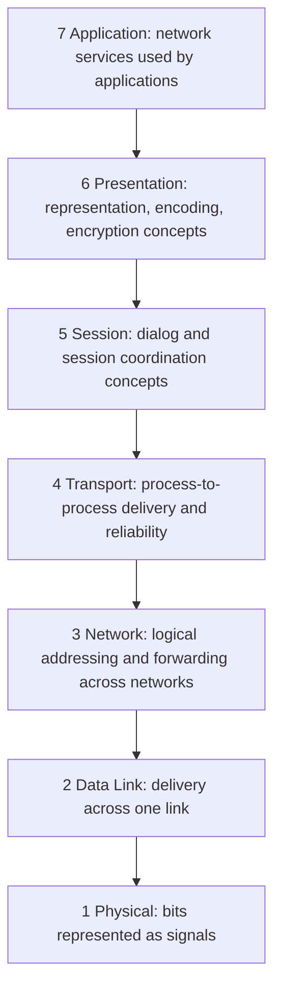

### Layer 7 - Application

The application layer supplies network-facing services used by programs. Examples include HTTP for web interactions, DNS for name resolution, SMTP for mail transfer, and SMB for file-sharing semantics. "Application layer" does not mean the entire graphical application. A browser also contains user-interface, storage, process, rendering, security, and operating-system integration logic.

The key questions are: What operation is requested? Which name, URI, method, headers, credentials, and data are used? What response or application error returns? Does another client, account, object, or endpoint behave differently? A valid TCP connection proves reachability to a listening endpoint; it does not prove that the application accepted the request.

| Application evidence | What it can establish | What it cannot establish alone |
|---|---|---|
| HTTP status and response body | The responding HTTP component classified the request in a particular way | Which upstream component ultimately caused the condition without correlation |
| Browser console | Client script, policy, resource, or runtime symptoms | Full network path or server internals |
| HAR waterfall | Request ordering, timing phases, headers, redirects, and failures visible to the browser | Non-browser process traffic or encrypted packet payload not exported |
| Application log | What that component recorded with its clock and context | Events dropped, never reached, or recorded elsewhere |

### Layer 6 - Presentation

The presentation layer describes how information is represented so both sides interpret the same bytes. Character encodings, serialization formats, compression, and cryptographic representation are common teaching examples. JSON represents structured values as text; UTF-8 maps characters to bytes; compression reduces representation size; TLS protects records in transit, although real implementations cross the neat OSI boundary.

A frequent mistake is to blame "encoding" without comparing bytes, declared content type, actual parser expectation, and transformations by intermediaries. Another is to assume encryption hides all metadata. Encrypted traffic can still expose endpoint addresses, packet sizes, timing, and sometimes protocol negotiation information. Privacy planning must consider both content and metadata.

### Layer 5 - Session

The session layer describes dialog coordination: establishing, maintaining, synchronizing, and ending a logical interaction. Modern Internet applications often implement these behaviors inside application protocols, authentication tokens, libraries, or transport mechanisms rather than through a distinct universal session protocol.

An application session is not the same as a TCP connection. A signed-in browser session can survive several TCP connections. One HTTP/2 connection can carry many request streams. A cookie or token can remain valid after a socket closes. Troubleshooters must state which session they mean: user login, application workflow, TLS session, HTTP connection, transport connection, remote procedure call, or product-specific state.

### Layer 4 - Transport

The transport layer provides communication between application endpoints. TCP offers an ordered byte stream with connection state, acknowledgments, retransmission, receiver flow control, and congestion behavior. UDP carries independent datagrams with minimal transport machinery; applications add any required reliability or ordering. Ports help the operating system deliver traffic to the correct socket context.

Transport evidence includes source and destination ports, flags, sequence and acknowledgment numbers, advertised windows, options, timing, retransmissions, resets, and socket state. Part 18 develops these mechanics. At this stage remember that a handshake is state negotiation, not an application success test.

### Layer 3 - Network

The network layer moves packets across multiple connected networks using logical addresses. Internet Protocol version 4, or IPv4, and Internet Protocol version 6, or IPv6, are the main examples. Routers examine network-layer information and choose a next hop according to a routing table and policy.

An IP address identifies an interface or network attachment within a routing context; it is not a permanent human identity, device identity, or application identity. Network Address Translation can rewrite addresses and ports. Mobile devices change networks. Shared hosts serve many applications. Treat address-to-entity attribution as time-bound evidence with confidence, not as timeless truth.

### Layer 2 - Data Link

The data-link layer moves frames across one local link or link-layer domain. Ethernet and Wi-Fi have different framing and medium-access mechanics. Link-layer addresses such as Ethernet MAC addresses support local delivery. Switches commonly forward Ethernet frames based on learned MAC-address associations and virtual LAN context.

A router removes the incoming link frame, processes the IP packet, and creates a new link frame for the next link. Therefore, the source and destination MAC addresses normally change at every routed hop while the end-to-end IP addresses often remain stable unless translation or tunneling changes them.

### Layer 1 - Physical

The physical layer represents bits using electrical, optical, or radio signals and defines timing, connectors, frequencies, modulation, and related medium behavior. A link indicator can show electrical connectivity without proving useful frame exchange, valid IP configuration, name resolution, or application access.

Physical evidence includes interface status, negotiated rate, duplex behavior where relevant, signal quality, errors, discards, cable or transceiver state, radio conditions, and driver/firmware events. Virtual machines and cloud networks abstract physical infrastructure, but an underlying physical system still exists under a provider boundary.

| OSI layer | Main responsibility | Common examples | PDU teaching term | First evidence question |
|---:|---|---|---|---|
| 7 Application | Network service and operation semantics | HTTP, DNS, SMTP, SMB | Data or message | Did the intended operation receive a valid application response? |
| 6 Presentation | Representation and protection of information | UTF-8, JSON, compression, cryptographic formats | Data | Do both sides interpret and protect the bytes consistently? |
| 5 Session | Dialog coordination and logical continuity | Login session, checkpoints, dialog tokens | Data | Which logical session exists, expires, resumes, or conflicts? |
| 4 Transport | Process-to-process delivery | TCP, UDP | Segment for TCP; datagram for UDP | Was transport established, maintained, and closed as expected? |
| 3 Network | Logical addressing and routed delivery | IPv4, IPv6, ICMP | Packet | Is there a valid address and route in both directions? |
| 2 Data Link | Adjacent-link delivery | Ethernet, Wi-Fi, VLAN | Frame | Can this node reach the correct next hop on the local link? |
| 1 Physical | Signals over a medium | Copper, fiber, radio | Bits | Is the interface physically or virtually operational without errors? |

## TCP/IP model and practical mapping

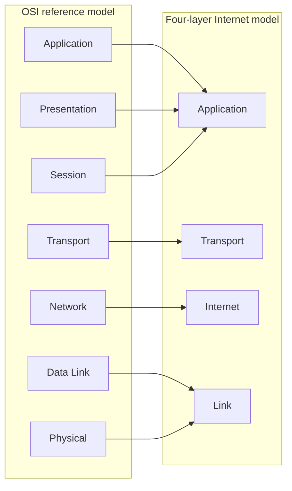

The mapping is approximate. DNS usually uses UDP or TCP, but an application can send DNS over HTTPS. HTTP/3 uses QUIC, which runs over UDP and provides capabilities associated with transport and security. Tunnels place one packet inside another. Proxies terminate one connection and originate another. These are not violations of the model; they show why concrete fields and endpoints matter more than slogans.

| TCP/IP layer | Host responsibility | Typical protocols or technologies | OSI comparison | Diagnostic focus |
|---|---|---|---|---|
| Application | Format operations, names, authentication, data, and responses | HTTP, DNS, DHCP, TLS usage, application APIs | Roughly OSI 5-7 | Request semantics, identity, policy, response, client state |
| Transport | Associate communicating endpoints and provide transport behavior | TCP, UDP, QUIC over UDP | Roughly OSI 4 | Ports, state, loss, timing, flow, reset, timeout |
| Internet | Address and route packets across networks | IPv4, IPv6, ICMP | Roughly OSI 3 | Address, route, hop, MTU, reachability |
| Link | Deliver over the directly connected link | Ethernet, Wi-Fi, point-to-point links | Roughly OSI 1-2 | Interface, neighbor, frame, VLAN, signal, errors |

## Encapsulation and decapsulation

Suppose a browser sends an HTTP request. The application produces bytes. TCP may place bytes into a segment and add ports, sequence information, flags, and other fields. IP places the transport segment into a packet with source and destination IP information. Ethernet can place the packet into a frame with next-link source and destination MAC information and a frame check. The physical medium represents the frame as signals.

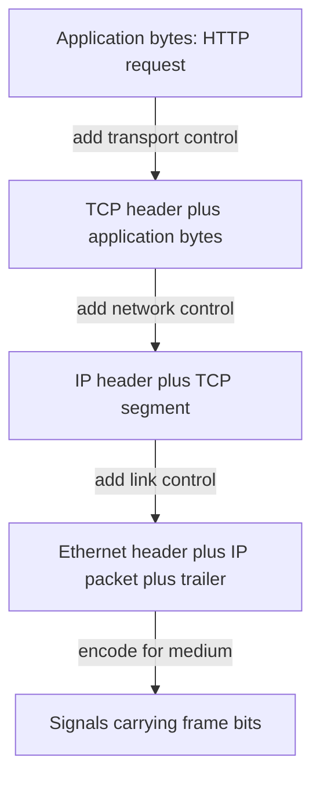

At the receiving host, the NIC and driver process link information, the IP implementation validates and dispatches the packet, the transport implementation applies state and delivery rules, and the application interprets the bytes. Each stage can reject, queue, reorder, transform, or report information according to its role.

| Encapsulation stage | Illustrative control information | Scope | Common failure signature |
|---|---|---|---|
| Application message | Method, target, content type, authorization context | Application operation | 4xx/5xx response, parse error, permission denial |
| Transport segment | Ports, sequence, acknowledgment, flags, window, options | Process-to-process path | SYN timeout, reset, retransmission, zero window |
| IP packet | Version, source, destination, next-header/protocol, hop control | Routed path | No route, unreachable, TTL/hop-limit expiry, MTU issue |
| Link frame | Link addresses, type, VLAN context, integrity check | One adjacent link | Neighbor failure, wrong VLAN, frame errors, drops |
| Physical signal | Encoding, timing, signal properties | One medium | Link down, high errors, unstable radio or optic |

### PDU vocabulary without mythology

Practitioners say "packet" loosely for captured traffic. In precise explanation, a TCP segment is carried inside an IP packet, which is carried inside a link frame. UDP's unit is a datagram. Application protocols have their own terms such as request, response, query, answer, record, or message.

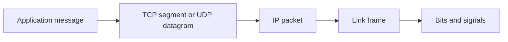

| Word heard on a bridge | Clarifying question | Why clarification matters |
|---|---|---|
| Session | User login, TLS resumption, HTTP connection, TCP connection, or product session? | They have different lifetimes and evidence |
| Packet | Application message, transport unit, IP packet, or captured frame? | Fields and ownership differ |
| Address | DNS name, URL, IP address, MAC address, or identity? | Each resolves a different problem |
| Server | Physical host, virtual machine, process, load balancer, proxy, or service? | The observed responder may not be the origin |
| Network issue | Link, route, DNS, transport, proxy, TLS, HTTP, or service dependency? | "Network" is too broad for action |

## Addressing at different layers

Multiple identifiers cooperate during one web request. A user chooses a human-readable host name. DNS returns one or more IP addresses. The operating system selects a source address and route. The application uses a destination service port. On the local link, the sender addresses a frame to the next hop, which may be the destination itself or a default gateway.

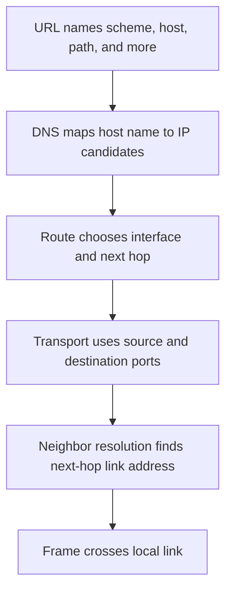

| Identifier | Example | Scope | Can change during journey? | Do not confuse with |
|---|---|---|---|---|
| User or workload identity | `arti@example.invalid` | Identity system and application policy | Tokens and context can change | IP address |
| URI host name | `tenant.sharepoint.example` | Application naming | Redirects can select another host | Physical server |
| IP address | `192.0.2.40` or `2001:db8::40` | Routing domain | NAT, load balancing, mobility, and service design can change observed values | Permanent device identity |
| Transport port | TCP destination 443 | Host transport demultiplexing | Source ephemeral port usually changes per connection | Application authorization |
| MAC address | `02:00:5e:10:00:01` | Local link | Normally changes at every routed hop | End-to-end destination identity |
| Process identifier | Local operating-system process ID | One host at one time | Changes after restart | Network port |

## Devices, functions, and boundaries

A device name does not guarantee one layer. A multilayer switch can route. A firewall can inspect transport and application context. A proxy terminates application connections. A load balancer can operate at transport or application scope. A client agent can steer traffic, enforce policy, collect telemetry, and use operating-system APIs. Ask what function occurred on the observed flow.

| Device or function | Typical responsibility | Evidence to seek | Boundary warning |
|---|---|---|---|
| Repeater or physical medium | Carry or regenerate signals | Link status, signal, interface counters | Up does not prove usable service |
| Ethernet switch | Forward frames within VLAN context | MAC table, VLAN, port counters | Management IP is not the forwarding path itself |
| Router | Forward IP packets between networks | Route, next hop, interface, ICMP, counters | Return path can differ |
| Stateful firewall | Permit or deny flows using state and policy | Rule, session table, reason, timestamps | A deny may be explicit or silent |
| NAT device | Translate address or port mappings | Translation table and pre/post tuples | Attribution must include time and mapping |
| Forward proxy | Accept client request and create upstream request | Client proxy setting, proxy logs, both connections | Client-to-proxy and proxy-to-service are separate legs |
| Reverse proxy | Receive on behalf of origins | Request ID, selected backend, response source | Observed IP may represent many services |
| Load balancer | Select a backend at transport or application level | Listener, pool health, selection, persistence | One backend can fail while others work |
| DNS resolver | Answer from cache or query other DNS servers | Query, response, cache, policy, server used | DNS success does not prove service reachability |
| Endpoint security client | Observe or influence local traffic and policy | Version, state, steering, local logs, documented behavior | Product specifics require vendor evidence |

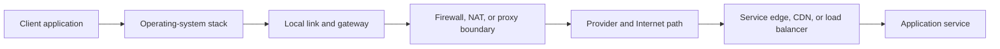

### Trust and ownership boundaries

A **trust boundary** is a place where assumptions, identity, authority, data exposure, or control changes. An **ownership boundary** is where operational responsibility changes. A **protocol boundary** is where one protocol terminates or transforms. They may occur at the same component but are not identical.

| Boundary | Example | Investigation question | Security and privacy question |
|---|---|---|---|
| Process to operating system | Browser calls socket API | Did the call fail before traffic left? | Which process and user initiated it? |
| Host to local network | Frame leaves managed endpoint | Was the correct interface and gateway used? | Is the local network trusted and monitored? |
| Client to proxy | Proxy terminates client connection | Which proxy was selected and why? | What metadata or content can it observe? |
| Enterprise to provider | Traffic enters carrier or cloud | Where is the last customer-controlled evidence? | Which party retains telemetry? |
| Front door to origin | CDN or load balancer selects backend | Which request ID and backend handled it? | Where did TLS terminate and logs persist? |
| Identity to application | Token or session is evaluated | Was authentication valid but authorization denied? | Are claims minimized and audited? |

## Packet journey through a router

When a host determines that a destination IP is outside its local prefix, it sends the frame to a configured next hop, often called the default gateway. The frame's destination MAC belongs to that next hop, not to the remote service. The IP destination remains the remote endpoint unless a translation or tunnel changes it.

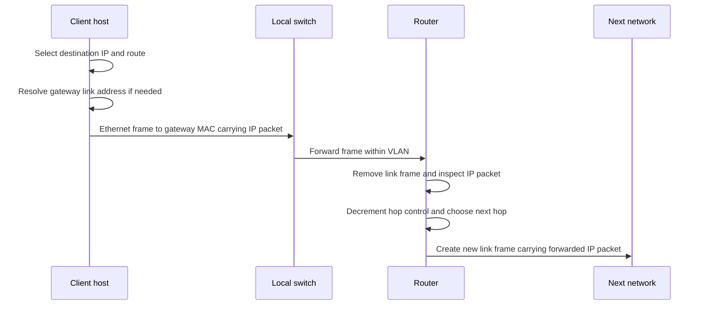

At every routed hop, the router processes the network-layer packet and replaces link-layer framing. The IP Time to Live field in IPv4 or Hop Limit in IPv6 is reduced to prevent indefinite looping. If it reaches zero, the forwarding node normally discards the packet and can return an ICMP time-exceeded message. Tools such as traceroute exploit this behavior, but filtering, load balancing, and different return paths limit interpretation.

## Browser-to-OneDrive or SharePoint journey

This is a generic Microsoft 365 teaching flow, not a promise of fixed endpoints or internal Microsoft architecture. Current endpoint, authentication, proxy, and network requirements must be checked in official Microsoft documentation and the tenant's evidence.

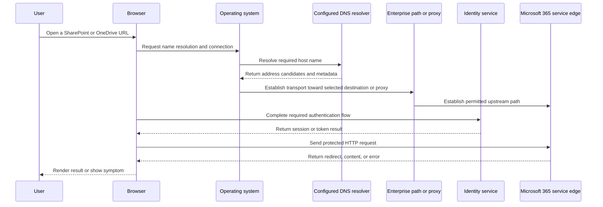

The visible page can depend on several host names, not one. The first request may redirect to identity, content delivery, static resources, APIs, or tenant-specific services. A browser waterfall reveals ordering and timing. A packet capture reveals lower-layer conversations but usually not encrypted HTTP content. Endpoint and identity logs can explain decisions not visible on the wire.

| Stage | Concrete question | Evidence | Example failure signature |
|---|---|---|---|
| User intent | Which exact operation, URL, account, object, and time? | Screen recording, steps, correlation time | Vague "OneDrive is down" report |
| Client behavior | Which process, version, profile, and configuration? | Browser/client logs, Procmon, settings | Only one profile or client fails |
| Name resolution | Which resolver returned which addresses and TTL? | DNS query/response, cache, `Resolve-DnsName` | NXDOMAIN, timeout, stale or split answer |
| Route and link | Which interface, source, gateway, and next hop? | `Get-NetIPConfiguration`, `route print`, trace | Wrong interface or unreachable gateway |
| Transport | Did the connection establish and remain healthy? | Socket state, packet trace | SYN timeout, reset, repeated retransmission |
| Security and TLS | Which endpoint presented which identity and policy result? | Browser security details, TLS metadata, approved proxy evidence | Name, chain, trust, protocol, or inspection conflict |
| HTTP | What method, status, redirect, and request identifier occurred? | HAR, browser tools, service response | 401, 403, 429, 5xx, redirect loop |
| Application and data | Was the user authorized for the requested site or file? | Service logs, permissions, audit evidence | Browser works but one library fails |

### Browser versus sync-client path

A browser and the OneDrive sync client can share DNS, transport, TLS, identity, and service dependencies while differing in process identity, proxy discovery, authentication cache, API usage, retry behavior, local database, file-system integration, and logging. Therefore, "browser works" is useful comparison evidence but does not prove the sync path is healthy.

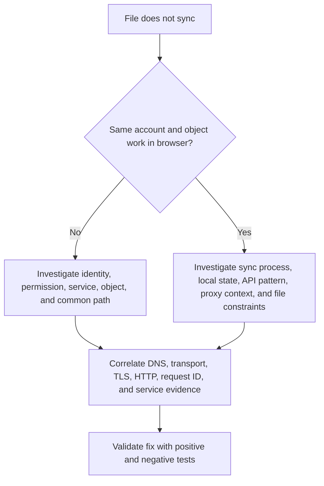

## Fictional NMH flow continuity

NMH is a fictional global manufacturer and logistics operator introduced earlier in the guide. In this Part, Priya, a fictional finance analyst, opens a restricted SharePoint Online workbook from a managed laptop at an acquired branch. The browser succeeds, but the sync client intermittently times out. No conclusion about Zscaler or Microsoft follows from that symptom.

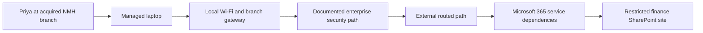

The investigation first scopes whether the symptom follows the user, device, branch, network, sync process, library, or time. Browser success narrows but does not close the problem. The team compares affected and unaffected sync requests, checks process-specific proxy selection, resolves every required host, records route and socket evidence, captures an authorized trace, and aligns it with client logs and service request identifiers.

| NMH observation | Possible layers | Discriminating check | Premature conclusion to avoid |
|---|---|---|---|
| Browser succeeds; sync times out | Application, session, proxy selection, transport, client state | Compare process paths and timestamps on same device | "The network is fine" |
| Failure mostly at one branch | Physical, link, route, MTU, proxy, local policy | Same device on controlled alternate path with approvals | "Microsoft is down" |
| DNS answers differ by resolver | Application naming and policy | Query specified resolvers and record full answers and TTL | "DNS poisoning" without evidence |
| Repeated transport loss after larger exchanges | Link, path MTU, congestion, receiver, intermediary | Packet sizes, retransmission pattern, ICMP, controlled size test | "Bandwidth problem" |
| HTTP 403 for one library | Application authorization or policy | Same account against other object; other account against same object | "Firewall block" |
| Response contains request identifier | Application/service boundary | Correlate through approved support process | "Request ID proves service defect" |

### NMH bridge cadence

Arti's transferable escalation rhythm is useful here: state impact, scope, evidence clock, workstreams, owners, next discriminating checks, and update time. She should ask the network workstream for route and loss evidence, the endpoint workstream for client path and logs, the identity workstream for authentication decisions, and the service workstream for request correlation. She should not assign blame by layer name.

## Layer interactions that matter

### DNS can change routing outcomes

DNS is an application-layer protocol, but its answers provide network-layer destinations. Different answers can reflect geography, service health, content-delivery design, resolver policy, or split namespace. A route can be valid to one returned address and fail to another. Capture the exact question, response, resolver, address family, TTL, and time.

### MTU can appear as an application timeout

A path that carries small packets but drops larger packets can complete DNS and a TCP handshake yet stall when protected application data grows. The user sees a spinner. The application log says timeout. The packet trace may show retransmitted larger segments and missing acknowledgments. The root cause can involve path MTU discovery, filtering, tunneling overhead, or a link constraint explored in Parts 17 and 18.

### Identity can resemble connectivity failure

An authentication redirect loop creates repeated successful connections and HTTP exchanges but no usable application session. A token audience or time problem can produce a denial after excellent network transport. Conversely, a blocked identity endpoint can prevent authentication even when the application host is reachable. "Sign-in failed" is a symptom, not a layer diagnosis.

### Proxies create two conversations

A forward proxy can accept the client's connection, evaluate policy, then establish a separate upstream connection. Client packet evidence may show successful transport to the proxy while the proxy cannot resolve or reach the destination. The HTTP response might be generated by the proxy rather than the origin. Obtain evidence from both legs and identify the responder.

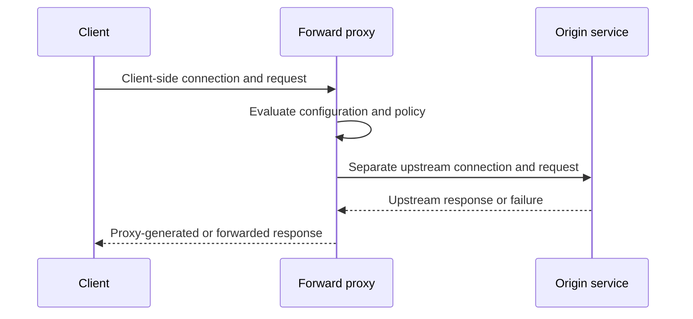

### Tunnels add outer and inner layers

A tunnel encapsulates an inner packet or stream inside another transport. The outer path can be healthy while the inner route or policy fails, or the inner communication can be valid until outer-path MTU overhead causes loss. Name both views: outer source/destination and protocol, inner source/destination and protocol, tunnel endpoint, overhead, and observation point.

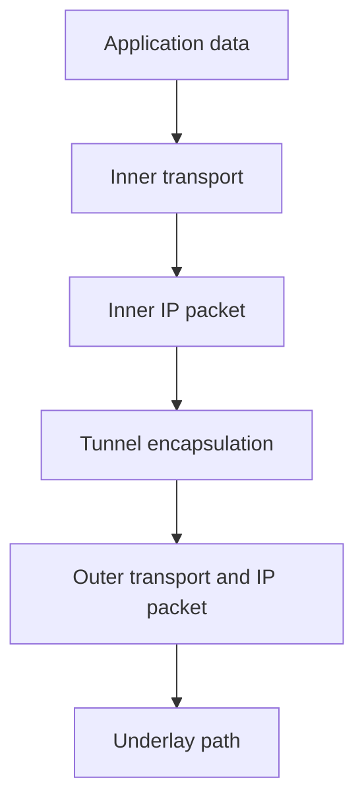

### Plain-English deep-dive 2 - Cross-layer failures are dependency failures

Imagine a hotel guest sending a request through the front desk. The guest speaks clearly, the front desk records the room correctly, the internal phone works, and housekeeping receives the task. Yet the requested item never arrives because the inventory system says none is available. Every earlier handoff succeeded; the service outcome still failed.

Networked applications have the same dependency chain. An HTTP 200 response can carry an application-level error object. A TCP connection can be healthy while authorization rejects access. DNS can return an address that is valid but unreachable from one routing context. A physical interface can be up while the VLAN is wrong. A proxy can be reachable while its upstream path fails.

Cross-layer reasoning means identifying the earliest boundary where expected behavior diverged, while remaining open to a lower-layer cause that manifests later. It does not mean collecting every possible log. Start with the user operation and time, draw the expected sequence, identify the last verified success and first verified failure, then collect the minimum evidence that separates the leading hypotheses.

## Header and field orientation

Part 16 introduces field purpose; later Parts calculate and interpret them deeply.

| Layer | Header or message fields to recognize | Diagnostic value | Caution |
|---|---|---|---|
| Ethernet | Source MAC, destination MAC, EtherType, optional VLAN tag, frame check | Local sender/next hop, carried protocol, VLAN context, corruption detection | Capture adapters often omit physical errors or frame check |
| IPv4 | Version, header length, total length, identification, flags, fragment offset, TTL, protocol, addresses | Packet size, fragmentation, loop control, next protocol, routed endpoints | Checksum covers IPv4 header, not payload |
| IPv6 | Version, traffic class, flow label, payload length, next header, hop limit, addresses | Address family, extension chain, payload, loop control | Routers do not fragment IPv6 packets |
| TCP | Ports, sequence, acknowledgment, data offset, flags, window, checksum, options | Connection state, ordering, delivery, flow, negotiation | Relative sequence numbers in tools are a display aid |
| UDP | Ports, length, checksum | Datagram endpoints and size | No handshake field means no transport delivery proof |
| DNS | ID, flags, counts, question, answer, authority, additional data | Query result, recursion behavior, response code, records | Cached answers can hide upstream lookup |
| HTTP | Method, target, status, headers, body | Application operation and response classification | Encryption may hide it from a packet capture |

## Basic calculations

### Encapsulation overhead

Assume a simple Ethernet frame carries an IPv4 packet with a TCP header and no options. An illustrative payload calculation is:

$$
\text{TCP payload} = \text{IP packet size} - \text{IPv4 header} - \text{TCP header}
$$

For a 1500-byte IP packet, a 20-byte IPv4 header, and a 20-byte TCP header:

$$
1500 - 20 - 20 = 1460\text{ bytes}
$$

That 1460-byte value is a common illustrative TCP maximum segment payload on such a path, not a universal constant. TCP options, IPv6, tunnels, and other encapsulation reduce available payload. Link framing also consumes capacity beyond the IP packet.

| Input | Illustrative value | Meaning | Variable in real paths? |
|---|---:|---|---|
| Link IP MTU | 1500 bytes | Maximum IP packet carried on the example link | Yes |
| IPv4 header | 20 bytes | Minimum IPv4 header without options | Yes |
| TCP header | 20 bytes | Minimum TCP header without options | Yes |
| Calculated TCP payload | 1460 bytes | Example maximum application bytes in one full segment | Yes |

### Serialization and propagation intuition

Serialization delay is the time to place bits onto a link:

$$
\text{serialization delay} = \frac{\text{frame bits}}{\text{link bits per second}}
$$

An approximate 12,000-bit unit on a 10,000,000-bit-per-second link takes $0.0012$ seconds, or $1.2$ milliseconds, to serialize. This excludes propagation, queueing, processing, retransmission, application work, and return traffic. A higher access-link rate does not guarantee low end-to-end latency.

### Round trips accumulate

If an operation needs DNS, a transport handshake, security negotiation, redirects, authentication, and application requests, sequential round trips can dominate user-perceived time. Protocols use connection reuse, multiplexing, caching, resumption, and newer transports to reduce this cost, but evidence must show which mechanisms actually occurred.

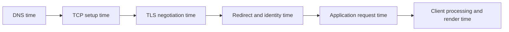

## Practical fault isolation

Begin with the service symptom, not Layer 1 by ritual. If an HTTP response explicitly denies one user's access while another succeeds, the fastest test is likely identity or authorization comparison. If the interface is down, lower layers deserve priority. The model organizes observations; symptom specificity determines the starting point.

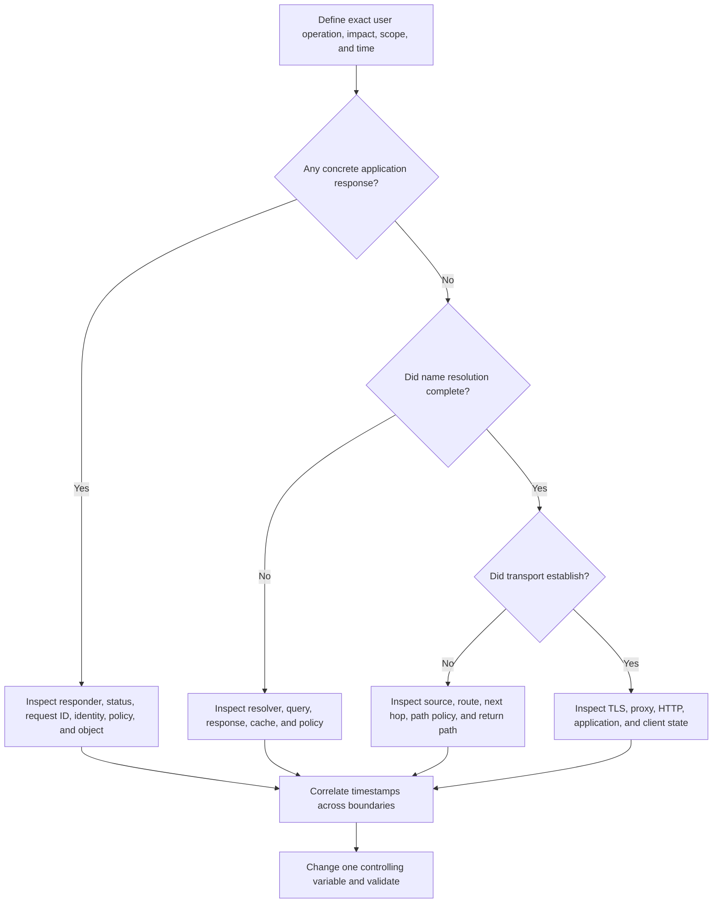

| Symptom | Leading hypotheses | Cheap discriminating check | Stronger evidence |
|---|---|---|---|
| No link and no address | Interface, driver, cable/radio, VLAN, DHCP | Interface state and configuration | Counters, event logs, switch/virtual-network evidence |
| Name not found | Wrong name, cache, resolver, split view, authoritative data | Query exact name through specified resolver | Full query/response and authoritative comparison |
| Connection timeout | Route, silent policy drop, return path, listener unavailable, loss | Compare destination/port/path and known-good case | Bidirectional trace plus stateful-device evidence |
| Immediate reset | Closed listener, endpoint rejection, intermediary reset | Identify reset source and sequence context | Both-side capture and process/listener logs |
| Certificate warning | Name, chain, time, trust, interception, client policy | Record exact certificate and validation error | Endpoint trust and documented intermediary evidence |
| 401 response | Authentication missing or invalid | Compare challenge, token context, clock, and account | Identity and service correlation |
| 403 response | Authenticated but not authorized, or policy denial | Compare user/object/policy and responder | Audit and policy decision evidence |
| 429 response | Rate or quota control | Read retry information and request pattern | Service throttling logs and correlation IDs |
| Intermittent slowness | Loss, queueing, path/backend variation, client state, retries | Compare timing phases and endpoint candidates | Repeated traces with synchronized service telemetry |

### Evidence ladder

```mermaid
flowchart LR
    REPORT[User report] --> REPRO[Reproduction with exact clock]
    REPRO --> CLIENT[Client and process evidence]
    CLIENT --> NAME[Name and configuration evidence]
    NAME --> SOCKET[Socket and route evidence]
    SOCKET --> PACKET[Authorized packet evidence]
    PACKET --> MIDDLE[Intermediary evidence]
    MIDDLE --> SERVICE[Service correlation]
    SERVICE --> CONCLUSION[Confidence-labeled conclusion]
```

Collect only as far as needed. A clear application denial with authoritative audit evidence may not require payload capture. A transport mystery may require synchronized captures at two points. State what each artifact proves, what it cannot prove, its clock source, and whether it was collected before or after a change.

## Tools and commands

Commands reveal a particular host, namespace, privilege level, and moment. Record the full command, timestamp, interface, destination, expected result, actual result, and environment. Do not paste secrets, tokens, customer names, private addresses, or unredacted captures into unapproved systems.

| Purpose | Windows examples | Linux or cross-platform examples | Interpretation caution |
|---|---|---|---|
| Interface and address | `Get-NetIPConfiguration`, `ipconfig /all` | `ip address`, `ip link` | Snapshot can change after collection |
| Route table | `route print`, `Get-NetRoute` | `ip route`, `ip -6 route` | Longest-prefix and metrics need context |
| DNS query | `Resolve-DnsName name`, `nslookup name` | `dig name`, `host name` | Different tools may use different resolution paths |
| Neighbor cache | `Get-NetNeighbor`, `arp -a` | `ip neighbor` | Cache state is local and time-sensitive |
| Socket state | `Get-NetTCPConnection`, `netstat -ano` | `ss -tanp`, `netstat` where available | Privilege may limit process attribution |
| Path clues | `tracert name`, `Test-NetConnection name -Port 443` | `traceroute`, `tracepath`, `nc` as approved | ICMP behavior need not match application traffic |
| Packet capture | `pktmon`, `netsh trace`, approved Wireshark capture | `tcpdump`, Wireshark | Capture point, offload, encryption, and privacy limit conclusions |
| HTTP evidence | Browser developer tools, approved `curl.exe -v` | `curl -v` | Verbose output may expose headers or credentials |

### Example command sequence for a controlled Windows check

```text
Get-Date
Get-NetIPConfiguration
Resolve-DnsName tenant.example.invalid
Test-NetConnection tenant.example.invalid -Port 443 -InformationLevel Detailed
Get-NetTCPConnection
route print
```

The `.invalid` top-level domain is reserved for examples and should not resolve publicly. In a real investigation, substitute only an approved target and sanitize output. A failed `Test-NetConnection` is not a root cause; it is one observation about the selected name, address, port, source context, and time.

## Privacy, safety, and evidence governance

Packet and application evidence can contain personal data, credentials, session tokens, cookies, URLs, query strings, file names, tenant names, internal addresses, message content, and security architecture. Even encrypted packet captures reveal metadata. Collecting everything "just in case" can create a larger incident than the one under investigation.

| Control | Practical action | Failure prevented |
|---|---|---|
| Purpose limitation | State the hypothesis and fields required before capture | Unnecessary surveillance and data sprawl |
| Authorization | Obtain customer and organizational approval for scope and endpoint | Unauthorized interception |
| Minimization | Limit hosts, interfaces, filters, duration, and payload where possible | Excess sensitive content |
| Secure storage | Use approved encrypted repository and access controls | Evidence leakage |
| Integrity | Preserve originals, hash where procedure requires, analyze copies | Untracked modification |
| Redaction | Remove secrets and irrelevant personal data from shared extracts | Credential or privacy exposure |
| Retention | Apply documented expiry and disposal | Indefinite sensitive-data accumulation |
| Transfer | Use approved channels and record recipients | Uncontrolled dissemination |
| Legal and regional review | Engage authorized experts for interception and employee-data rules | Policy or legal violation |
| Narrative discipline | Separate observation, interpretation, and conclusion | Overclaiming from ambiguous metadata |

### Plain-English deep-dive 3 - A capture is a camera angle

A security camera at a building entrance can show that a person entered at 09:10. It cannot show what happened in a locked room upstairs. A second camera may have a different clock. A blind spot does not prove nothing happened. A packet capture is the same kind of evidence.

A client-side capture shows traffic visible at the selected interface and point in the operating stack. It may show packets before or after checksum, segmentation, or other offload processing in ways that confuse a beginner. It may not show decrypted application content. Traffic might use another interface. A proxy creates another leg outside the client capture. A server-side capture can see a translated address and different timing.

Always record the capture point, interface, filter, clock, offload context, process association method, and missing boundaries. Correlate using tuples, timing, protocol identifiers, request IDs, and logs. Phrase the result as "the client capture shows..." rather than "the network did...."

## Misconceptions and corrections

| Misconception | Why it fails | Better statement |
|---|---|---|
| OSI is the actual Internet implementation | It is a reference model; deployed protocols cross conceptual boundaries | Use OSI to organize, then name real protocols and components |
| Layer 7 means the whole application | User interface, local state, identity, service, and protocol behaviors differ | Specify the network-facing operation and component |
| Ping works, so the application works | ICMP response does not prove DNS, TCP port, TLS, HTTP, identity, or service health | Ping is one path observation if allowed |
| Ping fails, so the host is down | ICMP can be filtered or deprioritized | Test the actual application path and obtain policy evidence |
| A TCP handshake proves the website is healthy | It proves limited transport reachability and state | Inspect TLS and HTTP behavior next |
| MAC addresses travel end to end | Link headers are replaced at routed hops | MAC addresses serve adjacent-link delivery |
| An IP address identifies a person | Addresses are shared, translated, reassigned, and time-bound | Correlate identity, device, mapping, and time |
| Port 443 means HTTPS | Port numbers are conventions, not cryptographic proof | Identify protocol from negotiation and evidence |
| Encryption makes a flow private in every sense | Metadata remains and endpoints/intermediaries can process plaintext | State termination points and metadata exposure |
| More logs always make diagnosis better | Irrelevant data increases privacy and correlation burden | Collect hypothesis-driven minimum evidence |
| A layer owns the incident | Teams own components and decisions, not abstract layers | Route actions using concrete ownership and evidence |
| The first error is the root cause | It may be a wrapper or downstream symptom | Reconstruct sequence and find earliest supported divergence |

## Troubleshooting decision trees

### No application response

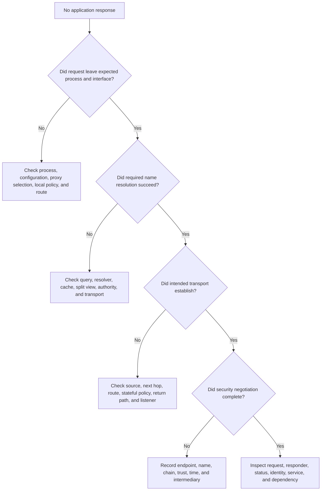

### Intermittent failure

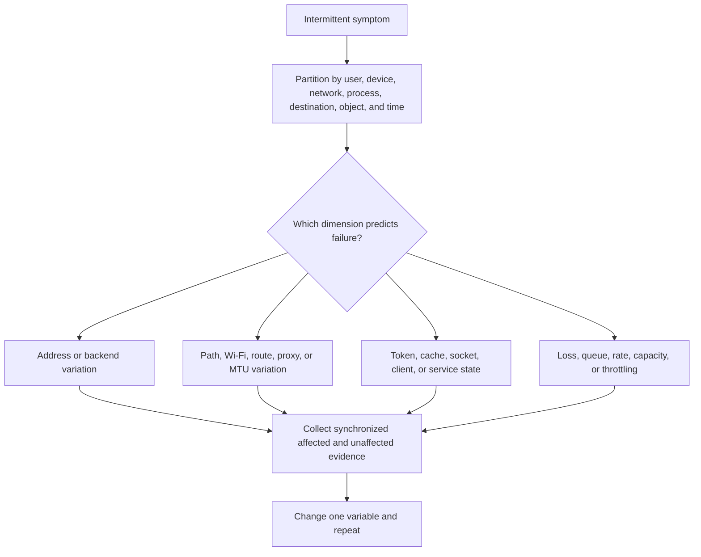

### Ownership without handoff failure

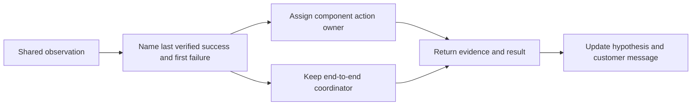

## Scenario labs

### Lab 1 - Draw the models from memory

Without notes, draw seven OSI layers and four TCP/IP layers. For every layer provide one responsibility, one protocol or technology, one PDU term, one identifier or field, and one failure signature. Then map the models and circle every approximate mapping. Success means explaining why presentation and session behavior often appears within modern application implementations.

### Lab 2 - Annotate one browser request

Use an approved, non-sensitive lab site. Record the exact time and browser operation. Export a sanitized HAR, inspect name resolution, note route and interface, observe socket establishment, and capture packets only with authorization. Build a table linking application request, transport tuple, IP endpoints, and local next-hop link address. State what encryption prevents the packet view from showing.

### Lab 3 - Compare browser and sync reasoning

Create a paper exercise for a OneDrive file that works in a browser but not in the sync client. Produce at least four hypotheses: process-specific proxy configuration, local sync state, API or request-pattern difference, and file or library constraint. For each, specify one cheap check, one stronger artifact, privacy risk, and a result that would disprove it.

### Lab 4 - Routed packet journey

Given client `192.0.2.10/24`, gateway `192.0.2.1`, and remote destination `198.51.100.20`, explain why the first Ethernet frame targets the gateway's MAC rather than the remote server's MAC. Draw two routers. Show link addresses changing at each routed hop while IP endpoints remain stable in the no-NAT example.

### Lab 5 - Proxy boundary

Draw a client, forward proxy, and origin. Give the client-to-proxy and proxy-to-origin legs different socket tuples. Invent a case where the first leg succeeds and the second times out. Write a customer update that says what is observed, what remains unknown, who owns each next action, and when the next update arrives.

### Lab 6 - Fictional NMH branch issue

Use the NMH scenario: browser succeeds, sync intermittently times out at one acquired branch. Build a matrix by user, device, network, process, destination address, object, and time. Propose the minimum authorized evidence plan. Include a same-device alternate-path test, but document security approval and avoid turning a workaround into an uncontrolled bypass.

### Lab 7 - Teach-back at three depths

Explain the same packet journey in thirty seconds to an executive, in three minutes to a customer lead, and in ten minutes to an engineer. The executive version should name impact, boundary, confidence, owner, and next action. The engineering version should add fields, states, clocks, capture points, and falsification tests without losing the service outcome.

| Lab artifact | Required contents | Pass condition | Honesty statement |
|---|---|---|---|
| Model map | Both models, mappings, caveats | No layer omitted; approximations named | Learning artifact |
| Request evidence map | Timestamp, process, name, tuple, addresses, request | Every inference linked to an artifact | Authorized lab only |
| Hypothesis matrix | Observation, hypothesis, check, disproof, owner | At least one result can falsify each idea | No invented production result |
| Privacy plan | Purpose, scope, minimization, storage, retention | Sensitive fields identified before collection | Follow actual policy |
| Customer update | Impact, evidence, uncertainty, actions, time | No blame or unsupported root cause | Fictional NMH update |

## Failure signatures by layer and evidence source

| Signature | Possible controlling area | Evidence that raises confidence | Evidence that weakens it |
|---|---|---|---|
| Interface down | Physical, virtual adapter, driver, policy | OS event and interface state align | Another expected interface carries the flow |
| Neighbor unresolved | Link/VLAN/gateway or target availability | Repeated neighbor solicitation without valid reply at correct capture point | Valid neighbor entry and bidirectional frames |
| No route | Address/configuration/routing | OS returns route error and route table lacks match | Packet leaves correct interface toward next hop |
| Hop expiry | Loop or unexpectedly long path | Repeating hop pattern and time-exceeded responses | Load-balanced trace with no application impact |
| SYN retransmission | Loss, silent filter, no return path, unavailable endpoint | Multiple timed SYNs with no response | Server sees request and sends reply on another observed path |
| Reset after handshake | Endpoint or intermediary rejection | Reset source, sequence, and logs correlate | Capture artifact caused by unrelated reused tuple |
| TLS alert | Negotiation, certificate, policy, endpoint | Alert plus endpoint logs and exact handshake context | Generic browser text without certificate details |
| HTTP redirect loop | Application, identity, proxy rewriting, stale session | Repeating Location chain in HAR | Lower-layer retransmission with no HTTP responses |
| HTTP 403 | Authorization or policy at responder | Audit decision and request ID align | Response generated by a different intermediary |
| Client-only error | Local state, process configuration, profile, extension | Same operation succeeds with controlled client comparison | All clients fail against one backend |

## Evidence quality and claim construction

A defensible conclusion contains observation, source, time, interpretation, alternatives, confidence, and next validation. Example: "At 14:03:21 UTC, the client-interface capture shows three TCP SYN transmissions from tuple A to tuple B with no observed response. The local route selected gateway G. This supports loss, silent filtering, missing return traffic, or an unavailable destination; it does not identify which boundary dropped traffic. Confidence is moderate because no gateway or destination capture is available. Next, correlate stateful-policy logs and collect an approved server-side observation."

| Claim element | Question | Weak example | Stronger example |
|---|---|---|---|
| Observation | What exactly appeared? | "Network failed" | "Three SYNs left the selected client interface with no reply observed" |
| Source | Which artifact and capture point? | "Wireshark says" | "Client Wi-Fi capture, adapter X, filter Y" |
| Time | Which clock and zone? | "Around lunch" | "2026-08-24 14:03:21 UTC, clock synchronized" |
| Interpretation | What does it support? | "Firewall blocked" | "Supports missing return traffic after outbound SYN" |
| Alternatives | What else fits? | None | Loss, routing, silent policy, unavailable endpoint, capture limitation |
| Confidence | How strong is attribution? | Certain | Moderate pending second observation point |
| Next check | What discriminates? | "Get more logs" | Correlate firewall state or capture at destination |

### Plain-English deep-dive 4 - Find the last good boundary, not a favorite layer

Picture a relay race in which the baton must pass through six runners. The crowd sees only that the team did not finish. A useful investigator asks which runner last held the baton correctly and where the expected next handoff disappeared. The answer comes from synchronized observations, not from the investigator's favorite runner.

For a web operation, the last good boundary might be a DNS answer, an outbound SYN, an acknowledged TLS record, an HTTP request accepted by a proxy, an identity token issued, or a service request logged. The first bad boundary might be a missing reply, explicit denial, malformed field, stale session, or downstream timeout. Between those points lies the smallest useful failure domain.

This method also protects collaboration. The network team receives a concrete tuple and timestamp, the identity team receives a correlation ID and decision context, and the service team receives an operation and request identifier. The TSM keeps end-to-end ownership of the customer outcome while specialists own evidence inside their boundaries.

## Practical operating worksheet

| Field | Record before diagnosis | Example using fictional NMH |
|---|---|---|
| User-visible operation | Exact action and expected result | Sync edited finance workbook within one minute |
| Impact | Users, sites, data, business process | Six finance users at acquired branch delayed |
| Start and pattern | First known time, frequency, duration | Intermittent since 08:20 UTC after local change window |
| Scope dimensions | User, device, process, network, object, destination | Browser good; sync affected; branch predictive |
| Expected sequence | Named dependencies and boundaries | Client, DNS, local path, proxy, Microsoft endpoints, identity, service |
| Last verified success | Artifact, source, timestamp | DNS answers and client-to-proxy handshake observed |
| First verified failure | Artifact, source, timestamp | Upstream timeout response correlated to sync attempt |
| Leading hypotheses | Ranked and falsifiable | Upstream path variation; process request difference; MTU issue |
| Next checks | Owner, command or artifact, due time | Network compares proxy upstream path by destination at 10:00 UTC |
| Privacy controls | Approval, minimization, storage, deletion | Header-focused capture in approved repository for seven days |
| Customer update | Facts, uncertainty, workstreams, next time | No root cause declared; next update at 10:30 UTC |
| Validation | Positive, negative, duration, rollback | Ten sync cycles plus unaffected baseline after controlled change |

## How this foundation supports later Parts

Part 17 expands the link and Internet layers into Ethernet frames, MAC addresses, VLANs, ARP, IPv4, IPv6, subnets, routes, NAT, ICMP, MTU, and packet journeys. Part 18 expands transport into TCP state, sequence arithmetic, windows, retransmission, congestion, ports, sockets, UDP, and QUIC. Part 19 follows DNS and DHCP. Part 20 follows HTTP and HTTPS semantics. Part 21 then examines TLS, certificates, PKI, and inspection.

The ordering matters. A strong investigator can move in either direction through the stack, but first-principles learning should distinguish adjacent-link delivery, routed delivery, transport state, name and configuration services, application behavior, and cryptographic trust before combining them in product-specific paths.

## Official Source Anchors

The following authoritative sources were reviewed for this Part on **2026-08-24**. They support standards and documented platform behavior, not any fictional NMH result or undocumented product implementation. Summaries in this Part are original explanations, not copied protocol text.

| Source | URL | Used for | Boundary |
|---|---|---|---|
| ISO/IEC 7498-1 overview | https://www.iso.org/standard/20269.html | OSI basic reference model context | Full standard text may require licensed access |
| IETF RFC 1122 | https://www.rfc-editor.org/rfc/rfc1122 | Internet host communication-layer requirements and layered terminology | Historical requirements have later updates |
| IETF RFC 8200 | https://www.rfc-editor.org/rfc/rfc8200 | Current IPv6 base specification and header behavior | Extension and operational topics have separate RFCs |
| IETF RFC 9293 | https://www.rfc-editor.org/rfc/rfc9293 | Current TCP functional specification | Congestion, RTO, and options have separate standards |
| IETF RFC 768 | https://www.rfc-editor.org/rfc/rfc768 | UDP datagram and header foundation | Minimal protocol does not provide application reliability |
| IETF RFC 9110 | https://www.rfc-editor.org/rfc/rfc9110 | HTTP semantics | Version-specific framing is documented separately |
| Microsoft Learn: TCP/IP fundamentals | https://learn.microsoft.com/en-us/troubleshoot/windows-server/networking/tcpip-fundamentals-for-microsoft-windows | Windows TCP/IP conceptual and troubleshooting context | Page scope and supported versions must be checked |
| Microsoft Learn: TCP/IP tools and settings | https://learn.microsoft.com/en-us/windows-server/networking/technologies/network-subsystem/net-sub-interface-metric | Windows network interface and route metric context | Configuration behavior is version-specific |
| Microsoft 365 network connectivity principles | https://learn.microsoft.com/en-us/microsoft-365/enterprise/microsoft-365-network-connectivity-principles | Microsoft 365 path and connectivity planning principles | Current endpoints and tenant specifics require current service documentation |
| MDN: How does the Internet work? | https://developer.mozilla.org/en-US/docs/Learn_web_development/Howto/Web_mechanics/How_does_the_Internet_work | Beginner web-to-network explanation | Educational overview, not a protocol standard |
| Wireshark User's Guide | https://www.wireshark.org/docs/wsug_html_chunked/ | Capture, display, and analysis behavior | Capture legality, privacy, and organizational process remain local responsibilities |
| NIST SP 800-207 | https://csrc.nist.gov/pubs/sp/800/207/final | Trust boundaries and zero trust architecture context | It does not document a specific vendor implementation |

## Likely Interview Questions

### Q1. Why use both the OSI and TCP/IP models?

**Model answer:** The OSI model gives a precise seven-layer vocabulary for separating responsibilities such as representation, sessions, transport, routing, local-link delivery, and signaling. The TCP/IP model better matches the deployed Internet suite by grouping application behavior above transport, then Internet and link functions. I use either as a hypothesis map, declare which model I mean, and then name concrete protocols, components, fields, boundaries, and evidence because real implementations do not fit every box perfectly.

### Q2. Walk through encapsulation for a web request.

**Model answer:** The application forms request bytes. TCP can add source and destination ports, sequence and acknowledgment state, flags, windows, and options. IP adds logical source and destination addresses and forwarding controls. Ethernet can add local-link source and destination addresses, a protocol type, optional VLAN context, and integrity information. Signals carry the frame. The receiver decapsulates in reverse. At a router, incoming link framing is replaced for the next link while the IP packet is forwarded, subject to routing, hop control, policy, and possible translation.

### Q3. Which addresses change when a packet crosses a router?

**Model answer:** On a normal routed path without translation, link-layer source and destination addresses change for each local link because each frame targets the next hop. End-to-end IP source and destination generally remain stable. NAT or a proxy can change that picture: NAT can rewrite network and transport identifiers, while a proxy terminates one connection and creates another. I would describe the actual observation points and both tuples rather than rely on a simplified rule.

### Q4. How would you use layers to troubleshoot a OneDrive symptom?

**Model answer:** I start with the exact operation, impact, scope, and time. I compare user, device, process, network, object, and destination dimensions. Then I map the expected sequence: client state, name resolution, route, transport, TLS, proxy if present, HTTP, identity, service, permissions, and content. I identify the last verified success and first verified failure, collect minimum authorized evidence, change one variable, and validate. Browser success is comparison evidence but does not prove the sync client's process-specific path is healthy.

### Q5. Why does a successful TCP handshake not prove an application is healthy?

**Model answer:** A handshake establishes limited transport state between endpoints. The security negotiation can still fail, the proxy can lack an upstream path, HTTP can return a denial or server error, authentication or authorization can fail, a dependency can time out, or application data can be invalid. I continue through the expected sequence and correlate the response source and identifiers.

### Q6. What does a packet capture prove?

**Model answer:** It proves what was visible at a particular capture point, interface, filter, and clock, subject to offload, encryption, dropped capture data, and tool behavior. A client capture may not show a proxy's upstream leg or server processing. I record those limitations, correlate with socket, intermediary, identity, and application evidence, and protect sensitive content and metadata through authorization, minimization, secure storage, redaction, and retention controls.

### Q7. How do you avoid blaming the wrong team during cross-layer troubleshooting?

**Model answer:** I name the last verified good boundary and first verified failure with timestamps and artifacts. I assign actions to owners of concrete components, not abstract layers, while one coordinator retains end-to-end customer ownership. Every hypothesis has a check that could disprove it. Updates separate observation, interpretation, uncertainty, and next action, so collaboration follows evidence instead of assumptions.

### Q8. How does your Microsoft background transfer to a SecOps TSM role?

**Model answer:** My production bridge is the method: I have scoped business-critical Microsoft 365 symptoms, separated client, identity, network, service, permissions, and data boundaries, gathered trace and application evidence, coordinated customers and Engineering, communicated under pressure, and validated fixes. I do not present that as Zscaler production experience. I would apply the same evidence-led method while learning the customer's security architecture and validating product-specific behavior against current official documentation and tenant telemetry.

## 30-Second Memory Hooks

| Concept | Memory hook |
|---|---|
| OSI model | Seven responsibility labels, not seven guaranteed boxes |
| TCP/IP model | Application, transport, Internet, link |
| Encapsulation | Each lower job adds its delivery label |
| Decapsulation | Receiver opens the labels in reverse |
| PDU | Message, segment or datagram, packet, frame, bits |
| Application | What operation and response? |
| Presentation | How are bytes represented and protected? |
| Session | Which logical conversation continues? |
| Transport | Which process endpoints and delivery state? |
| Network | Which address, route, hop, and return path? |
| Data link | Which next hop on this local link? |
| Physical | Can signals cross this medium reliably? |
| Router | Replace link frame; forward network packet |
| Proxy | Terminate one conversation; create another |
| DNS | Application answer that influences network destination |
| Packet capture | One camera angle with a clock and blind spots |
| Fault isolation | Last verified success, first verified failure |
| Privacy | Collect the minimum authorized evidence |
| Honesty | Microsoft method is production; NMH and Zscaler use are not |

## Completion Checklist

- [ ] I can draw all seven OSI layers in order and explain one concrete responsibility at each.
- [ ] I can draw the four-layer TCP/IP model and explain why the mapping is approximate.
- [ ] I can define protocol, layer, service, interface, peer, header, payload, PDU, encapsulation, and decapsulation.
- [ ] I can distinguish application data, TCP segment, UDP datagram, IP packet, Ethernet frame, and physical bits.
- [ ] I can explain names, IP addresses, ports, MAC addresses, process identifiers, and identity without conflating them.
- [ ] I can trace a packet through a router and state which link and network fields normally change.
- [ ] I can explain how NAT, proxies, tunnels, and load balancers complicate a simple layer story.
- [ ] I can calculate the illustrative 1460-byte TCP payload from a 1500-byte IP MTU with minimum IPv4 and TCP headers.
- [ ] I can explain why DNS, TCP, TLS, HTTP, identity, permission, service, and client state can interact.
- [ ] I can compare browser and OneDrive sync-client paths without claiming they are identical.
- [ ] I can construct a fictional NMH hypothesis matrix and label it as a learning artifact.
- [ ] I can identify the last verified success and first verified failure in a sequence.
- [ ] I can choose a cheap discriminating test instead of running random commands.
- [ ] I can state what `ipconfig`, `Get-NetRoute`, `Resolve-DnsName`, `Test-NetConnection`, socket tools, and packet capture can and cannot show.
- [ ] I can explain capture-point, clock, offload, encryption, proxy-leg, and missing-evidence limitations.
- [ ] I can apply authorization, minimization, secure storage, redaction, retention, and controlled transfer to network evidence.
- [ ] I can communicate observation, interpretation, alternatives, confidence, owner, and next action separately.
- [ ] I can correct common layer misconceptions without becoming argumentative.
- [ ] I can connect Arti's factual OneDrive, SharePoint, networking, escalation, and evidence background to this method.
- [ ] I can say explicitly that this Part makes no unsupported Zscaler or NMH production claim.
- [ ] I can answer Q1-Q8 aloud in concise, evidence-based language.

[Part 17 - Ethernet, ARP, IP Addressing, Subnetting, Routing, and NAT](Part-17-ethernet-ip-subnet-routing-nat.md)