# Part 17 - Ethernet, ARP, IP Addressing, Subnetting, Routing, and NAT

> **Audience:** Candidates moving from Microsoft 365 Support Escalation Engineering into a Zscaler Security Operations Technical Success Manager role.
>
> **Purpose:** Explain how a host delivers frames locally, addresses and routes packets across networks, translates flows at boundaries, handles packet-size constraints, and proves where a path diverges.
>
> **Scope and honesty:** Northstar Meridian Holdings, abbreviated NMH, is fictional. Its devices, addresses, routes, captures, policies, failures, and outcomes are practice material. Your own product, networking, evidence, and escalation experience must be represented only as supported by your documented background.
>
> **Product caveat:** This Part covers standards and general operating-system behavior. It makes no claim about an undocumented Microsoft, carrier, firewall, cloud, or Zscaler implementation. Exact forwarding, tunneling, inspection, route, NAT, telemetry, and product behavior must be confirmed from current official documentation and environment evidence.

## Section goal

Part 16 separated communication into layers. Part 17 opens the link and Internet layers. The central question is: **How does one IP packet move from a process on one host to the correct next hop, through one or more routers and translation boundaries, and toward a remote service?**

Think of a traveler moving through a city and then across countries. A building room number is useful only inside one building; a street address helps the local driver; an international destination guides the wider journey; border controls can rewrite visible paperwork; and every transport segment has a size limit. Ethernet link addresses resemble local delivery labels. IP prefixes and routes resemble regional maps. A default gateway is the local depot that accepts nonlocal traffic. Network Address Translation resembles a border desk that replaces private return details with a public mapping and keeps a time-sensitive ledger.

By the end, you should be able to:

| Outcome | Demonstrated capability | Evidence of mastery |
|---|---|---|
| Read Ethernet | Explain frame fields, MAC addressing, VLAN context, switching, broadcast, and failure signatures | Annotated frame and switch-forwarding diagram |
| Explain local delivery | Determine local versus routed destination and describe ARP or IPv6 neighbor resolution | Correct next-hop and link-address decision |
| Address IPv4 and IPv6 | Explain address structure, scope, special ranges, and coexistence | Address inventory with explicit scope and source |
| Calculate subnets | Convert prefix length, mask, block size, network, broadcast, and usable range | Worked IPv4 and IPv6 prefix exercises |
| Read routes | Apply longest-prefix match, administrative preference, metric, next hop, source, and policy caveats | Route-choice walkthrough with alternatives |
| Explain NAT/PAT | Map pre-translation and post-translation tuples and state | Time-bound translation evidence table |
| Diagnose packet-size issues | Relate MTU, fragmentation, MSS, PMTUD, ICMP, and tunnels | Size-based failure hypothesis and controlled test |
| Isolate paths | Diagnose asymmetry, local-link faults, route loops, black holes, and policy drops | Decision tree and synchronized capture plan |
| Protect evidence | Minimize packet, route, neighbor, and translation data | Approved collection and redaction plan |
| Bridge experience | Apply the mechanics to browser, OneDrive sync, SharePoint, and fictional NMH paths | Honest interview answer and scenario lab |

## JD Mapping

| JD expectation | Part 17 capability | Customer artifact | Honest experience bridge |
|---|---|---|---|
| Analyze complex environments | Reconstruct local link, gateway, route, translation, and return path | Current-state path map | Microsoft 365 connectivity isolation |
| Identify security risks | Find broad VLANs, exposed routes, uncontrolled NAT, weak attribution, and missing telemetry | Trust-boundary and exposure notes | Learned security interpretation built on factual networking work |
| Tailor mitigation | Recommend scoped route, MTU, policy, segmentation, or configuration correction | Change, rollback, and validation plan | Production fix-validation discipline |
| Resolve critical escalations | Divide link, route, translation, endpoint, and provider workstreams | Timeline, tuple map, capture matrix | critical-situation-style coordination and evidence gathering |
| Deliver technical consulting | Explain subnetting and packet journeys at customer depth | Whiteboard and teach-back | Technical advisor, mentoring, and training experience |
| Work cross-functionally | Give each owner exact interface, prefix, tuple, timestamp, and hypothesis | Shared action register | Customer, networking, service, and Engineering coordination |
| Communicate risk simply | Translate packet behavior into reachability, attribution, privacy, and resilience impact | Executive-safe summary | Customer-impact communication |

## Candidate honesty note

You can factually discuss how Microsoft 365 symptoms required you to distinguish local configuration, DNS, proxy, route, transport, service, permission, and client behavior; how you used approved network and application evidence; how you coordinated specialists; and how you validated a result. You can explain these standards and complete the labs as learning evidence.

You must not claim that the fictional NMH network is a real customer, that you administered enterprise routers or Zscaler services unless separately documented, or that one traceroute proves a vendor fault. A precise interview bridge is: "I have production experience applying evidence-led connectivity isolation to OneDrive and SharePoint cases. My routing, subnetting, NAT, and packet-analysis depth is a combination of that transferable work and deliberate study or labs. I would verify a customer's actual forwarding and product path before recommending a change."

| Evidence category | Safe phrasing | Boundary |
|---|---|---|
| Production | "In enterprise support, I correlated client, path, HTTP, and service evidence." | Do not invent router ownership or security-policy authority |
| Lab | "I calculated prefixes and annotated pre-NAT and post-NAT packet captures in a lab." | Do not present synthetic addresses as customer evidence |
| Conceptual | "The route algorithm selects the most specific matching prefix, subject to implementation and policy." | Validate the host's actual route table and policy |
| Fictional | "In the NMH exercise, one branch had an MTU black-hole pattern." | NMH is not a real engagement |

## Terms and acronyms before mechanics

| Term | Plain meaning | Why it matters | Memory hook |
|---|---|---|---|
| Ethernet | Family of local-area network technologies using frames | Common enterprise link-layer foundation | Ethernet moves local frames |
| Frame | Link-layer protocol data unit | Carries a packet across one link | Frame is the local envelope |
| MAC | Media Access Control | Names a link sublayer and commonly a link-layer address | MAC is local delivery context |
| MAC address | Link-layer identifier used for local frame forwarding | Switches learn and forward by it within VLAN context | MAC does not cross routers unchanged |
| Unicast | Delivery intended for one interface | Normal host-to-host frame or packet pattern | Uni means one |
| Broadcast | Delivery to all members of a broadcast domain | ARP requests use Ethernet broadcast | Broadcast stays within its domain |
| Multicast | Delivery to a subscribed or defined group | IPv6 Neighbor Discovery uses multicast rather than ARP broadcast | Multi means selected group |
| VLAN | Virtual Local Area Network | Logically separates Ethernet broadcast domains | VLAN is a separate virtual floor |
| 802.1Q | IEEE VLAN-tagging method | Carries VLAN identity on tagged Ethernet links | Tag labels the virtual floor |
| Switch | Device that forwards frames within a link domain | Learns source MAC locations and selects egress ports | Switch follows local name cards |
| CAM table | Content Addressable Memory table, often used informally for a switch MAC table | Associates MAC and VLAN with a switch port | CAM is the switch address book |
| ARP | Address Resolution Protocol | Maps an IPv4 next-hop address to a local link address | ARP asks who owns this IPv4 address |
| NDP | Neighbor Discovery Protocol for IPv6 | Finds neighbors and routers and supports address checks | NDP is IPv6 local-neighbor service |
| IP | Internet Protocol | Supplies logical addressing and packet forwarding | IP guides the wider journey |
| IPv4 | Internet Protocol version 4 | Uses 32-bit addresses | IPv4 has four octets |
| IPv6 | Internet Protocol version 6 | Uses 128-bit addresses and different neighbor mechanics | IPv6 has eight hexadecimal groups |
| Prefix | Leading address bits that identify a network block | Routing and subnet boundaries use prefixes | Prefix is the shared neighborhood |
| CIDR | Classless Inter-Domain Routing | Represents a prefix with slash length | Slash length counts network bits |
| Subnet | A prefix assigned as one logical IP segment | Determines local versus routed decisions | Subnet is an IP neighborhood |
| Mask | IPv4 bit pattern separating prefix and host bits | Supports subnet calculations | Ones mark network bits |
| Gateway | Router next hop used to reach another network | Receives frames for nonlocal IP destinations | Gateway is the local exit |
| Route | Rule associating a destination prefix with next hop, interface, and preference | Controls packet forwarding | Route says where next |
| LPM | Longest Prefix Match | Most-specific matching destination prefix normally wins | Longest match is closest map detail |
| Metric | Numeric preference among otherwise comparable routes | Lower commonly means preferred within a route source | Metric breaks comparable ties |
| ICMP | Internet Control Message Protocol | Reports network-layer conditions and supports diagnostics | ICMP is the network's feedback channel |
| NAT | Network Address Translation | Rewrites IP addresses across a boundary | NAT replaces an address label |
| PAT | Port Address Translation | Rewrites ports so many flows can share an address | PAT adds a numbered extension |
| MTU | Maximum Transmission Unit | Largest IP packet a link carries without link-specific fragmentation behavior | MTU is doorway width |
| PMTUD | Path MTU Discovery | Learns the smallest usable MTU along a path | PMTUD finds the narrowest doorway |
| Fragment | Piece of an original IP packet | Reassembly and loss affect reliability and security | Fragment is one package piece |
| Asymmetric routing | Forward and return traffic use different paths | Stateful controls and captures may see only one direction | Outbound road differs from return road |

## Ethernet frame mechanics

Ethernet delivers a frame across one link-layer domain. The common Ethernet II view contains destination MAC, source MAC, an EtherType, payload, and a Frame Check Sequence. The physical transmission also includes preamble, start delimiter, and an interpacket gap that many packet captures do not display. An optional IEEE 802.1Q tag adds VLAN and priority information between the source MAC and EtherType area.

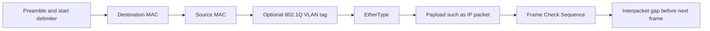

| Field or element | Typical size | Purpose | Capture caution |
|---|---:|---|---|
| Preamble plus start delimiter | 8 bytes on wire | Synchronization and frame start | Common captures omit it |
| Destination MAC | 6 bytes | Intended local receiver, multicast group, or broadcast | It usually names next hop, not remote IP host |
| Source MAC | 6 bytes | Sender on this Ethernet link | A routed next frame gets a new source MAC |
| Optional 802.1Q tag | 4 bytes | Priority and VLAN identity | Endpoint capture may hide, add, or strip it through offload |
| EtherType | 2 bytes | Identifies payload protocol such as IPv4, ARP, or IPv6 | Length-style framing exists in other contexts |
| Payload | Commonly 46-1500 bytes for basic Ethernet framing | Carries higher-layer data and padding if needed | Jumbo configurations vary and require end-to-end validation |
| Frame Check Sequence | 4 bytes | Detects bit errors in frame | NIC often verifies and removes it before capture |
| Interpacket gap | 12 byte-times | Separates transmissions | It is not inside the captured frame |

The standard Ethernet maximum frame and overhead discussion depends on exactly which elements are counted. Avoid saying "an Ethernet frame is exactly 1518 bytes" without naming whether VLAN tag, preamble, start delimiter, and interpacket gap are included. For IP troubleshooting, the frequently encountered link IP MTU is 1500 bytes, but that is not universal.

### MAC address structure and limits

A common 48-bit MAC address contains an organization-related prefix and an interface-specific portion, but locally administered and randomized addresses are common. The Individual/Group bit distinguishes unicast from multicast at the address level; the Universal/Local bit indicates universal versus local administration. A MAC address is not trustworthy personal identity.

| MAC concept | Meaning | Diagnostic value | Security caution |
|---|---|---|---|
| Unicast address | Intended for one interface in the link domain | Normal learned forwarding | Can be spoofed or moved |
| Broadcast address | All 48 bits set to one | Reaches all members of Ethernet broadcast domain | Broadcast storms consume shared resources |
| Multicast address | Group bit set | Supports group delivery | Membership and filtering matter |
| Universally administered | Assigned under global identifier scheme | Vendor clue may be possible | It does not prove current device owner |
| Locally administered | Local bit set | Common for virtual and privacy-oriented use | Vendor lookup can mislead |
| Randomized address | Software-selected local address | Reduces passive tracking in some contexts | Complicates inventory correlation |

### Switching and learning

A switch normally learns from the **source** MAC of incoming frames, recording a MAC, VLAN, ingress port, and age. For a known unicast destination, it forwards to the associated egress port. For an unknown unicast, it floods within the VLAN except the ingress port. Broadcast and relevant multicast are also delivered according to link-domain rules and switch features.

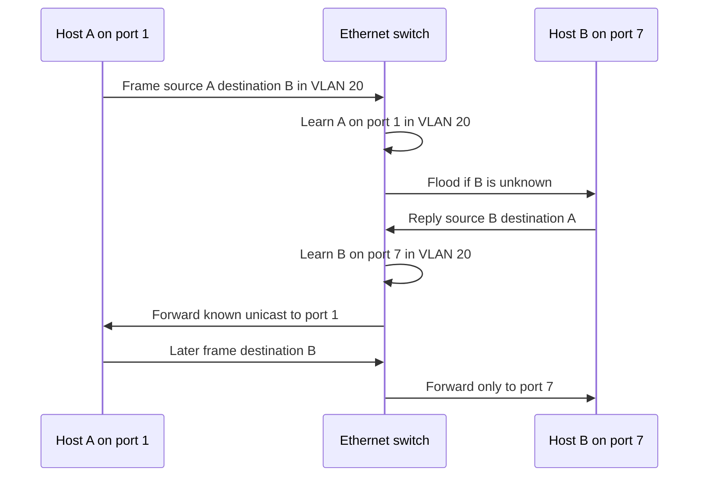

| Switch behavior | Trigger | Expected action | Failure signature |
|---|---|---|---|
| Source learning | Valid frame arrives | Record source MAC, VLAN, and ingress port | Table never learns expected host |
| Known unicast | Destination entry exists | Forward to learned egress | Wrong port or stale move causes loss |
| Unknown unicast | Destination not learned | Flood within permitted VLAN | Excess flooding or isolation mismatch |
| Broadcast | Destination is broadcast | Flood within broadcast domain | Large domain amplifies traffic |
| MAC move | Same source appears on another port | Update or flag according to controls | Flapping, loop, duplicate, or mobility event |
| Aging | Entry inactive beyond timer | Remove old association | First frames flood until relearned |

### VLANs and trunks

A VLAN separates one Ethernet forwarding and broadcast context from another. An access port commonly presents one untagged VLAN to an endpoint. A trunk carries multiple VLANs, usually with 802.1Q tags, between network devices or virtualization boundaries. Terminology and native-VLAN behavior vary by implementation; configuration on both ends must agree.

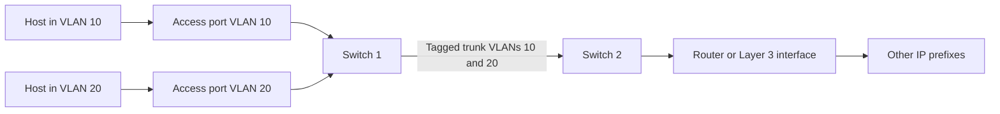

Two hosts in different VLANs require a Layer 3 forwarding function even if their physical ports are on the same switch. A wrong VLAN can look like DHCP failure, ARP failure, unreachable gateway, or broad outage. Verify endpoint port, VLAN, trunk allowance, Layer 3 interface, and policy rather than relying on the cable location.

### Plain-English deep-dive 1 - A switch learns senders, not intentions

Imagine a receptionist watching envelopes enter a mailroom. When an envelope from Department A arrives at chute 1, the receptionist learns that Department A is reachable through chute 1. To deliver an envelope to an unknown department, the receptionist temporarily asks every appropriate chute. Once a reply arrives, both locations are known.

The switch does not authenticate the human intent behind a source address merely by learning it. MAC addresses can change, move, be virtualized, or be spoofed. VLAN membership and access controls supply additional boundaries. Security designs may add port authentication, inspection, segmentation, and monitoring, but those are concrete controls that need evidence.

For troubleshooting, ask four linked questions: Which VLAN did the frame enter? Which source association did the switch learn? Was the destination known or flooded? Which egress and counters recorded the result? A client packet capture alone cannot prove the switch's internal forwarding decision.

## Local versus routed delivery

A host applies its own prefix information and route table to a destination. If the selected route treats the destination as on-link, the host resolves the destination's link address and sends directly. If the selected route uses a next hop, the host resolves the next hop's link address and puts the remote IP packet inside a frame addressed to that router.

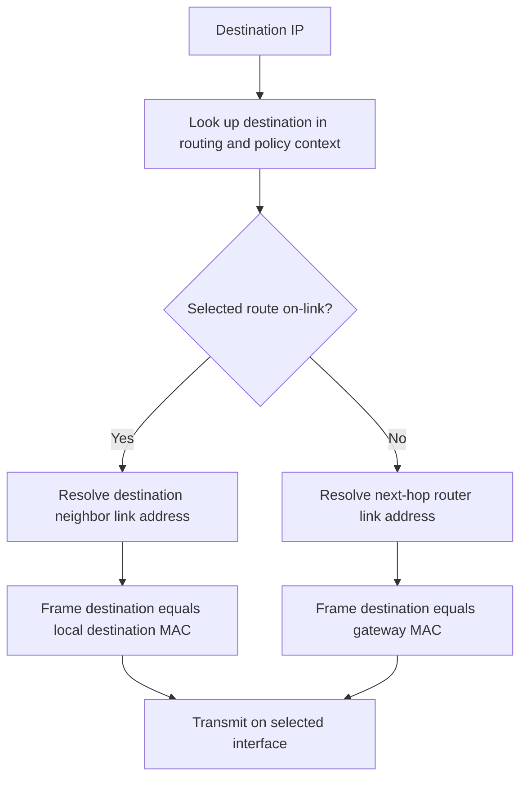

| Example | Host address and prefix | Destination | Decision | Link-layer target |
|---|---|---|---|---|
| Same IPv4 subnet | `192.0.2.10/24` | `192.0.2.80` | On-link | MAC for `192.0.2.80` |
| Remote IPv4 subnet | `192.0.2.10/24` | `198.51.100.20` | Via selected gateway | MAC for gateway such as `192.0.2.1` |
| Same IPv6 link prefix | `2001:db8:10::10/64` | `2001:db8:10::80` | On-link if route says so | IPv6 neighbor's link address |
| Remote IPv6 prefix | `2001:db8:10::10/64` | `2001:db8:20::20` | Via IPv6 next hop | Router's link-layer address |

Never decide on-link versus remote by visual similarity alone. The configured prefix and route table control the decision. A host with `/16` and a host with `/24` can disagree about whether the same destination is local, producing one-way or neighbor-resolution symptoms.

## ARP for IPv4

ARP maps an IPv4 protocol address to a link-layer address on a local network. The requester broadcasts an ARP request asking which interface owns the target IPv4 address. The target normally sends an ARP reply identifying its MAC. The requester caches the association for a limited time according to implementation behavior.

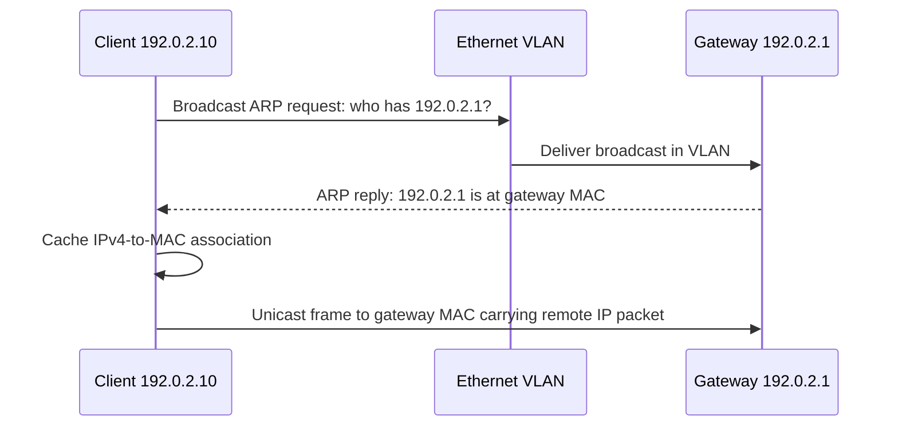

### ARP message fields

| Field | Purpose | Ethernet/IPv4 example | Investigation use |
|---|---|---|---|
| Hardware type | Identifies link technology | Ethernet value | Confirm expected link context |
| Protocol type | Identifies network protocol | IPv4 EtherType | Confirm mapping target protocol |
| Hardware length | Link-address size | 6 bytes for 48-bit MAC | Detect malformed context |
| Protocol length | Protocol-address size | 4 bytes for IPv4 | Detect malformed context |
| Operation | Request or reply | Request 1, reply 2 | Reconstruct sequence |
| Sender hardware address | Sender MAC | Client or gateway MAC | Learn claimant and compare frame source |
| Sender protocol address | Sender IPv4 | `192.0.2.10` | Identify advertised mapping |
| Target hardware address | Desired or known target MAC | Unknown in request | Interpret request/reply state |
| Target protocol address | IPv4 being resolved | `192.0.2.1` | Distinguish destination versus gateway resolution |

ARP is unauthenticated. ARP spoofing or poisoning can redirect local IPv4 traffic. Duplicate addresses, stale caches, wrong VLANs, dormant gateways, virtual address movement, and security controls can also produce surprising mappings. An unexpected reply is evidence requiring topology and control validation, not automatic proof of attack.

| ARP signature | Plausible causes | Discriminating evidence | Safe next action |
|---|---|---|---|
| Repeated request, no reply | Wrong VLAN, target down, link block, bad prefix, gateway absent | Switch/VLAN evidence and target-side capture | Verify topology before clearing caches |
| Multiple MAC replies for one IPv4 | Redundancy, duplicate address, spoofing, capture artifact | Address ownership and switch-port correlation | Escalate according to security process |
| Mapping changes rapidly | Mobility, failover, loop, duplicate, spoofing | MAC move logs and approved topology | Preserve timeline and avoid unsupported accusation |
| Stale mapping after failover | Cache lifetime and missing announcement | Neighbor cache and gratuitous ARP evidence | Use documented refresh procedure |
| ARP succeeds but IP fails | Routing, firewall, target stack, return path | Packet and control-plane evidence | Move to network-layer hypotheses |

## IPv6 Neighbor Discovery overview

IPv6 does not use ARP. Neighbor Discovery, defined for IPv6 using ICMPv6, supports router discovery, prefix information, address resolution, reachability, redirection, and Duplicate Address Detection. Neighbor Solicitation and Neighbor Advertisement messages commonly use multicast and unicast patterns.

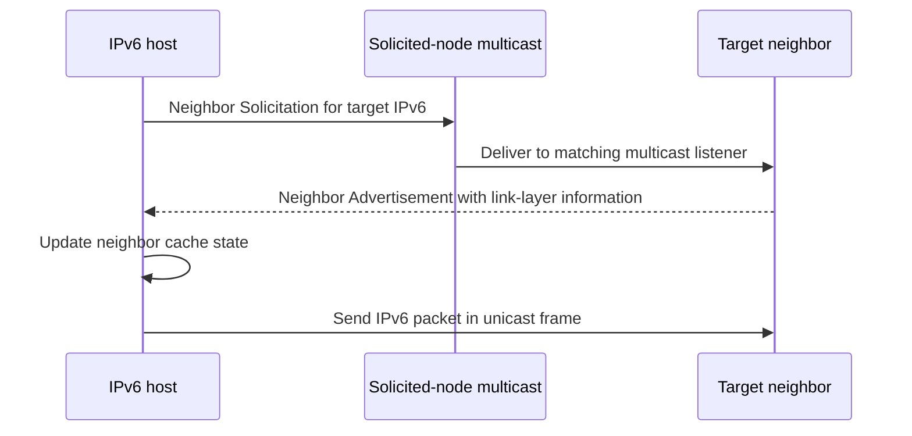

| IPv6 Neighbor Discovery function | Typical message | Purpose | Failure effect |
|---|---|---|---|
| Router discovery | Router Solicitation and Router Advertisement | Learn routers and prefix/configuration information | No usable default route or wrong parameters |
| Address resolution | Neighbor Solicitation and Advertisement | Map IPv6 neighbor to link address | Neighbor remains unresolved |
| Reachability detection | Solicitation/Advertisement state process | Determine whether neighbor remains reachable | Delay or path failover |
| Duplicate Address Detection | Solicitation before normal address use | Detect address already in use | Address marked duplicate or unusable |
| Redirect | Router informs host of better first hop | Optimize next hop under specified conditions | Ignored or unsafe redirect policy considerations |

ICMPv6 is not optional diagnostic decoration; core IPv6 functions depend on it. Broadly blocking ICMPv6 can break neighbor discovery, router discovery, and Packet Too Big signaling. Security policy should permit required message types according to architecture and authoritative guidance rather than treating all ICMP as one risk category.

## IPv4 addressing basics

An IPv4 address contains 32 bits, usually written as four decimal octets. A prefix length `/n` says the first $n$ bits identify the network prefix. The remaining $32-n$ bits vary within that block. CIDR replaced classful assumptions; do not infer a mask from first-octet classes.

| IPv4 category | Example block | Meaning | Important caution |
|---|---|---|---|
| Private-use | `10.0.0.0/8`, `172.16.0.0/12`, `192.168.0.0/16` | Not globally routed as public Internet space | Private does not mean trusted or unique across organizations |
| Loopback | `127.0.0.0/8` | Host-local loopback range | Does not test NIC or external path |
| Link-local | `169.254.0.0/16` | Local-link automatic addressing use | Often signals IPv4 configuration failure in managed networks |
| Documentation | `192.0.2.0/24`, `198.51.100.0/24`, `203.0.113.0/24` | Safe examples in documentation | Do not use as real production destinations |
| Limited broadcast | `255.255.255.255` | Broadcast on local network context | Routers normally do not forward it |
| Multicast | `224.0.0.0/4` | IPv4 multicast addressing | Group behavior depends on scope and control |
| Public unicast | Allocated outside special-use ranges | Globally routable subject to routing and policy | Allocation does not prove active ownership at a given time |

### Prefix-to-mask table

| Prefix | Mask | Addresses in block | Traditional usable-host count where network/broadcast exclusions apply |
|---:|---|---:|---:|
| /8 | 255.0.0.0 | 16,777,216 | 16,777,214 |
| /16 | 255.255.0.0 | 65,536 | 65,534 |
| /20 | 255.255.240.0 | 4,096 | 4,094 |
| /22 | 255.255.252.0 | 1,024 | 1,022 |
| /24 | 255.255.255.0 | 256 | 254 |
| /25 | 255.255.255.128 | 128 | 126 |
| /26 | 255.255.255.192 | 64 | 62 |
| /27 | 255.255.255.224 | 32 | 30 |
| /28 | 255.255.255.240 | 16 | 14 |
| /29 | 255.255.255.248 | 8 | 6 |
| /30 | 255.255.255.252 | 4 | 2 |
| /31 | 255.255.255.254 | 2 | Special point-to-point semantics can use both under RFC 3021 |
| /32 | 255.255.255.255 | 1 | Host route, not a conventional subnet with broadcast |

The "subtract two" rule is not universal. `/31` point-to-point links and `/32` host routes have specific uses. Cloud and virtual networks may reserve additional addresses. Always use the platform's documented semantics.

## CIDR and subnet calculations

### Address count

For IPv4 prefix length $p$:

$$
\text{addresses} = 2^{32-p}
$$

For `/26`, host bits equal $32-26=6$, so the block has:

$$
2^6 = 64\text{ addresses}
$$

### Find the block boundary

For `192.0.2.141/26`, the mask is `255.255.255.192`. The interesting octet has block size:

$$
256 - 192 = 64
$$

Boundaries are 0, 64, 128, and 192. The value 141 falls in 128-191. Therefore:

| Item | Result | Reason |
|---|---|---|
| Address | `192.0.2.141/26` | Given host address |
| Network | `192.0.2.128` | First address of matching 64-address block |
| Broadcast | `192.0.2.191` | Last address of traditional IPv4 subnet |
| Conventional host range | `192.0.2.129` through `192.0.2.190` | Excludes network and broadcast |
| Next block | `192.0.2.192/26` | Add block size 64 |

### Binary AND method

The network address is the bitwise AND of address and mask. In the final octet:

```text
141 = 10001101
192 = 11000000
AND = 10000000 = 128
```

The wildcard or host portion is the inverse of the mask, but wildcard masks in network product syntax may have product-specific use. State whether you mean mathematical inverse, access-control syntax, or another field.

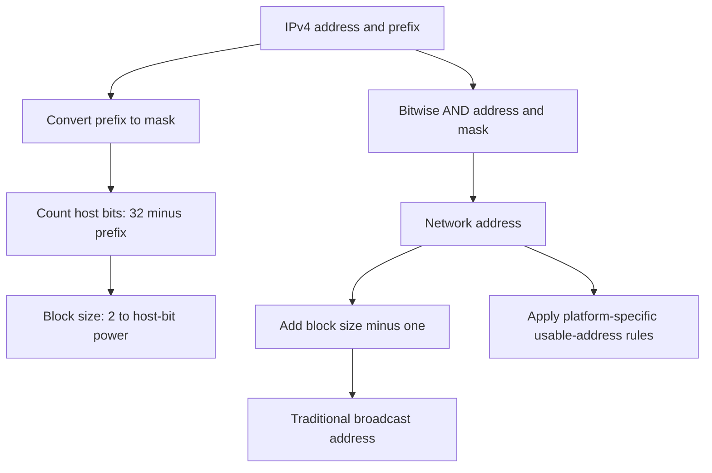

### VLSM and summarization

Variable Length Subnet Masking, or VLSM, assigns different prefix sizes according to need. Route summarization advertises a larger common prefix covering multiple smaller prefixes. VLSM conserves address space; summarization reduces route-table detail. Poor summarization can attract traffic for subnets that do not exist or hide a more-specific outage.

| Need | Candidate IPv4 prefix | Block size | Planning caution |
|---|---:|---:|---|
| About 100 conventional hosts | /25 | 128 | Include growth and platform reservations |
| About 50 conventional hosts | /26 | 64 | Do not overlap neighboring blocks |
| About 20 conventional hosts | /27 | 32 | Broadcast and network conventions reduce count |
| Point-to-point link | /31 where supported | 2 | Verify RFC 3021 and platform support |
| One routed endpoint | /32 | 1 | Requires route context; not a shared subnet |

### Plain-English deep-dive 2 - Subnetting is boundary arithmetic

Suppose a hotel has room numbers 128 through 191 on one floor. A guest in room 141 belongs to that floor because 141 falls between its first and last number. A `/26` creates blocks of 64 addresses. The boundaries are predictable multiples of 64. Subnetting is not memorizing dozens of masks; it is counting fixed binary boundaries.

The prefix also changes host behavior. If two endpoints disagree about the boundary, one may try direct local delivery while the other sends through a router. This can produce asymmetric, intermittent, or one-way results. Therefore, a subnet calculation is not just an exam puzzle. It predicts ARP behavior, broadcast scope, route choice, address capacity, and ownership.

During a customer incident, write the address, prefix, computed network, selected route, interface, and next hop. A statement such as "both addresses start with 10, so they are local" is invalid. Private range membership says nothing about their configured subnet relationship.

## IPv6 addressing basics

IPv6 addresses are 128 bits, written as eight groups of four hexadecimal digits. Leading zeros in a group can be omitted. One longest run of all-zero groups can be compressed with `::`. Expand an address before comparing prefix bits when learning.

Example full form:

```text
2001:0db8:0010:0000:0000:0000:0000:0042
```

Compressed form:

```text
2001:db8:10::42
```

| IPv6 address or prefix type | Example | Scope or purpose | Caution |
|---|---|---|---|
| Global unicast | Commonly within `2000::/3` allocation space | Globally routable unicast | Check current registry and routing, not only prefix appearance |
| Link-local unicast | `fe80::/10` | One link; used in neighbor and router operations | Interface zone may be required to disambiguate |
| Unique local | `fc00::/7` with locally assigned practice commonly under `fd00::/8` | Local organization scope | Not automatically trusted and can overlap if generated poorly |
| Loopback | `::1/128` | This host | Does not test external interface |
| Unspecified | `::/128` | Absence of a normal source in defined contexts | Not assigned as a normal destination |
| Multicast | `ff00::/8` | Group delivery with encoded scope | IPv6 has no broadcast address |
| Documentation | `2001:db8::/32` | Examples and documentation | Not a production global destination |

IPv6 commonly uses `/64` on LAN-style links for Stateless Address Autoconfiguration and protocol assumptions, but address planning includes routing hierarchy, privacy addresses, stable addresses, DHCPv6, delegated prefixes, point-to-point design, and platform guidance. The enormous address count is not a reason to ignore prefix design.

### IPv4 and IPv6 comparison

| Property | IPv4 | IPv6 | Troubleshooting implication |
|---|---|---|---|
| Address length | 32 bits | 128 bits | Tools and logs must preserve address family |
| Common notation | Dotted decimal | Colon-separated hexadecimal | Normalize before comparison |
| Local resolution | ARP | ICMPv6 Neighbor Discovery | Filters and captures differ |
| Broadcast | Supported | No broadcast; multicast used | Do not look for IPv6 ARP or broadcast |
| Router fragmentation | Possible under IPv4 rules unless prohibited | Routers do not fragment IPv6 | Packet Too Big signaling is critical |
| Header checksum | IPv4 header checksum | No IPv6 base-header checksum | Do not expect equivalent capture field |
| Configuration | Static, DHCP, automatic link-local | Router Advertisement, SLAAC, DHCPv6, static patterns | Multiple addresses and routes are normal |
| NAT prevalence | Common | End-to-end addressing favored; translation exists in specific designs | Do not assume IPv6 bypasses policy |

## Routing tables and forwarding

A route normally includes destination prefix, next hop or on-link status, egress interface, source or protocol, and preference information. The host or router finds routes matching the destination and selects the most specific prefix. If multiple candidates have equal prefix length, administrative preference, metric, equal-cost behavior, policy routing, or implementation rules decide.

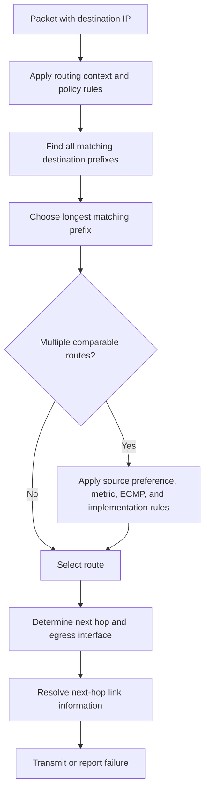

### Longest-prefix example

Given these illustrative routes:

| Destination | Next hop | Interface | Metric | Meaning |
|---|---|---|---:|---|
| `0.0.0.0/0` | `192.0.2.1` | Ethernet | 25 | Default for otherwise unmatched IPv4 destinations |
| `198.51.100.0/24` | `192.0.2.2` | Ethernet | 50 | More-specific partner network path |
| `198.51.100.64/26` | `192.0.2.3` | Ethernet | 100 | Most-specific path for addresses 64-127 |
| `198.51.100.70/32` | On-link tunnel | Tunnel | 5 | Exact host route |

Destination `198.51.100.70` matches all four, but `/32` is longest and wins before comparing the metric with less-specific routes. Destination `198.51.100.80` matches `/26`, `/24`, and default; `/26` wins even though its metric is numerically larger than the `/24`. Metrics typically compare routes of otherwise equivalent specificity and route source according to operating-system rules.

### Default routes

`0.0.0.0/0` is the IPv4 default prefix. `::/0` is the IPv6 default. A default route means "use this path if no more-specific route matches." It does not prove the next hop is reachable, the upstream has a route, security policy permits the flow, NAT has capacity, or the return path exists.

### Route recursion and next-hop reachability

A next hop must itself be reachable through an on-link or recursively resolved route. In complex routing systems, a route can point to an address whose resolution depends on another route. Tunnels and virtual interfaces add dependencies. Record both the selected destination route and how the next hop becomes reachable.

### Dynamic routing overview

Hosts often receive simple connected and default routes. Routers may learn routes through static configuration or dynamic protocols. An Interior Gateway Protocol exchanges routes within an administrative domain; the Border Gateway Protocol exchanges reachability between autonomous systems. This Part does not train protocol administration, but a TSM should ask who originated the route, when it changed, which policy transformed it, and whether forwarding matches the control-plane claim.

| Route source | Typical scope | Strength | Failure risk |
|---|---|---|---|
| Connected | Prefix assigned to active interface | Direct relationship | Wrong mask or interface state creates bad on-link assumption |
| Static | Administrator-defined path | Predictable | Stale during topology change |
| DHCP or router configuration | Host gateway and route information | Automated endpoint setup | Wrong option or rogue source affects many hosts |
| Interior dynamic protocol | Enterprise or provider domain | Adapts to topology | Advertisement, policy, convergence, or summarization error |
| BGP | Inter-domain or large internal policy routing | Scalable policy reachability | Leak, hijack, filtering, or convergence complexity |
| Tunnel/client software | Virtual application or security path | Fine-grained steering possible | Route conflict, stale state, or changed metrics |

## ICMP and network feedback

ICMP carries control and error information associated with IP. Echo Request and Echo Reply support the familiar ping behavior, but Destination Unreachable, Time Exceeded, Redirect, and packet-size messages are often more diagnostically important. ICMPv4 and ICMPv6 use different message definitions.

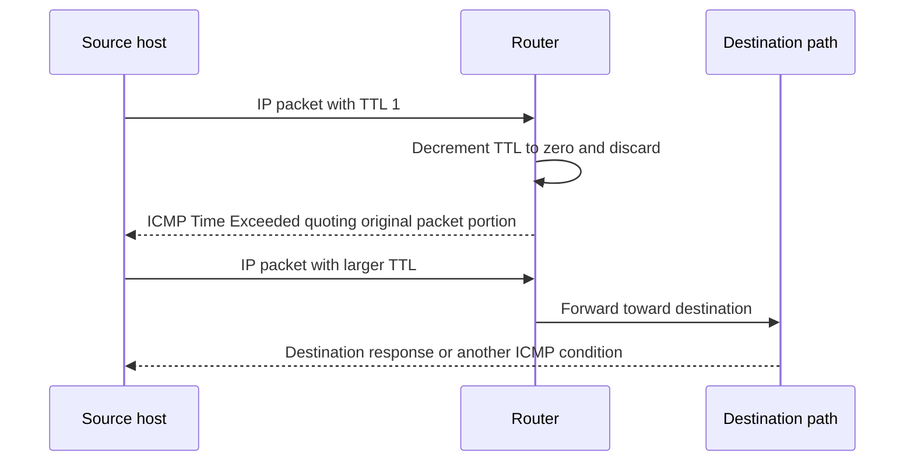

| ICMP concept | Example use | What it supports | What it does not prove alone |
|---|---|---|---|
| Echo reply | `ping` reachability sample | Some round-trip IP and ICMP behavior | Application port, TLS, HTTP, or service health |
| Destination unreachable | Network, host, protocol, port, or policy-related condition depending on version/code | A reporting node classified delivery failure | Exact root cause without source and context |
| Time exceeded | TTL or Hop Limit expired | Loop prevention and hop discovery | Same path as application flow |
| Fragmentation needed | IPv4 router cannot forward DF packet at size | PMTUD signal with next-hop MTU information where supplied | That endpoints processed the signal correctly |
| Packet Too Big | IPv6 node reports packet exceeds path MTU | Essential IPv6 PMTUD signal | Which tunnel or policy created the bottleneck without topology evidence |
| Redirect | Router suggests better first hop | Local route optimization in defined cases | Safe acceptance under every security policy |

`tracert` or `traceroute` sends probes that elicit Time Exceeded messages at increasing hop limits. Devices may filter, rate-limit, or deprioritize these replies. Different probes can be load-balanced differently. The return path of ICMP can differ. A row of asterisks does not necessarily mean application traffic stops there.

## NAT and PAT

NAT changes IP address information across a boundary. Traditional Network Address and Port Translation allows multiple private flows to share one or more public addresses by assigning distinct source-port mappings. Product terminology varies; always document pre-translation and post-translation tuples, direction, protocol, mapping lifetime, and observation point.

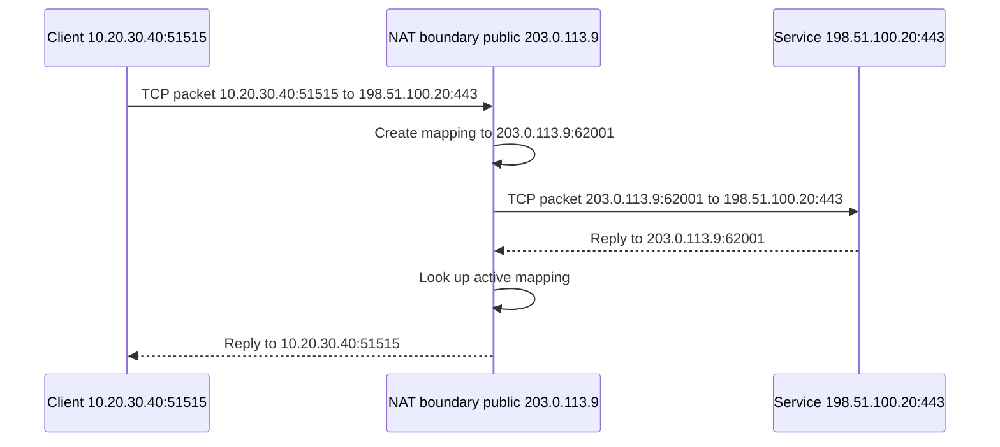

| Translation term | Plain meaning | Example | Operational concern |
|---|---|---|---|
| Inside local | Original internal address in one common vocabulary | `10.20.30.40:51515` | Vendor terms differ; define yours |
| Public translated tuple | Address and port visible upstream | `203.0.113.9:62001` | Mapping is time-bound |
| Source NAT | Rewrites source on outbound path | Private client to public shared address | Attribution needs port and timestamp |
| Destination NAT | Rewrites destination toward internal service | Public listener to private backend | Exposure and policy must be explicit |
| Static mapping | Stable one-to-one or fixed translation | Dedicated published service mapping | Increases predictable exposure if policy is weak |
| Dynamic mapping | Allocated from a pool | Internal source gets temporary public address | Pool exhaustion possible |
| PAT/NAPT | Address plus port translation | Many clients share one public IP | Port exhaustion and state timeout possible |
| Hairpin NAT | Internal client reaches internal service via external mapping | Internal-to-public-to-internal path | Path and policy differ from direct access |
| Carrier-grade NAT | Provider shares public addresses among subscribers | Another translation boundary | Customer may not control mapping logs |

### NAT state and attribution

An IP address alone is weak attribution. With PAT, many internal clients share one public address. A defensible mapping needs protocol, internal source IP and port, translated source IP and port, destination IP and port, precise time zone, device clock confidence, and mapping log retention.

| Required mapping field | Why it matters | Missing-field risk |
|---|---|---|
| Protocol | TCP and UDP can reuse numeric ports independently | Wrong state table lookup |
| Original source IP and port | Identifies internal socket context | Many candidate clients |
| Translated source IP and port | Connects external evidence to mapping | Public IP alone is ambiguous |
| Destination IP and port | NAT behavior and collisions can depend on remote endpoint | Wrong flow correlation |
| Start and end time | Mappings expire and ports are reused | Attribution to later user or device |
| Clock source and zone | Cross-system correlation requires alignment | False timeline |
| Device and policy | Identifies translation boundary and rule | Wrong owner or behavior assumption |

### NAT is not a security policy

NAT can reduce direct address visibility or make unsolicited inbound reachability less straightforward in a particular design, but it is not equivalent to authorization, least privilege, threat inspection, or stateful firewall policy. IPv6 can be securely filtered without address translation. Conversely, destination NAT can intentionally publish a vulnerable service. State the actual control and evidence.

## MTU, fragmentation, MSS, and PMTUD

Each link has an MTU for the IP packet it can carry. The path MTU is the smallest effective MTU across the path. Tunnels add outer headers and reduce room for the inner packet. If a packet is too large, behavior differs between IPv4 and IPv6 and according to flags and protocol.

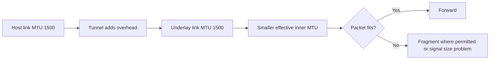

### IPv4 fragmentation

The IPv4 header includes Identification, Flags, and Fragment Offset fields. If fragmentation is permitted, a router can split a packet to fit a smaller next-link MTU. The receiver reassembles fragments. If the Don't Fragment flag is set and the packet is too large, the router drops it and should return an ICMP Destination Unreachable code indicating fragmentation is needed, including useful MTU information under PMTUD updates.

| IPv4 fragmentation field | Meaning | Diagnostic use |
|---|---|---|
| Identification | Associates fragments of one original datagram | Correlate pieces, with caution about reuse |
| DF flag | Don't Fragment | If set, oversized forwarding requires drop and signal rather than router fragmentation |
| MF flag | More Fragments | Set on all but final fragment | Identify incomplete fragment sequence |
| Fragment Offset | Position in original payload in 8-byte units | Reconstruct placement |
| Total Length | Size of this fragment's IPv4 packet | Compare against link and path constraints |

Losing one fragment causes the whole original packet to be unusable. Middleboxes may handle fragments differently because later fragments might not contain transport ports. Fragmentation consumes state and can be abused. Modern designs generally prefer avoiding fragmentation through correct MTU and transport sizing.

### IPv6 packet size behavior

IPv6 routers do not fragment packets. A router that cannot forward an IPv6 packet because of MTU sends ICMPv6 Packet Too Big. The source adjusts. A source can use an IPv6 Fragment extension header when needed, but router behavior differs fundamentally from IPv4.

### TCP MSS relationship

MSS is the maximum TCP payload a host advertises for received segments. A simplified calculation is:

$$
\text{MSS} = \text{effective IP MTU} - \text{IP header} - \text{TCP header}
$$

For a 1500-byte IPv4 MTU and minimum 20-byte IPv4 and 20-byte TCP headers:

$$
1500 - 20 - 20 = 1460\text{ bytes}
$$

For a 1500-byte IPv6 MTU and 40-byte base IPv6 plus minimum 20-byte TCP headers:

$$
1500 - 40 - 20 = 1440\text{ bytes}
$$

Options and extension headers affect actual overhead. MSS constrains TCP segment payload, not UDP datagrams or every application write. MSS clamping at a tunnel boundary is a design technique, not a substitute for understanding path MTU and non-TCP traffic.

### PMTUD and black holes

Path MTU Discovery sends packets sized for the believed path and depends on packet-too-large feedback. If a device silently drops required ICMP feedback, small exchanges may work while larger packets repeatedly disappear. Packetization Layer PMTUD and Datagram PLPMTUD provide transport-aware probing approaches documented in later RFCs.

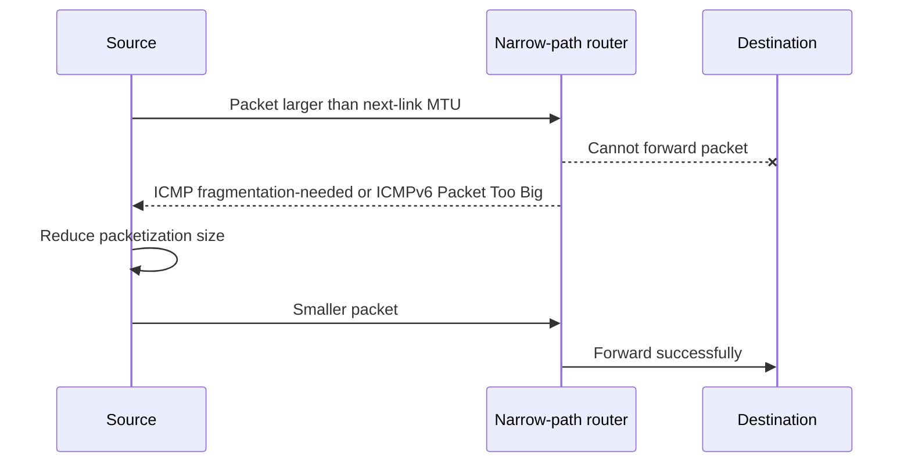

| Size-related signature | Supporting evidence | Competing explanation | Discriminating check |
|---|---|---|---|
| Handshake works; upload stalls | Larger segments retransmit without acknowledgment | Receiver or congestion issue | Compare size threshold, ICMP, and alternate path |
| Small ping works; large DF ping fails | Size-dependent path behavior | ICMP policy differs by size | Test actual application and capture both directions |
| IPv6 works for small requests only | Missing Packet Too Big or tunnel overhead | DNS/backend variation | Hold destination constant and inspect ICMPv6 |
| VPN/tunnel path fails; direct path works | Reduced effective MTU | Different policy or DNS | Compare routes, tuples, sizes, and policy evidence |
| One branch affected after encapsulation change | Overhead or interface MTU mismatch | New firewall rule | Review change, interface MTUs, and packet sequence |

### Plain-English deep-dive 3 - The narrow doorway problem

Imagine a moving company carrying boxes through several doorways. The first doors are wide, but a hidden corridor has a narrower door. Small boxes pass. A large box reaches that door and cannot continue. If the worker sends a note saying "maximum width is 80 centimeters," the source repacks the load. If the note is discarded, the source repeatedly sends the same oversized box and the customer sees a timeout.

That is the classic path-MTU black-hole pattern. DNS can work, the TCP handshake can work, authentication can begin, and then larger encrypted records or uploads stall. This is why "ping works" and "port 443 connects" do not close a connectivity investigation.

Do not diagnose MTU from one symptom. Hold destination and process constant, inspect packet lengths and retransmissions, check ICMP size feedback, compare a controlled alternate path, and review tunnel overhead and interface MTUs. A workaround that lowers MTU may restore service but still requires root-cause and design review.

## Asymmetric routing

Routing decisions are made independently in each direction. The forward flow can use path A while the return flow uses path B. This is often valid. It becomes problematic when a stateful firewall, NAT device, capture point, quality policy, or security service expects both directions but sees only one.

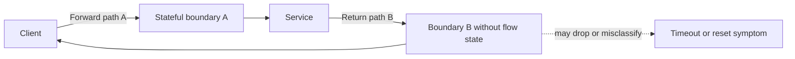

| Asymmetry clue | Why it matters | Evidence needed |
|---|---|---|
| Client sees outbound SYNs only | Reply may be lost, filtered, or taking unseen path | Server capture and routing/state logs |
| Server sees SYN and sends SYN-ACK | Destination listener is active | Return route and intermediate policy evidence |
| Firewall A logs outbound state, Firewall B sees reply | State split across devices | Topology, ECMP, clustering, and synchronization status |
| Traceroute differs by direction | Paths are independently selected | Bidirectional probes and actual-flow telemetry |
| NAT maps outbound but return reaches other node | Translation state unavailable | NAT cluster ownership and mapping logs |

Equal-Cost Multipath, multihoming, anycast, load balancing, dynamic routing, tunnels, and failover can create path variation. Capture the five-tuple, address family, direction, time, and path identifier where available. Do not require visually symmetric hops unless the architecture requires state symmetry.

## Private and public addressing, scope, and exposure

Private IPv4 ranges are not routed as global public Internet destinations, but they are not inherently safe. Two acquired companies can both use `10.0.0.0/8`, causing overlap. Malware moves inside private networks. Cloud networks can route private prefixes through peering or transit. A public IP can front a proxy, NAT, load balancer, CDN, or shared service rather than one server.

| Statement | Verdict | Better reasoning |
|---|---|---|
| "It has a private IP, so it is not exposed" | Unsupported | Evaluate effective routes, tunnels, proxies, published listeners, identities, and controls |
| "The public IP is the user's device" | Usually unsupported | Correlate NAT/PAT mapping, protocol, port, destination, time, identity, and device evidence |
| "IPv6 means no firewall is needed" | False | Globally scoped addressing still requires least-privilege policy and monitoring |
| "NAT is segmentation" | False | Segmentation is enforced reachability and policy between zones or resources |
| "Same RFC 1918 range means same network" | False | Prefix, routing domain, VLAN, and topology decide adjacency |
| "No default route means no external path" | Incomplete | More-specific routes, tunnels, proxies, or application relays may exist |

## Packet journey: branch client to Microsoft 365

The following is a generic teaching flow. Microsoft publishes connectivity principles and endpoint guidance that must be consulted at investigation time. It does not establish fixed Microsoft internal routing or a Zscaler path.

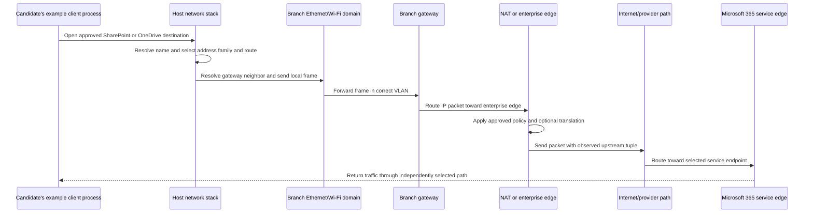

The local frame's destination is the gateway's MAC when the service IP is remote. At the first router, the incoming frame is removed and a new next-link frame is built. If source NAT occurs, upstream observers see a translated tuple. The Microsoft service can select a response route independently. A proxy would instead terminate one connection and create another, so do not describe proxying as simple NAT.

### Browser and sync-client bridge

The browser and OneDrive sync client can select different proxy contexts, connections, request patterns, and endpoint dependencies. Both still rely on valid local addressing, routes, neighbor resolution, packet size, and return delivery. A large sync upload can reveal a path-MTU issue that a small browser page does not, while browser redirects can reveal dependencies a background API call does not use.

| Comparison dimension | Browser | OneDrive sync client | Diagnostic question |
|---|---|---|---|
| Process context | Browser executable and profile | Sync executable, local database, account state | Do route/proxy/security decisions vary by process? |
| Request pattern | Interactive pages and resources | API calls, metadata, download/upload, retries | Does failure follow payload size or operation? |
| Connection reuse | Browser protocol pool | Client-specific pool and scheduler | Which tuple and endpoint map to the failed operation? |
| User visibility | Waterfall and visible errors | Sync status and client logs | Can timestamps be aligned? |
| Data size | Often many mixed resources | Potentially large files or chunks | Is there a repeatable size threshold? |
| Object rules | Page/site permissions | File names, locks, conflicts, quotas | Is a network symptom actually object-specific? |

## Fictional NMH continuity scenario

NMH's fictional acquired branch uses VLAN 20 for managed users. Priya's managed laptop is `10.44.20.73/24`, gateway `10.44.20.1`, and translated public documentation address `203.0.113.9`. After a fictional tunnel encapsulation change, OneDrive metadata and small downloads work, but uploads above a repeatable size stall. Browser access to the SharePoint site generally works. This scenario does not identify any vendor defect.

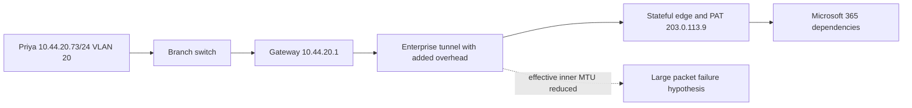

### NMH evidence matrix

| Observation | Interpretation | Alternative | Next check |
|---|---|---|---|
| Address, `/24`, and gateway are stable | Basic configuration appears consistent | Duplicate address or wrong VLAN still possible | Neighbor and switch evidence |
| ARP resolves gateway quickly | Local IPv4 link to gateway likely functions | Later frame drops remain possible | Gateway ingress/egress counters |
| Small HTTPS exchanges succeed | DNS, route, transport, and TLS work for some data | Different endpoint/backend can vary | Hold endpoint and tuple constant |
| Large uploads show repeated same-size retransmissions | Size-dependent loss is plausible | Receiver window or congestion can mimic | Inspect ACKs, ICMP, and controlled packet sizes |
| Direct approved test path succeeds | Tunnel-specific dependency gains weight | Policy or NAT also differs | Compare all changed variables, not only MTU |
| No ICMP size feedback reaches client | PMTUD black hole plausible | Capture point may miss it | Inspect tunnel/edge and reverse-path evidence |

### NMH bridge leadership

You can organize four workstreams. Endpoint verifies process, interface, address, route, neighbor cache, client time, and reproducibility. Branch networking verifies VLAN, switch port, gateway, and interface counters. Tunnel and edge owners verify effective MTU, encapsulation overhead, ICMP handling, state, translation, and return path. enterprise support evidence uses sanitized request IDs and timestamps to distinguish service processing from path timeout.

The bridge update should say: "The failure is repeatably size-dependent on the branch tunnel path. The client reaches the gateway and completes small protected exchanges. Larger segments are retransmitted without corresponding acknowledgments in the client capture, and required size feedback is not observed there. This supports, but does not yet prove, a path-MTU or return-path issue. Tunnel and edge owners are validating effective MTU and ICMP handling. No Zscaler or Microsoft defect is asserted."

## Diagnostics and commands

### Windows

```text
Get-Date
Get-NetAdapter
Get-NetIPConfiguration
Get-NetIPAddress
Get-NetRoute -AddressFamily IPv4
Get-NetRoute -AddressFamily IPv6
Get-NetNeighbor
route print
arp -a
ping <approved-target>
tracert <approved-target>
Test-NetConnection <approved-target> -Port 443 -InformationLevel Detailed
```

### Linux or cross-platform equivalents

```text
date -u
ip link
ip address
ip route
ip -6 route
ip neighbor
ping <approved-target>
tracepath <approved-target>
traceroute <approved-target>
```

| Tool or command | Best question | Strong result | Limitation |
|---|---|---|---|
| `Get-NetAdapter` / `ip link` | Is the expected interface operational? | State, speed, counters, identity | Does not prove VLAN or upstream service |
| `Get-NetIPAddress` / `ip address` | Which addresses and prefixes exist? | Address family, prefix, state, interface | Snapshot can change |
| `Get-NetRoute` / `ip route` | Which route candidates and next hop exist? | Prefix, next hop, interface, metric/source | Policy and forwarding devices may add context |
| `Get-NetNeighbor` / `ip neighbor` | Which local mappings and states exist? | Next-hop link resolution | Cache does not prove current bidirectional reachability |
| `arp -a` | Which IPv4 ARP cache entries exist? | IPv4-to-MAC observation | No IPv6 NDP detail |
| `ping` | Does selected ICMP echo behavior return? | Round-trip sample and size clues | Filtering and different path behavior |
| `tracert` / `traceroute` | Which hop-expiry responders appear? | Path clues and change comparison | Missing hops are not automatic drops |
| `tracepath` | What path and PMTU clues appear where supported? | Nonprivileged path-MTU observations | Tool and platform behavior varies |
| `Test-NetConnection` | Which route/source and TCP-port result appear on Windows? | Combined targeted observation | Success is not application success |
| Wireshark/tcpdump/pktmon | What frames and packets were visible here? | Fields, sequence, timing, size | Capture point, offload, encryption, and privacy |

### Capture filters and display orientation

Use syntax only after confirming the tool and version. Wireshark display filters differ from capture filters. Examples such as `arp`, `icmp`, `icmpv6`, `ip.addr == 192.0.2.10`, `ipv6.addr == 2001:db8::10`, `eth.addr == 02:00:5e:10:00:01`, and `tcp.port == 443` can orient an approved lab. Do not rely on one broad filter in production without minimizing scope.

| Evidence item | Record with it | Privacy risk | Correlation use |
|---|---|---|---|
| Interface configuration | Host, interface, time, source command | Internal addressing and topology | Establish source context |
| Route table | Routing context, metrics, virtual interfaces, time | Network design | Explain selected next hop |
| Neighbor table | State, address family, interface, time | Device identifiers | Relate local next hop |
| Packet capture | Capture point, filter, offload, time, authorization | Payload, addresses, metadata, identities | Reconstruct visible sequence |
| NAT log | Original and translated tuple, protocol, destination, exact time | User/device attribution | Connect internal and external evidence |
| Switch evidence | VLAN, port, MAC, counters, time | Physical/logical location | Validate local forwarding |
| Router/firewall evidence | Rule, route, state, action, reason, time | Security architecture | Identify boundary decision |

## Troubleshooting decision trees

### Cannot reach local gateway

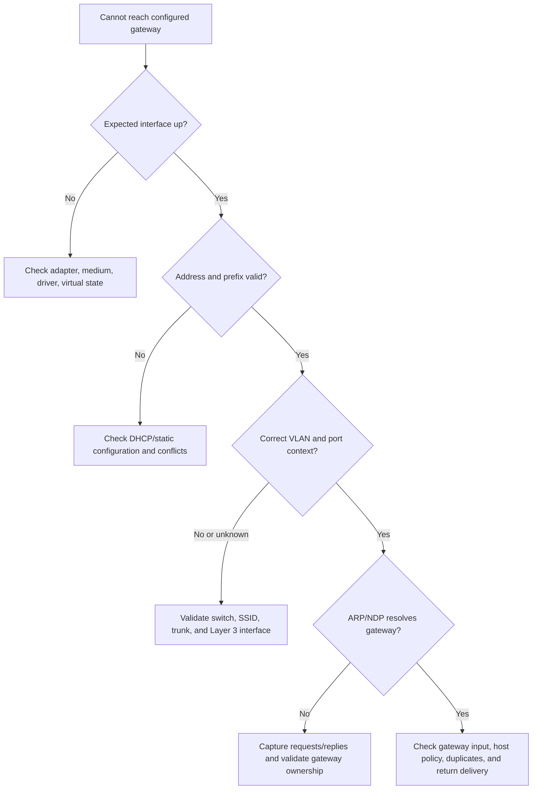

### Remote destination timeout

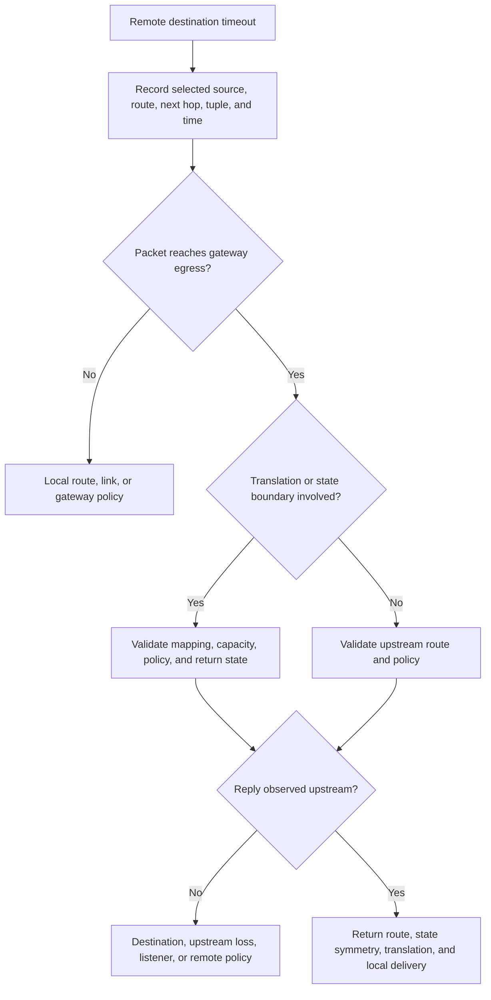

### Size-dependent failure

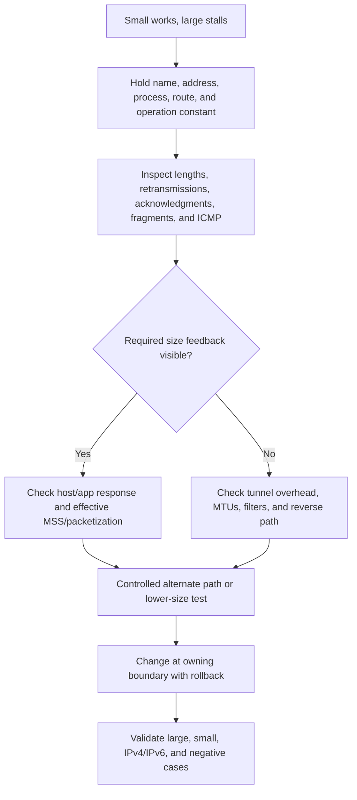

## Common failure signatures

| Symptom or trace | Leading causes | Evidence that discriminates | Common trap |
|---|---|---|---|
| Link up, no DHCP address | Wrong VLAN, DHCP path, exhausted scope, blocked broadcast/relay | DHCP sequence and switch/relay evidence | Assuming cable means network works |
| APIPA/link-local IPv4 | DHCP unavailable or no valid configured address | DHCP and adapter event evidence | Treating `169.254/16` as normal enterprise route |
| ARP request unanswered | Wrong prefix/VLAN, target absent, gateway down, filter | Both-side link capture and switch table | Clearing ARP repeatedly without topology check |
| Gateway reachable, remote not | Missing route, policy, NAT, upstream, return path | Gateway egress plus edge evidence | Blaming DNS when IP target also fails |
| Some destinations use wrong interface | More-specific tunnel route or metric/policy | Route lookup for each exact destination | Comparing default routes only |
| One direction works | Asymmetry, mask mismatch, stateful policy, NAT | Captures at both endpoints and boundaries | Assuming reply follows forward path |
| Public IP attribution conflict | PAT port reuse or clock mismatch | Full mapping tuple and synchronized time | Mapping by public IP only |
| Fragmented UDP fails | Fragment filtering or one-fragment loss | Fragment IDs/offsets and boundary policy | Looking only for transport port in later fragments |
| IPv6 fails while IPv4 works | NDP, RA, route, ICMPv6, policy, DNS selection | Address-family-specific evidence | Disabling IPv6 as first response |
| Large transfer stalls | PMTUD, tunnel overhead, loss, receiver flow | Size threshold, ICMP, ACK and route comparison | Calling every retransmission congestion |

## Privacy, security, and evidence safety

Network evidence exposes topology, internal ranges, public egress, endpoint identifiers, VLANs, security devices, service destinations, timing, and possibly payload. NAT logs can connect public activity to a user or device and therefore deserve strong access and retention controls. MAC addresses can be personal data in some contexts even though they are imperfect identifiers.

| Principle | Action | Example risk prevented |
|---|---|---|
| Authorization | Confirm who may capture on endpoint, switch, router, tunnel, or cloud boundary | Unauthorized interception |
| Purpose limitation | Tie collection to a falsifiable path hypothesis | Broad employee monitoring |
| Minimization | Filter hosts, protocols, size, duration, and payload | Excess customer data collection |
| Segregation | Keep originals restricted; share sanitized extracts | Topology and secret leakage |
| Integrity | Preserve capture metadata and approved hashes | Disputed or changed evidence |
| Time normalization | Record UTC, zone, synchronization, and skew | False NAT attribution |
| Retention | Delete according to approved incident schedule | Persistent sensitive mapping archive |
| Access logging | Record who viewed and exported data | Unaccountable distribution |
| Safe testing | Use documentation prefixes and isolated labs | Accidental production traffic |
| Change control | Authorize route, MTU, VLAN, and firewall changes with rollback | Troubleshooting-created outage |

### Plain-English deep-dive 4 - Addresses are clues, not identities

A hotel switchboard can show that extension 62001 placed an outside call at 14:03. That does not identify the person unless the extension assignment and exact time are known. PAT works similarly: one public IP and many temporary ports represent many internal flows. Port values are reused after state expires.

A MAC address is also contextual. Virtual machines move, Wi-Fi devices randomize, high-availability gateways share virtual addresses, and malicious software can spoof. An IP can be reassigned by DHCP or represented behind NAT. Attribution needs multiple independent records: identity, device inventory, address lease or assignment, NAT mapping, process/socket, destination, and synchronized time.

This matters to SecOps because overconfident attribution harms people and investigations. Phrase findings with confidence and scope: "At this time, the edge mapping associates translated tuple X with internal tuple Y; endpoint identity correlation is pending." Never write "this user attacked the service" from an address alone.

## Scenario labs

### Lab 1 - Ethernet frame annotation

Use an approved sample capture. Identify destination MAC, source MAC, optional VLAN evidence, EtherType, payload protocol, and displayed frame length. State which on-wire elements are absent from the capture and whether checksum offload affects interpretation. Explain why the destination MAC is a gateway while the destination IP is remote.

### Lab 2 - Switch learning tabletop

Draw three hosts and a switch with an empty MAC table. Walk through A sending to unknown B, B replying, and A sending again. Add VLAN 10 and VLAN 20 and show why flooding stays within one VLAN. Add a router to permit controlled inter-VLAN traffic.

### Lab 3 - ARP and NDP comparison

Capture or analyze sanitized ARP Request/Reply and IPv6 Neighbor Solicitation/Advertisement examples. Compare destination frame types, message fields, cache entries, and failure states. Explain why blocking all ICMPv6 breaks essential IPv6 operations.

### Lab 4 - Subnet workbook

For `10.44.20.73/24`, `10.44.20.190/26`, `172.20.39.14/20`, `192.0.2.233/29`, and `198.51.100.10/31`, calculate mask, network, last address, conventional usable range where applicable, block size, and whether given peers are local. Show binary work for at least two.

### Lab 5 - Longest-prefix route choice

Create default, `/16`, `/24`, `/26`, and `/32` routes with deliberately misleading metrics. Evaluate five destinations. Explain that the longest prefix is selected before comparing metrics among less-specific alternatives. Then add a virtual tunnel route and record the selected source/interface.

### Lab 6 - NAT mapping correlation

Create ten synthetic flow records where three internal clients share one documentation public address. Reuse a translated port at a later time. Given an external event, identify the mapping only when protocol, translated port, destination, and time align. Document uncertainty when clock skew overlaps mappings.

### Lab 7 - MTU black-hole analysis

Use a permitted lab or paper trace. Show handshake success, small data success, then larger packet retransmissions. Add an ICMP fragmentation-needed or ICMPv6 Packet Too Big message in the healthy case and remove it in the broken case. Calculate effective MSS for two MTUs and explain tunnel overhead.

### Lab 8 - Fictional NMH bridge

Run the Priya upload scenario as a tabletop. Produce an impact statement, architecture path, address/prefix table, selected route, ARP evidence, pre/post NAT tuple, packet-size sequence, hypotheses, workstream owners, privacy plan, customer update, change plan, rollback, and validation matrix. Label every result fictional.

| Lab deliverable | Required content | Pass criterion |
|---|---|---|
| Frame annotation | Fields, capture point, omissions, next hop | No remote MAC misconception |
| Prefix workbook | Arithmetic and special-case caveats | All boundaries correct |
| Route table | Matches, longest prefix, metric context | Exact route choice explained |
| NAT timeline | Full tuples, protocol, destination, clocks | No public-IP-only attribution |
| MTU analysis | Header math, packet sequence, ICMP, alternatives | Size hypothesis remains falsifiable |
| NMH package | Evidence, uncertainty, privacy, owners, validation | No vendor or production overclaim |

## Misconceptions to correct

| Misconception | Correction |
|---|---|
| A MAC address identifies the remote Internet server | It identifies a local-link destination; routed hops replace link framing |
| A switch sends every frame everywhere | Known unicast is selectively forwarded; flooding has defined conditions and VLAN scope |
| ARP finds a remote server's MAC | The host resolves the local destination or next-hop gateway MAC |
| IPv6 uses ARP | IPv6 uses ICMPv6 Neighbor Discovery |
| Addresses beginning with 10 are on the same subnet | Prefix and routing context determine locality |
| Lower route metric always wins | Longest matching prefix is selected before metrics among comparable routes |
| Default gateway is used for every packet | On-link and more-specific routes take precedence |
| Private address means safe | Effective reachability and controls determine exposure |
| NAT is a firewall | Translation and security policy are different functions |
| A public IP identifies one endpoint | NAT, proxies, load balancers, and shared services make it ambiguous |
| Traceroute asterisks prove the drop point | Hop replies can be filtered while transit traffic continues |
| Ping proves Microsoft 365 is healthy | Echo does not validate TCP, TLS, HTTP, identity, or application behavior |
| IPv4 routers always fragment oversized packets | DF can require drop and ICMP feedback; policy and implementation matter |
| IPv6 routers fragment packets | IPv6 routers send Packet Too Big; source packetization must adapt |
| Lowering MTU is always the fix | It can be a workaround; find the actual narrow path and broken feedback |
| Symmetric routing is guaranteed | Forward and return decisions are independent |

## Evidence-to-conclusion template

| Field | Required statement | Fictional NMH example |
|---|---|---|
| Symptom | Exact failed operation and expected behavior | Upload above repeatable size stalls on branch tunnel |
| Scope | User, device, branch, process, destination, address family, time | Multiple branch sync clients; direct approved path unaffected |
| Local link | VLAN, gateway neighbor, counters, captures | VLAN 20 and gateway ARP observed |
| Route | Destination lookup, selected interface, next hop, source | Tunnel route selected for service address |
| Translation | Pre/post tuple and mapping time | `10.44.20.73:51515` to documentation public tuple |
| Packet sequence | Sizes, flags, fragments, ICMP, acknowledgments | Larger TCP segments repeat; feedback absent at client |
| Interpretation | Supported hypothesis and alternatives | PMTUD/tunnel overhead plausible; receiver and policy remain alternatives |
| Confidence | Why confidence is limited | No tunnel egress capture yet |
| Next test | Cheapest discriminating evidence | Compare effective MTU and ICMP at tunnel boundary |
| Privacy | Scope, storage, retention, redaction | Header-focused authorized capture in restricted repository |
| Validation | Positive, negative, duration, rollback | Large/small transfer tests on both paths after controlled change |

## Official Source Anchors

The following sources were reviewed on **2026-08-24**. They support protocol and documented platform concepts, not fictional NMH facts, a tenant configuration, or a product defect. IEEE material may require licensed access; linked IEEE pages identify the relevant standards. RFCs can be updated or affected by later documents, so use the RFC Editor's current metadata.

| Source | URL | Used for | Boundary |
|---|---|---|---|
| IEEE 802.3 Ethernet Working Group | https://www.ieee802.org/3/ | Ethernet standards context | Full standards and amendments may require IEEE access |
| IEEE 802.1Q | https://www.ieee802.org/1/pages/802.1Q.html | VLAN bridge and tag standard context | Vendor configuration is implementation-specific |
| IETF RFC 826 | https://www.rfc-editor.org/rfc/rfc826 | ARP packet and address-resolution foundation | Historical text uses older terminology |
| IETF RFC 791 | https://www.rfc-editor.org/rfc/rfc791 | IPv4 header and fragmentation foundation | Updated by later RFCs; consult current metadata |
| IETF RFC 8200 | https://www.rfc-editor.org/rfc/rfc8200 | IPv6 base specification | Extension-header operations have additional RFCs |
| IETF RFC 4291 | https://www.rfc-editor.org/rfc/rfc4291 | IPv6 addressing architecture | Current updates and registries also matter |
| IETF RFC 4861 | https://www.rfc-editor.org/rfc/rfc4861 | IPv6 Neighbor Discovery | Updated by later RFCs |
| IETF RFC 4862 | https://www.rfc-editor.org/rfc/rfc4862 | IPv6 Stateless Address Autoconfiguration | Deployment policy remains environment-specific |
| IETF RFC 4632 | https://www.rfc-editor.org/rfc/rfc4632 | CIDR addressing and aggregation | Internet routing operations have evolved further |
| IETF RFC 1918 | https://www.rfc-editor.org/rfc/rfc1918 | Private IPv4 address allocation | Private does not mean secure |
| IETF RFC 3021 | https://www.rfc-editor.org/rfc/rfc3021 | `/31` IPv4 point-to-point use | Platform support must be confirmed |
| IETF RFC 3022 | https://www.rfc-editor.org/rfc/rfc3022 | Traditional NAT terminology and operation | Modern NAT behavior has additional RFCs |
| IETF RFC 4787 | https://www.rfc-editor.org/rfc/rfc4787 | NAT UDP behavioral requirements | TCP and carrier NAT have additional documents |
| IETF RFC 6888 | https://www.rfc-editor.org/rfc/rfc6888 | Carrier-grade NAT requirements | Provider implementation and logs vary |
| IETF RFC 792 | https://www.rfc-editor.org/rfc/rfc792 | ICMPv4 foundation | Updated by later documents |
| IETF RFC 4443 | https://www.rfc-editor.org/rfc/rfc4443 | ICMPv6 | Required-message filtering must follow architecture guidance |
| IETF RFC 1191 | https://www.rfc-editor.org/rfc/rfc1191 | IPv4 Path MTU Discovery | Packetization-layer updates also matter |
| IETF RFC 8201 | https://www.rfc-editor.org/rfc/rfc8201 | IPv6 Path MTU Discovery | Updated operational approaches may apply |
| IETF RFC 8899 | https://www.rfc-editor.org/rfc/rfc8899 | Datagram Packetization Layer PMTUD | Protocol adoption varies |
| IANA IPv4 Special-Purpose Address Registry | https://www.iana.org/assignments/iana-ipv4-special-registry/iana-ipv4-special-registry.xhtml | Current special IPv4 blocks | Registry flags require careful interpretation |
| IANA IPv6 Special-Purpose Address Registry | https://www.iana.org/assignments/iana-ipv6-special-registry/iana-ipv6-special-registry.xhtml | Current special IPv6 blocks | Registry changes over time |
| Microsoft Learn: TCP/IP fundamentals | https://learn.microsoft.com/en-us/troubleshoot/windows-server/networking/tcpip-fundamentals-for-microsoft-windows | Windows addressing, subnetting, gateway, and routing concepts | Version and product scope must be checked |
| Microsoft Learn: troubleshoot TCP/IP connectivity | https://learn.microsoft.com/en-us/troubleshoot/windows-server/networking/troubleshoot-tcp-ip-communication | Windows diagnostic workflow and commands | Use current supported procedures |
| Microsoft 365 network connectivity principles | https://learn.microsoft.com/en-us/microsoft-365/enterprise/microsoft-365-network-connectivity-principles | Microsoft 365 network planning | Current endpoint guidance and tenant evidence remain required |
| Wireshark Display Filter Reference | https://www.wireshark.org/docs/dfref/ | Protocol field and display-filter reference | Display filters are not capture filters |

## Likely Interview Questions

### Q1. How does a host decide whether to send directly or through a gateway?

**Model answer:** The host evaluates the destination in its routing and policy context. It chooses the longest matching prefix, then resolves ties according to route source, metric, equal-cost behavior, and implementation rules. If the selected route is on-link, it resolves the destination's link address. If the route names a next hop, it resolves the gateway's link address. The frame targets that local neighbor while the IP packet retains the remote destination unless translation or tunneling changes it.

### Q2. Explain Ethernet switch learning and VLAN boundaries.

**Model answer:** A switch learns the source MAC, VLAN, ingress port, and age from incoming frames. It forwards known unicast to the learned egress, floods unknown unicast within the permitted VLAN, and handles broadcast or multicast according to link rules and controls. A VLAN is a distinct logical broadcast and forwarding domain. Traffic between VLANs needs Layer 3 forwarding and policy. Learning is not identity authentication; addresses can move, virtualize, randomize, or spoof.

### Q3. How do ARP and IPv6 Neighbor Discovery differ?

**Model answer:** ARP maps an IPv4 next-hop address to a link address, commonly by Ethernet broadcast request and reply. IPv6 uses ICMPv6 Neighbor Discovery with Neighbor Solicitation and Advertisement, often using solicited-node multicast. Neighbor Discovery also supports router and prefix discovery, reachability, redirects, and Duplicate Address Detection. Broad ICMPv6 blocking can break essential IPv6 operation.

### Q4. Calculate the subnet for 192.0.2.141/26.

**Model answer:** `/26` leaves six host bits, so each block has $2^6=64$ addresses. The mask is `255.255.255.192`, and fourth-octet boundaries are 0, 64, 128, and 192. The address 141 falls in 128-191. The network is `192.0.2.128`, traditional broadcast is `192.0.2.191`, and conventional hosts are `192.0.2.129` through `192.0.2.190`.

### Q5. How does longest-prefix match interact with route metrics?

**Model answer:** The route with the most destination prefix bits matching normally wins first. A `/32` host route beats a `/24`, which beats the default `/0`, even if the more-specific route has a numerically larger metric. Metrics and administrative preference distinguish otherwise comparable candidates according to the platform. I verify the exact destination lookup, source, interface, next hop, policy rules, and route origin.

### Q6. Why is a public IP insufficient for user attribution?

**Model answer:** PAT allows many internal flows to share one public IP and reuses translated ports after state expires. Attribution needs protocol, original and translated IP and port, destination, mapping start and end, synchronized time and zone, mapping device, identity, device, and process evidence. Proxies and load balancers add separate connections. I express confidence and do not identify a person from an IP alone.

### Q7. What is a path-MTU black hole and how would you prove it?

**Model answer:** A narrow link cannot forward an oversized packet, but required ICMP size feedback is lost or ignored. Small packets and handshakes can work while larger transfers stall and retransmit. I hold destination, address family, route, process, and operation constant; inspect packet lengths, acknowledgments, fragments, and ICMP; calculate tunnel overhead and effective MSS; compare an approved alternate path or controlled size; and collect evidence at the narrow boundary before changing MTU.

### Q8. How does this topic bridge your OneDrive and SharePoint experience to a SecOps TSM role?

**Model answer:** My production strength is disciplined cross-boundary isolation: scope the user operation, compare affected dimensions, collect client and network evidence, coordinate owners, communicate uncertainty, and validate a correction. OneDrive and SharePoint paths rely on addressing, local neighbor resolution, routes, translation or proxy boundaries, MTU, return traffic, and application dependencies. I do not claim undocumented Zscaler experience; I would use this method and validate the customer's actual product path and policy from current evidence.

## 30-Second Memory Hooks

| Concept | Memory hook |
|---|---|
| Ethernet frame | Local envelope around an IP packet |
| Switch | Learns source location, forwards destination |
| VLAN | Separate virtual broadcast floor |
| ARP | Who owns this IPv4 next hop? |
| NDP | IPv6 neighbors and routers through ICMPv6 |
| Same subnet | Prefix and route say local, not visual similarity |
| Gateway | Local next hop for a remote prefix |
| CIDR | Slash length counts shared prefix bits |
| `/26` | 64-address blocks |
| Longest prefix | Most-specific matching map wins |
| Metric | Tie-break context, not specificity replacement |
| Default route | Last matching route, not proof of reachability |
| ICMP | Network-layer feedback, not merely ping |
| NAT | Rewrite address at a boundary |
| PAT | Many flows share an address through port mappings |
| Attribution | Full tuple plus destination plus synchronized time |
| MTU | Largest IP packet for one link |
| PMTUD | Discover the narrowest path doorway |
| MSS | TCP payload size, not whole packet size |
| Asymmetry | Return road can differ |
| Privacy | Topology and mappings are sensitive evidence |
| Honesty | NMH is fictional; product paths require proof |

## Completion Checklist

- [ ] I can identify Ethernet frame fields and state which on-wire elements a capture may omit.
- [ ] I can explain MAC unicast, broadcast, multicast, local administration, randomization, and spoofing limits.
- [ ] I can walk switch source learning, known-unicast forwarding, unknown-unicast flooding, aging, and MAC moves.
- [ ] I can explain access ports, trunks, 802.1Q tags, VLAN broadcast boundaries, and inter-VLAN routing.
- [ ] I can determine whether a destination is on-link or reached through a next hop using actual prefix and route evidence.
- [ ] I can walk ARP fields, Request/Reply sequence, cache behavior, and common failures.
- [ ] I can explain IPv6 Neighbor Discovery, router discovery, reachability, and Duplicate Address Detection.
- [ ] I can explain why required ICMPv6 cannot be blocked indiscriminately.
- [ ] I can identify private, loopback, link-local, documentation, multicast, and public IPv4 scope.
- [ ] I can expand, compress, and scope basic IPv6 addresses and identify documentation prefixes.
- [ ] I can calculate masks, host bits, block sizes, networks, broadcasts, and conventional ranges.
- [ ] I can explain `/31`, `/32`, VLSM, summarization, overlap, and platform reservations without overgeneralizing.
- [ ] I can apply longest-prefix match before metric comparison and explain default routes.
- [ ] I can distinguish route-table claims from actual forwarding and return-path evidence.
- [ ] I can explain ICMP Echo, Unreachable, Time Exceeded, fragmentation-needed, and Packet Too Big.
- [ ] I can interpret traceroute cautiously and avoid treating every asterisk as a drop point.
- [ ] I can map source NAT, destination NAT, PAT, hairpin, and carrier NAT at a conceptual level.
- [ ] I can construct a full time-bound NAT attribution record and explain why public IP alone is insufficient.
- [ ] I can explain why NAT is not equivalent to firewall policy or zero trust.
- [ ] I can distinguish IPv4 router fragmentation from IPv6 source fragmentation behavior.
- [ ] I can calculate illustrative IPv4 and IPv6 TCP MSS values from effective MTU and headers.
- [ ] I can recognize and test a path-MTU black-hole hypothesis without declaring it from symptoms alone.
- [ ] I can explain asymmetric routing and why stateful controls may require flow-state coordination.
- [ ] I can use Windows and Linux commands with exact time, interface, destination, and limitations.
- [ ] I can design an authorized, minimized capture and protect route, MAC, IP, and NAT evidence.
- [ ] I can walk browser-to-OneDrive/SharePoint and fictional NMH packet journeys without asserting internal vendor design.
- [ ] I can connect your factual enterprise support method to the TSM role while preserving experience boundaries.
- [ ] I can answer Q1-Q8 aloud and complete the eight labs with retained, sanitized evidence.

[Part 18 - TCP, UDP, Ports, Sockets, State, and Reliability](Part-18-tcp-udp-ports-sockets.md)