# Part 18 - TCP, UDP, Ports, Sockets, State, and Reliability

> **Audience:** Candidates moving from Microsoft 365 Support Escalation Engineering into a Zscaler Security Operations Technical Success Manager role.
>
> **Purpose:** Explain how processes create transport endpoints, how TCP establishes and maintains reliable byte streams, how UDP carries datagrams, how QUIC adds modern transport behavior over UDP, and how packet evidence separates resets, loss, delay, flow control, congestion, state exhaustion, and application failure.
>
> **Scope and honesty:** Northstar Meridian Holdings, abbreviated NMH, is fictional. Its sockets, packets, timings, devices, policies, failures, and outcomes are synthetic learning artifacts. Your own product, networking, evidence, and escalation experience must stay within your documented background.
>
> **Product caveat:** This Part teaches IETF transport standards and general host/network behavior. Exact operating-system algorithms, timer bounds, offloads, NAT/firewall state, Microsoft service transports, QUIC availability, proxy behavior, and Zscaler handling can vary by version, policy, path, and product. Confirm them with current official documentation and direct environment evidence.

## Section goal

Part 17 delivered an IP packet toward a destination. Part 18 asks what the communicating processes need above IP. A process usually wants more than "a packet reached an address." It needs traffic delivered to the correct application endpoint, often in order, without undetected corruption, with loss recovery, receiver protection, congestion response, and meaningful connection state.

Think of a telephone system. An IP address resembles a building address. A port resembles an extension. A socket is the operating system's active call endpoint. TCP resembles a tracked conversation: both sides establish state, number the stream, acknowledge progress, slow down for the receiver and network, and close deliberately. UDP resembles sending independent postcards: each message has endpoints and a checksum, but the postal service does not establish a conversation or promise order and recovery. QUIC builds a secure, multiplexed transport system on top of UDP postcards.

By the end, you should be able to:

| Outcome | Demonstrated capability | Evidence of mastery |
|---|---|---|
| Identify sockets | Distinguish process, protocol, local/remote address, port, listener, and connection | Correct tuple-to-process map |
| Read TCP headers | Explain every core field and flag without inventing application meaning | Annotated packet sequence |
| Reconstruct state | Walk handshake, data transfer, half-close, teardown, reset, and TIME-WAIT | Bidirectional sequence diagram |
| Calculate sequence progress | Account for payload, SYN, FIN, acknowledgment, wraparound, and relative numbering | Worked sequence exercises |
| Explain reliability | Distinguish acknowledgment, retransmission, SACK, RTT, RTO, ordering, and duplicate handling | Loss-recovery trace explanation |
| Separate controls | Contrast receive flow control with sender congestion control | Window timeline and bottleneck hypothesis |
| Diagnose failures | Interpret resets, timeouts, retransmissions, zero windows, keepalives, and state exhaustion | Falsifiable failure matrix |
| Explain UDP/QUIC | State what UDP omits and what QUIC adds without calling UDP unreliable in every application | Protocol comparison and capture plan |
| Protect evidence | Handle addresses, ports, payload, timing, process, and user correlation safely | Minimized evidence plan |
| Bridge experience | Apply transport mechanics to OneDrive, SharePoint, browser, and NMH cases | Honest customer-ready narrative |

## JD Mapping

| JD expectation | Part 18 capability | Artifact | Honest experience bridge |
|---|---|---|---|
| Analyze complex environments | Map processes, tuples, transport state, NAT/firewall state, and application timing | Socket and flow inventory | Microsoft 365 cross-layer troubleshooting |
| Identify risk | Recognize exposed listeners, weak attribution, state exhaustion, indiscriminate bypass, and sensitive captures | Transport-boundary risk notes | Learned SecOps interpretation, not claimed product operation |
| Resolve escalations | Separate handshake, loss, receiver, network, intermediary, and application workstreams | Packet timeline and hypothesis matrix | critical-situation evidence and coordination discipline |
| Tailor mitigation | Recommend scoped listener, timeout, retry, capacity, path, or policy changes with validation | Change and rollback plan | Production fix validation and communication |
| Deliver consulting | Explain sequence/ACK and window mechanics in plain language | Whiteboard and packet teach-back | Advisor, mentoring, and training strengths |
| Work cross-functionally | Give endpoint, network, security, and service teams exact tuple/time/state questions | Shared evidence register | Customer and Engineering collaboration |
| Communicate outcomes | Translate transport details into failed operation, impact, confidence, owner, and next test | Executive-safe update | Business-impact communication |

## Candidate honesty note

You can factually discuss using network and application evidence in Microsoft 365 support, isolating OneDrive and SharePoint failures, comparing affected and unaffected conditions, coordinating Engineering, and validating fixes. You can explain TCP/IP and complete controlled packet-analysis labs. You should label specific claims as production, lab, conceptual, or fictional.

You must not claim to have tuned a customer's enterprise TCP stack, operated Zscaler transport controls, or proven a vendor defect from a client capture unless your actual evidence supports it. A safe bridge is: "My production experience is in evidence-led Microsoft 365 escalation. I have used transport symptoms as part of a larger chain, and I have deliberately deepened the standards and packet mechanics. In a new environment I would verify the process, tuple, capture point, stateful boundaries, and application correlation before assigning cause."

| Evidence label | Safe statement | Unsafe statement |
|---|---|---|
| Production | "I correlated Microsoft client, network, and service evidence around failed operations." | "I redesigned enterprise congestion control." |
| Lab | "I reconstructed handshake, retransmission, and teardown in an authorized capture." | "This synthetic trace came from a Zscaler customer." |
| Conceptual | "A zero-window advertisement indicates receive-window pressure in that direction." | "The server application definitely has a memory leak." |
| Fictional | "The NMH scenario models NAT state exhaustion." | "NMH was my account." |

## Terms and acronyms before mechanics

| Term | Plain meaning | Why it matters | Memory hook |
|---|---|---|---|
| Transport protocol | Rules for process-to-process data delivery above IP | TCP, UDP, and QUIC make different guarantees | Transport connects application endpoints |
| Port | 16-bit transport identifier used in endpoint demultiplexing | Helps the OS direct traffic to socket state | Port is a building extension |
| Socket | Operating-system communication endpoint | Connects a process to protocol and addressing state | Socket is the active phone endpoint |
| Listener | Socket waiting for inbound connection requests | Servers accept new TCP connections through it | Listener waits at an extension |
| Bind | Associate a socket with local address and/or port | Controls which endpoint receives traffic | Bind reserves the local desk |
| Connect | Ask the stack to establish or associate a remote endpoint | For TCP it initiates connection establishment | Connect starts the call |
| Accept | Create an established server-side socket from a listener request | Listener remains available for other clients | Accept creates one conversation |
| Tuple | Ordered set of protocol and endpoint identifiers | Identifies flow context | Tuple is the conversation address card |
| TCP | Transmission Control Protocol | Reliable ordered byte-stream transport | TCP tracks bytes and state |
| UDP | User Datagram Protocol | Minimal message-oriented transport | UDP sends independent datagrams |
| QUIC | IETF transport using UDP, TLS, streams, and loss recovery | Carries HTTP/3 and other applications | QUIC builds modern transport over UDP |
| Segment | TCP protocol data unit | Contains TCP header and optional payload | Segment carries stream bytes |
| Datagram | Self-contained UDP message | Preserves message boundary at transport API | Datagram is one postcard |
| Byte stream | Ordered sequence without application message boundaries | TCP can split or combine application writes | TCP delivers bytes, not records |
| ISN | Initial Sequence Number | Starts sequence space for a TCP direction | ISN is the first ledger number |
| ACK | Acknowledgment flag or acknowledgment number | Reports next sequence number expected | ACK means received through previous byte |
| RTT | Round-Trip Time | Time for a signal and corresponding response sample | RTT is there-and-back time |
| RTO | Retransmission Timeout | Timer for retransmitting unacknowledged data | RTO is the patience timer |
| MSS | Maximum Segment Size | Largest TCP payload a peer advertises for receive path | MSS counts TCP cargo |
| SACK | Selective Acknowledgment | Reports noncontiguous received blocks | SACK says which later pieces arrived |
| Receive window | Receiver-advertised sequence space it can accept | Protects receiver buffers | Receiver says how much room remains |
| Flow control | Prevent sender from overwhelming receiver | Driven by receiver-advertised window | Flow control protects the destination |
| Congestion control | Prevent sender from overwhelming network path | Driven by sender algorithms and path signals | Congestion control protects the road |
| cwnd | Congestion window | Sender-side limit based on network conditions | cwnd is road allowance |
| rwnd | Receive window | Receiver-side advertised allowance | rwnd is warehouse space |
| Ephemeral port | Temporary local port selected for an outgoing flow | Differentiates simultaneous connections | Ephemeral means temporary extension |
| Keepalive | Optional probe after an idle interval | Can discover some dead peers | Keepalive is not application health |
| Half-close | One side has finished sending but can still receive | TCP directions close independently | One mouth closed, ears open |
| TIME-WAIT | State retaining a closed connection context for a defined period | Protects against delayed segments and supports reliable close | TIME-WAIT lets old traffic expire |

## Ports, sockets, and tuples

TCP and UDP port fields are 16 bits, so numeric values range from 0 through 65535. IANA divides the space into System Ports 0-1023, User Ports 1024-49151, and Dynamic or Private Ports 49152-65535. Registration is a convention and coordination mechanism, not cryptographic proof of protocol identity. A service can listen on a nonstandard port; a process on port 443 is not automatically HTTPS.

| Port range | IANA name | Typical use | Caution |
|---:|---|---|---|
| 0-1023 | System Ports | Widely known or privileged services | Privilege behavior varies by OS |
| 1024-49151 | User Ports | Registered applications and services | Registration does not guarantee observed protocol |
| 49152-65535 | Dynamic/Private Ports | Temporary or private selection | OS ephemeral ranges can be configured differently |

A local socket can be bound to a wildcard address, a specific interface address, or loopback. A TCP listening socket is usually described by protocol, local address, and local port. Each accepted connection has local and remote endpoint state. A five-tuple often means protocol, source IP, source port, destination IP, and destination port. Direction matters.

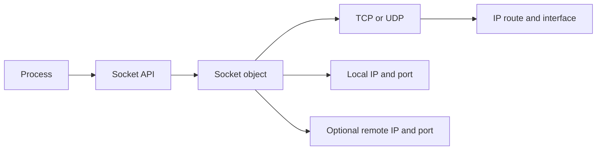

| Context | Minimal identifier | Example | Limitation |
|---|---|---|---|
| TCP listener | Protocol, local IP, local port | TCP `0.0.0.0:443` | Wildcard means multiple local addresses, not every policy path |
| TCP connection | Protocol plus both endpoint pairs | TCP `192.0.2.10:51515` to `198.51.100.20:443` | NAT/proxy creates different observed tuple |
| UDP unconnected socket | Protocol, local endpoint | UDP `0.0.0.0:53000` | Can receive/send across several peers under API rules |
| UDP connected socket | Protocol and associated peer endpoints | UDP local to selected remote | No TCP-style handshake is implied |
| Process mapping | Socket plus PID/process/user/time | PID 4000 owns local endpoint at timestamp | PID can be recycled; identity evidence remains separate |

### Client connect and server accept

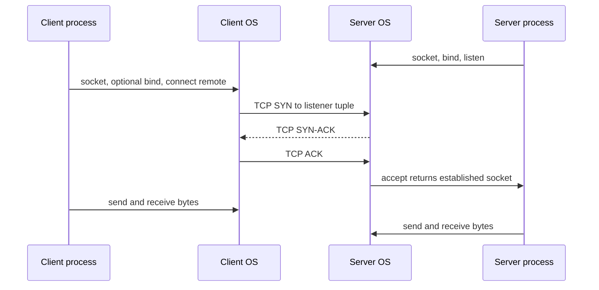

The server listener is not consumed by one connection. The operating system creates connection-specific state and returns a new accepted socket while the listener continues. Backlog behavior, SYN handling, application accept rate, and denial-of-service protections vary. A SYN-ACK proves a TCP endpoint or intermediary responded, not that the application accepted and completed a business operation.

## TCP service model

TCP supplies a reliable, in-order byte stream between endpoints. It detects corruption with a checksum, sequences bytes, acknowledges cumulative progress, retransmits data inferred lost, discards duplicates, reorders segments, applies receiver flow control, and participates in congestion control. TCP does not preserve application write boundaries, encrypt data, authenticate a user, or guarantee the remote business operation committed.

| TCP provides | TCP does not provide | Application responsibility |
|---|---|---|
| Ordered byte stream | Message boundaries | Define framing such as HTTP messages |
| Error detection and loss recovery | Confidentiality | Use TLS or another approved security protocol |
| Duplicate suppression | User authentication | Authenticate identities and sessions |
| Receiver flow control | Infinite buffering | Read data and apply backpressure correctly |
| Congestion response | Guaranteed minimum bandwidth | Design timeouts, retries, and user experience |
| Connection state | Transaction commit guarantee | Define idempotency and durable application outcome |

### Plain-English deep-dive 1 - TCP acknowledges bytes, not business outcomes

Imagine a courier receives a signed receipt that boxes numbered 1 through 50 reached a warehouse loading dock. The receipt says nothing about whether staff opened the boxes, accepted the invoice, updated inventory, or paid the supplier. A TCP ACK is that loading-dock receipt.

An ACK number indicates the next sequence number expected in that TCP direction. It confirms transport receipt by the peer stack according to TCP behavior. It does not prove the peer process read the bytes, TLS accepted the record, HTTP returned success, SharePoint committed a file, or OneDrive updated local state.

This distinction prevents weak incident conclusions. "The upload was acknowledged at TCP" means the peer transport accepted stream bytes. To prove service outcome, correlate TLS, HTTP, request ID, API response, service audit, and client state. Transport and application evidence answer different questions.

## TCP header fields

The minimum TCP header is 20 bytes. Options can extend it to the maximum indicated by the Data Offset field. TCP includes a checksum over a pseudo-header derived from IP information, the TCP header, and payload.

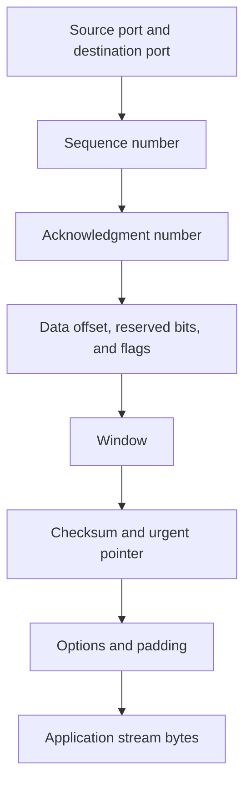

| Field | Size | Purpose | Interpretation caution |
|---|---:|---|---|
| Source port | 16 bits | Sender transport endpoint identifier | May be translated |
| Destination port | 16 bits | Receiver transport endpoint identifier | Port does not prove application protocol |
| Sequence number | 32 bits | Number of first data byte in segment, with SYN-specific semantics | Tools often display relative values |
| Acknowledgment number | 32 bits | Next sequence number expected when ACK set | Cumulative ACK does not name each segment |
| Data Offset | 4 bits | TCP header length in 32-bit words | Determines where payload begins |
| Flags | Control bits | Connection and delivery signaling | Interpret in state and sequence context |
| Window | 16 bits | Receiver-advertised window before negotiated scaling | Scale applies according to negotiation rules |
| Checksum | 16 bits | Error detection over pseudo-header, TCP header, and data | Offload can show false bad checksum at sender capture |
| Urgent Pointer | 16 bits | Urgent-data mechanism with URG | Rare and historically interpreted differently |
| Options | Variable | MSS, Window Scale, SACK Permitted, timestamps, and others | Usually negotiated in SYN segments where specified |
| Payload | Variable | Byte-stream data | One application message may span several segments |

### TCP flags

| Flag | Name | Main meaning | Common appearance |
|---|---|---|---|
| SYN | Synchronize | Establish sequence space and negotiate options | Handshake start and SYN-ACK |
| ACK | Acknowledgment | Acknowledgment field is valid | Nearly all established traffic |
| FIN | Finish | Sender has no more stream data | Orderly half-close |
| RST | Reset | Abort or reject connection state | Closed port, invalid state, application abort, intermediary action |
| PSH | Push | Receiver should make data promptly available under TCP semantics | Common on data; not a packet-boundary guarantee |
| URG | Urgent | Urgent pointer is significant | Uncommon |
| ECE | ECN Echo | Explicit Congestion Notification signaling | If ECN negotiated |
| CWR | Congestion Window Reduced | Sender reports response to congestion indication | If ECN used |
| NS | Nonce Sum historical field | Experimental/historical ECN nonce use | Do not build ordinary diagnosis around it |

## Three-way handshake

Each direction chooses an Initial Sequence Number. A SYN consumes one sequence number even when it carries no ordinary payload. Options such as MSS, Window Scale, SACK Permitted, and timestamps can be offered in SYN segments. Negotiation details matter because a midstream capture may not know scaling or option context.

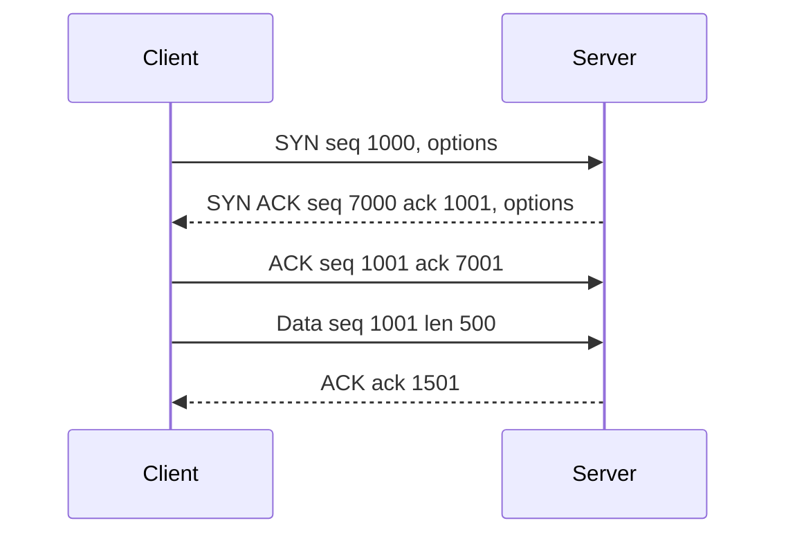

| Step | Client state concept | Server state concept | Sequence effect | What it proves |
|---|---|---|---|---|
| SYN | SYN-SENT | Listener receives request | Client SYN consumes one | Client request reached responder path |
| SYN-ACK | Client receives response | SYN-RECEIVED | Server SYN consumes one; ACKs client SYN | Responder created or represented state |
| Final ACK | ESTABLISHED | ESTABLISHED after valid ACK | ACKs server SYN | Bidirectional handshake completed at observed endpoints |
| First data | Established stream | Established stream | Payload advances sequence by byte count | Transport carries bytes, not app success |

### Handshake failure patterns

| Pattern | Visible sequence | Leading hypotheses | Evidence needed |
|---|---|---|---|
| SYN timeout | Repeated SYN, no response | Loss, silent policy, route/return path, unavailable destination | Both-side capture and stateful-boundary evidence |
| Immediate RST | SYN then RST/ACK or reset | Closed port, host rejection, intermediary reset | Reset source, TTL/hop clues, endpoint listener logs |
| SYN-ACK repeats | Server sends repeated SYN-ACK, no final ACK seen | Return delivery or client response problem | Client capture and middlebox state |
| Handshake then immediate FIN | Orderly close after establishment | Application/protocol decision | Process and application logs |
| Handshake then RST | Abort after establishment | Protocol mismatch, application abort, policy, invalid state | Payload timing, responder, socket logs |
| Intermittent handshake | Some address/paths succeed | Backend, ECMP, NAT capacity, loss, listener backlog | Destination and path partitioning |

## Sequence and acknowledgment arithmetic

TCP sequence numbers count bytes modulo $2^{32}$. A segment with sequence $S$ and payload length $L$ covers bytes $S$ through $S+L-1$, and the next expected byte is:

$$
ACK = (S + L) \bmod 2^{32}
$$

SYN and FIN each consume one sequence number. Pure ACKs without data, SYN, or FIN do not advance sequence space.

### Worked example

Client ISN is 1000. Its SYN consumes one, so first data starts at 1001. It sends 600 bytes:

$$
1001 + 600 = 1601
$$

The peer acknowledges 1601, meaning every byte through sequence 1600 is cumulatively acknowledged. If the client then sends 400 bytes starting at 1601, the next expected ACK is 2001.

| Segment | Sequence | Payload length | SYN/FIN cost | Expected cumulative ACK |
|---|---:|---:|---:|---:|
| Client SYN | 1000 | 0 | 1 | 1001 |
| Client data A | 1001 | 600 | 0 | 1601 |
| Client data B | 1601 | 400 | 0 | 2001 |
| Client FIN | 2001 | 0 | 1 | 2002 |

### Wraparound

If sequence starts near the maximum, arithmetic wraps modulo $2^{32}$. For example:

$$
(4,294,967,200 + 200) \bmod 4,294,967,296 = 104
$$

Implementations compare sequence space using modular rules, not naive signed arithmetic. Packet analyzers often show relative sequence numbers starting near zero to help humans. Preserve raw values when exact cross-tool comparison requires them.

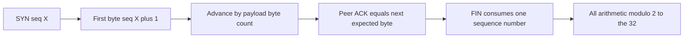

## Data transfer, ACK behavior, and reordering

TCP acknowledgments are cumulative. If bytes through 1999 arrived and bytes 2500-2999 arrive while 2000-2499 are missing, the receiver normally continues acknowledging 2000 while buffering later data if resources and policy allow. Duplicate ACKs can signal a gap. SACK options can identify received noncontiguous blocks so the sender retransmits more selectively.

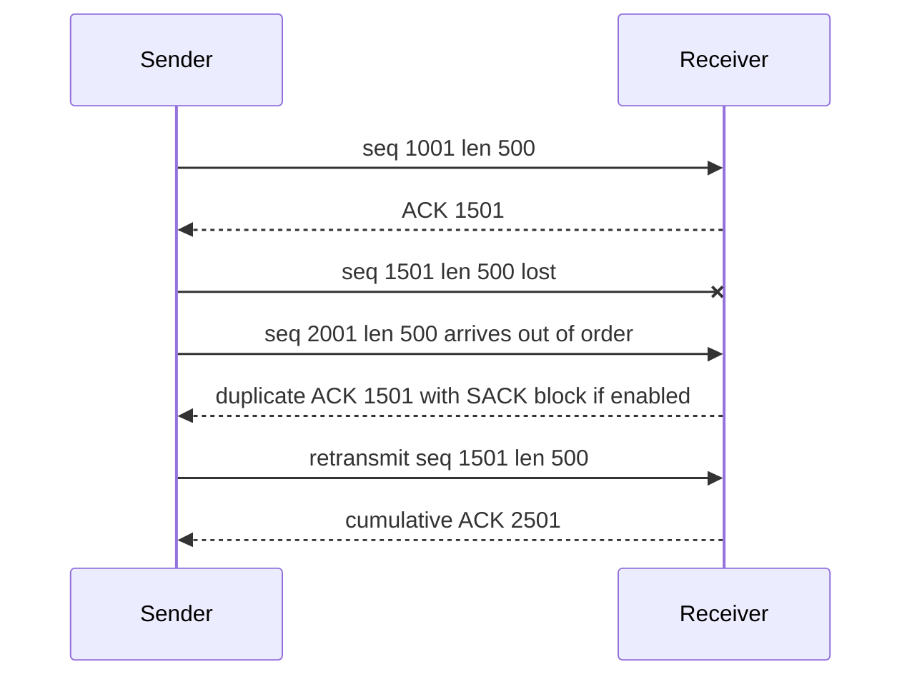

| Observation | Meaning supported | Meaning not proven |
|---|---|---|
| Advancing ACK | Receiver TCP accepted contiguous bytes through previous sequence | Application consumed or committed them |
| Duplicate ACK | Receiver still expects same next byte | Exact reason for missing progress without more context |
| Out-of-order segment | Capture observed later sequence before gap | Network necessarily reordered; capture loss/offload can mimic |
| SACK block | Receiver reports specified later byte range | Sender algorithm and exact recovery choice without sender evidence |
| Retransmission | Sender transmitted sequence range again | Original was definitely lost; ACK loss or spurious retransmission possible |
| Duplicate data | Same sequence range observed more than once | Application sent duplicate transaction |

Delayed acknowledgment allows a receiver to avoid ACKing every segment immediately under specified behavior. ACK thinning, capture loss, offload, and asymmetric observation can change the visible pattern. Interpret packet traces with endpoint and capture-point context.

## Flow control and the receive window

The receiver advertises how much additional sequence space it can accept beyond the cumulative ACK. If the application reads slowly or buffers fill, the advertised window shrinks. A zero window tells the sender to stop ordinary new data in that direction. The sender uses persist behavior and window probes to discover reopening rather than waiting forever for an update that could be lost.

Window Scale, negotiated during the handshake, permits receive windows larger than the 16-bit field alone. If scale factor represents a left shift of $s$, an advertised field value $W$ corresponds conceptually to:

$$
\text{effective receive window} = W \times 2^s
$$

For field value 32,768 and shift 4:

$$
32,768 \times 16 = 524,288\text{ bytes}
$$

| Window pattern | Interpretation | Likely owners | Important alternative |
|---|---|---|---|
| Healthy varying window | Receiver buffer capacity changes with reads | Endpoint stack and application | Analyzer scaling context |
| Window steadily shrinks | Receiver consuming slower than arrival | Receiver application/resource | Capture missed ACK/window updates |
| Zero window | Receiver advertises no new receive space | Receiver endpoint/application | Incorrect scale interpretation |
| Zero-window probes | Sender checks whether window reopened | Sender TCP behavior | Not ordinary keepalive |
| Window update | Receiver advertises more space | Receiver resumed consumption | Update could be lost and retried |

### Plain-English deep-dive 2 - Flow control is not congestion control

Imagine a warehouse receiving trucks over a highway. The warehouse says, "I have room for 50 more boxes." That is receive flow control. Highway authorities and drivers also react to traffic jams and dropped loads by reducing how much is in transit. That is congestion control.

TCP's usable sending allowance is bounded by both receiver capacity and congestion state. A simplified view is:

$$
\text{send allowance} \leq \min(rwnd, cwnd)
$$

A zero receiver window points toward the destination's advertised capacity in that direction. Packet loss and a reduced congestion window point toward inferred network congestion or loss response. They can coexist. Do not tell a network team to add bandwidth merely because the receiver application is not reading, and do not blame the application for loss simply because throughput is low.

## Congestion control

Congestion control adapts the sender's amount of unacknowledged data to path conditions. Common concepts include slow start, congestion avoidance, fast retransmit, fast recovery, congestion window, slow-start threshold, and Explicit Congestion Notification. Exact algorithms differ among operating systems and versions; standards define requirements and common baselines, not one universal implementation graph.

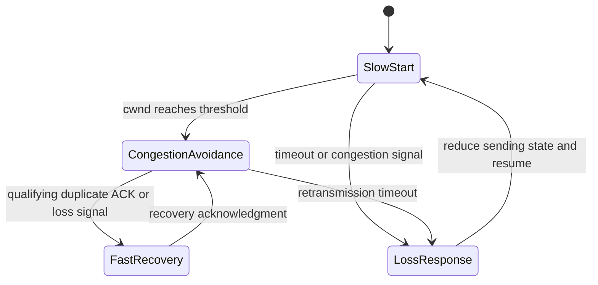

| Concept | Plain meaning | Evidence clue | Caveat |
|---|---|---|---|
| cwnd | Sender's network-condition allowance | In-flight pattern and sender telemetry | Not transmitted as a TCP header field |
| ssthresh | Boundary influencing slow start versus avoidance | Sender stack telemetry | Cannot be read directly from ordinary capture |
| Slow start | Rapidly grows allowance from a smaller base | Bursty growth by ACK rounds | Modern algorithms and initial windows vary |
| Congestion avoidance | More cautiously grows after threshold | Gradual in-flight growth | Application limits can mask it |
| Fast retransmit | Retransmit inferred missing data before RTO | Duplicate ACK/SACK pattern | Reordering can cause spurious inference |
| Fast recovery | Avoid return to minimal flight after certain loss | Sender continues with reduced allowance | Algorithm-specific behavior varies |
| ECN | Marks congestion without requiring loss when supported | ECE/CWR and IP ECN fields | Must be negotiated and supported end to end |

### Bandwidth-delay product

The amount of data required in flight to fill a path is approximated by bandwidth-delay product:

$$
BDP = \text{bandwidth in bytes per second} \times RTT
$$

For 100 megabits per second and 80 milliseconds:

$$
100,000,000 / 8 \times 0.08 = 1,000,000\text{ bytes}
$$

Roughly one megabyte in flight is needed to fully utilize that idealized path. Actual throughput depends on congestion control, receive window, loss, application behavior, CPU, encryption, disk, proxies, parallelism, and service limits. BDP is a capacity clue, not a throughput promise.

## RTT, RTO, and retransmission

RTT samples vary because of propagation, serialization, queueing, processing, path changes, and delayed ACK behavior. TCP maintains a smoothed RTT and variation estimate. RFC 6298 gives the standard estimator form using $\alpha=1/8$, $\beta=1/4$, and $K=4$:

$$
SRTT \leftarrow (1-\alpha)SRTT + \alpha R'
$$

$$
RTTVAR \leftarrow (1-\beta)RTTVAR + \beta |SRTT-R'|
$$

$$
RTO \leftarrow SRTT + \max(G, K \times RTTVAR)
$$

Here $R'$ is a new RTT measurement and $G$ is clock granularity. RFC 6298 also specifies initialization, bounds, exponential backoff, and retransmission-timer management. Implementations can incorporate standards-track advances. A packet analyst should measure observed timing rather than assume one vendor timer.

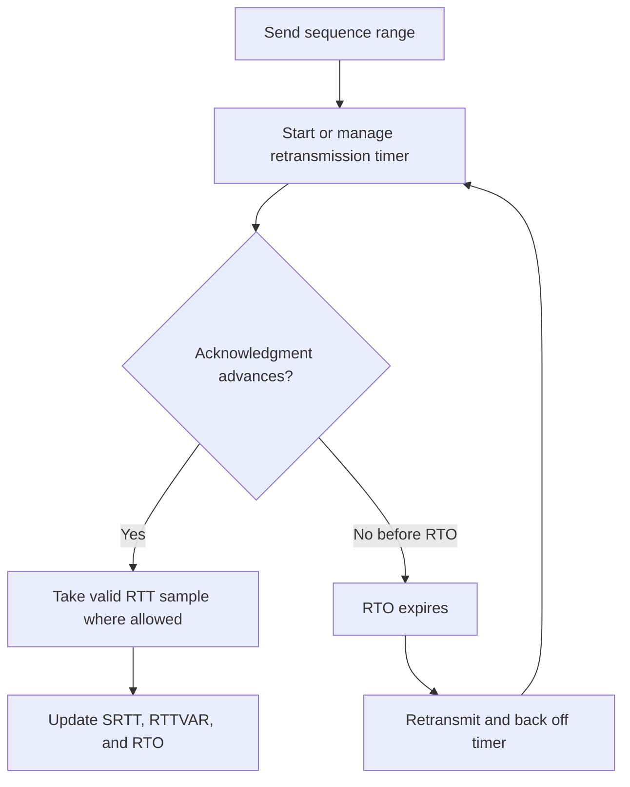

### Karn's ambiguity

If a retransmitted segment is acknowledged, the sender may not know whether the ACK covers the original or retransmitted copy. Classic TCP avoids ambiguous RTT samples and uses timer backoff. TCP timestamps and modern loss-recovery methods add evidence, but trace interpretation still requires caution.

| Retransmission type or clue | Trigger concept | Trace appearance | Diagnostic caution |
|---|---|---|---|
| RTO retransmission | Timer expires without progress | Gap followed by repeat after timer | Capture may miss ACK |
| Fast retransmission | ACK/SACK evidence indicates missing range | Repeat before RTO after duplicate ACKs | Reordering can trigger spurious repeat |
| Tail loss recovery | Loss near end of flight | Probe/repeat behavior near idle tail | Algorithm/version-specific |
| Spurious retransmission | Original arrived or ACK delayed | Duplicate data despite eventual original progress | Do not count every repeat as path loss |
| Application retry | New application operation, possibly new connection | Different sequence/tuple/request | Not a TCP retransmission |

## SACK and modern loss evidence

SACK Permitted is normally exchanged during connection setup. SACK blocks in ACKs identify ranges received beyond a gap. The cumulative ACK still identifies the next contiguous byte expected. SACK helps a sender recover multiple losses without retransmitting every later byte.

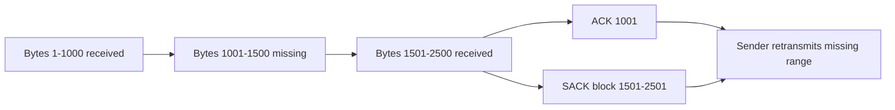

Recent standards such as RACK use time-based information to improve loss detection. The specific algorithm and telemetry depend on endpoint implementation. In an interview, explain cumulative ACK, duplicate ACK, SACK, and timer evidence first; label implementation-specific inference.

## MSS, segmentation, and offload

MSS advertises the maximum TCP payload the receiver is prepared to accept for that path direction, generally based on receive interface MTU and headers. Peers can advertise different MSS values. Path constraints and tunnels can require smaller effective packetization.

An application can call `send` with 100 kilobytes. TCP may segment it into many units. Conversely, several small application writes can appear in one segment or one read. Network interface offloads can make host captures show large "segments" that the NIC later divides, or combined receive data. A sender-side capture can also show checksum fields before hardware fills them.

| Offload or behavior | Purpose | Capture surprise | Validation |
|---|---|---|---|
| TCP Segmentation Offload / Large Send Offload | Let NIC segment large buffers | Outbound capture shows payload larger than path MSS | Capture beyond host or account for offload |
| Receive Segment Coalescing / Large Receive Offload | Combine incoming units before upper processing | Host capture shows larger receive units | Compare adapter setting and external capture |
| Checksum offload | NIC computes checksum later | Sender capture flags bad checksum | Check receiver/external observation and offload metadata |
| Delayed ACK | Reduce ACK frequency | ACK not returned for every segment | Use timing and standards context |
| Nagle-related behavior | Coalesce small writes under conditions | Small interactive writes delayed | Check socket options and application pattern |

## Connection teardown and TCP states

TCP directions close independently. A FIN means the sender has no more bytes to send; it does not prevent receiving. A normal full close often uses two FIN/ACK exchanges, though packets can combine flags and application behavior varies.

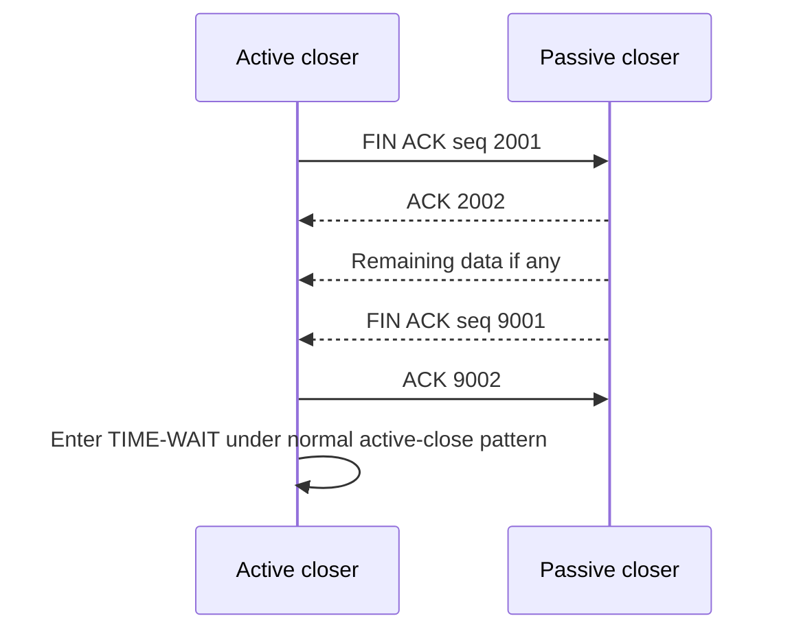

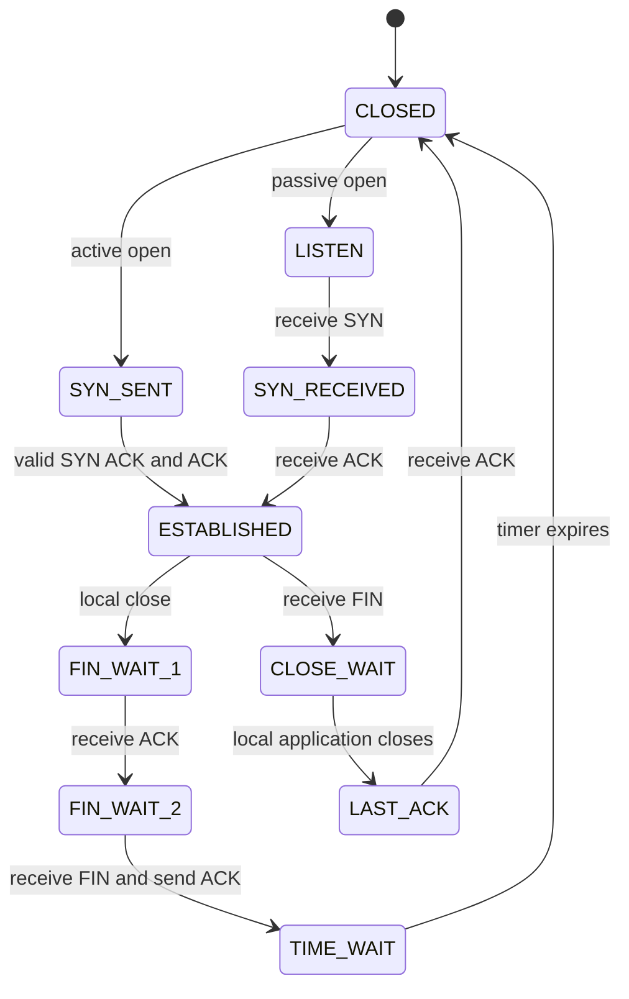

| State | Plain meaning | Operational clue | Common issue |
|---|---|---|---|
| LISTEN | Waiting for inbound SYNs | Server endpoint available locally | Policy or backlog can still block service |
| SYN-SENT | Active opener awaits response | Outbound connect in progress | Repeated SYN timeout |
| SYN-RECEIVED | Responder awaits final ACK | Half-open connection state | SYN flood/backlog pressure |
| ESTABLISHED | Bidirectional TCP state exists | Data can flow | Application can still be stalled |
| FIN-WAIT-1/2 | Local side closed send direction | Waiting for ACK or peer FIN | Peer/app does not close |
| CLOSE-WAIT | Peer FIN received; local app has not closed | Application must release socket | Accumulation often indicates app lifecycle issue |
| LAST-ACK | Local FIN sent after passive close | Awaiting final ACK | Loss or peer disappearance |
| TIME-WAIT | Closed active side retains state | Old duplicates expire and final ACK can be retransmitted | High connection churn consumes tuple/state resources |

TIME-WAIT duration and tuple reuse behavior are implementation-defined within standards requirements. Do not recommend disabling or shortening it casually. First determine whether connection reuse, pooling, application close behavior, ephemeral range, NAT state, or proxy design is the real constraint.

## Resets, timeouts, and orderly closes

A reset aborts TCP state. It can be sent because no listener exists, a segment does not match valid connection state, an application requests an abortive close, a host restarts, or an intermediary actively rejects traffic. Reset source attribution requires packet, path, TTL/hop, sequence, timing, and device logs; source IP can be spoofed or represented by a proxy.

| End pattern | Wire clue | Likely meaning | What to verify |
|---|---|---|---|
| Orderly FIN | FIN, ACK progression | One direction completed normally | Application reason and remaining direction |
| RST on SYN | Reset response to connection attempt | No listener or active rejection | Endpoint listener and intermediary policy |
| RST after data | Abort during established flow | App abort, protocol error, invalid state, policy | Which device originated and what log reason |
| Silent timeout | Retransmissions then give-up | Loss, silent policy, dead peer, return path | Both endpoints and every stateful boundary |
| Application timeout with healthy ACKs | App deadline expires despite transport progress | Slow service/dependency, protocol wait, client deadline | HTTP/service/client timeline |
| Idle close | FIN or RST after inactivity | Endpoint/proxy/firewall timeout or application policy | Exact timer owner and documented setting |

### Plain-English deep-dive 3 - RST is a verb, not a root cause

Hearing a door slam tells you the conversation ended abruptly. It does not identify who closed the door or why. A TCP RST is the same. Packet timing can show which observed endpoint address sent it, but a NAT, proxy, firewall, load balancer, or spoofing behavior can complicate origin.

A strong diagnosis says: "At 10:02:14.220 UTC, after the client sent 800 bytes and received an ACK through sequence 1801, a reset matching the connection arrived with this sequence/ack context. The client process logged connection reset at the same time. The service did not log the request ID. The edge policy log identifies an idle-state expiration" only if each artifact exists.

Without the edge log, use moderate language: "The client capture observed a reset apparently sourced from the remote tuple; origin and reason remain unverified." Then collect the nearest authoritative endpoint or intermediary evidence.

## Keepalive, application heartbeat, and idle policy

TCP keepalive is optional and typically disabled or configured with long defaults unless an application requests it. It probes an idle connection to detect some unreachable peers. It does not exercise business logic. Application protocols may send their own pings, heartbeats, or requests. Firewalls, NAT devices, proxies, and load balancers have state timers that may be shorter than endpoint keepalive intervals.

| Mechanism | Layer | Main purpose | Limitation |
|---|---|---|---|
| TCP keepalive | Transport | Detect some dead idle peers and retain activity | Defaults vary; not service-health proof |
| TCP zero-window probe | Transport | Discover whether receive window reopened | Not an idle keepalive |
| HTTP/2 PING | Application protocol | Measure liveness/round trip for that connection | Does not validate every backend operation |
| QUIC PING | QUIC transport | Keep path/connection active and elicit acknowledgment | Policy and idle timeout still apply |
| Application heartbeat | Application | Validate defined service behavior | Only as meaningful as the checked operation |
| Synthetic transaction | User/service layer | Exercise a representative business flow | Can miss user-specific data or authorization issues |

## Ephemeral ports and state tables

Outgoing connections usually use temporary local ports selected from an operating-system range. Windows and Linux ranges can differ and be configured. Check rather than memorize. The tuple allows reuse of the same local port in different remote contexts subject to stack rules, but NAT and stateful devices impose their own mapping capacity and behavior.

### Windows range inspection

```text
netsh int ipv4 show dynamicport tcp
netsh int ipv4 show dynamicport udp
netsh int ipv6 show dynamicport tcp
netsh int ipv6 show dynamicport udp
```

### Linux range inspection

```text
sysctl net.ipv4.ip_local_port_range
cat /proc/sys/net/ipv4/ip_local_port_range
```

| Exhaustion surface | Symptom | Evidence | Mitigation direction |
|---|---|---|---|
| Host ephemeral range | New outbound connects fail while existing flows work | Socket states, range, connection churn, error code | Reuse connections, fix leaks/churn, capacity review |
| TIME-WAIT accumulation | Many recently closed active connections | Tuple/state distribution and application pattern | Pool/reuse; do not blindly remove TIME-WAIT safeguards |
| NAT/PAT ports | Many internal flows share limited public mappings | NAT allocation/state/capacity logs | Expand capacity or reduce churn after design review |
| Firewall state table | New flows dropped or aged unexpectedly | State utilization and reason logs | Capacity, timeout, path symmetry, policy review |
| Listener backlog/accept | SYN handling succeeds inconsistently under load | OS/server counters and accept latency | Application/server capacity and SYN defenses |
| Proxy connection pool | Client leg healthy, upstream pool constrained | Proxy pool and upstream telemetry | Pool, reuse, backend, and timeout tuning |

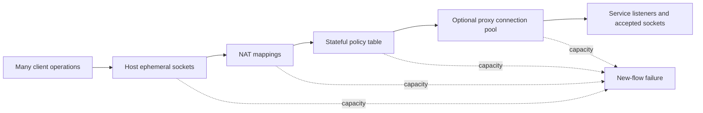

Connection pooling and multiplexing can reduce churn, but stale connections and uneven load can create different failures. Tune only with application, endpoint, network, and service owners because changing timers moves state and risk between components.

## UDP mechanics

UDP has a compact header with source port, destination port, length, and checksum. It preserves datagram boundaries. It does not establish a TCP-style connection, order datagrams, retransmit loss, suppress duplicates, advertise a receive window, or perform TCP congestion control. Applications can add any needed reliability, sequencing, pacing, encryption, and congestion behavior.

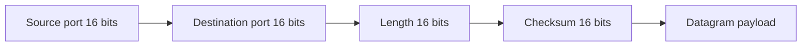

| UDP property | Consequence | Diagnostic implication |
|---|---|---|
| No handshake | First application datagram can be sent immediately | No response may mean loss, policy, service silence, or protocol design |
| Message boundaries | One send maps conceptually to one datagram | Oversized datagrams risk fragmentation or loss |
| No transport ACK | UDP does not prove delivery | Look for application response or ICMP condition |
| No built-in retransmission | Application decides recovery | Repeats may be app behavior, not UDP behavior |
| No TCP flow window | Receiver can drop when buffers overflow | Endpoint counters and app pacing matter |
| Checksum | Detects corruption; mandatory in IPv6, with specified IPv4 behavior | Offload and capture point still matter |

An ICMP Port Unreachable may report that no UDP listener exists, but firewalls can suppress it. A UDP application can intentionally send no reply. Therefore, "UDP timed out" is usually an application-observed deadline, not a UDP connection timeout.

## QUIC overview

QUIC is an IETF secure transport carried in UDP datagrams. It integrates TLS 1.3, supports multiple streams, connection migration using connection IDs, acknowledgment and loss recovery, and congestion control. HTTP/3 maps HTTP semantics onto QUIC. QUIC avoids TCP head-of-line blocking across independent streams, though loss still affects data using the lost packets and path capacity.

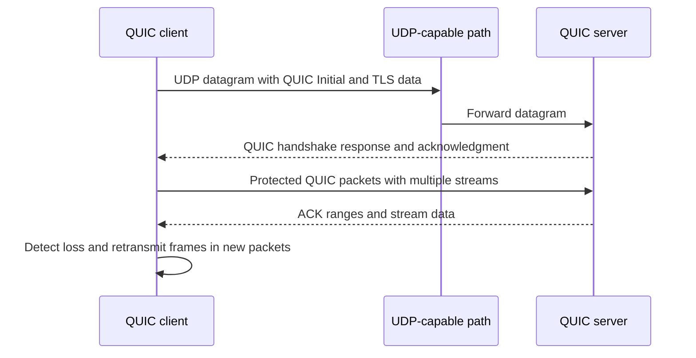

| Dimension | TCP plus TLS plus HTTP/2 | QUIC plus HTTP/3 | Diagnostic impact |
|---|---|---|---|
| Lower transport | TCP | UDP carrying QUIC | UDP policy and NAT state matter |
| Security | TLS layered over TCP | TLS 1.3 integrated into QUIC | Most QUIC headers/payload become protected |
| Multiplexing | HTTP/2 streams share TCP byte stream | QUIC streams have independent ordered delivery | Packet loss impacts differ |
| Handshake | TCP then TLS, with resumption options | Combined transport/security setup, with resumption options | Count actual round trips in trace |
| Connection identity | Primarily endpoint tuple plus TCP state | QUIC connection IDs support migration | Tuple change need not mean new logical connection |
| Middlebox behavior | Mature TCP handling | UDP may be blocked or timed out differently | Client can fall back according to application behavior |

Do not say QUIC is "UDP without reliability." QUIC implements acknowledgments, loss recovery, stream ordering, congestion control, and security in user space over UDP. Do not say HTTP/3 is always used by OneDrive or SharePoint; verify negotiated protocol in browser/client and current Microsoft documentation.

## Packet interpretation workflow

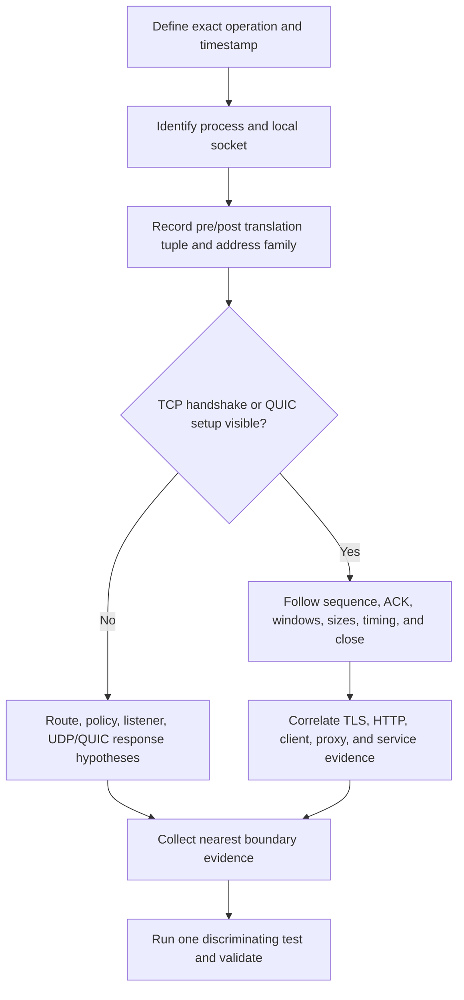

### Reading one TCP conversation

1. Confirm capture point, interface, clock, direction, offloads, filter, and dropped-capture count.
2. Identify protocol and tuple; map it to a process and any NAT/proxy tuple.
3. Find handshake and negotiated options, or state that capture began midstream.
4. Track relative sequence ranges, ACK progress, payload lengths, window scaling, and SACK.
5. Mark retransmissions, reordering, zero windows, pauses, resets, FINs, and timer intervals.
6. Correlate application request, response, and identifiers; encrypted payload requires endpoint/application evidence.
7. Compare affected and unaffected flows under controlled variables.
8. Separate observation, interpretation, alternatives, confidence, and next check.

| Packet question | Field or evidence | Example conclusion | Overclaim to avoid |
|---|---|---|---|
| Who initiated TCP? | First SYN and socket logs | Client tuple sent SYN | Human identity from tuple alone |
| Did handshake complete? | SYN, SYN-ACK, final ACK at capture point | Three steps observed here | Application succeeded |
| Which bytes are missing? | Sequence, ACK, SACK, lengths | Receiver still expects sequence N | Network definitely dropped original |
| Is receiver constrained? | Advertised scaled window and endpoint logs | rwnd reached zero | Receiver app has specific defect |
| Is path loss plausible? | Repeats, ACK/SACK, timing, second capture | Loss between observation points supported | Exact device caused it |
| Who reset? | Reset packet plus endpoint/intermediary logs | Reset observed from tuple at point | Origin process known without logs |
| Why did app time out? | App deadline plus transport/application timeline | Deadline expired after this sequence | TCP timeout if transport still progressed |

## Performance and failure scenarios

### Slow throughput

Throughput can be limited by application production/consumption, receive window, congestion window, RTT, loss, MSS, CPU, encryption, storage, proxying, rate policy, service throttling, or parallelism. Measure rather than choose one favorite metric.

An idealized loss-limited approximation is sometimes used to teach why throughput falls as RTT and loss rise, but real algorithms and workloads differ. For support, use observed bytes over a defined interval, RTT distribution, retransmission rate with capture limitations, receive window, in-flight data, application timing, and service limits.

| Pattern | Leading hypothesis | Discriminator |
|---|---|---|
| High RTT, no loss, window too small for BDP | Receive or congestion allowance limits path use | Effective window, in-flight bytes, endpoint settings |
| Repeated loss and recovery | Path congestion/loss or capture artifact | Multi-point capture, interface drops, sender telemetry |
| Zero window | Receiver/application not consuming quickly | Receiver process and buffer evidence |
| Network fast, long server think time | Application/service dependency | Request-to-first-byte and service trace |
| One large flow slow, parallel flows faster | Per-flow window/congestion/path behavior | Controlled concurrency and policy limits |
| All flows cap at exact rate | Shaping, service quota, or test limit | Policy and service documentation |

### Reset versus timeout

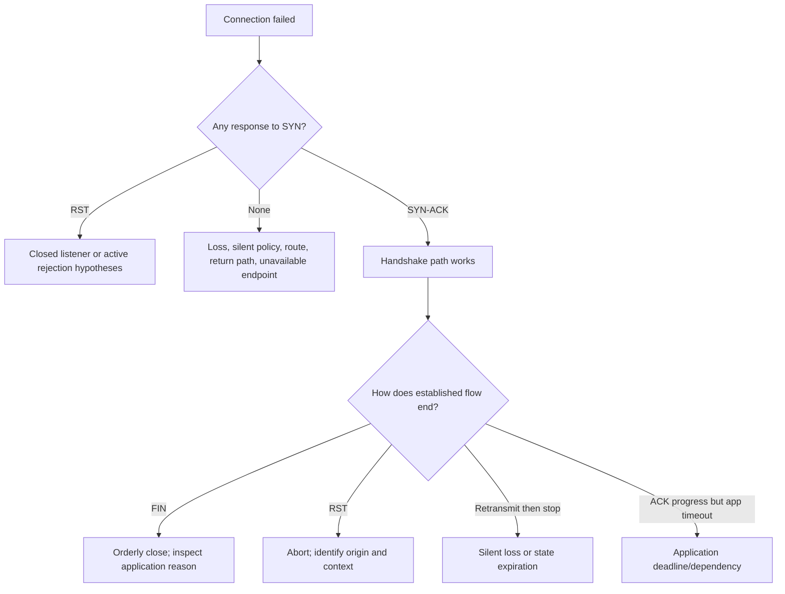

### Intermittent timeout

Partition by destination address, IP family, backend, route, proxy, time, payload size, process, user, and NAT egress. A single DNS name can map to several addresses. One stateful path can be full. One backend can reset. One address family can be blocked. Controlled comparison converts intermittence into a predictive dimension.

## OneDrive and SharePoint transport bridge

A generic Microsoft 365 operation can create several transport connections for identity, SharePoint, OneDrive APIs, content, and other dependencies. Proxies can split client and upstream TCP connections. HTTP/2 can multiplex many requests over one TCP connection. HTTP/3 can use QUIC where supported and negotiated. Current Microsoft endpoint and protocol behavior must be verified rather than assumed.

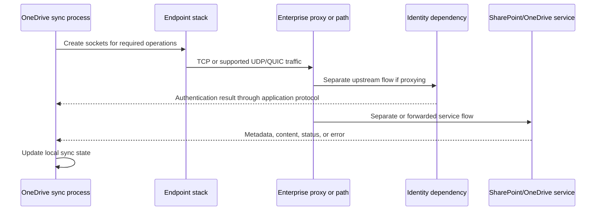

| Symptom | Transport interpretation | Higher-layer alternative | Evidence |
|---|---|---|---|
| Browser works, sync times out | Process-specific socket/proxy/path or operation pattern | Local sync database, file rule, API permission | Process tuple, client logs, HAR where applicable |
| Small file works, large upload stalls | Loss/MTU/window/state plausible | Service upload policy or disk/client behavior | Packet size/ACK/window plus HTTP and client evidence |
| One endpoint address resets | Backend/path/policy variation | Service redirect or token scope | DNS answer, tuple, reset source, request correlation |
| New connects fail after churn | Ephemeral/NAT/state capacity plausible | Client retry storm from app defect | Socket/NAT state and application retry timeline |
| HTTP 429 with healthy TCP | Transport succeeded enough for application response | Service rate/throttle policy | Response headers and request pattern |
| TCP ACKs continue but UI spins | Data may be moving without completed operation | Service dependency or client processing | HTTP waterfall, service and process logs |

## Fictional NMH continuity scenario

NMH's fictional finance team syncs a SharePoint library through an acquired branch. At 09:00 UTC, new connections intermittently fail while established connections continue. The branch public documentation address is shared through PAT. Socket inventory shows a sharp rise in short-lived outbound connections and TIME-WAIT. The edge reports high mapping utilization. This supports a state-capacity or connection-churn hypothesis; it does not prove a Zscaler, Microsoft, or application defect.

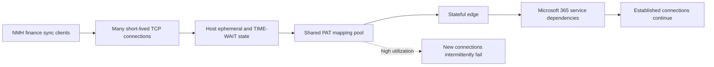

### NMH hypothesis matrix

| Hypothesis | Supporting observation | Disconfirming check | Owner |
|---|---|---|---|
| PAT mapping exhaustion | High utilization aligns with new-flow failures | Failures persist with ample mappings and same path | Edge team |
| Host ephemeral exhaustion | Many sockets/TIME-WAIT on affected clients | Local range has ample free tuples; other apps connect | Endpoint team |
| Listener/backend overload | SYN/SYN-ACK patterns vary by destination | Service confirms normal accepts; failure occurs before service | Service/provider team |
| Silent policy drop | Repeated SYN without response on selected path | Policy logs permit and destination receives SYN | Security/network team |
| Retry storm caused by client error | Churn begins after repeated application failure | Normal client operation produces same churn | Client/application team |
| DNS/backend variation | Failures follow one address | Same address succeeds/fails only with state pressure | DNS/service team |

### NMH evidence plan

Collect synchronized endpoint socket states, process IDs, configured ephemeral ranges, packet samples for affected and unaffected flows, edge mapping utilization, pre/post translation tuples, stateful-policy reasons, DNS answers, and sanitized Microsoft request identifiers. Do not collect file content. Limit capture duration and filter to approved endpoints.

### NMH remediation and validation

Immediate stabilization can reduce uncontrolled retry amplification under application-owner guidance and increase or rebalance state capacity through change control if evidence supports it. Durable correction might reuse connections, fix a client retry loop, correct timers across boundaries, expand public egress capacity, or repair asymmetry. Validation should measure new-connection success, established-flow health, mapping utilization, retry rate, user operation completion, and recurrence after the normal peak.

## Tools and commands

### Windows socket and transport evidence

```text
Get-Date
Get-NetTCPConnection
Get-NetUDPEndpoint
Get-Process -Id <approved-pid>
netstat -ano
netsh int ipv4 show dynamicport tcp
netsh int ipv4 show dynamicport udp
Get-NetTCPSetting
Get-Counter '\TCPv4\*'
```

### Linux socket and transport evidence

```text
date -u
ss -tanp
ss -uanp
ss -s
sysctl net.ipv4.ip_local_port_range
cat /proc/net/sockstat
```

| Tool | Main use | Important field | Limitation |
|---|---|---|---|
| `Get-NetTCPConnection` | Windows TCP state and ownership | Local/remote endpoints, state, owning process | Snapshot and privilege limitations |
| `Get-NetUDPEndpoint` | Windows UDP endpoints | Local address/port and owner | Remote peer may not be represented |
| `netstat -ano` | Broad endpoint and PID inventory | State, endpoint, PID | Process can exit or PID be reused |
| `Get-NetTCPSetting` | Windows TCP templates/settings | Auto-tuning/congestion-related configuration | Effective behavior depends on connection/template/version |
| Performance counters | Aggregate host trends | Connections, failures, retransmission-related counters | Aggregates do not attribute one flow |
| `ss` | Linux socket state and details | Queues, timers, processes, TCP info options | Privilege and version alter visibility |
| Wireshark/tcpdump/pktmon | Visible packet sequence and timing | Tuple, flags, seq/ACK, window, SACK, lengths | Offload, capture loss, encryption, and observation point |
| Browser developer tools/HAR | HTTP request timing and protocol | Request, status, waterfall, negotiated version | Browser only and sensitive fields |

### Useful Wireshark display-filter orientation

Examples for an approved lab include `tcp`, `udp`, `quic`, `tcp.stream eq 4`, `tcp.flags.syn == 1`, `tcp.flags.reset == 1`, `tcp.analysis.retransmission`, `tcp.analysis.duplicate_ack`, `tcp.window_size == 0`, and endpoint filters. Analysis flags are Wireshark inferences affected by capture completeness. Verify syntax against current Wireshark documentation.

## Privacy and evidence handling

Transport traces can expose IP addresses, ports, process timing, endpoint names through adjacent protocols, TLS metadata, URLs if unencrypted, cookies or tokens, payload, user behavior, and security architecture. Socket-to-process maps and NAT logs can support employee attribution. Treat them as sensitive.

| Control | Required action | Failure prevented |
|---|---|---|
| Authorization | Approve endpoint, interface, target, duration, and payload scope | Unauthorized interception |
| Minimization | Filter exact tuple/time and prefer headers where sufficient | Excess content collection |
| Secret protection | Redact tokens, cookies, URLs, payload, and credentials | Session or account compromise |
| Identity caution | Correlate process, device, user, NAT, and time independently | False person attribution |
| Integrity | Preserve original metadata and approved hashes; analyze copies | Evidence mutation |
| Clock quality | Record UTC, skew, synchronization, and capture timestamp source | False sequence across systems |
| Secure storage | Restrict, encrypt, log access, and use approved transfer | Evidence leakage |
| Retention | Delete according to documented purpose and schedule | Indefinite behavior archive |
| Test safety | Use documentation addresses and controlled endpoints | Accidental load or scanning |
| Claim discipline | Label observation, inference, alternative, and confidence | Unsupported vendor accusation |

### Plain-English deep-dive 4 - One trace is one witness

A witness standing outside a room may hear the first person speak, then silence, then a door slam. The witness cannot see whether the second person replied quietly, whether a recorder malfunctioned, or whether another door was used. A packet capture has the same limits.

A client capture can miss packets because of capture drops, show large offloaded buffers, mark checksums before hardware completion, and observe only the client leg of a proxy. An edge capture sees translated tuples. A server capture sees arrival after upstream transformations. Clocks differ. Encrypted payload hides application messages.

Use multiple witnesses when attribution matters: endpoint socket logs, client capture, intermediary state, server capture, and application request IDs. Align tuples and time, name blind spots, and choose the nearest evidence to the disputed boundary. Certainty should increase only when independent artifacts agree.

## Troubleshooting decision trees

### TCP connection cannot establish

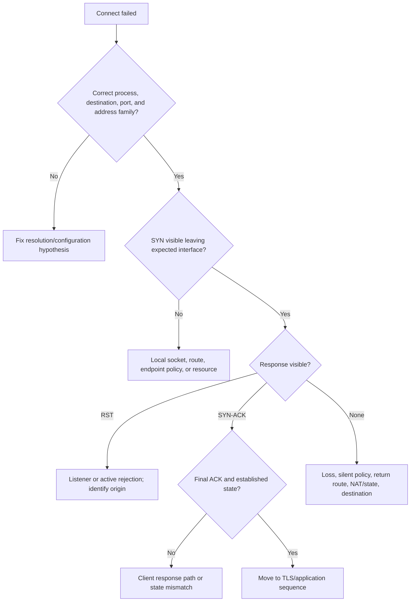

### Established flow is slow

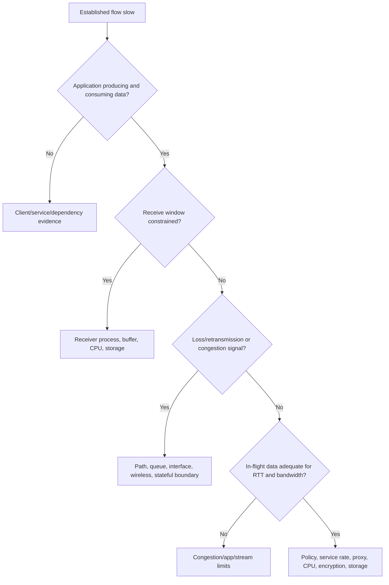

### UDP or QUIC appears blocked

```mermaid
flowchart TD
    U[UDP/QUIC operation fails] --> SEND{Datagram leaves expected process/interface?}
    SEND -->|No| LOCAL[Application, socket, route, local policy]
    SEND -->|Yes| ICMP{ICMP error returns?}
    ICMP -->|Port unreachable| LISTENER[No listener or active reject near reporter]
    ICMP -->|Other| NET[Interpret exact ICMP type/code/source]
    ICMP -->|None| OBS[Collect server/intermediary observation]
    OBS --> ARRIVE{Datagram arrives?}
    ARRIVE -->|No| PATH[UDP policy, NAT state, loss, route, MTU]
    ARRIVE -->|Yes| APP[QUIC/application validation and response path]
```

## Scenario labs

### Lab 1 - Tuple and process map

On an approved host, record listeners, TCP connections, UDP endpoints, PIDs, processes, users where authorized, address family, and timestamp. Explain wildcard listeners and why PID plus time is not permanent identity. Draw where NAT or proxying changes the observed tuple.

### Lab 2 - Handshake arithmetic

Given client ISN 4,000 and server ISN 90,000, write SYN, SYN-ACK, final ACK, 1,200 bytes client data, 300 bytes server data, and ACK values. Add FIN in both directions. Repeat with a sequence number near $2^{32}$ to demonstrate wraparound.

### Lab 3 - Loss and SACK

Create a paper trace with four 500-byte ranges where the second and fourth are lost. Write cumulative ACK and SACK blocks after each arrival, then plan retransmissions. Explain why the ACK proves byte receipt but not an HTTP operation.

### Lab 4 - Flow versus congestion

Compare three traces: shrinking receive window to zero, repeated loss with healthy receive window, and slow application production with few bytes in flight. Assign leading owner and one disconfirming test. Calculate BDP for 50 Mbps at 120 ms.

### Lab 5 - RTO timeline

Use synthetic RTT samples to update SRTT, RTTVAR, and RTO with RFC 6298 formulas after initialization. Add a retransmission and explain ambiguous RTT sampling and exponential backoff. Compare observed timer intervals rather than assuming an OS default.

### Lab 6 - Reset origin

Create client, firewall, proxy, and server observations for a reset. Include a case where the client capture source looks like the server but the proxy generated the reset. Write observation and confidence language before and after proxy logs arrive.

### Lab 7 - UDP and QUIC

Capture an approved DNS UDP exchange and an approved QUIC-capable lab flow if available. Annotate UDP header, datagram boundaries, ICMP behavior, QUIC Initial, connection ID, acknowledgment ranges, and encrypted limits. If QUIC is unavailable, use an authoritative sample and label it.

### Lab 8 - NMH state exhaustion

Run the fictional NMH tabletop. Graph new connections, established connections, TIME-WAIT, host ephemeral usage, NAT mappings, firewall state, retry rate, and operation success. Propose stabilization, durable correction, rollback, privacy, and recurrence validation without naming an unsupported vendor cause.

| Lab output | Required content | Pass condition |
|---|---|---|
| Socket map | Tuple, process, state, time, boundary | No port-to-protocol or IP-to-user overclaim |
| Sequence worksheet | SYN/FIN costs, payload, ACK, wrap | All arithmetic correct |
| Loss trace | Cumulative ACK, SACK, retransmission | Transport and app retry separated |
| Window analysis | rwnd, cwnd concept, BDP, alternatives | Flow and congestion controls distinguished |
| RTO worksheet | Samples, formulas, backoff | Timer claims tied to evidence |
| Reset report | Source observation, logs, confidence | RST not treated as root cause |
| QUIC comparison | UDP, TLS, streams, loss, policy | No "UDP is unreliable" simplification |
| NMH package | State, capacity, retry, privacy, validation | Scenario labeled fictional |

## Misconceptions to correct

| Misconception | Correction |
|---|---|
| A port identifies an application with certainty | It is an endpoint number; verify negotiated or parsed protocol |
| A socket is only a port | It includes protocol, local/remote endpoints, state, and OS context |
| TCP sends application messages | TCP sends an ordered byte stream without message boundaries |
| The handshake proves the website works | It proves transport state, not TLS, HTTP, identity, or service outcome |
| ACK means the application saved the data | ACK means peer TCP accepted contiguous bytes |
| Sequence numbers count packets | They count bytes, with SYN and FIN consuming sequence space |
| Every duplicate ACK proves packet loss | Reordering, duplication, and capture artifacts can contribute |
| Every retransmission proves original loss | ACK loss, reordering, capture loss, and spurious retransmission are alternatives |
| Window means congestion window | Header Window is receiver advertisement; cwnd is sender internal state |
| Zero window is a network bandwidth problem | It points to receiver-advertised capacity in that direction |
| RST gives the root cause | It aborts state; origin and reason need corroboration |
| TCP keepalive proves service health | It tests limited transport liveness after idle |
| TIME-WAIT is a bug | It protects connection correctness; excess churn may expose design limits |
| UDP guarantees loss | UDP omits recovery; an application such as QUIC can add it |
| QUIC bypasses security policy | It remains traffic subject to approved architecture and controls |
| Client capture is ground truth for whole path | It is one observation point affected by offload and missing boundaries |

## Official Source Anchors

The following authoritative sources were reviewed on **2026-08-24**. They support standards and documented tool behavior, not fictional NMH results, tenant configuration, Microsoft internal design, or any Zscaler production claim. RFC status and updates should be checked in the RFC Editor.

| Source | URL | Used for | Boundary |
|---|---|---|---|
| IETF RFC 9293 | https://www.rfc-editor.org/rfc/rfc9293 | Current TCP functional specification, header, state, sequence, reset, and close | Congestion and many extensions are separate standards |
| IETF RFC 5681 | https://www.rfc-editor.org/rfc/rfc5681 | TCP congestion-control baseline | Implementations can use later standards and algorithms |
| IETF RFC 6298 | https://www.rfc-editor.org/rfc/rfc6298 | TCP retransmission timer calculation and backoff | Later loss-recovery methods also apply |
| IETF RFC 7323 | https://www.rfc-editor.org/rfc/rfc7323 | TCP Window Scale and timestamps | Negotiation and implementation evidence required |
| IETF RFC 2018 | https://www.rfc-editor.org/rfc/rfc2018 | TCP Selective Acknowledgment | Later RFCs update SACK-related behavior |
| IETF RFC 6675 | https://www.rfc-editor.org/rfc/rfc6675 | SACK-based loss recovery | Sender implementation can differ |
| IETF RFC 8985 | https://www.rfc-editor.org/rfc/rfc8985 | RACK-TLP loss detection | Endpoint adoption/version must be verified |
| IETF RFC 3168 | https://www.rfc-editor.org/rfc/rfc3168 | Explicit Congestion Notification | Updated by later ECN work |
| IETF RFC 6528 | https://www.rfc-editor.org/rfc/rfc6528 | Defending TCP initial sequence numbers | Does not replace transport encryption/authentication |
| IETF RFC 768 | https://www.rfc-editor.org/rfc/rfc768 | UDP header and datagram service | Updated context includes IPv6 requirements |
| IETF RFC 8085 | https://www.rfc-editor.org/rfc/rfc8085 | UDP application usage and congestion guidance | Application implementation remains specific |
| IETF RFC 9000 | https://www.rfc-editor.org/rfc/rfc9000 | QUIC transport | QUIC TLS and recovery have companion RFCs |
| IETF RFC 9001 | https://www.rfc-editor.org/rfc/rfc9001 | TLS usage in QUIC | Certificate and PKI depth is in Part 21 |
| IETF RFC 9002 | https://www.rfc-editor.org/rfc/rfc9002 | QUIC loss detection and congestion control | Algorithms can evolve through later standards |
| IETF RFC 9114 | https://www.rfc-editor.org/rfc/rfc9114 | HTTP/3 over QUIC | HTTP semantics are defined separately |
| IETF RFC 6335 | https://www.rfc-editor.org/rfc/rfc6335 | Service-name and port-number registry procedures and ranges | OS ephemeral configuration can differ |
| IANA Service Name and Port Registry | https://www.iana.org/assignments/service-names-port-numbers/service-names-port-numbers.xhtml | Current registered service and port names | Registration does not prove observed protocol |
| Microsoft Learn: TCP/IP performance known issues | https://learn.microsoft.com/en-us/troubleshoot/windows-server/networking/tcpip-performance-known-issues | Windows TCP settings and performance troubleshooting context | Applicable versions and prerequisites must be checked |
| Microsoft Learn: Get-NetTCPConnection | https://learn.microsoft.com/en-us/powershell/module/nettcpip/get-nettcpconnection | Windows socket-state command behavior | Output is a point-in-time OS view |
| Microsoft Learn: Get-NetTCPSetting | https://learn.microsoft.com/en-us/powershell/module/nettcpip/get-nettcpsetting | Windows TCP setting visibility | Effective behavior is version/template-specific |
| Microsoft 365 network connectivity principles | https://learn.microsoft.com/en-us/microsoft-365/enterprise/microsoft-365-network-connectivity-principles | Microsoft 365 path design context | Current endpoints and negotiated protocols require direct evidence |
| Wireshark TCP Analysis | https://www.wireshark.org/docs/wsug_html_chunked/ChAdvTCPAnalysis.html | Analyzer inferences for retransmission, ACK, window, and sequence | Analysis depends on capture completeness |

## Likely Interview Questions

### Q1. What uniquely identifies a TCP connection, and how do proxies or NAT affect it?

**Model answer:** A TCP flow is commonly identified by protocol plus source IP, source port, destination IP, and destination port, with direction and time. The operating system maps that state to a socket and process. NAT can rewrite addresses and ports while preserving one transport conversation through mapping state. A proxy terminates one connection and creates another, so there are two tuples and two independent TCP states. Attribution requires mapping and process evidence, not a port or IP alone.

### Q2. Walk through the TCP handshake with sequence numbers.

**Model answer:** The client sends SYN with its ISN, for example 1000. The server replies SYN-ACK with its ISN, say 7000, and ACK 1001. The client sends ACK 7001 with its next sequence 1001. SYN consumes one sequence number in each direction. The handshake establishes bidirectional TCP state and negotiates options; it does not prove TLS, HTTP, authentication, or the business operation succeeded.

### Q3. How do sequence and acknowledgment numbers work?

**Model answer:** TCP numbers bytes modulo $2^{32}$. A segment starting at sequence $S$ with $L$ payload bytes covers $S$ through $S+L-1$, and the cumulative ACK is $S+L$ modulo $2^{32}$. SYN and FIN each consume one. An ACK says the next byte expected and therefore acknowledges all earlier contiguous bytes. Packet tools often show relative values, so I preserve raw values when exact correlation needs them.

### Q4. Explain receiver flow control versus congestion control.

**Model answer:** Receiver flow control protects the destination: the TCP Window field, after negotiated scaling, advertises how much additional data the receiver can accept. Congestion control protects the path: sender state such as cwnd changes with ACK, loss, and ECN evidence. Sending is bounded by both, conceptually $\min(rwnd,cwnd)$. A zero window points toward receiver pressure; retransmission and reduced flight can point toward path loss or congestion, but endpoint and capture evidence must confirm.

### Q5. What is the difference between fast retransmission and RTO retransmission?

**Model answer:** Fast retransmission uses ACK/SACK evidence of a gap to resend before the retransmission timer expires. RTO retransmission occurs when the timer expires without sufficient acknowledgment progress; the RTO derives from smoothed RTT and variation and backs off after timeout. Reordering, lost ACKs, capture loss, and spurious retransmission complicate packet inference, so I correlate both sides and endpoint telemetry.

### Q6. How do you interpret a TCP reset?

**Model answer:** A reset aborts or rejects TCP state; it is not a root cause. It can reflect no listener, invalid state, application abort, restart, proxy or firewall action, or another condition. I record sequence context, timing, apparent source, TTL/path clues, and preceding data, then correlate endpoint and intermediary logs. Until origin is proven I say the capture observed a reset apparently from the tuple, with reason unverified.

### Q7. How do UDP and QUIC differ from TCP?

**Model answer:** UDP sends independent datagrams with ports, length, and checksum but no handshake, ordering, retransmission, receiver window, or TCP congestion control. QUIC uses UDP as a substrate and adds integrated TLS 1.3, connection state, acknowledgments, loss recovery, congestion control, connection IDs, and multiple streams. HTTP/3 uses QUIC. I verify whether a client actually negotiated QUIC and whether the path permits it; I do not assume every UDP flow is unreliable or every Microsoft flow uses HTTP/3.

### Q8. How would you troubleshoot intermittent OneDrive connection failures during high churn?

**Model answer:** I define the exact failed operation and partition by process, user, device, endpoint address, IP family, path, and time. I inventory host sockets, ephemeral range, TIME-WAIT, retry rate, and process ownership; capture affected and unaffected handshakes; correlate NAT/PAT mappings, firewall state, proxy pools, DNS answers, and service request IDs. Established flows succeeding while new SYNs fail raises state-capacity or listener hypotheses, but I use a discriminating boundary check before assigning cause and protect payload and identity data.

## 30-Second Memory Hooks

| Concept | Memory hook |
|---|---|
| Port | Transport extension, not application proof |
| Socket | Protocol plus endpoints plus OS state |
| Five-tuple | Protocol and both IP/port pairs |
| TCP | Reliable ordered byte stream |
| UDP | Independent datagrams with minimal transport machinery |
| QUIC | Secure streams and recovery over UDP |
| SYN | Start state and consume one sequence number |
| ACK | Next byte expected, not business success |
| FIN | Orderly close of one sending direction |
| RST | Abrupt state abort, not root cause |
| Sequence | Count bytes modulo $2^{32}$ |
| SACK | Later blocks arrived despite a gap |
| rwnd | Receiver warehouse room |
| cwnd | Sender road allowance |
| Send limit | Smaller of receiver and congestion allowances |
| RTT | There-and-back sample |
| RTO | Smoothed patience with variation and backoff |
| MSS | TCP payload limit advertised by peer |
| TIME-WAIT | Let old segments and close state expire |
| Keepalive | Idle transport probe, not app health |
| Ephemeral port | Temporary local extension |
| NAT state | Full translated tuple plus exact time |
| Offload | Host capture may not equal on-wire packets |
| Honesty | Trace observation is not vendor attribution |

## Completion Checklist

- [ ] I can define port, socket, listener, bind, connect, accept, tuple, and process ownership.
- [ ] I can explain IANA port ranges while stating that OS ephemeral ranges are configurable.
- [ ] I can distinguish listener state from each accepted TCP connection.
- [ ] I can name and interpret every core TCP header field and common flag.
- [ ] I can walk SYN, SYN-ACK, ACK and explain negotiated MSS, Window Scale, SACK, and timestamps.
- [ ] I can calculate sequence and cumulative ACK values including SYN, payload, FIN, and wraparound.
- [ ] I can state that TCP is a byte stream and does not preserve application message boundaries.
- [ ] I can interpret cumulative ACK, duplicate ACK, out-of-order data, retransmission, and SACK cautiously.
- [ ] I can calculate an effective scaled receive window and distinguish it from cwnd.
- [ ] I can explain slow start, congestion avoidance, fast retransmit/recovery, RTO, and ECN conceptually.
- [ ] I can calculate bandwidth-delay product and explain why it is not a throughput guarantee.
- [ ] I can explain SRTT, RTTVAR, RTO, clock granularity, backoff, and ambiguous RTT samples.
- [ ] I can distinguish TCP retransmission from an application retry.
- [ ] I can explain MSS, path MTU, segmentation, and why offloads alter host captures.
- [ ] I can walk half-close, FIN-WAIT, CLOSE-WAIT, LAST-ACK, and TIME-WAIT.
- [ ] I can distinguish orderly FIN, RST, silent timeout, and application timeout.
- [ ] I can explain TCP keepalive, zero-window probes, protocol heartbeats, and synthetic transactions.
- [ ] I can diagnose host ephemeral, TIME-WAIT, NAT, firewall, listener, and proxy-pool state surfaces.
- [ ] I can explain the UDP header and what reliability an application must add.
- [ ] I can explain QUIC connection IDs, TLS, streams, ACK/loss recovery, migration, and HTTP/3 relation.
- [ ] I can reconstruct an affected transport conversation from process through NAT/proxy to service.
- [ ] I can use Windows and Linux socket commands and state their snapshot and privilege limits.
- [ ] I can treat Wireshark TCP analysis flags as inferences affected by capture completeness.
- [ ] I can protect process, tuple, payload, identity, and timing evidence through minimization and controls.
- [ ] I can walk the OneDrive/SharePoint and fictional NMH state-capacity scenarios without unsupported claims.
- [ ] I can connect your factual enterprise escalation method to transport troubleshooting honestly.
- [ ] I can answer Q1-Q8 aloud and complete all eight labs with sanitized evidence.

[Part 19 - DNS and DHCP End to End](Part-19-dns-dhcp.md)