# Part 19 - DNS and DHCP End to End

> **Audience:** Arti Thakur, moving from Microsoft 365 Support Escalation Engineering into a Zscaler Security Operations Technical Success Manager role.
>
> **Purpose:** Explain how names are resolved through DNS and how hosts obtain network configuration through DHCP, then turn protocol messages, caches, leases, captures, commands, and service evidence into defensible troubleshooting decisions.
>
> **Scope and honesty:** Northstar Meridian Holdings, abbreviated NMH, is fictional. Its zones, resolvers, leases, clients, addresses, failures, policies, and outcomes are learning artifacts. Arti's Microsoft 365, OneDrive for Business, SharePoint Online, networking, evidence, and escalation experience must remain within her approved factual background.
>
> **Product caveat:** DNS and DHCP behavior depends on operating-system versions, resolver libraries, browsers, network policy, authoritative providers, relays, security controls, cloud platforms, and application design. This Part makes no claim about undocumented Microsoft or Zscaler internals. Current endpoint names, encrypted-DNS policy, forwarding, inspection, and tenant results require official documentation and direct evidence.

## Section goal

Part 18 established sockets and transport. Before a browser or sync client can connect, it usually needs two kinds of configuration. First, the host needs addresses, prefixes, routes, and resolver information. Dynamic Host Configuration Protocol, or DHCP, can provide much of that configuration. Second, the application needs to turn a human-readable name into records such as IPv4 or IPv6 addresses. The Domain Name System, or DNS, supplies a distributed naming database and query protocol.

Think of moving into a managed apartment and ordering a delivery. The building manager assigns your room, tells you the exit, and gives you the directory service number; that resembles DHCP. The directory service follows a hierarchy to find the current delivery destination; that resembles DNS. A valid room assignment does not prove the directory is correct, and a valid directory answer does not prove the destination accepts a connection.

By the end, Arti should be able to:

| Outcome | Demonstrated capability | Evidence of mastery |
|---|---|---|
| Explain DNS roles | Distinguish stub, recursive, root, top-level-domain, authoritative, zone, delegation, and cache | End-to-end resolution diagram |
| Read DNS messages | Interpret header flags, sections, names, types, classes, TTLs, and response codes | Annotated query and response |
| Reason about records | Explain A, AAAA, CNAME, NS, SOA, MX, PTR, TXT, SRV, CAA, and service-binding overview | Record dependency map |
| Diagnose caching | Track positive TTL, negative caching, local and recursive caches, and stale comparisons | Cache timeline with observation points |
| Explain DNS security | Describe DNSSEC validation and DoH/DoT privacy without overclaiming | Security and policy matrix |
| Trace DHCPv4 | Walk Discover, Offer, Request, Acknowledge, relay, options, renewal, rebinding, NAK, and release | DORA packet sequence and lease state map |
| Explain IPv6 configuration | Distinguish Router Advertisement, SLAAC, DHCPv6, link-local, and default-route sources | IPv6 configuration flow |
| Diagnose failures | Separate no-address, wrong option, split DNS, timeout, NXDOMAIN, SERVFAIL, and service failures | Decision trees and evidence plan |
| Protect data | Minimize names, client identifiers, MACs, leases, queries, and payloads | Authorized privacy plan |
| Bridge experience | Apply DNS/DHCP mechanics to Microsoft 365, OneDrive, SharePoint, and fictional NMH | Honest scenario narrative |

## JD Mapping

| JD expectation | Part 19 behavior | Artifact | Honest Arti bridge |
|---|---|---|---|
| Analyze complex environments | Map client configuration, resolver path, authority, cache, policy, and service dependency | Name/configuration path map | Microsoft 365 connectivity troubleshooting |
| Identify risk | Find rogue DHCP, poisoned or stale records, unsafe split views, weak validation, and excess DNS visibility | Risk and control notes | Learned SecOps reasoning built on network evidence |
| Resolve escalations | Separate client, DHCP/relay, resolver, authority, network, security, and service workstreams | Timeline and query/lease matrix | CRITSIT coordination and evidence discipline |
| Tailor mitigation | Recommend scoped record, option, relay, cache, DNSSEC, or policy correction with rollback | Change and validation plan | Production fix-validation method |
| Deliver consulting | Explain hierarchical resolution and leases from zero | Whiteboard and teach-back | Advisor, mentoring, and training strengths |
| Work cross-functionally | Give each owner exact question, type, server, transaction, TTL, lease, and timestamp | Shared evidence register | Customer and Engineering collaboration |
| Communicate outcomes | Translate protocol detail into affected operation, risk, confidence, and next action | Executive-safe update | Business-impact communication |

## Candidate honesty note

Arti can truthfully discuss isolating Microsoft 365 symptoms across client configuration, name resolution, proxies, transport, HTTP, identity, service, permission, and local sync state; using approved commands and traces; comparing affected and unaffected contexts; coordinating specialists; and validating a result. She can discuss these standards and controlled labs as learning evidence.

She should not claim that she administered enterprise authoritative DNS, deployed DNSSEC, operated a Zscaler DNS control, or changed DHCP infrastructure unless supported by her actual history. A safe bridge is: "In Microsoft support I used DNS and client configuration as evidence within an end-to-end path. I have deepened the protocol mechanics through standards and labs. I would verify the actual resolver, policy, authority, lease source, and service request before recommending changes."

| Evidence category | Safe phrasing | Boundary |
|---|---|---|
| Production | "I used name-resolution and client-path evidence in Microsoft 365 investigations." | Do not invent DNS infrastructure ownership |
| Lab | "I captured DNS queries and a DHCP lease sequence in an isolated lab." | Do not describe sample packets as customer data |
| Conceptual | "A validating resolver can return SERVFAIL for DNSSEC-bogus data." | Verify the exact validator and extended error evidence |
| Fictional | "NMH's branch DHCP option points to a retired resolver in the exercise." | NMH is not a real account |

## Terms and acronyms before protocol depth

| Term | Plain meaning | Why it matters | Memory hook |
|---|---|---|---|
| DNS | Domain Name System | Distributed database and protocol for names and typed records | DNS is a delegated directory |
| Domain name | Hierarchical sequence of labels | Names resources within the DNS tree | Read names from right to left for hierarchy |
| FQDN | Fully Qualified Domain Name | Name expressed relative to the DNS root | FQDN is the complete directory path |
| Label | One component between dots | Each level can be delegated or managed | Label is one directory shelf |
| Root | Top of DNS namespace, represented by final dot | Root servers direct resolvers toward top-level domains | Root starts delegation |
| TLD | Top-Level Domain | First level below root, such as `com` | TLD is a top directory branch |
| Zone | Contiguous administrative portion of namespace served authoritatively | Holds records and delegations | Zone is an administered directory section |
| Delegation | Parent points to authoritative servers for a child zone | Enables distributed administration | Delegation hands down responsibility |
| Authoritative server | Server with authority for zone data | Supplies final records or authoritative negative answers | Authority owns the published page |
| Recursive resolver | Server that obtains an answer on a client's behalf and caches it | Central point for policy, performance, and validation | Resolver is the research librarian |
| Stub resolver | Client-side component asking a configured resolver | Connects application lookup to DNS service | Stub asks the librarian |
| Iterative query | Server returns best information it has, often a referral | Used as a resolver walks hierarchy | Iterative means ask the next desk |
| Recursive query | Request asks server to return final answer or error | Typical client-to-recursive pattern | Recursive means research for me |
| Resource Record | Typed DNS data item | Carries address, alias, authority, mail, text, and other data | Record is one directory entry |
| RRset | Resource Record Set | Records with same owner, type, and class treated together | RRset is one typed record group |
| TTL | Time To Live | Limits how long a record may be cached | TTL is cache shelf life |
| Negative cache | Cached proof that a name or type does not exist | Reduces repeated failed queries | Negative answers also have shelf life |
| DNSSEC | DNS Security Extensions | Authenticates DNS data origin and integrity through signatures | DNSSEC signs directory data |
| DoH | DNS over HTTPS | Carries DNS messages over HTTPS | DoH hides DNS transport inside HTTPS protection |
| DoT | DNS over TLS | Carries DNS over a dedicated TLS transport | DoT protects the resolver channel |
| DHCP | Dynamic Host Configuration Protocol | Assigns and manages network configuration | DHCP is the network check-in desk |
| Lease | Time-limited DHCP assignment | Defines when client may use configuration and renew | Lease is a timed room assignment |
| DORA | Discover, Offer, Request, Acknowledge | Common initial DHCPv4 exchange | DORA gets an IPv4 lease |
| Relay agent | Forwards DHCP messages between client subnet and server | DHCP broadcasts do not cross routers directly | Relay carries check-in across floors |
| APIPA | Automatic Private IP Addressing, common Windows term | IPv4 link-local fallback in `169.254.0.0/16` | APIPA means local-only fallback clue |
| SLAAC | Stateless Address Autoconfiguration | IPv6 host forms addresses using Router Advertisement information | SLAAC builds an IPv6 address from announced prefix |
| RA | Router Advertisement | ICMPv6 message announcing router and prefix/configuration data | RA tells IPv6 hosts about the local road |
| DHCPv6 | DHCP for IPv6 | Supplies stateful addresses or other configuration | DHCPv6 complements, not replaces, RA |

## DNS namespace and delegation

DNS names form a tree. In `files.team.example.`, the root is the final dot, `example` is below the root, `team` is below `example`, and `files` is the leftmost label. The example top-level domain is reserved for documentation.

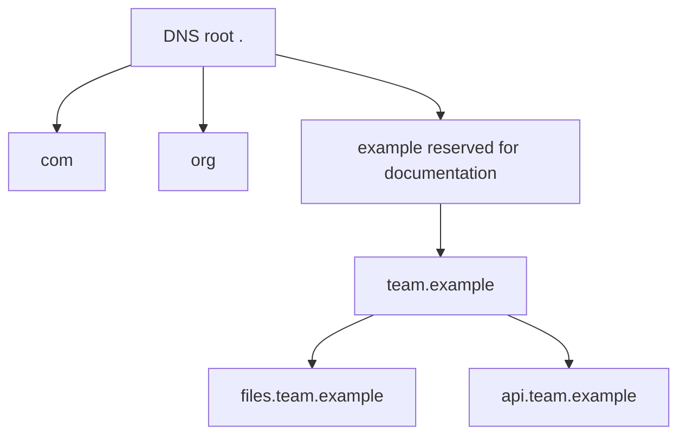

The root zone delegates top-level domains. A parent zone delegates a child by publishing NS records and, when needed, glue address records so resolvers can reach the child's name servers. A delegation is not the same as an ordinary alias. The parent identifies responsibility; the child authoritative zone publishes its own content.

| Concept | Data location | Purpose | Common failure |
|---|---|---|---|
| Parent delegation | Parent zone | Points to child authoritative NS names | Stale or incomplete NS set |
| Glue | Parent zone where needed | Supplies addresses to reach in-bailiwick name servers | Missing/stale address creates circular reachability issue |
| Zone apex | Top owner name of zone | Holds SOA and authoritative NS RRsets | Incorrect serial/timing or NS mismatch |
| Authoritative data | Child zone | Final RRsets and negative proof | Inconsistent servers or stale secondary |
| Lame delegation | Parent points to server not authoritative for child | Breaks reliable resolution | Referral reaches server that cannot answer authoritatively |

## DNS roles and end-to-end resolution

A browser commonly calls an operating-system or application resolver API. A local cache can answer. Otherwise the stub sends a query to a configured recursive resolver. If the recursive cache lacks usable data, it can query root, TLD, and authoritative servers iteratively, following referrals. It returns the result and caches according to TTL and validation policy.

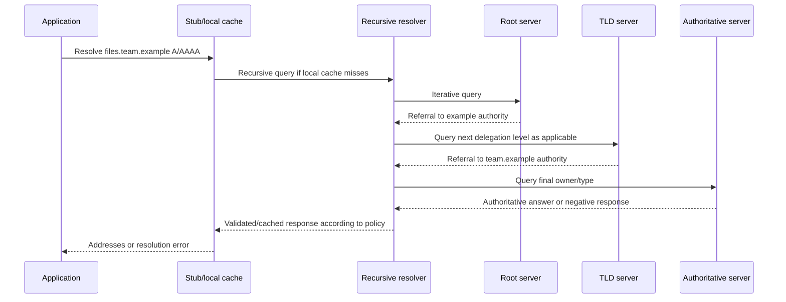

The actual sequence can be shorter because delegation and record data are cached. QNAME minimization can reduce how much of the full query name is sent at each referral step. Anycast can route the same server address to different sites. Forwarding resolvers can send queries to another resolver instead of walking the hierarchy directly. Document the observed architecture.

| Role | Receives query from | Returns | Evidence source |
|---|---|---|---|
| Application cache | Application itself | Recent app-specific result | Browser/app diagnostics |
| OS stub/cache | Application | Cached result or request to configured DNS | OS cache, ETW/logs, packet trace |
| Recursive resolver | Stub or forwarder | Final answer/error after cache or recursion | Resolver query logs and cache |
| Forwarder | Internal resolver | Result from upstream resolution service | Forwarding policy and upstream logs |
| Root server | Recursive resolver | Root-zone answer/referral | Packet or resolver trace |
| TLD server | Recursive resolver | Delegation/referral data | Packet or authoritative diagnostics |
| Authoritative server | Recursive resolver | Authoritative positive or negative response | Zone data and query logs |

### Plain-English deep-dive 1 - Recursive and iterative are request behaviors

Imagine asking a hotel concierge where a conference room is. "Please find the final room and tell me" is recursive behavior. The concierge then asks a building directory, which says "ask the east-wing desk." That referral is iterative behavior. The east-wing desk might point to the conference floor, and the final desk returns the room.

A server is often called a recursive resolver because it provides recursive service to clients, but the flags and behavior in each message still matter. A client can set Recursion Desired. A server can advertise Recursion Available. Authoritative servers normally answer from their zones rather than performing recursion for arbitrary clients.

During troubleshooting, say who asked whom, whether recursion was requested and available, whether the answer came from cache or authority, and which referral failed. "DNS server failed" is too broad.

## DNS message anatomy

Classic DNS messages contain a 12-byte header followed by Question, Answer, Authority, and Additional sections. Names use label encoding and can use message compression pointers. EDNS(0) adds an OPT pseudo-record to extend message capabilities and advertise larger UDP payload size.

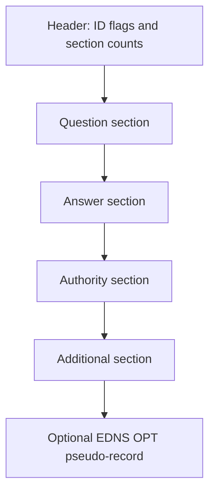

### Header fields and flags

| Field/flag | Meaning | Diagnostic use | Caution |
|---|---|---|---|
| ID | Transaction identifier | Match classic query and response with tuple | Proxies and transports can rewrite/multiplex context |
| QR | Query/Response | Distinguish request from reply | One bit, not success status |
| OPCODE | Operation code | Normal query or another operation | Most lookups use standard query |
| AA | Authoritative Answer | Responder says answer is authoritative | Cache response normally lacks AA |
| TC | Truncated | Message was truncated | Client should retry with suitable transport behavior |
| RD | Recursion Desired | Request asks for recursion | Does not guarantee recursion is available |
| RA | Recursion Available | Responder offers recursion | Access policy may still restrict clients |
| AD | Authentic Data | Resolver indicates DNSSEC validation according to protocol rules | Trust depends on secure resolver channel and policy |
| CD | Checking Disabled | Request affects validation handling | Do not set casually in production diagnostics |
| RCODE | Response code | NOERROR, FORMERR, SERVFAIL, NXDOMAIN, REFUSED, and extended codes | Read exact code and extended DNS errors if present |
| QDCOUNT | Question count | Number of question entries | Typically one in common queries |
| ANCOUNT | Answer count | Number of answer records | Zero with NOERROR can be NODATA |
| NSCOUNT | Authority count | Authority/referral/negative data | Interpret with AA and record types |
| ARCOUNT | Additional count | Extra records and OPT | Additional data is not automatically authoritative |

### Resource Record wire fields

| Field | Plain meaning | Example | Investigation question |
|---|---|---|---|
| NAME | Owner name | `files.team.example.` | Which exact name owns the RRset? |
| TYPE | Record type | A, AAAA, CNAME, NS | Did client ask the correct type? |
| CLASS | Namespace class | IN for Internet | Is this normal Internet DNS data? |
| TTL | Cache lifetime in seconds | 300 | When may cached copy expire? |
| RDLENGTH | Encoded RDATA length | Depends on type | Is message well formed? |
| RDATA | Type-specific value | IPv4 address, target name, text | What dependency does this value create? |

## Common DNS record types

| Type | Plain meaning | Example purpose | Troubleshooting caution |
|---|---|---|---|
| A | IPv4 address record | Name to IPv4 address | Several A records can represent several paths |
| AAAA | IPv6 address record | Name to IPv6 address | IPv6 reachability must be tested separately |
| CNAME | Canonical Name alias | Owner aliases another name | Alias chain creates additional lookups and TTLs |
| NS | Name Server record | Names authoritative servers for a zone | Parent delegation and child apex NS can differ |
| SOA | Start of Authority | Zone identity, serial, and timing/negative-cache data | Fields have protocol-specific semantics |
| MX | Mail Exchange | Mail delivery target and preference | Target names require address resolution |
| PTR | Pointer | Reverse mapping under special reverse zones | Reverse data does not prove forward identity |
| TXT | Text strings | Verification, policy, or arbitrary text | Meaning belongs to consuming application |
| SRV | Service locator | Priority, weight, port, and target | Client must support the service convention |
| CAA | Certification Authority Authorization | Limits which CAs may issue for domain under processing rules | It is not a certificate itself |
| DS | Delegation Signer | Parent link to child DNSSEC key | Missing/wrong DS affects chain of trust |
| DNSKEY | DNSSEC public-key material | Validate signatures in zone | Key role and rollover matter |
| RRSIG | DNSSEC signature over RRset | Proves signed data under validated key | Signatures expire and require valid time |
| NSEC/NSEC3 | Authenticated denial of existence | Proves signed negative answer | Privacy and opt-out semantics differ |
| SVCB/HTTPS | Service binding parameters | Alternative endpoints/protocol hints | Client support and evolving deployment require current evidence |

### CNAME chain mechanics

A CNAME says that its owner is an alias for another name. The resolver follows the target and returns the chain plus target records when available. Each RRset has its own TTL. A loop or excessive chain fails. A CNAME owner generally cannot coexist with other data under DNS rules except specific DNSSEC-related records and protocol exceptions.

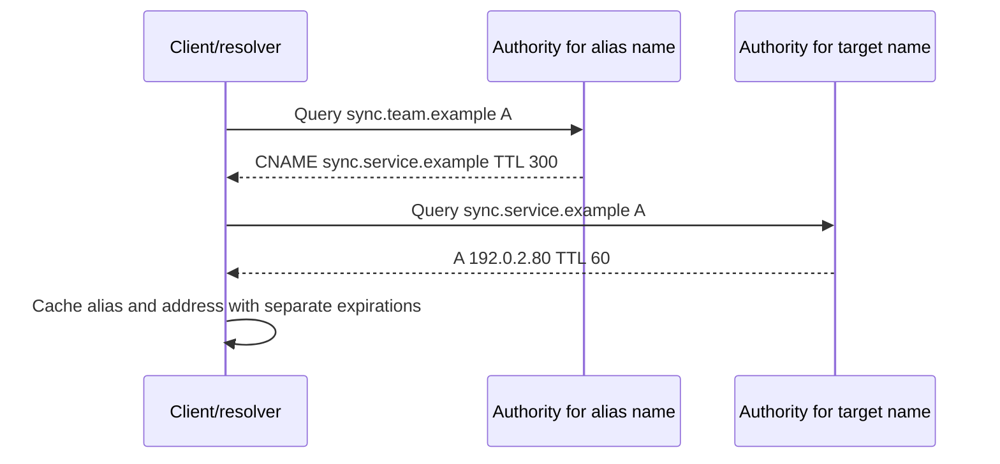

| Alias issue | Signature | Discriminating evidence |
|---|---|---|
| Broken target | CNAME returned, target NXDOMAIN | Full chain with authority and negative TTL |
| Loop | A aliases B and B aliases A | Resolver error and authoritative RRsets |
| Partial stale cache | Alias or target differs by cache layer | Query each resolver with TTL and authority comparison |
| Split target | Internal and external views return different chains | Query from controlled contexts and named servers |
| Long chain latency | Multiple sequential authority lookups on cache miss | Resolver trace and timing |

## DNS transports and size behavior

Classic DNS uses UDP and TCP port 53. UDP is common for queries; TCP is required support for DNS and is used for truncated responses and operations such as zone transfer. EDNS(0) advertises capability and a UDP payload size larger than classic 512 bytes, but oversized UDP can fragment or be dropped. Modern operational guidance treats TCP as a normal DNS transport, not merely a rare fallback.

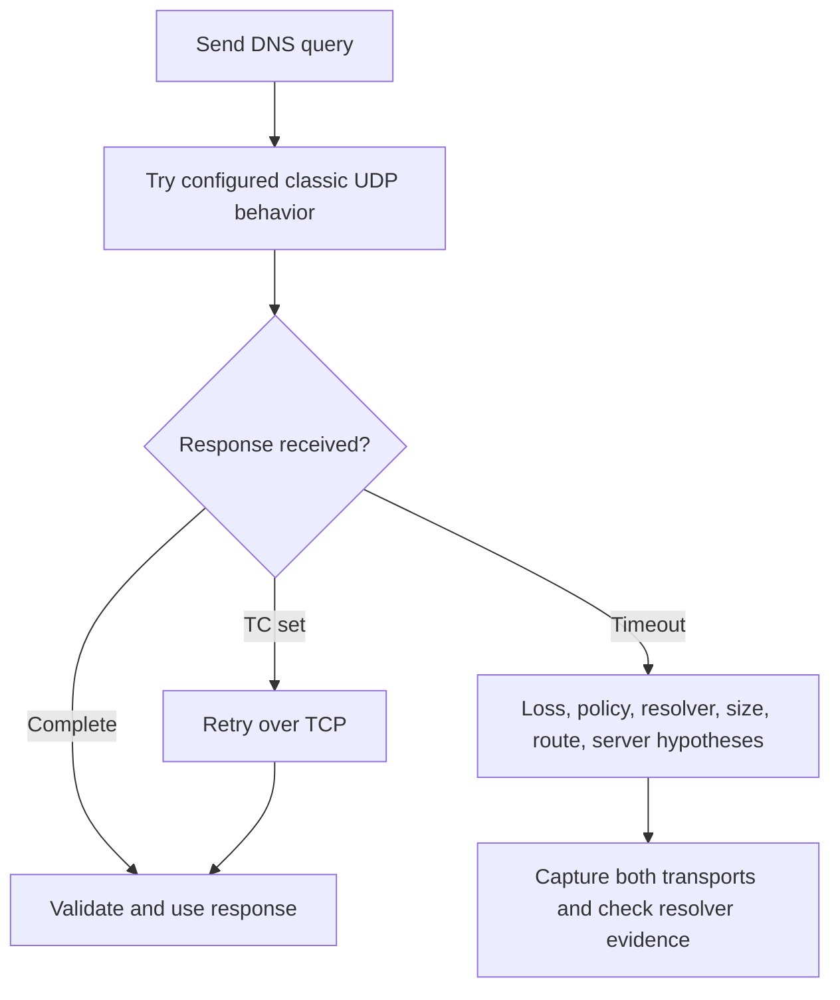

| Transport | Port/path | Security property | Diagnostic concern |
|---|---|---|---|
| DNS over UDP | UDP 53 | No confidentiality by classic DNS itself | Loss, fragmentation, spoofing resistance, state timeout |
| DNS over TCP | TCP 53 | No confidentiality by classic DNS itself | Firewall policy, handshake, idle/state, length framing |
| DoT | Commonly TCP 853 with TLS | Encrypts/authenticates client-to-resolver channel | Resolver still sees query; certificate/policy/path matter |
| DoH | HTTPS, commonly port 443 | Encrypts/authenticates client-to-resolver channel as HTTPS | Can bypass intended enterprise resolver if unmanaged |
| DoQ | DNS over QUIC under its standard | Encrypted QUIC resolver channel | Adoption and policy must be verified |

## Caching, TTL, and negative answers

Caching reduces latency and authoritative load. A resolver stores an RRset for at most its TTL, counting down from receipt. Applications, operating systems, browsers, forwarders, recursive resolvers, and intermediaries can each cache under their own compliant behavior. A record change is not instantly visible everywhere because prior answers remain valid until cache expiry.

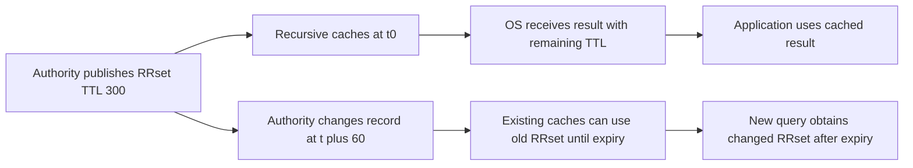

### TTL calculation

If a resolver caches an RRset with TTL 300 at 12:00:00 and 125 seconds pass, an idealized remaining TTL is:

$$
300 - 125 = 175\text{ seconds}
$$

Clock displays, prefetch, serve-stale features, policy caps, and multi-layer caches complicate observation. Record the server queried and returned TTL rather than infer age from one client.

### Negative caching

NXDOMAIN means the queried name does not exist under the response's authoritative context. NOERROR with no records of the requested type is commonly called NODATA: the name can exist but lacks that type. RFC 2308 defines negative caching using the SOA in the authority section and a negative TTL derived according to SOA fields and record TTL.

| Response | Name exists? | Requested type exists? | Cache implication |
|---|---|---|---|
| NOERROR with answers | Yes | Yes | Cache positive RRset by TTL |
| NOERROR/NODATA | Usually yes or proven no matching type | No | Cache negative type result according to negative TTL |
| NXDOMAIN | No for queried name under semantics | No | Cache name error according to negative TTL |
| SERVFAIL | Indeterminate/failure | Indeterminate | Usually not treated like authoritative NXDOMAIN; failure caching behavior is constrained |
| REFUSED | Server declines operation | Indeterminate | Check policy and server role |

### Plain-English deep-dive 2 - Clearing cache is a test, not a cure

Suppose a library index card is wrong. Throwing away your personal copy forces a fresh lookup, but the central librarian can still hold the old card, or the published catalog itself can be wrong. Clearing a DNS cache works the same way.

Before clearing, record the answer, TTL, server, flags, and time. Query the configured resolver directly, then an authoritative server where authorized, and compare an unaffected context. If clearing changes behavior, that supports a cache-layer hypothesis; it does not explain why stale data existed or whether another client will recur.

Uncontrolled cache clearing destroys evidence and can increase load. Use it after capture and with scope. Durable correction belongs at the wrong record, propagation/TTL plan, resolver policy, split view, or application cache behavior.

## DNS response codes and failure signatures

| RCODE or outcome | Plain meaning | Leading hypotheses | Evidence |
|---|---|---|---|
| NOERROR with answer | Query processed and matching data returned | Normal or wrong-but-valid data | RRsets, TTL, authority, expected baseline |
| NOERROR/NODATA | Query processed but type absent | Wrong type, incomplete zone, intended absence | SOA/negative proof and other types |
| NXDOMAIN | Queried name does not exist | Typo, stale negative cache, missing record, wrong suffix/view | Authoritative response and negative TTL |
| SERVFAIL | Server failed to complete | DNSSEC bogus, upstream timeout, lame delegation, internal error | Resolver logs, Extended DNS Error, validation query |
| REFUSED | Server policy refuses | Recursion not allowed, transfer denied, access policy | Server role and policy |
| FORMERR | Message format not accepted | Malformed query, EDNS incompatibility, middlebox issue | Raw message and retry variants |
| Truncated | UDP answer incomplete | Large response, DNSSEC, EDNS/path limit | TC flag and TCP retry result |
| Timeout/no response | No reply observed before client deadline | Route, policy, resolver unavailable, loss, fragmentation | Client and resolver-side capture |
| Wrong answer | Valid response differs from expected | Split DNS, stale cache, policy rewrite, authority error | Query exact server/view and authoritative data |

Never replace an observed RCODE with a browser message. Browser `DNS_PROBE_FINISHED_NXDOMAIN`, OS error, or sync-client text can wrap several resolver events. Capture the actual query name, type, server, response code, flags, records, and timing.

## Split-horizon DNS and policy views

Split-horizon or split-view DNS returns different data for the same name based on query context such as source network, resolver, tenant policy, or view. It supports private services and migration but creates risk when clients use the wrong resolver or encrypted DNS bypasses intended policy.

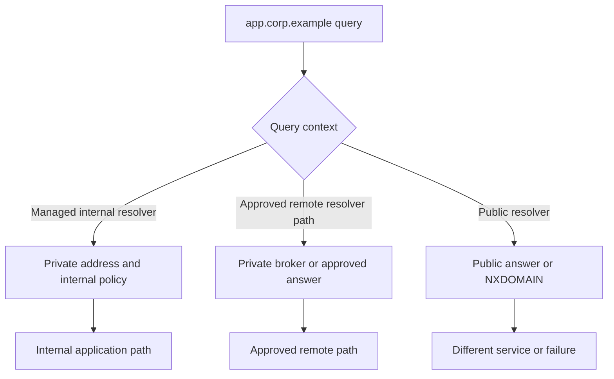

| Split-DNS risk | User symptom | Verification |
|---|---|---|
| Wrong resolver after network change | Name resolves publicly or not at all | Configured resolver and per-server queries |
| Search suffix difference | Short name works on one device only | FQDN versus suffix expansion capture |
| VPN/tunnel route mismatch | Query goes internal but returned private IP route is absent | Resolver path plus route table |
| DoH bypass | Browser differs from OS client | Browser secure-DNS policy and OS query comparison |
| Stale view | One site receives retired target | Authority/view configuration and cache TTL |
| Conditional forwarder failure | One namespace returns SERVFAIL/timeouts | Forwarder target and recursion logs |

## DNSSEC

DNSSEC adds data-origin authentication and integrity for DNS data using digital signatures and a chain of trust. It does not encrypt query names or responses, hide who queried, prove a web server is safe, or replace TLS.

At a signed delegation, the parent publishes a DS record referring to a child DNSKEY. The child publishes DNSKEY and RRSIG records. A validating resolver begins from a configured trust anchor, commonly associated with the root, and validates delegation and RRset signatures down the chain. Authenticated denial uses NSEC or NSEC3.

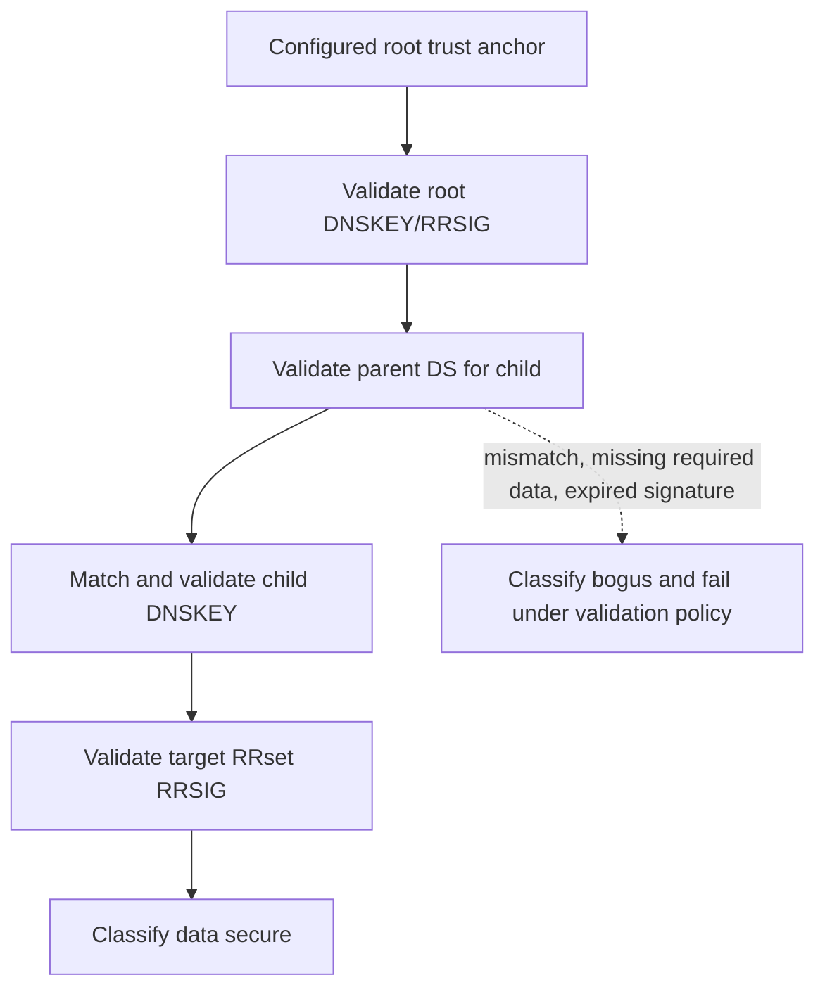

| DNSSEC status concept | Meaning | Client-visible result | Next evidence |
|---|---|---|---|
| Secure | Chain and signatures validate | Answer can carry AD from trusted validating resolver | Validator logs and signed RRsets |
| Insecure | No chain of trust for unsigned delegation | Answer can still be returned as insecure | Delegation and DS absence |
| Bogus | Validation expected but fails | Often SERVFAIL | Exact signature/key/time/delegation failure |
| Indeterminate | Resolver cannot determine status | Policy-dependent failure/result | Resolver capability and upstream evidence |

Common DNSSEC failures include expired/not-yet-valid signatures, DS/DNSKEY mismatch after poor rollover, missing signatures, altered responses, unsupported algorithm policy, and clock errors. Do not "fix" by globally disabling validation. Correct signing or delegation and use controlled diagnostic CD/DO/AD interpretation with DNS experts.

## DoH, DoT, and encrypted DNS policy

DoH and DoT protect the channel between a client and recursive resolver from passive observers and some tampering. They do not hide queries from that resolver, eliminate authoritative queries, validate application content, or guarantee the resolver's answers are correct. DNSSEC and encrypted transport solve different problems: DNSSEC validates data; DoH/DoT protects a channel.

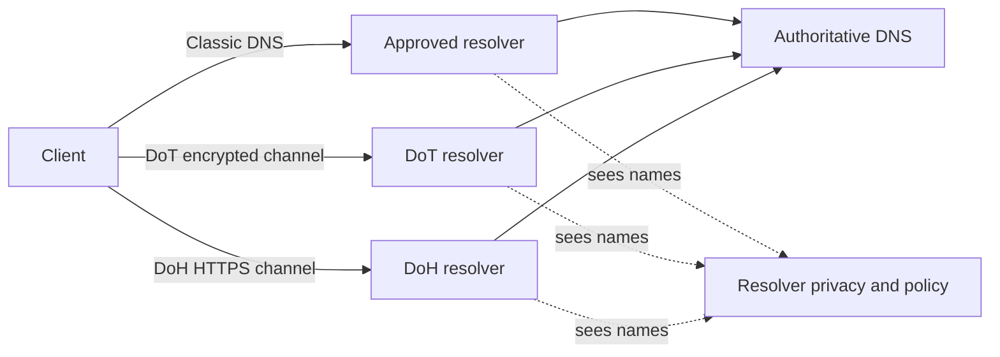

| Question | DNSSEC | DoH/DoT |
|---|---|---|
| Validates signed DNS data origin/integrity? | Yes, through validation chain | Not inherently; resolver may also validate |
| Encrypts client-resolver query? | No | Yes |
| Hides query from resolver? | No | No |
| Preserves enterprise split DNS automatically? | Not applicable | Only if resolver selection/policy is designed for it |
| Stops malicious destination after valid DNS answer? | No | No |
| Changes troubleshooting evidence? | Adds signatures/status | Hides classic DNS packets from intermediate capture |

Enterprise policy must decide approved resolvers, device management, split namespaces, logging, retention, legal/privacy obligations, incident response, and application-specific encrypted DNS. Blocking all port 443 to stop DoH is not practical because DoH uses HTTPS. Use managed client and resolver policy supported by the platform.

## DNS commands and evidence

### Windows

```text
Get-Date
Get-DnsClientServerAddress
Get-DnsClientCache
Resolve-DnsName files.team.example -Type A
Resolve-DnsName files.team.example -Type AAAA
Resolve-DnsName team.example -Type SOA
nslookup files.team.example <approved-resolver>
ipconfig /displaydns
```

### Linux/cross-platform

```text
date -u
resolvectl status
resolvectl query files.team.example
dig files.team.example A
dig files.team.example AAAA
dig @<approved-resolver> files.team.example A +dnssec
dig team.example SOA
dig +trace files.team.example
```

`dig +trace` performs its own iterative-style sequence and can bypass the normal configured recursive path; it is not a simulation of the affected application. `nslookup` and `Resolve-DnsName` may not reproduce every application's resolver API, cache, suffix, DoH, or proxy behavior. Record the command and server.

| Evidence | Required fields | What it proves | Limitation |
|---|---|---|---|
| Client query/response | Name, type, server, transport, flags, RCODE, RRsets, TTL, time | What client capture observed | DoH/DoT may encrypt it |
| OS cache | Name/type/data/remaining TTL | OS cache snapshot | Application can have another cache |
| Recursive log | Client context, cache status, upstream, validation, timing | Resolver processing | Privacy and sampling/retention limits |
| Authoritative query | Server, AA, zone data, serial, answer | Published view from that server | Does not prove client reached it |
| DNSSEC validation | AD/CD/DO context, signatures, DS/DNSKEY, EDE | Validation path | Tool flags can be misunderstood |
| Browser network/error | Hostnames, secure-DNS mode, request timing | Browser behavior | Not sync-client behavior |

## DHCPv4 purpose and DORA

DHCPv4 uses a client-server protocol based on BOOTP message format and options. A new client without an IPv4 address commonly sends from UDP port 68 to server port 67 using broadcast where needed. A relay can forward the request to a server on another subnet and identify the client network.

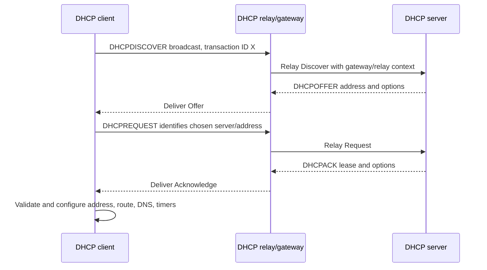

### Why the Request is broadcast in common initial allocation

Multiple servers can offer. The client broadcasts DHCPREQUEST identifying the selected server and requested address so nonselected servers can withdraw their offers. Message behavior varies by client state; renewal uses different address fields and can initially unicast.

| DORA message | Client intent | Important options/fields | Failure signature |
|---|---|---|---|
| DHCPDISCOVER | Find available servers/configuration | Message Type, transaction ID, client identity, requested parameters | Discover repeats; no offer |
| DHCPOFFER | Propose address and configuration | Offered address, Server Identifier, lease/options | Offer reaches relay but not client |
| DHCPREQUEST | Select offer, renew, rebind, or confirm state according to fields/options | Requested IP, Server Identifier, ciaddr/state | Server selection mismatch or request repeats |
| DHCPACK | Confirm lease/configuration | Address, lease, T1/T2, mask, router, DNS | Client rejects/conflict checks or wrong options |
| DHCPNAK | Reject requested configuration | Server message and context | Client returns to initialization |

## DHCPv4 message fields

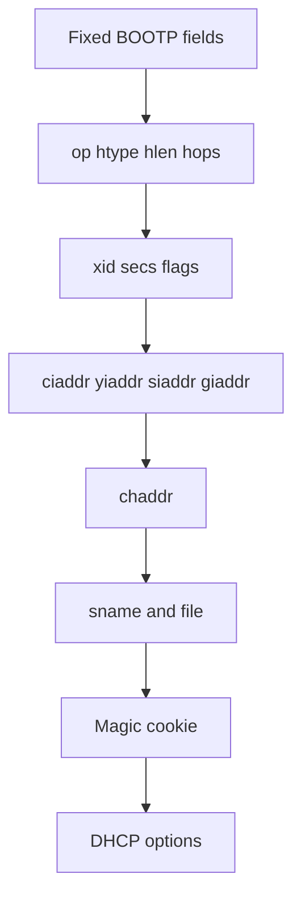

| Field | Meaning | Diagnostic use |
|---|---|---|
| op | Request or reply operation | Direction of BOOTP-format message |
| htype/hlen | Hardware type and address length | Interpret client hardware address |
| hops | Relay hop count | Relay-loop protection/context |
| xid | Transaction ID | Correlate exchange for one client attempt |
| secs | Seconds since acquisition began | Client timing/context |
| flags | Includes broadcast flag | Delivery behavior when client cannot receive unicast normally |
| ciaddr | Client IP when already bound/renewing in applicable state | Distinguish renewal-like requests |
| yiaddr | "Your" offered/assigned client address | Offered lease address |
| siaddr | Next server address under BOOTP/DHCP semantics | Do not confuse with DHCP Server Identifier option |
| giaddr | Relay gateway IP address | Select client subnet/pool and return relay path |
| chaddr | Client hardware address field | Client correlation, with identifier caveats |
| sname/file | Legacy optional server/boot fields | Network boot and option-overload context |
| options | Typed configuration and protocol control | Message type, server, lease, routes, DNS, and more |

### Common DHCPv4 options

| Option | Name/purpose | Example value | Caution |
|---:|---|---|---|
| 1 | Subnet Mask | `255.255.255.0` | Must align with routed subnet |
| 3 | Router | `10.44.20.1` | Order and client behavior matter |
| 6 | Domain Name Server | Approved resolver addresses | Reachability and split-DNS policy must match |
| 15 | Domain Name | Local domain information | Search behavior is OS/application-specific |
| 50 | Requested IP Address | Client-requested prior/offer address | Server may decline |
| 51 | IP Address Lease Time | Seconds | Zero/infinite semantics and policy require RFC context |
| 53 | DHCP Message Type | Discover, Offer, Request, ACK, etc. | Essential to state reconstruction |
| 54 | Server Identifier | Chosen DHCP server identity | Not necessarily `siaddr` |
| 55 | Parameter Request List | Options client requests | Server policy controls reply |
| 58 | Renewal Time T1 | When renewal phase begins | Defaults if absent follow RFC algorithm |
| 59 | Rebinding Time T2 | When rebinding phase begins | Must be after T1 and before expiry |
| 61 | Client Identifier | Client-selected identity where used | Can differ from MAC and persist differently |
| 82 | Relay Agent Information | Relay/circuit/subscriber context | Sensitive and infrastructure-specific |
| 121 | Classless Static Route | Destination prefixes and routers | Can alter route selection beyond default gateway |

## Lease lifecycle, renewal, and rebinding

After ACK, the client enters BOUND and uses the lease. At T1 it enters RENEWING and usually unicasts DHCPREQUEST to the original server. At T2, if renewal failed, it enters REBINDING and broadcasts to any available server. At lease expiry it must stop using the address unless it obtains valid configuration according to protocol behavior.

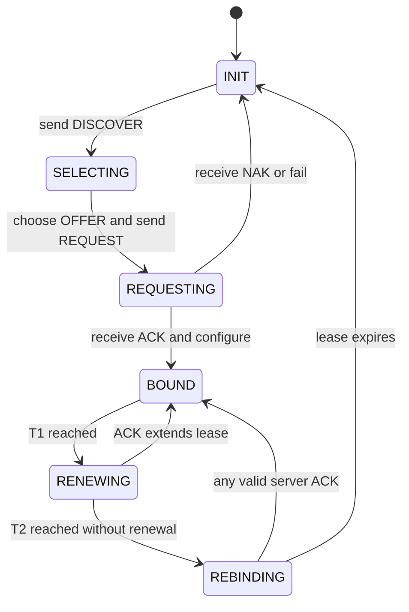

If the server does not supply T1 and T2, RFC 2131 describes defaults of 0.5 and 0.875 of the lease duration. For an eight-hour lease:

$$
T1 = 8 \times 0.5 = 4\text{ hours}
$$

$$
T2 = 8 \times 0.875 = 7\text{ hours}
$$

These are defaults, not universal observed values. Inspect options 58 and 59 and client logs.

| Phase | Typical destination behavior | Goal | Failure impact |
|---|---|---|---|
| Initial allocation | Broadcast plus relay as needed | Obtain a lease and options | No address or fallback |
| BOUND | No renewal traffic until timer/event | Use configuration | Wrong option causes service-specific failure |
| RENEWING | Unicast original server where possible | Extend without disrupting | Original server/path unavailable |
| REBINDING | Broadcast to available servers | Recover before expiry | Relay/broadcast path critical |
| Expired | Address no longer valid for use | Restart acquisition | Connectivity loss/conflict prevention |

### DHCP lease changes and DNS

DHCP can assign resolver addresses and a search domain; it does not itself resolve names. Changing networks can replace DNS servers, routes, and suffixes. A stale application connection or cache can persist across the network change. Record lease time and interface events alongside DNS and transport evidence.

## DHCP relay and multi-subnet design

Routers do not normally forward local broadcasts, so a relay listens on the client subnet and forwards DHCP to configured servers. The relay populates `giaddr` or relay information so the server chooses the correct address pool and can return traffic. Redundancy, relay policy, ACLs, Option 82 handling, and server scope state must align.

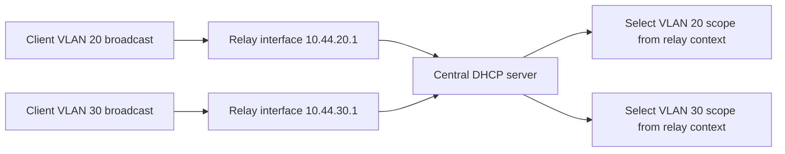

| Relay failure | Packet signature | Discriminating check |
|---|---|---|
| Relay not configured | Discover visible on client VLAN, absent at server | Relay interface/configuration and capture |
| Wrong relay address | Server chooses wrong/no scope | `giaddr`, scope matching, relay log |
| Return blocked | Server offer visible, client never receives it | Relay/server/client captures and policy |
| Option 82 rejected | Server drops or NAKs according to policy | Server reason log and relay-inserted option |
| One relay path down | Only specific VLAN/site affected | Compare relay interfaces and redundancy |

## APIPA and IPv4 link-local

Windows commonly calls automatic IPv4 link-local configuration APIPA. The host selects an address in `169.254.0.0/16`, performs conflict detection, and can communicate only on the local link under IPv4 link-local rules. It does not create a normal routed enterprise lease or default gateway.

An APIPA address is a clue that normal configured IPv4 acquisition is absent or failed, but not proof that the DHCP server itself is down. Wrong VLAN, relay, policy, driver, client service, exhausted scope, duplicate handling, or packet loss can produce the same result.

| Observation | Supports | Does not prove |
|---|---|---|
| `169.254.x.y/16` present | IPv4 link-local self-configuration | DHCP server outage specifically |
| No default gateway | Expected for link-local fallback | Physical link failure |
| Neighbor communication works | Local-link IPv4 operation | Routed Internet or Microsoft 365 access |
| DHCP Discover repeats | Client seeking DHCP server | Where request or reply is lost |

## DHCPv6 and SLAAC overview

IPv6 configuration combines several protocols. A host creates a link-local address. Router Advertisements announce default routers, prefixes, lifetimes, MTU, and flags. SLAAC can form addresses from advertised prefixes. DHCPv6 can provide managed addresses and/or other configuration. DHCPv6 does not normally provide the IPv6 default gateway; Router Advertisement does.

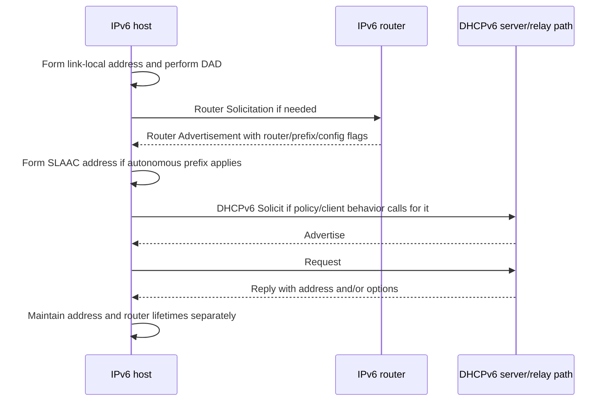

### DHCPv6 messages and identifiers

DHCPv6 clients use UDP port 546 and servers/relays use UDP port 547. A common four-message stateful exchange is Solicit, Advertise, Request, Reply. Rapid Commit can reduce exchanges when supported and agreed. Clients and servers use DHCP Unique Identifiers, or DUIDs; Identity Associations group address or prefix assignments.

| DHCPv6 concept | Purpose | Caution |
|---|---|---|
| DUID | Identify client/server across DHCPv6 interactions | Not necessarily a simple MAC address |
| IA_NA | Identity Association for non-temporary addresses | Contains IAID and address lifetimes |
| IA_PD | Identity Association for Prefix Delegation | Common for routers requesting delegated prefix |
| T1/T2 | Renew/rebind timing for identity association | Can differ among associations |
| Relay-Forward/Reply | Cross IPv6 router boundaries | Link/address context selects policy |
| Information-request | Obtain options without managed address assignment | Does not provide default route |
| Rapid Commit | Two-message lease when supported | Must be explicitly negotiated |

### SLAAC, DHCPv6, and RA comparison

| Capability | Router Advertisement/SLAAC | DHCPv6 | DNS implications |
|---|---|---|---|
| Default router | RA | Not normally DHCPv6 | A host can have address but no router if RA fails |
| Prefix/on-link info | RA | Prefix Delegation is different use | Route and source selection depend on RA |
| Host address | SLAAC from autonomous prefix | Stateful IA_NA | Both can coexist |
| Recursive DNS | RA RDNSS option where supported | DHCPv6 DNS option | Client/platform policy selects source |
| Search list | RA DNSSL option where supported | DHCPv6 domain search list | Behavior and precedence vary |
| Lease/lifetime | Prefix/router/address lifetimes | IA address/options lifetimes | Expiry paths are separate |

Managed and Other Configuration flags in RA provide guidance, but host behavior and standards updates are nuanced. Do not assume one flag forces every operating system to use DHCPv6. Capture RA and DHCPv6 plus inspect host effective configuration.

## DHCP failure modes and troubleshooting

| Failure | User symptom | Packet evidence | Owning boundary candidates |
|---|---|---|---|
| No Discover leaves host | No lease/APIPA | Client capture lacks message | Adapter, DHCP client service, local policy |
| Discover leaves, no server sees | No offer | Client/VLAN capture yes; server/relay no | VLAN, relay, route, ACL |
| Server sees Discover, no Offer | No offer | Server log shows scope/policy failure | Scope exhausted, policy, server health |
| Offer leaves, client never sees | Repeated Discover | Server/relay yes; client no | Return relay, switch, broadcast flag, security |
| Request receives NAK | Client restarts DORA | NAK and server reason | Wrong network, stale requested IP, policy |
| ACK has wrong DNS option | IP connectivity but names fail | Option 6 differs from baseline | Scope/option/inheritance configuration |
| Lease renew fails | Works until T2/expiry | Unicast requests fail then broadcast | Original server path, relay, policy |
| Duplicate/conflict | Address declined or unstable | ARP probe/decline and server/client log | Static overlap, stale reservation, rogue server |
| Rogue DHCP | Wrong gateway/DNS, interception risk | Unexpected server identifier and offer timing | Access-layer security and incident response |

## Microsoft 365, OneDrive, and SharePoint path

Microsoft 365 operations commonly depend on many names for service, identity, content, and delivery infrastructure. Microsoft publishes endpoint and network-connectivity guidance that changes over time. Do not hard-code one memorized list or assume all endpoints resolve identically from every geography.

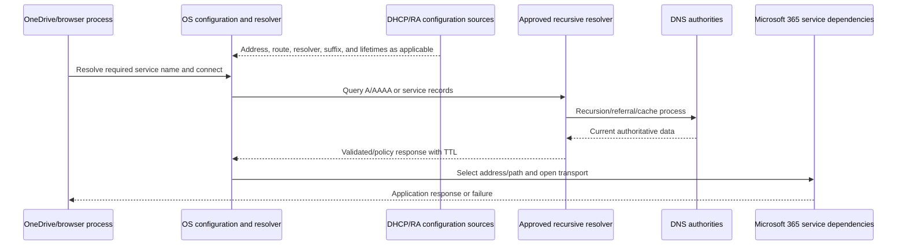

| Symptom | DNS/DHCP hypothesis | Higher-layer alternative | Evidence |
|---|---|---|---|
| One branch cannot resolve tenant name | Wrong DHCP DNS option, split view, forwarder path | Browser DoH or service naming change | Lease options, server used, exact query |
| Name resolves, connect fails | Wrong/stale address, IPv6 path, route/policy | Listener/TLS/proxy/service | RRset plus tuple and transport evidence |
| Browser works, sync fails | Different cache, suffix, DoH, proxy, API names | Client state or permissions | Per-process names and logs |
| Only first attempt slow | Cache miss and recursive chain | Connection/TLS warm-up | DNS timing and cache status |
| NXDOMAIN persists after record creation | Negative cache | Wrong zone/view or typo | SOA negative TTL and authoritative query |
| SERVFAIL on validating resolver | DNSSEC or upstream failure | Resolver health/policy | EDE, DS/DNSKEY/RRSIG and alternate validator |

## Fictional NMH continuity scenario

NMH's acquired branch moves VLAN 20 clients to a new DHCP scope. The fictional scope accidentally retains Option 6 pointing first to a resolver scheduled for retirement. That resolver still answers internal names but its conditional forwarder for an approved Microsoft 365-related test namespace is stale. Some clients use the first resolver, cache a negative result, and fail a OneDrive sign-in dependency; other clients use the second resolver and work. This does not assert any Microsoft or Zscaler defect.

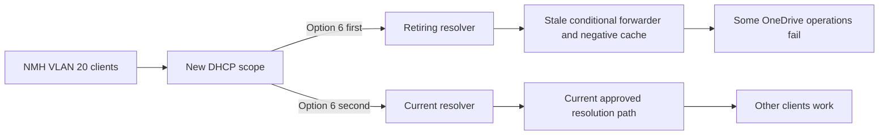

### NMH evidence matrix

| Observation | Supports | Alternative | Next check |
|---|---|---|---|
| Affected clients received new scope | Change correlation | Client software update also occurred | Compare complete timeline |
| Option 6 lists old resolver first | Resolver-selection difference plausible | Client may use second or DoH | Capture exact query destination |
| Old resolver returns NXDOMAIN | Forwarder/negative-cache path | Authority truly lacks name | Query authority/current resolver and inspect SOA |
| New resolver returns valid CNAME/A/AAAA chain | Different resolver view confirmed | Different policy manipulation | Compare recursion, DNSSEC, TTL, and authority |
| Clearing client cache temporarily changes one test | Client cache participates | App cache remains or resolver cache changed | Record before/after and wait TTL |
| Existing transport sessions continue | DNS affects new lookup, not established socket | App retry behavior differs | Correlate new connections only |

### NMH response plan

Preserve lease, query, cache, resolver, forwarder, and authoritative evidence before change. Correct the DHCP option through change control, repair or remove the stale forwarder according to ownership, and invalidate only affected caches under an approved plan. Validate DORA/renewal, effective resolver order, fresh positive and negative queries, DNSSEC status, browser and sync operations, unaffected internal names, and recurrence after lease/cache turnover.

Arti's bridge role is to coordinate endpoint, branch network, DHCP, DNS, identity, Microsoft service, and security owners. She should say: "The failure follows clients whose lease points first to the retiring resolver. That resolver returns a negative answer through a stale forwarding path, while the current resolver obtains valid data. We have not identified a Microsoft or Zscaler defect. DHCP and DNS owners are correcting the configuration with rollback and validating both service and internal namespaces."

## Privacy, security, and evidence handling

DNS queries can reveal websites, applications, tenants, internal systems, and user intent. DHCP logs connect client identifiers, MAC addresses, ports/VLANs, host names, assigned addresses, and times. Resolver and lease data can therefore become sensitive behavioral and attribution data.

| Principle | DNS action | DHCP action | Risk prevented |
|---|---|---|---|
| Authorization | Approve resolver logs/capture and names | Approve lease/relay/access-layer collection | Unauthorized monitoring |
| Minimization | Filter exact names/types/time and avoid unrelated query history | Collect affected scope/client/time only | Excess behavior tracking |
| Redaction | Remove tenant/internal names and tokens from extracts | Redact MAC/client identifiers and hostnames where unnecessary | Identity/topology leakage |
| Secure storage | Restrict and encrypt logs/captures | Restrict lease and Option 82 data | Attribution-data exposure |
| Clock quality | Record UTC, skew, and server clocks | Align lease, relay, and endpoint times | False client-to-address mapping |
| Retention | Apply purpose-bound expiry | Remove old lease/correlation extracts | Long-term movement tracking |
| Integrity | Preserve source and approved hashes | Preserve original server/relay export | Disputed evidence |
| Transparency | Document resolver visibility and policy | Document client identification use | Hidden surveillance |
| Safe examples | Use `.example`, `.invalid`, and documentation addresses | Use isolated DHCP scope | Accidental real-system changes |
| Change control | Stage record/cache/policy changes | Stage scope/option/relay changes | Broad outage from troubleshooting |

### Plain-English deep-dive 3 - DNS privacy and DNS integrity are different

A sealed envelope protects a directory question while it travels to the librarian. That resembles DoH or DoT. A signed directory page lets the librarian verify that the responsible publisher authorized the data. That resembles DNSSEC. The envelope does not sign the page; the signature does not hide the question.

The recursive resolver still sees the query after decrypting the channel. It can log, filter, cache, and forward it. Authoritative servers see queries from resolvers. Metadata such as destination resolver and timing remains. An enterprise may need approved DNS logging for threat detection, but collection should be proportionate, governed, retained briefly enough for purpose, and protected.

In an interview, separate confidentiality, integrity, authenticity, policy, and availability. Never say "DoH makes DNS secure" without naming which threat and which boundary.

## Troubleshooting decision trees

### Name does not resolve

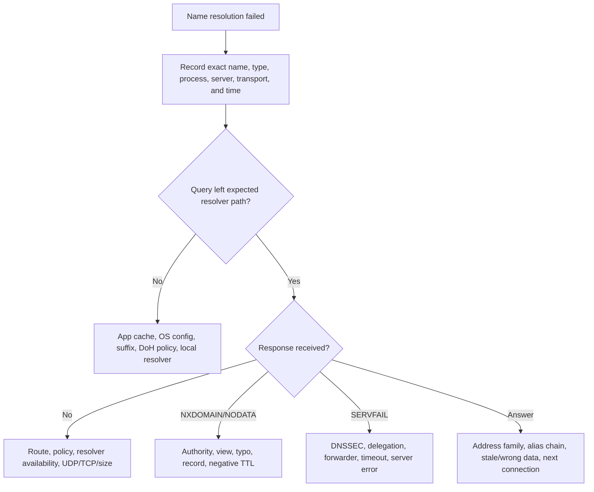

### Client has no usable IPv4 lease

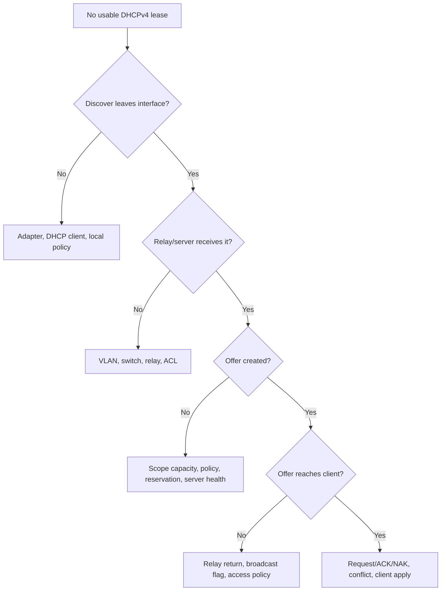

### IPv6 has address but no service

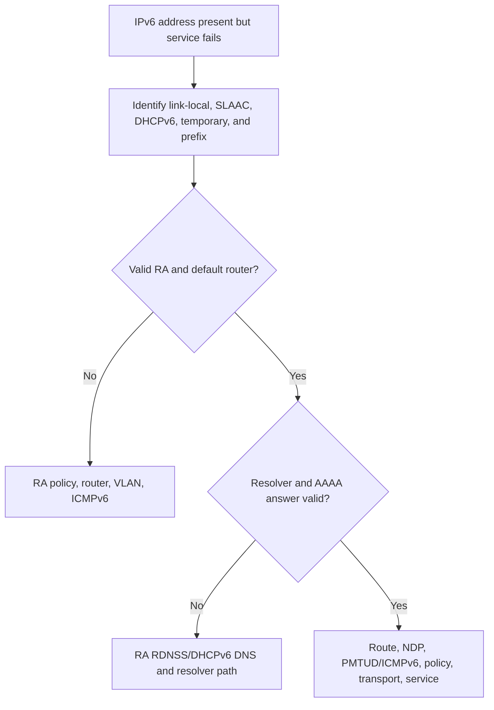

### Plain-English deep-dive 4 - Start with the exact question

"DNS is broken" hides at least six variables: the name, requested type, querying process, selected resolver, transport, and time. `A` can succeed while `AAAA` fails. An FQDN can work while a short-name suffix fails. The browser can use managed DoH while the sync client uses the OS resolver. One recursive server can have a negative cache while another has fresh data.

Likewise, "DHCP is broken" can mean no client Discover, no relay forwarding, no server scope, no returning Offer, a NAK, wrong options, failed renewal, or configuration the client rejected. The visible address is the final state, not the missing handoff.

Write the expected sequence and identify the last verified success. Then ask for one artifact at the next boundary. This keeps bridges focused and prevents broad cache flushing or service restarts from destroying the very evidence needed for root cause.

## Scenario labs

### Lab 1 - Recursive resolution trace

Using `.example` documentation names or an approved lab zone, draw a stub, recursive resolver, root, TLD, and authority. Capture a cold-cache flow if authorized or analyze an authoritative sample. Record RD, RA, AA, referrals, NS, glue, answer, and TTL. Explain why a warm-cache flow is shorter.

### Lab 2 - DNS header and RR parser

Annotate ID, flags, RCODE, counts, and all four sections for positive, NODATA, NXDOMAIN, SERVFAIL, and truncated responses. For each RR identify owner, type, class, TTL, and RDATA. Include an EDNS OPT record and state that it is a pseudo-record.

### Lab 3 - CNAME and cache timeline

Create a two-alias chain with TTLs 300, 120, and 60 for the target A/AAAA records. At several timestamps calculate which RRsets can remain cached. Change the target and explain why users see mixed answers until independent cache entries expire.

### Lab 4 - DNSSEC validation

Use an authoritative DNSSEC test domain or published sample. Follow trust anchor, DS, DNSKEY, RRSIG, and signed answer. Then model an expired RRSIG and DS mismatch. Explain secure, insecure, bogus, AD, CD, DO, SERVFAIL, and why DNSSEC provides no confidentiality.

### Lab 5 - DHCPv4 DORA

In an isolated lab, capture Discover, Offer, Request, and ACK. Annotate ports, addresses, broadcasts, transaction ID, `yiaddr`, `giaddr`, client identity, Server Identifier, requested address, lease, T1/T2, mask, router, DNS, and classless routes. Do not run a rogue DHCP server on a production network.

### Lab 6 - Lease renewal and APIPA

Model an eight-hour lease with explicit and default T1/T2. Show successful renewal, failed renewal followed by rebinding, and expiry. In a safe isolated setup or paper exercise, show IPv4 link-local fallback and why it provides local-only connectivity rather than a routed lease.

### Lab 7 - IPv6 configuration

Capture or analyze Router Solicitation/Advertisement, Duplicate Address Detection, SLAAC address formation, and DHCPv6 Solicit/Advertise/Request/Reply. Identify default-router source, prefix lifetimes, DNS source, DUID, IA_NA, and ports. Explain why DHCPv6 does not normally supply default gateway.

### Lab 8 - NMH resolver migration

Run the fictional NMH scenario. Produce lease and Option 6 evidence, client query/caches, old and new resolver responses, CNAME chain, negative TTL, forwarder evidence, service impact, privacy controls, rollback, and validation. Label every name, address, and result synthetic.

| Lab output | Required content | Pass condition |
|---|---|---|
| Resolution diagram | Roles, recursion, referrals, cache | Recursive and authoritative roles not conflated |
| Message parser | Header, sections, RR fields, RCODE | NXDOMAIN and NODATA distinguished |
| Cache timeline | Independent RRset TTLs and negative cache | No instant-propagation assumption |
| DNSSEC chain | Trust, DS, DNSKEY, RRSIG, result | Security versus privacy separated |
| DORA trace | State, fields, options, relay | Exact message sequence reconstructed |
| Lease worksheet | T1, T2, renewal, rebind, expiry | Defaults labeled, not universalized |
| IPv6 map | RA, SLAAC, DHCPv6, NDP | Default-router source correct |
| NMH package | Evidence, change, privacy, validation | No vendor or production overclaim |

## Misconceptions to correct

| Misconception | Correction |
|---|---|
| DNS is only name-to-IP | It stores typed records, delegation, policy, and security data |
| The root server knows every host address | It normally delegates toward top-level-domain authority |
| Recursive and authoritative are the same | One researches/caches; the other publishes zone truth |
| CNAME contains an IP | It aliases one owner name to another name |
| NOERROR with no answer means success with an address | It can be NODATA for the requested type |
| NXDOMAIN should never be cached | Authoritative negative answers are cached according to RFC rules |
| Clearing cache fixes DNS | It is a test; wrong authority or upstream cache can persist |
| TTL guarantees every client changes at one second | Multi-layer caches, fetch time, and policy create different expiries |
| DNSSEC encrypts DNS | It authenticates data; it does not provide query confidentiality |
| DoH proves answers are authentic | It protects the channel to a resolver; validation is separate |
| UDP 53 is all DNS needs | TCP is required and encrypted transports can be used |
| DHCP assigns only an IP address | It can assign mask, router, DNS, routes, lease, and more |
| DHCP broadcasts cross routers directly | A relay is commonly required across subnets |
| Server Identifier is always `siaddr` | They are distinct protocol fields/options |
| APIPA proves the DHCP server is down | Any break from client through relay/server/return can cause fallback |
| DHCPv6 supplies the default gateway | IPv6 default routers come from Router Advertisement |
| One address identifies one user | Leases, privacy addresses, NAT, device identity, and time must correlate |

## Official Source Anchors

The following authoritative sources were reviewed on **2026-08-24**. They support protocol and documented platform behavior, not fictional NMH results, current Microsoft endpoints, tenant configuration, or any Zscaler claim. Check RFC status and updates in the RFC Editor.

| Source | URL | Used for | Boundary |
|---|---|---|---|
| IETF RFC 1034 | https://www.rfc-editor.org/rfc/rfc1034 | DNS concepts, hierarchy, zones, resolvers, and caching | Updated by many later RFCs |
| IETF RFC 1035 | https://www.rfc-editor.org/rfc/rfc1035 | DNS message, header, sections, records, and transport foundation | Later RFCs update size and transport behavior |
| IETF RFC 9499 | https://www.rfc-editor.org/rfc/rfc9499 | Current DNS terminology | Operational behavior remains in protocol RFCs |
| IETF RFC 2181 | https://www.rfc-editor.org/rfc/rfc2181 | DNS clarification, RRsets, TTL, and authority | Later documents add detail |
| IETF RFC 2308 | https://www.rfc-editor.org/rfc/rfc2308 | Negative caching and NODATA/NXDOMAIN | Resolver implementations must be observed |
| IETF RFC 6891 | https://www.rfc-editor.org/rfc/rfc6891 | EDNS(0) and OPT pseudo-record | Path-size policy remains operational |
| IETF RFC 7766 | https://www.rfc-editor.org/rfc/rfc7766 | DNS over TCP requirements | Encrypted transports have separate RFCs |
| IETF RFC 4033 | https://www.rfc-editor.org/rfc/rfc4033 | DNSSEC introduction and requirements | Companion RFCs define records/protocol |
| IETF RFC 4034 | https://www.rfc-editor.org/rfc/rfc4034 | DNSSEC resource records | Updates and algorithm policy matter |
| IETF RFC 4035 | https://www.rfc-editor.org/rfc/rfc4035 | DNSSEC protocol modifications and validation | Current validator behavior must be checked |
| IETF RFC 7858 | https://www.rfc-editor.org/rfc/rfc7858 | DNS over TLS | Privacy policy and resolver choice remain local |
| IETF RFC 8484 | https://www.rfc-editor.org/rfc/rfc8484 | DNS over HTTPS | HTTP behavior and enterprise management matter |
| IETF RFC 2131 | https://www.rfc-editor.org/rfc/rfc2131 | DHCPv4 states, messages, timers, and behavior | Errata/updates and platform behavior matter |
| IETF RFC 2132 | https://www.rfc-editor.org/rfc/rfc2132 | DHCPv4 option formats | Later RFCs define additional options |
| IETF RFC 3442 | https://www.rfc-editor.org/rfc/rfc3442 | Classless Static Route option | Client and server support must be verified |
| IETF RFC 3927 | https://www.rfc-editor.org/rfc/rfc3927 | IPv4 link-local addressing | APIPA is Windows terminology for related behavior |
| IETF RFC 8415 | https://www.rfc-editor.org/rfc/rfc8415 | Consolidated DHCPv6 protocol | Later updates may apply |
| IETF RFC 4861 | https://www.rfc-editor.org/rfc/rfc4861 | IPv6 Neighbor Discovery and Router Advertisement | Updated by later RFCs |
| IETF RFC 4862 | https://www.rfc-editor.org/rfc/rfc4862 | IPv6 SLAAC | Privacy/stable addressing has additional RFCs |
| IETF RFC 8106 | https://www.rfc-editor.org/rfc/rfc8106 | IPv6 RA DNS options | Host support and precedence vary |
| Microsoft Learn: DNS troubleshooting | https://learn.microsoft.com/en-us/troubleshoot/windows-server/networking/dns-troubleshooting-guidance | Windows DNS investigation workflow | Product/version and role must be checked |
| Microsoft Learn: DHCP troubleshooting | https://learn.microsoft.com/en-us/troubleshoot/windows-server/networking/troubleshoot-dhcp-guidance | Windows DHCP investigation workflow | Server/client versions and topology matter |
| Microsoft Learn: Resolve-DnsName | https://learn.microsoft.com/en-us/powershell/module/dnsclient/resolve-dnsname | Windows query command | Does not reproduce every application resolver path |
| Microsoft 365 network connectivity principles | https://learn.microsoft.com/en-us/microsoft-365/enterprise/microsoft-365-network-connectivity-principles | Microsoft 365 name/path planning | Current endpoint categories and tenant evidence required |
| MDN: What is a domain name? | https://developer.mozilla.org/en-US/docs/Learn_web_development/Howto/Web_mechanics/What_is_a_domain_name | Beginner-friendly namespace explanation | Educational overview, not protocol authority |
| Wireshark DNS display reference | https://www.wireshark.org/docs/dfref/d/dns.html | DNS field orientation | Analyzer output depends on capture completeness |

## Likely Interview Questions

### Q1. Walk through recursive DNS resolution from a client to an authoritative answer.

**Model answer:** The application asks a stub resolver. A local cache may answer; otherwise the stub asks a configured recursive resolver, usually with recursion desired. On a cache miss, the recursive resolver follows iterative referrals from root toward TLD and child authority, querying the authoritative server for the final name and type. It validates according to policy, caches RRsets by TTL, and returns the answer or error. I record the actual resolver/forwarder architecture because caches and forwarding can shorten or change the path.

### Q2. How do NXDOMAIN, NODATA, SERVFAIL, and timeout differ?

**Model answer:** NXDOMAIN is an authoritative name-nonexistence result. NODATA is NOERROR with no requested-type answer, commonly meaning the name exists but that type does not. SERVFAIL means the resolver failed to complete processing, such as DNSSEC-bogus data, upstream timeout, or delegation failure. Timeout means the client received no usable response before its deadline. I capture exact name, type, server, transport, RCODE, authority/negative proof, TTL, and resolver logs.

### Q3. How do TTL and negative caching affect a record change?

**Model answer:** Each RRset can remain cached for its remaining TTL from the time that cache fetched it. Alias and target RRsets expire independently. Authoritative negative answers can also be cached using the SOA-derived negative TTL. A change at authority is not immediately visible to caches holding prior valid data. I compare application, OS, recursive, and authoritative observations before clearing any cache, because clearing is a test rather than root-cause correction.

### Q4. Compare DNSSEC, DoH, and DoT.

**Model answer:** DNSSEC authenticates signed DNS data origin and integrity through a chain from trust anchor through DS, DNSKEY, and RRSIG. It does not encrypt queries. DoH and DoT encrypt/authenticate the client-to-recursive channel using HTTPS or TLS; the resolver still sees names and may or may not validate DNSSEC. Enterprise policy must manage resolver selection, split DNS, logging, and privacy. None proves the application destination is safe.

### Q5. Walk through DHCPv4 DORA and the important fields.

**Model answer:** A client broadcasts Discover with a transaction ID. A relay can forward it with gateway/relay context. A server Offers an address and options. The client Requests the selected server/address, often broadcasting so other servers withdraw offers. The server ACKs the lease or NAKs invalid state. I correlate `xid`, message type, `yiaddr`, `giaddr`, client identifier, Server Identifier, requested address, mask, router, DNS, lease, T1, and T2.

### Q6. Explain DHCP renewal and rebinding.

**Model answer:** In BOUND, the client uses the lease. At T1 it enters RENEWING and usually unicasts the original server. If that fails until T2, it enters REBINDING and broadcasts to available servers. If the lease expires without a valid extension, it must stop using the address and restart acquisition. If explicit T1/T2 are absent, RFC 2131 defaults are 0.5 and 0.875 of lease, but I inspect actual options and logs.

### Q7. How do Router Advertisement, SLAAC, and DHCPv6 work together?

**Model answer:** IPv6 Router Advertisement supplies default-router and prefix/on-link information and can support SLAAC address formation. DHCPv6 can provide stateful addresses through IA_NA or other configuration; Prefix Delegation uses IA_PD. DHCPv6 does not normally supply the default gateway. DNS can arrive through RA RDNSS or DHCPv6 depending on platform and policy. I capture RA, NDP, DHCPv6, address lifetimes, routes, and effective resolver configuration rather than infer from one flag.

### Q8. How would you troubleshoot OneDrive failures that affect only one branch after a DHCP change?

**Model answer:** I scope users, devices, processes, lease times, and exact failed names. I compare Option 6, suffixes, routes, browser secure-DNS policy, actual query destinations, caches, RCODEs, TTLs, alias chains, and affected/unaffected resolvers. I then correlate transport and Microsoft request evidence. In the fictional NMH case, failures followed a retiring resolver with a stale forwarder, but I would not assume that in production or claim a Microsoft/Zscaler defect without direct evidence.

## 30-Second Memory Hooks

| Concept | Memory hook |
|---|---|
| DNS | Delegated typed directory |
| Stub | Client asks |
| Recursive resolver | Researches and caches |
| Authoritative server | Publishes zone truth |
| Delegation | Parent hands responsibility to child |
| RRset | Same owner, type, and class group |
| TTL | Positive cache shelf life |
| Negative cache | Failure answers also expire |
| CNAME | Alias points to another name |
| NXDOMAIN | Name absent |
| NODATA | Type absent |
| SERVFAIL | Resolver could not complete |
| DNSSEC | Sign data, do not hide query |
| DoH/DoT | Protect client-resolver channel |
| DHCP | Timed network configuration |
| DORA | Discover, Offer, Request, Acknowledge |
| Relay | Carries DHCP across routed boundary |
| `giaddr` | Identifies client subnet to DHCP server |
| T1 | Renew original server |
| T2 | Rebind any server |
| APIPA | IPv4 link-local fallback clue |
| RA | IPv6 router and prefix information |
| SLAAC | Form IPv6 address from announced prefix |
| DHCPv6 | Address/options, not normal default gateway |
| Privacy | Queries and leases reveal behavior and identity |
| Honesty | Exact server and message before attribution |

## Completion Checklist

- [ ] I can draw the DNS hierarchy and define root, TLD, zone, delegation, glue, and authority.
- [ ] I can distinguish stub, recursive resolver, forwarder, root, TLD, and authoritative roles.
- [ ] I can walk recursive client service and iterative referral behavior end to end.
- [ ] I can interpret DNS ID, flags, counts, Question, Answer, Authority, Additional, and OPT.
- [ ] I can interpret owner, type, class, TTL, RDLENGTH, and RDATA.
- [ ] I can explain A, AAAA, CNAME, NS, SOA, MX, PTR, TXT, SRV, CAA, DS, DNSKEY, RRSIG, and SVCB/HTTPS at overview depth.
- [ ] I can trace CNAME dependencies and independent TTLs without treating an alias as an address.
- [ ] I can distinguish UDP, TCP, DoH, DoT, truncation, EDNS, and size-related DNS failures.
- [ ] I can distinguish positive cache, NODATA, NXDOMAIN, SERVFAIL, REFUSED, FORMERR, and timeout.
- [ ] I can explain why cache clearing is a controlled test rather than a durable fix.
- [ ] I can identify split-DNS, suffix, forwarding, DoH-policy, and wrong-resolver failures.
- [ ] I can walk DNSSEC trust anchor, DS, DNSKEY, RRSIG, NSEC/NSEC3, and secure/insecure/bogus outcomes.
- [ ] I can distinguish DNSSEC integrity from DoH/DoT channel privacy.
- [ ] I can use Windows and Linux DNS commands while recording exact server, type, transport, and time.
- [ ] I can walk DHCPv4 DORA through a relay using transaction and option fields.
- [ ] I can identify DHCPv4 fixed fields and common options including mask, router, DNS, lease, message type, server, T1, T2, relay, and classless routes.
- [ ] I can walk BOUND, RENEWING, REBINDING, expiry, ACK, and NAK states.
- [ ] I can calculate default T1/T2 for a sample lease and label them as defaults only.
- [ ] I can diagnose client, VLAN, relay, server, scope, return-path, conflict, and rogue-DHCP failures.
- [ ] I can explain APIPA/IPv4 link-local behavior without declaring a server outage.
- [ ] I can distinguish IPv6 RA, SLAAC, DHCPv6, IA_NA, IA_PD, DUID, and DNS sources.
- [ ] I can state correctly that DHCPv6 does not normally provide the default gateway.
- [ ] I can protect query, hostname, MAC, client-ID, Option 82, lease, and resolver evidence.
- [ ] I can apply the mechanics to Microsoft 365, browser, OneDrive, SharePoint, and the fictional NMH resolver migration.
- [ ] I can connect Arti's factual Microsoft support method without claiming infrastructure or Zscaler production work.
- [ ] I can answer Q1-Q8 aloud and complete all eight labs with sanitized evidence.

[Part 20 - HTTP, HTTPS, URLs, Methods, Headers, Cookies, Sessions, and Status Codes](Part-20-http-https-web-protocol.md)