# Part 20 - HTTP, HTTPS, URLs, Methods, Headers, Cookies, Sessions, and Status Codes

> **Audience:** Arti Thakur, moving from Microsoft 365 Support Escalation Engineering into a Zscaler Security Operations Technical Success Manager role.
>
> **Purpose:** Explain how web clients identify resources, exchange HTTP requests and responses, maintain application state, cache and compress representations, traverse intermediaries, use HTTP versions, authenticate, expose failures, and provide evidence for browser, API, OneDrive, and SharePoint troubleshooting.
>
> **Scope and honesty:** Northstar Meridian Holdings, abbreviated NMH, is fictional. Its URLs, users, proxies, requests, responses, timings, policies, failures, and outcomes are synthetic. Arti's Microsoft 365, OneDrive for Business, SharePoint Online, networking, evidence, and escalation experience must remain within her approved factual background.
>
> **Product caveat:** This Part teaches HTTP standards and documented web behavior. Exact Microsoft 365 endpoints, authentication flows, API contracts, throttling, cookies, headers, protocol negotiation, CDN paths, proxy handling, and Zscaler behavior change by service, version, tenant, and policy. Verify current official documentation and direct evidence. No fictional scenario proves a production vendor defect.

## Section goal

Parts 16-19 built the path from link and IP through transport and name resolution. HTTP turns that path into application messages. A client identifies a target, chooses a method, sends fields and optional content, and receives a status, fields, and optional content. HTTPS protects HTTP across one or more transport/security legs, but it does not make every response correct or every intermediary invisible.

Think of a structured service desk. The URL is the office and ticket reference. The method states the requested action. Request headers carry context and preferences. The body carries submitted material. The status code classifies the result. Response headers explain representation, caching, authentication, redirects, and retry information. Cookies can carry a return token. A proxy resembles a front desk that can accept one conversation and start another. A CDN resembles a distributed authorized copy desk. A load balancer selects a worker behind the service entrance.

By the end, Arti should be able to:

| Outcome | Demonstrated capability | Evidence of mastery |
|---|---|---|
| Parse identifiers | Distinguish URI, URL, scheme, authority, host, port, path, query, fragment, and encoding | Annotated URL with security caveats |
| Read messages | Explain request/response lines, fields, content, framing, and responder identity | Sanitized HTTP transcript |
| Choose methods safely | Classify safety, idempotency, cacheability, and retry risk | Method/retry decision table |
| Interpret status | Separate informational, success, redirect, client, and server responses | Status-driven fault tree |
| Explain state | Distinguish cookies, sessions, tokens, authentication, and authorization | Browser state map |
| Diagnose caching | Calculate freshness, validators, Age, Vary, shared/private behavior, and 304 | Cache timeline and validation trace |
| Compare versions | Explain HTTP/1.1, HTTP/2, and HTTP/3 framing, multiplexing, and transport boundaries | Version comparison and waterfall |
| Trace intermediaries | Map forward/reverse proxy, CDN, load balancer, gateway, and origin legs | Request-ID and trust-boundary map |
| Troubleshoot applications | Interpret common 4xx/5xx, redirects, timeouts, compression, auth, and API errors | Evidence-led decision trees |
| Bridge experience | Apply mechanics to browser, OneDrive, SharePoint, and fictional NMH scenarios | Honest customer narrative |

## JD Mapping

| JD expectation | Part 20 capability | Artifact | Honest Arti bridge |
|---|---|---|---|
| Analyze complex environments | Trace HTTP through browser/client, proxy, identity, CDN, load balancer, and service | Request path and boundary map | Microsoft 365 browser, sync, HAR, Fiddler, and escalation reasoning |
| Identify risk | Recognize insecure URLs, leaked tokens, unsafe retries, cache exposure, broad cookies, and untrusted headers | HTTP security/privacy notes | Learned SecOps interpretation, not claimed product operation |
| Resolve critical escalations | Separate DNS/TCP/TLS, proxy, HTTP, identity, service, and content workstreams | Waterfall, timeline, and hypothesis matrix | CRITSIT coordination and evidence discipline |
| Tailor mitigation | Recommend scoped header, cache, redirect, proxy, retry, timeout, or application correction | Change and rollback plan | Production validation method |
| Deliver consulting | Explain web mechanics and errors from zero | Whiteboard and teach-back | Advisor, mentoring, and training strengths |
| Work cross-functionally | Give owners exact URL, method, status, request ID, timestamp, and responder | Shared evidence register | Customer and Engineering collaboration |
| Communicate outcomes | Translate protocol details into user operation, impact, confidence, and next action | Executive-safe update | Business-impact communication |

## Candidate honesty note

Arti can truthfully discuss Microsoft 365 production investigations involving OneDrive and SharePoint, browser and sync-client comparison, HAR, Fiddler, browser tools, network evidence, permissions, service behavior, Engineering escalation, and fix validation where supported by her actual background. She can also discuss standards-based HTTP analysis and controlled labs.

She should not claim to have designed Microsoft internal APIs, administered a Zscaler proxy, or diagnosed a product defect from a status code alone. A safe bridge is: "I have production experience correlating client behavior, HTTP evidence, identity, network path, service responses, and object state in Microsoft 365 cases. I am extending that method into SecOps and would validate product-specific policy and telemetry before attributing cause."

| Evidence category | Safe phrasing | Boundary |
|---|---|---|
| Production | "I used HAR/Fiddler/browser and service evidence in Microsoft 365 troubleshooting." | Keep details aligned to actual cases and confidentiality |
| Lab | "I reproduced redirects, cache validation, cookies, and proxy responses in a controlled lab." | Do not present sample requests as customer traffic |
| Conceptual | "A 407 identifies proxy authentication semantics from the responder." | Verify which component generated it and why |
| Fictional | "NMH's synthetic gateway returns 413 for a sync upload." | NMH is not a real engagement |

## Terms and acronyms before mechanics

| Term | Plain meaning | Why it matters | Memory hook |
|---|---|---|---|
| HTTP | Hypertext Transfer Protocol | Stateless application protocol with request/response semantics | HTTP is a structured request conversation |
| HTTPS | HTTP protected by TLS, including HTTP/3 over QUIC's TLS integration | Protects a transport leg for confidentiality/integrity/authentication | HTTPS protects a leg, not every business outcome |
| URI | Uniform Resource Identifier | Identifies a resource using a standard syntax | URI is the general identifier |
| URL | Uniform Resource Locator | URI commonly describing how/location to access a resource | URL is the address-like identifier |
| Scheme | Leading URI component defining interpretation | `https` chooses protected HTTP semantics | Scheme tells how to interpret |
| Authority | URI component containing host and optional user info/port | Selects network authority | Authority names the service entrance |
| Origin | Scheme, host, and port tuple in web security | Controls same-origin behavior | Origin is scheme plus host plus port |
| Path | Hierarchical target component | Identifies resource within authority | Path is the office corridor |
| Query | Nonhierarchical data after `?` | Supplies operation parameters | Query is the request form data in URL |
| Fragment | Client-side identifier after `#` | Selects part of a representation for user agent | Fragment is not sent in HTTP request target |
| Method | Request semantic such as GET or POST | States intended operation | Method is the action verb |
| Header field | Name/value metadata in an HTTP message | Carries representation, auth, cache, routing, and preferences | Header is the message label |
| Content/body | Optional data carried by a message | Request input or response representation | Body is the package contents |
| Representation | Current or selected form of a resource | JSON, HTML, image, file, or other media | Representation is one view of resource |
| Media type | Content format identified by type/subtype | Tells recipient how to interpret content | Media type labels the format |
| Status code | Three-digit response classification | Reports request outcome semantics | Status is the service-desk result code |
| Redirect | Response directing client to another URI | Changes next request target, sometimes method | Redirect is a forwarding address |
| Cookie | Small name/value state sent by server and returned by user agent under scope rules | Supports sessions and preferences | Cookie is a scoped return token |
| Session | Logical application interaction across requests | Can outlive one TCP/QUIC connection | Session is the ongoing business conversation |
| Cache | Stored response reused under HTTP rules | Reduces latency and origin load | Cache is an authorized copy shelf |
| Validator | ETag or date used to check stored response | Enables conditional request and 304 | Validator checks whether copy changed |
| Proxy | Intermediary that receives and sends HTTP messages | Creates policy, visibility, caching, and failure boundaries | Proxy is an HTTP front desk |
| CDN | Content Delivery Network | Distributed delivery/caching near clients | CDN is a regional copy desk |
| API | Application Programming Interface | Contract programs use to request operations/data | API is a machine service counter |
| REST | Representational State Transfer | Architectural style that can use HTTP semantics | REST is a design style, not HTTP itself |
| HAR | HTTP Archive format | Browser-exported request/response timing and fields | HAR is a sensitive browser transaction log |
| TTFB | Time To First Byte | Time until first response byte at observation point | TTFB includes several possible waits |
| CORS | Cross-Origin Resource Sharing | HTTP-field mechanism permitting selected cross-origin browser access | CORS is browser access permission, not network routing |

## URI and URL anatomy

RFC 3986 defines generic URI syntax:

```text
scheme://authority/path?query#fragment
```

Example using reserved documentation naming:

```text
https://user@example.invalid:8443/sites/finance/report.xlsx?view=summary#totals
```

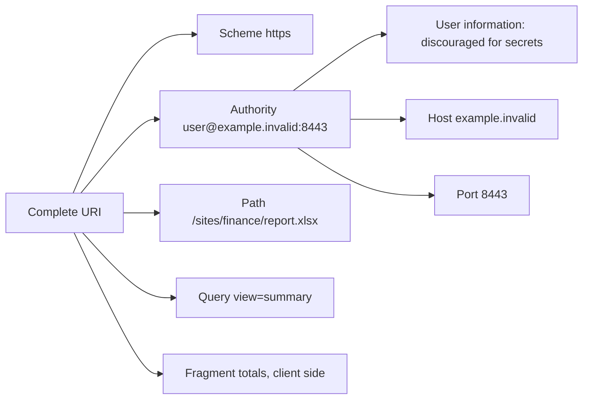

| Component | Example | Sent in HTTP request? | Security/troubleshooting note |
|---|---|---|---|
| Scheme | `https` | Influences connection and request context | `http` and `https` are different origins |
| User information | `user@` | Can influence authority parsing | Do not put credentials in URLs |
| Host | `example.invalid` | Becomes authority/Host context | Unicode display and DNS name need careful parsing |
| Port | `8443` | Selects endpoint and origin | Omitted port uses scheme default convention |
| Path | `/sites/finance/report.xlsx` | Yes | Percent-decoding and normalization rules matter |
| Query | `view=summary` | Yes | Often logged; never assume secrets are safe here |
| Fragment | `totals` | No, normally handled by user agent | HAR request URL display may include original page fragment context separately |

### Percent-encoding and normalization

URI percent-encoding represents a byte as `%` followed by two hexadecimal digits. A space is commonly `%20` in a URI; HTML form encoding can use `+` under its own rules. Reserved characters can change URI structure. Decoding too early, decoding twice, or comparing nonnormalized paths can create routing and security defects.

| Input | Encoded form | Meaning risk |
|---|---|---|
| Space | `%20` | `+` is not universally equivalent outside form rules |
| Slash | `%2F` | Some servers treat encoded slash differently |
| Percent | `%25` | Double-decoding can transform later bytes |
| Question mark | `%3F` | Raw `?` starts query component |
| Hash | `%23` | Raw `#` starts fragment and is not sent |
| Non-ASCII text | UTF-8 bytes then percent-encoding under applicable rules | Display, normalization, and security require standards-aware handling |

### Plain-English deep-dive 1 - A URL is structured data, not a string to chop casually

An international postal address has country, city, street, building, and room fields. Splitting it wherever a punctuation mark appears can mistake an apartment separator for a country boundary. URIs also have grammar. `@`, `:`, `/`, `?`, `#`, and `%` have context-dependent roles.

Use a standards-aware parser in code. For troubleshooting, preserve the original URL, then record parsed scheme, authority, host, effective port, path, query, and fragment. Redact secrets. Compare decoded and encoded forms only with documented rules. A visually similar hostname can use different Unicode code points; browsers apply Internationalized Domain Name display protections that deserve security awareness.

## HTTP request and response anatomy

HTTP semantics are version-independent, but wire framing differs. A conceptual request contains a method, target URI information, field section, and optional content. A response contains a status code, field section, and optional content.

### HTTP/1.1 text example

```http
GET /reports/quarterly?format=json HTTP/1.1
Host: api.example.invalid
Accept: application/json
Accept-Encoding: gzip
User-Agent: ExampleClient/1.0

```

```http
HTTP/1.1 200 OK
Content-Type: application/json
Content-Encoding: gzip
Cache-Control: private, max-age=60
ETag: "report-v7"
Content-Length: 412

<compressed representation bytes>
```

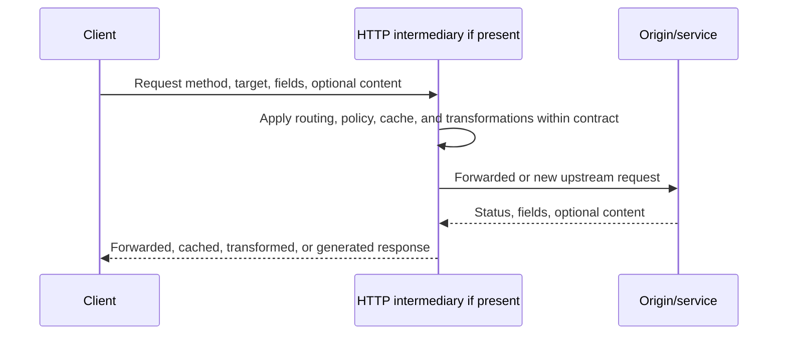

| Message element | HTTP/1.1 expression | HTTP/2/3 expression | Diagnostic question |
|---|---|---|---|
| Method | Request line | `:method` pseudo-header | What operation was intended? |
| Target scheme | Implied/absolute-form depending context | `:scheme` | Which security/origin context? |
| Authority | `Host` or absolute target | `:authority` | Which virtual service received request? |
| Path/query | Request target | `:path` | Which resource and parameters? |
| Status | Status line | `:status` | Which component classified result? |
| Fields | Text field lines | Compressed binary header block | Which metadata affected handling? |
| Content | Framed by length/chunked/connection semantics | DATA frames | Was content complete and correctly typed? |

### HTTP fields

Field names are case-insensitive. Field values have field-specific grammar; treating every field as a comma-separated list is unsafe. Intermediaries must follow forwarding rules. Hop-by-hop fields apply to one connection and are not blindly forwarded; HTTP/2 and HTTP/3 prohibit connection-specific fields in their normal forms.

| Field | Direction | Purpose | Sensitive or failure concern |
|---|---|---|---|
| Host / `:authority` | Request | Select virtual host/authority | Wrong authority routes to wrong service |
| User-Agent | Request | Identifies client product/version under conventions | Fingerprinting and spoofing possible |
| Accept | Request | Preferred response media types | 406 if no acceptable representation |
| Accept-Language | Request | Language preferences | Privacy/fingerprinting and cache `Vary` |
| Accept-Encoding | Request | Supported content codings | Compression mismatch |
| Content-Type | Both | Media type of content | Wrong parser or 415 |
| Content-Length | Both | Decimal content length in applicable framing | Smuggling risk if inconsistent framing |
| Transfer-Encoding | Primarily HTTP/1.1 | Transfer coding such as chunked | Prohibited/handled differently in HTTP/2/3 |
| Authorization | Request | Credentials for origin authentication scheme | Secret; redact |
| WWW-Authenticate | Response | Origin authentication challenge | 401 challenge details |
| Proxy-Authorization | Request to proxy | Credentials for proxy | Secret; redact |
| Proxy-Authenticate | Proxy response | Proxy authentication challenge | Associated with 407 |
| Location | Response | Redirect/new resource URI | Open redirect and method change risk |
| Retry-After | Response | Suggested delay for certain responses | Can be date or seconds |
| Via | Both via proxy | Records protocol intermediaries under rules | Topology exposure and incomplete deployment |
| Forwarded | Request | Standardized proxy forwarding information | Trust only from controlled intermediaries |
| Origin | Request | Initiating origin for CORS and other checks | Not user identity |
| Referer | Request | Source URI information under policy | Can leak sensitive path/query; name is historically misspelled |

## Methods, safety, idempotency, and retries

A **safe** method is intended for read-only semantics, though a server can still log or meter it. An **idempotent** method has the same intended effect after one or multiple identical requests. Idempotency describes intended server effect, not identical response bytes. A retry is safe only when the method, application contract, request body replayability, idempotency key, and observed processing state support it.

| Method | Safe? | Idempotent? | Typical meaning | Body/content notes |
|---|---|---|---|---|
| GET | Yes | Yes | Retrieve representation | Request content has no generally defined semantics and can be rejected |
| HEAD | Yes | Yes | Same as GET without response content | Fields should describe selected representation |
| POST | No | No by default | Process content according to resource semantics | Can create, invoke, append, or query by API contract |
| PUT | No | Yes | Create/replace state at target with supplied representation | Repeating intended replacement has same effect |
| DELETE | No | Yes | Remove association/state at target | Repeated response can differ after first deletion |
| CONNECT | No | No | Establish a tunnel to target | Common proxy tunnel semantics |
| OPTIONS | Yes | Yes | Describe communication options | `*` target can address server generally |
| TRACE | Yes by semantics | Yes | Diagnostic loop-back | Often disabled due security/privacy concerns |
| PATCH | No | Not guaranteed | Apply partial modifications | Patch document semantics determine idempotency |

### Idempotency and retry examples

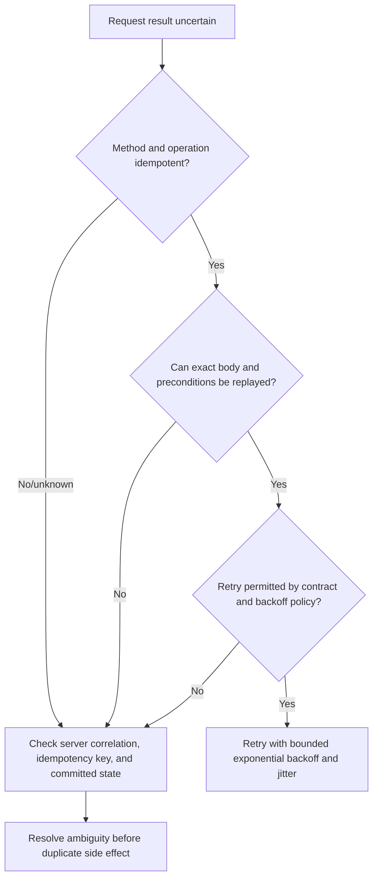

| Scenario | Naive retry risk | Better design |
|---|---|---|
| POST payment times out after upload | Duplicate charge | Idempotency key and server-side operation lookup |
| PUT configuration loses response | Replacement may already be applied | Conditional request with ETag and GET verification |
| DELETE returns timeout | Deletion may have completed | Query state; repeated DELETE is idempotent in intended effect |
| GET receives 503 | Load amplification | Honor Retry-After; exponential backoff with jitter and cap |
| File chunk upload | Duplicate/overlap depends on API contract | Use upload session offsets/checksums and documented resume semantics |

## Status code classes

The first digit defines a class. Status codes describe the result at the responding HTTP component. An intermediary can generate a response. A 200 can contain an application-level failure object; a 500 can wrap a downstream dependency; a 404 can deliberately hide authorization information.

| Class | Meaning | Examples | First question |
|---:|---|---|---|
| 1xx | Informational | 100 Continue, 101 Switching Protocols, 103 Early Hints | What interim behavior follows? |
| 2xx | Successful | 200 OK, 201 Created, 202 Accepted, 204 No Content, 206 Partial Content | What exactly completed or was merely accepted? |
| 3xx | Redirection | 301, 302, 303, 304, 307, 308 | What next target/method/cache action is required? |
| 4xx | Client-side request condition | 400, 401, 403, 404, 407, 408, 409, 412, 413, 415, 416, 422, 429 | Is request/auth/content/state/policy invalid? |
| 5xx | Server-side handling failure | 500, 501, 502, 503, 504, 505 | Which responding gateway/origin failed at which dependency? |

### Common 2xx responses

| Code | Meaning | Operational caveat |
|---:|---|---|
| 200 OK | Request succeeded under method semantics | Body can still carry domain error if API contract uses it poorly |
| 201 Created | One or more resources created | `Location` can identify primary created resource |
| 202 Accepted | Accepted for processing, not completed | Requires status/result mechanism |
| 204 No Content | Success with no response content | Fields can still carry metadata |
| 206 Partial Content | Range request satisfied partially | Validate Content-Range and complete assembly |

### Common 4xx responses

| Code | Meaning | Typical evidence and distinction |
|---:|---|---|
| 400 Bad Request | Server cannot/will not process due request issue | Syntax, framing, fields, target, intermediary parsing |
| 401 Unauthorized | Lacks valid origin authentication credentials | Inspect WWW-Authenticate, token/cookie, time, audience, challenge |
| 403 Forbidden | Understood but refuses authorization/policy | Identity may be known; compare object, policy, account, responder |
| 404 Not Found | Target not found or responder will not disclose it | Compare exact URL, tenant/site/path, method, authorization behavior |
| 405 Method Not Allowed | Method known but not allowed for target | `Allow` field should identify supported methods |
| 407 Proxy Authentication Required | Client must authenticate to proxy | Inspect Proxy-Authenticate and process proxy context |
| 408 Request Timeout | Server timed out waiting for request | Distinguish from client-side timeout with no HTTP response |
| 409 Conflict | Request conflicts with current resource state | Version, lock, duplicate, workflow state |
| 412 Precondition Failed | If-Match/other precondition false | ETag/version concurrency logic |
| 413 Content Too Large | Request content exceeds responder limit | Identify responder and configured/API limit |
| 414 URI Too Long | Target URI exceeds accepted length | Move data to body under API contract; inspect proxy limits |
| 415 Unsupported Media Type | Content format/coding unsupported | Content-Type, Content-Encoding, API contract |
| 416 Range Not Satisfiable | Requested range invalid for representation | Range and current content length/ETag |
| 422 Unprocessable Content | Syntax understood but instructions invalid | Field validation/business rules |
| 429 Too Many Requests | Rate limit applied | Retry-After, quota scope, request rate, caller identity |

### Common 5xx responses

| Code | Meaning | Diagnostic focus |
|---:|---|---|
| 500 Internal Server Error | Unexpected server condition | Request ID, server log, input-specific reproduction |
| 501 Not Implemented | Functionality/method unsupported | Which server/intermediary and protocol contract |
| 502 Bad Gateway | Gateway/proxy got invalid upstream response | Client-proxy versus proxy-upstream legs |
| 503 Service Unavailable | Temporary overload/maintenance or unavailable service | Retry-After, health, capacity, dependency, rollout |
| 504 Gateway Timeout | Gateway/proxy did not receive timely upstream response | Upstream DNS/connect/TLS/HTTP/service timing |
| 505 HTTP Version Not Supported | Server does not support request protocol version | Negotiation, intermediary, fallback evidence |

### Plain-English deep-dive 2 - The status code belongs to the responder

If a hotel front desk says "the kitchen did not answer," that is the front desk's classification of an upstream failure. The kitchen may be healthy but unreachable from that desk. HTTP 502 and 504 often work this way: a gateway reports what happened on its upstream leg.

Identify the responder using connection endpoint, certificate/TLS termination context, response fields, body branding with caution, Via/Forwarded under trust, request IDs, and proxy/service logs. A client connected to a corporate proxy can receive a 403 or 407 generated before the origin saw the request.

Never send a 5xx screenshot to a service team and declare service failure. State: "The client received HTTP 504 from gateway G at time T for request R; gateway upstream timing is pending." That is actionable and falsifiable.

## Redirect semantics

A redirect response uses `Location` to identify a new URI. Clients apply status-specific method behavior. Historically, user agents changed POST to GET for 301/302 in common cases; 307/308 preserve method and content. 303 explicitly directs retrieval with GET or HEAD as applicable. 304 is not a navigation redirect; it means a conditional cache request can reuse its stored representation.

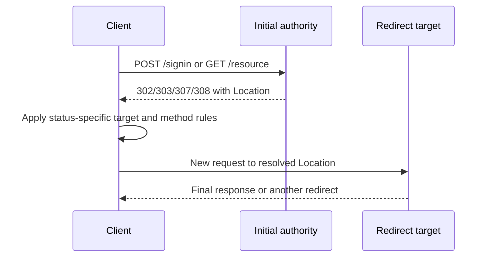

| Code | Persistence | Method handling | Common use/caution |
|---:|---|---|---|
| 301 Moved Permanently | Permanent | User-agent method behavior has historical POST-to-GET handling | Cache and migration impact |
| 302 Found | Temporary | Historical method rewriting possible | Use 307 if method preservation required |
| 303 See Other | Indirect response | Follow with GET/HEAD semantics | Post/Redirect/Get pattern |
| 304 Not Modified | Cache validation | No new representation content | Requires stored response and validator context |
| 307 Temporary Redirect | Temporary | Preserve method and content | Replaying non-idempotent body at new target needs trust |
| 308 Permanent Redirect | Permanent | Preserve method and content | Cache/persistence and body replay matter |

### Redirect loops

Loops can result from conflicting HTTP-to-HTTPS policy, reverse-proxy scheme confusion, authentication/session failure, stale cookies, host rewriting, trailing-slash rules, or application logic. Record each URL, status, Location, method, Set-Cookie/Cookie changes, and responding boundary. Browser developer tools can preserve logs across navigation.

## HTTPS and the TLS boundary

HTTPS means HTTP semantics are protected by TLS for a connection or by QUIC's TLS integration for HTTP/3. TLS supplies confidentiality, integrity, and endpoint authentication for that protected leg according to validation. Part 21 covers certificates and handshakes deeply.

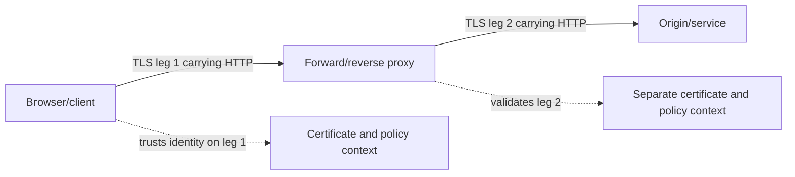

A TLS-intercepting or terminating proxy can read HTTP on that boundary and establish a separate upstream TLS connection. End-to-end user expectation therefore depends on architecture, trust, policy, privacy, and application compatibility. "HTTPS" does not prove no intermediary processed plaintext, and a lock icon does not prove a site is trustworthy.

| Boundary question | Evidence | Risk if omitted |
|---|---|---|
| Where did TLS terminate? | Certificate, connection endpoint, proxy/service config | Wrong responder attribution |
| Was upstream re-encrypted? | Proxy upstream connection and policy | Hidden plaintext leg |
| Which name was validated? | SNI/authority/certificate context | Name mismatch confusion |
| Which HTTP version was negotiated? | ALPN/browser/trace evidence | Wrong framing assumptions |
| What metadata remained visible? | IP, timing, sizes, DNS, TLS fields | Overstated privacy |
| Which categories bypass inspection? | Approved policy and exact match | Unsupported security or privacy claim |

## Cookies and application sessions

A server sets cookies with `Set-Cookie`. A user agent stores accepted cookies and sends matching ones in `Cookie` requests according to domain, path, Secure, SameSite, expiry, and other rules. `HttpOnly` prevents normal script access but does not prevent the browser from sending the cookie. `Secure` limits cookie transmission to secure contexts under cookie rules. SameSite controls selected cross-site sending behavior.

```mermaid
sequenceDiagram
    participant B as Browser
    participant S as Web service
    B->>S: GET /signin
    S-->>B: 200 Set-Cookie session=opaque; Secure; HttpOnly; SameSite=Lax
    B->>B: Store cookie under domain/path/expiry rules
    B->>S: GET /app with Cookie session=opaque
    S->>S: Map opaque cookie to server-side session state
    S-->>B: Authorized response or session challenge
```

| Cookie attribute | Purpose | Common failure/security effect |
|---|---|---|
| Domain | Hosts eligible to receive cookie | Overbroad domain increases exposure; host-only differs |
| Path | Request paths eligible | Not a strong security boundary by itself |
| Secure | Send only over secure channel context | Missing flag risks exposure over unprotected requests |
| HttpOnly | Blocks normal script access | Mitigates some token theft, not all request abuse |
| SameSite=Strict/Lax/None | Controls cross-site sending | Federation/embed flows can fail; `None` requires Secure in modern browsers |
| Expires/Max-Age | Persistent lifetime | Clock and deletion semantics matter |
| Partitioned | Partitioned cookie storage under supported rules | Browser support and Secure requirements apply |

A cookie is not the same as a session. It can hold an opaque session identifier, signed/encrypted state, preference, anti-CSRF value, or analytics identifier. A server-side session can expire while the browser retains a cookie. Authentication tokens can be stored elsewhere. Multiple HTTP connections can share one application session.

### Cookie failure signatures

| Symptom | Cookie/session hypothesis | Evidence |
|---|---|---|
| Repeated login redirects | Cookie not stored/sent, session invalid, wrong domain/path/SameSite | Set-Cookie acceptance warnings and subsequent Cookie field |
| Browser profile A works, B fails | Profile state/extension/policy difference | Sanitized cookie and storage comparison |
| Incognito works | Persistent cookie/cache/service worker involved | Controlled profile comparison; not proof of corruption |
| Embedded app sign-in fails | SameSite/third-party-cookie policy | Browser issue panel, request context, current app guidance |
| Session expires early | Server session/token/proxy idle policy | Server and identity logs plus client cookie lifetime |

## Authentication and authorization overview

Authentication establishes who or what a principal is. Authorization decides what that principal may do. HTTP defines a challenge/credentials framework; applications also use cookies and tokens. OAuth 2.0 and OpenID Connect are covered later in the guide; this section stays at transport-visible HTTP behavior.

| Mechanism | HTTP appearance | Security note | Failure clue |
|---|---|---|---|
| Basic authentication | `Authorization: Basic ...` after challenge | Credentials are encoded, not encrypted; require TLS | 401 with Basic challenge |
| Bearer token | `Authorization: Bearer ...` | Possession grants use; never log/share token | 401 invalid/expired or 403 insufficient authorization depending design |
| Cookie session | Cookie carrying session reference/state | Scope, CSRF, XSS, rotation, expiry matter | Redirect loop or 401/403 |
| Client certificate | TLS client authentication | Happens at TLS boundary | Handshake failure before HTTP possible |
| Integrated enterprise auth | Negotiated challenge mechanisms | Proxy/SPN/channel/policy complexity | Repeated 401 challenge sequence |
| Proxy authentication | 407 and Proxy-Authenticate | Separate from origin 401 | Browser may work while background client lacks proxy auth context |

Do not copy Authorization, cookies, tokens, or authentication response bodies into tickets or chat. A HAR often contains enough material to impersonate a session. Redact while preserving field presence, scheme, length where relevant, timestamps, status, and request IDs.

## HTTP caching

HTTP caches store responses and reuse them when permitted. A browser cache is private. A shared cache can serve multiple users, so authorization, `private`, `Vary`, and personalized content require care. `no-cache` means a stored response requires validation before reuse; it does not mean "do not store." `no-store` instructs caches not to store under HTTP rules.

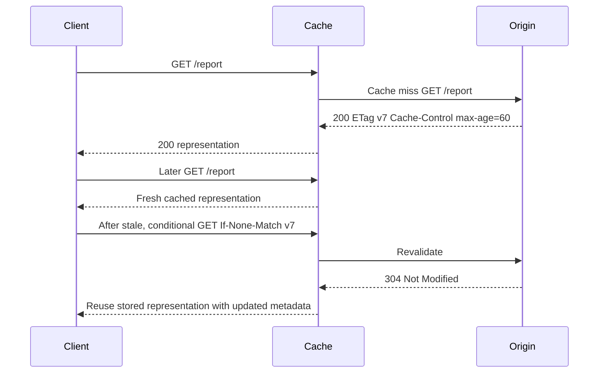

### Cache directives and validators

| Directive/field | Meaning | Common misunderstanding |
|---|---|---|
| max-age=N | Response freshness lifetime in seconds | It is relative to response time/age rules, not a fixed wall-clock expiry field |
| s-maxage=N | Shared-cache freshness override | Does not control private cache the same way |
| public | Response may be stored by shared cache under rules | Does not make sensitive content safe |
| private | Response intended for private cache, not shared | Browser can still store |
| no-cache | Store allowed but validate before reuse | Often mistaken for no-store |
| no-store | Do not store response/request under directive rules | Does not erase data already copied outside compliant caches |
| must-revalidate | Stale response cannot be reused without successful validation under rules | Offline behavior changes |
| immutable | Representation will not change while fresh | Use only with versioned content discipline |
| ETag | Opaque validator selected by origin | Do not parse meaning unless contract says so |
| Last-Modified | Date validator | Less precise and subject to date semantics |
| Age | Seconds response considered resident/aged in caches | Multiple caches and date calculations matter |
| Vary | Request fields selecting cache key | `Vary: *` prevents ordinary reuse |

### Simplified freshness calculation

If a response has `Cache-Control: max-age=600` and current corrected age is 240 seconds, simplified remaining freshness is:

$$
600 - 240 = 360\text{ seconds}
$$

Real RFC 9111 age calculation considers Date, Age, request/response times, apparent age, and residence time. Use tool timing and fields for exact analysis.

### Conditional requests

| Request precondition | Validator | Common outcome | Use |
|---|---|---|---|
| If-None-Match | ETag | 304 for GET/HEAD when unchanged | Cache validation |
| If-Modified-Since | Last-Modified date | 304 when not modified under date rules | Legacy/date validation |
| If-Match | Strong ETag list or `*` | 412 if current representation does not match | Prevent lost updates |
| If-Unmodified-Since | Date | 412 if modified since | Concurrency guard where applicable |
| Range with If-Range | ETag/date | Partial 206 or full 200 | Resume only if same representation |

### Plain-English deep-dive 3 - Freshness and correctness are different

A photocopy can be fresh according to its stamped shelf life and still contain a mistake that was present in the original. HTTP freshness means the cache may reuse a stored response under protocol rules. It does not prove the response is factually correct, authorized for the current user, or safe.

Shared caches must vary on every request field that changes representation selection, or avoid caching personalized content. A missing `Vary: Accept-Encoding` can mix compressed and uncompressed variants. A missing identity boundary can leak data. An overly broad cache-busting response can harm performance.

Troubleshoot with the response's cache fields, Age, validators, request cache mode, service worker, CDN status, browser cache, and origin logs. "Hard refresh fixed it" supports a stored-state path but does not identify which cache or why it was wrong.

## Content negotiation and compression

Clients express preferences through fields such as `Accept`, `Accept-Language`, and `Accept-Encoding`. Servers select a representation and identify it using `Content-Type`, `Content-Language`, and `Content-Encoding`. `Vary` tells caches which request fields affected selection.

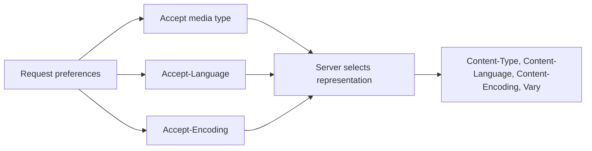

| Concept | Example | Failure pattern |
|---|---|---|
| Media type | `application/json` | 415 request content or parser mismatch |
| Charset parameter | `text/html; charset=utf-8` | Garbled text if declaration/bytes disagree |
| Content coding | `gzip`, `br` where supported | Client/proxy cannot decode or double-compresses |
| Language selection | `en-US`, `fr` | Wrong locale or cache variant |
| 406 Not Acceptable | No selected representation acceptable | Overly restrictive Accept |
| Vary | `Accept-Encoding` | Cache key omits representation dimension |

Compression ratio is:

$$
\text{ratio} = \frac{\text{compressed bytes}}{\text{original bytes}}
$$

If 1,000,000 bytes become 250,000 bytes, ratio is 0.25 and size reduction is 75 percent. Compression costs CPU and can introduce security side channels when secrets and attacker-controlled input share a compression context. Already compressed media may grow or gain little.

## HTTP/1.1, HTTP/2, and HTTP/3

HTTP semantics remain broadly shared; framing and transport differ. HTTP/1.1 uses textual message syntax over a connection and supports persistent connections, chunked transfer coding, and optional pipelining. HTTP/2 uses binary frames and multiplexed streams over one TCP connection with HPACK header compression. HTTP/3 maps semantics over QUIC streams and uses QPACK.

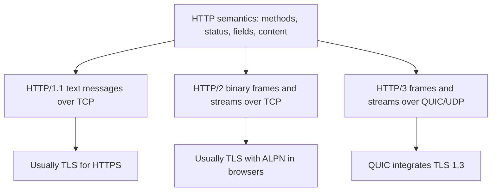

| Dimension | HTTP/1.1 | HTTP/2 | HTTP/3 |
|---|---|---|---|
| Framing | Text start line/fields plus body framing | Binary frames | Binary HTTP frames on QUIC streams |
| Transport | TCP | TCP | QUIC over UDP |
| Multiplexing | Usually multiple connections; pipelining limited | Many streams on one TCP connection | Many streams on one QUIC connection |
| Header compression | None in base framing | HPACK | QPACK |
| Loss impact | Blocks bytes on that TCP connection | TCP loss blocks all streams' delivery until gap recovered | QUIC stream delivery can progress independently across streams |
| Connection migration | New TCP tuple normally new connection | Same TCP limitation | QUIC connection IDs support migration |
| Negotiation | HTTP version/config/Upgrade in applicable contexts | ALPN or cleartext mechanisms | Alternative service/DNS/application support and QUIC setup |
| Capture readability | Plain HTTP readable; HTTPS encrypted | Binary and normally encrypted | Mostly encrypted QUIC |

HTTP/2 multiplexing removes application-layer request ordering constraints but TCP still delivers one ordered byte stream; one lost TCP segment can delay data for every HTTP/2 stream. HTTP/3 avoids that cross-stream transport head-of-line behavior, though congestion and shared capacity still affect all traffic.

### HTTP/2 fields and frames

HTTP/2 represents requests and responses with HEADERS and DATA frames among control frames. Streams have identifiers and states. Pseudo-headers such as `:method`, `:scheme`, `:authority`, `:path`, and `:status` carry information that HTTP/1.1 places in start lines and Host.

| HTTP/2 item | Purpose | Failure clue |
|---|---|---|
| SETTINGS | Negotiate connection parameters | Invalid/unsupported setting or delayed ACK |
| HEADERS | Header block for stream | Compression/decode or semantic error |
| DATA | Content bytes for stream | Flow-control stall or reset |
| WINDOW_UPDATE | HTTP/2 stream/connection flow control | Do not confuse with TCP window |
| RST_STREAM | Abort one stream | Connection can remain healthy |
| GOAWAY | Stop creating new streams beyond identifier | Graceful drain or connection error |
| PING | Connection liveness/RTT | Not application operation health |

HTTP/2 flow control is distinct from TCP flow control. A stream can stall because its HTTP/2 window is exhausted even when the TCP receive window is open. HTTP/3 has QUIC transport and stream flow-control concepts. Use protocol-aware tools.

## Proxies, gateways, CDNs, and load balancers

A forward proxy acts for clients toward servers. A reverse proxy or gateway acts as the service-facing front door toward origins. A CDN distributes and caches content. A load balancer selects a backend at Layer 4 or Layer 7. One product can perform several functions, but diagnosis should name the function and leg.

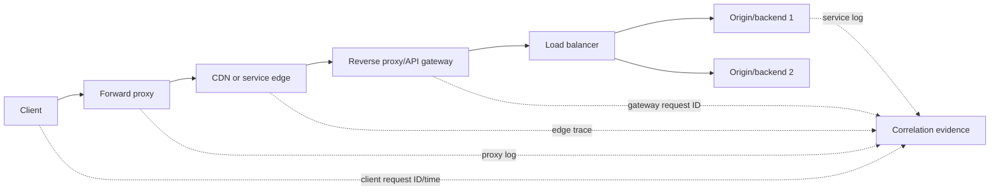

| Function | Client sees | Upstream behavior | Failure signature |
|---|---|---|---|
| Forward proxy | Proxy endpoint or tunneled path | Proxy resolves/connects to destination | 407, generated block page, upstream 502/504 |
| Reverse proxy | Service hostname/certificate | Selects origin and forwards request | Backend-specific 502/503/504 |
| API gateway | API authority and policy | Auth, quota, routing, transformation | 401/403/404/413/429 before app |
| CDN | Edge address and cache | Cache hit/miss/revalidate/origin fetch | Stale variant, regional error, origin shield issue |
| Layer 4 load balancer | Service tuple | Chooses TCP/UDP backend | Connection reset/timeout by backend/path |
| Layer 7 load balancer | HTTP authority/path fields | Chooses backend by HTTP context | One host/path/header maps incorrectly |

### Forwarded identity and trust

Intermediaries can add `Forwarded`, `Via`, or vendor-specific fields. Origins must trust forwarding identity only from controlled proxies and sanitize client-supplied copies. Otherwise an attacker can spoof source, scheme, or host information. X-Forwarded-* conventions are common but nonstandardized as a family; document exact trusted contract.

### Proxy CONNECT

For HTTPS through an explicit forward proxy, a client can send CONNECT requesting a TCP tunnel to a target authority. The proxy authenticates and permits or denies the tunnel. If TLS interception occurs, the resulting design is not merely an opaque tunnel. Record whether CONNECT succeeded, which certificate the client received, and whether the proxy created an upstream leg.

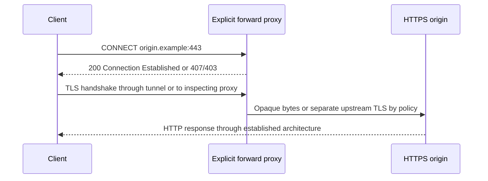

## REST APIs and HTTP

REST is an architectural style whose constraints include client-server separation, stateless communication, cacheability, a uniform interface, layered systems, and optional code-on-demand. Many APIs use JSON over HTTP and call themselves REST APIs, but HTTP itself is not REST and an endpoint is not RESTful merely because it uses nouns and methods.

| HTTP concept | API design use | Weak implementation |
|---|---|---|
| Resource URI | Stable identity for object/collection | RPC verbs embedded everywhere without clear model |
| Methods | Standard semantics for retrieve/create/replace/delete where appropriate | POST for every action without contract clarity |
| Status codes | Machine-readable outcome class | Always 200 with hidden error string |
| Media type | Representation contract | Unversioned ambiguous JSON |
| Idempotency | Safe retry and automation | Duplicate side effects after timeout |
| Cache fields | Reduce repeated reads | Sensitive responses cached publicly |
| ETag/preconditions | Optimistic concurrency | Last writer silently overwrites changes |
| Links | Discover related actions/resources | Client hard-codes hidden server paths |

### API request concerns

APIs need authentication, authorization, validation, pagination, filtering, versioning, rate limits, retries, idempotency, correlation IDs, schemas, and error bodies. Part 24 covers these deeply. For HTTP troubleshooting, capture method, exact target without secrets, content type, sanitized auth scheme, content length, status, response media type, request ID, rate headers where documented, and timing.

## Browser waterfall and HAR

Browser developer tools divide a request into phases such as queueing/stalled, DNS, initial connection, proxy negotiation, TLS, request sent, waiting/TTFB, and content download. Labels vary by browser and protocol. Connection reuse can make DNS/connect/TLS absent for later requests. HTTP/2/3 multiplexing changes queueing and connection interpretation.

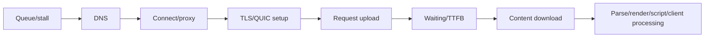

| Waterfall phase | Includes | Long duration hypotheses |
|---|---|---|
| Queueing/stalled | Browser scheduling, socket/stream limits, proxy wait | Too many requests, priority, service worker, connection pool |
| DNS | Name resolution as browser reports it | Cache miss, resolver latency, DoH, multiple lookups |
| Connect | TCP/QUIC and possible proxy setup | Loss, route, state, proxy auth, listener |
| TLS | Certificate/security negotiation | Trust, inspection, handshake, protocol |
| Request sent | Upload bytes | Large body, flow control, client CPU, path loss |
| Waiting/TTFB | Server/gateway processing plus path return | Backend, queue, dependency, upstream timeout |
| Download | Response content transfer | Size, compression, loss, receiver, disk/CPU |
| Client processing | Parse, script, render, save, sync state | Not represented entirely by network timing |

### Waterfall calculation

If queueing is 20 ms, DNS 40 ms, connect 60 ms, TLS 80 ms, request upload 10 ms, waiting 500 ms, and download 90 ms, simple sequential total is:

$$
20+40+60+80+10+500+90=800\text{ ms}
$$

Real phases can overlap, reuse connections, or use browser-specific accounting. The largest segment is not automatically root cause; 500 ms TTFB can include gateway and origin dependencies.

### HAR privacy

A HAR can contain full URLs, query secrets, request/response headers, cookies, bearer tokens, form data, bodies, tenant names, file paths, personal data, and timings. "Sanitize" buttons are not a substitute for inspection. Use approved collection, shortest reproduction, restricted storage, explicit redaction, and retention.

## Common troubleshooting patterns

### 401 versus 403 versus 407

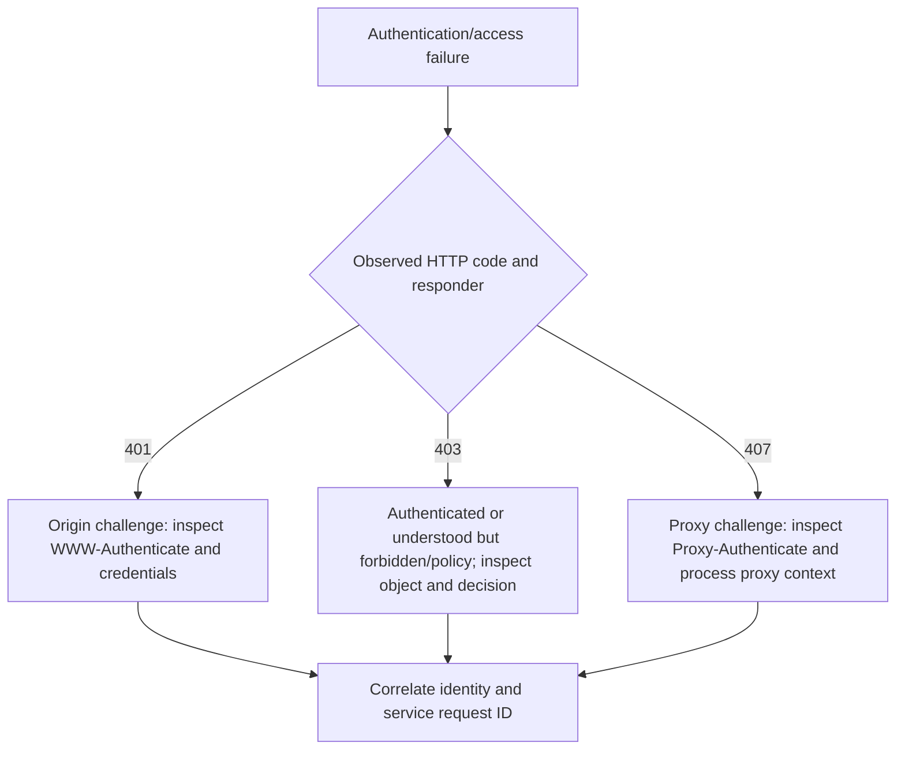

### 502 versus 503 versus 504

| Status | Primary semantic | Leading evidence |
|---:|---|---|
| 502 | Gateway received invalid upstream response | Gateway upstream connection/protocol log |
| 503 | Service temporarily unavailable | Health/capacity/deployment/Retry-After |
| 504 | Gateway timed out waiting upstream | Upstream DNS/connect/TLS/TTFB timeline |

All can be generated by different layers. Identify responder and both connection legs. A gateway 504 does not prove the origin was down; the gateway may have DNS, route, TLS, pool, or timeout problems.

### Redirect loop decision tree

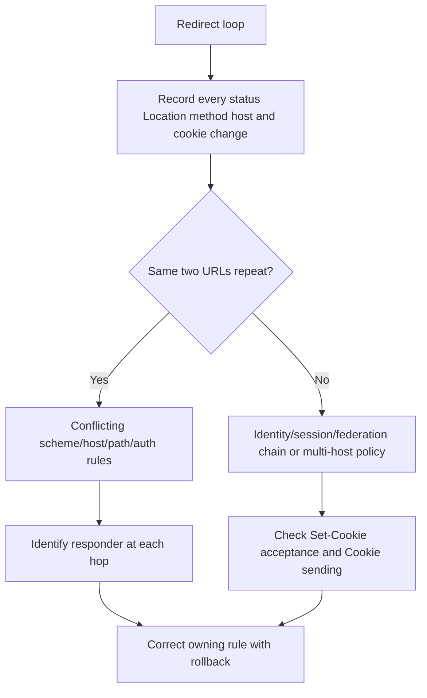

### Cache or origin

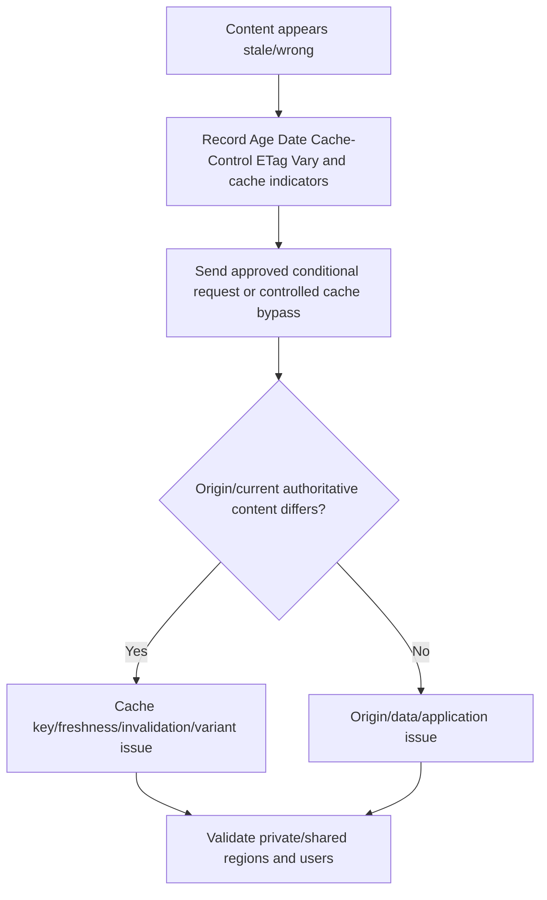

## OneDrive and SharePoint examples

The browser and OneDrive sync client can call different hosts, paths, methods, APIs, and authentication contexts. Browser success proves one sequence, not every sync operation. Current Microsoft protocol and endpoint documentation is authoritative.

### Generic browser sequence

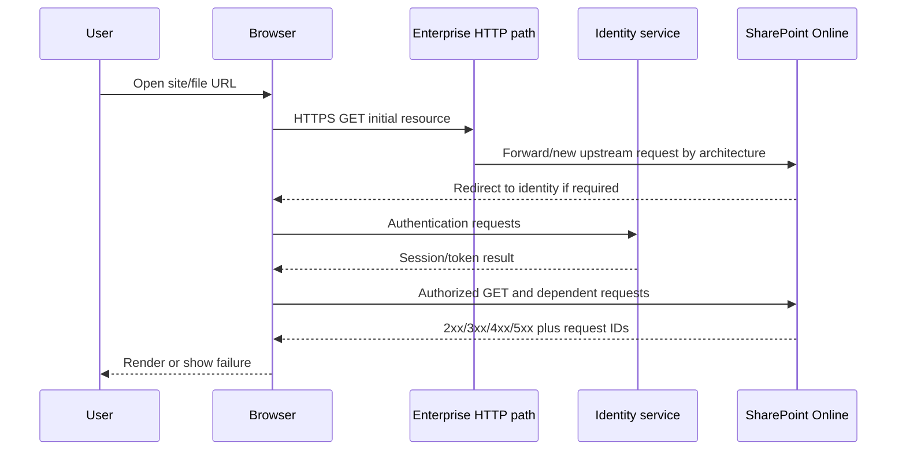

### Generic sync sequence

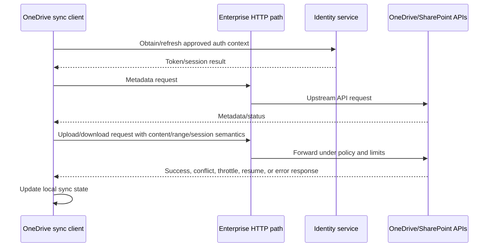

| Comparison | Browser | Sync client | Why it matters |
|---|---|---|---|
| Method mix | Mostly GET plus form/API calls | Metadata, upload/download, ranges, sessions | Proxy can allow GET but reject upload semantics |
| Content size | Pages and resources | Large file/chunk content | 413, timeout, flow control, and retry differences |
| Authentication | Browser cookies/federation | Token/client-specific flow | 401/407 can differ by process |
| Proxy context | Browser-managed/integrated | OS/client-specific | Browser works while sync proxy auth fails |
| Cache | Browser/CDN/service worker | Client metadata/local database | Hard refresh does not reset sync state |
| Error evidence | DevTools/HAR/console | Sync logs/status/request IDs | Correlate exact operation and time |
| Concurrency | Page resource multiplexing | Parallel file operations/chunks | 429/state/connection pressure |

## Fictional NMH continuity scenario

NMH's fictional finance users can browse a SharePoint Online library and download small files, but the OneDrive sync client cannot upload files above 25 MiB after an enterprise HTTP gateway policy rollout. The client receives HTTP 413 with a synthetic gateway request ID and no Microsoft service request ID. The gateway log says its request-body limit generated the response before opening the upstream request. This is a fictional generic intermediary scenario, not a Zscaler or Microsoft claim.

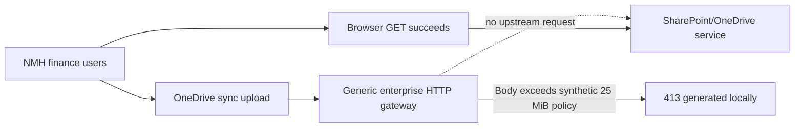

### NMH evidence matrix

| Observation | Supports | Alternative | Discriminating evidence |
|---|---|---|---|
| Browser GET works | Read path and some auth/service dependencies work | Upload uses different host/path/auth | Compare exact sync request |
| Uploads below 25 MiB succeed | Size threshold/policy plausible | Client chunk boundary or file rule | Same content type across controlled sizes |
| 413 response has gateway synthetic ID | Gateway generated or annotated response plausible | Origin could return 413 through gateway | Gateway correlation and upstream log |
| No Microsoft request ID | Request may not reach service | Some responses may omit ID | Service-side/correlation evidence |
| Gateway log says blocked before upstream | Strong local responder evidence | Clock/correlation mismatch | Match tuple, URL, method, size, and timestamp |
| Rollback restores upload | Policy change is controlling variable | Retry timing/service recovery coincided | Controlled reapply in test ring with approvals |

### NMH response and mitigation

Arti's fictional bridge update: "The failure is method/body-size specific. Browser GET and uploads below the threshold succeed. The 413 carries the enterprise gateway's request ID, and the correlated gateway log records a local request-body-limit decision before upstream creation. Current evidence assigns the controlling boundary to the generic gateway policy, not Microsoft or Zscaler. The gateway owner is validating a least-scope rule for the documented upload workflow in a test ring with rollback."

Do not simply remove all body limits. Validate approved Microsoft endpoint/method guidance, data-loss controls, malware inspection, timeout/capacity impact, legal/privacy requirements, and application upload semantics. Use a scoped rule, pilot, monitoring, and rollback. Validate large and small uploads, downloads, browser access, denied unapproved destinations, throttling behavior, request IDs, and recurrence.

## Tools and commands

### curl examples for an approved lab

```text
curl.exe -I https://example.invalid/
curl.exe -v https://example.invalid/resource
curl.exe --http1.1 -v https://example.invalid/resource
curl.exe --compressed -v https://example.invalid/resource
curl.exe -H "If-None-Match: \"report-v7\"" -v https://example.invalid/report
```

Use `-v` carefully because it can display Authorization, cookies, proxy credentials, and sensitive URLs. `-I` sends HEAD; it is not identical to GET if a server misimplements method semantics. HTTP/2/3 support depends on the curl build.

### PowerShell examples

```text
Get-Date
Invoke-WebRequest -Uri 'https://example.invalid/' -Method Head
Invoke-WebRequest -Uri 'https://example.invalid/resource' -MaximumRedirection 0 -SkipHttpErrorCheck
```

PowerShell version and platform determine parameters and behavior. Do not pass production credentials or tokens in command history. Browser developer tools are usually better for real browser state and protocol.

| Tool | Best use | Evidence | Limitation |
|---|---|---|---|
| Browser Network panel | Browser request sequence and waterfall | URL, method, status, fields, protocol, timing | Browser-only; state and secrets |
| HAR export | Shareable browser transaction bundle | Multi-request chronology | Extremely sensitive and may omit low-level packet detail |
| Browser console/issues | Script, CORS, cookie, mixed-content warnings | Client interpretation | Not server root cause alone |
| curl | Controlled request/method/field/version test | Raw response and timing options | Different cache/auth/proxy/client behavior |
| Invoke-WebRequest | Windows scripted HTTP checks | Status, headers, content | PowerShell version and parsing behavior |
| Fiddler/approved proxy tool | HTTP-aware client/intermediary capture | Decrypted messages with consent/trust setup | Changes path/trust and captures secrets |
| Wireshark/pktmon | Transport/TLS/HTTP where visible | Tuple, timing, versions, plain HTTP | HTTPS content encrypted without endpoint keys/termination |
| Service/proxy logs | Responder/upstream decisions | Request IDs, routes, policy, backend | Retention and field availability vary |

## Evidence and privacy

HTTP evidence can contain credentials, bearer tokens, cookies, CSRF values, URLs, query strings, tenant/site/file names, request/response bodies, personal data, proprietary documents, internal hostnames, proxy topology, and precise user activity. Treat HAR and decrypted HTTPS capture as high-risk evidence.

| Principle | Practical action | Failure prevented |
|---|---|---|
| Authorization | Approve decryption/capture, endpoint, user, and scope | Unauthorized interception |
| Minimize | Reproduce once; filter exact host/path/method/time | Broad content collection |
| Redact secrets | Remove Authorization, Cookie, Set-Cookie, tokens, query secrets, bodies | Session hijack/data leak |
| Preserve semantics | Keep method, status, field names, lengths, hashes, timing, IDs as needed | Redaction destroys diagnosis |
| Separate originals | Restrict original; analyze sanitized copy | Uncontrolled disclosure |
| Integrity | Preserve export metadata and approved hash | Evidence mutation |
| Clock quality | Record UTC, browser/host/proxy/service clocks and skew | False sequence attribution |
| Retention | Delete under approved purpose/schedule | Long-term behavior/content archive |
| Safe sharing | Use approved secure repository and recipient list | Ticket/chat leakage |
| Claim discipline | Identify responder and evidence boundary | Unsupported vendor defect claim |

### Plain-English deep-dive 4 - A HAR can be a temporary key to the user's office

A HAR is not just a timing chart. It can contain the same cookie or bearer token the browser used to enter a service, plus file names and response data. Sharing an unredacted HAR in a broad ticket can create an account or data incident.

Before capture, use a test account and test content where possible. Close unrelated tabs, clear only approved state after preserving needed evidence, start recording just before reproduction, stop immediately after, and inspect every request. Redact secret values while preserving whether a field was present and how the flow changed.

If the secret cannot be reliably removed, keep the original in a restricted repository and provide a written timeline or approved filtered export. Rotate exposed credentials according to incident policy. Evidence usefulness never overrides authorization and privacy.

## Troubleshooting decision trees

### HTTP response received but operation failed

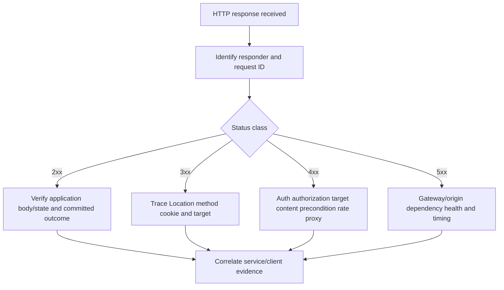

### No HTTP response

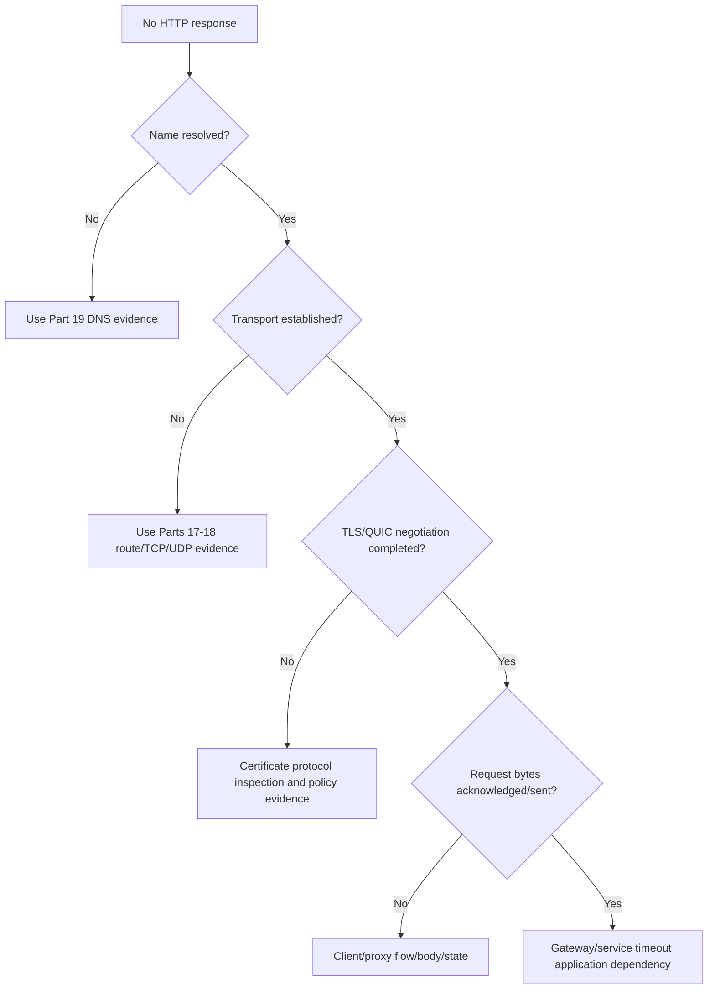

### Browser works, sync fails

```mermaid
flowchart TD
    B[Browser works sync fails] --> DIFF[Compare exact hosts methods body sizes auth proxy and protocol]
    DIFF --> PROXY{Same proxy/auth context?}
    PROXY -->|No| P[Process proxy policy 407 tunnel or inspection]
    PROXY -->|Yes| METHOD{Failure follows method/size/content?}
    METHOD -->|Yes| M[413 415 timeout DLP/API upload semantics]
    METHOD -->|No| STATE[Client token local DB file rule concurrency throttling]
    P --> CORR[Correlate request IDs and responder]
    M --> CORR
    STATE --> CORR
```

## Scenario labs

### Lab 1 - URI parser and security review

Parse ten documentation URLs containing ports, IPv6 literals, percent-encoding, query, fragment, relative references, and user information. Use a real URI library in a controlled script rather than manual splitting. Identify which data is sent, logged, origin-forming, or unsafe for secrets.

### Lab 2 - HTTP/1.1 message annotation

Capture or construct a GET, POST, PUT, conditional GET, range request, and chunked response in an isolated lab. Annotate start lines, Host, content framing, media type, encoding, validators, cache fields, and body. Identify conflicting Content-Length/Transfer-Encoding as unsafe rather than attempting ad hoc parsing.

### Lab 3 - Methods and retries

For payment POST, configuration PUT, file DELETE, metadata GET, and chunk upload, decide safety/idempotency, whether automatic retry is allowed, required preconditions/idempotency keys, backoff, and verification after an ambiguous timeout.

### Lab 4 - Redirect and cookie flow

Build a lab sign-in sequence using 302, 303, 307, and 308. Record method changes, Location resolution, Set-Cookie acceptance, Cookie sending, Secure, HttpOnly, SameSite, Domain, Path, and expiry. Create and diagnose one redirect loop.

### Lab 5 - Cache validation

Serve a versioned object with `max-age`, ETag, Last-Modified, Vary, and compression. Observe fresh hit, stale conditional request, 304, changed 200, private response, and shared-cache behavior. Calculate remaining freshness and compression reduction.

### Lab 6 - Version comparison

Use approved browser/curl/server capabilities to compare HTTP/1.1, HTTP/2, and HTTP/3. Record ALPN/protocol, connections, stream IDs, multiplexing, header compression visibility, loss implications, and waterfall differences. Label unsupported versions rather than forcing insecure configuration.

### Lab 7 - Proxy/gateway failure

Create client, forward proxy, reverse proxy, and origin logs for 407, 502, 503, and 504. Map both connection legs and request IDs. Write accurate bridge updates before and after upstream evidence arrives.

### Lab 8 - Fictional NMH upload

Run the synthetic 25 MiB gateway-limit tabletop. Collect sanitized sync log, URL/method, body length, 413, gateway request ID, gateway policy log, absence/presence of upstream request, browser comparison, privacy controls, scoped mitigation, rollback, and validation. Never upload customer content to a lab.

| Lab output | Required content | Pass condition |
|---|---|---|
| URI worksheet | Parsed components and encoded forms | Fragment not treated as HTTP target data |
| Message transcript | Framing, fields, content, responder | No secret leakage |
| Retry matrix | Method, idempotency, ambiguity, backoff | No duplicate-side-effect risk ignored |
| Redirect/cookie trace | Status, method, Location, attributes | 304 distinguished from navigation redirect |
| Cache timeline | Freshness, Age, Vary, validators | no-cache and no-store distinguished |
| Version map | H1/H2/H3 transport/framing | Semantics separated from wire version |
| Gateway report | Both legs and request IDs | Status attributed to actual responder |
| NMH package | Evidence, privacy, change, rollback, validation | Fiction and product boundaries explicit |

## Misconceptions to correct

| Misconception | Correction |
|---|---|
| URL and URI always mean exactly the same thing | URL is a locator-oriented URI usage; parse using defined syntax |
| Fragment is sent to the server | User agents normally handle it client-side and omit it from request target |
| GET can never change anything | It is defined safe in intended semantics; poor servers can violate it |
| Idempotent means identical response | It means repeated intended effect is the same |
| POST must create and PUT must update | Resource-specific contract defines details within method semantics |
| 200 proves business success | Body/domain state can still indicate failure |
| 401 means forbidden | 401 is authentication challenge/credentials; 403 is refusal/authorization/policy |
| 404 always means resource absent | A service can conceal authorization details or an intermediary can generate it |
| 504 proves origin outage | It proves a gateway timed out on an upstream operation |
| 304 is a page redirect | It validates cached representation reuse |
| no-cache means do not store | It means validate before reuse; no-store addresses storage |
| HTTPS means nobody can inspect HTTP | TLS can terminate at approved intermediaries and create separate legs |
| Cookie equals session | Cookie is one state token; session is a logical application interaction |
| Browser works means sync path works | Hosts, methods, auth, proxy, body sizes, APIs, and local state can differ |
| HTTP/2 uses UDP | HTTP/2 normally uses TCP; HTTP/3 uses QUIC over UDP |
| HTTP/3 removes all head-of-line effects | It avoids cross-stream transport HOL, but streams and congestion still have ordering/capacity |
| HAR is safe after export | It commonly contains credentials and private content |

## Official Source Anchors

The following authoritative sources were reviewed on **2026-08-24**. They support HTTP/web standards and documented browser or Microsoft guidance, not fictional NMH results, a tenant implementation, or any Zscaler claim. Check RFC status and errata in the RFC Editor.

| Source | URL | Used for | Boundary |
|---|---|---|---|
| IETF RFC 3986 | https://www.rfc-editor.org/rfc/rfc3986 | Generic URI syntax and resolution | WHATWG URL parsing used by browsers adds web-specific rules |
| WHATWG URL Standard | https://url.spec.whatwg.org/ | Browser URL parsing and serialization | Living standard; implementation behavior evolves |
| IETF RFC 9110 | https://www.rfc-editor.org/rfc/rfc9110 | HTTP semantics, methods, fields, status, content | Version framing is in companion RFCs |
| IETF RFC 9111 | https://www.rfc-editor.org/rfc/rfc9111 | HTTP caching, age, freshness, validators | Extensions have separate specifications |
| IETF RFC 9112 | https://www.rfc-editor.org/rfc/rfc9112 | HTTP/1.1 message syntax and routing | HTTP/2/3 differ |
| IETF RFC 9113 | https://www.rfc-editor.org/rfc/rfc9113 | HTTP/2 framing, streams, and HPACK use | Updated by later HTTP/2 documents where applicable |
| IETF RFC 9114 | https://www.rfc-editor.org/rfc/rfc9114 | HTTP/3 over QUIC | QUIC is specified separately |
| IETF RFC 9000 | https://www.rfc-editor.org/rfc/rfc9000 | QUIC transport foundation | HTTP semantics remain RFC 9110 |
| IETF RFC 9204 | https://www.rfc-editor.org/rfc/rfc9204 | QPACK header compression for HTTP/3 | Decoder/encoder behavior is implementation-specific |
| IETF RFC 6265 | https://www.rfc-editor.org/rfc/rfc6265 | HTTP state management/cookies foundation | Browser cookie behavior also follows evolving updates |
| IETF RFC 7239 | https://www.rfc-editor.org/rfc/rfc7239 | Standard Forwarded field | Trust configuration remains local |
| IETF RFC 5789 | https://www.rfc-editor.org/rfc/rfc5789 | PATCH method | Patch media type defines operation semantics |
| IETF RFC 6585 | https://www.rfc-editor.org/rfc/rfc6585 | Additional status codes including 429 | Service-specific rate details require docs |
| MDN: HTTP overview | https://developer.mozilla.org/en-US/docs/Web/HTTP/Overview | Beginner web architecture and HTTP flow | Educational reference, not standards authority |
| MDN: HTTP methods | https://developer.mozilla.org/en-US/docs/Web/HTTP/Reference/Methods | Method learning reference | RFC semantics remain authoritative |
| MDN: HTTP status codes | https://developer.mozilla.org/en-US/docs/Web/HTTP/Reference/Status | Status learning reference | Service-specific bodies/fields vary |
| MDN: Cookies | https://developer.mozilla.org/en-US/docs/Web/HTTP/Guides/Cookies | Browser cookie guidance and security attributes | Current browser policy must be checked |
| Chrome DevTools Network reference | https://developer.chrome.com/docs/devtools/network/reference/ | Waterfall, fields, protocol, and HAR tooling | Browser-specific UI changes over time |
| Microsoft Learn: Microsoft 365 network connectivity principles | https://learn.microsoft.com/en-us/microsoft-365/enterprise/microsoft-365-network-connectivity-principles | Microsoft 365 path and proxy planning principles | Current endpoint categories and tenant evidence required |
| Microsoft Learn: OneDrive sync restrictions and limitations | https://support.microsoft.com/en-us/office/restrictions-and-limitations-in-onedrive-and-sharepoint-64883a5d-228e-48f5-b3d2-eb39e07630fa | Current documented OneDrive/SharePoint constraints | Validate page currency and tenant/client version |
| Wireshark HTTP display reference | https://www.wireshark.org/docs/dfref/h/http.html | HTTP field orientation where visible | HTTPS content is normally encrypted at packet point |

## Likely Interview Questions

### Q1. Parse a URL and explain which parts reach the server.

**Model answer:** I parse scheme, authority, optional user information, host, port, path, query, and fragment using a standards-aware parser. For `https://example.invalid:8443/path?q=1#section`, HTTPS determines protected HTTP context, authority selects host/port, and path/query form the request target. The fragment is normally handled by the user agent and not sent. Query and path are commonly logged, so secrets do not belong there. Percent-encoding must be decoded under component-specific rules, never by casual string splitting.

### Q2. How do safe and idempotent methods affect retries?

**Model answer:** Safe methods such as GET and HEAD are intended read-only. Idempotent methods such as GET, PUT, and DELETE have the same intended effect when repeated, although responses can differ. POST and PATCH are not idempotent by default. Automatic retry also requires a replayable body, API contract, bounded backoff, and proof that duplicate side effects are controlled, often through idempotency keys or conditional requests. After an ambiguous timeout I verify server state before replaying a non-idempotent operation.

### Q3. Distinguish 401, 403, and 407.

**Model answer:** 401 is an origin authentication challenge and normally includes WWW-Authenticate. 403 means the responder understood the request but refuses authorization or policy; valid identity can already be known. 407 is a proxy authentication challenge using Proxy-Authenticate. I identify the responder, inspect sanitized challenge scheme and process proxy context, and correlate identity/policy logs. I never share credentials, cookies, or bearer tokens.

### Q4. Distinguish 502, 503, and 504.

**Model answer:** 502 means a gateway/proxy received an invalid upstream response. 503 means the responding service is temporarily unavailable, commonly due overload or maintenance, and may include Retry-After. 504 means a gateway timed out waiting for upstream. All require responder identification and both client-facing and upstream evidence. A 504 does not by itself prove the origin was down because gateway DNS, connect, TLS, pools, policy, or timeout can fail.

### Q5. Explain HTTP cache freshness and validation.

**Model answer:** A cache can reuse a fresh stored response according to Cache-Control, Age, Date, and cache rules. When stale, it can send a conditional request using ETag/If-None-Match or Last-Modified/If-Modified-Since. A 304 tells it to reuse the stored representation with updated metadata. `no-cache` permits storage but requires validation; `no-store` prohibits storage under the directive. `private`, `Vary`, authorization, and user context protect shared-cache boundaries.

### Q6. Compare HTTP/1.1, HTTP/2, and HTTP/3.

**Model answer:** They share HTTP semantics. HTTP/1.1 uses textual message framing over TCP. HTTP/2 uses binary frames, HPACK, and multiplexed streams over one TCP connection, so TCP loss can block delivery across all streams. HTTP/3 uses HTTP frames and QPACK over QUIC/UDP with integrated TLS; independent QUIC streams avoid cross-stream transport head-of-line blocking and connection IDs support migration. I verify negotiated protocol rather than assume from port 443.

### Q7. Why can a browser work while OneDrive sync fails?

**Model answer:** They can use different processes, proxy/auth contexts, hostnames, methods, APIs, body sizes, connection pools, caches, and local state. A browser GET can succeed while a sync upload gets proxy 407, 413, throttle 429, conflict 409, or client-specific failure. I compare exact URL, method, body length, responder, status, request ID, auth scheme presence, protocol, and timing, then correlate client, proxy, identity, and Microsoft service evidence.

### Q8. How would you handle the fictional NMH 413 upload scenario?

**Model answer:** I would label it fictional and first identify the responder. The size threshold, synthetic gateway ID, gateway log, and lack of upstream request support a gateway body-limit decision before Microsoft service handling. I would not remove controls broadly. I would validate current Microsoft upload guidance, data/security requirements, then pilot a least-scope policy with rollback. Tests cover large/small upload, download, browser, denied unapproved destinations, request IDs, monitoring, and recurrence.

## 30-Second Memory Hooks

| Concept | Memory hook |
|---|---|
| URI | General resource identifier |
| URL | Address-like URI |
| Origin | Scheme plus host plus port |
| Fragment | Browser-side; not HTTP target |
| Method | Intended action verb |
| Safe | Intended read-only |
| Idempotent | Repeat has same intended effect |
| Header field | Message metadata with field-specific grammar |
| 2xx | Request succeeded under method semantics |
| 3xx | Follow, reuse, or redirect by exact code |
| 401 | Origin authentication challenge |
| 403 | Understood but forbidden |
| 407 | Proxy authentication challenge |
| 413 | Responder rejects content size |
| 429 | Rate limited; inspect retry guidance |
| 502 | Invalid upstream response at gateway |
| 503 | Temporarily unavailable |
| 504 | Gateway upstream timeout |
| Cookie | Scoped return token, not whole session |
| no-cache | Store, then validate |
| no-store | Do not store under cache rules |
| ETag | Opaque representation validator |
| HTTP/2 | Multiplexed frames over TCP |
| HTTP/3 | HTTP over QUIC streams |
| Proxy | One client leg, another upstream leg |
| HAR | Valuable evidence and possible session secret |
| Honesty | Status belongs to responder, not favorite vendor |

## Completion Checklist

- [ ] I can distinguish URI, URL, scheme, authority, host, port, origin, path, query, and fragment.
- [ ] I can explain percent-encoding and why code should use a URI parser.
- [ ] I can annotate HTTP/1.1 request/response lines, fields, framing, and content.
- [ ] I can map HTTP/2/3 pseudo-headers to shared HTTP semantics.
- [ ] I can classify GET, HEAD, POST, PUT, DELETE, CONNECT, OPTIONS, TRACE, and PATCH by safety/idempotency.
- [ ] I can design retries that avoid duplicate side effects and honor backoff/Retry-After.
- [ ] I can explain status classes and the operational caveat of each common 2xx, 3xx, 4xx, and 5xx code.
- [ ] I can distinguish 301, 302, 303, 304, 307, and 308 method/cache behavior.
- [ ] I can reconstruct a redirect loop with Location, method, cookie, and responder evidence.
- [ ] I can identify TLS termination and separate client and upstream HTTPS legs.
- [ ] I can distinguish cookie, token, server session, TCP connection, and user identity.
- [ ] I can explain Domain, Path, Secure, HttpOnly, SameSite, expiry, and Partitioned cookie behavior at overview depth.
- [ ] I can distinguish authentication from authorization and 401 from 403 and 407.
- [ ] I can calculate simplified cache freshness and explain full Age complexity.
- [ ] I can distinguish no-cache, no-store, private, public, max-age, s-maxage, must-revalidate, Vary, and immutable.
- [ ] I can explain ETag/If-None-Match, Last-Modified, 304, If-Match, 412, and range validation.
- [ ] I can explain Accept, Content-Type, Content-Encoding, Vary, compression ratio, and negotiation failures.
- [ ] I can compare HTTP/1.1, HTTP/2, and HTTP/3 framing, transport, multiplexing, compression, and loss effects.
- [ ] I can explain HTTP/2 stream flow control separately from TCP receive flow control.
- [ ] I can map forward proxy, reverse proxy, API gateway, CDN, load balancer, and origin boundaries.
- [ ] I can explain CONNECT and distinguish an opaque tunnel from inspected/separately terminated TLS.
- [ ] I can explain how REST relates to HTTP without calling every JSON API RESTful.
- [ ] I can read a browser waterfall and avoid treating its longest phase as automatic root cause.
- [ ] I can use browser tools, HAR, curl, PowerShell, Fiddler, packet, proxy, and service evidence with limitations.
- [ ] I can protect URLs, tokens, cookies, bodies, file names, user activity, and decrypted captures.
- [ ] I can troubleshoot no response, 4xx/5xx, redirect, cache, browser-versus-sync, and gateway scenarios.
- [ ] I can walk generic OneDrive/SharePoint browser and sync flows without asserting internal Microsoft design.
- [ ] I can walk the fictional NMH 413 scenario and explain scoped mitigation, rollback, and validation.
- [ ] I can connect Arti's factual Microsoft support background without claiming Zscaler production operation.
- [ ] I can answer Q1-Q8 aloud and complete all eight labs with sanitized evidence.

[Part 21 - TLS, SSL History, PKI, Certificates, Handshakes, and Inspection](Part-21-tls-pki-certificates-inspection.md)