# Part 21 - TLS, SSL History, PKI, Certificates, Handshakes, and Inspection

> **Audience:** Arti Thakur, moving from Microsoft 365 Support Escalation Engineering into a Zscaler Security Operations Technical Success Manager role.
>
> **Purpose:** Build a first-principles model of cryptographic goals, keys, certificates, public key infrastructure, TLS 1.2 and TLS 1.3 handshakes, session resumption, mutual TLS, certificate validation, inspection, privacy decisions, and evidence-led fault isolation.
>
> **Scope and honesty:** Northstar Meridian Holdings, abbreviated NMH, is fictional. Its certificate authorities, hostnames, users, policies, packet fields, failures, and outcomes are synthetic. Arti's Microsoft 365, OneDrive for Business, SharePoint Online, networking, evidence, and escalation experience must remain within her approved factual background.
>
> **Product caveat:** This Part teaches standards and general inspection architecture. Zscaler deployment details, supported applications, certificate behavior, bypass categories, policy order, logging fields, and administrative workflows vary by product, cloud, version, tenant, forwarding method, and policy. Verify current official documentation and tenant evidence. No fictional scenario proves a production Zscaler or Microsoft defect.

## Section goal

TLS is the protected conversation beneath most HTTPS application activity. It is not a single act called "encryption." It is a protocol that negotiates capabilities, authenticates one or both peers, creates fresh traffic keys, protects record confidentiality and integrity, and reports failures at a particular observation point. Public key infrastructure, or PKI, supplies much of the identity evidence used during that protocol.

Think of a secure international courier service. Encryption is an opaque locked case. Integrity is a tamper-evident seal. Authentication is a verified identity badge. A certificate binds a public key to names and other attributes. A certificate authority resembles an approved passport office, not the passport holder. The TLS handshake resembles two parties agreeing on current rules, checking credentials, deriving one-time combination codes, and only then exchanging sealed packages. Inspection resembles an authorized security desk ending one protected courier leg and beginning another; it is never one untouched end-to-end TLS session.

By the end, Arti should be able to:

| Outcome | Demonstrated capability | Evidence of mastery |
|---|---|---|
| Explain cryptographic goals | Separate confidentiality, integrity, authentication, and freshness | Goal-to-mechanism map |
| Distinguish primitives | Compare symmetric encryption, asymmetric encryption, hashes, message authentication codes, and signatures | Primitive selection table |
| Read certificates | Identify subject, issuer, SAN, validity, key, signature, EKU, constraints, and fingerprints | Sanitized certificate worksheet |
| Validate trust | Build and evaluate a path from leaf through intermediates to a local trust anchor | Chain/path diagram and failure tree |
| Explain status | Compare expiration, revocation, OCSP, CRLs, stapling, and soft/hard failure choices | Revocation evidence matrix |
| Trace negotiation | Walk TLS 1.2 and 1.3 handshakes, SNI, ALPN, cipher selection, key exchange, and Finished verification | Packet-level handshake timeline |
| Explain key properties | Describe forward secrecy, traffic-key separation, resumption, 0-RTT risk, and key updates | Key lifecycle map |
| Diagnose mTLS | Separate server authentication from client-certificate selection and validation | Two-sided trust checklist |
| Reason about inspection | Draw client-to-inspector and inspector-to-origin TLS legs | Two-leg trust and ownership map |
| Protect privacy | Apply authorization, minimization, bypass, retention, redaction, and legal review | Capture and inspection decision record |
| Troubleshoot precisely | Correlate browser, operating-system, packet, proxy, identity, and service evidence | Timestamped hypothesis matrix |
| Bridge experience honestly | Transfer M365 escalation habits without claiming unsupported Zscaler operation | Interview-ready explanation |

## JD Mapping

| JD expectation | Part 21 capability | Artifact | Honest Arti bridge |
|---|---|---|---|
| Analyze complex environments | Map certificates, trust stores, clients, inspection points, origins, and policy owners | TLS dependency map | Extends Microsoft 365 client/service investigation |
| Identify security risk | Recognize weak versions, failed validation, private-key exposure, overbroad trust, unsafe bypass, and decrypted-data handling | Risk and control register | Learned security interpretation, not claimed product administration |
| Resolve critical escalations | Separate DNS, TCP, TLS negotiation, certificate, inspection, identity, and application workstreams | Handshake timeline and owner matrix | Uses CRITSIT timeline and evidence discipline |
| Tailor mitigation | Recommend renewal, chain repair, trust deployment, protocol correction, scoped bypass, or application remediation | Change, test, rollback plan | Mirrors fix validation and customer-safe change practice |
| Deliver technical consulting | Explain PKI and TLS from zero to engineer and executive audiences | Whiteboard, glossary, teach-back | Builds on advisor and mentoring experience |
| Work cross-functionally | Give PKI, endpoint, network, security, legal/privacy, application, and vendor teams bounded evidence | Shared decision record | Builds on customer, partner, and Engineering collaboration |
| Communicate outcomes | Translate a handshake defect into affected operation, risk, confidence, owner, and next action | Executive-safe update | Builds on support escalation communication |

## Candidate honesty note

Arti can truthfully discuss standards-based TLS analysis, packet and browser evidence, Windows certificate behavior at an appropriate support level, Microsoft 365 connectivity troubleshooting, controlled labs, stakeholder coordination, and fix validation where those statements match her real experience. She can explain how she would test a certificate path, compare browser and sync-client behavior, correlate timestamps, and prevent secrets from entering an escalation package.

Direct production operation of Zscaler SSL Inspection, public CA design, private service-key extraction, and vendor attribution from path presence alone are not established experience. A safe bridge is: "I have investigated protected Microsoft 365 client-to-service paths and correlated client, network, browser, and service evidence. I understand the standards and two-leg inspection model. In a Zscaler tenant I would verify the documented forwarding, policy, certificate, and logging behavior before making a product-specific conclusion."

| Evidence category | Safe phrasing | Boundary |
|---|---|---|
| Production | "I correlated client, browser, network, and Microsoft service evidence in approved M365 escalations." | Do not invent packet decryption or Zscaler administration |
| Lab | "I captured a controlled TLS handshake and annotated certificate and negotiation fields." | Use owned systems and synthetic data only |
| Conceptual | "An inspecting intermediary creates separate TLS security associations." | Exact implementation requires product documentation and evidence |
| Fictional | "NMH's synthetic payroll client rejects the enterprise-issued leaf." | NMH is not a customer reference |
| Unknown | "The alert identifies the observation point, not yet the root cause." | Preserve alternatives until a discriminating test |

## Terms, definitions, and analogies before mechanics

| Term | Plain meaning | Why it matters | Memory hook |
|---|---|---|---|
| Cryptography | Methods for protecting or proving information properties | Supplies TLS building blocks | Cryptography is the toolbox, TLS is a protocol using it |
| Plaintext | Data before encryption or after authorized decryption | It is exposed at endpoints and termination points | Plaintext is readable material |
| Ciphertext | Output of encryption | Should not reveal plaintext without the key | Ciphertext is the locked case |
| Confidentiality | Preventing unauthorized reading | Protects content and many protocol details | Confidentiality hides |
| Integrity | Detecting unauthorized change | Prevents silent tampering | Integrity reveals alteration |
| Authentication | Establishing an asserted identity with evidence | Lets a client evaluate the server and sometimes vice versa | Authentication checks who |
| Authorization | Deciding what an authenticated principal may do | TLS identity does not grant application permission | Authorization checks allowed action |
| Symmetric key | Shared secret used by both sides for an operation | Efficiently protects bulk TLS records | One shared combination |
| Public key | Shareable half of an asymmetric key pair | Enables verification or key establishment | Public is publishable |
| Private key | Secret half of an asymmetric key pair | Proves possession and must be protected | Private never belongs in a trace |
| Hash | Fixed-length digest of input with one-way and collision-resistance goals | Supports signatures, transcripts, fingerprints, and key derivation | Hash is a tamper-sensitive summary |
| MAC | Message Authentication Code made with a secret | Proves integrity and secret possession | MAC is a keyed seal |
| AEAD | Authenticated Encryption with Associated Data | Encrypts content and authenticates content plus selected metadata | AEAD locks and seals together |
| Digital signature | Private-key operation verified with the public key | Proves key possession and protects signed data integrity | Signature is a verifiable seal |
| Nonce | Value intended for one use in a protocol context | Helps ensure freshness and prevent replay | Nonce means use once |
| Random | Unpredictable protocol input | Contributes to unique key material | Fresh randomness prevents repeated combinations |
| TLS | Transport Layer Security | Protects application protocols such as HTTP on a transport association | TLS is the protected conversation |
| SSL | Secure Sockets Layer, TLS's obsolete predecessor family | Old wording persists, but SSL protocols are not modern TLS | SSL is history, TLS is current language |
| PKI | Public Key Infrastructure | Governs identities, keys, certificates, trust, status, and lifecycle | PKI is the passport system |
| CA | Certificate Authority | Issues and signs certificates under policy | CA is the passport office |
| RA | Registration Authority | Verifies identity or enrollment information for a CA | RA checks the application |
| CSR | Certificate Signing Request | Carries a public key and requested identity information for issuance | CSR asks for a signed credential |
| Certificate | Signed data binding a public key to a subject and attributes | Provides authenticated key evidence | Certificate is a signed key badge |
| Leaf certificate | End-entity certificate used by server, client, user, or device | It is the presented operational identity | Leaf is the endpoint badge |
| Intermediate CA | CA certified by another CA | Creates manageable issuance tiers | Intermediate is a delegated passport office |
| Root CA | Self-signed trust-anchor certificate distributed by trust policy | Starts local path trust | Root trust is installed, not discovered by magic |
| Trust store | Local collection of trusted anchors and sometimes policy | Different stores explain client differences | Trust lives at the verifier |
| SAN | Subject Alternative Name extension | Carries DNS names, IPs, or other identities matched by clients | SAN is the valid-name list |
| CN | Common Name in the certificate subject | Legacy hostname reliance is insufficient for modern web PKI | CN is not the modern hostname list |
| EKU | Extended Key Usage | Restricts purposes such as server or client authentication | EKU says what the badge is for |
| CRL | Certificate Revocation List | CA-published list of revoked certificate serials | CRL is a recalled-badge list |
| OCSP | Online Certificate Status Protocol | Requests status for a certificate from a responder | OCSP asks whether one badge is recalled |
| SNI | Server Name Indication | ClientHello extension identifying the intended server name | SNI tells the shared front door which site |
| ALPN | Application-Layer Protocol Negotiation | Negotiates protocols such as HTTP/2 or HTTP/1.1 within TLS | ALPN chooses the language after security starts |
| Cipher suite | Named set of TLS algorithms under that version's rules | Negotiation must select compatible, allowed protection | Suite is an approved recipe |
| Forward secrecy | Past traffic stays protected if a long-term key is later compromised | Limits retrospective exposure | Fresh session keys resist future key loss |
| Session resumption | Reusing prior shared state or a ticket to shorten a later handshake | Changes evidence and key establishment | Resume is a validated return visit |
| mTLS | Mutual TLS where client and server authenticate with certificates | Adds client certificate selection and trust dependencies | Both sides show badges |
| Certificate pinning | Application restricts accepted keys/certificates beyond ordinary trust | Can intentionally reject inspection certificates | Pinning is an extra identity shortlist |
| Inspection | Authorized TLS termination and re-origination for policy or security analysis | Creates two protected legs and sensitive plaintext handling | Inspection is two locks around one checkpoint |

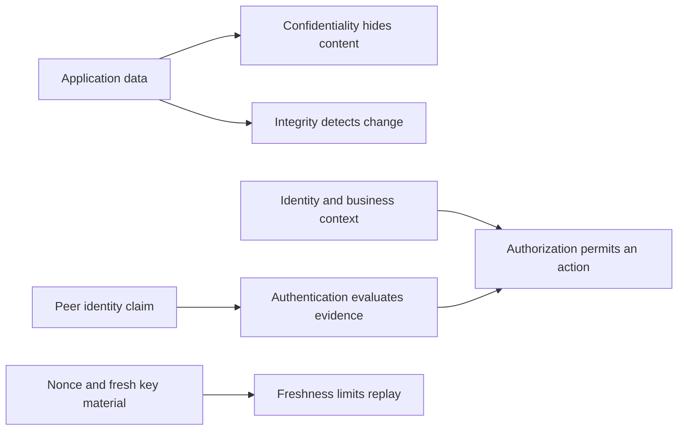
```mermaid
flowchart LR
    APP[Application data] --> CONF[Confidentiality hides content]
    APP --> INT[Integrity detects change]
    PEER[Peer identity claim] --> AUTH[Authentication evaluates evidence]
    CONTEXT[Identity and business context] --> AUTHZ[Authorization permits an action]
    FRESH[Nonce and fresh key material] --> REPLAY[Freshness limits replay]
    AUTH --> AUTHZ
```

## Security goals and cryptographic building blocks

TLS combines several tools because no single primitive supplies every security property. Symmetric authenticated encryption is fast for records. Asymmetric signatures authenticate handshake statements. Ephemeral key agreement derives shared secrets without transmitting the finished traffic key. Hash functions summarize the handshake transcript. A key derivation function turns shared secret and transcript context into separate traffic secrets.

An algorithm name alone is not a security conclusion. Parameters, key length, mode, implementation, random generation, key storage, certificate policy, protocol version, and endpoint state all matter. "Encrypted with AES" does not establish that the peer was authenticated, the key was protected, or the application handled plaintext safely.

| Building block | Shared secret needed? | Typical TLS role | Does not prove by itself |
|---|---:|---|---|
| Symmetric encryption | Yes | Protect application records efficiently | Peer identity or freshness |
| AEAD | Yes | Confidentiality and integrity for records | Certificate validity or authorization |
| Hash | No | Transcript digest, fingerprints, key derivation input | Authenticity when used without a key/signature |
| MAC | Yes | Integrity and secret possession; older record designs use MAC separately | Public verifiability |
| Digital signature | Private key to sign; public key to verify | Authenticate handshake and certificates | That signer is authorized for every action |
| Ephemeral Diffie-Hellman | Each side has ephemeral private contribution | Establish shared secret and forward secrecy | Peer identity unless authenticated |
| CSPRNG | Internal unpredictable state | Nonces, ephemeral keys, secrets | Correct use by surrounding protocol |
| KDF | Secret plus context | Derive distinct handshake/application keys | Entropy not present in input |

### Symmetric and asymmetric operations

Symmetric algorithms use secret key material known to legitimate participants. They are efficient enough for large data streams. Asymmetric algorithms use a mathematically related public/private pair. Depending on the algorithm and protocol, the pair supports signatures, verification, encryption, decryption, or key agreement. Modern TLS primarily uses public-key methods to authenticate and establish secrets, then symmetric AEAD to protect data.

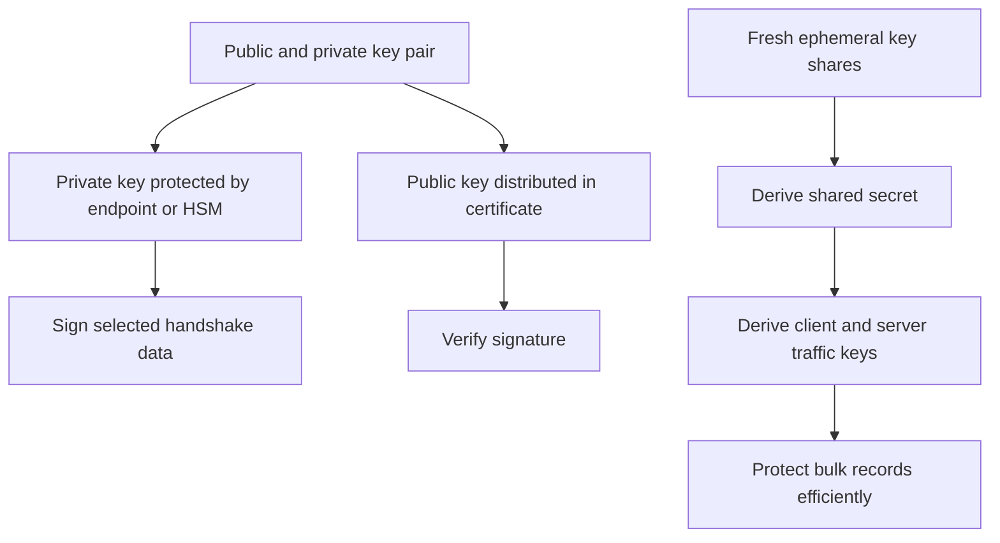
```mermaid
flowchart TD
    PAIR[Public and private key pair] --> PUB[Public key distributed in certificate]
    PAIR --> PRIV[Private key protected by endpoint or HSM]
    PRIV --> SIGN[Sign selected handshake data]
    PUB --> VERIFY[Verify signature]
    EPH[Fresh ephemeral key shares] --> AGREE[Derive shared secret]
    AGREE --> KDF[Derive client and server traffic keys]
    KDF --> AEAD[Protect bulk records efficiently]
```

| Question | Symmetric cryptography | Asymmetric cryptography |
|---|---|---|
| Key relationship | Same secret or closely shared secret state | Public/private mathematical pair |
| Speed | Generally faster | Generally more computationally expensive |
| Distribution issue | Secret must be established safely | Public key may be shared; private key stays secret |
| TLS use | Record protection and key derivation inputs | Authentication and key establishment |
| Main exposure | Shared secret compromise | Private-key compromise or false public-key binding |
| Analogy | Both couriers know one case combination | Anyone checks a public seal; only holder makes it |

### Hashes, MACs, AEAD, and signatures

A cryptographic hash should make it infeasible to recover the original input, find a different input with the same digest, or engineer collisions under the security assumptions. A raw hash is not a signature. Anyone can alter a document and calculate a new raw hash. A MAC adds a shared secret; a signature adds private-key proof and public verification. AEAD protects plaintext while authenticating associated context such as record metadata that is not encrypted.

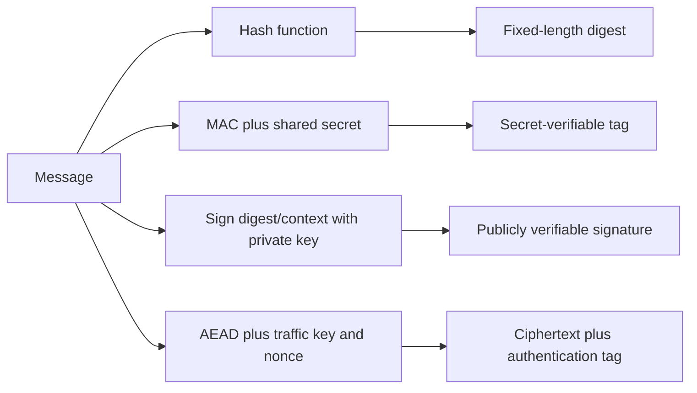
```mermaid
flowchart LR
    MSG[Message] --> HASH[Hash function]
    HASH --> DIGEST[Fixed-length digest]
    MSG --> MAC[MAC plus shared secret]
    MAC --> TAG[Secret-verifiable tag]
    MSG --> SIG[Sign digest/context with private key]
    SIG --> DS[Publicly verifiable signature]
    MSG --> AEAD[AEAD plus traffic key and nonce]
    AEAD --> CT[Ciphertext plus authentication tag]
```

### Plain-English deep-dive 1 - TLS uses a team of controls, not one magic lock

Imagine a secure meeting room. The opaque walls provide confidentiality. Tamper tape provides integrity. Reception checks a badge for authentication. The meeting owner decides whether the visitor may see payroll data, which is authorization. A timestamped single-use invitation limits replay. Different controls answer different questions.

TLS mainly protects data in transit between the two endpoints of one TLS association. It does not guarantee that either endpoint is uncompromised, that application authorization is correct, that stored data is encrypted, or that a user intended an action. A valid server certificate says that the certificate path and name checks succeeded under local policy; it does not say the website is benevolent. A phishing site can possess a valid certificate for its own deceptive domain.

For troubleshooting, name the failed property and observation point. "Encryption failed" is too broad. Better statements are: "The client and server offered no mutually acceptable TLS version," "the client rejected the leaf because the DNS name was absent from SAN," "the server requested a client certificate but the client supplied none," or "the browser accepted the enterprise inspection chain while the pinned native client rejected it."

## SSL history and TLS version evolution

SSL 2.0 and SSL 3.0 are obsolete. TLS 1.0 and 1.1 are also deprecated by IETF guidance. TLS 1.2 remains widely deployed when correctly configured, while TLS 1.3 simplifies negotiation, removes legacy algorithms and static RSA key exchange, encrypts more handshake content, and normally reduces round trips. "SSL certificate" remains common marketing language, but the certificate is an X.509 certificate used by TLS; it is not limited to historical SSL.

| Protocol family | Historical status | Important lesson | Operational wording |
|---|---|---|---|
| SSL 2.0 | Obsolete and insecure | Early protocol design had serious weaknesses | Do not enable |
| SSL 3.0 | Obsolete and insecure | Downgrade and cipher design matter | Do not enable |
| TLS 1.0 | Deprecated | Legacy compatibility can prolong risk | Remove unless formally exceptional and controlled |
| TLS 1.1 | Deprecated | Minimal benefit over modern versions | Remove unless formally exceptional and controlled |
| TLS 1.2 | Current in many environments | Configuration and cipher/key exchange choices matter | Support with approved suites and lifecycle policy |
| TLS 1.3 | Modern design | Faster handshake and fewer legacy choices | Prefer where ecosystem and policy permit |

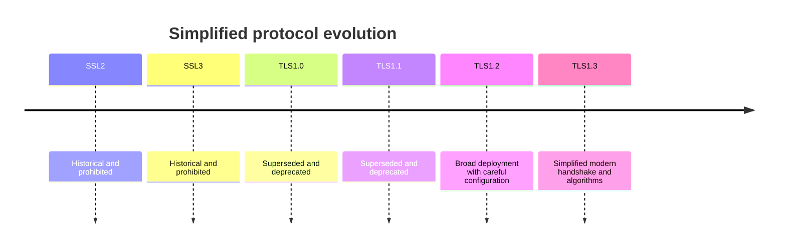
```mermaid
timeline
    title Simplified protocol evolution
    SSL2 : Historical and prohibited
    SSL3 : Historical and prohibited
    TLS1.0 : Superseded and deprecated
    TLS1.1 : Superseded and deprecated
    TLS1.2 : Broad deployment with careful configuration
    TLS1.3 : Simplified modern handshake and algorithms
```

Downgrade protection matters when peers support multiple versions. A network failure is not evidence of malicious downgrade; middleboxes, stale libraries, and policy mismatches can also interfere. Capture offered and selected versions, supported groups, signature algorithms, and alerts where visible. In TLS 1.3, the legacy version fields retain compatibility values, while the `supported_versions` extension carries actual negotiation. Reading only one legacy field can produce a false conclusion.

## PKI roles, governance, and lifecycle

PKI is more than a CA server. It includes identity proofing, certificate policies, issuance profiles, key generation, hardware protection, enrollment, distribution, renewal, revocation, status publication, auditing, recovery, and retirement. Public web PKI and private enterprise PKI have different trust distribution and policy contexts. A private root is trusted only where administrators install and govern it; public roots are distributed through browser or operating-system root programs under their policies.

| PKI role | Responsibility | Evidence to request | Common failure |
|---|---|---|---|
| Policy authority | Defines acceptable identity proofing and certificate use | Certificate policy and practice documents | Ambiguous ownership or weak exception process |
| Root CA | Anchors a hierarchy | Root fingerprint, custody, audit, trust distribution | Overbroad installation or private-key exposure |
| Issuing/intermediate CA | Signs end-entity or subordinate certificates | Issuer chain, profiles, audit logs | Missing intermediate or incorrect constraints |
| RA | Validates enrollment request and identity | Approval record and identity method | Wrong identity approved |
| Subscriber | Controls subject key and requests certificate | CSR, key-generation record, inventory | Private key copied or unmanaged |
| Relying party | Validates presented certificate | Trust store, policy, validation result | Assumes another client's trust decision applies |
| OCSP/CRL publisher | Publishes status information | URL reachability, freshness, signed response/list | Stale or unreachable status |
| HSM/key vault | Protects key operations and custody | Configuration, access/audit records | Exportable or overprivileged key access |
| Owner | Renews, rotates, tests, and retires certificate | Inventory, expiry alert, runbook | Surprise expiration |

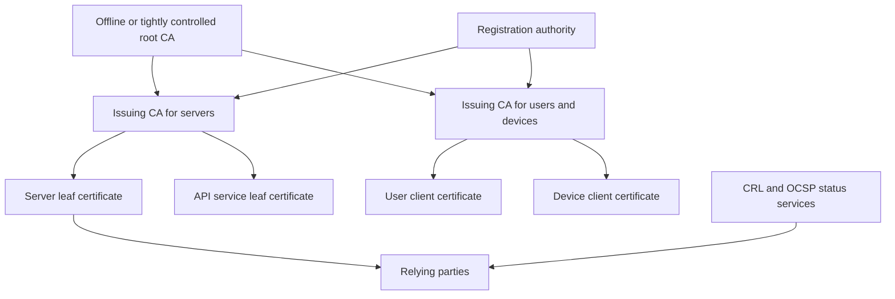
```mermaid
flowchart TB
    ROOT[Offline or tightly controlled root CA] --> INT1[Issuing CA for servers]
    ROOT --> INT2[Issuing CA for users and devices]
    INT1 --> WEB[Server leaf certificate]
    INT1 --> API[API service leaf certificate]
    INT2 --> USER[User client certificate]
    INT2 --> DEVICE[Device client certificate]
    RA[Registration authority] --> INT1
    RA --> INT2
    STATUS[CRL and OCSP status services] --> RP[Relying parties]
    WEB --> RP
```

### Key and certificate lifecycle

The private key may be generated on the destination system, in a hardware security module, or by an approved managed service. The CSR normally contains the public key and requested attributes and is signed to prove possession of the corresponding private key. The CA validates according to policy, issues a certificate, and the operator deploys the leaf with needed intermediates. Monitoring should begin before deployment ends: inventory owner, renewal method, dependencies, SAN names, key location, and rollback.

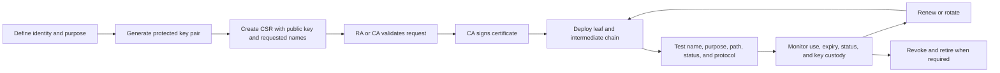
```mermaid
flowchart LR
    NEED[Define identity and purpose] --> KEY[Generate protected key pair]
    KEY --> CSR[Create CSR with public key and requested names]
    CSR --> VALIDATE[RA or CA validates request]
    VALIDATE --> ISSUE[CA signs certificate]
    ISSUE --> DEPLOY[Deploy leaf and intermediate chain]
    DEPLOY --> TEST[Test name, purpose, path, status, and protocol]
    TEST --> MONITOR[Monitor use, expiry, status, and key custody]
    MONITOR --> RENEW[Renew or rotate]
    RENEW --> DEPLOY
    MONITOR --> REVOKE[Revoke and retire when required]
```

| Lifecycle step | Required decision | Verification | Security concern |
|---|---|---|---|
| Define | Names, identity, EKU, algorithm, validity, owner | Approved certificate profile | Excess names or purposes increase exposure |
| Generate | Where and how key is created | Key properties and access record | Exportable/private key copied insecurely |
| Request | CSR contents and approval | Parse CSR; confirm public-key fingerprint | CSR does not prove requested names are authorized |
| Issue | CA profile and validation | Serial, issuer, SAN, constraints, signature | Mis-issuance or wrong profile |
| Deploy | Leaf, chain, key association | Test from real client contexts | Wrong private key or missing intermediate |
| Operate | Usage, performance, status | Logs and certificate inventory | Unnoticed key abuse or status failure |
| Renew | Rotation overlap and dependency plan | Old/new path tests and rollback | Hidden pinning or stale nodes |
| Revoke | Reason, publication, ecosystem response | OCSP/CRL status and client behavior | Revocation is not instantaneous everywhere |
| Retire | Remove trust, key, and stale copies | Inventory closure and access review | Forgotten keys and roots remain usable |

## X.509 certificate fields and identity matching

An X.509 certificate is signed structured data. It does not contain the subject's private key. Important fields include version, serial number, signature algorithm, issuer, validity interval, subject, Subject Public Key Info, and extensions. Extensions can be critical; a validator must reject an unrecognized critical extension because it may change correct interpretation.

| Field or extension | Plain meaning | Diagnostic question | Privacy/security note |
|---|---|---|---|
| Serial number | Issuer-unique certificate identifier | Does status evidence refer to this issuer/serial? | Not a universal asset identity |
| Signature algorithm | Algorithm CA used to sign certificate | Is it accepted by client policy? | Weak/deprecated choices can be rejected |
| Issuer | Distinguished name of signer | Which candidate issuer certificate matches? | Same text does not alone prove same key |
| Validity | Not Before and Not After | Was client clock within interval? | Short lifetimes reduce some exposure but increase automation need |
| Subject | Named entity attributes | Is identity represented here or in SAN? | Can expose organization or device details |
| SPKI | Public key and algorithm | Does private key match this public key? | Fingerprint can identify key reuse |
| SAN | Alternative identities | Does requested DNS/IP identity match? | Wildcards and broad lists need governance |
| Basic Constraints | CA status and path length | Is a leaf incorrectly acting as CA? | Critical hierarchy control |
| Key Usage | Allowed cryptographic operations | Is signing/key agreement use permitted? | Prevents unintended key use |
| EKU | Intended application purposes | Is serverAuth or clientAuth accepted? | Purpose mismatch causes validation failure |
| AIA | Issuer or OCSP access information | Can client retrieve missing issuer/status? | Network retrieval differs by client |
| CRL Distribution Points | Where CRLs may be obtained | Is current CRL reachable and valid? | URL access can expose validation activity |
| SKI/AKI | Subject/authority key identifiers | Which issuer key links the path? | Helpful but not sole path criterion |
| Certificate Policies | Policy identifiers and qualifiers | Does local policy accept this certificate? | Interpretation requires policy context |

### SAN, CN, wildcard, and name checks

For HTTPS, modern clients match the reference identity to an appropriate SAN entry. A DNS name is not matched by looking for a similar organization string. IP-address references generally require an iPAddress SAN value. Wildcards have constrained matching rules and should not be treated as arbitrary regular expressions. A certificate for `*.example.invalid` is not a general credential for all depths such as `a.b.example.invalid`.

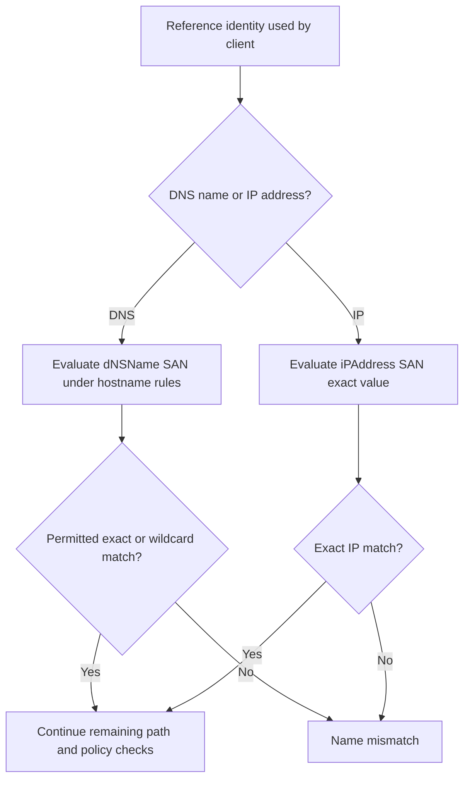
```mermaid
flowchart TD
    REF[Reference identity used by client] --> TYPE{DNS name or IP address?}
    TYPE -->|DNS| SAN[Evaluate dNSName SAN under hostname rules]
    TYPE -->|IP| IPSAN[Evaluate iPAddress SAN exact value]
    SAN --> MATCH{Permitted exact or wildcard match?}
    IPSAN --> IMATCH{Exact IP match?}
    MATCH -->|Yes| NEXT[Continue remaining path and policy checks]
    MATCH -->|No| FAIL[Name mismatch]
    IMATCH -->|Yes| NEXT
    IMATCH -->|No| FAIL
```

| Presented identity | Reference | Result concept | Reason |
|---|---|---|---|
| SAN `api.example.invalid` | `api.example.invalid` | Match candidate | Exact DNS identity |
| SAN `*.example.invalid` | `api.example.invalid` | Match candidate | One-label wildcard under common rules |
| SAN `*.example.invalid` | `a.b.example.invalid` | Reject | Wildcard does not span arbitrary labels |
| SAN `example.invalid` | `www.example.invalid` | Reject | Different DNS identity |
| SAN IP `192.0.2.10` | URL by `192.0.2.10` | Match candidate | Correct SAN type and exact value |
| CN only `api.example.invalid` | Modern HTTPS validation | Do not rely on it | SAN-based identity is expected |

### Plain-English deep-dive 2 - A certificate is evidence, not trust itself

A passport can be perfectly printed yet untrusted at a border that does not recognize its issuer. It can be issued by a recognized authority but expired. It can be valid yet belong to a different traveler. It can match the traveler but prohibit the requested activity. Certificate validation similarly asks several separate questions.

The verifier constructs a candidate path to a locally trusted anchor. It checks signatures, validity intervals, CA constraints, key usage, EKU, policy, name, critical extensions, algorithm rules, and possibly revocation. The server usually sends its leaf and needed intermediate certificates; it normally does not need to send the root because trust anchors are local. Different clients can build different paths using cached intermediates, Authority Information Access retrieval, alternate chains, or different trust stores.

Therefore, "the certificate is valid" is incomplete. State who validated it, for which reference name and purpose, at what time, using which trust store and status policy. A browser success does not prove a service process using a private trust store will succeed.

## Certification path building and validation

Path building discovers possible issuer chains. Path validation evaluates one candidate path under local rules. The process is more nuanced than comparing issuer and subject text. Validators use signatures, key identifiers, constraints, policies, trust settings, algorithm policy, and local implementation behavior. A cross-signed intermediate can permit multiple candidate paths.

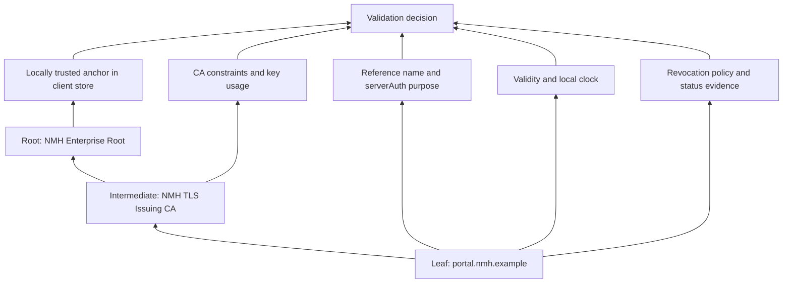
```mermaid
flowchart BT
    LEAF[Leaf: portal.nmh.example] --> I1[Intermediate: NMH TLS Issuing CA]
    I1 --> ROOT[Root: NMH Enterprise Root]
    ROOT --> STORE[Locally trusted anchor in client store]
    LEAF --> NAME[Reference name and serverAuth purpose]
    LEAF --> TIME[Validity and local clock]
    I1 --> CONSTRAINTS[CA constraints and key usage]
    LEAF --> STATUS[Revocation policy and status evidence]
    STORE --> DECISION[Validation decision]
    NAME --> DECISION
    TIME --> DECISION
    CONSTRAINTS --> DECISION
    STATUS --> DECISION
```

| Validation stage | Example failure | Evidence | Likely owner candidates |
|---|---|---|---|
| Parse | Malformed DER or unsupported critical extension | Client error and certificate bytes/fingerprint | Issuer/service deployment |
| Build | Intermediate absent and not retrievable | Presented chain and AIA behavior | Service/CDN/load balancer deployment |
| Trust | Root not in effective store | Store inventory and client context | Endpoint/PKI management |
| Signature | Certificate signature cannot verify | Full chain and algorithms | Issuer/deployment/tampering investigation |
| Time | Expired, not yet valid, or client clock wrong | UTC times and time source | Certificate owner or endpoint/time service |
| Constraints | Issuer not a CA or path length exceeded | Basic Constraints and path | PKI owner |
| Purpose | EKU or key usage mismatch | Requested purpose and extensions | PKI profile/service owner |
| Name | SAN does not match reference identity | Exact URL/reference and SAN | Service/certificate owner |
| Algorithm | Signature/key/group rejected by policy | Client policy and algorithm fields | Security/PKI/application owner |
| Status | Revoked, stale, unreachable under hard-fail policy | OCSP/CRL evidence | PKI/network/security owner |

### Trust stores and client-context differences

Windows, browsers, Java runtimes, containers, appliances, language libraries, and mobile applications can use different trust sources. Some browsers use operating-system trust; others maintain or augment their own policy. Applications may ship a private CA bundle or pin public keys. User and machine contexts can differ. Enterprise root deployment may reach managed browsers but not a service account, container, or unmanaged device.

| Comparison | Browser | Native sync client | Service/container |
|---|---|---|---|
| Trust source | OS/browser policy, possibly enterprise management | OS, embedded library, or application store | Image bundle, runtime store, or OS store |
| Proxy context | User-aware settings possible | System/application settings can differ | Explicit environment or workload routing |
| Intermediate retrieval | Often capable and cached | Library-dependent | Often restricted/minimal |
| Pinning | Browser ecosystem policy varies | Application may pin | SDK or custom client may pin |
| Credential context | Interactive user | User/device token and client state | Managed identity, service principal, or secret |
| Diagnostic lesson | Success is one observation | Compare exact path and store | Inspect image/runtime version and egress |

## Revocation, OCSP, CRLs, and freshness

Expiration is scheduled end of validity. Revocation is an issuer statement that a certificate should no longer be accepted before its scheduled end, perhaps because a key was compromised, affiliation changed, or issuance was superseded. Revocation checking behavior varies. A client may use CRLs, OCSP, cached status, stapled status, browser-specific mechanisms, or no network status check in a particular context. Some environments hard-fail when status cannot be obtained; others soft-fail to preserve availability. That choice is a risk and availability decision, not a universal truth.

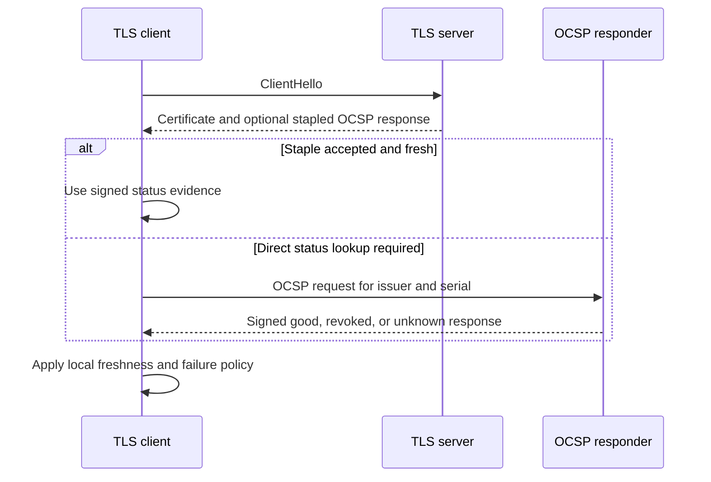
```mermaid
sequenceDiagram
    participant C as TLS client
    participant S as TLS server
    participant O as OCSP responder
    C->>S: ClientHello
    S-->>C: Certificate and optional stapled OCSP response
    alt Staple accepted and fresh
        C->>C: Use signed status evidence
    else Direct status lookup required
        C->>O: OCSP request for issuer and serial
        O-->>C: Signed good, revoked, or unknown response
    end
    C->>C: Apply local freshness and failure policy
```

| Status mechanism | Model | Strength | Limitation |
|---|---|---|---|
| CRL | Download signed list of revoked serials | Can validate locally until next update | Lists can be large or stale; distribution must work |
| Delta CRL | Changes since a base CRL | Reduces update size | Requires correct base/delta processing |
| OCSP | Query status for one certificate | Smaller targeted response | Privacy, availability, caching, responder trust |
| OCSP stapling | Server supplies CA-signed status response | Reduces client lookup and privacy leakage | Server must refresh; client support/policy varies |
| Short-lived certificate | Limit validity window | Reduces long revocation exposure | Requires reliable automated issuance and rotation |
| Browser/vendor mechanism | Curated or proprietary status handling | Can improve ecosystem response | Not general behavior for all clients |

Troubleshooting must capture issuer, serial, responder or CRL URL, `thisUpdate`, `nextUpdate`, produced time, response status, signature validation, cache state, and client policy. "OCSP is reachable" is insufficient if the response is stale, signed by an unacceptable responder, or refers to another certificate.

## TLS negotiation fields: SNI, ALPN, versions, groups, and signatures

The ClientHello advertises capabilities and context. Typical fields include offered protocol versions, cipher suites, supported groups, signature algorithms, key shares, SNI, ALPN, and random/session information. The server chooses compatible parameters within its policy. No overlap can cause an alert or abrupt close. Some ClientHello details are visible to an on-path observer in conventional TLS 1.2/1.3 deployments; application data and much of the TLS 1.3 server handshake are encrypted after key establishment. Encrypted ClientHello, where supported and correctly deployed, changes SNI visibility, but it should not be assumed from the presence of TLS 1.3 alone.

| Field | Sent by | Purpose | Failure signature |
|---|---|---|---|
| SNI `server_name` | Client | Select intended virtual host/certificate | Wrong/default certificate or policy route |
| ALPN | Both negotiate | Select application protocol such as `h2` or `http/1.1` | No application protocol or fallback difference |
| supported_versions | Client/server | Offer/select TLS versions | Protocol version alert/no overlap |
| cipher_suites | Client/server | Offer/select TLS cryptographic option | Handshake failure/no shared suite |
| supported_groups | Client | Advertise key-exchange groups | No acceptable group or extra round trip |
| key_share | Client/server | Carry ephemeral public contributions | HelloRetryRequest or failure |
| signature_algorithms | Client | Algorithms accepted for signatures | Certificate/CertificateVerify incompatibility |
| random | Both | Fresh input and protocol functions | Repetition can indicate severe implementation issue |
| session ID/ticket/PSK | Both depending version | Attempt resumption | Full handshake fallback or binder failure |

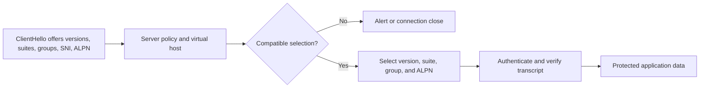
```mermaid
flowchart LR
    CH[ClientHello offers versions, suites, groups, SNI, ALPN] --> POLICY[Server policy and virtual host]
    POLICY --> OVERLAP{Compatible selection?}
    OVERLAP -->|No| ALERT[Alert or connection close]
    OVERLAP -->|Yes| SELECT[Select version, suite, group, and ALPN]
    SELECT --> AUTH[Authenticate and verify transcript]
    AUTH --> DATA[Protected application data]
```

### Cipher suites in TLS 1.2 and TLS 1.3

TLS 1.2 suite names often encode key exchange/authentication and record-protection choices, such as an ephemeral ECDHE exchange, RSA authentication, AES-GCM, and a hash used by the pseudorandom function. TLS 1.3 suite names describe AEAD and hash choices; authentication signatures and groups are negotiated separately. Applying a TLS 1.2 interpretation to a TLS 1.3 suite is a common interview mistake.

| Aspect | TLS 1.2 | TLS 1.3 |
|---|---|---|
| Suite scope | Commonly names key exchange/auth plus bulk cipher/MAC or AEAD | Names AEAD and hash |
| Static RSA key exchange | Historically possible but not forward-secret | Removed |
| Legacy CBC suites | Possible but avoid under modern policy | Removed |
| Key exchange | Suite-linked plus extensions | Supported groups/key shares, normally ephemeral |
| Authentication algorithm | Often reflected in suite name | Negotiated via signature algorithms |
| Handshake encryption | Later in handshake | Most server handshake after ServerHello encrypted |

## TLS 1.2 handshake from packet to trust decision

A common full TLS 1.2 handshake with ephemeral Diffie-Hellman begins after TCP connectivity. The client sends ClientHello. The server returns ServerHello, Certificate, a signed ServerKeyExchange when required, optional CertificateRequest for mTLS, and ServerHelloDone. The client validates the certificate and signature, sends optional client Certificate, sends ClientKeyExchange containing its ephemeral contribution, optionally signs the transcript with CertificateVerify, changes to negotiated keys, and sends Finished. The server switches keys and sends Finished. Exact messages depend on cipher suite and extensions.

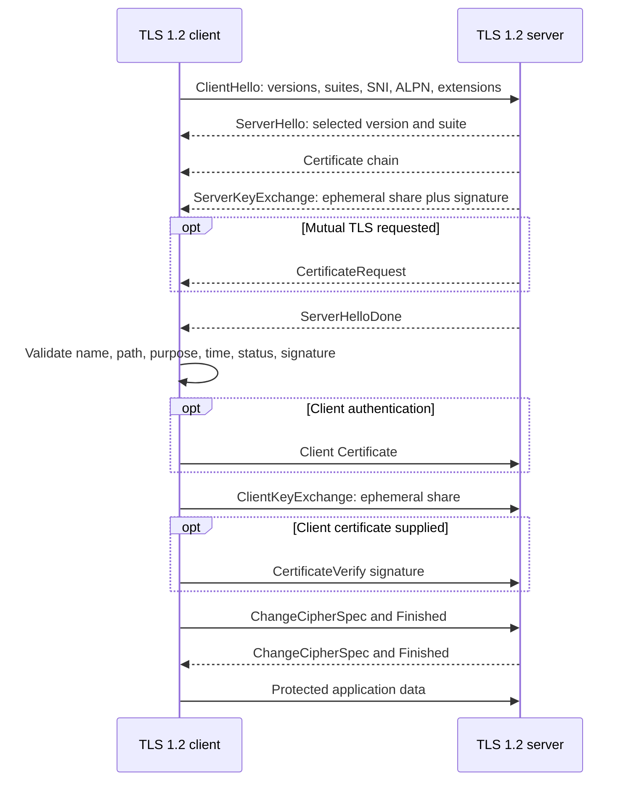
```mermaid
sequenceDiagram
    participant C as TLS 1.2 client
    participant S as TLS 1.2 server
    C->>S: ClientHello: versions, suites, SNI, ALPN, extensions
    S-->>C: ServerHello: selected version and suite
    S-->>C: Certificate chain
    S-->>C: ServerKeyExchange: ephemeral share plus signature
    opt Mutual TLS requested
        S-->>C: CertificateRequest
    end
    S-->>C: ServerHelloDone
    C->>C: Validate name, path, purpose, time, status, signature
    opt Client authentication
        C->>S: Client Certificate
    end
    C->>S: ClientKeyExchange: ephemeral share
    opt Client certificate supplied
        C->>S: CertificateVerify signature
    end
    C->>S: ChangeCipherSpec and Finished
    S-->>C: ChangeCipherSpec and Finished
    C->>S: Protected application data
```

| TLS 1.2 evidence | What it establishes | What it does not establish |
|---|---|---|
| ClientHello seen | Client reached observation point and offered listed values | Server received it beyond another intermediary |
| ServerHello seen | A responder selected listed parameters | Certificate/path is acceptable |
| Certificate seen | Responder presented these bytes | Client accepted them or owns private key |
| Alert seen from client direction | Client-side TLS stack sent an alert at observation point | Human-readable UI cause without mapping/context |
| Finished verified by endpoint | Transcript/key agreement succeeded for that association | Application request succeeded |
| Application Data record | Encrypted record traversed observation point | Plaintext method/status without keys or endpoint evidence |

The Finished messages authenticate the handshake transcript using derived secrets. They detect negotiation tampering. Packet captures often show a fatal alert but not a friendly diagnosis. Alert descriptions can be intentionally generic. Correlate the alert direction, exact preceding message, client validation logs, server logs, and certificate fields.

## TLS 1.3 handshake, key schedule, and forward secrecy

TLS 1.3 aims for a one-round-trip full handshake when the client sends a suitable key share. The ClientHello includes key shares and modern negotiation. ServerHello selects parameters, after which handshake keys protect EncryptedExtensions, CertificateRequest if used, Certificate, CertificateVerify, and Finished. The client validates, sends its Finished and optional client-auth messages, and application traffic follows. The server can send NewSessionTicket later for resumption.

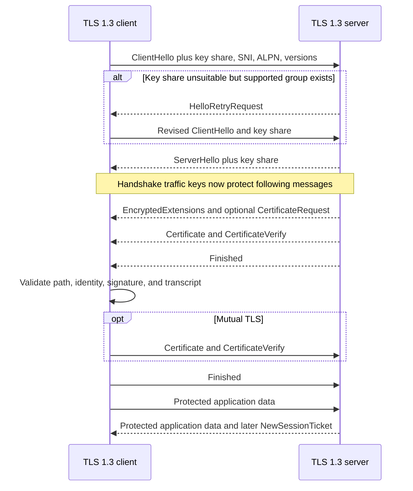
```mermaid
sequenceDiagram
    participant C as TLS 1.3 client
    participant S as TLS 1.3 server
    C->>S: ClientHello plus key share, SNI, ALPN, versions
    alt Key share unsuitable but supported group exists
        S-->>C: HelloRetryRequest
        C->>S: Revised ClientHello and key share
    end
    S-->>C: ServerHello plus key share
    Note over C,S: Handshake traffic keys now protect following messages
    S-->>C: EncryptedExtensions and optional CertificateRequest
    S-->>C: Certificate and CertificateVerify
    S-->>C: Finished
    C->>C: Validate path, identity, signature, and transcript
    opt Mutual TLS
        C->>S: Certificate and CertificateVerify
    end
    C->>S: Finished
    C->>S: Protected application data
    S-->>C: Protected application data and later NewSessionTicket
```

TLS 1.3 uses HKDF to derive staged secrets from input keying material and transcript hashes. Separate client/server and handshake/application traffic secrets reduce key reuse. KeyUpdate can refresh application traffic keys. The exact key schedule is important to implementers, but a TSM should explain its operational meaning: different phases and directions use different derived keys; possession of one key does not automatically expose every secret.

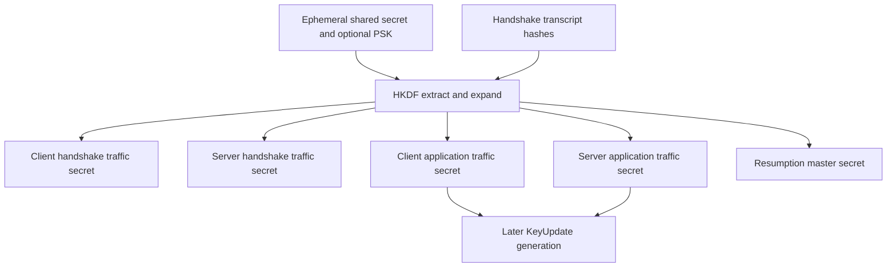
```mermaid
flowchart TD
    INPUT[Ephemeral shared secret and optional PSK] --> HKDF[HKDF extract and expand]
    TRANSCRIPT[Handshake transcript hashes] --> HKDF
    HKDF --> CHS[Client handshake traffic secret]
    HKDF --> SHS[Server handshake traffic secret]
    HKDF --> CAP[Client application traffic secret]
    HKDF --> SAP[Server application traffic secret]
    HKDF --> RES[Resumption master secret]
    CAP --> UPDATE[Later KeyUpdate generation]
    SAP --> UPDATE
```

### Forward secrecy

With authenticated ephemeral Diffie-Hellman, the server's long-term private signing key authenticates the ephemeral exchange but does not itself derive the traffic secret. If that certificate private key is stolen later, a passive recording of an earlier correctly implemented session should remain protected because the ephemeral private values are gone. Forward secrecy does not protect a session from a compromised endpoint at the time, exported session keys, weak randomness, active private-key misuse during compromise, or plaintext retained elsewhere.

### Plain-English deep-dive 3 - The certificate key usually signs the meeting, not every package

An executive can sign a one-time meeting agreement while two participants create fresh locker combinations for that meeting. Stealing the executive's signing stamp next year should not reveal last year's locker combinations. In modern forward-secret TLS, long-term certificate keys authenticate the handshake, while ephemeral key agreement creates fresh shared secret material.

This distinction fixes two common misconceptions. First, ordinary packet decryption is not achieved simply by possessing an RSA certificate private key when ephemeral key exchange is used. Second, rotating a compromised certificate key is necessary but does not clean a compromised server, invalidate stolen session material, or repair copied plaintext. Incident response must scope key custody, endpoint compromise, session tickets, logs, caches, replicas, and issuance history.

## Session resumption, tickets, PSKs, and 0-RTT

Resumption reduces latency and computation by proving possession of state derived from an earlier handshake. TLS 1.2 can use session identifiers or session tickets. TLS 1.3 represents resumption through pre-shared keys, commonly delivered in NewSessionTicket messages. A resumed connection still derives new traffic keys, but its authentication basis includes previous shared state and ticket protection.

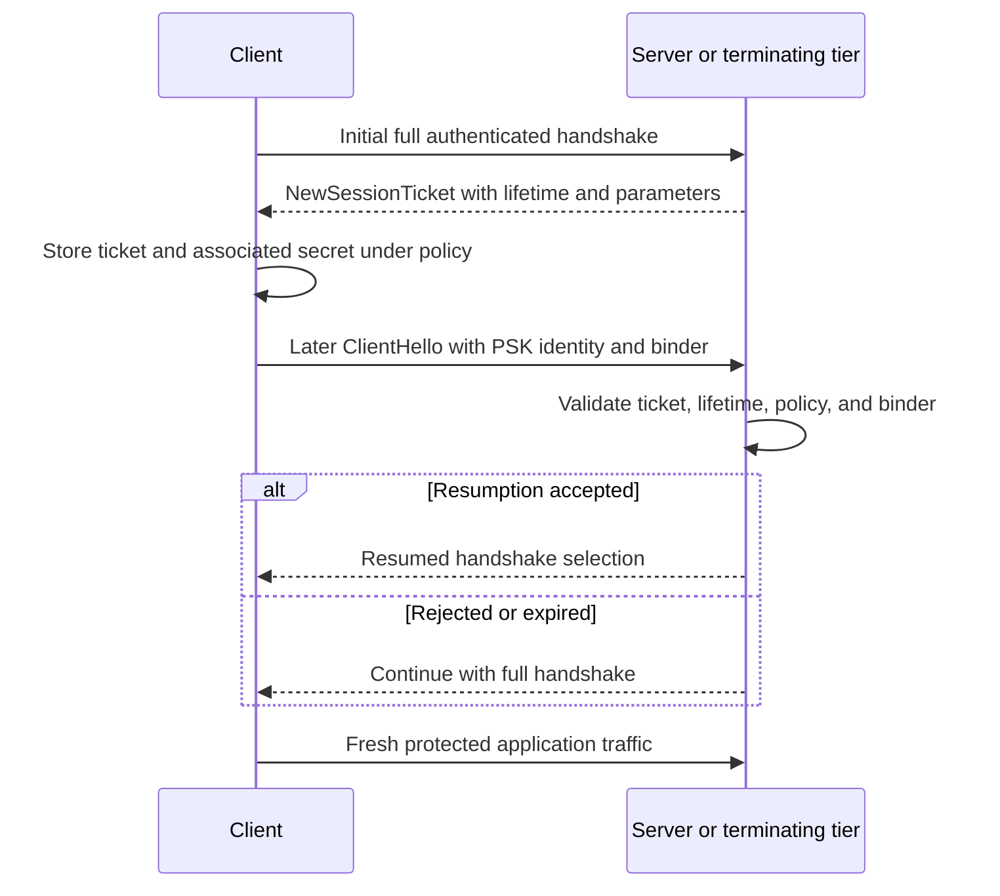
```mermaid
sequenceDiagram
    participant C as Client
    participant S as Server or terminating tier
    C->>S: Initial full authenticated handshake
    S-->>C: NewSessionTicket with lifetime and parameters
    C->>C: Store ticket and associated secret under policy
    C->>S: Later ClientHello with PSK identity and binder
    S->>S: Validate ticket, lifetime, policy, and binder
    alt Resumption accepted
        S-->>C: Resumed handshake selection
    else Rejected or expired
        S-->>C: Continue with full handshake
    end
    C->>S: Fresh protected application traffic
```

| Resumption concern | Why it matters | Diagnostic evidence | Control |
|---|---|---|---|
| Ticket lifetime | Defines return window | Ticket metadata and server policy | Short, risk-based lifetime |
| Ticket key sharing | Enables a server tier to decrypt/validate tickets | Load-balancer/service configuration | Protect and rotate ticket keys |
| Deployment rotation | Old nodes may reject new tickets | Node-specific traces and retry pattern | Coordinated key rollout |
| Policy change | Resumption could preserve stale assumptions if implementation is wrong | Full versus resumed comparison | Bind acceptance to current policy |
| Client cache | Different client/profile behavior | New profile or cache-cleared controlled test | Do not clear blindly before preserving evidence |
| 0-RTT early data | Can be replayed under TLS 1.3 threat model | Early-data indication and application method | Permit only replay-safe operations with anti-replay design |

TLS 1.3 0-RTT allows a returning client to send early application data before the new handshake fully completes. It improves latency but lacks the same replay protections as ordinary post-handshake data. The application must decide whether an operation is safe to replay. A GET-like read can still have privacy or state effects; a payment, permission change, upload finalization, or workflow trigger is a poor early-data candidate without a robust protocol design.

## Mutual TLS: two certificate decisions

Normal public HTTPS commonly authenticates the server to the client. mTLS additionally asks the client to present a certificate and prove possession of its private key. The server validates that client certificate against its accepted issuers, identity mapping, EKU, status, policy, and authorization rules. mTLS can identify a workload, device, or user credential, but it is not automatically least privilege and does not replace application authorization.

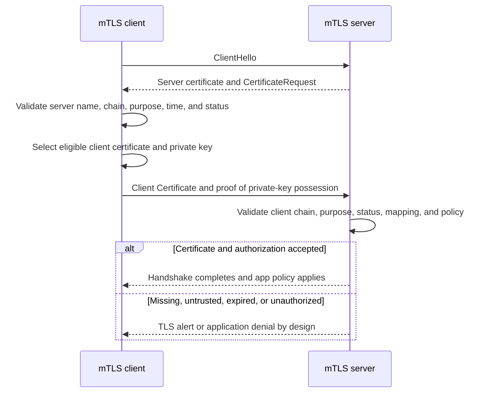
```mermaid
sequenceDiagram
    participant C as mTLS client
    participant S as mTLS server
    C->>S: ClientHello
    S-->>C: Server certificate and CertificateRequest
    C->>C: Validate server name, chain, purpose, time, and status
    C->>C: Select eligible client certificate and private key
    C->>S: Client Certificate and proof of private-key possession
    S->>S: Validate client chain, purpose, status, mapping, and policy
    alt Certificate and authorization accepted
        S-->>C: Handshake completes and app policy applies
    else Missing, untrusted, expired, or unauthorized
        S-->>C: TLS alert or application denial by design
    end
```

| mTLS failure | Client-side question | Server-side question | Typical owner |
|---|---|---|---|
| No client certificate sent | Did request criteria match an eligible certificate? | Which CA names/signature algorithms were requested? | Endpoint/app/PKI |
| User prompt appears | Are multiple eligible certs present? | Is automatic selection intentionally disabled? | Endpoint/app/security |
| Unknown CA alert | Did client send full needed chain? | Does server trust intended client issuer? | PKI/server owner |
| Bad certificate alert | Is key associated and certificate current? | Which validation rule rejected it? | PKI/app owner |
| Handshake succeeds, app denies | What identity was mapped? | What authorization policy applies? | Application/IAM |
| Works on one node | Is client behavior identical? | Do trust stores/policies differ by node? | Platform/deployment |

Client certificate selection can depend on requested CA distinguished names, signature algorithms, EKU, key availability, user versus machine store, application access to the private key, and UI policy. Installing the certificate alone is not enough. The process must access the corresponding private key under the correct identity.

## TLS interception and inspection architecture

An approved inspecting proxy terminates the client's TLS association, evaluates permitted plaintext or metadata, and creates a separate TLS association to the origin. For the client-facing leg, it presents a dynamically issued or selected certificate for the requested site, signed by an enterprise-trusted inspection CA. For the origin-facing leg, it acts as a client and validates the origin under configured policy. Each leg has its own handshake, keys, negotiated version, cipher, certificate, timing, and failure point.

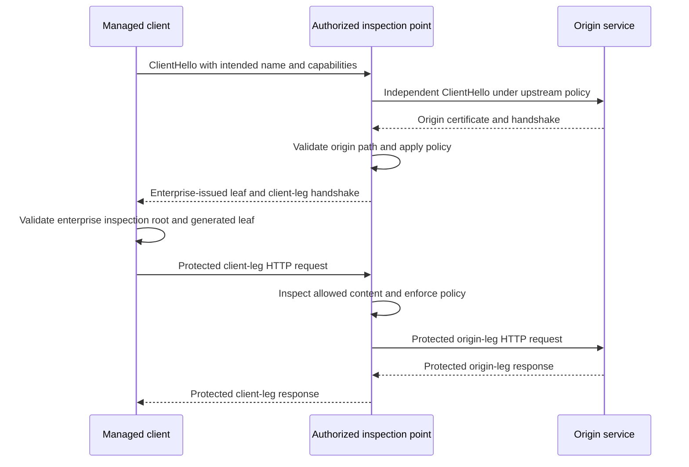
```mermaid
sequenceDiagram
    participant U as Managed client
    participant I as Authorized inspection point
    participant O as Origin service
    U->>I: ClientHello with intended name and capabilities
    I->>O: Independent ClientHello under upstream policy
    O-->>I: Origin certificate and handshake
    I->>I: Validate origin path and apply policy
    I-->>U: Enterprise-issued leaf and client-leg handshake
    U->>U: Validate enterprise inspection root and generated leaf
    U->>I: Protected client-leg HTTP request
    I->>I: Inspect allowed content and enforce policy
    I->>O: Protected origin-leg HTTP request
    O-->>I: Protected origin-leg response
    I-->>U: Protected client-leg response
```

| Property | Client-to-inspector leg | Inspector-to-origin leg |
|---|---|---|
| TLS client | User device/application | Inspecting service |
| TLS server | Inspecting service | Origin/CDN/reverse proxy |
| Leaf seen | Enterprise inspection-issued site leaf | Origin's deployed leaf |
| Trust store | Client/application store | Inspector's upstream validation store/policy |
| Version/cipher | Negotiated with client | Negotiated with origin independently |
| Failure evidence | Client, endpoint, client-facing packet/log | Inspection point, origin-facing packet/log, origin logs |
| Plaintext location | Client and authorized inspection process | Authorized inspection process and origin endpoint |
| Ownership | Endpoint/PKI/security/network/app | Security/network/vendor/origin/app |

Inspection creates security value and security responsibility. It can enable malware scanning, data policy, URL/content controls, and threat detection where authorized. It also concentrates sensitive plaintext and metadata, creates a powerful enterprise CA, changes end-to-end certificate visibility, and can break applications that pin certificates or use unsupported protocols. Governance must define purpose, scope, legal basis, excluded categories, privileged access, logging, retention, incident response, key protection, fail behavior, and periodic review.

### Inspection decision and bypass

A bypass means traffic is not decrypted at that inspection point. It should not be confused with "allow all"; metadata, routing, firewall, DNS, endpoint, or destination controls may still apply. Bypass can reduce privacy or compatibility risk but creates a visibility gap. A broad bypass made during an outage can become permanent risk debt.

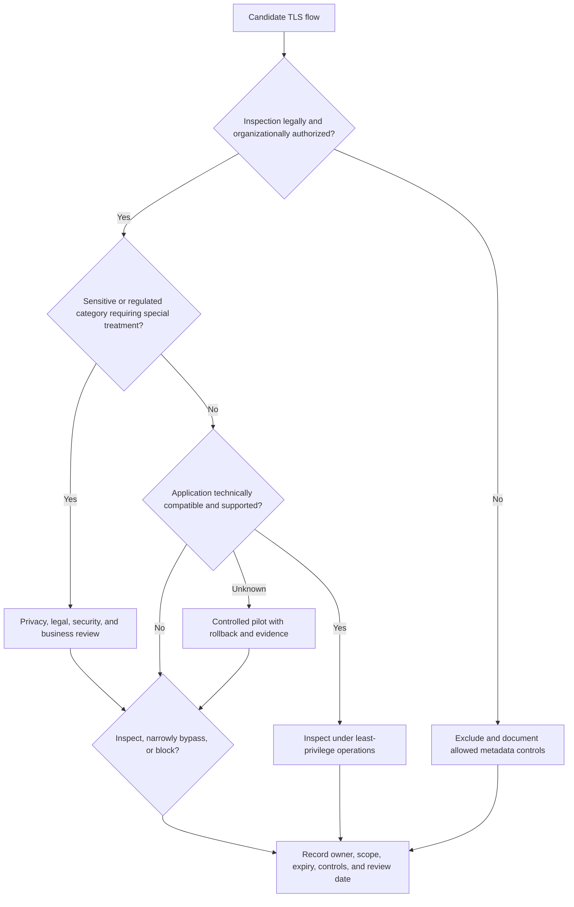
```mermaid
flowchart TD
    FLOW[Candidate TLS flow] --> AUTHORIZED{Inspection legally and organizationally authorized?}
    AUTHORIZED -->|No| EXCLUDE[Exclude and document allowed metadata controls]
    AUTHORIZED -->|Yes| DATA{Sensitive or regulated category requiring special treatment?}
    DATA -->|Yes| REVIEW[Privacy, legal, security, and business review]
    DATA -->|No| COMPAT{Application technically compatible and supported?}
    REVIEW --> DECIDE{Inspect, narrowly bypass, or block?}
    COMPAT -->|Unknown| PILOT[Controlled pilot with rollback and evidence]
    COMPAT -->|Yes| INSPECT[Inspect under least-privilege operations]
    COMPAT -->|No| DECIDE
    PILOT --> DECIDE
    DECIDE --> MONITOR[Record owner, scope, expiry, controls, and review date]
    INSPECT --> MONITOR
    EXCLUDE --> MONITOR
```

| Decision factor | Inspect candidate | Bypass candidate | Required evidence |
|---|---|---|---|
| Threat exposure | High-risk unknown content may benefit from inspection | Strong alternative controls may reduce need | Risk assessment and control coverage |
| Privacy/legal | Authorized business data under defined purpose | Health, finance, personal, privileged, or jurisdictional restriction | Legal/privacy approval and data classification |
| Technical compatibility | Standard trust behavior and tested flow | Pinning, client cert design, unsupported protocol | Controlled trace and vendor documentation |
| Business criticality | Inspection validated with capacity and rollback | Outage impact exceeds controlled residual risk temporarily | Owner, impact, exception duration |
| Data handling | Restricted admin access, retention, redaction | Decryption would exceed purpose/minimization | Data-flow and access review |
| Scope | Specific users/apps/categories and documented policy | Narrow destination/app and expiry | Exact match criteria and validation tests |

### Certificate pinning and application compatibility

Pinning restricts accepted certificates or public keys beyond ordinary platform trust. It can defend against unwanted CA issuance or interception, but it creates rotation and operational coupling. An inspecting service's enterprise-issued leaf can be valid under the enterprise root and still violate the application's pin. Do not disable pinning by unsupported client modification or install private keys. Confirm application/vendor design, use a documented bypass or supported integration if policy permits, and preserve compensating controls.

### Plain-English deep-dive 4 - Inspection is a controlled plaintext processing system

Calling inspection "opening HTTPS" understates the architecture. It is a system that receives protected traffic, authenticates two different peers, temporarily processes readable business content, makes policy decisions, records selected telemetry, and protects a second connection. The decryption engine, policy administrators, log pipeline, support bundle, memory, storage, and exported evidence all become part of the data-security boundary.

A defensible design uses least privilege, separation of duties, protected CA keys, restricted debug access, content minimization, short retention, redaction, audited changes, capacity planning, fail-mode decisions, and exception expiry. Troubleshooting should avoid full decrypted captures unless a narrower field-level artifact cannot answer the question. A capture made for one incident should not become an ungoverned archive of users' sessions.

For an interview, the balanced answer is neither "inspect everything" nor "inspection is always wrong." Explain the threat-control benefit, the privacy and compatibility cost, the two TLS legs, the need for legal and business authority, and a scoped test/exception process.

## Failure modes and diagnostic signatures

TLS failures often appear as a browser warning, generic application error, TCP reset, TLS alert, proxy page, or timeout. The visible symptom can be distant from the cause. A client might send a TCP reset after locally rejecting a certificate. A server might close without an alert. An intermediary might generate an HTTP error only after TLS succeeds. Build a timeline before assigning ownership.

| Symptom | Plausible hypotheses | Discriminating check | Avoid saying |
|---|---|---|---|
| Name mismatch | Wrong SNI, wrong URL, default virtual host, stale cert | Compare reference identity, SNI, SAN, responder | "DNS is broken" without name/path evidence |
| Unknown issuer | Missing intermediate, absent root, private store, wrong chain | Compare presented chain and effective trust store | "Certificate is invalid everywhere" |
| Expired certificate | Leaf/intermediate expired or client clock wrong | Compare UTC validity of every path cert and clock | "Renew leaf" before identifying expired element |
| Not yet valid | Clock skew or early deployment | Time-source evidence and Not Before | "CA issue" without clock check |
| Revoked/status error | Revoked, stale OCSP/CRL, blocked responder, hard-fail policy | Signed status, freshness, reachability, policy | "OCSP says down" without response details |
| Protocol version alert | No shared version or policy/middlebox issue | Offered/selected versions and alert direction | "TLS 1.3 unsupported" from a legacy field alone |
| Handshake failure alert | Suite/group/signature/client-cert/policy mismatch | Last successful message and both logs | Treat generic alert as root cause |
| Bad certificate in mTLS | Wrong client chain, EKU, key proof, status | CertificateRequest, sent chain, server reason | Assume server certificate failed |
| Browser works, app fails | Different store, pinning, proxy, SNI, ALPN, runtime | Side-by-side process/path/cert comparison | Use browser as universal proof |
| Intermittent by node | Inconsistent cert, chain, clock, ticket key, policy | Correlate destination/node and handshake | Blame network generally |
| HTTP error after handshake | TLS succeeded; app/proxy policy responded | Finished/application evidence and responder | Continue rotating certificates |
| Timeout | Packet loss, blocked status lookup, blackhole, inspection capacity | Phase timings and bidirectional packets | "Encryption is slow" without phase isolation |

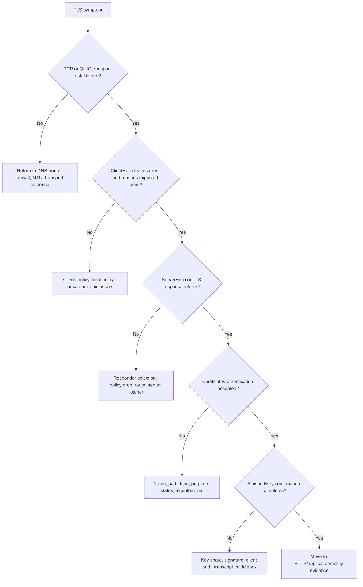
```mermaid
flowchart TD
    START[TLS symptom] --> TCP{TCP or QUIC transport established?}
    TCP -->|No| LOWER[Return to DNS, route, firewall, MTU, transport evidence]
    TCP -->|Yes| CH{ClientHello leaves client and reaches expected point?}
    CH -->|No| CLIENT[Client, policy, local proxy, or capture-point issue]
    CH -->|Yes| SH{ServerHello or TLS response returns?}
    SH -->|No| PATH[Responder selection, policy drop, route, server listener]
    SH -->|Yes| CERT{Certificate/authentication accepted?}
    CERT -->|No| VALIDATE[Name, path, time, purpose, status, algorithm, pin]
    CERT -->|Yes| FIN{Finished/key confirmation completes?}
    FIN -->|No| NEGOTIATE[Key share, signature, client auth, transcript, middlebox]
    FIN -->|Yes| APP[Move to HTTP/application/policy evidence]
```

### Certificate validation troubleshooting tree

1. Preserve exact UTC timestamp, client process/version, user or service context, URL/reference identity, network path, and error text/code.
2. Determine whether the client saw an origin leaf or enterprise inspection-issued leaf. Record SHA-256 fingerprints, not private keys.
3. Parse the presented leaf and intermediates. Do not assume a certificate downloaded later is identical.
4. Match the exact reference DNS name or IP against SAN under applicable rules.
5. Check Not Before and Not After for every certificate in the selected path and verify client clock/time source.
6. Identify the effective trust store for that process and context.
7. Build candidate path; inspect issuer links, signatures, Basic Constraints, path length, Key Usage, EKU, algorithms, and critical extensions.
8. Evaluate revocation/status under the client's actual policy and timestamp.
9. Check application pinning or private trust behavior.
10. Compare a known-good client by one changed variable; do not spray roots or disable validation.

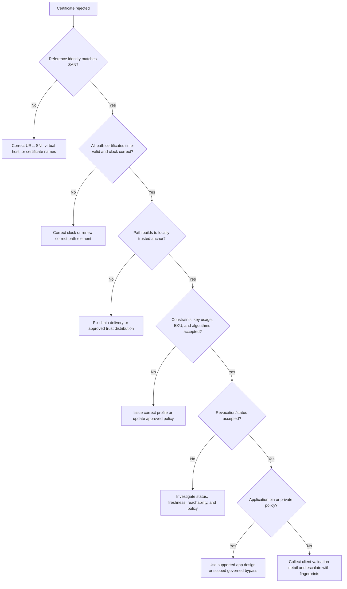
```mermaid
flowchart TD
    V[Certificate rejected] --> ID{Reference identity matches SAN?}
    ID -->|No| N[Correct URL, SNI, virtual host, or certificate names]
    ID -->|Yes| TIME{All path certificates time-valid and clock correct?}
    TIME -->|No| T[Correct clock or renew correct path element]
    TIME -->|Yes| PATH{Path builds to locally trusted anchor?}
    PATH -->|No| P[Fix chain delivery or approved trust distribution]
    PATH -->|Yes| USE{Constraints, key usage, EKU, and algorithms accepted?}
    USE -->|No| U[Issue correct profile or update approved policy]
    USE -->|Yes| STAT{Revocation/status accepted?}
    STAT -->|No| S[Investigate status, freshness, reachability, and policy]
    STAT -->|Yes| PIN{Application pin or private policy?}
    PIN -->|Yes| A[Use supported app design or scoped governed bypass]
    PIN -->|No| LOG[Collect client validation detail and escalate with fingerprints]
```

## Packet, browser, operating-system, and tool evidence

A packet trace observes bytes at a location and time. It does not automatically reveal the process, user intent, policy decision, or encrypted HTTP. A browser security panel can show the certificate and negotiated connection from that browser's perspective. Operating-system tools can inspect stores and validation. Server and inspection logs reveal decisions from their own points. Correlation requires normalized UTC time, source/destination tuple, SNI where visible, certificate fingerprint, alert direction, connection/request IDs where available, and topology.

| Evidence source | Useful fields | Strength | Limitation/privacy |
|---|---|---|---|
| Wireshark/tcpdump | IPs, ports, TCP, ClientHello, SNI, ALPN offers, versions, alerts, timing | Grounded packet sequence at capture point | Payload encrypted; capture may contain identifiers |
| Browser security UI | Leaf/chain view, connection protocol, browser error | User-context validation result | Browser-specific and not native-client proof |
| Browser network tools | Request phase, protocol, error context | Correlates page operation | Export can contain cookies/tokens/content |
| Windows certificate UI/PowerShell | Store contents and certificate properties | Effective machine/user inventory with context | Store choice still application-dependent |
| `certutil` | Decode, verify, store, URL/status diagnostics | Detailed Windows PKI evidence | Options can make network requests; output can expose names |
| `openssl s_client` | Presented chain, handshake, SNI/ALPN test | Controlled independent client view | Different trust/config from production app |
| `curl` verbose output | Protocol and certificate summary, HTTP boundary | Reproducible request test | Do not expose tokens; library/build behavior differs |
| Inspection/proxy logs | Policy, upstream/downstream status, cert action, IDs | Identifies intermediary decision | Fields/product behavior require official docs |
| Server/load balancer logs | Listener, SNI, certificate, mTLS reason | Responder-side evidence | Access and retention vary |
| Application logs | Runtime trust/pin/client-cert error | Closest to failing process | Error may be wrapped or redacted |

### Safe packet analysis workflow

Use a controlled capture with authorization. Record capture point: client before local tunneling, client after a virtual adapter, inspection ingress, inspection egress, or server. Start before reproduction and stop immediately after. Preserve original read-only evidence, work on a copy, hash under incident procedure if chain of custody matters, minimize access, and sanitize derivatives.

Useful Wireshark display-filter concepts in an approved lab include:

```text
tls
tls.handshake.type == 1
tls.handshake.type == 2
tls.handshake.extensions_server_name
tls.handshake.extensions_alpn_str
tls.alert_message
tcp.stream == 7
ip.addr == 192.0.2.10 && tcp.port == 443
```

Field names depend on Wireshark version and protocol dissection. A filter returning no rows does not prove the field was absent; capture truncation, QUIC, unsupported dissection, encryption, offload, wrong interface, or version can matter.


```mermaid
flowchart LR
    CLOCK[Normalize UTC clocks] --> SCOPE[Record user, process, URL, operation, and capture point]
    SCOPE --> FILTER[Find flow by tuple and time]
    FILTER --> TCP[Confirm transport sequence]
    TCP --> HELLO[Annotate ClientHello and response]
    HELLO --> CERT[Record fingerprints, names, issuer, validity, and chain]
    CERT --> ALERT[Identify last message and alert direction]
    ALERT --> CORR[Correlate client, inspection, and server logs]
    CORR --> TEST[Choose one discriminating test]
```

### Browser and packet evidence together

| Observation | Browser evidence | Packet evidence | Interpretation |
|---|---|---|---|
| Browser says name invalid | Reference URL and certificate details | SNI and presented certificate if visible | Confirm actual SAN mismatch and responder |
| Browser says authority invalid | Chain/trust message | Presented chain bytes | Compare effective root/intermediate availability |
| Browser loads after warning bypass | User override state | TLS may then complete | Never treat override as remediation |
| Browser shows enterprise issuer | Certificate chain | Client-facing leaf | Consistent with inspection, not proof of exact product/policy |
| Packet shows TLS alert | Browser/app error | Alert direction and preceding frame | Map to endpoint logs; alert can be generic |
| No HTTP visible | Browser request may still exist | TLS application data only | Encryption is functioning; use endpoint/intermediary logs |

### Decryption limits

With endpoint authorization, some clients can export TLS session secrets for a controlled lab, enabling Wireshark to decrypt supported sessions. This is highly sensitive because it exposes application plaintext. It is not equivalent to obtaining the server certificate private key. Modern ephemeral key exchange prevents passive decryption with the long-term key alone. Do not request production session keys by default. Prefer browser timing, headers with redaction, server request IDs, and policy logs when they answer the question.

## Privacy, legal, security, and evidence governance

TLS evidence can expose domain names, IP addresses, user/device identifiers, certificates, session patterns, and, when decrypted, credentials, tokens, personal data, health/financial information, documents, and privileged communications. Authorization to administer a network does not automatically authorize unrestricted content inspection in every jurisdiction or employee context.

| Governance control | Practical question | Minimum artifact |
|---|---|---|
| Purpose limitation | What incident/control question requires this data? | Written purpose and hypothesis |
| Authorization | Who approved capture, inspection, or decryption? | Ticket/change/legal basis as applicable |
| Scope minimization | Can metadata or one host/user/time window answer it? | Capture scope and stop condition |
| Access control | Who can view raw and sanitized evidence? | Named roles and audit trail |
| Secret handling | How are keys, tokens, and private keys excluded? | Redaction checklist; never collect private keys casually |
| Retention | When is raw evidence deleted? | Expiry and accountable owner |
| Residency | Where may evidence be stored/transferred? | Approved repository and region |
| Chain of custody | Is forensic integrity required? | Hash, timestamps, handlers, original preservation |
| Disclosure | What can be sent to vendor or interview portfolio? | Sanitized derivative and approval |
| Exception review | When does a bypass or debug mode expire? | Owner, compensating controls, review date |

An escalation package should prefer certificate fingerprints, sanitized field summaries, UTC timestamps, selected packet numbers, error codes, and topology over unrestricted PCAP or decrypted HAR. If raw evidence is required, use approved secure transfer and explicit retention. Never paste private keys, bearer tokens, cookies, session tickets, or customer hostnames into a public note.

## OneDrive, SharePoint, and Microsoft 365 bridge

Microsoft 365 connectivity can involve multiple service hostnames, identity endpoints, CDNs, proxies, local sync processes, browser processes, and service responses. Exact endpoints and guidance change; use current Microsoft documentation. The TLS reasoning stays stable: establish the actual reference hostname, process, proxy path, certificate seen, trust context, negotiation, and timing.

| Comparison | Browser path | OneDrive sync-client path | Diagnostic implication |
|---|---|---|---|
| Process | Browser executable/profile | Sync executable/service components | Different trust and proxy context possible |
| Operation | Interactive navigation and API calls | Background discovery, metadata, upload/download | Different hosts and methods |
| Authentication | Interactive browser session | Token/cache/device/user flows | A TLS error can occur before identity |
| Certificate behavior | Browser trust and UI | Native library/application behavior | Pinning/store/retrieval can differ |
| Proxy | User/PAC/browser context | System/app/Client Connector context | Compare actual route, not intended diagram |
| Evidence | Browser network/security panels | Sync logs, packet, process/network evidence | Correlate with UTC and operation |

A useful customer statement is: "The browser and sync client are two observations, not interchangeable controls. We will compare the exact process, destination, proxy path, certificate chain, TLS negotiation, and timestamp. If TLS Finished completes and an HTTP status follows, we will move upward rather than keep changing trust."

## Fictional NMH scenario: pinned payroll API after inspection rollout

NMH is fictional. Its managed Windows browsers trust an enterprise inspection root. After a synthetic pilot policy expands to a payroll application, browser navigation succeeds, but the fictional payroll desktop client reports `SECURE_CHANNEL_FAILED`. A client-side trace shows TCP establishment, ClientHello with `payroll-api.nmh.example`, a returned leaf issued by `NMH Inspection Issuing CA`, and an immediate client alert. No HTTP request ID exists. The application's vendor documentation in the scenario states that the client pins an approved service public key and supports a documented destination-scoped inspection bypass.

This evidence supports a compatibility hypothesis: the client-facing inspection certificate is locally trusted but does not satisfy the application's additional pin. It does not prove a defect in the inspection service or payroll client. It also does not justify a global TLS bypass.

```mermaid
sequenceDiagram
    participant P as Fictional payroll client
    participant I as Fictional inspection point
    participant A as Fictional payroll API
    P->>I: ClientHello for payroll-api.nmh.example
    I->>A: Independent upstream TLS handshake
    A-->>I: Origin certificate accepted upstream
    I-->>P: Enterprise inspection-issued leaf
    P->>P: Platform trust succeeds but application pin fails
    P-->>I: Fatal alert and close
    Note over P,A: No HTTP request is generated
```

### NMH evidence matrix

| Evidence | Observation | Supports | Does not prove |
|---|---|---|---|
| Client packet trace | Alert immediately after inspection-issued certificate | Client rejected handshake authentication stage | Exact internal pin rule without app evidence |
| Browser test | Browser accepts same enterprise issuer | Root deployment works in that browser context | Native client must accept it |
| App log | Pin mismatch code for expected service key | Application's additional validation rejected leaf | Whether bypass is legally/policy approved |
| Inspection log | Upstream certificate validated and client leaf generated | Both legs reached certificate processing | Application request reached origin |
| No request ID | No application-layer correlation found | Failure likely before HTTP | Absolute absence from every system |
| Vendor documentation | Supports destination-scoped bypass | A supported compatibility option exists | Automatic approval or zero residual risk |

### NMH response plan

1. Confirm impact, affected client versions, destinations, users, and whether payroll deadlines create severity.
2. Preserve exact fingerprints, timestamps, client errors, policy match, and upstream validation evidence.
3. Validate the vendor's current pinning and supported inspection guidance through an authoritative channel.
4. Involve security, privacy/legal if required, application owner, network team, endpoint team, and change owner.
5. Compare options: vendor-supported trust integration, client upgrade, narrowly scoped bypass, or block until remediation.
6. If bypass is approved, restrict by exact documented destinations and application/user context where supportable; define expiry, monitoring, compensating controls, and rollback.
7. Test positive payroll functions and negative unapproved destinations. Verify browser, native client, authentication, data transfer, policy logs, and no broad match.
8. Record residual visibility risk and schedule review. Do not call restored connectivity proof that all security requirements are satisfied.

## Troubleshooting scenarios and ownership

### Scenario 1: expired intermediate on one load-balancer node

Users fail intermittently. Packet evidence correlates failures to one destination IP. Successful nodes send leaf plus current intermediate. The failing node sends the same leaf plus an expired alternate intermediate. Some browsers build an alternate path from cache and succeed, while a minimal client fails.

The root cause statement should name inconsistent chain deployment on one node, not "random TLS." Remediation is to deploy the intended chain consistently, validate from clean clients that do not depend on cache/AIA, drain/rollback safely, and inventory configuration drift.

### Scenario 2: client clock ahead

One endpoint rejects many unrelated sites as expired. Certificates are current at real UTC, but the endpoint clock is one year ahead. The discriminating check is local time and secure time-source status. Reissuing certificates would not fix the root cause.

### Scenario 3: mTLS client certificate not selected

The server requests client authentication and advertises acceptable issuers. The client has a current certificate, but it is in the user store while the service runs under a machine account, and the private-key ACL excludes that service. No certificate is sent. Fix the approved enrollment/store/key-access design, not server trust first.

### Scenario 4: SNI omitted by legacy client

A shared endpoint hosts several names. Modern clients send SNI and receive the intended certificate. A legacy library omits SNI and receives a default certificate for another hostname. Evidence is ClientHello SNI absence and node configuration. Options include updating the client, using a dedicated endpoint under controlled design, or documented compatibility handling.

### Scenario 5: status responder blocked

An application configured for hard-fail revocation begins timing out after egress policy changes. The TLS service certificate is valid, but OCSP traffic cannot reach the responder and the application log records status retrieval timeout. A browser soft-fails or uses another mechanism and succeeds. Restore narrowly required status reachability or adjust policy only through security/PKI review; do not disable revocation casually.

| Scenario | Primary owner | Partners | Closure evidence |
|---|---|---|---|
| Node-specific stale chain | Service/load-balancer owner | PKI, network, app | Consistent chain and clean-client success across nodes |
| Wrong endpoint clock | Endpoint management | Time service, security | Correct UTC, healthy sync, validation success |
| Missing mTLS cert | Endpoint/app identity owner | PKI, server owner | Correct cert selected and authorized operation succeeds |
| Legacy no SNI | Application owner | Network/service/vendor | Updated client or approved endpoint design |
| OCSP blocked | Network/security policy owner | PKI, app owner | Fresh status succeeds under intended policy |
| Inspection pin conflict | App/security policy owner | Vendor, network, privacy | Supported scoped design, tests, compensating controls |

## Practical labs and evidence artifacts

All labs use systems Arti owns or is explicitly authorized to test, documentation-reserved domains such as `.example`, and synthetic content. Do not scan arbitrary services, intercept another person's traffic, or export production secrets.

| Lab | Task | Deliverable | Success criterion |
|---|---|---|---|
| 1. Primitive map | Map confidentiality/integrity/authentication to TLS primitives | One-page control map | No primitive is credited with every property |
| 2. Certificate decode | Decode a lab certificate | Field worksheet and SHA-256 fingerprint | SAN, EKU, constraints, issuer, validity correctly identified |
| 3. Path build | Create or inspect a three-tier lab chain | Chain diagram | Leaf, intermediate, root, trust anchor distinguished |
| 4. Name failure | Access a lab service by wrong name | Packet/browser timeline | Exact SAN mismatch explained |
| 5. Trust-store difference | Compare two authorized client contexts | Store comparison table | Different result tied to effective trust |
| 6. TLS 1.2 trace | Capture a controlled TLS 1.2 handshake if lab supports it | Annotated sequence | Offered/selected values and Finished boundary identified |
| 7. TLS 1.3 trace | Capture controlled TLS 1.3 | Annotated sequence | Visible versus encrypted handshake elements distinguished |
| 8. SNI/ALPN | Test approved endpoint with explicit SNI/ALPN tools | Negotiation matrix | Virtual host and application protocol effects explained |
| 9. mTLS | Configure a local test server and client certificate | Two-sided trust checklist | Server and client validation separated |
| 10. Expiry/status tabletop | Analyze synthetic certificate incidents | Fault tree | Clock, leaf, intermediate, status alternatives preserved |
| 11. Inspection tabletop | Draw two-leg enterprise flow | Policy/ownership diagram | Two certificates, keys, and failure domains shown |
| 12. NMH scenario | Present pinned-client response plan | Executive update and change plan | No global bypass or unsupported product claim |

### Example commands for an approved lab

Commands vary by installed tool version. Read help and official documentation before use.

```powershell
Write-Host "Current user personal certificates, without private-key export"
Get-ChildItem Cert:\CurrentUser\My |
    Select-Object Subject, Issuer, NotBefore, NotAfter, Thumbprint

Write-Host "Trusted roots in the local machine context, when authorized"
Get-ChildItem Cert:\LocalMachine\Root |
    Select-Object Subject, NotAfter, Thumbprint
```

```text
certutil -dump lab-server.cer
certutil -verify -urlfetch lab-server.cer
openssl s_client -connect server.example:443 -servername server.example -showcerts
openssl s_client -connect server.example:443 -servername server.example -alpn h2,http/1.1
curl --verbose https://server.example/
```

Do not use `-k`, `--insecure`, or equivalent as a remediation. It can be a tightly controlled diagnostic comparison only when the risk is understood, no credentials or sensitive content are sent, and evidence is preserved first. The meaningful result is that validation changed the outcome; the unsafe flag does not identify which validation rule failed.

## Evidence-led escalation package

| Section | Include | Exclude or protect |
|---|---|---|
| Impact | Affected operation, population, start time, business deadline | Speculation presented as fact |
| Topology | Client, forwarding/inspection points, origin, capture locations | Unnecessary internal addressing in broad distribution |
| Reproduction | Exact sanitized URL/name, process/version, timestamp, expected/actual | Credentials and personal content |
| Handshake | Version offers/selection, SNI, ALPN, last message, alert direction | Private keys and session secrets |
| Certificate | SHA-256 fingerprints, SAN summary, issuer, validity, EKU, chain | Raw personal/device certificate unless required and approved |
| Trust/status | Effective store, path result, OCSP/CRL summary and freshness | Broad store dumps with unrelated identities |
| Correlation | Client/proxy/server IDs and UTC timeline | Unredacted tokens/cookies |
| Hypotheses | Ranked alternatives and discriminating checks | Premature vendor blame |
| Changes | What changed, owner, approval, rollback, tests | Permanent emergency bypass without review |
| Request | Precise question for next owner | "Please investigate" without evidence gap |

A strong escalation question is: "At 14:03:22.418 UTC, client version X sent a TLS 1.3 ClientHello with SNI `api.example` through the documented path. The client received leaf fingerprint Y issued by enterprise inspection CA Z and sent a fatal alert before any HTTP request. Browser process B accepts the same chain; native application log code C reports pin mismatch. Please confirm whether version X supports inspection for this endpoint and whether the documented bypass list D is current." This is testable and bounded.

## Arti bridge: from M365 escalation to SecOps TSM reasoning

Arti's transferable advantage is not a claim of prior product administration. It is the habit of decomposing a customer symptom into layers, preserving timestamps, comparing browser and client behavior, finding a discriminating test, coordinating owners, validating the fix, and translating details into business impact. TLS gives that method a precise vocabulary.

| Existing strength | TLS/PKI translation | Interview proof to build |
|---|---|---|
| OneDrive/SharePoint troubleshooting | Compare process, destination, proxy path, certificate, and handshake | Sanitized lab comparison matrix |
| CRITSIT leadership | Run endpoint, network, PKI, security, and service workstreams | Fictional NMH bridge timeline |
| RCA and fix validation | Separate trigger, root cause, contributing factors, and control gap | Node-chain RCA with recurrence prevention |
| Customer communication | Explain why browser success is not universal proof | Two-minute executive update |
| Mentoring | Teach chain validation and two-leg inspection visually | Whiteboard recording or notes |
| Analytics | Quantify affected versions/nodes and timeline patterns | Small synthetic handshake dataset/dashboard |
| AI interest | Use AI only on sanitized evidence and verify every field | Prompt/evidence validation checklist |

An honest interview answer can say: "I would start at the failing operation and exact client context. I would prove transport, identify the TLS responder, record SNI and offered/selected parameters, fingerprint the presented chain, and evaluate name, path, time, purpose, status, and application pinning. If inspection is involved, I draw two TLS legs and get evidence from each. I use the narrowest authorized capture, protect secrets, and do not recommend a broad bypass without owner, residual-risk, expiry, compensating controls, and rollback."

## Common misconceptions to correct

| Misconception | Correction |
|---|---|
| TLS means encryption only | TLS also authenticates, protects integrity, derives fresh keys, and verifies transcript state |
| A valid certificate means a safe website | It binds identity/key under policy; it does not prove benevolent content |
| The certificate contains the private key | The certificate carries the public key; private key remains separately protected |
| The server sends a trusted root | Servers normally send leaf and intermediates; trust anchor is local |
| CN is the modern hostname field | HTTPS identity relies on appropriate SAN identities |
| Self-signed always means malicious | Roots are often self-signed; trust depends on controlled local anchoring and purpose |
| Public CA is always better than private CA | They serve different trust communities and governance needs |
| Expired and revoked mean the same | Expiration is scheduled; revocation is early status action |
| OCSP good means everything is valid | It addresses status, not name, purpose, trust, time, or authorization |
| TLS 1.3 cipher suite names include authentication | TLS 1.3 suites name AEAD/hash; signatures/groups negotiate separately |
| Private key always decrypts a packet capture | Ephemeral forward-secret handshakes prevent that simple recovery |
| TLS 1.3 hides all metadata | IPs and timing remain; ClientHello visibility depends on ECH deployment |
| mTLS grants application access | It authenticates a certificate holder; authorization still decides access |
| Inspection is one TLS session | It creates separate client and origin TLS associations |
| Enterprise root trust defeats pinning | Pinning adds restrictions beyond ordinary trust |
| Bypass means no security | It removes decryption at that point; other controls may remain, and visibility risk must be managed |
| Browser success proves sync success | Clients can use different stores, proxies, libraries, names, and pins |
| A TLS alert names root cause | It is evidence from one direction; many alerts are deliberately broad |
| Packet data is harmless because payload is encrypted | Metadata and certificates can still be sensitive; session-key logs reveal plaintext |

## Official Source Anchors

The following authoritative sources were reviewed on **2026-08-24**. They support standards, government guidance, and documented vendor concepts. They do not prove fictional NMH results, a tenant configuration, an application implementation, or a Zscaler production diagnosis. Check RFC status, errata, product documentation, and organizational policy before acting.

| Source | URL | Used for | Boundary |
|---|---|---|---|
| IETF RFC 8446 | https://www.rfc-editor.org/rfc/rfc8446 | TLS 1.3 handshake, key schedule, resumption, early data | Later updates and errata apply |
| IETF RFC 5246 | https://www.rfc-editor.org/rfc/rfc5246 | TLS 1.2 protocol messages and cipher-suite model | Updated/deprecated aspects require current guidance |
| IETF RFC 8996 | https://www.rfc-editor.org/rfc/rfc8996 | TLS 1.2/1.3 requirements for many applications | Profile applicability depends on context |
| IETF RFC 9325 | https://www.rfc-editor.org/rfc/rfc9325 | Recommendations for secure TLS/DTLS use | Deployment-specific policy still required |
| IETF RFC 8997 | https://www.rfc-editor.org/rfc/rfc8997 | Deprecation of TLS 1.0 and TLS 1.1 | Legacy exceptions need explicit governance |
| IETF RFC 6066 | https://www.rfc-editor.org/rfc/rfc6066 | TLS extensions including SNI | Later TLS versions modify surrounding handshake |
| IETF RFC 7301 | https://www.rfc-editor.org/rfc/rfc7301 | ALPN | Application protocol behavior is separate |
| IETF RFC 5280 | https://www.rfc-editor.org/rfc/rfc5280 | X.509 PKI certificate/path validation profile | Platform and public-web profiles add rules |
| IETF RFC 6125 | https://www.rfc-editor.org/rfc/rfc6125 | Service identity concepts and DNS reference matching | Updated by RFC 9525 |
| IETF RFC 9525 | https://www.rfc-editor.org/rfc/rfc9525 | Current service identity verification guidance | Application profiles can add constraints |
| IETF RFC 6960 | https://www.rfc-editor.org/rfc/rfc6960 | OCSP | Client status policy and ecosystem mechanisms vary |
| IETF RFC 7633 | https://www.rfc-editor.org/rfc/rfc7633 | TLS Feature extension and status-request behavior | Client/server support varies |
| NIST SP 800-52 Rev. 2 | https://csrc.nist.gov/pubs/sp/800/52/r2/final | US federal TLS selection and configuration guidance | Federal profile is not universal enterprise policy |
| NIST SP 800-57 Part 1 Rev. 5 | https://csrc.nist.gov/pubs/sp/800/57/pt1/r5/final | Key-management principles and lifetimes | System-specific key policy required |
| NIST SP 800-63B-4 | https://pages.nist.gov/800-63-4/sp800-63b.html | Authentication and verifier concepts | Digital identity guidance is broader than TLS PKI |
| Microsoft Learn: certificates and trust | https://learn.microsoft.com/en-us/windows-server/identity/ad-cs/certificate-trust | Windows certificate trust concepts | Exact Windows version and application store matter |
| Microsoft Learn: certutil | https://learn.microsoft.com/en-us/windows-server/administration/windows-commands/certutil | Windows certificate utility syntax | Commands can retrieve URLs and expose sensitive metadata |
| Microsoft Learn: TLS overview | https://learn.microsoft.com/en-us/windows-server/security/tls/transport-layer-security-protocol | Windows TLS architecture and protocol overview | Version/build policy must be checked |
| Microsoft Learn: TLS registry settings | https://learn.microsoft.com/en-us/windows-server/security/tls/tls-registry-settings | Windows TLS configuration cautions | Prefer supported policy; do not copy settings blindly |
| CISA: HTTPS and TLS guidance | https://www.cisa.gov/news-events/news/understanding-https-and-tls | Public security explanation of HTTPS/TLS | Educational overview, not a deployment profile |
| CISA: Binding Operational Directive 18-01 | https://www.cisa.gov/news-events/directives/bod-18-01-enhance-email-and-web-security | Federal HTTPS and certificate expectations | Binding scope is US federal civilian agencies |
| Wireshark User's Guide | https://www.wireshark.org/docs/wsug_html_chunked/ | Capture, display filters, protocol analysis, and TLS decryption concepts | UI and field names vary by version |
| Wireshark TLS display reference | https://www.wireshark.org/docs/dfref/t/tls.html | TLS fields and filter names | A decoded field depends on capture/dissector context |
| Zscaler: What is SSL inspection? | https://www.zscaler.com/resources/security-terms-glossary/what-is-ssl-inspection | Official high-level inspection concept and security rationale | Product configuration and behavior require tenant docs |
| Zscaler: TLS/SSL inspection best practices | https://help.zscaler.com/zia/best-practices-implementing-ssl-inspection | Official implementation considerations | Access, feature names, and workflows can change |
| Zscaler: What is certificate pinning? | https://www.zscaler.com/resources/security-terms-glossary/what-is-certificate-pinning | Official pinning overview | Application-specific implementation must be confirmed |
| CA/Browser Forum Baseline Requirements | https://cabforum.org/working-groups/server/baseline-requirements/requirements/ | Publicly trusted server certificate issuance requirements | Private PKI is governed separately |

## Likely Interview Questions

### Q1. What security properties does TLS provide, and what does it not provide?

**Model answer:** TLS provides confidentiality and integrity for records on one TLS association, authenticates the server and optionally the client, derives fresh traffic keys, and verifies the handshake transcript. It does not prove an application is benevolent, authorize a business action, secure plaintext at endpoints, or guarantee storage security. I name the two TLS endpoints and observation point because an approved intermediary can terminate one association and create another.

### Q2. Explain symmetric encryption, asymmetric cryptography, hashes, MACs, and signatures in TLS.

**Model answer:** Symmetric AEAD efficiently encrypts and authenticates bulk records with shared traffic keys. Asymmetric ephemeral key agreement establishes shared secret material, while digital signatures authenticate the handshake using a private key and certificate public key. Hashes summarize transcripts and feed key derivation. A raw hash is not authentication; a MAC adds shared-secret proof, and a signature adds private-key proof verifiable with a public key.

### Q3. How does a client validate a server certificate?

**Model answer:** The client matches the exact reference identity against SAN, builds a candidate path from leaf through valid CA intermediates to a locally trusted anchor, verifies signatures, time, Basic Constraints, Key Usage, EKU, algorithms, critical extensions, policy, and configured revocation/status. The result depends on client process, purpose, time, trust store, and policy. A browser success does not prove another runtime will build or accept the same path.

### Q4. Compare TLS 1.2 and TLS 1.3 handshakes.

**Model answer:** A typical forward-secret TLS 1.2 full handshake uses ClientHello, ServerHello, certificate and signed ephemeral exchange, client key exchange, ChangeCipherSpec, and Finished, normally taking two round trips before application data. TLS 1.3 puts a key share in ClientHello, derives handshake keys after ServerHello, encrypts most remaining server handshake messages, removes static RSA and legacy algorithms, and normally completes in one round trip. TLS 1.3 suites name AEAD/hash; signatures and groups negotiate separately.

### Q5. What is forward secrecy, and can a server private key decrypt a modern packet capture?

**Model answer:** Forward secrecy means compromise of a long-term authentication key later should not reveal past session traffic when fresh ephemeral key agreement was correctly used and ephemeral secrets were erased. The certificate private key signs the exchange; it does not directly become the traffic key. Therefore, possessing it normally cannot passively decrypt modern ECDHE TLS captures. Endpoint session secrets or authorized termination-point evidence are different and highly sensitive.

### Q6. How does mutual TLS fail differently from ordinary server-authenticated TLS?

**Model answer:** In mTLS the server requests a client certificate, the client must select an eligible certificate and prove possession of its private key, and the server validates and maps that identity before application authorization. Failures include no eligible certificate, wrong store/context, inaccessible private key, unacceptable issuer, EKU mismatch, stale status, or successful TLS followed by authorization denial. I inspect both server and client validation decisions separately.

### Q7. Explain TLS inspection and how you would handle certificate pinning.

**Model answer:** Inspection terminates client TLS, processes authorized plaintext under policy, and establishes independent TLS to the origin. The client sees an enterprise inspection-issued leaf; the inspector sees and validates the origin leaf. Pinning can reject the enterprise leaf even when normal trust succeeds. I confirm vendor-supported behavior, privacy and security authority, then prefer supported integration or a narrowly scoped, expiring bypass with compensating controls, monitoring, rollback, and negative tests, never a global bypass.

### Q8. A browser works but a OneDrive-like native client reports a certificate error. What do you do?

**Model answer:** I treat them as different client contexts. I record exact process/version, operation, URL, UTC time, proxy/inspection path, certificate fingerprint, trust store, SNI, ALPN, last handshake message, alert direction, and app error. I compare effective roots/intermediates, status retrieval, pinning, user versus machine context, and private-key access if mTLS applies. I change one variable in an authorized test and protect tokens, private keys, session secrets, and decrypted content.

## 30-Second Memory Hooks

| Concept | Memory hook |
|---|---|
| Confidentiality | Hide the content |
| Integrity | Detect the change |
| Authentication | Check who |
| Authorization | Check allowed action |
| Symmetric key | One shared combination for fast records |
| Public/private pair | Publish verification half; guard private half |
| Hash | Tamper-sensitive summary, not identity proof alone |
| MAC | Shared-secret seal |
| Signature | Private seal, public verification |
| AEAD | Lock and seal together |
| TLS | One protected peer association |
| SSL | Historical name, not modern protocol choice |
| PKI | Passport system for keys and identities |
| CA | Certificate issuer, not certificate holder |
| RA | Checks enrollment evidence |
| CSR | Public-key credential request, never private key |
| Leaf | Endpoint certificate |
| Intermediate | Delegated issuer |
| Root | Locally installed trust anchor |
| SAN | Valid identity list |
| CN | Not the modern hostname source |
| EKU | What the credential is for |
| Path building | Find candidate chain |
| Path validation | Test candidate against local policy |
| Expiration | Scheduled end |
| Revocation | Early recall |
| OCSP | Ask about one serial |
| CRL | Download recalled-serial list |
| SNI | Name at the shared front door |
| ALPN | Choose application protocol |
| TLS 1.2 suite | Often includes exchange/auth and record recipe |
| TLS 1.3 suite | AEAD plus hash; signatures/groups are separate |
| Forward secrecy | Later long-term key loss does not unlock old sessions |
| Resumption | Authenticated return visit |
| 0-RTT | Faster but replay-aware application design required |
| mTLS | Both sides present certificate evidence |
| Pinning | Extra key/certificate shortlist |
| Inspection | Two TLS legs and one governed plaintext checkpoint |
| Browser versus client | One success is not universal proof |
| Packet alert | Directional evidence, not complete root cause |
| Honesty | Fingerprint, timestamp, and validate before attribution |

## Completion Checklist

- [ ] I can distinguish confidentiality, integrity, authentication, authorization, and freshness.
- [ ] I can compare symmetric encryption, asymmetric operations, hashes, MACs, AEAD, and signatures.
- [ ] I can explain why TLS combines primitives rather than relying on one algorithm.
- [ ] I can explain SSL history and why TLS 1.0/1.1 are deprecated.
- [ ] I can distinguish TLS 1.2 and TLS 1.3 cipher-suite meanings.
- [ ] I can define PKI, CA, RA, subscriber, relying party, CSR, root, intermediate, and leaf.
- [ ] I can explain certificate and private-key lifecycle without putting a private key in a CSR or trace.
- [ ] I can parse serial, issuer, subject, validity, SPKI, SAN, constraints, Key Usage, EKU, AIA, CRL DP, SKI, and AKI.
- [ ] I can match exact DNS/IP reference identities and explain wildcard limits.
- [ ] I can separate path building from path validation.
- [ ] I can explain why trust stores and intermediate retrieval differ by client context.
- [ ] I can evaluate name, time, path, purpose, constraints, algorithms, status, and pinning.
- [ ] I can compare expiration, revocation, CRL, OCSP, stapling, and short-lived certificates.
- [ ] I can identify SNI, ALPN, supported versions, suites, groups, key shares, and signature algorithms.
- [ ] I can walk a representative TLS 1.2 full handshake from ClientHello through Finished.
- [ ] I can walk a representative TLS 1.3 full handshake and explain encrypted handshake messages.
- [ ] I can explain transcript verification, key separation, and forward secrecy accurately.
- [ ] I can explain TLS 1.2/1.3 session resumption and 0-RTT replay risk.
- [ ] I can troubleshoot mTLS certificate selection, proof, validation, mapping, and authorization separately.
- [ ] I can draw inspection as two TLS legs with distinct certificates, keys, versions, and owners.
- [ ] I can explain pinning without calling ordinary enterprise trust sufficient.
- [ ] I can make a privacy/legal/security-aware inspect, bypass, or block recommendation.
- [ ] I can use a TLS packet trace without claiming encrypted HTTP visibility.
- [ ] I can correlate browser, Windows, OpenSSL/cURL, packet, inspection, and server evidence with limits.
- [ ] I can protect private keys, session secrets, tokens, identities, decrypted content, and raw captures.
- [ ] I can troubleshoot name, chain, clock, EKU, revocation, negotiation, SNI, ALPN, mTLS, pinning, and node drift.
- [ ] I can explain the fictional NMH pinned-client scenario and a scoped mitigation with rollback.
- [ ] I can bridge Arti's Microsoft 365 evidence and escalation experience without claiming Zscaler production operation.
- [ ] I can answer Q1-Q8 aloud and complete the twelve labs with sanitized evidence.

[Part 22 - Proxies, Firewalls, VPNs, Load Balancers, CDN, SSE, and SASE](Part-22-proxies-firewalls-vpn-sse-sase.md)