# Part 22 - Proxies, Firewalls, VPNs, Load Balancers, CDN, SSE, and SASE

> **Audience:** Arti Thakur, moving from Microsoft 365 Support Escalation Engineering into a Zscaler Security Operations Technical Success Manager role.
>
> **Purpose:** Explain the networking and security components that steer, permit, deny, translate, tunnel, proxy, distribute, cache, inspect, and protect enterprise traffic, then connect them to Security Service Edge, Secure Access Service Edge, zero trust, evidence, ownership, and customer outcomes.
>
> **Scope and honesty:** Northstar Meridian Holdings, abbreviated NMH, is fictional. Its users, branches, addresses, applications, policies, devices, incidents, logs, and outcomes are synthetic. Arti's Microsoft 365, OneDrive for Business, SharePoint Online, networking, evidence, and escalation experience must remain within her approved factual background.
>
> **Product caveat:** This Part teaches standards and architecture patterns. Exact proxy, firewall, VPN, load-balancer, CDN, SSE, SASE, Microsoft, and Zscaler features vary by product, license, version, cloud, forwarding method, tenant, policy, and deployment. Verify current official documentation and direct evidence. No fictional flow or generic architecture proves a production Zscaler or Microsoft behavior.

## Section goal

Enterprise traffic rarely travels directly from one application process to one server. It can cross a local forwarding agent, explicit proxy, tunnel, network address translator, stateful firewall, cloud policy service, load balancer, CDN, reverse proxy, and origin tier. Each component has a different job, sees different fields, creates different connection boundaries, and produces different evidence. Troubleshooting improves when those roles are named rather than compressed into "the network."

Think of a business trip. Routing chooses roads. NAT changes the return address on the vehicle manifest. A firewall is a checkpoint deciding whether a flow may cross. A forward proxy is an outbound travel agent acting for the traveler. A reverse proxy is a reception desk acting for the destination. A VPN is a protected shuttle into another network. A load balancer assigns an available service desk. A CDN places approved copies close to visitors. SSE delivers security controls as cloud services. SASE combines those security services with wide-area networking under a converged architecture and operating model.

By the end, Arti should be able to:

| Outcome | Demonstrated capability | Evidence of mastery |
|---|---|---|
| Distinguish components | Explain routing, NAT, firewalling, proxying, tunneling, balancing, and caching | Role and boundary map |
| Trace proxy paths | Compare forward, reverse, explicit, transparent, HTTP CONNECT, and SOCKS models | Connection-leg diagram |
| Explain discovery | Describe PAC and WPAD at overview depth, including security risks | Proxy-decision worksheet |
| Evaluate firewalls | Compare stateless, stateful, application-aware, and NGFW controls | State and policy table |
| Compare VPNs | Explain remote-access and site-to-site tunnels, route effects, split/full tunnel, and ownership | Tunnel flow and route checklist |
| Read NAT | Distinguish source/destination translation and preserve pre/post tuples | NAT evidence ledger |
| Analyze delivery | Compare L4/L7 load balancers, reverse proxies, health checks, affinity, and CDN caching | Request distribution timeline |
| Explain cloud controls | Define SWG, CASB, ZTNA, FWaaS, SSE, and SASE without vendor overreach | Capability matrix |
| Map policy | Locate steering, identity, access, content, threat, data, route, and availability decisions | Policy-point map |
| Contrast trust models | Compare perimeter network access with resource-centric zero trust | Architecture decision record |
| Troubleshoot ownership | Isolate client, network, policy, intermediary, application-delivery, and origin failure | Evidence-led fault tree |
| Bridge experience honestly | Apply M365 escalation methods without claiming Zscaler administration | Interview narrative |

## JD Mapping

| JD expectation | Part 22 capability | Artifact | Honest Arti bridge |
|---|---|---|---|
| Analyze complex environments | Trace users, devices, branches, tunnels, service edges, proxies, firewalls, CDNs, and applications | Current-state traffic map | Extends M365 endpoint-to-cloud investigation |
| Identify security risks | Find broad network trust, unsafe bypass, weak proxy discovery, exposed origins, stale rules, and routing asymmetry | Risk/control register | Learned SecOps architecture, not claimed product operation |
| Resolve escalations | Separate steering, tunnel, policy, proxy, NAT, delivery, and origin workstreams | Timeline and ownership matrix | Uses CRITSIT and evidence discipline |
| Tailor mitigation | Choose scoped rule, route, forwarding, health, capacity, or architecture changes | Option/rollback plan | Builds on safe fix validation |
| Deliver consulting | Explain SSE/SASE and zero trust from first principles | Whiteboard and teach-back | Builds on advisor and mentoring strengths |
| Partner cross-functionally | Coordinate endpoint, network, security, identity, application, cloud, privacy, and vendors | RACI and decision log | Maps to customer/Engineering collaboration |
| Communicate outcomes | Connect a path defect or control gap to user operation, risk, and business impact | Executive update | Uses business-impact communication |

## Candidate honesty note

Arti can truthfully discuss Microsoft 365 connectivity investigations, browser-versus-sync comparison, proxy and firewall concepts, packet and HTTP evidence, stakeholder coordination, critical incidents, root-cause analysis, and controlled architecture labs where supported by her actual history. She can say how she would map a traffic path, distinguish policy from availability, identify an intermediary-generated response, and build a safe validation plan.

She should not claim production administration of Zscaler Internet Access, Zscaler Private Access, Client Connector, a carrier WAN, a next-generation firewall, or a CDN unless her CV supports it. A safe bridge is: "I have production experience isolating enterprise SaaS connectivity across clients, identity, network paths, proxies, and services. I understand the generic SSE/SASE and zero trust architecture. In a Zscaler environment I would confirm the tenant's forwarding method, policy, service-edge selection, logs, and support boundaries before asserting product behavior."

| Evidence category | Safe phrasing | Boundary |
|---|---|---|
| Production | "I correlated client, proxy/network, and Microsoft service evidence in M365 escalations." | Keep facts aligned to actual cases and confidentiality |
| Lab | "I built a synthetic forward/reverse proxy and tunnel path and compared evidence." | Do not imply customer deployment |
| Conceptual | "A forward proxy represents clients; a reverse proxy represents services." | Real products can combine roles |
| Fictional | "NMH's branch tunnel prefers a stale route." | NMH is not a customer |
| Product-specific | "I would verify Zscaler's current documented forwarding and policy behavior." | No affirmative production claim without evidence |

## Terms, definitions, and analogies before mechanics

| Term | Plain meaning | Why it matters | Memory hook |
|---|---|---|---|
| Route | A rule selecting the next hop/interface for a destination | Determines path before many controls act | Route chooses the road |
| Router | Device or function forwarding packets among networks | Moves traffic without becoming every application endpoint | Router forwards envelopes |
| NAT | Network Address Translation | Rewrites address/port fields and creates tuple correlation work | NAT changes the return label |
| Firewall | Control permitting, denying, or otherwise handling network traffic under policy | Creates a policy boundary | Firewall is a network checkpoint |
| Stateful firewall | Firewall tracking connection/flow state | Can allow return traffic based on established state | Stateful remembers the conversation |
| NGFW | Next-Generation Firewall, a market term for application/user/content-aware firewall capabilities | Adds context beyond basic tuples | NGFW is a richer checkpoint, not magic |
| Proxy | Intermediary that acts on behalf of a client or service | Creates separate protocol/connection boundaries | Proxy is a representative |
| Forward proxy | Proxy acting for clients toward destinations | Enforces outbound access and hides/represents clients | Forward faces the internet for users |
| Reverse proxy | Proxy acting for services toward clients | Protects, routes, and presents applications | Reverse faces users for servers |
| Explicit proxy | Proxy the client intentionally addresses/configures | Client knows proxy semantics | Explicit means client sends to the desk |
| Transparent/intercept proxy | Intermediary receiving redirected traffic without normal explicit application configuration | Changes steering/evidence and has protocol limits | Transparent means path redirects to the desk |
| PAC | Proxy Auto-Configuration JavaScript function returning proxy/direct choices for a URL/host | Controls per-request explicit proxy selection | PAC is a route card for web clients |
| WPAD | Web Proxy Auto-Discovery | Helps clients locate PAC configuration | WPAD discovers the route card |
| CONNECT | HTTP method asking a proxy to establish a tunnel to an authority | Common for HTTPS through an explicit proxy | CONNECT asks for an opaque corridor |
| SOCKS | Generic proxy protocol relaying TCP and, in versions, UDP-related traffic | Works below application-specific HTTP semantics | SOCKS is a general relay desk |
| VPN | Virtual Private Network | Creates a protected logical path over another network | VPN is a protected shuttle |
| Remote-access VPN | Tunnel connecting one user/device into an enterprise network | Extends routes and network reach to endpoints | Remote VPN brings one traveler inside |
| Site-to-site VPN | Tunnel connecting networks or sites | Carries many systems' traffic between gateways | Site VPN joins offices |
| Split tunnel | Only selected destinations use VPN | Reduces backhaul but creates path/policy differences | Split sends only chosen roads through shuttle |
| Full tunnel | Broadly routes endpoint traffic through VPN | Centralizes controls but increases path/capacity dependency | Full sends most roads through shuttle |
| Load balancer | Distributes connections or requests among service targets | Improves availability and scale | Load balancer assigns a service desk |
| L4 load balancer | Balances using transport/network fields | Handles flows without application-message routing depth | L4 sees addresses, ports, and connections |
| L7 load balancer | Balances using application semantics such as host/path/header | Enables content-aware routing and termination | L7 reads the request label |
| Health check | Probe used to decide whether a target should receive traffic | Incorrect checks create false health | Health check asks if a desk can serve |
| Affinity | Policy keeping related requests on a target | Supports stateful apps but can create imbalance | Affinity is a preferred desk |
| CDN | Content Delivery Network | Delivers cached/optimized content from distributed edges | CDN is a regional copy network |
| Origin | Authoritative application/content service behind delivery layers | Ultimate source when cache cannot satisfy | Origin is the central publisher |
| PoP | Point of Presence | Location where a provider offers network/service capacity | PoP is a regional service site |
| Service edge | Distributed cloud location enforcing or delivering a service | Path/health selection changes experience | Service edge is the nearby policy desk |
| SWG | Secure Web Gateway | Applies web access, threat, and content policy | SWG protects web use |
| CASB | Cloud Access Security Broker | Provides visibility/control for cloud-service use, inline and/or by API depending design | CASB governs cloud use |
| ZTNA | Zero Trust Network Access | Brokers policy-limited access to private resources without broad network trust | ZTNA grants an app, not a network neighborhood |
| FWaaS | Firewall as a Service | Delivers firewall controls from a cloud service | FWaaS is a cloud checkpoint |
| SSE | Security Service Edge | Converged cloud-delivered security capabilities such as SWG, CASB, ZTNA, and FWaaS | SSE is the security half at the edge |
| SD-WAN | Software-Defined Wide Area Networking | Selects and manages WAN paths by policy and telemetry | SD-WAN chooses the best branch road |
| SASE | Secure Access Service Edge | Architecture converging wide-area networking and cloud-delivered security | SASE is networking plus SSE together |
| PEP | Policy Enforcement Point | Applies an access decision to traffic | PEP is where decision becomes action |
| PDP | Policy Decision Point | Evaluates context/policy and returns a decision | PDP decides; PEP enforces |
| Hairpin/backhaul | Sending traffic through a distant hub before destination | Adds latency, capacity, and failure dependencies | Hairpin is a long detour |
| Bypass | Traffic excluded from a control or forwarding path | Can restore compatibility but create visibility/risk gaps | Bypass is a scoped exception, not a cure |

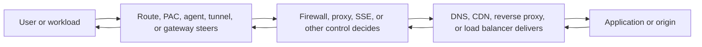

## A component is defined by behavior, not its box label

One appliance or cloud service can implement multiple functions. A reverse proxy can terminate TLS, enforce a web application firewall policy, authenticate users, and load balance. An SSE service can proxy web traffic, apply firewall policy, broker private application access, and emit logs. A router can also perform NAT and access-control lists. Troubleshooting still separates logical roles because each role has distinct inputs, outputs, state, and owners.

| Function | Primary decision | Typical state | Connection endpoint? | Evidence |
|---|---|---|---:|---|
| Routing | Which next hop/interface? | Route and neighbor state | No, ordinarily | Route table, hop/path telemetry |
| NAT | Which translated tuple? | Translation/session table | No, ordinarily | Pre/post tuples and mapping |
| Stateful firewall | Is this flow permitted under state/policy? | Connection/session state | Not necessarily | Rule ID, action, tuple, state reason |
| Forward proxy | May client request this destination/action? | Client and upstream connections, auth, cache | Yes | Proxy status, policy, upstream timing |
| Reverse proxy | Which application behavior/target serves request? | Client/upstream connections, routing, cache | Yes | Request ID, host/path route, target result |
| VPN gateway | Which protected traffic enters/leaves tunnel? | Security associations, peers, routes | Tunnel endpoint | IKE/IPsec state, counters, routes |
| L4 balancer | Which healthy target gets flow? | Flow-to-target mapping | Often virtual endpoint | VIP, target, health, reset reason |
| L7 balancer | Which target/policy handles request? | Request/connection state | Yes | Host/path, target, status, latency |
| CDN | Can edge serve/revalidate/fetch content? | Cache objects and origin connections | Yes | Cache status, edge PoP, origin result |

### Plain-English deep-dive 1 - Follow connection boundaries, not the marketing diagram

A direct TCP connection has one client socket and one server socket. A full proxy usually ends that connection and opens another. The client might connect to proxy address P while the proxy connects from address Q to origin O. The two legs can negotiate different TLS versions, use different source addresses, fail at different times, and have different timeouts. A firewall normally observes and controls a flow without becoming the application peer, although modern products can also proxy selected traffic.

Imagine a customer calling a concierge. The customer's phone record proves a call to the concierge, not a direct call to the restaurant. The concierge's separate phone record proves the upstream call. A busy signal on the second call can become a concierge-generated response on the first. To assign ownership, collect both call IDs and timestamps.

The practical rule is to draw every leg. For each arrow record source/destination tuple, protocol, who terminates it, identity context, policy point, name resolution, TLS certificate, timeout, log owner, and correlation ID. A logical architecture picture is useful, but observed tuples and logs decide what actually happened.

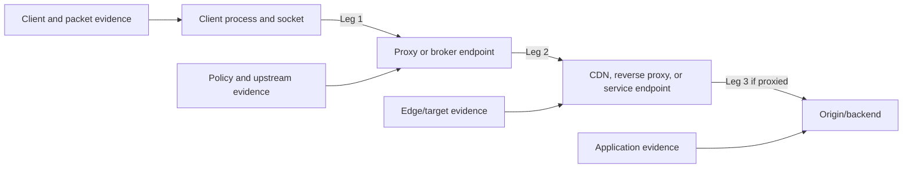

## Forward, reverse, explicit, transparent, and SOCKS proxies

A forward proxy represents clients when reaching external or controlled destinations. The origin normally sees the proxy's source address and application request, not a direct client connection. A reverse proxy represents one or more services to clients. The client resolves and connects to the reverse proxy's public or internal endpoint; the proxy chooses an origin or backend.

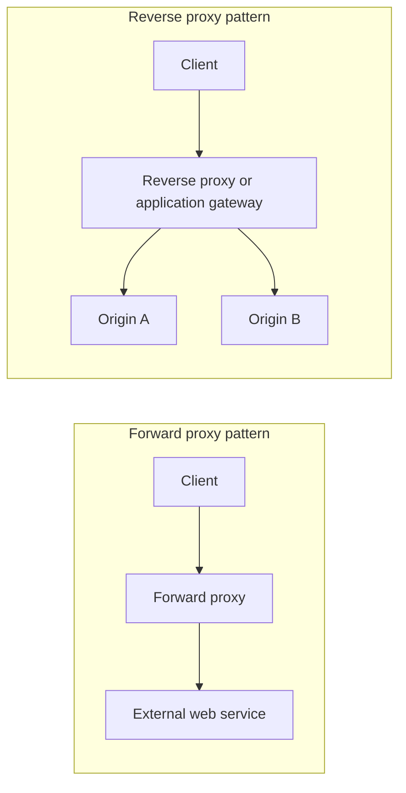

| Proxy type | Represents | Client awareness | Common uses | Main troubleshooting boundary |
|---|---|---|---|---|
| Explicit HTTP proxy | Client/user | Client speaks proxy form and CONNECT | Outbound web control/auth/cache | Client-to-proxy versus proxy-to-origin |
| Transparent HTTP intercept | Client path | Application may not know | Legacy/path-based enforcement | Redirection, original destination, protocol compatibility |
| SOCKS proxy | Client | SOCKS-aware client | General TCP/UDP relay use cases | Name resolution and relay negotiation |
| Reverse proxy | Service/origin | Client treats it as destination | TLS termination, routing, WAF, auth | Client-facing versus backend leg |
| API gateway | API service | Client calls gateway contract | Auth, quotas, transformation, routing | Gateway policy versus upstream API |
| Service mesh proxy | Workload | Often sidecar/ambient integration | Service-to-service policy/telemetry | Workload-to-proxy-to-workload identities |

### Explicit HTTP proxy flow and CONNECT

For plain HTTP through an explicit proxy, the client can send an absolute URI so the proxy knows the destination. For HTTPS, the client commonly sends `CONNECT host:port` to establish a tunnel. If allowed, the proxy returns a success response and the client starts TLS through the tunnel. If the proxy performs authorized inspection, it terminates that client TLS and creates an upstream TLS leg as Part 21 explained. If it does not inspect, the tunnel carries opaque TLS records.

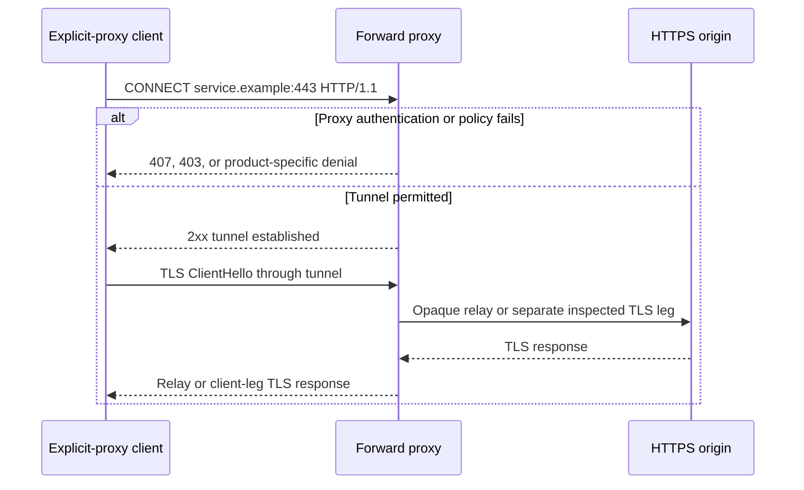

| Observation | Meaning | Next evidence |
|---|---|---|
| No connection to proxy | Local configuration, route, DNS, firewall, listener, or agent issue | Effective proxy settings and TCP path |
| 407 | Proxy requests authentication | Challenge scheme, client context, identity logs; redact credentials |
| 403/denial page | Proxy policy refused request | Rule/category/action and intended policy |
| CONNECT 2xx then TLS error | Tunnel established; TLS stage failed | ClientHello, certificate, inspection mode, alert |
| Proxy receives CONNECT but no upstream connection | Policy, DNS, egress, capacity, or internal failure | Proxy decision and upstream logs |
| Upstream connects but client times out | Relay, inspection, response, MTU, or timeout mismatch | Both legs and byte/timing counters |

### Transparent interception

Transparent interception relies on network steering, redirection, a local agent, or another mechanism to deliver traffic to an intermediary without ordinary explicit proxy configuration. The intermediary must know the original destination or infer it safely. It may encounter non-HTTP protocols, certificate/pinning behavior, asymmetric routing, and applications that do not tolerate interception.

Transparent does not mean invisible. Source addresses can change, TLS certificates can change under inspection, latency and reset behavior can change, and the path creates policy and availability dependencies. Document how original destination, user identity, process context, and return path are preserved.

### SOCKS overview

SOCKS5 can relay TCP and supports commands/semantics for other association types. It can perform domain-name resolution from the proxy side when a domain form is supplied, which differs from a client resolving locally and sending an IP. That distinction matters for split DNS, geo-selection, logging, and policy. SOCKS authentication is not automatically encryption; protect the connection under the architecture's security requirements.

| Question | HTTP proxy | SOCKS proxy |
|---|---|---|
| Protocol awareness | Understands HTTP methods/targets | General relay protocol, not HTTP semantics by default |
| HTTPS | CONNECT tunnel or inspection | Relays connection selected through SOCKS |
| DNS choice | Client/proxy behavior depends on request form and implementation | Can pass domain for proxy-side resolution |
| Policy richness | URL/method/header/content possible when visible | Mainly destination/connection unless combined controls |
| Application support | Web stacks commonly support | Application must support/configure SOCKS |

## PAC files and WPAD overview

A PAC file defines a JavaScript function named `FindProxyForURL(url, host)` that returns ordered choices such as `PROXY proxy.example:8080; DIRECT`. The client evaluates the function per request under its implementation. PAC is policy-like steering, not a firewall. `DIRECT` sends traffic without that explicit proxy path; it does not guarantee there are no other controls.

```text
function FindProxyForURL(url, host) {
    if (dnsDomainIs(host, ".corp.example")) {
        return "DIRECT";
    }
    return "PROXY proxy1.example:8080; PROXY proxy2.example:8080; DIRECT";
}
```

This synthetic sample is educational, not a recommended production policy. Fallback to `DIRECT` can become a fail-open security decision. PAC functions that perform DNS lookups can create latency, inconsistent answers, privacy leakage, and recursion. Clients cache PAC files and results differently. HTTPS PAC hosting, signing/management controls, restricted modification, and testing are important.

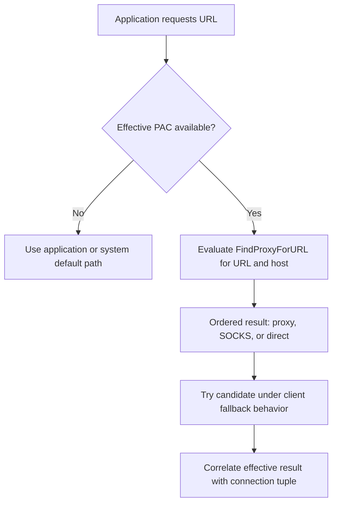

| PAC/WPAD risk | Failure pattern | Evidence | Safer practice |
|---|---|---|---|
| Stale cache | Old proxy remains after change | PAC URL/version and client cache timestamp | Version, staged rollout, explicit invalidation guidance |
| Syntax/runtime error | Client falls back or stops per implementation | PAC evaluation diagnostics | Automated tests and simple functions |
| Expensive DNS | Long delay before connection | DNS timeline during PAC evaluation | Minimize blocking lookups and measure |
| Broad DIRECT | Security visibility gap | Effective connection bypasses intended proxy | Least-scope direct rule and review |
| Proxy order mismatch | Site-specific intermittent behavior | Which candidate each client selected | Health-aware design and consistent policy |
| WPAD spoofing | Client retrieves untrusted PAC | Discovery/DNS/DHCP and certificate evidence | Disable when unused; securely control discovery |
| Context mismatch | Browser and service use different PAC/settings | Process-specific effective proxy | Manage all required contexts explicitly |

WPAD is a discovery mechanism, not one universal protocol transaction. Environments have used DHCP and DNS-based discovery patterns, while client support and defaults differ. Uncontrolled name resolution can let an attacker influence proxy configuration. Organizations should disable WPAD where not needed or strictly govern DNS/DHCP, namespaces, authentication, PAC delivery, and endpoint behavior. Never assume a Windows service, browser, and native sync client consume identical proxy settings.

### Plain-English deep-dive 2 - PAC decides a path before the proxy can log anything

A travel policy can tell employees to use Agency A for international trips and drive directly for local trips. If the policy card is missing, stale, or interpreted differently, Agency A has no record because the traveler never contacted it. The absence of a proxy log is therefore ambiguous: the client may have selected DIRECT, used another proxy, failed before connection, or been steered by a different mechanism.

Start at the client. Record the exact URL and process, effective PAC source and content version, evaluated result, DNS answers used during evaluation, selected proxy candidate, and actual socket tuple. Then move to proxy logs. A server-side proxy search without client steering evidence can waste an escalation.

Changing PAC during an incident is high impact because one line can redirect thousands of users. Use syntax tests, representative URL test sets, canary groups, monitoring, change ownership, rollback, and negative tests that ensure protected destinations do not become DIRECT unexpectedly.

## Firewalls: stateless, stateful, application-aware, and NGFW

A stateless packet filter evaluates each packet primarily from fields such as source/destination addresses, protocol, ports, direction, and interface. A stateful firewall tracks a flow and can permit packets that belong to an established conversation. Application-aware controls add protocol identification, user/device context, TLS inspection integration, threat signatures, URL categories, content policy, or other capabilities. "NGFW" is a broad industry category, not a guarantee of a specific capability or outcome.

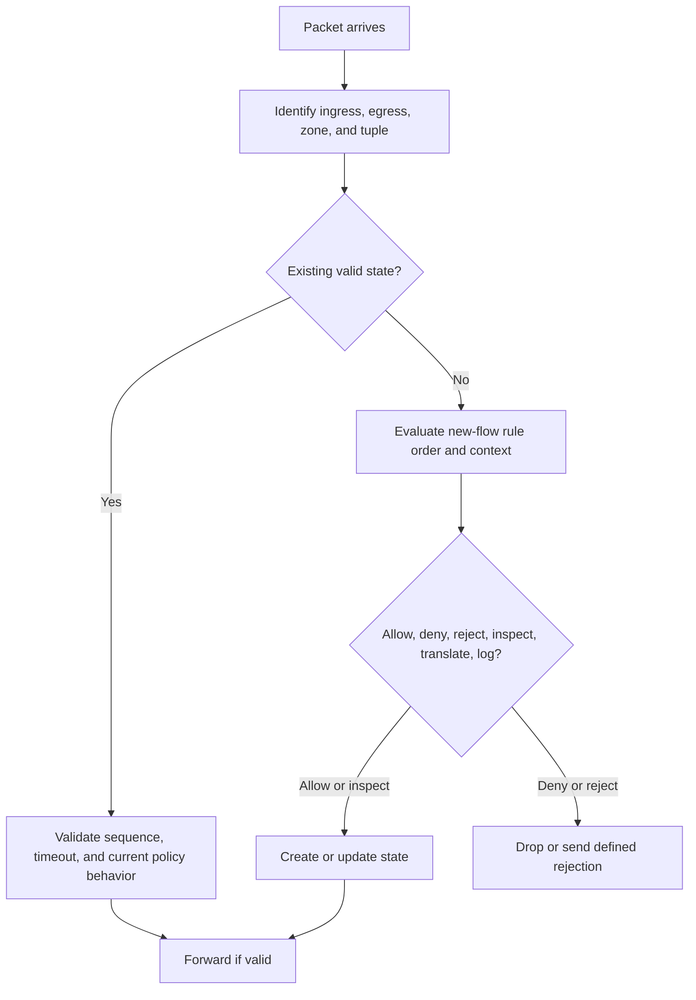

| Firewall concept | Plain meaning | Diagnostic concern |
|---|---|---|
| Five-tuple | Source IP/port, destination IP/port, protocol | NAT may create pre/post tuples |
| Zone/interface | Logical location and direction | Same addresses can hit different policy by path |
| Rule order | Sequence used to select action | Shadowed or broad rules change result |
| State table | Remembered flow context | Timeout, capacity, asymmetry, or restart can remove state |
| Default action | Handling when no rule matches | Implicit deny or platform default must be known |
| Drop | Silently discard | Client often times out |
| Reject | Discard with ICMP/TCP response where appropriate | Client fails quickly; response source matters |
| Application ID | Inferred/decoded application classification | May require enough traffic or decryption |
| User identity | Mapping of flow to user | Stale/unknown identity changes policy |
| Threat prevention | Signature/sandbox/reputation/content controls | False positive, encrypted visibility, update state |
| Egress filtering | Restrict outbound traffic | Limits command/control and data exfiltration |
| Ingress filtering | Restrict inbound traffic | Reduces exposed services |

### Stateful behavior and asymmetric paths

If the SYN crosses firewall A but the SYN-ACK returns through firewall B without synchronized state, B may drop it. A packet capture on the client shows repeated SYNs or missing replies, while the server can show accepted connections. Routing changes, equal-cost paths, VPN failover, and NAT can cause asymmetry. The remedy is not always "allow port 443"; prove directions, state ownership, route symmetry requirements, and cluster synchronization.

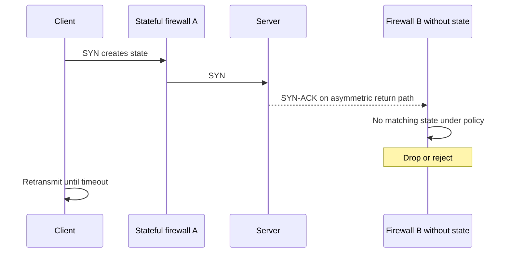

| Failure | Packet signature | Firewall evidence | Owner question |
|---|---|---|---|
| Explicit deny | No forward packet; optional reject | Rule ID/action deny | Is policy intended and correctly scoped? |
| Silent drop | Retransmission/timeouts | Drop counter/reason | Which exact field or state caused drop? |
| State timeout | Later packet/reset after idle | Session aged out | Are keepalive/app idle assumptions aligned? |
| Capacity exhaustion | New flows fail broadly | State/NAT resource pressure | What limit, scope, and growth triggered it? |
| Asymmetry | One direction through different device | Missing state/path mismatch | Which route change introduced asymmetry? |
| App misclassification | Policy changes after protocol identification | Classification/rule transition | Is TLS visibility and app signature current? |
| Identity unknown | User policy not matched | Identity mapping absent/stale | Which identity source and timestamp? |

A firewall allow log proves that device admitted a flow under its observed context. It does not prove the destination received an application request, that TLS succeeded, or that the user was authorized. Check bytes and packets in both directions, NAT mapping, downstream path, service listener, and application correlation. Likewise, a reset can originate at an endpoint or be generated by an intermediary; direction, sequence, TTL, and multi-point evidence matter.

## NAT and tuple translation

NAT rewrites addresses and sometimes ports. Source NAT lets many internal clients use one or more external addresses. Destination NAT maps a published address/port to an internal service. Port Address Translation distinguishes sessions by translated ports. NAT is not equivalent to a firewall: translation can coexist with allow/deny, but address hiding alone is not a complete security policy.

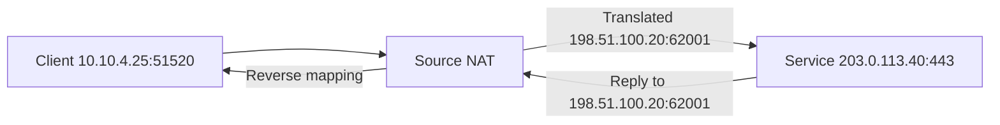

| Tuple view | Source | Destination | Evidence owner |
|---|---|---|---|
| Client pre-NAT | `10.10.4.25:51520` | `203.0.113.40:443` | Endpoint/local capture |
| Firewall/NAT ingress | `10.10.4.25:51520` | `203.0.113.40:443` | Gateway ingress log |
| Internet post-NAT | `198.51.100.20:62001` | `203.0.113.40:443` | Gateway egress/provider/origin |
| Reverse packet | `203.0.113.40:443` | `198.51.100.20:62001` | External capture/origin |
| Client delivered reply | `203.0.113.40:443` | `10.10.4.25:51520` | Endpoint capture |

| NAT mode | Purpose | Failure mode | Check |
|---|---|---|---|
| Source NAT | Change outbound source | Pool/port exhaustion, wrong egress identity | Mapping utilization and full tuples |
| Destination NAT | Publish internal service | Wrong target/listener or return route | Pre/post destination and backend evidence |
| Static mapping | Stable one-to-one translation | Address conflict or stale publication | Configuration and reachability |
| Dynamic pool | Allocate from addresses/ports | Exhaustion under bursts | Capacity trend and session churn |
| Hairpin NAT | Internal client reaches published address | Asymmetric route or source identity confusion | Both translations and internal DNS option |
| Carrier-grade NAT | Provider shares public addresses | Attribution needs provider mapping | UTC, public tuple, destination tuple |

A source address seen by a SaaS provider can represent many users. Attribution needs timestamp with precision, translated source IP and port, destination IP and port, protocol, and NAT mapping retention. Clock drift or omission of source port can make attribution impossible. Carrier-grade NAT introduces another translation owner. Privacy and legal controls apply because NAT logs can link users/devices to destinations.

## VPN architecture: remote access and site-to-site

A VPN protects selected packets between tunnel endpoints and creates logical reachability. IPsec is a network-layer security architecture commonly using IKE to authenticate peers and establish Security Associations. TLS-based remote-access products use different protocols and application models. "VPN" does not specify encryption suite, identity, routes, segmentation, or trust level.

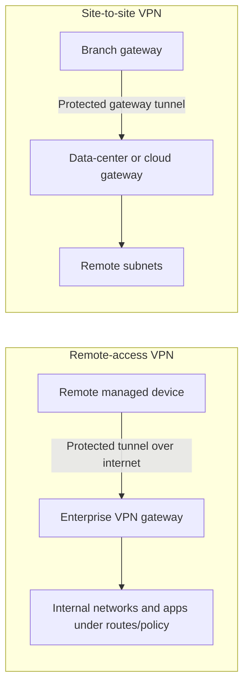

| VPN concept | Remote access | Site-to-site |
|---|---|---|
| Tunnel endpoints | Device/client and gateway | Gateway and gateway |
| Identity | User/device plus gateway depending design | Gateway certificates/PSKs plus network policy |
| Routes | Installed on endpoint | Exchanged/configured between networks |
| Scale unit | User/device sessions | Sites/tunnels and aggregate traffic |
| Main risk | Broad internal reach from endpoint | Broad network-to-network trust and lateral movement |
| Common failure | Client auth/posture/route/DNS/tunnel | IKE/IPsec proposal, peer, route, selector, MTU |
| Evidence | Client logs, route table, interface, gateway session | Both gateway SAs, counters, route tables |

### IKE/IPsec flow at overview depth

IKE negotiates algorithms, performs authenticated key exchange, and establishes an IKE Security Association. Peers then negotiate child SAs protecting selected traffic with IPsec Encapsulating Security Payload in a common design. NAT traversal can encapsulate IPsec in UDP where required. Traffic selectors identify protected address ranges/protocols. Rekeying creates new SAs before old ones expire when healthy.

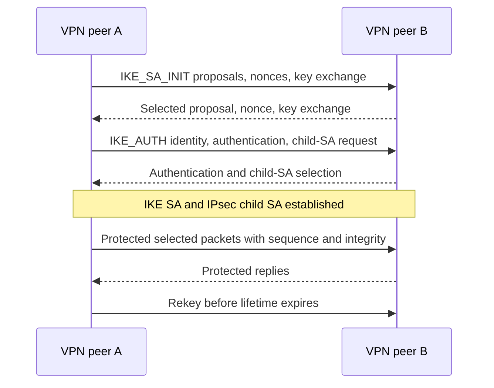

| VPN failure stage | Evidence | Common hypotheses |
|---|---|---|
| Peer reachability | UDP/TCP/other transport packets and route | DNS, path, firewall, wrong gateway |
| Initial proposal | IKE notification and proposals | No common algorithm/group/version |
| Authentication | Certificate/PSK/identity log | Trust, expiry, identity mismatch, secret mismatch |
| Child SA | Selectors and policy | Mismatched subnets/protocols, authorization |
| Route install | Endpoint/gateway route table | Overlap, priority, stale route, split-tunnel definition |
| Data plane | Encapsulation counters both directions | Firewall, NAT-T, MTU, asymmetric route, selector mismatch |
| Rekey | SA lifetimes and overlap | Clock, negotiation mismatch, lost rekey messages |
| DNS after tunnel | Resolver list, suffix, query path | Split DNS or resolver reachability |

### Split tunnel, full tunnel, and hairpin tradeoffs

Full tunnel can centralize traffic controls but backhaul internet/SaaS traffic through a remote gateway, adding latency and bandwidth pressure. Split tunnel can send approved SaaS traffic locally, improving performance and resilience, but it requires endpoint security, route governance, DNS consistency, and clear visibility. Neither is universally correct. The choice depends on threat model, regulatory needs, endpoint posture, application destinations, egress controls, operational maturity, and user geography.

| Factor | Full tunnel | Split tunnel |
|---|---|---|
| Central inspection | Easier at hub | Requires distributed/cloud/endpoint controls |
| SaaS latency | Can hairpin | Often lower with local egress |
| Gateway capacity | Higher demand | Reduced internet backhaul |
| Route complexity | Broad default route | Destination-specific policy and drift risk |
| Off-network protection | Through tunnel while connected | Must be supplied by endpoint/cloud security |
| Outage blast radius | Gateway issue affects broad traffic | Selected paths may continue |
| Attribution | Central egress logs | Multiple egress points need correlation |

### Plain-English deep-dive 3 - A VPN grants network reach, not application trust

A building shuttle can take an employee inside the campus gate. It does not prove the employee should enter every laboratory, and it places the employee near many buildings. Traditional remote-access VPNs commonly extend routes into internal networks, after which firewalls and application controls try to limit access. If the device is compromised or permissions are broad, that network adjacency can increase lateral movement opportunity.

ZTNA changes the unit of access. A broker evaluates identity, device and other context, and policy for a named private application, then creates limited connectivity without necessarily exposing broad network routes. This does not eliminate every risk: the application can still be vulnerable, identity can be compromised, policy can be broad, connectors can fail, and endpoints still process data. The improvement is resource-specific access and reduced implicit network trust.

In an interview, avoid saying "ZTNA is encrypted VPN." Explain that VPN and ZTNA can both protect transport, but the access model, route exposure, policy unit, application discovery, and connection brokerage differ.

## Load balancers and application delivery

A load balancer exposes a virtual service and chooses a backend target. L4 balancing typically uses transport flows. L7 balancing understands application messages and can route by hostname, URL path, header, cookie, or other application context. A device may terminate TLS at the virtual service, pass TLS through, or re-encrypt to backends. Each option changes certificate ownership and evidence.

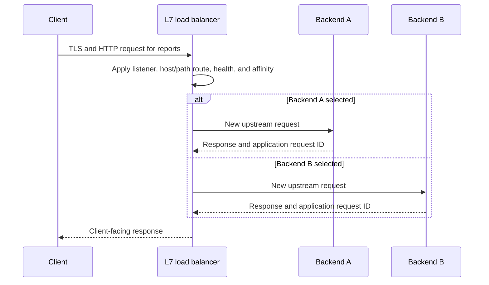

| Design choice | Benefit | Failure/tradeoff | Evidence needed |
|---|---|---|---|
| Round robin | Simple distribution | Ignores connection cost/target capacity | Target selection counts |
| Least connections | Adapts to active connection load | Long-lived/short work mismatch | Active connections and latency |
| Consistent hash | Stable mapping | Uneven keys and remap on membership | Hash key and target set |
| Cookie affinity | Supports server-local session | Imbalance, stale target, privacy | Cookie scope/value redaction and target |
| Active health check | Removes known-unhealthy target | Probe can be too shallow/deep | Probe request, result, thresholds |
| Passive health | Learns from real failures | User traffic experiences failures first | Error rates and ejection policy |
| TLS termination | Central cert/policy and L7 visibility | Plaintext/keys at balancer | Client and backend leg evidence |
| TLS passthrough | End-to-end server TLS association | Less L7 control | SNI/flow and backend TLS logs |
| Re-encryption | Protected backend leg | Two TLS configurations/failure domains | Both certificate and negotiation sets |

### Health checks are hypotheses

A TCP health check proves a port accepted a connection, not that login, database, storage, and downstream APIs work. An HTTP `/health` returning 200 can be hard-coded and misleading. A deep check can overload dependencies or remove all targets during a shared downstream outage. Use layered checks: process/liveness, readiness to receive traffic, and external synthetic transactions. Record thresholds, interval, timeout, success codes, host header, authentication, and expected content.

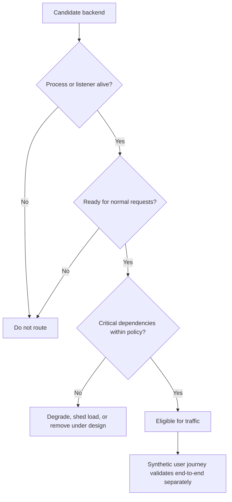

| Failure pattern | Plausible cause | Discriminating evidence |
|---|---|---|
| One of N requests fails | One target has drift or bad dependency | Target ID, affinity, deployment, repeated controlled samples |
| First request after idle fails | Timeout mismatch or stale pooled connection | Both-leg FIN/RST and idle timestamps |
| Large body fails | Buffer/limit/timeout/MTU | Exact size threshold and proxy/backend logs |
| Login loops | Affinity, scheme/host forwarding, cookies | Redacted redirect/cookie and target sequence |
| 502 | Invalid/closed upstream response | Load-balancer upstream result and backend log |
| 503 | No target/capacity/local maintenance | Health/pool state and responder identity |
| 504 | Upstream did not respond in time | DNS/connect/TLS/server-wait split and request ID |

Common intermittent failures include one node with stale certificate, wrong configuration, clock drift, DNS resolver, dependency, or code version. Correlate virtual IP, backend target, request ID, cookie/affinity, deployment ring, and timestamp. Do not call a service healthy because the balancer reports every TCP probe green.

## CDN architecture and cache behavior

A CDN operates distributed edge locations that can terminate client connections, apply security/delivery policy, serve cacheable objects, revalidate, or fetch from an origin. DNS, anycast, mapping services, or other mechanisms direct clients to an edge. The edge may use a separate origin hostname and TLS connection. Cache keys and policies decide whether two requests share an object.

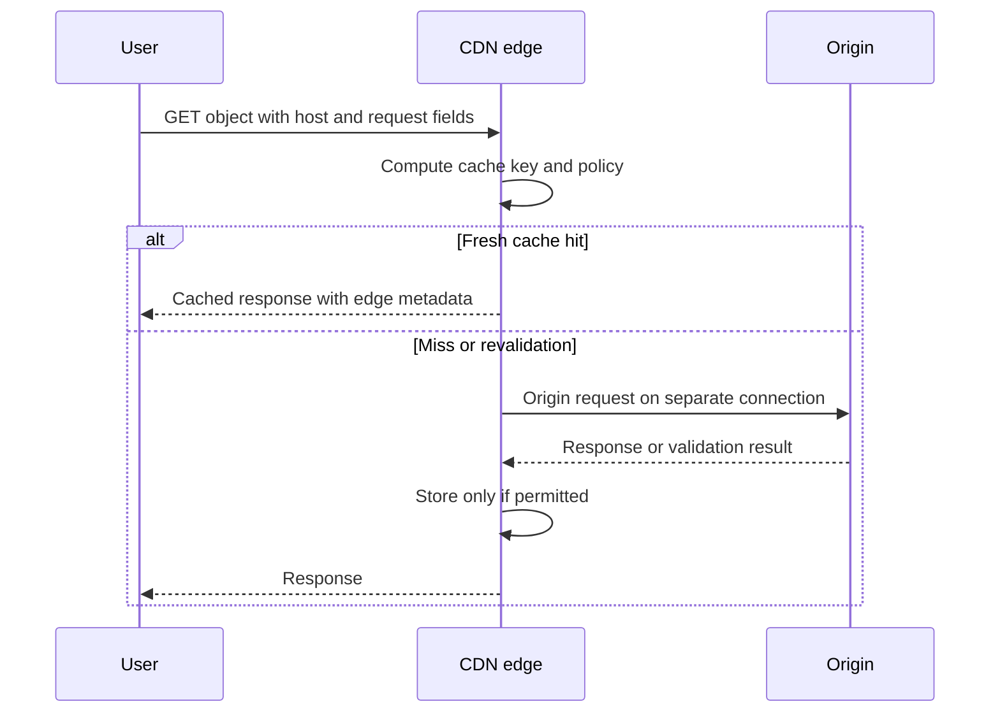

| CDN concept | Meaning | Failure/security concern |
|---|---|---|
| Edge/PoP | Distributed delivery location | Region-specific configuration or capacity |
| Cache key | Fields distinguishing stored objects | Missing user/encoding/query dimension can leak or wrongly serve content |
| TTL/freshness | Time object may be reused | Stale content or excess origin load |
| Revalidation | Ask origin whether object changed | Origin/validator failure |
| Purge/invalidation | Remove or expire cached object | Propagation delay and broad purge load |
| Origin shield | Mid-tier reducing origin fan-out | Additional dependency and cache layer |
| Origin access control | Restrict origin to CDN | Misconfiguration can expose bypass path |
| Signed URL/cookie | Time/scope-limited access token | Leakage, clock, cache-key, and replay concerns |
| Negative caching | Cache errors under policy | Prolonged 404/5xx if misconfigured |
| Stale-if-error | Serve stale object during origin trouble | Availability benefit versus freshness risk |

A CDN response can be generated at the edge without reaching the origin. Conversely, an edge can return 502/503/504 due to origin DNS, TCP, TLS, health, timeout, or capacity. Collect edge request ID, PoP, cache status, age, origin status/timing, host, path, and deployment version. A successful test from one geography does not prove another edge is healthy.

## SWG, CASB, ZTNA, and FWaaS definitions

These labels describe capability families. Products can overlap. The right question is not "Which acronym owns security?" but "Which traffic, resource, context, decision, enforcement, and evidence are in scope?"

| Capability | Primary protected interaction | Typical controls | Data/evidence | Limitation to remember |
|---|---|---|---|---|
| SWG | User/workload web and internet access | URL/category, threat, content, TLS inspection, access | Web transactions, policy, threat events | Non-web traffic and encrypted visibility depend on design |
| CASB inline | Cloud/SaaS use in traffic path | App discovery, instance/tenant, activity, data policy | User, app, action, content metadata | Sees only steered/supported traffic |
| CASB API | Cloud data/config via service APIs | At-rest scan, posture, sharing, remediation | API objects, owners, permissions | API coverage, rate limits, delay, permissions |
| ZTNA | Access to private applications | Identity/context/resource-specific policy and brokerage | User/device/app/policy/session | Application scope/design; not universal internet security |
| FWaaS | Network traffic policy from cloud service | Ports/protocols/apps, segmentation, threat controls | Flows, decisions, sessions | Steering, latency, and encrypted context matter |
| DLP | Sensitive-data detection/control | Classification, patterns, exact data, action | Matches, rules, incidents | Accuracy, privacy, and business context |

### SSE

SSE is a cloud-delivered security architecture/capability grouping that commonly brings together SWG, CASB, ZTNA, and FWaaS, often with data protection and threat controls. It aims to apply consistent policy near users, applications, and data without backhauling every interaction through a private data center. SSE does not include the full WAN networking side by definition.

### SASE

SASE converges WAN capabilities, commonly including SD-WAN, with SSE under a unified or coordinated cloud-delivered architecture. The goal is secure access for users, branches, devices, and workloads to internet, SaaS, and private applications based on identity/context and business policy. Buying two products does not automatically create operational convergence. Identity, policy, telemetry, routing, service-level objectives, ownership, and lifecycle must work together.

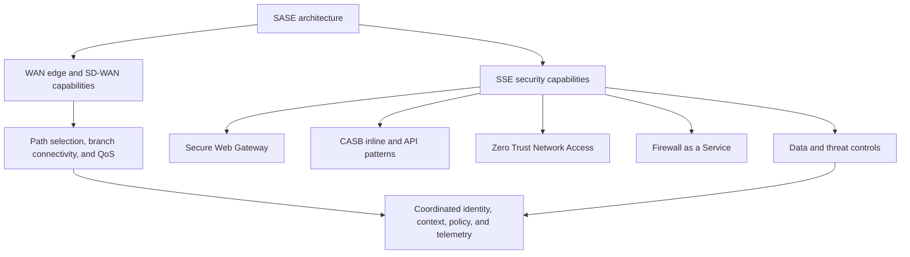

| Dimension | SSE | SASE |
|---|---|---|
| Core scope | Cloud-delivered security services | WAN networking plus SSE |
| Networking included? | Not the defining full WAN component | Yes, convergence includes WAN capabilities |
| Main question | How is access/security policy delivered? | How are connectivity and security jointly delivered? |
| Buyers/owners | Security, network security, IAM, data teams | Security plus network/WAN/platform teams |
| Success measures | Policy coverage, threat/data outcomes, access experience | Those plus path quality, branch availability, WAN cost/performance |
| Common failure | Traffic not steered or context/policy mismatch | Steering plus WAN path/service-edge/policy coordination |

### Plain-English deep-dive 4 - SSE and SASE are operating models, not acronym bundles

Putting a cloud firewall, proxy, and SD-WAN icon on one slide does not make policy coherent. Consider an employee moving from headquarters to home. Identity must remain current, device posture must be evaluated, traffic must reach a healthy service edge, SaaS and private applications need different access policies, DNS must align with forwarding, logs must reach the right systems, and support teams need one correlated timeline. If networking and security teams use conflicting rules and separate clocks, the architecture remains fragmented.

A mature design defines traffic classes, steering methods, policy ownership, fallback behavior, service-edge selection, privacy handling, monitoring, capacity, change rings, incident handoffs, and success outcomes. It tests users, branches, workloads, and applications under healthy, degraded, and failover conditions. It also records exceptions and expiry.

For a TSM, the customer outcome matters more than the label: reduced attack surface, least-privileged private access, consistent internet/SaaS policy, better user experience, fewer unmanaged bypasses, measurable coverage, and faster fault isolation. Claims need tenant evidence and current product documentation.

## Traditional perimeter versus zero trust architecture

Traditional perimeter designs commonly treat internal network location as a major trust signal. Remote users join that network through VPN; firewalls segment zones; applications may be discoverable or reachable across routed subnets. This model can be secured, but broad network access and implicit trust create lateral movement and policy complexity.

Zero trust, as described by NIST SP 800-207, protects resources rather than network segments alone, grants access per session, uses dynamic policy informed by identity, device, resource, environment, and other signals, and minimizes implicit trust based on location. The policy engine/administrator and enforcement point form a logical control model. Zero trust complements rather than abolishes network hygiene, encryption, endpoint security, and monitoring.

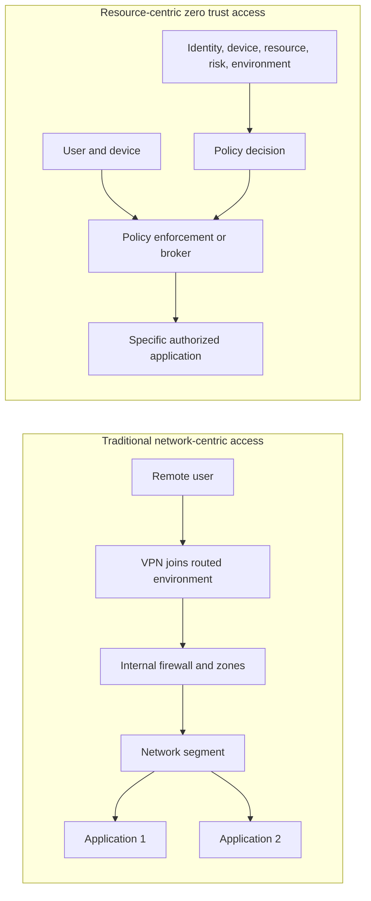

| Dimension | Perimeter/network-centric tendency | Zero trust/resource-centric tendency |
|---|---|---|
| Trust signal | Network location strongly weighted | No implicit trust from location alone |
| Access unit | Network/subnet/port, then app controls | Named resource and session/action context |
| Exposure | Services may be reachable/discoverable on network | Brokered resource can avoid broad route/exposure |
| Decision | Often static zone/rule plus app auth | Dynamic identity/device/resource/context policy |
| Remote access | Extend network through VPN | Connect authorized subject to specific resource |
| Re-evaluation | Connection/state and app session dependent | Designed for ongoing context and policy evaluation |
| Lateral movement | Broad reach can increase opportunity | Reduced reach limits adjacency, but policy/app risks remain |
| Network controls | Primary boundary | Still necessary supporting controls |

### Policy decision and enforcement points

Policy Information Points provide signals such as identity, device posture, threat, asset, and environment data. A Policy Decision Point evaluates policy. A Policy Enforcement Point establishes, monitors, limits, or terminates the connection. These are logical roles and can be distributed. Stale or unavailable signals can produce deny, reduced access, fallback, or fail-open depending on policy. Record the exact input values and policy version used for a decision.

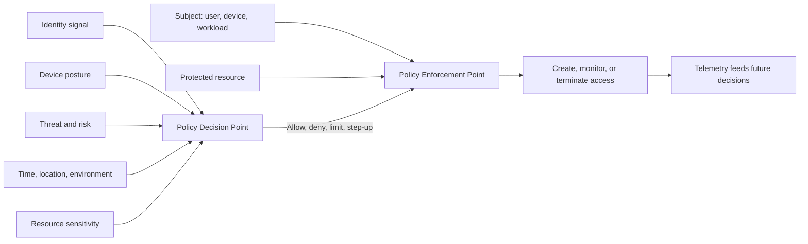

## Traffic steering patterns and policy points

Traffic must reach a control before that control can enforce it. Steering can use explicit proxy settings/PAC, endpoint agents, default routes, tunnels, GRE/IPsec from branches, policy-based routing, DNS/service discovery, application integration, or API connectors. Different traffic classes may use different methods. A diagram that says "all traffic through security cloud" needs proof from client sockets, routes, tunnel counters, service logs, and destination observations.

| Steering pattern | Best-fit context | Key dependencies | Common gap |
|---|---|---|---|
| PAC/explicit proxy | HTTP-aware user applications | PAC delivery, app support, proxy auth | Non-proxy-aware apps or DIRECT fallback |
| Endpoint forwarding agent | Mobile users and process-aware policy | Agent health, profile, tunnel/driver, identity | Disabled/bypassed app or stale profile |
| Branch GRE/IPsec tunnel | Aggregate branch traffic | Gateway, route, tunnel health, service edge | Asymmetry, MTU, wrong traffic selector |
| Policy-based routing | Network path steering | Device rules and symmetric paths | Route changes bypass policy |
| Default route | Broad egress control | Routing and capacity | Private/local exceptions and loops |
| DNS-based service selection | Distributed service/edge mapping | Resolver location, TTL, health mapping | Stale/wrong resolver or cached edge |
| ZTNA connector/broker | Private app access | Connector health, app definition, identity | Wrong app segment or DNS context |
| API connector | SaaS at-rest/config security | OAuth/app permissions, rate limits, schema | Data delay or incomplete scope |

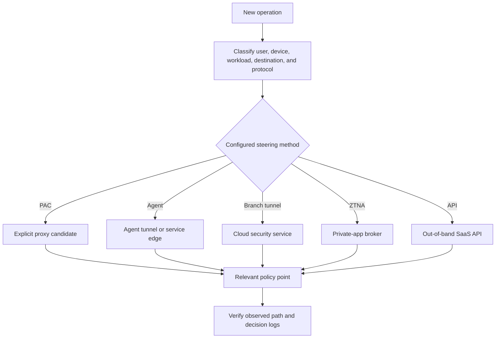

### Policy-point inventory

| Decision | Possible location | Inputs | Failure question |
|---|---|---|---|
| Route/next hop | Endpoint, branch, SD-WAN, provider | Destination, metrics, health | Which route actually won? |
| Proxy choice | App/system PAC, agent | URL, host, network context | Did client choose proxy, alternate, or direct? |
| Tunnel inclusion | VPN/agent/gateway | Prefix, app, user, policy | Did flow match protected selector? |
| Firewall allow | Endpoint, branch, cloud, data center | Tuple, app, identity, threat | Which rule/action and version? |
| TLS inspection | Proxy/SWG | Destination/category/user/app/privacy | Was flow inspected, bypassed, or blocked? |
| Web access | SWG/proxy | URL/category/risk/user | Who generated denial? |
| SaaS action/data | CASB inline/API | App instance, action, content, sharing | Inline or delayed API decision? |
| Private access | ZTNA | Identity, posture, app, context | Which resource/policy/connector? |
| Load distribution | LB/CDN | Health, host/path, affinity, edge | Which target/PoP served it? |
| Application authorization | Origin/app/API gateway | Principal, role, token, object | Did network succeed before app denied? |

## Failure modes, tradeoffs, and ownership scenarios

### Proxy versus origin ownership

A 407 belongs to proxy authentication semantics. A proxy-generated 403 can reflect web policy. A 502 means a gateway/proxy received an invalid upstream response; a 504 means it timed out waiting upstream. These statuses identify the responder role, not necessarily the faulty owner. Origin DNS, TCP, TLS, application latency, proxy capacity, or timeout policy can underlie an intermediary response.

### Firewall versus application ownership

Repeated SYNs with no response can be routing, firewall drop, service listener, or return-path failure. A completed TLS handshake and HTTP 403 shifts focus to application/proxy authorization rather than opening a port. A TCP reset must be attributed by sequence, TTL/path, capture points, and device logs; an on-path device can inject one.

### VPN versus SaaS ownership

If SaaS works off VPN but fails on full tunnel, compare DNS resolver, route, NAT egress, MTU, proxy path, TLS inspection, and identity conditional-access context. This does not prove "VPN is broken"; the VPN path may expose an allowlist, egress reputation, PMTUD, or proxy issue.

### CDN versus origin ownership

One region failing with a consistent edge PoP and cache status points to edge/config/origin path hypotheses. A cache HIT error can persist independently of current origin health. A MISS with origin timeout needs the edge-to-origin leg. Test from multiple controlled regions and correlate request IDs rather than declaring a global outage.

| Symptom | First boundary | Discriminating evidence | Likely owners |
|---|---|---|---|
| No proxy log | Client steering | Effective PAC/agent result and socket | Endpoint/proxy config/network |
| Proxy 407 | Proxy auth | Challenge and identity flow | Endpoint/IAM/proxy |
| Proxy 504 | Upstream leg | Proxy DNS/connect/TLS/origin timings | Proxy/network/origin |
| SYN timeout | Network path | Multi-point capture and firewall state | Routing/firewall/server |
| Works until idle | State timeout | Keepalive and session tables | Firewall/LB/app |
| VPN connects, app unreachable | Route/DNS/policy after tunnel | Route table, resolver, selectors, app logs | VPN/network/DNS/app |
| One backend fails | Load distribution | Backend ID/affinity/health/config | App/platform/LB |
| One geography fails | Edge mapping | PoP/cache/origin correlation | CDN/DNS/origin |
| ZTNA denies one app | Resource policy | Identity/posture/app/policy decision | IAM/endpoint/security/app |
| Direct works, secured path fails | Control path | Exact differing leg and decision | Security/network/app/vendor |

| Architecture choice | Benefit | Risk/tradeoff | Guardrail |
|---|---|---|---|
| Central proxy | Consistent policy/visibility | Latency, capacity, privacy boundary | Regional resilience and least-data logging |
| Local internet egress | Lower SaaS latency | Distributed control/attribution | Endpoint/SSE controls and correlated logs |
| Full-tunnel VPN | Central policy path | Hairpin and broad blast radius | Capacity, failover, segmentation, monitoring |
| Split tunnel | Performance and reduced backhaul | Route drift and control gaps | Approved destinations and endpoint/cloud policy |
| TLS inspection | Threat/data visibility | Privacy, pinning, plaintext handling | Governance, key protection, scoped bypass |
| CDN caching | Lower latency/origin load | Stale or cross-user content | Correct cache key/directives and purge process |
| Fail open | Availability | Security gap | Business/security approval, detection, expiry |
| Fail closed | Enforcement preserved | Business interruption | Resilience, emergency access, tested recovery |

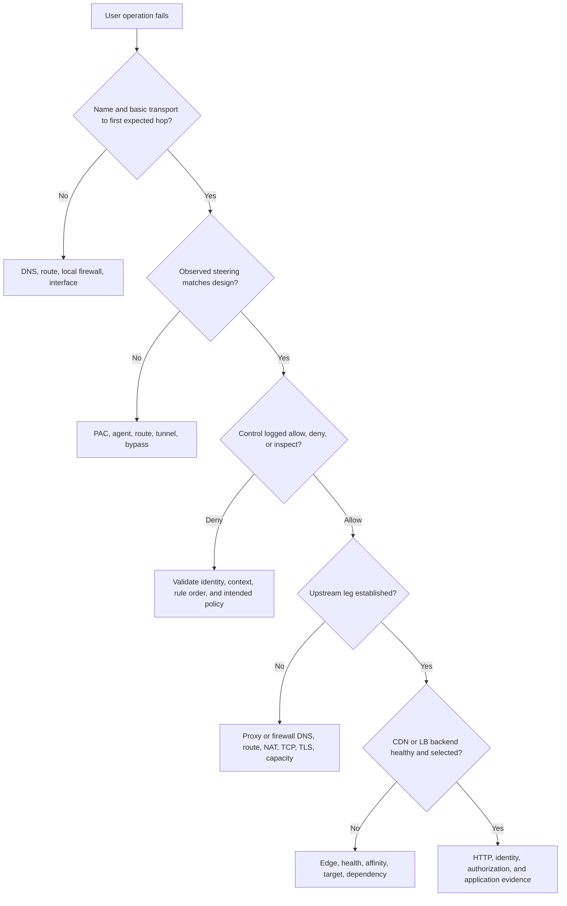

Availability and security are both policy outcomes. "Fail open" and "fail closed" should be decided by traffic class, business impact, data sensitivity, alternative controls, maximum outage, and recovery ability. A hospital emergency application and unknown web browsing deserve different fallback analysis. A temporary bypass requires exact scope, owner, reason, compensating controls, monitoring, expiry, and closure evidence.

## Tools and evidence by layer

No single tool sees the whole path. The evidence plan should specify capture point, clock, expected field, and what a result can falsify.

| Tool/evidence | Best question | Key fields | Limitation |
|---|---|---|---|
| `ipconfig`, `Get-NetIPConfiguration` | Which interface, gateway, and DNS? | Addresses, gateway, DNS | Snapshot; VPN/agent adapters complicate |
| `route print`, `Get-NetRoute` | Which route should/does win? | Prefix, interface, next hop, metric | Policy routing elsewhere not shown |
| `Test-NetConnection` | Basic TCP path and route hint | Remote address/port, interface | Success/failure is not full application proof |
| `tracert`, `pathping` | Path/hop clues | Hops and loss estimates | ICMP treatment differs from application traffic |
| `netstat`, `Get-NetTCPConnection` | Which process/socket state? | PID, local/remote tuple, state | Proxy connection hides ultimate origin at socket layer |
| Browser/cURL | HTTP/proxy/TLS response | Proxy status, headers, timing | Client implementation differs |
| Packet capture | What packets crossed this point? | Tuple, sequence, tunnel, TLS, timing | Encryption and capture point limit meaning |
| PAC evaluator/client diagnostics | Which proxy choice? | URL, host, return string | Client-specific implementation/caching |
| Firewall session/log | Which rule/state/action? | Pre/post NAT tuple, rule ID, reason | Logging gaps and clock alignment |
| VPN client/gateway logs | Did control/data plane establish? | Peer, SA, selector, route, counters | Product syntax and privacy vary |
| Load balancer logs | Which listener/target? | VIP, target, health, request ID | Backend application needs separate evidence |
| CDN logs/headers | Which edge/cache/origin result? | PoP, cache status, age, request ID | Headers can be stripped or vendor-specific |
| Identity logs | Which principal/context? | User/device/app, policy result | Network success/failure can precede identity |
| Service logs | Did application receive/handle request? | Request ID, status, dependency | No log can mean earlier failure or telemetry loss |

### Evidence ledger

For every important test, capture these fields in a table rather than prose fragments:

| Field | Example synthetic value | Why it matters |
|---|---|---|
| UTC start/end | `2026-08-25T14:03:22.418Z` | Cross-system correlation |
| User/device/process | `arti-lab`, `LAB-01`, `onedrive.exe` | Client context |
| Operation | Upload `synthetic.txt` | Business-level action |
| Name and resolved IPs | `service.example`, `192.0.2.40` | DNS and edge selection |
| First socket | `10.0.0.25:51520 -> 10.0.0.5:8080` | Explicit proxy proof |
| Pre/post NAT | Full tuples | Cross-boundary attribution |
| Tunnel/service edge | Synthetic tunnel/edge ID | Steering and regional correlation |
| Policy | Rule ID/version/action | Intent versus observed decision |
| TLS | SNI, version, certificate fingerprint | Protected-leg evidence |
| HTTP | Method, status, responder, request ID | Application/intermediary result |
| Delivery | CDN PoP/cache status/LB target | Edge/backend isolation |
| Expected/actual | Upload versus timeout | Test interpretation |
| Change delta | VPN on/off or one canary policy | Discriminating variable |

Example read-only commands for an approved environment include:

```powershell
Get-NetIPConfiguration
Get-NetRoute -AddressFamily IPv4 | Sort-Object DestinationPrefix, RouteMetric
Get-NetTCPConnection | Select-Object LocalAddress, LocalPort, RemoteAddress, RemotePort, State, OwningProcess
netsh winhttp show proxy
Resolve-DnsName service.example
Test-NetConnection service.example -Port 443 -InformationLevel Detailed
```

These commands do not reproduce every application's proxy/tunnel behavior. Do not use a direct connection or `--noproxy` against production merely to evade policy. If a controlled direct comparison is authorized, use synthetic content, preserve evidence first, document the temporary path, and restore policy.

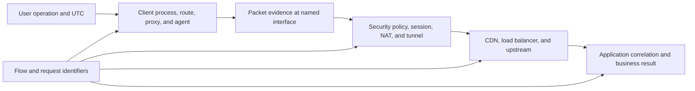

## Privacy and security considerations

Network telemetry can reveal user identity, location, device, destinations, SaaS use, private application names, content categories, authentication events, and behavior. Proxy and inspection systems can handle plaintext and credentials. NAT logs can attribute public traffic to internal users. VPN logs can show home IPs. CDN logs can include URL paths and tokens. Collect only what the incident requires.

| Risk | Example | Control |
|---|---|---|
| Credential exposure | Proxy Authorization or cookies in trace | Redact; use approved secure collection |
| URL leakage | Sensitive query in proxy/CDN log | Minimize fields, sanitize, avoid secrets in URLs |
| Home/location data | Remote VPN source IP | Need-to-know access and retention |
| Decrypted content | Inspection debug capture | Explicit authorization, smallest scope, rapid deletion |
| Private topology | Routes, internal names, connector addresses | Restricted architecture artifact |
| Identity correlation | NAT/proxy records link person to action | Lawful purpose, audit, precision, retention |
| Bypass abuse | Broad DIRECT or inspection exception | Narrow match, owner, expiry, monitoring |
| Admin privilege | Proxy/firewall/SASE policy change | RBAC, separation, approval, audit, rollback |
| Log export | Vendor escalation package | Sanitized derivative and approved transfer |
| Data connector | Aggregates topology, identity, and security state | Least privilege, schema control, retention, monitoring |

Security testing should use authorized destinations and synthetic data. Do not redirect another user's traffic, install interception roots on unmanaged devices, disable corporate controls, probe arbitrary CDN origins, or alter production routing without change authority. Emergency restoration still requires recording scope, risk, owner, compensating controls, and expiry.

## OneDrive, SharePoint, and Microsoft 365 scenarios

Microsoft recommends network connectivity principles and publishes service-specific endpoint guidance that changes. The useful architectural question is which user operation takes which path and why. OneDrive sync, SharePoint browser use, Office applications, identity endpoints, service APIs, and content delivery can use different connections and optimization categories.

| Scenario | Compare | Useful evidence | Unsafe conclusion |
|---|---|---|---|
| Browser works, sync fails | Process proxy/PAC, auth, destinations, body size, TLS | Socket, proxy decision, request IDs, client log | Microsoft service is healthy for every operation |
| Off VPN works, on VPN slow | Route, resolver, egress, proxy, MTU, region | Before/after path and timing | VPN encryption itself causes slowness |
| One office affected | Branch tunnel, NAT, service edge, DNS | Office versus known-good tuple and edge | Tenant-wide outage |
| Downloads work, uploads fail | Method/body/DLP/inspection/timeout | Status/responder, policy rule, byte counts | Firewall port is blocked |
| One file path fails | URL encoding, policy/content, app semantics | Sanitized path and HTTP/app evidence | CDN failure from a local client message |
| Intermittent sign-in | Proxy auth, identity path, CDN/LB node, clock | Correlation IDs and backend/edge | Random network issue |

A safe troubleshooting sequence is: scope user/process/operation; record effective forwarding; verify DNS and first hop; identify proxy/firewall policy; inspect TLS completion; locate HTTP responder; correlate CDN/load-balancer/origin IDs; compare one known-good path; and change one variable. Keep current Microsoft endpoint guidance and tenant controls authoritative.

## Fictional NMH scenario: branch hairpin, stale PAC, and conflicting ownership

NMH is fictional. A synthetic branch migrates internet access from a data-center forward proxy to a cloud SSE pilot. Managed laptops should use an endpoint forwarding profile off-site and a branch tunnel on-site. A stale PAC file still returns the old data-center proxy for `*.sharepoint.example`. The branch route sends that proxy traffic through the cloud tunnel, across a private WAN to the old proxy, and then back to the internet. OneDrive-like uploads over 50 MB time out; browser metadata requests usually succeed.

Network says the tunnel is up. Proxy says requests are allowed. Application says small requests succeed. None of those facts establishes a healthy end-to-end upload path. The observed path contains unnecessary hairpinning, two egress policy points, a smaller effective MTU, and mismatched timeouts.

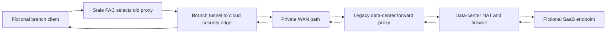

### NMH evidence matrix

| Evidence | Synthetic observation | Supports | Does not prove |
|---|---|---|---|
| PAC diagnostic | Old proxy selected for target host | Client explicit steering is stale | Every process uses PAC identically |
| Client socket | Connects to old proxy, not destination | Explicit proxy leg exists | Upstream origin path is healthy |
| Branch tunnel counter | Carries old-proxy connection | Hairpin path enters cloud tunnel | Content inspected or allowed |
| Proxy log | CONNECT allowed; upstream begins | Policy permits and proxy attempts origin | Upload completes |
| Packet sizes/timing | Large flows stall near path-MTU boundary | MTU/PMTUD hypothesis | Sole root cause without controlled test |
| HTTP timing | Small metadata succeeds; large body times out | Size/duration-dependent failure | SaaS defect |
| Known-good canary | Updated PAC uses intended cloud path and upload succeeds | Steering difference is discriminating | Global rollout is safe |

### NMH troubleshooting and remediation

1. Declare impact, affected branch, clients, operations, size threshold, start time, and business deadline.
2. Freeze broad changes and preserve PAC versions, route tables, tunnel counters, proxy logs, packet summaries, and request IDs.
3. Draw every observed connection leg, pre/post NAT tuple, policy point, MTU, and timeout.
4. Compare one canary with current PAC and one with corrected approved policy while holding file, user, device, and time window as stable as possible.
5. Confirm that the intended SSE path enforces required web, threat, and data policy before removing legacy steering.
6. Correct PAC distribution through staged groups. Do not silently convert all failures to DIRECT.
7. Validate small/large upload, download, browser, sync, identity, unapproved destination, failover, and rollback.
8. Monitor error rate, latency, path selection, policy coverage, and legacy proxy volume until the old path reaches zero expected use.
9. Write RCA: stale configuration and migration control gap caused unintended hairpin; MTU/timeout behavior contributed to large-transfer failure. "Tunnel up" and "policy allow" were weak health indicators.

### NMH ownership matrix

| Workstream | Accountable question | Evidence | Exit criterion |
|---|---|---|---|
| Endpoint | Which PAC/profile did process use? | Effective config and socket | Intended steering observed |
| Network/WAN | Which route and MTU applied? | Route/path/counters | No unintended hairpin; PMTUD healthy |
| Security/SSE | Which policy and service edge handled flow? | Rule/edge/session | Required controls and expected route |
| Legacy proxy | Why did it still receive traffic and how did upstream behave? | Proxy request/upstream timing | No expected migrated traffic |
| Application/M365 | Did valid requests arrive and complete? | Sanitized request IDs/service evidence | Success across defined operations |
| Change management | Why did stale PAC persist? | Rollout inventory and approvals | Reconciliation and rollback controls improved |
| TSM | Is business outcome restored and recurrence reduced? | Action log, tests, metrics, RCA | Owner-approved closure |

## Additional ownership scenarios

### Scenario 1: reverse proxy returns 504

The client completes TLS and receives 504 with a gateway request ID. The reverse proxy log shows upstream DNS and TCP success, then no response headers before its deadline. That is not proof of an origin defect, but it moves the next evidence request to backend request arrival, dependency timing, connection pools, and timeout alignment. Increasing the gateway timeout without understanding the stall can consume more resources and hide an unhealthy dependency.

### Scenario 2: firewall says allow, server has no request

The firewall record shows an allowed session with outbound bytes and zero inbound bytes. This proves rule admission, not service receipt. Check post-NAT tuple, egress route, downstream controls, load balancer listener, target health, return path, and capture at the next boundary. If the server never saw SYN, application owners cannot produce an HTTP request ID.

### Scenario 3: one CDN region serves stale private data

Treat this as a potential privacy/security incident, not only a cache problem. Preserve edge and request IDs, stop exposure using an approved narrow control, identify cache key and origin directives, scope users/objects/timestamps, correct the policy, purge carefully, and validate that one user's authorized response cannot be reused for another. Do not destroy all evidence by purging first unless immediate containment requires it.

### Scenario 4: home network overlaps enterprise prefix

A remote user's home LAN and enterprise app use the same private prefix. A more specific local connected route wins, so packets never enter VPN. Compare route table and interface capture. Strategic mitigations include enterprise address planning or resource-brokered access; telling every user to replace a router is not scalable.

### Scenario 5: private access policy allows but connector resolves stale address

Identity, posture, and resource policy pass, but the app-side component resolves the private name to a retired server. Client policy logs prove only that policy succeeded. Connector-side DNS, route, firewall, TLS, listener, and application evidence locate the failure. Update the authoritative name or connector context, then validate positive access and that unapproved resources remain unreachable.

| Scenario | Last confirmed boundary | Missing proof | Best next owner |
|---|---|---|---|
| Gateway 504 | Reverse proxy upstream wait | Backend request/dependency completion | Application/platform with gateway evidence |
| Allowed one-way session | Firewall egress | Downstream receipt and return path | Network/LB/server owners |
| CDN private cache | Edge served object | Scope and cache-key correctness | Security/privacy/CDN/app |
| Prefix overlap | Endpoint route chose local LAN | Tunnel path to app | Endpoint/network architecture |
| Stale private DNS | Access policy allowed | Connector-to-current-app reachability | DNS/app/platform |

## Architecture review method

Use a consistent worksheet for any customer rather than starting with product names.

| Step | Questions | Output |
|---|---|---|
| 1. Outcomes | Which users, apps, data, risks, and experience goals matter? | Prioritized use cases |
| 2. Subjects/resources | Who connects to exactly what? | Identity/resource inventory |
| 3. Current path | Which DNS, routes, agents, tunnels, proxies, NAT, and delivery tiers? | Observed leg map |
| 4. Policy | Where are access, threat, data, firewall, and privacy decisions? | Policy-point register |
| 5. Trust | Which implicit network trust and broad routes exist? | Trust-boundary/risk map |
| 6. Evidence | Which IDs, logs, clocks, owners, and retention exist? | Observability matrix |
| 7. Failure behavior | Fail open/closed, bypass, alternate edge, route, health, capacity? | Degraded-mode plan |
| 8. Change | Pilot groups, dependencies, negative tests, rollback? | Phased migration plan |
| 9. Governance | RBAC, exception expiry, legal/privacy, audit? | Control and RACI matrix |
| 10. Measures | Coverage, latency, errors, incidents, risk reduction, adoption? | Baseline and success metrics |

```mermaid
flowchart TD
    OUT[Business and security outcomes] --> MAP[Map subjects, resources, and observed paths]
    MAP --> TRUST[Identify trust and policy boundaries]
    TRUST --> GAP[Find route, control, visibility, and ownership gaps]
    GAP --> OPTIONS[Compare architecture and migration options]
    OPTIONS --> PILOT[Pilot with positive, negative, failure, and rollback tests]
    PILOT --> MEASURE[Measure coverage, risk, experience, and reliability]
    MEASURE --> OPERATE[Operationalize ownership, monitoring, and exceptions]
    OPERATE --> REVIEW[Review drift and outcomes]
    REVIEW --> MAP
```

## Troubleshooting decision trees

### No connection to destination or first control

1. Confirm exact process, destination name/port, UTC time, and expected steering.
2. Check interface, route, DNS, PAC/agent/tunnel state, and actual socket target.
3. If explicit proxy, test proxy name resolution and TCP listener before origin.
4. If tunnel, check control-plane establishment, route/selector install, and data counters.
5. Check endpoint, branch, cloud, and destination firewall evidence with both directions.
6. Preserve pre/post NAT tuples.
7. Use multi-point capture or logs to locate the last confirmed boundary.

### Connection exists but policy denies

1. Identify responder/control and exact rule ID/version/action.
2. Validate subject identity, device posture, destination/category/application, time, and location inputs.
3. Compare intended policy and rule order; check stale identity or category.
4. Verify whether traffic reached the correct enforcement point.
5. Test one authorized canary or policy simulation.
6. Avoid broad allow; choose least-scope correction with negative tests.

### Allowed but slow or intermittent

1. Split timing by DNS, proxy selection, connect, TLS, request upload, server wait, and download.
2. Correlate service edge/CDN PoP/load-balancer target and route for each sample.
3. Check loss, retransmission, MTU/PMTUD, state/NAT capacity, proxy queues, health checks, and backend latency.
4. Compare small/large, new/reused connection, region, node, client, and secured/direct path under authorization.
5. Use distributions, not one speed test.
6. Fix the controlling bottleneck and validate security coverage remains.

```mermaid
flowchart TD
    FAIL[Operation failed] --> SOCKET{What did process connect to?}
    SOCKET -->|Nothing| CLIENT[App configuration, DNS, route, local controls]
    SOCKET -->|Proxy| PDEC{Proxy accepted and authenticated?}
    SOCKET -->|Tunnel or edge| TDEC{Steering and policy session healthy?}
    SOCKET -->|Destination| FPATH{Firewall and NAT path complete?}
    PDEC -->|No| PA[Proxy auth or policy]
    PDEC -->|Yes| PUP[Proxy upstream DNS, TCP, TLS, and app]
    TDEC -->|No| TA[Agent, tunnel, identity, edge, and policy]
    TDEC -->|Yes| TUP[Upstream delivery and application]
    FPATH -->|No| FA[Route, state, asymmetry, and translation]
    FPATH -->|Yes| DEL[CDN, LB, origin, and application]
```

## Practical labs and artifacts

Use only owned/authorized systems, documentation ranges, synthetic identities, and non-sensitive content.

| Lab | Task | Artifact | Mastery check |
|---|---|---|---|
| 1. Role map | Classify router, NAT, firewall, proxy, LB, CDN | Function/boundary table | No component credited with another role automatically |
| 2. Forward proxy | Trace explicit HTTP and CONNECT in lab | Two-leg sequence | Proxy versus origin response distinguished |
| 3. PAC | Evaluate synthetic URLs against safe PAC | Decision matrix | Fallback and DNS risk explained |
| 4. Stateful firewall | Analyze SYN/return/asymmetry trace | State diagram | Missing state located |
| 5. NAT | Correlate pre/post tuples | NAT ledger | Full tuple and UTC used |
| 6. VPN | Draw remote and site-to-site control/data flow | SA/route checklist | Tunnel up separated from app reachability |
| 7. MTU | Simulate reduced path MTU safely | Packet/timing summary | PMTUD hypothesis tested |
| 8. L4/L7 | Route synthetic requests by connection versus path | Comparison table | Termination/health evidence mapped |
| 9. CDN | Compare cache hit, miss, and revalidation | Edge/origin timeline | Responder and cache status identified |
| 10. SSE/SASE | Map capability and owner boundaries | Architecture whiteboard | SSE versus SASE stated accurately |
| 11. Zero trust | Redesign broad VPN access for one fictional app | Policy-point map | Resource-specific access and residual risks shown |
| 12. NMH | Present migration incident and RCA | Escalation package | No global bypass or vendor blame |

## Arti bridge and interview positioning

Arti's transferable advantage is disciplined fault isolation: scope the user-visible operation, compare browser and sync clients, preserve timestamps and IDs, split owner workstreams, identify the responder, validate a change, and document root cause without blame. Part 22 adds precise language for intermediary roles, policy points, cloud security categories, and zero trust.

| Existing strength | Part 22 translation | Practice proof |
|---|---|---|
| OneDrive/SharePoint troubleshooting | Trace PAC/proxy/tunnel/CDN/LB/service paths | Browser-versus-client connection map |
| CRITSIT coordination | Run endpoint, network, security, and app workstreams | NMH incident action register |
| RCA | Separate stale steering root cause from MTU/timeout contributors | Fictional RCA and prevention plan |
| Fix validation | Test positive business flows and negative security controls | Change/rollback checklist |
| Technical advising | Explain perimeter versus resource access | Five-minute whiteboard |
| Analytics | Group errors by branch, edge, target, and client version | Synthetic dashboard |
| Mentoring | Teach connection-boundary method | Lab facilitation notes |
| Customer empathy | Balance availability, security, privacy, and operational burden | Option tradeoff table |

A concise answer is: "I do not treat proxy, firewall, VPN, CDN, or SSE as interchangeable. I start with the intended and observed path, identify steering and policy enforcement points, and separate every terminated connection. I correlate client, packet, policy, upstream, load-balancer/CDN, and application evidence using UTC and IDs. I recommend the narrowest change with rollback and negative tests, and I explicitly record privacy, residual-risk, and ownership implications."

## Common misconceptions to correct

| Misconception | Correction |
|---|---|
| Router, NAT, firewall, and proxy are synonyms | They select paths, translate tuples, enforce flow policy, and represent endpoints respectively |
| A box can have only one role | One platform can implement many logical functions |
| Transparent proxy is invisible | It changes path, evidence, and potentially TLS/application behavior |
| PAC is a firewall policy | PAC selects a proxy or direct route in a client context |
| No proxy log proves proxy outage | Client may have selected direct, another proxy, or failed earlier |
| CONNECT success proves HTTPS success | It proves a tunnel was established; TLS/app stages remain |
| Firewall allow proves server receipt | It proves admission at one observation point |
| NAT is authentication | Translation does not establish user identity or authorization |
| Tunnel up proves application health | Routes, DNS, selectors, MTU, firewall, TLS, and app can still fail |
| VPN equals zero trust | VPN often extends network reach; zero trust protects resources with dynamic policy |
| Split tunnel is always insecure | Risk depends on endpoint/cloud controls, scope, monitoring, and threat model |
| Full tunnel is always secure | Hairpin, capacity, broad access, and single-point failures remain |
| L4 never terminates connections | Some L4 balancers proxy transport connections; verify design |
| Health check 200 proves users are healthy | It proves only the probe condition |
| CDN is only static caching | It can terminate, proxy, secure, route, and fetch dynamic content |
| A 504 proves origin outage | It proves a gateway timed out on an upstream operation |
| CASB is always inline | CASB can apply inline and/or API-based controls |
| SSE and SASE are the same | SSE is security services; SASE converges WAN and SSE |
| Buying SASE automatically creates zero trust | Resource design, identity, policy, operations, and evidence decide outcomes |
| Bypass is remediation | It is a residual-risk exception requiring scope, owner, expiry, and controls |
| Direct success proves the security product is defective | It only shows a path difference worth isolating |

## Official Source Anchors

The following authoritative sources were reviewed on **2026-08-24**. They support standards, government architecture guidance, Microsoft documentation, and official Zscaler concepts. They do not prove fictional NMH results, a tenant configuration, or any production diagnosis. Product capabilities and terminology must be checked against current official documentation.

| Source | URL | Used for | Boundary |
|---|---|---|---|
| IETF RFC 9110 | https://www.rfc-editor.org/rfc/rfc9110 | HTTP intermediary, proxy, CONNECT, and semantics | HTTP version framing is separate |
| IETF RFC 1928 | https://www.rfc-editor.org/rfc/rfc1928 | SOCKS Protocol Version 5 | Authentication/security extensions are separate |
| IETF RFC 1918 | https://www.rfc-editor.org/rfc/rfc1918 | Private IPv4 address space | NAT behavior is specified/guided elsewhere |
| IETF RFC 3022 | https://www.rfc-editor.org/rfc/rfc3022 | Traditional IP NAT terminology | Modern devices and IPv6 require broader guidance |
| IETF RFC 4787 | https://www.rfc-editor.org/rfc/rfc4787 | NAT behavioral requirements for UDP | TCP and other contexts differ |
| IETF RFC 4301 | https://www.rfc-editor.org/rfc/rfc4301 | IPsec security architecture | Algorithms and IKE are separate documents |
| IETF RFC 7296 | https://www.rfc-editor.org/rfc/rfc7296 | IKEv2 exchange and Security Associations | Updated by later RFCs/errata |
| IETF RFC 8200 | https://www.rfc-editor.org/rfc/rfc8200 | IPv6 specification | IPv6 security/transition guidance is broader |
| NIST SP 800-41 Rev. 1 | https://csrc.nist.gov/pubs/sp/800/41/r1/final | Firewall policy and architecture guidance | Published technology context should be supplemented by current policy |
| NIST SP 800-77 Rev. 1 | https://csrc.nist.gov/pubs/sp/800/77/r1/final | IPsec VPN guidance | Organization-specific crypto profile required |
| NIST SP 800-46 Rev. 2 | https://csrc.nist.gov/pubs/sp/800/46/r2/final | Telework, remote access, and BYOD security | Current organizational controls take precedence |
| NIST SP 800-207 | https://csrc.nist.gov/pubs/sp/800/207/final | Zero trust principles, PDP/PEP, resource-centric access | Not a product implementation specification |
| CISA Zero Trust Maturity Model 2.0 | https://www.cisa.gov/resources-tools/resources/zero-trust-maturity-model | Zero trust maturity across pillars | Federal maturity model, adaptable not universal |
| CISA Secure by Design | https://www.cisa.gov/securebydesign | Secure defaults, responsibility, and transparency principles | Product engineering guidance, not network configuration |
| Microsoft Learn: proxy settings for Windows | https://learn.microsoft.com/en-us/troubleshoot/windows-server/networking/configure-proxy-server-settings | Windows proxy contexts and configuration | Exact behavior varies by API/process/version |
| Microsoft Learn: WinHTTP AutoProxy support | https://learn.microsoft.com/en-us/windows/win32/winhttp/winhttp-autoproxy-support | PAC/WPAD concepts for WinHTTP | Other stacks and browsers differ |
| Microsoft Learn: Microsoft 365 network connectivity principles | https://learn.microsoft.com/en-us/microsoft-365/enterprise/microsoft-365-network-connectivity-principles | SaaS egress, locality, and network design principles | Current endpoint guidance and tenant evidence required |
| Microsoft Learn: VPN split tunneling for Microsoft 365 | https://learn.microsoft.com/en-us/microsoft-365/enterprise/microsoft-365-vpn-split-tunnel | Microsoft 365 VPN path considerations | Apply current categories and security governance |
| Microsoft Learn: Azure Load Balancer overview | https://learn.microsoft.com/en-us/azure/load-balancer/load-balancer-overview | L4 load-balancing concepts | Azure-specific implementation |
| Microsoft Learn: Azure Application Gateway | https://learn.microsoft.com/en-us/azure/application-gateway/overview | L7 application delivery concepts | Azure-specific features and limits |
| Microsoft Learn: Azure Front Door | https://learn.microsoft.com/en-us/azure/frontdoor/front-door-overview | Global edge/CDN/application delivery concepts | Azure-specific architecture |
| Zscaler: What is a proxy server? | https://www.zscaler.com/resources/security-terms-glossary/what-is-a-proxy-server | Official proxy overview | Product configuration requires current help docs |
| Zscaler: What is SSE? | https://www.zscaler.com/resources/security-terms-glossary/what-is-security-service-edge-sse | Official SSE explanation | Market definitions and portfolios evolve |
| Zscaler: What is SASE? | https://www.zscaler.com/resources/security-terms-glossary/what-is-sase | Official SASE explanation | Does not prove a tenant deployment |
| Zscaler: What is ZTNA? | https://www.zscaler.com/resources/security-terms-glossary/what-is-zero-trust-network-access | Official ZTNA concept | Product-specific ZPA detail belongs in later Parts |
| Zscaler: What is a secure web gateway? | https://www.zscaler.com/resources/security-terms-glossary/what-is-secure-web-gateway | Official SWG concept | Exact controls/licensing vary |
| Zscaler: What is CASB? | https://www.zscaler.com/resources/security-terms-glossary/what-is-cloud-access-security-broker | Official CASB concept | Inline/API capability differs by service and license |
| Zscaler: What is FWaaS? | https://www.zscaler.com/resources/security-terms-glossary/what-is-firewall-as-a-service | Official FWaaS concept | Not an implementation claim |

## Likely Interview Questions

### Q1. Compare a router, NAT device, firewall, and proxy.

**Model answer:** A router chooses a next hop for packets. NAT rewrites address or port tuples and maintains translation state. A firewall permits, denies, rejects, or inspects traffic under policy, often with flow state. A full proxy is an application or relay endpoint that accepts one connection and creates another on behalf of a client or service. One platform can perform all four, so I draw logical roles and collect route, pre/post NAT, rule/state, and both proxy-leg evidence separately.

### Q2. Compare forward, reverse, explicit, and transparent proxies.

**Model answer:** A forward proxy represents clients toward destinations; a reverse proxy represents applications toward clients. An explicit client intentionally connects to the proxy and commonly uses CONNECT for HTTPS. Transparent interception redirects traffic without normal explicit application configuration, so original-destination, protocol compatibility, routing, and certificate behavior matter. I identify the actual socket endpoint and where TLS terminates rather than infer from a topology label.

### Q3. How do PAC and WPAD work, and what can go wrong?

**Model answer:** A PAC file exposes `FindProxyForURL` and returns ordered proxy, SOCKS, or DIRECT choices for a request. WPAD can help a client discover PAC configuration, with support varying by client. Failures include stale cache, syntax/runtime error, slow DNS calls, unsafe DIRECT fallback, different process settings, and spoofed discovery. I preserve the effective PAC/version and evaluated result before searching proxy logs, then stage changes with URL tests and rollback.

### Q4. Compare remote-access VPN, site-to-site VPN, and ZTNA.

**Model answer:** Remote VPN connects a user/device to enterprise routes; site-to-site VPN protects traffic between network gateways. Both can create network-level reach based on routes and selectors. ZTNA brokers access to specific private applications using identity and context without necessarily extending broad network adjacency. It still needs secure endpoints, identity, application security, availability, and monitoring. I do not call ZTNA an encrypted VPN because the access unit and trust model differ.

### Q5. Compare L4 load balancing, L7 load balancing, and a CDN.

**Model answer:** L4 balances transport flows using addresses, ports, and connection state. L7 terminates or understands application protocol and can route by host, path, header, or cookie. A CDN adds distributed edges and cache/origin behavior, often with L7 delivery and security. For intermittent failures I correlate virtual endpoint, edge PoP, cache status, selected backend, health result, affinity, request ID, and client/upstream TLS legs.

### Q6. Define SWG, CASB, ZTNA, FWaaS, SSE, and SASE.

**Model answer:** SWG protects web access; CASB governs cloud-service use inline and/or through APIs; ZTNA brokers least-privileged private-app access; FWaaS delivers firewall controls from cloud. SSE converges cloud-delivered security capabilities including those families. SASE combines SSE with WAN capabilities such as SD-WAN. Products overlap, so I verify traffic scope, enforcement point, identity/context, data visibility, policy, telemetry, and current vendor documentation.

### Q7. How do you troubleshoot a path that works direct but fails through security controls?

**Model answer:** I treat direct versus controlled as a discriminating comparison, not a bypass recommendation. I record process, DNS, route, PAC/agent/tunnel result, actual socket, pre/post NAT tuple, control rule and identity, TLS on each leg, upstream connect, CDN/LB target, and application response. Then I change one authorized variable. Mitigation preserves required controls and uses a scoped exception only with owner, expiry, compensating controls, monitoring, rollback, and negative tests.

### Q8. How would you explain the fictional NMH branch incident to an executive?

**Model answer:** NMH is fictional. A stale proxy configuration kept migrated traffic on a legacy path, causing an unintended cloud-to-data-center hairpin. Large uploads crossed extra policy, MTU, and timeout boundaries and failed, while small requests made superficial health checks look good. A canary on corrected steering succeeded. We staged the PAC correction, verified required security policy, large and small operations, failover and rollback, and added configuration reconciliation and end-to-end synthetic monitoring to prevent recurrence.

## 30-Second Memory Hooks

| Concept | Memory hook |
|---|---|
| Route | Choose the road |
| NAT | Rewrite the return label |
| Firewall | Decide whether flow crosses |
| Stateful | Remember the conversation |
| NGFW | Richer context, still evidence-dependent |
| Proxy | One connection represented by another |
| Forward proxy | Represents users outward |
| Reverse proxy | Represents services inward |
| Explicit proxy | Client knows the desk |
| Transparent proxy | Path redirects to the desk |
| CONNECT | Ask proxy for a tunnel |
| SOCKS | General relay, not HTTP policy by itself |
| PAC | Per-URL route card |
| WPAD | Discover the route card |
| VPN | Protected logical path |
| Remote VPN | One device gains enterprise routes |
| Site VPN | Gateways join networks |
| Split tunnel | Selected destinations use tunnel |
| Full tunnel | Broad traffic uses tunnel |
| ZTNA | Grant a resource, not a neighborhood |
| L4 LB | Balance connections |
| L7 LB | Balance requests with app context |
| Health check | A hypothesis, not complete health |
| Affinity | Keep related requests at one desk |
| CDN | Distributed cache and delivery edge |
| Origin | Authoritative publisher |
| SWG | Protect web access |
| CASB | Govern cloud use |
| FWaaS | Cloud-delivered firewall control |
| SSE | Cloud security capability convergence |
| SASE | WAN plus SSE convergence |
| PDP | Makes policy decision |
| PEP | Enforces decision |
| Hairpin | Unnecessary long detour |
| Bypass | Scoped risk exception, not cure |
| Ownership | Last confirmed boundary plus next missing evidence |
| Honesty | Verify tenant path before naming a product cause |

## Completion Checklist

- [ ] I can distinguish routing, NAT, firewalling, proxying, tunneling, load balancing, and caching.
- [ ] I can explain why one product can perform multiple logical roles.
- [ ] I can draw client-to-proxy and proxy-to-origin as separate connection legs.
- [ ] I can compare forward, reverse, explicit, transparent, SOCKS, and API gateway patterns.
- [ ] I can explain HTTP CONNECT and distinguish tunneled from inspected TLS.
- [ ] I can explain PAC return choices, caching, fallback, and DNS behavior.
- [ ] I can explain WPAD at overview depth and identify spoofing/governance risk.
- [ ] I can compare stateless, stateful, application-aware, and NGFW concepts.
- [ ] I can identify rule order, state timeout, asymmetry, capacity, and identity-mapping failures.
- [ ] I can preserve pre-NAT and post-NAT tuples with precise UTC time.
- [ ] I can compare source NAT, destination NAT, PAT, and firewall policy.
- [ ] I can compare remote-access and site-to-site VPNs.
- [ ] I can describe IKE/IPsec SAs, selectors, routes, counters, rekey, and NAT traversal at overview depth.
- [ ] I can compare full tunnel, split tunnel, hairpinning, and local egress tradeoffs.
- [ ] I can explain why VPN connection success does not prove application reachability.
- [ ] I can compare VPN network access with resource-specific ZTNA.
- [ ] I can compare L4 and L7 load balancing, termination, affinity, and algorithms.
- [ ] I can design layered health checks and avoid treating TCP success as application health.
- [ ] I can explain CDN edge selection, cache hit/miss, revalidation, purge, origin, and request IDs.
- [ ] I can define SWG, inline/API CASB, ZTNA, FWaaS, SSE, SD-WAN, and SASE.
- [ ] I can state that SSE is security scope while SASE combines WAN and SSE.
- [ ] I can map PDP, PEP, context signals, and resource-centric policy.
- [ ] I can compare traditional perimeter/network access and zero trust without claiming networks disappear.
- [ ] I can inventory PAC, agent, tunnel, route, DNS, ZTNA, and API steering patterns.
- [ ] I can locate route, proxy, firewall, inspection, data, private-access, delivery, and app policy points.
- [ ] I can troubleshoot no connection, denial, timeout, intermittency, and one-region/one-node failures.
- [ ] I can use endpoint, packet, firewall, VPN, proxy, CDN, LB, identity, and service evidence with limitations.
- [ ] I can protect credentials, URLs, identities, locations, topology, decrypted content, and logs.
- [ ] I can explain Microsoft 365 browser/sync/VPN path comparisons without asserting undocumented internals.
- [ ] I can present the fictional NMH hairpin scenario, scoped correction, validation, and RCA.
- [ ] I can bridge Arti's production support skills without claiming Zscaler or SSE production administration.
- [ ] I can answer Q1-Q8 aloud and complete all twelve labs with sanitized evidence.

[Part 23 - Identity Protocols: AD, Entra ID, SAML, OAuth 2.0, OIDC, SCIM, and MFA](Part-23-identity-protocols.md)
