# Part 23 - Identity Protocols: AD, Entra ID, SAML, OAuth 2.0, OIDC, SCIM, and MFA

> **Audience:** Arti Thakur, moving from Microsoft 365 Support Escalation Engineering into a Zscaler Security Operations Technical Success Manager role.
>
> **Purpose:** Build a first-principles model of enterprise identity, directories, authentication, authorization, accounting, federation, tokens, provisioning, multifactor authentication, conditional access, workload identities, credential lifecycle, and trace-led diagnosis.
>
> **Scope and honesty:** Northstar Meridian Holdings, abbreviated NMH, is fictional. Its users, tenants, domains, applications, groups, claims, tokens, policies, logs, failures, and outcomes are synthetic. Arti's Microsoft 365, OneDrive for Business, SharePoint Online, networking, evidence, identity troubleshooting, and escalation experience must remain within her approved factual background.
>
> **Product caveat:** This Part teaches standards and documented Microsoft identity concepts. Exact Entra ID, Active Directory, application, Microsoft 365, Zscaler, federation, provisioning, claims, conditional-access, licensing, logging, and UI behavior vary by service, tenant, version, policy, and deployment. Verify current official documentation and sanitized tenant evidence. No fictional scenario proves a production vendor defect.

## Section goal

Identity systems answer several questions that are often blurred together. Who or what is this? How was that identity authenticated? Which application requested access? What resource and action are authorized? Which attributes or groups influenced policy? How was an account created or disabled? What evidence records the decision? A clean model prevents a login symptom from being mistaken for a network, token, provisioning, or authorization defect.

Think of a corporate campus. A directory is the employee registry. An account is a record that can be used to sign in or run a workload. A principal is the security identity that can receive permissions. Authentication checks credentials at reception. Authorization checks whether the authenticated principal may enter a room. Accounting records what decision and activity occurred. Federation lets one trusted reception desk issue a signed statement another organization can evaluate. OAuth delegates access to an API. OpenID Connect adds an identity layer for sign-in. SCIM synchronizes account lifecycle; it does not perform the user's interactive login.

By the end, Arti should be able to:

| Outcome | Demonstrated capability | Evidence of mastery |
|---|---|---|
| Define identity precisely | Distinguish identity, directory object, account, credential, principal, subject, tenant, and session | Identity object map |
| Separate AAA | Explain authentication, authorization, and accounting as distinct decisions | AAA evidence table |
| Explain enterprise directories | Describe AD DS, LDAP, Kerberos, DNS, domains, forests, trusts, and groups at overview depth | On-prem identity flow |
| Explain Entra ID | Describe cloud tenant, users, groups, apps, service principals, devices, roles, and tokens | Cloud identity map |
| Trace SAML | Walk browser SSO, assertions, bindings, signatures, metadata, audience, recipient, and replay controls | SAML sequence and field worksheet |
| Trace OAuth | Explain roles, authorization code with PKCE, client credentials, device flow, scopes, consent, and refresh | OAuth grant comparison |
| Explain OIDC | Distinguish ID token, access token, UserInfo, nonce, issuer, audience, and session | OIDC validation checklist |
| Interpret tokens | Read claims and validate signature, issuer, audience, time, nonce/state, and authorization context | Sanitized token analysis |
| Explain provisioning | Walk SCIM user/group create, update, disable, mapping, reconciliation, and deprovisioning | Lifecycle flow and failure table |
| Analyze stronger auth | Distinguish factors, MFA, phishing-resistant methods, step-up, and conditional access | Policy decision diagram |
| Secure workloads | Compare service principals, managed identities, certificates, secrets, and federation | Credential lifecycle plan |
| Diagnose federation | Correlate browser, network, IdP, app, token, provisioning, and policy evidence | Fault tree and escalation package |
| Bridge honestly | Connect Microsoft 365 support methods to SecOps identity reasoning | Interview-ready narrative |

## JD Mapping

| JD expectation | Part 23 capability | Artifact | Honest Arti bridge |
|---|---|---|---|
| Analyze complex environments | Map directories, IdPs, apps, users, devices, tokens, provisioning, and policy | Identity dependency map | Extends M365 sign-in, permission, and client investigation |
| Identify security risks | Find weak factors, stale accounts, broad consent, wrong audience, overprivileged apps, and secret sprawl | Identity risk register | Learned SecOps analysis, not claimed Zscaler administration |
| Resolve escalations | Separate network, authentication, token, policy, provisioning, and app authorization workstreams | Correlated sign-in timeline | Builds on CRITSIT evidence discipline |
| Tailor mitigation | Choose mapping, trust, scope, credential, MFA, policy, or deprovisioning correction | Scoped change and rollback | Builds on safe fix validation |
| Deliver consulting | Explain identity flows from zero to technical and executive audiences | Whiteboard and teach-back | Builds on mentoring and advisor strengths |
| Partner cross-functionally | Coordinate IAM, directory, endpoint, network, app, security, privacy, and vendor teams | RACI and decision record | Maps to customer/Engineering collaboration |
| Communicate outcomes | Translate protocol error into user impact, risk, owner, confidence, and action | Executive-safe update | Uses business-impact communication |

## Candidate honesty note

Arti can truthfully discuss Microsoft 365 identity and permissions troubleshooting, sign-in and client-context comparison, browser/network evidence, account and access symptoms, escalation coordination, and controlled standards-based labs where supported by her experience. She can explain how she would validate a token or assertion without disclosing it, distinguish sign-in from provisioning, and correlate identity evidence with OneDrive or SharePoint behavior.

She should not claim that she has designed Entra ID internals, operated a Zscaler identity integration in production, administered an enterprise AD forest, or decoded customer tokens in an interview. A safe bridge is: "I have production experience investigating Microsoft 365 access and identity-related symptoms across clients, permissions, network paths, and services. I understand the standards and evidence model. For a Zscaler integration I would verify the tenant's IdP metadata, app registration, claims, groups, provisioning mappings, policy, and current official guidance before attributing cause."

| Evidence category | Safe phrasing | Boundary |
|---|---|---|
| Production | "I correlated identity, permissions, client, and service evidence in M365 escalations." | Keep details factual and confidential |
| Lab | "I traced an authorization-code flow and sanitized claims in an owned test tenant." | Do not present lab output as customer telemetry |
| Conceptual | "OIDC adds an authentication layer on OAuth 2.0." | Exact provider behavior requires discovery metadata/docs |
| Fictional | "NMH's SCIM mapping disables the wrong object." | NMH is not a customer reference |
| Unknown | "A generic access denied message does not identify the deciding component." | Preserve alternatives until evidence distinguishes them |

## Terms, definitions, and analogies before mechanics

| Term | Plain meaning | Why it matters | Memory hook |
|---|---|---|---|
| Identity | Set of attributes and identifiers representing a person, device, workload, or organization | Security decisions refer to an identity context | Identity is who or what is represented |
| Identifier | Value used to distinguish an identity in a namespace | Names can change; immutable IDs often correlate better | Identifier is a label within rules |
| Directory | Structured service storing identity objects and attributes | Supplies users, groups, devices, apps, and lookup | Directory is the corporate registry |
| Object | Directory record such as user, group, computer, or application | Has attributes and lifecycle | Object is one registry entry |
| Account | Record enabled for a person or workload to authenticate or operate | Can be disabled, locked, expired, or orphaned | Account is a usable identity record |
| Credential | Evidence used to authenticate, such as password, key, certificate, or authenticator | Credential lifecycle and theft determine risk | Credential is proof presented |
| Principal | Security identity that can authenticate or receive permissions | Authorization is assigned to principals | Principal can be granted access |
| Subject | Entity represented by an assertion/token and commonly identified by `sub` | Stable subject identifiers aid correlation | Subject is whom the token speaks about |
| Claim | Name/value statement about subject, client, issuer, or context | Drives app and policy decisions | Claim is a signed statement |
| Token | Security artifact carrying claims or delegated authority | Must be validated and protected | Token is a scoped security envelope |
| Session | Server/client state representing an ongoing authenticated interaction | Can outlive one connection and require revocation controls | Session is the continuing visit |
| Tenant | Isolated identity/service boundary for an organization | Issuers, object IDs, policy, and admins are tenant-scoped | Tenant is one organization's identity domain |
| Realm/domain | Administrative/security namespace depending protocol | Routes authentication and name interpretation | Realm names the authority space |
| IdP | Identity Provider | Authenticates and issues identity statements/tokens | IdP is the trusted reception desk |
| SP | Service Provider in SAML | Consumes a SAML assertion to create app session | SP is the relying application |
| RP | Relying Party in identity protocols | Relies on issuer identity statements | RP trusts under a configured contract |
| Federation | Trust arrangement across identity/security domains | Enables one authority's evidence to be consumed elsewhere | Federation is trusted cross-company reception |
| Authentication | Verifying claimed identity with evidence | Establishes who/what, not allowed action | Authentication checks identity |
| Authorization | Deciding permitted resource/action | Occurs after or alongside identity/context evaluation | Authorization checks permission |
| Accounting | Recording authentication, access, decisions, and activity | Enables audit, troubleshooting, and response | Accounting keeps the visitor log |
| SSO | Single Sign-On | Reuses an authenticated context across applications | SSO reduces prompts, not security decisions |
| MFA | Multifactor Authentication | Requires factors from different categories | MFA is more than two passwords |
| Factor | Category of evidence: know, have, or are | Independence matters more than number of prompts | Factor is a proof category |
| AD DS | Active Directory Domain Services | On-premises directory using Kerberos, LDAP, DNS, and related services | AD DS is a Windows domain directory |
| LDAP | Lightweight Directory Access Protocol | Reads/updates directory entries and can authenticate via bind | LDAP is directory conversation, not the directory itself |
| Kerberos | Ticket-based network authentication protocol | Enables mutual authentication and SSO in a realm/domain | Kerberos uses time-limited tickets |
| Entra ID | Microsoft's cloud identity and access service | Issues tokens and manages cloud identities/apps/devices/policy | Entra is cloud identity, not cloud-hosted AD DS |
| SAML | Security Assertion Markup Language | XML-based federation framework often used for browser SSO | SAML passes signed assertions |
| OAuth 2.0 | Authorization framework for delegated API access | Gives clients scoped access without sharing user password | OAuth delegates API authority |
| OIDC | OpenID Connect | Authentication layer using OAuth 2.0 flows and ID tokens | OIDC says who signed in |
| SCIM | System for Cross-domain Identity Management | Standardizes provisioning users/groups between systems | SCIM moves identity lifecycle records |
| Conditional access | Policy evaluating signals before granting access/action | Applies risk-based requirements such as MFA or compliant device | Conditional access is an if-then access gate |
| Service principal | Tenant-local application/service identity instance | Receives permissions and credentials/federation | Service principal is the app identity in a tenant |
| Managed identity | Cloud-managed workload identity with platform-managed credentials | Reduces application secret handling | Managed identity lets platform hold the key |

```mermaid
flowchart LR
    ENTITY[Person, device, or workload] --> ID[Identity and identifiers]
    ID --> ACCOUNT[Account or directory object]
    ACCOUNT --> CRED[Credential or authenticator]
    CRED --> AUTHN[Authentication]
    AUTHN --> PRINCIPAL[Authenticated principal and claims]
    PRINCIPAL --> AUTHZ[Authorization for resource/action]
    AUTHZ --> SESSION[Session or API access]
    SESSION --> AUDIT[Accounting and audit evidence]
```

## Authentication, authorization, and accounting

Authentication answers whether the presented evidence satisfies a policy for an asserted identity. Authorization evaluates the authenticated subject, client, resource, action, roles/scopes/groups, risk, device, and business policy. Accounting records attempts, decisions, changes, and activity. They can fail independently.

| Phase | Input | Decision/output | Common failure | Evidence |
|---|---|---|---|---|
| Identification | Username, subject, device ID, client ID | Locate identity/context | Wrong tenant/domain/identifier | Request and directory lookup |
| Authentication | Password, key, certificate, authenticator, prior session | Authenticated principal/context | Bad credential, locked account, weak factor, clock | IdP/authenticator log |
| Authorization | Principal, client, claims, scopes, roles, resource, policy | Permit/deny/limit/step-up | Missing role, wrong audience, policy deny | Token/app/policy log |
| Accounting | Event fields and outcome | Audit trail/analytics | Missing logs, clock drift, privacy overcollection | Sign-in, audit, app, SIEM logs |
| Provisioning | Source identity and mapping | Create/update/disable target object | Mapping, duplicate, stale scope | SCIM connector logs |

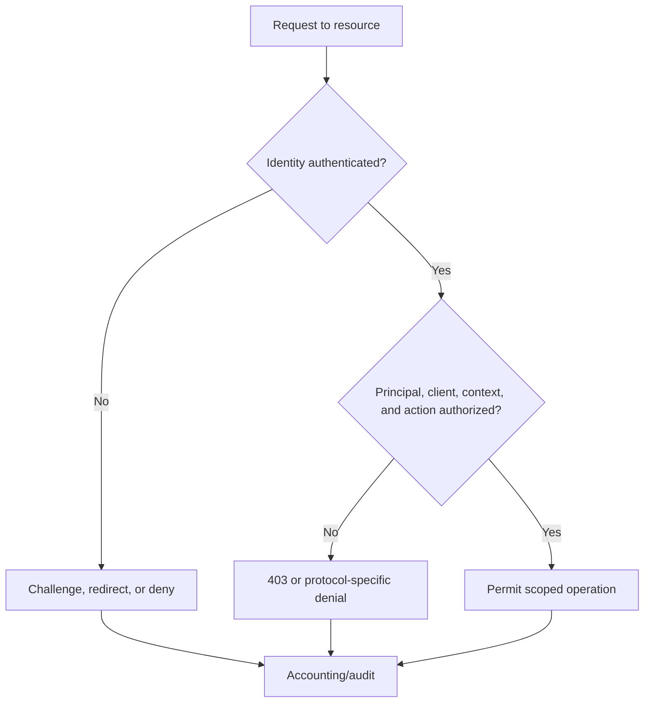

### Plain-English deep-dive 1 - A successful login does not prove access

Showing a valid employee badge at campus reception proves identity under reception policy. It does not grant entry to payroll, approve a wire transfer, or create an account in a partner system. Authentication, authorization, and provisioning are separate.

A user can authenticate successfully at an IdP but receive an application denial because the token audience is wrong, required app role is absent, group assignment has not synchronized, object permission is missing, or conditional access requires a stronger device state. Conversely, a stale application session can continue after a directory change until revocation/session rules take effect. SCIM may create the account before the first login or disable it later, but SCIM does not prove the user completed MFA.

Troubleshooting language should identify the latest successful decision: "The IdP authenticated the user and issued an authorization code, but the application rejected the redeemed ID token because its issuer did not match the configured tenant," or "SCIM created the target account, but SAML authorization denied it because the required group attribute was absent." Avoid saying only "SSO is broken."

## Identity objects, lifecycle, and source of authority

An identity can have multiple accounts and identifiers across systems. Email address, User Principal Name, employee ID, object ID, SAML NameID, OIDC `sub`, and SCIM `id` are not interchangeable. Some are human-readable and mutable; others are opaque and scoped to issuer/client/tenant. A robust integration defines the source of authority and immutable correlation keys.

| Identifier | Typical scope | Mutable? | Use caution |
|---|---|---:|---|
| Display name | Human/UI | Yes | Not unique |
| Email address | Mail/organization | Often | Reassignment and aliases |
| UPN | Directory sign-in name | Often | Can change with domain/employee changes |
| AD objectGUID | AD forest/object | Normally stable for object | Binary/format representation and migration |
| AD SID | Windows security principal/domain | Stable for principal lifecycle | SID history and cross-domain context |
| Entra object ID | Tenant object | Stable for object | New object after delete/recreate gets new ID |
| OAuth/OIDC `sub` | Issuer and client context depending provider | Intended stable within defined scope | Do not compare across issuers/clients blindly |
| SAML NameID | Format and IdP/SP agreement | Depends | Email-like NameID can change |
| SCIM `id` | Service provider resource | Service assigned | Not source system's external ID |
| SCIM `externalId` | Client-provided correlation | Managed by provisioning client | Must be unique/stable by contract |

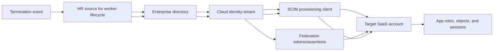

Joiner, mover, and leaver processes need ownership. A new user requires identity proofing, account creation, attributes/groups, appropriate licenses/roles, strong authentication enrollment, and app provisioning. A mover requires role and group reassessment, not additive access forever. A leaver requires timely disablement, session/token actions, app deprovisioning, credential/key recovery, mailbox/data handling, and audit retention under policy.

## Active Directory Domain Services and LDAP overview

AD DS organizes directory objects into domains and forests. A domain is an administrative and security boundary for many directory operations, with domain controllers hosting replicas. A forest contains one or more domains sharing schema, configuration, and trust relationships. Organizational Units organize objects and support delegated administration and Group Policy scope; an OU is not automatically a security boundary.

AD DS depends heavily on DNS for locating domain controllers and services. Kerberos normally authenticates domain principals; LDAP accesses directory data. NTLM can appear in legacy/fallback contexts and deserves restriction/monitoring. Global Catalog servers hold a partial replica useful for forest-wide searches and logon/group scenarios.

| AD term | Plain meaning | Why it matters | Common failure |
|---|---|---|---|
| Forest | Top-level AD DS structure sharing schema/configuration | Trust and identity namespace context | Wrong forest/trust assumption |
| Domain | Replicated directory/security namespace | Users, computers, policies, KDCs | DNS/DC reachability or replication |
| Domain controller | Server hosting AD DS and authentication services | Handles LDAP/Kerberos and replication | Site selection, clock, health |
| OU | Hierarchical administrative container | Delegation and Group Policy scope | Misplaced object or inheritance |
| Group | Collection/principal used for access | Authorization and role mapping | Nested/stale/oversized membership |
| Trust | Relationship enabling cross-domain authentication referrals | Cross-boundary access | Direction, transitivity, selective auth |
| Global Catalog | Forest-wide partial directory | User/group/search scenarios | Port/site/replication availability |
| SPN | Service Principal Name | Maps a Kerberos service to account | Missing, duplicate, wrong account |
| SID | Security Identifier | Windows principal and ACL identity | Delete/recreate or SID-history assumptions |

### LDAP

LDAP is a protocol for directory operations. A client connects, optionally secures the channel, binds/authenticates, searches a base Distinguished Name with a scope and filter, reads attributes, and may modify entries if authorized. LDAP simple bind sends a password-derived credential and requires protected transport. LDAP signing/channel binding and platform policy should follow current Microsoft guidance.

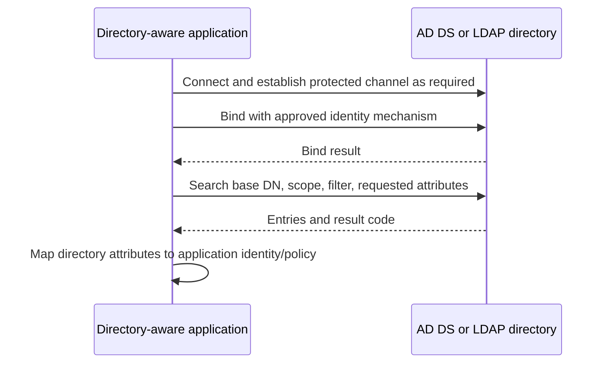

| LDAP field | Meaning | Failure clue |
|---|---|---|
| Base DN | Starting point for search | Wrong OU/domain yields no entries |
| Scope | Base, one-level, or subtree | Search misses nested location or overqueries |
| Filter | Boolean expression selecting entries | Escaping/error/injection/performance issue |
| Bind identity | Principal used for directory access | Locked/expired/insufficient read rights |
| Attributes | Requested fields | Mapping expects absent/wrong type/value |
| Result code | Protocol outcome | Distinguish invalid credentials, no object, unavailable |
| Referral | Direction to another directory context | Client may not follow or trust target |
| Page control | Retrieves large result sets in pages | Truncation if application ignores paging |

LDAP authentication is not the same as LDAP authorization. An application can validate credentials with a bind but still needs a safe mapping from directory object/groups to app roles. Avoid building authentication that repeatedly handles user passwords when federation or modern token protocols are appropriate.

## Kerberos overview

Kerberos uses a trusted Key Distribution Center, normally consisting logically of an Authentication Service and Ticket Granting Service. A user first obtains a Ticket Granting Ticket, or TGT. The client presents the TGT to request a service ticket for a Service Principal Name. It then presents that service ticket to the application. The password is not sent to every service.

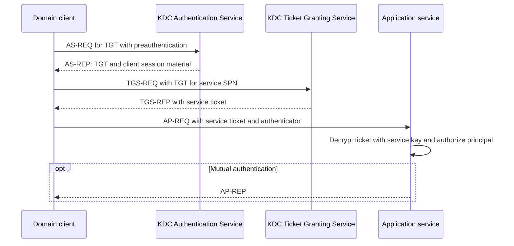

| Kerberos element | Purpose | Security/failure note |
|---|---|---|
| KDC | Trusted ticket issuer in realm/domain | Availability and compromise are high impact |
| TGT | Lets client request service tickets | Time-limited and sensitive |
| Service ticket | Presents client identity to named service | Encrypted for service account/key |
| SPN | Identifies service instance | Duplicate/missing SPN causes wrong key or fallback |
| Authenticator | Fresh client data proving possession | Clock skew/replay cache matter |
| PAC | Microsoft authorization data in Kerberos ticket | Group/claims size and validation matter; not proxy PAC |
| Delegation | Allows service to act toward another service under rules | Constrain carefully; high abuse potential |
| Key version | Identifies service key generation | Password/key mismatch across replicas breaks tickets |

Kerberos relies on reasonably synchronized time, correct DNS, SPN uniqueness, account keys, domain trust, KDC reachability, and authorization. A ticket can be issued but application access denied. Large nested group membership can enlarge tickets and HTTP authentication headers. Capturing Kerberos tickets is sensitive; prefer sanitized event codes, SPN, realm, client/server UTC, and failure code.

### Plain-English deep-dive 2 - Kerberos tickets are referrals with sealed sections

At a conference, registration gives a visitor a master voucher. The visitor exchanges it at a desk for a sealed room-specific ticket. The room attendant can open the part sealed for that room and learns who registration vouched for. The visitor does not give a password to every room.

This model explains several failures. If the room name on the request, the SPN, is missing or assigned to the wrong account, the ticket is sealed with a key the actual service cannot use. If clocks differ too much, freshness checks fail. If the service account password changed but one node has stale key state, failures can be node-specific. If the service accepts the ticket but the principal lacks permission, authentication succeeds and authorization fails.

Kerberos SSO is not a universal internet federation protocol. It is strongest in managed realm/domain contexts. Browser-to-cloud federation commonly uses SAML or OIDC, while applications and Windows services can use Kerberos internally.

## Microsoft Entra ID overview

Microsoft Entra ID is a cloud identity and access service. It is not AD DS hosted in the cloud and does not expose identical domain controller, LDAP, Kerberos, OU, or Group Policy behavior. A tenant contains users, groups, devices, app registrations, service principals, roles, policies, credentials, and audit/sign-in data. Hybrid organizations can synchronize selected identities and attributes from AD DS, but source authority and writeback behavior must be explicitly understood.

| Object/concept | Plain meaning | Operational question |
|---|---|---|
| User | Member or guest human identity | Source, status, authentication methods, roles/groups |
| Group | Collection used for assignment/policy | Membership type, nesting, dynamic evaluation, token emission |
| Device | Registered/joined device identity/state | Ownership, compliance, trust type, lifecycle |
| App registration | Global application definition in its home tenant | Client ID, redirect URIs, permissions, credentials |
| Service principal | Tenant-local application identity/instance | Assignment, consent, roles, credentials, sign-ins |
| Enterprise application | Administrative view of service principal/integration | SSO, provisioning, assignment, policy |
| Directory role | Administrative permission in tenant | Least privilege, activation, audit |
| App role | Application-defined role assignable to users/groups/apps | Token role claim and authorization mapping |
| Delegated permission | App acts with signed-in user | User/admin consent and scope |
| Application permission | App acts as itself | Admin consent and high privilege review |
| Conditional Access | Policy evaluating identity/context for access | Scope, conditions, grant/session controls |

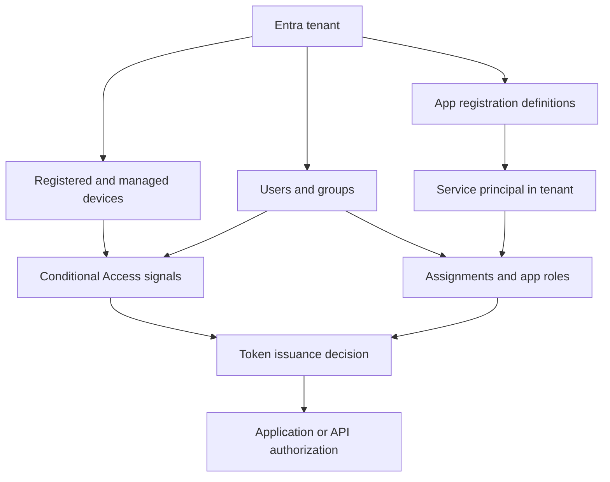

Entra sign-in logs are one observation point. An IdP success can be followed by an app failure. Conditional Access results, authentication requirement, client app, resource, service principal, device state, IP/location, correlation ID, and failure detail help. Treat risk/location fields as security-sensitive. Exact schemas and retention depend on licensing/configuration.

## SAML 2.0 federation and browser SSO

SAML uses XML messages and assertions. In a common browser SSO flow, a Service Provider generates an AuthnRequest and redirects or posts the browser to the Identity Provider. The IdP authenticates the user, evaluates policy, creates a signed Response containing an Assertion, and sends it through the browser to the SP's Assertion Consumer Service. The SP validates the response/assertion and creates its own application session.

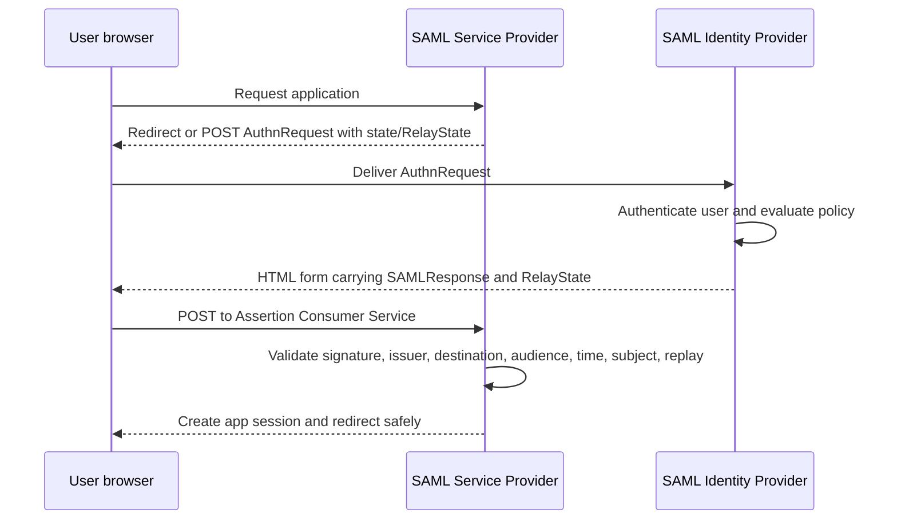

| SAML element | Plain meaning | Validation/security question |
|---|---|---|
| EntityID | Unique identifier for IdP or SP | Exact configured issuer/audience match? |
| Metadata | XML describing endpoints, keys, bindings, IDs | Retrieved and updated through trusted process? |
| AuthnRequest | SP request for authentication | Correct issuer, ACS, request ID, signature policy? |
| Response | Container returned by IdP | Signed as expected, destination/InResponseTo valid? |
| Assertion | Signed statements about subject/authentication/attributes | Correct audience, time, subject confirmation? |
| NameID | Subject identifier in configured format | Stable and mapped to intended account? |
| AttributeStatement | Claims such as group/role/email | Correct name, type, multiplicity, size, mapping? |
| Conditions | Time and audience restrictions | Clock skew and exact relying party? |
| SubjectConfirmationData | Recipient, expiry, request correlation | ACS recipient and `InResponseTo` match? |
| ACS | Assertion Consumer Service endpoint | Exact HTTPS endpoint and tenant instance? |
| RelayState | Opaque state used to continue app navigation | Integrity and open-redirect protection? |
| Binding | Message transport such as Redirect or POST | Size/signature/encoding behavior? |

### SP-initiated versus IdP-initiated

SP-initiated SSO starts at the application and provides an AuthnRequest ID, desired destination, and application state. The response can be correlated with `InResponseTo`. IdP-initiated SSO starts from an IdP portal and sends an unsolicited response, offering less request correlation and sometimes limited deep-link handling. Support and security posture vary; prefer documented application guidance.

| Dimension | SP-initiated | IdP-initiated |
|---|---|---|
| Start | Application | IdP portal/link |
| AuthnRequest | Present | Usually absent |
| `InResponseTo` | Can bind response to request | No SP request to reference |
| Deep link | RelayState/app state can preserve | Provider-specific |
| Replay/CSRF context | Strong request correlation possible | Requires careful unsolicited-response controls |
| Troubleshooting | SP request ID links flow | Start context must be reconstructed |

SAML signatures protect selected XML elements. Validation must use a hardened XML library, enforce allowed algorithms, locate the exact signed element, and avoid XML signature-wrapping mistakes. Encryption is separate from signing. TLS protects transport; assertion signing protects issuer and message integrity across browser transit. Encrypt assertions when required by data classification and threat model, while managing keys and troubleshooting carefully.

## OAuth 2.0 roles and authorization grants

OAuth 2.0 lets a client obtain limited access to a resource server. The resource owner is the entity capable of granting access; the client requests access; the authorization server authenticates/authorizes and issues tokens; the resource server hosts the protected API. OAuth is primarily an authorization framework. Using an access token as proof of user login without OIDC rules is a design error.

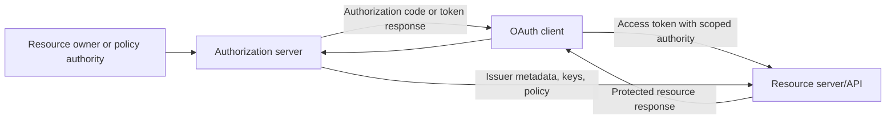

| Role | Responsibility | Evidence |
|---|---|---|
| Resource owner | Grants or owns authority under policy | User/admin consent or organization policy |
| Client | Requests and uses delegated/application access | Client ID, redirect URI, grant, token request |
| Authorization server | Authenticates/evaluates and issues token | Sign-in/token logs, issuer metadata |
| Resource server | Validates token and authorizes operation | API logs, audience, scope/role, response |
| User agent | Carries interactive redirects | Browser URL/history/network trace with sensitive data controls |

### Authorization code flow with PKCE

The authorization code flow sends the browser to the authorization endpoint. The client includes client ID, redirect URI, requested scopes, `state`, and a PKCE code challenge. After authentication/consent, the authorization server redirects with a short-lived code and state. The client checks state and redeems the code at the token endpoint using the original code verifier. The authorization server compares its transformed value to the challenge.

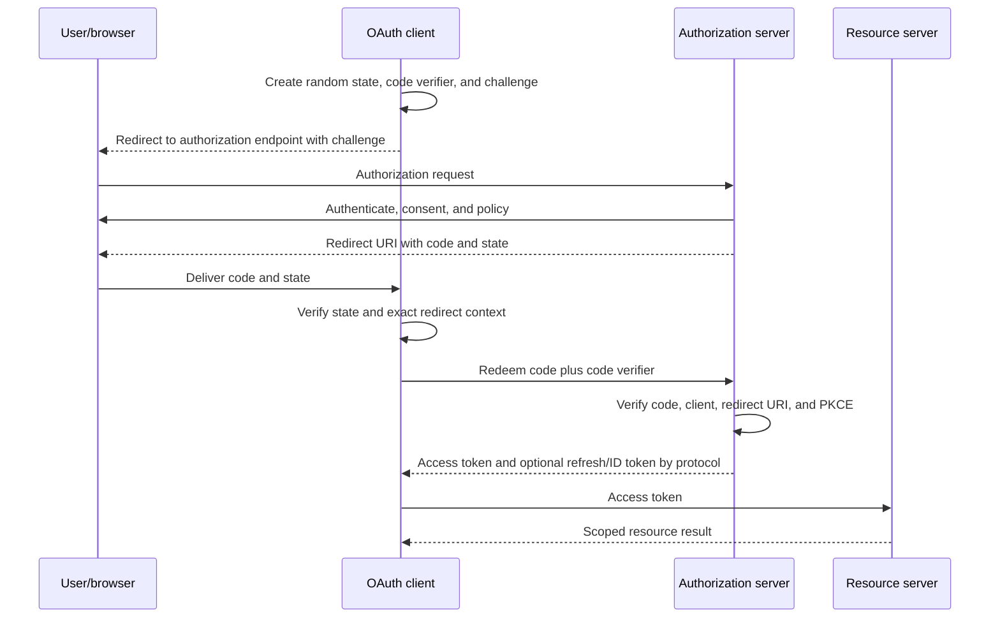

| Field | Purpose | Failure/security concern |
|---|---|---|
| `client_id` | Identifies client registration | Wrong tenant/app registration |
| `redirect_uri` | Exact approved callback | Mismatch or open redirect/token leakage |
| `response_type=code` | Requests authorization code | Wrong flow/configuration |
| `scope` | Requests delegated permissions and OIDC values | Overbroad or missing consent |
| `state` | Binds browser response to client request/context | CSRF/mix-up if missing or not checked |
| Code challenge | Transformed verifier sent initially | Must use approved method such as S256 |
| Code verifier | High-entropy secret sent during redemption | Interceptor lacks it; protect in client |
| Authorization code | Short-lived one-time credential | Leakage/replay and redirect binding |

PKCE stands for Proof Key for Code Exchange. It prevents an intercepted authorization code from being redeemed without the verifier. It does not replace `state`, TLS, exact redirect URI registration, client authentication where applicable, or token validation.

### OAuth grant comparison

| Grant/flow | Intended context | Human present? | Key security notes |
|---|---|---:|---|
| Authorization code + PKCE | User-delegated web/native access | Yes | Current default pattern; validate state/redirect and use PKCE |
| Client credentials | Workload acts as itself | No | Application permissions, least privilege, strong workload credential |
| Device authorization grant | Input-constrained device uses secondary browser | Yes, on another device | Phishing/social-engineering risk; verify displayed code/context |
| Refresh token | Continue delegated access without full prompt | Not each use | Rotation, sender constraints, revocation, secure storage |
| On-behalf-of pattern | API calls downstream API for user | User was present upstream | Provider-specific exchange and audience/scopes |
| Implicit grant | Historic browser token return | Yes | Avoid in new designs; token exposure and no code redemption |
| Resource owner password grant | Client collects user password | Yes | Do not use in modern new designs; incompatible with strong auth/federation |

Client credentials does not mean "service account password" only. A confidential client can authenticate with a certificate/private key assertion, secret, managed identity, or workload federation according to platform/protocol. The access token represents application authority, not a user. Audit must identify service principal, credential, source workload, scopes/roles, resource, and action.

### Plain-English deep-dive 3 - Access token, ID token, and authorization code are different artifacts

A theater uses three papers. A claim ticket lets someone exchange it at the counter; that resembles an authorization code. A wristband permits entry to a particular area; that resembles an access token for an API and audience. A printed identity card tells the client who signed in; that resembles an OIDC ID token. Giving the identity card to a backstage API does not automatically grant backstage access.

The client redeems an authorization code at the token endpoint. The API consumes an access token and validates that the token was intended for that API. The OIDC client consumes an ID token and validates it for its own client ID and authentication transaction. A refresh token goes only to the authorization server to obtain new tokens; it should not be sent to an API.

Never paste any of these live artifacts into tickets, chat, public JWT sites, or interview notes. A token's base64url-encoded header/payload can be readable without a secret; readability is not validity and does not make disclosure safe.

## OpenID Connect authentication layer

OIDC defines identity on top of OAuth 2.0. It introduces ID tokens, standard scopes such as `openid`, discovery metadata, UserInfo, authentication request parameters, and validation rules. The client is called a Relying Party; the identity service is an OpenID Provider.

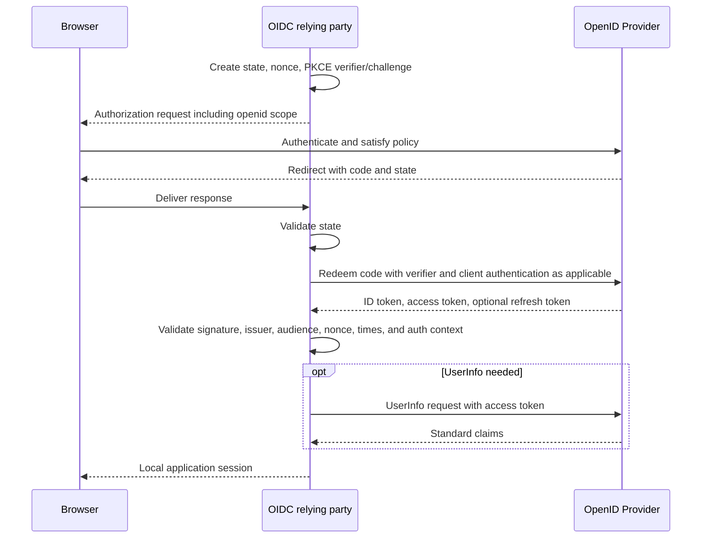

| OIDC item | Meaning | Validation |
|---|---|---|
| Discovery document | Issuer metadata and endpoints | Fetch from configured issuer over protected channel; exact issuer match |
| JWKS | JSON Web Key Set of public verification keys | Match trusted issuer and `kid`; cache/rotate safely |
| `openid` scope | Requests OIDC authentication | Required for OIDC flow |
| ID token | JWT containing authentication claims for client | Signature, issuer, audience, time, nonce, algorithm |
| `nonce` | Client value bound into ID token | Match request to token and limit replay |
| `auth_time` | Time user authentication occurred | Apply max-age/step-up policy |
| `acr`/`amr` | Authentication context/method references | Interpret only under provider contract |
| UserInfo | Endpoint returning claims with access token | Validate subject consistency with ID token |
| End-session behavior | Provider/app logout coordination | Local and provider sessions may differ |

`state` protects the client's browser transaction and return context; `nonce` binds the OIDC authentication response/ID token to the request. PKCE binds code redemption to the initiating client instance. They address different threats and are commonly used together.

## Tokens, JWTs, claims, scopes, roles, audience, and issuer

JWT is a compact claims format commonly signed as JWS. A compact signed JWT has base64url-encoded header, payload, and signature segments separated by periods. Encoding is not encryption. A JWE is an encrypted structure with different processing. Providers can also issue opaque tokens that the resource server introspects or resolves.

```text
base64url(header).base64url(payload).base64url(signature)
```

| Claim/header | Plain meaning | Validation/use caution |
|---|---|---|
| `alg` | Signing algorithm | Enforce approved expected algorithms; never accept `none` unexpectedly |
| `kid` | Key identifier | Select candidate trusted issuer key; not trust by itself |
| `iss` | Issuer | Exact match to configured authorization server/tenant |
| `sub` | Subject | Interpret in issuer/client scope; avoid email as stable substitute |
| `aud` | Intended audience/resource/client | Must include expected recipient under token rules |
| `exp` | Expiration time | Reject after allowed skew/policy |
| `nbf` | Not valid before | Reject too early; check clocks |
| `iat` | Issued-at time | Freshness/anomaly context, not sole validity |
| `jti` | Token identifier | Can support replay tracking under design |
| `scope`/`scp` | Delegated permissions | API must enforce required scope/action |
| `roles` | Application roles, often app-only or assigned roles | API maps to authorization policy |
| `azp`/client ID | Authorized client | Distinguish client from user/resource |
| `tid` or tenant claim | Tenant context in provider-specific token | Enforce tenant policy where required |
| `nonce` | OIDC request binding | Client compares expected nonce in ID token |

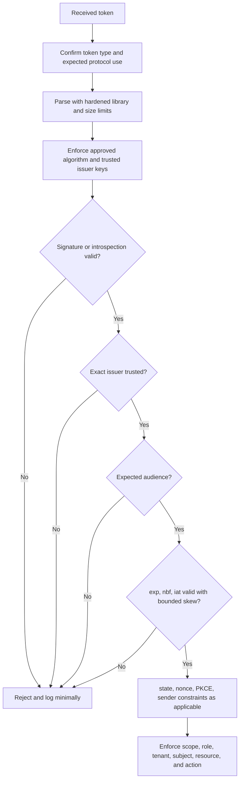

### Scopes versus roles

Scopes commonly describe delegated authority a client requests and a user/admin consents to; roles commonly describe application-defined permissions assignable to users/groups or applications. Provider token claim names vary. Neither should be displayed as a UI label only; the resource server must enforce them. A token with a broad scope is not permission to every object if business authorization is narrower.

| Question | Scope | Role |
|---|---|---|
| Primary idea | What delegated/API capability is requested/granted? | What app-defined function is assigned? |
| Typical actor | Client acting with user; can vary | User/group or application principal |
| Issuance | Consent and grant | Assignment/admin policy |
| Enforcement | Resource server checks required scope | Resource server checks role |
| Example synthetic | `files.read` | `SecurityReader` |
| Risk | Overbroad consent | Overprivileged/stale assignment |

### Token lifetimes, refresh, and revocation

Short-lived access tokens limit exposure but require reliable renewal. Refresh tokens are higher-value, longer-lived credentials protected by client type, rotation, revocation, session, conditional access, and provider rules. JWT access tokens can remain valid until expiry even after a policy change unless the architecture uses introspection, continuous access mechanisms, sender-constrained tokens, revocation lists, or short lifetimes. Exact Microsoft behavior depends on token type/resource/policy.

## SCIM provisioning and deprovisioning

SCIM 2.0 defines HTTP resources and JSON schemas for users and groups. A provisioning client calls a service provider's SCIM endpoint using authorized credentials. It can create, query, update, patch, disable, and group users. SCIM separates the client's `externalId` correlation from the service provider's assigned `id`. Filtering and pagination are essential at scale.

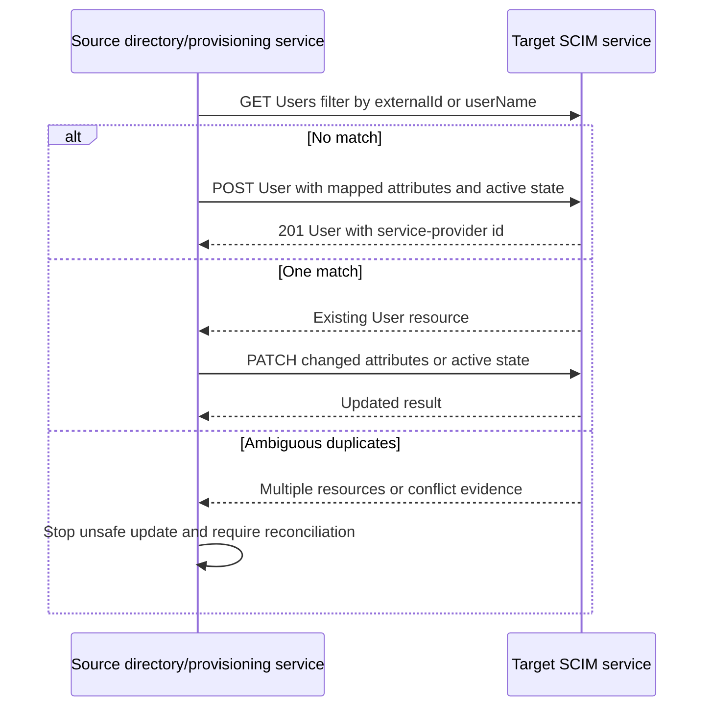

| SCIM concept | Meaning | Failure mode |
|---|---|---|
| `/Users` | User resource collection | Wrong base URL or unsupported operation |
| `/Groups` | Group resource collection | Membership scale/patch behavior |
| `schemas` | Declares resource schemas/extensions | Mapping/schema mismatch |
| `id` | Target-assigned stable resource identifier | Client incorrectly overwrites/assumes source ID |
| `externalId` | Client-provided source correlation | Duplicate or changed source key |
| `userName` | Service-provider user identifier | Case/uniqueness/rename conflict |
| `active` | Whether user is active | Delete versus disable semantics differ |
| PATCH | Partial update operations | Path/value syntax or partial failure |
| Filter | Select matching resources | Escaping, unsupported operator, wrong attribute |
| Pagination | `startIndex`, `count`, totals | Missing pages create false reconciliation |
| Bulk | Optional batching capability | Partial errors and replay/idempotency |
| ServiceProviderConfig | Advertises supported features | Do not assume unsupported capability |

Provisioning is eventually consistent in many integrations. Scope evaluation, source changes, queues, API rate limits, target processing, and reconciliation add delay. Define service-level expectations. An IdP user can authenticate while target account is absent; an app account can remain after IdP disable if deprovisioning failed. High-risk leavers need compensating session/access revocation rather than waiting blindly for a scheduled cycle.

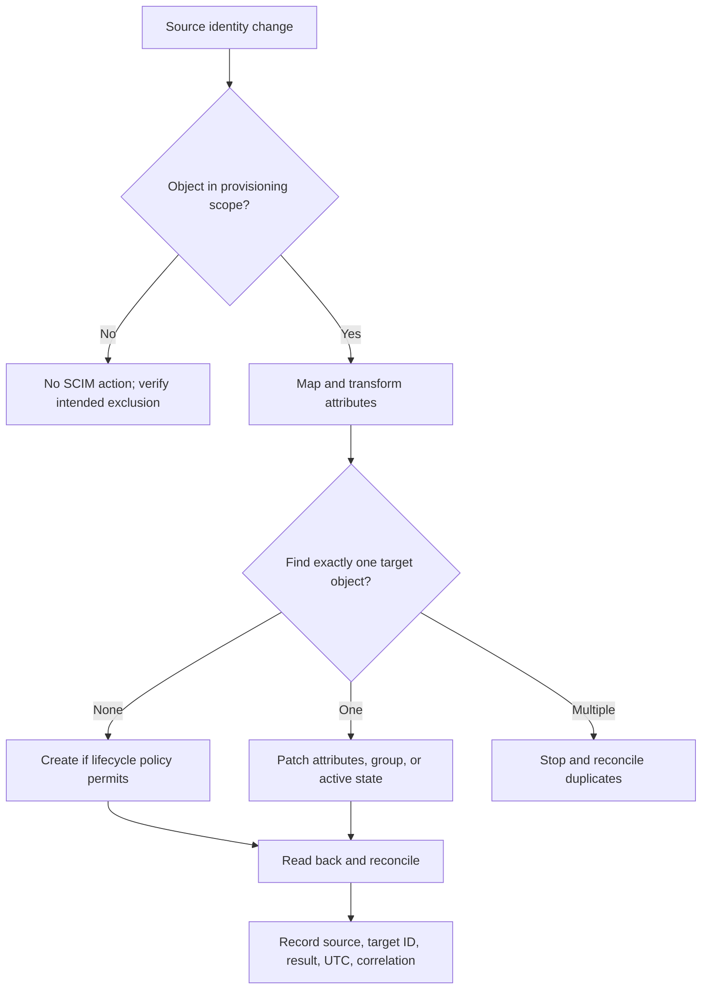

### SCIM failure and reconciliation

| Symptom | Hypotheses | Discriminating evidence |
|---|---|---|
| User not created | Out of scope, missing required attribute, auth/rate failure | Source scope evaluation and SCIM response |
| Duplicate user | Unstable match key, rename, case behavior, manual account | `id`, `externalId`, `userName`, creation audit |
| Wrong group | Mapping/filter/nested membership delay | Source membership snapshot and target patch |
| User remains active | Disable not queued, PATCH failed, target ignores field | Source event, job, request/response, read-back |
| Mass disable risk | Scope/filter change interprets removals as disable | Change preview/count delta and safety threshold |
| 429 throttling | Target quota reached | Retry-After, rate headers, backlog age |
| Schema error | Extension/attribute type unsupported | ServiceProviderConfig/schema and response detail |
| Secret expired | Connector cannot authenticate | Token endpoint/401 and credential inventory |

## MFA, factors, phishing resistance, and passwordless methods

Authentication factors are commonly categorized as something known, possessed, or inherent. Two passwords are one factor category, not MFA. A phone number can be an account recovery/contact attribute and may support weak possession signals, but SMS/voice is vulnerable to phishing, SIM swap, interception, and social engineering. Stronger methods use cryptographic proof bound to origin and authenticator.

| Method | Factor/property | Main strength | Main concern |
|---|---|---|---|
| Password | Knowledge | Widely supported | Phishing, reuse, guessing, reset abuse |
| TOTP code | Possession of seeded authenticator plus user interaction | Offline rotating code | Phishable and seed/recovery security |
| Push approval | Possession/app | User-friendly | Fatigue, number matching/context, device compromise |
| SMS/voice OTP | Phone-channel possession signal | Broad reach | SIM swap, interception, phishing |
| FIDO2/WebAuthn security key | Possession plus local verification; public-key credential | Origin-bound and phishing-resistant | Enrollment/recovery/device support |
| Platform passkey | Device/synced credential under platform model | Phishing-resistant and user-friendly | Ecosystem, recovery, sync governance |
| Certificate/smart card | Possession of private key, often PIN/user verification | Strong managed-device/workforce auth | Lifecycle, middleware, revocation |
| Biometrics | Inherence/local user verification | Convenient unlock of protected authenticator | Privacy, spoof resistance, fallback |

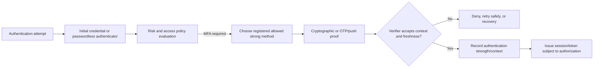

MFA enrollment and recovery are part of the security boundary. Attackers target help desks, device registration, alternate email/phone, temporary access passes, and lost-device processes. Require identity proofing, notify users of changes, audit method registration/deletion, protect privileged identities more strongly, and test emergency access.

## Conditional Access and risk-based policy

Conditional Access evaluates assignments and conditions for a sign-in/access attempt, then applies grant and session controls. Signals can include user/group, target resource, client/app type, device platform/state, network/location, authentication context, risk, and other documented fields. Policies can require MFA, authentication strength, compliant or hybrid-joined device, approved client, terms, or block.

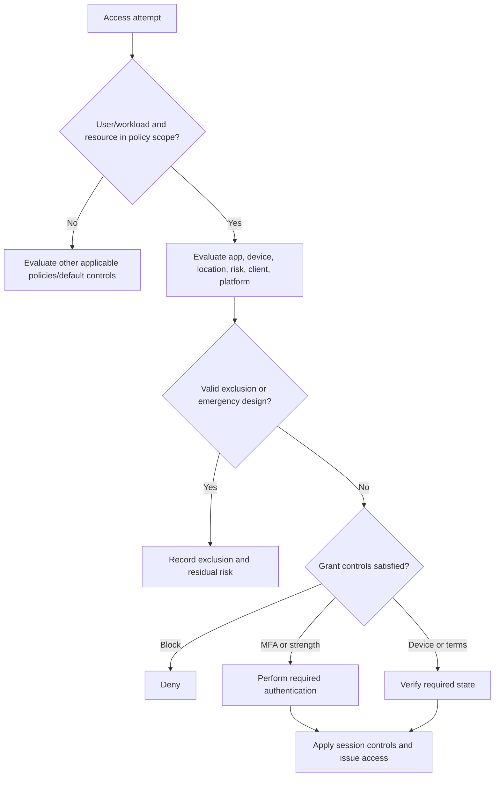

| Policy input | Example question | Failure/attack concern |
|---|---|---|
| User/group | Is privileged admin in scope? | Exclusion or stale membership |
| Resource | Which cloud app/API is requested? | Policy targets wrong app/resource |
| Device | Is device known/compliant? | Stale compliance, duplicate device |
| Location/network | Is attempt from trusted named location? | IP change, VPN/proxy egress, trust overuse |
| Client app | Browser, modern auth, legacy protocol? | Legacy authentication bypass/gap |
| Sign-in/user risk | Is risk level above threshold? | Detection confidence and remediation path |
| Authentication context/strength | Does sensitive action require stronger method? | App integration and claim propagation |
| Session | Frequency, persistence, app-enforced restriction | User friction versus risk and stale sessions |

Policy troubleshooting must examine all applicable policies and report-only results, not one expected rule. Exclusions, emergency accounts, service dependencies, and break-glass access require strict monitoring and review. A "trusted location" should not make a user inherently trusted; source IP can represent NAT/proxy/VPN and be abused.

## Service principals, managed identities, certificates, secrets, and federation

Workloads need identities without pretending to be human users. A service principal can receive application permissions or roles. It authenticates using a credential or federated workload assertion. Prefer managed identities or workload identity federation where supported because they reduce stored secrets. When credentials are necessary, certificates/private keys generally provide stronger lifecycle/audit options than static shared secrets, but must still be protected and rotated.

| Workload method | Secret stored by app? | Strength | Limitation |
|---|---:|---|---|
| Client secret | Yes | Simple compatibility | Copyable, leak-prone, expiry/rotation outages |
| Certificate/private key | Private key accessible to workload/HSM | Asymmetric proof and clear public credential | Key custody, renewal, library support |
| Managed identity | No app-managed long-lived credential | Platform rotates/provides tokens | Platform/resource scope and availability |
| Workload identity federation | No shared cloud secret; trusts external signed identity | Short-lived exchange and provenance | Trust conditions/issuer/subject configuration |
| Human service account | Usually password/interactive identity | Legacy compatibility | Poor attribution, MFA/lifecycle/ownership risk |

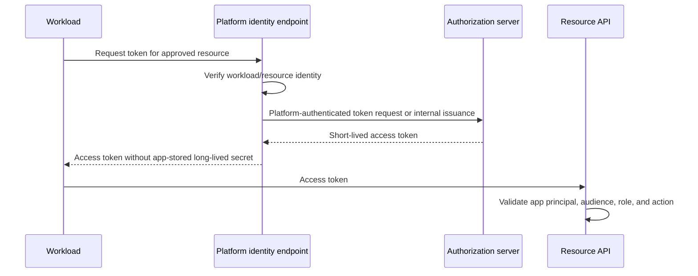

### Credential lifecycle

| Stage | Required control | Failure mode |
|---|---|---|
| Inventory | Owner, app, tenant, permissions, credential IDs, expiry | Unknown/orphan credential |
| Create | Approved algorithm/entropy and protected generation | Secret appears in source/log |
| Store | HSM/key vault/managed platform and least privilege | Broad read/export access |
| Deploy | Versioned reference, no hardcoding | Wrong environment/tenant |
| Use | Resource-specific token and auditable principal | Overbroad permission or token audience |
| Rotate | Overlap old/new, canary, rollback, dependency map | Expiry outage or stale nodes |
| Revoke | Rapid removal and session/token response | Compromised credential remains valid |
| Retire | Remove role, credential, app/object when unused | Dormant high privilege |

Do not put secrets in scripts, PAC files, URLs, tickets, packet traces, screenshots, or Git history. A certificate's public portion can be shared appropriately; its private key cannot. Rotation should verify every instance and remove the old credential after the monitored overlap. Emergency secret creation needs expiry and retrospective review.

### Plain-English deep-dive 4 - A service principal is an identity, not a secret

A company registration and the key to its office are not the same object. The service principal is the tenant-local workload identity with permissions and assignments. A client secret or certificate private key is one way that workload proves possession. Deleting a leaked secret does not automatically remove excessive permissions; reducing a role does not rotate a compromised key.

Managed identity is like a building issuing a temporary badge to the server installed in a specific room after checking the room itself. The application does not keep a long-lived badge combination. Workload identity federation is like accepting a short-lived signed employment statement from another trusted authority, but only when issuer, subject, audience, and conditions match exactly.

For incidents, scope both credential and principal: Which credential was used? Which principal, tenant, source workload, token audience, roles, APIs, objects, and time window? Rotate/revoke proof, reduce permissions, inspect activity, correct storage, and prevent recurrence.

## Federation failures and trace-led diagnosis

Identity flows cross browser, DNS/TCP/TLS, IdP, MFA, authorization server, application, API, directory, and provisioning boundaries. A user-facing error can hide the deciding component. Build a timeline from the last known successful transition.

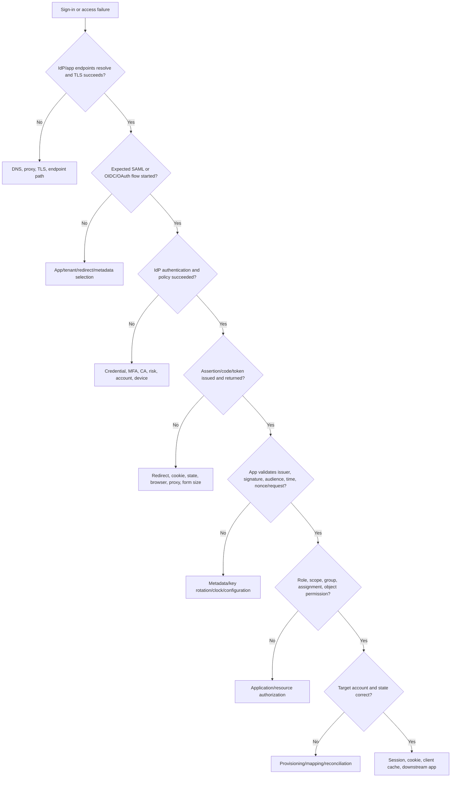

### Common failure matrix

| Symptom/error family | Plausible cause | Discriminating check | Owner candidates |
|---|---|---|---|
| Unknown user | Wrong tenant, identifier mapping, unprovisioned account | Issuer/tenant and source/target IDs | IAM/app/provisioning |
| Redirect URI mismatch | Registration and request differ | Exact normalized registered/request URI | App/IAM |
| Invalid issuer | Metadata/tenant mismatch | Token/assertion issuer and configured authority | App/IAM |
| Invalid audience | Token/assertion for another recipient | Expected versus actual audience | App/IAM/API |
| Signature/key error | Stale metadata/JWKS, wrong key, algorithm, tampering | `kid`, issuer keys, signed element, rotation time | IAM/app/security |
| Expired/not yet valid | Clock skew, stale artifact, long flow | UTC and `exp`/`nbf`/SAML Conditions | Endpoint/app/IdP/time |
| State mismatch | Lost session, parallel tabs, CSRF/mix-up defense | Request/response state correlation | Client/app |
| Nonce mismatch | Wrong/replayed ID token or lost transaction | Expected nonce and ID token claim | Client/app |
| PKCE failure | Wrong verifier/client transaction | Code challenge/verifier transaction IDs | Client/app/AS |
| MFA loop | Session/cookie, claims challenge, policy, broker context | CA result and authentication method/session | IAM/client/app |
| Auth succeeds, app 403 | Scope/role/group/object authorization | API/app decision and token claims | App/data/IAM |
| User exists, login denied | Assignment, active state, app policy | SP/app assignment and target account | IAM/app/provisioning |
| Works browser, fails native client | Different flow, redirect, broker, proxy, token cache | Process and grant/client IDs | Endpoint/app/IAM |

### SAML trace checklist

1. Record UTC, browser/app start URL, tenant, user pseudonymous ID, and correlation IDs.
2. Identify SP-initiated or IdP-initiated flow.
3. Preserve sanitized AuthnRequest ID, issuer, destination, ACS, binding, and RelayState length/purpose.
4. Confirm IdP authentication and conditional policy result.
5. Inspect Response/Assertion locally with approved tools; never upload customer assertions publicly.
6. Validate signature and exact signed element, issuer, destination, `InResponseTo`, audience, recipient, time, SubjectConfirmation, and replay handling.
7. Compare NameID/attributes to target account and app role mapping.
8. Confirm application session creation and redirect safety.

### OAuth/OIDC trace checklist

1. Identify authority/tenant, authorization endpoint, client ID, redirect URI, resource/audience, scopes, and grant.
2. Correlate state, nonce, PKCE challenge/verifier without exposing their values broadly.
3. Confirm authentication/consent/conditional-access result and authorization code issuance.
4. Confirm exact redirect and code redemption from the intended client.
5. Record token endpoint status/error and correlation IDs; redact tokens and secrets.
6. Validate token type, issuer, signature/JWKS, audience, times, nonce for ID token, client, tenant, scopes/roles.
7. Correlate API response and resource-server authorization.
8. Compare browser/native/service flows by one variable.

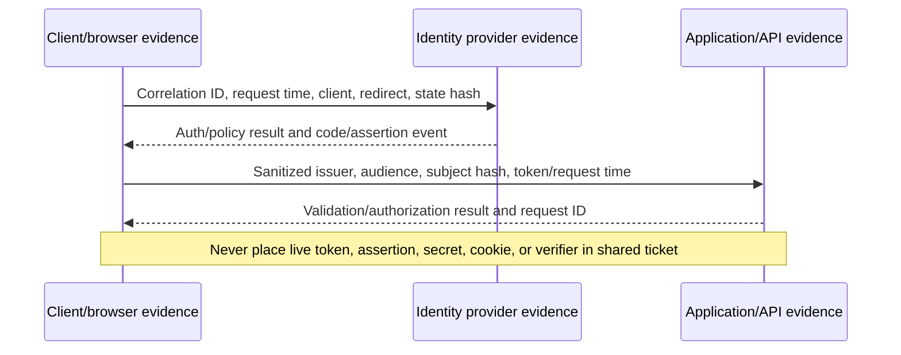

## Tools, browser evidence, and safe token handling

| Tool/evidence | Best use | Key output | Limitation/security |
|---|---|---|---|
| Browser network tools | Redirect sequence, status, endpoints, timing | Request IDs, locations, form posts | HAR can contain assertions, codes, tokens, cookies |
| SAML tracer extension | Local controlled SAML message view | AuthnRequest/Response structure | Extension trust and sensitive XML; avoid production unless approved |
| Entra sign-in logs | Authentication and CA decision | Correlation ID, app/resource, result, device/context | Licensing/retention/schema vary; privacy sensitive |
| Entra audit/provisioning logs | Configuration and SCIM lifecycle | Actor, object, mapping/job/request result | Delays and redaction can occur |
| Application logs | Token/assertion validation and authorization | Issuer/audience/claim failure, request ID | Must not log full artifacts |
| Fiddler/HTTP proxy | Controlled redirect and HTTP analysis | Status/headers/bodies | Decryption and secrets require authorization |
| Wireshark | DNS/TCP/TLS timing | Endpoint/path and encrypted record flow | Cannot ordinarily read protected identity payload |
| JWT library/debugger locally | Parse/validate synthetic or authorized token | Header/claims/signature result | Public sites must never receive live customer token |
| `klist` | Kerberos cache/ticket overview | Client/server principals, lifetimes | Tickets are sensitive; output can expose names |
| Windows event logs | Kerberos/logon/directory evidence | Event/failure codes and timestamps | Audit policy and interpretation required |
| LDAP tools | Controlled bind/search test | Result code/entries | Credentials and directory data are sensitive |
| SCIM client logs | Provisioning requests/responses | Resource ID, operation, status, retry | Bodies contain personal attributes |

Safe evidence stores hashes or last characters of correlation values where full values are unnecessary. Token headers and claims can still expose user, tenant, group, device, IP, authentication method, and app information. A signed token remains a bearer credential unless sender-constrained. Redaction should preserve issuer host, audience category, times, error code, claim names, and selected pseudonymous IDs needed to test a hypothesis.

Example local commands in an authorized Windows lab:

```powershell
klist
whoami /user
whoami /groups
Get-Date -AsUTC
Resolve-DnsName login.microsoftonline.com
```

Do not paste `klist` output or tenant identities into public material. PowerShell module commands and Graph/API permissions change; use current Microsoft documentation and least-privilege read access. Never ask a customer for a password, MFA code, refresh token, client secret, or private key.

## Privacy, security, and threat considerations

Identity data is high value. Tokens and assertions can be active credentials. Logs can reveal names, emails, object IDs, groups, device status, IP/location, risk, authentication methods, and application usage. Provisioning payloads can include manager, department, phone, and employment state. Apply minimization, purpose limitation, access control, retention, residency, and secure transfer.

| Threat/control gap | Example | Preventive/detective response |
|---|---|---|
| Credential phishing | Fake sign-in steals password/OTP | Phishing-resistant MFA, user education, risk detection |
| Token theft | Browser/session/access token copied | Secure storage, device protection, sender constraints, short life, revoke/session response |
| Consent phishing | User grants malicious app scope | Verified publishers/process, admin consent workflow, review grants |
| Secret leakage | Client secret in code/log | Managed identity/federation, secret scanning, rotation |
| SAML signing key compromise | Attacker forges assertions | HSM/key protection, rotation, audit, incident plan |
| Redirect abuse | Open/unregistered redirect leaks code/token | Exact allowlist, state, PKCE, no wildcard callbacks |
| Replay | Assertion/code/early artifact reused | Nonce, one-time code, short Conditions, replay cache, TLS |
| Overprivileged app | Broad application permission | Least privilege, admin review, access reviews, usage monitoring |
| Stale account | Leaver remains active in target | Timely SCIM disable, reconciliation, session revocation |
| Group explosion | Excess group claims or hidden privilege | Role design, app roles, overage handling, reviews |
| Weak recovery | Help desk resets attacker into account | Strong proofing, notifications, privileged workflow |
| Log overcollection | Full tokens/assertions retained | Field-level logging, redaction, restricted debug window |

Identity incidents need containment proportional to artifact and privilege. Resetting a password might not revoke stolen tokens or remove malicious MFA methods. Disabling a user might not remove an application service principal. Rotating a client secret might not reduce the app's roles. Scope the principal, credentials, sessions/tokens, devices, applications, consents, assignments, actions, and downstream data.

## OneDrive, SharePoint, and Microsoft 365 bridge

OneDrive and SharePoint access involves identity, token acquisition, application/API authorization, object permissions, client caches, network path, and service state. Exact Microsoft internals and token fields evolve. A browser can use one client/session and a sync process another. Authentication can succeed while SharePoint item permission or Conditional Access blocks the requested action.

| Symptom | Identity hypotheses | Non-identity alternatives | Evidence |
|---|---|---|---|
| Repeated sign-in prompt | Token cache, broker, MFA/CA, cookie, clock | Proxy/TLS/redirect interference | Client logs, sign-in correlation, browser flow |
| Browser works, sync fails | Client app/grant, device state, proxy auth, cached identity | Sync state/path/API/limits | Process, client ID, policy, service request ID |
| User sees site but not file | Object permission/sharing/link | Item moved/deleted/service state | Effective permission and object ID |
| External guest denied | Wrong tenant/account, redemption, cross-tenant policy | URL/site config | Tenant IDs, guest object, sign-in/app result |
| Upload denied | Scope, CA, DLP, app permission | File restriction, quota, proxy body limit | Responder and policy/request IDs |
| Access persists after removal | Session/token/cache or nested group delay | Permission replication | Change time, token/session, effective permission |

Arti's strength is keeping these hypotheses separate. She can say: "I first establish whether the failing process obtained a token for the intended resource, whether the resource validated it, and whether application/object authorization permitted the operation. I correlate sign-in, client, network, and service IDs and avoid treating successful interactive login as proof of item-level access."

## Fictional NMH scenario: SAML succeeds, SCIM and app authorization diverge

NMH is fictional. Its acquired company users move from email identifiers to stable employee IDs. A synthetic SaaS security application uses SAML for browser authentication and SCIM for account provisioning. The change updates the SAML NameID mapping first, while SCIM continues matching `userName` by old email and does not populate the new immutable `externalId` consistently.

One user authenticates successfully at the IdP. The SAML assertion is signed, current, intended for the correct audience, and contains the new employee-ID NameID. The target application cannot match that NameID to the existing email-keyed account and denies access. The next SCIM cycle tries to create another user because its filter misses the renamed account. A duplicate-prevention control stops creation and reports conflict.

```mermaid
sequenceDiagram
    participant U as Fictional user
    participant I as NMH IdP
    participant P as SCIM provisioning service
    participant A as Fictional SaaS app
    U->>A: Start SP-initiated SSO
    A-->>I: AuthnRequest through browser
    I-->>A: Valid assertion with new employee-ID NameID
    A->>A: Existing account still keyed to old email; mapping fails
    A-->>U: Access denied with correlation ID
    P->>A: Filter user by old/inconsistent mapping
    A-->>P: No safe unique match
    P->>A: Attempt create with new identity
    A-->>P: Conflict/duplicate safeguard
```

### NMH evidence matrix

| Evidence | Synthetic observation | Supports | Does not prove |
|---|---|---|---|
| IdP sign-in | Authentication and policy success | User proved identity to IdP | Target account/authorization success |
| SAML validation | Signature, issuer, audience, time valid | Federation trust worked | NameID maps to correct target object |
| App log | Subject lookup found no matching active account | Target mapping failure | SCIM caused it without provisioning evidence |
| SCIM filter | Used stale email-based criterion | Provisioning correlation drift | Every account is affected |
| SCIM conflict | Duplicate safeguard blocked create | Safety control prevented duplicate | Existing object is automatically correct |
| Known-good user | Already has stable externalId and succeeds | Stable-key mapping is discriminating | Global change is ready |

### NMH response and mitigation

1. Scope affected source populations, identifier versions, target accounts, and business-critical access.
2. Pause unsafe creates/disables if count or duplicate thresholds are exceeded; preserve logs and IDs.
3. Do not weaken SAML signature/audience validation or grant broad manual roles.
4. Define an authoritative immutable source key and target correlation contract.
5. Reconcile existing target `id`, SCIM `externalId`, old/new userName, and SAML subject under approved rules.
6. Pilot mapping for synthetic and representative accounts, including rename, rehire, guest, duplicate, and leaver cases.
7. Update SAML and SCIM mappings in a coordinated change with rollback.
8. Validate authentication, app authorization, group/role assignment, create/update/disable, and negative duplicate prevention.
9. Monitor mismatches, job lag, conflicts, access denials, and unexpected count deltas.
10. Document root cause as an identity-correlation and migration-control gap, not a vendor protocol defect.

### NMH executive update

"In this fictional exercise, authentication remained healthy, but the application and provisioning connector used different account keys after an identifier migration. The app could not map a valid SAML subject, and SCIM safely blocked a duplicate create. We paused risky lifecycle actions, reconciled identities using a stable key, piloted the coordinated mapping, and validated login, authorization, provisioning, deprovisioning, and duplicate controls. No evidence supports a Zscaler or Microsoft production defect."

## Additional troubleshooting scenarios

### Scenario 1: OIDC redirect URI mismatch after hostname change

The client requests `https://new.example/callback`, while registration allows only the old hostname. The authorization server rejects before code issuance. Compare exact scheme, host, port, path, case/normalization rules under provider policy. Do not add broad wildcard redirects. Register the exact approved URI, remove obsolete entries after rollout, test state/PKCE, and verify no open redirect.

### Scenario 2: API rejects token with wrong audience

A client obtains a validly signed token for API A and sends it to API B. API B must reject it. The fix is to request the correct resource/scope and validate client registration/consent, not to disable audience validation. Decode only in a protected local tool and never expose the token.

### Scenario 3: SAML key rotation mismatch

The IdP signs with a new key after metadata rotation. One SP node has refreshed metadata; another has stale keys. Failures correlate to backend node. Restore trusted metadata/key rollout under change control, preserve old/new overlap according to policy, verify signed element and issuer, and add rotation monitoring.

### Scenario 4: MFA prompt loop through native client

Conditional Access requires a stronger method. Browser completion succeeds, but the native client's broker/token cache does not return the claims challenge to the same transaction, causing repeated prompts. Correlate client ID, redirect URI, correlation ID, authentication details, broker logs, and device state. Do not exclude the user globally from MFA.

### Scenario 5: service principal secret expiry

A nightly connector returns token endpoint authentication failure immediately after a known secret expiry. The service principal and permission remain, but its credential is invalid. Rotate using an approved overlap/canary, remove old credential after verification, inspect why alerts failed, and prefer managed identity or workload federation if supported.

| Scenario | Last success | Exact failure | Safe correction |
|---|---|---|---|
| Redirect mismatch | Client reached authorization server | Callback not allowlisted | Exact URI registration and deployment coordination |
| Wrong audience | Token signature/issuer/time valid | API recipient mismatch | Request correct resource; keep audience validation |
| SAML key rotation | IdP issued valid assertion | Stale SP node key set | Coordinated metadata refresh and node verification |
| MFA loop | IdP evaluates stronger auth | Client transaction/session cannot complete | Repair broker/client/policy integration, not broad exclusion |
| Expired app secret | Connector reaches token endpoint | Client authentication credential expired | Controlled rotation and credentialless redesign |

## Identity escalation package

| Section | Include | Exclude/protect |
|---|---|---|
| Impact | Users/apps/actions, business effect, start, severity | Unverified broad scope |
| Context | Tenant/issuer category, app/client/resource IDs as approved | Secrets and unnecessary personal data |
| Timeline | UTC redirects, auth, token/assertion, app, SCIM events | Local-only timestamps without offset |
| Protocol | SAML/OIDC/OAuth/SCIM flow and last transition | Generic "SSO failed" |
| Validation | Issuer, audience, times, algorithm/key ID, state/nonce result | Full live token/assertion |
| Authorization | Scopes, roles, groups, assignment, object permission | Broad group dumps |
| Provisioning | Source/target pseudonymous IDs, operation, status, job ID | Full HR/profile data |
| Policy | CA/risk/device result and relevant rule IDs | Sensitive risk detail to broad audience |
| Correlation | IdP/app/API/provisioning request IDs | Cookies, codes, refresh tokens |
| Hypotheses | Ranked and falsifiable with owner/test | Premature vendor attribution |
| Change | Scope, approval, canary, negative tests, rollback | Permanent bypass/exclusion |

A precise engineering question is: "At 15:42:11Z, the fictional client received an authorization code for client A and exact redirect B. Code redemption with matching PKCE succeeded. The ID token validates for issuer C and client audience A, but API D rejects the access token whose audience is API E. Please confirm the documented resource/scope for D and whether client A has the required delegated permission. Tokens are retained only in the restricted case vault; the attached summary contains no credentials."

## Arti bridge and interview positioning

| Existing strength | Identity translation | Practice artifact |
|---|---|---|
| M365 permissions cases | Separate authentication from site/item authorization | AuthN/AuthZ decision map |
| OneDrive client cases | Compare browser/native app, token cache, proxy, API | Client-flow comparison |
| CRITSIT leadership | Split IdP, app, endpoint, network, and provisioning workstreams | Federation incident timeline |
| RCA | Identify identifier mapping and rotation control gaps | NMH identity RCA |
| Analytics | Group failures by client, policy, tenant, stage, error | Synthetic sign-in dashboard |
| SQL/data skills | Reconcile source and target identity IDs safely | SCIM mismatch query/table |
| Mentoring | Teach token types and protocol boundaries | Whiteboard and quiz |
| AI interest | Analyze only sanitized fields and verify every interpretation | Identity evidence prompt checklist |

A strong interview answer is: "I start by naming the protocol and artifact. I distinguish authentication, token/assertion validation, application authorization, and provisioning. For SAML I check request correlation, signature, issuer, destination, audience, time, subject, and attributes. For OIDC/OAuth I check state, nonce, PKCE, redirect URI, token type, issuer, audience, time, client, scopes, and roles. I correlate IdP, client, app/API, and SCIM logs by UTC and IDs, protect tokens and personal data, and make the narrowest change with rollback and negative tests."

## Common misconceptions to correct

| Misconception | Correction |
|---|---|
| Identity, account, and credential are the same | Identity is representation, account is a usable record, credential is proof |
| Authentication grants access | Authorization decides resource/action after identity/context |
| SSO means one universal session | Applications and IdPs maintain separate sessions and policies |
| LDAP is Active Directory | LDAP is a protocol; AD DS is a directory service using it |
| LDAP bind success grants app role | Directory authentication and application authorization differ |
| Kerberos sends password to each service | Tickets provide service-specific authentication |
| Entra ID is AD DS in Azure | It is a cloud identity service with different protocols/objects |
| SAML assertion is safe because XML is readable | It can be a bearer security artifact with personal attributes |
| SAML signing and encryption are the same | Signing protects integrity/issuer; encryption protects confidentiality |
| OAuth is an authentication protocol | OAuth delegates API access; OIDC adds authentication semantics |
| Access token is for the client UI | It is for the resource server/audience |
| ID token can call any API | It authenticates to the client; API needs appropriate access token |
| JWT is encrypted | Common signed JWT payloads are encoded and readable |
| Valid signature makes any token acceptable | Issuer, audience, time, type, nonce/context, and authorization still matter |
| `state`, `nonce`, and PKCE are interchangeable | They protect different transaction boundaries |
| Scope and role are synonyms | Scopes commonly express delegated capability; roles express app assignments |
| SCIM performs SSO | SCIM provisions lifecycle; federation performs sign-in assertions/tokens |
| User disabled at source disappears everywhere instantly | Queues, sessions, tokens, target connectors, and failures create delay |
| Two prompts equal MFA | Factors must be from independent categories/policy |
| SMS is phishing-resistant | It is susceptible to phishing and telecom attacks |
| Service principal equals client secret | Principal is identity; secret is one credential |
| Managed identity removes authorization needs | It removes app-managed credential, not least-privilege policy |
| Successful IdP log proves app success | App validation and authorization remain separate |
| Full token is required in every escalation | Sanitized claims, IDs, error, and secure restricted handling are safer |

## Official Source Anchors

The following authoritative sources were reviewed on **2026-08-24**. They support standards, NIST guidance, Microsoft identity documentation, and official Zscaler integration concepts. They do not prove a fictional NMH result, tenant configuration, claim mapping, policy outcome, or production defect. Check standards updates, errata, metadata, and current product documentation.

| Source | URL | Used for | Boundary |
|---|---|---|---|
| IETF RFC 4511 | https://www.rfc-editor.org/rfc/rfc4511 | LDAP protocol operations and result model | AD-specific behavior and extensions require Microsoft docs |
| IETF RFC 4515 | https://www.rfc-editor.org/rfc/rfc4515 | LDAP search filter string format | Application escaping/security still required |
| IETF RFC 4120 | https://www.rfc-editor.org/rfc/rfc4120 | Kerberos V5 protocol | Microsoft extensions and deployment guidance are separate |
| OASIS SAML 2.0 Technical Overview | https://docs.oasis-open.org/security/saml/Post2.0/sstc-saml-tech-overview-2.0.html | SAML roles, assertions, and browser SSO | Normative SAML specifications control details |
| OASIS SAML 2.0 Core | https://docs.oasis-open.org/security/saml/v2.0/saml-core-2.0-os.pdf | Assertions, protocol messages, conditions | Bindings/profiles are separate documents |
| IETF RFC 6749 | https://www.rfc-editor.org/rfc/rfc6749 | OAuth 2.0 authorization framework | Security best current practice updates legacy choices |
| IETF RFC 7636 | https://www.rfc-editor.org/rfc/rfc7636 | PKCE | Use current OAuth security guidance too |
| IETF RFC 8628 | https://www.rfc-editor.org/rfc/rfc8628 | OAuth device authorization grant | Provider policy and phishing controls vary |
| IETF RFC 8252 | https://www.rfc-editor.org/rfc/rfc8252 | OAuth for native apps | Platform/provider implementation changes |
| IETF RFC 9700 | https://www.rfc-editor.org/rfc/rfc9700 | OAuth 2.0 Security Best Current Practice | Published updates supersede older insecure patterns |
| OpenID Connect Core 1.0 | https://openid.net/specs/openid-connect-core-1_0.html | ID tokens, nonce, UserInfo, authentication | Errata and provider discovery metadata apply |
| IETF RFC 7519 | https://www.rfc-editor.org/rfc/rfc7519 | JWT claims format | JWT alone does not define protocol validation context |
| IETF RFC 7515 | https://www.rfc-editor.org/rfc/rfc7515 | JSON Web Signature | Algorithm/key trust policy remains essential |
| IETF RFC 8414 | https://www.rfc-editor.org/rfc/rfc8414 | Authorization server metadata | OIDC discovery has related specification |
| IETF RFC 7643 | https://www.rfc-editor.org/rfc/rfc7643 | SCIM core schema | Target extensions and mapping vary |
| IETF RFC 7644 | https://www.rfc-editor.org/rfc/rfc7644 | SCIM protocol, filters, PATCH, pagination | Service provider capabilities must be discovered/documented |
| NIST SP 800-63B | https://pages.nist.gov/800-63-4/sp800-63b.html | Authentication factors, authenticators, phishing resistance | Organizational assurance mapping required |
| NIST SP 800-207 | https://csrc.nist.gov/pubs/sp/800/207/final | Identity/context in zero trust policy | Not an identity protocol specification |
| CISA Zero Trust Maturity Model 2.0 | https://www.cisa.gov/resources-tools/resources/zero-trust-maturity-model | Identity pillar and strong authentication direction | Federal maturity guidance, adaptable not universal |
| Microsoft Learn: Active Directory Domain Services overview | https://learn.microsoft.com/en-us/windows-server/identity/ad-ds/get-started/virtual-dc/active-directory-domain-services-overview | AD DS domains, forests, DC concepts | Exact Windows version/deployment matters |
| Microsoft Learn: Kerberos authentication overview | https://learn.microsoft.com/en-us/windows-server/security/kerberos/kerberos-authentication-overview | Windows Kerberos architecture | Protocol and product updates apply |
| Microsoft Learn: Microsoft Entra fundamentals | https://learn.microsoft.com/en-us/entra/fundamentals/whatis | Entra tenant and cloud identity overview | Features/licensing change |
| Microsoft identity platform OAuth 2.0 and OIDC protocols | https://learn.microsoft.com/en-us/entra/identity-platform/v2-protocols | Microsoft protocol implementation overview | Endpoint/tenant/app specifics require current docs |
| Microsoft identity platform ID tokens | https://learn.microsoft.com/en-us/entra/identity-platform/id-tokens | ID token purpose and validation | Token versions/claims vary |
| Microsoft identity platform access tokens | https://learn.microsoft.com/en-us/entra/identity-platform/access-tokens | Access token purpose, audience, validation | APIs validate tokens intended for themselves |
| Microsoft Learn: Conditional Access overview | https://learn.microsoft.com/en-us/entra/identity/conditional-access/overview | Conditional Access concepts | Licensing, policy interactions, and UI evolve |
| Microsoft Learn: application and service principal objects | https://learn.microsoft.com/en-us/entra/identity-platform/app-objects-and-service-principals | App registration versus service principal | Multi-tenant lifecycle requires tenant evidence |
| Microsoft Learn: managed identities | https://learn.microsoft.com/en-us/entra/identity/managed-identities-azure-resources/overview | Managed workload identity concepts | Azure-specific availability and resource support |
| Microsoft Learn: provisioning with SCIM | https://learn.microsoft.com/en-us/entra/identity/app-provisioning/use-scim-to-provision-users-and-groups | Entra SCIM provisioning concepts | Target implementation and mappings vary |
| Microsoft Learn: secure workload identities | https://learn.microsoft.com/en-us/entra/workload-id/workload-identities-overview | Workload identity and lifecycle | Features and recommendations evolve |
| Zscaler: SAML identity provider configuration concepts | https://help.zscaler.com/zia/about-saml | Official high-level ZIA SAML integration context | Tenant UI, capabilities, and prerequisites vary |
| Zscaler: identity provider integration for ZPA | https://help.zscaler.com/zpa/about-idp-configuration | Official high-level ZPA IdP context | Later Part covers product-specific configuration; verify access |

## Likely Interview Questions

### Q1. Distinguish identity, account, credential, principal, authentication, and authorization.

**Model answer:** Identity is the represented person, device, or workload and its attributes. An account is a system record usable by that identity. A credential is proof such as password, key, certificate, or authenticator. A principal is the security identity that receives permissions. Authentication verifies the claimed principal; authorization decides whether that principal/client/context may perform an action on a resource. Accounting records attempts and decisions.

### Q2. Explain AD DS, LDAP, and Kerberos without treating them as synonyms.

**Model answer:** AD DS is Microsoft's on-premises directory service with domains, forests, domain controllers, objects, groups, trusts, and DNS dependencies. LDAP is a protocol used to bind, search, read, and modify directory entries. Kerberos is a ticket-based authentication protocol: the client obtains a TGT, exchanges it for a service ticket for an SPN, and presents that ticket to the service. Authentication can succeed while app authorization fails.

### Q3. Walk a SAML browser SSO flow and validation.

**Model answer:** In SP-initiated SSO the app sends an AuthnRequest through the browser to the IdP. The IdP authenticates and returns a SAML Response/Assertion to the SP's ACS. The SP validates the exact signed element, trusted issuer/key, destination, `InResponseTo`, audience, recipient, time Conditions, subject confirmation, replay, NameID, and attributes, then creates its own session and applies authorization. I never share a live assertion casually.

### Q4. Compare OAuth 2.0 and OIDC, and explain access versus ID tokens.

**Model answer:** OAuth 2.0 delegates scoped access to a resource API. OIDC adds an authentication layer and ID tokens for the client. An access token is consumed by the resource server and must have its audience and scopes/roles validated. An ID token is consumed by the OIDC client to establish sign-in and must be validated for issuer, client audience, signature, times, and nonce. Neither should be substituted for the other.

### Q5. What do state, nonce, and PKCE each protect?

**Model answer:** `state` binds the browser authorization response to the client's initiating transaction and helps defend CSRF/mix-up. OIDC `nonce` binds the ID token/authentication response to the request and limits replay. PKCE binds authorization-code redemption to the client instance that created the code verifier. They are complementary, along with exact redirect URIs, TLS, one-time codes, and token validation.

### Q6. What does SCIM do, and how would you troubleshoot a missing or duplicate user?

**Model answer:** SCIM standardizes user/group provisioning over HTTP/JSON; it does not perform login. I trace source scope, mapping, stable correlation key, filter, target `id` and `externalId`, create/PATCH response, pagination, rate limits, and read-back reconciliation. For duplicates I stop unsafe writes, compare immutable source/target IDs, rename history and manual objects, then reconcile under approved rules before resuming.

### Q7. Compare service-principal secrets, certificates, managed identities, and workload federation.

**Model answer:** The service principal is the identity; a secret or certificate is a credential. Shared secrets are easy but copyable and rotation-prone. Certificates use asymmetric proof but require private-key protection and renewal. Managed identities let the cloud platform manage workload credentials. Workload federation exchanges a trusted external short-lived assertion under issuer/subject/audience conditions. In every case I enforce least-privilege roles, inventory, logging, rotation/revocation, and resource audience.

### Q8. How would you diagnose the fictional NMH SAML/SCIM divergence?

**Model answer:** I would label it fictional and separate authentication, app subject mapping, authorization, and provisioning. The valid SAML assertion proves IdP authentication and trust, while the app log shows the new NameID does not map to the existing email-keyed account. SCIM's stale matching misses it and the duplicate safeguard blocks a new object. I pause unsafe lifecycle actions, reconcile with a stable immutable key, coordinate mappings, pilot rename/leaver/duplicate cases, and validate both SSO and SCIM without weakening signatures or granting broad access.

## 30-Second Memory Hooks

| Concept | Memory hook |
|---|---|
| Identity | Who or what is represented |
| Account | Usable system record |
| Credential | Proof presented |
| Principal | Identity that receives permission |
| Authentication | Prove who |
| Authorization | Decide allowed action |
| Accounting | Record the decision/activity |
| Directory | Identity registry |
| AD DS | Windows domain directory |
| LDAP | Directory conversation |
| Kerberos | TGT then service ticket |
| SPN | Name of the Kerberos service |
| Entra ID | Cloud identity, not hosted AD DS |
| Federation | Trust another authority's signed statement |
| SAML | Signed XML assertion for relying service |
| SP | SAML application consumer |
| IdP | Identity statement issuer |
| OAuth | Delegate API authority |
| OIDC | Authenticate client session over OAuth flow |
| Authorization code | One-time claim ticket for token endpoint |
| Access token | For the resource API |
| ID token | For the OIDC client |
| Refresh token | For authorization server only |
| State | Bind browser response to transaction |
| Nonce | Bind ID token to authentication request |
| PKCE | Bind code redemption to client instance |
| Issuer | Who issued artifact |
| Audience | Intended recipient |
| Scope | Delegated API capability |
| Role | App-defined assigned function |
| SCIM | Provision identity lifecycle |
| `id` | Target's SCIM resource ID |
| `externalId` | Source correlation key supplied by client |
| MFA | Independent factor categories |
| Phishing-resistant | Origin-bound cryptographic proof |
| Conditional Access | If context, then grant/block controls |
| Service principal | Workload/app identity in tenant |
| Managed identity | Platform holds workload credential |
| Secret | Credential, never the identity itself |
| Honesty | IdP success is not application success |

## Completion Checklist

- [ ] I can distinguish identity, identifier, object, account, credential, principal, subject, claim, token, and session.
- [ ] I can explain authentication, authorization, accounting, and provisioning separately.
- [ ] I can choose stable identifiers and explain namespace/scope/mutability risks.
- [ ] I can describe joiner, mover, and leaver identity lifecycle and source authority.
- [ ] I can explain AD DS forest, domain, DC, OU, group, trust, Global Catalog, SPN, and SID.
- [ ] I can explain LDAP connect/protection, bind, base DN, scope, filter, attributes, paging, and result.
- [ ] I can walk Kerberos AS, TGT, TGS, service-ticket, and AP exchanges.
- [ ] I can troubleshoot Kerberos DNS, time, SPN, key, trust, group size, and authorization.
- [ ] I can distinguish Entra ID from AD DS and describe tenant objects.
- [ ] I can distinguish app registration, service principal, enterprise application, app role, and permission.
- [ ] I can walk SP-initiated SAML browser SSO.
- [ ] I can compare SP-initiated and IdP-initiated SAML.
- [ ] I can validate SAML signature, issuer, destination, `InResponseTo`, audience, time, recipient, subject, replay, and attributes.
- [ ] I can distinguish SAML signing from encryption and TLS.
- [ ] I can define OAuth resource owner, client, authorization server, and resource server.
- [ ] I can walk authorization code with PKCE and explain exact redirect URIs.
- [ ] I can compare authorization code, client credentials, device flow, refresh, implicit, and password grants.
- [ ] I can explain why OAuth is authorization and OIDC adds authentication.
- [ ] I can distinguish authorization code, access token, ID token, and refresh token.
- [ ] I can explain state, nonce, and PKCE as complementary controls.
- [ ] I can validate JWT type, algorithm, signature/key, issuer, audience, times, nonce/context, client, tenant, scope, and role.
- [ ] I can distinguish scopes from roles and delegated from application permissions.
- [ ] I can explain token lifetime, refresh, revocation, session, and short-lived access tradeoffs.
- [ ] I can walk SCIM user/group search, create, PATCH, disable, filter, pagination, and reconciliation.
- [ ] I can distinguish SCIM `id`, `externalId`, `userName`, and `active`.
- [ ] I can troubleshoot missing, duplicate, stale, throttled, and mass-disable provisioning scenarios.
- [ ] I can compare passwords, OTP, push, SMS, FIDO2/passkeys, certificates, and biometrics.
- [ ] I can explain independent factor categories, phishing resistance, enrollment, and recovery.
- [ ] I can map Conditional Access assignments, conditions, grant, session, exclusion, and report-only evidence.
- [ ] I can compare client secrets, certificates, managed identities, and workload federation.
- [ ] I can manage workload identity inventory, least privilege, rotation, revocation, and retirement.
- [ ] I can build SAML and OAuth/OIDC trace timelines without sharing live security artifacts.
- [ ] I can protect tokens, assertions, codes, cookies, secrets, keys, identity attributes, and risk data.
- [ ] I can troubleshoot browser-versus-native-client and authentication-versus-authorization differences.
- [ ] I can present the fictional NMH SAML/SCIM case with safe coordinated remediation.
- [ ] I can connect Arti's M365 support experience without claiming Zscaler identity production operation.
- [ ] I can answer Q1-Q8 aloud and complete labs using synthetic or authorized identity data.

[Part 24 - REST APIs, JSON, Webhooks, Authentication, Pagination, and Rate Limits](Part-24-rest-api-json-webhooks.md)