# Part 24 - REST APIs, JSON, Webhooks, Authentication, Pagination, and Rate Limits

> **Audience:** Arti Thakur, moving from Microsoft 365 Support Escalation Engineering into a Zscaler Security Operations Technical Success Manager role.
>
> **Purpose:** Explain web API contracts, resources, URIs, HTTP methods, JSON schemas, authentication, pagination, filtering, rate limits, retries, timeouts, circuit breakers, webhooks, versioning, tools, logging, privacy, connector reliability, and evidence-led integration troubleshooting.
>
> **Scope and honesty:** Northstar Meridian Holdings, abbreviated NMH, is fictional. Its APIs, hostnames, credentials, schemas, payloads, rate limits, connectors, records, failures, and outcomes are synthetic. Arti's Microsoft 365, OneDrive for Business, SharePoint Online, networking, evidence, analytics, and escalation experience must remain within her approved factual background.
>
> **Product caveat:** This Part teaches standards and integration patterns. Exact Microsoft, Zscaler, Data Fabric, connector, API, SDK, authentication, schema, quota, pagination, webhook, logging, and error behavior varies by product, version, tenant, license, endpoint, and contract. Verify current official API/reference documentation and sanitized direct evidence. No fictional integration proves a production vendor behavior or defect.

## Section goal

An API integration is a contract between independently changing systems. The contract covers more than a URL and JSON body. It defines resource identity, methods, field types, authentication, authorization, pagination, filtering, ordering, concurrency, idempotency, rate limits, timeouts, retries, versioning, error semantics, observability, data protection, and ownership. Reliable connectors preserve progress, avoid duplicates, detect gaps, and reconcile source with destination.

Think of a regulated warehouse. A resource is an inventory item. An endpoint is a service counter for a collection or item. A URI is the counter address. The HTTP method is the requested action. Headers carry labels and credentials. JSON is a structured packing slip, not the business contract itself. Pagination is collecting a large order across numbered carts. A rate limit is the loading dock's capacity rule. Backoff and jitter stop every truck from returning at once. A webhook is a signed notification call from the warehouse; it should trigger safe retrieval or processing, not blind trust.

By the end, Arti should be able to:

| Outcome | Demonstrated capability | Evidence of mastery |
|---|---|---|
| Model API contracts | Distinguish resource, collection, endpoint, URI, representation, operation, schema, and version | Contract worksheet |
| Use HTTP semantics | Select methods, status handling, safety, idempotency, conditional requests, and retry behavior | Method/retry table |
| Read JSON safely | Explain objects, arrays, values, null, number/string distinctions, schema, and validation | Annotated payload/schema |
| Secure requests | Compare API keys, OAuth, mTLS, signed requests, scopes, roles, and credential lifecycle | Auth decision record |
| Retrieve complete data | Implement pagination, filtering, sorting, stable ordering, checkpoints, and high-water marks conceptually | Incremental-ingestion flow |
| Handle limits | Interpret 429/quota headers, Retry-After, exponential backoff, jitter, concurrency, and budgets | Retry policy |
| Engineer resilience | Separate connect/read/overall timeouts, retries, circuit breaker, bulkhead, and dead-letter handling | Failure-state diagram |
| Verify webhooks | Validate signature, timestamp, replay, delivery ID, body bytes, ordering, retries, and reconciliation | Webhook checklist |
| Manage evolution | Compare URI/header/media-type versioning, additive change, deprecation, SDK versus raw API | Compatibility plan |
| Troubleshoot integrations | Correlate client, gateway, identity, API, connector, and destination evidence | Fault tree and timeline |
| Protect data | Redact credentials, tokens, payloads, PII, security findings, and logs | Logging policy |
| Bridge to Data Fabric | Explain source discovery, credentials, pull/push, checkpointing, mapping, quality, and connector health without product overclaim | Conceptual connector runbook |
| Bridge honestly | Apply analytics and M365 evidence habits to SecOps integrations | Interview-ready narrative |

## JD Mapping

| JD expectation | Part 24 capability | Artifact | Honest Arti bridge |
|---|---|---|---|
| Analyze complex environments | Trace source API, identity, network, gateway, connector, schema, and destination | Integration dependency map | Extends M365 client/service and analytics investigations |
| Identify security risk | Find broad API permissions, exposed keys, webhook replay, overlogging, data gaps, and unsafe retries | Integration risk register | Learned SecOps interpretation, not claimed Zscaler operation |
| Resolve escalations | Separate auth, quota, transport, schema, pagination, mapping, and downstream workstreams | Correlated API timeline | Builds on CRITSIT evidence discipline |
| Tailor mitigation | Choose least-scope permission, retry, checkpoint, schema, mapping, or webhook correction | Change/rollback/replay plan | Builds on fix validation |
| Deliver consulting | Explain APIs and connector reliability from zero | Whiteboard and runbook | Uses mentoring and advisor strengths |
| Work cross-functionally | Coordinate API owner, IAM, network, data, security, privacy, application, and vendor | RACI and contract record | Maps to customer/Engineering collaboration |
| Communicate outcomes | Translate connector health into data freshness, coverage, risk, and customer impact | Executive update | Uses analytics and business-impact communication |

## Candidate honesty note

Arti can truthfully discuss HTTP troubleshooting, JSON/structured data, SQL, PostgreSQL, Python, Power BI, analytics, Microsoft 365 service evidence, correlation IDs, rate/throttling concepts, and controlled API labs where supported by her background. She can explain how she would safely test an API, reconcile counts, protect credentials, and determine whether a failure occurred before or after source records were accepted.

She should not claim production administration of Zscaler Data Fabric connectors, unpublished API contracts, or high-scale webhook infrastructure unless supported by actual experience. A safe bridge is: "I have production experience correlating client and service evidence and strong data/analytics fundamentals. I understand the integration reliability model and can demonstrate it in controlled APIs. For a Zscaler connector I would verify the current source requirements, permissions, schema, pagination, limits, health fields, and tenant behavior before making a product-specific conclusion."

| Evidence category | Safe phrasing | Boundary |
|---|---|---|
| Production | "I used API/service evidence and analytics to investigate M365 customer outcomes." | Keep details aligned to actual cases |
| Lab | "I built a paginated, retry-safe synthetic connector and reconciliation report." | Do not call it a Zscaler deployment |
| Conceptual | "A Data Fabric connector needs authentication, checkpointing, mapping, quality, and health." | Exact Zscaler architecture belongs to current official docs/later Parts |
| Fictional | "NMH's connector skips records after a cursor reset." | NMH is not a customer |
| Unknown | "A 200 from one page does not prove complete ingestion." | Require completeness/reconciliation evidence |

## Terms, definitions, and analogies before mechanics

| Term | Plain meaning | Why it matters | Memory hook |
|---|---|---|---|
| API | Application Programming Interface | Defines how software requests operations or data | API is a machine service counter |
| Contract | Documented inputs, outputs, behavior, limits, and compatibility rules | Integration correctness depends on it | Contract is the counter's rulebook |
| Resource | Conceptual entity addressed by an API | User, asset, finding, event, ticket, or configuration | Resource is the business thing |
| Representation | Serialized view of resource state | JSON is one possible representation | Representation is the packing slip |
| Endpoint | Exposed API operation/address under common usage | Groups method, URI, auth, and behavior | Endpoint is the service counter |
| URI | Uniform Resource Identifier | Identifies collection/resource/action under syntax | URI is the counter address |
| Collection | Resource set | Supports list, filter, page, and create operations | Collection is the inventory aisle |
| REST | Representational State Transfer architectural style | Encourages resource-oriented, stateless interactions and uniform interface constraints | REST is an architecture style, not JSON |
| CRUD | Create, Read, Update, Delete | Common data-operation shorthand | CRUD is the basic lifecycle |
| Method | HTTP operation semantic such as GET or POST | Influences safety, idempotency, caching, retries | Method is the action verb |
| Idempotency | Repeating request has same intended effect | Controls duplicate side effects after uncertainty | Idempotency makes repeat effect stable |
| Header | HTTP metadata field | Carries auth, content, correlation, caching, conditions | Header is the package label |
| Status code | HTTP response classification | Identifies responder's protocol result | Status is the counter result code |
| JSON | JavaScript Object Notation data format | Common API representation | JSON is structured packing slip |
| Schema | Machine-readable or documented data shape and constraints | Detects malformed or changed payloads | Schema is the packing specification |
| Serialization | Turning structured data into bytes/text | Must preserve types and encoding | Serialization packs the object |
| Pagination | Splitting a collection response into bounded pages | Required for complete large retrieval | Pagination uses multiple carts |
| Cursor | Opaque continuation token for next page | Preserves server-defined continuation | Cursor is the next-cart claim ticket |
| Offset | Numeric number of records to skip | Simple but can drift under concurrent changes | Offset counts shelves from start |
| Filter | Server-side selection expression | Reduces volume and defines scope | Filter chooses inventory criteria |
| Sort | Ordering requested from server | Stable order is critical to paging/checkpoints | Sort defines shelf order |
| Rate limit | Allowed request rate or quota | Prevents overload and shapes throughput | Rate limit is dock capacity |
| Throttling | Server slows/rejects requests above policy | Commonly returns 429 or service-specific signal | Throttle says slow down |
| Backoff | Increasing delay before retry | Reduces repeated pressure | Backoff waits longer each time |
| Jitter | Random variation added to retry delay | Prevents synchronized retry storms | Jitter staggers the trucks |
| Timeout | Bound on waiting for an operation phase | Prevents indefinite resource use | Timeout is the patience budget |
| Circuit breaker | Temporarily stops calls after repeated failure | Protects dependency and caller | Breaker closes the loading lane |
| Webhook | HTTP notification sent from provider to subscriber | Enables event-driven integration | Webhook is a signed callback |
| Replay | Reuse of a valid old request/message | Can duplicate actions or bypass freshness | Replay reuses yesterday's delivery |
| SDK | Software Development Kit wrapper/library | Simplifies calls but adds version/behavior layer | SDK is a trained counter assistant |
| Redaction | Removing/masking sensitive fields | Protects logs and support artifacts | Redaction shares evidence, not secrets |
| Connector | Managed integration moving/transforming data between systems | Reliability spans source, transport, mapping, and destination | Connector is a governed conveyor |
| Checkpoint | Durable record of ingestion progress | Enables resume without gaps/duplicates | Checkpoint marks the last safe carton |
| Reconciliation | Comparing source and destination completeness/correctness | Detects silent loss and drift | Reconciliation counts both warehouses |

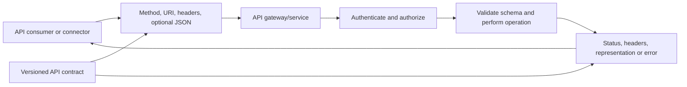

## API contracts, resources, endpoints, and URI design

An API contract should state base URI, version, authentication, permissions, media types, resources, identifiers, methods, request/response schemas, status codes, error schema, pagination, filtering, sorting, concurrency, idempotency, rate limits, timeout expectations, webhook behavior, deprecation, and support ownership. Generated OpenAPI descriptions help but do not replace operational documentation.

| Contract area | Questions | Evidence/artifact |
|---|---|---|
| Resource | What business entity and immutable ID? | Resource model and identifier rules |
| URI | Collection/item/action pattern and encoding? | Example with reserved `.example` name |
| Method | Safe/idempotent and side effect? | Method matrix |
| Auth | Which principal, grant, scope/role, tenant? | Least-privilege permission record |
| Schema | Required/optional/null/default/type/enums? | Versioned JSON Schema/OpenAPI |
| Errors | HTTP status and structured code/message/details? | Error catalog |
| Pagination | Cursor/offset/page/links and stable order? | Retrieval algorithm |
| Limits | Rate, concurrency, payload, page size, quota? | Limit policy and headers |
| Consistency | Read-after-write, eventual, snapshots? | Data consistency statement |
| Versioning | Compatibility, preview, deprecation dates? | Lifecycle policy |
| Observability | Correlation IDs, timestamps, audit, metrics? | Logging/monitoring contract |
| Data handling | Classification, retention, residency, redaction? | Privacy/security assessment |

Resource-oriented URIs usually use nouns, such as `/v1/assets` and `/v1/assets/{assetId}`. Commands that do not fit CRUD can be modeled as subresources or actions under the contract, but consistency matters more than dogma. URI paths and query strings are commonly logged; never place API keys, secrets, or sensitive payloads there.

```mermaid
flowchart TB
    BASE[https://api.example/v1] --> ASSETS[/assets collection]
    ASSETS --> ITEM[/assets/{assetId} item]
    ITEM --> FINDINGS[/assets/{assetId}/findings subcollection]
    BASE --> USERS[/users collection]
    BASE --> EVENTS[/events collection]
    EVENTS --> QUERY[?updatedAfter=...&limit=...]
```

| URI example | Meaning | Caution |
|---|---|---|
| `GET /v1/assets` | List asset representations | Must paginate |
| `GET /v1/assets/a-123` | Read one identified asset | 404 can hide auth/existence |
| `POST /v1/assets` | Create/process under collection semantics | Duplicate risk after timeout |
| `PUT /v1/assets/a-123` | Replace/create defined item state | Conditional update may be required |
| `PATCH /v1/assets/a-123` | Apply partial change document | Patch format and idempotency vary |
| `DELETE /v1/assets/a-123` | Remove/deactivate under contract | Soft-delete and repeated response vary |
| `GET /v1/events?after=...` | Filter incremental event retrieval | Timestamp precision/order/ties matter |

### Plain-English deep-dive 1 - JSON is not the API contract

Two warehouses can both use English packing slips yet disagree about product IDs, units, required fields, returns, and delivery times. JSON only supplies syntax and a small set of data types. It does not say whether `severity: 5` means critical, whether `null` means unknown or removed, whether timestamps are UTC, whether omitted fields retain old values, or whether retrying a POST creates a duplicate.

A reliable integration records semantic meaning: field definition, source, unit, enum vocabulary, nullable/required behavior, uniqueness, update rules, timestamps, version, and owner. It validates both structure and business rules. A syntactically valid payload can still be wrong because an asset ID belongs to another tenant or a CVSS value is out of range.

For Data Fabric-style ingestion, schema is only one layer. The connector must also map source entities to canonical identities, preserve provenance, detect duplicates, manage incremental state, reconcile counts, and expose freshness. Those product-specific mappings are not assumed here.

## HTTP methods, CRUD, safety, idempotency, and concurrency

HTTP method semantics guide retries and caching. Safe methods such as GET and HEAD are intended read-only. Idempotent methods such as GET, PUT, and DELETE have the same intended effect after repeated identical requests, though response codes/content can differ. POST is not idempotent by default. PATCH idempotency depends on patch semantics.

| Method | Typical CRUD/use | Safe? | Idempotent? | Retry concern |
|---|---|---:|---:|---|
| GET | Read collection/item | Yes | Yes | Retry with backoff; pagination consistency still matters |
| HEAD | Read metadata without body | Yes | Yes | Representation headers and auth can differ by API |
| POST | Create/execute/query under contract | No | No by default | Use idempotency key/operation status |
| PUT | Replace/create full state at known URI | No | Yes | Conditional request prevents lost update |
| PATCH | Partial update | No | Not guaranteed | Operation list may apply twice |
| DELETE | Delete/deactivate | No | Yes intended effect | First and later response can differ |
| OPTIONS | Capability/preflight | Yes | Yes | Not substitute for API docs |

### Idempotency keys

For side-effecting POST, a client can send a unique idempotency key if the API supports it. The server stores the key with request fingerprint and outcome for a retention window. Repeating the same key/request returns the prior result; reusing the key with different content should fail. This design handles a lost response after the server committed the operation.

```mermaid
sequenceDiagram
    participant C as Client
    participant A as API
    C->>A: POST create with Idempotency-Key K and body hash H
    A->>A: No K exists; validate and commit resource R
    A--xC: 201 response lost in network
    C->>A: Retry same POST with K and H after backoff
    A->>A: Find K with same fingerprint and stored outcome
    A-->>C: Replay original resource/status safely
    C->>A: Accidental reuse K with different body H2
    A-->>C: Conflict/idempotency misuse error
```

| Idempotency design field | Purpose | Failure if omitted |
|---|---|---|
| Unique key | Correlate logical operation | Duplicate side effect |
| Request fingerprint | Prevent same key with different body | Wrong result reused |
| Result/status storage | Return consistent operation result | Client cannot resolve uncertainty |
| Retention window | Bound storage and retry semantics | Late retry ambiguity |
| Tenant/client namespace | Prevent cross-customer collision | Data/security isolation issue |
| In-progress state | Coordinate concurrent duplicate requests | Double execution race |

### Conditional requests and lost updates

ETags and `If-Match` support optimistic concurrency. A client GETs a resource and receives ETag `"v7"`. It sends PUT/PATCH with `If-Match: "v7"`. If another writer changed the resource to v8, the API returns 412 rather than overwrite silently. The client re-reads, reconciles, and decides.

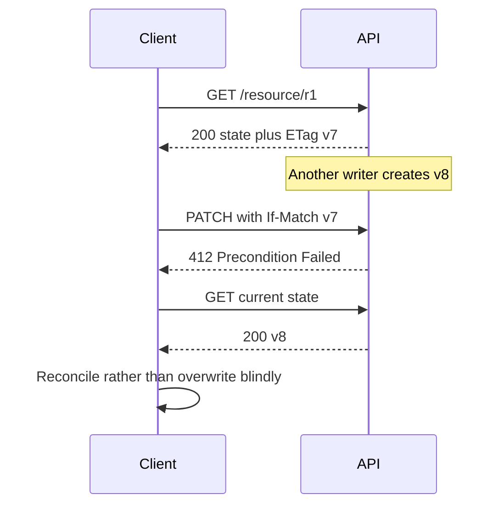

## Status codes and structured errors

HTTP status identifies the responder's protocol-level result. An API should also return a stable machine-readable error code, human-safe message, target/field details where appropriate, correlation ID, and retryability guidance. Do not parse changing English message text when a documented code exists.

| Status | Typical API meaning | Retry? | Diagnostic action |
|---:|---|---|---|
| 200 | Successful read/update with representation | No unless next page/work | Validate schema/business result |
| 201 | Resource created | No; resolve uncertainty with ID/idempotency | Record Location/resource ID |
| 202 | Accepted for asynchronous processing | Poll operation or await webhook | Track operation ID and terminal state |
| 204 | Success with no content | No | Do not require JSON body |
| 304 | Cached representation still valid | Use stored representation | HTTP cache semantics, not API redirect |
| 400 | Malformed/invalid request | Fix request, do not blind retry | Field/error code |
| 401 | Missing/invalid authentication | Refresh once if appropriate; fix auth | Challenge/token/clock/audience |
| 403 | Authenticated but not authorized/policy deny | Do not retry unchanged | Scope, role, tenant, resource policy |
| 404 | Resource/route absent or concealed | Verify ID/base/version/auth | Avoid enumeration assumptions |
| 409 | State conflict/duplicate/version issue | Reconcile state | Idempotency, uniqueness, workflow |
| 412 | Conditional request failed | Re-read and merge | ETag/current version |
| 413 | Payload too large | Split/compress only if contract supports | Limit and responder |
| 415 | Unsupported media type | Fix Content-Type/format | Serializer and version |
| 422 | Semantically invalid content in common APIs | Correct field/business rules | Structured validation details |
| 429 | Rate limit exceeded | Yes, bounded and according to Retry-After | Quota scope/window/concurrency |
| 500 | Responder internal error | Bounded retry if safe | Correlation ID and provider status |
| 502 | Gateway invalid upstream response | Bounded retry if safe | Gateway/upstream leg |
| 503 | Temporarily unavailable | Honor Retry-After and backoff | Capacity/maintenance/responder |
| 504 | Gateway upstream timeout | Retry only if operation idempotent/resolved | Upstream phase and commit ambiguity |

```json
{
  "error": {
    "code": "InvalidFilter",
    "message": "The filter could not be processed.",
    "target": "updatedAfter",
    "details": [
      {"code": "InvalidTimestamp", "message": "Use RFC 3339 UTC format."}
    ],
    "correlationId": "00000000-0000-0000-0000-000000000000"
  }
}
```

This is synthetic. Production logs should retain stable code, target, status, correlation, timestamp, endpoint template, client identity, and safe retry decision, while redacting body values where sensitive.

## JSON types, schemas, and validation

JSON values are object, array, string, number, boolean, or null. JSON has no native date/time, decimal, binary, or 64-bit integer type guarantee across languages. APIs define timestamps as strings, binary as base64 or separate media, and identifiers often as strings. JavaScript number precision can lose large integer IDs; treating identifiers as opaque strings is safer when documented.

| JSON type | Example | Common defect |
|---|---|---|
| Object | `{"id":"a-1"}` | Duplicate member names/interpreter differences |
| Array | `[{"id":"a-1"}]` | Order assumed when contract says unordered |
| String | `"2026-08-25T10:00:00Z"` | Timestamp/enum/encoding not validated |
| Number | `9.5` | Precision, range, integer/float mismatch |
| Boolean | `true` | String `"true"` accepted incorrectly |
| Null | `null` | Confused with absent/default/delete |

```json
{
  "id": "asset-123",
  "displayName": "Synthetic Laptop",
  "active": true,
  "riskScore": 42.5,
  "ownerId": null,
  "tags": ["managed", "lab"],
  "observedAt": "2026-08-25T10:00:00Z",
  "source": {
    "system": "synthetic-edr",
    "recordId": "edr-991"
  }
}
```

| Field | Contract decision | Validation |
|---|---|---|
| `id` | Required opaque unique string | Nonempty, length/pattern; never numeric arithmetic |
| `displayName` | Optional user-facing string | Unicode/length/control characters |
| `active` | Required boolean | Reject string substitutions |
| `riskScore` | Optional bounded decimal | Range, NaN/Infinity impossible in JSON |
| `ownerId` | Nullable reference | Null meaning and referential integrity |
| `tags` | Array of unique controlled strings | Count, duplicates, allowed vocabulary |
| `observedAt` | Required RFC 3339 date-time | UTC/offset, precision, plausible range |
| `source` | Required provenance object | Allowed source and nonempty source record ID |

### JSON Schema concepts

JSON Schema can define types, required properties, patterns, numeric ranges, enums, array item rules, and whether additional properties are permitted. OpenAPI can reference schemas and add operation documentation. Validation should occur at trust boundaries, but an overly strict consumer can break on harmless additive fields. Contract policy must say whether unknown fields are ignored, stored, alerted, or rejected.

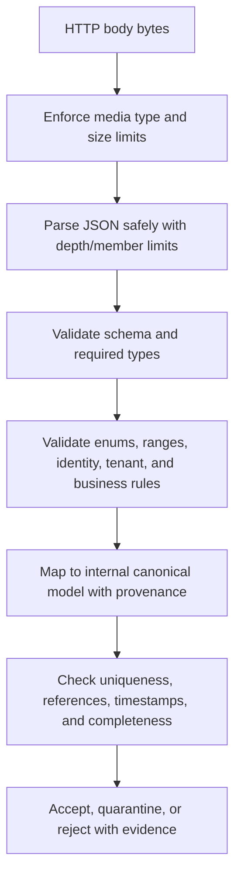

Security controls include maximum body size, nesting depth, array length, string length, decompression ratio, duplicate-key policy, content type, Unicode handling, and parser updates. Avoid deserializing untrusted input directly into powerful runtime types or enabling unsafe polymorphic type construction.

## API authentication and authorization

Authentication proves the client/workload/user context. Authorization restricts APIs, operations, tenants, objects, and fields. TLS protects transport. Common approaches include API keys, OAuth access tokens, mTLS client certificates, HTTP message signatures, and cloud-managed workload identities. Basic authentication exists but sends reusable username/password material inside TLS and should not be selected for modern designs when stronger alternatives exist.

| Method | Identity model | Strength | Main risk/control |
|---|---|---|---|
| API key | Identifies subscription/client under provider contract | Simple | Bearer secret, coarse attribution; rotate and scope |
| OAuth delegated | Client acts with user | User/context and scopes | Consent, token theft, subject/object authorization |
| OAuth client credentials | Workload acts as application | App roles and short-lived access token | Credential and broad app permission |
| Managed identity | Platform-authenticated workload | No app-managed long-lived secret | Platform/resource scope and token endpoint dependency |
| mTLS | Client proves certificate private key | Strong channel client authentication | PKI lifecycle, proxy/termination design |
| Signed request | Client signs method/target/headers/body digest/time | Integrity and proof beyond bearer | Canonicalization, clock, replay, key lifecycle |
| Basic auth | Reusable username/password | Compatibility | Credential exposure/replay and weak lifecycle |

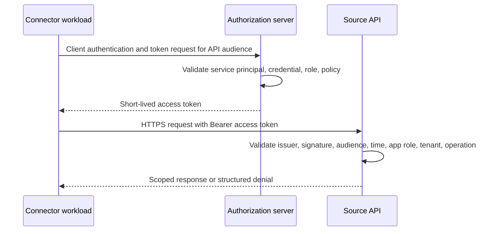

Never put API keys in URI query strings. Use approved secret stores, managed identity, or workload federation where possible. Logs should record credential identifier/version or service principal, not secret/token. Rotation needs overlap, canary, rollback, and old credential removal. Permission reviews should compare required endpoints/actions to granted scopes/roles.

### Plain-English deep-dive 2 - Authentication success is not connector success

A delivery driver can present a valid badge and enter the loading dock, yet request the wrong warehouse, lack permission for the restricted aisle, ask for an unsupported export, or stop after the first cart. A successful token request or HTTP 200 on `/health` proves only one step.

For an ingestion connector, success means the intended source scope was retrieved completely, parsed correctly, mapped without silent loss, written idempotently, checkpointed durably, and reconciled within freshness targets. An API credential can be healthy while the connector is weeks behind because it ignores pagination. A connector can fetch every record while mapping all device IDs to null.

Health metrics therefore need multiple dimensions: authentication status, last attempted/successful request, page and record counts, checkpoint age, source maximum timestamp, destination freshness, schema rejects, duplicates, rate-limit debt, retry queue, reconciliation delta, and downstream commit state.

## Pagination patterns and completeness

APIs bound response size. Clients must follow the documented continuation until no next page remains. Pagination style affects consistency under inserts/deletes.

| Pattern | Request/response | Strength | Risk |
|---|---|---|---|
| Page number | `page=3&pageSize=100` | Human-readable | Inserts/deletes shift pages |
| Offset/limit | `offset=200&limit=100` | Simple random-ish access | Drift and large-offset cost |
| Cursor | `cursor=opaque` then `nextCursor` | Server controls continuation | Cursor expiry and no arbitrary jump |
| Continuation link | Response contains full `next` URI | Encapsulates server state | Must validate trusted host and preserve auth rules |
| Keyset | `afterId=...` with stable sort | Efficient and stable under conditions | Requires unique ordering/tie handling |
| Time window | `updatedAfter=...` | Natural incremental ingestion | Clock, precision, equal timestamps, late updates |

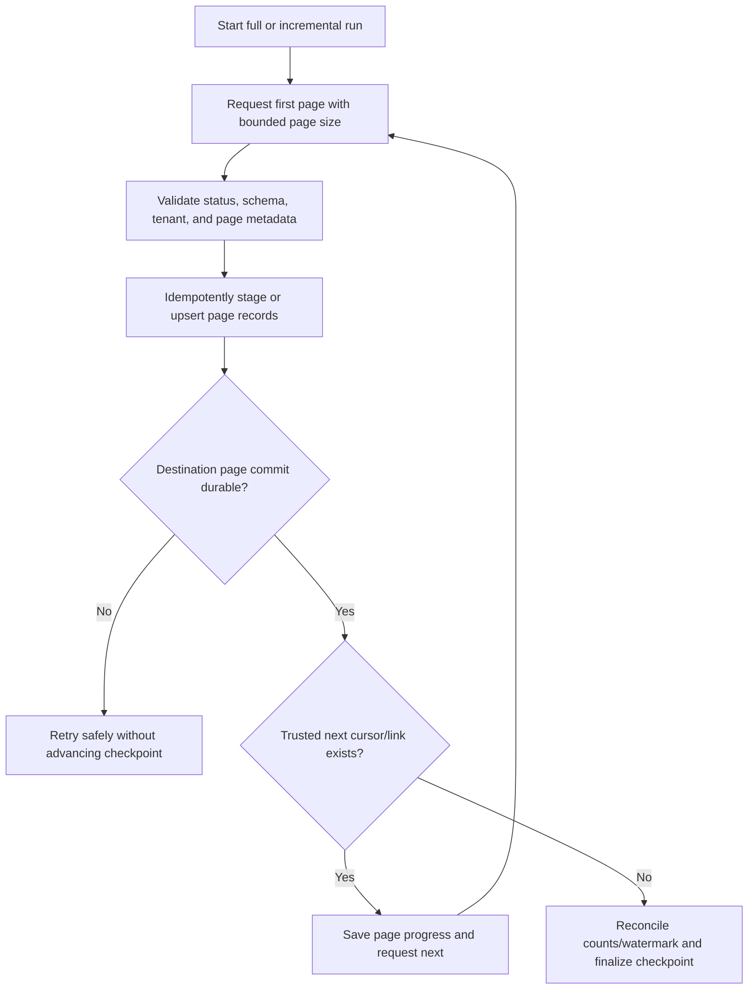

### Stable ordering and change races

If sorted only by `updatedAt`, multiple records can share the same timestamp. A high-water mark of the maximum timestamp can skip tied or late-arriving records. Use a deterministic compound order such as `(updatedAt, immutableId)` if supported, overlap windows with deduplication, or provider change tokens. Do not invent ordering unsupported by the API.

| Incremental method | Checkpoint | Gap control | Duplicate control |
|---|---|---|---|
| Change token | Opaque provider token | Provider contract and expiry recovery | Event/resource IDs |
| Compound high-water | Last timestamp plus ID | Inclusive boundary and stable order | Upsert by source key/version |
| Overlap window | Re-read recent interval | Captures late events/clock differences | Deduplicate by key/version/hash |
| Snapshot ID | Provider-consistent snapshot cursor | Stable full enumeration | Target merge after complete snapshot |
| Webhook plus reconciliation | Event delivery ID and periodic poll | Poll repairs missed notifications | Event ID and idempotent retrieval |

### Offset pagination example failure

The client requests rows 0-99. A new row is inserted at position 0 before it requests offset 100. The old row 99 moves to 100 and is duplicated; another deletion can cause a skip. Cursor or keyset methods usually handle changing data more consistently, but their guarantees must be documented.

```mermaid
sequenceDiagram
    participant C as Connector
    participant A as Changing API collection
    C->>A: GET offset 0 limit 100
    A-->>C: Items 1 through 100
    Note over A: New item inserted at beginning; positions shift
    C->>A: GET offset 100 limit 100
    A-->>C: Old item 100 appears again; boundary changed
    C->>C: Duplicate or possible skip without stable snapshot/order
```

## Filtering, sorting, searching, and field selection

Server-side filtering reduces bandwidth and exposure. Filters can use query parameters, OData-like expressions, proprietary syntax, or request bodies. Treat filter input as structured data: use SDK/builders or correct escaping, not string concatenation. The API must authorize the resulting resource set; a filter is not access control.

| Feature | Purpose | Failure/security concern |
|---|---|---|
| Filter | Restrict records by condition | Injection/escaping, unsupported operator, wrong time zone |
| Sort | Stable result order | Nonunique key and pagination drift |
| Search | Relevance/full-text matching | Nondeterministic ranking, expensive queries |
| Field selection | Return selected properties | Missing required mapping/provenance |
| Expand/include | Fetch related objects | N+1 explosion, authorization leakage |
| Date range | Incremental window | Inclusive/exclusive boundary and precision |
| Tenant/source filter | Limit organizational scope | Cross-tenant exposure if omitted/misapplied |

Record the effective filter, not secrets or PII values. Compare source count under the same filter to retrieved count. Time-based filters need UTC, offset, precision, inclusive/exclusive semantics, and provider update behavior. `createdAt` cannot capture later updates; `updatedAt` can change for irrelevant fields unless documented.

## Rate limits, quotas, Retry-After, backoff, and jitter

Rate limits can apply by tenant, client, credential, user, resource, endpoint, region, or global service. They can be fixed windows, sliding windows, token buckets, concurrency limits, cost units, daily quotas, or dynamic protection. Response headers are provider-specific. HTTP 429 signals too many requests in common APIs; 503 can also carry Retry-After.

| Signal | Meaning | Client action |
|---|---|---|
| 429 | Request rate/quota exceeded | Honor Retry-After; slow concurrency; preserve checkpoint |
| Retry-After seconds | Delay duration | Wait at least bounded value under policy |
| Retry-After date | Earliest retry time | Requires accurate clock and date parsing |
| Remaining quota | Provider-specific available units | Treat as advisory under concurrency |
| Reset time | Window reset | Avoid synchronized burst at reset |
| 503 with Retry-After | Temporary unavailability/maintenance | Backoff and circuit protection |
| Concurrency rejection | Too many in-flight operations | Reduce parallelism, not only request rate |

Exponential backoff can use:

$$
d_n = \min(d_{max}, d_0 \cdot 2^n)
$$

Full jitter chooses a random delay:

$$
j_n \sim U(0, d_n)
$$

where $d_0$ is the base delay, $n$ is the retry attempt, $d_{max}$ is the cap, and $U$ is a uniform distribution. If the server supplies a valid Retry-After, follow the documented contract rather than replacing it with a shorter client delay. Always cap attempts and total elapsed budget.

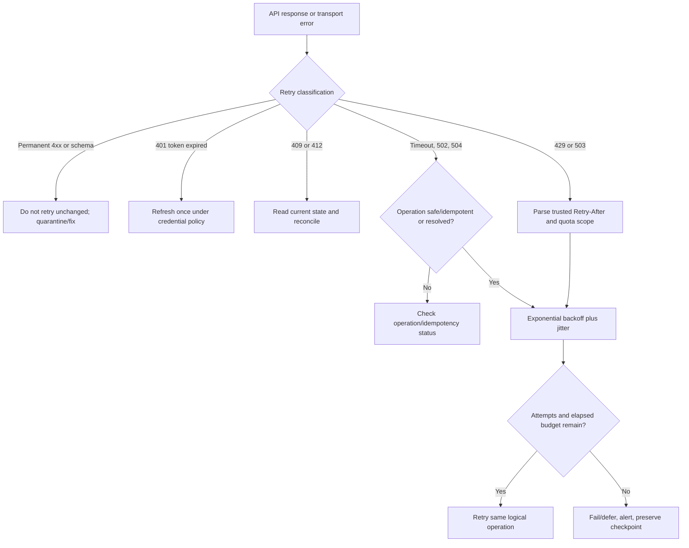

### Retry budgets and storms

If five layers each retry three times, one user request can amplify into hundreds of dependency calls. Decide which layer owns retry. Respect deadlines so a retry cannot complete after the caller has abandoned the result. Use global/per-tenant concurrency limits and queues. Jitter prevents every connector scheduled at the hour from retrying in lockstep.

| Retry property | Good question | Anti-pattern |
|---|---|---|
| Eligibility | Is failure transient and operation replay-safe? | Retry every non-200 |
| Max attempts | How many before defer/dead-letter? | Infinite retry |
| Elapsed budget | Can result still meet caller deadline? | Retry beyond usefulness |
| Backoff | Does delay increase and cap? | Constant rapid loop |
| Jitter | Are clients desynchronized? | All wake at exact reset |
| Concurrency | Is in-flight work bounded? | Thousands of retries parallel |
| Idempotency | Can side effect duplicate? | Retry POST after ambiguous timeout |
| Observability | Which logical operation and attempt? | New correlation identity every attempt only |

### Plain-English deep-dive 3 - A retry is a new load event, not free resilience

If a loading dock is overwhelmed, sending the same trucks back immediately makes the queue worse. Retries consume client threads, proxy connections, authentication requests, API capacity, and downstream writes. A well-designed retry asks three questions: Is the failure likely temporary? Is the operation safe to repeat? Is there enough time and budget left?

For a GET that receives 429, honor Retry-After, reduce concurrency, add jitter, and retain the same page/checkpoint. For a POST that times out after sending its body, the server may already have committed. Use an idempotency key or operation-status lookup before replay. For a schema error, retrying identical bytes is pointless; quarantine and alert with a safe sample.

Connector health should expose rate-limit debt and estimated catch-up. A source may be reachable while quota is too low for daily volume. Capacity planning compares average and peak record volume, page size, request cost, concurrency, quota, processing rate, and freshness target.

## Timeouts, cancellation, circuit breakers, and bulkheads

One timeout value hides distinct phases. DNS, TCP connect, TLS handshake, request-body upload, server processing/time to first byte, response-body read, and whole operation each need appropriate bounds. A read timeout that resets on every byte can allow a response to trickle forever unless an overall deadline exists.

| Timeout/bound | Protects | Failure clue |
|---|---|---|
| DNS | Resolver wait | Name resolution delay/error |
| Connect | TCP/QUIC establishment | Route/firewall/listener/backlog |
| TLS handshake | Negotiation/certificate/status | Trust/protocol/inspection delay |
| Write/upload | Request body transfer | Backpressure, body limit, MTU |
| First byte | Server processing/upstream | API dependency or queue |
| Read idle | Gap between response bytes | Stalled transfer |
| Overall deadline | Entire logical operation | Prevents endless phase/retry chain |
| Queue wait | Local worker admission | Caller overload before API |

A circuit breaker tracks failures. In closed state calls proceed. After threshold, it opens and fails fast/dequeues work for a cooling period. In half-open state a small probe tests recovery. It must not hide permanent configuration errors or replace retries, health, and human alerting. Breakers need scopes: one tenant/endpoint should not necessarily block all sources.

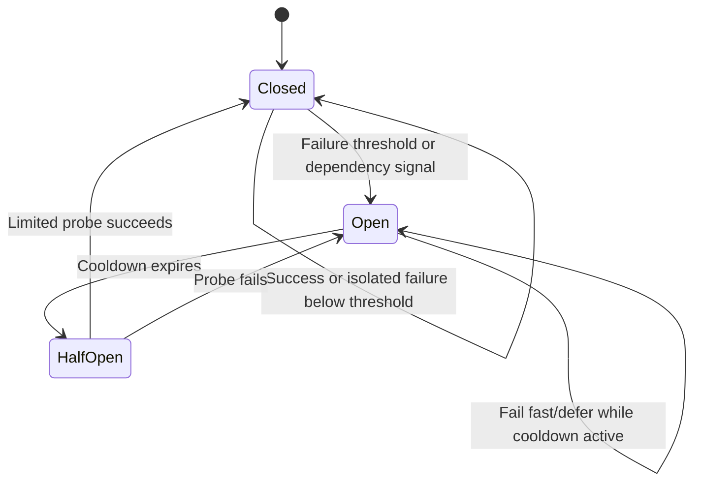

Bulkheads isolate resource pools so one slow source does not consume every connector worker. Queues provide buffering but need limits, age metrics, poison-message handling, and backpressure. Dead-letter/quarantine stores retain nonretryable records with reason, schema/version, safe payload reference, and replay controls.

## Webhook security and delivery semantics

A webhook provider sends an HTTP request to a subscriber endpoint when an event occurs. Delivery is commonly at least once: duplicates can occur. Events can arrive out of order, late, or not at all. The subscriber should authenticate the sender, validate integrity/freshness, deduplicate, respond quickly, queue processing, and periodically reconcile with the source API.

```mermaid
sequenceDiagram
    participant P as Webhook provider
    participant W as Subscriber endpoint
    participant Q as Durable queue
    participant A as Source API
    P->>W: POST raw body plus delivery ID, timestamp, signature
    W->>W: Limit size; verify signature over exact bytes and freshness
    W->>W: Check delivery ID/replay store
    W->>Q: Enqueue verified event or resource reference
    W-->>P: Prompt 2xx acknowledgement
    Q->>A: Fetch authoritative current resource if required
    A-->>Q: Current version/state
    Q->>Q: Idempotent apply and checkpoint
```

| Webhook control | Purpose | Common defect |
|---|---|---|
| HTTPS | Protect transport/server identity | Does not authenticate provider alone |
| Shared-secret HMAC | Verify body integrity and sender secret possession | Wrong canonicalization/body reserialization |
| Asymmetric signature | Verify with provider public key | Key rotation/trust and algorithm policy |
| Timestamp | Enforce freshness window | Clock skew or not signed |
| Delivery/event ID | Deduplicate and correlate | Stored too briefly or wrong scope |
| Raw body | Signature input | Framework parses/normalizes before verification |
| Constant-time compare | Reduce timing leakage | Normal string comparison |
| IP allowlist | Additional network signal | Provider ranges change; not sole auth |
| Fast acknowledgement | Avoid provider retry due slow processing | Processing inline causes timeout |
| Queue | Durable asynchronous work | Unbounded backlog or poison event |
| Reconciliation poll | Repair missing/out-of-order events | Assumes webhook completeness |

### Signature example concept

An HMAC design might sign a version prefix, timestamp, separator, and exact raw request body:

$$
signature = HMAC_{SHA256}(secret, version || timestamp || bodyBytes)
$$

The subscriber obtains the configured key for the claimed version, rejects unsupported algorithms, checks timestamp freshness, computes HMAC over the exact bytes before JSON normalization, compares in constant time, and records the delivery ID. The actual provider contract controls format; never invent a signature scheme when integrating with a documented webhook.

### Replay and ordering

Use a replay cache keyed by provider/tenant/delivery ID and retain it at least through the provider's retry window. Timestamp alone does not prevent two submissions inside the window. If events have sequence/version numbers, detect gaps and stale ordering. Prefer applying current resource version or idempotent state transition rather than assuming arrival order.

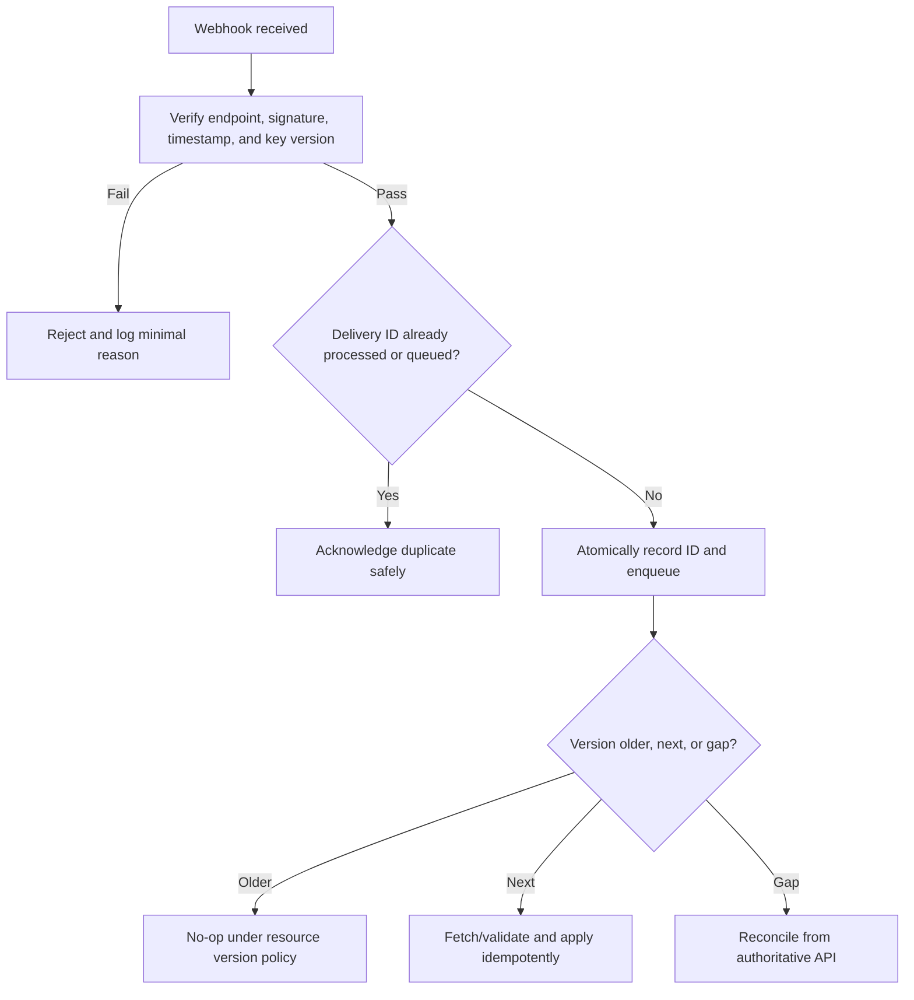

## Versioning, compatibility, and deprecation

API versioning can appear in URI (`/v1`), query, header, media type, or service release. None eliminates semantic governance. Providers should prefer backward-compatible additive change within a version and communicate breaking changes. Consumers should ignore unknown fields where contract permits, validate required fields, and test previews separately.

| Strategy | Example | Benefit | Risk |
|---|---|---|---|
| URI version | `/v1/assets` | Visible and cache-friendly | Resource URI changes across version |
| Query version | `?api-version=2026-01-01` | Explicit per request | Query propagation/logging |
| Header version | `Api-Version: 2` | URI stable | Less visible in basic tooling/cache keys |
| Media type | `application/vnd.example.v2+json` | Representation-specific | Client/tool complexity |
| Date version | Provider snapshot date | Clear contract epoch | Frequent migrations if cadence aggressive |

Breaking changes include removing/renaming fields, changing types, making optional fields required, altering enum semantics, narrowing permissions unexpectedly, changing pagination order, or changing error behavior. Adding enum values can break consumers with exhaustive switches even if field addition is technically compatible. Contract tests should include unknown fields and unknown enums under chosen policy.

Deprecation needs announcement, migration guide, telemetry identifying consumers, overlap, support date, canary, and retirement evidence. A connector should expose which API/schema/SDK version it uses. Do not wait for endpoint shutdown to discover a dependency.

## SDK versus raw API

An SDK can handle serialization, authentication integration, pagination helpers, retry policies, models, and idiomatic errors. It can also lag API features, hide headers, retry unexpectedly, pin dependencies, or deserialize unknown fields poorly. Raw HTTP gives visibility/control but requires correct implementation of every contract detail.

| Decision | SDK advantage | Raw API advantage |
|---|---|---|
| Development speed | Generated/typed operations | Minimal dependency for simple calls |
| Auth | Integrated credential providers | Explicit request/token control |
| Pagination | Iterators/pagers | Full visibility into cursors and checkpoints |
| Retry | Built-in policy | Exact ownership/budget |
| Models | Compile-time types | Flexible unknown-field handling |
| New feature | May lag | Immediate documented endpoint access |
| Troubleshooting | Can log abstractions | Exact wire request/response |
| Supply chain | More dependencies | Fewer library dependencies but more custom code |

Use a supported SDK when it correctly implements the contract and team can govern its version/dependencies. Capture raw HTTP metadata through safe logging or handlers for diagnosis. Do not fork generated clients casually. Lock versions, review release notes, test serialization/pagination/retry, and monitor security advisories.

## Postman and cURL in approved troubleshooting

Postman helps build requests, environments, collections, tests, and shared examples. cURL provides reproducible command-line HTTP requests. Both can leak secrets into history, exported collections, console logs, screenshots, or shell process listings. Use short-lived lab credentials, secret variables, local secure storage, sanitized exports, and approved endpoints.

```text
curl --request GET \
  --url "https://api.example/v1/assets?limit=100" \
  --header "Accept: application/json" \
  --header "Authorization: Bearer ${ACCESS_TOKEN}" \
  --header "X-Correlation-ID: ${CORRELATION_ID}"
```

This is synthetic. Avoid verbose output with live Authorization/cookies in shared terminals. Do not hardcode access tokens in shell scripts or command history. Use environment variables only with awareness that process/environment inspection can expose them; a secure credential provider is stronger.

| Tool task | Useful | Caution |
|---|---|---|
| Reproduce request | Exact method/URI/headers/body | Use synthetic body and least privilege |
| Compare environments | Base URL/version/tenant variables | Prevent production token against test URL or reverse |
| Contract tests | Assert status/schema/headers | Do not assert brittle message text |
| Pagination | Script next cursor/link | Validate next host and checkpoint |
| Timing | DNS/connect/TLS/TTFB | Tool stack differs from connector |
| Export/share | Sanitized collection/command | Remove tokens, cookies, hostnames, PII |

## Logging, metrics, traces, and redaction

Observability should let operators answer: Which logical run and source? Which request attempt? Which endpoint template and API version? Which client principal? What status/error/correlation? How many records/pages/bytes? What checkpoint and freshness? Which mapping/schema rejects? What destination commit? Logging every body is neither necessary nor safe.

| Field | Log? | Redaction/handling |
|---|---:|---|
| Run/connector/source ID | Yes | Stable nonsecret identifier |
| Endpoint template | Yes | `/assets/{id}`, not sensitive literal path |
| Method/status/error code | Yes | Structured |
| Provider/client correlation IDs | Yes | Validate format/length; may be sensitive |
| Attempt and elapsed times | Yes | DNS/connect/TLS/TTFB if available |
| Record/page/byte counts | Yes | Avoid sensitive content |
| Checkpoint age/value | Age yes; raw cursor restricted | Cursor may encode state/secret |
| Credential ID/version | Yes if safe | Never secret/token/private key |
| Access token | No | Log expiry/audience hash, not artifact |
| API key/client secret | No | Never log |
| Request/response body | Default no | Field-level allowlist/sampled restricted debug |
| User/security finding | Minimize | Pseudonymize and restrict |
| Webhook signature | Usually no/full restricted | Record key version/result, not replayable header |

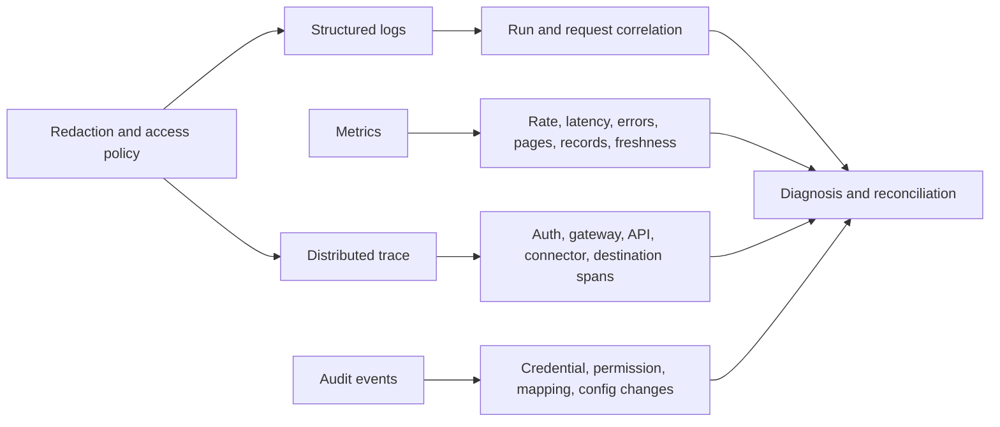

Metrics should separate availability from data quality. Useful measures include request success by status, latency percentiles, throttle rate, retry attempts, circuit state, queue age, page throughput, records accepted/rejected, checkpoint age, source-to-destination lag, schema version, duplicates, reconciliation delta, and last full successful run. A green HTTP success rate can coexist with zero new records because the filter is wrong.

## Data Fabric connector context

A security Data Fabric connector conceptually ingests source data, maps it to a target model, preserves provenance, monitors quality, and may export actions. Exact Zscaler Data Fabric behavior, connector catalog, schedules, mappings, limits, and health fields must come from current official product documentation and tenant evidence. This section is an architecture bridge, not a claim of implementation.


| Connector stage | Required evidence | Typical failure |
|---|---|---|
| Discovery | Source owner, endpoints, objects, volume, limits | Hidden source/system dependency |
| Authentication | Principal, permission, credential lifecycle | 401/403, expired secret, overprivilege |
| Extraction | Filter, page/cursor, counts, watermarks | Skipped pages or wrong scope |
| Staging | Raw source ID/version/provenance | Data lost before transform |
| Validation | Schema/business rejects and samples | Silent coercion/nulls |
| Mapping | Field/unit/enum/identity rules | Wrong meaning or type |
| Entity resolution | Match keys/confidence/provenance | False merge/split/duplicates |
| Load | Upsert key, idempotency, batch result | Partial write or duplicate |
| Checkpoint | Last committed source state | Advance before commit creates gap |
| Reconciliation | Counts, freshness, checksums/samples | Green run with incomplete data |
| Operations | Alerts, backlog, owner, runbook, replay | Failure unnoticed or unsafe rerun |

### Connector full versus incremental loads

A full load enumerates current scope and establishes baseline. An incremental load retrieves changes since a checkpoint. Periodic full or scoped reconciliation detects deleted/missed records. Deletions need an explicit contract: tombstone, `active=false`, change event, or snapshot comparison. Absence from one page is not deletion.

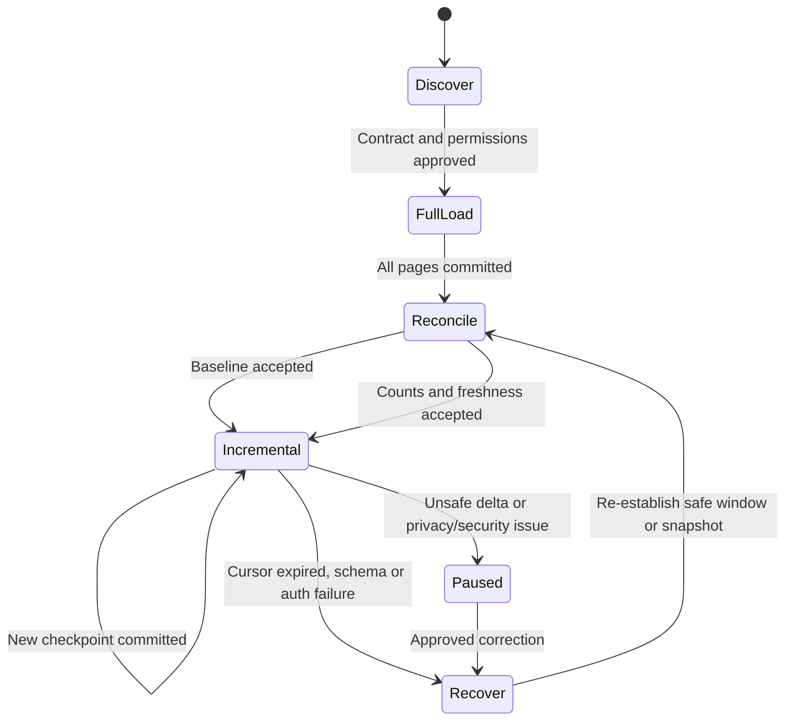

### Plain-English deep-dive 4 - A checkpoint is a correctness promise

A warehouse worker marks a manifest only after every carton on that cart is safely stored and counted. If the worker marks it before unloading, a crash loses cartons because the next run starts after them. If the worker never marks it, the next run repeats cartons. A connector checkpoint has the same responsibility.

Use a transactional sequence where possible: retrieve page, validate, stage, write/upsert, record rejects, commit destination, then advance checkpoint. If destination is eventually consistent, define how acceptance is confirmed. Store run/page IDs so replay is idempotent. Never advance only because the source returned 200.

For customer health, report both freshness and confidence. "Last successful run 10:00" is misleading if reconciliation differs by 15 percent. Better: "Authentication and extraction succeeded through checkpoint X at 10:00 UTC; 9,850 of expected 10,000 source records were accepted, 150 are quarantined for schema change Y, so freshness is 20 minutes but completeness is 98.5 percent."

## Integration troubleshooting tree

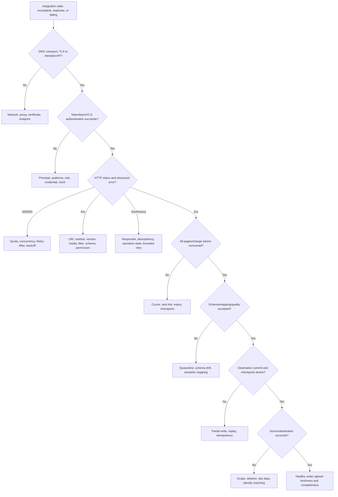

### Symptom matrix

| Symptom | Plausible causes | Cheapest discriminating check |
|---|---|---|
| 401 after months | Expired secret/cert, wrong token audience, clock | Token endpoint error and credential inventory |
| 403 only one endpoint | Missing scope/role, object policy | Compare token claims and endpoint permission doc |
| 404 all calls | Wrong base/version/tenant route | Exact sanitized URI and API documentation |
| First 100 records only | Pagination ignored | Response next/cursor and run request count |
| Missing recent records | Wrong high-water boundary/late data | Source samples at equal timestamps and checkpoint |
| Duplicates after timeout | Non-idempotent retry/checkpoint order | Logical operation key and write/run IDs |
| Growing lag with 200s | Quota/throughput/filter or processing bottleneck | Records/minute versus arrival, queue/checkpoint age |
| 429 storm | Excess concurrency and synchronized retries | Attempt timeline and Retry-After compliance |
| Webhook duplicates | At-least-once delivery/no dedupe | Delivery IDs and replay store |
| Webhook gaps | Missed delivery/short retry/no reconciliation | Event sequence and source API comparison |
| Mapping null spike | Schema/type/field rename | Raw staged version and reject profile |
| One tenant cross-data | Missing tenant filter/cache key | Principal, request scope, response tenant IDs |

## Fictional NMH scenario: cursor expiry and unsafe fallback

NMH is fictional. A synthetic vulnerability-source connector uses OAuth client credentials and a cursor-based `/findings` API. A seven-day outage causes the saved cursor to expire. The API returns 400 `CursorExpired`. A hurried code path falls back to `updatedAfter=lastSuccessTime` but uses a timestamp rounded to whole seconds and an exclusive `>` filter. Thousands of findings share the same final timestamp; some are skipped. The run returns 200 and marks the connector green.

Separately, the connector retries a destination batch after losing its response. Without a destination idempotency key, 300 findings are duplicated. The source API and destination are both available; correctness failed in cursor recovery and commit/checkpoint design.

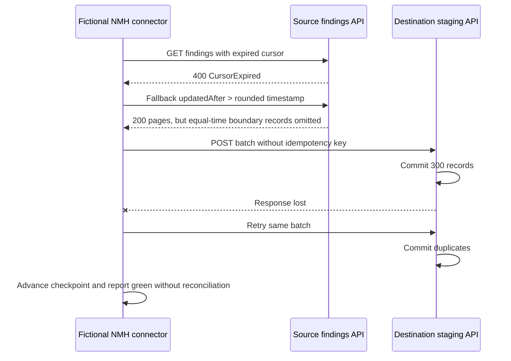

### NMH evidence matrix

| Evidence | Synthetic observation | Supports | Does not prove |
|---|---|---|---|
| Source error | Stable `CursorExpired` at first request | Stored cursor cannot continue | Source API outage/defect |
| Fallback query | Exclusive rounded timestamp | Boundary can skip ties | Exact missing count alone |
| Source sample | Many records equal last second | Tie hypothesis | Every tied record skipped |
| Run log | All fallback pages 200 | Transport/extraction calls succeeded | Completeness |
| Destination IDs | Same source IDs written twice with two batch attempts | Retry duplication | Source duplicated records |
| Checkpoint log | Advanced before reconciliation | Recovery design allowed false green | Intentional misconduct |
| Count compare | Source scope exceeds destination unique count | Missing records exist | Which stage without raw/page evidence |

### NMH response and remediation

1. Mark connector degraded/incomplete, preserve source cursor/error, fallback queries, run/page/batch IDs, and destination evidence.
2. Stop unsafe automatic fallback and duplicate-producing writes; do not delete records blindly.
3. Reconcile source IDs/versions against destination unique source keys to quantify missing and duplicate records.
4. Use the provider's documented cursor-expiry recovery, such as a bounded full snapshot or overlap window, not an invented assumption.
5. If timestamp recovery is supported, use inclusive boundary plus stable secondary ID/order or overlap/deduplication.
6. Make destination upsert/idempotency key derive from source identity/version and logical batch.
7. Advance checkpoint only after durable idempotent commit and reconciliation acceptance.
8. Backfill missing records, merge duplicates under approved provenance rules, and preserve audit.
9. Test outage beyond cursor lifetime, equal timestamps, late updates, response loss, 429, schema error, and rollback.
10. Update health to include unique counts, rejects, checkpoint age, source max time, and reconciliation delta.

### NMH executive update

"In this fictional exercise, connectivity and authentication recovered, but the connector's cursor-expiry fallback skipped records at a timestamp boundary and an ambiguous destination response caused duplicate writes. A success status therefore overstated data health. We paused unsafe processing, reconciled by immutable source IDs, restored records through the documented recovery path, made writes idempotent, and changed health to include completeness and uniqueness. This does not demonstrate a Zscaler or source-vendor defect."

## Additional scenarios and ownership

### Scenario 1: API key exposed in support log

Treat as credential incident. Restrict/delete shared artifact under policy, revoke/rotate key, identify principal/permissions/source IP/action window, review usage, replace unsafe logging, and prefer short-lived OAuth/managed identity. Do not wait for proof of misuse before rotation when impact permits.

### Scenario 2: 202 job never completes

The create call returns operation ID and 202. The client treats it as success and advances source checkpoint, but the operation later fails schema validation. Correct the state machine: poll or consume a signed event to terminal success/failure, preserve operation ID, and advance only after destination acceptance. Timeouts need cancellation/status lookup, not blind create retry.

### Scenario 3: webhook signature fails after middleware update

Framework middleware parses JSON and reserializes keys/whitespace before verification. Provider signed raw bytes. Capture only an authorized synthetic event, compare raw body handling, verify timestamp/key version, and move signature validation before body transformation. Do not disable verification.

### Scenario 4: SDK upgrade doubles calls

New SDK changes pager prefetch/retry defaults. Rate limits spike. Compare SDK version/release notes, raw request attempt IDs, and explicit policy. Pin/rollback under change control, then configure retry/pager and add contract/performance tests.

### Scenario 5: one tenant sees another tenant's cached result

An API gateway/cache key omits tenant identity for a response marked cacheable. Treat as security incident: contain caching, preserve evidence, scope data/requests, correct cache policy/key and authorization, invalidate safely, notify per process, and negative-test cross-tenant isolation.

| Scenario | Primary owner | Partners | Closure evidence |
|---|---|---|---|
| Leaked API key | Security/IAM/app owner | Vendor, privacy, incident response | Rotation, usage review, logging fix |
| Async 202 failure | Connector/app owner | Destination API/data | Terminal-state tracking and replay test |
| Webhook raw-body change | Subscriber app owner | Provider/security | Valid signature before parsing and replay tests |
| SDK retry change | Connector engineering | API/provider/platform | Version/policy tests and rate stability |
| Cross-tenant cache | Security/API gateway owner | Privacy/legal/app/provider | Scoped incident, corrected isolation, negative tests |

## Integration escalation package

| Section | Include | Protect/exclude |
|---|---|---|
| Impact | Source, object type, freshness, completeness, business/security outcome | Assumed counts without query scope |
| Contract | API/version, endpoint template, method, documented behavior | Undocumented guesses as fact |
| Client | Connector/SDK/runtime/version and deployment ring | Source code/secrets unless secure need |
| Auth | Principal ID, grant, audience, scopes/roles, credential version | Token, key, secret, private certificate |
| Request | UTC, safe query/filter, page size, attempt, correlation | Sensitive literal IDs/fields |
| Response | Status, stable error, Retry-After, request ID, schema version | Raw body unless minimized/approved |
| Progress | Cursor type/age, pages, records, checkpoint | Raw opaque cursor in broad ticket |
| Data | Unique source/destination counts, rejects, duplicates, lag | Full security findings/PII |
| Retry | Logical operation, idempotency key hash, attempts/delays | Replayed credentials |
| Change | Recent SDK/schema/permission/config and rollback | Unverified causal claim |
| Request to owner | Precise missing contract/evidence question | Generic "API broken" |

## Arti bridge and interview positioning

| Existing strength | Part 24 translation | Practice artifact |
|---|---|---|
| HTTP/network troubleshooting | Separate DNS/TCP/TLS/proxy/API responder | API timeline |
| M365 escalation | Use request IDs, UTC, client/service evidence | Integration escalation package |
| SQL/PostgreSQL | Reconcile source/destination and deduplicate | Synthetic reconciliation queries |
| Python/R | Build safe paginated lab client and metrics | Connector notebook/script artifact |
| Power BI/Excel | Report freshness, completeness, failures, SLA | Connector health dashboard |
| Statistics | Use percentiles/rates and denominator integrity | Retry/latency analysis |
| RCA | Distinguish trigger, root cause, contributors, control gap | NMH cursor incident RCA |
| Mentoring | Teach JSON/token/retry/webhook boundaries | Workshop and quiz |

A strong interview answer is: "I treat an API as a versioned contract, not a URL returning JSON. I validate the exact resource, method, schema, auth audience and permission, pagination, limits, consistency, and error model. For connectors I checkpoint only after durable idempotent commit, use bounded backoff with jitter, verify webhooks before parsing, reconcile counts and freshness, and log correlation rather than secrets. I separate generic architecture from current Zscaler product behavior and validate the tenant before making claims."

## Common misconceptions to correct

| Misconception | Correction |
|---|---|
| REST means any JSON over HTTP | REST is an architectural style; JSON is one representation format |
| Endpoint and resource are identical | Endpoint exposes operations; resource is the business entity |
| POST always creates and PUT always updates | Contract and method semantics define exact behavior |
| Idempotent means identical response | It means repeated intended effect is the same |
| Retrying timeout is always safe | Server may have committed; resolve operation/idempotency first |
| HTTP 200 means connector succeeded | Completeness, mapping, commit, checkpoint, and reconciliation remain |
| JSON number safely holds every integer ID | Language precision can corrupt large values; use documented opaque strings |
| Null and missing are equivalent | Contract can assign different meanings |
| Schema validation proves data correctness | Business semantics, identity, tenant, and references remain |
| API key belongs in query for convenience | URLs leak through logs/history; use supported secure header/auth |
| OAuth token success grants every endpoint | API enforces audience, scopes/roles, tenant, object, and action |
| Offset pagination is stable under changes | Inserts/deletes can duplicate or skip records |
| Maximum timestamp is always a safe checkpoint | Ties, precision, and late arrivals can create gaps |
| 429 is a server defect | It is a capacity/quota signal requiring contract-aware pacing |
| Retries add availability without cost | They amplify load and require budgets/idempotency |
| One timeout is enough | DNS/connect/TLS/write/server/read/overall phases differ |
| Circuit breaker fixes dependency | It limits damage while recovery/repair occurs |
| Webhooks arrive exactly once and in order | Design for duplicates, gaps, delay, and reordering |
| HTTPS authenticates webhook sender fully | Verify provider signature/credential and replay controls |
| Parsing JSON then verifying signature is fine | Signature commonly covers exact raw bytes |
| SDK removes need to know HTTP | SDK adds a layer whose retries/paging/version must be understood |
| Logs need bodies and tokens to troubleshoot | Structured IDs, statuses, counts, safe fields are usually enough |
| Last successful run proves fresh complete data | Measure source max time, checkpoint, rejects, counts, and reconciliation |
| Data Fabric connector mechanics are universal | Product-specific contracts and health require current official evidence |

## Official Source Anchors

The following authoritative sources were reviewed on **2026-08-24**. They support web/API standards, NIST/CISA security guidance, Microsoft API concepts, and official Zscaler platform/integration context. They do not prove fictional NMH results, a Data Fabric implementation detail, tenant behavior, endpoint availability, quota, schema, or vendor defect. Check RFC status, OpenAPI/schema versions, product references, and current release notes.

| Source | URL | Used for | Boundary |
|---|---|---|---|
| IETF RFC 3986 | https://www.rfc-editor.org/rfc/rfc3986 | URI syntax and resolution | Browser URL behavior has additional standards |
| IETF RFC 9110 | https://www.rfc-editor.org/rfc/rfc9110 | HTTP methods, status, fields, semantics | Caching/framing are companion RFCs |
| IETF RFC 9111 | https://www.rfc-editor.org/rfc/rfc9111 | HTTP caching and validators | API cache policy remains contract-specific |
| IETF RFC 9457 | https://www.rfc-editor.org/rfc/rfc9457 | Problem Details for HTTP APIs | APIs can use other documented error schemas |
| IETF RFC 6585 | https://www.rfc-editor.org/rfc/rfc6585 | Additional HTTP status including 429 | Provider quota behavior varies |
| IETF RFC 7231 Section 7.1.3 via successor context | https://www.rfc-editor.org/rfc/rfc9110.html#name-retry-after | Retry-After semantics | Provider interpretation and client budget still needed |
| IETF RFC 8259 | https://www.rfc-editor.org/rfc/rfc8259 | JSON syntax and interoperability | Schema/semantics are separate |
| JSON Schema 2020-12 | https://json-schema.org/draft/2020-12 | JSON schema validation vocabulary | API dialect/tool support varies |
| OpenAPI Specification 3.1 | https://spec.openapis.org/oas/v3.1.0 | API operation/schema descriptions | Documentation can drift from implementation |
| IETF RFC 6749 | https://www.rfc-editor.org/rfc/rfc6749 | OAuth 2.0 framework | Use current security BCP and provider docs |
| IETF RFC 6750 | https://www.rfc-editor.org/rfc/rfc6750 | Bearer token use | Bearer tokens require strong protection |
| IETF RFC 8705 | https://www.rfc-editor.org/rfc/rfc8705 | OAuth mTLS and certificate-bound tokens | Provider support varies |
| IETF RFC 9700 | https://www.rfc-editor.org/rfc/rfc9700 | OAuth 2.0 Security Best Current Practice | Exact grant/provider behavior must be verified |
| IETF RFC 3339 | https://www.rfc-editor.org/rfc/rfc3339 | Internet date/time format | APIs may impose precision/profile rules |
| IETF RFC 2104 | https://www.rfc-editor.org/rfc/rfc2104 | HMAC construction | Webhook canonicalization/key management are provider-specific |
| OWASP API Security Top 10 2023 | https://owasp.org/API-Security/editions/2023/en/0x11-t10/ | API authorization, resource consumption, inventory, unsafe consumption risks | Community security guidance, not a protocol standard |
| NIST SP 800-53 Rev. 5 | https://csrc.nist.gov/pubs/sp/800/53/r5/upd1/final | Access control, audit, system integrity, communications controls | Select/tailor controls to organization |
| NIST SP 800-204A | https://csrc.nist.gov/pubs/sp/800/204/a/final | Secure microservices/service mesh considerations | Architecture scope differs by environment |
| CISA Secure by Design | https://www.cisa.gov/securebydesign | Secure defaults, responsibility, transparency | Product engineering principles, not API syntax |
| Microsoft REST API Guidelines | https://github.com/microsoft/api-guidelines | Microsoft API design conventions | Repository guidance can evolve; service contract controls |
| Microsoft Graph throttling guidance | https://learn.microsoft.com/en-us/graph/throttling | 429, Retry-After, request pacing examples | Graph-specific limits and endpoints vary |
| Microsoft Graph paging | https://learn.microsoft.com/en-us/graph/paging | Continuation and paging concepts | Graph-specific nextLink behavior |
| Microsoft Graph best practices | https://learn.microsoft.com/en-us/graph/best-practices-concept | Permissions, paging, retry, change tracking | Apply endpoint-specific docs |
| Azure Architecture Center: retry pattern | https://learn.microsoft.com/en-us/azure/architecture/patterns/retry | Retry/transient fault design | Azure guidance; tune to actual contract |
| Azure Architecture Center: circuit breaker | https://learn.microsoft.com/en-us/azure/architecture/patterns/circuit-breaker | Circuit breaker states and use | Implementation thresholds need evidence |
| Wireshark HTTP display reference | https://www.wireshark.org/docs/dfref/h/http.html | HTTP packet field orientation where visible | HTTPS payload is encrypted at packet point |
| Zscaler: Data Fabric for Security | https://www.zscaler.com/products-and-solutions/data-fabric-for-security | Official high-level product context | Does not establish connector internals or tenant features |
| Zscaler: Technology partners and integrations | https://www.zscaler.com/partners/technology-partners | Official integration ecosystem context | Available integrations and capabilities change |
| Zscaler Help Portal | https://help.zscaler.com/ | Official product documentation entry point | Access, product, and version determine applicable pages |

## Likely Interview Questions

### Q1. What is the difference among an API, endpoint, resource, URI, representation, and REST?

**Model answer:** An API is the complete software contract. A resource is the business entity, such as an asset. A representation is serialized resource state, often JSON. A URI identifies a collection or item. An endpoint is the exposed method/address behavior under common usage. REST is an architectural style using uniform resource-oriented interactions and stateless requests; not every JSON-over-HTTP service is RESTful.

### Q2. How do method semantics and idempotency affect retries?

**Model answer:** GET/HEAD are safe and idempotent; PUT/DELETE are idempotent in intended effect; POST and PATCH are not by default. A retry also needs a transient failure, remaining deadline, replayable body, bounded backoff, and operation certainty. For an ambiguous POST timeout I use a server-supported idempotency key or operation lookup; I do not blindly replay a potentially committed side effect.

### Q3. How would you design complete incremental pagination?

**Model answer:** I use the documented cursor/change token or stable compound ordering, consume every next link, validate each page, write idempotently, and advance a durable checkpoint only after destination commit. I handle token expiry through documented recovery, use inclusive overlap plus dedupe for late/tied timestamps where appropriate, and reconcile unique source IDs, counts, maximum timestamps, rejects, and deletions. A 200 on one page is not completeness.

### Q4. How should a connector respond to 429 and transient 5xx/timeouts?

**Model answer:** It honors valid Retry-After, reduces concurrency, applies capped exponential backoff with jitter, and enforces attempt and elapsed budgets. It preserves page/checkpoint state and retries only safe/idempotent operations. For ambiguous writes it resolves status or uses idempotency. Permanent 4xx/schema errors are quarantined or fixed rather than retried. Metrics expose throttling, queue age, catch-up rate, and circuit state.

### Q5. How do you secure and validate a webhook?

**Model answer:** Use HTTPS, enforce body/headers size, verify the provider's documented HMAC or asymmetric signature over exact raw bytes before parsing, validate signed timestamp/freshness and key version, compare safely, deduplicate delivery IDs, queue work, acknowledge promptly, process idempotently, and reconcile periodically with the authoritative API. IP allowlisting is only an additional signal, not sole authentication.

### Q6. Compare API keys, OAuth client credentials, managed identity, and mTLS.

**Model answer:** API keys are simple bearer secrets and often coarse. OAuth client credentials exchanges workload proof for short-lived audience-scoped tokens and app roles. Managed identity lets the platform hold workload credentials. mTLS authenticates the client certificate/private key at the TLS channel and can bind OAuth tokens where supported. All require least privilege, inventory, rotation/revocation, audit, and object-level authorization.

### Q7. What makes an API connector healthy beyond HTTP success?

**Model answer:** Healthy means intended source scope is authenticated, fully paginated, schema/business validated, mapped with provenance, loaded idempotently, checkpointed after durable commit, and reconciled within freshness/completeness targets. I monitor requests, throttles, retries, queue age, pages, records, rejects, duplicates, checkpoint age, source max timestamp, destination lag, schema version, and reconciliation delta. Green 200s with stale or missing data are unhealthy.

### Q8. How would you handle the fictional NMH cursor-expiry incident?

**Model answer:** I label it fictional, mark the connector incomplete, and stop unsafe fallback/writes. I reconcile immutable source IDs to quantify timestamp-boundary gaps and duplicate destination writes. I use the source's documented cursor recovery, inclusive stable boundaries or overlap/dedupe where supported, and idempotent destination upserts. Checkpoint advances only after commit and reconciliation. Tests cover long outage, tied/late records, response loss, 429, schema change, and rollback; no vendor defect is asserted.

## 30-Second Memory Hooks

| Concept | Memory hook |
|---|---|
| API | Complete machine contract |
| Resource | Business thing |
| Representation | Serialized view of thing |
| Endpoint | Method at a service counter |
| URI | Counter address |
| REST | Architectural style, not JSON synonym |
| JSON | Structured packing slip |
| Schema | Packing specification |
| CRUD | Create, read, update, delete |
| Safe method | Intended read-only |
| Idempotent | Repeat has same intended effect |
| Idempotency key | One logical POST, one stored outcome |
| ETag/If-Match | Update only the version I read |
| 202 | Accepted, not completed |
| 401 | Authentication problem |
| 403 | Authorization/policy problem |
| 409 | State conflict |
| 412 | Stale precondition |
| 429 | Slow down under quota |
| Cursor | Opaque next-page ticket |
| Offset | Simple but shifts under change |
| Checkpoint | Last durably committed progress |
| High-water mark | Incremental boundary needing tie/late controls |
| Reconciliation | Count and compare both ends |
| Retry-After | Server's minimum retry guidance |
| Backoff | Wait longer after repeated failure |
| Jitter | Stagger clients |
| Timeout | Bound one wait phase |
| Deadline | Bound total logical operation |
| Circuit breaker | Temporarily stop harming failed dependency |
| Webhook | Signed event callback |
| Replay | Valid old delivery used again |
| Raw body | Verify bytes before JSON transformation |
| SDK | Helpful wrapper whose behavior must be known |
| Redaction | Preserve evidence, remove secrets |
| Connector health | Auth plus completeness, freshness, quality, and commit |
| Honesty | Generic integration model is not a product claim |

## Completion Checklist

- [ ] I can distinguish API, contract, resource, representation, endpoint, URI, collection, and REST.
- [ ] I can define CRUD while preserving actual HTTP method semantics.
- [ ] I can classify GET, HEAD, POST, PUT, PATCH, DELETE, and OPTIONS by safety/idempotency.
- [ ] I can design and troubleshoot idempotency keys and ambiguous POST outcomes.
- [ ] I can use ETag/If-Match to prevent lost updates.
- [ ] I can interpret common 2xx, 4xx, and 5xx statuses and identify the responder.
- [ ] I can distinguish 200 success, 202 acceptance, and terminal operation success.
- [ ] I can parse JSON objects, arrays, strings, numbers, booleans, null, and missing fields.
- [ ] I can explain number precision, timestamp, duplicate-key, depth, size, and Unicode risks.
- [ ] I can apply structural schema and semantic/business validation.
- [ ] I can compare API key, OAuth delegated/app, managed identity, mTLS, signed request, and Basic auth.
- [ ] I can validate token audience, issuer, time, role/scope, tenant, client, resource, and action.
- [ ] I can protect API keys, tokens, secrets, private keys, cookies, and credentials.
- [ ] I can compare page, offset, cursor, next-link, keyset, time-window, and snapshot pagination.
- [ ] I can consume every page and validate trusted next links.
- [ ] I can design incremental checkpoints for ties, late data, deletions, and cursor expiry.
- [ ] I can explain filtering, sorting, field selection, expand, and date boundary risks.
- [ ] I can interpret 429, Retry-After, quota scope, reset, and concurrency limits.
- [ ] I can implement conceptually capped exponential backoff with jitter and budgets.
- [ ] I can classify retryable versus permanent and resolve ambiguous writes.
- [ ] I can distinguish DNS, connect, TLS, write, first-byte, read-idle, queue, and overall timeouts.
- [ ] I can explain circuit breaker closed/open/half-open and bulkhead/queue behavior.
- [ ] I can validate webhook signature over exact raw bytes, timestamp, key, and delivery ID.
- [ ] I can handle webhook duplicates, ordering, gaps, retries, queueing, and reconciliation.
- [ ] I can compare URI, query, header, media-type, and date API versioning.
- [ ] I can plan deprecation, compatibility tests, unknown fields/enums, and SDK upgrades.
- [ ] I can choose SDK versus raw API with retry/paging/supply-chain awareness.
- [ ] I can use Postman/cURL safely without leaking credentials or production data.
- [ ] I can design structured logs, metrics, traces, audit, and redaction.
- [ ] I can explain conceptual Data Fabric source discovery, extraction, staging, validation, mapping, load, checkpoint, and reconciliation.
- [ ] I can distinguish full, incremental, webhook, and periodic reconciliation paths.
- [ ] I can troubleshoot auth, quota, schema, pagination, mapping, commit, duplicate, and freshness failures.
- [ ] I can build an escalation package with IDs and counts instead of full secrets/payloads.
- [ ] I can present the fictional NMH cursor-expiry case and safe recovery without vendor blame.
- [ ] I can bridge Arti's analytics/M365 experience without claiming Zscaler connector production operation.
- [ ] I can answer Q1-Q8 aloud and complete labs using synthetic or authorized APIs.

[Part 25 - Evidence Collection with Wireshark, Netsh, Network Monitor, and Packet Traces](Part-25-wireshark-netsh-network-monitor.md)