# Part 25 - Evidence Collection with Wireshark, Netsh, Network Monitor, and Packet Traces

> **Audience:** Candidates moving from Microsoft 365 Support Escalation Engineering into a Zscaler Security Operations Technical Success Manager role.
>
> **Purpose:** Teach lawful capture planning, interfaces, ring buffers, snap length, capture/display filters, Wireshark conversations and streams, DNS/TCP/TLS/HTTP analysis, retransmissions, resets, zero windows, MTU, Windows Netsh/ETL concepts, legacy Network Monitor context, time correlation, encryption limits, sanitization, evidence integrity, OneDrive-style labs, and escalation packages.
>
> **Scope and honesty:** Northstar Meridian Holdings, abbreviated NMH, is fictional. Its users, devices, addresses, traces, packets, applications, policies, incidents, logs, failures, and outcomes are synthetic. Your own product, networking, evidence, and escalation experience must remain within your documented background.
>
> **Product caveat:** This Part teaches packet and Windows evidence methods. Exact Windows providers, ETL schemas, Netsh scenarios, NDIS behavior, Wireshark fields, capture drivers, Microsoft 365 endpoints, and Zscaler telemetry change by OS build, tool version, application, forwarding method, service, and tenant. Verify current official documentation and direct evidence. No packet pattern alone proves a production Microsoft, Zscaler, carrier, firewall, or application defect.

## Section goal

A packet trace is a time-ordered observation of bytes crossing a particular capture point. It is not the network itself and does not automatically reveal process, user intent, policy, encrypted application content, or root cause. Good analysis begins before capture: define the failing operation, legal authority, privacy scope, clocks, interfaces, expected path, reproduction window, stop condition, and correlation artifacts.

Think of a road camera. It records vehicles visible at one junction. It can show that a car entered, waited, retransmitted a radio call, or received a stop signal. It cannot automatically show the driver's application screen, the traffic-control policy at another junction, or what happened inside a sealed truck. A second camera at another boundary can distinguish loss between points. A trace is strongest when paired with endpoint process logs, proxy/firewall decisions, service request IDs, configuration, and a known-good comparison.

By the end, you should be able to:

| Outcome | Demonstrated capability | Evidence of mastery |
|---|---|---|
| Plan captures safely | Define question, authority, scope, interface, time, privacy, stop, and retention | Capture plan |
| Choose capture mechanics | Compare live interface, remote point, ring buffer, snap length, filter, and offload effects | Collection design |
| Use Wireshark precisely | Navigate endpoints, conversations, streams, packets, fields, expert information, and profiles | Annotated trace |
| Distinguish filters | Use capture filters to limit collection and display filters to analyze retained frames | Filter workbook |
| Analyze protocols | Reconstruct DNS, TCP, TLS, visible HTTP, ICMP, and selected QUIC evidence | Layered timeline |
| Interpret TCP | Explain sequence/ACK, retransmission, duplicate ACK, out-of-order, reset, window, and teardown | TCP state worksheet |
| Diagnose path limits | Analyze MTU, MSS, fragmentation, PMTUD, black holes, and offload artifacts | MTU decision tree |
| Handle encryption | State what packets reveal and conceal; use endpoint/session-key evidence only when authorized | Visibility matrix |
| Use Windows tracing | Explain Netsh trace, ETL, providers/scenarios, conversion, reports, and modern supporting tools | Windows trace runbook |
| Place legacy tools | Explain Network Monitor's historical role and limitations without recommending unsupported deployment | Legacy evidence guide |
| Correlate systems | Normalize UTC, tuples, process IDs, policy/request/correlation IDs, and capture points | Evidence ledger |
| Preserve evidence | Hash, store, sanitize, minimize, transfer, retain, and document chain of custody | Evidence manifest |
| Troubleshoot M365-style flows | Compare browser/sync and client/proxy/service evidence | OneDrive/NMH labs |
| Bridge honestly | Use production support evidence skills without claiming unsupported product telemetry | Interview-ready narrative |

## JD Mapping

| JD expectation | Part 25 capability | Artifact | Honest experience bridge |
|---|---|---|---|
| Analyze complex environments | Locate DNS, transport, TLS, proxy, application, and service boundaries | Multi-point packet timeline | Extends M365 connectivity investigations |
| Identify security risk | Detect insecure capture scope, secret exposure, unauthorized decryption, and weak evidence handling | Privacy/security capture review | Learned SecOps evidence governance |
| Resolve critical escalations | Collect bounded traces and separate simultaneous workstreams by last confirmed boundary | Escalation evidence package | Builds on critical-situation coordination |
| Tailor mitigation | Use discriminating packet evidence for MTU, timeout, route, policy, or application correction | Test/change/rollback plan | Builds on fix validation |
| Deliver consulting | Explain packet evidence from zero and coach teams on collection | Workshop and runbook | Uses mentoring/advisor strengths |
| Partner cross-functionally | Coordinate endpoint, network, proxy, identity, app, security, privacy, and provider owners | Evidence RACI | Maps to customer/Engineering collaboration |
| Communicate outcomes | Translate packet mechanics into affected operation, confidence, owner, and next action | Executive-safe update | Uses business-impact communication |

## Candidate honesty note

You can truthfully discuss Wireshark, Netsh, Network Monitor, M365 connectivity evidence, browser/client comparison, timeline building, escalation, and root-cause validation where supported by your actual experience. You can explain what a trace does and does not prove, how you would minimize data, and how you correlate packet evidence with client/service records.

Carrier attribution from retransmissions alone, visibility into encrypted content without authorized decryption, observation beyond a local capture point, and production use of proprietary Zscaler logs are not established experience. A safe bridge is: "I have production experience using network and client evidence in Microsoft 365 escalations. I understand packet and Windows trace mechanics and limitations. In a Zscaler environment I would verify the forwarding method, capture point, tenant logs, policy IDs, and official support guidance before attributing a failure."

| Evidence category | Safe phrasing | Boundary |
|---|---|---|
| Production | "I used packet and Windows/network evidence in approved M365 troubleshooting." | Keep customer details confidential and factual |
| Lab | "I reproduced TCP loss, reset, zero-window, and MTU patterns in an owned lab." | Do not call synthetic captures customer evidence |
| Conceptual | "A client-side trace proves packets observed at that client capture point." | It does not prove the next hop received them |
| Fictional | "NMH's synthetic branch drops ICMP Packet Too Big." | NMH is not a real engagement |
| Unknown | "Wireshark expert labels are hypotheses generated from observed sequence behavior." | Correlate both directions and other points |

## Terms, definitions, and analogies before mechanics

| Term | Plain meaning | Why it matters | Memory hook |
|---|---|---|---|
| Packet | Unit of network-layer data; tools often use packet/frame loosely | Carries headers and payload visible at a point | Packet is one observed envelope |
| Frame | Link-layer unit such as Ethernet frame | Contains link, network, and higher-layer data | Frame is the local delivery envelope |
| Capture | Recorded packets plus metadata | Evidence is bounded by point, time, and settings | Capture is a camera recording |
| PCAP/PCAPNG | Common packet-capture file formats | PCAPNG supports richer interface/metadata | Capture file is the evidence reel |
| ETL | Event Trace Log | Windows ETW container that can include network events/packets | ETL is a Windows event container |
| ETW | Event Tracing for Windows | High-performance provider/session event framework | ETW is Windows event plumbing |
| Provider | ETW event source | Determines fields and semantics in ETL | Provider is a witness type |
| Scenario | Netsh tracing preset combining providers/settings | Simplifies collection for a problem area | Scenario is a prepared witness list |
| Interface | Logical/physical network adapter observed | Wrong interface produces incomplete picture | Interface is the camera location |
| Capture point | Exact place traffic is observed | Defines what send/receive and pre/post transformation mean | Capture point defines the claim boundary |
| Promiscuous mode | Adapter captures frames beyond those addressed to host when network permits | Switched/Wi-Fi networks still limit visibility | Promiscuous does not mean see everything |
| Monitor mode | Wi-Fi capture mode for raw 802.11 frames where hardware/driver permits | Needed for wireless management/control analysis | Monitor sees radio frames, if supported |
| Ring buffer | Rotating set of bounded capture files | Preserves recent history without filling disk | Ring buffer keeps the latest camera reels |
| Snap length | Maximum bytes retained per packet | Reduces data/size but can truncate headers/payload | Snap length is how much of each envelope is photographed |
| Capture filter | Filter applied while collecting packets | Reduces what is ever retained | Capture filter closes the camera aperture |
| Display filter | Filter applied after capture in Wireshark | Changes view without deleting original | Display filter searches the reel |
| BPF | Berkeley Packet Filter syntax/model used for many capture filters | Different from Wireshark display syntax | BPF filters collection |
| Conversation | Aggregate traffic between endpoints | Quickly reveals bytes, packets, duration, direction | Conversation is one pair's exchange |
| Stream | Related transport/application sequence reconstructed by tool | Supports follow/ordering analysis | Stream is one continuing dialogue |
| Five-tuple | Source/destination IP/port plus protocol | Identifies a transport flow before NAT changes | Five fields name a flow |
| Sequence number | TCP byte-position identifier | Supports ordering, loss, duplicate, ACK analysis | Sequence numbers number bytes |
| ACK | TCP acknowledgment of next expected byte | Cumulative receipt evidence | ACK says send me this next byte |
| Retransmission | TCP segment sent again after inferred loss/nonacknowledgment | Symptom of uncertainty/loss/reordering at observation | Retransmission is a repeated envelope |
| RST | TCP reset flag | Abruptly rejects/terminates connection | Reset is an immediate stop signal |
| Receive window | Receiver-advertised available buffer space | Governs sender flow control | Window is receiver's available shelf space |
| Zero window | Receiver advertises no current buffer capacity | Sender pauses and probes | Zero window says shelves are full |
| MSS | Maximum Segment Size for TCP payload per segment | Usually derived from interface/path assumptions | MSS is TCP payload parcel size |
| MTU | Maximum Transmission Unit for a link/path hop | Oversized packets fragment or require PMTUD | MTU is road height limit |
| PMTUD | Path MTU Discovery | Learns usable packet size using errors/transport behavior | PMTUD finds the smallest bridge |
| Correlation ID | Application/provider identifier linking events | Bridges packets to service logs | Correlation ID is the shared case number |
| Chain of custody | Record of evidence collection, handling, integrity, and transfer | Required for trustworthy investigation/forensics | Chain is who handled the reel |
| Sanitization | Controlled removal/transformation of sensitive data | Enables least-data sharing | Sanitization makes a safe evidence copy |

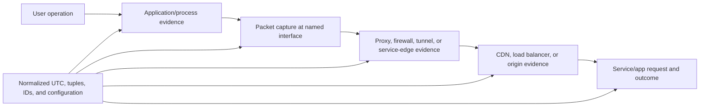

## Capture planning, authority, legality, and ethics

Packet capture can intercept personal, regulated, privileged, confidential, or credential-bearing traffic. Technical ability is not legal authority. Obtain organizational approval, comply with law, policy, employee notice/consent, contracts, residency, and incident procedures. Capture only systems and networks you own or are explicitly authorized to monitor. Do not use deauthentication, spoofing, port mirroring, TLS key logging, or remote capture against others without explicit authority.

| Planning question | Why it matters | Required record |
|---|---|---|
| What exact operation fails? | Prevents collecting unrelated user activity | Reproduction steps and expected/actual |
| Who/what is affected? | Defines scope and comparison population | Pseudonymous user/device/app IDs |
| Who authorized capture? | Establishes lawful/organizational basis | Ticket/change/incident/legal approval |
| Where should capture occur? | Defines claims and transformation visibility | Interface/device/topology location |
| Which protocols/endpoints? | Enables minimization/filtering | Expected names, IPs, ports, processes |
| When and for how long? | Limits privacy and disk volume | UTC start/stop and stop condition |
| Is payload required? | Metadata is often sufficient | Justification and snap length |
| Is decryption required? | Greatly increases sensitive content | Separate approval and key handling |
| Who can access/share? | Limits exposure | Named roles and repository |
| When delete/retain? | Avoids indefinite raw evidence | Retention deadline/owner |

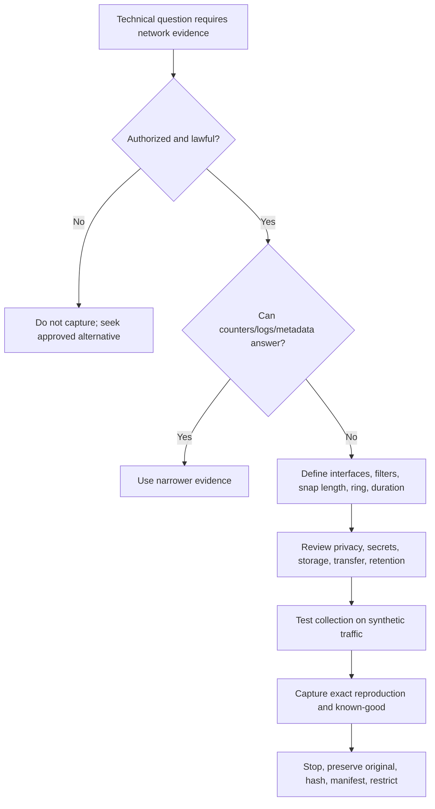

### Capture hypothesis

Before collecting, write a falsifiable hypothesis and the observation that would disconfirm it. Example: "Large uploads fail because return ICMP Packet Too Big is blocked between the branch firewall and tunnel. A simultaneous inside/outside capture will disconfirm this if the client sends only packets below the effective path size or if valid Packet Too Big reaches the sender and it reduces size."

This prevents collecting gigabytes first and inventing a story later. Capture both failing and known-good operations with one changed variable when safe. Record configuration before the test because starting a VPN, proxy, or diagnostic tool can alter the path.

### Plain-English deep-dive 1 - A capture point defines every sentence you may safely say

A camera at the lobby can prove a visitor passed the lobby camera. It cannot prove the visitor reached the tenth floor. Likewise, a client capture showing a SYN leaving the network stack does not prove the firewall, proxy, or server received it. A server capture showing no SYN does not identify where it disappeared.

Use bounded wording: "At the client Ethernet capture point, SYN packets were observed at 10:00:01, 10:00:02, and 10:00:04 UTC, with no SYN-ACK observed." If a firewall egress capture sees the SYN but its ingress return side does not see SYN-ACK, the loss interval narrows. If the server sees the SYN and replies, but the client does not see reply, the return path becomes primary.

Host captures can be affected by offload, virtual switches, VPN/agent adapters, loopback handling, and capture-driver placement. A packet shown before encryption or after decryption at one software layer can differ from the wire. Always name interface and tool stack.

## Interfaces, topology, and capture-point selection

Modern endpoints can have Ethernet, Wi-Fi, loopback, VPN, container/virtual switch, Hyper-V, mobile broadband, and security-agent virtual adapters. Traffic can enter one interface and be encapsulated into another. Capturing only physical Wi-Fi may show an outer tunnel but not inner application tuples; capturing only a virtual tunnel may show inner traffic but not outer loss.

| Capture point | Can answer | Cannot alone answer |
|---|---|---|
| Client application/loopback | Local proxy/API interactions | Physical network delivery |
| Client inner VPN/agent adapter | Original app destinations and inner TCP | Outer tunnel path and retransmission cause |
| Client physical adapter | DNS, outer tunnel, direct traffic on wire path | Encrypted inner flow content |
| Branch LAN | Client-to-gateway behavior | Post-NAT/service-edge leg |
| Firewall ingress/egress | Policy/translation boundary and both sides | Remote provider processing |
| Proxy client-facing | Client-proxy leg | Upstream unless second capture/log |
| Proxy origin-facing | Proxy-origin leg | Client local behavior |
| Load balancer edge | Client-facing service traffic | Backend unless separate point |
| Server | What arrived and server sent | Upstream path before server |
| Cloud/provider flow logs | Aggregated allowed/denied metadata | Full packet sequence/payload |

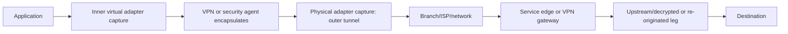

Wi-Fi monitor mode is hardware, driver, OS, and channel dependent. Ordinary endpoint capture often sees data as delivered to/from the host, not complete raw 802.11 management/control traffic. Promiscuous mode on a switched network does not reveal all other hosts. To capture a network segment, use an approved TAP, switch mirror/SPAN, virtual switch mirror, or device-native capture, understanding oversubscription and dropped packets.

### Capture loss

The capture system itself can drop packets due CPU, disk, buffer, driver, mirror-port oversubscription, or excessive traffic. Check tool drop statistics and interface counters. A missing packet in an overloaded trace is not proof it was missing on the network.

| Collection issue | Signature | Mitigation |
|---|---|---|
| Capture buffer overflow | Tool reports dropped packets | Larger buffers, narrower filter, faster disk, shorter capture |
| Mirror oversubscription | Loss under bidirectional/high-speed load | Size mirror capacity, TAP, filter at source |
| CPU decode overhead | GUI capture becomes unresponsive | Capture without live decode; analyze copy later |
| Disk exhaustion | Capture stops/system impact | Ring buffer, max size, dedicated approved volume |
| Wrong interface | No expected packets | Test with known safe DNS/connection and inspect routes |
| Hardware timestamp limits | Timing jitter or resolution issue | Document capture hardware/clock and compare points carefully |

## Ring buffers, snap length, file formats, and collection sizing

Ring buffers rotate among files by size or time and retain a bounded recent window. They are useful for intermittent failures, but the overwrite window must exceed detection and stop delay. If ten 100 MB files fill every two minutes, an operator who waits thirty minutes after failure loses the evidence.

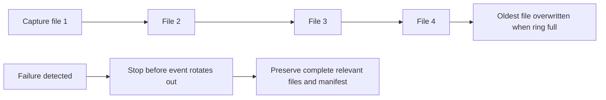

| Setting | Benefit | Risk | Guidance |
|---|---|---|---|
| Full packet length | Maximum future analysis | Sensitive payload and large files | Use only when justified |
| Header snap length | Minimizes payload | Truncates TLS/HTTP/DNS or encapsulation fields | Calculate for expected stacked headers |
| File-size rotation | Predictable file sizes | Event can span files | Preserve preceding/following files |
| Time rotation | Easier timeline segments | Variable sizes | Pair with max size/disk limits |
| File count | Bounded storage | Overwrite too quickly | Estimate traffic rate and response time |
| PCAP | Broad compatibility | Limited metadata/interface support | Fine for simple single-interface capture |
| PCAPNG | Multiple interfaces/comments/metadata | Tool compatibility considerations | Prefer when metadata is needed |
| ETL | Windows providers and network events | Requires supported decoding/conversion | Preserve original ETL and tool versions |

Estimated storage for average captured rate $r$ bits/second over $t$ seconds is:

$$
bytes \approx \frac{r \cdot t}{8}
$$

This ignores file overhead and burst peaks. A 100 Mb/s captured average for 10 minutes is roughly 7.5 GB before overhead. Use real interface/capture-rate measurements, not link speed alone. Compression can reduce some captures but adds CPU and sensitive archive handling.

## Capture filters versus Wireshark display filters

Capture filters decide which packets enter the file, commonly using libpcap/BPF syntax. Display filters operate on already captured packets using Wireshark's protocol fields. The syntaxes are not interchangeable. A narrow capture filter protects privacy and storage but can remove context needed later. A display filter is safer during exploration because the original remains intact.

| Goal | Capture filter example | Display filter example |
|---|---|---|
| One host | `host 192.0.2.10` | `ip.addr == 192.0.2.10` |
| TCP port 443 | `tcp port 443` | `tcp.port == 443` |
| DNS common port | `port 53` | `dns` |
| Source subnet | `src net 192.0.2.0/24` | `ip.src == 192.0.2.0/24` |
| TCP SYN without ACK | BPF flag expression, tool-dependent | `tcp.flags.syn == 1 && tcp.flags.ack == 0` |
| TLS ClientHello | Cannot reliably filter application field in basic BPF | `tls.handshake.type == 1` |
| HTTP status | Not visible to basic capture filter | `http.response.code >= 400` |
| TCP stream | Not known until analysis | `tcp.stream == 7` |

Examples are for authorized labs. IP addresses use documentation ranges. Display-field names depend on Wireshark version and successful dissection. A display filter returning zero does not prove the protocol event did not occur; traffic can be encrypted, truncated, misclassified, on another interface, or decoded under a different port/protocol.

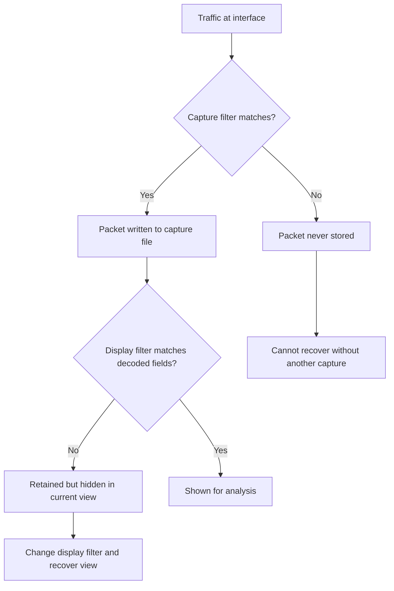

### Filter planning

Start with expected client and first-hop proxy/service addresses, but include DNS, ICMP/ICMPv6, ARP/neighbor discovery, and tunnel traffic when relevant. Filtering only TCP 443 can hide DNS failure and PMTUD messages. Filtering only one current service IP can miss CDN changes or proxy resolution. For intermittent cases, prefer a privacy-reviewed subnet/host and protocol scope plus ring buffer over one brittle destination.

### Plain-English deep-dive 2 - A narrow filter can make the desired answer impossible

If a camera records only red trucks, it cannot tell whether a blue ambulance caused the traffic stop. A capture filter for `tcp port 443` excludes ICMP Packet Too Big, DNS, and possibly QUIC over UDP 443. The resulting trace can show retransmitted TLS records but conceal the path signal that explains them.

Minimization remains essential. The answer is not capture everything. Write the dependency set: address resolution, neighbor/gateway, DNS, transport, tunnel, TLS, and application. Include only those protocols, hosts, and time windows needed. Test the filter with synthetic traffic and confirm expected packets appear before the incident reproduction.

Keep the original filtered capture immutable. During analysis use display filters and derived exports, recording every transformation. If a later hypothesis needs excluded traffic, state that the current capture cannot test it rather than inferring absence.

## Wireshark workflow: endpoints, conversations, streams, packets, and profiles

A disciplined Wireshark workflow moves from broad scope to specific packets:

1. Verify capture metadata, interfaces, dropped packets, timestamps, and file integrity.
2. Set time display and name-resolution behavior intentionally; preserve numeric values.
3. Review Protocol Hierarchy for unexpected protocols and truncation.
4. Review Endpoints and Conversations for addresses, ports, packets, bytes, duration, and direction.
5. Filter the exact user operation by UTC, tuple, DNS name, SNI, or known request context.
6. Select a TCP/UDP/QUIC stream and inspect state in order.
7. Reassemble/follow only when authorized; followed payload can expose secrets.
8. Annotate packet numbers, relative time, direction, key fields, and interpretation.
9. Check Expert Information as navigation hints, not verdicts.
10. Correlate with process, policy, and application logs.

```mermaid
flowchart LR
    META[Metadata, clocks, drops, interfaces] --> HIER[Protocol hierarchy]
    HIER --> END[Endpoints]
    END --> CONV[Conversations]
    CONV --> FLOW[Filter exact tuple/time/operation]
    FLOW --> STREAM[Follow stream or reconstruct sequence safely]
    STREAM --> PACKET[Inspect decisive packets and fields]
    PACKET --> CORR[Correlate external logs and known-good]
    CORR --> HYP[Update hypothesis and next test]
```

| Wireshark feature | Best use | Caution |
|---|---|---|
| Protocol Hierarchy | Inventory decoded protocols/bytes | Heuristics and encryption affect labels |
| Endpoints | Identify talkers and totals | NAT/proxy changes identity |
| Conversations | Pair traffic, durations, direction | One app operation can use many conversations |
| I/O Graph | Visualize rate/events over time | Graph pattern is correlation, not cause |
| Flow Graph | Sequence overview | Can omit app semantics/encrypted content |
| Follow TCP/HTTP stream | Reassemble authorized payload | Exposes sensitive data; retransmission handling |
| Expert Information | Find resets, retransmissions, malformed fields | Tool inference depends on capture completeness |
| Coloring rules | Highlight patterns | Visual aid, not evidence itself |
| Profiles | Reusable columns/preferences | Record profile/version for reproducibility |
| Decode As | Correct nonstandard protocol port | Wrong choice creates false dissection |

Useful custom columns include UTC/relative time, source/destination, TCP stream, sequence/ACK, TCP length, window, DNS query/response, TLS SNI/ALPN/alert, HTTP method/status/request ID where visible. Save a sanitized profile separately from evidence; do not modify original packets.

## Time, clocks, ordering, and multi-source correlation

Packet timestamps come from capture host/driver/hardware and can differ from application/server clocks. Normalize to UTC and record time zone, clock source, offset, drift, resolution, and whether capture uses local wall time display. Relative time is useful within one capture but not across systems without an anchor.

| Time issue | Symptom | Control |
|---|---|---|
| Time-zone mismatch | Events appear hours apart | Convert source time with offset to UTC |
| Clock offset | Same handshake differs by seconds | Measure against trusted source and record offset |
| Drift | Offset grows during long capture | Check before/after; model drift if needed |
| Low resolution | Many events share timestamp | Preserve sequence/context; do not invent order |
| NTP step | Wall clock moves forward/back | Use monotonic durations where available and time-service logs |
| Virtual host clock | VM/container differs from host | Record each system's source/offset |
| Provider aggregation | Logs arrive later than event | Use event time, ingestion time, and latency separately |

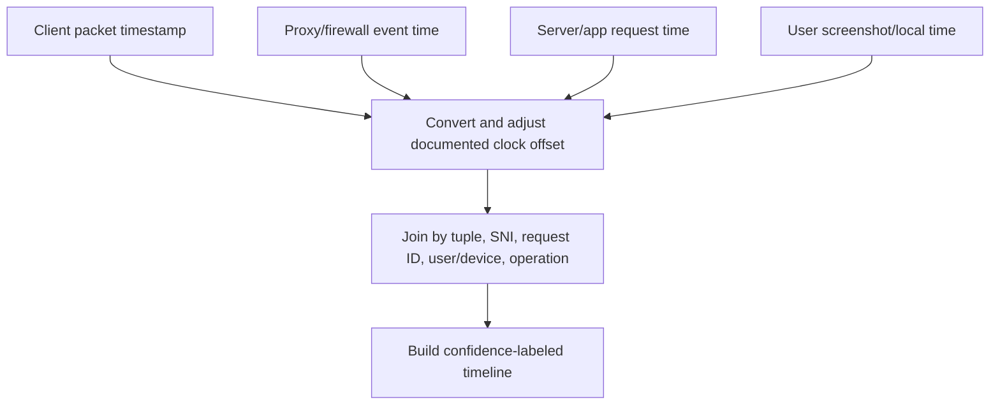

Do not rewrite original capture timestamps. Store analysis offsets in manifest/worksheet or create a clearly labeled derivative. If capture points have unknown skew, sequence packet causality cautiously. TCP sequence/ACK and request IDs can link events even when clocks are imperfect.

## DNS analysis

DNS evidence can show query name/type, transaction, response code, answer, TTL, resolver, timing, retries, truncation, and TCP fallback. It cannot prove the application used the answer; local caches, hosts file, proxy-side DNS, application DNS, encrypted DNS, or stale connections can differ.

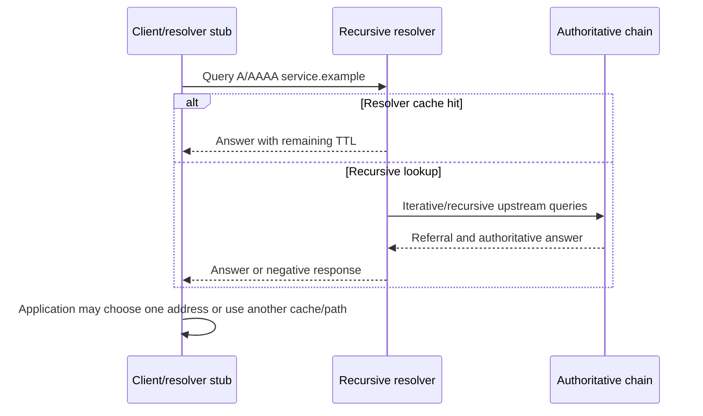

| DNS observation | Interpretation | Caveat |
|---|---|---|
| Query no response | Resolver/path/drop/trace loss | Client may retry another resolver |
| NXDOMAIN | Name asserted nonexistent under response context | Search suffix or split DNS can alter next query |
| SERVFAIL | Resolver failed to answer | DNSSEC/upstream/policy/validation possibilities |
| Multiple A/AAAA | Candidate addresses | App selection/Happy Eyeballs not proven |
| CNAME chain | Alias mapping | Final service/TTL and CDN mapping matter |
| Truncated UDP | Client should retry TCP under DNS behavior | Firewall can block TCP 53 |
| Repeated query | Cache miss/retry/app behavior | Not automatically DNS failure |
| DoH/DoT | DNS payload encrypted | Use endpoint/browser/resolver evidence |

Useful display filters in an approved lab:

```text
dns
dns.flags.response == 0
dns.flags.rcode != 0
dns.qry.name == "service.example"
tcp.port == 53
```

For timing, match query and response transaction/context and account for retries. UDP transaction IDs can repeat; tuple/time/name/type improve correlation. DNS over HTTPS appears as HTTPS to an on-path packet trace unless endpoint keys/instrumentation are available and authorized.

## TCP handshake, reliability, and teardown analysis

TCP establishes state with SYN, SYN-ACK, ACK. Data bytes are sequenced and cumulatively acknowledged. The receive window controls flow; congestion control controls network load and is largely inferred from sender behavior. FIN performs orderly half-close; RST aborts/rejects.

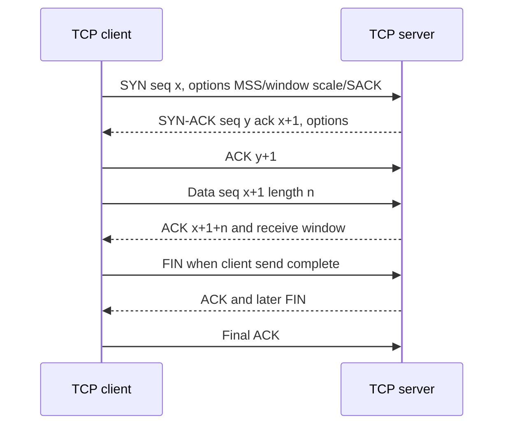

| Handshake pattern | Plausible interpretation | Next check |
|---|---|---|
| Repeated SYN, no SYN-ACK | Drop, route, listener, return path, capture point | Multi-point trace/firewall/server |
| Immediate RST to SYN | No listener or active reject | RST source evidence and server/firewall log |
| SYN-ACK seen, no final ACK | Return delivery/client state/security issue | Client capture and tuple/NAT |
| Handshake slow | SYN/SYN-ACK retransmission or delayed path | Exact timestamps and both sides |
| Different MSS/options | Path/host stack differences | Interface/MTU and comparison |
| Handshake complete, app timeout | Move to TLS/request/server stage | First payload and response timing |

### Sequence and ACK reasoning

Wireshark often displays relative sequence numbers for readability. TCP ACK is cumulative: ACK 5001 means bytes through 5000 were received in sequence. Selective Acknowledgment options can report additional received blocks beyond a gap. A duplicate ACK can indicate a missing segment, reordering, or repeated state; it is not itself a packet retransmission.

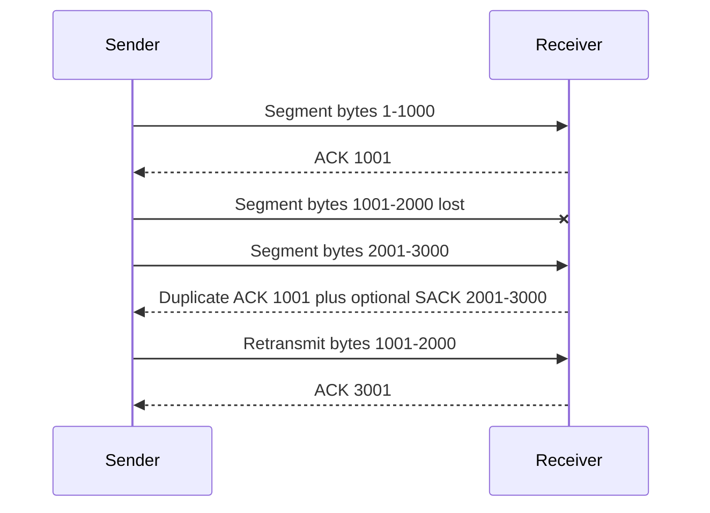

### Retransmission, fast retransmission, out-of-order, and spurious labels

Wireshark infers retransmissions from sequence history at the capture point. If the capture missed the original, an ordinary segment can be labeled retransmission. If packets arrive at capture out of order due multi-core processing/offload, the tool can label network reordering. A fast retransmission is inferred near duplicate ACKs; timeout retransmission follows a retransmission timer. Spurious retransmission means data appears already acknowledged, potentially due capture loss, ACK loss, reordering, or sender behavior.

| Label/pattern | What it suggests | What it does not prove |
|---|---|---|
| Retransmission | Same sequence bytes observed again | Where original/ACK was lost |
| Fast retransmission | Sender reacted before timer, often duplicate ACK/SACK | Congestion versus reordering cause |
| Out-of-order | Segment observed beyond expected sequence | Network reordered rather than capture path |
| Duplicate ACK | Receiver repeats next expected byte | Packet loss always occurred |
| ACKed unseen segment | ACK covers bytes absent from capture | Impossible packet; capture may be incomplete |
| Spurious retransmission | Repeated data appears already acknowledged | Sender is defective without full path evidence |

### Resets

RST can reject an unopened port, abort an existing connection, respond to invalid state, enforce policy, or be injected by an intermediary. Determine direction, sequence/ACK plausibility, IP TTL/hop characteristics, TCP/IP options, timing, and logs at suspected device. A RST bearing the server IP can still be generated on path.

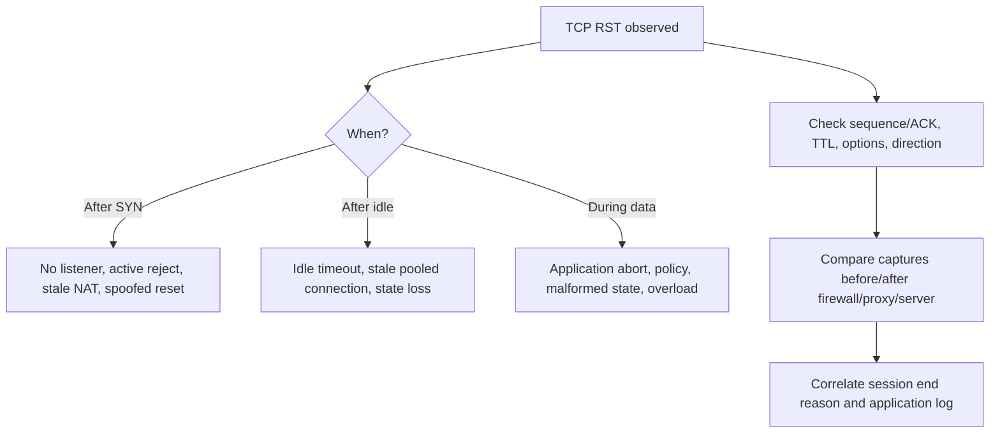

### FIN versus RST

FIN says no more bytes will be sent in that direction and permits orderly half-close. RST discards connection state abruptly. An application can intentionally reset a connection, and some stacks reset when unread data remains. Do not call every reset malicious or a firewall block.

## TCP windows, zero window, and application backpressure

The TCP receive window advertises how many more bytes the receiver can buffer. Window scaling negotiated in SYN expands the 16-bit field. Wireshark may calculate scaled values when handshake is present. If capture begins midstream, scaling can be unknown.

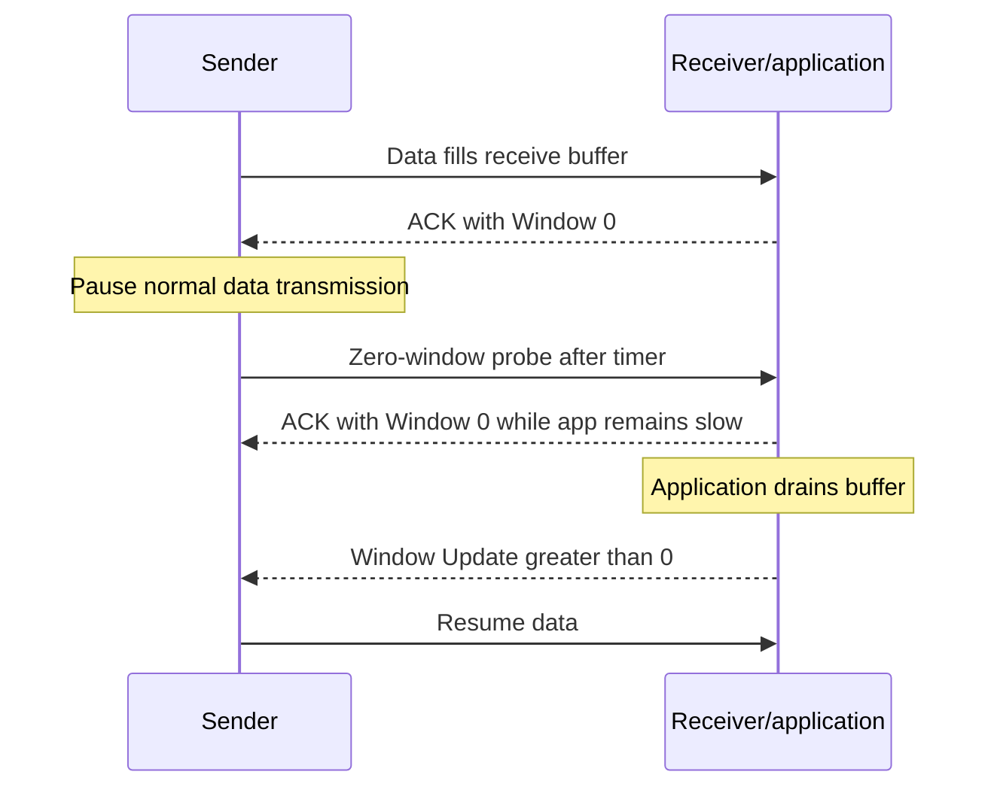

| Window observation | Meaning | Investigation |
|---|---|---|
| Window shrinking | Receiver buffer availability falling | Receiver app/CPU/storage/backpressure |
| Zero window | Receiver currently cannot accept more | Which endpoint advertised it and why |
| Zero-window probe | Sender tests whether window reopened | Duration and response |
| Window update | Receiver advertises more space | Application resumed draining |
| Small persistent window | Throughput constrained by receiver | Scaling, buffers, app processing |
| Sender not filling window | Could be congestion/app/limited data | RTT, congestion, app write behavior |

A client-advertised zero window points to client receive-side backpressure at that time, not a network bandwidth shortage. The root cause can be application thread stall, storage, CPU, memory pressure, security inspection, or socket consumption behavior. Correlate process/resource traces. A server zero window similarly directs attention server-side, while the trigger can still be excessive sender rate or downstream dependency.

### Plain-English deep-dive 3 - Retransmission and zero window answer different questions

A courier repeats a package because no receipt arrived; that resembles retransmission. A warehouse says "stop, my shelves are full"; that resembles zero window. One suggests uncertain delivery or acknowledgment; the other is explicit receiver flow control.

Seeing both can happen. For example, an endpoint stalls, advertises zero window, later reopens, and packets are retransmitted after delays. Do not summarize the trace as "packet loss" without identifying sequence and window chronology. The first abnormal event can precede later retransmissions.

Use a table with time, direction, sequence range, ACK, window, packet length, and process/resource event. The question is not how many red expert labels exist; it is which transition first prevented forward progress.

## MTU, MSS, fragmentation, and PMTUD

MTU limits an IP packet on a link. Encapsulation adds headers, reducing inner MTU. TCP MSS advertises maximum TCP payload a peer is willing to receive, usually based on interface MTU minus IP/TCP headers. PMTUD learns a path's lower MTU. IPv4 routers can fragment packets when permitted, but modern designs often set Don't Fragment and rely on ICMP Destination Unreachable/Fragmentation Needed. IPv6 routers do not fragment transit packets; they send ICMPv6 Packet Too Big and the source adapts.

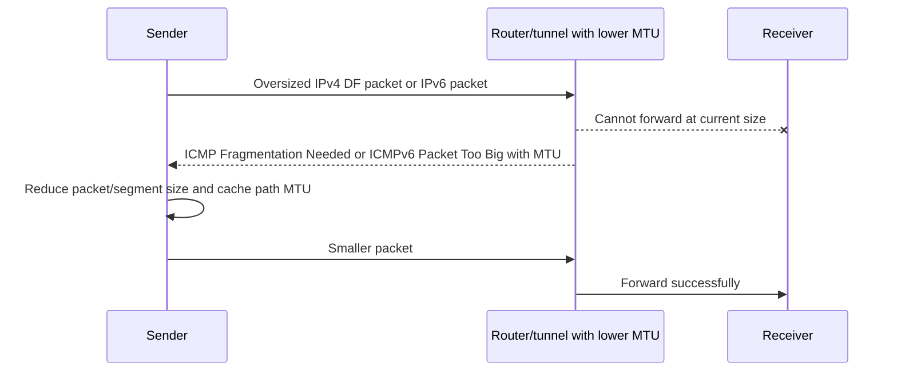

| Evidence | Interpretation | Caveat |
|---|---|---|
| ICMP fragmentation needed/PTB | Path reports lower MTU | Validate quoted flow and sender response |
| Large packet retransmits, small succeeds | PMTUD black-hole hypothesis | App limits/timeouts can also be size-related |
| SYN MSS differs on path | Middlebox/tunnel MSS adjustment | MSS affects TCP payload, not all protocols |
| IPv4 fragments | Fragmentation occurred | Capture can miss fragments; security devices may drop |
| No ICMP seen at client | Could be blocked/lost/other point | Capture filter may exclude it |
| TLS handshake works, upload stalls | Larger records/data trigger path | Proxy/body limit/server processing alternatives |

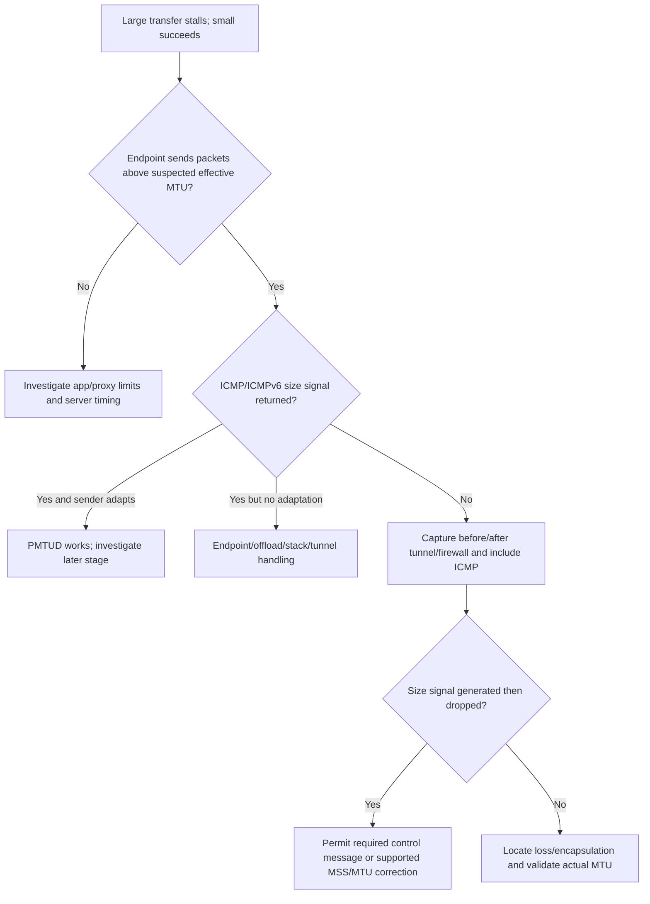

Do not use ping with Don't Fragment as universal proof: ICMP echo can be filtered, paths can differ by protocol, and application encapsulation adds different overhead. It is one controlled probe. Avoid permanent tiny MTU as a blind workaround; it reduces efficiency and can hide routing/tunnel design errors.

## TLS, HTTP, QUIC, and encryption limits

Without authorized keys or termination-point evidence, a packet trace typically shows TCP/UDP/IP, TLS records, much of ClientHello such as SNI/ALPN in conventional deployments, selected handshake elements, certificate in TLS 1.2 and portions of TLS 1.3 visibility according to protocol, alerts, sizes, and timing. It does not reveal HTTPS methods, URLs beyond exposed names, headers, cookies, tokens, status, or bodies.

| Layer/evidence | Commonly visible on path | Hidden/limited |
|---|---|---|
| IP/TCP | Addresses, ports, flags, sequence, windows, timing | Process/user and app semantics |
| DNS plaintext | Names/types/answers | Application usage of answer |
| DoH/DoT | Resolver endpoint, encrypted traffic | Query name without endpoint evidence/keys |
| TLS ClientHello | Version offers, suites, groups, SNI/ALPN often visible | ECH can hide ClientHello name; deployment varies |
| TLS 1.2 handshake | Server certificate commonly visible | Application data encrypted |
| TLS 1.3 handshake | ClientHello/ServerHello visible; later handshake encrypted | Certificate normally encrypted on path |
| HTTPS | Encrypted records, sizes/timing | Method, status, headers, body |
| QUIC/HTTP/3 | UDP flow, QUIC headers/handshake portions under protocol | HTTP/3 content encrypted; connection migration complicates tuple |
| Inspected TLS | Different client and upstream associations | Need evidence from each leg; packet point matters |

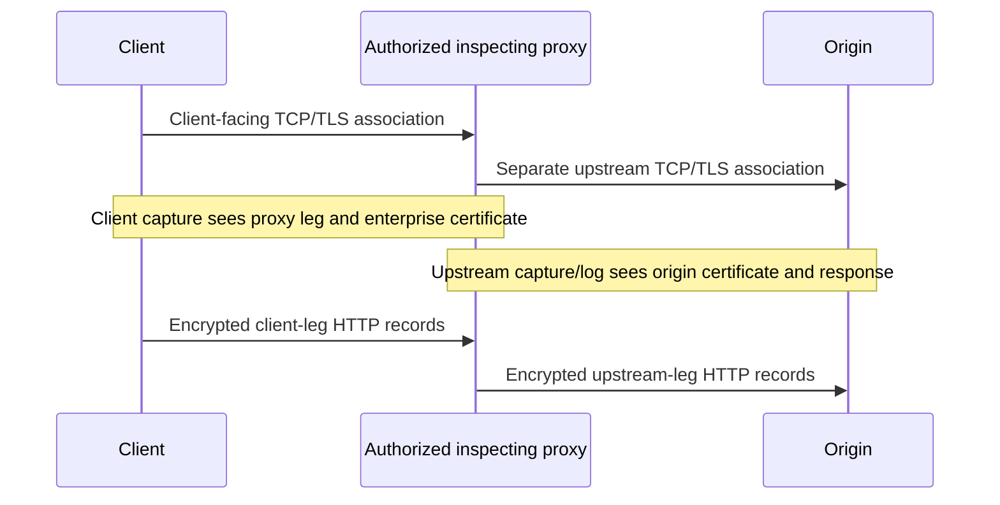

TLS session-key logging can enable Wireshark decryption for supported applications/protocols in an authorized lab. The key log is a high-value secret exposing session plaintext. Store separately with stricter access, transfer securely, retain briefly, and never use against customer traffic without explicit authorization. Modern ECDHE means a server certificate private key alone does not ordinarily decrypt passive modern TLS captures.

HTTP visibility is better obtained from browser developer tools, HAR, Fiddler/approved proxy, server logs, or inspection logs when authorized. Part 26 covers those tools. Packet evidence still establishes connection timing, transport, TLS negotiation, resets, and transfer direction.

### QUIC considerations

HTTP/3 uses QUIC over UDP. QUIC integrates TLS, multiplexes streams, uses connection IDs, and can migrate across addresses. TCP filters and `tcp.stream` do not apply. A blocked UDP 443 can lead clients to fall back to HTTP/2/TCP, adding delay. Compare ALPN/protocol in browser or service evidence and use current Wireshark QUIC fields. Do not call every UDP 443 packet HTTP/3; validate dissection/handshake.

## HTTP evidence where visible

For plaintext HTTP or authorized decryption/termination evidence, identify request method, authority/Host, path/query with redaction, headers, body framing, response status, responder, request ID, redirect, and timing. Reassembled application data can span packets; one packet does not equal one HTTP request.

| HTTP observation | Meaning | Privacy/diagnostic note |
|---|---|---|
| 401 | Origin authentication challenge | Redact Authorization/cookies |
| 403 | Responder refuses authorization/policy | Identify responder and policy/app reason |
| 407 | Proxy authentication challenge | Proxy context, not origin login |
| 413 | Responder rejects content size | Determine proxy/gateway/origin |
| 429 | Rate limited | Retry-After and request scope |
| 502 | Gateway invalid upstream response | Need gateway upstream leg |
| 503 | Temporary unavailable | Could be proxy, LB, CDN, app |
| 504 | Gateway upstream timeout | Does not prove origin outage |
| Redirect loop | Repeated Location/cookie/auth state | Packet payload sensitive; HAR often better |

Useful display filters when HTTP is actually decoded:

```text
http.request
http.response
http.response.code >= 400
http.request.method == "POST"
http.host == "service.example"
http.request_in
```

Wireshark field availability depends on version, protocol, reassembly, port decoding, encryption, and truncation. For HTTP/2 and HTTP/3, use the corresponding dissectors and authorized decryption; their frames/streams differ from HTTP/1.1 text.

## Netsh trace and Windows ETL concepts

`netsh trace` controls Windows network tracing scenarios/providers and can capture packets plus ETW events into ETL. It can be useful when a packet-only capture lacks Windows component context. Commands and provider coverage vary by Windows build; run `netsh trace show scenarios`, `show providers`, and command help in the target environment. Use an elevated approved session and a restricted output path.

Example for an authorized lab, with a bounded circular capture:

```text
netsh trace show scenarios
netsh trace show providers
netsh trace start capture=yes report=no persistent=no filemode=circular maxsize=512 tracefile=C:\Temp\nmh-lab.etl
netsh trace stop
```

The exact syntax/options should be verified on the system. Avoid `persistent=yes` unless an approved reboot scenario requires it and cleanup is guaranteed. Always stop the trace. The generated ETL and optional CAB/report can contain packets, hostnames, users, configuration, and diagnostics.

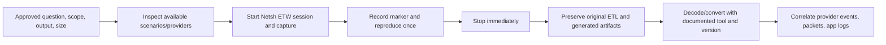

| Netsh/ETL concept | Meaning | Operational concern |
|---|---|---|
| Scenario | Curated provider set for problem type | Content varies by OS build |
| Provider | ETW source with event schema | Provider name/level/keywords matter |
| Capture | Network packet events included | Capture point/offload/format limitations |
| ETL | Binary event container | Preserve original for future parsers |
| Report | Optional diagnostic report/CAB | Extra PII/config and generation overhead |
| Circular mode | Bounded overwrite behavior | Failure can rotate out before stop |
| Max size | Storage cap | Too small truncates history; too large impacts system/privacy |
| Persistent | Survives reboot under option | Must be deliberately stopped/removed |
| Correlation | Events share activity/process/network context | Not every provider uses same IDs |

### ETL conversion and decoding

Wireshark support for ETL varies by platform/version and capture provider. Microsoft `etl2pcapng` can convert certain ETL network packet capture events to PCAPNG; conversion does not preserve every non-packet ETW event. `pktmon` can capture and convert its own ETL data on supported Windows versions. Keep the original ETL, converted file, conversion command/tool hash/version, output hash, warnings, and event-loss metadata.

```text
pktmon start --capture --file-name C:\Temp\pktmon-lab.etl
pktmon stop
pktmon etl2pcap C:\Temp\pktmon-lab.etl --out C:\Temp\pktmon-lab.pcapng
```

Verify current `pktmon help` syntax. Do not assume a PCAPNG converted from ETL contains all original events, process mapping, component fields, or drop reasons. Analyze packet and ETW views together when supported.

| Artifact | Keep? | Reason |
|---|---:|---|
| Original ETL | Yes, restricted | Authoritative raw Windows trace container |
| Converted PCAPNG | Yes as derivative | Wireshark packet analysis |
| Text/CSV export | Only if needed | Loses structure and can expose fields |
| Netsh report/CAB | If deliberately generated | Configuration/context but sensitive/large |
| Tool/version manifest | Yes | Reproducibility and parser differences |
| Hashes | Yes under evidence procedure | Integrity verification |

### Plain-English deep-dive 4 - ETL is a container, not automatically a packet capture

A shipping container can hold cameras, forms, and packages. ETL can hold events from many ETW providers, some of which represent packet bytes and others component decisions or state. Converting packet events to PCAPNG is like removing only the packages; the forms and camera records can remain behind.

This explains why two analysts can open "the ETL" in different tools and see different things. One parser understands network packet events, another understands DNS Client or TCP/IP provider schemas, and a third generates a report. Tool version and Windows build matter because event schemas evolve.

Preserve the original ETL. Label every conversion as derivative. Do not claim an event was absent merely because one converter did not emit it. Record conversion warnings and compare provider inventory when available.

## Microsoft Network Monitor legacy context

Microsoft Network Monitor 3.4 and its NMCap command-line collector were historically used to capture and parse network traffic with `.cap` files and protocol parsers. The product is legacy and no longer a current primary Microsoft packet-analysis platform. Microsoft Message Analyzer was also retired. Do not install unsupported legacy tools on production systems merely because an old runbook names them.

Use Network Monitor context for:

- Opening historical `.cap` evidence when an approved isolated environment and compatible parser are available.
- Understanding legacy support documentation, filter syntax, process-conversation grouping, and NMCap references.
- Converting/exporting a copy to a modern format where fidelity and metadata are verified.
- Reproducing a historical case in a safe lab, not enabling old drivers broadly.

| Legacy issue | Risk | Safer approach |
|---|---|---|
| Unsupported capture driver/tool | Security/stability/compatibility | Use supported Wireshark/Npcap, pktmon, Netsh/ETW, or device capture per policy |
| Old parser | Incorrect decode of modern protocols | Preserve raw bytes and use current dissectors |
| `.cap` conversion | Metadata/timestamp/link-type loss | Convert a copy, verify counts/times/hashes |
| NMCap old command | Option/driver unavailable | Do not force legacy installation; choose modern collection |
| Historical filter syntax | Not Wireshark-compatible | Document original and translate/test |
| Retired Message Analyzer | No support/security updates | Use current supported tools and ETW parsers |

If a customer supplies a historical Network Monitor trace, preserve it unchanged, note tool/version/source if known, open a copy, validate frame count/link type/timestamps after conversion, and avoid treating parser errors as malformed network traffic. Legacy evidence can remain valuable when handled conservatively.

## Offload, virtualization, and capture artifacts

Network offloads improve performance by moving segmentation, checksum, coalescing, or encryption work between OS and adapter. A host capture can show large TCP segments that are later segmented on wire, or invalid-looking outbound checksums that hardware fills. Receive Segment Coalescing can combine wire packets before upper-layer capture. Virtual switches and security filters change observation order.

| Feature/artifact | Host capture appearance | Interpretation |
|---|---|---|
| TCP Segmentation Offload/LSO | Very large outbound TCP segment | Adapter may segment on wire |
| Checksum offload | Outbound checksum flagged incorrect/unverified | Hardware may compute later; compare wire capture |
| Receive coalescing/RSC | Large inbound combined segment | Multiple wire packets may be coalesced |
| RSS/multi-core capture | Apparent timestamp/order variation | Capture scheduling can reorder observations |
| VPN encapsulation | Inner packet on virtual adapter, outer on physical | Two views of same logical data |
| Hyper-V/vSwitch | Guest/host captures differ | Virtual switch policy and capture layer |
| Loopback optimization | Traffic not seen on physical NIC | Capture loopback/appropriate provider |
| NIC drop | Missing frames before OS | Adapter counters/hardware capture needed |

Do not disable offloads in production just to make a trace prettier without change authority; doing so changes performance and behavior. Prefer interpreting artifacts, using an external capture, or controlled lab comparison. If offload is changed as a discriminating test, record before/after, scope, approval, and rollback.

## Evidence integrity, chain of custody, sanitization, and sharing

For routine troubleshooting, full forensic chain of custody may not be required, but integrity and handling still matter. For security/legal investigations, follow the organization's forensic procedure. At minimum record collector, device, tool/version, command/settings, interface, clock, start/stop UTC, authorization, source path, file size, cryptographic hash, copies, transformations, recipients, storage, and deletion date.

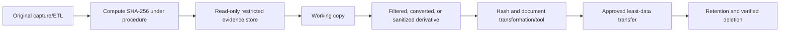

Example integrity command in an authorized Windows environment:

```powershell
Get-FileHash -Algorithm SHA256 C:\Temp\nmh-lab.etl
Get-FileHash -Algorithm SHA256 C:\Temp\nmh-lab.pcapng
```

The hash proves byte equality relative to a recorded value; it does not prove the collection was lawful, complete, or correctly interpreted.

| Manifest field | Example synthetic entry |
|---|---|
| Case | `NMH-LAB-025` |
| Collector | Pseudonymous analyst ID |
| Device | `LAB-CLIENT-01` |
| Tool/version | Wireshark/TShark or Netsh OS build |
| Interface | Adapter name/GUID and inner/outer role |
| Start/stop UTC | ISO 8601 timestamps |
| Filter/snap/ring | Exact settings |
| Drop count | Tool/interface report |
| Original hash | SHA-256 |
| Transformation | Conversion/filter/sanitization steps |
| Access/transfer | Named approved recipients/channel |
| Retention/delete | Date and owner |

### Sanitization

Removing payload does not remove all sensitive data. IPs, MACs, DNS names, SNI, certificate subjects, user-agent, URLs, filenames, cookies, tokens, Kerberos principals, device names, and timing can identify people or systems. Simple text replacement in a binary capture corrupts structure and checksums. Use approved packet-aware sanitization/anonymization tools and verify the derivative.

| Sensitive field | Possible treatment | Analysis impact |
|---|---|---|
| IP addresses | Consistent prefix-preserving pseudonymization where approved | Routing/geography/NAT interpretation changes |
| MAC addresses | Consistent pseudonymization | Vendor/local-bit analysis changes |
| DNS/SNI names | Controlled replacement preserving relationship | Name length/certificate correlation changes |
| HTTP payload | Remove/truncate selected packets/fields | App analysis lost |
| Tokens/cookies/auth | Remove entirely; rotate if exposed | Authentication replay analysis limited |
| Certificates | Keep fingerprint/fields only if sufficient | Chain details may be needed |
| Timestamps | Shift consistently if policy permits | External correlation requires documented offset |
| Packet lengths | Retain or bucket under policy | Traffic analysis/privacy tradeoff |

Create the derivative from a working copy. Verify it opens, packet counts/selected fields match intended transformation, secrets are absent through searches/review, and no external lookup is triggered. Store the transformation recipe/tool version and derivative hash. Never share the raw file in email or public repositories merely because a sanitized screenshot looks harmless.

## OneDrive and SharePoint evidence labs

These labs use an owned Microsoft 365 developer/test tenant if available and authorized, or a local synthetic HTTPS service. Never capture real customer documents, tokens, cookies, or another user's activity.

### Lab 1: browser versus sync-client path

Capture one harmless test-file access in browser and one sync operation. Record process, interface, DNS, first socket, proxy/tunnel, TLS SNI/ALPN where visible, endpoint addresses, connection count, and timing. Do not expect identical hosts, connections, or client behavior.

| Compare | Browser | Sync client | Interpretation |
|---|---|---|---|
| Process/PID | Browser profile | Sync executable/process set | Different proxy/trust/token context |
| DNS | Browser/system/DoH possibilities | System/app behavior | Packet visibility differs |
| First socket | Proxy/service edge/destination | May differ | Proves actual forwarding choice |
| Protocol | HTTP/2/3 possible | Client stack choice | Verify ALPN/app evidence |
| Connections | Page loads many resources | Sync uses service APIs/pools | Count not direct performance score |
| Payload | Encrypted | Encrypted | Use safe client/service IDs |

### Lab 2: DNS and connection timeline

Clear only approved lab caches if the experiment needs it and record the change. Capture query, response, address selection, TCP/QUIC start, TLS, and first application evidence. Compare cached versus uncached without claiming DNS caused all elapsed time.

### Lab 3: TCP loss in a controlled simulator

Use an owned network emulator to introduce small bounded loss. Observe duplicate ACK/SACK, retransmission, RTT, and throughput. Verify which direction and packet was impaired. Restore settings. Do not impair corporate/user traffic.

### Lab 4: zero-window receiver

Use a local lab application that pauses reads. Observe shrinking/zero receive window, probes, update, and recovery. Correlate application pause time. This demonstrates receiver backpressure distinct from network loss.

### Lab 5: MTU black-hole tabletop or isolated lab

Create a safe tunnel with lower MTU and optionally block size-related ICMP only inside the lab. Capture inner/outer points. Demonstrate that small request/handshake can succeed while larger transfer stalls. Restore policy and document why blocking ICMP is harmful.

### Lab 6: Netsh ETL and conversion

Start bounded circular Netsh trace, reproduce one synthetic HTTPS failure, stop, hash ETL, convert supported packet events, hash derivative, and compare what ETL versus PCAPNG retains. Record OS/tool versions and warnings.

### Lab 7: sanitized escalation artifact

Create a one-page timeline with ten decisive packets/events, topology, filters, hashes, hypotheses, and next owner. Produce a packet-aware sanitized derivative and validate removal. Keep only synthetic names/addresses.

### Lab 8: known-good comparison

Compare a failing and healthy client while changing one variable: network, proxy profile, endpoint version, or service edge in an approved lab. Use a matrix, not two narrative screenshots.

| Lab deliverable | Required content | Mastery signal |
|---|---|---|
| Capture plan | Authority, question, interface, filter, ring, privacy | Collection is intentional |
| Packet annotation | Direction, packet/time, fields, bounded claim | Evidence not color-label storytelling |
| Timeline | UTC plus client/network/service IDs | Cross-source correlation |
| Comparison | One changed variable and same operation | Discriminating test |
| Integrity manifest | Hash, tool, copies, transformations | Reproducible handling |
| Sanitized derivative | Verified secret/PII minimization | Safe sharing |
| RCA | Root cause, trigger, contributors, prevention | No unsupported vendor claim |

## Fictional NMH scenario: OneDrive-like uploads fail after tunnel change

NMH is fictional. A synthetic branch moves internet traffic into an IPsec tunnel. Browsing and small metadata requests work, but OneDrive-like uploads above approximately 1,300 bytes of application data repeatedly stall. The client physical capture shows outer tunnel packets near the ISP path limit and repeated inner TCP sequence ranges. The branch outside capture sees an ICMPv4 Fragmentation Needed response quoting the tunnel flow, but the branch firewall inside capture and client do not see a corresponding usable size signal. A known-good branch permits the required ICMP and adapts.

This evidence supports a PMTUD control-path hypothesis. It does not prove the SaaS service, Zscaler, ISP, or firewall vendor is defective. The exact dropping policy and tunnel MTU must be confirmed in device logs/configuration.

```mermaid
sequenceDiagram
    participant C as Fictional NMH client
    participant G as Branch tunnel gateway/firewall
    participant R as ISP path router
    participant S as Fictional SaaS service
    C->>G: Inner TCP/TLS data
    G->>R: Encapsulated packet exceeds next-hop MTU
    R-->>G: ICMP Fragmentation Needed with supported MTU
    G--xC: Size signal not delivered/translated under synthetic policy
    C->>G: Retransmit same inner TCP sequence range
    Note over C,S: Small requests succeed; large transfer stalls
```

### NMH evidence matrix

| Evidence | Synthetic observation | Supports | Does not prove |
|---|---|---|---|
| Client inner capture | Same larger sequence range retransmitted | Forward progress stalls on larger data | Loss location |
| Client physical capture | Encapsulated traffic leaves | Client/tunnel emits outer packets | ISP receives every packet |
| Gateway outside capture | ICMP Fragmentation Needed arrives | Path reports lower MTU | Firewall policy dropped it internally |
| Gateway inside capture | No translated/usable signal to client | Loss interval at gateway processing | Exact configured rule without logs |
| Firewall log/config | Synthetic policy excludes required ICMP type | Policy is controlling candidate | Vendor code defect |
| Known-good branch | Receives size signal/reduces packet, upload completes | PMTUD difference discriminates | Every site shares same path |
| Service request ID | Small operations present, large upload absent/incomplete | Failure before completed app request | Exact network hop |

### NMH response plan

1. State impact, sites, clients, operation/size threshold, start time, and business deadline.
2. Preserve simultaneous inside/outside/client captures, firewall/tunnel config and logs, client/service IDs, and clock offsets.
3. Validate quoted ICMP flow, advertised MTU, packet size, Don't Fragment behavior, and retransmitted sequence ranges.
4. Confirm capture completeness/offload and compare known-good branch.
5. Use a controlled canary to permit required ICMP/ICMPv6 control messages or apply a vendor-supported tunnel MTU/MSS design; do not broadly allow unrelated traffic.
6. Test small/large upload, download, browser, sync, IPv4/IPv6, tunnel failover, and security policy.
7. Roll out in stages with rollback and monitor retransmission, transfer success, latency, and policy events.
8. Write RCA separating trigger (tunnel path change), root cause (synthetic PMTUD policy gap), contributor (monitoring tested only small requests), and prevention (path-MTU and large synthetic transaction tests).

### NMH executive update

"In this fictional exercise, the service and small requests remained reachable, but larger tunneled packets exceeded a path limit. The network returned the standard size signal to the branch edge, where a policy gap prevented the endpoint from adapting, so TCP retransmitted without progress. We validated the hypothesis with synchronized captures and a known-good branch, piloted the supported control-message/MTU correction, and confirmed large and small business transactions plus security controls. There is no evidence of a Microsoft or Zscaler production defect."

## Additional troubleshooting scenarios

### Scenario 1: repeated SYNs, server sees none

Client capture shows three SYNs. Firewall ingress sees them; egress does not. Firewall log shows deny after a route/zone change. This localizes policy at that device. Opening all 443 is unnecessary; correct source/destination/zone rule and validate negative destinations.

### Scenario 2: server replies, client sees no SYN-ACK

Server and load-balancer captures show SYN and SYN-ACK. Firewall outside sees SYN-ACK; client-side inside does not. NAT/state/asymmetric return is primary. Preserve pre/post tuple and route. Do not ask application team to restart service.

### Scenario 3: stale pooled connection reset

Client reuses a connection after 15 idle minutes. A load balancer has a 10-minute idle timeout and removed state. Client sends data and receives/infers reset, then a fresh connection succeeds. Align keepalive/pool/idle policies or make client recover; do not increase every timeout without capacity analysis.

### Scenario 4: client zero window during download

Server sends normally until client window reaches zero. Client process logs show disk scan/stall. Network throughput symptom originates in receiver backpressure. Coordinate endpoint/storage/security scanning owner; packet loss tuning is not root remedy.

### Scenario 5: HTTP/3 blocked with slow fallback

Browser tries QUIC/UDP 443, receives no response, then succeeds over HTTP/2/TCP. User sees startup delay. Validate policy intent and current application guidance. Either support QUIC through intended controls or ensure efficient documented fallback; do not allow UDP broadly without security design.

| Scenario | Last confirmed boundary | Next owner/evidence | Avoid |
|---|---|---|---|
| SYN denied at firewall | Firewall ingress | Rule/zone/route owner | Global port allow |
| Return lost after outside firewall | External return point | NAT/state/inside route | App restart |
| Idle connection reset | LB timeout boundary | Pool/keepalive policy | Unlimited timeout |
| Client zero window | Client TCP receiver | Process/CPU/disk/security trace | Blame bandwidth |
| QUIC fallback | UDP path then TCP success | Policy/app protocol owners | Call service down |

## Escalation package design

A strong escalation package is small enough to understand and rich enough to reproduce. It contains the original restricted evidence reference, not necessarily the raw file attachment to every recipient.

| Section | Include | Exclude/protect |
|---|---|---|
| Impact | User operation, population, time, business effect | Unsupported broad outage claim |
| Reproduction | Exact sanitized steps and expected/actual | Real sensitive file/user details |
| Topology | Capture points, interfaces, proxy/tunnel/NAT/legs | Unneeded internal topology in broad audience |
| Environment | OS/app/agent/tool versions and recent changes | Full configuration dump |
| Time | UTC, offsets, capture start/stop, markers | Ambiguous local timestamps |
| Flow | DNS/name, pre/post tuple, stream, SNI/ALPN, protocol | Credentials/tokens/cookies |
| Decisive evidence | Packet/event numbers, fields, direction, bounded interpretation | Thousands of screenshots |
| External correlation | Policy, request, service, process IDs | Full raw logs unless restricted |
| Integrity | File name/size/hash, storage, derivative recipe | Raw key log/private key |
| Privacy | Approval, sanitization, recipients, retention | Assumption that encryption means no PII |
| Hypotheses | Ranked alternatives and disconfirming tests | Color labels treated as verdicts |
| Ask | Exact missing evidence/owner question | "Please analyze" without boundary |

Example packet timeline:

| UTC | Source to destination | Packet/event | Observation | Bounded conclusion |
|---|---|---|---|---|
| 14:03:22.100 | Client to resolver | DNS query A/AAAA | Query leaves client capture | Client requested name resolution |
| 14:03:22.130 | Resolver to client | DNS response | Two addresses, TTL 60 | Resolver returned candidates |
| 14:03:22.140 | Client to proxy | TCP SYN | SYN observed on physical interface | Client attempted proxy connection |
| 14:03:22.165 | Proxy to client | SYN-ACK | Handshake response observed | Transport to proxy available |
| 14:03:22.220 | Client to proxy | TLS ClientHello | SNI and ALPN offers visible | TLS negotiation started |
| 14:03:22.300 | Proxy to client | TLS response | Enterprise leaf in client leg | Inspection/proxy termination consistent; verify logs |
| 14:03:22.400 | Client to proxy | Application Data | Encrypted record | HTTP content not visible |
| 14:03:52.400 | Proxy to client | TLS/application close | Close after 30 seconds | Correlate proxy upstream timeout; not root cause alone |

An exact escalation question might be: "At 14:03:22.400 UTC the client completed TLS to the explicit proxy and sent encrypted application data under client stream 7. The proxy log maps request ID R to upstream TCP success and TLS success, then records no response headers before its 30-second deadline. The origin service has no matching request ID. Please provide upstream load-balancer/backend receipt and dependency timing for R, or confirm whether the proxy request ID changes at the edge. Raw captures remain in the approved vault; the attached derivative excludes tokens and payload."

## Experience bridge and interview positioning

Your advantage is not a collection of filter strings. It is experience connecting user impact to technical evidence, coordinating high-severity work, and validating fixes. Packet traces sharpen that method when used with restraint.

| Existing strength | Part 25 translation | Practice proof |
|---|---|---|
| OneDrive/SharePoint support | Compare browser/sync DNS, TCP, TLS, proxy, service | Sanitized lab timeline |
| Critical-situation leadership | Define capture points and parallel owner workstreams | NMH bridge plan |
| RCA | Separate trigger, root cause, contributors, detection gap | PMTUD RCA |
| Fix validation | Test positive transactions and negative controls | Change/rollback evidence |
| Networking learning | Explain sequence, ACK, windows, retransmission, MTU | Annotated trace workbook |
| Analytics | Quantify error rate, RTT, retransmissions, window stalls | Synthetic metrics table |
| Mentoring | Teach capture claims and privacy | Workshop/runbook |
| AI interest | Summarize only sanitized evidence; verify packet fields manually | AI evidence safety checklist |

A strong interview answer is: "I begin with authority, the user operation, a falsifiable hypothesis, capture point, clocks, interfaces, privacy scope, ring/filter/snap settings, and stop condition. I preserve the original and hash it, analyze conversations before packets, and treat expert labels as clues. I correlate DNS, TCP state, TLS boundaries, visible HTTP, policy and request IDs. I state exactly what the capture point proves, protect secrets, and ask the next owner for one missing discriminating fact."

## Common misconceptions to correct

| Misconception | Correction |
|---|---|
| Packet capture is harmless metadata | It can expose credentials, content, identities, topology, and behavior |
| Admin access equals legal authority to capture | Authorization, policy, law, purpose, and notice still matter |
| A client trace shows the whole network | It shows traffic at that client capture point |
| Promiscuous mode sees all switched traffic | Switch/Wi-Fi/topology still limit visibility |
| Monitor mode always works on Wi-Fi | Hardware, driver, OS, channel, and policy determine support |
| Capture filter and display filter use same syntax | BPF filters collection; Wireshark display fields filter analysis |
| A zero display result proves no packet existed | Dissection, encryption, truncation, interface, and capture filter matter |
| One packet equals one request | Protocol messages can span/coalesce across packets |
| Red expert text proves root cause | Expert information is heuristic navigation |
| Retransmission proves network loss at a named hop | It proves repeated sequence bytes at the observation point |
| Duplicate ACK is a retransmitted packet | It is acknowledgment behavior, often around a gap/reordering |
| RST with server IP was sent by server | On-path controls can inject resets; verify direction/path/logs |
| Zero window means bandwidth congestion | Receiver advertised no buffer; investigate receiving endpoint/app |
| Invalid outbound checksum proves corruption | Checksum offload can fill checksum after host capture |
| Giant segment exists on wire | Segmentation offload can create host-capture artifact |
| TLS 1.3 hides all network metadata | Addresses, timing, sizes, and handshake portions remain; ECH varies |
| Certificate private key decrypts modern TLS | ECDHE forward secrecy normally prevents passive decryption |
| HTTP status is always visible on port 443 | HTTPS encrypts it without authorized endpoint/termination evidence |
| Netsh ETL is just PCAP | ETL can contain packet and non-packet ETW provider events |
| Conversion preserves every ETL event | PCAPNG conversion commonly retains packet events only |
| Network Monitor is a current recommended collector | It is legacy; use supported modern tools and preserve old evidence carefully |
| Hash proves evidence is complete/correct | Hash proves byte identity relative to recorded value |
| Masking screenshot means capture is sanitized | Raw packets can retain many other secrets/identifiers |
| Tunnel up proves data path works | Selectors, routes, MTU, policy, loss, and app stages remain |
| Small request success proves large upload path | MTU, body limits, timeout, and buffering can be size-dependent |
| Packet trace alone proves vendor defect | Ownership requires component-specific evidence and alternatives |

## Official Source Anchors

The following authoritative sources were reviewed on **2026-08-24**. They support packet protocols, Windows tracing, Wireshark operation, evidence/security guidance, Microsoft network principles, and official Zscaler support context. They do not prove fictional NMH results, a tenant path, an inspection policy, a packet-loss owner, or a production vendor defect. Verify RFC errata, OS/tool versions, local law/policy, and current product documentation.

| Source | URL | Used for | Boundary |
|---|---|---|---|
| IETF RFC 9293 | https://www.rfc-editor.org/rfc/rfc9293 | Current TCP specification, state, sequence, reset, windows | Congestion control and extensions have separate RFCs |
| IETF RFC 7323 | https://www.rfc-editor.org/rfc/rfc7323 | TCP window scaling and timestamps | Updated status/errata apply |
| IETF RFC 2018 | https://www.rfc-editor.org/rfc/rfc2018 | TCP Selective Acknowledgment | Implementations and later guidance vary |
| IETF RFC 5681 | https://www.rfc-editor.org/rfc/rfc5681 | TCP congestion control fundamentals | Later algorithms/RFCs can differ |
| IETF RFC 8200 | https://www.rfc-editor.org/rfc/rfc8200 | IPv6 and fragmentation model | Operational guidance and updates apply |
| IETF RFC 1191 | https://www.rfc-editor.org/rfc/rfc1191 | IPv4 Path MTU Discovery | Modern PMTUD/PLPMTUD guidance adds options |
| IETF RFC 8201 | https://www.rfc-editor.org/rfc/rfc8201 | IPv6 Path MTU Discovery | Packetization-layer methods are separate |
| IETF RFC 4821 | https://www.rfc-editor.org/rfc/rfc4821 | Packetization Layer PMTUD | Updated by RFC 8899 for datagram transports |
| IETF RFC 8899 | https://www.rfc-editor.org/rfc/rfc8899 | Datagram PLPMTUD | Protocol implementation support varies |
| IETF RFC 1035 | https://www.rfc-editor.org/rfc/rfc1035 | DNS messages and transport foundation | Updated by many DNS RFCs |
| IETF RFC 7766 | https://www.rfc-editor.org/rfc/rfc7766 | DNS over TCP requirements | Encrypted DNS is specified separately |
| IETF RFC 8446 | https://www.rfc-editor.org/rfc/rfc8446 | TLS 1.3 visibility and handshake | Later updates/errata apply |
| IETF RFC 9110 | https://www.rfc-editor.org/rfc/rfc9110 | HTTP semantics/status and intermediaries | Framing/version RFCs separate |
| IETF RFC 9000 | https://www.rfc-editor.org/rfc/rfc9000 | QUIC transport, streams, connection IDs | HTTP/3 is RFC 9114 |
| NIST SP 800-86 | https://csrc.nist.gov/pubs/sp/800/86/final | Integrating forensic techniques into incident response | Published 2006; organizational procedures/current law control |
| NIST SP 800-61 Rev. 3 | https://csrc.nist.gov/pubs/sp/800/61/r3/final | Incident response recommendations and evidence context | Organization-specific procedures and legal requirements still apply |
| NIST SP 800-92 | https://csrc.nist.gov/pubs/sp/800/92/final | Log management principles | Technology examples are dated; principles remain useful |
| CISA Cybersecurity Incident and Vulnerability Response Playbooks | https://www.cisa.gov/news-events/news/federal-government-cybersecurity-incident-and-vulnerability-response-playbooks | Evidence-driven incident coordination | Federal playbooks; adapt to organization |
| Wireshark User's Guide | https://www.wireshark.org/docs/wsug_html_chunked/ | Capture, interfaces, files, conversations, filters, expert info | UI/features vary by release |
| Wireshark Display Filter Reference | https://www.wireshark.org/docs/dfref/ | Current protocol field references | Fields depend on version/dissection |
| Wireshark Capture Filters guide | https://wiki.wireshark.org/CaptureFilters | BPF-style capture-filter concepts/examples | Wiki guidance; libpcap/platform support varies |
| Wireshark TCP analysis documentation | https://www.wireshark.org/docs/wsug_html_chunked/ChAdvTCPAnalysis.html | TCP analysis flags and interpretation | Heuristics depend on capture completeness |
| Wireshark TLS wiki | https://wiki.wireshark.org/TLS | TLS dissection/decryption concepts | Key handling must follow authorization/policy |
| Microsoft Learn: netsh trace | https://learn.microsoft.com/en-us/windows-server/administration/windows-commands/netsh-trace | Netsh trace commands/scenarios/providers | Options vary by Windows version |
| Microsoft Learn: Packet Monitor | https://learn.microsoft.com/en-us/windows-server/networking/technologies/pktmon/pktmon | Pktmon capture/filter/convert concepts | Commands/features vary by OS build |
| Microsoft etl2pcapng repository | https://github.com/microsoft/etl2pcapng | Microsoft tool for converting supported ETL packet events | Conversion does not preserve all ETW events |
| Microsoft Network Monitor archive/context | https://www.microsoft.com/en-us/download/details.aspx?id=4865 | Historical Network Monitor 3.4 product context | Legacy unsupported tool; follow organizational software policy |
| Microsoft Support: Message Analyzer retirement | https://learn.microsoft.com/en-us/openspecs/blog/ms-winintbloglp/8c5b0ac7-1f73-4e91-95c6-7e6e28f1b3a4 | Legacy analyzer retirement context | Use current supported alternatives |
| Microsoft 365 network connectivity principles | https://learn.microsoft.com/en-us/microsoft-365/enterprise/microsoft-365-network-connectivity-principles | M365 path, egress, and performance principles | Current endpoints/tenant evidence required |
| Microsoft 365 network connectivity test | https://connectivity.office.com/ | Official Microsoft 365 connectivity test context | Test output is one observation, not full root cause |
| Zscaler Help Portal | https://help.zscaler.com/ | Official product support/documentation entry | Exact capture/log workflow depends on product/version/access |
| Zscaler: What is packet loss? | https://www.zscaler.com/resources/security-terms-glossary/what-is-packet-loss | Official high-level packet-loss explanation | General glossary, not tenant diagnosis |

## Likely Interview Questions

### Q1. How do you plan a packet capture safely?

**Model answer:** I define the exact operation, falsifiable hypothesis, authorization/legal basis, affected user/device, topology, capture point/interface, dependencies, clock, filter, snap length, ring size, duration, stop condition, access, retention, and known-good comparison. I test collection on synthetic traffic, stop immediately after reproduction, preserve and hash the original, analyze a working copy, and share only a verified sanitized derivative.

### Q2. What is the difference between a capture filter and a display filter?

**Model answer:** A capture filter, commonly BPF-style, decides what packets are written, so excluded traffic cannot be recovered. A Wireshark display filter operates after collection using decoded protocol fields and only changes the view. I keep capture filters narrow enough for privacy but broad enough for dependencies such as DNS and ICMP/ICMPv6; then use display filters to explore without modifying original evidence.

### Q3. What does a TCP retransmission prove, and what does it not prove?

**Model answer:** It proves the same TCP sequence bytes were observed again at that capture point under the analyzer's sequence history. It does not identify where the original or ACK was lost, or even guarantee network loss because capture loss, offload, and reordering can affect labels. I inspect sequence/ACK/SACK chronology, both directions, capture drops, and another boundary before assigning ownership.

### Q4. How do you analyze a TCP reset and zero window?

**Model answer:** For RST I identify phase, direction, sequence/ACK plausibility, TTL/options, capture points, and device/application logs because endpoints or intermediaries can generate it. A zero window is explicit receiver flow control: the advertising endpoint has no receive-buffer space. I measure duration, probes/updates, and correlate the receiver process, CPU, memory, disk, or inspection behavior. Neither pattern alone names a vendor root cause.

### Q5. How would you diagnose an MTU or PMTUD black hole?

**Model answer:** I compare small versus large operations, inner and outer packet sizes, tunnel overhead, TCP MSS, repeated sequence ranges, Don't Fragment/IPv6 behavior, and ICMP Fragmentation Needed or Packet Too Big at multiple points. If a size signal reaches an edge but not the sender and a controlled rule/MTU correction restores adaptation, the hypothesis strengthens. I validate IPv4/IPv6, failover, security policy, and avoid permanent tiny MTU as blind workaround.

### Q6. What can you see in an HTTPS packet capture?

**Model answer:** Usually IP/transport fields, timing, sizes, TCP state, TLS records, ClientHello capabilities and often SNI/ALPN in conventional deployments, selected handshake portions, and alerts. HTTPS methods, statuses, headers, cookies, tokens, and bodies are encrypted unless I have authorized endpoint session keys or termination-point evidence. TLS 1.3 encrypts more handshake content; ECH can change name visibility. I state the exact observation point.

### Q7. Compare Wireshark, Netsh trace/ETL, and Network Monitor.

**Model answer:** Wireshark is a current cross-platform packet analyzer with capture/display filters and rich dissectors. Netsh trace controls Windows ETW scenarios/providers and can store packet plus component events in ETL; conversion to PCAPNG may preserve only supported packet events, so I keep original ETL. Network Monitor 3.4/NMCap is legacy and unsupported; I use it only for historical evidence in an approved isolated workflow and prefer current supported tools.

### Q8. How would you lead the fictional NMH large-upload incident?

**Model answer:** I label it fictional and correlate client inner/physical and gateway inside/outside captures. Larger tunneled packets trigger ICMP Fragmentation Needed at the edge, but the endpoint never receives a usable size signal and repeats sequence ranges; a known-good branch adapts. I confirm policy/config, pilot a supported ICMP/MTU/MSS correction, validate large/small browser and sync operations plus security controls, and document tunnel change, PMTUD policy gap, and weak small-request monitoring without blaming Microsoft or Zscaler.

## 30-Second Memory Hooks

| Concept | Memory hook |
|---|---|
| Packet trace | Camera at one junction |
| Capture point | Boundary of every safe claim |
| Interface | Camera location |
| PCAPNG | Capture plus richer interface metadata |
| ETW | Windows event plumbing |
| ETL | Windows event container |
| Provider | Event witness |
| Netsh scenario | Prepared provider set |
| Ring buffer | Keep recent reels, overwrite oldest |
| Snap length | Bytes retained per envelope |
| Capture filter | Decide what is stored |
| Display filter | Decide what is shown |
| Conversation | Endpoint pair summary |
| Stream | One reconstructed dialogue |
| Five-tuple | Flow identity before translation |
| Sequence | TCP byte position |
| ACK | Next byte expected |
| Retransmission | Same sequence bytes observed again |
| Duplicate ACK | Repeated next-expected byte |
| RST | Abrupt stop; identify sender |
| FIN | Orderly half-close |
| Receive window | Receiver's available shelves |
| Zero window | Receiver shelves full |
| MSS | Maximum TCP payload parcel |
| MTU | Link/path packet size limit |
| PMTUD | Learn smallest bridge |
| ICMP PTB | Path's size feedback |
| Offload | Host capture can differ from wire |
| TLS | Payload sealed; metadata remains |
| QUIC | UDP transport with encrypted streams and connection IDs |
| Netsh trace | Windows packet plus provider context |
| Conversion | Derivative, not the original ETL |
| Network Monitor | Legacy historical context |
| UTC | Common timeline language |
| Correlation ID | Shared application case number |
| Hash | Byte-integrity check, not completeness proof |
| Sanitization | Packet-aware least-data copy |
| Chain of custody | Who collected/handled/transformed evidence |
| Honesty | Packet pattern narrows ownership; it rarely proves vendor defect alone |

## Completion Checklist

- [ ] I can define packet, frame, capture, PCAP, PCAPNG, ETL, ETW, provider, and scenario.
- [ ] I can obtain and document authorization, purpose, scope, privacy, retention, and stop conditions.
- [ ] I can write a falsifiable capture hypothesis and disconfirming observation.
- [ ] I can choose client inner/outer, branch, firewall, proxy, load-balancer, and server capture points.
- [ ] I can explain promiscuous versus monitor mode and switched/Wi-Fi limitations.
- [ ] I can detect capture loss, mirror oversubscription, wrong interface, and disk/buffer pressure.
- [ ] I can size and configure conceptually a bounded ring buffer and snap length.
- [ ] I can compare PCAP, PCAPNG, and ETL without claiming equivalence.
- [ ] I can distinguish BPF capture filters from Wireshark display filters.
- [ ] I can design filters that preserve DNS, ICMP/ICMPv6, transport, tunnel, and app dependencies.
- [ ] I can use Protocol Hierarchy, Endpoints, Conversations, I/O Graph, streams, and Expert Information carefully.
- [ ] I can record profiles, columns, Decode As decisions, and tool versions.
- [ ] I can normalize UTC and document offset, drift, resolution, and ingestion delay.
- [ ] I can analyze DNS query/response, RCODE, TTL, CNAME, truncation, retry, and encrypted DNS limits.
- [ ] I can walk TCP SYN/SYN-ACK/ACK, data, cumulative ACK, FIN, and RST.
- [ ] I can distinguish retransmission, fast retransmission, duplicate ACK, SACK, out-of-order, and capture artifact.
- [ ] I can attribute RST cautiously with direction, sequence, TTL, capture points, and logs.
- [ ] I can interpret receive window, scaling, zero window, probes, and updates.
- [ ] I can distinguish receiver backpressure from packet loss and congestion.
- [ ] I can explain MTU, MSS, encapsulation overhead, IPv4 fragmentation, IPv6, and PMTUD.
- [ ] I can troubleshoot PMTUD black holes using size signals and multi-point evidence.
- [ ] I can explain LSO/checksum offload/RSC/RSS artifacts without changing production blindly.
- [ ] I can state what DNS, TLS 1.2/1.3, HTTPS, QUIC, and HTTP/3 expose or conceal.
- [ ] I can protect TLS session-key logs and explain why private certificate keys do not decrypt ECDHE sessions.
- [ ] I can use visible HTTP evidence only when plaintext/decryption is authorized and identify responder.
- [ ] I can run conceptually a bounded Netsh trace, stop it, preserve ETL, and record scenario/providers.
- [ ] I can distinguish ETL packet events from non-packet provider events.
- [ ] I can convert supported ETL packet events while preserving original and documenting tool/warnings/hashes.
- [ ] I can explain pktmon's role and verify commands against current OS help.
- [ ] I can place Network Monitor/NMCap and Message Analyzer in legacy context.
- [ ] I can open/convert historical `.cap` evidence without recommending unsupported production deployment.
- [ ] I can build an evidence manifest and compute SHA-256 under procedure.
- [ ] I can create and verify a packet-aware sanitized derivative.
- [ ] I can protect payload, tokens, cookies, names, addresses, certificates, identities, and timing.
- [ ] I can perform browser-versus-sync, DNS, loss, zero-window, MTU, ETL, sanitization, and known-good labs safely.
- [ ] I can walk the fictional NMH PMTUD scenario and scoped remediation without vendor blame.
- [ ] I can build an escalation package with decisive packet/event numbers, IDs, privacy, and exact ask.
- [ ] I can bridge your M365 production experience without claiming proprietary Zscaler telemetry.
- [ ] I can answer Q1-Q8 aloud and complete all eight labs using synthetic or authorized evidence.

[Part 26 - Procmon, Browser Developer Tools, HAR Logs, and Fiddler](Part-26-procmon-har-fiddler.md)