# Part 26 - Procmon, Browser Developer Tools, HAR Logs, and Fiddler

> **Audience:** Arti Thakur, moving from Microsoft 365 Support Escalation Engineering into a Zscaler Security Operations Technical Success Manager role.
>
> **Purpose:** Build a safe, evidence-first method for using Process Monitor, browser Developer Tools, HTTP Archive files, and Fiddler to distinguish endpoint, browser, proxy, network, identity, policy, and service behavior.
>
> **Scope and honesty:** Northstar Meridian Holdings, abbreviated NMH, is fictional. Its users, devices, traces, URLs, processes, policies, incidents, logs, failures, and outcomes are synthetic. Arti's Microsoft 365, OneDrive for Business, SharePoint Online, networking, evidence, and escalation experience must remain within her approved factual background.
>
> **Product caveat:** Tool interfaces, fields, capture drivers, browser privacy controls, HAR exports, service-worker behavior, Fiddler editions, certificate handling, and Microsoft or Zscaler product behavior change. Verify current official documentation, organizational policy, versions, and direct evidence. No Procmon event, waterfall bar, HAR field, proxy session, or synthetic lab proves a production Microsoft, Zscaler, endpoint, network, or application defect by itself.

## Section goal

The goal is to observe the same user operation from several deliberately chosen points and make only the claim each point supports. Process Monitor, usually shortened to Procmon, observes Windows file-system, Registry, process, thread, image, and selected network activity. Browser Developer Tools, usually shortened to DevTools, exposes what a browser records about requests, responses, initiators, timing, storage, security restrictions, and rendering dependencies. An HTTP Archive, or HAR, is a JSON export of browser HTTP transaction and timing data. Fiddler is an explicit local debugging proxy that can observe and manipulate supported HTTP sessions; authorized HTTPS decryption requires installing and trusting a debugging certificate and therefore changes the trust path.

Think of an airport delay. Procmon is the baggage-room activity log: which worker opened which door, looked for which tag, or received "not found." DevTools is the passenger departure board and gate record: which flight was requested, what connection initiated it, when it queued, and what status appeared. A HAR file is an exported copy of the board and flight details. Fiddler is a controlled inspection desk through which selected passengers are routed. None is the entire airport. Correlation across ticket number, time, route, process, and outcome turns separate observations into a defensible explanation.

By the end, Arti should be able to:

| Outcome | Demonstrated capability | Evidence of mastery |
|---|---|---|
| Plan lawful collection | Define authority, operation, data scope, tools, stop, storage, and retention | Evidence plan |
| Use Procmon safely | Capture and filter relevant process, file, Registry, image, and network events | Filtered native trace |
| Read Procmon mechanics | Interpret operation, path, result, detail, process tree, and stack without overclaiming | Event worksheet |
| Handle boot evidence | Explain boot logging value, volume, restart, privilege, and recovery caveats | Boot-log decision record |
| Use browser Network tools | Preserve an exact reproduction and inspect waterfall, timing, headers, cookies, cache, initiator, and response | Annotated browser timeline |
| Distinguish browser controls | Explain same-origin policy, CORS, cookie rules, service workers, and cache behavior | Browser decision tree |
| Read HAR structure | Navigate log, pages, entries, request, response, cache, timings, and custom fields | Sanitized HAR field map |
| Protect secrets | Detect credentials, tokens, cookies, bodies, names, identifiers, and private URLs before sharing | Redaction manifest |
| Use Fiddler responsibly | Explain proxy routing, sessions, HTTPS decryption authorization, Composer, and AutoResponder concepts | Synthetic Fiddler lab |
| Correlate observation points | Join process, browser, proxy, packet, policy, and service evidence by UTC and IDs | Cross-tool ledger |
| Compare app paths | Distinguish OneDrive sync-client and browser execution, identity, cache, network, and service paths | Known-good comparison |
| Escalate precisely | Package minimum decisive evidence, limitations, hashes, reproduction, and exact engineering ask | Escalation bundle |
| Bridge honestly | Connect Arti's support method to SecOps technical success without claiming proprietary product experience | Interview narrative |

## JD Mapping

| JD expectation | Part 26 capability | Customer artifact | Honest Arti bridge |
|---|---|---|---|
| Analyze complex environments | Correlate process, browser, proxy, packet, policy, and service observations | Dependency and evidence map | Extends M365 escalation analysis |
| Identify security risks | Recognize token leakage, unsafe interception, weak trust, and excessive evidence | Capture privacy review | Applies enterprise evidence discipline |
| Resolve critical escalations | Separate browser-only, client-only, path, identity, and service symptoms | Discriminating-test plan | Builds on CRITSIT ownership |
| Tailor mitigation | Choose cache reset, service-worker test, endpoint repair, proxy change, or service escalation only after evidence | Option and rollback record | Builds on fix validation |
| Deliver consulting | Teach teams how tools alter the environment and what each field means | Workshop and runbook | Uses mentoring experience |
| Partner cross-functionally | Define endpoint, browser, network, identity, security, privacy, and service ownership | Evidence RACI | Maps to customer and Engineering work |
| Communicate outcomes | Translate thousands of events into last confirmed boundary and business effect | Executive-safe timeline | Uses support communication strengths |
| Operate with transparency | State missing fields, collection gaps, tool limitations, and confidence | Assumption and limitation log | Matches factual escalation habits |

## Candidate honesty note

Arti can truthfully discuss using browser tools, HAR, Procmon, Fiddler, network evidence, OneDrive/SharePoint comparisons, timelines, escalations, and validation only to the extent supported by her real work. This Part gives her a structured lab and explanation model; it does not convert conceptual reading into production experience. She should not claim that a browser request used a particular Zscaler policy, service edge, inspection action, or proprietary log unless she has authorized tenant evidence showing it.

| Claim class | Safe wording | Required boundary |
|---|---|---|
| Production | "I used endpoint and web evidence in approved Microsoft 365 support investigations." | Use only real, confidentially safe examples |
| Lab | "In a synthetic lab I correlated Procmon, DevTools, HAR, and a debugging proxy." | Retain lab artifact and label it synthetic |
| Conceptual | "A HAR can preserve HTTP transaction metadata and may contain sensitive values." | Exact fields depend on exporter |
| Not yet used | "I have not operated Zscaler production telemetry; I would verify the tenant workflow and official support guidance." | Do not imply console access |
| Fictional | "NMH's test browser received a synthetic CORS failure." | NMH is not a customer |
| Unknown | "The client observation narrows the boundary but does not identify an upstream owner." | Ask for the missing comparison |

## Terms, definitions, and analogies before mechanics

| Term | Plain meaning | Why it matters | Memory hook |
|---|---|---|---|
| Procmon | Microsoft Sysinternals Process Monitor for detailed system activity | Connects an application symptom to local operations | Endpoint flight recorder |
| Event | One recorded operation at a time | Smallest Procmon evidence unit | One line in the activity log |
| Operation | Named action such as opening a file or querying a Registry value | Says what the process attempted | The verb |
| Path | Object targeted by the operation | Locates file, key, image, or endpoint | The address |
| Result | Returned status summarized by Procmon | Shows operation outcome, not automatically failure | The reply |
| Detail | Operation-specific parameters and outputs | Gives access flags, offsets, lengths, values, and other context | The fine print |
| Filter | Rule that includes, excludes, highlights, or limits displayed/captured events | Controls noise and scope | Evidence sieve |
| Stack | Ordered function-call frames active at an event | Can identify which component initiated an operation | Call-chain ladder |
| Symbol | Human-readable function name mapped from program address | Makes stacks understandable | Street name for an address |
| Process tree | Parent-child view of recorded processes | Reveals launch lineage and lifetime | Family tree of programs |
| Boot logging | Procmon collection started during system boot | Captures early activity before normal interactive launch | Camera before doors open |
| DevTools | Browser-integrated developer diagnostics | Shows browser view of web activity and policy | Browser control room |
| Waterfall | Timeline bars for overlapping requests | Reveals ordering, dependencies, queueing, and long phases | Train timetable |
| Initiator | Browser context that caused a request | Links a request to parser, redirect, script, worker, or navigation | Who placed the order |
| TTFB | Time to First Byte | Combines path latency and upstream response preparation | Wait for first reply |
| Cache | Stored response reused under browser rules | Can avoid network or change validation behavior | Local pantry |
| Service worker | Origin-scoped worker that can intercept fetches and return cache or network responses | Browser may not contact network as expected | Programmable local receptionist |
| Origin | Scheme, host, and port security tuple | Browser security decisions depend on it | Web security address |
| CORS | Cross-Origin Resource Sharing, an HTTP-header protocol enforced by browsers | Controls whether script can read cross-origin responses | Server permission slip to browser |
| HAR | HTTP Archive JSON representation of HTTP transactions and timing | Portable browser/session evidence | Exported request ledger |
| Entry | One request/response transaction in a HAR | Main unit for analysis | One ledger row |
| Sanitization | Removing or transforming sensitive data in a derivative | Reduces exposure before sharing | Safe evidence copy |
| Fiddler | HTTP debugging proxy product family | Observes selected client-proxy-server sessions | Inspection desk |
| HTTPS decryption | Authorized TLS interception at a trusted debugging proxy | Reveals sensitive plaintext and changes trust | Open sealed envelope at approved desk |
| Composer | Fiddler feature concept for constructing/reissuing requests | Useful for controlled API tests | Request drafting desk |
| AutoResponder | Fiddler rule concept for returning local or chosen responses | Supports controlled dependency isolation | Substitute reply clerk |
| Correlation ID | Identifier shared across request and service records | Joins evidence across systems | Common case number |
| Discriminating test | Test whose outcomes separate plausible explanations | Prevents random changes | Fork-in-the-road test |
| PML | Procmon native log format | Preserves rich Procmon data for later analysis | Original endpoint evidence file |

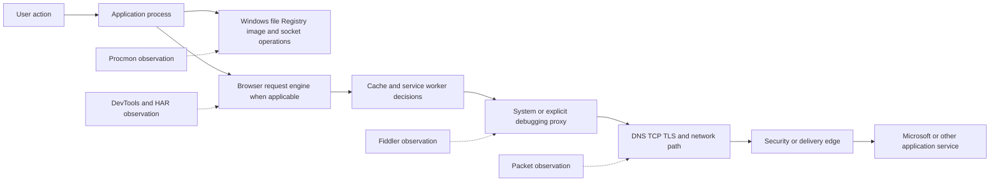

## Evidence planning and observation boundaries

Begin with the user operation, not the tool. "OneDrive is broken" is not a reproducible operation. "On device LAB-CLIENT-01, the synthetic 5 MB file remains in Processing changes after sign-in at 14:02 UTC, while upload through the browser succeeds" is testable. Record expected result, actual result, start and end, user-visible error, affected population, recent change, and known-good comparison.

Each tool changes cost and visibility. Procmon can record millions of local events and expose names, paths, command lines, Registry data, and user context. DevTools can expose authorization headers, cookies, request bodies, response content, and internal URLs. A HAR is easy to duplicate and email, which increases leakage risk. Fiddler HTTPS decryption introduces a trusted root and terminates/recreates TLS for selected traffic. Use the least intrusive evidence that can answer the question.

| Planning question | Procmon implication | Browser/HAR implication | Fiddler implication |
|---|---|---|---|
| What exact action fails? | Filter exact process and time | Clear log and reproduce one action | Capture only selected client/session |
| What must be visible? | Choose operations and stacks | Preserve redirects, initiators, headers, timing | Decide whether metadata or authorized plaintext is required |
| Who authorized it? | Elevated endpoint collection may need approval | User/session data needs purpose and consent | Interception and certificate trust need explicit authorization |
| What sensitive data exists? | User paths, names, keys, command lines | Tokens, cookies, query values, bodies | Full decrypted content and credentials |
| How long is needed? | Limit capture window and backing storage | Start before action; stop after outcome | Stop immediately after bounded test |
| What known-good exists? | Same process/version/device comparison | Same user/app under one changed variable | Same route without changed rule where safe |
| What is the stop condition? | Event observed or size/time threshold | Success/failure transaction complete | Decisive sessions complete |
| How will evidence be shared? | Preserve PML; export filtered derivative | Prefer sanitized HAR plus screenshots/notes | Export minimum sessions with secrets removed |

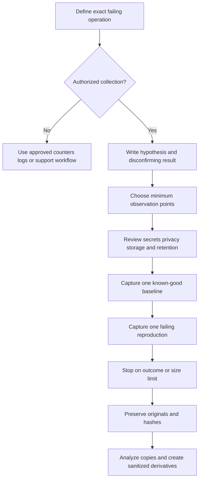

### Plain-English deep-dive 1 - Four tools can still tell four partial truths

Suppose DevTools shows a request with status 401, Fiddler shows a 401 response, Procmon shows successful access to a token-cache file, and a packet trace shows clean TCP/TLS delivery. These observations agree that the browser-side HTTP exchange completed, but they do not prove why authorization failed. The token can be expired, intended for another audience, missing a required claim, rejected by server policy, or unrelated to the request. A successful file read means only that a file operation succeeded.

Now suppose DevTools labels a response "from ServiceWorker" while Fiddler records no matching upstream session. That is not contradictory. The service worker can satisfy the browser request from Cache Storage. The debugging proxy never sees a request that never leaves the browser. Likewise, Procmon's TCP events are high-level endpoint observations, not packet-by-packet proof of remote delivery.

Write every conclusion as observation, interpretation, alternatives, and next test. Example: "At 14:02:11.430 UTC, Chrome DevTools recorded the synthetic API request as served by a service worker; no matching Fiddler session appeared during the bounded capture. This supports local interception or cache fulfillment. It does not prove the origin was healthy. Unregistering the worker in an owned test profile and repeating should distinguish worker state from upstream behavior."

## Process Monitor architecture and event model

Procmon captures detailed Windows activity and presents event rows with time, process name, process identifier, operation, path, result, and detail. Microsoft documents real-time file-system, Registry, and process/thread activity, rich non-destructive filtering, process information, event stacks, a process tree, native logging, and boot logging. Exact operations and fields depend on Windows and Procmon version.

The safest mental model is request and result. A thread in a process performs an operation against an operating-system object. Procmon records selected context and returned status. Many applications intentionally probe several locations, query optional Registry values, or attempt an operation that is expected to return a negative result before using a fallback.

| Event field | Question answered | Example interpretation | Important caveat |
|---|---|---|---|
| Time of Day | When did Procmon record it? | Align with user action | Normalize clock and precision |
| Process Name | Which image name performed it? | `OneDrive.exe` row | Names can repeat or be spoofed |
| PID | Which process instance? | PID 4242 | PID can be reused after exit |
| TID | Which thread? | Thread responsible for operation | Thread alone does not reveal intent |
| Operation | What API-level action was observed? | `CreateFile` or Registry query | Learn operation semantics before judging |
| Path | Which object was targeted? | File, key, image, or endpoint | Path may contain sensitive data |
| Result | What status was returned? | SUCCESS or NAME NOT FOUND | Negative result may be normal control flow |
| Detail | Which operation-specific values apply? | Access, disposition, offset, length | Meaning changes by operation |
| Duration | How long was the operation? | Candidate local delay | Scheduling and asynchronous behavior matter |
| Stack | Which call chain led here? | Application through library to kernel | Symbols and architecture affect readability |

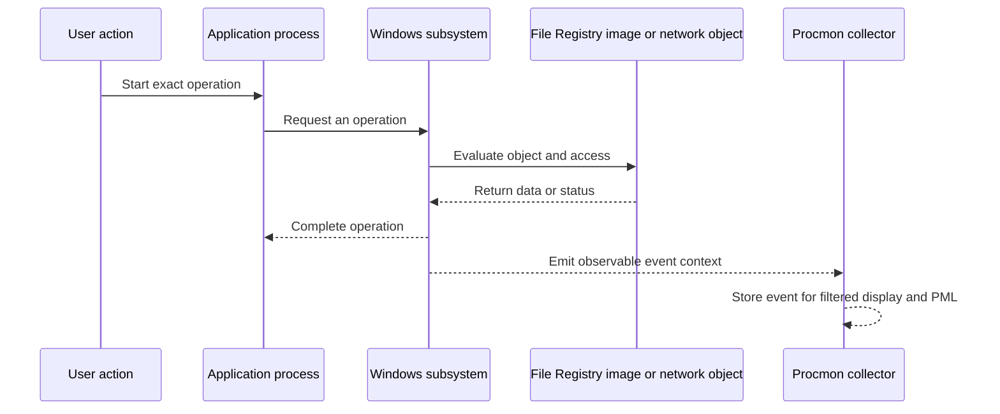

### File-system events

File events can reveal configuration lookup, cache/database access, log writes, directory enumeration, temporary-file replacement, image loading, sharing violations, and permissions. A `CreateFile` operation is not limited to creating a new file; at the Windows API layer it can open or create files, directories, devices, and other objects according to disposition and access. Always inspect Detail.

| Pattern | Plausible meaning | Discriminating check | Do not conclude yet |
|---|---|---|---|
| NAME NOT FOUND then alternate SUCCESS | Normal search/fallback | Compare known-good sequence | Missing first path is root cause |
| ACCESS DENIED on required config | Permission or security control | Check token, ACL, owner, policy event | Microsoft or security agent defect |
| SHARING VIOLATION with repeated retry | Competing handle or expected transient lock | Identify process holding/opening object | File corruption |
| Long read/write duration | Storage, filter driver, contention, size, scheduling | Compare disk counters and stack | Network latency |
| Repeated database writes | State persistence or retry loop | Align with app log/state transition | Database is corrupt |
| PATH NOT FOUND | Missing parent or changed environment | Validate exact expected path/version | User deleted data |
| BUFFER OVERFLOW style result | Buffer sizing protocol can be normal | Inspect next larger query and API semantics | Memory attack occurred |

### Registry events

The Registry stores Windows and application configuration. Procmon can show key opens, value queries, enumeration, writes, and deletes. Applications commonly probe policy and per-user/per-machine paths. A missing optional value can select a default. A successful read proves the process obtained a value at that moment, not that the value was correct for the business intent.

### Process, thread, and image events

Process creation records can reveal image path, command line, parent, user/session context, start time, and environment details available to Procmon. Image-load events show DLL or executable mappings and can help identify version mismatches or unexpected modules. Treat signed status, publisher, hash, and reputation as separate verification tasks; an image path alone is not proof of trust or maliciousness.

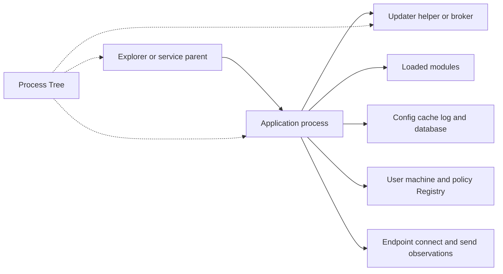

## Procmon collection, filters, highlighting, and backing files

Start Procmon before the exact reproduction, clear unrelated existing events, and capture the shortest practical interval. A broad initial trace can answer an unknown-path question, but millions of events rapidly become expensive and sensitive. Use a backing file when volume requires it and ensure the approved location has space. Preserve the native PML because CSV or XML exports may not retain every rich property in the same way.

Filters are non-destructive in ordinary analysis: changing the displayed filter can reveal events already collected, subject to collection settings and whether events were dropped or excluded from capture. Distinguish display-time filtering from destructive collection choices. Record each rule and filter order in the case notes.

| Filter field | Useful rule | Purpose | Risk if too narrow |
|---|---|---|---|
| Process Name | is `OneDrive.exe` Include | Focus sync client | Miss helper, broker, updater, browser, security process |
| PID | is exact instance Include | Avoid same-name processes | PID changes on restart |
| Parent PID | links to selected parent | Follow launch lineage | Background service may be unrelated parent |
| Operation | is `CreateFile` Include | File-open focus | Miss Registry, process, image, and network context |
| Path | begins with synthetic lab folder | Protect unrelated paths | Miss policy, profile, cache, certificate, proxy paths |
| Result | is not SUCCESS Highlight | Navigate negative results | Normal misses look alarming |
| Duration | greater than threshold Highlight | Find slow operations | Many short repeats can dominate total delay |
| Time | bounded around reproduction | Reduce volume | Clock mismatch can omit trigger |

A reliable workflow is broad-to-narrow:

1. Record the exact UTC action and process lifetime.
2. Capture the smallest authorized interval with process/thread, file, Registry, image, and network categories needed.
3. Save the native trace before experimenting.
4. Inspect Process Tree and select the process instance.
5. Add an Include rule for the process or PID, then include direct helpers if evidence requires them.
6. Examine operation families and paths rather than filtering only negative results.
7. Highlight unusual result/duration patterns without hiding nearby successful fallbacks.
8. Bookmark decisive events and inspect their properties and stacks.
9. Compare the same operation in known-good state.
10. Export only the minimum sanitized derivative for escalation.

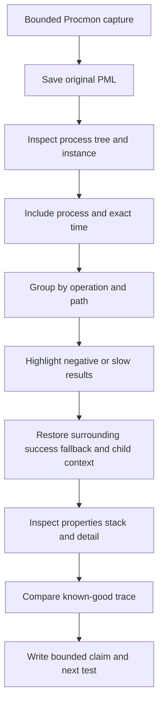

### Results are not verdicts

`NAME NOT FOUND`, `ACCESS DENIED`, `REPARSE`, `BUFFER OVERFLOW`, and other result labels need operation-specific interpretation. Applications search DLL paths, language resources, configurations, and optional features. A known-good trace can contain thousands of negative results. Look for a sequence that differs at the exact failure boundary: required operation fails without successful fallback, retries begin, process exits, or a matching application error occurs.

### Event stacks and symbols

A stack can identify the call path from application code through libraries and Windows components. Configure symbols only through approved sources and record symbol path, Procmon version, executable versions, and whether frames resolved. Unresolved addresses are not useless, but function names greatly improve ownership discussions. Third-party security and file-system filter drivers can appear in stacks; presence alone does not prove they caused delay or denial.

| Stack observation | What it supports | What else to check |
|---|---|---|
| App module initiates required file open | Component ownership of call | Input, result, fallback, app log |
| Security filter frame appears | Filter participates in call path | Duration, policy log, known-good, supported test |
| Repeated same stack and path | Stable retry caller | Backoff, total impact, first trigger |
| Unresolved addresses | Module/address evidence only | Correct symbols, bitness, versions |
| Different stack in known-good | Changed code path | Version, configuration, feature flag |
| Kernel frames only | Lower call path visible | User frames, symbols, collection limitations |

### Process Tree

Process Tree groups processes referenced by the capture, showing lineage and lifetime. It can reveal a browser launched by an application, a credential broker, an updater, or a crash reporter. Parentage does not prove authorization or trust. Record image path, signer/hash under approved tools, command line, user/session, and lifetime where relevant.

### Plain-English deep-dive 2 - Why filtering only errors creates a false story

Imagine watching a visitor find a meeting room. They try Door A, find it locked, try Door B, and enter successfully. A report containing only locked-door events says the visitor failed. Procmon applications often probe multiple paths exactly this way.

Suppose a known-good process queries three optional Registry values and receives `NAME NOT FOUND`, then reads a default configuration and connects successfully. The failing process has the same three misses, so they are not discriminating. Ten seconds later it receives `ACCESS DENIED` on a required local database and enters a retry loop. Filtering all non-success results from the beginning buries the important event among normal probes.

Use sequence and comparison. Ask: what was the first state-changing difference? Did a successful fallback follow? Was the operation required? Did the app log name the same path or code? Did the stack identify the caller? Did a permission correction in an isolated lab remove the retry without weakening security? This method turns Procmon from a wall of red labels into evidence.

## Procmon boot logging and operational caveats

Boot logging captures early system activity before an interactive troubleshooting session can start. It can help investigate startup services, drivers, profile initialization, logon launch, and applications that fail only during boot. It also creates high volume, may affect performance, requires administrative control, and spans sensitive system activity. Follow Microsoft Sysinternals help for the installed version and organizational change procedures.

| Boot-log concern | Why it matters | Control |
|---|---|---|
| Restart required | Changes active incident state | Obtain change approval and recovery plan |
| Very high event volume | Disk/performance and review cost | Short scope, adequate approved storage, stop promptly |
| Sensitive system-wide data | Broad users, paths, services, and configuration | Access restriction and minimum sharing |
| Tool persistence across boot | Collection starts before normal UI | Verify enable/disable state and recovery procedure |
| Safe-mode or failed boot | Evidence retrieval may be difficult | Document console/recovery access per procedure |
| Version-specific behavior | Menus and driver behavior change | Use installed help and official current docs |
| Endpoint protection interaction | Driver/tool may be controlled | Preapprove utility and verify health |
| Time and clock changes | Startup timing can shift | Normalize boot timeline and system events |

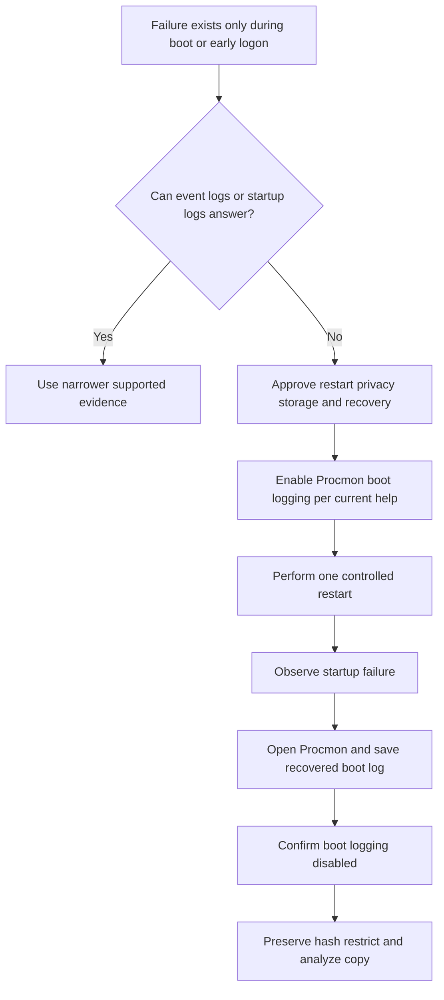

Do not enable boot logging during a production outage merely because normal capture did not reveal an answer. First decide whether the missing observation truly occurs before capture and whether event logs, application startup logs, Windows Performance Recorder, service-control records, or vendor-supported diagnostics are safer.

## Browser Developer Tools Network architecture

The browser is an application platform with HTML parsing, JavaScript execution, request scheduling, DNS and connection pools, HTTP cache, cookies, storage, service workers, extensions, security policies, and rendering. DevTools reports the browser's view. It often sees plaintext HTTP semantics before TLS, but that does not mean the network or an upstream proxy sees the same fields. Requests can be served locally or blocked before transmission.

Before reproducing:

1. Use an authorized test account and synthetic content.
2. Record browser name, exact version, profile, extensions, operating system, proxy state, and time.
3. Open Network before the operation because prior requests are not retroactively logged.
4. Enable Preserve log when redirects or navigation would clear context.
5. Decide whether disabling cache is part of the hypothesis; it changes behavior.
6. Clear the Network log, reproduce one action, and stop.
7. Capture user-visible error and Console messages without exposing unrelated data.
8. Export sanitized HAR only after reviewing what the exporter removes and what remains.

| Network column/tab | Question | Typical evidence | Limitation |
|---|---|---|---|
| Name/URL | Which resource? | Scheme, host, path, query | URL can carry secrets |
| Status | What browser-visible outcome? | HTTP code, blocked, failed | Local/browser errors may have no HTTP response |
| Method | What HTTP action? | GET, POST, PUT, OPTIONS | Semantics depend on application |
| Type | What resource classification? | Doc, Fetch/XHR, JS, CSS, WS | Heuristic/category is not business purpose |
| Initiator | What caused request? | Parser, script, redirect, navigation | Source maps and worker paths affect clarity |
| Protocol | Which negotiated protocol? | h2, h3, http/1.1 | Browser display/version dependent |
| Remote address | Which peer browser reports? | IP and port | Proxying can make peer the proxy |
| Connection ID | Which browser connection grouping? | Reuse pattern | Not universal network identity |
| Size | Transfer and resource size | Compression/cache clues | Display conventions vary |
| Time | Total browser duration | Candidate slow request | Includes several phases |
| Headers | Request/response metadata | Host, cache, auth scheme, IDs | Values can be sensitive or provisional |
| Payload | Query/form/request body | API input | Highly sensitive; may be omitted |
| Response/Preview | Returned body | Error object or page | Can expose personal/business data |
| Cookies | Sent/set cookies and blocking reason | Scope and policy evidence | Do not copy values unnecessarily |
| Timing | Phase breakdown | Queue, DNS, connect, SSL, TTFB, download | Reused connections make phases absent |

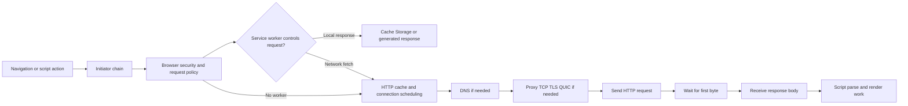

## Reading the waterfall and timing phases

The waterfall places requests on one time axis. A long page load can come from one slow blocking request, a serial dependency chain, excessive request count, browser queueing, connection setup, authentication redirects, large downloads, service-worker startup, or main-thread work not fully represented as network time.

Chrome documents phases such as Queueing, Stalled, DNS Lookup, Initial connection, Proxy negotiation, Request sent, ServiceWorker Preparation, Request to ServiceWorker, Waiting for server response or TTFB, and Content Download. The exact UI and definitions vary across browser versions.

| Timing phase | Plain meaning | Candidate causes | Best correlation |
|---|---|---|---|
| Queueing | Browser has not started connection work | Priority, per-origin limits for older HTTP, cache allocation | Initiator, protocol, connection reuse |
| Stalled | Request waits before sending | Socket availability, proxy, browser scheduling | Neighbor requests and browser trace |
| DNS | Name resolution time | Cache miss, resolver delay, policy, retries | DNS/packet/OS resolver evidence |
| Initial connection | Connection establishment | TCP retries, TLS negotiation, network path | Packet trace and proxy logs |
| Proxy negotiation | Browser negotiates with proxy | Authentication, PAC, proxy delay | Fiddler/system proxy and policy logs |
| SSL/TLS | Secure-session negotiation | Trust, certificate, protocol, inspection | Browser Security, packet, endpoint trust |
| Request sent | Browser transmits request | Large upload, flow control, scheduling | Fiddler, packet, server receive evidence |
| Waiting/TTFB | From request to first response byte | RTT, proxy inspection, service compute, queue | Request ID and upstream timing |
| Content Download | Read complete response | Size, bandwidth, loss, receiver work | Packet and process/resource evidence |
| Service worker | Worker startup/handling | Worker lifecycle, code, cache strategy | Application panel and initiator |

TTFB is not "server processing time." It can include one round trip and every intermediary between browser and responding endpoint, plus upstream queue or compute. If a forward proxy terminates the client connection, remote address and timing represent the browser-to-proxy-facing behavior and whatever the browser can measure; service-side timing needs service evidence.

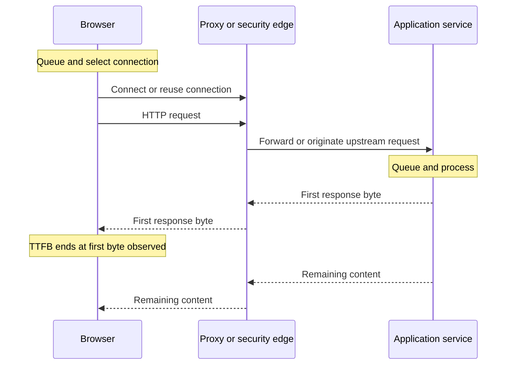

### Headers and correlation fields

Headers carry representation, authentication, caching, tracing, content negotiation, CORS, cookies, and intermediary context. Never assume an `X-` or vendor-specific field is stable or safe to share. Useful correlation fields can include standardized `traceparent` where implemented, application request IDs, client request IDs, date, content length, cache indicators, and server timing. Validate semantics with the owning service documentation.

| Header family | Examples | Troubleshooting use | Privacy/security caveat |
|---|---|---|---|
| Request target | Host/authority, path, query | Route and operation | Query can contain secrets or names |
| Authentication | Authorization, WWW-Authenticate | Scheme/challenge sequence | Token/credential material is secret |
| Cookies | Cookie, Set-Cookie | Session and blocking behavior | Values can enable session theft |
| Cache | Cache-Control, Age, ETag, If-None-Match | Reuse/revalidation path | Internal cache keys may be sensitive |
| CORS | Origin, Access-Control fields | Browser cross-origin decision | Origin reveals application context |
| Content | Content-Type, Content-Length, Encoding | Body and compression expectations | Type does not validate safe content |
| Redirect | Location | Authentication and routing chain | URLs can include state/code values |
| Correlation | traceparent or service request IDs | Cross-system join | IDs can expose tenant/activity context |
| Timing | Server-Timing where implemented | Server-provided phase hints | Server supplied; validate semantics |
| Security | CSP, HSTS, certificate panel context | Browser enforcement | Do not weaken policy to make test pass |

## Cookies, cache, and service workers

Cookies are small browser-stored values sent according to domain, path, security, SameSite, expiry, partitioning, and browser policy. `Secure` limits transmission to secure contexts, while `HttpOnly` prevents JavaScript access but not browser transmission. SameSite affects cross-site requests. Third-party cookie policy can block a cookie even when server CORS headers otherwise permit a credentialed exchange.

HTTP cache stores reusable responses under caching rules. A 304 means a conditional validation found the cached representation usable; the body can come from cache. "Disable cache" in DevTools is a diagnostic change, not a production fix. Compare normal-cache and controlled cold-cache behavior and document which was used.

A service worker is an origin-and-scope-bound worker that can intercept fetches and return network, cache, generated, or fallback responses. Its lifecycle includes registration, installation, waiting, activation, and control. A stale worker or cache strategy can make one browser profile fail while another profile or native sync client succeeds.

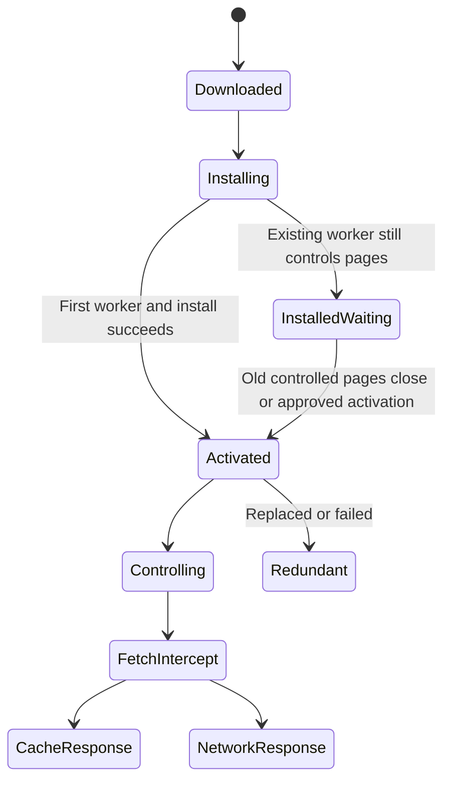

| Test | What it separates | Change introduced | Validation requirement |
|---|---|---|---|
| Normal reload | Current user experience | Minimal | Record cache/worker indicators |
| Preserve log plus navigation | Redirect/auth chain | Retains old entries | Clear before exact reproduction |
| Disable HTTP cache | Cache reuse versus network fetch | Changes normal cache behavior | Restore setting and retest |
| Hard reload/empty cache | First-load path | Clears/reloads resources | Use only approved test profile |
| Incognito/new profile | Profile state/extensions/cookies | Changes identity and policy context | Do not treat as exact equivalent |
| Bypass/unregister service worker | Worker versus upstream path | Alters application control plane | Owned app/test profile only; restore |
| Clear cookies | Session state versus fresh auth | Signs out and removes state | Obtain user approval; protect account |
| Compare browser engine | Implementation/profile factor | Many variables change | Use as clue, not root-cause proof |

### Plain-English deep-dive 3 - A 200 response can still be a browser failure

HTTP status describes an HTTP response, not whether the page's business operation succeeded. An API can return 200 with an error object in the body. A service worker can return a cached 200 while the upstream service is unreachable. A cross-origin server can return 200, but the browser can block JavaScript from reading it because the response lacks valid CORS permission. A login page can return 200 after a redirect when the expected API response was JSON.

Read the chain: initiator, request URL, method, redirects, content type, response body, CORS/Console message, cookies, and application state. For an upload, separate request acceptance from durable commit. A 200 for a session-creation request does not prove every chunk uploaded or the final commit succeeded.

The bounded statement is: "The browser received HTTP 200 for request X, but the response content type was HTML after an authentication redirect, while the script expected JSON and logged a parse error." That statement is more useful than "network is fine" or "server returned success."

## CORS mechanics and failure analysis

CORS is enforced by browsers to decide whether script from one origin may access a response from another origin. Origin consists of scheme, host, and port. CORS is not a firewall, authentication protocol, or server-side authorization replacement. A non-browser native client is generally not governed by browser CORS enforcement, though it still needs network access and authorization.

For some cross-origin requests, the browser sends an OPTIONS preflight containing the intended method and non-safelisted headers. The server responds with allowed origin, methods, headers, and optionally credentials permission and preflight cache duration. If policy permits, the browser sends the actual request. A server can receive and process a request even when browser script cannot read the response under CORS; analyze carefully before replaying state-changing requests.

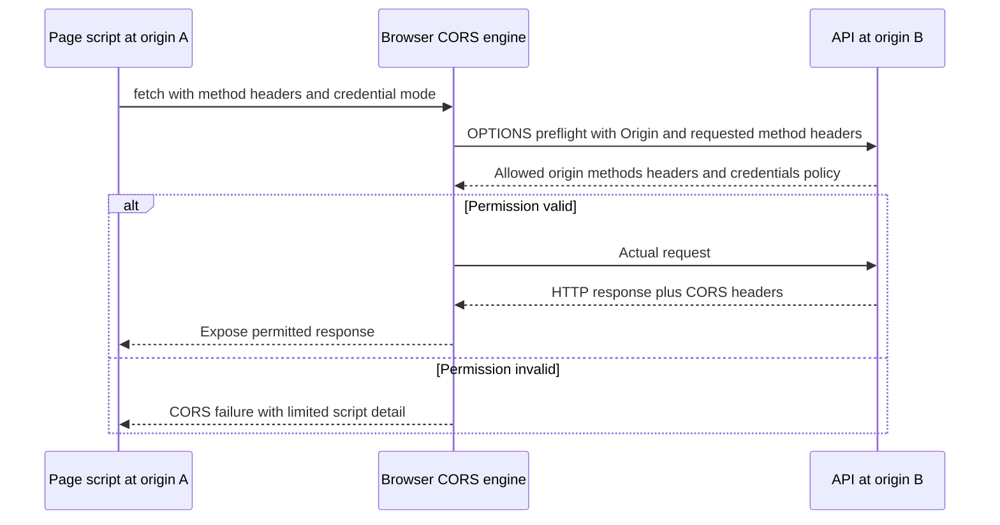

| Symptom | Evidence to inspect | Plausible cause | Safe next test |
|---|---|---|---|
| OPTIONS fails | Status, response, path, proxy, server logs | Route, auth challenge, unsupported method, policy | Send exact approved preflight from browser path |
| Actual request absent | Preflight request/response and Console | Missing/incorrect allow fields | Correct test server CORS config |
| Actual returns 200 but script fails | Origin and response CORS fields | Response not exposed to origin | Compare direct navigation and browser Console |
| Credentialed request blocked | credential mode, cookies, explicit origin, allow-credentials | Wildcard, missing credentials field, third-party policy | Use synthetic account and supported cookie configuration |
| Works in native client only | Same request in browser versus client | Browser CORS, cookies, worker, profile | Compare semantic requests without calling them identical |
| Works after extension disabled | extension request modification | Extension or profile interaction | Controlled clean profile and enterprise policy review |

Never "fix" a CORS error by disabling browser web security in a user environment or installing an unapproved permissive extension. Correct the application/server policy or use a supported same-origin architecture.

## HAR structure, timing, and limitations

HAR is a JSON-based interchange format for HTTP transactions. The historical W3C draft commonly referenced for HAR 1.2 explicitly says it was abandoned and never published by the W3C Web Performance Working Group. Treat it as a widely implemented de facto format whose exporter-specific behavior must be tested, not as a current W3C Recommendation.

At the root, `log` includes version, creator, optional browser, optional pages, and required entries. Each entry commonly has start time, total time, request, response, cache, timings, and optional server IP, connection, comment, or exporter custom fields. Fields beginning with underscore can be exporter extensions.

| HAR object/field | Plain meaning | Analysis use | Caveat |
|---|---|---|---|
| `log.version` | HAR format version claimed | Parser compatibility | Does not guarantee full fidelity |
| `creator` | Exporting tool and version | Reproducibility | Browser may be separate/omitted |
| `browser` | Browser metadata when provided | Environment context | Optional |
| `pages` | Grouped page records | Navigation context | Some tools omit grouping |
| `pageTimings` | Page milestones | DOM/load context | Browser meaning can differ |
| `entries` | HTTP transaction array | Main timeline | May omit requests not recorded/exported |
| `startedDateTime` | Entry start timestamp | Cross-tool join | Clock and timezone precision matter |
| `time` | Sum of available timing phases | Duration check | `-1` unavailable phases excluded |
| `request` | Method, URL, headers, cookies, query, body metadata | Reconstruct request semantics | Secrets can appear in many fields |
| `response` | Status, headers, content, redirect, sizes | Outcome analysis | Bodies may be absent or transformed |
| `cache` | Before/after cache information | Reuse context | Often sparse or exporter-specific |
| `timings` | blocked, dns, connect, send, wait, receive, ssl | Phase analysis | Reuse makes phases unavailable |
| `serverIPAddress` | Reported connected server IP | Path clue | Proxy/CDN can make it non-origin |
| `connection` | Exporter connection identifier | Reuse grouping | Not guaranteed globally unique |
| `_custom` | Vendor/exporter extension | Extra evidence | Ignore unless semantics documented |

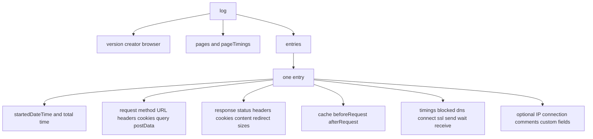

### Timing arithmetic

The historical HAR description defines total entry time as the sum of available timing phases, excluding unavailable values represented by `-1`. SSL time is included within connect for backward compatibility, so blindly adding both can double count. Exporters can omit fields they cannot provide. Connection reuse commonly produces unavailable DNS/connect/SSL values.

If available phases are $t_i$ and unavailable phases are `-1`, the conceptual total is:

$$
T = \sum_{i: t_i \ge 0} t_i
$$

Do not use millisecond arithmetic to claim causal order across machines with unknown clock skew. HAR is strongest for order and durations inside one browser capture, then correlation through request IDs and bounded UTC anchors.

### What HAR commonly misses or changes

HAR is not a packet capture, JavaScript execution trace, complete browser profile, server log, or proof of wire bytes. It may omit response bodies, WebSocket message detail, service-worker internal logic, DNS cache history, certificate-chain detail, lower-layer retries, QUIC mechanics, extension behavior, and requests before DevTools opened. Imported HAR cannot recreate live browser state.

| Limitation | Consequence | Compensating evidence |
|---|---|---|
| Exporter sanitizes selected headers | Authentication detail intentionally absent | Record sanitization mode and local-only review |
| URL/query retained | Secrets can remain despite sanitized label | Field-by-field redaction validation |
| Bodies omitted | Application error content absent | Approved screenshot or service request ID |
| Service worker response represented | Upstream request may not exist | Worker/cache inspection |
| Connection details abstracted | Cannot infer packet loss or TLS internals | Packet/proxy evidence |
| Clock belongs to endpoint | Cross-system offset remains | UTC/ID correlation ledger |
| Filtered export | Nonlisted dependencies absent | Record filters and total counts |
| Historical format/extensions | Parsers interpret differently | Keep original and exporter version |
| Browser policy errors | HTTP transaction may be absent/partial | Console, Issues, security panel |
| User actions not embedded reliably | Timeline lacks intent | Reproduction script and marker |

### Plain-English deep-dive 4 - Sanitized HAR does not mean shareable HAR

A mailroom may remove the label marked "password" while leaving the customer's name, account number, medical department, document title, and reset token printed elsewhere on the package. Browser HAR sanitization often removes known sensitive headers such as `Cookie`, `Set-Cookie`, and `Authorization`, but a secret can also appear in URL query parameters, POST bodies, response bodies, redirect locations, custom headers, file names, tenant names, user identifiers, and correlation values.

Never promise that a browser's "sanitized" export is safe without inspection. Preserve the original in an approved restricted location. Create a derivative. Parse structured JSON with a capable approved tool, inventory every URL, header, cookie object, query item, post-data field, response-content field, comment, and custom field, then replace or remove sensitive values while preserving useful shape. Do not use blind text replacement that can corrupt JSON or miss encoded/base64 content.

Validate the derivative by reopening it in an isolated approved viewer, searching for a synthetic canary secret placed in the lab, checking JSON validity, recording removed fields, and having a second reviewer inspect high-risk incidents. Hash both versions and never distribute the original merely because the derivative looks clean.

## HAR collection and redaction workflow

Chrome's current documentation distinguishes sanitized HAR export from export with sensitive data and states that the sanitized option excludes sensitive information such as `Cookie`, `Set-Cookie`, and `Authorization` headers. Other fields remain. Browser and edition behavior can change, so verify at collection time.

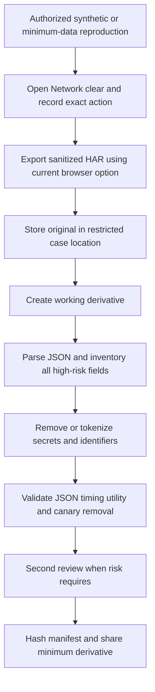

| Data location | Examples | Default handling | Utility-preserving alternative |
|---|---|---|---|
| URL query | token, email, tenant, filename | Remove secret values | Stable synthetic labels |
| Path | user/site/document names | Minimize or tokenize | `/sites/SITE-A/files/FILE-1` |
| Authorization | bearer/basic/other credentials | Remove completely | Record scheme only |
| Cookies | session, CSRF, preference IDs | Remove values | Names only if essential and approved |
| POST data | form, JSON, file metadata | Remove or synthesize | Preserve keys/types, replace values |
| Response content | personal/business/service error details | Omit or targeted redact | Error code and schema only |
| Redirect Location | auth codes, state, return URL | Strip one-time values | Preserve host and route class |
| Custom headers | client IDs, device IDs, internal routing | Review individually | Tokenize consistently |
| IP addresses | internal/public endpoint data | Assess purpose and policy | Documentation ranges in training |
| Timing | employee behavior/activity time | Reduce to required precision | Relative time plus controlled UTC anchor |

Redaction must retain correlation. Replace the same real user with `USER-A` everywhere, the same tenant with `TENANT-A`, and the same request ID with a stable token if the receiving team does not need the original. Keep the mapping in a separate restricted manifest only when required.

## Fiddler proxy architecture and session concepts

Fiddler products and editions evolve. At a conceptual level, a debugging proxy accepts client HTTP proxy traffic, creates or reuses upstream connections, records sessions, and can expose request and response inspectors. Fiddler Classic is Windows-focused legacy/currently maintained according to vendor status at the time of use; Fiddler Everywhere is a separate cross-platform product. Verify licensing, support, features, and documentation for the installed product.

Without HTTPS decryption, a proxy can generally observe CONNECT tunnel targets and connection metadata but not encrypted HTTP semantics inside the tunnel. With explicitly authorized HTTPS decryption, the client establishes TLS to Fiddler using a certificate Fiddler generates under its trusted debugging root; Fiddler establishes separate TLS upstream. This is active interception, not passive observation.

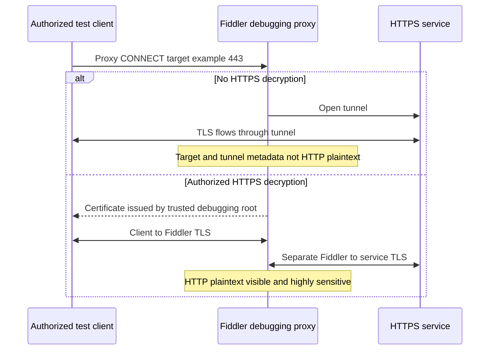

| Component | Role | Troubleshooting value | Risk/change |
|---|---|---|---|
| Client proxy setting | Routes supported traffic to Fiddler | Confirms selected app uses proxy | Some apps ignore system proxy |
| Listener | Accepts local/remote proxy sessions per configuration | Defines capture boundary | Remote access must not be exposed casually |
| CONNECT tunnel | Carries HTTPS through proxy | Target/tunnel timing | Plaintext unavailable without interception |
| Debugging root | Signs per-host certificates for client trust | Enables authorized HTTPS inspection | Expands local trust and must be removed/controlled |
| Inspectors | Decode request/response | Headers, bodies, status, timing | Secrets become visible |
| Session list | Orders captured transactions | Redirects/retries/comparisons | Not all process traffic necessarily included |
| Composer | Constructs/reissues requests | Controlled API isolation | Replays can cause state changes |
| AutoResponder | Maps requests to local/chosen responses | Isolates upstream dependency | Changes application behavior |
| Upstream proxy chain | Sends Fiddler traffic through enterprise proxy | Reproduces managed path | Authentication/routing can differ |
| Capture archive/export | Saves selected sessions | Engineering handoff | Must be minimized and sanitized |

### HTTPS decryption authorization and trust hygiene

Use HTTPS decryption only on owned or explicitly authorized systems and traffic. Obtain written organizational approval appropriate to employee privacy, regulated data, contracts, legal interception rules, and certificate policy. Never collect another person's credentials, private messages, financial data, health data, or unrelated browsing merely because the tool can.

Use a dedicated synthetic browser profile and synthetic accounts where possible. Limit hosts and processes according to current product support. Record debugging-root thumbprint, installation time, scope, Fiddler version, decryption settings, and removal validation. Stop capture before unrelated activity. After the lab, disable decryption, remove the debugging root from relevant trust stores under documented procedure, close the proxy, restore proxy settings, and verify normal trust and endpoint protection health.

Certificate-pinned applications, mutual TLS, modern protocol choices, custom trust stores, background services, QUIC/HTTP/3, and applications that ignore system proxy can fail or bypass Fiddler. That behavior does not prove maliciousness or vendor defect. Use vendor-supported diagnostics rather than weakening pinning or enterprise trust.

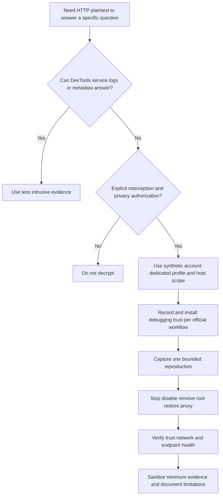

### Composer concepts

Composer allows an analyst to construct or replay an HTTP request. It is useful for testing whether a server returns the same result with one header, method, body, or URL changed. It can also duplicate purchases, submissions, deletions, notifications, or other side effects. Use only synthetic endpoints/data or an explicitly authorized nonproduction test. Understand method semantics, anti-replay tokens, idempotency, authentication expiry, and rate limits.

### AutoResponder concepts

AutoResponder can return a local file, redirect, error, delay, or selected response when a rule matches, depending on edition/version. It is valuable for binary isolation: if replacing one static script with a known-good local copy restores an owned test page, the script path becomes primary. It does not prove the origin service is defective; the original response, cache, headers, integrity checks, content security policy, and dependent API versions can differ.

| Controlled experiment | Hypothesis separated | Required caution |
|---|---|---|
| Replay safe synthetic GET | Stable server response versus browser state | Tokens and cache context differ |
| Change one harmless header | Content negotiation/policy dependency | Do not bypass security authorization |
| Return local known-good static file | Resource content versus network retrieval | Preserve MIME, encoding, and app compatibility |
| Simulate 503/latency | Client resilience and messaging | Isolated lab only; stop rules |
| Redirect test hostname | Routing/redirect handling | Avoid credential disclosure to wrong host |
| Remove Fiddler from path | Tool-induced behavior versus original issue | Restore exact system proxy and trust |

## Correlating process, browser, network, proxy, and service evidence

Correlation is not matching screenshots by eye. Build a ledger with source clock, UTC normalization, event time, process/PID, user action marker, URL class, method, status/result, local/remote tuple where available, request/correlation ID, evidence location, and confidence. Preserve event time separately from log ingestion time.

| Evidence source | Strongest observation | Join keys | Blind spots |
|---|---|---|---|
| User reproduction | Intent, visible symptom, exact action | Marker, UTC, account/device | Internal mechanics |
| Procmon | Local OS operations and process lineage | UTC, PID/TID, path, endpoint | HTTP semantics and remote outcome |
| DevTools | Browser request/response, initiator, policy, timing | UTC, URL, method, request ID | Nonbrowser traffic and lower layers |
| HAR | Portable browser transaction subset | started time, URL, IDs | Live state, packets, complete browser internals |
| Fiddler | Sessions routed through debugging proxy | time, URL, headers, client process if supported | Bypassed apps and undecrypted content |
| Packet trace | Bytes/metadata at capture point | time, tuple, TLS/HTTP visibility | Process/user and encrypted semantics |
| Security/proxy log | Policy decision at named control | time, user/device, rule/session ID | Endpoint intent and service processing |
| Service log | Request receipt, processing, dependency, outcome | request ID, tenant, time | Path before service |

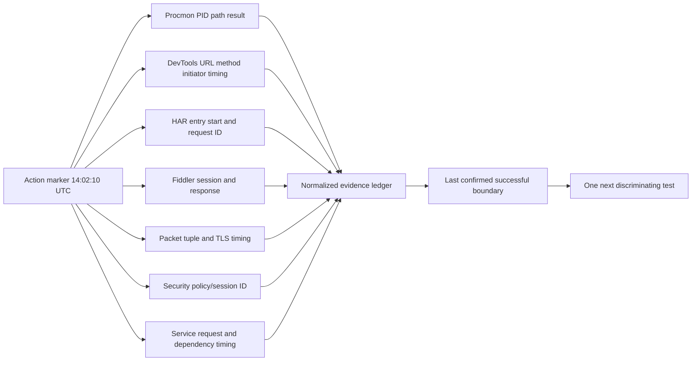

### Correlation example

At 14:02:10 the user selects Upload. DevTools records a session-creation POST at 14:02:10.220 with request ID `REQ-A`; Fiddler records it and a 201 response at 14:02:10.480. A subsequent chunk PUT begins at 14:02:10.610. Procmon shows the browser reading the synthetic file successfully. The packet capture shows client bytes to the proxy. Fiddler receives a 413 response for the chunk; the service record has no matching `REQ-B` because the enterprise proxy generated 413 before forwarding. This evidence can identify the proxy boundary only if the authorized proxy log confirms the policy/session and response source. Fiddler alone cannot prove which upstream component generated a response bearing a generic page.

### Evidence-quality labels

| Confidence | Meaning | Example wording |
|---|---|---|
| Observed | Directly present in named evidence | "DevTools recorded an OPTIONS response with status 403." |
| Corroborated | Independent sources agree | "DevTools and Fiddler recorded the same request ID and 403." |
| Inferred | Best explanation from evidence | "The response likely originated before the service because service logs lack the ID." |
| Unverified | Plausible but missing evidence | "A security policy could have generated the block page." |
| Disconfirmed | Test contradicts hypothesis | "The issue persisted with service worker bypassed in the owned profile." |
| Unknown | Evidence cannot decide | "The HAR lacks response body and no upstream log is available." |

## Browser versus OneDrive sync-client paths

Browser success and OneDrive sync-client failure are useful comparison evidence, but they are not the same transaction. They can differ in process identity, authentication cache, endpoints, API routes, request bodies, upload protocols, connection pools, proxy discovery, certificate stores, TLS implementation, user agent, service-worker involvement, local database, filesystem interaction, retry strategy, rate behavior, and tenant policy.

| Dimension | Browser path | OneDrive sync-client path | Diagnostic use |
|---|---|---|---|
| Process | Browser and helpers | OneDrive client and helpers | Procmon filter/process ownership |
| UI action | Explicit page/navigation/upload | Background sync state machine | Reproduction timing differs |
| Identity state | Browser cookies/tokens/profile | Client token broker/cache | Compare account and token audience, not values |
| Local data | Browser cache/storage | Sync database/cache/placeholders/filesystem | Client-only state can fail |
| Service worker | Possible | Not browser service-worker controlled | Browser-only local interception |
| Proxy use | Browser/system/enterprise configuration | Client-supported system/WINHTTP or product path | Verify actual routing, not assumption |
| Protocol/API | Browser web endpoints | Sync-specific service APIs and chunking | Endpoint and method differences |
| File access | Browser selected file read | Continuous filesystem observation | Locks, permissions, invalid names, disk state |
| Retry | User refresh/script logic | Background backoff/retry | Timelines and rate differ |
| Evidence | DevTools/HAR/Console | Client logs/Procmon/network/service | Cross-tool package differs |

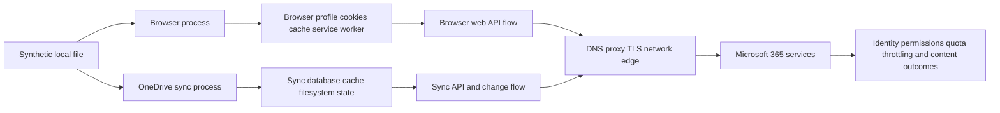

Use a comparison matrix rather than saying "network works because browser works." If browser and sync use the same device, user, file, and time but different endpoints/protocols, success narrows shared DNS/default-route and general service availability but leaves client state, API, proxy selection, policy, and file mechanics open.

## Failure patterns and decision trees

### Browser records no request

Check that DevTools was open and recording, filters are clear, and the correct frame/profile is observed. Inspect Console, UI validation, JavaScript errors, service workers, local cache, extensions, and request blocking. Procmon can show whether the browser accessed the local file or configuration. No DevTools row does not prove no packet exists; background browser services and other processes can generate traffic outside the selected page context.

### Request remains pending

Inspect Timing and initiator. Determine whether it is intentionally long-lived, queued, stalled, waiting for a response, streaming, or blocked. Correlate Fiddler/packet and service logs. A pending fetch can await a server stream by design. Do not clear caches or reset networking before preserving the state.

### Authentication loop

Preserve redirects and inspect status, Location host/path class, cookie block reasons, SameSite, clock, challenge headers, account/tenant context, and request IDs. Do not capture or share token values. Compare a clean authorized profile only after preserving the failing state. Determine whether the loop is browser-only or also occurs in the native client.

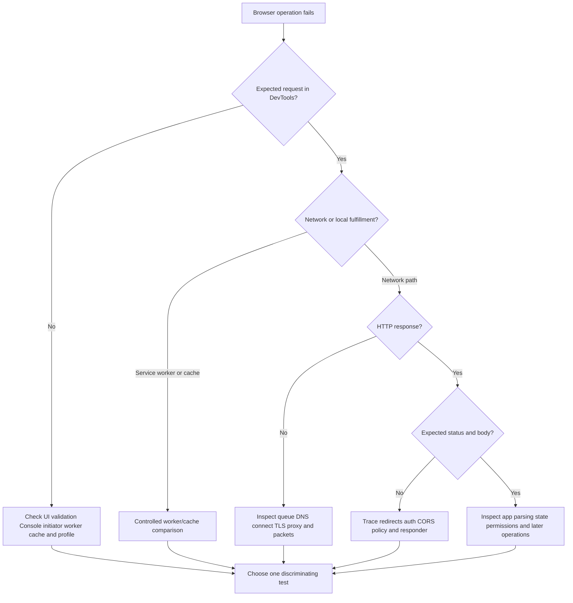

### Procmon shows access denied

Identify the exact operation, path, access requested, process token context, stack, security descriptor/policy evidence, successful fallback, and known-good comparison. Do not grant broad permissions as a diagnostic shortcut. Use an approved temporary test only when it preserves security intent and has rollback.

### Fiddler sees nothing

Confirm capture is running, client supports and uses the configured proxy, bypass lists/PAC, loopback restrictions, process scope, VPN/security agent path, protocol, QUIC, and certificate state. Compare system proxy settings before and after. The correct conclusion may be "this process is not routed through this observation point," not "the application did not connect."

### HAR and Fiddler disagree

Align filters and time, compare exact URL/method/ID, account for cache/service worker, redirects, local request blocking, sanitization, HTTP/2 or HTTP/3 representation, and Fiddler bypass. Imported HAR values can be normalized. Keep each source's raw record and explain the boundary.

| Symptom | First observation | Highest-value comparison | Avoid |
|---|---|---|---|
| Browser blank/error | DevTools Console and Network | Clean profile after preserving state | Immediate cache wipe |
| Native client only fails | Client log and Procmon | Browser with semantic same operation | Calling paths identical |
| Long TTFB | DevTools/Fiddler timing plus request ID | Service-side timing and known-good | Declaring server slow |
| Repeated 401/302 | Redirect/cookie/auth challenge chain | Same account in controlled profile | Sharing tokens |
| CORS error | OPTIONS/actual/Console | Native client and correct server config | Disabling browser security |
| Local file error | Procmon operation/path/result/stack | Known-good file and permissions | Broad ACL changes |
| Proxy capture empty | Routing/proxy/protocol validation | Supported app through test proxy | Assuming no traffic |
| Only large upload fails | Request sizes/chunks/timing/status | Small versus large plus proxy/service limits | Blaming bandwidth alone |

## Labs with synthetic or explicitly authorized data

All labs use an owned test machine, synthetic accounts/data, a local test web application or approved test tenant, and organizationally approved tools. Record tool/browser/OS versions, UTC, settings, hashes, and cleanup. Do not decrypt production user sessions.

### Lab 1: Procmon broad-to-narrow file lookup

Create a local test application or approved command that probes one absent configuration then reads a fallback. Capture a short Procmon trace. Save PML, inspect Process Tree, filter the exact PID, and compare `NAME NOT FOUND` followed by success. Then make the required fallback unavailable in the lab and record the first discriminating difference. Deliver a five-event timeline and explain why negative results alone are not errors.

### Lab 2: Procmon stack and slow operation worksheet

Use a safe local program that repeatedly reads a synthetic file. Inspect event properties, Detail, duration, and stack. Configure approved symbols and record resolved/unresolved frames. Introduce controlled local delay only through an owned test harness, not security-policy weakening. Compare caller, duration distribution, and total user impact.

### Lab 3: DevTools waterfall and cold/warm comparison

Use a local HTTPS test page with several static resources and one delayed API. Capture normal reload, then an explicitly documented Disable cache reload. Record request count, protocol, initiator chain, TTFB, content download, DOMContentLoaded, and load markers. State which differences result from the diagnostic setting.

### Lab 4: Cookie and CORS behavior

Use two local test origins and synthetic cookies. Observe a permitted simple request, a preflighted request, and a denied CORS response. Record OPTIONS fields and Console error. Test a credentialed request only with nonsecret synthetic cookies. Do not disable same-origin security.

### Lab 5: Service worker local response

Use a standard owned service-worker demo. Capture first install, activated control, cache response, and network response. Show a DevTools request served by service worker and absence of matching upstream Fiddler session where expected. Unregister and clean the test profile after documenting lifecycle.

### Lab 6: HAR schema and canary redaction

Place obvious synthetic canaries in a query, custom header, cookie, POST field, redirect, and response body. Export the browser's sanitized HAR. Inventory which canaries remain. Create a structured derivative, validate JSON, reopen it, search every canary, hash files, and produce a redaction manifest. This demonstrates why sanitized is not automatically shareable.

### Lab 7: Fiddler metadata versus authorized decryption

With formal authorization on a dedicated test profile, record a synthetic HTTPS request first without decryption and then with current official decryption steps. Compare visible fields. Record debugging-root thumbprint and remove it after capture. Restore proxy settings and verify normal HTTPS. Never use a real account or personal traffic.

### Lab 8: Composer and AutoResponder isolation

Against a local test API, replay an idempotent synthetic GET and compare a single safe header. Configure an AutoResponder concept/rule to return a local static response for one test URL. Document how the experiment changes reality and why it cannot prove a production origin defect.

### Lab 9: Browser versus OneDrive-style client simulator

Use a local scripted sync simulator and browser upload against the same owned service. Introduce a client-only file lock, then a browser-only service-worker stale response. Use Procmon for the simulator, DevTools/HAR for browser, and Fiddler only if authorized. Build a matrix showing shared and distinct dependencies.

### Lab 10: Escalation bundle

Package one sanitized HAR derivative, a filtered Procmon export plus protected PML reference, selected Fiddler sessions or metadata, reproduction, known-good comparison, UTC ledger, environment, changes, privacy statement, hypotheses, disconfirming tests, and exact ask. Have a peer prove that no synthetic canary remains.

| Lab artifact | Required fields | Pass condition |
|---|---|---|
| Capture plan | Authority, question, scope, stop, privacy, retention | Another analyst can reproduce safely |
| Procmon worksheet | Time, PID/TID, operation, path token, result, detail, stack | First discriminating event identified |
| Browser timeline | Initiator, URL token, method, status, timing, cache/worker | Request chain explained |
| HAR manifest | Exporter, hash, fields removed, validation | JSON valid and canaries absent |
| Fiddler cleanup | Proxy before/after, root thumbprint, removal test | Trust/proxy restored |
| Correlation ledger | Source time, UTC, IDs, confidence, boundary | Cross-source joins defensible |
| Decision record | Hypothesis, test, result, next action | No shotgun changes |
| Escalation package | Impact, evidence, limitations, exact ask | Receiver knows what to investigate |

## Fictional NMH scenario: OneDrive sync fails while browser upload works

NMH is fictional. After a managed endpoint change, a subset of finance users report that the fictional sync client repeatedly shows "Processing changes" for new spreadsheet uploads. Upload through the browser succeeds. No production Microsoft or Zscaler data is used.

The support team initially says "the network is healthy because browser upload works" and proposes resetting every client. Arti reframes the problem:

- Symptom: synthetic files added to the sync folder remain pending.
- Scope: one managed endpoint ring; unmanaged lab endpoint works.
- Impact: fictional finance workflow delayed; existing downloads continue.
- Time/change: starts after endpoint policy package 7.4.
- Known-good: browser upload on same device/account/file succeeds.
- Hypotheses: local filesystem denial, client state/database issue, distinct proxy path, endpoint security interaction, service-side sync API issue, or file-rule issue.

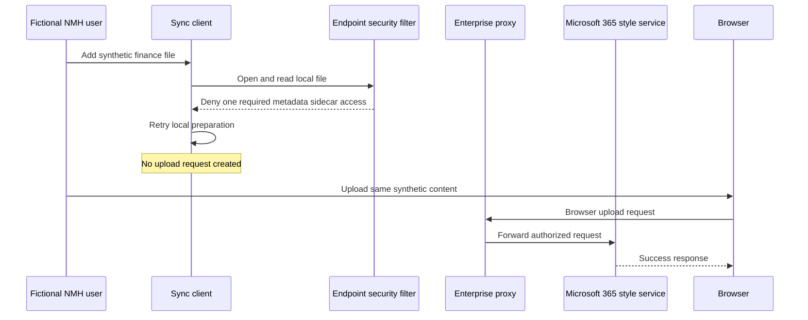

### NMH evidence matrix

| Evidence | Observation | Interpretation | Boundary |
|---|---|---|---|
| User timeline | Pending begins immediately after file placement | Client preparation stage likely | User view cannot name mechanism |
| Procmon failing device | Required sidecar open returns ACCESS DENIED repeatedly; stack includes client and endpoint filter path | Local denial is primary hypothesis | Presence of filter frame alone is not root cause |
| Procmon known-good | Same operation succeeds under prior approved policy ring | Policy/environment difference discriminates | Other ring variables must be controlled |
| Client log | Synthetic operation remains before upload-session creation | No service request expected yet | Log semantics need official owner validation |
| DevTools/HAR | Browser upload sends requests and receives success | Browser path/service operation works | Browser and sync APIs differ |
| Fiddler for browser | Authorized test session reaches proxy/service | Browser proxy path confirmed | Sync client may use different routing |
| Proxy log | No matching sync upload session ID during retry | Consistent with local pre-network failure | Logging completeness verified separately |
| Service health | No relevant advisory in fictional exercise | Broad service issue less likely | Service health absence is not proof |

Arti asks the endpoint-security owner to validate whether the new rule intended to deny the exact synthetic sidecar path and process. In an isolated policy-ring test, the owner narrows the rule to preserve security intent while allowing the documented client operation. Procmon then records successful sidecar access, the client creates an upload request, proxy/service evidence records it, and sync completes. Negative controls confirm unrelated executables remain denied.

### NMH root-cause statement

The fictional trigger was endpoint policy package 7.4. The root cause was an overbroad local file-control rule denying a required sync-client metadata operation before network request creation. Contributors were treating browser and sync paths as equivalent, monitoring only service availability, and lacking a predeployment sync-client transaction test. The fix was a least-privilege rule correction by the policy owner, not disabling endpoint protection. Prevention added pilot-ring Procmon/client checks with synthetic files, a browser-versus-client evidence playbook, rule-owner review, and rollback criteria.

### NMH executive update

"The fictional issue is isolated to local sync preparation on one endpoint policy ring, not established as a Microsoft or Zscaler service outage. Browser upload remained available. Correlated client and process evidence shows a required local metadata operation denied before any sync upload request was created. The endpoint-policy owner has validated a least-privilege rule correction in the pilot ring; sync now completes while unrelated process denial remains enforced. We will monitor the phased rollout and add this transaction to predeployment validation."

## Privacy, security, and evidence governance

These tools can collect more sensitive information than the incident requires. Apply purpose limitation, data minimization, role-based access, encryption, retention, deletion, chain of custody, and approved transfer. Do not place raw HAR/PML/Fiddler archives in a broadly accessible ticket. Separate raw restricted evidence from sanitized operational summaries.

| Risk | Example | Prevention | Detection/response |
|---|---|---|---|
| Credential leakage | Bearer token in header/body | Synthetic account; sanitized export; no token copying | Revoke/rotate per incident process |
| Session theft | Cookie value in HAR | Remove cookies and restrict original | Invalidate sessions if exposed |
| Trust expansion | Fiddler root left installed | Dedicated profile/device; documented removal | Audit trust store and proxy after test |
| Excess surveillance | Broad Procmon/browser capture | Exact process/time and stop condition | Review manifest and delete excess |
| Personal data exposure | Names, paths, tenant URLs | Tokenize stable identifiers | Privacy review and access audit |
| Evidence tampering | Ad hoc edits to original | Hash and preserve immutable original | Compare hashes and transformation log |
| Broken redaction | Text replace misses encoded body | Structured parsing and canary tests | Second review and recall package |
| Tool-induced failure | Proxy/cache/worker setting changes path | Baseline before tool and remove tool comparison | Restore and verify environment |
| Unsupported attribution | Generic block page blamed on vendor | Identify responder through independent logs | Correct record and request missing evidence |

### Evidence manifest

For every artifact record case ID, collector, authority, device/profile, tool/version, clock/time zone, UTC start/stop, user operation, capture settings/filters, original path, size, SHA-256, sensitivity, access group, transformation, derivative hash, transfer, retention, and deletion owner. A hash proves byte identity relative to a recorded hash; it does not prove completeness, truth, or lawful collection.

## Escalation bundle design

An escalation bundle is not a dump of every artifact. It gives the receiving owner enough evidence to answer one exact question without rediscovering the case or receiving avoidable secrets.

| Section | Required content | Quality test |
|---|---|---|
| Business impact | Who/what/when and workaround | No inflated severity |
| Exact operation | Numbered reproduction and expected/actual | Repeatable with synthetic data |
| Environment | OS, browser/client/tool versions, profile, proxy/path | No hidden comparison variable |
| Change timeline | What changed, owner, rollout, rollback state | Fact separated from coincidence |
| Known-good | Same operation with one meaningful difference | Comparison limits stated |
| Evidence timeline | Decisive events across sources in UTC | IDs and clock caveats included |
| Procmon | Exact event indices, operation/path token/result/stack | Original protected; filtered export explained |
| Browser/HAR | Request IDs, statuses, timing, worker/cache/CORS | Sanitization mode and omissions stated |
| Fiddler/network | Observation point, proxy/decryption mode, session IDs | Trust and routing effects stated |
| Privacy | Data classes, redaction, access, retention | Receiver has minimum data |
| Hypotheses | Ranked, evidence for/against, confidence | Alternatives remain visible |
| Exact ask | Component/question/test needed from owner | Actionable, bounded request |

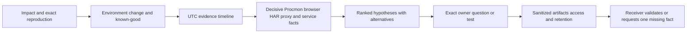

Example exact ask: "Please identify which endpoint-policy decision corresponds to the synthetic `USER-A`, device `DEVICE-A`, process hash `HASH-A`, and denied path token `PATH-A` at 14:02:11.430 UTC, and confirm whether package 7.4 intended that denial. We are not requesting a broad allow. The protected PML and sanitized ten-event export are available under case access group A."

## Arti bridge and interview positioning

Arti's advantage is the habit of moving from user impact to evidence, ownership, safe mitigation, and validation. These tools deepen that habit. Her answer should emphasize boundaries rather than tool-name collecting.

| Existing strength | Part 26 translation | Portfolio proof |
|---|---|---|
| OneDrive/SharePoint support | Compare browser and sync-client paths without false equivalence | Path matrix |
| CRITSIT leadership | Run endpoint/browser/network/service workstreams on one UTC ledger | NMH bridge timeline |
| RCA | Separate trigger, root cause, contributors, and detection gap | Fictional policy RCA |
| Fix validation | Positive transaction plus negative security control | Pilot validation record |
| Networking | Correlate HTTP timing with DNS/TCP/TLS/proxy evidence | Cross-tool timeline |
| Analytics | Reduce event volume to discriminating patterns | Evidence-quality table |
| Mentoring | Teach filters, HAR privacy, and trust cleanup | Workshop outline |
| AI interest | Summarize only sanitized structured evidence with human verification | AI-use safety note |

A strong interview answer is: "I start with the exact operation, authority, privacy scope, hypothesis, known-good, clocks, and stop condition. Procmon tells me which local process attempted which file, Registry, image, or endpoint operation and what Windows returned. DevTools and HAR tell me the browser's request, initiator, policy, timing, and HTTP view. An authorized debugging proxy adds a selected HTTP observation point but changes routing and, for decryption, trust. I preserve originals, sanitize structured derivatives, correlate by UTC and request IDs, state what each point cannot prove, and ask the next owner for one discriminating fact."

## Common misconceptions to correct

| Misconception | Correction |
|---|---|
| Every non-SUCCESS Procmon result is an error | Probes and fallback commonly return negative results |
| `CreateFile` always creates a file | It can open/create files, directories, devices, and objects based on detail |
| A security module in a stack caused the issue | Presence shows participation; timing/policy/comparison establish relevance |
| Filtering cannot lose context | Display filters are reversible over retained data, but capture choices/drops are not |
| PID permanently identifies a process | PIDs can be reused; add start time, path, and instance context |
| Boot logging is a harmless next step | It requires restart, broad collection, storage, privacy, and recovery planning |
| DevTools shows everything on the wire | It shows browser semantics; cache, worker, policy, TLS, and proxies alter visibility |
| Long TTFB proves a slow origin server | It includes latency and intermediaries plus upstream response preparation |
| A 200 means the user operation succeeded | Body, CORS, parsing, redirects, and later commit can fail |
| CORS blocks a request at the firewall | CORS is browser-enforced response-access policy; preflight mechanics vary |
| Native clients have the same CORS behavior | CORS is a browser web-platform control, not a general network rule |
| Disable cache is a fix | It is a diagnostic change that alters behavior |
| Browser success proves sync path health | Browser and native sync dependencies differ |
| HAR is a current W3C Recommendation | The commonly cited HAR draft is historical and abandoned; implementations persist |
| Sanitized HAR is automatically safe to email | Sensitive values remain outside selected stripped headers |
| HAR is a packet capture | It is browser/exporter HTTP transaction data |
| Fiddler passively decrypts TLS | Authorized decryption actively terminates and recreates TLS using debugging trust |
| Installing a debugging root is routine | It expands trust and requires approval, scope, removal, and validation |
| Fiddler sees every process | Only traffic routed through its supported observation path appears |
| Composer replay is harmless | Requests can have side effects, replay defenses, expiry, and rate impact |
| AutoResponder proves the server is defective | It replaces reality and isolates a dependency only |
| No service log means request never left client | Logging can be incomplete and intermediaries may stop it |
| A request ID is never sensitive | It can reveal tenant/activity and enable privileged lookup |
| Hash proves evidence is accurate | It proves later bytes match the hashed bytes, not correctness/completeness |
| More evidence is always better | Minimum decisive evidence lowers privacy, cost, and confusion |

## Official Source Anchors

The following authoritative sources were reviewed on **2026-08-24**. They support Procmon capabilities, browser Network behavior, HAR field concepts and historical status, HTTP/browser security mechanics, Fiddler concepts, and evidence governance. They do not prove fictional NMH outcomes, a production tenant path, a policy decision, or a vendor defect. Product, browser, operating-system, and tool behavior must be rechecked at use time.

| Source | URL | Used for | Boundary |
|---|---|---|---|
| Microsoft Sysinternals: Process Monitor | https://learn.microsoft.com/en-us/sysinternals/downloads/procmon | File, Registry, process/thread activity, filtering, stacks, process tree, native log, boot logging | Installed help/version controls exact operation |
| Chrome DevTools: Inspect network activity | https://developer.chrome.com/docs/devtools/network/ | Network log, columns, headers, response, timing, filtering | Chromium UI; other browsers differ |
| Chrome DevTools Network reference | https://developer.chrome.com/docs/devtools/network/reference/ | Preserve log, cache controls, timing phases, initiators, cookies, HAR export | Features and sanitized fields can change |
| Microsoft Edge DevTools Network reference | https://learn.microsoft.com/en-us/microsoft-edge/devtools/network/reference | Edge Chromium network analysis workflow | Edge version and enterprise policy vary |
| MDN: Using HTTP cookies | https://developer.mozilla.org/en-US/docs/Web/HTTP/Guides/Cookies | Cookie purpose, attributes, security, privacy | Browser policy and RFC updates apply |
| MDN: CORS | https://developer.mozilla.org/en-US/docs/Web/HTTP/Guides/CORS | Origin, preflight, credentials, browser enforcement | Fetch standard is normative source |
| WHATWG Fetch Standard | https://fetch.spec.whatwg.org/ | Browser fetch and CORS processing model | Living standard; implementations differ |
| MDN: Service Worker API | https://developer.mozilla.org/en-US/docs/Web/API/Service_Worker_API | Interception, lifecycle, cache and secure context | Browser implementation/version varies |
| W3C GitHub historical HAR draft | https://w3c.github.io/web-performance/specs/HAR/Overview.html | HAR 1.2 object/field model, UTF-8, privacy warning | Page says abandoned and never published by WG |
| IETF RFC 9110 | https://www.rfc-editor.org/rfc/rfc9110 | HTTP semantics, methods, status, fields | HTTP versions/framing are in related RFCs |
| IETF RFC 9111 | https://www.rfc-editor.org/rfc/rfc9111 | HTTP caching semantics | Browser/application policies add behavior |
| IETF RFC 6265 | https://www.rfc-editor.org/rfc/rfc6265 | HTTP state management foundation | Updated cookie work and browser policy apply |
| IETF RFC 8446 | https://www.rfc-editor.org/rfc/rfc8446 | TLS 1.3 security and handshake | Interception policy is organizational/legal |
| Progress Telerik Fiddler Classic documentation | https://www.telerik.com/fiddler/fiddler-classic/documentation | Fiddler Classic proxy and session concepts | Verify edition, licensing, and current support |
| Fiddler Classic HTTPS decryption documentation | https://www.telerik.com/fiddler/fiddler-classic/documentation/configure-fiddler/tasks/decrypthttps | HTTPS decryption configuration concept | Requires authorization and trust hygiene |
| Fiddler Everywhere documentation | https://docs.telerik.com/fiddler-everywhere/introduction | Current cross-platform product concepts | Separate product from Fiddler Classic |
| NIST SP 800-61 Rev. 3 | https://csrc.nist.gov/pubs/sp/800/61/r3/final | Incident-response evidence and coordination context | Adapt to organization and law |
| NIST SP 800-92 | https://csrc.nist.gov/pubs/sp/800/92/final | Log-management principles | Technology examples are dated |
| NIST SP 800-86 | https://csrc.nist.gov/pubs/sp/800/86/final | Forensic techniques integrated with incident response | Published 2006; current procedure controls |
| Microsoft 365 network connectivity principles | https://learn.microsoft.com/en-us/microsoft-365/enterprise/microsoft-365-network-connectivity-principles | Microsoft 365 network design principles | Endpoint/category data and tenant evidence change |
| Microsoft OneDrive sync troubleshooting | https://support.microsoft.com/en-us/office/fix-onedrive-sync-problems-0899b115-05f7-45ec-95b2-e4cc8c4670b2 | Supported user-facing sync troubleshooting context | Follow current support scope before invasive reset |
| Zscaler Help Portal | https://help.zscaler.com/ | Official product documentation entry and support context | Exact workflows require product/access/version validation |

## Likely Interview Questions

### Q1. How do you use Procmon without drowning in events?

**Model answer:** I define one operation and UTC window, capture briefly, preserve native PML, inspect Process Tree, then filter the exact process instance and group by operation and path. I highlight negative and long-duration results without hiding successful fallback. I inspect Detail and stacks for decisive events and compare a known-good run. A negative result becomes relevant only when operation semantics, sequence, application state, and comparison support it.

### Q2. What does a Procmon ACCESS DENIED event prove?

**Model answer:** It proves Windows returned a denial for the named operation, path, process/thread context, and time observed. It does not alone identify the policy owner, prove the denial was unintended, or show that it caused the user symptom. I inspect requested access, token/ACL or policy evidence, stack, retries/fallback, app logs, and a controlled known-good comparison before recommending a least-privilege correction.

### Q3. How do you analyze a browser Network waterfall?

**Model answer:** I preserve the exact navigation, identify the user-triggering request and initiator chain, then examine queue/stall, DNS, connect/TLS/proxy, send, TTFB, and download phases. I check connection reuse, cache/service-worker source, redirects, status/body, cookies, CORS, and request IDs. I correlate long phases with packet, proxy, and service evidence because TTFB is not equal to origin compute time.

### Q4. Why can a request return 200 and still fail in the browser?

**Model answer:** HTTP 200 describes the response, not the business outcome. A service worker can return stale content, an API can return an error object with 200, an authentication redirect can end on a 200 HTML page when JSON was expected, and CORS can prevent script from reading a 200 cross-origin response. I inspect redirects, content type/body, initiator, Console, worker/cache, CORS fields, and the next commit step.

### Q5. What is in a HAR, and what are its main limitations?

**Model answer:** A HAR is JSON containing a log with creator/browser/page context and entries for request, response, cache, timing, and optional connection/server fields. It is portable HTTP evidence, not a packet capture or complete browser trace. Exporters omit or normalize fields, reused connections hide phases, bodies can be absent, and the historical HAR draft was abandoned. It can also contain tokens, cookies, URLs, bodies, and personal data.

### Q6. How do you sanitize a HAR safely?

**Model answer:** I treat the browser's sanitized export as a starting point, not a guarantee. I preserve the restricted original, parse a working JSON copy, inventory URL/query, headers, cookies, POST data, redirects, response content, comments, and custom fields, and remove or consistently tokenize sensitive values. I validate JSON, reopen it, search for synthetic canaries, document transformations, hash both artifacts, and share only the minimum derivative.

### Q7. When would you use Fiddler HTTPS decryption?

**Model answer:** Only when a precise question cannot be answered by less intrusive evidence and explicit organizational, privacy, and interception authorization exists. I use a dedicated synthetic profile, limit scope and time, document proxy and debugging-root state, capture one reproduction, then disable decryption, remove trust, restore proxy settings, and verify health. It changes the TLS path and can break pinning, mutual TLS, custom trust, or unsupported protocols.

### Q8. How would you investigate sync-client failure when browser upload works?

**Model answer:** I treat browser success as a useful comparison, not proof that the sync path is healthy. I map differences in process, token/cache, local database/filesystem, endpoints, API/chunking, proxy selection, retry, and policy. I correlate client logs and Procmon with browser DevTools/HAR, network/proxy, and service IDs. In the fictional NMH case, the decisive evidence was a local required metadata denial before request creation, validated by a least-privilege policy correction and negative controls.

## 30-Second Memory Hooks

| Concept | Memory hook |
|---|---|
| Procmon | Endpoint flight recorder |
| Operation | The verb |
| Path | The address |
| Result | Reply, not verdict |
| Detail | Operation fine print |
| Filter | Evidence sieve |
| Stack | Call-chain ladder |
| Process Tree | Program family and lifetime |
| Boot logging | Camera before doors open |
| DevTools | Browser control room |
| Waterfall | Requests on one timetable |
| Initiator | Who placed the order |
| TTFB | First reply, not server-only time |
| Cache | Local pantry under rules |
| Service worker | Programmable local receptionist |
| Origin | Scheme, host, port |
| CORS | Server permission interpreted by browser |
| HAR | Exported HTTP ledger |
| HAR timing | Missing phases are not zero |
| Sanitized HAR | Safer starting point, not safe guarantee |
| Fiddler | Controlled inspection desk |
| HTTPS decryption | Active trust-changing interception |
| Composer | Request drafting with side-effect risk |
| AutoResponder | Substitute response for isolation |
| Browser versus sync | Same destination family, different journey |
| Correlation | Shared time plus IDs plus boundaries |
| Known-good | One-variable comparison |
| Hash | Byte identity, not truth |
| Escalation | Minimum evidence and exact ask |
| Honesty | Name the observation point and missing fact |

## Completion Checklist

- [ ] I can define Procmon, event, operation, path, result, detail, filter, stack, symbol, and Process Tree.
- [ ] I can explain what Procmon observes and why it is not a packet or HTTP trace.
- [ ] I can define one exact operation, UTC interval, authority, privacy scope, and stop condition.
- [ ] I can preserve PML and distinguish a native original from a filtered export.
- [ ] I can build process, PID, operation, path, result, duration, and time filters.
- [ ] I can explain why a negative result may be normal probe/fallback behavior.
- [ ] I can inspect operation Detail before interpreting `CreateFile` or another event.
- [ ] I can use Process Tree to identify lineage and lifetime without treating parentage as trust.
- [ ] I can read stacks, document symbols, and avoid blaming a module merely because it appears.
- [ ] I can compare first discriminating state transitions in failing and known-good traces.
- [ ] I can explain boot logging value, restart, volume, privacy, recovery, and cleanup caveats.
- [ ] I can open DevTools before reproduction, clear the log, and preserve redirects deliberately.
- [ ] I can read method, status, type, initiator, protocol, remote address, size, and waterfall.
- [ ] I can explain queue, stall, DNS, connect, proxy, TLS, send, TTFB, and download phases.
- [ ] I can state why TTFB is not equivalent to origin processing time.
- [ ] I can inspect headers, payload, body, cookies, and IDs without sharing secret values.
- [ ] I can explain normal cache, revalidation, Disable cache, and cold/warm comparisons.
- [ ] I can explain service-worker registration, installation, waiting, activation, and fetch interception.
- [ ] I can identify local service-worker/cache responses that never reach an upstream proxy.
- [ ] I can define origin and explain CORS preflight, actual request, credentials, and browser enforcement.
- [ ] I can explain why native clients and browsers can behave differently under CORS.
- [ ] I can explain how a 200 response can still produce a failed user operation.
- [ ] I can navigate HAR log, pages, entries, request, response, cache, timings, and extensions.
- [ ] I can explain the historical/abandoned status of the commonly cited HAR draft.
- [ ] I can interpret unavailable timing values and avoid double-counting SSL within connect.
- [ ] I can list HAR blind spots and choose compensating evidence.
- [ ] I can identify secrets in URL, query, headers, cookies, body, redirect, content, and custom fields.
- [ ] I can create, validate, hash, and manifest a structured sanitized HAR derivative.
- [ ] I can explain the Fiddler client-proxy-server architecture and CONNECT tunneling.
- [ ] I can state why HTTPS decryption is active interception that changes trust.
- [ ] I can define authorization, synthetic profile, scope, stop, root removal, and proxy restoration controls.
- [ ] I can explain certificate pinning, mutual TLS, custom trust, QUIC, and proxy-bypass caveats.
- [ ] I can use Composer only for authorized synthetic requests with side-effect awareness.
- [ ] I can use AutoResponder conceptually for dependency isolation without calling it proof of server defect.
- [ ] I can build a cross-tool ledger using UTC, PID, URL class, method, tuple, and correlation ID.
- [ ] I can label observations as observed, corroborated, inferred, unverified, disconfirmed, or unknown.
- [ ] I can compare browser and OneDrive sync paths across process, state, API, proxy, file, and retry dimensions.
- [ ] I can choose a discriminating test for no request, pending request, auth loop, CORS, denial, or empty proxy capture.
- [ ] I can complete all ten labs using synthetic or explicitly authorized data.
- [ ] I can walk the fictional NMH scenario without claiming a Microsoft, Zscaler, or endpoint-vendor production defect.
- [ ] I can write trigger, root cause, contributors, fix, validation, rollback, and prevention separately.
- [ ] I can prepare a minimum-data escalation package with an exact owner ask.
- [ ] I can explain Arti's transferable evidence method without overstating product experience.
- [ ] I can answer all eight interview questions aloud using bounded evidence language.

[Part 27 - Structured Connectivity Troubleshooting and Fault Isolation](Part-27-connectivity-troubleshooting-fault-isolation.md)