# Part 27 - Structured Connectivity Troubleshooting and Fault Isolation

> **Audience:** Arti Thakur, moving from Microsoft 365 Support Escalation Engineering into a Zscaler Security Operations Technical Success Manager role.
>
> **Purpose:** Turn vague connectivity complaints into reproducible symptoms, dependency maps, ranked hypotheses, discriminating tests, evidence-led ownership, safe mitigations, and validated customer outcomes.
>
> **Scope and honesty:** Northstar Meridian Holdings, abbreviated NMH, is fictional. Its users, devices, networks, policies, incidents, metrics, logs, tests, failures, and outcomes are synthetic. Arti's Microsoft 365, OneDrive for Business, SharePoint Online, networking, evidence, escalation, analytics, and mentoring experience must remain within her approved factual background.
>
> **Product caveat:** Network paths, applications, Microsoft 365 endpoints, operating-system behavior, browser/client versions, security controls, and Zscaler features change. Verify current official documentation, configuration, timestamps, and direct evidence. A successful ping, port test, trace, service-health page, or synthetic bypass never proves the entire production transaction is healthy and never proves a Microsoft, Zscaler, carrier, firewall, endpoint, or application defect alone.

## Section goal

Structured troubleshooting is disciplined uncertainty reduction. It begins with what the user tried, what should have happened, what actually happened, who is affected, when it started, and what changed. It maps every dependency required for that exact operation, ranks explanations that could produce the observations, and chooses the cheapest safe test whose possible results separate those explanations. It records every decision so that speed does not become chaos.

Think of a building with no water at one sink. Replacing the city pipe, pump, faucet, and water heater at once may restore water, but no one learns which component failed, whether the fix weakened safety, or what to monitor next time. A plumber first defines scope: one faucet, one floor, hot water only, or the whole building? Then the plumber opens observation points and tests boundaries. Connectivity troubleshooting works the same way.

By the end, Arti should be able to:

| Outcome | Demonstrated capability | Evidence of mastery |
|---|---|---|
| Define the case | Capture symptom, scope, impact, time, change, expected, and actual behavior | Structured intake |
| Model dependencies | Draw user-to-service control and data dependencies with owners | Dependency map |
| Establish a baseline | Define healthy transaction, normal range, and comparison population | Baseline sheet |
| Form hypotheses | Write plausible, ranked, falsifiable explanations | Hypothesis matrix |
| Design tests | Choose safe discriminating tests and expected outcomes | Test plan |
| Isolate boundaries | Use binary isolation, observation points, and known-good comparisons | Fault tree |
| Work across layers | Combine OSI/TCP-IP reasoning with identity, policy, application, and service state | Layer-to-operation map |
| Handle intermittence | Use sampling, timestamps, state/change correlation, and capture triggers | Intermittent playbook |
| Handle performance | Separate latency, throughput, loss, backpressure, capacity, and application delay | Performance budget |
| Handle policy | Distinguish intended enforcement, wrong match, stale state, and application rejection | Policy ledger |
| Protect customers | Minimize evidence, avoid unsafe bypasses, define rollback and negative controls | Change record |
| Assign ownership | State last confirmed boundary, confidence, missing evidence, and next owner | Handoff brief |
| Lead incidents | Coordinate parallel workstreams without shotgun changes | NMH playbooks |
| Bridge honestly | Apply Arti's production support method without claiming Zscaler production operation | Interview story |

## JD Mapping

| JD expectation | Part 27 capability | Customer artifact | Honest Arti bridge |
|---|---|---|---|
| Analyze complex environments | Build dependency and observation maps across endpoint, identity, network, controls, and service | Current-state fault map | Extends M365 escalation practice |
| Identify security risks | Detect overbroad bypasses, secret-heavy capture, stale policy, and weak negative controls | Risk-aware test plan | Applies enterprise support discipline |
| Resolve critical escalations | Run time-bounded hypotheses and parallel evidence workstreams | Incident decision log | Builds on CRITSIT leadership |
| Tailor mitigation | Match fix to proven boundary with pilot, rollback, and residual risk | Mitigation decision | Builds on fix validation |
| Deliver consulting | Teach customer teams how to reason from operation to evidence | Workshop and playbook | Uses advisor and mentoring experience |
| Partner cross-functionally | Define ownership and exact asks for endpoint, identity, network, security, app, and provider teams | RACI and handoff | Maps to Engineering/customer collaboration |
| Communicate outcomes | Convert technical facts into impact, confidence, decision, owner, and ETA discipline | Executive update | Uses high-CSAT communication |
| Drive long-term success | Turn repeated incidents into baselines, monitors, tests, and change gates | Prevention backlog | Bridges reactive support to proactive TSM |

## Candidate honesty note

Arti can truthfully describe production methods she used in Microsoft 365 support: clarifying impact, reproducing symptoms, comparing browser and sync paths, collecting network/client evidence, coordinating escalations, validating fixes, communicating status, and writing RCA where supported by her experience. She can describe the NMH playbooks and labs as structured practice.

Direct production operation of Zscaler policies, service edges, Client Connector telemetry, ZDX, Data Fabric, UVM, or SecOps workflows is not established. The safe bridge is: "I have used this fault-isolation method in Microsoft 365 support. I understand where a zero trust or security control could become an observation and policy boundary. In a Zscaler environment, I would verify the deployed product, forwarding method, policy context, official logs, tenant access, and support procedure before making a product-specific claim."

| Claim class | Safe statement | Boundary |
|---|---|---|
| Production | "I led evidence-based Microsoft 365 support investigations." | Use real examples only when factually supported |
| Lab | "I built NMH fault trees and tested synthetic network/policy failures." | Keep artifacts and label them synthetic |
| Conceptual | "A discriminating test separates at least two live hypotheses." | It need not identify final root cause immediately |
| Not yet used | "I have not operated that Zscaler console; here is my evidence and ramp method." | Do not imply product telemetry access |
| Fictional | "NMH's branch comparison isolated a synthetic DNS-egress mismatch." | NMH is not a customer |
| Unknown | "The client trace proves the request left that capture point; the next boundary is unobserved." | Preserve uncertainty |

## Terms, definitions, and analogies before mechanics

| Term | Plain meaning | Why it matters | Memory hook |
|---|---|---|---|
| Symptom | Observable departure from expected behavior | Investigation starts with facts | What hurts |
| Scope | Who, what, where, and how often is affected | Narrows shared dependencies | Size of the shadow |
| Impact | Business consequence of the symptom | Sets priority and communication | Why it matters |
| Baseline | Defined healthy behavior and normal measurements | Provides a reference | Normal heartbeat |
| Dependency | Component or condition required for the operation | Reveals possible failure boundaries | Link in the chain |
| Hypothesis | Testable explanation for observations | Directs collection | Candidate story |
| Falsifiable | Capable of being contradicted by evidence | Prevents unfalsifiable blame | Can lose a test |
| Discriminating test | Test with outcomes that separate hypotheses | Maximizes learning per change | Fork-in-road test |
| Fault isolation | Narrowing failure to a component or boundary | Directs ownership | Close the search box |
| Binary isolation | Dividing a path or variable set into groups to reduce search | Faster than one-by-one in suitable cases | Halve the haystack |
| Observation point | Exact place where evidence is collected | Defines every safe claim | Camera location |
| Known-good | Comparable operation currently working | Exposes meaningful differences | Working twin |
| Control variable | Factor deliberately kept constant | Makes comparison interpretable | Hold still |
| Confounder | Uncontrolled difference that can explain result | Prevents false attribution | Hidden extra variable |
| Correlation | Two patterns vary together | Useful clue, not causation | Move together, not proof |
| Causation | Change in one factor produces outcome through a mechanism | Required for strong root-cause claim | Mechanism plus test |
| Timeline | Ordered events on normalized time | Links change, trigger, and outcome | One common clock |
| Evidence quality | Strength, completeness, proximity, and reliability of data | Controls confidence | How good is the witness |
| Ownership boundary | Point where another team controls next mechanism/evidence | Enables precise handoff | Next accountable desk |
| Workaround | Temporary way to restore or avoid impact | Not necessarily root-cause correction | Side road |
| Mitigation | Action reducing likelihood or impact | Can leave residual risk | Reduce the danger |
| Fix | Change addressing a verified defect or misconfiguration | Must be validated | Repair the cause |
| Negative control | Test showing protected/unrelated behavior remains as intended | Prevents overbroad fixes | Prove what must still fail |
| Decision log | Time-ordered record of evidence, hypotheses, tests, and choices | Stops repeated work and hindsight rewriting | Investigation memory |
| Shotgun change | Several uncontrolled changes applied together | Destroys attribution and increases risk | Change everything, learn nothing |
| Intermittent | Failure that appears and disappears | Needs event-triggered evidence and sampling | Catch the moment |
| Performance budget | Allocation of acceptable time across transaction stages | Localizes excessive delay | Latency allowance |
| Policy decision | Allow, block, inspect, isolate, challenge, route, or other control outcome | Security behavior can be intended or wrong | Rule met context |

```mermaid
flowchart LR
    REPORT[User report] --> DEFINE[Symptom scope impact time change]
    DEFINE --> MAP[Transaction and dependency map]
    MAP --> BASE[Healthy baseline and known-good]
    BASE --> HYP[Ranked falsifiable hypotheses]
    HYP --> TEST[Cheapest safe discriminating test]
    TEST --> OBS[Collect at named observation points]
    OBS --> UPDATE[Update confidence and boundary]
    UPDATE --> FIX[Mitigate or fix with rollback]
    FIX --> VALID[Positive and negative validation]
    VALID --> PREVENT[Monitor document and prevent recurrence]
```

## Structured intake: symptom, scope, impact, time, and change

The first ten minutes determine whether the investigation becomes a coherent experiment or a queue of opinions. Replace product-wide phrases with one transaction. "SharePoint is slow" becomes: "From NMH branch B, opening a synthetic 2 MB document in the browser takes 28-42 seconds between 09:00 and 11:00 UTC; the same user and document from branch A takes 3-5 seconds; list navigation is normal."

| Intake dimension | Questions | Good evidence | Weak substitute |
|---|---|---|---|
| Symptom | What exact action and stage fail? | Numbered reproduction, error, request ID | "It is broken" |
| Scope | Which users, devices, sites, apps, networks, regions? | Affected/unaffected matrix | Loudest reporter only |
| Impact | What workflow, risk, revenue, SLA, or safety is affected? | Quantified transactions and workaround | Technical severity alone |
| Time | First seen, last known good, frequency, duration, timezone? | UTC timeline and samples | Ticket creation time |
| Change | What changed in endpoint, network, identity, app, policy, service? | Change ID, rollout ring, diff | "Nothing changed" without audit |
| Expected | What should the operation produce and how fast? | Documented success criteria | Personal preference |
| Actual | What was observed at each stage? | Status, duration, logs, trace | Interpretation stated as fact |
| Reproduction | Can it be repeated safely? | Exact inputs and stop condition | Vague user memory |
| Workaround | What alternate path works and what differs? | Browser/client/site matrix | Treating workaround as root cause |
| Security/privacy | What data/tools/permissions are allowed? | Approved collection plan | Admin access assumed as authority |

Scope is often more diagnostic than an error code. If one user fails on every managed device, identity or account/permission context rises. If every user fails only on one branch, branch DNS, egress, path, proxy, capacity, or policy rises. If one device fails for every user, endpoint state rises. These are rankings, not verdicts.

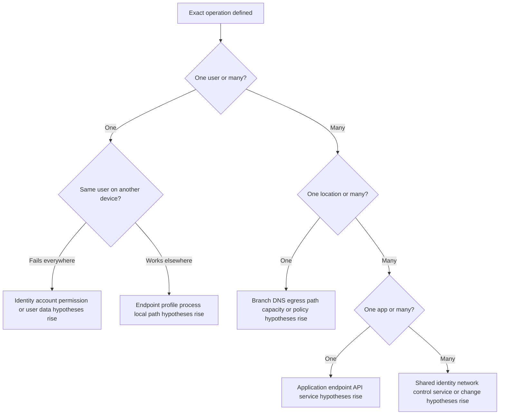

### Severity and urgency without panic

Urgency changes cadence and parallelism, not the laws of evidence. During a critical incident, one lead owns the decision log, one person protects customer communication, and technical owners run parallel nonconflicting workstreams. Do not let each team apply its favorite reset.

| Severity input | Example | Operational response |
|---|---|---|
| Population | 2 of 2,000 versus all users | Scale workstreams to blast radius |
| Business process | Optional preview versus regulated submission | Prioritize critical operation |
| Data/security | Availability only versus suspected exposure | Engage security/privacy immediately if needed |
| Duration | Single transient versus sustained outage | Set bridge and update cadence |
| Workaround | Safe browser path versus no path | Document capacity and limitations |
| Trend | Stable versus rapidly expanding | Increase monitoring and containment readiness |
| Deadline | Month-end close or legal cutoff | Coordinate business decision owner |
| Uncertainty | Known bounded failure versus possible compromise | Preserve evidence before disruptive actions |

### Plain-English deep-dive 1 - Scope is a diagnostic instrument

Imagine lights fail in a building. If one bulb is dark, replacing the city transformer is unreasonable. If every building on one street is dark, one lamp's wiring is unlikely to be the shared cause. The pattern of affected and unaffected cases reveals which dependencies are common.

Connectivity cases work the same way. A browser and sync client on one device share the operating system, physical interface, some DNS and routes, and often an identity, but they may use different processes, token caches, endpoints, APIs, proxy stacks, and retry behavior. Browser success lowers the probability of some shared failures but does not prove the sync path.

Build a scope matrix early. Rows can be users, devices, applications, locations, networks, file sizes, times, and policy rings. Columns show success, failure, unknown, and evidence confidence. Then ask which dependency exists in all failing cells and no working cells. This is more powerful than collecting a long log from one user without a comparison.

## Transaction and dependency mapping

A dependency map is not a generic architecture poster. It traces one operation from user intent to durable outcome. Separate the control path, which establishes identity, configuration, policy, discovery, and routing, from the data path, which carries requests and content. They interact but can fail differently.

For a browser upload, dependencies may include user/profile, browser UI and script, local file access, service worker/cache, identity session, DNS, proxy selection, endpoint security agent, route/egress, security policy, TLS, CDN/service front door, application API, authorization, storage, metadata commit, and response processing. A native sync upload adds local filesystem monitoring, client database/cache, background scheduling, client authentication broker, change enumeration, chunk/session logic, and retry.

| Dependency node | Required state | Observation point | Likely owner |
|---|---|---|---|
| User action | Correct account/input and reproducible step | Screen/steps/action marker | User/support |
| Application process | Running, correct version/configuration | Process/client logs/Procmon | Endpoint/app |
| Local file/state | Readable, valid, sufficient disk/cache | Procmon/filesystem/client state | Endpoint/app |
| Identity | Token/session/certificate valid for resource | Sign-in logs/challenge/claims metadata | Identity |
| Name resolution | Correct answer via intended resolver | DNS logs/trace/resolver query | Network/DNS |
| Proxy/forwarding | Intended direct/proxy/tunnel route selected | PAC/system config/agent/proxy session | Network/security |
| IP route/egress | Reachable path and expected public egress | Route/trace/flow/network device | Network |
| Transport | Connection/QUIC state and delivery | Packet/endpoint counters | Endpoint/network |
| TLS | Protocol, trust, identity, inspection compatibility | Client/proxy/TLS evidence | Security/app/network |
| Security policy | Correct context, rule, action, and version | Policy/session log | Security |
| Service edge/CDN | Request accepted and forwarded | Edge/request ID telemetry | Provider/CDN |
| Application API | Valid method, body, auth, state | HTTP/service log | Application/provider |
| Dependency service | Database/storage/queue downstream works | Distributed trace/service metrics | Provider/app |
| Client completion | Response parsed and local state committed | Client/browser log | Endpoint/app |

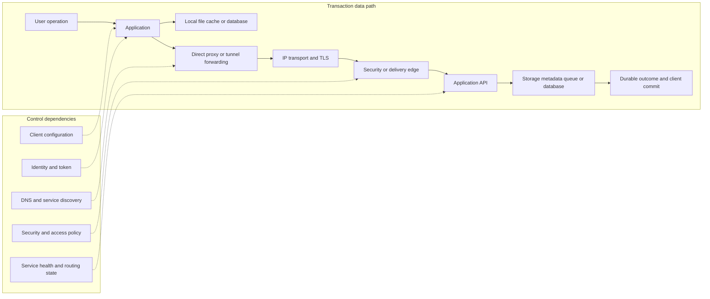

### Dependency states, not boxes

Each node has state, version, owner, health measure, change history, and evidence. "Firewall" is not a hypothesis. "The branch egress firewall policy revision 184 drops IPv6 TCP 443 return traffic for the resolved AAAA address during the affected ring" is testable.

## Baselines and known-good comparisons

A baseline defines healthy behavior for the same operation under known conditions. It includes outcome, normal duration distribution, request sequence, endpoints, policy path, error budget, and resource conditions. A single fast test is not a baseline.

| Baseline dimension | Record | Reason |
|---|---|---|
| Transaction | Exact input, account class, file/object, API stage | Ensures semantic comparison |
| Population | Locations, devices, versions, policy rings | Shows expected variation |
| Time window | Business peak/off-peak, day, timezone | Captures load and change cycle |
| Outcome | Durable success, not merely HTTP status | Matches user goal |
| Latency | Median, percentiles, distribution, sample count | Avoids average-only distortion |
| Throughput | Useful bytes/time for controlled size | Separates setup from transfer |
| Error rate | Failures/eligible attempts with reason classes | Provides denominator |
| Path | Resolver, egress, proxy/edge, protocol | Detects topology difference |
| Configuration | App/OS/policy/certificate/version | Supports change comparison |
| Evidence | IDs and named observation points | Makes baseline auditable |

A known-good comparison is an experiment, not a talisman. Change one meaningful variable where possible: same user/device/file through another network; same branch with old/new policy ring; same endpoint direct/proxied only under approved test; same API small/large body; same user browser/native client while documenting path differences.

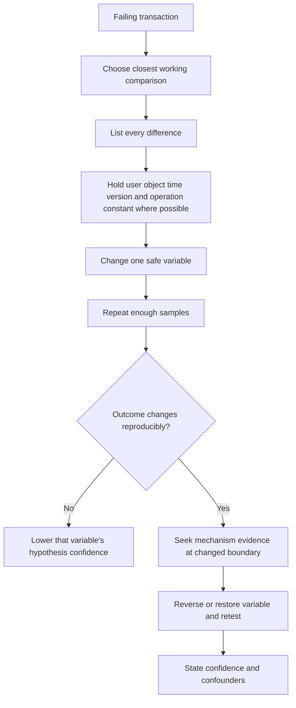

### Comparison traps

| Trap | Why misleading | Better method |
|---|---|---|
| Browser versus sync called identical | Different process, state, endpoints, and protocol | Build shared/different dependency matrix |
| Ping versus HTTPS called connectivity | ICMP and app transaction differ | Test intended host/port/protocol plus app semantics |
| Home network versus office | Identity, device, DNS, egress, policy may all change | Enumerate differences and isolate one |
| New device works | Version/profile/security posture differ | Compare configuration and policy ring |
| One successful attempt | Intermittence remains | Define sample count and confidence |
| Average latency | Hides tail failures | Use percentiles/distribution and transaction stages |
| Service health green | Broad aggregation/known issues only | Combine tenant/request evidence |
| Bypass succeeds | Several controls/path variables changed | Narrow approved test and independent policy evidence |

## Hypotheses: writing explanations that can lose

A useful hypothesis identifies mechanism, boundary, predicted evidence, and disconfirming result. Rank by fit to scope, timing/change, architecture, and evidence, not by which team is on the bridge.

Bad: "The network is slow."

Better: "At branch B, remote DNS and central egress select a distant service front door, adding roughly 70 ms of RTT to each serial request. If local DNS and local egress are used in an approved pilot, the resolved/connected edge and RTT should change and page transaction time should fall; if RTT and edge remain unchanged, this hypothesis is weakened."

| Hypothesis field | Question | Example |
|---|---|---|
| ID | How referenced? | H3 |
| Statement | What mechanism causes what symptom? | Proxy auth retry adds delay before CONNECT |
| Scope fit | Does it explain affected/unaffected pattern? | Managed native clients only |
| Trigger/change | What initiated it? | PAC revision 52 |
| Predicted evidence | What should be observed? | Repeated 407 on client path |
| Disconfirming result | What would make it unlikely? | No proxy use and no challenge at any point |
| Test | Cheapest safe separator? | Compare approved old/new PAC ring |
| Risk | Could test alter security/service? | Do not broadly bypass proxy |
| Confidence | Current evidence strength? | Medium |
| Owner | Who can observe/change boundary? | Network proxy team |

```mermaid
flowchart LR
    OBS[Observed facts] --> CAND[Generate candidate mechanisms]
    CAND --> SCOPE[Score scope fit]
    SCOPE --> TIME[Score time and change fit]
    TIME --> ARCH[Check architecture plausibility]
    ARCH --> PRED[Write predicted and disconfirming evidence]
    PRED --> RANK[Rank by evidence and test value]
    RANK --> TEST[Run one discriminating test]
    TEST --> BAYES[Raise lower split or retire hypotheses]
    BAYES --> RANK
```

### Hypothesis confidence language

| Label | Meaning | Required wording |
|---|---|---|
| Confirmed mechanism | Reproducible change plus direct mechanism evidence and reversal/validation | "Evidence demonstrates... within this scope" |
| Strong | Multiple independent sources and alternatives disfavored | "Strongly supports..." |
| Moderate | Fits evidence but one meaningful alternative remains | "Most consistent with..." |
| Weak | Plausible with limited direct evidence | "Candidate hypothesis..." |
| Disconfirmed | Predicted result absent under valid test | "Test result contradicts..." |
| Unknown | Current evidence cannot distinguish | "Cannot determine without..." |

### Plain-English deep-dive 2 - A test is valuable because of the result it might not give

Many teams select tests that can only confirm what they already believe. "Run another speed test" may produce another slow number without distinguishing Wi-Fi, egress, service, proxy, or application delay. A discriminating test has planned branches before execution.

Suppose two hypotheses remain: H1 says the browser service worker serves stale content locally; H2 says the upstream API returns stale content. An approved test profile that bypasses the service worker is useful because the two outcomes differ. If stale content disappears and upstream logs now show a request, H1 rises. If stale content persists and the same response comes from the upstream request ID, H2 rises. If behavior changes but no upstream evidence exists, the result is ambiguous and the log must say so.

Write the decision table before the test. This prevents changing the story after seeing the result. The method resembles a medical diagnostic: the result matters because it moves probabilities, not because the test has a sophisticated name.

## Discriminating tests and information value

Choose tests by expected information, safety, cost, reversibility, and proximity to the suspected boundary. A cheap read-only observation that splits three hypotheses outranks a disruptive reset that might affect all of them.

| Test property | High-quality test | Low-quality test |
|---|---|---|
| Falsifiability | Has explicit disconfirming outcome | Every outcome fits theory |
| Discrimination | Separates multiple hypotheses | Repeats known observation |
| Control | Changes one variable | Changes device, network, user, and version |
| Safety | Synthetic/read-only/approved | Weakens security broadly |
| Reversibility | Clear rollback and state capture | Destroys failing state |
| Proximity | Observes suspected boundary directly | Infers through distant symptom |
| Repetition | Planned sample count | One lucky attempt |
| Privacy | Minimum data | Full content/tokens captured |
| Documentation | Predicted branches written first | Narrative written after result |

Examples of strong tests:

- Resolve through intended and comparison resolvers while recording answers, TTLs, egress, and application choice.
- Compare same synthetic request before and after one policy revision in a pilot ring with rule/session evidence.
- Capture both sides of a suspected drop boundary at the same UTC reproduction.
- Compare browser cache/service-worker source with an owned clean profile while holding account and content constant.
- Use a known-listening application port rather than treating ICMP echo as proof of application connectivity.
- Compare small and large authorized transfers while recording request/chunk, proxy limits, MTU, and service IDs.

## Binary isolation and observation points

Binary isolation divides a path or configuration set into two groups and observes the midpoint. If a client sees a SYN leave and a firewall inside interface sees it, but the firewall outside does not, the interval narrows. If outside sees it and the service edge does not, move outward. This is efficient only when observation points are trustworthy and the path is understood.

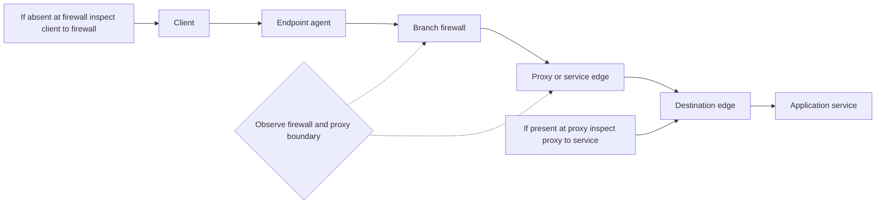

| Observation point | Can establish | Cannot alone establish |
|---|---|---|
| Application log | App attempted/received and internal state | Packet delivery at every hop |
| Endpoint process trace | Local call, file/config/socket operation | Remote receipt |
| Client packet capture | Packets at selected interface | Next-hop or server receipt |
| Firewall ingress/egress | Traffic/policy across named boundary | Application intent or downstream service |
| Proxy client/upstream legs | Separate HTTP/TLS connections and policy | Unlogged bypass traffic |
| Security-agent log | Forwarding/policy result at endpoint agent | Provider/service processing |
| Service-edge log | Session/request at edge | Client local state and origin internals |
| Server/app request log | Request reached app and outcome | Exact path before app |
| Distributed trace | Instrumented service dependencies | Uninstrumented network/client stages |

Observation gaps must be explicit. "No event found" means nothing until logging scope, health, sampling, retention, clock, filters, identifier mapping, and expected event generation are verified.

### Boundary language

Use: "The request was observed leaving client interface X at 10:00:01.200 UTC and entering firewall interface Y at 10:00:01.205. It was not present on firewall egress Z in the synchronized capture, and policy log P records a deny for the same tuple/session. This supports the firewall policy boundary."

Avoid: "The firewall ate it" based only on a client trace.

## OSI plus application: a practical layered method

The OSI model is a teaching and localization tool. Real implementations cross layers, proxies terminate connections, service workers can satisfy requests locally, identity and policy can block after transport succeeds, and applications can fail after HTTP success. Use layers plus the user operation.

| Practical layer | Questions | Evidence | Common false conclusion |
|---|---|---|---|
| Physical/media | Link, signal, errors, duplex, Wi-Fi quality? | Adapter/switch/radio counters | Link up means reliable path |
| Link/local delivery | VLAN, ARP/ND, gateway, local loss? | ARP/ND, switch, local trace | ARP success means internet works |
| Network | Address, route, NAT, MTU, path, IPv4/IPv6? | Route/flow/trace/ICMP | Ping fails means host unreachable |
| Transport | Port/listener, handshake, loss, reset, window? | Socket/packet/server listener | TCP connects means app succeeds |
| TLS/session | Trust, identity, protocol, SNI/ALPN, inspection? | Client/proxy/TLS logs | Certificate valid means authorization |
| HTTP/application protocol | Method, target, status, redirects, timing? | HAR/proxy/request IDs | 200 means business success |
| Identity/authorization | Account, token audience/claims, permission, MFA? | Identity/resource audit | Sign-in success means file permission |
| Policy/security | Context, matching rule, action, version? | Policy/session decision | Block means product defect |
| Application/service | State, dependency, throttling, quota, commit? | App/distributed trace/health | Service health green means request healthy |
| User workflow | Did durable intended outcome occur? | UI plus authoritative state check | Request sent means operation complete |

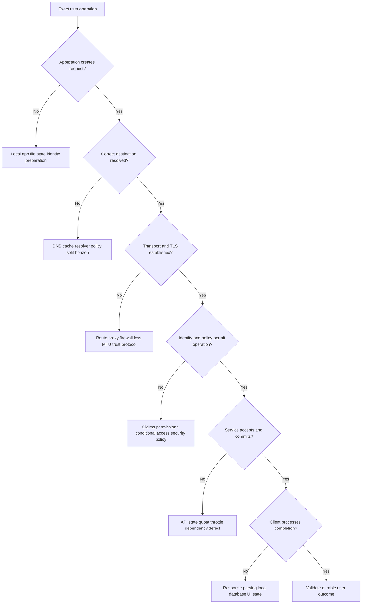

### Ping, port tests, and transaction tests

Microsoft's TCP/IP guidance notes that ping is useful but should not prove overall connectivity; a port-aware test can more closely test the intended transport. Even a successful TCP port test proves only that a connection could be established to that listener/path at that time. It does not test TLS identity, HTTP behavior, authentication, authorization, request body, service dependencies, or commit.

| Test | What success supports | What success does not prove |
|---|---|---|
| Local IP ping | Local stack/interface response path | External routing or application |
| Gateway ping | Echo reply from gateway interface | Gateway forwards intended traffic |
| Remote ping | ICMP echo path | TCP/UDP port or application policy |
| TCP port connect | Handshake to responding listener/intermediary | TLS/HTTP/business transaction |
| TLS handshake | Negotiated secure session and identity under client trust | Authorization or app success |
| HTTP GET | Resource response semantics | State-changing upload/commit path |
| Synthetic transaction | Defined end-to-end workflow | Every user, object, or policy context |

## Timelines and cross-source correlation

Normalize UTC while preserving original timestamps. Record clock source, offset, drift, precision, event time, ingestion time, and timezone. Join with process/PID, tuple, hostname, user/device pseudonym, request ID, session/policy ID, change ID, and content token. Never force events to match because times look close.

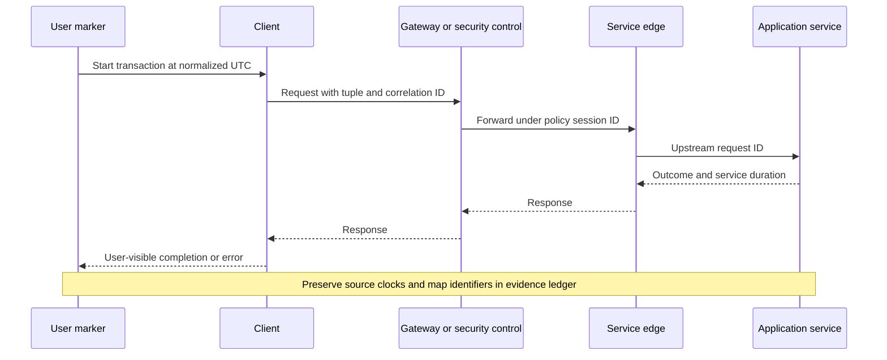

| Timeline field | Purpose |
|---|---|
| Source/event ID | Reopen exact record |
| Original timestamp/timezone | Preserve source truth |
| UTC-normalized time | Cross-source ordering |
| Clock offset/precision | Bound uncertainty |
| Event versus ingestion time | Avoid queue-delay confusion |
| Actor/process | Tie action to component |
| Operation/request ID | Join transaction |
| Observation | Fact only |
| Interpretation | Current meaning |
| Confidence | Evidence quality label |
| Hypothesis effect | Raises/lowers/splits/retires |

### Evidence quality

Evidence quality depends on proximity to mechanism, directness, completeness, integrity, time alignment, independence, reproducibility, and documented limitations.

| Quality factor | Stronger | Weaker |
|---|---|---|
| Proximity | Policy engine record for exact session | User recollection of block page |
| Directness | Server log contains request ID | No server entry without logging check |
| Completeness | Both directions and capture-drop stats | One-sided partial trace |
| Integrity | Original, hash, manifest | Edited screenshot only |
| Timing | UTC synchronized and offset recorded | Unknown local clock |
| Independence | Client and server evidence | Two views derived from same HAR |
| Reproduction | Repeats under controlled variable | One occurrence |
| Specificity | Exact user/device/operation | Tenant-wide aggregate |
| Semantics | Official field definition/version | Label guessed from color |

### Plain-English deep-dive 3 - Absence of evidence needs an observability test

If a motion camera records no visitor, three explanations exist: no visitor arrived, the camera did not cover the door, or the camera failed. "No log" has the same ambiguity.

Before using absence, prove the log was healthy for adjacent known-good traffic, retained the affected time, included the relevant protocol/user/device, had no sampling or filtering gap, used the expected identifier, and had a trustworthy clock. If a known-good synthetic transaction appears but the failing request does not, absence becomes more useful. If neither appears, the source cannot discriminate.

The correct handoff might be: "The service log cannot currently test receipt because its connector was stale during the incident." That statement is progress. It prevents false ownership and creates an observability action.

## Decision logs and avoiding shotgun changes

The decision log is the incident's memory. It separates time, facts, interpretation, decision, owner, risk, and result. It also prevents teams from repeating tests, silently changing configurations, or rewriting hypotheses after recovery.

| Field | Example |
|---|---|
| UTC | 2026-08-24 10:14:22 |
| Decision ID | D-07 |
| Evidence | Branch B DNS answer and egress differ from A |
| Hypothesis impact | H2 raised from moderate to strong |
| Test/change | Pilot local resolver/egress for one synthetic device |
| Predicted branches | Edge/RTT changes and latency falls, or H2 weakens |
| Risk/approval | Network owner approved; no security bypass |
| Rollback | Restore pilot route and resolver profile |
| Result | Median transaction fell from 31 s to 6 s over 20 samples |
| Negative control | Blocked test domain remains blocked |
| Next action | Validate change mechanism and broader pilot |

Shotgun changes include resetting the network stack, clearing every cache, reinstalling the app, bypassing security, changing DNS, updating the client, and rebooting at once. They destroy the failing state and introduce confounders. During severe impact, a broad rollback can be justified to restore service, but label it mitigation, preserve evidence first when safe, and investigate with the exact configuration diff afterward.

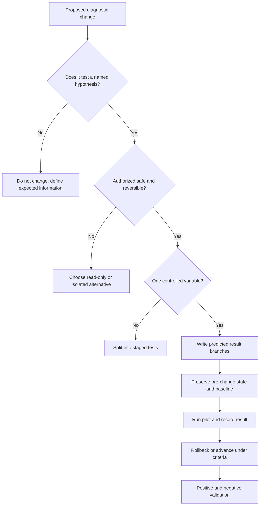

### Change versus test versus fix

| Action | Purpose | Evidence standard | Example |
|---|---|---|---|
| Observation | Learn without altering state | Named source/point | Read route and policy logs |
| Diagnostic test | Separate hypotheses | Predicted branches | Compare one pilot policy version |
| Workaround | Restore business path temporarily | Impact and risk | Use approved browser path |
| Mitigation | Reduce impact/likelihood | Risk owner and validation | Rate-limit retries |
| Rollback | Return to prior known state | Change diff and health gates | Revert faulty PAC revision |
| Fix | Correct verified mechanism | Reproduction, mechanism, regression tests | Correct rule match |
| Prevention | Detect/avoid recurrence | Monitor and process owner | Synthetic transaction change gate |

## Intermittent connectivity playbook

Intermittent failures require capture around the event, not continuous indiscriminate collection. Define failure signature, frequency, duration, triggers, and event marker. Use bounded ring buffers, counters, health telemetry, and automatic correlation IDs. Compare success immediately before and after failure.

| Intermittent dimension | Questions | Evidence strategy |
|---|---|---|
| Frequency | Per minute/day/user? | Eligible attempts and failure denominator |
| Duration | Milliseconds or hours? | High-resolution event markers |
| Trigger | Roam, sleep, token refresh, route change, load? | State transition logs |
| Affinity | One edge/IP/backend/session? | Endpoint and connection IDs |
| Recovery | Automatic retry, reconnect, user action? | Retry chronology |
| State | Cache, pooled connection, NAT, policy, token? | Before/during/after snapshots |
| Load | Correlated with utilization/queue? | Percentiles and resource telemetry |
| Change | Deployment ring or scheduled job? | Change/calendar overlay |

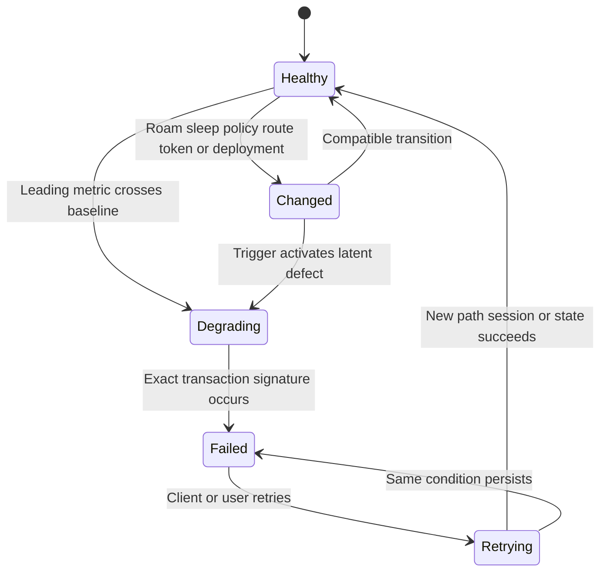

For every failure instance record numerator/denominator, client and server times, selected address/edge, connection reuse/new connection, identity refresh, policy/session ID, app version, network transition, and outcome. Avoid saying "random" when the sampling is merely insufficient.

### Intermittent decision tree

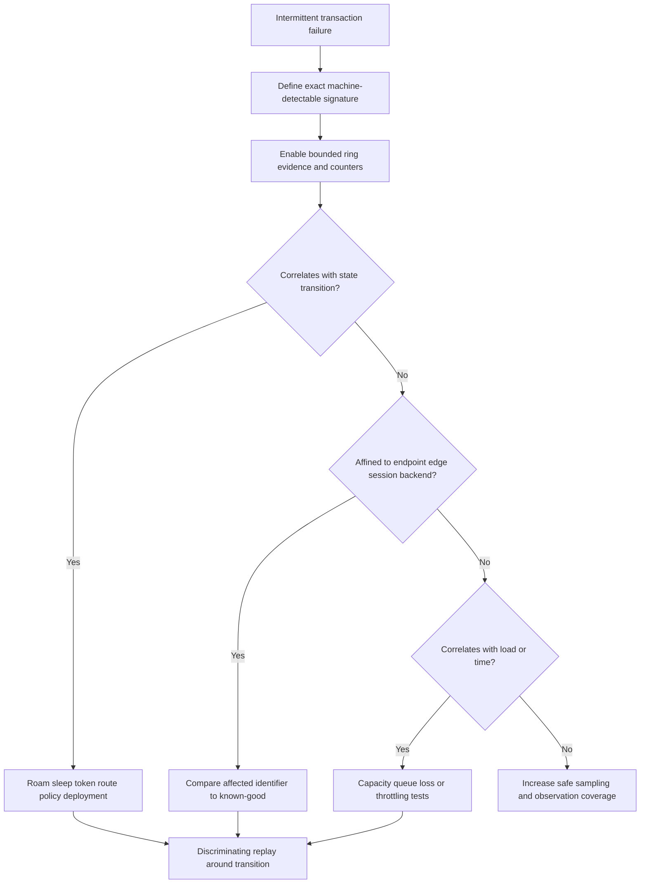

## Performance troubleshooting playbook

Performance is a budget across stages. Measure user-perceived transaction duration and decompose it into local preparation, DNS, queue, connection, TLS/proxy, request send, upstream wait, download, parse, and commit. Throughput and latency are different. A 1 KB API can be latency-sensitive; a 5 GB download can be throughput-sensitive. Packet loss affects TCP behavior but is not the only source of slowness.

| Metric | Definition | Use | Misuse |
|---|---|---|---|
| RTT | Round-trip time between named points | Path latency baseline | Calling it total app latency |
| TTFB | Request to first response byte at observer | First-response delay | Calling it server compute only |
| Throughput | Useful bytes delivered per unit time | Bulk-transfer rate | Equating with link speed |
| Goodput | Useful application payload excluding overhead/retry | User-effective transfer | Ignoring compression/cache |
| Loss/retransmission | Missing/repeated delivery indicators | Transport/path symptom | Assigning a hop from one point |
| Jitter | Variation in delay | Real-time/intermittent quality | Averaging it away |
| Queue time | Waiting before service/connection | Capacity/contention | Calling every queue network congestion |
| Percentile | Value below which a percentage falls | Tail experience | Comparing different sample populations |
| Error rate | Failures divided by eligible attempts | Reliability | No denominator |
| Saturation | Resource near limiting capacity | Capacity hypothesis | CPU average hides per-core/queue |

If transaction stages $t_i$ are measured without overlap, a simple budget is:

$$
T_{transaction} \approx \sum_i t_i
$$

Real browser/service work can overlap, so do not blindly sum parallel phases. Use critical path: the longest dependency chain that determines completion.

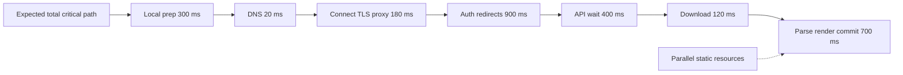

### Performance isolation questions

1. Is delay before request creation, connection, first byte, body completion, or client commit?
2. Is every transaction slow or only tail percentiles?
3. Is delay proportional to object size?
4. Does it correlate with branch, egress, edge, protocol, time, or load?
5. Is the sender blocked by congestion/window or the receiver/app by backpressure?
6. Are retries, redirects, authentication, or serial dependencies multiplying RTT?
7. Did a diagnostic tool or proxy change the protocol/path?
8. Does a known-good have the same semantic operation and policy?

### Performance scenario: long TTFB

Candidate causes include network RTT, proxy negotiation/inspection, service-edge queue, origin queue/compute, downstream dependency, cold start, or request serialization. Obtain request ID and timings at client, intermediary, service edge, and application. If client TTFB is 2.8 seconds, proxy upstream wait is 2.6, service trace reports 2.5 with 2.2 in database dependency, ownership narrows. If only client sees 2.8 while proxy receives upstream response at 0.4, client-proxy delivery or endpoint processing rises.

## Policy and security-control troubleshooting playbook

A policy outcome is evaluated against context. Context can include identity, device posture, destination, application category, data, location, time, risk, protocol, and rule version. A block can be intended, a wrong rule match, stale/missing context, classification error, authentication failure, unsupported application behavior, or a control defect. Never begin by bypassing the control.

| Policy question | Required evidence |
|---|---|
| Which transaction? | User/device, destination, method/category, UTC, session/request ID |
| Which control point? | Endpoint agent, proxy, firewall, identity, app, service edge |
| Which rule/version? | Rule ID, order, revision, effective time |
| Which context matched? | Sanitized identity/device/risk/destination fields |
| Which action occurred? | Allow, block, inspect, challenge, isolate, route, throttle |
| Was action intended? | Policy owner requirement and exception record |
| Was context fresh/correct? | Connector/posture/classification timestamp and provenance |
| What comparison exists? | Same context before change or controlled nonmatch |
| What fix preserves security? | Narrow rule/context correction plus negative controls |

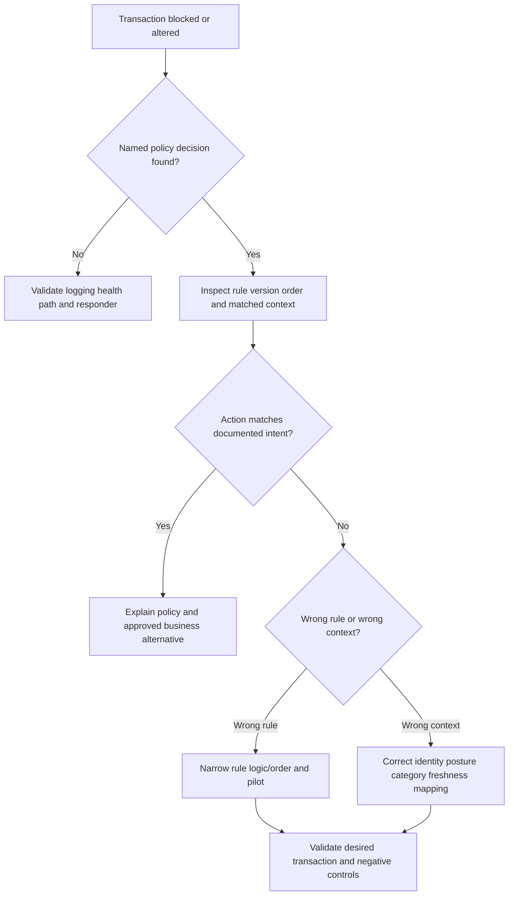

### Policy test safety

Use a synthetic user/device/destination or pilot ring. Prefer rule simulation, policy preview, log comparison, or narrow temporary exception approved by the owner. Record expiry and rollback. A broad "disable inspection/firewall" test can restore connectivity while creating unacceptable exposure and changing many variables. Success behind a bypass proves only that something in the bypassed set/path matters.

### Plain-English deep-dive 4 - A bypass is a large bag of variables

Suppose an application works when a security agent is disabled. The change may alter DNS, routes, proxy selection, TLS trust, protocol, identity context, policy, packet size, connection reuse, and process timing at once. It does not prove "the agent is the root cause."

Treat the result as a search-space reduction. Re-enable the control, preserve the failure, inspect exact forwarding and policy evidence, and isolate one function through supported configuration in a lab or pilot. Perhaps TLS inspection breaks certificate pinning; perhaps the app bypasses system proxy only when the agent is absent; perhaps a stale posture rule blocks it; perhaps the debugging change changed QUIC to TCP.

The final correction must preserve security intent. If a narrow certificate-pinning exception is officially recommended and risk-approved, validate only required destinations/app identities, expiration, logging, and unrelated threat controls. "Turn it off" is not a root-cause statement.

## Ownership boundaries and handoffs

Ownership follows evidence and control, not blame. One team can own the next diagnostic action while another owns the root cause. The incident lead owns the end-to-end customer outcome until the handoff is accepted.

| Boundary | Minimum handoff evidence | Exact ask |
|---|---|---|
| Endpoint/app | Process, version, operation, local error, Procmon/client log | Explain caller/state and supported repair |
| Identity | UTC, user/device, resource, sign-in/request ID, challenge/error | Validate token/access decision without sharing token |
| DNS | Query/name/type, resolver, response/TTL, app-selected address, comparison | Explain answer/path and intended resolver behavior |
| Network | Source/destination/port/protocol, route, synchronized captures | Identify last seen boundary/drop/route |
| Proxy/security | User/device/session/rule/action/version, client and upstream legs | Validate responder and intended policy |
| Service/provider | Tenant, request ID, UTC, API operation, sanitized response | Trace processing/dependency and confirm service behavior |
| Application owner | Method/route/body class/status/dependency trace | Validate semantics and code path |
| Customer change | Change ID, diff, rollout, affected ring, rollback result | Confirm trigger and approve controlled correction |

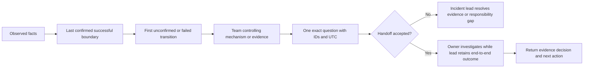

A weak handoff says: "Network issue, please investigate." A strong handoff says: "At 10:22:14.120 UTC the client and branch-firewall ingress captures contain SYNs for synthetic tuple A; firewall egress does not. Policy event P-104 records deny rule R-18 revision 6 for the same session. Please confirm whether destination classification C and rule R-18 were intended for this workload and provide the approved correction path."

## NMH playbook 1: users cannot sign in after proxy change

NMH is fictional. After PAC revision 52, managed native clients in one ring loop at sign-in; browser sign-in works. Scope suggests a native-client proxy/authentication difference.

| Item | Playbook content |
|---|---|
| Symptom | Native client repeats sign-in; no durable token/session |
| Scope | Managed Windows ring C; browsers and ring B work |
| Impact | Fictional collaboration sync unavailable; browser workaround |
| Change | PAC revision 52 and proxy-auth method change |
| H1 | Native client cannot satisfy proxy 407 challenge on token endpoint |
| H2 | Identity conditional-access policy rejects device context |
| H3 | Client token cache is stale/corrupt |
| Test | Correlate 407/401, proxy session, identity sign-in ID, and known-good ring |
| Safety | No token capture; no broad proxy bypass |
| Success | Intended auth path works; proxy security and negative controls remain |

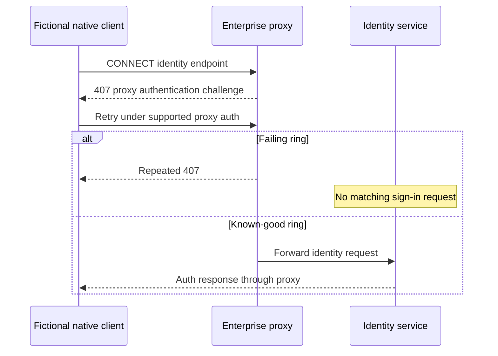

The discriminating fact is whether identity receives the request. If proxy logs show repeated 407 and identity has no request ID while browser proxy authentication succeeds, H1 rises. Correct PAC/auth scope through the network owner and validate native/browser, restart/renewal, and blocked unauthorized destinations.

## NMH playbook 2: intermittent branch upload failures

Synthetic uploads over 20 MB fail for about 8 percent of attempts at branch D after tunnel overhead changes. Small files work. H1 is MTU/PMTUD; H2 is proxy body/time limit; H3 is service throttling; H4 is branch loss/capacity.

| Test outcome | H1 MTU | H2 proxy limit | H3 throttle | H4 loss/capacity |
|---|---|---|---|---|
| Same byte offset retransmits; missing PTB; size threshold near path limit | Raise | Neutral | Lower | Possible |
| Immediate 413 at proxy with policy/session ID | Lower | Raise | Lower | Lower |
| 429/Retry-After with service request ID | Lower | Lower | Raise | Lower |
| Loss/utilization correlation independent of object size | Possible | Lower | Lower | Raise |
| Known-good branch adapts MSS/PMTUD | Raise | Neutral | Neutral | Possible |

Use synchronized inner/outer/gateway observations and request IDs. Do not permanently reduce MTU or bypass the proxy before mechanism evidence. Pilot the supported correction, validate IPv4/IPv6, large/small operations, failover, and security policy.

## NMH playbook 3: SharePoint-style page is slow only at one office

Branch B page median is 31 seconds; branch A is 5 seconds. Waterfall shows 22 serial requests with 70 ms higher RTT at branch B. DNS resolver and egress are remote from branch B, selecting a distant service entry path. No Zscaler claim is made.

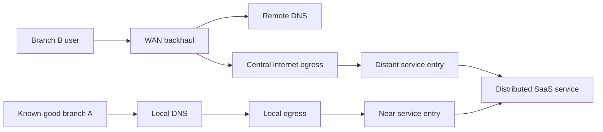

The test is an approved pilot using local DNS and egress while preserving security requirements. Record resolved addresses, public egress, connected service entry, RTT, waterfall critical path, and 20+ samples. A faster pilot supports the path hypothesis only when those variables change and reversal restores the old result. Use Microsoft 365 official connectivity principles for Microsoft workloads; never generalize one vendor's endpoint guidance to every SaaS service.

## NMH playbook 4: policy block after device-posture update

A subset of fictional contractors loses access after posture connector delay. Policy logs show `device_compliant=unknown` and a deny rule intended for noncompliant devices. H1 is stale context; H2 is intended contractor exclusion; H3 is app permission.

| Evidence | Finding | Hypothesis effect |
|---|---|---|
| Policy event | Deny at security boundary before app request | Lowers app permission H3 |
| Rule requirement | Contractors allowed only when compliant | H2 depends on posture truth |
| Connector freshness | Last successful update 47 minutes old | Raises stale context H1 |
| Device authority | Device is compliant at source at event time | Raises mapping/freshness issue |
| Known-good | Fresh connector causes same rule to allow | Raises H1 |
| Negative control | Truly noncompliant synthetic device remains blocked | Preserves policy intent |

The correction restores connector freshness/mapping, not an `unknown=allow` broad exception. Validate freshness monitor, stale-data fail behavior approved by risk owner, and audit trail.

## NMH playbook 5: service error or gateway error?

Users receive a generic 504 page. A 504 indicates Gateway Timeout semantics at whichever HTTP participant generated it; it does not identify the origin. Compare branding cautiously, headers, certificate/peer, Via where present, proxy session, request ID, and service logs.

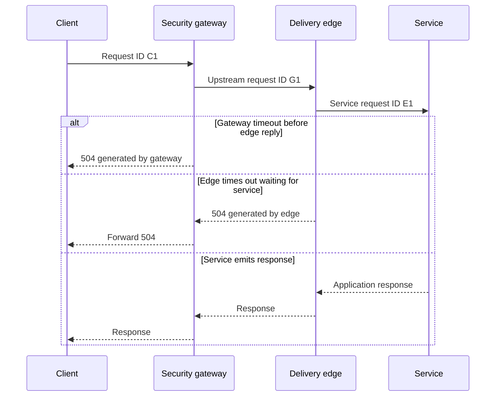

If the gateway log shows upstream timeout and the edge has no E1, investigate gateway-to-edge path/connection. If edge has E1 and times out on service dependency, service ownership rises. If IDs cannot be mapped, state the gap.

## Critical-incident operating model

Run parallel work that observes different boundaries or answers different questions. Prevent overlapping configuration changes.

| Role/workstream | Responsibility | Output |
|---|---|---|
| Incident lead | Scope, priority, decisions, dependencies, conflict resolution | Decision log |
| Customer communicator | Impact, workaround, cadence, next update | Status update |
| Endpoint/app | Reproduction, process/local state, client logs | Client boundary report |
| Identity | Sign-in/access decision and IDs | Identity boundary report |
| Network | DNS, route, egress, captures, capacity | Path boundary report |
| Security/policy | Forwarding, rule/session, context | Policy boundary report |
| Service/provider | Request/dependency trace and health | Service boundary report |
| Change coordinator | Freeze, approval, pilot, rollback | Change record |
| Evidence/privacy | Collection authority, minimization, storage | Evidence manifest |

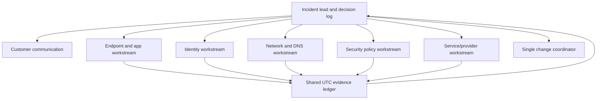

### Update format

Use: impact; scope; current workaround; established facts; leading hypothesis with confidence; tests in progress; decisions/changes; risks; owners; next update time. Avoid unsupported ETA. Say "next evidence checkpoint at 11:30 UTC," not "fixed in 30 minutes."

## Labs with synthetic or explicitly authorized data

### Lab 1: intake transformation

Take ten vague reports such as "internet slow" or "OneDrive down." Rewrite each into symptom, scope, impact, time, change, expected, actual, reproduction, and workaround. Grade whether another analyst can run the operation without asking what failed.

### Lab 2: dependency map

Map a local HTTPS upload from user click through file read, identity, DNS, proxy, transport, TLS, policy, API, storage, response, and client commit. Mark control/data paths, owner, observation point, and failure modes for every node.

### Lab 3: hypothesis matrix

Introduce a synthetic 407 loop. Write at least four hypotheses with scope fit, predicted evidence, disconfirming result, safe test, owner, and confidence. Retire at least two through collected evidence.

### Lab 4: binary capture isolation

In an owned network simulator, drop traffic at one of four boundaries. Use synchronized observation at midpoint, then one side, to locate the interval. Record what each capture point proves and does not prove.

### Lab 5: known-good comparison

Create failing and healthy clients differing in three variables. First show why the comparison is confounded. Then control two variables and test the third. Reverse the variable and reproduce the result.

### Lab 6: intermittent trigger

Create a client that fails after a route or token-state transition one in ten times. Use an event marker, ring buffer, counters, and state snapshots. Produce numerator, denominator, confidence, and trigger timeline.

### Lab 7: performance budget

Build a local web transaction with configurable DNS-equivalent delay, TLS/proxy delay, API wait, body transfer, and parse delay. Compare median and p95. Identify the critical path and show why throughput improvement does not fix serial RTT amplification.

### Lab 8: policy decision

Use a local policy simulator with identity, device posture, destination, and action. Create wrong context freshness. Correct data flow rather than allowing unknown posture. Validate an authorized user succeeds and a noncompliant negative control remains blocked.

### Lab 9: decision log under pressure

Run a 45-minute tabletop with four workstreams. Only the change coordinator may modify state. Score whether every test had predicted branches, owner, rollback, and result before another change.

### Lab 10: NMH playbook teach-back

Choose one NMH scenario and explain it in five minutes to an engineer, two minutes to a manager, and thirty seconds to an executive. Keep facts/confidence identical while changing depth.

| Lab deliverable | Pass condition |
|---|---|
| Intake | Reproducible and quantified |
| Dependency map | Every required node has owner and observation point |
| Hypothesis matrix | Every hypothesis can be disconfirmed |
| Binary isolation | Failure interval named without overattribution |
| Known-good | One meaningful variable controlled |
| Intermittent report | Frequency, trigger, before/during/after evidence |
| Performance budget | Critical path and percentile population correct |
| Policy validation | Intended allow and deny both tested |
| Decision log | No undocumented state change |
| Teach-back | Bounded claims and clear next action |

## RCA and prevention

Recovery is not root cause. A restart can clear state without revealing why state became bad. A rollback can restore service while only identifying the triggering change. Separate:

| RCA element | Question |
|---|---|
| Trigger | What event exposed or activated the condition? |
| Root cause | What controllable mechanism made the failure possible? |
| Contributors | What increased likelihood, duration, or impact? |
| Detection gap | Why was it not seen before users? |
| Response gap | What slowed isolation/recovery? |
| Fix | What corrected the mechanism? |
| Validation | What proves intended operation and controls work? |
| Prevention | What design, test, monitor, or process reduces recurrence? |
| Residual risk | What remains and who accepts it? |

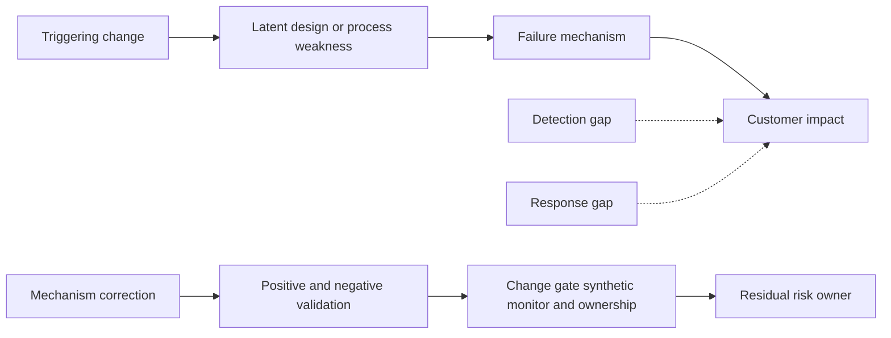

Avoid "five whys" as a forced single chain when multiple necessary conditions exist. Use a causal graph and support every link with evidence.

## Customer-safe evidence collection

Collect only what tests the active hypotheses. Define purpose, authority, system, process/user scope, data classes, start/stop, access, encryption, transfer, retention, and deletion. Use synthetic identifiers and content whenever possible. Never paste raw tokens, cookies, personal paths, or unrestricted packet/HAR archives into broad tickets.

| Artifact | Sensitive content | Minimum handling |
|---|---|---|
| Packet trace | Addresses, metadata, plaintext where unencrypted | Named interface/time/filter, restricted original, sanitized derivative |
| HAR/DevTools | URLs, tokens, cookies, bodies, user actions | Structured redaction and canary validation |
| Procmon | Paths, users, command lines, Registry/config | Process/time scope and tokenized export |
| Identity log | User/device/risk/claims context | Pseudonymize; never share token material |
| Policy log | User, destination, internal rules/topology | Least-data session extract |
| Service trace | Tenant, request, database/dependency details | Request-scoped approved access |
| Screenshot/video | Personal data, notifications, other apps | Crop after preserving context; review every frame |
| Decision log | Customer architecture and risk | Role-based case access |

## Arti bridge and interview positioning

| Existing strength | Part 27 translation | Practice artifact |
|---|---|---|
| Microsoft 365 escalation | End-to-end transaction ownership | Structured intake |
| OneDrive/SharePoint expertise | Browser versus native client dependency comparison | Path matrix |
| Networking upskill | Layered observation and packet reasoning | Fault tree |
| CRITSIT | Parallel workstreams and decision cadence | Incident log |
| RCA/fix validation | Trigger/root cause/controls/prevention | NMH RCA |
| Analytics | Baselines, percentiles, scope matrices | Performance dashboard |
| Mentoring | Teach hypotheses and evidence boundaries | Playbook workshop |
| AI agents | Summarize sanitized facts, never invent missing evidence | Human-reviewed incident brief |

A strong interview answer is: "I start with symptom, scope, impact, time, change, and one exact transaction. I map control and data dependencies, define healthy baseline and closest known-good, then write ranked hypotheses with predicted and disconfirming evidence. I choose the cheapest safe test that separates them, collect at named observation points, normalize time and IDs, and maintain a decision log. I avoid shotgun changes; if urgency requires rollback, I label it mitigation and preserve the configuration diff. I hand off the last confirmed boundary with one exact ask, then validate the user outcome, security negative controls, rollback, and prevention."

## Common misconceptions to correct

| Misconception | Correction |
|---|---|
| Start at layer 1 every time | Start at the exact operation and most discriminating observation, then traverse dependencies |
| Ping proves connectivity | It tests ICMP echo at that time, not intended port/app transaction |
| Port open means service works | TLS, identity, HTTP, policy, dependency, and commit remain |
| Browser success proves sync works | Shared dependencies narrow; process/state/API paths differ |
| Service health green proves no service issue | Aggregation and known-issue scope do not replace request evidence |
| No logs means request never arrived | Validate logging coverage, health, retention, sampling, IDs, and clocks |
| A bypass proves the security product is defective | It changes a set of variables and only narrows the search |
| Resetting everything is efficient | It destroys state and attribution and may add risk |
| Correlation proves causation | Mechanism, controlled test, reversal, and alternatives matter |
| One success proves fixed | Use sample criteria, affected variants, restart/failover, and recurrence window |
| Average latency describes users | Tail percentiles, distribution, sample population, and critical path matter |
| TTFB is server compute | It includes path/intermediary latency plus response preparation |
| Retransmission identifies the bad hop | It shows repeated bytes at an observation point; use multiple points |
| Every 4xx is a client bug | Intermediaries and authorization/policy can generate responses |
| Every 5xx is origin failure | Gateway/edge/proxy may generate it; identify responder |
| Policy block is always wrong | It may be intended; validate context, rule, action, and requirement |
| Workaround equals fix | It restores/avoids impact without necessarily correcting mechanism |
| Rollback proves the change's exact defect | It identifies a trigger set; inspect the diff and mechanism |
| RCA is the timeline | RCA explains causal mechanism, contributors, gaps, fix, and prevention |
| Ownership transfer ends TSM responsibility | The next owner investigates; end-to-end customer outcome remains coordinated |
| More evidence always improves diagnosis | Minimum decisive evidence reduces noise, privacy exposure, and delay |
| Fast incident means undocumented incident | Urgency needs a stronger decision log, not weaker evidence |

## Official Source Anchors

The following authoritative sources were reviewed on **2026-08-24**. They support layered Internet behavior, TCP/HTTP semantics, Microsoft troubleshooting and Microsoft 365 connectivity principles, incident/evidence practice, and high-level zero trust context. They do not prove fictional NMH outcomes, a tenant configuration, a Zscaler policy decision, or a vendor defect. Verify current versions, RFC status/errata, environment, and official product guidance.

| Source | URL | Used for | Boundary |
|---|---|---|---|
| Microsoft: Guidance for troubleshooting TCP/IP communication | https://learn.microsoft.com/en-us/troubleshoot/windows-server/networking/troubleshoot-tcp-ip-communication-guidance | Topology, traces, ping limits, port tests, two-sided evidence | Windows Server guidance; adapt to client/app |
| Microsoft: Troubleshoot TCP/IP connectivity | https://learn.microsoft.com/en-us/windows/client-management/troubleshoot-tcpip-connectivity | Windows client connectivity workflow | Commands/build behavior can change |
| Microsoft Sysinternals PsPing | https://learn.microsoft.com/en-us/sysinternals/downloads/psping | Port-aware latency/connectivity test context | Authorized use and exact mode required |
| Microsoft 365 network connectivity principles | https://learn.microsoft.com/en-us/microsoft-365/enterprise/microsoft-365-network-connectivity-principles | Distributed service entry, DNS/egress, path optimization, endpoint guidance | Applies to Microsoft 365 and current categories |
| Microsoft 365 network connectivity Admin Center | https://learn.microsoft.com/en-us/microsoft-365/enterprise/office-365-network-mac-perf-overview | Location assessments, metrics, insights, comparisons | Aggregate score is not single-request RCA |
| Microsoft 365 connectivity test | https://connectivity.office.com/ | Browser/device connectivity measurements | One observation, not complete root cause |
| IETF RFC 1122 | https://www.rfc-editor.org/rfc/rfc1122 | Internet host layers, path, error logging, diagnostic caveats | Updated by later RFCs including RFC 9293 |
| IETF RFC 9293 | https://www.rfc-editor.org/rfc/rfc9293 | Current base TCP specification, state, reliability, failure semantics | Congestion/extensions have companion RFCs |
| IETF RFC 9110 | https://www.rfc-editor.org/rfc/rfc9110 | HTTP semantics, intermediaries, status, auth, privacy | Version framing is in related RFCs |
| IETF RFC 1034 and RFC 1035 | https://www.rfc-editor.org/rfc/rfc1034 | DNS concepts, resolver/name architecture | Updated by many DNS RFCs |
| IETF RFC 8446 | https://www.rfc-editor.org/rfc/rfc8446 | TLS 1.3 handshake/security | Deployment and inspection policy vary |
| IETF RFC 9000 | https://www.rfc-editor.org/rfc/rfc9000 | QUIC transport concepts | HTTP/3 is RFC 9114 |
| IETF RFC 1191 and RFC 8201 | https://www.rfc-editor.org/rfc/rfc1191 | IPv4/IPv6 path MTU discovery | PLPMTUD and implementation behavior add detail |
| NIST SP 800-61 Rev. 3 | https://csrc.nist.gov/pubs/sp/800/61/r3/final | Incident response within risk management | Tailor to organizational procedures |
| NIST SP 800-86 | https://csrc.nist.gov/pubs/sp/800/86/final | Forensic techniques for incidents/IT problems | Published 2006; law/procedure current |
| NIST SP 800-92 | https://csrc.nist.gov/pubs/sp/800/92/final | Log-management principles | Technology examples are dated |
| NIST SP 800-207 | https://csrc.nist.gov/pubs/sp/800/207/final | Zero trust concepts and policy decision/enforcement context | Architecture guidance, not product diagnosis |
| Zscaler: What is zero trust? | https://www.zscaler.com/resources/security-terms-glossary/what-is-zero-trust | High-level identity/context/least-privilege vocabulary | Vendor overview; product specifics need Help Portal |
| Zscaler Help Portal | https://help.zscaler.com/ | Official product documentation/support entry | Access, product, forwarding method, and version vary |

## Likely Interview Questions

### Q1. What information do you collect before troubleshooting connectivity?

**Model answer:** I define the exact transaction, expected and actual outcome, affected and unaffected users/devices/apps/locations, business impact, first seen and last known good in UTC, frequency, duration, recent changes, safe reproduction, workaround, and evidence/privacy authority. That scope ranks shared dependencies before I choose a tool.

### Q2. What makes a troubleshooting hypothesis useful?

**Model answer:** It names a plausible mechanism and boundary, explains the observed scope and timing, predicts evidence, and states what would disconfirm it. I rank hypotheses by evidence and choose a test whose possible outcomes separate them. "The network is bad" is not falsifiable; a named egress/DNS/RTT mechanism is.

### Q3. What is a discriminating test?

**Model answer:** It is a safe test designed in advance so different outcomes raise or lower different hypotheses. It changes one controlled variable where possible, has explicit predicted branches, rollback, sample criteria, and privacy limits. Its value is information gained, not tool complexity.

### Q4. How do you use OSI without troubleshooting mechanically from layer 1 upward?

**Model answer:** I use layers as observation and ownership boundaries around the actual application transaction. I start at the most discriminating available stage, such as request creation, DNS, transport/TLS, identity/policy, API, dependency, or client commit, then move one boundary toward the first failed transition. Real proxies and applications cross layers, so user outcome remains the top check.

### Q5. Why is a successful ping or port test insufficient?

**Model answer:** Ping tests ICMP echo, which can be allowed or blocked independently. A port test can establish TCP connectivity to a listener or intermediary at that time, but TLS identity, HTTP semantics, authentication, authorization, policy, service dependencies, and durable commit remain. I test the closest safe semantic transaction and state exactly what each result proves.

### Q6. How do you avoid shotgun troubleshooting during a critical incident?

**Model answer:** One incident lead maintains a decision log and one change coordinator controls modifications. Workstreams collect at separate boundaries in parallel. Every proposed test names a hypothesis, predicted branches, risk, approval, rollback, and result. If impact requires broad rollback, I label it mitigation, preserve evidence/configuration diff when safe, and isolate the mechanism afterward.

### Q7. How do you troubleshoot an intermittent or performance problem?

**Model answer:** For intermittence I define a machine-detectable signature, denominator, trigger/state transitions, bounded ring evidence, and before/during/after snapshots. For performance I define the user transaction and critical-path budget across local prep, DNS, connect/TLS/proxy, request, TTFB, transfer, and commit, using distributions and percentiles. Then I compare a controlled known-good and correlate identifiers across boundaries.

### Q8. How would you handle a suspected security-policy block?

**Model answer:** I identify the actual responder/control, exact session, rule and revision, matched identity/device/destination/risk context, action, and policy intent. I distinguish intended enforcement from wrong rule or stale/incorrect context. I prefer simulation/log/read-only checks and a synthetic pilot over broad bypass. Any correction must validate the desired transaction and negative controls so security intent remains.

## 30-Second Memory Hooks

| Concept | Memory hook |
|---|---|
| Symptom | What hurts |
| Scope | Size and shape of shadow |
| Impact | Why it matters |
| Time | One UTC story |
| Change | Trigger candidate, not automatic cause |
| Dependency | Required link in transaction |
| Baseline | Normal heartbeat |
| Known-good | Working twin with differences listed |
| Hypothesis | Candidate story that can lose |
| Disconfirming evidence | What makes the story unlikely |
| Discriminating test | Fork-in-road result |
| Binary isolation | Halve the haystack |
| Observation point | Camera location defines claim |
| OSI | Localization map, not ritual |
| Ping | ICMP clue, not app proof |
| Port connect | Listener reached, transaction remains |
| Timeline | Event time, ingestion time, clock caveat |
| Evidence quality | Proximity, completeness, integrity, independence |
| Missing log | Test the camera before using absence |
| Policy block | Context matched rule and action |
| Bypass | Large bag of variables |
| Workaround | Side road, not cause repair |
| Rollback | Restores state, identifies trigger set |
| Fix | Correct mechanism |
| Negative control | Prove what must still fail |
| Decision log | Incident memory |
| Shotgun change | Change everything, learn nothing |
| Intermittent | Catch state transition |
| Performance budget | Find critical-path overspend |
| Ownership | Last confirmed boundary plus exact ask |
| RCA | Mechanism, contributors, gaps, prevention |
| Honesty | Preserve unknowns and product boundaries |

## Completion Checklist

- [ ] I can convert a vague report into exact symptom, scope, impact, time, change, expected, and actual behavior.
- [ ] I can define a safe, repeatable transaction and stop condition.
- [ ] I can build affected/unaffected matrices across user, device, app, network, location, time, and policy ring.
- [ ] I can explain why scope ranks hypotheses without proving them.
- [ ] I can map control and data dependencies from user intent to durable outcome.
- [ ] I can give every dependency a state, owner, observation point, and failure mode.
- [ ] I can define a healthy baseline with sample population, percentiles, path, configuration, and outcome.
- [ ] I can choose a close known-good and list every confounder.
- [ ] I can hold controls constant and change one safe variable.
- [ ] I can write mechanism, prediction, disconfirming evidence, test, risk, owner, and confidence for each hypothesis.
- [ ] I can rank, split, lower, raise, retire, and preserve hypotheses based on results.
- [ ] I can define a discriminating test and write result branches before running it.
- [ ] I can choose read-only, low-risk, reversible evidence before disruptive changes.
- [ ] I can apply binary isolation at reliable observation points.
- [ ] I can state what client, firewall, proxy, edge, and service observations prove and do not prove.
- [ ] I can use OSI/TCP-IP with identity, policy, application, and user-outcome layers.
- [ ] I can explain the limitations of ping, port, TLS, HTTP, and synthetic tests.
- [ ] I can normalize UTC while preserving source time, offset, drift, precision, and ingestion time.
- [ ] I can correlate PID, tuple, hostname, request ID, session ID, policy ID, and change ID.
- [ ] I can grade evidence by proximity, directness, completeness, integrity, timing, independence, and reproduction.
- [ ] I can validate observability before using absence of a log as evidence.
- [ ] I can maintain a decision log under incident pressure.
- [ ] I can distinguish observation, diagnostic test, workaround, mitigation, rollback, fix, and prevention.
- [ ] I can explain why shotgun changes destroy attribution and increase risk.
- [ ] I can preserve evidence before rollback when impact and safety permit.
- [ ] I can define an intermittent signature, frequency, duration, trigger, affinity, and recovery path.
- [ ] I can use bounded ring evidence and before/during/after state snapshots.
- [ ] I can calculate error rate with an eligible-attempt denominator.
- [ ] I can distinguish latency, TTFB, throughput, goodput, loss, jitter, queue, and saturation.
- [ ] I can build a transaction performance budget and identify the critical path.
- [ ] I can avoid equating TTFB with origin compute and link speed with application throughput.
- [ ] I can investigate policy responder, rule/version, context, action, intent, and freshness.
- [ ] I can design a policy correction that preserves security negative controls.
- [ ] I can treat bypass success as search-space reduction, not product blame.
- [ ] I can hand off the last confirmed boundary with minimum evidence and one exact ask.
- [ ] I can keep end-to-end customer ownership while another team investigates its boundary.
- [ ] I can run the five NMH playbooks without claiming production Microsoft or Zscaler defects.
- [ ] I can separate trigger, root cause, contributors, detection gap, response gap, fix, prevention, and residual risk.
- [ ] I can collect minimum authorized evidence and protect tokens, identifiers, paths, content, and architecture.
- [ ] I can complete all ten labs with synthetic or explicitly authorized data.
- [ ] I can explain Arti's production support strengths and product gaps without false equivalence.
- [ ] I can answer all eight interview questions aloud with bounded evidence language.

[Part 28 - OneDrive Sync and SharePoint Online Connectivity Architecture](Part-28-onedrive-sharepoint-connectivity.md)