# Part 28 - OneDrive Sync and SharePoint Online Connectivity Architecture

> **Audience:** Candidates moving from Microsoft 365 Support Escalation Engineering into a Zscaler Security Operations Technical Success Manager role.
>
> **Purpose:** Explain OneDrive for work or school and SharePoint Online connectivity from tenant and identity through endpoint, network, sync, file, metadata, sharing, coauthoring, throttling, migration, health, and support boundaries.
>
> **Scope and honesty:** Northstar Meridian Holdings, abbreviated NMH, is fictional. Its tenant, users, sites, devices, files, traces, policies, logs, incidents, errors, migrations, and outcomes are synthetic. Your own product, networking, evidence, and escalation experience must remain within your documented background.
>
> **Product caveat:** Microsoft 365 is a continuously changing distributed SaaS service. Endpoint sets, IP ranges, domains, ports, client behavior, limits, policy names, sync internals, report latency, and support procedures change. Verify the current Microsoft 365 endpoint web service, Microsoft Learn/Support, tenant settings, client release notes, service health, and direct evidence. This Part uses public architecture, not undocumented backend topology, proprietary algorithms, or a claim that any production Microsoft, Zscaler, carrier, proxy, firewall, endpoint, or customer component is defective.

## Section goal

OneDrive for work or school and SharePoint Online are not a single server reached by one HTTPS request. They are a collaboration experience built from identity, tenant and site configuration, SharePoint-backed content and metadata, distributed Microsoft 365 entry points, browser and native clients, endpoint state, change notifications, policy, and service dependencies. A successful network connection proves only one stage.

Think of a library system. SharePoint is the managed library: buildings, collections, catalog metadata, permissions, version history, sharing, and collaboration rules. OneDrive is both an individual's SharePoint-backed library experience and the sync application that keeps a selected local shelf aligned with cloud records. A browser is a visitor using the web desk; OneDrive.exe is a courier with a durable route and local inventory. Both reach the library system, but they carry different credentials, requests, state, and failure modes.

By the end, you should be able to:

| Outcome | Demonstrated capability | Evidence of mastery |
|---|---|---|
| Explain service context | Distinguish tenant, OneDrive library, SharePoint site/library, Teams file storage, and client | Context diagram |
| Trace identity | Separate sign-in, token/session, permission, sharing, and resource authorization | Identity sequence |
| Map connectivity | Explain DNS, local egress, proxy/firewall, TLS, CDN/service front door, and endpoint currency | Network map |
| Compare clients | Distinguish browser, sync client, Office integration, and migration paths | Path matrix |
| Explain sync | Describe local detection, queues, HTTPS transfer, WNS signal, reconciliation, retry, and commit | Sync state flow |
| Handle local state | Reason about filesystem, placeholders, hydration, local cache/database state, disk, locks, and process context | Endpoint checklist |
| Explain Files On-Demand | Distinguish online-only, locally available, and always available behavior | State diagram |
| Explain collaboration | Connect files, metadata, permissions, sharing links, versions, Office integration, and coauthoring | Collaboration model |
| Analyze throttling | Interpret 429/503, Retry-After, backoff, and background workload pressure | Throttle playbook |
| Plan migration | Separate source read, packaging, network/Azure staging, API ingest, validation, and cutover | Migration plan |
| Monitor health | Use service health, sync reports, client state, request IDs, and known-good comparisons | Health dashboard map |
| Troubleshoot | Classify local, identity, endpoint, network, policy, service, content, and scale errors | Decision trees |
| Escalate | Build a minimum-data bundle with exact support boundary and ask | Escalation package |
| Bridge honestly | Use your M365 depth without translating it into unsupported Zscaler production claims | Interview narrative |

## JD Mapping

| JD expectation | Part 28 capability | Customer artifact | Honest experience bridge |
|---|---|---|---|
| Analyze complex environments | Map endpoint, identity, network, policy, service, content, and collaboration dependencies | Transaction architecture | Direct M365 strength |
| Identify security risks | Review sharing, permission, token/log privacy, endpoint trust, and unsafe bypasses | Access/evidence review | Builds on SharePoint governance support |
| Resolve critical escalations | Separate browser/sync, tenant/local, service/customer, and change boundaries | RCA timeline | Builds on critical-situation leadership |
| Tailor mitigation | Select supported file, policy, proxy, client, permission, or migration corrections | Option/rollback record | Builds on fix validation |
| Deliver consulting | Explain Microsoft guidance to endpoint, network, security, and collaboration teams | Workshop/runbook | Uses advisor and mentoring strengths |
| Partner cross-functionally | Coordinate Microsoft 365 admin, identity, endpoint, network, security, app, migration, and Microsoft Support | RACI and evidence bundle | Directly transferable motion |
| Communicate outcomes | Translate sync mechanics into affected workflow, confidence, owner, and next step | Executive update | Uses customer communication experience |
| Drive adoption and health | Use sync health, update rings, Files On-Demand, change gates, and baselines | Health/adoption plan | Bridge to proactive TSM outcomes |

## Candidate honesty note

This Part is closest to your established domain. You can use real production examples only when they are supported by your actual CV and can be shared without customer information. You should distinguish official public architecture from internal Microsoft engineering knowledge that is confidential, obsolete, or not established.

Exact OneDrive local database schemas, private cloud-service internals, undocumented endpoints, internal debugging tools, and proprietary enterprise support telemetry are not described here and must not be invented. Production Zscaler policy, service-edge, Client Connector, ZDX, Data Fabric, or SecOps experience is still not established by Microsoft 365 expertise.

| Claim class | Safe wording | Boundary |
|---|---|---|
| Production | "I investigated OneDrive/SharePoint client, identity, permissions, and connectivity in enterprise support." | Use only supported personal facts |
| Official architecture | "Microsoft documents WNS notification and HTTPS sync flows." | Recheck current Learn page and client version |
| Conceptual | "The client needs durable local reconciliation state." | Exact schema/location is internal and unsupported to edit |
| Lab | "I compared browser and sync-client evidence with synthetic files." | Keep artifact and label it synthetic |
| Not yet used | "I would validate Zscaler forwarding and policy in the tenant; I have not operated it in production." | No product-console implication |
| Unknown | "The request reached the service front door; backend processing is unobserved." | Request/service evidence needed |

## Terms, definitions, and analogies before mechanics

| Term | Plain meaning | Why it matters | Memory hook |
|---|---|---|---|
| Tenant | Organization's Microsoft 365 service boundary/configuration context | Settings, identities, sites, and service scope live here | Organization campus |
| SharePoint Online | Microsoft's cloud collaboration/content service in Microsoft 365 | Powers sites, libraries, metadata, permissions, and file collaboration | Managed library system |
| OneDrive for work or school | User-centered file experience backed by SharePoint technology | Individual work files plus sharing/collaboration | Personal library room |
| Site | SharePoint collaboration/security/content container | Holds libraries, pages, lists, settings, and permissions | Building |
| Document library | SharePoint collection for files plus metadata and behavior | Sync target and collaboration boundary | Shelves plus catalog |
| OneDrive sync app | Native client, commonly OneDrive.exe on Windows | Reconciles selected cloud and local content | Courier and inventory clerk |
| Sync relationship | Mapping between a cloud library/folder and local location/account | Defines scope and state | Route contract |
| Metadata | Data describing an item, such as name, ID, version, time, fields | Changes can occur without full content transfer | Catalog card |
| Change notification | Signal that content/metadata changed | Prompts efficient reconciliation | Doorbell, not package |
| WNS | Windows Push Notification Services | Microsoft documents it as a notification path for sync changes | Change doorbell |
| Reconciliation | Comparing known local/cloud state and applying ordered changes | Makes sync more than copying files | Balance two ledgers |
| Local database/cache | Durable client state used for inventory, mapping, queues, and recovery at a conceptual level | Damage/staleness can affect client-only behavior | Courier's route ledger |
| Placeholder | Files On-Demand filesystem representation without all content local | Lets users browse cloud namespace | Catalog card on shelf |
| Hydration | Downloading file content to make it local | Required to open an online-only file offline/local | Bring book from archive |
| Dehydration | Releasing local content while preserving cloud item/placeholder | Frees disk without deleting cloud file | Return book, keep card |
| Online-only | Namespace visible but content not stored locally | Opening requires connectivity | Cloud-outline item |
| Locally available | Downloaded through use and currently local | Can open offline; may be freed later | Borrowed book |
| Always available | Marked to remain downloaded locally | Uses disk but supports offline use | Reserved local copy |
| Coauthoring | Multiple people editing a supported shared document | Depends on storage, app/format, permissions, and connectivity | Shared live manuscript |
| Version history | Stored prior revisions | Supports review/restore and collaboration | Edition archive |
| External sharing | Granting content access outside the organization | Crosses identity and governance boundaries | Guest library pass |
| Service front door | Distributed Microsoft 365 entry point | Tenant data location is not the user's connection endpoint | Nearest campus entrance |
| CDN | Content delivery network | Serves distributed static/content paths and reduces distance | Regional book depot |
| Endpoint set | Published domains/IPs/ports for Microsoft 365 connectivity | Changes require automated currency | Current address book |
| Throttling | Temporary limiting to protect service reliability | Requires backoff and Retry-After handling | Admission pacing |
| Migration | Planned bulk content move into Microsoft 365 | Different workload from daily sync | Library relocation project |
| Service health | Tenant-visible known incident/advisory status | Useful scope signal, not single-request proof | Campus status board |
| Request ID | Identifier that can connect client/edge/service records | Essential for support correlation | Shared case number |

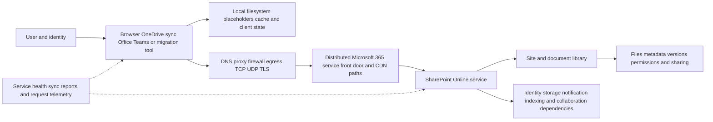

## Tenant, site, library, and file-ownership architecture

SharePoint Online provides managed sites and document libraries. A user's OneDrive for work or school is an individual file experience whose library is powered by SharePoint. Team files commonly live in SharePoint sites; Microsoft documents that channel files in Teams are stored in SharePoint, while files attached in a Teams chat are uploaded to the sender's OneDrive under the documented collaboration model. Exact Teams behavior and UI can evolve, so verify current documentation for the scenario.

Ownership matters. A draft in a user's OneDrive is user-centered. A document moved to a team library becomes team/site-managed content. Moving is not merely changing a URL; permissions, retention, metadata, sharing links, automation, and ownership context can change.

| Container | Typical purpose | Permission source | Connectivity/troubleshooting clue |
|---|---|---|---|
| User OneDrive library | Individual work files and sharing | Owner plus explicit/inherited service rules | User/account/library specific |
| SharePoint team site library | Team-owned collaboration | Site/group/library/item permissions | Site membership and library settings |
| Communication site library | Published organizational content | Site roles and library/item permissions | Publishing/read access patterns |
| Teams standard-channel files | Team collaboration stored in SharePoint | Team/group and site model | Teams UI can mask SharePoint storage path |
| Teams private/shared-channel files | Channel-specific SharePoint site | Channel membership/site permissions | Separate site and access context |
| Shared folder/shortcut | Access to content owned elsewhere | Source item's permissions | Permission loss and shortcut state matter |
| External/B2B content | Cross-organization collaboration | Tenant/site sharing plus external identity/link | Home/resource tenant and client policy matter |

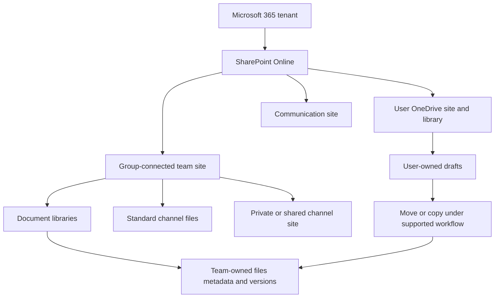

### Files and metadata

A SharePoint library stores content plus metadata and service state. Rename, move, delete, permission, field, version, retention, and sharing changes can be meaningful even when file bytes do not change. A sync engine therefore reconciles item identities and metadata, not just checksums and folders.

Do not assume a local path is the cloud identity. Names can change, folders can move, shortcuts can refer to content owned elsewhere, and local filesystem semantics differ from service semantics. Exact item identity and sync protocol fields are service/client implementation details; use supported logs and request IDs rather than editing the local state database.

## Identity, authentication, authorization, and tenant context

Authentication answers who or what proved identity. Authorization answers whether that identity may perform this operation on this resource. A successful Microsoft Entra sign-in does not prove SharePoint permission, sharing-link validity, library write state, tenant policy, or content-policy acceptance.

Microsoft's public sync overview currently states SharePoint in Microsoft 365 uses FedAuth in its described authentication context; modern Microsoft clients and identity libraries evolve. For operational diagnosis, follow the current sign-in and token documentation, do not infer or capture secret token content, and distinguish origin-server 401 from proxy 407.

| Identity stage | Question | Evidence | Common mistake |
|---|---|---|---|
| Account selection | Which home/resource tenant and account? | Client profile and tenant pseudonym | Wrong cached account ignored |
| Device/user sign-in | Did identity authentication complete? | Entra sign-in ID/status, client error | Sign-in equals file access |
| Token/session acquisition | Was valid resource context obtained? | Error class, resource/audience metadata, request ID | Sharing token values |
| Proxy authentication | Did intermediary challenge client? | 407 and proxy session | Calling 407 Microsoft identity failure |
| SharePoint authorization | Does user/app have site/library/item action? | Check permissions/audit/request response | Read permission assumed as edit |
| Sharing link/invitation | Is link/type/recipient/expiry valid? | Sharing settings/link metadata | Tenant external sharing assumed enough |
| Conditional/access policy | Does device/location/risk context permit? | Policy decision and sign-in record | Network failure label |
| Content/security policy | Is operation allowed for this file/data? | DLP/malware/retention/label evidence | Bypass security to test |

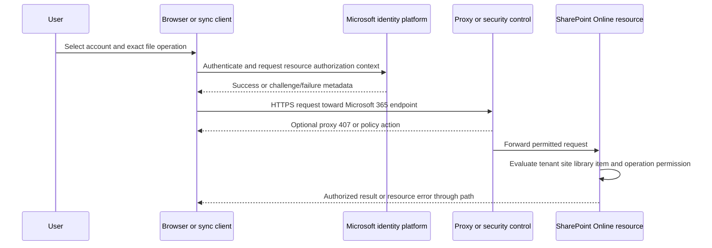

### Permissions and sharing

SharePoint permissions are often inherited from site/library to items, but inheritance can be broken and item-level permissions can differ. OneDrive content is private to the owner by default under the documented user experience until shared. For coauthoring, collaborators need edit permission and supported document/application conditions.

External sharing has organization and site settings; the more restrictive setting controls. OneDrive sharing can be the same as or more restrictive than SharePoint organization settings. Microsoft Entra B2B integration and external collaboration settings can add identity constraints. An invitation email arriving does not prove the recipient authenticated as the intended identity or retained permission.

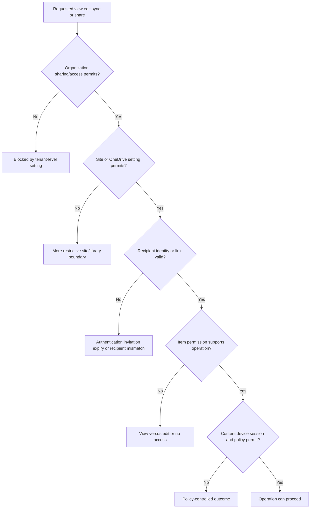

### Plain-English deep-dive 1 - Sign-in, sharing, and sync are three gates

A guest may enter a campus, hold an invitation to a building, and still lack a key to edit a specific archive. Sign-in proves the guest's identity. Sharing establishes an access grant or link under organization/site rules. The requested operation then needs item permission and compatible client policy.

This explains common comparisons. A user can sign in to Microsoft 365 but receive access denied on one site. A user can view a file in a browser through a link but be unable to sync an external library because endpoint policy blocks B2B sync. A user can edit in the web app but the local library can be read-only due library configuration or local client state.

Troubleshoot the gates separately. Preserve sign-in/request IDs, identify home/resource tenant, inspect sharing scope and item permission, then client/sync eligibility and policy. Never paste access tokens into a ticket.

## Browser, sync client, Office, and migration paths

These paths share Microsoft 365 but are not interchangeable.

| Dimension | Browser | OneDrive sync app | Office desktop integration | Migration tool |
|---|---|---|---|---|
| Trigger | User navigation/action | Background filesystem/cloud change | Open/save/coauthor action | Admin task/schedule |
| Local state | Browser profile/cache/worker | Sync relationship, queues, placeholders, local state | Office document/session/cache plus sync | Agent/tool database, source inventory, package |
| Identity | Browser session/cookies/tokens | Native client/account broker/context | Office account and document identity | Admin/app/user auth per tool |
| Endpoint set | Web/common/workload endpoints | Sync, WNS, update, support/workload endpoints | Office/common/coauthoring/workload endpoints | Migration/Azure/SharePoint endpoints |
| Transfer | Web requests/uploads | Background metadata/content reconciliation | Office-aware save/coauthoring and sync collaboration | Bulk source read/package/stage/import |
| Retry | Browser/app logic | Native queue/backoff | App/session logic | Job/task retry/throttling logic |
| Main evidence | DevTools/HAR/browser error | Activity center, status/icons, client/sync reports, traces | Office/app logs, request IDs | Agent/task reports and migration logs |

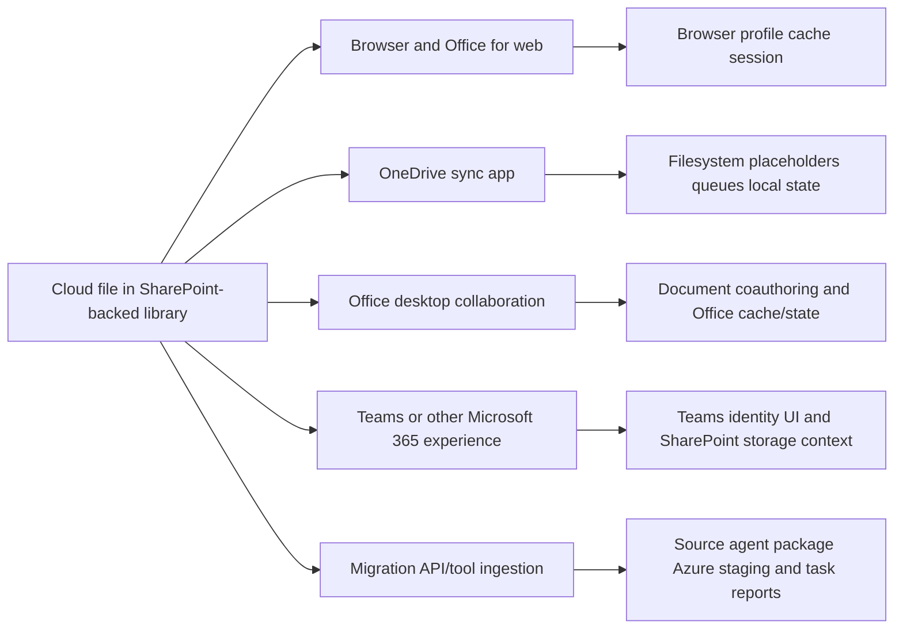

Browser success proves the browser transaction worked under its conditions. It does not prove the sync client's local database, filesystem permissions, Files On-Demand hydration, proxy support, WNS, sync endpoint sequence, account state, or background queue.

## Microsoft 365 connectivity architecture

Microsoft describes Microsoft 365 as a distributed SaaS cloud with globally distributed service front doors. The geographic region of tenant data is not necessarily the place every user connection terminates. Microsoft recommends identifying Microsoft 365 traffic, local DNS aligned with local internet egress, avoiding hairpins, and using the current endpoint service/guidance.

| Connectivity dependency | Healthy behavior | Failure evidence |
|---|---|---|
| Local interface | Stable address/link and routes | Disconnect, errors, captive/metered state |
| DNS | Intended resolver returns current answers; app uses one | Timeout, wrong/split answer, remote resolver/egress mismatch |
| Proxy selection | Client follows supported direct/proxy behavior | PAC mismatch, unsupported auth, bypass difference |
| Firewall/security | Current required endpoints/protocols permitted per guidance | Rule/session deny, stale endpoint set |
| Egress | Short supported path with capacity and expected public egress | Central hairpin, remote egress, congestion |
| TLS | Valid service identity and compatible client path | Trust, inspection, protocol, certificate error |
| CDN/front door | Distributed entry/content path reachable | Edge/path affinity or CDN resource failure |
| Microsoft service | Request accepted, authorized, processed | Service request ID/status/dependency error |
| Return/client commit | Response arrives and local state updates | Reset/loss, parse/database/filesystem error |

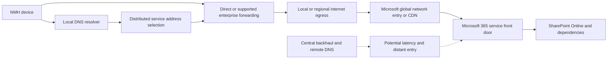

### DNS and egress must be reasoned together

Local DNS with remote egress or remote DNS with local egress can select a suboptimal distributed path. Record the resolver, answers, TTL, application-selected address, public egress, connected edge/front door measurements where officially exposed, and RTT. Do not hardcode changing Microsoft IPs from an old article.

### Endpoint and firewall currency

The Microsoft 365 URLs/IP page publishes service areas, endpoint-set IDs, categories, addresses, and ports, backed by a REST web service. It is updated over time and can change during a month for operational/security needs. Use automated endpoint management and official change notifications. Do not selectively allow only the hosts seen in one trace; one operation may not exercise update, WNS, identity, CDN, Office, support, or future dependencies.

As of the dated source review, the public page included SharePoint/OneDrive workload sets such as `*.sharepoint.com` and supporting WNS/update/service hosts plus Microsoft 365 common/identity/CDN domains. These examples are not a static allowlist. The official endpoint web service at deployment time is authoritative for the selected Microsoft 365 cloud.

| Endpoint mistake | Symptom pattern | Correct approach |
|---|---|---|
| Static copied IP list | Works until endpoint change | Automate official web-service consumption/change control |
| Allow only SharePoint hostname | Web page partly works; auth/CDN/sync/update fails | Apply complete required/common/workload guidance |
| Selective feature guessing | Intermittent hidden dependencies | Treat Microsoft 365 as interdependent per official docs |
| IP-only proxy bypass | CDN/service IP reuse/change mismatch | Use official domain/category guidance and supported design |
| Consumer endpoint article used for work tenant | Wrong hosts and troubleshooting | Use Microsoft 365 endpoint page for work/school |
| Ignore UDP 443/QUIC categories | Protocol fallback/performance differences | Follow current ports/protocol guidance and policy |

### Proxy and TLS boundaries

Microsoft's connectivity principles contain prescriptive guidance for Microsoft 365 traffic, including concerns about proxying, authentication, inspection, protocol blocking, downgrade, and hairpins. This is Microsoft workload guidance, not a universal instruction to remove enterprise security. Security and network owners must implement current Microsoft recommendations while meeting organizational risk requirements.

The OneDrive restrictions page, reviewed on the source date, states authenticated proxies are not supported for OneDrive and names a corresponding proxy-auth sign-in error context. Verify current scope/version and distinguish browser proxy success from native sync behavior.

### Plain-English deep-dive 2 - Tenant data location is not the user's front door

A global retailer may keep inventory records in one central system while customers enter nearby stores. Sending every customer to the central warehouse before they can speak to the retailer adds distance. Microsoft describes Microsoft 365 user connectivity through distributed service front doors, even though tenant data has residency/location context.

This is why remote DNS and central egress can matter. A branch user's DNS and internet exit influence which distributed entry is reached and how long the customer-controlled path is. The correct troubleshooting evidence is resolver, egress, entry/path measurement, and transaction latency, not a traceroute to the imagined tenant datacenter.

It is also why a security-service design must be evaluated by observed path and current Microsoft guidance. Do not infer that any named vendor necessarily causes a hairpin, and do not bypass security without approval and negative controls.

## Sync information flow and change notifications

Microsoft's public "How sync works" page describes this high-level flow: a change occurs in Microsoft 365; Windows Push Notification Services alerts the sync app; OneDrive adds it to an internal server changes queue; metadata changes such as rename/delete can occur, and content download uses a client session; changes are processed in order. Treat WNS as a signal to reconcile, not as the file content transport.

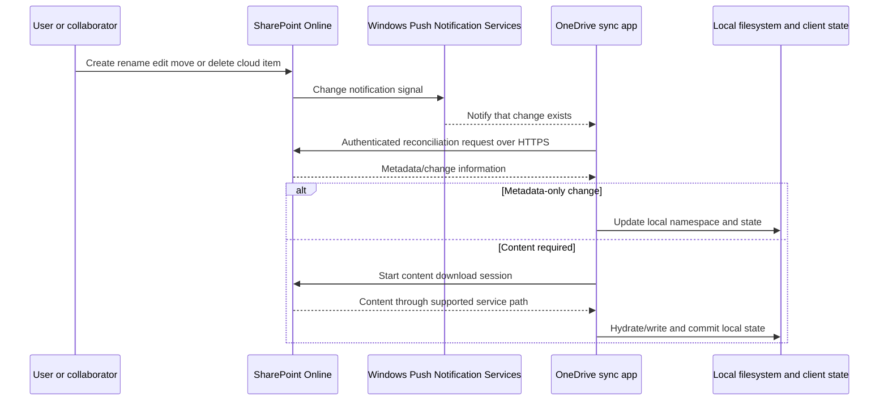

If WNS is delayed or unavailable, do not assert that sync can never recover; client behavior and fallback/reconciliation evolve. The safe statement is that WNS is a documented near-real-time signal dependency and its failure can alter freshness/timing. Verify actual client behavior with supported evidence.

### Local-to-cloud upload flow

Conceptually, the client detects a local filesystem change, validates item/path/policy/state, opens/reads content, prepares metadata/upload work, authenticates, resolves/routs to required endpoints, transfers content and metadata, receives service result, and commits local sync state. Office files can involve Office application integration; other file-transfer mechanics and thresholds are version-dependent.

The current public sync overview describes Office app collaboration and a threshold/chunking mechanism for other files in its publication. Because transfer implementation changes, never hardcode the documented threshold into firewall, monitoring, or incident conclusions. Capture the actual client/version/request behavior and cite current docs.

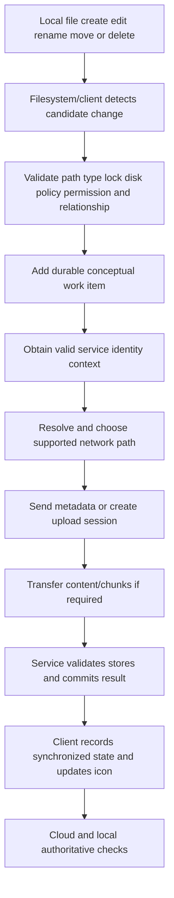

### Local database, cache, filesystem, and process context

The sync app must maintain durable local knowledge of relationships, item mappings, pending work, and observed state. Exact files, schemas, and recovery behavior are implementation details and can change. Do not open, edit, copy between devices, or repair internal databases unless Microsoft explicitly documents/supports the action for that client version.

Local problems include:

- OneDrive.exe not running, signed out, paused, outdated, or restricted by policy.
- User profile or sync root not writable/supported.
- File locked, open, changing continuously, invalid/restricted, too long, too many, or excluded.
- Disk space insufficient for hydration/temp/commit.
- Placeholder/cloud-file filter or filesystem integration problem.
- Security/backup/indexer interaction causing contention or denial.
- Local state inconsistent after crash, abrupt reset, unsupported restore, profile roam, or cloning.
- Multiple accounts/relationships or ownership confusion.

| Local observation | Plausible interpretation | Discriminating evidence |
|---|---|---|
| No cloud icon/process | App not running/setup incomplete | Process, startup policy, app state |
| Paused icon | Explicit/battery/metered pause | Activity center, power/network/policy |
| Processing changes | Queue/inventory/large work/open file/state | Exact pending items, counts, logs, resources |
| Red X on one file | Item-specific restriction/permission/content | Filename/path/type/size/service error |
| All online-only open failures | Hydration/path/trust/policy/disk | Placeholder state, network request, disk, filter |
| Browser works, sync no request | Local preparation/client identity/state | Procmon/client logs and proxy/service absence |
| Repeated local DB/file access denial | Endpoint permission/filter interaction | Procmon stack/policy and known-good ring |
| High CPU/disk with many items | Inventory/queue/other process contention | Item count, resource trace, client health |

### Do not start with reset

Microsoft provides documented reset, unlink/relink, and troubleshooters for specific user scenarios. They can rebuild client state but may destroy the best failing-state evidence and do not prove why the state became unhealthy. Record account, relationships, versions, errors, pending local-only data, known-good, and logs first. Follow current official support steps and understand user impact.

## Sync states and Files On-Demand

Files On-Demand exposes cloud files in File Explorer without downloading all content. Official support describes online-only, locally available, and always available states. Opening online-only content hydrates it; "Free up space" can return it to online-only without deleting the cloud file. Marking "Always keep on this device" downloads and retains local content, subject to current platform behavior.

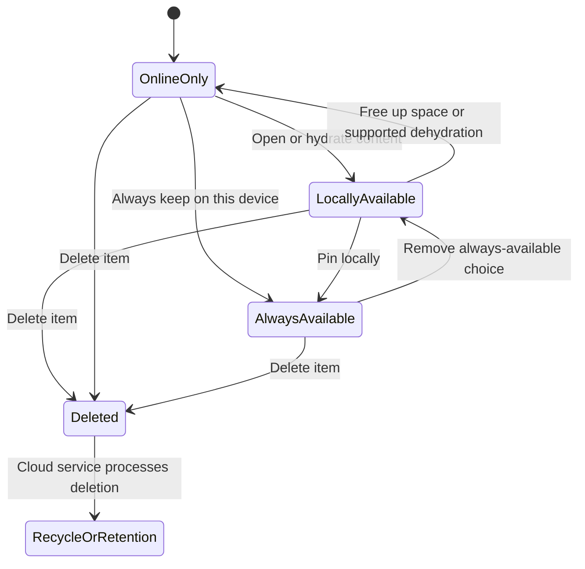

Deleting an online-only item is still deletion of the cloud item under the sync relationship; it is not the same as freeing space. This distinction prevents serious incidents.

| State/action | Local content | Cloud item | Offline open | Network effect |
|---|---|---|---|---|
| Online-only | Not fully local | Exists | No | Metadata/placeholder present; hydrate on use |
| Locally available | Present | Exists | Yes | Download occurred; can be freed later |
| Always available | Present and pinned intent | Exists | Yes | Initial and future folder content may download |
| Free up space | Content released | Exists | No until hydrated | Not a cloud delete |
| Delete | Removed locally under sync | Delete propagates subject to service behavior | No | Other devices/cloud affected |
| Move outside sync root | Content may hydrate/move; cloud source change under rules | Depends on operation | Local target | Must understand supported behavior |

Files On-Demand involves Windows Cloud Files integration on Windows. Third-party filesystem/security compatibility, OS/client requirements, profile model, and disk format matter. Use current official system requirements.

### Sync icons are state summaries, not root cause

| Icon/status class | Plain meaning | Next evidence |
|---|---|---|
| Circular arrows | Sync/processing in progress | Exact pending item, duration, queue, resources |
| Red X | File/folder cannot sync | Activity-center error and item restrictions |
| Paused | Sync not currently progressing | Pause reason and policy/power/network |
| Gray/not signed in | Setup/sign-in incomplete | Process/account/sign-in evidence |
| Attention warning | Account/action needed | Open activity center; record exact message |
| Blue cloud | Online-only | Hydration dependencies if open fails |
| Green check | Locally available | Disk present; may become online-only later |
| Solid green/white check | Always available | Pinned local intent and disk use |
| Excluded/blocked type | Admin/client excludes sync | Policy and file-type rule |

## Files, names, sizes, counts, and library settings

Limits change. Use the live Microsoft Support restrictions page and SharePoint service description at incident time. The source review on 2026-08-24 noted evolving item-count preview guidance, current file-size limits, name/path restrictions, account limits, and library-setting caveats. Do not memorize a number and present it without date, cloud, client, and preview status.

| Error class | Examples | Evidence and owner |
|---|---|---|
| Name/path | Invalid/reserved characters/names, excessive path | Exact normalized path, client/OS; content owner |
| Type | Temporary/system/admin-blocked type | File extension, policy, service setting; admin |
| Size | File/request/chunk beyond current supported limit | Current limit doc, file bytes, request status; app/service |
| Scale | Too many items, queue/inventory overhead | Item counts per relationship/device, health; admin/client |
| Library configuration | Checkout, validation, draft security, required columns, offline availability | Library settings and permission; SharePoint admin |
| Permission | View not edit, source permission lost, sharing expired | Check permissions/sharing/audit; owner/admin |
| Storage/disk | Cloud quota or local disk pressure | Quota/disk/hydration state; admin/endpoint |
| Content safety | Malware/policy blocks | Official security result; security/service |
| Conflict | Concurrent/offline edits, duplicate names | Versions, authors, timestamps, app conflict UI |
| Unsupported local topology | Network/mapped drive, junction/symlink/profile case | Sync root/filesystem/profile evidence; endpoint |

### Scale and item counts

Large item counts can increase startup, enumeration, change processing, memory, and disk work even when current content bytes are small. Measure total synchronized items across relationships, pending changes, folder distribution, local resources, and client version. The public restrictions page's numbers and preview requirements are current only as dated; cite live values instead of embedding them in permanent policy.

## Coauthoring, Office integration, and version behavior

Microsoft Support documents coauthoring for supported documents stored in OneDrive/SharePoint, using supporting apps/file formats and edit permission. Offline edits cannot be seen by others until reconnection and can conflict. Coauthoring is an application/service collaboration behavior, not merely two clients syncing the same file bytes.

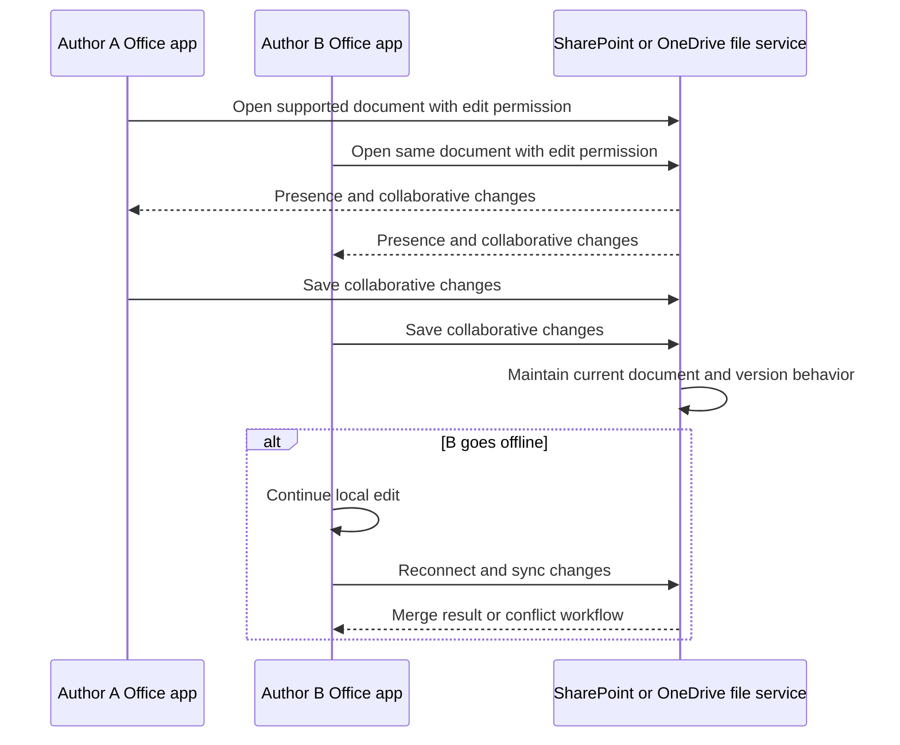

| Coauthoring dependency | Failure symptom | Check |
|---|---|---|
| Shared storage | Local/unsupported copy opens separately | Actual cloud location and URL |
| Supported format | Coauthoring unavailable | Current app/format documentation |
| Edit permission | View-only or save copy | Item/site/library permission |
| App/version | Feature missing/incompatible | Exact build and update status |
| Identity/session | Repeated sign-in/offline state | App account and sign-in IDs |
| Network/endpoints | Presence/save delay or offline | Office/SharePoint endpoint path |
| Library policy | Checkout/IRM/required metadata constraints | Current library and protection settings |
| Conflict/version | Offline/concurrent incompatible changes | Version history and app conflict UI |

Office applications can participate directly in Office-file sync/coauthoring behavior according to the public sync overview. Therefore, closing OneDrive.exe, opening through web, or using a non-Office file is not always an equivalent test.

### Plain-English deep-dive 3 - Sync is reconciliation, not folder mirroring

A photocopier makes a second pile. A reconciliation system tracks identity, order, versions, permissions, renames, deletes, and conflicts between two changing ledgers. OneDrive sync is closer to reconciliation.

If a cloud folder is renamed while a local file is edited offline, the client must reason about which cloud item and local item correspond. If permission is removed, the client cannot simply keep uploading because bytes match a path. If a placeholder is online-only, the name and metadata can exist locally without content bytes. If two authors edit, the Office collaboration layer may merge or present conflict rather than treating the last file write as truth.

This is why copying or editing the sync client's internal database is unsafe. It can break identity mappings that a simple folder comparison cannot reconstruct reliably. Use supported reset/relink only after protecting local-only data and collecting evidence.

## Throttling, retry, and service protection

SharePoint Online throttles to protect service reliability. Official developer guidance describes HTTP 429 for too many requests and 503 for service busy/related conditions, with `Retry-After` for throttling. Failed throttled requests still count, so aggressive retries prolong pressure. Limits and resource-unit costs can change and vary; never encode current public numbers as permanent entitlement.

```mermaid
sequenceDiagram
    participant C as Client application or migration tool
    participant S as SharePoint Online
    C->>S: Burst of requests
    S-->>C: 429 or 503 plus Retry-After when throttled
    alt Correct behavior
        C->>C: Pause and apply supported backoff/jitter
        C->>S: Retry after indicated interval
        S-->>C: Process when capacity and limits permit
    else Aggressive retry
        C->>S: Immediate repeated requests
        S-->>C: Continued throttling; failed calls consume limits
    end
```

| Observation | Interpretation | Response |
|---|---|---|
| 429 plus Retry-After | Request rate/resource limit protection | Honor delay, reduce concurrency/spikes |
| 503 plus Retry-After | Service not ready/throttle context possible | Honor header and inspect request/service context |
| 503 without clear throttle context | Gateway/service/dependency possibilities | Identify responder and request ID |
| Browser throttle page | Interactive request limited | Capture UTC, user/action, tenant scope safely |
| Migration slows peak time | Background-workload service protection/source limits | Off-peak plan and source/agent/network analysis |
| Repeated retries worsen rate | Client ignores backoff | Correct retry design/configuration |

Daily OneDrive sync, custom APIs, migration, backup, classification, and DLP can collectively create background pressure. Do not attribute a 429 from custom code to OneDrive.exe or vice versa without AppID/user/request and workload evidence.

## Migration architecture and performance

Migration Manager and SharePoint Migration Tool are planned ingestion tools, not replacements for everyday sync. Microsoft documents Migration Manager agents connecting to source and Microsoft 365 destination, task assignment, monitoring, and reports. The migration performance guide separates source scanning/reading, agent computer resources, packaging, connectivity/staging, Migration API processing, throttling, and validation.

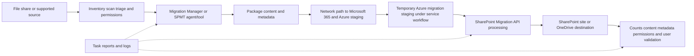

| Migration phase | Bottlenecks/failures | Evidence |
|---|---|---|
| Discover/scan | Unsupported content, unreadable source, unknown ownership | Inventory and scan report |
| Source read | Disk/SMB/contention/antivirus/permissions | Agent/source performance counters |
| Agent | CPU, RAM, disk, process health, insufficient agents | Agent health and task assignment |
| Package | Many small/heavy metadata items, transformation | Package/task metrics |
| Upload/stage | Bandwidth, latency, endpoint/proxy/firewall | Network/agent logs and current endpoints |
| API ingest | Queue, throttling, service processing | Task/request IDs, 429/503/Retry-After |
| Destination | Site/storage/permission/limit/config | SharePoint admin and migration error |
| Validate/cutover | Missing versions/metadata/permissions/delta | Reconciliation report and user test |

Migration speed is not just bandwidth. Microsoft notes source reading is often a bottleneck in file-share migrations and that file size/metadata mix, agent resources, antivirus contention, network, and throttling matter. Opening support does not remove service throttling. Plan off-peak background load under current guidance and avoid load testing SharePoint Online.

### Migration waves

1. Inventory and classify source content; remove ROT only under governance approval.
2. Map source owners, permissions, metadata, paths, unsupported items, and target information architecture.
3. Pilot representative small/large files, metadata-heavy content, permissions, special names, and geographies.
4. Baseline source read, package, upload, API, and validation rates separately.
5. Run staged waves with task/agent capacity and service backoff.
6. Perform incremental/delta pass under tool support.
7. Freeze/cut over with business owner approval.
8. Validate counts, hashes where appropriate, metadata, versions, permissions, links/workflows, search delay caveats, and user access.
9. Retain source/rollback under policy and close only after acceptance.

## Service health, sync health, and observability

Microsoft 365 Service health shows tenant-relevant known incidents/advisories and updates. It can show impact, estimated start, affected services, status, and history. A healthy dashboard does not prove one request is healthy; a newly emerging, narrow, customer-specific, endpoint, permission, or content issue may not appear.

OneDrive sync reports in the Microsoft 365 Apps admin center require supported versions, roles, endpoint connectivity, and enabled device reporting. Public documentation notes reporting delay, device eligibility, sign-in, record retention, and other limitations. Therefore a missing device/report is not proof that OneDrive is absent or healthy.

| Source | Best use | Latency/coverage caveat |
|---|---|---|
| Microsoft 365 Service health | Known tenant/service incidents and advisories | Posted scope and detection timing |
| Message center | Planned changes and block notices | Not transaction telemetry |
| OneDrive sync health overview | Fleet errors, KFM, versions | Requires enablement/eligibility/reporting |
| Sync health device row | Last synced/reported, version, errors | Report is not real-time packet/client trace |
| Client activity center/icons | Current user-visible state and item errors | Summary; capture exact message |
| Client/support logs | Local state, request/error clues | Schema/location/version and privacy |
| Browser DevTools/HAR | Browser requests, timing, status | Not native sync path |
| Procmon | Local file/Registry/process/socket operations | Not HTTP/service semantics |
| Packet trace | Named interface network observation | Encrypted content and other points hidden |
| SharePoint audit/admin | Permission/config/activity context | Licensing/retention/latency and semantics vary |
| Request/service IDs | Microsoft Support correlation | Requires exact UTC and operation |

### Plain-English deep-dive 4 - A status board cannot inspect one parcel

An airport status board can say the airport is operating normally while one passenger's bag is held for an invalid tag, one gate scanner is offline, or one flight has not yet reported a delay. Microsoft 365 Service health is the broad status board. OneDrive sync reports are a fleet dashboard populated under documented client, policy, eligibility, and reporting timing. Neither replaces the record of one transaction.

Use each source for its real question. Service health asks whether Microsoft has posted a tenant-relevant service incident or advisory and what scope/status it reports. Sync health asks which eligible reporting devices last reported errors, versions, Known Folder Move state, or freshness. The client and request evidence asks what happened to this user, file, device, and operation at this UTC time.

Absence needs validation. If a device is missing from sync reports, check whether reporting was enabled, the version and endpoint requirements were met, the user was signed in, the device stayed on long enough, and reporting time elapsed. If Service health shows healthy, continue fault isolation rather than declaring Microsoft innocent or guilty. If it shows an advisory, compare the stated service, population, feature, start time, workaround, and request signature with the case. A posted incident can coexist with a separate local failure.

The support-quality statement is: "No matching advisory was posted when checked at 14:20 UTC, and the affected client had not reported fresh sync-health data, so those dashboards do not decide this transaction. The request-specific client, network, permission, and service IDs remain the controlling evidence."

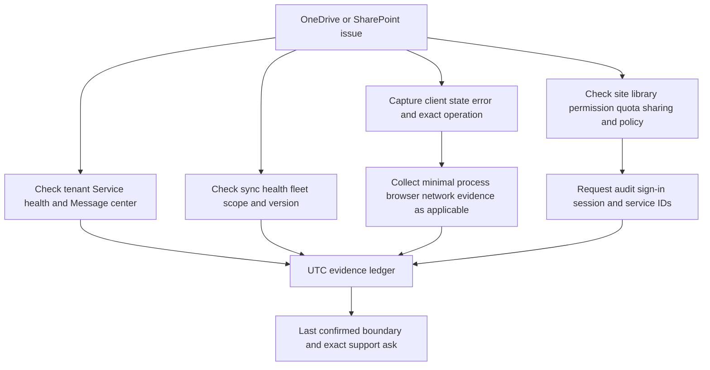

### Logs and privacy

Client logs, HAR, packet traces, Procmon, sign-in data, sharing/audit records, filenames, paths, tenant URLs, and request IDs can contain personal or confidential data. Follow customer authorization, purpose limitation, least-data sharing, secure storage, retention, and deletion. Public communities must not receive sensitive information.

## Error classes and fault isolation

| Error class | Typical symptoms | First discriminating checks |
|---|---|---|
| Client/process | App absent/crash/outdated/paused | Process/version/ring/activity center |
| Account/identity | Sign-in loop, wrong tenant, token error | Account context, sign-in ID, 401 versus 407 |
| Permission/sharing | Access denied, view-only, guest failure | Site/library/item permission and sharing hierarchy |
| Local filesystem | One file/folder pending, access/lock/path | Procmon, path/type/lock/disk/profile |
| Files On-Demand | Online-only open/hydration failure | Placeholder state, Cloud Files integration, request/path |
| DNS/network | Timeout, branch/location pattern | Resolver/egress, route, port/protocol, traces |
| Proxy/firewall/TLS | 407, trust, blocked endpoints, inspection incompatibility | Current endpoint sets, policy/session, cert/TLS evidence |
| Service | Request ID with 5xx/dependency/incident | Service health, status/body, Microsoft trace |
| Throttle | 429/503 with Retry-After | Actor/request rate, backoff, workload overlap |
| Content/limit | Name/type/size/virus/metadata | Live restriction doc, item/service result |
| Scale/performance | Processing changes, high CPU/disk, slow startup | Item count, queue, resource, client version |
| Migration | Source read/package/stage/API/validation failure | Phase-specific logs and task IDs |
| Coauthoring/conflict | Locked/read-only/conflicting edits | Format/app/permission/online/version state |

### General decision tree

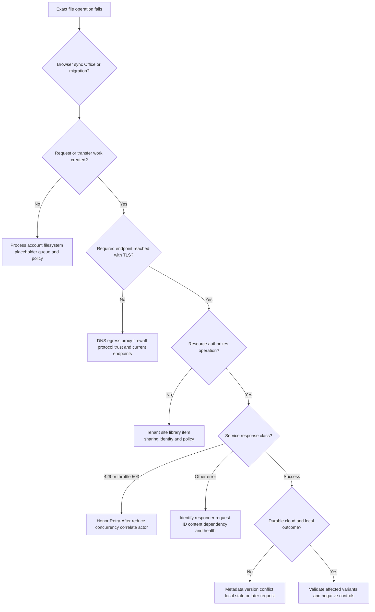

## Trace and RCA scenarios

### Scenario 1: browser works, sync remains on Processing changes

Hypotheses include large queue/item count, locked/changing file, invalid path/type, local access denial, client state, Files On-Demand filter, sync-specific proxy/endpoint, or permission. First determine whether the client creates network work for the exact item. If Procmon/client evidence shows repeated local denial and no proxy/service request, stay local. If service returns an item-specific error, move to content/permission/service semantics.

### Scenario 2: online-only files fail to open, pinned files open

Pinned files can open from local content, while online-only files need hydration. Check device connectivity, client sign-in, placeholder state, disk, Cloud Files integration, required endpoints, policy/session, and request outcome. The comparison does not prove cloud outage because local content bypasses hydration.

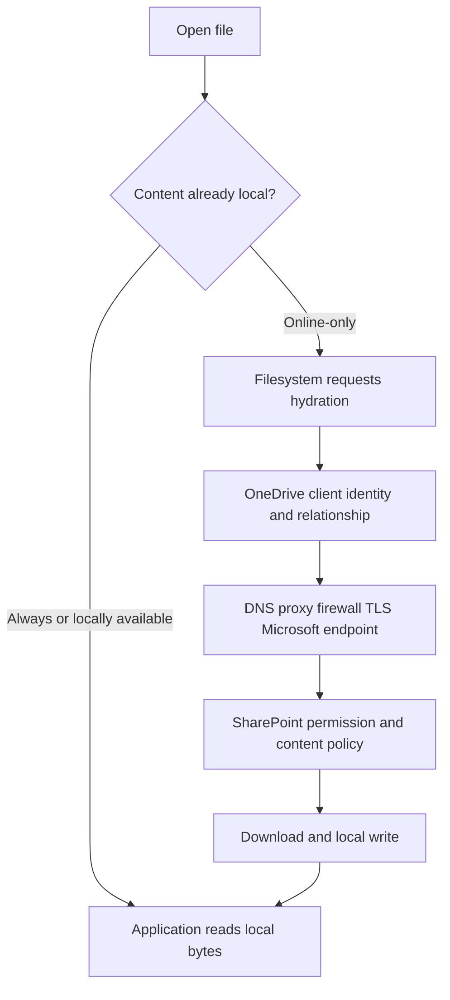

### Scenario 3: only one shared library is read-only

Check actual item/library permission, inheritance, library settings such as checkout/validation/draft/required columns/offline availability under current support guidance, sensitivity/IRM behavior, and source ownership. Browser edit versus sync write can differ. Do not grant site owner to make the symptom disappear.

### Scenario 4: large uploads fail through enterprise path

Compare small/large browser and sync operations, request/chunk/session sequence, status/responder, proxy limits, transport/MTU, timeout, throttling, and service IDs. Do not embed a historical chunk threshold into the hypothesis. Identify the actual version behavior.

### Scenario 5: sync freshness delay after cloud rename

Check cloud authoritative rename/version, WNS reachability as documented signal, client running/signed-in/not paused, queue processing, current endpoints, metadata reconciliation request, and local filesystem result. A manual action causing refresh is a clue, not root cause.

### Scenario 6: external guest can use browser but cannot sync

Compare external sharing/B2B identity, home/resource tenant, item edit/view access, B2B sync eligibility and endpoint policy such as current BlockExternalSync configuration, client account limits, and device policy. Browser link access and B2B native sync are distinct capabilities.

### Scenario 7: coauthoring fails after offline edits

Confirm shared cloud location, supported format/app, edit permission, version, online/offline timeline, conflict message, and version history. Avoid deleting either copy. Preserve both and use app-supported conflict resolution.

### Scenario 8: migration throughput is below network capacity

Break down source read, agent CPU/RAM/disk, antivirus contention, package metadata/file mix, network upload, Azure/API stage, queue, throttling, and destination validation. A 10 Gb/s link does not guarantee service ingest or source-read rate. Use task reports, 429/503/Retry-After, and off-peak comparison.

## Fictional NMH RCA: sync uploads fail after endpoint policy rollout

NMH is fictional. Ring D devices can browse and download existing cloud files, but newly created files in synced SharePoint libraries remain pending after endpoint policy revision 214. Browser upload works. The incident team initially proposes resetting every client.

### NMH structured scope

| Dimension | Finding |
|---|---|
| User | Multiple users in ring D; same users work on ring C |
| Device | Managed Windows devices with policy 214 |
| Client | OneDrive.exe current approved ring; browser path works |
| Operation | New local file upload; existing local download works |
| Item | Synthetic `.xlsx` and `.txt`; valid path/size |
| Time | Begins within policy rollout window |
| Service health | No matching posted incident in fictional exercise |
| Workaround | Approved browser upload for urgent synthetic work |

### NMH hypotheses

| ID | Hypothesis | Predicted evidence | Disconfirming result |
|---|---|---|---|
| H1 | Endpoint DLP rule denies OneDrive local read/preparation | Procmon/policy deny before upload request | Local reads succeed and request reaches service |
| H2 | New proxy policy blocks sync upload endpoint | Proxy deny/session for request; local prep succeeds | No request created at endpoint |
| H3 | SharePoint permission changed | Service returns authorization error across clients | Ring C succeeds with same user/item/library |
| H4 | Client database corruption | Device-specific behavior independent of ring | All ring D devices fail after policy |

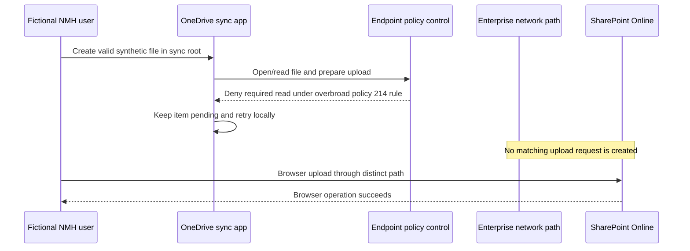

Correlated Procmon and endpoint-policy evidence shows the same required local operation denied on ring D. Client logs show the item never reaches upload-session creation. Proxy and SharePoint known-good telemetry confirms logging health but no matching sync request. This supports H1 without blaming Microsoft or the network.

The policy owner narrows the rule in a pilot to preserve DLP intent while allowing the signed approved OneDrive process to read supported sync-root content under the required condition. The pending item uploads, cloud metadata/content match, another device receives the change, browser remains healthy, and a nonapproved synthetic process still cannot exfiltrate the test file. Rollback and phased deployment follow.

### NMH RCA statement

The fictional trigger was endpoint policy revision 214. The root cause was an overbroad local file-control rule that denied a required OneDrive sync preparation read before any Microsoft 365 upload request was created. Contributors were browser/sync false equivalence, missing synthetic sync transaction in policy rollout gates, and a proposed reset that would have destroyed evidence. Prevention added pilot-ring browser and sync tests, signed-process/path policy validation, negative security controls, sync-health monitoring, and an endpoint/network/service evidence runbook.

### NMH executive update

"The fictional incident is isolated to local sync preparation on endpoint policy ring D. Browser uploads and Microsoft 365 service requests remain available, and no evidence establishes a Microsoft or Zscaler service failure. Endpoint evidence shows policy revision 214 denied a required approved sync-client file operation before network request creation. A least-privilege rule correction has passed pilot validation: sync succeeds and unrelated process protection remains enforced. Rollout is phased with rollback and monitoring."

## Escalation evidence package and support boundaries

The customer owns endpoints, local files/profiles, identity configuration, permissions/sharing, network/security controls, migration sources/agents, and approved evidence access. Microsoft owns Microsoft 365 service operation and can investigate service-side requests under support process. Third-party security/network vendors own their product decision and forwarding evidence. Boundaries overlap; the TSM coordinates.

| Package section | Minimum content |
|---|---|
| Impact/scope | Users, devices, sites/libraries, operations, frequency, workaround |
| UTC timeline | First seen, last good, changes, reproductions, service-health checks |
| Environment | OS, OneDrive/Office/browser/tool versions, update ring, tenant cloud |
| Exact operation | Local/cloud item pseudonym, valid type/size/path class, expected/actual |
| Client evidence | Activity-center error, icon/state, request IDs, logs, Procmon event references |
| Identity/access | Sign-in ID/status, resource tenant, permission/share evidence without secrets |
| Network | Resolver, egress, forwarding, current endpoint-set validation, traces |
| Service | Status/body class, request/correlation ID, service health/advisory IDs |
| Comparison | Browser versus sync and known-good with differences listed |
| Changes/tests | Hypothesis, predicted branches, result, rollback, negative controls |
| Privacy | Redaction, storage, access, retention, hashes |
| Exact ask | Component/question Microsoft or other owner must answer |

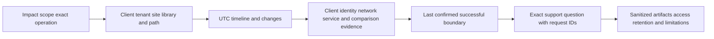

Examples of exact asks:

- Microsoft Support: "For tenant/site pseudonyms and request ID R at UTC T, did SharePoint receive and reject the metadata/upload request, and which documented service error category applies?"
- Network/security owner: "For endpoint-set ID and session S at UTC T, which rule/action handled the request and did the upstream leg establish?"
- Endpoint owner: "For signed OneDrive process/version V and Procmon event E, which policy generated the local denial and was that action intended?"

## Labs with synthetic or explicitly authorized data

### Lab 1: tenant-to-item architecture

Draw tenant, OneDrive, team site, private/shared-channel site, libraries, files, metadata, permissions, sharing, browser, sync, Office, and migration paths. Label which statements are official versus conceptual.

### Lab 2: browser versus sync upload

Upload the same synthetic file through an approved test tenant browser and sync folder. Capture HAR for browser, client/activity state for sync, request IDs where exposed, endpoint processes, and timing. List at least ten path differences.

### Lab 3: WNS/change signal tabletop

Use the public sync sequence to distinguish notification from content transfer. Simulate a delayed signal and show what evidence is required before claiming WNS is root cause. Do not block production WNS.

### Lab 4: Files On-Demand states

In an owned profile, create online-only, locally available, and always available synthetic files. Test offline open, hydration, free space, and delete. Verify cloud state and recycle/retention behavior under current tenant policy. Never use irreplaceable data.

### Lab 5: local restriction

Create a supported invalid-path/type or controlled local access condition using Microsoft-documented restrictions in a lab. Use Procmon/client evidence to show failure before request creation, then correct only the condition and validate.

### Lab 6: permission and sharing

Create view and edit users, a shared item, a more restrictive site setting, and an external synthetic guest if the lab permits. Trace sign-in, sharing, permission, and sync eligibility separately. Remove all lab grants afterward.

### Lab 7: throttling/backoff simulator

Use a local HTTP simulator that returns 429/503 and Retry-After. Implement or configure bounded exponential backoff with jitter and compare it to aggressive retry. Do not load test SharePoint Online.

### Lab 8: endpoint currency audit

Read the current Microsoft 365 endpoint web service for the selected cloud, record version/change feed, and compare with a fictional static firewall list. Design automated review/change/rollback without actually altering production.

### Lab 9: migration bottleneck

Use synthetic files with large, small, and metadata-heavy mixes on an owned source. Measure source read, agent package, network, simulated service queue, and validation. Show why link speed is not total throughput.

### Lab 10: escalation bundle

Package a fictional NMH issue with minimum client/network/service evidence, known-good, request IDs, redaction, exact ask, and support boundary. Peer-review for secrets and unsupported claims.

| Lab artifact | Pass condition |
|---|---|
| Architecture | Tenant/site/library/client roles are accurate |
| Client comparison | Shared and distinct dependencies explicit |
| Notification model | WNS signal not confused with content transport |
| Files On-Demand | Hydrate/dehydrate/delete distinctions demonstrated |
| Local restriction | First failed boundary found before network |
| Access lab | Auth, sharing, permission, and policy separated |
| Retry lab | Retry-After honored; no retry storm |
| Endpoint audit | Live official source and version/change process used |
| Migration | Bottleneck allocated to a phase with evidence |
| Escalation | Exact owner ask and minimum safe data |

## Experience bridge and interview positioning

| Existing strength | Part 28 translation | Portfolio proof |
|---|---|---|
| OneDrive escalation | Deep browser/sync/local/service isolation | RCA packet |
| SharePoint Online | Site/library/permission/sharing context | Access map |
| Networking | DNS, egress, proxy, TLS, endpoint currency | Connectivity diagram |
| Critical situation | Parallel endpoint/network/identity/service workstreams | Decision log |
| Analytics | Fleet sync health, scope, error and version trends | Synthetic dashboard |
| Fix validation | Durable cloud/local result plus security negative controls | Validation matrix |
| Mentoring | Teach sync architecture from zero | Workshop outline |
| AI agents | Summarize sanitized evidence with source verification | Guardrailed incident brief |

You should use this domain as proof of method, not false product equivalence. A strong answer is: "My Microsoft 365 background taught me to separate the user operation from the path. For OneDrive and SharePoint I map tenant/site/library permissions, client and local state, Files On-Demand, identity, current Microsoft endpoints, DNS/egress/proxy/TLS, service request IDs, and durable commit. Browser and sync success are not equivalent. I use Service health and sync reports as scope signals, not verdicts, preserve local evidence before reset, honor throttling backoff, and hand Microsoft or another owner an exact request and boundary. I would apply the same disciplined method to Zscaler while first learning its supported telemetry and policy model."

## Common misconceptions to correct

| Misconception | Correction |
|---|---|
| OneDrive is separate simple cloud storage | Work/school OneDrive is a SharePoint-powered collaboration/file experience |
| Tenant data region is the connection endpoint | Users connect through distributed Microsoft 365 entry paths/front doors |
| Browser and sync use the same path | They share some dependencies but differ in process, state, API, endpoints, and retry |
| Sign-in success proves file access | Resource/site/library/item authorization and policy remain |
| Sharing email proves access | Identity, link validity, tenant/site settings, permission, and policy remain |
| WNS transfers files | WNS is documented as a change notification signal; HTTPS/service flows reconcile content |
| Sync is folder mirroring | It reconciles files, metadata, identities, versions, permissions, and state |
| Local path is cloud identity | Rename/move/mapping and item identity differ |
| Edit the local sync database to repair | Schema is unsupported/internal; use documented recovery |
| Reset proves root cause | It can rebuild state and destroy evidence without explaining origin |
| Online-only means deleted locally and in cloud | Placeholder remains; content is not fully local |
| Free up space deletes the cloud file | It releases local content and preserves cloud item |
| Deleting online-only is harmless | Delete propagates under sync/service behavior |
| Green check proves cloud is current | It describes local availability, not every sync/permission/version fact |
| TCP 443 success proves SharePoint works | TLS, identity, permission, API, dependency, and commit remain |
| Allow `*.sharepoint.com` only | Identity, common, WNS, CDN, update, and other endpoint sets may be required |
| Copy endpoint list once | Microsoft endpoints change; use live service/change management |
| Consumer OneDrive endpoint list applies to work tenant | Use Microsoft 365 endpoint guidance for work/school |
| Service health green proves no issue | It does not prove one request, device, content, or customer boundary |
| Missing sync-health device means healthy | Reporting enablement, eligibility, sign-in, latency, and retention matter |
| 429 means permanent outage | It is throttling; honor Retry-After and reduce load |
| More retries recover faster | Throttled retries count and can extend throttling |
| Support can turn throttling off | Microsoft migration guidance says throttling protects service and is not lifted by a ticket |
| Migration speed equals bandwidth | Source read, agent, package, network, API, throttle, and metadata mix matter |
| Coauthoring is two clients syncing a file | It is Office/service collaboration with format, app, storage, and permission requirements |
| OneNote uses ordinary OneDrive file sync | Official restrictions state notebooks use their own sync mechanism |
| Security bypass success proves vendor defect | It changes multiple variables and requires supported narrow isolation |
| Zscaler claim follows from M365 expertise | Transfer the method; verify Zscaler product evidence independently |

## Official Source Anchors

The following Microsoft official sources were reviewed on **2026-08-24**. They support the public architecture, connectivity, sync, policy, limits, collaboration, migration, throttling, health, and support statements in this Part. They do not expose every client/backend implementation detail or prove fictional NMH results. Always use the current page/web service for limits and endpoints.

| Source | URL | Used for | Boundary |
|---|---|---|---|
| Microsoft Learn: How sync works | https://learn.microsoft.com/en-us/sharepoint/sync-process | WNS signal, changes queue, transfer overview, Office/file behavior | High-level and version-sensitive |
| Microsoft Learn: OneDrive Group Policy | https://learn.microsoft.com/en-us/sharepoint/use-group-policy | Client policy, Files On-Demand, bandwidth, sync reports, tenant/external controls | Policy names/behavior change; verify ADMX/build |
| Microsoft Learn: OneDrive sync reports | https://learn.microsoft.com/en-us/sharepoint/sync-health | Fleet health, versions, errors, report requirements/latency/limits | Not real-time transaction evidence |
| Microsoft Support: Files On-Demand | https://support.microsoft.com/en-us/office/learn-about-onedrive-files-on-demand-0e6860d3-d9f3-4971-b321-7092438fb38e | Online-only/local/always states, hydration/free-space behavior | Platform/build requirements change |
| Microsoft Support: OneDrive icons | https://support.microsoft.com/en-us/office/what-do-the-onedrive-icons-mean-11143026-8000-44f8-aaa9-67c985aa49b3 | User-visible sync/account/file state | Icons summarize, not RCA |
| Microsoft Support: Restrictions and limitations | https://support.microsoft.com/en-us/office/restrictions-and-limitations-in-onedrive-and-sharepoint-64883a5d-228e-48f5-b3d2-eb39e07630fa | Names, types, paths, size, counts, proxies, library/profile limitations | Live values/previews can change |
| Microsoft Support: Fix OneDrive sync problems | https://support.microsoft.com/en-us/office/fix-onedrive-sync-problems-0899b115-05f7-45ec-95b2-e4cc8c4670b2 | Supported user troubleshooting and support paths | Preserve evidence before disruptive recovery |
| Microsoft 365 connectivity principles | https://learn.microsoft.com/en-us/microsoft-365/enterprise/microsoft-365-network-connectivity-principles | Distributed front doors, DNS/egress, endpoint management, optimization | Microsoft 365-specific guidance |
| Microsoft 365 URLs and IP ranges | https://learn.microsoft.com/en-us/microsoft-365/enterprise/urls-and-ip-address-ranges | Current service areas, endpoint sets, categories, ports, web service | Dynamic; page examples are not static allowlist |
| Microsoft 365 endpoint web service | https://endpoints.office.com/endpoints/worldwide | Machine-readable endpoint data for worldwide cloud | Use correct cloud and unique request ID |
| Microsoft Learn: Manage Microsoft 365 endpoints | https://learn.microsoft.com/en-us/microsoft-365/enterprise/managing-office-365-endpoints | Endpoint automation, PAC/change-management guidance | Verify current category/design |
| Microsoft Learn: File collaboration powered by SharePoint | https://learn.microsoft.com/en-us/sharepoint/intro-to-file-collaboration | OneDrive/SharePoint/Teams file relationships, sync and collaboration | Product UX changes |
| Microsoft Learn: External sharing overview | https://learn.microsoft.com/en-us/sharepoint/external-sharing-overview | Organization/site sharing, B2B models, guests, restrictions | Tenant config and Entra settings apply |
| Microsoft Support: Coauthoring | https://support.microsoft.com/en-us/office/document-collaboration-and-co-authoring-ee1509b4-1f6e-401e-b04a-782d26f564a4 | Storage/app/format/permission and offline conflict requirements | App/version/protection support varies |
| Microsoft Learn: SharePoint limits | https://learn.microsoft.com/en-us/office365/servicedescriptions/sharepoint-online-service-description/sharepoint-online-limits | Current service limits | Plan/cloud/feature values change |
| Microsoft Learn: SharePoint throttling | https://learn.microsoft.com/en-us/sharepoint/dev/general-development/how-to-avoid-getting-throttled-or-blocked-in-sharepoint-online | 429/503, Retry-After, backoff, workload/resource-unit caveats | Developer/custom workload context; limits change |
| Microsoft Learn: Migration Manager | https://learn.microsoft.com/en-us/sharepointmigration/mm-get-started | Agents, tasks, source/destination, monitor/report | Tool scope/requirements change |
| Microsoft Learn: Migration performance | https://learn.microsoft.com/en-us/sharepointmigration/sharepoint-online-and-onedrive-migration-speed | Source/agent/network/API/throttling performance and support evidence | Estimates vary; not throughput guarantee |
| Microsoft Learn: Microsoft 365 service health | https://learn.microsoft.com/en-us/microsoft-365/enterprise/view-service-health | Tenant incidents/advisories, statuses, history, reporting | Posted/known scope, not individual request proof |
| Microsoft Learn: SharePoint authentication | https://learn.microsoft.com/en-us/sharepoint/authentication | Current SharePoint Online authentication guidance | Identity platform and client evolve |
| Microsoft Learn: OneDrive release notes | https://learn.microsoft.com/en-us/sharepoint/sync-release-notes | Current sync-app versions/rings | Check installed build and rollout |

## Likely Interview Questions

### Q1. How are OneDrive for work or school and SharePoint Online related?

**Model answer:** SharePoint Online provides the sites, document libraries, files, metadata, permissions, sharing, versions, and collaboration service. A user's OneDrive for work or school is an individual file experience powered by SharePoint technology, and OneDrive.exe syncs selected OneDrive/SharePoint content to local filesystem state. Team and channel files commonly use SharePoint sites under documented Microsoft 365 relationships.

### Q2. Walk me through a OneDrive cloud-to-local change.

**Model answer:** Microsoft documents that a cloud change can trigger a WNS notification to the sync app. The client then reconciles authenticated change/metadata information over service HTTPS flows, queues ordered work, updates namespace metadata, downloads content when required, writes or hydrates the local item, and commits local state. WNS is a signal, not the file payload, and exact internals are version-dependent.

### Q3. Why can browser upload work while sync upload fails?

**Model answer:** Browser and sync share some identity, network, and service dependencies but differ in process, profile/token state, endpoints/API sequence, local file/database/placeholder state, proxy support, policy context, background queue, Office integration, and retry. I determine whether the sync client creates a request, then isolate local preparation, path/policy, authorization, service, and local commit with request IDs and a known-good.

### Q4. Explain Files On-Demand states and a common dangerous misconception.

**Model answer:** Online-only shows namespace without full local content; opening hydrates it. Locally available content can open offline but may later be freed. Always available is pinned to remain local. "Free up space" dehydrates without deleting the cloud item. Deleting an online-only item is still a delete that can propagate, so it must not be confused with freeing disk.

### Q5. What network design and endpoint practices matter for Microsoft 365?

**Model answer:** Microsoft documents a distributed SaaS/front-door model and recommends identifying Microsoft 365 traffic, aligning local DNS with local or regional egress, avoiding hairpins, following current proxy/inspection guidance, and automating the official endpoint web service. I use the correct cloud's complete workload/common/identity endpoint guidance rather than a copied IP list or only hosts seen in one trace.

### Q6. How do you handle SharePoint Online throttling?

**Model answer:** I identify the actor, request IDs, status/responder, concurrency, spike, and other tenant workloads. For documented throttling, clients must honor `Retry-After`, reduce concurrency/request volume, use supported APIs/delta patterns where applicable, and apply backoff/jitter. Aggressive failed retries consume limits and worsen recovery. Limits change, and support does not simply disable service protection.

### Q7. How do you troubleshoot slow migration?

**Model answer:** I decompose source scan/read, agent CPU/RAM/disk and antivirus contention, file/metadata mix, packaging, network/Azure staging, Migration API queue/throttle, destination constraints, and validation. I use task/agent logs and 429/503/Retry-After evidence, compare off-peak, and never assume link speed equals migration throughput or load test SharePoint Online.

### Q8. How would you escalate a suspected Microsoft service issue?

**Model answer:** I provide exact tenant/site/library and operation pseudonyms, UTC, client/OS/version/ring, affected/unaffected scope, Service health context, request/correlation IDs, status/body class, identity/permission evidence, current endpoint/path validation, sanitized client/network artifacts, known-good comparison, tests and limitations. My ask names the first unobserved service boundary, not "please investigate OneDrive."

## 30-Second Memory Hooks

| Concept | Memory hook |
|---|---|
| SharePoint Online | Managed library system |
| OneDrive work/school | Personal room powered by SharePoint |
| Sync app | Courier plus inventory clerk |
| Tenant | Organization campus |
| Site | Building |
| Library | Shelves plus catalog |
| Metadata | Catalog card, not file bytes |
| WNS | Change doorbell, not package delivery |
| Reconciliation | Balance two changing ledgers |
| Local database | Internal route ledger; do not hand-edit |
| Browser versus sync | Same library, different visitor/courier paths |
| Authentication | Who are you? |
| Authorization | May you do this here? |
| Sharing | Guest pass under tenant/site/item rules |
| Service front door | Nearest distributed campus entrance |
| DNS plus egress | Address selection and exit work together |
| Endpoint service | Live address book, not copied list |
| Online-only | Catalog card, content in cloud |
| Hydration | Bring content local |
| Free up space | Return local copy, keep cloud item |
| Delete | Remove item across sync scope |
| Coauthoring | Shared live manuscript, not file race |
| 429/Retry-After | Admission pacing; wait as instructed |
| Migration | Relocation project, not daily courier |
| Service health | Status board, not one-request proof |
| Sync reports | Fleet signal with reporting latency |
| Request ID | Shared service case number |
| Support boundary | Last proven stage plus exact ask |
| Honesty | M365 depth transfers method, not Zscaler claims |

## Completion Checklist

- [ ] I can distinguish tenant, SharePoint site, document library, OneDrive library, item, metadata, and version.
- [ ] I can explain how OneDrive for work or school is powered by SharePoint technology.
- [ ] I can explain common Teams chat/channel file storage relationships with current-doc caveats.
- [ ] I can map user identity, device/client, network, service front door, SharePoint, library, and dependencies.
- [ ] I can separate authentication, token/session acquisition, proxy authentication, and SharePoint authorization.
- [ ] I can trace organization, site, item, sharing-link, guest/B2B, and policy gates.
- [ ] I can explain why sign-in success and invitation delivery do not prove edit/sync access.
- [ ] I can compare browser, OneDrive sync, Office desktop, Teams, and migration paths.
- [ ] I can list shared and distinct dependencies for browser versus sync.
- [ ] I can explain distributed Microsoft 365 service front doors without equating them to tenant data location.
- [ ] I can reason about local DNS and local/regional egress together.
- [ ] I can explain proxy, firewall, TLS, CDN, and protocol boundaries using current Microsoft guidance.
- [ ] I can use the correct Microsoft 365 endpoint web service/cloud rather than consumer or stale lists.
- [ ] I can explain why one trace is not a complete allowlist.
- [ ] I can explain WNS as a documented change-notification signal and HTTPS/service reconciliation separately.
- [ ] I can trace cloud-to-local metadata/content and local-to-cloud upload flows.
- [ ] I can explain conceptual local queues/database/cache without claiming unsupported schema knowledge.
- [ ] I know not to edit or transplant the client database and not to reset before evidence.
- [ ] I can troubleshoot process, sign-in, pause, disk, file lock, path/type, queue, item count, and endpoint policy.
- [ ] I can define online-only, locally available, always available, hydration, and dehydration.
- [ ] I can distinguish Free up space from delete and explain delete propagation risk.
- [ ] I can interpret sync icons as state summaries, not root-cause verdicts.
- [ ] I can verify live file/path/size/item/preview limits with date/client/cloud context.
- [ ] I can explain library settings and permissions that can make sync read-only or unavailable under current docs.
- [ ] I can explain coauthoring storage, app/format, edit permission, online/offline, conflict, and version needs.
- [ ] I can distinguish coauthoring from two clients racing to copy a file.
- [ ] I can identify 429/503 throttling context, Retry-After, backoff, concurrency, and workload overlap.
- [ ] I can explain why aggressive retries and assumed permanent limits are unsafe.
- [ ] I can separate daily sync from Migration Manager/SPMT/Migration API workloads.
- [ ] I can decompose migration into scan, source read, agent, package, network/stage, API, destination, and validation.
- [ ] I can explain why bandwidth alone does not determine migration speed.
- [ ] I can use Service health, Message center, sync reports, client state, admin evidence, and IDs with limitations.
- [ ] I can validate sync-report enablement, eligibility, reporting delay, and freshness before using absence.
- [ ] I can classify client, identity, permission, local, Files On-Demand, network, policy, service, throttle, content, scale, migration, and coauthor errors.
- [ ] I can work the eight trace/RCA scenarios and state the first discriminating test.
- [ ] I can walk the fictional NMH policy incident without Microsoft or Zscaler blame.
- [ ] I can write trigger, root cause, contributors, detection/response gaps, fix, validation, and prevention.
- [ ] I can prepare a minimum-data escalation bundle with UTC and request IDs.
- [ ] I can state customer, Microsoft, and third-party support boundaries without abandoning end-to-end ownership.
- [ ] I can complete all ten labs with synthetic or explicitly authorized data.
- [ ] I can position your prior production depth without claiming Zscaler production experience.
- [ ] I can answer all eight interview questions aloud with current-source caveats.

[Part 29 - Bridging Microsoft 365 Support Skills to Zero Trust and SecOps](Part-29-m365-to-zero-trust-secops-bridge.md)