# Part 29 - Bridging Microsoft 365 Support Skills to Zero Trust and SecOps

> **Audience:** Arti Thakur, moving from Microsoft enterprise Support Escalation Engineering toward a Zscaler Security Operations Technical Success Manager role.
>
> **Purpose:** Translate Arti's established Microsoft 365 customer, escalation, troubleshooting, analytics, advisory, mentoring, training, and artificial intelligence strengths into relevant Zero Trust, Security Operations, exposure-management, adoption, and executive-outcome language without converting adjacent experience into false product or cybersecurity experience.
>
> **Scope and honesty:** Northstar Meridian Holdings, abbreviated NMH, is fictional. Every NMH person, system, incident, metric, trace, policy, risk, vulnerability, account plan, and outcome is synthetic. Only facts represented in Arti's approved background may be described as her production experience. Completing this guide creates knowledge and portfolio evidence, not past employment history.
>
> **Currency caveat:** Zscaler products, solution groupings, interfaces, packaging, connectors, algorithms, published metrics, and role expectations change. Official pages reviewed on **2026-08-24** describe current public positioning, not the licensed/configured state of a customer tenant. Verify current product documentation, the active job description, contractual boundaries, and customer evidence before making a production claim.

## Section goal

A career bridge is not a word-replacement exercise. "Support" does not become "SecOps" because both involve incidents. "SharePoint permissions" do not become "zero trust" because both involve access. "Power BI" does not become "Data Fabric for Security" because both involve data. A credible bridge identifies the underlying method that truly transfers, the security context that is new, the evidence that proves competence, and the boundaries that prevent exaggeration.

Think of an experienced commercial pilot learning a new aircraft and mission. Weather judgment, checklists, crew communication, navigation, and emergency discipline transfer. The cockpit, procedures, performance envelope, regulations, and tactical mission still require direct training. It would be foolish to discard the pilot's experience, and equally foolish to claim the pilot already knows an aircraft never flown.

By the end, Arti should be able to:

| Outcome | Demonstrated capability | Proof artifact |
|---|---|---|
| Inventory facts | Separate production facts from study, lab, analogy, and unknowns | Claim ledger |
| Translate methods | Connect M365 activities to TSM/SecOps decisions without claiming equivalence | Transfer matrix |
| Explain Zero Trust | Use industry and Zscaler language while preserving product boundaries | Architecture whiteboard |
| Explain SecOps | Separate proactive exposure work, reactive threat work, and customer success | Operating-model diagram |
| Translate troubleshooting | Apply scope, dependencies, hypotheses, evidence, and validation to security use cases | Scenario workbook |
| Translate permissions | Connect identity/resource/operation/context reasoning to least privilege | Access decision map |
| Translate telemetry | Explain source quality, entity mapping, context, priority, action, and feedback | Synthetic data model |
| Translate escalation | Reframe restoration discipline for high-risk security/account blockers | Escalation playbook |
| Translate analytics | Move from dashboard creation to decision integrity and risk prioritization | KPI dictionary |
| Translate enablement | Connect mentoring/training to adoption and operational independence | Workshop/teach-back plan |
| Translate AI work | Discuss grounded agents, authorization, human approval, audit, and quality | Guardrail checklist |
| State gaps | Name product, security, program, and executive gaps without self-disqualification | Gap/ramp matrix |
| Demonstrate readiness | Create labs and portfolio artifacts that prove current learning | Evidence index |
| Interview clearly | Deliver concise, defensible positioning and objection responses | Script bank |
| Plan contribution | Describe a measurable 30/60/90-day ramp | Ramp scorecard |

## JD Mapping

| Supplied role expectation | Transferable Microsoft foundation | New SecOps/Zscaler depth | Interview proof |
|---|---|---|---|
| Lead strategic enterprise engagements | Enterprise customer ownership, technical advising, expectation management | Account outcomes, success plans, adoption and renewal collaboration | Fictional NMH success plan plus real escalation story |
| Align solutions with business needs | Translate M365 impact into customer priorities and supported options | Security outcome/value hypotheses and risk acceptance boundaries | Outcome map and executive brief |
| Analyze complex environments | Client, browser, identity, permission, network, service, trace, and change isolation | Assets, exposures, vulnerabilities, threats, controls, attack paths | Cross-domain architecture and hypothesis matrix |
| Identify security risks | Security-aware M365 permission/data/connectivity reasoning | Formal threat, exposure, exploitability, control, and business-risk analysis | Synthetic exposure register |
| Deliver tailored mitigation | Evidence-led fixes, rollback, validation, prevention | Right-sized security treatment: remediate, compensate, contain, accept, transfer | Option/tradeoff record |
| Build Data Fabric expertise | SQL, Power BI, source reconciliation, data quality | Zscaler schemas, connectors, mappings, entities, workflows, product operation | Synthetic multi-source pipeline and quality report |
| Build UVM expertise | Prioritization, analytics, ownership, service process | Vulnerability/exploit/control/business context and remediation governance | Contextual vulnerability lab |
| Advocate best practices | Knowledge articles, Technical Advisor work, mentoring, training | Security maturity, change control, least privilege, CTEM program | Staged adoption roadmap |
| Partner with Sales, Support, Product, Engineering | Microsoft Engineering/Product Group and customer coordination | Zscaler account-team roles, product boundaries, commercial neutrality | RACI and handoff examples |
| Resolve critical escalations | Business-critical escalations and CRITSIT discipline | Security containment, evidence custody, risk authority, regulatory concerns | First-30-minute scenario |
| Deliver consulting and training | Partner/customer training, onboarding, organization-wide AI learning | Role-based SecOps and product enablement with teach-back | Workshop and rubric |
| Mentor technical engineers | Coaching, interviews, onboarding, quality improvement | Security competency and TSM practice development | Coaching cycle |
| Communicate with executives | High-impact customer updates and Technical Advisor communication | CISO/board risk language, uncertainty, options, decision request | One-page executive brief |

## Candidate honesty note

The bridge has five claim classes. Keep the label internally even when the spoken answer is natural.

| Claim class | Definition | Safe language | Evidence required |
|---|---|---|---|
| Production | Work Arti actually performed in a real role | "In my Microsoft production experience..." | Approved CV/background and defensible details |
| Demonstrated skill | Capability represented in approved background, project, or retained work | "I have used SQL and Power BI for analysis..." | Artifact or concrete method, with confidentiality protected |
| Lab | Work performed in a controlled synthetic/owned environment | "In a synthetic lab I built..." | Reproducible notes, data, output, limitations |
| Conceptual | Architecture/method understood but not operated directly | "My current understanding is... I would validate..." | Official source plus coherent validation plan |
| Not yet used | Named product/domain operation is not established | "I have not administered UVM in production yet." | Honest ramp plan and adjacent proof |
| Unknown | Evidence is insufficient for any conclusion | "That point is unverified; I would collect..." | Named discriminating evidence |

Production operation of Zscaler products, formal SOC analyst work, incident-response command, vulnerability-program ownership, penetration testing, threat hunting, CISO advisory service, and security-risk quantification are **not established**. The guide must never imply that NMH was a customer, that screenshots from public tours are tenant operation, or that official marketing outcomes are Arti's results.

### Approved evidence baseline

The controlling facts in the approved guide include more than five years in Microsoft enterprise Support Escalation Engineering; complex Microsoft 365 work across SharePoint Online, OneDrive, Sync, and Copilot-related scenarios; business-critical escalations and CRITSITs; trace-led troubleshooting with tools represented in the background; Engineering and Product Group collaboration; Technical Advisor, mentoring, onboarding, interviewing, training, and knowledge work; SQL, Power BI, statistics/business analytics; Copilot Studio agents, AI evaluation/certification/training; CSAT above 4.75 in Enterprise and 4.85 in SMB or partner context; and more than 100 recognitions.

Every metric must retain its original segment and meaning. CSAT is customer satisfaction, not a security efficacy measure. Recognition supports a pattern of contribution; it does not replace a specific outcome story.

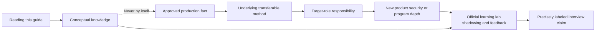

## Terms, definitions, and memory hooks

| Term | Plain meaning | Why it matters | Memory hook |
|---|---|---|---|
| Transferable skill | Method useful in a different domain | Preserves genuine value during a career move | Same tool in a new workshop |
| Domain knowledge | Concepts, risks, and practices specific to a field | Prevents shallow analogy | Learn the new terrain |
| Product knowledge | How a named product is designed, deployed, operated, and supported | Concept is not console competence | Know this aircraft |
| SecOps | Ongoing work to prevent, detect, investigate, respond, and improve security | Target role context | Security operations every day |
| SOC | Team/function monitoring and responding to threats | One part of SecOps | Security watch floor |
| Exposure | Condition that may let an attacker cause harm | Proactive security object | Open route to harm |
| Vulnerability | Weakness that can be exploited | One exposure input | Defect, not destiny |
| Threat | Actor/event/circumstance able to cause harm | Reactive/proactive context | Potential source of harm |
| Control | Safeguard that changes likelihood or impact | Mitigation evidence | Safety barrier |
| Zero trust | Security paradigm that does not grant implicit trust from network location | Architecture mindset | Verify every access decision |
| Least privilege | Give only access needed for a purpose and time | Limits blast radius | Smallest necessary key |
| Attack surface | Assets and pathways an attacker might target | Defines discovery scope | Doors and windows |
| Asset | Valuable technology/data/identity resource | Risk needs an object | What must be protected |
| Telemetry | Recorded measurements/events from systems | Evidence input | Instrument readings |
| Data fabric | Architecture that integrates, harmonizes, links, and operationalizes data | Context foundation | Translation and sorting hub |
| Entity resolution | Determine which records describe the same real object | Avoid duplicates/wrong joins | Match the same person across lists |
| Golden record | Best unified representation from multiple sources | Supports trusted decisions | Reconciled master card |
| CAASM | Cyber Asset Attack Surface Management | Asset visibility/coverage category | Reconcile asset inventories |
| UVM | Unified Vulnerability Management | Zscaler contextual prioritization offering | Fix what matters first |
| CTEM | Continuous Threat Exposure Management | Recurring scope/discover/prioritize/validate/mobilize program | Find, focus, prove, fix, repeat |
| Risk | Effect of uncertainty on objectives, often reasoned through likelihood and impact | Executive decision language | What could happen and matter |
| Risk appetite | Amount/type of risk organization is willing to pursue/retain | Customer owns acceptance | How much uncertainty is tolerable |
| Technical success | Durable customer outcomes from adopted technology | TSM's central responsibility | Capability into outcome |
| Adoption | Intended users consistently use a capability correctly | License/configuration is not value | Used well in real workflow |
| KPI | Key Performance Indicator tied to an important outcome | Proves progress | Metric with a decision |
| Leading indicator | Early signal predicting future result | Enables proactive action | Warning before outcome |
| Lagging indicator | Result measured after activity | Confirms outcome | Score after the game |
| RCA | Root Cause Analysis | Converts failure into prevention | Why, fix, prevent |
| RACI | Responsible, Accountable, Consulted, Informed | Clarifies ownership | One accountable owner |
| TSM | Technical Success Manager | Technical partner for adoption/outcomes | Outcome guide |
| EBR | Executive Business Review | Decision-focused outcome/risk review | Executive decisions, not feature tour |
| Human-in-the-loop | Person reviews/approves AI-supported decision/action | Controls AI risk | Machine proposes, human owns |

## The bridge model: facts, methods, context, and proof

A useful translation has four layers:

1. **Fact:** What did Arti actually do?
2. **Method:** What repeatable judgment or behavior made it effective?
3. **Target context:** Where does that method help a SecOps TSM?
4. **Gap and proof:** What new knowledge/practice is needed before claiming competence?

| Weak translation | Why weak | Strong translation |
|---|---|---|
| "I did M365 incidents, so I did SecOps." | Different purpose, authority, evidence, and risk | "My incident-scoping discipline transfers; threat containment and security authority require new practice." |
| "SharePoint permissions are zero trust." | Workload authorization is not a complete architecture | "Resource/identity/operation separation helps me learn continuous, context-aware least privilege." |
| "Power BI is Data Fabric." | Reporting tool is not product architecture | "Data-model and quality skills transfer to connector/schema/entity validation; product operation is new." |
| "Copilot agent means Agentic SecOps." | Different data, actions, safety, and security workflows | "Agent design/evaluation transfers; security grounding, containment authority, and product workflow are gaps." |
| "High CSAT proves cyber risk reduction." | Experience metric does not measure security outcome | "CSAT supports trust and communication; risk reduction needs exposure/control evidence." |
| "I studied Zscaler, so I know it." | Reading is conceptual | "I can explain public architecture and a validation plan; production administration is not yet used." |

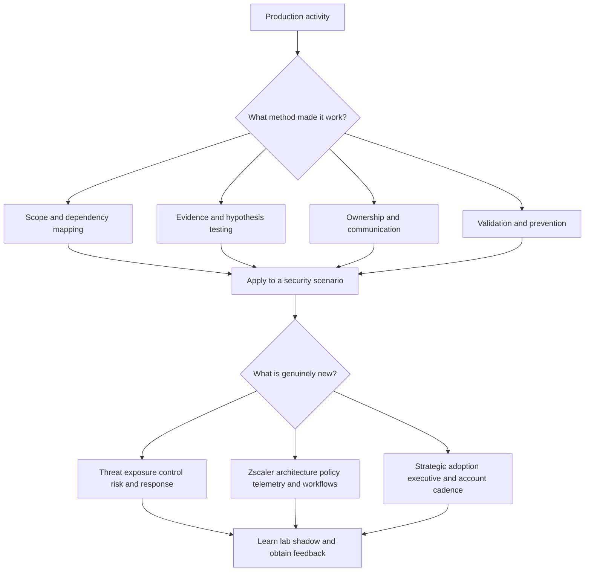

### Plain-English deep-dive 1 - An analogy is a bridge, not a destination

Suppose a skilled emergency-room nurse becomes an aviation safety investigator. Both roles use triage, evidence, calm communication, checklists, and high-consequence judgment. The nurse has valuable transferable behavior. But a medical triage category is not an aircraft failure mode, and hospital authority is not aviation authority.

The same rule protects Arti. M365 troubleshooting proves she can structure ambiguity, find boundaries, use traces, coordinate Engineering, validate outcomes, and communicate with customers. It does not prove she can interpret an exploit chain, tune vulnerability factors, operate Zscaler policy, hunt threats, or authorize containment. Those are learnable gaps, not embarrassing omissions.

In an interview, analogy should end with validation: "The transferable method is X. The security difference is Y. I have practiced Z in a synthetic lab, and in production I would verify A/B/C with the customer's owners and current product guidance." This demonstrates both confidence and judgment.

## The complete claim and experience matrix

| Competency/evidence | Current label | What Arti can claim | What she must not imply | Next proof |
|---|---|---|---|---|
| Microsoft 365 escalation engineering | Production | Complex enterprise SaaS diagnosis and ownership | Formal cybersecurity incident response | Sanitized STAR story |
| SharePoint Online/OneDrive/Sync | Production | Client, identity, permission, content, network, service reasoning | ZIA/ZPA/ZDX administration | Architecture-to-evidence story |
| Copilot-related support/work | Production per approved background | AI workload/customer problem solving within factual scope | Zscaler AI security operation | Exact approved example |
| CRITSIT/business-critical escalation | Production | High-pressure cadence, workstreams, evidence, expectations | SOC incident commander or breach lead | First-30-minute translation |
| Network/process/browser traces | Production per approved background | Observation-point-aware evidence collection | Packet expertise on every protocol/vendor | One trace narrative |
| Engineering/Product Group coordination | Production | Evidence handoff and cross-functional closure | Product roadmap authority | Handoff artifact |
| Technical Advisor | Production | Technical guidance and service-quality leadership | CISO advisor title or security strategy ownership | Advisory example |
| Mentoring/onboarding/interviews | Production | Scale knowledge and quality through people | Security-engineer management unless factual | Coaching cycle |
| Training/knowledge articles | Production | Explain complex workflows and create reuse | Certified Zscaler instructor | Role-based lab workshop |
| CSAT >4.75 Enterprise | Production metric | Strong customer satisfaction in stated segment | Universal score/security result | Context and drivers |
| CSAT >4.85 SMB/partner | Production metric | Strong satisfaction in stated context | Combine/change denominator | Context and drivers |
| More than 100 recognitions | Production recognition | Repeated contribution/trust signal | 100 security outcomes | Two representative examples |
| SQL/statistics/business analytics | Demonstrated/production as approved | Query, reconcile, analyze, explain data | Security data engineering at scale if not factual | Synthetic source model |
| Power BI | Demonstrated/production as approved | Model/report/metric and decision support | Zscaler Data Fabric operation | Security KPI dashboard lab |
| Copilot Studio agents | Demonstrated/production as approved | Build/evaluate agent workflows within exact history | Autonomous SOC response | Guardrailed evidence agent lab |
| Zero trust principles | Conceptual | Explain NIST/public architecture and validation | Enterprise ZTA ownership | Whiteboard and lab |
| Zscaler public architecture | Conceptual | Explain documented products/capabilities with date | Tenant configuration/licensing | Official training/product tour |
| Data Fabric for Security | Conceptual/not yet used | Explain documented ingest/harmonize/dedupe/context flow | Connector administration or schema mastery | Synthetic connector workbook |
| Asset Exposure Management/CAASM | Conceptual/not yet used | Explain inventory reconciliation and coverage | Production asset program ownership | Multi-source asset lab |
| UVM | Conceptual/not yet used | Explain contextual prioritization and workflow | Production scoring/tuning | Vulnerability lab |
| CTEM | Conceptual | Explain recurring five-stage program | Running enterprise CTEM | NMH program tabletop |
| Risk360 | Conceptual/not yet used | Explain public risk-driver/executive use | Validating its model in production | Score challenge exercise |
| Agentic SecOps | Conceptual/not yet used | Explain public signals/context/agent/action loop and guardrails | SOC deployment or autonomous response | Human-approval tabletop |
| SOC operations/threat hunting/MDR | Not yet used | Name adjacent methods and ramp | Analyst/hunter/MDR practitioner history | Shadowing and guided labs |
| Vulnerability management ownership | Not yet used | Explain fundamentals and synthetic prioritization | Owning remediation SLAs/exceptions | CVE/KEV/EPSS lab |
| CISO/board advisory | Not established | Use executive structure and seek feedback | Prior CISO advisor claim | Mock EBR review |
| Zscaler product administration | Not yet used | Public architecture plus precise ramp | Production console/policy operation | Approved sandbox/certification |

## Translation 1: SaaS escalation to Zero Trust troubleshooting

Microsoft 365 escalation teaches that user experience crosses identity, endpoint, client, name resolution, transport, proxy/security, TLS, service, permission, content, and return/commit boundaries. Zero trust troubleshooting also requires an end-to-end transaction model. The new context is that policy enforcement, continuous context, least privilege, application segmentation, security inspection, and threat/data decisions may intentionally change the result.

```mermaid
flowchart LR
    USER[User identity and business purpose] --> DEVICE[Device client posture and local state]
    DEVICE --> PATH[DNS transport forwarding and service edge]
    PATH --> POLICY[Identity context destination risk and policy decision]
    POLICY --> RESOURCE[Internet SaaS private app workload or data]
    RESOURCE --> RESULT[Allowed blocked challenged isolated or degraded outcome]
    RESULT --> TELE[Endpoint identity policy path and application telemetry]
    TELE --> HYP[Hypothesis and discriminating test]
    HYP --> FIX[Right-sized corrective action]
    FIX --> VERIFY[Functional and security validation]
```

| M365 method | Zero Trust/SecOps translation | Important difference | New evidence |
|---|---|---|---|
| Identify browser versus sync path | Identify traffic origin, forwarding method, product/policy path | Security control may intentionally branch | Client/forwarding/policy logs |
| Separate 401 and 407 | Separate origin identity from intermediary/auth challenges | Multiple identity/posture contexts can feed access policy | IdP and policy decision IDs |
| Record DNS/egress/front door | Record resolution, path, service edge, destination | Traffic may be brokered/inspected under design | Zscaler connection/service telemetry |
| Compare affected and known-good | Compare user/device/location/app/policy/time | Different policy assignment can make comparison invalid | Policy/config diff |
| Locate first failed boundary | Locate client, path, policy, upstream, app, or response failure | "Blocked" can be correct control behavior | Rule/action/reason evidence |
| Validate service result | Validate destination plus control/security result | Functional success alone may weaken protection | Negative security controls |

A strong bridge statement is: "My M365 investigations trained me to model the exact transaction and observation points. In a Zscaler environment I would add forwarding, service edge, policy decision, inspection, and security outcome as first-class boundaries. I would not treat bypass success as proof; I would compare policy-matched cohorts and preserve negative controls."

## Translation 2: SharePoint permissions to least-privilege access

SharePoint work teaches the difference between authentication and authorization; tenant/site/library/item scope; inherited versus explicit permission; user/group context; sharing invitations; operation-specific access; and content policy. These concepts help with Zero Trust because access should be evaluated for an identity, resource, operation, and context rather than inferred from network location.

NIST SP 800-207 describes zero trust as moving focus from static network perimeters to users, assets, and resources. That industry concept is broader than any one Microsoft or Zscaler product.

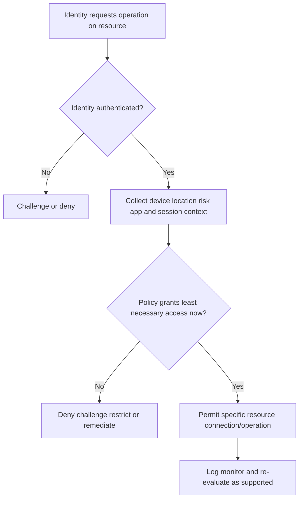

| SharePoint reasoning | Transfer | Non-equivalence |
|---|---|---|
| User/group authentication | Identity is an access signal | Zero trust may combine device/risk/context continuously |
| Site/library/item permission | Resource-specific authorization | Private-app segments and policy constructs differ |
| View versus edit/share | Operation-specific privilege | Network/application controls may not see same application semantics |
| Inheritance and exceptions | Policy hierarchy/exception governance matters | Product rule evaluation must be learned exactly |
| Guest/B2B sharing | External identity and resource-tenant context | Partner access architecture may use other connectors/brokering |
| Audit/version evidence | Access decisions need traceability | Zscaler log fields/retention are product-specific |

### Plain-English deep-dive 2 - Least privilege is not "deny more"

A hospital does not improve care by locking every door. It gives a nurse access to the patients, rooms, medicines, and systems needed for the shift, records use, and changes access when role or risk changes. Too much access creates danger; too little access prevents care.

Likewise, Zero Trust is not a slogan for blocking users. It seeks secure, explicit access to the needed resource under verified conditions while reducing broad implicit trust and lateral movement. A TSM must measure both security and usability: which unnecessary pathways were reduced, which approved workflows succeed, how challenges affect users, whether exceptions expire, and whether controls catch the intended negative tests.

Arti's permission background helps because she already understands that "the user signed in" is not a full authorization decision. The new work is learning how Zscaler represents applications, identities, posture, policy, risk, forwarding, and logs, and how the customer's risk owner defines acceptable access.

## Translation 3: OneDrive sync and endpoint troubleshooting to digital experience

OneDrive sync scenarios develop discipline around local process/state, Files On-Demand, identity, policy, proxy support, current endpoints, distributed cloud entry, and background versus browser behavior. In a Zscaler context this method helps distinguish endpoint, Wi-Fi/LAN, ISP, DNS, forwarding, service edge, identity, policy, cloud application, and application-service causes.

Digital experience management is not the same as OneDrive sync health. Zscaler Digital Experience, ZDX, has its own architecture, telemetry, scoring, probes, and licensed capabilities covered later. The transfer is the habit of separating user experience into measurable segments.

| Existing method | Target use | New depth needed |
|---|---|---|
| Browser versus native-client comparison | Identify path/client-specific performance | Zscaler forwarding and app segmentation |
| Local process/Procmon evidence | Determine whether request is created | Client Connector/service-specific endpoint telemetry |
| DNS and egress correlation | Understand distributed-service path | Zscaler edge selection and supported path design |
| Waterfall/HAR timing | Separate DNS/connect/TLS/wait/content | ZDX web/application metrics and privacy scope |
| Fleet sync health caveat | Treat dashboard freshness/coverage critically | ZDX score calculation, probe deployment, data retention |
| Baseline/known-good | Compare cohorts and change windows | Policy, forwarding, and service-edge affinity |

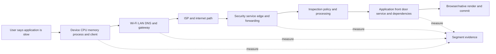

## Translation 4: CRITSIT leadership to security escalation coordination

A business-critical Microsoft escalation and a security incident both need impact clarity, severity, a timeline, workstreams, evidence, reliable updates, owners, decisions, recovery validation, and follow-up. But their objectives and authority can differ sharply.

| Dimension | Service escalation | Security incident/exposure event | Bridge rule |
|---|---|---|---|
| Primary objective | Restore supported service/outcome | Limit harm, preserve evidence, eradicate/recover as directed | Ask incident commander and risk owner |
| Scope | Users, tenants, operations, errors | Identities, assets, data, attacker activity, blast radius | Add adversarial uncertainty |
| Change | Fix/rollback with validation | Containment may disrupt service intentionally | Business/security authority decides |
| Evidence | Logs, traces, request IDs, configs | Plus chain/custody, forensic integrity, legal/privacy | Follow IR process |
| Communication | Customer/admin/Engineering updates | Need-to-know, legal/regulatory/executive constraints | Never improvise disclosure |
| Success | Stable supported operation | Threat contained, risk treated, control improved, operation recovered | Security and business criteria |
| RCA | Technical trigger/root cause/contributors | Intrusion path, control/detection/response gaps as appropriate | Avoid premature attribution |

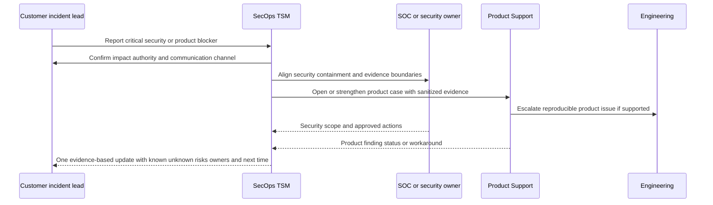

Arti can confidently claim calm customer coordination, technical workstream organization, evidence quality, Engineering collaboration, and expectation management. She must not claim breach-command authority or forensic practice unless factual. A safe phrase is: "I would bring my CRITSIT operating discipline while taking security containment, evidence handling, legal communication, and risk acceptance from the customer's incident-response process and designated owners."

## Translation 5: telemetry and analytics to security data quality

SQL, Power BI, and service telemetry create strong foundations for Security Operations data work: define grain, identify keys, trace source authority, profile nulls/duplicates, reconcile totals, distinguish event time from ingestion time, document transformations, and connect a metric to a decision.

Zscaler publicly describes its Data Fabric for Security as aggregating and unifying security/business data through ingest, harmonize/map, deduplicate, correlate/enrich, business logic, workflows, and reports. This is product positioning. Arti's analytics experience supports the method; it does not establish use of these product capabilities.

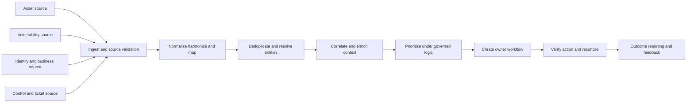

| Data question | M365/analytics habit | SecOps consequence if wrong |
|---|---|---|
| What is one row? | Define event/device/user/file grain | Counts mix alerts, assets, findings, or instances |
| What is the key? | Use stable identifiers, not display names | Wrong assets merged or one asset duplicated |
| Who is authoritative? | Identify service/source of truth per field | Stale owner or business criticality drives action |
| Is data fresh? | Track event, collection, ingestion, report times | Closed exposure appears open or new one absent |
| Is data complete? | Reconcile expected/observed populations | Coverage gaps masquerade as safety |
| How was metric transformed? | Document query/filter/join/measure | Dashboard cannot be defended |
| What decision follows? | Tie threshold to action and owner | Attractive chart with no outcome |
| How is closure verified? | Requery authoritative source | Ticket close falsely equals risk reduction |

### Plain-English deep-dive 3 - More telemetry can create more confidence and less truth

Imagine five departments maintain customer lists. Combining all rows produces a larger file, but not necessarily a better customer count. "A. Singh," "Anita Singh," an email address, and an old employee ID may be one person. A stale sales record may conflict with a current identity record. A missing person may mean a connector failed, not that the person left.

Security data behaves the same way. An endpoint tool, cloud inventory, vulnerability scanner, identity system, CMDB, and network platform observe different populations and times. A "golden record" is an evidence-backed reconciliation, not a magical objective truth. Entity rules can merge two assets incorrectly or split one asset into five records. Context can be stale. A dashboard can confidently prioritize the wrong owner.

Arti's analytical advantage is to ask uncomfortable but useful questions: what is the row grain, stable key, source authority, collection time, expected population, null meaning, join loss, duplicate rule, and acceptance threshold? The product gap is learning available Zscaler connector health, schemas, transformations, workflows, and supported reconciliation evidence.

## Translation 6: RCA to CTEM and continuous improvement

RCA asks why a failure occurred, why controls/detection/response did not prevent or limit it, and how recurrence will be reduced. CTEM is a recurring exposure-management program often framed as scoping, discovery, prioritization, validation, and mobilization. They are not the same, but both reject one-time closure.

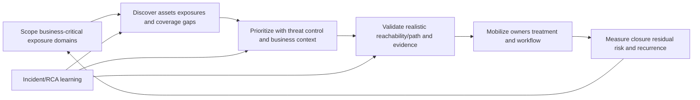

| RCA skill | CTEM use | New security depth |
|---|---|---|
| Timeline/change correlation | Discover when exposure/control state changed | Asset and finding telemetry semantics |
| Trigger versus contributor | Separate new vulnerability from coverage/ownership debt | Threat/exploit/control analysis |
| Five whys without blame | Find process/system weakness | Risk governance and exception lifecycle |
| Durable corrective action | Mobilize owners and verify | Remediation, compensating controls, acceptance |
| Recurrence metric | Feed program scope/priorities | Exposure-aging and validation metrics |
| Knowledge reuse | Improve playbooks and detection | Threat-informed and control-specific content |

An incident can reveal an exposure pattern; CTEM feeds the learning into recurring discovery and prioritization. Conversely, exposure validation may prevent an incident. Arti's strength is closing the loop; the gap is security-specific validation and treatment authority.

## Translation 7: issue prioritization to vulnerability and exposure prioritization

Support severity prioritizes customer impact and urgency. Vulnerability severity describes technical characteristics. Risk-based exposure priority combines more context: exploit evidence, reachability, asset/business criticality, identity privilege, data, controls, ownership, and acceptable risk. A severity-1 support process and a critical CVSS score are not equivalent.

| Input | Question | Example evidence | Caveat |
|---|---|---|---|
| Vulnerability severity | How technically severe is the weakness? | CVSS/vector/vendor advisory | Not organization-specific risk alone |
| Known exploitation | Is it observed exploited? | CISA KEV/vendor/threat intel | Catalog scope/timing matters |
| Exploit probability | Is exploitation likely soon? | EPSS and threat sources | Probability model, not certainty |
| Reachability/exposure | Can a plausible actor reach it? | Internet/app/identity/attack-path evidence | Scanner absence is not proof |
| Asset criticality | What business service/data depends on it? | Owner/CMDB/service map | Context may be stale |
| Control | What reduces likelihood/impact? | Segmentation, EDR, access, patch | Control must be deployed/effective |
| Identity | What privilege can be abused? | Account/role/path evidence | Permission can change quickly |
| Remediation feasibility | What outage/dependency is required? | Change/test/rollback plan | Difficulty does not erase risk |
| Risk decision | Who can accept residual risk? | Named accountable owner/exception | Vendor/TSM does not accept for customer |

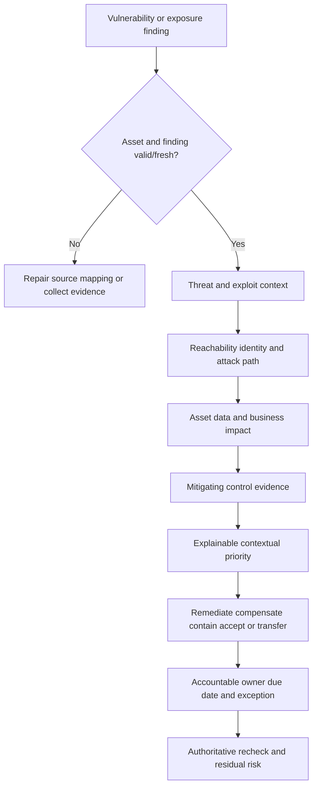

Arti can transfer structured priority, ownership, evidence, and communication. She must learn vulnerability standards, exploit evidence, security-control validation, risk treatment, and product scoring. A good interview answer says, "I would not replace CVSS with intuition or treat a platform score as unquestionable. I would validate source freshness and factor contribution, then align the queue to customer risk governance."

## Translation 8: customer satisfaction to technical success

Strong CSAT and recognition indicate customer trust, responsiveness, communication, and delivery quality in their stated contexts. A TSM must add longitudinal outcomes: adoption, health, risk reduction, capability maturity, blocker removal, stakeholder alignment, and renewal/expansion collaboration without making unsupported commercial promises.

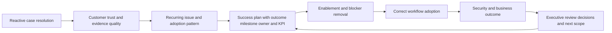

| Support measure | TSM extension | Security/outcome example |
|---|---|---|
| Time to resolution | Time to customer capability/value | Days until priority data sources accepted |
| Case recurrence | Systemic blocker trend | Repeated connector failures per source |
| CSAT | Trust plus outcome confidence | Sponsor confidence with evidence |
| Escalation cadence | Account governance cadence | Risk/action register reviewed weekly |
| Fix validation | Adoption and control validation | Workflow used and exposure reduced |
| Knowledge article | Reusable playbook/workshop | Analysts independently triage source failures |
| Engineer mentoring | Customer/peer capability | Teach-back pass and reduced dependency |
| Case volume | Health/adoption leading signals | Error backlog, stale source, workflow age |

### Plain-English deep-dive 4 - Closing a ticket is not finishing the customer outcome

A plumber can stop a leak today. A building advisor asks why the pipe failed, whether similar pipes exist, whether residents know the shutoff process, whether monitoring catches the next leak, and whether the repair supports the building's renovation plan. Both roles matter; the time horizon differs.

A TSM does not avoid incidents. During a critical issue, the TSM protects continuity, account context, ownership, and communication while Support owns the case process. After stabilization, the TSM asks whether the incident reveals an adoption gap, architecture debt, source-health risk, missing training, or success-plan milestone.

Arti's bridge from reactive to proactive is not pretending every support case was strategy. It is showing that Technical Advisor work, pattern analysis, training, mentoring, analytics, and prevention already extend beyond ticket closure, then demonstrating a new operating cadence: discover desired outcomes, baseline, prioritize use cases, define measures, remove blockers, train, review value/risk, and adjust.

## Translation 9: mentoring and training to adoption

Security platforms fail when only one expert understands them, analysts cannot trust the data, admins fear change, and executives see dashboards without decisions. Arti's mentoring, onboarding, interviews, partner/customer training, knowledge work, and organization-wide AI learning directly support role-based enablement.

| Audience | What they need | Format | Validation |
|---|---|---|---|
| Connector/data owner | Source prerequisites, health, mapping, repair | Hands-on runbook | Diagnose synthetic stale source |
| Vulnerability analyst | Factor/context interpretation and workflow | Scenario workshop | Explain top priority and caveats |
| Remediation owner | Rationale, SLA, evidence, exception | Short role guide | Close/reject/escalate correctly |
| SOC analyst | Threat story, evidence, response authority | Tabletop and lab | Triage without unsafe action |
| Security architect | Data/control/access relationships | Whiteboard review | Challenge assumptions/dependencies |
| Executive sponsor | Outcome, trend, risk, decision | One-page brief/EBR | State decision and ownership |
| TSM peer | Account operating model and escalation quality | Case review/teach-back | Apply rubric independently |

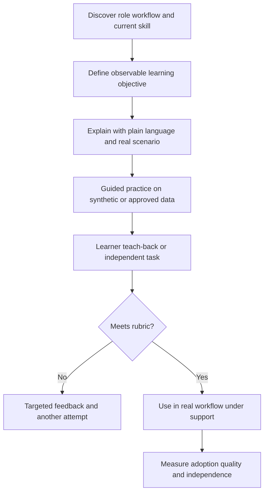

Training attendance is activity. Independent correct use is adoption evidence. A TSM should measure task completion, error rate, time, confidence, escalation quality, and sustained use where appropriate.

## Translation 10: Copilot Studio agents to responsible Agentic SecOps thinking

Microsoft describes Copilot Studio as a low-code environment for agents/workflows with instructions, connected knowledge/tools, testing, analytics, evaluation, administration, and human review options. Zscaler's official Agentic SecOps page describes combining first- and third-party signals, business context/security graph, agentic triage/investigation, and adaptive responses through inline controls. These are different products and workflows.

| Existing AI skill | Transfer | Security-specific gap/control |
|---|---|---|
| Define agent instructions | Bound security task and refusal/escalation | Adversarial inputs and prompt injection |
| Connect knowledge/tools | Ground recommendations in authorized evidence | Least-privilege credentials and data classification |
| Test/evaluate | Use golden cases and failure categories | False negatives, containment harm, threat drift |
| Human review | Gate consequential actions | Named authority and emergency process |
| Analytics | Measure quality, latency, usage | Security efficacy and audit integrity |
| Training/governance | Teach safe use and limitations | SOC runbooks, regulatory/privacy constraints |
| Workflow design | Automate repeatable steps | Idempotency, rollback, blast radius, rate limits |

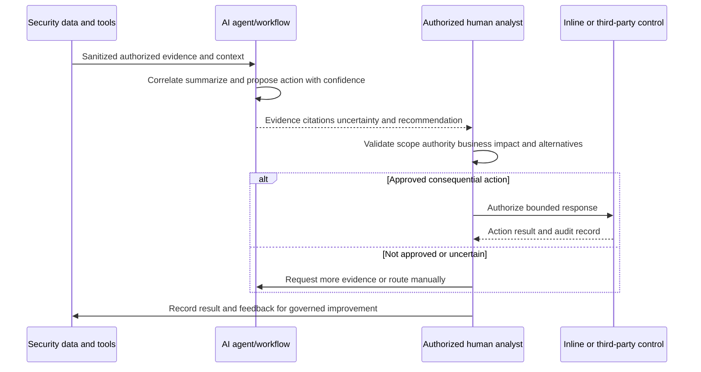

Arti's strongest answer is not "I already know Agentic SecOps." It is: "I have built/evaluated Copilot Studio agents and delivered AI learning, so I understand instructions, grounding, tools, testing, human review, and governance. Security raises the consequence: recommendations must cite evidence; tool access must be least privilege; containment needs named authority, rollback, and audit; false negatives and prompt injection matter. I have not deployed autonomous security response."

## From technical evidence to executive security outcomes

An executive does not need every packet or connector field. They need a defensible outcome: what objective is at risk, evidence/confidence, trend, options, recommendation, owner, and decision. Technical detail must remain available for drill-down.

| Technical statement | Weak executive translation | Strong translation |
|---|---|---|
| Connector has 23% fewer assets | "Data Fabric is broken" | "Asset coverage is incomplete for the acquisition segment, so risk priority is unreliable there; restore source freshness before using the score for decisions." |
| Policy blocked app | "Security works" | "The intended risky pathway was blocked in the pilot while approved workflow passed; rollout risk is limited by ring/rollback and help-desk readiness." |
| 2,000 critical CVEs | "We have 2,000 emergencies" | "After validating assets, exploit evidence, reachability, and controls, 34 exposures require immediate owner action; data confidence for 12% remains low." |
| Risk score fell | "We are safer by 20%" | "The modeled score improved, driven by verified controls A/B; assumptions and residual identity/data risks remain for executive acceptance." |
| AI triage faster | "The AI solved alert fatigue" | "Median triage time fell on the approved case set while analyst override and missed-threat rates remained within thresholds; consequential response stays human-approved." |

### Executive update template

1. **Outcome/impact:** "The acquisition environment's asset coverage is incomplete, reducing confidence in vulnerability priority and remediation ownership."
2. **Evidence/confidence:** "Two expected endpoint sources are stale since 02:10 UTC; independent CMDB comparison indicates about 1,200 records are absent. Confidence is high for source failure, medium for exact affected population."
3. **Action:** "Credentials and schema changes are being validated; prioritization for that segment is labeled incomplete rather than treated as zero risk."
4. **Decision/owner:** "Security data owner accepts restoration by Wednesday; vulnerability lead decides whether to pause SLA reporting for the segment."
5. **Next update/outcome measure:** "Next update 16:00 UTC; success is fresh source load, count reconciliation within threshold, and owner workflow validation."

## Scenario translations

### Scenario 1: OneDrive sync failure to zero-trust access troubleshooting

**Microsoft pattern:** Browser works, OneDrive.exe fails. Arti separates local state, client identity, proxy support, endpoint sequence, permission, service, and commit.

**Target scenario:** A private application works on corporate LAN but fails for remote managed users through a zero-trust access design.

**Transfer:** Define exact app/FQDN/port, user/device/location/time, identity/posture, client/forwarding status, policy match, connector/app path, upstream app response, and known-good. Avoid "VPN works" as proof because it changes architecture and access scope.

**Gap:** Learn current ZPA objects, forwarding, Client Connector, App Connector, policy, logs, health, and support evidence before diagnosis.

### Scenario 2: external sharing to third-party least privilege

**Microsoft pattern:** Guest receives invitation but cannot edit. Arti checks resource tenant, external identity, site/item sharing, link, recipient, permission, operation, and policy.

**Target scenario:** A supplier needs one private application, not broad network access.

**Transfer:** Identify supplier identity lifecycle, device/context requirements, exact application/operation, owner, time window, approval, logging, revocation, and negative tests.

**Gap:** Learn Zscaler B2B/private-access capability, product/licensing and deployment options, and customer identity governance. Do not assume SharePoint invitation mechanics.

### Scenario 3: service-health dashboard to security-platform health

**Microsoft pattern:** Service health and sync reports are scope signals with coverage/latency caveats, not request proof.

**Target scenario:** A security dashboard shows all green while a source has stopped sending assets.

**Transfer:** Validate reporting prerequisites, expected population, last event/ingest/report times, source counts, negative controls, and request/source evidence.

**Gap:** Learn product connector health fields, jobs, schemas, retention, and alerting.

### Scenario 4: M365 CRITSIT to active threat/product blocker

**Microsoft pattern:** Arti establishes business impact, workstreams, evidence, cadence, Engineering handoff, and stable recovery.

**Target scenario:** The SOC sees suspicious identity activity and a proposed containment workflow is unavailable.

**Transfer:** Maintain one timeline, scope, hypotheses, product/support workstream, and reliable updates.

**Gap:** The incident commander/SOC owns threat assessment and containment; legal/privacy/forensic processes govern evidence and disclosure. Arti coordinates product outcome without taking unauthorized security decisions.

### Scenario 5: Power BI mismatch to Data Fabric entity error

**Microsoft pattern:** Dashboard total differs because join grain and stale refresh are wrong.

**Target scenario:** One physical server appears as four assets and receives four remediation tickets.

**Transfer:** Trace source IDs, normalization, time, matching rules, join cardinality, conflict precedence, and downstream workflows.

**Gap:** Learn Zscaler entity model and supported deduplication/configuration. Do not hand-edit production records based on an assumed key.

### Scenario 6: support severity to contextual vulnerability priority

**Microsoft pattern:** Severity follows business impact, scope, workaround, and urgency.

**Target scenario:** Thousands of scanner findings share a critical CVSS score.

**Transfer:** Define decision context, validate evidence, group appropriately, assign owner/SLA, communicate limitations.

**Gap:** Add CVE/CVSS, KEV/EPSS, exploitability, reachability, asset criticality, identity, controls, treatment, exception, and authoritative recheck.

### Scenario 7: fix validation to security-control validation

**Microsoft pattern:** Reproduce, make one controlled change, validate exact operation, affected variants, known-good, rollback, and recurrence.

**Target scenario:** A policy narrows access after an exposure.

**Transfer:** Test intended approved flow and affected cohort.

**Gap:** Add negative test for denied path, bypass/lateral movement, telemetry/detection, least privilege, exception expiry, and risk-owner acceptance.

### Scenario 8: Copilot agent to SecOps agent recommendation

**Microsoft pattern:** Agent retrieves knowledge and recommends a workflow step.

**Target scenario:** Agent proposes isolating a user after correlating signals.

**Transfer:** Instructions, grounding, evidence citation, evaluation, human approval, analytics.

**Gap:** Security authority, adversarial robustness, false-positive harm, blast radius, rollback, identity verification, audit, and threat-case testing.

## Fictional NMH bridge exercises

NMH is fictional. These exercises are portfolio practice, never interview production stories.

### NMH exercise A: stale acquisition asset source

The acquisition CMDB connector last completed 30 hours ago, while endpoint source count rises. UVM priority appears to improve because missing acquisition assets remove findings from the denominator.

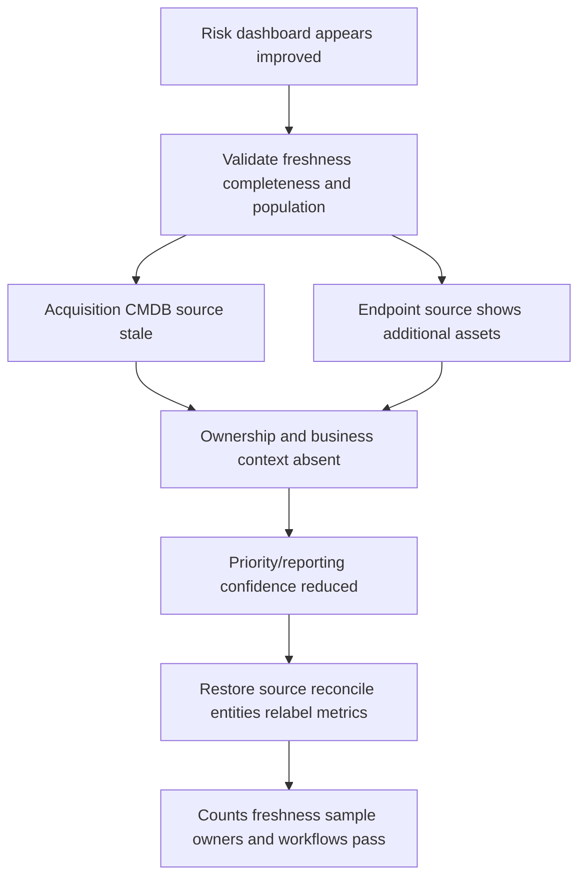

**Arti bridge:** SQL/Power BI reconciliation, timestamp discipline, source authority, impact communication, owner coordination.

**New depth:** Data Fabric connector/model health, asset entity resolution, vulnerability workflow and security risk governance.

### NMH exercise B: critical vulnerability with compensating control

A synthetic internet-facing payroll server has a vulnerability in a fictional library. The CVSS score is high, a fictional threat feed reports exploitation, and maintenance needs six hours. A gateway control may reduce reachability, but its deployment and negative test are not verified.

**Correct response:** Treat the finding as urgent but validate asset identity/version, exposure, exploit evidence, control coverage/effectiveness, data/business impact, owner, remediation path, temporary containment, rollback, and residual-risk authority. Do not downgrade solely because a control is configured; prove it applies and works.

### NMH exercise C: executive challenges the risk score

The CISO asks, "Why did risk fall 12 points when no patch window completed?"

**Correct response:** Trace factor contributions, source refresh, asset population, policy/control changes, model/weight changes, and denominator. State whether improvement represents verified risk treatment, data/model movement, or both. Provide assumptions and decision impact. Never defend a score because the vendor produced it.

### NMH exercise D: policy rollback request during business outage

A newly tightened access policy coincides with payroll application failure. The business asks to disable all controls.

**Correct response:** Establish exact impact and safety authority, preserve current policy/evidence, identify last known good and affected cohorts, isolate one variable in a pilot, choose the narrowest approved temporary treatment, retain monitoring/negative controls, define expiry, and validate payroll plus protection. Do not choose risk acceptance for NMH.

## Gap analysis: what must be learned, not hidden

| Gap area | Why material | First evidence of competence | Stronger evidence over time |
|---|---|---|---|
| Zero Trust architecture | Core platform/customer conversation | Explain NIST and public Zscaler model accurately | Design/review supervised customer pattern |
| ZIA/ZPA/ZDX fundamentals | Product paths and customer value | Official learning plus sandbox whiteboard | Guided operation and troubleshooting |
| Data security | SecOps/use-case breadth | DLP/CASB/DSPM concept and policy scenario | Approved lab/customer shadow |
| Data Fabric for Security | Role expectation | Synthetic source-map/quality lab | Connector onboarding under supervision |
| AEM/CAASM | Asset truth/coverage | Multi-source entity lab | Production quality review with mentor |
| UVM | Prioritization/workflow | Contextual vulnerability lab | Tune/review customer factors supervised |
| Vulnerability standards | Correct priority language | CVE/CVSS/KEV/EPSS exercise | Operational remediation governance |
| CTEM | Proactive program model | NMH five-stage tabletop | Customer program milestone contribution |
| Agentic SecOps | Current solution context | Guardrail/evaluation tabletop | Approved workflow shadow/pilot |
| SOC/IR fundamentals | Critical escalation boundaries | Incident tabletop and role/RACI | Shadow SOC/Support coordination |
| Threat/attack-path reasoning | Security analysis gap | MITRE ATT&CK-informed synthetic case | Guided investigations |
| Risk quantification | Executive decisions | Score assumption challenge | Calibrated customer risk review |
| TSM account strategy | Move from case to lifecycle | Success plan and EBR lab | Co-own then lead account cadence |
| Commercial boundaries | Customer/account partnership | RACI and no-promise script | Shadow account team |
| CISO communication | Role audience | Mock executive brief with feedback | Repeated executive reviews |
| Zscaler support/process | Correct escalation | Minimum-data fictional package | Real supervised case execution |

The correct interview posture is neither apology nor bluff. Say the gap in one sentence, connect adjacent evidence in one sentence, and give a concrete ramp/proof plan in one sentence.

## 30/60/90-day ramp and contribution plan

This is a proposed plan, not a promise that every internal system or customer activity will be available on this schedule. Align it with the manager, onboarding program, customer assignments, and access.

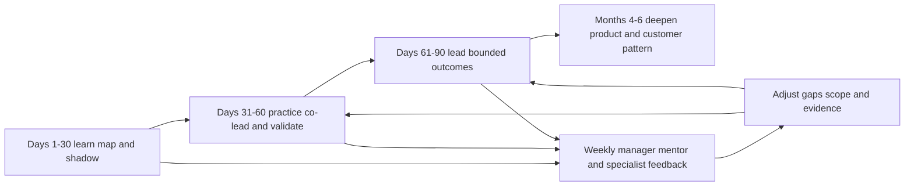

| Period | Learn | Observe/practice | Deliver | Measure | Guardrail |
|---|---|---|---|---|---|
| Days 1-15 | Company/platform, role, customer lifecycle, support/security boundaries | Shadow TSM, specialist, Support, account review | Validated terminology map and stakeholder/RACI | Mentor accuracy check | Label assumptions; no customer promises |
| Days 16-30 | Assigned products, Data Fabric/UVM/AEM basics, tenant telemetry | Trace one use case/source-to-workflow with owner | Current-state map, question log, evidence rubric | Teach-back pass and closed gaps | Never treat public page as tenant state |
| Days 31-45 | Customer goals, architecture, source health, adoption | Co-run discovery/technical review | Draft success plan, source inventory, risk register | Customer/mentor acceptance of facts | Scope to assigned access |
| Days 46-60 | Troubleshooting/escalation and KPI definitions | Reverse-shadow a source/priority issue | Evidence package, dashboard dictionary, workshop draft | Reconciliation and handoff quality | Specialists validate product specifics |
| Days 61-75 | Executive outcome narrative and remediation workflow | Lead bounded cadence/workshop | Role-based training, action register, outcome brief | Teach-back and milestone movement | Do not overstate causality/value |
| Days 76-90 | Recurring health/adoption/risk pattern | Lead a bounded use case with mentor review | One measurable blocker removal and reusable playbook | Customer outcome plus peer feedback | Escalate unknowns early |
| Months 4-6 | Deeper product/security specialism | Own broader account technical rhythm | Reusable quality improvement and customer outcome | Adoption, health, risk/action trend | Continue certification/feedback |

### Ramp scorecard

| Dimension | 30-day signal | 60-day signal | 90-day signal |
|---|---|---|---|
| Product vocabulary | Correct teach-back | Trace one deployed workflow | Explain customer-specific architecture with review |
| Customer context | Stakeholder/outcome map | Accepted draft success plan | Outcome review led within scope |
| Data quality | Source checklist | Reconciled one source path | Prevented/moved one material data blocker |
| Exposure workflow | Explain stages | Analyze synthetic/approved case | Co-drive bounded remediation workflow |
| Escalation | Know process/RACI | Build accepted evidence bundle | Coordinate bounded blocker with reliable cadence |
| Enablement | Observe audience | Build role session | Teach-back demonstrates independence |
| Executive communication | Draft one-page brief | Present internally | Present bounded customer outcome with mentor feedback |
| Knowledge scaling | Maintain learning log | Publish reviewed runbook draft | Reusable approved contribution |

## Portfolio evidence plan

A portfolio proves current effort; it must never contain customer confidential data, employer internals, proprietary screenshots, secrets, copied certification questions, or unsupported results.

| Artifact | What it proves | Inputs | Validation |
|---|---|---|---|
| Claim ledger | Honesty and self-awareness | Approved background and role map | Every statement labeled |
| Zero Trust whiteboard | Architecture understanding | NIST/Zscaler public sources | Peer explains it back correctly |
| Transaction fault tree | Troubleshooting transfer | Synthetic app/path/policy data | Discriminating tests named |
| Asset reconciliation notebook/report | SQL/data quality/entity reasoning | Synthetic CMDB/EDR/cloud records | Counts, joins, duplicates, caveats tested |
| Vulnerability priority workbook | Contextual risk reasoning | Synthetic CVE/CVSS/KEV/EPSS/assets/controls | Ranking sensitivity explained |
| CTEM tabletop | Program thinking | Fictional NMH exposures | Five stages, owners, measures complete |
| Critical escalation packet | Coordination/evidence | Fictional logs/timeline | Exact ask and boundaries pass review |
| EBR one-pager | Executive translation | Synthetic outcomes/risks | Decision request is clear |
| Role-based workshop | Enablement | Synthetic source failure | Learner teach-back passes rubric |
| AI guardrail/evaluation set | Responsible agent thinking | Synthetic alerts/evidence | Failure modes and approval gates tested |
| 30/60/90 plan | Pragmatic ramp | Role expectations | Manager-style review and revision |
| Source-currency log | Product humility | Dated official URLs | Claims trace to current source |

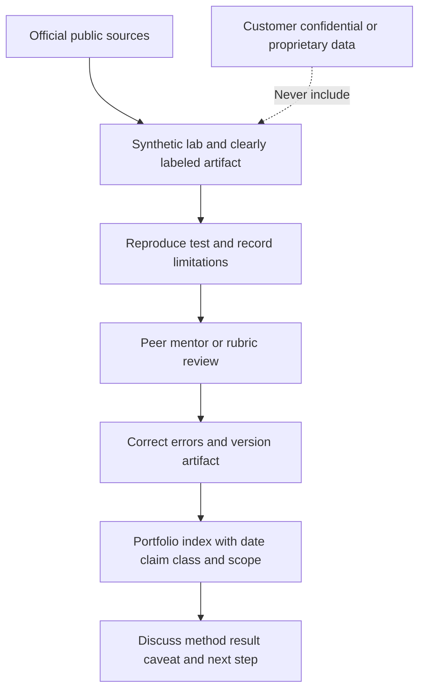

### Portfolio artifact cover sheet

Each artifact should state:

- Title, date, version, and purpose.
- Claim class: lab or conceptual.
- Synthetic/owned data declaration.
- Official source dates and URLs.
- Assumptions and excluded scope.
- Reproduction steps and result.
- Security/privacy controls.
- Known limitations and what would differ in production.
- Reviewer/rubric feedback and corrections.

## Interview positioning scripts

Scripts are scaffolding. Arti must rewrite them into her natural voice and connect them to true examples. Do not memorize claims she cannot defend.

### 30-second positioning

"I am a Microsoft enterprise Support Escalation Engineer with more than five years of experience handling complex SharePoint Online, OneDrive, Sync, and Copilot-related customer scenarios, including business-critical escalations and CRITSITs. My strengths are evidence-led cross-layer troubleshooting, customer ownership, Engineering collaboration, analytics, mentoring, and training. I am moving into SecOps Technical Success because I want to apply that operating discipline proactively to adoption, exposure, risk, and measurable customer outcomes. I am explicit that Zscaler production operation and formal SecOps are my ramp areas, and I am building proof through official learning and synthetic labs rather than presenting study as experience."

### 90-second tell-me-about-yourself

"My core skill is moving a complex enterprise problem from ambiguity to a trusted outcome. In Microsoft enterprise Support Escalation Engineering, I have worked across SharePoint Online, OneDrive, Sync, and Copilot-related scenarios where the symptom can cross endpoint process, browser, identity, permissions, DNS, proxy, TLS, network, and cloud-service boundaries. I scope impact, build a dependency map, collect evidence with the appropriate trace at the appropriate observation point, form discriminating hypotheses, coordinate Engineering or Product Groups, validate the correction, and keep customers aligned during business-critical situations and CRITSITs.

"I also bring a proactive and scaling dimension. My background includes Technical Advisor work, mentoring, onboarding, interviews, training, knowledge creation, SQL, Power BI, statistics/business analytics, and Copilot Studio agents and AI learning. My approved customer metrics include CSAT above 4.75 in Enterprise and 4.85 in SMB or partner context, plus more than 100 recognitions. I use those as evidence of trust and delivery, not as security metrics.

"The SecOps TSM role is a deliberate next step: use the same rigor to help customers trust data, prioritize exposures, adopt workflows, manage escalations, and explain outcomes over time. I do not claim production Zscaler administration, SOC operations, or vulnerability-program ownership. My gap plan is direct product learning, synthetic source/entity/vulnerability labs, shadow and reverse-shadow, specialist feedback, and bounded customer contribution. I offer proven enterprise ownership and a transparent, measurable way to build the new depth."

### Why move from Support to Technical Success?

"I value Support and would bring its evidence discipline with me. The change I want is the time horizon. Support often begins when a customer is blocked. Technical Success can use incident patterns, health, adoption, training, architecture, and stakeholder plans earlier so the customer builds a durable operating capability. My Technical Advisor, analytics, mentoring, and training work already points in that direction. I am not saying every prior ticket was strategic; I am showing how the method can extend into a success plan with milestones and measures."

### Why SecOps?

"SecOps combines problems I am strongest at: complex interconnected systems, noisy evidence, high consequence, multiple owners, and the need to convert technical facts into action. It also gives me new depth in exposures, threats, controls, vulnerability context, and risk. I am motivated by the feedback loop: understand assets and data, prioritize what matters, coordinate action, validate the control, and use incident learning to improve prevention."

### Why Zscaler?

"Zscaler's public mission emphasizes anticipating, securing, and simplifying the experience of doing business. Its public platform story connects zero-trust telemetry and inline controls with data integration, exposure management, risk, and Agentic SecOps. That creates a technically rich customer-success problem: the value depends on architecture, trusted data, adopted workflows, cross-functional ownership, and measurable outcomes. My enterprise SaaS, escalation, analytics, enablement, and AI background is relevant to that operating challenge, while the product depth is a clear and honest ramp."

### You have no Zscaler production experience. Why hire you?

"That gap is real, and I would not disguise it. Product operation must be learned and demonstrated. What I bring immediately is harder-to-build operating evidence: more than five years of enterprise escalation ownership, cross-layer troubleshooting, high-pressure customer communication, Engineering collaboration, analytics, mentoring, training, and strong recorded customer results. My ramp is specific: official architecture and product learning, sandbox or guided labs, source-to-outcome tracing, shadow/reverse-shadow, specialist validation, then bounded account ownership. You would get transparent judgment and measurable learning rather than confident guessing."

### Is support too reactive for this strategic role?

"If my experience were only closing tickets, the concern would be valid. My production foundation includes Technical Advisor work, recurring-pattern analysis, RCA/prevention, mentoring, onboarding, training, knowledge, analytics, and customer expectation management. My bridge is to operationalize those skills in a longer cadence: discover outcomes, baseline health/adoption, prioritize use cases, define owners and KPIs, remove blockers, teach workflows, and review evidence with executives. The strategic-account plan is new role practice that I am demonstrating through synthetic artifacts and would refine with the account team."

### Have you advised CISOs?

"I do not present my background as formal CISO advisory. I have communicated complex, business-critical technical issues and served as a Technical Advisor. The transferable executive structure is outcome, business impact, evidence and confidence, options and tradeoffs, recommendation, accountable decision, and next update. I would build CISO fluency through shadowing, internal review, current security/risk learning, and feedback before claiming independent executive advisory depth."

### What does your analytics background add?

"Security prioritization is only as trustworthy as its data. SQL, Power BI, and business analytics trained me to define grain and keys, reconcile expected populations, detect stale or missing data, validate joins, document transformations, and connect a metric to a decision. In a Data Fabric or exposure context, that helps with connector health, entity resolution, source authority, factor explainability, and dashboards. I have not used Zscaler Data Fabric in production, so I would learn its actual schemas and supported operations rather than assuming it behaves like Power BI."

### How does your AI experience transfer?

"My factual experience includes Copilot Studio agents, AI evaluation/certification, and training. The transfer is instruction design, grounding, tool boundaries, testing, analytics, human review, and user enablement. SecOps raises the stakes: adversarial inputs, false negatives, sensitive telemetry, least-privilege tools, containment blast radius, rollback, and audit. I have not deployed autonomous security response. I would keep consequential actions human-authorized until evidence, governance, and measured quality support the agreed level of automation."

### What is your biggest gap?

"The largest combined gap is direct Zscaler product and formal SecOps program operation: product-specific policy/telemetry, exposure and vulnerability workflows, and security risk/response context. I manage it visibly. I maintain a claim ledger, learn current official architecture, create synthetic labs with reproducible evidence, seek specialist review, shadow then reverse-shadow, and accept bounded ownership only after the relevant competency is demonstrated."

## Objection-response matrix

| Interview challenge | Response structure | Evidence to attach | Avoid |
|---|---|---|---|
| No cybersecurity title | Acknowledge, transfer methods, name security gaps, proof plan | M365 escalation + lab | Calling M365 support cybersecurity |
| No Zscaler console | Acknowledge, public model, supervised ramp | Whiteboard/source log | Inventing UI/configuration |
| Reactive background | Distinguish case work, show advisory/analytics/training, lifecycle plan | Technical Advisor and success plan | Claiming every case strategic |
| No CISO experience | State boundary, executive structure, feedback plan | One-page mock EBR | Borrowing advisor title |
| No vulnerability ownership | Explain fundamentals and lab, name governance gap | Contextual priority workbook | Pretending CVSS expertise equals program |
| No SOC work | Show escalation discipline and IR boundary awareness | Tabletop/RACI | Claiming incident commander |
| Data Fabric gap | Transfer data-quality method, learn product model | Synthetic entity lab | Equating Power BI to product |
| AI safety concern | Grounding, authorization, evaluation, human gate, audit | Agent test set | "AI will automate the SOC" |
| Product metric claim | Date/source, model assumptions, customer validation | Source-currency log | Repeating marketing number as guarantee |
| Why now? | Career through-line, deliberate preparation, role value | Portfolio/ramp | Generic passion-only answer |

## Labs and rehearsal

### Lab 1: claim audit

Take twenty resume/interview statements. Label each production, demonstrated skill, lab, conceptual, not-yet-used, or unknown. For every analogy, add the new security/product difference and validation evidence.

### Lab 2: M365-to-Zero-Trust transaction map

Translate a synthetic browser-versus-sync incident into user/device/forwarding/policy/service/application boundaries. Produce hypotheses and tests without asserting a Zscaler field you have not verified.

### Lab 3: permission-to-least-privilege map

Model a fictional supplier requiring one application. Define identity lifecycle, exact resource/operation, context, owner, time, logging, revocation, positive and negative tests.

### Lab 4: multi-source asset reconciliation

Create synthetic CMDB, endpoint, cloud, and vulnerability tables with duplicates, stale rows, missing owners, and conflicting hostnames. Use SQL or another transparent tool to profile, resolve cautiously, and report uncertainty. Do not call the result perfect truth.

### Lab 5: contextual vulnerability queue

Use synthetic CVEs/assets with CVSS, KEV, EPSS, reachability, criticality, identities, controls, remediation cost, and owners. Build an explainable rank; change one weight/source and show sensitivity. Record who can accept residual risk.

### Lab 6: CTEM tabletop

Run the NMH acquisition scenario through scoping, discovery, prioritization, validation, and mobilization. Add feedback from an incident/RCA and define outcome measures.

### Lab 7: critical escalation

Facilitate a timed tabletop with customer lead, SOC, Support, Product, and executive roles. Produce impact, timeline, hypotheses, workstreams, communication cadence, decision authorities, exact asks, recovery/security validation, and follow-up.

### Lab 8: executive brief

Convert a detailed source-health incident into one page: outcome, impact, evidence/confidence, options, recommendation, decision, owner, measure, next update, caveats. Ask a non-specialist to state the decision back.

### Lab 9: training and teach-back

Teach the stale-connector workflow to a learner. Measure whether they can independently identify event/ingest/report timestamps, expected counts, source authority, and escalation evidence.

### Lab 10: AI guardrail test

Build or tabletop an agent that summarizes synthetic security evidence but cannot execute containment. Test missing evidence, contradictory sources, prompt injection, sensitive data, wrong identity, stale telemetry, and high-impact recommendation. Require citations and human approval.

### Lab 11: interview recording

Record 30-second, 90-second, gap, support-to-strategy, analytics, AI, and CISO answers. Remove jargon, unsupported claims, and apology. Ensure each answer contains fact, transfer, difference, and proof/ramp.

### Lab 12: 30/60/90 review

Have a reviewer challenge access assumptions, dates, customer load, and measures. Rewrite the plan as hypotheses to align with a manager rather than unilateral commitments.

| Lab | Pass condition | Failure signal |
|---|---|---|
| Claim audit | Every claim has defensible class/evidence | Study becomes experience |
| Transaction map | First failed boundary and policy evidence named | "Zscaler issue" conclusion |
| Least privilege | Approved and denied paths both tested | Access measured only by fewer blocks |
| Asset reconciliation | Grain/keys/freshness/uncertainty explicit | Blind hostname join |
| Vulnerability queue | Factors traceable and sensitivity shown | CVSS-only or opaque score |
| CTEM | Continuous loop, owner, validation, measure | One-time scan |
| Escalation | Authority and security boundary respected | TSM self-assigns containment |
| Executive brief | Reader states decision/owner | Packet details dominate |
| Teach-back | Learner performs task independently | Attendance used as success |
| AI guardrail | Unsafe/unsupported cases stop or escalate | Agent acts on weak evidence |
| Interview | Natural, exact, non-defensive | Inflated title/product claim |
| Ramp | Measurable and manager-alignable | Fixed promises without access |

## Common misconceptions to correct

| Misconception | Correction |
|---|---|
| Adjacent experience is irrelevant | Underlying methods transfer when differences and gaps are explicit |
| Adjacent experience is equivalent | Analogy never proves product/domain operation |
| Support equals SecOps | They share incident disciplines but differ in objectives, authority, and security context |
| M365 permissions equal Zero Trust | They provide authorization intuition, not complete ZTA or product practice |
| Power BI equals Data Fabric | Analytics skills transfer; architecture and product operation differ |
| Copilot Studio equals Agentic SecOps | Agent principles transfer; data, action, threat, and authority differ |
| CSAT proves security outcome | It proves customer experience in stated context |
| Recognition count proves role readiness | It supports contribution but needs specific stories and gap evidence |
| A green dashboard proves health | Coverage, freshness, expected population, and transaction evidence matter |
| More security data means more truth | Bad mappings and stale sources can amplify error |
| A golden record is objective truth | It is a governed reconciliation with confidence/lineage |
| Critical CVSS means first priority everywhere | Threat, reachability, asset, identity, controls, and business context matter |
| A lower score proves less risk | Data/model/denominator changes can move score without control improvement |
| Closing ticket equals reducing risk | Authoritative exposure/control recheck is required |
| Training attendance equals adoption | Independent correct workflow use is stronger evidence |
| Bypass success proves vendor fault | It changes multiple variables and may remove intended protection |
| Zero Trust means block more | It means explicit least-necessary access under verified context |
| TSM owns every fix | TSM protects outcome continuity and coordinates correct owners |
| TSM can accept customer risk | Accountable customer risk owner decides |
| Critical escalation permits broad data collection | Authorization, necessity, privacy, and security still apply |
| AI summary is evidence | It is an interpretation that must cite authoritative evidence |
| Human-in-the-loop alone makes AI safe | Reviewer authority, information, time, audit, and rollback matter |
| A 30/60/90 plan is a guarantee | It is a manager-aligned hypothesis dependent on access and assignment |
| Reading creates readiness | Readiness also requires labs, speaking, feedback, shadowing, and real supervised work |
| Admitting a gap is weakness | Precise gaps plus a measured proof plan demonstrate judgment |

## Official Source Anchors

Sources were reviewed on **2026-08-24**. Microsoft sources explain public product concepts, not proof that Arti performed every described action. Zscaler sources are vendor-authored product/marketing material: useful for current terminology and public capability claims, but not independent validation, tenant entitlement, configuration, performance, or outcome. NIST provides vendor-neutral Zero Trust architecture context.

| Source | URL | Used for | Boundary |
|---|---|---|---|
| NIST SP 800-207 | https://csrc.nist.gov/pubs/sp/800/207/final | Zero Trust focus on users, assets, resources instead of static perimeter trust | Architecture guidance, not product implementation |
| Zscaler About | https://www.zscaler.com/company/about-zscaler | Public mission, vision, transformation themes | Vendor-authored/current-date snapshot |
| Zscaler Agentic SecOps | https://www.zscaler.com/products-and-solutions/security-operations | First/third-party signals, context, agentic workflows, adaptive response positioning | Product/marketing; availability and claims require validation |
| Zscaler Data Fabric for Security | https://www.zscaler.com/products-and-solutions/data-fabric | Ingest, harmonize/map, dedupe, correlate/enrich, business logic, workflow/report positioning | Product operation not established |
| Zscaler Asset Exposure Management | https://www.zscaler.com/products-and-solutions/caasm | Unified/deduplicated assets, coverage gaps, golden record, workflow positioning | Connector counts/outcomes change; not tenant proof |
| Zscaler Unified Vulnerability Management | https://www.zscaler.com/products-and-solutions/vulnerability-management | Contextual multifactor prioritization, factors/weights, workflows/reports | Scores are model outputs; product use not established |
| Zscaler CTEM | https://www.zscaler.com/products-and-solutions/ctem | Scoping, discovery, prioritization, validation, mobilization framing | CTEM is broader program concept; vendor page is positioning |
| Zscaler Risk360 | https://www.zscaler.com/products-and-solutions/zscaler-risk-360 | Risk-driver, trend, guided mitigation, financial/executive reporting positioning | Model assumptions and current factor claims require validation |
| Microsoft OneDrive sync reports | https://learn.microsoft.com/en-us/sharepoint/sync-health | Fleet health, requirements, timestamps, reporting delay/limitations | Product concept; does not prove candidate operation by itself |
| Microsoft 365 service health | https://learn.microsoft.com/en-us/microsoft-365/enterprise/view-service-health | Incident/advisory scope, status, updates, tenant reporting | Dashboard is not individual-request proof |
| Microsoft Copilot Studio overview | https://learn.microsoft.com/en-us/microsoft-copilot-studio/fundamentals-what-is-copilot-studio | Agents, knowledge/tools, workflows, testing, analytics, evaluation, human review | Current product evolves; candidate claim stays exact |
| Microsoft Power BI gateway | https://learn.microsoft.com/en-us/power-bi/connect-data/service-gateway-onprem | Source-to-cloud bridge and gateway concepts | Not equivalent to security Data Fabric |
| Microsoft OneDrive/SharePoint sync process | https://learn.microsoft.com/en-us/sharepoint/sync-process | Client/service information-flow example | High-level and version-sensitive |
| Microsoft 365 network connectivity principles | https://learn.microsoft.com/en-us/microsoft-365/enterprise/microsoft-365-network-connectivity-principles | Distributed SaaS dependency/path reasoning | Microsoft-specific network guidance |

## Likely Interview Questions

### Q1. How does your Microsoft 365 background transfer to a SecOps TSM role?

**Model answer:** My strongest transfer is method: enterprise impact scoping, dependency mapping across endpoint/identity/network/service, trace-led hypotheses, Engineering coordination, reliable CRITSIT communication, fix validation, RCA, analytics, training, and knowledge scaling. A SecOps TSM applies those disciplines to trusted security data, exposures, prioritized action, adoption, and outcomes over time. I explicitly add new security context: threats, vulnerabilities, controls, risk authority, and Zscaler product telemetry. I do not call M365 support SecOps experience.

### Q2. Where does the analogy stop?

**Model answer:** It stops at domain, product, and authority. SharePoint permission reasoning helps with identity/resource/operation separation but is not a Zero Trust architecture. Power BI data quality helps with source/entity reasoning but is not Data Fabric operation. Copilot agents help with grounding/evaluation but are not Agentic SecOps. I name the difference, then prove learning with official sources, synthetic labs, shadowing, and specialist feedback.

### Q3. How would you move from reactive support to proactive technical success?

**Model answer:** I would use incident and health patterns before the next outage: discover customer outcomes, baseline architecture/data/adoption, prioritize use cases, create milestones and KPIs, assign owners, remove blockers, train by role, validate independent use, and review outcomes/risks with executives. Support still owns cases; the TSM preserves account continuity and converts recurring findings into success-plan actions. My Technical Advisor, analytics, mentoring, and training work supports that bridge.

### Q4. How does your analytics experience help with exposure management?

**Model answer:** I define grain and stable keys, reconcile expected populations, distinguish event/ingest/report times, profile nulls and duplicates, validate joins, document lineage/transformations, and tie metrics to decisions. That is valuable for connector health, entity resolution, asset coverage, contextual factors, prioritization, and outcome reports. The gap is learning Zscaler's actual schemas, connectors, workflows, and supported evidence rather than assuming Power BI behavior.

### Q5. How would you prioritize a critical vulnerability?

**Model answer:** First validate asset/finding/version/freshness. Then assess CVSS and vendor guidance, known exploitation such as KEV, exploit probability such as EPSS where appropriate, reachability/attack path, identity privilege, business/data criticality, mitigating controls and their tested effectiveness, remediation feasibility, owner, and risk authority. I would explain factors and uncertainty, not blindly trust a score. Closure requires authoritative recheck and residual-risk handling.

### Q6. What does your CRITSIT experience contribute to a security escalation?

**Model answer:** It contributes impact clarity, calm cadence, one timeline, parallel workstreams, evidence discipline, Engineering/Support handoffs, expectation management, recovery validation, and follow-through. The difference is that the SOC/incident commander and customer risk/legal owners govern threat assessment, containment, evidence handling, and disclosure. I coordinate the product/customer outcome without claiming authority I do not have.

### Q7. How would you use AI safely in SecOps?

**Model answer:** Bound the task, use authorized grounded sources, cite evidence, separate fact from inference, apply least-privilege tools, test adversarial/contradictory/stale cases, measure false positives and false negatives, protect sensitive telemetry, require named human approval for consequential actions, log decisions, provide rollback, and feed validated outcomes into governed improvement. My Copilot Studio experience transfers to agent design/evaluation, but I have not deployed autonomous security response.

### Q8. What is your first 90-day plan?

**Model answer:** In 30 days I would learn the platform/role/support boundaries, shadow account and specialist motions, map assigned customer outcomes, and pass product/data-flow teach-backs. By 60 days I would co-run discovery/technical reviews, validate one source-to-workflow chain, draft a success plan/risk register, and deliver an evidence-quality artifact. By 90 days I would lead a bounded cadence or workshop, remove one measurable blocker, present an evidence-based outcome, and contribute a reviewed reusable playbook. I would align every milestone with my manager and access, not promise unsupported scope.

## 30-Second Memory Hooks

| Concept | Memory hook |
|---|---|
| Career bridge | Fact, method, difference, proof |
| Production | I did it at work and can defend it |
| Lab | I did it synthetically and retained evidence |
| Conceptual | I can explain and validate it |
| Not yet used | Say it plainly, then show the ramp |
| Analogy | Bridge, not destination |
| M365 troubleshooting | Exact transaction and first failed boundary |
| Zero Trust | Verify identity/context for a specific resource |
| Least privilege | Smallest necessary key |
| CRITSIT transfer | Calm operating discipline, not IR authority |
| Data quality | Grain, key, source, time, completeness |
| Golden record | Reconciled master, not magical truth |
| Vulnerability priority | Severity plus threat, path, asset, control, impact |
| CTEM | Find, focus, prove, fix, repeat |
| RCA | Convert failure into prevention |
| CSAT | Trust signal, not security metric |
| Technical success | Adoption into durable outcome |
| Training | Teach-back, not attendance |
| Executive brief | Outcome, evidence, options, decision |
| AI guardrail | Ground, authorize, test, approve, audit, roll back |
| 30/60/90 | Learn, co-lead, lead bounded outcome |
| Portfolio | Current proof, never invented history |

## Completion Checklist

- [ ] I can explain why a career bridge is not keyword substitution.
- [ ] I can define production, demonstrated, lab, conceptual, not-yet-used, and unknown claims.
- [ ] I can label every major Arti statement with the correct claim class.
- [ ] I preserve CSAT segment context and never call it a security metric.
- [ ] I use more than 100 recognitions as supporting evidence, not a substitute for stories.
- [ ] I can state which Microsoft 365, escalation, analytics, mentoring, training, and AI facts are approved.
- [ ] I can state which Zscaler, SOC, vulnerability, threat, and CISO experiences are not established.
- [ ] I can use the fact-method-target-gap-proof translation model.
- [ ] I can explain where the pilot/new-aircraft analogy stops.
- [ ] I can translate an M365 transaction map into identity/device/path/policy/resource boundaries.
- [ ] I add policy and negative security validation to functional troubleshooting.
- [ ] I never treat bypass success alone as vendor proof.
- [ ] I can translate SharePoint authorization reasoning into identity/resource/operation/context questions.
- [ ] I can explain why permissions are not a complete Zero Trust architecture.
- [ ] I can explain least privilege as enabling required access while reducing broad trust.
- [ ] I can translate OneDrive/browser/path evidence into digital-experience segments.
- [ ] I can explain why OneDrive sync reports are not ZDX and public architecture is not tenant state.
- [ ] I can translate CRITSIT operating discipline without claiming breach-command authority.
- [ ] I can distinguish service restoration from security containment/recovery objectives.
- [ ] I know the customer incident commander, SOC, legal, and risk owner govern security authority.
- [ ] I can translate SQL/Power BI skills into grain/key/freshness/completeness/entity questions.
- [ ] I can explain why Power BI is not Zscaler Data Fabric.
- [ ] I can explain a golden record as governed reconciliation with lineage/confidence.
- [ ] I can translate RCA learning into CTEM's recurring stages.
- [ ] I can distinguish support severity, CVSS severity, and contextual exposure risk.
- [ ] I can use CVE, CVSS, KEV, EPSS, reachability, identity, asset, control, and impact correctly.
- [ ] I never allow a vendor/TSM to accept customer residual risk.
- [ ] I can translate CSAT, cases, training, and mentoring into longer-term TSM measures.
- [ ] I can distinguish activity, adoption, and outcome.
- [ ] I can build a role-based workshop with practice and teach-back.
- [ ] I can translate Copilot Studio methods without claiming Agentic SecOps deployment.
- [ ] I can name grounding, prompt injection, least privilege, human authority, audit, rollback, and false-negative risks.
- [ ] I can convert technical evidence into impact, confidence, options, recommendation, owner, and decision.
- [ ] I can work all eight scenario translations without false product detail.
- [ ] I can present all four NMH exercises as fictional portfolio work only.
- [ ] I can state my product/security/program/executive gaps without apology or bluff.
- [ ] I can explain the 30/60/90 plan as manager-aligned and access-dependent.
- [ ] I can define measurable 30-, 60-, and 90-day evidence.
- [ ] I can create the portfolio artifacts using synthetic/owned data only.
- [ ] Every portfolio artifact includes date, claim class, sources, assumptions, limitations, and review.
- [ ] I can deliver the 30-second and 90-second positioning in my own voice.
- [ ] I can answer why Support to TSM, why SecOps, and why Zscaler with evidence.
- [ ] I can answer the no-Zscaler-experience objection directly.
- [ ] I can answer the CISO, vulnerability, analytics, and AI objections without overclaiming.
- [ ] I have recorded and reviewed all key interview scripts aloud.
- [ ] I have completed the twelve labs and corrected them after feedback.
- [ ] I can cite the dated official sources and distinguish vendor positioning from independent proof.
- [ ] I can answer Q1-Q8 concisely, then expand with a real or clearly synthetic example.

[Part 30 - Zscaler Company, Platform, Portfolio, and Market Vocabulary](Part-30-zscaler-company-platform-portfolio.md)