# Part 30 - Zscaler Company, Platform, Portfolio, and Market Vocabulary

> **Audience:** Arti Thakur, preparing for a Zscaler Security Operations Technical Success Manager role after Microsoft enterprise Support Escalation Engineering.
>
> **Purpose:** Build a current, factual map of Zscaler as a company, its public platform story, major product and solution families, market categories, customer personas, relationships, and outcome language before later Parts examine architecture and mechanics.
>
> **Scope and honesty:** Northstar Meridian Holdings, abbreviated NMH, is fictional. Every NMH license, product, policy, deployment, user, workload, asset, risk, incident, metric, and outcome is synthetic. Direct production operation of Zscaler products is not established for Arti. Public product pages support conceptual statements, not tenant configuration or past experience.
>
> **Currency caveat:** The source snapshot is **2026-08-24**. Zscaler names, portfolio groupings, website navigation, form factors, features, integrations, metrics, packaging, editions, entitlements, previews, availability, and service descriptions change. Vendor pages sometimes group the same capability under several solution stories. Confirm the current official documentation, release notes, price/plan or ordering material, contract, tenant entitlements, cloud/region, and specialist guidance before giving customer-specific advice.

## Section goal

Product portfolios are often taught as a list of logos. That approach fails as soon as one product includes several capabilities, one capability supports several use cases, or the website reorganizes its menu. The correct starting point is the customer's entity, destination, data, risk, and outcome. Then identify the relevant market category, Zscaler product or portfolio, supporting component, telemetry, and service.

Think of a modern airport. The airport is the platform. Passenger screening, baggage inspection, private staff access, flight monitoring, cargo security, and incident response are related systems. A boarding pass is a component, not the whole airport. "Safe travel" is an outcome, not a product. A managed incident-response team is a service, not a firewall. The public website may group pages by traveler, journey, threat, or department; that menu is not the airport's engineering blueprint.

By the end, Arti should be able to:

| Outcome | Demonstrated capability | Proof |
|---|---|---|
| Explain the company | State current public mission/vision and business problem without slogan-only answers | 30-second company brief |
| Use taxonomy correctly | Distinguish company, platform, portfolio, product, solution, capability, component, category, service, and use case | Classification table |
| Explain platform language | Relate Unified Platform and Zero Trust Exchange without inventing hierarchy | Platform map |
| Explain market language | Distinguish Zero Trust, SSE, SASE, SWG, ZTNA, CASB, FWaaS, DLP, DEM, DSPM, CAASM, CTEM, UVM, and SecOps | Market glossary |
| Map workforce products | Place ZIA, ZPA, ZDX, Client Connector, and Zero Trust Browser | Workforce flow |
| Map data security | Relate DLP, CASB, DSPM, SaaS/API/inline/endpoint/browser controls, and Microsoft Copilot Data Protection | Mode matrix |
| Map cloud and branches | Relate Zero Trust Cloud, Zero Trust Branch, SD-WAN, workload security, IoT/OT segmentation, PRA, and B2B | Entity/use-case map |
| Map exposure management | Relate Data Fabric, Asset Exposure Management, UVM, CTEM, and Risk360 | Data-to-risk flow |
| Map Agentic SecOps | Relate proactive exposure, Agentic SOC, deception, threat hunting, MDR, context, and inline response | Feedback loop |
| Identify personas | Match products/outcomes to CISO, SOC, network, endpoint, identity, data, cloud, vulnerability, operations, and executive teams | Persona matrix |
| Compare neutrally | Position categories by customer requirement without unsupported competitor claims | Market map |
| Handle packaging | Verify entitlement, edition, availability, deployment mode, and current terminology | Currency checklist |
| Tell a TSM story | Move from business objective to architecture, adoption, health, outcome, and next decision | Fictional NMH roadmap |

## JD Mapping

| Role expectation | Part 30 capability | Artifact | Arti bridge/boundary |
|---|---|---|---|
| Lead strategic engagements | Organize a broad portfolio around customer outcomes | Outcome-to-portfolio map | Enterprise ownership transfers; product operation is new |
| Analyze complex environments | Identify entities, destinations, traffic, data, telemetry, and owners | Current-state diagram | M365 dependency mapping transfers |
| Identify security risk | Map attack surface, compromise, lateral movement, and data-loss concerns | Risk/use-case map | Security depth is learning/lab |
| Tailor mitigation | Select capability families and specialists based on evidence | Option matrix | Do not prescribe unlicensed product |
| Build Data Fabric/UVM expertise | Place exposure products in the larger platform story | Data-to-action diagram | SQL/analytics transfer; product use not established |
| Advocate best practices | Explain staged adoption, integration, health, policy, and validation | Roadmap | Advisory/change methods transfer |
| Partner with Sales/Support/Product | Use precise product/category/service boundaries | RACI/handoff | Microsoft cross-functional work transfers |
| Resolve escalations | Route workforce, data, cloud, exposure, SecOps, or experience issue correctly | Triage matrix | CRITSIT method transfers |
| Consult and train | Explain the portfolio from zero for several audiences | Whiteboard/teach-back | Direct training strength |
| Communicate to executives | Lead with risk, productivity, simplification, resilience, and evidence | Executive narrative | Avoid unvalidated vendor metrics |

## Candidate honesty note

Arti can say she has studied the current official Zscaler portfolio and can explain a source-grounded conceptual map. She cannot say she configured, deployed, tuned, licensed, troubleshot, or delivered production outcomes with ZIA, ZPA, ZDX, Client Connector, Zero Trust Browser, Data Security, Zero Trust Cloud, Zero Trust Branch, Data Fabric, Asset Exposure Management, UVM, Risk360, or Agentic SecOps unless separately established by approved facts.

| Claim label | Safe statement | Unsafe conversion |
|---|---|---|
| Production | "In Microsoft 365 escalation work, I mapped client, identity, network, service, permission, and data boundaries." | "I operated Zscaler because M365 used a proxy." |
| Demonstrated/lab | "I built a synthetic portfolio map and validated it against dated public sources." | "I designed a customer Zscaler platform." |
| Conceptual | "Zscaler publicly positions ZIA for internet/SaaS access and ZPA for private-app access." | "This tenant routes all internet/private traffic that way." |
| Not yet used | "I have not administered ZIA or ZPA in production; I would learn the tenant's forwarding, identity, policy, and logs." | "I am hands-on with ZIA/ZPA." |
| Unknown | "Licensing and availability are unverified until the account team and tenant evidence confirm them." | "The feature is included because the website lists it." |

Public rankings, customer quotes, transaction counts, threat counts, detection percentages, return-on-investment estimates, savings, deployment times, product accuracy claims, and connector counts are dated vendor or cited-third-party claims. They can guide questions but are not universal guarantees and are intentionally not used as Arti's proof.

## Vocabulary taxonomy: what kind of thing is this?

| Type | Plain meaning | Example in this Part | What it is not |
|---|---|---|---|
| Company | Legal/business organization | Zscaler | A single product |
| Mission/vision | Public reason/direction | Anticipate, secure, simplify; secure/seamless information exchange | Measured customer outcome |
| Platform | Shared foundation combining products, data, policy, infrastructure, and management | Zscaler Unified Platform / Zero Trust Exchange language | Automatically one SKU |
| Portfolio | Related set of offerings for a problem domain | Data Security or Agentic SecOps portfolio | One technical control |
| Product | Named customer-consumable offering | ZIA, ZPA, ZDX, UVM | Entire market category |
| Solution | Combined answer to a customer problem, potentially using several products | Secure workforce or B2B access | Guaranteed package/entitlement |
| Capability | Function a product/solution can provide | TLS inspection, DLP, segmentation, posture check | Always separate product |
| Component | Deployed/operational part supporting products | Client Connector, App Connector concept | Customer outcome by itself |
| Form factor | Way a capability is delivered | Cloud browser, extension, enterprise browser | Separate architecture in every case |
| Market category | Industry grouping for comparable needs | SSE, SASE, ZTNA, CASB, CAASM, DSPM | Vendor-specific product name |
| Program/framework | Recurring operating method | CTEM | A dashboard or SKU |
| Managed service | People/process/technology delivered as ongoing service | MDR or expert threat hunting as currently positioned | Customer-owned software only |
| Use case | Business/security problem to solve | Replace VPN, secure Copilot, protect third-party access | Product name |
| Persona | Stakeholder with goals and decisions | CISO, network engineer, SOC analyst | Buyer only |
| Outcome | Measurable change the customer values | Reduced exposed apps, improved experience, faster prioritized action | Feature enabled |

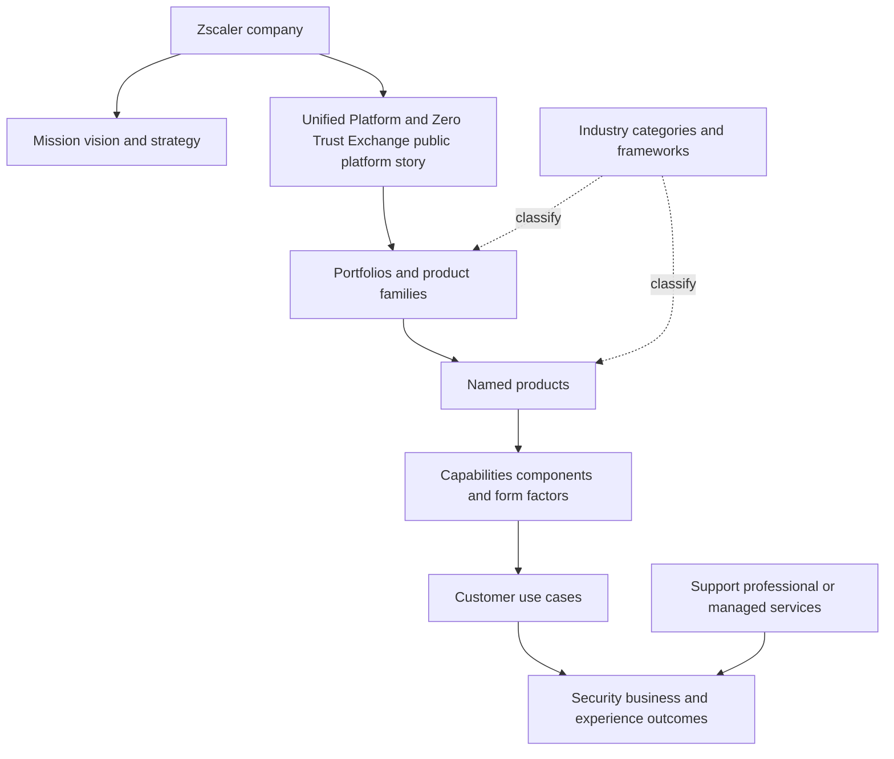

### Plain-English deep-dive 1 - A website menu is not an architecture diagram

A supermarket may arrange tomatoes under "fresh food," "meal ideas," "Italian cooking," and "weekly offers." The tomato did not become four products. The labels serve different customer journeys.

Technology websites behave similarly. ZIA may appear in SSE, SASE, workforce, threat-protection, data-security, and AI-security stories because it can support several outcomes. ZPA can appear in ZTNA, VPN replacement, private access, B2B, OT, or workload stories. Data Fabric can be a foundation for exposure products while also contributing context to broader SecOps positioning. Repeated appearance does not prove separate entitlements or identical implementation.

When the public pages seem inconsistent, classify each statement: company positioning, portfolio grouping, product name, capability, use case, technical dependency, or packaging. For customer work, replace the website menu with tenant evidence and the current official ordering/documentation model.

## Zscaler as a company

Zscaler's current About page says the company was founded in 2007 and states its mission as anticipating, securing, and simplifying the experience of doing business, transforming today and tomorrow. Its vision is a world where information exchange is always secure and seamless. It describes a cloud-native Zero Trust Exchange platform connecting and protecting users, devices, applications, workloads, and data.

An interview answer should connect the mission to customer work:

- **Anticipate:** use telemetry, threat research, exposure context, and proactive health to act before avoidable harm.
- **Secure:** enforce policy, reduce attack surface/lateral movement, protect against threats, and prevent data loss.
- **Simplify:** reduce fragmented controls and operational complexity while keeping ownership and evidence clear.
- **Transform:** enable cloud, hybrid work, branches, workloads, AI, partners, and modern operating models.

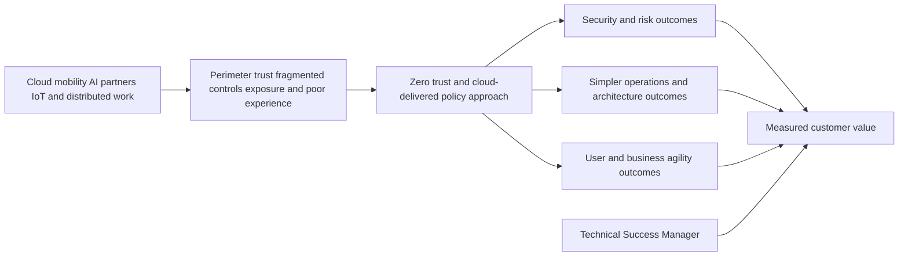

Company scale and analyst-recognition figures change. In an interview, a dated figure is less valuable than explaining how the company creates value and how the target role helps customers realize it.

## Zero Trust, SSE, and SASE market vocabulary

### Zero Trust

Zero Trust is an industry security paradigm, not a synonym for Zscaler. It removes implicit trust based solely on network location and focuses decisions on identities, devices/assets, resources, operations, context, and policy. Zscaler's product implementation is its own architecture, examined in Part 31.

### Security Service Edge

Security Service Edge, abbreviated SSE, is an industry category/framework for converged cloud-delivered security capabilities near users and applications. Common category terms include secure web gateway, zero trust network access, cloud access security broker, firewall as a service, and data protection. The exact analyst definition and vendor feature boundaries evolve.

### Secure Access Service Edge

Secure Access Service Edge, abbreviated SASE, combines cloud-delivered networking and security functions. A simple relationship is that SSE is the security side/slice, while SASE adds networking such as software-defined wide-area networking. Zscaler's current public page calls its offering Zero Trust SASE and relates Zero Trust Branch/SD-WAN with ZIA, ZPA, CASB/data security, firewall capabilities, and ZDX.

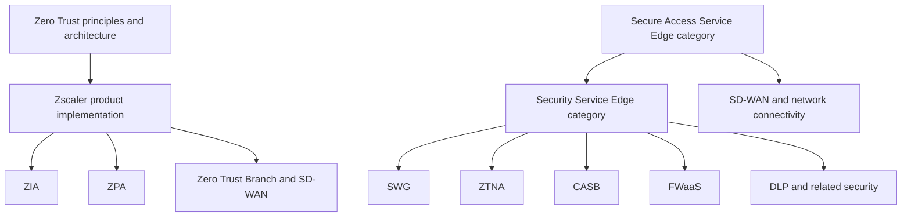

| Market term | Plain meaning | Zscaler relationship in current public pages | Important boundary |
|---|---|---|---|
| Zero Trust | Explicit access decisions without implicit network trust | Zero Trust Exchange platform story | Broader than one vendor/product |
| SSE | Cloud-delivered converged security category | ZIA/ZPA/data-security and related capabilities fit the story | Category definitions change |
| SASE | Converged cloud networking plus security | Zero Trust SASE includes branch/network plus SSE story | Not one universal architecture/SKU |
| SWG | Secure Web Gateway for internet/web policy/threat/data controls | ZIA is positioned as cloud-native SWG/SSE | ZIA is broader than one category label |
| ZTNA | Zero Trust Network Access to private apps/resources | ZPA is Zscaler's named private-access product | ZTNA implementations differ |
| CASB | Cloud Access Security Broker for cloud-app visibility/control/data/threat | Multi-Mode CASB in Data Security/SSE | Inline and API/out-of-band modes differ |
| FWaaS | Firewall capabilities delivered as cloud service | Zero Trust Firewall/current ZIA/SASE story | Do not assume appliance parity |
| DLP | Data Loss Prevention classification and policy | Unified DLP/Data Security across channels | Detection/enforcement modes differ |
| DEM | Digital Experience Monitoring | ZDX is named product | Monitoring is not security enforcement |
| DSPM | Data Security Posture Management | Zscaler DSPM within Data Security story | Posture/discovery versus inline DLP |
| CAASM | Cyber Asset Attack Surface Management | Asset Exposure Management is Zscaler product | Category versus product name |
| RBVM | Risk-Based Vulnerability Management | UVM provides contextual prioritization/workflow | UVM name/capability is vendor-specific |
| CTEM | Continuous Threat Exposure Management program | Zscaler exposure products support stages | Program, not a single product |
| SecOps | Security operations discipline | Agentic SecOps is Zscaler portfolio/solution story | Broader than product |
| MDR | Managed Detection and Response | Managed service offering in SecOps portfolio | Service scope/response authority contractual |

## The current public platform story

As of the source date, Zscaler's Unified Platform page calls it an "AI Security Platform Built on Zero Trust" and groups the story around:

1. **The Zero Trust Exchange:** central inline policy and enforcement across users, applications, and AI, using direct/context-aware connections rather than broad network access in the public positioning.
2. **Data Security:** discover/classify/protect sensitive data across channels, including AI flows and data at rest/in motion.
3. **AI Security:** discover/control/secure AI applications, models, agents, and infrastructure across a lifecycle in the current public story.
4. **Agentic SecOps:** combine Zscaler telemetry/inline controls, third-party data, context, and AI-assisted workflows to reduce exposure and respond to threats.

The Zero Trust Exchange page presents a broad integrated platform for users, workloads, IoT/OT, and B2B partners. These pages use overlapping platform language. Do not invent a rigid corporate product hierarchy from two marketing pages. Use this practical model: Zero Trust Exchange is the central zero-trust inline connection/policy/enforcement foundation in current messaging; the Unified Platform story places it beside broad data, AI, and SecOps portfolios that use shared telemetry, context, controls, and integrations.

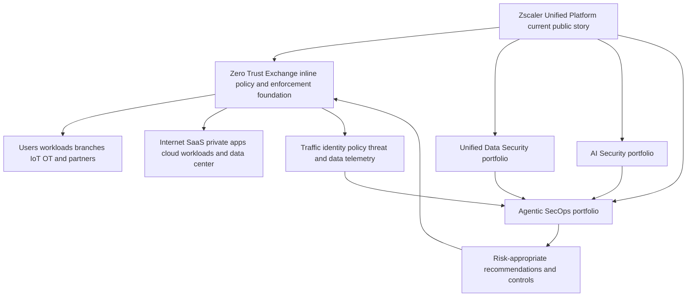

### The four public Zero Trust Exchange use-case families

| Use-case family | Entity/destination | Core concern | Representative current offerings |
|---|---|---|---|
| Secure workforce | Employees/users to internet, SaaS, private apps | Threat, access, data, experience | ZIA, ZPA, ZDX, Client Connector, Zero Trust Browser |
| Secure clouds/workloads | Workload ingress/egress/east-west and cloud data | Exposure, lateral movement, inspection, posture | Zero Trust Cloud, microsegmentation, data security |
| Secure IoT/OT and branches | Branch/factory/campus devices and privileged users | Headless device access, segmentation, uptime | Zero Trust Branch, Zero Trust SD-WAN, OT/IoT Segmentation, PRA |
| Secure B2B/third parties | Partners/contractors/BYOD to SaaS/private apps | Least privilege, unmanaged devices, data controls | ZPA/clientless access, Third-Party Access, Zero Trust Browser/data controls |

Data Security, AI Security, exposure management, risk, digital experience, and SecOps are cross-cutting stories rather than one more destination type.

## The Zero Trust Exchange decision story

The public Zero Trust Exchange page describes four broad steps: verify identity, determine destination, assess risk, and enforce policy. This is orientation, not full mechanics.

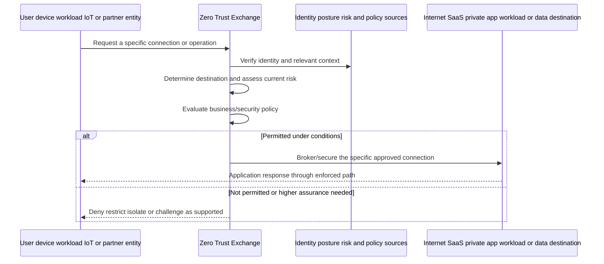

Later Parts explain proxy connections, service edges, forwarding, identity, posture, policy, and traffic. For Part 30, remember: the architecture aims to connect an authorized entity to an authorized destination under context/policy, not place the entity broadly on a trusted network.

## Workforce product map

### Zscaler Internet Access

Zscaler Internet Access, abbreviated ZIA, is the named product for secure internet and SaaS access in the current public portfolio. Zscaler positions it as a cloud-native SSE/SWG and zero-trust proxy service that can inspect traffic, enforce URL/cloud/firewall/threat/data policy, and integrate with SOC workflows. Exact capabilities depend on edition, entitlement, forwarding, inspection, policy, protocol, cloud, and configuration.

**Question it answers:** How do approved users/devices/locations securely reach internet and SaaS destinations while applying threat and data controls?

### Zscaler Private Access

Zscaler Private Access, abbreviated ZPA, is the named ZTNA/private-application access product. Public material describes direct one-to-one connections between authorized users and specific private apps without placing users on the corporate network or exposing apps publicly in the intended architecture. It includes broader current stories such as segmentation, private-app threat/data protection, browser/privileged/third-party access, business continuity, and workload use cases. Actual deployment objects and flows come later.

**Question it answers:** How do approved entities reach specific private applications without broad routed network access?

### Zscaler Digital Experience

Zscaler Digital Experience, abbreviated ZDX, is a digital experience monitoring product. Public material describes device, local network, ISP/path, Zscaler, application, synthetic, and real-user telemetry used to detect and diagnose user-experience problems. It observes and helps isolate; it is not the same as ZIA/ZPA policy enforcement.

**Question it answers:** Where and why is the user's application experience unhealthy?

### Zscaler Client Connector

Zscaler Client Connector is a lightweight endpoint agent/component that current public pages describe as forwarding user traffic to the Zero Trust Exchange and providing device context. It can support ZIA, ZPA, ZDX, Endpoint DLP, deception, and other licensed/configured functions. It is not interchangeable with each product and does not prove all functions are active.

**Question it answers:** How does a managed endpoint steer traffic/provide context and host supported endpoint capabilities?

### Zscaler Zero Trust Browser

The current Zero Trust Browser page describes three form factors: cloud browser, browser extension, and enterprise browser. It positions browser threat isolation/detection, data controls, posture-based access, and integration with ZIA/ZPA/Data Security for internet, SaaS, private app, third-party/BYOD, privileged, and investigation use cases. Product naming evolved from narrower "browser isolation" language; verify current entitlement and form factor.

**Question it answers:** How can browser-layer access, threat isolation/detection, posture, and data actions be controlled for managed or unmanaged users/devices?

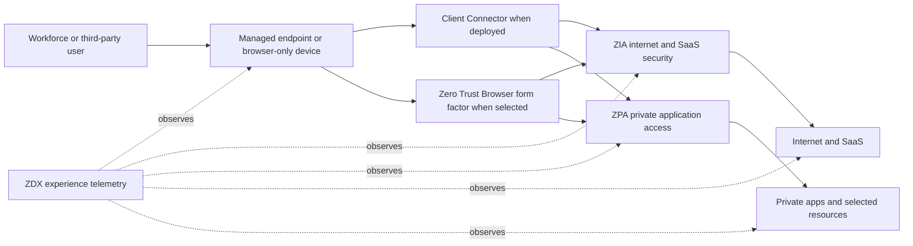

| Product/component | Primary destination/problem | Typical personas | It is not |
|---|---|---|---|
| ZIA | Internet/SaaS security and policy | Network, security, web, data, SOC | Private-app ZTNA name |
| ZPA | Private-app least-privileged access | Identity, network, app, security, OT | Traditional routed VPN by design |
| ZDX | Digital-experience monitoring/isolation | Service desk, endpoint, network, app, SaaS owner | Traffic security policy engine |
| Client Connector | Endpoint forwarding/context/component | Endpoint, network, security operations | Proof every Zscaler product is licensed |
| Zero Trust Browser | Browser-layer secure access/threat/data controls | Security, endpoint, B2B, data, SOC | Necessarily one form factor |

### Plain-English deep-dive 2 - One journey can use several products without making them one product

A traveler may use a passport, boarding pass, security checkpoint, flight-status display, and baggage scanner. These systems share a journey and data but have different jobs. If the status screen shows delay, it did not block the passenger. If the checkpoint blocks a bag, the airline reservation system did not necessarily fail.

A managed user's Microsoft 365 journey can similarly involve Client Connector forwarding, ZIA internet/SaaS policy, Data Security classification, browser controls, and ZDX experience telemetry. ZIA may permit a request while DLP blocks a sensitive upload. ZDX may show ISP latency while ZIA policy is healthy. A private app journey may involve ZPA plus Client Connector and ZDX.

Troubleshooting starts with the exact operation and product responsibility. "Zscaler is slow" is not a component diagnosis. "The ZDX path segment shows last-mile loss, while the ZIA transaction and SaaS server wait are normal" is closer to actionable, but still requires current telemetry validation.

## Unified Data Security map

Zscaler's current public Data Security page is an umbrella/platform story for discovering, classifying, monitoring, and protecting data across web, SaaS, email, endpoints, public cloud/IaaS, private apps, AI, and data stores. It groups inline DLP, endpoint/email DLP, CASB, DSPM, classification methods, workflows, and AI/Copilot data use cases.

| Term/offering | Primary question | Observation/enforcement mode | Boundary |
|---|---|---|---|
| Unified Data Security | How do we coordinate data protection across channels? | Portfolio/platform across modes | Not automatically one license/policy everywhere |
| DLP | Is content sensitive and is this use allowed? | Inline, endpoint, email, cloud/API depending offering | Classification/action require tuning and privacy |
| Endpoint DLP | Is sensitive data moving through endpoint channels? | Endpoint agent/component | Different from network inline visibility |
| CASB | Which cloud apps/tenants/actions/data are used and permitted? | Inline plus API/out-of-band in multimode story | Mode changes visibility/timing/action |
| DSPM | Where is sensitive data at rest and what posture/access risk exists? | Agentless/integration scanning and posture context | Not the same as blocking one live upload |
| SSPM | Are SaaS security settings/posture risky? | SaaS configuration/API assessment | Product grouping/availability verify |
| UEBA | Is user/entity behavior anomalous? | Analytics over behavior/signals | Anomaly is not proof of malicious intent |
| Advanced classification | How can data be identified? | EDM, IDM, OCR, regex, LLM/other current methods | Accuracy/coverage varies; test |
| Workflow automation | How are incidents, coaching, justification, and escalation handled? | Operational workflow | Automation needs owner, retries, audit |
| Copilot Data Protection | Are prompts, permissions, labels, or M365/Copilot configurations creating oversharing risk? | Current public inline/API story | Verify Microsoft/Zscaler permissions and tenant support |

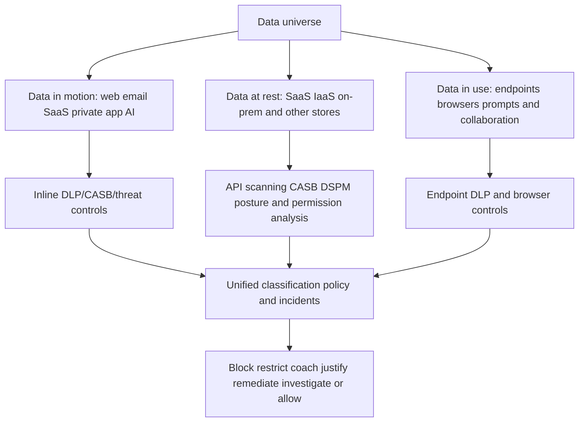

### Inline, API/out-of-band, endpoint, and browser modes

| Mode | Analogy | Best observation | Timing | Typical blind spot |
|---|---|---|---|---|
| Inline proxy | Guard checks a package at the door | Live traffic/operation through enforced path | Real time | Traffic not forwarded/inspectable |
| SaaS API/out-of-band | Auditor examines stored records via service API | Data at rest, sharing, posture, historical content | Scheduled/event/API dependent | Unsupported object/API/latency |
| Endpoint | Guard on the device watches local channels | USB, print, local apps/shares under supported scope | Local/near real time | Unmanaged/unsupported endpoint/channel |
| Browser | Controls inside/around browser session | Clipboard, download/upload, screenshot, extensions, web activity as supported | Session time | Native app/nonbrowser behavior |
| Email | Mailroom inspects message/attachment | SMTP/email flow under integration | Delivery path | Other collaboration channels |

### Plain-English deep-dive 3 - "Protect data everywhere" means several observation points

A bank protects money at the teller window, in the vault, in armored transport, at the ATM, and through account analytics. One camera cannot see all those places. Rules and response timing differ.

Data security also needs several observation points. An inline proxy can evaluate a live upload that passes through it. A SaaS API can inspect stored files or permissions later without being in the live path. Endpoint DLP can observe USB or printing. Browser controls can restrict clipboard/download behavior on an unmanaged device. DSPM can discover at-rest data and posture risks.

The TSM asks which channel, object, operation, identity, device, and mode is in scope; what is licensed/deployed; when results appear; how classification is validated; and who owns false positives, exceptions, privacy, and response. A broad portfolio statement never proves one transaction was observed.

## Cloud workloads, branches, IoT/OT, privileged access, and B2B

### Zero Trust Cloud

The current Zero Trust Cloud page is the workload-security solution story for multicloud/hybrid traffic. It includes workload ingress/egress, east-west connections, microsegmentation, threat/data protection, and flexible deployment models in public positioning. Workload identities, cloud network integration, tags, policy, connectors/gateways, and traffic paths require direct design evidence.

### Zero Trust Branch and Zero Trust SD-WAN

Zero Trust Branch is currently presented as a solution combining secure branch connectivity and segmentation for branches, campuses, factories, and clinics. Its public page relates Zero Trust SD-WAN, OT/IoT Segmentation, and Privileged Remote Access. SASE positioning relates branch networking to SSE controls. Do not assume a branch uses every component or that all traditional functions disappear without requirements/design analysis.

### OT/IoT Segmentation

Operational Technology, OT, controls physical/industrial processes. Internet of Things, IoT, includes network-connected devices, often headless or unable to run endpoint agents. The current OT/IoT Segmentation page describes agentless segmentation/isolation and device discovery/policy within branch/factory/campus contexts. Availability, topology, safety, protocols, uptime, and change governance must be validated with OT owners.

### Privileged Remote Access

Privileged Remote Access, PRA, is the current named offering for controlled privileged access to IT/OT systems. Public material describes clientless browser access for RDP/SSH/VNC, credential vault/mapping/injection, just-in-time/time-bound access, file controls/sandboxing, session monitoring/recording, governance, and privileged desktop form factors. It relates to ZPA/zero-trust access but is not identical to generic ZTNA or every privileged access management function.

### Third-Party Access and B2B

Third-Party Access is a use-case/solution story for contractors, suppliers, partners, mergers/acquisitions, and BYOD/unmanaged devices. Current public pages connect browser-based/agentless access, ZPA/private app access, SaaS access, data controls, and browser security. Identity lifecycle, sponsor, exact app, device trust, data actions, expiry, and audit remain customer governance requirements.

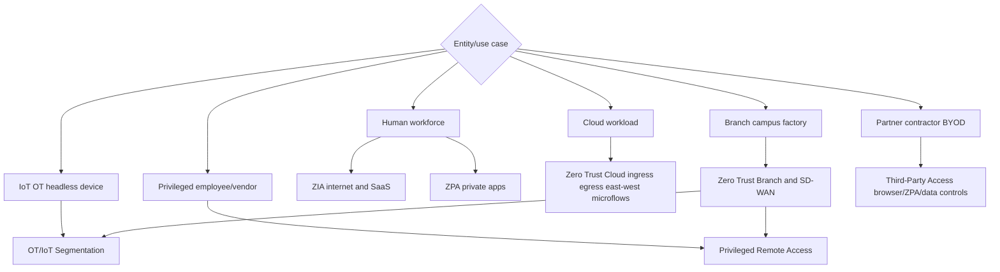

| Use case | Primary owner/personas | Safety/business priority | First discovery questions |
|---|---|---|---|
| Workload egress | Cloud platform, network, security | Threat/data control and cloud agility | Clouds, flows, identities, current egress, TLS/data needs |
| East-west workload | Cloud/app/security architecture | Lateral movement and app dependency | Service map, tags, protocols, latency, failover |
| Branch connectivity | Network/branch/security | Availability, user experience, simplicity | Sites, circuits, destinations, segmentation, migration |
| OT/IoT segmentation | OT engineering, plant, security, safety | Uptime/safety before convenience | Assets, protocols, maintenance, owner, downtime tolerance |
| Privileged access | PAM/IAM, OT, security, audit | High privilege, session governance | Users, systems, protocol, credentials, approval, recording |
| B2B/BYOD | Identity, app owner, procurement, security, data | Fast onboarding with limited access/data | Sponsor, identity, app, actions, device, expiry, revocation |

## Exposure management and risk map

### Data Fabric for Security

Zscaler's public Data Fabric page describes a foundation that ingests security/business data, harmonizes/maps it, deduplicates, correlates/enriches, applies business logic, drives workflows, and reports metrics. It currently names Asset Exposure Management and UVM as exposure products powered by the fabric. A data fabric is not automatically a SIEM, CMDB, data lake, or warehouse; these can be sources/complements with different focus.

### Asset Exposure Management and CAASM

Asset Exposure Management is the Zscaler product name. CAASM is the market category. Current public material describes multi-source asset collection, entity deduplication/resolution, relationships, golden records, coverage gaps, CMDB hygiene, automated actions, and reporting.

### Unified Vulnerability Management

UVM is the Zscaler product for contextual vulnerability/exposure prioritization and remediation workflows. The public page describes aggregated/correlated data, multifactor scoring, custom factors/weights, mitigating controls, dynamic dashboards, and ticket/workflow reconciliation. A score prioritizes; it does not replace source validation or the customer's risk decision.

### Continuous Threat Exposure Management

CTEM is an industry program, not a Zscaler-only product. Zscaler publicly maps exposure offerings to scoping, discovery, prioritization, validation, and mobilization. A customer may use several tools and processes in a CTEM program.

### Risk360

Risk360 is Zscaler's named cyber-risk assessment/quantification and executive-reporting offering. Current pages describe risk score/drivers/trends, guided mitigation, potential financial exposure, and four attack stages: external attack surface, compromise, lateral propagation, and data loss. The live page contained different factor-count statements in different sections on the source date, which is a direct warning not to memorize a number. Scores and financial estimates are models with assumptions, not guaranteed losses or objective truth.

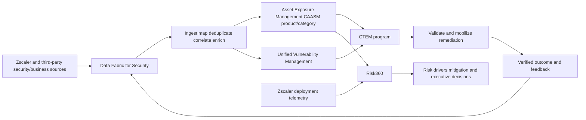

| Term | Type | Input | Primary output/action | Common confusion |
|---|---|---|---|---|
| Data Fabric for Security | Foundation/capability platform | Many source types | Unified/contextual data, logic, workflow, report | "It replaces every data tool" |
| Asset Exposure Management | Product | Asset/control/business sources | Golden records, coverage/hygiene, workflows | Product name equals CAASM category |
| CAASM | Market category | Multi-source asset data | Attack-surface inventory/coverage | Vulnerability scanner |
| UVM | Product | Vulnerability, asset, threat, identity, control, business data | Contextual priority and remediation workflow | Scanner itself or objective risk truth |
| CTEM | Program/framework | Assets/exposures/threat/control/business scope | Recurring validation and mobilization | Single tool/dashboard |
| Risk360 | Product/offering/framework name | Existing Zscaler telemetry and current documented sources | Risk score/drivers/trends/guided executive view | Exact loss prediction |

## Agentic Security Operations map

Zscaler's current Agentic SecOps page positions the portfolio as combining proactive exposure management and reactive threat operations. It describes first-party Zscaler telemetry, third-party signals, business/risk context and a security graph, AI-assisted triage/investigation, and adaptive responses through inline controls. Current solution-detail labels include Agentic SOC, Deception, Exposure Management, Threat Hunting, and Managed Detection and Response.

| Offering/term | Type | Primary job | Important boundary |
|---|---|---|---|
| Agentic SecOps | Portfolio/solution story | Connect exposure/threat context to faster risk-appropriate action | Emerging term; exact agents/autonomy change |
| Agentic SOC | Product/solution area | Group alerts into threat stories, enrich, prioritize, investigate, guide response | Human authority and product scope verify |
| Exposure Management | Portfolio/program support | Find and prioritize assets/vulnerabilities/exposures | Proactive, not only live incident response |
| Deception | Product/capability | Use decoys/lures to detect attacker behavior | Deployment and signal handling required |
| Threat Hunting | Expert-led managed capability/service as positioned | Search proactively using telemetry/context | Service scope, data, hours, escalation contractual |
| MDR | Managed Detection and Response service | 24x7 monitoring/investigation/response support under scope | Does not transfer all customer authority |
| Adaptive response | Capability/workflow | Step-up auth, reduce access, isolate/contain as supported | Approval, blast radius, rollback, audit |
| Security graph | Data relationship/context concept | Relate identities, assets, apps, threats, data, findings | Graph inference requires source confidence |

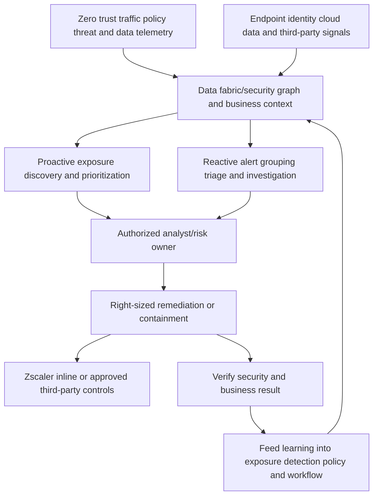

Agentic does not mean uncontrolled autonomy. Ask what data grounds a result, which action is available, who approves it, how uncertainty is represented, how false positives/negatives are measured, what audit/rollback exists, and what licensing/integration is active.

## AI Security versus Agentic SecOps

These terms are easy to confuse.

| Term | Object being secured or assisted | Example public concern | Relationship |
|---|---|---|---|
| AI Security | AI apps, models, agents, infrastructure, access, posture, data | Shadow AI, prompt data, model/app risk, AI lifecycle | Security for AI use/build/runtime |
| Agentic SecOps | Security operations workflow assisted by AI agents/context | Alert grouping, investigation, exposure priority, response recommendation | AI for security operations |
| AI-powered capability | A feature using machine learning/AI within a product | Classification, segmentation recommendation, root-cause analysis | Feature claim; evaluate quality/scope |
| AI agent as entity | Nonhuman actor requesting tools/data/apps | Identity, least privilege, behavior, data access | Can need Zero Trust policy and monitoring |

The same enterprise can need all three: secure employees using Copilot, secure internally built AI workloads, and use AI-assisted SecOps. Do not collapse them into one product.

## Product relationship master map

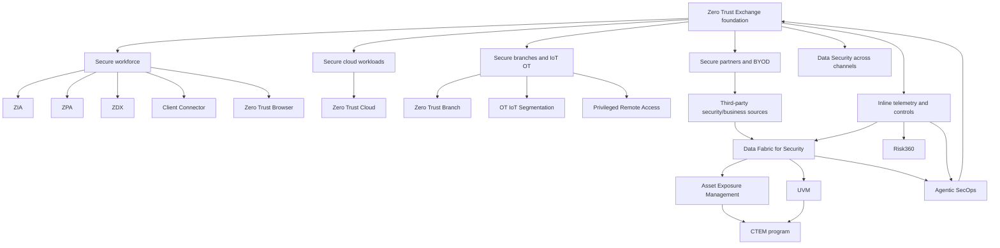

This map is conceptual and intentionally omits precise control/data-plane and license dependencies. It answers "where does the term fit?" Later Parts answer "how does it work?"

## Persona and stakeholder map

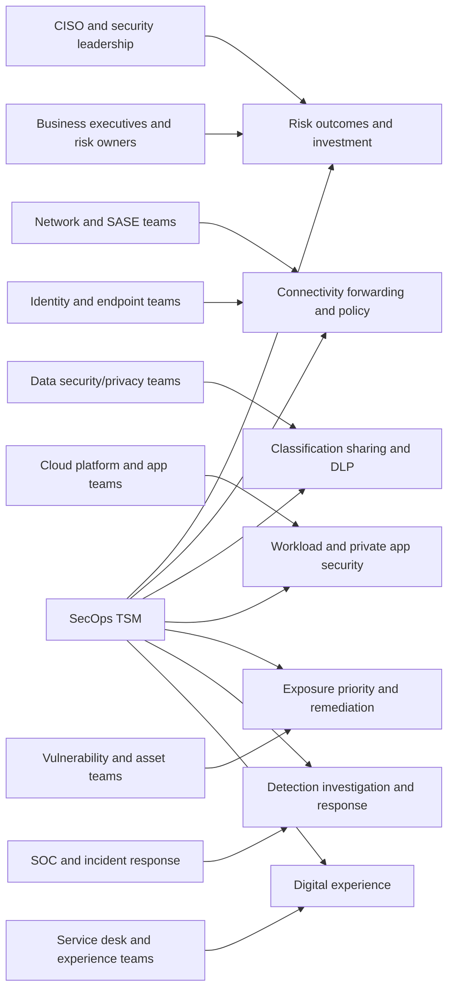

| Persona | Core question | Relevant portfolio areas | TSM evidence |
|---|---|---|---|
| CISO | Which material risk and control outcome changed? | Platform, Risk360, Data Security, SecOps, exposure | Drivers, trend, uncertainty, decision |
| CIO/IT leader | Are transformation, resilience, cost, and experience improving? | SASE, workforce, branch, ZDX | Adoption, incidents, productivity/value hypothesis |
| Network architect | How is traffic connected, forwarded, inspected, and recovered? | ZIA, ZPA, Client Connector, Branch, Cloud | Architecture, path, health, rollback |
| Identity team | How are identities/groups/posture/provisioning used? | ZPA, ZIA, Third-Party, PRA | Identity lifecycle and policy evidence |
| Endpoint team | What agent/browser/posture/data components run? | Client Connector, ZDX, Endpoint DLP, Browser | Version/ring/health/experience |
| Data security/privacy | Where is sensitive data and which actions are governed? | DLP, CASB, DSPM, Copilot, Browser | Classification quality, incidents, privacy |
| Cloud/platform engineering | How are workload flows and cloud operations secured? | Zero Trust Cloud, ZPA, Data Security | Flow inventory, tags, dependencies, automation |
| OT/plant | Can we protect without harming safety/uptime? | Branch, segmentation, PRA | Safety gate, approved maintenance, rollback |
| Asset/CMDB | What assets exist and which controls/owners are missing? | Data Fabric, AEM/CAASM | Source reconciliation and coverage |
| Vulnerability team | What should be fixed first and why? | UVM, CTEM, Data Fabric | Factor explanation, owner/SLA, recheck |
| SOC/IR | What threats matter and what response is authorized? | ZIA telemetry, Agentic SOC, Deception, Hunting, MDR | Evidence, confidence, authority, audit |
| Service desk/experience | Which device/network/app segment is unhealthy? | ZDX, Client Connector, ZIA/ZPA context | Cohort, timeline, segment isolation |
| App/business owner | Does required workflow work securely? | ZPA/ZIA/Data/Browser/ZDX | Positive/negative test and business outcome |
| Risk owner | Accept, mitigate, transfer, or avoid residual risk? | Risk360/UVM/CTEM/all controls | Options, residual risk, named decision |

## Capability-to-outcome map

| Capability | Technical result | Customer outcome hypothesis | Measure carefully |
|---|---|---|---|
| Direct/private app access | Limit access to specific app rather than broad network | Reduced attack surface/lateral movement while enabling work | Exposed services, allowed app scope, denied paths, UX |
| Internet/SaaS inspection | Apply threat/data/access policy inline | Fewer successful threats/data leaks | Coverage, TLS exceptions, incident rates, false positives |
| Data classification/DLP | Identify and govern sensitive data actions | Reduced unauthorized disclosure with maintained productivity | Precision/recall samples, incident/action/override |
| Digital experience monitoring | Observe device/path/app segments | Faster isolation and less productivity loss | MTTA/MTTR, coverage, valid baselines |
| Asset reconciliation | Unified deduplicated inventory/context | Fewer unknown/unowned/uncontrolled assets | Source coverage, freshness, false merge/split |
| Contextual vulnerability priority | Rank with business/threat/control context | Remediation focused on consequential exposure | Aging/closure/reopen, verified risk reduction |
| Segmentation | Limit communications/lateral pathways | Smaller blast radius and protected uptime | Allowed/denied flows, exceptions, safety/availability |
| Agentic triage | Group/enrich/summarize/recommend | Analyst focus and faster evidence-based action | Accuracy, missed/overgrouped cases, overrides, time |
| Managed threat service | Extend monitoring/investigation expertise | Better coverage and faster escalation | Contracted coverage, detection/escalation quality |

Feature enablement is not outcome. A TSM needs baseline, target, scope, owner, adoption, health, and causal caveats.

## Competitor-neutral market map

The correct market comparison starts from requirements, not a claim that one architecture always wins. Avoid unverified statements about named competitors. Evaluate documented capabilities in a representative customer design.

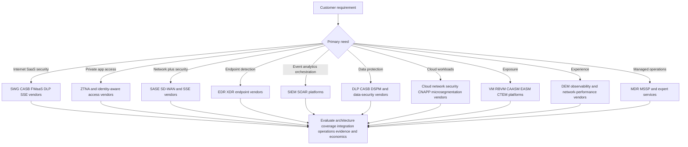

| Market family | Primary strength/question | Complement/overlap with Zscaler story | Neutral evaluation criteria |
|---|---|---|---|
| Firewall/appliance/network security | Segment/rout/inspect at network boundaries | Zscaler positions proxy/cloud alternatives; coexistence/migration possible | Traffic/protocol, scale, exposure, operations, failure, inspection |
| VPN/remote access | Remote routed access | ZPA/Third-Party/PRA address narrower app access use cases | App coverage, protocols, identity, network reach, continuity |
| SSE | Cloud-delivered security | Core ZIA/ZPA/data story | POP/coverage, forwarding, policy, inspection, logs, data, UX |
| SASE/SD-WAN | Converged network and security | Zero Trust SASE/Branch | Branch topology, routing, segmentation, broadband, HA, operations |
| EDR/XDR | Endpoint detection/response and cross-domain detection | Signal source/response integration for SecOps | Sensor coverage, detection, response, platform compatibility |
| SIEM/SOAR | Event analytics, search, detections, orchestration | Complementary source/destination for Zscaler telemetry/workflow | Ingest/retention/query, cost, detection, response, schema |
| Data security | DLP/CASB/DSPM/data access governance | Zscaler Data Security portfolio competes/combines across modes | Data/channel coverage, classification quality, privacy, response |
| Cloud security/CNAPP | Cloud posture/workload/application risk | Zero Trust Cloud/DSPM/AI security overlap/complement | Cloud services, runtime/posture, workload flows, DevSecOps |
| Asset/exposure | CAASM/EASM/VM/RBVM/CTEM | AEM/UVM/Data Fabric/Risk360 story | Source breadth/quality, entities, priority, workflows, validation |
| DEM/observability | User/device/network/app performance | ZDX | Coverage, synthetic/real user, root cause, privacy, integration |
| MDR/MSSP | People/process/24x7 operations | Zscaler MDR/Hunting and partners | Scope, SLAs, evidence, response authority, integration, exit plan |

No table row implies feature parity or superiority. A proof of concept must have representative traffic, users, apps, data, failure modes, security negative tests, operations, and success criteria.

## Packaging, licensing, availability, and currency

### Plain-English deep-dive 4 - A catalog is not an installed kitchen

A restaurant-supply company may sell ovens, refrigerators, mixers, fire suppression, and inventory software. Seeing all of them in the catalog does not prove one restaurant bought them, installed them, trained staff, passed inspection, or uses them well. Even an installed oven may be switched off, misconfigured, undersized, or outside the workflow for tonight's meal.

The Zscaler portfolio works the same way. A public page can prove that Zscaler currently describes an offering or capability. It cannot prove NMH bought the required edition, received the entitlement in its cloud/region, deployed prerequisites, forwarded the relevant traffic, enabled policy, integrated identity/data sources, trained owners, or validated the workflow. Client Connector on a laptop does not prove ZIA, ZPA, ZDX, Endpoint DLP, or Deception is active. A Data Fabric connector in a demo does not prove a customer's source is supported and healthy.

A TSM therefore maintains four distinct views. The **catalog view** says what current public material describes. The **commercial view** says what the contract/order permits. The **technical view** says what the tenant and architecture actually enable. The **operational view** says whether people use it correctly and outcomes are measured. Confusing these views creates bad roadmaps, false escalation claims, and awkward executive reviews.

The safe statement is precise: "The portfolio includes a capability that may address this requirement. We still need to confirm the current edition, tenant entitlement, regional availability, dependencies, deployed path, policy state, owners, and representative test before calling it available or adopted for this customer."

### Why public capability does not prove entitlement

A feature may be generally available, preview, limited by cloud/region, part of a particular edition/add-on, dependent on another product, licensed by users/workloads/data/transactions, or present only in a demo. Names may change after acquisitions or platform consolidation. The customer's contract and tenant are controlling evidence.

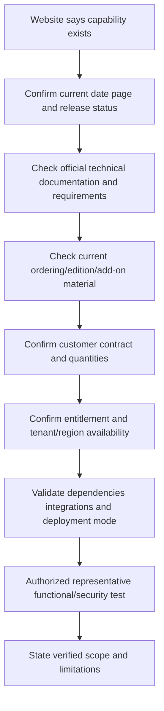

| Verification | Question | Evidence |
|---|---|---|
| Name | Is this current product/capability name? | Current official product/docs page |
| Status | GA, preview, beta, deprecated, acquired transition? | Release notes/docs/account team |
| Edition | Which plan/add-on includes it? | Current pricing/ordering/contract |
| Quantity | What metric/limit applies? | Order, entitlement, tenant |
| Cloud/region | Available in this cloud/geography/data-residency context? | Official availability and tenant |
| Dependency | Requires ZIA/ZPA/Client Connector/API/IdP/connector/etc.? | Architecture/prerequisite docs |
| Mode | Inline, endpoint, API, browser, service, or combined? | Technical design and test |
| Integration | Supported source/version/permissions? | Integration docs and connection health |
| Operation | Who administers, monitors, responds, and escalates? | RACI/runbook/support agreement |
| Outcome | What success will customer measure? | Baseline/target/validation plan |

### Marketing claims and customer stories

Customer stories are useful examples of possibility, not predicted outcomes. Preserve customer, scope, date, implementation, assumptions, and attribution. Never say "Zscaler reduces cost by X" because one customer reported X or a modeled page lists an estimate. State "Zscaler's dated public case study reports X for that customer; NMH would build its own baseline and business case."

## TSM discovery: start with the outcome, not the catalog

### Discovery question bank

| Domain | Questions |
|---|---|
| Outcomes | What must change for the business? What baseline, target, date, and sponsor exist? |
| Entities | Which users, devices, workloads, branches, IoT/OT, partners, and AI agents are in scope? |
| Destinations | Internet, SaaS, private apps, data stores, cloud workloads, OT systems, or APIs? |
| Risk | Exposed services, threats, lateral movement, data loss, identity abuse, experience, compliance? |
| Current path | DNS, routing, proxy, VPN, firewall, endpoint, browser, cloud, IdP, connectors, service edges? |
| Data | What data classes, locations, owners, channels, labels, permissions, and legal constraints? |
| Operations | Who owns policy, identity, endpoint, network, app, data, SOC, risk, privacy, support? |
| Existing tools | SIEM, SOAR, EDR/XDR, VM, CMDB, IAM, MDM, DLP, CASB, DSPM, observability? |
| Portfolio | Which Zscaler products/editions are licensed, deployed, adopted, healthy, or unused? |
| Evidence | Which logs/IDs/dashboards/reconciliations prove current state and outcome? |
| Change | Pilot cohort, dependencies, maintenance, safety, rollback, exception, help desk, training? |
| Value | What leading/lagging measure and causal caveat will support next decision? |

## Fictional NMH portfolio map

NMH is a fictional manufacturer with 18,000 users, public-cloud workloads, factories, acquisition partners, Microsoft 365, private applications, an existing SIEM/EDR/VM/CMDB stack, and inconsistent experience/data/exposure processes. This is a learning scenario, not proof of Zscaler fit.

| NMH objective | Current problem | Candidate portfolio area to investigate | Validation before recommendation |
|---|---|---|---|
| Secure hybrid workforce | Appliance backhaul and inconsistent internet/SaaS policy | ZIA, Client Connector, Data Security, ZDX | Traffic/protocol/identity/TLS/data/UX pilot |
| Replace broad VPN | Contractors see network routes beyond one app | ZPA and Third-Party/Browser/PRA where appropriate | App/protocol, identity, device, segmentation, continuity |
| Improve M365 experience | Slow OneDrive/Teams at two branches | ZDX plus path/ZIA evidence | Baseline, segment telemetry, SaaS-side timing |
| Protect Copilot data | Overshared OneDrive content/labels and prompt concern | Copilot Data Protection, DSPM/DLP/CASB | Permissions, API scope, labels, inline path, privacy |
| Secure workloads | Inconsistent multicloud egress/east-west controls | Zero Trust Cloud | Flow inventory, deployment mode, latency, HA, automation |
| Isolate factory devices | Flat legacy OT network and vendor maintenance | Zero Trust Branch, OT/IoT Segmentation, PRA | Safety, protocols, assets, uptime, owner, rollback |
| Know assets | CMDB/EDR/cloud inventories disagree | Data Fabric plus Asset Exposure Management | Connector, entity, count, freshness, false merge/split |
| Prioritize vulnerabilities | CVSS-only queue overwhelms owners | UVM and CTEM program | Source quality, factors, controls, owner workflow, recheck |
| Explain enterprise risk | Executives dispute disconnected scores | Risk360 investigation | Telemetry scope, factor/assumption/drivers, decisions |
| Reduce SOC noise | Alerts lack identity/business context | Agentic SOC/SecOps integration, Hunting/MDR evaluation | Sources, quality, case set, authority, audit, metrics |

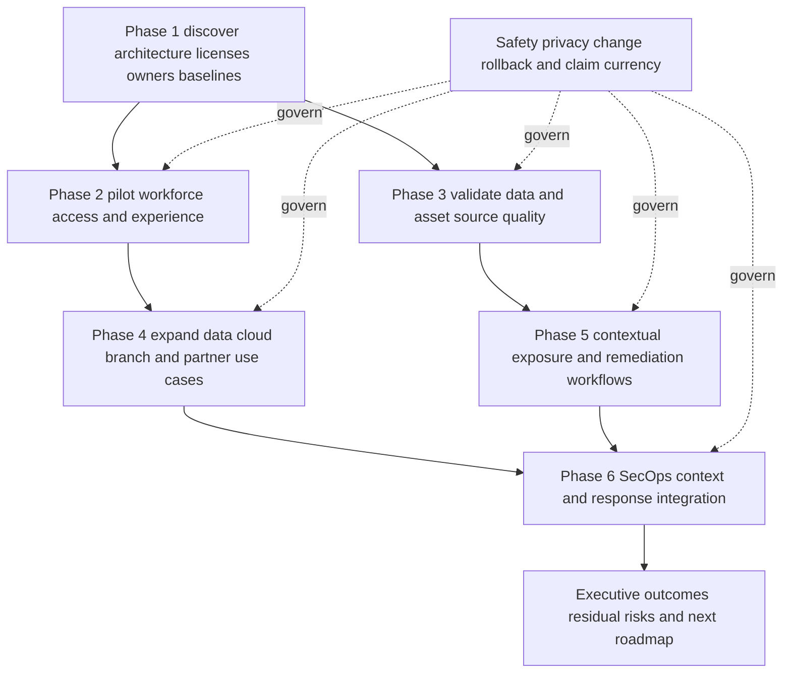

The sequence is not a universal deployment order. NMH would prioritize by business outcome, existing licenses, prerequisites, risk, and capacity.

## Fictional scenario drills

### Scenario 1: "Which product secures Microsoft 365?"

The question is under-specified. Internet/SaaS access and inline controls may involve ZIA. Cloud-app/API data controls may involve CASB/Data Security. Endpoint channels may involve Endpoint DLP. Browser controls may involve Zero Trust Browser. Experience monitoring may involve ZDX. Copilot oversharing may involve the named Copilot Data Protection story. Identity and Microsoft service configuration remain Microsoft/customer dependencies. Ask the operation, user/device, data, risk, mode, and entitlement.

### Scenario 2: "ZPA replaces VPN, so can we remove it tomorrow?"

Inventory apps, protocols, users, devices, routes, DNS, identity, app dependencies, admin/privileged use, partner access, pre-login/business continuity, failure modes, and rollback. ZPA is the private-app ZTNA product; migration is an architecture/change program, not a slogan.

### Scenario 3: "ZDX says the app score is low; is ZIA slow?"

ZDX is the experience product and can observe device, local network, ISP/path, Zscaler, and application segments as supported. A low score needs drill-down, baseline, cohort, timestamp, and independent evidence. ZIA is only one possible segment. The SaaS server, ISP, Wi-Fi, endpoint, DNS, or application can be responsible.

### Scenario 4: "AEM says one server has no EDR. Is that a breach?"

Asset Exposure Management/CAASM is the asset/coverage product/category. A missing-control record is an exposure/coverage finding, not proof of compromise. Validate entity match, source freshness, expected scope, exception, and authoritative EDR/CMDB data; then assign treatment. Agentic SOC or the SOC investigates threat evidence separately.

### Scenario 5: "UVM downgraded a critical finding, so no patch is needed."

UVM contextual priority can account for factors and mitigating controls, but a score is not risk acceptance. Explain factors, validate control effectiveness and source freshness, check threat/reachability/business context, assign accountable owner, and document treatment/residual risk. Authoritative recheck closes the finding.

### Scenario 6: "Agentic SecOps can isolate users automatically; turn it on."

Confirm product/feature/entitlement/integration, data grounding, detection quality, identity mapping, action scope, approval, break-glass, rollback, audit, privacy, and test cases. The customer incident/risk owner defines authority. Begin with recommendation or bounded pilot based on current capabilities and governance.

### Scenario 7: "Zero Trust Branch is the same as ZPA."

Both relate to Zero Trust Exchange principles but solve different primary scopes. ZPA is private-app ZTNA. Zero Trust Branch is a branch/campus/factory solution story involving connectivity, SD-WAN, segmentation, and related controls. A branch user may also consume ZIA/ZPA. Product overlap does not erase roles.

### Scenario 8: "Data Fabric is a SIEM replacement."

Zscaler's own public FAQ distinguishes the fabric's broad security/business data unification/operationalization from a SIEM's event-log analytics/response focus and says a SIEM can be a source. Evaluate actual use cases, data, latency, retention, search, detection, workflows, integrations, and economics rather than a replacement slogan.

## TSM operating story for the portfolio

The SecOps TSM is not a catalog narrator or default implementer. The role helps a customer select and adopt relevant capabilities, trust the data, remove blockers, coordinate specialists, manage escalations, and prove outcomes.

```mermaid
flowchart LR
    DISC[Discover outcomes environment and stakeholders] --> MAP[Map products licenses dependencies and gaps]
    MAP --> PLAN[Success plan milestones measures owners and risks]
    PLAN --> ONBOARD[Onboard data policies users and workflows]
    ONBOARD --> HEALTH[Monitor health adoption quality and support trends]
    HEALTH --> BLOCK[Remove blockers and lead escalation continuity]
    BLOCK --> ENABLE[Train admins analysts owners and executives]
    ENABLE --> VALUE[Validate security business and experience outcomes]
    VALUE --> EBR[Executive review decisions and roadmap]
    EBR --> PLAN
```

| TSM motion | Portfolio question | Artifact | Avoid |
|---|---|---|---|
| Discovery | Which outcome/entity/destination/risk matters? | Outcome map | Product dumping |
| Entitlement map | What is actually purchased/available? | License/dependency matrix | Website assumption |
| Architecture | How should components interact? | Current/target diagram | Invented product mechanics |
| Adoption | Who uses which workflow correctly? | Role/adoption plan | Login count only |
| Health | Is data, policy, forwarding, integration, and user experience healthy? | Health scorecard | Green dashboard as verdict |
| Escalation | Which product/boundary/owner needs action? | Evidence bundle/RACI | "Zscaler issue" |
| Value | What changed from baseline and why? | Outcome measure/caveat | Vendor metric as customer result |
| Roadmap | What next use case fits risk/capacity? | Prioritized roadmap | Commercial promise |

## Arti's interview bridge

Arti can say:

"Zscaler's current public story starts with an AI security platform built on Zero Trust. The Zero Trust Exchange is the central inline connection, policy, and enforcement foundation. For the workforce, ZIA secures internet/SaaS access, ZPA provides specific private-app access, ZDX analyzes digital experience, and Client Connector or browser form factors support endpoint context and traffic/access use cases. Data Security spans DLP, CASB, DSPM, endpoint, browser, API, and AI/Copilot scenarios. Zero Trust Cloud and Branch extend the model to workloads, branches, IoT/OT, and privileged/third-party access.

"For SecOps, Data Fabric unifies and contextualizes Zscaler and third-party data; Asset Exposure Management addresses CAASM/asset truth and coverage; UVM contextualizes vulnerability priority; CTEM is the recurring exposure program; Risk360 supports risk-driver and executive views; and Agentic SecOps connects proactive exposure and reactive threat operations with AI-assisted analysis and inline controls. I treat those as current official conceptual relationships, not proof that every capability is licensed or that I have operated them. My production strength is enterprise SaaS troubleshooting, escalation, analytics, customer trust, and enablement; my ramp is product-specific architecture, telemetry, policy, and workflow practice."

### 30-second company and portfolio answer

"Zscaler is a cloud-security company whose current mission is to anticipate, secure, and simplify the experience of doing business. Its Unified Platform story is an AI security platform built on Zero Trust, with the Zero Trust Exchange providing central inline policy/enforcement and broad portfolios for data, AI, and Agentic SecOps. Major customer journeys include secure workforce access through ZIA/ZPA and experience through ZDX, cloud/workload and branch/IoT/OT/B2B security, unified data protection, exposure management through Data Fabric/AEM/UVM, executive risk through Risk360, and proactive/reactive SecOps. Exact packaging and tenant deployment must always be verified."

## Labs and rehearsal

### Lab 1: taxonomy sort

Classify 50 terms as company, platform, portfolio, product, solution, capability, component, form factor, market category, program, managed service, persona, use case, or outcome. For ambiguous terms, cite the current official page and explain why ambiguity exists.

### Lab 2: platform whiteboard

Draw Unified Platform, Zero Trust Exchange, workforce, cloud, branch, B2B, Data Security, AI Security, Data Fabric/exposure, Risk360, and Agentic SecOps. Add "conceptual, not licensing/dependency diagram."

### Lab 3: workforce journey

Trace a synthetic managed-user SaaS request and private-app request. Place Client Connector, ZIA, ZPA, ZDX, identity, Data Security, browser, destination, and evidence without inventing detailed mechanics reserved for later Parts.

### Lab 4: data observation modes

Take five synthetic data events: web upload, USB copy, stored overshared OneDrive file, Copilot prompt, and database-at-rest exposure. Identify likely inline, endpoint, API, browser, or DSPM observation and the unobserved paths.

### Lab 5: entity/use-case selection

Given employee, workload, branch, IoT camera, OT controller, privileged vendor, and acquisition contractor, identify destination/risk and candidate product family. List five validation questions before recommendation.

### Lab 6: exposure relationship

Use synthetic CMDB/EDR/scanner/identity/control/business records. Explain Data Fabric, AEM, UVM, CTEM, and Risk360 roles without claiming one tool is authoritative for every field.

### Lab 7: Agentic SecOps governance

Create a synthetic alert-to-threat story with business context and a proposed step-up-auth/reduced-access action. Define human authority, evidence, confidence, negative tests, audit, rollback, and feedback.

### Lab 8: neutral market comparison

Build requirement-based scorecards for SSE, ZTNA, data security, exposure management, and DEM without vendor names. Weight architecture, coverage, integration, operations, experience, risk, evidence, economics, and exit strategy.

### Lab 9: packaging verification

Choose one public capability and create a mock verification chain: source date, status, edition, customer contract, tenant entitlement, region, dependency, mode, test, and outcome. Do not use real customer data.

### Lab 10: fictional NMH roadmap

Prioritize NMH's ten objectives by impact, evidence, prerequisites, existing entitlements, risk, capacity, and quick learning. State why a different customer could choose a different order.

### Lab 11: persona teach-back

Explain one portfolio flow separately to a CISO, network engineer, data-security lead, SOC analyst, service desk engineer, and application owner. Each should be able to state their decision, evidence, and dependency.

### Lab 12: interview source check

Record the company/portfolio answer. For each named term, identify a dated official source, claim type, currency risk, and boundary. Remove unsupported figures and superlatives.

| Lab | Pass condition |
|---|---|
| Taxonomy | Product/category/capability/service distinctions hold |
| Platform map | No menu/architecture/license confusion |
| Workforce journey | ZIA/ZPA/ZDX/Client Connector roles distinct |
| Data modes | Observation point and blind spot explicit |
| Entity selection | Outcome before product and validation questions present |
| Exposure map | Data Fabric/AEM/UVM/CTEM/Risk360 roles accurate |
| Agentic governance | Grounding, authority, audit, rollback included |
| Market comparison | Requirement-based and competitor-neutral |
| Packaging | Contract/tenant evidence controls claim |
| NMH roadmap | Dependencies and measures, not feature shopping |
| Persona teach-back | Each audience gets relevant decision language |
| Source check | Current, dated, factual, caveated |

## Common misconceptions to correct

| Misconception | Correction |
|---|---|
| Zscaler is one product | It is a company with a broad platform/portfolio |
| Zero Trust is a Zscaler trademark/category only | It is broader industry architecture; Zscaler has its implementation |
| Unified Platform and Zero Trust Exchange are simple separate boxes | Current public language overlaps; ZTE is central inline foundation in the broader platform story |
| Website menu equals engineering hierarchy | Navigation serves buyer journeys, not technical dependency truth |
| Platform means one SKU | Packaging, editions, add-ons, quantities, and dependencies must be checked |
| SSE and SASE are products | They are market categories/frameworks; vendors offer products/platforms fitting them |
| SSE and SASE are identical | SASE includes networking plus security; SSE focuses security services |
| ZIA equals all of SSE | ZIA is a broad internet/SaaS product in the SSE story; SSE includes other categories |
| ZPA is a VPN tunnel to the network | Public design is specific user/entity-to-app access without broad network access |
| ZPA and Zero Trust Branch are the same | ZPA is private-app ZTNA; Branch covers location connectivity/segmentation story |
| ZDX enforces ZIA policy | ZDX monitors/analyzes experience; enforcement products have other roles |
| Client Connector is ZIA | It is an endpoint component that can support several products |
| Client Connector installed means ZDX/ZPA/DLP are active | License, policy, forwarding, module, and health must be verified |
| Browser Isolation is the only current browser form | Current Zero Trust Browser page lists cloud, extension, and enterprise-browser forms |
| DLP sees every data action | Coverage depends on channel, mode, inspection, endpoint/browser/API support, and policy |
| CASB is only inline | Multimode CASB includes inline and API/out-of-band stories |
| DSPM blocks every upload | DSPM focuses data discovery/posture/access risk; inline DLP handles live transfer cases |
| Copilot protection is only prompt blocking | Current public story also covers permissions, labels, and M365/Copilot configuration |
| Zero Trust Cloud means the Zscaler service cloud | It is the named workload-security solution story; context matters |
| IoT and OT are interchangeable | IoT devices and operational technology overlap but have different safety/uptime context |
| PRA is every PAM function | It is Zscaler's privileged remote access offering; requirements/feature parity need validation |
| Third-party access is one product | It is a solution/use-case combining access, browser, data, and identity elements as deployed |
| Data Fabric replaces SIEM | Zscaler's own public FAQ describes different focus and SIEM as a possible source |
| AEM and CAASM are two Zscaler products | AEM is the product; CAASM is category language |
| UVM is a scanner | It aggregates/contextualizes findings and drives priority/workflow; sources/scanners remain |
| CTEM is a Zscaler SKU | It is a recurring program supported by products/processes |
| Risk360 score is objective risk or exact loss | It is a modeled view with factors/assumptions and needs explanation |
| Agentic SecOps means autonomous containment | Exact workflow/autonomy requires verification and human/risk governance |
| AI Security and Agentic SecOps are the same | One secures AI ecosystems; the other uses agents/context for security operations |
| MDR is software only | It is a managed service with contractual people/process/scope |
| Public metric guarantees NMH result | Build NMH baseline, design, pilot, adoption, and measurement |
| Portfolio breadth proves fit | Fit depends on requirements, architecture, integration, operations, evidence, and economics |
| Product knowledge means console memory | Strong knowledge connects purpose, architecture, data, operations, limitations, and outcome |
| Studying Part 30 proves hands-on experience | It proves conceptual preparation only |

## Official Source Anchors

All pages were reviewed on **2026-08-24**. These are vendor-authored sources used for current names and public positioning. They do not independently verify comparative superiority, customer-specific entitlement, performance, outcome, or Arti's experience. Some pages use dynamic marketing metrics and overlapping navigation; current technical/order documentation controls production decisions.

| Source | URL | Used for | Boundary |
|---|---|---|---|
| About Zscaler | https://www.zscaler.com/company/about-zscaler | Mission, vision, transformation/company framing | Company metrics/recognition change |
| Unified Platform | https://www.zscaler.com/products-and-services/zscaler-unified-platform | Current AI Security Platform/Zero Trust/Data/AI/Agentic SecOps grouping | Marketing hierarchy, not ordering guide |
| Zero Trust Exchange | https://www.zscaler.com/products-and-solutions/zero-trust-exchange-zte | Platform, entities, four steps, four use-case families, attack-stage framing | Deeper mechanics in later Parts |
| Zscaler SSE | https://www.zscaler.com/products-and-solutions/security-service-edge-sse | SSE category, SWG/ZTNA/CASB/FWaaS story | Analyst/category definitions evolve |
| Zscaler Zero Trust SASE | https://www.zscaler.com/products-and-solutions/secure-access-service-edge-sase | Networking plus SSE, Branch/SD-WAN/product relationships | Packaging and comparative claims verify |
| Zscaler Internet Access | https://www.zscaler.com/products-and-solutions/zscaler-internet-access | Internet/SaaS, SWG/SSE, threat/data/connectivity/SOC positioning | Edition/policy/forwarding required |
| Zscaler Private Access | https://www.zscaler.com/products-and-solutions/zscaler-private-access | ZTNA/private-app, segmentation, VPN/VDI/B2B/OT use cases | Exact objects/flows/entitlements later |
| Zscaler Digital Experience | https://www.zscaler.com/products-and-solutions/zscaler-digital-experience-zdx | Device/network/app experience and AI-assisted diagnosis positioning | Scores/outcomes need tenant validation |
| Client Connector | https://www.zscaler.com/products-and-solutions/zscaler-client-connector | Endpoint agent, forwarding/context, multi-product support | Installation does not prove product activation |
| Zero Trust Browser | https://www.zscaler.com/products-and-solutions/browser-isolation | Current browser product/form factors/threat/data/access use cases | Naming/forms/availability change |
| Unified Data Security | https://www.zscaler.com/products-and-solutions/data-security | Data-security umbrella and channels/classification/workflow story | Not one guaranteed entitlement |
| DLP | https://www.zscaler.com/products-and-solutions/data-loss-prevention | Inline/endpoint/email and classification positioning | Coverage/accuracy/policy require test |
| Multi-Mode CASB | https://www.zscaler.com/products-and-solutions/cloud-access-security-broker-casb | Inline and out-of-band SaaS/IaaS controls | API/app support and timing vary |
| DSPM | https://www.zscaler.com/products-and-solutions/data-security-posture-management-dspm | At-rest discovery/classification/posture/access risk | Not live-path proof |
| Microsoft Copilot Data Protection | https://www.zscaler.com/products-and-solutions/microsoft-copilot-security | Prompt, OneDrive permission, label, configuration use cases | Microsoft/Zscaler tenant prerequisites verify |
| Zero Trust Cloud | https://www.zscaler.com/products-and-solutions/zero-trust-cloud | Workload ingress/egress/east-west/microsegmentation story | Deployment modes/design later |
| Zero Trust Branch | https://www.zscaler.com/products-and-solutions/zero-trust-branch | Branch/SD-WAN/segmentation/PRA grouping | Savings/outcome claims not universal |
| OT/IoT Segmentation | https://www.zscaler.com/products-and-solutions/zero-trust-device-segmentation | Agentless device segmentation/use cases | Safety/topology/change validation required |
| Privileged Remote Access | https://www.zscaler.com/products-and-solutions/ot-security | Browser privileged access, credentials, session controls | PAM parity/contract scope verify |
| Third-Party Access | https://www.zscaler.com/products-and-solutions/byod-with-ztna | Agentless/BYOD/B2B access and data/browser story | Identity/app/data governance remains |
| Data Fabric for Security | https://www.zscaler.com/products-and-solutions/data-fabric | Ingest/map/dedupe/correlate/enrich/logic/workflow/report | Connector count/capability changes |
| Asset Exposure Management | https://www.zscaler.com/products-and-solutions/caasm | AEM product/CAASM category, golden records, coverage, CMDB | Product outcomes depend on source quality |
| UVM | https://www.zscaler.com/products-and-solutions/vulnerability-management | Contextual multifactor priority/workflow | Not scanner or risk acceptance |
| CTEM | https://www.zscaler.com/products-and-solutions/ctem | Five-stage program alignment | Vendor page for industry program |
| Risk360 | https://www.zscaler.com/products-and-solutions/zscaler-risk-360 | Four attack stages, drivers, trend, quantification/reporting | Factor counts conflicted on live page; model caveat |
| Agentic SecOps | https://www.zscaler.com/products-and-solutions/security-operations | Proactive/reactive portfolio, signals/context/agents/controls/MDR | Emerging names, metrics, autonomy, packaging change |

## Likely Interview Questions

### Q1. What is Zscaler and what problem does it solve?

**Model answer:** Zscaler is a cloud-security company whose current mission is to anticipate, secure, and simplify the experience of doing business. Its public platform story uses Zero Trust rather than implicit network trust to connect and protect users, devices, workloads, branches, IoT/OT, and partners reaching internet, SaaS, private apps, cloud, and data. The portfolio addresses access, threats, data, experience, exposure, risk, AI, and SecOps. Fit and outcomes still depend on customer architecture, license, deployment, adoption, and evidence.

### Q2. How do the Unified Platform and Zero Trust Exchange relate?

**Model answer:** Current public language overlaps. The Unified Platform page calls the overall story an AI security platform built on Zero Trust and groups Zero Trust Exchange, Data Security, AI Security, and Agentic SecOps. It describes Zero Trust Exchange as the central inline policy/enforcement foundation across users, applications, and AI. I use that as a conceptual map, not a licensing or control-plane hierarchy; current technical and ordering documentation controls specifics.

### Q3. Explain ZIA, ZPA, ZDX, and Client Connector simply.

**Model answer:** ZIA secures internet and SaaS access with cloud-delivered policy, threat, and data controls. ZPA provides least-privileged access to specific private apps without broadly placing users on the network in its intended architecture. ZDX monitors user experience across device, network/path, Zscaler, and application segments. Client Connector is the endpoint component that can steer traffic and provide context for several licensed products. One being installed does not prove the others are active.

### Q4. What is the difference between SSE and SASE?

**Model answer:** Both are market categories, not one universal product. SSE focuses on converged cloud-delivered security capabilities such as SWG, ZTNA, CASB, FWaaS, and DLP. SASE combines security with network connectivity such as SD-WAN. Zscaler's current Zero Trust SASE story relates Zero Trust Branch/SD-WAN with ZIA, ZPA, data/CASB/firewall, and ZDX. Exact analyst definitions and vendor packaging change.

### Q5. How do Data Fabric, AEM, UVM, CTEM, and Risk360 differ?

**Model answer:** Data Fabric is the security/business data foundation for ingesting, mapping, deduplicating, correlating, enriching, applying logic, driving workflows, and reporting. Asset Exposure Management is Zscaler's CAASM product for unified asset records and coverage. UVM contextualizes vulnerability priority and remediation workflows. CTEM is the recurring industry program across scope, discover, prioritize, validate, and mobilize. Risk360 is a Zscaler risk assessment/quantification and executive-driver view using current documented telemetry. Scores are models, not risk acceptance.

### Q6. What is Agentic SecOps?

**Model answer:** Zscaler currently positions Agentic SecOps as a portfolio connecting proactive exposure work and reactive threat operations. It combines Zscaler/third-party signals, business and risk context/security-graph relationships, AI-assisted triage and investigation, and right-sized response through inline or integrated controls. The current story includes Agentic SOC, exposure management, deception, expert threat hunting, and MDR. Agentic does not automatically mean autonomous action; grounding, accuracy, authority, audit, rollback, and licensing must be verified.

### Q7. How would you choose which Zscaler product a customer needs?

**Model answer:** I would not start with the product. I would define the business outcome, entity, destination, exact operation, threat/access/data/experience risk, current architecture, owners, existing tools and licenses, evidence, constraints, and success measure. Then map candidate capabilities, confirm entitlement/dependencies, design a representative pilot with positive and negative security tests and rollback, measure adoption/health/outcome, and involve the right specialist and commercial owner.

### Q8. How do you avoid overclaiming this broad portfolio?

**Model answer:** I classify every term as platform, portfolio, product, capability, component, category, program, service, or use case. I date public sources, treat vendor metrics as attributed examples, confirm status/edition/contract/tenant/dependencies, and distinguish conceptual study from operation. My current claim is that I can explain the public map and validation questions; direct production Zscaler administration remains a ramp area supported by my enterprise troubleshooting, analytics, escalation, and training background.

## 30-Second Memory Hooks

| Concept | Memory hook |
|---|---|
| Company | Anticipate, secure, simplify |
| Platform | Shared foundation, not necessarily one SKU |
| Portfolio | Related offerings for a problem domain |
| Product | Named consumable offering |
| Capability | What it can do |
| Component | What helps deliver it |
| Category | Industry comparison bucket |
| Use case | Customer problem to solve |
| Outcome | Measured change, not feature enabled |
| Website menu | Buyer map, not architecture |
| Zero Trust | Verify entity/context for specific destination |
| Zero Trust Exchange | Inline intelligent policy/enforcement foundation |
| SSE | Security services at the edge |
| SASE | SSE plus network connectivity |
| ZIA | Internet and SaaS security |
| ZPA | Specific private-app access |
| ZDX | Device-to-app experience evidence |
| Client Connector | Endpoint steering and context component |
| Zero Trust Browser | Browser-layer access, threat, and data controls |
| Data Security | Protect data across channels/modes |
| Inline | Check the live transaction |
| API/out-of-band | Inspect service data outside live path |
| DSPM | Find and improve data-at-rest posture |
| Zero Trust Cloud | Workload traffic and microsegmentation story |
| Zero Trust Branch | Location connectivity plus segmentation story |
| PRA | Controlled privileged remote session |
| Data Fabric | Ingest, map, resolve, enrich, operationalize |
| AEM/CAASM | Know assets and coverage gaps |
| UVM | Context changes vulnerability priority |
| CTEM | Scope, discover, prioritize, validate, mobilize |
| Risk360 | Drivers, trend, model, executive decision |
| Agentic SecOps | Contextual signals to guided action and feedback |
| AI Security | Security for AI |
| Agentic SecOps | AI assistance for security |
| Packaging | Website, docs, order, contract, tenant, test |
| TSM | Outcome before catalog |

## Completion Checklist

- [ ] I can state Zscaler's current public mission and vision with the source date.
- [ ] I can describe the business problem without repeating marketing metrics.
- [ ] I can distinguish company, platform, portfolio, product, solution, capability, component, form factor, category, program, service, use case, persona, and outcome.
- [ ] I can explain why a website menu is not an architecture, license, or dependency diagram.
- [ ] I can explain the current Unified Platform public grouping.
- [ ] I can explain the Zero Trust Exchange as the central inline policy/enforcement foundation in current messaging.
- [ ] I do not invent a rigid hierarchy where public platform language overlaps.
- [ ] I can define Zero Trust as broader than one vendor.
- [ ] I can define SSE and SASE and explain their relationship.
- [ ] I can define SWG, ZTNA, CASB, FWaaS, DLP, DEM, DSPM, CAASM, RBVM, CTEM, SecOps, and MDR.
- [ ] I can name the secure-workforce, cloud/workload, IoT/OT, and B2B use-case families.
- [ ] I can explain ZIA's primary internet/SaaS role.
- [ ] I can explain ZPA's private-app/ZTNA role without calling it a routed VPN.
- [ ] I can explain ZDX's experience-monitoring role without calling it a policy engine.
- [ ] I can explain Client Connector as a multi-product endpoint component.
- [ ] I know installation does not prove every product is licensed/configured.
- [ ] I can explain current Zero Trust Browser form factors and use cases with a currency caveat.
- [ ] I can map one workforce transaction across Client Connector, ZIA/ZPA, Data Security, Browser, ZDX, identity, and destination.
- [ ] I can explain Unified Data Security as a portfolio/platform story, not automatic one-license coverage.
- [ ] I can distinguish inline, API/out-of-band, endpoint, browser, and email observation modes.
- [ ] I can explain DLP, Endpoint DLP, CASB, DSPM, SSPM, UEBA, and classification at an orientation level.
- [ ] I can explain Copilot Data Protection's current prompt, permission, label, and configuration story.
- [ ] I can explain why no one observation point sees every data action.
- [ ] I can explain Zero Trust Cloud's workload ingress/egress/east-west/microsegmentation scope.
- [ ] I can distinguish Zero Trust Branch, Zero Trust SD-WAN, OT/IoT Segmentation, and PRA.
- [ ] I can distinguish IoT from OT and prioritize safety/uptime governance.
- [ ] I can explain Third-Party/B2B access as a combined use case, not one generic product.
- [ ] I can explain Data Fabric's current ingest-to-operationalization story.
- [ ] I can distinguish AEM product from CAASM market category.
- [ ] I can explain UVM as contextual prioritization/workflow, not a scanner or risk owner.
- [ ] I can explain CTEM as a recurring program, not a SKU.
- [ ] I can explain Risk360's four attack stages and model/financial-estimate caveats.
- [ ] I remember the live Risk360 page had conflicting factor counts and will not memorize one.
- [ ] I can explain Agentic SecOps's proactive and reactive portfolio story.
- [ ] I can distinguish Agentic SOC, exposure management, deception, threat hunting, and MDR.
- [ ] I can explain why agentic does not mean uncontrolled autonomy.
- [ ] I can distinguish AI Security, AI-powered capabilities, AI agents as entities, and Agentic SecOps.
- [ ] I can draw the product relationship master map from memory.
- [ ] I can map CISO, CIO, network, identity, endpoint, data, cloud, OT, asset, VM, SOC, service desk, app, and risk-owner needs.
- [ ] I can translate capabilities into testable outcome hypotheses and measures.
- [ ] I can compare market families without unsupported named-competitor claims.
- [ ] I can build a requirement-based proof of concept with representative positive/negative tests.
- [ ] I can verify product name, status, edition, quantity, region, dependency, mode, integration, operation, and outcome.
- [ ] I never infer entitlement from a product webpage or demo.
- [ ] I attribute customer stories and never promise the same metric to NMH.
- [ ] I can use the discovery question bank before naming a product.
- [ ] I can explain the fictional NMH portfolio map as conceptual practice only.
- [ ] I can work all eight fictional scenario drills without collapsing product roles.
- [ ] I can explain the TSM lifecycle from discovery through EBR/roadmap.
- [ ] I can deliver the 30-second company/portfolio answer in my own voice.
- [ ] I can state Arti's production strengths and Zscaler product gap honestly.
- [ ] I have completed all twelve labs using synthetic/owned data.
- [ ] I can answer Q1-Q8 concisely and cite dated official sources.

[Part 31 - Zero Trust Exchange Architecture and One-to-One Proxy Connections](Part-31-zero-trust-exchange-architecture.md)