# Part 31 - Zero Trust Exchange Architecture and One-to-One Proxy Connections

> **Audience:** Candidates preparing for a Zscaler Security Operations Technical Success Manager role after enterprise Support Escalation Engineering.
>
> **Purpose:** Explain the Zero Trust Exchange architecture from first principles, especially the move from network-centric trust to resource-centric policy and the meaning, value, limits, evidence, and failure modes of proxy-brokered one-to-one connections.
>
> **Scope and honesty:** Northstar Meridian Holdings, abbreviated NMH, is fictional. Every NMH identity, device, workload, application, policy, risk, connection, log, incident, metric, and outcome is synthetic. Your production experience includes Microsoft 365 support, escalation, troubleshooting, analytics, mentoring, and training; direct production administration of the Zero Trust Exchange, ZIA, ZPA, or related Zscaler products is not established.
>
> **Currency caveat:** The source snapshot is **2026-08-24**. Zscaler architecture descriptions, product names, service forms, policy signals, inspection capabilities, user interfaces, editions, entitlements, limits, availability, and recommended designs change. Public product pages establish current positioning, not a customer's purchased or configured behavior. Confirm current official help, release notes, ordering material, contract, tenant evidence, and Zscaler specialist guidance before a production decision.

## Section goal

Zero trust is easy to reduce to a slogan: never trust, always verify. Architecture begins when the slogan becomes a concrete answer to six questions: who or what is requesting access, which exact destination is requested, what operation is intended, what context and risk apply now, which policy governs the request, and where that policy is enforced.

Think of the difference between entering an office campus and calling a hotel switchboard. A campus badge may let a person onto roads and hallways from which many buildings are reachable. A switchboard connects a verified caller only to the requested room and does not put the caller in the hotel's internal telephone network. Zscaler publicly uses the switchboard idea: an intelligent proxy evaluates identity, destination, context, risk, and business policy, then brokers a specific connection instead of extending broad network reachability.

The analogy has limits. Real digital transactions involve Domain Name System, or DNS, resolution; Internet Protocol, or IP, routing; Transport Layer Security, or TLS; application protocols; identity systems; endpoint state; policy; inspection; logs; and destination dependencies. A proxy can reduce important classes of risk, but it cannot make identity, application authorization, software security, data governance, resilience, or operations disappear.

By the end, you should be able to:

| Outcome | Demonstrated capability | Evidence artifact |
|---|---|---|
| Explain the paradigm | Contrast network-centric and resource-centric access without caricature | Two-column whiteboard |
| Explain the decision | Walk through verify identity, determine destination, assess risk, and enforce policy | Decision sequence |
| Explain one-to-one | Describe two separately handled connection legs without claiming one end-to-end socket | Proxy flow diagram |
| Distinguish roles | Separate policy decision, policy administration, policy enforcement, identity, and destination authorization | Architecture map |
| Explain invisibility | Define what private-application invisibility can and cannot mean | Exposure checklist |
| Explain no network extension | Show why app access is narrower than routed subnet access | Reachability comparison |
| Cover entities | Apply the model to users, devices, workloads, IoT/OT, and B2B partners | Entity matrix |
| Cover security stages | Relate attack surface, compromise, lateral movement, and data loss to controls | Threat-control map |
| Explain inspection | Separate connection brokering, TLS handling, content inspection, and destination behavior | Inspection boundary map |
| Explain feedback | Connect telemetry, policy outcomes, health, and improvement without promising autonomous adaptation | Feedback loop |
| Diagnose failures | Localize identity, context, policy, proxy, path, application, and logging failures | Evidence matrix |
| Advise honestly | State product, licensing, privacy, user-interface, and currency caveats | Decision record |
| Use NMH safely | Practice architecture and troubleshooting on a fictional enterprise | Scenario workbook |
| Bridge experience | Transfer Microsoft 365 evidence methods without converting them into Zscaler experience | Interview bridge |

## JD Mapping

| Role expectation | Part 31 capability | TSM artifact | experience bridge and boundary |
|---|---|---|---|
| Lead strategic engagements | Explain why architecture changes before choosing features | Current-state and target-state map | Enterprise advisory transfers; Zscaler design ownership is new |
| Analyze complex environments | Trace entity, identity, endpoint, path, policy, proxy, destination, and data | Dependency map | M365 multi-layer isolation transfers |
| Identify security risk | Link broad reachability to exposure and lateral-movement opportunity | Risk statement | Security architecture depth remains conceptual/lab |
| Tailor mitigation | Choose narrow access, inspection, posture, or compensating controls based on evidence | Options record | Do not prescribe unsupported entitlements |
| Advocate best practices | Stage policy with baselines, tests, owners, rollback, and health criteria | Adoption plan | Change and validation discipline transfers |
| Resolve escalations | Separate denial, steering, proxy, destination, and experience failures | Incident hypothesis matrix | critical-situation coordination transfers; product commands do not |
| Partner across teams | Name identity, endpoint, network, app, SOC, privacy, and risk owners | RACI | Cross-functional prior work transfers |
| Consult and train | Teach the switchboard model and its limits to mixed audiences | Whiteboard and teach-back | Training strength is directly relevant |
| Communicate to executives | Translate architecture into reduced exposure and bounded access, with caveats | One-page risk narrative | Never promise universal prevention or savings |

## Candidate honesty note

Architecture fluency is valuable only when its evidence label is accurate. The public Zero Trust Exchange model can be explained, compared with NIST SP 800-207, and explored through synthetic diagrams and tests using established troubleshooting discipline. Direct production deployment, tuning, licensing, administration, or measurement of a Zero Trust Exchange tenant is not established.

| Claim class | Safe Part 31 statement | Unsupported conversion |
|---|---|---|
| Production | "I traced Microsoft 365 access across client, identity, DNS, TCP, TLS, HTTP, proxy, permissions, and service boundaries." | "I operated Zscaler's proxy architecture." |
| Demonstrated/lab | "I modeled NMH's legacy VPN reachability and a resource-centric target with synthetic tests." | "I migrated an enterprise from VPN to ZPA." |
| Conceptual | "Zscaler publicly describes identity-, context-, and policy-based one-to-one connections." | "Every Zscaler transaction uses the same undocumented internal flow." |
| Not yet used | "Direct production administration of ZIA or ZPA is not part of my current experience; I would validate forwarding, identity, policy, health, and logs." | "My adjacent proxy cases make me hands-on in Zscaler." |
| Unknown | "Whether a capability is licensed, active, or in path is unverified until tenant evidence confirms it." | "The product page proves the tenant has it." |

Vendor statements such as eliminate lateral movement, inspect all encrypted traffic, or make applications invisible express intended architectural outcomes under stated product designs. A TSM must translate them into scoped, testable conditions. Exceptions, unmanaged paths, unsupported protocols, identity compromise, application defects, policy mistakes, bypasses, encryption constraints, and operational failures can change real results.

## Beginner vocabulary and memory hooks

Terms come before mechanics. Each definition states what the term means, why it matters, and a memory hook.

| Term | Plain meaning | Why it matters | Memory hook |
|---|---|---|---|
| Entity | A user, device, workload, service, IoT/OT device, or partner identity that can participate in access | Policy needs a subject, not just an IP address | Entity asks |
| Resource | The specific application, service, data object, or function being protected | Zero trust protects resources rather than trusting a whole location | Resource receives |
| Identity | Evidence about who or what an entity is | Access cannot be safely personalized without dependable identity | Who or what |
| Context | Relevant conditions such as device state, location, time, application, risk, or transaction | The same identity may deserve different access under different conditions | What is true now |
| Risk signal | Evidence that may increase or decrease concern | It helps right-size enforcement but is not objective truth | Reason for caution |
| Business policy | An organization's rule connecting identity, destination, context, operation, and outcome | Technology enforces choices owned by the business and security program | Rule with purpose |
| Proxy | An intermediary that receives one connection and makes or brokers another | It creates an enforcement and inspection point between entity and destination | Controlled switchboard |
| One-to-one connection | A connection scoped to an authorized entity and a specific destination or application | It reduces broad network reachability | One caller, one room |
| Network extension | Making remote networks or routes reachable as though locally connected | Broad reachability can increase discovery and lateral movement | Extend roads |
| Application invisibility | Keeping a private application from being directly discoverable or reachable from an untrusted external network in the intended design | It can reduce exposed attack surface | No public front door |
| Policy Decision Point | The logical role that decides whether access should be allowed and under what conditions | Decisions need a consistent authority | Decide |
| Policy Enforcement Point | The logical role that enables, blocks, terminates, or constrains the connection | A decision has no effect until enforced | Enforce |
| Policy engine | In NIST language, a component that makes the final access decision using policy and inputs | It combines rules and signals | Judge |
| Policy administrator | In NIST language, a component that establishes or tears down the communication path as instructed | It turns a decision into session control | Court clerk |
| Data plane | The path carrying user or workload traffic | Traffic success can fail even when management looks healthy | Carry |
| Control plane | Logic and signaling that distribute state and influence connection behavior | Stale control state can produce wrong data-plane outcomes | Coordinate |
| Management plane | Administrative configuration, roles, portals, and APIs | A saved setting does not prove enforcement | Configure |
| Inspection | Examining protocol, content, file, threat, or data properties where supported and authorized | Brokering alone does not detect every threat or data event | Look inside lawfully |
| Telemetry | Recorded observations about events, health, policy, and transactions | Troubleshooting and improvement require evidence | What happened |
| Feedback loop | Using measured results to improve policy, architecture, and operations | Zero trust is operated continuously, not installed once | Observe, learn, adjust |

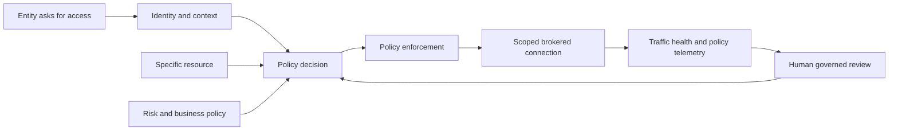

## Network-centric versus resource-centric architecture

A network-centric design often treats connection to a network segment as a major trust boundary. A remote-access Virtual Private Network, or VPN, may authenticate a user and then provide routes to one or more subnets. Firewalls, Access Control Lists, or ACLs, and host controls can still restrict traffic; mature VPN designs are not automatically open networks. The architectural concern is that network attachment can expose addresses, ports, discovery paths, and unintended destinations unless segmentation is designed and maintained precisely.

A resource-centric design begins with the protected application or resource. The subject is authorized for a named destination and operation under current policy. Network location is one signal at most, not proof of trust. The intended result is useful access without general-purpose network membership.

| Question | Network-centric tendency | Resource-centric target | Evidence needed |
|---|---|---|---|
| What is granted? | Reachability to network ranges, then filtered | Access to named resources or applications | Effective routes, policies, and tests |
| What identifies the subject? | IP, network, account, and gateway session may dominate | User/workload/device identity plus context | Identity and session logs |
| What identifies the destination? | Address, subnet, and port | Application/resource identity plus required protocol | Segment/resource definition |
| What does compromise expose? | Potentially reachable network neighborhood | Intended to expose only authorized resource paths | Negative reachability tests |
| Where is policy applied? | VPN gateway, firewall, ACL, host, application | Broker/enforcement plus application authorization | Effective policy trace |
| Does location imply trust? | It may influence trust materially | It should not create implicit trust by itself | Policy review |
| How is change handled? | Route and firewall rule lifecycle | Resource, identity, context, and policy lifecycle | Change records and owners |
| Main operational risk | Rule sprawl and broad reachability | Identity/context errors, segmentation errors, and hidden dependencies | Monitoring and test suite |

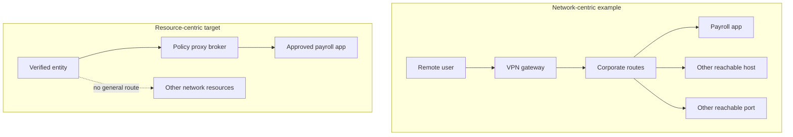

The comparison is not "VPN bad, proxy good." A carefully segmented VPN with strong identity, posture, firewall, host controls, and monitoring can reduce risk. A badly defined resource-centric policy can grant the wrong app, miss a dependency, or create disruptive bypasses. The defensible claim is narrower: granting app-specific connectivity by policy reduces the need to expose or extend broad network reachability, which can reduce opportunities for discovery and lateral movement when implemented and validated correctly.

### Plain-English deep-dive 1 - Access is not reachability, and reachability is not authorization

Imagine a hospital. Reaching the hospital parking lot is network reachability. Entering the building is another boundary. Opening the pharmacy door is authorization. Dispensing a specific medicine is an application operation. A parking permit does not authorize medicine, and a pharmacy badge does not prove a prescription is valid.

Digital systems have the same layers. A route can make an IP address reachable. A firewall can allow a TCP port. TLS can authenticate a server and protect a channel. A proxy can broker a connection. The application can authenticate the session and authorize a record or action. Zero trust architecture narrows connectivity, but it does not replace application authorization. An employee permitted to reach a finance application may still be forbidden from approving payments. Both controls are required.

This distinction prevents three troubleshooting errors. First, a successful ping or TCP connection does not prove application access. Second, a proxy allow decision does not prove the application will accept the request. Third, an application HTTP 403 response does not automatically mean the zero trust policy denied access. Evidence must identify the boundary that made the decision.

## NIST SP 800-207 and the Zscaler public model

NIST SP 800-207 describes zero trust as moving defenses from static network perimeters toward users, assets, and resources. It states that no implicit trust is granted solely because of physical or network location or asset ownership. It presents logical components such as a Policy Decision Point, or PDP, and a Policy Enforcement Point, or PEP. Within the PDP, the policy engine decides and the policy administrator establishes or tears down the communication path.

Zscaler's public Zero Trust Exchange page uses vendor-specific language: verify identity, determine destination, assess risk, and enforce policy. It describes a proxy architecture brokering one-to-one connections based on identity, context, and business policy. These ideas are compatible at a conceptual level, but the labels are not proof of a one-for-one product-component mapping.

| NIST concept | Plain meaning | Zscaler public-language relationship | Boundary |
|---|---|---|---|
| Resource focus | Protect the exact asset/service | Determine destination and connect entity to app | Product object names vary |
| No implicit location trust | Network location alone is insufficient | Retire network-centric trust in public positioning | Location can remain a context signal |
| PDP | Logical access-decision role | Identity/context/risk/business-policy evaluation | Do not assign undocumented internals |
| Policy engine | Makes final grant/deny decision | Assess and evaluate policy conceptually | Exact implementation is proprietary |
| Policy administrator | Establishes or ends path | Broker/session-control conceptually | Not necessarily a named Zscaler component |
| PEP | Enables, constrains, or blocks communication | Proxy/service enforcement conceptually | Enforcement varies by product and traffic |
| Continuous diagnosis | Reevaluate posture and trust | Telemetry/context can inform decisions | Frequency and signals require documentation |
| Enterprise policy | Business and security rules | Business policy | Ownership stays with customer |

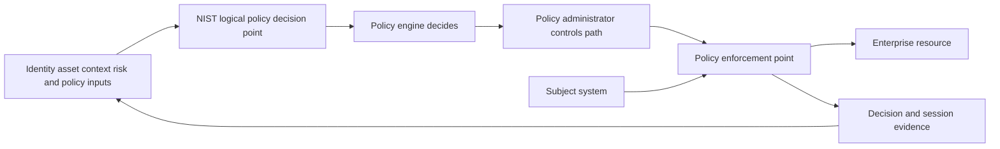

Use NIST to reason about architecture and responsibilities. Use current Zscaler documentation to reason about Zscaler products. Use tenant evidence to reason about one customer's implementation. None of the three sources substitutes for the others.

## The four-step decision: verify, determine, assess, enforce

The four steps are best understood as questions, not a claim that every packet executes four visible screens in that order.

| Step | Core question | Representative inputs | Failure if wrong | Evidence |
|---|---|---|---|---|
| Verify identity | Who or what is requesting? | IdP assertion, user session, device identity, workload credential | Impersonation, unknown subject, wrong group | Authentication and identity logs |
| Determine destination | Which exact resource is requested? | Name, application segment, URL, service, protocol, port | Wrong app match, missing dependency, overbroad destination | DNS, segment, policy, request metadata |
| Assess risk | What conditions change confidence now? | Device posture, threat, location, behavior, app sensitivity | Excess trust or needless disruption | Signal freshness and risk reason |
| Enforce policy | What outcome is permitted? | Rule criteria, order, action, entitlement, inspection support | Wrong allow/deny, missing control, bypass | Effective-policy and transaction logs |

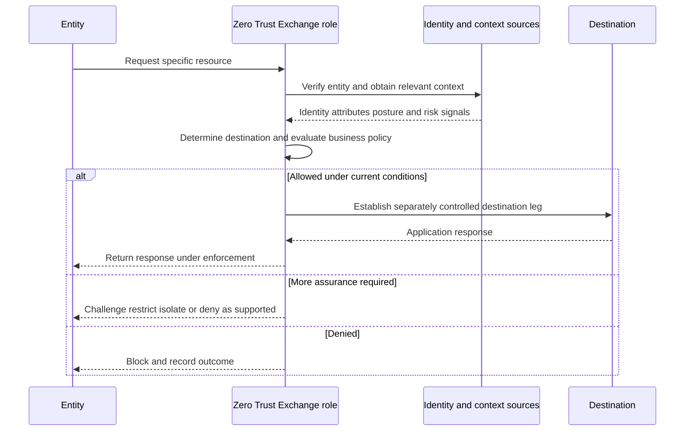

### Verify identity

Identity may refer to a person, a managed endpoint, a workload, a service, or another entity. Authentication proves something about the entity using credentials, certificates, tokens, or federated assertions. Authorization decides what that identity may do. Provisioning supplies accounts and attributes; it is not the same as live authentication. Group membership is useful but can be stale, overbroad, or incorrectly mapped.

The architecture should fail safely when identity is unavailable or ambiguous, but exact behavior depends on product, policy, cached state, traffic type, and business-continuity design. Never promise that every dependency outage produces the same result.

### Determine destination

Destination is more than an IP address. For internet/SaaS traffic, it may involve URL, domain, application classification, service, protocol, and resolved endpoints. For private access, it may involve an application segment or equivalent object naming domains, IPs, ports, protocols, and associated groups. Shared hosting, changing cloud addresses, wildcard definitions, overlapping names, split DNS, and non-web protocols complicate matching.

A destination definition that is too narrow causes outages. One that is too broad grants unnecessary reach. The test is not whether the object saved successfully; it is whether required transactions work and prohibited destinations remain unreachable.

### Assess risk and context

Context can include managed status, operating-system version, endpoint protection, certificate state, location, time, authentication strength, threat observations, workload identity, app sensitivity, and other supported signals. A risk score is a model based on inputs and assumptions. It is not moral judgment, exact probability, or customer risk acceptance.

Signals need provenance, freshness, failure behavior, privacy review, and an owner. "Device compliant" is weak evidence unless the team knows which system calculated it, from which checks, at what time, and how unavailable data is handled.

### Enforce policy

Enforcement can allow, deny, require stronger authentication, restrict access, isolate browser activity, apply inspection, or take another currently supported action. Product and license determine available outcomes. Rule order, scope, exceptions, defaults, and interaction with application authorization matter. A named action on a marketing page does not prove it exists in every tenant or traffic path.

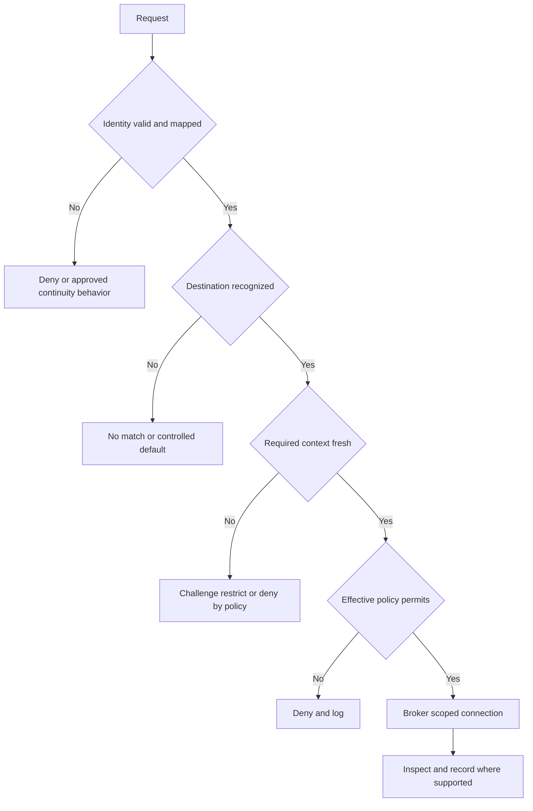

## Entities: users, devices, workloads, IoT/OT, and B2B

Zero trust applies to more than employees on laptops. The identity method, context, protocol, operational risk, and enforcement point differ by entity.

| Entity | Example | Identity challenge | Context challenge | Architecture caution |
|---|---|---|---|---|
| User | Employee opening payroll | Federation, MFA, account lifecycle | Device, location, authentication strength | User identity does not replace app role |
| Device | Managed Windows endpoint | Device certificate or enrollment state | Patch, endpoint security, encryption | Shared devices complicate attribution |
| Workload | API service calling database service | Service identity, certificate, token, cloud identity | Image, environment, owner, runtime risk | Avoid long-lived shared secrets |
| IoT | Badge reader or camera | Limited agent/credential support | Firmware, model, network behavior | Device identity may be inferred or mediated |
| OT | Engineering station to controller | Human and device identity | Safety, maintenance window, vendor support | Availability and safety govern change |
| B2B partner | Supplier reaching procurement app | External IdP or invited identity | Managed versus unmanaged device | Contract and offboarding are critical |
| Privileged user | Administrator reaching production system | Strong identity and step-up | Session purpose, device, approval | Access brokering is not full PAM by default |
| Unknown entity | Unclassified source | No reliable identity | Context unavailable | Default behavior must be explicit |

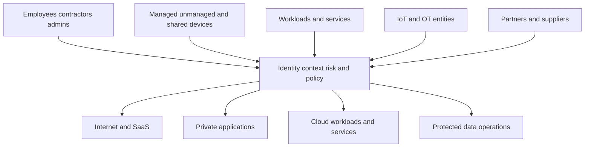

The phrase "who can access what" must become "which verified entity, using which device or workload, may perform which operation against which resource, under which current conditions, through which controlled path, with which evidence and owner." That sentence is long because production access is not a slogan.

## One-to-one proxy connections from zero

A direct end-to-end client connection normally has one transport conversation between client and destination, even though middleboxes may route, filter, or translate it. A full proxy terminates or receives the client-side connection and creates a separate destination-side connection. The two legs can have different source addresses, certificates, protocol details, timing, and failure modes.

| Property | Client-to-proxy leg | Proxy-to-destination leg | Troubleshooting consequence |
|---|---|---|---|
| Transport endpoints | Entity and proxy/service edge | Proxy/service edge and destination | One leg can succeed while the other fails |
| DNS use | Depends on forwarding and product flow | Destination resolution may occur in another context | Compare resolver, answer, and time |
| TLS peer | Proxy when TLS inspection is performed | Destination service | Two trust decisions and handshakes may exist |
| Source IP seen | Service/forwarding dependent | Destination may see egress/service source | IP allowlists can fail |
| Authentication | User/device/workload context may attach here | Destination still has its own authentication | Do not conflate proxy and app identity |
| Policy | Entity/destination/context policy | Egress, threat, app, or service behavior may also apply | Identify effective rule and plane |
| Failure evidence | Client, agent, browser, tunnel, edge logs | Edge, DNS, route, destination, app logs | Correlate both legs by time and transaction |

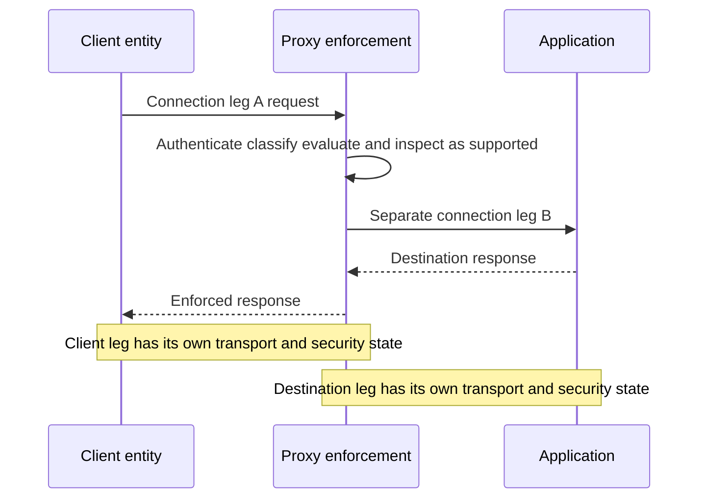

"One-to-one" is an authorization and segmentation idea: an authorized entity is connected to a specific application rather than given general network access. It does not necessarily mean a permanently dedicated physical server, one packet path worldwide, no multiplexing, no shared infrastructure, or a universal implementation for every product and protocol. Avoid inventing those internals.

### Plain-English deep-dive 2 - Two conversations, not one magical tunnel

Suppose you ask a secure concierge to call NMH payroll. You speak to the concierge on one telephone call. The concierge independently calls payroll on another. Payroll can be busy even while your call to the concierge is healthy. You can fail to authenticate to the concierge even while payroll is healthy. The concierge can also hear an error from payroll and relay it to you.

That is the key troubleshooting value of a proxy model. "I reached Zscaler" and "Zscaler reached the application" are different hypotheses. A client-side timeout may involve steering, local DNS, local network, TLS trust, identity, or the service edge. A destination-side timeout may involve destination DNS, routing, firewall, connector, server listener, load balancer, or application health. A policy denial is different again.

Do not overextend the analogy. A proxy service can reuse connections, optimize protocols, distribute functions, and apply product-specific processing. Public architecture pages do not expose every internal component. The safe explanation stays logical: separately controlled client and destination connection legs create a policy and inspection boundary, so evidence must localize which leg and decision failed.

## Proxy roles across internet and private application access

The same platform story supports different destination classes. ZIA focuses on internet and SaaS access. ZPA focuses on private applications. Later Parts provide product-specific mechanics.

| Dimension | Internet/SaaS orientation | Private-application orientation | Common principle |
|---|---|---|---|
| Destination | Public web, SaaS, internet service | Private app in data center/cloud/partner context | Identify exact destination |
| Reachability | Destination is generally internet-reachable | App should not require public inbound exposure in intended design | Broker under policy |
| Forwarding | Endpoint, branch, tunnel, proxy, or supported method | Client/browser/workload plus connectors/service edges as designed | Traffic must enter correct path |
| Inspection | URL, threat, file, TLS, data, firewall controls where supported | Access plus optional supported threat/data inspection | License and policy matter |
| Application auth | SaaS/web identity still applies | Private app identity and authorization still apply | Proxy allow is not app authorization |
| Main risk reduced | Unsafe internet content and data movement | Public exposure and broad network access | Least privilege and evidence |

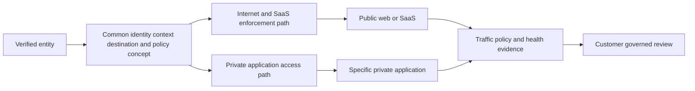

A browser opening Microsoft 365 through a ZIA path and the same user opening an internal finance app through a ZPA path can involve different forwarding, policy objects, service behavior, logs, and dependencies. "The Zero Trust Exchange is down" is too broad until evidence shows shared failure.

## Policy decision and policy enforcement

Policy is a rule system, not a static list of users. A useful access rule combines subject, destination, operation/protocol, context, action, priority, exceptions, and ownership.

| Policy field | Question | Weak design | Better design evidence |
|---|---|---|---|
| Subject | Who or what receives the rule? | "All employees" without lifecycle review | Authoritative group, owner, sample members |
| Destination | Which exact resource? | Broad wildcard or subnet without need | Named apps/dependencies and negative tests |
| Operation | What protocol/action? | Any port/protocol | Required ports, methods, or capabilities |
| Context | Under what conditions? | "Compliant" with no source definition | Signal source, freshness, failure behavior |
| Action | Allow, deny, challenge, inspect, isolate, restrict? | Generic allow | Right-sized, licensed action |
| Order | Which rule wins? | Assumed visual order | Effective-policy test and documented precedence |
| Exception | Why and until when? | Permanent bypass | Owner, expiry, risk, compensating control |
| Evidence | How will operation be proved? | Screenshot of configuration | Positive/negative transaction and logs |
| Review | What triggers reevaluation? | Annual review only | Identity, app, risk, incident, change events |

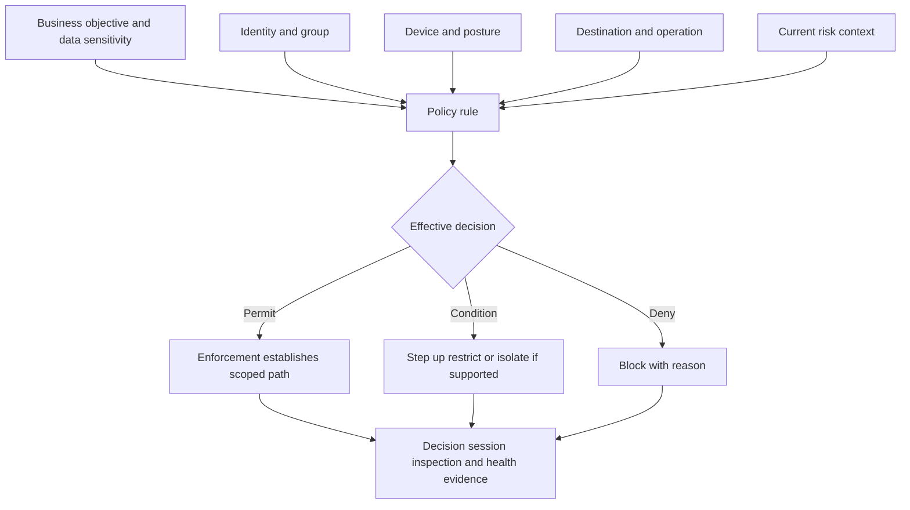

Decision and enforcement can fail independently. A correct rule can fail to reach the enforcement path because of distribution or health problems. A healthy enforcement path can apply an unintended rule because identity or destination matched differently than expected. A portal can show saved configuration while the actual transaction follows a bypass. Validation must observe the data plane.

## Application invisibility and no network extension

Zscaler publicly says private applications can be hidden behind the Zero Trust Exchange and that ZPA applications are not exposed to the public internet in the intended architecture. A common enabling concept is inside-out connectivity: customer-side components initiate outbound connections rather than requiring unsolicited inbound access from the internet. Part 35 covers ZPA components and health in depth.

"Invisible" should be scoped carefully.

| Statement | Defensible meaning | What it does not prove |
|---|---|---|
| No public app exposure | The intended access path does not require publishing the private app directly to arbitrary internet clients | No DNS record, certificate, leaked name, or alternate exposure exists |
| No inbound connection | Customer-side connector design initiates outbound connectivity as documented | Every firewall has no inbound rule or every deployment mode is identical |
| User not on network | Authorized user receives app-specific connectivity rather than general routed membership | Endpoint cannot reach any other resource by another path |
| App invisible to unauthorized user | Unauthorized internet scanning should not directly discover the private listener through this path | App metadata can never leak through email, DNS, code, or third parties |
| Lateral movement reduced | Broad network paths are removed or narrowed | Compromised identity cannot misuse allowed apps or app-to-app paths |

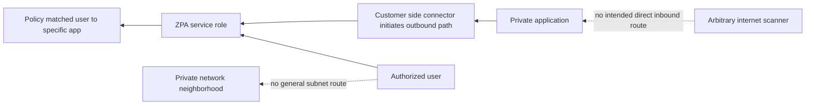

Application invisibility is attack-surface reduction, not immunity. The application still needs secure software, patching, authentication, authorization, secrets management, monitoring, backup, and incident response. Allowed users and workloads can be compromised. Connectors, identity providers, endpoints, DNS, certificates, and policies can fail. Alternate paths can accidentally republish an app.

### Plain-English deep-dive 3 - A hidden door can still lead to an unsafe room

Removing a building's public street entrance reduces drive-by access. It does not guarantee that the private entrance checks the correct badge, that the room has no vulnerable equipment, or that an authorized employee will never be phished.

Private-application invisibility works the same way. It changes exposure and reachability. It does not patch the server, validate every business transaction, prevent stolen identities, or classify every piece of data. Strong architecture layers controls: hide unnecessary public entry, verify the entity, narrow the destination, assess context, inspect supported traffic, retain application authorization, monitor outcomes, and respond to anomalies.

For a TSM, the operational question is not "Is the app invisible?" It is "From which source networks and identities is each listener discoverable and reachable, through which approved path, under which policy, and what negative tests prove the absence of unintended paths?"

## The four security stages: attack surface, compromise, lateral movement, data loss

Zscaler's public Zero Trust Exchange page organizes risk around four stages. Treat this as a useful architecture story, not a complete attack framework or a guarantee.

| Stage | Attacker objective | Architecture contribution | Remaining controls and caveats | Evidence |
|---|---|---|---|---|
| Find attack surface | Discover exposed services and weaknesses | Hide private apps and reduce public/routed reachability | Internet/SaaS remains public; alternate exposure may exist | External inventory and negative scans |
| Establish compromise | Deliver exploit, malware, phishing, or stolen identity | Inspect supported traffic and enforce threat/access policy | Encrypted/unsupported/bypassed traffic and zero-days remain | Threat, file, auth, endpoint evidence |
| Move laterally | Reach additional systems or identities | Connect entity to allowed app, not broad network | Allowed apps, workload paths, admin tools, and identity abuse remain | Reachability and identity-path tests |
| Exfiltrate data | Move sensitive information out | Apply supported data classification and controls | Coverage depends on channel, encryption, app, policy, and license | DLP/app/audit/network evidence |

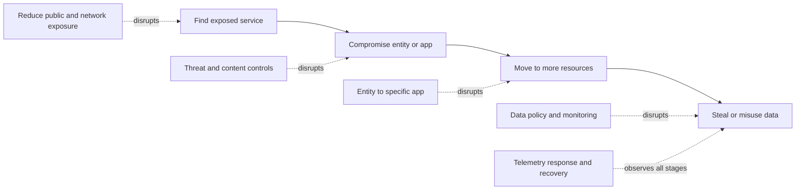

No single control covers all attack paths. For example, phishing may steal a valid identity without malware. A permitted application can expose data through an authorized-looking export. A workload can use an allowed dependency maliciously. Defense in depth still requires endpoint, identity, application, data, vulnerability, detection, response, backup, and governance controls.

## Traffic and content inspection

Connection brokering decides whether a path should exist. Inspection examines what crosses a supported path. They are related but not identical.

| Inspection layer | Example observation | Potential control | Limitation to verify |
|---|---|---|---|
| Connection metadata | Source context, destination, protocol, port | Access/firewall policy | Metadata cannot reveal all content |
| DNS/domain | Requested name and answer | Domain categorization or policy | Encrypted DNS and alternate resolution matter |
| TLS | Server identity, negotiation, inspected plaintext where authorized | Certificate/threat/data checks | Pinning, unsupported apps, privacy, law, trust deployment |
| HTTP | URL, method, headers, status, content | URL, threat, file, data policy | Non-HTTP traffic differs |
| File | Type, hash, behavior, reputation | Block, sandbox, quarantine workflow | Size, format, encryption, timing, false results |
| Data | Pattern, dictionary, fingerprint, label, context | Allow, block, coach, audit | Classification accuracy and channel coverage |
| Application behavior | SaaS action or private-app transaction where visible/supported | Granular control | Product/mode/API support varies |

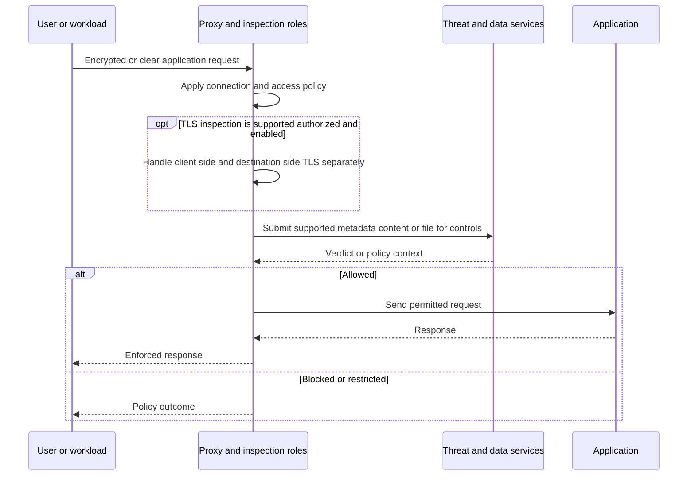

TLS inspection has material privacy, legal, security, and compatibility implications. It requires appropriate authorization, enterprise trust deployment, certificate lifecycle management, exclusions where justified, and testing. "Full inspection" on a product page does not mean every protocol, application, jurisdiction, device, user, certificate-pinned flow, or tenant policy is inspected. Part 37 will handle the detailed design.

## Telemetry and the feedback loop

Telemetry turns architecture into an operated system. At minimum, the team needs identity/authentication outcomes, policy decisions, connection results, traffic/inspection observations where supported, service/component health, destination behavior, administrative changes, and user reports. Logs have latency, retention, access, privacy, and completeness limits.

| Evidence family | Question answered | Common trap | Health check |
|---|---|---|---|
| Identity | Who authenticated and with which attributes? | Assuming current group from an old token | Compare issue time and authoritative directory |
| Posture/context | Which device/risk conditions were evaluated? | Treating missing as healthy | Verify source, age, and failure semantics |
| Policy | Which rule and action applied? | Reading configured rather than effective policy | Reproduce and capture transaction decision |
| Connection | Which leg connected, timed out, or reset? | Calling every timeout a policy block | Correlate client, edge, connector, destination |
| Inspection | What content/verdict/control applied? | Assuming no log means allowed inspection | Verify logging scope and bypass |
| Health | Were required components/services available? | Green portal equals healthy transaction | Use representative synthetic checks |
| Admin audit | What changed, by whom, and when? | Ignoring identity/group changes outside product | Join IdP, endpoint, product, and app changes |
| Application | Did the destination accept and process the request? | Blaming broker for app HTTP 403 or 500 | Check app and dependency logs |
| User experience | Was the transaction usable? | Security success equals acceptable performance | Measure latency, errors, and business step |

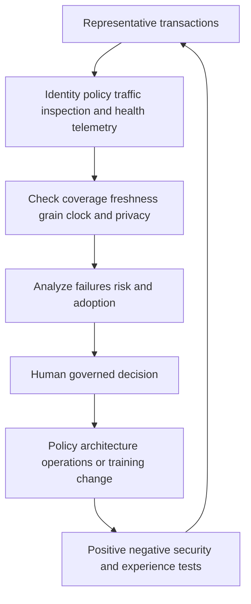

Feedback does not mean an opaque algorithm should silently grant more access. Adaptive decisions need explicit guardrails, explainable reasons, audit, approval boundaries, rollback, and customer governance. Part 33 explores adaptive access.

### Plain-English deep-dive 4 - A green dashboard is a weather map, not your window

A national weather map can show clear skies while rain falls on one street. The map may be delayed, aggregated, or based on a distant sensor. A service dashboard is similar: it is useful evidence about a defined scope, not proof that one user's complete transaction works.

A representative health check should exercise the same identity class, forwarding path, policy, service region, protocol, destination dependency, and business operation that matters. A TCP probe may miss authentication. A login may miss file upload. A policy log may miss application processing. The closer the synthetic or controlled transaction is to the real critical operation, the stronger the evidence.

Your prior support experience is valuable here. You already know that an M365 service-health page, a successful browser sign-in, and a healthy OneDrive process answer different questions. The honest bridge is to apply that same evidence discipline to Zscaler while learning the product-specific logs, objects, and health signals.

## Architecture health model

Health should be decomposed, because "Zero Trust Exchange health" spans customer and provider dependencies.

| Layer | Healthy means | Representative check | Owner partnership |
|---|---|---|---|
| Entity/device | Required software, identity, clock, trust, and posture work | Known-good test device | Endpoint team |
| Identity | Authentication and attributes are current | Test user and IdP logs | Identity team |
| Local network | DNS, route, transport, and TLS reach required service | Controlled path test | Network team |
| Forwarding | Intended traffic enters intended enforcement path | Path and transaction evidence | Endpoint/network/Zscaler owners |
| Policy | Correct effective rule matches | Positive and negative policy tests | Security policy owner |
| Service edge/proxy | Session is accepted and processed | Provider and transaction evidence | Zscaler/support |
| Private connector/path | Outbound connector and app path are healthy where applicable | Connector plus destination check | App/network/cloud teams |
| Destination | App, dependencies, auth, and authorization work | Server and business-operation test | Application owner |
| Logging | Required events arrive with usable time and fields | Reconciliation test | SOC/data owners |
| Governance | Access and exceptions have owners and review | Attestation and expiry report | Risk/business owners |

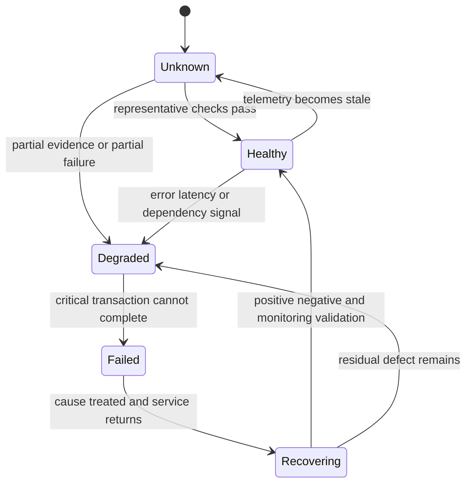

An architecture can be available but insecure: an unintended bypass may preserve user access. It can be secure but unusable: an overbroad deny may stop business. Health therefore includes availability, security correctness, policy correctness, logging, performance, and governance.

## Failure scenarios and misconceptions

| Symptom or claim | Plausible causes | Discriminating evidence | Unsafe conclusion |
|---|---|---|---|
| User cannot reach one private app | Wrong segment, policy, DNS, connector, server, app auth | Compare another app/user; effective rule; connector and server logs | ZPA is down |
| User cannot reach internet/SaaS | Local path, forwarding, auth, service, policy, destination | Known-good network/user/destination and path evidence | Zero Trust Exchange outage |
| App works off the agent path | Bypass or alternate route, not necessarily a fix | Compare forwarding and source path | Security product is defective |
| Correct group appears in directory but access denied | Stale token, mapping, rule order, context, app denial | Token/session time, effective identity, policy reason | Directory replication bug |
| Policy says allow but browser shows 403 | App authorization, upstream WAF, proxy policy, stale session | Response headers, proxy log, app log | Proxy denied |
| TLS error after inspection | Trust store, certificate, pinning, date, protocol, app behavior | Certificate chain and both TLS legs | Malware block |
| Private app name resolves but connection times out | Resolver/path/connector/server/dependency issue | DNS context, SYN/timeout, component health | Name resolution proves app health |
| No security log exists | Traffic bypassed, log delayed, retention/filter/access issue | Forwarding proof and logging health | Transaction never occurred |
| Lateral movement is eliminated | Intended path is app-specific | Negative reachability and alternate-path tests | Enterprise has zero lateral movement risk |
| App is invisible | No intended public inbound path | External inventory and exposure test | Nobody can discover its name or metadata |
| One-to-one means one physical connection | Vendor describes scoped brokered access | Product documentation and traces | Dedicated hardware per user/app |
| Continuous verification means every packet reauthenticates | Decisions can use current context over time | Documented event/session behavior | Repeated MFA for every packet |

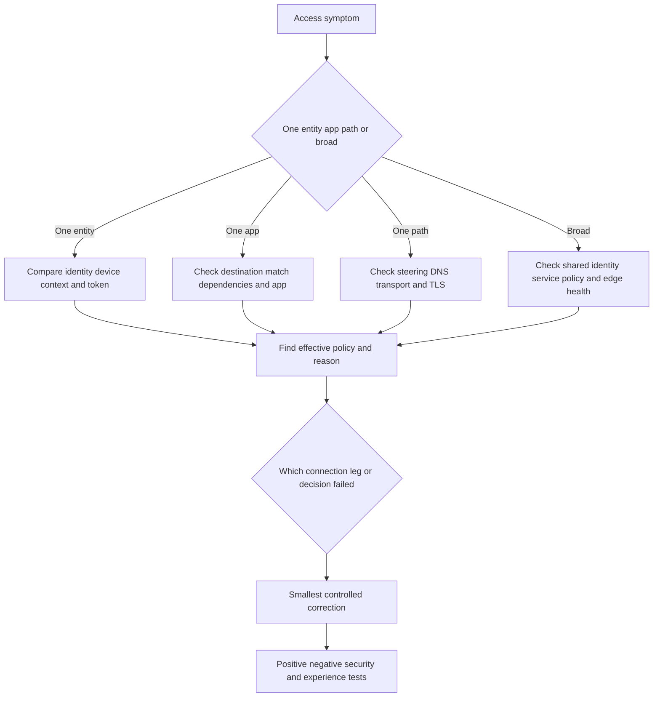

## Evidence-led troubleshooting method

The method is scope, map, hypothesize, discriminate, correct, validate, and learn. It is deliberately product-neutral until evidence identifies the owning boundary.

### Step 1: define the exact transaction

Record user or workload, device, source network, time zone, destination, protocol, operation, expected result, actual result, first known occurrence, frequency, and business impact. "Zscaler is slow" is not a transaction. "Managed Windows user in London takes 45 seconds to open the NMH payroll login through the intended private-access path, while an equivalent user in Dublin takes 3 seconds" is testable.

### Step 2: establish scope and known-good comparisons

Change one dimension at a time: user, device, location, path, destination, protocol, identity group, or time. Avoid uncontrolled bypasses on production users. A known-good comparison is useful only when its important dimensions are documented.

### Step 3: draw the actual path

Include endpoint, identity, DNS, forwarding, local route, service edge, policy, connector if relevant, destination DNS, firewall/load balancer, server, app authentication, dependencies, and logging. Mark unknowns rather than filling them with assumptions.

### Step 4: form falsifiable hypotheses

Each hypothesis needs a prediction and a cheap discriminating check.

| Hypothesis | Prediction | Cheap check | Evidence that falsifies it |
|---|---|---|---|
| Wrong identity mapping | Effective session lacks expected attribute | Compare identity/session log to authoritative group | Correct fresh attribute is present |
| Wrong destination match | Request maps to no or different app definition | Inspect effective destination/segment match | Expected object matches exactly |
| Policy denial | Enforcement log names deny rule/action | Find transaction by time/entity/destination | Allow rule applied and destination leg attempted |
| Client-side path failure | Entity cannot establish first leg | Compare local DNS/TCP/TLS and another network | First leg succeeds consistently |
| Destination-side failure | Proxy path accepted but app leg times out/resets | Connector/edge/app correlation | App receives and completes request |
| Application authorization | Network/proxy succeeds but app denies | App auth log and HTTP evidence | App grants same identity/operation |
| Logging gap | Transaction works but expected event absent | Send tagged synthetic event and reconcile | Event arrives in expected window |

### Step 5: collect minimum necessary evidence

Protect tokens, cookies, personal data, content, credentials, and customer secrets. Use approved tools and retention. Synchronize clocks. Capture exact times and time zones. Prefer event IDs and sanitized metadata over full content when sufficient.

### Step 6: correct the controlling boundary

Use the smallest reversible change. Record owner, approval, scope, expected effect, risk, rollback, and monitoring. Do not solve a narrow definition error with a permanent broad bypass.

### Step 7: validate security and business behavior

Test permitted users and operations, denied users and destinations, failure behavior, logging, performance, and rollback. A fix is incomplete if it restores access by defeating intended policy.

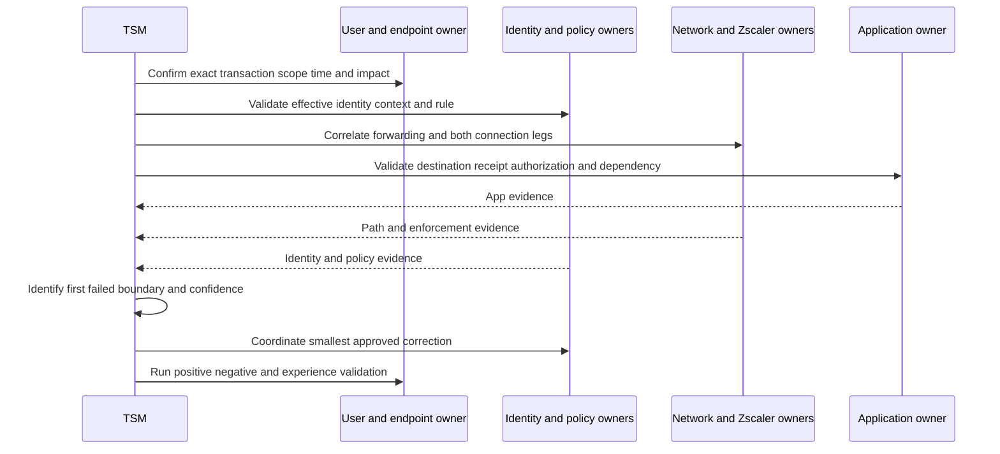

## Decision trees for common architecture questions

### Should this access be resource-centric?

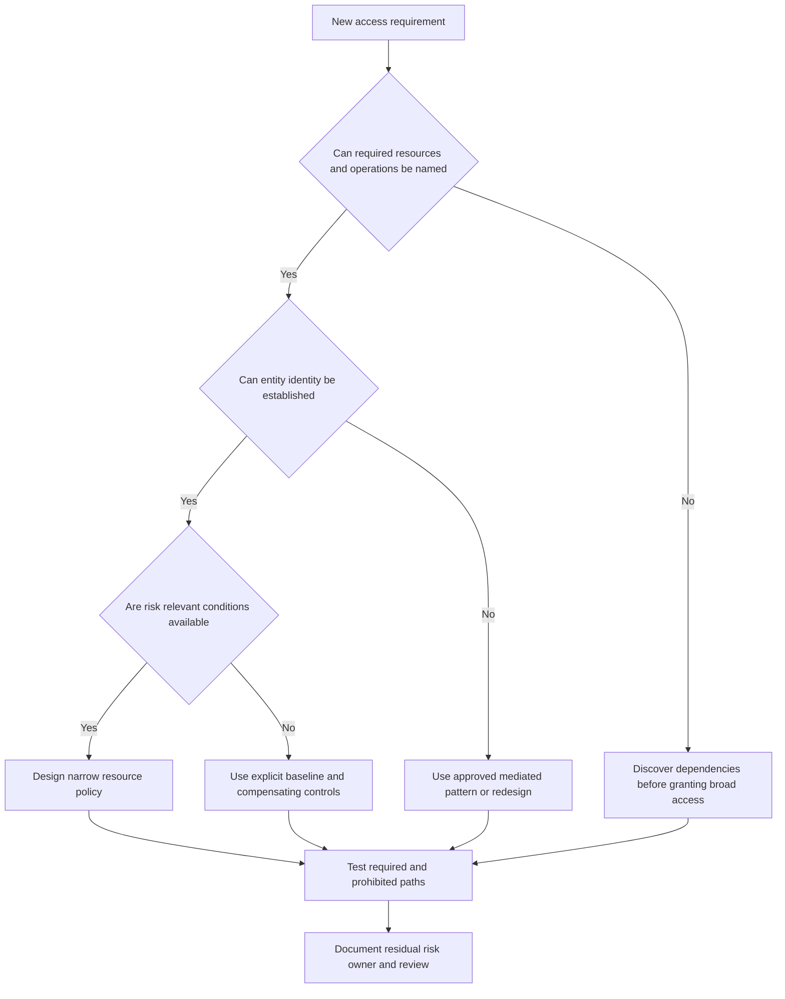

Some technologies legitimately need network-level behavior, dynamic peer discovery, broad protocol ranges, or legacy dependencies. Do not force an application model without discovery. Instead, identify the smallest safe scope, compensating controls, modernization path, and risk owner.

### Is this likely policy, path, or application?

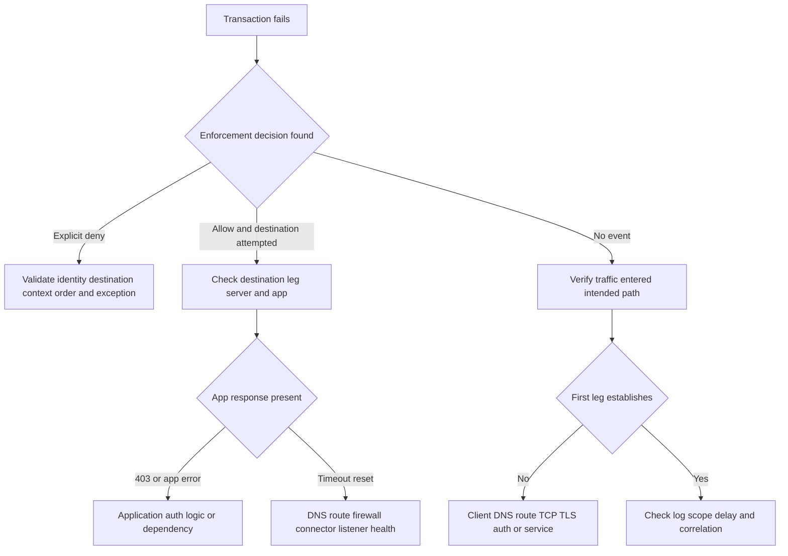

## Fictional NMH architecture case

NMH is a multinational manufacturing and services company used only for learning. In the fictional current state, 18,000 employees use a remote-access VPN that advertises several corporate routes. Suppliers use a separate gateway. Cloud workloads use site-to-site connectivity. Several internal web applications depend on shared DNS, identity, databases, and file services. The exact figures are synthetic and do not describe a Zscaler customer.

### Current-state discovery

| Question | Synthetic finding | Risk or uncertainty | Needed owner/evidence |
|---|---|---|---|
| Which users need payroll? | Employees and payroll administrators | Group includes dormant accounts | HR/identity attestation |
| Which destinations are required? | Payroll web, identity, API, database through server side | Hidden report-export dependency | App flow and owner review |
| What can VPN users reach? | Several subnets, filtered by layered rules | Effective reachability not fully tested | Route/firewall scan under authorization |
| Is payroll public? | No intended public listener | External inventory not reconciled | ASM/DNS/certificate evidence |
| What device context exists? | Managed status and endpoint signal | Freshness behavior unknown | Endpoint/identity documentation |
| How are suppliers handled? | Shared partner group with annual review | Offboarding delay and unmanaged devices | Contract and access review |
| What logs exist? | VPN, IdP, firewall, app, SIEM | Clock and identity correlation gaps | Logging reconciliation |

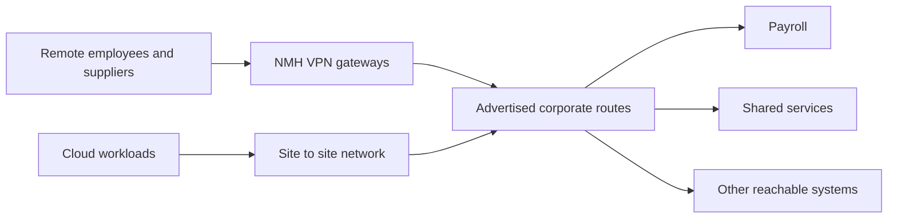

### Resource-centric target hypothesis

The target is not "deploy Zscaler." The target hypothesis is: named employee and supplier identities should receive access only to approved applications under defined device and risk conditions, without broad routed network attachment, while preserving required dependencies, application authorization, audit, performance, and continuity.

| Policy cohort | Destination | Context | Intended action | Negative test |
|---|---|---|---|---|
| Employee | Payroll user interface | Managed device, normal assurance | Permit app access | Cannot reach payroll admin path |
| Payroll admin | Admin interface | Managed hardened device and stronger auth | Permit privileged path | Standard employee denied |
| Supplier | Supplier portal only | Federated identity, contract active | Restricted/browser-mediated option if licensed | Cannot reach employee payroll |
| Workload | Payroll API dependency | Workload identity and environment | Permit required service path | Cannot reach unrelated database |
| Unknown | Any private payroll resource | No reliable identity | Deny | Log reason without sensitive disclosure |

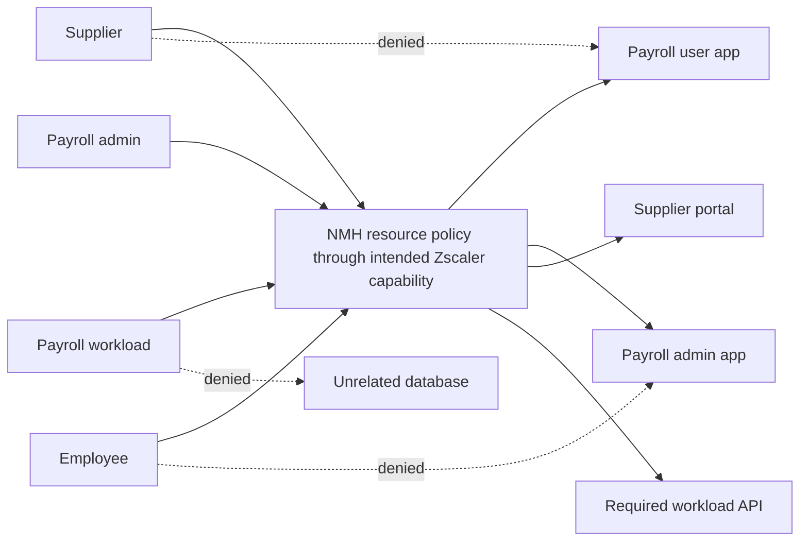

### Pilot gates

| Gate | Entry evidence | Exit evidence | Stop condition |
|---|---|---|---|
| Architecture | Approved resource/dependency map | Reviewed target and ownership | Unknown critical dependency |
| Identity | Cohorts and lifecycle tested | Correct current attributes | Shared or stale identity unresolved |
| Connectivity | Representative paths available | Both connection legs healthy | Required protocol unsupported/unverified |
| Policy | Rules and exceptions peer-reviewed | Positive and negative tests pass | Broad unintended match |
| Security | Threat/data controls scoped | Authorized tests and logs pass | Privacy/legal or compatibility issue |
| Experience | Baseline exists | Performance within agreed threshold | Critical degradation |
| Operations | Monitoring, support, rollback ready | On-call exercise succeeds | No owner or rollback |
| Governance | Risk and change approvals complete | Residual risk accepted by NMH owner | Vendor/TSM asked to accept risk |

The TSM should not claim that architecture alone will eliminate incidents. The pilot should measure reduced unnecessary reachability, policy correctness, adoption, health, experience, logging, and owner confidence. Security outcome requires longer-term evidence and causal caution.

## Your experience bridge to Zscaler

Your strongest bridge is transaction thinking. A OneDrive sync operation can involve user identity, device/client state, DNS, TCP, TLS, HTTP, proxy, Microsoft endpoint, SharePoint authorization, throttling, local file state, and service health. The Zero Trust Exchange model adds explicit policy decision/enforcement, destination scoping, risk context, inspection, and attack-surface reasoning.

| prior production method | Part 31 transfer | New learning required | Honest interview language |
|---|---|---|---|
| Scope user/device/site/file/time | Scope entity/device/resource/operation/time | Zscaler entity and policy objects | "I would start with an exact transaction." |
| Trace DNS/TCP/TLS/HTTP/proxy | Separate client and destination proxy legs | Product forwarding and edge evidence | "The method transfers; the product telemetry is a ramp area." |
| Compare browser and sync client | Compare protocol/path/forwarding cohorts | Supported product paths | "Different clients can take different enforcement paths." |
| Validate SharePoint permissions | Distinguish proxy allow from app authorization | ZPA identity and segmentation mechanics | "Connectivity and authorization are separate." |
| Correlate service and client logs | Correlate identity/policy/traffic/app logs | Nanolog/log-streaming specifics later | "I would align clocks and transaction identifiers." |
| Lead critical-situation workstreams | Coordinate identity/network/app/security owners | Security containment authority | "I bring operating discipline, not claimed SOC authority." |
| Validate fix and recurrence | Positive/negative security tests and feedback | Product-safe test design | "Access restored is not enough if policy is bypassed." |

### 30-second interview bridge

"My Microsoft 365 escalation work trained me to isolate an exact transaction across identity, client, DNS, transport, TLS, HTTP, proxy, permissions, and service boundaries. The Zero Trust Exchange adds a resource-centric policy model: verify the entity, identify the destination, assess relevant context and risk, then enforce a scoped connection rather than extend broad network reachability. My study and synthetic NMH models cover that architecture. Direct production Zscaler administration is not part of my current experience, so I would validate the customer's forwarding, effective identity, policy, both proxy legs, destination, and logs with the product owners."

## TSM architecture review checklist

| Review area | Questions | Required output |
|---|---|---|
| Business | Which operation must work and what impact is protected? | Scope and success measure |
| Entities | Which users, devices, workloads, IoT/OT, and partners participate? | Identity/cohort inventory |
| Resources | Which exact apps, services, data, protocols, and dependencies? | Resource and dependency map |
| Current reachability | Which routes, listeners, gateways, and alternate paths exist? | Current-state attack-surface map |
| Policy | Who may do what under which context? | Rule matrix and owner |
| Enforcement | Where is each decision applied? | PEP and forwarding map |
| Inspection | Which traffic/content is visible and lawful to inspect? | Coverage and exclusion record |
| Health | Which components and dependencies can fail? | Health model and SLOs |
| Evidence | Which logs prove identity, decision, connection, and app result? | Evidence dictionary |
| Privacy | Which personal/content data is processed and retained? | Approved handling plan |
| Resilience | What happens during IdP, edge, connector, DNS, or app failure? | Continuity and rollback plan |
| Validation | Which positive, negative, performance, and security tests run? | Acceptance suite |
| Governance | Who owns risk, exceptions, access review, and change? | RACI and review cadence |

## Labs and rehearsal

All labs use owned or synthetic systems and data. Do not scan, intercept, or test systems without written authorization.

### Lab 1: network versus resource whiteboard

Draw a remote VPN path with routes to three subnets. Draw a brokered path to one application. Mark identity, policy decision, enforcement, app authorization, and logs. Explain one strength and one failure mode of each design.

### Lab 2: two-leg proxy trace

Use a local test proxy or documented sample trace in an owned lab. Identify client-to-proxy and proxy-to-origin connections. Record endpoints, times, TLS peers, and errors. Do not claim the lab reproduces proprietary Zscaler internals.

### Lab 3: policy matrix

Create five synthetic users, three device states, four resources, and three sensitivity levels. Write least-privilege rules, an exception with expiry, positive tests, and negative tests. Have another person find overbroad matches.

### Lab 4: NIST mapping

Map subject, resource, PDP, policy engine, policy administrator, PEP, identity source, telemetry, and enterprise policy to a vendor-neutral diagram. Then overlay Zscaler public terms using dotted lines to show conceptual rather than proven component equivalence.

### Lab 5: invisibility test plan

For a synthetic private app, list public DNS, certificate transparency, IP listener, search-engine, source-code, email, and alternate gateway exposure paths. Define authorized negative tests. Explain why no single scan proves invisibility forever.

### Lab 6: four-stage threat story

Build one fictional chain from discovery through compromise, lateral movement, and data loss. Place proxy, identity, endpoint, app, data, detection, and response controls. Remove one control and explain residual risk.

### Lab 7: identity failure

Create a stale-group scenario. Build a timeline with directory change, token issue time, policy evaluation, denial, refresh, and successful validation. Practice explaining why directory state and effective session state can differ.

### Lab 8: application failure

Model a transaction where proxy policy allows access but the application returns HTTP 403. List evidence from browser, proxy, identity, and app. State the first failed boundary and owner without blaming the proxy.

### Lab 9: logging reconciliation

Send ten tagged synthetic transactions through an owned lab architecture. Reconcile client events, proxy events, and application events. Measure missing events and timestamp skew. Document privacy minimization.

### Lab 10: NMH executive brief

Write one page with current risk, target principle, pilot scope, expected leading measures, dependencies, caveats, decision request, and risk owner. Avoid vendor metrics and guaranteed outcomes.

### Lab 11: troubleshooting drill

Have a partner choose one hidden cause: wrong identity, destination mismatch, explicit deny, client-leg failure, destination-leg timeout, app denial, or logging delay. Ask only discriminating questions until one hypothesis remains.

### Lab 12: teach-back

Explain one-to-one proxy architecture in 30 seconds, two minutes, and ten minutes. In every version include one benefit, one limit, one evidence requirement, and the boundary that direct production Zscaler operation is not established.

## Common misconceptions to correct

| Misconception | Corrected understanding |
|---|---|
| Zero trust means trust nobody | It removes implicit trust and makes explicit, contextual resource decisions |
| Identity alone creates zero trust | Destination, operation, context, policy, enforcement, and resource authorization also matter |
| Network-centric means no security | Mature network designs can be strongly segmented; the concern is reliance on broad reachability/location trust |
| One-to-one means one cable or server per user | It describes scoped entity-to-application brokering, not dedicated physical infrastructure |
| Proxy means traffic takes one end-to-end socket | A full proxy logically handles separate client and destination connection legs |
| Policy allow means application allow | The application retains authentication and authorization responsibilities |
| Application invisibility means no one knows its name | It means no intended direct public reachability; metadata and alternate exposure still require review |
| No network access means no network packets | Packets still traverse networks; the user is not granted general routed private-network membership |
| Inside-out means no firewall or routing dependencies | Outbound paths, DNS, TLS, firewalls, routes, connectors, and servers still matter |
| Eliminate lateral movement is universal proof | Validate scoped paths and alternate routes; identity and allowed-app abuse remain possible |
| Inspect all traffic means literally every flow | Coverage depends on traffic, protocol, encryption, authorization, forwarding, policy, product, and license |
| Continuous verification means MFA on every packet | Reassessment methods and timing vary; use current documentation |
| Green service health proves user success | It covers a defined scope and cannot replace a representative transaction |
| Saved policy proves enforcement | Observe effective policy and data-plane behavior |
| No log proves no traffic | Bypass, delay, retention, filter, access, and logging health can explain absence |
| Bypass restores access, so the product caused it | Bypass changes several variables and is only a hypothesis clue |
| Zero trust replaces defense in depth | It changes access architecture while endpoint, app, data, detection, response, and resilience remain |
| A public page proves entitlement | Contract, edition, tenant, region, configuration, and operation must be verified |
| This Part proves hands-on skill | It proves structured conceptual preparation and synthetic practice only |

## Official Source Anchors

Sources in this section were reviewed on **2026-08-24**.

All pages were reviewed on **2026-08-24**. Zscaler pages are vendor-authored sources for current public product and architecture positioning. NIST and IETF sources establish vendor-neutral architecture and protocol concepts. None proves NMH design, tenant entitlement, universal prevention, performance, savings, or your production Zscaler experience.

| Source | URL | Used for | Boundary |
|---|---|---|---|
| Zscaler Zero Trust Exchange | https://www.zscaler.com/products-and-solutions/zero-trust-exchange-zte | Network-centric contrast, proxy, one-to-one, four decision steps, entities, four attack stages | Marketing architecture; not internal implementation or tenant proof |
| Zscaler Private Access | https://www.zscaler.com/products-and-solutions/zscaler-private-access | Specific-app brokering, no corporate-network access, no intended public app exposure | Product claims, packaging, features, and outcomes require validation |
| Zscaler Internet Access | https://www.zscaler.com/products-and-solutions/zscaler-internet-access | Internet/SaaS proxy, identity/context/business policy, TLS and traffic inspection positioning | Inspection and features depend on path, policy, license, and compatibility |
| NIST SP 800-207 | https://csrc.nist.gov/pubs/sp/800/207/final | Resource focus, no implicit location trust, PDP, PEP, policy engine/administrator | General architecture, not Zscaler configuration guidance |
| NIST Zero Trust Architecture Project | https://www.nccoe.nist.gov/projects/zero-trust-architecture | Implementation examples and practical zero trust work | Examples do not mandate one vendor architecture |
| IETF RFC 8446 | https://www.rfc-editor.org/rfc/rfc8446 | TLS 1.3 protocol foundation and separate TLS-session reasoning | Does not authorize interception or describe Zscaler internals |
| IETF RFC 9110 | https://www.rfc-editor.org/rfc/rfc9110 | HTTP semantics and intermediary concepts | HTTP only; many private protocols differ |

## Likely Interview Questions

### Q1. What is the Zero Trust Exchange architecture in plain English?

**Model answer:** It is Zscaler's public cloud-delivered zero trust platform model for connecting users, devices, workloads, IoT/OT, and partners to specific internet, SaaS, private-app, cloud, or data destinations. Instead of treating network location as sufficient trust, it verifies identity, determines the destination, assesses relevant context and risk, and enforces business policy. Its proxy architecture brokers scoped entity-to-application connections. That can reduce broad reachability, but identity, app authorization, data, endpoint, resilience, and operations still matter.

### Q2. How is resource-centric access different from a VPN?

**Model answer:** A VPN commonly authenticates a user and extends routes to private network ranges, with firewalls and other controls restricting what is reachable. Resource-centric access aims to authorize a named application or resource without granting general network membership. The benefit is a smaller reachable surface and less opportunity for discovery and lateral movement. I would not call every VPN insecure or every ZTNA policy safe; I would compare effective routes, resource definitions, identity, context, policy, alternate paths, and negative tests.

### Q3. What does a one-to-one proxy connection mean?

**Model answer:** It means an authorized entity is brokered to a specific application under identity, context, risk, and policy rather than connected broadly to a network. Logically, a full proxy handles a client-side connection and a separate destination-side connection, creating an enforcement and inspection boundary. It does not mean one physical appliance or cable per user, and public material does not justify claims about every internal implementation detail.

### Q4. How do Zscaler's four steps map to zero trust?

**Model answer:** Verify identity asks who or what is requesting. Determine destination identifies the exact resource. Assess risk evaluates relevant current context such as device or threat signals. Enforce policy applies the customer's business and security rule through a supported action. Conceptually, decision and enforcement resemble NIST PDP and PEP roles, but I would not claim a one-to-one internal component mapping without documentation.

### Q5. What do application invisibility and no network extension really mean?

**Model answer:** In the intended private-access architecture, the app does not need a directly exposed public inbound listener, and the user receives app-specific access rather than general routed private-network membership. That reduces attack surface and lateral-movement opportunity. It does not prove the app name never leaks, no alternate listener exists, the app is patched, or an allowed identity cannot be abused. I would validate external exposure, alternate paths, effective policy, required and prohibited reachability, and app authorization.

### Q6. How would you troubleshoot an access failure in a proxy-brokered architecture?

**Model answer:** I would define the exact entity, device, source, destination, operation, time, expected result, and impact. Then I would compare a known-good transaction, verify steering and the client-to-proxy leg, inspect effective identity/context and policy, check the proxy-to-destination leg, and confirm application authentication, authorization, and dependencies. I would correlate clocks and logs, find the first failed boundary, make the smallest reversible correction, and validate allowed, denied, security, logging, and experience behavior.

### Q7. How does this architecture address the attack chain?

**Model answer:** It can reduce public and routed attack surface, inspect supported traffic to help prevent compromise, connect entities to specific apps to reduce lateral movement, and apply supported data controls to reduce loss. Those are control contributions, not guarantees. Stolen identities, unsupported or bypassed traffic, vulnerable allowed apps, workload paths, alternate exposure, and uncovered data channels remain, so defense in depth and evidence are essential.

### Q8. How does your prior background prepare you to work with this architecture?

**Model answer:** My production strength is isolating Microsoft 365 transactions across client, identity, DNS, TCP, TLS, HTTP, proxy, permissions, service, and logs while coordinating customers and Engineering through critical escalations. That method transfers directly to scoping, dependency mapping, two-leg proxy reasoning, evidence correlation, and fix validation. Zscaler policy objects, forwarding, service health, and logs are a product-specific ramp area; I have learned the architecture and practiced synthetic scenarios but would not claim production Zscaler administration.

## 30-Second Memory Hooks

| Concept | Memory hook |
|---|---|
| Zero trust | No implicit trust from location |
| Resource-centric | Grant the room, not the campus |
| Entity | Who or what asks |
| Destination | Exact resource requested |
| Context | What is true now |
| Risk | A signal-informed reason for caution |
| Business policy | Rule tied to purpose |
| Four steps | Verify, destination, risk, enforce |
| PDP | Decide access |
| PEP | Enforce access |
| Proxy | Controlled switchboard |
| One-to-one | One authorized entity to one specific app |
| Two legs | Client-to-proxy and proxy-to-destination |
| App invisibility | No intended public front door |
| No network extension | App access without broad private routes |
| Attack surface | What an attacker can find and reach |
| Compromise | Stop supported malicious content and behavior |
| Lateral movement | Narrow the reachable neighborhood |
| Data loss | Classify and control covered channels |
| Inspection | Brokering is not the same as looking inside |
| App authorization | Proxy allow does not approve the business action |
| Health | Security, availability, performance, evidence, governance |
| Telemetry | Prove the decision and both legs |
| Troubleshooting | First failed boundary |
| Validation | Positive, negative, security, experience, logs |
| Experience bridge | Same evidence discipline, new product mechanics |

## Completion Checklist

- [ ] I can explain network-centric and resource-centric access without caricaturing either.
- [ ] I can explain why reachability, connection, authentication, and authorization are different.
- [ ] I can define entity, resource, identity, context, risk, policy, proxy, PDP, and PEP.
- [ ] I can map NIST SP 800-207 concepts to Zscaler public language without inventing internal equivalence.
- [ ] I can state verify identity, determine destination, assess risk, and enforce policy in order.
- [ ] I can give representative evidence and failures for each of the four steps.
- [ ] I can explain users, devices, workloads, IoT/OT, privileged users, and B2B entities.
- [ ] I can explain why identity methods and operational risk differ by entity.
- [ ] I can draw the client-to-proxy and proxy-to-destination connection legs.
- [ ] I know one leg can be healthy while the other fails.
- [ ] I do not claim one-to-one means dedicated physical infrastructure.
- [ ] I can distinguish ZIA internet/SaaS orientation from ZPA private-app orientation.
- [ ] I can explain why an effective rule includes subject, destination, operation, context, action, order, exception, and owner.
- [ ] I can distinguish configured policy from effective policy and observed data-plane behavior.
- [ ] I can explain application invisibility with a scoped, testable meaning.
- [ ] I can explain no network extension without saying no networks or packets exist.
- [ ] I can explain inside-out connectivity without removing DNS, route, TLS, firewall, connector, and app dependencies.
- [ ] I can relate controls to attack surface, compromise, lateral movement, and data loss.
- [ ] I state those four outcomes as intended contributions, not universal guarantees.
- [ ] I can distinguish brokering from metadata, TLS, HTTP, file, threat, and data inspection.
- [ ] I include privacy, legal, trust, compatibility, and licensing caveats for TLS inspection.
- [ ] I can name identity, policy, connection, inspection, health, admin, app, and experience evidence.
- [ ] I can explain why a green dashboard does not prove one transaction.
- [ ] I can decompose architecture health across customer and provider dependencies.
- [ ] I can explain how an architecture can be available but insecure or secure but unusable.
- [ ] I can correct all listed misconceptions without slogans.
- [ ] I can run the troubleshooting flow from exact transaction to first failed boundary.
- [ ] I form falsifiable hypotheses with predictions and cheap checks.
- [ ] I minimize sensitive evidence and record exact timestamps and time zones.
- [ ] I choose the smallest reversible correction instead of a permanent broad bypass.
- [ ] I validate positive, negative, security, logging, performance, and rollback behavior.
- [ ] I can use both decision trees without prematurely blaming a product.
- [ ] I can explain the fictional NMH current state and target hypothesis.
- [ ] I can define NMH pilot gates and stop conditions.
- [ ] I never present NMH as a real customer or its synthetic figures as outcomes.
- [ ] I can deliver the 30-second bridge while keeping direct production Zscaler operation in the not-established category.
- [ ] I can use the architecture-review checklist with identity, app, network, security, privacy, and risk owners.
- [ ] I have completed the twelve labs using only owned or synthetic systems.
- [ ] I can cite the dated official Zscaler, NIST, and IETF source anchors.
- [ ] I can state the product, license, UI, feature, region, and currency caveats.
- [ ] I can answer Q1-Q8 concisely and expand with evidence and limitations.

[Part 32 - Zscaler Cloud, Service Edges, Control/Data Planes, and Traffic Flow](Part-32-zscaler-cloud-service-edges-traffic.md)