# Part 32 - Zscaler Cloud, Service Edges, Control/Data Planes, and Traffic Flow

> **Audience:** Candidates preparing for a Zscaler Security Operations Technical Success Manager role after enterprise Support Escalation Engineering.
>
> **Purpose:** Build an evidence-led model of the Zscaler cloud, public and private service-edge terminology, management/control/data/logging planes, traffic forwarding and selection, resilience, performance, dependencies, path asymmetry, health, and troubleshooting without inventing proprietary internals.
>
> **Scope and honesty:** Northstar Meridian Holdings, abbreviated NMH, is fictional. Every NMH user, site, tunnel, address, service edge, path, application, log, outage, metric, capacity value, and outcome is synthetic. You have strong Microsoft 365 connectivity, escalation, trace, analytics, and customer-coordination experience, but direct production administration of Zscaler clouds, service edges, forwarding, or private service edges is not established.
>
> **Currency caveat:** The source snapshot is **2026-08-24**. Zscaler cloud names, data centers, service-edge addresses, readiness states, forwarding methods, configuration requirements, portals, limits, maintenance processes, availability, product terms, licenses, and user interfaces change. Use the customer's assigned cloud, current Zscaler Config portal, authenticated help, release notes, contract, tenant, and Support guidance. Never copy addresses or design rules from this lesson into production.

## Section goal

"The traffic goes to the cloud" is not an architecture. A usable explanation must identify where traffic originates, how it is forwarded, which service role receives it, how policy reaches enforcement, how the destination is reached, where logs go, what can fail, and which evidence distinguishes those failures.

Think of a global parcel network. A customer creates shipping rules in a management system. Sorting instructions are distributed to hubs. A parcel enters through a selected hub, is inspected and routed, and then continues to its destination. Tracking events follow a separate information path. A nearby hub can be unavailable, a road can be congested, a label can be wrong, or the destination warehouse can reject delivery. "The parcel company is down" is too broad until those boundaries are tested.

The analogy has limits. Zscaler delivers several products and traffic models. Internet/SaaS access, private-application access, endpoint forwarding, branch tunnels, private service edges, workload traffic, and logs do not all use one identical flow. The vendor's internal algorithms and topology are proprietary and change. This Part teaches a logical model and an evidence method, not an undocumented blueprint.

By the end, you should be able to:

| Outcome | Demonstrated capability | Proof artifact |
|---|---|---|
| Explain the cloud | Describe globally distributed service delivery without saying one central cloud | Logical cloud map |
| Use edge terms | Distinguish public service edge, private service edge, connector, destination, and endpoint | Vocabulary matrix |
| Separate planes | Explain management, control, data, and logging/analytics paths | Plane diagram |
| Explain configuration | Describe validated distribution conceptually without asserting hidden internals | State lifecycle |
| Explain selection | Separate DNS, routing, anycast, peering, tunnel targets, and product policy | Selection evidence tree |
| Trace forwarding | Compare endpoint, explicit proxy/PAC, GRE, IPsec, and other supported patterns conceptually | Forwarding matrix |
| Trace ZIA flow | Follow user/site traffic to public service edge and internet/SaaS destination | Sequence diagram |
| Trace ZPA flow | Follow user and connector paths through service roles to private app | Sequence diagram |
| Explain logs | Separate transaction path from logging/export path | Log pipeline map |
| Design resilience | Reason about multiple paths, edge states, failover, maintenance, and continuity | Failure-domain table |
| Diagnose performance | Break latency into endpoint, access, edge, egress, and destination segments | Latency budget |
| Diagnose capacity | Separate customer links, devices, tunnels, service capacity, app, and logs | Saturation checklist |
| Find asymmetry | Recognize forward/return path differences and stateful dependencies | Path comparison |
| Define health | Use representative checks rather than a single dashboard | Health scorecard |
| Troubleshoot | Find the first failed plane, leg, or dependency with minimal evidence | Decision trees |
| Advise safely | State license, product, cloud, UI, data-sovereignty, and currency caveats | Decision record |

## JD Mapping

| Role expectation | Part 32 capability | TSM artifact | experience bridge and boundary |
|---|---|---|---|
| Analyze complex environments | Map endpoint, site, carrier, tunnel, edge, egress, destination, identity, and logs | End-to-end dependency map | M365 path isolation transfers; Zscaler objects are new |
| Identify risk | Find single points, bypasses, stale allowlists, asymmetry, and logging gaps | Architecture risk register | Product-specific severity needs specialist validation |
| Tailor mitigation | Choose path diversity, staged forwarding, health tests, or app correction | Options and tradeoff record | Do not prescribe undocumented topology |
| Resolve escalations | Separate management, control, data, logging, and destination failures | Parallel workstream plan | critical-situation discipline transfers |
| Advocate best practices | Baseline, pilot, failover test, maintenance readiness, and rollback | Operational-readiness plan | Change validation is a direct strength |
| Partner with Support/Product | Provide topology, timestamps, edge/path identity, and controlled comparisons | Escalation evidence package | Never require proprietary inference from customer |
| Communicate outcomes | Translate resilient paths into availability, risk, and user experience | Executive brief | Avoid universal uptime/performance claims |
| Train engineers | Teach planes and first-failed-boundary reasoning | Whiteboard and drill | Technical enablement transfers |

## Candidate honesty note

Distributed service-edge concepts can be explained through standards-based DNS/TCP/TLS/GRE/IPsec behavior, public Zscaler configuration information, and synthetic health and failover tests. Production service-edge selection, ZIA GRE/IPsec deployment, private service-edge installation, and Zscaler capacity diagnosis are not established experience.

| Claim class | Safe Part 32 statement | Unsupported conversion |
|---|---|---|
| Production | "I isolated M365 failures across client, proxy, DNS, carrier, TLS, service, and application boundaries." | "I ran Zscaler global traffic engineering." |
| Demonstrated/lab | "I modeled dual forwarding paths and validated failure states in an owned lab." | "I implemented ZIA high availability." |
| Conceptual | "Service-edge selection can involve product configuration, DNS, routing, and network conditions; I would verify the actual method." | "Zscaler always selects the mathematically nearest edge by anycast." |
| Not yet used | "Direct production configuration of Zscaler GRE, IPsec, or Private Service Edge is not part of my current experience." | "My VPN knowledge makes me a Zscaler forwarding expert." |
| Unknown | "The active edge, path, policy state, and failover reason are unknown until transaction evidence confirms them." | "The portal's green state proves the path." |

Public counts of data centers, transactions, latency, uptime, scale, threats, or customer outcomes are dated vendor claims. They do not establish a customer's available capacity, path, performance, or service level. This Part intentionally avoids memorizing live IP ranges and node counts because the official Config portal is the operational source and changes over time.

## Beginner vocabulary and memory hooks

| Term | Plain meaning | Why it matters | Memory hook |
|---|---|---|---|
| Zscaler cloud | A named vendor service environment containing distributed service capabilities | Tenant assignment, addresses, portals, and dependencies can be cloud-specific | Know your assigned cloud |
| Data center | A physical or provider location hosting service infrastructure | A location is not the same as one logical edge or product | Building, not service |
| Service edge | A service role near traffic that terminates, brokers, inspects, or enforces supported flows | It is a major data-plane boundary | Where policy meets traffic |
| Public Service Edge | Zscaler-hosted service-edge capability in its cloud terminology | Customer traffic can be forwarded to it using supported methods | Vendor-hosted edge |
| Private Service Edge | Customer-deployed/private placement for supported ZIA or ZPA use cases | It changes ownership, path, capacity, and continuity responsibilities | Edge placed privately |
| App Connector | ZPA component that establishes outbound connectivity toward service roles and private apps | It is not a generic service edge or inbound gateway | Private app bridge |
| Cloud Enforcement Node range | Current ZIA Config-portal term for address ranges customers may need to permit | Stale or overly narrow allowlists can break service | Permit current ranges |
| Forwarding | Steering selected traffic into the intended Zscaler path | No forwarding means no enforcement on that path | Put traffic on the road |
| Tunnel | Encapsulation carrying traffic between endpoints | Tunnel health is not destination health | Road inside a road |
| Explicit proxy | Application is told which proxy to use | Only proxy-aware/supported traffic follows it | Address the mailroom |
| PAC file | Proxy Auto-Configuration script that chooses proxy or direct behavior for URLs | Logic, hosting, caching, and fallback can change path | Routing rules for browsers |
| GRE | Generic Routing Encapsulation, an IP tunneling method | It can carry site traffic but has routing and resilience requirements | Simple outer wrapper |
| IPsec | Internet Protocol Security suite protecting IP traffic | Tunnel negotiation, selectors, keys, and availability add states | Protected network tunnel |
| Control plane | Signaling and logic distributing state and coordinating behavior | Traffic may fail if state is stale even when portal access works | Coordinate |
| Data plane | Actual user or workload traffic | This proves whether the business transaction works | Carry |
| Management plane | Administrative UI/API and role-controlled configuration | Saved configuration is not observed enforcement | Configure |
| Logging plane | Event generation, transport, processing, storage, and export | Data-plane success can coexist with missing logs | Report what happened |
| Selection | Process by which a client/site/path reaches one service endpoint | Wrong or unhealthy selection can affect latency/availability | Which hub |
| Anycast | Multiple locations advertise the same IP prefix and routing delivers traffic according to network policy | It may influence reachability, but route choice is not geography alone | Same address, many doors |
| Peering | Direct routing relationship between networks | It can affect path quality but is not a guarantee | Networks exchange routes |
| Failover | Moving from an unavailable or unsuitable path/component to an alternative | It needs defined detection and recovery behavior | Use the other road |
| Failback | Returning to the preferred path after recovery | Premature return can cause flapping | Go home carefully |
| Asymmetry | Forward and return traffic use different paths | Stateful devices and troubleshooting may be affected | Out one road, back another |
| Capacity | Work a component or path can sustain under defined conditions | Marketing scale does not equal customer-specific headroom | How much useful work |
| Health check | A controlled test of a defined component or transaction | Green means only what was tested | Name the vital sign |

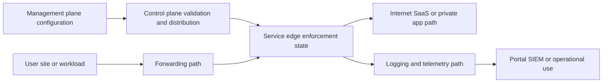

## The Zscaler cloud as a logical service

Zscaler publicly describes a globally distributed cloud platform. The operationally useful idea is not a particular current location count. It is that traffic can reach distributed enforcement/service roles and that the customer's assigned cloud, forwarding configuration, network path, and destination determine the actual transaction.

| Layer of description | Useful statement | Unsafe leap |
|---|---|---|
| Global platform | Services are distributed across multiple locations and failure domains | Every location has every feature and identical capacity |
| Assigned cloud | Tenant uses a specific Zscaler cloud/portal context | All cloud hostnames and addresses are interchangeable |
| Data center | Infrastructure exists in a geographic/provider location | A city label proves the exact packet path |
| Service edge | Logical role accepts and processes supported traffic | One edge equals one physical appliance |
| Cluster/VIP labels | Official Config data may expose current service address/status labels | Customer should hard-code one address forever |
| Customer path | ISP, routing, DNS, tunnel, and endpoint determine reachability | Geographic distance alone chooses best edge |
| Destination path | Service egress reaches internet/SaaS/app dependencies | Provider controls destination health |

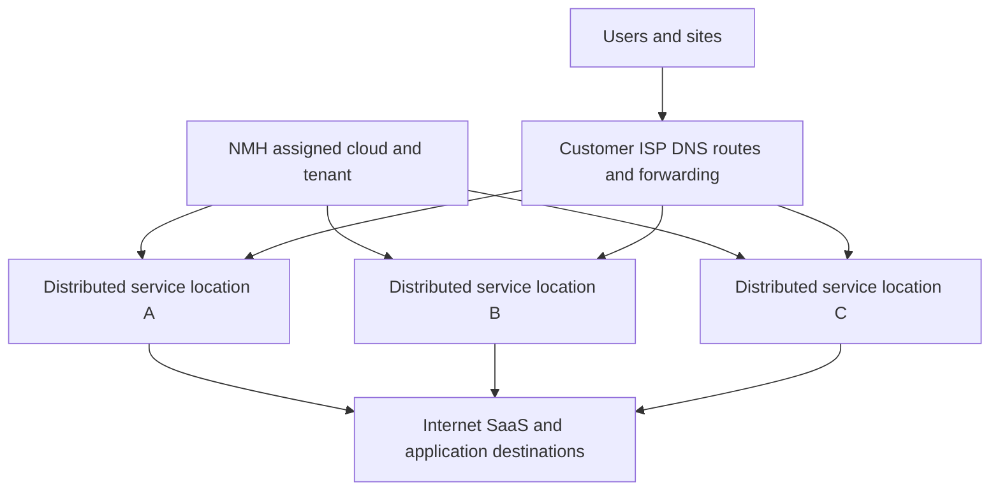

The current official Config portal lists Cloud Enforcement Node ranges, current data centers, readiness/status labels, proxy/tunnel-related hostnames or addresses, aggregate ranges, and component-specific configuration sections. It advises customers to account for published aggregate ranges because addresses can become live after notification. That is evidence for dynamic operations, not permission to copy the current table into a static lesson or restrictive rule.

### Plain-English deep-dive 1 - Cloud is an operating model, not a floating box

A beginner diagram often draws one cloud icon. That icon hides ownership, location, network paths, failure domains, software versions, configuration state, and service roles. It is like drawing an entire airline as one airplane.

For troubleshooting, replace the cloud icon with questions. Which tenant cloud? Which portal and service hostname? Which user or site forwarding method? Which active service endpoint? Which customer ISP and route? Which destination egress? Which feature and license? Which logging path? Which current maintenance or status evidence? Which clock?

Do not replace the single icon with invented detail. The correct map is as detailed as the available evidence. A public page can support "distributed cloud service." A packet trace can support observed endpoints. The Config portal can support current published ranges and status labels. Only current product documentation and Zscaler specialists can support internal design specifics not exposed to the customer.

## Public and private service-edge terminology

Product context matters because "Private Service Edge" is used in ZIA and ZPA-related materials, but the functions, deployment, traffic, prerequisites, and operational responsibilities are not automatically identical.

| Term | Plain role | Typical placement/ownership concept | Do not confuse with |
|---|---|---|---|
| ZIA Public Service Edge | Zscaler-hosted enforcement for supported internet/SaaS traffic | Zscaler cloud | Customer branch firewall |
| ZIA Private Service Edge | Privately deployed ZIA enforcement option under current documentation/entitlement | Customer data center/private cloud context | ZPA App Connector |
| ZPA Public Service Edge | Zscaler-hosted brokering/service role for private-app access | Zscaler cloud | Publicly exposing the private app |
| ZPA Private Service Edge | Private/on-premises ZTNA service role for supported local, regulatory, continuity, or path needs | Customer-controlled environment with Zscaler product dependencies | Generic reverse proxy |
| App Connector | Outbound ZPA component connecting service roles toward private apps | Near reachable application networks | User-facing inbound VPN concentrator |
| Private Cloud Controller | Named component in current ZPA business-continuity public material | Private deployment context | Universal controller for all Zscaler products |
| Client Connector | Endpoint component that can forward traffic and provide context for licensed products | Managed endpoint | Service edge itself |

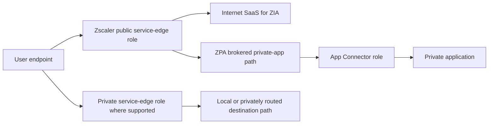

Private placement changes shared responsibility. The customer may own compute, virtualization, network, DNS, certificates, capacity, upgrades or approved upgrade windows, monitoring, backup/configuration protection, and physical/site resilience depending on the current product model. Zscaler owns other product/service elements. Use the current component ownership and upgrade guidance from the Config/help portals; never infer it from the word "private."

## Management, control, data, and logging planes

Planes are logical separations of responsibility. They may share infrastructure, but treating them separately helps isolate failure.

| Plane | Main job | Example evidence | Example failure |
|---|---|---|---|
| Management | Create policy, objects, roles, integrations, and settings through UI/API | Admin audit, API response, saved object | Portal unavailable or invalid configuration |
| Control | Validate, distribute, coordinate, authenticate, and maintain state needed for enforcement | Distribution/status evidence, component registration | Stale state or component disconnected |
| Data | Carry and process user/workload traffic | Packet/flow, transaction log, app response | Timeout, reset, policy block, saturation |
| Logging/telemetry | Generate, transport, process, store, and export events | Portal event, NSS/API/SIEM arrival | Delay, loss, parsing, retention, clock error |
| Analytics/reporting | Aggregate and present trends, risk, health, or operations | Dashboard/query | Aggregation hides individual transaction |

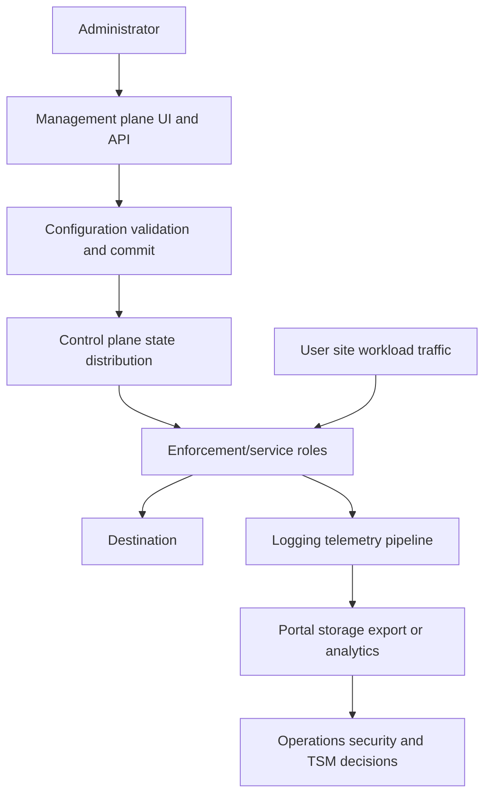

A portal login proves only that part of the management plane is reachable. A policy shown as saved proves configuration state, not that a particular service role received it or a transaction matched it. A successful transaction proves data-plane behavior at one time and scope, not that logs exported successfully. This separation is essential during incidents.

### Plane failure matrix

| Symptom | Likely plane candidates | First discriminating check | Common wrong response |
|---|---|---|---|
| Cannot save policy | Management/API, validation, authorization | Admin audit and API/UI error | Restart user tunnel |
| Saved policy not observed | Control distribution, effective matching, stale identity, bypass | Tagged transaction and effective rule | Recreate policy immediately |
| Traffic fails but portal works | Data path, forwarding, service edge, destination | First-leg and destination-leg checks | Declare control plane healthy everywhere |
| Traffic works but event absent | Logging path, delay, filter, retention, bypass | Tagged event reconciliation | Change access policy |
| Dashboard looks normal but users fail | Aggregation/scope or data path | Representative transaction | Trust average graph over user evidence |
| One private edge works, another differs | Component state, configuration, path, capacity | Compare version/state/path/effective policy | Assume identical because same product |

## Configuration lifecycle and distribution

A defensible configuration lifecycle has authoring, validation, commit/activation, distribution, acknowledgement or observable state, enforcement, telemetry, and review. The exact Zscaler internal protocol, database, replication topology, and timing are proprietary unless documented.

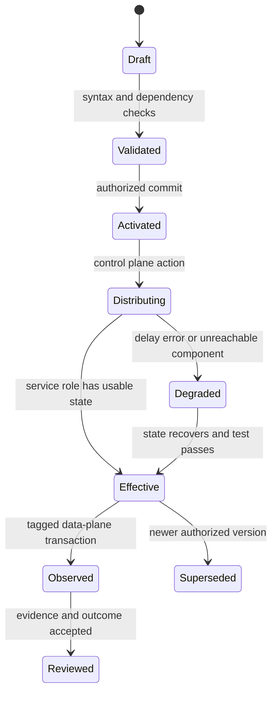

| Lifecycle question | Why it matters | Evidence |
|---|---|---|
| Who authored and approved? | Prevents unauthorized or accidental changes | RBAC and admin audit |
| What object/version changed? | Enables correlation and rollback | Change record and configuration diff |
| Were dependencies valid? | Objects can reference identities, locations, apps, certificates, or feeds | Validation output |
| When was it activated? | Timestamps anchor incident analysis | Commit time with zone |
| Which scope received it? | Products, clouds, groups, and edges may differ | Current documented status/effective behavior |
| Did traffic match it? | Control state must influence data plane | Tagged transaction and rule ID/reason |
| Did outcome improve? | Activity is not value | User/security/logging validation |
| Can it be rolled back? | Limits blast radius | Tested rollback and owner |

Do not promise a distribution interval from memory. During an incident, record observed timing and compare with the current documented expectation or Support guidance. A rapid repeated commit can complicate convergence and evidence; preserve the change timeline before making another change.

## Service-edge selection: what can be said safely

Selection means the actual process by which a user, application, branch, or tunnel reaches a service endpoint. Depending on product and forwarding design, inputs can include configured hostnames/endpoints, DNS answers, routing, tunnel priorities, client logic, source location, health, and network reachability. Exact algorithms should come from current documentation and observed evidence.

| Mechanism/concept | What it can do | What it cannot prove by itself | Evidence |
|---|---|---|---|
| DNS | Map a service hostname to current addresses according to resolver context and TTL | Lowest latency or final route | Query, resolver, answer, TTL, time |
| Unicast routing | Route to one advertised destination prefix | Geographic proximity | Traceroute/path and provider data |
| Anycast | Let multiple sites advertise the same prefix and routing choose a path | Stable, closest, uncongested, or symmetric path | BGP/path observation and service docs |
| Peering | Exchange routes directly between networks | Better performance for every source | AS path, measurements, provider confirmation |
| PAC logic | Choose proxy/direct and proxy order for a URL | Health of selected proxy or non-browser traffic | Evaluated PAC result and fetch/cache state |
| Tunnel endpoint priority | Define primary/secondary targets | Automatic success under every failure | Config, negotiation, routing, test |
| Client logic | Select supported forwarding/service path using documented behavior | Same decision across versions/profiles | Client logs/version/profile |
| Policy/location identity | Associate traffic with tenant/location context | Physical packet location | Transaction and location mapping |

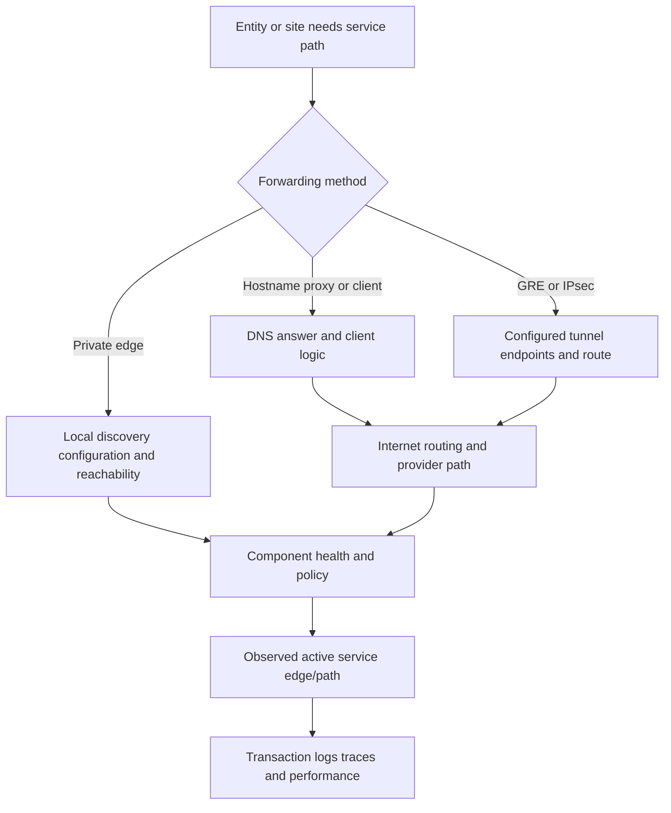

### DNS overview

DNS returns records; it does not carry most application traffic. The resolver used, source location seen by authoritative services, cache, TTL, split DNS, security filters, and stale state can affect answers. A client can receive a valid address that is unreachable from its network. A tunnel configured by IP may not use DNS for the endpoint at all.

### Anycast overview

Anycast is an IETF-documented routing practice in which multiple locations announce the same address prefix. Border Gateway Protocol, or BGP, policy determines network reachability; route selection is not a simple geographic distance formula. Paths can change. Anycast may be used in some service designs, but do not say every Zscaler connection or published address is anycast. The Config portal explicitly labels some current addresses, including multi-cluster or global/ghost concepts; use the official description for that address class.

### Peering overview

Peering can shorten or improve network paths by exchanging traffic directly between networks, but economics, routing policy, congestion, failure, and destination architecture still matter. A traceroute with fewer visible hops is not automatically faster or safer. Many networks suppress or rate-limit diagnostic responses.

### Plain-English deep-dive 2 - Nearest is a measurement, not a city name

The closest grocery store on a map may take longer to reach if a bridge is closed. Internet routing works through network relationships and policy, not road distance. A user in Paris can sometimes have a better measured path to one service location than another city that looks closer.

Therefore, "nearest edge" needs a metric: lowest round-trip time, fewest network hops, preferred provider path, configured primary, regional/legal requirement, available feature, or current healthy endpoint. Those goals can conflict. A TSM should ask what the product is documented to optimize, then measure the actual source-to-edge and edge-to-destination experience.

Never force a different service endpoint solely because a city looks closer. Confirm the assigned cloud, forwarding method, supported selection process, maintenance state, data-sovereignty requirement, destination egress behavior, and Support guidance. A manual pin can reduce resilience or violate design assumptions.

## Forwarding paths from endpoints and locations

Forwarding determines which traffic reaches which enforcement path. Methods vary by product, platform, protocol, identity needs, location, and entitlement.

| Forwarding pattern | Plain concept | Useful for | Main dependencies/failures |
|---|---|---|---|
| Client Connector | Endpoint component steers supported traffic and supplies context | Mobile/remote and managed users | Profile, service, auth, local network, version, conflict |
| Explicit proxy | Application is configured to send proxy traffic to a proxy endpoint | Proxy-aware web applications | App support, proxy settings, auth, bypass |
| PAC file | Script selects proxy/direct behavior by request | Browser/web traffic with conditional rules | Hosting, cache, script error, order, direct fallback |
| GRE tunnel | Router encapsulates selected IP traffic to configured service endpoints | Fixed sites with supported design | Routes, MTU, endpoint reachability, return path, identity method |
| IPsec tunnel | Encrypted IP tunnel carries selected traffic | Sites requiring protected tunnel transport | IKE/IPsec state, keys, selectors, NAT, MTU, failover |
| Branch/SD-WAN integration | Network device steers traffic under supported solution design | Branch connectivity | Product/version, policy, route, link, orchestration |
| Private service edge | Traffic reaches privately placed enforcement/service capability | Regulatory, local path, continuity, private placement use cases | Compute, network, DNS, capacity, upgrades, cloud sync |
| Browser/clientless path | Browser-mediated access to supported applications | B2B/BYOD/private web cases | Browser, identity, app compatibility, license |

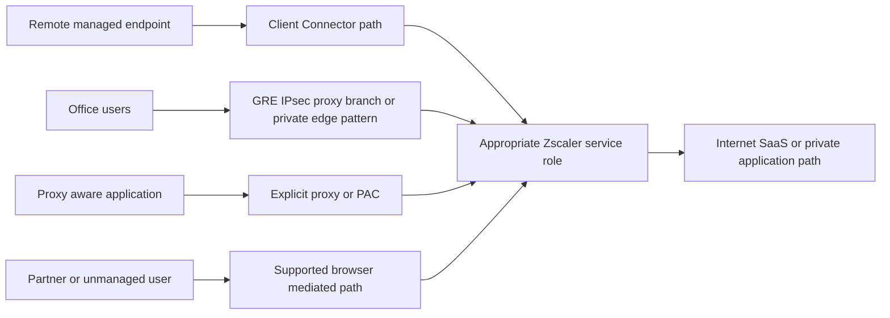

A bypass is also a forwarding decision. It may be required for unsupported or explicitly exempt traffic, but it creates a coverage boundary. Every bypass needs purpose, owner, scope, risk, expiry/review, and a way to verify that it does not match more than intended.

## ZIA traffic-flow model

Part 34 covers ZIA controls. Here the goal is the path.

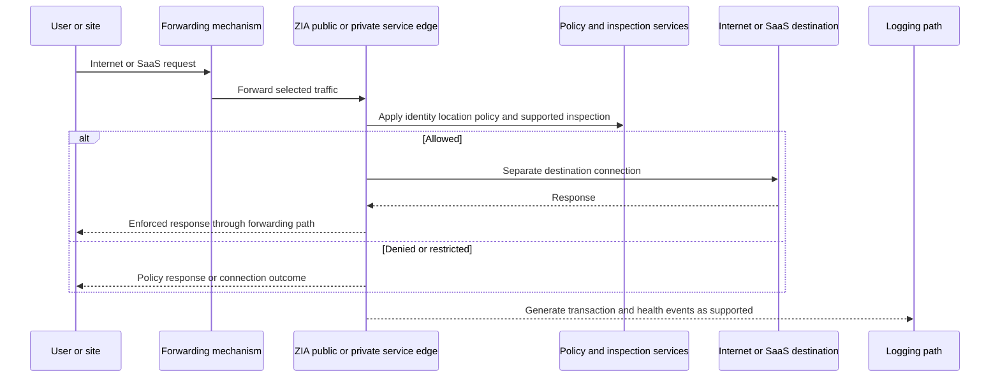

| ZIA path segment | Questions | Evidence |
|---|---|---|
| Endpoint/site to forwarding | Did intended traffic enter the method? | Client/PAC/router/tunnel evidence |
| Forwarding to edge | Which endpoint and path are active? | Tunnel/client logs, DNS, trace, transaction |
| Edge identity/location | How is user/location identified? | Authentication/location mapping and policy log |
| Policy/inspection | Which rule and capabilities applied? | Effective action and inspection fields |
| Edge to destination | Which DNS, route, egress, TLS, and app result? | Destination-side status and app evidence |
| Return to user | Were latency, reset, content, and user result correct? | Browser/client trace and timing |
| Event export | Did the event reach required store/SIEM? | Reconciliation and ingestion health |

The destination can behave differently based on the service egress IP or geography. SaaS Conditional Access, IP allowlists, geolocation, content localization, anti-abuse systems, and licensing can affect outcomes. Verify current supported egress controls rather than pinning assumptions to an edge city.

## ZPA traffic-flow model

Part 35 covers ZPA objects and components. At a logical level, the user-side path and application-side App Connector path meet through service roles under policy. The private app is not intended to require arbitrary inbound internet exposure.

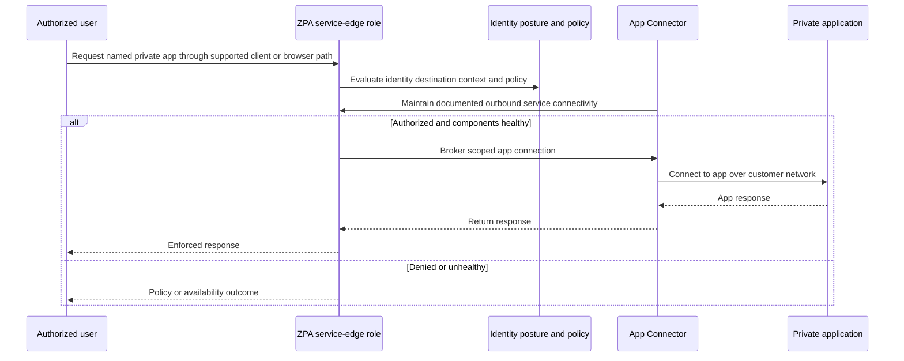

| ZPA segment | Common dependency | Failure example | Discriminating evidence |
|---|---|---|---|
| User to service role | Endpoint, DNS, ISP, TLS, client, auth | User cannot establish access path | Client and first-leg evidence |
| Identity/policy | IdP, group, posture, token, app match | Explicit deny or no segment | Effective identity/rule |
| App Connector to service | Outbound DNS/TLS/network, component health | Connector unavailable | Connector health and outbound path |
| Connector to app | Private DNS, route, firewall, listener, load balancer | Timeout/reset | Connector-side and server evidence |
| Application | App auth, authorization, dependency | HTTP 403/500 or business failure | App and dependency logs |
| Logging | Event generation/export | Missing or delayed access event | Tagged reconciliation |

ZPA service-edge behavior, connector selection, tunnel/session handling, and private-service-edge details must come from current authenticated help and observed tenant evidence. Do not invent proximity algorithms or assert that one connector handles a user because it appears closest on a diagram.

## Logging and telemetry path

Traffic and logs have different destinations and timing. A transaction can succeed while export fails. A policy block can generate a log even though no destination connection occurs.

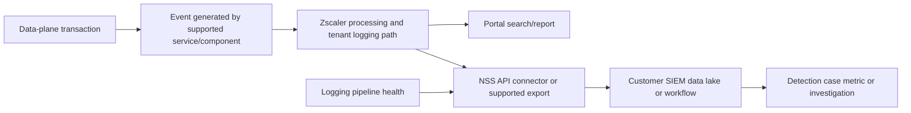

| Log stage | Failure mode | Evidence | Operational control |
|---|---|---|---|
| Event generation | Traffic bypassed or event type not enabled/supported | Forwarding and transaction comparison | Coverage test |
| Service processing | Delay or service issue | Portal versus live transaction timing | Latency baseline |
| Filtering/selection | Export scope excludes event | Export configuration and sample fields | Change review |
| Transport/export | NSS/API/connector network or auth failure | Queue, connection, error, retry evidence | HA and alerting |
| Parsing | Schema or timestamp interpreted incorrectly | Raw versus parsed event | Versioned parser and tests |
| Storage | Retention, quota, ingestion, index issue | Source count versus stored count | Capacity/retention monitoring |
| Detection | Rule assumes wrong field/grain | Known tagged event misses alert | Unit and replay tests |
| Access/privacy | Analyst lacks access or data is overexposed | RBAC and audit | Least privilege/minimization |

Nanolog, Nanolog Streaming Service, or NSS, APIs, connectors, fields, retention, and product-specific log behavior are covered in Part 41. For now, remember that "no SIEM event" does not establish "no Zscaler event," and "portal event" does not establish successful SIEM delivery.

## High availability, failover, failback, and maintenance

High availability, or HA, is the ability to continue required service despite defined failures. It is not a product checkbox or guarantee against every correlated event. Resilience requires independent failure domains, supported design, current endpoints, enough capacity, detection, transition behavior, and tested operations.

| Failure domain | Example | Design question | Validation |
|---|---|---|---|
| Endpoint | Client/service/process failure | Can user recover or use approved alternate? | Controlled restart/alternate device test |
| Access link | ISP circuit loss | Is there an independent link and route? | Link failover exercise |
| CPE/router | Device failure | Is forwarding redundant? | Device failover test |
| Tunnel | GRE/IPsec endpoint or negotiation failure | Are primary/secondary paths supported and monitored? | Tunnel withdrawal/failover test |
| Service edge/location | Maintenance or local service issue | Can supported selection move traffic? | Approved maintenance simulation |
| Private edge | VM/site/capacity failure | Is another instance/site available and current? | Component and site test |
| Identity | IdP or authentication dependency outage | What is approved continuity behavior? | Tabletop and controlled test |
| DNS | Resolver or record issue | Are resolvers/records resilient? | Resolver failover and cache test |
| Destination | SaaS/app outage | Can service distinguish and communicate it? | Direct owner/status/app evidence |
| Logging | Export/SIEM outage | Is data queued/retried/reconciled as supported? | Tagged event outage exercise |
| Control/management | Portal or distribution disruption | Does existing traffic continue as documented? | Current product continuity test plan |

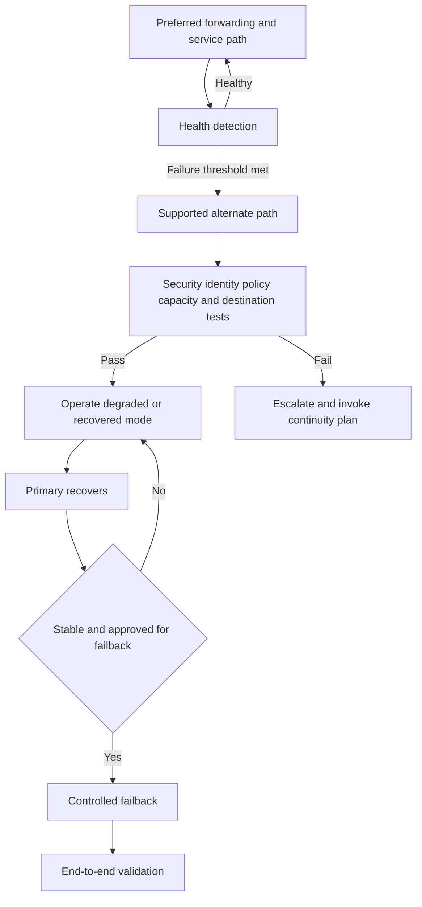

Failover has a detection interval and transition cost. Existing sessions may reset. DNS caches may retain old answers. Routes can converge at different times. A secondary tunnel can be administratively up but unable to carry production load. Failback can create a second disruption. Record recovery-time and recovery-point expectations for traffic and logs separately.

### Maintenance readiness

| Before | During | After |
|---|---|---|
| Confirm official notice, scope, cloud, components, and time zone | Monitor representative transactions, edge/path identity, latency, policy, and logs | Confirm preferred state, clear temporary actions, and reconcile events |
| Freeze unrelated risky changes | Preserve timestamps and avoid speculative changes | Validate positive, negative, security, and experience behavior |
| Test alternate path and capacity | Use agreed communication cadence | Record observed impact versus expectation |
| Verify contacts, escalation, rollback, and business owners | Separate provider, customer, carrier, and destination evidence | Update runbook and risk actions |

Do not route around announced maintenance in an unsupported way. Use official guidance and the customer's approved continuity design.

### Plain-English deep-dive 3 - Redundant is not independent

Two tunnels on the same router, circuit, provider, power feed, configuration object, and service endpoint look like two lines on a diagram but can fail together. They are redundant components without independent failure domains.

Independence must be named: different customer devices, links, carriers, routes, service endpoints, buildings, power, DNS resolvers, identity dependencies, or operational credentials. Absolute independence is rarely possible, so document shared dependencies and correlated-failure risk.

Testing matters because standby paths decay. Certificates expire, allowlists become stale, routes change, capacity assumptions drift, and people forget procedures. A successful failover six months ago is historical evidence, not current proof. Use scheduled, approved exercises and learn from every real transition.

## Latency, performance, and capacity

User-perceived time is the sum of several segments plus processing and application time. A proxy can add processing while a more direct path can remove backhaul; the net effect must be measured for the specific transaction.

$$
T_{total} = T_{endpoint} + T_{access} + T_{edge} + T_{egress} + T_{destination} + T_{application}
$$

In plain words, total time includes client work, local network/ISP, service-edge connection and policy/inspection, service-to-destination path, destination front door, and application/dependency processing. Retries and queueing can dominate each term.

| Segment | Example contributors | Evidence |
|---|---|---|
| Endpoint | CPU, client conflict, DNS cache, certificate, browser extension | Device metrics and client/browser timing |
| Access path | Wi-Fi, LAN, ISP, packet loss, MTU, tunnel overhead | Packet/path metrics and comparisons |
| Edge | Connection setup, policy, TLS inspection, file/data/threat processing | Transaction timing and supported telemetry |
| Egress | Edge-to-SaaS route, peering, loss, geography | Destination timing and provider evidence |
| Destination | CDN, WAF, load balancer, authentication | Server/CDN headers and logs |
| Application | Query, storage, API dependency, throttling | Application performance traces |

Capacity is multidimensional.

| Capacity surface | Saturation symptom | Common evidence | Caveat |
|---|---|---|---|
| Endpoint | CPU/memory pressure, local queue | Device metrics | Can look like network latency |
| Customer link | Loss, queue, throughput ceiling | Interface, QoS, carrier stats | Average hides microbursts |
| CPE/tunnel | Packet drop, CPU, session/throughput limit | Device/tunnel telemetry | Vendor test conditions differ |
| Private service edge | CPU/memory/session/throughput pressure | Component monitoring | Sizing is product/version/workload specific |
| Public service path | Service degradation | Official status/Support and transaction comparison | Customer cannot infer internal capacity |
| Destination | Rate limit, queue, server pressure | HTTP status/app metrics | More forwarding capacity will not fix it |
| Logging pipeline | Queue/backlog/dropped events | Export and ingestion metrics | Traffic can remain healthy |

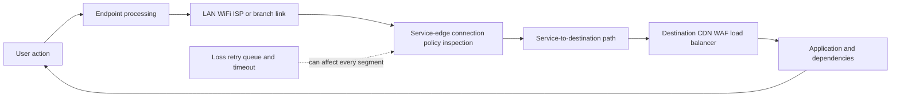

Use percentiles and transaction cohorts, not only averages. Compare before/after with same source, destination, operation, time window, forwarding, and inspection. A lower ping to an edge does not prove faster application performance. ICMP can be handled differently or blocked, and the app includes destination/application time.

## Dependencies and ownership boundaries

| Dependency | Customer responsibility questions | Zscaler/service questions | Destination/third-party questions |
|---|---|---|---|
| DNS | Resolver, split zones, firewall, cache, logging | Published service names and current requirements | App records/CDN answers |
| Identity | IdP health, groups, MFA, tokens, time | Integration and effective policy | SaaS/app authorization |
| Endpoint | OS, trust, client, profile, posture | Supported version/profile behavior | App/client compatibility |
| Network | LAN, ISP, routing, NAT, MTU, QoS | Current service ranges/endpoints/status | SaaS egress allowlist/path |
| Tunnels | CPE, keys, routing, failover | Supported endpoints/method/health | Usually not applicable to internet app |
| Private access | App DNS, firewall, connector reach, server | Service and policy roles | App auth/dependencies |
| TLS | Trust store, legal/privacy, client behavior | Supported inspection/service certificates | Origin certificate/protocol/pinning |
| Logs | Export component, network, SIEM, parser, retention | Event generation/API/stream behavior | App logs and correlation |
| Change | Customer approval and rollback | Notices, release/maintenance/support | SaaS/app changes |

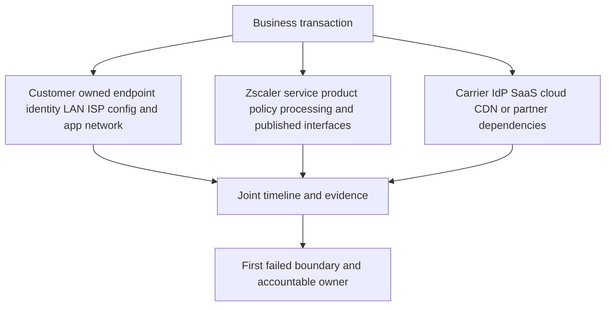

Shared responsibility is not blame allocation. It is a map for collecting evidence and coordinating action. During a critical incident, run parallel workstreams when independent dependencies are plausible.

## Path asymmetry and state

Forward path and return path can differ on the internet, across customer networks, or during failover. Asymmetry is not automatically a defect. It becomes relevant when a stateful device expects both directions, source validation rejects a path, NAT state differs, MTU differs, or evidence is collected on only one side.

| Asymmetry type | Example | Impact | Evidence |
|---|---|---|---|
| Customer routing | Outbound uses ISP A, return reaches ISP B | Stateful firewall/NAT drop | Both edge routers and flow state |
| Tunnel routing | Traffic enters primary tunnel, route returns through secondary | Session or source-location mismatch | CPE routes/tunnel counters |
| Internet route | Different autonomous systems by direction | Different loss/latency | Bidirectional/provider measurement where possible |
| Service failover | New sessions use alternate edge while old state persists | Mixed cohorts and intermittent symptoms | Session start and edge identity |
| Destination/CDN | Request reaches one front door, dependency another region | Variable performance/data behavior | App/CDN trace and headers |
| Logging | Event and traffic use separate paths | Traffic works while export fails | Pipeline-specific evidence |

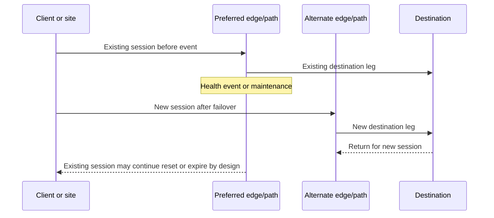

Packet captures at one point do not show the whole path. A SYN leaving the client without a SYN-ACK proves no response returned to that capture point; it does not identify which downstream boundary dropped it. Combine captures with tunnel counters, service logs, server observations, and controlled comparisons.

## Health checks and service objectives

A layered health model tests configuration, control state, traffic, security, destination, logging, and user outcome.

| Check | What it tests | What it misses | Frequency/owner question |
|---|---|---|---|
| Portal/API availability | Management access | Data plane and destination | Who needs it during incidents? |
| Config state | Intended object exists | Effective distribution/match | What version/time is active? |
| Component heartbeat | Component communicates | Real app transaction and capacity | What does heartbeat include? |
| Tunnel up | Negotiation/control state | Route, policy, destination, performance | Is traffic passing both ways? |
| Edge reachability | Transport to service endpoint | Authentication/inspection/app | Which protocol/source? |
| Synthetic web request | Selected web transaction | Non-web/private/app business step | Is identity/policy representative? |
| Private-app login | End-to-end access | Admin/export actions and data path | Which cohort and dependency? |
| Negative policy test | Denied path remains denied | All policy combinations | Is test safe and stable? |
| Log canary | Event reaches portal/export/SIEM | Other event types and volume | What is accepted delay? |
| Failover exercise | Alternate path and operations | Unmodeled correlated failures | When was last successful test? |

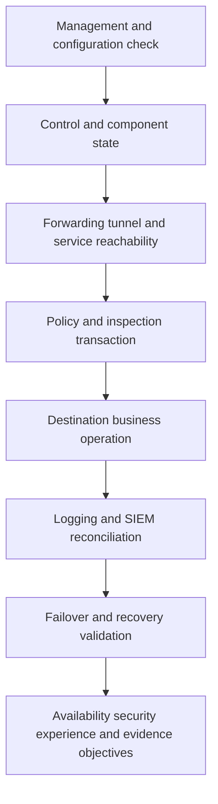

Service Level Agreement, or SLA, is a contractual commitment. Service Level Objective, or SLO, is an operational target. Service Level Indicator, or SLI, is the measurement. Do not quote a general web uptime number as the customer's contractual SLA. Confirm the applicable contract and product terms.

### Plain-English deep-dive 4 - "Up" has several meanings

A tunnel can be up because keepalives succeed while the route to the destination is missing. A service edge can accept TCP while authentication fails. An application can return a login page while payroll submission fails. Logs can show success while the user waits on a downstream API.

Every health statement needs a subject and verb: "The primary IPsec security association was established at 10:04 UTC," "the service accepted a TLS connection," or "the managed test user submitted a synthetic payroll query in 2.8 seconds and its event reached the SIEM in 90 seconds." Precision turns green/red into evidence.

Use a health hierarchy. Component checks are fast and help localize. End-to-end business checks are stronger but can be slower, stateful, and risky. Combine both. Protect synthetic accounts and data, and ensure monitoring itself does not create harmful load or false alerts.

## Failure scenarios

| Symptom | Plausible causes | Best first comparison | Do not assume |
|---|---|---|---|
| One site cannot reach ZIA | ISP, DNS, route, firewall, tunnel, CPE, edge endpoint | Same site alternate link and another site same cloud | Global ZIA outage |
| Remote users fail, offices work | Client profile/auth/local ISP/service path | Same user on known-good network; office versus client path | Policy is identical/effective |
| Tunnel shows up, no web works | Route, forwarding selection, return path, MTU, identity/location, policy | Counters plus tagged transaction | Up means usable |
| One SaaS app is slow | Destination/CDN, egress, TLS inspection, app dependency | Another SaaS and same app direct approved control | Service edge capacity |
| All apps slow at one site | Customer link, CPE, loss, tunnel, selected edge/path | Link metrics and alternate path | Destination issue |
| Policy changed but old behavior remains | Distribution, cached identity/session, wrong scope, bypass | New tagged session and effective rule | Hidden global delay |
| Private app fails for one connector group | Connector health/path/DNS/server | Another connector/path to same app | User-side edge issue |
| Failover occurs repeatedly | Threshold, unstable link, route changes, capacity, health check | Transition timeline and both-path metrics | Provider maintenance only |
| Destination rejects source IP | Changed egress, stale allowlist, geo/security policy | Destination logs and official current egress guidance | Zscaler policy denial |
| SIEM logs delayed | NSS/export/network/parser/ingestion/backlog | Portal event versus SIEM arrival | Traffic processing delayed |
| Portal unavailable, traffic works | Management-plane issue | Representative transactions | Entire service down |
| Traffic fails, portal works | Data-plane/forwarding/destination issue | First failed segment | Tenant config correct |

## Troubleshooting workflow

### Step 1: define transaction and timeline

Capture entity/site, source network, forwarding method, assigned cloud, destination, protocol, operation, active edge/tunnel if known, expected versus actual, start/end, time zone, frequency, and business impact. Record recent customer, provider, carrier, IdP, and destination changes.

### Step 2: identify product and plane

Is this ZIA internet/SaaS, ZPA private access, a private service edge, Client Connector, branch/workload path, or logging? Is the failure management, control, data, logging, destination, or uncertain? Avoid mixing portals and logs from different products.

### Step 3: map both directions and both proxy legs

Draw endpoint/site to service, service to destination, return paths, and event export. Mark DNS, route, tunnel, TLS, identity, policy, connector, app, and log dependencies.

### Step 4: compare one variable at a time

Compare site, ISP, tunnel, user, device, forwarding profile, service endpoint, destination, protocol, and time. An approved direct/bypass comparison changes enforcement and source egress, so treat it as a clue, not proof.

### Step 5: correlate evidence

Align clocks. Use transaction IDs where available. Collect minimum necessary client/tunnel/service/app/log evidence. Preserve the current Config portal values relevant to the assigned cloud and time; do not rely on a later snapshot.

### Step 6: correct and validate

Choose the smallest reversible action at the controlling boundary. Validate required transactions, prohibited paths, failover, performance, logging, and stability after failback.

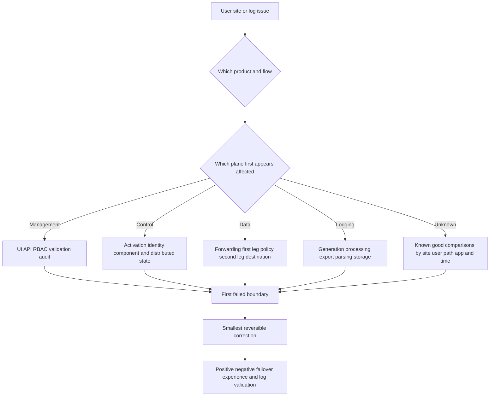

### Edge/path decision tree

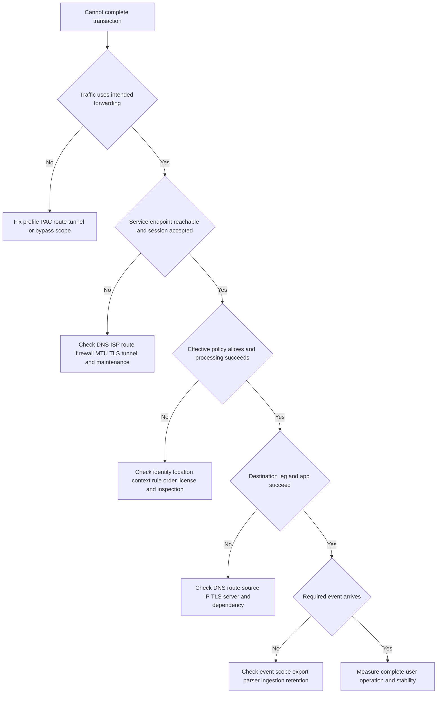

## Escalation evidence package

| Field | Why Support/owners need it | Privacy note |
|---|---|---|
| Tenant/assigned cloud/product | Routes case to correct service context | Do not expose credentials |
| Exact UTC and local timestamps | Correlates distributed logs | Include time zone and clock quality |
| Source entity/location/address as approved | Identifies cohort and path | Minimize personal/source data |
| Forwarding method/profile/tunnel | Establishes entry path | Redact secrets and keys |
| Observed service endpoint/path | Narrows location/failure domain | Use current evidence, not assumption |
| Destination/protocol/operation | Makes issue reproducible | Protect sensitive URLs/parameters |
| Effective identity/policy result | Separates access from path | Do not attach raw tokens |
| Client/CPE/component versions and health | Finds compatibility/state differences | Use approved inventory |
| Both-leg/network evidence | Identifies timeout/reset/loss boundary | Capture minimum packets/content |
| Destination/app evidence | Separates service from origin | Coordinate app owner |
| Logging/export evidence | Shows telemetry gap versus traffic | Redact content and identifiers |
| Recent changes and comparisons | Tests causality | Mark facts versus hypotheses |
| Business impact and workaround | Sets priority and risk | Avoid unsupported severity inflation |

## Fictional NMH design and incident

NMH has three synthetic campus sites, remote users, two internet providers at its headquarters, one provider at smaller branches, Microsoft 365, public SaaS, and private manufacturing apps. The design below is a learning hypothesis, not a recommendation or actual deployment.

### NMH logical target

| Cohort | Intended flow | Resilience hypothesis | Validation |
|---|---|---|---|
| Remote managed users | Client Connector to supported public service path | Network/path reselection under documented behavior | User/app/log tests on two networks |
| Headquarters internet | Redundant site forwarding over independent links | Supported primary/alternate tunnel or route design | Link/tunnel/service failover exercise |
| Branch internet | Supported site forwarding with local continuity plan | Single link risk documented; optional second link assessed | Outage tabletop and business owner decision |
| Private manufacturing app | ZPA user path plus redundant App Connector placement | Connector/app path and service continuity | Positive/negative and connector failure tests |
| Local regulated app | Evaluate currently entitled private-service-edge option | Private capacity, synchronization, site failure, cloud reconnection | Specialist-led design and continuity test |
| Logs | Supported export to SIEM with monitoring | Export component/path redundancy and reconciliation | Tagged event canary |

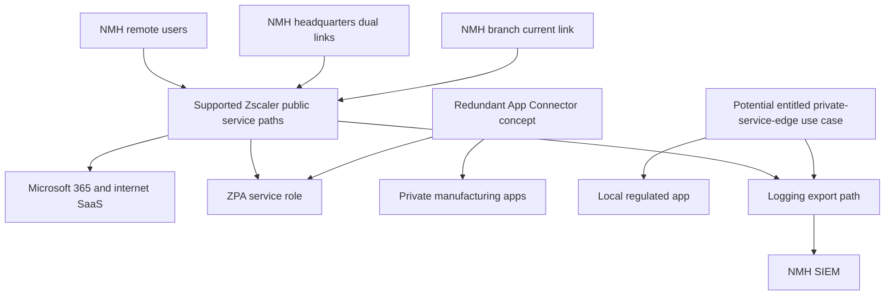

### NMH incident: intermittent payroll delays

At 09:10 UTC, headquarters users report 40-second payroll page loads. Remote users are normal. Microsoft 365 is normal. The Zscaler portal is reachable. A recent network change moved site traffic to a secondary ISP. No conclusion is yet justified.

| Hypothesis | Prediction | Check | Synthetic result |
|---|---|---|---|
| Zscaler global outage | Other sites/products should fail | Remote/branch representative tests | Falsified; normal |
| Payroll origin slow globally | Remote payroll also slow | Same operation from remote cohort | Falsified; 3 seconds |
| HQ access path impaired | Other HQ destinations show loss/latency | Path and packet metrics | Partial support; loss on secondary ISP |
| Different service path/egress affects payroll | Active endpoint/path differs after route change | Transaction and route comparison | Supported; changed path observed |
| Policy/inspection causes delay | Processing timing/rule differs | Effective policy and timing | Falsified; same rule, low processing time |
| Destination treats new source differently | Origin/CDN timing differs by egress | App/CDN logs and controlled test | Supported; destination anti-abuse delay |

The root cause in the synthetic scenario is a destination-side anti-abuse policy combined with the changed source path, with packet loss as a contributing user-experience factor. The corrective plan coordinates NMH network and app owners, validates current supported egress behavior, removes an obsolete destination assumption, and tests both ISP paths. It does not force an undocumented edge or disable inspection.

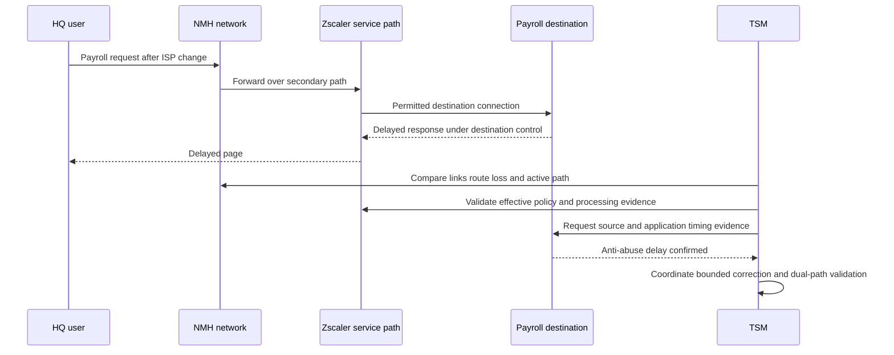

## Your experience bridge to Zscaler

| prior production strength | Part 32 transfer | New Zscaler learning | Honest language |
|---|---|---|---|
| OneDrive/SharePoint endpoint-to-cloud mapping | User/site-to-edge-to-destination mapping | Product forwarding and service-edge evidence | "I know the method; I would verify Zscaler-specific state." |
| DNS/TCP/TLS/HTTP trace analysis | First leg, service processing, second leg | Edge/path identifiers and logs | "I would localize, not infer internals." |
| Proxy/PAC troubleshooting | Explicit path and bypass reasoning | ZIA forwarding profiles and policy | "PAC experience is adjacent, not ZIA deployment proof." |
| Service health versus user evidence | Plane and scope separation | Zscaler status/support surfaces | "A green portal is one signal." |
| Critical-situation coordination | Parallel ISP, identity, Zscaler, app, and logging tracks | Product support/escalation process | "I preserve evidence and owner boundaries." |
| Fix validation | Failover, failback, security, experience, and logs | Supported resilience tests | "Recovery includes path and policy correctness." |
| Power BI/SQL analytics | Baselines, percentiles, path cohorts, log reconciliation | Zscaler schemas and limits | "I validate grain and completeness before conclusions." |

### 30-second interview bridge

"I model Zscaler traffic as several planes and paths rather than one cloud icon. Management creates configuration, control functions make usable state available, the data plane carries user or workload traffic through a selected service edge to the destination, and a separate logging path carries evidence. I would confirm the assigned cloud, forwarding method, observed endpoint, both connection legs, policy, destination, and event export. My Microsoft 365 background gives me strong DNS, TCP, TLS, HTTP, proxy, service-health, and escalation discipline. Zscaler edge selection, forwarding objects, and private service edges are product-specific areas I have studied but not operated in production."

## TSM operational review

| Review area | Questions | Artifact |
|---|---|---|
| Cloud assignment | Which cloud, portals, current Config requirements, and regions apply? | Cloud dependency sheet |
| Traffic inventory | Which users/sites/workloads/apps/protocols use each path? | Flow inventory |
| Forwarding | Which method, primary/alternate, bypass, identity mode, and owner? | Forwarding matrix |
| Edge/service | Which public/private roles and current health requirements? | Service-role map |
| Planes | Which management, control, data, and logging dependencies? | Plane map |
| Resilience | Which failures are independent versus shared? | Failure-domain analysis |
| Capacity | Which links/components/apps/log paths have headroom? | Baseline and thresholds |
| Performance | Which complete transactions and percentile targets matter? | Latency budget |
| Security | Does failover preserve policy, inspection, identity, and logging? | Security validation suite |
| Maintenance | Notices, contacts, freeze, monitoring, escalation, rollback? | Maintenance runbook |
| Currency | How are Config changes and component upgrades tracked? | Changelog review process |
| Evidence | Which logs/traces prove each boundary and how are they protected? | Evidence dictionary |

## Labs and rehearsal

All labs must use owned/synthetic systems and approved tooling. Do not route real customer traffic or probe Zscaler infrastructure without authorization.

### Lab 1: plane sort

Classify 30 synthetic events as management, control, data, logging, analytics, destination, or mixed. Explain why portal availability does not settle a data-plane incident.

### Lab 2: Config portal observation

Open the official Config portal for a chosen public cloud context. Record the review date, section names, status labels, and change-management guidance without copying operational ranges into the guide. Explain why aggregate guidance and changelog review matter.

### Lab 3: DNS and route

In an owned lab, resolve a service hostname through two resolvers and compare answers/TTL. Trace the route where permitted. Explain why neither result proves the exact Zscaler selection algorithm.

### Lab 4: GRE versus IPsec teach-back

Draw encapsulation, outer endpoints, routing, MTU, health, and failover for GRE and IPsec. State that current Zscaler requirements and identity behavior must be verified.

### Lab 5: PAC failure

Create a safe local PAC file with proxy/direct decisions. Demonstrate caching, syntax, and fallback effects. Do not present the local proxy as ZIA.

### Lab 6: two-leg timing

Use an owned reverse/forward proxy lab to separate client-to-proxy and proxy-to-origin timing. Add a slow origin and show that edge reachability can remain healthy.

### Lab 7: log canary

Generate tagged synthetic events and reconcile source, proxy, collector, parser, and store counts. Measure latency and clock skew.

### Lab 8: failover tabletop

Choose ISP, tunnel, edge, identity, DNS, private-edge, destination, and logging failures. For each, name detection, alternate, transition impact, security check, and failback criterion.

### Lab 9: asymmetry

Draw different forward and return routes through two routers. Explain where stateful firewall/NAT evidence is needed and why one capture is incomplete.

### Lab 10: latency budget

Build a synthetic waterfall with endpoint, access, edge, egress, destination, and app segments. Change one variable and compare p50, p95, and p99 without claiming causality from averages.

### Lab 11: NMH incident

Recreate the payroll hypothesis table. Have a partner reveal evidence one item at a time. Stop when the first failed boundary is supported, then propose a reversible correction and validation.

### Lab 12: escalation package

Create a sanitized one-page package with cloud/product, UTC times, source cohort, forwarding, observed path, destination, effective rule, comparisons, changes, impact, and requested specialist action.

## Common misconceptions to correct

| Misconception | Corrected understanding |
|---|---|
| Zscaler cloud is one data center | It is a distributed service platform with cloud/product/path context |
| Service edge means physical appliance | It is a logical service role; implementation can be distributed |
| Public Service Edge exposes private apps publicly | Public refers to service placement; intended ZPA apps remain privately reached through connectors |
| Private Service Edge is the same in ZIA and ZPA | Product functions and dependencies differ; verify current documentation |
| App Connector is a service edge | It is a ZPA application-side component with a different role |
| Portal works, so service works | Management-plane reachability does not prove data plane |
| Policy saved, so policy enforced | Distribution, matching, session state, and data-plane observation matter |
| Tunnel up means internet/app works | Tunnel control state does not prove routes, policy, destination, or performance |
| DNS chooses the fastest edge | DNS supplies records; selection also depends on product logic and routing |
| Anycast always reaches closest city | BGP policy and network conditions decide routes, not geography alone |
| Peering guarantees low latency | Congestion, policy, failure, and destination processing remain |
| Fewer traceroute hops means faster | Hidden/rate-limited hops and processing make hop count weak |
| One published IP should be permanently allowlisted | Use current official aggregate/configuration guidance and change process |
| Two tunnels equal HA | Shared router/link/provider/config can create one failure domain |
| Failover is instantaneous and sessionless | Detection, convergence, resets, and failback behavior must be tested |
| Public-cloud scale proves private-edge capacity | Customer-deployed sizing and workload need current guidance and measurement |
| Ping measures application experience | Complete transactions include TLS, policy, destination, and application time |
| More throughput fixes every slow app | Destination, loss, queueing, inspection, and app processing may dominate |
| Symmetry is always required | Asymmetry can be normal; stateful dependencies determine impact |
| No SIEM event means no transaction | Event generation, export, parsing, storage, and delay can fail separately |
| Bypass success proves edge fault | It changes path, policy, inspection, source IP, and possibly DNS |
| Official website proves license | Contract, tenant entitlement, cloud, status, and feature configuration control |
| This Part proves hands-on Zscaler skill | It proves conceptual preparation and synthetic evidence practice |

## Official Source Anchors

Sources in this section were reviewed on **2026-08-24**.

All pages were reviewed on **2026-08-24**. Zscaler sources establish current public terminology and configuration surfaces; IETF documents establish protocol concepts. Live configuration values are intentionally not reproduced because they change. Authenticated help, the assigned-cloud Config view, release notes, contract, and Support control production design.

| Source | URL | Used for | Boundary |
|---|---|---|---|
| Zscaler Config | https://config.zscaler.com/ | Current Cloud Enforcement Node ranges, data-center/status labels, aggregate guidance, component configuration sections, changelog context | Values and labels change; use assigned-cloud current view |
| Zero Trust Exchange | https://www.zscaler.com/products-and-solutions/zero-trust-exchange-zte | Distributed cloud platform and proxy/service story | Marketing architecture, not selection internals |
| Zscaler Internet Access | https://www.zscaler.com/products-and-solutions/zscaler-internet-access | Cloud-native internet/SaaS service and direct-to-cloud positioning | Forwarding, feature, capacity, and performance require tenant proof |
| Zscaler Private Access | https://www.zscaler.com/products-and-solutions/zscaler-private-access | Public/private app access and private service-edge capability context | Component mechanics and entitlement require current help |
| ZTNA for On-Premises Users | https://www.zscaler.com/products-and-solutions/ztna-on-premises | ZPA Private Service Edge, Private Cloud Controller, local/continuity public positioning | Vendor claims and feature availability require validation |
| IETF RFC 1034 | https://www.rfc-editor.org/rfc/rfc1034 | DNS concepts and architecture | Does not describe Zscaler selection |
| IETF RFC 1035 | https://www.rfc-editor.org/rfc/rfc1035 | DNS implementation/resource-record foundation | Modern DNS has later updates |
| IETF RFC 4786 | https://www.rfc-editor.org/rfc/rfc4786 | Anycast operational considerations | Does not prove any specific Zscaler address is anycast |
| IETF RFC 4271 | https://www.rfc-editor.org/rfc/rfc4271 | BGP-4 routing foundation | Provider policies and implementation are external/current |
| IETF RFC 2784 | https://www.rfc-editor.org/rfc/rfc2784 | GRE encapsulation | Zscaler GRE requirements require current help |
| IETF RFC 4301 | https://www.rfc-editor.org/rfc/rfc4301 | IPsec security architecture | Zscaler IPsec profiles/selectors require current help |

## Likely Interview Questions

### Q1. What is a Zscaler service edge?

**Model answer:** A service edge is a logical role where supported traffic is accepted, brokered, inspected, or policy-enforced near the traffic path. A public service edge is Zscaler-hosted in the cloud context; private service-edge offerings place supported functions in a customer-controlled environment. ZIA and ZPA uses differ, and an App Connector is not a service edge. I would verify the product, assigned cloud, placement, entitlement, component ownership, and actual transaction path.

### Q2. How do management, control, data, and logging planes differ?

**Model answer:** The management plane is where authorized admins create configuration. Control functions validate, distribute, and coordinate state. The data plane carries and enforces real user or workload traffic. The logging path generates, processes, stores, and exports evidence. A portal can work while traffic fails, traffic can work while export fails, and a saved policy can differ from observed enforcement, so I validate each plane separately.

### Q3. How is a service edge selected?

**Model answer:** It depends on the product and forwarding method. Configured endpoints, DNS, routing, tunnel priority, client logic, source/location context, health, and reachability can contribute. Anycast and peering are networking concepts, not proof of one proprietary algorithm. I would use current documentation and observed client, tunnel, DNS, route, and transaction evidence rather than claim Zscaler always chooses the geographically closest edge.

### Q4. Compare common ZIA forwarding methods.

**Model answer:** Client Connector steers supported endpoint traffic and can provide user/device context. Explicit proxy and PAC configure proxy-aware web traffic. GRE encapsulates selected site traffic without providing IPsec confidentiality by itself. IPsec adds protected tunnel state and negotiation. Branch/private-edge patterns cover other supported use cases. Choice depends on traffic, identity, platform, resilience, security, operations, and current entitlement; each method needs path, policy, bypass, MTU, and failover testing.

### Q5. How do ZIA and ZPA traffic flows differ at a high level?

**Model answer:** ZIA forwards internet/SaaS traffic to an appropriate service edge, applies supported identity/policy/inspection, and makes a destination connection to the public service. ZPA evaluates a user's named private-app request while App Connectors maintain outbound service connectivity and reach the private app over the customer network. Both use policy and separate logical legs, but their components, destinations, logs, and failure modes differ.

### Q6. What makes a forwarding design highly available?

**Model answer:** More than two configured paths. The alternatives need meaningful failure-domain independence, current endpoints, valid routes and policy, enough capacity, supported detection and transition behavior, logging, owners, and tested failback. I would test endpoint, link, CPE, tunnel, service-edge, identity, DNS, destination, private-edge, and logging failures. I would also verify that failover preserves security controls, not just connectivity.

### Q7. How would you investigate a slow application through Zscaler?

**Model answer:** I would define the exact operation and divide time into endpoint, local/ISP, service-edge setup and processing, edge-to-destination, destination front door, and application/dependency processing. I would compare representative cohorts one variable at a time, use percentiles, inspect loss/retries/TLS/HTTP and effective policy, and correlate destination logs. Ping, city labels, bypass success, or a green dashboard alone cannot assign cause.

### Q8. How does your prior background help with service-edge troubleshooting?

**Model answer:** I have production experience correlating endpoint, DNS, TCP, TLS, HTTP, proxy, Microsoft service, permissions, traces, and health across critical M365 escalations. That transfers to plane separation, path mapping, known-good comparisons, timestamp correlation, owner coordination, and fix validation. I have studied Zscaler's public edge and forwarding model and built synthetic exercises, but Zscaler-specific GRE/IPsec, selection, private-edge, and log operation remain product ramp areas.

## 30-Second Memory Hooks

| Concept | Memory hook |
|---|---|
| Zscaler cloud | Assigned global service environment |
| Data center | Building, not one logical product |
| Service edge | Where policy meets traffic |
| Public edge | Vendor-hosted service role |
| Private edge | Privately placed, product-specific role |
| App Connector | Outbound bridge toward private apps |
| Management plane | Configure |
| Control plane | Coordinate and distribute |
| Data plane | Carry and enforce |
| Logging plane | Report and export |
| Forwarding | Put traffic on intended road |
| PAC | Conditional proxy directions |
| GRE | Simple IP wrapper |
| IPsec | Protected IP tunnel |
| DNS | Returns records, not path guarantees |
| Anycast | Same address, routing chooses a door |
| Peering | Networks exchange routes |
| Nearest | Define and measure the metric |
| HA | Independent paths plus tested behavior |
| Failover | Detect, transition, validate |
| Failback | Return only after stability |
| Asymmetry | Out one road, back another |
| Latency | Endpoint plus access plus edge plus app |
| Capacity | Headroom at every bottleneck |
| Health | Name exactly what passed |
| Config portal | Current values beat memorized values |
| Troubleshooting | Product, plane, path, first failure |
| Experience bridge | Trace discipline transfers; mechanics are new |

## Completion Checklist

- [ ] I can explain the Zscaler cloud without drawing one unexplained cloud icon.
- [ ] I know an assigned cloud, data center, service edge, cluster label, and customer path are different concepts.
- [ ] I never memorize or reproduce live service ranges as permanent design data.
- [ ] I can use the current official Config portal and changelog process.
- [ ] I can distinguish ZIA and ZPA public/private service-edge terminology.
- [ ] I do not call an App Connector, Client Connector, or branch firewall a service edge.
- [ ] I can explain how private placement changes shared responsibility.
- [ ] I can draw management, control, data, logging, and analytics planes.
- [ ] I know portal availability does not prove data-plane health.
- [ ] I know saved policy does not prove distribution, matching, or observed enforcement.
- [ ] I can explain a configuration lifecycle without claiming proprietary replication internals.
- [ ] I can define selection and list documented/evidenced inputs without inventing an algorithm.
- [ ] I can explain DNS, unicast, anycast, BGP, peering, PAC, tunnels, and client logic at an orientation level.
- [ ] I never say anycast guarantees the geographically closest or fastest edge.
- [ ] I can explain why "nearest" needs a metric and an actual measurement.
- [ ] I can compare Client Connector, explicit proxy, PAC, GRE, IPsec, branch, private-edge, and browser patterns.
- [ ] I treat bypass as a governed coverage boundary, not a casual fix.
- [ ] I can draw a high-level ZIA flow from forwarding to edge to internet/SaaS and logs.
- [ ] I can draw a high-level ZPA flow from user and connector paths to a private app.
- [ ] I do not invent service-edge or connector-selection mechanics.
- [ ] I can separate event generation, service processing, export, parsing, storage, and detection.
- [ ] I know traffic can work while SIEM export fails.
- [ ] I can define HA as resilience to specified failures, not a checkbox.
- [ ] I can identify shared failure domains behind apparently redundant paths.
- [ ] I can explain failover detection, transition, session impact, capacity, and failback.
- [ ] I can prepare for maintenance with current notice, scope, tests, contacts, and rollback.
- [ ] I can build a latency budget across endpoint, access, edge, egress, destination, and application.
- [ ] I use percentiles and matched cohorts rather than averages alone.
- [ ] I can distinguish customer-link, CPE/tunnel, private-edge, public-service, destination, and log capacity.
- [ ] I never infer provider internal capacity from customer symptoms alone.
- [ ] I can map customer, Zscaler, carrier/IdP, and destination responsibilities without blame.
- [ ] I can explain when path asymmetry matters to stateful devices and evidence.
- [ ] I know one packet capture cannot identify every downstream drop.
- [ ] I can distinguish component, path, transaction, policy, logging, and business health.
- [ ] I can define SLA, SLO, and SLI and verify contractual applicability.
- [ ] I can work the failure-scenario matrix without global conclusions from local symptoms.
- [ ] I can run the product-plane-path troubleshooting workflow.
- [ ] I can use both decision trees and stop at the first supported failed boundary.
- [ ] I can create a sanitized escalation evidence package.
- [ ] I can explain the fictional NMH design and payroll incident without presenting either as production.
- [ ] I can deliver your 30-second bridge with a clear product-operation boundary.
- [ ] I can run the twelve labs on owned/synthetic systems only.
- [ ] I can cite the dated official Zscaler and IETF source anchors.
- [ ] I state cloud, product, license, UI, feature, status, region, address, and currency caveats.
- [ ] I can answer Q1-Q8 concisely, then expand with architecture, evidence, health, and limitations.

[Part 33 - Identity, Device Posture, Context, Policy, and Adaptive Access](Part-33-zscaler-identity-context-policy.md)