# Part 33 - Identity, Device Posture, Context, Policy, and Adaptive Access

> **Audience:** Arti Thakur, preparing for a Zscaler Security Operations Technical Success Manager role after Microsoft enterprise Support Escalation Engineering.
>
> **Purpose:** Explain how identity providers, federation, provisioning, user/group attributes, device and workload identity, posture, context, risk, policy criteria/order, least privilege, continuous/adaptive decisions, step-up authentication, reduced access, isolation, privacy, evidence, and troubleshooting fit together.
>
> **Scope and honesty:** Northstar Meridian Holdings, abbreviated NMH, is fictional. Every NMH user, group, device, workload, policy, risk signal, token, posture result, incident, metric, and outcome is synthetic. Arti has Microsoft 365 identity, permissions, client, network, escalation, analytics, mentoring, and training experience, but production configuration of Zscaler identity, posture, adaptive access, ZIA, ZPA, or Client Connector is not established.
>
> **Currency caveat:** The source snapshot is **2026-08-24**. Zscaler identity integrations, posture capabilities, policy objects, rule order, supported attributes, adaptive actions, user interfaces, APIs, licenses, previews, regions, and product relationships change. Standards also receive updates. Confirm current authenticated help, release notes, contract, tenant entitlements, IdP/MDM/EDR documentation, privacy/legal requirements, and specialist guidance before production use.

## Section goal

An access decision is not simply "Alice is in Finance, so allow." A production decision asks whether the current requester is truly Alice, which device or workload she is using, whether the identity and device evidence is fresh, which resource and operation are requested, what risk and business context apply, which rule wins, what action is supported, and how the decision is explained and audited.

Think of an airport journey. A passport identifies a traveler. A boarding pass links that traveler to a flight. Security screening evaluates current conditions. A staff badge may permit one restricted door but not another. A delayed background-system update can leave a canceled traveler on a list. Each artifact has an issuer, audience, validity period, and purpose. One document cannot safely answer every question.

The analogy has limits. Digital identity can represent users, devices, workloads, services, and partners. Tokens can be copied or replayed if poorly protected. Group and posture data travel through several systems. Risk is modeled, not observed perfectly. Adaptive access can protect a high-risk transaction, but opaque or overaggressive policy can lock out legitimate users and harm privacy. This Part treats security, availability, explainability, and governance together.

By the end, Arti should be able to:

| Outcome | Demonstrated capability | Proof artifact |
|---|---|---|
| Separate identity functions | Distinguish proofing, enrollment, authentication, federation, provisioning, and authorization | Lifecycle map |
| Explain IdP integration | Trace a federated sign-in without confusing the IdP and service provider | Sequence diagram |
| Explain attributes | Map users/groups/claims to policy with source and freshness | Attribute dictionary |
| Explain provisioning | Describe SCIM-style create/update/deactivate flows and drift | Reconciliation plan |
| Explain device identity | Separate a device record, certificate, management state, posture, and user | Device evidence map |
| Explain workload identity | Use service-specific, short-lived identity rather than a human analogy alone | Workload flow |
| Model context/risk | Name source, age, confidence, failure behavior, and privacy for each signal | Context register |
| Design policy | Use subject, resource, operation, context, action, priority, exceptions, and owner | Policy matrix |
| Explain order | Distinguish configured rules from effective outcome | Rule trace |
| Apply least privilege | Grant the smallest useful resource/operation under appropriate conditions | Access design |
| Explain adaptive access | Use supported step-up, reduced access, isolation, or denial under governance | State model |
| Diagnose staleness | Find stale groups, posture, token, session, certificate, and clock problems | Timeline |
| Protect privacy | Minimize, purpose-limit, retain, and control identity/context telemetry | Privacy assessment |
| Test policy | Run positive, negative, boundary, failure, performance, and rollback tests | Test suite |
| Explain decisions | Produce a reason chain that a user, analyst, and auditor can understand | Decision record |
| Bridge experience | Transfer M365 identity/permission troubleshooting without overstating Zscaler skills | Interview narrative |

## JD Mapping

| Role expectation | Part 33 capability | TSM artifact | Arti bridge and boundary |
|---|---|---|---|
| Analyze complex environments | Trace HR/directory, IdP, provisioning, endpoint, posture, policy, app, and logs | Identity dependency map | Microsoft identity/permissions work transfers |
| Identify security risk | Find stale identities, overbroad groups, weak assurance, unmanaged devices, and fail-open context | Access risk register | Formal risk ownership remains customer-side |
| Tailor mitigation | Choose lifecycle correction, narrower rule, stronger auth, reduced access, or compensating control | Options record | Actions depend on current license/support |
| Resolve escalations | Separate authentication, provisioning, posture, policy, connection, and app authorization | Hypothesis matrix | Product log/UI mechanics are a ramp area |
| Advocate best practices | Stage policy, explain impact, test failure behavior, govern exceptions | Policy rollout plan | Change discipline transfers directly |
| Partner across teams | Coordinate HR, identity, endpoint, SOC, app, privacy, risk, and Support | RACI | Cross-functional Microsoft work transfers |
| Consult and train | Teach identity lifecycle and reason chains from zero | Workshop/teach-back | Mentoring/training is a strength |
| Communicate outcomes | Translate context-aware access into bounded risk and user friction | Executive narrative | Avoid claims of automatic risk elimination |

## Candidate honesty note

The approved background supports factual discussion of production troubleshooting for Microsoft 365 sign-in context, users, groups, permissions, clients, browser/network evidence, authorization symptoms, and service dependencies. Standards and synthetic Zscaler policy models can be explained separately. Production IdP integration with Zscaler, posture-profile creation, adaptive-access tuning, and Client Connector policy operation are not established experience.

| Claim class | Safe Part 33 statement | Unsupported conversion |
|---|---|---|
| Production | "I separated M365 identity, permissions, client state, network path, and service authorization in customer cases." | "I administered ZPA identity policy." |
| Demonstrated/lab | "I built a synthetic user/group/posture policy and tested stale-state scenarios." | "I deployed adaptive access enterprise-wide." |
| Conceptual | "Client Connector publicly provides device-posture context that can inform adaptive access." | "Every tenant has every EDR/MDM signal and action." |
| Not yet used | "Direct production configuration of Zscaler posture or IdP integration is not part of my current experience." | "Entra ID experience equals Zscaler console experience." |
| Unknown | "The effective attribute, posture age, token, rule, and action are unknown until transaction evidence shows them." | "Directory membership proves current policy input." |

Authentication success does not establish authorization, safety, or entitlement. Device compliance does not guarantee absence of compromise. A risk score does not transfer risk ownership to a vendor. Step-up, isolation, or reduced access must be supported, licensed, configured, lawful, usable, and tested. Public integration names do not prove a tenant deployed them.

## Beginner vocabulary and memory hooks

| Term | Plain meaning | Why it matters | Memory hook |
|---|---|---|---|
| Identity proofing | Establishing evidence that a real-world subject is who they claim | Weak enrollment undermines later authentication | Check the person first |
| Enrollment | Binding an account or authenticator to a subject | It creates the credentials later used | Issue the key |
| Authentication | Verifying a presented identity/credential now | It answers who or what is present | Prove who |
| Authorization | Deciding what an authenticated subject may do | Login is not permission | Decide what |
| Identity Provider | IdP; system that authenticates and issues assertions/tokens to relying services | Zscaler can rely on third-party identity evidence | Passport office |
| Service Provider | In SAML, the application/service relying on an IdP assertion | Roles must not be reversed | Destination trusts assertion |
| Federation | One domain relying on another domain's identity assertion | It reduces separate passwords but adds trust dependencies | Trust the issuer, verify the letter |
| Provisioning | Creating, updating, disabling, and deleting identity records/attributes | Sign-in can succeed while policy data is stale | Maintain the guest list |
| SCIM | System for Cross-domain Identity Management | Standard HTTP/JSON model for users/groups lifecycle | Sync the directory objects |
| Attribute | A property such as department, status, or employee type | Policy often matches attributes | Identity fact candidate |
| Group | Collection of identities used for administration/policy | Overbroad or stale membership grants wrong access | Reusable guest list |
| Claim | Statement in a token/assertion about subject or authentication | It must be validated and interpreted in context | Signed statement |
| Token | Security artifact carrying claims or authorization | Theft, audience, expiry, and replay matter | Temporary security envelope |
| Session | Ongoing authenticated state between events | It can outlive a directory or posture change | Remembered visit |
| Device identity | Evidence identifying a particular endpoint | User identity alone cannot describe device trust | Which machine |
| Posture | Current evaluated security condition of a device | It can change after enrollment | Is the machine fit now |
| Managed device | Device under an organization's management authority | Managed is not identical to healthy | Enrolled, not invincible |
| Workload identity | Identity for software/service, not a human | Shared secrets and human accounts create risk | Service gets its own badge |
| Context | Conditions relevant to a decision | Same identity can receive different outcomes | What is true now |
| Risk signal | Evidence affecting concern/confidence | Signals have errors and staleness | Reason for caution |
| Step-up authentication | Require stronger/recent authentication for higher risk | Increases assurance for sensitive action | Ask for stronger proof |
| Reduced access | Permit a safer subset instead of full access | Balances security and business continuity | Smaller room |
| Isolation | Run/render activity in a controlled environment where supported | Limits direct endpoint interaction but has compatibility limits | Use a viewing booth |
| Continuous evaluation | Reassess trust/context over time or events | Initial login is not permanent truth | Keep checking relevant change |
| Explainability | Ability to show which facts/rules produced an outcome | Users and analysts need correct remediation | Show the reason chain |
| Fail closed | Deny/restrict when required evidence is unavailable | Safer for risk, potentially disruptive | No proof, no entry |
| Fail open | Allow when a dependency/evidence is unavailable | Preserves access but can increase risk | Missing proof, still enter |

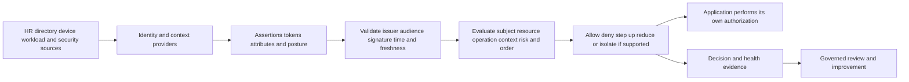

## Identity lifecycle: proof, enroll, authenticate, provision, authorize, remove

Identity is a lifecycle, not a login page. NIST SP 800-63-4 separates identity proofing, authentication, and federation guidance. Enterprise systems also need authoritative lifecycle and access governance.

| Lifecycle stage | Question | Evidence | Failure risk |
|---|---|---|---|
| Join/identity proof | Is this the correct person/organization/workload? | HR/vendor/sponsor/technical attestation | False or duplicate identity |
| Enroll | Which account and authenticators are bound? | Enrollment and credential record | Weak or wrong binding |
| Provision | Which downstream user/group/attribute objects exist? | SCIM/API/sync result and reconciliation | Missing/stale/duplicate object |
| Authenticate | Did the subject prove possession/control now? | IdP/authentication log and assertion/token | Credential theft or weak assurance |
| Authorize | Which resource/operation is permitted? | Effective policy plus app authorization | Excess or missing privilege |
| Monitor | Are identity, posture, risk, and use still acceptable? | Telemetry and review | Compromise/staleness missed |
| Change | Did role/device/contract/context change? | Authoritative event and downstream update | Privilege accumulation |
| Leave/remove | Are sessions, credentials, accounts, groups, and access revoked? | Deprovision/revocation reconciliation | Orphan access |

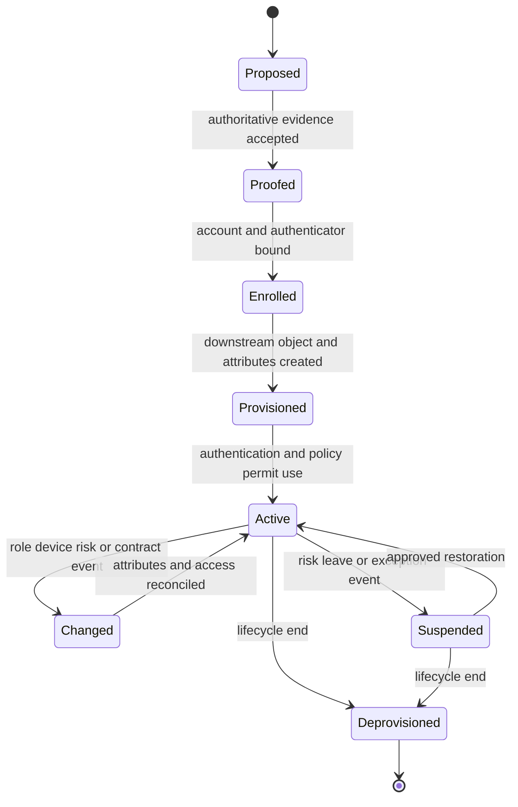

Human Resources, vendor management, identity teams, application owners, and security teams may each own different evidence. A TSM should identify the authoritative source and maximum acceptable propagation delay for each policy-relevant attribute.

### Plain-English deep-dive 1 - Authentication is the doorman, authorization is the room key

A hotel doorman can confirm that Arti is a registered guest. That does not let her enter room 412, the kitchen, or the cash office. The front desk still assigns a room, and each door enforces its own key.

Federated authentication works similarly. An IdP assertion can convince Zscaler or an application that the subject is a particular user under stated conditions. Zscaler policy can decide whether a connection to an app is allowed. The application still decides whether the user can read payroll, approve a payment, or administer accounts.

This is why a sign-in success followed by HTTP 403 is not contradictory. Authentication may have succeeded while Zscaler access policy or application authorization denied the operation. Troubleshooting must find the exact decision issuer: IdP, Zscaler policy, network/service path, or application.

## IdP integration and federation flow

Zscaler publicly says the Zero Trust Exchange verifies user, device, or workload identity through integrations with third-party identity providers. Current implementation choices and protocol support must be confirmed in authenticated documentation.

### SAML orientation

Security Assertion Markup Language, or SAML, is commonly used for browser federation. An IdP authenticates the user and issues a signed assertion for a Service Provider, or SP. Important validation includes signature/trust, issuer, intended audience, recipient/destination, time conditions, correlation, and replay controls according to the profile.

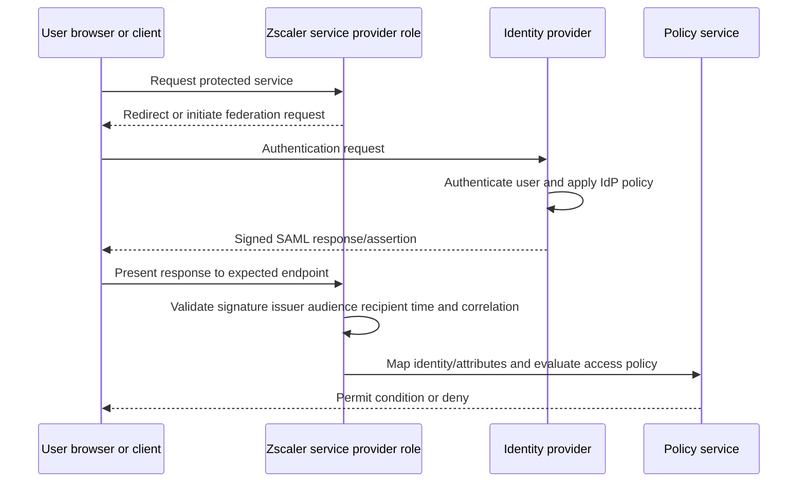

### OIDC and OAuth orientation

OpenID Connect, or OIDC, adds an identity layer on OAuth 2.0. An ID token carries authentication claims for the client. An access token authorizes a client to call a protected resource under a defined scope/audience. The two token types are not interchangeable. OAuth 2.0 security guidance has evolved; use the current authorization-server/client profile and RFC 9700 security best current practice.

| Artifact | Primary purpose | Validate/inspect conceptually | Common mistake |
|---|---|---|---|
| SAML assertion | Federated authentication/attributes | Signature, issuer, audience, recipient, time, correlation | Treat XML text as trusted before signature validation |
| OIDC ID token | Tell a client about authenticated user/session | Signature, issuer, audience, nonce, time, authorized party as applicable | Send it as an API access token |
| OAuth access token | Authorize API/resource access | Issuer/audience/scope/time/signature or introspection by design | Treat scope as user identity proof alone |
| Refresh token | Obtain new access tokens under authorization | Client binding, rotation/lifetime/storage/revocation by profile | Put in browser logs or long-lived insecure store |
| Session cookie | Maintain web session state | Secure attributes, scope, expiry, server-side state | Assume directory changes instantly end it |
| Device certificate | Bind cryptographic key/device identity | Chain, key possession, EKU/policy, expiry/revocation | Equate valid cert with healthy device |

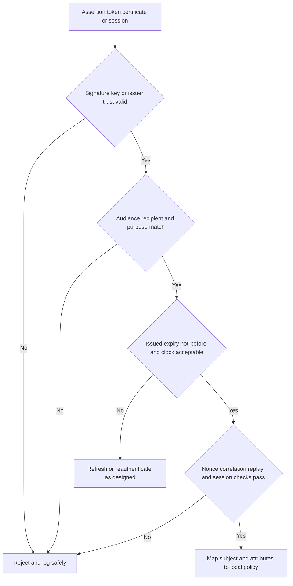

Do not decode a production token into an unapproved public tool. Tokens, assertions, cookies, and provisioning credentials can contain personal data and reusable secrets. Use approved local/security tooling, redact carefully, and preserve only fields necessary for diagnosis.

## Provisioning, SCIM, users, and groups

Federation answers live sign-in; provisioning maintains downstream identity objects. SCIM is an IETF HTTP/JSON protocol for users, groups, schemas, discovery, creation, retrieval, modification, and deletion. A product may support only a subset or profile; current Zscaler and IdP documentation controls.

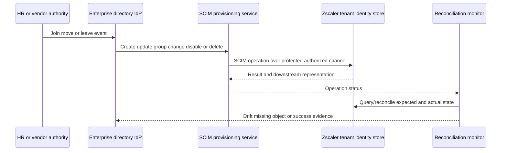

| SCIM/lifecycle operation | Business meaning | Failure mode | Validation |
|---|---|---|---|
| Create user | New identity becomes known downstream | Duplicate/uniqueness, missing required attribute | Source-to-target ID map |
| Update attributes | Role/department/status changes | Schema/mapping or partial failure | Field-level reconciliation |
| Add/remove group member | Policy cohort changes | Nested group/support/ordering/stale membership | Effective-member sample |
| Disable active state | Suspend access quickly | Target ignores/misinterprets attribute | Negative access test |
| Delete | Remove resource from active queries | Soft-delete semantics or orphan session | Target query and session/revocation checks |
| Pagination/full sync | Reconcile many objects | Missed pages or changing results | Counts, cursors, checkpoints, samples |
| PATCH/PUT | Partial versus replacement update | Omitted attributes cleared or operation unsupported | Returned target representation |
| Credential/token rotation | Protect provisioning integration | Expired secret stops lifecycle updates | Health alert and rotation test |

SCIM does not itself authenticate end users. It also does not guarantee instant session revocation. A disabled user record, an active IdP session, a cached Zscaler identity, and an application session can have different lifetimes. Offboarding validation must test all relevant layers.

### Group and attribute design

| Design concern | Weak pattern | Better pattern |
|---|---|---|
| Source | Attribute manually maintained in several tools | Named authoritative source and steward |
| Semantics | "Finance" means department, app role, and sensitivity interchangeably | Separate business department, access role, and resource policy |
| Naming | Ambiguous group names | Stable convention with purpose and owner |
| Nested groups | Assumed universally expanded | Verify protocol/product support and effective members |
| Dynamic rules | Logic unknown to policy owner | Versioned rule, source fields, tests, owner |
| Lifecycle | Membership added, rarely removed | Join/move/leave automation and attestation |
| Exceptions | User placed in broad permanent group | Time-bound exception with risk/owner/expiry |
| Evidence | Directory screenshot | Source, sync time, downstream mapping, effective session |
| Privacy | Copy every HR attribute | Send only policy-required fields |

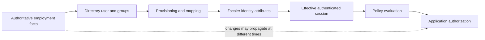

### Plain-English deep-dive 2 - The group you see is not always the group the policy saw

Imagine HR moved Maya from Procurement to Finance at 09:00. The directory updated at 09:01. The provisioning job ran at 09:15. Maya's browser still holds a session created at 08:30. The policy transaction at 09:10 may therefore use old attributes even though the admin checks the directory at 09:20 and sees Finance.

No system is necessarily lying. Each view represents a different time and state. The troubleshooting timeline needs authoritative change time, directory state, provisioning result, assertion/token issue time, Zscaler session/identity state, effective policy event, and application session.

"Refresh the groups" is not a root cause. Name the stale layer and its documented lifecycle. Then decide whether to wait, reauthenticate, revoke, reprovision, correct mapping, or escalate. Avoid deleting identities or broadening rules just to force a refresh; those actions can create more drift.

## Device identity versus device posture

A device can be uniquely known yet unhealthy. It can be healthy according to selected checks yet belong to the wrong user or be unmanaged. Identity and posture are separate dimensions.

| Signal | What it may establish | What it does not establish | Evidence owner |
|---|---|---|---|
| Device record/ID | A known inventory object exists | Current device or key possession | MDM/inventory |
| Device certificate | Possession of bound private key and valid chain/policy | User presence or patch health | PKI/endpoint |
| MDM enrollment | Device is under management relationship | Every policy applied or device uncompromised | Endpoint/MDM |
| OS/version | Reported platform/build | Patch completeness or integrity alone | Endpoint/client |
| Disk encryption | Reported encryption condition | Data cannot be stolen in every state | MDM/OS |
| EDR health | Agent/reporting/security state from integration | No active compromise or blind spot | Security/EDR |
| Firewall/anti-malware | Selected control state | Effectiveness against all threats | Endpoint/security |
| Jailbreak/root status | Indicator of platform integrity risk | Complete device trust | Device platform |
| Client Connector state | Agent/profile/context availability | Every Zscaler product is licensed/active | Endpoint/Zscaler |
| Last check time | Age of observation | Current truth beyond accepted interval | Signal provider |

Zscaler's current Client Connector page says the agent provides device-security-posture insight and can inform context-based adaptive access, including context from EDR, MDM, and IdP integrations. The exact posture checks, integration fields, refresh behavior, platforms, and actions are tenant/product/version/license specific.

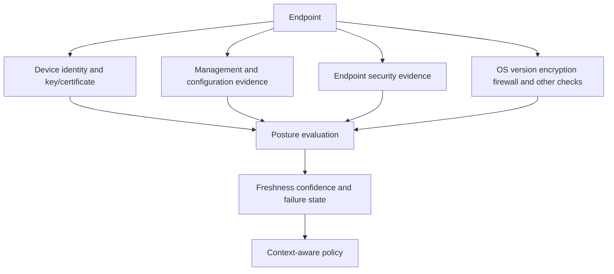

### Posture result design

| Question | Why it matters | Example policy treatment |
|---|---|---|
| Which check? | "Healthy" is too broad | Require named EDR and encryption states |
| Which source? | Two tools can disagree | Define authoritative source per check |
| How fresh? | Old health is not current health | Maximum age and refresh trigger |
| Missing means what? | No signal can mean outage, unsupported, or unsafe | Explicit unknown state, not silently healthy |
| Which platform? | Check may not apply to every OS/device | Platform-specific rule/test |
| Who owns remediation? | Users need actionable resolution | Endpoint/security owner and help path |
| What is fallback? | Fail closed can stop critical work | Approved reduced/browser/continuity option |
| How is privacy handled? | Posture can reveal sensitive device facts | Minimize fields and audience |

## Workload identity

Workloads include services, containers, virtual machines, functions, pipelines, and automation. They cannot use human MFA in the normal sense. They need non-human identities with bounded audience, permissions, lifetime, and ownership.

| Workload identity method | Strength | Risk | Governance need |
|---|---|---|---|
| Cloud-native service identity | Platform-issued/rotated and scoped | Misassigned role or metadata abuse | Resource/role review |
| Mutual TLS certificate | Cryptographic identity and channel binding | Key theft, expiry, trust complexity | Automated issuance/rotation/revocation |
| Signed workload token | Short-lived claims and audience | Issuer/audience/clock/replay errors | Validation and key rotation |
| Static API key | Simple compatibility | Long-lived shared secret, weak attribution | Vault, scope, rotation, replacement plan |
| Human service account | Legacy compatibility | Shared password, no owner, broad privilege | Remove or tightly govern |
| Attested runtime identity | Binds identity to platform/runtime evidence | Implementation and trust-chain complexity | Specialist design and monitoring |

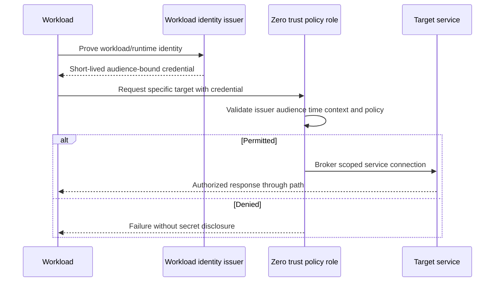

Workload identity should map to an owner, environment, service, purpose, and allowed destination. Avoid policies that grant all workloads in a cloud account broad access. Machine speed amplifies mistakes: a leaked high-privilege workload credential can be abused rapidly.

## Context and risk signals

Context is useful only when its semantics are known. Build a signal contract.

| Signal | Source | Freshness | Confidence/error concern | Privacy concern | Failure behavior |
|---|---|---|---|---|---|
| User status | HR/directory | Event-driven or scheduled | Termination delay | Employment data | Deny/suspend by approved policy |
| Group/role | Directory/provisioning/token | Varies by layer | Stale/nested mapping | Organizational role | Use explicit stale handling |
| Authentication strength | IdP | Session/token time | Method representation | Authentication history | Step up where supported |
| Device management | MDM | Check-in interval | Offline device/stale state | Device ownership | Unknown/reduced/deny |
| EDR health | EDR integration | Telemetry interval | Sensor outage or false state | Security telemetry | Explicit unknown state |
| OS/patch | Endpoint/MDM | Inventory interval | Version alone incomplete | Device details | Grace/remediate/restrict |
| Location/network | IP/GPS/site/client context | Transaction/session | VPN/NAT/geolocation error | Location privacy | Do not use as sole trust |
| Time | Trusted clock | Immediate | Skew/time-zone confusion | Work-pattern inference | Define allowed windows carefully |
| Threat/risk | Security tools/model | Event/score interval | False positive/negative, model drift | Behavioral profiling | Human review for severe action |
| Resource sensitivity | App/data catalog | Governance interval | Wrong classification/owner | Business metadata | Conservative owner-approved policy |

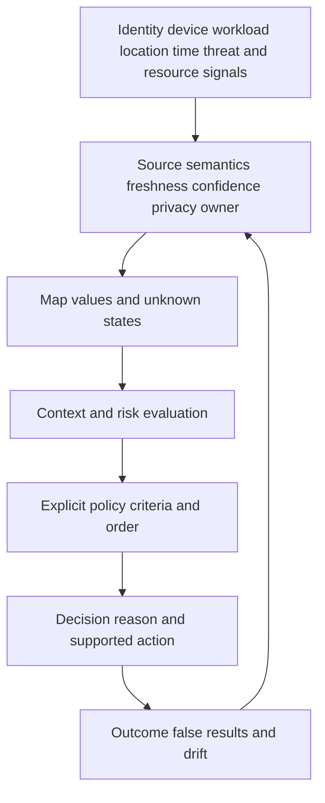

A risk score is a model. It may combine signals using proprietary or customer-defined logic. The score needs documented scale, factors, time window, missing-data behavior, false-result process, and decision owner. Never say "the user is risky" when the evidence is "the current session received a high-risk signal because the IdP reported unfamiliar sign-in properties at 14:02 UTC."

## Policy anatomy and order

A policy rule is a test plus an action. Least privilege requires more than a deny default; the allowed path must be narrow enough for the business operation and maintained over time.

| Policy element | Question | Example | Failure if weak |
|---|---|---|---|
| Subject | Who/what matches? | Payroll employees, approved workload | Broad or wrong identity |
| Resource | Which destination/data/app? | Payroll user app, not admin app | Excess reachability |
| Operation | What protocol/action? | HTTPS user portal, not SSH | Excess capability |
| Device/workload | Which endpoint/service condition? | Managed and EDR healthy | Unsafe device allowed |
| Context | What time/location/auth/risk? | Recent phishing-resistant auth | Stale or weak assurance |
| Action | What outcome? | Allow, step up, reduce, isolate, deny | Unsupported or disproportionate response |
| Order/priority | Which matching rule wins? | Explicit emergency rule before general | Shadowed or unintended rule |
| Exception | Who approved deviation until when? | 24-hour owner-approved access | Permanent bypass |
| Logging | What reason/evidence is retained? | Rule ID, inputs, action, time | Unexplainable outcome |
| Review | What change invalidates rule? | Role/app/signal/license/incident change | Policy drift |

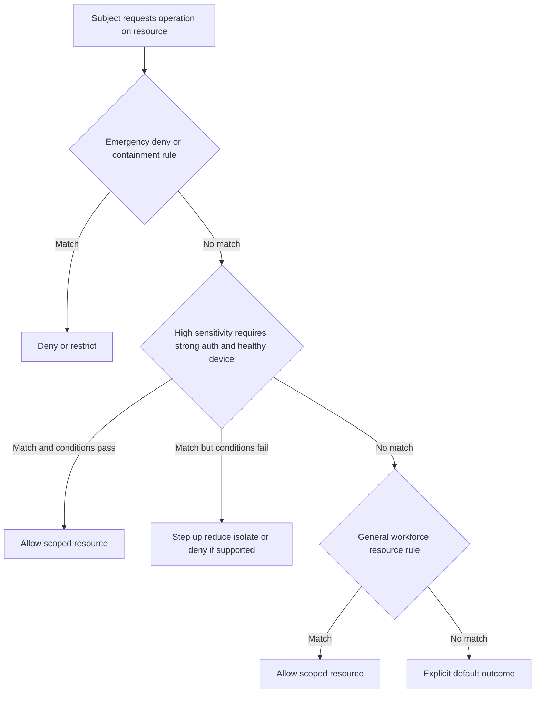

Exact ZIA and ZPA rule order, policy types, default behavior, and interaction differ. Use current product help and the tenant's effective-policy evidence. Do not transfer an ordering rule from one policy family to another.

### Least privilege as a four-dimensional design

| Dimension | Narrow question | Example |
|---|---|---|
| Subject | Smallest justified identity cohort? | Active payroll analysts, not Finance-all |
| Resource | Smallest required app/service/data? | Payroll reporting endpoint, not subnet |
| Operation | Smallest required action/protocol? | Read report, not administer server |
| Time/context | Smallest valid conditions/duration? | Managed device during approved period with recent strong auth |

### Plain-English deep-dive 3 - Rule order is a line at airport security

Suppose a traveler matches three signs: "crew," "international departures," and "security hold." If the crew lane is checked first and grants entry without evaluating the hold, the outcome is dangerous. If the hold is evaluated first, the traveler is stopped for review.

Digital policy can have the same shadowing problem. A broad allow above a specific restriction can prevent the restriction from ever applying, depending on product semantics. A broad deny can make a later allow unreachable. Multiple policy families can also act at different stages.

The solution is not memorizing "top-down" for every Zscaler screen. It is documenting current product semantics, enumerating all rules that could match, running a tagged transaction, recording the effective rule/action, and testing boundaries. Every critical policy needs both "should allow" and "must deny/restrict" cases.

## Continuous and adaptive access

Continuous does not mean every packet triggers full authentication. It means relevant identity, device, risk, resource, and session state can be reevaluated over time or events according to supported behavior. Adaptive means the response can be right-sized to current conditions.

| Condition | Possible supported response concept | Benefit | Risk/caveat |
|---|---|---|---|
| Higher-value resource | Require stronger/recent authentication | Raises assurance | User friction and IdP dependency |
| Managed but posture degraded | Reduce accessible apps or operations | Preserves safer work | Dependency discovery and user confusion |
| Unmanaged/BYOD | Browser-mediated or isolated access | Limits direct data/device exposure | License, app compatibility, feature limits |
| Suspicious identity event | Deny, step up, isolate, or contain per authority | Limits potential compromise | False positive and response authority |
| Unknown posture due to outage | Fail closed or approved continuity mode | Explicit risk decision | Security versus availability tradeoff |
| Risk returns to normal | Restore after defined checks | Reduces unnecessary friction | Avoid rapid flapping |
| Workload identity anomaly | Restrict destination or revoke credential | Limits automated abuse | Service outage and recovery complexity |

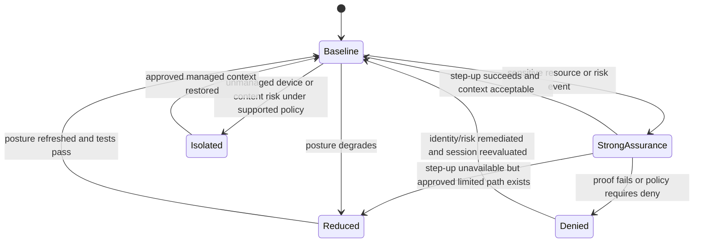

### Step-up authentication

Step-up should increase relevant assurance, not merely ask for the same weak factor again. Current support depends on IdP and product integration. Define trigger, acceptable method, maximum age, user message, failure behavior, emergency handling, and logs. NIST SP 800-63B-4 provides current authentication guidance; enterprise policy and risk determine the chosen assurance.

### Reduced access

Reduced access can mean fewer applications, read-only behavior where enforceable, no download/upload, browser-only access, shorter session, or another supported restriction. Do not promise a granular action unless the product, traffic, and application path support it. Application authorization may be required for read-only business behavior.

### Isolation

Browser isolation executes/renders web content in a remote or controlled context and sends a safer representation/interaction to the user under supported designs. It is not a universal replacement for endpoint security or application authorization. Input methods, downloads, uploads, clipboard, rendering, authentication, accessibility, performance, and unsupported protocols require tests. Zscaler packaging and current Zero Trust Browser forms are covered later.

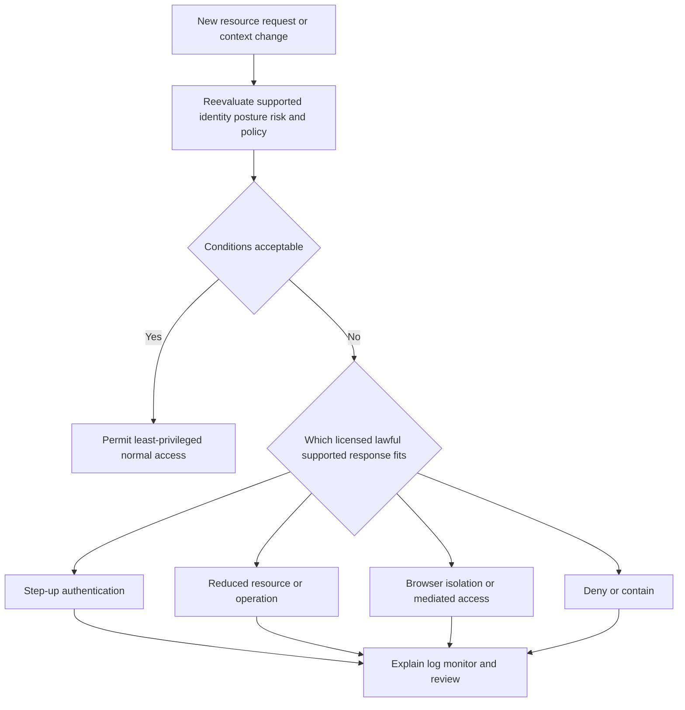

Adaptive policy needs hysteresis: thresholds and recovery conditions that avoid rapid allow/deny switching when a signal fluctuates. It also needs emergency paths that are more controlled, not simply broad bypasses.

## Stale groups, posture, clocks, tokens, and sessions

Staleness is a time problem across distributed systems.

| State | Important timestamp | Stale symptom | Discriminating evidence |
|---|---|---|---|
| HR role/status | Effective business time | User retains old access | HR event and identity workflow |
| Directory group | Membership update time | Admin sees new group, downstream does not | Directory audit/version |
| Provisioned object | Last successful sync/update | Zscaler identity store differs | SCIM operation and reconciliation |
| Assertion/token | Issue/not-before/expiry/auth times | Old claims remain in session | Sanitized validated claims and clock |
| Zscaler session | Authentication/context creation/refresh | Effective policy uses prior state | Session and transaction logs |
| Posture | Check/evaluation/receipt time | Healthy state outlives device change | Source and policy signal age |
| Certificate | Validity/revocation/rotation time | Device/workload rejected or old key trusted | Chain and lifecycle records |
| Application session | Login/refresh/revocation time | App remains usable after access change | App session logs and revocation behavior |

```mermaid
timeline
    title Synthetic identity change and stale access timeline
    09:00 : HR changes employee role
    09:02 : Directory group updated
    09:10 : Provisioning update succeeds
    09:12 : User presents token issued at 08:30
    09:12 : Existing session still carries old group
    09:15 : Transaction matches old effective policy
    09:18 : Session revoked under approved process
    09:20 : Reauthentication issues fresh claims
    09:21 : Correct policy and negative tests pass
```

### Clock and token problems

Security protocols use time to bound validity and prevent replay. Clock skew can make a newly issued assertion appear not yet valid, make a valid token appear expired, break certificate validation, distort log order, or create false correlation.

| Problem | Symptom | Check | Correction owner |
|---|---|---|---|
| Client clock wrong | Repeated auth/cert errors | Compare trusted UTC source and client | Endpoint/time service |
| IdP/service skew | Assertion not-before/expiry rejection | IdP and service logs with UTC | Identity/vendor owners |
| Token expired | 401/reauth loop | Expiry versus evaluation time | Client/IdP/session design |
| Wrong audience | Token valid cryptographically but rejected | Audience and expected resource | Integration configuration |
| Wrong issuer/key | Signature/trust failure | Issuer metadata/key ID/rotation | IdP/SP trust config |
| Stale signing key cache | Failures after rotation | Metadata/key refresh and timeline | Federation owners |
| Replay/correlation failure | Unsolicited or duplicate response rejected | Request ID, nonce, response time | Client/SP/IdP investigation |
| Time-zone confusion | Events appear out of order | Normalize UTC, retain original zone | Incident coordinator |

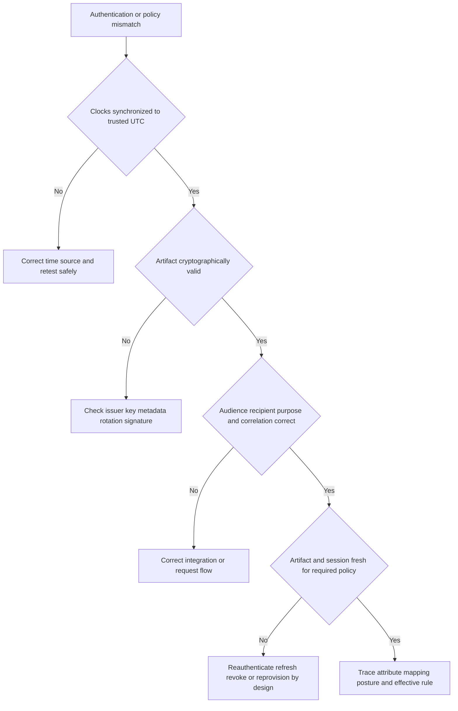

Do not extend token lifetimes casually to reduce sign-in prompts. Longer lifetimes can increase exposure after compromise or lifecycle changes. Tune user experience with current identity guidance, phishing-resistant methods, session controls, reliable posture, and measured risk.

## Privacy, fairness, and governance

Identity and posture telemetry can reveal employment, location, device, security, behavior, and health-related inferences. Security purpose does not remove privacy obligations.

| Principle | Practical question | Control |
|---|---|---|
| Purpose limitation | Why is this signal needed for this decision? | Approved use-case register |
| Data minimization | Can policy use a boolean/derived result instead of raw details? | Collect minimum fields |
| Transparency | Do users understand relevant monitoring and consequences? | Clear lawful notice and support guidance |
| Accuracy | Can a person challenge a false identity/posture/risk result? | Correction/appeal workflow |
| Access control | Who can see raw attributes and decision logs? | RBAC and audit |
| Retention | How long is identity/context evidence needed? | Defined retention/deletion |
| Residency/transfer | Where is data processed/stored/exported? | Legal/contract/architecture validation |
| Bias/fairness | Does location/device/employment context disproportionately affect a group? | Impact review and alternatives |
| Automation | Which actions require human review/approval? | Authority matrix and escalation |
| Incident use | Can logs be used beyond original access purpose? | Governance and legal review |

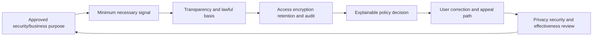

### Plain-English deep-dive 4 - More context is not automatically better security

A doctor needs relevant patient data, not every fact about a person's life. Extra unrelated data increases privacy exposure and can distract from the decision. Access policy is similar.

If the policy only needs to know whether a device meets an approved encryption requirement, it may not need a complete hardware and software inventory in every decision log. If country-level location is enough for a regulatory rule, precise GPS may be unnecessary and intrusive. If a risk signal cannot be explained or corrected, using it for automatic termination-level action can be dangerous.

Good context has a defined purpose, owner, semantics, freshness, confidence, failure behavior, retention, and user remedy. Data that lacks those properties can make policy more complicated and less trustworthy.

## Policy testing and explainability

Configuration review is not testing. A policy test suite should cover expected users/resources, prohibited combinations, boundary times, stale/missing signals, dependency outages, order conflicts, license/feature state, performance, logs, user messaging, rollback, and privacy.

| Test class | Example | Pass evidence |
|---|---|---|
| Positive | Active payroll analyst on healthy managed device reaches report app | Correct rule/action and app success |
| Negative subject | Standard employee cannot reach admin app | Explicit deny/restriction reason |
| Negative resource | Payroll workload cannot reach unrelated database | No unintended connection |
| Context boundary | Posture changes healthy to degraded | Documented adaptive outcome |
| Time boundary | Access expires at approved end | Correct UTC-aligned decision |
| Stale group | Old token after group removal | Expected refresh/revocation behavior |
| Missing posture | EDR/MDM signal unavailable | Approved unknown-state outcome |
| Rule order | Broad allow and specific deny both match | Expected effective rule |
| Step-up | Sensitive app triggers stronger auth | Correct IdP method and return flow |
| Isolation/reduced | Unmanaged device gets supported limited path | No unsupported operation/data path |
| Failure | IdP/provisioning dependency unavailable | Continuity/fail behavior matches design |
| Logging | Every tagged case has decision reason in accepted time | Source-to-SIEM reconciliation |
| Performance | Adaptive flow meets agreed user threshold | End-to-end percentile |
| Rollback | New policy can be removed safely | Prior intended behavior restored |

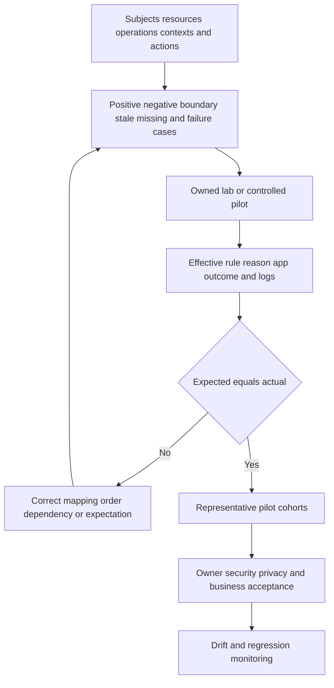

### Decision reason chain

An explainable decision record should answer:

| Field | Example synthetic value | Why useful |
|---|---|---|
| Transaction time | 2026-08-25 14:02:13 UTC | Correlation |
| Subject | user-1842, not full personal details in broad view | Scope/privacy |
| Identity source/session | NMH IdP, session issued 13:55 UTC | Freshness |
| Resource/operation | payroll-report HTTPS | Exact request |
| Device/workload | managed-device-44 | Entity link |
| Relevant context | EDR unknown; encryption true | Inputs and missing state |
| Effective rule/version | payroll-degraded-device-v7 | Order/change correlation |
| Action | Browser-mediated reduced access if supported/entitled | Outcome |
| Reason | Required EDR health missing beyond threshold | Remediation |
| Owner/remedy | Endpoint Security; refresh sensor/check-in | Resolution path |
| Privacy/retention | Restricted fields; 30-day synthetic lab policy | Governance |

Explainability does not require exposing sensitive detection logic to an attacker. Provide the minimum reason needed for legitimate remediation, and give analysts deeper role-controlled evidence.

## Failure scenarios

| Symptom | Plausible causes | Discriminating evidence | Unsafe conclusion |
|---|---|---|---|
| New user can authenticate but has no access | Provisioning/mapping/group/policy/app role incomplete | IdP success plus target identity/effective rule | Zscaler outage |
| Removed user still accesses app | Existing token/session/app session, delayed deprovision | Full lifecycle timeline and negative test | SCIM failed without proof |
| Directory group correct, policy wrong | Stale token/session, wrong mapping, nested group unsupported, rule order | Effective claims and rule reason | Directory screenshot settles state |
| One device denied, same user works elsewhere | Posture/certificate/client/profile/device clock | Compare effective device context | User group issue |
| All users get auth loop | IdP trust/key/clock/audience/recipient/cookie/client issue | SAML/OIDC error timeline and validation | Password outage |
| Token signature valid but rejected | Wrong issuer/audience/purpose/time/nonce | Validated header/claims and service expectation | Token is corrupt |
| Posture shows unknown | Source agent/integration/check-in/platform/support/outage | Source health and last observation | Device is compromised or healthy |
| Step-up repeats | Session not recognized, method/claim mismatch, cookie/clock, rule loop | IdP auth method/time and effective rule | User failed MFA |
| Isolation breaks app | Unsupported protocol/browser feature/download/auth flow | Compatibility test and app evidence | Security should be disabled globally |
| Access flaps | Signal threshold, stale/rapid updates, session refresh, rule overlap | Event timeline and reason chain | Random cloud issue |
| Wrong user appears in log | Shared device/session, mapping/canonical ID, stale login | User/device/session and IdP correlation | Account takeover immediately |
| No decision log | Bypass, logging delay/filter, wrong product/tenant | Forwarding and logging reconciliation | No policy evaluated |

## Troubleshooting method

### Step 1: define exact identity transaction

Capture subject, device/workload, source, destination, operation, time/zone, expected result, actual message/status, business impact, and whether sign-in, provisioning, posture, Zscaler access, or app authorization is failing.

### Step 2: build lifecycle timeline

Record authoritative identity change, directory/group state, provisioning events, token/assertion issue and expiry, session creation/refresh, posture observation time, policy change/activation, access event, and app result. Normalize to UTC while retaining local context.

### Step 3: validate artifact safely

Check issuer/trust, audience/recipient, signature/key, time, nonce/correlation, subject ID, relevant claims, and authentication context using approved tools. Never paste live secrets into public decoders.

### Step 4: identify effective policy inputs

Compare what the policy actually saw with what administrators expected: canonical subject, groups, device, posture value/age, risk signal, resource match, rule order, action, and license.

### Step 5: check application authorization

If connection policy permits, inspect the application session, roles, permissions, dependencies, and response. A 403 can come from several boundaries.

### Step 6: make a bounded correction

Correct authoritative source, mapping, sync, trust, clock, posture source, policy order, or app authorization. Avoid broad group additions and bypasses. Record rollback.

### Step 7: validate lifecycle and boundaries

Test positive user, negative user, negative resource, stale session, posture change, logging, user message, performance, and rollback. Confirm that old access is truly revoked where required.

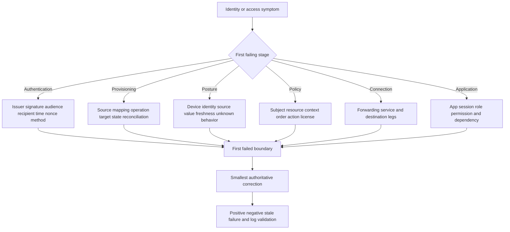

### Stale-state decision tree

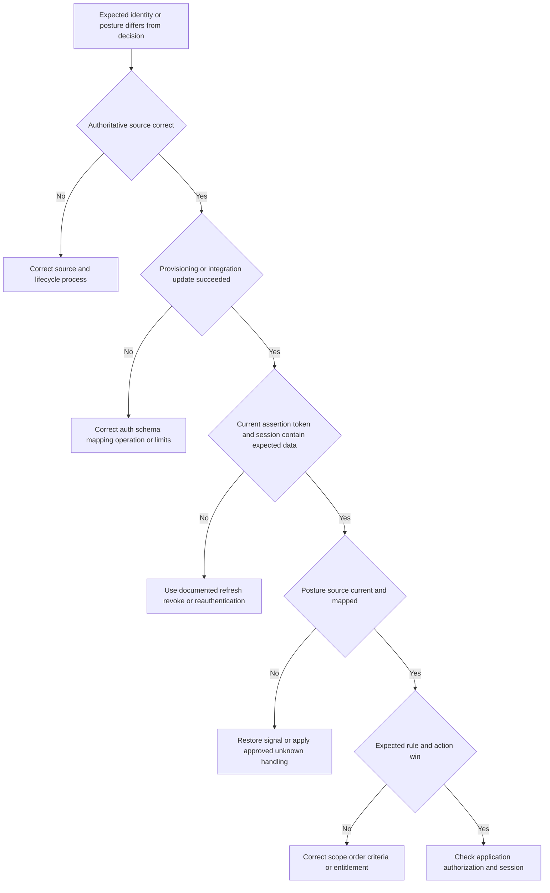

## Fictional NMH policy case

NMH is evaluating resource-centric access for a payroll application. The synthetic population includes employees, payroll analysts, payroll administrators, external auditors, and a reporting workload. Device states are managed-healthy, managed-degraded, unmanaged, and unknown. No real tenant or deployment is implied.

### NMH policy matrix

| Subject | Resource/operation | Context | Intended outcome | Negative validation |
|---|---|---|---|---|
| Employee | Personal pay statement/read | Active employee, managed or approved browser path | Least-privileged access | Cannot access team reports |
| Payroll analyst | Team reports/read/export | Active role, healthy managed device, recent strong auth | Full required report access | Cannot administer payroll |
| Payroll admin | Admin functions | Hardened managed device, stronger/recent auth, approved admin role | Scoped privileged access | Analyst denied admin functions |
| External auditor | Time-bound audit portal/read | Contract active, external identity, supported reduced/browser path | Read-only where app/control supports | Download/admin denied |
| Reporting workload | Reporting API | Workload identity, approved environment, short-lived credential | API-only path | No user/admin endpoint |
| Unknown/inactive | Any payroll resource | Missing/disabled identity | Deny with safe support reason | Event logged |

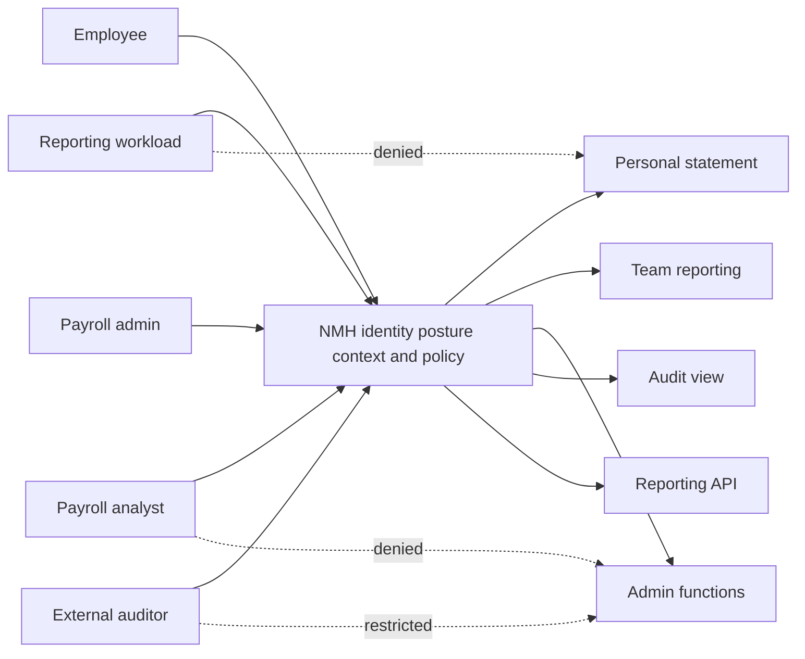

### NMH incident: a transferred employee retains export access

At 10:00 UTC, Priya transfers from Payroll to Procurement. HR and directory membership change. At 10:25, a synthetic control test shows her existing browser session can still export a payroll report. There is no evidence of malicious use.

| Timeline item | Synthetic evidence | Interpretation |
|---|---|---|
| 10:00 | HR role effective | Authoritative business change |
| 10:02 | Directory payroll group removed | Source group current |
| 10:05 | Provisioning operation succeeds | Downstream object updated |
| 09:40 | Existing federated session/token issued | Session predates change |
| 10:25 | Zscaler access event uses session state | Stale effective identity likely |
| 10:25 | App session still grants export role | Application session independently stale |
| 10:30 | Approved session revocation/re-auth test | New Zscaler policy denies report |
| 10:32 | App role/session revoked | Export negative test passes |

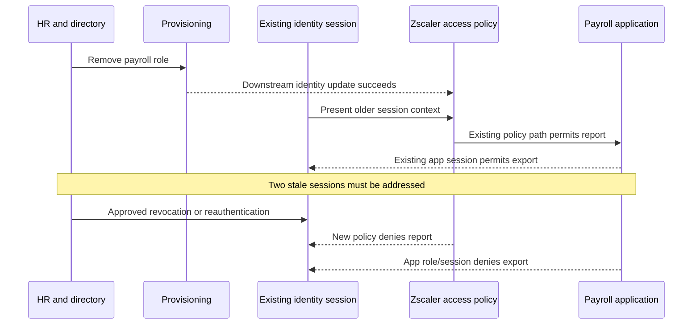

The root cause is not simply "cache." The synthetic RCA identifies two independently stale sessions and a control gap: the join/move/leave design lacked a tested maximum revocation objective across Zscaler and the application. Corrective actions define authoritative triggers, session handling, reconciliation, canary tests, owner/SLO, and exceptions. NMH's risk owner approves residual risk, not the TSM.

## Policy rollout and change safety

| Phase | Activities | Exit gate |
|---|---|---|
| Discover | Inventory identities, groups, devices, workloads, resources, sessions, dependencies, privacy | Owners and authoritative sources agreed |
| Model | Define criteria, order, unknown states, actions, exceptions, reasons | Peer review and threat/failure analysis |
| Lab | Synthetic positive/negative/stale/outage tests | Expected reason chain and rollback pass |
| Pilot | Representative cohorts/platforms/locations/apps | Security, user, support, privacy acceptance |
| Expand | Rollout rings with monitoring and help readiness | Thresholds stable; no critical unexplained denies |
| Operate | Reconcile, review access, monitor drift, rotate credentials, test revocation | Periodic control evidence |
| Improve | Analyze false allow/deny, friction, incidents, changes | Approved policy/version update |

```mermaid
flowchart LR
    DISCOVER[Discover identities signals resources and owners] --> MODEL[Model least privilege order actions and failure]
    MODEL --> LAB[Lab positive negative stale and outage tests]
    LAB --> PILOT[Representative pilot]
    PILOT --> RINGS[Controlled rollout rings]
    RINGS --> OPERATE[Monitor reconcile review and support]
    OPERATE --> LEARN[Measure false results friction and risk]
    LEARN --> MODEL
```

Avoid "big bang" posture enforcement. First observe signal coverage and age, fix data quality, communicate remediation, stage warnings/reduced outcomes where appropriate, then enforce under approved risk. A signal that is missing on 30 percent of supported devices is not ready for a universal deny without a deliberate plan.

## Metrics and health

| Metric | Definition needed | Good use | Misleading use |
|---|---|---|---|
| Authentication success rate | Denominator, protocol, cohort, time | Detect integration change | Prove authorized access |
| Provisioning latency | Source event to verified target state | Manage lifecycle SLO | Ignore session revocation |
| Group drift rate | Expected versus target effective membership | Find sync/mapping problems | Treat source as perfect |
| Posture coverage | Eligible active devices with fresh evaluable signal | Stage enforcement | Call missing devices compromised |
| Unknown posture rate | Transactions with required signal unavailable | Find dependency gaps | Hide unknown as compliant |
| Policy deny rate | Denies per relevant requests by reason | Detect rollout issue/attack | Call every deny prevented breach |
| Step-up completion | Triggered to successful stronger auth | Measure friction/integration | Lower is always safer/better |
| False-deny rate | Legitimate required transactions wrongly blocked | Improve policy | Count unverified complaints only |
| Revocation objective | Authoritative change to effective access removal | Test offboarding/moves | Assume provisioning completion equals revocation |
| Explanation completeness | Decisions with usable rule/input/reason/remedy | Improve support/audit | Expose sensitive detection details |

```mermaid
flowchart TD
    HEALTH[Identity access health] --> LIFE[Lifecycle provisioning and revocation]
    HEALTH --> AUTH[Authentication assurance and success]
    HEALTH --> POST[Posture coverage freshness and unknown]
    HEALTH --> POLICY[Effective policy accuracy and drift]
    HEALTH --> UX[Step-up friction false denials and remediation]
    HEALTH --> PRIV[Privacy access retention and appeals]
    HEALTH --> EVID[Logging reconciliation and explanation]
```

## Arti's Microsoft-to-Zscaler bridge

| Microsoft production strength | Part 33 transfer | New learning required | Honest language |
|---|---|---|---|
| M365 sign-in and permission isolation | Separate authentication, Zscaler access, and app authorization | Zscaler identity/policy logs and objects | "The decision-boundary method transfers." |
| SharePoint users/groups/permissions | Source/group/effective access reasoning | Zscaler group mapping and policy semantics | "Similar data-quality questions, different product." |
| OneDrive/browser session comparison | Token/session/client freshness | Client Connector posture/session behavior | "I would correlate issue time, not assume current directory state." |
| Entra/Microsoft identity context | Federation/token concepts | Supported Zscaler IdP integrations | "Adjacent protocol knowledge is not configuration proof." |
| Trace-led escalation | Timeline across IdP, device, policy, and app | Product-specific correlation fields | "I find the first failed decision." |
| Customer communication | Explain denial and remediation safely | Adaptive-action user messaging | "Security needs a usable remedy." |
| SQL/Power BI | Reconcile source/target identities and policy outcomes | Zscaler schemas/retention | "I validate grain, time, completeness, and privacy." |

### 30-second interview bridge

"I treat access as a lifecycle and reason chain. HR or another authority establishes identity; the directory and provisioning maintain users/groups; the IdP authenticates and issues a time-bound assertion or token; device or workload context adds current conditions; Zscaler policy evaluates the subject, resource, operation, context, order, and supported action; and the application still authorizes its business operation. My Microsoft 365 background gives me strong identity, permissions, session, trace, and escalation discipline. My study covers Zscaler posture and adaptive policy, while direct production configuration is not part of my current experience. I would validate the current tenant, license, signals, effective rule, and logs."

## TSM identity and policy review

| Review area | Questions | Artifact |
|---|---|---|
| Authority | Which source owns user, contractor, group, device, workload, and resource facts? | Source-of-truth register |
| Federation | Which protocol, issuer, trust, audience, keys, assurance, sessions, and recovery? | Federation map |
| Provisioning | Which users/groups/attributes, operation, cadence, credentials, reconciliation? | SCIM lifecycle design |
| Device | Identity, management, posture checks, sources, age, unknown behavior? | Posture contract |
| Workload | Issuer, audience, lifetime, owner, destination, rotation? | Workload identity inventory |
| Policy | Subject/resource/operation/context/action/order/default/exception? | Rule matrix |
| Adaptive | Step-up/reduced/isolation/deny support and triggers? | Response decision table |
| Privacy | Purpose, fields, notice, access, retention, appeal, residency? | Privacy assessment |
| Health | Authentication, provisioning, posture, policy, app, logs, revocation? | Health scorecard |
| Testing | Positive, negative, stale, unknown, failure, rollback, performance? | Test suite |
| Operations | Owners, support scripts, emergency paths, change/review cadence? | RACI/runbook |
| Currency | Current Zscaler/IdP/MDM/EDR product, license, API, UI? | Source and entitlement check |

## Labs and rehearsal

Use only synthetic identities, owned tenants/labs, and approved tools. Never upload live tokens, assertions, credentials, or customer identity data to public services.

### Lab 1: lifecycle map

Create synthetic join, move, leave, contractor expiry, device replacement, and workload rotation events. Map every downstream object/session and define an evidence-based completion criterion.

### Lab 2: SAML trace

Use a safe training IdP/SP or sanitized sample. Identify issuer, audience, recipient, conditions, signature reference, subject, and authentication context. Explain what must be validated before claims are trusted.

### Lab 3: OIDC token validation

Generate a local test ID token. Validate issuer, audience, nonce, issue/expiry time, and signature locally. Demonstrate wrong audience and clock skew. Never use a production token.

### Lab 4: SCIM reconciliation

Model source and target users/groups in synthetic JSON. Apply create, update, membership removal, disable, and delete. Reconcile counts and fields; include pagination and partial-failure scenarios.

### Lab 5: stale group timeline

Build the seven-layer timeline: authoritative change, directory, provisioning, assertion/token, Zscaler session, policy event, app session. Ask a partner to choose which layer is stale.

### Lab 6: posture contract

For encryption, EDR, OS, management, and certificate signals, document source, semantics, freshness, unknown state, supported platforms, owner, privacy, and remediation.

### Lab 7: workload identity

Use an owned cloud/local lab to issue a short-lived service credential for one audience. Demonstrate that it fails for another resource and after expiry.

### Lab 8: policy order

Create overlapping broad allow, sensitive-resource step-up, containment deny, and default rules in a vendor-neutral simulator/table. Test every overlap and record the winning reason.

### Lab 9: adaptive state

Model healthy, degraded, unknown, suspicious, isolated, denied, and recovered states. Define transition triggers and hysteresis. Have security and business reviewers challenge each action.

### Lab 10: privacy review

Take 20 possible identity/posture fields. Keep only what five synthetic policy decisions require. Define audience, retention, notice, correction, and deletion.

### Lab 11: NMH transfer incident

Recreate the synthetic transfer timeline and prove why both Zscaler and application sessions matter. Write an RCA with owner, objective, validation, and residual-risk decision.

### Lab 12: interview teach-back

Explain identity-versus-posture, authentication-versus-provisioning, policy order, adaptive access, and staleness in 30 seconds each. Include one caveat and one evidence check per answer.

## Common misconceptions to correct

| Misconception | Corrected understanding |
|---|---|
| Identity equals username | Identity includes lifecycle, binding, subject identifiers, assurance, and attributes |
| Authentication grants access | Authorization and policy determine resources/operations after authentication |
| Federation provisions users | Federation authenticates/asserts; provisioning maintains objects/attributes |
| SCIM performs SSO | SCIM manages identities; it is not an end-user sign-in protocol |
| Directory group proves effective policy input | Provisioning, token/session, mapping, and policy time can differ |
| A signed token is valid for any service | Issuer, audience, purpose, time, nonce/correlation, and policy must match |
| ID token is an API access token | OIDC ID tokens and OAuth access tokens have different purposes |
| Device certificate proves healthy posture | It proves a key/certificate relationship, not all current security conditions |
| Managed means secure | Management is one relationship; controls and compromise still need evidence |
| EDR healthy means device cannot be compromised | It is a signal with coverage and false-result limits |
| Missing posture means healthy | Unknown needs explicit, governed treatment |
| Location proves trust | Location is one potentially inaccurate/privacy-sensitive context signal |
| Continuous means MFA every packet | Reassessment is event/session/product-specific |
| Adaptive means autonomous AI decides everything | Policy, supported actions, governance, reasons, and human authority remain |
| Step-up means repeat the same password | It should increase relevant authentication assurance |
| Reduced access is always read-only | Exact restrictions depend on product, traffic, and application support |
| Isolation replaces endpoint/app security | It adds a controlled browser layer with limitations |
| Top rule always wins in every product | Rule semantics differ by policy family; verify current help/effective result |
| Deny-by-default automatically gives least privilege | Allowed cohorts/resources/operations/context can still be broad |
| Longer tokens fix sign-in issues safely | They can extend exposure and stale access |
| Provisioning disable instantly ends all sessions | IdP, Zscaler, and app sessions may require separate handling |
| More context always improves security | Unnecessary data adds privacy, error, and complexity risk |
| Risk score is objective truth | It is a model with source, time, assumptions, and false results |
| Public integration page proves tenant deployment | Entitlement, configuration, signal health, and operation require evidence |
| This Part proves Zscaler hands-on experience | It proves conceptual and synthetic practice only |

## Official Source Anchors

Sources in this section were reviewed on **2026-08-24**.

All pages were reviewed on **2026-08-24**. Zscaler pages establish current public product positioning. NIST, OASIS, OpenID Foundation, and IETF sources establish general identity/protocol guidance. Current authenticated Zscaler help and tenant evidence control fields, order, sessions, posture refresh, and adaptive actions.

| Source | URL | Used for | Boundary |
|---|---|---|---|
| Zero Trust Exchange | https://www.zscaler.com/products-and-solutions/zero-trust-exchange-zte | User/device/workload identity through third-party IdPs, context, risk, policy | Public architecture, not implementation detail |
| Zscaler Client Connector | https://www.zscaler.com/products-and-solutions/zscaler-client-connector | Device posture/context, adaptive access positioning, EDR/MDM/IdP integrations | Platform/version/license/field behavior varies |
| Zscaler Private Access | https://www.zscaler.com/products-and-solutions/zscaler-private-access | Context-aware user-to-app policy, segmentation, browser/private access | Actions and objects require current help/entitlement |
| NIST SP 800-63-4 | https://csrc.nist.gov/pubs/sp/800/63/4/final | Current digital identity, proofing, authentication, federation framework | Federal guidance; enterprise application requires risk/legal context |
| NIST SP 800-63A-4 | https://csrc.nist.gov/pubs/sp/800/63/a/4/final | Identity proofing and enrollment | Not a Zscaler deployment guide |
| NIST SP 800-63B-4 | https://csrc.nist.gov/pubs/sp/800/63/b/4/final | Authentication and authenticator lifecycle | Current enterprise policy determines implementation |
| NIST SP 800-63C-4 | https://csrc.nist.gov/pubs/sp/800/63/c/4/final | Federation and assertions | Protocol/product profiles still apply |
| OASIS SAML 2.0 Technical Overview | https://docs.oasis-open.org/security/saml/Post2.0/sstc-saml-tech-overview-2.0.html | SAML roles and federation concepts | Use normative profiles/specifications for implementation |
| OpenID Connect Core 1.0 | https://openid.net/specs/openid-connect-core-1_0.html | OIDC identity layer, ID token, nonce, claims | Current errata/profile and IdP docs apply |
| IETF RFC 6749 | https://www.rfc-editor.org/rfc/rfc6749 | OAuth 2.0 authorization framework | Updated security practice in RFC 9700 |
| IETF RFC 9700 | https://www.rfc-editor.org/rfc/rfc9700 | OAuth 2.0 security best current practice | Profile-specific requirements still apply |
| IETF RFC 7643 | https://www.rfc-editor.org/rfc/rfc7643 | SCIM core users/groups schema | Product mappings/extensions vary |
| IETF RFC 7644 | https://www.rfc-editor.org/rfc/rfc7644 | SCIM HTTP/JSON protocol, lifecycle, errors, privacy/security | Updated by later RFCs; product support varies |
| NIST SP 800-207 | https://csrc.nist.gov/pubs/sp/800/207/final | Continuous diagnosis, resource policy, no implicit trust | General architecture, not product ordering |

## Likely Interview Questions

### Q1. How do authentication, federation, provisioning, and authorization differ?

**Model answer:** Authentication verifies who or what is present. Federation lets a service rely on an IdP's validated assertion or token. Provisioning creates, updates, disables, and removes downstream users, groups, and attributes, often through SCIM. Authorization decides which resource and operation the authenticated subject may use. They have different paths and clocks, so successful SSO does not prove correct groups, Zscaler access, or application permissions.

### Q2. How would you integrate identity into a zero trust access decision?

**Model answer:** I would identify authoritative lifecycle sources, supported federation/provisioning protocols, stable subject identifiers, required minimal attributes, authentication assurance, session behavior, group mapping, and offboarding objectives. For each transaction I would validate issuer, audience, signature, time, subject, relevant context, effective policy, and app authorization. I would also test stale states, IdP/provisioning outages, revocation, privacy, and user remediation.

### Q3. What is the difference between device identity and posture?

**Model answer:** Device identity answers which endpoint holds a recognized record/key/certificate. Posture evaluates current selected security conditions such as management, encryption, OS, or EDR state. A valid certificate does not prove a healthy device, and a reported healthy state does not prove the correct user or absence of compromise. Every posture signal needs a source, semantics, freshness, unknown-state behavior, owner, privacy treatment, and test.

### Q4. How should policy order and least privilege be designed?

**Model answer:** A rule should name subject, resource, operation, device/workload context, risk conditions, action, priority, exception, log reason, and owner. Least privilege narrows subject, resource, operation, and time/context. I would document current product ordering semantics, test overlapping rules and defaults, and capture the effective rule on tagged transactions. I would never assume one policy family's order applies to another.

### Q5. What is adaptive access?

**Model answer:** Adaptive access reevaluates supported identity, device, workload, resource, and risk context and chooses a right-sized policy action, such as normal least-privileged access, stronger/recent authentication, reduced access, browser isolation, or denial where supported and licensed. It needs explicit triggers, explainable reasons, unknown/failure behavior, hysteresis, privacy, human authority, rollback, and tests. It is not uncontrolled autonomous decision-making.

### Q6. How would you troubleshoot a stale-group access problem?

**Model answer:** I would build a UTC timeline from authoritative role change through directory membership, provisioning result, assertion/token issue time, Zscaler session identity, posture, effective rule, and application session. I would find which layer still has old state, then use the documented reprovision, refresh, reauthentication, or revocation mechanism. I would validate both new required access and removed prohibited access instead of broadly changing groups or policy.

### Q7. What privacy concerns come with context-aware policy?

**Model answer:** Identity, location, device, security, and behavioral signals can expose personal or employment information and generate false inferences. I would require a defined purpose, minimum fields, lawful notice/basis, accuracy/correction path, RBAC, retention/deletion, residency/transfer review, automation authority, and impact testing. More context is not automatically better; a derived policy result may be safer than copying raw telemetry.

### Q8. How does your Microsoft experience transfer to Zscaler identity policy?

**Model answer:** I have production experience separating Microsoft 365 sign-in, client/session, users/groups, SharePoint permissions, network/proxy behavior, and service authorization while coordinating complex escalations. That maps directly to identity lifecycle timelines, effective-versus-expected access, artifact safety, and first-failed-boundary reasoning. Zscaler IdP configuration, posture profiles, policy order, and adaptive actions are product-specific ramp areas I have studied and practiced synthetically, not operated in production.

## 30-Second Memory Hooks

| Concept | Memory hook |
|---|---|
| Proofing | Establish the subject |
| Enrollment | Bind the key |
| Authentication | Prove who or what now |
| Federation | Trust a validated issuer statement |
| Provisioning | Maintain the guest list |
| Authorization | Decide the room and action |
| SCIM | Sync users and groups |
| Group | Reusable cohort, not eternal truth |
| Claim | Signed statement, validate context |
| Token | Temporary security envelope |
| Session | Remembered state can become stale |
| Device identity | Which machine |
| Posture | Is it fit now |
| Managed | Enrolled, not invincible |
| Workload identity | Service gets its own badge |
| Context | What is true now |
| Risk signal | Evidence, not verdict |
| Policy | Subject, resource, operation, context, action |
| Order | Find the effective winner |
| Least privilege | Smallest useful key |
| Step-up | Ask for stronger proof |
| Reduced access | Smaller room, preserve safer work |
| Isolation | Controlled viewing booth |
| Continuous | Recheck relevant change |
| Staleness | Ask which layer and timestamp |
| Clock | Security artifacts live in time |
| Explainability | Show rule, facts, action, remedy |
| Privacy | Minimum signal for defined purpose |
| Arti bridge | Permissions discipline transfers; product UI is new |

## Completion Checklist

- [ ] I can distinguish proofing, enrollment, authentication, federation, provisioning, authorization, and deprovisioning.
- [ ] I can explain IdP and service-provider roles without reversing them.
- [ ] I can draw a SAML federation flow and name signature, issuer, audience, recipient, time, and correlation checks.
- [ ] I can distinguish OIDC ID tokens, OAuth access tokens, refresh tokens, cookies, and device certificates.
- [ ] I never paste production tokens/assertions/cookies into public tools.
- [ ] I can explain SCIM users/groups/lifecycle without calling it SSO.
- [ ] I can explain create, update, membership, disable, delete, pagination, mapping, and reconciliation concerns.
- [ ] I know provisioning completion does not automatically revoke all sessions.
- [ ] I can design stable, owned, minimal groups and attributes.
- [ ] I can explain why directory membership and effective policy input can differ.
- [ ] I can distinguish device identity, management, posture, and user identity.
- [ ] I can build a posture contract with source, semantics, freshness, unknown behavior, owner, privacy, and remedy.
- [ ] I do not treat managed, certificate-valid, or EDR-healthy as invulnerable.
- [ ] I can explain workload identity methods, audiences, lifetimes, owners, and rotation.
- [ ] I avoid human shared accounts and broad static secrets for workloads where possible.
- [ ] I can build a context-signal register with confidence/error and privacy.
- [ ] I describe risk as a model/signal, not objective truth or character judgment.
- [ ] I can define subject, resource, operation, device, context, action, order, exception, logging, and review for a rule.
- [ ] I can explain least privilege across subject, resource, operation, and time/context.
- [ ] I verify current product rule semantics and effective outcomes.
- [ ] I can explain continuous evaluation without claiming MFA on every packet.
- [ ] I can explain step-up, reduced access, isolation, and deny with support/license caveats.
- [ ] I can define hysteresis and recovery conditions for adaptive policy.
- [ ] I can build a timeline across HR, directory, provisioning, token, Zscaler session, posture, policy, and app session.
- [ ] I can diagnose clock, issuer, audience, key rotation, expiry, nonce, and time-zone problems conceptually.
- [ ] I do not extend token lifetime casually to hide an integration problem.
- [ ] I can apply purpose limitation, minimization, transparency, accuracy, RBAC, retention, residency, and appeal.
- [ ] I can explain why more raw context can reduce privacy and decision quality.
- [ ] I can build positive, negative, boundary, stale, missing, order, adaptive, failure, log, performance, and rollback tests.
- [ ] I can produce an explainable decision record without exposing sensitive logic broadly.
- [ ] I can work the failure-scenario table without confusing authentication, policy, connection, and app authorization.
- [ ] I can use the troubleshooting and stale-state decision trees.
- [ ] I correct authoritative state rather than adding broad access as a shortcut.
- [ ] I can explain the fictional NMH payroll policy matrix and transfer incident.
- [ ] I never present NMH identities, events, or outcomes as real.
- [ ] I can stage posture/adaptive policy from observation through pilot and controlled enforcement.
- [ ] I can define identity, posture, policy, friction, revocation, and explanation metrics honestly.
- [ ] I can deliver Arti's 30-second bridge with clear boundaries.
- [ ] I can run the twelve labs using synthetic/owned identities and approved tools only.
- [ ] I can cite current Zscaler, NIST, OASIS, OpenID, and IETF sources.
- [ ] I state product, protocol, license, UI, field, refresh, action, integration, and currency caveats.
- [ ] I can answer Q1-Q8 concisely and expand with architecture, evidence, privacy, failures, and remedies.

[Part 34 - Zscaler Internet Access (ZIA) Fundamentals](Part-34-zia-fundamentals.md)