# Part 34 - Zscaler Internet Access (ZIA) Fundamentals

> **Audience:** Arti Thakur, preparing for a Zscaler Security Operations Technical Success Manager role after Microsoft enterprise Support Escalation Engineering.
>
> **Purpose:** Explain Zscaler Internet Access from zero: secure internet/SaaS access, forwarding, authentication, proxying, URL filtering, cloud firewall, threat protection, sandbox, malware/phishing/command-and-control controls, TLS inspection, bandwidth/file/data policy, policy order, logs, deployment, health, change, outcomes, boundaries, and troubleshooting.
>
> **Scope and honesty:** Northstar Meridian Holdings, abbreviated NMH, is fictional. Every NMH user, site, policy, category, file, threat, log, incident, metric, deployment, and outcome is synthetic. Arti has Microsoft 365 networking, proxy, browser, sync, identity, trace, escalation, analytics, mentoring, and training experience, but direct production administration of ZIA or related Zscaler controls is not established.
>
> **Currency caveat:** The source snapshot is **2026-08-24**. ZIA product names, policy families, rule order, actions, URL categories, threat engines, sandbox behavior, file types, firewall features, DLP classifiers, forwarding, authentication, logs, APIs, interfaces, editions, entitlements, regions, previews, and limits change. Confirm current authenticated help, release notes, Zscaler Config, ordering/contract material, tenant evidence, privacy/legal approval, and specialist guidance before production use.

## Section goal

ZIA is commonly summarized as "a cloud proxy for internet access." That is directionally useful but incomplete. A production transaction begins when selected traffic is forwarded from a user, endpoint, or site; identity/location and context are established; multiple policy families evaluate destination, protocol, content, threat, file, bandwidth, and data; the service creates a destination connection; the public website or SaaS application responds; and evidence is logged and exported.

Think of an international shipping inspection center. A parcel first has to arrive at the center. Staff identify the sender and destination, check whether the route is permitted, inspect labels and contents where authorized, quarantine suspicious items, apply export rules, and record the decision. The destination country can still reject the parcel. A parcel that bypasses the center receives none of its inspection. A scanner cannot see through every sealed container.

The analogy has limits. ZIA handles several web and non-web traffic/control types using product-specific capabilities. Authentication, TLS inspection, cloud firewall, sandbox, Data Loss Prevention, or DLP, and SaaS controls are separate concepts with different coverage. A product page does not prove a feature is licensed or enabled. ZIA reduces risk on covered paths; it does not replace endpoint security, application authorization, identity governance, vulnerability management, backup, incident response, or user education.

By the end, Arti should be able to:

| Outcome | Demonstrated capability | Proof artifact |
|---|---|---|
| Explain ZIA | State purpose, flow, control families, outcomes, and boundaries | Two-minute whiteboard |
| Trace traffic | Follow endpoint/site forwarding through service edge to internet/SaaS and logs | Sequence diagram |
| Explain identity | Distinguish user, location, device/context, authentication, and app identity | Identity map |
| Explain web policy | Use URL/category/app/request context without treating a category as objective truth | Policy matrix |
| Explain firewall | Separate web proxy controls from non-web/port/protocol/application firewall concepts | Flow table |
| Explain threats | Relate reputation, signatures, behavior, sandbox, phishing, malware, and C2 | Layered control map |
| Explain sandbox | Describe known/unknown file analysis, timing, verdict, and false-result limits | File state machine |
| Explain TLS | Show separate TLS legs, enterprise trust, privacy, pinning, bypass, and evidence | TLS diagram |
| Explain bandwidth/files | Separate business priority, quotas/limits, file policy, threat, and DLP | Decision matrix |
| Explain data policy | Introduce classifiers and incidents without claiming every channel is visible | Coverage map |
| Explain order | Treat policy families, rule order, exceptions, and defaults as current-product mechanics | Effective-policy trace |
| Explain logs | Correlate web/firewall/threat/sandbox/DLP/admin and export evidence | Evidence dictionary |
| Deploy safely | Discover, baseline, pilot, stage, roll out, monitor, and roll back | Deployment plan |
| Diagnose failures | Localize forwarding, auth, policy, TLS, destination, performance, and logging faults | Decision trees |
| Measure outcomes | Use coverage, correctness, adoption, risk, experience, and causal caveats | Scorecard |
| Bridge experience | Translate M365 methods without claiming production ZIA work | Interview narrative |

## JD Mapping

| Role expectation | Part 34 capability | TSM artifact | Arti bridge and boundary |
|---|---|---|---|
| Analyze complex environments | Map traffic, identity, proxy, controls, egress, SaaS, and logs | Current-state/target-state map | M365 proxy/path analysis transfers |
| Identify security risk | Find bypass, no TLS visibility, overbroad policy, threat/data gaps, and logging drift | Risk register | Product efficacy needs tenant evidence |
| Tailor mitigation | Choose right-sized forwarding, policy, inspection, exceptions, and compensating controls | Options record | Entitlement and specialist review required |
| Resolve escalations | Separate path, auth, policy, inspection, destination, and export failures | Hypothesis matrix | CRITSIT and trace discipline transfers |
| Advocate best practices | Baseline, pilot rings, negative tests, privacy, rollback, and operations | Adoption plan | Change/validation is a strength |
| Partner with teams | Coordinate network, endpoint, identity, SOC, data, privacy, app, and Support | RACI | Cross-functional Microsoft work transfers |
| Consult/train | Explain controls from beginner to technical audience | Workshop/teach-back | Training strength is directly relevant |
| Communicate outcomes | Connect policy operation to risk and productivity with caveats | Executive brief | No universal threat/savings promise |

## Candidate honesty note

ZIA's current public role can be explained alongside adjacent production evidence in proxy, PAC, DNS, TCP, TLS, HTTP, browser, OneDrive/SharePoint, identity, logs, and critical escalation troubleshooting. Synthetic ZIA policy and incident scenarios can demonstrate the reasoning method. Production ZIA configuration of forwarding, URL policy, Cloud Firewall, Sandbox, TLS inspection, DLP, and log streaming is not established experience.

| Claim class | Safe Part 34 statement | Unsupported conversion |
|---|---|---|
| Production | "I isolated M365 traffic across client, proxy, DNS, TLS, HTTP, identity, permissions, and service behavior." | Prohibited: presenting direct production ZIA operation as established experience |
| Demonstrated/lab | "I built synthetic control matrices and analyzed owned proxy traces." | "I tuned ZIA threat policy." |
| Conceptual | "ZIA is currently positioned for secure internet/SaaS access with proxy, firewall, threat, and data controls." | "Every ZIA tenant inspects every protocol and file." |
| Not yet used | "I have not administered ZIA; I would validate forwarding, identity, effective policy, both legs, destination, and logs." | "Proxy troubleshooting makes me ZIA-certified hands-on." |
| Unknown | "Whether traffic was inspected, sandboxed, or DLP-scanned is unknown until entitlement, path, action, and logs confirm it." | "The website proves enforcement." |

Vendor claims such as inspect 100 percent, stop unknown attacks, eliminate lateral movement, unlimited scale, zero latency, or identical protection must be treated as attributed positioning or test results under stated conditions. A customer result depends on traffic forwarding, protocol, encryption, policy, feature status, file/content support, bypasses, identity, endpoint, destination, operations, and adversary behavior.

## Beginner vocabulary and memory hooks

| Term | Plain meaning | Why it matters | Memory hook |
|---|---|---|---|
| ZIA | Zscaler Internet Access; product for securing covered internet and SaaS access | It is not ZPA private-app access or ZDX monitoring | Internet and SaaS security |
| SSE | Security Service Edge; cloud-delivered security category | ZIA is positioned in a broader category, not one feature | Security services near access |
| SWG | Secure Web Gateway | Applies web access, threat, and data controls | Web inspection gate |
| Forwarding | Steering selected traffic to ZIA | No path means no ZIA enforcement | Get to the gate |
| Authentication | Establishing user identity for policy | Unauthenticated/location traffic has different context | Who is sending |
| Location | ZIA object/context for traffic source such as a site/tunnel, per current product design | It is not necessarily physical GPS | Which source context |
| URL | Web resource identifier including scheme, host, path, and more | Policy may need more detail than a domain | Full web address |
| URL category | Classification grouping sites/resources by type or risk | Categories can change or be wrong | Library shelf label |
| Cloud firewall | Cloud-delivered controls for web/non-web traffic, ports/protocols/apps/threats as supported | Proxy URL rules alone do not govern every protocol | Traffic rule gate |
| IPS | Intrusion Prevention System | Detects/blocks supported exploit/network patterns inline | Pattern guard |
| Malware | Software or content intended to harm or misuse systems | It can arrive through files, scripts, links, or other channels | Malicious payload |
| Phishing | Deceptive attempt to steal secrets, money, or access | A clean file does not make a login page safe | Fraudulent lure |
| C2 | Command and control communications between compromised systems and attacker infrastructure | Blocking known/suspicious destinations can disrupt attacks | Attacker's remote channel |
| Reputation | Prior knowledge/score about a domain, URL, IP, or file | New or compromised infrastructure can evade it | What history says |
| Signature | Pattern matching known malicious behavior/content | Evasion and unknown threats limit it | Known fingerprint |
| Sandbox | Controlled environment analyzing files/behavior | Verdict timing, evasion, file support, and false results matter | Test suspicious parcel |
| Patient zero | First recipient/execution before a new threat is known | Inline hold behavior can reduce but not universally remove risk | First exposed user |
| TLS inspection | Proxy decrypts/re-encrypts supported authorized traffic using separate TLS legs | Needed for content visibility but has privacy/compatibility costs | Open sealed parcel lawfully |
| Bandwidth control | Policy that limits or prioritizes traffic | It manages experience/capacity, not threat verdict | Reserve lanes |
| File-type control | Permit/block/caution based on detected file type and context | Extension alone is not reliable | Parcel format rule |
| DLP | Data Loss Prevention | Detects and controls covered sensitive-data movement | Keep sensitive data in bounds |
| Classifier | Logic identifying sensitive data | False positives/negatives require tuning | Data detector |
| Policy hierarchy | Several policy families and rules can affect one transaction | One allow does not override every other control | Many gates in sequence |
| Effective policy | The rule/action actually applied to a transaction | Configured intent can differ | What the gate did |
| False positive | Benign activity incorrectly flagged | Causes disruption/noise | False alarm |
| False negative | Harmful activity missed | Creates hidden exposure | Missed alarm |

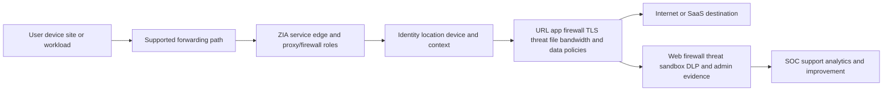

## What ZIA is and is not

ZIA is currently positioned as a cloud-native SSE/SWG for secure connectivity to internet and SaaS applications. Public material associates it with proxy architecture, URL/web policy, cloud firewall, TLS inspection, threat protection, sandbox, data security, bandwidth controls, and SOC integrations. Exact inclusion and naming vary.

| ZIA is intended to | ZIA does not automatically |
|---|---|
| Receive covered internet/SaaS traffic through supported forwarding | See traffic that bypasses or uses unsupported paths |
| Apply identity/location/context-aware policy | Replace authoritative identity lifecycle or app authorization |
| Proxy supported traffic and make destination connections | Make the internet/SaaS destination healthy |
| Inspect supported encrypted traffic when authorized/configured | Decrypt every protocol/app/device without compatibility impact |
| Enforce web, firewall, threat, file, bandwidth, and data controls where entitled | Include every feature in every edition/tenant |
| Generate transaction and security evidence | Guarantee every event reaches a customer's SIEM |
| Reduce covered malware/phishing/C2/data risks | Guarantee no compromise, lateral movement, or data loss |
| Support direct-to-cloud architecture patterns | Remove all LAN, ISP, DNS, routing, endpoint, or SaaS dependencies |

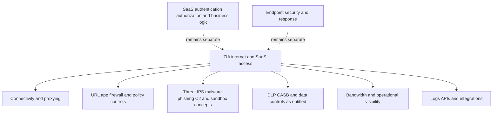

### Plain-English deep-dive 1 - ZIA is a checkpoint, not the destination

At an airport, security screening can approve a passenger and bag for travel. It cannot make the aircraft mechanically healthy, guarantee the destination airport is open, or authorize the passenger to enter a private office after landing.

ZIA can forward, evaluate, inspect, and permit an internet/SaaS transaction. The SaaS provider can still return HTTP 401, 403, 429, or 500; require its own authentication; enforce tenant permissions; throttle traffic; block an egress IP; or suffer an outage. A successful ZIA policy result and a failed application operation can both be true.

Troubleshooting therefore follows the whole path: endpoint and forwarding, identity, service edge, effective policy, TLS/inspection, edge-to-destination connection, SaaS front door, application authorization/dependencies, response, and logs. Stop at the first failed boundary.

## End-to-end ZIA traffic flow

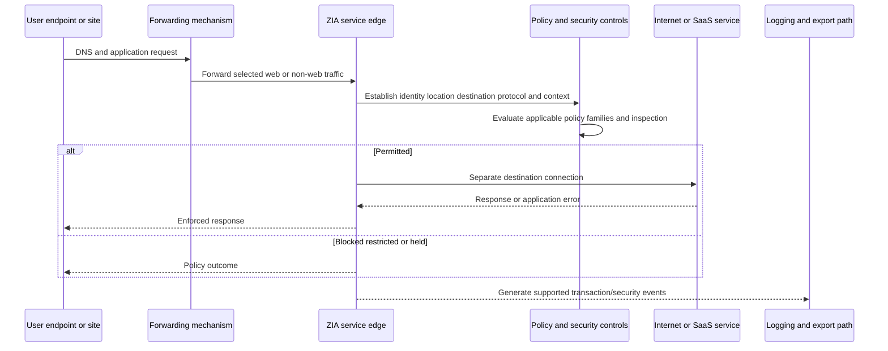

| Flow stage | Key question | Failure examples | Evidence |
|---|---|---|---|
| Application chooses path | Proxy-aware, client-steered, tunneled, or bypass? | PAC/direct mismatch, unsupported traffic | Client/PAC/profile/route evidence |
| First leg reaches ZIA | Can endpoint/site establish service connection? | DNS, route, ISP, tunnel, TLS, client | Trace/tunnel/client logs |
| Identity/location | Which user/site/device context is known? | Auth loop, wrong location, stale group | Auth and transaction identity |
| Destination classification | Which URL/domain/app/protocol/category? | Misclassification, wildcard overlap | Request and effective category/app |
| Policy evaluation | Which policy families/rules/actions apply? | Rule order, exception, license, default | Effective policy fields |
| Inspection/verdict | Was TLS/content/file/data visible and evaluated? | Bypass, pinning, unsupported format | Inspection/sandbox/DLP evidence |
| Destination leg | Can ZIA resolve/connect/negotiate with origin? | SaaS DNS, egress allowlist, TLS, origin | Response/timing and SaaS logs |
| User result | Did business operation complete acceptably? | App auth, 429, 500, latency | HAR/client/app evidence |
| Event pipeline | Did required logs arrive? | Delay, filter, NSS/API/SIEM issue | Reconciliation |

## Forwarding overview

Part 32 introduced Client Connector, explicit proxy/PAC, GRE, IPsec, branch/SD-WAN, and private-edge patterns. ZIA policy only affects traffic that reaches the correct path and scope.

| Cohort | Candidate supported pattern | Identity/context question | Coverage question |
|---|---|---|---|
| Remote managed endpoint | Client Connector | User/device/profile authenticated? | Which apps/protocols/tunnels are forwarded? |
| Fixed office/branch | GRE, IPsec, proxy, branch integration | User auth or location context? | Which subnets/routes/protocols bypass? |
| Proxy-aware browser/app | Explicit proxy or PAC | How is user authenticated? | What does PAC send direct? |
| Server/workload | Supported workload/site method | Which workload/location identity? | Is server traffic in intended scope? |
| Unmanaged/BYOD | Supported browser/other pattern | External identity and device limits? | Which operations/data channels are controlled? |
| Guest/IoT | Location or device-oriented pattern | Limited identity support? | Safety/business and protocol needs? |

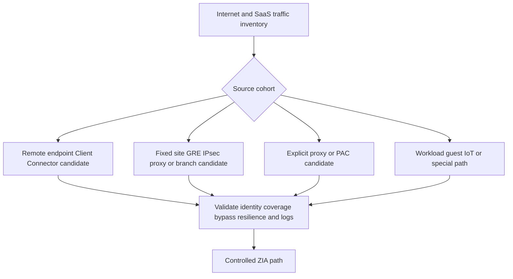

Never choose forwarding from a feature checklist alone. Inventory protocols, identity needs, platforms, source networks, SaaS egress requirements, resilience, performance, operations, and exceptions. A web-only pilot does not prove non-web coverage.

## Authentication and location context

ZIA policy may use authenticated user identity, group, location, device/context, destination, and other supported conditions. Traffic from a fixed site can sometimes be associated with a configured location even when an individual user is not known; that is not equivalent to user authentication.

| Identity state | Policy value | Limitation |
|---|---|---|
| Authenticated user | User/group-aware controls and accountability | Token/session/group freshness and shared devices |
| Known managed device | Device/posture context where supported | Does not identify active human alone |
| Known location/site | Site-based policy and reporting | NAT shares many users; location can be misidentified |
| Workload/source identity | Service/location-specific policy | Shared addresses and non-human lifecycle |
| Unauthenticated user | Baseline/location policy may apply | Reduced attribution and personalization |
| Unknown source | Explicit default/continuity behavior | Avoid silently treating unknown as trusted |

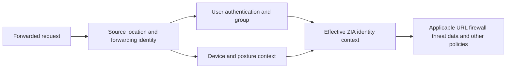

Authentication failures include redirect loops, cookie/session problems, IdP trust, clock, group mapping, client state, unsupported auth for a traffic type, and captive portals. Do not weaken policy globally to solve one cohort; identify whether the traffic can support the intended identity method.

## URL categories and filtering

A URL includes scheme, host, port, path, query, and fragment semantics. Policy visibility depends on traffic and TLS inspection. A category groups destinations/content by business or risk meaning. Classification can change as sites change, are compromised, or are recategorized.

| Policy input | Example | Value | Caveat |
|---|---|---|---|
| Domain/host | files.example.test | Broad destination identity | Shared hosting/subdomains matter |
| Full URL/path | /upload or /admin | More granular web operation context | Requires visibility; dynamic URLs |
| Category | Business, social, unknown, risky | Scalable policy grouping | False category and updates |
| Cloud app | Recognized SaaS application | App-specific controls | App signatures/features change |
| User/group | Payroll analysts | Business context | Stale mapping/overbroad group |
| Location/device | Branch or managed endpoint | Source/risk context | Not sole trust proof |
| Method/action | GET, POST, upload/download | Transaction intent | Encryption and protocol support |
| Reputation/risk | Newly observed or malicious | Threat context | Model/false results and time |

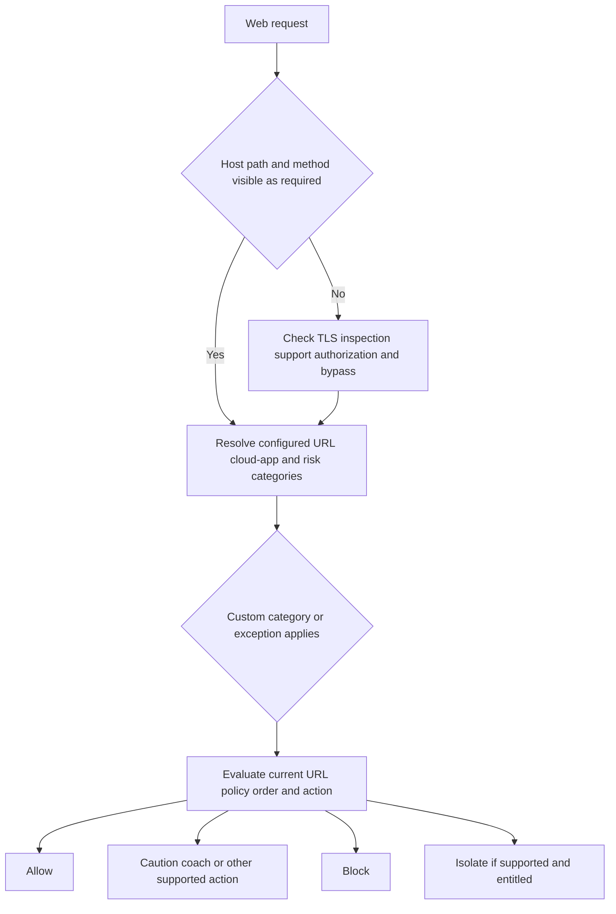

### Category governance

| Need | Practice |
|---|---|
| Misclassification | Collect sanitized URL, category, time, business purpose, and authoritative evidence |
| Custom categories | Use narrow, named, owned entries; avoid broad wildcards |
| Temporary allow | Add expiry, owner, reason, compensating controls, and negative tests |
| Unknown/new sites | Define risk-appropriate policy and review, not automatic permanent block/allow |
| Legal/HR categories | Involve policy, privacy, legal, and employee-relations owners |
| User message | Give safe reason and support route without revealing sensitive detection detail |
| Review | Revalidate exceptions after domain, owner, content, or risk changes |

### Plain-English deep-dive 2 - A category is a library label, not the book

A book labeled "history" may also contain politics, maps, and biography. The label helps organize policy but cannot describe every page forever. A website category is similar. A business site can be compromised. A new site can be benign but uncategorized. A shared domain can host many applications.

Therefore, a category mismatch is not automatically a product defect or proof that a site is malicious. Record what was requested, which category and rule applied at that time, whether TLS/path visibility was sufficient, and what current official recategorization/custom-category process applies. Use temporary exceptions only with ownership and expiry.

## Zero Trust Firewall and non-web traffic

Zscaler's current public page uses the name Zero Trust Firewall and positions it for web and non-web traffic, user/app-aware policy, threat protection, bandwidth controls, DNS security, and intrusion prevention. Exact ZIA relationship, edition, traffic support, rule fields, and inspection behavior require current help.

| Control dimension | Example question | Evidence |
|---|---|---|
| Source identity/location | Which user, device, workload, or site? | Transaction identity/location |
| Destination | Which IP, domain, service, or app? | DNS/flow/app classification |
| Protocol/port | TCP/UDP and destination/service port? | Flow log and packet evidence |
| Application | Which recognized app, including nonstandard port? | App control classification |
| Action | Allow, block, log, bandwidth, threat control? | Effective rule/action |
| IPS/threat | Which signature/behavior fired? | Threat/IPS event and version/context |
| DNS | Which query, answer, category, tunneling signal? | DNS policy/logs |
| Time/context | Which schedule, device, risk, location? | Rule inputs and clock |

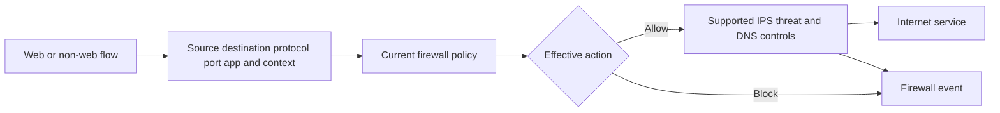

Port 443 does not prove HTTPS; applications can use nonstandard ports, encryption, tunneling, or custom protocols. Conversely, blocking a port does not block every application if it can use another path. Application and protocol identification has coverage/evasion limits. Endpoint and destination controls remain necessary.

## Threat protection: layered, not magical

Threat prevention works best as layers because each detection method has blind spots.

| Layer | Detects/controls conceptually | Strength | Limitation |
|---|---|---|---|
| Category/reputation | Known risky/malicious domains, URLs, IPs, files | Fast known-bad prevention | New/compromised infrastructure |
| Signatures | Known exploit/malware/network patterns | Precise for known patterns | Evasion/unknown variants |
| Heuristics/ML | Suspicious characteristics/behavior | Can generalize beyond exact signatures | Explainability and false results |
| IPS | Exploit and protocol attack patterns | Inline prevention on supported traffic | Encryption/coverage/tuning |
| Antivirus/file scan | Known file content/hash/pattern | Fast commodity malware detection | Packed/encrypted/novel files |
| Sandbox | Static/dynamic behavior of supported files | Deeper unknown-file analysis | Evasion, time, format, environment |
| Browser isolation | Mediate risky web interaction | Reduces direct endpoint exposure | Compatibility, license, non-web limits |
| DLP | Sensitive content/pattern/classification | Reduces covered exfiltration | Classification/channel limits |
| Endpoint/EDR | Execution/process/host behavior | Sees endpoint activity | Agent/OS/coverage and post-delivery |
| SOC response | Correlation, containment, recovery | Handles uncertainty and multi-source evidence | Requires people/process/authority |

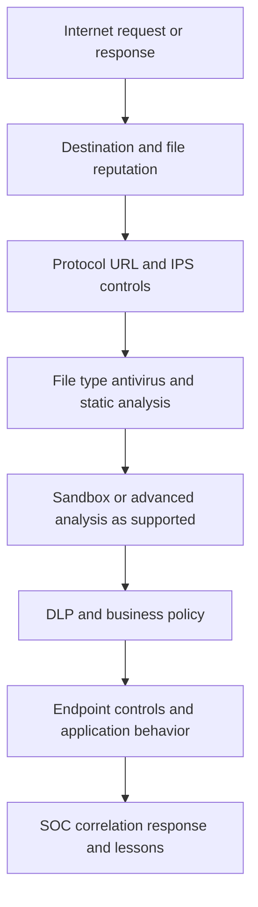

### Malware

Malware includes ransomware, trojans, downloaders, spyware, and other harmful software. A file can be encrypted, packed, split, streamed, generated in memory, or delivered through an allowed SaaS channel. A blocked download is a control success for that transaction, not proof no host is infected. Investigate endpoint and identity telemetry when exposure may have occurred.

### Phishing

Phishing can use a malicious URL, compromised legitimate site, QR code, attachment, OAuth consent, fake support call, or business email. URL, browser, file, and threat controls help on covered paths. Strong/phishing-resistant authentication, email security, user reporting, app-consent governance, endpoint detection, and response remain important.

### Command and control

C2 is communication used by an attacker to direct a compromised system, receive results, or exfiltrate. It can use DNS, HTTP(S), cloud services, custom protocols, or covert channels. Domain/IP reputation, DNS controls, firewall/app control, TLS inspection, IPS, anomaly detection, and endpoint/SOC evidence can contribute. Blocking one domain does not prove eradication; contain and investigate the host/identity under the incident process.

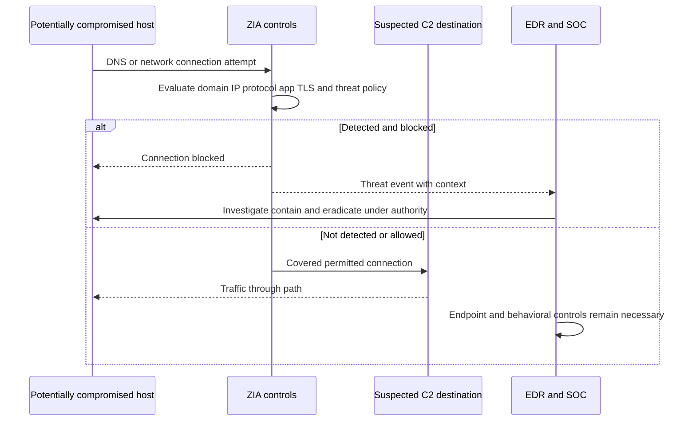

## Cloud Sandbox mechanics

A sandbox safely analyzes supported files using static properties and/or execution in controlled environments. Current Zscaler public material describes inline and API/out-of-band analysis, static and dynamic analysis, role/location/category policy, reporting, and browser integration. Exact file types, sizes, verdict modes, actions, timing, and entitlements need current help.

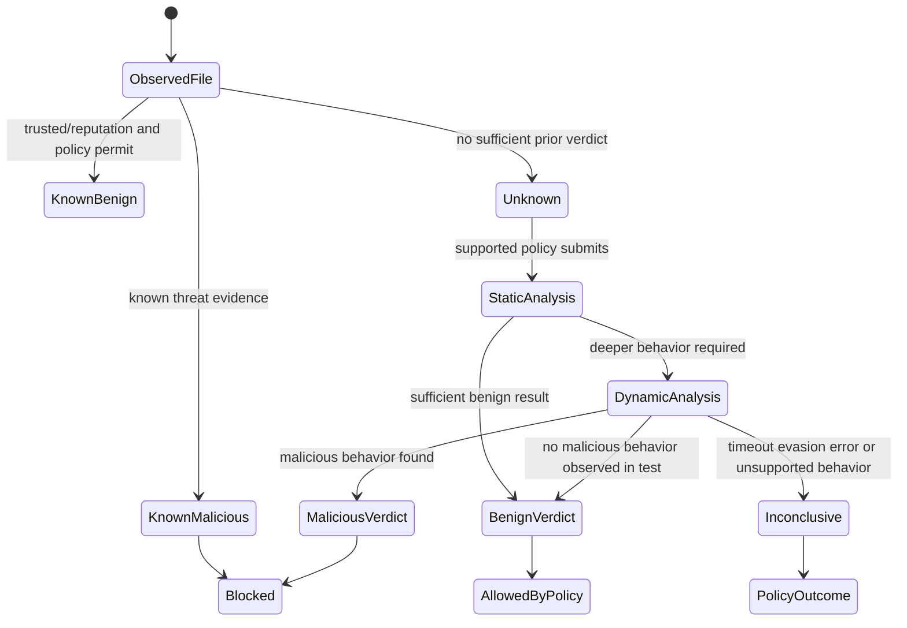

| Sandbox question | Why it matters |
|---|---|
| Which file types/sizes/channels? | Defines coverage |
| Inline hold, allow-first, or other mode? | Changes patient-zero and user-experience risk |
| What is "instant" versus deeper verdict? | Timing and confidence differ |
| Which static/dynamic environments? | Malware can behave differently or evade |
| How are encrypted/password files handled? | Content may be unavailable |
| What does benign mean? | No observed malicious behavior is not future proof |
| What happens when inconclusive/error? | Default must be explicit |
| How are verdicts updated/shared? | Later knowledge can change response |
| Which logs/API/SOC workflow? | Investigation and response need evidence |
| How does browser/file handling work? | Feature, license, compatibility, and data risk vary |

### Plain-English deep-dive 3 - A sandbox is a test kitchen, not a truth machine

A food inspector can test a sample in a controlled kitchen. The sample may appear safe under tested temperature and time but behave differently elsewhere. A clever contaminant may wait or detect the test environment.

A sandbox verdict is evidence under an analysis environment and time. "Malicious" needs response and scope. "Benign" means no disallowed behavior was found under the performed analysis; it does not guarantee the file can never be harmful. "Unknown" or "inconclusive" is not the same as benign.

Policy must define what users experience while analysis runs and what happens after a later malicious verdict. Endpoint telemetry, file distribution scope, identity, app logs, and response playbooks remain critical.

## TLS inspection

Most web applications use TLS. Without authorized decryption, an intermediary can often see connection metadata and some handshake/destination information, but not full HTTP paths, headers, bodies, or files. With inspection, ZIA logically handles separate client-to-proxy and proxy-to-origin TLS sessions.

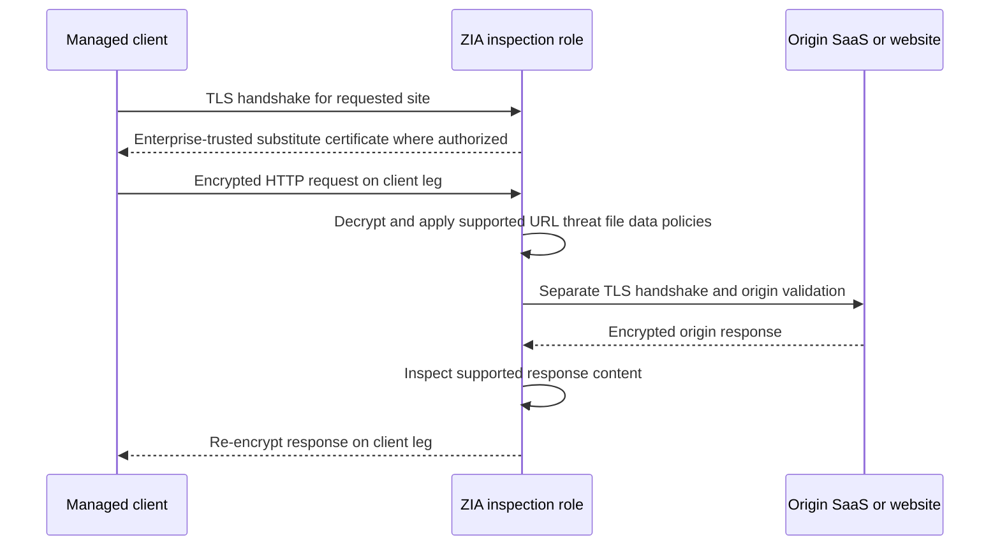

| Design area | Requirement/question | Failure symptom |
|---|---|---|
| Authority | Legal/privacy/security approval and user notice | Governance violation |
| Trust | Enterprise root/intermediate installed safely | Browser/app certificate error |
| Origin validation | ZIA must validate destination certificate under policy | Blocked invalid origin or security gap |
| App compatibility | Pinning, mutual TLS, custom stores, unsupported protocols | App fails only under inspection |
| Identity | Which users/devices/locations receive inspection? | Wrong cohort or inconsistent behavior |
| Bypass | Narrow destination/app exception with owner/expiry | Hidden coverage gap or overbroad bypass |
| Content | Which protocol/body/file becomes visible? | Policy expected but no visibility |
| Privacy/data | Sensitive categories and data handling | Excess collection/exposure |
| Performance | Handshakes, content processing, file analysis | Added latency or timeout |
| Logging | Record inspection state and decision | Analysts assume inspection without proof |

Part 37 will go deeper. For now, never solve certificate errors by disabling validation or installing untrusted certificates casually. Determine which leg and chain failed, whether the app supports inspection, and whether an approved exception is justified.

## Bandwidth and file controls

Bandwidth control prioritizes or limits classes of traffic under current product capabilities. It is not a security verdict. A large approved backup can consume bandwidth; a tiny malicious request can cause harm.

| Control | Purpose | Example | Caveat |
|---|---|---|---|
| Priority | Favor business-critical traffic under contention | Voice/collaboration over bulk download | Needs accurate classification and link context |
| Limit/rate | Bound category/app/user/site consumption | Streaming cap at branch | Exact enforcement semantics vary |
| Quota/time | Limit use over period | Personal media allowance | Identity, reset period, fairness/privacy |
| File-type block | Prevent selected formats/actions | Executable download restriction | Detect actual type; exceptions needed |
| File-size rule | Manage risk/performance | Hold/limit large unknown files | Business workflows and product limits |
| Upload/download distinction | Control direction | Block sensitive upload, permit download | Requires protocol/content visibility |

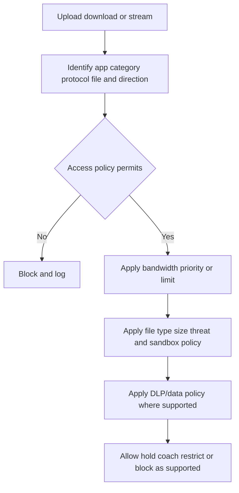

File extension, MIME type, magic bytes, archive contents, encryption, and actual behavior can disagree. Use supported detection and do not claim that blocking `.exe` strings blocks every executable technique.

## Data security overview

DLP detects sensitive information using classifiers and applies actions on covered channels. Zscaler's current DLP page positions centralized policy across web, endpoint, email, SaaS, public cloud, private apps, and BYOD within a broader portfolio. Part 39 covers data security in depth. ZIA inline traffic is only one observation point.

| Classifier concept | Example | Strength | Limitation |
|---|---|---|---|
| Pattern/regex | Structured number format | Fast | False matches and context |
| Dictionary | Sensitive term list | Business vocabulary | Maintenance and ambiguity |
| Exact Data Match | Structured records transformed/indexed for matching | Specific known records | Source prep, privacy, updates |
| Indexed Document Matching | Similarity to sensitive documents | Unstructured IP | Threshold and source governance |
| Optical Character Recognition | Extract text from images | Image-based data visibility | Quality, language, compute, false results |
| Label/metadata | Existing classification label | Reuses governance | Missing/wrong labels and interoperability |
| Machine learning | Learned/contextual classification | Handles variation | Explainability, drift, false results |

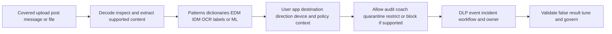

| DLP question | Why it matters |
|---|---|
| Which data and business harm? | Prevents generic noisy policy |
| Which channels/actions are in scope? | No one control sees all movement |
| Is TLS/content visible? | Encrypted payload may be opaque |
| Which classifier and confidence? | Accuracy/false results differ |
| What action and user message? | Security must be proportionate and usable |
| Who investigates? | DLP alert is not automatically a breach |
| What evidence is retained? | Content can be highly sensitive |
| How are incidents tuned/closed? | Avoid alert backlog and repeated errors |

## Policy hierarchy and effective order

One ZIA transaction may be affected by forwarding/bypass, authentication, TLS inspection, URL/app access, firewall, bandwidth, file, malware, sandbox, DLP, and other policy families. These are not necessarily one universal linear chain, and exact order can vary by traffic/product behavior.

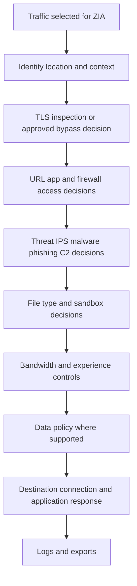

This diagram is a study model, not a guaranteed internal processing order. Current authenticated documentation and the effective transaction log control.

| Order risk | Example | Test |
|---|---|---|
| Broad allow shadowing | General category rule permits specific risky destination | Tagged destination and winning rule |
| Exception overreach | TLS bypass wildcard matches unrelated subdomains | Positive and negative certificate/inspection tests |
| Multiple policy families | URL allow but DLP blocks upload | Capture each effective action/reason |
| Unauthenticated traffic | User rule never matches site traffic | Compare auth/location state |
| Custom category conflict | Destination belongs to several custom/built-in groups | Current classification and precedence |
| File/threat interaction | File type allowed but sandbox blocks | Separate access from verdict |
| Destination response | ZIA permits but SaaS returns 403 | Proxy and SaaS evidence |
| Stale session/config | New rule not observed in old session | Fresh tagged transaction/version/timeline |

### Plain-English deep-dive 4 - An allow at one gate is not a universal pass

An airport passenger can pass the terminal entrance but fail passport control, security screening, customs, boarding, or destination immigration. Each gate answers a different question.

Similarly, a URL policy can allow a website while malware policy blocks a file. Firewall policy can allow a connection while DLP blocks an upload. ZIA can permit the complete transaction while the SaaS app returns 403. These are not necessarily contradictions.

When a user says "the site is allowed," ask: which policy family, which rule, which operation, which identity, and which time? Build the reason chain rather than searching for one master allow switch.

## Logs and evidence

| Evidence family | Questions answered | Caveat |
|---|---|---|
| Web transaction | URL/category/method/status/action/user/time | Fields depend on visibility and policy |
| Firewall/network | Source/destination/protocol/port/app/action | NAT/proxy legs and identity mapping matter |
| Threat/IPS | Detection/signature/category/action/severity | Detection is evidence, not full incident scope |
| Sandbox | File/hash/submission/verdict/behavior/policy | Verdict can update; file content is sensitive |
| DLP | Classifier/rule/channel/action/incident | Minimize sensitive matched content |
| Authentication | User/session/method/result | Separate IdP and ZIA state |
| TLS | Inspection/bypass/certificate/error state | Privacy and leg distinction |
| Admin audit | Who changed which policy/object and when | External IdP/endpoint changes are elsewhere |
| Service/client/tunnel health | Forwarding/edge/component status | Health probe is not business transaction |
| SaaS/app/HAR | Origin response, auth, throttling, dependency | ZIA may not own failure |
| SIEM/export | Delivery/parsing/alert/case | Portal event does not prove export arrival |

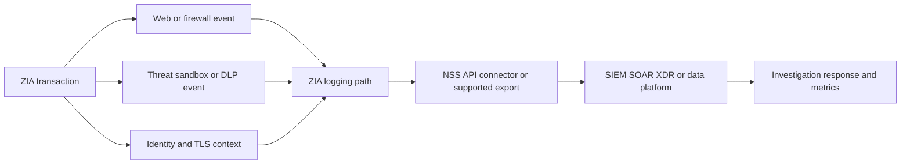

Correlate by exact UTC time, user/source, destination, action, transaction identifier where available, file hash where appropriate, policy/rule, and app response. Protect URL queries, content, tokens, file samples, and DLP matches.

## Health model

| Layer | Healthy means | Representative check |
|---|---|---|
| Endpoint/site | Client/PAC/tunnel/routes/trust work | Known-good forwarding test |
| Authentication | Correct identity/group/location current | Test-user auth and effective identity |
| Service path | Intended edge accepts traffic | First-leg transaction evidence |
| Policy | Expected rule/action for allowed and denied cases | Tagged positive/negative tests |
| TLS | Supported sites inspect/bypass as designed | Certificate and log state |
| Threat/file | Test artifacts/known safe cases produce expected controlled outcomes | Authorized vendor/test method |
| Destination | SaaS completes business operation | End-to-end synthetic transaction |
| Performance | Percentiles meet agreed target | Representative cohort baseline |
| Logging | Portal/export/SIEM reconcile within objective | Canary events |
| Governance | Exceptions/licensing/owners/reviews current | Attestation and expiry report |

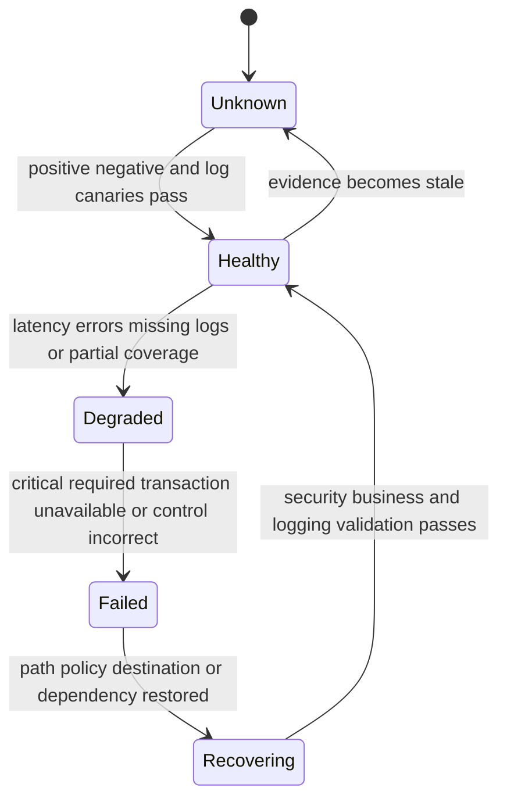

Security health and availability health can diverge. A bypass can restore availability while making security health worse. An overbroad block can improve one control metric while harming business. Use a balanced scorecard.

## Deployment and pilot method

### Phase 1: discovery

Inventory users, devices, sites, workloads, traffic volumes, protocols, destinations, SaaS egress dependencies, identity, certificates, existing proxies/firewalls, legal/privacy constraints, apps that pin certificates, data classes, SOC tools, support ownership, and business-critical transactions.

### Phase 2: baseline

Measure current reachability, latency percentiles, failures, bandwidth, threat/data events, bypasses, user tickets, and log completeness. Baseline does not mean current architecture is safe; it provides comparison.

### Phase 3: design

Choose supported forwarding per cohort, identity, HA, TLS inspection scope, URL/firewall/threat/file/data policies, exceptions, user messages, logs/export, privacy, operations, and rollback. Confirm entitlement and current documentation.

### Phase 4: lab and pilot

Use representative users, platforms, locations, protocols, apps, and data with synthetic tests. Start with visibility where appropriate, tune noise/compatibility, then stage enforcement. Include negative security tests and destination owner validation.

### Phase 5: rollout rings

Expand by risk and support readiness. Monitor adoption, forwarding coverage, auth, policy, TLS, destination behavior, experience, threats, DLP, logs, and tickets. Stop under predefined thresholds.

### Phase 6: operate and improve

Review exceptions, categories, signatures, policy, certificates, identity, client/tunnels, logs, threat/DLP workflow, app changes, outcomes, and current releases.

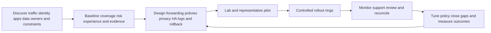

### Pilot gates

| Gate | Pass evidence | Stop condition |
|---|---|---|
| Forwarding | Intended traffic enters ZIA; bypasses documented | Critical traffic path unknown |
| Identity | Correct user/location/device context | Wrong/stale cohorts |
| Access | Required apps work; prohibited categories/resources blocked | Broad unintended access/deny |
| TLS | Trust and supported apps work; exclusions governed | Critical pinning/privacy issue unresolved |
| Threat/file | Authorized safe tests produce expected actions | Unexpected coverage/action |
| Data | Synthetic sensitive data detected/actioned correctly | Excess false block or privacy concern |
| Performance | Agreed transaction percentiles acceptable | Critical degradation |
| Resilience | Alternate paths preserve security and logs | Failover bypasses controls |
| Logging | Portal-to-SIEM canaries reconcile | Material visibility gap |
| Operations | Help, owners, escalation, rollback rehearsed | No accountable owner/rollback |

## Change management

| Change type | Risk | Safe practice |
|---|---|---|
| Forwarding/profile | Large traffic-path blast radius | Small ring, current config, rollback, path canary |
| URL/category | Overblock/underblock from broad match | Sample, custom-category review, negative tests |
| TLS inspection | Compatibility/privacy/trust impact | Staged cohort, app matrix, root deployment, exception governance |
| Firewall rule | Non-web outage or exposure | Flow inventory, order tests, logs |
| Threat/sandbox | False block or missed/held files | Safe test corpus, SOC/support readiness |
| DLP | Sensitive data exposure/noise/business block | Synthetic data, privacy review, incident workflow |
| Bandwidth | User-experience degradation | Baseline and monitored thresholds |
| Log export/parser | Blind SOC or duplicate alerts | Dual-run/reconciliation and rollback |

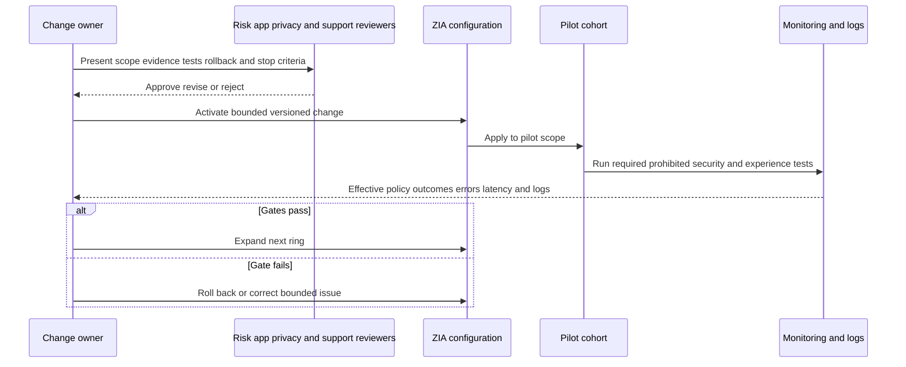

## Failure scenarios

| Symptom | Plausible causes | Discriminating evidence | Unsafe conclusion |
|---|---|---|---|
| No internet for one user | Client, local DNS/network, auth, profile, trust, policy | Same device/network/user comparisons | ZIA global outage |
| One site fails | ISP, CPE, tunnel, route, location, edge path | Alternate link/site and tunnel counters | URL policy issue |
| One SaaS app returns 403 | ZIA rule, SaaS auth, egress allowlist, tenant permission | Effective ZIA action plus SaaS logs/HAR | ZIA blocked it |
| Site works when bypassed | Path, inspection, source IP, DNS, policy all changed | Compare variables individually | Product defect proved |
| Certificate warning | Missing root, wrong chain, origin cert, pinning, clock, captive portal | Certificate/handshake and inspection state | Malware detected |
| Category block seems wrong | Recategorization, custom category, rule/order, stale UI/session | Transaction category/rule/time | Site is safe because owner says so |
| File allowed but later malicious | Unknown/evasion/verdict update/path gap | Sandbox/file/endpoint timeline | Sandbox never ran or failed universally |
| File held too long | Analysis, file type/size/encryption, service/path, policy mode | Submission/verdict/timing evidence | Internet latency only |
| C2 event appears | Real compromise, false positive, shared IP/domain, test traffic | Host/process/DNS/network/context correlation | Host is clean because block succeeded |
| DLP blocks benign upload | Classifier, threshold, content, destination, policy/order | Sanitized match evidence and owner review | Disable DLP globally |
| Web logs absent | Bypass, non-web path, delay, filter, wrong tenant/source | Forwarding and portal/export reconciliation | User made no request |
| Latency after rollout | Endpoint, tunnel, edge, TLS, file/DLP, egress, SaaS | Segmented timing and matched cohort | Cloud proxy always slow |

## Troubleshooting workflow

### Step 1: define the exact transaction

Record user/device/site, source network, forwarding method, assigned cloud, URL/domain/IP, protocol/port, direction, file/data operation, exact UTC time, expected and actual result, business impact, frequency, and recent changes.

### Step 2: prove forwarding and identity

Confirm traffic entered ZIA and did not use a direct/bypass route. Identify active service path, user/location/device context, authentication time, and policy scope.

### Step 3: find effective policies

Collect the URL/category/app, firewall, TLS, threat, file/sandbox, bandwidth, DLP, and exception outcomes relevant to the transaction. Do not assume one allow wins globally.

### Step 4: separate proxy legs and destination

Check client-to-ZIA DNS/TCP/TLS and ZIA-to-origin DNS/TLS/HTTP/app behavior. Use HAR, approved packet evidence, ZIA logs, SaaS logs/status, and known-good comparisons.

### Step 5: check logging path

If expected evidence is absent, verify event generation, portal visibility, export filters, collector/API, parser, storage, retention, and clock.

### Step 6: correct and validate

Make the smallest reversible change at the controlling boundary. Validate required access, prohibited access, TLS/security controls, file/data outcomes, user experience, logging, failover, and rollback.

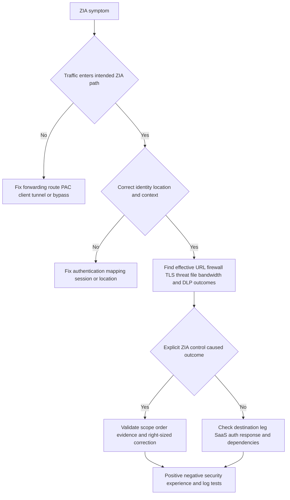

### Slow-transaction decision tree

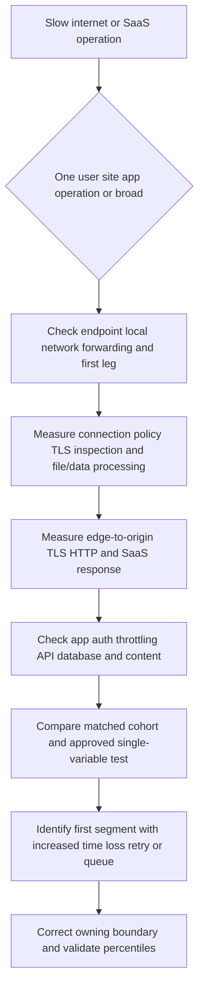

## Fictional NMH ZIA pilot

NMH plans a synthetic pilot for 300 managed users across headquarters, a branch, and remote work. It includes Microsoft 365, approved SaaS, general web, selected non-web traffic, safe threat test artifacts, and synthetic data. This is not a production design.

### Pilot scope

| Area | Synthetic decision | Validation |
|---|---|---|
| Forwarding | Client path for remote; supported site tunnels for offices | Path, failover, bypass inventory |
| Identity | Federated user/group plus location context | Effective identity and stale-session tests |
| URL | Business categories allow; risky/unauthorized categories staged | Positive/negative and recategorization workflow |
| Firewall | Required web/non-web services only | Protocol/app/port matrix and logs |
| TLS | Staged managed-device inspection except approved categories/apps | Trust, pinning, privacy, origin validation |
| Threat/file | Layered malware/IPS/sandbox using authorized safe tests | Expected rule/verdict and endpoint correlation |
| Bandwidth | Observe first, prioritize critical collaboration under contention | Percentiles and no starvation |
| DLP | Audit synthetic employee/financial patterns before enforcement | False-result review and incident workflow |
| Logs | Portal plus supported SIEM export canaries | Count/timing/schema reconciliation |
| Rollback | Cohort-scoped forwarding/policy rollback | Rehearsed and owner-approved |

```mermaid
flowchart LR
    HQ[NMH headquarters pilot] --> ZIA[ZIA pilot policy path]
    BR[NMH branch pilot] --> ZIA
    REM[NMH remote pilot] --> ZIA
    ZIA --> M365[Microsoft 365]
    ZIA --> SAAS[Approved SaaS]
    ZIA --> WEB[General web]
    ZIA --> NONWEB[Required non-web services]
    ZIA --> SIEM[NMH SIEM canary pipeline]
    TEST[Safe threat and synthetic DLP tests] --> ZIA
```

### NMH incident: OneDrive upload blocked after DLP enforcement

At 15:05 UTC, one pilot user reports that a legitimate project spreadsheet cannot upload to the approved NMH OneDrive tenant. ZIA logs show a DLP block. The file contains synthetic employee IDs matching a broad pattern. There is no breach.

| Hypothesis | Prediction | Synthetic evidence | Verdict |
|---|---|---|---|
| OneDrive outage | Other uploads/users fail and SaaS reports issue | Other files/users succeed | Falsified |
| Forwarding failure | No ZIA transaction or connection timeout | Complete transaction reaches DLP stage | Falsified |
| Wrong SaaS tenant/destination | Destination is personal tenant | Approved tenant confirmed | Falsified |
| DLP false positive | Match details show broad pattern without sufficient context | Synthetic IDs match pattern | Supported |
| Correct sensitive-data block | Data owner classifies file restricted for this destination | Data owner says approved internal use | Falsified for current rule intent |
| Rule order/exception issue | Narrow approved-channel rule should precede broad control | Effective broad rule wins | Contributing design defect |

```mermaid
sequenceDiagram
    participant U as NMH pilot user
    participant Z as ZIA policy path
    participant D as DLP classifier and rule
    participant O as Data owner
    participant M as Microsoft OneDrive
    U->>Z: Upload approved project spreadsheet
    Z->>D: Inspect covered content and context
    D-->>U: Block under broad employee ID rule
    Z-->>O: Sanitized incident evidence
    O->>O: Confirm data class destination and business purpose
    O-->>Z: Approve narrower rule correction through change process
    U->>Z: Retest permitted file and prohibited synthetic case
    Z->>M: Permit approved internal upload
    M-->>U: Upload succeeds
```

The correction is not "allow OneDrive." It is a classifier/rule-context change reviewed by the data owner: improve validation/context for the employee-ID detector and preserve a negative test that blocks the same synthetic data to an unapproved destination. The rollout pauses until regression tests pass. This demonstrates impact-over-activity and security-preserving recovery.

## Outcomes and boundaries

| Desired outcome | Leading evidence | Lagging evidence/caveat |
|---|---|---|
| More traffic covered | Forwarding adoption and bypass inventory | Coverage does not equal correct policy |
| Reduced risky access | Validated category/app blocks and exception reduction | Attackers/adversary behavior changes |
| Reduced malware exposure | Covered malicious/safe test outcomes, threat trends | Blocks are not infections prevented with certainty |
| Faster detection/response | Event completeness and case workflow time | Attribution and alert quality matter |
| Reduced data-loss risk | DLP coverage, tuned classifiers, governed incidents | No channel has perfect visibility |
| Better experience | End-to-end transaction percentiles/ticket trend | Destination and endpoint causality caveats |
| Simpler operations | Retired controls/process time only after proof | Avoid counting shifted complexity as removal |
| Audit readiness | Explainable policy, logs, exceptions, reviews | Logs do not prove control effectiveness alone |

Never claim "ZIA prevented X breaches" from block counts alone. A blocked request might be a scanner, duplicate retry, test, false positive, or real attack. Report what the evidence supports: transactions blocked, threats detected under defined rules, coverage, confirmed incidents, time saved, or validated control tests.

## Arti's Microsoft-to-Zscaler bridge

| Microsoft production strength | Part 34 transfer | New ZIA learning | Honest language |
|---|---|---|---|
| OneDrive/SharePoint traffic mapping | User-to-ZIA-to-M365 path and app result | ZIA forwarding/service-edge objects | "The path method transfers; product operation is new." |
| Proxy/PAC/DNS/TCP/TLS/HTTP | Forwarding, two legs, TLS, status, latency | ZIA logs and effective policy | "I would prove path and rule before attribution." |
| Browser DevTools/HAR/Fiddler/Procmon | Client/app evidence and timing | ZIA-specific correlation | "Adjacent tools complement, not replace, tenant evidence." |
| M365 permissions/throttling | Separate ZIA allow from SaaS 403/429 | ZIA app control/egress behavior | "Application authorization remains distinct." |
| Critical escalations/RCA | Multi-team containment/recovery and prevention | SOC/ZIA support process | "I bring incident discipline, not claimed ZIA admin history." |
| SQL/Power BI | Coverage, policy, event, false-result trends | ZIA schema/retention/export | "I validate denominator, grain, time, completeness." |
| Training/mentoring | Role-based ZIA teach-back and runbooks | Console/operational labs | "Enablement is a strength while product depth ramps." |

### 30-second interview bridge

"ZIA secures covered internet and SaaS traffic by steering it to a cloud service edge, establishing user/location/device context, applying applicable URL, firewall, TLS, threat, file, bandwidth, and data policies, then proxying permitted traffic to the destination and generating evidence. One allow does not override every policy family, and the SaaS app still owns its authorization and health. My Microsoft 365 background gives me strong proxy, DNS, TCP, TLS, HTTP, HAR, client, permissions, and escalation methods. My study and synthetic scenarios cover ZIA architecture; direct production ZIA administration is not part of my current experience."

## TSM ZIA review checklist

| Review area | Questions | Artifact |
|---|---|---|
| Outcomes | Which security, data, experience, and operating changes matter? | Success hypothesis |
| Traffic | Users/sites/workloads/protocols/destinations/volumes? | Traffic inventory |
| Forwarding | Which method, bypass, HA, identity, and owner per cohort? | Forwarding matrix |
| Authentication | Which user/location/device context and lifecycle? | Identity map |
| Access | URL/category/cloud-app/firewall requirements and exceptions? | Access matrix |
| TLS | Scope, trust, privacy, compatibility, origin validation, bypass? | Inspection design |
| Threat | Reputation/signature/IPS/file/sandbox/C2/SOC workflow? | Threat control map |
| Data | Classifiers, channels, destinations, actions, incident owners? | DLP policy map |
| Experience | Bandwidth, latency, file timing, destination behavior? | Baseline/SLO |
| Logs | Web/firewall/threat/sandbox/DLP/admin/export/retention? | Evidence dictionary |
| Operations | Monitoring, support, change, rollback, maintenance, escalation? | Runbook/RACI |
| Currency | Product/edition/license/cloud/UI/category/feature current? | Entitlement/source check |

## Labs and rehearsal

Use owned/synthetic environments, safe vendor-approved test artifacts, and authorization. Never test malware, interception, or data exfiltration against systems without approval.

### Lab 1: ZIA whiteboard

Draw user/site, forwarding, service edge, identity, policy families, destination, and logging/export. Explain two distinct failure boundaries in each direction.

### Lab 2: forwarding coverage

Create a synthetic inventory of browser, sync client, SSH, DNS, QUIC, API, guest, and workload traffic. Mark intended forwarding, identity, supported policy, bypass, owner, and test.

### Lab 3: URL policy

Build business, risky, custom, unknown, and temporary-exception categories using fake domains. Test wildcard boundaries and recategorization workflow.

### Lab 4: firewall matrix

Define required source/destination/protocol/port/application flows for five synthetic apps. Add negative paths and show why port 443 is not enough classification.

### Lab 5: threat layers

Map a safe simulated phishing-to-C2 chain across URL, TLS, IPS, file, sandbox, endpoint, and SOC controls. Remove one layer and identify remaining evidence.

### Lab 6: sandbox state machine

Use harmless synthetic file cases labeled known benign, known malicious test artifact, unknown, unsupported, encrypted, and inconclusive. Define policy outcomes without executing real malware.

### Lab 7: TLS two-leg lab

Use an owned local proxy/test CA. Capture client and origin handshakes, trust failure, origin certificate failure, and a pinned-app simulation. Remove test trust afterward.

### Lab 8: bandwidth

Create an owned network simulation with critical and bulk traffic. Measure latency/throughput before/after prioritization and document fairness/capacity caveats.

### Lab 9: DLP synthetic tests

Create fake employee IDs, financial patterns, dictionaries, and documents. Test approved versus unapproved destinations, false positives, user messaging, and incident minimization.

### Lab 10: log reconciliation

Send tagged safe allow, URL block, firewall block, threat-test, and DLP-test events. Reconcile portal and synthetic SIEM counts/times/schema.

### Lab 11: NMH OneDrive incident

Recreate the hypothesis table and write a bounded rule/classifier correction with data-owner approval, rollback, positive test, and negative regression test.

### Lab 12: interview teach-back

Explain ZIA, URL filtering, firewall, sandbox, TLS inspection, DLP, policy order, and troubleshooting in 30 seconds each. Include one limitation and evidence check.

## Common misconceptions to correct

| Misconception | Corrected understanding |
|---|---|
| ZIA is only a web proxy | It is positioned as broader internet/SaaS SSE with multiple controls, subject to license/path |
| ZIA and ZPA are interchangeable | ZIA targets internet/SaaS; ZPA targets private apps |
| Installing Client Connector proves ZIA is active | Profile, entitlement, forwarding, identity, policy, and logs must confirm |
| Traffic is protected because policy exists | Traffic must enter the intended path and match effective policy |
| Authentication success means SaaS access | ZIA and the SaaS app perform separate authorization/health decisions |
| A location is a user's physical GPS | It is a product/source context whose semantics must be verified |
| URL category is objective truth | Classification can be incomplete, stale, or context-dependent |
| Domain allow permits every path/action safely | Subdomains, paths, apps, uploads, files, threats, and DLP differ |
| Port 443 means HTTPS | Other protocols can use 443; classification and encryption matter |
| Firewall allow overrides threat/DLP | Different policy families answer different questions |
| IPS signature means confirmed compromise | It is detection evidence requiring context and investigation |
| Malware block proves endpoint is clean | Other delivery paths or prior execution may exist |
| Phishing is only malicious email attachment | Links, QR, OAuth consent, calls, and compromised sites also matter |
| C2 block eradicates infection | Investigate/contain host and identity; attacker can change channels |
| Sandbox benign means permanently safe | It means no malicious behavior observed under that analysis |
| Unknown equals malicious | Unknown needs explicit policy; it is not a verdict |
| TLS inspection sees everything | Protocol, app, pinning, device, bypass, authorization, and support limit coverage |
| Certificate error means ZIA block | Trust, origin, clock, captive portal, and app pinning are candidates |
| Bandwidth policy is threat prevention | It manages capacity/priority, not maliciousness |
| File extension proves type | Content/type/encoding/archive/encryption can differ |
| DLP alert is a breach | It is a policy event requiring validation and scope |
| DLP sees all data | Coverage depends on channel, path, encryption, product, classifier, and policy |
| One allow rule is a master allow | Several policy families and destination authorization remain |
| Bypass success proves ZIA defect | It changes path, source IP, DNS, TLS, policy, and inspection |
| Block count equals breaches prevented | Counts need classification, dedupe, scope, and causal caution |
| Product page proves license/performance | Contract, tenant, path, policy, status, and measured evidence control |
| This Part proves ZIA hands-on experience | It proves conceptual preparation and synthetic practice only |

## Official Source Anchors

Sources in this section were reviewed on **2026-08-24**.

All pages were reviewed on **2026-08-24**. Zscaler pages are vendor-authored sources for current public product positioning. Standards establish protocol/security foundations. Marketing metrics and absolute language are not customer guarantees. Authenticated help and tenant evidence control exact policy behavior.

| Source | URL | Used for | Boundary |
|---|---|---|---|
| Zscaler Internet Access | https://www.zscaler.com/products-and-solutions/zscaler-internet-access | Internet/SaaS SSE/SWG, proxy, TLS, threat, data, SOC and direct-to-cloud positioning | Edition, forwarding, policy, coverage and outcome require proof |
| Zero Trust Firewall | https://www.zscaler.com/products-and-solutions/cloud-firewall | Web/non-web, user/app-aware policy, IPS, DNS, bandwidth, TLS positioning | Absolute scale/performance/inspection claims are not universal |
| Cloud Sandbox | https://www.zscaler.com/products-and-solutions/cloud-sandbox | Static/dynamic, inline/API, file verdict, browser and SOC workflow positioning | File support, modes, timing, efficacy and license vary |
| Cyberthreat Protection | https://www.zscaler.com/products-and-solutions/cyberthreat-protection | Attack-stage, inline threat, phishing/ransomware and integration story | Marketing outcomes require scoped validation |
| Zscaler DLP | https://www.zscaler.com/products-and-solutions/data-loss-prevention | Unified DLP channels, EDM, IDM, OCR and centralized policy positioning | ZIA inline is one channel; accuracy/coverage varies |
| Zscaler Client Connector | https://www.zscaler.com/products-and-solutions/zscaler-client-connector | Endpoint forwarding/context relationship | Installation does not prove ZIA entitlement/operation |
| Zscaler Config | https://config.zscaler.com/ | Current cloud network/configuration dependencies | Use assigned-cloud current values, not this lesson |
| IETF RFC 9110 | https://www.rfc-editor.org/rfc/rfc9110 | HTTP semantics, methods, status, intermediaries | HTTP only; implementation/product policy differs |
| IETF RFC 8446 | https://www.rfc-editor.org/rfc/rfc8446 | TLS 1.3 handshake/security foundation | Does not authorize inspection or describe ZIA internals |
| NIST SP 800-207 | https://csrc.nist.gov/pubs/sp/800/207/final | Zero trust resource/policy principles | General architecture, not ZIA configuration |
| MITRE ATT&CK | https://attack.mitre.org/ | Threat behavior including phishing, ingress transfer, and C2 techniques | Knowledge base, not proof of one event or product coverage |

## Likely Interview Questions

### Q1. What is ZIA and where does it fit?

**Model answer:** Zscaler Internet Access is the current product for securing covered internet and SaaS traffic. It is positioned as cloud-native SSE/SWG using proxy-based, identity/context-aware connections plus related URL, firewall, TLS, threat, sandbox, bandwidth, data, and logging capabilities where licensed and configured. Traffic must be forwarded into the path. ZIA does not replace ZPA private-app access, SaaS authorization, endpoint security, or incident response.

### Q2. Walk me through a ZIA web transaction.

**Model answer:** The endpoint or site resolves the destination and sends selected traffic through Client Connector, proxy/PAC, tunnel, or another supported method to a ZIA service edge. ZIA establishes user/location/device context, classifies the destination, evaluates applicable URL, TLS, threat, file, bandwidth, and data policies, then creates a separate destination connection if permitted. The website/SaaS responds, ZIA enforces the response path, and supported events flow to portal/export/SIEM.

### Q3. How do URL filtering and cloud firewall differ?

**Model answer:** URL filtering focuses on web destinations, categories, cloud apps, and visible request context such as paths or methods. Firewall controls address supported web and non-web flows using source, destination, protocol, port, application, context, and threat controls. They can overlap but are different policy families. I would verify current order, traffic visibility, identity, effective rule, and license rather than assume a URL allow permits every protocol.

### Q4. How do ZIA threat controls address malware, phishing, and C2?

**Model answer:** Layered controls can use destination/file reputation, categories, signatures, IPS, heuristic or ML analysis, TLS/content visibility, file scanning/sandboxing, DNS/firewall controls, and SOC integrations. Phishing also needs strong identity and user/app governance; C2 blocks require endpoint investigation; sandbox verdicts have timing/evasion limits. A block is transaction evidence, not proof an endpoint is clean or a breach was prevented.

### Q5. Explain Cloud Sandbox and its limitations.

**Model answer:** A sandbox analyzes supported files with static and controlled dynamic behavior methods, inline and/or through API modes under current capability. Policy determines how known, unknown, malicious, benign, encrypted, unsupported, or inconclusive files are handled. A benign verdict means no malicious behavior was observed in that analysis, not permanent safety. I would verify file/channel coverage, hold behavior, verdict timing, false results, endpoint exposure, logs, and response workflow.

### Q6. Why is TLS inspection important and risky?

**Model answer:** It can expose HTTP paths, bodies, files, threats, and sensitive data that encryption would otherwise hide from inline controls. The proxy creates separate client and origin TLS sessions, requiring enterprise trust and origin validation. It also creates privacy, legal, key/certificate, compatibility, pinning, performance, and bypass concerns. I would stage it on managed cohorts, test applications, govern exclusions, and prove inspection state per transaction.

### Q7. How would you troubleshoot a ZIA access or performance issue?

**Model answer:** I would define the exact user/device/site, forwarding, cloud, destination, protocol/action, UTC time, and impact. Then prove forwarding and identity, find effective policies across relevant families, separate the client-to-ZIA and ZIA-to-origin legs, inspect TLS/threat/file/DLP timing, check SaaS authorization/dependencies, and reconcile logs. I would change the smallest controlling boundary and validate required, prohibited, security, experience, failover, and logging behavior.

### Q8. How does your Microsoft 365 experience prepare you for ZIA?

**Model answer:** My production work already spans OneDrive/SharePoint clients, proxy/PAC, DNS, TCP, TLS, HTTP, HAR/Fiddler/Procmon, identity, permissions, throttling, Microsoft service behavior, critical escalation, RCA, and fix validation. Those methods map strongly to ZIA path, policy, and destination isolation. My study and modeling cover ZIA, while direct production administration is not part of my current experience. I would pair that evidence discipline with current Zscaler help, tenant logs, labs, and specialist review.

## 30-Second Memory Hooks

| Concept | Memory hook |
|---|---|
| ZIA | Secure covered internet and SaaS |
| SSE | Cloud-delivered security category |
| SWG | Web inspection gate |
| Forwarding | No path, no ZIA control |
| Authentication | Who is sending |
| Location | Which source context |
| URL category | Library label, not eternal truth |
| Firewall | Source, destination, protocol, app, action |
| IPS | Known exploit/pattern guard |
| Malware | Harmful payload or behavior |
| Phishing | Deceptive lure, not only files |
| C2 | Attacker remote channel |
| Reputation | What history says |
| Sandbox | Test suspicious file behavior |
| Benign verdict | No bad behavior observed in this test |
| TLS inspection | Open sealed traffic lawfully, then reseal |
| Two TLS legs | Client-proxy and proxy-origin |
| Bandwidth | Reserve lanes, not threat verdict |
| File control | Type, direction, size, content, context |
| DLP | Keep sensitive data in bounds |
| Classifier | Detector with false results |
| Policy hierarchy | Many gates, no master allow |
| Effective rule | What happened to this transaction |
| Logs | Correlate path, policy, verdict, app |
| Pilot | Observe, test, stage, enforce, learn |
| Outcome | Coverage and validated change, not marketing count |
| Arti bridge | M365 path discipline transfers; ZIA operation is new |

## Completion Checklist

- [ ] I can explain ZIA's internet/SaaS role and distinguish it from ZPA and ZDX.
- [ ] I can explain SSE and SWG without calling either one universal product.
- [ ] I can draw endpoint/site, forwarding, service edge, controls, destination, and logs.
- [ ] I can trace all stages of a ZIA transaction and name evidence for each.
- [ ] I know traffic must enter the intended forwarding path for ZIA policy to apply.
- [ ] I can compare Client Connector, proxy/PAC, tunnel, branch, workload, and special cohorts conceptually.
- [ ] I distinguish authenticated user, device, known location, workload, and unknown context.
- [ ] I can explain URL components, categories, cloud-app classification, and custom exceptions.
- [ ] I do not treat categories as infallible or permanent.
- [ ] I can explain URL filtering versus cloud firewall at a high level.
- [ ] I know port 443 does not prove HTTPS or one application.
- [ ] I can describe reputation, signatures, heuristics/ML, IPS, antivirus, sandbox, isolation, endpoint, and SOC layers.
- [ ] I can explain malware, phishing, and C2 with remaining controls and incident needs.
- [ ] I never treat a C2 block as eradication or a malware block as endpoint-clean proof.
- [ ] I can draw the sandbox state machine for known, unknown, benign, malicious, unsupported, and inconclusive.
- [ ] I can explain patient-zero and verdict-timing tradeoffs without product promises.
- [ ] I treat benign sandbox verdict as scoped evidence, not permanent safety.
- [ ] I can draw separate TLS legs and explain enterprise trust and origin validation.
- [ ] I include privacy, legal, pinning, compatibility, performance, and bypass governance in TLS inspection.
- [ ] I never disable certificate validation casually.
- [ ] I can distinguish bandwidth priority/limits from security verdicts.
- [ ] I can explain file type/size/direction controls and why extension is insufficient.
- [ ] I can introduce DLP classifiers, actions, incident workflow, and channel limits.
- [ ] I do not call a DLP event a breach without validation.
- [ ] I can explain why one allow does not override every ZIA policy family.
- [ ] I use current help and transaction evidence for exact rule order.
- [ ] I can correlate web, firewall, threat, sandbox, DLP, auth, TLS, admin, health, SaaS, and SIEM evidence.
- [ ] I protect URLs, tokens, content, samples, and DLP matches.
- [ ] I can define ZIA health across path, identity, policy, TLS, threats, destination, experience, logs, and governance.
- [ ] I can explain how bypass can improve availability while degrading security health.
- [ ] I can run discovery, baseline, design, lab, pilot, rollout rings, operation, and improvement.
- [ ] I can use pilot gates and stop criteria rather than rollout optimism.
- [ ] I can manage forwarding, URL, TLS, firewall, sandbox, DLP, bandwidth, and logging changes with rollback.
- [ ] I can work the failure table without blaming ZIA from one symptom.
- [ ] I can use both troubleshooting decision trees and identify the first failed boundary.
- [ ] I can explain the fictional NMH pilot and DLP/OneDrive incident.
- [ ] I never present NMH as a real customer or its tests as production outcomes.
- [ ] I can measure coverage, risk, response, data, experience, operations, and audit outcomes with caveats.
- [ ] I never equate block counts with confirmed breaches prevented.
- [ ] I can deliver Arti's 30-second bridge without claiming production ZIA administration.
- [ ] I can run the twelve labs with synthetic data and authorized safe tests only.
- [ ] I can cite current official Zscaler, IETF, NIST, and MITRE sources.
- [ ] I state product, license, UI, category, signature, file, protocol, region, limit, and currency caveats.
- [ ] I can answer Q1-Q8 concisely and expand with flow, controls, evidence, failures, and boundaries.

[Part 35 - Zscaler Private Access (ZPA) Fundamentals](Part-35-zpa-fundamentals.md)