# Part 35 - Zscaler Private Access (ZPA) Fundamentals

> **Audience:** Candidates preparing for a Zscaler Security Operations Technical Success Manager role after enterprise Support Escalation Engineering.
>
> **Purpose:** Explain Zscaler Private Access from zero: private-application access, application segments and grouping, App Connectors and connector groups, service edges, Client Connector and browser access, identity/policy/posture, inside-out connectivity, no inbound exposure, discovery, health, DNS/server/network dependencies, VPN comparison and migration, policy, logs, resilience, and troubleshooting.
>
> **Scope and honesty:** Northstar Meridian Holdings, abbreviated NMH, is fictional. Every NMH identity, device, app, segment, connector, policy, path, log, migration, incident, metric, and outcome is synthetic. You have Microsoft 365 identity, permissions, client, networking, trace, escalation, analytics, mentoring, and training experience, but production ZPA deployment, administration, connector operation, or VPN migration is not established.
>
> **Currency caveat:** The source snapshot is **2026-08-24**. ZPA object names, application-segmentation features, discovery, connector/service-edge behavior, policy types/order, browser/client access, posture, private service edges, business continuity, threat/data controls, logs, interfaces, APIs, editions, entitlements, regions, previews, and limits change. Confirm current authenticated ZPA help, release notes, ordering/contract material, tenant state, product specialists, and customer DNS/network/application evidence before production use.

## Section goal

A VPN often answers, "How can this device join or reach the private network?" ZPA aims to answer a narrower question: "May this verified entity reach this specific private application under current policy, without broadly joining the private network or publishing the application as an internet-facing inbound service?"

Think of a secure office switchboard. A caller does not receive a map and keys to every hallway. The switchboard verifies the caller, checks the requested employee or department, and connects one approved conversation. Inside the office, a registered operator maintains an outbound line to the switchboard; strangers cannot dial an exposed office extension directly from the street. If the internal employee's phone, directory, power, or authorization fails, the switchboard cannot make the conversation succeed.

The analogy has limits. ZPA supports several user, workload, partner, browser, private-service-edge, and protocol use cases under current product capabilities. Private apps depend on DNS, routes, firewalls, load balancers, servers, certificates, authentication, application authorization, and downstream services. Segmentation reduces broad reachability but does not patch applications, stop stolen authorized identities, or replace defense in depth.

By the end, you should be able to:

| Outcome | Demonstrated capability | Proof artifact |
|---|---|---|
| Explain ZPA | State purpose, architecture, value, boundaries, and evidence | Two-minute whiteboard |
| Use object vocabulary | Distinguish application, application segment, segment group, server group, App Connector, connector group, and service edge conceptually | Object relationship map |
| Trace user flow | Follow Client Connector/browser through service roles and App Connector to app | Sequence diagram |
| Explain inside-out | Show why app-side connectors initiate outbound service connectivity | Exposure diagram |
| Explain no network access | Contrast app-specific connectivity with routed subnet reachability | Reachability matrix |
| Design app definitions | Capture names/IPs, ports/protocols, dependencies, ownership, and negative tests | App catalog |
| Explain discovery | Use observed access/dependencies as candidate evidence, not automatic truth | Discovery workflow |
| Explain identity/policy | Combine user/device/workload, destination, posture, context, order, and action | Policy matrix |
| Explain access modes | Compare Client Connector and supported browser/clientless access | Mode table |
| Explain health | Separate user, service, connector, DNS, network, server, app, and logs | Health scorecard |
| Design HA | Place connectors/groups across meaningful failure domains and test behavior | Resilience plan |
| Compare VPN | Explain routes/network membership versus resource brokering without caricature | Comparison table |
| Migrate safely | Discover dependencies, coexist, pilot, stage, remove routes, validate, and roll back | Migration plan |
| Diagnose failures | Find first failed identity, policy, path, connector, DNS, server, app, or log boundary | Decision trees |
| Measure outcomes | Use reachability, adoption, health, experience, risk, and evidence with caveats | Scorecard |
| Bridge experience | Transfer Microsoft 365 methods without overstating ZPA work | Interview narrative |

## JD Mapping

| Role expectation | Part 35 capability | TSM artifact | experience bridge and boundary |
|---|---|---|---|
| Analyze complex environments | Map entity, identity, user path, service, connector, DNS, network, app, and dependencies | End-to-end architecture | M365 dependency isolation transfers |
| Identify security risk | Find public exposure, broad routes, overbroad app definitions, stale groups, connector gaps | Risk register | Formal risk decisions remain customer-owned |
| Tailor mitigation | Choose segmentation, stronger context, browser mode, HA, or migration sequence | Options record | Product/license/support must be verified |
| Resolve escalations | Separate ZPA deny from connector, server, DNS, app auth, and experience faults | Hypothesis matrix | critical-situation discipline transfers |
| Advocate best practices | Discovery, least privilege, negative tests, staged migration, operations | Adoption/migration plan | Change validation is a strength |
| Partner with teams | Coordinate identity, endpoint, network, app, cloud, SOC, privacy, Support | RACI | Cross-functional prior work transfers |
| Consult/train | Explain app-not-network and object/flow mechanics from zero | Workshop/teach-back | Mentoring/training transfers directly |
| Communicate outcomes | Translate narrower reachability into risk and agility with caveats | Executive brief | Do not promise zero lateral movement or instant savings |

## Candidate honesty note

ZPA's public architecture can be explained through app-specific zero trust access, private-app dependency mapping, evidence-led troubleshooting, and synthetic app-segment, policy, connector, health, and migration designs. Production App Connector deployment, application-segment configuration, VPN migration, and ZPA operation are not established experience.

| Claim class | Safe Part 35 statement | Unsupported conversion |
|---|---|---|
| Production | "I isolated M365 access across identity, client, DNS, TLS, proxy, permissions, service, and dependencies." | Prohibited: presenting direct production ZPA operation as established experience |
| Demonstrated/lab | "I built a synthetic private-app inventory and least-privilege migration plan." | "I replaced an enterprise VPN with ZPA." |
| Conceptual | "ZPA publicly brokers authorized users to specific private apps without broad network access." | "Every ZPA use case removes every private route and lateral path." |
| Not yet used | "I have not administered ZPA; I would validate current app objects, connector health, policy, DNS, path, server, and logs." | "My remote-access cases equal connector experience." |
| Unknown | "Which segment, connector path, effective rule, and app dependency handled this transaction is unverified until evidence shows it." | "The nearest icon on a diagram handled it." |

Vendor claims such as complete VPN replacement, eliminate lateral movement, apps never exposed, instant deployment, direct/fastest access, or cost reduction describe positioning or customer-specific outcomes. Real applicability depends on supported protocols, app discovery, identity, endpoints, dependencies, scale, HA, continuity, operations, licensing, migration, and testing.

## Beginner vocabulary and memory hooks

| Term | Plain meaning | Why it matters | Memory hook |
|---|---|---|---|
| ZPA | Zscaler Private Access; product for controlled access to private apps | It is not ZIA internet/SaaS security | Private app access |
| ZTNA | Zero Trust Network Access category | Category implementations differ; resource access is the goal | App, not network |
| Private application | Service not intended for arbitrary public internet access | It can live in data center, cloud, partner, or other private context | Internal destination |
| Application segment | ZPA configuration concept defining one or more private app destinations and allowed service characteristics under current model | It is the policy target/segmentation unit | Named app boundary |
| Application grouping | Concept of organizing apps for common administration/policy | Exact current object names and semantics must be verified | Organize related apps |
| Segment group | Current ZPA object concept for grouping application segments | Helps administration/policy association; not a network subnet by definition | Folder for app segments |
| Server group | Current ZPA concept associating application-side reachability/server context with connector groups | It is not automatically one physical server cluster | Which connectors can reach servers |
| App Connector | Customer-deployed ZPA component that initiates outbound service connectivity and connects toward private apps | No arbitrary inbound internet listener is intended | Outbound app bridge |
| App Connector group | Logical grouping of App Connectors for placement, scale, reachability, and policy associations under current model | HA depends on real failure-domain diversity | Team of app bridges |
| Public Service Edge | Zscaler-hosted service role brokering supported ZPA connections | Public placement does not publish the private app | Cloud switchboard |
| Private Service Edge | Privately placed ZPA service role for supported local/regulatory/continuity needs | Changes ownership, capacity, and dependency model | Local switchboard option |
| Client Connector | Endpoint agent that can steer private-app traffic and provide identity/context | Installation alone does not prove ZPA active | User-side bridge |
| Browser access | Supported agentless/browser-mediated path for eligible apps/use cases | Protocol, feature, data, and license limits apply | Browser-only front door |
| Inside-out connection | App-side component initiates outbound connectivity toward service rather than accepting arbitrary internet inbound sessions | Reduces public inbound exposure | Call out, do not wait for strangers |
| App discovery | Observing or identifying candidate private apps and dependencies for segmentation | Discovered traffic still needs owner/requirement validation | Find before segmenting |
| Posture | Current device security condition used as policy context | Healthy identity alone is insufficient | Is device fit now |
| Access policy | Rule linking identity/context to app/resource and action | Connection requires an explicit effective decision | Who gets which app |
| Network access | General routed reachability to addresses/subnets | Broad reachability can enable discovery/lateral movement | Keys to hallways |
| App access | Connectivity scoped to named private resource/service | Narrows reachability | Call one extension |
| Connector health | Whether connector is registered, connected, resourced, and able to reach apps | A green connector can still lack app reachability | Bridge plus road health |
| Application health | Whether server/listener/auth/dependencies complete business operation | ZPA cannot fix an unhealthy app | Destination must answer |

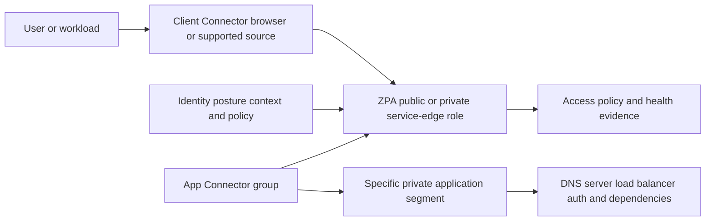

## What ZPA is and is not

ZPA is currently positioned as ZTNA for private applications, workloads, and selected OT/B2B use cases. Its central public promise is one-to-one user-to-app brokering under context-aware policy without placing the user on the corporate network or exposing the app directly to the public internet in the intended design.

| ZPA is intended to | ZPA does not automatically |
|---|---|
| Broker authorized entities to specific private apps | Give broad routed network membership |
| Use identity, destination, context, posture, and policy | Replace the IdP, MDM/EDR, or app authorization |
| Use App Connectors with outbound service connectivity | Remove all customer DNS, route, firewall, server, or certificate needs |
| Reduce intended public inbound exposure | Prove no alternate public listener/DNS/certificate leak exists |
| Segment user/workload access by applications | Patch apps or eliminate every lateral path inside allowed apps/workloads |
| Support Client Connector and selected browser/clientless patterns | Support every protocol equally in every mode |
| Generate access/health evidence | Guarantee every log is complete/exported/retained |
| Support VPN/VDI modernization use cases | Replace every network-level, multicast, broadcast, peer, or legacy requirement without discovery |

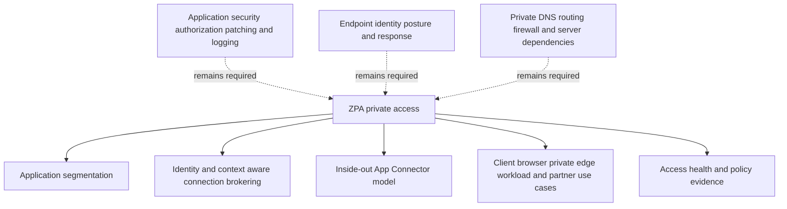

### Plain-English deep-dive 1 - ZPA connects to an app, not to a magical app cloud

Suppose the switchboard accepts your call but the payroll employee's extension is unplugged. The connection still fails. If the internal directory has the wrong extension, the call goes nowhere. If the employee answers but refuses the request, the switchboard did its job.

ZPA follows the same boundary logic. A user can reach the ZPA service and pass policy while an App Connector cannot resolve the app name, route to the server, pass a firewall, complete TCP/TLS, or receive an application response. The application can also deny the user after connectivity succeeds.

Therefore, "ZPA allowed" and "payroll failed" are compatible facts. Troubleshooting must trace user-side path, policy, service, connector-side DNS/network, server/listener, TLS, application authentication/authorization, dependencies, and response.

## Object model: applications, segments, groups, connectors, and service edges

The exact current ZPA UI and object relationships must be learned from authenticated help. This conceptual map explains why the objects exist without claiming every field or selection algorithm.

| Object/concept | Plain role | Representative content | Common design error |
|---|---|---|---|
| Application definition | One private service the business uses | Name, owner, purpose, criticality | Treating every IP as one app |
| Application segment | ZPA boundary containing one/more destinations and service parameters | FQDN/IP, ports/protocols, associations | Broad wildcard/port range |
| Segment group | Administrative/policy grouping of segments | Finance, engineering, shared services | Confusing folder with network segment |
| Server group | Associates app-side server/reachability context to connector groups | App environment and connector groups | One group spans unrelated failure domains |
| App Connector | Outbound component that reaches service and private app | VM/image/network interfaces under current support | Installing without app-path test |
| App Connector group | Logical set for reachability, capacity, location, and resilience | Multiple connectors in meaningful domains | Two connectors on one host/site/link |
| Public Service Edge | Zscaler-hosted broker/service role | Cloud service | Assuming closest geography/selection internals |
| Private Service Edge | Private ZPA service role where entitled/supported | Customer environment | Assuming same ownership as public edge |
| Access policy | Maps identities/context to app targets and action | User/group/posture/app/conditions | Broad allow/default/order error |
| Client/browser source | User-side mechanism reaching service | Client Connector or supported browser mode | Assuming browser supports all protocols |

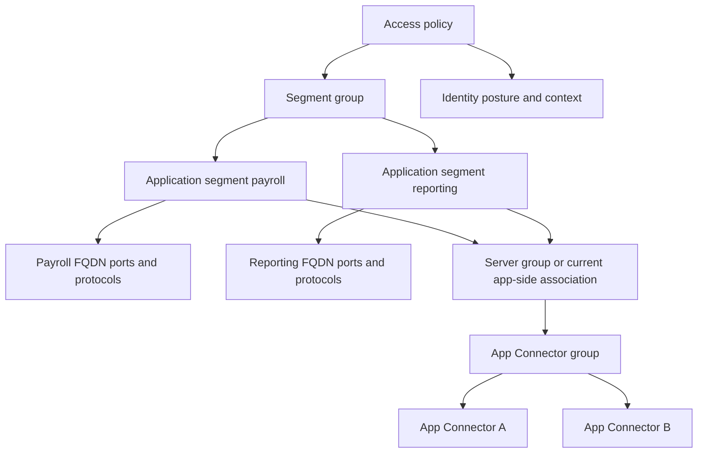

Do not memorize object labels without understanding transaction behavior. A segment can be correctly saved yet wrong because the app owner omitted a dependency. A connector group can look redundant while sharing one hypervisor, subnet, firewall, DNS resolver, or site. A policy can target the right segment but use a stale identity group.

## Application inventory and segmentation

Start with business operations, not IP ranges. One "application" can depend on front-end hostnames, APIs, authentication, databases, file shares, message queues, license servers, update services, DNS, and time. Some dependencies are server-side and do not need user connectivity; others are client-side and must be represented.

| Inventory field | Question | Why it matters |
|---|---|---|
| Business name/owner | Who understands need and accepts outage/risk? | Technical names alone do not set policy |
| User/workload cohorts | Who or what needs access? | Least privilege |
| Required operation | What exact business step? | Login test may miss export/upload |
| FQDN/IP | How is destination named/reached? | DNS and dynamic addressing |
| Ports/protocols | Which services are required? | Avoid any-port grants |
| Client-side dependencies | Which other hosts must client reach? | Prevent hidden outage |
| Server-side dependencies | What must app server reach internally? | Connector may not mediate these paths |
| Authentication/authorization | IdP, Kerberos, certificates, app roles? | Connectivity does not replace app auth |
| Data/sensitivity | What data/actions are exposed? | Policy/posture/browser/data controls |
| Availability/RTO | What outage and recovery are acceptable? | Connector/edge/continuity design |
| Performance | Baseline transactions and thresholds? | Migration comparison |
| Existing paths | VPN, LAN, public, proxy, jump host, partner? | Alternate/bypass exposure |
| Lifecycle | Dev/test/prod, changes, retirement? | Prevent stale segments/policies |

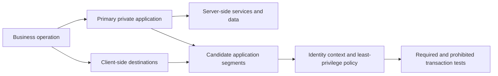

### Segmentation principles

| Principle | Good question | Anti-pattern |
|---|---|---|
| Business aligned | Which users need which app operation? | Segment equals whole subnet |
| Minimum destination | Which FQDN/IP is necessary? | Broad wildcard/domain suffix without review |
| Minimum service | Which protocol/port? | All ports for convenience |
| Environment separation | Dev/test/prod need same cohorts? | One segment spans all environments |
| Privilege separation | User and admin interfaces separate? | Same policy for admin and standard access |
| Dependency awareness | Which client dependencies need direct access? | Repeatedly broadening after outages |
| Ownership | Who approves and reviews? | Orphan segment/policy |
| Negative testing | What must remain unreachable? | Only testing successful app login |

### Plain-English deep-dive 2 - An application segment is a fence around a service, not a VLAN

A farm fence can surround one pasture based on business purpose even if the land crosses survey lines. A VLAN or subnet is a network boundary based on addressing/topology. An application segment should represent required applications/services, not automatically copy a subnet.

If NMH payroll shares a subnet with print servers, backup agents, and admin interfaces, granting the subnet recreates broad reachability. Better segmentation identifies payroll's client-facing names and ports, separates admin access, and leaves server-side dependencies behind the app where possible.

Legacy applications may resist clean segmentation. The answer is discovery and staged narrowing, not pretending the dependencies do not exist. Use a temporary bounded grouping with owner, risk, expiry, monitoring, and modernization plan if exact separation is not immediately safe.

## User-side access modes

### Client Connector

Client Connector is Zscaler's endpoint component for supported internet/SaaS and private-app paths. For ZPA, it can steer private-app traffic and provide user/device context. Exact tunnel, DNS interception, forwarding, posture, platform, strict-enforcement, and coexistence behavior belongs in Part 36/current help.

### Browser/clientless access

Zscaler public material describes browser-based/agentless access for eligible private web apps, partners, contractors, BYOD, and unmanaged devices, with related browser/data controls under current offerings. It does not mean every TCP/UDP application works in a normal browser.

| Dimension | Client Connector path | Browser/clientless path |
|---|---|---|
| Endpoint software | Managed agent/component | Existing supported browser/mediated service |
| Protocol coverage | Broader supported private-app protocols | Primarily eligible browser/web and named supported cases |
| Device context | Richer managed-device posture possible | Limited/unmanaged context; browser controls may compensate |
| User population | Employees/managed endpoints and supported others | Contractors, partners, BYOD, unmanaged users |
| Data controls | Product/traffic/entitlement dependent | Browser isolation/action controls where supported |
| App compatibility | Native client behavior | Web auth/rendering/download/upload compatibility |
| Operations | Agent deployment/profile/version/support | Portal/browser/identity/app publication support |
| Caveat | Agent installed does not prove ZPA active | Agentless does not mean dependency-free or universal |

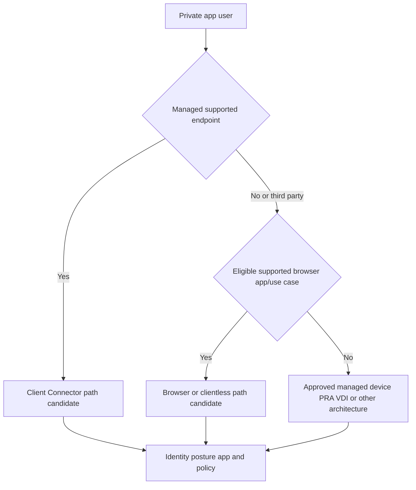

Browser access can restrict downloads, uploads, printing, copy/paste, or other actions only where the current offering, license, app, and policy support them. Test authentication, redirects, WebSockets, file flows, accessibility, performance, certificates, and user support.

## App Connector architecture and inside-out connectivity

App Connectors are deployed in customer-controlled environments with network reachability to private applications and outbound reachability to required ZPA services. Public architecture describes inside-out connections rather than opening inbound internet access to the application.

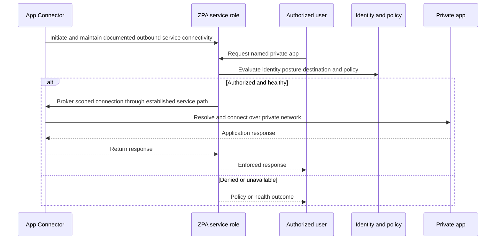

| Connector dependency | Healthy condition | Failure symptom | Evidence |
|---|---|---|---|
| Compute/hypervisor/cloud | Supported resources and stable runtime | Connector offline/restarts/slow | Platform metrics/events |
| Time | Accurate trusted clock | Registration/TLS/log correlation errors | UTC/time service |
| DNS to ZPA service | Required service names resolve | Outbound service connection fails | Resolver/query evidence |
| Outbound network | Required destinations/ports permitted | Connector disconnected | Firewall/route/TLS evidence |
| Registration/certificate | Valid current component identity | Auth/registration failure | Component/service logs |
| Private DNS | App names resolve from connector context | App timeout/name error | Connector-side DNS result |
| Private route | App subnet/path reachable | No TCP response | Route and packet evidence |
| Firewall/ACL | Connector source can reach app service | Reset/timeout | Firewall flow logs |
| Load balancer/server | Listener and pool healthy | Connection/app error | LB/server health/logs |
| Capacity | CPU/memory/connections/network within sizing | Intermittent latency/failure | Component metrics/current guidance |
| Version/lifecycle | Supported version and upgrade state | Compatibility/health drift | Inventory/release evidence |

### No inbound exposure: precise meaning

| Defensible statement | Required validation | What it does not prove |
|---|---|---|
| ZPA design does not require arbitrary inbound internet connections to App Connectors/apps | Current connector network requirements and firewall rules | No other gateway exposes the app |
| App Connector initiates outbound service connectivity | Connector logs/flows | Every internal flow is outbound-only |
| Unauthorized internet scanners cannot directly reach the private app through the intended ZPA path | External exposure and listener tests | App name/certificate/source never leaks |
| User receives app-specific path | Negative reachability tests | User/device has no alternate VPN/LAN route |

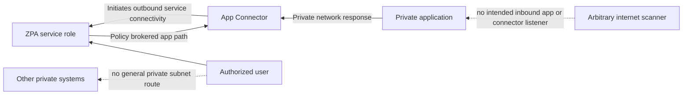

Do not write a blanket firewall rule from a diagram. Use current Zscaler Config/help requirements for the assigned cloud/product and account for customer private-app traffic separately.

### Plain-English deep-dive 3 - Outbound is not the same as unrestricted

A company can call a trusted service from an internal phone without accepting calls from every stranger. That does not mean the company should allow calls to every number. It maintains an approved outbound relationship.

App Connector outbound requirements should be restricted according to current official configuration guidance, monitored, and owned. The connector also needs private reachability only to the applications it serves. "Outbound" is an architectural direction, not permission for any destination or protocol.

The connector is not a magic air gap. Compromise, misconfiguration, overbroad private routes, shared credentials, vulnerable hypervisors, or uncontrolled administration still matter. Harden, patch, monitor, restrict management, and use least privilege according to current guidance.

## Service edges and connector path selection

ZPA uses public Zscaler service-edge roles and can offer private service-edge capabilities for supported on-premises/local/regulatory/continuity use cases. Exact user-edge, connector, and server selection algorithms are product internals documented only to the extent Zscaler exposes them.

| Path element | Safe statement | Unsupported claim |
|---|---|---|
| User service edge | Supported service role receives user-side ZPA access | Always the geographically nearest city |
| Connector service path | Connector maintains outbound service connectivity | Connector pairs permanently with one user edge |
| Connector group | Provides eligible connector set for app-side reachability | Round-robin is always used |
| Server group/app association | Defines app-side reachability associations under current model | It discovers all dependencies automatically |
| Private Service Edge | Supports current local/private ZTNA cases when entitled | It removes all cloud/identity dependencies in every mode |
| Business continuity | Current offering can support defined outage scenarios | Every outage preserves all features without tradeoff |

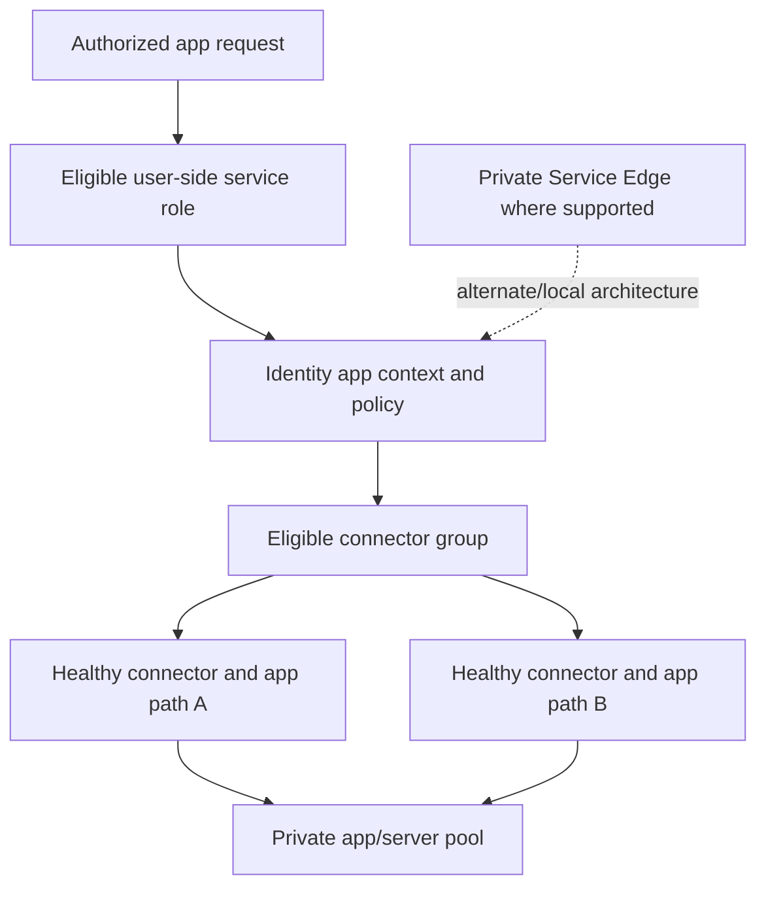

When troubleshooting, capture the actual connector/service/path evidence rather than choosing the icon that looks closest. A healthy connector may be ineligible for the app association; an eligible connector may have broken DNS; a selected app server may be unhealthy.

## Identity, posture, and access policy

ZPA policy should express the smallest required entity-to-app access. The application retains its own authorization.

| Policy element | Question | Example synthetic value |
|---|---|---|
| Subject | Which user/group/workload? | Active payroll analyst |
| Device/posture | Which endpoint condition? | Managed, encryption/EDR healthy |
| Application target | Which segment/group? | Payroll reporting, not admin |
| Operation/service | Which protocol/port? | HTTPS report interface |
| Context | Time, location, risk, auth strength? | Recent strong auth; normal risk |
| Action | Allow, deny, step-up, browser/reduced option? | Allow or supported adaptive outcome |
| Priority/order | Which overlapping rule wins? | Containment deny before general allow |
| Exception | Who/why/expiry/compensation? | 24-hour approved support path |
| App authorization | What can user do after connection? | Report read/export by app role |
| Evidence | Which effective rule and app outcome? | Access log plus app audit |

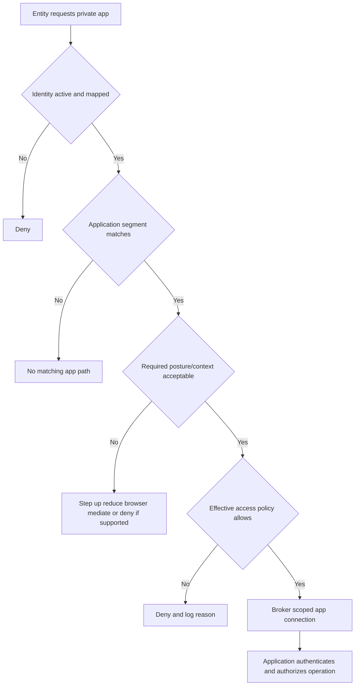

### Policy order and defaults

Exact ZPA policy types, ordering, default rules, timeout/session behavior, posture evaluation, and adaptive actions require current documentation. Test overlapping cases. A broad group allow can shadow a narrower posture requirement depending on current semantics. A policy allow can still fail because no healthy app path exists.

## Application discovery

Discovery reduces migration guesswork by observing candidate applications, destinations, ports, protocols, users, and dependencies under current supported capabilities. Public ZPA material currently references automatic application discovery and AI-generated segmentation/policy recommendations. Recommendations are proposals, not authority.

```mermaid
flowchart LR
    OBSERVE[Observed VPN network endpoint app and owner data] --> CAND[Candidate applications and dependencies]
    CAND --> CLEAN[Normalize names owners environments and duplicates]
    CLEAN --> VALIDATE[App owner validates business operation and required paths]
    VALIDATE --> SEG[Draft least-privilege segments groups and policy]
    SEG --> TEST[Positive negative performance and failure tests]
    TEST --> APPROVE[Security app network and business approval]
    APPROVE --> PILOT[Controlled ZPA pilot]
```

| Discovery source | Value | Blind spot/risk |
|---|---|---|
| VPN logs/routes | Shows remote destinations/ports/users | Broad routes and unused access; limited app names |
| Firewall/flow logs | Shows conversations | NAT, no business purpose, sampling |
| DNS logs | Shows names | Cache, encrypted DNS, no port/operation |
| Endpoint telemetry | Shows process/destination | Coverage/privacy and local aliases |
| App owner interviews | Reveals business/dependencies | Memory/incomplete documentation |
| CMDB/catalog | Owner/criticality/environment | Stale/duplicate records |
| Load balancer/server logs | Client operations and backends | Server-side dependencies differ |
| ZPA discovery/recommendations | Product-aligned candidate segmentation | Current capability/license/quality and human review |

### Discovery validation questions

1. Is this a user-facing app, client-side dependency, or server-side dependency?
2. Is the destination name stable and canonical, or an alias/load balancer?
3. Which users/workloads truly need it, and how often?
4. Which operation/port/protocol is required?
5. Does the app embed redirects, callbacks, downloads, APIs, or authentication dependencies?
6. What changes during failover, DR, patching, or maintenance?
7. Which traffic is obsolete, administrative, malicious, or accidental?
8. Who approves segmentation and residual risk?

Discovery should not automatically convert every observed flow into an allow rule. Observation records historical behavior, including excessive or unwanted behavior.

## DNS, server, network, and application dependencies

ZPA private-app access often depends on DNS in more than one context. The user's name-to-app interception/matching behavior and the App Connector's resolution of the private destination can differ. Exact DNS mechanics belong to current ZPA help.

| Dependency | User-side question | Connector/app-side question | Failure symptom |
|---|---|---|---|
| DNS name | Does request match intended private app? | Does connector resolve correct private answer? | No segment, wrong IP, timeout |
| Split DNS | Which resolver/view applies? | Is connector in correct DNS view? | Works on LAN/VPN, fails ZPA |
| Routing | Can user reach ZPA service? | Can connector route to app/backend? | First-leg or second-leg timeout |
| Firewall/ACL | Can endpoint/connector reach required service? | Is connector source permitted to app? | Reset/timeout |
| Load balancer | Does name select healthy VIP/pool? | Are connector sources/health checks accepted? | 5xx/intermittent |
| Server listener | Is port/protocol active? | Correct bind/certificate/service? | Refused/reset |
| TLS/certificate | Client/service/app trust valid? | Origin name/chain/protocol valid? | Certificate/handshake failure |
| Authentication | ZPA identity accepted? | App/Kerberos/SAML/OIDC/cert flow works? | Login loop/401 |
| Authorization | ZPA policy permits app? | App role/ACL permits operation? | 403/business denial |
| Downstream service | Not visible to user directly | Database/API/file/license/time healthy? | 5xx/slow/business failure |

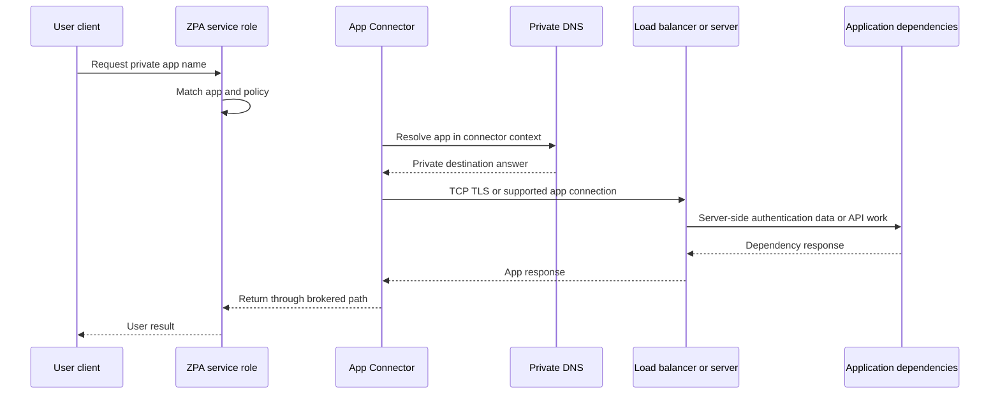

An application can be "healthy" at the listener and fail the business operation because its database is down. Use synthetic transactions that exercise meaningful operations, not only TCP or login.

## Health model

| Layer | Healthy means | Representative check | Owner |
|---|---|---|---|
| User endpoint | Client/browser, DNS, clock, trust, network work | Known-good user/device transaction | Endpoint |
| Identity/posture | Current user/group/device context | Auth and effective-policy evidence | Identity/endpoint |
| ZPA service path | User-side service connection accepted | Client/service health evidence | Zscaler/network |
| Policy | Correct app match and rule/action | Positive/negative tagged tests | Security/app owner |
| App Connector | Registered/connected/resources/current | Component health plus load | Platform/ZPA |
| Connector group | Eligible healthy capacity across failure domains | Group/path test | Architecture/operations |
| Connector DNS | Correct private resolution | Connector-context query | DNS |
| Connector network | Route/firewall/TCP/TLS to app | Path and flow logs | Network/cloud |
| Server/load balancer | Listener/pool/cert healthy | Origin health/app test | App/platform |
| Application/dependencies | Business operation succeeds | Synthetic app transaction | App owner |
| Logging | Access/health/admin/export evidence arrives | Canary reconciliation | SOC/data |
| Governance | Owners, reviews, exceptions, license, support current | Attestation | Risk/business |

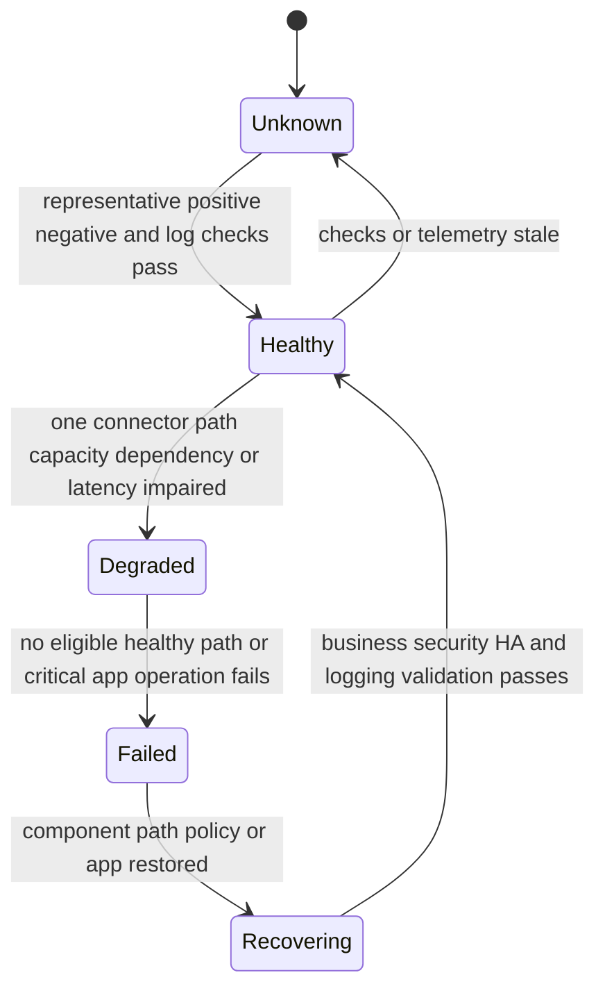

### Connector health versus app health

| Observation | What it proves | What it does not prove |
|---|---|---|
| Connector registered/connected | Component can communicate with required ZPA service under measured state | It resolves/reaches every app |
| Connector CPU/memory normal | Resource pressure not observed at that moment | Network/server/dependency health |
| App TCP port reachable | Listener accepted transport | TLS/app auth/business operation |
| App login page loads | Web front end responds | Role, API, upload/export, database health |
| One user succeeds | One identity/path/app transaction worked | Other cohorts/connectors/servers/operations |

### Plain-English deep-dive 4 - Green connector, red application

A delivery van can be fueled, registered, and connected to dispatch while the destination road is closed. The van dashboard is green; delivery still fails.

Connector health usually answers component/service questions. Application health answers DNS, route, firewall, server, TLS, authorization, and dependency questions. Always pair component health with connector-to-app and end-to-end business checks.

During an incident, avoid restarting every connector because one app fails. Compare another app through the same connector group and the same app through another eligible path. Those tests separate shared connector/service faults from destination-specific faults.

## High availability and design caveats

Connector resilience requires multiple eligible instances with enough capacity across meaningful failure domains. Exact minimums, sizing, upgrade behavior, placement, and selection require current ZPA guidance.

| Failure domain | Weak design | Stronger question |
|---|---|---|
| Compute | Two connectors on one VM/host | Separate supported instances/hosts? |
| Power/site | Both in one rack/building | Separate power/site where required? |
| Network | Same switch/firewall/link | Independent path and tested rules? |
| DNS | One resolver/view | Resilient consistent private DNS? |
| Cloud zone | Same availability zone | Multi-zone placement supported/needed? |
| Connector group | One group serving all unrelated apps | Groups align reachability/failure/capacity? |
| Capacity | Secondary sized only for idle load | Can remaining capacity handle failover? |
| Upgrades | All instances changed together | Staged supported lifecycle/rollback? |
| Administration | One credential/person/process | Break-glass and audited separation? |

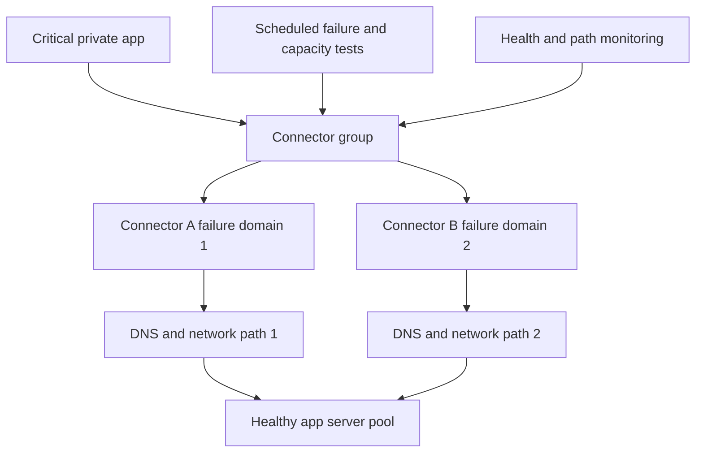

High availability does not guarantee session continuity. Existing sessions may reset; DNS or app load balancers may choose different backends; authentication/session affinity may matter. Define recovery time, user retry behavior, transaction integrity, and failback validation.

## Logs and evidence

| Evidence family | Questions answered | Caveat |
|---|---|---|
| Access transaction | User, app segment, rule, action, connector/service context, time | Fields and retention vary |
| Authentication/posture | Identity/group/device and reason | Staleness/source semantics matter |
| Client Connector | Steering, tunnel/service, DNS, auth, errors | Version/profile/platform differ |
| App Connector health | Registration, service connectivity, resource state | Does not prove app operation |
| Connector/app path | DNS, route, TCP/TLS, server response | Requires customer network/app evidence |
| Application audit | App login/role/action/dependency result | Separate from ZPA allow |
| Admin audit | Object/policy/component changes | External DNS/IdP/network changes elsewhere |
| Private Service Edge | Local component/service/continuity state | Product/entitlement-specific |
| Export/SIEM | Event delivery, parsing, alert/case | Portal event does not prove export |

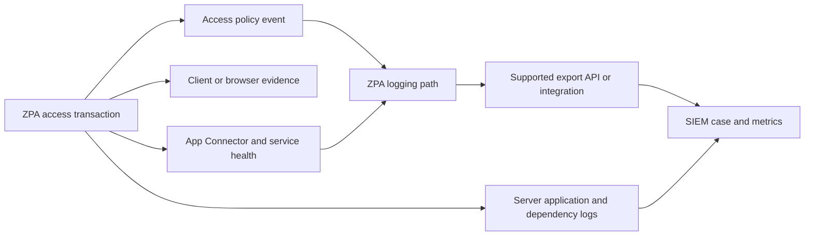

Correlate exact UTC time, stable subject ID, device, app name/segment, policy rule/action, connector/path evidence, destination server, response/error, and transaction identifier where available. Protect tokens, internal names/IPs, user data, and application content.

## ZPA versus VPN

The comparison should be architectural and requirement-based, not a slogan.

| Dimension | Remote-access VPN tendency | ZPA target model | Caveat |
|---|---|---|---|
| Access grant | Routes/network ranges plus firewall segmentation | Specific private apps under identity/context policy | Implementations vary |
| Exposure | VPN gateway commonly internet-reachable | Private apps/connectors not intended as arbitrary inbound listeners | ZPA service remains internet-accessed by users/connectors |
| User network membership | Device can receive private routes | User should not receive broad private network access | Alternate paths can remain |
| Discovery/lateral movement | Reachable addresses/ports depend on routes/rules | App-specific path reduces neighborhood | Allowed app/identity abuse remains |
| Policy identity | Gateway/user/device plus network controls | User/device/workload-to-app/context | App auth still required |
| Traffic model | Routed/tunneled network packets | Proxy/brokered resource connections | Some legacy protocols need discovery |
| Multicast/broadcast/peer | Can support network-level patterns depending design | Resource model may not fit | Use requirement-specific alternative |
| Inbound app publishing | Gateway exposes remote-access front door | Inside-out connector service model | Validate alternate exposures |
| Performance | May backhaul through hubs | Can avoid network backhaul under intended design | Measure actual paths/apps |
| Migration | Existing network dependencies known imperfectly | Requires app inventory/segmentation | Not an instant cutover by default |

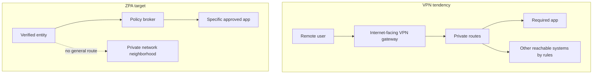

"VPN replacement" should mean requirements migrated and legacy routes/gateways retired after validation, not merely installing ZPA while the VPN remains the hidden path.

## VPN-to-ZPA migration

### Phase 1: define outcomes and boundaries

State why migration matters: reduce public gateway exposure, narrow reachability, support users/partners, improve experience, simplify operations, or meet cloud/merger needs. Define applications in scope, protocols, user cohorts, regulatory constraints, continuity, metrics, and exclusions.

### Phase 2: discover

Collect VPN logs/routes, DNS, firewalls, endpoint flows, app catalogs, owners, identity/groups, ports/protocols, client-side dependencies, server-side dependencies, experience baselines, HA, and support patterns. Identify network-level requirements that may not fit app access.

### Phase 3: design

Create app segments/grouping, connector/server/group associations, identity/posture policy, browser/client modes, HA/capacity, DNS/network rules, logs, privacy, change, rollback, and operations using current guidance.

### Phase 4: coexist and pilot

Use representative users, devices, locations, apps, protocols, and operations. Prevent ambiguous routing: document whether ZPA or VPN owns each destination. Test required and prohibited access, performance, failover, sessions, logs, and app authorization.

### Phase 5: expand and remove dependency

Roll out in rings. Remove migrated app routes from VPN scope only after validation and owner approval. Monitor fallback use. Retire gateways/rules/licenses only when no required, emergency, or hidden dependency remains.

### Phase 6: operate and improve

Review app ownership, segments, policies, connectors, versions, capacity, exceptions, dormant apps, logs, experience, and incidents. Continue narrowing broad transitional segments.

```mermaid
flowchart LR
    OUT[Define business security and experience outcomes] --> DISC[Discover apps flows routes users and dependencies]
    DISC --> DESIGN[Design segments connectors policy HA logs and rollback]
    DESIGN --> COEX[Controlled VPN and ZPA coexistence]
    COEX --> PILOT[Representative app and cohort pilot]
    PILOT --> REMOVE[Remove migrated routes and fallback dependency]
    REMOVE --> RETIRE[Retire legacy components after evidence]
    RETIRE --> IMPROVE[Review drift health exceptions and outcomes]
```

### Migration wave table

| Wave | Candidate apps | Why | Exclude until |
|---|---|---|---|
| 0 lab | Synthetic web apps | Learn objects/flow safely | Never treated as production proof |
| 1 simple | Owned web apps with stable FQDN/HTTPS and clear users | Low dependency complexity | Owner, DNS, connector, auth, logs ready |
| 2 standard | Common client-server apps with documented ports | Expands protocol confidence | Full transaction/failover tests |
| 3 sensitive | Payroll/admin/data-rich apps | Security value but higher risk | Posture, strong auth, app auth, DLP/threat if required |
| 4 third party | Partner/BYOD browser-eligible apps | Avoid broad VPN/managed agent | Contract, identity, browser/data controls |
| 5 legacy | Dynamic ports, hard-coded IP, peer/broadcast/multicast | Highest discovery complexity | Supported design or alternative approved |
| 6 privileged/OT | Admin/industrial systems | Safety/privilege constraints | PRA/OT specialists, safety/change approvals |

### Coexistence risks

| Risk | Symptom | Control |
|---|---|---|
| Same app reachable by VPN and ZPA | Inconsistent source/path/policy | Explicit ownership and route/app mapping |
| VPN masks missing dependency | Pilot works only while VPN connected | Test with migrated routes removed in controlled cohort |
| Split DNS differs | Different IP/backend under each path | Compare resolver context and app owner intent |
| App allowlists connector source only partially | Intermittent servers fail | Reconcile all eligible connector paths |
| Authentication/session differs | Loops or duplicate prompts | App/IdP/client flow test |
| Help desk uses VPN as universal workaround | Security path never fixed | Time-bound fallback with case/reason review |
| Metrics count installations | False completion | Measure successful app transactions and retired dependencies |

### Plain-English deep-dive 5 - Coexistence can hide a failed migration

Moving houses seems complete if the lights work, but perhaps an extension cord still runs back to the old house. The day the old house is disconnected, the lights fail.

VPN and ZPA coexistence can hide the same dependency. A DNS server, authentication service, license server, or secondary app hostname may still use VPN routes. Test a controlled cohort with migrated routes genuinely absent and inspect every required business operation.

Do not remove fallback recklessly. Use staged negative-path tests, app-owner approval, monitored rollback, and emergency design. The goal is evidence that ZPA owns the path, not a dramatic cutover date.

## Policy, deployment, and operational readiness

| Review area | Questions | Required artifact |
|---|---|---|
| App inventory | Names, ports, protocols, dependencies, owners, criticality? | Validated catalog |
| Segmentation | Smallest destinations/services/environments/admin paths? | Segment/group map |
| Connector design | Placement, reachability, DNS, capacity, HA, lifecycle? | Connector architecture |
| Identity/posture | Sources, groups, freshness, unknown behavior, strong auth? | Context contract |
| Policy | Subject/app/operation/context/action/order/default/exception? | Policy matrix |
| Access mode | Client, browser, private edge, workload, third party? | Mode decision |
| App auth | SSO/Kerberos/cert/roles/sessions/dependencies? | Authentication map |
| Exposure | Public listeners, alternate gateways/routes, certificate/DNS evidence? | Attack-surface map |
| Logging | Access, client, connector, app, admin, export, retention? | Evidence dictionary |
| Resilience | Failures, capacity, sessions, continuity, failback? | HA/test plan |
| Operations | Monitoring, support, change, upgrades, rollback, incident? | Runbook/RACI |
| Currency | Product/license/cloud/UI/object/limit current? | Entitlement/source check |

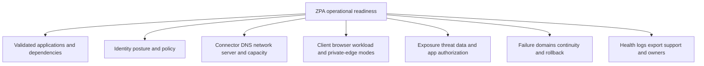

## Failure scenarios

| Symptom | Plausible causes | Discriminating evidence | Unsafe conclusion |
|---|---|---|---|
| User sees no private app/access | Client/auth/group/policy/app match | Effective identity, segment match, policy reason | Connector is down |
| One app fails for everyone | App segment/DNS/connector path/server/app dependency | Another app same connector; app logs | ZPA cloud outage |
| One user fails, peers work | Identity/group/posture/client/session/app role | Compare effective context/rule | Server outage |
| App works on VPN, not ZPA | Missing segment/dependency, connector DNS/route/firewall/source allowlist | Connector-context path and route-removed test | ZPA unsupported automatically |
| Connector green, app times out | Private DNS/route/firewall/listener/LB | Connector-to-app evidence | Connector health proves app health |
| TCP works, app returns 403 | App authorization/session/role | ZPA allow plus app audit | ZPA denied |
| Browser access renders poorly | Unsupported feature/protocol/auth/download/WebSocket/accessibility | Compatibility matrix and browser trace | All agentless access is unusable |
| Intermittent app failures | Multiple connectors/servers with one bad path, capacity, DNS, LB | Correlate selected connector/server | Random user network |
| Posture deny after device update | Signal/source/client version/stale context | Posture value/time and effective rule | Device compromised |
| App still reachable through VPN | Coexistence/route not retired | Endpoint route/path/source evidence | ZPA segmentation failed |
| No ZPA log for successful access | VPN/LAN/direct alternate path or export gap | Forwarding/path and portal reconciliation | ZPA allowed silently |
| Private app appears externally reachable | Alternate reverse proxy/VPN/NAT/public cloud rule | External inventory/listener/DNS | App Connector published it |

## Troubleshooting workflow

### Step 1: define the exact private-app transaction

Record user/workload, device, source network, Client Connector/browser mode, app FQDN/IP, port/protocol, business operation, UTC time, expected/actual, impact, frequency, and whether VPN/LAN/alternate paths exist.

### Step 2: prove user-side ZPA path

Confirm client/browser uses the intended ZPA path, reaches service, authenticates, and obtains current identity/posture. Compare a known-good user/device/network.

### Step 3: identify app match and effective policy

Find which app segment/group matches, effective rule/action, posture/context, and whether the user is entitled. No matching segment differs from explicit deny.

### Step 4: identify eligible/actual app-side path

Inspect App Connector and group health, service connectivity, resource/capacity, and actual transaction path where exposed. Do not infer selection.

### Step 5: test connector-to-app dependencies

From the approved connector context, validate private DNS, route, firewall, TCP/UDP, TLS, load balancer, server listener, application authentication/authorization, and downstream dependencies.

### Step 6: correlate logs and changes

Join client, identity, access policy, connector health, network/firewall, server/app, admin audit, and export evidence. Normalize time. Record recent DNS, certificate, firewall, app, connector, identity, and policy changes.

### Step 7: correct and validate

Make the smallest reversible correction. Test required users/operations, prohibited users/apps/ports, posture changes, connector failure, performance, logs, app authorization, and rollback. Confirm no VPN route masked the result.

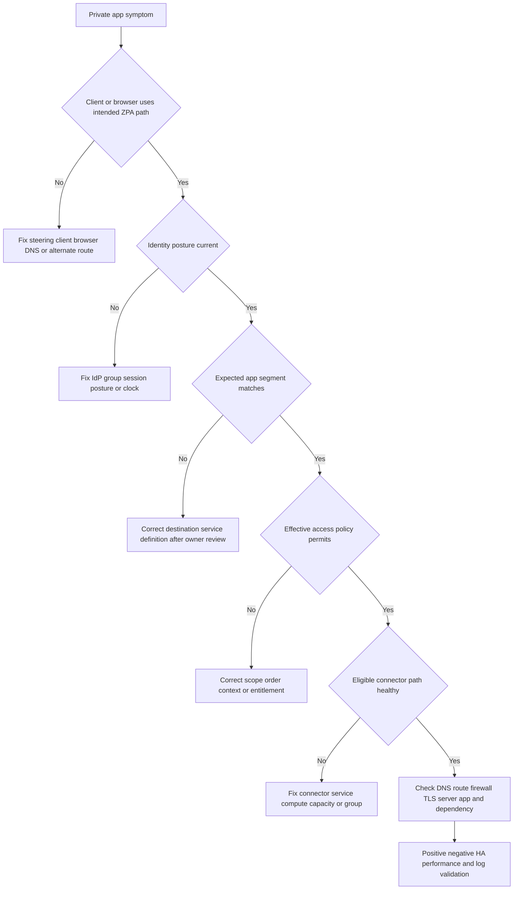

### Intermittent-failure decision tree

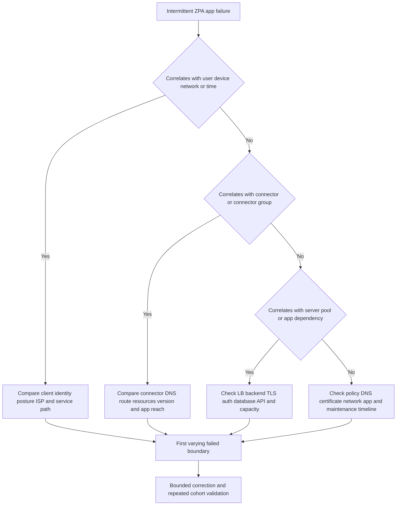

## Fictional NMH ZPA migration

NMH has a synthetic payroll web app, engineering client-server app, vendor portal, legacy license service, and admin interface. Remote users currently receive VPN routes to several subnets. NMH wants narrower app access and less public gateway exposure. This is a study case only.

### NMH application plan

| App | Users | Client-facing dependencies | Mode candidate | Segmentation/HA concern |
|---|---|---|---|---|
| Payroll user | Employees | payroll.nmh.test, identity callback | Client Connector and eligible browser study | Separate admin interface |
| Payroll admin | Small admin group | admin name, strong auth, hardened device | Managed client/privileged design | Stronger posture and policy |
| Engineering design | Engineers | Native protocol plus license lookup | Client Connector | Dynamic ports/dependency discovery |
| Vendor portal | Suppliers | Web app and external IdP | Browser/third-party study | Downloads/copy and contract lifecycle |
| Legacy license | Engineering clients | Hard-coded IP and nonstandard protocol | Transitional segment/alternative | Broad dependency, owner modernization |
| Reporting workload | Service identity | API endpoint | Workload access study | Short-lived identity and environment |

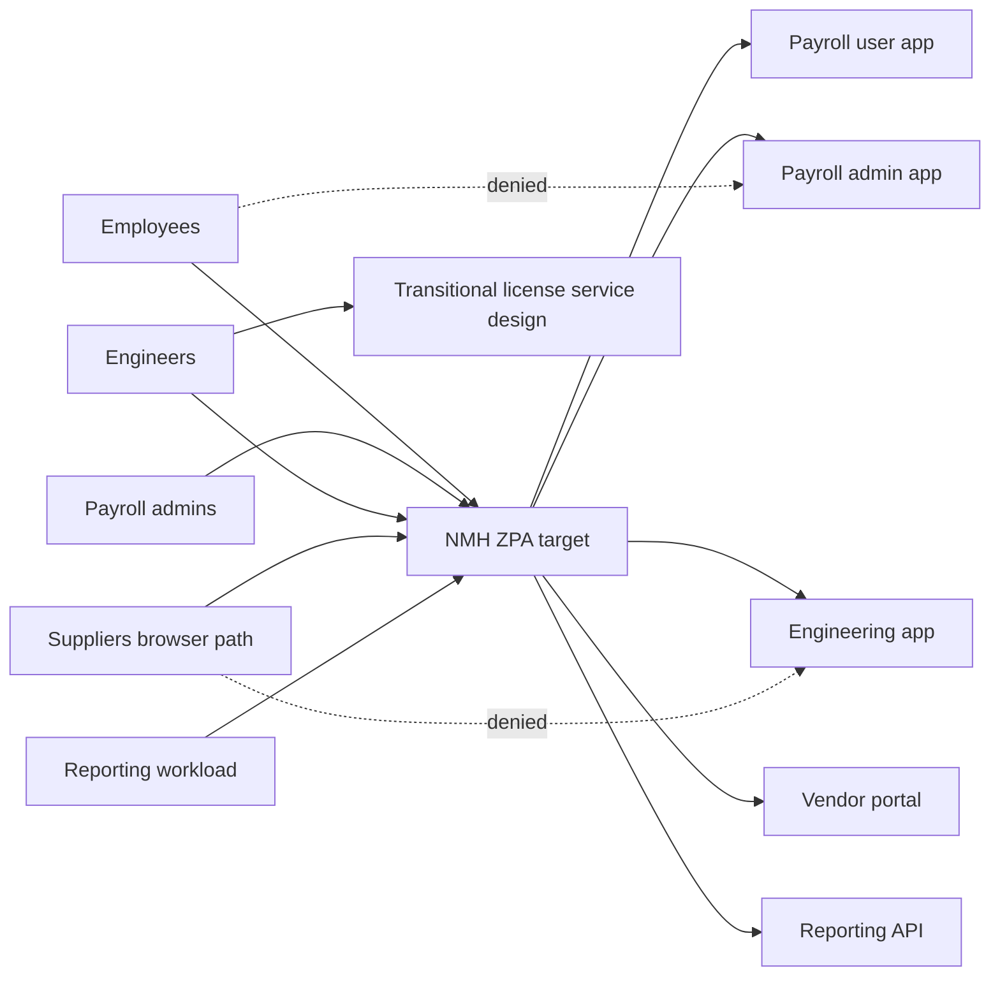

### NMH incident: engineering app fails after route removal

The ZPA pilot passed login and project-open tests while VPN remained connected. After the engineering app's VPN route was removed for the pilot cohort, saving a design fails. The save operation calls an unrecorded license host by hard-coded IP. ZPA has no matching app segment for that destination. This is a migration dependency gap, not a ZPA service defect.

| Hypothesis | Prediction | Synthetic evidence | Verdict |
|---|---|---|---|
| User policy deny | App login/open should also fail or access log deny | Login/open permitted | Falsified |
| App Connector outage | Other app operations/users fail | Other operations normal | Falsified |
| Hidden client dependency | Failure begins only at save and after VPN route removal | Trace shows license-host connection | Supported |
| Server-side license dependency | App server, not client, would contact license service | Endpoint trace shows client call | Falsified |
| Unsupported protocol | Defined service test would fail even after segment | Owned lab/current help validation pending | Unknown until verified |
| Firewall from connector | Matching segment would exist but timeout | No segment match | Not first failure |

```mermaid
sequenceDiagram
    participant U as Engineer client
    participant Z as ZPA service and policy
    participant A as Engineering app
    participant L as Hidden license host
    participant T as Migration team
    U->>Z: Open engineering app
    Z->>A: Broker permitted app connection
    A-->>U: Project opens
    U->>L: Save triggers client-side license request
    Note over U,L: VPN route removed and no ZPA app match
    L-->>U: Connection fails
    T->>U: Capture authorized transaction dependency
    T->>T: Validate protocol owner risk and current ZPA support
    T->>Z: Add bounded transitional design only after approval
    T->>U: Retest save and prohibited destinations without VPN
```

The team pauses the wave, validates the license protocol and business owner, designs the narrowest supported segment or approved alternative, adds expiry/modernization action, and reruns negative tests. It does not restore a broad VPN subnet route permanently.

## Outcomes and metrics

| Desired outcome | Leading evidence | Lagging/caveat |
|---|---|---|
| Reduce broad reachability | Validated required/prohibited app tests; VPN routes removed | Alternate LAN/VPN/public paths can remain |
| Reduce public exposure | Gateways/listeners retired and external inventory reconciled | Name leakage and other services still exist |
| Improve access health | End-to-end transaction and connector/app SLOs | Destination and identity dependencies remain |
| Improve experience | Matched transaction percentiles and support tickets | Do not generalize customer stories |
| Improve third-party control | Time-bound app-specific browser access and data restrictions | Contract/identity/offboarding remain |
| Improve operations | App ownership, fewer route rules, clear evidence/runbooks | Complexity may shift to app inventory/identity |
| Improve resilience | Tested connector/failure-domain and continuity behavior | Session resets/correlated failures possible |
| Improve auditability | Explainable policy/access/app logs and reviews | Log presence is not control effectiveness |

Do not count Client Connector installations, segments created, or VPN sessions reduced as outcome alone. Measure successful required operations, prohibited reachability, fallback dependence, connector/app health, access reviews, exceptions, user experience, and retired exposure with a documented denominator.

## Your experience bridge to Zscaler

| prior production strength | Part 35 transfer | New ZPA learning | Honest language |
|---|---|---|---|
| SharePoint/OneDrive access and permissions | Separate ZPA connectivity from app authorization | ZPA policy/segment logs | "Connection and permission remain distinct." |
| Client/browser comparison | Client Connector versus browser access reasoning | ZPA mode support/objects | "The comparison method transfers." |
| DNS/TCP/TLS/HTTP/proxy traces | User/service/connector/app path isolation | Connector/service evidence | "I would trace both sides, not infer selection." |
| Hidden M365 dependencies | App discovery and migration dependency mapping | ZPA discovery/segment design | "I know to test complete business operations." |
| Critical escalations/RCA | Parallel identity/network/app/Zscaler tracks | ZPA Support and security authority | "I bring operating discipline, not claimed admin history." |
| SQL/Power BI | App inventory, coverage, health, policy, fallback analytics | ZPA schemas/retention | "I validate grain, owner, completeness, and time." |
| Training/mentoring | App-not-network teaching and runbooks | Hands-on console/connector labs | "Enablement is a strength while product depth ramps." |

### 30-second interview bridge

"ZPA brokers a verified user, device, workload, or partner to a specific private application under identity, posture, destination, and policy, rather than placing the entity broadly on a routed private network. App Connectors initiate outbound service connectivity and then reach the app over the customer's private DNS/network path, so no intended arbitrary inbound app exposure is required. My Microsoft 365 background gives me strong identity, permission, client, DNS, TCP, TLS, HTTP, dependency, escalation, and validation methods. My study and modeling cover ZPA; production connector deployment and VPN migration are not part of my current experience."

## Labs and rehearsal

Use only owned/synthetic systems, identities, networks, and data. Do not scan private networks or test customer access without written authorization.

### Lab 1: object map

Create synthetic application segments, segment groups, server/app-side associations, connector groups, connectors, and policy. Label conceptual fields versus current-help facts.

### Lab 2: app inventory

Inventory five owned lab apps by owner, FQDN/IP, ports, protocols, client/server dependencies, auth, data, RTO, baseline, and negative reachability.

### Lab 3: inside-out packet story

Use an owned outbound reverse-tunnel/proxy lab as an analogy. Show no inbound listener at the app perimeter, then explicitly state why it is not ZPA proprietary proof.

### Lab 4: DNS contexts

Create split DNS for a test app. Resolve from client and connector-like subnets, introduce a wrong view, and prove why one successful client lookup is insufficient.

### Lab 5: connector health

Build a synthetic health table with service connectivity, CPU/memory, DNS, route, firewall, listener, TLS, app login, and business transaction. Demonstrate green component/red app.

### Lab 6: HA failure domains

Place four hypothetical connectors across hosts, sites, links, DNS, and zones. Identify shared failures, remaining capacity, session impact, and test schedule.

### Lab 7: identity/policy

Create employee, admin, supplier, and workload cohorts; healthy/degraded devices; five app segments; overlapping rules; positive/negative/order tests.

### Lab 8: browser compatibility

Test an owned web app for redirects, cookies, SSO, WebSocket, upload/download, print/copy, accessibility, and latency through a generic safe mediated lab. Do not claim ZPA results.

### Lab 9: discovery

Combine synthetic VPN, DNS, firewall, endpoint, CMDB, and app-owner records. Deduplicate apps and reject observed but unjustified flows.

### Lab 10: coexistence

Model one app reachable by both VPN and ZPA. Remove the VPN route in a controlled lab and identify a hidden dependency. Design rollback without restoring a broad permanent route.

### Lab 11: NMH engineering incident

Recreate the save/license-server scenario. Write the hypothesis matrix, bounded transition option, negative tests, owner/expiry, and modernization action.

### Lab 12: interview teach-back

Explain ZPA, app segments/groups, App Connectors, inside-out, browser/client access, health, VPN migration, and troubleshooting in 30 seconds each with one caveat.

## Common misconceptions to correct

| Misconception | Corrected understanding |
|---|---|
| ZPA is a cloud VPN | It brokers app-specific access rather than general network membership in its intended model |
| ZPA and ZIA are the same | ZPA targets private apps; ZIA targets internet/SaaS |
| ZTNA has no networks | Packets still traverse networks; the grant is resource-specific |
| App segment means VLAN/subnet | It is an application/service definition; copying a subnet can recreate broad access |
| Segment group is a security boundary by itself | It organizes/associates segments; effective policy and app definitions control access |
| Server group means one physical cluster | It is a ZPA object/association concept whose current semantics must be verified |
| App Connector is an inbound VPN gateway | It initiates outbound service connectivity in the intended design |
| App Connector is a service edge | Connector and service edge have different app-side/cloud roles |
| Connector green proves app healthy | DNS, route, firewall, server, auth, and dependencies may fail |
| Two connectors guarantee HA | Shared host/site/link/DNS/firewall/capacity can fail together |
| Closest connector always handles traffic | Selection is product-specific; use actual evidence/current help |
| Public Service Edge publishes the private app | Public describes service placement; app remains behind connector path |
| Inside-out means allow all outbound traffic | Use current restricted requirements and monitor |
| No inbound exposure means no alternate exposure exists | Reconcile public gateways, DNS, certificates, cloud rules, and routes |
| User cannot move laterally anywhere | ZPA narrows paths; allowed app/identity/workload/alternate paths still matter |
| ZPA allow means app authorization | The application still enforces roles and business operations |
| Browser access supports every private protocol | It covers eligible supported browser/clientless cases |
| Agentless means no dependencies | Identity, browser, app, network, connector, and license remain |
| App discovery output should become allow policy | Discovery includes excessive/obsolete traffic and needs owner validation |
| VPN logs reveal every dependency | Server-side/client-side/uncommon/DR paths can be absent |
| Works while VPN connected proves migration | VPN can mask hidden routes/dependencies |
| VPN is always insecure | Mature VPNs can be segmented; compare actual reachability and requirements |
| VPN can be removed immediately after Client Connector install | App inventory, policy, dependencies, HA, tests, and route retirement are required |
| No ZPA log means ZPA allowed silently | Traffic may use VPN/LAN/direct path or logging may fail |
| Product page proves complete replacement/feature | Contract, protocol, entitlement, app, tenant, and test control |
| This Part proves ZPA hands-on experience | It proves conceptual preparation and synthetic practice only |

## Official Source Anchors

Sources in this section were reviewed on **2026-08-24**.

All pages were reviewed on **2026-08-24**. Zscaler pages are vendor-authored sources for current public positioning. The public ZPA PDF was linked but not text-extractable in this session; no unsupported detail was inferred from it. Authenticated help and tenant evidence control exact objects, fields, selection, policy, and health behavior.

| Source | URL | Used for | Boundary |
|---|---|---|---|
| Zscaler Private Access | https://www.zscaler.com/products-and-solutions/zscaler-private-access | One-to-one app access, no network/public app exposure, context-aware policy, segmentation/discovery, private edge, browser, continuity | Marketing/product overview; exact mechanics/entitlement require help |
| ZPA Data Sheet | https://www.zscaler.com/resources/data-sheets/zscaler-private-access.pdf | Official linked product reference for current validation | PDF not extracted here; do not infer omitted details |
| VPN Alternative | https://www.zscaler.com/products-and-solutions/vpn-alternative | Inside-out, brokered-not-routed, app-not-network, migration outcome positioning | Comparative/metric claims are not universal |
| Third-Party Access and BYOD | https://www.zscaler.com/products-and-solutions/third-party-access | Browser/agentless, unmanaged device, specific-app and data-control positioning | Protocol/action/license compatibility varies |
| Zscaler Client Connector | https://www.zscaler.com/products-and-solutions/zscaler-client-connector | Endpoint private-app forwarding and posture/context relationship | Installation does not prove ZPA operation |
| ZTNA for On-Premises Users | https://www.zscaler.com/products-and-solutions/ztna-on-premises | ZPA Private Service Edge and business-continuity public positioning | Private component ownership/behavior requires current guidance |
| Zero Trust Exchange | https://www.zscaler.com/products-and-solutions/zero-trust-exchange-zte | Proxy, identity/context/policy, one-to-one architecture | Platform story, not detailed ZPA object guide |
| Zscaler Config | https://config.zscaler.com/ | Current published network/component requirements | Use assigned-cloud current values only |
| NIST SP 800-207 | https://csrc.nist.gov/pubs/sp/800/207/final | Resource-centric policy, PDP/PEP, no implicit location trust | Vendor-neutral architecture |
| IETF RFC 1034 | https://www.rfc-editor.org/rfc/rfc1034 | DNS architecture concepts | Does not define ZPA DNS behavior |
| IETF RFC 8446 | https://www.rfc-editor.org/rfc/rfc8446 | TLS 1.3 foundation | Does not describe ZPA internals |
| IETF RFC 9110 | https://www.rfc-editor.org/rfc/rfc9110 | HTTP semantics/status/intermediaries | Non-web ZPA apps differ |

## Likely Interview Questions

### Q1. What is ZPA and how is it different from a VPN?

**Model answer:** ZPA is Zscaler's ZTNA product for private applications. It brokers a verified entity to a specific app under identity, device/posture, context, and policy rather than broadly extending private network routes. App Connectors initiate outbound service connectivity and reach apps internally, so the intended design does not publish app/connector inbound listeners. A VPN can be strongly segmented, and some network-level requirements may need another design, so migration requires evidence rather than slogans.

### Q2. Explain application segments, groups, and connectors.

**Model answer:** Conceptually, an application segment defines one or more private destinations and required service characteristics such as names/IPs and ports/protocols. Segment groups organize related segments. Server/app-side associations connect segments to eligible App Connector groups. App Connectors are customer-deployed components that maintain outbound ZPA service connectivity and connect toward private apps. Exact current object fields and relationships must be verified in authenticated help and the tenant.

### Q3. Walk through a ZPA user-to-app connection.

**Model answer:** Client Connector or an eligible browser path steers the user's named private-app request to a ZPA service role. ZPA evaluates identity, destination, posture/context, and access policy. Eligible App Connectors already maintain outbound service connectivity. If permitted and healthy, ZPA brokers the scoped connection through an App Connector, which resolves and reaches the app over the private customer network. The app then authenticates/authorizes the operation, and access/health evidence is logged.

### Q4. What does inside-out connectivity achieve?

**Model answer:** The app-side connector initiates outbound connectivity to required ZPA services instead of exposing an inbound internet listener for arbitrary clients. This can reduce public attack surface and avoid publishing private apps. It does not mean unrestricted outbound rules, no internal firewalls/routes, or no alternate public exposure. I would validate current network requirements, external inventory, connector hardening, private reachability, and negative tests.

### Q5. How would you design App Connector high availability?

**Model answer:** I would use current ZPA sizing/placement guidance and place enough eligible connectors across meaningful failure domains: compute, zone/site, power, network, firewall, DNS, and administration. The remaining instances need failover capacity and valid app reachability. I would stage upgrades, monitor component and app transactions, and test connector/site failures, session behavior, recovery, and failback. Two connectors on one host or link are not independent HA.

### Q6. How would you migrate from VPN to ZPA safely?

**Model answer:** Define outcomes and excluded network-level requirements; discover applications, users, routes, ports, client/server dependencies, identity, app authorization, baselines, and owners; design segments/connectors/policy/HA/logs; coexist deliberately; pilot representative business operations; remove migrated VPN routes in controlled cohorts; validate required and prohibited paths, failover, performance, and logs; then retire legacy infrastructure only after fallback dependence is gone. Continue narrowing transitional segments.

### Q7. How would you troubleshoot a private app that works on VPN but not ZPA?

**Model answer:** I would prove the user uses ZPA, validate identity/posture, identify the app-segment match and effective policy, inspect connector/group health, then test connector-context DNS, route, firewall, TCP/TLS, load balancer/server, app authentication/authorization, and dependencies. I would remove VPN masking only in a controlled test. The first missing segment or failed boundary controls the correction; VPN success proves the app can work by another path, not that ZPA is defective.

### Q8. How does your Microsoft 365 background prepare you for ZPA?

**Model answer:** My production work required separating identity, client/browser, DNS, TCP, TLS, proxy, SharePoint permissions, OneDrive operations, Microsoft service, dependencies, and logs while leading critical escalations and validating fixes. That maps directly to user-side versus app-side path isolation, application authorization boundaries, hidden-dependency discovery, timeline correlation, and migration testing. My study and modeling cover ZPA, while production segment/connector configuration and VPN migration are not part of my current experience.

## 30-Second Memory Hooks

| Concept | Memory hook |
|---|---|
| ZPA | Private app access |
| ZTNA | App, not network |
| App segment | Named destination and service boundary |
| Segment group | Folder for related app segments |
| Server group | Which app-side connector groups reach servers |
| App Connector | Outbound app bridge |
| Connector group | Eligible bridge team |
| Public Service Edge | Cloud switchboard, not app publisher |
| Private Service Edge | Local switchboard option, product-specific |
| Client Connector | User-side private-app steering/context |
| Browser access | Eligible agentless web path |
| Inside-out | Connector calls out |
| No network access | No broad routed membership |
| No inbound exposure | No intended public app/connector listener |
| Discovery | Find, classify, validate, then segment |
| Policy | Identity plus app plus context plus action |
| App authorization | ZPA allow is not business permission |
| Connector health | Bridge can call service |
| App health | Road and destination must work |
| DNS | User match and connector resolution contexts |
| HA | Independent connectors plus capacity and tests |
| VPN coexistence | Old route can hide a gap |
| Migration | Discover, design, coexist, remove, prove, retire |
| Troubleshooting | User, policy, connector, DNS, server, app |
| Experience bridge | Hidden-dependency discipline transfers; ZPA operation is new |

## Completion Checklist

- [ ] I can explain ZPA's private-app role and distinguish it from ZIA and ZDX.
- [ ] I can explain ZTNA as a category and ZPA as a vendor product.
- [ ] I can compare app-specific brokering with routed VPN access without caricature.
- [ ] I can define private application, application segment, grouping, segment group, server group, App Connector, connector group, and service edge conceptually.
- [ ] I explicitly verify current authenticated help for exact object relationships and fields.
- [ ] I can draw a user/browser/client-to-service-to-connector-to-app flow.
- [ ] I know the application retains authentication and authorization responsibilities.
- [ ] I can explain Client Connector and browser/clientless paths with protocol/license caveats.
- [ ] I do not claim browser access supports every private protocol.
- [ ] I can explain inside-out connectivity and why it reduces intended inbound exposure.
- [ ] I do not translate outbound into unrestricted egress.
- [ ] I can explain no network access while acknowledging packets still traverse networks.
- [ ] I can explain app invisibility without claiming names/alternate listeners never leak.
- [ ] I can build an app catalog with FQDN/IP, ports, protocols, operations, dependencies, auth, data, owner, RTO, and baseline.
- [ ] I distinguish client-side from server-side dependencies.
- [ ] I can design segments by business app rather than copying subnets automatically.
- [ ] I include separate user/admin/environment policies and negative tests.
- [ ] I can explain App Connector compute, time, DNS, outbound, registration, private route, firewall, server, capacity, and lifecycle dependencies.
- [ ] I know connector connected/green does not prove app health.
- [ ] I can distinguish public and private service-edge roles without inventing selection.
- [ ] I can explain identity, posture, app match, policy, and app authorization order conceptually.
- [ ] I verify current ZPA policy types, order, defaults, sessions, and actions.
- [ ] I treat discovery/recommendations as candidate evidence requiring owner validation.
- [ ] I do not convert every observed VPN flow into an allow rule.
- [ ] I can troubleshoot user-side and connector-side DNS separately.
- [ ] I can trace connector-to-app route, firewall, TCP/TLS, server, app, and dependencies.
- [ ] I can define health across endpoint, identity, service, policy, connector, DNS, network, server, app, logs, and governance.
- [ ] I can design connector HA across meaningful failure domains with enough capacity.
- [ ] I include session impact, recovery, and failback in resilience tests.
- [ ] I can correlate access, auth/posture, client, connector, network, app, admin, private-edge, and export evidence.
- [ ] I protect internal app names/IPs, tokens, user data, and content.
- [ ] I can identify network-level requirements that may not fit a resource-access model.
- [ ] I can run outcome, discovery, design, coexistence, pilot, route-removal, retirement, and improvement phases.
- [ ] I know a working VPN can mask a missing ZPA dependency.
- [ ] I remove migrated routes only with controlled tests, approval, monitoring, and rollback.
- [ ] I never use VPN as an untracked permanent workaround.
- [ ] I can use the migration wave table and defer complex/privileged/OT cases appropriately.
- [ ] I can work the failure-scenario table without declaring ZPA outage from one app.
- [ ] I can use both troubleshooting decision trees and find the first failed boundary.
- [ ] I can explain the fictional NMH migration and hidden license-host incident.
- [ ] I never present NMH as a real customer or its migration as production experience.
- [ ] I can define reachability, exposure, health, experience, partner, operations, resilience, and audit outcomes honestly.
- [ ] I measure successful operations and removed fallback, not installations/segments alone.
- [ ] I can deliver your 30-second bridge with a clear ZPA hands-on boundary.
- [ ] I can run all twelve labs using owned/synthetic systems only.
- [ ] I can cite current official Zscaler, NIST, and IETF source anchors.
- [ ] I state product, license, UI, object, protocol, connector, edge, browser, region, limit, and currency caveats.
- [ ] I can answer Q1-Q8 concisely and expand with architecture, dependencies, evidence, migration, and limitations.

[Part 36 - Zscaler Client Connector, Forwarding, Posture, and User Experience](Part-36-client-connector-forwarding-posture.md)