# Part 36 - Zscaler Client Connector, Forwarding, Posture, and User Experience

> **Audience:** Arti Thakur, preparing for a Zscaler Security Operations Technical Success Manager role after Microsoft enterprise Support Escalation Engineering.
>
> **Purpose:** Explain Zscaler Client Connector from zero at a public, supportable level: endpoint components and lifecycle, installation, enrollment, authentication, administration and app profiles, forwarding profiles, tunnels, bypass, identity and posture, relationships with ZIA, ZPA, and ZDX, updates, coexistence, logs, endpoint and network dependencies, user experience, privacy, deployment, pilot, change, rollback, and evidence-led troubleshooting.
>
> **Scope and honesty:** Northstar Meridian Holdings, abbreviated NMH, is fictional. Every NMH user, device, profile, tunnel, policy, log, metric, deployment, incident, and outcome is synthetic. Arti has production Microsoft 365 client, identity, networking, trace, escalation, analytics, mentoring, and change-validation experience. Production Zscaler Client Connector administration, profile authoring, endpoint deployment, and tunnel operation are not established experience.
>
> **Currency caveat:** This is a public-concept study guide, not a tenant runbook. Client Connector names, supported operating systems, profile fields, forwarding and tunnel choices, trusted-network detection, posture checks, strict-enforcement behavior, update channels, rollback features, logs, UI paths, API fields, limits, entitlements, and interoperability guidance change. Confirm current authenticated Zscaler help, release notes, the assigned cloud, tenant configuration, platform/version documentation, support policy, and endpoint/network evidence before production use.

## Section goal

Zscaler Client Connector is endpoint software that helps an organization identify a user and device, obtain assigned configuration, steer eligible traffic, provide device context, and participate in licensed Zscaler services. Think of it as a managed railway junction on a laptop. It can direct an internet train toward ZIA, a private-application train toward ZPA, and measurement trains for ZDX. The junction does not write every security rule, own every destination, or guarantee that the rails, identity provider, service edge, application, and endpoint are healthy.

The support lesson is more important than the icon. A complaint such as "Zscaler is slow" can originate before Client Connector starts, during enrollment, at authentication, in profile assignment, in network classification, during DNS or tunnel establishment, at a Zscaler service, on an origin path, inside an application, or in another endpoint control. A Technical Success Manager, abbreviated TSM, must identify the exact transaction and first failed boundary before proposing a change.

By the end, Arti should be able to:

| Outcome | Demonstrated capability | Proof artifact |
|---|---|---|
| Explain the endpoint role | Separate Client Connector, endpoint OS, Zscaler service, identity, and destination responsibilities | Component map |
| Trace the lifecycle | Describe package, install, launch, enroll, authenticate, retrieve configuration, steer, observe, update, and retire | Lifecycle diagram |
| Explain profiles | Distinguish administration settings, app/configuration profiles, forwarding profiles, posture profiles, and service policy | Object matrix |
| Explain forwarding | Describe classification, eligible traffic, tunnel/direct choices, bypass, and destination processing without inventing algorithms | Traffic decision tree |
| Relate services | Show how ZIA, ZPA, and ZDX use the endpoint surface for different outcomes | Three-flow comparison |
| Analyze posture | Distinguish signal collection, freshness, evaluation, policy decision, and remediation | Posture evidence chain |
| Plan coexistence | Identify VPN, proxy, DNS, EDR, firewall, MDM, and other-agent conflicts | Interoperability matrix |
| Protect experience | Measure authentication, tunnel, DNS, transaction, CPU, memory, battery, and support outcomes | Experience scorecard |
| Deploy safely | Use prerequisites, rings, pilot gates, change control, monitoring, rollback, and ownership | Deployment plan |
| Troubleshoot rigorously | Collect bounded evidence and isolate endpoint, identity, profile, path, service, or destination faults | Decision trees |
| Govern privacy | Minimize endpoint and user evidence while preserving diagnostic value | Data handling plan |
| Bridge experience honestly | Transfer Microsoft troubleshooting and Intune concepts without claiming Zscaler administration | Interview narrative |

```mermaid
flowchart LR
    PACKAGE[Approved package] --> INSTALL[Install endpoint software]
    INSTALL --> ENROLL[Enroll device and user]
    ENROLL --> AUTH[Authenticate]
    AUTH --> CONFIG[Retrieve assigned settings and profiles]
    CONFIG --> STEER[Classify and steer eligible traffic]
    STEER --> OBSERVE[Observe health and evidence]
    OBSERVE --> UPDATE[Update configuration or software]
    UPDATE --> RETIRE[Disable migrate or retire]
```

## JD Mapping

| Role expectation | Part 36 capability | TSM artifact | Arti bridge and boundary |
|---|---|---|---|
| Analyze complex environments | Map endpoint, identity, profiles, DNS, route, tunnel, service, and destination | End-to-end dependency map | Microsoft client and network isolation transfers |
| Identify risk | Find bypass, stale versions, profile gaps, weak posture, unowned exceptions, and alternate paths | Risk register | Risk acceptance remains customer-owned |
| Tailor mitigation | Choose prerequisite repair, scoped profile, deployment ring, coexistence rule, or rollback | Options record | Exact feature support requires current validation |
| Resolve escalations | Separate agent state from network, service, and application behavior | Hypothesis matrix and timeline | Critical escalation leadership transfers |
| Advocate best practices | Establish ownership, pilot gates, evidence, updates, and exception reviews | Adoption plan | Production Client Connector operation is new |
| Partner cross-functionally | Coordinate endpoint, identity, network, security, privacy, app, service desk, and Support teams | RACI and handoff record | M365 cross-team work transfers directly |
| Train stakeholders | Explain profiles, forwarding, posture, and user messages in plain language | Workshop and runbook | Mentoring and training are established strengths |
| Communicate outcomes | Connect deployment to protected transactions, reduced fallback, and user impact | Outcome scorecard | Avoid unvalidated savings or performance promises |

## Candidate honesty note

This Part creates conceptual mastery and synthetic practice. It does not turn public documentation into production experience. An interview answer should distinguish what Arti operated at Microsoft, what she modeled in NMH, what official material states, and what remains tenant-specific.

| Claim class | Safe statement | Unsupported conversion |
|---|---|---|
| Production transfer | "I diagnosed Microsoft clients across identity, DNS, TLS, proxy, service, and permissions." | "I administered enterprise Client Connector fleets." |
| Demonstrated study | "I built a synthetic ring deployment, evidence matrix, and rollback plan." | "I deployed Client Connector globally." |
| Public fact | "Zscaler describes Client Connector as an endpoint agent that forwards traffic and supports ZIA, ZPA, and ZDX use cases." | "Every platform forwards every protocol in the same way." |
| Current-help dependency | "I would verify the assigned profile, platform/version behavior, tunnel state, and current help." | "This remembered UI field always controls selection." |
| Unknown | "The path is unproven until client, network, service, and destination evidence correlates." | "The agent caused it because its icon was visible." |

Vendor statements about seamless access, intelligent routing, rapid deployment, lower complexity, or enhanced productivity are product positioning. A real outcome depends on identity, device management, network reachability, application compatibility, licensing, policy, rollout quality, user support, and measurement. The TSM converts positioning into testable customer outcomes rather than repeating it as a guarantee.

## Beginner vocabulary and memory hooks

| Term | Plain meaning | Why it matters | Memory hook |
|---|---|---|---|
| Endpoint | User device such as a laptop, phone, or tablet | Client Connector runs in this changing environment | The user's workstation |
| Agent | Managed software running on an endpoint | It participates in steering and context; it is not the whole service | Local railway junction |
| Enrollment | Registering the device/user relationship with the organization and service | Install alone does not make a device operational | Put the device on the roster |
| Authentication | Proving identity using an approved method | A user must be recognized before user policy can apply | Show a valid badge |
| Configuration | Settings the endpoint receives | Wrong or stale settings can mimic a network outage | Junction instructions |
| Administration settings | Organization-level controls for Client Connector behavior and supportability | They shape lifecycle and user controls | Fleet rules |
| App profile | Assigned Client Connector behavior for a user/group/platform under current product model | Assignment and precedence must be proven | Device playbook |
| Forwarding profile | Rules for treating traffic in recognized network environments | It can change ZIA/ZPA behavior by context | Track-selection plan |
| Trusted network | Network matching configured criteria under current product behavior | A false match can unexpectedly change forwarding | Recognized station |
| Off-trusted network | Network not classified as organization trusted | Remote behavior commonly applies | Outside station |
| Tunnel | Encapsulated path carrying eligible traffic toward a service role | Tunnel health is one boundary, not app success | Protected rail tube |
| Z-Tunnel | Zscaler name for documented Client Connector forwarding transport choices | Exact versions and behavior are platform/configuration specific | Named transport, verify version |
| Bypass | Explicitly allowing defined traffic not to use a given inspection/forwarding path | It trades compatibility or necessity against visibility/control | Approved side road |
| PAC | Proxy Auto-Configuration file; script-like rules that tell web clients how to select a proxy or direct route | PAC interaction can alter web traffic paths | Web routing map |
| Posture | Current device condition used as policy context | Identity alone may be insufficient | Device fitness check |
| Signal | One observed fact such as OS version or security-tool state | A signal is evidence, not the final access decision | One instrument reading |
| ZIA | Zscaler Internet Access for internet and SaaS security | Client Connector can forward eligible internet traffic toward it | Internet lane |
| ZPA | Zscaler Private Access for controlled private-app access | Client Connector can steer private-app requests toward it | Private-app lane |
| ZDX | Zscaler Digital Experience for experience observation | Client Connector can support endpoint events and synthetic probes | Measurement lane |
| MDM | Mobile Device Management, broadly including endpoint management platforms | It can deploy packages, profiles, certificates, and settings | Fleet dispatcher |
| EDR | Endpoint Detection and Response security tooling | Coexistence and posture integrations may matter | Endpoint security guard |
| Strict enforcement | Product capability intended to preserve configured protection during certain disconnected states | Exact modes and recovery behavior require careful validation | Do not open the gate casually |
| Fail open | Permit traffic when a control path fails under defined policy | Improves availability but may reduce control | Road opens during checkpoint failure |
| Fail closed | Block traffic when a control path fails under defined policy | Preserves control but may stop business | Road closes during checkpoint failure |
| Rollback | Restore a previously approved software/configuration state or forwarding path | It limits change impact | Return to last known route |
| Evidence bundle | Minimal correlated logs, timestamps, versions, states, and traces for one case | It turns opinions into a testable story | Case file |

## Public component model and responsibility boundaries

Client Connector is a product, but an incident crosses multiple owners. The endpoint package, operating-system network stack, assigned configuration, identity provider, local network, DNS, firewall, Zscaler services, and destination all participate. Public documentation can establish roles; it cannot prove the customer's effective configuration or a proprietary selection algorithm.

| Component | Public-level role | Evidence to request | Do not assume |
|---|---|---|---|
| Client Connector software | Enrolls, receives settings, provides context, and forwards or measures eligible traffic | Version, platform, service status, UI state, diagnostics | Visible icon means healthy path |
| OS network stack | Provides adapters, routes, DNS, trust stores, sockets, power, and local controls | Adapter/route/DNS state, event logs, resource metrics | Every OS behaves identically |
| Admin console/control plane | Stores and distributes applicable settings/profile assignments | Assigned object, scope, update time, audit evidence | Saved configuration reached device |
| Identity provider | Authenticates users and emits required identity assertions | Sign-in result, subject, time, claims, MFA state | Browser login means enrollment succeeded |
| Device-management platform | Installs/removes package and may deliver certificates or mobile profiles | Assignment, install status, detection rule, error | MDM success means service enrollment |
| Local network | Provides Wi-Fi/Ethernet/cellular, DHCP, DNS, routes, captive portal, and egress | SSID/network type, gateway, DNS, reachability, loss | Internet icon means required endpoints work |
| Zscaler service role | Receives eligible flows, applies relevant service policy, and produces service evidence | Cloud/service status, transaction log, policy outcome | Service accepted every device flow |
| Destination | Internet/SaaS/private application that completes the transaction | DNS, TCP/TLS/HTTP/app evidence | Tunnel success means app health |
| Other endpoint controls | VPN, EDR, firewall, proxy, browser, DLP, or network extension | Versions, filters, routes, exclusions, events | Coexistence is automatically safe |

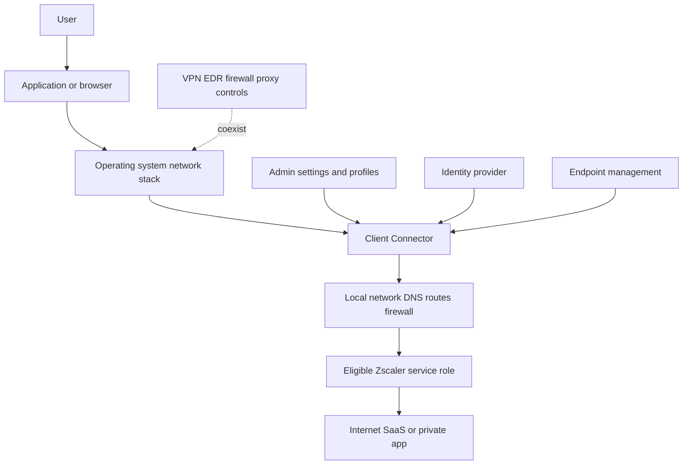

The useful troubleshooting boundary is not "inside Zscaler" versus "outside Zscaler." It is a sequence of observable transitions. Did the package install? Did the process/service start? Did enrollment complete? Which user/device identity is active? Which profile revision is present? Which network context was detected? Which destination matched? Was traffic tunneled, proxied, sent direct, or handled by another control? Did the service log it? Did the origin answer? Each answer narrows ownership.

### Plain-English deep-dive 1 - The agent is a junction, not the whole railway

A railway junction can set a switch correctly while a bridge farther away is closed. It can also receive an outdated schedule, lose power, or be blocked by another junction. Likewise, Client Connector may correctly steer traffic while DNS, an upstream firewall, a service, or the destination fails. Conversely, the internet may work by a direct fallback while Client Connector enrollment or protection is broken.

This distinction prevents two common mistakes. First, "the website opened" does not prove the intended protected path. Second, "the website failed" does not prove the endpoint agent caused the failure. A valid conclusion needs path evidence on both the success and failure sides.

## Lifecycle: package to retirement

Treat Client Connector as a managed lifecycle, not a one-time installer. Each phase has prerequisites, owners, evidence, failure modes, and a reversible change strategy.

| Phase | Core question | Required evidence | Common failure |
|---|---|---|---|
| Design | Which users, platforms, services, and transactions are in scope? | Inventory, requirements, support matrix, owners | Undefined scope |
| Package | Is the approved package authentic and appropriate? | Source, checksum/signature process, version, release notes | Wrong/stale package |
| Distribute | Did the management platform target and deliver it? | Assignment, download/install status, return code | Device cannot retrieve content |
| Install | Did software, services, drivers/extensions, and permissions install? | Installer and OS logs, component inventory | Permission or competing control conflict |
| Launch | Are required services/processes running? | Service state, startup events, resource state | Crash, disabled service, reboot pending |
| Enroll | Is the user/device registered to the intended organization/cloud? | Enrollment state, device record, timestamp | Wrong tenant, stale registration, no egress |
| Authenticate | Did identity complete with the intended subject? | IdP and client timestamps, result, identity | Conditional access or browser loop |
| Configure | Did the endpoint obtain current assigned settings/profiles? | Profile identity/revision, sync time, assignment | Stale or wrong-scope profile |
| Operate | Are intended ZIA/ZPA/ZDX paths active and usable? | State, service/path logs, transaction tests | Classification, tunnel, DNS, policy, app fault |
| Update | Did software/configuration move through controlled rings? | Version distribution, health delta, rollback readiness | Broad untested update |
| Support | Can users and service desk gather safe evidence and recover? | Runbook, support access, diagnostics, privacy controls | Destructive random changes |
| Retire | Was access, registration, configuration, data, and package removed correctly? | Offboarding record, device state, license/inventory | Orphan device or alternate path |

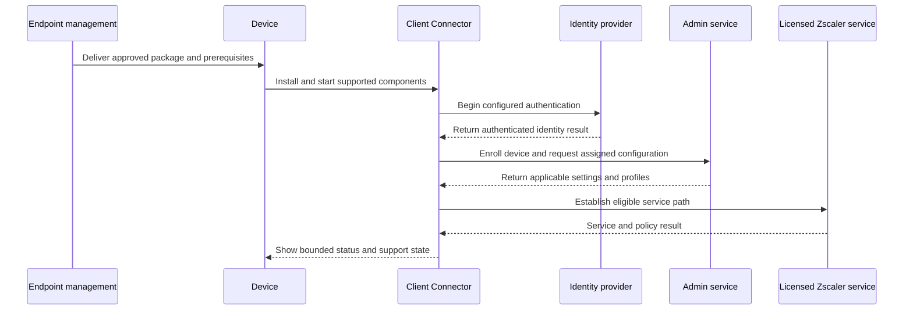

Installation and enrollment are separate. A device-management dashboard can report that a package installed while the user never authenticated, the device enrolled in the wrong organization, the assigned profile did not arrive, or a tunnel cannot form. Similarly, an enrolled record can remain after a device is rebuilt. Inventory reconciliation must compare endpoint, management, identity, and Zscaler records using privacy-approved identifiers.

### Installation prerequisites and controls

| Area | Questions before deployment | Validation |
|---|---|---|
| Platform | Is OS edition/build supported for chosen Client Connector version and features? | Current support matrix and lab device |
| Privilege | What installation and extension/driver approvals are required? | Managed test install without manual rescue |
| Storage/resources | Is disk, CPU, memory, and battery impact acceptable? | Idle and transaction baselines |
| Network | Can device reach required current destinations through firewalls/proxies? | Assigned-cloud requirement test |
| Identity | Is federation/authentication ready for enrollment and ongoing use? | Pilot sign-in and token/session behavior |
| Trust | How will enterprise roots or mobile profiles be distributed where needed? | Correct trust store and ownership |
| Coexistence | Which VPN, proxy, EDR, firewall, browser, DNS, or filtering components overlap? | Vendor guidance and conflict test matrix |
| Recovery | Can service desk collect diagnostics and invoke approved recovery? | Runbook rehearsal |
| Rollback | Can software/configuration be paused or reverted without uncontrolled bypass? | Tested ring rollback |
| Privacy | What endpoint/user data is collected, visible, exported, retained, and shared? | Approved data map and access controls |

## Enrollment, authentication, and configuration retrieval

Enrollment joins three identities that must not be casually conflated: the human account, the endpoint/device record, and the organization/service context. Authentication can succeed for the human while device enrollment fails. A device can enroll but later present stale posture. A valid profile can arrive but not govern a process captured by another agent.

| Identity layer | Example question | Evidence | Failure symptom |
|---|---|---|---|
| Human | Which user authenticated? | IdP subject and sign-in time | Wrong user policy |
| Device | Which managed/enrolled device is this? | Device identifier and enrollment record | Duplicate/stale device |
| Organization | Which tenant/cloud context applies? | Approved organization configuration | Wrong environment |
| Group | Which group/profile scope applied at evaluation time? | Directory membership and assignment evidence | Unexpected profile |
| Session | Is authentication current and valid? | Client/IdP session state | Prompt loop or expired session |
| Posture | What current device facts are accepted? | Signal/result/freshness | Access denied despite valid identity |

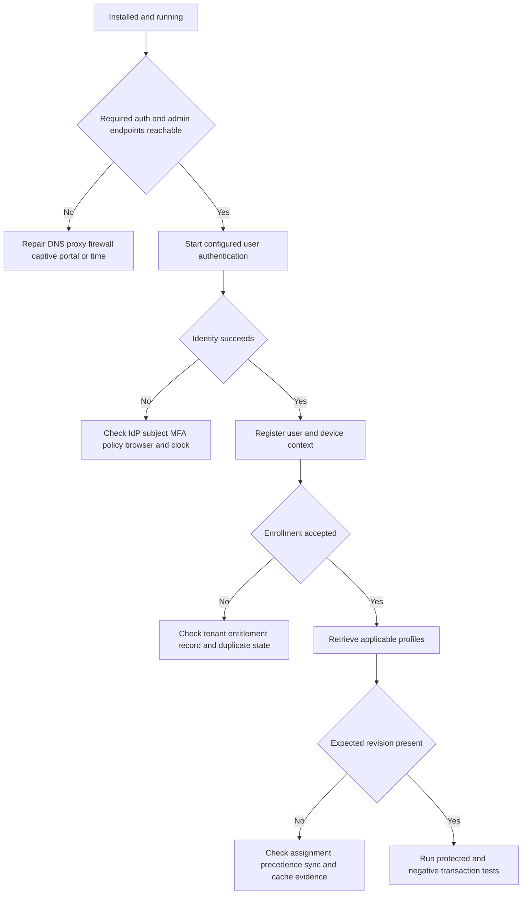

An authentication loop should be investigated as a transaction, not solved by repeatedly reinstalling. Record the exact prompt, application/browser involved, account, start time with time zone, redirects at a safe level, IdP result, certificate and clock state, network context, client version, and whether another known-good user/device succeeds. Do not collect passwords, full tokens, session cookies, or unrelated browser history.

Configuration retrieval is eventually observed on the endpoint after control-plane processing and connectivity. Therefore, "the administrator saved it" is only the first timestamp. Capture administrative change/audit time, profile assignment, endpoint synchronization time, endpoint-visible revision/state, and first affected transaction. A stale endpoint, wrong group, precedence issue, or failed retrieval can all explain a mismatch.

## Profile model and policy layers

The word "policy" is overloaded. Client Connector administration settings govern endpoint behavior; app/configuration profiles assign endpoint options; forwarding profiles tell the client how to treat traffic in network environments; posture profiles define/evaluate device conditions under current product design; ZIA and ZPA service policies decide allowed actions for matched transactions. Exact names and nesting vary by current UI and entitlement.

| Layer | Question it answers | Typical owner | Evidence of effect |
|---|---|---|---|
| Administration settings | How is the fleet managed, updated, supported, or constrained? | Endpoint/Zscaler admin | Effective endpoint option and audit record |
| App/configuration profile | Which client behavior applies to this user/group/platform? | Endpoint/Zscaler admin | Assigned profile identity/revision |
| Forwarding profile | How should traffic behave on each detected network context? | Network/security admin | Network classification and forwarding state |
| Posture profile | Which device facts satisfy a named condition? | Endpoint/security/identity | Signal values, freshness, evaluation result |
| ZIA policy | What should happen to eligible internet/SaaS traffic? | Security policy owner | ZIA transaction and effective rule |
| ZPA policy | May this entity reach this private application? | Private-access/app owner | ZPA transaction and effective rule |
| ZDX configuration | Which apps/services should be observed and by what tests? | Experience/operations owner | Probe/test schedule and telemetry |
| Destination policy | What may the user do inside the SaaS/private app? | Application/data owner | Application auth/audit result |

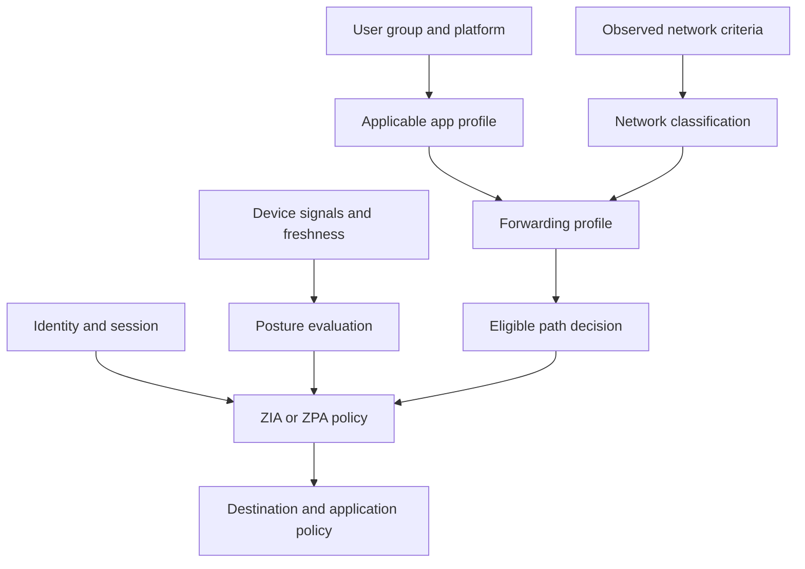

Profile design should favor explainability. Start with a small number of cohorts that represent real differences: supported platform, managed/unmanaged status, employee/contractor, pilot/production ring, or network requirement. Avoid creating a new profile for every incident. Every exception needs purpose, owner, scope, approval, expiry or review date, and tests proving both restored business function and retained control.

### Plain-English deep-dive 2 - A saved profile is not an effective profile

A teacher can place a new lesson in the school office, but a particular student may receive an older worksheet because they are in another class, were absent during distribution, or picked up the wrong packet. The office copy proves authoring, not delivery or use.

Likewise, an admin screenshot proves that a profile exists. It does not prove assignment to the affected user, precedence over another profile, successful endpoint retrieval, local activation, traffic match, or service-policy outcome. Troubleshooting needs a chain from authored object to assigned cohort to endpoint-visible revision to a timestamped transaction.

## Forwarding, tunnels, network context, and bypass

Forwarding means deciding how eligible traffic leaves the endpoint. Public Zscaler help describes forwarding profiles for Internet and SaaS and Private Access behavior across recognized network environments, including trusted, VPN-trusted, split-VPN-trusted, and off-trusted concepts under current support. Platform and version details matter. This guide deliberately does not reproduce every option or infer proprietary path selection.

| Decision | Plain question | Evidence | Risk if wrong |
|---|---|---|---|
| Network classification | Where does the client believe it is? | Client-displayed state and matched criteria | Wrong on/off-trusted behavior |
| Destination classification | Is this internet, SaaS, private app, excluded, or another class? | DNS/name/IP, app match, profile and service logs | Wrong service or direct path |
| Protocol eligibility | Can the selected forwarding method carry this protocol on this platform/version? | Current support docs and trace | Silent direct path or failure |
| Tunnel establishment | Did the intended transport establish to an eligible service role? | Client diagnostics and service-side evidence | No protected traffic path |
| Proxy interaction | Does system/browser/PAC proxy change the route? | Effective proxy/PAC state and connection | Loop or unexpected direct path |
| Bypass | Is a narrowly approved destination/process/path sent outside the control? | Exception object, owner, expiry, trace | Visibility/control gap |
| Fail behavior | What happens if required service connectivity is unavailable? | Tested mode and user message | Outage or uncontrolled access |
| Alternate control | Does VPN/EDR/firewall/DNS software capture first? | Adapter/filter/route/process evidence | Conflict or different path |

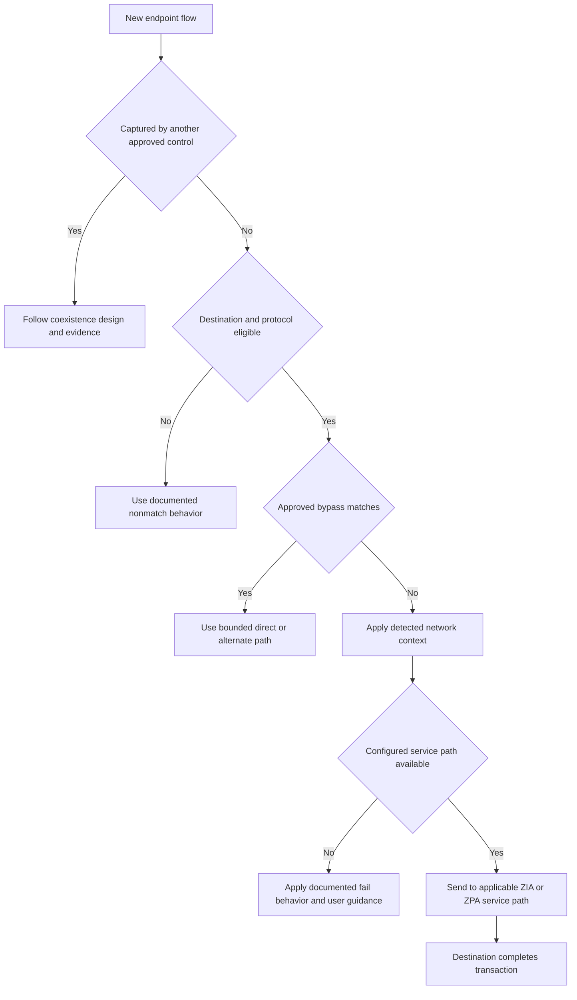

Z-Tunnel is a product term, not permission to claim packet mechanics from memory. At interview level, say that Client Connector can establish documented forwarding transport to Zscaler service roles and that choices differ by service, platform, version, profile, and network. For production, confirm supported Z-Tunnel versions, protocol behavior, port and destination requirements, MTU implications, failover, source identity, and troubleshooting commands in current official guidance.

### Bypass governance

Bypass is sometimes necessary for bootstrap identity destinations, captive portals, unsupported behavior, local resources, or a documented interoperability need. It is also a security and observability decision. "Make it work" is not sufficient authorization.

| Bypass field | Required content | Why |
|---|---|---|
| Business operation | Exact action that fails | Prevent vague broad exceptions |
| Match | Smallest destination/process/protocol/scope supported | Reduce exposure |
| Reason | Technical evidence proving incompatibility or bootstrap need | Avoid superstition |
| Control lost | Inspection, policy, logging, identity, DLP, or path effect | Make risk visible |
| Compensating control | Destination control, endpoint control, monitoring, or restriction | Reduce residual risk |
| Owner/approver | Named technical and risk owners | Accountability |
| Cohort | Pilot/users/devices/platforms affected | Contain blast radius |
| Time | Start, expiry, review date | Prevent permanent temporary rules |
| Tests | Required success and prohibited-path checks | Validate function and control |
| Removal plan | Trigger and method for retiring exception | Restore intended architecture |

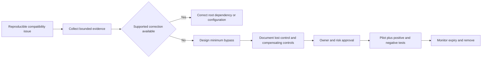

### Captive portals and changing networks

Hotel, airport, guest, and public Wi-Fi may require a browser interaction before normal internet access. Client Connector has documented captive-portal behavior under current configuration, but exact timing and bypass behavior must be verified. Capture the network transition, portal URL/category only as privacy permits, whether raw internet/DNS works, client state before/after acceptance, and whether service connectivity restores.

Network changes can invalidate assumptions. Moving from Ethernet to Wi-Fi, enabling a VPN, sleeping/resuming, switching cellular, or receiving new DHCP/DNS information can change routes, source addresses, trust classification, and tunnel state. A useful reproduction records each transition rather than reporting only the final failure.

## ZIA relationship: internet and SaaS lane

For ZIA, Client Connector can forward eligible internet and SaaS traffic to Zscaler so ZIA policy can be applied. Client Connector supplies the path and context; ZIA performs relevant cloud enforcement. The browser, DNS, operating system, certificate trust, origin application, and SaaS authorization still matter.

| Stage | Question | Example evidence | Boundary |
|---|---|---|---|
| App request | What process requested which destination and operation? | Process, sanitized URL/domain, time | User/application |
| Name resolution | Which address and DNS path were used? | DNS result and resolver | Endpoint/network |
| Client match | Did forwarding profile capture it? | Client state/diagnostic | Client Connector |
| Service path | Did intended ZIA path establish? | Tunnel/service status | Endpoint/network/Zscaler |
| ZIA policy | Which effective rule/action occurred? | Transaction log and rule | Security policy |
| TLS/HTTP | Did secure connection and request complete? | Certificate/trace/HAR as approved | ZIA/origin/client |
| SaaS action | Did app authentication/authorization succeed? | App audit/status | SaaS/customer app policy |
| Experience | Where is latency/loss/error added? | Segment timings and baselines | Multi-owner |

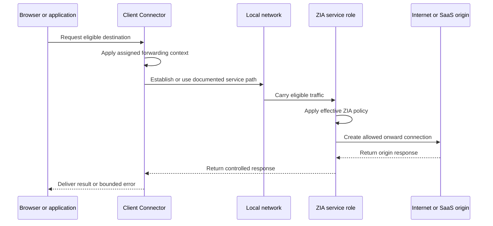

A direct comparison must prove path, not merely compare speed. Match device, user, network, destination, operation, time window, DNS result, protocol, payload, cache state, and service policy. A direct test may remove inspection or identity and is a controlled diagnostic with approval, not a permanent performance fix.

## ZPA relationship: private-application lane

For ZPA, Client Connector can recognize and steer eligible private-application traffic toward ZPA. ZPA policy uses identity, destination, device/posture context, and other configured conditions. App Connectors then reach the application from the private side. Client Connector does not replace private DNS, App Connectors, server reachability, or application authorization.

| Boundary | Client-side evidence | App-side evidence | Typical failure |
|---|---|---|---|
| Identity | Active user/session | Policy identity | Wrong/stale user |
| Private-app match | Requested name/IP/port and client state | Application segment definition | No or broad match |
| Posture | Signal/evaluation state | Effective policy condition | Stale/failed posture |
| ZPA service | Client private-access state | Access transaction | Service path/policy deny |
| Connector | Not generally proven by endpoint alone | Connector/group health and selection evidence | Connector unavailable |
| DNS | Endpoint lookup/match context | Connector-side resolution | Split-view mismatch |
| Network/server | Endpoint request symptom | Connector route/firewall/TCP/TLS | Destination unreachable |
| Application | User error/page | Server/app auth/audit | App deny or dependency failure |

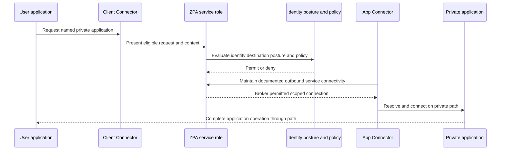

If the app works on VPN but not ZPA, do not immediately bypass Client Connector. The VPN may provide a hidden client-side dependency or broad route. Prove the private-app match, effective policy, connector path, connector-side DNS, application listener, authentication, and every client-side dependency. Coexistence can hide an incomplete ZPA design.

## ZDX relationship: measurement lane

ZDX uses Client Connector for supported device events and synthetic probing of configured SaaS or internet services. A synthetic probe is an automated test that imitates part of a user transaction. It is like a scheduled test call: useful for detecting path or service trouble even when no person opens a ticket, but not proof that every user workflow succeeded.

| Observation | What it can suggest | What it cannot prove alone |
|---|---|---|
| Device CPU/memory | Local resource contention | Which process caused business failure without detail |
| Wi-Fi signal/quality | Weak local radio condition | ISP or SaaS is healthy |
| DNS timing/result | Resolver/path delay or failure | Application authorization |
| Network/path metrics | Loss, latency, route/hop change | A named hop owns the fault without corroboration |
| Web/app probe | Availability and timing for tested transaction | Every feature, tenant, or user action |
| Client event | Network/tunnel/config transition | Root cause by itself |
| Experience score | Aggregated prioritization signal | Universal SLO or causal diagnosis |

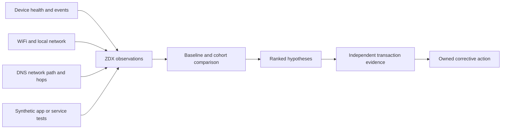

Part 38 covers ZDX deeply. For Part 36, remember the relationship: Client Connector is one observation and probing surface; ZDX is the experience-analysis product. ZDX telemetry does not replace Client Connector diagnostics, service transaction logs, packet evidence, application telemetry, or user reproduction.

## Device posture and adaptive policy context

Posture is a current assessment of device condition. Public product material states that Client Connector can provide device posture insights and that external endpoint/management integrations can contribute context under supported configurations. Exact checks, integration semantics, freshness, precedence, and actions are tenant and release dependent.

| Posture stage | Question | Evidence | Failure mode |
|---|---|---|---|
| Source | Which component reports the fact? | Native client, OS, MDM, EDR, certificate, or integration record | Source unavailable |
| Collection | Was the intended value observed? | Timestamped signal | Permission/query failure |
| Normalization | How is raw value represented? | Current documented field/result | Version/value mismatch |
| Freshness | Is evidence recent enough? | Observed and evaluated times | Stale status |
| Evaluation | Which posture condition passed/failed/unknown? | Named result and reason | Logic or precedence issue |
| Policy use | Which access rule consumed the posture result? | Effective ZIA/ZPA decision | Condition not referenced |
| User outcome | Was access allowed, reduced, isolated, or denied as designed? | Transaction and user message | Unclear remediation |
| Recovery | What refresh/remediation restores compliance? | Managed action and retest | Permanent exception |

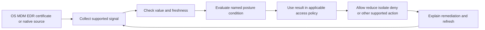

### Plain-English deep-dive 3 - Posture is a chain of evidence, not a green shield

A building's fire panel may show one zone as ready because a sensor last reported yesterday. That does not establish the room is safe now. You need to know which sensor, when it reported, how the panel interpreted it, and which evacuation rule used the result.

Device posture works similarly. "Compliant" can refer to an MDM decision, a Client Connector posture profile, an EDR state, or another system. Ask which source produced which value at what time, how Zscaler evaluated it, and which effective rule consumed it. When access fails, the correction may be refreshing the signal or repairing the source, not weakening policy.

Unknown deserves deliberate treatment. A missing signal is not necessarily false, healthy, or malicious. Policy owners choose fail behavior according to risk and availability. High-risk admin access may deny unknown posture; a lower-risk service might offer reduced/browser access or remediation. Exact actions depend on current products and policy.

## Updates, release management, and rollback

Client Connector has software updates and separately changing cloud-delivered configuration. Public Zscaler material describes cloud-managed updates and rollback support, while help documents auto-update and admin-controlled approaches. Never translate that into "every prior build can always be restored." Verify supported versions, long-term-support options, downgrade paths, signing, minimum versions, forced deadlines, and platform constraints in current release documentation.

| Change type | Primary risk | Ring evidence | Rollback question |
|---|---|---|---|
| Client software | Driver/extension, performance, crash, compatibility | Install success, service health, transaction suite | Is downgrade supported and package available? |
| App profile | Behavior or user-control change | Effective revision, user state, paths | Can prior assignment be restored? |
| Forwarding profile | Traffic outage or bypass | Path proof for ZIA/ZPA/direct cases | Is known-good profile preserved? |
| Posture profile | Broad deny or unintended allow | Pass/fail/unknown cohorts and rule hits | Can condition be reverted without blind allow? |
| Certificate/trust | TLS failures or inspection gap | Trust-store state and representative apps | Can trust change be reversed safely? |
| Identity setting | Enrollment/authentication outage | Login flows, MFA, session renewal | Is break-glass admin/support path ready? |
| Network requirement | Tunnel/service reachability | Required endpoint tests and telemetry | Can firewall/DNS change revert atomically? |
| Coexistence setting | VPN/EDR/proxy conflict | Combination matrix | Which owner controls reversal? |

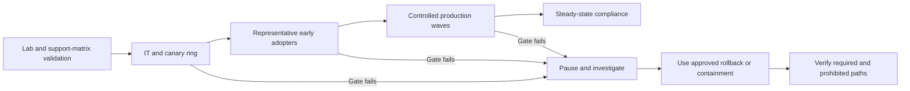

Release gates should include installation and business results. A 99 percent install rate is not success if payroll fails or devices lose protection. Compare authentication success, profile freshness, tunnel/service health, DNS, representative ZIA and ZPA transactions, ZDX probe continuity where licensed, endpoint resource use, help-desk contacts, bypass/fallback use, and rollback success.

## Coexistence and interoperability

Two endpoint products can both be individually supported and still conflict when they compete for adapters, routes, DNS, proxy settings, filters, certificates, browser extensions, local VPN frameworks, or startup order. Use current Zscaler interoperability guidance and the other vendor's guidance. Test the exact versions and configurations, not product names in isolation.

| Coexisting control | Shared surface | Symptom | Discriminating evidence |
|---|---|---|---|
| Full-tunnel VPN | Default route, DNS, adapters, MTU | No tunnel, wrong trusted state, unreachable app | Routes/adapters before and after VPN |
| Split-tunnel VPN | Selected routes and DNS suffixes | Some private apps use wrong path | Destination route and DNS per app |
| Web proxy/PAC | Browser/system proxy | Loop, auth prompt, direct traffic | Effective proxy and connection chain |
| Endpoint firewall | Local socket/filter rules | Process cannot establish service path | Firewall event tied to process/time |
| EDR/network filter | Kernel/user filtering and injection | Latency, reset, crash, incompatibility | Version combination and controlled isolation |
| DNS security agent | Resolver interception | Wrong answer, timeout, private-name failure | Resolver chain and query evidence |
| Other SSE/ZTNA agent | Same traffic classification | Duplicate tunnel or unpredictable path | Process/filter ownership and path trace |
| MDM/compliance | Package/profile/certificate state | Reinstall loop or posture mismatch | Management assignment and device state |
| OS security feature | Network extension, trust, privacy permission | Component disabled | OS approval/event evidence |
| Captive-portal helper | Temporary direct access | Login never completes | Portal reachability and client transition |

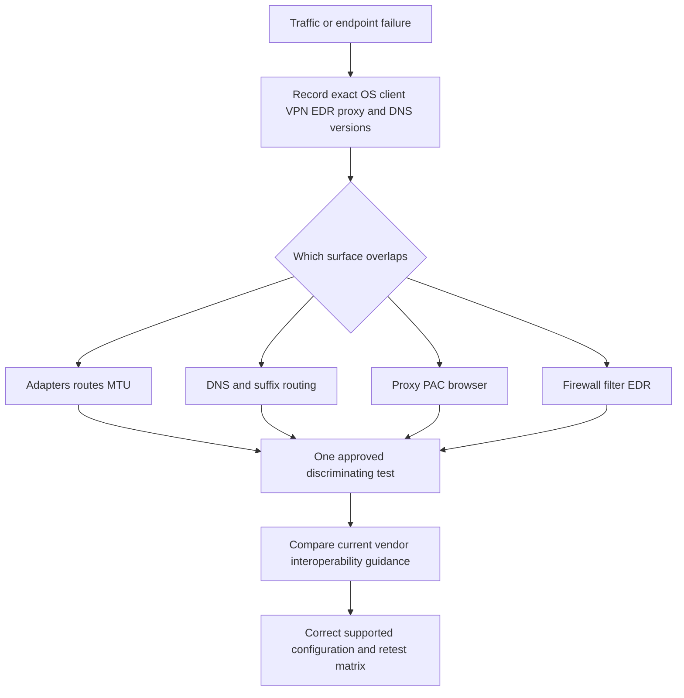

Do not disable security agents broadly to "see what happens." That may violate policy, alter many variables, expose the device, and destroy evidence. Prefer an owned lab device, approved pilot cohort, support-guided logging, or one reversible configuration change with security approval. Record the before/after state and restore controls immediately after the test.

### Plain-English deep-dive 4 - Coexistence is two drivers reaching for one steering wheel

Imagine two driving instructors who both grab the steering wheel whenever they see danger. Each may make a reasonable turn alone, but together they can oscillate or leave the road. Endpoint network controls can similarly compete for the same route, DNS query, proxy setting, certificate path, or packet filter.

The fix is not deciding which product is "bad." Map ownership: which product should handle internet traffic, private routes, DNS suffixes, proxy decisions, and fail states in each network context? Then configure supported boundaries, test transitions, and document escalation ownership.

## Endpoint, network, identity, and service dependencies

| Dependency | Healthy evidence | Common failure | Owner |
|---|---|---|---|
| Clock/time | Accurate synchronized time | Authentication/certificate errors | Endpoint/platform |
| OS support | Supported build and approvals | Driver/extension blocked | Endpoint engineering |
| Local resources | Stable CPU, memory, disk, battery | Slow UI/process crash | Endpoint engineering |
| DHCP/address | Valid address, gateway, MTU | No path or fragmentation | Network |
| DNS | Required names resolve by intended path | Timeout/wrong split view | Network/identity/app |
| Captive portal | Portal completed then normal egress | Service endpoints blocked | Network/user support |
| Firewall/egress | Current assigned-cloud requirements reachable | Tunnel/auth/config failure | Network/security |
| Identity provider | Successful intended user flow | Prompt loop/deny | Identity |
| Directory groups | Current expected membership | Wrong profile/policy | Identity/governance |
| Certificates/trust | Required chain and private keys valid | TLS/enrollment failure | PKI/endpoint/security |
| Zscaler service | Relevant service reachable/healthy | Broad policy/path impact | Zscaler/customer network |
| Application | Destination listener/auth/dependencies healthy | One app failure | App/SaaS owner |
| Logging/export | Complete timely permitted evidence | Invisible or delayed events | Platform/SOC/privacy |

Dependency tests should mirror the actual context. Testing DNS from an administrator workstation does not prove the affected endpoint's resolver chain. Pinging a service address may not test the documented transport. Opening a home page does not test upload, authentication renewal, private-app dependency, or large payload. Use the smallest faithful business transaction.

## Logs, diagnostics, and privacy

Client evidence may contain usernames, device identifiers, internal names, network addresses, application destinations, profile details, timestamps, and support diagnostics. Packet captures, HAR files, and browser logs can also contain tokens, cookies, content, and query data. Collect only what the case requires, use approved channels, restrict access, document purpose, redact where technically safe, and delete according to policy.

| Evidence source | Best question answered | Sensitive content risk | Validation caveat |
|---|---|---|---|
| Client UI/status | What does endpoint believe now? | User/device/network identifiers | Screenshot is point-in-time |
| Client diagnostic bundle | What occurred around client services/configuration/path? | Internal names, IDs, detailed state | Schema/version/support handling varies |
| Installer/OS logs | Did components install/start/update? | Device/user paths | Install success is not enrollment |
| IdP sign-in log | Did intended identity authenticate? | Identity, IP, claims, policy | Does not prove forwarding |
| Admin audit/config | What changed and who assigned it? | Admin identity and configuration | Save is not endpoint effect |
| ZIA/ZPA transaction | Did service see flow and what policy applied? | User, destination, action | Absence may mean alternate path/export delay |
| DNS/route/socket state | How did endpoint attempt path? | Internal topology | Snapshot may miss transition |
| Packet trace | What packets traversed capture point? | Payload/credentials/content | Encryption and capture placement limit view |
| HAR/browser trace | What did web transaction do? | URLs, headers, cookies, bodies | Browser only and highly sensitive |
| ZDX observation | What experience signal changed? | Device/path/app metrics | Correlation, not automatic causation |
| Application telemetry | Did destination accept/complete operation? | Business content and identity | App clock/schema may differ |
| User report | What operation and impact occurred? | Personal/business context | Needs timestamped corroboration |

```mermaid
flowchart LR
    QUESTION[One diagnostic question] --> MIN[Choose minimum evidence]
    MIN --> APPROVE[Confirm authority and user notice]
    APPROVE --> COLLECT[Collect bounded time and scope]
    COLLECT --> PROTECT[Encrypt restrict and record access]
    PROTECT --> CORR[Correlate using normalized timestamps]
    CORR --> SHARE[Share minimum with correct owner]
    SHARE --> RETAIN[Retain or delete by policy]
```

Support bundles should not be uploaded to personal storage or pasted wholesale into tickets without review. Secrets and session material must never be intentionally collected. When redaction changes technical meaning, preserve an access-controlled original and create a minimized derivative under the customer's evidence process.

## User experience and meaningful metrics

Users experience business operations, not tunnels. Measure the complete task and enough technical segments to isolate degradation. Averages conceal tail pain; use percentiles, cohorts, and denominators.

| Metric | Definition | Segmentation | Caveat |
|---|---|---|---|
| Install success rate | Successful supported installs divided by targeted eligible devices | Platform/version/ring | Exclude ineligible with reason |
| Enrollment success | Enrolled devices/users divided by install attempts | IdP/platform/network | Duplicate records need handling |
| Authentication time | Start to successful client authentication | IdP/cohort/network | Interactive MFA affects distribution |
| Profile freshness | Devices on expected revision within target time | Profile/ring/platform | Offline devices need separate denominator |
| Service-path establishment | Successful intended path states per attempt/window | Network/ISP/platform | State does not prove app transaction |
| DNS time/failure | Resolver duration and failure rate | Resolver/network/destination | Cache changes results |
| Business transaction success | Completed defined operation divided by attempts | App/cohort/path | Requires consistent operation |
| Transaction latency | End-to-end operation duration, percentiles | App/region/ISP/path | Avoid cross-operation comparison |
| Endpoint resource delta | CPU/memory/battery versus matched baseline | Hardware/OS/version | Other software confounds |
| Support contact rate | Relevant tickets per active devices/users | Ring/platform/issue | Classification quality matters |
| Bypass/fallback dependence | Transactions/devices using temporary alternate path | App/cohort/exception | Direct use may be invisible without design |
| Update rollback rate | Rolled-back devices/changes by reason | Version/platform/ring | Small canary rollback can be healthy governance |
| Posture unknown rate | Unknown results divided by evaluations | Signal/source/platform | Unknown is not automatically noncompliant |
| Time to isolate | Incident start to first failed boundary | Severity/team | Do not game by declaring prematurely |

Do not promise Client Connector will always improve latency. It changes traffic path and applies security services; outcomes depend on local access, service-edge reachability, destination geography, inspection, application design, and baseline. The honest aim is secure, reliable access with measurable and explainable experience.

## Failure patterns and hypothesis matrix

| Symptom | Leading hypotheses | Cheap discriminating check | Unsafe shortcut |
|---|---|---|---|
| No enrollment | Auth/admin endpoints, tenant config, identity, time, package | Correlate client and IdP timestamps | Reinstall repeatedly |
| Repeated login | Session/cookies, IdP policy, clock, embedded/system browser | Known-good user/device matrix | Disable MFA |
| Wrong policy/profile | Group, precedence, stale sync, wrong user/tenant | Effective profile identity/revision | Edit many profiles |
| Internet fails, private app works | ZIA forwarding/service/DNS/policy | ZIA path state and transaction log | Bypass all web traffic |
| Private app fails, internet works | ZPA match/policy/connector/app dependency | Named app and ZPA transaction | Restore broad VPN permanently |
| All traffic fails after network change | Captive portal, DNS, route, tunnel, trusted classification | State before/after transition | Turn off every endpoint control |
| One app fails | App-specific policy, TLS, pinning, dependency, app outage | Known-good destination same path | Declare cloud outage |
| Slow only at home | Wi-Fi, ISP path, MTU, resolver, geography | Wired/known-good network matched test | Raise global bypass |
| High CPU/battery | Version defect, logging, conflict, other process | Process/resource timeline and combination | Kill services without dump/evidence |
| Works with VPN | Hidden route/DNS/dependency or classification difference | Destination route/DNS comparison | Assume VPN required forever |
| Missing logs | Direct/other path, time mismatch, export delay, scope | Endpoint path plus native service query | Treat absence as allow |
| Posture deny | Source unavailable/stale/value/evaluation/policy | Signal-to-rule chain | Remove posture globally |

## Troubleshooting workflow and decision trees

### Step 1: define one transaction

Record user, device, platform, Client Connector version, location/network, destination, application/process, exact operation, expected result, actual result, start/end time with time zone, impact, first/last occurrence, and known-good comparison. "Internet broken" is not a transaction.

### Step 2: establish lifecycle state

Verify supported install, running components, enrollment, active identity, assigned profile revision, posture state, network classification, and intended licensed service states. Capture facts before resetting them.

### Step 3: prove path ownership

Determine whether Client Connector, a VPN, PAC/proxy, another agent, local route, or direct path handles the flow. Check destination and protocol match, bypass, DNS, route, adapter, and service-side event.

### Step 4: isolate the first failed boundary

Move in order through endpoint application, OS, Client Connector decision, local network, service reachability, effective policy, onward path, and destination. A successful later boundary can disprove an earlier broad hypothesis; a failed boundary needs one discriminating test.

### Step 5: correlate changes and cohorts

Compare affected/unaffected users by profile, version, platform, network, ISP, identity group, posture, service, destination, and rollout ring. Align client, IdP, admin, service, and app clocks.

### Step 6: correct narrowly

Repair the responsible dependency or configuration. If an exception is necessary, bound and govern it. Avoid clearing caches, reinstalling, disabling protection, and changing profiles simultaneously because that erases causality.

### Step 7: validate and close

Repeat required operation, prohibited-path test, network transitions, fail behavior, and telemetry. Monitor the affected cohort, document root cause versus contributing conditions, remove temporary diagnostics/bypasses, and update the runbook.

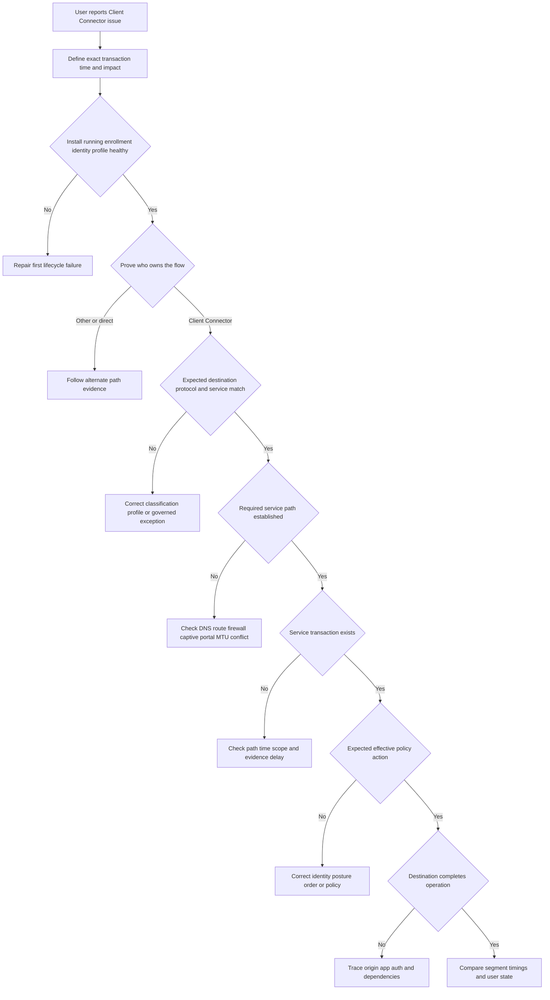

### Network-transition decision tree

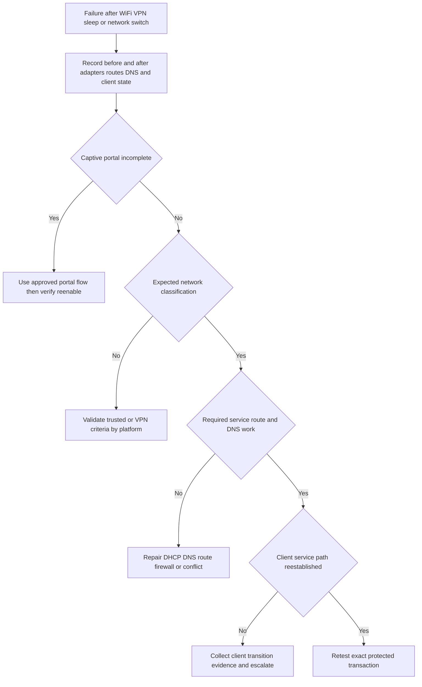

## Deployment, pilot, change, and rollback plan

Deployment is an organizational change touching connectivity, identity, endpoint management, privacy, and user support. Define decision rights before the first pilot.

| Workstream | Accountable questions | Exit artifact |
|---|---|---|
| Business/application | Which operations and outage tolerances matter? | Transaction catalog and owners |
| Endpoint | Which platforms/builds/packages and recovery methods? | Support matrix and package plan |
| Identity | How do users enroll/authenticate and recover? | Auth test plan and support path |
| Network | Which current service destinations, DNS, routes, proxies, and ports are required? | Validated dependency matrix |
| Security | Which ZIA/ZPA/posture/fail/bypass policies apply? | Policy and exception record |
| Privacy/legal | Which data is processed, retained, exported, or shared? | Approved data map/notice |
| Service desk | Which messages, checks, diagnostics, and escalation route? | Tiered runbook |
| Change management | Which rings, gates, freeze periods, and rollback authority? | Change plan |
| Metrics | Which baselines, denominators, thresholds, and owners? | Dashboard definition |
| Vendor support | Which logs, versions, reproduction, and severity route are required? | Escalation template |

### Pilot design

A representative pilot is deliberately diverse but small enough to support closely. Include supported operating systems, device models, networks, regions, ISPs, identity groups, ZIA and ZPA transactions, collaboration/video, large transfers, captive portals, VPN coexistence, sleep/resume, and accessibility needs. Exclude unsupported combinations explicitly rather than silently counting them as failures.

| Gate | Pass criteria example | Stop condition | Owner action |
|---|---|---|---|
| Install | Approved devices install and start without unsupported workaround | Repeated driver/extension failure | Pause platform cohort |
| Enrollment | Intended identities/devices register reliably | Prompt loop or wrong tenant | Identity/client investigation |
| Profile | Expected revision reaches cohort within target | Material stale/wrong assignment | Control-plane/profile repair |
| ZIA | Required internet/SaaS operations pass with intended policy/logs | Broad app class fails | Forwarding/TLS/policy investigation |
| ZPA | Required private apps and negative tests pass | Hidden dependency or broad reachability | Segment/path correction |
| ZDX | Configured tests continue with interpretable baseline | Probe gap or privacy mismatch | Experience configuration review |
| Coexistence | Supported VPN/EDR/proxy transitions pass | Route/DNS/filter conflict | Joint vendor/config review |
| Experience | Percentiles/resource use remain within approved thresholds | Tail latency or resource regression | Analyze before expansion |
| Support | Service desk can identify first boundary and recover | Random disable/reinstall behavior | Retrain and simplify runbook |
| Rollback | Ring can return to approved state and prove controls | No supported recovery | Do not expand |

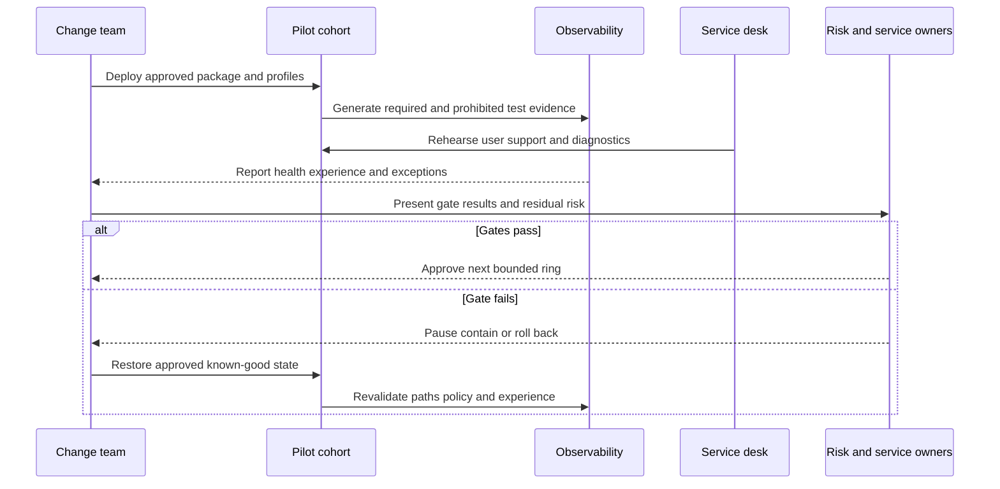

### Rollback principles

Rollback is not synonymous with disabling Client Connector or sending everything direct. Choose the least risky supported reversal: restore prior profile assignment, pause an update ring, return to an approved software version where supported, remove a defective exception, or invoke a documented continuity path. Preserve identity and security controls where possible. If availability requires temporary fail-open or alternate VPN, obtain the correct risk approval, scope it, monitor it, and set removal criteria.

## Fictional NMH deployment and incident

NMH plans a synthetic Client Connector pilot for 120 devices: Windows finance users, macOS engineering users, field users on mobile hotspots, and service-desk canaries. The design includes ZIA for internet/SaaS, ZPA for payroll and engineering private apps, and ZDX probes for Microsoft 365. It is a learning case, not a customer deployment.

### NMH pilot inventory

| Cohort | Devices | Key transactions | Coexistence | Main risk |
|---|---:|---|---|---|
| Service desk canary | 10 | Auth, web, payroll, diagnostics | EDR and proxy | Support readiness |
| Finance Windows | 35 | Payroll, banking SaaS, document upload | Full VPN during coexistence | Hidden route and TLS needs |
| Engineering macOS | 30 | Source SaaS, private tools, large transfers | Split VPN and DNS tool | Route/DNS ownership |
| Field users | 25 | M365, CRM, captive portal, hotspot | Mobile network changes | Portal and weak connectivity |
| IT/security | 20 | Admin SaaS and private admin apps | Privileged controls | Posture and least privilege |

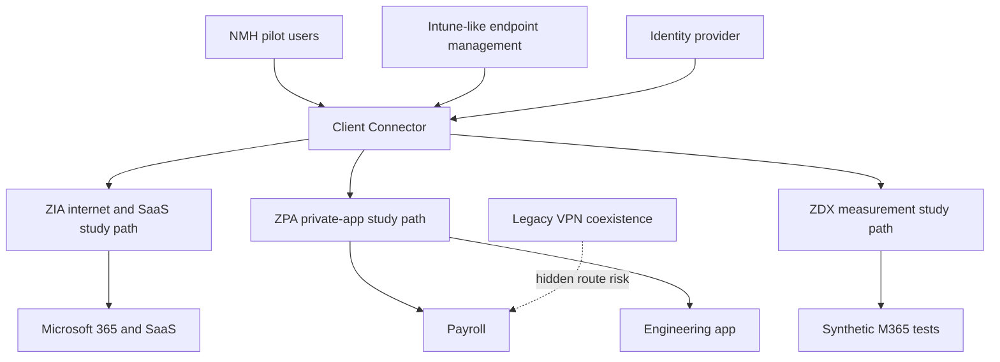

### NMH incident: payroll fails after VPN disconnect

Finance pilot users can open payroll while the legacy VPN is connected, but payroll fails after disconnecting VPN. Internet SaaS remains healthy. A rushed interpretation blames ZPA or Client Connector. The team instead defines the exact login-to-payslip transaction.

Client and ZPA evidence shows the payroll front end matches and policy permits it. Connector-side evidence shows the front end is reachable. The browser then calls a second private hostname for report rendering. That hostname was resolved through the VPN-delivered DNS suffix and was not included in the private-app design. The VPN masked the missing client-side dependency.

The approved response is not an all-private-range bypass. The app owner confirms the dependency, the ZPA team models the narrow supported destination and service, the DNS owner supplies the intended resolution path, and the pilot repeats login, report rendering, negative reachability, VPN-off, failover, and logs. The change is synthetic and demonstrates method only.

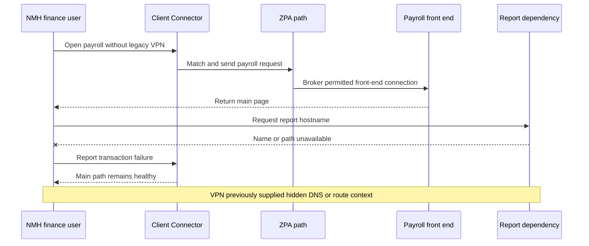

### NMH rollback and learning

Because payroll report rendering is critical, NMH pauses the finance wave. The bounded rollback temporarily restores the approved legacy VPN requirement only for the pilot cohort while the missing dependency is corrected; it does not remove ZIA or create a permanent broad bypass. The change owner records expiry, monitoring, and removal tests. After correction, the team proves the complete operation without VPN and verifies prohibited private destinations remain unreachable.

| Finding | Evidence | Correction | Preventive control |
|---|---|---|---|
| Front end was healthy | ZPA policy/path and page response | No platform-wide change | Separate app from dependency health |
| Report hostname missing | Browser/network evidence at failure time | Add validated narrow dependency | Business-operation inventory |
| VPN masked gap | Works only with VPN route/DNS context | Remove fallback after validation | VPN-off pilot gate |
| User message was vague | "Payroll broken" | Capture exact failed action | Service-desk transaction template |
| Wave expanded too soon | Login tested, report not tested | Pause and complete suite | Gate by complete operations |

## Outcomes and TSM metrics

| Desired outcome | Leading indicator | Lagging indicator | Honest caveat |
|---|---|---|---|
| Managed coverage | Eligible devices installed/enrolled/on approved version | Reduced unmanaged access | Inventory completeness matters |
| Correct forwarding | Required and prohibited path tests by context | Fewer path incidents | Test set cannot cover every app |
| Stronger context | Fresh posture results used by policy | Reduced risky access | Posture does not eliminate compromise |
| Reliable access | Auth/profile/path health and transaction percentiles | Fewer user-impact hours | Origin and ISP remain dependencies |
| Safer changes | Ring gates and rollback rehearsal | Lower change-related impact | Small rollback can show healthy governance |
| Less fallback | Declining VPN/direct/bypass dependence | Legacy path retirement | Do not retire before hidden dependencies are gone |
| Faster support | Evidence completeness and time to first failed boundary | Lower resolution time/reopen rate | Severity and case mix differ |
| Privacy control | Data map, access review, retention compliance | Fewer handling exceptions | Legal interpretation is customer-specific |

A proactive TSM review should ask: Are active devices on supported versions? Are profile assignments and exceptions owned? Which network contexts generate failure? Is posture unknown increasing? Which apps rely on VPN or bypass? Are support bundles handled safely? Did recent updates change error, latency, or resource distributions? Which upcoming OS, VPN, certificate, IdP, or network changes need joint testing?

## Arti's Microsoft-to-Zscaler bridge

| Microsoft production strength | Transfer to Part 36 | New Client Connector learning | Honest interview language |
|---|---|---|---|
| OneDrive client and Office troubleshooting | Define exact endpoint operation and lifecycle state | Client diagnostics/profile state | "Client isolation transfers; product operation is new." |
| Entra ID sign-in and Conditional Access | Separate user, device, session, posture, and policy | Zscaler enrollment/auth flows | "I would correlate both identity and client evidence." |
| Intune concepts | Package/profile/ring/compliance reasoning | Current deployment/update fields | "Management method transfers, not console experience." |
| DNS/TCP/TLS/proxy tracing | Prove path ownership and first failure | Z-Tunnel and service evidence | "I will not infer proprietary selection." |
| M365 service health and telemetry | Compare endpoint, network, service, and app | ZIA/ZPA/ZDX evidence | "One green dashboard never closes the case." |
| Critical incidents | Timeline, hypotheses, workstreams, safe mitigation | Zscaler escalation package | "I bring incident discipline." |
| SQL/Power BI | Cohort, percentile, denominator, change analysis | Zscaler schema/retention | "I validate data before claims." |
| Training/mentoring | Service-desk decision trees and user language | Product-specific recovery | "Enablement is established; hands-on product depth is growing." |

### 30-second interview bridge

"Client Connector is the managed endpoint junction for supported Zscaler services. It enrolls a user and device, receives assigned configuration, provides context such as posture, and steers eligible internet traffic toward ZIA and private-app traffic toward ZPA; it can also support ZDX observations and probes. I troubleshoot it as a lifecycle and path, not an icon: install, enrollment, identity, profile, network context, forwarding decision, service policy, and destination. My Microsoft client, Intune, identity, DNS, TLS, proxy, escalation, and analytics methods transfer directly, while production Client Connector administration remains a learning boundary."

## Labs and rehearsal

Use only owned or explicitly authorized systems, devices, networks, identities, and data. Generic OS/proxy/tunnel labs teach concepts but do not prove Zscaler proprietary behavior.

### Lab 1: lifecycle evidence map

Create a synthetic timeline from package assignment through install, authentication, enrollment, profile retrieval, path establishment, transaction, update, and retirement. Add owner and evidence for each boundary.

### Lab 2: profile precedence cards

Create four hypothetical app profiles and forwarding profiles for employee, contractor, canary, and mobile cohorts. Identify overlaps, expected effective assignment, ambiguity, and proof needed from the tenant.

### Lab 3: path ownership

On an owned lab device, inspect proxy settings, adapters, routes, DNS, and sockets before and after enabling a generic lab VPN. Explain what the evidence can teach and why it is not a Client Connector trace.

### Lab 4: network transitions

Test an owned application across Ethernet, Wi-Fi, hotspot, sleep/resume, and a lab captive portal. Record time, DNS, routes, operation result, and recovery. Focus on the transition timeline.

### Lab 5: posture chain

Build synthetic signals for OS version, disk encryption, EDR state, and management state. Include fresh, stale, false, and unknown values. Map each to a hypothetical policy and remediation.

### Lab 6: bypass governance

Given a pinned test application in an owned lab, design a minimum compatibility exception with control-loss statement, owner, expiry, compensating control, success test, negative test, and removal trigger.

### Lab 7: coexistence matrix

Model Client Connector with full VPN, split VPN, PAC, EDR filter, local firewall, and DNS agent across three platforms. Identify shared surfaces and one safe discriminating test per conflict.

### Lab 8: ring deployment

Create lab, canary, early adopter, and production rings. Define gates for install, enrollment, profile, ZIA-like web path, ZPA-like private path, resource use, support rate, and rollback.

### Lab 9: evidence minimization

Take a fabricated diagnostic bundle inventory. Mark each field required, redactable, prohibited, retention-bound, and authorized recipients. Never use real tokens or customer data.

### Lab 10: NMH payroll incident

Rehearse the hidden report-host dependency. Explain why VPN success is evidence of a path difference, not proof that ZPA or Client Connector failed.

### Lab 11: metric review

Build a synthetic dashboard with denominators, percentiles, platform/ring cohorts, profile freshness, posture unknown, fallback dependence, and ticket rate. Write three conclusions and three caveats.

### Lab 12: interview teach-back

Explain Client Connector, enrollment, profiles, forwarding, bypass, posture, ZIA/ZPA/ZDX relationships, coexistence, privacy, pilot, and troubleshooting in 30 seconds each without claiming unsupported internals.

## Common misconceptions to correct

| Misconception | Corrected understanding |
|---|---|
| Client Connector is ZIA | It is an endpoint component; ZIA is an internet/SaaS security service |
| Client Connector is ZPA | It can provide a user-side path; ZPA also has service, policy, connector, and app-side dependencies |
| Client Connector is ZDX | It can supply supported endpoint observations/probes; ZDX analyzes experience |
| Installed means enrolled | Package installation and service enrollment are separate states |
| Enrolled means protected | Profile, path, policy, and destination evidence are still needed |
| Authenticated means authorized | ZIA/ZPA/application policy can still deny or restrict |
| One profile controls everything | Administration, app, forwarding, posture, service, and app policies have distinct roles |
| Saved profile is effective | Assignment, retrieval, activation, match, and transaction must be proven |
| Trusted network means inherently safe | It is a configured classification with product-specific criteria and behavior |
| Tunnel connected means application healthy | DNS, policy, origin, authentication, and dependencies can fail |
| Z-Tunnel behavior is universal | It varies by documented version, platform, profile, service, and release |
| Direct test proves faster architecture | It changes controls and may not be a matched test |
| Bypass is only a technical setting | It is a security, privacy, evidence, and governance decision |
| More bypass is safer for availability | Broad bypass can silently remove control and mask root cause |
| VPN success proves Client Connector defect | VPN may supply hidden DNS, routes, or dependencies |
| Two endpoint agents will coordinate | Shared adapters, routes, DNS, proxy, certificates, and filters require design/testing |
| Disable every agent to isolate | That changes many variables, risks exposure, and destroys causality |
| Posture is one green value | It is source, collection, freshness, evaluation, policy, and outcome |
| Unknown posture means compromised | It means evidence is unavailable/unevaluated; policy must handle it deliberately |
| Update success equals business success | Required operations, controls, resource use, and support outcomes must pass |
| Rollback means turn protection off | Prefer a supported prior state or bounded continuity path |
| Average latency represents users | Tail percentiles and cohorts reveal localized pain |
| Missing Zscaler log means allow | Traffic may be direct, owned by another path, outside scope, delayed, or mismatched in time |
| Public product page is a runbook | Authenticated help, release notes, tenant, assigned cloud, and evidence control |
| This Part proves hands-on administration | It proves conceptual readiness and synthetic practice only |

## Official Source Anchors

Sources in this section were reviewed on **2026-08-24**.

Zscaler product pages are vendor-authored positioning; public help provides more detail but can change and may expose different content by path, login, release, platform, cloud, or entitlement. Authenticated help, release notes, current support matrices, the assigned tenant/cloud, contracts, and Support guidance control production behavior. NIST provides vendor-neutral zero trust principles, not Client Connector configuration. The Zscaler corporate website privacy policy does not replace customer contracts or product-specific privacy documentation.

| Source | URL | Used for | Boundary |
|---|---|---|---|
| Zscaler Client Connector product page | https://www.zscaler.com/products-and-solutions/zscaler-client-connector | Endpoint agent positioning; ZIA/ZPA/ZDX, posture, endpoint DLP, platform, MDM/update and integration themes | Marketing claims are not guaranteed outcomes or detailed mechanics |
| Client Connector Help landing page | https://help.zscaler.com/zscaler-client-connector | Current documentation families for administration, profiles, posture, forwarding, devices, deployment, monitoring, interoperability, and troubleshooting | Topics/UI can move; use current authenticated paths |
| What Is Client Connector | https://help.zscaler.com/zscaler-client-connector/what-is-zscaler-client-connector | Enrollment, settings/profile retrieval, ZIA/ZPA/ZDX relationships, mobile/local VPN concepts, updates and support features | Platform/version details must be checked before use |
| How Client Connector Works | https://help.zscaler.com/zscaler-client-connector/how-does-zscaler-client-connector-work | Public description of endpoint adapter, Z-Tunnel, service path, PAC/direct choices, and periodic checks | Does not authorize inferred proprietary selection internals |
| About Forwarding Profiles | https://help.zscaler.com/zscaler-client-connector/about-forwarding-profiles | Network-environment concepts and forwarding-profile purpose | Criteria and behavior vary by platform/version/configuration |
| Client Connector update intervals | https://help.zscaler.com/zscaler-client-connector/zscaler-app-update-intervals | Current update documentation anchor | Verify current release channel and support policy |
| Interoperability guidance | https://help.zscaler.com/zscaler-client-connector/best-practices-zscaler-app-and-vpn-client-interoperability | Need for explicit VPN coexistence design | Exact vendor/version combinations require current tests |
| Zscaler Config | https://config.zscaler.com/ | Current assigned-cloud/component network requirements and changelog anchor | Do not hard-code copied addresses globally; private components may differ |
| ZIA | https://www.zscaler.com/products-and-solutions/zscaler-internet-access | Internet/SaaS service relationship | Product overview, not policy/runbook proof |
| ZPA | https://www.zscaler.com/products-and-solutions/zscaler-private-access | Private-application relationship | Product overview, not connector/app health proof |
| ZDX | https://www.zscaler.com/products-and-solutions/zscaler-digital-experience-zdx | Experience-observation relationship | Metrics/features/packaging require current validation |
| Zscaler privacy overview | https://www.zscaler.com/privacy-compliance/overview | Vendor privacy/compliance documentation entry point | Customer legal review and contract control |
| Zscaler corporate privacy policy | https://www.zscaler.com/privacy-compliance/company-privacy-policy | Distinguishes website/controller processing themes and points to customer agreements | Not a complete product telemetry data map |
| NIST SP 800-207 | https://csrc.nist.gov/pubs/sp/800/207/final | Resource focus and no implicit trust based only on network location or ownership | Vendor-neutral architecture, not product mechanics |
| CISA Zero Trust Maturity Model | https://www.cisa.gov/resources-tools/resources/zero-trust-maturity-model | Maturity and cross-pillar governance anchor | Confirm current CISA URL/version; not Zscaler configuration |

## Likely Interview Questions

### Q1. What is Zscaler Client Connector, and what is it not?

**Model answer:** Client Connector is managed endpoint software that enrolls a user/device, retrieves applicable configuration, provides supported identity/device context, and steers or measures eligible traffic for licensed Zscaler services. It can support internet/SaaS access through ZIA, private-app access through ZPA, and experience observation through ZDX. It is not the ZIA or ZPA cloud service itself, not the identity provider, not the destination application, and not proof that every flow is protected merely because the icon is present.

### Q2. Walk through installation and enrollment.

**Model answer:** I start with a supported platform/version, approved package, endpoint permissions, identity, trust, and current network requirements. Endpoint management delivers and installs required components. Client Connector starts the configured authentication flow, enrolls the user/device into the intended organization context, retrieves applicable administration/app/forwarding/posture settings, and establishes eligible service paths. I prove each state separately because package installation can succeed while authentication, enrollment, configuration retrieval, or forwarding fails.

### Q3. How do profiles and policies relate?

**Model answer:** Administration settings govern fleet behavior; an app or configuration profile assigns client behavior to a cohort; a forwarding profile controls how eligible traffic is treated in detected network environments; posture profiles evaluate device context; ZIA or ZPA service policy makes the relevant transaction decision; and the destination still has its own authorization. Exact names and precedence are release and tenant specific, so I trace authored object, assignment, endpoint revision, traffic match, and effective service rule.

### Q4. Explain forwarding, tunnels, and bypass without inventing internals.

**Model answer:** Client Connector classifies the current network and eligible destination/protocol according to assigned profiles, then uses a documented tunnel, proxy, direct, or other supported path. Z-Tunnel is Zscaler's product term for documented Client Connector forwarding transports, but exact mechanics vary by service, platform, version, and configuration. A bypass is an explicit side path that can remove inspection or visibility, so it requires minimum scope, evidence, owner, risk approval, compensating control, expiry, and positive and negative tests.

### Q5. How would you troubleshoot a complaint that "Zscaler is slow"?

**Model answer:** I define one business transaction with user, device, app, network, time, expected and actual results. I verify install, enrollment, identity, profile, posture, and network classification; prove which component owns the flow; then compare DNS, tunnel/service establishment, effective policy, origin timing, app behavior, and endpoint resources. I use matched known-good cohorts and percentiles. I do not use an uncontrolled direct bypass because it changes security and several path variables.

### Q6. How would you deploy or update Client Connector safely?

**Model answer:** I inventory platforms, transactions, identity, network requirements, certificates, coexistence, privacy, and recovery. I use lab, canary, representative early-adopter, and bounded production rings. Gates cover install, enrollment, profile freshness, ZIA/ZPA transactions, prohibited paths, network transitions, resource use, ticket rate, and rollback. I pause on a failed gate and use a supported prior state or approved continuity path rather than disabling protection broadly.

### Q7. What are the main coexistence and posture risks?

**Model answer:** VPNs, proxies, DNS agents, EDR, firewalls, and other network controls may compete for adapters, routes, DNS, proxy settings, certificates, or filters. I test exact versions/configurations and define ownership by traffic and network context. For posture, I trace source, collected value, freshness, evaluation, effective policy, user action, and remediation. A green label or MDM compliance value alone does not prove the current Zscaler decision.

### Q8. How does your Microsoft background apply?

**Model answer:** My Microsoft work required separating client installation/state, Entra identity and policy, Intune-style management, DNS, TCP, TLS, proxies, service health, app permissions, and user operations while running critical escalations and validating changes. That maps directly to Client Connector lifecycle, profile delivery, path ownership, posture evidence, deployment rings, and user-experience analysis. I would state clearly that production Zscaler profile administration and tunnel operations are new, while the diagnostic and change disciplines are established.

## 30-Second Memory Hooks

| Concept | Memory hook |
|---|---|
| Client Connector | Managed endpoint junction |
| Installation | Software is present |
| Enrollment | Device and user join the roster |
| Authentication | Prove the human/session |
| Configuration | Junction instructions arrive |
| App profile | Cohort device playbook |
| Forwarding profile | Tracks by network context |
| Trusted network | Configured classification, not magic safety |
| Tunnel | One path boundary, not app success |
| Bypass | Approved side road with lost-control statement |
| ZIA | Internet and SaaS lane |
| ZPA | Private-app lane |
| ZDX | Measurement lane |
| Posture | Source to freshness to rule |
| Coexistence | One steering wheel needs one owner |
| Update | Ring, gate, observe, expand |
| Rollback | Return to approved known-good control |
| Evidence | Exact transaction plus correlated clocks |
| Privacy | Minimum necessary case file |
| NMH lesson | VPN can hide a missing dependency |
| Arti bridge | Microsoft client method transfers; Zscaler operation is new |

## Completion Checklist

- [ ] I can define Client Connector before using product jargon.
- [ ] I can distinguish endpoint agent, operating system, control plane, identity provider, Zscaler service, and destination roles.
- [ ] I can explain package, install, launch, enrollment, authentication, configuration, operation, update, support, and retirement.
- [ ] I never treat install success as enrollment or protected-transaction success.
- [ ] I can distinguish human, device, organization, group, session, and posture identities.
- [ ] I can explain administration, app, forwarding, posture, ZIA/ZPA, ZDX, and destination-policy layers.
- [ ] I verify current object names, UI, assignment, precedence, and effective endpoint revision.
- [ ] I can explain trusted, off-trusted, VPN, and split-VPN contexts only at a current documented level.
- [ ] I can explain Z-Tunnel without inventing protocols, selection, ports, or failover internals.
- [ ] I verify current assigned-cloud network requirements at deployment time.
- [ ] I can govern bypass with scope, lost control, owner, approval, expiry, monitoring, and removal.
- [ ] I can explain captive-portal and network-transition risks.
- [ ] I can draw distinct ZIA, ZPA, and ZDX relationships.
- [ ] I know ZIA applies internet/SaaS controls after eligible forwarding.
- [ ] I know ZPA still depends on policy, App Connectors, DNS, server, and application authorization.
- [ ] I know ZDX observations and probes support hypotheses rather than prove causality alone.
- [ ] I can trace posture from source through freshness, evaluation, policy, outcome, and remediation.
- [ ] I handle unknown posture deliberately rather than calling it healthy or compromised.
- [ ] I can identify coexistence surfaces for VPN, proxy, DNS, EDR, firewall, MDM, and another agent.
- [ ] I do not disable multiple security controls as an uncontrolled diagnostic.
- [ ] I can describe software and configuration updates as separate change types.
- [ ] I validate supported versions, release notes, update channels, downgrade, and rollback before change.
- [ ] I can design lab, canary, early-adopter, and production rings with measurable gates.
- [ ] I can define rollback without equating it to broad direct access.
- [ ] I can list endpoint, clock, OS, resource, DHCP, DNS, firewall, identity, certificate, service, app, and logging dependencies.
- [ ] I can collect client, installer, IdP, admin, service, DNS/route, trace, ZDX, app, and user evidence safely.
- [ ] I minimize usernames, device IDs, internal names, URLs, tokens, content, and support bundles.
- [ ] I can define meaningful denominators, cohorts, percentiles, and fallback metrics.
- [ ] I do not promise universal latency, savings, or productivity outcomes.
- [ ] I can use the failure-pattern matrix and both troubleshooting trees.
- [ ] I define one exact transaction and first failed boundary before changing configuration.
- [ ] I preserve evidence before reset, reinstall, cache clear, or profile change.
- [ ] I can explain the fictional NMH pilot and hidden payroll dependency.
- [ ] I never present NMH as a customer or its outcomes as production evidence.
- [ ] I can run all twelve labs only on owned or authorized systems.
- [ ] I can deliver Arti's 30-second bridge with an explicit hands-on boundary.
- [ ] I can cite current official Zscaler, NIST, and CISA anchors with source limitations.
- [ ] I state platform, version, tenant, cloud, UI, entitlement, privacy, and packaging caveats.
- [ ] I can answer Q1-Q8 and expand each answer with architecture, evidence, metrics, and limits.

[Part 37 - TLS Inspection, Certificates, Privacy, Bypass, and Troubleshooting in Zscaler](Part-37-zscaler-tls-inspection.md)